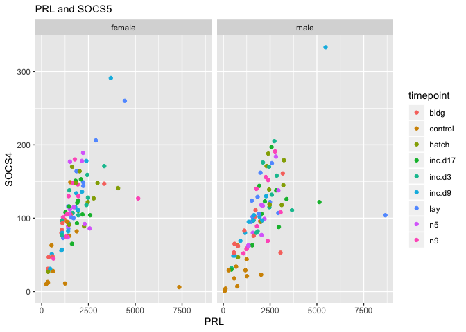
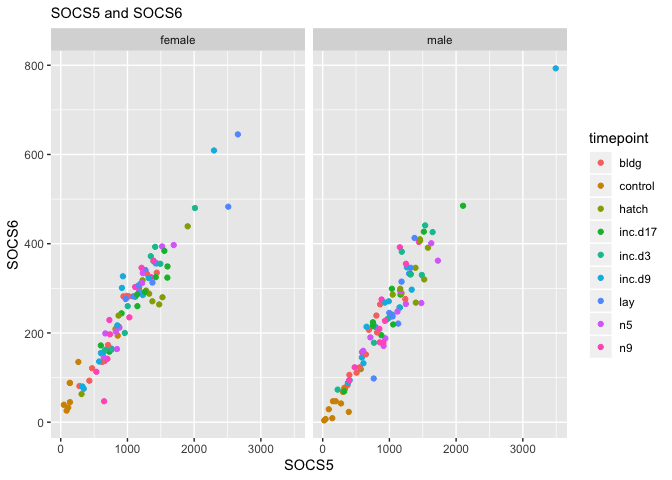

selecting candidate genes counts from the hypothalamus
======================================================

    # import "colData" which contains sample information and "countData" which contains read counts
    c.colData <- read.csv("../metadata/00_colData_characterization.csv", header = T, row.names = 1)
    c.countData <- read.csv("../results/00_countData_characterization.csv", header = T, row.names = 1)
    geneinfo <- read_csv("../metadata/00_geneinfo.csv") %>% select(Name, entrezid)

    ## Warning: Missing column names filled in: 'X1' [1]

    ## Parsed with column specification:
    ## cols(
    ##   X1 = col_character(),
    ##   row.names = col_double(),
    ##   Name = col_character(),
    ##   geneid = col_double(),
    ##   entrezid = col_character()
    ## )

    # select only hypothalamus samples
    hypsamples <- c.colData %>% 
      filter(tissue == "hypothalamus") %>%
      select(-study) %>%
      droplevels()
    colnames(hypsamples)[colnames(hypsamples)=="treatment"] <- "timepoint"

    countstokeep <- as.character(hypsamples$V1)
    hypcounts <- c.countData %>% 
      mutate(entrezid = row.names(c.countData)) %>% 
      select(entrezid, countstokeep)

    hypcounts <- left_join(geneinfo,hypcounts)

    ## Joining, by = "entrezid"

    # select genes to keep 
    # CISH, SOCS1, SOCS2, SOCS2, SOCS4, SOCS5, SOCS6
    # PRL PRLR BRAC1

    candidates <- c("CISH", "SOCS1", "SOCS2", "SOCS2", "SOCS4", "SOCS5", "SOCS6", "PRL", "PRLR")
    hypcounts <- hypcounts %>% filter(Name %in% candidates)

    # transform and combine into 1 dataframe
    hypcounts <- as.data.frame(hypcounts)

    row.names(hypcounts) <- hypcounts$Name
    hypcounts$Name <- NULL
    hypcounts$entrezid <- NULL
    hypcandidatecounts <- as.data.frame(t(hypcounts))
    hypcandidatecounts$V1 <- row.names(hypcandidatecounts)
    hypcandidatecounts <- left_join(hypsamples, hypcandidatecounts)

    ## Joining, by = "V1"

    ## Warning: Column `V1` joining factor and character vector, coercing into
    ## character vector

    head(hypcandidatecounts)

    ##                                        V1    bird    sex       tissue
    ## 1  L.Blu13_male_hypothalamus_control.NYNO L.Blu13   male hypothalamus
    ## 2        L.G107_male_hypothalamus_control  L.G107   male hypothalamus
    ## 3 L.G118_female_hypothalamus_control.NYNO  L.G118 female hypothalamus
    ## 4          L.R3_male_hypothalamus_control    L.R3   male hypothalamus
    ## 5          L.R8_male_hypothalamus_control    L.R8   male hypothalamus
    ## 6    L.W33_male_hypothalamus_control.NYNO   L.W33   male hypothalamus
    ##   timepoint                       group SOCS6 SOCS5 SOCS1 SOCS4 SOCS2 CISH
    ## 1   control   male.hypothalamus.control    29    92     1     7     6   26
    ## 2   control   male.hypothalamus.control    47   196     6    18    16   88
    ## 3   control female.hypothalamus.control    45   138     1    11    10    0
    ## 4   control   male.hypothalamus.control    75   333     5    34    17   92
    ## 5   control   male.hypothalamus.control     4    23     1     4     3    7
    ## 6   control   male.hypothalamus.control    77   325     1    23    22   79
    ##    PRL PRLR
    ## 1  744   35
    ## 2  578   82
    ## 3 1255   43
    ## 4  682   42
    ## 5  116   13
    ## 6 2021   91

    # set rownames
    row.names(hypcandidatecounts) <- hypcandidatecounts$V1
    hypcandidatecounts$V1 <- NULL

    # preview and write
    head(hypcandidatecounts)

    ##                                            bird    sex       tissue
    ## L.Blu13_male_hypothalamus_control.NYNO  L.Blu13   male hypothalamus
    ## L.G107_male_hypothalamus_control         L.G107   male hypothalamus
    ## L.G118_female_hypothalamus_control.NYNO  L.G118 female hypothalamus
    ## L.R3_male_hypothalamus_control             L.R3   male hypothalamus
    ## L.R8_male_hypothalamus_control             L.R8   male hypothalamus
    ## L.W33_male_hypothalamus_control.NYNO      L.W33   male hypothalamus
    ##                                         timepoint
    ## L.Blu13_male_hypothalamus_control.NYNO    control
    ## L.G107_male_hypothalamus_control          control
    ## L.G118_female_hypothalamus_control.NYNO   control
    ## L.R3_male_hypothalamus_control            control
    ## L.R8_male_hypothalamus_control            control
    ## L.W33_male_hypothalamus_control.NYNO      control
    ##                                                               group SOCS6
    ## L.Blu13_male_hypothalamus_control.NYNO    male.hypothalamus.control    29
    ## L.G107_male_hypothalamus_control          male.hypothalamus.control    47
    ## L.G118_female_hypothalamus_control.NYNO female.hypothalamus.control    45
    ## L.R3_male_hypothalamus_control            male.hypothalamus.control    75
    ## L.R8_male_hypothalamus_control            male.hypothalamus.control     4
    ## L.W33_male_hypothalamus_control.NYNO      male.hypothalamus.control    77
    ##                                         SOCS5 SOCS1 SOCS4 SOCS2 CISH  PRL
    ## L.Blu13_male_hypothalamus_control.NYNO     92     1     7     6   26  744
    ## L.G107_male_hypothalamus_control          196     6    18    16   88  578
    ## L.G118_female_hypothalamus_control.NYNO   138     1    11    10    0 1255
    ## L.R3_male_hypothalamus_control            333     5    34    17   92  682
    ## L.R8_male_hypothalamus_control             23     1     4     3    7  116
    ## L.W33_male_hypothalamus_control.NYNO      325     1    23    22   79 2021
    ##                                         PRLR
    ## L.Blu13_male_hypothalamus_control.NYNO    35
    ## L.G107_male_hypothalamus_control          82
    ## L.G118_female_hypothalamus_control.NYNO   43
    ## L.R3_male_hypothalamus_control            42
    ## L.R8_male_hypothalamus_control            13
    ## L.W33_male_hypothalamus_control.NYNO      91

    write.csv(hypcandidatecounts, "../results/10_hypcandidatecounts.csv")

    # correlation matrix
    forcorr <- hypcandidatecounts %>% 
      mutate(gene = row.names(hypcandidatecounts)) %>%  select(candidates)
    M <- cor(forcorr)
    M <- as.data.frame(M)
    M$rownames <- row.names(M)
    # M <- M %>% filter(totalentr > 0.7 | totalentr < -0.7)
    row.names(M) <- M$rownames
    greatthan05 <- M$rownames
    M <- M %>% select(greatthan05)
    M <- as.matrix(M)
    corrplot.mixed(M, order = "hclust")

    ggplot(hypcandidatecounts, aes(x = PRL, y = SOCS4, color = timepoint)) + 
      geom_point() + labs(subtitle = "PRL and SOCS5") + facet_wrap(~sex)

    ggplot(hypcandidatecounts, aes(x = SOCS5, y = SOCS6, color = timepoint)) + 
      geom_point() + labs(subtitle = "SOCS5 and SOCS6") + facet_wrap(~sex)

