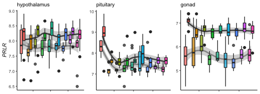
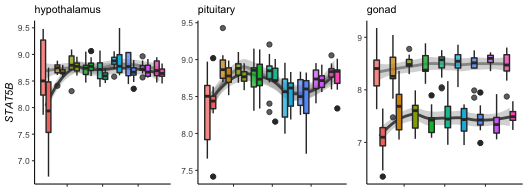
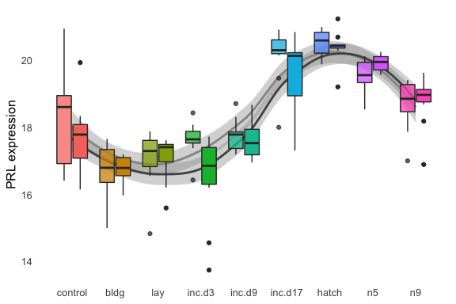
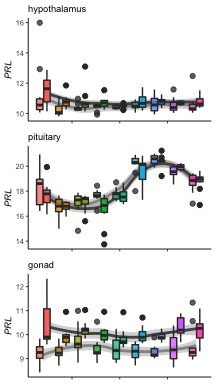

analyses downstream of calculating tissue specific variance in gene expression
==============================================================================

    vsd.hyp <- readvsd("../results/04_vsd_hyp.csv")

    ## Warning: Missing column names filled in: 'X1' [1]

    ## Parsed with column specification:
    ## cols(
    ##   .default = col_double(),
    ##   X1 = col_character()
    ## )

    ## See spec(...) for full column specifications.

    colData.hyp <- readcolData("../results/04_colData_hyp.csv")

    ## Parsed with column specification:
    ## cols(
    ##   V1 = col_character(),
    ##   sex = col_character(),
    ##   treatment = col_character(),
    ##   sextissue = col_character(),
    ##   hypothesis = col_character()
    ## )

    vsd.pit <- readvsd("../results/04_vsd_pit.csv")

    ## Warning: Missing column names filled in: 'X1' [1]

    ## Parsed with column specification:
    ## cols(
    ##   .default = col_double(),
    ##   X1 = col_character()
    ## )
    ## See spec(...) for full column specifications.

    colData.pit <- readcolData("../results/04_colData_pit.csv")

    ## Parsed with column specification:
    ## cols(
    ##   V1 = col_character(),
    ##   sex = col_character(),
    ##   treatment = col_character(),
    ##   sextissue = col_character(),
    ##   hypothesis = col_character()
    ## )

    vsd.gon <- readvsd("../results/04_vsd_gon.csv")

    ## Warning: Missing column names filled in: 'X1' [1]

    ## Parsed with column specification:
    ## cols(
    ##   .default = col_double(),
    ##   X1 = col_character()
    ## )
    ## See spec(...) for full column specifications.

    colData.gon <- readcolData("../results/04_colData_gon.csv")

    ## Parsed with column specification:
    ## cols(
    ##   V1 = col_character(),
    ##   sex = col_character(),
    ##   treatment = col_character(),
    ##   sextissue = col_character(),
    ##   hypothesis = col_character()
    ## )

selecting candidate genes counts from the hypothalamus
======================================================

    geneinfo <- read_csv("../metadata/00_geneinfo.csv") %>%  dplyr::select(Name, geneid, entrezid) %>% arrange(Name)

    ## Warning: Missing column names filled in: 'X1' [1]

    ## Parsed with column specification:
    ## cols(
    ##   X1 = col_character(),
    ##   row.names = col_double(),
    ##   Name = col_character(),
    ##   geneid = col_double(),
    ##   entrezid = col_character()
    ## )

    head(geneinfo)

    ## # A tibble: 6 x 3
    ##   Name      geneid entrezid      
    ##   <chr>      <dbl> <chr>         
    ## 1 A2ML1     418254 XP_015148230.1
    ## 2 A2ML2     427942 XP_004938161.2
    ## 3 A2ML3  100857394 XP_015148584.1
    ## 4 A2ML4  100858010 XP_015154891.1
    ## 5 A4GALT    418223 XP_015145932.1
    ## 6 A4GNT     429136 XP_426692.3

    candidategenes <- c("CISH", "SOCS1", "SOCS2", "SOCS2", "SOCS4", "SOCS5", "SOCS6", 
                        "PRL", "PRLR", "STAT5B", "JAK1")

    candidates.hyp <- selectcandidatevsds(candidategenes, vsd.hyp, colData.hyp)

    ##  [1] "CISH"   "SOCS1"  "SOCS2"  "SOCS2"  "SOCS4"  "SOCS5"  "SOCS6" 
    ##  [8] "PRL"    "PRLR"   "STAT5B" "JAK1"  
    ##  [1] "NP_989957.1"    "XP_015146451.1" "NP_990797.2"    "XP_015132722.1"
    ##  [5] "NP_001131120.1" "NP_989871.1"    "NP_001186037.1" "NP_001120786.1"
    ##  [9] "NP_001120784.1" "XP_015155078.1"

    ## Joining, by = "entrezid"

    ## Joining, by = "sample"

    candidates.pit <- selectcandidatevsds(candidategenes, vsd.pit, colData.pit)

    ##  [1] "CISH"   "SOCS1"  "SOCS2"  "SOCS2"  "SOCS4"  "SOCS5"  "SOCS6" 
    ##  [8] "PRL"    "PRLR"   "STAT5B" "JAK1"  
    ##  [1] "NP_989957.1"    "XP_015146451.1" "NP_990797.2"    "XP_015132722.1"
    ##  [5] "NP_001131120.1" "NP_989871.1"    "NP_001186037.1" "NP_001120786.1"
    ##  [9] "NP_001120784.1" "XP_015155078.1"

    ## Joining, by = "entrezid"
    ## Joining, by = "sample"

    candidates.gon <- selectcandidatevsds(candidategenes, vsd.gon, colData.gon)

    ##  [1] "CISH"   "SOCS1"  "SOCS2"  "SOCS2"  "SOCS4"  "SOCS5"  "SOCS6" 
    ##  [8] "PRL"    "PRLR"   "STAT5B" "JAK1"  
    ##  [1] "NP_989957.1"    "XP_015146451.1" "NP_990797.2"    "XP_015132722.1"
    ##  [5] "NP_001131120.1" "NP_989871.1"    "NP_001186037.1" "NP_001120786.1"
    ##  [9] "NP_001120784.1" "XP_015155078.1"

    ## Joining, by = "entrezid"
    ## Joining, by = "sample"

    plotcanddateexpression <- function(candidateexpression,  mysubtitle, whichgene, myylab){
      
      ggplot(candidateexpression, aes(x = as.numeric(treatment), y = whichgene)) + 
            geom_smooth(aes(colour = sex)) +
        geom_boxplot(aes(fill = treatment, alpha = sex)) + 
        scale_alpha_manual(values = c(0.75,1)) +
         theme_B3() +
        theme(legend.position = "none") +
        theme(axis.title.y=element_text(face="italic"),
              axis.title.x = element_blank(),
              axis.text.x = element_blank()) +
        scale_color_manual(values = c("female" = "#969696", "male" = "#525252")) +
        labs(subtitle = mysubtitle, y = myylab)
      
    }

    a <- plotcanddateexpression(candidates.hyp,  "hypothalamus", candidates.hyp$PRL, "PRL")
    b <- plotcanddateexpression(candidates.pit, "pituitary", candidates.pit$PRL, "PRL")
    c <- plotcanddateexpression(candidates.gon,  "gonad", candidates.gon$PRL, "PRL")

    plot_grid(a, b + labs(y = NULL), c + labs(y = NULL), nrow = 1)

    ## `geom_smooth()` using method = 'loess' and formula 'y ~ x'

    ## `geom_smooth()` using method = 'loess' and formula 'y ~ x'
    ## `geom_smooth()` using method = 'loess' and formula 'y ~ x'

    e <- plotcanddateexpression(candidates.hyp, "hypothalamus", candidates.hyp$PRLR, "PRLR")
    f <- plotcanddateexpression(candidates.pit, "pituitary", candidates.pit$PRLR, "PRLR")
    g <- plotcanddateexpression(candidates.gon, "gonad", candidates.gon$PRLR, "PRLR")

    plot_grid(e, f + labs(y = NULL), g + labs(y = NULL), nrow = 1)

    ## `geom_smooth()` using method = 'loess' and formula 'y ~ x'
    ## `geom_smooth()` using method = 'loess' and formula 'y ~ x'
    ## `geom_smooth()` using method = 'loess' and formula 'y ~ x'

    h <- plotcanddateexpression(candidates.hyp, "hypothalamus", candidates.hyp$STAT5B, "STAT5B")
    i <- plotcanddateexpression(candidates.pit, "pituitary", candidates.pit$STAT5B, "STAT5B")
    j <- plotcanddateexpression(candidates.gon, "gonad", candidates.gon$STAT5B, "STAT5B")

    plot_grid(h, i + labs(y = NULL), j + labs(y = NULL), nrow = 1)

    ## `geom_smooth()` using method = 'loess' and formula 'y ~ x'
    ## `geom_smooth()` using method = 'loess' and formula 'y ~ x'
    ## `geom_smooth()` using method = 'loess' and formula 'y ~ x'

    ggplot(candidates.pit, aes(x = as.numeric(treatment), y = PRL)) + 
            geom_smooth(aes(colour = sex)) +
        geom_boxplot(aes(fill = treatment, alpha = sex)) + 
        scale_alpha_manual(values = c(0.75,1)) +
        mytheme() +
        theme(legend.position = "none") +
        scale_color_manual(values = c("female" = "#969696", "male" = "#525252")) +
        labs(y = "PRL expression", x = NULL) +
        scale_x_continuous(breaks = c(1, 2, 3, 4, 5, 6, 7, 8, 9),
                           labels = c( "control", "bldg", "lay", "inc.d3", 
                                       "inc.d9", "inc.d17", "hatch", "n5", "n9"))

    ## `geom_smooth()` using method = 'loess' and formula 'y ~ x'

    plot_grid(a,b,c, nrow = 3)

    ## `geom_smooth()` using method = 'loess' and formula 'y ~ x'
    ## `geom_smooth()` using method = 'loess' and formula 'y ~ x'
    ## `geom_smooth()` using method = 'loess' and formula 'y ~ x'

    head(candidates.pit)

    ##      sex treatment        sextissue   hypothesis
    ## 1   male   control   male_pituitary anticipation
    ## 2   male   control   male_pituitary anticipation
    ## 3 female   control female_pituitary anticipation
    ## 4   male   control   male_pituitary anticipation
    ## 5   male   control   male_pituitary anticipation
    ## 6   male   control   male_pituitary anticipation
    ##                                 sample    SOCS6    SOCS5    SOCS1    SOCS4
    ## 1  L.Blu13_male_pituitary_control.NYNO 7.947664 8.946013 6.184901 7.231540
    ## 2        L.G107_male_pituitary_control 7.543582 9.051427 6.457572 7.070877
    ## 3 L.G118_female_pituitary_control.NYNO 7.284814 8.851242 6.633381 7.194098
    ## 4     L.R3_male_pituitary_control.NYNO 7.455728 8.819775 6.702443 7.201298
    ## 5          L.R8_male_pituitary_control 7.499160 9.084106 6.554400 6.929024
    ## 6         L.W33_male_pituitary_control 7.663548 8.914462 6.385755 7.042041
    ##      SOCS2     CISH      PRL     PRLR     JAK1   STAT5B
    ## 1 8.586158 8.990659 16.75792 8.946013 10.61919 8.586158
    ## 2 8.167580 9.340588 17.87347 8.802705 10.49447 8.500254
    ## 3 7.825580 9.571050 17.91121 8.626330 10.53647 8.555758
    ## 4 8.043921 9.698286 16.51080 8.863145 10.58596 8.406437
    ## 5 8.154790 9.359305 17.30663 9.239197 10.40536 8.411060
    ## 6 7.855338 8.203877 19.93211 8.356602 10.45873 8.334751

    PRLpit <- candidates.pit %>%
      select(sample,sex,treatment,PRL)
    head(PRLpit)

    ##                                 sample    sex treatment      PRL
    ## 1  L.Blu13_male_pituitary_control.NYNO   male   control 16.75792
    ## 2        L.G107_male_pituitary_control   male   control 17.87347
    ## 3 L.G118_female_pituitary_control.NYNO female   control 17.91121
    ## 4     L.R3_male_pituitary_control.NYNO   male   control 16.51080
    ## 5          L.R8_male_pituitary_control   male   control 17.30663
    ## 6         L.W33_male_pituitary_control   male   control 19.93211

    write.csv(PRLpit, "../results/10_PRLpit.csv", row.names = F)
