analyses downstream of calculating tissue specific variance in gene expression
==============================================================================

    vsd.hyp <- readvsd("../results/04_vsd_hyp.csv")

    ## Warning: Missing column names filled in: 'X1' [1]

    ## Parsed with column specification:
    ## cols(
    ##   .default = col_double(),
    ##   X1 = col_character()
    ## )

    ## See spec(...) for full column specifications.

    colData.hyp <- readcolData("../results/04_colData_hyp.csv")

    ## Parsed with column specification:
    ## cols(
    ##   V1 = col_character(),
    ##   sex = col_character(),
    ##   treatment = col_character(),
    ##   sextissue = col_character(),
    ##   hypothesis = col_character()
    ## )

    vsd.pit <- readvsd("../results/04_vsd_pit.csv")

    ## Warning: Missing column names filled in: 'X1' [1]

    ## Parsed with column specification:
    ## cols(
    ##   .default = col_double(),
    ##   X1 = col_character()
    ## )
    ## See spec(...) for full column specifications.

    colData.pit <- readcolData("../results/04_colData_pit.csv")

    ## Parsed with column specification:
    ## cols(
    ##   V1 = col_character(),
    ##   sex = col_character(),
    ##   treatment = col_character(),
    ##   sextissue = col_character(),
    ##   hypothesis = col_character()
    ## )

    vsd.gon <- readvsd("../results/04_vsd_gon.csv")

    ## Warning: Missing column names filled in: 'X1' [1]

    ## Parsed with column specification:
    ## cols(
    ##   .default = col_double(),
    ##   X1 = col_character()
    ## )
    ## See spec(...) for full column specifications.

    colData.gon <- readcolData("../results/04_colData_gon.csv")

    ## Parsed with column specification:
    ## cols(
    ##   V1 = col_character(),
    ##   sex = col_character(),
    ##   treatment = col_character(),
    ##   sextissue = col_character(),
    ##   hypothesis = col_character()
    ## )

    colData.hyp <- colData.hyp %>% 
      mutate(tissue = sapply(strsplit(sample,'\\_'), "[", 3)) %>%
      mutate(bird = sapply(strsplit(sample,'\\_'), "[", 1)) %>%
      select(sample, bird, sex, tissue, treatment)

    colData.pit <- colData.pit %>%  
      mutate(tissue = sapply(strsplit(sample,'\\_'), "[", 3)) %>%
      mutate(bird = sapply(strsplit(sample,'\\_'), "[", 1)) %>%
      select(sample, bird, sex, tissue, treatment)

    colData.gon <- colData.gon %>%  
      mutate(tissue = sapply(strsplit(sample,'\\_'), "[", 3)) %>%
      mutate(bird = sapply(strsplit(sample,'\\_'), "[", 1)) %>%
      select(sample, bird, sex, tissue, treatment)

selecting candidate genes counts from the hypothalamus
======================================================

    geneinfo <- read_csv("../metadata/00_geneinfo.csv") %>%  dplyr::select(Name, geneid, entrezid) %>% arrange(Name)

    ## Warning: Missing column names filled in: 'X1' [1]

    ## Parsed with column specification:
    ## cols(
    ##   X1 = col_character(),
    ##   row.names = col_double(),
    ##   Name = col_character(),
    ##   geneid = col_double(),
    ##   entrezid = col_character()
    ## )

    head(geneinfo)

    ## # A tibble: 6 x 3
    ##   Name      geneid entrezid      
    ##   <chr>      <dbl> <chr>         
    ## 1 A2ML1     418254 XP_015148230.1
    ## 2 A2ML2     427942 XP_004938161.2
    ## 3 A2ML3  100857394 XP_015148584.1
    ## 4 A2ML4  100858010 XP_015154891.1
    ## 5 A4GALT    418223 XP_015145932.1
    ## 6 A4GNT     429136 XP_426692.3

    candidategenes <- c("PRL","PRLR", "GNRHR")

    candidates.hyp <- selectcandidatevsds(candidategenes, vsd.hyp, colData.hyp)

    ## [1] "PRL"   "PRLR"  "GNRHR"
    ## [1] "NP_001012627.1" "NP_990797.2"    "XP_015132722.1"

    ## Joining, by = "entrezid"

    ## Joining, by = "sample"

    candidates.pit <- selectcandidatevsds(candidategenes, vsd.pit, colData.pit)

    ## [1] "PRL"   "PRLR"  "GNRHR"
    ## [1] "NP_001012627.1" "NP_990797.2"    "XP_015132722.1"

    ## Joining, by = "entrezid"
    ## Joining, by = "sample"

    candidates.gon <- selectcandidatevsds(candidategenes, vsd.gon, colData.gon)

    ## [1] "PRL"   "PRLR"  "GNRHR"
    ## [1] "NP_001012627.1" "NP_990797.2"    "XP_015132722.1"

    ## Joining, by = "entrezid"
    ## Joining, by = "sample"

    plotcanddateexpression <- function(candidateexpression,  mysubtitle, whichgene, myylab){
      
      ggplot(candidateexpression, aes(x = as.numeric(treatment), y = whichgene)) + 
            geom_smooth(aes(colour = sex)) +
        geom_boxplot(aes(fill = treatment, alpha = sex, color = sex)) + 
        scale_alpha_manual(values = c(0.75,1)) +
         theme_B3() +
        theme(legend.position = "none") +
        theme(axis.title.y=element_text(face="italic"),
              axis.title.x = element_blank(),
              axis.text.x = element_blank()) +
        scale_color_manual(values = c("female" = "#969696", "male" = "#525252")) +
        labs(subtitle = mysubtitle, y = myylab)
      
    }

    a <- plotcanddateexpression(candidates.hyp,  "hypothalamus", candidates.hyp$PRL, "PRL")
    b <- plotcanddateexpression(candidates.pit, "pituitary", candidates.pit$PRL, "PRL")
    c <- plotcanddateexpression(candidates.gon,  "gonad", candidates.gon$PRL, "PRL")

    d <- plotcanddateexpression(candidates.hyp, "hypothalamus", candidates.hyp$PRLR, "PRLR")
    e <- plotcanddateexpression(candidates.pit, "pituitary", candidates.pit$PRLR, "PRLR")
    f <- plotcanddateexpression(candidates.gon, "gonad", candidates.gon$PRLR, "PRLR")

    g <- plotcanddateexpression(candidates.hyp, "hypothalamus", candidates.hyp$GNRHR, "GNRHR")
    h <- plotcanddateexpression(candidates.pit, "pituitary", candidates.pit$GNRHR, "GNRHR")
    i <- plotcanddateexpression(candidates.gon, "gonad", candidates.gon$GNRHR, "GNRHR")

    abc <- plot_grid(a, d, g, nrow = 1)

    ## `geom_smooth()` using method = 'loess' and formula 'y ~ x'

    ## `geom_smooth()` using method = 'loess' and formula 'y ~ x'
    ## `geom_smooth()` using method = 'loess' and formula 'y ~ x'

    def <- plot_grid(b, e, h, nrow = 1)

    ## `geom_smooth()` using method = 'loess' and formula 'y ~ x'
    ## `geom_smooth()` using method = 'loess' and formula 'y ~ x'
    ## `geom_smooth()` using method = 'loess' and formula 'y ~ x'

    ghi <- plot_grid(c, f, i, nrow = 1)

    ## `geom_smooth()` using method = 'loess' and formula 'y ~ x'
    ## `geom_smooth()` using method = 'loess' and formula 'y ~ x'
    ## `geom_smooth()` using method = 'loess' and formula 'y ~ x'

    plot_grid(abc, def,ghi,nrow = 3)

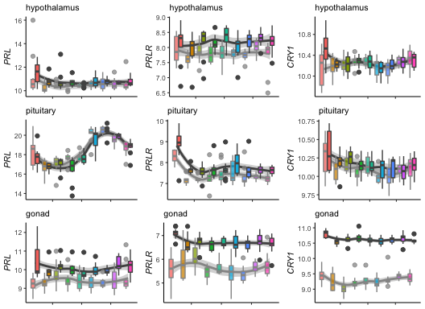

    PRLpit <- candidates.pit %>%
      select(bird, sex,treatment,tissue, PRL)
    head(PRLpit)

    ##      bird    sex treatment    tissue      PRL
    ## 1 L.Blu13   male   control pituitary 16.75792
    ## 2  L.G107   male   control pituitary 17.87347
    ## 3  L.G118 female   control pituitary 17.91121
    ## 4    L.R3   male   control pituitary 16.51080
    ## 5    L.R8   male   control pituitary 17.30663
    ## 6   L.W33   male   control pituitary 19.93211

    write.csv(PRLpit, "../results/10_PRLpit.csv", row.names = F)

    pitcandidates <- c("ATP6AP2", "CRY1", "TMF1",
                       "EIF2AK3", "PRL", "SOCS2", "STAT5B", "XBP1",
                       "APP", "HDAC4", "NCOA1")
    goncandidates <- c("AVPR2", "BMP6", "CRHR2", "DRD5", "TAC1",
                       "SOCS2", "ZBTB7B",
                       "DRD5", "NCOA2", "BRINP1", "NR3C1")

    candidates.pit <- selectcandidatevsds(pitcandidates, vsd.pit, colData.pit) %>% select(-sample) %>% filter(treatment %in% c("inc.d9", "inc.d17"))

    ##  [1] "ATP6AP2" "CRY1"    "TMF1"    "EIF2AK3" "PRL"     "SOCS2"   "STAT5B" 
    ##  [8] "XBP1"    "APP"     "HDAC4"   "NCOA1"  
    ##  [1] "XP_015154580.1" "NP_001025972.2" "NP_989576.1"    "XP_420868.2"   
    ##  [5] "XP_015144578.1" "XP_015140591.1" "NP_990797.2"    "NP_989871.1"   
    ##  [9] "XP_015155078.1" "XP_423749.2"    "NP_001006192.2"

    ## Joining, by = "entrezid"

    ## Joining, by = "sample"

    candidates.gon <- selectcandidatevsds(goncandidates, vsd.gon, colData.gon) %>% select(-sample) %>% filter(treatment %in% c("inc.d9", "inc.d17"))

    ##  [1] "AVPR2"  "BMP6"   "CRHR2"  "DRD5"   "TAC1"   "SOCS2"  "ZBTB7B"
    ##  [8] "DRD5"   "NCOA2"  "BRINP1" "NR3C1" 
    ##  [1] "NP_001026650.1" "XP_015131483.1" "NP_989780.1"    "NP_989785.1"   
    ##  [5] "XP_015141299.1" "XP_015138381.1" "XP_015149519.1" "NP_989871.1"   
    ##  [9] "XP_004939375.1" "XP_015153981.1"

    ## Joining, by = "entrezid"
    ## Joining, by = "sample"

    candidates.pit <- candidates.pit %>% rename_at(vars(-bird,-sex, -tissue, -treatment), function(x) paste0("pit_", x)) %>% select(-tissue)
    candidates.gon <- candidates.gon %>% rename_at(vars(-bird,-sex, -tissue, -treatment), function(x) paste0("gon_", x)) %>% select(-tissue)

    counts <- full_join(candidates.pit, candidates.gon) %>% drop_na() %>% select(-bird, -sex, -treatment)

    ## Joining, by = c("bird", "sex", "treatment")

    cols <- full_join(candidates.pit, candidates.gon) %>% drop_na() %>% select(bird, sex, treatment)

    ## Joining, by = c("bird", "sex", "treatment")

    dim(counts)

    ## [1] 46 21

    dim(cols)

    ## [1] 46  3

    x <- correlate(counts)

    ## 
    ## Correlation method: 'pearson'
    ## Missing treated using: 'pairwise.complete.obs'

    fashion(x)

    ##        rowname pit_XBP1 pit_ATP6AP2 pit_CRY1 pit_SOCS2 pit_PRL pit_NCOA1
    ## 1     pit_XBP1                  .62     -.28      -.33     .69      -.34
    ## 2  pit_ATP6AP2      .62                 -.35      -.29     .74      -.72
    ## 3     pit_CRY1     -.28        -.35                .31    -.41       .12
    ## 4    pit_SOCS2     -.33        -.29      .31              -.36       .37
    ## 5      pit_PRL      .69         .74     -.41      -.36              -.62
    ## 6    pit_NCOA1     -.34        -.72      .12       .37    -.62          
    ## 7    pit_HDAC4     -.18        -.64      .09       .18    -.57       .74
    ## 8      pit_APP      .71         .63     -.34      -.32     .77      -.44
    ## 9   pit_STAT5B     -.41        -.69      .02       .23    -.65       .78
    ## 10 pit_EIF2AK3      .67         .68     -.35      -.35     .71      -.51
    ## 11    pit_TMF1      .45         .64     -.19      -.10     .63      -.56
    ## 12   gon_AVPR2     -.19         .02      .13       .03     .09      -.04
    ## 13  gon_BRINP1      .47         .30     -.29      -.21     .29      -.15
    ## 14   gon_CRHR2     -.11         .16     -.11      -.03     .16      -.14
    ## 15   gon_SOCS2     -.43        -.20      .26       .29    -.17       .12
    ## 16    gon_TAC1      .20         .20     -.11      -.21     .28      -.19
    ## 17    gon_BMP6      .45         .25     -.29      -.25     .22      -.11
    ## 18   gon_NCOA2      .34         .08     -.11      -.13    -.00      -.06
    ## 19    gon_DRD5      .34         .24     -.36      -.30     .54      -.02
    ## 20   gon_NR3C1     -.11        -.49      .01       .08    -.38       .40
    ## 21  gon_ZBTB7B      .11        -.01     -.09      -.05    -.14       .05
    ##    pit_HDAC4 pit_APP pit_STAT5B pit_EIF2AK3 pit_TMF1 gon_AVPR2 gon_BRINP1
    ## 1       -.18     .71       -.41         .67      .45      -.19        .47
    ## 2       -.64     .63       -.69         .68      .64       .02        .30
    ## 3        .09    -.34        .02        -.35     -.19       .13       -.29
    ## 4        .18    -.32        .23        -.35     -.10       .03       -.21
    ## 5       -.57     .77       -.65         .71      .63       .09        .29
    ## 6        .74    -.44        .78        -.51     -.56      -.04       -.15
    ## 7               -.32        .84        -.41     -.61      -.44        .23
    ## 8       -.32               -.44         .61      .48      -.10        .34
    ## 9        .84    -.44                   -.58     -.70      -.26       -.03
    ## 10      -.41     .61       -.58                  .59      -.03        .41
    ## 11      -.61     .48       -.70         .59                .13        .07
    ## 12      -.44    -.10       -.26        -.03      .13                 -.75
    ## 13       .23     .34       -.03         .41      .07      -.75           
    ## 14      -.43    -.05       -.21         .09      .07       .51       -.31
    ## 15      -.37    -.31       -.08        -.30      .04       .79       -.90
    ## 16      -.11     .27       -.23         .30      .27      -.02        .25
    ## 17       .29     .33       -.02         .34      .06      -.73        .88
    ## 18       .38     .21        .08         .11     -.04      -.81        .74
    ## 19      -.03     .38       -.03         .48      .12      -.04        .42
    ## 20       .50    -.28        .48        -.36     -.37      -.34        .06
    ## 21       .38     .05        .15         .01     -.07      -.68        .47
    ##    gon_CRHR2 gon_SOCS2 gon_TAC1 gon_BMP6 gon_NCOA2 gon_DRD5 gon_NR3C1
    ## 1       -.11      -.43      .20      .45       .34      .34      -.11
    ## 2        .16      -.20      .20      .25       .08      .24      -.49
    ## 3       -.11       .26     -.11     -.29      -.11     -.36       .01
    ## 4       -.03       .29     -.21     -.25      -.13     -.30       .08
    ## 5        .16      -.17      .28      .22      -.00      .54      -.38
    ## 6       -.14       .12     -.19     -.11      -.06     -.02       .40
    ## 7       -.43      -.37     -.11      .29       .38     -.03       .50
    ## 8       -.05      -.31      .27      .33       .21      .38      -.28
    ## 9       -.21      -.08     -.23     -.02       .08     -.03       .48
    ## 10       .09      -.30      .30      .34       .11      .48      -.36
    ## 11       .07       .04      .27      .06      -.04      .12      -.37
    ## 12       .51       .79     -.02     -.73      -.81     -.04      -.34
    ## 13      -.31      -.90      .25      .88       .74      .42       .06
    ## 14                 .48     -.06     -.47      -.67      .17      -.39
    ## 15       .48               -.23     -.94      -.83     -.30      -.15
    ## 16      -.06      -.23               .21       .10      .20      -.35
    ## 17      -.47      -.94      .21                .80      .31       .08
    ## 18      -.67      -.83      .10      .80               -.04       .43
    ## 19       .17      -.30      .20      .31      -.04               -.24
    ## 20      -.39      -.15     -.35      .08       .43     -.24          
    ## 21      -.64      -.64     -.09      .66       .78     -.16       .34
    ##    gon_ZBTB7B
    ## 1         .11
    ## 2        -.01
    ## 3        -.09
    ## 4        -.05
    ## 5        -.14
    ## 6         .05
    ## 7         .38
    ## 8         .05
    ## 9         .15
    ## 10        .01
    ## 11       -.07
    ## 12       -.68
    ## 13        .47
    ## 14       -.64
    ## 15       -.64
    ## 16       -.09
    ## 17        .66
    ## 18        .78
    ## 19       -.16
    ## 20        .34
    ## 21

    rplot(x)  + theme(axis.text.x = element_text(angle = 45, hjust = 1)) + 
      labs(subtitletitle = "inc.d9 to inc.d17")

    ## Don't know how to automatically pick scale for object of type noquote. Defaulting to continuous.

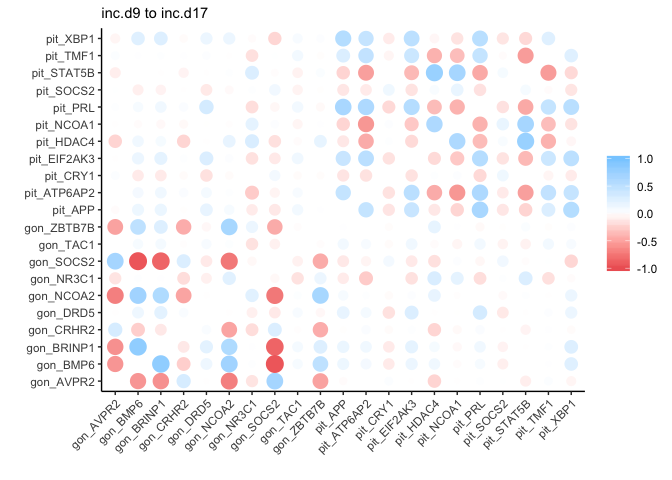

    x %>% network_plot.cor_df(min_cor = .5) + 
      labs(subtitletitle = "inc.d9 to inc.d17")

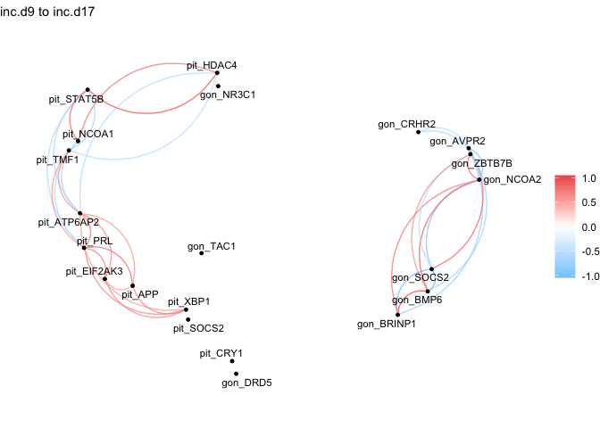

    cal_z_score <- function(x){
      (x - mean(x)) / sd(x)
    }
     

    tcounts <- t(counts)
    cols <- cols %>% select(-bird)

    data_subset_norm <- t(apply(tcounts, 1, cal_z_score))
    row.names(cols) <- colnames(data_subset_norm)

    pheatmap(data_subset_norm,  annotation_col = cols)

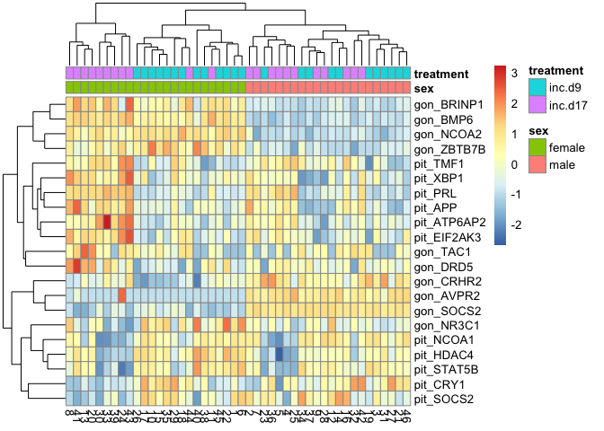

    corr <- x
    row.names(corr) <- corr$rowname 

    ## Warning: Setting row names on a tibble is deprecated.

    corr$rowname <- NULL
    ggcorrplot(corr, hc.order = TRUE, outline.col = "white", title = "inc.d9 to inc.d17")

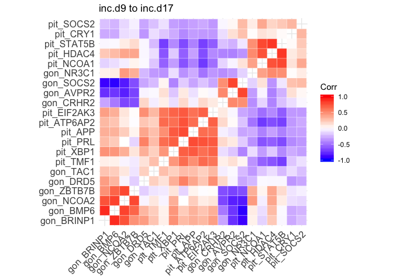

    pitcandidates <- c("BMP6", "CGA", "GAL", "XBP1")
    goncandidates <- c("CCND1", "NME1", "PRL", "APLP2", "CYP11A1", "CREBRF", "DBH")

    candidates.pit <- selectcandidatevsds(pitcandidates, vsd.pit, colData.pit) %>% select(-sample) %>% filter(treatment %in% c("bldg", "lay"))

    ## [1] "BMP6" "CGA"  "GAL"  "XBP1"
    ## [1] "XP_015131483.1" "NP_001264950.1" "NP_001138861.1" "NP_001006192.2"

    ## Joining, by = "entrezid"

    ## Joining, by = "sample"

    candidates.gon <- selectcandidatevsds(goncandidates, vsd.gon, colData.gon) %>% select(-sample) %>% filter(treatment %in% c("bldg", "lay"))

    ## [1] "CCND1"   "NME1"    "PRL"     "APLP2"   "CYP11A1" "CREBRF"  "DBH"    
    ## [1] "NP_001006317.2" "NP_990712.1"    "XP_001231574.1" "NP_001001756.1"
    ## [5] "XP_415429.5"    "NP_001191690.1" "NP_990797.2"

    ## Joining, by = "entrezid"
    ## Joining, by = "sample"

    candidates.pit <- candidates.pit %>% rename_at(vars(-bird,-sex, -tissue, -treatment), function(x) paste0("pit_", x)) %>% select(-tissue)
    candidates.gon <- candidates.gon %>% rename_at(vars(-bird,-sex, -tissue, -treatment), function(x) paste0("gon_", x)) %>% select(-tissue)

    counts <- full_join(candidates.pit, candidates.gon) %>% drop_na() %>% select(-bird, -sex, -treatment)

    ## Joining, by = c("bird", "sex", "treatment")

    cols <- full_join(candidates.pit, candidates.gon) %>% drop_na() %>% select(bird, sex, treatment)

    ## Joining, by = c("bird", "sex", "treatment")

    dim(counts)

    ## [1] 40 11

    dim(cols)

    ## [1] 40  3

    x <- correlate(counts)

    ## 
    ## Correlation method: 'pearson'
    ## Missing treated using: 'pairwise.complete.obs'

    fashion(x)

    ##        rowname pit_XBP1 pit_GAL pit_CGA pit_BMP6 gon_CYP11A1 gon_APLP2
    ## 1     pit_XBP1              .37     .66      .39         .20      -.23
    ## 2      pit_GAL      .37             .55      .46         .14      -.21
    ## 3      pit_CGA      .66     .55              .54         .22      -.44
    ## 4     pit_BMP6      .39     .46     .54                  .23      -.43
    ## 5  gon_CYP11A1      .20     .14     .22      .23                  -.23
    ## 6    gon_APLP2     -.23    -.21    -.44     -.43        -.23          
    ## 7     gon_NME1      .17     .27     .19      .47         .36      -.24
    ## 8    gon_CCND1     -.12     .11    -.10      .18         .67      -.06
    ## 9      gon_PRL     -.07    -.17    -.10     -.27        -.40       .18
    ## 10  gon_CREBRF     -.31    -.27    -.43     -.43        -.32       .64
    ## 11     gon_DBH      .22     .06     .14     -.16         .34      -.14
    ##    gon_NME1 gon_CCND1 gon_PRL gon_CREBRF gon_DBH
    ## 1       .17      -.12    -.07       -.31     .22
    ## 2       .27       .11    -.17       -.27     .06
    ## 3       .19      -.10    -.10       -.43     .14
    ## 4       .47       .18    -.27       -.43    -.16
    ## 5       .36       .67    -.40       -.32     .34
    ## 6      -.24      -.06     .18        .64    -.14
    ## 7                 .60    -.46       -.39     .01
    ## 8       .60              -.50       -.11     .18
    ## 9      -.46      -.50                .39     .06
    ## 10     -.39      -.11     .39                .09
    ## 11      .01       .18     .06        .09

    rplot(x)  + theme(axis.text.x = element_text(angle = 45, hjust = 1)) + 
      labs(subtitle = "bldg to lay")

    ## Don't know how to automatically pick scale for object of type noquote. Defaulting to continuous.

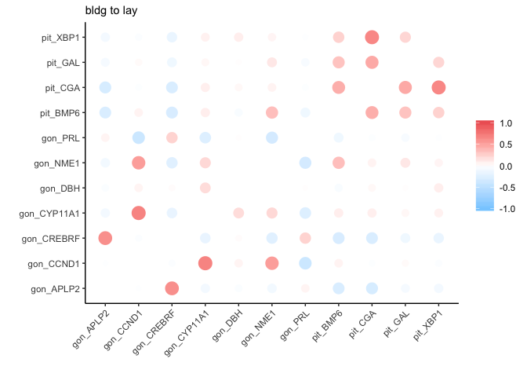

    x %>% network_plot.cor_df(min_cor = .5) + labs(subtitle = "bldg to lay")

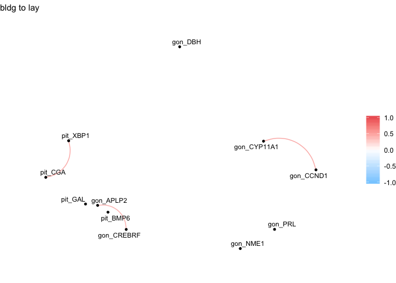

    corr <- x
    row.names(corr) <- corr$rowname 

    ## Warning: Setting row names on a tibble is deprecated.

    corr$rowname <- NULL
    ggcorrplot(corr, hc.order = TRUE, outline.col = "white", title = "bldg to lay")

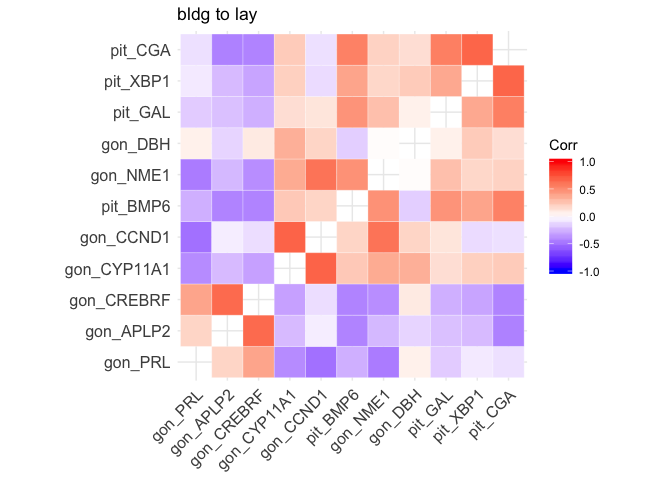

    pitcandidates <- c("PTEN", "CGA", "GAL", "XBP1")
    goncandidates <- c(
      "AVPR1A", "C1QTNF1", "CRY1", "CRY2", "F2R", "GJA1", "INHBA", "RHOA", "SMAD4",
      "ATP2B2", "ATP7B", "CAV1", "EIF2AK3", "ERBB4", "GJA1", "HIF1A", "MED1", "NME1", 
      "PRLR", "VEGFA", "XBP1",  "ZBTB7B", "APLP2", "NCOA1", "NCOA2", "THRB",
      "CREBRF", "GNAQ", "NR3C1")

    candidates.pit <- selectcandidatevsds(pitcandidates, vsd.pit, colData.pit) %>% select(-sample) %>% filter(treatment %in% c("inc.d3", "lay"))

    ## [1] "PTEN" "CGA"  "GAL"  "XBP1"
    ## [1] "NP_001264950.1" "NP_001138861.1" "XP_015134187.1" "NP_001006192.2"

    ## Joining, by = "entrezid"

    ## Joining, by = "sample"

    candidates.gon <- selectcandidatevsds(goncandidates, vsd.gon, colData.gon) %>% select(-sample) %>% filter(treatment %in% c("inc.d3", "lay"))

    ##  [1] "AVPR1A"  "C1QTNF1" "CRY1"    "CRY2"    "F2R"     "GJA1"    "INHBA"  
    ##  [8] "RHOA"    "SMAD4"   "ATP2B2"  "ATP7B"   "CAV1"    "EIF2AK3" "ERBB4"  
    ## [15] "GJA1"    "HIF1A"   "MED1"    "NME1"    "PRLR"    "VEGFA"   "XBP1"   
    ## [22] "ZBTB7B"  "APLP2"   "NCOA1"   "NCOA2"   "THRB"    "CREBRF"  "GNAQ"   
    ## [29] "NR3C1"  
    ##  [1] "NP_001006317.2" "XP_015148963.1" "XP_015131533.1" "NP_001103908.1"
    ##  [5] "XP_001231907.1" "NP_001099134.1" "XP_001231574.1" "NP_989576.1"   
    ##  [9] "NP_989575.1"    "XP_420868.2"    "XP_015144603.1" "XP_004937394.1"
    ## [13] "NP_989917.1"    "NP_001026598.1" "NP_989628.1"    "XP_015136806.1"
    ## [17] "XP_418125.3"    "XP_015140591.1" "XP_015138381.1" "NP_001191690.1"
    ## [21] "XP_015149519.1" "XP_015132722.1" "NP_990035.1"    "XP_015154049.1"
    ## [25] "NP_001239150.1" "NP_990373.1"    "NP_001006192.2" "XP_015153981.1"

    ## Joining, by = "entrezid"
    ## Joining, by = "sample"

    candidates.pit <- candidates.pit %>% rename_at(vars(-bird,-sex, -tissue, -treatment), function(x) paste0("pit_", x)) %>% select(-tissue)
    candidates.gon <- candidates.gon %>% rename_at(vars(-bird,-sex, -tissue, -treatment), function(x) paste0("gon_", x)) %>% select(-tissue)

    counts <- full_join(candidates.pit, candidates.gon) %>% drop_na() %>% select(-bird, -sex, -treatment)

    ## Joining, by = c("bird", "sex", "treatment")

    cols <- full_join(candidates.pit, candidates.gon) %>% drop_na() %>% select(bird, sex, treatment)

    ## Joining, by = c("bird", "sex", "treatment")

    dim(counts)

    ## [1] 40 32

    dim(cols)

    ## [1] 40  3

    x <- correlate(counts)

    ## 
    ## Correlation method: 'pearson'
    ## Missing treated using: 'pairwise.complete.obs'

    fashion(x)

    ##        rowname pit_XBP1 pit_GAL pit_CGA pit_PTEN gon_XBP1 gon_APLP2
    ## 1     pit_XBP1              .21     .55     -.39     -.19      -.16
    ## 2      pit_GAL      .21             .44     -.32      .06      -.28
    ## 3      pit_CGA      .55     .44             -.37     -.42      -.40
    ## 4     pit_PTEN     -.39    -.32    -.37               .14       .27
    ## 5     gon_XBP1     -.19     .06    -.42      .14                .30
    ## 6    gon_APLP2     -.16    -.28    -.40      .27      .30          
    ## 7     gon_GNAQ     -.11    -.25    -.13      .43     -.06       .26
    ## 8     gon_CAV1     -.26    -.18    -.28      .42     -.14       .14
    ## 9   gon_AVPR1A      .03     .46    -.12     -.32      .47      -.10
    ## 10    gon_NME1      .07     .21    -.02     -.33      .50      -.04
    ## 11    gon_THRB     -.34    -.07    -.48      .14      .82       .47
    ## 12    gon_CRY2     -.22    -.34    -.34      .42      .30       .60
    ## 13    gon_CRY1      .19    -.13     .43      .11     -.78      -.10
    ## 14   gon_HIF1A     -.22     .15    -.40      .03      .82       .26
    ## 15    gon_GJA1     -.07     .23    -.22     -.25      .66      -.04
    ## 16    gon_RHOA      .07     .40     .13     -.42      .22      -.44
    ## 17   gon_VEGFA     -.30    -.04    -.48      .05      .84       .36
    ## 18  gon_CREBRF     -.20    -.34    -.36      .44      .24       .64
    ## 19 gon_C1QTNF1      .34     .18     .25     -.43      .02      -.22
    ## 20     gon_F2R     -.03     .23    -.19     -.37      .62      -.06
    ## 21   gon_ATP7B     -.26    -.12    -.44      .19      .62       .44
    ## 22    gon_PRLR     -.08    -.27    -.02      .47     -.32       .19
    ## 23   gon_INHBA      .01    -.31    -.05     -.15     -.14      -.05
    ## 24   gon_NCOA2     -.26     .13    -.46      .05      .80       .34
    ## 25   gon_NCOA1     -.26    -.14    -.48      .12      .72       .54
    ## 26   gon_ERBB4     -.20    -.05    -.43      .14      .76       .45
    ## 27  gon_ATP2B2     -.30     .04    -.44     -.01      .70       .16
    ## 28   gon_NR3C1     -.31    -.40    -.59      .27      .70       .55
    ## 29  gon_ZBTB7B     -.33     .03    -.57      .09      .85       .28
    ## 30   gon_SMAD4     -.29    -.01    -.48      .20      .72       .52
    ## 31    gon_MED1     -.21    -.12    -.24      .46      .31       .48
    ## 32 gon_EIF2AK3     -.12    -.09    -.00      .35      .25       .31
    ##    gon_GNAQ gon_CAV1 gon_AVPR1A gon_NME1 gon_THRB gon_CRY2 gon_CRY1
    ## 1      -.11     -.26        .03      .07     -.34     -.22      .19
    ## 2      -.25     -.18        .46      .21     -.07     -.34     -.13
    ## 3      -.13     -.28       -.12     -.02     -.48     -.34      .43
    ## 4       .43      .42       -.32     -.33      .14      .42      .11
    ## 5      -.06     -.14        .47      .50      .82      .30     -.78
    ## 6       .26      .14       -.10     -.04      .47      .60     -.10
    ## 7               -.02       -.35     -.17      .13      .65      .45
    ## 8      -.02                -.07     -.50     -.15     -.15     -.16
    ## 9      -.35     -.07                 .45      .20     -.32     -.69
    ## 10     -.17     -.50        .45               .31     -.03     -.34
    ## 11      .13     -.15        .20      .31               .50     -.58
    ## 12      .65     -.15       -.32     -.03      .50               .16
    ## 13      .45     -.16       -.69     -.34     -.58      .16         
    ## 14     -.29      .12        .62      .20      .69      .01     -.89
    ## 15     -.61      .04        .74      .39      .47     -.35     -.92
    ## 16     -.39     -.31        .46      .63      .04     -.45     -.34
    ## 17     -.19     -.12        .48      .36      .78      .26     -.77
    ## 18      .55      .17       -.28     -.22      .41      .72      .02
    ## 19     -.66      .07        .32      .16     -.22     -.60     -.33
    ## 20     -.46     -.09        .71      .54      .39     -.28     -.82
    ## 21     -.29      .28        .37     -.07      .52      .13     -.74
    ## 22      .71      .11       -.65     -.32     -.17      .50      .68
    ## 23     -.28      .13       -.00      .17     -.11     -.33     -.04
    ## 24     -.28      .13        .61      .22      .72      .06     -.90
    ## 25      .08      .12        .38      .28      .68      .41     -.66
    ## 26      .01      .14        .40      .09      .75      .31     -.74
    ## 27     -.39      .05        .58      .25      .54     -.06     -.85
    ## 28      .10      .11        .12      .23      .69      .46     -.56
    ## 29     -.13      .02        .65      .41      .70      .17     -.85
    ## 30      .14     -.08        .38      .37      .66      .47     -.52
    ## 31      .23      .39       -.11     -.45      .43      .47     -.20
    ## 32      .44     -.33       -.23      .12      .33      .63      .27
    ##    gon_HIF1A gon_GJA1 gon_RHOA gon_VEGFA gon_CREBRF gon_C1QTNF1 gon_F2R
    ## 1       -.22     -.07      .07      -.30       -.20         .34    -.03
    ## 2        .15      .23      .40      -.04       -.34         .18     .23
    ## 3       -.40     -.22      .13      -.48       -.36         .25    -.19
    ## 4        .03     -.25     -.42       .05        .44        -.43    -.37
    ## 5        .82      .66      .22       .84        .24         .02     .62
    ## 6        .26     -.04     -.44       .36        .64        -.22    -.06
    ## 7       -.29     -.61     -.39      -.19        .55        -.66    -.46
    ## 8        .12      .04     -.31      -.12        .17         .07    -.09
    ## 9        .62      .74      .46       .48       -.28         .32     .71
    ## 10       .20      .39      .63       .36       -.22         .16     .54
    ## 11       .69      .47      .04       .78        .41        -.22     .39
    ## 12       .01     -.35     -.45       .26        .72        -.60    -.28
    ## 13      -.89     -.92     -.34      -.77        .02        -.33    -.82
    ## 14                .82      .15       .79        .16         .17     .69
    ## 15       .82               .49       .71       -.25         .51     .84
    ## 16       .15      .49                .16       -.57         .29     .53
    ## 17       .79      .71      .16                  .30         .07     .61
    ## 18       .16     -.25     -.57       .30                   -.40    -.24
    ## 19       .17      .51      .29       .07       -.40                 .52
    ## 20       .69      .84      .53       .61       -.24         .52        
    ## 21       .81      .63     -.16       .67        .33         .17     .46
    ## 22      -.51     -.82     -.61      -.44        .53        -.50    -.69
    ## 23      -.04      .20      .15      -.03       -.17         .45     .18
    ## 24       .94      .82      .14       .84        .22         .12     .66
    ## 25       .62      .46     -.02       .73        .46        -.05     .52
    ## 26       .82      .61     -.13       .81        .52        -.00     .45
    ## 27       .84      .78      .12       .78        .06         .19     .71
    ## 28       .56      .37     -.13       .69        .58        -.05     .31
    ## 29       .81      .72      .22       .86        .22         .01     .66
    ## 30       .56      .38     -.03       .79        .52        -.06     .45
    ## 31       .39      .06     -.50       .39        .57        -.17    -.05
    ## 32      -.00     -.30     -.34       .07        .38        -.35    -.24
    ##    gon_ATP7B gon_PRLR gon_INHBA gon_NCOA2 gon_NCOA1 gon_ERBB4 gon_ATP2B2
    ## 1       -.26     -.08       .01      -.26      -.26      -.20       -.30
    ## 2       -.12     -.27      -.31       .13      -.14      -.05        .04
    ## 3       -.44     -.02      -.05      -.46      -.48      -.43       -.44
    ## 4        .19      .47      -.15       .05       .12       .14       -.01
    ## 5        .62     -.32      -.14       .80       .72       .76        .70
    ## 6        .44      .19      -.05       .34       .54       .45        .16
    ## 7       -.29      .71      -.28      -.28       .08       .01       -.39
    ## 8        .28      .11       .13       .13       .12       .14        .05
    ## 9        .37     -.65      -.00       .61       .38       .40        .58
    ## 10      -.07     -.32       .17       .22       .28       .09        .25
    ## 11       .52     -.17      -.11       .72       .68       .75        .54
    ## 12       .13      .50      -.33       .06       .41       .31       -.06
    ## 13      -.74      .68      -.04      -.90      -.66      -.74       -.85
    ## 14       .81     -.51      -.04       .94       .62       .82        .84
    ## 15       .63     -.82       .20       .82       .46       .61        .78
    ## 16      -.16     -.61       .15       .14      -.02      -.13        .12
    ## 17       .67     -.44      -.03       .84       .73       .81        .78
    ## 18       .33      .53      -.17       .22       .46       .52        .06
    ## 19       .17     -.50       .45       .12      -.05      -.00        .19
    ## 20       .46     -.69       .18       .66       .52       .45        .71
    ## 21               -.39       .02       .81       .60       .81        .74
    ## 22      -.39               -.14      -.52      -.23      -.24       -.53
    ## 23       .02     -.14                -.05      -.12      -.07        .02
    ## 24       .81     -.52      -.05                 .69       .89        .84
    ## 25       .60     -.23      -.12       .69                 .68        .65
    ## 26       .81     -.24      -.07       .89       .68                  .69
    ## 27       .74     -.53       .02       .84       .65       .69           
    ## 28       .63     -.07       .05       .61       .76       .71        .56
    ## 29       .65     -.45      -.05       .85       .79       .76        .79
    ## 30       .51     -.11      -.10       .60       .76       .64        .56
    ## 31       .44      .20      -.16       .44       .39       .58        .24
    ## 32      -.04      .52      -.06      -.08       .05       .10       -.07
    ##    gon_NR3C1 gon_ZBTB7B gon_SMAD4 gon_MED1 gon_EIF2AK3
    ## 1       -.31       -.33      -.29     -.21        -.12
    ## 2       -.40        .03      -.01     -.12        -.09
    ## 3       -.59       -.57      -.48     -.24        -.00
    ## 4        .27        .09       .20      .46         .35
    ## 5        .70        .85       .72      .31         .25
    ## 6        .55        .28       .52      .48         .31
    ## 7        .10       -.13       .14      .23         .44
    ## 8        .11        .02      -.08      .39        -.33
    ## 9        .12        .65       .38     -.11        -.23
    ## 10       .23        .41       .37     -.45         .12
    ## 11       .69        .70       .66      .43         .33
    ## 12       .46        .17       .47      .47         .63
    ## 13      -.56       -.85      -.52     -.20         .27
    ## 14       .56        .81       .56      .39        -.00
    ## 15       .37        .72       .38      .06        -.30
    ## 16      -.13        .22      -.03     -.50        -.34
    ## 17       .69        .86       .79      .39         .07
    ## 18       .58        .22       .52      .57         .38
    ## 19      -.05        .01      -.06     -.17        -.35
    ## 20       .31        .66       .45     -.05        -.24
    ## 21       .63        .65       .51      .44        -.04
    ## 22      -.07       -.45      -.11      .20         .52
    ## 23       .05       -.05      -.10     -.16        -.06
    ## 24       .61        .85       .60      .44        -.08
    ## 25       .76        .79       .76      .39         .05
    ## 26       .71        .76       .64      .58         .10
    ## 27       .56        .79       .56      .24        -.07
    ## 28                  .67       .71      .36         .20
    ## 29       .67                  .78      .29         .02
    ## 30       .71        .78                .34         .22
    ## 31       .36        .29       .34                  .27
    ## 32       .20        .02       .22      .27

    rplot(x) + theme(axis.text.x = element_text(angle = 45, hjust = 1)) + 
      theme(axis.text.x = element_text(angle = 45, hjust = 1)) + 
      labs(subtitle = "lay to inc.d3")

    ## Don't know how to automatically pick scale for object of type noquote. Defaulting to continuous.

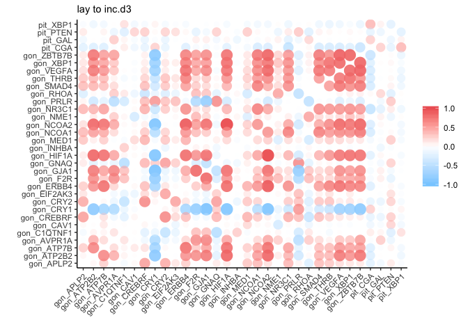

    x %>% network_plot.cor_df(min_cor = .5)  + 
      labs(subtitle = "lay to inc.d3")

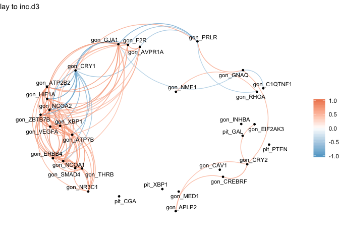

    corr <- x
    row.names(corr) <- corr$rowname 

    ## Warning: Setting row names on a tibble is deprecated.

    corr$rowname <- NULL
    ggcorrplot(corr, hc.order = TRUE, outline.col = "white", title = "lay to inc.d3")

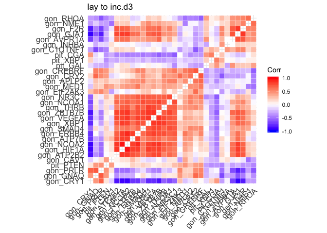

    pitcandidates <- c( "ATP6AP2", "AVPR2", "CRY2", "RHOA", 
                        "EIF2AK3", "NME1", "PRL", "XBP1",
                        "APP", "NCOA1")
    hypcandidates <- c("CRHBP", "CRHR2", "DRD3", "EDN1", "FAM129B", "FOXL2", "KRAS",
                       "OPRK1", "POMC", "RAB11FIP5", "RUNX1",
                       "CAV1", "ZBTB7B", "HEXB", "PGR")

    candidates.pit <- selectcandidatevsds(pitcandidates, vsd.pit, colData.pit) %>% select(-sample) %>% filter(treatment %in% c("hatch", "n5"))

    ##  [1] "ATP6AP2" "AVPR2"   "CRY2"    "RHOA"    "EIF2AK3" "NME1"    "PRL"    
    ##  [8] "XBP1"    "APP"     "NCOA1"  
    ##  [1] "XP_015154580.1" "NP_001025972.2" "NP_001026650.1" "NP_989575.1"   
    ##  [5] "XP_420868.2"    "XP_015140591.1" "NP_001191690.1" "NP_990797.2"   
    ##  [9] "NP_990035.1"    "NP_001006192.2"

    ## Joining, by = "entrezid"

    ## Joining, by = "sample"

    candidates.hyp <- selectcandidatevsds(hypcandidates, vsd.hyp, colData.hyp) %>% select(-sample) %>% filter(treatment %in% c("hatch", "n5"))

    ##  [1] "CRHBP"     "CRHR2"     "DRD3"      "EDN1"      "FAM129B"  
    ##  [6] "FOXL2"     "KRAS"      "OPRK1"     "POMC"      "RAB11FIP5"
    ## [11] "RUNX1"     "CAV1"      "ZBTB7B"    "HEXB"      "PGR"      
    ##  [1] "NP_001099134.1" "XP_003643006.2" "NP_989785.1"    "XP_004938262.1"
    ##  [5] "XP_418943.2"    "XP_015135170.1" "NP_001012630.1" "XP_424791.3"   
    ##  [9] "XP_015145758.1" "XP_426087.2"    "NP_990593.1"    "NP_001026269.1"
    ## [13] "XP_420890.5"    "XP_015154785.1" "XP_015153981.1"

    ## Joining, by = "entrezid"
    ## Joining, by = "sample"

    candidates.pit <- candidates.pit %>% rename_at(vars(-bird,-sex, -tissue, -treatment), function(x) paste0("pit_", x)) %>% select(-tissue)
    candidates.hyp <- candidates.hyp %>% rename_at(vars(-bird,-sex, -tissue, -treatment), function(x) paste0("hyp_", x)) %>% select(-tissue)

    counts <- full_join(candidates.pit, candidates.hyp) %>% drop_na() %>% select(-bird, -sex, -treatment)

    ## Joining, by = c("bird", "sex", "treatment")

    cols <- full_join(candidates.pit, candidates.hyp) %>% drop_na() %>% select(bird, sex, treatment)

    ## Joining, by = c("bird", "sex", "treatment")

    dim(counts)

    ## [1] 40 25

    dim(cols)

    ## [1] 40  3

    x <- correlate(counts)

    ## 
    ## Correlation method: 'pearson'
    ## Missing treated using: 'pairwise.complete.obs'

    fashion(x)

    ##          rowname pit_XBP1 pit_ATP6AP2 pit_AVPR2 pit_NME1 pit_CRY2 pit_RHOA
    ## 1       pit_XBP1                  .55      -.47      .48     -.34      .45
    ## 2    pit_ATP6AP2      .55                  -.17      .60     -.69      .79
    ## 3      pit_AVPR2     -.47        -.17               -.23      .14     -.07
    ## 4       pit_NME1      .48         .60      -.23              -.42      .45
    ## 5       pit_CRY2     -.34        -.69       .14     -.42              -.57
    ## 6       pit_RHOA      .45         .79      -.07      .45     -.57         
    ## 7        pit_PRL      .68         .70      -.39      .48     -.55      .50
    ## 8      pit_NCOA1     -.37        -.81       .01     -.50      .60     -.80
    ## 9        pit_APP      .48         .51      -.43      .37     -.39      .39
    ## 10   pit_EIF2AK3      .64         .46      -.28      .27     -.23      .48
    ## 11     hyp_FOXL2      .26         .20      -.16      .12     -.13      .33
    ## 12      hyp_POMC      .10         .04      -.24      .03     -.09     -.10
    ## 13      hyp_CAV1      .23         .16      -.12      .30      .03      .01
    ## 14     hyp_CRHR2     -.34        -.35       .25     -.37      .25     -.12
    ## 15       hyp_PGR     -.21        -.10       .30     -.20      .05     -.09
    ## 16     hyp_CRHBP     -.41        -.36       .34     -.38      .17     -.16
    ## 17      hyp_DRD3      .43         .27      -.24      .48     -.14      .26
    ## 18   hyp_FAM129B      .39         .40      -.24      .30     -.32      .29
    ## 19      hyp_KRAS     -.27        -.24       .21     -.27      .24     -.21
    ## 20    hyp_ZBTB7B      .39         .29      -.24      .08     -.19      .25
    ## 21     hyp_RUNX1      .39         .36      -.41      .48     -.27      .32
    ## 22      hyp_EDN1     -.27        -.24       .16     -.13      .23     -.04
    ## 23 hyp_RAB11FIP5      .42         .31      -.23      .51     -.08      .24
    ## 24      hyp_HEXB      .05         .09      -.20      .08     -.19     -.01
    ## 25     hyp_OPRK1     -.38        -.42       .10     -.37      .32     -.27
    ##    pit_PRL pit_NCOA1 pit_APP pit_EIF2AK3 hyp_FOXL2 hyp_POMC hyp_CAV1
    ## 1      .68      -.37     .48         .64       .26      .10      .23
    ## 2      .70      -.81     .51         .46       .20      .04      .16
    ## 3     -.39       .01    -.43        -.28      -.16     -.24     -.12
    ## 4      .48      -.50     .37         .27       .12      .03      .30
    ## 5     -.55       .60    -.39        -.23      -.13     -.09      .03
    ## 6      .50      -.80     .39         .48       .33     -.10      .01
    ## 7               -.53     .51         .47       .19      .16      .09
    ## 8     -.53              -.41        -.29      -.19      .10     -.15
    ## 9      .51      -.41                 .45       .17      .22      .17
    ## 10     .47      -.29     .45                   .31      .20      .18
    ## 11     .19      -.19     .17         .31                .30      .19
    ## 12     .16       .10     .22         .20       .30               .44
    ## 13     .09      -.15     .17         .18       .19      .44         
    ## 14    -.25       .14    -.34        -.25      -.28     -.54     -.73
    ## 15    -.26       .20    -.25        -.26      -.13     -.03     -.18
    ## 16    -.30       .16    -.42        -.30      -.27     -.43     -.67
    ## 17     .31      -.26     .36         .42       .44      .45      .53
    ## 18     .32      -.29     .34         .30       .32      .29      .52
    ## 19    -.17       .22    -.10        -.33      -.40     -.52     -.32
    ## 20     .35      -.20     .18         .30       .61      .37      .39
    ## 21     .35      -.25     .38         .34       .34      .51      .65
    ## 22    -.29      -.02    -.24        -.39      -.19     -.63     -.30
    ## 23     .20      -.37     .14         .30       .36      .35      .65
    ## 24     .12       .02     .00         .17       .32      .39      .38
    ## 25    -.40       .23    -.45        -.41      -.40     -.61     -.54
    ##    hyp_CRHR2 hyp_PGR hyp_CRHBP hyp_DRD3 hyp_FAM129B hyp_KRAS hyp_ZBTB7B
    ## 1       -.34    -.21      -.41      .43         .39     -.27        .39
    ## 2       -.35    -.10      -.36      .27         .40     -.24        .29
    ## 3        .25     .30       .34     -.24        -.24      .21       -.24
    ## 4       -.37    -.20      -.38      .48         .30     -.27        .08
    ## 5        .25     .05       .17     -.14        -.32      .24       -.19
    ## 6       -.12    -.09      -.16      .26         .29     -.21        .25
    ## 7       -.25    -.26      -.30      .31         .32     -.17        .35
    ## 8        .14     .20       .16     -.26        -.29      .22       -.20
    ## 9       -.34    -.25      -.42      .36         .34     -.10        .18
    ## 10      -.25    -.26      -.30      .42         .30     -.33        .30
    ## 11      -.28    -.13      -.27      .44         .32     -.40        .61
    ## 12      -.54    -.03      -.43      .45         .29     -.52        .37
    ## 13      -.73    -.18      -.67      .53         .52     -.32        .39
    ## 14               .06       .89     -.67        -.77      .45       -.53
    ## 15       .06               .32     -.20        -.24      .13       -.13
    ## 16       .89     .32               -.64        -.77      .38       -.55
    ## 17      -.67    -.20      -.64                  .57     -.59        .38
    ## 18      -.77    -.24      -.77      .57                 -.29        .60
    ## 19       .45     .13       .38     -.59        -.29                -.31
    ## 20      -.53    -.13      -.55      .38         .60     -.31           
    ## 21      -.71    -.11      -.64      .61         .55     -.43        .55
    ## 22       .56    -.04       .47     -.50        -.18      .56       -.32
    ## 23      -.44    -.30      -.44      .58         .52     -.43        .42
    ## 24      -.55    -.09      -.46      .41         .50     -.41        .37
    ## 25       .78     .31       .78     -.57        -.66      .37       -.56
    ##    hyp_RUNX1 hyp_EDN1 hyp_RAB11FIP5 hyp_HEXB hyp_OPRK1
    ## 1        .39     -.27           .42      .05      -.38
    ## 2        .36     -.24           .31      .09      -.42
    ## 3       -.41      .16          -.23     -.20       .10
    ## 4        .48     -.13           .51      .08      -.37
    ## 5       -.27      .23          -.08     -.19       .32
    ## 6        .32     -.04           .24     -.01      -.27
    ## 7        .35     -.29           .20      .12      -.40
    ## 8       -.25     -.02          -.37      .02       .23
    ## 9        .38     -.24           .14      .00      -.45
    ## 10       .34     -.39           .30      .17      -.41
    ## 11       .34     -.19           .36      .32      -.40
    ## 12       .51     -.63           .35      .39      -.61
    ## 13       .65     -.30           .65      .38      -.54
    ## 14      -.71      .56          -.44     -.55       .78
    ## 15      -.11     -.04          -.30     -.09       .31
    ## 16      -.64      .47          -.44     -.46       .78
    ## 17       .61     -.50           .58      .41      -.57
    ## 18       .55     -.18           .52      .50      -.66
    ## 19      -.43      .56          -.43     -.41       .37
    ## 20       .55     -.32           .42      .37      -.56
    ## 21               -.37           .62      .33      -.59
    ## 22      -.37                   -.14     -.30       .50
    ## 23       .62     -.14                    .20      -.38
    ## 24       .33     -.30           .20               -.34
    ## 25      -.59      .50          -.38     -.34

    rplot(x) + theme(axis.text.x = element_text(angle = 45, hjust = 1)) + 
      theme(axis.text.x = element_text(angle = 45, hjust = 1)) + 
      labs(subtitle = "hatch to n5")

    ## Don't know how to automatically pick scale for object of type noquote. Defaulting to continuous.

    x %>% network_plot.cor_df(min_cor = .5)  + 
      labs(subtitle = "hatch to n5")

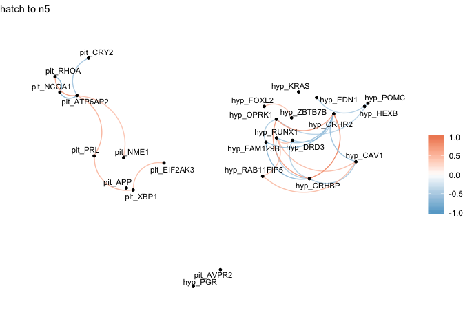

    corr <- x
    row.names(corr) <- corr$rowname 

    ## Warning: Setting row names on a tibble is deprecated.

    corr$rowname <- NULL
    ggcorrplot(corr, hc.order = TRUE, outline.col = "white", title = "hatch to n5")

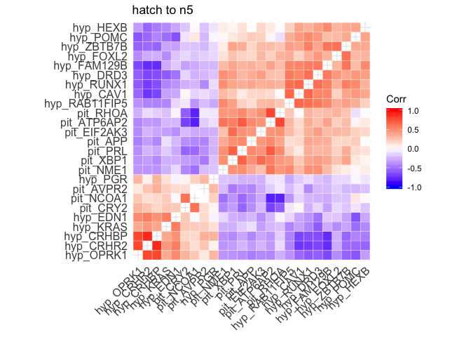
