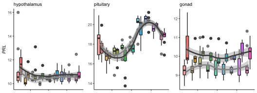
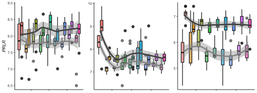
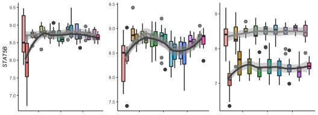

analyses downstream of calculating tissue specific variance in gene expression
==============================================================================

    vsd.hyp <- readvsd("../results/04_vsd_hyp.csv")

    ## Warning: Missing column names filled in: 'X1' [1]

    ## Parsed with column specification:
    ## cols(
    ##   .default = col_double(),
    ##   X1 = col_character()
    ## )

    ## See spec(...) for full column specifications.

    colData.hyp <- readcolData("../results/04_colData_hyp.csv")

    ## Parsed with column specification:
    ## cols(
    ##   V1 = col_character(),
    ##   sex = col_character(),
    ##   treatment = col_character(),
    ##   sextissue = col_character(),
    ##   hypothesis = col_character()
    ## )

    head(vsd.hyp[1:2])

    ##                L.Blu13_male_hypothalamus_control.NYNO
    ## NP_001001127.1                               8.514761
    ## NP_001001129.1                               5.317499
    ## NP_001001189.1                               9.327089
    ## NP_001001195.1                               5.317499
    ## NP_001001201.1                               6.400397
    ## NP_001001203.1                               5.952357
    ##                L.G107_male_hypothalamus_control
    ## NP_001001127.1                         7.695211
    ## NP_001001129.1                         5.721232
    ## NP_001001189.1                         9.171919
    ## NP_001001195.1                         5.317499
    ## NP_001001201.1                         6.435010
    ## NP_001001203.1                         5.317499

    head(colData.hyp[1:2,])

    ##                                         sex treatment         sextissue
    ## L.Blu13_male_hypothalamus_control.NYNO male   control male_hypothalamus
    ## L.G107_male_hypothalamus_control       male   control male_hypothalamus
    ##                                          hypothesis
    ## L.Blu13_male_hypothalamus_control.NYNO anticipation
    ## L.G107_male_hypothalamus_control       anticipation
    ##                                                                        sample
    ## L.Blu13_male_hypothalamus_control.NYNO L.Blu13_male_hypothalamus_control.NYNO
    ## L.G107_male_hypothalamus_control             L.G107_male_hypothalamus_control

    rownames(colData.hyp) == colnames(vsd.hyp)

    ## Warning in rownames(colData.hyp) == colnames(vsd.hyp): longer object length
    ## is not a multiple of shorter object length

    ##   [1]  TRUE  TRUE  TRUE  TRUE  TRUE  TRUE  TRUE  TRUE  TRUE  TRUE  TRUE
    ##  [12]  TRUE  TRUE  TRUE  TRUE  TRUE  TRUE  TRUE  TRUE  TRUE  TRUE  TRUE
    ##  [23]  TRUE  TRUE  TRUE  TRUE  TRUE  TRUE  TRUE  TRUE  TRUE  TRUE  TRUE
    ##  [34]  TRUE  TRUE  TRUE  TRUE  TRUE  TRUE  TRUE  TRUE  TRUE  TRUE  TRUE
    ##  [45]  TRUE  TRUE  TRUE  TRUE  TRUE  TRUE  TRUE  TRUE  TRUE  TRUE  TRUE
    ##  [56]  TRUE  TRUE  TRUE  TRUE  TRUE  TRUE  TRUE  TRUE  TRUE  TRUE  TRUE
    ##  [67]  TRUE  TRUE  TRUE  TRUE  TRUE  TRUE  TRUE  TRUE  TRUE  TRUE  TRUE
    ##  [78]  TRUE  TRUE  TRUE  TRUE  TRUE  TRUE  TRUE  TRUE  TRUE  TRUE  TRUE
    ##  [89]  TRUE  TRUE  TRUE  TRUE  TRUE  TRUE  TRUE  TRUE  TRUE  TRUE  TRUE
    ## [100]  TRUE  TRUE  TRUE  TRUE  TRUE  TRUE  TRUE  TRUE  TRUE  TRUE  TRUE
    ## [111]  TRUE  TRUE  TRUE  TRUE  TRUE  TRUE  TRUE  TRUE  TRUE  TRUE  TRUE
    ## [122]  TRUE  TRUE  TRUE  TRUE  TRUE  TRUE  TRUE  TRUE  TRUE  TRUE  TRUE
    ## [133]  TRUE  TRUE  TRUE  TRUE  TRUE  TRUE  TRUE  TRUE  TRUE  TRUE  TRUE
    ## [144]  TRUE  TRUE  TRUE  TRUE  TRUE  TRUE  TRUE  TRUE  TRUE  TRUE  TRUE
    ## [155]  TRUE  TRUE  TRUE  TRUE  TRUE  TRUE  TRUE  TRUE  TRUE  TRUE  TRUE
    ## [166]  TRUE  TRUE  TRUE  TRUE  TRUE  TRUE  TRUE  TRUE  TRUE  TRUE  TRUE
    ## [177]  TRUE  TRUE  TRUE  TRUE  TRUE  TRUE  TRUE  TRUE  TRUE  TRUE  TRUE
    ## [188]  TRUE  TRUE FALSE

    vsd.pit <- readvsd("../results/04_vsd_pit.csv")

    ## Warning: Missing column names filled in: 'X1' [1]

    ## Parsed with column specification:
    ## cols(
    ##   .default = col_double(),
    ##   X1 = col_character()
    ## )
    ## See spec(...) for full column specifications.

    colData.pit <- readcolData("../results/04_colData_pit.csv")

    ## Parsed with column specification:
    ## cols(
    ##   V1 = col_character(),
    ##   sex = col_character(),
    ##   treatment = col_character(),
    ##   sextissue = col_character(),
    ##   hypothesis = col_character()
    ## )

    vsd.gon <- readvsd("../results/04_vsd_gon.csv")

    ## Warning: Missing column names filled in: 'X1' [1]

    ## Parsed with column specification:
    ## cols(
    ##   .default = col_double(),
    ##   X1 = col_character()
    ## )
    ## See spec(...) for full column specifications.

    colData.gon <- readcolData("../results/04_colData_gon.csv")

    ## Parsed with column specification:
    ## cols(
    ##   V1 = col_character(),
    ##   sex = col_character(),
    ##   treatment = col_character(),
    ##   sextissue = col_character(),
    ##   hypothesis = col_character()
    ## )

selecting candidate genes counts from the hypothalamus
======================================================

    geneinfo <- read_csv("../metadata/00_geneinfo.csv") %>%  dplyr::select(Name, geneid, entrezid) %>% arrange(Name)

    ## Warning: Missing column names filled in: 'X1' [1]

    ## Parsed with column specification:
    ## cols(
    ##   X1 = col_character(),
    ##   row.names = col_double(),
    ##   Name = col_character(),
    ##   geneid = col_double(),
    ##   entrezid = col_character()
    ## )

    head(geneinfo)

    ## # A tibble: 6 x 3
    ##   Name      geneid entrezid      
    ##   <chr>      <dbl> <chr>         
    ## 1 A2ML1     418254 XP_015148230.1
    ## 2 A2ML2     427942 XP_004938161.2
    ## 3 A2ML3  100857394 XP_015148584.1
    ## 4 A2ML4  100858010 XP_015154891.1
    ## 5 A4GALT    418223 XP_015145932.1
    ## 6 A4GNT     429136 XP_426692.3

    candidategenes <- c("CISH", "SOCS1", "SOCS2", "SOCS2", "SOCS4", "SOCS5", "SOCS6", 
                        "PRL", "PRLR", "STAT5B", "JAK1")
    candidates.hyp <- selectcandidatevsds(candidategenes, vsd.hyp, colData.hyp)

    ##  [1] "CISH"   "SOCS1"  "SOCS2"  "SOCS2"  "SOCS4"  "SOCS5"  "SOCS6" 
    ##  [8] "PRL"    "PRLR"   "STAT5B" "JAK1"  
    ##  [1] "NP_989957.1"    "XP_015146451.1" "NP_990797.2"    "XP_015132722.1"
    ##  [5] "NP_001131120.1" "NP_989871.1"    "NP_001186037.1" "NP_001120786.1"
    ##  [9] "NP_001120784.1" "XP_015155078.1"

    ## Joining, by = "entrezid"

    ## Joining, by = "sample"

    candidates.pit <- selectcandidatevsds(candidategenes, vsd.pit, colData.pit)

    ##  [1] "CISH"   "SOCS1"  "SOCS2"  "SOCS2"  "SOCS4"  "SOCS5"  "SOCS6" 
    ##  [8] "PRL"    "PRLR"   "STAT5B" "JAK1"  
    ##  [1] "NP_989957.1"    "XP_015146451.1" "NP_990797.2"    "XP_015132722.1"
    ##  [5] "NP_001131120.1" "NP_989871.1"    "NP_001186037.1" "NP_001120786.1"
    ##  [9] "NP_001120784.1" "XP_015155078.1"

    ## Joining, by = "entrezid"
    ## Joining, by = "sample"

    candidates.gon <- selectcandidatevsds(candidategenes, vsd.gon, colData.gon)

    ##  [1] "CISH"   "SOCS1"  "SOCS2"  "SOCS2"  "SOCS4"  "SOCS5"  "SOCS6" 
    ##  [8] "PRL"    "PRLR"   "STAT5B" "JAK1"  
    ##  [1] "NP_989957.1"    "XP_015146451.1" "NP_990797.2"    "XP_015132722.1"
    ##  [5] "NP_001131120.1" "NP_989871.1"    "NP_001186037.1" "NP_001120786.1"
    ##  [9] "NP_001120784.1" "XP_015155078.1"

    ## Joining, by = "entrezid"
    ## Joining, by = "sample"

    plotcanddateexpression <- function(candidateexpression,  mysubtitle, whichgene, myylab){
      
      ggplot(candidateexpression, aes(x = as.numeric(treatment), y = whichgene)) + 
            geom_smooth(aes(colour = sex)) +
        geom_boxplot(aes(fill = treatment, alpha = sex)) + 
        scale_alpha_manual(values = c(0.75,1)) +
         theme_B3() +
        theme(legend.position = "none") +
        theme(axis.title.y=element_text(face="italic"),
              axis.title.x = element_blank(),
              axis.text.x = element_blank()) +
        scale_color_manual(values = c("female" = "#969696", "male" = "#525252")) +
        labs(subtitle = mysubtitle, y = myylab)
      
    }

    a <- plotcanddateexpression(candidates.hyp,  "hypothalamus", candidates.hyp$PRL, "PRL")
    b <- plotcanddateexpression(candidates.pit, "pituitary", candidates.pit$PRL, "PRL")
    c <- plotcanddateexpression(candidates.gon,  "gonad", candidates.gon$PRL, "PRL")

    plot_grid(a, b + labs(y = NULL), c + labs(y = NULL), nrow = 1)

    ## `geom_smooth()` using method = 'loess' and formula 'y ~ x'

    ## `geom_smooth()` using method = 'loess' and formula 'y ~ x'
    ## `geom_smooth()` using method = 'loess' and formula 'y ~ x'

    e <- plotcanddateexpression(candidates.hyp, NULL, candidates.hyp$PRLR, "PRLR")
    f <- plotcanddateexpression(candidates.pit, NULL, candidates.pit$PRLR, "PRLR")
    g <- plotcanddateexpression(candidates.gon, NULL, candidates.gon$PRLR, "PRLR")

    plot_grid(e, f + labs(y = NULL), g + labs(y = NULL), nrow = 1)

    ## `geom_smooth()` using method = 'loess' and formula 'y ~ x'
    ## `geom_smooth()` using method = 'loess' and formula 'y ~ x'
    ## `geom_smooth()` using method = 'loess' and formula 'y ~ x'

    h <- plotcanddateexpression(candidates.hyp, " ", candidates.hyp$STAT5B, "STAT5B")
    i <- plotcanddateexpression(candidates.pit, " ", candidates.pit$STAT5B, "STAT5B")
    j <- plotcanddateexpression(candidates.gon, " ", candidates.gon$STAT5B, "STAT5B")

    plot_grid(h, i + labs(y = NULL), j + labs(y = NULL), nrow = 1)

    ## `geom_smooth()` using method = 'loess' and formula 'y ~ x'
    ## `geom_smooth()` using method = 'loess' and formula 'y ~ x'
    ## `geom_smooth()` using method = 'loess' and formula 'y ~ x'

    plot_grid(a,b,c, nrow = 3)

    ## `geom_smooth()` using method = 'loess' and formula 'y ~ x'
    ## `geom_smooth()` using method = 'loess' and formula 'y ~ x'
    ## `geom_smooth()` using method = 'loess' and formula 'y ~ x'

