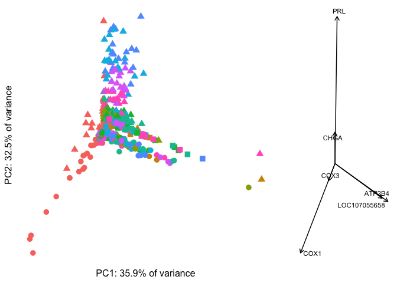
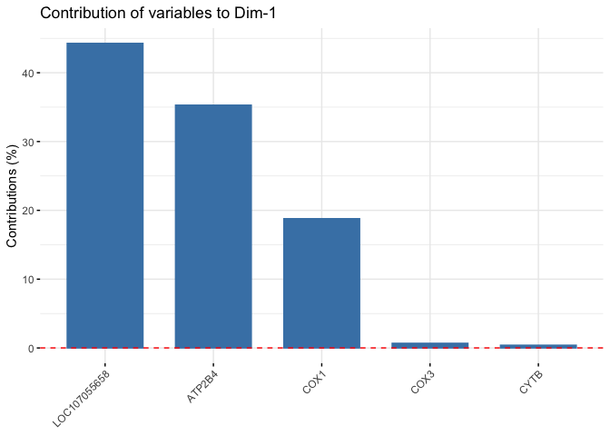
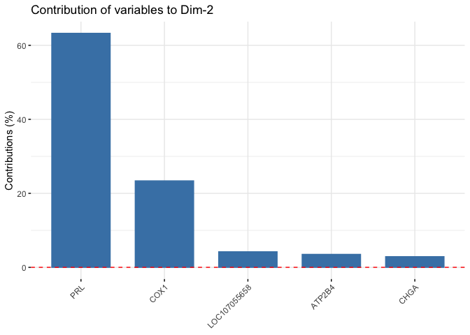
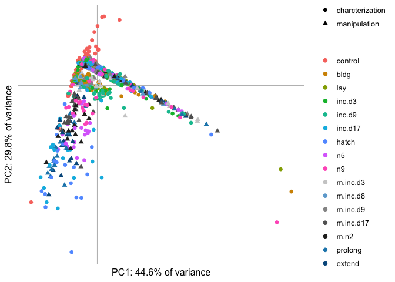
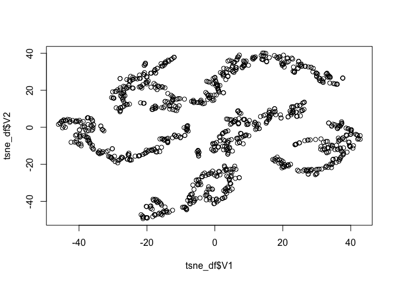
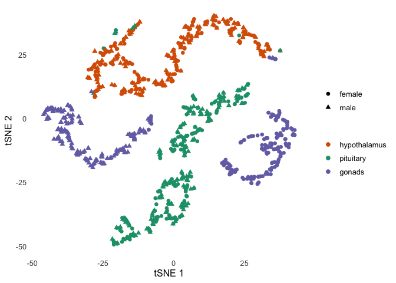
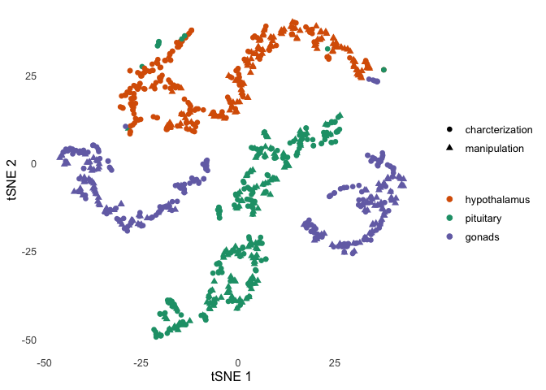
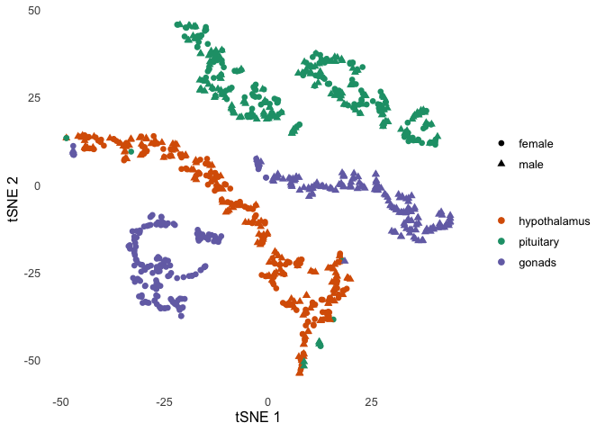

data wrangle
------------

    pseudocounts <- read_csv("../results/01_pseudo.counts.csv")

    ## Warning: Missing column names filled in: 'X1' [1]

    ## Parsed with column specification:
    ## cols(
    ##   .default = col_double(),
    ##   X1 = col_character()
    ## )

    ## See spec(...) for full column specifications.

    head(pseudocounts[1:3])

    ## # A tibble: 6 x 3
    ##   X1           L.Blu13_male_gonad_control… L.Blu13_male_hypothalamus_contr…
    ##   <chr>                              <dbl>                            <dbl>
    ## 1 NP_00100112…                      18.0            283.                   
    ## 2 NP_00100112…                       2.71             0.709                
    ## 3 NP_00100118…                    1249.             562.                   
    ## 4 NP_00100119…                       3.00             0.105                
    ## 5 NP_00100119…                       0.880            0.0000000000000000278
    ## 6 NP_00100120…                     200.              24.1

    colData <- read.csv("../metadata/00_colData_characterization.csv", header = T, row.names = 1)
    colData$treatment <- factor(colData$treatment, levels = 
                                  c("control",  "bldg", "lay", "inc.d3", "inc.d9", "inc.d17", 
                                    "hatch", "n5", "n9"))
    colData$tissue <- factor(colData$tissue, levels = c("hypothalamus", "pituitary", "gonad"))
    colData <- colData %>% mutate(tissue = fct_recode(tissue, "gonads" = "gonad"))

    head(colData[1:3])

    ##                                       V1    bird  sex
    ## 1        L.Blu13_male_gonad_control.NYNO L.Blu13 male
    ## 2 L.Blu13_male_hypothalamus_control.NYNO L.Blu13 male
    ## 3    L.Blu13_male_pituitary_control.NYNO L.Blu13 male
    ## 4              L.G107_male_gonad_control  L.G107 male
    ## 5       L.G107_male_hypothalamus_control  L.G107 male
    ## 6          L.G107_male_pituitary_control  L.G107 male

    geneinfo <- read.csv("../metadata/00_geneinfo.csv", row.names = 1)
    head(geneinfo)

    ##                row.names     Name geneid       entrezid
    ## NP_001001127.1    408082    EDNRB 408082 NP_001001127.1
    ## NP_001001129.1    408183  CYP26A1 408183 NP_001001129.1
    ## NP_001001189.1    374073    CFDP1 374073 NP_001001189.1
    ## NP_001001194.1    407777    AvBD7 407777 NP_001001194.1
    ## NP_001001195.1    407779     KRT5 407779 NP_001001195.1
    ## NP_001001201.1    408034 HSD11B1L 408034 NP_001001201.1

    subsetcounts <- function(colData, countData){
      
      # save counts that match colData
      savecols <- as.character(colData$V1) 
      savecols <- as.vector(savecols) 
      countData <- countData %>% 
        dplyr::select(X1,savecols) %>% 
        dplyr::rename(entrezid = X1)  
      
      countData <- left_join(geneinfo, countData)
      countData <- countData %>% distinct(Name, .keep_all = TRUE) %>%
        select(-row.names)  %>% select(-geneid) %>% select(-entrezid) 
      
      
      row.names(countData) <- countData$Name
      countData$Name <- NULL
      countData <- as.data.frame(t(countData))
      
      return(countData)
    }

    countData <- subsetcounts(colData, pseudocounts)

    ## Joining, by = "entrezid"

    ## Warning: Column `entrezid` joining factor and character vector, coercing
    ## into character vector

    head(countData[1:3])

    ##                                            EDNRB     CYP26A1     CFDP1
    ## L.Blu13_male_gonad_control.NYNO         17.98077   2.7135986 1249.1102
    ## L.Blu13_male_hypothalamus_control.NYNO 283.43635   0.7087326  561.5653
    ## L.Blu13_male_pituitary_control.NYNO    121.57418 119.0867999  511.4571
    ## L.G107_male_gonad_control               14.32112   3.4565328 1444.0513
    ## L.G107_male_hypothalamus_control       139.81184   2.9686946  502.4257
    ## L.G107_male_pituitary_control          180.32105  76.4587728  559.8518

    # confirm
    row.names(countData) == row.names(colData)

    ##   [1] FALSE FALSE FALSE FALSE FALSE FALSE FALSE FALSE FALSE FALSE FALSE
    ##  [12] FALSE FALSE FALSE FALSE FALSE FALSE FALSE FALSE FALSE FALSE FALSE
    ##  [23] FALSE FALSE FALSE FALSE FALSE FALSE FALSE FALSE FALSE FALSE FALSE
    ##  [34] FALSE FALSE FALSE FALSE FALSE FALSE FALSE FALSE FALSE FALSE FALSE
    ##  [45] FALSE FALSE FALSE FALSE FALSE FALSE FALSE FALSE FALSE FALSE FALSE
    ##  [56] FALSE FALSE FALSE FALSE FALSE FALSE FALSE FALSE FALSE FALSE FALSE
    ##  [67] FALSE FALSE FALSE FALSE FALSE FALSE FALSE FALSE FALSE FALSE FALSE
    ##  [78] FALSE FALSE FALSE FALSE FALSE FALSE FALSE FALSE FALSE FALSE FALSE
    ##  [89] FALSE FALSE FALSE FALSE FALSE FALSE FALSE FALSE FALSE FALSE FALSE
    ## [100] FALSE FALSE FALSE FALSE FALSE FALSE FALSE FALSE FALSE FALSE FALSE
    ## [111] FALSE FALSE FALSE FALSE FALSE FALSE FALSE FALSE FALSE FALSE FALSE
    ## [122] FALSE FALSE FALSE FALSE FALSE FALSE FALSE FALSE FALSE FALSE FALSE
    ## [133] FALSE FALSE FALSE FALSE FALSE FALSE FALSE FALSE FALSE FALSE FALSE
    ## [144] FALSE FALSE FALSE FALSE FALSE FALSE FALSE FALSE FALSE FALSE FALSE
    ## [155] FALSE FALSE FALSE FALSE FALSE FALSE FALSE FALSE FALSE FALSE FALSE
    ## [166] FALSE FALSE FALSE FALSE FALSE FALSE FALSE FALSE FALSE FALSE FALSE
    ## [177] FALSE FALSE FALSE FALSE FALSE FALSE FALSE FALSE FALSE FALSE FALSE
    ## [188] FALSE FALSE FALSE FALSE FALSE FALSE FALSE FALSE FALSE FALSE FALSE
    ## [199] FALSE FALSE FALSE FALSE FALSE FALSE FALSE FALSE FALSE FALSE FALSE
    ## [210] FALSE FALSE FALSE FALSE FALSE FALSE FALSE FALSE FALSE FALSE FALSE
    ## [221] FALSE FALSE FALSE FALSE FALSE FALSE FALSE FALSE FALSE FALSE FALSE
    ## [232] FALSE FALSE FALSE FALSE FALSE FALSE FALSE FALSE FALSE FALSE FALSE
    ## [243] FALSE FALSE FALSE FALSE FALSE FALSE FALSE FALSE FALSE FALSE FALSE
    ## [254] FALSE FALSE FALSE FALSE FALSE FALSE FALSE FALSE FALSE FALSE FALSE
    ## [265] FALSE FALSE FALSE FALSE FALSE FALSE FALSE FALSE FALSE FALSE FALSE
    ## [276] FALSE FALSE FALSE FALSE FALSE FALSE FALSE FALSE FALSE FALSE FALSE
    ## [287] FALSE FALSE FALSE FALSE FALSE FALSE FALSE FALSE FALSE FALSE FALSE
    ## [298] FALSE FALSE FALSE FALSE FALSE FALSE FALSE FALSE FALSE FALSE FALSE
    ## [309] FALSE FALSE FALSE FALSE FALSE FALSE FALSE FALSE FALSE FALSE FALSE
    ## [320] FALSE FALSE FALSE FALSE FALSE FALSE FALSE FALSE FALSE FALSE FALSE
    ## [331] FALSE FALSE FALSE FALSE FALSE FALSE FALSE FALSE FALSE FALSE FALSE
    ## [342] FALSE FALSE FALSE FALSE FALSE FALSE FALSE FALSE FALSE FALSE FALSE
    ## [353] FALSE FALSE FALSE FALSE FALSE FALSE FALSE FALSE FALSE FALSE FALSE
    ## [364] FALSE FALSE FALSE FALSE FALSE FALSE FALSE FALSE FALSE FALSE FALSE
    ## [375] FALSE FALSE FALSE FALSE FALSE FALSE FALSE FALSE FALSE FALSE FALSE
    ## [386] FALSE FALSE FALSE FALSE FALSE FALSE FALSE FALSE FALSE FALSE FALSE
    ## [397] FALSE FALSE FALSE FALSE FALSE FALSE FALSE FALSE FALSE FALSE FALSE
    ## [408] FALSE FALSE FALSE FALSE FALSE FALSE FALSE FALSE FALSE FALSE FALSE
    ## [419] FALSE FALSE FALSE FALSE FALSE FALSE FALSE FALSE FALSE FALSE FALSE
    ## [430] FALSE FALSE FALSE FALSE FALSE FALSE FALSE FALSE FALSE FALSE FALSE
    ## [441] FALSE FALSE FALSE FALSE FALSE FALSE FALSE FALSE FALSE FALSE FALSE
    ## [452] FALSE FALSE FALSE FALSE FALSE FALSE FALSE FALSE FALSE FALSE FALSE
    ## [463] FALSE FALSE FALSE FALSE FALSE FALSE FALSE FALSE FALSE FALSE FALSE
    ## [474] FALSE FALSE FALSE FALSE FALSE FALSE FALSE FALSE FALSE FALSE FALSE
    ## [485] FALSE FALSE FALSE FALSE FALSE FALSE FALSE FALSE FALSE FALSE FALSE
    ## [496] FALSE FALSE FALSE FALSE FALSE FALSE FALSE FALSE FALSE FALSE FALSE
    ## [507] FALSE FALSE FALSE FALSE FALSE FALSE FALSE FALSE FALSE FALSE FALSE
    ## [518] FALSE FALSE FALSE FALSE FALSE FALSE FALSE FALSE FALSE FALSE FALSE
    ## [529] FALSE FALSE FALSE FALSE FALSE FALSE FALSE FALSE FALSE FALSE FALSE
    ## [540] FALSE FALSE FALSE FALSE FALSE FALSE FALSE FALSE FALSE FALSE FALSE
    ## [551] FALSE FALSE FALSE FALSE FALSE FALSE FALSE FALSE FALSE FALSE FALSE
    ## [562] FALSE FALSE FALSE FALSE FALSE FALSE FALSE FALSE FALSE FALSE FALSE
    ## [573] FALSE FALSE FALSE FALSE

    euclidist <- dist(countData) # euclidean distances between the rows

pca
---

    # make pca dataframes
    mypca <- prcomp(countData)

    # percent conribution
    eig.val <- get_eigenvalue(mypca)
    head(eig.val)

    ##         eigenvalue variance.percent cumulative.variance.percent
    ## Dim.1 301234419601       35.9445757                    35.94458
    ## Dim.2 272266589259       32.4880106                    68.43259
    ## Dim.3 213391804875       25.4628203                    93.89541
    ## Dim.4  24543770401        2.9286674                    96.82407
    ## Dim.5  10627670724        1.2681390                    98.09221
    ## Dim.6   3598570939        0.4293968                    98.52161

    mypcadf <- data.frame(PC1 = mypca$x[, 1], PC2 = mypca$x[, 2], PC3 = mypca$x[, 3], 
                      PC4 = mypca$x[, 4],PC5 = mypca$x[, 5],PC6 = mypca$x[, 6],
                      ID = row.names(countData))
    mypcadf$V1 <- row.names(mypcadf)
    mypcadf <- left_join(colData, mypcadf)

    ## Joining, by = "V1"

    ## Warning: Column `V1` joining factor and character vector, coercing into
    ## character vector

    mypcadf <- mypcadf %>% select(bird,sex,tissue,treatment,PC1:PC6)
    head(mypcadf)

    ##      bird  sex       tissue treatment       PC1        PC2        PC3
    ## 1 L.Blu13 male       gonads   control -289031.0    9583.47  418914.02
    ## 2 L.Blu13 male hypothalamus   control -885455.5 -657013.51 -557113.05
    ## 3 L.Blu13 male    pituitary   control -294197.4  150695.51  211668.84
    ## 4  L.G107 male       gonads   control -225279.4  -37945.28  363813.73
    ## 5  L.G107 male hypothalamus   control -484957.1 -344082.98  -89470.83
    ## 6  L.G107 male    pituitary   control -352850.2  276251.11  129694.05
    ##         PC4       PC5          PC6
    ## 1 -96018.57 -33516.68   55973.7678
    ## 2 -56372.39  -8591.00 -103116.0847
    ## 3 416519.89  14124.25    9801.6432
    ## 4 -94072.20 -31764.49   64140.8075
    ## 5 -65247.42 -16252.64    4662.0743
    ## 6 403886.93  13368.66    -237.8222

    a <- ggplot(mypcadf, aes(x = PC1, y = PC2, 
                             color = colData$treatment, 
                             shape = colData$tissue)) +
      geom_point(size = 3)  + theme_minimal(base_size = 6)  +
      mytheme() +
      theme(legend.title = element_blank(), 
            axis.text = element_blank()) +
      scale_alpha_manual(values = c(0.5,1)) +
      labs(x = "PC1: 35.9% of variance", y = "PC2: 32.5% of variance") 
      

    b <-  fviz_pca_var(mypca,  labelsize = 3 , axes.linetype = "blank", 
                       repel = TRUE ,
                      select.var= list(contrib = 6)) + 
          mytheme() + 
          labs(x = " ", y = " ", subtitle = NULL, title =  NULL) 

    png('../figures/pca/pca-1.png',width=600,height=600, units="px",bg = "transparent")
    print(a)
    dev.off()

    ## quartz_off_screen 
    ##                 2

    png('../figures/pca/pca-2.png',width=600,height=600, units="px",bg = "transparent")
    print(b)
    dev.off()

    ## quartz_off_screen 
    ##                 2

    plot_grid(a + theme(legend.position = "none"),
              b + theme(axis.text = element_blank()), 
              nrow = 1, rel_widths = c(0.7,0.3))

    fviz_contrib(mypca, choice = "var", axes = 1, top = 5) 

    fviz_contrib(mypca, choice = "var", axes = 2, top = 5) 

tSNE
====

    tsne_model <- Rtsne(euclidist, check_duplicates=FALSE, pca=TRUE, perplexity=5, theta=0.5, dims=2)
    tsne_df = as.data.frame(tsne_model$Y) 
    plot(tsne_df$V1, tsne_df$V2)

    # prep for adding columns
    colData2 <- colData 
    colData2$V1 <- NULL
    tsne_df_cols <- cbind(colData2, tsne_df)

    c  <- ggplot(tsne_df_cols, aes(x = V1, y = V2, shape = sex, color = tissue)) +
      geom_point(size = 2) +
      mytheme() +
      scale_color_manual(values = c("#d95f02","#1b9e77", "#7570b3")) +
      labs(x = "tSNE 1", y = "tSNE 2")

    d <- ggplot(tsne_df_cols, aes(x = V1, y = V2, shape = tissue, color = treatment, alpha = sex)) +
      geom_point(size = 2) +
      mytheme() +
      labs(x = "tSNE 1", y = "tSNE 2") +
      scale_alpha_manual(values = c(0.5,1))

    c

    d

    png('../figures/pca/tSNE-2.png',width=600,height=600, units="px",bg = "transparent")
    print(c)
    dev.off()

    ## quartz_off_screen 
    ##                 2

    png('../figures/pca/tSNE-3.png',width=600,height=600, units="px",bg = "transparent")
    print(d)
    dev.off()

    ## quartz_off_screen 
    ##                 2

all data
--------

    # prep col data for all samples
    colData <- read.csv("../metadata/00_samples.csv", header = T, row.names = 1)
    colData$treatment <- factor(colData$treatment, levels = alllevels2)
    colData <- colData %>% mutate(tissue = fct_recode(tissue, "gonads" = "gonad"))
    colData$tissue <- factor(colData$tissue, levels = tissuelevels)
    row.names(colData) <- colData$V1

    # prep count data for all samples
    countData <- as.data.frame(pseudocounts)
    countData$entrezid <- countData$X1
    countData <- left_join(geneinfo, countData)

    ## Joining, by = "entrezid"

    ## Warning: Column `entrezid` joining factor and character vector, coercing
    ## into character vector

    countData <- countData %>% distinct(Name, .keep_all = TRUE) %>%
        select(-row.names, -geneid, -entrezid, -X1) 
    countData <- as.data.frame(countData)
    row.names(countData) <- countData$Name
    countData$Name <- NULL
    countData$entrezid <- NULL
    countData <- as.data.frame(t(countData))

    # check ready for analysis
    row.names(countData) == row.names(colData)

    ##   [1] TRUE TRUE TRUE TRUE TRUE TRUE TRUE TRUE TRUE TRUE TRUE TRUE TRUE TRUE
    ##  [15] TRUE TRUE TRUE TRUE TRUE TRUE TRUE TRUE TRUE TRUE TRUE TRUE TRUE TRUE
    ##  [29] TRUE TRUE TRUE TRUE TRUE TRUE TRUE TRUE TRUE TRUE TRUE TRUE TRUE TRUE
    ##  [43] TRUE TRUE TRUE TRUE TRUE TRUE TRUE TRUE TRUE TRUE TRUE TRUE TRUE TRUE
    ##  [57] TRUE TRUE TRUE TRUE TRUE TRUE TRUE TRUE TRUE TRUE TRUE TRUE TRUE TRUE
    ##  [71] TRUE TRUE TRUE TRUE TRUE TRUE TRUE TRUE TRUE TRUE TRUE TRUE TRUE TRUE
    ##  [85] TRUE TRUE TRUE TRUE TRUE TRUE TRUE TRUE TRUE TRUE TRUE TRUE TRUE TRUE
    ##  [99] TRUE TRUE TRUE TRUE TRUE TRUE TRUE TRUE TRUE TRUE TRUE TRUE TRUE TRUE
    ## [113] TRUE TRUE TRUE TRUE TRUE TRUE TRUE TRUE TRUE TRUE TRUE TRUE TRUE TRUE
    ## [127] TRUE TRUE TRUE TRUE TRUE TRUE TRUE TRUE TRUE TRUE TRUE TRUE TRUE TRUE
    ## [141] TRUE TRUE TRUE TRUE TRUE TRUE TRUE TRUE TRUE TRUE TRUE TRUE TRUE TRUE
    ## [155] TRUE TRUE TRUE TRUE TRUE TRUE TRUE TRUE TRUE TRUE TRUE TRUE TRUE TRUE
    ## [169] TRUE TRUE TRUE TRUE TRUE TRUE TRUE TRUE TRUE TRUE TRUE TRUE TRUE TRUE
    ## [183] TRUE TRUE TRUE TRUE TRUE TRUE TRUE TRUE TRUE TRUE TRUE TRUE TRUE TRUE
    ## [197] TRUE TRUE TRUE TRUE TRUE TRUE TRUE TRUE TRUE TRUE TRUE TRUE TRUE TRUE
    ## [211] TRUE TRUE TRUE TRUE TRUE TRUE TRUE TRUE TRUE TRUE TRUE TRUE TRUE TRUE
    ## [225] TRUE TRUE TRUE TRUE TRUE TRUE TRUE TRUE TRUE TRUE TRUE TRUE TRUE TRUE
    ## [239] TRUE TRUE TRUE TRUE TRUE TRUE TRUE TRUE TRUE TRUE TRUE TRUE TRUE TRUE
    ## [253] TRUE TRUE TRUE TRUE TRUE TRUE TRUE TRUE TRUE TRUE TRUE TRUE TRUE TRUE
    ## [267] TRUE TRUE TRUE TRUE TRUE TRUE TRUE TRUE TRUE TRUE TRUE TRUE TRUE TRUE
    ## [281] TRUE TRUE TRUE TRUE TRUE TRUE TRUE TRUE TRUE TRUE TRUE TRUE TRUE TRUE
    ## [295] TRUE TRUE TRUE TRUE TRUE TRUE TRUE TRUE TRUE TRUE TRUE TRUE TRUE TRUE
    ## [309] TRUE TRUE TRUE TRUE TRUE TRUE TRUE TRUE TRUE TRUE TRUE TRUE TRUE TRUE
    ## [323] TRUE TRUE TRUE TRUE TRUE TRUE TRUE TRUE TRUE TRUE TRUE TRUE TRUE TRUE
    ## [337] TRUE TRUE TRUE TRUE TRUE TRUE TRUE TRUE TRUE TRUE TRUE TRUE TRUE TRUE
    ## [351] TRUE TRUE TRUE TRUE TRUE TRUE TRUE TRUE TRUE TRUE TRUE TRUE TRUE TRUE
    ## [365] TRUE TRUE TRUE TRUE TRUE TRUE TRUE TRUE TRUE TRUE TRUE TRUE TRUE TRUE
    ## [379] TRUE TRUE TRUE TRUE TRUE TRUE TRUE TRUE TRUE TRUE TRUE TRUE TRUE TRUE
    ## [393] TRUE TRUE TRUE TRUE TRUE TRUE TRUE TRUE TRUE TRUE TRUE TRUE TRUE TRUE
    ## [407] TRUE TRUE TRUE TRUE TRUE TRUE TRUE TRUE TRUE TRUE TRUE TRUE TRUE TRUE
    ## [421] TRUE TRUE TRUE TRUE TRUE TRUE TRUE TRUE TRUE TRUE TRUE TRUE TRUE TRUE
    ## [435] TRUE TRUE TRUE TRUE TRUE TRUE TRUE TRUE TRUE TRUE TRUE TRUE TRUE TRUE
    ## [449] TRUE TRUE TRUE TRUE TRUE TRUE TRUE TRUE TRUE TRUE TRUE TRUE TRUE TRUE
    ## [463] TRUE TRUE TRUE TRUE TRUE TRUE TRUE TRUE TRUE TRUE TRUE TRUE TRUE TRUE
    ## [477] TRUE TRUE TRUE TRUE TRUE TRUE TRUE TRUE TRUE TRUE TRUE TRUE TRUE TRUE
    ## [491] TRUE TRUE TRUE TRUE TRUE TRUE TRUE TRUE TRUE TRUE TRUE TRUE TRUE TRUE
    ## [505] TRUE TRUE TRUE TRUE TRUE TRUE TRUE TRUE TRUE TRUE TRUE TRUE TRUE TRUE
    ## [519] TRUE TRUE TRUE TRUE TRUE TRUE TRUE TRUE TRUE TRUE TRUE TRUE TRUE TRUE
    ## [533] TRUE TRUE TRUE TRUE TRUE TRUE TRUE TRUE TRUE TRUE TRUE TRUE TRUE TRUE
    ## [547] TRUE TRUE TRUE TRUE TRUE TRUE TRUE TRUE TRUE TRUE TRUE TRUE TRUE TRUE
    ## [561] TRUE TRUE TRUE TRUE TRUE TRUE TRUE TRUE TRUE TRUE TRUE TRUE TRUE TRUE
    ## [575] TRUE TRUE TRUE TRUE TRUE TRUE TRUE TRUE TRUE TRUE TRUE TRUE TRUE TRUE
    ## [589] TRUE TRUE TRUE TRUE TRUE TRUE TRUE TRUE TRUE TRUE TRUE TRUE TRUE TRUE
    ## [603] TRUE TRUE TRUE TRUE TRUE TRUE TRUE TRUE TRUE TRUE TRUE TRUE TRUE TRUE
    ## [617] TRUE TRUE TRUE TRUE TRUE TRUE TRUE TRUE TRUE TRUE TRUE TRUE TRUE TRUE
    ## [631] TRUE TRUE TRUE TRUE TRUE TRUE TRUE TRUE TRUE TRUE TRUE TRUE TRUE TRUE
    ## [645] TRUE TRUE TRUE TRUE TRUE TRUE TRUE TRUE TRUE TRUE TRUE TRUE TRUE TRUE
    ## [659] TRUE TRUE TRUE TRUE TRUE TRUE TRUE TRUE TRUE TRUE TRUE TRUE TRUE TRUE
    ## [673] TRUE TRUE TRUE TRUE TRUE TRUE TRUE TRUE TRUE TRUE TRUE TRUE TRUE TRUE
    ## [687] TRUE TRUE TRUE TRUE TRUE TRUE TRUE TRUE TRUE TRUE TRUE TRUE TRUE TRUE
    ## [701] TRUE TRUE TRUE TRUE TRUE TRUE TRUE TRUE TRUE TRUE TRUE TRUE TRUE TRUE
    ## [715] TRUE TRUE TRUE TRUE TRUE TRUE TRUE TRUE TRUE TRUE TRUE TRUE TRUE TRUE
    ## [729] TRUE TRUE TRUE TRUE TRUE TRUE TRUE TRUE TRUE TRUE TRUE TRUE TRUE TRUE
    ## [743] TRUE TRUE TRUE TRUE TRUE TRUE TRUE TRUE TRUE TRUE TRUE TRUE TRUE TRUE
    ## [757] TRUE TRUE TRUE TRUE TRUE TRUE TRUE TRUE TRUE TRUE TRUE TRUE TRUE TRUE
    ## [771] TRUE TRUE TRUE TRUE TRUE TRUE TRUE TRUE TRUE TRUE TRUE TRUE TRUE TRUE
    ## [785] TRUE TRUE TRUE TRUE TRUE TRUE TRUE TRUE TRUE TRUE TRUE TRUE TRUE TRUE
    ## [799] TRUE TRUE TRUE TRUE TRUE TRUE TRUE TRUE TRUE TRUE TRUE TRUE TRUE TRUE
    ## [813] TRUE TRUE TRUE TRUE TRUE TRUE TRUE TRUE TRUE TRUE TRUE TRUE TRUE TRUE
    ## [827] TRUE TRUE TRUE TRUE TRUE TRUE TRUE TRUE TRUE TRUE TRUE TRUE TRUE TRUE
    ## [841] TRUE TRUE TRUE TRUE TRUE TRUE TRUE TRUE TRUE TRUE TRUE TRUE TRUE TRUE
    ## [855] TRUE TRUE TRUE TRUE TRUE TRUE TRUE TRUE TRUE TRUE TRUE TRUE TRUE TRUE
    ## [869] TRUE TRUE TRUE TRUE TRUE TRUE TRUE TRUE TRUE TRUE TRUE TRUE TRUE TRUE
    ## [883] TRUE TRUE TRUE TRUE TRUE TRUE TRUE TRUE TRUE TRUE TRUE TRUE TRUE TRUE
    ## [897] TRUE TRUE TRUE TRUE TRUE TRUE TRUE TRUE TRUE TRUE TRUE TRUE TRUE TRUE
    ## [911] TRUE TRUE TRUE TRUE TRUE TRUE TRUE TRUE TRUE TRUE TRUE TRUE TRUE TRUE
    ## [925] TRUE TRUE TRUE TRUE TRUE TRUE TRUE TRUE TRUE TRUE TRUE TRUE TRUE TRUE
    ## [939] TRUE TRUE TRUE TRUE TRUE TRUE TRUE TRUE TRUE TRUE TRUE TRUE TRUE TRUE
    ## [953] TRUE TRUE TRUE TRUE TRUE TRUE TRUE TRUE TRUE TRUE TRUE TRUE TRUE TRUE
    ## [967] TRUE TRUE TRUE TRUE TRUE TRUE TRUE TRUE TRUE TRUE TRUE TRUE TRUE TRUE
    ## [981] TRUE TRUE TRUE TRUE TRUE TRUE TRUE

    # pca
    mypca <- prcomp(countData)
    eig.val <- get_eigenvalue(mypca)
    head(eig.val)

    ##         eigenvalue variance.percent cumulative.variance.percent
    ## Dim.1 345980704070       44.5625807                    44.56258
    ## Dim.2 231726704111       29.8465776                    74.40916
    ## Dim.3 156708466827       20.1841710                    94.59333
    ## Dim.4  20558914432        2.6480040                    97.24133
    ## Dim.5   6301295193        0.8116117                    98.05294
    ## Dim.6   5097358755        0.6565437                    98.70949

    mypcadf <- data.frame(PC1 = mypca$x[, 1], PC2 = mypca$x[, 2], PC3 = mypca$x[, 3], 
                      PC4 = mypca$x[, 4],PC5 = mypca$x[, 5],PC6 = mypca$x[, 6],
                      ID = row.names(countData))
    mypcadf$V1 <- row.names(mypcadf)
    mypcadf <- left_join(colData, mypcadf)

    ## Joining, by = "V1"

    ## Warning: Column `V1` joining factor and character vector, coercing into
    ## character vector

    mypcadf <- mypcadf %>% select(bird,sex,tissue,treatment,PC1:PC6)
    head(mypcadf)

    ##      bird  sex       tissue treatment       PC1       PC2          PC3
    ## 1 L.Blu13 male       gonads   control -346827.5 387778.84   174449.775
    ## 2 L.Blu13 male hypothalamus   control -210658.4 597735.48 -1126891.885
    ## 3 L.Blu13 male    pituitary   control -405847.2 181961.69    46312.776
    ## 4  L.G107 male       gonads   control -258611.4 362480.82   143156.611
    ## 5  L.G107 male hypothalamus   control -181530.4 448825.45  -453331.956
    ## 6  L.G107 male    pituitary   control -514566.7  75232.39    -6379.176
    ##         PC4        PC5       PC6
    ## 1 -96650.10 -24175.786  24530.64
    ## 2 -56406.25  -3833.670 -19103.12
    ## 3 419189.64   9006.042  36560.26
    ## 4 -93745.68 -22656.809  27016.59
    ## 5 -64760.99  -6242.087  41746.22
    ## 6 406457.44   7462.709  29425.83

    all1 <- ggplot(mypcadf, aes(x = PC1, y = PC2, 
                             color = colData$treatment, 
                             #shape = colData$tissue,
                             #size = colData$sex,
                            shape = colData$study)) +
      geom_hline(yintercept=0, color = "grey") +
      geom_vline(xintercept=0, color = "grey") +
      geom_point(size = 2)  + theme_minimal(base_size = 6)  +
      mytheme() +
      theme(legend.title = element_blank(),
            axis.text = element_blank()) +
      #scale_alpha_manual(values = c(0.5,1)) +
      labs(x = "PC1: 44.6% of variance", y = "PC2: 29.8% of variance") +
      scale_color_manual(values = colorscharmaip) 
    all1

    all2 <- fviz_pca_var(mypca,  labelsize = 4 , axes.linetype = "blank", 
                       repel = TRUE ,
                      select.var= list(contrib = 6)) + 
          mytheme() + 
          labs(x = " ", y = " ", subtitle = NULL, title =  NULL) +
        geom_hline(yintercept=0, color = "grey") +
      geom_vline(xintercept=0, color = "grey") +
        theme( axis.text = element_blank()) 

    # prep for tsne
    euclidist <- dist(countData) # euclidean distances between the rows

    tsne_model <- Rtsne(euclidist, check_duplicates=FALSE, pca=TRUE, perplexity=10, theta=0.5, dims=2)
    tsne_df = as.data.frame(tsne_model$Y) 
    plot(tsne_df$V1, tsne_df$V2)

    # prep for adding columns
    colData2 <- colData 
    colData2$V1 <- NULL
    tsne_df_cols <- cbind(colData2, tsne_df)

    ggplot(tsne_df_cols, aes(x = V1, y = V2, shape = sex, color = tissue)) +
      geom_point(size = 2) +
      mytheme() +
      scale_color_manual(values = c("#d95f02","#1b9e77", "#7570b3")) +
      labs(x = "tSNE 1", y = "tSNE 2") 

    ggplot(tsne_df_cols, aes(x = V1, y = V2, shape = study, color = tissue)) +
      geom_point(size = 2) +
      mytheme() +
      scale_color_manual(values = c("#d95f02","#1b9e77", "#7570b3")) +
      labs(x = "tSNE 1", y = "tSNE 2") 

    ggplot(tsne_df_cols, aes(x = V1, y = V2, shape = study, color = treatment)) +
      geom_point(size = 2) +
      mytheme() +
      labs(x = "tSNE 1", y = "tSNE 2") +
      scale_alpha_manual(values = c(0.5,1)) +
      scale_color_manual(values = colorscharmaip)

    png('../figures/pca/all-1.png',width=600,height=600, units="px",bg = "transparent")
    print(all1)
    dev.off()

    ## quartz_off_screen 
    ##                 2

    png('../figures/pca/all-2.png',width=600,height=600, units="px",bg = "transparent")
    print(all2)
    dev.off()

    ## quartz_off_screen 
    ##                 2
