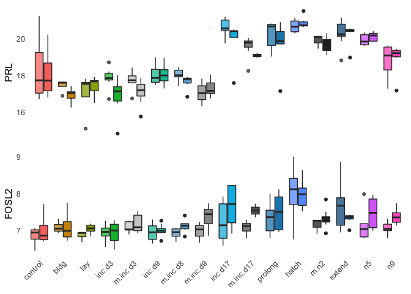
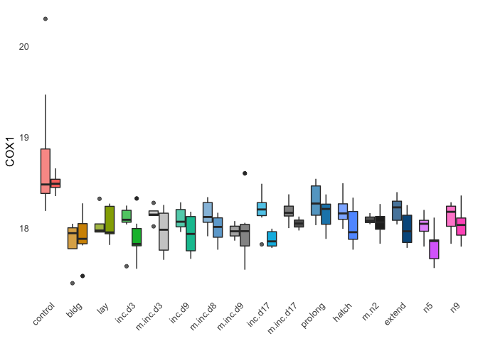
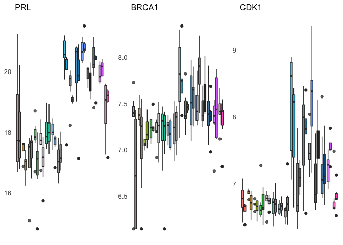
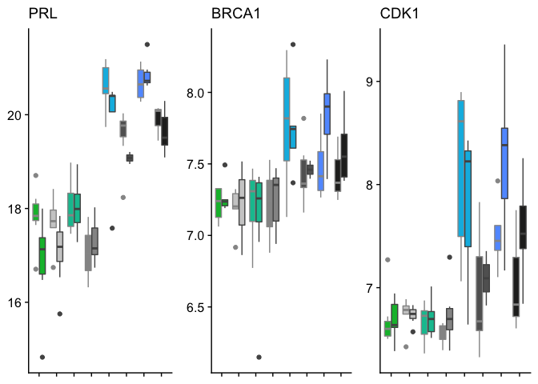
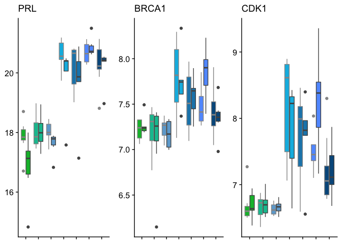

    pseudocounts <- read_csv("../results/01_pseudo.counts.csv")

    ## Warning: Missing column names filled in: 'X1' [1]

    ## Parsed with column specification:
    ## cols(
    ##   .default = col_double(),
    ##   X1 = col_character()
    ## )

    ## See spec(...) for full column specifications.

    head(pseudocounts[1:3])

    ## # A tibble: 6 x 3
    ##   X1           L.Blu13_male_gonad_control… L.Blu13_male_hypothalamus_contr…
    ##   <chr>                              <dbl>                            <dbl>
    ## 1 NP_00100112…                      18.0            283.                   
    ## 2 NP_00100112…                       2.71             0.709                
    ## 3 NP_00100118…                    1249.             562.                   
    ## 4 NP_00100119…                       3.00             0.105                
    ## 5 NP_00100119…                       0.880            0.0000000000000000278
    ## 6 NP_00100120…                     200.              24.1

    geneinfo <- read.csv("../metadata/00_geneinfo.csv", row.names = 1)
    head(geneinfo)

    ##                row.names     Name geneid       entrezid
    ## NP_001001127.1    408082    EDNRB 408082 NP_001001127.1
    ## NP_001001129.1    408183  CYP26A1 408183 NP_001001129.1
    ## NP_001001189.1    374073    CFDP1 374073 NP_001001189.1
    ## NP_001001194.1    407777    AvBD7 407777 NP_001001194.1
    ## NP_001001195.1    407779     KRT5 407779 NP_001001195.1
    ## NP_001001201.1    408034 HSD11B1L 408034 NP_001001201.1

    # prep col data for all samples
    colData <- read.csv("../metadata/00_samples.csv", header = T, row.names = 1)
    colData$treatment <- factor(colData$treatment, levels = alllevels)
    colData <- colData %>% mutate(tissue = fct_recode(tissue, "gonads" = "gonad"))
    colData$tissue <- factor(colData$tissue, levels = tissuelevels)
    row.names(colData) <- colData$V1

    # prep count data for all samples
    countData <- as.data.frame(pseudocounts)
    countData$entrezid <- countData$X1
    countData <- left_join(geneinfo, countData)

    ## Joining, by = "entrezid"

    ## Warning: Column `entrezid` joining factor and character vector, coercing
    ## into character vector

    countData <- countData %>% dplyr::distinct(Name, .keep_all = TRUE) %>%
        dplyr::select(-row.names, -geneid, -entrezid, -X1) 
    countData <- as.data.frame(countData)
    row.names(countData) <- countData$Name
    countData$Name <- NULL
    countData$entrezid <- NULL
    countData <- as.data.frame(t(countData))
    head(countData)

    ##                                            EDNRB     CYP26A1     CFDP1
    ## L.Blu13_male_gonad_control.NYNO         17.98077   2.7135986 1249.1102
    ## L.Blu13_male_hypothalamus_control.NYNO 283.43635   0.7087326  561.5653
    ## L.Blu13_male_pituitary_control.NYNO    121.57418 119.0867999  511.4571
    ## L.G107_male_gonad_control               14.32112   3.4565328 1444.0513
    ## L.G107_male_hypothalamus_control       139.81184   2.9686946  502.4257
    ## L.G107_male_pituitary_control          180.32105  76.4587728  559.8518
    ##                                               AvBD7         KRT5  HSD11B1L
    ## L.Blu13_male_gonad_control.NYNO        3.002295e+00 8.804027e-01 199.97425
    ## L.Blu13_male_hypothalamus_control.NYNO 1.047249e-01 2.775558e-17  24.08970
    ## L.Blu13_male_pituitary_control.NYNO    2.775558e-17 1.619170e-01  76.02903
    ## L.G107_male_gonad_control              2.188347e+00 4.253123e+00 290.11013
    ## L.G107_male_hypothalamus_control       7.083515e-02 2.775558e-17  25.11415
    ## L.G107_male_pituitary_control          2.775558e-17 1.817431e-01  57.70695
    ##                                             EREG    ADCYAP1          EGF
    ## L.Blu13_male_gonad_control.NYNO        33.461186 117.745265    4.1771639
    ## L.Blu13_male_hypothalamus_control.NYNO 10.176796 173.644207 1114.3915628
    ## L.Blu13_male_pituitary_control.NYNO     5.558892   4.237938   32.6956203
    ## L.G107_male_gonad_control               1.444207 190.541974    0.1910504
    ## L.G107_male_hypothalamus_control        1.761512 237.202275 1168.2345043
    ## L.G107_male_pituitary_control          14.804186   1.472809   29.5469103
    ##                                           IGFBP1     IFI6       PAH
    ## L.Blu13_male_gonad_control.NYNO         9.663359 33.52802  7.070497
    ## L.Blu13_male_hypothalamus_control.NYNO 53.149030 11.92388 40.103519
    ## L.Blu13_male_pituitary_control.NYNO    11.329081 40.83308 42.318037
    ## L.G107_male_gonad_control               8.429594 15.60614  5.428570
    ## L.G107_male_hypothalamus_control       31.353826  6.03323 26.259483
    ## L.G107_male_pituitary_control          10.472466 13.75926 24.599521
    ##                                              BVES    TOP1MT       TPH2
    ## L.Blu13_male_gonad_control.NYNO         39.397247  662.6046 265.020912
    ## L.Blu13_male_hypothalamus_control.NYNO 120.177121 1524.9859  11.206999
    ## L.Blu13_male_pituitary_control.NYNO     27.243429 1923.6114   5.775584
    ## L.G107_male_gonad_control               18.871794  785.7475 240.710494
    ## L.G107_male_hypothalamus_control       121.226236 1643.0341   1.996090
    ## L.G107_male_pituitary_control            2.417471 1851.8297   4.287558
    ##                                            POLH    SRSF2 LOC408038
    ## L.Blu13_male_gonad_control.NYNO        17.40153 1686.032 0.1167102
    ## L.Blu13_male_hypothalamus_control.NYNO 27.60745 2645.639 0.2068548
    ## L.Blu13_male_pituitary_control.NYNO    44.17771 2858.116 0.1591596
    ## L.G107_male_gonad_control              18.77000 1643.082 1.6409194
    ## L.G107_male_hypothalamus_control       22.28238 1984.380 0.1391036
    ## L.G107_male_pituitary_control          35.28278 2931.098 0.1786361
    ##                                             KRT14 RP11-196G11.1    TEAD4
    ## L.Blu13_male_gonad_control.NYNO         15.180296      258.0648 43.32794
    ## L.Blu13_male_hypothalamus_control.NYNO  55.037004      823.5801 27.37694
    ## L.Blu13_male_pituitary_control.NYNO    178.490324      300.0633 89.99272
    ## L.G107_male_gonad_control                9.843608      272.0917 38.36416
    ## L.G107_male_hypothalamus_control        81.885504      675.8476 60.41495
    ## L.G107_male_pituitary_control          154.134827      312.1597 25.34841
    ##                                           PPARG       MSTN      SDC2
    ## L.Blu13_male_gonad_control.NYNO        37.51810  25.016245  135.8368
    ## L.Blu13_male_hypothalamus_control.NYNO 25.69207   2.143787 3793.9492
    ## L.Blu13_male_pituitary_control.NYNO    24.55969 178.132867  383.2306
    ## L.G107_male_gonad_control              34.40974   8.701411  107.4456
    ## L.G107_male_hypothalamus_control       30.96485   9.051790 1666.5652
    ## L.G107_male_pituitary_control          13.70514 289.612574  282.2494
    ##                                           ARNTL       RTN1      TOB1
    ## L.Blu13_male_gonad_control.NYNO        808.6347   411.1423  414.1231
    ## L.Blu13_male_hypothalamus_control.NYNO 410.9115 13877.2839  998.8157
    ## L.Blu13_male_pituitary_control.NYNO    389.0432  3692.2925 2822.7004
    ## L.G107_male_gonad_control              794.1656   462.5572  415.1876
    ## L.G107_male_hypothalamus_control       307.9188 11604.9932  710.9535
    ## L.G107_male_pituitary_control          368.0279  3755.0405 4562.0984
    ##                                            IFRD1      LYG2   PTPRVP
    ## L.Blu13_male_gonad_control.NYNO        1011.0107 4.0250461 249.3929
    ## L.Blu13_male_hypothalamus_control.NYNO  382.7547 6.1293169 435.9684
    ## L.Blu13_male_pituitary_control.NYNO     308.7884 0.3086868 554.6611
    ## L.G107_male_gonad_control              1271.2737 2.7352080 613.5667
    ## L.G107_male_hypothalamus_control        433.5909 0.2773478 993.7012
    ## L.G107_male_pituitary_control           428.5840 0.3477384 388.3090
    ##                                           NFKBIA    LEPRE1   LEPREL1
    ## L.Blu13_male_gonad_control.NYNO         80.32528  99.37662  34.15764
    ## L.Blu13_male_hypothalamus_control.NYNO  63.87101  66.91817  35.21718
    ## L.Blu13_male_pituitary_control.NYNO    371.36902 431.79553  73.64238
    ## L.G107_male_gonad_control               92.96349 145.62675  28.58477
    ## L.G107_male_hypothalamus_control       186.75483 131.90610  67.48977
    ## L.G107_male_pituitary_control          306.46988 391.16963 198.75084
    ##                                              FUS   ST8SIA6  ST8SIA2
    ## L.Blu13_male_gonad_control.NYNO         484.0317 355.27159 102.8930
    ## L.Blu13_male_hypothalamus_control.NYNO 1480.5768 391.68336 162.9821
    ## L.Blu13_male_pituitary_control.NYNO    3581.0282  57.82168 901.8259
    ## L.G107_male_gonad_control               596.3552 421.83741 117.4833
    ## L.G107_male_hypothalamus_control       1884.5527 200.50177 235.1326
    ## L.G107_male_pituitary_control          3743.2712 111.69757 914.4333
    ##                                              AvBD12        AvBD5
    ## L.Blu13_male_gonad_control.NYNO        6.132941e+01 2.775558e-17
    ## L.Blu13_male_hypothalamus_control.NYNO 1.285522e+01 1.152277e+01
    ## L.Blu13_male_pituitary_control.NYNO    2.775558e-17 8.306818e-02
    ## L.G107_male_gonad_control              6.917752e+01 2.775558e-17
    ## L.G107_male_hypothalamus_control       2.607605e+01 1.391743e+02
    ## L.G107_male_pituitary_control          2.775558e-17 9.306025e-02
    ##                                            AvBD10        AvBD9    EIF1AD
    ## L.Blu13_male_gonad_control.NYNO        4.84294374 1.348323e+01  81.25657
    ## L.Blu13_male_hypothalamus_control.NYNO 2.98040299 2.775558e-17 167.77204
    ## L.Blu13_male_pituitary_control.NYNO    0.05537604 2.775558e-17 238.83420
    ## L.G107_male_gonad_control              9.87522059 2.775608e+01 101.11384
    ## L.G107_male_hypothalamus_control       1.72719057 2.775558e-17  68.70993
    ## L.G107_male_pituitary_control          0.06199532 2.775558e-17 180.30855
    ##                                            CD74      TGFA    CACNB4
    ## L.Blu13_male_gonad_control.NYNO        105.4822 19.753860  21.25087
    ## L.Blu13_male_hypothalamus_control.NYNO 661.2261 22.969606  43.33678
    ## L.Blu13_male_pituitary_control.NYNO    845.1874 34.375106 100.79811
    ## L.G107_male_gonad_control              152.0784 24.022020  23.36780
    ## L.G107_male_hypothalamus_control       922.7796  6.556323  50.77489
    ## L.G107_male_pituitary_control          592.2281 15.955074 110.63904
    ##                                               CCK       CCKBR      IRX4
    ## L.Blu13_male_gonad_control.NYNO          7.649004  4.98038324 0.5714534
    ## L.Blu13_male_hypothalamus_control.NYNO 450.720070 27.28867853 8.0131989
    ## L.Blu13_male_pituitary_control.NYNO      2.261906  0.02794648 0.2362703
    ## L.G107_male_gonad_control               56.967156 19.50875247 2.2861980
    ## L.G107_male_hypothalamus_control       218.073377 26.92388145 0.6348445
    ## L.G107_male_pituitary_control            5.678991  0.03126619 0.2656853
    ##                                             VSIG1   ST8SIA3    CYB5A
    ## L.Blu13_male_gonad_control.NYNO        11.0970008 1025.6896 328.5600
    ## L.Blu13_male_hypothalamus_control.NYNO 12.0175870 1906.3699 803.1361
    ## L.Blu13_male_pituitary_control.NYNO     0.2872303 1694.4800 797.5606
    ## L.G107_male_gonad_control              19.4591597  931.3397 425.7915
    ## L.G107_male_hypothalamus_control       11.3968933 1685.6131 495.7753
    ## L.G107_male_pituitary_control           2.5966202 1594.8915 877.1402
    ##                                            CYP3A7      CYP2C45
    ## L.Blu13_male_gonad_control.NYNO        3.52243091 2.239960e+00
    ## L.Blu13_male_hypothalamus_control.NYNO 1.07072656 2.775558e-17
    ## L.Blu13_male_pituitary_control.NYNO    0.08287061 2.802120e-02
    ## L.G107_male_gonad_control              4.04813122 1.180594e-01
    ## L.G107_male_hypothalamus_control       0.68617169 2.775558e-17
    ## L.G107_male_pituitary_control          0.09283847 1.824101e+00
    ##                                              CYP7A1      THBS2   CYP11A1
    ## L.Blu13_male_gonad_control.NYNO        3.250847e-01  2.9270688 112.67264
    ## L.Blu13_male_hypothalamus_control.NYNO 2.775558e-17 15.3747571  22.97885
    ## L.Blu13_male_pituitary_control.NYNO    1.778686e+00 12.3303008  88.05679
    ## L.G107_male_gonad_control              2.153146e-01  0.3011995 141.24671
    ## L.G107_male_hypothalamus_control       2.775558e-17 13.5304685  22.09806
    ## L.G107_male_pituitary_control          6.219293e-02 13.6706156 132.57474
    ##                                           CYP2C8      CDH6      CDHR1
    ## L.Blu13_male_gonad_control.NYNO         73.55017  14.93609  5.8312018
    ## L.Blu13_male_hypothalamus_control.NYNO  88.53957 428.30227 38.3785184
    ## L.Blu13_male_pituitary_control.NYNO    821.15451 132.05881  0.3338299
    ## L.G107_male_gonad_control              116.91966  31.11279 10.2431469
    ## L.G107_male_hypothalamus_control       217.81278 402.42305 19.4892421
    ## L.G107_male_pituitary_control          559.75252  75.90960  0.3762965
    ##                                           CYP19A1     SLC5A7    PDLIM3
    ## L.Blu13_male_gonad_control.NYNO          6.859692  4.1702134 137.81810
    ## L.Blu13_male_hypothalamus_control.NYNO 470.903038 45.4198515  81.52359
    ## L.Blu13_male_pituitary_control.NYNO     79.480957  0.4048003 158.73593
    ## L.G107_male_gonad_control                3.848550  6.0868883  81.21298
    ## L.G107_male_hypothalamus_control       401.609335 79.9241243  63.91000
    ## L.G107_male_pituitary_control           77.546232  0.4571005  50.09112
    ##                                            UBA5   RNF114    SLC24A2
    ## L.Blu13_male_gonad_control.NYNO        206.6180 405.3759  0.2296165
    ## L.Blu13_male_hypothalamus_control.NYNO 539.5305 638.1653 16.3693293
    ## L.Blu13_male_pituitary_control.NYNO    586.3718 786.4072 20.9844892
    ## L.G107_male_gonad_control              255.7447 335.5968  0.1530774
    ## L.G107_male_hypothalamus_control       502.4252 707.5538 20.6788586
    ## L.G107_male_pituitary_control          540.1151 635.0664  7.9501847
    ##                                            SLC24A1     GSTA     GSTA3
    ## L.Blu13_male_gonad_control.NYNO        12.60201996 2149.259 19.745160
    ## L.Blu13_male_hypothalamus_control.NYNO  9.10731280 1144.819 43.528628
    ## L.Blu13_male_pituitary_control.NYNO     0.08215013 2015.141  7.708822
    ## L.G107_male_gonad_control              21.94716227 2553.381 35.169756
    ## L.G107_male_hypothalamus_control        2.83229654 1192.735  7.876376
    ## L.G107_male_pituitary_control           0.09202972 2721.411 13.971308
    ##                                            CMTM3       AvBD11     RPS13
    ## L.Blu13_male_gonad_control.NYNO         51.28100 1.724091e-01  804.4463
    ## L.Blu13_male_hypothalamus_control.NYNO  67.95395 2.775558e-17  497.3103
    ## L.Blu13_male_pituitary_control.NYNO    102.85938 2.807916e-02 1856.6217
    ## L.G107_male_gonad_control               48.89825 1.153900e-01  695.0538
    ## L.G107_male_hypothalamus_control        37.95810 2.775558e-17  876.2700
    ## L.G107_male_pituitary_control           54.64459 3.141472e-02 1621.1042
    ##                                             THPO     XYLT2      STMN1
    ## L.Blu13_male_gonad_control.NYNO        3.2581929 0.1754172 11646.5931
    ## L.Blu13_male_hypothalamus_control.NYNO 0.5999393 3.5406100  8455.1450
    ## L.Blu13_male_pituitary_control.NYNO    2.3763707 0.1369120   548.6014
    ## L.G107_male_gonad_control              3.8601459 0.1173790 11639.7314
    ## L.G107_male_hypothalamus_control       0.3946072 0.2072472  5257.4334
    ## L.G107_male_pituitary_control          2.6043777 0.1535825   893.3017
    ##                                          CYP4V2      CYP17A1  CSNK2A1
    ## L.Blu13_male_gonad_control.NYNO        30.12507  375.2222639 1504.016
    ## L.Blu13_male_hypothalamus_control.NYNO 80.33664    2.7454226 1308.371
    ## L.Blu13_male_pituitary_control.NYNO    88.77835    0.2610806 1428.577
    ## L.G107_male_gonad_control              27.82812 1029.9894120 1512.719
    ## L.G107_male_hypothalamus_control       85.13263    1.6101817 1323.321
    ## L.G107_male_pituitary_control          76.81386    2.5247901 1334.355
    ##                                            GATA2    CCNB2       RHCG
    ## L.Blu13_male_gonad_control.NYNO         60.66634 784.3260 25.6127655
    ## L.Blu13_male_hypothalamus_control.NYNO  43.04172 603.8066  0.6947928
    ## L.Blu13_male_pituitary_control.NYNO    576.90047 964.5035  3.1324873
    ## L.G107_male_gonad_control               96.58175 717.8428  7.1124660
    ## L.G107_male_hypothalamus_control        59.55507 612.4992  0.4545874
    ## L.G107_male_pituitary_control          490.64139 870.9671  0.7329856
    ##                                            GCSH     PNAT3         HBZ
    ## L.Blu13_male_gonad_control.NYNO        133.2457  6.088462 21.72843335
    ## L.Blu13_male_hypothalamus_control.NYNO 210.2091 30.455265  0.10472495
    ## L.Blu13_male_pituitary_control.NYNO    133.8439  4.944843  0.13630834
    ## L.G107_male_gonad_control              130.8948  8.994615  9.55853653
    ## L.G107_male_hypothalamus_control       231.5606 36.320133  0.07083515
    ## L.G107_male_pituitary_control          125.8865  3.509088  0.15290301
    ##                                               HBAD       HBAA    PAM16
    ## L.Blu13_male_gonad_control.NYNO        73.78300556   389.8498 184.7777
    ## L.Blu13_male_hypothalamus_control.NYNO  0.10472495  2486.0045 111.8565
    ## L.Blu13_male_pituitary_control.NYNO     0.10910369 15058.2688 271.8319
    ## L.G107_male_gonad_control              92.29303498   314.0081 281.9030
    ## L.G107_male_hypothalamus_control        0.07083515 20200.3713 328.4153
    ## L.G107_male_pituitary_control           0.12230510 14991.8817 279.1598
    ##                                           GNB2L1    RPL7A    CAPZA2
    ## L.Blu13_male_gonad_control.NYNO        3155.9051 3553.013  649.7067
    ## L.Blu13_male_hypothalamus_control.NYNO  875.3487 1868.914 3097.6893
    ## L.Blu13_male_pituitary_control.NYNO    4113.6143 4774.050  881.9805
    ## L.G107_male_gonad_control              3121.7772 2675.149  514.2396
    ## L.G107_male_hypothalamus_control       1471.9247 2716.864 1846.6816
    ## L.G107_male_pituitary_control          2920.3388 3664.873  861.9504
    ##                                              EPYC       IGF1      EPHB6
    ## L.Blu13_male_gonad_control.NYNO        3.17539927  47.157078   4.795942
    ## L.Blu13_male_hypothalamus_control.NYNO 0.97257168  88.713973 267.037278
    ## L.Blu13_male_pituitary_control.NYNO    0.02791043   9.139185  67.988304
    ## L.G107_male_gonad_control              2.28489990  15.844254   4.889726
    ## L.G107_male_hypothalamus_control       3.33262290 169.129256 436.468128
    ## L.G107_male_pituitary_control          0.03122582   4.063477  39.807676
    ##                                            CCT8     CDH4    COL20A1
    ## L.Blu13_male_gonad_control.NYNO        2328.403 1342.013  0.2011335
    ## L.Blu13_male_hypothalamus_control.NYNO 1747.651 2082.792  0.3065108
    ## L.Blu13_male_pituitary_control.NYNO    1412.518 2737.589  7.6911715
    ## L.G107_male_gonad_control              2018.576 1393.611  0.1343503
    ## L.G107_male_hypothalamus_control       1921.790 1749.583  2.3402237
    ## L.G107_male_pituitary_control          1411.745 2306.851 18.6988075
    ##                                             STMN3     CNTN2  RNF113A
    ## L.Blu13_male_gonad_control.NYNO         114.77662  11.67111 505.3015
    ## L.Blu13_male_hypothalamus_control.NYNO 8114.31316 664.02872  87.3719
    ## L.Blu13_male_pituitary_control.NYNO    1991.07364  15.06276 265.3434
    ## L.G107_male_gonad_control                87.84815  16.54418 612.2411
    ## L.G107_male_hypothalamus_control       6389.67201 817.55639 202.0203
    ## L.G107_male_pituitary_control          1522.22143  36.33983 248.5371
    ##                                           SF3A2     LY86    TUBB2B
    ## L.Blu13_male_gonad_control.NYNO        336.3167 209.2966 98017.998
    ## L.Blu13_male_hypothalamus_control.NYNO 525.0667 472.7060 17570.921
    ## L.Blu13_male_pituitary_control.NYNO    316.1794 211.2529  8139.951
    ## L.G107_male_gonad_control              276.5866 220.6057 87603.263
    ## L.G107_male_hypothalamus_control       601.2936 667.8111 26555.008
    ## L.G107_male_pituitary_control          298.4796 253.8740  8614.103
    ##                                            PPAT      WDR1        SLBP
    ## L.Blu13_male_gonad_control.NYNO        316.4483 1034.1698 2134.556358
    ## L.Blu13_male_hypothalamus_control.NYNO 143.8234 2234.7102   20.785829
    ## L.Blu13_male_pituitary_control.NYNO    127.9058 1323.1622    9.617528
    ## L.G107_male_gonad_control              294.5734  738.5965 1758.467637
    ## L.G107_male_hypothalamus_control       104.3400 2474.9999   12.882243
    ## L.G107_male_pituitary_control          188.7911 1337.9052   13.336483
    ##                                           CAPN3      CFL2       GYPC
    ## L.Blu13_male_gonad_control.NYNO        38.53443  149.0394  10.222373
    ## L.Blu13_male_hypothalamus_control.NYNO 24.18898 1205.4031   8.645827
    ## L.Blu13_male_pituitary_control.NYNO    16.56954  304.8183 132.939067
    ## L.G107_male_gonad_control              33.05180  140.1513   3.382646
    ## L.G107_male_hypothalamus_control       43.92102 1340.1168  45.876698
    ## L.G107_male_pituitary_control          24.84859  362.6175 107.837614
    ##                                              VTG1     TRPC1    PIK3CA
    ## L.Blu13_male_gonad_control.NYNO        15.4623038  275.7894  726.6840
    ## L.Blu13_male_hypothalamus_control.NYNO  7.2197539 2370.0431 1343.9956
    ## L.Blu13_male_pituitary_control.NYNO     0.1873817 1453.8099  760.6934
    ## L.G107_male_gonad_control               4.9075745  287.6915  605.4440
    ## L.G107_male_hypothalamus_control        8.4069214 2041.0184 1216.4775
    ## L.G107_male_pituitary_control           0.2104572 1348.6109  900.6348
    ##                                             MME    NCSTN       IL10
    ## L.Blu13_male_gonad_control.NYNO        751.8005 431.8497 0.14503594
    ## L.Blu13_male_hypothalamus_control.NYNO 300.0486 690.4402 0.70024831
    ## L.Blu13_male_pituitary_control.NYNO    448.7041 897.6315 7.09805159
    ## L.G107_male_gonad_control              696.4374 426.8572 0.09725182
    ## L.G107_male_hypothalamus_control       186.4899 878.1446 0.45801782
    ## L.G107_male_pituitary_control          348.6739 954.8373 0.90848574
    ##                                            SIRT1     MCAM    PDLIM7
    ## L.Blu13_male_gonad_control.NYNO         909.8039 321.2343 114.28521
    ## L.Blu13_male_hypothalamus_control.NYNO  997.9800 408.5082  50.95602
    ## L.Blu13_male_pituitary_control.NYNO    1147.0130 590.8248 149.83317
    ## L.G107_male_gonad_control              1059.2761 554.4241 102.79295
    ## L.G107_male_hypothalamus_control        906.6638 803.2464  94.93646
    ## L.G107_male_pituitary_control          1157.4952 877.9859 141.41339
    ##                                             TSKU      EVC     MEOX2
    ## L.Blu13_male_gonad_control.NYNO         3.456692 310.5770  82.32349
    ## L.Blu13_male_hypothalamus_control.NYNO 79.376014 258.5242 139.40295
    ## L.Blu13_male_pituitary_control.NYNO    71.057397 247.0752 119.75446
    ## L.G107_male_gonad_control               2.438209 232.8656  51.11769
    ## L.G107_male_hypothalamus_control       49.331608 164.8954 200.48087
    ## L.G107_male_pituitary_control          45.829433 268.0955  73.01511
    ##                                            FKBP5       CYP8B1     PLOD1
    ## L.Blu13_male_gonad_control.NYNO         867.4519 2.775558e-17  596.7669
    ## L.Blu13_male_hypothalamus_control.NYNO  527.5065 2.775558e-17  114.9480
    ## L.Blu13_male_pituitary_control.NYNO    8291.0985 2.775558e-17 1112.9375
    ## L.G107_male_gonad_control               816.4832 2.775558e-17  260.0486
    ## L.G107_male_hypothalamus_control        882.5211 2.775558e-17  120.9784
    ## L.G107_male_pituitary_control          4849.0918 2.775558e-17  352.1402
    ##                                             AVEN     SSRP1     SNTB1
    ## L.Blu13_male_gonad_control.NYNO        226.47395 1161.6000  179.2000
    ## L.Blu13_male_hypothalamus_control.NYNO 189.06729  316.4460 1637.4598
    ## L.Blu13_male_pituitary_control.NYNO     94.00538 1024.8573 1089.3146
    ## L.G107_male_gonad_control              177.45261 1432.5245  143.3324
    ## L.G107_male_hypothalamus_control       104.27419  655.6579 1510.8398
    ## L.G107_male_pituitary_control           31.47878 1042.3404  762.2036
    ##                                        CTD-2116N17.1    SEC11A     TMOD3
    ## L.Blu13_male_gonad_control.NYNO             608.6482 463.01645  353.9523
    ## L.Blu13_male_hypothalamus_control.NYNO      217.9375  92.73969  887.6077
    ## L.Blu13_male_pituitary_control.NYNO         268.9437 175.31955 1320.8440
    ## L.G107_male_gonad_control                   746.5933 470.65019  358.5865
    ## L.G107_male_hypothalamus_control            220.3900 162.72567 1056.4050
    ## L.G107_male_pituitary_control               324.7660 162.13013 1371.2124
    ##                                           BTBD1    MRPS11    SNRPA1
    ## L.Blu13_male_gonad_control.NYNO        451.0836 0.3347595 588.08474
    ## L.Blu13_male_hypothalamus_control.NYNO 705.3525 4.0979993 183.54922
    ## L.Blu13_male_pituitary_control.NYNO    625.5679 3.8243629 130.84370
    ## L.G107_male_gonad_control              562.9993 1.9786537 625.00015
    ## L.G107_male_hypothalamus_control       564.1535 0.3360936 134.29452
    ## L.G107_male_pituitary_control          707.8431 6.5350513  99.62864
    ##                                            VWA9    RAB11A    MAP2K1
    ## L.Blu13_male_gonad_control.NYNO        288.2913  845.1221  733.6419
    ## L.Blu13_male_hypothalamus_control.NYNO 404.8147 2027.8223 1796.3933
    ## L.Blu13_male_pituitary_control.NYNO    396.3635 1576.6236 1139.3919
    ## L.G107_male_gonad_control              258.7373  776.5038  666.8577
    ## L.G107_male_hypothalamus_control       440.0853 1691.6225 2089.2167
    ## L.G107_male_pituitary_control          479.9541 1851.6285 1247.5206
    ##                                           CFAP20   CIAPIN1     E2F4
    ## L.Blu13_male_gonad_control.NYNO        1927.8327 1068.5842 236.2493
    ## L.Blu13_male_hypothalamus_control.NYNO  297.7441 1039.3277 210.5547
    ## L.Blu13_male_pituitary_control.NYNO     888.9351  869.3777 323.8977
    ## L.G107_male_gonad_control              2195.8261 1054.0117 318.2662
    ## L.G107_male_hypothalamus_control        500.9343 1165.5425 331.9917
    ## L.G107_male_pituitary_control           914.7240  963.9617 395.8264
    ##                                             BRD7     ITFG1   DNAJA2
    ## L.Blu13_male_gonad_control.NYNO        2213.9743  717.7079 2133.004
    ## L.Blu13_male_hypothalamus_control.NYNO  772.4391 5559.8484 2310.688
    ## L.Blu13_male_pituitary_control.NYNO     633.7761 3114.4536 1465.397
    ## L.G107_male_gonad_control              2147.8502  784.1844 2271.712
    ## L.G107_male_hypothalamus_control        471.2576 4151.1021 2014.415
    ## L.G107_male_pituitary_control           741.3967 2879.4368 1556.828
    ##                                           VPS35   UQCRFS1      HES4
    ## L.Blu13_male_gonad_control.NYNO        1143.452  828.8162  75.83833
    ## L.Blu13_male_hypothalamus_control.NYNO 2498.769  574.2228  74.62519
    ## L.Blu13_male_pituitary_control.NYNO    1591.007  547.9312 161.97502
    ## L.G107_male_gonad_control              1031.198  988.8254  76.97958
    ## L.G107_male_hypothalamus_control       2055.020 1045.3249  60.66142
    ## L.G107_male_pituitary_control          1447.804  616.9776 261.10305
    ##                                             GPI    USP10    DHODH     USP4
    ## L.Blu13_male_gonad_control.NYNO        2056.120 558.8217 23.73483 693.6275
    ## L.Blu13_male_hypothalamus_control.NYNO 6874.272 975.0348 12.50365 495.4665
    ## L.Blu13_male_pituitary_control.NYNO    1853.085 694.8365 74.22484 811.0731
    ## L.G107_male_gonad_control              3162.221 584.0993 17.56040 837.5019
    ## L.G107_male_hypothalamus_control       6505.247 956.1920 64.78240 768.0243
    ## L.G107_male_pituitary_control          2121.171 728.4144 39.31287 815.4665
    ##                                           WDR82    ACAD9 C12H3ORF37
    ## L.Blu13_male_gonad_control.NYNO        2500.163 455.6837   884.3054
    ## L.Blu13_male_hypothalamus_control.NYNO 1336.725 586.6065   200.7427
    ## L.Blu13_male_pituitary_control.NYNO    1818.173 500.4355   520.5027
    ## L.G107_male_gonad_control              2353.695 682.1021   912.5680
    ## L.G107_male_hypothalamus_control       1728.601 559.0286   201.0458
    ## L.G107_male_pituitary_control          1381.445 624.7317   508.2432
    ##                                           RUVBL1  CCDC174    SUCLG2
    ## L.Blu13_male_gonad_control.NYNO        3113.7655 264.3364  277.1480
    ## L.Blu13_male_hypothalamus_control.NYNO  750.8216 328.2917 1124.4504
    ## L.Blu13_male_pituitary_control.NYNO     685.7994 231.6617  819.6408
    ## L.G107_male_gonad_control              2395.7322 262.5169  188.7361
    ## L.G107_male_hypothalamus_control        651.4502 211.8331  563.2188
    ## L.G107_male_pituitary_control           717.7114 218.3975 1013.5498
    ##                                           PPP4R2    EDEM1      HARS
    ## L.Blu13_male_gonad_control.NYNO        1091.0099 287.8194  671.4500
    ## L.Blu13_male_hypothalamus_control.NYNO  702.4702 439.5447  704.9573
    ## L.Blu13_male_pituitary_control.NYNO     527.1363 595.6126 1175.7447
    ## L.G107_male_gonad_control               828.1813 258.5363  850.6425
    ## L.G107_male_hypothalamus_control        432.8417 476.4108 1370.7536
    ## L.G107_male_pituitary_control           551.9318 535.9972 1089.0278
    ##                                               IK     SLU7    HSPA9
    ## L.Blu13_male_gonad_control.NYNO         972.8444 1461.029 2025.999
    ## L.Blu13_male_hypothalamus_control.NYNO 1246.0685 2034.494 2743.531
    ## L.Blu13_male_pituitary_control.NYNO    2655.2678 1644.166 2426.042
    ## L.G107_male_gonad_control              1114.0040 1771.639 1744.987
    ## L.G107_male_hypothalamus_control       1519.4149 1368.369 3624.326
    ## L.G107_male_pituitary_control          2614.0060 1581.566 2438.247
    ##                                             BRD8      TIMD4     G3BP1
    ## L.Blu13_male_gonad_control.NYNO        1088.2429  4.2389760 1180.0798
    ## L.Blu13_male_hypothalamus_control.NYNO  802.2285  0.2074598  957.9625
    ## L.Blu13_male_pituitary_control.NYNO    1751.9243  0.5470383 1125.7791
    ## L.G107_male_gonad_control              1040.8517 13.7633245 1041.9001
    ## L.G107_male_hypothalamus_control        986.7184  0.1395057  986.5034
    ## L.G107_male_pituitary_control          1598.5140  5.1303653 1273.4380
    ##                                            RBM22   PPP2CA CTD-2410N18.5
    ## L.Blu13_male_gonad_control.NYNO        1061.2951 1815.779     10709.420
    ## L.Blu13_male_hypothalamus_control.NYNO  427.1328 3382.847     11498.792
    ## L.Blu13_male_pituitary_control.NYNO     742.6757 2112.939      5606.618
    ## L.G107_male_gonad_control              1120.1273 1820.121      9608.059
    ## L.G107_male_hypothalamus_control        606.4824 3331.067      7529.219
    ## L.G107_male_pituitary_control           914.3431 2565.441      5698.530
    ##                                        C13H5ORF15   GNPDA1     CCZ1
    ## L.Blu13_male_gonad_control.NYNO          782.4060 118.3690 1925.687
    ## L.Blu13_male_hypothalamus_control.NYNO   876.4988 354.4885 1596.919
    ## L.Blu13_male_pituitary_control.NYNO      580.2978 509.1886 1980.490
    ## L.G107_male_gonad_control                732.1032 194.9458 1720.033
    ## L.G107_male_hypothalamus_control         634.1055 455.7721 1750.997
    ## L.G107_male_pituitary_control            702.4191 379.8239 2028.967
    ##                                            NUDT1    CARD11     WIPI2
    ## L.Blu13_male_gonad_control.NYNO        174.01056 124.88322  830.1340
    ## L.Blu13_male_hypothalamus_control.NYNO  26.49641  45.64594  785.5543
    ## L.Blu13_male_pituitary_control.NYNO     64.34227 195.60606  979.4434
    ## L.G107_male_gonad_control              182.10509 257.11850 1038.9327
    ## L.G107_male_hypothalamus_control        20.40959  46.61367 1017.2940
    ## L.G107_male_pituitary_control           60.19632 122.92060 1040.5627
    ##                                            COPS3      PEMT      TBL3
    ## L.Blu13_male_gonad_control.NYNO        3058.2094  906.1986 1995.2911
    ## L.Blu13_male_hypothalamus_control.NYNO  664.3678  494.2691  211.8981
    ## L.Blu13_male_pituitary_control.NYNO     286.6001  673.9783  335.5594
    ## L.G107_male_gonad_control              3488.2642 1041.1788 1671.6431
    ## L.G107_male_hypothalamus_control        512.1030  650.6668  262.6729
    ## L.G107_male_pituitary_control           350.3342  885.7560  391.2121
    ##                                           LCMT1       NDE1    FOPNL
    ## L.Blu13_male_gonad_control.NYNO        722.4803 2113.69416 668.1404
    ## L.Blu13_male_hypothalamus_control.NYNO 469.2501   86.52895 183.3388
    ## L.Blu13_male_pituitary_control.NYNO    201.5932   17.67942 275.9881
    ## L.G107_male_gonad_control              826.8387 1964.44813 526.1957
    ## L.G107_male_hypothalamus_control       482.4501   71.20776 189.1912
    ## L.G107_male_pituitary_control          267.9010   30.07834 228.6695
    ##                                        RP11-1035H13.3   METTL9     RMI2
    ## L.Blu13_male_gonad_control.NYNO              1340.275 388.9731 433.0253
    ## L.Blu13_male_hypothalamus_control.NYNO       2846.408 271.3865 743.5343
    ## L.Blu13_male_pituitary_control.NYNO          1762.788 162.5911 474.8400
    ## L.G107_male_gonad_control                    1266.240 329.1073 427.9492
    ## L.G107_male_hypothalamus_control             3345.729 106.3483 534.7263
    ## L.G107_male_pituitary_control                1779.288 159.0119 396.4872
    ##                                            TRAP1    CORO7     APMAP
    ## L.Blu13_male_gonad_control.NYNO         501.8174 101.7137  786.0739
    ## L.Blu13_male_hypothalamus_control.NYNO  871.6173 134.4241 1345.4083
    ## L.Blu13_male_pituitary_control.NYNO    1073.4781 154.7650  579.4740
    ## L.G107_male_gonad_control               527.5289 126.2713  726.4793
    ## L.G107_male_hypothalamus_control       1186.9910 153.6569 1134.5085
    ## L.G107_male_pituitary_control           910.9498 149.8777  681.4017
    ##                                           SEC23B AL158801.1    TOP3B
    ## L.Blu13_male_gonad_control.NYNO         991.4750  1937.2010 540.8388
    ## L.Blu13_male_hypothalamus_control.NYNO 2042.2267  2494.2551 391.7346
    ## L.Blu13_male_pituitary_control.NYNO    1285.1898   706.4228 520.8747
    ## L.G107_male_gonad_control               885.5436  1561.5807 505.9718
    ## L.G107_male_hypothalamus_control       1854.4130  1033.9956 428.3237
    ## L.G107_male_pituitary_control          1389.9219   709.1974 532.6040
    ##                                           SEPT2L    RANBP1      AACS
    ## L.Blu13_male_gonad_control.NYNO         397.7611 1571.8444 6091.4844
    ## L.Blu13_male_hypothalamus_control.NYNO 1634.6691  779.7842 1812.7414
    ## L.Blu13_male_pituitary_control.NYNO    1452.0461  474.7934  682.7456
    ## L.G107_male_gonad_control               371.3757 1361.4969 4935.4738
    ## L.G107_male_hypothalamus_control       1668.3804  411.4645 1729.9282
    ## L.G107_male_pituitary_control          1325.5120  506.0061  669.5818
    ##                                           DDX55      SSPO   ANAPC5
    ## L.Blu13_male_gonad_control.NYNO        245.6422  903.2175 583.5729
    ## L.Blu13_male_hypothalamus_control.NYNO 238.2792  976.2741 427.4702
    ## L.Blu13_male_pituitary_control.NYNO    221.4468 1152.3675 415.4889
    ## L.G107_male_gonad_control              244.4890 1025.4209 622.2404
    ## L.G107_male_hypothalamus_control       126.9829  812.4068 489.5414
    ## L.G107_male_pituitary_control          247.9295 1541.0677 553.0584
    ##                                        RP11-87C12.2    PPP1CC    TRAFD1
    ## L.Blu13_male_gonad_control.NYNO            437.4632  3.466884 456.65930
    ## L.Blu13_male_hypothalamus_control.NYNO     337.8451  1.252862  85.79840
    ## L.Blu13_male_pituitary_control.NYNO        566.2177 16.627344 134.60596
    ## L.G107_male_gonad_control                  362.7750  4.009016 215.19758
    ## L.G107_male_hypothalamus_control           287.0836  7.552751 113.28477
    ## L.G107_male_pituitary_control              590.4622  9.916303  83.90579
    ##                                             XBP1    ACADS    THOC5
    ## L.Blu13_male_gonad_control.NYNO        130.74787 310.4605 955.1842
    ## L.Blu13_male_hypothalamus_control.NYNO 378.80448 460.4014 204.7033
    ## L.Blu13_male_pituitary_control.NYNO    680.11902 814.7089 827.6768
    ## L.G107_male_gonad_control               88.51777 273.7380 867.7880
    ## L.G107_male_hypothalamus_control       441.18311 719.7400 423.7084
    ## L.G107_male_pituitary_control          860.70156 721.4045 947.4762
    ##                                           PMPCA     WDR5    FUBP3
    ## L.Blu13_male_gonad_control.NYNO        289.5994 388.8969 167.0072
    ## L.Blu13_male_hypothalamus_control.NYNO 457.3979 465.9683 391.6512
    ## L.Blu13_male_pituitary_control.NYNO    499.7223 336.1264 374.7707
    ## L.G107_male_gonad_control              238.5667 338.0911 233.3664
    ## L.G107_male_hypothalamus_control       520.5122 341.2085 385.9556
    ## L.G107_male_pituitary_control          588.0098 219.5216 439.7881
    ##                                             CDK9    NELFB     EDF1
    ## L.Blu13_male_gonad_control.NYNO        402.80615 845.0718 2615.591
    ## L.Blu13_male_hypothalamus_control.NYNO  80.20912 138.0737 1463.932
    ## L.Blu13_male_pituitary_control.NYNO    405.58252 373.8775 1072.672
    ## L.G107_male_gonad_control              509.79470 790.2933 2876.237
    ## L.G107_male_hypothalamus_control       282.67143 303.4830 1483.323
    ## L.G107_male_pituitary_control          384.16903 376.8835 1091.974
    ##                                            SRP68     ACOX1     GPS1
    ## L.Blu13_male_gonad_control.NYNO        1038.2971  554.2016 2124.518
    ## L.Blu13_male_hypothalamus_control.NYNO  799.9898 1460.6029 1175.977
    ## L.Blu13_male_pituitary_control.NYNO    1180.5753 1226.4075 1520.706
    ## L.G107_male_gonad_control               864.3641  484.9315 2153.267
    ## L.G107_male_hypothalamus_control       1069.9171 1244.3104 1512.514
    ## L.G107_male_pituitary_control          1238.3471 1147.7566 1738.144
    ##                                            UTP6    RHOT1     NOL11
    ## L.Blu13_male_gonad_control.NYNO        334.1172 259.7144 1394.5729
    ## L.Blu13_male_hypothalamus_control.NYNO 220.8615 946.7004  430.8171
    ## L.Blu13_male_pituitary_control.NYNO    156.0450 432.7440  276.3815
    ## L.G107_male_gonad_control              303.0035 199.4186 1198.9054
    ## L.G107_male_hypothalamus_control       194.2667 682.9685  309.1663
    ## L.G107_male_pituitary_control          247.4376 525.2085  325.6025
    ##                                            SBDS  WBSCR16    PRKRIP1
    ## L.Blu13_male_gonad_control.NYNO        976.8719 149.1779  58.319994
    ## L.Blu13_male_hypothalamus_control.NYNO 604.8217 217.0784 102.294719
    ## L.Blu13_male_pituitary_control.NYNO    831.4186 226.8814 113.889636
    ## L.G107_male_gonad_control              903.5408 202.1957  76.207258
    ## L.G107_male_hypothalamus_control       889.8046 306.6585   4.542404
    ## L.G107_male_pituitary_control          725.7571 239.0302  82.738209
    ##                                             LIG3    CCT6A    YWHAE
    ## L.Blu13_male_gonad_control.NYNO        1398.0758 9219.034 2174.324
    ## L.Blu13_male_hypothalamus_control.NYNO  512.7837 1821.073 6791.210
    ## L.Blu13_male_pituitary_control.NYNO     852.3143 2490.530 4390.842
    ## L.G107_male_gonad_control              1635.7009 8355.873 1933.942
    ## L.G107_male_hypothalamus_control        553.2346 1847.857 6135.418
    ## L.G107_male_pituitary_control           925.8544 2419.831 4636.000
    ##                                            RPA1    TRIM37    PSMC2
    ## L.Blu13_male_gonad_control.NYNO        1472.711 2745.6558 3250.462
    ## L.Blu13_male_hypothalamus_control.NYNO 1003.563 1327.3705 1321.055
    ## L.Blu13_male_pituitary_control.NYNO    1973.018  832.7755 1268.679
    ## L.G107_male_gonad_control              1415.363 4081.9819 3420.944
    ## L.G107_male_hypothalamus_control       1303.949 1727.4609 1402.750
    ## L.G107_male_pituitary_control          2314.692 1043.8180 1229.746
    ##                                           PHTF2   MAPK11       TFEC
    ## L.Blu13_male_gonad_control.NYNO        555.4105 105.6015 0.14496349
    ## L.Blu13_male_hypothalamus_control.NYNO 255.0101 299.1985 0.69644290
    ## L.Blu13_male_pituitary_control.NYNO    221.7991 196.7783 0.05555826
    ## L.G107_male_gonad_control              497.9479 142.2318 1.68894447
    ## L.G107_male_hypothalamus_control       153.5533 124.7872 4.73206297
    ## L.G107_male_pituitary_control          230.2650 157.6629 0.06219959
    ##                                            THAP5    RPAP3    POC1B
    ## L.Blu13_male_gonad_control.NYNO        1553.4341 858.2988 775.2677
    ## L.Blu13_male_hypothalamus_control.NYNO  411.5845 863.8137 152.1147
    ## L.Blu13_male_pituitary_control.NYNO     296.6649 534.6636 134.8692
    ## L.G107_male_gonad_control              1072.7364 639.6995 855.5671
    ## L.G107_male_hypothalamus_control        345.6989 339.2205  97.3177
    ## L.G107_male_pituitary_control           391.4746 432.4921 112.9858
    ##                                          METAP2    LTA4H      TMPO
    ## L.Blu13_male_gonad_control.NYNO        536.2541 512.0318 1145.0746
    ## L.Blu13_male_hypothalamus_control.NYNO 468.3192 821.2230 1373.4963
    ## L.Blu13_male_pituitary_control.NYNO    651.0541 823.7696  899.9586
    ## L.G107_male_gonad_control              593.1404 412.9531 1267.7065
    ## L.G107_male_hypothalamus_control       540.4963 630.4028  645.8752
    ## L.G107_male_pituitary_control          623.9520 684.0755  897.7307
    ##                                         L3MBTL2  RPS19BP1     TAB1
    ## L.Blu13_male_gonad_control.NYNO        560.5371 309.98436 112.5853
    ## L.Blu13_male_hypothalamus_control.NYNO 388.1744  87.29248 169.4153
    ## L.Blu13_male_pituitary_control.NYNO    558.0847  94.71634 554.4906
    ## L.G107_male_gonad_control              546.0608 256.82449 120.0147
    ## L.G107_male_hypothalamus_control       460.5383 155.56711 345.3444
    ## L.G107_male_pituitary_control          560.7061 113.58825 553.7368
    ##                                            RPL3     DNAL4      MCM5
    ## L.Blu13_male_gonad_control.NYNO        2697.561  854.3484 279.88607
    ## L.Blu13_male_hypothalamus_control.NYNO 1928.152  422.6324  29.51022
    ## L.Blu13_male_pituitary_control.NYNO    5457.512  271.0422 323.81366
    ## L.G107_male_gonad_control              2602.316 1058.6685 240.15075
    ## L.G107_male_hypothalamus_control       3473.123  360.2531 119.23114
    ## L.G107_male_pituitary_control          5239.028  296.6742 344.15054
    ##                                           WASH1 ATP6V1E1     STRAP
    ## L.Blu13_male_gonad_control.NYNO        615.2706 4000.084 1125.9754
    ## L.Blu13_male_hypothalamus_control.NYNO 282.1950 3248.923 1190.2766
    ## L.Blu13_male_pituitary_control.NYNO    338.1941 1154.272  888.4702
    ## L.G107_male_gonad_control              934.3909 4313.685  988.7455
    ## L.G107_male_hypothalamus_control       415.5428 3361.696  836.4112
    ## L.G107_male_pituitary_control          505.0099 1348.388  941.4657
    ##                                            DERA    FKBP4     ING4    TAF13
    ## L.Blu13_male_gonad_control.NYNO        912.5088 3969.844 412.9929 565.9296
    ## L.Blu13_male_hypothalamus_control.NYNO 233.1939 3462.815 536.2425 656.9882
    ## L.Blu13_male_pituitary_control.NYNO    159.3088 3058.157 397.2125 804.1828
    ## L.G107_male_gonad_control              817.0438 2933.409 408.7566 581.1586
    ## L.G107_male_hypothalamus_control       188.4427 3102.245 472.6404 777.2704
    ## L.G107_male_pituitary_control          200.9032 3196.559 339.2432 903.1205
    ##                                             PCNP      HJURP    SAMSN1
    ## L.Blu13_male_gonad_control.NYNO         779.6874 1288.07332  24.19808
    ## L.Blu13_male_hypothalamus_control.NYNO 2160.6547  102.91164 179.75426
    ## L.Blu13_male_pituitary_control.NYNO    1307.7476   10.00579 111.73243
    ## L.G107_male_gonad_control               625.8194 1125.64899  14.98672
    ## L.G107_male_hypothalamus_control       1631.1218   56.58344  64.87769
    ## L.G107_male_pituitary_control          1482.7075   15.04646 114.47879
    ##                                        C1H21ORF59      PDK3   EIF2S3L
    ## L.Blu13_male_gonad_control.NYNO         2722.8874  899.5646 2059.2369
    ## L.Blu13_male_hypothalamus_control.NYNO   878.6478 2241.8793 1918.7536
    ## L.Blu13_male_pituitary_control.NYNO      607.1592  746.5872 1096.7055
    ## L.G107_male_gonad_control               2682.5460  705.4739 1861.6708
    ## L.G107_male_hypothalamus_control         489.6748 1647.6260 1335.1620
    ## L.G107_male_pituitary_control            623.8245  740.7249  856.7333
    ##                                          TRAPPC2    CDC16     PCID2
    ## L.Blu13_male_gonad_control.NYNO         940.4393 417.7277 1888.1325
    ## L.Blu13_male_hypothalamus_control.NYNO 2097.5942 542.5645  517.4115
    ## L.Blu13_male_pituitary_control.NYNO     657.0167 274.8698  383.8724
    ## L.G107_male_gonad_control               884.3839 460.6612 1536.8084
    ## L.G107_male_hypothalamus_control        872.6662 325.1516  383.2831
    ## L.G107_male_pituitary_control           780.2787 350.7162  495.2345
    ##                                          ARGLU1    UBAC2  GPALPP1
    ## L.Blu13_male_gonad_control.NYNO        2099.572 337.2283 247.5125
    ## L.Blu13_male_hypothalamus_control.NYNO 4923.890 795.0962 326.1725
    ## L.Blu13_male_pituitary_control.NYNO    3445.069 296.8912 195.4252
    ## L.G107_male_gonad_control              2249.969 249.5000 194.2906
    ## L.G107_male_hypothalamus_control       3810.981 645.0903 203.9544
    ## L.G107_male_pituitary_control          3287.452 352.2491 245.7373
    ##                                           SUCLA2    SPRYD7       CKAP2
    ## L.Blu13_male_gonad_control.NYNO         947.6693 1810.1409 4168.948519
    ## L.Blu13_male_hypothalamus_control.NYNO 1631.1773 1011.8038  507.586042
    ## L.Blu13_male_pituitary_control.NYNO     853.1781  356.4298    3.800568
    ## L.G107_male_gonad_control               534.9628 1642.8634 3606.575643
    ## L.G107_male_hypothalamus_control       1460.1004  796.6725  351.703160
    ## L.G107_male_pituitary_control           810.6118  339.1311    8.529405
    ##                                             RFC3   N6AMT2         MMP7
    ## L.Blu13_male_gonad_control.NYNO        2054.1258 547.9219 2.778525e-01
    ## L.Blu13_male_hypothalamus_control.NYNO  178.9386 366.5396 2.775558e-17
    ## L.Blu13_male_pituitary_control.NYNO     210.9173 520.1267 1.894160e-01
    ## L.G107_male_gonad_control              1662.9896 369.8350 1.846252e-01
    ## L.G107_male_hypothalamus_control        194.0920 228.9725 2.775558e-17
    ## L.G107_male_pituitary_control           257.9818 377.4445 2.127526e-01
    ##                                         TMEM123    MED17 RP11-234B24.6
    ## L.Blu13_male_gonad_control.NYNO        159.3686 442.7138     1088.7908
    ## L.Blu13_male_hypothalamus_control.NYNO 154.2863 480.2432      780.9540
    ## L.Blu13_male_pituitary_control.NYNO    400.9249 531.7859      370.4347
    ## L.G107_male_gonad_control              331.6162 389.1261      850.1749
    ## L.G107_male_hypothalamus_control       150.9666 455.8836      740.0543
    ## L.G107_male_pituitary_control          468.3105 589.9409      376.0399
    ##                                            POLD3     UQCC    CHMP4B
    ## L.Blu13_male_gonad_control.NYNO        2165.7026 285.0955 1279.1218
    ## L.Blu13_male_hypothalamus_control.NYNO  325.0835 494.4576 1366.3211
    ## L.Blu13_male_pituitary_control.NYNO     461.8977 530.6410 1102.0732
    ## L.G107_male_gonad_control              2932.1706 313.2779  970.5168
    ## L.G107_male_hypothalamus_control        206.7681 613.2575 1174.6962
    ## L.G107_male_pituitary_control           390.3862 381.5310  874.8813
    ##                                           YWHAB       ADA   SERINC3
    ## L.Blu13_male_gonad_control.NYNO        1093.354 342.19879  980.4384
    ## L.Blu13_male_hypothalamus_control.NYNO 8936.546 186.88553 2390.9230
    ## L.Blu13_male_pituitary_control.NYNO    2571.305 100.68164 1777.7791
    ## L.G107_male_gonad_control              1002.876 462.24053  754.5629
    ## L.G107_male_hypothalamus_control       8785.927 182.35442 3066.3210
    ## L.G107_male_pituitary_control          2817.504  53.38802 1496.4177
    ##                                           DDX27       NELFCD      VAPB
    ## L.Blu13_male_gonad_control.NYNO        486.4746 2.775558e-17  675.9747
    ## L.Blu13_male_hypothalamus_control.NYNO 320.9335 4.105634e+00 3664.4731
    ## L.Blu13_male_pituitary_control.NYNO    500.9083 3.552000e+00 1511.1364
    ## L.G107_male_gonad_control              442.9177 2.775558e-17  617.4273
    ## L.G107_male_hypothalamus_control       407.5503 3.378750e-01 2687.0789
    ## L.G107_male_pituitary_control          586.8908 4.013665e+00 1472.1779
    ##                                          RTFDC1      ICMT    WRAP73
    ## L.Blu13_male_gonad_control.NYNO        1681.605 349.19101 336.37506
    ## L.Blu13_male_hypothalamus_control.NYNO 1666.840  67.89983  71.15544
    ## L.Blu13_male_pituitary_control.NYNO    1004.779 205.59793  94.02140
    ## L.G107_male_gonad_control              1976.342 486.24652 411.39602
    ## L.G107_male_hypothalamus_control       1040.804 167.86921  69.82565
    ## L.G107_male_pituitary_control          1336.834 248.86157  94.16897
    ##                                             RER1      MIB2      SDF4
    ## L.Blu13_male_gonad_control.NYNO        1160.3086  460.4555  893.2614
    ## L.Blu13_male_hypothalamus_control.NYNO  902.6813 1172.9241 1692.8397
    ## L.Blu13_male_pituitary_control.NYNO     624.4223 1780.0851 1098.0238
    ## L.G107_male_gonad_control              1404.0498  512.1464  873.0683
    ## L.G107_male_hypothalamus_control        742.9278 1945.0844  770.7565
    ## L.G107_male_pituitary_control           563.3943 1919.2836 1322.3256
    ##                                             PGD     PQLC2      NFU1
    ## L.Blu13_male_gonad_control.NYNO        1946.290 671.59722 1875.7206
    ## L.Blu13_male_hypothalamus_control.NYNO 1105.162  36.53196  773.8273
    ## L.Blu13_male_pituitary_control.NYNO    1054.096  87.39335 1054.2223
    ## L.G107_male_gonad_control              2043.575 896.05905 1689.0937
    ## L.G107_male_hypothalamus_control       1245.819  44.66835  791.0205
    ## L.G107_male_pituitary_control          1232.459  83.83753  736.0567
    ##                                            CHMP7    ZNF593  SNRNP40
    ## L.Blu13_male_gonad_control.NYNO        1943.7734  78.32706 335.6600
    ## L.Blu13_male_hypothalamus_control.NYNO  733.0932  49.14463 123.4452
    ## L.Blu13_male_pituitary_control.NYNO     683.6210  82.96402 229.2037
    ## L.G107_male_gonad_control              2123.0111 133.12552 278.2901
    ## L.G107_male_hypothalamus_control       1117.0727  59.38063 142.8118
    ## L.G107_male_pituitary_control           747.9573 119.13626 273.5194
    ##                                              LPO     NUDC  ADPRHL2
    ## L.Blu13_male_gonad_control.NYNO        37.530192 1764.180 143.9657
    ## L.Blu13_male_hypothalamus_control.NYNO  4.574278 1427.654 303.6842
    ## L.Blu13_male_pituitary_control.NYNO    24.439050 1201.771 367.1785
    ## L.G107_male_gonad_control              25.225167 2069.584 137.2048
    ## L.G107_male_hypothalamus_control       21.752406 1443.864 269.0555
    ## L.G107_male_pituitary_control          10.099459 1269.022 339.8432
    ##                                          TMEM39B      EI24    APLP2
    ## L.Blu13_male_gonad_control.NYNO        420.31387  980.1389 1874.900
    ## L.Blu13_male_hypothalamus_control.NYNO  50.29037  330.8137 4253.959
    ## L.Blu13_male_pituitary_control.NYNO    236.15846  672.8459 5504.413
    ## L.G107_male_gonad_control              395.65098 1051.7558 1695.959
    ## L.G107_male_hypothalamus_control       119.86272  488.9588 7068.153
    ## L.G107_male_pituitary_control          212.01737  803.6245 4811.767
    ##                                             RBM7  TRAPPC4     EIF2D
    ## L.Blu13_male_gonad_control.NYNO        365.92441 290.7277  991.6020
    ## L.Blu13_male_hypothalamus_control.NYNO  35.29359 153.0831  101.3522
    ## L.Blu13_male_pituitary_control.NYNO     73.19612 223.4198  243.3303
    ## L.G107_male_gonad_control              444.52312 324.8200 1112.5970
    ## L.G107_male_hypothalamus_control        27.94011 185.9518  242.2564
    ## L.G107_male_pituitary_control           81.13622 246.4046  249.1182
    ##                                          SLC16A1     SIKE1    MED20
    ## L.Blu13_male_gonad_control.NYNO        5582.1562 106.59117 363.2859
    ## L.Blu13_male_hypothalamus_control.NYNO  228.9401  71.30078 121.7565
    ## L.Blu13_male_pituitary_control.NYNO     166.6601 115.97628 218.9320
    ## L.G107_male_gonad_control              5033.5896  35.85889 246.4593
    ## L.G107_male_hypothalamus_control        251.8750  41.56653 100.6988
    ## L.G107_male_pituitary_control           143.8978  88.16393 158.0584
    ##                                             CD79B   METTL2A     LIMD2
    ## L.Blu13_male_gonad_control.NYNO         0.2298747  91.71519 110.71343
    ## L.Blu13_male_hypothalamus_control.NYNO  0.2109397  37.07541  53.11678
    ## L.Blu13_male_pituitary_control.NYNO    18.3366863 115.08622 154.95602
    ## L.G107_male_gonad_control               1.8247472  85.58822  70.35021
    ## L.G107_male_hypothalamus_control        0.1418177  66.26883 149.13089
    ## L.G107_male_pituitary_control          11.9577886  82.54107 147.29070
    ##                                           BECN1   NKIRAS2    NT5C3B
    ## L.Blu13_male_gonad_control.NYNO        493.9482 156.04053  93.66807
    ## L.Blu13_male_hypothalamus_control.NYNO 371.9195  99.76291 443.95672
    ## L.Blu13_male_pituitary_control.NYNO    472.8724 243.77838 263.66506
    ## L.G107_male_gonad_control              504.9893 177.86400 101.79461
    ## L.G107_male_hypothalamus_control       646.0305 177.69071 785.77780
    ## L.G107_male_pituitary_control          476.8218 281.42085 249.49745
    ##                                          SMARCE1     LSM7    RNF126
    ## L.Blu13_male_gonad_control.NYNO        1223.7687 274.9426  894.6769
    ## L.Blu13_male_hypothalamus_control.NYNO  339.6248 218.5014  259.6337
    ## L.Blu13_male_pituitary_control.NYNO    1139.6422 227.0320  288.2708
    ## L.G107_male_gonad_control              2084.0906 183.1326 1037.5730
    ## L.G107_male_hypothalamus_control        556.0398 213.9771  381.3833
    ## L.G107_male_pituitary_control           990.4200 210.1472  298.6880
    ##                                            COPE     PEX11G    CHERP
    ## L.Blu13_male_gonad_control.NYNO        1392.689 143.025293 457.9606
    ## L.Blu13_male_hypothalamus_control.NYNO  388.093   7.629157 325.8421
    ## L.Blu13_male_pituitary_control.NYNO    1244.377  40.533937 505.0722
    ## L.G107_male_gonad_control              1582.911 171.151387 459.3201
    ## L.G107_male_hypothalamus_control       1009.312   3.558854 421.3906
    ## L.G107_male_pituitary_control          1386.963  48.212072 401.4725
    ##                                        C28H19ORF10     RPL7      FABP5
    ## L.Blu13_male_gonad_control.NYNO           599.6352 2331.058   14.30794
    ## L.Blu13_male_hypothalamus_control.NYNO    339.6352 1425.441 1734.95585
    ## L.Blu13_male_pituitary_control.NYNO       887.1034 3131.882   24.64828
    ## L.G107_male_gonad_control                 721.0970 2099.584   13.10923
    ## L.G107_male_hypothalamus_control          415.5410 1935.930 1300.81064
    ## L.G107_male_pituitary_control             984.4119 2710.078   31.53852
    ##                                          OTUD6B   MTERF3    EIF3E
    ## L.Blu13_male_gonad_control.NYNO        219.4531 757.5778 2150.097
    ## L.Blu13_male_hypothalamus_control.NYNO 921.5160 233.4986 2457.913
    ## L.Blu13_male_pituitary_control.NYNO    359.1539 112.0033 1658.364
    ## L.G107_male_gonad_control              200.4629 849.8648 1659.633
    ## L.G107_male_hypothalamus_control       503.8779 151.6048 1719.932
    ## L.G107_male_pituitary_control          383.4470 178.4187 1531.884
    ##                                            DERL1     ARF1    GTPBP4
    ## L.Blu13_male_gonad_control.NYNO        1615.6354 4454.038 1816.4656
    ## L.Blu13_male_hypothalamus_control.NYNO 1058.6727 4596.765 1393.0485
    ## L.Blu13_male_pituitary_control.NYNO    1329.3558 4223.700  981.8330
    ## L.G107_male_gonad_control              1532.0942 3627.697 1370.9644
    ## L.G107_male_hypothalamus_control        860.9442 4310.225  781.7351
    ## L.G107_male_pituitary_control          1261.2042 4523.023  828.4062
    ##                                            RAB18   APBB1IP      BZW2
    ## L.Blu13_male_gonad_control.NYNO         346.8972  99.29824 2697.3218
    ## L.Blu13_male_hypothalamus_control.NYNO 1428.3243  48.20593  961.6778
    ## L.Blu13_male_pituitary_control.NYNO     933.1623  33.36297  787.6474
    ## L.G107_male_gonad_control               383.0261 122.74096 2480.0547
    ## L.G107_male_hypothalamus_control       1265.7417  77.02908 1027.7632
    ## L.G107_male_pituitary_control           843.6117  24.84844 1010.2428
    ##                                          IGF2BP3    TRA2A      DFNA5
    ## L.Blu13_male_gonad_control.NYNO        235.10795 2104.040  46.225013
    ## L.Blu13_male_hypothalamus_control.NYNO  47.96663 2032.044 150.844408
    ## L.Blu13_male_pituitary_control.NYNO     91.77137 2886.754 109.054051
    ## L.G107_male_gonad_control              303.69016 1764.366   1.702452
    ## L.G107_male_hypothalamus_control        32.52521 2012.770   4.728340
    ## L.G107_male_pituitary_control           69.30671 2404.138 100.288391
    ##                                          HIBADH     RAB5A   CNOT10
    ## L.Blu13_male_gonad_control.NYNO        277.5029  664.9774 620.4665
    ## L.Blu13_male_hypothalamus_control.NYNO 369.2166 1543.9240 168.1803
    ## L.Blu13_male_pituitary_control.NYNO    239.3005  551.4224 300.3185
    ## L.G107_male_gonad_control              327.7107  628.3550 516.4864
    ## L.G107_male_hypothalamus_control       283.6454 1009.3022 240.1769
    ## L.G107_male_pituitary_control          206.8873  689.4568 288.9664
    ##                                            MRPL3   ACAD11        TGM4
    ## L.Blu13_male_gonad_control.NYNO        1385.8803 194.6525 165.5968211
    ## L.Blu13_male_hypothalamus_control.NYNO  817.7744 498.7027   0.4063486
    ## L.Blu13_male_pituitary_control.NYNO     614.8402 652.6722   3.3592667
    ## L.G107_male_gonad_control              1400.6784 153.3787  83.0302396
    ## L.G107_male_hypothalamus_control        831.1123 494.8856   0.2701912
    ## L.G107_male_pituitary_control           805.4295 643.7190   7.6821028
    ##                                        KIAA1143  SLC12A7    DTNBP1
    ## L.Blu13_male_gonad_control.NYNO        252.3170 1519.866  264.9829
    ## L.Blu13_male_hypothalamus_control.NYNO 984.1198 2362.624  617.0857
    ## L.Blu13_male_pituitary_control.NYNO    340.0958 2070.809  878.4465
    ## L.G107_male_gonad_control              218.2668 1507.621  261.4005
    ## L.G107_male_hypothalamus_control       622.0215 2646.805  396.1565
    ## L.G107_male_pituitary_control          462.2388 2250.825 1040.8034
    ##                                          BLOC1S5     EXOC2 SERPINB6
    ## L.Blu13_male_gonad_control.NYNO        1541.3170 1690.3099 931.8405
    ## L.Blu13_male_hypothalamus_control.NYNO  541.5528 1062.9247 659.2488
    ## L.Blu13_male_pituitary_control.NYNO     428.7976  800.4110 894.6980
    ## L.G107_male_gonad_control              1541.3207 1272.5463 764.3158
    ## L.G107_male_hypothalamus_control        517.7466 1115.6997 380.1160
    ## L.G107_male_pituitary_control           464.0857  707.7117 748.1766
    ##                                            VPS4B    GALNT1        FH
    ## L.Blu13_male_gonad_control.NYNO        1165.1593  359.3287 1916.3046
    ## L.Blu13_male_hypothalamus_control.NYNO  902.1323 1717.7424  612.1658
    ## L.Blu13_male_pituitary_control.NYNO     775.5814  663.3548  358.9612
    ## L.G107_male_gonad_control              1219.7075  418.5722 1822.1350
    ## L.G107_male_hypothalamus_control        561.5408 1270.5681  590.3261
    ## L.G107_male_pituitary_control           774.3902  688.8622  383.7374
    ##                                            CNDP2    TCEA1    MRPL15
    ## L.Blu13_male_gonad_control.NYNO        1183.3181 459.2509  649.8628
    ## L.Blu13_male_hypothalamus_control.NYNO  510.6166 507.9149 1003.3222
    ## L.Blu13_male_pituitary_control.NYNO     472.2149 340.3763  436.2300
    ## L.G107_male_gonad_control               678.4799 437.4924  556.7653
    ## L.G107_male_hypothalamus_control        582.8529 328.5690  772.8522
    ## L.G107_male_pituitary_control           586.1653 504.1812  470.2670
    ##                                            TGS1    YTHDF3     PLK1S1
    ## L.Blu13_male_gonad_control.NYNO        301.4875  569.8029  0.7430359
    ## L.Blu13_male_hypothalamus_control.NYNO 225.0961 1066.7386  2.0704159
    ## L.Blu13_male_pituitary_control.NYNO    271.1009  848.2222 22.8287301
    ## L.G107_male_gonad_control              162.5322  522.5590  2.4835199
    ## L.G107_male_hypothalamus_control       194.4247  940.3119  1.2575581
    ## L.G107_male_pituitary_control          223.4483  966.1666 76.9646835
    ##                                           WDR43    IARS2     EPRS    INTS7
    ## L.Blu13_male_gonad_control.NYNO        803.6584 666.3258 2299.450 177.2932
    ## L.Blu13_male_hypothalamus_control.NYNO 907.4198 763.6003 3575.556 251.0614
    ## L.Blu13_male_pituitary_control.NYNO    566.1762 759.8070 1927.911 245.0326
    ## L.G107_male_gonad_control              932.8621 532.5235 2353.881 228.6162
    ## L.G107_male_hypothalamus_control       684.2148 914.7960 2893.834 362.2657
    ## L.G107_male_pituitary_control          570.3975 815.7384 1841.839 302.0091
    ##                                            MCFD2   RASGRP3   SLC30A6
    ## L.Blu13_male_gonad_control.NYNO         869.7821  80.11718 2126.9510
    ## L.Blu13_male_hypothalamus_control.NYNO 1690.5852 495.48807  419.0724
    ## L.Blu13_male_pituitary_control.NYNO    2427.3968  27.19518  336.4517
    ## L.G107_male_gonad_control               912.8707 148.26476 2259.4618
    ## L.G107_male_hypothalamus_control       1086.1333 433.31539  295.7668
    ## L.G107_male_pituitary_control          2692.9390  18.16981  402.5689
    ##                                           TSNAX     EXOC8      TCP1
    ## L.Blu13_male_gonad_control.NYNO        924.8318  95.78081 2237.5208
    ## L.Blu13_male_hypothalamus_control.NYNO 378.0311 299.80533 1019.7563
    ## L.Blu13_male_pituitary_control.NYNO    256.3932 362.81270  945.1397
    ## L.G107_male_gonad_control              940.7920 107.09726 2337.5418
    ## L.G107_male_hypothalamus_control       308.6777 451.07477 1066.5224
    ## L.G107_male_pituitary_control          337.8075 276.24607  968.2253
    ##                                            EIF3M     CDC40      SNX3
    ## L.Blu13_male_gonad_control.NYNO        1138.2781  888.7472 2252.7730
    ## L.Blu13_male_hypothalamus_control.NYNO  627.0379  423.4694  919.4548
    ## L.Blu13_male_pituitary_control.NYNO     989.6654  243.8622  606.9606
    ## L.G107_male_gonad_control              1152.7614 1075.1508 2573.1453
    ## L.G107_male_hypothalamus_control        856.0984  347.3427  847.7507
    ## L.G107_male_pituitary_control           885.2500  335.2126  608.6717
    ##                                            ATG5     PREP     HMGN3
    ## L.Blu13_male_gonad_control.NYNO        776.8703 377.2073  322.5648
    ## L.Blu13_male_hypothalamus_control.NYNO 738.1897 803.9162 1540.4924
    ## L.Blu13_male_pituitary_control.NYNO    338.2346 468.6876 1468.7880
    ## L.G107_male_gonad_control              744.1459 428.3514  421.8522
    ## L.G107_male_hypothalamus_control       433.7773 651.6507 1038.2722
    ## L.G107_male_pituitary_control          350.3766 519.4561 1617.8938
    ##                                          LMBRD1     FBXO9     YWHAQ
    ## L.Blu13_male_gonad_control.NYNO        371.8768  835.1524  2601.088
    ## L.Blu13_male_hypothalamus_control.NYNO 714.8476 1971.1602 12906.750
    ## L.Blu13_male_pituitary_control.NYNO    369.3741 1285.2813  6341.579
    ## L.G107_male_gonad_control              414.9962 1387.8163  2468.718
    ## L.G107_male_hypothalamus_control       641.5127 2028.6571 11970.762
    ## L.G107_male_pituitary_control          371.7444 1719.8921  6995.294
    ##                                            KLF11 LOC421975      MCM3
    ## L.Blu13_male_gonad_control.NYNO        314.19766  204.6664 612.70024
    ## L.Blu13_male_hypothalamus_control.NYNO  26.87028  168.6111  54.61001
    ## L.Blu13_male_pituitary_control.NYNO     92.63598  143.8203 528.74937
    ## L.G107_male_gonad_control              383.09309  149.9717 463.77162
    ## L.G107_male_hypothalamus_control        78.87222  117.3484  56.18422
    ## L.G107_male_pituitary_control          120.71730  191.3988 767.25427
    ##                                            ENPP4  SLC9A3R1        HN1
    ## L.Blu13_male_gonad_control.NYNO        2142.4274  30.11675  9470.3564
    ## L.Blu13_male_hypothalamus_control.NYNO  446.5199 291.28705  1306.1239
    ## L.Blu13_male_pituitary_control.NYNO     111.0400 107.89970   840.8487
    ## L.G107_male_gonad_control              2004.6200  19.83196 12839.9673
    ## L.G107_male_hypothalamus_control        321.7743 257.36162   935.3885
    ## L.G107_male_pituitary_control           119.6104  79.78045   912.9166
    ##                                            NUP85    CHMP1B LOC422214
    ## L.Blu13_male_gonad_control.NYNO         707.4599  610.7265  572.1806
    ## L.Blu13_male_hypothalamus_control.NYNO  533.5238 1621.8627  156.2868
    ## L.Blu13_male_pituitary_control.NYNO    1006.4857  972.8004  427.3905
    ## L.G107_male_gonad_control               657.4141  500.4740  600.9419
    ## L.G107_male_hypothalamus_control        731.6514 1463.7794  328.3893
    ## L.G107_male_pituitary_control          1015.3462  946.3636  424.2608
    ##                                           APOOL    MAGT1     NXT2
    ## L.Blu13_male_gonad_control.NYNO        532.0976 767.2196 767.9662
    ## L.Blu13_male_hypothalamus_control.NYNO 482.9615 236.6579 520.1581
    ## L.Blu13_male_pituitary_control.NYNO    452.2292 707.3533 485.2793
    ## L.G107_male_gonad_control              515.9042 692.6532 643.6869
    ## L.G107_male_hypothalamus_control       300.1553 255.4410 355.9534
    ## L.G107_male_pituitary_control          491.2733 665.4308 583.5724
    ##                                             NKAP     MSMO1    ABCE1
    ## L.Blu13_male_gonad_control.NYNO        1118.2690  360.2168 1288.680
    ## L.Blu13_male_hypothalamus_control.NYNO  732.4452 1596.6755 1467.625
    ## L.Blu13_male_pituitary_control.NYNO     810.2812  411.9849 1090.220
    ## L.G107_male_gonad_control              1380.6168  468.1562 1355.182
    ## L.G107_male_hypothalamus_control        538.6426  994.7966 1001.301
    ## L.G107_male_pituitary_control           886.5546  477.4350 1232.403
    ##                                          PGRMC2      OSTC       AGA
    ## L.Blu13_male_gonad_control.NYNO        594.4773 1126.3231  556.1040
    ## L.Blu13_male_hypothalamus_control.NYNO 571.8863  375.4889  494.0929
    ## L.Blu13_male_pituitary_control.NYNO    480.0714  585.1080 1095.6148
    ## L.G107_male_gonad_control              674.4002 1383.9056  453.0442
    ## L.G107_male_hypothalamus_control       534.2620  308.6225  452.5327
    ## L.G107_male_pituitary_control          455.6510  676.1766 1205.0828
    ##                                           FBXO8     COPS4    POLR2B
    ## L.Blu13_male_gonad_control.NYNO        753.4037 2953.1073 1379.1954
    ## L.Blu13_male_hypothalamus_control.NYNO 227.2192 1169.9304  837.2468
    ## L.Blu13_male_pituitary_control.NYNO    154.7965  789.7237 1040.1925
    ## L.G107_male_gonad_control              785.8609 2568.3851 1269.9638
    ## L.G107_male_hypothalamus_control       223.6887  868.2478  898.5882
    ## L.G107_male_pituitary_control          201.7203  865.7385 1030.5182
    ##                                            SRP72      ERI1      DCK
    ## L.Blu13_male_gonad_control.NYNO        1170.4537 497.96112 465.6741
    ## L.Blu13_male_hypothalamus_control.NYNO  609.0568 151.09066 220.1049
    ## L.Blu13_male_pituitary_control.NYNO    1019.2850 214.98844 179.6842
    ## L.G107_male_gonad_control              1347.3713 650.59476 505.8251
    ## L.G107_male_hypothalamus_control        996.7157  38.94823 209.1263
    ## L.G107_male_pituitary_control          1045.1266 236.48066 181.5235
    ##                                          RPL7L1    ASAH1    CNOT7
    ## L.Blu13_male_gonad_control.NYNO        571.0055 369.0437 395.6200
    ## L.Blu13_male_hypothalamus_control.NYNO 493.6252 335.6675 582.9628
    ## L.Blu13_male_pituitary_control.NYNO    712.0318 505.4027 510.7714
    ## L.G107_male_gonad_control              779.1321 188.6317 550.1329
    ## L.G107_male_hypothalamus_control       395.4532 228.7964 465.1495
    ## L.G107_male_pituitary_control          793.5485 376.5760 520.9281
    ##                                           GRPEL1     GRK4    LETM1
    ## L.Blu13_male_gonad_control.NYNO        278.01984 31.50763 1491.596
    ## L.Blu13_male_hypothalamus_control.NYNO 231.88234 40.60504 3730.059
    ## L.Blu13_male_pituitary_control.NYNO     75.46341 17.53758 1345.549
    ## L.G107_male_gonad_control              322.34060 22.11580 1520.508
    ## L.G107_male_hypothalamus_control       134.27546 34.04229 2144.180
    ## L.G107_male_pituitary_control          132.05000 12.31143 1421.133
    ##                                              IMMT  TMEM258  NADSYN1
    ## L.Blu13_male_gonad_control.NYNO         0.8364331 281.7610 145.0201
    ## L.Blu13_male_hypothalamus_control.NYNO  9.3407587 115.6652 268.4913
    ## L.Blu13_male_pituitary_control.NYNO    15.5264157 264.4378 361.4165
    ## L.G107_male_gonad_control               2.5836520 303.3211 199.3397
    ## L.G107_male_hypothalamus_control       20.2294727 166.8083 299.4432
    ## L.G107_male_pituitary_control          19.5435765 294.5185 517.1277
    ##                                           RRAS2     COPB1     TSSC4
    ## L.Blu13_male_gonad_control.NYNO        718.0200  738.4883  83.64543
    ## L.Blu13_male_hypothalamus_control.NYNO 733.0928  788.6761 196.70784
    ## L.Blu13_male_pituitary_control.NYNO    383.0078 1154.6612 152.56827
    ## L.G107_male_gonad_control              480.6409  669.6062  12.51430
    ## L.G107_male_hypothalamus_control       404.9534  700.3438  86.45261
    ## L.G107_male_pituitary_control          378.7509 1094.4750  83.51177
    ##                                            CD151       RNH1     API5
    ## L.Blu13_male_gonad_control.NYNO         999.1456  4.4951387 1781.580
    ## L.Blu13_male_hypothalamus_control.NYNO 3871.1558 96.2123512 2140.720
    ## L.Blu13_male_pituitary_control.NYNO    2532.5329 48.0248098 1165.202
    ## L.G107_male_gonad_control               969.7731  0.7726142 1639.692
    ## L.G107_male_hypothalamus_control       5026.3590 44.6439629 1872.939
    ## L.G107_male_pituitary_control          2486.6796  3.7047178 1124.681
    ##                                              ERH   SRSF5A    EIF2S1
    ## L.Blu13_male_gonad_control.NYNO        3486.0040 1267.880 1761.6973
    ## L.Blu13_male_hypothalamus_control.NYNO  742.7239 2522.335 1249.2226
    ## L.Blu13_male_pituitary_control.NYNO    1160.7405 2711.490  665.9952
    ## L.G107_male_gonad_control              3552.0326 1298.087 1621.1820
    ## L.G107_male_hypothalamus_control       1194.8252 2291.648  828.0220
    ## L.G107_male_pituitary_control          1347.4074 2625.250  492.3539
    ##                                            SRP14    EIF2B2   TMED10
    ## L.Blu13_male_gonad_control.NYNO        1892.8892  990.8020 2313.534
    ## L.Blu13_male_hypothalamus_control.NYNO  749.5657  909.0896 2132.674
    ## L.Blu13_male_pituitary_control.NYNO     795.8882  718.4896 2819.511
    ## L.G107_male_gonad_control              1747.9888 1394.4681 2650.262
    ## L.G107_male_hypothalamus_control        590.6736  956.5946 2191.852
    ## L.G107_male_pituitary_control           759.1114  893.0625 3249.797
    ##                                           SPTLC2    TTC7B     VRK1
    ## L.Blu13_male_gonad_control.NYNO         736.7855 259.7477 403.8357
    ## L.Blu13_male_hypothalamus_control.NYNO  591.0392 914.5578 557.8184
    ## L.Blu13_male_pituitary_control.NYNO     804.2363 313.0609 178.5211
    ## L.G107_male_gonad_control              1104.3634 242.2595 288.1411
    ## L.G107_male_hypothalamus_control        611.1384 785.0506 335.0881
    ## L.G107_male_pituitary_control           741.9878 312.5201 183.2367
    ##                                           SETD3     EIF5     XRCC3
    ## L.Blu13_male_gonad_control.NYNO        697.7444 6665.400 179.15447
    ## L.Blu13_male_hypothalamus_control.NYNO 864.7146 5398.521  22.96453
    ## L.Blu13_male_pituitary_control.NYNO    635.6535 2873.518  43.69137
    ## L.G107_male_gonad_control              651.2078 6766.564 237.56773
    ## L.G107_male_hypothalamus_control       645.6531 4876.329  32.51112
    ## L.G107_male_pituitary_control          579.3356 2825.311  71.77041
    ##                                          NUDT14     PSMA3    ACTR10
    ## L.Blu13_male_gonad_control.NYNO        439.8147 1084.5079 1278.1779
    ## L.Blu13_male_hypothalamus_control.NYNO 480.5791  889.7876 1130.0581
    ## L.Blu13_male_pituitary_control.NYNO    370.9570  639.1930  901.7984
    ## L.G107_male_gonad_control              494.9357 1406.0482  957.3828
    ## L.G107_male_hypothalamus_control       526.8342  903.6121 1299.6621
    ## L.G107_male_pituitary_control          311.9354  798.5573  918.0324
    ##                                           POLE2    PSMC6  TUBGCP2  SUPV3L1
    ## L.Blu13_male_gonad_control.NYNO        531.1362 798.3466 946.5221 992.5122
    ## L.Blu13_male_hypothalamus_control.NYNO 248.2423 927.4158 439.4976 275.2164
    ## L.Blu13_male_pituitary_control.NYNO    312.7301 670.6082 471.1969 343.7385
    ## L.G107_male_gonad_control              462.4660 736.4241 777.1145 907.7022
    ## L.G107_male_hypothalamus_control       228.2581 802.9574 866.0624 375.8355
    ## L.G107_male_pituitary_control          235.6769 778.3920 661.3114 327.4008
    ##                                           TSPAN15   POLR3A       ADK
    ## L.Blu13_male_gonad_control.NYNO         5.7407860 769.4488  302.2171
    ## L.Blu13_male_hypothalamus_control.NYNO 46.2344080 895.7085 1073.0323
    ## L.Blu13_male_pituitary_control.NYNO    52.1625413 432.1716  479.0493
    ## L.G107_male_gonad_control               0.5371804 843.5438  390.9019
    ## L.G107_male_hypothalamus_control       52.2660850 867.6782 1000.5394
    ## L.G107_male_pituitary_control          60.1746159 482.9471  664.6029
    ##                                        RP11-411B6.6     BUB3    ZC3H15
    ## L.Blu13_male_gonad_control.NYNO            404.7373 776.4529 2296.0896
    ## L.Blu13_male_hypothalamus_control.NYNO     399.6838 585.0782  936.2744
    ## L.Blu13_male_pituitary_control.NYNO        428.9806 531.4744  832.6230
    ## L.G107_male_gonad_control                  481.6516 865.7769 2625.0027
    ## L.G107_male_hypothalamus_control           733.8190 572.5952  613.5228
    ## L.G107_male_pituitary_control              530.4443 559.7812  846.5220
    ##                                            ACADL    UBE2F      LSS
    ## L.Blu13_male_gonad_control.NYNO         601.3186 612.3832 162.9756
    ## L.Blu13_male_hypothalamus_control.NYNO 1088.5991 506.7433 380.3728
    ## L.Blu13_male_pituitary_control.NYNO     952.2511 267.6428 200.7142
    ## L.G107_male_gonad_control               576.9435 479.4250 201.6792
    ## L.G107_male_hypothalamus_control       1060.1869 295.4303 546.4639
    ## L.G107_male_pituitary_control          1060.1177 292.5155 185.6802
    ##                                          GTF3C3      BZW1      ORC2
    ## L.Blu13_male_gonad_control.NYNO        665.3259 4406.9520 275.74950
    ## L.Blu13_male_hypothalamus_control.NYNO 548.7429  967.0431  79.24933
    ## L.Blu13_male_pituitary_control.NYNO    633.9130 1043.9272 225.50040
    ## L.G107_male_gonad_control              659.4360 4308.1854 223.29651
    ## L.G107_male_hypothalamus_control       546.3334 1402.4963  61.09126
    ## L.G107_male_pituitary_control          636.7774 1016.9627 194.01079
    ##                                          NDUFS1  DYNC1I2     BCS1L
    ## L.Blu13_male_gonad_control.NYNO        1917.106 315.4142 177.14302
    ## L.Blu13_male_hypothalamus_control.NYNO 2041.611 206.8897  67.06847
    ## L.Blu13_male_pituitary_control.NYNO    1137.600 140.9539 148.06209
    ## L.G107_male_gonad_control              2054.125 276.5223 265.44474
    ## L.G107_male_hypothalamus_control       2841.796 185.9810 120.37341
    ## L.G107_male_pituitary_control          1485.503 183.7448 198.61635
    ##                                           RQCD1      PECR    ERCC3
    ## L.Blu13_male_gonad_control.NYNO        753.2334 1353.6026 558.8802
    ## L.Blu13_male_hypothalamus_control.NYNO 223.9753  765.8407 148.5755
    ## L.Blu13_male_pituitary_control.NYNO    463.1115  241.5008 268.2429
    ## L.G107_male_gonad_control              764.0913 1048.1577 378.2719
    ## L.G107_male_hypothalamus_control       427.8389  388.7991 250.8015
    ## L.G107_male_pituitary_control          418.3969  150.0401 149.3439
    ##                                             EAF2    SEC22A     MCM6
    ## L.Blu13_male_gonad_control.NYNO         43.22019 1790.5576 670.0836
    ## L.Blu13_male_hypothalamus_control.NYNO 123.98907  348.0632 263.5192
    ## L.Blu13_male_pituitary_control.NYNO    240.23209  283.5860 414.9169
    ## L.G107_male_gonad_control               21.69903 1665.3530 835.9694
    ## L.G107_male_hypothalamus_control       104.34327  249.8676 168.9590
    ## L.G107_male_pituitary_control          236.87128  308.1469 347.9788
    ##                                             PKP4     STX6   RALGPS2
    ## L.Blu13_male_gonad_control.NYNO         94.98314 307.1565 2783.1791
    ## L.Blu13_male_hypothalamus_control.NYNO 353.79227 431.5273  788.8795
    ## L.Blu13_male_pituitary_control.NYNO    195.95051 403.0099  520.1521
    ## L.G107_male_gonad_control               89.60587 335.4826 3303.7298
    ## L.G107_male_hypothalamus_control       220.51286 361.8027  674.5128
    ## L.G107_male_pituitary_control           96.04825 401.8435  579.0492
    ##                                           ZNF326   SH3GLB1      CDC20
    ## L.Blu13_male_gonad_control.NYNO         784.1997 2252.7179 590.734086
    ## L.Blu13_male_hypothalamus_control.NYNO 2215.9218  726.9034  12.994233
    ## L.Blu13_male_pituitary_control.NYNO    1080.8454  377.1767   6.183357
    ## L.G107_male_gonad_control               715.1416 2446.4128 851.289839
    ## L.G107_male_hypothalamus_control       1487.3109  576.3956   9.187752
    ## L.G107_male_pituitary_control          1092.8484  369.0107   1.358354
    ##                                             IPO13      DPH2     RNF11
    ## L.Blu13_male_gonad_control.NYNO          80.01465 118.82308  538.5771
    ## L.Blu13_male_hypothalamus_control.NYNO  642.38236  51.41517 1601.7175
    ## L.Blu13_male_pituitary_control.NYNO     814.31766  79.62719  895.6244
    ## L.G107_male_gonad_control               148.15159 226.10033  565.2586
    ## L.G107_male_hypothalamus_control       1564.95106  54.75395 1151.1600
    ## L.G107_male_pituitary_control          1063.96706  83.29871 1042.3784
    ##                                          TMEM59    HOOK1     FARSB
    ## L.Blu13_male_gonad_control.NYNO        3760.831 397.8395 1498.0255
    ## L.Blu13_male_hypothalamus_control.NYNO 1834.410 514.1896  727.8130
    ## L.Blu13_male_pituitary_control.NYNO    2115.780 585.1815  587.5496
    ## L.G107_male_gonad_control              3734.441 345.9330 1467.2544
    ## L.G107_male_hypothalamus_control       1847.179 267.2145  753.3607
    ## L.G107_male_pituitary_control          2128.989 669.3938  774.5382
    ##                                        C9H21ORF2   TBCCD1    CCDC61
    ## L.Blu13_male_gonad_control.NYNO         475.1213 196.1794  69.55332
    ## L.Blu13_male_hypothalamus_control.NYNO  184.0771 293.9934  19.54931
    ## L.Blu13_male_pituitary_control.NYNO     245.6580 289.4057  41.16393
    ## L.G107_male_gonad_control               430.1194 365.9205 102.64968
    ## L.G107_male_hypothalamus_control        284.6758 202.8837  20.21976
    ## L.G107_male_pituitary_control           351.2853 549.4432  48.44609
    ##                                             BDH1     LSG1     MCCC1
    ## L.Blu13_male_gonad_control.NYNO        4890.8860 353.0463 2236.3862
    ## L.Blu13_male_hypothalamus_control.NYNO 1675.4773 543.2108  767.9287
    ## L.Blu13_male_pituitary_control.NYNO     586.2630 256.7799  673.6321
    ## L.G107_male_gonad_control              4867.8711 385.0872 1822.3254
    ## L.G107_male_hypothalamus_control       1676.7139 708.0375  425.2926
    ## L.G107_male_pituitary_control           557.8242 350.2344  632.3112
    ##                                            TTC14    NDUFB5   PDCD10
    ## L.Blu13_male_gonad_control.NYNO         80.27469  924.7308 837.9279
    ## L.Blu13_male_hypothalamus_control.NYNO 330.25832 1380.0133 994.4805
    ## L.Blu13_male_pituitary_control.NYNO    199.36700  627.7533 480.1577
    ## L.G107_male_gonad_control               27.51152  757.9998 674.3466
    ## L.G107_male_hypothalamus_control       170.54147 1046.1870 462.8624
    ## L.G107_male_pituitary_control          175.51645  701.3103 541.9935
    ##                                            SELT      GYG1   LAMTOR3
    ## L.Blu13_male_gonad_control.NYNO        2094.960  751.8630 1105.4837
    ## L.Blu13_male_hypothalamus_control.NYNO 1621.404 2155.2310  504.4307
    ## L.Blu13_male_pituitary_control.NYNO    1420.678 1228.4171  754.0577
    ## L.G107_male_gonad_control              2005.788  871.6894 1100.2188
    ## L.G107_male_hypothalamus_control       1801.104 2477.1566  642.5883
    ## L.G107_male_pituitary_control          1619.404 1168.0751  865.5291
    ##                                            SSR2     ABCF2   ANP32E
    ## L.Blu13_male_gonad_control.NYNO        457.4116 4035.3326 1115.212
    ## L.Blu13_male_hypothalamus_control.NYNO 419.6725  573.2809 1798.534
    ## L.Blu13_male_pituitary_control.NYNO    979.9309  718.4022 1660.332
    ## L.G107_male_gonad_control              398.8445 4790.2975 1074.297
    ## L.G107_male_hypothalamus_control       532.7768  994.8490 2528.901
    ## L.G107_male_pituitary_control          948.7367  866.0947 1732.201
    ##                                           ANKRA2      QDPR LOC101749001
    ## L.Blu13_male_gonad_control.NYNO         562.3001  115.6431     3390.724
    ## L.Blu13_male_hypothalamus_control.NYNO  693.4731  983.9452     2846.722
    ## L.Blu13_male_pituitary_control.NYNO    1015.1655 1177.3838     1236.069
    ## L.G107_male_gonad_control               468.8447  204.6914     3137.602
    ## L.G107_male_hypothalamus_control       1120.6847  834.2819     2118.162
    ## L.G107_male_pituitary_control           696.8727 1264.4534     1260.954
    ##                                        RP11-529K1.3      CENPL   GOLGA7
    ## L.Blu13_male_gonad_control.NYNO            256.8790 493.508964 282.1360
    ## L.Blu13_male_hypothalamus_control.NYNO     853.1964  33.572132 236.8590
    ## L.Blu13_male_pituitary_control.NYNO       1110.5042  26.663778 321.3695
    ## L.G107_male_gonad_control                  240.3445 333.184309 185.4779
    ## L.G107_male_hypothalamus_control           665.9844   3.290845 444.8444
    ## L.G107_male_pituitary_control             1085.1715  22.813089 327.7582
    ##                                           ACAA2    GLYR1 LOC427001
    ## L.Blu13_male_gonad_control.NYNO        285.3793 1731.676  264.0983
    ## L.Blu13_male_hypothalamus_control.NYNO 399.1580 2792.618  350.9410
    ## L.Blu13_male_pituitary_control.NYNO    635.4487 2167.712  350.7732
    ## L.G107_male_gonad_control              228.3509 1490.783  255.1561
    ## L.G107_male_hypothalamus_control       317.7768 3232.848  293.9768
    ## L.G107_male_pituitary_control          784.6521 2258.393  344.3134
    ##                                         FAM172A      PHAX     DEPDC1B
    ## L.Blu13_male_gonad_control.NYNO        258.1196 2476.5683 369.9597984
    ## L.Blu13_male_hypothalamus_control.NYNO 381.1225 1378.0032  12.1151356
    ## L.Blu13_male_pituitary_control.NYNO    347.4044  726.9771   0.6377766
    ## L.G107_male_gonad_control              202.7373 2273.5153 359.1588544
    ## L.G107_male_hypothalamus_control       255.4328 1108.1258  18.5034265
    ## L.G107_male_pituitary_control          290.6780  717.8748   0.7244047
    ##                                           OXCT1    RASSF2      TMC1
    ## L.Blu13_male_gonad_control.NYNO        1154.758  741.9083  8.815581
    ## L.Blu13_male_hypothalamus_control.NYNO 3207.190  353.8345 18.013288
    ## L.Blu13_male_pituitary_control.NYNO    2540.012 1192.8857  4.663006
    ## L.G107_male_gonad_control              1212.691  792.0823  4.704459
    ## L.G107_male_hypothalamus_control       3471.004  630.8170 21.393625
    ## L.G107_male_pituitary_control          2248.630 1036.7085 10.267916
    ##                                           RIOK2   TMEM175     MRPL50
    ## L.Blu13_male_gonad_control.NYNO        817.9985  36.59892  841.27440
    ## L.Blu13_male_hypothalamus_control.NYNO 621.5442  62.68738   72.37407
    ## L.Blu13_male_pituitary_control.NYNO    554.7971 144.06021  124.00792
    ## L.G107_male_gonad_control              873.2218  66.77553 1150.87862
    ## L.G107_male_hypothalamus_control       681.4976 111.13482  151.89910
    ## L.G107_male_pituitary_control          608.3456 140.50084  103.05921
    ##                                            DHFR     AP3S1        BMP15
    ## L.Blu13_male_gonad_control.NYNO        328.6182  481.5230 4.542689e-01
    ## L.Blu13_male_hypothalamus_control.NYNO 268.6393 1010.6991 1.047152e-01
    ## L.Blu13_male_pituitary_control.NYNO    665.3057  272.9151 2.775558e-17
    ## L.G107_male_gonad_control              266.1477  502.7722 2.982431e-01
    ## L.G107_male_hypothalamus_control       635.7823  957.1886 1.974481e+00
    ## L.G107_male_pituitary_control          907.7492  266.0098 2.775558e-17
    ##                                            WNT10A    HSPA2      BMPER
    ## L.Blu13_male_gonad_control.NYNO        2.50873125 22041.07   8.525643
    ## L.Blu13_male_hypothalamus_control.NYNO 0.10454249 17626.08 163.474106
    ## L.Blu13_male_pituitary_control.NYNO    0.16162386 14635.35  16.129037
    ## L.G107_male_gonad_control              1.90303574 17238.34  17.690780
    ## L.G107_male_hypothalamus_control       0.07071247 23917.34 160.827541
    ## L.G107_male_pituitary_control          2.24136390 14856.71  13.510848
    ##                                            ESRRG      CAV2      BLM
    ## L.Blu13_male_gonad_control.NYNO        638.24362 551.31310 142.1702
    ## L.Blu13_male_hypothalamus_control.NYNO 141.73183 161.80754 140.0099
    ## L.Blu13_male_pituitary_control.NYNO     84.07378 275.24237 124.6868
    ## L.G107_male_gonad_control              805.32717 581.36159 147.3693
    ## L.G107_male_hypothalamus_control       192.15803  59.56612 144.5193
    ## L.G107_male_pituitary_control           72.00471 306.44172 120.9934
    ##                                            DAD1     RPL4      TLR1A
    ## L.Blu13_male_gonad_control.NYNO        510.6587 5055.938 0.05992330
    ## L.Blu13_male_hypothalamus_control.NYNO 114.4235 1495.314 0.20834788
    ## L.Blu13_male_pituitary_control.NYNO    450.7042 6319.368 0.05559172
    ## L.G107_male_gonad_control              471.1646 5631.128 0.04041601
    ## L.G107_male_hypothalamus_control       236.4904 2697.795 0.14009584
    ## L.G107_male_pituitary_control          430.5280 5353.907 0.06223711
    ##                                           AIFM1     WNT6     PRRX1
    ## L.Blu13_male_gonad_control.NYNO        475.2481 1.125840 39.064462
    ## L.Blu13_male_hypothalamus_control.NYNO 694.6859 6.454029  6.092992
    ## L.Blu13_male_pituitary_control.NYNO    695.0060 3.173423  2.581755
    ## L.G107_male_gonad_control              561.1410 6.180196 42.852058
    ## L.G107_male_hypothalamus_control       907.6827 5.936241  3.713490
    ## L.G107_male_pituitary_control          752.4868 3.552407  2.845684
    ##                                            BIRC2     RPSA  BLOC1S6
    ## L.Blu13_male_gonad_control.NYNO        1239.4780 5884.833 533.5251
    ## L.Blu13_male_hypothalamus_control.NYNO 1380.2109 1521.673 533.8358
    ## L.Blu13_male_pituitary_control.NYNO     917.8539 4324.717 299.4992
    ## L.G107_male_gonad_control              1285.6847 5287.486 615.1446
    ## L.G107_male_hypothalamus_control       1047.7616 1817.132 431.6718
    ## L.G107_male_pituitary_control           981.1786 3748.689 434.1111
    ##                                         ABHD17C  KIAA1024     HACD3
    ## L.Blu13_male_gonad_control.NYNO        387.9261  13.05681  420.6904
    ## L.Blu13_male_hypothalamus_control.NYNO 322.2847 167.39872 2028.8551
    ## L.Blu13_male_pituitary_control.NYNO    266.1020  30.14285 1534.8153
    ## L.G107_male_gonad_control              351.3961  15.78635  472.4241
    ## L.G107_male_hypothalamus_control       225.8546 121.58913 1652.3658
    ## L.G107_male_pituitary_control          354.5351  57.01139 1838.9853
    ##                                           SNAPC5 SLC25A46    PAIP2
    ## L.Blu13_male_gonad_control.NYNO         92.16384 380.2184 2395.787
    ## L.Blu13_male_hypothalamus_control.NYNO 388.55851 815.9153 1569.784
    ## L.Blu13_male_pituitary_control.NYNO     98.40039 495.0188 2680.450
    ## L.G107_male_gonad_control               95.26717 434.2443 2480.028
    ## L.G107_male_hypothalamus_control       347.53536 789.9686 1576.259
    ## L.G107_male_pituitary_control          206.55265 508.5795 2790.828
    ##                                            NUBP2    SYNGR3    TANGO2
    ## L.Blu13_male_gonad_control.NYNO        116.74525  324.4991 1679.1876
    ## L.Blu13_male_hypothalamus_control.NYNO  49.12294 2548.8076 1236.0468
    ## L.Blu13_male_pituitary_control.NYNO    121.64656  585.7624 1533.5975
    ## L.G107_male_gonad_control              124.91155  339.1429 1472.6520
    ## L.G107_male_hypothalamus_control       115.74267 1669.7215  428.3782
    ## L.G107_male_pituitary_control          136.92713  604.4807 1162.1730
    ##                                           VPS29   SNRPD3      YWHAH
    ## L.Blu13_male_gonad_control.NYNO        960.0615 922.7508   773.5382
    ## L.Blu13_male_hypothalamus_control.NYNO 429.3167 970.3717 11288.6383
    ## L.Blu13_male_pituitary_control.NYNO    544.3221 969.5851  1923.2652
    ## L.G107_male_gonad_control              987.6168 819.5126   775.5190
    ## L.G107_male_hypothalamus_control       449.4628 946.3103 11192.6407
    ## L.G107_male_pituitary_control          494.4035 918.6994  2441.3505
    ##                                        C15H12ORF49      URM1   WDR45B
    ## L.Blu13_male_gonad_control.NYNO           541.7537  847.3562 754.4120
    ## L.Blu13_male_hypothalamus_control.NYNO   2498.4967  309.9536 544.2715
    ## L.Blu13_male_pituitary_control.NYNO      2457.0562  222.7541 528.0715
    ## L.G107_male_gonad_control                 620.3711 1028.4992 771.0613
    ## L.G107_male_hypothalamus_control         1510.2932  262.2915 550.4171
    ## L.G107_male_pituitary_control            2573.0533  202.0614 434.0856
    ##                                         PRKAR1A      CRK     YPEL2
    ## L.Blu13_male_gonad_control.NYNO        8165.257 464.1935  527.9009
    ## L.Blu13_male_hypothalamus_control.NYNO 2884.803 765.8872 1217.8017
    ## L.Blu13_male_pituitary_control.NYNO    3434.121 717.9517  920.5981
    ## L.G107_male_gonad_control              7721.537 569.5994  427.0369
    ## L.G107_male_hypothalamus_control       2199.737 576.7812 1212.3194
    ## L.G107_male_pituitary_control          3955.272 737.3107  716.0773
    ##                                         TSPAN12      YAF2 AC113404.1
    ## L.Blu13_male_gonad_control.NYNO        445.6961  578.9016   545.2077
    ## L.Blu13_male_hypothalamus_control.NYNO 362.3946 1938.1029  1950.8578
    ## L.Blu13_male_pituitary_control.NYNO    347.8856  552.8243   947.8704
    ## L.G107_male_gonad_control              457.6907  552.1140   589.1755
    ## L.G107_male_hypothalamus_control       229.9938 1228.2286  1390.4483
    ## L.G107_male_pituitary_control          421.0509  492.2889  1112.1655
    ##                                            DDX47  ADIPOR2  FGFR1OP2
    ## L.Blu13_male_gonad_control.NYNO        1282.2602 560.0508  968.9684
    ## L.Blu13_male_hypothalamus_control.NYNO  258.8277 531.8593 1322.5100
    ## L.Blu13_male_pituitary_control.NYNO     279.6310 487.0694  690.7179
    ## L.G107_male_gonad_control              1117.8451 565.4941 1064.1217
    ## L.G107_male_hypothalamus_control        261.4631 827.6947  756.2584
    ## L.G107_male_pituitary_control           338.4288 411.0915  774.6109
    ##                                            GABPA      SDC4      GID8
    ## L.Blu13_male_gonad_control.NYNO        1248.4370 119.79725  553.4564
    ## L.Blu13_male_hypothalamus_control.NYNO 1295.7918  91.16587 1446.5529
    ## L.Blu13_male_pituitary_control.NYNO    1292.7399 333.11512  843.9123
    ## L.G107_male_gonad_control              1190.7738 134.57762  464.9703
    ## L.G107_male_hypothalamus_control        972.2607  33.23943 1288.4778
    ## L.G107_male_pituitary_control          1239.7067 254.10060  967.4464
    ##                                          SPATA2     SSU72  TMEM230
    ## L.Blu13_male_gonad_control.NYNO        344.8379  681.0110 414.4748
    ## L.Blu13_male_hypothalamus_control.NYNO 830.9885  758.9388 622.9387
    ## L.Blu13_male_pituitary_control.NYNO    338.4480 1035.4730 494.4725
    ## L.G107_male_gonad_control              299.8970  756.6369 535.0942
    ## L.G107_male_hypothalamus_control       530.0446  775.4956 666.7731
    ## L.G107_male_pituitary_control          382.9405  878.3443 451.5635
    ##                                             GUCA1B   CCDC43     AP1M1
    ## L.Blu13_male_gonad_control.NYNO        21.56766464 141.9621  761.5350
    ## L.Blu13_male_hypothalamus_control.NYNO  0.61044599 264.2280 1479.2814
    ## L.Blu13_male_pituitary_control.NYNO     0.05551270 231.7776  826.4946
    ## L.G107_male_gonad_control              16.64129095 153.0409  627.7663
    ## L.G107_male_hypothalamus_control        0.40128252 312.8142 1288.0792
    ## L.G107_male_pituitary_control           0.06214852 270.7133  758.7962
    ##                                            TCEB1      CDK6      CMTM7
    ## L.Blu13_male_gonad_control.NYNO         669.4413  86.50199  53.880803
    ## L.Blu13_male_hypothalamus_control.NYNO 1002.3690 259.09725   6.097024
    ## L.Blu13_male_pituitary_control.NYNO     397.6031 197.63252  70.303874
    ## L.G107_male_gonad_control               589.6501 104.59068  42.109799
    ## L.G107_male_hypothalamus_control        727.2824 204.06681  23.834693
    ## L.G107_male_pituitary_control           466.1077 118.50143 114.789699
    ##                                           YPEL5     PSMB1    KCTD2
    ## L.Blu13_male_gonad_control.NYNO        1855.739 1341.2129 4687.838
    ## L.Blu13_male_hypothalamus_control.NYNO 2300.386 1639.9682 1883.711
    ## L.Blu13_male_pituitary_control.NYNO    2525.019  970.6908 2047.176
    ## L.G107_male_gonad_control              2228.050 1018.4338 3812.690
    ## L.G107_male_hypothalamus_control       1684.671 1441.5613 2375.671
    ## L.G107_male_pituitary_control          2821.045  979.8604 1923.154
    ##                                            MPP1     FABP2   RNF141
    ## L.Blu13_male_gonad_control.NYNO        730.9144 0.3952540 2492.522
    ## L.Blu13_male_hypothalamus_control.NYNO 423.4136 3.5510714 2324.197
    ## L.Blu13_male_pituitary_control.NYNO    310.6882 0.1095507 1111.636
    ## L.G107_male_gonad_control              790.6999 2.0619065 2380.718
    ## L.G107_male_hypothalamus_control       691.9923 0.2096384 1661.345
    ## L.G107_male_pituitary_control          427.3330 0.1228075 1269.477
    ##                                             CHP1  SLC39A9   BRMS1L
    ## L.Blu13_male_gonad_control.NYNO        2526.7113 464.6368 274.8681
    ## L.Blu13_male_hypothalamus_control.NYNO 1226.3987 723.0760 663.9312
    ## L.Blu13_male_pituitary_control.NYNO     714.7221 989.3933 345.5816
    ## L.G107_male_gonad_control              2537.4258 350.2858 314.2171
    ## L.G107_male_hypothalamus_control       1016.2504 594.0821 554.9199
    ## L.G107_male_pituitary_control           736.4498 747.6262 350.0291
    ##                                            LIN52    KIF1BP    SGPL1
    ## L.Blu13_male_gonad_control.NYNO         883.6787  415.8865 499.2317
    ## L.Blu13_male_hypothalamus_control.NYNO 1038.5643 1278.4751 629.2513
    ## L.Blu13_male_pituitary_control.NYNO     720.7034 1476.0703 704.2741
    ## L.G107_male_gonad_control               732.8131  418.0134 447.1757
    ## L.G107_male_hypothalamus_control        762.9096 1136.0073 657.0333
    ## L.G107_male_pituitary_control           707.7365 1200.5649 757.0308
    ##                                          ACTR1A     GCLM     TMED5
    ## L.Blu13_male_gonad_control.NYNO        2143.971 675.6764  974.6931
    ## L.Blu13_male_hypothalamus_control.NYNO 2967.668 817.2722 1045.1910
    ## L.Blu13_male_pituitary_control.NYNO    3125.750 480.3934  798.6486
    ## L.G107_male_gonad_control              1885.230 788.3084 1079.7384
    ## L.G107_male_hypothalamus_control       3762.663 343.5031  875.0866
    ## L.G107_male_pituitary_control          2964.790 423.5192  610.0080
    ##                                         SLC25A36     KPNA4     ENSA
    ## L.Blu13_male_gonad_control.NYNO        1441.8881 14129.198 637.3771
    ## L.Blu13_male_hypothalamus_control.NYNO 1483.4741  3044.983 273.7604
    ## L.Blu13_male_pituitary_control.NYNO    1061.7215  1625.695 442.8945
    ## L.G107_male_gonad_control              1132.3327 15036.904 712.2165
    ## L.G107_male_hypothalamus_control       1592.1714  1882.229 282.6342
    ## L.G107_male_pituitary_control           983.6583  1605.176 477.7371
    ##                                           RPL30    ARL2BP    FAM46C
    ## L.Blu13_male_gonad_control.NYNO        2293.082 1894.3945 448.21125
    ## L.Blu13_male_hypothalamus_control.NYNO 1182.658  411.3887  26.90012
    ## L.Blu13_male_pituitary_control.NYNO    3105.144  189.8389  62.13141
    ## L.G107_male_gonad_control              2542.170 1736.7649 307.51227
    ## L.G107_male_hypothalamus_control       2016.477  331.3671  26.71514
    ## L.G107_male_pituitary_control          2775.409  199.4014 101.88909
    ##                                             NANS     ALDOB      SMU1
    ## L.Blu13_male_gonad_control.NYNO         243.3152 473.63010 1169.4871
    ## L.Blu13_male_hypothalamus_control.NYNO  569.5352  47.64723  574.6001
    ## L.Blu13_male_pituitary_control.NYNO    1034.9164  53.22914  924.0402
    ## L.G107_male_gonad_control               192.9463 414.31549  983.2373
    ## L.G107_male_hypothalamus_control        878.9129  29.80758  967.7373
    ## L.G107_male_pituitary_control          1164.9428  36.64847 1081.3076
    ##                                            SKP2         HMX3     LCP1
    ## L.Blu13_male_gonad_control.NYNO        314.5670 1.476545e-01 291.2651
    ## L.Blu13_male_hypothalamus_control.NYNO 218.4451 1.200667e+01 200.4079
    ## L.Blu13_male_pituitary_control.NYNO    211.6611 2.775558e-17 282.7583
    ## L.G107_male_gonad_control              301.5356 9.898991e-02 138.8136
    ## L.G107_male_hypothalamus_control       277.8765 1.373566e+01 334.7467
    ## L.G107_male_pituitary_control          264.9752 2.775558e-17 133.1789
    ##                                         SLC25A15    ACTR5    OSBPL2
    ## L.Blu13_male_gonad_control.NYNO        1064.3441 152.0797  839.4277
    ## L.Blu13_male_hypothalamus_control.NYNO  317.0503 106.0351 1841.1935
    ## L.Blu13_male_pituitary_control.NYNO     580.2856 246.9922 1027.4616
    ## L.G107_male_gonad_control               982.3748 144.6645 1009.4851
    ## L.G107_male_hypothalamus_control        307.7095 169.5830 1488.3960
    ## L.G107_male_pituitary_control           806.2411 253.4886 1117.5017
    ##                                            LZIC   TRAPPC3    CCND3
    ## L.Blu13_male_gonad_control.NYNO        268.6485 1246.3437 71.94023
    ## L.Blu13_male_hypothalamus_control.NYNO 326.6417  712.2333 24.28299
    ## L.Blu13_male_pituitary_control.NYNO    233.0259 1049.5356 18.98520
    ## L.G107_male_gonad_control              314.0634 1276.2019 57.81858
    ## L.G107_male_hypothalamus_control       201.0101  865.4531 36.05676
    ## L.G107_male_pituitary_control          365.9226  996.4614  9.10140
    ##                                            PEX2   ATP6V0D2    LGALSL
    ## L.Blu13_male_gonad_control.NYNO        505.7402 3.84126389  70.56832
    ## L.Blu13_male_hypothalamus_control.NYNO 850.5267 0.20631553 519.42032
    ## L.Blu13_male_pituitary_control.NYNO    412.3071 0.08271868 186.53420
    ## L.G107_male_gonad_control              308.8696 5.81848613  86.37502
    ## L.G107_male_hypothalamus_control       648.9443 0.13874528 439.08410
    ## L.G107_male_pituitary_control          436.4624 0.09266793 186.71068
    ##                                             BRE    BTBD9    DESI2
    ## L.Blu13_male_gonad_control.NYNO        894.9310 747.8064 305.8563
    ## L.Blu13_male_hypothalamus_control.NYNO 953.6462 826.3474 519.2352
    ## L.Blu13_male_pituitary_control.NYNO    788.5287 483.8042 645.2165
    ## L.G107_male_gonad_control              980.4708 715.0847 295.7536
    ## L.G107_male_hypothalamus_control       909.8964 825.8520 289.7369
    ## L.G107_male_pituitary_control          950.5656 525.0416 629.1495
    ##                                            PAQR8      GPR174   COMMD5
    ## L.Blu13_male_gonad_control.NYNO         135.7875 713.7114637 148.2227
    ## L.Blu13_male_hypothalamus_control.NYNO 2219.7686   4.6472019 309.5933
    ## L.Blu13_male_pituitary_control.NYNO     595.3235   0.4053919 195.4584
    ## L.G107_male_gonad_control               123.9349 720.5870288 155.2269
    ## L.G107_male_hypothalamus_control       3282.7137   2.9724646 313.7488
    ## L.G107_male_pituitary_control           650.7900   0.4577752 228.5479
    ##                                           RAB33B   ANAPC10  TMEM184C
    ## L.Blu13_male_gonad_control.NYNO         303.8660 162.97164 1008.0361
    ## L.Blu13_male_hypothalamus_control.NYNO 1190.9932  80.64349  792.0146
    ## L.Blu13_male_pituitary_control.NYNO     473.0470  76.49754  395.5865
    ## L.G107_male_gonad_control               364.6097 193.96461 1164.6649
    ## L.G107_male_hypothalamus_control        706.9188 100.00400  652.4235
    ## L.G107_male_pituitary_control           429.7662 131.40597  419.8066
    ##                                          TMEM41B      CD82 SLC39A13
    ## L.Blu13_male_gonad_control.NYNO        657.56042  339.9317 450.0943
    ## L.Blu13_male_hypothalamus_control.NYNO 151.55060  917.4380 118.5232
    ## L.Blu13_male_pituitary_control.NYNO     61.43912  588.2418 372.8267
    ## L.G107_male_gonad_control              592.37457  358.9972 560.3964
    ## L.G107_male_hypothalamus_control       196.85634 1149.7949 217.8271
    ## L.G107_male_pituitary_control           46.46882  512.5558 440.7290
    ##                                           GLRX5    GSKIP    PPIL3
    ## L.Blu13_male_gonad_control.NYNO        863.8212 524.6164 289.7987
    ## L.Blu13_male_hypothalamus_control.NYNO 963.6497 414.5870 190.8221
    ## L.Blu13_male_pituitary_control.NYNO    852.1681 237.0902 398.2790
    ## L.G107_male_gonad_control              850.3108 389.6355 254.2288
    ## L.G107_male_hypothalamus_control       728.6864 268.6812 336.1031
    ## L.G107_male_pituitary_control          898.8343 265.3249 355.0932
    ##                                         ARHGAP15    MMADHC       DR1
    ## L.Blu13_male_gonad_control.NYNO        17.809594 2393.4398 3337.6960
    ## L.Blu13_male_hypothalamus_control.NYNO 34.973358 1025.3069 1206.2257
    ## L.Blu13_male_pituitary_control.NYNO    14.349069  596.6949  740.5094
    ## L.G107_male_gonad_control              15.924916 2409.0963 3691.6945
    ## L.G107_male_hypothalamus_control       26.926379  849.5721  791.3283
    ## L.G107_male_pituitary_control           4.999128  748.6341  790.1259
    ##                                             SUB1         GCM2    DYX1C1
    ## L.Blu13_male_gonad_control.NYNO        1270.6114 3.736381e+03 1794.2035
    ## L.Blu13_male_hypothalamus_control.NYNO 2909.4073 1.714117e+00  404.9770
    ## L.Blu13_male_pituitary_control.NYNO     672.8925 2.788209e-02  148.3620
    ## L.G107_male_gonad_control              1064.6599 3.623459e+03 1729.5374
    ## L.G107_male_hypothalamus_control       1726.7473 1.060966e+00  147.1329
    ## L.G107_male_pituitary_control           745.0587 3.119410e-02  105.5230
    ##                                           MRPL51   IFNGR2    RAB9A
    ## L.Blu13_male_gonad_control.NYNO        1136.9145 373.7001 227.4157
    ## L.Blu13_male_hypothalamus_control.NYNO  342.8786 201.3345 777.5032
    ## L.Blu13_male_pituitary_control.NYNO     551.0372 237.6805 313.2456
    ## L.G107_male_gonad_control               995.4142 193.5293 242.2553
    ## L.G107_male_hypothalamus_control        437.9937 212.8480 389.3485
    ## L.G107_male_pituitary_control           434.0103 295.2895 348.0505
    ##                                            P2RY8      RP2   ABHD13
    ## L.Blu13_male_gonad_control.NYNO         4.086758 284.6584 203.7565
    ## L.Blu13_male_hypothalamus_control.NYNO 15.775669 228.8903 111.5543
    ## L.Blu13_male_pituitary_control.NYNO    13.132766 429.5478 152.1337
    ## L.G107_male_gonad_control               6.019517 375.4906 222.7349
    ## L.G107_male_hypothalamus_control       20.267887 264.1108 140.1774
    ## L.G107_male_pituitary_control          12.493174 414.8994 169.2542
    ##                                          ADAM17  DCLRE1A    AZIN1     GNAL
    ## L.Blu13_male_gonad_control.NYNO        325.3215 280.8345 1482.854 194.9623
    ## L.Blu13_male_hypothalamus_control.NYNO 634.0378 429.1733 1757.333 721.8475
    ## L.Blu13_male_pituitary_control.NYNO    643.3449 314.6700 1662.170 278.3150
    ## L.G107_male_gonad_control              276.9257 232.7426 1284.013 193.5517
    ## L.G107_male_hypothalamus_control       548.5639 325.5686 1471.529 437.7774
    ## L.G107_male_pituitary_control          463.8272 325.9915 1560.400 266.4275
    ##                                                GBE  SLC30A7       CYGB
    ## L.Blu13_male_gonad_control.NYNO        137.5725498 158.7644  14.196357
    ## L.Blu13_male_hypothalamus_control.NYNO   1.7662966 462.7641 550.967881
    ## L.Blu13_male_pituitary_control.NYNO      4.1728424 666.1751  40.893520
    ## L.G107_male_gonad_control              190.6560950 148.9578   9.466976
    ## L.G107_male_hypothalamus_control         1.0902292 352.6581 550.794054
    ## L.G107_male_pituitary_control            0.4093681 668.3474  38.863370
    ##                                            NOCT     HSP25   LGALS8
    ## L.Blu13_male_gonad_control.NYNO        250.3638 16.717526 298.3662
    ## L.Blu13_male_hypothalamus_control.NYNO 317.6598 33.691524 659.4220
    ## L.Blu13_male_pituitary_control.NYNO    190.4557  3.164882 273.3539
    ## L.G107_male_gonad_control              257.5260  6.990172 626.5357
    ## L.G107_male_hypothalamus_control       409.0673 49.219415 548.3151
    ## L.G107_male_pituitary_control          196.8875  3.542083 535.5714
    ##                                              TLR7   CBFA2T2      CL2
    ## L.Blu13_male_gonad_control.NYNO         0.7527991  90.52249 26.27632
    ## L.Blu13_male_hypothalamus_control.NYNO 17.4177034 118.66758 15.06925
    ## L.Blu13_male_pituitary_control.NYNO     3.2316656 213.24841 53.15542
    ## L.G107_male_gonad_control               4.0754864  61.44750 37.41142
    ## L.G107_male_hypothalamus_control       19.3762052 111.46074 10.74907
    ## L.G107_male_pituitary_control           5.5906846 165.36009 45.07878
    ##                                             TLR3       APOD RP1-27O5.3
    ## L.Blu13_male_gonad_control.NYNO         36.61389   10.88322  14.150434
    ## L.Blu13_male_hypothalamus_control.NYNO 219.48768 1429.04430   3.419562
    ## L.Blu13_male_pituitary_control.NYNO    320.96250   14.79201  25.239273
    ## L.G107_male_gonad_control               18.74899   14.22776  23.413673
    ## L.G107_male_hypothalamus_control       109.87975 3595.65969  10.740944
    ## L.G107_male_pituitary_control          221.40471   30.63695  21.370406
    ##                                           PNRC1     CLP1        HOXD4
    ## L.Blu13_male_gonad_control.NYNO        484.0997 69.60041 1.997369e-01
    ## L.Blu13_male_hypothalamus_control.NYNO 392.5266 14.86659 2.775558e-17
    ## L.Blu13_male_pituitary_control.NYNO    393.7502 76.63464 2.775558e-17
    ## L.G107_male_gonad_control              523.7395 69.09374 1.334301e-01
    ## L.G107_male_hypothalamus_control       341.5088 30.47348 2.775558e-17
    ## L.G107_male_pituitary_control          770.7289 79.45727 2.775558e-17
    ##                                          POMGNT2     BIRC5      MBD2
    ## L.Blu13_male_gonad_control.NYNO        1107.9999 306.71790  64.36111
    ## L.Blu13_male_hypothalamus_control.NYNO  625.8035  35.55139  86.75678
    ## L.Blu13_male_pituitary_control.NYNO     354.1407  11.81277 131.26507
    ## L.G107_male_gonad_control              1131.0498 265.61851  39.29502
    ## L.G107_male_hypothalamus_control        944.9004  23.66889  56.88766
    ## L.G107_male_pituitary_control           448.1815  22.44746 159.94757
    ##                                            EPGN   EDARADD      ABCC1
    ## L.Blu13_male_gonad_control.NYNO        2075.855 365.34054   3.261942
    ## L.Blu13_male_hypothalamus_control.NYNO 2005.199  27.34294 100.308855
    ## L.Blu13_male_pituitary_control.NYNO    1012.978 185.37078 449.868391
    ## L.G107_male_gonad_control              1874.836 292.01122  36.067905
    ## L.G107_male_hypothalamus_control       1670.961  14.74838 109.002705
    ## L.G107_male_pituitary_control          1133.143 118.66447 353.300949
    ##                                            CLK3       FGF7    NUP93
    ## L.Blu13_male_gonad_control.NYNO        403.5157  0.5410436 578.0691
    ## L.Blu13_male_hypothalamus_control.NYNO 343.0270 17.0342756 449.2603
    ## L.Blu13_male_pituitary_control.NYNO    559.9310 19.1108861 207.3802
    ## L.G107_male_gonad_control              549.5779  2.2492042 534.0383
    ## L.G107_male_hypothalamus_control       438.0643  2.2856175 578.4447
    ## L.G107_male_pituitary_control          640.3174  4.6756358 283.7734
    ##                                             SPG7     TRAF7     PDPK1
    ## L.Blu13_male_gonad_control.NYNO        2810.3790  587.8412 1287.3063
    ## L.Blu13_male_hypothalamus_control.NYNO  751.7922  244.7391  414.2888
    ## L.Blu13_male_pituitary_control.NYNO     673.0087 1152.1272  368.1997
    ## L.G107_male_gonad_control              3004.4606  471.3783 1658.6467
    ## L.G107_male_hypothalamus_control        757.5167  481.9870  468.7397
    ## L.G107_male_pituitary_control           747.4650 1043.7476  352.7087
    ##                                            NEK6     CCT2     TOB2    EIF3L
    ## L.Blu13_male_gonad_control.NYNO        430.6862 3583.650 681.2169 2236.332
    ## L.Blu13_male_hypothalamus_control.NYNO 320.2871 1685.848 350.0725 1139.995
    ## L.Blu13_male_pituitary_control.NYNO    374.7542 1047.973 620.8147 2249.859
    ## L.G107_male_gonad_control              416.5049 3185.468 910.2487 2677.209
    ## L.G107_male_hypothalamus_control       162.5127 1918.408 425.8628 2232.988
    ## L.G107_male_pituitary_control          333.8165 1298.121 627.2234 2089.315
    ##                                            FBXO7    TTLL12     NUP50
    ## L.Blu13_male_gonad_control.NYNO        1742.1608  589.7237  901.2062
    ## L.Blu13_male_hypothalamus_control.NYNO 1014.1279  391.6840 1295.5667
    ## L.Blu13_male_pituitary_control.NYNO     743.0678  904.8105  808.4832
    ## L.G107_male_gonad_control              2013.7550  575.1625  704.9937
    ## L.G107_male_hypothalamus_control        658.1072  474.4166  898.7945
    ## L.G107_male_pituitary_control           807.9564 1007.8204  869.0984
    ##                                         POGLUT1    PSMG1   PLEKHB1
    ## L.Blu13_male_gonad_control.NYNO        293.8403 565.4386  107.1605
    ## L.Blu13_male_hypothalamus_control.NYNO 184.4620 505.5904  656.7988
    ## L.Blu13_male_pituitary_control.NYNO    470.4616 276.4773  858.9475
    ## L.G107_male_gonad_control              252.7269 378.4335  114.4268
    ## L.G107_male_hypothalamus_control       208.5982 376.1205  786.5390
    ## L.G107_male_pituitary_control          409.0371 299.4425 1181.8764
    ##                                            NRAS     PSME3    RAB11B
    ## L.Blu13_male_gonad_control.NYNO        264.9188 2199.7124  891.7468
    ## L.Blu13_male_hypothalamus_control.NYNO 236.3162  354.8036 5252.7858
    ## L.Blu13_male_pituitary_control.NYNO    487.2897  552.8184 2873.2213
    ## L.G107_male_gonad_control              399.4828 2142.9305  923.1352
    ## L.G107_male_hypothalamus_control       334.5774  505.4054 7194.6938
    ## L.G107_male_pituitary_control          369.6708  628.4655 3113.5161
    ##                                          GATAD2A      MAL2   DNAJB6
    ## L.Blu13_male_gonad_control.NYNO         93.34737  50.81398 4357.282
    ## L.Blu13_male_hypothalamus_control.NYNO  16.23456 105.54194 6545.844
    ## L.Blu13_male_pituitary_control.NYNO    107.82840 189.69864 1886.106
    ## L.G107_male_gonad_control              132.04070  48.66741 4069.981
    ## L.G107_male_hypothalamus_control        18.74925 103.01683 3465.613
    ## L.G107_male_pituitary_control           91.04581 227.37594 2057.945
    ##                                         TMEM106B      DEK     MYLIP
    ## L.Blu13_male_gonad_control.NYNO         991.8395 397.7648  615.3829
    ## L.Blu13_male_hypothalamus_control.NYNO 5088.8131 661.4347  479.8581
    ## L.Blu13_male_pituitary_control.NYNO    1180.4670 569.2326  962.6667
    ## L.G107_male_gonad_control              1065.3561 369.4180  615.2728
    ## L.G107_male_hypothalamus_control       3261.5007 390.5326  508.3129
    ## L.G107_male_pituitary_control          1564.4474 638.9019 1179.8634
    ##                                            ANKH     CCT5     EPCAM
    ## L.Blu13_male_gonad_control.NYNO        314.0273 5546.441 313.59317
    ## L.Blu13_male_hypothalamus_control.NYNO 725.9910 1956.164  71.19071
    ## L.Blu13_male_pituitary_control.NYNO    767.2187 1442.461 694.63356
    ## L.G107_male_gonad_control              233.0361 4395.727 227.04046
    ## L.G107_male_hypothalamus_control       806.2825 1880.464  15.94405
    ## L.G107_male_pituitary_control          851.0769 1593.959 570.20673
    ##                                            DEGS1    YIPF3      TTC27
    ## L.Blu13_male_gonad_control.NYNO        1412.2363 505.8314 1039.38866
    ## L.Blu13_male_hypothalamus_control.NYNO 1036.5067 265.1117  265.21700
    ## L.Blu13_male_pituitary_control.NYNO     329.0710 942.6870  139.90556
    ## L.G107_male_gonad_control              1735.9497 539.8485  787.64926
    ## L.G107_male_hypothalamus_control        807.8993 498.9401  316.30109
    ## L.G107_male_pituitary_control           325.1991 953.1117   83.44411
    ##                                            CSTF3      AMD1     ITM2A
    ## L.Blu13_male_gonad_control.NYNO        1676.3621 1711.5709  7912.481
    ## L.Blu13_male_hypothalamus_control.NYNO  672.7582 2154.7650  5836.545
    ## L.Blu13_male_pituitary_control.NYNO     532.1753  954.8398 10049.605
    ## L.G107_male_gonad_control              1650.7348 1742.5806  6352.382
    ## L.G107_male_hypothalamus_control        383.8189 1637.7927  6248.059
    ## L.G107_male_pituitary_control           504.1242  871.5339 10482.582
    ##                                           RAP2C    MBNL3  SH3BGRL    TMLHE
    ## L.Blu13_male_gonad_control.NYNO        527.6590 103.7290 1325.027 280.1028
    ## L.Blu13_male_hypothalamus_control.NYNO 780.9951 164.1916 3105.029 227.5170
    ## L.Blu13_male_pituitary_control.NYNO    376.9730 289.8581 4097.456 743.4323
    ## L.G107_male_gonad_control              477.9596 103.0566 1234.582 211.0537
    ## L.G107_male_hypothalamus_control       567.4749 340.6505 2222.668 309.2928
    ## L.G107_male_pituitary_control          383.4595 317.9817 3235.087 811.4441
    ##                                           HSPA4L     TBCK     ACSL1
    ## L.Blu13_male_gonad_control.NYNO        133.57671 136.9214 122.00452
    ## L.Blu13_male_hypothalamus_control.NYNO  43.75925 245.1326 111.44021
    ## L.Blu13_male_pituitary_control.NYNO     40.73121 198.6762  56.37607
    ## L.G107_male_gonad_control               74.10987 157.3333 509.45915
    ## L.G107_male_hypothalamus_control        58.39520 377.0138  57.11611
    ## L.G107_male_pituitary_control           31.65172 229.6168  50.92048
    ##                                             GPM6A     UGDH    RELL1
    ## L.Blu13_male_gonad_control.NYNO          321.5510 164.1914 225.9698
    ## L.Blu13_male_hypothalamus_control.NYNO 10937.0671 249.5280 309.5723
    ## L.Blu13_male_pituitary_control.NYNO      536.4290 440.3318 756.0447
    ## L.G107_male_gonad_control                245.3061 112.2646 208.5235
    ## L.G107_male_hypothalamus_control        6261.4485 170.3092 189.5177
    ## L.G107_male_pituitary_control            452.5657 442.2106 895.4692
    ##                                           ZC3H14   RPS6KA5     ITPK1
    ## L.Blu13_male_gonad_control.NYNO        3884.6520  454.3630  342.0988
    ## L.Blu13_male_hypothalamus_control.NYNO  323.1282 1792.4801 1381.5865
    ## L.Blu13_male_pituitary_control.NYNO     486.2276  732.7286  605.4621
    ## L.G107_male_gonad_control              4072.1909  470.8242  360.1314
    ## L.G107_male_hypothalamus_control        368.5438 1603.3204 1575.0546
    ## L.G107_male_pituitary_control           555.2961  629.3495  757.9744
    ##                                           EXOC5    KLHDC2   GORASP2
    ## L.Blu13_male_gonad_control.NYNO        2172.719  832.5152  992.6581
    ## L.Blu13_male_hypothalamus_control.NYNO 2785.465 1154.4379 1436.9875
    ## L.Blu13_male_pituitary_control.NYNO    1609.083 1457.8823 1063.7931
    ## L.G107_male_gonad_control              2073.837  930.0920  866.2751
    ## L.G107_male_hypothalamus_control       2237.607 2057.2831  977.9291
    ## L.G107_male_pituitary_control          1519.799 1545.1643 1181.4005
    ##                                            SCYL3     ABCD3    RNF220
    ## L.Blu13_male_gonad_control.NYNO        1548.7268  533.4794 1858.0414
    ## L.Blu13_male_hypothalamus_control.NYNO  528.0799 1298.0703 1248.6977
    ## L.Blu13_male_pituitary_control.NYNO     832.3082 1820.0444  962.0003
    ## L.G107_male_gonad_control              1913.7014  413.1566 1754.6468
    ## L.G107_male_hypothalamus_control        738.8324 1177.8967 1226.7973
    ## L.G107_male_pituitary_control           738.6357 1641.4932  868.0593
    ##                                           PSMD1    SEC62    GINS1  ARL6IP5
    ## L.Blu13_male_gonad_control.NYNO        1910.098 2286.030 60.99684 3151.168
    ## L.Blu13_male_hypothalamus_control.NYNO 1226.313 2675.768 37.17304 4882.665
    ## L.Blu13_male_pituitary_control.NYNO    1737.052 1627.563 46.19131 1834.485
    ## L.G107_male_gonad_control              1828.019 2208.747 76.10796 3451.736
    ## L.G107_male_hypothalamus_control       1470.625 1773.664 26.82530 3946.045
    ## L.G107_male_pituitary_control          1521.406 1664.315 52.38782 2142.444
    ##                                           UTP15     F2RL1       GNRHR
    ## L.Blu13_male_gonad_control.NYNO        175.5486  58.22748   4.8450235
    ## L.Blu13_male_hypothalamus_control.NYNO 184.5326  74.08526   6.0902567
    ## L.Blu13_male_pituitary_control.NYNO    202.8781 107.96662 141.0041794
    ## L.G107_male_gonad_control              104.5320  31.55162   0.3337952
    ## L.G107_male_hypothalamus_control       280.6131  54.93443   3.7121615
    ## L.G107_male_pituitary_control          219.7910  70.49497 271.0277693
    ##                                              EDAR      FOXL2   GABPB1
    ## L.Blu13_male_gonad_control.NYNO        74.9989941  11.632248 314.0855
    ## L.Blu13_male_hypothalamus_control.NYNO  0.5096797   4.867802 294.2899
    ## L.Blu13_male_pituitary_control.NYNO     2.5405844 209.876453 275.6097
    ## L.G107_male_gonad_control              72.8270029  13.175363 237.9553
    ## L.G107_male_hypothalamus_control        4.3731737  22.199006 167.8898
    ## L.G107_male_pituitary_control           0.4084284 153.047034 292.9355
    ##                                            SURF1     TIPIN   CSNK2A2
    ## L.Blu13_male_gonad_control.NYNO        472.05353 262.98157 1001.2427
    ## L.Blu13_male_hypothalamus_control.NYNO  95.01990 111.60826  549.4011
    ## L.Blu13_male_pituitary_control.NYNO     90.27838 183.72626  532.9854
    ## L.G107_male_gonad_control              970.83425 104.42262 1041.8300
    ## L.G107_male_hypothalamus_control        94.59362  85.97894  491.7405
    ## L.G107_male_pituitary_control          120.89506 119.62692  452.0566
    ##                                           TMEM18     MTMR8   EXOSC10
    ## L.Blu13_male_gonad_control.NYNO        463.50071 165.91381 2952.5517
    ## L.Blu13_male_hypothalamus_control.NYNO 136.60178 847.37231  350.4765
    ## L.Blu13_male_pituitary_control.NYNO    117.74417 414.36241  598.8483
    ## L.G107_male_gonad_control              479.19734  67.61228 3667.2813
    ## L.G107_male_hypothalamus_control        93.67555 635.46659  361.9969
    ## L.G107_male_pituitary_control          132.75691 444.10152  560.5413
    ##                                              FGF8   SPPL2A     ASB7
    ## L.Blu13_male_gonad_control.NYNO         0.7215111 1233.698 287.5412
    ## L.Blu13_male_hypothalamus_control.NYNO 13.5273042 1055.378 114.0177
    ## L.Blu13_male_pituitary_control.NYNO     2.8282218 1639.928 150.9428
    ## L.G107_male_gonad_control               4.0301568 1043.533 367.5732
    ## L.G107_male_hypothalamus_control        5.2804971 1019.418 112.5822
    ## L.G107_male_pituitary_control           3.1380013 1948.501 176.7257
    ##                                          CTDSPL2     FHOD1    WDR59
    ## L.Blu13_male_gonad_control.NYNO        2985.7667  6.572409 394.3701
    ## L.Blu13_male_hypothalamus_control.NYNO  519.3017 35.006891 357.6404
    ## L.Blu13_male_pituitary_control.NYNO     383.3243 61.502446 566.6616
    ## L.G107_male_gonad_control              2962.1535 18.697930 518.0421
    ## L.G107_male_hypothalamus_control        369.6184 59.325082 772.5327
    ## L.G107_male_pituitary_control           455.9204 67.934459 612.2220
    ##                                             BBS2    LSM14A   DENND6A
    ## L.Blu13_male_gonad_control.NYNO        1065.6798  771.4356 1041.4670
    ## L.Blu13_male_hypothalamus_control.NYNO 1260.3517 1402.1978  673.9813
    ## L.Blu13_male_pituitary_control.NYNO    1204.9088 1268.2416 1078.5852
    ## L.G107_male_gonad_control               888.9421  744.4209 1022.4836
    ## L.G107_male_hypothalamus_control       1216.3279  963.0762  762.8087
    ## L.G107_male_pituitary_control          1182.6131 1241.1938  826.7456
    ##                                             QARS    KIF20A    MFAP3
    ## L.Blu13_male_gonad_control.NYNO         796.3446 1025.8186 280.8951
    ## L.Blu13_male_hypothalamus_control.NYNO  131.0082  162.6402 521.5097
    ## L.Blu13_male_pituitary_control.NYNO     396.2337  104.1019 535.5064
    ## L.G107_male_gonad_control              1085.8872 1391.7023 240.5596
    ## L.G107_male_hypothalamus_control        149.1544  175.6841 448.9134
    ## L.G107_male_pituitary_control           399.7140  149.0040 614.5619
    ##                                          FBXL18   MAP2K3      HAGH
    ## L.Blu13_male_gonad_control.NYNO        425.8422 103.8273  999.6926
    ## L.Blu13_male_hypothalamus_control.NYNO 426.3735 146.7456 1808.8608
    ## L.Blu13_male_pituitary_control.NYNO    539.0018 248.3531  461.6397
    ## L.G107_male_gonad_control              407.2229 108.4027 1035.1248
    ## L.G107_male_hypothalamus_control       586.9420 215.6877 2404.7874
    ## L.G107_male_pituitary_control          656.3267 231.8595  475.4912
    ##                                           IFT140    RAB14     PSMD5
    ## L.Blu13_male_gonad_control.NYNO        1008.1486 1229.526  779.0385
    ## L.Blu13_male_hypothalamus_control.NYNO  560.1545 2266.679 1002.7260
    ## L.Blu13_male_pituitary_control.NYNO     950.8789 1537.233  487.9782
    ## L.G107_male_gonad_control              1020.5254 1597.336 1187.0999
    ## L.G107_male_hypothalamus_control       1191.8710 2384.888  853.9756
    ## L.G107_male_pituitary_control           977.5795 1907.744  699.6377
    ##                                          EXOSC2    GTF2H4 C19H17ORF85
    ## L.Blu13_male_gonad_control.NYNO        327.9521  272.2072    336.2857
    ## L.Blu13_male_hypothalamus_control.NYNO 213.4392 1891.4183    668.6433
    ## L.Blu13_male_pituitary_control.NYNO    180.8084 2035.8490    539.1613
    ## L.G107_male_gonad_control              358.9432  300.6883    327.3890
    ## L.G107_male_hypothalamus_control       296.4459 2065.2813    461.6184
    ## L.G107_male_pituitary_control          200.3093 1811.0124    717.1224
    ##                                            VPS53    TADA2A    CNOT2
    ## L.Blu13_male_gonad_control.NYNO         477.4014 120.38272 836.0922
    ## L.Blu13_male_hypothalamus_control.NYNO  552.7596 267.37476 516.3969
    ## L.Blu13_male_pituitary_control.NYNO     927.0100 155.13993 592.1124
    ## L.G107_male_gonad_control               450.7301  84.06778 837.6855
    ## L.G107_male_hypothalamus_control       1021.9237 138.38746 507.5725
    ## L.G107_male_pituitary_control           982.6024 208.07128 528.8322
    ##                                          TBC1D15     UBE2N  KIAA1467
    ## L.Blu13_male_gonad_control.NYNO         862.9932 2043.2463  416.5539
    ## L.Blu13_male_hypothalamus_control.NYNO 1144.5680 2755.8704 2078.8497
    ## L.Blu13_male_pituitary_control.NYNO     586.2389  985.0679  801.2298
    ## L.G107_male_gonad_control               880.9328 2488.5176  352.1407
    ## L.G107_male_hypothalamus_control        645.2999 1958.2605 2110.8780
    ## L.G107_male_pituitary_control           665.0318 1047.1775  618.9775
    ##                                          POLDIP3      CYTH4     PEX5
    ## L.Blu13_male_gonad_control.NYNO        1052.0717  0.6857698 616.8222
    ## L.Blu13_male_hypothalamus_control.NYNO 1169.6469  9.6725896 457.3285
    ## L.Blu13_male_pituitary_control.NYNO    1309.9530 13.7304133 686.6981
    ## L.G107_male_gonad_control               808.5686  3.9774636 518.2062
    ## L.G107_male_hypothalamus_control       1235.0679  9.9992213 615.6045
    ## L.G107_male_pituitary_control          1445.3332  6.9564546 701.0497
    ##                                           ZDHHC23   CLDND1     ZFP92
    ## L.Blu13_male_gonad_control.NYNO        137.477120 939.5787  77.94124
    ## L.Blu13_male_hypothalamus_control.NYNO  10.366680 478.3761  54.89872
    ## L.Blu13_male_pituitary_control.NYNO    107.557005 284.9098 150.54314
    ## L.G107_male_gonad_control               77.764649 741.2498  76.67146
    ## L.G107_male_hypothalamus_control        73.737358 438.9510  84.60249
    ## L.G107_male_pituitary_control            4.433214 277.0318 187.39053
    ##                                           MGAT4A     PDS5B  N4BP2L2
    ## L.Blu13_male_gonad_control.NYNO         58.46222 14.107678 436.3556
    ## L.Blu13_male_hypothalamus_control.NYNO 240.02050  3.011752 360.5733
    ## L.Blu13_male_pituitary_control.NYNO     75.15242  3.892159 154.8142
    ## L.G107_male_gonad_control               48.46367 13.003361 388.2416
    ## L.G107_male_hypothalamus_control       140.29676 14.677727 136.3042
    ## L.G107_male_pituitary_control           85.92242  6.645118 164.4354
    ##                                             UBL3    STAU1   YTHDF1
    ## L.Blu13_male_gonad_control.NYNO        1051.0207 1736.801 601.2971
    ## L.Blu13_male_hypothalamus_control.NYNO 1824.5006 1783.299 564.4928
    ## L.Blu13_male_pituitary_control.NYNO     785.1616 1195.978 549.5404
    ## L.G107_male_gonad_control              1328.9324 1857.816 568.4619
    ## L.G107_male_hypothalamus_control       1257.9654 1914.519 459.8614
    ## L.G107_male_pituitary_control           868.8608 1256.193 628.2509
    ##                                             KIF3B      GNB1    CPSF3L
    ## L.Blu13_male_gonad_control.NYNO        227.312214  1930.698 3421.7354
    ## L.Blu13_male_hypothalamus_control.NYNO   8.228104 10900.326  635.9577
    ## L.Blu13_male_pituitary_control.NYNO    104.683391  6535.784  966.7712
    ## L.G107_male_gonad_control               94.280843  1439.819 2680.0798
    ## L.G107_male_hypothalamus_control        47.987686 10645.509  805.7431
    ## L.G107_male_pituitary_control           47.619281  6331.562  867.6413
    ##                                          NECAP2      EMC1    KCTD9
    ## L.Blu13_male_gonad_control.NYNO        755.4455  399.7340 162.5080
    ## L.Blu13_male_hypothalamus_control.NYNO 408.7475  343.5059 144.3573
    ## L.Blu13_male_pituitary_control.NYNO    375.0382  970.5360 337.4081
    ## L.G107_male_gonad_control              771.5755  490.1131 218.8757
    ## L.G107_male_hypothalamus_control       518.7581  644.4993 224.4549
    ## L.G107_male_pituitary_control          407.8148 1280.0836 391.0985
    ##                                           BSDC1     MOV10      ELL
    ## L.Blu13_male_gonad_control.NYNO        296.9328 62.039880 481.9661
    ## L.Blu13_male_hypothalamus_control.NYNO 423.4165 13.267049 107.4376
    ## L.Blu13_male_pituitary_control.NYNO    485.5597 16.349311 398.6705
    ## L.G107_male_gonad_control              424.7307 65.659158 706.6005
    ## L.G107_male_hypothalamus_control       530.7947  6.412803 155.9743
    ## L.G107_male_pituitary_control          553.4160 11.857750 393.7444
    ##                                           TMEM70   GLCCI1    KLHL7
    ## L.Blu13_male_gonad_control.NYNO        439.44515 474.0363 1363.711
    ## L.Blu13_male_hypothalamus_control.NYNO 303.45033 151.4306 1491.282
    ## L.Blu13_male_pituitary_control.NYNO     89.81332 449.3069 1766.311
    ## L.G107_male_gonad_control              383.86205 499.6112 1255.322
    ## L.G107_male_hypothalamus_control       115.33383 214.5165 1438.462
    ## L.G107_male_pituitary_control           92.21257 411.0720 1654.227
    ##                                            ITGA9    PSMA2      RBFA
    ## L.Blu13_male_gonad_control.NYNO         52.34270 589.6761 41.379767
    ## L.Blu13_male_hypothalamus_control.NYNO  74.40365 832.4484 12.210277
    ## L.Blu13_male_pituitary_control.NYNO     72.55450 504.5349 24.023695
    ## L.G107_male_gonad_control               38.84721 553.5229 39.197976
    ## L.G107_male_hypothalamus_control       116.39048 733.1813 97.145881
    ## L.G107_male_pituitary_control           54.04518 478.0331  3.617964
    ##                                           JARID2   CLPTM1L    KLHL14
    ## L.Blu13_male_gonad_control.NYNO         906.2233 1826.8253  67.29742
    ## L.Blu13_male_hypothalamus_control.NYNO 8865.8144  997.9740 115.96530
    ## L.Blu13_male_pituitary_control.NYNO    4910.1987  884.4644 465.01444
    ## L.G107_male_gonad_control               774.7819 1845.3017  97.43677
    ## L.G107_male_hypothalamus_control       8907.2867  636.0847  69.70666
    ## L.G107_male_pituitary_control          4229.5816 1032.1063 590.00343
    ##                                           ARL8A         BUB1    ABHD12
    ## L.Blu13_male_gonad_control.NYNO        1768.578 1073.4738236  564.2676
    ## L.Blu13_male_hypothalamus_control.NYNO 4290.193    5.1528262 1368.7033
    ## L.Blu13_male_pituitary_control.NYNO    2118.791    0.3379697  747.9603
    ## L.G107_male_gonad_control              1686.812 1339.5985890  468.4526
    ## L.G107_male_hypothalamus_control       4378.252    3.2407764 1582.2274
    ## L.G107_male_pituitary_control          2264.777    0.3810021  816.5336
    ##                                          PPP1R21    BPNT1    SCCPDH
    ## L.Blu13_male_gonad_control.NYNO        1201.1771 408.3392 3744.6881
    ## L.Blu13_male_hypothalamus_control.NYNO 1428.3109 858.6699 1714.0836
    ## L.Blu13_male_pituitary_control.NYNO     752.9858 632.3303  931.5709
    ## L.G107_male_gonad_control              1219.0600 402.0781 3619.1095
    ## L.G107_male_hypothalamus_control       1026.2542 678.4418 1456.5444
    ## L.G107_male_pituitary_control           867.8123 646.9503 1155.7182
    ##                                            NCOA7  TMEM30A     PRIM2
    ## L.Blu13_male_gonad_control.NYNO         367.5303 1787.369 2331.5328
    ## L.Blu13_male_hypothalamus_control.NYNO 3276.5563 4471.047  140.0729
    ## L.Blu13_male_pituitary_control.NYNO    1514.0865 3884.311  163.7229
    ## L.G107_male_gonad_control               410.0357 1256.705 2576.8674
    ## L.G107_male_hypothalamus_control       2388.0060 4360.901  132.1580
    ## L.G107_male_pituitary_control          1613.7637 3192.405  163.0812
    ##                                            WDR44   TMEM164      NKRF
    ## L.Blu13_male_gonad_control.NYNO         842.7356  56.46046 1038.7447
    ## L.Blu13_male_hypothalamus_control.NYNO 1618.1915 271.04311  339.7686
    ## L.Blu13_male_pituitary_control.NYNO    1248.6452 178.85796  356.2998
    ## L.G107_male_gonad_control               847.8397  43.12941 1099.6874
    ## L.G107_male_hypothalamus_control       1074.9661 182.65984  311.9912
    ## L.G107_male_pituitary_control          1284.4901 220.26801  388.8898
    ##                                          GTF2E2     RNF4     CTBP1
    ## L.Blu13_male_gonad_control.NYNO        717.2760 3031.416 1007.7839
    ## L.Blu13_male_hypothalamus_control.NYNO 462.0664 1105.868 1984.8496
    ## L.Blu13_male_pituitary_control.NYNO    417.8207 1092.262 1784.2274
    ## L.G107_male_gonad_control              988.9413 2631.394  835.4903
    ## L.G107_male_hypothalamus_control       443.1440 1084.193 1510.0946
    ## L.G107_male_pituitary_control          688.8252 1213.648 1836.9237
    ##                                           SUCLG1     MAVS    SMYD5
    ## L.Blu13_male_gonad_control.NYNO         495.9435 14.39581 199.4799
    ## L.Blu13_male_hypothalamus_control.NYNO 1419.8511 11.75315 121.1130
    ## L.Blu13_male_pituitary_control.NYNO     640.0025 40.95970 252.7218
    ## L.G107_male_gonad_control               452.9479 23.63884 214.2294
    ## L.G107_male_hypothalamus_control       1149.7292 15.91869 231.8302
    ## L.G107_male_pituitary_control           691.5224 34.22022 282.7495
    ##                                            SBF2     LRP5     CPT1A
    ## L.Blu13_male_gonad_control.NYNO        150.6161 163.7849 2173.5143
    ## L.Blu13_male_hypothalamus_control.NYNO 388.9108 218.8432  930.6781
    ## L.Blu13_male_pituitary_control.NYNO    356.3065 463.4745  835.4833
    ## L.G107_male_gonad_control              246.0606 165.4289 2622.6003
    ## L.G107_male_hypothalamus_control       634.7975 241.7462  990.4852
    ## L.G107_male_pituitary_control          454.9531 433.4608  775.2041
    ##                                            G2E3    ARID4A   ANXA11
    ## L.Blu13_male_gonad_control.NYNO        524.0657  4.407729 554.7843
    ## L.Blu13_male_hypothalamus_control.NYNO 406.9623 82.633060 286.4852
    ## L.Blu13_male_pituitary_control.NYNO    173.9341  3.675940 936.7939
    ## L.G107_male_gonad_control              569.4526  2.247138 483.9493
    ## L.G107_male_hypothalamus_control       264.3095  2.192146 459.6052
    ## L.G107_male_pituitary_control          177.6840  4.552006 874.6910
    ##                                            CHUK    MARCH5     RRP12
    ## L.Blu13_male_gonad_control.NYNO        433.0783 1300.5994  555.9537
    ## L.Blu13_male_hypothalamus_control.NYNO 518.0808 1058.8805  270.7880
    ## L.Blu13_male_pituitary_control.NYNO    873.5434  717.5803  623.1336
    ## L.G107_male_gonad_control              488.3602 1220.6802  647.2147
    ## L.G107_male_hypothalamus_control       540.2143  841.7123  807.8659
    ## L.G107_male_pituitary_control          876.0046  704.0802 1092.4534
    ##                                          ARHGAP19    MCMBP   SLC40A1
    ## L.Blu13_male_gonad_control.NYNO        1212.99973 545.6181 1064.4751
    ## L.Blu13_male_hypothalamus_control.NYNO  199.55736 248.5172 1012.4409
    ## L.Blu13_male_pituitary_control.NYNO      12.84102 370.6996 1093.1002
    ## L.G107_male_gonad_control              1181.33956 711.3231  974.5345
    ## L.G107_male_hypothalamus_control        296.37239 284.8099  819.5183
    ## L.G107_male_pituitary_control            41.14781 435.4948  764.1135
    ##                                           HSPD1     WIPF1    DNPEP
    ## L.Blu13_male_gonad_control.NYNO        1545.432  2.492368 346.4803
    ## L.Blu13_male_hypothalamus_control.NYNO 2021.878  7.630011 140.9714
    ## L.Blu13_male_pituitary_control.NYNO    1728.319  7.734927 634.7526
    ## L.G107_male_gonad_control              1399.446 13.154726 425.8319
    ## L.G107_male_hypothalamus_control       2146.816  8.689881 367.3221
    ## L.G107_male_pituitary_control          1652.168  6.535259 679.4713
    ##                                            PTPLB     GTDC1    STAM2
    ## L.Blu13_male_gonad_control.NYNO         802.8702  21.07304 525.3709
    ## L.Blu13_male_hypothalamus_control.NYNO 1194.7448 125.59636  57.7807
    ## L.Blu13_male_pituitary_control.NYNO     549.5202 115.36258 531.2205
    ## L.G107_male_gonad_control               706.2386  51.55607 542.5860
    ## L.G107_male_hypothalamus_control        771.8680 157.25291 250.2472
    ## L.G107_male_pituitary_control           660.8870 144.11182 532.4532
    ##                                         RABGAP1L     SEP15     RASA2
    ## L.Blu13_male_gonad_control.NYNO        1337.7383  820.1531 2329.2318
    ## L.Blu13_male_hypothalamus_control.NYNO  348.5919 1098.3820 1872.4927
    ## L.Blu13_male_pituitary_control.NYNO     225.6197 1056.4642  950.9789
    ## L.G107_male_gonad_control              1361.3558  620.3320 2442.6416
    ## L.G107_male_hypothalamus_control        338.8434  661.9982 1432.2581
    ## L.G107_male_pituitary_control           182.5830  968.5732  894.1373
    ##                                            RPRD2      DAPP1     PSMD2
    ## L.Blu13_male_gonad_control.NYNO        529.78487   7.597886 1025.5043
    ## L.Blu13_male_hypothalamus_control.NYNO  65.82501  11.907868  821.6919
    ## L.Blu13_male_pituitary_control.NYNO    260.74345 449.766442 2021.6339
    ## L.G107_male_gonad_control              807.55459   4.186724  998.4037
    ## L.G107_male_hypothalamus_control       125.15265  18.338969 1535.1012
    ## L.G107_male_pituitary_control          208.67688 437.856590 2292.0044
    ##                                          RNF166      ASB8   ANKRD52
    ## L.Blu13_male_gonad_control.NYNO        333.2538 476.90100  369.7701
    ## L.Blu13_male_hypothalamus_control.NYNO 265.7490  38.07108 2321.1212
    ## L.Blu13_male_pituitary_control.NYNO    366.3231 188.86955 1219.8959
    ## L.G107_male_gonad_control              527.0006 634.81899  452.8239
    ## L.G107_male_hypothalamus_control       225.5860 115.95441 2485.9103
    ## L.G107_male_pituitary_control          424.8111 180.53783 1538.7191
    ##                                            NAT10     APCDD1      XPO7
    ## L.Blu13_male_gonad_control.NYNO        1352.2756   7.166273  10.56215
    ## L.Blu13_male_hypothalamus_control.NYNO  204.7905 292.791444 108.16704
    ## L.Blu13_male_pituitary_control.NYNO     139.4349 119.341235 244.47643
    ## L.G107_male_gonad_control              1206.8835   8.249413  30.95178
    ## L.G107_male_hypothalamus_control        161.5248 423.833647 112.92934
    ## L.G107_male_pituitary_control           158.1604  64.218473 107.66281
    ##                                              STX7  SKIV2L2   DNAJA1
    ## L.Blu13_male_gonad_control.NYNO          78.96069 7.857728 2877.904
    ## L.Blu13_male_hypothalamus_control.NYNO 1538.33904 1.145874 2509.057
    ## L.Blu13_male_pituitary_control.NYNO     554.27434 4.419190 3174.985
    ## L.G107_male_gonad_control                92.11592 4.301299 3210.718
    ## L.G107_male_hypothalamus_control       1106.81920 5.509131 3953.965
    ## L.G107_male_pituitary_control           458.86820 9.764634 3085.253
    ##                                             XPO4    VCPIP1  SLC25A13
    ## L.Blu13_male_gonad_control.NYNO        127.72828 1155.3234 1981.1961
    ## L.Blu13_male_hypothalamus_control.NYNO 168.47617  925.2413 1670.3758
    ## L.Blu13_male_pituitary_control.NYNO    235.47958  617.8384  573.8177
    ## L.G107_male_gonad_control               63.49282 1161.5794 2155.1577
    ## L.G107_male_hypothalamus_control       164.29091 1118.7136 1931.0658
    ## L.G107_male_pituitary_control          205.52043  588.4671  552.3994
    ##                                             CHN1       PAN2    KDELR3
    ## L.Blu13_male_gonad_control.NYNO         397.9145 2106.94014  86.86561
    ## L.Blu13_male_hypothalamus_control.NYNO 4730.9003   88.15912  19.38732
    ## L.Blu13_male_pituitary_control.NYNO     971.8803  344.45605 129.78998
    ## L.G107_male_gonad_control               400.8350 2325.88396  97.32304
    ## L.G107_male_hypothalamus_control       4272.8896  202.85755  20.31023
    ## L.G107_male_pituitary_control           843.6961  258.11419 150.08953
    ##                                               CEL    PPM1M     ASS1
    ## L.Blu13_male_gonad_control.NYNO        15.2534187 680.8619 145.3743
    ## L.Blu13_male_hypothalamus_control.NYNO  7.3006732 199.5660 230.5207
    ## L.Blu13_male_pituitary_control.NYNO     0.8090672 296.5599 558.5486
    ## L.G107_male_gonad_control               8.9660171 921.8205 137.8659
    ## L.G107_male_hypothalamus_control        8.4632891 291.4183 295.5077
    ## L.G107_male_pituitary_control           5.9261780 363.3960 430.8929
    ##                                               MYH1A       CLDN1     VIPR2
    ## L.Blu13_male_gonad_control.NYNO        2.977101e-02   4.8294036  46.33076
    ## L.Blu13_male_hypothalamus_control.NYNO 2.775558e-17  33.8198189 623.24316
    ## L.Blu13_male_pituitary_control.NYNO    2.312795e-01 274.9329503 155.73225
    ## L.G107_male_gonad_control              2.012106e-02   0.3303578  26.66749
    ## L.G107_male_hypothalamus_control       2.775558e-17  16.4605121 248.67628
    ## L.G107_male_pituitary_control          2.600412e-01 247.9855977 156.23221
    ##                                                CD1C      PTX3    ALAS1
    ## L.Blu13_male_gonad_control.NYNO        9.162114e+00 0.2845040 249.7964
    ## L.Blu13_male_hypothalamus_control.NYNO 2.775558e-17 6.2446947 374.0597
    ## L.Blu13_male_pituitary_control.NYNO    8.283640e-02 0.2862934 449.9730
    ## L.G107_male_gonad_control              3.077253e+00 1.9065639 256.7928
    ## L.G107_male_hypothalamus_control       2.775558e-17 7.7054104 463.8659
    ## L.G107_male_pituitary_control          9.280007e-02 0.3223336 509.3991
    ##                                              NSF       RBP3   TNFSF15
    ## L.Blu13_male_gonad_control.NYNO         312.6750 31.0241270 2.8268843
    ## L.Blu13_male_hypothalamus_control.NYNO 4099.8225  8.1055085 3.5406100
    ## L.Blu13_male_pituitary_control.NYNO    2317.6887  3.6331335 0.3586073
    ## L.G107_male_gonad_control               288.3486  9.1119436 0.2733747
    ## L.G107_male_hypothalamus_control       8697.1934  1.2820468 0.2072472
    ## L.G107_male_pituitary_control          2168.0498  0.2087768 2.7879915
    ##                                               VIT      SSTR3     HCRTR2
    ## L.Blu13_male_gonad_control.NYNO         42.253454  0.3106064 224.654984
    ## L.Blu13_male_hypothalamus_control.NYNO 265.039495  3.5254054   9.207019
    ## L.Blu13_male_pituitary_control.NYNO      2.543736  5.3530213   3.730431
    ## L.G107_male_gonad_control               54.021796  0.2059284 351.216440
    ## L.G107_male_hypothalamus_control       283.240837 24.3090922  11.867793
    ## L.G107_male_pituitary_control            6.180822  3.8897178   8.392944
    ##                                              TLR5     PYGO1      RLBP1
    ## L.Blu13_male_gonad_control.NYNO         952.35873  49.68921 14.0338524
    ## L.Blu13_male_hypothalamus_control.NYNO  115.32481  63.60672 22.6282478
    ## L.Blu13_male_pituitary_control.NYNO     116.28815  60.43954  0.3862097
    ## L.G107_male_gonad_control              1484.28946  35.12514 36.7443126
    ## L.G107_male_hypothalamus_control         82.51295 117.54774 15.1587902
    ## L.G107_male_pituitary_control            97.46854  69.14083  2.8603348
    ##                                            VIMP     SMAD9    FOXP1
    ## L.Blu13_male_gonad_control.NYNO        750.0214 4.1250832 338.3529
    ## L.Blu13_male_hypothalamus_control.NYNO 617.2227 7.0773840 994.4397
    ## L.Blu13_male_pituitary_control.NYNO    691.0866 0.5792529 843.4875
    ## L.G107_male_gonad_control              842.8220 7.5998128 336.2064
    ## L.G107_male_hypothalamus_control       489.8073 1.0404514 913.5707
    ## L.G107_male_pituitary_control          754.2282 3.3448374 942.8915
    ##                                          DNMT3B     TIRAP        CATH2
    ## L.Blu13_male_gonad_control.NYNO        93.26888 130.48533 5.083802e-01
    ## L.Blu13_male_hypothalamus_control.NYNO 13.22810  14.44330 2.775558e-17
    ## L.Blu13_male_pituitary_control.NYNO    12.69024  55.25055 2.775558e-17
    ## L.G107_male_gonad_control              75.64378 228.09800 3.700100e+00
    ## L.G107_male_hypothalamus_control       10.35774  20.23325 2.775558e-17
    ## L.G107_male_pituitary_control          14.12215  49.99720 2.775558e-17
    ##                                          TRDMT1   DNMT3A       SCT
    ## L.Blu13_male_gonad_control.NYNO        450.6065 212.8455  7.941217
    ## L.Blu13_male_hypothalamus_control.NYNO 725.1568 312.4491  1.880072
    ## L.Blu13_male_pituitary_control.NYNO    603.3381 631.5600 21.928229
    ## L.G107_male_gonad_control              468.4727 242.3393  7.426848
    ## L.G107_male_hypothalamus_control       456.4815 385.2759 21.904617
    ## L.G107_male_pituitary_control          682.4159 485.4916 11.876498
    ##                                             SSTR5         IL21   BCL2L1
    ## L.Blu13_male_gonad_control.NYNO         0.6217125 2.819368e+00 811.0382
    ## L.Blu13_male_hypothalamus_control.NYNO 68.5158955 2.775558e-17 483.2093
    ## L.Blu13_male_pituitary_control.NYNO    78.9278513 2.775558e-17 770.5649
    ## L.G107_male_gonad_control               0.4035678 2.084395e+00 797.8187
    ## L.G107_male_hypothalamus_control       65.4729938 2.775558e-17 698.4123
    ## L.G107_male_pituitary_control          85.6915854 2.775558e-17 836.6385
    ##                                           POLE3        HOXB5   CHMP1A
    ## L.Blu13_male_gonad_control.NYNO        432.9802 2.876274e+00 601.7187
    ## L.Blu13_male_hypothalamus_control.NYNO 566.1026 2.775558e-17 267.9190
    ## L.Blu13_male_pituitary_control.NYNO    566.2030 2.775558e-17 579.5957
    ## L.G107_male_gonad_control              439.6663 2.116950e+00 858.3054
    ## L.G107_male_hypothalamus_control       492.3603 2.775558e-17 375.8228
    ## L.G107_male_pituitary_control          525.7263 2.775558e-17 887.7719
    ##                                             SELK    MAD2L2   DNAJC18
    ## L.Blu13_male_gonad_control.NYNO        1615.1271 1194.3335 2331.7552
    ## L.Blu13_male_hypothalamus_control.NYNO  276.2491  316.5918 1017.0068
    ## L.Blu13_male_pituitary_control.NYNO     331.1569  317.5432  706.4205
    ## L.G107_male_gonad_control              3231.2961 1196.9397 2392.8831
    ## L.G107_male_hypothalamus_control        317.8687  390.4276  835.0116
    ## L.G107_male_pituitary_control           533.3132  288.3199  706.2049
    ##                                            STK32A      AP1S3        LHX3
    ## L.Blu13_male_gonad_control.NYNO         5.0475792  86.366917   34.174926
    ## L.Blu13_male_hypothalamus_control.NYNO  1.5700250  11.434076   27.079712
    ## L.Blu13_male_pituitary_control.NYNO    49.4805426 186.936291 8105.834392
    ## L.G107_male_gonad_control              16.4851592  60.090471    5.100295
    ## L.G107_male_hypothalamus_control        0.9792947   5.872861    6.540626
    ## L.G107_male_pituitary_control          24.8084585 107.822288 8013.554608
    ##                                                IRX2      FZD1      CD81
    ## L.Blu13_male_gonad_control.NYNO        3.013408e-02 123.18461  559.1851
    ## L.Blu13_male_hypothalamus_control.NYNO 4.824442e+01  87.29474 4828.6613
    ## L.Blu13_male_pituitary_control.NYNO    2.775558e-17 505.34996 5352.8451
    ## L.G107_male_gonad_control              2.036594e-02 111.88790  429.4866
    ## L.G107_male_hypothalamus_control       7.821597e+00 138.10073 4131.6948
    ## L.G107_male_pituitary_control          2.775558e-17 382.38730 4993.8514
    ##                                           PPP3CB     FLNB    CHST10
    ## L.Blu13_male_gonad_control.NYNO         62.25709 1513.165  72.43007
    ## L.Blu13_male_hypothalamus_control.NYNO 773.11434 1262.702 277.71879
    ## L.Blu13_male_pituitary_control.NYNO    318.66774 3144.901 362.75707
    ## L.G107_male_gonad_control               38.65636 1273.298  61.24140
    ## L.G107_male_hypothalamus_control       599.36874 2486.555 398.26542
    ## L.G107_male_pituitary_control          407.37817 3717.241 373.06718
    ##                                             SSTR2     HOXA4       CRTAM
    ## L.Blu13_male_gonad_control.NYNO          6.263036  8.503961 204.0153341
    ## L.Blu13_male_hypothalamus_control.NYNO  37.160391  5.837027   6.9673822
    ## L.Blu13_male_pituitary_control.NYNO    213.374440  3.306176   0.2883727
    ## L.G107_male_gonad_control                7.614436 19.338882 308.4699736
    ## L.G107_male_hypothalamus_control        76.859754  3.588008   8.2293361
    ## L.G107_male_pituitary_control          253.120534  3.713336   2.5997359
    ##                                             TBX6        HGF       MATN1
    ## L.Blu13_male_gonad_control.NYNO         6.306237 2.62863033 135.9228118
    ## L.Blu13_male_hypothalamus_control.NYNO 35.981402 0.50679511   1.2270555
    ## L.Blu13_male_pituitary_control.NYNO    36.415541 0.08272445  25.7358819
    ## L.G107_male_gonad_control              20.054450 0.21934220 231.5987916
    ## L.G107_male_hypothalamus_control       31.930840 2.66633405   0.7796762
    ## L.G107_male_pituitary_control          39.202925 0.09267441  28.9684130
    ##                                             KCNA3         ZPBP         TRH
    ## L.Blu13_male_gonad_control.NYNO         2.4374481 3671.2419575 125.4212020
    ## L.Blu13_male_hypothalamus_control.NYNO 33.1920265   15.6891890 252.6600242
    ## L.Blu13_male_pituitary_control.NYNO    19.8879257    2.1920298   0.4292311
    ## L.G107_male_gonad_control               0.1686774 3981.5275351  78.2154424
    ## L.G107_male_hypothalamus_control       29.7736824    1.4650782 140.3718421
    ## L.G107_male_pituitary_control          41.9417621    0.2392411   0.4849831
    ##                                            ARIH1 RP11-106M3.2      COR7A
    ## L.Blu13_male_gonad_control.NYNO        4501.0557     697.4303  0.6662435
    ## L.Blu13_male_hypothalamus_control.NYNO  792.2911     188.1248 50.8077297
    ## L.Blu13_male_pituitary_control.NYNO    1275.6286    4087.4703 27.7200534
    ## L.G107_male_gonad_control              5740.7766     796.7608  0.4311738
    ## L.G107_male_hypothalamus_control        948.4548     255.5813 31.6429816
    ## L.G107_male_pituitary_control          1147.9762    3458.6606 21.2581053
    ##                                            ACO1      TBX4     JAK2
    ## L.Blu13_male_gonad_control.NYNO        1817.633 5.9029361 865.2567
    ## L.Blu13_male_hypothalamus_control.NYNO 1097.015 0.5081277 428.9423
    ## L.Blu13_male_pituitary_control.NYNO    1359.243 2.1338144 507.9165
    ## L.G107_male_gonad_control              1309.028 8.8389437 741.3603
    ## L.G107_male_hypothalamus_control       1001.784 4.3700818 471.7283
    ## L.G107_male_pituitary_control          1155.023 2.3221576 490.8661
    ##                                             CRABP1   FBXO22    LACTB
    ## L.Blu13_male_gonad_control.NYNO         61.7558424 365.3195 329.0810
    ## L.Blu13_male_hypothalamus_control.NYNO 145.1083955 419.4303 901.5765
    ## L.Blu13_male_pituitary_control.NYNO      0.3587107 568.0373 570.1822
    ## L.G107_male_gonad_control               35.8875301 414.6652 353.6859
    ## L.G107_male_hypothalamus_control       121.5709717 272.6730 774.2165
    ## L.G107_male_pituitary_control            2.7882639 427.2837 733.9761
    ##                                              PRTG     MAPK6 ITGB1BP3
    ## L.Blu13_male_gonad_control.NYNO        31.7579315  631.5577 3333.338
    ## L.Blu13_male_hypothalamus_control.NYNO  0.2076940 5128.6264 3588.168
    ## L.Blu13_male_pituitary_control.NYNO     4.6741769  898.0228 2941.295
    ## L.G107_male_gonad_control              25.0164927  728.0921 3492.531
    ## L.G107_male_hypothalamus_control        0.1396614 5892.2800 3775.353
    ## L.G107_male_pituitary_control           0.6163359  910.5052 3106.013
    ##                                          MESDC2    FEM1B    FAM96A
    ## L.Blu13_male_gonad_control.NYNO        568.3394 353.7526 57.424727
    ## L.Blu13_male_hypothalamus_control.NYNO 825.2163 309.5958 11.215903
    ## L.Blu13_male_pituitary_control.NYNO    387.2993 523.8751 18.764364
    ## L.G107_male_gonad_control              613.8998 409.0085 37.026868
    ## L.G107_male_hypothalamus_control       490.6646 298.4178  6.796272
    ## L.G107_male_pituitary_control          526.4461 544.6350 16.594369
    ##                                           GALK2    KATNB1       PLLP
    ## L.Blu13_male_gonad_control.NYNO        398.2572 6225.4504   27.53362
    ## L.Blu13_male_hypothalamus_control.NYNO 136.5313  299.0155  761.43247
    ## L.Blu13_male_pituitary_control.NYNO    217.8863  439.8037   43.51891
    ## L.G107_male_gonad_control              389.2420 6576.2242   26.41552
    ## L.G107_male_hypothalamus_control       107.1377  533.5467 2013.87901
    ## L.G107_male_pituitary_control          167.9252  541.9340   58.05910
    ##                                            NUTF2    SETD6     VAC14
    ## L.Blu13_male_gonad_control.NYNO        1010.3125 21.43650  73.62987
    ## L.Blu13_male_hypothalamus_control.NYNO 1085.6771 30.47791 184.67844
    ## L.Blu13_male_pituitary_control.NYNO     859.1700 67.53668 318.74821
    ## L.G107_male_gonad_control               921.3670 13.91354  94.10233
    ## L.G107_male_hypothalamus_control        891.3876 41.68620 364.31009
    ## L.G107_male_pituitary_control           808.5972 89.09088 356.71742
    ##                                        C11H16ORF70   LPCAT2   HEATR3
    ## L.Blu13_male_gonad_control.NYNO          197.62817 896.0772 209.7303
    ## L.Blu13_male_hypothalamus_control.NYNO  1068.78170 350.9218 327.4353
    ## L.Blu13_male_pituitary_control.NYNO      365.30469 102.0141 181.3077
    ## L.G107_male_gonad_control                 30.51833 794.0827 242.2394
    ## L.G107_male_hypothalamus_control        1174.84659 294.8927 325.3350
    ## L.G107_male_pituitary_control            420.29635 108.9438 218.4457
    ##                                           N4BP1    PDCD2L  DYNC1LI2
    ## L.Blu13_male_gonad_control.NYNO        234.6994 298.45353  597.6331
    ## L.Blu13_male_hypothalamus_control.NYNO 213.2614  61.55448 2379.2579
    ## L.Blu13_male_pituitary_control.NYNO    211.7765  57.78744  868.7621
    ## L.G107_male_gonad_control              241.0252 382.49977  548.4757
    ## L.G107_male_hypothalamus_control       171.0018  76.48214 1623.9230
    ## L.G107_male_pituitary_control          192.5388  58.09489  992.9251
    ##                                            WWOX     TLDC1     HNF4beta
    ## L.Blu13_male_gonad_control.NYNO        294.4826 283.31089 1.778744e-01
    ## L.Blu13_male_hypothalamus_control.NYNO 312.4286  70.83895 1.043255e-01
    ## L.Blu13_male_pituitary_control.NYNO    587.1447 144.18041 2.775558e-17
    ## L.G107_male_gonad_control              294.0232 380.23755 1.190032e-01
    ## L.G107_male_hypothalamus_control       318.3394 101.06614 7.056657e-02
    ## L.G107_male_pituitary_control          544.0363 197.73126 2.775558e-17
    ##                                          COX4I1    KLHDC4    SLC7A5
    ## L.Blu13_male_gonad_control.NYNO        2459.016 1376.1967  243.9068
    ## L.Blu13_male_hypothalamus_control.NYNO 1363.133  345.1687 1060.7361
    ## L.Blu13_male_pituitary_control.NYNO    1176.091  506.7544  805.2458
    ## L.G107_male_gonad_control              2283.719 1938.0124  174.6457
    ## L.G107_male_hypothalamus_control       2487.198  417.5924 1598.4518
    ## L.G107_male_pituitary_control          1152.329  575.2041  766.9558
    ##                                           CYB5B     DHX38      KARS
    ## L.Blu13_male_gonad_control.NYNO        420.1542 1753.3413 1049.4780
    ## L.Blu13_male_hypothalamus_control.NYNO 411.6600  306.5031  984.4675
    ## L.Blu13_male_pituitary_control.NYNO    607.9147 1020.4825  799.2383
    ## L.G107_male_gonad_control              511.3527 2474.3239 1051.5928
    ## L.G107_male_hypothalamus_control       572.9641  527.5272  848.9041
    ## L.G107_male_pituitary_control          648.1549  930.0495  831.7393
    ##                                             APEH      TRAIP     RBM6
    ## L.Blu13_male_gonad_control.NYNO        102.51399  518.78961 772.6158
    ## L.Blu13_male_hypothalamus_control.NYNO  84.33585   42.38765 469.9000
    ## L.Blu13_male_pituitary_control.NYNO    264.40561   12.12396 521.9784
    ## L.G107_male_gonad_control              126.80119 1043.47210 914.6401
    ## L.G107_male_hypothalamus_control       191.34972   67.37658 574.9896
    ## L.G107_male_pituitary_control          198.13462   29.82050 516.1536
    ##                                            TWF2     BAP1     ATG7    VGLL4
    ## L.Blu13_male_gonad_control.NYNO        123.9578 291.3260 139.3645 261.7403
    ## L.Blu13_male_hypothalamus_control.NYNO 207.6657 468.7621 253.6552 351.2205
    ## L.Blu13_male_pituitary_control.NYNO    346.5121 981.4758 257.6061 375.8453
    ## L.G107_male_gonad_control              148.7728 311.4971 180.1891 313.4734
    ## L.G107_male_hypothalamus_control       350.0274 751.2410 332.4850 377.1938
    ## L.G107_male_pituitary_control          318.9149 845.9519 187.9327 264.8203
    ##                                            IP6K2    COPG1    ABTB1
    ## L.Blu13_male_gonad_control.NYNO        1386.9436 2865.392 435.9962
    ## L.Blu13_male_hypothalamus_control.NYNO  905.0703 1036.823 522.9522
    ## L.Blu13_male_pituitary_control.NYNO     964.8144 2456.448 790.6923
    ## L.G107_male_gonad_control              1737.3012 2374.509 476.5274
    ## L.G107_male_hypothalamus_control        691.6152 1776.967 956.9182
    ## L.G107_male_pituitary_control          1020.7884 2515.207 794.5778
    ##                                           CEND1     SLC6A6   IMPDH2
    ## L.Blu13_male_gonad_control.NYNO        363.3657   52.86801 771.1244
    ## L.Blu13_male_hypothalamus_control.NYNO 336.3825 1175.87611 508.0121
    ## L.Blu13_male_pituitary_control.NYNO    794.0651 1435.14891 791.3076
    ## L.G107_male_gonad_control              294.3299   40.91080 712.7403
    ## L.G107_male_hypothalamus_control       438.2833 1041.00171 941.4222
    ## L.G107_male_pituitary_control          765.8758 1518.90012 703.2350
    ##                                            RAD18       RHO      RARS
    ## L.Blu13_male_gonad_control.NYNO        397.68364  6.847464 1161.5340
    ## L.Blu13_male_hypothalamus_control.NYNO  60.88419  1.084673  612.8971
    ## L.Blu13_male_pituitary_control.NYNO    158.69476 18.814884  759.2056
    ## L.G107_male_gonad_control              695.13959  8.029853  891.6790
    ## L.G107_male_hypothalamus_control       167.70477  5.409401  603.0450
    ## L.G107_male_pituitary_control          192.49927 34.876082  651.0017
    ##                                               CLTB     THOC3     SPINK5
    ## L.Blu13_male_gonad_control.NYNO         579.785136 1443.2815  3.4841060
    ## L.Blu13_male_hypothalamus_control.NYNO  298.067892  132.4642 14.4189641
    ## L.Blu13_male_pituitary_control.NYNO    1743.631887  511.8033  2.7881759
    ## L.G107_male_gonad_control               652.956015 1406.4878  0.4614311
    ## L.G107_male_hypothalamus_control          5.284328  220.0018 22.7052502
    ## L.G107_male_pituitary_control          1732.706030  365.9532  4.9036811
    ##                                           UBLCP1    CLINT1     THG1L
    ## L.Blu13_male_gonad_control.NYNO        2172.8185  352.8524 149.70207
    ## L.Blu13_male_hypothalamus_control.NYNO  878.6978  896.8064 137.92277
    ## L.Blu13_male_pituitary_control.NYNO     369.9394 1053.4363  80.79218
    ## L.G107_male_gonad_control              2032.3099  339.9295 116.05449
    ## L.G107_male_hypothalamus_control        708.1976  602.4622  59.19420
    ## L.G107_male_pituitary_control           322.3176  893.2151 124.49866
    ##                                            CNOT8     RPS14     CANX
    ## L.Blu13_male_gonad_control.NYNO        2504.1781 1663.9688 1868.818
    ## L.Blu13_male_hypothalamus_control.NYNO  449.9014  435.1602 4945.883
    ## L.Blu13_male_pituitary_control.NYNO     385.4337 2581.1677 4512.162
    ## L.G107_male_gonad_control              2597.7348  983.3166 1188.160
    ## L.G107_male_hypothalamus_control        427.7556 1018.6018 4133.171
    ## L.G107_male_pituitary_control           369.7469 1749.9275 4870.150
    ##                                            RNF14  LOC416354     HAUS1
    ## L.Blu13_male_gonad_control.NYNO         33.53270  9.8760518 138.35082
    ## L.Blu13_male_hypothalamus_control.NYNO 107.77882  1.6173280 103.59218
    ## L.Blu13_male_pituitary_control.NYNO    150.83360  8.3539504 110.14257
    ## L.G107_male_gonad_control               46.20859  0.9940243 286.32870
    ## L.G107_male_hypothalamus_control       176.59855 13.8357522  74.22004
    ## L.G107_male_pituitary_control          153.62289 17.4727211 107.25834
    ##                                            PIAS2    FAM86A     ARPC1B
    ## L.Blu13_male_gonad_control.NYNO         818.7125 208.10928 825.100169
    ## L.Blu13_male_hypothalamus_control.NYNO  732.9169 231.69698   6.871068
    ## L.Blu13_male_pituitary_control.NYNO    1043.6982 171.16970  19.242413
    ## L.G107_male_gonad_control               697.8796 177.32996 897.805453
    ## L.G107_male_hypothalamus_control        843.0433 146.51071  27.368680
    ## L.G107_male_pituitary_control           974.7327  94.39649  21.786762
    ##                                        C14H17ORF103     FLII     TOP3A
    ## L.Blu13_male_gonad_control.NYNO           242.17429 230.6995 176.30744
    ## L.Blu13_male_hypothalamus_control.NYNO     61.55643 252.6465 100.24310
    ## L.Blu13_male_pituitary_control.NYNO       133.97334 638.1015 196.26676
    ## L.G107_male_gonad_control                 367.17832 256.0641  96.98933
    ## L.G107_male_hypothalamus_control           87.78093 528.3582 106.12813
    ## L.G107_male_pituitary_control             112.09686 747.1095 183.40350
    ##                                            HAGHL      PGP       PLK1
    ## L.Blu13_male_gonad_control.NYNO         32.90162 249.7689 729.120487
    ## L.Blu13_male_hypothalamus_control.NYNO  80.01184 334.4673   1.337052
    ## L.Blu13_male_pituitary_control.NYNO     57.61689 356.5493   6.298910
    ## L.G107_male_gonad_control               49.36439 305.5960 683.277900
    ## L.G107_male_hypothalamus_control       131.77284 373.2772   3.788858
    ## L.G107_male_pituitary_control           73.70818 394.4330   7.105088
    ##                                           IL21R      TMC7      CDR2
    ## L.Blu13_male_gonad_control.NYNO        27.83436 448.46193 152.11632
    ## L.Blu13_male_hypothalamus_control.NYNO 13.78838 199.17189  46.41161
    ## L.Blu13_male_pituitary_control.NYNO    47.27719  64.58739 130.49440
    ## L.G107_male_gonad_control              34.93035 596.64469 148.51454
    ## L.G107_male_hypothalamus_control       36.38215  88.02495  33.62662
    ## L.G107_male_pituitary_control          31.14716 131.95317  93.62376
    ##                                           DAGLB    CLCN7   NMRAL1
    ## L.Blu13_male_gonad_control.NYNO        442.9925 421.7208 207.7870
    ## L.Blu13_male_hypothalamus_control.NYNO 395.9768 131.1942 283.8566
    ## L.Blu13_male_pituitary_control.NYNO    438.3912 411.5071 152.5088
    ## L.G107_male_gonad_control              520.3405 457.2728 275.8643
    ## L.G107_male_hypothalamus_control       552.4205 252.4090 345.5889
    ## L.G107_male_pituitary_control          445.6443 402.7260 279.4242
    ##                                             NRF1     UBE2H    EIF4A3
    ## L.Blu13_male_gonad_control.NYNO        104.61284  563.9166 1463.4214
    ## L.Blu13_male_hypothalamus_control.NYNO 153.99646 1085.1627  686.3939
    ## L.Blu13_male_pituitary_control.NYNO    542.76416  800.3538 1318.4030
    ## L.G107_male_gonad_control               86.33894  571.8187 1395.5057
    ## L.G107_male_hypothalamus_control       171.37931  864.4460 1274.2882
    ## L.G107_male_pituitary_control          421.60794  692.7470 1380.3946
    ##                                           SNAP29    PPIL2       SEPT5
    ## L.Blu13_male_gonad_control.NYNO        1161.1201 660.6876   37.322223
    ## L.Blu13_male_hypothalamus_control.NYNO  891.6029 237.6265 2448.566828
    ## L.Blu13_male_pituitary_control.NYNO     391.1631 355.9769  236.186092
    ## L.G107_male_gonad_control              1059.3335 855.3998    1.388034
    ## L.G107_male_hypothalamus_control        680.9247 172.1596 5467.528697
    ## L.G107_male_pituitary_control           482.7626 341.5335  234.955558
    ##                                           NOC4L    ORAI1   SETD1B    NAA25
    ## L.Blu13_male_gonad_control.NYNO        356.7774 77.23835 194.0577 354.1076
    ## L.Blu13_male_hypothalamus_control.NYNO 327.2349 35.37714 173.4231 643.4851
    ## L.Blu13_male_pituitary_control.NYNO    645.8308 64.48802 429.7227 423.7167
    ## L.G107_male_gonad_control              321.4261 41.04694 229.8651 298.0996
    ## L.G107_male_hypothalamus_control       297.2348 44.56187 245.2787 512.0231
    ## L.G107_male_pituitary_control          635.6708 76.13636 309.3907 375.6852
    ##                                          TFIP11       DDT     HNF1A
    ## L.Blu13_male_gonad_control.NYNO        232.1501 2546.6720 15.157265
    ## L.Blu13_male_hypothalamus_control.NYNO 258.6123 1555.2259  2.149890
    ## L.Blu13_male_pituitary_control.NYNO    388.0242  350.9798 14.133969
    ## L.G107_male_gonad_control              270.5617 3360.0466  7.179734
    ## L.G107_male_hypothalamus_control       301.2659 1491.7684 18.939336
    ## L.G107_male_pituitary_control          425.8232  596.6982  9.424350
    ##                                           RAB35    GARNL3     PBX3
    ## L.Blu13_male_gonad_control.NYNO        144.0730  743.0578 217.5442
    ## L.Blu13_male_hypothalamus_control.NYNO 510.3726 3758.1759 956.7806
    ## L.Blu13_male_pituitary_control.NYNO    369.9954 1612.0862 319.2595
    ## L.G107_male_gonad_control              208.5922  623.6754 210.6197
    ## L.G107_male_hypothalamus_control       386.2422 3113.6902 876.6295
    ## L.G107_male_pituitary_control          390.2159 1361.1526 340.4890
    ##                                            STRBP     NACC2    SURF6
    ## L.Blu13_male_gonad_control.NYNO        318.97968 113.74566 863.7204
    ## L.Blu13_male_hypothalamus_control.NYNO  15.97498 277.35971 524.4203
    ## L.Blu13_male_pituitary_control.NYNO     32.64904 541.49818 561.4711
    ## L.G107_male_gonad_control              331.11128  57.73719 828.6024
    ## L.G107_male_hypothalamus_control        29.22282 586.01258 296.7338
    ## L.G107_male_pituitary_control           32.10157 307.98625 609.1642
    ##                                            GBGT1    GTF3C5    GPR107
    ## L.Blu13_male_gonad_control.NYNO        33.060254 163.70221  663.7276
    ## L.Blu13_male_hypothalamus_control.NYNO 23.329666  10.54220  939.8880
    ## L.Blu13_male_pituitary_control.NYNO    11.354651 236.45871 1087.0792
    ## L.G107_male_gonad_control              64.039374 179.85010  597.6495
    ## L.G107_male_hypothalamus_control       14.825176 152.80378 1040.8398
    ## L.G107_male_pituitary_control           8.117979  32.38521  825.1594
    ##                                           TOR1A     ASB6   DOLPP1
    ## L.Blu13_male_gonad_control.NYNO        242.9496 208.0389 470.1649
    ## L.Blu13_male_hypothalamus_control.NYNO 511.1184  89.9199 114.2206
    ## L.Blu13_male_pituitary_control.NYNO    448.3790 157.7596 190.4234
    ## L.G107_male_gonad_control              179.2379 194.7532 536.1354
    ## L.G107_male_hypothalamus_control       350.8876 124.1806 135.8226
    ## L.G107_male_pituitary_control          407.0761 130.7215 206.0830
    ##                                        RP11-101E3.5      SET       TLR4
    ## L.Blu13_male_gonad_control.NYNO           1496.2131 1263.786  0.2259814
    ## L.Blu13_male_hypothalamus_control.NYNO     292.4723 2996.123 13.1653672
    ## L.Blu13_male_pituitary_control.NYNO        816.4199 2348.969  2.7244433
    ## L.G107_male_gonad_control                 1675.6941 1003.100  0.1506915
    ## L.G107_male_hypothalamus_control           537.8673 1671.374  9.8783967
    ## L.G107_male_pituitary_control              964.7905 2051.084  3.0145554
    ##                                           FBXW5    PIK3R5     STX8
    ## L.Blu13_male_gonad_control.NYNO        214.9909  5.649012 191.5328
    ## L.Blu13_male_hypothalamus_control.NYNO 241.2172 23.345664 148.0476
    ## L.Blu13_male_pituitary_control.NYNO    416.2431  4.300338 237.4060
    ## L.G107_male_gonad_control              210.7991  8.953407 230.2405
    ## L.G107_male_hypothalamus_control       357.6799 36.511539 226.7896
    ## L.G107_male_pituitary_control          378.9480  7.317159 271.5950
    ##                                         FAM18B1    COX10    RASL10A
    ## L.Blu13_male_gonad_control.NYNO        386.7598 188.2452  6.0354104
    ## L.Blu13_male_hypothalamus_control.NYNO 695.1369 195.8449  7.7830038
    ## L.Blu13_male_pituitary_control.NYNO    556.1625 219.7846 15.4923544
    ## L.G107_male_gonad_control              354.7991 251.3493  0.6064431
    ## L.G107_male_hypothalamus_control       745.8826 258.4322  0.5908986
    ## L.G107_male_pituitary_control          502.2387 219.2767  9.0511161
    ##                                            JMJD6        MMD    PSMD12
    ## L.Blu13_male_gonad_control.NYNO        1491.0595 20895.8886 1250.6737
    ## L.Blu13_male_hypothalamus_control.NYNO  699.8872  2611.6364 1029.3842
    ## L.Blu13_male_pituitary_control.NYNO     590.5565   963.1884  623.3352
    ## L.G107_male_gonad_control              1480.6859 25029.5190 1166.7125
    ## L.G107_male_hypothalamus_control        791.9377  1909.9951  706.3606
    ## L.G107_male_pituitary_control           542.0243   917.2827  612.6360
    ##                                            COG1       NCF1       RFFL
    ## L.Blu13_male_gonad_control.NYNO        268.0137 0.05989712  800.88951
    ## L.Blu13_male_hypothalamus_control.NYNO 127.8869 0.30828337   95.88627
    ## L.Blu13_male_pituitary_control.NYNO    364.3134 0.02805592  258.32320
    ## L.G107_male_gonad_control              382.0238 2.81900622 1229.08056
    ## L.G107_male_hypothalamus_control       171.8252 0.20612285  139.35877
    ## L.G107_male_pituitary_control          506.8482 0.03138871  266.72897
    ##                                             GBAS     DPH1  RPS6KB1
    ## L.Blu13_male_gonad_control.NYNO         835.8230 28.33027 190.9767
    ## L.Blu13_male_hypothalamus_control.NYNO 3451.5789 21.47494 625.3145
    ## L.Blu13_male_pituitary_control.NYNO    1243.2272 37.94090 448.6064
    ## L.G107_male_gonad_control               649.0784 68.61441 227.9526
    ## L.G107_male_hypothalamus_control       2162.8825 15.85956 458.6104
    ## L.G107_male_pituitary_control          1050.3267 40.76959 457.7858
    ##                                            INTS2    APPBP2     AATF
    ## L.Blu13_male_gonad_control.NYNO        1712.7214 1322.4181 271.8732
    ## L.Blu13_male_hypothalamus_control.NYNO  818.7166 1143.7523 259.6539
    ## L.Blu13_male_pituitary_control.NYNO    1684.3710  625.1154 385.2633
    ## L.G107_male_gonad_control              1913.6791 1242.6768 193.7068
    ## L.G107_male_hypothalamus_control       1096.5981  990.6743 325.9382
    ## L.G107_male_pituitary_control          1436.4365  671.4304 326.0357
    ##                                           DDX52  TNFAIP1       DLD
    ## L.Blu13_male_gonad_control.NYNO        308.3167 253.2343  978.5547
    ## L.Blu13_male_hypothalamus_control.NYNO 208.9649 182.2276 1793.9354
    ## L.Blu13_male_pituitary_control.NYNO    278.4748 341.3305 1033.2500
    ## L.G107_male_gonad_control              439.9488 294.1838  920.7156
    ## L.G107_male_hypothalamus_control       171.6709 332.6570 1567.1722
    ## L.G107_male_pituitary_control          362.7677 426.2122 1082.4415
    ##                                            NAMPT     ORC5   NAPEPLD
    ## L.Blu13_male_gonad_control.NYNO        1505.2590 455.2429 3570.9436
    ## L.Blu13_male_hypothalamus_control.NYNO  828.5494 136.3700 1160.7163
    ## L.Blu13_male_pituitary_control.NYNO     669.7487 152.9461  496.7200
    ## L.G107_male_gonad_control              1391.2444 389.3711 4163.9815
    ## L.G107_male_hypothalamus_control        516.8104 163.3782  706.9085
    ## L.G107_male_pituitary_control           675.2889 139.2033  615.2553
    ##                                              CD36     ING3 C1H7ORF60
    ## L.Blu13_male_gonad_control.NYNO        3201.14048 541.5126 344.33620
    ## L.Blu13_male_hypothalamus_control.NYNO   82.90392 182.3593 256.16335
    ## L.Blu13_male_pituitary_control.NYNO      36.50582 258.9581  98.82436
    ## L.G107_male_gonad_control              1899.55834 549.5067 289.93259
    ## L.G107_male_hypothalamus_control         20.03104 143.4644 101.66497
    ## L.G107_male_pituitary_control            42.04581 264.6250 148.43060
    ##                                          DNAJB9    GXYLT1     NELL2
    ## L.Blu13_male_gonad_control.NYNO        789.8705 179.94831  2575.401
    ## L.Blu13_male_hypothalamus_control.NYNO 761.2390  69.28732  5965.191
    ## L.Blu13_male_pituitary_control.NYNO    410.3982 139.99465 12523.479
    ## L.G107_male_gonad_control              801.7483 114.60746  2457.617
    ## L.G107_male_hypothalamus_control       317.4972  52.36874  7125.139
    ## L.G107_male_pituitary_control          473.0016 158.21953 14852.631
    ##                                          ZDHHC17       MYF6       DCN
    ## L.Blu13_male_gonad_control.NYNO         265.2963  6.4054300  157.7877
    ## L.Blu13_male_hypothalamus_control.NYNO 2537.3597  0.4119068 1420.7183
    ## L.Blu13_male_pituitary_control.NYNO     556.3125  1.1320521  736.6986
    ## L.G107_male_gonad_control               253.1964 10.7770581  153.7213
    ## L.G107_male_hypothalamus_control       1954.5343  2.5155571  532.0159
    ## L.G107_male_pituitary_control           547.0609  1.3023139  556.0890
    ##                                            CRADD      ELK3    WDR91
    ## L.Blu13_male_gonad_control.NYNO        103.57821  66.89612 367.8576
    ## L.Blu13_male_hypothalamus_control.NYNO 122.03594  38.77407 366.5956
    ## L.Blu13_male_pituitary_control.NYNO     66.92832 111.48663 674.0086
    ## L.G107_male_gonad_control               82.92273  83.86553 833.0125
    ## L.G107_male_hypothalamus_control       102.72495  37.57661 728.2933
    ## L.G107_male_pituitary_control           71.48800  82.81196 713.1766
    ##                                            H2AFJ    HEBP1    LUC7L2
    ## L.Blu13_male_gonad_control.NYNO         439.1531 136.0348  928.7042
    ## L.Blu13_male_hypothalamus_control.NYNO 2396.1099 364.3832 1149.1550
    ## L.Blu13_male_pituitary_control.NYNO    1017.3721 183.9774  947.1558
    ## L.G107_male_gonad_control               471.0855  82.6676  831.3076
    ## L.G107_male_hypothalamus_control       2481.2280 355.1275  846.6582
    ## L.G107_male_pituitary_control          1319.7389 106.1770 1054.2306
    ##                                           NFE2L1     ST13   TXNRD1
    ## L.Blu13_male_gonad_control.NYNO         620.9024 7710.993 639.3180
    ## L.Blu13_male_hypothalamus_control.NYNO 1018.1529 2472.333 153.5037
    ## L.Blu13_male_pituitary_control.NYNO    1462.8522 1782.911 269.8232
    ## L.G107_male_gonad_control               803.8894 6612.201 618.5715
    ## L.G107_male_hypothalamus_control       1050.8473 2228.954 150.1187
    ## L.G107_male_pituitary_control          1610.8012 1544.416 294.9369
    ##                                             PARPBP       CHRM2    CECR1
    ## L.Blu13_male_gonad_control.NYNO        164.2689104   0.2057894 26.16624
    ## L.Blu13_male_hypothalamus_control.NYNO   2.2092437 126.7333950 42.69691
    ## L.Blu13_male_pituitary_control.NYNO      0.5894558  12.6626165 17.83916
    ## L.G107_male_gonad_control              181.1955103   0.1374164 17.50585
    ## L.G107_male_hypothalamus_control         1.3321527 107.9284928 27.24685
    ## L.G107_male_pituitary_control            3.3695225   7.5459739 17.86159
    ##                                             C3AR1     CDPF1     MKLN1
    ## L.Blu13_male_gonad_control.NYNO         0.7933586 150.57494 1894.9072
    ## L.Blu13_male_hypothalamus_control.NYNO  7.6836791 154.01930  421.1040
    ## L.Blu13_male_pituitary_control.NYNO     0.3814552  97.50189  425.0431
    ## L.G107_male_gonad_control               2.5380603 146.36445 1950.7421
    ## L.G107_male_hypothalamus_control       25.4688981 103.67309  474.5500
    ## L.G107_male_pituitary_control           4.5920721 154.03636  353.8225
    ##                                           KPNA1   COPS7A        C1S
    ## L.Blu13_male_gonad_control.NYNO        320.1791 742.8759 107.615351
    ## L.Blu13_male_hypothalamus_control.NYNO 824.6094 438.3687  24.963229
    ## L.Blu13_male_pituitary_control.NYNO    473.4930 852.1178  34.227755
    ## L.G107_male_gonad_control              316.4732 714.2104 101.686983
    ## L.G107_male_hypothalamus_control       949.4800 620.8931   7.340943
    ## L.G107_male_pituitary_control          456.8980 803.4046  33.844941
    ##                                        TNFRSF1A    RABL3  KIAA1524
    ## L.Blu13_male_gonad_control.NYNO        114.4055 893.5426 831.53166
    ## L.Blu13_male_hypothalamus_control.NYNO 275.5485 876.9669 276.05741
    ## L.Blu13_male_pituitary_control.NYNO    220.2729 456.4600  59.63667
    ## L.G107_male_gonad_control              111.7852 867.2817 769.93242
    ## L.G107_male_hypothalamus_control       248.5845 719.6871 176.19645
    ## L.G107_male_pituitary_control          275.4196 647.7670  68.72849
    ##                                            CD200    RCSD1   GPR89B
    ## L.Blu13_male_gonad_control.NYNO        164.85471 39.53324 640.8414
    ## L.Blu13_male_hypothalamus_control.NYNO  15.65970 26.58198 322.3722
    ## L.Blu13_male_pituitary_control.NYNO     72.98050 36.39637 422.5230
    ## L.G107_male_gonad_control              117.32016 34.14997 657.2970
    ## L.G107_male_hypothalamus_control        20.18639 48.87473 368.1214
    ## L.G107_male_pituitary_control           51.00850 20.99791 433.4642
    ##                                           CHMP2B    HSPA13      CRYAA
    ## L.Blu13_male_gonad_control.NYNO         1163.595 409.10678 7.64444900
    ## L.Blu13_male_hypothalamus_control.NYNO  5412.315 334.87618 0.10444569
    ## L.Blu13_male_pituitary_control.NYNO    15927.943  78.11768 0.28276734
    ## L.G107_male_gonad_control                728.677 245.72670 5.13340892
    ## L.G107_male_hypothalamus_control        4033.281 131.05102 0.07064739
    ## L.G107_male_pituitary_control          15157.307 126.88091 0.31833585
    ##                                        C1H21ORF33       MAOA   ATP6AP2
    ## L.Blu13_male_gonad_control.NYNO          340.5164   2.245989 1060.8747
    ## L.Blu13_male_hypothalamus_control.NYNO  1119.6797 232.629088 3577.7543
    ## L.Blu13_male_pituitary_control.NYNO      713.0185  92.322400 2022.1326
    ## L.G107_male_gonad_control                355.3894   1.309607  994.0232
    ## L.G107_male_hypothalamus_control        1157.5177 116.767026 2895.6585
    ## L.G107_male_pituitary_control            657.0858  75.432435 2158.4229
    ##                                              SMS   EIF1AY   SH3KBP1
    ## L.Blu13_male_gonad_control.NYNO        1039.7556 1921.481 4230.6752
    ## L.Blu13_male_hypothalamus_control.NYNO 1787.2036 2927.256  786.6898
    ## L.Blu13_male_pituitary_control.NYNO     756.5844 1133.009  272.5287
    ## L.G107_male_gonad_control               831.0986 2001.784 3832.8208
    ## L.G107_male_hypothalamus_control       1400.9855 1567.768  616.8662
    ## L.G107_male_pituitary_control           862.4843 1156.082  230.2587
    ##                                            PIGA    NIPA2      REV1
    ## L.Blu13_male_gonad_control.NYNO        315.7637 416.3028 1188.0880
    ## L.Blu13_male_hypothalamus_control.NYNO 402.4511 820.2192  530.6206
    ## L.Blu13_male_pituitary_control.NYNO    439.2631 441.0159  452.7607
    ## L.G107_male_gonad_control              309.9108 469.6687 1167.2099
    ## L.G107_male_hypothalamus_control       167.6330 541.5002  521.1308
    ## L.G107_male_pituitary_control          399.5602 401.6263  471.3307
    ##                                           PDCL3 C1H2ORF49     NCK2
    ## L.Blu13_male_gonad_control.NYNO        401.3301  380.4785 507.3301
    ## L.Blu13_male_hypothalamus_control.NYNO 529.5453  530.7075 293.2232
    ## L.Blu13_male_pituitary_control.NYNO    411.3898  236.6338 558.8258
    ## L.G107_male_gonad_control              346.8945  256.9548 390.7785
    ## L.G107_male_hypothalamus_control       406.1185  313.2177 343.5395
    ## L.G107_male_pituitary_control          379.1086  230.0536 612.0078
    ##                                         ANKRD10     LIG4    ABCC4
    ## L.Blu13_male_gonad_control.NYNO        257.8803 417.0317 390.7329
    ## L.Blu13_male_hypothalamus_control.NYNO 808.5932 215.3443 228.6204
    ## L.Blu13_male_pituitary_control.NYNO    927.3542 157.7990 201.8990
    ## L.G107_male_gonad_control              326.5402 493.6203 300.4402
    ## L.G107_male_hypothalamus_control       678.0741 184.5092 219.4047
    ## L.G107_male_pituitary_control          899.5656 175.9298 164.0978
    ##                                           NDFIP2       IRG1    TDRD3
    ## L.Blu13_male_gonad_control.NYNO         522.0791 2.50616062 527.1387
    ## L.Blu13_male_hypothalamus_control.NYNO 1957.7511 0.30837922 936.2892
    ## L.Blu13_male_pituitary_control.NYNO     714.0350 0.05582477 896.0278
    ## L.G107_male_gonad_control               609.3759 0.18671149 595.0493
    ## L.G107_male_hypothalamus_control       1504.5995 0.20618581 486.2786
    ## L.G107_male_pituitary_control           720.7016 0.06249837 917.2491
    ##                                            SUGT1      WBP4    NUFIP1
    ## L.Blu13_male_gonad_control.NYNO        2451.1991  570.9557 225.23325
    ## L.Blu13_male_hypothalamus_control.NYNO  656.7751 1190.7744 132.34664
    ## L.Blu13_male_pituitary_control.NYNO     337.3481  774.1417 103.39309
    ## L.G107_male_gonad_control              2694.1491  588.0766 244.61754
    ## L.G107_male_hypothalamus_control        556.9469  866.0892  85.30371
    ## L.G107_male_pituitary_control           417.5941  608.8016 150.43063
    ##                                             UFM1   SLC46A3     CRYL1
    ## L.Blu13_male_gonad_control.NYNO         431.3095  18.92371  275.6194
    ## L.Blu13_male_hypothalamus_control.NYNO 1183.6680 222.32347  827.7409
    ## L.Blu13_male_pituitary_control.NYNO     578.5564 221.38278  651.3375
    ## L.G107_male_gonad_control               374.4025  45.17448  219.3442
    ## L.G107_male_hypothalamus_control        576.4373 597.74552  653.2934
    ## L.G107_male_pituitary_control           614.4674 296.16602 1038.5745
    ##                                           PSPC1   CHORDC1     RPS11
    ## L.Blu13_male_gonad_control.NYNO        432.9059  922.3494 1778.6222
    ## L.Blu13_male_hypothalamus_control.NYNO 368.1222 1738.6709  495.9144
    ## L.Blu13_male_pituitary_control.NYNO    242.0168  892.1832 2657.8094
    ## L.G107_male_gonad_control              511.8284  635.9822 1395.2340
    ## L.G107_male_hypothalamus_control       439.7449 1107.1595 1175.8015
    ## L.G107_male_pituitary_control          321.8571  760.1973 2000.6800
    ##                                           PAAF1     RPS3     RRM1    STIM1
    ## L.Blu13_male_gonad_control.NYNO        109.1810 2528.897 475.4181 207.7166
    ## L.Blu13_male_hypothalamus_control.NYNO 141.9254 1407.173 169.1815 176.3144
    ## L.Blu13_male_pituitary_control.NYNO    204.8994 3966.129 297.8017 472.1034
    ## L.G107_male_gonad_control              152.3275 2093.636 492.4684 293.5031
    ## L.G107_male_hypothalamus_control       141.8345 2286.525 207.8686 246.9086
    ## L.G107_male_pituitary_control          228.4407 3124.498 297.3544 437.6075
    ##                                           UVRAG      TAF3 LOC419112
    ## L.Blu13_male_gonad_control.NYNO        398.1074 1038.8828  11.84369
    ## L.Blu13_male_hypothalamus_control.NYNO 339.9192  822.5745  23.26097
    ## L.Blu13_male_pituitary_control.NYNO    257.7750  489.3078  23.83200
    ## L.G107_male_gonad_control              359.7671 1275.5945  28.75702
    ## L.G107_male_hypothalamus_control       424.6828  387.6102  22.24281
    ## L.G107_male_pituitary_control          266.0150  492.9993  38.18618
    ##                                           SRSF6     AAR2   SAMHD1
    ## L.Blu13_male_gonad_control.NYNO        1736.245 351.0674 499.8979
    ## L.Blu13_male_hypothalamus_control.NYNO 1644.864 170.2926 446.4683
    ## L.Blu13_male_pituitary_control.NYNO    2768.255 208.4082 466.7134
    ## L.G107_male_gonad_control              1928.765 327.3771 478.9276
    ## L.G107_male_hypothalamus_control       1858.191 157.2230 385.5481
    ## L.G107_male_pituitary_control          2561.770 154.6764 422.5037
    ##                                        RP1-309K20.6     EIF6     NECAB3
    ## L.Blu13_male_gonad_control.NYNO            542.6239 360.5924  81.429074
    ## L.Blu13_male_hypothalamus_control.NYNO     851.9400 346.5747 127.675321
    ## L.Blu13_male_pituitary_control.NYNO        554.5483 444.7347   4.560441
    ## L.G107_male_gonad_control                  796.3365 562.6170  97.540852
    ## L.G107_male_hypothalamus_control           689.7886 623.0358 297.900303
    ## L.G107_male_pituitary_control              898.2560 588.8076   6.720202
    ##                                          PPP1R16B      MAFB     STK4
    ## L.Blu13_male_gonad_control.NYNO          40.92103  85.11780 1681.288
    ## L.Blu13_male_hypothalamus_control.NYNO 1285.82590 312.10058 1205.004
    ## L.Blu13_male_pituitary_control.NYNO     326.78509  60.00585 1149.682
    ## L.G107_male_gonad_control                34.78588  76.91049 1321.083
    ## L.G107_male_hypothalamus_control       1610.64250 200.84256 1287.246
    ## L.G107_male_pituitary_control           189.18552  44.57838 1166.592
    ##                                            HNF4A  ARFGAP1  TPD52L2
    ## L.Blu13_male_gonad_control.NYNO        21.012659 120.3717 203.6318
    ## L.Blu13_male_hypothalamus_control.NYNO 21.153439 548.6650 202.2614
    ## L.Blu13_male_pituitary_control.NYNO    26.874131 608.4086 140.4866
    ## L.G107_male_gonad_control               8.734659 176.9725 244.0546
    ## L.G107_male_hypothalamus_control       23.421695 749.7859 212.8051
    ## L.G107_male_pituitary_control          11.433352 583.5034 283.8807
    ##                                          NSFL1C      OCX36   RPRD1B
    ## L.Blu13_male_gonad_control.NYNO        376.7956 0.28494565 239.5656
    ## L.Blu13_male_hypothalamus_control.NYNO 410.1989 0.31104863 757.1393
    ## L.Blu13_male_pituitary_control.NYNO    608.7780 1.69858726 982.2703
    ## L.G107_male_gonad_control              408.5356 3.30392997 222.9699
    ## L.G107_male_hypothalamus_control       574.4799 2.34796258 658.4036
    ## L.G107_male_pituitary_control          527.7346 0.03132674 921.4570
    ##                                          SLC35C2     SLMO2    RAB22A
    ## L.Blu13_male_gonad_control.NYNO         330.2585 3155.9340  621.9312
    ## L.Blu13_male_hypothalamus_control.NYNO  883.1937  557.7106 1568.4416
    ## L.Blu13_male_pituitary_control.NYNO    1206.7916  245.0356 1004.0884
    ## L.G107_male_gonad_control               202.1791 3848.8947  501.2781
    ## L.G107_male_hypothalamus_control        927.3942  379.2810 1250.8351
    ## L.G107_male_pituitary_control          1032.0687  331.5859 1084.3847
    ##                                            ZFP64 AURKAIP1   TNFRSF18
    ## L.Blu13_male_gonad_control.NYNO        150.16395 533.8955 44.6153289
    ## L.Blu13_male_hypothalamus_control.NYNO  69.83345 304.0577 11.4269330
    ## L.Blu13_male_pituitary_control.NYNO    123.14908 251.7086  5.2191677
    ## L.G107_male_gonad_control              160.13965 646.6255 53.8703127
    ## L.G107_male_hypothalamus_control        91.87636 329.3917  6.8889338
    ## L.G107_male_pituitary_control          172.88461 250.4158  0.8629236
    ##                                           NOC2L   TARDBP     SZRD1
    ## L.Blu13_male_gonad_control.NYNO        337.6043 493.8422 266.59890
    ## L.Blu13_male_hypothalamus_control.NYNO 299.0188 422.9595 100.97849
    ## L.Blu13_male_pituitary_control.NYNO    362.3874 737.3079 213.24566
    ## L.G107_male_gonad_control              388.6956 528.0653 275.82304
    ## L.G107_male_hypothalamus_control       419.8622 622.6492  94.37333
    ## L.G107_male_pituitary_control          413.8508 652.5684 240.43006
    ##                                         ARHGAP25    BNIP3L    PPP2R2A
    ## L.Blu13_male_gonad_control.NYNO        0.8076948  638.9120  7.3502249
    ## L.Blu13_male_hypothalamus_control.NYNO 2.2513010 4203.8684  0.5103321
    ## L.Blu13_male_pituitary_control.NYNO    7.8140234 2534.0506  2.6848620
    ## L.G107_male_gonad_control              0.5177552  514.6761 10.0073221
    ## L.G107_male_hypothalamus_control       7.0622063 2432.6927  4.3744728
    ## L.G107_male_pituitary_control          1.2079406 2476.3392  4.7458722
    ##                                            FABP3   SERINC2   PPP1R8
    ## L.Blu13_male_gonad_control.NYNO        112.91060  33.64948 1451.733
    ## L.Blu13_male_hypothalamus_control.NYNO 269.12493  20.69918 1120.822
    ## L.Blu13_male_pituitary_control.NYNO    231.62020 102.77743 1510.639
    ## L.G107_male_gonad_control               46.94666  28.94991 1474.846
    ## L.G107_male_hypothalamus_control       474.28486  33.37155 1183.924
    ## L.G107_male_pituitary_control          226.89526 109.50255 1309.527
    ##                                            RPA2   TMEM57    RRAGC
    ## L.Blu13_male_gonad_control.NYNO        192.0538 419.3939 239.4988
    ## L.Blu13_male_hypothalamus_control.NYNO 163.4215 510.5344 689.5085
    ## L.Blu13_male_pituitary_control.NYNO    465.0065 569.3000 549.6264
    ## L.G107_male_gonad_control              207.5468 499.1203 199.5517
    ## L.G107_male_hypothalamus_control       226.3945 502.5606 496.9879
    ## L.G107_male_pituitary_control          585.6066 597.5078 527.2330
    ##                                            MEAF6     AGO3      NCDN
    ## L.Blu13_male_gonad_control.NYNO         455.2364 47.26611 117.89911
    ## L.Blu13_male_hypothalamus_control.NYNO  404.2453 15.47394  33.81437
    ## L.Blu13_male_pituitary_control.NYNO    1092.2368 62.29703 112.05495
    ## L.G107_male_gonad_control               553.9891 50.07567  95.57455
    ## L.G107_male_hypothalamus_control        504.3310 26.05133  82.28190
    ## L.G107_male_pituitary_control          1153.7633 51.05886  98.34150
    ##                                            SMAP2     PPT1 RP11-49K24.9
    ## L.Blu13_male_gonad_control.NYNO         281.8485 584.9550    1293.3629
    ## L.Blu13_male_hypothalamus_control.NYNO  823.3609 374.4373     245.4173
    ## L.Blu13_male_pituitary_control.NYNO     550.6930 274.6600     273.1620
    ## L.G107_male_gonad_control               279.9688 504.8917    1557.7700
    ## L.G107_male_hypothalamus_control       1141.2310 616.7570     212.4693
    ## L.G107_male_pituitary_control           700.0585 232.7964     251.7283
    ##                                           SRSF10     RCAN3      FLI1
    ## L.Blu13_male_gonad_control.NYNO        1091.8380  833.1078  51.47048
    ## L.Blu13_male_hypothalamus_control.NYNO 1152.5436 1098.5245 121.13230
    ## L.Blu13_male_pituitary_control.NYNO     996.4878 1105.8244 170.59685
    ## L.G107_male_gonad_control               939.0440  601.9039  71.50845
    ## L.G107_male_hypothalamus_control       1137.6678  837.7622 132.94482
    ## L.G107_male_pituitary_control           872.0785  918.3920 131.20770
    ##                                           ATP12A PAFAH1B2   AHCYL1
    ## L.Blu13_male_gonad_control.NYNO         11.09713 1092.895 1439.304
    ## L.Blu13_male_hypothalamus_control.NYNO   1.35647 1185.291 3428.544
    ## L.Blu13_male_pituitary_control.NYNO     59.07681 1664.797 1633.760
    ## L.G107_male_gonad_control               17.77790 1198.226 1359.991
    ## L.G107_male_hypothalamus_control        14.93989 1666.578 4522.217
    ## L.G107_male_pituitary_control          222.25164 1721.877 1901.989
    ##                                           RBBP5   PM20D1    WDR77
    ## L.Blu13_male_gonad_control.NYNO        269.8706 154.1440 213.6558
    ## L.Blu13_male_hypothalamus_control.NYNO 487.0790 249.0438 272.6892
    ## L.Blu13_male_pituitary_control.NYNO    620.4241 154.5644 220.0758
    ## L.G107_male_gonad_control              264.2860 199.6579 225.6351
    ## L.G107_male_hypothalamus_control       515.2777 245.2438 282.7432
    ## L.G107_male_pituitary_control          706.9841 184.1566 272.1738
    ##                                            AP4B1 C26H6ORF106      BAK1
    ## L.Blu13_male_gonad_control.NYNO         91.39543   2068.7381  38.17959
    ## L.Blu13_male_hypothalamus_control.NYNO 192.03014    521.0996  61.03061
    ## L.Blu13_male_pituitary_control.NYNO    390.54527    931.0646 136.17826
    ## L.G107_male_gonad_control               96.37170   2542.6550  45.71575
    ## L.G107_male_hypothalamus_control       328.90579    742.1567 156.79801
    ## L.G107_male_pituitary_control          378.60935    930.5680 134.10428
    ##                                            OARD1      TFEB     DDX42
    ## L.Blu13_male_gonad_control.NYNO         968.6888  18.33347 1549.8411
    ## L.Blu13_male_hypothalamus_control.NYNO  364.2956  43.07082  963.7361
    ## L.Blu13_male_pituitary_control.NYNO     521.2405 160.28948 1667.3114
    ## L.G107_male_gonad_control              1202.2365  11.01752 1750.2404
    ## L.G107_male_hypothalamus_control        335.7300  82.39913 1240.3314
    ## L.G107_male_pituitary_control           705.3384 133.62211 1389.5210
    ##                                            KIF18B     RPL19      MLX
    ## L.Blu13_male_gonad_control.NYNO        577.305083 1137.4185 103.6960
    ## L.Blu13_male_hypothalamus_control.NYNO   7.781424  618.5171 100.2253
    ## L.Blu13_male_pituitary_control.NYNO      7.864465 2263.7215 183.7037
    ## L.G107_male_gonad_control              690.692182 1525.5130 112.1855
    ## L.G107_male_hypothalamus_control        49.908969 1484.9393  97.5710
    ## L.G107_male_pituitary_control            5.055755 2417.9370 180.3483
    ##                                           HNRNPM   SPPL2B    WDR18
    ## L.Blu13_male_gonad_control.NYNO        327.33656 158.2783 54.69743
    ## L.Blu13_male_hypothalamus_control.NYNO  49.97574 105.9377 43.21261
    ## L.Blu13_male_pituitary_control.NYNO     19.60031 223.4498 72.85416
    ## L.G107_male_gonad_control              358.60427 153.9560 42.44150
    ## L.G107_male_hypothalamus_control        27.87724 229.9827 39.84195
    ## L.G107_male_pituitary_control           29.48752 289.6267 49.07475
    ##                                             USE1     SGK3     E2F5
    ## L.Blu13_male_gonad_control.NYNO        14.605988 772.5674 169.0371
    ## L.Blu13_male_hypothalamus_control.NYNO 30.124375 729.9008 316.5301
    ## L.Blu13_male_pituitary_control.NYNO    18.345986 294.9259 586.1893
    ## L.G107_male_gonad_control              17.086041 965.8932 127.3636
    ## L.G107_male_hypothalamus_control        2.894321 950.5413 218.3560
    ## L.G107_male_pituitary_control          21.129767 394.1649 477.8547
    ##                                            RIPK2   RBM12B   DCAF13
    ## L.Blu13_male_gonad_control.NYNO         12.72374 629.4464 683.9173
    ## L.Blu13_male_hypothalamus_control.NYNO 194.48192 646.1699 978.0767
    ## L.Blu13_male_pituitary_control.NYNO    186.14430 630.1849 677.7820
    ## L.G107_male_gonad_control               40.48361 510.5741 616.9677
    ## L.G107_male_hypothalamus_control       162.35448 676.8487 780.2939
    ## L.G107_male_pituitary_control          171.69484 668.3511 825.2971
    ##                                            EBAG9     RAD21    EIF3H
    ## L.Blu13_male_gonad_control.NYNO        1468.0114  956.1431 2062.697
    ## L.Blu13_male_hypothalamus_control.NYNO 1027.4366 2824.8711 1566.810
    ## L.Blu13_male_pituitary_control.NYNO     324.0893 2150.0916 1747.389
    ## L.G107_male_gonad_control              1083.4894 1089.4114 2303.223
    ## L.G107_male_hypothalamus_control        468.6250 2179.5284 1420.629
    ## L.G107_male_pituitary_control           331.2559 2229.0104 1515.108
    ##                                              MYC    FBXO32 RP4-613B23.5
    ## L.Blu13_male_gonad_control.NYNO         7.750524  53.67264     997.1050
    ## L.Blu13_male_hypothalamus_control.NYNO 69.586940 276.42136    1783.7849
    ## L.Blu13_male_pituitary_control.NYNO    45.296174 253.53680     509.8383
    ## L.G107_male_gonad_control              13.597074  36.53517    1041.2646
    ## L.G107_male_hypothalamus_control       50.750305 302.83785    1269.8644
    ## L.G107_male_pituitary_control          26.220443 364.32956     520.0683
    ##                                            IBA57     MYD88   GORASP1
    ## L.Blu13_male_gonad_control.NYNO        697.64031 148.33142 145.54053
    ## L.Blu13_male_hypothalamus_control.NYNO 121.78766  75.47390 211.68813
    ## L.Blu13_male_pituitary_control.NYNO    121.75622 157.21829 141.31189
    ## L.G107_male_gonad_control              753.92594 195.79291 127.04688
    ## L.G107_male_hypothalamus_control        75.50490  58.16262 142.22290
    ## L.G107_male_pituitary_control           48.96645 124.55196  81.27071
    ##                                            WDR48   INSIG1     UBE3C
    ## L.Blu13_male_gonad_control.NYNO        1401.3639 114.3325 1533.5986
    ## L.Blu13_male_hypothalamus_control.NYNO 1756.8341 835.9200 1141.2584
    ## L.Blu13_male_pituitary_control.NYNO     799.4419 121.7362  682.1161
    ## L.G107_male_gonad_control              1155.6916 128.9775 1729.8740
    ## L.G107_male_hypothalamus_control       1088.8235 488.8206  880.8799
    ## L.G107_male_pituitary_control           664.5532 154.9632  823.9622
    ##                                             KLF6   PIP4K2A     KRIT1
    ## L.Blu13_male_gonad_control.NYNO         82.82000  163.6650 1181.3365
    ## L.Blu13_male_hypothalamus_control.NYNO 454.59349 1375.1195 1245.1362
    ## L.Blu13_male_pituitary_control.NYNO    183.14711  657.3011  689.6910
    ## L.G107_male_gonad_control               77.16505  118.8174  935.7015
    ## L.G107_male_hypothalamus_control       413.27305 1190.6581 1220.8285
    ## L.G107_male_pituitary_control          162.66938  693.5790  802.8861
    ##                                           RBM48   FAM133B    ANKMY2
    ## L.Blu13_male_gonad_control.NYNO        305.1083  640.8540  436.2752
    ## L.Blu13_male_hypothalamus_control.NYNO 118.3304 1237.5924 1082.8635
    ## L.Blu13_male_pituitary_control.NYNO    212.2313  460.8390  762.1965
    ## L.G107_male_gonad_control              279.1494  624.3620  523.8398
    ## L.G107_male_hypothalamus_control        93.7829  722.2167  754.9359
    ## L.G107_male_pituitary_control          146.1742  424.4861  764.7934
    ##                                           CDCA7L      NUPL2     SNX10
    ## L.Blu13_male_gonad_control.NYNO        153.88204 422.528236 130.99831
    ## L.Blu13_male_hypothalamus_control.NYNO 110.74603   7.488288 580.84802
    ## L.Blu13_male_pituitary_control.NYNO     57.13258  51.563999 455.99992
    ## L.G107_male_gonad_control               84.82746 423.262374  78.99166
    ## L.G107_male_hypothalamus_control        50.21491  13.909645 288.26347
    ## L.G107_male_pituitary_control           68.62989  59.299810 572.90242
    ##                                             HOXA6    NGLY1    SH3BP5
    ## L.Blu13_male_gonad_control.NYNO        5.28629369 529.7711 1073.3392
    ## L.Blu13_male_hypothalamus_control.NYNO 0.10432549 694.7294 1069.5989
    ## L.Blu13_male_pituitary_control.NYNO    1.85478282 268.2209 1279.1758
    ## L.G107_male_gonad_control              2.40000114 901.1985  907.3214
    ## L.G107_male_hypothalamus_control       0.07056657 381.8921 1084.6730
    ## L.G107_male_pituitary_control          0.09263543 269.3634 1116.0606
    ##                                          PDCD6IP    STK17A      GMPR
    ## L.Blu13_male_gonad_control.NYNO         942.6301  570.8216 2565.7573
    ## L.Blu13_male_hypothalamus_control.NYNO 1471.5854 1647.5490  720.3451
    ## L.Blu13_male_pituitary_control.NYNO    1698.9561  356.8004  177.9678
    ## L.G107_male_gonad_control               761.0018  576.1903 2764.4223
    ## L.G107_male_hypothalamus_control       1296.3711 2081.5125  723.4173
    ## L.G107_male_pituitary_control          2041.9210  274.7149  185.4106
    ##                                         PAK1IP1     OVALY       DAP
    ## L.Blu13_male_gonad_control.NYNO        850.6296  2.402848  608.3548
    ## L.Blu13_male_hypothalamus_control.NYNO 348.7602 36.785264  558.1801
    ## L.Blu13_male_pituitary_control.NYNO    259.1644  2.109261 1122.9657
    ## L.G107_male_gonad_control              886.7089  7.622772  597.0812
    ## L.G107_male_hypothalamus_control       113.1415 86.881588  337.7092
    ## L.G107_male_pituitary_control          259.0154 70.970186 1291.0355
    ##                                            NSUN2      TERT    SLMO1
    ## L.Blu13_male_gonad_control.NYNO        1441.8004 618.16381 448.4176
    ## L.Blu13_male_hypothalamus_control.NYNO  426.8794  21.25396 886.1779
    ## L.Blu13_male_pituitary_control.NYNO     412.1558  37.21083 670.8637
    ## L.G107_male_gonad_control              1413.1435 298.92161 557.3240
    ## L.G107_male_hypothalamus_control        464.7996  16.47763 793.7991
    ## L.G107_male_pituitary_control           483.6141  54.98974 537.3873
    ##                                         FAM210A        MC5R   B4GALT6
    ## L.Blu13_male_gonad_control.NYNO        503.8057   3.1460515  823.4952
    ## L.Blu13_male_hypothalamus_control.NYNO 237.4677 112.0320915 2454.4377
    ## L.Blu13_male_pituitary_control.NYNO    139.9652   3.9885243  383.1711
    ## L.G107_male_gonad_control              544.3058   0.3631254  961.6625
    ## L.G107_male_hypothalamus_control       207.2243  68.8385923 1329.4990
    ## L.G107_male_pituitary_control          135.8303   4.5546695  261.6741
    ##                                           PCMTD1   TMEM68   SDR16C5
    ## L.Blu13_male_gonad_control.NYNO         467.3828 140.5929 149.91682
    ## L.Blu13_male_hypothalamus_control.NYNO 1653.4612 379.5332  14.24226
    ## L.Blu13_male_pituitary_control.NYNO    1823.2858 226.2551 254.39841
    ## L.G107_male_gonad_control               611.0222 250.6897 123.47484
    ## L.G107_male_hypothalamus_control       1108.6408 248.9724  87.63038
    ## L.G107_male_pituitary_control          1639.1986 326.8514 198.17545
    ##                                           UBXN2B     SDCBP        MYBPH
    ## L.Blu13_male_gonad_control.NYNO        1689.6917 1483.0430 2.014806e-01
    ## L.Blu13_male_hypothalamus_control.NYNO  891.5031 1471.1692 2.775558e-17
    ## L.Blu13_male_pituitary_control.NYNO     182.5359 1003.3331 1.335457e-01
    ## L.G107_male_gonad_control              1819.8156  962.9856 4.453975e+00
    ## L.G107_male_hypothalamus_control        571.6599 1824.7507 2.775558e-17
    ## L.G107_male_pituitary_control           167.5728 1440.9359 1.497939e-01
    ##                                           BCL11A    CHAC2     XRN2
    ## L.Blu13_male_gonad_control.NYNO         39.03953 106.1775 313.3629
    ## L.Blu13_male_hypothalamus_control.NYNO 103.52685 158.7425 477.4553
    ## L.Blu13_male_pituitary_control.NYNO     72.20581 119.1549 901.1346
    ## L.G107_male_gonad_control               53.65239 116.1112 431.4300
    ## L.G107_male_hypothalamus_control       102.58519 116.3335 471.0757
    ## L.G107_male_pituitary_control          102.54211 137.6631 997.2855
    ##                                             PYGB       C1D       LBH
    ## L.Blu13_male_gonad_control.NYNO         27.91189 658.73189 1368.6375
    ## L.Blu13_male_hypothalamus_control.NYNO  37.43919 337.04380  559.2835
    ## L.Blu13_male_pituitary_control.NYNO     84.39955  67.81596  319.6925
    ## L.G107_male_gonad_control               31.47716 590.90773 1395.7051
    ## L.G107_male_hypothalamus_control       120.67995 132.50934  690.0146
    ## L.G107_male_pituitary_control          113.59521 136.97809  524.4273
    ##                                            EHD3    TRMT6    ACBD3   DUSP10
    ## L.Blu13_male_gonad_control.NYNO        5393.210 799.6408 237.2612 262.4896
    ## L.Blu13_male_hypothalamus_control.NYNO 2837.742 507.7513 641.6669 197.4639
    ## L.Blu13_male_pituitary_control.NYNO    1167.870 430.6176 821.3914 246.9820
    ## L.G107_male_gonad_control              6101.684 841.5467 252.5286 353.0430
    ## L.G107_male_hypothalamus_control       3093.965 330.2435 606.5378 208.3366
    ## L.G107_male_pituitary_control          1385.384 496.2782 782.7014 218.6481
    ##                                          GPATCH2       DTL    LPGAT1
    ## L.Blu13_male_gonad_control.NYNO        1019.4373 528.59270  183.0913
    ## L.Blu13_male_hypothalamus_control.NYNO  589.4363  22.56449 1730.3253
    ## L.Blu13_male_pituitary_control.NYNO     232.7940  16.11372 1082.6773
    ## L.G107_male_gonad_control              1028.0185 654.95728  218.8189
    ## L.G107_male_hypothalamus_control        380.0275  42.47221 1151.1736
    ## L.G107_male_pituitary_control           243.0866  20.38581 1121.4393
    ##                                               NEK2     PPM1B    CRIPT
    ## L.Blu13_male_gonad_control.NYNO         779.357536 1086.8459 539.9623
    ## L.Blu13_male_hypothalamus_control.NYNO    2.692654 2013.2067 959.7052
    ## L.Blu13_male_pituitary_control.NYNO       1.700803 1007.2198 525.5021
    ## L.G107_male_gonad_control              1027.547174  957.2463 538.9305
    ## L.G107_male_hypothalamus_control          1.583509 1429.8889 610.4957
    ## L.G107_male_pituitary_control            21.841321 1040.2388 511.2109
    ##                                            TTC7A     AARS2     YIPF4
    ## L.Blu13_male_gonad_control.NYNO        461.12513 313.02186  788.0231
    ## L.Blu13_male_hypothalamus_control.NYNO  79.82028  93.60778 1160.2134
    ## L.Blu13_male_pituitary_control.NYNO     90.85856 352.06402  427.1933
    ## L.G107_male_gonad_control              545.96047 300.23958  771.3045
    ## L.G107_male_hypothalamus_control        77.81228 322.37533  573.6011
    ## L.G107_male_pituitary_control           74.45607 378.31968  486.0975
    ##                                            NANP     CEBPZ     PDCD2
    ## L.Blu13_male_gonad_control.NYNO        222.3444  824.3642 4603.1168
    ## L.Blu13_male_hypothalamus_control.NYNO 142.0448  844.5130  139.4183
    ## L.Blu13_male_pituitary_control.NYNO    202.2070 1268.0828  100.8631
    ## L.G107_male_gonad_control              322.5852  613.8179 6510.5982
    ## L.G107_male_hypothalamus_control       100.9173  600.9482  149.8801
    ## L.G107_male_pituitary_control          201.6949  905.5788  150.3283
    ##                                          ARL14EP     EPM2A   GPR126
    ## L.Blu13_male_gonad_control.NYNO        1600.6842  41.15980 763.0678
    ## L.Blu13_male_hypothalamus_control.NYNO  695.2879 198.76707 391.2549
    ## L.Blu13_male_pituitary_control.NYNO     400.1669  86.04543 438.5675
    ## L.G107_male_gonad_control              1419.4532  53.24675 609.4947
    ## L.G107_male_hypothalamus_control        471.6425 163.58373 220.9355
    ## L.G107_male_pituitary_control           473.0597  73.68899 398.6528
    ##                                          SERINC1     RWDD1     OSTM1
    ## L.Blu13_male_gonad_control.NYNO         1241.032  431.0116  309.3563
    ## L.Blu13_male_hypothalamus_control.NYNO  8174.436 1402.4702 1323.6554
    ## L.Blu13_male_pituitary_control.NYNO     5295.779  416.1628  703.3057
    ## L.G107_male_gonad_control               1124.999  365.6915  325.3016
    ## L.G107_male_hypothalamus_control       10479.267  440.9402  701.2522
    ## L.G107_male_pituitary_control           5228.842  417.3515  863.6900
    ##                                            USP45      CLN8      ADI1
    ## L.Blu13_male_gonad_control.NYNO        136.68856  735.0365 1052.3719
    ## L.Blu13_male_hypothalamus_control.NYNO 141.74414 1694.7453  805.3121
    ## L.Blu13_male_pituitary_control.NYNO    274.56953  671.7731  476.0332
    ## L.G107_male_gonad_control               80.18013  514.6795  878.6103
    ## L.G107_male_hypothalamus_control       182.93437 1020.3365  947.5975
    ## L.G107_male_pituitary_control          253.38510  546.6139  436.2560
    ##                                           MBOAT2      MYCN  LAPTM4A
    ## L.Blu13_male_gonad_control.NYNO         220.2018 132.28180 3799.573
    ## L.Blu13_male_hypothalamus_control.NYNO 1099.9642 117.74049 1987.100
    ## L.Blu13_male_pituitary_control.NYNO     247.1797  80.31333 1496.242
    ## L.G107_male_gonad_control               216.3140 140.92770 3957.877
    ## L.G107_male_hypothalamus_control        697.9086 102.37782 1388.391
    ## L.G107_male_pituitary_control           190.4011  70.29516 1830.387
    ##                                        C3H2ORF43     ASXL2     RAB10
    ## L.Blu13_male_gonad_control.NYNO         274.9452 11.437880  430.3870
    ## L.Blu13_male_hypothalamus_control.NYNO 1777.2061 14.571076  721.9853
    ## L.Blu13_male_pituitary_control.NYNO     624.3536 22.517588  589.4754
    ## L.G107_male_gonad_control               256.1113 28.219925  604.4604
    ## L.G107_male_hypothalamus_control        943.1311  4.637607 1155.3678
    ## L.G107_male_pituitary_control           569.2695 13.059657  652.6702
    ##                                                POMC      CENPO     INTS9
    ## L.Blu13_male_gonad_control.NYNO        2.809715e+01 550.013290 1787.6600
    ## L.Blu13_male_hypothalamus_control.NYNO 4.300652e+01   2.816131  128.1901
    ## L.Blu13_male_pituitary_control.NYNO    1.747304e+04  10.167821  318.7152
    ## L.G107_male_gonad_control              9.678866e-01 334.279872 2577.9097
    ## L.G107_male_hypothalamus_control       1.720948e+01   9.999047  276.7097
    ## L.G107_male_pituitary_control          1.278021e+04   7.064653  313.2121
    ##                                          SUPT3H  TNFRSF21     GGA3
    ## L.Blu13_male_gonad_control.NYNO        772.6449 3780.7123 482.7789
    ## L.Blu13_male_hypothalamus_control.NYNO 286.7662 1843.4757 542.4921
    ## L.Blu13_male_pituitary_control.NYNO    486.7167 1001.5489 479.0917
    ## L.G107_male_gonad_control              354.9209 3905.6323 558.1151
    ## L.G107_male_hypothalamus_control       225.6413 2127.2571 627.3383
    ## L.G107_male_pituitary_control          454.4419  946.8052 549.2993
    ##                                           MRPS7     SASH3     CLIC2
    ## L.Blu13_male_gonad_control.NYNO        514.3614 0.3567317  35.56980
    ## L.Blu13_male_hypothalamus_control.NYNO 449.1103 0.9871284  29.27993
    ## L.Blu13_male_pituitary_control.NYNO    320.0117 0.5049718 122.81756
    ## L.G107_male_gonad_control              531.7423 0.2357663  34.74679
    ## L.G107_male_hypothalamus_control       370.6336 3.3518121  79.41287
    ## L.G107_male_pituitary_control          317.7712 0.5716441  85.74201
    ##                                            DKC1    KLHL13      MST4
    ## L.Blu13_male_gonad_control.NYNO        281.0760  206.7645 2294.5473
    ## L.Blu13_male_hypothalamus_control.NYNO 302.8968 1933.5568 1130.0810
    ## L.Blu13_male_pituitary_control.NYNO    421.3252  522.8617 1544.5910
    ## L.G107_male_gonad_control              240.6325  143.8984 2147.1008
    ## L.G107_male_hypothalamus_control       347.7403 1879.0424  767.8684
    ## L.G107_male_pituitary_control          452.5459  585.1876 1739.0585
    ##                                          FAM122A       CHM      HDX
    ## L.Blu13_male_gonad_control.NYNO         692.5257  431.2174 638.2834
    ## L.Blu13_male_hypothalamus_control.NYNO 1111.0821 1445.3547 765.6151
    ## L.Blu13_male_pituitary_control.NYNO    1268.6035  658.7873 898.0687
    ## L.G107_male_gonad_control               591.2367  342.2324 813.2355
    ## L.G107_male_hypothalamus_control        887.0921  965.5341 623.8951
    ## L.G107_male_pituitary_control          1232.6502  695.5864 922.1578
    ##                                            VAMP7    CHIC1     UPRT
    ## L.Blu13_male_gonad_control.NYNO        3408.8238 408.3680 430.3324
    ## L.Blu13_male_hypothalamus_control.NYNO  991.3879 559.2217 448.6278
    ## L.Blu13_male_pituitary_control.NYNO     958.0261 250.6895 205.1531
    ## L.G107_male_gonad_control              3309.8784 247.5038 355.6289
    ## L.G107_male_hypothalamus_control       1236.3904 347.1776 519.8630
    ## L.G107_male_pituitary_control           929.1383 187.6592 220.0217
    ##                                             NRK    VMA21     NPY2R
    ## L.Blu13_male_gonad_control.NYNO        237.7961 724.1774  38.70733
    ## L.Blu13_male_hypothalamus_control.NYNO 213.0117 842.5948 376.23724
    ## L.Blu13_male_pituitary_control.NYNO    181.9092 761.4515  26.61748
    ## L.G107_male_gonad_control              235.2296 593.8203  58.88211
    ## L.G107_male_hypothalamus_control       248.1731 806.8183 185.06518
    ## L.G107_male_pituitary_control          158.2736 886.8779  13.72790
    ##                                              CTSO    SGK196     SEC24B
    ## L.Blu13_male_gonad_control.NYNO          30.27893  51.81954  89.820380
    ## L.Blu13_male_hypothalamus_control.NYNO  507.14969 283.87172 274.994653
    ## L.Blu13_male_pituitary_control.NYNO    1102.69554 171.49801 197.782598
    ## L.G107_male_gonad_control                29.22477  71.54872   2.220415
    ## L.G107_male_hypothalamus_control        233.94446 333.42895 193.614008
    ## L.G107_male_pituitary_control          1617.66117 245.93247 121.502607
    ##                                          PRIMPOL      PKD2  HNRNPDL
    ## L.Blu13_male_gonad_control.NYNO        107.41880  348.9482 1814.660
    ## L.Blu13_male_hypothalamus_control.NYNO  28.96680  502.4844 5019.553
    ## L.Blu13_male_pituitary_control.NYNO    117.23503 1509.9127 7597.998
    ## L.G107_male_gonad_control              111.11213  298.4044 1851.237
    ## L.G107_male_hypothalamus_control        27.18099  462.9903 4942.397
    ## L.G107_male_pituitary_control          112.38707  945.7537 7137.225
    ##                                         FAM175A   AGPAT9   YTHDC1
    ## L.Blu13_male_gonad_control.NYNO        706.9545 608.6970 2142.986
    ## L.Blu13_male_hypothalamus_control.NYNO 342.3688 509.4629 1696.681
    ## L.Blu13_male_pituitary_control.NYNO    426.3599 543.8354 1738.070
    ## L.G107_male_gonad_control              669.0132 485.9741 2169.200
    ## L.G107_male_hypothalamus_control       196.4657 514.5697 1138.005
    ## L.G107_male_pituitary_control          447.0263 526.5233 1240.421
    ##                                          METTL14  RAP1GDS1   METAP1
    ## L.Blu13_male_gonad_control.NYNO         722.4728  529.8245 747.2624
    ## L.Blu13_male_hypothalamus_control.NYNO 1229.6539 2232.9287 280.2398
    ## L.Blu13_male_pituitary_control.NYNO    1164.4598  889.1602 468.7506
    ## L.G107_male_gonad_control               641.6165  437.5780 730.6100
    ## L.G107_male_hypothalamus_control        812.1300 2411.2052 353.3020
    ## L.G107_male_pituitary_control          1219.5457  774.6801 581.6928
    ##                                             ADH5    PI4K2B  SEPSECS
    ## L.Blu13_male_gonad_control.NYNO         463.3926 1549.6934 213.1191
    ## L.Blu13_male_hypothalamus_control.NYNO  806.5857  628.4263 328.3679
    ## L.Blu13_male_pituitary_control.NYNO     916.2340  844.2709 434.0309
    ## L.G107_male_gonad_control               408.6504 1892.5887 285.3308
    ## L.G107_male_hypothalamus_control       1051.2375  545.9532 325.0716
    ## L.G107_male_pituitary_control           967.5438  821.2655 414.1609
    ##                                            DHX15    TAPT1     NELFA
    ## L.Blu13_male_gonad_control.NYNO         953.8396 473.0599 1358.8271
    ## L.Blu13_male_hypothalamus_control.NYNO 1790.7304 626.9287 1275.3985
    ## L.Blu13_male_pituitary_control.NYNO    2008.3111 439.5585 1155.9909
    ## L.G107_male_gonad_control               949.5331 333.4875 1171.4946
    ## L.G107_male_hypothalamus_control       1805.3197 486.8080  699.7683
    ## L.G107_male_pituitary_control          1968.2790 485.5025 1276.0670
    ##                                          TMEM129   RNF103     RPIA
    ## L.Blu13_male_gonad_control.NYNO        175.42086 381.2359 971.8936
    ## L.Blu13_male_hypothalamus_control.NYNO  51.22387 631.0531 177.3570
    ## L.Blu13_male_pituitary_control.NYNO     59.66204 515.2091 418.4696
    ## L.G107_male_gonad_control              235.05081 343.2486 979.6028
    ## L.G107_male_hypothalamus_control        51.89959 834.8848 149.2492
    ## L.G107_male_pituitary_control           93.99337 564.4962 469.7839
    ##                                            VPS51    BET1L    RIC8A
    ## L.Blu13_male_gonad_control.NYNO        297.28639 372.7056 464.3911
    ## L.Blu13_male_hypothalamus_control.NYNO  95.79409 311.2578 285.1086
    ## L.Blu13_male_pituitary_control.NYNO    322.87172 473.0807 481.2870
    ## L.G107_male_gonad_control              407.09795 353.1873 673.9674
    ## L.G107_male_hypothalamus_control       151.08013 509.1886 558.7172
    ## L.G107_male_pituitary_control          329.36047 521.3812 424.9162
    ##                                          IGHMBP2    TALDO1      FAR1
    ## L.Blu13_male_gonad_control.NYNO         54.50032  847.6297  706.7941
    ## L.Blu13_male_hypothalamus_control.NYNO  36.19186 1841.9437 1746.4270
    ## L.Blu13_male_pituitary_control.NYNO    150.60811 1943.8048  845.1097
    ## L.G107_male_gonad_control               81.06723  851.2253  684.6988
    ## L.G107_male_hypothalamus_control        65.50472 2233.2499 1238.8307
    ## L.G107_male_pituitary_control          131.22074 2001.3421 1020.2623
    ##                                           SWAP70       WEE1     PDE3B
    ## L.Blu13_male_gonad_control.NYNO         464.2276 4649.88347 3607.0854
    ## L.Blu13_male_hypothalamus_control.NYNO 2886.5561  137.96174  630.3278
    ## L.Blu13_male_pituitary_control.NYNO     287.2452  113.59298  401.4980
    ## L.G107_male_gonad_control               380.4116 5070.20136 4345.8472
    ## L.G107_male_hypothalamus_control       1824.3265   96.93994  482.7788
    ## L.G107_male_pituitary_control           370.6399  139.60709  524.2759
    ##                                          ORAOV1      PDHX       RAG1
    ## L.Blu13_male_gonad_control.NYNO        218.1674  697.8467  5.4048814
    ## L.Blu13_male_hypothalamus_control.NYNO 627.3766 1076.4090  8.3185343
    ## L.Blu13_male_pituitary_control.NYNO    234.4618  676.1448  0.3818279
    ## L.G107_male_gonad_control              212.8597  564.3042 20.2455754
    ## L.G107_male_hypothalamus_control       398.4732  752.0318  5.4054437
    ## L.G107_male_pituitary_control          241.9617  623.3159  0.4309136
    ##                                            PSMC3     DGKZ     NUSAP1
    ## L.Blu13_male_gonad_control.NYNO        1846.2114 249.2718 586.652389
    ## L.Blu13_male_hypothalamus_control.NYNO 1148.2028 433.3028  59.260856
    ## L.Blu13_male_pituitary_control.NYNO     998.7358 677.6730  32.081310
    ## L.G107_male_gonad_control              1980.4318 203.8055 369.413989
    ## L.G107_male_hypothalamus_control       1570.9201 836.9931  20.203998
    ## L.G107_male_pituitary_control          1087.1045 693.3921   2.584482
    ##                                            VPS39 RP5-1021I20.4 C5H14ORF169
    ## L.Blu13_male_gonad_control.NYNO         318.1323      293.7387    79.46633
    ## L.Blu13_male_hypothalamus_control.NYNO 1146.2025      759.5679    30.94415
    ## L.Blu13_male_pituitary_control.NYNO     740.6190      827.0582    80.58590
    ## L.G107_male_gonad_control               295.9578      283.9065    68.73489
    ## L.G107_male_hypothalamus_control        955.0406      500.8408    36.58781
    ## L.G107_male_pituitary_control           745.6440      711.6532    68.18004
    ##                                         FAM177A1      NPC2     TTLL5
    ## L.Blu13_male_gonad_control.NYNO         350.9078  248.1840 2008.9581
    ## L.Blu13_male_hypothalamus_control.NYNO 1906.7007  325.5619 1313.9925
    ## L.Blu13_male_pituitary_control.NYNO    1271.2703 4840.6280  813.0195
    ## L.G107_male_gonad_control               558.0800  283.1994 1959.3260
    ## L.G107_male_hypothalamus_control       1306.0850  406.6074 1366.8905
    ## L.G107_male_pituitary_control          1361.5576 3108.5489  528.5570
    ##                                           GTF2A1     CCNK       YY1
    ## L.Blu13_male_gonad_control.NYNO         852.8656 878.1302 1145.2732
    ## L.Blu13_male_hypothalamus_control.NYNO 1847.1355 272.7143  772.8689
    ## L.Blu13_male_pituitary_control.NYNO     811.8072 393.5428  831.3577
    ## L.G107_male_gonad_control               962.8990 744.0210 1267.8159
    ## L.G107_male_hypothalamus_control       1336.2760 270.4917  523.7408
    ## L.G107_male_pituitary_control           948.7903 525.5909  758.4821
    ##                                             BAG5      GMFB      CAT
    ## L.Blu13_male_gonad_control.NYNO         338.7264 1439.7637 1404.581
    ## L.Blu13_male_hypothalamus_control.NYNO 1871.8098  991.1605 2162.259
    ## L.Blu13_male_pituitary_control.NYNO     691.7759  950.5646 1444.873
    ## L.G107_male_gonad_control               399.1597 1726.1599 1460.217
    ## L.G107_male_hypothalamus_control       1424.1081  829.8839 1667.481
    ## L.G107_male_pituitary_control           763.4654  816.0804 1350.257
    ##                                                 RGR    GHITM   TSPAN14
    ## L.Blu13_male_gonad_control.NYNO        1.029818e+01 4170.962  61.66448
    ## L.Blu13_male_hypothalamus_control.NYNO 1.318047e+01 4882.293  92.67626
    ## L.Blu13_male_pituitary_control.NYNO    2.775558e-17 3620.883 214.16179
    ## L.G107_male_gonad_control              1.520851e+01 4190.800  31.73887
    ## L.G107_male_hypothalamus_control       1.206686e+01 4794.489 143.16910
    ## L.G107_male_pituitary_control          2.775558e-17 3828.863 143.86807
    ##                                            CCDC6   SLC16A9   ERLIN1
    ## L.Blu13_male_gonad_control.NYNO         291.9691  84.65799 655.7320
    ## L.Blu13_male_hypothalamus_control.NYNO 1213.7457 564.92605 225.6011
    ## L.Blu13_male_pituitary_control.NYNO    1046.5000 411.48129 236.4717
    ## L.G107_male_gonad_control               245.3379 181.07615 676.9050
    ## L.G107_male_hypothalamus_control        931.8907 328.33615 368.9200
    ## L.G107_male_pituitary_control           989.9712 328.92710 209.4590
    ##                                          DNAJB12      UNC5B      PPIF
    ## L.Blu13_male_gonad_control.NYNO         316.3304   7.677405  97.10048
    ## L.Blu13_male_hypothalamus_control.NYNO  550.7068   7.840674 961.65122
    ## L.Blu13_male_pituitary_control.NYNO    1072.5730  30.241561  86.93300
    ## L.G107_male_gonad_control               329.7503   4.222029  87.41010
    ## L.G107_male_hypothalamus_control        717.3628  28.388424 654.69663
    ## L.G107_male_pituitary_control          1121.7019 150.055699  77.72120
    ##                                           KIF11    TRIM8     TAF5
    ## L.Blu13_male_gonad_control.NYNO        866.5727 168.7382 328.1125
    ## L.Blu13_male_hypothalamus_control.NYNO 101.0504 216.5766 202.1880
    ## L.Blu13_male_pituitary_control.NYNO    100.1128 394.2126 294.4072
    ## L.G107_male_gonad_control              737.1506 254.1653 298.3881
    ## L.G107_male_hypothalamus_control       138.5149 295.1177 216.5158
    ## L.G107_male_pituitary_control          101.2569 581.1386 296.7539
    ##                                            ACSL5    CACUL1   FAM45A
    ## L.Blu13_male_gonad_control.NYNO        2368.9728 32.097320 377.9487
    ## L.Blu13_male_hypothalamus_control.NYNO  732.8084 57.649800 515.3871
    ## L.Blu13_male_pituitary_control.NYNO     921.3412 36.441606 287.9037
    ## L.G107_male_gonad_control              2569.4297  1.534121 370.4556
    ## L.G107_male_hypothalamus_control        783.6582 76.394498 504.8329
    ## L.G107_male_pituitary_control          1072.1514  3.114999 430.5697
    ##                                           ACADSB    NEMP2     HIBCH
    ## L.Blu13_male_gonad_control.NYNO        1054.6295 775.7470 1182.8489
    ## L.Blu13_male_hypothalamus_control.NYNO 1074.9423 168.0736 1478.1587
    ## L.Blu13_male_pituitary_control.NYNO     540.4674 343.8370 1011.5405
    ## L.G107_male_gonad_control               843.9426 735.7569  998.3564
    ## L.G107_male_hypothalamus_control        551.3196 141.4752 1210.4310
    ## L.G107_male_pituitary_control           513.7051 428.8059  868.6440
    ##                                          LANCL1     BARD1  NDUFA10
    ## L.Blu13_male_gonad_control.NYNO        1235.221 168.39496 2101.158
    ## L.Blu13_male_hypothalamus_control.NYNO 3119.400 283.99873 1732.420
    ## L.Blu13_male_pituitary_control.NYNO    1858.900  35.77702 1005.061
    ## L.G107_male_gonad_control              1127.079 164.83917 2007.819
    ## L.G107_male_hypothalamus_control       4258.287 299.59008 1868.498
    ## L.G107_male_pituitary_control          1608.790  27.63380 1052.786
    ##                                           CWC22  PLEKHA3    RBM45
    ## L.Blu13_male_gonad_control.NYNO        591.8941 357.4811 279.9939
    ## L.Blu13_male_hypothalamus_control.NYNO 472.6805 661.6316 448.8100
    ## L.Blu13_male_pituitary_control.NYNO    467.0442 493.9281 383.7723
    ## L.G107_male_gonad_control              631.3256 319.7720 222.6910
    ## L.G107_male_hypothalamus_control       362.9478 500.4489 464.9534
    ## L.G107_male_pituitary_control          526.7277 510.1174 486.1918
    ##                                             OLA1         DPP4   PSMD14
    ## L.Blu13_male_gonad_control.NYNO         407.9505  57.94564781 235.9720
    ## L.Blu13_male_hypothalamus_control.NYNO 1183.8171   0.90083641 161.9342
    ## L.Blu13_male_pituitary_control.NYNO     402.2737   0.08313766 212.6490
    ## L.G107_male_gonad_control               507.2786 100.41250230 267.3835
    ## L.G107_male_hypothalamus_control        753.8709   6.86142947 472.3630
    ## L.G107_male_pituitary_control           433.7939   0.09313825 184.9955
    ##                                            PRKAG3     UMPS   CCDC93
    ## L.Blu13_male_gonad_control.NYNO         3.3848299 208.3034 501.3171
    ## L.Blu13_male_hypothalamus_control.NYNO  0.6979208 104.5485 754.0109
    ## L.Blu13_male_pituitary_control.NYNO    69.6576651 122.3785 252.1143
    ## L.G107_male_gonad_control               0.4322401 212.3261 587.9190
    ## L.G107_male_hypothalamus_control        6.4293245 122.4535 507.4118
    ## L.G107_male_pituitary_control          43.7220218 135.1726 330.4771
    ##                                             NEK7    CDC73   SEC22B
    ## L.Blu13_male_gonad_control.NYNO         284.3807 627.7188 323.9608
    ## L.Blu13_male_hypothalamus_control.NYNO 2476.2649 411.5759 241.5032
    ## L.Blu13_male_pituitary_control.NYNO    1329.5875 386.3852 491.0558
    ## L.G107_male_gonad_control               244.6767 507.1038 276.3867
    ## L.G107_male_hypothalamus_control       1200.9108 301.9302 409.5024
    ## L.G107_male_pituitary_control          1270.4800 403.4522 500.5127
    ##                                              RGL1     SASS6      VTG2
    ## L.Blu13_male_gonad_control.NYNO         926.74600 814.00952 17.219799
    ## L.Blu13_male_hypothalamus_control.NYNO   31.55246 169.66877 46.681449
    ## L.Blu13_male_pituitary_control.NYNO      42.11640 180.11344 34.070627
    ## L.G107_male_gonad_control              1176.90625 827.36955  5.346494
    ## L.G107_male_hypothalamus_control         31.58318  71.22271 26.752648
    ## L.G107_male_pituitary_control            50.50407 144.56513 41.102714
    ##                                            SAMD13      PIGK   MMACHC
    ## L.Blu13_male_gonad_control.NYNO        49.5992830  414.5035 545.6378
    ## L.Blu13_male_hypothalamus_control.NYNO  1.8433904 1273.1100 166.6034
    ## L.Blu13_male_pituitary_control.NYNO     0.4221255  857.4121 132.5098
    ## L.G107_male_gonad_control              57.2441865  353.2926 601.2091
    ## L.G107_male_hypothalamus_control        1.1331649  995.8668 118.4302
    ## L.G107_male_pituitary_control           0.4768700 1124.0423 156.1783
    ##                                           EPS15      NRD1     CPT2
    ## L.Blu13_male_gonad_control.NYNO        356.0784 11318.551 672.7442
    ## L.Blu13_male_hypothalamus_control.NYNO 728.9320  2094.743 437.3948
    ## L.Blu13_male_pituitary_control.NYNO    514.4232  1651.535 473.3015
    ## L.G107_male_gonad_control              459.5307 12791.250 721.6409
    ## L.G107_male_hypothalamus_control       458.4601  1948.132 327.5291
    ## L.G107_male_pituitary_control          420.8692  1695.233 545.3269
    ##                                           DHCR24      JUN     USP1
    ## L.Blu13_male_gonad_control.NYNO         808.6924 344.4825 960.0984
    ## L.Blu13_male_hypothalamus_control.NYNO 1581.6414 401.9695 600.0847
    ## L.Blu13_male_pituitary_control.NYNO    2461.4987 438.0680 498.9225
    ## L.G107_male_gonad_control               835.6196 420.5848 758.7876
    ## L.G107_male_hypothalamus_control       1726.3176 389.4156 437.8533
    ## L.G107_male_pituitary_control          2677.7608 540.3380 501.0979
    ##                                           MIER1   SERBP1       WLS
    ## L.Blu13_male_gonad_control.NYNO        305.1777 1825.150  978.4881
    ## L.Blu13_male_hypothalamus_control.NYNO 327.4536 2058.236 1846.0209
    ## L.Blu13_male_pituitary_control.NYNO    503.9475 2934.470 3034.6930
    ## L.G107_male_gonad_control              349.7509 1838.050  822.0289
    ## L.G107_male_hypothalamus_control       255.7868 2735.712 2006.3077
    ## L.G107_male_pituitary_control          500.9912 3154.927 2597.7376
    ##                                          LRRC40    SRSF11    ZRANB2
    ## L.Blu13_male_gonad_control.NYNO        443.2508  792.9634 1082.7722
    ## L.Blu13_male_hypothalamus_control.NYNO 201.0610 2117.3318 2580.0569
    ## L.Blu13_male_pituitary_control.NYNO    218.7391 2528.1039 1636.7406
    ## L.G107_male_gonad_control              369.7340  577.9376  950.8976
    ## L.G107_male_hypothalamus_control       248.7711 1688.6150 1865.7861
    ## L.G107_male_pituitary_control          209.2924 1889.2246 1777.3606
    ##                                         CCDC101  SLC35G2   SAP130  PLEKHB2
    ## L.Blu13_male_gonad_control.NYNO        443.1332 18.42220 391.0235 2246.259
    ## L.Blu13_male_hypothalamus_control.NYNO 167.2549 36.66934 189.7673 4168.549
    ## L.Blu13_male_pituitary_control.NYNO    281.4823 29.22775 474.5213 2220.337
    ## L.G107_male_gonad_control              396.4304 21.19913 433.3214 1842.393
    ## L.G107_male_hypothalamus_control       158.5012 36.85082 320.1763 3977.010
    ## L.G107_male_pituitary_control          229.0832 54.88331 461.0989 2409.813
    ##                                            KLHL6   SLC9A9       GK5
    ## L.Blu13_male_gonad_control.NYNO         5.565006 43.45755  60.24957
    ## L.Blu13_male_hypothalamus_control.NYNO 14.352903 21.36389 816.10507
    ## L.Blu13_male_pituitary_control.NYNO    16.075773 66.06562 421.24561
    ## L.G107_male_gonad_control               8.883307 25.73112  49.20301
    ## L.G107_male_hypothalamus_control       17.650104 23.74467 604.34297
    ## L.G107_male_pituitary_control          13.457366 67.62521 381.67140
    ##                                             RNF7     WDFY1         ING5
    ## L.Blu13_male_gonad_control.NYNO         259.1775  554.8282 3.107444e-01
    ## L.Blu13_male_hypothalamus_control.NYNO 1626.6302 1380.7462 2.775558e-17
    ## L.Blu13_male_pituitary_control.NYNO     444.7711 1266.4402 5.073277e+00
    ## L.G107_male_gonad_control               186.5990  352.4264 2.060179e-01
    ## L.G107_male_hypothalamus_control        777.2676 1355.1678 2.775558e-17
    ## L.G107_male_pituitary_control           435.4608 1415.9562 7.946851e-01
    ##                                             PPP1R2  ATP13A4   CCDC50
    ## L.Blu13_male_gonad_control.NYNO        1041.662676 111.8852 156.9063
    ## L.Blu13_male_hypothalamus_control.NYNO  450.190378 274.4938 605.5673
    ## L.Blu13_male_pituitary_control.NYNO       6.593632 244.3666 719.8246
    ## L.G107_male_gonad_control              1324.803144 152.2031 128.9791
    ## L.G107_male_hypothalamus_control          4.711483 243.1059 585.1445
    ## L.G107_male_pituitary_control             5.383953 259.6484 896.9439
    ##                                         DCUN1D1     EIF2A    SARNP
    ## L.Blu13_male_gonad_control.NYNO        378.0751 1237.5561 499.9235
    ## L.Blu13_male_hypothalamus_control.NYNO 648.5498  277.1172 343.7853
    ## L.Blu13_male_pituitary_control.NYNO    343.8779  440.1195 861.1514
    ## L.G107_male_gonad_control              327.5287 1337.6492 710.8796
    ## L.G107_male_hypothalamus_control       390.8227  330.5244 398.7790
    ## L.G107_male_pituitary_control          292.2270  412.3626 831.7026
    ##                                             RIT1   KLHL20      GTSE1
    ## L.Blu13_male_gonad_control.NYNO         966.0571 328.7049 799.275270
    ## L.Blu13_male_hypothalamus_control.NYNO 1815.0444 320.5281  14.338374
    ## L.Blu13_male_pituitary_control.NYNO     786.3050 432.4604  13.400192
    ## L.G107_male_gonad_control              1053.0172 333.9030 603.631733
    ## L.G107_male_hypothalamus_control       1181.0104 570.0734   1.811487
    ## L.G107_male_pituitary_control           670.6639 429.8989   1.255991
    ##                                              AK6    RRP1B     MORN4
    ## L.Blu13_male_gonad_control.NYNO        1991.8181 515.5969 110.70511
    ## L.Blu13_male_hypothalamus_control.NYNO  212.0986 943.7118  71.57586
    ## L.Blu13_male_pituitary_control.NYNO     269.2907 435.0008 180.28334
    ## L.G107_male_gonad_control              2367.8750 375.8732 107.53831
    ## L.G107_male_hypothalamus_control        297.4220 472.8362 250.19433
    ## L.G107_male_pituitary_control           268.0008 441.9374 179.18741
    ##                                            LAP3     STK3     MYST2
    ## L.Blu13_male_gonad_control.NYNO        327.2471 385.1570 2290.5300
    ## L.Blu13_male_hypothalamus_control.NYNO 296.1518 322.5206  814.5441
    ## L.Blu13_male_pituitary_control.NYNO    327.6987 483.8491 1020.7573
    ## L.G107_male_gonad_control              380.0240 343.6531 2439.1523
    ## L.G107_male_hypothalamus_control       235.4028 124.3681 1150.5609
    ## L.G107_male_pituitary_control          349.8675 533.9765 1052.6459
    ##                                           YWHAZ   C10ORF2     CIRBP
    ## L.Blu13_male_gonad_control.NYNO        2643.208 176.86774  2222.277
    ## L.Blu13_male_hypothalamus_control.NYNO 5377.659  43.29903  9112.848
    ## L.Blu13_male_pituitary_control.NYNO    1102.398 161.88530 14070.326
    ## L.G107_male_gonad_control              2218.987 187.86807  2553.327
    ## L.G107_male_hypothalamus_control       5229.233 110.86683 11218.519
    ## L.G107_male_pituitary_control          1114.649 206.74816 16634.944
    ##                                           VPS33B     TRMU      PDK1
    ## L.Blu13_male_gonad_control.NYNO         620.4815 284.3254  217.2837
    ## L.Blu13_male_hypothalamus_control.NYNO  200.3180 317.9440 5260.0633
    ## L.Blu13_male_pituitary_control.NYNO     375.6666 422.4181 1665.2476
    ## L.G107_male_gonad_control              1028.2639 340.1024  163.8915
    ## L.G107_male_hypothalamus_control        320.8595 246.0126 3427.9552
    ## L.G107_male_pituitary_control           373.0211 409.6313 1720.2789
    ##                                            NCLN    MVB12A    CCNE1
    ## L.Blu13_male_gonad_control.NYNO        498.4153 28.937028 155.8570
    ## L.Blu13_male_hypothalamus_control.NYNO 294.9956 20.096236 186.0504
    ## L.Blu13_male_pituitary_control.NYNO    535.7898 22.844395 120.4455
    ## L.G107_male_gonad_control              425.2308 48.150325 135.4721
    ## L.G107_male_hypothalamus_control       460.4443 11.202078 148.7171
    ## L.G107_male_pituitary_control          546.8390  2.343814 161.2179
    ##                                          MRPL28   MTHFD2     GSDMA
    ## L.Blu13_male_gonad_control.NYNO        295.4457 450.2861  0.387950
    ## L.Blu13_male_hypothalamus_control.NYNO 294.8359 274.3144 10.798988
    ## L.Blu13_male_pituitary_control.NYNO    441.0534 246.1441  3.046926
    ## L.G107_male_gonad_control              267.7594 474.1964  2.052044
    ## L.G107_male_hypothalamus_control       443.2536 326.3137  8.249108
    ## L.G107_male_pituitary_control          469.8404 211.6418  3.399873
    ##                                           PSMD3  CAPRIN1  SUV39H2
    ## L.Blu13_male_gonad_control.NYNO        635.4454 7073.456 489.0282
    ## L.Blu13_male_hypothalamus_control.NYNO 301.6438 3140.203 672.7325
    ## L.Blu13_male_pituitary_control.NYNO    829.4736 2781.589 428.9442
    ## L.G107_male_gonad_control              768.0241 6735.610 415.2496
    ## L.G107_male_hypothalamus_control       538.5603 2746.516 457.7374
    ## L.G107_male_pituitary_control          970.0644 2917.279 440.7126
    ##                                           PPP2R4     TAPBPL   UBQLN4
    ## L.Blu13_male_gonad_control.NYNO         342.3020  1.1285354 391.0628
    ## L.Blu13_male_hypothalamus_control.NYNO  881.6697  7.5755967 768.3338
    ## L.Blu13_male_pituitary_control.NYNO     638.2385 57.7801821 849.9184
    ## L.G107_male_gonad_control               438.7680  0.7080419 531.5772
    ## L.G107_male_hypothalamus_control       1249.8316 28.1276061 898.0774
    ## L.G107_male_pituitary_control           786.7254 47.3784727 860.5075
    ##                                          DNAJB14      EED   FAM76A
    ## L.Blu13_male_gonad_control.NYNO        1180.4547 261.6327 520.0832
    ## L.Blu13_male_hypothalamus_control.NYNO  987.1099 556.2597 180.5937
    ## L.Blu13_male_pituitary_control.NYNO     822.2026 552.4898 232.0165
    ## L.G107_male_gonad_control              1124.3901 254.8282 818.8213
    ## L.G107_male_hypothalamus_control        773.9590 491.6237 131.8391
    ## L.G107_male_pituitary_control           855.3310 497.8876 164.3443
    ##                                          LOC426385    MANSC1     OGDH
    ## L.Blu13_male_gonad_control.NYNO        171.6015203 29.403935 351.5530
    ## L.Blu13_male_hypothalamus_control.NYNO   0.8994463 18.931741 183.7570
    ## L.Blu13_male_pituitary_control.NYNO      5.5985495 75.034294 309.8014
    ## L.G107_male_gonad_control              172.7131545 14.451308 285.6579
    ## L.G107_male_hypothalamus_control         5.0964725  6.641541 342.2605
    ## L.G107_male_pituitary_control            1.0483070 42.541546 368.3105
    ##                                             PGM2    SUPT5H     CIR1
    ## L.Blu13_male_gonad_control.NYNO        7496.1416  565.1602 766.8953
    ## L.Blu13_male_hypothalamus_control.NYNO  176.8567  249.0790 538.2030
    ## L.Blu13_male_pituitary_control.NYNO     391.4659 1065.7620 480.5971
    ## L.G107_male_gonad_control              6449.2221  732.0066 800.8111
    ## L.G107_male_hypothalamus_control        128.4678  488.7271 447.5292
    ## L.G107_male_pituitary_control           524.6357  919.5709 462.1407
    ##                                            IDH3B    NOP56     RFXANK
    ## L.Blu13_male_gonad_control.NYNO         918.6722 179.3240 101.656280
    ## L.Blu13_male_hypothalamus_control.NYNO  903.5165 126.3457   9.978324
    ## L.Blu13_male_pituitary_control.NYNO    1063.4699 510.1215 126.018277
    ## L.G107_male_gonad_control              1063.3096 284.1836 135.715955
    ## L.G107_male_hypothalamus_control       1811.3689 218.6153  78.661556
    ## L.G107_male_pituitary_control          1030.4648 496.2327 136.264654
    ##                                            PRPF3    ATP5B      SARS
    ## L.Blu13_male_gonad_control.NYNO        1075.6249 4201.233  462.3136
    ## L.Blu13_male_hypothalamus_control.NYNO  333.9452 3581.635  502.2789
    ## L.Blu13_male_pituitary_control.NYNO     852.1249 3216.340 1204.3451
    ## L.G107_male_gonad_control               814.2747 4369.030  576.2488
    ## L.G107_male_hypothalamus_control        379.2144 3754.227  883.8015
    ## L.G107_male_pituitary_control           868.9800 3313.576 1205.8123
    ##                                              KNSTRN    ALG10     ASH2L
    ## L.Blu13_male_gonad_control.NYNO         9385.820405 206.2285 1207.3323
    ## L.Blu13_male_hypothalamus_control.NYNO    31.639758 367.7983  304.2064
    ## L.Blu13_male_pituitary_control.NYNO        9.710650 172.3703  666.6105
    ## L.G107_male_gonad_control              10323.934342 172.7037 1438.5583
    ## L.G107_male_hypothalamus_control          18.646397 220.9661  418.7531
    ## L.G107_male_pituitary_control              8.593935 193.2335  644.9288
    ##                                           ADAM9       DYM    LMAN1
    ## L.Blu13_male_gonad_control.NYNO        290.1479 3842.7709 655.0380
    ## L.Blu13_male_hypothalamus_control.NYNO 420.9273  738.6449 505.5605
    ## L.Blu13_male_pituitary_control.NYNO    476.9030  931.3168 887.5635
    ## L.G107_male_gonad_control              375.1487 4465.1145 794.6515
    ## L.G107_male_hypothalamus_control       610.1904  743.1862 525.5449
    ## L.G107_male_pituitary_control          496.0645  733.7200 901.3510
    ##                                             NARS   SLC48A1      COPA
    ## L.Blu13_male_gonad_control.NYNO         812.2723  522.7464  989.1895
    ## L.Blu13_male_hypothalamus_control.NYNO 1121.1008 1291.9896 1464.0856
    ## L.Blu13_male_pituitary_control.NYNO     827.3423 1121.1080 5555.2944
    ## L.G107_male_gonad_control               650.3443  474.4913  972.7493
    ## L.G107_male_hypothalamus_control       1405.5198 1870.7779 2745.0722
    ## L.G107_male_pituitary_control           918.0060 1112.2410 4912.6222
    ##                                            STUB1    PSMA5      DDA1
    ## L.Blu13_male_gonad_control.NYNO         762.4855 587.6328  903.5395
    ## L.Blu13_male_hypothalamus_control.NYNO  572.4588 303.2958 1114.9931
    ## L.Blu13_male_pituitary_control.NYNO    1213.2937 501.3282  803.6170
    ## L.G107_male_gonad_control               801.6437 432.9263  948.6351
    ## L.G107_male_hypothalamus_control        816.9991 443.8431  853.6865
    ## L.G107_male_pituitary_control          1446.5741 542.8746  753.1513
    ##                                           UBE2R2 C1H11ORF73      DOHH
    ## L.Blu13_male_gonad_control.NYNO        2672.7906   524.1975 23.247976
    ## L.Blu13_male_hypothalamus_control.NYNO  801.8447   438.3129  5.001092
    ## L.Blu13_male_pituitary_control.NYNO    1189.0122   344.7184 20.386770
    ## L.G107_male_gonad_control              2934.9375   593.1193 39.542139
    ## L.G107_male_hypothalamus_control       1279.4586   387.3496 27.227777
    ## L.G107_male_pituitary_control          1023.7245   355.1380 35.867841
    ##                                          LYSMD3     ARSK     PRRC1
    ## L.Blu13_male_gonad_control.NYNO        302.4609 583.1184  77.95197
    ## L.Blu13_male_hypothalamus_control.NYNO 361.1785 312.1706 167.75707
    ## L.Blu13_male_pituitary_control.NYNO    352.0577 212.7454 146.93143
    ## L.G107_male_gonad_control              295.5441 527.7328  62.04758
    ## L.G107_male_hypothalamus_control       477.0650 136.9396 147.38734
    ## L.G107_male_pituitary_control          437.2066 304.7511 200.07160
    ##                                             SGTB  SLC30A5     HAUS6
    ## L.Blu13_male_gonad_control.NYNO        1182.2047 315.7435 940.68675
    ## L.Blu13_male_hypothalamus_control.NYNO 2197.3466 246.5460  83.02861
    ## L.Blu13_male_pituitary_control.NYNO     409.6766 555.8474 252.96185
    ## L.G107_male_gonad_control              1309.5972 341.1714 699.16602
    ## L.G107_male_hypothalamus_control       2045.3011 547.8268 154.60046
    ## L.G107_male_pituitary_control           554.7392 475.2294 219.91522
    ##                                         ABHD17B    OSTF1      GNAQ
    ## L.Blu13_male_gonad_control.NYNO        611.6940 647.4559  645.2384
    ## L.Blu13_male_hypothalamus_control.NYNO 291.5136 176.8442 1016.4555
    ## L.Blu13_male_pituitary_control.NYNO    201.4222 591.8444  471.9170
    ## L.G107_male_gonad_control              565.7660 862.5753  687.9633
    ## L.G107_male_hypothalamus_control       486.3590 327.2849 1007.2544
    ## L.G107_male_pituitary_control          215.4597 686.5777  502.6107
    ##                                           DAZAP1       SYK       GNE
    ## L.Blu13_male_gonad_control.NYNO        2403.8594 19.143498  455.1694
    ## L.Blu13_male_hypothalamus_control.NYNO  883.9580  2.432367 1273.6821
    ## L.Blu13_male_pituitary_control.NYNO     859.6506  4.467785 1629.6063
    ## L.G107_male_gonad_control              3128.6687  8.805925  436.3960
    ## L.G107_male_hypothalamus_control       1020.7667  7.279375 2033.7060
    ## L.G107_male_pituitary_control          1000.7442  3.068849 1258.5276
    ##                                            IDUA     PTGR1 BX255923.2
    ## L.Blu13_male_gonad_control.NYNO        232.4700  77.44406  108.26880
    ## L.Blu13_male_hypothalamus_control.NYNO 482.6069 137.20995   36.67839
    ## L.Blu13_male_pituitary_control.NYNO    672.4498  48.52652   93.89092
    ## L.G107_male_gonad_control              313.7685  85.36558   84.51551
    ## L.G107_male_hypothalamus_control       657.2713 107.65088  108.18179
    ## L.G107_male_pituitary_control          598.2864  33.92169  159.65677
    ##                                          ZDHHC21     NCBP1   TNFAIP8
    ## L.Blu13_male_gonad_control.NYNO        460.37648 1481.4941  97.27659
    ## L.Blu13_male_hypothalamus_control.NYNO  35.49451  751.7010  53.79382
    ## L.Blu13_male_pituitary_control.NYNO    162.59849  793.3709  27.33106
    ## L.G107_male_gonad_control              316.52512 1363.7910 117.55086
    ## L.G107_male_hypothalamus_control        81.42192  860.1015  44.44416
    ## L.G107_male_pituitary_control          113.63563  812.8859  28.59815
    ##                                            DTWD2     DCTN3      TARS
    ## L.Blu13_male_gonad_control.NYNO        221.45933 1172.5201  944.2728
    ## L.Blu13_male_hypothalamus_control.NYNO  80.30280  626.4008 1291.5534
    ## L.Blu13_male_pituitary_control.NYNO    194.84208 1118.4271 1025.9746
    ## L.G107_male_gonad_control              273.32211 1299.3967 1182.3861
    ## L.G107_male_hypothalamus_control        52.38288 1666.6427 1162.5581
    ## L.G107_male_pituitary_control          269.46649 1408.7115 1220.9497
    ##                                           AMACR    BRIX1       FYB
    ## L.Blu13_male_gonad_control.NYNO        183.8334 648.4517 16.847487
    ## L.Blu13_male_hypothalamus_control.NYNO 147.3647 148.4991 10.841982
    ## L.Blu13_male_pituitary_control.NYNO    275.3424 161.9728  9.884528
    ## L.G107_male_gonad_control              133.3251 594.2779 13.758845
    ## L.G107_male_hypothalamus_control       183.2589 132.6835 19.649089
    ## L.G107_male_pituitary_control          236.7827 161.1329  8.914082
    ##                                            NAA35    IREB2       AGRP
    ## L.Blu13_male_gonad_control.NYNO        1407.1302 209.3588  8.1913904
    ## L.Blu13_male_hypothalamus_control.NYNO  663.4174 482.9760  3.6703035
    ## L.Blu13_male_pituitary_control.NYNO     982.5362 223.8299  0.4938223
    ## L.G107_male_gonad_control              1357.2002 463.1674 12.3316993
    ## L.G107_male_hypothalamus_control       1358.6836 607.8321  2.0547743
    ## L.G107_male_pituitary_control           900.8460 467.8640  3.1347036
    ##                                          NUDT19     CEBPA MAP1LC3B
    ## L.Blu13_male_gonad_control.NYNO        401.9788  8.706537 1198.435
    ## L.Blu13_male_hypothalamus_control.NYNO 193.7671 35.934496 1963.728
    ## L.Blu13_male_pituitary_control.NYNO    179.3831 21.638860 2367.247
    ## L.G107_male_gonad_control              571.9734 12.750009 1006.427
    ## L.G107_male_hypothalamus_control       177.0764 38.999071 2806.800
    ## L.G107_male_pituitary_control          180.8840 26.874419 2673.277
    ##                                             MST1R     BRPF1    ZMAT2
    ## L.Blu13_male_gonad_control.NYNO        0.48050067 3714.9310 581.9367
    ## L.Blu13_male_hypothalamus_control.NYNO 0.10444569 1080.4909 973.1383
    ## L.Blu13_male_pituitary_control.NYNO    0.10937229  843.9705 810.0554
    ## L.G107_male_gonad_control              0.31490353 4118.4587 548.1905
    ## L.G107_male_hypothalamus_control       0.07064739  724.9626 938.5484
    ## L.G107_male_pituitary_control          0.12260700  952.5762 766.5920
    ##                                           TMEM11     EARS2     PMM2
    ## L.Blu13_male_gonad_control.NYNO        206.85566  58.70063 254.8667
    ## L.Blu13_male_hypothalamus_control.NYNO  79.88293 100.62818 999.9942
    ## L.Blu13_male_pituitary_control.NYNO    202.14960 128.80148 512.1746
    ## L.G107_male_gonad_control              253.95425  74.53532 225.8684
    ## L.G107_male_hypothalamus_control       134.58307 111.99462 504.5396
    ## L.G107_male_pituitary_control          255.91012  75.39623 546.0720
    ##                                           SUDS3    SF3A1     UBAC1
    ## L.Blu13_male_gonad_control.NYNO        1488.030 574.9765 1063.2623
    ## L.Blu13_male_hypothalamus_control.NYNO 1342.628 619.2491  714.1430
    ## L.Blu13_male_pituitary_control.NYNO    1166.737 971.9824  450.9387
    ## L.G107_male_gonad_control              1375.856 677.3187 1305.2955
    ## L.G107_male_hypothalamus_control       1383.998 569.2532  822.7478
    ## L.G107_male_pituitary_control          1323.801 954.3311  522.6749
    ##                                           ARRDC1     AVPR2     H3F3C
    ## L.Blu13_male_gonad_control.NYNO         92.76495  10.90337 18178.812
    ## L.Blu13_male_hypothalamus_control.NYNO  49.47772  38.72853  3180.179
    ## L.Blu13_male_pituitary_control.NYNO    270.64716 139.80676  7907.239
    ## L.G107_male_gonad_control              103.18084  14.24265 19754.365
    ## L.G107_male_hypothalamus_control       118.93704  37.55743  3148.208
    ## L.G107_male_pituitary_control          301.27615  80.46071  9767.596
    ##                                         SLC41A2     PTPN6     WDR3
    ## L.Blu13_male_gonad_control.NYNO        274.9883  77.41438 315.6281
    ## L.Blu13_male_hypothalamus_control.NYNO 388.0754 154.62949 196.3457
    ## L.Blu13_male_pituitary_control.NYNO    598.1070 486.63379 338.6491
    ## L.G107_male_gonad_control              289.2205  53.19852 286.3878
    ## L.G107_male_hypothalamus_control       374.2213 308.57750 282.5371
    ## L.G107_male_pituitary_control          696.2512 389.69461 374.4255
    ##                                           MRPS6      FUT4  TBC1D22A
    ## L.Blu13_male_gonad_control.NYNO        545.6280  33.92370  492.5057
    ## L.Blu13_male_hypothalamus_control.NYNO 549.4576  58.06520 1350.3765
    ## L.Blu13_male_pituitary_control.NYNO    383.5321 133.26087  252.6347
    ## L.G107_male_gonad_control              415.1911  49.84633  513.6168
    ## L.G107_male_hypothalamus_control       376.0072  75.11869  846.3633
    ## L.G107_male_pituitary_control          314.7689 176.11813  242.6082
    ##                                           PMEPA1     MTF1       AVPR1B
    ## L.Blu13_male_gonad_control.NYNO         59.32968 291.4432   0.14779900
    ## L.Blu13_male_hypothalamus_control.NYNO 128.51003 133.7546   0.20822128
    ## L.Blu13_male_pituitary_control.NYNO    164.34455 203.3298 607.38747228
    ## L.G107_male_gonad_control               36.70405 258.8178   0.09908579
    ## L.G107_male_hypothalamus_control       166.13464 194.1801   2.16779809
    ## L.G107_male_pituitary_control           95.77730 200.0290 253.63475550
    ##                                            YOD1    DCLRE1B    EFTUD2
    ## L.Blu13_male_gonad_control.NYNO        209.8942 27.3050811 1048.5270
    ## L.Blu13_male_hypothalamus_control.NYNO 395.2138  5.5650766  512.4012
    ## L.Blu13_male_pituitary_control.NYNO    175.5839 10.4002247 1262.9290
    ## L.G107_male_gonad_control              209.2335 25.8610099 1080.2719
    ## L.G107_male_hypothalamus_control       267.6867  0.6822805  982.3970
    ## L.G107_male_pituitary_control          243.2542  7.2698859 1318.3912
    ##                                           DNAJC7  PLEKHJ1     RAB8A
    ## L.Blu13_male_gonad_control.NYNO        1439.1175 462.7047  90.36969
    ## L.Blu13_male_hypothalamus_control.NYNO 1353.9289 219.5765 237.98022
    ## L.Blu13_male_pituitary_control.NYNO     677.0055 497.9556 281.62561
    ## L.G107_male_gonad_control              1783.1065 429.2485 147.08144
    ## L.G107_male_hypothalamus_control       1302.2623 275.3734 349.74284
    ## L.G107_male_pituitary_control           666.0436 514.6103 360.92660
    ##                                           PTDSS1  SLC25A32      MELK
    ## L.Blu13_male_gonad_control.NYNO         725.0454 1003.6281 837.80159
    ## L.Blu13_male_hypothalamus_control.NYNO 1430.6102  383.4392  11.55732
    ## L.Blu13_male_pituitary_control.NYNO    1323.2685  414.5893  61.95391
    ## L.G107_male_gonad_control               812.7965  826.3317 703.00461
    ## L.G107_male_hypothalamus_control       1228.7891  275.8446  84.34876
    ## L.G107_male_pituitary_control          1212.1696  359.0850  41.58063
    ##                                          YME1L1    STT3B        MC4R
    ## L.Blu13_male_gonad_control.NYNO        8942.249 2265.515   5.2778585
    ## L.Blu13_male_hypothalamus_control.NYNO 2675.379 1830.230  56.8351131
    ## L.Blu13_male_pituitary_control.NYNO    2249.246 3164.959   0.2890576
    ## L.G107_male_gonad_control              8388.173 2096.243   5.4283650
    ## L.G107_male_hypothalamus_control       2171.107 1699.289 154.3267787
    ## L.G107_male_pituitary_control          2389.338 3736.358   0.3254679
    ##                                              MOS       ASB3       SSTR4
    ## L.Blu13_male_gonad_control.NYNO        3.2142776 1244.53732  0.11609741
    ## L.Blu13_male_hypothalamus_control.NYNO 1.0017941   84.30020 38.80606044
    ## L.Blu13_male_pituitary_control.NYNO    4.7825597   99.04394 10.96299219
    ## L.G107_male_gonad_control              0.3827107  733.25205  0.07800207
    ## L.G107_male_hypothalamus_control       3.3710576  133.16425 65.01525332
    ## L.G107_male_pituitary_control          3.3587607  134.23400  8.20840999
    ##                                             ADSS      PIGM    NTPCR
    ## L.Blu13_male_gonad_control.NYNO        1050.3127 177.67993 760.0182
    ## L.Blu13_male_hypothalamus_control.NYNO  959.1131  44.38353 252.4244
    ## L.Blu13_male_pituitary_control.NYNO     682.1078 262.57700 313.3519
    ## L.G107_male_gonad_control               825.7228 168.99071 723.6356
    ## L.G107_male_hypothalamus_control        923.2784  97.90131 404.6229
    ## L.G107_male_pituitary_control           815.0117 233.70483 303.9275
    ##                                             MPC1      OLIG2     EPT1
    ## L.Blu13_male_gonad_control.NYNO         345.4921   2.944549  96.3416
    ## L.Blu13_male_hypothalamus_control.NYNO 3350.4336 736.797281 318.2753
    ## L.Blu13_male_pituitary_control.NYNO     317.7298   7.943509 195.3350
    ## L.G107_male_gonad_control               401.7728   3.630493 128.3637
    ## L.G107_male_hypothalamus_control       1682.7431 572.452898 421.1185
    ## L.G107_male_pituitary_control           288.5254  11.939126 179.5138
    ##                                            CHMP6   ANKRD40     SNX12
    ## L.Blu13_male_gonad_control.NYNO        197.14292 1687.4758  828.2858
    ## L.Blu13_male_hypothalamus_control.NYNO  82.14342  147.6601 1017.9614
    ## L.Blu13_male_pituitary_control.NYNO    160.88909  229.9081 1095.5811
    ## L.G107_male_gonad_control              263.05552 2255.2034  958.7569
    ## L.G107_male_hypothalamus_control       139.16731  112.5721 1929.8809
    ## L.G107_male_pituitary_control          176.80417  184.7974 1157.2890
    ##                                            NPY1R TRAPPC11      AREG
    ## L.Blu13_male_gonad_control.NYNO        19.835284 636.1104 701.49805
    ## L.Blu13_male_hypothalamus_control.NYNO 16.909052 881.3694  71.61902
    ## L.Blu13_male_pituitary_control.NYNO     8.755622 589.7865 101.13243
    ## L.G107_male_gonad_control              74.092585 628.8913 744.16391
    ## L.G107_male_hypothalamus_control       41.133936 820.4568  78.41048
    ## L.G107_male_pituitary_control           5.827595 555.9911 133.87224
    ##                                           ANXA5    ELOVL6    UBE2K
    ## L.Blu13_male_gonad_control.NYNO        3130.209  26.28529 2061.271
    ## L.Blu13_male_hypothalamus_control.NYNO 3541.168 769.79946 2205.601
    ## L.Blu13_male_pituitary_control.NYNO    5649.009 274.82156 1108.030
    ## L.G107_male_gonad_control              8387.331  33.84910 1999.746
    ## L.G107_male_hypothalamus_control       7304.100 424.44527 1660.609
    ## L.G107_male_pituitary_control          2277.915 227.53025 1148.184
    ##                                            CCT7         COR4      APIP
    ## L.Blu13_male_gonad_control.NYNO        3402.701 2.775558e-17  486.7479
    ## L.Blu13_male_hypothalamus_control.NYNO 1096.831 2.775558e-17 1289.3492
    ## L.Blu13_male_pituitary_control.NYNO    1702.179 2.775558e-17  804.6041
    ## L.G107_male_gonad_control              3387.132 2.775558e-17  383.0213
    ## L.G107_male_hypothalamus_control       1570.390 2.775558e-17 1290.1758
    ## L.G107_male_pituitary_control          1702.575 2.775558e-17  817.0717
    ##                                            ACP2      GPHN        NGB
    ## L.Blu13_male_gonad_control.NYNO        760.9990  513.9987   40.46894
    ## L.Blu13_male_hypothalamus_control.NYNO 127.5536 1256.2419  529.34030
    ## L.Blu13_male_pituitary_control.NYNO    556.7503  788.1640 1335.44496
    ## L.G107_male_gonad_control              745.1897  511.9179   58.15807
    ## L.G107_male_hypothalamus_control       317.6775 1660.9295  627.93238
    ## L.G107_male_pituitary_control          585.0815  851.5838 1548.69134
    ##                                          ALKBH1 CH17-360D5.1    PGAM1
    ## L.Blu13_male_gonad_control.NYNO        200.8799   0.06043106 2455.241
    ## L.Blu13_male_hypothalamus_control.NYNO 253.1328   0.97044401 2820.110
    ## L.Blu13_male_pituitary_control.NYNO    224.4546   0.05508294 2032.437
    ## L.G107_male_gonad_control              155.4766   0.04075705 2670.924
    ## L.G107_male_hypothalamus_control       163.5641   0.62533628 5328.751
    ## L.G107_male_pituitary_control          180.9499   0.06166675 2452.654
    ##                                             MOB4      ARPC5    HIAT1
    ## L.Blu13_male_gonad_control.NYNO         272.7319  118.94428 791.6848
    ## L.Blu13_male_hypothalamus_control.NYNO 1312.2785  362.48786 460.4594
    ## L.Blu13_male_pituitary_control.NYNO     816.1868 1460.86238 434.4428
    ## L.G107_male_gonad_control               289.5851   86.43097 556.8040
    ## L.G107_male_hypothalamus_control       1555.9657  801.96482 454.8452
    ## L.G107_male_pituitary_control          1088.3197 1031.71136 335.5061
    ##                                           CYR61     CMPK1     DBR1
    ## L.Blu13_male_gonad_control.NYNO        25.93328  568.6490 480.2017
    ## L.Blu13_male_hypothalamus_control.NYNO 64.00095 1922.4478 390.2207
    ## L.Blu13_male_pituitary_control.NYNO    73.62107  514.4118 479.3345
    ## L.G107_male_gonad_control              15.58446  581.0180 409.4159
    ## L.G107_male_hypothalamus_control       20.80306 1094.7000 458.3410
    ## L.G107_male_pituitary_control          28.97390  516.0753 558.5535
    ##                                              LPP     ARMC1   PCASP2
    ## L.Blu13_male_gonad_control.NYNO        87.793728  878.8078 7.863047
    ## L.Blu13_male_hypothalamus_control.NYNO  8.599992 1816.6664 1.789492
    ## L.Blu13_male_pituitary_control.NYNO    24.263380  784.9436 2.887760
    ## L.G107_male_gonad_control              83.142046  936.5222 2.667554
    ## L.G107_male_hypothalamus_control        7.160669 1081.1258 6.464732
    ## L.G107_male_pituitary_control          29.920513  773.2308 3.209060
    ##                                           MICAL1    PLAG1    GALNT6
    ## L.Blu13_male_gonad_control.NYNO        0.5578146 36.23077 128.62128
    ## L.Blu13_male_hypothalamus_control.NYNO 0.5057613 27.31751  45.05158
    ## L.Blu13_male_pituitary_control.NYNO    4.1038774 52.84572 277.24292
    ## L.G107_male_gonad_control              0.3636601 38.80330  97.32475
    ## L.G107_male_hypothalamus_control       0.3344199 39.54410  51.35877
    ## L.G107_male_pituitary_control          0.3824081 94.93923 247.76180
    ##                                             HPS1    PSMF1   NDUFV1
    ## L.Blu13_male_gonad_control.NYNO         27.04925 271.7329 526.4113
    ## L.Blu13_male_hypothalamus_control.NYNO  64.00925 243.3427 225.7285
    ## L.Blu13_male_pituitary_control.NYNO    154.92837 680.5050 491.7926
    ## L.G107_male_gonad_control               43.44938 248.2033 514.6339
    ## L.G107_male_hypothalamus_control       146.26909 285.5663 558.3767
    ## L.G107_male_pituitary_control          230.60691 593.0036 445.6406
    ##                                              POU3F1     ZC3H3   CDK5RAP3
    ## L.Blu13_male_gonad_control.NYNO        5.942437e-02  727.1359  27.425279
    ## L.Blu13_male_hypothalamus_control.NYNO 6.963653e-01  152.4094   8.526611
    ## L.Blu13_male_pituitary_control.NYNO    2.775558e-17  180.2932  74.931818
    ## L.G107_male_gonad_control              4.008087e-02 1030.9321  79.861340
    ## L.G107_male_hypothalamus_control       2.950824e+00  202.6580  40.200289
    ## L.G107_male_pituitary_control          2.775558e-17  225.4577 104.156092
    ##                                             IRF5      PGLS     GCC1
    ## L.Blu13_male_gonad_control.NYNO        0.3866421 458.97917 304.7928
    ## L.Blu13_male_hypothalamus_control.NYNO 0.4035792 101.24430 174.9021
    ## L.Blu13_male_pituitary_control.NYNO    2.8681738 186.12655 373.3255
    ## L.G107_male_gonad_control              0.2550142 422.37389 384.7541
    ## L.G107_male_hypothalamus_control       0.2683917  85.56681 296.6234
    ## L.G107_male_pituitary_control          3.1856647 146.09627 437.5713
    ##                                            PELO     VPS45  DCLRE1C
    ## L.Blu13_male_gonad_control.NYNO        229.1904  3.319816 685.7629
    ## L.Blu13_male_hypothalamus_control.NYNO 297.6172  3.118519 292.3038
    ## L.Blu13_male_pituitary_control.NYNO    246.1074 57.924192 304.6519
    ## L.G107_male_gonad_control              348.6795 38.024079 627.5986
    ## L.G107_male_hypothalamus_control       363.6692 39.730740 285.8107
    ## L.G107_male_pituitary_control          209.0448  3.813293 451.2870
    ##                                            IKZF5    PABPC1     IDH2
    ## L.Blu13_male_gonad_control.NYNO        1187.7746 12289.491 342.0548
    ## L.Blu13_male_hypothalamus_control.NYNO  579.1138  5077.416 401.7341
    ## L.Blu13_male_pituitary_control.NYNO     400.1873  4650.472 322.2615
    ## L.G107_male_gonad_control              1143.3502 12347.711 276.5174
    ## L.G107_male_hypothalamus_control        396.2787  3018.103 686.2420
    ## L.G107_male_pituitary_control           386.7876  3719.289 285.0061
    ##                                            MEF2D   METTL16 RP11-145E5.5
    ## L.Blu13_male_gonad_control.NYNO         557.4979 2296.3048     503.7112
    ## L.Blu13_male_hypothalamus_control.NYNO 1772.5154  483.6832     765.8693
    ## L.Blu13_male_pituitary_control.NYNO    2332.5623  516.3583    1069.9117
    ## L.G107_male_gonad_control               502.7601 2349.8716     442.6228
    ## L.G107_male_hypothalamus_control       1813.7223  414.5807     959.4297
    ## L.G107_male_pituitary_control          2332.7120  503.6527    1017.1360
    ##                                              RFK   MBLAC2     SEPP1
    ## L.Blu13_male_gonad_control.NYNO        189.81226 543.4893  213.2743
    ## L.Blu13_male_hypothalamus_control.NYNO  70.50401 502.7192 2281.8488
    ## L.Blu13_male_pituitary_control.NYNO     45.21001 167.5460 2342.3642
    ## L.G107_male_gonad_control              175.03527 472.4413  246.4872
    ## L.G107_male_hypothalamus_control        77.87710 294.8158 2531.8509
    ## L.G107_male_pituitary_control           41.12346 130.6768 3011.5050
    ##                                           PSIP1      RGP1      RMI1
    ## L.Blu13_male_gonad_control.NYNO        5422.219 274.41169 310.84360
    ## L.Blu13_male_hypothalamus_control.NYNO 1984.913  95.14782  53.26968
    ## L.Blu13_male_pituitary_control.NYNO    1984.847 557.55747 187.16351
    ## L.G107_male_gonad_control              5307.938 288.51761 289.48531
    ## L.G107_male_hypothalamus_control       1283.030 463.70564  85.08007
    ## L.G107_male_pituitary_control          2139.548 506.87645 218.73746
    ##                                             DRG1    CELA2A     CNIH1
    ## L.Blu13_male_gonad_control.NYNO        2385.7273 5.6067088  504.1625
    ## L.Blu13_male_hypothalamus_control.NYNO  345.2485 0.5114606 1069.4015
    ## L.Blu13_male_pituitary_control.NYNO     391.0726 5.5727078 1056.8512
    ## L.G107_male_gonad_control              2295.4914 4.1261426  538.9648
    ## L.G107_male_hypothalamus_control        446.1151 0.3380803  828.6397
    ## L.G107_male_pituitary_control           367.4165 4.0960640 1214.7513
    ##                                           BRIP1 TNFRSF11B  LOC419851
    ## L.Blu13_male_gonad_control.NYNO        490.8835 181.93350 11.0973492
    ## L.Blu13_male_hypothalamus_control.NYNO 137.2121 144.49876 13.3506529
    ## L.Blu13_male_pituitary_control.NYNO    143.7509 148.72279  0.3394372
    ## L.G107_male_gonad_control              326.5450 170.21628  6.4658885
    ## L.G107_male_hypothalamus_control        83.6443  98.50635  1.0954534
    ## L.G107_male_pituitary_control          120.1341 160.07425  0.3826704
    ##                                             CR1L     EPHX2      VDAC1
    ## L.Blu13_male_gonad_control.NYNO         71.94932  28.90297 11543.0675
    ## L.Blu13_male_hypothalamus_control.NYNO 128.67458  40.02833  1720.7012
    ## L.Blu13_male_pituitary_control.NYNO    331.20131 195.91965   394.7643
    ## L.G107_male_gonad_control               36.64680  23.73218 12706.9828
    ## L.G107_male_hypothalamus_control       142.22372  35.81998  1271.1904
    ## L.G107_male_pituitary_control          229.31313 199.73591   439.9893
    ##                                         ARFGAP2    FANCL      CAMK4
    ## L.Blu13_male_gonad_control.NYNO        483.3832 452.9183  444.43308
    ## L.Blu13_male_hypothalamus_control.NYNO 219.1436 309.0329 1111.98804
    ## L.Blu13_male_pituitary_control.NYNO    369.7336 315.6183   48.18601
    ## L.G107_male_gonad_control              564.5564 452.4320  511.55605
    ## L.G107_male_hypothalamus_control       357.2100 185.0899 1212.56493
    ## L.G107_male_pituitary_control          372.1986 383.0344   36.37892
    ##                                              CETP   DNASE1L3    LIN28B
    ## L.Blu13_male_gonad_control.NYNO        19.6464318  0.5848451 27.248442
    ## L.Blu13_male_hypothalamus_control.NYNO  0.3045627 20.3921232 10.896047
    ## L.Blu13_male_pituitary_control.NYNO    15.0174974 52.4234317 19.534788
    ## L.G107_male_gonad_control              22.3167066  2.3022828 20.559521
    ## L.G107_male_hypothalamus_control        0.2036780 27.4100047  6.653708
    ## L.G107_male_pituitary_control          10.1693540 36.0130929 29.371484
    ##                                           PROCR         XK       XKR9
    ## L.Blu13_male_gonad_control.NYNO        6.255324  3.2894049 65.9611120
    ## L.Blu13_male_hypothalamus_control.NYNO 1.054098 50.0765410  1.4177383
    ## L.Blu13_male_pituitary_control.NYNO    6.342082  0.2636077  0.1362121
    ## L.G107_male_gonad_control              2.790611  3.8826059 86.9819566
    ## L.G107_male_hypothalamus_control       5.358920 61.8647067  5.9323693
    ## L.G107_male_pituitary_control          5.133585  0.2966258  0.1527947
    ##                                           NPFFR2    PRKAG1   EXOSC9
    ## L.Blu13_male_gonad_control.NYNO        11.151274 170.51531 504.5267
    ## L.Blu13_male_hypothalamus_control.NYNO  1.160160  90.21002 702.4900
    ## L.Blu13_male_pituitary_control.NYNO    14.568557 216.14479 954.3891
    ## L.G107_male_gonad_control              12.843276 218.28944 558.7828
    ## L.G107_male_hypothalamus_control        7.377104 116.25256 645.0945
    ## L.G107_male_pituitary_control          16.550193 261.19497 910.0495
    ##                                         MORF4L1     WNT7B    TRIM71
    ## L.Blu13_male_gonad_control.NYNO        42.04288 0.6611143 10.798257
    ## L.Blu13_male_hypothalamus_control.NYNO 82.23715 1.4347512  1.151510
    ## L.Blu13_male_pituitary_control.NYNO    80.78414 4.6164675 10.840559
    ## L.G107_male_gonad_control              26.04955 0.4280026  7.263583
    ## L.G107_male_hypothalamus_control       81.22890 0.9014514  3.562704
    ## L.G107_male_pituitary_control          95.26627 0.5915423  9.940373
    ##                                             NPY7R      EFHC2  ZNF512B
    ## L.Blu13_male_gonad_control.NYNO         6.6792170 4002.73001 185.2687
    ## L.Blu13_male_hypothalamus_control.NYNO 17.3487137  108.34281 209.4785
    ## L.Blu13_male_pituitary_control.NYNO     0.1359316  214.60024 267.6494
    ## L.G107_male_gonad_control               7.9119820 3776.44180 179.5096
    ## L.G107_male_hypothalamus_control        9.0846926   85.72859 309.1278
    ## L.G107_male_pituitary_control           0.1524790  268.57035 257.0168
    ##                                             TREM2       GHRHR     TLR15
    ## L.Blu13_male_gonad_control.NYNO         1.4153412   124.99648 11.060632
    ## L.Blu13_male_hypothalamus_control.NYNO 30.5124361   122.42224  8.100809
    ## L.Blu13_male_pituitary_control.NYNO     8.6432556 23834.44320 12.450663
    ## L.G107_male_gonad_control               0.8712359    10.13612 26.068701
    ## L.G107_male_hypothalamus_control       57.5306978    23.35547  6.890995
    ## L.G107_male_pituitary_control          16.0296877 19631.11153 16.677204
    ##                                         TNFAIP6     CD86  HIST2H4B
    ## L.Blu13_male_gonad_control.NYNO        33.37483 3.323479  46.92960
    ## L.Blu13_male_hypothalamus_control.NYNO 70.35075 4.062316 100.26536
    ## L.Blu13_male_pituitary_control.NYNO    18.74877 0.655460 481.49380
    ## L.G107_male_gonad_control              55.26043 3.907047  35.89170
    ## L.G107_male_hypothalamus_control       15.10096 6.136778  81.17799
    ## L.G107_male_pituitary_control          21.13280 5.467011 198.83186
    ##                                           EIF5B   SLC24A5      PGM1
    ## L.Blu13_male_gonad_control.NYNO        2069.328  53.75697  786.0741
    ## L.Blu13_male_hypothalamus_control.NYNO 2141.841 200.59590 1026.0344
    ## L.Blu13_male_pituitary_control.NYNO    1727.691  87.42178 1062.8791
    ## L.G107_male_gonad_control              1753.179  69.30627  710.7120
    ## L.G107_male_hypothalamus_control       1341.989 105.11630 1110.2836
    ## L.G107_male_pituitary_control          1678.549 174.62076 1050.8002
    ##                                            SLCO1C1        ZP2     ITGB1
    ## L.Blu13_male_gonad_control.NYNO         12.8365227 12.5638193 1086.7499
    ## L.Blu13_male_hypothalamus_control.NYNO 212.3981392 10.1440314  986.4849
    ## L.Blu13_male_pituitary_control.NYNO     37.9527535  2.4300492 1457.7972
    ## L.G107_male_gonad_control                0.5157879  4.6356508 1048.0765
    ## L.G107_male_hypothalamus_control        88.7148822 12.5262926  889.0052
    ## L.G107_male_pituitary_control            8.5659929  0.3529606 1509.0936
    ##                                          SMARCB1   EFTUD1       CDH1
    ## L.Blu13_male_gonad_control.NYNO        1368.7688 659.7599  20.913872
    ## L.Blu13_male_hypothalamus_control.NYNO  390.3627 366.8751   1.445492
    ## L.Blu13_male_pituitary_control.NYNO     830.4104 296.6117 200.587761
    ## L.G107_male_gonad_control              1403.2005 746.4254  72.271330
    ## L.G107_male_hypothalamus_control        631.1229 258.5107   3.915677
    ## L.G107_male_pituitary_control           831.7846 364.7387 162.841919
    ##                                           FANCD2    RSL1D1  CDK2AP1
    ## L.Blu13_male_gonad_control.NYNO        502.56763 1675.1700 330.1600
    ## L.Blu13_male_hypothalamus_control.NYNO  15.17918  393.0087 202.5971
    ## L.Blu13_male_pituitary_control.NYNO     24.38027  261.7389 375.6164
    ## L.G107_male_gonad_control              466.97922 1812.2568 304.4958
    ## L.G107_male_hypothalamus_control        15.40831  304.3547 249.9971
    ## L.G107_male_pituitary_control           42.06967  306.0278 435.1946
    ##                                           RBM19    KCTD7    ALG12
    ## L.Blu13_male_gonad_control.NYNO        505.7622 132.3598 654.9941
    ## L.Blu13_male_hypothalamus_control.NYNO 293.6154 757.3743 810.4027
    ## L.Blu13_male_pituitary_control.NYNO    226.0613 310.7945 511.7044
    ## L.G107_male_gonad_control              490.6616 165.8979 607.6213
    ## L.G107_male_hypothalamus_control       174.3664 491.1119 824.9339
    ## L.G107_male_pituitary_control          249.4764 333.4785 587.6829
    ##                                             NCF4        PLCZ1   SLC9A8
    ## L.Blu13_male_gonad_control.NYNO        21.989785 9052.8171888 286.4317
    ## L.Blu13_male_hypothalamus_control.NYNO 53.441215   37.6940950 678.1533
    ## L.Blu13_male_pituitary_control.NYNO     8.181857    2.2453272 467.7160
    ## L.G107_male_gonad_control              16.828973 9598.1793719 255.9946
    ## L.G107_male_hypothalamus_control       58.432956    2.4140486 680.7787
    ## L.G107_male_pituitary_control          20.971728    0.2640078 587.2554
    ##                                             SRPR    GRB10     MPPE1
    ## L.Blu13_male_gonad_control.NYNO         959.6397 486.3440  91.36964
    ## L.Blu13_male_hypothalamus_control.NYNO 1132.7822 545.6004 329.20492
    ## L.Blu13_male_pituitary_control.NYNO    4031.2786 396.1048 309.84154
    ## L.G107_male_gonad_control              1032.3872 360.3458  75.21073
    ## L.G107_male_hypothalamus_control       1667.0970 489.6809 180.14920
    ## L.G107_male_pituitary_control          4202.6679 461.8347 276.67780
    ##                                           FOXN2     ACAT2       VNN1
    ## L.Blu13_male_gonad_control.NYNO        178.7892 1799.5919   63.58707
    ## L.Blu13_male_hypothalamus_control.NYNO 294.2151  283.0545  457.19586
    ## L.Blu13_male_pituitary_control.NYNO    344.4836  225.7150 2332.43362
    ## L.G107_male_gonad_control              175.3261 1946.2752   39.06545
    ## L.G107_male_hypothalamus_control       383.6859  223.4427  236.67307
    ## L.G107_male_pituitary_control          234.7258  220.1957 1562.23596
    ##                                            SNX14      ACP1     ELP3
    ## L.Blu13_male_gonad_control.NYNO         723.0709 1055.4314 318.7843
    ## L.Blu13_male_hypothalamus_control.NYNO 1618.3959 2839.2751 316.8311
    ## L.Blu13_male_pituitary_control.NYNO     956.2188  659.7037 384.4408
    ## L.G107_male_gonad_control               858.7127 1008.1132 315.8014
    ## L.G107_male_hypothalamus_control       1424.2082 1552.6404 338.6383
    ## L.G107_male_pituitary_control          1188.0326  604.1922 383.2562
    ##                                           FDFT1    CD300A LOC422249
    ## L.Blu13_male_gonad_control.NYNO        735.0153 3.4576976  2439.321
    ## L.Blu13_male_hypothalamus_control.NYNO 514.7817 0.8809712  3147.670
    ## L.Blu13_male_pituitary_control.NYNO    379.5047 0.7584659  2482.263
    ## L.G107_male_gonad_control              840.8992 0.4536408  2234.921
    ## L.G107_male_hypothalamus_control       882.1111 3.2098320  2350.735
    ## L.G107_male_pituitary_control          524.2972 0.8641365  2713.898
    ##                                            CAMK2D   GEMIN2 C7H2ORF69
    ## L.Blu13_male_gonad_control.NYNO        26.7761003 202.2417  44.39082
    ## L.Blu13_male_hypothalamus_control.NYNO  3.5413506 257.0825  14.56761
    ## L.Blu13_male_pituitary_control.NYNO     0.1881683 204.3056  19.25274
    ## L.G107_male_gonad_control              41.4060071 233.5085  34.07443
    ## L.G107_male_hypothalamus_control        0.2074165 291.4315  20.31966
    ## L.G107_male_pituitary_control           0.2113448 274.0403  23.48887
    ##                                          CNPPD1     COPS5      CLTA
    ## L.Blu13_male_gonad_control.NYNO        101.7959 3244.6379 1314.7483
    ## L.Blu13_male_hypothalamus_control.NYNO 114.0083  350.7655  260.9056
    ## L.Blu13_male_pituitary_control.NYNO    256.3445  346.0738  713.8332
    ## L.G107_male_gonad_control              133.9196 4308.6650 1095.7680
    ## L.G107_male_hypothalamus_control       147.2762  349.2798  623.2061
    ## L.G107_male_pituitary_control          304.5107  406.4022  681.9052
    ##                                            FNIP1     GUSB   TRPC4AP
    ## L.Blu13_male_gonad_control.NYNO        1159.4813 213.9866 1613.8191
    ## L.Blu13_male_hypothalamus_control.NYNO 1615.6039 436.1300  714.7823
    ## L.Blu13_male_pituitary_control.NYNO     987.0607 421.6180  758.3368
    ## L.G107_male_gonad_control               880.1541 176.2143 1599.9190
    ## L.G107_male_hypothalamus_control       1793.2389 601.1715  782.5637
    ## L.G107_male_pituitary_control           974.7671 361.3911  733.4208
    ##                                           BUD13     SIRT6 LOC428335
    ## L.Blu13_male_gonad_control.NYNO        764.7219 163.05287  768.6457
    ## L.Blu13_male_hypothalamus_control.NYNO 125.1352  56.42624 1326.6856
    ## L.Blu13_male_pituitary_control.NYNO    308.2038 123.73248 1910.0535
    ## L.G107_male_gonad_control              807.1517 228.71095  896.3274
    ## L.G107_male_hypothalamus_control       140.5858  82.78850 1646.4330
    ## L.G107_male_pituitary_control          383.4014 158.48685 1611.2667
    ##                                                TMC2     SOX17    PRDX6
    ## L.Blu13_male_gonad_control.NYNO        5.362367e-01 0.8045861 1999.775
    ## L.Blu13_male_hypothalamus_control.NYNO 2.775558e-17 1.2554854 1442.017
    ## L.Blu13_male_pituitary_control.NYNO    2.793569e-02 2.0648703 1602.920
    ## L.G107_male_gonad_control              2.243296e+00 4.1489430 2683.896
    ## L.G107_male_hypothalamus_control       2.775558e-17 5.6835337 2817.604
    ## L.G107_male_pituitary_control          3.125410e-02 0.1818513 1641.532
    ##                                           PRPF19  WBSCR22      SMC5
    ## L.Blu13_male_gonad_control.NYNO        2146.0363 408.0934 3208.1869
    ## L.Blu13_male_hypothalamus_control.NYNO  268.7452 168.8448  729.1618
    ## L.Blu13_male_pituitary_control.NYNO     917.9165 316.1373  697.1750
    ## L.G107_male_gonad_control              2569.1113 376.5565 3611.3794
    ## L.G107_male_hypothalamus_control        465.3035 326.6300  644.3311
    ## L.G107_male_pituitary_control           971.3124 354.4343  921.5579
    ##                                        RP5-877J2.1      VAMP1    VAMP3
    ## L.Blu13_male_gonad_control.NYNO          780.19390   95.86316 247.9711
    ## L.Blu13_male_hypothalamus_control.NYNO  1597.88777 1475.10233 106.3848
    ## L.Blu13_male_pituitary_control.NYNO       66.48192  113.16716 248.1160
    ## L.G107_male_gonad_control                626.87878  137.48759 248.0809
    ## L.G107_male_hypothalamus_control         675.62175 1321.35999 201.3048
    ## L.G107_male_pituitary_control             59.70063  203.50559 208.5482
    ##                                        RP11-514O12.4        CRP LOC395100
    ## L.Blu13_male_gonad_control.NYNO             698.8225 0.27840848 101.65365
    ## L.Blu13_male_hypothalamus_control.NYNO      657.8834 1.27512385  51.37980
    ## L.Blu13_male_pituitary_control.NYNO         664.6279 0.08314145  95.04581
    ## L.G107_male_gonad_control                   609.0548 0.18498760 131.92208
    ## L.G107_male_hypothalamus_control            276.9853 0.80810595  49.19125
    ## L.G107_male_pituitary_control               618.9193 0.09314251 108.70430
    ##                                             IL10RA   COLEC10   COLEC12
    ## L.Blu13_male_gonad_control.NYNO         0.08867702 918.05818  39.14222
    ## L.Blu13_male_hypothalamus_control.NYNO  0.10517924 116.42153 585.68172
    ## L.Blu13_male_pituitary_control.NYNO     9.96009486 226.15918  18.38212
    ## L.G107_male_gonad_control               0.05969138 562.67643  23.11678
    ## L.G107_male_hypothalamus_control        0.07114058  85.67354 255.32241
    ## L.G107_male_pituitary_control          11.03075553 114.85611  16.04409
    ##                                           ZDHHC5     AOX2   SLC27A1
    ## L.Blu13_male_gonad_control.NYNO        155.18480 245.4751  266.6550
    ## L.Blu13_male_hypothalamus_control.NYNO  66.12659 132.5078  894.1857
    ## L.Blu13_male_pituitary_control.NYNO    348.12746 316.6344  123.6506
    ## L.G107_male_gonad_control              208.11822 198.4807  161.8966
    ## L.G107_male_hypothalamus_control       113.81817 170.2237 1534.7589
    ## L.G107_male_pituitary_control          280.18533 149.5311  108.8922
    ##                                           PRKAA1       NOG2    PRKAA2
    ## L.Blu13_male_gonad_control.NYNO         255.2734  4.6625286  19.29191
    ## L.Blu13_male_hypothalamus_control.NYNO 1266.7068 12.0233495  78.78476
    ## L.Blu13_male_pituitary_control.NYNO    1130.5039  6.8594922 139.39268
    ## L.G107_male_gonad_control               246.8099  0.2939042  18.44245
    ## L.G107_male_hypothalamus_control       1052.4794 18.4308137 149.01762
    ## L.G107_male_pituitary_control          1180.1024 10.1324968  91.84936
    ##                                          B4GALT7    PRKAB1   MRPS26
    ## L.Blu13_male_gonad_control.NYNO         52.28458  752.3163 572.0692
    ## L.Blu13_male_hypothalamus_control.NYNO  59.34993  253.4864 155.6652
    ## L.Blu13_male_pituitary_control.NYNO     83.46460 1237.2267 205.3893
    ## L.G107_male_gonad_control               57.26908  777.4269 783.6177
    ## L.G107_male_hypothalamus_control       122.41576  302.0786 248.4087
    ## L.G107_male_pituitary_control          103.83398 1247.1350 202.5390
    ##                                           OLFML3        AR        CTLA4
    ## L.Blu13_male_gonad_control.NYNO        12.139280 148.67772 2.977101e-02
    ## L.Blu13_male_hypothalamus_control.NYNO 12.767926  45.50438 2.775558e-17
    ## L.Blu13_male_pituitary_control.NYNO    43.950709 221.80200 8.233811e-02
    ## L.G107_male_gonad_control              22.193895 147.72857 2.012106e-02
    ## L.G107_male_hypothalamus_control       16.624687  62.91779 2.775558e-17
    ## L.G107_male_pituitary_control           9.727649 409.53410 9.224072e-02
    ##                                           BRI3BP     INTS8     PTRH2
    ## L.Blu13_male_gonad_control.NYNO         337.5525 2384.0183 335.84958
    ## L.Blu13_male_hypothalamus_control.NYNO 1727.8698  651.8571  39.95711
    ## L.Blu13_male_pituitary_control.NYNO    1122.1694  753.6187  33.00546
    ## L.G107_male_gonad_control               273.1318 2307.9809 189.66469
    ## L.G107_male_hypothalamus_control       1505.3401  506.0824  49.30623
    ## L.G107_male_pituitary_control           808.5873  734.0677  63.37181
    ##                                            OLFM4       GHRH   DICER1
    ## L.Blu13_male_gonad_control.NYNO        6.3854276 100.351947 337.4462
    ## L.Blu13_male_hypothalamus_control.NYNO 0.5087453 218.860694 909.4184
    ## L.Blu13_male_pituitary_control.NYNO    0.1887427   8.959353 923.1396
    ## L.G107_male_gonad_control              2.8406701 140.676655 341.6399
    ## L.G107_male_hypothalamus_control       2.6693696  66.618003 770.1268
    ## L.G107_male_pituitary_control          0.2119929  10.111459 802.0808
    ##                                               LHX8     ACCN2     PTGER3
    ## L.Blu13_male_gonad_control.NYNO         48.3793387 904.74080 1181.04158
    ## L.Blu13_male_hypothalamus_control.NYNO 181.8452105 198.21983   48.23163
    ## L.Blu13_male_pituitary_control.NYNO      0.5038219  58.33591  543.83738
    ## L.G107_male_gonad_control               74.9604393 763.52549 1348.22336
    ## L.G107_male_hypothalamus_control       187.6895832 469.76486   20.12413
    ## L.G107_male_pituitary_control            0.5703258  88.18087  523.55742
    ##                                        HIST1H101       GJA3 KIAA0586
    ## L.Blu13_male_gonad_control.NYNO         51.30151 643.998831 615.1339
    ## L.Blu13_male_hypothalamus_control.NYNO 103.73747  14.176460 237.0085
    ## L.Blu13_male_pituitary_control.NYNO    445.62739   1.542428 349.1443
    ## L.G107_male_gonad_control               67.64620 619.917891 569.8913
    ## L.G107_male_hypothalamus_control       177.69779   7.609183 235.4823
    ## L.G107_male_pituitary_control          289.30419  23.070551 286.5019
    ##                                            WDR36      CENPP      RASD1
    ## L.Blu13_male_gonad_control.NYNO        2529.0708 107.502382   28.26675
    ## L.Blu13_male_hypothalamus_control.NYNO  681.6987   4.583394  759.06326
    ## L.Blu13_male_pituitary_control.NYNO     609.6844   9.259154 3304.64433
    ## L.G107_male_gonad_control              1268.0349 247.433577   79.51364
    ## L.G107_male_hypothalamus_control        725.0298  24.131152 1449.95520
    ## L.G107_male_pituitary_control           686.3232  10.170942 3699.61855
    ##                                         SPECC1L     CENPM      IMPG2
    ## L.Blu13_male_gonad_control.NYNO        1009.796 2519.5746 27.2372935
    ## L.Blu13_male_hypothalamus_control.NYNO 2537.314  156.2630  0.8878548
    ## L.Blu13_male_pituitary_control.NYNO    1361.287   74.1610  2.9079779
    ## L.G107_male_gonad_control              1197.334 2932.5212 14.4607424
    ## L.G107_male_hypothalamus_control       2761.516  202.7622  5.0763004
    ## L.G107_male_pituitary_control          1340.136  112.1923  3.2332290
    ##                                          PARD6B   ZBTB48   SLC9A1
    ## L.Blu13_male_gonad_control.NYNO        19.82142 611.4185 110.7369
    ## L.Blu13_male_hypothalamus_control.NYNO 25.28215 135.2185 238.5978
    ## L.Blu13_male_pituitary_control.NYNO    77.53281 223.9484 437.9752
    ## L.G107_male_gonad_control              20.49566 768.1190 111.3707
    ## L.G107_male_hypothalamus_control       33.16892 136.3499 362.1908
    ## L.G107_male_pituitary_control          60.13375 278.9399 530.1570
    ##                                                PIGR     NSL1     CENPQ
    ## L.Blu13_male_gonad_control.NYNO        2.316376e-01 494.5965 556.50352
    ## L.Blu13_male_hypothalamus_control.NYNO 2.775558e-17 517.2566 112.35025
    ## L.Blu13_male_pituitary_control.NYNO    4.781706e+00 475.7304 102.20460
    ## L.G107_male_gonad_control              1.827449e+00 458.2498 628.08671
    ## L.G107_male_hypothalamus_control       2.775558e-17 307.2099  42.57703
    ## L.G107_male_pituitary_control          6.632020e-01 468.3408  78.34818
    ##                                           ATP1B4       OPN4     PCDH15
    ## L.Blu13_male_gonad_control.NYNO        13.932022 21.0880753 127.396024
    ## L.Blu13_male_hypothalamus_control.NYNO 58.619251  0.5059722   1.822586
    ## L.Blu13_male_pituitary_control.NYNO    10.686326  0.1104963  50.437704
    ## L.G107_male_gonad_control               6.767698  8.7566454  72.312265
    ## L.G107_male_hypothalamus_control       92.869312  0.3345553  12.436412
    ## L.G107_male_pituitary_control           6.710723  2.0878409  21.787033
    ##                                           SSX2IP   ITGB3BP   MYBPC2
    ## L.Blu13_male_gonad_control.NYNO        1296.1762 1030.9592 62.33096
    ## L.Blu13_male_hypothalamus_control.NYNO  421.4121  321.6252 35.75055
    ## L.Blu13_male_pituitary_control.NYNO     359.8786  150.7474 18.97179
    ## L.G107_male_gonad_control              1490.3938 1349.3897 52.70131
    ## L.G107_male_hypothalamus_control        221.2451  248.7246 52.11046
    ## L.G107_male_pituitary_control           434.5377  167.9548 30.67344
    ##                                              DSN1     ERBB2      VCP
    ## L.Blu13_male_gonad_control.NYNO        267.081463 0.5385197 2730.759
    ## L.Blu13_male_hypothalamus_control.NYNO   7.730946 0.5065616 2480.928
    ## L.Blu13_male_pituitary_control.NYNO     72.365938 2.0669293 2704.956
    ## L.G107_male_gonad_control              219.935307 0.3515405 2643.759
    ## L.G107_male_hypothalamus_control        44.509325 5.9937586 2958.274
    ## L.G107_male_pituitary_control           13.575402 0.1827610 2978.362
    ##                                          GADD45B       ISLR2     CENPN
    ## L.Blu13_male_gonad_control.NYNO         95.11235   36.050160 662.80574
    ## L.Blu13_male_hypothalamus_control.NYNO  18.24355 1092.635953  88.45291
    ## L.Blu13_male_pituitary_control.NYNO    345.63395   17.137773  22.59849
    ## L.G107_male_gonad_control              158.38524   75.286222 685.31262
    ## L.G107_male_hypothalamus_control        41.64793 2051.166401  26.40518
    ## L.G107_male_pituitary_control          338.53167    8.953036  15.44336
    ##                                              MAF     CAPN1      H1F0
    ## L.Blu13_male_gonad_control.NYNO        227.78265 408.18953  70.46217
    ## L.Blu13_male_hypothalamus_control.NYNO 115.78972  79.06146 106.49780
    ## L.Blu13_male_pituitary_control.NYNO    164.33187 253.64918 162.84395
    ## L.G107_male_gonad_control              169.32388 521.16246  45.15805
    ## L.G107_male_hypothalamus_control        79.79819  55.09441 153.50966
    ## L.G107_male_pituitary_control          225.59960 246.74248 164.82055
    ##                                            IL6RA      NNF1     MIS12
    ## L.Blu13_male_gonad_control.NYNO        13.525047 265.91142 310.45400
    ## L.Blu13_male_hypothalamus_control.NYNO  3.826687  24.78748  16.70962
    ## L.Blu13_male_pituitary_control.NYNO    13.553061 134.61557  56.80765
    ## L.G107_male_gonad_control              27.803495 248.22776 341.52918
    ## L.G107_male_hypothalamus_control       15.939148  39.09359  16.26414
    ## L.G107_male_pituitary_control          38.932118  92.99818 130.42935
    ##                                          GADD45A    LOC693258       BF1
    ## L.Blu13_male_gonad_control.NYNO        225.38710 6.897850e-01  480.0036
    ## L.Blu13_male_hypothalamus_control.NYNO  29.47095 2.775558e-17  370.1369
    ## L.Blu13_male_pituitary_control.NYNO    173.93419 5.554363e-02 5368.7026
    ## L.G107_male_gonad_control              299.28086 5.472572e+00  531.2941
    ## L.G107_male_hypothalamus_control        48.83840 2.775558e-17  621.3276
    ## L.G107_male_pituitary_control          212.96792 6.218320e-02 3913.4868
    ##                                              SIX1       NPY6R LOC693265
    ## L.Blu13_male_gonad_control.NYNO          8.855572 276.2326676  395.4739
    ## L.Blu13_male_hypothalamus_control.NYNO  16.814235  45.0423013  564.5483
    ## L.Blu13_male_pituitary_control.NYNO    452.553852   2.6919061  313.4662
    ## L.G107_male_gonad_control               14.174216 260.5930186  382.0616
    ## L.G107_male_hypothalamus_control        32.340539  21.5318376  422.6426
    ## L.G107_male_pituitary_control          626.464273   0.4870079  377.7940
    ##                                           CASP18      ASF1A     DACT1
    ## L.Blu13_male_gonad_control.NYNO         14.06938 568.647053  49.63848
    ## L.Blu13_male_hypothalamus_control.NYNO 224.59880  40.163435 248.57705
    ## L.Blu13_male_pituitary_control.NYNO     50.94007  14.663914 215.07815
    ## L.G107_male_gonad_control               61.51388 889.937279  76.06020
    ## L.G107_male_hypothalamus_control       140.89614   8.647753 272.79821
    ## L.G107_male_pituitary_control           31.17803  51.912519 281.03660
    ##                                            XKR8       SIX2      PCDH1
    ## L.Blu13_male_gonad_control.NYNO        13.44201   46.89467   3.653746
    ## L.Blu13_male_hypothalamus_control.NYNO 17.42600   39.10108 374.048448
    ## L.Blu13_male_pituitary_control.NYNO    94.40532 3043.95567 279.916506
    ## L.G107_male_gonad_control              10.91138   30.46784   2.543067
    ## L.G107_male_hypothalamus_control       27.56840   25.91717 670.959823
    ## L.G107_male_pituitary_control          68.21347 3089.55604 176.336891
    ##                                          SLC22A5     SURF2         CCL5
    ## L.Blu13_male_gonad_control.NYNO        2057.2841  850.5658 3.343953e-01
    ## L.Blu13_male_hypothalamus_control.NYNO  769.7287  147.3278 2.775558e-17
    ## L.Blu13_male_pituitary_control.NYNO     731.1874  172.1704 5.597572e-01
    ## L.G107_male_gonad_control              2293.7018 1062.1129 2.213407e-01
    ## L.G107_male_hypothalamus_control        911.0971  214.1292 2.775558e-17
    ## L.G107_male_pituitary_control           666.2106  220.1269 3.297432e+00
    ##                                           STK11     FOSL2     FYCO1
    ## L.Blu13_male_gonad_control.NYNO        279.9482  4.555626 2061.3965
    ## L.Blu13_male_hypothalamus_control.NYNO 297.6598 12.940199  390.2823
    ## L.Blu13_male_pituitary_control.NYNO    209.8902 12.707297  496.7691
    ## L.G107_male_gonad_control              247.9517  2.998013 1959.6172
    ## L.G107_male_hypothalamus_control       227.9280 21.506579  338.8408
    ## L.G107_male_pituitary_control          277.9054 21.956486  319.0026
    ##                                              DLX1       VIM    IL13RA2
    ## L.Blu13_male_gonad_control.NYNO          7.266716  646.0956 15.6530920
    ## L.Blu13_male_hypothalamus_control.NYNO 196.638579 2481.8912  5.8699152
    ## L.Blu13_male_pituitary_control.NYNO     14.045364 1082.4580  6.4106797
    ## L.G107_male_gonad_control                9.942758 1209.1193 19.3166370
    ## L.G107_male_hypothalamus_control       181.019116 4900.4097  0.7546029
    ## L.G107_male_pituitary_control           22.036921  607.4323  1.4877493
    ##                                          FAM118B    CX3CL1  TSC22D3
    ## L.Blu13_male_gonad_control.NYNO        318.24269  4.407332 288.2338
    ## L.Blu13_male_hypothalamus_control.NYNO  68.42514 62.459168 538.8388
    ## L.Blu13_male_pituitary_control.NYNO    191.24970 29.865449 665.3742
    ## L.G107_male_gonad_control              423.01590  9.423116 307.8937
    ## L.G107_male_hypothalamus_control       109.61510 48.143094 969.3610
    ## L.G107_male_pituitary_control          168.85866 28.931060 646.3956
    ##                                             CHD7 HIST1H2A4       NMB
    ## L.Blu13_male_gonad_control.NYNO         17.37789 149.26032 13.549450
    ## L.Blu13_male_hypothalamus_control.NYNO  47.36541 213.78150 18.060190
    ## L.Blu13_male_pituitary_control.NYNO    105.24849 157.73514  8.435143
    ## L.G107_male_gonad_control               24.03934  88.94107 37.680130
    ## L.G107_male_hypothalamus_control        77.49735  64.00346 38.795996
    ## L.G107_male_pituitary_control          112.79723 147.66161 11.557138
    ##                                         SLC26A5 RP11-292K15.2   CD200R1
    ## L.Blu13_male_gonad_control.NYNO        522.1456     1453.7798  16.71467
    ## L.Blu13_male_hypothalamus_control.NYNO 307.1728     2144.9386  54.85728
    ## L.Blu13_male_pituitary_control.NYNO    311.5131      499.9101 101.65833
    ## L.G107_male_gonad_control              438.8997     1555.4230  21.80238
    ## L.G107_male_hypothalamus_control       242.5362     1825.8575  73.32037
    ## L.G107_male_pituitary_control          249.2623      619.2953  21.08645
    ##                                            HMGN2      FGL2       CBLN4
    ## L.Blu13_male_gonad_control.NYNO        6782.4446 123.60271   5.8861097
    ## L.Blu13_male_hypothalamus_control.NYNO  913.4377 225.88061 694.3757177
    ## L.Blu13_male_pituitary_control.NYNO    1983.9290 214.49849 159.1670943
    ## L.G107_male_gonad_control              5528.5206  49.31576   0.2125725
    ## L.G107_male_hypothalamus_control        866.9731  84.43200 308.8508250
    ## L.G107_male_pituitary_control          1777.7760 141.24029  87.2547621
    ##                                            MAFG      PNO1      FEN1
    ## L.Blu13_male_gonad_control.NYNO        63.52689 281.51715  758.1092
    ## L.Blu13_male_hypothalamus_control.NYNO 80.46571  16.87072  189.4782
    ## L.Blu13_male_pituitary_control.NYNO    80.83195  48.26638  429.9306
    ## L.G107_male_gonad_control              94.76187 184.18483 1039.3520
    ## L.G107_male_hypothalamus_control       71.16647  21.01793  157.8804
    ## L.G107_male_pituitary_control          76.30016  15.98993  510.9221
    ##                                           FAM26E    RPL37A    AP2M1
    ## L.Blu13_male_gonad_control.NYNO         59.64591  3.005358 2872.539
    ## L.Blu13_male_hypothalamus_control.NYNO 157.33220 10.906168 4565.204
    ## L.Blu13_male_pituitary_control.NYNO    128.38045 10.946325 5342.516
    ## L.G107_male_gonad_control               13.96782  3.675594 3458.804
    ## L.G107_male_hypothalamus_control        99.75631  3.487615 7065.914
    ## L.G107_male_pituitary_control          136.64673  4.105882 5445.456
    ##                                          ARPC1A   ZNF384    SUMO3
    ## L.Blu13_male_gonad_control.NYNO        550.1401 293.2939 6538.915
    ## L.Blu13_male_hypothalamus_control.NYNO 759.8761 174.0917 3154.557
    ## L.Blu13_male_pituitary_control.NYNO    769.5195 289.9869 3079.146
    ## L.G107_male_gonad_control              521.8276 398.7615 5840.095
    ## L.G107_male_hypothalamus_control       978.8838 293.0898 2847.848
    ## L.G107_male_pituitary_control          829.8378 303.4761 3422.786
    ##                                            ARCN1     DGUOK     LLPH
    ## L.Blu13_male_gonad_control.NYNO        1261.5973 144.63669 368.2671
    ## L.Blu13_male_hypothalamus_control.NYNO  650.7218  39.61855 440.5121
    ## L.Blu13_male_pituitary_control.NYNO    1391.5420  16.66944 155.2116
    ## L.G107_male_gonad_control              1272.2843 158.69997 420.5218
    ## L.G107_male_hypothalamus_control        721.9137  33.61464 218.8540
    ## L.G107_male_pituitary_control          1378.1595  14.05553 176.5173
    ##                                                FUT9   YEATS4     DCAF7
    ## L.Blu13_male_gonad_control.NYNO        2.775558e-17 227.5341 1345.0114
    ## L.Blu13_male_hypothalamus_control.NYNO 8.483708e+01 219.5116  640.1315
    ## L.Blu13_male_pituitary_control.NYNO    9.534354e+00 205.3634  742.6310
    ## L.G107_male_gonad_control              2.775558e-17 240.7578 1377.7665
    ## L.G107_male_hypothalamus_control       3.082154e+01 124.2033  838.3147
    ## L.G107_male_pituitary_control          1.050669e+01 199.6280  840.0228
    ##                                            NTHL1   COL1A2      PEPD
    ## L.Blu13_male_gonad_control.NYNO        87.384210 140.0057  186.6346
    ## L.Blu13_male_hypothalamus_control.NYNO  7.592230 247.8554  517.5749
    ## L.Blu13_male_pituitary_control.NYNO    46.150048 573.6581  909.9080
    ## L.G107_male_gonad_control              97.627296 134.2024  178.7769
    ## L.G107_male_hypothalamus_control       60.023217 163.8814  545.3012
    ## L.G107_male_pituitary_control           3.290348 915.4561 1162.9012
    ##                                             UBN1    CRLF3  HIST1H2B7
    ## L.Blu13_male_gonad_control.NYNO        1604.4942 810.0669  933.91994
    ## L.Blu13_male_hypothalamus_control.NYNO  282.8879 369.5314   79.72608
    ## L.Blu13_male_pituitary_control.NYNO     397.6934 339.3181  125.17518
    ## L.G107_male_gonad_control              1740.2933 828.8816 1458.41464
    ## L.G107_male_hypothalamus_control        393.6918 416.0033  111.21818
    ## L.G107_male_pituitary_control           372.1319 375.3837   96.13251
    ##                                            DNM1L      MINA         SHOX
    ## L.Blu13_male_gonad_control.NYNO        4296.1233 1489.8471 4.188236e-01
    ## L.Blu13_male_hypothalamus_control.NYNO 2244.0848  214.0751 1.043255e-01
    ## L.Blu13_male_pituitary_control.NYNO     964.1765  183.9373 2.775558e-17
    ## L.G107_male_gonad_control              3705.2741 1373.3511 2.756355e-01
    ## L.G107_male_hypothalamus_control       1729.6542  230.2439 7.056657e-02
    ## L.G107_male_pituitary_control           927.3586  189.5325 2.775558e-17
    ##                                           DDX10 LOC420419     ADD1
    ## L.Blu13_male_gonad_control.NYNO        606.1085  27.81883 2068.858
    ## L.Blu13_male_hypothalamus_control.NYNO 378.1890  69.74396 6028.408
    ## L.Blu13_male_pituitary_control.NYNO    247.5596  72.74904 2596.053
    ## L.G107_male_gonad_control              611.7076  21.86065 1786.653
    ## L.G107_male_hypothalamus_control       186.3480  74.75096 5612.207
    ## L.G107_male_pituitary_control          340.3787  31.45507 2434.052
    ##                                           ADCK1 RP11-371E8.4   STXBP3
    ## L.Blu13_male_gonad_control.NYNO        226.3627    120.02628 247.6538
    ## L.Blu13_male_hypothalamus_control.NYNO 171.6483    229.30068 260.7138
    ## L.Blu13_male_pituitary_control.NYNO    163.8192    163.66809 299.5148
    ## L.G107_male_gonad_control              380.0362     84.89782 183.7241
    ## L.G107_male_hypothalamus_control       235.4124    105.42006 134.2876
    ## L.G107_male_pituitary_control          151.7971    168.70070 320.7786
    ##                                            SPRY4 C20H20ORF24 KIAA1671
    ## L.Blu13_male_gonad_control.NYNO         3.330425    230.3504 16.85906
    ## L.Blu13_male_hypothalamus_control.NYNO  9.837452    400.0809 15.06347
    ## L.Blu13_male_pituitary_control.NYNO     6.477497    307.5888 26.12132
    ## L.G107_male_gonad_control               2.369929    259.7562 13.15203
    ## L.G107_male_hypothalamus_control       18.692097    413.3885 18.08004
    ## L.G107_male_pituitary_control          11.664461    376.5197 31.85222
    ##                                             CD80  LOC769174     STARD4
    ## L.Blu13_male_gonad_control.NYNO        3.2932921  0.2070346   56.39598
    ## L.Blu13_male_hypothalamus_control.NYNO 5.6563158  7.7197225  647.67904
    ## L.Blu13_male_pituitary_control.NYNO    0.3839157  2.8673557  425.04870
    ## L.G107_male_gonad_control              2.3496836  0.1382362   71.10699
    ## L.G107_male_hypothalamus_control       9.0336578 18.4028788 1048.82131
    ## L.G107_male_pituitary_control          2.8543554  3.1846880  421.56912
    ##                                            AAMP     EVC2   CHAF1A
    ## L.Blu13_male_gonad_control.NYNO        279.9667 227.4434 845.0514
    ## L.Blu13_male_hypothalamus_control.NYNO 328.0070 443.3510 237.8309
    ## L.Blu13_male_pituitary_control.NYNO    489.8366 628.5863 406.8901
    ## L.G107_male_gonad_control              337.1698 157.5899 886.9473
    ## L.G107_male_hypothalamus_control       561.0068 353.0968 187.2520
    ## L.G107_male_pituitary_control          590.4187 621.6907 391.4663
    ##                                               PRC1    LRRC45      SNX6
    ## L.Blu13_male_gonad_control.NYNO         79.5693774  894.2196  767.3538
    ## L.Blu13_male_hypothalamus_control.NYNO   0.8816969  193.3965 1313.4742
    ## L.Blu13_male_pituitary_control.NYNO      0.1879766  431.9065  643.6833
    ## L.G107_male_gonad_control              101.8961504 1306.0351  674.9784
    ## L.G107_male_hypothalamus_control         0.5709328  398.8326  752.0594
    ## L.G107_male_pituitary_control            0.2111285  349.6366  642.3513
    ##                                          TMEM38A      PFN2       BRAP
    ## L.Blu13_male_gonad_control.NYNO        1852.0480  931.2416 60.9760678
    ## L.Blu13_male_hypothalamus_control.NYNO  771.1644 2814.6918  1.1950726
    ## L.Blu13_male_pituitary_control.NYNO    1082.7652 2054.2604  0.4692417
    ## L.G107_male_gonad_control              1211.4840  937.0171 93.0924185
    ## L.G107_male_hypothalamus_control       1020.2696 3555.9558  0.7606769
    ## L.G107_male_pituitary_control          1002.0691 2102.3848  0.5307210
    ##                                        LOC772071    PPP6C     SRGAP1
    ## L.Blu13_male_gonad_control.NYNO        1914.7906 164.8392  16.578026
    ## L.Blu13_male_hypothalamus_control.NYNO 1314.2359 155.9510   2.537921
    ## L.Blu13_male_pituitary_control.NYNO     759.3323 348.6834  88.807984
    ## L.G107_male_gonad_control              1615.6960 183.4604   1.382232
    ## L.G107_male_hypothalamus_control        859.0884 181.0788  15.897670
    ## L.G107_male_pituitary_control          1010.4458 365.8907 114.190535
    ##                                         ATP6V0A4  TNFRSF19          GIP
    ## L.Blu13_male_gonad_control.NYNO        1144.3577 456.03542 3.874538e-01
    ## L.Blu13_male_hypothalamus_control.NYNO 1342.4026 389.03144 2.775558e-17
    ## L.Blu13_male_pituitary_control.NYNO     574.5224 107.59167 2.775558e-17
    ## L.G107_male_gonad_control               925.6069 501.53940 2.555354e-01
    ## L.G107_male_hypothalamus_control       1965.1560 272.46645 2.775558e-17
    ## L.G107_male_pituitary_control          1108.3296  87.27306 2.775558e-17
    ##                                            GPR39      IL7R    CHEK2
    ## L.Blu13_male_gonad_control.NYNO         7.776879 0.2790147 361.1271
    ## L.Blu13_male_hypothalamus_control.NYNO  2.093176 4.6395898 818.6517
    ## L.Blu13_male_pituitary_control.NYNO    61.181376 7.2232619 709.7841
    ## L.G107_male_gonad_control              11.985182 0.1853827 264.2485
    ## L.G107_male_hypothalamus_control        6.864945 2.9683450 628.0675
    ## L.G107_male_pituitary_control          31.612725 6.0159602 599.7461
    ##                                           UCHL1  MARCKSL1       TAS2R7
    ## L.Blu13_male_gonad_control.NYNO        6683.184 3837.8507 2.383832e+00
    ## L.Blu13_male_hypothalamus_control.NYNO 6124.391 1636.4321 3.145618e-01
    ## L.Blu13_male_pituitary_control.NYNO    1404.942  234.0983 2.775558e-17
    ## L.G107_male_gonad_control              7692.183 3311.4706 1.547511e-01
    ## L.G107_male_hypothalamus_control       6657.516  916.5210 2.102460e-01
    ## L.G107_male_pituitary_control          1226.118  306.6605 2.775558e-17
    ##                                            TUBB4B     EIF4H    DMTF1
    ## L.Blu13_male_gonad_control.NYNO         0.5787064  977.5102 239.8009
    ## L.Blu13_male_hypothalamus_control.NYNO 51.2528301  923.3576 420.2303
    ## L.Blu13_male_pituitary_control.NYNO     7.7812892  507.9202 494.9079
    ## L.G107_male_gonad_control               2.2949250  939.3771 312.6609
    ## L.G107_male_hypothalamus_control       54.8315956 1201.6813 446.6133
    ## L.G107_male_pituitary_control          23.6078886  571.0007 508.4352
    ##                                        RP11-156P1.2       SRI    RHOT2
    ## L.Blu13_male_gonad_control.NYNO            292.8420  744.0745 354.9923
    ## L.Blu13_male_hypothalamus_control.NYNO     221.7078 1642.0271 314.1247
    ## L.Blu13_male_pituitary_control.NYNO        419.5954  963.1393 475.8017
    ## L.G107_male_gonad_control                  347.5509  536.3381 261.2352
    ## L.G107_male_hypothalamus_control           322.2497 1139.0198 298.2958
    ## L.G107_male_pituitary_control              394.5118  935.1928 483.2074
    ##                                            VAPA  TREM-B2     SALL4
    ## L.Blu13_male_gonad_control.NYNO        1992.395 30.45363  26.25041
    ## L.Blu13_male_hypothalamus_control.NYNO 2798.767 16.89782  83.04909
    ## L.Blu13_male_pituitary_control.NYNO    1261.429 18.30142 232.59511
    ## L.G107_male_gonad_control              2188.277 29.31384  26.99093
    ## L.G107_male_hypothalamus_control       2047.133 27.17348  53.08975
    ## L.G107_male_pituitary_control          1293.304 13.60727 257.39772
    ##                                               ENS-1       GNRH1    SNUPN
    ## L.Blu13_male_gonad_control.NYNO        1.458202e-01   0.5608079 334.7212
    ## L.Blu13_male_hypothalamus_control.NYNO 2.775558e-17 225.2223478 159.6208
    ## L.Blu13_male_pituitary_control.NYNO    2.775558e-17   0.4977699 242.1798
    ## L.G107_male_gonad_control              1.690376e+00   0.3655374 418.1045
    ## L.G107_male_hypothalamus_control       2.775558e-17 206.8927107 179.7298
    ## L.G107_male_pituitary_control          2.775558e-17   0.5633895 247.9741
    ##                                            FXYD6    UBE2G1        TESC
    ## L.Blu13_male_gonad_control.NYNO         126.2558 1109.0171   0.3149666
    ## L.Blu13_male_hypothalamus_control.NYNO 1739.2319  960.4713  93.1388258
    ## L.Blu13_male_pituitary_control.NYNO     643.7506  732.2446   3.4877516
    ## L.G107_male_gonad_control               105.0670  976.1577   4.7220173
    ## L.G107_male_hypothalamus_control       2675.6572  793.5012 132.8613528
    ## L.G107_male_pituitary_control           427.6701  855.6864   0.9504134
    ##                                            PHB2      ENG    RCHY1
    ## L.Blu13_male_gonad_control.NYNO        2485.013 14.79014 591.1636
    ## L.Blu13_male_hypothalamus_control.NYNO 1296.299 40.15296 181.2014
    ## L.Blu13_male_pituitary_control.NYNO    1809.421 87.19838 731.2748
    ## L.G107_male_gonad_control              2209.901 15.15959 678.1603
    ## L.G107_male_hypothalamus_control       1659.080 77.02410 358.3167
    ## L.G107_male_pituitary_control          1965.538 39.97417 805.7949
    ##                                            SYTL1   RABEPK     BIN2
    ## L.Blu13_male_gonad_control.NYNO        3.8429033 871.8110 9.985315
    ## L.Blu13_male_hypothalamus_control.NYNO 4.6377157 274.1324 5.782751
    ## L.Blu13_male_pituitary_control.NYNO    0.6251039 263.6194 6.851253
    ## L.G107_male_gonad_control              8.8168841 884.7555 0.352032
    ## L.G107_male_hypothalamus_control       0.4627545 274.0457 3.561098
    ## L.G107_male_pituitary_control          0.7097829 348.7964 3.662281
    ##                                             ARL1      CCKAR LOC101747901
    ## L.Blu13_male_gonad_control.NYNO         897.8224 41.4759175     47.55905
    ## L.Blu13_male_hypothalamus_control.NYNO 1283.9954 15.5255421     16.81839
    ## L.Blu13_male_pituitary_control.NYNO    1256.4901  1.9264274     25.56287
    ## L.G107_male_gonad_control              1075.1443 64.4453045     31.61666
    ## L.G107_male_hypothalamus_control       1854.9326  2.0223518     12.18025
    ## L.G107_male_pituitary_control          1389.5453  0.1222356     28.73952
    ##                                           MRPL37     TICAM1       WNT3
    ## L.Blu13_male_gonad_control.NYNO        1483.6250  3.1433659 30.8662483
    ## L.Blu13_male_hypothalamus_control.NYNO  949.8129  6.6616122  1.5876565
    ## L.Blu13_male_pituitary_control.NYNO    1260.8822 11.1508953  2.3112942
    ## L.G107_male_gonad_control              1432.5935  0.3623572 21.8522695
    ## L.G107_male_hypothalamus_control        985.2180  3.9840738  4.0763697
    ## L.G107_male_pituitary_control          1244.6645 16.8794765  0.2952262
    ##                                           CALML3       GPR37     MBNL2
    ## L.Blu13_male_gonad_control.NYNO        11.594460 133.1151257  85.32225
    ## L.Blu13_male_hypothalamus_control.NYNO 46.802758 266.8496986 590.58842
    ## L.Blu13_male_pituitary_control.NYNO    59.139477   3.7952424 131.03795
    ## L.G107_male_gonad_control               8.327778 118.9138633  70.10228
    ## L.G107_male_hypothalamus_control       49.871932 172.6726564 884.09616
    ## L.G107_male_pituitary_control          49.096308   0.2664521 163.72706
    ##                                           SPERT     ARF6         CDK3
    ## L.Blu13_male_gonad_control.NYNO        546.4385 373.5708  993.8992993
    ## L.Blu13_male_hypothalamus_control.NYNO 164.3039 723.4980   24.8380160
    ## L.Blu13_male_pituitary_control.NYNO    182.8194 509.2457    0.8638722
    ## L.G107_male_gonad_control              680.3951 335.9523 1596.0435377
    ## L.G107_male_hypothalamus_control       136.3080 646.9430   19.7267499
    ## L.G107_male_pituitary_control          133.1570 533.7417    9.9192145
    ##                                          ARPP19   GTF2A2     TLR1B
    ## L.Blu13_male_gonad_control.NYNO        1533.064 998.1224  0.806287
    ## L.Blu13_male_hypothalamus_control.NYNO 2673.729 477.9910  1.319584
    ## L.Blu13_male_pituitary_control.NYNO    1586.364 363.4786 31.717050
    ## L.G107_male_gonad_control              1423.086 974.6515  5.676042
    ## L.G107_male_hypothalamus_control       3284.912 385.9482  3.768071
    ## L.G107_male_pituitary_control          1685.582 391.7907 30.918563
    ##                                           RPS3A      PRLH        FOXN4
    ## L.Blu13_male_gonad_control.NYNO        4153.117 0.1179697 8.327845e+00
    ## L.Blu13_male_hypothalamus_control.NYNO 4644.686 1.8907987 2.775558e-17
    ## L.Blu13_male_pituitary_control.NYNO    8778.556 0.1870375 2.633915e-01
    ## L.G107_male_gonad_control              3159.374 1.6430953 2.818888e+00
    ## L.G107_male_hypothalamus_control       5210.894 1.1593917 2.775558e-17
    ## L.G107_male_pituitary_control          6671.954 0.2100689 2.531178e+00
    ##                                            EDA2R       DOK3  SLC45A2
    ## L.Blu13_male_gonad_control.NYNO        7.5671930 2.89909731 3.019854
    ## L.Blu13_male_hypothalamus_control.NYNO 5.3213007 0.20788306 5.055993
    ## L.Blu13_male_pituitary_control.NYNO    2.1915669 0.08266508 2.691297
    ## L.G107_male_gonad_control              2.5683497 2.12995117 7.890094
    ## L.G107_male_hypothalamus_control       0.6244640 0.13978698 0.561602
    ## L.G107_male_pituitary_control          0.2390278 0.09260775 4.755677
    ##                                           PTGER2     DUSP1    SHFM1
    ## L.Blu13_male_gonad_control.NYNO        0.5653413  37.34158 476.8444
    ## L.Blu13_male_hypothalamus_control.NYNO 0.6083504 101.41402 561.3371
    ## L.Blu13_male_pituitary_control.NYNO    0.5384529 185.36825 279.2353
    ## L.G107_male_gonad_control              2.2788152  70.16285 308.2971
    ## L.G107_male_hypothalamus_control       2.8212947 230.28204 538.6968
    ## L.G107_male_pituitary_control          3.2452658 273.84586 293.8906
    ##                                              VIPR1    SPRY1      MYL10
    ## L.Blu13_male_gonad_control.NYNO          8.2751408 250.6976 104.406858
    ## L.Blu13_male_hypothalamus_control.NYNO  71.6628829 208.2962   1.929739
    ## L.Blu13_male_pituitary_control.NYNO    334.4694378 213.2857   6.748710
    ## L.G107_male_gonad_control                0.6658993 298.3630 107.612253
    ## L.G107_male_hypothalamus_control        91.3803470 240.0805  18.349100
    ## L.G107_male_pituitary_control          578.4979686 228.9633  11.493976
    ##                                              GNG2    ZNF706  ATP6V0E1
    ## L.Blu13_male_gonad_control.NYNO          66.16331 1437.2952  822.7045
    ## L.Blu13_male_hypothalamus_control.NYNO 1780.60451 2196.7139  683.7261
    ## L.Blu13_male_pituitary_control.NYNO     711.93031  881.9613 1307.0644
    ## L.G107_male_gonad_control                28.55224 1093.2122  809.4539
    ## L.G107_male_hypothalamus_control       1253.69533 1476.6873 1162.3988
    ## L.G107_male_pituitary_control           733.18341  918.7048 1382.0322
    ##                                            ARR3    ATP5I    GTF2H5
    ## L.Blu13_male_gonad_control.NYNO        579.3628 1925.993 1967.2740
    ## L.Blu13_male_hypothalamus_control.NYNO 341.3619 2184.883 1436.3177
    ## L.Blu13_male_pituitary_control.NYNO    547.9852 1261.587  873.0367
    ## L.G107_male_gonad_control              885.4569 1977.728 1900.9511
    ## L.G107_male_hypothalamus_control       654.8028 1831.209 1354.8637
    ## L.G107_male_pituitary_control          587.4882 2042.591  782.7124
    ##                                            SRP9    TNFRSF13B     LRRN1
    ## L.Blu13_male_gonad_control.NYNO        1002.766 1.831050e+00  631.9603
    ## L.Blu13_male_hypothalamus_control.NYNO 2265.924 2.775558e-17 1643.4830
    ## L.Blu13_male_pituitary_control.NYNO    1574.785 2.775558e-17  569.5496
    ## L.G107_male_gonad_control              1471.379 2.034709e-02  653.4415
    ## L.G107_male_hypothalamus_control       1202.332 2.775558e-17 1093.9733
    ## L.G107_male_pituitary_control          1672.435 2.775558e-17 1043.2790
    ##                                            DAG1       DIO1    NDUFA5
    ## L.Blu13_male_gonad_control.NYNO        434.5064 12.8998749 1213.5246
    ## L.Blu13_male_hypothalamus_control.NYNO 308.1223  0.4094312  944.6334
    ## L.Blu13_male_pituitary_control.NYNO    499.8417  0.2143602  664.0637
    ## L.G107_male_gonad_control              516.7381 10.6419993 1658.0601
    ## L.G107_male_hypothalamus_control       349.7819  0.2721937  728.0153
    ## L.G107_male_pituitary_control          585.2337  0.2409176  723.2757
    ##                                          BCAP29     FAM3C    THOC7
    ## L.Blu13_male_gonad_control.NYNO        556.1474 2100.4846 360.7339
    ## L.Blu13_male_hypothalamus_control.NYNO 754.3317 1900.7118 490.5423
    ## L.Blu13_male_pituitary_control.NYNO    810.3811  601.6122 291.6820
    ## L.G107_male_gonad_control              633.7745 2450.4138 291.3923
    ## L.G107_male_hypothalamus_control       601.1500 1356.6362 232.9028
    ## L.G107_male_pituitary_control          629.9031  519.0559 284.8104
    ##                                          CTTNBP2      PCDH19        PCDH8
    ## L.Blu13_male_gonad_control.NYNO         582.3121   7.5638384   0.42844695
    ## L.Blu13_male_hypothalamus_control.NYNO 2336.9064 163.2949712  97.95369315
    ## L.Blu13_male_pituitary_control.NYNO     658.9307  53.6963108   0.05556318
    ## L.G107_male_gonad_control               705.8098   0.5256881   0.28178437
    ## L.G107_male_hypothalamus_control       2448.5210 136.0289822 133.13219637
    ## L.G107_male_pituitary_control           704.7239  33.5710794   0.06220511
    ##                                          FAAP100    FCER1G     PIWIL1
    ## L.Blu13_male_gonad_control.NYNO         78.49023  3.360092 6365.47073
    ## L.Blu13_male_hypothalamus_control.NYNO  91.94564  3.888235   97.16734
    ## L.Blu13_male_pituitary_control.NYNO    412.59114  8.649582   24.10356
    ## L.G107_male_gonad_control              150.25340  5.411804 4912.43199
    ## L.G107_male_hypothalamus_control       263.22557 13.672816   56.58539
    ## L.G107_male_pituitary_control          310.66419  7.477033   12.26657
    ##                                               IL4I1    TRIM7.1       DMA
    ## L.Blu13_male_gonad_control.NYNO        9.817535e+00  1.5858238  7.740551
    ## L.Blu13_male_hypothalamus_control.NYNO 2.775558e-17  0.7953295 24.501101
    ## L.Blu13_male_pituitary_control.NYNO    2.775558e-17 14.3585386  7.702828
    ## L.G107_male_gonad_control              1.341665e+01  8.4711330 10.304475
    ## L.G107_male_hypothalamus_control       2.775558e-17  4.9126038 41.541423
    ## L.G107_male_pituitary_control          2.775558e-17 16.2720566 18.728604
    ##                                         TRIM7.2   EIF4G2      CYBB
    ## L.Blu13_male_gonad_control.NYNO        324.5283 15979.27  15.11294
    ## L.Blu13_male_hypothalamus_control.NYNO 238.8931 13877.92  76.83302
    ## L.Blu13_male_pituitary_control.NYNO    354.9068 10201.78  45.86240
    ## L.G107_male_gonad_control              466.4116 17525.98  13.52074
    ## L.G107_male_hypothalamus_control       320.0009 11214.58 113.52888
    ## L.G107_male_pituitary_control          389.8587 12364.07  15.92389
    ##                                             CDH19         ICOS      COL9A1
    ## L.Blu13_male_gonad_control.NYNO          8.213817 1.083809e+01 265.5981231
    ## L.Blu13_male_hypothalamus_control.NYNO 526.200718 2.775558e-17  55.9632053
    ## L.Blu13_male_pituitary_control.NYNO     12.621347 3.808238e-01  11.8999806
    ## L.G107_male_gonad_control                7.593190 9.530844e+00 271.4196501
    ## L.G107_male_hypothalamus_control       620.423907 2.775558e-17  39.8511360
    ## L.G107_male_pituitary_control           11.925399 4.297697e-01   0.8282925
    ##                                           IGFBP3       GCGR    SNX24
    ## L.Blu13_male_gonad_control.NYNO        186.55480 14.2521242 217.3558
    ## L.Blu13_male_hypothalamus_control.NYNO 167.44826  1.6924011 428.9705
    ## L.Blu13_male_pituitary_control.NYNO    139.54583  0.1097458 166.4016
    ## L.G107_male_gonad_control              152.47301 15.1134119 236.0747
    ## L.G107_male_hypothalamus_control        76.95721  1.0487387 296.1921
    ## L.G107_male_pituitary_control          146.83537  0.1230269 215.9783
    ##                                              NEFM      NOX1        DMRT1
    ## L.Blu13_male_gonad_control.NYNO         357.36993 4.0921364 1.521993e+03
    ## L.Blu13_male_hypothalamus_control.NYNO 2265.81706 0.3062866 5.116999e-01
    ## L.Blu13_male_pituitary_control.NYNO      15.08327 5.1822901 2.775558e-17
    ## L.G107_male_gonad_control               382.25435 1.8717589 1.547192e+03
    ## L.G107_male_hypothalamus_control       1727.93295 0.2048109 3.382339e-01
    ## L.G107_male_pituitary_control            14.65329 3.7300734 2.775558e-17
    ##                                             UFL1        CELA1    LOC771308
    ## L.Blu13_male_gonad_control.NYNO        1313.5465 1.185709e-01 6.395307e-01
    ## L.Blu13_male_hypothalamus_control.NYNO  991.0451 2.775558e-17 1.157912e+00
    ## L.Blu13_male_pituitary_control.NYNO     693.8106 2.796101e-02 2.775558e-17
    ## L.G107_male_gonad_control              1098.4358 7.965041e-02 4.146340e-01
    ## L.G107_male_hypothalamus_control        759.2873 2.775558e-17 3.570712e+00
    ## L.G107_male_pituitary_control           757.4243 3.128246e-02 2.775558e-17
    ##                                           NDNL2     KITLG        OPNVA
    ## L.Blu13_male_gonad_control.NYNO        390.1879 16.840794 7.283625e+02
    ## L.Blu13_male_hypothalamus_control.NYNO 331.3279 87.833995 2.523377e+00
    ## L.Blu13_male_pituitary_control.NYNO    403.3083 11.602639 2.775558e-17
    ## L.G107_male_gonad_control              585.3636  8.029923 6.159367e+02
    ## L.G107_male_hypothalamus_control       263.4165 54.308447 1.496943e+00
    ## L.G107_male_pituitary_control          319.5800 10.772869 2.775558e-17
    ##                                             MCPH1    RAMP2      CAV1
    ## L.Blu13_male_gonad_control.NYNO        133.653507 34.58311 198.44848
    ## L.Blu13_male_hypothalamus_control.NYNO  11.378876 20.56122  15.05208
    ## L.Blu13_male_pituitary_control.NYNO     14.236435 60.48683  72.02300
    ## L.G107_male_gonad_control              377.755681 14.67161 232.81700
    ## L.G107_male_hypothalamus_control         5.854439 52.46229  33.10994
    ## L.G107_male_pituitary_control            2.263247 48.20190  71.59942
    ##                                              ST7    MCTS1     AQP12
    ## L.Blu13_male_gonad_control.NYNO         7.658892 943.2005 0.4413545
    ## L.Blu13_male_hypothalamus_control.NYNO 25.136440 489.3077 1.2522011
    ## L.Blu13_male_pituitary_control.NYNO    59.694139 312.9767 7.7678794
    ## L.G107_male_gonad_control               0.544214 848.8009 0.2900189
    ## L.G107_male_hypothalamus_control       21.147870 431.6129 5.6783840
    ## L.G107_male_pituitary_control          46.979852 374.0759 3.1437934
    ##                                            BAG1     SNX13      NTF3
    ## L.Blu13_male_gonad_control.NYNO        241.5032  437.0524  3.616744
    ## L.Blu13_male_hypothalamus_control.NYNO 376.8772 1709.1175 14.377392
    ## L.Blu13_male_pituitary_control.NYNO    153.4095  838.1586  3.858702
    ## L.G107_male_gonad_control              172.9465  395.1316  2.523533
    ## L.G107_male_hypothalamus_control       152.5664 1246.8060  5.524870
    ## L.G107_male_pituitary_control          136.9973  823.0969  1.197126
    ##                                           RPS6KA1      MTTP HSP90AA1
    ## L.Blu13_male_gonad_control.NYNO         6.3941268 421.18565 58340.01
    ## L.Blu13_male_hypothalamus_control.NYNO  2.0530134  49.93933 42658.87
    ## L.Blu13_male_pituitary_control.NYNO    26.5461931 134.98821 37075.65
    ## L.G107_male_gonad_control               0.6921969 535.57518 44825.03
    ## L.G107_male_hypothalamus_control       16.7798723  34.72849 36954.76
    ## L.G107_male_pituitary_control          36.1558853 113.47149 36734.31
    ##                                                 YRK    CDK10    THADA
    ## L.Blu13_male_gonad_control.NYNO        2.775558e-17 275.4036 329.8831
    ## L.Blu13_male_hypothalamus_control.NYNO 2.775558e-17 194.5840 224.5573
    ## L.Blu13_male_pituitary_control.NYNO    2.775558e-17 400.4777 455.9106
    ## L.G107_male_gonad_control              2.775558e-17 435.9994 301.7795
    ## L.G107_male_hypothalamus_control       2.775558e-17 268.1733 208.3390
    ## L.G107_male_pituitary_control          2.775558e-17 431.9006 406.9123
    ##                                             SOBP    CALM1     AVPR1A
    ## L.Blu13_male_gonad_control.NYNO         124.4360 15462.41   8.714501
    ## L.Blu13_male_hypothalamus_control.NYNO  547.3378 54975.08 290.874412
    ## L.Blu13_male_pituitary_control.NYNO    1054.7657 19091.73 579.322127
    ## L.G107_male_gonad_control               129.8089 13301.28   7.891180
    ## L.G107_male_hypothalamus_control        607.4285 53754.60 115.441237
    ## L.G107_male_pituitary_control          1068.5627 22278.99 564.764693
    ##                                          ADARB1    PCDHA11   PCDHA12
    ## L.Blu13_male_gonad_control.NYNO        1489.474  0.5548559  2.766107
    ## L.Blu13_male_hypothalamus_control.NYNO 2062.230  0.3079926 13.890434
    ## L.Blu13_male_pituitary_control.NYNO    2395.899 12.4134999 20.658899
    ## L.G107_male_gonad_control              1242.714  0.3618037  4.884926
    ## L.G107_male_hypothalamus_control       1598.390  2.3427527 18.892392
    ## L.G107_male_pituitary_control          2466.582  6.0420803 23.714959
    ##                                             CCNRC01    PCDHAC2     PCDHA3
    ## L.Blu13_male_gonad_control.NYNO        2.775558e-17   6.142543   4.485914
    ## L.Blu13_male_hypothalamus_control.NYNO 1.121099e+01 124.218922  49.512343
    ## L.Blu13_male_pituitary_control.NYNO    7.101926e+00 207.160219 176.124210
    ## L.G107_male_gonad_control              2.775558e-17   5.987923   2.964247
    ## L.G107_male_hypothalamus_control       7.488497e-01 195.015441 116.177808
    ## L.G107_male_pituitary_control          7.804571e+00 209.967198 191.517368
    ##                                               NPPC      LCT    SPINK7
    ## L.Blu13_male_gonad_control.NYNO          3.7368337 42.13989 0.5337759
    ## L.Blu13_male_hypothalamus_control.NYNO  65.5688113 78.26039 3.5533920
    ## L.Blu13_male_pituitary_control.NYNO      0.2883379 14.50603 0.5752009
    ## L.G107_male_gonad_control                4.1971535 53.90046 0.3485559
    ## L.G107_male_hypothalamus_control       112.8032416 36.83095 0.2101690
    ## L.G107_male_pituitary_control            2.5996408 11.56347 0.6522970
    ##                                            CKS1B    HSBP1      SSTR1
    ## L.Blu13_male_gonad_control.NYNO        637.84521 1244.910   6.874108
    ## L.Blu13_male_hypothalamus_control.NYNO  26.63194 2444.640 644.052111
    ## L.Blu13_male_pituitary_control.NYNO     14.87631 1751.827  98.683287
    ## L.G107_male_gonad_control              913.37922 1318.944   4.772869
    ## L.G107_male_hypothalamus_control        20.45221 1612.059 666.821070
    ## L.G107_male_pituitary_control           14.41931 1529.357  73.183897
    ##                                               RLN1    PNPLA2       BMF
    ## L.Blu13_male_gonad_control.NYNO        2037.425713  86.83246 7.5823921
    ## L.Blu13_male_hypothalamus_control.NYNO   29.081241  74.83168 0.4986859
    ## L.Blu13_male_pituitary_control.NYNO       0.426934  73.32981 2.8837920
    ## L.G107_male_gonad_control              1978.206470  78.32425 6.8411451
    ## L.G107_male_hypothalamus_control         41.983727 124.06392 0.3298723
    ## L.G107_male_pituitary_control             0.482360 113.58909 5.0504649
    ##                                         TMEM167A    GTF3A      CALCA
    ## L.Blu13_male_gonad_control.NYNO         671.7875 411.3611 47.2700615
    ## L.Blu13_male_hypothalamus_control.NYNO 1148.3944 140.0378 48.2690712
    ## L.Blu13_male_pituitary_control.NYNO     738.8291 134.0632  0.1876120
    ## L.G107_male_gonad_control               665.5524 357.1341 38.9462823
    ## L.G107_male_hypothalamus_control        995.9004 120.1253 18.6826148
    ## L.G107_male_pituitary_control           785.9401 191.7491  0.2107171
    ##                                            MYH1C       LPAR3    SRSF1
    ## L.Blu13_male_gonad_control.NYNO        104.00915 161.1673448 2122.817
    ## L.Blu13_male_hypothalamus_control.NYNO  35.07809  14.4404139 5105.826
    ## L.Blu13_male_pituitary_control.NYNO     36.08223   0.3628415 5474.721
    ## L.G107_male_gonad_control               94.97352 158.3420281 1907.057
    ## L.G107_male_hypothalamus_control        79.80459   8.0986103 3546.246
    ## L.G107_male_pituitary_control           39.36876   6.1782133 5678.055
    ##                                             YKT6   CHCHD4     B3GNT5
    ## L.Blu13_male_gonad_control.NYNO        122.50740 164.7966 1351.34875
    ## L.Blu13_male_hypothalamus_control.NYNO  78.85700 164.8156   65.61917
    ## L.Blu13_male_pituitary_control.NYNO    130.02318 134.4656   47.71048
    ## L.G107_male_gonad_control              153.56638 147.1641  834.96101
    ## L.G107_male_hypothalamus_control        96.18482 157.6952   83.86655
    ## L.G107_male_pituitary_control          155.18705 109.7771   38.64066
    ##                                              CCR6     COX15     FIG4
    ## L.Blu13_male_gonad_control.NYNO        0.02989588 17.944891 204.9589
    ## L.Blu13_male_hypothalamus_control.NYNO 0.10471525 21.753032 290.3335
    ## L.Blu13_male_pituitary_control.NYNO    0.02797005 50.216651 431.8645
    ## L.G107_male_gonad_control              0.02020528  5.512643 252.6919
    ## L.G107_male_hypothalamus_control       1.97448117 35.182411 357.6864
    ## L.G107_male_pituitary_control          0.03129257 30.144692 417.5698
    ##                                           MRPL38    FN3KRP     JMJD7
    ## L.Blu13_male_gonad_control.NYNO         653.1229 100.56150  69.98498
    ## L.Blu13_male_hypothalamus_control.NYNO  595.6659 348.20750 617.98780
    ## L.Blu13_male_pituitary_control.NYNO     983.4927 207.34566 599.10618
    ## L.G107_male_gonad_control               848.5265  99.07656 101.11197
    ## L.G107_male_hypothalamus_control        832.8755 391.58922 674.58154
    ## L.G107_male_pituitary_control          1000.6788 233.38842 724.56492
    ##                                             FANCI     SCOC    SEPN1
    ## L.Blu13_male_gonad_control.NYNO        1267.10162 104.0211 310.2687
    ## L.Blu13_male_hypothalamus_control.NYNO   18.94216 848.7004 219.6610
    ## L.Blu13_male_pituitary_control.NYNO      74.78961 375.8156 757.3882
    ## L.G107_male_gonad_control              1301.65272 165.0328 304.2554
    ## L.G107_male_hypothalamus_control         50.48130 693.3065 275.4132
    ## L.G107_male_pituitary_control           102.80442 416.3848 966.6144
    ##                                             SELO       ASIP     LPAR2
    ## L.Blu13_male_gonad_control.NYNO         64.75062 0.05957245  86.04342
    ## L.Blu13_male_hypothalamus_control.NYNO 183.62619 1.33103013  64.97292
    ## L.Blu13_male_pituitary_control.NYNO     91.66114 0.23657004 135.32516
    ## L.G107_male_gonad_control               61.92780 0.04018034 104.36607
    ## L.G107_male_hypothalamus_control       145.42054 0.84098372  37.25200
    ## L.G107_male_pituitary_control           88.70637 2.45652778 161.39004
    ##                                           LPAR1      DIO3   TXNRD2
    ## L.Blu13_male_gonad_control.NYNO        272.6725 54.254644 296.2980
    ## L.Blu13_male_hypothalamus_control.NYNO 513.9077  3.584307 574.0633
    ## L.Blu13_male_pituitary_control.NYNO    194.9572  7.683714 183.1995
    ## L.G107_male_gonad_control              132.1870 69.656614 294.9064
    ## L.G107_male_hypothalamus_control       786.9542  8.471906 384.3648
    ## L.G107_male_pituitary_control          181.8421 12.387664 191.4668
    ##                                           RPL37    TXNRD3         CRH
    ## L.Blu13_male_gonad_control.NYNO        1932.173 1041.7795  0.31758379
    ## L.Blu13_male_hypothalamus_control.NYNO 1628.276  686.5824 19.27841549
    ## L.Blu13_male_pituitary_control.NYNO    5587.066  792.2488  0.02796101
    ## L.G107_male_gonad_control              2121.345 1287.3597  1.95433277
    ## L.G107_male_hypothalamus_control       3889.327  982.5252 13.27212254
    ## L.G107_male_pituitary_control          4925.357  874.6347  0.03128246
    ##                                            QRFPR     SOCS6    SOCS5
    ## L.Blu13_male_gonad_control.NYNO        551.15076  68.60615 191.2176
    ## L.Blu13_male_hypothalamus_control.NYNO 449.19018 212.85429 720.4871
    ## L.Blu13_male_pituitary_control.NYNO     68.51434 181.99446 470.6130
    ## L.G107_male_gonad_control              486.87939  48.28278 189.2677
    ## L.G107_male_hypothalamus_control       311.39000 148.40648 620.2173
    ## L.G107_male_pituitary_control           75.30717 116.30160 503.7851
    ##                                               PLIN1  LOC415713     GALR1
    ## L.Blu13_male_gonad_control.NYNO        2.559227e-01 12.1192895 135.66433
    ## L.Blu13_male_hypothalamus_control.NYNO 2.775558e-17  6.0100461  29.58255
    ## L.Blu13_male_pituitary_control.NYNO    2.783486e-02  0.4473549  13.51866
    ## L.G107_male_gonad_control              1.703083e-01  9.6650961  95.93975
    ## L.G107_male_hypothalamus_control       2.775558e-17  0.7878435  35.43514
    ## L.G107_male_pituitary_control          3.114122e-02  0.5056897  19.56853
    ##                                               GALR2  SLC11A2   PLCXD1
    ## L.Blu13_male_gonad_control.NYNO        1.176264e-01 580.5969 31.26149
    ## L.Blu13_male_hypothalamus_control.NYNO 6.402777e+00 220.6419 10.56286
    ## L.Blu13_male_pituitary_control.NYNO    2.775558e-17 351.5175 11.52005
    ## L.G107_male_gonad_control              1.642503e+00 696.7718 18.52764
    ## L.G107_male_hypothalamus_control       3.862277e+00 300.2932 12.80957
    ## L.G107_male_pituitary_control          2.775558e-17 342.2814 21.84869
    ##                                           NCAM1   IFNGR1    PPAP2B
    ## L.Blu13_male_gonad_control.NYNO        2310.378 173.0735 199.93387
    ## L.Blu13_male_hypothalamus_control.NYNO 4086.705 521.8427 223.15520
    ## L.Blu13_male_pituitary_control.NYNO    1130.497 344.8510  71.30476
    ## L.G107_male_gonad_control              2875.837 161.8015 293.95112
    ## L.G107_male_hypothalamus_control       5562.997 606.2038 331.12689
    ## L.G107_male_pituitary_control          1114.298 276.0237  44.32980
    ##                                             GALR3    PNPLA8    PLA2G6
    ## L.Blu13_male_gonad_control.NYNO        65.1637938  596.0108  832.6109
    ## L.Blu13_male_hypothalamus_control.NYNO 46.6560123 2135.4791  965.4942
    ## L.Blu13_male_pituitary_control.NYNO     2.6436235  832.4855  755.0688
    ## L.G107_male_gonad_control              47.9784177  500.5809 1242.0979
    ## L.G107_male_hypothalamus_control       28.2418848 1288.2240  911.2427
    ## L.G107_male_pituitary_control           0.4616062  822.4571 1106.3932
    ##                                           CECR2      ITIH2       RS1
    ## L.Blu13_male_gonad_control.NYNO        33.39069   7.551074 13.609009
    ## L.Blu13_male_hypothalamus_control.NYNO 25.77292 603.306263  0.881078
    ## L.Blu13_male_pituitary_control.NYNO    27.11195  10.863061  9.174717
    ## L.G107_male_gonad_control              40.56903  10.161180 16.167367
    ## L.G107_male_hypothalamus_control       28.28253 172.433396  5.064473
    ## L.G107_male_pituitary_control          20.70507  54.694274  1.030660
    ##                                          ANGPTL3         ASZ1       DMB2
    ## L.Blu13_male_gonad_control.NYNO        4.9879683 1.902322e+03 0.08820817
    ## L.Blu13_male_hypothalamus_control.NYNO 4.6464956 9.853653e-01 0.50383518
    ## L.Blu13_male_pituitary_control.NYNO    5.2964835 2.775558e-17 0.31246915
    ## L.G107_male_gonad_control              0.3654439 1.559055e+03 0.05937769
    ## L.G107_male_hypothalamus_control       2.9720825 6.344309e-01 0.33318221
    ## L.G107_male_pituitary_control          0.8997627 2.775558e-17 0.35203217
    ##                                           MGST1      GLP1R     MSRB1
    ## L.Blu13_male_gonad_control.NYNO        270.2831  18.079928  95.62761
    ## L.Blu13_male_hypothalamus_control.NYNO 332.9745  64.371569 125.10365
    ## L.Blu13_male_pituitary_control.NYNO    265.3071 162.792519 225.55336
    ## L.G107_male_gonad_control              214.5691   5.542655  67.99415
    ## L.G107_male_hypothalamus_control       454.0135  64.113193 122.65509
    ## L.G107_male_pituitary_control          286.3239  92.398551 291.81120
    ##                                        C1H12ORF73     GSPT1     SLC47A2
    ## L.Blu13_male_gonad_control.NYNO         356.40285  592.6337  0.14488685
    ## L.Blu13_male_hypothalamus_control.NYNO  196.39674 1330.1386 17.45673452
    ## L.Blu13_male_pituitary_control.NYNO      90.51892 1037.2171  2.69213612
    ## L.G107_male_gonad_control               412.92910  562.7226  0.09715285
    ## L.G107_male_hypothalamus_control        152.61960  840.5341 16.65975442
    ## L.G107_male_pituitary_control            87.36057 1231.3938  2.97623286
    ##                                           TFAP2D      CDK5   HSBP1L1
    ## L.Blu13_male_gonad_control.NYNO        0.1189836  75.75406  20.98581
    ## L.Blu13_male_hypothalamus_control.NYNO 2.7343883 233.42763 186.97055
    ## L.Blu13_male_pituitary_control.NYNO    0.1852018 475.45267 132.56644
    ## L.G107_male_gonad_control              0.0799254  86.01703  26.56872
    ## L.G107_male_hypothalamus_control       1.6046164 389.47311 105.05903
    ## L.G107_male_pituitary_control          0.2079978 459.14119 228.26392
    ##                                            SOCS1     CAST    LSM12
    ## L.Blu13_male_gonad_control.NYNO        25.862479 434.7757 556.9067
    ## L.Blu13_male_hypothalamus_control.NYNO 10.296039 242.2967 314.5624
    ## L.Blu13_male_pituitary_control.NYNO     9.864271 937.6718 400.2948
    ## L.G107_male_gonad_control              28.211951 460.1715 510.3758
    ## L.G107_male_hypothalamus_control       16.999470 212.6596 303.1061
    ## L.G107_male_pituitary_control          18.417480 520.3409 375.1154
    ##                                               DLK1      CNN2     PSMD4
    ## L.Blu13_male_gonad_control.NYNO          0.2542161  33.59012 1096.7734
    ## L.Blu13_male_hypothalamus_control.NYNO 723.3609806  24.64881  378.3696
    ## L.Blu13_male_pituitary_control.NYNO     43.5233793 104.03227  703.6204
    ## L.G107_male_gonad_control                0.1691924  24.73103 1167.0693
    ## L.G107_male_hypothalamus_control       912.9883333  37.54997  537.0377
    ## L.G107_male_pituitary_control           44.3169668  86.58490  738.3172
    ##                                         PIP5K1A       SNTN    DRAXIN
    ## L.Blu13_male_gonad_control.NYNO        497.5638  0.2344648  60.52266
    ## L.Blu13_male_hypothalamus_control.NYNO 581.6477  0.9904997 424.63355
    ## L.Blu13_male_pituitary_control.NYNO    554.6937 59.5729810  54.34766
    ## L.G107_male_gonad_control              542.2179  0.1562578  27.70149
    ## L.G107_male_hypothalamus_control       441.4523  0.6375569 411.25742
    ## L.G107_male_pituitary_control          538.9946 87.9254339  21.16217
    ##                                             DRD4     OAZ2 RP11-894J14.5
    ## L.Blu13_male_gonad_control.NYNO         23.69769 770.1939      13.14061
    ## L.Blu13_male_hypothalamus_control.NYNO  60.57500 632.1457      76.04219
    ## L.Blu13_male_pituitary_control.NYNO    300.12733 666.3886      32.95179
    ## L.G107_male_gonad_control               23.03563 802.9267      10.10934
    ## L.G107_male_hypothalamus_control       202.67743 760.7553     108.06106
    ## L.G107_male_pituitary_control          143.02807 668.3508     118.16250
    ##                                           KLHL15     TPCN3    ARL5B
    ## L.Blu13_male_gonad_control.NYNO         655.7524  80.37026 301.3550
    ## L.Blu13_male_hypothalamus_control.NYNO 1168.8730  56.06769 315.5126
    ## L.Blu13_male_pituitary_control.NYNO     796.3818 199.35304 251.6580
    ## L.G107_male_gonad_control               625.6879  94.87382 339.4751
    ## L.G107_male_hypothalamus_control        988.2112  78.76407 147.3820
    ## L.G107_male_pituitary_control           682.0148 126.67071 361.8966
    ##                                             DRD1         C6    RAMP3
    ## L.Blu13_male_gonad_control.NYNO         52.82653 24.8528950 110.2864
    ## L.Blu13_male_hypothalamus_control.NYNO 383.88402  0.7898098 444.0016
    ## L.Blu13_male_pituitary_control.NYNO    140.76639  6.3000597 119.7378
    ## L.G107_male_gonad_control               66.80477 17.0132893 152.9104
    ## L.G107_male_hypothalamus_control       771.68099  0.5140369 342.7909
    ## L.G107_male_pituitary_control          117.18749  1.4241131 107.0742
    ##                                        C5H11ORF96    C18ORF42  C12ORF75
    ## L.Blu13_male_gonad_control.NYNO          61.13030   0.1748721 120.09842
    ## L.Blu13_male_hypothalamus_control.NYNO   33.59296  24.8981359 173.25828
    ## L.Blu13_male_pituitary_control.NYNO     134.34242 174.4863800  20.00289
    ## L.G107_male_gonad_control                51.02395   0.1170187 385.84332
    ## L.G107_male_hypothalamus_control         45.47365  32.3116925  97.02239
    ## L.G107_male_pituitary_control           157.11015  85.2377087  22.81158
    ##                                           IL18R1      IGSF1   SLC23A2
    ## L.Blu13_male_gonad_control.NYNO        17.214089  1.0986067  149.2125
    ## L.Blu13_male_hypothalamus_control.NYNO 17.037237  4.1008716 1265.4852
    ## L.Blu13_male_pituitary_control.NYNO    11.314450  0.7771661  757.9524
    ## L.G107_male_gonad_control              10.587689  4.5327098  128.5801
    ## L.G107_male_hypothalamus_control        5.292754  2.6704041 1380.8299
    ## L.G107_male_pituitary_control           5.527604 11.3695968  872.5785
    ##                                             PROKR2        GAL   SMIM20
    ## L.Blu13_male_gonad_control.NYNO         0.02993631  0.6958781 156.3032
    ## L.Blu13_male_hypothalamus_control.NYNO 53.04675349 59.8434201 165.7150
    ## L.Blu13_male_pituitary_control.NYNO     0.33060465  8.7731631 188.6619
    ## L.G107_male_gonad_control               0.02023255  3.9924667 185.7089
    ## L.G107_male_hypothalamus_control       36.82162490 40.1958116 191.3510
    ## L.G107_male_pituitary_control           0.37263120 27.0022436 154.2307
    ##                                            PLA2G1B    PRIMA1      POP4
    ## L.Blu13_male_gonad_control.NYNO        320.3301935  41.92639 170.34434
    ## L.Blu13_male_hypothalamus_control.NYNO   0.9890751 120.65025  83.99700
    ## L.Blu13_male_pituitary_control.NYNO      2.3735821  50.85758 152.49692
    ## L.G107_male_gonad_control              237.0757639  31.26591 132.54635
    ## L.G107_male_hypothalamus_control         0.6366897 214.32783  84.01957
    ## L.G107_male_pituitary_control            0.3252653  36.64356 172.57004
    ##                                              NGFR      NANOG    NDUFS3
    ## L.Blu13_male_gonad_control.NYNO        2.15868627 0.74897994  578.6624
    ## L.Blu13_male_hypothalamus_control.NYNO 0.50557246 3.24325107  517.5771
    ## L.Blu13_male_pituitary_control.NYNO    2.37654914 0.05534498  387.3728
    ## L.G107_male_gonad_control              0.09780656 5.57741813 1028.7889
    ## L.G107_male_hypothalamus_control       2.66442974 0.13987368  626.3520
    ## L.G107_male_pituitary_control          4.27963718 0.06196050  383.9489
    ##                                             PVALB   LRRC16A     HYDIN
    ## L.Blu13_male_gonad_control.NYNO          12.26209  95.05984 2127.2687
    ## L.Blu13_male_hypothalamus_control.NYNO 1448.57705 429.21350  319.1181
    ## L.Blu13_male_pituitary_control.NYNO       6.34285 818.78383 1067.5632
    ## L.G107_male_gonad_control                11.96398  56.54080 2299.2563
    ## L.G107_male_hypothalamus_control       1306.82396 570.00659  339.8693
    ## L.G107_male_pituitary_control            13.93722 631.20605 1220.4192
    ##                                             MED6  PACSIN2     HSPH1
    ## L.Blu13_male_gonad_control.NYNO         835.1082 1476.206 11626.066
    ## L.Blu13_male_hypothalamus_control.NYNO  485.7993 3724.406  9775.707
    ## L.Blu13_male_pituitary_control.NYNO     494.6243 1905.841  4494.188
    ## L.G107_male_gonad_control              1065.8318 1099.990 11080.820
    ## L.G107_male_hypothalamus_control        441.0495 2186.083  8200.428
    ## L.G107_male_pituitary_control           522.8832 2095.612  4403.412
    ##                                            BICC1     TBL1X   CPPED1
    ## L.Blu13_male_gonad_control.NYNO        1126.9652 1232.5561 148.3507
    ## L.Blu13_male_hypothalamus_control.NYNO  888.0211  399.4928 253.5214
    ## L.Blu13_male_pituitary_control.NYNO    1276.1868  790.6797 536.0988
    ## L.G107_male_gonad_control              1350.7284 1458.8839 119.3858
    ## L.G107_male_hypothalamus_control        630.2613  718.6459 311.1951
    ## L.G107_male_pituitary_control          1157.5734  794.8373 470.0592
    ##                                            UCK2     FADS2    AHCTF1
    ## L.Blu13_male_gonad_control.NYNO        105.7702  3601.252 4165.6145
    ## L.Blu13_male_hypothalamus_control.NYNO 175.8382 11527.659  865.1027
    ## L.Blu13_male_pituitary_control.NYNO    247.9525  2449.322  616.4198
    ## L.G107_male_gonad_control              106.4578  2876.092 3487.5384
    ## L.G107_male_hypothalamus_control       314.3533  9239.220  876.6515
    ## L.G107_male_pituitary_control          237.2141  5337.257  658.1692
    ##                                            PAK1    LYRM1   LYPLA2
    ## L.Blu13_male_gonad_control.NYNO        272.0294 590.1468 196.9744
    ## L.Blu13_male_hypothalamus_control.NYNO 295.2718 179.9301 234.5826
    ## L.Blu13_male_pituitary_control.NYNO    541.5311 123.2194 273.0457
    ## L.G107_male_gonad_control              363.0940 443.5816 253.2453
    ## L.G107_male_hypothalamus_control       298.9728 206.5963 351.8834
    ## L.G107_male_pituitary_control          441.1632 164.5724 286.1180
    ##                                           COL4A2     USPL1      GPER1
    ## L.Blu13_male_gonad_control.NYNO        131.43648  348.3067   4.935200
    ## L.Blu13_male_hypothalamus_control.NYNO 310.64138 1034.7137 147.172177
    ## L.Blu13_male_pituitary_control.NYNO    414.28813  699.2320  27.893147
    ## L.G107_male_gonad_control               70.73622  513.3287   9.969197
    ## L.G107_male_hypothalamus_control       474.14236  960.1819 207.934360
    ## L.G107_male_pituitary_control          241.33892  904.4000  24.301899
    ##                                             PLTP       OPN5L2      ULK3
    ## L.Blu13_male_gonad_control.NYNO         151.8862 5.277662e+00  45.54448
    ## L.Blu13_male_hypothalamus_control.NYNO  542.5056 2.074409e-01  32.67059
    ## L.Blu13_male_pituitary_control.NYNO     121.8405 2.775558e-17  76.97727
    ## L.G107_male_gonad_control               134.3026 1.359777e+01  56.29314
    ## L.G107_male_hypothalamus_control       1137.4204 2.166389e+00  34.69841
    ## L.G107_male_pituitary_control           217.9158 2.775558e-17 118.84360
    ##                                            SMIM5      GPX3     GPX7
    ## L.Blu13_male_gonad_control.NYNO        188.55110  304.2786 42.43336
    ## L.Blu13_male_hypothalamus_control.NYNO  84.62793 2192.9152 80.32197
    ## L.Blu13_male_pituitary_control.NYNO    241.18591 2984.6500 25.58995
    ## L.G107_male_gonad_control              255.45013  362.8049 31.47917
    ## L.G107_male_hypothalamus_control        59.20506 3511.6072 30.36748
    ## L.G107_male_pituitary_control          220.70522 1632.6597 31.90628
    ##                                            GLP2R    MBNL1   CALCRL
    ## L.Blu13_male_gonad_control.NYNO        10.198895 335.2942 275.0890
    ## L.Blu13_male_hypothalamus_control.NYNO  5.852920 685.7324 716.4705
    ## L.Blu13_male_pituitary_control.NYNO    13.803096 734.6401 168.2287
    ## L.G107_male_gonad_control               7.001775 134.9464 355.4767
    ## L.G107_male_hypothalamus_control        0.750571 675.3060 647.0552
    ## L.G107_male_pituitary_control           4.710919 673.2635 125.5983
    ##                                            PAQR7  RAB3GAP2   SEPHS1
    ## L.Blu13_male_gonad_control.NYNO         60.14658  685.3842 482.0666
    ## L.Blu13_male_hypothalamus_control.NYNO 255.71302 1201.7287 314.7941
    ## L.Blu13_male_pituitary_control.NYNO    247.67638 1074.5316 521.5106
    ## L.G107_male_gonad_control               73.65555 1176.7076 373.6729
    ## L.G107_male_hypothalamus_control       475.76753 1613.4299 183.1037
    ## L.G107_male_pituitary_control          208.47223 1285.9971 456.3156
    ##                                           SMCO4      MZT1    EIF3I
    ## L.Blu13_male_gonad_control.NYNO        31.74877  290.5432 1994.452
    ## L.Blu13_male_hypothalamus_control.NYNO 34.53392 1104.5326 1145.702
    ## L.Blu13_male_pituitary_control.NYNO    54.43617  446.2445 2443.919
    ## L.G107_male_gonad_control              46.60019  336.4026 1794.012
    ## L.G107_male_hypothalamus_control       58.18493  729.5632 1434.703
    ## L.G107_male_pituitary_control          30.40823  496.6380 1736.856
    ##                                              EBF2  LOC417800 LOC422926
    ## L.Blu13_male_gonad_control.NYNO        352.461712  0.2558126 135.95175
    ## L.Blu13_male_hypothalamus_control.NYNO  17.393203 38.8337309 150.95320
    ## L.Blu13_male_pituitary_control.NYNO     26.080022  0.3130460  26.80566
    ## L.G107_male_gonad_control              506.012729  0.1702364 197.53494
    ## L.G107_male_hypothalamus_control         5.380364 23.3770387  37.62785
    ## L.G107_male_pituitary_control           15.701471  2.6665929  36.56057
    ##                                             COTL1     PPIA     SEPW1
    ## L.Blu13_male_gonad_control.NYNO          69.87583 1700.800  207.1944
    ## L.Blu13_male_hypothalamus_control.NYNO 2620.04239 2161.591  799.8883
    ## L.Blu13_male_pituitary_control.NYNO    1054.09157 5952.505 1026.7921
    ## L.G107_male_gonad_control                64.95089 1542.016  200.1658
    ## L.G107_male_hypothalamus_control       1559.54109 4489.547 1498.4922
    ## L.G107_male_pituitary_control          1157.57239 5816.782  958.1353
    ##                                                 FGB       GABRQ     PTGS2
    ## L.Blu13_male_gonad_control.NYNO        1.627815e+01   2.7111880 158.68798
    ## L.Blu13_male_hypothalamus_control.NYNO 2.933439e+00 159.9300734  60.81540
    ## L.Blu13_male_pituitary_control.NYNO    2.775558e-17   0.3407689  57.24301
    ## L.G107_male_gonad_control              1.462665e+01   0.2416690 340.17626
    ## L.G107_male_hypothalamus_control       7.123543e-02 246.8973161  46.77428
    ## L.G107_male_pituitary_control          2.775558e-17   4.4544354  66.02068
    ##                                              REL     NAGA      TBCA
    ## L.Blu13_male_gonad_control.NYNO        129.62731 130.1058 2126.5358
    ## L.Blu13_male_hypothalamus_control.NYNO 148.44418 100.1256  839.8886
    ## L.Blu13_male_pituitary_control.NYNO    266.64432 885.9225  703.1424
    ## L.G107_male_gonad_control              119.89847 133.6087 2190.8312
    ## L.G107_male_hypothalamus_control        73.99313 207.9603  689.2534
    ## L.G107_male_pituitary_control          206.60576 729.6995  675.4732
    ##                                             TST        ACE      EIF1
    ## L.Blu13_male_gonad_control.NYNO        647.9229  0.7647562 4338.0219
    ## L.Blu13_male_hypothalamus_control.NYNO 131.9091 19.1093336 2095.1796
    ## L.Blu13_male_pituitary_control.NYNO    595.7277  2.2580999  574.1119
    ## L.G107_male_gonad_control              570.5047  4.0926184 5690.4396
    ## L.G107_male_hypothalamus_control       277.2709 19.9831562 2606.2094
    ## L.G107_male_pituitary_control          463.0626  0.2700041 1318.3360
    ##                                         DYNC1LI1        MB    RAD52
    ## L.Blu13_male_gonad_control.NYNO        2102.2312 5.3977012 487.1713
    ## L.Blu13_male_hypothalamus_control.NYNO 1574.1598 0.2065021  51.1424
    ## L.Blu13_male_pituitary_control.NYNO     877.4427 6.5857757 115.6343
    ## L.G107_male_gonad_control              2107.2669 4.0127928 525.7432
    ## L.G107_male_hypothalamus_control       1073.3365 0.1388693  46.8380
    ## L.G107_male_pituitary_control           940.5008 4.3007574 124.7966
    ##                                              VMO1     ACYP2     HSF2
    ## L.Blu13_male_gonad_control.NYNO        10.4713840  72.22620 2331.772
    ## L.Blu13_male_hypothalamus_control.NYNO  7.1399605 336.54765 1187.561
    ## L.Blu13_male_pituitary_control.NYNO     2.1322401 118.57547 1599.320
    ## L.G107_male_gonad_control               2.8773198  70.92188 2123.640
    ## L.G107_male_hypothalamus_control        0.4682986 302.10297 1143.058
    ## L.G107_male_pituitary_control           0.2119535 125.42468 1610.557
    ##                                            CCNC      ODC1    EPB41
    ## L.Blu13_male_gonad_control.NYNO        296.1101 1124.3110 181.6903
    ## L.Blu13_male_hypothalamus_control.NYNO 873.2211  309.8476 293.8556
    ## L.Blu13_male_pituitary_control.NYNO    497.9179  749.3351 748.6440
    ## L.G107_male_gonad_control              279.7395 1317.3707 167.5580
    ## L.G107_male_hypothalamus_control       535.4988  411.8249 434.3430
    ## L.G107_male_pituitary_control          488.2125  675.3084 585.7806
    ##                                            ACYP1      DUPD1     DDOST
    ## L.Blu13_male_gonad_control.NYNO        554.05129 387.396279  794.1015
    ## L.Blu13_male_hypothalamus_control.NYNO 109.74726   0.700307  317.7272
    ## L.Blu13_male_pituitary_control.NYNO     69.66313   5.390190 1380.1109
    ## L.G107_male_gonad_control              925.00390 419.918407 1005.5769
    ## L.G107_male_hypothalamus_control       213.20190   6.434572  418.8126
    ## L.G107_male_pituitary_control           79.49768   2.511468 1445.9215
    ##                                            CTSL2    RAB27A       OSR1
    ## L.Blu13_male_gonad_control.NYNO        1054.0975  337.7049  0.8836441
    ## L.Blu13_male_hypothalamus_control.NYNO 1987.5064 1056.7150 28.8481316
    ## L.Blu13_male_pituitary_control.NYNO    2345.8650  918.8259  8.6210085
    ## L.G107_male_gonad_control               859.5376  353.5176  7.3132595
    ## L.G107_male_hypothalamus_control       2474.8373  746.3731  5.6477994
    ## L.G107_male_pituitary_control          2724.3045 1164.9511  9.4011040
    ##                                            CRYGS      HTR1A      PARP4
    ## L.Blu13_male_gonad_control.NYNO        1.0335457 48.5868122  2.8833763
    ## L.Blu13_male_hypothalamus_control.NYNO 4.1251204 13.1814898 14.4990327
    ## L.Blu13_male_pituitary_control.NYNO    0.5507768  2.5347711  0.9760216
    ## L.G107_male_gonad_control              4.4523101 84.4505608 40.3109211
    ## L.G107_male_hypothalamus_control       8.9359493 21.7082912 16.9166600
    ## L.G107_male_pituitary_control          6.9066139  0.4054703  8.4183950
    ##                                             SCTR     SPCS1    RPL29
    ## L.Blu13_male_gonad_control.NYNO        23.980948 2910.0255 712.0346
    ## L.Blu13_male_hypothalamus_control.NYNO 30.811665  190.0131 239.9524
    ## L.Blu13_male_pituitary_control.NYNO    22.768266  293.5014 870.5104
    ## L.G107_male_gonad_control              13.134868 2812.4304 207.0516
    ## L.G107_male_hypothalamus_control       21.917900  274.8145 142.3056
    ## L.G107_male_pituitary_control           2.321348  231.4229 187.5168
    ##                                            CPNE1     CBLN2 LOC422942
    ## L.Blu13_male_gonad_control.NYNO         174.3786  88.38026 0.5317330
    ## L.Blu13_male_hypothalamus_control.NYNO  539.4121 714.13505 4.1106797
    ## L.Blu13_male_pituitary_control.NYNO     973.5881  54.37625 0.1093406
    ## L.G107_male_gonad_control               195.5373  85.30937 0.3472700
    ## L.G107_male_hypothalamus_control        801.8434 274.68057 0.3390526
    ## L.G107_male_pituitary_control          1082.0663  97.68130 0.1225714
    ##                                          LAMTOR5       HSF4      CARNS1
    ## L.Blu13_male_gonad_control.NYNO        141.39538 14.6261153  0.08816366
    ## L.Blu13_male_hypothalamus_control.NYNO 260.05228  0.5107722 19.06071062
    ## L.Blu13_male_pituitary_control.NYNO    351.65578  3.0102750  2.19784855
    ## L.G107_male_gonad_control               72.24528  7.7718366  0.05934791
    ## L.G107_male_hypothalamus_control       693.49989  2.6725218 34.28485668
    ## L.G107_male_pituitary_control          339.60045  5.2457424  2.39636395
    ##                                           RAB40C       HTR1B       HTR6
    ## L.Blu13_male_gonad_control.NYNO        140.84447   2.6999548  3.3579497
    ## L.Blu13_male_hypothalamus_control.NYNO 119.14768 507.2909899 11.8558213
    ## L.Blu13_male_pituitary_control.NYNO    195.40705 208.3718187  2.4240372
    ## L.G107_male_gonad_control               77.38817   0.2386162  5.4099545
    ## L.G107_male_hypothalamus_control       292.24991 649.7569673 17.2816810
    ## L.G107_male_pituitary_control          185.28133 278.0676635  0.3499912
    ##                                            SCRT2    CAPZB     BANP
    ## L.Blu13_male_gonad_control.NYNO         7.848210 1485.886 228.0710
    ## L.Blu13_male_hypothalamus_control.NYNO 16.073065 1517.579 114.5017
    ## L.Blu13_male_pituitary_control.NYNO     7.320131 1604.862 817.7732
    ## L.G107_male_gonad_control              15.319304 1728.437 396.3323
    ## L.G107_male_hypothalamus_control       54.019097 1466.908 127.0998
    ## L.G107_male_pituitary_control           8.415074 1575.150 537.2339
    ##                                                 VIP    CACNA2D1     DNAJC6
    ## L.Blu13_male_gonad_control.NYNO          0.05947720   52.916499  0.2040613
    ## L.Blu13_male_hypothalamus_control.NYNO 162.62974615 1676.020845 11.8988289
    ## L.Blu13_male_pituitary_control.NYNO      3.71776069 2762.117027  9.7054145
    ## L.G107_male_gonad_control                0.04011636    5.920442  1.7846731
    ## L.G107_male_hypothalamus_control       162.41127581 1501.368380  9.6063666
    ## L.G107_male_pituitary_control            2.38798789 3030.420301  4.4440193
    ##                                           MOSPD2      PTH1R      PHB
    ## L.Blu13_male_gonad_control.NYNO         558.7017  4.7323822 555.2323
    ## L.Blu13_male_hypothalamus_control.NYNO 1782.5392 12.5020343 654.4719
    ## L.Blu13_male_pituitary_control.NYNO     390.9109  7.1483198 751.6714
    ## L.G107_male_gonad_control               533.4189  0.3091023 517.4994
    ## L.G107_male_hypothalamus_control        969.9534 17.8080033 904.4851
    ## L.G107_male_pituitary_control           476.4477  0.3796427 859.8518
    ##                                           CDC14A   RNF170       FSCN2
    ## L.Blu13_male_gonad_control.NYNO        1563.2547 552.8290  64.8853200
    ## L.Blu13_male_hypothalamus_control.NYNO  557.3037 632.7306   0.3085381
    ## L.Blu13_male_pituitary_control.NYNO     528.9297 473.5211   2.5453717
    ## L.G107_male_gonad_control              1683.9987 822.3747 103.5203366
    ## L.G107_male_hypothalamus_control        343.7430 540.9446   0.2062902
    ## L.G107_male_pituitary_control           420.0254 433.2507   0.4108678
    ##                                             ATOH8      FSCN1         LBX1
    ## L.Blu13_male_gonad_control.NYNO        14.8919196   69.37370 3.003636e-02
    ## L.Blu13_male_hypothalamus_control.NYNO 14.1513673  765.08779 2.775558e-17
    ## L.Blu13_male_pituitary_control.NYNO     3.5600267  848.46112 2.775558e-17
    ## L.G107_male_gonad_control              12.2078518   44.81865 1.481629e+00
    ## L.G107_male_hypothalamus_control       12.5977015 1532.53593 2.775558e-17
    ## L.G107_male_pituitary_control           0.9968423  894.32695 2.775558e-17
    ##                                             PID1     TFDP2  PLA2G10
    ## L.Blu13_male_gonad_control.NYNO         35.24493 679.81786 26.83663
    ## L.Blu13_male_hypothalamus_control.NYNO 162.67112  37.49568 67.82301
    ## L.Blu13_male_pituitary_control.NYNO     51.04640  67.95441 54.26783
    ## L.G107_male_gonad_control               41.87129 364.13317 50.42155
    ## L.G107_male_hypothalamus_control       153.95101  20.36239 63.39278
    ## L.G107_male_pituitary_control           47.74677  45.24625 78.84983
    ##                                          NDUFA12       FTO         GCG
    ## L.Blu13_male_gonad_control.NYNO         580.5628 499.23275 14.26467400
    ## L.Blu13_male_hypothalamus_control.NYNO  715.6692 143.25963  0.10517924
    ## L.Blu13_male_pituitary_control.NYNO     508.0040  67.30920  0.02805592
    ## L.G107_male_gonad_control               614.3765 417.68778 23.51874953
    ## L.G107_male_hypothalamus_control       1273.3484  61.54093  0.07114058
    ## L.G107_male_pituitary_control           520.6664  28.32420  0.03138871
    ##                                            LPHN2 AC005943.2      G0S2
    ## L.Blu13_male_gonad_control.NYNO         39.79384   906.2999  3.579148
    ## L.Blu13_male_hypothalamus_control.NYNO 134.35217   558.8821  2.711044
    ## L.Blu13_male_pituitary_control.NYNO     70.74219   650.1455 11.169853
    ## L.G107_male_gonad_control               26.09395  1098.4517  2.503612
    ## L.G107_male_hypothalamus_control       153.54778   988.8540  7.596555
    ## L.G107_male_pituitary_control           28.46971   792.3850  3.192828
    ##                                          FAM213A    MRPL45      TSHR
    ## L.Blu13_male_gonad_control.NYNO        1210.1160 2799.1050 35.046539
    ## L.Blu13_male_hypothalamus_control.NYNO 1370.3966  445.7460 58.402208
    ## L.Blu13_male_pituitary_control.NYNO     432.4990  661.6621  4.420798
    ## L.G107_male_gonad_control              1527.3489 2860.7799 98.180934
    ## L.G107_male_hypothalamus_control       1121.1968  491.0646  3.691829
    ## L.G107_male_pituitary_control           367.9787  645.1371  3.025770
    ##                                          AKIRIN2     IFIH1        FAP
    ## L.Blu13_male_gonad_control.NYNO        1457.7026  95.67985 1557.85424
    ## L.Blu13_male_hypothalamus_control.NYNO  809.1810  98.76255  172.10013
    ## L.Blu13_male_pituitary_control.NYNO     503.3659 228.93135   45.02148
    ## L.G107_male_gonad_control              1589.5107 108.72190 1617.11858
    ## L.G107_male_hypothalamus_control        677.9122 148.75690  211.53588
    ## L.G107_male_pituitary_control           574.8297 215.25147   35.62761
    ##                                            SQLE     PTGES TRAPPC13
    ## L.Blu13_male_gonad_control.NYNO        538.0195  23.70319 554.7784
    ## L.Blu13_male_hypothalamus_control.NYNO 724.0135 176.83296 287.8349
    ## L.Blu13_male_pituitary_control.NYNO    338.9596 544.00659 532.0849
    ## L.G107_male_gonad_control              995.8344  23.03855 579.6319
    ## L.G107_male_hypothalamus_control       603.6368 287.69768 505.3824
    ## L.G107_male_pituitary_control          433.6658 597.30822 539.7618
    ##                                           ADAM19     CIDEA      SDR42E2
    ## L.Blu13_male_gonad_control.NYNO         2.448386 137.68944 792.39275189
    ## L.Blu13_male_hypothalamus_control.NYNO 21.636805  89.65846   0.98149097
    ## L.Blu13_male_pituitary_control.NYNO     3.350722 100.00026   1.77868612
    ## L.G107_male_gonad_control               1.867048  18.66012 720.68882333
    ## L.G107_male_hypothalamus_control       23.713420  54.63644   0.63207090
    ## L.G107_male_pituitary_control           5.777886  64.36165   0.06219293
    ##                                         TMEM178B    BAMBI    MEMO1
    ## L.Blu13_male_gonad_control.NYNO        195.28683 122.2509 719.6363
    ## L.Blu13_male_hypothalamus_control.NYNO  85.43381 114.0339 354.1254
    ## L.Blu13_male_pituitary_control.NYNO     90.86267 131.9771 351.5321
    ## L.G107_male_gonad_control              225.09875 108.3145 850.5797
    ## L.G107_male_hypothalamus_control       191.36181 129.7295 220.5760
    ## L.G107_male_pituitary_control           82.40418 109.7316 386.4038
    ##                                           UBE2E3 LOC427470    ZNF277
    ## L.Blu13_male_gonad_control.NYNO         843.8289 0.2010990 712.45926
    ## L.Blu13_male_hypothalamus_control.NYNO 1478.2352 3.0220915 199.42333
    ## L.Blu13_male_pituitary_control.NYNO     950.1781 2.3097137  62.59732
    ## L.G107_male_gonad_control               803.5418 1.7800110 539.73642
    ## L.G107_male_hypothalamus_control       1161.6649 1.7476527 119.97099
    ## L.G107_male_pituitary_control           947.1048 0.2944711  52.50185
    ##                                        RP5-1028K7.3  AKAP17A     SUGP1
    ## L.Blu13_male_gonad_control.NYNO           0.9064144 467.1513  521.1806
    ## L.Blu13_male_hypothalamus_control.NYNO  825.7356569 630.2885  420.4571
    ## L.Blu13_male_pituitary_control.NYNO      74.0171818 584.5934 1167.2286
    ## L.G107_male_gonad_control                 5.8420108 514.4938  473.1372
    ## L.G107_male_hypothalamus_control        501.2419883 504.3545  480.4206
    ## L.G107_male_pituitary_control            32.6120871 487.6837  971.3110
    ##                                           SRSF3     CYP2D6    PRORSD1
    ## L.Blu13_male_gonad_control.NYNO        1670.463 230.335344  0.5083368
    ## L.Blu13_male_hypothalamus_control.NYNO 1997.240   8.761654  7.4353120
    ## L.Blu13_male_pituitary_control.NYNO    3704.058  20.100803  0.6971996
    ## L.G107_male_gonad_control              1346.211 302.640253  2.2086639
    ## L.G107_male_hypothalamus_control       1836.804  23.425310  4.3350123
    ## L.G107_male_pituitary_control          3181.602  17.630668 10.9999830
    ##                                           PTCHD4   TCEANC2 C22H2ORF42
    ## L.Blu13_male_gonad_control.NYNO        5.4477139 303.00521 469.675356
    ## L.Blu13_male_hypothalamus_control.NYNO 1.6689916  79.01294  44.794622
    ## L.Blu13_male_pituitary_control.NYNO    0.2818938 146.12382 158.829114
    ## L.G107_male_gonad_control              8.4494579 436.17705 742.132831
    ## L.G107_male_hypothalamus_control       8.2923629  84.58120   3.025117
    ## L.G107_male_pituitary_control          0.3173456 131.45172  47.735631
    ##                                          ZSWIM8     FOCAD  ARHGEF39
    ## L.Blu13_male_gonad_control.NYNO        172.9028  798.1649  306.0143
    ## L.Blu13_male_hypothalamus_control.NYNO 158.0689  506.9626  474.6177
    ## L.Blu13_male_pituitary_control.NYNO    204.7863  886.9722  183.8360
    ## L.G107_male_gonad_control              176.7921  897.6510  268.4920
    ## L.G107_male_hypothalamus_control       190.8960 1304.7264 1246.2969
    ## L.G107_male_pituitary_control          299.7526  876.6910  463.1669
    ##                                        LOC100502566        PMCH      POR
    ## L.Blu13_male_gonad_control.NYNO            661.6760 30.38368553 323.7242
    ## L.Blu13_male_hypothalamus_control.NYNO    1167.2991 11.04368341 207.4362
    ## L.Blu13_male_pituitary_control.NYNO        203.9127  0.08275178 671.1152
    ## L.G107_male_gonad_control                  560.6110 16.48818802 373.6371
    ## L.G107_male_hypothalamus_control          1717.6797  4.48334186 417.0035
    ## L.G107_male_pituitary_control              233.7158  0.09270509 894.1457
    ##                                        C17H9ORF16     TADA1    PPDPF
    ## L.Blu13_male_gonad_control.NYNO         699.86650  494.1000 265.5578
    ## L.Blu13_male_hypothalamus_control.NYNO   91.85808  193.5424 830.3868
    ## L.Blu13_male_pituitary_control.NYNO     213.85433 1410.1770 537.9768
    ## L.G107_male_gonad_control              1028.92746  581.2963 385.9456
    ## L.G107_male_hypothalamus_control        173.99001  472.5577 732.6311
    ## L.G107_male_pituitary_control           281.76551 1520.1243 657.0820
    ##                                           SMIM19    COX16    ZSWIM7
    ## L.Blu13_male_gonad_control.NYNO         61.97605 479.8774 380.37629
    ## L.Blu13_male_hypothalamus_control.NYNO  85.13243 314.7255  91.96625
    ## L.Blu13_male_pituitary_control.NYNO    228.14429 210.4737 154.19036
    ## L.G107_male_gonad_control               89.75726 417.1389 516.60911
    ## L.G107_male_hypothalamus_control       213.05654 236.5130 139.81291
    ## L.G107_male_pituitary_control          214.34557 188.0170 183.57636
    ##                                            CCM2    ANGPTL5     EAPP
    ## L.Blu13_male_gonad_control.NYNO        278.4152  81.693454 271.3237
    ## L.Blu13_male_hypothalamus_control.NYNO 182.8080   9.052233 515.6140
    ## L.Blu13_male_pituitary_control.NYNO    233.5404   6.051467 320.0394
    ## L.G107_male_gonad_control              375.3033 150.671827 216.8982
    ## L.G107_male_hypothalamus_control       201.9029   7.397515 362.7072
    ## L.G107_male_pituitary_control          220.5451   1.285667 397.9303
    ##                                            ACAA1   ELOVL2   ELOVL4
    ## L.Blu13_male_gonad_control.NYNO         390.9908 404.4606 255.8247
    ## L.Blu13_male_hypothalamus_control.NYNO 1205.8054 617.4237 812.2819
    ## L.Blu13_male_pituitary_control.NYNO     560.6415 127.9670 409.5258
    ## L.G107_male_gonad_control               349.4789 694.9111 169.0501
    ## L.G107_male_hypothalamus_control        781.8776 665.1261 538.2904
    ## L.G107_male_pituitary_control           671.1632 110.9116 409.5138
    ##                                            ELOVL7   ATP6V1H    TENM3
    ## L.Blu13_male_gonad_control.NYNO         22.037260 2687.7949 1940.700
    ## L.Blu13_male_hypothalamus_control.NYNO 194.048163 2763.7319 4414.360
    ## L.Blu13_male_pituitary_control.NYNO    122.049825  876.7383 6224.998
    ## L.G107_male_gonad_control                5.445749 2216.5968 1711.308
    ## L.G107_male_hypothalamus_control       179.386531 2514.3886 5438.454
    ## L.G107_male_pituitary_control          132.486447  963.4233 6449.974
    ##                                          GPATCH3   LRRC17     PAPOLA
    ## L.Blu13_male_gonad_control.NYNO        410.96630 21.11836  2.8774803
    ## L.Blu13_male_hypothalamus_control.NYNO  35.68202 30.13195 20.0307892
    ## L.Blu13_male_pituitary_control.NYNO     66.02314 63.32994 21.4645446
    ## L.G107_male_gonad_control              413.14415 23.05260  0.2873854
    ## L.G107_male_hypothalamus_control        38.87115 25.86658  9.9565264
    ## L.G107_male_pituitary_control           59.53713 66.46382 14.5144673
    ##                                            PSMA4    SPG21      COQ9
    ## L.Blu13_male_gonad_control.NYNO        1652.0833 934.0521 206.31534
    ## L.Blu13_male_hypothalamus_control.NYNO  854.0627 234.8582 116.42998
    ## L.Blu13_male_pituitary_control.NYNO    1123.8329 309.4721 133.85145
    ## L.G107_male_gonad_control              1545.9306 805.4037 205.52760
    ## L.G107_male_hypothalamus_control       1067.6805 284.9880  92.11533
    ## L.G107_male_pituitary_control          1145.5944 366.7091 264.80212
    ##                                           GLT8D1      EMC3      PDHB
    ## L.Blu13_male_gonad_control.NYNO        1857.3335 1307.7031 1502.8909
    ## L.Blu13_male_hypothalamus_control.NYNO  507.4998  453.7654 1324.6617
    ## L.Blu13_male_pituitary_control.NYNO     297.7580  669.1611  737.1139
    ## L.G107_male_gonad_control              1764.2251 1369.8569 1541.8376
    ## L.G107_male_hypothalamus_control        479.9536  618.8299 1510.9294
    ## L.G107_male_pituitary_control           247.7215  794.0283  864.1988
    ##                                            YIPF5    DCTN5    NUBP1
    ## L.Blu13_male_gonad_control.NYNO        1980.1824 450.9804 673.1580
    ## L.Blu13_male_hypothalamus_control.NYNO  876.1984 383.4313 325.2238
    ## L.Blu13_male_pituitary_control.NYNO    1199.3993 712.8508 534.2733
    ## L.G107_male_gonad_control              1729.0878 375.1503 652.9550
    ## L.G107_male_hypothalamus_control       1045.4540 745.4011 556.0412
    ## L.G107_male_pituitary_control          1119.4051 671.7910 729.4547
    ##                                           PEBP1       SDSL    RAD51D
    ## L.Blu13_male_gonad_control.NYNO        2472.329  2.7601470  45.60778
    ## L.Blu13_male_hypothalamus_control.NYNO 2649.194 21.9881031  50.05239
    ## L.Blu13_male_pituitary_control.NYNO    7104.162  0.7591549 206.24695
    ## L.G107_male_gonad_control              2309.949  0.2550281  67.12123
    ## L.G107_male_hypothalamus_control       5620.735 68.5461023 102.66518
    ## L.G107_male_pituitary_control          7684.883  3.7684736 133.11671
    ##                                           MRPS17     CSTB    GSTK1
    ## L.Blu13_male_gonad_control.NYNO        1047.9050 293.7664 137.7182
    ## L.Blu13_male_hypothalamus_control.NYNO  892.9971 975.7507 274.4097
    ## L.Blu13_male_pituitary_control.NYNO     558.7299 548.6352 292.1829
    ## L.G107_male_gonad_control               958.1255 251.5056 150.6611
    ## L.G107_male_hypothalamus_control        601.4076 574.0349 153.8321
    ## L.G107_male_pituitary_control           499.0672 621.8246 203.0937
    ##                                          MRPS33      CD99    ECHDC3
    ## L.Blu13_male_gonad_control.NYNO        725.6910  56.45534 141.23869
    ## L.Blu13_male_hypothalamus_control.NYNO 371.9588 132.15623 100.45172
    ## L.Blu13_male_pituitary_control.NYNO    310.7749 200.52027 337.16618
    ## L.G107_male_gonad_control              819.0696  50.63563 132.09521
    ## L.G107_male_hypothalamus_control       369.9925  34.56564  70.47324
    ## L.G107_male_pituitary_control          430.4336 182.37097 367.10313
    ##                                           PEX10     COX6C     ENPP2
    ## L.Blu13_male_gonad_control.NYNO        430.0560  608.7724 1798.6814
    ## L.Blu13_male_hypothalamus_control.NYNO 317.4373  840.6379 4070.2353
    ## L.Blu13_male_pituitary_control.NYNO    292.1431  729.2716 1668.3943
    ## L.G107_male_gonad_control              363.3566  648.4172 1567.9872
    ## L.G107_male_hypothalamus_control       289.4162 1475.3627 4949.9040
    ## L.G107_male_pituitary_control          326.4111  708.7661  985.2948
    ##                                             FDX1      EMC2     P4HB
    ## L.Blu13_male_gonad_control.NYNO        1637.5344  640.9367 2601.837
    ## L.Blu13_male_hypothalamus_control.NYNO  861.1651 1061.5369 1313.679
    ## L.Blu13_male_pituitary_control.NYNO     836.8216  486.1339 2706.305
    ## L.G107_male_gonad_control              1639.1938  439.5798 2482.917
    ## L.G107_male_hypothalamus_control        781.5811  632.8715 1653.473
    ## L.G107_male_pituitary_control           863.1892  433.0651 2935.165
    ##                                               FN1    HMGCL       NRN1
    ## L.Blu13_male_gonad_control.NYNO          455.6682 283.1615   53.67196
    ## L.Blu13_male_hypothalamus_control.NYNO   531.1957 309.0801 1023.53490
    ## L.Blu13_male_pituitary_control.NYNO    18674.4223 331.0079  302.79294
    ## L.G107_male_gonad_control                391.5021 267.5148    7.91525
    ## L.G107_male_hypothalamus_control         811.7920 368.6553  585.59278
    ## L.G107_male_pituitary_control          19215.6263 362.6644  213.23741
    ##                                           P4HA1      CCR7    COX7A2
    ## L.Blu13_male_gonad_control.NYNO        1126.721 0.5946975 437.77959
    ## L.Blu13_male_hypothalamus_control.NYNO 1185.527 0.5120587  91.28452
    ## L.Blu13_male_pituitary_control.NYNO    1383.114 5.2134843  21.36772
    ## L.G107_male_gonad_control              1129.334 5.2973318 347.25617
    ## L.G107_male_hypothalamus_control       1322.732 4.3779092  74.56189
    ## L.G107_male_pituitary_control          1311.579 0.8602342  16.91614
    ##                                           ROMO1      OST4    LYRM4
    ## L.Blu13_male_gonad_control.NYNO        477.2618 133.87795 364.6306
    ## L.Blu13_male_hypothalamus_control.NYNO 153.8069  81.10292 529.6656
    ## L.Blu13_male_pituitary_control.NYNO    785.8266 873.73397 129.0093
    ## L.G107_male_gonad_control              527.2023  70.00217 236.2616
    ## L.G107_male_hypothalamus_control       462.7103 229.62867 204.9626
    ## L.G107_male_pituitary_control          813.1217 521.63108 120.3153
    ##                                           DPY30       BSG     NFAT5
    ## L.Blu13_male_gonad_control.NYNO        437.0049  35.49980  444.4224
    ## L.Blu13_male_hypothalamus_control.NYNO 421.5227  44.44244  524.2090
    ## L.Blu13_male_pituitary_control.NYNO    235.7271 146.25822 1265.3314
    ## L.G107_male_gonad_control              397.7408  27.02972  724.1597
    ## L.G107_male_hypothalamus_control       249.2254  99.70512  766.7341
    ## L.G107_male_pituitary_control          243.6113 175.38068 1076.1528
    ##                                            SLC7A2     SOCS4     SATB2
    ## L.Blu13_male_gonad_control.NYNO        13.7993448 118.21383 20.423918
    ## L.Blu13_male_hypothalamus_control.NYNO  0.3097618  62.48109 12.817424
    ## L.Blu13_male_pituitary_control.NYNO     8.1754988  77.81250  3.340694
    ## L.G107_male_gonad_control              16.3945783 129.85781 17.239884
    ## L.G107_male_hypothalamus_control        0.2070940  59.75578 16.024085
    ## L.G107_male_pituitary_control           3.4167525  62.01447  5.762072
    ##                                            SLC7A9      DPM2   FAM102A
    ## L.Blu13_male_gonad_control.NYNO        29.2855202 1340.9884  320.1524
    ## L.Blu13_male_hypothalamus_control.NYNO 10.6337659  129.4215  782.1060
    ## L.Blu13_male_pituitary_control.NYNO     4.1611306  183.5723  592.8316
    ## L.G107_male_gonad_control              22.1683498 1438.5629  359.5764
    ## L.G107_male_hypothalamus_control        5.2991919  154.4926 1040.5506
    ## L.G107_male_pituitary_control           0.4047634  220.9349  577.3349
    ##                                          NDUFV3     LONP2    ARIH2
    ## L.Blu13_male_gonad_control.NYNO        634.5301  434.6290 849.1298
    ## L.Blu13_male_hypothalamus_control.NYNO 353.5224  985.0093 636.9981
    ## L.Blu13_male_pituitary_control.NYNO    148.2448 1269.9173 638.0920
    ## L.G107_male_gonad_control              665.0362  299.1818 952.6279
    ## L.G107_male_hypothalamus_control       125.3373 1087.2601 685.0964
    ## L.G107_male_pituitary_control          215.1086 1117.4559 617.9459
    ##                                         NDUFAF2    SMIM15     RBX1
    ## L.Blu13_male_gonad_control.NYNO        315.9810 1005.2147 288.4282
    ## L.Blu13_male_hypothalamus_control.NYNO 366.4530  684.5404 430.2193
    ## L.Blu13_male_pituitary_control.NYNO    295.4163  447.7202 467.4513
    ## L.G107_male_gonad_control              384.2938  716.3408 332.8094
    ## L.G107_male_hypothalamus_control       361.3016  524.0460 362.1841
    ## L.G107_male_pituitary_control          353.9313  418.1886 479.7287
    ##                                             ETV6    MBOAT4    ASB13
    ## L.Blu13_male_gonad_control.NYNO        233.02709 24.010069 157.8152
    ## L.Blu13_male_hypothalamus_control.NYNO 111.66925  1.250452 223.2632
    ## L.Blu13_male_pituitary_control.NYNO    112.24441  7.053221 224.2787
    ## L.G107_male_gonad_control              197.37169  6.187356 156.1775
    ## L.G107_male_hypothalamus_control        71.64009  5.675640 320.0688
    ## L.G107_male_pituitary_control          127.06129  2.666827 276.5898
    ##                                           ANKRD16    EXOC4    DNAJC2
    ## L.Blu13_male_gonad_control.NYNO        22.8714567 750.9525 1310.9858
    ## L.Blu13_male_hypothalamus_control.NYNO  1.2221354 645.0005 1229.0185
    ## L.Blu13_male_pituitary_control.NYNO    14.9834885 930.6900  545.5633
    ## L.G107_male_gonad_control              27.9576528 863.0664 1438.7637
    ## L.G107_male_hypothalamus_control        0.7767578 732.0816  838.2218
    ## L.G107_male_pituitary_control          16.6735506 984.1012  543.5226
    ##                                              KCTD4      MDM2   MRPL23
    ## L.Blu13_male_gonad_control.NYNO          0.3083253  843.3030 952.2576
    ## L.Blu13_male_hypothalamus_control.NYNO 435.6058229 2820.8657 236.5687
    ## L.Blu13_male_pituitary_control.NYNO     83.3332458 1539.2499 172.0021
    ## L.G107_male_gonad_control                0.2044478  942.8872 888.2167
    ## L.G107_male_hypothalamus_control       349.1608391 2024.9202 161.0433
    ## L.G107_male_pituitary_control           24.7165826 1525.7874 120.9220
    ##                                            GINM1    PTPN2     MRPS5
    ## L.Blu13_male_gonad_control.NYNO        1363.3460 943.3815  818.7665
    ## L.Blu13_male_hypothalamus_control.NYNO  443.4581 301.3851 1006.7575
    ## L.Blu13_male_pituitary_control.NYNO     721.7838 337.1667  401.7617
    ## L.G107_male_gonad_control               979.2153 854.0964 1003.8936
    ## L.G107_male_hypothalamus_control        282.3342 215.2268  829.9750
    ## L.G107_male_pituitary_control           726.7092 375.9644  367.9388
    ##                                              MAL       TTL       CEP41
    ## L.Blu13_male_gonad_control.NYNO         4.326097  534.4435 16377.04968
    ## L.Blu13_male_hypothalamus_control.NYNO 32.255211 1140.0405   258.48199
    ## L.Blu13_male_pituitary_control.NYNO     8.491495 1029.2843   125.16283
    ## L.G107_male_gonad_control               4.591243  460.6305 14362.65424
    ## L.G107_male_hypothalamus_control       29.360159 1135.3931    98.19241
    ## L.G107_male_pituitary_control          11.639830 1029.7764   113.09897
    ##                                             CST7     ABCD2   POLR3F
    ## L.Blu13_male_gonad_control.NYNO        168.46313  411.4091 261.3517
    ## L.Blu13_male_hypothalamus_control.NYNO   9.28158 1878.8735 164.3801
    ## L.Blu13_male_pituitary_control.NYNO     18.18464  907.0578 131.7623
    ## L.G107_male_gonad_control              133.97458  501.6920 228.0858
    ## L.G107_male_hypothalamus_control        14.02897 1900.6140 118.0856
    ## L.G107_male_pituitary_control           18.13332 1022.2603 169.3141
    ##                                            DTD1    TRIM55     TEAD1
    ## L.Blu13_male_gonad_control.NYNO        765.3756 42.083868  620.7763
    ## L.Blu13_male_hypothalamus_control.NYNO 514.2979  2.821667  880.2679
    ## L.Blu13_male_pituitary_control.NYNO    625.1688  1.499675 2175.9854
    ## L.G107_male_gonad_control              876.4721 32.353507  544.1532
    ## L.G107_male_hypothalamus_control       454.1051  7.717035  673.8163
    ## L.G107_male_pituitary_control          683.4202  5.299605 2517.5549
    ##                                            DEPDC7   TCP11L1     TMX4
    ## L.Blu13_male_gonad_control.NYNO        239.119805  670.7621 218.8007
    ## L.Blu13_male_hypothalamus_control.NYNO  40.502782 3207.9309 686.3251
    ## L.Blu13_male_pituitary_control.NYNO      7.414191  488.3076 556.8948
    ## L.G107_male_gonad_control              207.927810  726.1275 142.0981
    ## L.G107_male_hypothalamus_control        17.748960 2025.6185 665.5242
    ## L.G107_male_pituitary_control            4.099797  578.3613 529.7774
    ##                                             MKKS     SLX4IP    ADCK3
    ## L.Blu13_male_gonad_control.NYNO         618.8514  745.53531 591.5405
    ## L.Blu13_male_hypothalamus_control.NYNO 1055.5390   64.95538 599.5947
    ## L.Blu13_male_pituitary_control.NYNO     344.1358   48.30642 411.3808
    ## L.G107_male_gonad_control               832.0045 1106.06370 609.4844
    ## L.G107_male_hypothalamus_control        878.9236   41.42193 849.6485
    ## L.G107_male_pituitary_control           504.2988   37.07598 417.4962
    ##                                           PRRG4    USP34    AHSA2
    ## L.Blu13_male_gonad_control.NYNO        55.54346 416.6530 291.9273
    ## L.Blu13_male_hypothalamus_control.NYNO 35.34870 380.2267 428.0601
    ## L.Blu13_male_pituitary_control.NYNO    64.24718 789.8781 621.2062
    ## L.G107_male_gonad_control              57.61481 483.4066 268.8018
    ## L.G107_male_hypothalamus_control       17.23976 886.8944 311.6406
    ## L.G107_male_pituitary_control          51.74221 877.9343 463.7388
    ##                                         KIAA1841   MPPED2    PEX13
    ## L.Blu13_male_gonad_control.NYNO         55.22222 203.7866 300.0611
    ## L.Blu13_male_hypothalamus_control.NYNO 194.29024 357.4860 881.3811
    ## L.Blu13_male_pituitary_control.NYNO    106.66494 263.4465 562.9835
    ## L.G107_male_gonad_control               38.93199 199.3891 307.5196
    ## L.G107_male_hypothalamus_control       142.63445 342.6439 639.7894
    ## L.G107_male_pituitary_control          100.33165 336.8324 635.0926
    ##                                          CFAP36    MTIF2    SPTBN1
    ## L.Blu13_male_gonad_control.NYNO        675.2587 795.5636  2878.264
    ## L.Blu13_male_hypothalamus_control.NYNO 665.7851 497.7396 10566.606
    ## L.Blu13_male_pituitary_control.NYNO    240.2483 469.6833  9230.964
    ## L.G107_male_gonad_control              715.0834 714.8390  2733.412
    ## L.G107_male_hypothalamus_control       185.1650 361.9975 17831.018
    ## L.G107_male_pituitary_control          254.5755 506.0385  8566.591
    ##                                           KIF18A     NPHP1      NAPB
    ## L.Blu13_male_gonad_control.NYNO        934.77026 1455.1065  197.1159
    ## L.Blu13_male_hypothalamus_control.NYNO 105.91748  357.0005 1121.9259
    ## L.Blu13_male_pituitary_control.NYNO     24.07292  527.2234  725.3631
    ## L.G107_male_gonad_control              978.73408 1876.5696  200.9426
    ## L.G107_male_hypothalamus_control        68.79138  425.7952 2471.2083
    ## L.G107_male_pituitary_control           24.82407  695.0156  712.9202
    ##                                            PLCB4    ZC3HC1      SLC22A7
    ## L.Blu13_male_gonad_control.NYNO        0.2003131 486.06679 5.004328e+00
    ## L.Blu13_male_hypothalamus_control.NYNO 8.0588831  69.86510 2.775558e-17
    ## L.Blu13_male_pituitary_control.NYNO    5.6871623  72.66357 2.796101e-02
    ## L.G107_male_gonad_control              0.1338097 456.48062 3.794028e+00
    ## L.G107_male_hypothalamus_control       8.8075406  77.54267 2.775558e-17
    ## L.G107_male_pituitary_control          8.3465176  77.73128 3.128246e-02
    ##                                            TTBK1  CSRP2BP      HAO1
    ## L.Blu13_male_gonad_control.NYNO         154.3088 189.6271  9.364746
    ## L.Blu13_male_hypothalamus_control.NYNO 1434.8300 459.3462 28.160806
    ## L.Blu13_male_pituitary_control.NYNO    1382.3152 667.9289 15.652808
    ## L.G107_male_gonad_control               161.1728 213.3501 37.561700
    ## L.G107_male_hypothalamus_control       2186.5125 808.6214 62.821343
    ## L.G107_male_pituitary_control          1049.9624 610.8398 28.189103
    ##                                           SLC26A3     COG5    ANGPT1
    ## L.Blu13_male_gonad_control.NYNO        34.7056378 294.3268  5.670281
    ## L.Blu13_male_hypothalamus_control.NYNO  0.4126847 272.7570  2.341445
    ## L.Blu13_male_pituitary_control.NYNO     0.2593961 335.3156 14.669839
    ## L.G107_male_gonad_control              21.4834715 276.3695  4.160231
    ## L.G107_male_hypothalamus_control        0.2743064 331.6051  9.344782
    ## L.G107_male_pituitary_control           0.2918565 305.9297  6.409496
    ##                                           ROCK1    PUS10    ZC3H6
    ## L.Blu13_male_gonad_control.NYNO        2341.816 353.7847 128.8735
    ## L.Blu13_male_hypothalamus_control.NYNO 3551.812 682.2643 205.1596
    ## L.Blu13_male_pituitary_control.NYNO    1875.277 472.6888 221.8155
    ## L.G107_male_gonad_control              2385.419 407.0663 163.6003
    ## L.G107_male_hypothalamus_control       2034.835 416.8710 140.7564
    ## L.G107_male_pituitary_control          1825.816 417.3058 233.1898
    ##                                             CD93      RGS6     THBS1
    ## L.Blu13_male_gonad_control.NYNO        4.7887310  76.75773  84.75447
    ## L.Blu13_male_hypothalamus_control.NYNO 5.7851178 212.62960 153.29254
    ## L.Blu13_male_pituitary_control.NYNO    0.6654582  38.51459 209.45429
    ## L.G107_male_gonad_control              0.3214269  94.32003  33.92624
    ## L.G107_male_hypothalamus_control       3.5622738 166.01505 203.13943
    ## L.G107_male_pituitary_control          5.4975056  24.43315  73.72870
    ##                                            SYPL1     CPNE8       GAS2
    ## L.Blu13_male_gonad_control.NYNO        4.1100528  71.79055  0.5081867
    ## L.Blu13_male_hypothalamus_control.NYNO 6.1278406 719.57298 21.6132029
    ## L.Blu13_male_pituitary_control.NYNO    0.1623140 151.38922  2.8301161
    ## L.G107_male_gonad_control              0.6511811  73.99345  2.2084760
    ## L.G107_male_hypothalamus_control       0.8157783 535.72320 29.0272686
    ## L.G107_male_pituitary_control          0.1821906 140.35234  3.1402595
    ##                                           PRMT3    PMPCB   MRPL53
    ## L.Blu13_male_gonad_control.NYNO        855.2079 601.4802 582.1660
    ## L.Blu13_male_hypothalamus_control.NYNO 293.9470 477.5100 502.9065
    ## L.Blu13_male_pituitary_control.NYNO    235.2040 378.3356 232.3525
    ## L.G107_male_gonad_control              942.7708 553.4403 552.2301
    ## L.G107_male_hypothalamus_control       309.7997 507.0461 614.1288
    ## L.G107_male_pituitary_control          216.6487 355.6320 213.2477
    ##                                           CHMP4C       PMP2    TMEM60
    ## L.Blu13_male_gonad_control.NYNO         52.76236 16.7212664 115.98069
    ## L.Blu13_male_hypothalamus_control.NYNO 128.92892 82.3303197 112.28123
    ## L.Blu13_male_pituitary_control.NYNO    535.46322  1.1194520  74.31534
    ## L.G107_male_gonad_control               19.68480  0.5667392 162.71776
    ## L.G107_male_hypothalamus_control       103.95282 37.4767760  79.13411
    ## L.G107_male_pituitary_control          569.58992  4.5524647 107.42114
    ##                                        RP11-463D19.2     CSRP3       FAS
    ## L.Blu13_male_gonad_control.NYNO            1918.8245 0.3359592 15.162142
    ## L.Blu13_male_hypothalamus_control.NYNO      647.1883 0.3081052 27.219319
    ## L.Blu13_male_pituitary_control.NYNO         485.7222 4.3483286 78.490970
    ## L.G107_male_gonad_control                  1752.6349 0.2223522  8.126668
    ## L.G107_male_hypothalamus_control            399.2878 0.2060058 40.798268
    ## L.G107_male_pituitary_control               551.5522 5.0083291 62.072706
    ##                                            SNX16    DHCR7     SIRT3
    ## L.Blu13_male_gonad_control.NYNO        1338.6701 386.4902  99.88641
    ## L.Blu13_male_hypothalamus_control.NYNO  201.6726 440.4376  52.40196
    ## L.Blu13_male_pituitary_control.NYNO     231.8511 479.6634 133.97819
    ## L.G107_male_gonad_control              1618.8935 381.4816 144.13303
    ## L.G107_male_hypothalamus_control        139.9885 403.2579 104.64723
    ## L.G107_male_pituitary_control           147.4148 871.4844 163.15412
    ##                                           CRELD2       IFITM5     WASL
    ## L.Blu13_male_gonad_control.NYNO        1337.1245 8.840798e-02 400.6425
    ## L.Blu13_male_hypothalamus_control.NYNO  441.8351 2.775558e-17 709.0021
    ## L.Blu13_male_pituitary_control.NYNO     968.9885 2.788209e-02 726.1430
    ## L.G107_male_gonad_control              1012.1529 1.591084e+00 414.4188
    ## L.G107_male_hypothalamus_control        489.0437 2.775558e-17 603.5907
    ## L.G107_male_pituitary_control           927.0206 3.119410e-02 916.7868
    ##                                           ANXA13    DEPDC6    PTDSS2
    ## L.Blu13_male_gonad_control.NYNO        3.9157445  51.37719 3284.5042
    ## L.Blu13_male_hypothalamus_control.NYNO 0.4101112 203.64370  927.4537
    ## L.Blu13_male_pituitary_control.NYNO    2.1324459 423.54690  622.7952
    ## L.G107_male_gonad_control              5.8799296  45.80212 3758.0214
    ## L.G107_male_hypothalamus_control       0.2726353 285.82635 1363.1122
    ## L.G107_male_pituitary_control          0.2120465 654.90670  632.7027
    ##                                         PHYHIPL   CCSER2     SYT12
    ## L.Blu13_male_gonad_control.NYNO        1760.488 2814.880  99.86794
    ## L.Blu13_male_hypothalamus_control.NYNO 6348.809 1838.334  58.02438
    ## L.Blu13_male_pituitary_control.NYNO    2014.400 1132.484 277.34564
    ## L.G107_male_gonad_control              1912.878 2512.495  38.50117
    ## L.G107_male_hypothalamus_control       4638.780 1990.636 118.28952
    ## L.G107_male_pituitary_control          1051.171 1266.727 326.11114
    ##                                            EXOSC3   MRPL21     MAT1A
    ## L.Blu13_male_gonad_control.NYNO        42.4338897 151.9981  23.97651
    ## L.Blu13_male_hypothalamus_control.NYNO  1.2182956 161.8030 207.06349
    ## L.Blu13_male_pituitary_control.NYNO     0.2599136 334.6384 100.67005
    ## L.G107_male_gonad_control              37.3248131 161.8559  32.26278
    ## L.G107_male_hypothalamus_control        0.7744791 320.6891 146.91850
    ## L.G107_male_pituitary_control           0.2924424 229.0682  64.18715
    ##                                            GCHFR       ECD    DNAJC9
    ## L.Blu13_male_gonad_control.NYNO        33.998422 415.42398 112.67296
    ## L.Blu13_male_hypothalamus_control.NYNO 21.095379 187.48183 167.51704
    ## L.Blu13_male_pituitary_control.NYNO     1.061826  48.26479  64.04901
    ## L.G107_male_gonad_control              26.705808 229.45112 129.88925
    ## L.G107_male_hypothalamus_control       17.936419 307.90546 136.40610
    ## L.G107_male_pituitary_control           8.705403 127.25141  81.79005
    ##                                           CISD1  DNAJC12 C5H15ORF57
    ## L.Blu13_male_gonad_control.NYNO        1555.913 810.0508  112.65948
    ## L.Blu13_male_hypothalamus_control.NYNO 4573.844 550.9482  270.64994
    ## L.Blu13_male_pituitary_control.NYNO    1172.044 296.3392  150.51380
    ## L.G107_male_gonad_control              1809.585 789.4706  129.68867
    ## L.G107_male_hypothalamus_control       4424.463 462.0956  124.66510
    ## L.G107_male_pituitary_control          1285.838 449.9106   96.70524
    ##                                             REEP3     NRBF2    CTNNA3
    ## L.Blu13_male_gonad_control.NYNO         142.66166  996.7328 499.93311
    ## L.Blu13_male_hypothalamus_control.NYNO 1615.46364  305.4275 115.24739
    ## L.Blu13_male_pituitary_control.NYNO    1011.60355  253.5552 101.79900
    ## L.G107_male_gonad_control                55.47738 1277.7429 526.14270
    ## L.G107_male_hypothalamus_control       1041.15036  186.9786  87.05157
    ## L.G107_male_pituitary_control           830.30050  258.0294 132.20059
    ##                                           PIK3CG     PUS7      MAGI2
    ## L.Blu13_male_gonad_control.NYNO        1034.5326 174.3602   58.38393
    ## L.Blu13_male_hypothalamus_control.NYNO  775.8611 331.5850 1362.12994
    ## L.Blu13_male_pituitary_control.NYNO     660.1502 173.4089  363.44324
    ## L.G107_male_gonad_control              1002.3260 172.6472   27.81338
    ## L.G107_male_hypothalamus_control        471.8662 229.4219 1254.82236
    ## L.G107_male_pituitary_control           622.6409 174.4331  344.29208
    ##                                           ZBED4     BAHD1    LRRTM3
    ## L.Blu13_male_gonad_control.NYNO        275.7593 281.02108  15.54933
    ## L.Blu13_male_hypothalamus_control.NYNO 350.7411  66.43450 611.43936
    ## L.Blu13_male_pituitary_control.NYNO    211.2098 139.85829  19.52163
    ## L.G107_male_gonad_control              262.3280 378.94194  14.23577
    ## L.G107_male_hypothalamus_control       174.1555  58.97934 383.96430
    ## L.G107_male_pituitary_control          209.3031 149.62204  19.71616
    ##                                            NKX6-2      SLC38A4    AMIGO2
    ## L.Blu13_male_gonad_control.NYNO          7.199939   0.14694306  330.3818
    ## L.Blu13_male_hypothalamus_control.NYNO 262.817034 209.12926450  489.7025
    ## L.Blu13_male_pituitary_control.NYNO     70.706439   7.18594785  949.8501
    ## L.G107_male_gonad_control                3.142002   0.09851775  264.8492
    ## L.G107_male_hypothalamus_control       256.640756  58.18051281  773.5781
    ## L.G107_male_pituitary_control          105.862977  15.22469987 1303.6762
    ##                                        XRCC6BP1     LRIG3    TMEM5
    ## L.Blu13_male_gonad_control.NYNO        301.3426 0.4531149 330.1136
    ## L.Blu13_male_hypothalamus_control.NYNO 361.3782 2.2020931 679.0483
    ## L.Blu13_male_pituitary_control.NYNO    285.7563 2.7809839 396.0016
    ## L.G107_male_gonad_control              362.9341 0.2975088 356.5516
    ## L.G107_male_hypothalamus_control       409.1594 7.0015981 511.7629
    ## L.G107_male_pituitary_control          372.5201 0.5346775 417.4181
    ##                                             GNS      IVD      CDC25A
    ## L.Blu13_male_gonad_control.NYNO        1270.589 302.8113 258.4812580
    ## L.Blu13_male_hypothalamus_control.NYNO 1443.322 478.1762   3.5710372
    ## L.Blu13_male_pituitary_control.NYNO    1992.485 624.0573   0.4086374
    ## L.G107_male_gonad_control              1452.090 235.1894 179.5516869
    ## L.G107_male_hypothalamus_control       1044.977 718.3478  13.2690868
    ## L.G107_male_pituitary_control          2180.780 536.5614   6.3601842
    ##                                         CYB561A3     HHATL    MSRB3
    ## L.Blu13_male_gonad_control.NYNO        192.98516 17.363079 113.5848
    ## L.Blu13_male_hypothalamus_control.NYNO  44.08852 48.584953 114.2594
    ## L.Blu13_male_pituitary_control.NYNO     23.59068  6.438076 268.2818
    ## L.G107_male_gonad_control              125.82027  1.149171 111.3807
    ## L.G107_male_hypothalamus_control        42.95758 61.408653 129.8311
    ## L.G107_male_pituitary_control           29.82744  4.919481 180.8137
    ##                                              GJC2  GALNT18   PRTFDC1
    ## L.Blu13_male_gonad_control.NYNO         130.73788 332.6631  56.60715
    ## L.Blu13_male_hypothalamus_control.NYNO  874.24729 392.8926 367.16640
    ## L.Blu13_male_pituitary_control.NYNO      54.17188 561.5006 266.12762
    ## L.G107_male_gonad_control                56.26454 276.3210  73.11269
    ## L.G107_male_hypothalamus_control       1462.90174 392.4817 476.88825
    ## L.G107_male_pituitary_control            56.48087 621.0566 258.21655
    ##                                            SPAG6      LYVE1     RPP38
    ## L.Blu13_male_gonad_control.NYNO        2553.2390 123.913010  25.32945
    ## L.Blu13_male_hypothalamus_control.NYNO  243.8466   2.457740  88.23181
    ## L.Blu13_male_pituitary_control.NYNO     430.3222  14.852416  73.13477
    ## L.G107_male_gonad_control              2293.5558  81.537767  31.40061
    ## L.G107_male_hypothalamus_control        129.8270   4.941774  85.62505
    ## L.G107_male_pituitary_control           339.8947  24.144998 107.86056
    ##                                            RSU1    GTF2H1   SPTY2D1
    ## L.Blu13_male_gonad_control.NYNO        286.7122  843.0287 1197.2401
    ## L.Blu13_male_hypothalamus_control.NYNO 353.1561 1125.3978  653.6360
    ## L.Blu13_male_pituitary_control.NYNO    555.9232  773.9906  553.9830
    ## L.G107_male_gonad_control              308.6533  851.9305 1301.6169
    ## L.G107_male_hypothalamus_control       306.7422  785.5959  349.1346
    ## L.G107_male_pituitary_control          519.7503  811.5355  564.9647
    ##                                           PHLDA2     BRSK2    TMEM26
    ## L.Blu13_male_gonad_control.NYNO         40.27893  123.2463 484.13217
    ## L.Blu13_male_hypothalamus_control.NYNO 190.79172 1728.8319  19.04976
    ## L.Blu13_male_pituitary_control.NYNO     96.46540  282.8409  29.91716
    ## L.G107_male_gonad_control               31.58348  121.5088 341.99831
    ## L.G107_male_hypothalamus_control       122.54098 2442.5201  17.88747
    ## L.G107_male_pituitary_control          140.17823  292.3589  56.47792
    ##                                            SLC38A1    SLC16A7      XPOT
    ## L.Blu13_male_gonad_control.NYNO        12782.89740  15.226079 1108.3451
    ## L.Blu13_male_hypothalamus_control.NYNO    59.69045 423.241285 1956.8962
    ## L.Blu13_male_pituitary_control.NYNO       43.32436  36.146354 1530.7926
    ## L.G107_male_gonad_control              12598.68864   0.846287  875.2703
    ## L.G107_male_hypothalamus_control          39.99278 370.595009 1592.6428
    ## L.G107_male_pituitary_control             78.52906  35.981180 1524.9109
    ##                                             WIF1   RHOBTB1   TSPAN13
    ## L.Blu13_male_gonad_control.NYNO         33.39765  424.7854  387.8433
    ## L.Blu13_male_hypothalamus_control.NYNO 483.87117  726.2003 1667.0598
    ## L.Blu13_male_pituitary_control.NYNO    594.13853  773.2466 1997.6525
    ## L.G107_male_gonad_control               23.67562  471.0737  378.7487
    ## L.G107_male_hypothalamus_control       110.83031 1103.2321  929.0746
    ## L.G107_male_pituitary_control          451.45437  980.6971 1979.9473
    ##                                              AGR3         IL22   TWISTNB
    ## L.Blu13_male_gonad_control.NYNO          8.658678 1.831050e+00 153.56098
    ## L.Blu13_male_hypothalamus_control.NYNO   2.401316 2.775558e-17  92.42961
    ## L.Blu13_male_pituitary_control.NYNO    824.505460 2.794648e-02 123.99732
    ## L.G107_male_gonad_control                3.885119 2.034709e-02 160.77735
    ## L.G107_male_hypothalamus_control         4.891113 2.775558e-17  48.12109
    ## L.G107_male_pituitary_control          235.677457 3.126619e-02  75.42905
    ##                                         SLC35E3     TOMM7    JAZF1
    ## L.Blu13_male_gonad_control.NYNO        148.8972 1809.0826 204.1668
    ## L.Blu13_male_hypothalamus_control.NYNO 841.2716  347.9133 383.3444
    ## L.Blu13_male_pituitary_control.NYNO    241.8284  300.0027 164.9751
    ## L.G107_male_gonad_control              119.5968 2033.8093 203.4706
    ## L.G107_male_hypothalamus_control       447.0183  522.6886 312.4329
    ## L.G107_male_pituitary_control          377.3499  347.2775 230.6712
    ##                                              BTD       CPM     FRS2
    ## L.Blu13_male_gonad_control.NYNO        2144.3677  73.64286 471.9359
    ## L.Blu13_male_hypothalamus_control.NYNO  352.4980  31.36536 627.8854
    ## L.Blu13_male_pituitary_control.NYNO     284.4282  50.92685 479.0082
    ## L.G107_male_gonad_control              1618.1866 104.94943 421.4928
    ## L.G107_male_hypothalamus_control        236.9745  22.13749 570.5298
    ## L.G107_male_pituitary_control           282.3170  45.09669 478.1114
    ##                                            HACL1     KCNMB4    CHID1
    ## L.Blu13_male_gonad_control.NYNO        176.84738 0.11668452 391.7466
    ## L.Blu13_male_hypothalamus_control.NYNO 186.85969 0.10471525 239.7114
    ## L.Blu13_male_pituitary_control.NYNO    174.84816 0.10890670 225.8428
    ## L.G107_male_gonad_control               94.52644 0.07839337 435.9762
    ## L.G107_male_hypothalamus_control       399.88705 1.97448117 115.9291
    ## L.G107_male_pituitary_control          152.66238 0.12208369 276.2384
    ##                                         RAB3IL1      SYT13    CKAP5
    ## L.Blu13_male_gonad_control.NYNO        255.8058   90.99138 9922.409
    ## L.Blu13_male_hypothalamus_control.NYNO 346.6693 2567.58245 3569.857
    ## L.Blu13_male_pituitary_control.NYNO    533.9241  371.85689 1575.149
    ## L.G107_male_gonad_control              216.5580   70.99415 9533.412
    ## L.G107_male_hypothalamus_control       600.6798 2042.34384 4259.086
    ## L.G107_male_pituitary_control          512.0093  356.96787 1627.403
    ##                                              PHF21A       SGOL1     TSPAN8
    ## L.Blu13_male_gonad_control.NYNO        137.54725398 1573.993029 10.6394710
    ## L.Blu13_male_hypothalamus_control.NYNO   0.10432549    2.155609  0.3089642
    ## L.Blu13_male_pituitary_control.NYNO      0.08287286    9.750796  2.4766863
    ## L.G107_male_gonad_control               63.98318084 1461.938052 14.0463054
    ## L.G107_male_hypothalamus_control         0.07056657    4.662256  0.2065701
    ## L.G107_male_pituitary_control            2.00204624    5.295455  0.3761626
    ##                                          SLC35C1   ZFYVE19     VPS18
    ## L.Blu13_male_gonad_control.NYNO         56.42412  48.33746 1037.1965
    ## L.Blu13_male_hypothalamus_control.NYNO 190.25543  88.66224  680.6685
    ## L.Blu13_male_pituitary_control.NYNO    254.62105 234.37648  449.2269
    ## L.G107_male_gonad_control               45.75001  54.63477  747.4294
    ## L.G107_male_hypothalamus_control       211.16875 232.68887  839.8721
    ## L.G107_male_pituitary_control          253.58728 159.45165  425.8376
    ##                                           INO80      OIP5      GANC
    ## L.Blu13_male_gonad_control.NYNO        232.5869 857.41644 1042.4781
    ## L.Blu13_male_hypothalamus_control.NYNO 317.0770  58.32133  865.7458
    ## L.Blu13_male_pituitary_control.NYNO    619.2775  91.99519 3390.1708
    ## L.G107_male_gonad_control              653.3900 588.18167 1256.1870
    ## L.G107_male_hypothalamus_control       435.6425  74.69466  979.1356
    ## L.G107_male_pituitary_control          504.3684 108.55616 3792.8782
    ##                                          SNAP23     HAUS2    LRRC57
    ## L.Blu13_male_gonad_control.NYNO        211.3406 143.32364 1237.3983
    ## L.Blu13_male_hypothalamus_control.NYNO 402.7506 153.39279  289.6996
    ## L.Blu13_male_pituitary_control.NYNO    298.0816 216.77431  201.8503
    ## L.G107_male_gonad_control              181.3390 152.21688 1691.3502
    ## L.G107_male_hypothalamus_control       309.4006  95.96065  220.5246
    ## L.G107_male_pituitary_control          286.3895 212.85447  221.8658
    ##                                              BEST3     BET1     DNAL1
    ## L.Blu13_male_gonad_control.NYNO        14.78446390 254.9651  8.085050
    ## L.Blu13_male_hypothalamus_control.NYNO  0.10444569 194.7278  9.345579
    ## L.Blu13_male_pituitary_control.NYNO     2.90667261 241.6965 13.545398
    ## L.G107_male_gonad_control               4.72396726 179.3630  0.628081
    ## L.G107_male_hypothalamus_control        0.07064739 146.1033 20.234713
    ## L.G107_male_pituitary_control           3.23166804 353.5700 19.611415
    ##                                            RBM25   ZFYVE1   SIPA1L1
    ## L.Blu13_male_gonad_control.NYNO         2271.256 150.2246  942.0614
    ## L.Blu13_male_hypothalamus_control.NYNO 22796.396 555.2255 4856.9336
    ## L.Blu13_male_pituitary_control.NYNO     9658.505 235.7278 1964.6054
    ## L.G107_male_gonad_control               2117.873 137.4450  906.2174
    ## L.G107_male_hypothalamus_control       19332.857 568.2275 5935.8716
    ## L.G107_male_pituitary_control           8972.648 278.7252 2124.5662
    ##                                            EXD2      PIGH      SNRK
    ## L.Blu13_male_gonad_control.NYNO        167.4450  99.52119  480.5927
    ## L.Blu13_male_hypothalamus_control.NYNO 160.2065 111.66798 2024.7586
    ## L.Blu13_male_pituitary_control.NYNO    207.6731 120.56065  708.3921
    ## L.G107_male_gonad_control              210.4387  54.42294  680.7588
    ## L.G107_male_hypothalamus_control       218.6643  58.23224 1722.1863
    ## L.G107_male_pituitary_control          179.5441  85.86044  723.3550
    ##                                            CMTM8      ARG2     MPP5
    ## L.Blu13_male_gonad_control.NYNO        18.347882 3072.2445 932.5254
    ## L.Blu13_male_hypothalamus_control.NYNO  1.634954  834.3813 731.6112
    ## L.Blu13_male_pituitary_control.NYNO    42.923174  675.7453 715.6817
    ## L.G107_male_gonad_control              11.846488 2996.3530 916.4511
    ## L.G107_male_hypothalamus_control        1.016254  732.7125 519.8151
    ## L.G107_male_pituitary_control          19.821118  590.1467 654.2040
    ##                                           SPRED1     NOVA1     SCFD1
    ## L.Blu13_male_gonad_control.NYNO         87.10374  51.54684  853.4994
    ## L.Blu13_male_hypothalamus_control.NYNO 858.22914 767.96788 1181.8789
    ## L.Blu13_male_pituitary_control.NYNO     88.55156 219.27204  732.4797
    ## L.G107_male_gonad_control               86.06129  27.43647  904.3760
    ## L.G107_male_hypothalamus_control       748.66011 660.41934  751.7135
    ## L.G107_male_pituitary_control          105.20606 192.71237  730.4660
    ##                                             LMOD2     UBL7   SEMA7A
    ## L.Blu13_male_gonad_control.NYNO        0.72064163 353.1976 264.9709
    ## L.Blu13_male_hypothalamus_control.NYNO 0.10472495 118.6827 528.8576
    ## L.Blu13_male_pituitary_control.NYNO    2.08862366 177.7492 318.6219
    ## L.G107_male_gonad_control              0.46466914 518.3267 278.4645
    ## L.G107_male_hypothalamus_control       0.07083515 185.3610 859.9299
    ## L.G107_male_pituitary_control          2.46612250 176.4757 489.5615
    ##                                            LAMA1    ALG11    RAB5B
    ## L.Blu13_male_gonad_control.NYNO         668.5530 514.3717 343.2102
    ## L.Blu13_male_hypothalamus_control.NYNO  841.6711 351.0869 429.2819
    ## L.Blu13_male_pituitary_control.NYNO    1354.3013 267.4822 542.2967
    ## L.G107_male_gonad_control               467.3113 423.6415 371.2423
    ## L.G107_male_hypothalamus_control        518.3065 343.2173 307.2944
    ## L.G107_male_pituitary_control           934.3680 236.4704 498.0782
    ##                                            CDK2      PDK4      PDP1
    ## L.Blu13_male_gonad_control.NYNO        51.02064 593.84039  519.0765
    ## L.Blu13_male_hypothalamus_control.NYNO 19.70348  83.72181 1226.9203
    ## L.Blu13_male_pituitary_control.NYNO    62.42010  46.92085  222.4382
    ## L.G107_male_gonad_control              67.44227 544.20037  508.9740
    ## L.G107_male_hypothalamus_control        6.80243  72.28562  958.1851
    ## L.G107_male_pituitary_control          45.35215  32.63032  178.5012
    ##                                             BST1       OC3         AHRR
    ## L.Blu13_male_gonad_control.NYNO         14.63717  5.404448 1.958822e+01
    ## L.Blu13_male_hypothalamus_control.NYNO  94.41171  1.929543 2.775558e-17
    ## L.Blu13_male_pituitary_control.NYNO    171.44281 50.270664 1.606816e-01
    ## L.G107_male_gonad_control               30.76533  3.391508 3.417406e+01
    ## L.G107_male_hypothalamus_control        79.53566  4.439117 2.775558e-17
    ## L.G107_male_pituitary_control          256.62360 15.909747 1.803511e-01
    ##                                             CD38     AvBD2      SRRD
    ## L.Blu13_male_gonad_control.NYNO        627.84789 0.7659889 126.70040
    ## L.Blu13_male_hypothalamus_control.NYNO 601.00064 0.3132174  47.66259
    ## L.Blu13_male_pituitary_control.NYNO     27.43447 0.3788758  79.83087
    ## L.G107_male_gonad_control              478.54986 0.4924014 160.19969
    ## L.G107_male_hypothalamus_control       445.87881 0.2093634  92.06600
    ## L.G107_male_pituitary_control           23.82864 0.4275506  80.52235
    ##                                           GTPBP1    SMAD1     PON2
    ## L.Blu13_male_gonad_control.NYNO        1293.2490 201.2647 649.6113
    ## L.Blu13_male_hypothalamus_control.NYNO  643.1905 861.4547 784.4724
    ## L.Blu13_male_pituitary_control.NYNO    1216.1937 753.0668 127.1683
    ## L.G107_male_gonad_control              1444.9713 228.8364 518.1368
    ## L.G107_male_hypothalamus_control        932.7605 746.4219 901.6371
    ## L.G107_male_pituitary_control          1135.9089 736.3892 154.5598
    ##                                            BCL10   ARHGAP8     NME1
    ## L.Blu13_male_gonad_control.NYNO        148.08403 188.06939 1205.081
    ## L.Blu13_male_hypothalamus_control.NYNO  91.78435  54.44184 2175.545
    ## L.Blu13_male_pituitary_control.NYNO    174.86874 161.99204 2537.862
    ## L.G107_male_gonad_control              209.08687 224.08723 1293.046
    ## L.G107_male_hypothalamus_control       113.68931  28.86891 2327.919
    ## L.G107_male_pituitary_control          127.80743 209.78271 2417.641
    ##                                            FPGT    TNNI3K    STON1
    ## L.Blu13_male_gonad_control.NYNO        13.33970  57.68123 144.3032
    ## L.Blu13_male_hypothalamus_control.NYNO 18.76989  65.04857 392.9713
    ## L.Blu13_male_pituitary_control.NYNO    80.16144  70.06460 397.7752
    ## L.G107_male_gonad_control              27.59295  70.16560 101.7423
    ## L.G107_male_hypothalamus_control       25.72342  80.04671 262.6787
    ## L.G107_male_pituitary_control          67.42769 117.01413 386.8148
    ##                                           GTF2A1L     APITD1     GNG10
    ## L.Blu13_male_gonad_control.NYNO         47.570181  826.47364  398.4639
    ## L.Blu13_male_hypothalamus_control.NYNO   3.449278  108.21672 1071.6416
    ## L.Blu13_male_pituitary_control.NYNO     13.677546  140.31416 1312.0893
    ## L.G107_male_gonad_control              177.511125 1066.11516  489.3044
    ## L.G107_male_hypothalamus_control        32.618744   87.52124  721.0843
    ## L.G107_male_pituitary_control            1.340411  156.55868 1826.6900
    ##                                         SLC46A1   TMEM189     ALDOC
    ## L.Blu13_male_gonad_control.NYNO        202.1698  220.8694  1307.605
    ## L.Blu13_male_hypothalamus_control.NYNO 201.0849 1081.6479  8177.593
    ## L.Blu13_male_pituitary_control.NYNO    260.9849  529.5615 10082.858
    ## L.G107_male_gonad_control              178.6700  159.2681  2171.833
    ## L.G107_male_hypothalamus_control       227.8778  829.6993 17262.396
    ## L.G107_male_pituitary_control          220.4543  563.1180  8314.420
    ##                                               AICDA       RAX     SCIN
    ## L.Blu13_male_gonad_control.NYNO        8.201719e+01 19.710356 412.7486
    ## L.Blu13_male_hypothalamus_control.NYNO 1.047152e-01  2.857392 234.8787
    ## L.Blu13_male_pituitary_control.NYNO    2.775558e-17  6.335381 744.2193
    ## L.G107_male_gonad_control              6.046222e+01 30.856542 248.3106
    ## L.G107_male_hypothalamus_control       1.974481e+00  7.755311 191.5212
    ## L.G107_male_pituitary_control          2.775558e-17  3.263671 934.7673
    ##                                            TAF11  HLA-DRA       DMRTB1
    ## L.Blu13_male_gonad_control.NYNO        217.23416 27.16949 7.141899e+02
    ## L.Blu13_male_hypothalamus_control.NYNO  40.66698 38.31199 6.845085e+00
    ## L.Blu13_male_pituitary_control.NYNO     70.02352 82.98120 2.775558e-17
    ## L.G107_male_gonad_control              204.65275 23.45247 5.639387e+02
    ## L.G107_male_hypothalamus_control        41.19795 57.94482 2.850234e+00
    ## L.G107_male_pituitary_control           38.17086 38.51739 2.775558e-17
    ##                                             NTSR1      PLD5   CYP46A1
    ## L.Blu13_male_gonad_control.NYNO        230.003385  7.478432  274.2931
    ## L.Blu13_male_hypothalamus_control.NYNO 601.297358 45.602146  985.4225
    ## L.Blu13_male_pituitary_control.NYNO     21.593543 20.098355  766.5143
    ## L.G107_male_gonad_control               97.349398 10.105767  327.5665
    ## L.G107_male_hypothalamus_control       643.742878 41.334471 1146.6668
    ## L.G107_male_pituitary_control            4.945851 20.242634  841.1357
    ##                                            USMG5 RP11-724O16.1    NOTCH2
    ## L.Blu13_male_gonad_control.NYNO        1106.6204      237.2683 158.06069
    ## L.Blu13_male_hypothalamus_control.NYNO  393.4943      364.4033 326.24699
    ## L.Blu13_male_pituitary_control.NYNO     516.2460      375.3871 143.66934
    ## L.G107_male_gonad_control              1118.5256      157.0699 186.79674
    ## L.G107_male_hypothalamus_control        628.7487      167.2966 330.42296
    ## L.G107_male_pituitary_control           470.9066      372.6748  97.11878
    ##                                           NUDT7  SLC25A22     REEP5
    ## L.Blu13_male_gonad_control.NYNO        330.3429  465.2386  792.3882
    ## L.Blu13_male_hypothalamus_control.NYNO 301.9726 1399.3161 4074.4479
    ## L.Blu13_male_pituitary_control.NYNO    272.7463  409.4694 3700.3644
    ## L.G107_male_gonad_control              368.3902  560.4187  767.9957
    ## L.G107_male_hypothalamus_control       319.3144 1804.3893 4740.6816
    ## L.G107_male_pituitary_control          404.4419  350.5428 3445.3828
    ##                                        C15H12ORF65     UGGT2   ALDH4A1
    ## L.Blu13_male_gonad_control.NYNO           92.37413 102.50695  710.6606
    ## L.Blu13_male_hypothalamus_control.NYNO   265.11998  38.53711  408.6223
    ## L.Blu13_male_pituitary_control.NYNO       46.61108 117.77423  677.5421
    ## L.G107_male_gonad_control                145.09004  57.07791  775.7518
    ## L.G107_male_hypothalamus_control          58.69830  37.99662 1168.7734
    ## L.G107_male_pituitary_control             39.88879  52.11635  681.0825
    ##                                             RND2        BEST4     RPS8
    ## L.Blu13_male_gonad_control.NYNO         88.83630 8.869825e-02 2758.492
    ## L.Blu13_male_hypothalamus_control.NYNO 193.13322 1.040139e-01 3989.902
    ## L.Blu13_male_pituitary_control.NYNO    183.52958 2.775558e-17 5656.179
    ## L.G107_male_gonad_control               89.30947 5.970558e-02 2535.603
    ## L.G107_male_hypothalamus_control       310.27502 7.035703e-02 4621.437
    ## L.G107_male_pituitary_control          117.38757 2.775558e-17 4951.205
    ##                                           NIM1K      NBEA      SRF
    ## L.Blu13_male_gonad_control.NYNO        32.25537  384.6067 285.4509
    ## L.Blu13_male_hypothalamus_control.NYNO 32.20928 3285.9207 154.1838
    ## L.Blu13_male_pituitary_control.NYNO    19.36857 2424.2797 295.7906
    ## L.G107_male_gonad_control              37.99514  423.2667 376.0561
    ## L.G107_male_hypothalamus_control       31.90876 3512.8828 275.5136
    ## L.G107_male_pituitary_control          12.00519 2445.0247 401.6418
    ##                                             NHP2   EXOSC7     STX18
    ## L.Blu13_male_gonad_control.NYNO        413.56545 295.4600  505.3626
    ## L.Blu13_male_hypothalamus_control.NYNO  14.29915 164.7877 6828.8216
    ## L.Blu13_male_pituitary_control.NYNO     91.00394 177.6602 1998.9758
    ## L.G107_male_gonad_control              430.60242 240.5088  669.3798
    ## L.G107_male_hypothalamus_control       185.19528 184.7844 4549.2169
    ## L.G107_male_pituitary_control          130.70362 182.1273 2484.3949
    ##                                        TRAPPC6B      CDKN3    ARMC8
    ## L.Blu13_male_gonad_control.NYNO        482.2891 3112.54461 655.7743
    ## L.Blu13_male_hypothalamus_control.NYNO 904.7122   41.51393 589.6942
    ## L.Blu13_male_pituitary_control.NYNO    289.6660   51.61065 514.8975
    ## L.G107_male_gonad_control              335.5527 3785.07628 739.9632
    ## L.G107_male_hypothalamus_control       537.6714   55.80280 585.4729
    ## L.G107_male_pituitary_control          328.6318   91.82813 540.3748
    ##                                              THRB    RPL32      CPA5
    ## L.Blu13_male_gonad_control.NYNO          56.73957 3210.232  5.469299
    ## L.Blu13_male_hypothalamus_control.NYNO 1047.56983 1401.013 10.511485
    ## L.Blu13_male_pituitary_control.NYNO    1754.14794 5676.662  6.307682
    ## L.G107_male_gonad_control                43.01748 3116.141 13.834604
    ## L.G107_male_hypothalamus_control       1077.71155 2929.711  8.510003
    ## L.G107_male_pituitary_control          1547.08770 4083.593  4.794266
    ##                                         SMPDL3B    MPZL3    IFT81  MRPS18C
    ## L.Blu13_male_gonad_control.NYNO        31.31403 177.9228 2462.832 531.3244
    ## L.Blu13_male_hypothalamus_control.NYNO 59.95856 132.6166 1433.314 445.3220
    ## L.Blu13_male_pituitary_control.NYNO    85.32519 559.2658 1704.523 300.3398
    ## L.G107_male_gonad_control              30.23066 240.7554 2258.316 517.5055
    ## L.G107_male_hypothalamus_control       56.83754  95.5277 1024.169 790.6483
    ## L.G107_male_pituitary_control          76.16845 664.1494 1540.547 338.9772
    ##                                          FNDC3B      NEMF    HERC2
    ## L.Blu13_male_gonad_control.NYNO        390.4939 1437.1693 1363.156
    ## L.Blu13_male_hypothalamus_control.NYNO 573.4307  454.1630 5195.020
    ## L.Blu13_male_pituitary_control.NYNO    674.5733 1228.3211 4425.778
    ## L.G107_male_gonad_control              425.1714 1471.2059 1173.978
    ## L.G107_male_hypothalamus_control       473.8483  602.2735 7934.115
    ## L.G107_male_pituitary_control          704.9961 1141.0096 4284.752
    ##                                           ARFIP1      AUH  ATP6AP1
    ## L.Blu13_male_gonad_control.NYNO        355.41790 267.3716 191.1700
    ## L.Blu13_male_hypothalamus_control.NYNO 234.82046 619.8754 301.7228
    ## L.Blu13_male_pituitary_control.NYNO    402.34157 200.0643 716.6256
    ## L.G107_male_gonad_control              189.46477 253.3851 108.7228
    ## L.G107_male_hypothalamus_control        47.15273 342.4026 300.6330
    ## L.G107_male_pituitary_control          125.21631 252.2037 777.7872
    ##                                            GPR83    ATRIP     IL5RA
    ## L.Blu13_male_gonad_control.NYNO        4.8565334 448.3066 6.6732220
    ## L.Blu13_male_hypothalamus_control.NYNO 3.5581626 268.4697 0.7960596
    ## L.Blu13_male_pituitary_control.NYNO    0.2830344 191.1243 0.2365260
    ## L.G107_male_gonad_control              0.3363309 453.1063 0.3557603
    ## L.G107_male_hypothalamus_control       5.8070681 206.2795 3.0927082
    ## L.G107_male_pituitary_control          0.3186386 232.5056 0.2659745
    ##                                           ARID3B LOC420860   MEF2BNB
    ## L.Blu13_male_gonad_control.NYNO        314.18000  204.7536 163.82822
    ## L.Blu13_male_hypothalamus_control.NYNO  54.94564 1080.3473 110.85100
    ## L.Blu13_male_pituitary_control.NYNO    112.32069  901.3386 102.99072
    ## L.G107_male_gonad_control              334.10035  246.8018 196.43124
    ## L.G107_male_hypothalamus_control        75.35915  688.6250  86.40958
    ## L.G107_male_pituitary_control          120.82384 1159.9941 121.53843
    ##                                            ELMO3    COX19     MFAP1
    ## L.Blu13_male_gonad_control.NYNO         12.22790 421.3958  892.9964
    ## L.Blu13_male_hypothalamus_control.NYNO  30.59390 575.4963  208.2537
    ## L.Blu13_male_pituitary_control.NYNO    225.42900 575.0417  724.3801
    ## L.G107_male_gonad_control               15.18450 379.1308 1099.6143
    ## L.G107_male_hypothalamus_control        30.97175 544.6765  330.5242
    ## L.G107_male_pituitary_control          228.77480 556.7417  777.2409
    ##                                         TMEM208    ATP5J2     TIA1
    ## L.Blu13_male_gonad_control.NYNO        176.3570 1181.5606 366.7970
    ## L.Blu13_male_hypothalamus_control.NYNO 115.3164 1064.2043 347.2733
    ## L.Blu13_male_pituitary_control.NYNO    179.6279  747.1246 350.2881
    ## L.G107_male_gonad_control              201.0371 1224.2907 366.8896
    ## L.G107_male_hypothalamus_control       178.6890 1816.6688 258.6215
    ## L.G107_male_pituitary_control          230.0719  845.8443 375.8804
    ##                                            DCLK1     PEAK1    PLXNB1
    ## L.Blu13_male_gonad_control.NYNO        3518.8251  464.0018  528.1556
    ## L.Blu13_male_hypothalamus_control.NYNO 6990.3013 2922.1635  925.5323
    ## L.Blu13_male_pituitary_control.NYNO     841.1480  963.5990  578.9368
    ## L.G107_male_gonad_control              4387.6538  488.8440  634.9944
    ## L.G107_male_hypothalamus_control       6198.7065 3167.2373 1093.9154
    ## L.G107_male_pituitary_control           922.3107  723.6870  791.8478
    ##                                          QRICH1    RUFY1     TRPC3
    ## L.Blu13_male_gonad_control.NYNO        810.3408 5098.984 239.20038
    ## L.Blu13_male_hypothalamus_control.NYNO 422.5953 2184.738 612.84159
    ## L.Blu13_male_pituitary_control.NYNO    797.0609 1267.811 219.30464
    ## L.G107_male_gonad_control              785.0896 4951.333 215.01822
    ## L.G107_male_hypothalamus_control       680.6775 1501.016 434.24604
    ## L.G107_male_pituitary_control          718.7807 1243.833  76.62502
    ##                                             MCL1    ARPC4   SUPT4H1
    ## L.Blu13_male_gonad_control.NYNO         2.762278 415.3281  903.1228
    ## L.Blu13_male_hypothalamus_control.NYNO 21.264989 180.8370  385.1108
    ## L.Blu13_male_pituitary_control.NYNO     1.724923 656.9484  928.7940
    ## L.G107_male_gonad_control              38.177142 402.5755  929.6060
    ## L.G107_male_hypothalamus_control        1.793803 570.1911 1077.5044
    ## L.G107_male_pituitary_control          13.080885 669.3734  927.9670
    ##                                          SERPINF1  TIMMDC1     SYF2
    ## L.Blu13_male_gonad_control.NYNO          39.05756 383.6017 633.8220
    ## L.Blu13_male_hypothalamus_control.NYNO  125.34495 422.3477 408.0849
    ## L.Blu13_male_pituitary_control.NYNO    2039.24647 445.0842 609.5917
    ## L.G107_male_gonad_control                23.88650 407.0245 548.4993
    ## L.G107_male_hypothalamus_control         45.67908 475.0466 512.2575
    ## L.G107_male_pituitary_control          1382.48628 524.4950 680.2310
    ##                                           BCAS2   DENND2C     RPS10
    ## L.Blu13_male_gonad_control.NYNO        596.6832  92.61307  956.9204
    ## L.Blu13_male_hypothalamus_control.NYNO 818.9910  62.53677  606.0831
    ## L.Blu13_male_pituitary_control.NYNO    828.2255 103.31644 2969.4086
    ## L.G107_male_gonad_control              679.8421 164.56350 1188.6451
    ## L.G107_male_hypothalamus_control       704.5884  73.92129 1799.9511
    ## L.G107_male_pituitary_control          823.3407 122.03662 2750.1459
    ##                                            NUDT3    GPR158      MND1
    ## L.Blu13_male_gonad_control.NYNO         808.2938  183.5038 460.73515
    ## L.Blu13_male_hypothalamus_control.NYNO  786.3569 1686.6223  23.18262
    ## L.Blu13_male_pituitary_control.NYNO     738.2857  507.8426  34.35896
    ## L.G107_male_gonad_control               870.9124  170.9375 315.73995
    ## L.G107_male_hypothalamus_control       1036.3557 1672.9464  32.65832
    ## L.G107_male_pituitary_control           636.0567  383.8223  28.91649
    ##                                           USP40     RGS18     RPL9
    ## L.Blu13_male_gonad_control.NYNO        534.7194  19.22257 6056.475
    ## L.Blu13_male_hypothalamus_control.NYNO 408.8283 140.18805 2944.527
    ## L.Blu13_male_pituitary_control.NYNO    351.0606  68.36712 4437.165
    ## L.G107_male_gonad_control              378.2093  11.33830 6254.547
    ## L.G107_male_hypothalamus_control       334.1762  94.36409 2890.905
    ## L.G107_male_pituitary_control          350.5347  27.77230 4099.151
    ##                                           SCRN3   TP53I11      NME5
    ## L.Blu13_male_gonad_control.NYNO        345.5654 161.40829 1080.3046
    ## L.Blu13_male_hypothalamus_control.NYNO 684.0949 171.35199  445.3935
    ## L.Blu13_male_pituitary_control.NYNO    430.4154 251.76559  149.2719
    ## L.G107_male_gonad_control              392.0511  44.41349 1112.6089
    ## L.G107_male_hypothalamus_control       388.7220 264.69645  147.5406
    ## L.G107_male_pituitary_control          534.4705 192.25505  231.9272
    ##                                            MARS RP11-108K14.8      LMX1A
    ## L.Blu13_male_gonad_control.NYNO        314.3755      64.90205 0.14534934
    ## L.Blu13_male_hypothalamus_control.NYNO 135.5338      67.62069 0.60212300
    ## L.Blu13_male_pituitary_control.NYNO    273.9515     160.46738 0.26488232
    ## L.G107_male_gonad_control              602.0708      84.35630 0.09745988
    ## L.G107_male_hypothalamus_control       163.1544      84.97447 0.39599528
    ## L.G107_male_pituitary_control          578.9228     207.18745 0.29806952
    ##                                            SLIT2      JUP    TBC1D1
    ## L.Blu13_male_gonad_control.NYNO         828.7543 1599.032 28.026368
    ## L.Blu13_male_hypothalamus_control.NYNO 1847.1827 6625.559 17.796611
    ## L.Blu13_male_pituitary_control.NYNO    3420.0722 7059.699  7.455761
    ## L.G107_male_gonad_control               598.4862 1716.881 19.897969
    ## L.G107_male_hypothalamus_control       1459.8432 8601.562 28.613839
    ## L.G107_male_pituitary_control          2744.2117 6716.991 27.006784
    ##                                         DNAJC17     GNAT3     GNG13
    ## L.Blu13_male_gonad_control.NYNO        217.2418 0.4403731  6.938160
    ## L.Blu13_male_hypothalamus_control.NYNO 125.6974 0.3098430 35.220800
    ## L.Blu13_male_pituitary_control.NYNO    159.2420 2.0643971 22.063267
    ## L.G107_male_gonad_control              333.0170 2.1217568  8.092819
    ## L.G107_male_hypothalamus_control       146.8005 0.2071474 32.896319
    ## L.G107_male_pituitary_control          217.8703 2.2419634 27.499801
    ##                                             IL1RN  SIGMAR1      UCKL1
    ## L.Blu13_male_gonad_control.NYNO        0.36397022 229.6295   1.781369
    ## L.Blu13_male_hypothalamus_control.NYNO 0.40968384 140.2520 174.093789
    ## L.Blu13_male_pituitary_control.NYNO    0.05552247 349.1150 371.356384
    ## L.G107_male_gonad_control              0.24043166 267.1018   8.738447
    ## L.G107_male_hypothalamus_control       2.51194898 269.1447 307.888695
    ## L.G107_male_pituitary_control          0.06215947 571.5095 297.640358
    ##                                           RAB1A     ATAD5       GJB2
    ## L.Blu13_male_gonad_control.NYNO        2709.605 298.34560 41.1441722
    ## L.Blu13_male_hypothalamus_control.NYNO 4063.922 109.88477  0.8880075
    ## L.Blu13_male_pituitary_control.NYNO    3954.059 146.99873 16.7948389
    ## L.G107_male_gonad_control              2711.204 257.25628 31.1806244
    ## L.G107_male_hypothalamus_control       3375.245  61.35882  0.5748190
    ## L.G107_male_pituitary_control          4182.838 152.52272  7.7449908
    ##                                            TBX3    TOM1L2    FBXL21
    ## L.Blu13_male_gonad_control.NYNO        25.53171  815.6016  323.4922
    ## L.Blu13_male_hypothalamus_control.NYNO 42.42493 2692.4847 2029.5475
    ## L.Blu13_male_pituitary_control.NYNO    61.90930 1040.1607 1027.0602
    ## L.G107_male_gonad_control              39.01202  747.2115  289.8602
    ## L.G107_male_hypothalamus_control       42.22142 3100.9930 1527.2346
    ## L.G107_male_pituitary_control          79.51736 1077.9276 1230.5260
    ##                                            CCR5      NAT8B    VPS16
    ## L.Blu13_male_gonad_control.NYNO        89.84903  0.7696006 184.6237
    ## L.Blu13_male_hypothalamus_control.NYNO 75.71315 14.8170062 145.3545
    ## L.Blu13_male_pituitary_control.NYNO    18.99657 85.0767870 390.5789
    ## L.G107_male_gonad_control              76.51297  7.0901235 188.8963
    ## L.G107_male_hypothalamus_control       52.84502 20.4912479 249.2963
    ## L.G107_male_pituitary_control          14.23552 52.2884961 337.6347
    ##                                            TIMM9     FARSA  TRAPPC5
    ## L.Blu13_male_gonad_control.NYNO        298.03021 576.91338 459.6343
    ## L.Blu13_male_hypothalamus_control.NYNO 123.49717  42.33427 170.0863
    ## L.Blu13_male_pituitary_control.NYNO     76.63791 111.66495 260.3464
    ## L.G107_male_gonad_control              298.71277 379.41512 334.9183
    ## L.G107_male_hypothalamus_control       115.37769  70.48018 211.5980
    ## L.G107_male_pituitary_control           93.55124  89.81383 231.3091
    ##                                            AAGAB C26H6ORF125     TERF2
    ## L.Blu13_male_gonad_control.NYNO        1975.4636    446.1805 318.58003
    ## L.Blu13_male_hypothalamus_control.NYNO 1164.0405    125.6562  82.81482
    ## L.Blu13_male_pituitary_control.NYNO     868.7564    309.3435 179.62407
    ## L.G107_male_gonad_control              1506.8236    540.2131 264.86968
    ## L.G107_male_hypothalamus_control        876.3761    284.3812 198.54057
    ## L.G107_male_pituitary_control           918.2760    319.8058 184.31346
    ##                                            GLI2          FGA      ITPA
    ## L.Blu13_male_gonad_control.NYNO        68.87907 2.546279e-01 521.64001
    ## L.Blu13_male_hypothalamus_control.NYNO 17.08553 2.775558e-17  78.80656
    ## L.Blu13_male_pituitary_control.NYNO    32.83547 2.775558e-17  96.50600
    ## L.G107_male_gonad_control              57.64457 1.694617e-01 685.81921
    ## L.G107_male_hypothalamus_control       21.16097 2.775558e-17 154.04269
    ## L.G107_male_pituitary_control          17.51375 2.775558e-17 148.81985
    ##                                            FZD6     PRDX1    ISCA1
    ## L.Blu13_male_gonad_control.NYNO        249.5384  3963.147 5137.576
    ## L.Blu13_male_hypothalamus_control.NYNO 651.1450 12082.652 1826.608
    ## L.Blu13_male_pituitary_control.NYNO    758.8396  5505.086 1163.442
    ## L.G107_male_gonad_control              246.8976  2523.116 5927.995
    ## L.G107_male_hypothalamus_control       428.6813  7669.134 2843.637
    ## L.G107_male_pituitary_control          713.1809  5399.898 1521.453
    ##                                          PGRMC1     FZD3   ZCCHC6
    ## L.Blu13_male_gonad_control.NYNO        1638.203 284.7301 894.2361
    ## L.Blu13_male_hypothalamus_control.NYNO 2457.160 153.4636 502.1978
    ## L.Blu13_male_pituitary_control.NYNO    1318.199 293.9666 521.3134
    ## L.G107_male_gonad_control              1390.987 430.4296 901.1553
    ## L.G107_male_hypothalamus_control       2065.591 264.2244 512.5807
    ## L.G107_male_pituitary_control          1359.144 421.5334 577.7609
    ##                                            ATP2A2    CYB5R2    ATG4A
    ## L.Blu13_male_gonad_control.NYNO         0.5384188 1520.4330 372.8557
    ## L.Blu13_male_hypothalamus_control.NYNO 11.7364493  641.3045 315.0502
    ## L.Blu13_male_pituitary_control.NYNO    22.1549832  186.8704 449.8996
    ## L.G107_male_gonad_control               2.2459800 2031.8751 429.5095
    ## L.G107_male_hypothalamus_control        9.1652298  699.1271 404.7608
    ## L.G107_male_pituitary_control           6.7308324  283.2753 444.3481
    ##                                            COL9A2   SMIM12        CFI
    ## L.Blu13_male_gonad_control.NYNO         23.670271 238.5167  7.3185797
    ## L.Blu13_male_hypothalamus_control.NYNO 109.946296 201.3803  5.6602375
    ## L.Blu13_male_pituitary_control.NYNO      2.256900 222.7428 17.7398494
    ## L.G107_male_gonad_control                8.349920 259.3973 11.5919465
    ## L.G107_male_hypothalamus_control        59.010705 161.2586  0.7048568
    ## L.G107_male_pituitary_control            2.464988 179.3396 20.2921131
    ##                                             FZD9   ZBTB17     NACA
    ## L.Blu13_male_gonad_control.NYNO         61.67837 271.6188 3595.381
    ## L.Blu13_male_hypothalamus_control.NYNO 168.56054 166.3706 1964.016
    ## L.Blu13_male_pituitary_control.NYNO     18.69221 282.5584 2541.882
    ## L.G107_male_gonad_control               43.05857 298.4019 3316.710
    ## L.G107_male_hypothalamus_control       207.82957 191.6422 1300.444
    ## L.G107_male_pituitary_control           42.51833 297.8744 2148.610
    ##                                           PTGES3    CENPT     ERP29
    ## L.Blu13_male_gonad_control.NYNO        3521.7030 889.5618  656.0433
    ## L.Blu13_male_hypothalamus_control.NYNO  754.0329 262.1611 2005.5435
    ## L.Blu13_male_pituitary_control.NYNO     581.7936 565.8012 1261.3718
    ## L.G107_male_gonad_control              3648.2148 750.5038  722.3833
    ## L.G107_male_hypothalamus_control        823.6606 257.0909 1964.6262
    ## L.G107_male_pituitary_control           576.5786 516.3916 1113.3576
    ##                                            CDCA9      DBX2         LUM
    ## L.Blu13_male_gonad_control.NYNO        98.912387 105.42414    6.073345
    ## L.Blu13_male_hypothalamus_control.NYNO  7.866887 327.39331   69.696248
    ## L.Blu13_male_pituitary_control.NYNO     4.843935  17.60681 1076.810958
    ## L.G107_male_gonad_control              62.527336  83.65791    1.312198
    ## L.G107_male_hypothalamus_control        3.632576 295.41891   59.181014
    ## L.G107_male_pituitary_control           5.322795  25.06691  553.330839
    ##                                               PTN   FUNDC1     SIRT5
    ## L.Blu13_male_gonad_control.NYNO         1038.5946 264.2510 338.30559
    ## L.Blu13_male_hypothalamus_control.NYNO 13462.4739 480.5688  90.28243
    ## L.Blu13_male_pituitary_control.NYNO     2473.7224 286.4912  63.77769
    ## L.G107_male_gonad_control                513.4106 230.0187 774.55507
    ## L.G107_male_hypothalamus_control        7571.6582 295.9905 116.28976
    ## L.G107_male_pituitary_control           1166.1757 354.7471 102.90418
    ##                                            TDP2        OVALX    TMEM17
    ## L.Blu13_male_gonad_control.NYNO        340.6412 8.765959e-02 278.15879
    ## L.Blu13_male_hypothalamus_control.NYNO 525.7573 2.775558e-17  40.67404
    ## L.Blu13_male_pituitary_control.NYNO    335.6569 2.775558e-17  46.18065
    ## L.G107_male_gonad_control              412.2114 5.901063e-02 302.96474
    ## L.G107_male_hypothalamus_control       433.8183 2.775558e-17  52.50179
    ## L.G107_male_pituitary_control          367.9186 2.775558e-17  77.02366
    ##                                            PMP22 RP11-849F2.7 FAM103A1
    ## L.Blu13_male_gonad_control.NYNO        179.87061     3716.610 314.6356
    ## L.Blu13_male_hypothalamus_control.NYNO 203.28217     1993.599 547.3782
    ## L.Blu13_male_pituitary_control.NYNO     57.83147     6034.489 205.4572
    ## L.G107_male_gonad_control              214.75751     3648.534 245.8536
    ## L.G107_male_hypothalamus_control       183.12495     3060.243 392.6053
    ## L.G107_male_pituitary_control           52.68117     5273.113 258.5897
    ##                                            MFGE8   MRPL46 LOC415664
    ## L.Blu13_male_gonad_control.NYNO         257.9469 431.2768  83.61505
    ## L.Blu13_male_hypothalamus_control.NYNO  466.1996 201.4084 155.41886
    ## L.Blu13_male_pituitary_control.NYNO     409.2380 236.7409 252.63575
    ## L.G107_male_gonad_control               509.0102 446.1828  71.25175
    ## L.G107_male_hypothalamus_control       1040.3168 252.5268 168.83768
    ## L.G107_male_pituitary_control           367.8954 212.6496 196.57918
    ##                                            DHRS4    CNOT1      TOX3
    ## L.Blu13_male_gonad_control.NYNO         61.76732 2716.935  9.091217
    ## L.Blu13_male_hypothalamus_control.NYNO 106.80483 1749.943 68.037301
    ## L.Blu13_male_pituitary_control.NYNO    116.21789 2946.962 81.210468
    ## L.G107_male_gonad_control              167.62407 2456.153  8.109037
    ## L.G107_male_hypothalamus_control       129.59572 2401.695 62.998488
    ## L.G107_male_pituitary_control          214.85908 2862.509 82.230933
    ##                                        MPHOSPH6    HDAC11    PFDN1
    ## L.Blu13_male_gonad_control.NYNO        824.1792  680.4690 559.1814
    ## L.Blu13_male_hypothalamus_control.NYNO 564.7478 2026.7702 245.0360
    ## L.Blu13_male_pituitary_control.NYNO    264.0271  517.3782 377.0212
    ## L.G107_male_gonad_control              826.9493 1016.0790 525.7805
    ## L.G107_male_hypothalamus_control       269.4671 1600.4303 420.3369
    ## L.G107_male_pituitary_control          261.4751  691.0923 292.2843
    ##                                             WWC1  FAM173A     RPS2
    ## L.Blu13_male_gonad_control.NYNO         798.9382  92.9236 3756.304
    ## L.Blu13_male_hypothalamus_control.NYNO  985.8390  92.1007 1970.962
    ## L.Blu13_male_pituitary_control.NYNO     661.3076 232.2019 3410.467
    ## L.G107_male_gonad_control               801.7522 144.9506 3739.683
    ## L.G107_male_hypothalamus_control       1125.1785 108.0390 2263.779
    ## L.G107_male_pituitary_control           707.4341 175.9958 3482.111
    ##                                             TSR3     COQ7      CPN1
    ## L.Blu13_male_gonad_control.NYNO        478.21600 509.6295 141.85906
    ## L.Blu13_male_hypothalamus_control.NYNO 190.54336 158.4221  28.49906
    ## L.Blu13_male_pituitary_control.NYNO     90.72764 152.0086  19.38726
    ## L.G107_male_gonad_control              678.62729 560.2606 502.40241
    ## L.G107_male_hypothalamus_control       196.27908 148.7828  50.59030
    ## L.G107_male_pituitary_control          118.87792 135.2967  21.55234
    ##                                         RASGEF1C    MED27  PYROXD1
    ## L.Blu13_male_gonad_control.NYNO         5.737207 442.4890 474.0749
    ## L.Blu13_male_hypothalamus_control.NYNO 55.731616 138.7297 449.3233
    ## L.Blu13_male_pituitary_control.NYNO    45.866242 293.0450 241.4315
    ## L.G107_male_gonad_control              19.165259 367.4813 597.6871
    ## L.G107_male_hypothalamus_control       99.904145 231.4936 205.8442
    ## L.G107_male_pituitary_control          39.416780 333.6116 291.4318
    ##                                        C1H11ORF54      HOXC9     KLHL10
    ## L.Blu13_male_gonad_control.NYNO          82.27816 6.90543255 6156.86556
    ## L.Blu13_male_hypothalamus_control.NYNO   88.98101 0.10517924   22.56743
    ## L.Blu13_male_pituitary_control.NYNO      84.69422 0.02796101    5.59119
    ## L.G107_male_gonad_control                63.27771 6.45194559 9000.41656
    ## L.G107_male_hypothalamus_control         88.87822 0.07114058   19.48006
    ## L.G107_male_pituitary_control            59.11181 0.03128246   10.11559
    ##                                             SLIT1       PBLD    H2AFY2
    ## L.Blu13_male_gonad_control.NYNO         44.450277 1014.09157  941.2470
    ## L.Blu13_male_hypothalamus_control.NYNO 124.618190   61.06265  286.4702
    ## L.Blu13_male_pituitary_control.NYNO      8.358308  229.93673  421.6700
    ## L.G107_male_gonad_control               59.197864  248.46509 1052.3187
    ## L.G107_male_hypothalamus_control       246.785310   34.29219  213.4121
    ## L.G107_male_pituitary_control           15.498180  118.42463  399.8683
    ##                                           RPS24     ANXA7    CUEDC2
    ## L.Blu13_male_gonad_control.NYNO        3262.587  375.5217 1091.8709
    ## L.Blu13_male_hypothalamus_control.NYNO 2612.969  559.8455  746.3807
    ## L.Blu13_male_pituitary_control.NYNO    3238.272 1317.6737  803.3634
    ## L.G107_male_gonad_control              2792.837  288.5655 1576.9298
    ## L.G107_male_hypothalamus_control       2300.570  566.1709 1535.7839
    ## L.G107_male_pituitary_control          2715.747 1364.8653  854.2314
    ##                                          BLOC1S2     CH25H      LSM8
    ## L.Blu13_male_gonad_control.NYNO        2746.6262  0.464257 496.17527
    ## L.Blu13_male_hypothalamus_control.NYNO  360.1407 15.897161 100.72587
    ## L.Blu13_male_pituitary_control.NYNO     323.3128 18.815383  81.06404
    ## L.G107_male_gonad_control              2999.0150  2.152725 392.99830
    ## L.G107_male_hypothalamus_control        194.9435  2.087677 105.75523
    ## L.G107_male_pituitary_control           397.8063 13.407695  87.51151
    ##                                           IMMP2L     ZCRB1        NTS
    ## L.Blu13_male_gonad_control.NYNO        104.68715 1121.1041  109.77081
    ## L.Blu13_male_hypothalamus_control.NYNO 186.71976  884.5573 3477.34391
    ## L.Blu13_male_pituitary_control.NYNO     47.97515  313.7562   60.09181
    ## L.G107_male_gonad_control              137.89959 1076.1928   63.65755
    ## L.G107_male_hypothalamus_control       113.43393  453.0004 1957.86007
    ## L.G107_male_pituitary_control          103.66026  316.6383   66.59065
    ##                                            SNRPF     GAS2L3    ARHGDIB
    ## L.Blu13_male_gonad_control.NYNO        1343.0779 31.4345555   69.15445
    ## L.Blu13_male_hypothalamus_control.NYNO  407.3041  0.3085958 1698.51954
    ## L.Blu13_male_pituitary_control.NYNO     425.5201  0.2625549 1804.28801
    ## L.G107_male_gonad_control              1247.0233 13.2608925   52.19677
    ## L.G107_male_hypothalamus_control        440.7047  2.3437817 3026.96547
    ## L.G107_male_pituitary_control           366.0660  0.2954335 1346.80692
    ##                                             DPCD   BORCS7       EMP1
    ## L.Blu13_male_gonad_control.NYNO        3264.0937 184.0360 28.0998908
    ## L.Blu13_male_hypothalamus_control.NYNO  194.5333 187.0765  1.6799840
    ## L.Blu13_male_pituitary_control.NYNO     613.6098 479.7707  8.5476011
    ## L.G107_male_gonad_control              3307.2244 328.6180 29.8294239
    ## L.G107_male_hypothalamus_control        295.8312 424.6034  1.0417343
    ## L.G107_male_pituitary_control           634.0804 482.0373  0.8135131
    ##                                            RRP7A    SERHL2   POLR3H
    ## L.Blu13_male_gonad_control.NYNO        272.71486 115.51814 444.3337
    ## L.Blu13_male_hypothalamus_control.NYNO  76.56237  92.38734 262.2529
    ## L.Blu13_male_pituitary_control.NYNO    130.65090  78.05969 250.3022
    ## L.G107_male_gonad_control              312.95600 101.44704 497.7628
    ## L.G107_male_hypothalamus_control        86.38698 142.97730 202.1334
    ## L.G107_male_pituitary_control          116.53827 154.69944 207.8066
    ##                                            GSTO1     PHF5A     HABP2
    ## L.Blu13_male_gonad_control.NYNO        2807.7704 1611.2812 17.723390
    ## L.Blu13_male_hypothalamus_control.NYNO  666.6101  795.7773  1.651131
    ## L.Blu13_male_pituitary_control.NYNO     556.6986  531.3366  2.668123
    ## L.G107_male_gonad_control              2848.6675 1754.5208 27.833970
    ## L.G107_male_hypothalamus_control        774.9960  859.4319  4.146174
    ## L.G107_male_pituitary_control           485.0076  476.3933  2.947782
    ##                                           IFT27       PNLIP    GLT8D2
    ## L.Blu13_male_gonad_control.NYNO        21.47076 281.6041816 341.17868
    ## L.Blu13_male_hypothalamus_control.NYNO 36.29419  11.0114811  26.94118
    ## L.Blu13_male_pituitary_control.NYNO    51.24915   0.4422603  45.68357
    ## L.G107_male_gonad_control              12.25975   6.5588779 535.86901
    ## L.G107_male_hypothalamus_control       16.44218   1.9517664  14.62525
    ## L.G107_male_pituitary_control          45.43679   0.4998672  26.48110
    ##                                            GLRX3    LRRC20  ATP6V0E2
    ## L.Blu13_male_gonad_control.NYNO        1251.4776 6.1452741  220.8632
    ## L.Blu13_male_hypothalamus_control.NYNO 1000.2413 0.3074084  960.2252
    ## L.Blu13_male_pituitary_control.NYNO     512.2460 3.6043395  799.4054
    ## L.G107_male_gonad_control              1336.9857 2.0582899  284.5289
    ## L.G107_male_hypothalamus_control        892.8805 0.2055480 2255.7871
    ## L.G107_male_pituitary_control           597.4653 4.0780065  890.9724
    ##                                           NUP37    AKR1D1    ECHS1
    ## L.Blu13_male_gonad_control.NYNO        397.0101 10.066309 568.4770
    ## L.Blu13_male_hypothalamus_control.NYNO 297.8723 12.490155 225.5550
    ## L.Blu13_male_pituitary_control.NYNO    155.9011  7.943885 168.9204
    ## L.G107_male_gonad_control              294.6781  4.432350 489.3363
    ## L.G107_male_hypothalamus_control       203.6517 39.085804 216.2857
    ## L.G107_male_pituitary_control          215.2658 10.844292 149.0939
    ##                                            SDHA     CHMP5    VTI1A
    ## L.Blu13_male_gonad_control.NYNO        3702.744  626.7764 221.6730
    ## L.Blu13_male_hypothalamus_control.NYNO 3989.254 1391.3729 398.6686
    ## L.Blu13_male_pituitary_control.NYNO    1549.214 1304.7319 263.7844
    ## L.G107_male_gonad_control              3062.653  557.9223 269.6557
    ## L.G107_male_hypothalamus_control       4555.230 1484.7222 357.6180
    ## L.G107_male_pituitary_control          1426.327 1157.7283 308.1950
    ##                                          PCMT1L   ANKRD22    LACTB2
    ## L.Blu13_male_gonad_control.NYNO        464.7908  1.514786 1404.5289
    ## L.Blu13_male_hypothalamus_control.NYNO 497.1839  2.318034  459.4199
    ## L.Blu13_male_pituitary_control.NYNO    541.6419 32.640865  216.3915
    ## L.G107_male_gonad_control              666.4157 25.660983 1568.9026
    ## L.G107_male_hypothalamus_control       654.6791 23.245281  335.3627
    ## L.G107_male_pituitary_control          580.4427 14.843048  215.2867
    ##                                             FETUB   POLR2D LOC420209
    ## L.Blu13_male_gonad_control.NYNO        11.2659260 793.5411 39.290077
    ## L.Blu13_male_hypothalamus_control.NYNO  0.8881411 123.4498  4.594796
    ## L.Blu13_male_pituitary_control.NYNO    15.3660935 199.9476 11.738973
    ## L.G107_male_gonad_control              14.4785605 617.5119 46.436706
    ## L.G107_male_hypothalamus_control        5.0767995 181.1898  0.452638
    ## L.G107_male_pituitary_control          17.1603954 213.4601  5.814616
    ##                                                 CA3    RMDN1      NECAB1
    ## L.Blu13_male_gonad_control.NYNO        2.101325e+01 323.8390   23.358651
    ## L.Blu13_male_hypothalamus_control.NYNO 2.775558e-17 431.5820 1722.930785
    ## L.Blu13_male_pituitary_control.NYNO    1.908339e+01 200.2324    3.584908
    ## L.G107_male_gonad_control              4.795065e+01 296.5177   36.649971
    ## L.G107_male_hypothalamus_control       2.775558e-17 205.3634 1244.978623
    ## L.G107_male_pituitary_control          1.692753e+01 184.9981   13.691925
    ##                                          MRPL44    TSG101       RBP1
    ## L.Blu13_male_gonad_control.NYNO        300.3931 1017.0151  7.5748170
    ## L.Blu13_male_hypothalamus_control.NYNO 131.5752  641.0080  2.5479135
    ## L.Blu13_male_pituitary_control.NYNO    137.2098  652.0899 23.9468862
    ## L.G107_male_gonad_control              362.3416  965.1018  0.5278244
    ## L.G107_male_hypothalamus_control       113.5978  699.0172 15.9180737
    ## L.G107_male_pituitary_control          132.5505  729.8624 29.4582575
    ##                                                RBP2      ITM2C   UBE2G2
    ## L.Blu13_male_gonad_control.NYNO        3.639913e-01  109.15778 324.5204
    ## L.Blu13_male_hypothalamus_control.NYNO 2.775558e-17 8047.06907 571.3744
    ## L.Blu13_male_pituitary_control.NYNO    1.852018e-01 3220.86393 898.5577
    ## L.G107_male_gonad_control              2.019335e+00   29.48768 358.6860
    ## L.G107_male_hypothalamus_control       2.775558e-17 9974.27351 549.5900
    ## L.G107_male_pituitary_control          2.079978e-01 2678.26587 734.9762
    ##                                         TMEM55A     UEVLD        DPYS
    ## L.Blu13_male_gonad_control.NYNO        197.8632 1112.7766 94.76734853
    ## L.Blu13_male_hypothalamus_control.NYNO 575.9257  185.6136  0.60557155
    ## L.Blu13_male_pituitary_control.NYNO    224.9555  127.4184  0.05529912
    ## L.G107_male_gonad_control              139.0250  884.7292 83.82476028
    ## L.G107_male_hypothalamus_control       446.6582  200.3017  4.56057708
    ## L.G107_male_pituitary_control          210.6763  196.3914  0.06190909
    ##                                           PPP1R7   GAL3ST2     ENY2
    ## L.Blu13_male_gonad_control.NYNO        1403.3996  6.579936 741.8137
    ## L.Blu13_male_hypothalamus_control.NYNO 1268.6144 10.510355 272.3956
    ## L.Blu13_male_pituitary_control.NYNO     691.5849 13.087098 203.9515
    ## L.G107_male_gonad_control              1744.0443  9.398569 794.3809
    ## L.G107_male_hypothalamus_control       1437.7523 10.491236 210.6788
    ## L.G107_male_pituitary_control           757.9340 12.442248 209.6695
    ##                                          TM4SF19     MED30    PLEK2
    ## L.Blu13_male_gonad_control.NYNO        3.9124721 1037.4557 29.62932
    ## L.Blu13_male_hypothalamus_control.NYNO 0.2075270  223.2015 18.77331
    ## L.Blu13_male_pituitary_control.NYNO    0.1087854  326.2023 20.42683
    ## L.G107_male_gonad_control              0.1373588 1018.6218 54.18143
    ## L.G107_male_hypothalamus_control       0.1395504  264.7738 19.79911
    ## L.G107_male_pituitary_control          0.1219473  240.0873 30.98218
    ##                                         ATP6V1D    PSMA6      CPB1
    ## L.Blu13_male_gonad_control.NYNO        4115.370 828.6826 28.075952
    ## L.Blu13_male_hypothalamus_control.NYNO 3082.801 468.2887  2.092473
    ## L.Blu13_male_pituitary_control.NYNO    1332.481 491.7434  3.575742
    ## L.G107_male_gonad_control              4133.013 921.7555 20.907707
    ## L.G107_male_hypothalamus_control       2513.830 568.3648  1.269484
    ## L.G107_male_pituitary_control          1273.845 602.3272  9.988064
    ##                                           TSTA3     NCBP2    RPL35A
    ## L.Blu13_male_gonad_control.NYNO        169.8140 1506.9944 1928.7489
    ## L.Blu13_male_hypothalamus_control.NYNO 121.6251  355.1221  440.1773
    ## L.Blu13_male_pituitary_control.NYNO    454.7332  471.2020 1456.1949
    ## L.G107_male_gonad_control              202.3311  973.6088 1916.3493
    ## L.G107_male_hypothalamus_control       265.1680  372.4345  966.9977
    ## L.G107_male_pituitary_control          393.8315  311.8768 1324.5054
    ##                                            BBS4      HYKK    RPS27L
    ## L.Blu13_male_gonad_control.NYNO        579.3967 179.91904 1709.2973
    ## L.Blu13_male_hypothalamus_control.NYNO 375.5485  32.22710  731.5825
    ## L.Blu13_male_pituitary_control.NYNO    455.9941  33.12188 3606.3994
    ## L.G107_male_gonad_control              589.7473 275.00990 1462.6576
    ## L.G107_male_hypothalamus_control       540.7644  36.80830 1840.4934
    ## L.G107_male_pituitary_control          530.5115  39.73550 3291.1483
    ##                                           GSTZ1     NSMCE2    POLR2H
    ## L.Blu13_male_gonad_control.NYNO        320.6038 1705.00626  32.61417
    ## L.Blu13_male_hypothalamus_control.NYNO 173.4824  328.08206  67.62972
    ## L.Blu13_male_pituitary_control.NYNO    193.4289   97.88271 117.26060
    ## L.G107_male_gonad_control              213.9266 3447.19335  54.53936
    ## L.G107_male_hypothalamus_control       170.4101  174.92403 113.03588
    ## L.G107_male_pituitary_control          107.3119  118.45062 134.85594
    ##                                          MRPL13    GPR160       FAH
    ## L.Blu13_male_gonad_control.NYNO        431.0876 49.283702 0.5365354
    ## L.Blu13_male_hypothalamus_control.NYNO 424.2603  2.554947 1.0768294
    ## L.Blu13_male_pituitary_control.NYNO    264.9053 28.800972 2.7732886
    ## L.G107_male_gonad_control              436.7689 21.334305 0.3502923
    ## L.G107_male_hypothalamus_control       299.8128  1.513205 3.4681851
    ## L.G107_male_pituitary_control          239.3156 33.178171 3.0725922
    ##                                           FBLN5      SSR3    RARRES2
    ## L.Blu13_male_gonad_control.NYNO        59.26836  833.4884   87.49728
    ## L.Blu13_male_hypothalamus_control.NYNO 34.85211 1201.2776  406.31496
    ## L.Blu13_male_pituitary_control.NYNO    22.96028  790.0609 3145.74700
    ## L.G107_male_gonad_control              46.92437  690.6853   56.70479
    ## L.G107_male_hypothalamus_control       33.14589  741.7598  471.22360
    ## L.G107_male_pituitary_control          11.55004  953.0605 2933.86845
    ##                                            TM4SF1   ZNF639  ANAPC13
    ## L.Blu13_male_gonad_control.NYNO         3.9661244 691.2036 707.6224
    ## L.Blu13_male_hypothalamus_control.NYNO  0.4072339 700.9078 229.8060
    ## L.Blu13_male_pituitary_control.NYNO     3.8843406 564.6319 310.1273
    ## L.G107_male_gonad_control              31.8718030 731.2954 763.9172
    ## L.G107_male_hypothalamus_control        2.5079681 782.9950 292.0975
    ## L.G107_male_pituitary_control           0.2991199 630.7721 253.2785
    ##                                             HIC2     ARPC3       LXN
    ## L.Blu13_male_gonad_control.NYNO        177.49103  548.1951  51.60507
    ## L.Blu13_male_hypothalamus_control.NYNO  22.88302 1022.9988  51.85287
    ## L.Blu13_male_pituitary_control.NYNO     89.90774 1048.8238 232.50718
    ## L.G107_male_gonad_control              190.13294  506.5709  42.24256
    ## L.G107_male_hypothalamus_control        70.39261 1149.7159  79.71012
    ## L.G107_male_pituitary_control           92.03118 1022.6281 156.08541
    ##                                             NIP7      ELP6          HPD
    ## L.Blu13_male_gonad_control.NYNO        168.78071 142.40054  89.16037921
    ## L.Blu13_male_hypothalamus_control.NYNO  68.11293  66.35167   8.91429594
    ## L.Blu13_male_pituitary_control.NYNO    105.08228 283.21341   0.05532739
    ## L.G107_male_gonad_control              165.02652  75.16687 217.54406040
    ## L.G107_male_hypothalamus_control       112.35332 125.60282   7.32601494
    ## L.G107_male_pituitary_control          143.34506 200.86091   0.06194078
    ##                                          SERPINA4 ST6GALNAC5     NUB1
    ## L.Blu13_male_gonad_control.NYNO         0.2030327   26.92611 5798.115
    ## L.Blu13_male_hypothalamus_control.NYNO 30.9346101  264.71932 1071.125
    ## L.Blu13_male_pituitary_control.NYNO    15.7287158  188.47441  961.881
    ## L.G107_male_gonad_control               1.7830559   32.48921 5064.246
    ## L.G107_male_hypothalamus_control       14.6118678  270.20450  944.645
    ## L.G107_male_pituitary_control          24.1757400  134.56067 1074.064
    ##                                          ALKBH2   GATAD1      CINP
    ## L.Blu13_male_gonad_control.NYNO        72.54586 170.2663 147.72757
    ## L.Blu13_male_hypothalamus_control.NYNO 56.63687 208.3122 118.47749
    ## L.Blu13_male_pituitary_control.NYNO    91.64111 107.0172  93.04016
    ## L.G107_male_gonad_control              85.77624 185.4759 127.97056
    ## L.G107_male_hypothalamus_control       82.92302 114.3557 143.84478
    ## L.G107_male_pituitary_control          74.78057 155.5569  76.11728
    ##                                              VPS29L   HSD17B7    TRIAP1
    ## L.Blu13_male_gonad_control.NYNO        1585.2615687 206.60281 438.97795
    ## L.Blu13_male_hypothalamus_control.NYNO   11.9492850 119.97976  96.20115
    ## L.Blu13_male_pituitary_control.NYNO       0.3797127  43.09373  72.94116
    ## L.G107_male_gonad_control              1982.9812582 193.48746 566.79670
    ## L.G107_male_hypothalamus_control          8.7583359 103.10678  86.06216
    ## L.G107_male_pituitary_control             0.4285039  67.62927 123.55235
    ##                                           COX6A1     BBIP1     ZMAT5
    ## L.Blu13_male_gonad_control.NYNO        1034.4270 469.75909 187.25581
    ## L.Blu13_male_hypothalamus_control.NYNO  356.0821  49.70190  58.50290
    ## L.Blu13_male_pituitary_control.NYNO     732.6511 104.16789  92.17500
    ## L.G107_male_gonad_control              1063.4818 295.42444 148.90440
    ## L.G107_male_hypothalamus_control        880.2225  18.14775  78.26884
    ## L.G107_male_pituitary_control           850.3414  47.36461  92.11007
    ##                                         NIPSNAP1          AMN      GLTP
    ## L.Blu13_male_gonad_control.NYNO         88.04433 3.568910e-01  99.40791
    ## L.Blu13_male_hypothalamus_control.NYNO 223.70472 1.040139e-01  24.81901
    ## L.Blu13_male_pituitary_control.NYNO    199.96707 2.775558e-17  73.68180
    ## L.G107_male_gonad_control               94.52062 2.358690e-01 130.43192
    ## L.G107_male_hypothalamus_control       258.83659 7.035703e-02  41.79454
    ## L.G107_male_pituitary_control          267.86303 2.775558e-17  65.38779
    ##                                            MGME1   GTF2H3  ZFYVE21
    ## L.Blu13_male_gonad_control.NYNO        1359.8154 507.9398 180.4384
    ## L.Blu13_male_hypothalamus_control.NYNO  661.9457 269.8359 168.7572
    ## L.Blu13_male_pituitary_control.NYNO    1081.5046 245.8117 351.8515
    ## L.G107_male_gonad_control              1223.3092 352.6993 117.7814
    ## L.G107_male_hypothalamus_control        450.9574 254.2384 238.4127
    ## L.G107_male_pituitary_control           641.3164 249.3884 410.3960
    ##                                           ZFAND6       REG4  BAIAP2L1
    ## L.Blu13_male_gonad_control.NYNO        2271.1869  0.2229837 184.92022
    ## L.Blu13_male_hypothalamus_control.NYNO  549.7978  0.6133669  55.06433
    ## L.Blu13_male_pituitary_control.NYNO     553.1042  0.9417732  55.61107
    ## L.G107_male_gonad_control              2377.2199  0.1487230 159.44959
    ## L.G107_male_hypothalamus_control        506.3975  0.4031369  34.63840
    ## L.G107_male_pituitary_control           620.0195 12.1121399  90.09042
    ##                                           CNRIP1    MGST3     SIVA1
    ## L.Blu13_male_gonad_control.NYNO         625.5700 293.0161 42.979404
    ## L.Blu13_male_hypothalamus_control.NYNO 1429.0550 180.9725  4.218232
    ## L.Blu13_male_pituitary_control.NYNO     449.0051 152.6644 41.193236
    ## L.G107_male_gonad_control               692.6615 283.5660 83.164541
    ## L.G107_male_hypothalamus_control       1093.7524 339.8354 21.178551
    ## L.G107_male_pituitary_control           449.3856 161.5651 23.426089
    ##                                           PSMG3     AIDA   FAM192A
    ## L.Blu13_male_gonad_control.NYNO        194.4841 423.8137  912.5690
    ## L.Blu13_male_hypothalamus_control.NYNO 347.7177 978.2562 1978.0627
    ## L.Blu13_male_pituitary_control.NYNO    305.7210 847.9789  712.9717
    ## L.G107_male_gonad_control              512.2654 407.6665  932.8198
    ## L.G107_male_hypothalamus_control       378.9429 538.8211 1457.2056
    ## L.G107_male_pituitary_control          277.6738 804.5831  710.6998
    ##                                              RGS16    FTSJ2     ACBD6
    ## L.Blu13_male_gonad_control.NYNO          0.7264789 30.90250 413.98258
    ## L.Blu13_male_hypothalamus_control.NYNO 762.7301616 33.27556 140.68098
    ## L.Blu13_male_pituitary_control.NYNO    126.9480936 26.48431  98.30817
    ## L.G107_male_gonad_control                2.4652632 33.56199 442.58813
    ## L.G107_male_hypothalamus_control       523.2904116 51.70590 118.31566
    ## L.G107_male_pituitary_control          269.7256696 32.37781  85.29095
    ##                                          MRPS14     GNAO1    CPSF4
    ## L.Blu13_male_gonad_control.NYNO        277.3818  260.1458 193.9041
    ## L.Blu13_male_hypothalamus_control.NYNO 253.8298 1542.7473 145.4101
    ## L.Blu13_male_pituitary_control.NYNO    313.1666  475.1119 304.1573
    ## L.G107_male_gonad_control              239.1207  306.6496 202.7381
    ## L.G107_male_hypothalamus_control       243.7518 1256.4118 194.8018
    ## L.G107_male_pituitary_control          265.9159  396.3001 314.1919
    ##                                           JKAMP     NARFL     RWDD3
    ## L.Blu13_male_gonad_control.NYNO        923.3630 1017.1592 116.19555
    ## L.Blu13_male_hypothalamus_control.NYNO 427.5847  369.8226  99.28282
    ## L.Blu13_male_pituitary_control.NYNO    418.9510  365.5000 148.40666
    ## L.G107_male_gonad_control              912.4598  873.0862  82.62652
    ## L.G107_male_hypothalamus_control       498.7295  403.3735 135.35729
    ## L.G107_male_pituitary_control          505.8588  391.0467 139.77827
    ##                                             MIA3 C8H1ORF52     TAF1A
    ## L.Blu13_male_gonad_control.NYNO        1045.0503  66.19922 255.98093
    ## L.Blu13_male_hypothalamus_control.NYNO  893.7293 105.33499  87.80924
    ## L.Blu13_male_pituitary_control.NYNO     816.9061 151.96961 135.37654
    ## L.G107_male_gonad_control              1101.7867 109.66965 193.30053
    ## L.G107_male_hypothalamus_control        761.6918  71.57355 112.05287
    ## L.G107_male_pituitary_control           786.4730 175.42014 167.08971
    ##                                             ATP5S     FAM183A     COG7
    ## L.Blu13_male_gonad_control.NYNO        505.185888 1365.743600 398.0107
    ## L.Blu13_male_hypothalamus_control.NYNO  62.277558   36.247349 333.6989
    ## L.Blu13_male_pituitary_control.NYNO    114.853950    1.978774 708.0894
    ## L.G107_male_gonad_control              159.733678 1492.524693 436.1447
    ## L.G107_male_hypothalamus_control       109.630273   42.099668 523.2114
    ## L.G107_male_pituitary_control            3.709751   13.907279 695.9362
    ##                                            GNPTG  LYPLAL1     MED8
    ## L.Blu13_male_gonad_control.NYNO        1165.1749 161.5382 526.9960
    ## L.Blu13_male_hypothalamus_control.NYNO  895.1517 121.7731 179.2695
    ## L.Blu13_male_pituitary_control.NYNO     890.5988 123.8418 284.4508
    ## L.G107_male_gonad_control              1369.7563 202.6550 596.9337
    ## L.G107_male_hypothalamus_control        987.7504 139.0845 221.6877
    ## L.G107_male_pituitary_control           886.9676 145.7781 279.4119
    ##                                           ERO1L       HYI    SMYD2
    ## L.Blu13_male_gonad_control.NYNO        143.5514  94.17528 243.3061
    ## L.Blu13_male_hypothalamus_control.NYNO 149.2273  37.73048 330.9060
    ## L.Blu13_male_pituitary_control.NYNO    304.0138  84.13873 430.0542
    ## L.G107_male_gonad_control              144.6767  99.33992 183.2402
    ## L.G107_male_hypothalamus_control       111.6911  95.34161 411.6038
    ## L.G107_male_pituitary_control          364.2792 143.16359 385.8786
    ##                                         ATP6V0B C11H16ORF87  C16ORF45
    ## L.Blu13_male_gonad_control.NYNO        526.2843    100.0018  424.9440
    ## L.Blu13_male_hypothalamus_control.NYNO 398.5955    107.5605 4762.4991
    ## L.Blu13_male_pituitary_control.NYNO    231.5424    147.9096 1903.3683
    ## L.G107_male_gonad_control              710.4018    105.9710  247.2109
    ## L.G107_male_hypothalamus_control       637.8337    109.1601 2866.2612
    ## L.G107_male_pituitary_control          305.0064    121.7430 1990.6179
    ##                                           MRPS10   TMEM53   GPBP1L1
    ## L.Blu13_male_gonad_control.NYNO        3831.6839 166.6259 1076.4103
    ## L.Blu13_male_hypothalamus_control.NYNO  379.2977 238.4555  882.4679
    ## L.Blu13_male_pituitary_control.NYNO     163.6775 151.6988 1092.9154
    ## L.G107_male_gonad_control              4610.6137 131.3614  919.1845
    ## L.G107_male_hypothalamus_control        360.6244 204.4714  864.3894
    ## L.G107_male_pituitary_control           183.6463 137.8342 1076.7837
    ##                                                 EHF      ECI1    PDCD5
    ## L.Blu13_male_gonad_control.NYNO        4.001763e+00  67.03839 734.7940
    ## L.Blu13_male_hypothalamus_control.NYNO 2.775558e-17  65.49117 800.7040
    ## L.Blu13_male_pituitary_control.NYNO    5.557398e-02 220.93906 422.1910
    ## L.G107_male_gonad_control              1.552526e-01  76.36546 534.2828
    ## L.G107_male_hypothalamus_control       2.775558e-17 121.98566 626.3472
    ## L.G107_male_pituitary_control          6.221722e-02 295.37038 385.6722
    ##                                          COX7A2L   CAMKMT     TSPAN1
    ## L.Blu13_male_gonad_control.NYNO         214.1270 166.0429  6.9745126
    ## L.Blu13_male_hypothalamus_control.NYNO 1192.1670 227.2212  0.4062650
    ## L.Blu13_male_pituitary_control.NYNO     270.3185 145.0851 11.2018983
    ## L.G107_male_gonad_control               233.6345 157.9452 11.2898034
    ## L.G107_male_hypothalamus_control        800.9010 204.0266  0.2701369
    ## L.G107_male_pituitary_control           366.4262 199.4199 13.1142334
    ##                                           CLUAP1     NSUN4     FIBIN
    ## L.Blu13_male_gonad_control.NYNO        1166.4525 15.439503 653.35791
    ## L.Blu13_male_hypothalamus_control.NYNO  166.4420  9.629034 335.91204
    ## L.Blu13_male_pituitary_control.NYNO     453.0103 34.424760  61.59646
    ## L.G107_male_gonad_control              1273.7129 24.574758 952.70716
    ## L.G107_male_hypothalamus_control        225.0100 58.426044 313.00424
    ## L.G107_male_pituitary_control           518.9767 93.777997 213.39409
    ##                                        C11H19ORF40   CCDC167   MRPS34
    ## L.Blu13_male_gonad_control.NYNO          0.6238165 537.58429 337.1387
    ## L.Blu13_male_hypothalamus_control.NYNO   5.1935025  88.69958 183.6987
    ## L.Blu13_male_pituitary_control.NYNO      6.3627366 274.58680 194.6170
    ## L.G107_male_gonad_control                3.8837110 501.92813 304.9862
    ## L.G107_male_hypothalamus_control         2.7022210 244.95707 290.5267
    ## L.G107_male_pituitary_control            0.6285655 259.21091 235.8409
    ##                                           IGSF6   TSPAN6      RSPH9
    ## L.Blu13_male_gonad_control.NYNO        20.95332 294.3859 2414.34765
    ## L.Blu13_male_hypothalamus_control.NYNO 38.69996 172.6245  104.49425
    ## L.Blu13_male_pituitary_control.NYNO    23.69938 920.0039   95.39911
    ## L.G107_male_gonad_control              26.56279 368.1407 2371.83063
    ## L.G107_male_hypothalamus_control       55.20427 251.7325   86.52258
    ## L.G107_male_pituitary_control          21.97118 831.5021   82.01898
    ##                                             NTN3     RRAD     YIPF1
    ## L.Blu13_male_gonad_control.NYNO         5.001222 15.58222 1321.4732
    ## L.Blu13_male_hypothalamus_control.NYNO 48.294758 48.09599  413.4051
    ## L.Blu13_male_pituitary_control.NYNO    27.133090 29.38260  671.4437
    ## L.G107_male_gonad_control              14.838495 14.66444 1364.7661
    ## L.G107_male_hypothalamus_control       42.999544 84.10784  483.5015
    ## L.G107_male_pituitary_control           8.988149 19.01226  570.1582
    ##                                           HSPB11      DEXI   DYNLRB2
    ## L.Blu13_male_gonad_control.NYNO        1690.9738 10.212617 1941.7843
    ## L.Blu13_male_hypothalamus_control.NYNO  221.3033  6.011620  283.1383
    ## L.Blu13_male_pituitary_control.NYNO     204.9900 17.549779  288.7220
    ## L.G107_male_gonad_control              1644.5326  6.083191 2072.4933
    ## L.G107_male_hypothalamus_control        200.4545 46.236040  198.8113
    ## L.G107_male_pituitary_control           316.1053 19.576695  298.8801
    ##                                            PARS2      GAS8     CLEC3A
    ## L.Blu13_male_gonad_control.NYNO        121.01576 3287.6642  5.0726081
    ## L.Blu13_male_hypothalamus_control.NYNO  30.99736  165.0682 44.7557885
    ## L.Blu13_male_pituitary_control.NYNO     69.99843  608.1563  2.7332848
    ## L.G107_male_gonad_control              165.78695 3928.4782  0.3843404
    ## L.G107_male_hypothalamus_control        57.96778  424.8035 14.4479250
    ## L.G107_male_pituitary_control           82.62501  556.4851  0.5090219
    ##                                          MRPS18A     CLN6     CALML4
    ## L.Blu13_male_gonad_control.NYNO        1353.4849 209.5564  0.5075030
    ## L.Blu13_male_hypothalamus_control.NYNO  577.1912 245.5017 79.9450328
    ## L.Blu13_male_pituitary_control.NYNO     357.4615 350.3640 72.2631038
    ## L.G107_male_gonad_control              1125.1522 207.6316  0.3319908
    ## L.G107_male_hypothalamus_control        448.6993 209.5051 27.9387842
    ## L.G107_male_pituitary_control           417.0682 288.1688 83.2412635
    ##                                          POLR1C   COMMD4 C3H6ORF154
    ## L.Blu13_male_gonad_control.NYNO        200.3392 138.0617    24.5502
    ## L.Blu13_male_hypothalamus_control.NYNO 192.4739 108.8309   605.2184
    ## L.Blu13_male_pituitary_control.NYNO    172.3737 244.0243   643.2854
    ## L.G107_male_gonad_control              201.0880 130.0157    23.9233
    ## L.G107_male_hypothalamus_control       239.1860 212.3974   967.9450
    ## L.G107_male_pituitary_control          161.6276 226.8614   748.1561
    ##                                             TYW3    LOC431235     MED9
    ## L.Blu13_male_gonad_control.NYNO        211.03632 1.727807e-01 246.0882
    ## L.Blu13_male_hypothalamus_control.NYNO 113.34483 6.119029e-01 239.3937
    ## L.Blu13_male_pituitary_control.NYNO     42.15129 2.775558e-17 325.6516
    ## L.G107_male_gonad_control              225.79198 1.156358e-01 249.0814
    ## L.G107_male_hypothalamus_control       126.39154 4.022075e-01 213.8885
    ## L.G107_male_pituitary_control           68.02574 2.775558e-17 274.5342
    ##                                            CHTF8   ZBTB26    ZBTB6
    ## L.Blu13_male_gonad_control.NYNO        186.87999 382.0652 324.0332
    ## L.Blu13_male_hypothalamus_control.NYNO  64.83662 329.6322 356.7183
    ## L.Blu13_male_pituitary_control.NYNO    106.26957 293.0191 256.9143
    ## L.G107_male_gonad_control              148.76159 443.1768 247.0982
    ## L.G107_male_hypothalamus_control        15.15161 283.6775 282.3095
    ## L.G107_male_pituitary_control           91.25279 339.4602 309.3829
    ##                                            COA7     APRT      CIB1
    ## L.Blu13_male_gonad_control.NYNO        369.5385 198.7201 1071.7208
    ## L.Blu13_male_hypothalamus_control.NYNO 890.9216 246.1872  199.7145
    ## L.Blu13_male_pituitary_control.NYNO    458.9357 232.0748  665.8165
    ## L.G107_male_gonad_control              401.9550 357.6675 1273.2971
    ## L.G107_male_hypothalamus_control       806.4273 225.1305  315.9484
    ## L.G107_male_pituitary_control          493.4869 260.3406  730.3631
    ##                                          B3GNTL2    C1ORF146     HYPK
    ## L.Blu13_male_gonad_control.NYNO        8.1123923 515.6115558 256.1531
    ## L.Blu13_male_hypothalamus_control.NYNO 0.5017779   0.5078823 227.8054
    ## L.Blu13_male_pituitary_control.NYNO    3.7972981   0.2684797 792.0601
    ## L.G107_male_gonad_control              3.4564033 703.3064286 222.5280
    ## L.G107_male_hypothalamus_control       0.3318600   0.3357824 542.3088
    ## L.G107_male_pituitary_control          1.1548055   5.7919700 796.3081
    ##                                          NDUFA8   CACFD1       IDS
    ## L.Blu13_male_gonad_control.NYNO        595.1341 141.5082  63.49510
    ## L.Blu13_male_hypothalamus_control.NYNO 261.1442 254.4390  46.80379
    ## L.Blu13_male_pituitary_control.NYNO    395.7010 437.4706 137.61563
    ## L.G107_male_gonad_control              828.3516 162.3997  75.90874
    ## L.G107_male_hypothalamus_control       632.8485 351.0851  60.93614
    ## L.G107_male_pituitary_control          523.0413 459.5685 121.75097
    ##                                         GPATCH11    RPL27A    COX20
    ## L.Blu13_male_gonad_control.NYNO         673.1027  550.6233 465.1100
    ## L.Blu13_male_hypothalamus_control.NYNO  997.3284  199.8327 812.4031
    ## L.Blu13_male_pituitary_control.NYNO     718.8573 2709.5995 436.3758
    ## L.G107_male_gonad_control              1184.1084  437.2976 428.9909
    ## L.G107_male_hypothalamus_control       1035.8879  836.0818 574.0158
    ## L.G107_male_pituitary_control           666.8193 1399.4425 583.3848
    ##                                          ANGPTL1   PRPF38A C11H19ORF12
    ## L.Blu13_male_gonad_control.NYNO         7.668842  817.8500   15.144689
    ## L.Blu13_male_hypothalamus_control.NYNO 53.917540  646.4883   29.338466
    ## L.Blu13_male_pituitary_control.NYNO    22.793346  992.5808  120.814766
    ## L.G107_male_gonad_control               4.218237  888.9238    1.147266
    ## L.G107_male_hypothalamus_control       53.661274  518.9680   30.377823
    ## L.G107_male_pituitary_control           4.732422 1056.3846   30.578250
    ##                                           RAB32     UQCRH   NUDT21
    ## L.Blu13_male_gonad_control.NYNO        10.86122  563.8487 668.4487
    ## L.Blu13_male_hypothalamus_control.NYNO 89.05760  380.4239 437.6700
    ## L.Blu13_male_pituitary_control.NYNO    75.21805  966.2105 446.4481
    ## L.G107_male_gonad_control              20.88680  611.1358 571.5433
    ## L.G107_male_hypothalamus_control       69.11124 1177.4309 456.4597
    ## L.G107_male_pituitary_control          72.68595  971.4649 475.6058
    ##                                        C17H9ORF114 ATP6V1G1     CIDEC
    ## L.Blu13_male_gonad_control.NYNO           115.4647 2598.173 0.7042456
    ## L.Blu13_male_hypothalamus_control.NYNO     23.2818 2365.959 0.4090732
    ## L.Blu13_male_pituitary_control.NYNO       149.3923 1435.479 0.5528160
    ## L.G107_male_gonad_control                 109.0236 2708.391 2.4404973
    ## L.G107_male_hypothalamus_control          129.2150 2713.442 0.2719612
    ## L.G107_male_pituitary_control             115.0074 1471.354 3.2804779
    ##                                            RPL12     PSKH1 RP11-5A19.5
    ## L.Blu13_male_gonad_control.NYNO        1115.6565  62.73528   61.730909
    ## L.Blu13_male_hypothalamus_control.NYNO  774.0349 114.22080    1.539106
    ## L.Blu13_male_pituitary_control.NYNO    1762.4755 149.22116    8.587694
    ## L.G107_male_gonad_control              1736.5789  60.40867   76.600816
    ## L.G107_male_hypothalamus_control       1146.8913 126.97081   11.816036
    ## L.G107_male_pituitary_control          1847.9365 184.20506    1.565332
    ##                                         TMEM41A     NTMT1     PHPT1
    ## L.Blu13_male_gonad_control.NYNO        124.9445 855.29272  67.91967
    ## L.Blu13_male_hypothalamus_control.NYNO 120.7570  39.28973  53.84399
    ## L.Blu13_male_pituitary_control.NYNO    132.2219 108.42992  76.46228
    ## L.G107_male_gonad_control              104.5222 901.36114  78.97128
    ## L.G107_male_hypothalamus_control       225.5638 176.16142 135.52379
    ## L.G107_male_pituitary_control          170.1064 127.94443  76.82187
    ##                                             TMEM207      GINS3
    ## L.Blu13_male_gonad_control.NYNO        2.989588e-02   32.29125
    ## L.Blu13_male_hypothalamus_control.NYNO 2.775558e-17 1986.52027
    ## L.Blu13_male_pituitary_control.NYNO    1.359446e-01  354.52987
    ## L.G107_male_gonad_control              2.020528e-02   60.42786
    ## L.G107_male_hypothalamus_control       2.775558e-17 2217.47818
    ## L.G107_male_pituitary_control          1.524937e-01  475.30884
    ##                                              SLC51A         AMBP  ANGPTL2
    ## L.Blu13_male_gonad_control.NYNO        8.913833e+01 5.028144e-01 161.5739
    ## L.Blu13_male_hypothalamus_control.NYNO 2.775558e-17 2.775558e-17 439.0069
    ## L.Blu13_male_pituitary_control.NYNO    2.775558e-17 2.775558e-17 316.0488
    ## L.G107_male_gonad_control              1.735276e+02 9.264796e+00 158.0165
    ## L.G107_male_hypothalamus_control       2.775558e-17 2.775558e-17 398.8681
    ## L.G107_male_pituitary_control          2.775558e-17 2.775558e-17 251.1056
    ##                                             PERP1     PERP2    MYEOV2
    ## L.Blu13_male_gonad_control.NYNO        0.27682359  1.453581 1240.3053
    ## L.Blu13_male_hypothalamus_control.NYNO 0.98557124 38.038594 1309.8467
    ## L.Blu13_male_pituitary_control.NYNO    0.05558577 11.714732  461.4265
    ## L.G107_male_gonad_control              0.18395443  8.277905  916.3907
    ## L.G107_male_hypothalamus_control       8.77347875 10.519960  699.2735
    ## L.G107_male_pituitary_control          0.06223044 26.593736  353.8506
    ##                                        LOC100858447    C17H9ORF9     PEX7
    ## L.Blu13_male_gonad_control.NYNO          7.84377758 2460.7724467 359.4122
    ## L.Blu13_male_hypothalamus_control.NYNO   2.59286933    8.7234583 922.1608
    ## L.Blu13_male_pituitary_control.NYNO      0.05549583    0.5234056 734.3560
    ## L.G107_male_gonad_control                0.58043963 3337.8663271 370.0654
    ## L.G107_male_hypothalamus_control         1.53266681    7.2260258 709.1076
    ## L.G107_male_pituitary_control            0.06212960    8.5030180 962.3644
    ##                                             TCF21     ATOX1     RAB24
    ## L.Blu13_male_gonad_control.NYNO        27.4035326  155.7511  73.87526
    ## L.Blu13_male_hypothalamus_control.NYNO  0.6999061  205.9354  48.30671
    ## L.Blu13_male_pituitary_control.NYNO     5.2488932 1206.7004 111.45134
    ## L.G107_male_gonad_control              41.9495767  174.1210  99.82129
    ## L.G107_male_hypothalamus_control        0.4578027  521.6096  64.61358
    ## L.G107_male_pituitary_control           0.8770312 1050.5222  97.47786
    ##                                            IMP4   RPL22L1      NKX2-2
    ## L.Blu13_male_gonad_control.NYNO        61.65686 1288.8793   0.2292077
    ## L.Blu13_male_hypothalamus_control.NYNO 16.88640  873.3859 105.6970220
    ## L.Blu13_male_pituitary_control.NYNO    60.87587 1228.6548 242.7022496
    ## L.G107_male_gonad_control              54.89469 1089.2157   1.8237238
    ## L.G107_male_hypothalamus_control       42.69721  658.5063  79.0721803
    ## L.G107_male_pituitary_control          61.44700  991.7907 231.1829716
    ##                                             ORC6        MEP1A   GEMIN6
    ## L.Blu13_male_gonad_control.NYNO         84.33955 228.09167549 377.5506
    ## L.Blu13_male_hypothalamus_control.NYNO  84.02001   0.10472495 574.2994
    ## L.Blu13_male_pituitary_control.NYNO     22.38644   0.02793569 231.7615
    ## L.G107_male_gonad_control              103.18795 297.15735647 483.4222
    ## L.G107_male_hypothalamus_control       110.02766   0.07083515 276.8063
    ## L.G107_male_pituitary_control           40.16437   0.03125410 318.8423
    ##                                             FHL5      PSMB5    MRPL33
    ## L.Blu13_male_gonad_control.NYNO         8.267793 39.4343052 1207.1106
    ## L.Blu13_male_hypothalamus_control.NYNO 71.898023  1.1776993  475.4185
    ## L.Blu13_male_pituitary_control.NYNO    49.368522  2.6388683  326.2612
    ## L.G107_male_gonad_control               4.477542 85.2572787 1181.9823
    ## L.G107_male_hypothalamus_control       55.162938  0.7503284  324.5346
    ## L.G107_male_pituitary_control          28.562970 51.4967223  286.5487
    ##                                            RPL8      IAH1    CENPW
    ## L.Blu13_male_gonad_control.NYNO        5048.215  53.18619 617.8733
    ## L.Blu13_male_hypothalamus_control.NYNO 1438.465 131.75875 315.1832
    ## L.Blu13_male_pituitary_control.NYNO    6131.930 108.73231 148.8120
    ## L.G107_male_gonad_control              3593.778  50.36708 650.0200
    ## L.G107_male_hypothalamus_control       2711.249 110.65628 168.9533
    ## L.G107_male_pituitary_control          4004.369 148.31342 195.8615
    ##                                           DYNLT3       CD24    SYAP1
    ## L.Blu13_male_gonad_control.NYNO         487.9272   434.0067 609.1621
    ## L.Blu13_male_hypothalamus_control.NYNO 1970.4754  2390.4189 543.8997
    ## L.Blu13_male_pituitary_control.NYNO     366.5460  9277.4816 356.7990
    ## L.G107_male_gonad_control               454.0173   109.7347 660.4266
    ## L.G107_male_hypothalamus_control       1042.6602   736.7644 289.1507
    ## L.G107_male_pituitary_control           258.6055 12162.4799 398.4126
    ##                                            EGFL6     GPR143     PTTG1
    ## L.Blu13_male_gonad_control.NYNO        26.834120  4.2900536 943.01041
    ## L.Blu13_male_hypothalamus_control.NYNO 34.586681  1.0512170 117.58618
    ## L.Blu13_male_pituitary_control.NYNO     9.230700  5.5028690  37.42260
    ## L.G107_male_gonad_control              26.013022 12.3360756 851.96586
    ## L.G107_male_hypothalamus_control        9.333688  0.6743892  91.11677
    ## L.G107_male_pituitary_control          10.460257  4.0303525  27.04552
    ##                                             SFXN1   FAM13B     MAD2L1
    ## L.Blu13_male_gonad_control.NYNO        10086.4151 1299.307 502.472213
    ## L.Blu13_male_hypothalamus_control.NYNO   615.2232 2916.660   5.772796
    ## L.Blu13_male_pituitary_control.NYNO      619.6189 1766.479  14.803863
    ## L.G107_male_gonad_control              10512.6588 1068.000 539.658569
    ## L.G107_male_hypothalamus_control         691.7689 2141.796  12.889869
    ## L.G107_male_pituitary_control            602.4754 1750.410   5.238152
    ##                                             UBN2     FAHD1     UNC50
    ## L.Blu13_male_gonad_control.NYNO        7802.3030  45.67323 157.93309
    ## L.Blu13_male_hypothalamus_control.NYNO  390.4837  34.92486  97.77617
    ## L.Blu13_male_pituitary_control.NYNO     574.0747 112.02165 113.66914
    ## L.G107_male_gonad_control              7886.5005  43.71460 219.59308
    ## L.G107_male_hypothalamus_control        593.0334  75.24925 143.46519
    ## L.G107_male_pituitary_control           445.8791 120.42047 128.35439
    ##                                             LIPT1    RPL31    MRPS9
    ## L.Blu13_male_gonad_control.NYNO        1029.91434 1490.151 723.0315
    ## L.Blu13_male_hypothalamus_control.NYNO   14.05648  887.543 260.0629
    ## L.Blu13_male_pituitary_control.NYNO     201.20014 2598.660 402.5433
    ## L.G107_male_gonad_control               856.06046 1397.210 535.3392
    ## L.G107_male_hypothalamus_control        649.71651 1651.985 304.9312
    ## L.G107_male_pituitary_control           228.84056 2404.004 462.9458
    ##                                            TEX30      CERS1     SZT2
    ## L.Blu13_male_gonad_control.NYNO        423.27981   94.79254 1941.410
    ## L.Blu13_male_hypothalamus_control.NYNO 114.29658 2054.75535 2311.447
    ## L.Blu13_male_pituitary_control.NYNO     57.05535  422.14455 3669.222
    ## L.G107_male_gonad_control              411.34705   72.45715 2028.359
    ## L.G107_male_hypothalamus_control       129.84782 2998.45029 2591.583
    ## L.G107_male_pituitary_control           90.49341  409.18150 3689.159
    ##                                           CLDN10  EFCAB14    ATP8B1
    ## L.Blu13_male_gonad_control.NYNO        14.020265 196.3823 1900.9765
    ## L.Blu13_male_hypothalamus_control.NYNO 13.259784 219.9675  334.6788
    ## L.Blu13_male_pituitary_control.NYNO     8.165231  56.8880 1276.5805
    ## L.G107_male_gonad_control              30.040930 451.9175 1618.2114
    ## L.G107_male_hypothalamus_control        1.080878 893.0624  578.9828
    ## L.G107_male_pituitary_control           1.365460 570.1284 1131.2578
    ##                                         DNAJC15     ACAT1       HPGD
    ## L.Blu13_male_gonad_control.NYNO        494.4554  827.0006  22.714191
    ## L.Blu13_male_hypothalamus_control.NYNO 197.9086 1328.9309  38.434134
    ## L.Blu13_male_pituitary_control.NYNO    159.4003  944.2472 194.075424
    ## L.G107_male_gonad_control              634.6155  578.2352  38.261869
    ## L.G107_male_hypothalamus_control       165.2657 1669.3587   6.474977
    ## L.G107_male_pituitary_control          169.6242 1002.9374 166.258327
    ##                                           NDUFB1  SYNJ2BP LOC100857840
    ## L.Blu13_male_gonad_control.NYNO        1494.9879  92.5137   977.252933
    ## L.Blu13_male_hypothalamus_control.NYNO  991.5601 173.0863     7.969544
    ## L.Blu13_male_pituitary_control.NYNO     347.4919 182.8005     5.095414
    ## L.G107_male_gonad_control              1600.2042 101.1400   907.656366
    ## L.G107_male_hypothalamus_control        838.1406 103.1394    10.943551
    ## L.G107_male_pituitary_control           417.4585 141.1091     5.624545
    ##                                             ESD     TET2     TAF9
    ## L.Blu13_male_gonad_control.NYNO        572.6884 213.8011 252.7757
    ## L.Blu13_male_hypothalamus_control.NYNO 390.0293 441.1900 218.5908
    ## L.Blu13_male_pituitary_control.NYNO    294.1879 590.7103 359.7701
    ## L.G107_male_gonad_control              679.8714  95.1007 223.5684
    ## L.G107_male_hypothalamus_control       411.5082 383.0120 241.4389
    ## L.G107_male_pituitary_control          450.8330 500.5534 431.4192
    ##                                          FAM179A    MTIF3      FHIT
    ## L.Blu13_male_gonad_control.NYNO        105.75090 128.9956 136.56937
    ## L.Blu13_male_hypothalamus_control.NYNO  21.96756 325.6038  46.20046
    ## L.Blu13_male_pituitary_control.NYNO     78.37820 231.3213  41.09336
    ## L.G107_male_gonad_control               42.31583 142.6053 111.54891
    ## L.G107_male_hypothalamus_control        17.36443 237.3608 102.68561
    ## L.G107_male_pituitary_control           76.23417 220.9010  23.78105
    ##                                        SELENBP1     PDGFD C1H11ORF70
    ## L.Blu13_male_gonad_control.NYNO        251.7474 879.90499  799.16634
    ## L.Blu13_male_hypothalamus_control.NYNO 123.2832 123.02364   56.32458
    ## L.Blu13_male_pituitary_control.NYNO    222.2799 233.26235  101.41535
    ## L.G107_male_gonad_control              182.1486 872.46223  589.81278
    ## L.G107_male_hypothalamus_control       127.9269  71.56067   26.39356
    ## L.G107_male_pituitary_control          167.4009 171.13554   11.25438
    ##                                             FGL1     KLHL2   COMMD8
    ## L.Blu13_male_gonad_control.NYNO        247.67648  323.7343 240.3130
    ## L.Blu13_male_hypothalamus_control.NYNO  23.59977 3909.7756 708.4020
    ## L.Blu13_male_pituitary_control.NYNO     28.52692  982.8551 146.3624
    ## L.G107_male_gonad_control              232.38351  352.0653 199.5213
    ## L.G107_male_hypothalamus_control        22.41449 4510.9314 376.5860
    ## L.G107_male_pituitary_control           17.50744 1017.7900 165.9333
    ##                                             YIPF7     CWC15  KIAA2018
    ## L.Blu13_male_gonad_control.NYNO        2.51329482 1186.0305  516.4991
    ## L.Blu13_male_hypothalamus_control.NYNO 0.10444569 1400.6789  746.1262
    ## L.Blu13_male_pituitary_control.NYNO    0.23127946  894.2870  996.4644
    ## L.G107_male_gonad_control              1.90574681 1118.8599  556.4643
    ## L.G107_male_hypothalamus_control       0.07064739 1007.9946  962.8929
    ## L.G107_male_pituitary_control          0.26004119  768.3071 1057.6216
    ##                                            SGMS2      MYOZ2   ZNF330
    ## L.Blu13_male_gonad_control.NYNO        1030.0557  1.1959836 679.3998
    ## L.Blu13_male_hypothalamus_control.NYNO  350.2101  8.6846373 798.0845
    ## L.Blu13_male_pituitary_control.NYNO     187.6401  5.9457626 626.9079
    ## L.G107_male_gonad_control              1010.9663  0.7469955 662.9030
    ## L.G107_male_hypothalamus_control        156.1121  9.3859952 714.3566
    ## L.G107_male_pituitary_control           176.3327 10.1831051 757.7461
    ##                                           DCTN6      TM4SF1a     NKAIN2
    ## L.Blu13_male_gonad_control.NYNO        295.0921 2.989588e-02   5.228804
    ## L.Blu13_male_hypothalamus_control.NYNO 455.7736 2.775558e-17 360.708885
    ## L.Blu13_male_pituitary_control.NYNO    654.3604 2.775558e-17  19.369974
    ## L.G107_male_gonad_control              199.4734 2.020528e-02   1.697343
    ## L.G107_male_hypothalamus_control       554.1074 2.775558e-17 255.539687
    ## L.G107_male_pituitary_control          759.2601 2.775558e-17  11.336593
    ##                                          VPS13A     KCTD14    MRPS25
    ## L.Blu13_male_gonad_control.NYNO        1754.307   3.484530 1550.5551
    ## L.Blu13_male_hypothalamus_control.NYNO 3314.637   8.187683  513.0306
    ## L.Blu13_male_pituitary_control.NYNO    2467.349 129.400394  652.4184
    ## L.G107_male_gonad_control              1408.174   4.021465 1656.0320
    ## L.G107_male_hypothalamus_control       3580.760   1.301262  487.0569
    ## L.G107_male_pituitary_control          2636.592 175.270014  560.1646
    ##                                            SEC13  METTL21A        GPX1
    ## L.Blu13_male_gonad_control.NYNO         326.1588 645.55311   0.2024485
    ## L.Blu13_male_hypothalamus_control.NYNO  416.7435   7.86393 191.7015369
    ## L.Blu13_male_pituitary_control.NYNO     973.4459  30.00886   0.1627381
    ## L.G107_male_gonad_control               322.3597 839.60345   0.1352165
    ## L.G107_male_hypothalamus_control        642.9601  55.35874   4.5477683
    ## L.G107_male_pituitary_control          1007.0262  44.29320   0.1826685
    ##                                             GPX2    ATP5G3      SPC25
    ## L.Blu13_male_gonad_control.NYNO         5.027055  728.9555 1579.61610
    ## L.Blu13_male_hypothalamus_control.NYNO 14.425529  975.7441   37.21652
    ## L.Blu13_male_pituitary_control.NYNO     1.325713  822.5014   39.17583
    ## L.G107_male_gonad_control              19.590225  697.5990 1856.68800
    ## L.G107_male_hypothalamus_control        9.727563 1644.5792   63.05852
    ## L.G107_male_pituitary_control          11.683082  825.8486   61.42027
    ##                                            SELM      LSM3   C11ORF31
    ## L.Blu13_male_gonad_control.NYNO        240.5280  92.24554  0.5512723
    ## L.Blu13_male_hypothalamus_control.NYNO 245.7372  65.64472  2.1908651
    ## L.Blu13_male_pituitary_control.NYNO    498.0230 126.08330 10.7408854
    ## L.G107_male_gonad_control              258.8994 100.98656  0.3595543
    ## L.G107_male_hypothalamus_control       448.9539 106.68780  1.3223408
    ## L.G107_male_pituitary_control          633.8983 156.75819 22.3211967
    ##                                          MRPL41    CORO1C     TANK
    ## L.Blu13_male_gonad_control.NYNO        554.7583 1060.3500 609.8156
    ## L.Blu13_male_hypothalamus_control.NYNO  87.2426  301.1211 996.9815
    ## L.Blu13_male_pituitary_control.NYNO    275.7163  266.5337 505.9255
    ## L.G107_male_gonad_control              621.2152 1040.5878 413.6736
    ## L.G107_male_hypothalamus_control       224.6898  461.6620 886.7434
    ## L.G107_male_pituitary_control          251.7596  183.2971 464.7782
    ##                                        C7H2ORF76      HNMT    NINJ1
    ## L.Blu13_male_gonad_control.NYNO        553.38950 282.22997 50.98573
    ## L.Blu13_male_hypothalamus_control.NYNO 251.28665  28.28443 71.84335
    ## L.Blu13_male_pituitary_control.NYNO    100.37188 749.56134 73.17799
    ## L.G107_male_gonad_control              504.25529 226.05314 93.35720
    ## L.G107_male_hypothalamus_control       112.56426  50.05220 54.89689
    ## L.G107_male_pituitary_control           87.42925 260.48267 31.64539
    ##                                          IMMP1L     DYL1    RPS29   PTPMT1
    ## L.Blu13_male_gonad_control.NYNO        407.4035 2040.976 2089.781 80.94303
    ## L.Blu13_male_hypothalamus_control.NYNO 180.2542 3577.643 1058.981 42.90053
    ## L.Blu13_male_pituitary_control.NYNO    155.3806 2438.912 1883.524 84.71998
    ## L.G107_male_gonad_control              446.1841 1705.306 2251.601 54.45697
    ## L.G107_male_hypothalamus_control       149.0297 4079.711 1702.462 42.43585
    ## L.G107_male_pituitary_control          199.8619 2095.131 1994.808 59.13243
    ##                                            PUSL1     TAF7     JDP2
    ## L.Blu13_male_gonad_control.NYNO         75.88667 615.9743 11.41119
    ## L.Blu13_male_hypothalamus_control.NYNO  64.34998 612.2644 50.78933
    ## L.Blu13_male_pituitary_control.NYNO    178.02093 818.4600 22.84759
    ## L.G107_male_gonad_control               68.93413 482.5138 19.75937
    ## L.G107_male_hypothalamus_control       107.76708 854.6841 40.60078
    ## L.G107_male_pituitary_control          143.10234 749.4952 46.09644
    ##                                        RP11-286N22.8    TMEM138   NDUFB2
    ## L.Blu13_male_gonad_control.NYNO          1144.690173 1247.53714 424.2940
    ## L.Blu13_male_hypothalamus_control.NYNO      6.017674   73.72583 203.9846
    ## L.Blu13_male_pituitary_control.NYNO        67.864521  172.07603 270.6680
    ## L.G107_male_gonad_control                1648.612100 1516.10134 563.0131
    ## L.G107_male_hypothalamus_control           28.856156   88.08517 383.5335
    ## L.G107_male_pituitary_control              50.692693  172.52321 339.1229
    ##                                            HADH   AKR1B1        GRP
    ## L.Blu13_male_gonad_control.NYNO        393.9471 2644.895   9.464741
    ## L.Blu13_male_hypothalamus_control.NYNO 565.7037 2676.596 185.895488
    ## L.Blu13_male_pituitary_control.NYNO    558.6922 3414.022  11.564958
    ## L.G107_male_gonad_control              374.9120 1972.992   5.741458
    ## L.G107_male_hypothalamus_control       435.3251 2707.745 161.761294
    ## L.G107_male_pituitary_control          608.8583 2419.809   4.472806
    ##                                          TMEM179     RAB43   MINOS1
    ## L.Blu13_male_gonad_control.NYNO         12.60826  25.55345 548.7340
    ## L.Blu13_male_hypothalamus_control.NYNO 996.59016 120.15627 759.5004
    ## L.Blu13_male_pituitary_control.NYNO     28.59073 123.28540 443.9596
    ## L.G107_male_gonad_control                4.07648  28.02326 670.1010
    ## L.G107_male_hypothalamus_control       887.38172 141.18778 913.2798
    ## L.G107_male_pituitary_control           29.63660 144.06154 381.0791
    ##                                          PSMD10   ALYREF    DHRS3     PPIH
    ## L.Blu13_male_gonad_control.NYNO        579.6142 354.3488 1313.629 224.9149
    ## L.Blu13_male_hypothalamus_control.NYNO 779.9842 170.2168 1303.184 211.6509
    ## L.Blu13_male_pituitary_control.NYNO    442.3973 240.9414 2597.451 504.8670
    ## L.G107_male_gonad_control              505.9149 327.5192 1476.109 221.0610
    ## L.G107_male_hypothalamus_control       587.3449 123.9213 1421.356 436.1438
    ## L.G107_male_pituitary_control          480.0011 220.3225 2850.925 442.8318
    ##                                          SLC18B1      PLA2G2A   ELMOD2
    ## L.Blu13_male_gonad_control.NYNO         65.46139 3.643608e+01 242.9663
    ## L.Blu13_male_hypothalamus_control.NYNO 119.48358 2.084142e+00 186.1687
    ## L.Blu13_male_pituitary_control.NYNO    222.34594 2.775558e-17 226.6835
    ## L.G107_male_gonad_control               64.15741 5.337752e+01 176.3095
    ## L.G107_male_hypothalamus_control       138.06018 1.264983e+00 137.5019
    ## L.G107_male_pituitary_control          253.47333 2.775558e-17 270.6207
    ##                                        LOC101748375    HDDC2    CETN1
    ## L.Blu13_male_gonad_control.NYNO            186.7713 287.0072 3227.690
    ## L.Blu13_male_hypothalamus_control.NYNO     155.1286 707.9391 2861.035
    ## L.Blu13_male_pituitary_control.NYNO        307.2573 439.4986 1698.641
    ## L.G107_male_gonad_control                  221.2171 256.2401 2956.719
    ## L.G107_male_hypothalamus_control           210.6395 516.2102 1808.230
    ## L.G107_male_pituitary_control              273.5040 456.3369 1861.153
    ##                                               NMU     RAB28 LOC100858504
    ## L.Blu13_male_gonad_control.NYNO        110.158452 697.70238 3.003636e-02
    ## L.Blu13_male_hypothalamus_control.NYNO  38.784444 282.45326 2.775558e-17
    ## L.Blu13_male_pituitary_control.NYNO      3.593375 236.93601 2.775558e-17
    ## L.G107_male_gonad_control               52.555261 437.56073 1.481629e+00
    ## L.G107_male_hypothalamus_control        19.252208  77.09712 2.775558e-17
    ## L.G107_male_pituitary_control            1.018525 184.97790 2.775558e-17
    ##                                           LOC431323   MRPS21        KRT20
    ## L.Blu13_male_gonad_control.NYNO        2.775558e-17 89.72399 2.992962e-02
    ## L.Blu13_male_hypothalamus_control.NYNO 2.054870e-01 48.50729 2.775558e-17
    ## L.Blu13_male_pituitary_control.NYNO    2.775558e-17 77.08804 2.775558e-17
    ## L.G107_male_gonad_control              2.775558e-17 86.49162 2.022804e-02
    ## L.G107_male_hypothalamus_control       1.381946e-01 76.01764 2.775558e-17
    ## L.G107_male_pituitary_control          2.775558e-17 64.02184 2.775558e-17
    ##                                        LOC100858439    SCAMP1        APOH
    ## L.Blu13_male_gonad_control.NYNO           6.0711212  336.6184   22.420934
    ## L.Blu13_male_hypothalamus_control.NYNO   16.1518950 1547.1858 3296.798770
    ## L.Blu13_male_pituitary_control.NYNO       1.3806500  381.2543    8.944694
    ## L.G107_male_gonad_control                 0.6149108  263.0030   14.313095
    ## L.G107_male_hypothalamus_control          5.0674720 1052.3226 2791.887137
    ## L.G107_male_pituitary_control            13.9864079  536.4986   36.907300
    ##                                           DHRS7C        IL16    SNRPD1
    ## L.Blu13_male_gonad_control.NYNO        139.31124   4.6999670 3135.6606
    ## L.Blu13_male_hypothalamus_control.NYNO  66.57907   1.8578929  658.5779
    ## L.Blu13_male_pituitary_control.NYNO     67.64041 134.2917346  595.7328
    ## L.G107_male_gonad_control              149.31686   0.8386727 1622.6885
    ## L.G107_male_hypothalamus_control       108.32975   8.6044426  523.2209
    ## L.G107_male_pituitary_control           42.32659  82.6135947  496.9805
    ##                                                 PBK    ARMC7     RAB19
    ## L.Blu13_male_gonad_control.NYNO        2362.2046408 262.5121  49.24261
    ## L.Blu13_male_hypothalamus_control.NYNO    8.5890950 257.4892  58.65224
    ## L.Blu13_male_pituitary_control.NYNO       5.1538144 254.9733 143.60033
    ## L.G107_male_gonad_control              2513.6393746 140.8690  31.25042
    ## L.G107_male_hypothalamus_control          4.8239190 375.1402  32.91862
    ## L.G107_male_pituitary_control             0.8321507 242.3915 125.69696
    ##                                           LOC421740      SYS1       CACNG1
    ## L.Blu13_male_gonad_control.NYNO        4.834425e+00  87.25688 2.775558e-17
    ## L.Blu13_male_hypothalamus_control.NYNO 2.775558e-17 148.05640 2.074409e-01
    ## L.Blu13_male_pituitary_control.NYNO    4.148562e+00 159.07500 1.432930e+00
    ## L.G107_male_gonad_control              6.605788e+00 114.63580 2.775558e-17
    ## L.G107_male_hypothalamus_control       2.775558e-17 162.61472 2.166389e+00
    ## L.G107_male_pituitary_control          1.405508e+00 157.76799 1.661666e+00
    ##                                           SSBP1    DNAJC5 C3H6ORF203
    ## L.Blu13_male_gonad_control.NYNO        218.4626  786.9029   485.7745
    ## L.Blu13_male_hypothalamus_control.NYNO 237.6667 4993.7919   637.9434
    ## L.Blu13_male_pituitary_control.NYNO    239.2294 2012.2807   598.3450
    ## L.G107_male_gonad_control              196.1593  803.7460   434.7681
    ## L.G107_male_hypothalamus_control       201.2025 4976.8610   422.5593
    ## L.G107_male_pituitary_control          212.6208 2188.5260   700.6271
    ##                                             CPNE2     RPL38   COMMD7
    ## L.Blu13_male_gonad_control.NYNO          9.369013 1559.9509 376.9827
    ## L.Blu13_male_hypothalamus_control.NYNO 115.691290  942.1555 420.4650
    ## L.Blu13_male_pituitary_control.NYNO     65.249053 2277.0825 462.3639
    ## L.G107_male_gonad_control               16.831968 1596.4033 424.3053
    ## L.G107_male_hypothalamus_control       192.166801 2404.7255 430.2959
    ## L.G107_male_pituitary_control           45.031561 2048.7365 414.2789
    ##                                            PFDN4     LYRM2
    ## L.Blu13_male_gonad_control.NYNO        1090.7565 110.70915
    ## L.Blu13_male_hypothalamus_control.NYNO  979.7626  97.11368
    ## L.Blu13_male_pituitary_control.NYNO     259.6092 198.31989
    ## L.G107_male_gonad_control               874.3682 138.02282
    ## L.G107_male_hypothalamus_control        341.0073 131.18225
    ## L.G107_male_pituitary_control           203.5041 223.31250
    ##                                        SET domain containing 5      WBP2
    ## L.Blu13_male_gonad_control.NYNO                       214.1123  578.0658
    ## L.Blu13_male_hypothalamus_control.NYNO                356.3200 2302.3734
    ## L.Blu13_male_pituitary_control.NYNO                   686.3807 1185.7219
    ## L.G107_male_gonad_control                             264.5677  508.4720
    ## L.G107_male_hypothalamus_control                      540.9791 3036.4009
    ## L.G107_male_pituitary_control                         706.5889 1124.5169
    ##                                            RARS2      SMIM8        CGA
    ## L.Blu13_male_gonad_control.NYNO        770.11261  846.85321  1161.1942
    ## L.Blu13_male_hypothalamus_control.NYNO 106.28207   41.47742  1526.6854
    ## L.Blu13_male_pituitary_control.NYNO     97.12408   56.67229 51860.5698
    ## L.G107_male_gonad_control              564.53933 1189.45690   594.0841
    ## L.G107_male_hypothalamus_control        61.38997   31.59219  1138.7404
    ## L.G107_male_pituitary_control          111.70838   51.41475 53862.8116
    ##                                         IRAK1BP1 C18H17ORF67  ATP6V0C
    ## L.Blu13_male_gonad_control.NYNO        758.12231  54.1472238 1074.198
    ## L.Blu13_male_hypothalamus_control.NYNO  61.53723  15.5786018 4683.335
    ## L.Blu13_male_pituitary_control.NYNO     84.53855   0.2592897 2149.553
    ## L.G107_male_gonad_control              765.99258  40.3825823 1223.608
    ## L.G107_male_hypothalamus_control       118.57412  10.1239358 4767.685
    ## L.G107_male_pituitary_control           75.16308   0.2917360 2179.900
    ##                                               TINAG    MRPS16    ERICH1
    ## L.Blu13_male_gonad_control.NYNO        1.174745e-01  57.37347 160.56571
    ## L.Blu13_male_hypothalamus_control.NYNO 1.047249e-01  42.42548  55.25500
    ## L.Blu13_male_pituitary_control.NYNO    2.775558e-17 120.80309  67.81209
    ## L.G107_male_gonad_control              7.891986e-02  89.94893 232.89130
    ## L.G107_male_hypothalamus_control       7.083515e-02  76.19762  67.50834
    ## L.G107_male_pituitary_control          2.775558e-17 152.16737  89.57549
    ##                                          SAMM50   CCDC58 ITGB1BP1
    ## L.Blu13_male_gonad_control.NYNO        492.1397 74.49696 267.8773
    ## L.Blu13_male_hypothalamus_control.NYNO 798.8652 74.74349 329.2930
    ## L.Blu13_male_pituitary_control.NYNO    489.2639 44.02374 335.3458
    ## L.G107_male_gonad_control              501.6569 92.77557 269.1501
    ## L.G107_male_hypothalamus_control       705.2315 79.64186 312.3955
    ## L.G107_male_pituitary_control          519.5960 56.08089 409.6518
    ##                                             SDHB      RBP5   MRPL20
    ## L.Blu13_male_gonad_control.NYNO         703.7615  58.29925 178.1923
    ## L.Blu13_male_hypothalamus_control.NYNO  885.6833  52.96383 285.8222
    ## L.Blu13_male_pituitary_control.NYNO     816.7732 408.26779 222.7259
    ## L.G107_male_gonad_control               657.1135  40.01825 215.6408
    ## L.G107_male_hypothalamus_control       1340.3128  84.86934 334.2626
    ## L.G107_male_pituitary_control           843.0236 360.77033 301.5206
    ##                                             BMP10      FBP1     LPAR4
    ## L.Blu13_male_gonad_control.NYNO        14.7395624  52.49066  14.32308
    ## L.Blu13_male_hypothalamus_control.NYNO  0.1047152 196.31481 433.82434
    ## L.Blu13_male_pituitary_control.NYNO     0.2560282 602.40451 147.81680
    ## L.G107_male_gonad_control              10.4600485  64.73745  21.85213
    ## L.G107_male_hypothalamus_control        1.9744812 240.77058 333.15669
    ## L.G107_male_pituitary_control           0.2880432 600.46892 124.95703
    ##                                           RAB40B     TSPO        BIK
    ## L.Blu13_male_gonad_control.NYNO        100.60587 290.4568  32.663231
    ## L.Blu13_male_hypothalamus_control.NYNO 180.64705 277.2360   9.356706
    ## L.Blu13_male_pituitary_control.NYNO     82.74568 119.8739  61.848629
    ## L.G107_male_gonad_control              100.99036 234.9917  43.595454
    ## L.G107_male_hypothalamus_control       108.52752 122.3524   9.807111
    ## L.G107_male_pituitary_control           70.35573 182.0225 112.114606
    ##                                          CHTF18 LOC107054707 RP3-461F17.3
    ## L.Blu13_male_gonad_control.NYNO        118.9359     495.7583    290.20552
    ## L.Blu13_male_hypothalamus_control.NYNO  84.1215     145.7068     80.92927
    ## L.Blu13_male_pituitary_control.NYNO    278.0224     386.0783    131.26335
    ## L.G107_male_gonad_control              135.9719     473.1023    299.21248
    ## L.G107_male_hypothalamus_control       121.5784     313.0259    103.09245
    ## L.G107_male_pituitary_control          277.4944     469.8258    157.10364
    ##                                            ATG3    TXNL4B    SH2D1B
    ## L.Blu13_male_gonad_control.NYNO        510.9047 1025.4037 0.3634876
    ## L.Blu13_male_hypothalamus_control.NYNO 730.5630  264.9537 3.8345248
    ## L.Blu13_male_pituitary_control.NYNO    656.4550  175.7803 1.9269908
    ## L.G107_male_gonad_control              545.2533 1071.4102 0.2401207
    ## L.G107_male_hypothalamus_control       757.4278  176.7383 0.2748592
    ## L.G107_male_pituitary_control          770.4432  180.0484 0.1224718
    ##                                            ACP6      RCAN1  NDUFAF5
    ## L.Blu13_male_gonad_control.NYNO        111.8004  2.4504434 945.6216
    ## L.Blu13_male_hypothalamus_control.NYNO 193.8005 11.6519612 181.7015
    ## L.Blu13_male_pituitary_control.NYNO    158.6412  0.6319022 186.5097
    ## L.G107_male_gonad_control              102.9237  3.2527649 659.3904
    ## L.G107_male_hypothalamus_control       254.9001 15.1621454 158.5887
    ## L.G107_male_pituitary_control          247.5900  0.7176257 186.6800
    ##                                             PDXK         NDP AASDHPPT
    ## L.Blu13_male_gonad_control.NYNO        1120.0781   8.8438830 119.5472
    ## L.Blu13_male_hypothalamus_control.NYNO 3885.0820 298.7858897 176.7161
    ## L.Blu13_male_pituitary_control.NYNO     713.7022   9.0812238 234.0141
    ## L.G107_male_gonad_control               838.6301  31.4905868 172.5017
    ## L.G107_male_hypothalamus_control       3629.9991 336.6400165 154.0746
    ## L.G107_male_pituitary_control           601.5023   0.9973794 215.3928
    ##                                            MMP10   MRPS35      TWF1
    ## L.Blu13_male_gonad_control.NYNO        3.6245898 675.7596  363.8400
    ## L.Blu13_male_hypothalamus_control.NYNO 7.9421369 456.9736 1065.9102
    ## L.Blu13_male_pituitary_control.NYNO    0.2838608 443.4630  739.9858
    ## L.G107_male_gonad_control              7.1183104 518.7748  333.6454
    ## L.G107_male_hypothalamus_control       1.2438006 394.7040  740.4758
    ## L.G107_male_pituitary_control          0.3195754 448.5629  996.0685
    ##                                          ATP5C1     AAMDC      ADPRH
    ## L.Blu13_male_gonad_control.NYNO        4339.038  849.9805  64.093822
    ## L.Blu13_male_hypothalamus_control.NYNO 1532.380  264.9351   9.656033
    ## L.Blu13_male_pituitary_control.NYNO    1243.353  443.5294  20.804078
    ## L.G107_male_gonad_control              4230.538 1476.3250 149.870460
    ## L.G107_male_hypothalamus_control       1975.746  343.6779   9.989243
    ## L.G107_male_pituitary_control          1323.295  425.1253  34.238724
    ##                                            NUDT5    NDUFA6    CREBL2
    ## L.Blu13_male_gonad_control.NYNO        237.30991 1691.0760  567.3581
    ## L.Blu13_male_hypothalamus_control.NYNO 103.88954  392.9526 1077.1287
    ## L.Blu13_male_pituitary_control.NYNO    162.56256  552.8281  671.1491
    ## L.G107_male_gonad_control              225.82335 2071.5434  607.8405
    ## L.G107_male_hypothalamus_control        46.87231  587.7401  808.2546
    ## L.G107_male_pituitary_control          138.75463  629.3308  694.9273
    ##                                           RABL2B    RINT1       CAPZA3
    ## L.Blu13_male_gonad_control.NYNO        222.39004 548.2832 1.930079e+03
    ## L.Blu13_male_hypothalamus_control.NYNO  57.68733 413.0079 5.387540e+00
    ## L.Blu13_male_pituitary_control.NYNO     74.92883 302.8205 2.796875e-02
    ## L.G107_male_gonad_control              227.57513 540.5847 1.892714e+03
    ## L.G107_male_hypothalamus_control       132.19983 314.5643 6.401704e-01
    ## L.G107_male_pituitary_control           85.60443 259.4801 3.129111e-02
    ##                                           REXO2        BTG4      MPC2
    ## L.Blu13_male_gonad_control.NYNO        629.4114  79.0421298 2867.9317
    ## L.Blu13_male_hypothalamus_control.NYNO 217.7373  18.6393999  480.5757
    ## L.Blu13_male_pituitary_control.NYNO    447.4780   0.4062647  256.1720
    ## L.G107_male_gonad_control              665.9106 155.2251122 3750.9749
    ## L.G107_male_hypothalamus_control       231.9749   8.2725323  492.5696
    ## L.G107_male_pituitary_control          456.3309   0.4587709  290.6463
    ##                                              SYCE3      CREM        CDCA3
    ## L.Blu13_male_gonad_control.NYNO         55.7479459  96.83080 390.17719649
    ## L.Blu13_male_hypothalamus_control.NYNO   3.0400121  84.24259   0.88904964
    ## L.Blu13_male_pituitary_control.NYNO      0.8754553  88.83842   0.02796101
    ## L.G107_male_gonad_control              104.8498374 136.34561 331.12094931
    ## L.G107_male_hypothalamus_control         5.4269254  83.63769   3.22080616
    ## L.G107_male_pituitary_control            9.9654900 112.90859   0.03128246
    ##                                           ZNF767  ALOX5AP    ABHD5
    ## L.Blu13_male_gonad_control.NYNO        382.46732 12.26905 569.0818
    ## L.Blu13_male_hypothalamus_control.NYNO  18.92643 19.50485 453.6294
    ## L.Blu13_male_pituitary_control.NYNO     23.42852 17.47678 611.3762
    ## L.G107_male_gonad_control              377.06372 13.60292 728.6248
    ## L.G107_male_hypothalamus_control        36.58772 29.00883 277.1826
    ## L.G107_male_pituitary_control           37.36386 10.56398 566.1365
    ##                                         C12ORF57      GLB1      PCP4
    ## L.Blu13_male_gonad_control.NYNO        694.54238  668.2785  419.1385
    ## L.Blu13_male_hypothalamus_control.NYNO  21.44102  798.4659 4429.5310
    ## L.Blu13_male_pituitary_control.NYNO    641.04817  960.0348  370.3641
    ## L.G107_male_gonad_control              188.59468  436.8733  498.9645
    ## L.G107_male_hypothalamus_control        76.21745  651.4762 3537.4571
    ## L.G107_male_pituitary_control          223.91415 1003.3592  823.7627
    ##                                             CBY1     SS18   SLCO4A1
    ## L.Blu13_male_gonad_control.NYNO        280.14399 622.5653 543.29546
    ## L.Blu13_male_hypothalamus_control.NYNO  46.50337 658.4682 147.35803
    ## L.Blu13_male_pituitary_control.NYNO     87.47974 930.9495  61.16085
    ## L.G107_male_gonad_control              464.19582 690.6979 690.14996
    ## L.G107_male_hypothalamus_control        85.54843 635.0820 203.38665
    ## L.G107_male_pituitary_control          116.05000 900.7961  56.57008
    ##                                               RHOF     HN1L  METTL22
    ## L.Blu13_male_gonad_control.NYNO        1320.870541 223.2093 659.1343
    ## L.Blu13_male_hypothalamus_control.NYNO   48.420833  94.2509 241.3828
    ## L.Blu13_male_pituitary_control.NYNO       7.899438 154.1609 426.1677
    ## L.G107_male_gonad_control              1615.289088 216.3559 625.8531
    ## L.G107_male_hypothalamus_control         69.274182 135.4366 244.5040
    ## L.G107_male_pituitary_control             1.245570 157.8434 372.3357
    ##                                           HACE1  TMEM183A    DTYMK
    ## L.Blu13_male_gonad_control.NYNO        748.0247  89.86227 36.42803
    ## L.Blu13_male_hypothalamus_control.NYNO 687.7214 120.44767 38.58953
    ## L.Blu13_male_pituitary_control.NYNO    412.9744 142.86917 54.40896
    ## L.G107_male_gonad_control              713.2108  86.03618 57.41121
    ## L.G107_male_hypothalamus_control       604.8782 118.47362 34.70373
    ## L.G107_male_pituitary_control          487.8629 108.57675 84.57635
    ##                                              CHD2    UBAP1L     RHBDL1
    ## L.Blu13_male_gonad_control.NYNO          4.767222 0.7157468   4.977023
    ## L.Blu13_male_hypothalamus_control.NYNO  46.719300 6.3439911 115.510694
    ## L.Blu13_male_pituitary_control.NYNO    181.936355 8.4341011  74.388747
    ## L.G107_male_gonad_control              186.230339 4.0217251  10.011593
    ## L.G107_male_hypothalamus_control         4.076469 3.8342974 177.407163
    ## L.G107_male_pituitary_control          166.798234 4.8989675 121.240062
    ##                                            JMJD8    SMIM7 LOC420160
    ## L.Blu13_male_gonad_control.NYNO        217.50458 341.5968 4.2857035
    ## L.Blu13_male_hypothalamus_control.NYNO  54.27956 146.0309 0.9863648
    ## L.Blu13_male_pituitary_control.NYNO    212.96343 247.1311 3.8402959
    ## L.G107_male_gonad_control              266.84229 295.8750 4.5649364
    ## L.G107_male_hypothalamus_control        91.72067 201.2101 3.3508077
    ## L.G107_male_pituitary_control          246.66732 285.5653 4.3698357
    ##                                            RPL34    PCGF2     PAIP1
    ## L.Blu13_male_gonad_control.NYNO        1790.0476 34.33504 1728.3765
    ## L.Blu13_male_hypothalamus_control.NYNO  981.1059 48.00059  771.0429
    ## L.Blu13_male_pituitary_control.NYNO    2458.8758 37.45018  717.9796
    ## L.G107_male_gonad_control              1615.6683 41.18670 1522.3301
    ## L.G107_male_hypothalamus_control       2295.3137 20.91108  354.3344
    ## L.G107_male_pituitary_control          2136.4622 42.70005  677.7466
    ##                                           GATSL2      RGS3     DDX6
    ## L.Blu13_male_gonad_control.NYNO         73.25881 144.97644 3070.763
    ## L.Blu13_male_hypothalamus_control.NYNO 347.99642  80.56356 3246.119
    ## L.Blu13_male_pituitary_control.NYNO    164.64579  85.21952 4014.352
    ## L.G107_male_gonad_control               82.63776 128.71192 2765.242
    ## L.G107_male_hypothalamus_control       382.63180 172.85183 3433.502
    ## L.G107_male_pituitary_control          155.58906  73.44488 4294.592
    ##                                          TMEM254   NUP107    CEP112
    ## L.Blu13_male_gonad_control.NYNO        2507.6986 581.8992 4824.8415
    ## L.Blu13_male_hypothalamus_control.NYNO 1424.0981 527.4217  307.8437
    ## L.Blu13_male_pituitary_control.NYNO    1111.4797 585.9782  393.7543
    ## L.G107_male_gonad_control              1685.8481 611.1391 6083.7296
    ## L.G107_male_hypothalamus_control       1180.8292 411.5241  402.1413
    ## L.G107_male_pituitary_control           912.3935 539.6734  432.6100
    ##                                            CLN5 LOC418811       NME4
    ## L.Blu13_male_gonad_control.NYNO        263.0699  444.3791 12.2585975
    ## L.Blu13_male_hypothalamus_control.NYNO 203.3811  652.9299  0.2083479
    ## L.Blu13_male_pituitary_control.NYNO    378.5768  467.5311 58.1326191
    ## L.G107_male_gonad_control              304.6949  480.1258  8.6381954
    ## L.G107_male_hypothalamus_control       177.0517  681.8529  0.1400958
    ## L.G107_male_pituitary_control          335.4044  470.6195 45.5382210
    ##                                            NME3    BEND7      MUM1
    ## L.Blu13_male_gonad_control.NYNO        264.1109 168.1175 1016.5453
    ## L.Blu13_male_hypothalamus_control.NYNO 498.2893 124.4238  609.1021
    ## L.Blu13_male_pituitary_control.NYNO    933.3879 187.2288  354.2865
    ## L.G107_male_gonad_control              214.4414 203.1953  912.2745
    ## L.G107_male_hypothalamus_control       702.5132 134.3286  352.5553
    ## L.G107_male_pituitary_control          885.6508 243.1920  330.7681
    ##                                           RPL17       WRN    INPP5K
    ## L.Blu13_male_gonad_control.NYNO        1679.761  511.4938  97.91633
    ## L.Blu13_male_hypothalamus_control.NYNO 1071.044  550.9740 502.86597
    ## L.Blu13_male_pituitary_control.NYNO    3149.401  788.8057 332.38081
    ## L.G107_male_gonad_control              1654.860  378.4438  74.48363
    ## L.G107_male_hypothalamus_control       1875.655  907.7472 420.04013
    ## L.G107_male_pituitary_control          2772.621 1028.6177 407.73870
    ##                                         TXNDC12    KTI12  C9ORF69
    ## L.Blu13_male_gonad_control.NYNO        205.3354 113.2727 423.9597
    ## L.Blu13_male_hypothalamus_control.NYNO 649.1424 126.2610 119.6020
    ## L.Blu13_male_pituitary_control.NYNO    758.8886 172.0814 178.0371
    ## L.G107_male_gonad_control              223.9274 130.2526 574.6910
    ## L.G107_male_hypothalamus_control       525.8377 129.4806 171.0467
    ## L.G107_male_pituitary_control          707.2808 212.8296 208.5899
    ##                                        C10H15ORF61    CCDC28B      IQCC
    ## L.Blu13_male_gonad_control.NYNO          1105.8375  0.6319467 162.82324
    ## L.Blu13_male_hypothalamus_control.NYNO    299.2835 11.1356196  68.60300
    ## L.Blu13_male_pituitary_control.NYNO       195.7124  6.6977443  77.94442
    ## L.G107_male_gonad_control                1072.7697  3.8961950 163.48771
    ## L.G107_male_hypothalamus_control          185.3081  4.5219171 109.73699
    ## L.G107_male_pituitary_control             265.2895  5.1701636 126.48440
    ##                                            GLOD4   MAP2K5   ALKBH3
    ## L.Blu13_male_gonad_control.NYNO         608.1251 146.0772 589.5173
    ## L.Blu13_male_hypothalamus_control.NYNO 1013.7882 419.6671 416.9833
    ## L.Blu13_male_pituitary_control.NYNO    1946.0013 399.2112 641.9630
    ## L.G107_male_gonad_control               642.1805 142.5999 488.5940
    ## L.G107_male_hypothalamus_control       1586.3338 297.4794 512.5711
    ## L.G107_male_pituitary_control          1910.7942 504.0734 589.7707
    ##                                            MARC2    TTC30A    CMKLR1
    ## L.Blu13_male_gonad_control.NYNO         958.7027 2439.8447  4.406792
    ## L.Blu13_male_hypothalamus_control.NYNO 4391.0407  361.5007 34.556442
    ## L.Blu13_male_pituitary_control.NYNO    2890.6779  489.0777 33.975989
    ## L.G107_male_gonad_control               720.8299 2855.0052  9.422547
    ## L.G107_male_hypothalamus_control       4224.0673  274.2893 55.401927
    ## L.G107_male_pituitary_control          3143.2695  451.2541 38.011094
    ##                                               CXCR1     CHST6 LOC417414
    ## L.Blu13_male_gonad_control.NYNO        3.759220e+00 1567.4621  203.2170
    ## L.Blu13_male_hypothalamus_control.NYNO 2.775558e-17  364.2243  247.1794
    ## L.Blu13_male_pituitary_control.NYNO    1.354982e-01  427.3450  978.3011
    ## L.G107_male_gonad_control              4.212536e+00 1813.1807  201.0600
    ## L.G107_male_hypothalamus_control       2.775558e-17  369.9055  341.1718
    ## L.G107_male_pituitary_control          1.519912e-01  444.9179  720.0797
    ##                                              ERN1     TICRR   FAXDC2
    ## L.Blu13_male_gonad_control.NYNO         0.2027620 375.77074 3.412676
    ## L.Blu13_male_hypothalamus_control.NYNO  0.6086742  71.53952 2.894995
    ## L.Blu13_male_pituitary_control.NYNO     6.0268780 126.28096 3.045860
    ## L.G107_male_gonad_control               1.7826300 415.49927 2.414505
    ## L.G107_male_hypothalamus_control        4.5665263  83.94277 5.312202
    ## L.G107_male_pituitary_control          10.8667783 142.86085 3.398591
    ##                                           CMSS1    SLC9A2     CLCN6
    ## L.Blu13_male_gonad_control.NYNO        261.2750 289.10773  340.5364
    ## L.Blu13_male_hypothalamus_control.NYNO 191.2961 148.07092  764.5012
    ## L.Blu13_male_pituitary_control.NYNO    361.4944 286.20507  685.2630
    ## L.G107_male_gonad_control              196.9991 237.54795  304.4868
    ## L.G107_male_hypothalamus_control       150.0445  64.90676 1295.2840
    ## L.G107_male_pituitary_control          353.8006 171.60407  384.1630
    ##                                          TIMM44     MYO9B     MARCH1
    ## L.Blu13_male_gonad_control.NYNO        693.0845  796.7415   39.55384
    ## L.Blu13_male_hypothalamus_control.NYNO 213.0564  702.2528 1611.12367
    ## L.Blu13_male_pituitary_control.NYNO    204.1666 1241.7628  158.11309
    ## L.G107_male_gonad_control              752.3904  900.7910   39.56224
    ## L.G107_male_hypothalamus_control       178.8686  713.5499  881.67982
    ## L.G107_male_pituitary_control          177.9237  980.0139  191.55803
    ##                                            TCAIM     MARCH8      APLF
    ## L.Blu13_male_gonad_control.NYNO        1897.2172   92.50554 122.05550
    ## L.Blu13_male_hypothalamus_control.NYNO  277.3616 1002.90154  87.14482
    ## L.Blu13_male_pituitary_control.NYNO     422.5051  204.40764  93.28620
    ## L.G107_male_gonad_control              2055.2426   78.35623 130.43936
    ## L.G107_male_hypothalamus_control        241.1169  919.63560  99.96608
    ## L.G107_male_pituitary_control           314.7987  242.27325  65.77017
    ##                                           PHF13    RPS27A      PER3
    ## L.Blu13_male_gonad_control.NYNO        50.84401  9.698433  203.8522
    ## L.Blu13_male_hypothalamus_control.NYNO 28.79394  7.078289  447.7351
    ## L.Blu13_male_pituitary_control.NYNO    45.17768 30.910476 1178.4449
    ## L.G107_male_gonad_control              59.87865  3.234807  301.0857
    ## L.G107_male_hypothalamus_control       35.37238 38.193647  598.6261
    ## L.G107_male_pituitary_control          55.86956  3.507209 1208.9897
    ##                                             RORA   CSNK1D     XPO1
    ## L.Blu13_male_gonad_control.NYNO        213.07723 454.7012 2087.018
    ## L.Blu13_male_hypothalamus_control.NYNO  72.18199 391.9520 1777.704
    ## L.Blu13_male_pituitary_control.NYNO    130.43929 492.5078 2149.990
    ## L.G107_male_gonad_control              275.57133 432.2618 1814.325
    ## L.G107_male_hypothalamus_control       107.67551 459.1193 1427.015
    ## L.G107_male_pituitary_control          102.12028 594.6857 1943.295
    ##                                          C2CD2L      HTR2B     ALAD
    ## L.Blu13_male_gonad_control.NYNO        290.9225  5.1066148 134.2910
    ## L.Blu13_male_hypothalamus_control.NYNO 645.2804 79.4385322 127.2648
    ## L.Blu13_male_pituitary_control.NYNO    688.7161 24.2359689 152.1635
    ## L.G107_male_gonad_control              259.8404  0.3919643 157.5052
    ## L.G107_male_hypothalamus_control       960.7904 70.0353213 228.2297
    ## L.G107_male_pituitary_control          661.5945  9.6122248 160.9022
    ##                                           PROM1    AP3S2   ST3GAL3
    ## L.Blu13_male_gonad_control.NYNO        290.6508 517.9884  900.7511
    ## L.Blu13_male_hypothalamus_control.NYNO 993.0097 290.2564  739.2695
    ## L.Blu13_male_pituitary_control.NYNO    319.5865 440.4081  720.2969
    ## L.G107_male_gonad_control              164.0164 428.6383 1015.8721
    ## L.G107_male_hypothalamus_control       714.4202 538.2556  935.5824
    ## L.G107_male_pituitary_control          238.7342 406.8237  668.5611
    ##                                               SCG5    RASA4    PCYT2
    ## L.Blu13_male_gonad_control.NYNO          121.75628 64.09696 245.3882
    ## L.Blu13_male_hypothalamus_control.NYNO 11860.39691 34.67373 572.7653
    ## L.Blu13_male_pituitary_control.NYNO     3224.13279 78.23316 655.9871
    ## L.G107_male_gonad_control                 54.63912 81.98432 235.1994
    ## L.G107_male_hypothalamus_control        5215.69015 25.00066 739.3365
    ## L.G107_male_pituitary_control           4075.85602 48.61458 502.2606
    ##                                            SIRT7    TMEM88B     PSMC5
    ## L.Blu13_male_gonad_control.NYNO        158.49328   4.109195 1544.4380
    ## L.Blu13_male_hypothalamus_control.NYNO  32.95971 419.213637  426.8633
    ## L.Blu13_male_pituitary_control.NYNO    201.35659   7.270746 1278.1553
    ## L.G107_male_gonad_control              287.75022  10.608545 1565.0824
    ## L.G107_male_hypothalamus_control        65.10532 647.558152  743.9104
    ## L.G107_male_pituitary_control          217.70545   8.008967 1115.2617
    ##                                           PYCR2       AQP2  RSL24D1
    ## L.Blu13_male_gonad_control.NYNO        326.0632  8.7033133 882.5836
    ## L.Blu13_male_hypothalamus_control.NYNO  62.3936  0.9858535 735.6778
    ## L.Blu13_male_pituitary_control.NYNO    134.7254 18.4703188 662.9642
    ## L.G107_male_gonad_control              261.2956 11.0044242 783.6377
    ## L.G107_male_hypothalamus_control       150.1028  5.2446035 475.2181
    ## L.G107_male_pituitary_control          112.4250  7.6130772 676.8031
    ##                                             LEO1       APTX      MMP13
    ## L.Blu13_male_gonad_control.NYNO         581.6419 202.432718 16.4375951
    ## L.Blu13_male_hypothalamus_control.NYNO  845.8691   8.075133  8.4870187
    ## L.Blu13_male_pituitary_control.NYNO    1258.4272  62.778099  0.1603861
    ## L.G107_male_gonad_control               510.6731 278.394542 15.1637003
    ## L.G107_male_hypothalamus_control       1063.8177  95.179287  0.7252753
    ## L.G107_male_pituitary_control          1059.0225  19.864483  0.1800181
    ##                                            FLT4      LCAT      ETV5
    ## L.Blu13_male_gonad_control.NYNO        86.16425 120.89432  33.51586
    ## L.Blu13_male_hypothalamus_control.NYNO 47.62955 401.38272 107.36134
    ## L.Blu13_male_pituitary_control.NYNO    74.96116 104.92313  70.22946
    ## L.G107_male_gonad_control              66.64929 127.53211  46.19570
    ## L.G107_male_hypothalamus_control       44.86966 636.48776 117.90171
    ## L.G107_male_pituitary_control          33.07186  71.04391 117.40059
    ##                                             PRRX2       ELN      NGF
    ## L.Blu13_male_gonad_control.NYNO         0.7020404 18.748491 7.034020
    ## L.Blu13_male_hypothalamus_control.NYNO 12.7683877 35.214076 1.955265
    ## L.Blu13_male_pituitary_control.NYNO    21.1726773 14.703507 3.247105
    ## L.G107_male_gonad_control               2.4380250  3.356009 3.930140
    ## L.G107_male_hypothalamus_control        7.4529040 12.954950 6.686801
    ## L.G107_male_pituitary_control           1.8759920 21.516745 5.614893
    ##                                          COL8A1    SNRPC       MCM8
    ## L.Blu13_male_gonad_control.NYNO        74.97669 469.9608 1069.36569
    ## L.Blu13_male_hypothalamus_control.NYNO 76.95445 193.5147   47.00058
    ## L.Blu13_male_pituitary_control.NYNO    67.86841 375.4179   63.04337
    ## L.G107_male_gonad_control              81.77156 506.8751 1348.77950
    ## L.G107_male_hypothalamus_control       57.50725 188.3043   12.76771
    ## L.G107_male_pituitary_control          27.55314 414.2469   47.88689
    ##                                          C4ORF48       SFN     SIN3A
    ## L.Blu13_male_gonad_control.NYNO         425.8603 8.9643845  1.307902
    ## L.Blu13_male_hypothalamus_control.NYNO 2338.7898 1.1613486 12.855046
    ## L.Blu13_male_pituitary_control.NYNO    2515.1308 0.0280212 24.159980
    ## L.G107_male_gonad_control               519.0232 6.4231234  8.052643
    ## L.G107_male_hypothalamus_control       1698.8525 5.5340756  9.728018
    ## L.G107_male_pituitary_control          2960.2231 1.8241009  3.688011
    ##                                           PTPN9  ANKDD1A        STRA6
    ## L.Blu13_male_gonad_control.NYNO        211.8438 243.2079   2.08292421
    ## L.Blu13_male_hypothalamus_control.NYNO 266.4930 298.9622  34.37812374
    ## L.Blu13_male_pituitary_control.NYNO    339.7507 315.9553 353.97648739
    ## L.G107_male_gonad_control              214.5781 210.3572   0.07926618
    ## L.G107_male_hypothalamus_control       289.2513 412.9481  19.40337494
    ## L.G107_male_pituitary_control          387.8187 204.9066 275.12338659
    ##                                             SORD    STOML1 C10H15ORF59
    ## L.Blu13_male_gonad_control.NYNO        235.55941  29.67708   0.3142955
    ## L.Blu13_male_hypothalamus_control.NYNO 234.18014 199.06631 116.3456706
    ## L.Blu13_male_pituitary_control.NYNO     61.87857 343.66990 250.4895376
    ## L.G107_male_gonad_control              220.54178  22.33734   0.2083217
    ## L.G107_male_hypothalamus_control       172.97042 346.97272 194.5080150
    ## L.G107_male_pituitary_control          101.32286 367.92332 211.3045702
    ##                                             NPTN    ADPGK      SENP8
    ## L.Blu13_male_gonad_control.NYNO         3.605255 811.7106 1467.23841
    ## L.Blu13_male_hypothalamus_control.NYNO  8.097450 225.1901  126.94054
    ## L.Blu13_male_pituitary_control.NYNO    29.766888 314.7546   96.97373
    ## L.G107_male_gonad_control               4.106064 865.2048 1862.70229
    ## L.G107_male_hypothalamus_control       22.628332 178.4534   78.21984
    ## L.G107_male_pituitary_control          21.708294 273.3866  111.48848
    ##                                            MCEE   ZNF609   TARSL2    TM2D3
    ## L.Blu13_male_gonad_control.NYNO        269.5288 1362.149 182.0941 189.5315
    ## L.Blu13_male_hypothalamus_control.NYNO 211.6638 2013.082 106.7822 204.5695
    ## L.Blu13_male_pituitary_control.NYNO    195.1522 2020.343 439.9738 307.7066
    ## L.G107_male_gonad_control              310.8694 1178.310 146.0937 174.9092
    ## L.G107_male_hypothalamus_control       154.3188 2632.633 183.6800 265.8658
    ## L.G107_male_pituitary_control          190.8866 2943.770 271.2367 306.3089
    ##                                            RCN2       AQP9 ATP6V1B2
    ## L.Blu13_male_gonad_control.NYNO        1519.285  19.936950 5154.211
    ## L.Blu13_male_hypothalamus_control.NYNO 2509.918 694.551023 4267.178
    ## L.Blu13_male_pituitary_control.NYNO    1829.840 566.537231 2546.133
    ## L.G107_male_gonad_control              1463.870   7.281352 5036.695
    ## L.G107_male_hypothalamus_control       2750.541 326.862013 5765.404
    ## L.G107_male_pituitary_control          2007.169 451.944602 2616.524
    ##                                             GNB5    LYSMD2       SCG3
    ## L.Blu13_male_gonad_control.NYNO         185.5830 1027.2203   324.1722
    ## L.Blu13_male_hypothalamus_control.NYNO 3112.2588  581.7255  3970.7680
    ## L.Blu13_male_pituitary_control.NYNO    2160.4531  512.0683  8641.0992
    ## L.G107_male_gonad_control               164.7887 1131.9477   242.2372
    ## L.G107_male_hypothalamus_control       2468.4686  448.0258  2127.6485
    ## L.G107_male_pituitary_control          1979.5874  489.7110 15423.4741
    ##                                         SLC30A4       HDC     CRCP
    ## L.Blu13_male_gonad_control.NYNO        709.7585 35.833582 141.7949
    ## L.Blu13_male_hypothalamus_control.NYNO 673.8068 18.128842 430.4099
    ## L.Blu13_male_pituitary_control.NYNO    437.8622 18.147926 326.2324
    ## L.G107_male_gonad_control              596.0299 21.037105 138.0670
    ## L.G107_male_hypothalamus_control       558.6889 17.003619 278.4793
    ## L.G107_male_pituitary_control          545.9119  5.907874 301.2638
    ##                                            TMED3 SLC7A6OS   POLR2C
    ## L.Blu13_male_gonad_control.NYNO         253.4828 395.3814 414.3310
    ## L.Blu13_male_hypothalamus_control.NYNO  215.1529 741.0078 356.8166
    ## L.Blu13_male_pituitary_control.NYNO    1485.4553 807.2753 899.0232
    ## L.G107_male_gonad_control               282.8697 426.5406 393.6893
    ## L.G107_male_hypothalamus_control        710.5536 587.3168 689.2523
    ## L.G107_male_pituitary_control          1523.0889 784.1680 947.2586
    ##                                           KIF5C     CCL17 LOC408180
    ## L.Blu13_male_gonad_control.NYNO        1214.393 0.5700001  466.8871
    ## L.Blu13_male_hypothalamus_control.NYNO 8551.016 0.1047152 1756.2227
    ## L.Blu13_male_pituitary_control.NYNO    2406.837 3.5368037   91.5858
    ## L.G107_male_gonad_control              1259.142 0.3712976  316.6885
    ## L.G107_male_hypothalamus_control       7991.082 1.9744812 2555.0270
    ## L.G107_male_pituitary_control          2536.091 0.9818403  121.6760
    ##                                        ATP6V0D1    RNF123     GMPPB
    ## L.Blu13_male_gonad_control.NYNO        1629.415  868.6488 16.425312
    ## L.Blu13_male_hypothalamus_control.NYNO 2685.060  192.6324 14.268277
    ## L.Blu13_male_pituitary_control.NYNO    1635.967  384.4379 46.383760
    ## L.G107_male_gonad_control              2160.068 1054.1299  7.569941
    ## L.G107_male_hypothalamus_control       5212.916  386.1982 25.035293
    ## L.G107_male_pituitary_control          1808.578  439.0157 36.896066
    ##                                          TEX264     SNX20     IPPK
    ## L.Blu13_male_gonad_control.NYNO        151.9561 24.721743 819.0877
    ## L.Blu13_male_hypothalamus_control.NYNO 163.9347  7.626079 801.4176
    ## L.Blu13_male_pituitary_control.NYNO    302.5424  3.896004 546.4201
    ## L.G107_male_gonad_control              176.9549 27.504809 925.1302
    ## L.G107_male_hypothalamus_control       214.6583  1.169648 790.8350
    ## L.G107_male_pituitary_control          305.9173  8.716222 562.1614
    ##                                             SRA1         OTX5    SNRPG
    ## L.Blu13_male_gonad_control.NYNO         93.05042 2.568554e-01 254.2492
    ## L.Blu13_male_hypothalamus_control.NYNO 172.83800 2.775558e-17 183.3546
    ## L.Blu13_male_pituitary_control.NYNO    369.41895 2.796875e-02 261.5879
    ## L.G107_male_gonad_control              116.64159 1.709182e-01 288.9099
    ## L.G107_male_hypothalamus_control       209.57522 2.775558e-17 270.3354
    ## L.G107_male_pituitary_control          357.09479 3.129111e-02 351.6389
    ##                                          FAM136A SH3BGRL3     DPH3
    ## L.Blu13_male_gonad_control.NYNO         9.964362 311.0548 365.0511
    ## L.Blu13_male_hypothalamus_control.NYNO 13.237452 517.8187 575.2863
    ## L.Blu13_male_pituitary_control.NYNO    11.824591 300.9271 454.7995
    ## L.G107_male_gonad_control              16.749745 377.1174 391.0049
    ## L.G107_male_hypothalamus_control       24.118061 532.9368 488.6795
    ## L.G107_male_pituitary_control          26.859421 272.1263 447.0480
    ##                                           NDUFA4      GNGT2    TIMM8A
    ## L.Blu13_male_gonad_control.NYNO        3932.2924 13.8642719 136.76030
    ## L.Blu13_male_hypothalamus_control.NYNO  848.2383  0.4115646  82.37977
    ## L.Blu13_male_pituitary_control.NYNO     477.3322  4.5379281  87.45906
    ## L.G107_male_gonad_control              4081.4952  8.4137666 149.81439
    ## L.G107_male_hypothalamus_control       1648.2061  7.3253372 112.73629
    ## L.G107_male_pituitary_control           449.5029  3.1332564  62.90960
    ##                                             SPTSSB      MEIG1   NDUFA1
    ## L.Blu13_male_gonad_control.NYNO          13.117282 649.063197 196.0935
    ## L.Blu13_male_hypothalamus_control.NYNO 1263.512798   1.078412 191.8915
    ## L.Blu13_male_pituitary_control.NYNO      49.577065  17.956782 448.9288
    ## L.G107_male_gonad_control                 4.806159 359.302749 210.4536
    ## L.G107_male_hypothalamus_control       1059.855485   7.218559 436.2797
    ## L.G107_male_pituitary_control            40.860046   1.521572 419.6003
    ##                                         CDC42SE2       CKS2     LSM6
    ## L.Blu13_male_gonad_control.NYNO         644.4206 2614.98706 567.9794
    ## L.Blu13_male_hypothalamus_control.NYNO 1074.9924   89.93239 321.4795
    ## L.Blu13_male_pituitary_control.NYNO    1107.6055   92.31986 161.8930
    ## L.G107_male_gonad_control               484.9842 2535.43157 504.0901
    ## L.G107_male_hypothalamus_control       1747.5075  141.63990 277.1255
    ## L.G107_male_pituitary_control          1108.7237   67.71883 155.3673
    ##                                         C7ORF73     TOMM6      GNG5
    ## L.Blu13_male_gonad_control.NYNO        224.5867 241.44668  53.13343
    ## L.Blu13_male_hypothalamus_control.NYNO 390.6606 172.70925 108.26547
    ## L.Blu13_male_pituitary_control.NYNO    406.2317  63.99874 119.12121
    ## L.G107_male_gonad_control              170.1322 277.30667  48.47990
    ## L.G107_male_hypothalamus_control       402.3665 107.88970 108.95113
    ## L.G107_male_pituitary_control          349.4956  70.24554 123.28612
    ##                                          C14ORF2   NDUFA2    LYRM9
    ## L.Blu13_male_gonad_control.NYNO        1989.0456 286.2161 247.8816
    ## L.Blu13_male_hypothalamus_control.NYNO  317.4111 281.4493 217.8337
    ## L.Blu13_male_pituitary_control.NYNO     310.6758 394.3387 243.4582
    ## L.G107_male_gonad_control              2289.0275 320.0393 350.9753
    ## L.G107_male_hypothalamus_control        673.5012 397.6858 195.4623
    ## L.G107_male_pituitary_control           333.3150 421.0510 194.4456
    ##                                             S100B   C2ORF88 LOC771947
    ## L.Blu13_male_gonad_control.NYNO         483.54204  95.15604  386.8623
    ## L.Blu13_male_hypothalamus_control.NYNO  754.33559 415.99765  232.1174
    ## L.Blu13_male_pituitary_control.NYNO      24.04714 752.71881  623.1200
    ## L.G107_male_gonad_control               281.06486 112.40061  685.4488
    ## L.G107_male_hypothalamus_control       1703.91458 407.72843 1237.9950
    ## L.G107_male_pituitary_control            27.82446 685.15518  874.9845
    ##                                           UQCR10     PKIB      NRGN
    ## L.Blu13_male_gonad_control.NYNO        1183.7225 363.0399 1270.2957
    ## L.Blu13_male_hypothalamus_control.NYNO  341.3915 425.7243  421.0097
    ## L.Blu13_male_pituitary_control.NYNO    1204.9747 580.8945  264.0215
    ## L.G107_male_gonad_control              1080.3579 321.5718 1590.2357
    ## L.G107_male_hypothalamus_control       1142.3991 201.8797 1661.2245
    ## L.G107_male_pituitary_control           854.6467 641.6869  162.9457
    ##                                           COX14 CTNNBIP1   SEC61B
    ## L.Blu13_male_gonad_control.NYNO        26.26176 147.8187 535.1076
    ## L.Blu13_male_hypothalamus_control.NYNO 32.44167 612.1149 306.1630
    ## L.Blu13_male_pituitary_control.NYNO    23.58455 417.4555 385.6881
    ## L.G107_male_gonad_control              35.47714 162.7183 797.0942
    ## L.G107_male_hypothalamus_control       26.12162 678.2113 449.4821
    ## L.G107_male_pituitary_control          42.73234 457.2367 505.7236
    ##                                           SMIM14   IER3IP1   NDUFB3
    ## L.Blu13_male_gonad_control.NYNO         388.3361 359.95373 701.7248
    ## L.Blu13_male_hypothalamus_control.NYNO  806.4933  75.04899 292.9424
    ## L.Blu13_male_pituitary_control.NYNO     919.1499 209.70167 369.4312
    ## L.G107_male_gonad_control               410.2967 331.92697 848.7288
    ## L.G107_male_hypothalamus_control        392.3769 100.58480 671.7510
    ## L.G107_male_pituitary_control          1009.9054 260.10958 292.3239
    ##                                            COX17      LSM5   POLR2L
    ## L.Blu13_male_gonad_control.NYNO        3784.5342 2127.3348 568.1856
    ## L.Blu13_male_hypothalamus_control.NYNO  288.3239  653.0623 269.3885
    ## L.Blu13_male_pituitary_control.NYNO     463.7716 1518.1492 242.9245
    ## L.G107_male_gonad_control              4225.4370 1866.8424 586.6783
    ## L.G107_male_hypothalamus_control        251.3849  810.0406 286.8839
    ## L.G107_male_pituitary_control           416.0037 1300.2709 254.7717
    ##                                            S100A1   SPTSSA     SMIM4
    ## L.Blu13_male_gonad_control.NYNO          56.29956 679.8135 531.57578
    ## L.Blu13_male_hypothalamus_control.NYNO   25.20774 822.2113  84.23341
    ## L.Blu13_male_pituitary_control.NYNO    2224.29949 762.9622  83.02441
    ## L.G107_male_gonad_control                29.62277 581.1230 530.85339
    ## L.G107_male_hypothalamus_control         17.07928 512.0596 170.46334
    ## L.G107_male_pituitary_control          1234.62181 726.8700  84.23506
    ##                                           ABRACL     RPS28        SCRG1
    ## L.Blu13_male_gonad_control.NYNO        102.79877  647.6739   3.15885964
    ## L.Blu13_male_hypothalamus_control.NYNO  84.39242  341.5156 135.78763062
    ## L.Blu13_male_pituitary_control.NYNO    114.61559 2042.6877   1.77826439
    ## L.G107_male_gonad_control              106.34677  813.4527   2.27574876
    ## L.G107_male_hypothalamus_control        80.65951 1316.9111 120.91290186
    ## L.G107_male_pituitary_control          118.17858 1978.0181   0.06202719
    ##                                             SNN    LYRM5  C17ORF89
    ## L.Blu13_male_gonad_control.NYNO        292.9435 221.2420 9.0599565
    ## L.Blu13_male_hypothalamus_control.NYNO 809.7520 303.3884 7.1198494
    ## L.Blu13_male_pituitary_control.NYNO    330.6901 184.1616 0.4092047
    ## L.G107_male_gonad_control              258.9153 232.3745 9.6834640
    ## L.G107_male_hypothalamus_control       952.5583 203.3152 0.4644721
    ## L.G107_male_pituitary_control          247.6028 106.2888 4.6846145
    ##                                              FXYD2      COA5    MRPL34
    ## L.Blu13_male_gonad_control.NYNO          0.4376644  462.2371 208.44771
    ## L.Blu13_male_hypothalamus_control.NYNO  49.0206254 1189.4899  57.48665
    ## L.Blu13_male_pituitary_control.NYNO    159.4942350  471.2070  95.13921
    ## L.G107_male_gonad_control                0.2876662  462.4125 311.15723
    ## L.G107_male_hypothalamus_control        62.7523669  876.9511 103.52970
    ## L.G107_male_pituitary_control          123.7722081  563.7769  95.32865
    ##                                              SLN    SEC61G      SMPX
    ## L.Blu13_male_gonad_control.NYNO        0.3079067 108.78219 0.2324401
    ## L.Blu13_male_hypothalamus_control.NYNO 0.3092398  82.53093 1.7750027
    ## L.Blu13_male_pituitary_control.NYNO    0.1859244 153.04171 2.5091200
    ## L.G107_male_gonad_control              0.2041761  85.78204 1.8286777
    ## L.G107_male_hypothalamus_control       0.2067511 113.79312 1.0950958
    ## L.G107_male_pituitary_control          0.2088130 165.44284 2.9985338
    ##                                             ENHO     SVIP    TIMM13
    ## L.Blu13_male_gonad_control.NYNO        148.95801 1827.995 27.237473
    ## L.Blu13_male_hypothalamus_control.NYNO 457.05612 2081.905  9.498836
    ## L.Blu13_male_pituitary_control.NYNO     88.83916 1466.408 88.106596
    ## L.G107_male_gonad_control              105.24019 1943.249 59.851037
    ## L.G107_male_hypothalamus_control       464.21331 1473.673 58.228514
    ## L.G107_male_pituitary_control           74.76278 1333.237 54.388477
    ##                                             PIGY     STRA13   C8ORF22
    ## L.Blu13_male_gonad_control.NYNO         75.49491 152.280445  5.498005
    ## L.Blu13_male_hypothalamus_control.NYNO 293.02878   7.529239 35.137588
    ## L.Blu13_male_pituitary_control.NYNO    252.83501  41.254604 99.466661
    ## L.G107_male_gonad_control               74.93808 124.077259 18.784888
    ## L.G107_male_hypothalamus_control       276.23958  46.816471 27.883300
    ## L.G107_male_pituitary_control          292.36185  54.197177 51.296544
    ##                                             ADIRF     CDC26    LGALS3
    ## L.Blu13_male_gonad_control.NYNO         5.2010982 49.080120 44.295013
    ## L.Blu13_male_hypothalamus_control.NYNO 49.6625702  8.951546  1.149207
    ## L.Blu13_male_pituitary_control.NYNO     0.5785163 73.601309 54.479930
    ## L.G107_male_gonad_control               8.5733599 73.262242 22.481301
    ## L.G107_male_hypothalamus_control       25.0047694 29.347526  3.559822
    ## L.G107_male_pituitary_control           0.6561116 70.720162 16.567445
    ##                                              LSP1     IL2RG     ZW10
    ## L.Blu13_male_gonad_control.NYNO         10.885890  88.63646 478.0592
    ## L.Blu13_male_hypothalamus_control.NYNO  50.293449  23.91371 179.6220
    ## L.Blu13_male_pituitary_control.NYNO     61.921248  36.29594 393.3006
    ## L.G107_male_gonad_control                9.073209 102.19333 437.2696
    ## L.G107_male_hypothalamus_control       108.560862  61.75029 203.5302
    ## L.G107_male_pituitary_control           41.555484  20.93013 434.9141
    ##                                           RNF152     HSF3      GAP43
    ## L.Blu13_male_gonad_control.NYNO        24.419639 521.6968   76.93733
    ## L.Blu13_male_hypothalamus_control.NYNO 26.296308 216.1804 3297.95931
    ## L.Blu13_male_pituitary_control.NYNO     8.591025 370.7998  183.10375
    ## L.G107_male_gonad_control              37.594893 587.5070  101.92246
    ## L.G107_male_hypothalamus_control       46.171473 361.2704 2389.25295
    ## L.G107_male_pituitary_control          11.786362 332.2889  151.26999
    ##                                           TRIP13        RAG2      GPC1
    ## L.Blu13_male_gonad_control.NYNO        570.71876 208.8837482 548.97716
    ## L.Blu13_male_hypothalamus_control.NYNO  73.88219   0.9914737  73.97511
    ## L.Blu13_male_pituitary_control.NYNO    101.17299   2.9850802  63.50684
    ## L.G107_male_gonad_control              450.94961 243.6750930 432.07623
    ## L.G107_male_hypothalamus_control        91.10945   0.6381497 117.59567
    ## L.G107_male_pituitary_control           88.25888   0.6478312  91.63646
    ##                                            CREG1     TLCD1  FAM195B
    ## L.Blu13_male_gonad_control.NYNO         240.8142  66.84763 904.4184
    ## L.Blu13_male_hypothalamus_control.NYNO 2698.0323  42.30080 252.0330
    ## L.Blu13_male_pituitary_control.NYNO    1000.4549 216.28423 481.1586
    ## L.G107_male_gonad_control               276.2782  51.28733 998.7705
    ## L.G107_male_hypothalamus_control       1306.2914  56.25844 329.1188
    ## L.G107_male_pituitary_control          1131.5292 186.47118 433.3726
    ##                                             ASTL       MIF   WDR83OS
    ## L.Blu13_male_gonad_control.NYNO        7.6997374  152.7902  33.97251
    ## L.Blu13_male_hypothalamus_control.NYNO 5.1101966  560.0586  38.52372
    ## L.Blu13_male_pituitary_control.NYNO    0.1099968  749.8561 301.77141
    ## L.G107_male_gonad_control              0.5521954  224.0233  37.21057
    ## L.G107_male_hypothalamus_control       0.5744375 1120.8660 168.52837
    ## L.G107_male_pituitary_control          0.1233089 1200.9801 348.17613
    ##                                             RBM38     HENMT1        SFR1
    ## L.Blu13_male_gonad_control.NYNO         16.116923 187.962329  26.5413132
    ## L.Blu13_male_hypothalamus_control.NYNO 113.499525   8.848951   1.5118033
    ## L.Blu13_male_pituitary_control.NYNO    211.324362  15.071958   3.7109243
    ## L.G107_male_gonad_control                7.478393 227.897321 104.2465295
    ## L.G107_male_hypothalamus_control       156.534102   9.490533   0.9459312
    ## L.G107_male_pituitary_control          209.444254  16.785737  15.8840211
    ##                                            USP13     TDRD7   AGTPBP1
    ## L.Blu13_male_gonad_control.NYNO        64.766331 6283.0646 3302.2935
    ## L.Blu13_male_hypothalamus_control.NYNO  1.700702  232.9352 1269.5330
    ## L.Blu13_male_pituitary_control.NYNO    37.827825  355.1651  663.3916
    ## L.G107_male_gonad_control              56.328420 5713.5154 4344.2480
    ## L.G107_male_hypothalamus_control       19.521654  375.1523 1164.6480
    ## L.G107_male_pituitary_control          23.913747  373.1639  454.5993
    ##                                            KCNH6      ARL6       RELN
    ## L.Blu13_male_gonad_control.NYNO        0.7145524 2478.3759  132.62213
    ## L.Blu13_male_hypothalamus_control.NYNO 1.3182213  396.0499 1423.95955
    ## L.Blu13_male_pituitary_control.NYNO    0.1083758  349.6339  238.10393
    ## L.G107_male_gonad_control              0.4609321 2719.7573   80.58672
    ## L.G107_male_hypothalamus_control       0.8334687  277.0771 1373.13273
    ## L.G107_male_pituitary_control          0.1214870  340.1382  100.25599
    ##                                               MLN      TYW5    USP37
    ## L.Blu13_male_gonad_control.NYNO         0.3866600 103.88432 456.9220
    ## L.Blu13_male_hypothalamus_control.NYNO  1.4664005  81.66497 374.4720
    ## L.Blu13_male_pituitary_control.NYNO     1.4499003  38.30764 417.7114
    ## L.G107_male_gonad_control               3.4919381  73.67326 437.2017
    ## L.G107_male_hypothalamus_control        0.9197667  76.72488 476.0647
    ## L.G107_male_pituitary_control          14.2689645  41.25292 522.8071
    ##                                          RAD54L      CACNA1S RP11-77K12.7
    ## L.Blu13_male_gonad_control.NYNO        477.9133 2.775558e-17     781.6805
    ## L.Blu13_male_hypothalamus_control.NYNO 170.3533 2.775558e-17     671.5331
    ## L.Blu13_male_pituitary_control.NYNO    220.5524 2.775558e-17     485.5406
    ## L.G107_male_gonad_control              557.0144 2.775558e-17     969.8631
    ## L.G107_male_hypothalamus_control       111.9197 2.775558e-17     687.7941
    ## L.G107_male_pituitary_control          225.7592 2.775558e-17     851.3349
    ##                                            GDPD5   S100A9    TMEM173
    ## L.Blu13_male_gonad_control.NYNO         14.99468 5.782783  0.4929921
    ## L.Blu13_male_hypothalamus_control.NYNO 114.85949 8.901528  0.5078823
    ## L.Blu13_male_pituitary_control.NYNO     37.36501 1.170442  0.7273601
    ## L.G107_male_gonad_control               20.64497 2.604121  0.3228161
    ## L.G107_male_hypothalamus_control       304.74004 9.523766  0.3357824
    ## L.G107_male_pituitary_control           40.48525 1.347837 12.8905616
    ##                                             LTN1      TAF2    RPL15
    ## L.Blu13_male_gonad_control.NYNO        1516.3587 1348.3439 1548.687
    ## L.Blu13_male_hypothalamus_control.NYNO 1101.8068  895.7155  853.427
    ## L.Blu13_male_pituitary_control.NYNO     887.3221  942.8673 3107.288
    ## L.G107_male_gonad_control              1498.9517 1368.0199 1482.608
    ## L.G107_male_hypothalamus_control       1079.0640  845.1638 1620.376
    ## L.G107_male_pituitary_control           981.7402  878.7258 2555.343
    ##                                           LOXL2     ADH1C    RPL11
    ## L.Blu13_male_gonad_control.NYNO        964.3025 168.47804 2676.503
    ## L.Blu13_male_hypothalamus_control.NYNO 580.6856  92.30340 1352.651
    ## L.Blu13_male_pituitary_control.NYNO    372.8225 152.23646 2513.607
    ## L.G107_male_gonad_control              960.5891 255.88885 2219.743
    ## L.G107_male_hypothalamus_control       686.5473  96.73503 1726.564
    ## L.G107_male_pituitary_control          396.4866 118.20320 2272.162
    ##                                          STRADA     SCP2   COL17A1
    ## L.Blu13_male_gonad_control.NYNO        648.5027 1276.143 616.27279
    ## L.Blu13_male_hypothalamus_control.NYNO 561.1870 3519.369  45.50954
    ## L.Blu13_male_pituitary_control.NYNO    541.5414 1899.248 397.08401
    ## L.G107_male_gonad_control              881.0729 1106.732 885.87923
    ## L.G107_male_hypothalamus_control       681.3572 2117.839  36.73786
    ## L.G107_male_pituitary_control          550.6110 2193.544 209.64436
    ##                                            STK10     ASCC3        CXCR5
    ## L.Blu13_male_gonad_control.NYNO         99.02529 1206.3252 9.483493e-01
    ## L.Blu13_male_hypothalamus_control.NYNO 212.78151  964.6982 2.775558e-17
    ## L.Blu13_male_pituitary_control.NYNO     52.45941 2039.7008 3.283848e+00
    ## L.G107_male_gonad_control               53.75242 1245.8251 5.909255e+00
    ## L.G107_male_hypothalamus_control       251.13057 1328.4467 2.775558e-17
    ## L.G107_male_pituitary_control           52.00174 2223.7218 9.290241e-02
    ##                                            GLI1 LOC420362    PPHLN1
    ## L.Blu13_male_gonad_control.NYNO        6.360228  285.4371 110.11371
    ## L.Blu13_male_hypothalamus_control.NYNO 1.489451  240.4901 148.60263
    ## L.Blu13_male_pituitary_control.NYNO    8.162772  293.1844 174.72690
    ## L.G107_male_gonad_control              4.518863  364.1974 130.04042
    ## L.G107_male_hypothalamus_control       9.862447  247.7852 132.71577
    ## L.G107_male_pituitary_control          9.105837  309.7484  11.40837
    ##                                        RP11-834C11.12   TUBA1C  SLC20A2
    ## L.Blu13_male_gonad_control.NYNO            3.47555233 44687.22 201.5290
    ## L.Blu13_male_hypothalamus_control.NYNO     0.20769402 10294.43 308.0893
    ## L.Blu13_male_pituitary_control.NYNO        0.02783486 10301.57 337.9681
    ## L.G107_male_gonad_control                  0.45890586 45302.85 207.9657
    ## L.G107_male_hypothalamus_control           0.13966136 25526.32 482.4322
    ## L.G107_male_pituitary_control              0.03114122 10470.31 230.6810
    ##                                          RMND5A      EXT2   SLC38A2
    ## L.Blu13_male_gonad_control.NYNO        304.1284  785.3695  762.8522
    ## L.Blu13_male_hypothalamus_control.NYNO 596.7615 1509.2983 3634.5230
    ## L.Blu13_male_pituitary_control.NYNO    553.3222 1385.5230 2423.7356
    ## L.G107_male_gonad_control              382.3594  633.5774  697.3041
    ## L.G107_male_hypothalamus_control       498.9367 1858.8293 3072.3339
    ## L.G107_male_pituitary_control          528.6435 1452.2433 2880.9298
    ##                                           LOC418424    ENTPD1    INSIG2
    ## L.Blu13_male_gonad_control.NYNO        2.293584e-01 195.79495  295.3225
    ## L.Blu13_male_hypothalamus_control.NYNO 2.775558e-17 212.63008 1059.0499
    ## L.Blu13_male_pituitary_control.NYNO    2.775558e-17  36.72917  709.1669
    ## L.G107_male_gonad_control              1.823955e+00  81.39387  280.7323
    ## L.G107_male_hypothalamus_control       2.775558e-17 211.91907 1041.7262
    ## L.G107_male_pituitary_control          2.775558e-17  39.19554  581.2754
    ##                                             ETFA         NOX5     RBL2
    ## L.Blu13_male_gonad_control.NYNO        2891.2818 5.373542e+01 213.1851
    ## L.Blu13_male_hypothalamus_control.NYNO  626.0766 3.108110e-01 358.3396
    ## L.Blu13_male_pituitary_control.NYNO     806.0721 2.775558e-17 451.0061
    ## L.G107_male_gonad_control              4616.2238 1.383575e+02 182.0792
    ## L.G107_male_hypothalamus_control        621.1462 2.077831e-01 309.2087
    ## L.G107_male_pituitary_control           923.9094 2.775558e-17 436.7007
    ##                                         MPHOSPH8    UCHL5     UBE3B
    ## L.Blu13_male_gonad_control.NYNO        2684.1152 353.2535  758.2750
    ## L.Blu13_male_hypothalamus_control.NYNO 1040.8867 720.1296  498.0194
    ## L.Blu13_male_pituitary_control.NYNO     807.0435 234.0581  483.0646
    ## L.G107_male_gonad_control              2585.8990 307.5218 1011.8442
    ## L.G107_male_hypothalamus_control        654.4378 504.9610  541.1606
    ## L.G107_male_pituitary_control           775.0529 235.9222  506.3101
    ##                                           STXBP1   HNRNPLL   SLC31A1
    ## L.Blu13_male_gonad_control.NYNO         10.14383  887.2974  411.8933
    ## L.Blu13_male_hypothalamus_control.NYNO  73.61946 1515.8023  669.8279
    ## L.Blu13_male_pituitary_control.NYNO     78.24608  770.0764  681.5342
    ## L.G107_male_gonad_control               18.52491  894.8021  322.1097
    ## L.G107_male_hypothalamus_control       110.73477 1580.3825 1025.1073
    ## L.G107_male_pituitary_control           90.43328  890.2473  543.7290
    ##                                          THRAP3  TMEM141     CNTRL
    ## L.Blu13_male_gonad_control.NYNO        1629.212 58.66589 4334.7818
    ## L.Blu13_male_hypothalamus_control.NYNO 4422.786 58.64604  757.0244
    ## L.Blu13_male_pituitary_control.NYNO    4294.097 44.68518  867.4678
    ## L.G107_male_gonad_control              1623.751 41.02803 4082.7178
    ## L.G107_male_hypothalamus_control       3417.853 60.75916  649.0832
    ## L.G107_male_pituitary_control          4294.547 79.17269  693.0027
    ##                                            EGFL7 C25H1ORF43      TMED11
    ## L.Blu13_male_gonad_control.NYNO        100.37846  1110.8487 46.68086778
    ## L.Blu13_male_hypothalamus_control.NYNO  86.70533   109.6506  1.34177018
    ## L.Blu13_male_pituitary_control.NYNO    165.55738   160.3721  0.02791043
    ## L.G107_male_gonad_control               60.28025  1231.6711 49.74149465
    ## L.G107_male_hypothalamus_control       158.00161   121.8381  3.79445606
    ## L.G107_male_pituitary_control          114.02456   209.8351  0.03122582
    ##                                          MAGOH2      Pou5f3      TCTN3
    ## L.Blu13_male_gonad_control.NYNO        642.8044 10.79075878  95.710603
    ## L.Blu13_male_hypothalamus_control.NYNO 297.1581  1.14336693  88.729634
    ## L.Blu13_male_pituitary_control.NYNO    779.0856  0.05560947   1.927686
    ## L.G107_male_gonad_control              644.9616 10.75761664  75.532772
    ## L.G107_male_hypothalamus_control       543.9420  3.55249974  52.735354
    ## L.G107_male_pituitary_control          712.8313  0.06225701 108.221165
    ##                                        LOC418667    SULT1B  TRIM39.1
    ## L.Blu13_male_gonad_control.NYNO         1.227972  40.91565  7.652767
    ## L.Blu13_male_hypothalamus_control.NYNO 68.138788  32.92484 16.919654
    ## L.Blu13_male_pituitary_control.NYNO    16.722088 109.21798 14.380256
    ## L.G107_male_gonad_control               2.957677  40.29642  4.211113
    ## L.G107_male_hypothalamus_control       42.181732  23.38819 10.023457
    ## L.G107_male_pituitary_control          22.625156  71.36716 16.300731
    ##                                            MDH1     PLIN4      AGO1
    ## L.Blu13_male_gonad_control.NYNO        8825.487  85.03182  933.4015
    ## L.Blu13_male_hypothalamus_control.NYNO 8282.161 103.90940 1752.0107
    ## L.Blu13_male_pituitary_control.NYNO    2416.641 309.39737 2128.7996
    ## L.G107_male_gonad_control              8209.418 151.19940 1143.6877
    ## L.G107_male_hypothalamus_control       8475.550 190.10973 1999.3443
    ## L.G107_male_pituitary_control          2815.803 270.65521 2402.5006
    ##                                           OvoDA1   POLDIP2    GPR171
    ## L.Blu13_male_gonad_control.NYNO        0.8386272 1631.6253 0.6869245
    ## L.Blu13_male_hypothalamus_control.NYNO 1.2526808  818.7953 0.6033453
    ## L.Blu13_male_pituitary_control.NYNO    0.7075856  776.9448 0.2639395
    ## L.G107_male_gonad_control              0.5364664 1678.8420 0.4439375
    ## L.G107_male_hypothalamus_control       3.6875038 1031.1459 0.3967721
    ## L.G107_male_pituitary_control          3.6494585  829.4413 0.2970017
    ##                                            P2RY14 TMEM136-1        AQP4
    ## L.Blu13_male_gonad_control.NYNO        0.08890015 7.1959137    94.61135
    ## L.Blu13_male_hypothalamus_control.NYNO 0.10432549 0.2082213 10019.21674
    ## L.Blu13_male_pituitary_control.NYNO    0.08298250 3.1966018    55.74641
    ## L.G107_male_gonad_control              0.05984065 9.8877443    30.68554
    ## L.G107_male_hypothalamus_control       0.07056657 2.1677981 10190.47675
    ## L.G107_male_pituitary_control          0.09296408 0.7709341    71.84978
    ##                                               ND1      COX1      COX2
    ## L.Blu13_male_gonad_control.NYNO         17638.114  247510.9  1001.348
    ## L.Blu13_male_hypothalamus_control.NYNO 259093.345 1583037.2  6944.664
    ## L.Blu13_male_pituitary_control.NYNO      3341.696  326564.3 15624.931
    ## L.G107_male_gonad_control               23936.086  283299.7  1314.832
    ## L.G107_male_hypothalamus_control         6960.511  848235.4 39400.307
    ## L.G107_male_pituitary_control            4320.139  349847.5 13208.511
    ##                                              ATP6      COX3      ND3
    ## L.Blu13_male_gonad_control.NYNO          82.80603  25224.16 15.09026
    ## L.Blu13_male_hypothalamus_control.NYNO  528.70842  91197.34 26.03304
    ## L.Blu13_male_pituitary_control.NYNO     581.73535  74750.29 35.92130
    ## L.G107_male_gonad_control               104.15941  29875.83  1.13850
    ## L.G107_male_hypothalamus_control       1826.26897 169239.97 12.14229
    ## L.G107_male_pituitary_control           775.35343  76296.04 27.03162
    ##                                             CYTB      ND6      FZD10
    ## L.Blu13_male_gonad_control.NYNO         11591.99 33.49994 11.2375470
    ## L.Blu13_male_hypothalamus_control.NYNO  50661.94 58.71930 39.7631158
    ## L.Blu13_male_pituitary_control.NYNO     50517.18 51.50718 21.5518878
    ## L.G107_male_gonad_control               16551.49 22.65360  0.8476803
    ## L.G107_male_hypothalamus_control       121157.98 21.82490 23.5977922
    ## L.G107_male_pituitary_control           52356.91 51.24118 33.1335729
    ##                                             FZD4     TFAM        HK1
    ## L.Blu13_male_gonad_control.NYNO        213.61659 329.0785 298.965463
    ## L.Blu13_male_hypothalamus_control.NYNO 179.14157 593.6351  30.478772
    ## L.Blu13_male_pituitary_control.NYNO    249.18567 846.9301  86.548939
    ## L.G107_male_gonad_control              262.29459 338.4575 284.180003
    ## L.G107_male_hypothalamus_control        68.51993 349.9280   3.559084
    ## L.G107_male_pituitary_control          250.18365 491.4882  45.149426
    ##                                           RECQL5     SDK1      TBX22
    ## L.Blu13_male_gonad_control.NYNO        2037.1165 176.4142 0.08955349
    ## L.Blu13_male_hypothalamus_control.NYNO  374.7111 163.3094 1.24405878
    ## L.Blu13_male_pituitary_control.NYNO     333.9556 247.5519 0.31566347
    ## L.G107_male_gonad_control              2434.9468 218.3109 0.06027773
    ## L.G107_male_hypothalamus_control        384.9200 170.2917 0.78974982
    ## L.G107_male_pituitary_control           401.4832 242.4116 0.35565905
    ##                                            UCP3      MUSK     PALD1
    ## L.Blu13_male_gonad_control.NYNO        15.21915 6.3832422  39.28721
    ## L.Blu13_male_hypothalamus_control.NYNO 23.18806 5.7568956 149.21050
    ## L.Blu13_male_pituitary_control.NYNO    30.78467 0.2583550 253.93884
    ## L.G107_male_gonad_control              52.29696 4.5304739  42.71931
    ## L.G107_male_hypothalamus_control       17.94468 0.7277893 414.21838
    ## L.G107_male_pituitary_control          81.33741 0.2906776 175.48768
    ##                                           PDIA3      UGP2      LMO4
    ## L.Blu13_male_gonad_control.NYNO        3305.071  922.9379  253.2551
    ## L.Blu13_male_hypothalamus_control.NYNO 2006.671 2073.5063  729.5009
    ## L.Blu13_male_pituitary_control.NYNO    6453.236  882.3074 3568.0688
    ## L.G107_male_gonad_control              2935.406  996.6636  419.1857
    ## L.G107_male_hypothalamus_control       2382.006 1297.5932  909.9493
    ## L.G107_male_pituitary_control          6996.020 1012.8138 4014.1512
    ##                                               NR1H4       DIO2 TNFRSF10B
    ## L.Blu13_male_gonad_control.NYNO        1.749141e-01   52.24194  8.385789
    ## L.Blu13_male_hypothalamus_control.NYNO 2.775558e-17  178.35433  8.313351
    ## L.Blu13_male_pituitary_control.NYNO    2.775558e-17 1201.31560  8.019018
    ## L.G107_male_gonad_control              1.170464e-01   33.22973  7.275819
    ## L.G107_male_hypothalamus_control       2.775558e-17  169.69816  9.145942
    ## L.G107_male_pituitary_control          2.775558e-17  648.11435  8.927078
    ##                                              BASP1       AHR     EDNRA
    ## L.Blu13_male_gonad_control.NYNO          163.82351  51.89523 195.60039
    ## L.Blu13_male_hypothalamus_control.NYNO 10064.14951 579.39674 162.03357
    ## L.Blu13_male_pituitary_control.NYNO     1560.16055 587.46004  72.64888
    ## L.G107_male_gonad_control                 73.54516  41.59871 200.16997
    ## L.G107_male_hypothalamus_control        5138.92046 528.10098  72.61142
    ## L.G107_male_pituitary_control           1724.12956 520.64727  61.59527
    ##                                            EDNRB2      PTPRO        NOG
    ## L.Blu13_male_gonad_control.NYNO        134.805014  14.122876  0.5122992
    ## L.Blu13_male_hypothalamus_control.NYNO 138.975842 807.346835 50.1460839
    ## L.Blu13_male_pituitary_control.NYNO    438.330018 311.418079 36.9771673
    ## L.G107_male_gonad_control                1.950845   9.437639  0.3350193
    ## L.G107_male_hypothalamus_control        15.298772 899.174965 46.4018676
    ## L.G107_male_pituitary_control            8.114150  65.759963 54.5628928
    ##                                            NR2C1    QSOX1    SREBF1
    ## L.Blu13_male_gonad_control.NYNO        2136.1213 130.4037  3.892754
    ## L.Blu13_male_hypothalamus_control.NYNO  415.5616 360.4755 19.904544
    ## L.Blu13_male_pituitary_control.NYNO     540.9456 250.3847 13.692528
    ## L.G107_male_gonad_control              1992.6475 164.5957  7.378597
    ## L.G107_male_hypothalamus_control        620.6009 630.8249  2.102413
    ## L.G107_male_pituitary_control           466.8014 231.3294 36.904478
    ##                                            RUNX2      MID1   ZNF622
    ## L.Blu13_male_gonad_control.NYNO        10.619365  4.263536 787.2992
    ## L.Blu13_male_hypothalamus_control.NYNO  9.045299  2.912637 432.6964
    ## L.Blu13_male_pituitary_control.NYNO     7.280124 19.590094 310.6518
    ## L.G107_male_gonad_control              10.656507  0.699154 995.2201
    ## L.G107_male_hypothalamus_control        9.614103 18.734769 371.3799
    ## L.G107_male_pituitary_control           5.739624 14.774079 297.9750
    ##                                            LIMK1      CACNG4    ARNTL2
    ## L.Blu13_male_gonad_control.NYNO         78.98621   5.2433092  788.7702
    ## L.Blu13_male_hypothalamus_control.NYNO  79.38239 312.6699251 1422.1639
    ## L.Blu13_male_pituitary_control.NYNO    284.62573   2.8103447  826.5714
    ## L.G107_male_gonad_control               99.58825   3.9277884  793.3262
    ## L.G107_male_hypothalamus_control       199.88020 187.8657759  773.0357
    ## L.G107_male_pituitary_control          276.68930   0.5506182  893.0504
    ##                                            CDH20     SUMO1      EGR1
    ## L.Blu13_male_gonad_control.NYNO         24.38553  711.6321  106.1119
    ## L.Blu13_male_hypothalamus_control.NYNO 251.13621 1005.5951  248.1304
    ## L.Blu13_male_pituitary_control.NYNO     10.41383 1091.5769  537.9725
    ## L.G107_male_gonad_control               38.01915  680.2176  102.3266
    ## L.G107_male_hypothalamus_control       267.77713  858.9853  272.3818
    ## L.G107_male_pituitary_control           11.59583 1078.1220 2845.8772
    ##                                            RPL36     RPL22     VAV2
    ## L.Blu13_male_gonad_control.NYNO        1395.0240 1068.0100 26.22423
    ## L.Blu13_male_hypothalamus_control.NYNO  363.1248  712.3819 81.54174
    ## L.Blu13_male_pituitary_control.NYNO    1539.7287 1378.1542 24.36691
    ## L.G107_male_gonad_control              1479.7511 1270.9115 28.43010
    ## L.G107_male_hypothalamus_control        704.1242  922.2923 62.88816
    ## L.G107_male_pituitary_control          1190.7369 1212.8454 28.29013
    ##                                            TBX20     ABCA1    ITGA3
    ## L.Blu13_male_gonad_control.NYNO         7.442986  911.3159 101.4711
    ## L.Blu13_male_hypothalamus_control.NYNO  0.603344 1159.4859 143.2511
    ## L.Blu13_male_pituitary_control.NYNO    32.244581 2274.4042 603.9672
    ## L.G107_male_gonad_control               7.115224  681.6794 114.7310
    ## L.G107_male_hypothalamus_control        4.556302 1927.4595 256.7649
    ## L.G107_male_pituitary_control          63.976138 2508.5505 657.4656
    ##                                           MATR3       S100A6      NBL1
    ## L.Blu13_male_gonad_control.NYNO        8151.724 5.937371e-02  97.25281
    ## L.Blu13_male_hypothalamus_control.NYNO 7257.821 2.775558e-17 212.80774
    ## L.Blu13_male_pituitary_control.NYNO    4972.226 8.291160e-02 205.97695
    ## L.G107_male_gonad_control              6903.978 4.004684e-02  68.55118
    ## L.G107_male_hypothalamus_control       5743.674 2.775558e-17 202.22315
    ## L.G107_male_pituitary_control          4847.122 9.288449e-02 121.65131
    ##                                            MAPK1    ADORA3     RPL6
    ## L.Blu13_male_gonad_control.NYNO         349.5785  3.291822 3005.958
    ## L.Blu13_male_hypothalamus_control.NYNO 4139.1137  9.308449 3574.469
    ## L.Blu13_male_pituitary_control.NYNO    1254.3836  3.297371 3488.799
    ## L.G107_male_gonad_control               288.8556  3.884342 3678.207
    ## L.G107_male_hypothalamus_control       3881.7085 14.050864 2725.447
    ## L.G107_male_pituitary_control          1117.3917  5.693848 3302.084
    ##                                              SMYD1    HDAC1   EEF1A1
    ## L.Blu13_male_gonad_control.NYNO        433.8982124 1643.744 19752.38
    ## L.Blu13_male_hypothalamus_control.NYNO   0.6105467 1333.129 27624.12
    ## L.Blu13_male_pituitary_control.NYNO      1.0066884 1914.989 62366.84
    ## L.G107_male_gonad_control              413.2854451 1866.739 18586.21
    ## L.G107_male_hypothalamus_control         0.4013465 1270.847 35623.86
    ## L.G107_male_pituitary_control            4.3155338 2100.597 49618.96
    ##                                            CALD1       DLX5     PSEN1
    ## L.Blu13_male_gonad_control.NYNO         35.63401  5.8880777 2.6438500
    ## L.Blu13_male_hypothalamus_control.NYNO 174.45503 71.8396275 0.1047152
    ## L.Blu13_male_pituitary_control.NYNO    272.99544  0.4935148 4.9928915
    ## L.G107_male_gonad_control               29.23617  7.3389975 0.2234388
    ## L.G107_male_hypothalamus_control       118.63654 78.4220600 1.9744812
    ## L.G107_male_pituitary_control          152.09407  0.5585139 3.5537077
    ##                                         COL18A1     FBLN1     LAMB2
    ## L.Blu13_male_gonad_control.NYNO        358.7509  19.82585  37.04609
    ## L.Blu13_male_hypothalamus_control.NYNO 878.0418 438.71567 112.38292
    ## L.Blu13_male_pituitary_control.NYNO    840.2067 393.81264 815.06635
    ## L.G107_male_gonad_control              396.6954  15.16705  37.78111
    ## L.G107_male_hypothalamus_control       959.2707 227.85311 149.30994
    ## L.G107_male_pituitary_control          688.0223 604.29223 964.64248
    ##                                              HPSE      BRCA1      PCNA
    ## L.Blu13_male_gonad_control.NYNO        273.246971 228.123210 2353.8973
    ## L.Blu13_male_hypothalamus_control.NYNO   2.109089  77.819820  368.3697
    ## L.Blu13_male_pituitary_control.NYNO    122.163092   2.518543  725.0372
    ## L.G107_male_gonad_control              166.370086 344.469560 2458.6309
    ## L.G107_male_hypothalamus_control         8.999020   4.217296  544.8682
    ## L.G107_male_pituitary_control           95.628822  43.170677  801.9371
    ##                                          CHRDL1     LMBR1      TBX5
    ## L.Blu13_male_gonad_control.NYNO        463.2077 1404.5005 0.2825781
    ## L.Blu13_male_hypothalamus_control.NYNO 275.9996  791.0151 0.7978377
    ## L.Blu13_male_pituitary_control.NYNO    517.5108  667.4016 5.7253346
    ## L.G107_male_gonad_control              559.1515 1315.8722 0.1877046
    ## L.G107_male_hypothalamus_control       114.5386  671.9911 3.0951949
    ## L.G107_male_pituitary_control          507.8693  743.8085 8.4030610
    ##                                          POU2AF1      KERA      LDHB
    ## L.Blu13_male_gonad_control.NYNO        4.9423519 4.1408528 861.66476
    ## L.Blu13_male_hypothalamus_control.NYNO 5.6290664 9.7392957 293.81617
    ## L.Blu13_male_pituitary_control.NYNO    0.7986502 0.5535358  60.88729
    ## L.G107_male_gonad_control              2.2534563 0.6607629 964.44866
    ## L.G107_male_hypothalamus_control       5.4172637 4.0255805 553.96499
    ## L.G107_male_pituitary_control          3.8583911 0.6273854  83.18243
    ##                                              CRYBA2    CRYBB1   CHRNA7
    ## L.Blu13_male_gonad_control.NYNO          23.1576242  6.218799 206.1632
    ## L.Blu13_male_hypothalamus_control.NYNO    0.8873594 23.618061 781.0433
    ## L.Blu13_male_pituitary_control.NYNO    1057.9952354  3.801276 897.4965
    ## L.G107_male_gonad_control                21.4386626  6.035535 185.5084
    ## L.G107_male_hypothalamus_control          0.5744200 22.629430 644.5589
    ## L.G107_male_pituitary_control          1249.5276615  1.157529 921.7835
    ##                                           CKMT1A         MYOG       HCRT
    ## L.Blu13_male_gonad_control.NYNO         120.0580 2.775558e-17   6.479493
    ## L.Blu13_male_hypothalamus_control.NYNO  538.0816 2.775558e-17  46.556241
    ## L.Blu13_male_pituitary_control.NYNO     134.3453 2.775558e-17  14.157766
    ## L.G107_male_gonad_control               148.1043 2.775558e-17   3.666760
    ## L.G107_male_hypothalamus_control       1009.3340 2.775558e-17 170.238919
    ## L.G107_male_pituitary_control           200.5594 2.775558e-17  17.634570
    ##                                            SAT1      CDH7     ACO2
    ## L.Blu13_male_gonad_control.NYNO        1082.137  92.93065 1528.122
    ## L.Blu13_male_hypothalamus_control.NYNO 1649.818 463.85883 3664.764
    ## L.Blu13_male_pituitary_control.NYNO    3427.098 677.49647 1670.558
    ## L.G107_male_gonad_control              1248.394  41.01943 1516.568
    ## L.G107_male_hypothalamus_control       2508.467 326.99714 6269.104
    ## L.G107_male_pituitary_control          2875.354 515.03601 1821.993
    ##                                               FABP1      ILK      FECH
    ## L.Blu13_male_gonad_control.NYNO        7.581285e-01 179.8474  377.2460
    ## L.Blu13_male_hypothalamus_control.NYNO 2.775558e-17 105.5940  667.9414
    ## L.Blu13_male_pituitary_control.NYNO    2.775558e-17 300.3535  400.6071
    ## L.G107_male_gonad_control              2.500026e+00 168.6553  367.6191
    ## L.G107_male_hypothalamus_control       2.775558e-17 215.4935 1051.9442
    ## L.G107_male_pituitary_control          2.775558e-17 355.6037  302.4624
    ##                                            TWSG1      SMN       CLDN5
    ## L.Blu13_male_gonad_control.NYNO         42.08781 510.1967  2.15878661
    ## L.Blu13_male_hypothalamus_control.NYNO 391.33828 208.9999 24.90936133
    ## L.Blu13_male_pituitary_control.NYNO    602.36651 352.4488 16.95742673
    ## L.G107_male_gonad_control               39.03796 359.4193  0.09783134
    ## L.G107_male_hypothalamus_control       443.50200 201.6226 78.57902651
    ## L.G107_male_pituitary_control          564.62713 302.3617 14.57700603
    ##                                              CLDN3     PCBD2       UGT8
    ## L.Blu13_male_gonad_control.NYNO          3.8507625   8.30108 1080.36704
    ## L.Blu13_male_hypothalamus_control.NYNO   0.5186581  31.77113 3131.17261
    ## L.Blu13_male_pituitary_control.NYNO    366.8120151 119.30329   58.41207
    ## L.G107_male_gonad_control                5.8263441  17.44396 1012.37898
    ## L.G107_male_hypothalamus_control         0.3426996  22.29581 2320.72059
    ## L.G107_male_pituitary_control          365.6099981  98.83669   90.69292
    ##                                            AFAP1      HAT1      CBL
    ## L.Blu13_male_gonad_control.NYNO         498.3838 1114.2357 466.1499
    ## L.Blu13_male_hypothalamus_control.NYNO  625.6740  526.8022 705.3942
    ## L.Blu13_male_pituitary_control.NYNO    1276.6372  254.2931 646.9180
    ## L.G107_male_gonad_control               385.9325 1095.5798 382.2574
    ## L.G107_male_hypothalamus_control        524.6734  389.9144 693.0732
    ## L.G107_male_pituitary_control          1505.6175  244.5749 592.4628
    ##                                             OGN     SOD2      HK2    CCND2
    ## L.Blu13_male_gonad_control.NYNO        168.9521  907.655 1171.086 10.95149
    ## L.Blu13_male_hypothalamus_control.NYNO 819.6921 1157.940 3895.207 28.99456
    ## L.Blu13_male_pituitary_control.NYNO    661.5030 1895.262 4130.505 31.67388
    ## L.G107_male_gonad_control              423.6303  750.497 1078.787 12.57351
    ## L.G107_male_hypothalamus_control       182.8358 1952.406 6494.323 42.21315
    ## L.G107_male_pituitary_control          531.7095 1698.750 4525.629 39.30576
    ##                                            MYOD1      DDB1     RPS17
    ## L.Blu13_male_gonad_control.NYNO         6.632567 1568.7234 1467.4254
    ## L.Blu13_male_hypothalamus_control.NYNO  1.526181  356.5123  871.7537
    ## L.Blu13_male_pituitary_control.NYNO    10.093338 1465.7853 3142.8172
    ## L.G107_male_gonad_control               6.289100 1697.1586 2044.7979
    ## L.G107_male_hypothalamus_control        4.007635 1019.5985 1947.4383
    ## L.G107_male_pituitary_control          14.082128 1712.2070 3038.8167
    ##                                               DAZL    TRAF5      FZD7
    ## L.Blu13_male_gonad_control.NYNO        94.24927167 723.8958  7.391982
    ## L.Blu13_male_hypothalamus_control.NYNO  0.20752703 583.9669 37.041494
    ## L.Blu13_male_pituitary_control.NYNO     0.02783486 390.7267 20.843753
    ## L.G107_male_gonad_control              41.80995419 729.0225  6.733798
    ## L.G107_male_hypothalamus_control        0.13955040 529.0777 18.831256
    ## L.G107_male_pituitary_control           0.03114122 337.4778 12.443638
    ##                                             PFKM      DCXR    PKNOX2
    ## L.Blu13_male_gonad_control.NYNO        38.646967 105.40086 12.150110
    ## L.Blu13_male_hypothalamus_control.NYNO  4.632013 195.98154 35.928990
    ## L.Blu13_male_pituitary_control.NYNO     3.654530 209.16841 22.772886
    ## L.G107_male_gonad_control              56.661418 173.35667  8.588413
    ## L.G107_male_hypothalamus_control        0.461410  91.06722 44.321975
    ## L.G107_male_pituitary_control           1.058722 278.36935 12.850230
    ##                                            RGS19   KHDRBS1      HIRA
    ## L.Blu13_male_gonad_control.NYNO         32.96778 1144.0271 1465.2784
    ## L.Blu13_male_hypothalamus_control.NYNO 114.91697 1373.0893  483.3877
    ## L.Blu13_male_pituitary_control.NYNO     48.86260  751.1135  472.4761
    ## L.G107_male_gonad_control               24.47718 1020.2964 1485.9035
    ## L.G107_male_hypothalamus_control       147.75299  818.3391  457.6577
    ## L.G107_male_pituitary_control           55.48175  937.7412  420.2833
    ##                                            GNA11      OPTN    ERAL1
    ## L.Blu13_male_gonad_control.NYNO         466.2921  796.5213 122.6952
    ## L.Blu13_male_hypothalamus_control.NYNO 1244.3597 1583.8219 171.5220
    ## L.Blu13_male_pituitary_control.NYNO    2029.3467  968.3034 267.1612
    ## L.G107_male_gonad_control               502.2298  672.6347 194.3293
    ## L.G107_male_hypothalamus_control       1618.3776 1059.7562 254.0920
    ## L.G107_male_pituitary_control          1734.6364  869.4889 256.4386
    ##                                               IMPG1     SEMA3E      CRY2
    ## L.Blu13_male_gonad_control.NYNO        7.495948e+01   4.748229  556.0336
    ## L.Blu13_male_hypothalamus_control.NYNO 7.069738e-01 118.893526  978.8612
    ## L.Blu13_male_pituitary_control.NYNO    2.775558e-17   5.694343 1343.1872
    ## L.G107_male_gonad_control              8.931416e+01   3.647657  609.8311
    ## L.G107_male_hypothalamus_control       4.622440e-01  77.633122 1474.4944
    ## L.G107_male_pituitary_control          2.775558e-17   6.353536 1112.5152
    ##                                            CRY1    TGFBR1    SMAD6
    ## L.Blu13_male_gonad_control.NYNO        2054.716  749.0967 21.36993
    ## L.Blu13_male_hypothalamus_control.NYNO 1791.091  690.5298 58.66860
    ## L.Blu13_male_pituitary_control.NYNO    1362.449 1195.0415 42.98548
    ## L.G107_male_gonad_control              2438.492  883.4891 28.67024
    ## L.G107_male_hypothalamus_control       1237.098  427.1083 30.26863
    ## L.G107_male_pituitary_control          1176.645 1270.4233 46.53565
    ##                                            KCNIP2     BIVM      FLT1
    ## L.Blu13_male_gonad_control.NYNO         4.2410917 495.5359  76.04636
    ## L.Blu13_male_hypothalamus_control.NYNO 17.8583072 623.3098 432.16494
    ## L.Blu13_male_pituitary_control.NYNO     5.5170506 839.3114 200.99051
    ## L.G107_male_gonad_control               0.2042951 499.8948  99.51666
    ## L.G107_male_hypothalamus_control       68.8253745 354.2677 555.73112
    ## L.G107_male_pituitary_control           6.1361873 980.2884 206.19682
    ##                                              SCX       ZIC1   CDKN1B
    ## L.Blu13_male_gonad_control.NYNO        0.5368353  0.3649305 210.4122
    ## L.Blu13_male_hypothalamus_control.NYNO 0.6036663 32.3600157 683.8032
    ## L.Blu13_male_pituitary_control.NYNO    3.0422757  0.1839193 468.6382
    ## L.G107_male_gonad_control              0.3504810  0.2410502 308.8749
    ## L.G107_male_hypothalamus_control       0.3969760 34.5535606 427.7395
    ## L.G107_male_pituitary_control          3.3942803  0.2065509 528.2623
    ##                                               FSHB    SEMA3F     PTGDS
    ## L.Blu13_male_gonad_control.NYNO          57.020625  39.41775  593.4435
    ## L.Blu13_male_hypothalamus_control.NYNO   37.890104 122.29953 2376.1124
    ## L.Blu13_male_pituitary_control.NYNO    1013.548870 159.96546  603.7458
    ## L.G107_male_gonad_control                 3.379645  28.67132  748.5115
    ## L.G107_male_hypothalamus_control          1.833436 158.94588 2469.7157
    ## L.G107_male_pituitary_control          9922.061238 117.08468  783.1639
    ##                                            CELF2    ADAM10      IGJ
    ## L.Blu13_male_gonad_control.NYNO         81.97017  675.0630 44.37607
    ## L.Blu13_male_hypothalamus_control.NYNO 578.04286 1113.8619 25.09103
    ## L.Blu13_male_pituitary_control.NYNO    201.73842  642.4231 20.23564
    ## L.G107_male_gonad_control              160.43874  740.6184 45.87640
    ## L.G107_male_hypothalamus_control       746.27977  890.8880 47.36022
    ## L.G107_male_pituitary_control          149.60572  691.3175 69.75362
    ##                                             SUFU    UBE2I       MIP
    ## L.Blu13_male_gonad_control.NYNO         787.2624 2175.525 10.519347
    ## L.Blu13_male_hypothalamus_control.NYNO 1130.9908 1432.659  9.075610
    ## L.Blu13_male_pituitary_control.NYNO    1238.2420 1047.525 12.602178
    ## L.G107_male_gonad_control               796.0351 1875.782 15.397784
    ## L.G107_male_hypothalamus_control       1162.9965 1025.581 11.772647
    ## L.G107_male_pituitary_control          1203.3187 1075.237  9.241246
    ##                                            LITAF      NAB1       PAX3
    ## L.Blu13_male_gonad_control.NYNO        105.43081 1114.5853 19.9572274
    ## L.Blu13_male_hypothalamus_control.NYNO 109.39766  578.6616  1.2385499
    ## L.Blu13_male_pituitary_control.NYNO    120.94218  916.0706  2.7231665
    ## L.G107_male_gonad_control              121.11958 1097.7200  7.2864721
    ## L.G107_male_hypothalamus_control        87.13185  571.2331  0.7864882
    ## L.G107_male_pituitary_control          150.79407  689.8040  0.5036180
    ##                                            PDGFB    RPL39    RPL35
    ## L.Blu13_male_gonad_control.NYNO         3.503997 1320.058 1660.028
    ## L.Blu13_male_hypothalamus_control.NYNO  9.875710 1033.913 1182.667
    ## L.Blu13_male_pituitary_control.NYNO     2.821233 2678.571 1490.822
    ## L.G107_male_gonad_control               4.035174 1316.667 1644.260
    ## L.G107_male_hypothalamus_control       22.861241 2087.587 1150.964
    ## L.G107_male_pituitary_control           3.129671 2241.253 1436.608
    ##                                             CTGF    IL1RL1     BRCA2
    ## L.Blu13_male_gonad_control.NYNO         40.33213  4.753353 855.81800
    ## L.Blu13_male_hypothalamus_control.NYNO 408.12733 20.787511  38.81171
    ## L.Blu13_male_pituitary_control.NYNO    420.70862 75.814273 184.77924
    ## L.G107_male_gonad_control               41.42404  8.178457 862.13120
    ## L.G107_male_hypothalamus_control       428.60888  8.885342  40.56274
    ## L.G107_male_pituitary_control          183.50646  7.055658 178.78377
    ##                                        LOC107049215     TLR2A      SOX9
    ## L.Blu13_male_gonad_control.NYNO            571.0333  7.566234 101.51388
    ## L.Blu13_male_hypothalamus_control.NYNO     217.1064 14.320988 150.22904
    ## L.Blu13_male_pituitary_control.NYNO        325.4034  4.570111 124.94668
    ## L.G107_male_gonad_control                  598.3847 10.172712  63.28154
    ## L.G107_male_hypothalamus_control           213.4988 20.147641 181.43182
    ## L.G107_male_pituitary_control              306.2022  5.291618 132.53121
    ##                                                ID4  ST8SIA4       NRP2
    ## L.Blu13_male_gonad_control.NYNO          7.4449360 21.24184  3.1395420
    ## L.Blu13_male_hypothalamus_control.NYNO 351.6428472 39.08604 19.5177743
    ## L.Blu13_male_pituitary_control.NYNO     41.1400095 27.86067  2.6274025
    ## L.G107_male_gonad_control                0.5026117 19.94431  2.2650410
    ## L.G107_male_hypothalamus_control       307.3449463 40.71251 14.0457655
    ## L.G107_male_pituitary_control           22.3852266 24.43940  0.4531413
    ##                                            DFFB   HSP90B1      FABP4
    ## L.Blu13_male_gonad_control.NYNO        145.2278 12974.386  1.2131143
    ## L.Blu13_male_hypothalamus_control.NYNO 166.3637  9009.218 12.2279952
    ## L.Blu13_male_pituitary_control.NYNO    286.6109 10282.093  0.4005810
    ## L.G107_male_gonad_control              170.7586 10838.859  4.6685479
    ## L.G107_male_hypothalamus_control       167.8456  7546.117  6.1300549
    ## L.G107_male_pituitary_control          276.0273 10167.632  0.4522885
    ##                                           P2RX4       WNT7A      GIT1
    ## L.Blu13_male_gonad_control.NYNO        216.1003   3.0249976  495.6917
    ## L.Blu13_male_hypothalamus_control.NYNO 123.4337 221.3313847  777.3481
    ## L.Blu13_male_pituitary_control.NYNO    530.6846   0.2632244 1261.4608
    ## L.G107_male_gonad_control              337.8685   5.1181581  765.4443
    ## L.G107_male_hypothalamus_control       205.9305 260.7652924 1032.5381
    ## L.G107_male_pituitary_control          496.4701   0.2961917 1215.4007
    ##                                            HIF1A     TIMP2      ENAH
    ## L.Blu13_male_gonad_control.NYNO         249.7494  364.8647  457.7994
    ## L.Blu13_male_hypothalamus_control.NYNO 1095.9574  916.8521 1250.8314
    ## L.Blu13_male_pituitary_control.NYNO    1302.3243 1665.2832  733.8964
    ## L.G107_male_gonad_control               295.8245  282.0777  267.5746
    ## L.G107_male_hypothalamus_control       1239.1685 1156.0484  928.6212
    ## L.G107_male_pituitary_control          1176.0465 1863.0495  558.8825
    ##                                            UFD1L    PSEN2    GAPDH
    ## L.Blu13_male_gonad_control.NYNO        1975.4935 679.6504 14739.59
    ## L.Blu13_male_hypothalamus_control.NYNO 1651.7748 502.4574 16304.10
    ## L.Blu13_male_pituitary_control.NYNO    1151.4296 267.7236 15518.30
    ## L.G107_male_gonad_control              2096.3682 521.1519 17652.35
    ## L.G107_male_hypothalamus_control       1051.5272 749.3084 28683.84
    ## L.G107_male_pituitary_control           997.9397 342.7764 16739.32
    ##                                           PDGFA    ACTR3    SOX18    SAP18
    ## L.Blu13_male_gonad_control.NYNO        326.1621 1225.385 14.32114 2658.699
    ## L.Blu13_male_hypothalamus_control.NYNO 393.1801 2612.336 44.10241 1359.188
    ## L.Blu13_male_pituitary_control.NYNO    160.0023 1266.198 66.56957 2262.697
    ## L.G107_male_gonad_control              309.2394 1365.313 13.54204 2187.400
    ## L.G107_male_hypothalamus_control       339.6618 2333.980 56.61559 1886.303
    ## L.G107_male_pituitary_control          141.9989 1241.854 37.61257 2260.638
    ##                                        RP11-290H9.2     ADORA1   ACVR2B
    ## L.Blu13_male_gonad_control.NYNO            2.561316  0.3393384 3.732785
    ## L.Blu13_male_hypothalamus_control.NYNO     3.947143 13.2344589 1.878239
    ## L.Blu13_male_pituitary_control.NYNO     1098.684569  0.1092700 7.314005
    ## L.G107_male_gonad_control                  3.844584  1.9850844 5.728284
    ## L.G107_male_hypothalamus_control          18.429688 33.3791788 6.584722
    ## L.G107_male_pituitary_control            770.428338  0.1224921 9.950055
    ##                                           GABRA1       POU1F1     GUCA1A
    ## L.Blu13_male_gonad_control.NYNO         328.3883    0.2645459  7.2962842
    ## L.Blu13_male_hypothalamus_control.NYNO 6785.0675    3.5398453  0.3074084
    ## L.Blu13_male_pituitary_control.NYNO     169.0678 1482.0738290  1.9995550
    ## L.G107_male_gonad_control               236.8210    0.1759432 13.1635150
    ## L.G107_male_hypothalamus_control       3840.8358    0.2070725  0.2055480
    ## L.G107_male_pituitary_control           219.1274 1210.3595236  3.7184975
    ##                                             CRHR1      LEPR PAFAH1B1
    ## L.Blu13_male_gonad_control.NYNO          23.43083 159.23135 3084.779
    ## L.Blu13_male_hypothalamus_control.NYNO  155.77640  19.90688 5775.036
    ## L.Blu13_male_pituitary_control.NYNO    2035.60532 575.68075 2588.001
    ## L.G107_male_gonad_control                16.43975 294.35549 2968.776
    ## L.G107_male_hypothalamus_control        172.29238  54.42930 5786.727
    ## L.G107_male_pituitary_control          1591.09047 691.37143 2737.318
    ##                                         TNFSF13B     FOXO1    FKBP1A
    ## L.Blu13_male_gonad_control.NYNO         4.159858  90.73981  811.0018
    ## L.Blu13_male_hypothalamus_control.NYNO 15.716758 710.23301 3120.0398
    ## L.Blu13_male_pituitary_control.NYNO    15.348989 351.55753 2144.2958
    ## L.G107_male_gonad_control               6.078555  53.07187  880.6028
    ## L.G107_male_hypothalamus_control        4.952765 744.10104 4151.7171
    ## L.G107_male_pituitary_control          15.024981 495.06029 2086.9704
    ##                                             DPF2     CBX1       PI15
    ## L.Blu13_male_gonad_control.NYNO        475.03000 348.3156  0.1725471
    ## L.Blu13_male_hypothalamus_control.NYNO  81.58584 361.1038 14.2721658
    ## L.Blu13_male_pituitary_control.NYNO    201.60958 609.5250 15.1775169
    ## L.G107_male_gonad_control              531.55376 307.9270  0.1154812
    ## L.G107_male_hypothalamus_control       159.25068 251.1250  8.8965191
    ## L.G107_male_pituitary_control          218.05093 540.3568 25.3191203
    ##                                             NBN   TGFBR3       TNKS
    ## L.Blu13_male_gonad_control.NYNO        391.6709 303.3313 252.841736
    ## L.Blu13_male_hypothalamus_control.NYNO 542.9645 322.3240  21.144649
    ## L.Blu13_male_pituitary_control.NYNO    225.8568 741.0058  69.079067
    ## L.G107_male_gonad_control              289.9758 417.1926 630.008600
    ## L.G107_male_hypothalamus_control       203.6548 368.3225   1.777905
    ## L.G107_male_pituitary_control          229.3214 775.4677  44.493719
    ##                                           TNKS2     CHEK1        PC
    ## L.Blu13_male_gonad_control.NYNO        1875.462 24.245598  20.91112
    ## L.Blu13_male_hypothalamus_control.NYNO 4118.537  3.310876  56.56472
    ## L.Blu13_male_pituitary_control.NYNO    2907.736 28.929933 118.09636
    ## L.G107_male_gonad_control              2520.015 36.088712  23.15042
    ## L.G107_male_hypothalamus_control       4541.823 15.163734 105.60658
    ## L.G107_male_pituitary_control          2937.253 15.198345 108.06841
    ##                                             LIX1       MBL2     IGFBP4
    ## L.Blu13_male_gonad_control.NYNO        104.47770  0.5146188   7.788855
    ## L.Blu13_male_hypothalamus_control.NYNO 237.94149 14.8838637  95.565621
    ## L.Blu13_male_pituitary_control.NYNO    248.47354 10.6882375 265.833706
    ## L.G107_male_gonad_control               74.79776  0.3364832  13.633192
    ## L.G107_male_hypothalamus_control       160.18133 32.9289737 121.472942
    ## L.G107_male_pituitary_control          249.04992  3.9525241 280.747936
    ##                                            DUSP6     SURF4     ATXN3
    ## L.Blu13_male_gonad_control.NYNO        516.34313  597.0314 1148.1219
    ## L.Blu13_male_hypothalamus_control.NYNO  98.36821  704.3484 1472.0914
    ## L.Blu13_male_pituitary_control.NYNO     67.96375  918.2193  620.8733
    ## L.G107_male_gonad_control              544.96549  487.1908 1392.1642
    ## L.G107_male_hypothalamus_control       152.77801  759.7130  907.2243
    ## L.G107_male_pituitary_control           42.55325 1077.2866  636.8565
    ##                                                GH     EPHA1       KIT
    ## L.Blu13_male_gonad_control.NYNO          716.9615 684.34259  68.47759
    ## L.Blu13_male_hypothalamus_control.NYNO  2208.4392  84.54965 275.59257
    ## L.Blu13_male_pituitary_control.NYNO    94860.8020 281.41715 390.65396
    ## L.G107_male_gonad_control                208.3823 661.82617  57.46952
    ## L.G107_male_hypothalamus_control        1297.8134 103.88995 232.48465
    ## L.G107_male_pituitary_control          93784.7373 237.81527 381.39126
    ##                                          NPFFR1        NPVF    SLC15A1
    ## L.Blu13_male_gonad_control.NYNO        53.67862   2.5120128 235.034252
    ## L.Blu13_male_hypothalamus_control.NYNO 25.27973 177.3572575   6.970880
    ## L.Blu13_male_pituitary_control.NYNO    43.49121   0.8825072  19.100730
    ## L.G107_male_gonad_control              63.67262   0.1882568 143.733971
    ## L.G107_male_hypothalamus_control       84.35727 189.7772160   6.247097
    ## L.G107_male_pituitary_control          20.05471   9.9936080  14.329893
    ##                                          TRMT11     HMGA1         CAV3
    ## L.Blu13_male_gonad_control.NYNO        212.1849 115.66320 4.894531e-01
    ## L.Blu13_male_hypothalamus_control.NYNO 564.1935  87.21884 2.775558e-17
    ## L.Blu13_male_pituitary_control.NYNO    345.4849  86.90627 1.850795e-01
    ## L.G107_male_gonad_control              203.0828 132.11268 3.205757e-01
    ## L.G107_male_hypothalamus_control       403.8490  68.55756 2.775558e-17
    ## L.G107_male_pituitary_control          456.8281  55.22192 2.078597e-01
    ##                                               GJB1   SOSTDC1    STK25
    ## L.Blu13_male_gonad_control.NYNO        22.64766311  31.67165 427.1318
    ## L.Blu13_male_hypothalamus_control.NYNO 42.93489392 134.44112 580.2058
    ## L.Blu13_male_pituitary_control.NYNO     0.08269338  24.96270 447.0044
    ## L.G107_male_gonad_control              27.79735477  28.61152 472.6730
    ## L.G107_male_hypothalamus_control       76.61170978 107.62074 797.7494
    ## L.G107_male_pituitary_control           0.09263952  60.19199 461.6197
    ##                                          SLC2A8      HZGJ   CSNK1E
    ## L.Blu13_male_gonad_control.NYNO        325.1638  736.5431 717.6582
    ## L.Blu13_male_hypothalamus_control.NYNO 743.1117 7971.9079 780.6605
    ## L.Blu13_male_pituitary_control.NYNO    511.1997 1133.4675 764.1707
    ## L.G107_male_gonad_control              421.5938  710.1291 673.6912
    ## L.G107_male_hypothalamus_control       607.1249 5171.3515 803.8026
    ## L.G107_male_pituitary_control          652.3051 1288.3162 909.9169
    ##                                          TNFSF10       THY1     DDAH1
    ## L.Blu13_male_gonad_control.NYNO         24.35468   11.01162  214.4326
    ## L.Blu13_male_hypothalamus_control.NYNO  11.74604 2734.17490 3007.3284
    ## L.Blu13_male_pituitary_control.NYNO    288.00649  205.19416 1114.2172
    ## L.G107_male_gonad_control               22.07672   10.88619  284.3246
    ## L.G107_male_hypothalamus_control       107.98265 7952.69240 1678.1570
    ## L.G107_male_pituitary_control          169.64985  125.59189  482.0675
    ##                                              FTL       RGS4 LOC378902
    ## L.Blu13_male_gonad_control.NYNO        110.21359  176.05593 28.243803
    ## L.Blu13_male_hypothalamus_control.NYNO  57.88339 3823.48365  8.039567
    ## L.Blu13_male_pituitary_control.NYNO    343.98441   99.40322  1.184477
    ## L.G107_male_gonad_control               64.53007  177.35922 24.569979
    ## L.G107_male_hypothalamus_control        63.37425 2746.14940  7.051686
    ## L.G107_male_pituitary_control          377.71228  112.21834  9.106308
    ##                                               ZP3    SGMS1      PYGL
    ## L.Blu13_male_gonad_control.NYNO        24.9108212 143.4870  686.8305
    ## L.Blu13_male_hypothalamus_control.NYNO  1.1371817 158.6597 2721.9677
    ## L.Blu13_male_pituitary_control.NYNO     7.4409814 270.8310 2172.9942
    ## L.G107_male_gonad_control              25.8759646 182.9529  825.2061
    ## L.G107_male_hypothalamus_control        0.7261169 164.4629 4237.7547
    ## L.G107_male_pituitary_control          10.1286260 281.1340 2150.1314
    ##                                           RECQL      GHSR      RGS2
    ## L.Blu13_male_gonad_control.NYNO        411.3484  3.335592 347.40643
    ## L.Blu13_male_hypothalamus_control.NYNO 455.8016 16.840566  33.07081
    ## L.Blu13_male_pituitary_control.NYNO    273.4666 19.839525 786.42558
    ## L.G107_male_gonad_control              307.2407  2.372740 295.83507
    ## L.G107_male_hypothalamus_control       446.5035 11.483419  40.49056
    ## L.G107_male_pituitary_control          376.4259  2.054123 985.70578
    ##                                           CDKN1A     PSMB7    LHFPL5
    ## L.Blu13_male_gonad_control.NYNO         10.86183 1392.0444  65.95629
    ## L.Blu13_male_hypothalamus_control.NYNO 169.02543  752.0185 112.97232
    ## L.Blu13_male_pituitary_control.NYNO     40.81069 1655.5125 505.81678
    ## L.G107_male_gonad_control               14.21193 1523.2583  55.67354
    ## L.G107_male_hypothalamus_control       122.00506 1487.6733  97.02093
    ## L.G107_male_pituitary_control           57.31717 1507.6670 340.69039
    ##                                             FGF9     TRAM1     TRIB2
    ## L.Blu13_male_gonad_control.NYNO         75.08009 1787.7974  64.45515
    ## L.Blu13_male_hypothalamus_control.NYNO 375.50340 1514.6579 591.42271
    ## L.Blu13_male_pituitary_control.NYNO    255.03590 1187.4148 576.82782
    ## L.G107_male_gonad_control              130.80377 1895.0282  37.76148
    ## L.G107_male_hypothalamus_control       226.76097  812.0358 536.58746
    ## L.G107_male_pituitary_control          260.25006 1213.5705 671.34999
    ##                                            BUB1B       HAL    ANKRD1
    ## L.Blu13_male_gonad_control.NYNO        1794.3125  8.032002  2.865903
    ## L.Blu13_male_hypothalamus_control.NYNO  187.3031  1.827595 16.746110
    ## L.Blu13_male_pituitary_control.NYNO     313.9105  4.378296 14.550401
    ## L.G107_male_gonad_control              1645.8689 13.860579  0.284172
    ## L.G107_male_hypothalamus_control        275.2282  4.334268 16.264164
    ## L.G107_male_pituitary_control           345.3839  7.447381  4.195734
    ##                                              BRS3       GRPR     PDE6H
    ## L.Blu13_male_gonad_control.NYNO         14.626549  0.2558207  4.515070
    ## L.Blu13_male_hypothalamus_control.NYNO 208.268775 46.0887362 12.361823
    ## L.Blu13_male_pituitary_control.NYNO      2.247011 12.1836717 42.319220
    ## L.G107_male_gonad_control                7.005534  0.1702416  7.962347
    ## L.G107_male_hypothalamus_control       198.896627 63.2818470  2.256102
    ## L.G107_male_pituitary_control            2.453484  7.1744935  8.164477
    ##                                             TNFSF8    SPARC       ASCL1
    ## L.Blu13_male_gonad_control.NYNO        353.6542479 1151.393  0.03003636
    ## L.Blu13_male_hypothalamus_control.NYNO   0.2085841 7971.533 17.09397282
    ## L.Blu13_male_pituitary_control.NYNO      0.2346441 5040.883 41.69653479
    ## L.G107_male_gonad_control               58.1761882 1145.336  1.48162855
    ## L.G107_male_hypothalamus_control         0.1402528 8879.403 11.58282806
    ## L.G107_male_pituitary_control            0.2638460 4188.772 44.84193355
    ##                                           NFKB2      YBX1   CHRNA5
    ## L.Blu13_male_gonad_control.NYNO        121.6754 63128.627 57.81218
    ## L.Blu13_male_hypothalamus_control.NYNO  68.8360  3838.581 53.10531
    ## L.Blu13_male_pituitary_control.NYNO    672.0548  6338.970 32.56951
    ## L.G107_male_gonad_control              113.1106 70822.971 50.03274
    ## L.G107_male_hypothalamus_control       148.3629  4028.344 83.34391
    ## L.G107_male_pituitary_control          512.4886  5786.460 52.33260
    ##                                            CHRNA3    PTPRC      ATP4B
    ## L.Blu13_male_gonad_control.NYNO          13.76942 192.6796  8.2723534
    ## L.Blu13_male_hypothalamus_control.NYNO  116.17563 322.1855  4.1197020
    ## L.Blu13_male_pituitary_control.NYNO     279.88309 218.8189 64.3951303
    ## L.G107_male_gonad_control                38.67160 155.6574  9.1555421
    ## L.G107_male_hypothalamus_control         81.47631 163.8348  0.3411586
    ## L.G107_male_pituitary_control          1541.63988 171.6606 76.0005489
    ##                                              RB1     MMP2     NR2F2
    ## L.Blu13_male_gonad_control.NYNO        1390.1782 238.1945  332.3154
    ## L.Blu13_male_hypothalamus_control.NYNO  919.7816 472.6949  672.8948
    ## L.Blu13_male_pituitary_control.NYNO     361.7160 575.5044  428.6313
    ## L.G107_male_gonad_control              1432.9323 206.8153  461.5683
    ## L.G107_male_hypothalamus_control        408.1827 231.6627 1135.8718
    ## L.G107_male_pituitary_control           473.1941 258.1218  503.1117
    ##                                               OCM      FMN1         PAX5
    ## L.Blu13_male_gonad_control.NYNO        34.7426181  2837.184 1.535744e+02
    ## L.Blu13_male_hypothalamus_control.NYNO  0.8981981 22319.897 2.775558e-17
    ## L.Blu13_male_pituitary_control.NYNO     6.6746344 19789.032 2.783486e-02
    ## L.G107_male_gonad_control              20.6787591  4526.870 1.569318e+02
    ## L.G107_male_hypothalamus_control        0.5810889 60292.413 2.775558e-17
    ## L.G107_male_pituitary_control           0.7440004 20959.267 3.114122e-02
    ##                                            CRIM1     COL2A1   POFUT1
    ## L.Blu13_male_gonad_control.NYNO         214.6989 14.0662564 190.0475
    ## L.Blu13_male_hypothalamus_control.NYNO 1241.4347 10.3098439 129.5383
    ## L.Blu13_male_pituitary_control.NYNO     759.2384  0.3789739 421.4487
    ## L.G107_male_gonad_control               220.3658 19.9218810 355.9664
    ## L.G107_male_hypothalamus_control        914.0666  8.0204360 232.9748
    ## L.G107_male_pituitary_control           630.1596  0.4276623 499.8794
    ##                                            FUT11        FUT10    CCDC80
    ## L.Blu13_male_gonad_control.NYNO        250.09961 2.775558e-17  34.01838
    ## L.Blu13_male_hypothalamus_control.NYNO  79.74374 2.775558e-17 204.55095
    ## L.Blu13_male_pituitary_control.NYNO     91.95478 2.775558e-17 209.38598
    ## L.G107_male_gonad_control              214.21515 2.775558e-17  19.42432
    ## L.G107_male_hypothalamus_control        73.75142 2.775558e-17 113.70359
    ## L.G107_male_pituitary_control          144.34142 2.775558e-17 139.27914
    ##                                             ALG6        CCL20   ZMYND19
    ## L.Blu13_male_gonad_control.NYNO        308.66321 3.628433e+00 269.19544
    ## L.Blu13_male_hypothalamus_control.NYNO 110.98276 2.775558e-17  34.69339
    ## L.Blu13_male_pituitary_control.NYNO    124.22059 2.136743e-01  82.40452
    ## L.G107_male_gonad_control              322.98867 2.529711e+00 306.78165
    ## L.G107_male_hypothalamus_control        49.15564 2.775558e-17  69.46643
    ## L.G107_male_pituitary_control          142.67491 2.401426e-01  75.40456
    ##                                          TNFRSF8    PHACTR1     BRINP1
    ## L.Blu13_male_gonad_control.NYNO         30.94350   79.23420   35.87973
    ## L.Blu13_male_hypothalamus_control.NYNO 182.50363 3015.78806 1255.79237
    ## L.Blu13_male_pituitary_control.NYNO    172.47148  858.83342  593.65539
    ## L.G107_male_gonad_control               68.40233   52.90015   24.65859
    ## L.G107_male_hypothalamus_control       132.35726 5059.36464 1327.07367
    ## L.G107_male_pituitary_control          153.09111  715.94961  468.16103
    ##                                           CREB1      TBX18     CRHR2
    ## L.Blu13_male_gonad_control.NYNO        191.8991 169.326682  48.21711
    ## L.Blu13_male_hypothalamus_control.NYNO 865.1856  57.279856 563.69532
    ## L.Blu13_male_pituitary_control.NYNO    874.8791  16.707566 318.03320
    ## L.G107_male_gonad_control              124.4062 196.231455 111.75423
    ## L.G107_male_hypothalamus_control       475.2055  45.435901 526.36315
    ## L.G107_male_pituitary_control          904.6226   7.690485 166.60596
    ##                                               SS2   FGFRL1     RFTN1
    ## L.Blu13_male_gonad_control.NYNO         16.749774 15.18029 1612.4294
    ## L.Blu13_male_hypothalamus_control.NYNO  77.435104 36.49588  745.1105
    ## L.Blu13_male_pituitary_control.NYNO      3.203265 66.04740  273.5731
    ## L.G107_male_gonad_control               26.965526 13.55412 1549.8184
    ## L.G107_male_hypothalamus_control       365.680545 78.78394  844.9073
    ## L.G107_male_pituitary_control            7.388762 62.15958  336.8324
    ##                                               IL17A     KCNA10     KCNA2
    ## L.Blu13_male_gonad_control.NYNO        4.286038e-01  10.081961  10.37254
    ## L.Blu13_male_hypothalamus_control.NYNO 2.775558e-17 137.391933 636.15051
    ## L.Blu13_male_pituitary_control.NYNO    2.775558e-17   6.443629 115.97353
    ## L.G107_male_gonad_control              4.968066e+00  10.331971  17.12611
    ## L.G107_male_hypothalamus_control       2.775558e-17 157.935871 827.17064
    ## L.G107_male_pituitary_control          2.775558e-17   7.016674 153.60118
    ##                                             RHAG     ARVCF    STK40
    ## L.Blu13_male_gonad_control.NYNO         7.840332  643.8297 203.5166
    ## L.Blu13_male_hypothalamus_control.NYNO 52.201894  497.7395 321.2937
    ## L.Blu13_male_pituitary_control.NYNO     7.013168 1362.6432 830.5892
    ## L.G107_male_gonad_control               2.660018  535.0788 212.8784
    ## L.G107_male_hypothalamus_control       32.399101  528.0106 401.3049
    ## L.G107_male_pituitary_control          21.285325 1078.4614 790.3586
    ##                                             RHCE  TERF2IP      AIP
    ## L.Blu13_male_gonad_control.NYNO        170.82812 149.1607 115.7919
    ## L.Blu13_male_hypothalamus_control.NYNO  94.22355 249.2206 265.6987
    ## L.Blu13_male_pituitary_control.NYNO     54.28427 147.9148 661.7875
    ## L.G107_male_gonad_control              818.71527 146.5464 166.4189
    ## L.G107_male_hypothalamus_control        63.05704 233.8352 406.9775
    ## L.G107_male_pituitary_control           30.31281 269.1191 580.0362
    ##                                            CCNL2     USP7     SLC34A2
    ## L.Blu13_male_gonad_control.NYNO         791.1631 5815.831 120.0237212
    ## L.Blu13_male_hypothalamus_control.NYNO 3262.5470 1820.088   0.7002902
    ## L.Blu13_male_pituitary_control.NYNO    3072.9235 1565.250   0.8161931
    ## L.G107_male_gonad_control               920.7935 6260.857 109.8304943
    ## L.G107_male_hypothalamus_control       2243.9735 1401.160   0.4580442
    ## L.G107_male_pituitary_control          2921.5363 1582.978   5.9470155
    ##                                             SGK1      NDC80         NUF2
    ## L.Blu13_male_gonad_control.NYNO         50.23289 1849.25808 1494.8984548
    ## L.Blu13_male_hypothalamus_control.NYNO 468.96050   41.77229    2.6159915
    ## L.Blu13_male_pituitary_control.NYNO    183.51024   33.48812    0.4299500
    ## L.G107_male_gonad_control               33.43971 1824.07710 1232.5884509
    ## L.G107_male_hypothalamus_control       472.51483   18.85032    5.0802746
    ## L.G107_male_pituitary_control          180.27454   25.55811    0.4858041
    ##                                          HS2ST1    HS6ST1    ITGB5
    ## L.Blu13_male_gonad_control.NYNO        97.39684  93.60069 444.9982
    ## L.Blu13_male_hypothalamus_control.NYNO 59.31887 542.18753 316.6200
    ## L.Blu13_male_pituitary_control.NYNO    15.67770 338.10503 343.2368
    ## L.G107_male_gonad_control              96.50756 118.91599 392.0270
    ## L.G107_male_hypothalamus_control       39.88360 608.96638 551.0152
    ## L.G107_male_pituitary_control          20.64701 205.79511 216.2910
    ##                                             SOX4       NEBL     MRAS
    ## L.Blu13_male_gonad_control.NYNO         1.472727  105.60527 157.1329
    ## L.Blu13_male_hypothalamus_control.NYNO  1.561228 3092.19571 670.9466
    ## L.Blu13_male_pituitary_control.NYNO    20.172949  929.48957 387.5940
    ## L.G107_male_gonad_control               8.306528   83.72875 143.7408
    ## L.G107_male_hypothalamus_control        8.108005 2110.22216 661.5644
    ## L.G107_male_pituitary_control          22.560735 1566.26411 455.6577
    ##                                          HS6ST2     AXIN2   DPYSL3
    ## L.Blu13_male_gonad_control.NYNO        158.3003  80.49082 17.39796
    ## L.Blu13_male_hypothalamus_control.NYNO 437.4187 418.90702 46.38081
    ## L.Blu13_male_pituitary_control.NYNO    456.6304 219.00724 23.25375
    ## L.G107_male_gonad_control              179.4255  53.29426 15.19668
    ## L.G107_male_hypothalamus_control       456.8360 375.64700 54.85382
    ## L.G107_male_pituitary_control          513.8360 181.00914 37.01439
    ##                                           DPYSL2  HNRNPH1      NF2
    ## L.Blu13_male_gonad_control.NYNO         8.150602 3896.648 543.2831
    ## L.Blu13_male_hypothalamus_control.NYNO 21.187622 3686.283 234.0601
    ## L.Blu13_male_pituitary_control.NYNO     2.940603 5215.315 457.4187
    ## L.G107_male_gonad_control               9.071722 3739.119 490.0255
    ## L.G107_male_hypothalamus_control       19.112805 4739.951 342.4543
    ## L.G107_male_pituitary_control           3.272273 6067.229 479.5919
    ##                                        LOC395159       OAF   SHISA2
    ## L.Blu13_male_gonad_control.NYNO         38.23883  88.16646 43.11858
    ## L.Blu13_male_hypothalamus_control.NYNO 272.09049 281.33172 43.15830
    ## L.Blu13_male_pituitary_control.NYNO     44.40163 426.42171 86.85450
    ## L.G107_male_gonad_control               47.57809  78.91599 40.08921
    ## L.G107_male_hypothalamus_control       415.17084 425.54048 39.81958
    ## L.G107_male_pituitary_control           86.57074 337.45613 99.84349
    ##                                            BHLHE23    RGS9BP    DSTYK
    ## L.Blu13_male_gonad_control.NYNO         0.02989588  90.63342 161.9364
    ## L.Blu13_male_hypothalamus_control.NYNO 27.61047606 447.16448 596.5392
    ## L.Blu13_male_pituitary_control.NYNO     0.16203351 164.44289 294.7025
    ## L.G107_male_gonad_control               0.02020528  60.60945 204.8610
    ## L.G107_male_hypothalamus_control        7.96667237 221.87323 616.1681
    ## L.G107_male_pituitary_control           0.18187447 115.08273 291.0685
    ##                                          DHRS11      ROR1        BSX
    ## L.Blu13_male_gonad_control.NYNO        2.954302 308.91978 0.11734413
    ## L.Blu13_male_hypothalamus_control.NYNO 0.890009 152.28742 2.26395745
    ## L.Blu13_male_pituitary_control.NYNO    4.626160 264.66756 0.08190133
    ## L.G107_male_gonad_control              3.637746 219.61800 0.07883296
    ## L.G107_male_hypothalamus_control       6.839053  88.47456 1.36125027
    ## L.G107_male_pituitary_control          7.865468 279.65212 0.09175044
    ##                                          SLC35A1  SLC35B1     SMC3
    ## L.Blu13_male_gonad_control.NYNO         396.9334 395.0963 4012.542
    ## L.Blu13_male_hypothalamus_control.NYNO  223.9810 189.0160 1920.484
    ## L.Blu13_male_pituitary_control.NYNO    1085.8705 363.4224 2575.971
    ## L.G107_male_gonad_control               314.2390 538.2307 3471.510
    ## L.G107_male_hypothalamus_control        381.8640 274.2428 1589.340
    ## L.G107_male_pituitary_control          1053.5354 545.5459 2010.621
    ##                                              SMC4     P2RX1       OTX2
    ## L.Blu13_male_gonad_control.NYNO        1157.61400 0.5658560  0.1499820
    ## L.Blu13_male_hypothalamus_control.NYNO   90.99134 8.0556249 65.2312322
    ## L.Blu13_male_pituitary_control.NYNO     250.84851 0.2133487  0.8527520
    ## L.G107_male_gonad_control              1048.56605 2.2794379  0.1005342
    ## L.G107_male_hypothalamus_control         47.84640 6.8661488 22.4677879
    ## L.G107_male_pituitary_control           146.59494 2.3909553  6.0533078
    ##                                            NR13       IL1B    RAB5C
    ## L.Blu13_male_gonad_control.NYNO        504.6418 11.8917990 342.9889
    ## L.Blu13_male_hypothalamus_control.NYNO 859.2268  0.2068548 856.3165
    ## L.Blu13_male_pituitary_control.NYNO    602.8924  0.2138691 894.7929
    ## L.G107_male_gonad_control              562.7719 20.2111433 429.4073
    ## L.G107_male_hypothalamus_control       997.8825  0.1391036 928.0902
    ## L.G107_male_pituitary_control          594.9066  0.2403628 894.4746
    ##                                            CASQ2    SH3GL3    SH3GL1
    ## L.Blu13_male_gonad_control.NYNO        19.864619  387.5584  859.5863
    ## L.Blu13_male_hypothalamus_control.NYNO 18.641182 1141.7617  377.6482
    ## L.Blu13_male_pituitary_control.NYNO    27.882104  540.4902  483.7913
    ## L.G107_male_gonad_control              77.832887  464.4752 1318.8435
    ## L.G107_male_hypothalamus_control       13.000689  821.7294  544.9739
    ## L.G107_male_pituitary_control           8.103657  516.7531  468.8189
    ##                                           SH3GL2       CENPI   RARRES1
    ## L.Blu13_male_gonad_control.NYNO         190.2047 354.8374880 116.89766
    ## L.Blu13_male_hypothalamus_control.NYNO 1667.2697   9.5673789  60.33173
    ## L.Blu13_male_pituitary_control.NYNO     165.6957   0.6586899 975.90438
    ## L.G107_male_gonad_control               185.4307 306.2129083  78.13976
    ## L.G107_male_hypothalamus_control       1722.3670   5.2084765  34.61922
    ## L.G107_male_pituitary_control           142.6129   7.3059128 660.53411
    ##                                             SPP1      RGMA      SDK2
    ## L.Blu13_male_gonad_control.NYNO         9.783281  13.85652  5.166415
    ## L.Blu13_male_hypothalamus_control.NYNO 10.065526 132.59779 41.231417
    ## L.Blu13_male_pituitary_control.NYNO    19.035286 120.75422 18.678526
    ## L.G107_male_gonad_control              19.027191  19.75441 11.838728
    ## L.G107_male_hypothalamus_control        1.024991 227.12301 89.042702
    ## L.G107_male_pituitary_control          12.527440  97.11377 26.933605
    ##                                           TMEM121     SOCS2       ORM1
    ## L.Blu13_male_gonad_control.NYNO          5.250092 822.14198 2.00270163
    ## L.Blu13_male_hypothalamus_control.NYNO 205.691189  47.82163 0.10562956
    ## L.Blu13_male_pituitary_control.NYNO     87.189005 343.87349 3.47159711
    ## L.G107_male_gonad_control                5.409782 803.27705 0.06002056
    ## L.G107_male_hypothalamus_control       394.233018  50.31876 0.07144333
    ## L.G107_male_pituitary_control          108.665825 230.26730 2.16822853
    ##                                            NR1H3     MTFR1       RDM1
    ## L.Blu13_male_gonad_control.NYNO         682.4909 1002.2002   35.10734
    ## L.Blu13_male_hypothalamus_control.NYNO 1156.7436  312.7812   45.63435
    ## L.Blu13_male_pituitary_control.NYNO    1031.8079  400.6876 1906.16540
    ## L.G107_male_gonad_control               540.8008  950.0669   38.14832
    ## L.G107_male_hypothalamus_control       1270.2219  228.2826   31.72921
    ## L.G107_male_pituitary_control          1002.8104  428.6475 1708.54801
    ##                                              TCF7        HOXA3    EIF4A2
    ## L.Blu13_male_gonad_control.NYNO        0.08814473 1.748272e+01  6484.882
    ## L.Blu13_male_hypothalamus_control.NYNO 0.79932956 2.775558e-17 16149.559
    ## L.Blu13_male_pituitary_control.NYNO    5.30573997 1.610876e-01 17133.524
    ## L.G107_male_gonad_control              0.05933524 2.233359e+01  5080.010
    ## L.G107_male_hypothalamus_control       0.51995849 2.775558e-17 14059.965
    ## L.G107_male_pituitary_control          3.84544398 1.808086e-01 17073.696
    ##                                          DYRK1A     SFRP1     WFDC1
    ## L.Blu13_male_gonad_control.NYNO        1878.934 18.259082  27.29310
    ## L.Blu13_male_hypothalamus_control.NYNO 3529.424 17.839246  21.84090
    ## L.Blu13_male_pituitary_control.NYNO    8347.209 54.907058 103.41245
    ## L.G107_male_gonad_control              2421.300 19.550500  18.80498
    ## L.G107_male_hypothalamus_control       4302.290  6.400742  21.37392
    ## L.G107_male_pituitary_control          7781.324 14.592442  60.57050
    ##                                           KCNIP4     HOPX         EMB
    ## L.Blu13_male_gonad_control.NYNO         61.10777 16.17443 10180.58993
    ## L.Blu13_male_hypothalamus_control.NYNO 819.77223 48.19665    64.61810
    ## L.Blu13_male_pituitary_control.NYNO    308.57205 31.96884   119.46802
    ## L.G107_male_gonad_control               24.88759 24.76502  8993.24148
    ## L.G107_male_hypothalamus_control       527.23767 63.83205    26.84118
    ## L.G107_male_pituitary_control          260.54226 43.77302   101.00897
    ##                                              IRF9       MSX2     SMAD2
    ## L.Blu13_male_gonad_control.NYNO         0.8721718  0.5573551  794.2692
    ## L.Blu13_male_hypothalamus_control.NYNO 11.0536755 12.9108729 1094.5970
    ## L.Blu13_male_pituitary_control.NYNO     6.6512749  4.0621482 1557.0686
    ## L.G107_male_gonad_control               4.2419993  2.2691292  517.2520
    ## L.G107_male_hypothalamus_control        5.7444451  1.5534527 1033.1583
    ## L.G107_male_pituitary_control          14.0955115  4.6469158 1288.4069
    ##                                            DDX1    FKBP1B      FIGF
    ## L.Blu13_male_gonad_control.NYNO        2126.372  27.98897 285.32254
    ## L.Blu13_male_hypothalamus_control.NYNO 2672.565 119.55436  46.30925
    ## L.Blu13_male_pituitary_control.NYNO    1708.707  90.45243 170.32226
    ## L.G107_male_gonad_control              2083.418  69.93808 282.68678
    ## L.G107_male_hypothalamus_control       2237.022 165.04862  17.72039
    ## L.G107_male_pituitary_control          1758.612 104.32649  82.43086
    ##                                            CBFB       IL15    TRPV1
    ## L.Blu13_male_gonad_control.NYNO        463.0887 15.1266431 64.87458
    ## L.Blu13_male_hypothalamus_control.NYNO 259.0988  0.7944476 47.59299
    ## L.Blu13_male_pituitary_control.NYNO    213.4321  4.0148328 47.55022
    ## L.G107_male_gonad_control              545.3311 12.8429634 69.45518
    ## L.G107_male_hypothalamus_control       139.2064  3.0904526 32.40121
    ## L.G107_male_pituitary_control          191.6003  0.3481560 41.14302
    ##                                            LIFR       DBI       CPZ
    ## L.Blu13_male_gonad_control.NYNO        181.1092  170.3701  5.084595
    ## L.Blu13_male_hypothalamus_control.NYNO 737.7585 1612.4738 30.254576
    ## L.Blu13_male_pituitary_control.NYNO    461.6628 1964.7207 96.653793
    ## L.G107_male_gonad_control              107.1475  233.6952  3.839254
    ## L.G107_male_hypothalamus_control       823.6882 4225.6880 30.814282
    ## L.G107_male_pituitary_control          337.0797 2094.7035 53.773881
    ##                                            RPL5         GJD2      GJA1
    ## L.Blu13_male_gonad_control.NYNO        2367.874   0.02992962  314.3756
    ## L.Blu13_male_hypothalamus_control.NYNO 3394.271  42.18538919 7090.3782
    ## L.Blu13_male_pituitary_control.NYNO    6755.765 133.12184871  314.9116
    ## L.G107_male_gonad_control              2260.049   0.02022804  289.7463
    ## L.G107_male_hypothalamus_control       3495.230  36.69898653 5541.6185
    ## L.G107_male_pituitary_control          5221.015  58.17474924  376.0502
    ##                                             XIAP       ID3       ID1
    ## L.Blu13_male_gonad_control.NYNO         427.9091  41.16306  9.981725
    ## L.Blu13_male_hypothalamus_control.NYNO  829.5531  74.45289 28.404481
    ## L.Blu13_male_pituitary_control.NYNO    1771.6539 157.85843  9.795839
    ## L.G107_male_gonad_control               193.8353  47.76650  5.979500
    ## L.G107_male_hypothalamus_control        667.3945  56.79309 21.910624
    ## L.G107_male_pituitary_control           768.8998 139.31638 10.827878
    ##                                        TRAIL-LIKE      NR0B1      IL2RA
    ## L.Blu13_male_gonad_control.NYNO          25.38043  57.012665  0.7589087
    ## L.Blu13_male_hypothalamus_control.NYNO  172.06982   5.378694 13.1759076
    ## L.Blu13_male_pituitary_control.NYNO     141.90991  70.210798  0.6286461
    ## L.G107_male_gonad_control                26.14976  64.265597  0.4880828
    ## L.G107_male_hypothalamus_control        405.95097  17.862258 14.1911727
    ## L.G107_male_pituitary_control           126.73080 106.783424  0.7138690
    ##                                           EIF2S2    SNRPB   SULT1C3
    ## L.Blu13_male_gonad_control.NYNO        2126.3956 551.9596  3.405547
    ## L.Blu13_male_hypothalamus_control.NYNO 1561.6153 127.0593 14.563649
    ## L.Blu13_male_pituitary_control.NYNO     825.6222 422.1676 27.436112
    ## L.G107_male_gonad_control              2101.2412 601.7131  3.965577
    ## L.G107_male_hypothalamus_control       1306.1954 219.1395 28.292633
    ## L.G107_male_pituitary_control           913.2721 488.2748 20.324138
    ##                                            KCNMB1      SP3      SP1
    ## L.Blu13_male_gonad_control.NYNO        130.372422 471.6605 136.3048
    ## L.Blu13_male_hypothalamus_control.NYNO  19.953031 841.2247 176.9801
    ## L.Blu13_male_pituitary_control.NYNO     18.661181 570.7647 355.4738
    ## L.G107_male_gonad_control               85.626610 442.9856  90.4084
    ## L.G107_male_hypothalamus_control         6.852897 472.9466 256.2547
    ## L.G107_male_pituitary_control           16.592712 632.2184 314.5849
    ##                                                F2     SFTPA1     IKZF2
    ## L.Blu13_male_gonad_control.NYNO        15.5517011  0.5594537 109.28333
    ## L.Blu13_male_hypothalamus_control.NYNO  0.8870876  0.6033808  41.65448
    ## L.Blu13_male_pituitary_control.NYNO     0.3370716 70.4986679 130.99434
    ## L.G107_male_gonad_control              45.9422802  0.3646881  81.24774
    ## L.G107_male_hypothalamus_control        5.0749627  0.3967946  68.20760
    ## L.G107_male_pituitary_control           2.7309293 11.3476668 128.15983
    ##                                              MX1     PSMA7         CDX4
    ## L.Blu13_male_gonad_control.NYNO        498.84291 2006.0804 2.935857e+01
    ## L.Blu13_male_hypothalamus_control.NYNO 241.55156  758.7020 2.775558e-17
    ## L.Blu13_male_pituitary_control.NYNO    216.86736  872.3545 2.775558e-17
    ## L.G107_male_gonad_control              117.39603 1866.9886 9.271662e+01
    ## L.G107_male_hypothalamus_control        43.56875  822.2613 2.775558e-17
    ## L.G107_male_pituitary_control          131.21832  841.7453 2.775558e-17
    ##                                            CXCR4     NFIL3       HOXA11
    ## L.Blu13_male_gonad_control.NYNO         40.67462  975.5693 4.713110e+00
    ## L.Blu13_male_hypothalamus_control.NYNO 371.11887  510.9279 2.775558e-17
    ## L.Blu13_male_pituitary_control.NYNO    108.73024  381.4601 2.775558e-17
    ## L.G107_male_gonad_control               77.48195 1416.1620 3.049002e-01
    ## L.G107_male_hypothalamus_control       245.30412  453.1544 2.775558e-17
    ## L.G107_male_pituitary_control          128.40587  356.3133 2.775558e-17
    ##                                              HOXD11    PTPRJ     ST7L
    ## L.Blu13_male_gonad_control.NYNO        2.991031e-02 403.4913 797.5628
    ## L.Blu13_male_hypothalamus_control.NYNO 2.775558e-17 802.2362 367.6390
    ## L.Blu13_male_pituitary_control.NYNO    2.775558e-17 631.0944 639.5216
    ## L.G107_male_gonad_control              2.021501e-02 579.0356 936.7867
    ## L.G107_male_hypothalamus_control       2.775558e-17 872.2075 519.7955
    ## L.G107_male_pituitary_control          2.775558e-17 991.7463 583.8814
    ##                                              TES      MOXD1       OPN4-1
    ## L.Blu13_male_gonad_control.NYNO        266.18744   4.020350   0.17687253
    ## L.Blu13_male_hypothalamus_control.NYNO  45.24431 154.735371  56.27807002
    ## L.Blu13_male_pituitary_control.NYNO    203.65624  25.184263   0.02794648
    ## L.G107_male_gonad_control              302.62250   4.389552   0.11834108
    ## L.G107_male_hypothalamus_control       101.68093 364.880539 100.36815159
    ## L.G107_male_pituitary_control          116.19585  14.136299   0.03126619
    ##                                            CISH     TYRO3          IL6
    ## L.Blu13_male_gonad_control.NYNO        378.3934 1364.8572 2.775558e-17
    ## L.Blu13_male_hypothalamus_control.NYNO 195.7171 2208.0382 2.775558e-17
    ## L.Blu13_male_pituitary_control.NYNO    489.0941  579.7899 2.796101e-02
    ## L.G107_male_gonad_control              776.0243 1048.8910 2.775558e-17
    ## L.G107_male_hypothalamus_control       269.5837 3419.3487 2.775558e-17
    ## L.G107_male_pituitary_control          637.6467  380.9845 3.128246e-02
    ##                                           ADCY9     ADCY5      ENS-3
    ## L.Blu13_male_gonad_control.NYNO        527.8906  587.9802 0.48788456
    ## L.Blu13_male_hypothalamus_control.NYNO 521.6296 1220.0843 0.10454249
    ## L.Blu13_male_pituitary_control.NYNO    680.2734 1312.3418 2.13034091
    ## L.G107_male_gonad_control              390.6959 1003.3942 0.31958241
    ## L.G107_male_hypothalamus_control       643.0007 1592.6954 0.07071247
    ## L.G107_male_pituitary_control          495.2525 1226.4736 0.21109546
    ##                                              LBFABP     BCMO1    MXRA8
    ## L.Blu13_male_gonad_control.NYNO        2.528364e+00 347.49540 284.9642
    ## L.Blu13_male_hypothalamus_control.NYNO 2.775558e-17  97.69234 119.9913
    ## L.Blu13_male_pituitary_control.NYNO    2.775558e-17 118.12048 345.3648
    ## L.G107_male_gonad_control              1.914688e+00 489.17007 203.9356
    ## L.G107_male_hypothalamus_control       2.775558e-17  48.01532 153.3139
    ## L.G107_male_pituitary_control          2.775558e-17  99.28726 204.3762
    ##                                            ACTR6     FSTL1      DPF1
    ## L.Blu13_male_gonad_control.NYNO        1230.5957 1008.0471  16.39133
    ## L.Blu13_male_hypothalamus_control.NYNO 1070.8224  898.1175 153.67882
    ## L.Blu13_male_pituitary_control.NYNO     664.9423 1508.9272  46.71122
    ## L.G107_male_gonad_control              1035.6080 1071.8366  16.42037
    ## L.G107_male_hypothalamus_control        893.3640  979.8177 209.85255
    ## L.G107_male_pituitary_control           798.5039 1130.9644  17.09818
    ##                                            FKBP3     CBX4   MINPP1
    ## L.Blu13_male_gonad_control.NYNO        2722.7609 112.7863 193.1869
    ## L.Blu13_male_hypothalamus_control.NYNO  319.5026 349.3013 631.2415
    ## L.Blu13_male_pituitary_control.NYNO     904.2581 140.9222 484.8079
    ## L.G107_male_gonad_control              2299.1388 116.6797 182.9938
    ## L.G107_male_hypothalamus_control        432.1118 276.1043 667.0644
    ## L.G107_male_pituitary_control           816.1038 145.7549 677.6698
    ##                                            SALL3  EIF2AK1    ADRM1
    ## L.Blu13_male_gonad_control.NYNO         73.96046 471.7935 787.3779
    ## L.Blu13_male_hypothalamus_control.NYNO 430.42302 325.5336 521.0522
    ## L.Blu13_male_pituitary_control.NYNO    585.31515 270.6028 819.1952
    ## L.G107_male_gonad_control              117.29294 458.7602 861.1804
    ## L.G107_male_hypothalamus_control       573.18277 498.1614 760.6993
    ## L.G107_male_pituitary_control          835.69410 251.6911 815.9716
    ##                                          CGNRH-R    U2AF1      DBT
    ## L.Blu13_male_gonad_control.NYNO        0.6661966 1037.379 954.1090
    ## L.Blu13_male_hypothalamus_control.NYNO 0.3095861 1926.548 553.7161
    ## L.Blu13_male_pituitary_control.NYNO    0.6348149 1285.761 535.2847
    ## L.G107_male_gonad_control              0.4311449 1000.268 849.5751
    ## L.G107_male_hypothalamus_control       0.2069786 1872.976 336.3024
    ## L.G107_male_pituitary_control          0.7209866 1588.783 498.8216
    ##                                           BCKDHB    PRKDC     CACNG3
    ## L.Blu13_male_gonad_control.NYNO        2867.9476 177.8673   8.368072
    ## L.Blu13_male_hypothalamus_control.NYNO  395.4458 597.3508 460.595196
    ## L.Blu13_male_pituitary_control.NYNO     595.6295 653.5479  32.706255
    ## L.G107_male_gonad_control              2808.7238 140.0458  12.476725
    ## L.G107_male_hypothalamus_control        315.5797 483.6385 823.894101
    ## L.G107_male_pituitary_control           678.5783 638.6821  47.554415
    ##                                        LOC395381     GPR149   SLC16A3
    ## L.Blu13_male_gonad_control.NYNO         5.879510  7.8632433 113.93375
    ## L.Blu13_male_hypothalamus_control.NYNO  6.161329  0.2060843 110.05202
    ## L.Blu13_male_pituitary_control.NYNO     3.560854  3.4207295  48.35418
    ## L.G107_male_gonad_control              22.718706 10.3963001 145.90244
    ## L.G107_male_hypothalamus_control        7.643459  0.1385916 119.38444
    ## L.G107_male_pituitary_control           8.065857  3.8529084  60.74155
    ##                                           C4BPA     CD40    CLEC3B
    ## L.Blu13_male_gonad_control.NYNO        386.9828 18.18013  605.8232
    ## L.Blu13_male_hypothalamus_control.NYNO 503.4905 11.99924  560.4566
    ## L.Blu13_male_pituitary_control.NYNO    853.4218 31.22967 1101.0415
    ## L.G107_male_gonad_control              197.1460 28.23226  468.3509
    ## L.G107_male_hypothalamus_control       360.1459 20.69675  535.3142
    ## L.G107_male_pituitary_control          807.9095 32.88534  440.1551
    ##                                             MMP9       ATOH7 LOC101749492
    ## L.Blu13_male_gonad_control.NYNO        153.07493  2.07541521    610.10101
    ## L.Blu13_male_hypothalamus_control.NYNO  99.91211  0.10517924     54.07357
    ## L.Blu13_male_pituitary_control.NYNO    301.07062  2.53855264     53.19762
    ## L.G107_male_gonad_control              212.60771 27.55890648    472.72863
    ## L.G107_male_hypothalamus_control       152.39475  0.07114058     43.43170
    ## L.G107_male_pituitary_control          257.69808  0.40739400     55.57357
    ##                                              SNCB        SNCG       SNCA
    ## L.Blu13_male_gonad_control.NYNO          40.26032   16.915708  247.99230
    ## L.Blu13_male_hypothalamus_control.NYNO  768.47471 4460.636577 2610.74874
    ## L.Blu13_male_pituitary_control.NYNO     278.28963  122.909438   33.43173
    ## L.G107_male_gonad_control                26.26474    7.711106   88.87460
    ## L.G107_male_hypothalamus_control       1363.48028 2087.364874 2550.06545
    ## L.G107_male_pituitary_control           320.88371   38.015859   12.59189
    ##                                               FGF19    BAZ2B     TRA2B
    ## L.Blu13_male_gonad_control.NYNO        5.913153e-02 179.1270 1103.8266
    ## L.Blu13_male_hypothalamus_control.NYNO 4.878875e+00 241.9042 1533.7773
    ## L.Blu13_male_pituitary_control.NYNO    2.775558e-17 844.2905 2263.5195
    ## L.G107_male_gonad_control              3.988416e-02 158.7047  986.3809
    ## L.G107_male_hypothalamus_control       5.196963e-01 347.1706 1204.2174
    ## L.G107_male_pituitary_control          2.775558e-17 430.5987 2078.1129
    ##                                           TWIST2    ZBTB7A    MGAT4C
    ## L.Blu13_male_gonad_control.NYNO         7.871954 108.19782 3.3261057
    ## L.Blu13_male_hypothalamus_control.NYNO 18.077030  91.48244 0.8892191
    ## L.Blu13_male_pituitary_control.NYNO    16.941903 236.70675 3.3479487
    ## L.G107_male_gonad_control              15.343808 136.33511 8.2411473
    ## L.G107_male_hypothalamus_control        1.830744 193.91378 5.0786784
    ## L.G107_male_pituitary_control           7.836765 218.48350 3.7641552
    ##                                             SIK1     F13A1      STAR
    ## L.Blu13_male_gonad_control.NYNO        1237.4489 12.092241 138.62146
    ## L.Blu13_male_hypothalamus_control.NYNO  173.6777 58.021785  23.42561
    ## L.Blu13_male_pituitary_control.NYNO     571.5628 19.492491  62.50577
    ## L.G107_male_gonad_control              1406.7781  9.652749 168.08813
    ## L.G107_male_hypothalamus_control        248.3886 22.050029  22.09779
    ## L.G107_male_pituitary_control          1119.0685 14.685381  25.46732
    ##                                            OPCML     HINT1      TRPV4
    ## L.Blu13_male_gonad_control.NYNO         171.6336 1404.8510 11.4252365
    ## L.Blu13_male_hypothalamus_control.NYNO 1007.1766  621.0884  0.6138206
    ## L.Blu13_male_pituitary_control.NYNO     283.3031 1262.4615 32.4763064
    ## L.G107_male_gonad_control               211.2580 1509.7767 24.8479657
    ## L.G107_male_hypothalamus_control       1538.8573 1880.4614  0.4034249
    ## L.G107_male_pituitary_control           159.5748 1437.8392 29.4273152
    ##                                            MBD4     CDC37     FGF10
    ## L.Blu13_male_gonad_control.NYNO        209.0556 1242.4803  19.29062
    ## L.Blu13_male_hypothalamus_control.NYNO 263.9216  728.5411  99.47848
    ## L.Blu13_male_pituitary_control.NYNO    241.3903 2408.1141 238.57635
    ## L.G107_male_gonad_control              382.5981 1167.1104  25.35748
    ## L.G107_male_hypothalamus_control       141.4649 1380.7574 102.63772
    ## L.G107_male_pituitary_control          393.9111 2135.0145 287.99579
    ##                                            POPDC3   PLEKHA2        CFC1B
    ## L.Blu13_male_gonad_control.NYNO        15.1321614  40.58754 1.276361e+01
    ## L.Blu13_male_hypothalamus_control.NYNO  3.8847187 149.75851 2.775558e-17
    ## L.Blu13_male_pituitary_control.NYNO     0.2083985 132.38123 2.775558e-17
    ## L.G107_male_gonad_control              14.0050577 110.99196 8.865210e+00
    ## L.G107_male_hypothalamus_control        8.7363636  87.96712 2.775558e-17
    ## L.G107_male_pituitary_control           0.2341830 163.42763 2.775558e-17
    ##                                            LCP2     RHOA     HABP4
    ## L.Blu13_male_gonad_control.NYNO        39.39928 6347.774 5229.0760
    ## L.Blu13_male_hypothalamus_control.NYNO 73.63848 6189.869  212.4328
    ## L.Blu13_male_pituitary_control.NYNO    55.54157 5003.619  386.9912
    ## L.G107_male_gonad_control              53.92636 5859.163 5997.3119
    ## L.G107_male_hypothalamus_control       88.04346 4576.622  278.4123
    ## L.G107_male_pituitary_control          42.07295 4922.775  315.6564
    ##                                              BOK       DDX4    CHURC1
    ## L.Blu13_male_gonad_control.NYNO        102.34183 9134.55915  85.98673
    ## L.Blu13_male_hypothalamus_control.NYNO  75.95547   46.17056 116.33747
    ## L.Blu13_male_pituitary_control.NYNO    101.26828   34.75481 313.32941
    ## L.G107_male_gonad_control               87.29419 8179.83446 102.44844
    ## L.G107_male_hypothalamus_control        88.82582   52.12027 215.69149
    ## L.G107_male_pituitary_control          113.45141   57.13129 300.99344
    ##                                           RAD54B       CXCL14       RDH5
    ## L.Blu13_male_gonad_control.NYNO        888.91571    6.2707456 0.05934563
    ## L.Blu13_male_hypothalamus_control.NYNO 134.58427 1228.1277425 1.55049964
    ## L.Blu13_male_pituitary_control.NYNO     72.35701   68.3218647 0.08248293
    ## L.G107_male_gonad_control              726.59930    0.6625283 0.04002798
    ## L.G107_male_hypothalamus_control        51.26283 1134.5829485 0.96812928
    ## L.G107_male_pituitary_control           52.45032   51.7251152 0.09240330
    ##                                            FGF18     FURIN    SLC6A2
    ## L.Blu13_male_gonad_control.NYNO         29.33789 537.81879  7.171474
    ## L.Blu13_male_hypothalamus_control.NYNO  95.14871  63.71084 19.213583
    ## L.Blu13_male_pituitary_control.NYNO    135.65868 549.56182  5.606404
    ## L.G107_male_gonad_control               60.98156 716.12007  4.914885
    ## L.G107_male_hypothalamus_control        86.46341 192.48869 21.983841
    ## L.G107_male_pituitary_control          174.60309 544.85964  9.576527
    ##                                           CITED4      CSPG5      CCL4
    ## L.Blu13_male_gonad_control.NYNO         92.29337  26.961989 0.3071720
    ## L.Blu13_male_hypothalamus_control.NYNO 181.32508 305.524247 2.8734261
    ## L.Blu13_male_pituitary_control.NYNO     56.79323   6.297173 7.0578925
    ## L.G107_male_gonad_control              110.46545  55.926107 0.2036991
    ## L.G107_male_hypothalamus_control       239.48603 431.726344 5.2948078
    ## L.G107_male_pituitary_control           73.58595   4.784193 0.8924951
    ##                                            PDGFC    TCIRG1    CASP3
    ## L.Blu13_male_gonad_control.NYNO         67.13673 106.28589 236.8770
    ## L.Blu13_male_hypothalamus_control.NYNO 280.85599  58.02887 570.3187
    ## L.Blu13_male_pituitary_control.NYNO    302.21608 226.95668 247.6443
    ## L.G107_male_gonad_control               50.58105 167.62228 248.4267
    ## L.G107_male_hypothalamus_control       160.66787  89.57563 552.3475
    ## L.G107_male_pituitary_control          172.03386 242.58205 373.0516
    ##                                           CASP6      SOX8      OTOR
    ## L.Blu13_male_gonad_control.NYNO        58.66183  57.29389 48.154101
    ## L.Blu13_male_hypothalamus_control.NYNO 22.86629 753.00071  1.164033
    ## L.Blu13_male_pituitary_control.NYNO    38.82804  20.81211  7.140506
    ## L.G107_male_gonad_control              32.09806  71.72130 36.389894
    ## L.G107_male_hypothalamus_control       28.68161 617.76937  3.578352
    ## L.G107_male_pituitary_control          41.52163  23.39332  9.707392
    ##                                           CD40LG   POLR2F      MYO6
    ## L.Blu13_male_gonad_control.NYNO        1.0919715 349.7456  431.8336
    ## L.Blu13_male_hypothalamus_control.NYNO 5.5970194 142.2580 1581.7158
    ## L.Blu13_male_pituitary_control.NYNO    0.7915012 361.7190 2843.0218
    ## L.G107_male_gonad_control              2.8353886 332.0340  550.4331
    ## L.G107_male_hypothalamus_control       3.4681984 319.9741 1348.5274
    ## L.G107_male_pituitary_control          0.9025369 415.7913 1963.6563
    ##                                             MARCO C1H21ORF91  TAX1BP1
    ## L.Blu13_male_gonad_control.NYNO         27.324211   812.1961 7042.152
    ## L.Blu13_male_hypothalamus_control.NYNO  30.246826   168.0082 6484.797
    ## L.Blu13_male_pituitary_control.NYNO    106.629044   135.8193 3265.562
    ## L.G107_male_gonad_control                4.198506   924.6526 6525.083
    ## L.G107_male_hypothalamus_control        10.034767    90.0970 4628.590
    ## L.G107_male_pituitary_control           66.719464   160.3107 3699.355
    ##                                              TWIST1        NCAN    VDAC2
    ## L.Blu13_male_gonad_control.NYNO        2.993270e-02  13.4742437 7356.747
    ## L.Blu13_male_hypothalamus_control.NYNO 1.051792e-01 247.4918603 5088.408
    ## L.Blu13_male_pituitary_control.NYNO    2.775558e-17   3.4686647 1982.271
    ## L.G107_male_gonad_control              2.023012e-02   5.9114815 7262.667
    ## L.G107_male_hypothalamus_control       7.114058e-02 281.2593054 5223.975
    ## L.G107_male_pituitary_control          2.775558e-17   0.1527131 2235.811
    ##                                               HOXB3       GATM      PBX1
    ## L.Blu13_male_gonad_control.NYNO        9.113444e-01 16.3185114  620.0880
    ## L.Blu13_male_hypothalamus_control.NYNO 2.775558e-17 12.9717420  576.1796
    ## L.Blu13_male_pituitary_control.NYNO    1.342936e-01  3.2774254 1014.4883
    ## L.G107_male_gonad_control              5.849984e+00 11.8623528  622.0017
    ## L.G107_male_hypothalamus_control       2.775558e-17  6.3582948  808.0439
    ## L.G107_male_pituitary_control          1.506355e-01  0.8195711 1045.2141
    ##                                           HDAC3     P2RX5     PDGFRA
    ## L.Blu13_male_gonad_control.NYNO        684.9715  41.22344   78.38645
    ## L.Blu13_male_hypothalamus_control.NYNO 225.6888 279.93075 1386.05774
    ## L.Blu13_male_pituitary_control.NYNO    396.8922  26.60607  143.15388
    ## L.G107_male_gonad_control              544.5528  51.46498   93.40050
    ## L.G107_male_hypothalamus_control       317.4381 331.70954 1170.76736
    ## L.G107_male_pituitary_control          385.8822  28.01308   75.29232
    ##                                             TDG       RDX     TBPL1
    ## L.Blu13_male_gonad_control.NYNO        380.8470  921.5516 1745.8773
    ## L.Blu13_male_hypothalamus_control.NYNO 317.1308 1317.9363  782.6093
    ## L.Blu13_male_pituitary_control.NYNO    353.1160 1027.9960  326.6440
    ## L.G107_male_gonad_control              791.0101  836.0574 2160.6013
    ## L.G107_male_hypothalamus_control       314.4783 1158.3094  351.6938
    ## L.G107_male_pituitary_control          311.5916  864.0574  322.4017
    ##                                            MAFK      MAFF       POU4F3
    ## L.Blu13_male_gonad_control.NYNO        231.6062  40.46662 2.775558e-17
    ## L.Blu13_male_hypothalamus_control.NYNO 461.2573  60.78030 6.045842e-01
    ## L.Blu13_male_pituitary_control.NYNO    251.2561 107.47566 2.775558e-17
    ## L.G107_male_gonad_control              270.2342  36.40971 2.775558e-17
    ## L.G107_male_hypothalamus_control       357.1070 129.62178 3.975593e-01
    ## L.G107_male_pituitary_control          217.8599  84.89604 2.775558e-17
    ##                                           CHRNA9      SOX14      CD9
    ## L.Blu13_male_gonad_control.NYNO        32.914550 2.39350176 734.0823
    ## L.Blu13_male_hypothalamus_control.NYNO 37.255463 4.01145991 502.6543
    ## L.Blu13_male_pituitary_control.NYNO    13.226452 3.28446610 152.8890
    ## L.G107_male_gonad_control              42.080992 0.15725295 314.6372
    ## L.G107_male_hypothalamus_control       15.727347 2.20844887 510.4994
    ## L.G107_male_pituitary_control           6.606798 0.09309639  93.7857
    ##                                          UBE2J1       LEFTY2        MEOX1
    ## L.Blu13_male_gonad_control.NYNO        539.4263 1.417915e+01 2.991031e-02
    ## L.Blu13_male_hypothalamus_control.NYNO 337.3709 2.775558e-17 3.247341e+00
    ## L.Blu13_male_pituitary_control.NYNO    379.0614 5.604174e-02 2.775558e-17
    ## L.G107_male_gonad_control              340.5145 8.543271e+00 2.021501e-02
    ## L.G107_male_hypothalamus_control       246.0134 2.775558e-17 2.169916e+00
    ## L.G107_male_pituitary_control          374.2750 6.274161e-02 2.775558e-17
    ##                                           MYH15      OLFM1       VSX1
    ## L.Blu13_male_gonad_control.NYNO        23.29141  101.72933 15.6130179
    ## L.Blu13_male_hypothalamus_control.NYNO 74.24916 3863.57838  6.5377330
    ## L.Blu13_male_pituitary_control.NYNO    35.59743 2180.62119  0.2356057
    ## L.G107_male_gonad_control              29.96921   54.98517  4.9472894
    ## L.G107_male_hypothalamus_control       69.29581 3419.45407  3.9260635
    ## L.G107_male_pituitary_control          27.98225 3327.41511  2.4538227
    ##                                               FOXA2      FRZB       SFRP2
    ## L.Blu13_male_gonad_control.NYNO        5.960164e-02 1024.7839   2.7061352
    ## L.Blu13_male_hypothalamus_control.NYNO 3.547952e+00  564.1024  69.5512588
    ## L.Blu13_male_pituitary_control.NYNO    2.775558e-17  948.3519 191.5130841
    ## L.G107_male_gonad_control              4.019995e-02  930.9561   0.2402953
    ## L.G107_male_hypothalamus_control       2.089253e-01  391.5069 112.8743441
    ## L.G107_male_pituitary_control          2.775558e-17  733.4980 293.9761672
    ##                                            TMOD4      LY6E  NUDT16L1
    ## L.Blu13_male_gonad_control.NYNO         3.028318 2018.5814 342.52210
    ## L.Blu13_male_hypothalamus_control.NYNO 18.740190 4712.3239  16.38202
    ## L.Blu13_male_pituitary_control.NYNO    17.807750 1158.7244 594.76538
    ## L.G107_male_gonad_control               3.692549 1928.4692 452.52477
    ## L.G107_male_hypothalamus_control        8.302817 6255.0986 669.97696
    ## L.G107_male_pituitary_control          15.449512  970.5565 555.84277
    ##                                             WNT4      WNT11       AMT
    ## L.Blu13_male_gonad_control.NYNO         7.624416  0.3596184 139.54779
    ## L.Blu13_male_hypothalamus_control.NYNO  6.725536 45.4961875  65.76386
    ## L.Blu13_male_pituitary_control.NYNO     6.715700  4.0286847 109.50534
    ## L.G107_male_gonad_control               6.864614  0.2376274 120.65216
    ## L.G107_male_hypothalamus_control       32.448033 23.5658796  90.31057
    ## L.G107_male_pituitary_control           1.670259  0.3534427 203.19967
    ##                                              SOUL    COL5A1     TOP2A
    ## L.Blu13_male_gonad_control.NYNO          68.42655  7.183169 12299.378
    ## L.Blu13_male_hypothalamus_control.NYNO 1009.52219 11.351697  2332.947
    ## L.Blu13_male_pituitary_control.NYNO    4229.69845 12.774810  2106.005
    ## L.G107_male_gonad_control                41.84748 11.473742 10803.418
    ## L.G107_male_hypothalamus_control        534.87029 16.861245  1500.086
    ## L.G107_male_pituitary_control          5835.78631 22.091240  2054.578
    ##                                             SOX10       ESR2    DACH2
    ## L.Blu13_male_gonad_control.NYNO         30.550094  25.740032 356.1441
    ## L.Blu13_male_hypothalamus_control.NYNO 611.649269 108.032067 114.9532
    ## L.Blu13_male_pituitary_control.NYNO     10.220359  90.743912 443.4946
    ## L.G107_male_gonad_control               22.704262   9.399214 377.3119
    ## L.G107_male_hypothalamus_control       858.251988  65.039619 169.1009
    ## L.G107_male_pituitary_control            5.656965  61.928068 507.3572
    ##                                             NEUROG2     KCNN2         VAX1
    ## L.Blu13_male_gonad_control.NYNO        1.458207e+02  63.23853 2.775558e-17
    ## L.Blu13_male_hypothalamus_control.NYNO 1.051792e-01 153.16816 1.486406e+01
    ## L.Blu13_male_pituitary_control.NYNO    2.775558e-17 209.42535 2.775558e-17
    ## L.G107_male_gonad_control              1.730320e+02  62.54673 2.775558e-17
    ## L.G107_male_hypothalamus_control       7.114058e-02 233.30619 2.304865e+01
    ## L.G107_male_pituitary_control          2.775558e-17 178.13888 2.775558e-17
    ##                                            SPRY2   TSPAN18     DCTN2
    ## L.Blu13_male_gonad_control.NYNO         25.54752  30.80375 1260.8386
    ## L.Blu13_male_hypothalamus_control.NYNO 240.36108  99.26979  267.2030
    ## L.Blu13_male_pituitary_control.NYNO    109.03431 101.02659 1009.5996
    ## L.G107_male_gonad_control               19.08849  13.69717 1238.3221
    ## L.G107_male_hypothalamus_control       192.09667  97.61341  912.7132
    ## L.G107_male_pituitary_control          116.89983  64.44572 1006.7988
    ##                                                TH      HAS2    EPAS1
    ## L.Blu13_male_gonad_control.NYNO         6.4009911  5.496108 1216.203
    ## L.Blu13_male_hypothalamus_control.NYNO 34.7636397 18.846071 2251.620
    ## L.Blu13_male_pituitary_control.NYNO    25.4447569  8.391285 3897.310
    ## L.G107_male_gonad_control               0.6938529 15.515903 1406.785
    ## L.G107_male_hypothalamus_control       33.1063278  8.334465 1883.310
    ## L.G107_male_pituitary_control          26.9313249  9.391653 3502.492
    ##                                           MTCH2      SYNM     LECT1
    ## L.Blu13_male_gonad_control.NYNO        160.2107  27.03305  3.125816
    ## L.Blu13_male_hypothalamus_control.NYNO 157.2436 246.76609 15.824619
    ## L.Blu13_male_pituitary_control.NYNO    523.2635  91.61935  5.145298
    ## L.G107_male_gonad_control              194.0516  13.34424  3.764108
    ## L.G107_male_hypothalamus_control       369.1636 119.20673 33.383993
    ## L.G107_male_pituitary_control          573.9104  96.95811  7.554395
    ##                                             PSAP   CHRNB2    CHRNA4
    ## L.Blu13_male_gonad_control.NYNO         5067.459 689.6594  20.06237
    ## L.Blu13_male_hypothalamus_control.NYNO 20644.975 155.0904 254.75720
    ## L.Blu13_male_pituitary_control.NYNO    11313.978 285.1582 189.66295
    ## L.G107_male_gonad_control               4322.511 961.0335  22.40591
    ## L.G107_male_hypothalamus_control       30321.392 284.6225 417.97760
    ## L.G107_male_pituitary_control          14315.464 369.9320 324.58112
    ##                                             CHRNA1      GSTA4     CHRNB4
    ## L.Blu13_male_gonad_control.NYNO         11.2821611  50.434942   1.730953
    ## L.Blu13_male_hypothalamus_control.NYNO   1.0590471   9.890390  54.335491
    ## L.Blu13_male_pituitary_control.NYNO    339.8329449 225.583194  47.944246
    ## L.G107_male_gonad_control               12.7890910  72.549382  10.349536
    ## L.G107_male_hypothalamus_control         0.6791211   8.216137  61.739957
    ## L.G107_male_pituitary_control          167.4145486 125.975876 227.828362
    ##                                             SHH       ADMP       CER1
    ## L.Blu13_male_gonad_control.NYNO        22.59872  4.8109661 30.7397383
    ## L.Blu13_male_hypothalamus_control.NYNO 54.25531  2.1062214  5.8089490
    ## L.Blu13_male_pituitary_control.NYNO    24.26436 14.7555996 51.7670950
    ## L.G107_male_gonad_control              17.77578  0.3263057 14.8513127
    ## L.G107_male_hypothalamus_control       31.63379  1.2769026  0.7401391
    ## L.G107_male_pituitary_control          27.49987  1.1431786 75.9733372
    ##                                            EFNB2     UCHL3  MAPKAP1
    ## L.Blu13_male_gonad_control.NYNO         91.34399 1721.2969 674.1818
    ## L.Blu13_male_hypothalamus_control.NYNO 260.77947  669.4883 176.7276
    ## L.Blu13_male_pituitary_control.NYNO    304.06028  232.8952 200.7153
    ## L.G107_male_gonad_control               70.30742 1659.7412 783.4797
    ## L.G107_male_hypothalamus_control       302.19690  419.1695 169.7856
    ## L.G107_male_pituitary_control          314.06442  258.5923 277.8262
    ##                                             LDB2    ELAVL1      CHUNK-1
    ## L.Blu13_male_gonad_control.NYNO         92.32524  848.1566 2.580142e+00
    ## L.Blu13_male_hypothalamus_control.NYNO 586.41632 1295.1302 2.775558e-17
    ## L.Blu13_male_pituitary_control.NYNO    305.36188 1256.5247 2.346830e-01
    ## L.G107_male_gonad_control               71.52032  677.8366 2.063509e-01
    ## L.G107_male_hypothalamus_control       642.24262 1146.8143 2.775558e-17
    ## L.G107_male_pituitary_control          201.61507 1152.6950 2.638901e-01
    ##                                             HSD17B1     DUSP4   PDLIM4
    ## L.Blu13_male_gonad_control.NYNO        3.513152e+00 64.018259 271.4914
    ## L.Blu13_male_hypothalamus_control.NYNO 1.045425e-01 26.190445 115.8556
    ## L.Blu13_male_pituitary_control.NYNO    2.775558e-17  9.284098 689.1984
    ## L.G107_male_gonad_control              1.593922e+00 78.139158 177.9913
    ## L.G107_male_hypothalamus_control       7.071247e-02 50.939295 142.6362
    ## L.G107_male_pituitary_control          2.775558e-17 15.062120 386.5014
    ##                                            RGS17      RGS20 LOC395647
    ## L.Blu13_male_gonad_control.NYNO          9.94597  22.123049  74.33805
    ## L.Blu13_male_hypothalamus_control.NYNO 198.56375 154.305453 136.57562
    ## L.Blu13_male_pituitary_control.NYNO     54.43456   7.581174 146.33338
    ## L.G107_male_gonad_control               10.24805  34.271139  70.11050
    ## L.G107_male_hypothalamus_control       143.73064 151.488017 143.10793
    ## L.G107_male_pituitary_control           73.69975   6.038673 157.35378
    ##                                           GPRIN2     FKBP9     HPRT1
    ## L.Blu13_male_gonad_control.NYNO        283.07492  495.6457 1147.1102
    ## L.Blu13_male_hypothalamus_control.NYNO 153.37912  593.2383 1440.0392
    ## L.Blu13_male_pituitary_control.NYNO    182.27514 1489.6231  501.0005
    ## L.G107_male_gonad_control              247.30132  383.0156 1016.3685
    ## L.G107_male_hypothalamus_control        70.77351  797.4338  761.0887
    ## L.G107_male_pituitary_control          196.55034  763.1801  417.3484
    ##                                            HBEGF      SPON1    RBBP4
    ## L.Blu13_male_gonad_control.NYNO        14.155329   68.29654 3179.686
    ## L.Blu13_male_hypothalamus_control.NYNO 20.261717 4036.09181  914.083
    ## L.Blu13_male_pituitary_control.NYNO    12.545601   44.01202 1468.528
    ## L.G107_male_gonad_control              19.992546   51.01083 3341.380
    ## L.G107_male_hypothalamus_control       28.111385 2618.30366 1311.020
    ## L.G107_male_pituitary_control           6.133893   34.14364 1677.463
    ##                                             XPA     NEGR1   IFNAR2
    ## L.Blu13_male_gonad_control.NYNO        236.2429  110.2789 232.5261
    ## L.Blu13_male_hypothalamus_control.NYNO 520.8879 1811.1233 503.3166
    ## L.Blu13_male_pituitary_control.NYNO    979.3485 2453.2750 449.7442
    ## L.G107_male_gonad_control              327.7686  114.9407 168.9726
    ## L.G107_male_hypothalamus_control       945.4412 1441.5419 405.3243
    ## L.G107_male_pituitary_control          996.0053 2039.8073 523.8044
    ##                                            IFNAR1      CD44     ANPEP
    ## L.Blu13_male_gonad_control.NYNO        336.627327  1.199402 976.74290
    ## L.Blu13_male_hypothalamus_control.NYNO  84.085812  8.913502  49.40993
    ## L.Blu13_male_pituitary_control.NYNO     72.240811 18.687444  85.73679
    ## L.G107_male_gonad_control              113.600445  4.652649 939.02689
    ## L.G107_male_hypothalamus_control        95.610682 32.179815  99.24051
    ## L.G107_male_pituitary_control            3.513529  3.339156 100.93522
    ##                                             PLEK    UBE2A     BCL2A1
    ## L.Blu13_male_gonad_control.NYNO         726.3149 1784.065  3.1899132
    ## L.Blu13_male_hypothalamus_control.NYNO  209.5359 1960.902 13.5904464
    ## L.Blu13_male_pituitary_control.NYNO     353.2674 1513.795  2.8955261
    ## L.G107_male_gonad_control              1006.6593 1916.430  2.2929175
    ## L.G107_male_hypothalamus_control        574.9880 1685.887 14.6652585
    ## L.G107_male_pituitary_control           734.7685 1667.393  0.5975061
    ##                                           TMCO3      TACR1   RBPMS2
    ## L.Blu13_male_gonad_control.NYNO        412.3300 19.4239311 18.87979
    ## L.Blu13_male_hypothalamus_control.NYNO 504.5658 27.1510751 41.40441
    ## L.Blu13_male_pituitary_control.NYNO    245.2544  2.3640603 25.22550
    ## L.G107_male_gonad_control              350.8605 11.4083975 12.98933
    ## L.G107_male_hypothalamus_control       343.3807 29.1565534 37.90452
    ## L.G107_male_pituitary_control          245.7629  0.3206384 12.83027
    ##                                            IL6ST     WSB1     LSAMP
    ## L.Blu13_male_gonad_control.NYNO         970.9290 28.87825  770.0880
    ## L.Blu13_male_hypothalamus_control.NYNO 2051.6291 39.10199 3694.5394
    ## L.Blu13_male_pituitary_control.NYNO    1802.0340 55.68512 1129.1631
    ## L.G107_male_gonad_control               848.2893 14.98305  576.3555
    ## L.G107_male_hypothalamus_control       2159.0358 53.47086 4828.1417
    ## L.G107_male_pituitary_control          1915.0059 58.41325 1208.7242
    ##                                               ENO2         ZP4     ATF4
    ## L.Blu13_male_gonad_control.NYNO           70.16167 11.90678046 1249.906
    ## L.Blu13_male_hypothalamus_control.NYNO  5205.80747  1.00810973 2084.197
    ## L.Blu13_male_pituitary_control.NYNO      334.23695  0.08290372 3028.940
    ## L.G107_male_gonad_control                105.04742  8.47544276 1383.228
    ## L.G107_male_hypothalamus_control       13226.23559  0.64826489 2090.681
    ## L.G107_male_pituitary_control            425.49305  2.00214338 3054.125
    ##                                             ITPKA        GC      RPE65
    ## L.Blu13_male_gonad_control.NYNO         796.10605  1.004034  8.3829111
    ## L.Blu13_male_hypothalamus_control.NYNO  755.84299  1.348666 47.3413038
    ## L.Blu13_male_pituitary_control.NYNO      67.03212  9.788742  0.1897055
    ## L.G107_male_gonad_control               659.83118  4.415036  7.2743153
    ## L.G107_male_hypothalamus_control       1132.77260 14.917727 83.4992619
    ## L.G107_male_pituitary_control            63.27621 42.416411  3.9186248
    ##                                             EZR      MTPN      WNT5A
    ## L.Blu13_male_gonad_control.NYNO        2537.245  835.5536  34.840491
    ## L.Blu13_male_hypothalamus_control.NYNO 3359.065 5404.7918  12.244771
    ## L.Blu13_male_pituitary_control.NYNO    3548.362 2481.4940 245.939967
    ## L.G107_male_gonad_control              2744.045  872.9205  45.211205
    ## L.G107_male_hypothalamus_control       2467.690 3638.6276   9.425059
    ## L.G107_male_pituitary_control          3211.628 2466.3799 240.610639
    ##                                             LHX2       SCD   ATP2A3
    ## L.Blu13_male_gonad_control.NYNO        52.841374  172.7553 2393.871
    ## L.Blu13_male_hypothalamus_control.NYNO 92.826510 3744.2950 5857.667
    ## L.Blu13_male_pituitary_control.NYNO     8.920527 1170.2538 3463.452
    ## L.G107_male_gonad_control              79.671647  452.2855 2284.542
    ## L.G107_male_hypothalamus_control       49.283752 3920.9383 7990.700
    ## L.G107_male_pituitary_control           3.916615 1489.8364 2833.293
    ##                                               HOXC8     TFAP2B     BARX2
    ## L.Blu13_male_gonad_control.NYNO        9.450686e-01 0.14697586  82.76414
    ## L.Blu13_male_hypothalamus_control.NYNO 2.085841e-01 7.76616657 229.36143
    ## L.Blu13_male_pituitary_control.NYNO    2.775558e-17 5.39531471 172.61485
    ## L.G107_male_gonad_control              5.904041e+00 0.09853951  83.37133
    ## L.G107_male_hypothalamus_control       1.402528e-01 7.72122091 174.76750
    ## L.G107_male_pituitary_control          2.775558e-17 0.94754614  89.36469
    ##                                        SERPINB10       TK1     KCNA4
    ## L.Blu13_male_gonad_control.NYNO         55.88201 341.78672 133.05539
    ## L.Blu13_male_hypothalamus_control.NYNO  37.27230  25.42469 252.66050
    ## L.Blu13_male_pituitary_control.NYNO     13.41311  24.19916  31.19826
    ## L.G107_male_gonad_control               34.58584 548.15434 137.49548
    ## L.G107_male_hypothalamus_control        17.76125  18.15825 310.60425
    ## L.G107_male_pituitary_control           21.53986  27.41200  51.76785
    ##                                           HMGB1       FTCD      ATF2
    ## L.Blu13_male_gonad_control.NYNO        5214.284 14.1189840  431.4989
    ## L.Blu13_male_hypothalamus_control.NYNO 3600.745  0.3102550 1670.1591
    ## L.Blu13_male_pituitary_control.NYNO    2707.607  0.1086378 1240.1220
    ## L.G107_male_gonad_control              4615.994 28.4713445  359.9958
    ## L.G107_male_hypothalamus_control       2067.852  0.2074180 1474.9026
    ## L.G107_male_pituitary_control          3041.577  0.1217815 1208.5948
    ##                                             PCBD1     KCNAB1       BLNK
    ## L.Blu13_male_gonad_control.NYNO          86.23745   19.02087   5.122445
    ## L.Blu13_male_hypothalamus_control.NYNO 2709.73929 1067.19835   7.645056
    ## L.Blu13_male_pituitary_control.NYNO     715.18355   83.46521 126.277730
    ## L.G107_male_gonad_control                53.35050   28.95061   8.505057
    ## L.G107_male_hypothalamus_control       2088.79795 1109.83293  39.038121
    ## L.G107_male_pituitary_control           650.51699   60.78780 114.130968
    ##                                             RHOB       OTC        HOXB8
    ## L.Blu13_male_gonad_control.NYNO         310.3107 197.99347 5.174698e+00
    ## L.Blu13_male_hypothalamus_control.NYNO 1295.6433  10.34528 2.775558e-17
    ## L.Blu13_male_pituitary_control.NYNO     366.2416  36.28819 2.775558e-17
    ## L.G107_male_gonad_control               317.5152 211.12521 2.352925e+00
    ## L.G107_male_hypothalamus_control       1502.1544  17.04201 2.775558e-17
    ## L.G107_male_pituitary_control           554.9775  12.87791 2.775558e-17
    ##                                                PAX9       GAD1
    ## L.Blu13_male_gonad_control.NYNO        2.775558e-17   67.44656
    ## L.Blu13_male_hypothalamus_control.NYNO 2.074598e-01 3047.67482
    ## L.Blu13_male_pituitary_control.NYNO    1.856009e+00   81.99620
    ## L.G107_male_gonad_control              2.775558e-17   27.51678
    ## L.G107_male_hypothalamus_control       1.395057e-01 4512.12206
    ## L.G107_male_pituitary_control          2.002869e+00   63.64655
    ##                                            C1ORF158      OAZ1      ETV1
    ## L.Blu13_male_gonad_control.NYNO        3188.5202856  4598.197  192.3225
    ## L.Blu13_male_hypothalamus_control.NYNO   13.5246981 11608.078 1098.2309
    ## L.Blu13_male_pituitary_control.NYNO       0.1866067  6395.212 2541.9054
    ## L.G107_male_gonad_control              3711.6298738  4097.651  178.7272
    ## L.G107_male_hypothalamus_control          1.1233283 10873.761 1293.0259
    ## L.G107_male_pituitary_control             0.2095828  6032.664 2801.1796
    ##                                              MAP6    NEUROD1     XRCC6
    ## L.Blu13_male_gonad_control.NYNO          5.469987   45.74341 1635.4695
    ## L.Blu13_male_hypothalamus_control.NYNO 792.717157 1010.04716  111.1777
    ## L.Blu13_male_pituitary_control.NYNO    178.969392 2004.41462  273.8072
    ## L.G107_male_gonad_control                2.476525   67.23382 1495.1959
    ## L.G107_male_hypothalamus_control       402.974335  342.78410  133.7770
    ## L.G107_male_pituitary_control          253.597016 2287.29676  304.3983
    ##                                                MNX1         TRHR     GJB6
    ## L.Blu13_male_gonad_control.NYNO         84.58391573    5.8747189 359.2950
    ## L.Blu13_male_hypothalamus_control.NYNO   0.10432549   11.0832854 239.0296
    ## L.Blu13_male_pituitary_control.NYNO     13.27602631 1023.0800748 915.6596
    ## L.G107_male_gonad_control              101.54775986    0.2105632 289.7326
    ## L.G107_male_hypothalamus_control         0.07056657   22.0529125 200.4570
    ## L.G107_male_pituitary_control            4.43137878  693.0991098 358.2334
    ##                                             KRT7       GSN        DCT
    ## L.Blu13_male_gonad_control.NYNO         51.13230  374.9034  83.240752
    ## L.Blu13_male_hypothalamus_control.NYNO  85.17195 2141.9575  13.928404
    ## L.Blu13_male_pituitary_control.NYNO    133.83965 3823.9471   3.795091
    ## L.G107_male_gonad_control               89.80972  422.8625 177.225068
    ## L.G107_male_hypothalamus_control       124.06102 2139.0231   1.187770
    ## L.G107_male_pituitary_control           97.99645 2643.9032   1.153295
    ##                                             LHCGR          T     CHD1
    ## L.Blu13_male_gonad_control.NYNO        55.8577020 477.029493 2544.128
    ## L.Blu13_male_hypothalamus_control.NYNO 39.1697158   7.576271 2362.445
    ## L.Blu13_male_pituitary_control.NYNO     0.1353390   6.621990 2492.954
    ## L.G107_male_gonad_control              57.3908510 605.534580 2516.685
    ## L.G107_male_hypothalamus_control       14.4737142  10.636213 2393.029
    ## L.G107_male_pituitary_control           0.1518121   5.096843 2296.306
    ##                                          HSD17B4     TCF15     RFNG
    ## L.Blu13_male_gonad_control.NYNO         617.0309 0.3800026 210.8703
    ## L.Blu13_male_hypothalamus_control.NYNO  822.0742 0.3090276 556.2352
    ## L.Blu13_male_pituitary_control.NYNO    1613.2687 0.3999521 867.9856
    ## L.G107_male_gonad_control               518.2869 0.2507484 291.6984
    ## L.G107_male_hypothalamus_control       1623.0991 0.2066118 856.7600
    ## L.G107_male_pituitary_control          1726.0369 0.4515713 944.0650
    ##                                             LFNG       TBX19       FOXD3
    ## L.Blu13_male_gonad_control.NYNO         55.91138   4.4517074 25.46270318
    ## L.Blu13_male_hypothalamus_control.NYNO 473.27190   0.8992582  0.10432549
    ## L.Blu13_male_pituitary_control.NYNO    177.76868 343.4234732  0.02788209
    ## L.G107_male_gonad_control               63.37708   4.6723907 29.85992366
    ## L.G107_male_hypothalamus_control       564.29100   0.5817407  0.07056657
    ## L.G107_male_pituitary_control          156.28694 359.7772068  0.03119410
    ##                                           ENTPD2     PSMC1     MYOM1
    ## L.Blu13_male_gonad_control.NYNO         33.82223  957.0685 30.146576
    ## L.Blu13_male_hypothalamus_control.NYNO 438.27407 1430.8143 73.865732
    ## L.Blu13_male_pituitary_control.NYNO     12.18040  896.2690  6.411972
    ## L.G107_male_gonad_control               33.80662  786.4111 45.648577
    ## L.G107_male_hypothalamus_control       457.14465 1375.2257 43.350191
    ## L.G107_male_pituitary_control           11.41355 1094.2922  3.940356
    ##                                            PTCH1      NOS2     CAMLG
    ## L.Blu13_male_gonad_control.NYNO         80.54685 265.87022  899.4304
    ## L.Blu13_male_hypothalamus_control.NYNO 195.93439  62.25483 1031.5032
    ## L.Blu13_male_pituitary_control.NYNO    252.93216  73.05699  408.7412
    ## L.G107_male_gonad_control               66.62486 433.51693  857.3463
    ## L.G107_male_hypothalamus_control       485.40751  87.30415  487.8321
    ## L.G107_male_pituitary_control          269.20636  83.63406  461.6383
    ##                                           SLC4A2      HAND2       FMOD
    ## L.Blu13_male_gonad_control.NYNO         38.25904  0.8244654  9.9471466
    ## L.Blu13_male_hypothalamus_control.NYNO  93.33938  0.1047152 43.4615792
    ## L.Blu13_male_pituitary_control.NYNO    178.31452 16.8171249 11.0679837
    ## L.G107_male_gonad_control               29.99021  2.5710834 11.8915388
    ## L.G107_male_hypothalamus_control        93.95252  1.9744812 82.8513393
    ## L.G107_male_pituitary_control          174.13434  1.7313859  0.6111359
    ##                                           PTPN11     IGF2R      CTSK
    ## L.Blu13_male_gonad_control.NYNO        1060.4960  692.2912  17.78133
    ## L.Blu13_male_hypothalamus_control.NYNO 1405.1052 1502.9471  15.70770
    ## L.Blu13_male_pituitary_control.NYNO    1009.8874 1386.0156 120.22818
    ## L.G107_male_gonad_control               918.8725  667.2304  26.11996
    ## L.G107_male_hypothalamus_control       1393.9102 1512.4083  31.30038
    ## L.G107_male_pituitary_control           893.8028 1413.9204  89.03762
    ##                                          PRELID1     DLL1      VDHAP
    ## L.Blu13_male_gonad_control.NYNO        1017.9406 28.20601 156.049772
    ## L.Blu13_male_hypothalamus_control.NYNO  779.8833 73.23992   6.934757
    ## L.Blu13_male_pituitary_control.NYNO    1442.6907 55.47583  27.973144
    ## L.G107_male_gonad_control              1047.0154 16.51813 183.631161
    ## L.G107_male_hypothalamus_control        871.4024 76.34062  24.757726
    ## L.G107_male_pituitary_control          1503.6246 55.47436  13.331875
    ##                                          SEMA3A      GREM1       CHRD
    ## L.Blu13_male_gonad_control.NYNO        211.6294  65.102353  6.5763492
    ## L.Blu13_male_hypothalamus_control.NYNO 602.7746  28.097601  5.0380642
    ## L.Blu13_male_pituitary_control.NYNO    183.8129   7.614481  3.8015247
    ## L.G107_male_gonad_control              183.3994 103.719834  6.2551188
    ## L.G107_male_hypothalamus_control       622.4627  27.522891 24.8812958
    ## L.G107_male_pituitary_control          160.2512   3.041213  0.2687334
    ##                                             WNT9A      PXN     PGK1
    ## L.Blu13_male_gonad_control.NYNO        25.4368403 302.5567 1788.551
    ## L.Blu13_male_hypothalamus_control.NYNO  1.6005440 129.1166 2978.187
    ## L.Blu13_male_pituitary_control.NYNO     0.9712974 300.2232 2228.549
    ## L.G107_male_gonad_control              26.1823184 369.5738 2330.830
    ## L.G107_male_hypothalamus_control       10.0851173 186.5190 5152.729
    ## L.G107_male_pituitary_control           4.2396424 326.4509 2777.306
    ##                                              PDE6C    RPLP0    MERTK
    ## L.Blu13_male_gonad_control.NYNO        298.3212707 5528.917 89.21063
    ## L.Blu13_male_hypothalamus_control.NYNO   4.1095459 2029.440 17.43558
    ## L.Blu13_male_pituitary_control.NYNO      0.3549804 6119.841 46.88251
    ## L.G107_male_gonad_control              246.3219217 5771.692 78.79860
    ## L.G107_male_hypothalamus_control         0.3387880 3224.984 22.15057
    ## L.G107_male_pituitary_control            0.4003476 5854.487 29.24293
    ##                                                 FGG       GFRA4       SIX6
    ## L.Blu13_male_gonad_control.NYNO        2.784773e+01   14.638011   4.185842
    ## L.Blu13_male_hypothalamus_control.NYNO 6.902607e+00  562.848044  30.966661
    ## L.Blu13_male_pituitary_control.NYNO    2.775558e-17 1656.089011 111.779863
    ## L.G107_male_gonad_control              3.143635e+01    2.565771   3.314524
    ## L.G107_male_hypothalamus_control       9.991872e-01  573.965665  19.939568
    ## L.G107_male_pituitary_control          2.775558e-17 2322.517445 143.596213
    ##                                           ALDH1A2       JAK3       GJA8
    ## L.Blu13_male_gonad_control.NYNO          91.99181 13.0291437  8.5313759
    ## L.Blu13_male_hypothalamus_control.NYNO  426.22207  1.2474115  0.6125792
    ## L.Blu13_male_pituitary_control.NYNO     717.94198  2.6284329  0.1092571
    ## L.G107_male_gonad_control                81.93169  6.4414712 16.0132635
    ## L.G107_male_hypothalamus_control        416.83507  3.6810932  4.5740043
    ## L.G107_male_pituitary_control          1010.37332  0.4536779  0.1224775
    ##                                        RP13-512J5.1     RPL13     MMP27
    ## L.Blu13_male_gonad_control.NYNO           1508.6981 2578.8567 1.4026035
    ## L.Blu13_male_hypothalamus_control.NYNO     533.6933  938.6886 0.4120350
    ## L.Blu13_male_pituitary_control.NYNO        456.4103 2427.5238 0.6339777
    ## L.G107_male_gonad_control                 1800.7106 2612.8356 0.8641225
    ## L.G107_male_hypothalamus_control           400.6274 1476.1735 0.2738845
    ## L.G107_male_pituitary_control              505.4061 2235.4035 0.7200205
    ##                                            HMGA2      ID2     HSPA8
    ## L.Blu13_male_gonad_control.NYNO        0.6414687 216.2548  12.55303
    ## L.Blu13_male_hypothalamus_control.NYNO 0.5085202 218.5655  24.20964
    ## L.Blu13_male_pituitary_control.NYNO    0.6626191 363.7795 121.96655
    ## L.G107_male_gonad_control              0.4158360 210.0043  33.19766
    ## L.G107_male_hypothalamus_control       4.3708639 189.5723  87.64156
    ## L.G107_male_pituitary_control          0.7530957 198.8173 269.46104
    ##                                             GDI2      CALM     FOXC1
    ## L.Blu13_male_gonad_control.NYNO         387.5215  8.714475  147.9398
    ## L.Blu13_male_hypothalamus_control.NYNO 3141.7237 30.801667 1043.3873
    ## L.Blu13_male_pituitary_control.NYNO    2499.0516 37.809501  547.2236
    ## L.G107_male_gonad_control               387.8676  9.454929  209.3218
    ## L.G107_male_hypothalamus_control       4462.1420 38.644033  713.8444
    ## L.G107_male_pituitary_control          2917.2659 61.209331  629.6159
    ##                                           H2AFY      ST8SIA1      KRT19
    ## L.Blu13_male_gonad_control.NYNO        1236.152   0.11736050  13.642434
    ## L.Blu13_male_hypothalamus_control.NYNO 1316.642 138.73895326  12.815834
    ## L.Blu13_male_pituitary_control.NYNO    1959.358  32.38429361 142.972950
    ## L.G107_male_gonad_control              1236.146   0.07884387   9.946692
    ## L.G107_male_hypothalamus_control       1626.465 144.32193557   7.472081
    ## L.G107_male_pituitary_control          1412.761  44.46980046 191.522636
    ##                                              PITX2     HPGDS     HESX1
    ## L.Blu13_male_gonad_control.NYNO          23.865078 11.676168 60.853744
    ## L.Blu13_male_hypothalamus_control.NYNO   30.548837 21.960119 18.592694
    ## L.Blu13_male_pituitary_control.NYNO    1134.214826 12.384279 10.942538
    ## L.G107_male_gonad_control                33.976494 14.787855 87.015564
    ## L.G107_male_hypothalamus_control          3.568287 62.744553  6.349401
    ## L.G107_male_pituitary_control          1244.509173  3.955598  7.750710
    ##                                                TLX1     RAC3      IL8L1
    ## L.Blu13_male_gonad_control.NYNO        2.012275e-01 1366.307 0.08823735
    ## L.Blu13_male_hypothalamus_control.NYNO 2.775558e-17 2853.787 0.10472495
    ## L.Blu13_male_pituitary_control.NYNO    5.599539e-02 2742.461 0.18732849
    ## L.G107_male_gonad_control              1.780214e+00 1318.433 0.05939721
    ## L.G107_male_hypothalamus_control       2.775558e-17 3449.311 0.07083515
    ## L.G107_male_pituitary_control          6.268965e-02 2649.166 0.21039720
    ##                                             K123     PSMA1       F10
    ## L.Blu13_male_gonad_control.NYNO        0.3669774 2193.7423  7.399421
    ## L.Blu13_male_hypothalamus_control.NYNO 5.1651579  471.5547  1.759126
    ## L.Blu13_male_pituitary_control.NYNO    0.3609219  668.9596 13.387783
    ## L.G107_male_gonad_control              0.2423685 1897.5381 10.045195
    ## L.G107_male_hypothalamus_control       3.2471924  726.6449  8.442988
    ## L.G107_male_pituitary_control          0.4071085  713.3045  8.109336
    ##                                              MAFA    TMOD1       AMH
    ## L.Blu13_male_gonad_control.NYNO        302.349757 672.9096 213.93327
    ## L.Blu13_male_hypothalamus_control.NYNO   1.564486 395.9183  35.79569
    ## L.Blu13_male_pituitary_control.NYNO    115.690546 172.7885  90.43146
    ## L.G107_male_gonad_control              218.451351 587.8689 221.90976
    ## L.G107_male_hypothalamus_control         6.148504 414.0427  70.32337
    ## L.G107_male_pituitary_control          172.790648 120.4741 127.76582
    ##                                           IGF1R        NES     EFNB1
    ## L.Blu13_male_gonad_control.NYNO        317.0258  3.3455783  57.17360
    ## L.Blu13_male_hypothalamus_control.NYNO 264.8260 19.8466500 168.77217
    ## L.Blu13_male_pituitary_control.NYNO    822.0614  3.8191061 318.88634
    ## L.G107_male_gonad_control              339.9054  0.4207708  66.01568
    ## L.G107_male_hypothalamus_control       572.0133 67.9806360 210.37126
    ## L.G107_male_pituitary_control          543.6735  4.3435089 290.04765
    ##                                            TGFBI      PRPH2     KCNG2
    ## L.Blu13_male_gonad_control.NYNO         91.44473 2.57535036  4.340104
    ## L.Blu13_male_hypothalamus_control.NYNO 224.41754 4.36934745 10.418349
    ## L.Blu13_male_pituitary_control.NYNO    370.09947 0.02793569 21.378167
    ## L.G107_male_gonad_control               86.79097 0.20507213  1.986092
    ## L.G107_male_hypothalamus_control       136.00493 0.39960898 17.104947
    ## L.G107_male_pituitary_control          269.27180 0.03125410 24.140650
    ##                                            DGCR6       OASL     VEGFA
    ## L.Blu13_male_gonad_control.NYNO         356.6342  22.550945  46.72441
    ## L.Blu13_male_hypothalamus_control.NYNO  544.8609   3.568187 162.16128
    ## L.Blu13_male_pituitary_control.NYNO     885.7084 102.770525 305.44465
    ## L.G107_male_gonad_control               354.5468  18.860595  58.91869
    ## L.G107_male_hypothalamus_control       1071.0049  15.560077 198.11896
    ## L.G107_male_pituitary_control          1033.0400  76.730940 283.12156
    ##                                            PADI3       MGP    TYRP1
    ## L.Blu13_male_gonad_control.NYNO        133.66724  13.48759 0.338467
    ## L.Blu13_male_hypothalamus_control.NYNO 282.81342 284.06032 3.300012
    ## L.Blu13_male_pituitary_control.NYNO     13.35859 440.09859 9.081308
    ## L.G107_male_gonad_control              111.51750  10.93359 3.404652
    ## L.G107_male_hypothalamus_control       391.35007 716.87814 1.881836
    ## L.G107_male_pituitary_control           10.46203 175.93172 4.024598
    ##                                                XCL1      NME2    CDC42
    ## L.Blu13_male_gonad_control.NYNO        1.598898e+01  6.709423 1387.149
    ## L.Blu13_male_hypothalamus_control.NYNO 2.775558e-17 20.322987 3165.815
    ## L.Blu13_male_pituitary_control.NYNO    2.635253e+00 55.588030 2310.743
    ## L.G107_male_gonad_control              3.230487e+00  2.962989 1359.768
    ## L.G107_male_hypothalamus_control       2.775558e-17 20.704572 3007.062
    ## L.G107_male_pituitary_control          4.572339e-01 33.893370 2196.046
    ##                                              CNP     CENPC    LOC395926
    ## L.Blu13_male_gonad_control.NYNO         272.6659 1779.5139 2.775558e-17
    ## L.Blu13_male_hypothalamus_control.NYNO 5178.8231  403.7326 2.775558e-17
    ## L.Blu13_male_pituitary_control.NYNO     216.4177  454.9401 2.775558e-17
    ## L.G107_male_gonad_control               336.2944 1741.0709 2.775558e-17
    ## L.G107_male_hypothalamus_control       8989.3371  350.8620 2.775558e-17
    ## L.G107_male_pituitary_control           311.5795  459.0299 2.775558e-17
    ##                                             AKT1     HADHA    RABEP1
    ## L.Blu13_male_gonad_control.NYNO         569.1727 1644.3816 1419.4070
    ## L.Blu13_male_hypothalamus_control.NYNO 2644.4012  483.9008 2381.7266
    ## L.Blu13_male_pituitary_control.NYNO    1396.6778  896.2310  880.9641
    ## L.G107_male_gonad_control               506.5519 1910.6274 1529.2122
    ## L.G107_male_hypothalamus_control       2181.7096  872.0477 1782.9065
    ## L.G107_male_pituitary_control          1570.3175  988.0108  771.1993
    ##                                          SMARCA4 LOC395933       VTN
    ## L.Blu13_male_gonad_control.NYNO        124.29481  6.629146 103.75170
    ## L.Blu13_male_hypothalamus_control.NYNO  46.74294 10.940252 266.81354
    ## L.Blu13_male_pituitary_control.NYNO    139.99878  8.390647 159.73466
    ## L.G107_male_gonad_control               64.64086 14.024618 181.35385
    ## L.G107_male_hypothalamus_control        88.77710 10.741356 528.25774
    ## L.G107_male_pituitary_control           29.37733 13.542571  56.91651
    ##                                           LRPAP1         TSHB     SOD1
    ## L.Blu13_male_gonad_control.NYNO         770.3864   0.11809813 1558.479
    ## L.Blu13_male_hypothalamus_control.NYNO 3029.4388   0.61019421 1748.221
    ## L.Blu13_male_pituitary_control.NYNO    1076.9752 943.98247517 2168.458
    ## L.G107_male_gonad_control               663.1645   0.07933541 1722.274
    ## L.G107_male_hypothalamus_control       1974.6386   4.56943835 3132.264
    ## L.G107_male_pituitary_control          1091.2000 544.93694029 2415.719
    ##                                               GBX2     ITGA1     LDB1
    ## L.Blu13_male_gonad_control.NYNO          2.7908466  94.24276 112.1719
    ## L.Blu13_male_hypothalamus_control.NYNO 142.9917776  63.96943 448.2353
    ## L.Blu13_male_pituitary_control.NYNO      0.3530238  81.14876 428.4681
    ## L.G107_male_gonad_control                0.2634484  57.07741 117.8671
    ## L.G107_male_hypothalamus_control        47.6098827 134.52219 352.5338
    ## L.G107_male_pituitary_control            0.3981215  38.08490 475.3918
    ##                                             IGF2BP1     MATN3       TSN
    ## L.Blu13_male_gonad_control.NYNO        4.339540e+00 127.41104 1108.6290
    ## L.Blu13_male_hypothalamus_control.NYNO 2.775558e-17 120.10112  472.8795
    ## L.Blu13_male_pituitary_control.NYNO    2.797005e-02 117.27245  591.3782
    ## L.G107_male_gonad_control              1.985835e+00  89.33166 1224.2176
    ## L.G107_male_hypothalamus_control       2.775558e-17 326.49186  407.4251
    ## L.G107_male_pituitary_control          3.129257e-02 201.52089  742.3857
    ##                                               FSHR     CAPN2        EPHA7
    ## L.Blu13_male_gonad_control.NYNO        191.7871014  395.9583 2.775558e-17
    ## L.Blu13_male_hypothalamus_control.NYNO   4.8733004  797.2358 4.051850e+00
    ## L.Blu13_male_pituitary_control.NYNO      7.4124631 1194.0340 3.001037e+01
    ## L.G107_male_gonad_control              122.4375931  229.7352 2.775558e-17
    ## L.G107_male_hypothalamus_control         0.5183783 1415.3567 2.317642e+01
    ## L.G107_male_pituitary_control            6.2073789  919.6621 2.668161e+01
    ##                                           ICOSLG    ITM2B     FTH1
    ## L.Blu13_male_gonad_control.NYNO         5.037775 1370.118 15700.37
    ## L.Blu13_male_hypothalamus_control.NYNO 19.507185 4248.946  7692.30
    ## L.Blu13_male_pituitary_control.NYNO     6.115416 4671.484 13913.10
    ## L.G107_male_gonad_control               0.376550 1147.446 16684.56
    ## L.G107_male_hypothalamus_control       48.458201 3309.092 15849.85
    ## L.G107_male_pituitary_control           1.320698 4841.442 14216.49
    ##                                          ADORA2B    GSTM2       RORB
    ## L.Blu13_male_gonad_control.NYNO         4.199418 135.4859  3.9015608
    ## L.Blu13_male_hypothalamus_control.NYNO 32.805082 218.7750 18.9787783
    ## L.Blu13_male_pituitary_control.NYNO     6.966245 777.9369  0.2118357
    ## L.G107_male_gonad_control               4.508397 173.7387  0.1351885
    ## L.G107_male_hypothalamus_control       56.827072 327.8964 59.6197066
    ## L.G107_male_pituitary_control           5.757050 773.8824  0.2380655
    ##                                             TFAP2A    MAPK9     HDLBP
    ## L.Blu13_male_gonad_control.NYNO        536.8620060 1217.235 12316.592
    ## L.Blu13_male_hypothalamus_control.NYNO   0.7039854 2116.033  1536.542
    ## L.Blu13_male_pituitary_control.NYNO     11.2061806 1016.355  4181.747
    ## L.G107_male_gonad_control              512.1747176 1002.712 12514.137
    ## L.G107_male_hypothalamus_control         0.4603665 1859.931  2475.007
    ## L.G107_male_pituitary_control           12.6000363 1020.761  4320.614
    ##                                             RAPSN         VDR       GFRA2
    ## L.Blu13_male_gonad_control.NYNO         8.4608336  63.4123507   2.3792948
    ## L.Blu13_male_hypothalamus_control.NYNO  0.2078641   0.9762089 239.5343452
    ## L.Blu13_male_pituitary_control.NYNO     2.4727352 139.4714670   6.0113035
    ## L.G107_male_gonad_control              15.9426760  44.6002846   0.1535785
    ## L.G107_male_hypothalamus_control        2.1671535   3.3374258 265.6830410
    ## L.G107_male_pituitary_control           2.7173354  89.4280362   6.7455028
    ##                                            GFRA1      BLMH     HMGN1
    ## L.Blu13_male_gonad_control.NYNO         279.4887 3719.6905  401.1628
    ## L.Blu13_male_hypothalamus_control.NYNO  617.9779  602.2922  859.3795
    ## L.Blu13_male_pituitary_control.NYNO    1642.9848  463.5030 1143.5091
    ## L.G107_male_gonad_control               214.7302 5199.7841  326.1792
    ## L.G107_male_hypothalamus_control        627.7771  567.7797  421.4258
    ## L.G107_male_pituitary_control           482.7927  421.6404 1201.1809
    ##                                           COL6A1    RPS4X      TOP1
    ## L.Blu13_male_gonad_control.NYNO        191.74546 2434.641  502.7509
    ## L.Blu13_male_hypothalamus_control.NYNO  40.51295 1540.144 1078.0347
    ## L.Blu13_male_pituitary_control.NYNO    171.73583 4366.998  463.7240
    ## L.G107_male_gonad_control              222.59767 2380.699  430.4672
    ## L.G107_male_hypothalamus_control        49.60567 2498.032  321.0909
    ## L.G107_male_pituitary_control           88.91739 4141.204  489.5768
    ##                                                PMEL     LIMK2     MYBPC3
    ## L.Blu13_male_gonad_control.NYNO        6.438881e-01  261.8707 110.375340
    ## L.Blu13_male_hypothalamus_control.NYNO 2.775558e-17  305.3252  10.171505
    ## L.Blu13_male_pituitary_control.NYNO    2.635485e-01  940.6476  37.909614
    ## L.G107_male_gonad_control              3.914430e+00  280.3487 107.376371
    ## L.G107_male_hypothalamus_control       2.775558e-17  357.8823   8.320582
    ## L.G107_male_pituitary_control          2.965588e-01 1013.4755   9.849297
    ##                                          PPP1CB  PPP1R12A    ACTN4
    ## L.Blu13_male_gonad_control.NYNO        4744.472  226.6877 5369.693
    ## L.Blu13_male_hypothalamus_control.NYNO 7195.584 1377.2173 1422.016
    ## L.Blu13_male_pituitary_control.NYNO    4289.087  982.3538 2308.981
    ## L.G107_male_gonad_control              5752.065  255.2025 5584.700
    ## L.G107_male_hypothalamus_control       5769.281 1255.3331 2185.819
    ## L.G107_male_pituitary_control          4641.249  852.8354 1953.341
    ##                                              XDH        OCLN   FOXRED1
    ## L.Blu13_male_gonad_control.NYNO        736.95826   0.6037838 111.63898
    ## L.Blu13_male_hypothalamus_control.NYNO 129.76583  22.9569618  35.57977
    ## L.Blu13_male_pituitary_control.NYNO    353.47145 108.1438429 113.09033
    ## L.G107_male_gonad_control              695.91104   2.3248209  84.78328
    ## L.G107_male_hypothalamus_control       175.84174  47.9241738  33.46649
    ## L.G107_male_pituitary_control           99.53545  93.7811308  65.85059
    ##                                             TNNC1      FOXC2    SLC16A8
    ## L.Blu13_male_gonad_control.NYNO         19.425624 0.02977101 27.2464677
    ## L.Blu13_male_hypothalamus_control.NYNO 717.339220 6.09766636  8.5676332
    ## L.Blu13_male_pituitary_control.NYNO      9.009177 2.52746293  0.3082984
    ## L.G107_male_gonad_control               12.295434 0.02012106 31.0498755
    ## L.G107_male_hypothalamus_control       673.535467 0.80862330  1.3899094
    ## L.G107_male_pituitary_control           19.536283 0.40175792  0.3472974
    ##                                             TOM1       BMP5         IFNG
    ## L.Blu13_male_gonad_control.NYNO        1320.9239  0.4159628 3.715192e+00
    ## L.Blu13_male_hypothalamus_control.NYNO  202.9745  1.9759679 2.054870e-01
    ## L.Blu13_male_pituitary_control.NYNO     742.7321 80.1152802 2.775558e-17
    ## L.G107_male_gonad_control              1579.6458  3.5435798 9.870962e-02
    ## L.G107_male_hypothalamus_control        316.5296  6.7139171 1.381946e-01
    ## L.G107_male_pituitary_control           709.3896 42.7548717 2.775558e-17
    ##                                               BFSP1    L1CAM        PTPRA
    ## L.Blu13_male_gonad_control.NYNO        313.89528675 367.7538 2.993270e-02
    ## L.Blu13_male_hypothalamus_control.NYNO   0.99142300 437.1291 1.047249e-01
    ## L.Blu13_male_pituitary_control.NYNO      0.08238918 712.5554 2.775558e-17
    ## L.G107_male_gonad_control              351.57577118 490.6692 2.023012e-02
    ## L.G107_male_hypothalamus_control         5.25401953 651.1319 7.083515e-02
    ## L.G107_male_pituitary_control            0.09229806 665.5364 2.775558e-17
    ##                                            FASN     AGTR1      AANAT
    ## L.Blu13_male_gonad_control.NYNO        1731.624 16.221462 2.00540536
    ## L.Blu13_male_hypothalamus_control.NYNO 3843.060 26.186225 0.49603238
    ## L.Blu13_male_pituitary_control.NYNO    3691.623 48.175198 0.02796875
    ## L.G107_male_gonad_control              1759.293 12.858054 1.59416698
    ## L.G107_male_hypothalamus_control       5994.443  9.230417 0.32816586
    ## L.G107_male_pituitary_control          4223.496 52.501634 0.03129111
    ##                                          ZBTB14        IBSP     MYO1A
    ## L.Blu13_male_gonad_control.NYNO        429.0575 363.1223132  4.626833
    ## L.Blu13_male_hypothalamus_control.NYNO 191.5191   0.1047152  9.430264
    ## L.Blu13_male_pituitary_control.NYNO    241.1750   0.2368142 10.248909
    ## L.G107_male_gonad_control              381.8053 341.3940258  8.064220
    ## L.G107_male_hypothalamus_control       164.4408   1.9744812  5.156156
    ## L.G107_male_pituitary_control          180.1645   0.2663005  0.825944
    ##                                              NKX2-5   S100A11      SPP2
    ## L.Blu13_male_gonad_control.NYNO        8.904703e-02  37.60339 3.4978603
    ## L.Blu13_male_hypothalamus_control.NYNO 2.775558e-17  48.31944 0.2068360
    ## L.Blu13_male_pituitary_control.NYNO    2.775558e-17 333.50834 0.1871946
    ## L.G107_male_gonad_control              5.993892e-02  39.90548 4.0308550
    ## L.G107_male_hypothalamus_control       2.775558e-17 101.86952 2.1652971
    ## L.G107_male_pituitary_control          2.775558e-17 228.20674 0.2102461
    ##                                            NTRK3      NR2E1       SYT1
    ## L.Blu13_male_gonad_control.NYNO         142.4249   8.000178   77.02724
    ## L.Blu13_male_hypothalamus_control.NYNO  859.8113 310.203916 6393.36605
    ## L.Blu13_male_pituitary_control.NYNO     797.8435   4.340652  391.75844
    ## L.G107_male_gonad_control               145.5709   3.418977   43.98181
    ## L.G107_male_hypothalamus_control       1585.8559 289.405108 3800.93330
    ## L.G107_male_pituitary_control          1001.0183   7.384424  277.12781
    ##                                           RAD51     SKIL      SHANK3
    ## L.Blu13_male_gonad_control.NYNO        585.1578 142.5846    8.242776
    ## L.Blu13_male_hypothalamus_control.NYNO 433.2098 229.2926 1584.354240
    ## L.Blu13_male_pituitary_control.NYNO    278.8708 132.0209   13.221666
    ## L.G107_male_gonad_control              440.9500  82.9073    2.218203
    ## L.G107_male_hypothalamus_control       310.9955 184.8412 2223.007587
    ## L.G107_male_pituitary_control          356.2127 148.9344   21.206441
    ##                                        RP11-295K3.1      ATIC     ALCAM
    ## L.Blu13_male_gonad_control.NYNO            1314.605 933.05897  349.2616
    ## L.Blu13_male_hypothalamus_control.NYNO     3827.255 325.06940 3956.8249
    ## L.Blu13_male_pituitary_control.NYNO        2304.156 171.33656  700.4945
    ## L.G107_male_gonad_control                  1085.835 915.27928  343.5566
    ## L.G107_male_hypothalamus_control           4417.080 480.64894 1649.4657
    ## L.G107_male_pituitary_control              2515.692  98.73174  598.1342
    ##                                              FGF1       STMN2  LOC396098
    ## L.Blu13_male_gonad_control.NYNO         28.806616    49.03727  0.6926243
    ## L.Blu13_male_hypothalamus_control.NYNO 233.555184 10676.77703 19.5902400
    ## L.Blu13_male_pituitary_control.NYNO      9.200301  1352.15772  2.6834252
    ## L.G107_male_gonad_control               37.337079    21.83955  2.4274357
    ## L.G107_male_hypothalamus_control       494.270832  8285.79886 70.2416466
    ## L.G107_male_pituitary_control           10.421012  1404.58851  0.4825238
    ##                                            EFNA5          AVP      LRP8
    ## L.Blu13_male_gonad_control.NYNO         76.02608    2.6757696  777.5414
    ## L.Blu13_male_hypothalamus_control.NYNO 214.25173  632.0154934 1463.2726
    ## L.Blu13_male_pituitary_control.NYNO    363.62639    5.2997868  540.2498
    ## L.G107_male_gonad_control               80.80810    2.0013426  854.8435
    ## L.G107_male_hypothalamus_control       273.19806 1273.5839650 1309.6626
    ## L.G107_male_pituitary_control          371.23550    0.9013472  778.6784
    ##                                            SOX11      SOX2        RET
    ## L.Blu13_male_gonad_control.NYNO        14.397641  69.63147   79.56501
    ## L.Blu13_male_hypothalamus_control.NYNO  4.548345 390.59669  624.82015
    ## L.Blu13_male_pituitary_control.NYNO    41.391158 457.85636  857.25235
    ## L.G107_male_gonad_control               8.631635  93.27257   56.78819
    ## L.G107_male_hypothalamus_control       24.070850 541.84905  584.20652
    ## L.G107_male_pituitary_control          54.415949 353.64693 1117.76403
    ##                                            CRYBB3        FOXD1      FOXG1
    ## L.Blu13_male_gonad_control.NYNO        4.78062364 2.775558e-17   8.141774
    ## L.Blu13_male_hypothalamus_control.NYNO 0.98619291 1.072068e+00 475.199405
    ## L.Blu13_male_pituitary_control.NYNO    0.05508294 1.607568e-01  64.806977
    ## L.G107_male_gonad_control              2.18303589 2.775558e-17   2.758958
    ## L.G107_male_hypothalamus_control       3.35058152 6.869808e-01 392.940165
    ## L.G107_male_pituitary_control          0.06166675 1.804358e-01 113.409689
    ##                                         ARHGAP26     P2RY6      IRF2
    ## L.Blu13_male_gonad_control.NYNO         56.02473 15.079351  21.82199
    ## L.Blu13_male_hypothalamus_control.NYNO 154.84147  3.261447  37.76686
    ## L.Blu13_male_pituitary_control.NYNO    218.14913 10.373441 129.57934
    ## L.G107_male_gonad_control               39.21264  5.359788  39.09436
    ## L.G107_male_hypothalamus_control       355.24377 15.085339  25.96720
    ## L.G107_male_pituitary_control          148.85927  3.765268  83.25437
    ##                                            MMP16     LPAR6      FST
    ## L.Blu13_male_gonad_control.NYNO         54.54925  26.95618 42.54991
    ## L.Blu13_male_hypothalamus_control.NYNO  37.08167  80.13151 29.47490
    ## L.Blu13_male_pituitary_control.NYNO     36.03883 123.35653 14.19825
    ## L.G107_male_gonad_control              162.91347  18.67207 33.28657
    ## L.G107_male_hypothalamus_control        64.39778  36.29565 23.07388
    ## L.G107_male_pituitary_control           59.83021  93.85105 22.93781
    ##                                             CHRNA8  B4GALT1  B4GALT2
    ## L.Blu13_male_gonad_control.NYNO         0.14684401 18.69347 734.9286
    ## L.Blu13_male_hypothalamus_control.NYNO  8.32233295 21.24979 254.0759
    ## L.Blu13_male_pituitary_control.NYNO     0.48185378 60.99483 330.8907
    ## L.G107_male_gonad_control               0.09845201 14.65814 858.5828
    ## L.G107_male_hypothalamus_control       11.17049568 55.84596 345.5024
    ## L.G107_male_pituitary_control           0.54515765 59.02186 289.2794
    ##                                             MFI2    SLC2A1       MST1
    ## L.Blu13_male_gonad_control.NYNO         40.32516  157.2898 11.6677585
    ## L.Blu13_male_hypothalamus_control.NYNO 138.17468 1027.2754  0.9027413
    ## L.Blu13_male_pituitary_control.NYNO     69.73329  248.0843  0.1104913
    ## L.G107_male_gonad_control               14.09002  178.5992  0.9241239
    ## L.G107_male_hypothalamus_control       196.80234 1257.5411  0.5838818
    ## L.G107_male_pituitary_control           80.33148  188.9935  2.0878256
    ##                                            GRIA4      GRIA3   ST3GAL1
    ## L.Blu13_male_gonad_control.NYNO         11.09060   567.8558 164.27624
    ## L.Blu13_male_hypothalamus_control.NYNO 716.55853  9543.7249 142.32148
    ## L.Blu13_male_pituitary_control.NYNO    324.37336  1929.2348 469.74199
    ## L.G107_male_gonad_control               14.38023   658.9368  44.16759
    ## L.G107_male_hypothalamus_control       746.83123 10883.8769  71.03734
    ## L.G107_male_pituitary_control          155.49464  1744.1749 303.11864
    ##                                            BFSP2     CNGA3       GCH1
    ## L.Blu13_male_gonad_control.NYNO        13.500279  88.67194  139.94903
    ## L.Blu13_male_hypothalamus_control.NYNO 11.025343  72.19451   64.81917
    ## L.Blu13_male_pituitary_control.NYNO     7.454879  22.08789 1757.07167
    ## L.G107_male_gonad_control              14.621829  46.20784  174.79867
    ## L.G107_male_hypothalamus_control        8.789978 100.17073   23.15126
    ## L.G107_male_pituitary_control          11.083613  27.53634 2552.08868
    ##                                            ACTR2      RPS6        OVST
    ## L.Blu13_male_gonad_control.NYNO         990.3114  6063.770  0.08769996
    ## L.Blu13_male_hypothalamus_control.NYNO 2482.6404  7559.702  1.62158449
    ## L.Blu13_male_pituitary_control.NYNO    1744.8377 15579.302  4.77377395
    ## L.G107_male_gonad_control              1074.0578  5246.619  0.05903764
    ## L.G107_male_hypothalamus_control       2695.3132 11589.583 10.12665145
    ## L.G107_male_pituitary_control          2073.8068 11937.265  0.65971501
    ##                                           RAB2A     VLDLR ST6GALNAC2
    ## L.Blu13_male_gonad_control.NYNO        2742.519  6.793944  10.946183
    ## L.Blu13_male_hypothalamus_control.NYNO 3291.101 15.113407  39.496169
    ## L.Blu13_male_pituitary_control.NYNO    2739.513  3.827870   2.540481
    ## L.G107_male_gonad_control              2770.328  7.992508  20.975592
    ## L.G107_male_hypothalamus_control       2804.230 24.124480  37.876182
    ## L.G107_male_pituitary_control          2648.737  4.354394   2.797023
    ##                                           HPCAL1      CD8A      HIC1
    ## L.Blu13_male_gonad_control.NYNO         285.7510 0.5629515 1.3954655
    ## L.Blu13_male_hypothalamus_control.NYNO 8597.2043 6.2881595 2.8180409
    ## L.Blu13_male_pituitary_control.NYNO    1474.7920 6.4952051 6.3859148
    ## L.G107_male_gonad_control               172.0376 2.2759215 0.8601308
    ## L.G107_male_hypothalamus_control       9149.7506 7.7375838 5.2497384
    ## L.G107_male_pituitary_control          1760.1230 1.5372632 7.2146302
    ##                                            BMP4       RBP4A ST6GALNAC1
    ## L.Blu13_male_gonad_control.NYNO        12.41863 167.6384590  75.777046
    ## L.Blu13_male_hypothalamus_control.NYNO 16.69637   4.3613504   8.909979
    ## L.Blu13_male_pituitary_control.NYNO    34.94481   0.2602323  54.515603
    ## L.G107_male_gonad_control              22.47147 115.3993206  89.955304
    ## L.G107_male_hypothalamus_control       18.59567   0.3977318  17.767875
    ## L.G107_male_pituitary_control          17.49751   0.2928033 122.796241
    ##                                             LRP1     YAP1     CCNA2
    ## L.Blu13_male_gonad_control.NYNO         745.6611 175.8874 293.09947
    ## L.Blu13_male_hypothalamus_control.NYNO 1782.4742 247.3818 144.40091
    ## L.Blu13_male_pituitary_control.NYNO    2488.2246 379.1423  79.28797
    ## L.G107_male_gonad_control               798.3857 171.4556 232.92849
    ## L.G107_male_hypothalamus_control       2613.1362 191.0048  88.14670
    ## L.G107_male_pituitary_control          2095.6260 324.5864  68.97482
    ##                                             GABRE       CD8B    CSRP1
    ## L.Blu13_male_gonad_control.NYNO          19.32692 0.08915382 395.0507
    ## L.Blu13_male_hypothalamus_control.NYNO 4045.06763 0.10471525 762.6751
    ## L.Blu13_male_pituitary_control.NYNO     110.89631 0.10886470 480.0585
    ## L.G107_male_gonad_control                23.66409 0.06001036 434.1979
    ## L.G107_male_hypothalamus_control       3749.33776 1.97448117 839.3613
    ## L.G107_male_pituitary_control           187.79866 0.12203648 378.8931
    ##                                              HOXD12    SNRPE     ITGB2
    ## L.Blu13_male_gonad_control.NYNO        2.775558e-17 472.2281 10.951600
    ## L.Blu13_male_hypothalamus_control.NYNO 2.775558e-17 254.3773 18.357435
    ## L.Blu13_male_pituitary_control.NYNO    2.775558e-17 543.0880 17.227728
    ## L.G107_male_gonad_control              2.775558e-17 557.2005  7.328573
    ## L.G107_male_hypothalamus_control       2.775558e-17 462.3284 24.367310
    ## L.G107_male_pituitary_control          2.775558e-17 474.9690 12.642318
    ##                                            HHEX     CEBPB        ROS1
    ## L.Blu13_male_gonad_control.NYNO        11.01918  8.252723  4.19212136
    ## L.Blu13_male_hypothalamus_control.NYNO 75.98715  9.919575  0.80294514
    ## L.Blu13_male_pituitary_control.NYNO    34.59762 17.120969  0.02807916
    ## L.G107_male_gonad_control              19.38420 12.382226  4.50359489
    ## L.G107_male_hypothalamus_control       71.74445  5.340582 11.63827151
    ## L.G107_male_pituitary_control          26.56352 23.222289  0.03141472
    ##                                              RAN       ALB       PGR
    ## L.Blu13_male_gonad_control.NYNO        13284.172 293.90703 205.06815
    ## L.Blu13_male_hypothalamus_control.NYNO  3322.674 104.81230 230.76457
    ## L.Blu13_male_pituitary_control.NYNO     1826.334  60.02376 319.72608
    ## L.G107_male_gonad_control              11957.937 324.65167 254.71575
    ## L.G107_male_hypothalamus_control        3097.946 158.91873  99.96839
    ## L.G107_male_pituitary_control           2126.817  33.72290 500.87998
    ##                                           PARP1      NCL     NPM1
    ## L.Blu13_male_gonad_control.NYNO        1694.356 4039.359 3109.737
    ## L.Blu13_male_hypothalamus_control.NYNO 2577.658 4963.305 3172.334
    ## L.Blu13_male_pituitary_control.NYNO    1146.518 4775.780 4634.026
    ## L.G107_male_gonad_control              1478.576 3433.601 2965.067
    ## L.G107_male_hypothalamus_control       2000.310 3976.435 3399.656
    ## L.G107_male_pituitary_control          1327.428 4429.157 4213.297
    ##                                              NOV     NFYB      NFIX
    ## L.Blu13_male_gonad_control.NYNO        617.59409 318.2333  87.58286
    ## L.Blu13_male_hypothalamus_control.NYNO 156.25825 222.8077 148.54371
    ## L.Blu13_male_pituitary_control.NYNO    100.18837 348.6693  99.93058
    ## L.G107_male_gonad_control              265.93976 259.7075  60.50344
    ## L.G107_male_hypothalamus_control        59.04492 230.7965 129.67795
    ## L.G107_male_pituitary_control           25.59999 288.9889  68.11719
    ##                                            NFIC      NFIA     MYH11
    ## L.Blu13_male_gonad_control.NYNO        108.5053  44.34629 490.27172
    ## L.Blu13_male_hypothalamus_control.NYNO 155.0033 166.44192 108.21013
    ## L.Blu13_male_pituitary_control.NYNO    290.8778 371.23380 323.45857
    ## L.G107_male_gonad_control              198.7246  40.69131 439.32800
    ## L.G107_male_hypothalamus_control       195.6263 234.08773  97.57412
    ## L.G107_male_pituitary_control          233.6741 173.76752 210.15139
    ##                                               MT4        PLP1         CSF3
    ## L.Blu13_male_gonad_control.NYNO         15.538675   43.988227 2.775558e-17
    ## L.Blu13_male_hypothalamus_control.NYNO 214.255064 3812.344063 2.775558e-17
    ## L.Blu13_male_pituitary_control.NYNO    318.297740 1456.607161 2.775558e-17
    ## L.G107_male_gonad_control                9.073348    1.244878 2.775558e-17
    ## L.G107_male_hypothalamus_control       628.069019 6368.755289 2.775558e-17
    ## L.G107_male_pituitary_control          247.885061 1640.855147 2.775558e-17
    ##                                            LAMP1      LDHA    LMNB2
    ## L.Blu13_male_gonad_control.NYNO         378.1270  594.9095 495.8535
    ## L.Blu13_male_hypothalamus_control.NYNO 4036.3512 3174.1134 617.2515
    ## L.Blu13_male_pituitary_control.NYNO     848.7185  787.0109 801.0003
    ## L.G107_male_gonad_control              1108.5046  623.4494 407.7145
    ## L.G107_male_hypothalamus_control       3360.3524 2541.7775 532.5135
    ## L.G107_male_pituitary_control          2022.1711  567.0958 893.2822
    ##                                             LMNB1 LOC396224     ITGA8
    ## L.Blu13_male_gonad_control.NYNO        1957.08124  380.1856  955.6359
    ## L.Blu13_male_hypothalamus_control.NYNO  147.33194  152.9115 2648.5034
    ## L.Blu13_male_pituitary_control.NYNO      81.65950  312.1174 3302.4442
    ## L.G107_male_gonad_control              1623.50604  549.7463  570.9143
    ## L.G107_male_hypothalamus_control         81.60978  128.9596 1686.7786
    ## L.G107_male_pituitary_control            96.57607  259.0613 2923.2266
    ##                                            ITGA6     HSPB1 SERPINH1
    ## L.Blu13_male_gonad_control.NYNO         72.68492  8.299498 591.1046
    ## L.Blu13_male_hypothalamus_control.NYNO 139.62568 18.868682 201.1104
    ## L.Blu13_male_pituitary_control.NYNO     73.91132 20.068843 645.6979
    ## L.G107_male_gonad_control               25.22863 12.420629 457.6840
    ## L.G107_male_hypothalamus_control       176.08659 36.869940 246.2383
    ## L.G107_male_pituitary_control           47.21860 14.500880 405.9995
    ##                                              HOXB4     HMGB3    SPCS3
    ## L.Blu13_male_gonad_control.NYNO         9.53601380 1481.6928 627.7986
    ## L.Blu13_male_hypothalamus_control.NYNO  0.10517924 2488.3644 516.5132
    ## L.Blu13_male_pituitary_control.NYNO     0.37305039  873.6282 539.7258
    ## L.G107_male_gonad_control              20.54133269 1206.4995 617.9618
    ## L.G107_male_hypothalamus_control        0.07114058 1828.3073 339.7928
    ## L.G107_male_pituitary_control           0.42091582  756.6762 596.2248
    ##                                              DMD    MYO5A      YES1
    ## L.Blu13_male_gonad_control.NYNO         771.4587 1000.017  316.2710
    ## L.Blu13_male_hypothalamus_control.NYNO 3257.5201 4923.673 1434.7806
    ## L.Blu13_male_pituitary_control.NYNO    5695.8346 2744.267  887.4493
    ## L.G107_male_gonad_control               524.6368 1030.888  219.1576
    ## L.G107_male_hypothalamus_control       2851.6984 6233.383  802.1285
    ## L.G107_male_pituitary_control          3830.3820 2561.005  925.1238
    ##                                                BRAF     CAPN11         TF
    ## L.Blu13_male_gonad_control.NYNO        2.775558e-17   3.686658   94.28439
    ## L.Blu13_male_hypothalamus_control.NYNO 4.089709e-01 180.191311 2968.59744
    ## L.Blu13_male_pituitary_control.NYNO    2.306820e+00 139.164009  739.47587
    ## L.G107_male_gonad_control              2.775558e-17  86.650173   41.81649
    ## L.G107_male_hypothalamus_control       5.758879e+00 197.828363 2068.59715
    ## L.G107_male_pituitary_control          2.523142e+00 296.679042  418.65045
    ##                                            COL9A3      MYB      FABP7
    ## L.Blu13_male_gonad_control.NYNO        1862.61161 3.649792  101.92186
    ## L.Blu13_male_hypothalamus_control.NYNO  117.45617 2.208159 2849.55826
    ## L.Blu13_male_pituitary_control.NYNO      45.73772 3.169455   29.09613
    ## L.G107_male_gonad_control              3236.07722 4.137026   86.39190
    ## L.G107_male_hypothalamus_control         96.44697 4.712361 3126.59751
    ## L.G107_male_pituitary_control           146.90861 3.547611   89.15051
    ##                                               CKB      CD28      ETS2
    ## L.Blu13_male_gonad_control.NYNO        12848.0947 6.7444482  50.90946
    ## L.Blu13_male_hypothalamus_control.NYNO 11537.2742 7.0831466 459.42355
    ## L.Blu13_male_pituitary_control.NYNO      666.9465 0.5560122 474.80232
    ## L.G107_male_gonad_control              12448.3932 6.3562877  29.11443
    ## L.G107_male_hypothalamus_control       16113.0098 1.0418111 402.53992
    ## L.G107_male_pituitary_control            558.8653 0.6302315 396.44990
    ##                                             CALB2       CA2     MYBL2
    ## L.Blu13_male_gonad_control.NYNO          61.54312 1139.5884 184.99819
    ## L.Blu13_male_hypothalamus_control.NYNO 1871.18638 2693.7556  73.89224
    ## L.Blu13_male_pituitary_control.NYNO    1786.24579  561.8139 232.97895
    ## L.G107_male_gonad_control                42.01135 1023.6568 280.15433
    ## L.G107_male_hypothalamus_control        952.38791 3315.1476 167.02175
    ## L.G107_male_pituitary_control           813.59949  532.5022 257.94658
    ##                                             AVD      GOT1    RPLP1
    ## L.Blu13_male_gonad_control.NYNO        15.50324 7590.0056 3017.547
    ## L.Blu13_male_hypothalamus_control.NYNO 19.75423 1307.4870 1919.953
    ## L.Blu13_male_pituitary_control.NYNO    11.60582  698.0937 6528.902
    ## L.G107_male_gonad_control              10.79810 7667.6743 2989.589
    ## L.G107_male_hypothalamus_control       20.46877 1957.4917 1913.380
    ## L.G107_male_pituitary_control          15.39550  681.4146 5459.929
    ##                                           ACTN2         FGF3      SRL
    ## L.Blu13_male_gonad_control.NYNO        29.39056 2.775558e-17 20.68873
    ## L.Blu13_male_hypothalamus_control.NYNO 51.62126 3.084829e-01 57.16294
    ## L.Blu13_male_pituitary_control.NYNO    35.85571 2.775558e-17 79.52379
    ## L.G107_male_gonad_control              32.39412 2.775558e-17 22.79324
    ## L.G107_male_hypothalamus_control       23.34094 3.954220e+00 79.46886
    ## L.G107_male_pituitary_control          28.22303 2.775558e-17 66.41766
    ##                                              GSC       P2RY1        TTR
    ## L.Blu13_male_gonad_control.NYNO        0.6578757   12.530668   84.60074
    ## L.Blu13_male_hypothalamus_control.NYNO 6.6347635 2331.636233 7257.71911
    ## L.Blu13_male_pituitary_control.NYNO    0.2841847   44.934207   73.86059
    ## L.G107_male_gonad_control              8.2834815    4.625229   36.09135
    ## L.G107_male_hypothalamus_control       6.0461543 2580.883669 2648.37671
    ## L.G107_male_pituitary_control          0.3199427   35.546326   94.95254
    ##                                           RPL27      BCL2    PNAT10
    ## L.Blu13_male_gonad_control.NYNO        2559.714 122.87115  52.87193
    ## L.Blu13_male_hypothalamus_control.NYNO 1741.768 706.88922 302.73386
    ## L.Blu13_male_pituitary_control.NYNO    4105.314 568.52581  29.25530
    ## L.G107_male_gonad_control              2459.995  93.45547  45.30280
    ## L.G107_male_hypothalamus_control       2375.259 477.24807 150.66145
    ## L.G107_male_pituitary_control          3786.136 585.01890  15.40240
    ##                                              ASMT     HMOX1    GABRB3
    ## L.Blu13_male_gonad_control.NYNO         5.2485234  63.04942  100.4942
    ## L.Blu13_male_hypothalamus_control.NYNO  1.6950821 275.54459 1003.4425
    ## L.Blu13_male_pituitary_control.NYNO     0.3108717  52.23354  557.8483
    ## L.G107_male_gonad_control              13.5615207  31.43554  219.1480
    ## L.G107_male_hypothalamus_control        1.0502498 401.73874  973.4213
    ## L.G107_male_pituitary_control           0.3502186 123.32544  434.4748
    ##                                             PLS1      BTG1     ANXA2
    ## L.Blu13_male_gonad_control.NYNO         553.0314  875.5306  931.1844
    ## L.Blu13_male_hypothalamus_control.NYNO 1281.9131 1011.8855  566.6993
    ## L.Blu13_male_pituitary_control.NYNO    1222.8767 3303.1591 2751.8091
    ## L.G107_male_gonad_control               470.7012  881.1521  697.0452
    ## L.G107_male_hypothalamus_control        786.3563  926.2900  396.5817
    ## L.G107_male_pituitary_control          1257.6071 3149.7269 2256.4588
    ##                                             TAL1       KBP        GNOT1
    ## L.Blu13_male_gonad_control.NYNO        14.018021  61.73187 3.773362e+01
    ## L.Blu13_male_hypothalamus_control.NYNO 72.882380 161.57887 4.083667e-01
    ## L.Blu13_male_pituitary_control.NYNO    51.860241  28.24139 2.775558e-17
    ## L.G107_male_gonad_control               9.395489  54.31141 3.328093e+01
    ## L.G107_male_hypothalamus_control       49.026137 106.68691 2.509809e+00
    ## L.G107_male_pituitary_control          38.824273  24.43275 2.775558e-17
    ##                                            RNF13     LMX1B    IGFBP2
    ## L.Blu13_male_gonad_control.NYNO         916.7208 8.9021226  54.10816
    ## L.Blu13_male_hypothalamus_control.NYNO 2895.0723 2.8673804 262.40699
    ## L.Blu13_male_pituitary_control.NYNO    1698.0219 2.1269629  47.51677
    ## L.G107_male_gonad_control               947.6518 8.0003597  78.87732
    ## L.G107_male_hypothalamus_control       2944.7911 5.2899163 435.27905
    ## L.G107_male_pituitary_control          1527.0880 0.2095706  32.76307
    ##                                             ALPL     GPR50 RP11-215A19.2
    ## L.Blu13_male_gonad_control.NYNO        129.28806 0.1466202    46.3814964
    ## L.Blu13_male_hypothalamus_control.NYNO  74.56642 0.5194106    19.3045691
    ## L.Blu13_male_pituitary_control.NYNO     60.06168 0.1883619     0.8119730
    ## L.G107_male_gonad_control              152.50321 1.6917116    49.8644376
    ## L.G107_male_hypothalamus_control        94.40716 4.3925153    27.4309173
    ## L.G107_male_pituitary_control           35.97489 0.2115632     0.9263666
    ##                                               TECTB    CHRNA6     GSTT1
    ## L.Blu13_male_gonad_control.NYNO        3.891187e-01  96.54218 34.657095
    ## L.Blu13_male_hypothalamus_control.NYNO 2.713955e+00  94.29157 25.942247
    ## L.Blu13_male_pituitary_control.NYNO    2.775558e-17  39.13161 33.126449
    ## L.G107_male_gonad_control              7.592938e+00  92.25528 24.186003
    ## L.G107_male_hypothalamus_control       1.594294e+00 100.22415  6.356872
    ## L.G107_male_pituitary_control          2.775558e-17  22.45143 50.895920
    ##                                           ACVR2A      EEF2 C5H14ORF166
    ## L.Blu13_male_gonad_control.NYNO         332.6939  5253.403   1027.6199
    ## L.Blu13_male_hypothalamus_control.NYNO  889.6089  9250.077    538.0373
    ## L.Blu13_male_pituitary_control.NYNO     577.8179 16962.122    397.3233
    ## L.G107_male_gonad_control               344.2102  5876.070    740.4046
    ## L.G107_male_hypothalamus_control       1428.9722 14171.905    475.1841
    ## L.G107_male_pituitary_control           553.9425 15049.322    437.0124
    ##                                            KCNJ2      CTSB      IRF7
    ## L.Blu13_male_gonad_control.NYNO         79.24820  835.6208  31.98599
    ## L.Blu13_male_hypothalamus_control.NYNO 254.98574 5004.8318  26.20353
    ## L.Blu13_male_pituitary_control.NYNO    428.54992 1428.4224 200.04700
    ## L.G107_male_gonad_control               54.79231  796.0397  45.00582
    ## L.G107_male_hypothalamus_control       171.54347 6354.7417  48.33430
    ## L.G107_male_pituitary_control          559.40792 2252.5282 153.17602
    ##                                            SEMA3D      PKIA      NCS1
    ## L.Blu13_male_gonad_control.NYNO         11.621488  545.3271  144.0033
    ## L.Blu13_male_hypothalamus_control.NYNO 107.223116 2756.0969 2084.4182
    ## L.Blu13_male_pituitary_control.NYNO     99.745747  291.1029  137.3479
    ## L.G107_male_gonad_control                8.340675  911.5238  202.4087
    ## L.G107_male_hypothalamus_control       126.637166 2531.0530 3617.4857
    ## L.G107_male_pituitary_control           44.757708  307.4319  193.2775
    ##                                               NTRK1    TGIF1   COL3A1
    ## L.Blu13_male_gonad_control.NYNO        2.002702e+00 62.67695 3628.117
    ## L.Blu13_male_hypothalamus_control.NYNO 2.775558e-17 36.56252 1019.735
    ## L.Blu13_male_pituitary_control.NYNO    2.775558e-17 21.53065 1578.039
    ## L.G107_male_gonad_control              6.002056e-02 60.37972 3691.600
    ## L.G107_male_hypothalamus_control       2.775558e-17 29.18082 1067.502
    ## L.G107_male_pituitary_control          2.775558e-17 26.71623 1480.776
    ##                                           CCND1       TEF      SOHO-1
    ## L.Blu13_male_gonad_control.NYNO        125.2465 1246.6123  0.33478725
    ## L.Blu13_male_hypothalamus_control.NYNO 533.5845 1623.9273  0.10401386
    ## L.Blu13_male_pituitary_control.NYNO    484.6412  513.1889 10.19912085
    ## L.G107_male_gonad_control              111.5426 1845.5681  0.22159424
    ## L.G107_male_hypothalamus_control       266.0991 1523.2924  0.07035703
    ## L.G107_male_pituitary_control          434.2154  370.0323 28.45917314
    ##                                          MAP2K2     NREP      MYLK2
    ## L.Blu13_male_gonad_control.NYNO        137.6483 206.9783  3.9377927
    ## L.Blu13_male_hypothalamus_control.NYNO 128.4394 347.4246  3.8240663
    ## L.Blu13_male_pituitary_control.NYNO    183.0892 136.3711  0.9562721
    ## L.G107_male_gonad_control              171.3544 195.6063 10.4016245
    ## L.G107_male_hypothalamus_control       154.0459 325.8222  2.5121531
    ## L.G107_male_pituitary_control          214.4053 128.7793  4.2071961
    ##                                               IAPP     TPT1    CHRM3
    ## L.Blu13_male_gonad_control.NYNO          4.7372238 5062.600 3.143437
    ## L.Blu13_male_hypothalamus_control.NYNO 343.4094895 5751.367 2.199896
    ## L.Blu13_male_pituitary_control.NYNO      0.1088682 6051.304 8.078634
    ## L.G107_male_gonad_control               14.7717233 5928.793 2.267201
    ## L.G107_male_hypothalamus_control       650.5612530 5429.427 4.704525
    ## L.G107_male_pituitary_control            0.1220404 4858.302 3.351845
    ##                                             KCNJ3         C3       YBX3
    ## L.Blu13_male_gonad_control.NYNO          29.27896 21.0548458 1344.31800
    ## L.Blu13_male_hypothalamus_control.NYNO  475.58918  2.5903800   74.50235
    ## L.Blu13_male_pituitary_control.NYNO     308.34597  0.9718295  956.01131
    ## L.G107_male_gonad_control                23.22724 26.6339778 1630.49005
    ## L.G107_male_hypothalamus_control       1004.19457 11.8461759   85.41966
    ## L.G107_male_pituitary_control           266.14102  6.3926395 1242.97885
    ##                                            PTPRS         OPNP LOC396380
    ## L.Blu13_male_gonad_control.NYNO         162.2848 4.598253e-01  233.9600
    ## L.Blu13_male_hypothalamus_control.NYNO  853.8289 2.082023e-01 1456.0636
    ## L.Blu13_male_pituitary_control.NYNO     887.5876 2.775558e-17  414.9067
    ## L.G107_male_gonad_control               348.7753 3.619016e+00  124.7833
    ## L.G107_male_hypothalamus_control       1571.4141 3.728992e+00 1022.0489
    ## L.G107_male_pituitary_control           449.6662 2.775558e-17  190.6161
    ##                                             LHX1       ISL1      IRF8
    ## L.Blu13_male_gonad_control.NYNO        164.46931  11.194800  41.66453
    ## L.Blu13_male_hypothalamus_control.NYNO 148.30597 148.899878  45.29929
    ## L.Blu13_male_pituitary_control.NYNO     26.00807 220.500358  83.78484
    ## L.G107_male_gonad_control              185.19057   6.506646  23.12376
    ## L.G107_male_hypothalamus_control        67.95342 224.743813 147.80154
    ## L.G107_male_pituitary_control           17.22626 136.161098  90.67212
    ##                                           TNNI2       NTN1     GATA6
    ## L.Blu13_male_gonad_control.NYNO        1.093025   9.385285  84.15058
    ## L.Blu13_male_hypothalamus_control.NYNO 2.056677  70.665258 129.73807
    ## L.Blu13_male_pituitary_control.NYNO    6.839871 229.981326 104.45575
    ## L.G107_male_gonad_control              6.131699   8.275344 116.31399
    ## L.G107_male_hypothalamus_control       1.250116 140.908746  75.89118
    ## L.G107_male_pituitary_control          5.033612 219.274364  83.80378
    ##                                               GATA5  PLA2G4A     ANOS1
    ## L.Blu13_male_gonad_control.NYNO        3.760475e+00 288.2561  544.2294
    ## L.Blu13_male_hypothalamus_control.NYNO 2.775558e-17 220.4491 2315.1249
    ## L.Blu13_male_pituitary_control.NYNO    2.802120e-02 203.4767  795.1316
    ## L.G107_male_gonad_control              4.213398e+00 369.9521  449.1544
    ## L.G107_male_hypothalamus_control       2.775558e-17 224.3257 1266.5166
    ## L.G107_male_pituitary_control          1.824101e+00 165.6021  922.9719
    ##                                           TGFBR2      GDF2      FGF2
    ## L.Blu13_male_gonad_control.NYNO         45.76111 0.2039517  7.835595
    ## L.Blu13_male_hypothalamus_control.NYNO  52.43262 1.1815610 21.099897
    ## L.Blu13_male_pituitary_control.NYNO    147.68383 2.1935976  6.933042
    ## L.G107_male_gonad_control               40.11719 0.1362064  3.363473
    ## L.G107_male_hypothalamus_control       123.63083 0.7526303 18.392930
    ## L.G107_male_pituitary_control          103.02455 0.2399637  5.398955
    ##                                            PTK2     ITGAV    OPN1LW
    ## L.Blu13_male_gonad_control.NYNO        1234.093 19.564380 14.947769
    ## L.Blu13_male_hypothalamus_control.NYNO 1583.467  5.130993  2.466678
    ## L.Blu13_male_pituitary_control.NYNO    2280.755  8.840619 13.534776
    ## L.G107_male_gonad_control              1258.359 22.090271 18.832864
    ## L.G107_male_hypothalamus_control       1504.401  5.089425  7.319520
    ## L.G107_male_pituitary_control          2332.740  7.814163  1.966305
    ##                                             VCL       VIL1      PLAU
    ## L.Blu13_male_gonad_control.NYNO        529.0750  3.9235212  3.430766
    ## L.Blu13_male_hypothalamus_control.NYNO 820.8552  0.6132879 24.031376
    ## L.Blu13_male_pituitary_control.NYNO    641.0624 10.6445251 73.922596
    ## L.G107_male_gonad_control              657.2398  0.5936367  2.424260
    ## L.G107_male_hypothalamus_control       608.2793  2.8286737 17.631342
    ## L.G107_male_pituitary_control          678.0902  5.0759057 32.565702
    ##                                             TPM2     TGM2      TNNC2
    ## L.Blu13_male_gonad_control.NYNO         62.85453 213.5385 23.4487394
    ## L.Blu13_male_hypothalamus_control.NYNO 115.23448 222.3375  0.2078641
    ## L.Blu13_male_pituitary_control.NYNO    269.42389 526.7688  6.8687278
    ## L.G107_male_gonad_control               86.72677 268.0926 35.4179867
    ## L.G107_male_hypothalamus_control       205.76305 306.5490  2.1671535
    ## L.G107_male_pituitary_control          265.17563 598.1988  8.4089664
    ##                                            TPI1          PTH       TXN
    ## L.Blu13_male_gonad_control.NYNO        1265.674 2.506936e+00  436.9703
    ## L.Blu13_male_hypothalamus_control.NYNO 4664.180 2.775558e-17  652.6886
    ## L.Blu13_male_pituitary_control.NYNO    1784.778 2.775558e-17  966.3533
    ## L.G107_male_gonad_control              1263.420 1.901969e+00  469.1899
    ## L.G107_male_hypothalamus_control       6043.993 2.775558e-17  926.6294
    ## L.G107_male_pituitary_control          2180.749 2.775558e-17 1113.8606
    ##                                            TGFB3      TNS1       TNC
    ## L.Blu13_male_gonad_control.NYNO         490.3858 127.86620  38.86654
    ## L.Blu13_male_hypothalamus_control.NYNO 1298.2272 312.33510 118.89210
    ## L.Blu13_male_pituitary_control.NYNO     478.2662 588.69984  65.36510
    ## L.G107_male_gonad_control               470.8303  46.12329  49.84590
    ## L.G107_male_hypothalamus_control        996.3890 443.75220 192.79149
    ## L.G107_male_pituitary_control           306.7111 474.85176  31.31339
    ##                                             SNAP25     PPIB    RPS15
    ## L.Blu13_male_gonad_control.NYNO           82.52612 1411.484 438.7051
    ## L.Blu13_male_hypothalamus_control.NYNO 13158.95567 3734.596 250.4627
    ## L.Blu13_male_pituitary_control.NYNO     1794.66675 4960.667 688.2930
    ## L.G107_male_gonad_control                 13.82795 1476.455 494.0415
    ## L.G107_male_hypothalamus_control       14000.32882 3854.224 369.2106
    ## L.G107_male_pituitary_control           1978.65974 4146.789 527.4027
    ##                                              RBP       PRNP         PRL
    ## L.Blu13_male_gonad_control.NYNO        25.462268   75.50227   6124.2489
    ## L.Blu13_male_hypothalamus_control.NYNO 12.922519 1847.75766   5773.0649
    ## L.Blu13_male_pituitary_control.NYNO     8.624109  814.44532 131297.2743
    ## L.G107_male_gonad_control              27.967173   61.13250    963.0882
    ## L.G107_male_hypothalamus_control        7.515015 2012.83681   1826.8121
    ## L.G107_male_pituitary_control           9.685024  715.17641 279059.8899
    ##                                             RBP4B       PCK1         NPY
    ## L.Blu13_male_gonad_control.NYNO         4.4118465 251.420893  71.4713168
    ## L.Blu13_male_hypothalamus_control.NYNO 14.2405658   9.196852 790.2172932
    ## L.Blu13_male_pituitary_control.NYNO     2.6753740   2.259258   0.9605284
    ## L.G107_male_gonad_control               2.0186930 361.145263  52.0728491
    ## L.G107_male_hypothalamus_control        2.6733884  11.860457 727.9410529
    ## L.G107_male_pituitary_control           0.4782757   0.270549   6.3608748
    ##                                           ATP1A3      LECT2    HAPLN1
    ## L.Blu13_male_gonad_control.NYNO         3896.362 7.53391874  1.661329
    ## L.Blu13_male_hypothalamus_control.NYNO  6619.232 0.99122741  1.243637
    ## L.Blu13_male_pituitary_control.NYNO     6398.261 1.77868612 15.514854
    ## L.G107_male_gonad_control               3340.623 8.49645822  8.576885
    ## L.G107_male_hypothalamus_control       15483.953 0.63799976  3.676495
    ## L.G107_male_pituitary_control           8540.806 0.06219293  9.667528
    ##                                              APOV1   FBXL12     HMGB2
    ## L.Blu13_male_gonad_control.NYNO         7.57268617 64.80983 4524.6536
    ## L.Blu13_male_hypothalamus_control.NYNO  0.10562956 38.57533  230.1782
    ## L.Blu13_male_pituitary_control.NYNO    15.68143372 59.97274  248.1888
    ## L.G107_male_gonad_control              15.03296598 50.72438 4248.1298
    ## L.G107_male_hypothalamus_control        0.07144333 16.41517  138.8442
    ## L.G107_male_pituitary_control          15.33452627 41.85276  234.5507
    ##                                           TIMP3       MSX1       HBG2
    ## L.Blu13_male_gonad_control.NYNO        284.0975 29.2133862   229.1906
    ## L.Blu13_male_hypothalamus_control.NYNO 253.4843 30.5857835  1869.8218
    ## L.Blu13_male_pituitary_control.NYNO    319.5209  0.3118513  7565.6712
    ## L.G107_male_gonad_control              291.3124 32.2866348   151.1565
    ## L.G107_male_hypothalamus_control       375.9006 13.9994841 10640.2821
    ## L.G107_male_pituitary_control          217.3822  0.3513307  6954.9408
    ##                                          OPN1MSW    HSPA5      CNTF
    ## L.Blu13_male_gonad_control.NYNO         9.065662 5306.471 4.4678355
    ## L.Blu13_male_hypothalamus_control.NYNO 30.097654 2917.538 6.5713632
    ## L.Blu13_male_pituitary_control.NYNO    31.321663 5674.460 7.2316881
    ## L.G107_male_gonad_control              18.274376 4330.753 0.2520404
    ## L.G107_male_hypothalamus_control       13.324056 4418.181 0.9208582
    ## L.G107_male_pituitary_control          57.292766 5852.735 7.9615917
    ##                                              GLUL    TAGLN    LGALS1
    ## L.Blu13_male_gonad_control.NYNO         2736.9165 37.67254 24.871652
    ## L.Blu13_male_hypothalamus_control.NYNO  9296.8682 44.45996 48.873567
    ## L.Blu13_male_pituitary_control.NYNO      631.3442 68.34832 12.866278
    ## L.G107_male_gonad_control               2493.9169 52.86351 11.590959
    ## L.G107_male_hypothalamus_control       14149.9267 73.04095 50.313796
    ## L.G107_male_pituitary_control            404.3633 81.69760  7.704082
    ##                                            GLG1      EGFR      DBN1
    ## L.Blu13_male_gonad_control.NYNO        1102.892 15.350870  68.57128
    ## L.Blu13_male_hypothalamus_control.NYNO 1434.114  8.980881 223.76003
    ## L.Blu13_male_pituitary_control.NYNO    1442.571  3.653328 129.73731
    ## L.G107_male_gonad_control              1121.644 14.126644  37.11308
    ## L.G107_male_hypothalamus_control       2052.115 17.839937 280.08780
    ## L.G107_male_pituitary_control          1407.543 12.035756 132.39078
    ##                                            CST3       CRYBA1      GJC1
    ## L.Blu13_male_gonad_control.NYNO        1433.118 220.67949532 297.84761
    ## L.Blu13_male_hypothalamus_control.NYNO 3028.144   1.25982750  39.34726
    ## L.Blu13_male_pituitary_control.NYNO    5577.036   0.05557032  55.89718
    ## L.G107_male_gonad_control              1263.762 331.45819791 272.70685
    ## L.G107_male_hypothalamus_control       2084.002   0.79907526  97.81541
    ## L.G107_male_pituitary_control          2651.799   0.06221312  45.56044
    ##                                         S100A10       CKM       FOS
    ## L.Blu13_male_gonad_control.NYNO        37.63779 0.6215205  190.5368
    ## L.Blu13_male_hypothalamus_control.NYNO 93.29957 5.1333844  641.0622
    ## L.Blu13_male_pituitary_control.NYNO    65.89663 2.3854181  942.7650
    ## L.G107_male_gonad_control              39.92542 0.4034484  221.8709
    ## L.G107_male_hypothalamus_control       87.34286 3.2306490  393.8874
    ## L.G107_male_pituitary_control          56.52906 2.8405019 2431.3478
    ##                                             FGFR3     SLC2A3      CD3D
    ## L.Blu13_male_gonad_control.NYNO         0.2287075 10703.4421  2.070630
    ## L.Blu13_male_hypothalamus_control.NYNO 12.9626266  2352.7774  8.866851
    ## L.Blu13_male_pituitary_control.NYNO    11.2953873   790.2853 70.573558
    ## L.G107_male_gonad_control               0.1524808  9909.5639  9.096434
    ## L.G107_male_hypothalamus_control       23.8658630  1897.4973 54.461661
    ## L.G107_male_pituitary_control           5.5147331  1303.7236 53.719501
    ##                                              CALB1 LOC396520   CAPZA1
    ## L.Blu13_male_gonad_control.NYNO          28.362833  69.83343 941.5982
    ## L.Blu13_male_hypothalamus_control.NYNO 1122.340197  88.46654 997.8107
    ## L.Blu13_male_pituitary_control.NYNO     207.259455  32.76799 877.4087
    ## L.G107_male_gonad_control                 6.850218  84.03651 827.7007
    ## L.G107_male_hypothalamus_control        485.403907  64.33877 915.0330
    ## L.G107_male_pituitary_control           502.842316  32.24260 671.8205
    ##                                              CNN1     OPN2SW   ATP2A1
    ## L.Blu13_male_gonad_control.NYNO         71.576779 623.118901 31.89404
    ## L.Blu13_male_hypothalamus_control.NYNO   2.655249  10.366296 14.61793
    ## L.Blu13_male_pituitary_control.NYNO     12.049518  12.113568 22.28896
    ## L.G107_male_gonad_control              140.791007 830.923924 26.89986
    ## L.G107_male_hypothalamus_control        20.207231   8.047207 15.07866
    ## L.G107_male_pituitary_control           23.395031  16.159964 17.24669
    ##                                           ATP1B1   ATP1A1      GOT2
    ## L.Blu13_male_gonad_control.NYNO         694.0948 427.7327 1298.1934
    ## L.Blu13_male_hypothalamus_control.NYNO 9359.2542 102.3322  993.9878
    ## L.Blu13_male_pituitary_control.NYNO    1492.8904 506.9785 1617.5848
    ## L.G107_male_gonad_control               650.9250 232.1602 1329.6909
    ## L.G107_male_hypothalamus_control       7500.3009 162.7529 2119.7800
    ## L.G107_male_pituitary_control          1372.9457 445.5710 1661.4191
    ##                                            APOA1        NAT     DSTN
    ## L.Blu13_male_gonad_control.NYNO        2137.9774  25.559408 1490.825
    ## L.Blu13_male_hypothalamus_control.NYNO 3490.0391 130.158770 7563.370
    ## L.Blu13_male_pituitary_control.NYNO     506.9943   9.884813 4099.469
    ## L.G107_male_gonad_control              1588.3969  50.768955 1545.838
    ## L.G107_male_hypothalamus_control       9508.7868  81.865765 7687.651
    ## L.G107_male_pituitary_control           199.9215   6.815373 4577.658
    ##                                             ADSL     RFC2     WNT8A
    ## L.Blu13_male_gonad_control.NYNO        335.94674 489.5551 0.4073338
    ## L.Blu13_male_hypothalamus_control.NYNO  93.44942 285.0010 0.2071051
    ## L.Blu13_male_pituitary_control.NYNO    296.87901 343.1676 0.2635948
    ## L.G107_male_gonad_control              358.45718 337.9190 3.5284798
    ## L.G107_male_hypothalamus_control       211.40864 312.5705 0.1392700
    ## L.G107_male_pituitary_control          328.85053 288.5742 2.5317401
    ##                                          EIF5A2    COL6A3    ATP1B3
    ## L.Blu13_male_gonad_control.NYNO        2909.289  94.16182  2661.282
    ## L.Blu13_male_hypothalamus_control.NYNO 1958.900  55.55080 10282.571
    ## L.Blu13_male_pituitary_control.NYNO    2456.503 161.76063  3727.558
    ## L.G107_male_gonad_control              2969.932  98.23793  2460.474
    ## L.G107_male_hypothalamus_control       2519.512  87.87049  8983.849
    ## L.G107_male_pituitary_control          2335.150 189.43755  3781.133
    ##                                           CITED2    CEBPG     VAV3
    ## L.Blu13_male_gonad_control.NYNO         96.45163 526.0949 612.1809
    ## L.Blu13_male_hypothalamus_control.NYNO 222.54848 416.0855 920.8005
    ## L.Blu13_male_pituitary_control.NYNO     83.85985 474.2096 775.3699
    ## L.G107_male_gonad_control              107.48861 498.2191 619.1141
    ## L.G107_male_hypothalamus_control       159.72198 389.2817 743.0917
    ## L.G107_male_pituitary_control           57.57614 469.6215 774.1246
    ##                                           POPDC2      RYR3     CCT4
    ## L.Blu13_male_gonad_control.NYNO         9.286475  22.79229 2919.208
    ## L.Blu13_male_hypothalamus_control.NYNO 16.371733 723.41381 2063.766
    ## L.Blu13_male_pituitary_control.NYNO    22.902456  98.40210 1508.744
    ## L.G107_male_gonad_control              27.168298  53.98997 2853.458
    ## L.G107_male_hypothalamus_control       16.080500 641.44188 1812.205
    ## L.G107_male_pituitary_control          31.297924 113.59727 1577.506
    ##                                            CD247       CD3E      CG-16
    ## L.Blu13_male_gonad_control.NYNO        28.681856  30.598533   6.921123
    ## L.Blu13_male_hypothalamus_control.NYNO  8.256195  14.914628  41.795723
    ## L.Blu13_male_pituitary_control.NYNO    34.252079   7.866098  50.967922
    ## L.G107_male_gonad_control              14.922727 623.259481   2.343620
    ## L.G107_male_hypothalamus_control        9.108510   1.343868 146.227355
    ## L.G107_male_pituitary_control           5.945068  11.760856  98.178207
    ##                                           DNMT1      ADAM20  ZCCHC17
    ## L.Blu13_male_gonad_control.NYNO        437.3486 527.4304759 523.6454
    ## L.Blu13_male_hypothalamus_control.NYNO 152.8425   1.5059177 321.2227
    ## L.Blu13_male_pituitary_control.NYNO    485.1685   3.0470985 325.1254
    ## L.G107_male_gonad_control              312.8482 457.4918238 553.5039
    ## L.G107_male_hypothalamus_control       300.9613   3.9847293 429.2266
    ## L.G107_male_pituitary_control          479.0022   0.6833047 373.2269
    ##                                              GRIN1      GCM1     NAPRT
    ## L.Blu13_male_gonad_control.NYNO          11.240384 0.1750732 131.09035
    ## L.Blu13_male_hypothalamus_control.NYNO 3443.040303 0.2069175 114.74790
    ## L.Blu13_male_pituitary_control.NYNO       4.187281 2.4897196 184.26958
    ## L.G107_male_gonad_control                11.339646 0.1171516  85.85059
    ## L.G107_male_hypothalamus_control       6094.035940 0.1391453 150.59520
    ## L.G107_male_pituitary_control             4.804382 2.7372925 178.17656
    ##                                            SLC18A3    PLA2R1       GJA4
    ## L.Blu13_male_gonad_control.NYNO          4.7300074  62.82351  0.8917281
    ## L.Blu13_male_hypothalamus_control.NYNO 243.3924109 235.55816  3.6506182
    ## L.Blu13_male_pituitary_control.NYNO      0.6051652 275.38888  5.5976578
    ## L.G107_male_gonad_control                2.1607927  69.85063  7.3286438
    ## L.G107_male_hypothalamus_control       183.4264045 159.56822 24.5857191
    ## L.G107_male_pituitary_control            7.1093750  98.27751  6.2348408
    ##                                           RBM12        ZPBP2       GDF9
    ## L.Blu13_male_gonad_control.NYNO        335.8732 4.465989e+03 15.1031643
    ## L.Blu13_male_hypothalamus_control.NYNO 446.3333 2.537236e+00  4.6308731
    ## L.Blu13_male_pituitary_control.NYNO    409.0593 2.775558e-17  0.1875206
    ## L.G107_male_gonad_control              360.0057 6.072783e+03 17.2994052
    ## L.G107_male_hypothalamus_control       445.1076 1.504089e+00  0.4611412
    ## L.G107_male_pituitary_control          541.7881 2.775558e-17  0.2106140
    ##                                              UTS2    ADIPOQ      DMP1
    ## L.Blu13_male_gonad_control.NYNO         0.5846512 3.7249551 10.879069
    ## L.Blu13_male_hypothalamus_control.NYNO 10.2382430 1.2354366  5.370943
    ## L.Blu13_male_pituitary_control.NYNO    15.0547467 0.8853264 55.376546
    ## L.G107_male_gonad_control               0.3804635 2.5804601 17.583953
    ## L.G107_male_hypothalamus_control        4.2077913 0.7846439 32.714614
    ## L.G107_male_pituitary_control          10.2008323 8.1089380 57.690659
    ##                                           SLC2A2     AKAP9     USP15
    ## L.Blu13_male_gonad_control.NYNO        6.2283541  179.2914 2188.7070
    ## L.Blu13_male_hypothalamus_control.NYNO 0.5035016 3213.2364 1747.2590
    ## L.Blu13_male_pituitary_control.NYNO    2.8301780 1719.2513  850.9788
    ## L.G107_male_gonad_control              9.1108377   98.9515 2074.1782
    ## L.G107_male_hypothalamus_control       2.6612021 2434.3934 1353.2132
    ## L.G107_male_pituitary_control          0.5614502 1752.8508  769.2040
    ##                                         DNAJC27      IL12B    ATG4B
    ## L.Blu13_male_gonad_control.NYNO        332.3000 21.4565553 320.1747
    ## L.Blu13_male_hypothalamus_control.NYNO 168.1645  0.5095459 543.5671
    ## L.Blu13_male_pituitary_control.NYNO    272.5379  2.0673205 605.8128
    ## L.G107_male_gonad_control              252.7547 21.7831277 369.3851
    ## L.G107_male_hypothalamus_control       422.7989  0.3368508 859.8450
    ## L.G107_male_pituitary_control          285.8745  2.2453353 672.5304
    ##                                          NDUFC2   MID1IP1      UMOD
    ## L.Blu13_male_gonad_control.NYNO        830.2120  659.3792 72.013952
    ## L.Blu13_male_hypothalamus_control.NYNO 390.5318 1530.1647  8.596991
    ## L.Blu13_male_pituitary_control.NYNO    408.1599  681.1188 37.821071
    ## L.G107_male_gonad_control              832.3565  705.1960 18.565931
    ## L.G107_male_hypothalamus_control       608.0603  893.5932  7.159074
    ## L.G107_male_pituitary_control          425.4688  958.9931 13.502854
    ##                                               THRSP       GEM RP5-966M1.6
    ## L.Blu13_male_gonad_control.NYNO        3.352237e-01  28.37999   1.6165677
    ## L.Blu13_male_hypothalamus_control.NYNO 1.047152e-01  16.46120   1.7035827
    ## L.Blu13_male_pituitary_control.NYNO    2.775558e-17 125.80870   8.8008055
    ## L.G107_male_gonad_control              1.979307e+00  14.82885   0.9819954
    ## L.G107_male_hypothalamus_control       1.974481e+00  21.56332   1.0550382
    ## L.G107_male_pituitary_control          2.775558e-17 116.70079   7.3068667
    ##                                          NUCKS1    BLEC1     RAD9A
    ## L.Blu13_male_gonad_control.NYNO        465.8019 22.41555  83.43565
    ## L.Blu13_male_hypothalamus_control.NYNO 814.4627 25.35604  29.25912
    ## L.Blu13_male_pituitary_control.NYNO    669.9806 81.60292  23.23191
    ## L.G107_male_gonad_control              425.3633 24.09174 115.76985
    ## L.G107_male_hypothalamus_control       565.0739 36.78736  30.38763
    ## L.G107_male_pituitary_control          750.5448 33.00142  34.41836
    ##                                            RAD17      KK34        MASP1
    ## L.Blu13_male_gonad_control.NYNO        1206.4177 3.0072783 2.898424e-01
    ## L.Blu13_male_hypothalamus_control.NYNO  187.5628 2.3040399 2.775558e-17
    ## L.Blu13_male_pituitary_control.NYNO     274.6205 0.6782148 1.928812e+00
    ## L.G107_male_gonad_control              1153.4311 0.3237109 1.914359e+00
    ## L.G107_male_hypothalamus_control        212.9245 4.8021383 2.775558e-17
    ## L.G107_male_pituitary_control           201.1800 0.7711262 1.232360e-01
    ##                                             IL12A   PCDH10      CDH10
    ## L.Blu13_male_gonad_control.NYNO        0.11748798 283.5664   26.08014
    ## L.Blu13_male_hypothalamus_control.NYNO 1.23020793 875.3658  931.80307
    ## L.Blu13_male_pituitary_control.NYNO    5.22470602 160.6366   11.48452
    ## L.G107_male_gonad_control              0.07892882 374.7175    8.96247
    ## L.G107_male_hypothalamus_control       5.64378094 849.6797 1305.29000
    ## L.G107_male_pituitary_control          0.86554681 165.1470   12.62472
    ##                                          PCDHGC3   CD72AGL    PLSCR1
    ## L.Blu13_male_gonad_control.NYNO         158.4095 5.4307760  98.45947
    ## L.Blu13_male_hypothalamus_control.NYNO 2700.3778 0.8031059 185.65962
    ## L.Blu13_male_pituitary_control.NYNO    2049.6262 4.8321480 224.01303
    ## L.G107_male_gonad_control               169.5520 0.4654984  54.14149
    ## L.G107_male_hypothalamus_control       2931.5275 0.5223058 125.84711
    ## L.G107_male_pituitary_control          2261.4475 5.3087131 203.77573
    ##                                             F2RL2   KHDRBS3    LAS1L
    ## L.Blu13_male_gonad_control.NYNO         0.4435115 1314.9350 403.9943
    ## L.Blu13_male_hypothalamus_control.NYNO 14.2054797  589.2992 697.3685
    ## L.Blu13_male_pituitary_control.NYNO    10.6739510  803.4523 501.2538
    ## L.G107_male_gonad_control               0.2913935 1325.0200 393.0544
    ## L.G107_male_hypothalamus_control       20.0662666  386.1608 514.0278
    ## L.G107_male_pituitary_control          14.0326452  854.3528 444.6719
    ##                                          NUDT12         HMX2      CLUL1
    ## L.Blu13_male_gonad_control.NYNO        431.7699 2.775558e-17  5.5821295
    ## L.Blu13_male_hypothalamus_control.NYNO 413.9359 1.159345e+00 11.7789826
    ## L.Blu13_male_pituitary_control.NYNO    577.6467 2.775558e-17  0.2851679
    ## L.G107_male_gonad_control              366.7733 2.775558e-17 25.4076394
    ## L.G107_male_hypothalamus_control       645.8601 3.572502e+00 13.5947049
    ## L.G107_male_pituitary_control          595.4083 2.775558e-17  0.3210574
    ##                                                 HK3     PPIC    SLC7A6
    ## L.Blu13_male_gonad_control.NYNO        18598.885935 457.7984 1184.1964
    ## L.Blu13_male_hypothalamus_control.NYNO    50.289825 195.7371  770.6578
    ## L.Blu13_male_pituitary_control.NYNO       22.244289 956.7243 2274.5892
    ## L.G107_male_gonad_control              21111.512926 406.8419 1095.6867
    ## L.G107_male_hypothalamus_control          13.234415 315.0799  576.1789
    ## L.G107_male_pituitary_control              5.188387 990.4311 1591.7043
    ##                                        CTD-2561J22.3   LOC768589     ASB10
    ## L.Blu13_male_gonad_control.NYNO             62.13179 16.09554047 4.6698120
    ## L.Blu13_male_hypothalamus_control.NYNO      31.88574  0.51255331 3.8168389
    ## L.Blu13_male_pituitary_control.NYNO         38.62700  0.05529912 7.6127020
    ## L.G107_male_gonad_control                   53.29462 57.57900404 8.1031562
    ## L.G107_male_hypothalamus_control            19.88925  0.33878181 0.2707678
    ## L.G107_male_pituitary_control               19.66828  0.06190909 4.2546792
    ##                                            ATP5E   C5H11ORF91    MOCS2
    ## L.Blu13_male_gonad_control.NYNO        1234.1582 2.823201e+02 624.1058
    ## L.Blu13_male_hypothalamus_control.NYNO  544.3794 2.775558e-17 790.6751
    ## L.Blu13_male_pituitary_control.NYNO    1766.5736 2.775558e-17 669.2569
    ## L.G107_male_gonad_control              1318.0758 2.826467e+02 566.6155
    ## L.G107_male_hypothalamus_control       2347.4185 2.775558e-17 732.1656
    ## L.G107_male_pituitary_control          1585.5547 2.775558e-17 692.8437
    ##                                               MYH1F LOC420374       DSP
    ## L.Blu13_male_gonad_control.NYNO        1.453755e-01  7.984289  330.4018
    ## L.Blu13_male_hypothalamus_control.NYNO 7.115136e+00  4.095208  701.4412
    ## L.Blu13_male_pituitary_control.NYNO    2.775558e-17 37.275529 3526.8812
    ## L.G107_male_gonad_control              9.747723e-02 26.736038  219.8441
    ## L.G107_male_hypothalamus_control       2.969215e+00 11.468063  339.5643
    ## L.G107_male_pituitary_control          2.775558e-17 26.920997 3072.6043
    ##                                          FAM155A     PANX3 CZH9ORF64
    ## L.Blu13_male_gonad_control.NYNO        131.48658 2.7540286  272.5769
    ## L.Blu13_male_hypothalamus_control.NYNO 141.94320 0.7036071  180.5727
    ## L.Blu13_male_pituitary_control.NYNO    117.33825 0.5211482  918.2502
    ## L.G107_male_gonad_control               76.46394 2.0467671  250.5226
    ## L.G107_male_hypothalamus_control       122.54836 6.4418215  183.0844
    ## L.G107_male_pituitary_control          171.17492 0.5901958  930.9173
    ##                                          PLA2G15    SPTLC3         CDH9
    ## L.Blu13_male_gonad_control.NYNO        159.70781 381.87171  17.29735697
    ## L.Blu13_male_hypothalamus_control.NYNO 123.74931  60.75038 328.05042124
    ## L.Blu13_male_pituitary_control.NYNO     99.15582 174.20188   0.05552247
    ## L.G107_male_gonad_control              122.33874 415.55383  17.29589472
    ## L.G107_male_hypothalamus_control       151.57613  55.07868 192.64922292
    ## L.G107_male_pituitary_control           97.15120 210.49114   0.06215947
    ##                                            HYLS1        RRM2      HSPB3
    ## L.Blu13_male_gonad_control.NYNO         66.77327 457.1820288  0.7054684
    ## L.Blu13_male_hypothalamus_control.NYNO  29.50165   6.7181316 17.9563369
    ## L.Blu13_male_pituitary_control.NYNO     17.33761   2.5406411 12.9753463
    ## L.G107_male_gonad_control              123.38740 477.0519069  2.4418669
    ## L.G107_male_hypothalamus_control        17.98963   8.0512518 19.3394195
    ## L.G107_male_pituitary_control           21.43699   0.4084573 16.6089504
    ##                                          CREBRF      LYRM7 LOC768580
    ## L.Blu13_male_gonad_control.NYNO        191.1308 1146.22959  48.41899
    ## L.Blu13_male_hypothalamus_control.NYNO 408.6456  156.13113  13.82884
    ## L.Blu13_male_pituitary_control.NYNO    515.4929   93.26208  12.22345
    ## L.G107_male_gonad_control              152.2814 1075.22858  76.85437
    ## L.G107_male_hypothalamus_control       372.4815  156.52203  10.19180
    ## L.G107_male_pituitary_control          405.8243   90.60833  18.68494
    ##                                        C1H12ORF4   COL11A1  TMEM167B
    ## L.Blu13_male_gonad_control.NYNO         638.0969 178.17708 195.28070
    ## L.Blu13_male_hypothalamus_control.NYNO  246.9762  58.93709  64.48957
    ## L.Blu13_male_pituitary_control.NYNO     155.0807  43.61091 105.64780
    ## L.G107_male_gonad_control               714.5906 240.56906 261.72370
    ## L.G107_male_hypothalamus_control        308.6786  40.88054 101.08538
    ## L.G107_male_pituitary_control           202.2175  76.59062 101.91270
    ##                                            FAM53B     ATP5J     SNX22
    ## L.Blu13_male_gonad_control.NYNO         13.337539 2763.2995 4.8050193
    ## L.Blu13_male_hypothalamus_control.NYNO  19.630426  527.6243 0.6128232
    ## L.Blu13_male_pituitary_control.NYNO    128.831692  320.2144 3.3026713
    ## L.G107_male_gonad_control                7.334934 2343.0606 8.2247728
    ## L.G107_male_hypothalamus_control        37.268769  517.3557 0.4027918
    ## L.G107_male_pituitary_control          122.926953  451.6301 5.7021865
    ##                                          PRPF38B       NDRG4      TTC9
    ## L.Blu13_male_gonad_control.NYNO         992.2683  4.94246459  84.81840
    ## L.Blu13_male_hypothalamus_control.NYNO  870.1011 31.43171662 610.88438
    ## L.Blu13_male_pituitary_control.NYNO    1318.7724  0.08289901 182.82989
    ## L.G107_male_gonad_control              1079.4049 11.58482644  77.97964
    ## L.G107_male_hypothalamus_control        838.6956 39.04187375 571.21548
    ## L.G107_male_pituitary_control          1065.9009  2.00212855 205.37864
    ##                                          SNAPC3         DPT    USP49
    ## L.Blu13_male_gonad_control.NYNO        869.0438 138.2263511 357.3677
    ## L.Blu13_male_hypothalamus_control.NYNO 217.3075   0.2091350 376.1714
    ## L.Blu13_male_pituitary_control.NYNO    596.6372  27.1918790 506.5031
    ## L.G107_male_gonad_control              705.3677  36.0622384 456.4839
    ## L.G107_male_hypothalamus_control       508.1363   0.1406188 400.6535
    ## L.G107_male_pituitary_control          528.1703  12.7869002 789.9265
    ##                                        LOC107049015   IKBKAP         UCN3
    ## L.Blu13_male_gonad_control.NYNO            6.652945 570.4113   0.02993631
    ## L.Blu13_male_hypothalamus_control.NYNO    12.772808 451.0489 124.07768886
    ## L.Blu13_male_pituitary_control.NYNO       91.565172 701.3178   0.08247260
    ## L.G107_male_gonad_control                  7.893451 524.7905   0.02023255
    ## L.G107_male_hypothalamus_control          11.699422 894.2695 270.60926222
    ## L.G107_male_pituitary_control            110.659712 729.7573   0.09239169
    ##                                        LOC416212       CPLX4      TCTE3
    ## L.Blu13_male_gonad_control.NYNO         715.4201 106.4276706 2133.39958
    ## L.Blu13_male_hypothalamus_control.NYNO 5865.5513   1.0748854   99.97576
    ## L.Blu13_male_pituitary_control.NYNO    1920.2969  11.4447332   29.86809
    ## L.G107_male_gonad_control               721.4216  93.5379276 3694.92991
    ## L.G107_male_hypothalamus_control       6855.0262   0.6886801   64.39943
    ## L.G107_male_pituitary_control          2344.4344   6.6023017   44.03775
    ##                                           SMOC1     LYPD2   COMMD1
    ## L.Blu13_male_gonad_control.NYNO        191.5285 0.4608638 279.8705
    ## L.Blu13_male_hypothalamus_control.NYNO 550.1297 1.0900351 276.5849
    ## L.Blu13_male_pituitary_control.NYNO    528.1175 8.9106057 194.1213
    ## L.G107_male_gonad_control              210.8080 0.3024374 219.6307
    ## L.G107_male_hypothalamus_control       550.5093 5.4182084 292.9830
    ## L.G107_male_pituitary_control          363.8483 5.2755553 201.2854
    ##                                          ANAPC4    FAM219A     PCCB
    ## L.Blu13_male_gonad_control.NYNO        531.4241  120.59071 531.8265
    ## L.Blu13_male_hypothalamus_control.NYNO 443.4171 1323.02781 469.0838
    ## L.Blu13_male_pituitary_control.NYNO    293.9957  554.33948 723.5056
    ## L.G107_male_gonad_control              399.7305   69.59492 830.3427
    ## L.G107_male_hypothalamus_control       391.8737 2383.90914 618.2947
    ## L.G107_male_pituitary_control          432.6669  568.03798 949.4469
    ##                                            RGS11       SPINK4    ANKS3
    ## L.Blu13_male_gonad_control.NYNO         44.81147 2.959673e+00 223.7370
    ## L.Blu13_male_hypothalamus_control.NYNO  61.57626 2.775558e-17 184.2328
    ## L.Blu13_male_pituitary_control.NYNO     87.85447 2.775558e-17 431.0443
    ## L.G107_male_gonad_control               61.30912 2.164305e+00 302.1880
    ## L.G107_male_hypothalamus_control       103.76994 2.775558e-17 232.1874
    ## L.G107_male_pituitary_control           40.28770 2.775558e-17 431.3043
    ##                                            ECI2    C10ORF122    SEMA6D
    ## L.Blu13_male_gonad_control.NYNO        466.2374 6771.3798503  552.2103
    ## L.Blu13_male_hypothalamus_control.NYNO 681.1141   24.3536610 2932.3732
    ## L.Blu13_male_pituitary_control.NYNO    139.2339    2.3020132 1723.2243
    ## L.G107_male_gonad_control              248.5026 7354.9299974  593.6387
    ## L.G107_male_hypothalamus_control       270.8137    2.1926889 2041.4450
    ## L.G107_male_pituitary_control          140.6913    0.2907968 2229.9579
    ##                                          SS18L2      GPR17 GABARAPL1
    ## L.Blu13_male_gonad_control.NYNO        219.6903  2.5161669  613.3251
    ## L.Blu13_male_hypothalamus_control.NYNO 328.1541 27.7051984 1938.2789
    ## L.Blu13_male_pituitary_control.NYNO    250.5121  0.1882429  312.8470
    ## L.G107_male_gonad_control              283.8451  0.1893546  626.0575
    ## L.G107_male_hypothalamus_control       289.3895 23.7607704 1984.6034
    ## L.G107_male_pituitary_control          314.4661  0.2114290  482.2082
    ##                                          ORMDL1     B3GALT2         F5
    ## L.Blu13_male_gonad_control.NYNO        18.60883   8.9821756   95.29927
    ## L.Blu13_male_hypothalamus_control.NYNO 24.28029 780.5520685  357.16168
    ## L.Blu13_male_pituitary_control.NYNO    16.99491 119.4142808  227.89765
    ## L.G107_male_gonad_control              14.61879   0.8086774 1326.57107
    ## L.G107_male_hypothalamus_control       41.98956 690.8203051  323.86800
    ## L.G107_male_pituitary_control          14.38547 255.0982279  167.10760
    ##                                          DPY19L3   C1QTNF1    DUS4L
    ## L.Blu13_male_gonad_control.NYNO         215.5223 112.18441 403.4262
    ## L.Blu13_male_hypothalamus_control.NYNO 1027.3438  35.96850 547.1550
    ## L.Blu13_male_pituitary_control.NYNO     355.2330  95.95178 276.0682
    ## L.G107_male_gonad_control               163.2807 175.40756 410.4058
    ## L.G107_male_hypothalamus_control        566.3829  30.91832 194.1212
    ## L.G107_male_pituitary_control           396.8970  74.86422 287.2028
    ##                                          LOC769726     HARS2    RPUSD4
    ## L.Blu13_male_gonad_control.NYNO          111.92044 11.739232 171.63441
    ## L.Blu13_male_hypothalamus_control.NYNO 12043.29459  2.888067  26.13280
    ## L.Blu13_male_pituitary_control.NYNO       23.95511 12.523214  51.43941
    ## L.G107_male_gonad_control                 53.51409  6.729335 165.00697
    ## L.G107_male_hypothalamus_control        8579.71711  1.681552  37.29548
    ## L.G107_male_pituitary_control             57.28388 26.285561  69.95101
    ##                                            GCNT7  GALNT16     GSTT1L
    ## L.Blu13_male_gonad_control.NYNO         16.47524 131.5789  0.7580453
    ## L.Blu13_male_hypothalamus_control.NYNO  51.31416 626.5879  4.3634002
    ## L.Blu13_male_pituitary_control.NYNO    105.73942 613.7583 11.9875185
    ## L.G107_male_gonad_control               11.93590 129.0649  0.4875559
    ## L.G107_male_hypothalamus_control        71.16749 594.8415  0.3982129
    ## L.G107_male_pituitary_control          104.94816 542.3743  8.6854519
    ##                                         C10ORF54      GUK1    STX12
    ## L.Blu13_male_gonad_control.NYNO        11.493197 163.35446 1147.097
    ## L.Blu13_male_hypothalamus_control.NYNO 36.666071  72.90037 2161.172
    ## L.Blu13_male_pituitary_control.NYNO     3.663757  66.37552 1295.158
    ## L.G107_male_gonad_control               8.279255  79.99297 1174.350
    ## L.G107_male_hypothalamus_control       88.365166  52.19209 2058.557
    ## L.G107_male_pituitary_control           6.276024  65.27421 1368.422
    ##                                          LRRC70    DNAH17  LOC768881
    ## L.Blu13_male_gonad_control.NYNO        78.29970  541.0997 3.35617273
    ## L.Blu13_male_hypothalamus_control.NYNO 16.23230  387.0524 2.93343888
    ## L.Blu13_male_pituitary_control.NYNO    48.43182 1005.0845 0.05551270
    ## L.G107_male_gonad_control              49.87841  848.2541 6.85232390
    ## L.G107_male_hypothalamus_control       31.80025  506.1978 0.07123543
    ## L.G107_male_pituitary_control          50.16131  683.1374 0.06214852
    ##                                             CHAD    DDX50     TIMP4
    ## L.Blu13_male_gonad_control.NYNO         6.466761 45.68088 639.63178
    ## L.Blu13_male_hypothalamus_control.NYNO 14.855959 21.81972 959.17462
    ## L.Blu13_male_pituitary_control.NYNO    14.745459 54.07431  83.08184
    ## L.G107_male_gonad_control               7.761155 43.71856 560.23072
    ## L.G107_male_hypothalamus_control        2.808859 30.71473 898.28351
    ## L.G107_male_pituitary_control           1.140477 38.85043  44.48301
    ##                                               FGF6       SPO11   FAM102B
    ## L.Blu13_male_gonad_control.NYNO         0.22966603 797.0939340 111.31923
    ## L.Blu13_male_hypothalamus_control.NYNO  0.10454249   0.3088984 213.71642
    ## L.Blu13_male_pituitary_control.NYNO    18.93464280   2.4126606 121.13724
    ## L.G107_male_gonad_control               1.82442713 648.1024008 184.16354
    ## L.G107_male_hypothalamus_control        0.07071247   0.2065269  92.99528
    ## L.G107_male_pituitary_control          27.39880267   0.3443855 162.45221
    ##                                             MATK     LONP1      EXOC1
    ## L.Blu13_male_gonad_control.NYNO        3.5029409  990.3506  1.0466213
    ## L.Blu13_male_hypothalamus_control.NYNO 1.1469105  635.8541  0.7933903
    ## L.Blu13_male_pituitary_control.NYNO    4.9878677  743.7585 11.9220520
    ## L.G107_male_gonad_control              0.4669984 1309.1858  9.1380130
    ## L.G107_male_hypothalamus_control       5.5108052  678.8722  3.0889723
    ## L.G107_male_pituitary_control          3.5490402  728.4855  6.9717768
    ##                                          MRPL17    MARCH3    MRPL27
    ## L.Blu13_male_gonad_control.NYNO        623.4133  6.862176 410.42572
    ## L.Blu13_male_hypothalamus_control.NYNO  32.4074  1.043076  94.25427
    ## L.Blu13_male_pituitary_control.NYNO    212.4522 10.155044 174.54935
    ## L.G107_male_gonad_control              640.3581  8.040095 489.31633
    ## L.G107_male_hypothalamus_control       193.4282  3.424768 215.28686
    ## L.G107_male_pituitary_control          210.6325 11.272690 232.76390
    ##                                          SFT2D1    RRNAD1     ADAR
    ## L.Blu13_male_gonad_control.NYNO        495.2099 49.480836 736.8580
    ## L.Blu13_male_hypothalamus_control.NYNO 157.4463  1.835335 103.8911
    ## L.Blu13_male_pituitary_control.NYNO    242.6313 12.848141 268.4573
    ## L.G107_male_gonad_control              420.0408 80.871692 690.5800
    ## L.G107_male_hypothalamus_control       166.2530  4.342324 190.3730
    ## L.G107_male_pituitary_control          277.6696 31.819300 229.3955
    ##                                           ARL16    TACR3     GRIN3A
    ## L.Blu13_male_gonad_control.NYNO        17.36543 251.8512   30.08596
    ## L.Blu13_male_hypothalamus_control.NYNO 18.02110 607.4259  415.77221
    ## L.Blu13_male_pituitary_control.NYNO    75.96198 140.5743  481.22794
    ## L.G107_male_gonad_control              46.42892 225.1344   38.30750
    ## L.G107_male_hypothalamus_control       27.99944 299.3593 1093.24658
    ## L.G107_male_pituitary_control          65.54288 119.0470  660.92523
    ##                                            IKBIP    SMPD4      PABPN1
    ## L.Blu13_male_gonad_control.NYNO        226.26313 369.3992 21.64820215
    ## L.Blu13_male_hypothalamus_control.NYNO  85.57523 199.5434  1.19921087
    ## L.Blu13_male_pituitary_control.NYNO    165.25629 221.9144  0.02797005
    ## L.G107_male_gonad_control              188.08662 350.4744 34.34265319
    ## L.G107_male_hypothalamus_control       113.77664 149.9540  0.76313898
    ## L.G107_male_pituitary_control          196.70205 192.5926  0.03129257
    ##                                          MRPL12      KRT75L4 C14H8ORF33
    ## L.Blu13_male_gonad_control.NYNO        202.5281 2.211681e+02  124.49329
    ## L.Blu13_male_hypothalamus_control.NYNO 126.7573 2.775558e-17   82.49897
    ## L.Blu13_male_pituitary_control.NYNO    180.0067 2.854677e-01  169.67371
    ## L.G107_male_gonad_control              203.6165 5.176658e+02  197.18175
    ## L.G107_male_hypothalamus_control       147.2742 2.775558e-17  221.57836
    ## L.G107_male_pituitary_control          190.1028 3.213973e-01  250.08535
    ##                                          FAM78B    CHCHD5    LACTBL1
    ## L.Blu13_male_gonad_control.NYNO        27.83308 210.58401  0.6245678
    ## L.Blu13_male_hypothalamus_control.NYNO 34.95243  60.90044  3.3932416
    ## L.Blu13_male_pituitary_control.NYNO    20.40489  63.81628 12.6683807
    ## L.G107_male_gonad_control              17.21051 133.66148  3.8848669
    ## L.G107_male_hypothalamus_control       35.96208  49.55885  8.2944926
    ## L.G107_male_pituitary_control          25.09826  71.21600 16.1746186
    ##                                         ANGPTL4       HRH4   C1QTNF7
    ## L.Blu13_male_gonad_control.NYNO        65.83167  2.2396422 24.192128
    ## L.Blu13_male_hypothalamus_control.NYNO 66.25450 19.6413148 36.475468
    ## L.Blu13_male_pituitary_control.NYNO    38.38389  6.1110569 28.861941
    ## L.G107_male_gonad_control              83.13018  0.1179795  9.581702
    ## L.G107_male_hypothalamus_control       70.21249 12.6928157  6.707454
    ## L.G107_male_pituitary_control          36.02058  4.6062461 30.219553
    ##                                               APLNR    SF3B3  LOC770617
    ## L.Blu13_male_gonad_control.NYNO        5.772517e-01 3042.261  0.9722128
    ## L.Blu13_male_hypothalamus_control.NYNO 2.775558e-17 1315.832  8.5423275
    ## L.Blu13_male_pituitary_control.NYNO    7.767528e+00 1571.945 26.7285360
    ## L.G107_male_gonad_control              3.758366e-01 2158.533  4.3742634
    ## L.G107_male_hypothalamus_control       2.775558e-17 1660.450 23.2127182
    ## L.G107_male_pituitary_control          1.187635e+00 1554.647 13.7991767
    ##                                           CYSTM1  METTL21EP   FAM161A
    ## L.Blu13_male_gonad_control.NYNO        329.55765   8.588763 205.07185
    ## L.Blu13_male_hypothalamus_control.NYNO  55.65609  89.032699  92.96992
    ## L.Blu13_male_pituitary_control.NYNO    394.40013 232.373600  44.10275
    ## L.G107_male_gonad_control              317.24602   2.901486 262.47262
    ## L.G107_male_hypothalamus_control       113.78543  74.905660  34.10155
    ## L.G107_male_pituitary_control          424.06631 364.441430  31.42401
    ##                                            ERAP1     LMTK2      PIK3R6
    ## L.Blu13_male_gonad_control.NYNO        102.40088  468.0789 127.3310891
    ## L.Blu13_male_hypothalamus_control.NYNO  59.24153 1238.2971  41.0493280
    ## L.Blu13_male_pituitary_control.NYNO    153.48047  681.1298   2.8134479
    ## L.G107_male_gonad_control              215.91552  427.0187  43.3601617
    ## L.G107_male_hypothalamus_control        56.11364 1385.6064  41.7535946
    ## L.G107_male_pituitary_control          190.96853  751.0388   0.5523096
    ##                                             GNAZ LOC769676   C1QTNF5
    ## L.Blu13_male_gonad_control.NYNO        1960.4621  42.44379  7.429307
    ## L.Blu13_male_hypothalamus_control.NYNO 2058.0090  99.50249 17.419983
    ## L.Blu13_male_pituitary_control.NYNO     428.2872 161.73144 44.298474
    ## L.G107_male_gonad_control              1846.5692  54.15501  8.426833
    ## L.G107_male_hypothalamus_control       1269.9358  85.88149 14.207324
    ## L.G107_male_pituitary_control           472.8917 206.48861 24.151010
    ##                                            GUF1    EFCAB10    LOC769242
    ## L.Blu13_male_gonad_control.NYNO        269.4390  9.7032907 1.036815e+01
    ## L.Blu13_male_hypothalamus_control.NYNO 268.3849 16.8717218 2.775558e-17
    ## L.Blu13_male_pituitary_control.NYNO    184.6280  0.8246895 2.775558e-17
    ## L.G107_male_gonad_control              262.1309  8.4515056 1.548722e+01
    ## L.G107_male_hypothalamus_control       217.1803 12.2052091 2.775558e-17
    ## L.G107_male_pituitary_control          178.7062  0.9411817 2.775558e-17
    ##                                        C5H15ORF62 C23H1ORF172    MCRS1
    ## L.Blu13_male_gonad_control.NYNO          124.5876    50.23028 685.0249
    ## L.Blu13_male_hypothalamus_control.NYNO   151.6606    17.34225 324.4086
    ## L.Blu13_male_pituitary_control.NYNO      114.9833    85.84120 643.1231
    ## L.G107_male_gonad_control                235.6610    53.93788 541.5294
    ## L.G107_male_hypothalamus_control         152.8826    34.99357 378.2298
    ## L.G107_male_pituitary_control            135.1112    90.63607 659.1636
    ##                                            SMPD2   ZNF512       OGT
    ## L.Blu13_male_gonad_control.NYNO         60.98738 480.3661  7172.146
    ## L.Blu13_male_hypothalamus_control.NYNO  67.30907 339.4135 16165.722
    ## L.Blu13_male_pituitary_control.NYNO    328.11206 524.8011 15428.031
    ## L.G107_male_gonad_control              141.95500 427.1555  6863.534
    ## L.G107_male_hypothalamus_control       141.00381 357.0567 16475.582
    ## L.G107_male_pituitary_control          341.22109 454.1275 14971.871
    ##                                           SENP7     STOX2      GFOD1
    ## L.Blu13_male_gonad_control.NYNO        338.0408 73.127918  10.503524
    ## L.Blu13_male_hypothalamus_control.NYNO 607.8562 18.858797 141.432970
    ## L.Blu13_male_pituitary_control.NYNO    489.9665  6.733936 151.694305
    ## L.G107_male_gonad_control              262.4601 49.881282   7.136391
    ## L.G107_male_hypothalamus_control       502.2328  1.947816 165.487689
    ## L.G107_male_pituitary_control          568.0288  5.205250  91.359761
    ##                                           PRR16      LRRN3    TXNDC9
    ## L.Blu13_male_gonad_control.NYNO        30.31998  10.390614 1667.9154
    ## L.Blu13_male_hypothalamus_control.NYNO 28.97828 955.823624  817.1146
    ## L.Blu13_male_pituitary_control.NYNO    79.53357  82.141170  386.5193
    ## L.G107_male_gonad_control              82.00848   2.360872 1894.3428
    ## L.G107_male_hypothalamus_control       63.71595 461.916007  462.4362
    ## L.G107_male_pituitary_control          87.59969  72.432372  400.6685
    ##                                           ATP5H     STARD5   EXOC3L1
    ## L.Blu13_male_gonad_control.NYNO        777.1967  27.580394  8.943926
    ## L.Blu13_male_hypothalamus_control.NYNO 713.4884  35.398606  2.803855
    ## L.Blu13_male_pituitary_control.NYNO    620.6852 129.319544  5.448723
    ## L.G107_male_gonad_control              870.4180  33.009207 11.169878
    ## L.G107_male_hypothalamus_control       900.8597   2.977428  9.982952
    ## L.G107_male_pituitary_control          606.7522  30.998598  6.052777
    ##                                           TYSND1    TTC33    MOCS3
    ## L.Blu13_male_gonad_control.NYNO        236.97074 233.3937 138.0994
    ## L.Blu13_male_hypothalamus_control.NYNO  99.09771 242.3451 359.8485
    ## L.Blu13_male_pituitary_control.NYNO    211.78888 166.2823 154.7970
    ## L.G107_male_gonad_control              654.55895 277.1949 165.9053
    ## L.G107_male_hypothalamus_control       186.12779 257.2518 155.2353
    ## L.G107_male_pituitary_control          398.19232 195.4057 173.0348
    ##                                           UBXN6 GABARAPL2 LOC107048987
    ## L.Blu13_male_gonad_control.NYNO        735.7716  427.3241     59.41443
    ## L.Blu13_male_hypothalamus_control.NYNO 220.3777 1174.1689    205.90972
    ## L.Blu13_male_pituitary_control.NYNO    326.6698  912.1709    248.45751
    ## L.G107_male_gonad_control              627.1217  379.1212     38.64578
    ## L.G107_male_hypothalamus_control       297.1055 1324.1803    232.92066
    ## L.G107_male_pituitary_control          260.9490  959.5620    159.67743
    ##                                           CCDC13      PPA1      DEF8
    ## L.Blu13_male_gonad_control.NYNO        1106.1590  473.3694  66.75144
    ## L.Blu13_male_hypothalamus_control.NYNO  212.3269 1272.3873 160.89338
    ## L.Blu13_male_pituitary_control.NYNO     180.9222  850.8478 248.91828
    ## L.G107_male_gonad_control               952.5430  403.1899  74.54398
    ## L.G107_male_hypothalamus_control        143.8873 1712.5641 295.66703
    ## L.G107_male_pituitary_control           258.2580  852.7340 200.65679
    ##                                            FCHO2      TTC18     FAM83C
    ## L.Blu13_male_gonad_control.NYNO        2295.4762 1591.06759 38.2809208
    ## L.Blu13_male_hypothalamus_control.NYNO 1134.3989   61.05057  1.2676306
    ## L.Blu13_male_pituitary_control.NYNO     910.9942   18.33467  4.1541674
    ## L.G107_male_gonad_control              2212.8478 2180.74298 21.0353447
    ## L.G107_male_hypothalamus_control        984.9974  104.23495  0.8036839
    ## L.G107_male_pituitary_control           901.6203   58.71329 17.2838215
    ##                                           ANKZF1   SERPIND1    NDUFS8
    ## L.Blu13_male_gonad_control.NYNO         75.57091   16.08804 495.05375
    ## L.Blu13_male_hypothalamus_control.NYNO  68.65430 1739.91285  88.22869
    ## L.Blu13_male_pituitary_control.NYNO    175.10075   45.28193 381.80581
    ## L.G107_male_gonad_control               42.46108   14.96197 546.73508
    ## L.G107_male_hypothalamus_control        54.94796 1530.52438 311.03242
    ## L.G107_male_pituitary_control          156.11288   85.33323 368.35551
    ##                                         LOC769512     DUS1L  C1ORF35
    ## L.Blu13_male_gonad_control.NYNO        146.536432  534.1516 37.77288
    ## L.Blu13_male_hypothalamus_control.NYNO  40.426305  926.0746 71.08037
    ## L.Blu13_male_pituitary_control.NYNO      5.578541 1486.6332 98.82006
    ## L.G107_male_gonad_control              101.556490  533.1261 49.06406
    ## L.G107_male_hypothalamus_control        56.932240 1183.7775 53.95631
    ## L.G107_male_pituitary_control            1.038235 1347.7333 88.59129
    ##                                            SH2D5    PDIK1L LOC770392
    ## L.Blu13_male_gonad_control.NYNO         6.489090 2294.9715 1280.2973
    ## L.Blu13_male_hypothalamus_control.NYNO 55.473896  676.9124  140.8197
    ## L.Blu13_male_pituitary_control.NYNO    11.302601  717.9411  306.4143
    ## L.G107_male_gonad_control               6.202083 2365.0487 2221.2617
    ## L.G107_male_hypothalamus_control       70.836196 1027.9729  150.7115
    ## L.G107_male_pituitary_control          19.281652  841.5345  310.5358
    ##                                               PRR22    SDF2L1      WDR53
    ## L.Blu13_male_gonad_control.NYNO        9.562031e+01  465.5118 202.677004
    ## L.Blu13_male_hypothalamus_control.NYNO 1.047249e-01  341.5055  63.534749
    ## L.Blu13_male_pituitary_control.NYNO    2.775558e-17 1010.2235  41.591184
    ## L.G107_male_gonad_control              1.088998e+02  495.9230 131.929953
    ## L.G107_male_hypothalamus_control       7.083515e-02  388.5575  60.153500
    ## L.G107_male_pituitary_control          2.775558e-17 1025.8087   3.891447
    ##                                            HINT3      MTTPL RP5-864K19.6
    ## L.Blu13_male_gonad_control.NYNO         278.7075  0.4605746    1401.2835
    ## L.Blu13_male_hypothalamus_control.NYNO 1065.1732 24.8371038     166.5159
    ## L.Blu13_male_pituitary_control.NYNO     260.0013  3.3564519     120.6889
    ## L.G107_male_gonad_control               307.1630  0.3022535    1790.1139
    ## L.G107_male_hypothalamus_control        748.0793 21.0034139     191.6827
    ## L.G107_male_pituitary_control           395.6677  3.7745108     170.0914
    ##                                          SEC31B      WTIP     DUSP8
    ## L.Blu13_male_gonad_control.NYNO        58.43791 150.20196  22.24167
    ## L.Blu13_male_hypothalamus_control.NYNO 18.76597 124.56621  88.88637
    ## L.Blu13_male_pituitary_control.NYNO    17.24636  65.91333 143.44500
    ## L.G107_male_gonad_control              25.92798 152.37009  15.15269
    ## L.G107_male_hypothalamus_control       24.04936 125.88742 221.12485
    ## L.G107_male_pituitary_control          54.57551  35.78629 186.53817
    ##                                           SLC1A4    CIRH1A   TMEM50A
    ## L.Blu13_male_gonad_control.NYNO         45.31424 142.38357  546.7758
    ## L.Blu13_male_hypothalamus_control.NYNO 443.39331  59.21935 1188.5923
    ## L.Blu13_male_pituitary_control.NYNO     73.75001 185.06596 1295.1355
    ## L.G107_male_gonad_control               57.97025 164.84938  492.2017
    ## L.G107_male_hypothalamus_control       557.16661 104.91494 1311.0881
    ## L.G107_male_pituitary_control          106.34503 193.50644 1380.3812
    ##                                            SH2D4B     SF3A3   SLC2A13
    ## L.Blu13_male_gonad_control.NYNO        53.2621899  696.8079  769.1690
    ## L.Blu13_male_hypothalamus_control.NYNO  0.8880183  384.1710 2964.8604
    ## L.Blu13_male_pituitary_control.NYNO     0.4258290  944.0337  658.0044
    ## L.G107_male_gonad_control              76.3408901  636.3351  734.9049
    ## L.G107_male_hypothalamus_control        3.2194068  443.5163 2225.2975
    ## L.G107_male_pituitary_control           0.4810983 1038.5012  608.2527
    ##                                            SNTB2  TMEM184A    C8ORF4
    ## L.Blu13_male_gonad_control.NYNO        33.261157  8.470609  15.64682
    ## L.Blu13_male_hypothalamus_control.NYNO  5.243863  1.509850  43.67213
    ## L.Blu13_male_pituitary_control.NYNO    83.082557 58.826961 118.34980
    ## L.G107_male_gonad_control              33.087458  6.176563  12.58317
    ## L.G107_male_hypothalamus_control       34.859347  9.903766  40.48612
    ## L.G107_male_pituitary_control          78.874037 18.537245  66.47688
    ##                                        LOC770718     MFSD7   SLC37A4
    ## L.Blu13_male_gonad_control.NYNO         28.73173 119.16067 174.51768
    ## L.Blu13_male_hypothalamus_control.NYNO 108.56828  62.91205  81.18082
    ## L.Blu13_male_pituitary_control.NYNO     13.48877 185.26448 209.22654
    ## L.G107_male_gonad_control               18.45090 187.98556 197.80100
    ## L.G107_male_hypothalamus_control       172.89270 189.78940  91.40328
    ## L.G107_male_pituitary_control           10.58622 173.59487 221.12639
    ##                                             XRRA1       DNAJB8      COMT
    ## L.Blu13_male_gonad_control.NYNO        2302.50694 4079.2985535  266.9003
    ## L.Blu13_male_hypothalamus_control.NYNO   27.13255    1.7133620 2002.6841
    ## L.Blu13_male_pituitary_control.NYNO      27.72944    2.1895019  535.5806
    ## L.G107_male_gonad_control              2190.12206 4684.1811091  181.3953
    ## L.G107_male_hypothalamus_control         12.11097    1.0605414 1380.3894
    ## L.G107_male_pituitary_control            26.48553    0.2380767  404.2436
    ##                                         HTATSF1    OSBPL6    ZDHHC1
    ## L.Blu13_male_gonad_control.NYNO        1234.121 114.27488 1281.6452
    ## L.Blu13_male_hypothalamus_control.NYNO 2289.709 363.23947  123.6158
    ## L.Blu13_male_pituitary_control.NYNO    1292.233 403.46020  472.4705
    ## L.G107_male_gonad_control              1390.801  68.68544 1706.4060
    ## L.G107_male_hypothalamus_control       1851.890 305.64712  210.7106
    ## L.G107_male_pituitary_control          1469.820 417.15469  520.5142
    ##                                        LOC769755     MPP4   MAPK12
    ## L.Blu13_male_gonad_control.NYNO        114.94246 32.58612 90.00144
    ## L.Blu13_male_hypothalamus_control.NYNO  39.09859 27.76483 46.60442
    ## L.Blu13_male_pituitary_control.NYNO    108.72055 26.88827 65.72348
    ## L.G107_male_gonad_control              160.00104 18.20178 77.28645
    ## L.G107_male_hypothalamus_control        79.28337 19.89919 22.66644
    ## L.G107_male_pituitary_control          119.84011 35.40872 41.91466
    ##                                          PHACTR3     MMEL1        AIPL1
    ## L.Blu13_male_gonad_control.NYNO         391.5087  13.99341 2.308004e+00
    ## L.Blu13_male_hypothalamus_control.NYNO 1001.9557  18.11519 2.775558e-17
    ## L.Blu13_male_pituitary_control.NYNO     282.5254  34.81891 1.093842e-01
    ## L.G107_male_gonad_control               224.7505 101.63536 1.352849e-01
    ## L.G107_male_hypothalamus_control        922.4841  54.64598 2.775558e-17
    ## L.G107_male_pituitary_control           230.0686 100.82332 2.084429e+00
    ##                                           BUD31     TEX12   FAM167A
    ## L.Blu13_male_gonad_control.NYNO        721.8824 881.65695  41.59696
    ## L.Blu13_male_hypothalamus_control.NYNO 326.5915  30.19552 305.73633
    ## L.Blu13_male_pituitary_control.NYNO    451.8870  10.87930 122.58126
    ## L.G107_male_gonad_control              731.9785 734.01701  30.35081
    ## L.G107_male_hypothalamus_control       435.0090  19.28662 333.42232
    ## L.G107_male_pituitary_control          473.5806  18.51612 121.40887
    ##                                            RAP2A    TMEM8B      FSBP
    ## L.Blu13_male_gonad_control.NYNO         136.0362  16.16905 217.35196
    ## L.Blu13_male_hypothalamus_control.NYNO 1190.1169  82.05054 144.97490
    ## L.Blu13_male_pituitary_control.NYNO     360.3916 210.15198  76.27398
    ## L.G107_male_gonad_control               141.3988  14.56913 128.15021
    ## L.G107_male_hypothalamus_control       1383.8611 238.46179  65.34298
    ## L.G107_male_pituitary_control           391.0526 213.74661  82.06750
    ##                                           PGM2L1    C4H4ORF45         MSMP
    ## L.Blu13_male_gonad_control.NYNO        2493.3794  529.0418514 3.105124e-01
    ## L.Blu13_male_hypothalamus_control.NYNO 4271.5545    0.7028274 2.775558e-17
    ## L.Blu13_male_pituitary_control.NYNO    1046.6122    3.7968075 2.624863e+00
    ## L.G107_male_gonad_control              2519.1906 1001.8253647 3.352572e+00
    ## L.G107_male_hypothalamus_control       4949.7189    2.9601714 2.775558e-17
    ## L.G107_male_pituitary_control           831.7813    0.2670201 4.518192e-01
    ##                                             MAPK8   RNF145     BRAT1
    ## L.Blu13_male_gonad_control.NYNO         0.4323320 430.5139 627.56883
    ## L.Blu13_male_hypothalamus_control.NYNO 28.8839180 712.2532  82.52466
    ## L.Blu13_male_pituitary_control.NYNO    26.0254923 908.5833 117.00621
    ## L.G107_male_gonad_control               0.2842644 385.0871 853.64506
    ## L.G107_male_hypothalamus_control       18.7936064 800.2540  44.41049
    ## L.G107_male_pituitary_control          14.7144925 892.6714 103.78877
    ##                                        TNFRSF11A     GNA12   SLC27A6
    ## L.Blu13_male_gonad_control.NYNO         7.380661  469.4474 512.75171
    ## L.Blu13_male_hypothalamus_control.NYNO  1.068253 1395.9130  73.43115
    ## L.Blu13_male_pituitary_control.NYNO     3.542549  973.7402 136.48133
    ## L.G107_male_gonad_control               5.012641  320.4894 409.29264
    ## L.G107_male_hypothalamus_control        5.382345 1271.4429  22.94114
    ## L.G107_male_pituitary_control           8.030787  863.8386 100.97723
    ##                                             CMC4      ISLR   AMBRA1
    ## L.Blu13_male_gonad_control.NYNO         3.813841  32.10584 378.0053
    ## L.Blu13_male_hypothalamus_control.NYNO  1.059277  38.58289 281.6110
    ## L.Blu13_male_pituitary_control.NYNO    44.664119 185.13728 548.0674
    ## L.G107_male_gonad_control               2.626770  55.83855 485.6891
    ## L.G107_male_hypothalamus_control        5.367502  43.04237 380.9041
    ## L.G107_male_pituitary_control          24.389606  83.05180 552.0978
    ##                                            MYNN   TMPRSS7     APH1A
    ## L.Blu13_male_gonad_control.NYNO        374.4580 37.173315 162.10305
    ## L.Blu13_male_hypothalamus_control.NYNO 435.1080 25.243214  60.18454
    ## L.Blu13_male_pituitary_control.NYNO    377.1714  8.688815 226.06089
    ## L.G107_male_gonad_control              346.1367 22.470804 172.27344
    ## L.G107_male_hypothalamus_control       279.4249  9.957609 114.44630
    ## L.G107_male_pituitary_control          404.8728  5.099982 197.73423
    ##                                             RGS5       CA9   LAPTM4B
    ## L.Blu13_male_gonad_control.NYNO         155.2309  7.742724  588.6538
    ## L.Blu13_male_hypothalamus_control.NYNO 1349.2449  3.443281  928.8941
    ## L.Blu13_male_pituitary_control.NYNO    1112.8120  9.185871 1186.6181
    ## L.G107_male_gonad_control               126.7041 10.306108  646.9550
    ## L.G107_male_hypothalamus_control       1708.6399 15.370114  746.3510
    ## L.G107_male_pituitary_control          1117.4840 19.213054 1350.4502
    ##                                           PIK3R2 LOC770026     C10ORF65
    ## L.Blu13_male_gonad_control.NYNO         399.0784 0.1750576 5.424250e+00
    ## L.Blu13_male_hypothalamus_control.NYNO 2506.6032 1.1755138 2.775558e-17
    ## L.Blu13_male_pituitary_control.NYNO    3250.7472 0.1095228 2.797005e-02
    ## L.G107_male_gonad_control               419.0702 0.1171413 2.188453e+01
    ## L.G107_male_hypothalamus_control       3430.1246 3.5926465 2.775558e-17
    ## L.G107_male_pituitary_control          3242.3094 0.1227762 3.129257e-02
    ##                                          ARRDC2    CDHR5 CTC-487M23.8
    ## L.Blu13_male_gonad_control.NYNO        22.39223 85.86323     549.7916
    ## L.Blu13_male_hypothalamus_control.NYNO 66.81007 60.61249     439.6407
    ## L.Blu13_male_pituitary_control.NYNO    56.26546 80.76616    1034.9345
    ## L.G107_male_gonad_control              36.23172 66.53597     505.9591
    ## L.G107_male_hypothalamus_control       82.07162 92.99346     794.5752
    ## L.G107_male_pituitary_control          56.24545 70.76857     979.5409
    ##                                           RPL21    DHX33     INSR    TMA16
    ## L.Blu13_male_gonad_control.NYNO        4623.796 931.0975 216.3212 531.3734
    ## L.Blu13_male_hypothalamus_control.NYNO 5106.634 149.2596 533.7304 695.5383
    ## L.Blu13_male_pituitary_control.NYNO    8733.251 276.4736 784.3558 417.7770
    ## L.G107_male_gonad_control              5126.781 932.9987 328.3333 482.1957
    ## L.G107_male_hypothalamus_control       6478.213 213.2533 535.0662 352.8094
    ## L.G107_male_pituitary_control          7334.249 372.4583 603.4715 422.0896
    ##                                           SCFD2    WDR75 CTC-554D6.1
    ## L.Blu13_male_gonad_control.NYNO        141.2367 854.2850   1446.2096
    ## L.Blu13_male_hypothalamus_control.NYNO 234.1692 173.4854   2939.2724
    ## L.Blu13_male_pituitary_control.NYNO    364.5499 233.5148   1062.4016
    ## L.G107_male_gonad_control              148.7994 744.9695   1506.7779
    ## L.G107_male_hypothalamus_control       269.4905 228.0411   3380.7012
    ## L.G107_male_pituitary_control          301.8243 205.8388    897.8428
    ##                                             GABRG3        TSSK3   SAP30L
    ## L.Blu13_male_gonad_control.NYNO           1.869154 2.867482e+03 208.8935
    ## L.Blu13_male_hypothalamus_control.NYNO  203.038262 1.883001e+01 534.3006
    ## L.Blu13_male_pituitary_control.NYNO    1072.132334 8.225793e-02 462.4102
    ## L.G107_male_gonad_control                12.240005 3.687297e+03 214.5673
    ## L.G107_male_hypothalamus_control        146.196073 1.086579e+00 481.3922
    ## L.G107_male_pituitary_control           942.054861 9.215073e-02 505.9802
    ##                                           ALKBH5  TBC1D13   ZBTB8OS
    ## L.Blu13_male_gonad_control.NYNO        2804.8372 577.3825 143.45906
    ## L.Blu13_male_hypothalamus_control.NYNO  724.0088 438.8921  93.19632
    ## L.Blu13_male_pituitary_control.NYNO     829.6035 458.1603 135.71897
    ## L.G107_male_gonad_control              2978.9978 637.5414 231.30246
    ## L.G107_male_hypothalamus_control        675.0159 635.7062  62.79735
    ## L.G107_male_pituitary_control           697.1042 666.7305 130.87571
    ##                                           RNF168   SLC13A1     WDR86
    ## L.Blu13_male_gonad_control.NYNO        375.82156 0.1743204 228.45851
    ## L.Blu13_male_hypothalamus_control.NYNO 171.21433 0.3087039  82.44050
    ## L.Blu13_male_pituitary_control.NYNO     33.16204 0.2631089  51.29013
    ## L.G107_male_gonad_control              259.28782 0.1166539 293.51402
    ## L.G107_male_hypothalamus_control       158.99150 0.2063991  46.00257
    ## L.G107_male_pituitary_control          232.77834 4.1844400  48.02217
    ##                                            KCMF1 LOC771069   NDUFS5
    ## L.Blu13_male_gonad_control.NYNO        2412.1164  97.57152 688.3908
    ## L.Blu13_male_hypothalamus_control.NYNO  621.4779  52.18135 259.6435
    ## L.Blu13_male_pituitary_control.NYNO     575.2872  19.98667 555.5966
    ## L.G107_male_gonad_control              2698.3981  61.04424 712.5535
    ## L.G107_male_hypothalamus_control        549.1575  39.25149 494.4723
    ## L.G107_male_pituitary_control           655.1017  33.12150 572.6224
    ##                                             KLF4 LOC770260   MRPS15
    ## L.Blu13_male_gonad_control.NYNO         83.88722  38.94596 578.6207
    ## L.Blu13_male_hypothalamus_control.NYNO  22.09594  33.14654 543.7546
    ## L.Blu13_male_pituitary_control.NYNO     29.72993  45.98164 435.2988
    ## L.G107_male_gonad_control              121.77366 100.96376 728.9730
    ## L.G107_male_hypothalamus_control        26.31488  51.49185 593.3410
    ## L.G107_male_pituitary_control           11.84598  47.09869 474.8921
    ##                                            SLC10A4    ATP5G1     SLC35F1
    ## L.Blu13_male_gonad_control.NYNO          7.7849676  99.51955   4.2193986
    ## L.Blu13_male_hypothalamus_control.NYNO 159.3169894 166.92087 440.2109352
    ## L.Blu13_male_pituitary_control.NYNO    119.9425893 162.23736  87.5977361
    ## L.G107_male_gonad_control                0.2639125 136.22555   0.6853008
    ## L.G107_male_hypothalamus_control       372.6736624 306.67696 437.4808475
    ## L.G107_male_pituitary_control          134.5249711 193.02737  65.0074365
    ##                                         CDC42EP4  C15ORF27     GFM1
    ## L.Blu13_male_gonad_control.NYNO         36.47416  93.13936 747.6760
    ## L.Blu13_male_hypothalamus_control.NYNO 385.16601  60.85411 548.6777
    ## L.Blu13_male_pituitary_control.NYNO    103.24409  56.06576 643.8603
    ## L.G107_male_gonad_control               32.64369 265.40451 646.7548
    ## L.G107_male_hypothalamus_control       400.46057  90.13571 747.2990
    ## L.G107_male_pituitary_control          131.92494 120.15274 674.9420
    ##                                            RAB21    LYPLA1    MRPS28
    ## L.Blu13_male_gonad_control.NYNO         627.8035  745.8493 159.04738
    ## L.Blu13_male_hypothalamus_control.NYNO 1330.8044 1024.4268  96.82676
    ## L.Blu13_male_pituitary_control.NYNO     483.1910  481.8167  61.98896
    ## L.G107_male_gonad_control               506.0376  576.3068 225.93121
    ## L.G107_male_hypothalamus_control        963.9315  636.8027 101.24233
    ## L.G107_male_pituitary_control           403.0853  493.2441  90.63309
    ##                                          MTHFD2L    WBP2NL    RASL10B
    ## L.Blu13_male_gonad_control.NYNO         91.60498  950.2416   6.111496
    ## L.Blu13_male_hypothalamus_control.NYNO 102.80116  569.4167 232.033736
    ## L.Blu13_male_pituitary_control.NYNO     85.39679  734.7526   3.268322
    ## L.G107_male_gonad_control               76.08592 1223.7932   2.734631
    ## L.G107_male_hypothalamus_control       161.62437  961.1675 344.313640
    ## L.G107_male_pituitary_control           55.17169  780.3607   3.667358
    ##                                           UBE2J2      WNT16       SHC2
    ## L.Blu13_male_gonad_control.NYNO        1606.5420 646.912462  20.167627
    ## L.Blu13_male_hypothalamus_control.NYNO  612.0000  15.550660 342.333470
    ## L.Blu13_male_pituitary_control.NYNO     448.8781  67.291972 502.781607
    ## L.G107_male_gonad_control              1642.8594 366.757352   3.585653
    ## L.G107_male_hypothalamus_control        491.6641   4.908269 222.667825
    ## L.G107_male_pituitary_control           579.8114  58.481248 288.597095
    ##                                          METTL5  C2ORF54     SMIM3
    ## L.Blu13_male_gonad_control.NYNO        384.1706 33.04093  38.47505
    ## L.Blu13_male_hypothalamus_control.NYNO 218.9406 34.78568  64.07598
    ## L.Blu13_male_pituitary_control.NYNO    332.1041 19.87801 170.26453
    ## L.G107_male_gonad_control              464.2311 56.76230  18.61633
    ## L.G107_male_hypothalamus_control       287.2387 20.84172  86.44410
    ## L.G107_male_pituitary_control          322.8297 13.21582 125.96297
    ##                                            BAZ1B    FAM124A   C1ORF216
    ## L.Blu13_male_gonad_control.NYNO         201.9339  2.3176286   1.048279
    ## L.Blu13_male_hypothalamus_control.NYNO  581.3292 69.0231903  62.153125
    ## L.Blu13_male_pituitary_control.NYNO    1252.2655  0.6768612  53.071638
    ## L.G107_male_gonad_control               250.7023  0.1377402   7.616074
    ## L.G107_male_hypothalamus_control        578.9465 59.8910404 102.268498
    ## L.G107_male_pituitary_control          1072.9918  5.5321770  50.060430
    ##                                          PSTPIP2     FSTL3    IL22RA2
    ## L.Blu13_male_gonad_control.NYNO         5.205654  7.465160 0.02977101
    ## L.Blu13_male_hypothalamus_control.NYNO  2.163633  2.157221 0.20834788
    ## L.Blu13_male_pituitary_control.NYNO     2.821786  2.367333 0.16391171
    ## L.G107_male_gonad_control              10.241061 14.920221 0.02012106
    ## L.G107_male_hypothalamus_control        6.953741  9.072110 0.14009584
    ## L.G107_male_pituitary_control           3.130331  2.593808 2.24809317
    ##                                         LOC770429       NPM3     SIGLEC15
    ## L.Blu13_male_gonad_control.NYNO        5.05260228  0.5789513 2.002427e+00
    ## L.Blu13_male_hypothalamus_control.NYNO 0.30853815  1.8016737 2.775558e-17
    ## L.Blu13_male_pituitary_control.NYNO    0.08299641 10.0272818 8.265189e-02
    ## L.G107_male_gonad_control              0.37986373  2.2952189 5.995533e-02
    ## L.G107_male_hypothalamus_control       0.20629022  8.5129938 2.775558e-17
    ## L.G107_male_pituitary_control          0.09297969 27.9399608 9.259296e-02
    ##                                          DHRS12   NCKIPSD        RNF32
    ## L.Blu13_male_gonad_control.NYNO        173.1018  570.4262 1973.8285599
    ## L.Blu13_male_hypothalamus_control.NYNO 249.4629 1020.4488    2.2850143
    ## L.Blu13_male_pituitary_control.NYNO    182.5354 1060.5454    5.2562592
    ## L.G107_male_gonad_control              164.3395  550.3985 2186.1307498
    ## L.G107_male_hypothalamus_control       262.4715 1803.3971    1.3724037
    ## L.G107_male_pituitary_control          136.5607  910.8686    0.8805379
    ##                                            DESI1  LOC770450      TMPRSS4
    ## L.Blu13_male_gonad_control.NYNO         745.6167 0.25866976 1.471288e-01
    ## L.Blu13_male_hypothalamus_control.NYNO 1340.9494 0.41007485 2.775558e-17
    ## L.Blu13_male_pituitary_control.NYNO     787.1444 1.69858726 1.698587e+00
    ## L.G107_male_gonad_control               926.6223 1.86835224 1.692560e+00
    ## L.G107_male_hypothalamus_control       1239.6579 2.51258391 2.775558e-17
    ## L.G107_male_pituitary_control           796.5914 0.03132674 3.132674e-02
    ##                                           FBXW4    MRPS12    CERS6
    ## L.Blu13_male_gonad_control.NYNO        314.8898 135.99810 202.7781
    ## L.Blu13_male_hypothalamus_control.NYNO 297.9878  65.71054 284.9829
    ## L.Blu13_male_pituitary_control.NYNO    573.3291  93.67977 301.4036
    ## L.G107_male_gonad_control              395.3026 153.17907 214.4313
    ## L.G107_male_hypothalamus_control       833.1109  58.71321 237.2855
    ## L.G107_male_pituitary_control          531.0260  77.59458 275.5703
    ##                                          C9ORF85     EML4 LOC770492
    ## L.Blu13_male_gonad_control.NYNO         760.1308 291.5223  19.46456
    ## L.Blu13_male_hypothalamus_control.NYNO  222.8507 477.5348  27.29962
    ## L.Blu13_male_pituitary_control.NYNO     236.0694 656.5243  14.90141
    ## L.G107_male_gonad_control              1070.1592 254.9410  10.62004
    ## L.G107_male_hypothalamus_control        230.8119 473.5407  18.81565
    ## L.G107_male_pituitary_control           290.9825 564.7134  16.56967
    ##                                           VAMP4    SETBP1      FAM78A
    ## L.Blu13_male_gonad_control.NYNO        346.2596  325.9354  1.91866132
    ## L.Blu13_male_hypothalamus_control.NYNO 577.6027  927.0476 16.87469960
    ## L.Blu13_male_pituitary_control.NYNO    364.0304  675.5277  3.75420802
    ## L.G107_male_gonad_control              357.2402  311.0838  0.04032369
    ## L.G107_male_hypothalamus_control       543.0409 1013.6497  7.71635885
    ## L.G107_male_pituitary_control          324.3990  598.5937 12.29085114
    ##                                          CYB5R4        GIF RP11-166N6.3
    ## L.Blu13_male_gonad_control.NYNO        161.8830 0.55592026     3.877975
    ## L.Blu13_male_hypothalamus_control.NYNO 452.1254 0.60841074     1.360636
    ## L.Blu13_male_pituitary_control.NYNO    256.7595 0.08282357     3.623170
    ## L.G107_male_gonad_control              138.9622 2.26738412     4.293589
    ## L.G107_male_hypothalamus_control       307.5841 0.39999007     5.846017
    ## L.G107_male_pituitary_control          300.3271 0.09278567     1.038039
    ##                                           R3HDM4    SLC5A10      COA6
    ## L.Blu13_male_gonad_control.NYNO         71.85697 0.11750894 132.43084
    ## L.Blu13_male_hypothalamus_control.NYNO  93.42716 0.60910772  45.39757
    ## L.Blu13_male_pituitary_control.NYNO     93.73233 1.17639426  93.80760
    ## L.G107_male_gonad_control              100.38032 0.07894279  89.18424
    ## L.G107_male_hypothalamus_control        91.04267 0.40043271  32.21970
    ## L.G107_male_pituitary_control          102.05792 1.35490441  65.10768
    ##                                             KCTD8 LOC770612    GORAB
    ## L.Blu13_male_gonad_control.NYNO          3.360360  174.5185 170.7616
    ## L.Blu13_male_hypothalamus_control.NYNO 403.365684  111.4624 174.3667
    ## L.Blu13_male_pituitary_control.NYNO     30.548199  312.8809 217.7096
    ## L.G107_male_gonad_control                3.933408  136.8781 130.7928
    ## L.G107_male_hypothalamus_control       231.638548  119.6141 132.3348
    ## L.G107_male_pituitary_control            9.533539  146.5848 225.3161
    ##                                          GUCY1A2       LTC4S   FAM91A1
    ## L.Blu13_male_gonad_control.NYNO         38.92508  0.02977101  748.9101
    ## L.Blu13_male_hypothalamus_control.NYNO 111.41760  3.36407447 1030.5461
    ## L.Blu13_male_pituitary_control.NYNO     24.29850  0.23782605 1385.1527
    ## L.G107_male_gonad_control               38.25638  0.02012106  552.6765
    ## L.G107_male_hypothalamus_control       157.73378 10.67657467  832.7597
    ## L.G107_male_pituitary_control           10.02146  0.26744500 1421.7909
    ##                                         LOC772080    COX11      CREG2
    ## L.Blu13_male_gonad_control.NYNO        0.14829556 297.3377  105.98955
    ## L.Blu13_male_hypothalamus_control.NYNO 0.20744088 332.1481 1391.39042
    ## L.Blu13_male_pituitary_control.NYNO    0.46682047 275.2942 1472.11998
    ## L.G107_male_gonad_control              0.09941531 333.0157   61.07174
    ## L.G107_male_hypothalamus_control       2.16638942 198.9852 1017.07244
    ## L.G107_male_pituitary_control          0.52795058 295.4546 1813.98823
    ##                                             POLE       RIT2    PRDX4
    ## L.Blu13_male_gonad_control.NYNO        104.08427  5.3261912 442.0392
    ## L.Blu13_male_hypothalamus_control.NYNO  63.24229 61.6584232 431.2631
    ## L.Blu13_male_pituitary_control.NYNO    151.69850 62.8053564 354.6711
    ## L.G107_male_gonad_control              116.26089  0.4416086 433.8653
    ## L.G107_male_hypothalamus_control       125.72145 40.5678623 235.0283
    ## L.G107_male_pituitary_control          192.12126 69.7590303 443.1984
    ##                                          ZSWIM6    TATDN1      TM4SF4
    ## L.Blu13_male_gonad_control.NYNO        598.1782 2074.8502  7.44278327
    ## L.Blu13_male_hypothalamus_control.NYNO 741.0273  971.1350 13.61734591
    ## L.Blu13_male_pituitary_control.NYNO    528.9161  867.6495  0.02796875
    ## L.G107_male_gonad_control              554.6220 2146.8581 10.07847603
    ## L.G107_male_hypothalamus_control       784.3423  912.9506  9.42945492
    ## L.G107_male_pituitary_control          518.1825  911.2970  0.03129111
    ##                                           PODXL2       DMBX1   WBSCR27
    ## L.Blu13_male_gonad_control.NYNO         216.7906    5.817233 109.98132
    ## L.Blu13_male_hypothalamus_control.NYNO 1445.6352    1.511044  10.22706
    ## L.Blu13_male_pituitary_control.NYNO    2449.0278 1224.467017  95.74504
    ## L.G107_male_gonad_control               242.9109   10.229950 154.57083
    ## L.G107_male_hypothalamus_control       2330.0762    3.990536  56.41710
    ## L.G107_male_pituitary_control          3140.0623 1163.425377 109.70700
    ##                                           FIGNL1     GABRD     PCGF6
    ## L.Blu13_male_gonad_control.NYNO        647.68202  616.0733 2170.3880
    ## L.Blu13_male_hypothalamus_control.NYNO  53.30260  544.8523  444.4075
    ## L.Blu13_male_pituitary_control.NYNO     37.82811  893.6429  902.9050
    ## L.G107_male_gonad_control              762.20268  588.0308 1996.9397
    ## L.G107_male_hypothalamus_control        58.42738 1163.6374  376.7707
    ## L.G107_male_pituitary_control           45.82549  935.0193  969.9425
    ##                                           RPS25  TM4SF18     FAM83F
    ## L.Blu13_male_gonad_control.NYNO        3446.393 55.17625 15.3158579
    ## L.Blu13_male_hypothalamus_control.NYNO 2608.537 23.32680  0.4110383
    ## L.Blu13_male_pituitary_control.NYNO    8920.870 26.94863 21.5236798
    ## L.G107_male_gonad_control              3017.805 81.22814 17.4421796
    ## L.G107_male_hypothalamus_control       5664.368 32.75489  0.2732374
    ## L.G107_male_pituitary_control          7766.157 20.55669 14.5629125
    ##                                          PPAPDC1B   FAM19A1     GRAP2
    ## L.Blu13_male_gonad_control.NYNO        3.61571446  32.98783 15.269660
    ## L.Blu13_male_hypothalamus_control.NYNO 6.25360236 293.70538  2.310797
    ## L.Blu13_male_pituitary_control.NYNO    9.37130254 565.16431 43.998769
    ## L.G107_male_gonad_control              0.07973333  49.43715 10.696373
    ## L.G107_male_hypothalamus_control       5.81279408 513.50454  7.134568
    ## L.G107_male_pituitary_control          8.37074084 881.26804 44.899516
    ##                                             LRRC52      TTI1  CTNNBL1
    ## L.Blu13_male_gonad_control.NYNO        18.58532745 259.67571 481.4254
    ## L.Blu13_male_hypothalamus_control.NYNO  0.10471525  69.67956 248.5624
    ## L.Blu13_male_pituitary_control.NYNO     0.08255351 270.37873 480.6762
    ## L.G107_male_gonad_control              19.75327631 323.82421 492.4712
    ## L.G107_male_hypothalamus_control        1.97448117 111.72223 342.6100
    ## L.G107_male_pituitary_control           0.09248251 208.35442 515.3855
    ##                                          FAM167B     FHL1   FAM134C
    ## L.Blu13_male_gonad_control.NYNO        0.2283982 32.89472  939.2609
    ## L.Blu13_male_hypothalamus_control.NYNO 0.3045627 17.78869  262.8564
    ## L.Blu13_male_pituitary_control.NYNO    6.6219887 25.57386  355.8336
    ## L.G107_male_gonad_control              0.1522779 48.98052 1520.9904
    ## L.G107_male_hypothalamus_control       0.2036780 38.52001  254.9351
    ## L.G107_male_pituitary_control          1.6130381 27.14028  367.7371
    ##                                            DTD2      NELL1    RGS7BP
    ## L.Blu13_male_gonad_control.NYNO        162.2712   95.29173  85.92940
    ## L.Blu13_male_hypothalamus_control.NYNO 268.0770  861.50967 474.85357
    ## L.Blu13_male_pituitary_control.NYNO    107.5675 1644.44647  82.60567
    ## L.G107_male_gonad_control              113.5726   91.65081  69.97690
    ## L.G107_male_hypothalamus_control       286.7779 1801.84177 291.97196
    ## L.G107_male_pituitary_control          203.0138 1860.57024 131.46073
    ##                                            GAREML   CCDC56      DGKE
    ## L.Blu13_male_gonad_control.NYNO         0.6190152 78.83903 1003.9573
    ## L.Blu13_male_hypothalamus_control.NYNO 25.9863926 56.04684 1579.7477
    ## L.Blu13_male_pituitary_control.NYNO     0.4611006 33.98773  976.0795
    ## L.G107_male_gonad_control               0.4018902 88.77582 1444.6617
    ## L.G107_male_hypothalamus_control       36.1085729 46.06547 1897.1877
    ## L.G107_male_pituitary_control           3.0524897 62.80146 1267.4700
    ##                                             MGST2 RPGRIP1L  C11ORF52
    ## L.Blu13_male_gonad_control.NYNO          5.551322 940.1643  71.29952
    ## L.Blu13_male_hypothalamus_control.NYNO  32.074300 519.3132 130.23502
    ## L.Blu13_male_pituitary_control.NYNO    177.533700 635.6551 411.83316
    ## L.G107_male_gonad_control                3.456414 830.3218  53.85856
    ## L.G107_male_hypothalamus_control        61.913830 360.4149  74.21833
    ## L.G107_male_pituitary_control           85.221581 630.0370 379.60677
    ##                                            KCNK2    TMEM37     SSBP2
    ## L.Blu13_male_gonad_control.NYNO         26.23157 15.509610  902.9384
    ## L.Blu13_male_hypothalamus_control.NYNO 411.00756 78.034320 3801.9278
    ## L.Blu13_male_pituitary_control.NYNO     36.95082 10.730135 3531.7242
    ## L.G107_male_gonad_control               12.43209  8.044897  786.5220
    ## L.G107_male_hypothalamus_control       306.24555 25.037752 4237.6430
    ## L.G107_male_pituitary_control           59.47079 12.456368 3538.5365
    ##                                          LHFPL4   TMEM64   TMSB10
    ## L.Blu13_male_gonad_control.NYNO        160.0565 296.6980 2008.053
    ## L.Blu13_male_hypothalamus_control.NYNO 118.0033 758.4202 8735.339
    ## L.Blu13_male_pituitary_control.NYNO    318.5188 397.6962 6466.289
    ## L.G107_male_gonad_control              207.4468 274.7879 1316.627
    ## L.G107_male_hypothalamus_control       164.1790 560.9928 8753.329
    ## L.G107_male_pituitary_control          295.3469 439.7988 4256.139
    ##                                              EN1  LOC771758 C1H2ORF40
    ## L.Blu13_male_gonad_control.NYNO        2.2966082   20.24993 158.34569
    ## L.Blu13_male_hypothalamus_control.NYNO 0.6128951   44.80822 117.23748
    ## L.Blu13_male_pituitary_control.NYNO    0.3687289  893.49114  47.34981
    ## L.G107_male_gonad_control              0.1323836   20.74335 241.19401
    ## L.G107_male_hypothalamus_control       0.4028374   35.73321 101.32570
    ## L.G107_male_pituitary_control          0.4159951 2475.14970  51.39965
    ##                                             GTSF1    SCARA5      TTPA
    ## L.Blu13_male_gonad_control.NYNO        4322.85096 46.046616 327.78371
    ## L.Blu13_male_hypothalamus_control.NYNO  139.58597 13.551608 132.73004
    ## L.Blu13_male_pituitary_control.NYNO     145.10626 35.885654 131.13652
    ## L.G107_male_gonad_control              3332.42620 54.823371 331.48807
    ## L.G107_male_hypothalamus_control         31.16509  8.564783  71.59763
    ## L.G107_male_pituitary_control            77.68129 11.002763 111.34146
    ##                                             ARL9 LOC772269     YDJC
    ## L.Blu13_male_gonad_control.NYNO        441.82771  48.54284 278.1569
    ## L.Blu13_male_hypothalamus_control.NYNO 110.75981  17.21695 140.2367
    ## L.Blu13_male_pituitary_control.NYNO    132.88716  21.63969 134.5421
    ## L.G107_male_gonad_control              369.18486  38.37703 471.0034
    ## L.G107_male_hypothalamus_control       128.26704  48.22422 457.2947
    ## L.G107_male_pituitary_control           83.30255  57.19570 192.6890
    ##                                        LOC771089      HEYL C27H17ORF104
    ## L.Blu13_male_gonad_control.NYNO         1.349424  11.22128 2638.4717247
    ## L.Blu13_male_hypothalamus_control.NYNO 14.288271 150.13227    9.7081962
    ## L.Blu13_male_pituitary_control.NYNO     6.950060  70.51991    4.5475070
    ## L.G107_male_gonad_control               3.060783  19.57837 2663.1784828
    ## L.G107_male_hypothalamus_control       19.191770 223.69889    4.0140387
    ## L.G107_male_pituitary_control          21.103512  69.79444    0.5622437
    ##                                           SCARA3        PRR33      REEP2
    ## L.Blu13_male_gonad_control.NYNO        113.62633 2.775558e-17   95.15771
    ## L.Blu13_male_hypothalamus_control.NYNO  70.50041 2.775558e-17 1035.19425
    ## L.Blu13_male_pituitary_control.NYNO     69.12419 1.897527e+00  529.40951
    ## L.G107_male_gonad_control               67.34699 2.775558e-17  160.34869
    ## L.G107_male_hypothalamus_control        60.38338 2.775558e-17 1390.97493
    ## L.G107_male_pituitary_control           33.60152 2.228532e+00  489.13657
    ##                                           MAPK13   PRSS23   TRIM35
    ## L.Blu13_male_gonad_control.NYNO         3.726349 428.8508 21.38829
    ## L.Blu13_male_hypothalamus_control.NYNO  1.789000 477.2780 25.20941
    ## L.Blu13_male_pituitary_control.NYNO    32.937872 527.1975 62.33209
    ## L.G107_male_gonad_control               4.189937 356.1994 44.87370
    ## L.G107_male_hypothalamus_control       12.364877 447.9515 42.10114
    ## L.G107_male_pituitary_control          45.412912 286.5306 76.39543
    ##                                        LOC771190     PDCL     FOXO3
    ## L.Blu13_male_gonad_control.NYNO        115.96125 523.1421  27.37478
    ## L.Blu13_male_hypothalamus_control.NYNO  15.51264 680.1846  68.73402
    ## L.Blu13_male_pituitary_control.NYNO     13.89631 554.2885 116.37868
    ## L.G107_male_gonad_control              196.47694 451.0777  17.05058
    ## L.G107_male_hypothalamus_control        31.11142 715.5951 131.06400
    ## L.G107_male_pituitary_control           24.58939 485.1683  97.91272
    ##                                               HOXD9        LHX5    FBXO16
    ## L.Blu13_male_gonad_control.NYNO        4.342969e-01  0.05987615 615.53345
    ## L.Blu13_male_hypothalamus_control.NYNO 2.775558e-17 20.42003389  33.82340
    ## L.Blu13_male_pituitary_control.NYNO    8.208317e-02  0.13464112  41.66877
    ## L.G107_male_gonad_control              2.113801e+00  0.04038434 741.29468
    ## L.G107_male_hypothalamus_control       2.775558e-17 12.76538835  60.85512
    ## L.G107_male_pituitary_control          9.195456e-02  0.15102666  37.31665
    ##                                             HHAT       MRPS36      CDK7
    ## L.Blu13_male_gonad_control.NYNO         85.21417   0.03015630 1309.5980
    ## L.Blu13_male_hypothalamus_control.NYNO 184.60298 211.18006637  212.8703
    ## L.Blu13_male_pituitary_control.NYNO    357.74922   0.05565108  234.9651
    ## L.G107_male_gonad_control               73.82292   0.02038092 1120.6202
    ## L.G107_male_hypothalamus_control       158.38124   3.97277306  174.6477
    ## L.G107_male_pituitary_control          228.07639   0.06230365  216.3813
    ##                                            CSF2RB    MARK3       SOX7
    ## L.Blu13_male_gonad_control.NYNO         9.5528172 889.7574  2.6999669
    ## L.Blu13_male_hypothalamus_control.NYNO 24.0377339 929.4487 16.0935064
    ## L.Blu13_male_pituitary_control.NYNO    22.9572287 541.9021  1.0809792
    ## L.G107_male_gonad_control               0.9263498 986.8844  0.2386195
    ## L.G107_male_hypothalamus_control       34.7003977 637.4003 18.6712234
    ## L.G107_male_pituitary_control           8.9680367 604.5768  8.7687254
    ##                                             CCDC172     EIF3D   FOXRED2
    ## L.Blu13_male_gonad_control.NYNO        9.597525e+01 1599.5602  430.8805
    ## L.Blu13_male_hypothalamus_control.NYNO 2.775558e-17  513.3778  168.6248
    ## L.Blu13_male_pituitary_control.NYNO    2.775558e-17 1016.2128  442.9347
    ## L.G107_male_gonad_control              8.501883e+01 1314.1902 1043.7473
    ## L.G107_male_hypothalamus_control       2.775558e-17  723.4289  240.4317
    ## L.G107_male_pituitary_control          2.775558e-17 1086.3078  421.4852
    ##                                          FAM8A1    LAMC1     NMNAT2
    ## L.Blu13_male_gonad_control.NYNO        190.0524 264.6144   58.94910
    ## L.Blu13_male_hypothalamus_control.NYNO 897.1679 183.7145 1689.87600
    ## L.Blu13_male_pituitary_control.NYNO    207.5223 862.3900 1352.47442
    ## L.G107_male_gonad_control              171.9281 213.7815   28.57531
    ## L.G107_male_hypothalamus_control       528.3354 311.8334 3098.33243
    ## L.G107_male_pituitary_control          231.4904 862.9919 1353.75816
    ##                                            EMC6   HRSP12    PEX14
    ## L.Blu13_male_gonad_control.NYNO        140.5003 619.5020 723.7733
    ## L.Blu13_male_hypothalamus_control.NYNO 114.4263 889.2954 679.2282
    ## L.Blu13_male_pituitary_control.NYNO    150.5657 375.2853 511.6070
    ## L.G107_male_gonad_control              169.4440 492.5306 750.6621
    ## L.G107_male_hypothalamus_control       151.0141 733.9742 687.3423
    ## L.G107_male_pituitary_control          164.8754 313.7042 500.9862
    ##                                            GNG12     RPS7     TMEM196
    ## L.Blu13_male_gonad_control.NYNO         206.0610 2726.855   0.2019163
    ## L.Blu13_male_hypothalamus_control.NYNO  303.3747 2134.614 275.5570521
    ## L.Blu13_male_pituitary_control.NYNO    1029.7711 2748.409  45.8526584
    ## L.G107_male_gonad_control               251.5021 2513.314   1.7812987
    ## L.G107_male_hypothalamus_control        214.1076 2068.473 273.7513282
    ## L.G107_male_pituitary_control           937.6494 2403.224  55.2126821
    ##                                             ASPG      TCFL5  LOC771456
    ## L.Blu13_male_gonad_control.NYNO        1040.4606 890.362948 92.2991441
    ## L.Blu13_male_hypothalamus_control.NYNO  703.8023   5.403298 37.0239444
    ## L.Blu13_male_pituitary_control.NYNO     143.7314  32.356351  0.2617819
    ## L.G107_male_gonad_control               782.0606 770.542883 14.3673564
    ## L.G107_male_hypothalamus_control        510.8948   9.840045 91.6278972
    ## L.G107_male_pituitary_control           134.4013  41.911461  0.2945582
    ##                                              ADTRP LOC771494  FAM19A4
    ## L.Blu13_male_gonad_control.NYNO         8.55074028 50.010685 25.28941
    ## L.Blu13_male_hypothalamus_control.NYNO 12.72050193 18.417216 28.43207
    ## L.Blu13_male_pituitary_control.NYNO     0.02797005 12.496576 83.36203
    ## L.G107_male_gonad_control              32.58796707 45.141042 36.36069
    ## L.G107_male_hypothalamus_control        6.28252869 31.024855 17.63833
    ## L.G107_male_pituitary_control           0.03129257  5.023449 74.23247
    ##                                            HAUS3    C1QTNF9    EPHA2
    ## L.Blu13_male_gonad_control.NYNO        125.96644 4.56273221 42.79117
    ## L.Blu13_male_hypothalamus_control.NYNO  82.88897 0.41011135 11.89342
    ## L.Blu13_male_pituitary_control.NYNO     61.42192 1.77852773 14.51683
    ## L.G107_male_gonad_control              119.52745 0.27235152 71.17348
    ## L.G107_male_hypothalamus_control        57.43467 5.76168047 11.25006
    ## L.G107_male_pituitary_control           48.57447 0.06213068 16.48151
    ##                                           SUB1L1    LOC771552    LOC771560
    ## L.Blu13_male_gonad_control.NYNO        98.997344 3.354238e+00 1.846560e+01
    ## L.Blu13_male_hypothalamus_control.NYNO  5.134157 2.775558e-17 2.775558e-17
    ## L.Blu13_male_pituitary_control.NYNO    10.107964 2.775558e-17 2.775558e-17
    ## L.G107_male_gonad_control              80.277042 4.232977e-01 1.967919e+01
    ## L.G107_male_hypothalamus_control        5.091545 2.775558e-17 2.775558e-17
    ## L.G107_male_pituitary_control           4.714749 2.775558e-17 2.775558e-17
    ##                                              DRCC1    LOC771574   TMEM154
    ## L.Blu13_male_gonad_control.NYNO         0.11745527 1.459879e-01 0.4566913
    ## L.Blu13_male_hypothalamus_control.NYNO  0.51125800 2.775558e-17 2.1711463
    ## L.Blu13_male_pituitary_control.NYNO    10.94390199 2.775558e-17 6.4281363
    ## L.G107_male_gonad_control               0.07890703 1.690656e+00 2.1429668
    ## L.G107_male_hypothalamus_control        0.33795019 2.775558e-17 4.6771374
    ## L.G107_male_pituitary_control          12.26504979 2.775558e-17 4.9099212
    ##                                            SFXN4  LOC771612        SRR
    ## L.Blu13_male_gonad_control.NYNO         94.49980  0.7268863  47.599237
    ## L.Blu13_male_hypothalamus_control.NYNO 135.78251  2.1160152   2.698323
    ## L.Blu13_male_pituitary_control.NYNO    118.01870 85.9860284   1.618110
    ## L.G107_male_gonad_control               76.13789  4.0379964 149.172889
    ## L.G107_male_hypothalamus_control       178.33817  4.6240738  12.016961
    ## L.G107_male_pituitary_control           90.64777 68.9351089  23.511561
    ##                                            DRAM1    LRPPRC     LYPD6
    ## L.Blu13_male_gonad_control.NYNO        132.09479 2875.1982  70.85908
    ## L.Blu13_male_hypothalamus_control.NYNO  18.16869 1947.7126 476.60478
    ## L.Blu13_male_pituitary_control.NYNO     15.21368  777.4994  32.83061
    ## L.G107_male_gonad_control               58.87336 3008.8179 139.92939
    ## L.G107_male_hypothalamus_control        14.53982 1502.6603 393.03427
    ## L.G107_male_pituitary_control           19.10103  979.1598  37.51786
    ##                                           UNC119     STK35     CDK18
    ## L.Blu13_male_gonad_control.NYNO         147.9572 296.19661  53.01549
    ## L.Blu13_male_hypothalamus_control.NYNO 2783.5937 108.56354 535.30663
    ## L.Blu13_male_pituitary_control.NYNO     421.8170 111.76845 265.83203
    ## L.G107_male_gonad_control               124.2008 337.98032 104.99604
    ## L.G107_male_hypothalamus_control       1514.6899 215.07490 711.43885
    ## L.G107_male_pituitary_control           373.4270  81.75718 304.54180
    ##                                           PELI2     FAM19A2 LOC423347
    ## L.Blu13_male_gonad_control.NYNO        559.0459   0.7612798 4.3531139
    ## L.Blu13_male_hypothalamus_control.NYNO 261.9127 550.3057777 0.4140632
    ## L.Blu13_male_pituitary_control.NYNO    367.0250 194.8182250 5.3591150
    ## L.G107_male_gonad_control              635.4398   0.4895295 4.6087800
    ## L.G107_male_hypothalamus_control       203.3253 346.8850612 2.5190539
    ## L.G107_male_pituitary_control          398.4694 160.0253004 3.8954273
    ##                                               THL    ANGPT4        PSTK
    ## L.Blu13_male_gonad_control.NYNO        0.22376936  98.36221 1017.148078
    ## L.Blu13_male_hypothalamus_control.NYNO 1.89954686  32.60531   86.080307
    ## L.Blu13_male_pituitary_control.NYNO    0.02805592  12.36490    3.511462
    ## L.G107_male_gonad_control              0.14923896 106.96734 1109.369614
    ## L.G107_male_hypothalamus_control       1.16421670  42.29124   55.223290
    ## L.G107_male_pituitary_control          0.03138871  18.75668  119.808213
    ##                                            RAB7B    FAM101A      PIPOX
    ## L.Blu13_male_gonad_control.NYNO        13.727708 1066.88050 390.049603
    ## L.Blu13_male_hypothalamus_control.NYNO 54.105897  149.58766 232.190656
    ## L.Blu13_male_pituitary_control.NYNO    28.375741   27.55404   1.379501
    ## L.G107_male_gonad_control               6.695578  632.70926 138.073045
    ## L.G107_male_hypothalamus_control       37.144194   83.19589 311.712127
    ## L.G107_male_pituitary_control          19.897395   21.59415  11.878202
    ##                                               ERMN    CGRRF1      NEK9
    ## L.Blu13_male_gonad_control.NYNO          4.9301393  924.3221  862.7629
    ## L.Blu13_male_hypothalamus_control.NYNO 781.5094012  651.6154  674.4371
    ## L.Blu13_male_pituitary_control.NYNO     23.8277259  457.4083 1684.0247
    ## L.G107_male_gonad_control                0.3525994 1037.2179  915.9196
    ## L.G107_male_hypothalamus_control       644.1984838  461.0946 1122.6747
    ## L.G107_male_pituitary_control            9.7595166  420.5451 1849.7476
    ##                                                QRFP   TMBIM4     GJA10
    ## L.Blu13_male_gonad_control.NYNO        3.013408e-02 1142.907 31.260485
    ## L.Blu13_male_hypothalamus_control.NYNO 8.888205e+00 1270.065 11.108542
    ## L.Blu13_male_pituitary_control.NYNO    2.775558e-17 1171.728  8.025931
    ## L.G107_male_gonad_control              2.036594e-02 1124.436 28.407685
    ## L.G107_male_hypothalamus_control       4.944314e+00 1193.392  4.512686
    ## L.G107_male_pituitary_control          2.775558e-17 1498.412 12.941930
    ##                                         TMEM114      UCK1   HSD11B1a
    ## L.Blu13_male_gonad_control.NYNO        14.48948  180.5906  5.1120300
    ## L.Blu13_male_hypothalamus_control.NYNO 21.83933 1256.6083  3.8426771
    ## L.Blu13_male_pituitary_control.NYNO    14.79317  819.6012 21.9510505
    ## L.G107_male_gonad_control              21.99329  197.9636  0.3931799
    ## L.G107_male_hypothalamus_control       13.20497 1495.5834  0.2767460
    ## L.G107_male_pituitary_control          16.84977  849.3260 19.9823262
    ##                                          C1ORF74      TRPV3       CUBN
    ## L.Blu13_male_gonad_control.NYNO        25.564910 82.2372463 42.7935880
    ## L.Blu13_male_hypothalamus_control.NYNO  5.567013 11.7131646  0.7074651
    ## L.Blu13_male_pituitary_control.NYNO    23.605838  5.2337454  3.0291344
    ## L.G107_male_gonad_control              31.542953 73.7152925 95.2628640
    ## L.G107_male_hypothalamus_control       20.634810 11.1548242  4.7524889
    ## L.G107_male_pituitary_control          16.267112  0.8698334  3.3784822
    ##                                              HOXC13    MKNK1   CYP4B1L
    ## L.Blu13_male_gonad_control.NYNO        2.993631e-02 182.7768  72.48512
    ## L.Blu13_male_hypothalamus_control.NYNO 2.775558e-17 438.5273  76.40649
    ## L.Blu13_male_pituitary_control.NYNO    2.775558e-17 494.5550 141.06571
    ## L.G107_male_gonad_control              2.023255e-02 159.0349 106.52613
    ## L.G107_male_hypothalamus_control       2.775558e-17 347.5653 148.93065
    ## L.G107_male_pituitary_control          2.775558e-17 525.7518 114.69957
    ##                                               KRT10    PTPRR RP11-463C8.4
    ## L.Blu13_male_gonad_control.NYNO        2.775558e-17  84.1122     537.0493
    ## L.Blu13_male_hypothalamus_control.NYNO 6.039694e-01 770.2183    1353.9356
    ## L.Blu13_male_pituitary_control.NYNO    2.796008e-02 291.8533    1001.9373
    ## L.G107_male_gonad_control              2.775558e-17  85.9680     510.8991
    ## L.G107_male_hypothalamus_control       4.557502e+00 527.9442    1139.0461
    ## L.G107_male_pituitary_control          3.128142e-02 544.7326    1129.8856
    ##                                             FAM180A    METTL6 LOC772017
    ## L.Blu13_male_gonad_control.NYNO        2.989588e-02  81.22990  28.03401
    ## L.Blu13_male_hypothalamus_control.NYNO 2.775558e-17 116.92904  13.54001
    ## L.Blu13_male_pituitary_control.NYNO    3.958184e+00  64.82305  17.34063
    ## L.G107_male_gonad_control              2.020528e-02 104.88190  77.29253
    ## L.G107_male_hypothalamus_control       2.775558e-17  93.36675  14.63700
    ## L.G107_male_pituitary_control          3.266975e-01  94.15791  12.74348
    ##                                           KCNK16    NOXRED1       PTPN22
    ## L.Blu13_male_gonad_control.NYNO         82.23694 10.6070456 2.594159e-01
    ## L.Blu13_male_hypothalamus_control.NYNO 143.21571  1.1847948 2.775558e-17
    ## L.Blu13_male_pituitary_control.NYNO     95.72138  7.8999213 8.272680e-02
    ## L.G107_male_gonad_control               63.45049 20.6195674 1.869468e+00
    ## L.G107_male_hypothalamus_control        24.01390  0.7545572 2.775558e-17
    ## L.G107_male_pituitary_control           82.03163 16.8162994 9.267704e-02
    ##                                         KIAA0513   PIK3R4    SLIRP
    ## L.Blu13_male_gonad_control.NYNO         58.41689 365.7143 537.0180
    ## L.Blu13_male_hypothalamus_control.NYNO 556.62782 783.5313 276.5388
    ## L.Blu13_male_pituitary_control.NYNO    545.75158 763.4650 462.9386
    ## L.G107_male_gonad_control               76.17776 387.4358 447.5329
    ## L.G107_male_hypothalamus_control       837.18649 867.3185 573.8297
    ## L.G107_male_pituitary_control          868.80845 742.3350 521.4912
    ##                                            STEAP4 CTD-2510F5.6     AGBL4
    ## L.Blu13_male_gonad_control.NYNO         6.8905304   851.912402  52.63697
    ## L.Blu13_male_hypothalamus_control.NYNO  0.6996703     4.419986  77.05943
    ## L.Blu13_male_pituitary_control.NYNO     5.5510184    18.415285  84.45816
    ## L.G107_male_gonad_control              12.7676001   714.460374  57.47710
    ## L.G107_male_hypothalamus_control        0.4576544    16.741919  91.93492
    ## L.G107_male_pituitary_control           1.0244353    22.962040 116.45316
    ##                                           DHX40      TPBG    AGPAT2
    ## L.Blu13_male_gonad_control.NYNO        313.2323 137.53218  1.371736
    ## L.Blu13_male_hypothalamus_control.NYNO 190.9914 132.89961 64.188257
    ## L.Blu13_male_pituitary_control.NYNO    342.9879  49.01115 21.750242
    ## L.G107_male_gonad_control              228.8722 254.41164  8.152999
    ## L.G107_male_hypothalamus_control       247.4657 409.51742 63.710332
    ## L.G107_male_pituitary_control          349.9567  85.84287 24.200179
    ##                                          TMEM158   SDCCAG3    C4ORF17
    ## L.Blu13_male_gonad_control.NYNO         36.75569  54.37730 341.572871
    ## L.Blu13_male_hypothalamus_control.NYNO 262.63932  88.91349  11.864390
    ## L.Blu13_male_pituitary_control.NYNO    218.05482 100.71110  13.422883
    ## L.G107_male_gonad_control               17.45939  76.94540 272.431640
    ## L.G107_male_hypothalamus_control       126.60183  51.83365  17.288752
    ## L.G107_male_pituitary_control          159.39414  74.94539   5.568852
    ##                                           C17ORF64     HEPACAM2    KCNK13
    ## L.Blu13_male_gonad_control.NYNO        2008.754619 2.050263e+01  4.007085
    ## L.Blu13_male_hypothalamus_control.NYNO    7.047082 2.775558e-17 21.319756
    ## L.Blu13_male_pituitary_control.NYNO       1.928997 2.366978e+00 11.295285
    ## L.G107_male_gonad_control              1698.681389 8.583500e+00  2.726073
    ## L.G107_male_hypothalamus_control          1.033301 2.775558e-17 11.610186
    ## L.G107_male_pituitary_control             2.086321 3.220547e-01  1.152898
    ##                                           SELPLG  LOC772218   CC2D1B
    ## L.Blu13_male_gonad_control.NYNO        0.1455481  0.9599616 480.8281
    ## L.Blu13_male_hypothalamus_control.NYNO 0.8015811  3.4765819 559.0021
    ## L.Blu13_male_pituitary_control.NYNO    2.0664610  3.2767493 844.7717
    ## L.G107_male_gonad_control              1.6899215  2.7091641 405.7314
    ## L.G107_male_hypothalamus_control       4.9238182 10.8063215 510.9350
    ## L.G107_male_pituitary_control          0.1825540  3.6775874 815.7716
    ##                                            MORN5   HDGFRP2     NR6A1
    ## L.Blu13_male_gonad_control.NYNO        64.698482 1000.0513 38.155154
    ## L.Blu13_male_hypothalamus_control.NYNO 27.915440  746.1139 44.023032
    ## L.Blu13_male_pituitary_control.NYNO    12.185950 1040.5737 87.551741
    ## L.G107_male_gonad_control              73.074816 1033.3327  9.945774
    ## L.G107_male_hypothalamus_control        3.219924  752.5064 68.667005
    ## L.G107_male_pituitary_control          45.367990 1051.6435 65.617024
    ##                                         ANKRD42       AGMO     FGGY
    ## L.Blu13_male_gonad_control.NYNO        44.32589  38.186955 431.9876
    ## L.Blu13_male_hypothalamus_control.NYNO 40.14111 116.166934 202.9596
    ## L.Blu13_male_pituitary_control.NYNO    33.94800  11.583964 148.2817
    ## L.G107_male_gonad_control              48.07506  47.542457 434.7722
    ## L.G107_male_hypothalamus_control       61.87523 106.137839 228.6589
    ## L.G107_male_pituitary_control          40.24677   6.710024 153.8123
    ##                                            TM2D1   ADSSL1     JAG2
    ## L.Blu13_male_gonad_control.NYNO        1041.3877 388.8708 528.5895
    ## L.Blu13_male_hypothalamus_control.NYNO  757.6689 169.2334 808.7067
    ## L.Blu13_male_pituitary_control.NYNO    1063.2274 133.5305 864.3042
    ## L.G107_male_gonad_control               900.7260 336.1203 605.7227
    ## L.G107_male_hypothalamus_control       1062.0429 107.3018 678.1050
    ## L.G107_male_pituitary_control          1033.2881 134.0625 707.3426
    ##                                           PPP1R36 C5H14ORF38   SMPDL3A
    ## L.Blu13_male_gonad_control.NYNO        1318.83546  871.13324 184.29728
    ## L.Blu13_male_hypothalamus_control.NYNO   26.60669   31.09262 119.72417
    ## L.Blu13_male_pituitary_control.NYNO      11.59897   16.41445  72.67377
    ## L.G107_male_gonad_control              1156.21405  687.28113 213.88412
    ## L.G107_male_hypothalamus_control         31.51292   33.79385  75.03593
    ## L.G107_male_pituitary_control            19.82777   23.10232  81.03792
    ##                                              ACPP    LOC776504
    ## L.Blu13_male_gonad_control.NYNO         83.852274 5.671514e-01
    ## L.Blu13_male_hypothalamus_control.NYNO   5.771858 1.043255e-01
    ## L.Blu13_male_pituitary_control.NYNO     25.757144 2.775558e-17
    ## L.G107_male_gonad_control              159.381847 5.244878e+00
    ## L.G107_male_hypothalamus_control        10.057922 7.056657e-02
    ## L.G107_male_pituitary_control            6.452106 2.775558e-17
    ##                                              OR1F2P    LOC776607
    ## L.Blu13_male_gonad_control.NYNO        1.399070e+00 2.160194e+00
    ## L.Blu13_male_hypothalamus_control.NYNO 2.775558e-17 2.775558e-17
    ## L.Blu13_male_pituitary_control.NYNO    2.775558e-17 2.775558e-17
    ## L.G107_male_gonad_control              9.802511e+00 1.691399e+00
    ## L.G107_male_hypothalamus_control       2.775558e-17 2.775558e-17
    ## L.G107_male_pituitary_control          2.775558e-17 2.775558e-17
    ##                                              LRRC46     HDGF     OTUB1
    ## L.Blu13_male_gonad_control.NYNO        1016.6211514 339.7541 207.76661
    ## L.Blu13_male_hypothalamus_control.NYNO   10.2986330 362.4086  99.63478
    ## L.Blu13_male_pituitary_control.NYNO       0.2617591 406.8844 202.33598
    ## L.G107_male_gonad_control              1383.4996795 489.7520 157.79835
    ## L.G107_male_hypothalamus_control          1.0689281 412.6665 114.40224
    ## L.G107_male_pituitary_control             0.2945323 409.1371 167.81299
    ##                                          TMEM216     ARL4C          ACR
    ## L.Blu13_male_gonad_control.NYNO        447.11003  23.11545 2140.8863184
    ## L.Blu13_male_hypothalamus_control.NYNO  15.52618  78.79124    6.0591051
    ## L.Blu13_male_pituitary_control.NYNO     13.26104  42.59132   17.0757035
    ## L.G107_male_gonad_control              452.51613  31.60983 1950.5149718
    ## L.G107_male_hypothalamus_control         8.48620 156.76973    0.7994787
    ## L.G107_male_pituitary_control           33.02675  35.84001    1.8112614
    ##                                             SCO2    CAMK1D     CCDC3
    ## L.Blu13_male_gonad_control.NYNO         7.399604  61.00867  62.28376
    ## L.Blu13_male_hypothalamus_control.NYNO 13.689844 214.24507  47.59760
    ## L.Blu13_male_pituitary_control.NYNO     6.220595 106.33491 353.17406
    ## L.G107_male_gonad_control               8.406967  31.58131  42.35338
    ## L.G107_male_hypothalamus_control        7.816306 394.53015  55.75293
    ## L.G107_male_pituitary_control          22.908466  99.95472 403.55490
    ##                                            LRRK2    KMT2E     PIM3
    ## L.Blu13_male_gonad_control.NYNO         521.2040 1351.987 355.3207
    ## L.Blu13_male_hypothalamus_control.NYNO 1081.2427 1994.212 308.3660
    ## L.Blu13_male_pituitary_control.NYNO    1273.1991 2482.870 142.2981
    ## L.G107_male_gonad_control               467.2442 1164.472 476.7967
    ## L.G107_male_hypothalamus_control       1058.2773 1599.389 304.1350
    ## L.G107_male_pituitary_control          1001.4069 1907.650 245.6015
    ##                                            PPM1H    GPR85 C1H12ORF63
    ## L.Blu13_male_gonad_control.NYNO         349.3112 169.9860  4146.5520
    ## L.Blu13_male_hypothalamus_control.NYNO  997.6015 659.2383   169.5515
    ## L.Blu13_male_pituitary_control.NYNO     462.4777 277.0245   155.1145
    ## L.G107_male_gonad_control               284.8364 237.2782  3366.3589
    ## L.G107_male_hypothalamus_control       1030.2696 598.9511   136.9894
    ## L.G107_male_pituitary_control           426.4121 253.2104   401.9490
    ##                                          C7ORF49     CSDC2     SHISA8
    ## L.Blu13_male_gonad_control.NYNO        22.674936  23.67554  0.3344561
    ## L.Blu13_male_hypothalamus_control.NYNO 28.318814 410.90948 38.6144293
    ## L.Blu13_male_pituitary_control.NYNO    38.393569 449.94010  2.4234238
    ## L.G107_male_gonad_control              24.505463  35.61028  1.9782270
    ## L.G107_male_hypothalamus_control        2.680399 823.82298 53.1416297
    ## L.G107_male_pituitary_control          15.569383 438.34763  2.6594748
    ##                                             PDXP     IL2RB      SYN3
    ## L.Blu13_male_gonad_control.NYNO        115.85967 11.154163  51.98948
    ## L.Blu13_male_hypothalamus_control.NYNO 286.19645  1.427289 432.48468
    ## L.Blu13_male_pituitary_control.NYNO    199.94480  3.892985  84.55593
    ## L.G107_male_gonad_control               79.69285 12.706173  47.92929
    ## L.G107_male_hypothalamus_control       448.68246  5.946686 662.68408
    ## L.G107_male_pituitary_control          201.98376  4.435401  94.49546
    ##                                          SLC6A13    APPL2 LOC100857902
    ## L.Blu13_male_gonad_control.NYNO        111.12209 410.2588     25.73617
    ## L.Blu13_male_hypothalamus_control.NYNO 529.03726 562.0617    130.11615
    ## L.Blu13_male_pituitary_control.NYNO     51.97558 726.2486     35.21216
    ## L.G107_male_gonad_control              214.36311 374.2539     63.11656
    ## L.G107_male_hypothalamus_control       751.71496 579.3541     92.23582
    ## L.G107_male_pituitary_control           57.13489 627.6358     37.61998
    ##                                           NECAP1     USP5  LOC418356
    ## L.Blu13_male_gonad_control.NYNO         221.8681 1631.971 9.88672859
    ## L.Blu13_male_hypothalamus_control.NYNO 1344.6648 1309.171 0.10432549
    ## L.Blu13_male_pituitary_control.NYNO     903.0853 1151.679 2.12846139
    ## L.G107_male_gonad_control               222.9621 1500.938 8.97124104
    ## L.G107_male_hypothalamus_control       1547.5121 1532.939 0.07056657
    ## L.G107_male_pituitary_control          1024.0116 1267.588 0.21024683
    ##                                         C3ORF17   FAM172BP   FILIP1L
    ## L.Blu13_male_gonad_control.NYNO        48.65955 174.904706 1060.5946
    ## L.Blu13_male_hypothalamus_control.NYNO 42.02782   8.856709 1054.6355
    ## L.Blu13_male_pituitary_control.NYNO    20.86356  11.889384  710.1476
    ## L.G107_male_gonad_control              21.75812 153.575327 1030.8191
    ## L.G107_male_hypothalamus_control       73.72065   4.931755  897.6256
    ## L.G107_male_pituitary_control          31.79859  18.956304  432.9901
    ##                                           CRYBG3     URB1      SYTL5
    ## L.Blu13_male_gonad_control.NYNO         549.2423 1151.094   1.070656
    ## L.Blu13_male_hypothalamus_control.NYNO 1032.1336 1817.401 525.354174
    ## L.Blu13_male_pituitary_control.NYNO     244.5602 1590.199 138.379339
    ## L.G107_male_gonad_control               686.1639 1079.991   6.098238
    ## L.G107_male_hypothalamus_control        677.3710 1619.552 497.188877
    ## L.G107_male_pituitary_control           201.2964 1530.865 158.672113
    ##                                          MAP3K15     PPEF1     PIGP
    ## L.Blu13_male_gonad_control.NYNO         19.63335 2821.8579 816.6738
    ## L.Blu13_male_hypothalamus_control.NYNO  14.62505  135.9009 360.7825
    ## L.Blu13_male_pituitary_control.NYNO    102.85805  364.0486 290.0933
    ## L.G107_male_gonad_control               18.62813 3253.6415 929.6716
    ## L.G107_male_hypothalamus_control        10.55371  235.4928 227.9558
    ## L.G107_male_pituitary_control           49.04455  262.5928 195.6578
    ##                                         TRAPPC10         GK  CXORF23
    ## L.Blu13_male_gonad_control.NYNO        1438.8711 10357.4122 900.2218
    ## L.Blu13_male_hypothalamus_control.NYNO  935.1725   529.1626 671.9354
    ## L.Blu13_male_pituitary_control.NYNO     578.7650   457.4236 368.3193
    ## L.G107_male_gonad_control              1227.2859 10660.4132 666.2093
    ## L.G107_male_hypothalamus_control        702.4134   466.5276 434.6983
    ## L.G107_male_pituitary_control           641.5654   471.1293 308.4686
    ##                                             GLRA2  TUBGCP5    CUL4A
    ## L.Blu13_male_gonad_control.NYNO         17.640810 526.7318 3688.224
    ## L.Blu13_male_hypothalamus_control.NYNO 501.713677 718.6715 1935.107
    ## L.Blu13_male_pituitary_control.NYNO      3.964972 509.9215 1684.489
    ## L.G107_male_gonad_control                9.022847 569.2712 2866.718
    ## L.G107_male_hypothalamus_control       431.794235 630.0725 1404.446
    ## L.G107_male_pituitary_control            6.763815 475.3795 1703.358
    ##                                        KIAA1211L      GPR18    SLITRK6
    ## L.Blu13_male_gonad_control.NYNO         74.71041  4.4678727   5.784895
    ## L.Blu13_male_hypothalamus_control.NYNO 211.21125 17.4788034 201.755601
    ## L.Blu13_male_pituitary_control.NYNO    124.11317  0.6145345 431.280047
    ## L.G107_male_gonad_control               53.18579  9.4867709   7.261960
    ## L.G107_male_hypothalamus_control       108.74992 10.7066439  56.449037
    ## L.G107_male_pituitary_control          143.33575  0.6975952 749.662171
    ##                                            KLF12      VSTM5   EXOSC8
    ## L.Blu13_male_gonad_control.NYNO        308.89764  9.7981992 464.7359
    ## L.Blu13_male_hypothalamus_control.NYNO  26.60087 26.1158297 376.7054
    ## L.Blu13_male_pituitary_control.NYNO     23.39409 51.8350498 199.7097
    ## L.G107_male_gonad_control              288.60467  0.9776538 405.2815
    ## L.G107_male_hypothalamus_control        36.53372 12.9909191 388.2053
    ## L.G107_male_pituitary_control           21.63581 43.4452241 207.8161
    ##                                           MRP63   ANKRD49  TMEM135
    ## L.Blu13_male_gonad_control.NYNO        655.3712 1457.6688 382.5908
    ## L.Blu13_male_hypothalamus_control.NYNO 411.6930 1001.3499 828.3305
    ## L.Blu13_male_pituitary_control.NYNO    347.0028  821.3719 532.5029
    ## L.G107_male_gonad_control              897.2086 1688.3795 314.4335
    ## L.G107_male_hypothalamus_control       348.8450  924.5111 534.0276
    ## L.G107_male_pituitary_control          319.3833 1013.4732 409.7235
    ##                                         FAM160A2     ARMC4 LOC100859524
    ## L.Blu13_male_gonad_control.NYNO        327.88302 2843.4249    25.141909
    ## L.Blu13_male_hypothalamus_control.NYNO  70.20355  209.1161    21.412335
    ## L.Blu13_male_pituitary_control.NYNO    225.93257  253.9573    10.774664
    ## L.G107_male_gonad_control              376.49327 3027.9712    22.978104
    ## L.G107_male_hypothalamus_control       154.62085  146.1957    10.429560
    ## L.G107_male_pituitary_control          316.50499  270.6002     6.084489
    ##                                             CROT      DLEC1 LOC100859557
    ## L.Blu13_male_gonad_control.NYNO        1004.6978 1602.69456    351.01519
    ## L.Blu13_male_hypothalamus_control.NYNO  823.3138   80.70311     20.56277
    ## L.Blu13_male_pituitary_control.NYNO     546.4369   22.62595     44.54821
    ## L.G107_male_gonad_control               758.5446 1663.76318    346.88308
    ## L.G107_male_hypothalamus_control        669.5648   44.02321     20.78977
    ## L.G107_male_pituitary_control           538.4420   16.15998     30.70686
    ##                                         CCDC126        HOXA1     HOXA5
    ## L.Blu13_male_gonad_control.NYNO        562.7764 2.775558e-17 1.2250247
    ## L.Blu13_male_hypothalamus_control.NYNO 938.1586 2.775558e-17 0.2076940
    ## L.Blu13_male_pituitary_control.NYNO    290.6654 5.534244e-02 0.4188689
    ## L.G107_male_gonad_control              326.6419 2.775558e-17 4.6822785
    ## L.G107_male_hypothalamus_control       517.7007 2.775558e-17 0.1396614
    ## L.G107_male_pituitary_control          478.0479 6.195766e-02 2.9448451
    ##                                         C7ORF10    ACKR4      UBP1
    ## L.Blu13_male_gonad_control.NYNO        68.27659 31.28989  446.7211
    ## L.Blu13_male_hypothalamus_control.NYNO 24.62870 45.91770 1162.6115
    ## L.Blu13_male_pituitary_control.NYNO    43.76564 42.13429 1192.3775
    ## L.G107_male_gonad_control              52.89237 35.57929  352.2512
    ## L.G107_male_hypothalamus_control       15.26413 76.87591  816.6942
    ## L.G107_male_pituitary_control          27.63710 23.02670 1075.3921
    ##                                        STARD3NL  KIAA0895     ASTE1
    ## L.Blu13_male_gonad_control.NYNO        543.3680 107.57420 111.61024
    ## L.Blu13_male_hypothalamus_control.NYNO 628.4251 180.81372  28.76119
    ## L.Blu13_male_pituitary_control.NYNO    643.0293  91.83351  96.11639
    ## L.G107_male_gonad_control              473.1345 103.57392  77.29427
    ## L.G107_male_hypothalamus_control       484.0743 198.08750  22.03953
    ## L.G107_male_pituitary_control          730.8604  59.16673 107.50482
    ##                                           NEK11    ATP9B     DCDC2
    ## L.Blu13_male_gonad_control.NYNO        31.20216 12.63038 1211.5146
    ## L.Blu13_male_hypothalamus_control.NYNO 93.43348 73.85661  991.6884
    ## L.Blu13_male_pituitary_control.NYNO    98.90712 66.23233  152.5312
    ## L.G107_male_gonad_control              39.07942 29.78624  844.7415
    ## L.G107_male_hypothalamus_control       59.96217 20.67294  287.1186
    ## L.G107_male_pituitary_control          96.98942 54.11545  121.3663
    ##                                           ATXN1   CTNNAL1 LOC100859798
    ## L.Blu13_male_gonad_control.NYNO        120.6890  286.6260     921.5727
    ## L.Blu13_male_hypothalamus_control.NYNO 659.4163 1459.9595     577.2319
    ## L.Blu13_male_pituitary_control.NYNO    367.3918 1376.7570     373.4178
    ## L.G107_male_gonad_control              160.0090  239.3443    1189.2923
    ## L.G107_male_hypothalamus_control       636.8484 1377.2789     374.2932
    ## L.G107_male_pituitary_control          387.1970 1181.4163     352.8992
    ##                                           C5ORF49      C7ORF72    SLC6A18
    ## L.Blu13_male_gonad_control.NYNO        1514.86495 1.782180e+03 16.1318607
    ## L.Blu13_male_hypothalamus_control.NYNO  141.96008 2.216860e+01  0.4144627
    ## L.Blu13_male_pituitary_control.NYNO     157.29876 2.791043e-02  2.8325776
    ## L.G107_male_gonad_control              1553.61319 2.015995e+03  6.1961547
    ## L.G107_male_hypothalamus_control         85.98198 2.429547e+00  2.5197013
    ## L.G107_male_pituitary_control           127.90903 3.122582e-02  8.3889192
    ##                                            ALG2    SEH1L     RAB12
    ## L.Blu13_male_gonad_control.NYNO        140.4582 25.50531  145.6539
    ## L.Blu13_male_hypothalamus_control.NYNO  99.3363 51.24101 1125.1234
    ## L.Blu13_male_pituitary_control.NYNO    204.4374 33.09974  340.3480
    ## L.G107_male_gonad_control              146.4661 68.56883  155.7597
    ## L.G107_male_hypothalamus_control       129.3687 38.92441  664.1886
    ## L.G107_male_pituitary_control          213.2127 35.27343  326.3976
    ##                                        LOC421054   ZBTB10      CA13
    ## L.Blu13_male_gonad_control.NYNO         148.5618 278.5953 13.088644
    ## L.Blu13_male_hypothalamus_control.NYNO 1032.8948 325.8002  3.889745
    ## L.Blu13_male_pituitary_control.NYNO    1038.6352 416.4879 16.670997
    ## L.G107_male_gonad_control               182.4493 389.1548  4.797496
    ## L.G107_male_hypothalamus_control        897.6842 266.3172 20.616053
    ## L.G107_male_pituitary_control          1246.3532 467.6667  9.949588
    ##                                             POP1     KCNB2   ANKRD46
    ## L.Blu13_male_gonad_control.NYNO        116.71370  3.109271  727.5435
    ## L.Blu13_male_hypothalamus_control.NYNO  90.12781 36.095514 2010.7679
    ## L.Blu13_male_pituitary_control.NYNO     55.52661 43.077701  422.2231
    ## L.G107_male_gonad_control               45.71586  2.248219  816.4454
    ## L.G107_male_hypothalamus_control        72.29488 39.052497  985.4539
    ## L.G107_male_pituitary_control           76.77187 64.999672  483.3574
    ##                                          NUDCD1 LOC100858205 LOC100859545
    ## L.Blu13_male_gonad_control.NYNO        715.1642     180.8212    16.055325
    ## L.Blu13_male_hypothalamus_control.NYNO 947.2880     126.1800     8.378108
    ## L.Blu13_male_pituitary_control.NYNO    792.5481     326.8705    46.396996
    ## L.G107_male_gonad_control              658.8017     153.6227    52.588998
    ## L.G107_male_hypothalamus_control       588.3304     144.0250    15.259617
    ## L.G107_male_pituitary_control          785.0122     313.7343    45.069681
    ##                                           FER1L6    CHRAC1      FBLN7
    ## L.Blu13_male_gonad_control.NYNO        5.4736482 101.83042 25.2092061
    ## L.Blu13_male_hypothalamus_control.NYNO 8.3379830 132.78767  0.6035189
    ## L.Blu13_male_pituitary_control.NYNO    3.4875648 166.55270  0.4133289
    ## L.G107_male_gonad_control              5.5582905  83.31606  9.8606100
    ## L.G107_male_hypothalamus_control       5.4155710 119.97593  2.8140607
    ## L.G107_male_pituitary_control          0.9502943 180.62258  0.4668302
    ##                                           ZNF568 LOC100858699     GPR75
    ## L.Blu13_male_gonad_control.NYNO        1337.8588     358.1351  10.78588
    ## L.Blu13_male_hypothalamus_control.NYNO 1044.3185     248.3828  54.45923
    ## L.Blu13_male_pituitary_control.NYNO    1124.2511     374.8394 110.68845
    ## L.G107_male_gonad_control              1286.2877     406.1296  12.46386
    ## L.G107_male_hypothalamus_control       1382.8675     214.4532 114.85412
    ## L.G107_male_pituitary_control           954.6367     339.8035  83.52585
    ##                                            KCNK12 LOC421285      ATL2
    ## L.Blu13_male_gonad_control.NYNO        57.2414022  4.244120 1302.0853
    ## L.Blu13_male_hypothalamus_control.NYNO 54.9153601  1.308493  829.9953
    ## L.Blu13_male_pituitary_control.NYNO     0.5092004  2.533399  780.5386
    ## L.G107_male_gonad_control              62.5822348  6.146144 1642.5477
    ## L.G107_male_hypothalamus_control       35.8575840  3.754820  799.7717
    ## L.G107_male_pituitary_control           5.0101303  2.788683  753.2582
    ##                                            SOS1       GALM      KIF6
    ## L.Blu13_male_gonad_control.NYNO        534.0324 2385.60210 429.83069
    ## L.Blu13_male_hypothalamus_control.NYNO 755.4654   79.24133 129.62617
    ## L.Blu13_male_pituitary_control.NYNO    784.7663  129.57423  91.29447
    ## L.G107_male_gonad_control              508.9273 2457.72826 547.12004
    ## L.G107_male_hypothalamus_control       765.5653   56.46378  56.31765
    ## L.G107_male_pituitary_control          788.1782   90.91641  71.67243
    ##                                        LOC100858777     DISC1     WDR27
    ## L.Blu13_male_gonad_control.NYNO           18.407626  2.639832 882.46639
    ## L.Blu13_male_hypothalamus_control.NYNO     1.945169 34.597472 111.69276
    ## L.Blu13_male_pituitary_control.NYNO        5.471836 33.030514  82.32104
    ## L.G107_male_gonad_control                 17.947084  1.500944 925.00947
    ## L.G107_male_hypothalamus_control           1.189306 35.772665  48.38998
    ## L.G107_male_pituitary_control              2.602563 15.056646  72.39766
    ##                                           OPRM1     SYTL3   PHACTR2
    ## L.Blu13_male_gonad_control.NYNO        347.6368 558.06988  132.3739
    ## L.Blu13_male_hypothalamus_control.NYNO 587.5377  16.73026 1028.8867
    ## L.Blu13_male_pituitary_control.NYNO    133.1501  20.61365  294.8051
    ## L.G107_male_gonad_control              368.1383 632.91100  135.2181
    ## L.G107_male_hypothalamus_control       404.2606  16.37511  863.4428
    ## L.G107_male_pituitary_control          138.5147  11.37019  262.0187
    ##                                             KCNG3     PIGF LOC421419
    ## L.Blu13_male_gonad_control.NYNO         3.2717458 384.7179  685.1946
    ## L.Blu13_male_hypothalamus_control.NYNO 23.6008003 273.7008  164.1696
    ## L.Blu13_male_pituitary_control.NYNO     2.6761080 184.3204  147.8121
    ## L.G107_male_gonad_control               3.8699070 369.4701  962.2278
    ## L.G107_male_hypothalamus_control       27.6052175 283.1083  159.8383
    ## L.G107_male_pituitary_control           0.4786626 245.4333  351.9119
    ##                                          ARID4B    STXBP5     COL10A1
    ## L.Blu13_male_gonad_control.NYNO        3890.523  51.29483 105.4767589
    ## L.Blu13_male_hypothalamus_control.NYNO 2750.263 756.12092   0.8939252
    ## L.Blu13_male_pituitary_control.NYNO    2622.988 522.03885   0.4527079
    ## L.G107_male_gonad_control              4024.506  31.87429 128.7861147
    ## L.G107_male_hypothalamus_control       1874.031 686.86291   0.5784608
    ## L.G107_male_pituitary_control          2702.986 501.24181   6.5323968
    ##                                          NDUFAF4     GPR63     SMAP1
    ## L.Blu13_male_gonad_control.NYNO        2553.3930 1057.6382  392.8752
    ## L.Blu13_male_hypothalamus_control.NYNO  543.6336  371.0704 2651.2505
    ## L.Blu13_male_pituitary_control.NYNO     169.7410  334.4827  356.2884
    ## L.G107_male_gonad_control              2897.2923 1165.2646  386.1377
    ## L.G107_male_hypothalamus_control        366.9891  368.4600 2117.4776
    ## L.G107_male_pituitary_control           201.6360  278.2560  344.8405
    ##                                            SAMD3   CEP85L    FAM162B
    ## L.Blu13_male_gonad_control.NYNO         9.472114 970.2968  7.4522129
    ## L.Blu13_male_hypothalamus_control.NYNO 60.757066 328.1329  6.0508126
    ## L.Blu13_male_pituitary_control.NYNO    47.154038 327.1258 12.1214710
    ## L.G107_male_gonad_control               4.963943 907.2627  0.5040208
    ## L.G107_male_hypothalamus_control       70.268176 358.8090  0.7975121
    ## L.G107_male_pituitary_control          73.751523 284.7942 16.1719975
    ##                                             AKD1      ENPP3    FBXO25
    ## L.Blu13_male_gonad_control.NYNO        3460.6650  8.2671503  547.1850
    ## L.Blu13_male_hypothalamus_control.NYNO 1564.5340  4.8099844 1249.9176
    ## L.Blu13_male_pituitary_control.NYNO     492.7434  0.1093319 1038.6667
    ## L.G107_male_gonad_control              3258.3650 17.4064552  379.4217
    ## L.G107_male_hypothalamus_control        890.1798  6.5631948  848.7052
    ## L.G107_male_pituitary_control           642.5416  0.1225615 1043.8211
    ##                                           PPM1G     MPV17      KCNK9
    ## L.Blu13_male_gonad_control.NYNO        622.7398  8.158350  0.5812807
    ## L.Blu13_male_hypothalamus_control.NYNO 196.3270  7.368523 20.2585600
    ## L.Blu13_male_pituitary_control.NYNO    728.6152 41.287926 12.3506763
    ## L.G107_male_gonad_control              759.7479 12.304400  3.8174678
    ## L.G107_male_hypothalamus_control       374.2383 62.078313 15.4013507
    ## L.G107_male_pituitary_control          645.5536 92.479999 32.6877750
    ##                                            WDR35      SYTL4      IRS4
    ## L.Blu13_male_gonad_control.NYNO        1606.4970  824.71742  2095.903
    ## L.Blu13_male_hypothalamus_control.NYNO  472.4846   41.29681  3209.793
    ## L.Blu13_male_pituitary_control.NYNO     744.8257  168.32885  7112.799
    ## L.G107_male_gonad_control              1369.8943 1122.21582  1169.962
    ## L.G107_male_hypothalamus_control        514.7983   26.65298 27121.951
    ## L.G107_male_pituitary_control           971.6099  182.50080  9619.488
    ##                                         FAM199X    MAMLD1   RPL36A
    ## L.Blu13_male_gonad_control.NYNO        165.7203  63.38590 1795.442
    ## L.Blu13_male_hypothalamus_control.NYNO 409.9260 188.56201 1534.817
    ## L.Blu13_male_pituitary_control.NYNO    312.4681 321.88427 5580.743
    ## L.G107_male_gonad_control              135.9643  44.59091 1842.842
    ## L.G107_male_hypothalamus_control       357.6934 267.92701 3231.270
    ## L.G107_male_pituitary_control          215.8483 325.49914 5279.622
    ##                                           BRCC3    SH2D1A LOC100859173
    ## L.Blu13_male_gonad_control.NYNO        316.6125 6.1358316 1.203453e+01
    ## L.Blu13_male_hypothalamus_control.NYNO 349.9046 3.2457632 2.136784e+00
    ## L.Blu13_male_pituitary_control.NYNO    632.6626 0.5120651 2.775558e-17
    ## L.G107_male_gonad_control              400.3411 4.4044700 4.466397e+00
    ## L.G107_male_hypothalamus_control       419.8745 0.1404375 4.644148e+00
    ## L.G107_male_pituitary_control          525.2225 0.5797771 2.775558e-17
    ##                                          SLC6A14     RNF150     LIN54
    ## L.Blu13_male_gonad_control.NYNO        2.8812561  10.807575 1627.7107
    ## L.Blu13_male_hypothalamus_control.NYNO 0.1047152  59.523778  528.3737
    ## L.Blu13_male_pituitary_control.NYNO    0.7305522 105.039888  443.5583
    ## L.G107_male_gonad_control              2.1197906   5.451374 1767.0462
    ## L.G107_male_hypothalamus_control       1.9744812 130.424204  483.5980
    ## L.G107_male_pituitary_control          3.7026916  79.984795  416.3242
    ##                                            SMIM18     BBS7     NUDT6
    ## L.Blu13_male_gonad_control.NYNO          8.308367 905.0200  801.6022
    ## L.Blu13_male_hypothalamus_control.NYNO 426.249926 367.3450 1066.6582
    ## L.Blu13_male_pituitary_control.NYNO    223.763073 418.8753  384.2263
    ## L.G107_male_gonad_control               17.452004 903.9497  841.0007
    ## L.G107_male_hypothalamus_control       414.868941 240.1589  651.2979
    ## L.G107_male_pituitary_control          197.704679 459.2661  445.4983
    ##                                           NFXL1      SHISA3        KLB
    ## L.Blu13_male_gonad_control.NYNO        260.7427   0.2855517 10.2484573
    ## L.Blu13_male_hypothalamus_control.NYNO 530.5093  45.6879024  0.2065021
    ## L.Blu13_male_pituitary_control.NYNO    463.5489   4.3799974  0.1092160
    ## L.G107_male_gonad_control              266.1015   3.3050948  0.6746799
    ## L.G107_male_hypothalamus_control       463.7343 110.8690182  0.1388693
    ## L.G107_male_pituitary_control          608.1670   2.9884042  0.1224314
    ##                                           MED28     CLRN2   PRADC1
    ## L.Blu13_male_gonad_control.NYNO        513.3371  9.192443 143.2202
    ## L.Blu13_male_hypothalamus_control.NYNO 309.6119 23.681859 137.4017
    ## L.Blu13_male_pituitary_control.NYNO    615.9312 20.433471 249.4380
    ## L.G107_male_gonad_control              490.5961 30.430134 129.1875
    ## L.G107_male_hypothalamus_control       272.8577 12.331933 272.7420
    ## L.G107_male_pituitary_control          556.5786  8.723542 256.2963
    ##                                             ALPK1   UNC93B1    CPSF7
    ## L.Blu13_male_gonad_control.NYNO        302.109344 108.50606 65.95478
    ## L.Blu13_male_hypothalamus_control.NYNO   3.765523 108.28871 25.81335
    ## L.Blu13_male_pituitary_control.NYNO     40.361330 182.36572 63.23738
    ## L.G107_male_gonad_control              171.751898  74.31018 86.97739
    ## L.G107_male_hypothalamus_control         5.947169 109.44221 61.42295
    ## L.G107_male_pituitary_control           61.175351 173.13491 75.11295
    ##                                         LOC428812      CABP4    CCDC34
    ## L.Blu13_male_gonad_control.NYNO        32.3868071 20.1853801 353.51646
    ## L.Blu13_male_hypothalamus_control.NYNO  1.3529598  0.6009544  64.24575
    ## L.Blu13_male_pituitary_control.NYNO     1.0315636  0.1880271  32.13754
    ## L.G107_male_gonad_control              57.9105079 15.9981584 479.41047
    ## L.G107_male_hypothalamus_control        0.8538255  0.3952525  24.22486
    ## L.G107_male_pituitary_control           8.6048037  2.3183691  20.11338
    ##                                          CHST14     FLRT2      UBR7
    ## L.Blu13_male_gonad_control.NYNO        286.6696  17.66591  968.1927
    ## L.Blu13_male_hypothalamus_control.NYNO 459.1427 240.54504 1896.1360
    ## L.Blu13_male_pituitary_control.NYNO    488.1380 148.58690 1069.5582
    ## L.G107_male_gonad_control              320.5750  15.84748  807.7492
    ## L.G107_male_hypothalamus_control       284.3352 458.44621 1829.1630
    ## L.G107_male_pituitary_control          582.9316 179.74081 1154.5326
    ##                                             TRPM5    SAAL1    UBE2L6
    ## L.Blu13_male_gonad_control.NYNO        40.1839497 348.1941  64.86741
    ## L.Blu13_male_hypothalamus_control.NYNO  4.1125995 232.2595  62.71768
    ## L.Blu13_male_pituitary_control.NYNO     0.4480099 272.2810 141.07954
    ## L.G107_male_gonad_control              35.0573479 342.5098  40.50826
    ## L.G107_male_hypothalamus_control        0.3395007 277.7368  42.34999
    ## L.G107_male_pituitary_control           6.5141661 338.8973 108.50498
    ##                                           ZNF770 RP11-407N17.3      MPEG1
    ## L.Blu13_male_gonad_control.NYNO        118.93299     1509.3776  0.9629702
    ## L.Blu13_male_hypothalamus_control.NYNO 364.86376      822.8864 17.0482752
    ## L.Blu13_male_pituitary_control.NYNO    221.65865     1010.7274  7.6111830
    ## L.G107_male_gonad_control               86.42712     1466.8776  0.6108888
    ## L.G107_male_hypothalamus_control       149.69613      677.5682 45.4491866
    ## L.G107_male_pituitary_control          215.69819     1038.4556 10.3693080
    ##                                         SERPING1   SLC43A3     LRRC55
    ## L.Blu13_male_gonad_control.NYNO         36.82286 117.74468   8.182742
    ## L.Blu13_male_hypothalamus_control.NYNO  36.35863  95.04482 147.449321
    ## L.Blu13_male_pituitary_control.NYNO    245.15065 100.80205 407.433787
    ## L.G107_male_gonad_control               15.23112 157.88625   3.687225
    ## L.G107_male_hypothalamus_control        27.31909 127.09335 213.129536
    ## L.G107_male_pituitary_control          198.35827 107.33329 503.707748
    ##                                           PRR5L    ACOT4     IPO7
    ## L.Blu13_male_gonad_control.NYNO        156.5357 79.14444 1469.786
    ## L.Blu13_male_hypothalamus_control.NYNO 107.1709 46.04170 3123.219
    ## L.Blu13_male_pituitary_control.NYNO    105.4565 80.82638 2399.147
    ## L.G107_male_gonad_control              121.1888 86.34088 1474.755
    ## L.G107_male_hypothalamus_control       261.7413 60.49255 2758.648
    ## L.G107_male_pituitary_control           79.0397 79.02853 2424.960
    ##                                            BCL11B  GNPNAT1    PRPF39
    ## L.Blu13_male_gonad_control.NYNO          6.149461 482.5029  626.4100
    ## L.Blu13_male_hypothalamus_control.NYNO  53.804068 114.3826  517.9530
    ## L.Blu13_male_pituitary_control.NYNO      8.289543 381.9331 1252.4730
    ## L.G107_male_gonad_control                5.992254 493.4748  528.2661
    ## L.G107_male_hypothalamus_control       111.250389 111.6623  860.7878
    ## L.G107_male_pituitary_control            4.785160 406.7907 1106.1399
    ##                                            SIX4   ABHD12B   RASGEF1A
    ## L.Blu13_male_gonad_control.NYNO        166.2189  89.00706   84.49576
    ## L.Blu13_male_hypothalamus_control.NYNO 151.5965 128.73475 2578.89589
    ## L.Blu13_male_pituitary_control.NYNO    547.8156 208.67930  267.25923
    ## L.G107_male_gonad_control              136.1561  75.41372   77.24803
    ## L.G107_male_hypothalamus_control       179.0240 199.34954 1654.29796
    ## L.G107_male_pituitary_control          620.5940 183.43715  184.80858
    ##                                             NEUROG3       TMEM72    FFAR4
    ## L.Blu13_male_gonad_control.NYNO        1.230375e+01 8.373072e-01 74.52217
    ## L.Blu13_male_hypothalamus_control.NYNO 2.775558e-17 7.681750e-01 19.22245
    ## L.Blu13_male_pituitary_control.NYNO    2.775558e-17 2.775558e-17 13.11193
    ## L.G107_male_gonad_control              1.524983e+01 7.223993e+00 65.81529
    ## L.G107_male_hypothalamus_control       2.775558e-17 5.005559e-01 17.53938
    ## L.G107_male_pituitary_control          2.775558e-17 2.775558e-17 12.46993
    ##                                              DHX32     ALOX5 LOC100858647
    ## L.Blu13_male_gonad_control.NYNO         62.9786356  19.27741    2.9982141
    ## L.Blu13_male_hypothalamus_control.NYNO  12.2642864 256.29307    9.0508803
    ## L.Blu13_male_pituitary_control.NYNO    379.1023288  32.88647    4.0891823
    ## L.G107_male_gonad_control               99.9062556  21.90533    0.3211568
    ## L.G107_male_hypothalamus_control         0.9202939 142.89959    5.0087382
    ## L.G107_male_pituitary_control          111.5104848  16.21627    0.3767119
    ##                                         STAMBPL1     CCNJ   ZDHHC16
    ## L.Blu13_male_gonad_control.NYNO        2124.0176 856.0536 166.90127
    ## L.Blu13_male_hypothalamus_control.NYNO  550.1752 392.6623  67.01663
    ## L.Blu13_male_pituitary_control.NYNO     449.8116 280.0250 142.06549
    ## L.G107_male_gonad_control              2087.6994 675.4519 210.07601
    ## L.G107_male_hypothalamus_control        431.5462 256.5318 126.16682
    ## L.G107_male_pituitary_control           447.1921 250.9534 175.55547
    ##                                              NRAP LOC100857573    PCBP3
    ## L.Blu13_male_gonad_control.NYNO         51.943974    59.832573 15.42494
    ## L.Blu13_male_hypothalamus_control.NYNO   1.819839     1.279903 39.23750
    ## L.Blu13_male_pituitary_control.NYNO      2.572916     5.382054 58.14352
    ## L.G107_male_gonad_control              156.233874    52.806061 40.48019
    ## L.G107_male_hypothalamus_control        19.884117     5.721675 29.26117
    ## L.G107_male_pituitary_control            3.080505     9.177762 78.75638
    ##                                        LOC100859347  HNRNPA3       DNAH7
    ## L.Blu13_male_gonad_control.NYNO            30.97698 2842.811 430.2829923
    ## L.Blu13_male_hypothalamus_control.NYNO     66.03388 7224.843  22.2974374
    ## L.Blu13_male_pituitary_control.NYNO       196.72884 6507.346   0.5866678
    ## L.G107_male_gonad_control                  14.91977 2722.649 537.5996991
    ## L.G107_male_hypothalamus_control           64.48452 5658.267  19.3521766
    ## L.G107_male_pituitary_control             117.92645 6138.782   5.2547208
    ##                                            CLK1     LYPD1   ZRANB3
    ## L.Blu13_male_gonad_control.NYNO        127.6121 1044.7613 355.0072
    ## L.Blu13_male_hypothalamus_control.NYNO 123.6925  662.7746 233.8028
    ## L.Blu13_male_pituitary_control.NYNO    288.0782  938.7122 282.6227
    ## L.G107_male_gonad_control              263.0317 1241.8963 378.6680
    ## L.G107_male_hypothalamus_control       111.0234  817.0078 353.2904
    ## L.G107_male_pituitary_control          414.0885  697.5207 224.8601
    ##                                             SCN3A      RALB   CLASP1
    ## L.Blu13_male_gonad_control.NYNO         0.2336417 1030.2341 2324.458
    ## L.Blu13_male_hypothalamus_control.NYNO  2.0934886  982.9219 8257.272
    ## L.Blu13_male_pituitary_control.NYNO    18.6698543  275.7887 3499.776
    ## L.G107_male_gonad_control               1.8305155  956.3546 2292.783
    ## L.G107_male_hypothalamus_control        6.8653418 1098.6922 9706.979
    ## L.G107_male_pituitary_control          18.7029565  222.6289 2866.437
    ##                                           SLC12A8      OBSL1     GLB1L
    ## L.Blu13_male_gonad_control.NYNO         0.7632937 13.1648507  80.90207
    ## L.Blu13_male_hypothalamus_control.NYNO  5.3489226  1.1558307  42.59425
    ## L.Blu13_male_pituitary_control.NYNO    23.5398262  3.4936741 147.37274
    ## L.G107_male_gonad_control               4.0905286 30.4779109 183.77199
    ## L.G107_male_hypothalamus_control        7.0223899  7.3687958  50.37218
    ## L.G107_male_pituitary_control          11.9143202  0.9541892 167.41054
    ##                                               FEV     CDK5R2    G6PC2
    ## L.Blu13_male_gonad_control.NYNO         212.75204   8.219079 340.3178
    ## L.Blu13_male_hypothalamus_control.NYNO   40.86898 106.677019 154.9359
    ## L.Blu13_male_pituitary_control.NYNO    5977.59302 205.117507 112.5039
    ## L.G107_male_gonad_control                30.33202   6.047573 412.0090
    ## L.G107_male_hypothalamus_control         44.01324 146.049439 151.2089
    ## L.G107_male_pituitary_control          7285.47859 322.421410 118.2668
    ##                                          METTL13  KIAA0040      CRB1
    ## L.Blu13_male_gonad_control.NYNO         63.76389  63.30442  80.13111
    ## L.Blu13_male_hypothalamus_control.NYNO  93.64359 544.16392 127.87655
    ## L.Blu13_male_pituitary_control.NYNO    209.53396  98.34693  46.67172
    ## L.G107_male_gonad_control               91.19000  44.56199  58.77004
    ## L.G107_male_hypothalamus_control       175.73209 721.42487 116.12249
    ## L.G107_male_pituitary_control          278.56122  99.05763  20.61203
    ##                                        LOC100857724   DNTTIP2      SEPP1L
    ## L.Blu13_male_gonad_control.NYNO           44.384657 1196.8133   31.943288
    ## L.Blu13_male_hypothalamus_control.NYNO     6.760188 1013.5773 3050.013854
    ## L.Blu13_male_pituitary_control.NYNO      137.957150  589.7098    8.853651
    ## L.G107_male_gonad_control                 75.614781 1186.7933   16.273690
    ## L.G107_male_hypothalamus_control          65.505928  550.0448 3717.873689
    ## L.G107_male_pituitary_control             65.713846  729.0284   22.601604
    ##                                           TESK2    SPATA6 LOC100859636
    ## L.Blu13_male_gonad_control.NYNO        491.3305 2602.2714    193.35109
    ## L.Blu13_male_hypothalamus_control.NYNO 722.6871  146.5692     48.73333
    ## L.Blu13_male_pituitary_control.NYNO    645.6726  143.4958     20.68702
    ## L.G107_male_gonad_control              465.3590 3073.3653    198.57327
    ## L.G107_male_hypothalamus_control       752.0912  165.1292     44.07269
    ## L.G107_male_pituitary_control          733.9450  142.6658     23.22946
    ##                                             OLFM3    OSBPL9   EFCAB7
    ## L.Blu13_male_gonad_control.NYNO          13.04847 1420.8036 260.0788
    ## L.Blu13_male_hypothalamus_control.NYNO 1172.07751  610.9761 311.8512
    ## L.Blu13_male_pituitary_control.NYNO     509.24872  497.6329 318.2838
    ## L.G107_male_gonad_control                12.77680 1385.5840 226.8289
    ## L.G107_male_hypothalamus_control        890.40671  593.0752 148.1626
    ## L.G107_male_pituitary_control           552.09924  547.2230 233.9532
    ##                                              CLDN18        AGXT     CAB39
    ## L.Blu13_male_gonad_control.NYNO        8.103686e+00 10.43761370 2257.7741
    ## L.Blu13_male_hypothalamus_control.NYNO 2.775558e-17  0.10444569 2464.5009
    ## L.Blu13_male_pituitary_control.NYNO    2.775558e-17  0.02794648  769.9666
    ## L.G107_male_gonad_control              1.722502e+01 10.54802075 1960.9254
    ## L.G107_male_hypothalamus_control       2.775558e-17  0.07064739 1224.2349
    ## L.G107_male_pituitary_control          2.775558e-17  0.03126619  708.1773
    ##                                        LOC100858713     CHST2       ALPP
    ## L.Blu13_male_gonad_control.NYNO            4.081718  154.6650 3.42695417
    ## L.Blu13_male_hypothalamus_control.NYNO    17.052304 1257.0342 0.10444569
    ## L.Blu13_male_pituitary_control.NYNO       18.524750  246.2627 0.05580688
    ## L.G107_male_gonad_control                  3.250948  134.9667 2.42220552
    ## L.G107_male_hypothalamus_control          14.446904  749.1275 0.07064739
    ## L.G107_male_pituitary_control             21.380631  252.5493 0.06247832
    ##                                          EIF4E2      DLG1    MUL1L
    ## L.Blu13_male_gonad_control.NYNO        298.2096  51.03317 180.4037
    ## L.Blu13_male_hypothalamus_control.NYNO 280.6481 677.96276  56.0364
    ## L.Blu13_male_pituitary_control.NYNO    434.2722 249.52573 186.8955
    ## L.G107_male_gonad_control              308.0860  48.77615 220.9890
    ## L.G107_male_hypothalamus_control       374.9113 648.12753 107.9690
    ## L.G107_male_pituitary_control          438.0540 256.40960 195.1015
    ##                                          LOC770345       GNB4     VEPH1
    ## L.Blu13_male_gonad_control.NYNO          0.7833061  0.6447451  80.39902
    ## L.Blu13_male_hypothalamus_control.NYNO  57.6067886 10.4991961  12.08571
    ## L.Blu13_male_pituitary_control.NYNO     71.9604603 52.2734697 221.15918
    ## L.G107_male_gonad_control                4.1189911  2.3727548  94.89195
    ## L.G107_male_hypothalamus_control        26.6244600 33.9305131  13.78416
    ## L.G107_male_pituitary_control          104.2346833 38.5684756 156.97754
    ##                                            WWTR1   SLC12A9    FAM131A
    ## L.Blu13_male_gonad_control.NYNO         67.58313 177.33652  10.736153
    ## L.Blu13_male_hypothalamus_control.NYNO 147.43184  20.15275 125.344450
    ## L.Blu13_male_pituitary_control.NYNO     51.84701 247.23431 171.830900
    ## L.G107_male_gonad_control               80.61932 178.47775   7.906399
    ## L.G107_male_hypothalamus_control       116.56010 101.00085 181.331630
    ## L.G107_male_pituitary_control           46.23011 216.26418 188.990343
    ##                                            COX5A     MCTP2     LRRK1
    ## L.Blu13_male_gonad_control.NYNO        1032.5095 13.949468  70.63754
    ## L.Blu13_male_hypothalamus_control.NYNO  620.7912 12.639672 297.27345
    ## L.Blu13_male_pituitary_control.NYNO     432.3959 22.219698 183.05424
    ## L.G107_male_gonad_control              1054.6348  7.548097 105.44810
    ## L.G107_male_hypothalamus_control        974.4383 21.251965 574.29792
    ## L.G107_male_pituitary_control           542.3673  7.622262 171.07022
    ##                                         PLEKHO2    DIS3L    ADAMTS7
    ## L.Blu13_male_gonad_control.NYNO        218.5350 277.6649  88.963274
    ## L.Blu13_male_hypothalamus_control.NYNO 507.2364 396.8550  18.622787
    ## L.Blu13_male_pituitary_control.NYNO    358.1812 594.1767  13.660958
    ## L.G107_male_gonad_control              172.1175 256.0132 117.768237
    ## L.G107_male_hypothalamus_control       359.3881 540.6640  17.249206
    ## L.G107_male_pituitary_control          207.5179 647.4934   8.321852
    ##                                           SPG11      MESP2    ZNF710
    ## L.Blu13_male_gonad_control.NYNO        304.4669 0.38077529  56.67045
    ## L.Blu13_male_hypothalamus_control.NYNO 430.1713 0.30651084 129.72071
    ## L.Blu13_male_pituitary_control.NYNO    664.4511 0.02796875 226.78280
    ## L.G107_male_gonad_control              341.5093 0.25124503  63.83738
    ## L.G107_male_hypothalamus_control       457.2253 2.34022369 101.10507
    ## L.G107_male_pituitary_control          583.1114 0.03129111 221.34465
    ##                                        LOC100859848      GLCE    RASGRF1
    ## L.Blu13_male_gonad_control.NYNO            437.6762 143.96452   77.96137
    ## L.Blu13_male_hypothalamus_control.NYNO    2806.1109  71.67726 1021.15642
    ## L.Blu13_male_pituitary_control.NYNO        201.2527 204.24249 2666.88553
    ## L.G107_male_gonad_control                  532.6580 158.02292   85.66494
    ## L.G107_male_hypothalamus_control          3801.2793 130.92726 1684.51431
    ## L.G107_male_pituitary_control              234.5898 203.99348 2179.84085
    ##                                            TLN2   FAM63B  CCDC102A
    ## L.Blu13_male_gonad_control.NYNO        2577.424 263.9595 37.276770
    ## L.Blu13_male_hypothalamus_control.NYNO 1857.820 561.1043  4.049895
    ## L.Blu13_male_pituitary_control.NYNO    4427.643 585.1776 22.483412
    ## L.G107_male_gonad_control              2940.404 190.0934 24.277275
    ## L.G107_male_hypothalamus_control       3058.826 548.6497 16.251813
    ## L.G107_male_pituitary_control          3648.472 633.7820 22.904588
    ##                                        LOC426456 HSD11B2L      IL34
    ## L.Blu13_male_gonad_control.NYNO        0.8096709 46.52340  8.777186
    ## L.Blu13_male_hypothalamus_control.NYNO 1.5054744 21.27544 72.464072
    ## L.Blu13_male_pituitary_control.NYNO    9.7487518 26.18379 14.079263
    ## L.G107_male_gonad_control              5.6817808 51.22213  2.960108
    ## L.G107_male_hypothalamus_control       6.0625681 36.31918 46.096670
    ## L.G107_male_pituitary_control          1.2422954 15.77829 13.559234
    ##                                           MBTPS1    SLC9A5         PNP
    ## L.Blu13_male_gonad_control.NYNO        1056.5496  28.95232 2083.339371
    ## L.Blu13_male_hypothalamus_control.NYNO  559.7026 255.89713   26.116802
    ## L.Blu13_male_pituitary_control.NYNO    1739.7578  49.53342  492.065117
    ## L.G107_male_gonad_control              1077.7592  26.71918 2277.135725
    ## L.G107_male_hypothalamus_control        705.4465 661.12245    9.215263
    ## L.G107_male_pituitary_control          1593.4704  18.32553  451.824934
    ##                                        LOC100857843      CKLF    LOC769866
    ## L.Blu13_male_gonad_control.NYNO          14.8446210 687.96391 162.86662972
    ## L.Blu13_male_hypothalamus_control.NYNO  216.1060126  24.82071   2.23923418
    ## L.Blu13_male_pituitary_control.NYNO       0.9654699  50.63259   0.08233577
    ## L.G107_male_gonad_control                 1.0990639 839.88582 228.56904242
    ## L.G107_male_hypothalamus_control        155.3552131  33.72089   1.34812301
    ## L.G107_male_pituitary_control             1.1058590  35.32106   0.09223811
    ##                                        LOC776594       SHCBP1    DBNDD1
    ## L.Blu13_male_gonad_control.NYNO         31.91524 1086.5410029 205.13417
    ## L.Blu13_male_hypothalamus_control.NYNO  73.04953    1.9540777  64.66505
    ## L.Blu13_male_pituitary_control.NYNO     79.26172    0.1357287  46.22341
    ## L.G107_male_gonad_control               25.78019 1198.0660934 357.16855
    ## L.G107_male_hypothalamus_control        22.89096    1.1941911  86.77934
    ## L.G107_male_pituitary_control           77.17261    0.1522506  22.90531
    ##                                             CDH3  TMEM115    RAB7A
    ## L.Blu13_male_gonad_control.NYNO         24.07789 292.6810 1221.251
    ## L.Blu13_male_hypothalamus_control.NYNO 110.28281 148.3690 3969.454
    ## L.Blu13_male_pituitary_control.NYNO    267.68406 425.0716 1723.301
    ## L.G107_male_gonad_control               32.33852 265.8884 1125.613
    ## L.G107_male_hypothalamus_control        92.25998 303.4058 3230.194
    ## L.G107_male_pituitary_control          186.04194 453.6475 1784.833
    ##                                             SYN2 LOC100859224     HYAL3
    ## L.Blu13_male_gonad_control.NYNO         164.7742   0.20088812  56.29229
    ## L.Blu13_male_hypothalamus_control.NYNO 6339.0578 178.52769167  33.99395
    ## L.Blu13_male_pituitary_control.NYNO    1419.1093   0.08319193 212.15277
    ## L.G107_male_gonad_control               152.9297   1.77967865  95.06665
    ## L.G107_male_hypothalamus_control       6497.1565 285.77143703  85.21645
    ## L.G107_male_pituitary_control          1652.9975   3.50744937 143.28681
    ##                                          PRKAR2A     NTN4L    SUMF1
    ## L.Blu13_male_gonad_control.NYNO        1538.1682  32.61378 229.0998
    ## L.Blu13_male_hypothalamus_control.NYNO  977.1809 750.75978 105.4754
    ## L.Blu13_male_pituitary_control.NYNO     381.8692 419.20522 268.3357
    ## L.G107_male_gonad_control              1645.6414  43.68454 321.2835
    ## L.G107_male_hypothalamus_control        798.2637 751.58166 125.7997
    ## L.G107_male_pituitary_control           404.2712 256.20673 333.6296
    ##                                            EIF4E3     GPR27     CADPS
    ## L.Blu13_male_gonad_control.NYNO         204.95719  90.21398  374.1779
    ## L.Blu13_male_hypothalamus_control.NYNO 1356.38591 241.12504 2590.3179
    ## L.Blu13_male_pituitary_control.NYNO      46.27011  90.75533 1920.1753
    ## L.G107_male_gonad_control               187.56579 141.26193  224.8027
    ## L.G107_male_hypothalamus_control        627.13220 254.84633 3037.4004
    ## L.G107_male_pituitary_control            45.01326 124.57312 2249.9557
    ##                                             PURA     LMAN2     MED7
    ## L.Blu13_male_gonad_control.NYNO         76.63441  893.0224 460.2107
    ## L.Blu13_male_hypothalamus_control.NYNO  94.10864  277.5177 423.6143
    ## L.Blu13_male_pituitary_control.NYNO    207.35804 1190.8355 331.1423
    ## L.G107_male_gonad_control               83.02100 1007.0326 299.9524
    ## L.G107_male_hypothalamus_control       158.67783  503.2084 321.5270
    ## L.G107_male_pituitary_control          171.15232 1291.5311 268.6378
    ##                                              GM2A     TNIP1    SQSTM1
    ## L.Blu13_male_gonad_control.NYNO          82.91594  711.6810  776.0691
    ## L.Blu13_male_hypothalamus_control.NYNO  490.45503  904.2099  917.7477
    ## L.Blu13_male_pituitary_control.NYNO    2847.59604  851.3911 2266.5527
    ## L.G107_male_gonad_control                89.09724  835.4745 1023.4189
    ## L.G107_male_hypothalamus_control        992.02941 1222.4344 1860.4872
    ## L.G107_male_pituitary_control          4793.93265  781.7204 2162.7823
    ##                                                MZB1         ARL2     RNF44
    ## L.Blu13_male_gonad_control.NYNO        1.192001e-01 1.315685e+00  61.32210
    ## L.Blu13_male_hypothalamus_control.NYNO 2.775558e-17 2.775558e-17 235.24942
    ## L.Blu13_male_pituitary_control.NYNO    5.588012e-02 1.698587e+00 270.91937
    ## L.G107_male_gonad_control              2.959289e+00 1.277501e+01  91.49767
    ## L.G107_male_hypothalamus_control       2.775558e-17 2.775558e-17 228.34582
    ## L.G107_male_pituitary_control          1.915885e+00 3.132674e-02 254.96032
    ##                                           KCNIP1    COL23A1     CDC23
    ## L.Blu13_male_gonad_control.NYNO         25.60115  0.8396001  681.9507
    ## L.Blu13_male_hypothalamus_control.NYNO 832.98981 98.1391776  959.9981
    ## L.Blu13_male_pituitary_control.NYNO     73.27153 12.4933903 2983.0149
    ## L.G107_male_gonad_control               33.35227  0.5370536  417.6917
    ## L.G107_male_hypothalamus_control       642.12077 75.0751817 1273.6639
    ## L.G107_male_pituitary_control           18.91972  7.4146641 1482.8657
    ##                                            AP5Z1    RPUSD1   RPS15A
    ## L.Blu13_male_gonad_control.NYNO        113.04628  74.57695 2174.454
    ## L.Blu13_male_hypothalamus_control.NYNO  58.88896 509.43760 1027.977
    ## L.Blu13_male_pituitary_control.NYNO    148.96790 382.89011 4427.228
    ## L.G107_male_gonad_control              145.35321  89.06992 2452.878
    ## L.G107_male_hypothalamus_control       113.32578 459.83777 2518.678
    ## L.G107_male_pituitary_control          160.40811 300.11747 3649.990
    ##                                         ITPRIPL2    CCP110   RSPH10B
    ## L.Blu13_male_gonad_control.NYNO        373.02478 2595.0949 1653.5425
    ## L.Blu13_male_hypothalamus_control.NYNO 120.32768 1555.3341 1784.4614
    ## L.Blu13_male_pituitary_control.NYNO    155.53949  799.0526  764.8280
    ## L.G107_male_gonad_control              478.47076 2377.6659 2072.8936
    ## L.G107_male_hypothalamus_control        79.48314 1097.8037 1524.1052
    ## L.G107_male_pituitary_control          184.67681  723.9505  618.6488
    ##                                            EIF3B        MSS51 LOC100857467
    ## L.Blu13_male_gonad_control.NYNO        2087.7261 2.969278e+01     4.968521
    ## L.Blu13_male_hypothalamus_control.NYNO 1239.6254 2.775558e-17    40.319586
    ## L.Blu13_male_pituitary_control.NYNO    1074.6790 3.937326e-01     4.879076
    ## L.G107_male_gonad_control              1929.4379 3.621527e+01     8.370065
    ## L.G107_male_hypothalamus_control        981.2766 2.775558e-17    41.233309
    ## L.G107_male_pituitary_control          1106.5452 2.879903e+00     3.448097
    ##                                        LOC100857632 LOC100858336     DECR2
    ## L.Blu13_male_gonad_control.NYNO          3.63342955    3394.9661 495.07109
    ## L.Blu13_male_hypothalamus_control.NYNO   3.53553828     155.5627  11.71763
    ## L.Blu13_male_pituitary_control.NYNO      0.05577621     289.0251 319.32623
    ## L.G107_male_gonad_control                2.53235037    2918.1389 342.60410
    ## L.G107_male_hypothalamus_control         0.20608844     101.0488 174.23279
    ## L.G107_male_pituitary_control            0.06244393     182.0430 189.21959
    ##                                        LOC427652   ARHGDIG      MORN3
    ## L.Blu13_male_gonad_control.NYNO        1836.9024  29.43223 1569.25452
    ## L.Blu13_male_hypothalamus_control.NYNO  183.3380 387.11250   59.54520
    ## L.Blu13_male_pituitary_control.NYNO     268.2989 141.70084   10.49027
    ## L.G107_male_gonad_control              1851.6994  13.34994 1796.64230
    ## L.G107_male_hypothalamus_control        341.9277 435.49523   23.97081
    ## L.G107_male_pituitary_control           226.3907 214.81498   17.24612
    ##                                             ISCU    TCTN2   EIF2B1
    ## L.Blu13_male_gonad_control.NYNO         778.3592 371.2645 298.6168
    ## L.Blu13_male_hypothalamus_control.NYNO  597.9922 185.7008 338.3791
    ## L.Blu13_male_pituitary_control.NYNO     923.0905 345.3624 497.9683
    ## L.G107_male_gonad_control              1084.0261 365.6525 425.6686
    ## L.G107_male_hypothalamus_control        955.7006 154.6924 448.9491
    ## L.G107_male_pituitary_control          1055.9472 344.1281 458.5427
    ##                                            SH2B3       MN1      HSCB
    ## L.Blu13_male_gonad_control.NYNO        0.4548435  70.62377 104.93897
    ## L.Blu13_male_hypothalamus_control.NYNO 1.7225593  87.11257 189.60390
    ## L.Blu13_male_pituitary_control.NYNO    2.5762315  58.13278  70.04842
    ## L.G107_male_gonad_control              3.6105561  65.88376 109.77405
    ## L.G107_male_hypothalamus_control       4.2233474 146.08660 160.87909
    ## L.G107_male_pituitary_control          0.4266660  69.21987  87.99927
    ##                                         CCDC117     DGCR2      AIFM3
    ## L.Blu13_male_gonad_control.NYNO        668.5581  577.5118   6.007496
    ## L.Blu13_male_hypothalamus_control.NYNO 271.9545  841.8003  53.005589
    ## L.Blu13_male_pituitary_control.NYNO    175.4571 1246.8786  25.179864
    ## L.G107_male_gonad_control              469.2810  673.0852  11.013686
    ## L.G107_male_hypothalamus_control       262.3914  969.0136 151.356679
    ## L.G107_male_pituitary_control          271.7348 1159.5327  25.946264
    ##                                         CHCHD10     DDX54 LOC417293
    ## L.Blu13_male_gonad_control.NYNO        140.3023 171.74221 7.4368737
    ## L.Blu13_male_hypothalamus_control.NYNO 296.0701  58.20936 0.3072312
    ## L.Blu13_male_pituitary_control.NYNO    153.2606 145.09761 4.9872393
    ## L.G107_male_gonad_control              192.2195 195.94234 5.0386097
    ## L.G107_male_hypothalamus_control       403.6901  57.64208 0.2054316
    ## L.G107_male_pituitary_control          159.5259 107.71083 0.7552131
    ##                                         LOC417253    ASTN2     CERCAM
    ## L.Blu13_male_gonad_control.NYNO         43.310262 318.5780  17.153506
    ## L.Blu13_male_hypothalamus_control.NYNO  23.348546 206.4895 101.768827
    ## L.Blu13_male_pituitary_control.NYNO    162.039448 456.9274  44.000398
    ## L.G107_male_gonad_control               52.919399 236.4889   5.330878
    ## L.G107_male_hypothalamus_control         9.532256 449.6226 233.681494
    ## L.G107_male_pituitary_control          125.086557 472.6604  26.862446
    ##                                           LRRC8A LOC100858326      RXRA
    ## L.Blu13_male_gonad_control.NYNO        1968.2943     36.50974  28.10250
    ## L.Blu13_male_hypothalamus_control.NYNO 2004.2014    727.54099  45.06168
    ## L.Blu13_male_pituitary_control.NYNO     253.7862     23.72469 159.16818
    ## L.G107_male_gonad_control              2366.5330     41.04154  12.98681
    ## L.G107_male_hypothalamus_control        966.7411   1237.93391  70.79327
    ## L.G107_male_pituitary_control           308.4372     56.07370 160.24143
    ##                                         ADAMTSL2    UTP18 LOC769421
    ## L.Blu13_male_gonad_control.NYNO        0.5986495 461.7126  84.18152
    ## L.Blu13_male_hypothalamus_control.NYNO 6.5168957 388.9497 111.13786
    ## L.Blu13_male_pituitary_control.NYNO    0.1367207 315.9297 163.60251
    ## L.G107_male_gonad_control              5.3047929 454.3119 118.22888
    ## L.G107_male_hypothalamus_control       5.9746231 241.9414  96.42443
    ## L.G107_male_pituitary_control          2.1673680 433.4829 168.61627
    ##                                        LOC427799    TRIM47     HEXDC
    ## L.Blu13_male_gonad_control.NYNO         0.522273  25.40832  268.2723
    ## L.Blu13_male_hypothalamus_control.NYNO 23.893830 107.27311  794.7810
    ## L.Blu13_male_pituitary_control.NYNO    26.657915 197.14183 1020.1418
    ## L.G107_male_gonad_control               2.226036  64.74314  214.9075
    ## L.G107_male_hypothalamus_control       32.219668 145.72381 1079.8114
    ## L.G107_male_pituitary_control          51.677529 307.12033 2309.1580
    ##                                          MFSD11 RP11-318A15.7    MAP2K6
    ## L.Blu13_male_gonad_control.NYNO        727.4148      80.15424 10.792682
    ## L.Blu13_male_hypothalamus_control.NYNO 738.6722      33.12633 20.941726
    ## L.Blu13_male_pituitary_control.NYNO    564.7886      25.91767 17.581391
    ## L.G107_male_gonad_control              780.5782      77.79675  7.261205
    ## L.G107_male_hypothalamus_control       355.1703      51.59993 33.565436
    ## L.G107_male_pituitary_control          562.6940      13.38209 28.157613
    ##                                             EME1 LOC100859318        OTOP2
    ## L.Blu13_male_gonad_control.NYNO        247.69268     4.830963 2.331214e-01
    ## L.Blu13_male_hypothalamus_control.NYNO  20.79769    19.301229 2.775558e-17
    ## L.Blu13_male_pituitary_control.NYNO     24.03522   297.912497 2.775558e-17
    ## L.G107_male_gonad_control              269.31692    11.457054 3.202077e+00
    ## L.G107_male_hypothalamus_control        20.92249    48.217709 2.775558e-17
    ## L.G107_male_pituitary_control           19.87797   317.542023 2.775558e-17
    ##                                        LOC100859449     VPS37D   DNAJC30
    ## L.Blu13_male_gonad_control.NYNO           5.4091733  1.9256404 308.01334
    ## L.Blu13_male_hypothalamus_control.NYNO    0.3100387 35.4519363  83.38658
    ## L.Blu13_male_pituitary_control.NYNO       0.6419679  9.4263999 100.78997
    ## L.G107_male_gonad_control                 5.2586791 20.6011068 410.35896
    ## L.G107_male_hypothalamus_control          0.2072759  3.5016173 234.46814
    ## L.G107_male_pituitary_control             0.7292428  0.5894171 115.50777
    ##                                            RNF43        HSF5    CASP1
    ## L.Blu13_male_gonad_control.NYNO        1.0686728 674.8997526 88.08692
    ## L.Blu13_male_hypothalamus_control.NYNO 0.2071051   0.4098925 21.37467
    ## L.Blu13_male_pituitary_control.NYNO    6.0452689   9.9685280 52.53066
    ## L.G107_male_gonad_control              9.1823906 900.1996532 75.76268
    ## L.G107_male_hypothalamus_control       0.1392700   0.2724933 21.14954
    ## L.G107_male_pituitary_control          8.8810103  14.2108137 41.93834
    ##                                            TPST1  GTF2IRD1      HNF1B
    ## L.Blu13_male_gonad_control.NYNO         877.2797  40.92059 45.3173292
    ## L.Blu13_male_hypothalamus_control.NYNO  667.7170 248.27920  0.4075708
    ## L.Blu13_male_pituitary_control.NYNO    1290.4570 342.37880  4.3052344
    ## L.G107_male_gonad_control               756.3376  43.96047 36.2751426
    ## L.G107_male_hypothalamus_control        611.6635 338.76401  2.5085158
    ## L.G107_male_pituitary_control          1554.9993 364.28862  2.9200400
    ##                                           MRPS23      NF1      FBXO39
    ## L.Blu13_male_gonad_control.NYNO        1502.8399 1273.002 3765.879884
    ## L.Blu13_male_hypothalamus_control.NYNO  289.2217 1192.165   14.383756
    ## L.Blu13_male_pituitary_control.NYNO     343.0034 1450.750    1.586926
    ## L.G107_male_gonad_control              1382.2925 1772.044 3575.452376
    ## L.G107_male_hypothalamus_control        220.1756 1603.119    1.260082
    ## L.G107_male_pituitary_control           355.8336 1048.916   21.235177
    ##                                            NUP88     SDF2   DHRS13
    ## L.Blu13_male_gonad_control.NYNO         488.5724 408.2378 10.50070
    ## L.Blu13_male_hypothalamus_control.NYNO  797.3613 196.4238  3.34725
    ## L.Blu13_male_pituitary_control.NYNO    1273.5572 173.5034 37.89776
    ## L.G107_male_gonad_control               583.5601 466.0502 20.50703
    ## L.G107_male_hypothalamus_control        693.4144 210.2853  8.25067
    ## L.G107_male_pituitary_control          1043.6823 296.9584 22.49453
    ##                                             SLA2   ERGIC3      FAM110A
    ## L.Blu13_male_gonad_control.NYNO        0.1725246 488.0878 2.828929e+00
    ## L.Blu13_male_hypothalamus_control.NYNO 0.2071051 505.7916 2.775558e-17
    ## L.Blu13_male_pituitary_control.NYNO    0.4923196 711.2498 2.631257e-01
    ## L.G107_male_gonad_control              0.1154663 418.8009 2.089878e+00
    ## L.G107_male_hypothalamus_control       0.1392700 751.1838 2.775558e-17
    ## L.G107_male_pituitary_control          0.5571445 601.2070 2.530444e+00
    ##                                            CCM2L LOC100859272    BLCAP
    ## L.Blu13_male_gonad_control.NYNO         2.815930   24.3282691 331.1734
    ## L.Blu13_male_hypothalamus_control.NYNO  1.502601    0.5164822 186.7686
    ## L.Blu13_male_pituitary_control.NYNO    12.825267  279.5444234 347.5427
    ## L.G107_male_gonad_control               2.082422   16.8064925 374.7239
    ## L.G107_male_hypothalamus_control        8.005680    0.3413035 336.1073
    ## L.G107_male_pituitary_control           6.328208  288.4350564 340.5377
    ##                                              R3HDML    SLC13A3      NPBWR2
    ## L.Blu13_male_gonad_control.NYNO        2.041796e-01  111.77289    9.285487
    ## L.Blu13_male_hypothalamus_control.NYNO 2.054870e-01 1252.36053  167.820755
    ## L.Blu13_male_pituitary_control.NYNO    2.775558e-17   24.09508 1668.350132
    ## L.G107_male_gonad_control              1.784859e+00  296.08657    2.539917
    ## L.G107_male_hypothalamus_control       1.381946e-01  690.32748  129.371275
    ## L.G107_male_pituitary_control          2.775558e-17  119.05601 1393.073127
    ##                                             HM13 LOC100859766    EDEM2
    ## L.Blu13_male_gonad_control.NYNO         311.9129    260.17233 221.9549
    ## L.Blu13_male_hypothalamus_control.NYNO  503.8383     39.79674 171.2439
    ## L.Blu13_male_pituitary_control.NYNO    1129.5924    176.82265 269.8330
    ## L.G107_male_gonad_control               311.4340    357.44557 198.3514
    ## L.G107_male_hypothalamus_control        595.5976     71.25107 241.9164
    ## L.G107_male_pituitary_control          1380.1656    186.76814 192.6438
    ##                                            UBE4B     NPHP4      TTC34
    ## L.Blu13_male_gonad_control.NYNO         792.1695  41.79955 87.5204238
    ## L.Blu13_male_hypothalamus_control.NYNO  874.1239  29.71894  6.3968199
    ## L.Blu13_male_pituitary_control.NYNO     937.9555 123.06037  2.4803919
    ## L.G107_male_gonad_control              1314.2784  39.41718 75.5157374
    ## L.G107_male_hypothalamus_control        883.3973  28.16860  0.8795282
    ## L.G107_male_pituitary_control           908.8845 121.99481  0.3780188
    ##                                            PLEKHN1      IFFO2     CAMK2N1
    ## L.Blu13_male_gonad_control.NYNO         0.08879434 2767.96099    79.85269
    ## L.Blu13_male_hypothalamus_control.NYNO  1.06388499  158.72720 31300.45995
    ## L.Blu13_male_pituitary_control.NYNO    14.86774751   74.38560  1116.37214
    ## L.G107_male_gonad_control               0.05976986 3113.84449    28.85324
    ## L.G107_male_hypothalamus_control       10.68200042  202.66356 10129.78017
    ## L.G107_male_pituitary_control          24.17381338   51.83674   966.43092
    ##                                           AADACL4       PPCS     MZT2B
    ## L.Blu13_male_gonad_control.NYNO        1568.73411 237.220848 0.5305465
    ## L.Blu13_male_hypothalamus_control.NYNO  161.63400   3.708359 0.7876685
    ## L.Blu13_male_pituitary_control.NYNO      73.19074   1.372649 0.3799513
    ## L.G107_male_gonad_control              2199.77253  77.701832 0.3465229
    ## L.G107_male_hypothalamus_control        163.08030   2.072180 0.5127041
    ## L.G107_male_pituitary_control           199.56674   1.589195 2.8440079
    ##                                              DOK2 LOC100857794   SLC30A2
    ## L.Blu13_male_gonad_control.NYNO         4.3964043 1155.0705433 0.8543212
    ## L.Blu13_male_hypothalamus_control.NYNO  2.5532313    6.4773596 0.9768584
    ## L.Blu13_male_pituitary_control.NYNO     2.5351177    4.7873916 0.7587263
    ## L.G107_male_gonad_control              12.4751593 1347.4442866 4.2177211
    ## L.G107_male_hypothalamus_control        5.0259708    0.3427124 0.6292477
    ## L.G107_male_pituitary_control           0.4056465    0.1234628 0.8644390
    ##                                          ZMYM6NB      CAP1 LOC419755
    ## L.Blu13_male_gonad_control.NYNO        11.040340  977.0592  40.21539
    ## L.Blu13_male_hypothalamus_control.NYNO  4.673827 1456.5868 114.75442
    ## L.Blu13_male_pituitary_control.NYNO    19.331027 1428.4813 396.20747
    ## L.G107_male_gonad_control              12.765561  913.4970  15.45823
    ## L.G107_male_hypothalamus_control       26.641279 1815.4643 173.99718
    ## L.G107_male_pituitary_control          26.663063 1259.3844 349.93287
    ##                                             ZPR1     SNX19      MFRP
    ## L.Blu13_male_gonad_control.NYNO        434.66078  484.1169 0.4403316
    ## L.Blu13_male_hypothalamus_control.NYNO  78.20241  273.2785 0.8623552
    ## L.Blu13_male_pituitary_control.NYNO    489.47558 1805.6348 2.0644364
    ## L.G107_male_gonad_control              485.59895  443.1923 4.9924077
    ## L.G107_male_hypothalamus_control       216.30577  737.4134 0.5590048
    ## L.G107_male_pituitary_control          463.53601 1154.8276 2.2420087
    ##                                        LOC100857165    KIRREL3   DSCAML1
    ## L.Blu13_male_gonad_control.NYNO          11.8685837   6.154182  27.24433
    ## L.Blu13_male_hypothalamus_control.NYNO    0.5176992 144.563495  58.60836
    ## L.Blu13_male_pituitary_control.NYNO      15.3408392 390.995605  71.45043
    ## L.G107_male_gonad_control                 5.0563126   7.535197  18.78587
    ## L.G107_male_hypothalamus_control          0.3420844 284.957300 118.83505
    ## L.G107_male_pituitary_control            12.3753184 282.649774  80.75934
    ##                                               ANKK1    SNAPIN    S100A16
    ## L.Blu13_male_gonad_control.NYNO        1.162317e-01 301.81468  0.4301269
    ## L.Blu13_male_hypothalamus_control.NYNO 2.078641e-01  87.98095  8.9498566
    ## L.Blu13_male_pituitary_control.NYNO    2.775558e-17 213.07003 16.9835831
    ## L.G107_male_gonad_control              7.809155e-02 338.05105  2.1083232
    ## L.G107_male_hypothalamus_control       2.167153e+00  94.16027  7.3445096
    ## L.G107_male_pituitary_control          2.775558e-17 173.87727  1.2693775
    ##                                             ECM1    DUSP23  CERS2L2
    ## L.Blu13_male_gonad_control.NYNO        18.769907 68.339613 268.4175
    ## L.Blu13_male_hypothalamus_control.NYNO  7.796217  8.067563 174.5307
    ## L.Blu13_male_pituitary_control.NYNO    15.643676 84.964258 402.3097
    ## L.G107_male_gonad_control              28.335011 72.415445 313.9242
    ## L.G107_male_hypothalamus_control        4.492241 66.363456 249.8054
    ## L.G107_male_pituitary_control          13.024823 37.243229 427.3907
    ##                                          SCNM1L   PI4KBL     PRUNE
    ## L.Blu13_male_gonad_control.NYNO        507.1514 250.5958  57.87766
    ## L.Blu13_male_hypothalamus_control.NYNO 144.9666 287.9254  25.83626
    ## L.Blu13_male_pituitary_control.NYNO    191.4755 507.1092  82.93060
    ## L.G107_male_gonad_control              711.8034 296.3435  48.89048
    ## L.G107_male_hypothalamus_control       134.5353 414.7001  50.71904
    ## L.G107_male_pituitary_control          215.6550 510.3483 112.31036
    ##                                        CDC42SE1     MLLT11 LOC100857442
    ## L.Blu13_male_gonad_control.NYNO        119.8000  3.2208277     486.3246
    ## L.Blu13_male_hypothalamus_control.NYNO  75.6743 92.7846187     137.3337
    ## L.Blu13_male_pituitary_control.NYNO    137.7439  0.9689701     378.9894
    ## L.G107_male_gonad_control              165.0858  1.7655037     418.0919
    ## L.G107_male_hypothalamus_control       103.8998  5.0506796     154.9513
    ## L.G107_male_pituitary_control          155.7082  1.1099689     232.4452
    ##                                        LOC100859849       RFX5     CELF3
    ## L.Blu13_male_gonad_control.NYNO            77.22665  98.438102  155.1597
    ## L.Blu13_male_hypothalamus_control.NYNO    110.81386   7.547651 1409.7770
    ## L.Blu13_male_pituitary_control.NYNO       417.24895   2.933159  611.1059
    ## L.G107_male_gonad_control                 104.00565 231.797517  237.1040
    ## L.G107_male_hypothalamus_control          136.90695  57.320781 1084.8247
    ## L.G107_male_pituitary_control             456.29626  74.561105  930.5500
    ##                                             NIT1      PIM1        SYT2
    ## L.Blu13_male_gonad_control.NYNO        198.30498 221.50338  12.9473399
    ## L.Blu13_male_hypothalamus_control.NYNO  29.16682  20.84166 108.7482981
    ## L.Blu13_male_pituitary_control.NYNO     59.05328  13.29010   0.1093698
    ## L.G107_male_gonad_control              207.79626 288.89717  23.9069209
    ## L.G107_male_hypothalamus_control        59.36234  32.18499 168.4927943
    ## L.G107_male_pituitary_control           77.46455  10.39677   0.1226041
    ##                                           UBE2T       KCNC4     AMPD1
    ## L.Blu13_male_gonad_control.NYNO        46.84434  3.61571446  5.521968
    ## L.Blu13_male_hypothalamus_control.NYNO 12.00947 28.00824651  0.206836
    ## L.Blu13_male_pituitary_control.NYNO    40.18167 28.73183356 11.368977
    ## L.G107_male_gonad_control              43.75786  0.07973333 17.191528
    ## L.G107_male_hypothalamus_control       11.31081 41.31347768  2.165297
    ## L.G107_male_pituitary_control          38.04125 64.53259333  8.586299
    ##                                              LGR6       PHLDA3 PPP1R15B
    ## L.Blu13_male_gonad_control.NYNO        3.55132224 2.451458e+00 794.1410
    ## L.Blu13_male_hypothalamus_control.NYNO 0.20767510 2.775558e-17 689.5512
    ## L.Blu13_male_pituitary_control.NYNO    0.02797005 1.698587e+00 588.4596
    ## L.G107_male_gonad_control              2.48882002 1.868886e+00 705.6368
    ## L.G107_male_hypothalamus_control       2.16681227 2.775558e-17 772.1823
    ## L.G107_male_pituitary_control          0.03129257 3.132674e-02 607.6210
    ##                                              MDFI LOC100859351     CYB561
    ## L.Blu13_male_gonad_control.NYNO         0.5752293     2.753415   5.022046
    ## L.Blu13_male_hypothalamus_control.NYNO  0.4093086     2.240920  75.322841
    ## L.Blu13_male_pituitary_control.NYNO    18.3019834     3.402079  63.760098
    ## L.G107_male_gonad_control               2.2907458     2.046412  24.239314
    ## L.G107_male_hypothalamus_control        0.2721141    13.286609 115.551047
    ## L.G107_male_pituitary_control          11.1930081     3.830139  59.538199
    ##                                         SLC25A39    HEXIM1   ZNF652
    ## L.Blu13_male_gonad_control.NYNO         79.40210  813.9148 806.9202
    ## L.Blu13_male_hypothalamus_control.NYNO  22.58823  353.9796 430.0184
    ## L.Blu13_male_pituitary_control.NYNO    209.78001  416.7324 670.8021
    ## L.G107_male_gonad_control               61.33297 1000.7164 736.2198
    ## L.G107_male_hypothalamus_control        86.86744  409.1559 462.5694
    ## L.G107_male_pituitary_control          239.02363  379.3698 682.5752
    ##                                             HOXB2     CISD3    ORMDL3
    ## L.Blu13_male_gonad_control.NYNO        10.1713737 143.32031  826.4752
    ## L.Blu13_male_hypothalamus_control.NYNO  4.8939616  88.97501 1492.1373
    ## L.Blu13_male_pituitary_control.NYNO     0.4903742  77.19340 1387.1305
    ## L.G107_male_gonad_control              12.0473156 152.21508  821.6409
    ## L.G107_male_hypothalamus_control        0.5232632  58.84765 1510.7329
    ## L.G107_male_pituitary_control           3.1260872 105.50017 1403.0429
    ##                                            PGAP3     VPS25    LOC771995
    ## L.Blu13_male_gonad_control.NYNO        137.68858 120.71451 3.016994e-02
    ## L.Blu13_male_hypothalamus_control.NYNO  70.45784  74.31707 2.775558e-17
    ## L.Blu13_male_pituitary_control.NYNO    150.40015 213.59649 2.941358e+00
    ## L.G107_male_gonad_control              268.10699 137.25509 2.039012e-02
    ## L.G107_male_hypothalamus_control       149.97956 135.40007 2.775558e-17
    ## L.G107_male_pituitary_control          197.06527 140.58019 6.231293e-01
    ##                                              HAP1   KLHL11     TTC25
    ## L.Blu13_male_gonad_control.NYNO         0.3926115 1616.680 5804.9392
    ## L.Blu13_male_hypothalamus_control.NYNO 24.0623851 2058.284  493.3283
    ## L.Blu13_male_pituitary_control.NYNO     6.8244789 1028.758  260.2456
    ## L.G107_male_gonad_control               0.2588462 1510.796 5879.3241
    ## L.G107_male_hypothalamus_control       35.9024168 2710.205  316.5212
    ## L.G107_male_pituitary_control           0.8011787 1351.467  219.3306
    ##                                           FKBP10     DHX58 LOC772158
    ## L.Blu13_male_gonad_control.NYNO        18.359712 11.984783  2.697911
    ## L.Blu13_male_hypothalamus_control.NYNO 43.210231  3.844177 20.778679
    ## L.Blu13_male_pituitary_control.NYNO    27.321740 59.851244  1.084084
    ## L.G107_male_gonad_control               5.122219  3.267877  2.014234
    ## L.G107_male_hypothalamus_control       24.588678 18.266153  7.889443
    ## L.G107_male_pituitary_control          16.619618 52.664131  4.478940
    ##                                           MRPL54       GIPC3  C19ORF70
    ## L.Blu13_male_gonad_control.NYNO        122.03776  0.14809222 292.71018
    ## L.Blu13_male_hypothalamus_control.NYNO  55.72644  0.10454249  67.91707
    ## L.Blu13_male_pituitary_control.NYNO     59.08104 11.89981902  89.42701
    ## L.G107_male_gonad_control              132.64682  0.09928038 341.77677
    ## L.G107_male_hypothalamus_control        68.50150  0.07071247  76.65173
    ## L.G107_male_pituitary_control           64.64502 13.13570777 111.11409
    ##                                        LOC100859850      ONECUT1     TPGS1
    ## L.Blu13_male_gonad_control.NYNO          0.47222923 7.530963e-01 113.43491
    ## L.Blu13_male_hypothalamus_control.NYNO   0.20913502 2.861853e+01  47.07192
    ## L.Blu13_male_pituitary_control.NYNO      0.02788209 2.775558e-17  64.75903
    ## L.G107_male_gonad_control                0.30965663 4.075914e+00 122.73770
    ## L.G107_male_hypothalamus_control         0.14061884 2.254430e+00  69.44824
    ## L.G107_male_pituitary_control            0.03119410 2.775558e-17  47.33844
    ##                                             CFD       LRG1     LPPR3
    ## L.Blu13_male_gonad_control.NYNO        241.9369  2.8866887 14.173981
    ## L.Blu13_male_hypothalamus_control.NYNO 470.3612  0.6004573 46.175120
    ## L.Blu13_male_pituitary_control.NYNO    743.1648  1.2383294  5.831208
    ## L.G107_male_gonad_control              156.4779  0.2899445 11.259954
    ## L.G107_male_hypothalamus_control       662.3385  0.3949365 59.946934
    ## L.G107_male_pituitary_control          505.3990 15.3929945 10.527086
    ##                                          ADAMTSL5  TMEM161A   MPV17L2
    ## L.Blu13_male_gonad_control.NYNO         0.5341388  5.415219 118.66504
    ## L.Blu13_male_hypothalamus_control.NYNO  1.5939871  1.735985  79.08812
    ## L.Blu13_male_pituitary_control.NYNO    13.8383002 24.401741 110.88906
    ## L.G107_male_gonad_control               0.3487843  5.262200 160.63100
    ## L.G107_male_hypothalamus_control        8.1645508 12.250913  64.98727
    ## L.G107_male_pituitary_control          11.2414853 16.580869 136.41204
    ##                                         LOC425795     CRLF1 CTD-2207O23.12
    ## L.Blu13_male_gonad_control.NYNO        3.94406522  7.557435    785.6078691
    ## L.Blu13_male_hypothalamus_control.NYNO 0.10454249  8.099694      7.5350840
    ## L.Blu13_male_pituitary_control.NYNO    0.10949170 11.620458      0.3610449
    ## L.G107_male_gonad_control              0.59993356  6.827170   1167.7971590
    ## L.G107_male_hypothalamus_control       0.07071247 11.043784      6.5745632
    ## L.G107_male_pituitary_control          0.12274122 17.658128      0.4072485
    ##                                           ONECUT2   PCASP1      JMY
    ## L.Blu13_male_gonad_control.NYNO        2.16114539 235.7150 409.3258
    ## L.Blu13_male_hypothalamus_control.NYNO 1.79600291 178.6039 622.9387
    ## L.Blu13_male_pituitary_control.NYNO    6.31413413 379.7890 582.5198
    ## L.G107_male_gonad_control              0.09841398 207.0013 437.4069
    ## L.G107_male_hypothalamus_control       6.47362332 214.9236 639.3278
    ## L.G107_male_pituitary_control          8.57179396 261.0188 660.3492
    ##                                             ARSB     TROJAN LOC100859284
    ## L.Blu13_male_gonad_control.NYNO         82.82472  1.4858727     33.02248
    ## L.Blu13_male_hypothalamus_control.NYNO  55.08462  5.5298598     37.75244
    ## L.Blu13_male_pituitary_control.NYNO    416.05583  2.3174272     43.35779
    ## L.G107_male_gonad_control               42.33800 13.1470872     43.86767
    ## L.G107_male_hypothalamus_control       131.09836  0.6739262     24.38773
    ## L.G107_male_pituitary_control          514.13412  2.5355155     44.11483
    ##                                              SPAG8     NPR2     GBA2
    ## L.Blu13_male_gonad_control.NYNO        1541.500841 27.71675 247.5943
    ## L.Blu13_male_hypothalamus_control.NYNO   18.676516 12.80539 198.0115
    ## L.Blu13_male_pituitary_control.NYNO       6.779351 45.03666 347.3437
    ## L.G107_male_gonad_control              2389.844632 17.17029 364.7638
    ## L.G107_male_hypothalamus_control          5.682721 16.65000 424.1123
    ## L.G107_male_pituitary_control             3.606583 30.29195 284.7672
    ##                                            PLCXD3     RAB3C     DMGDH
    ## L.Blu13_male_gonad_control.NYNO          5.646639  57.74063 143.02294
    ## L.Blu13_male_hypothalamus_control.NYNO 234.746603 843.39058  35.09424
    ## L.Blu13_male_pituitary_control.NYNO     89.587380 177.37731  76.59495
    ## L.G107_male_gonad_control                2.549000  41.62212  67.02894
    ## L.G107_male_hypothalamus_control       179.817612 813.89384  15.66311
    ## L.G107_male_pituitary_control          112.966818 270.49113  36.60097
    ##                                            AP3B1        OTP    WDR41
    ## L.Blu13_male_gonad_control.NYNO         637.5109 10.9846150 606.4747
    ## L.Blu13_male_hypothalamus_control.NYNO  790.7866  3.1900835 119.0050
    ## L.Blu13_male_pituitary_control.NYNO    2285.7554  0.1364498 310.6890
    ## L.G107_male_gonad_control               601.9746 14.3025267 595.6463
    ## L.G107_male_hypothalamus_control       1612.6979  1.8292205 330.9938
    ## L.G107_male_pituitary_control          2413.2142  0.1530622 248.4909
    ##                                               CRHBP     MED18     GCNT4
    ## L.Blu13_male_gonad_control.NYNO          0.55289353 124.21821 415.74371
    ## L.Blu13_male_hypothalamus_control.NYNO 498.23309603  59.41338  12.37213
    ## L.Blu13_male_pituitary_control.NYNO      0.05522911 238.95541  29.95213
    ## L.G107_male_gonad_control                2.26369822 101.21447 516.32408
    ## L.G107_male_hypothalamus_control       394.23919160 154.21566   8.93581
    ## L.G107_male_pituitary_control            0.06183061 215.37426  17.00833
    ##                                             DNAI1      RUSC2       CLEC5A
    ## L.Blu13_male_gonad_control.NYNO        2721.12740   28.98982 3.015182e-02
    ## L.Blu13_male_hypothalamus_control.NYNO   62.56872  684.62677 2.775558e-17
    ## L.Blu13_male_pituitary_control.NYNO      61.09955  651.07660 2.775558e-17
    ## L.G107_male_gonad_control              2841.60721   73.32368 2.037790e-02
    ## L.G107_male_hypothalamus_control         65.55367 1868.85047 2.775558e-17
    ## L.G107_male_pituitary_control            26.47449  447.05502 2.775558e-17
    ##                                             NPR3    RICTOR LOC100857191
    ## L.Blu13_male_gonad_control.NYNO         1.450208  373.7456   26.3872954
    ## L.Blu13_male_hypothalamus_control.NYNO 50.495046 1060.2891    0.5148254
    ## L.Blu13_male_pituitary_control.NYNO    13.591173  861.3524   44.9905078
    ## L.G107_male_gonad_control               4.928658  285.0569   45.4590645
    ## L.G107_male_hypothalamus_control       46.555877 1380.1698    0.3402402
    ## L.G107_male_pituitary_control           8.267547  867.9213   15.5780269
    ##                                           ITGA2    FREM3       CCNO
    ## L.Blu13_male_gonad_control.NYNO        157.7783 969.4958  5.6040794
    ## L.Blu13_male_hypothalamus_control.NYNO 586.4525 229.2645  1.0769022
    ## L.Blu13_male_pituitary_control.NYNO    685.4588 548.3223  0.2392807
    ## L.G107_male_gonad_control              178.8853 916.7746 12.3240859
    ## L.G107_male_hypothalamus_control       595.5593 303.0283  0.6898961
    ## L.G107_male_pituitary_control          381.3392 579.0702  0.2690905
    ##                                             DMRT2 LOC100858941    KDM4C
    ## L.Blu13_male_gonad_control.NYNO        1.00900389    16.639549 3058.154
    ## L.Blu13_male_hypothalamus_control.NYNO 0.10401386   436.411827 1496.522
    ## L.Blu13_male_pituitary_control.NYNO    0.23641494     9.655178 2301.917
    ## L.G107_male_gonad_control              4.42134845     3.354443 3117.749
    ## L.G107_male_hypothalamus_control       0.07035703   221.371433 1691.044
    ## L.G107_male_pituitary_control          0.26584892     8.670644 2329.969
    ##                                          CCDC171     RIC1     UHRF2
    ## L.Blu13_male_gonad_control.NYNO        651.76512 637.8443 1116.4021
    ## L.Blu13_male_hypothalamus_control.NYNO  28.69699 412.4243  587.0873
    ## L.Blu13_male_pituitary_control.NYNO    260.30060 598.0019  696.9290
    ## L.G107_male_gonad_control              713.49185 700.3485 1411.0247
    ## L.G107_male_hypothalamus_control        78.64536 717.3573  465.5986
    ## L.G107_male_pituitary_control          201.86435 550.6585  802.1614
    ##                                          HNRNPK   ZNF367     AAED1
    ## L.Blu13_male_gonad_control.NYNO        2622.371 688.2540  89.29224
    ## L.Blu13_male_hypothalamus_control.NYNO 1451.206 392.5518 195.90764
    ## L.Blu13_male_pituitary_control.NYNO    3167.300 258.0723 288.97394
    ## L.G107_male_gonad_control              2147.878 694.3213 102.77784
    ## L.G107_male_hypothalamus_control       2001.352 245.6857 156.75939
    ## L.G107_male_pituitary_control          4250.924 330.4718 284.77971
    ##                                           NXNL2    MAMDC2     KLF9
    ## L.Blu13_male_gonad_control.NYNO        31.36572  79.17928 244.9169
    ## L.Blu13_male_hypothalamus_control.NYNO 15.58575  79.99961 165.8932
    ## L.Blu13_male_pituitary_control.NYNO    78.82740 114.00073 511.2113
    ## L.G107_male_gonad_control              18.56366  88.27092 130.4735
    ## L.G107_male_hypothalamus_control       15.64174  74.90580 255.3539
    ## L.G107_male_pituitary_control          79.51586 233.95297 541.8099
    ##                                             GCNT1     RASEF     KIF27
    ## L.Blu13_male_gonad_control.NYNO        192.505850  2.933894 1305.7741
    ## L.Blu13_male_hypothalamus_control.NYNO  12.435269  1.244214  573.9366
    ## L.Blu13_male_pituitary_control.NYNO     59.560756 33.359115 1647.4780
    ## L.G107_male_gonad_control              316.517925  0.303107 1882.2768
    ## L.G107_male_hypothalamus_control         9.520668  3.677198  541.8968
    ## L.G107_male_pituitary_control           37.780732 25.441389 1564.3476
    ##                                         CARNMT1    FRMD3    HOOK3
    ## L.Blu13_male_gonad_control.NYNO        472.3871 310.5463 611.3653
    ## L.Blu13_male_hypothalamus_control.NYNO 753.0178 402.1535 525.3247
    ## L.Blu13_male_pituitary_control.NYNO    518.3333 484.2635 494.3335
    ## L.G107_male_gonad_control              561.2255 282.8441 416.0903
    ## L.G107_male_hypothalamus_control       578.6423 377.1456 644.5213
    ## L.G107_male_pituitary_control          467.2838 590.8192 430.9414
    ##                                          SLC44A1     SLCO4C1    MAN2A1
    ## L.Blu13_male_gonad_control.NYNO        164.84153 1183.523629  509.8926
    ## L.Blu13_male_hypothalamus_control.NYNO 117.32851    2.192419  498.6964
    ## L.Blu13_male_pituitary_control.NYNO    193.52797   93.464942 1035.8717
    ## L.G107_male_gonad_control               88.59415 1205.981275  623.0657
    ## L.G107_male_hypothalamus_control       274.47494   20.967239  664.6973
    ## L.G107_male_pituitary_control          188.78273   79.744315 1096.9553
    ##                                         C5ORF30       PAM  FAM174A
    ## L.Blu13_male_gonad_control.NYNO        157.3013  828.8684 251.2851
    ## L.Blu13_male_hypothalamus_control.NYNO 115.9391 4882.4006 173.0426
    ## L.Blu13_male_pituitary_control.NYNO    204.7160 5251.2217 119.6848
    ## L.G107_male_gonad_control              209.4762  736.5709 241.0451
    ## L.G107_male_hypothalamus_control       136.3766 4958.1870 124.3569
    ## L.G107_male_pituitary_control          263.1498 5713.8634 159.8783
    ##                                          SLC12A2    PCSK1     IFT74
    ## L.Blu13_male_gonad_control.NYNO         874.3062 182.9592 1293.2652
    ## L.Blu13_male_hypothalamus_control.NYNO 1489.4896 221.2037  152.2198
    ## L.Blu13_male_pituitary_control.NYNO     456.8866 443.5640  166.6743
    ## L.G107_male_gonad_control               781.9875 147.5256 1139.1274
    ## L.G107_male_hypothalamus_control        802.2285 269.8336  107.7680
    ## L.G107_male_pituitary_control           428.8018 483.9595  137.8825
    ##                                            TMED7   GTF2H2     MSH3
    ## L.Blu13_male_gonad_control.NYNO        2135.4404 162.1957 150.4015
    ## L.Blu13_male_hypothalamus_control.NYNO 1164.7727 122.4008 126.1276
    ## L.Blu13_male_pituitary_control.NYNO     636.7585 300.0570 316.6401
    ## L.G107_male_gonad_control              2208.0686 154.9936 160.6274
    ## L.G107_male_hypothalamus_control        723.2157 283.9195 155.9596
    ## L.G107_male_pituitary_control           684.6404 350.2923 284.4040
    ##                                        LOC100859442   DNAJC25    HSDL2
    ## L.Blu13_male_gonad_control.NYNO            7.300914 216.34869 326.7214
    ## L.Blu13_male_hypothalamus_control.NYNO    15.023999 143.59691 186.2188
    ## L.Blu13_male_pituitary_control.NYNO       27.944321 178.90348 273.1269
    ## L.G107_male_gonad_control                  4.975582 198.43860 183.7352
    ## L.G107_male_hypothalamus_control          21.899934  86.30209 212.2816
    ## L.G107_male_pituitary_control             44.726109 227.35443 216.6569
    ##                                        CTD-2287O16.3      CARTPT  RALGAPB
    ## L.Blu13_male_gonad_control.NYNO           735.065262   2.3875083 530.9826
    ## L.Blu13_male_hypothalamus_control.NYNO      6.977131 122.5858369 210.2972
    ## L.Blu13_male_pituitary_control.NYNO         5.836428  18.5315444 477.5319
    ## L.G107_male_gonad_control                 764.499072   0.1557017 349.6318
    ## L.G107_male_hypothalamus_control            8.236247 157.6251247 180.0656
    ## L.G107_male_pituitary_control               1.170684   9.9256822 455.6295
    ##                                            FRMPD1     SCN8A LOC100857781
    ## L.Blu13_male_gonad_control.NYNO        11.2225448  15.58895     10.50420
    ## L.Blu13_male_hypothalamus_control.NYNO  0.6016897  97.67418     52.93589
    ## L.Blu13_male_pituitary_control.NYNO     9.4570565  32.15999      8.08137
    ## L.G107_male_gonad_control              17.5232024  17.62351     10.86807
    ## L.G107_male_hypothalamus_control        2.8113185 151.21616     32.62083
    ## L.G107_male_pituitary_control           1.1331584  34.06310     18.83613
    ##                                            KCNA6   TRMT1L LOC100859013
    ## L.Blu13_male_gonad_control.NYNO         17.27190 847.5988     239.1309
    ## L.Blu13_male_hypothalamus_control.NYNO 116.52138 333.2267     217.9670
    ## L.Blu13_male_pituitary_control.NYNO     13.31272 266.6649     213.7550
    ## L.G107_male_gonad_control               28.62296 679.6110     306.3711
    ## L.G107_male_hypothalamus_control       102.74224 372.7851     235.6531
    ## L.G107_male_pituitary_control           19.23964 305.7876     215.1340
    ##                                              SNPH    SPATS2    TMEM35
    ## L.Blu13_male_gonad_control.NYNO          8.622387 377.15193  29.85920
    ## L.Blu13_male_hypothalamus_control.NYNO 111.829429  79.83346 837.99847
    ## L.Blu13_male_pituitary_control.NYNO    179.198901 234.57109 684.59035
    ## L.G107_male_gonad_control                2.912010 656.39517  16.31448
    ## L.G107_male_hypothalamus_control       185.323140 111.28092 732.62939
    ## L.G107_male_pituitary_control          155.175879 168.09749 740.39206
    ##                                        LOC100858909        SYCE2    ABHD8
    ## L.Blu13_male_gonad_control.NYNO           101.56912 7.485558e+01 243.4168
    ## L.Blu13_male_hypothalamus_control.NYNO    211.61096 2.775558e-17 636.0650
    ## L.Blu13_male_pituitary_control.NYNO       362.83242 2.775558e-17 311.5374
    ## L.G107_male_gonad_control                  89.48004 1.815582e+02 154.1340
    ## L.G107_male_hypothalamus_control          265.53001 2.775558e-17 793.3823
    ## L.G107_male_pituitary_control             270.40152 2.775558e-17 247.4713
    ##                                        LOC100859203    PFDN5    CNNM4
    ## L.Blu13_male_gonad_control.NYNO           0.2025364 378.9526 108.5085
    ## L.Blu13_male_hypothalamus_control.NYNO   10.6942751 255.8272  68.0099
    ## L.Blu13_male_pituitary_control.NYNO       0.1620616 767.3365 119.0427
    ## L.G107_male_gonad_control                 0.1352743 425.6903 185.1497
    ## L.G107_male_hypothalamus_control         10.5867922 423.5052  79.5187
    ## L.G107_male_pituitary_control             0.1819061 788.2707 166.0199
    ##                                          ANAPC15      WIBG     HOXC6
    ## L.Blu13_male_gonad_control.NYNO         250.0359 145.06239 8.6904991
    ## L.Blu13_male_hypothalamus_control.NYNO  214.2324  74.65325 0.2083895
    ## L.Blu13_male_pituitary_control.NYNO    1037.3162 265.37004 3.6425819
    ## L.G107_male_gonad_control               237.9504 161.14400 7.4329260
    ## L.G107_male_hypothalamus_control        469.7491 126.87228 2.1681016
    ## L.G107_male_pituitary_control           916.4977 306.76082 0.2120741
    ##                                             USP39      PLVAP    S1PR2
    ## L.Blu13_male_gonad_control.NYNO         698.50834   9.655435 13.35140
    ## L.Blu13_male_hypothalamus_control.NYNO   87.04673   3.931811 19.74421
    ## L.Blu13_male_pituitary_control.NYNO     146.39238 312.836543 44.09957
    ## L.G107_male_gonad_control              1358.12320  11.685860 10.86702
    ## L.G107_male_hypothalamus_control        170.01081  13.726325 39.75372
    ## L.G107_male_pituitary_control           222.72976 211.306706 65.14396
    ##                                             NXPH4    DNAJB1       LAT2
    ## L.Blu13_male_gonad_control.NYNO         3.2268428 137.42287   7.314924
    ## L.Blu13_male_hypothalamus_control.NYNO 38.6115196  59.92857  77.948737
    ## L.Blu13_male_pituitary_control.NYNO    30.8099783 135.42852  26.772338
    ## L.G107_male_gonad_control               0.3863322 115.72133  11.588768
    ## L.G107_male_hypothalamus_control       45.8126354 117.14062 153.275496
    ## L.G107_male_pituitary_control          34.7547756 106.15945  15.224759
    ##                                            OR4S2      FNTB  TMEM101
    ## L.Blu13_male_gonad_control.NYNO        0.3350899 185.79723 48.06336
    ## L.Blu13_male_hypothalamus_control.NYNO 0.3126843 209.22836 36.98959
    ## L.Blu13_male_pituitary_control.NYNO    2.3082725 112.29031 61.36245
    ## L.G107_male_gonad_control              3.3984191  97.82654 45.91390
    ## L.G107_male_hypothalamus_control       0.2090133 289.68101 34.06368
    ## L.G107_male_pituitary_control          0.2937828 104.03055 64.62677
    ##                                             SDHC     ATF7 LOC101747763
    ## L.Blu13_male_gonad_control.NYNO        1609.8252 86.66735  1053.598859
    ## L.Blu13_male_hypothalamus_control.NYNO  298.5770 54.27491     5.561618
    ## L.Blu13_male_pituitary_control.NYNO     868.9756 45.22103    32.141512
    ## L.G107_male_gonad_control              1971.2744 82.04700  1308.931581
    ## L.G107_male_hypothalamus_control        759.4716 33.01409    28.160225
    ## L.G107_male_pituitary_control           983.4645 43.77936    81.051658
    ##                                        LOC100857424      GSC2 LOC101751878
    ## L.Blu13_male_gonad_control.NYNO           20.172699 3.1031178 4.972443e-01
    ## L.Blu13_male_hypothalamus_control.NYNO     7.230292 0.7920963 2.775558e-17
    ## L.Blu13_male_pituitary_control.NYNO        8.600963 0.1883229 1.085993e-01
    ## L.G107_male_gonad_control                 26.006138 0.3508698 2.194731e+00
    ## L.G107_male_hypothalamus_control           6.399167 6.6333160 2.775558e-17
    ## L.G107_male_pituitary_control             15.950246 0.2115193 2.082019e+00
    ##                                            DDX51   CABIN1      GGT1
    ## L.Blu13_male_gonad_control.NYNO         56.70501 1219.741  33.92715
    ## L.Blu13_male_hypothalamus_control.NYNO 222.66938 1205.518 439.16569
    ## L.Blu13_male_pituitary_control.NYNO    440.14688 1828.712  13.08079
    ## L.G107_male_gonad_control               82.48035 1181.647  59.47675
    ## L.G107_male_hypothalamus_control       231.60280 1035.830 376.22792
    ## L.G107_male_pituitary_control          433.09995 1252.556  10.19765
    ##                                          ADORA2A      RAB36     SFI1
    ## L.Blu13_male_gonad_control.NYNO        0.4062267   89.12975 167.5690
    ## L.Blu13_male_hypothalamus_control.NYNO 3.8222613 1151.83416 173.6359
    ## L.Blu13_male_pituitary_control.NYNO    6.3812441 1038.17243 276.5210
    ## L.G107_male_gonad_control              0.2675746  104.56449 167.7981
    ## L.G107_male_hypothalamus_control       0.2720219  485.32310 249.2966
    ## L.G107_male_pituitary_control          3.2990115 1264.70327 214.5066
    ##                                        EIF4ENIF1     PATZ1     CABP1
    ## L.Blu13_male_gonad_control.NYNO         329.9606 110.39639  21.48283
    ## L.Blu13_male_hypothalamus_control.NYNO  486.8042  98.49562 193.18988
    ## L.Blu13_male_pituitary_control.NYNO     552.2104 173.68858  37.49799
    ## L.G107_male_gonad_control               237.3245  88.30728  26.92898
    ## L.G107_male_hypothalamus_control        536.2391 154.34742 262.95944
    ## L.G107_male_pituitary_control           527.3322 215.46729  39.82777
    ##                                        AL021546.6         CIT      HSPB8
    ## L.Blu13_male_gonad_control.NYNO         2.1798409  575.126915  15.778640
    ## L.Blu13_male_hypothalamus_control.NYNO  1.1699324 1549.234795  37.334353
    ## L.Blu13_male_pituitary_control.NYNO    10.1698358  205.852177 193.067048
    ## L.G107_male_gonad_control              14.4469603  474.203900   5.538801
    ## L.G107_male_hypothalamus_control        0.7456956  570.808025  30.615573
    ## L.G107_male_pituitary_control          19.2119795    4.811349 251.733927
    ##                                            OSBP2    HORMAD2     AP1B1
    ## L.Blu13_male_gonad_control.NYNO        2816.5314 538.828544  85.95508
    ## L.Blu13_male_hypothalamus_control.NYNO  413.7494  14.522325  74.46437
    ## L.Blu13_male_pituitary_control.NYNO     855.9454   6.390639 206.16848
    ## L.G107_male_gonad_control              3545.2766 632.204653 145.55899
    ## L.G107_male_hypothalamus_control        662.7588  12.793907  53.90363
    ## L.G107_male_pituitary_control           888.0924   7.220589 174.85298
    ##                                            FBXW8     TPCN1 LOC101751203
    ## L.Blu13_male_gonad_control.NYNO         21.30902 1252.5801    36.304144
    ## L.Blu13_male_hypothalamus_control.NYNO  82.65994  803.0321    31.527589
    ## L.Blu13_male_pituitary_control.NYNO     40.59028  785.1657    10.480300
    ## L.G107_male_gonad_control               44.77828 1722.9680    79.243120
    ## L.G107_male_hypothalamus_control       153.66066 1479.5168    29.029200
    ## L.G107_male_pituitary_control          100.55751  877.8044     9.551388
    ##                                           DNAJC28   TMEM50B      SON
    ## L.Blu13_male_gonad_control.NYNO        3515.97726 1201.2706 2339.890
    ## L.Blu13_male_hypothalamus_control.NYNO  222.31214  912.3846 4375.863
    ## L.Blu13_male_pituitary_control.NYNO      60.20463  282.4463 4039.321
    ## L.G107_male_gonad_control              2979.97884 1154.4435 2177.978
    ## L.G107_male_hypothalamus_control         72.35602  509.9981 5356.772
    ## L.G107_male_pituitary_control            63.92597  344.7366 4158.279
    ##                                           CRYZL1     KCNE2 LOC101748326
    ## L.Blu13_male_gonad_control.NYNO        216.43889 32.194135   587.293304
    ## L.Blu13_male_hypothalamus_control.NYNO  85.01499 32.880027     1.561398
    ## L.Blu13_male_pituitary_control.NYNO    103.74062  9.105281     0.633681
    ## L.G107_male_gonad_control              246.60996 38.072015   866.727460
    ## L.G107_male_hypothalamus_control       136.53078 22.050073    10.007307
    ## L.G107_male_pituitary_control          149.14486 16.910869     3.475565
    ##                                              SIM2      DSCR6      KCNJ6
    ## L.Blu13_male_gonad_control.NYNO         4.2151161 48.1299386   7.355009
    ## L.Blu13_male_hypothalamus_control.NYNO  5.3776810  6.4588406 291.784595
    ## L.Blu13_male_pituitary_control.NYNO     4.5926761 19.6598618  51.028184
    ## L.G107_male_gonad_control              10.7353737 42.4352978  13.220142
    ## L.G107_male_hypothalamus_control        5.2532245  0.3392213 159.072924
    ## L.G107_male_pituitary_control           0.5813938  1.4908733  33.954279
    ##                                           KCNJ15   B3GALT5      IGSF5
    ## L.Blu13_male_gonad_control.NYNO        5.2239587  2.461978  55.839996
    ## L.Blu13_male_hypothalamus_control.NYNO 0.4058108 34.581907  47.937715
    ## L.Blu13_male_pituitary_control.NYNO    5.2171572 13.603227 146.376187
    ## L.G107_male_gonad_control              3.9170571  0.175092  83.226588
    ## L.G107_male_hypothalamus_control       0.2698418 20.778035   2.932748
    ## L.G107_male_pituitary_control          3.7626254 36.600307 171.642646
    ##                                            RIPK4    C2CD2    ZBTB21
    ## L.Blu13_male_gonad_control.NYNO         27.41978 145.1149  956.8676
    ## L.Blu13_male_hypothalamus_control.NYNO  13.93876 545.4115  229.0647
    ## L.Blu13_male_pituitary_control.NYNO    215.79174 194.0704  114.0502
    ## L.G107_male_gonad_control               23.56589 446.8075 1469.0933
    ## L.G107_male_hypothalamus_control        29.52475 761.7907  172.9416
    ## L.G107_male_pituitary_control          159.59518 218.6641  166.0150
    ##                                          UBASH3A   SLC37A1    AGPAT3
    ## L.Blu13_male_gonad_control.NYNO         3.808355 1027.5651 129.19831
    ## L.Blu13_male_hypothalamus_control.NYNO 16.456320  206.6019 781.38213
    ## L.Blu13_male_pituitary_control.NYNO    12.899418  511.5945 274.25504
    ## L.G107_male_gonad_control               4.246184  610.2599  47.85299
    ## L.G107_male_hypothalamus_control       11.330036  171.9883 679.63362
    ## L.G107_male_pituitary_control           5.260863  465.5026 241.45568
    ##                                             GPR82    KLHL34     SCML2
    ## L.Blu13_male_gonad_control.NYNO        16.2272156 1.3058938  44.94618
    ## L.Blu13_male_hypothalamus_control.NYNO  0.7046961 4.6470398 128.29623
    ## L.Blu13_male_pituitary_control.NYNO     2.3706083 5.9684373  66.08749
    ## L.G107_male_gonad_control              29.8296048 0.8097104  54.00577
    ## L.G107_male_hypothalamus_control        2.9628706 4.7595545 156.03294
    ## L.G107_male_pituitary_control           0.3238189 0.4895636  93.85104
    ##                                             ASB11     PCDH9     GSAP
    ## L.Blu13_male_gonad_control.NYNO         8.4004673  194.1906 510.8393
    ## L.Blu13_male_hypothalamus_control.NYNO  0.2091350 1483.0391 395.3101
    ## L.Blu13_male_pituitary_control.NYNO     8.8265929  322.1817 665.3309
    ## L.G107_male_gonad_control               4.5333871  164.0070 588.4067
    ## L.G107_male_hypothalamus_control        0.1406188 1457.7584 537.4230
    ## L.G107_male_pituitary_control          16.3763789  270.6717 741.5549
    ##                                         SLC26A4     KIF21A     CELSR1
    ## L.Blu13_male_gonad_control.NYNO        187.6164  0.0892917  0.3658689
    ## L.Blu13_male_hypothalamus_control.NYNO 239.1054 12.0344259  0.5009700
    ## L.Blu13_male_pituitary_control.NYNO    445.1087 47.3379706 10.4901508
    ## L.G107_male_gonad_control              181.1774  0.0601026  0.2416546
    ## L.G107_male_hypothalamus_control       292.6428  1.3926058  0.3313408
    ## L.G107_male_pituitary_control          172.9831  4.1649035  9.6140962
    ##                                        HIST1H2B5L    KIF21B     TNNI1
    ## L.Blu13_male_gonad_control.NYNO          86.11621   5.50219  4.588484
    ## L.Blu13_male_hypothalamus_control.NYNO  992.45173 100.28062  2.253898
    ## L.Blu13_male_pituitary_control.NYNO      60.40414  29.72216  7.882815
    ## L.G107_male_gonad_control                70.42466  10.53278  3.013850
    ## L.G107_male_hypothalamus_control       1635.60699 216.33721  1.355913
    ## L.G107_male_pituitary_control            76.00032  31.30081 14.314885
    ##                                        LOC428541     LMOD1  SLC16A4
    ## L.Blu13_male_gonad_control.NYNO         77.27773 206.84521 29.08904
    ## L.Blu13_male_hypothalamus_control.NYNO  44.17780  62.83666 32.58159
    ## L.Blu13_male_pituitary_control.NYNO     18.60980 133.62954 56.53136
    ## L.G107_male_gonad_control              105.91745 170.19887 35.80547
    ## L.G107_male_hypothalamus_control        62.07053  68.61171 39.37889
    ## L.G107_male_pituitary_control           11.42754  83.21164 48.49701
    ##                                             ETV7     MDM4     TMEM81
    ## L.Blu13_male_gonad_control.NYNO        55.532121 397.3346 287.964155
    ## L.Blu13_male_hypothalamus_control.NYNO 15.416526 191.5514   9.260198
    ## L.Blu13_male_pituitary_control.NYNO     1.191668 534.6774  16.122024
    ## L.G107_male_gonad_control              83.820327 411.8575 373.651478
    ## L.G107_male_hypothalamus_control       13.252267 220.7247   9.747684
    ## L.G107_male_pituitary_control           9.129477 322.0547  27.050948
    ##                                         KLHDC8A   SLC45A3 LOC101748581
    ## L.Blu13_male_gonad_control.NYNO        142.8089  39.91802 3.013408e-02
    ## L.Blu13_male_hypothalamus_control.NYNO 211.9119 121.31521 2.775558e-17
    ## L.Blu13_male_pituitary_control.NYNO    499.7418  18.01527 2.775558e-17
    ## L.G107_male_gonad_control              161.4787  27.90591 2.036594e-02
    ## L.G107_male_hypothalamus_control       272.0657 107.30085 2.775558e-17
    ## L.G107_male_pituitary_control          534.1894  17.93569 2.775558e-17
    ##                                            PFKFB2      CD34       CAMK1G
    ## L.Blu13_male_gonad_control.NYNO         16.205783  4.222614   12.9907419
    ## L.Blu13_male_hypothalamus_control.NYNO 111.459221 93.721973  675.4970335
    ## L.Blu13_male_pituitary_control.NYNO     52.542950 96.335414    0.3363194
    ## L.G107_male_gonad_control                6.834274  4.523643   20.6883213
    ## L.G107_male_hypothalamus_control       114.666866 60.031141 1146.2901253
    ## L.G107_male_pituitary_control           52.102137 74.645788    2.7289258
    ##                                        C26H6ORF132    TSPAN2 LOC419888
    ## L.Blu13_male_gonad_control.NYNO          0.3416787  274.7218 4720.6582
    ## L.Blu13_male_hypothalamus_control.NYNO   3.5438296 2086.3128  559.6629
    ## L.Blu13_male_pituitary_control.NYNO      8.4108384  134.8989 2778.3138
    ## L.G107_male_gonad_control                0.2260494  535.0151 4129.5187
    ## L.G107_male_hypothalamus_control         2.3480761 1466.7570  385.9483
    ## L.G107_male_pituitary_control            4.8806402  153.1043 2721.0175
    ##                                        LOC100858581    SCUBE3   ANKS1A
    ## L.Blu13_male_gonad_control.NYNO           15.937536 9.2904221 208.1343
    ## L.Blu13_male_hypothalamus_control.NYNO     5.343197 3.8308086 387.5187
    ## L.Blu13_male_pituitary_control.NYNO       27.266158 0.1368628 628.4019
    ## L.G107_male_gonad_control                 24.558883 4.1375512 181.2205
    ## L.G107_male_hypothalamus_control          17.824327 2.5160518 853.1965
    ## L.G107_male_pituitary_control             36.009635 0.1535270 440.4034
    ##                                         KIAA0947      NFX1    SLC9A3
    ## L.Blu13_male_gonad_control.NYNO         503.4600  861.7961  3.430944
    ## L.Blu13_male_hypothalamus_control.NYNO 1098.0259 1457.5800 48.429896
    ## L.Blu13_male_pituitary_control.NYNO     759.1925 1164.1738 28.973466
    ## L.G107_male_gonad_control               440.5578  718.7234  2.424355
    ## L.G107_male_hypothalamus_control        795.2812 1372.6103 70.889131
    ## L.G107_male_pituitary_control           776.1642  979.3784 22.399333
    ##                                          COL15A1 LOC420807    PQLC1
    ## L.Blu13_male_gonad_control.NYNO         36.28038  70.79532 244.6777
    ## L.Blu13_male_hypothalamus_control.NYNO 112.39036 110.53893 521.1865
    ## L.Blu13_male_pituitary_control.NYNO    218.91718 108.74544 399.9969
    ## L.G107_male_gonad_control               26.61364  20.08621 377.9070
    ## L.G107_male_hypothalamus_control        94.81068 115.89501 479.9029
    ## L.G107_male_pituitary_control          112.07204 105.47682 502.7327
    ##                                         ANKRD33B    ROPN1L      CMBL
    ## L.Blu13_male_gonad_control.NYNO        11.193415 604.41321  44.96759
    ## L.Blu13_male_hypothalamus_control.NYNO  1.062449  54.07981 214.52717
    ## L.Blu13_male_pituitary_control.NYNO    34.163211  27.04044 105.48839
    ## L.G107_male_gonad_control               3.603798 588.77560  38.55625
    ## L.G107_male_hypothalamus_control        3.449742  21.01432 162.37864
    ## L.G107_male_pituitary_control          33.768531  35.64985 107.46937
    ##                                          LOC428499  FAM173B   FASTKD3
    ## L.Blu13_male_gonad_control.NYNO        43.12372533 568.6346 1135.4563
    ## L.Blu13_male_hypothalamus_control.NYNO  1.06853246 321.2721  764.0870
    ## L.Blu13_male_pituitary_control.NYNO     0.08218584 154.2738  467.0901
    ## L.G107_male_gonad_control              45.54844214 443.4086 1210.1428
    ## L.G107_male_hypothalamus_control        0.68484786 234.7359  360.5981
    ## L.G107_male_pituitary_control           0.09206981 103.3738  455.4776
    ##                                            MTRR    SRD5A1       UPP1
    ## L.Blu13_male_gonad_control.NYNO        373.2608 123.04553 6879.09019
    ## L.Blu13_male_hypothalamus_control.NYNO 215.5259 183.26604  104.24584
    ## L.Blu13_male_pituitary_control.NYNO    346.2940  55.86932  108.64251
    ## L.G107_male_gonad_control              431.7025  86.85183 7751.88156
    ## L.G107_male_hypothalamus_control       264.3781 146.10341   98.48038
    ## L.G107_male_pituitary_control          356.8142  61.34145   99.73842
    ##                                              DDC      COBL     PCBP2
    ## L.Blu13_male_gonad_control.NYNO        198.65899  230.3359  6.667488
    ## L.Blu13_male_hypothalamus_control.NYNO 133.19874  531.4398 15.301509
    ## L.Blu13_male_pituitary_control.NYNO    188.33399  978.4221  8.621601
    ## L.G107_male_gonad_control              178.96576  167.2716  7.903713
    ## L.G107_male_hypothalamus_control        67.61439  393.9221 24.284768
    ## L.G107_male_pituitary_control          135.25979 1006.7814 15.988988
    ##                                           LPCAT1     ELP2    PDCD6
    ## L.Blu13_male_gonad_control.NYNO        3025.3759 306.6692 725.0126
    ## L.Blu13_male_hypothalamus_control.NYNO  261.2294 288.4344 472.9421
    ## L.Blu13_male_pituitary_control.NYNO     175.0028 278.6684 518.9375
    ## L.G107_male_gonad_control              3575.8682 298.0894 566.5399
    ## L.G107_male_hypothalamus_control        226.1136 314.1895 523.6783
    ## L.G107_male_pituitary_control           167.4739 351.4553 595.8812
    ##                                        LOC420992    GLIPR2    ZNF236
    ## L.Blu13_male_gonad_control.NYNO        2.7674006 107.63763 1522.1627
    ## L.Blu13_male_hypothalamus_control.NYNO 7.4271795 230.75762  649.9510
    ## L.Blu13_male_pituitary_control.NYNO    3.6409368 144.36122  607.1126
    ## L.G107_male_gonad_control              2.0544895  78.76414 1740.1763
    ## L.G107_male_hypothalamus_control       0.5230104 127.96009  546.9288
    ## L.G107_male_pituitary_control          0.2114994 140.86307  686.3235
    ##                                           FBXO15      TMX3      DSEL
    ## L.Blu13_male_gonad_control.NYNO        412.66530  463.2104  14.48905
    ## L.Blu13_male_hypothalamus_control.NYNO  20.52855 1680.6436 296.75081
    ## L.Blu13_male_pituitary_control.NYNO     43.22666  686.9655 119.65325
    ## L.G107_male_gonad_control              206.01402  515.9386  12.00096
    ## L.G107_male_hypothalamus_control        40.53624  966.1538 309.82608
    ## L.G107_male_pituitary_control           56.25561  766.9197  68.58721
    ##                                           BTBD3 LOC101748254     ANKEF1
    ## L.Blu13_male_gonad_control.NYNO        1127.116    119.59940 3665.72787
    ## L.Blu13_male_hypothalamus_control.NYNO 2024.699     53.64601  229.04222
    ## L.Blu13_male_pituitary_control.NYNO    7042.030     32.65042   95.97465
    ## L.G107_male_gonad_control              1088.025    104.58908 4187.88335
    ## L.G107_male_hypothalamus_control       3055.468     31.12613  233.17547
    ## L.G107_male_pituitary_control          6370.942     40.89385  195.51236
    ##                                           FERMT1   TMEM63A      DISP1
    ## L.Blu13_male_gonad_control.NYNO        147.00677  714.1385 13.8038954
    ## L.Blu13_male_hypothalamus_control.NYNO  88.27108 1297.8570  0.6898295
    ## L.Blu13_male_pituitary_control.NYNO    361.08204 1615.3121  1.6004977
    ## L.G107_male_gonad_control               49.92664  706.9933  9.3083678
    ## L.G107_male_hypothalamus_control        30.58906 1850.1289  0.4514646
    ## L.G107_male_pituitary_control          367.95965 1571.9530  1.8644038
    ##                                            BROX         PFN3     MARK1
    ## L.Blu13_male_gonad_control.NYNO        160.4223 1323.6464140  698.5713
    ## L.Blu13_male_hypothalamus_control.NYNO 292.5373    6.5615194 1889.3000
    ## L.Blu13_male_pituitary_control.NYNO    290.9300    2.6412523 1378.6990
    ## L.G107_male_gonad_control              140.0364 1212.2482966  710.7071
    ## L.G107_male_hypothalamus_control       343.2458    0.9185282 1751.0387
    ## L.G107_male_pituitary_control          307.2003    2.9159783 1261.4448
    ##                                           KCTD3  RPS6KC1   TATDN3
    ## L.Blu13_male_gonad_control.NYNO        1727.396 232.9360 223.8988
    ## L.Blu13_male_hypothalamus_control.NYNO 1294.070 631.3880 166.2234
    ## L.Blu13_male_pituitary_control.NYNO    1146.667 387.7141 176.1973
    ## L.G107_male_gonad_control              1699.333 242.0680 261.3582
    ## L.G107_male_hypothalamus_control       1514.230 596.3465 119.9492
    ## L.G107_male_pituitary_control          1115.140 488.5822 200.9306
    ##                                            BATF3       RD3    SYT14
    ## L.Blu13_male_gonad_control.NYNO         3.686321 1248.7700 145.2596
    ## L.Blu13_male_hypothalamus_control.NYNO 27.653383  707.3794 177.0428
    ## L.Blu13_male_pituitary_control.NYNO     3.492126  149.0459 222.4832
    ## L.G107_male_gonad_control               2.560205 1183.0190 182.1854
    ## L.G107_male_hypothalamus_control       10.439309 1075.7411 214.0166
    ## L.G107_male_pituitary_control           3.940234  283.9219 196.3449
    ##                                        GLTSCR1L   PLEKHH2    SLC3A1
    ## L.Blu13_male_gonad_control.NYNO        255.7098 125.58512 14.179573
    ## L.Blu13_male_hypothalamus_control.NYNO 707.0605  75.42395 14.420496
    ## L.Blu13_male_pituitary_control.NYNO    636.0340  83.70200  6.537765
    ## L.G107_male_gonad_control              243.1056 109.77585 16.549954
    ## L.G107_male_hypothalamus_control       670.4559  75.12878  4.594721
    ## L.G107_male_pituitary_control          764.7586  74.27418  9.631637
    ##                                             LRFN2    MOCS1       TCTE1
    ## L.Blu13_male_gonad_control.NYNO         0.5256622 2.525306 284.6967035
    ## L.Blu13_male_hypothalamus_control.NYNO 30.3223927 5.007410   2.2473428
    ## L.Blu13_male_pituitary_control.NYNO     0.3362104 2.459091   0.3316884
    ## L.G107_male_gonad_control               0.3434466 1.446340 367.6746468
    ## L.G107_male_hypothalamus_control       38.3362210 2.628244   1.3524322
    ## L.G107_male_pituitary_control           0.3790022 2.934477   0.3738628
    ##                                         SLC29A1      DLK2     CNST
    ## L.Blu13_male_gonad_control.NYNO        155.7972  9.969392 343.4434
    ## L.Blu13_male_hypothalamus_control.NYNO 301.9695 42.560774 752.5066
    ## L.Blu13_male_pituitary_control.NYNO    370.0129  8.514010 762.2930
    ## L.G107_male_gonad_control              151.3614  6.898233 324.0419
    ## L.G107_male_hypothalamus_control       519.4684 42.282990 519.5398
    ## L.G107_male_pituitary_control          322.6742 13.748177 794.7415
    ##                                          SDCCAG8    LOC421502   HEATR1
    ## L.Blu13_male_gonad_control.NYNO        366.73454 2.301283e+03 442.4214
    ## L.Blu13_male_hypothalamus_control.NYNO 114.98314 7.527156e+00 318.1605
    ## L.Blu13_male_pituitary_control.NYNO    129.91934 2.797005e-02 359.4994
    ## L.G107_male_gonad_control              501.89163 1.856329e+03 653.5761
    ## L.G107_male_hypothalamus_control        95.66515 1.146398e+00 284.4169
    ## L.G107_male_pituitary_control          124.19548 3.129257e-02 454.5067
    ##                                         B3GALNT2      GNG4     TBCE
    ## L.Blu13_male_gonad_control.NYNO         689.3279 847.33242 451.5828
    ## L.Blu13_male_hypothalamus_control.NYNO  830.3269 372.73269 253.1790
    ## L.Blu13_male_pituitary_control.NYNO    1503.3119  73.55437 192.2698
    ## L.G107_male_gonad_control               708.6410 875.18978 393.0182
    ## L.G107_male_hypothalamus_control        786.6538 258.23862 195.5185
    ## L.G107_male_pituitary_control          1667.1972  59.75575 411.9528
    ##                                                AGT    TTC13     KIF25
    ## L.Blu13_male_gonad_control.NYNO          29.713206 386.2490 150.81206
    ## L.Blu13_male_hypothalamus_control.NYNO 7083.460349 241.1480  89.97639
    ## L.Blu13_male_pituitary_control.NYNO       4.055534 230.2322  68.56832
    ## L.G107_male_gonad_control                 9.287713 487.1678 189.73245
    ## L.G107_male_hypothalamus_control       6376.060494 171.3958  20.67533
    ## L.G107_male_pituitary_control            18.883404 184.5478  57.18982
    ##                                              TTLL2    PDE10A     PNLDC1
    ## L.Blu13_male_gonad_control.NYNO        1415.650477 1316.6857 39.4717264
    ## L.Blu13_male_hypothalamus_control.NYNO  106.361790 1393.0500  0.2100073
    ## L.Blu13_male_pituitary_control.NYNO      34.346846  416.3077  5.3916877
    ## L.G107_male_gonad_control              1439.437212 1612.5152 30.5061623
    ## L.G107_male_hypothalamus_control         24.101831 2181.9828  0.1411983
    ## L.G107_male_pituitary_control             7.078797  697.3988  0.9457787
    ##                                            WTAP    SHPRH     LATS1
    ## L.Blu13_male_gonad_control.NYNO        1128.626 2385.086 1359.6859
    ## L.Blu13_male_hypothalamus_control.NYNO 1317.612 1946.839  978.6989
    ## L.Blu13_male_pituitary_control.NYNO    1201.625 1249.929 1005.7915
    ## L.G107_male_gonad_control              1067.581 2401.557 1353.7797
    ## L.G107_male_hypothalamus_control       1230.114 1729.073  904.4782
    ## L.G107_male_pituitary_control          1355.701 1393.513  987.5734
    ##                                         PLEKHG1  MTHFD1L    AKAP12
    ## L.Blu13_male_gonad_control.NYNO        189.2384 35.28299 4547.8167
    ## L.Blu13_male_hypothalamus_control.NYNO 888.5109 84.73098 5756.3392
    ## L.Blu13_male_pituitary_control.NYNO    642.6812 12.55418 1159.6616
    ## L.G107_male_gonad_control              176.7087 29.08493 3572.9874
    ## L.G107_male_hypothalamus_control       898.1531 81.89907 3094.3133
    ## L.G107_male_pituitary_control          724.3934 19.26258  983.8492
    ##                                           CCDC170    SYNE1    CLDN20
    ## L.Blu13_male_gonad_control.NYNO        359.687776 4840.747 13.482476
    ## L.Blu13_male_hypothalamus_control.NYNO 193.507767 5236.861 34.358524
    ## L.Blu13_male_pituitary_control.NYNO    303.998695 3331.973 23.179638
    ## L.G107_male_gonad_control              281.426775 3971.361  9.174961
    ## L.G107_male_hypothalamus_control         4.714576 5714.178 44.007613
    ## L.G107_male_pituitary_control          114.085431 2903.522 14.195170
    ##                                           TFB1M       NOX3   ZDHHC14
    ## L.Blu13_male_gonad_control.NYNO        155.4961 70.7017938  159.7908
    ## L.Blu13_male_hypothalamus_control.NYNO 123.7154  0.9790717 1388.0003
    ## L.Blu13_male_pituitary_control.NYNO    208.9210  0.4897532  271.5401
    ## L.G107_male_gonad_control              130.6958 67.7937633  162.9420
    ## L.G107_male_hypothalamus_control       149.0489  0.6305967 1521.1305
    ## L.G107_male_pituitary_control          151.4172  3.1245343  381.4771
    ##                                               TAGAP RP3-468K18.7    HIVEP2
    ## L.Blu13_male_gonad_control.NYNO        2.066625e+03    3538.3793  183.7769
    ## L.Blu13_male_hypothalamus_control.NYNO 1.244162e+00     485.8415  964.0955
    ## L.Blu13_male_pituitary_control.NYNO    8.281981e-02     382.8618  354.9902
    ## L.G107_male_gonad_control              2.972769e+03    3750.4354  168.4760
    ## L.G107_male_hypothalamus_control       7.898108e-01     334.7399 1456.0271
    ## L.G107_male_pituitary_control          9.278145e-02     390.3666  402.4447
    ##                                            NHSL1    BCLAF1      AHI1
    ## L.Blu13_male_gonad_control.NYNO         484.7655 3.9695283 339.47425
    ## L.Blu13_male_hypothalamus_control.NYNO  909.2751 1.4241448  70.73255
    ## L.Blu13_male_pituitary_control.NYNO    1365.2458 0.9826353  53.17358
    ## L.G107_male_gonad_control               472.9744 4.3554478 227.72871
    ## L.G107_male_hypothalamus_control       1112.0135 7.8664312  42.91444
    ## L.G107_male_pituitary_control          1641.6477 6.4229275  70.27173
    ##                                         ATP6V1C2    C2ORF50     GREB1
    ## L.Blu13_male_gonad_control.NYNO        44.996322  2.6964511  418.8138
    ## L.Blu13_male_hypothalamus_control.NYNO 40.136515 21.0512756  829.3669
    ## L.Blu13_male_pituitary_control.NYNO     2.617976  0.5152577 1274.9398
    ## L.G107_male_gonad_control              50.323395 20.5614526  331.3448
    ## L.G107_male_hypothalamus_control        8.076471  7.0663253  589.8349
    ## L.G107_male_pituitary_control          23.707003  3.1880254 1180.0538
    ##                                           TTC32       MFSD2B     TP53I3
    ## L.Blu13_male_gonad_control.NYNO        902.5195 1.237417e+01   1.847855
    ## L.Blu13_male_hypothalamus_control.NYNO 647.8710 2.775558e-17  25.701552
    ## L.Blu13_male_pituitary_control.NYNO    424.0839 9.560956e+00 119.128057
    ## L.G107_male_gonad_control              635.4552 1.530083e+01  12.204628
    ## L.G107_male_hypothalamus_control       527.3712 2.775558e-17   2.921350
    ## L.G107_male_pituitary_control          414.4686 8.434585e+00  61.270725
    ##                                               OTOF       STMN4    EFR3B
    ## L.Blu13_male_gonad_control.NYNO         42.7969463   0.2840408 1126.210
    ## L.Blu13_male_hypothalamus_control.NYNO 316.5290960 712.6095277 4057.993
    ## L.Blu13_male_pituitary_control.NYNO      2.7768379  75.8734566 2605.805
    ## L.G107_male_gonad_control               15.4941025   1.9058859 1358.068
    ## L.G107_male_hypothalamus_control       440.7110675 940.6072439 3097.215
    ## L.G107_male_pituitary_control            0.5324357  46.9691630 2400.204
    ##                                           EXTL3       BLK        GATA4
    ## L.Blu13_male_gonad_control.NYNO        256.0702 8.4170256 836.51942238
    ## L.Blu13_male_hypothalamus_control.NYNO 551.9349 0.4067597   7.95982987
    ## L.Blu13_male_pituitary_control.NYNO    432.8276 3.9556822   1.85559813
    ## L.G107_male_gonad_control              272.6040 2.8473075 794.47190132
    ## L.G107_male_hypothalamus_control       563.4603 2.5071971   1.24794540
    ## L.G107_male_pituitary_control          523.1115 0.3257557   0.09296725
    ##                                              XKR5       CRISP2       MUT
    ## L.Blu13_male_gonad_control.NYNO          9.456181 1.831050e+00 2081.5708
    ## L.Blu13_male_hypothalamus_control.NYNO  19.833563 2.775558e-17  348.8255
    ## L.Blu13_male_pituitary_control.NYNO    387.237602 2.775558e-17  389.2196
    ## L.G107_male_gonad_control                4.957804 2.034709e-02 1693.8040
    ## L.G107_male_hypothalamus_control        30.245771 2.775558e-17  410.1059
    ## L.G107_male_pituitary_control          703.145718 2.775558e-17  344.7328
    ##                                               RCAN2    CYP39A1    ADGRF5
    ## L.Blu13_male_gonad_control.NYNO          0.08915341  37.040556  33.36786
    ## L.Blu13_male_hypothalamus_control.NYNO  26.29153779 103.234037 228.31607
    ## L.Blu13_male_pituitary_control.NYNO      8.70622547   9.774322  71.24874
    ## L.G107_male_gonad_control                0.06001008  39.576447  26.43344
    ## L.G107_male_hypothalamus_control       104.51466591 157.847860 159.50976
    ## L.G107_male_pituitary_control            0.86710057  12.759665  59.84569
    ##                                           AP1AR     GAR1   C4H4ORF47
    ## L.Blu13_male_gonad_control.NYNO        197.6277 617.9310 1027.801440
    ## L.Blu13_male_hypothalamus_control.NYNO 640.2831 553.7980   22.869218
    ## L.Blu13_male_pituitary_control.NYNO    114.7133 208.8359    9.186786
    ## L.G107_male_gonad_control              199.7284 902.5309 1225.005902
    ## L.G107_male_hypothalamus_control       335.9202 275.1848   13.252349
    ## L.G107_male_pituitary_control          134.7053 226.8616    6.203484
    ##                                            MTUS1    PDGFRL   VPS37A
    ## L.Blu13_male_gonad_control.NYNO         2.944867 126.49888 783.4930
    ## L.Blu13_male_hypothalamus_control.NYNO 89.631908  86.66917 319.0420
    ## L.Blu13_male_pituitary_control.NYNO     7.785548  55.82917 281.0176
    ## L.G107_male_gonad_control               6.433567 324.16519 809.4648
    ## L.G107_male_hypothalamus_control       48.721562  56.71176 266.3905
    ## L.G107_male_pituitary_control          14.454895  81.97745 281.2254
    ##                                             DLC1   KIAA1456     LNX1
    ## L.Blu13_male_gonad_control.NYNO         220.8002   47.44710 13.78508
    ## L.Blu13_male_hypothalamus_control.NYNO 1001.7504 1408.45366 86.51728
    ## L.Blu13_male_pituitary_control.NYNO     624.3531  114.76313 51.83696
    ## L.G107_male_gonad_control               226.3158   52.03018 11.62842
    ## L.G107_male_hypothalamus_control       1446.5446 1312.17790 68.34031
    ## L.G107_male_pituitary_control           610.9124  126.40762 65.68859
    ##                                           SPATA18   LRRC66   DCUN1D4
    ## L.Blu13_male_gonad_control.NYNO        485.469434 19.28529  493.0734
    ## L.Blu13_male_hypothalamus_control.NYNO   8.003651 16.47091 1512.3256
    ## L.Blu13_male_pituitary_control.NYNO     34.416870 11.44486  427.3131
    ## L.G107_male_gonad_control              518.573015 27.06646  531.5855
    ## L.G107_male_hypothalamus_control        42.241387 25.25555  946.4543
    ## L.G107_male_pituitary_control           73.497058 15.15655  450.7916
    ##                                             CWH43    SLAIN2       TXK
    ## L.Blu13_male_gonad_control.NYNO        12.6931291 3584.6919 0.2005058
    ## L.Blu13_male_hypothalamus_control.NYNO  0.6031069  336.0203 0.5055395
    ## L.Blu13_male_pituitary_control.NYNO     2.3142629  356.0891 5.1167942
    ## L.G107_male_gonad_control              12.2169303 3839.8886 0.1339367
    ## L.G107_male_hypothalamus_control        0.3966206  383.2523 2.6643784
    ## L.G107_male_pituitary_control           0.2966457  341.6666 0.8148668
    ##                                          GNPDA2     LIMCH1      APBB2
    ## L.Blu13_male_gonad_control.NYNO        292.2822   61.62194   4.211199
    ## L.Blu13_male_hypothalamus_control.NYNO 750.8249 1543.37680   1.649464
    ## L.Blu13_male_pituitary_control.NYNO    353.2876  796.97825  11.867946
    ## L.G107_male_gonad_control              200.3806   34.77717 138.105825
    ## L.G107_male_hypothalamus_control       354.5542 1179.70693   4.144355
    ## L.G107_male_pituitary_control          489.0461  647.25949  15.788063
    ##                                            RBM47       RHOH   TMEM156
    ## L.Blu13_male_gonad_control.NYNO         46.71463 6.65999389 0.7652853
    ## L.Blu13_male_hypothalamus_control.NYNO  15.69653 0.70430546 0.6079629
    ## L.Blu13_male_pituitary_control.NYNO    306.50697 0.05576092 9.6976924
    ## L.G107_male_gonad_control               40.55731 2.94454106 4.0933740
    ## L.G107_male_hypothalamus_control        21.07745 0.46056762 2.8207150
    ## L.G107_male_pituitary_control          258.81406 0.06242679 4.4388275
    ##                                           STIM2  CCDC149   FAM184B
    ## L.Blu13_male_gonad_control.NYNO        958.3570 278.6212 269.85415
    ## L.Blu13_male_hypothalamus_control.NYNO 504.8953 824.8904 106.04090
    ## L.Blu13_male_pituitary_control.NYNO    300.7803 616.0154  22.81731
    ## L.G107_male_gonad_control              964.5899 305.1667 532.41125
    ## L.G107_male_hypothalamus_control       462.3598 729.0364  56.06342
    ## L.G107_male_pituitary_control          310.1596 538.8464  28.63230
    ##                                         ZNF518B       LYAR   ZBTB49
    ## L.Blu13_male_gonad_control.NYNO        238.4806  4458.8758 426.7423
    ## L.Blu13_male_hypothalamus_control.NYNO 449.5978   342.2759 337.8046
    ## L.Blu13_male_pituitary_control.NYNO    290.4720   101.7615 316.4999
    ## L.G107_male_gonad_control              201.1003 12868.2122 470.4925
    ## L.G107_male_hypothalamus_control       391.5786   171.8614 325.8539
    ## L.G107_male_pituitary_control          368.8881   129.2620 370.8389
    ##                                          JAKMIP1  PPP2R2C     DOK7
    ## L.Blu13_male_gonad_control.NYNO         774.4044 2262.437 19.77434
    ## L.Blu13_male_hypothalamus_control.NYNO 2569.1642 3286.661 46.01428
    ## L.Blu13_male_pituitary_control.NYNO    2589.3012 1341.113 33.88573
    ## L.G107_male_gonad_control               716.7972 2618.984 25.66543
    ## L.G107_male_hypothalamus_control       2386.8594 3411.684 88.09405
    ## L.G107_male_pituitary_control          2663.8799 1337.742 68.22949
    ##                                           MSANTD1       HTT    CFAP99
    ## L.Blu13_male_gonad_control.NYNO         1.2794147  750.8471 4080.7199
    ## L.Blu13_male_hypothalamus_control.NYNO 12.2248921 1689.2417  564.0668
    ## L.Blu13_male_pituitary_control.NYNO     2.0727177 1353.6295  288.9840
    ## L.G107_male_gonad_control               0.7946871  665.7744 3714.4364
    ## L.G107_male_hypothalamus_control       34.2209863 2079.6584  302.3655
    ## L.G107_male_pituitary_control          14.2000329 1247.4157  184.9563
    ##                                            SPON2      REEP1 LOC101748113
    ## L.Blu13_male_gonad_control.NYNO        515.58424   68.81133 5.422449e+01
    ## L.Blu13_male_hypothalamus_control.NYNO  40.77432 3836.48109 2.775558e-17
    ## L.Blu13_male_pituitary_control.NYNO     26.83672 1617.17099 2.775558e-17
    ## L.G107_male_gonad_control              452.40287   90.79279 1.857707e+01
    ## L.G107_male_hypothalamus_control        56.34566 2678.11704 2.775558e-17
    ## L.G107_male_pituitary_control           29.97059 1730.28068 2.775558e-17
    ##                                           LOC422928  LOC422929    ADRA1D
    ## L.Blu13_male_gonad_control.NYNO        1.844394e+02 4.41154390 247.18060
    ## L.Blu13_male_hypothalamus_control.NYNO 2.933439e+00 0.81257511  33.30576
    ## L.Blu13_male_pituitary_control.NYNO    2.775558e-17 0.02788209  43.68416
    ## L.G107_male_gonad_control              2.470335e+02 4.64655156 239.92445
    ## L.G107_male_hypothalamus_control       7.123543e-02 4.94348486  26.02029
    ## L.G107_male_pituitary_control          2.775558e-17 0.03119410  34.81701
    ##                                           RNF24         OXT      LZTS3
    ## L.Blu13_male_gonad_control.NYNO        37.47798   2.4443407   1.041195
    ## L.Blu13_male_hypothalamus_control.NYNO 21.88086 694.4348482 153.578431
    ## L.Blu13_male_pituitary_control.NYNO    48.05683  12.2501692 125.415312
    ## L.G107_male_gonad_control              17.19692   1.8646266   4.461888
    ## L.G107_male_hypothalamus_control       21.51892 510.4837829 290.969717
    ## L.G107_male_pituitary_control          36.85044   0.9239222  83.119145
    ##                                           ADRA2C LOC100859381      WARS
    ## L.Blu13_male_gonad_control.NYNO        458.67767 8064.3588929  865.2062
    ## L.Blu13_male_hypothalamus_control.NYNO  99.27333   13.5717593 1382.9387
    ## L.Blu13_male_pituitary_control.NYNO     59.65129    0.1606271  479.1644
    ## L.G107_male_gonad_control              605.35096 7400.9299627 1180.2557
    ## L.G107_male_hypothalamus_control       146.90944    1.6735258 1268.0139
    ## L.G107_male_pituitary_control           39.79875    0.1802897  469.4144
    ##                                          LOC423462    WDR20     TRAF3
    ## L.Blu13_male_gonad_control.NYNO        14.59758616 302.3088  40.68858
    ## L.Blu13_male_hypothalamus_control.NYNO  0.10444569 251.0108 382.85723
    ## L.Blu13_male_pituitary_control.NYNO     0.33421290 143.9389  70.52918
    ## L.G107_male_gonad_control              16.82300109 289.6242  38.34759
    ## L.G107_male_hypothalamus_control        0.07064739 277.0118 277.11496
    ## L.G107_male_pituitary_control           0.37673182 185.9294  62.06042
    ##                                         TRMT61A        RD3L        TDRD9
    ## L.Blu13_male_gonad_control.NYNO        572.8546  0.39269725 1691.9859961
    ## L.Blu13_male_hypothalamus_control.NYNO 147.2500 13.17850654   19.2856495
    ## L.Blu13_male_pituitary_control.NYNO    105.3495  0.05534498    0.1600317
    ## L.G107_male_gonad_control              644.5687  0.25890121 1408.7582251
    ## L.G107_male_hypothalamus_control       224.9146  9.26032660   17.5694645
    ## L.G107_male_pituitary_control          152.2259  0.06196050    0.1796188
    ##                                        C14ORF180      INF2 C5H14ORF79
    ## L.Blu13_male_gonad_control.NYNO         2.449106  192.4432 1572.60411
    ## L.Blu13_male_hypothalamus_control.NYNO  4.006423 1003.2999   48.89715
    ## L.Blu13_male_pituitary_control.NYNO    20.438308  293.9702   65.35722
    ## L.G107_male_gonad_control               1.867479  144.9322  992.28429
    ## L.G107_male_hypothalamus_control        6.102015  966.6155   18.48058
    ## L.G107_male_pituitary_control          12.817833  161.3674   42.37952
    ##                                            BTBD6    ZBTB25   SNAPC1
    ## L.Blu13_male_gonad_control.NYNO         62.16138  40.23041 313.6720
    ## L.Blu13_male_hypothalamus_control.NYNO 309.45707 186.51717 132.0452
    ## L.Blu13_male_pituitary_control.NYNO    430.75466 183.70496 101.8042
    ## L.G107_male_gonad_control               50.75148  36.29556 243.5627
    ## L.G107_male_hypothalamus_control       302.09453 266.77492 137.6783
    ## L.G107_male_pituitary_control          514.28379 160.41603 144.5780
    ##                                            MNAT1    TRMT5     C14ORF39
    ## L.Blu13_male_gonad_control.NYNO        181.38469 517.7216 1330.1950984
    ## L.Blu13_male_hypothalamus_control.NYNO 276.17467 180.6972    0.5100260
    ## L.Blu13_male_pituitary_control.NYNO    219.38060 228.7359    0.6488197
    ## L.G107_male_gonad_control               89.67216 444.2164 1581.8556951
    ## L.G107_male_hypothalamus_control       140.72900 192.0786    0.3371591
    ## L.G107_male_pituitary_control          213.07346 217.9197    3.5115162
    ##                                              KCNK4 C5H14ORF37   SLC35F4
    ## L.Blu13_male_gonad_control.NYNO         1.18057090   14.11812 28.099607
    ## L.Blu13_male_hypothalamus_control.NYNO  4.24214801  486.17140 38.905959
    ## L.Blu13_male_pituitary_control.NYNO     1.77963562  258.64792  5.472807
    ## L.G107_male_gonad_control               9.40158607   15.02702 73.755503
    ## L.G107_male_hypothalamus_control       16.51070216  357.93203 81.255826
    ## L.G107_male_pituitary_control           0.06256621  316.86072  6.082155
    ##                                            VCPKMT     FRMD6   TXNDC16
    ## L.Blu13_male_gonad_control.NYNO         0.6593055 3.4530737  74.04498
    ## L.Blu13_male_hypothalamus_control.NYNO  1.1310977 1.1843713 230.71001
    ## L.Blu13_male_pituitary_control.NYNO    16.8684216 2.7321900 309.52809
    ## L.G107_male_gonad_control               3.9377995 0.4522786  64.32200
    ## L.G107_male_hypothalamus_control        7.3211423 3.6036422 406.86024
    ## L.G107_male_pituitary_control          16.7100061 0.5084365 342.75341
    ##                                        MIS18BP1    GPR135     EXTL2
    ## L.Blu13_male_gonad_control.NYNO        658.1755 201.21655 108.48324
    ## L.Blu13_male_hypothalamus_control.NYNO 253.0502  33.23116 335.54118
    ## L.Blu13_male_pituitary_control.NYNO    322.1132  48.09145  87.46689
    ## L.G107_male_gonad_control              534.8108 205.87236  70.50782
    ## L.G107_male_hypothalamus_control       137.0302  54.42527 355.61558
    ## L.G107_male_pituitary_control          331.6334  59.36940 139.67859
    ##                                            S1PR1    LRRC39     FRRS1
    ## L.Blu13_male_gonad_control.NYNO         392.0935 52.868187 130.09251
    ## L.Blu13_male_hypothalamus_control.NYNO 1961.8076  4.702968  33.88857
    ## L.Blu13_male_pituitary_control.NYNO     267.5923 22.429824  23.96573
    ## L.G107_male_gonad_control               318.2929 59.459668  90.22325
    ## L.G107_male_hypothalamus_control       1632.7766 17.094125  35.32688
    ## L.G107_male_pituitary_control           213.2870  8.698600  19.80941
    ##                                          SLC44A3     BCAR3     GLMN
    ## L.Blu13_male_gonad_control.NYNO         43.72821 496.94392 616.2647
    ## L.Blu13_male_hypothalamus_control.NYNO 120.26560 374.39438 254.4896
    ## L.Blu13_male_pituitary_control.NYNO    162.46057 105.02568 238.3840
    ## L.G107_male_gonad_control               32.00892 528.11686 480.6510
    ## L.G107_male_hypothalamus_control        64.59402 307.71971 182.0101
    ## L.G107_male_pituitary_control          107.84901  73.87285 278.9089
    ##                                             CDC7    CCBL2   LRRC8B
    ## L.Blu13_male_gonad_control.NYNO        718.09599 523.5734 811.5873
    ## L.Blu13_male_hypothalamus_control.NYNO  45.69241 292.5896 687.9685
    ## L.Blu13_male_pituitary_control.NYNO     45.21964 212.9944 272.7073
    ## L.G107_male_gonad_control              713.88226 649.7294 828.6120
    ## L.G107_male_hypothalamus_control        31.74967 312.7576 696.4980
    ## L.G107_male_pituitary_control           64.64236 277.3856 355.7096
    ##                                            SPATA1     TTLL7    DNAJB4
    ## L.Blu13_male_gonad_control.NYNO        0.06012671  550.7528 1215.9730
    ## L.Blu13_male_hypothalamus_control.NYNO 0.41190676 1915.8765 1581.9765
    ## L.Blu13_male_pituitary_control.NYNO    0.18550411  478.2211  877.5007
    ## L.G107_male_gonad_control              1.53929664  785.7083 1339.4496
    ## L.G107_male_hypothalamus_control       2.51555715 1746.7426 1472.6577
    ## L.G107_male_pituitary_control          2.31107108  432.7952  841.8312
    ##                                            USP33    TMEM125    DMAP1
    ## L.Blu13_male_gonad_control.NYNO        112.21980   3.621357 316.5992
    ## L.Blu13_male_hypothalamus_control.NYNO 317.21666  76.193296 201.9412
    ## L.Blu13_male_pituitary_control.NYNO     51.00880  16.048082 218.1259
    ## L.G107_male_gonad_control               95.53057   2.525972 363.1620
    ## L.G107_male_hypothalamus_control       231.65839 148.743291 231.3252
    ## L.G107_male_pituitary_control          116.84003   4.917293 251.7486
    ##                                        C8H1orf228     MUTYH  POMGNT1
    ## L.Blu13_male_gonad_control.NYNO         565.61844  8.446303 241.6580
    ## L.Blu13_male_hypothalamus_control.NYNO   29.64896  3.006999 362.6041
    ## L.Blu13_male_pituitary_control.NYNO      89.71088  9.739584 465.8428
    ## L.G107_male_gonad_control               270.18325 17.603850 226.4808
    ## L.G107_male_hypothalamus_control         41.14666 10.243975 544.6365
    ## L.G107_male_pituitary_control            30.79732 20.429778 509.5316
    ##                                        LOC429098    CDKN2C   TTC39A
    ## L.Blu13_male_gonad_control.NYNO        2.5223926 4.6331892 285.7627
    ## L.Blu13_male_hypothalamus_control.NYNO 4.3799469 6.8458344 227.9600
    ## L.Blu13_male_pituitary_control.NYNO    0.3642234 2.5397911 261.6074
    ## L.G107_male_gonad_control              3.3091040 0.2875479 340.9893
    ## L.G107_male_hypothalamus_control       6.2368764 8.1428307 356.9081
    ## L.G107_male_pituitary_control          2.8027814 2.7962110 221.0808
    ##                                             RAB3B   ZCCHC11     PODN
    ## L.Blu13_male_gonad_control.NYNO          54.55501  926.3828 577.4942
    ## L.Blu13_male_hypothalamus_control.NYNO 1465.64954 1628.2738 627.5138
    ## L.Blu13_male_pituitary_control.NYNO    3034.42167 1419.1414 285.0481
    ## L.G107_male_gonad_control                43.13855  793.3290 508.9638
    ## L.G107_male_hypothalamus_control        725.10330 1385.3995 249.1420
    ## L.G107_male_pituitary_control          2819.61468 1533.8247 183.9798
    ##                                               CDCP2    ACOT11      TMEM61
    ## L.Blu13_male_gonad_control.NYNO        2.085567e+00  34.97550   0.2513704
    ## L.Blu13_male_hypothalamus_control.NYNO 2.775558e-17  85.69903  98.0434420
    ## L.Blu13_male_pituitary_control.NYNO    1.094478e-01 167.43655   5.0948771
    ## L.G107_male_gonad_control              7.990702e-02  24.31126   0.1673309
    ## L.G107_male_hypothalamus_control       2.775558e-17 110.94089 234.7890237
    ## L.G107_male_pituitary_control          2.084624e+00 184.09043   5.6238973
    ##                                            INADL     ATG4C LOC101750281
    ## L.Blu13_male_gonad_control.NYNO         767.8877 1192.1186    10.182064
    ## L.Blu13_male_hypothalamus_control.NYNO 1288.6576 1056.0315     1.521489
    ## L.Blu13_male_pituitary_control.NYNO    3519.8010  652.7045     9.647825
    ## L.G107_male_gonad_control               974.6944 1065.5651    12.054692
    ## L.G107_male_hypothalamus_control        836.6841  822.7962     9.927254
    ## L.G107_male_pituitary_control          3037.2355  578.3135     8.662856
    ##                                             IL23R     LRRC7      MSH4
    ## L.Blu13_male_gonad_control.NYNO         0.1754134  395.6792 1278.7215
    ## L.Blu13_male_hypothalamus_control.NYNO  1.8606348 2161.1001 2008.1129
    ## L.Blu13_male_pituitary_control.NYNO     0.1626587  678.2706 1131.2260
    ## L.G107_male_gonad_control               0.1173765  434.5443 1097.8813
    ## L.G107_male_hypothalamus_control       10.5849581 2274.1165 1358.4904
    ## L.G107_male_pituitary_control           0.1825790  640.6596  869.5794
    ##                                            GPR88 LOC101748543  PPP2R3A
    ## L.Blu13_male_gonad_control.NYNO        338.48505   0.38562959 221.2946
    ## L.Blu13_male_hypothalamus_control.NYNO  21.30740   0.10472495 245.9007
    ## L.Blu13_male_pituitary_control.NYNO     10.40911   0.13620761 443.7665
    ## L.G107_male_gonad_control              303.61724   2.04890023 377.9968
    ## L.G107_male_hypothalamus_control        41.43471   0.07083515 368.4127
    ## L.G107_male_pituitary_control           31.44967   0.15278964 466.5986
    ##                                         ATG16L1 LOC424748    UGGT1
    ## L.Blu13_male_gonad_control.NYNO        490.9723  28.55388 1563.490
    ## L.Blu13_male_hypothalamus_control.NYNO 367.5209  38.37559 1593.620
    ## L.Blu13_male_pituitary_control.NYNO    424.4056  21.41896 2326.689
    ## L.G107_male_gonad_control              480.9351  61.54094 1280.709
    ## L.G107_male_hypothalamus_control       655.2286  42.82502 1146.359
    ## L.G107_male_pituitary_control          485.7510  24.78897 2007.055
    ##                                          ARHGEF4      AMER3     SRPRB
    ## L.Blu13_male_gonad_control.NYNO         510.4823   1.571398 1276.8565
    ## L.Blu13_male_hypothalamus_control.NYNO 2431.9445 536.660472  460.2192
    ## L.Blu13_male_pituitary_control.NYNO     904.1165 513.159342  678.7108
    ## L.G107_male_gonad_control               454.0046   5.051491  897.7003
    ## L.G107_male_hypothalamus_control       2556.6471 379.513644  660.8907
    ## L.G107_male_pituitary_control           692.8167 511.791757  748.2790
    ##                                            PAK2     NRROS     FARP2
    ## L.Blu13_male_gonad_control.NYNO        238.9084 0.2551672  502.1022
    ## L.Blu13_male_hypothalamus_control.NYNO 526.1374 0.7913036  204.8192
    ## L.Blu13_male_pituitary_control.NYNO    417.9228 2.3128531 1191.2503
    ## L.G107_male_gonad_control              233.8037 1.8631069  531.6049
    ## L.G107_male_hypothalamus_control       446.1718 3.0860495  381.9777
    ## L.G107_male_pituitary_control          413.1636 0.2959714 1694.0079
    ##                                            TSPEAR        GPR35    NMNAT3
    ## L.Blu13_male_gonad_control.NYNO        0.34041089 3.907671e-01  17.08200
    ## L.Blu13_male_hypothalamus_control.NYNO 1.25713735 2.775558e-17  64.05741
    ## L.Blu13_male_pituitary_control.NYNO    0.08285097 1.092232e-01 147.96925
    ## L.G107_male_gonad_control              1.98658738 2.576625e-01  35.82704
    ## L.G107_male_hypothalamus_control       5.68612210 2.775558e-17  92.18487
    ## L.G107_male_pituitary_control          0.09281642 1.224394e-01 249.12717
    ##                                            KCNE4   GUCY1B4      NYAP2
    ## L.Blu13_male_gonad_control.NYNO         9.778499  52.71445   5.822845
    ## L.Blu13_male_hypothalamus_control.NYNO 23.614817 141.24169 395.455306
    ## L.Blu13_male_pituitary_control.NYNO     8.196965  38.42338 364.783978
    ## L.G107_male_gonad_control               8.492610  61.20836  14.264223
    ## L.G107_male_hypothalamus_control       19.962672  70.64366 436.655593
    ## L.G107_male_pituitary_control           7.008757  57.25986 363.545597
    ##                                              MFF   TRIP12    ZBTB38
    ## L.Blu13_male_gonad_control.NYNO        826.24945 5295.524  974.1523
    ## L.Blu13_male_hypothalamus_control.NYNO 180.02634 2218.179 2284.4302
    ## L.Blu13_male_pituitary_control.NYNO     50.86292 2151.910 1527.0420
    ## L.G107_male_gonad_control              843.22175 5048.957  887.8734
    ## L.G107_male_hypothalamus_control       162.79418 2205.397 1728.3991
    ## L.G107_male_pituitary_control           67.77986 2128.849 1628.8002
    ##                                         SLC16A14   U2SURP     CELF4
    ## L.Blu13_male_gonad_control.NYNO        238.49841 1426.612  23.87075
    ## L.Blu13_male_hypothalamus_control.NYNO 135.62857 3014.417 533.66722
    ## L.Blu13_male_pituitary_control.NYNO     23.67551 2126.137 585.99259
    ## L.G107_male_gonad_control              218.60313 1326.132  15.70206
    ## L.G107_male_hypothalamus_control        94.73527 1791.845 592.63213
    ## L.G107_male_pituitary_control           35.24490 2168.404 468.20115
    ##                                          FP325317.1      NOL6  LOC427400
    ## L.Blu13_male_gonad_control.NYNO        3363.9245283 390.48492   6.463151
    ## L.Blu13_male_hypothalamus_control.NYNO   11.4527515  76.26080 175.800366
    ## L.Blu13_male_pituitary_control.NYNO       0.3090549  88.82484  54.849851
    ## L.G107_male_gonad_control              3698.6342524 378.02923   4.570618
    ## L.G107_male_hypothalamus_control          1.2848692 106.28198 198.810796
    ## L.G107_male_pituitary_control             0.3481563  93.70739  13.921788
    ##                                            C9ORF24 LOC100858799 LOC431656
    ## L.Blu13_male_gonad_control.NYNO        280.6643756     74.43758  55.41129
    ## L.Blu13_male_hypothalamus_control.NYNO   0.2083479    174.78984  75.60738
    ## L.Blu13_male_pituitary_control.NYNO      0.1358205    505.21131 203.48288
    ## L.G107_male_gonad_control              318.0367878     31.61615  32.61016
    ## L.G107_male_hypothalamus_control         0.1400958    509.57047  74.47929
    ## L.G107_male_pituitary_control            0.1523540    407.54366 123.23579
    ##                                        LOC101750393      PDZD2     C1QTNF3
    ## L.Blu13_male_gonad_control.NYNO            17.44530   79.69850  9.46774626
    ## L.Blu13_male_hypothalamus_control.NYNO      2.89728  400.36394 10.09126083
    ## L.Blu13_male_pituitary_control.NYNO        26.10755  356.00103  0.08265658
    ## L.G107_male_gonad_control                  20.56932   88.82872 18.69949932
    ## L.G107_male_hypothalamus_control           20.77497 1040.18201 14.67545610
    ## L.G107_male_pituitary_control              27.07757  206.08334  0.09259822
    ##                                            RAI14      RAD1     NADK2
    ## L.Blu13_male_gonad_control.NYNO         318.4314 475.13254  631.6159
    ## L.Blu13_male_hypothalamus_control.NYNO  903.3743  97.53328 1492.6617
    ## L.Blu13_male_pituitary_control.NYNO     439.4062 171.14626  591.6887
    ## L.G107_male_gonad_control               458.4854 533.84765  641.4457
    ## L.G107_male_hypothalamus_control       2102.2240 190.73843 1554.2189
    ## L.G107_male_pituitary_control           479.3881 174.44576  480.6438
    ##                                        LOC427439   NUP155     GDNF
    ## L.Blu13_male_gonad_control.NYNO         1304.474 643.8548 11.40519
    ## L.Blu13_male_hypothalamus_control.NYNO  1619.947 174.6164 27.38078
    ## L.Blu13_male_pituitary_control.NYNO     1723.066 441.4256 14.54695
    ## L.G107_male_gonad_control               1058.898 665.1775 16.33411
    ## L.G107_male_hypothalamus_control        1439.213 606.3491 27.11415
    ## L.G107_male_pituitary_control           1694.083 503.0413 11.60304
    ##                                           EGFLAM CZH5ORF28      NNT
    ## L.Blu13_male_gonad_control.NYNO        128.02217  139.3661 799.7445
    ## L.Blu13_male_hypothalamus_control.NYNO  30.88423  286.5732 830.4935
    ## L.Blu13_male_pituitary_control.NYNO     76.41859  232.9287 598.7111
    ## L.G107_male_gonad_control              170.74008  207.1360 780.4397
    ## L.G107_male_hypothalamus_control        25.57135  362.4178 942.4678
    ## L.G107_male_pituitary_control           44.65731  202.5851 715.0103
    ##                                           PPAP2A  SLC38A9    IL31RA
    ## L.Blu13_male_gonad_control.NYNO        2004.0386 260.9216  8.899730
    ## L.Blu13_male_hypothalamus_control.NYNO 1068.5125 123.8725  9.671626
    ## L.Blu13_male_pituitary_control.NYNO     894.7262 188.6378 13.741418
    ## L.G107_male_gonad_control              1903.0463 136.6305  7.998976
    ## L.G107_male_hypothalamus_control       1673.0322 212.9379  5.247920
    ## L.G107_male_pituitary_control           900.6200 180.3847  1.360105
    ##                                            SETD9    MIER3   RNF180
    ## L.Blu13_male_gonad_control.NYNO        572.87362 225.3347 40.97519
    ## L.Blu13_male_hypothalamus_control.NYNO 134.44622 874.5596 44.25153
    ## L.Blu13_male_pituitary_control.NYNO     88.18403 338.2719 54.14456
    ## L.G107_male_gonad_control              550.72274 199.7876 49.47146
    ## L.G107_male_hypothalamus_control       135.03589 449.6529 62.11838
    ## L.G107_male_pituitary_control          115.93880 425.0930 94.81123
    ##                                           SREK1    PIK3R1     PAPD4
    ## L.Blu13_male_gonad_control.NYNO        1156.119 216.41787 1498.0789
    ## L.Blu13_male_hypothalamus_control.NYNO 1638.850 417.40138  159.4375
    ## L.Blu13_male_pituitary_control.NYNO    1938.969  48.72202  277.1627
    ## L.G107_male_gonad_control              1083.483 206.21209 1762.0842
    ## L.G107_male_hypothalamus_control       1852.546 192.17130  185.6220
    ## L.G107_male_pituitary_control          2065.408  52.37019  288.6468
    ##                                              PDE8B    AGGF1       F2R
    ## L.Blu13_male_gonad_control.NYNO          8.1980943 192.5271  2.044937
    ## L.Blu13_male_hypothalamus_control.NYNO 223.3705629 194.7082 63.455199
    ## L.Blu13_male_pituitary_control.NYNO    276.1492042 230.3079 35.511829
    ## L.G107_male_gonad_control                0.6505414 186.5537 15.904377
    ## L.G107_male_hypothalamus_control       288.9731675 216.1901 86.086251
    ## L.G107_male_pituitary_control          486.0870870 289.8323 53.576530
    ##                                           ANKDD1B  COL4A3BP  TMEM171
    ## L.Blu13_male_gonad_control.NYNO        40.0671155  672.1785 68.61875
    ## L.Blu13_male_hypothalamus_control.NYNO  0.3085105  991.8400 36.10808
    ## L.Blu13_male_pituitary_control.NYNO    54.5417469  926.9785 70.70755
    ## L.G107_male_gonad_control              27.0466185  720.9709 44.67115
    ## L.G107_male_hypothalamus_control        2.3436363 1034.4989 30.24522
    ## L.G107_male_pituitary_control          20.8571759  806.9592 54.42897
    ##                                            MAP1B     RBM17 RP11-295P9.13
    ## L.Blu13_male_gonad_control.NYNO         389.6110 1027.0865      715.8864
    ## L.Blu13_male_hypothalamus_control.NYNO 7477.5331 1052.7296      650.9093
    ## L.Blu13_male_pituitary_control.NYNO    1175.6643  604.0889      717.5337
    ## L.G107_male_gonad_control               336.4168  881.3182      676.8442
    ## L.G107_male_hypothalamus_control       4451.6297  823.3648      734.4001
    ## L.G107_male_pituitary_control          1071.0196  635.0741      692.2117
    ##                                             MLC1     PANX2     SPAM1
    ## L.Blu13_male_gonad_control.NYNO         56.63239  35.39537 13.727215
    ## L.Blu13_male_hypothalamus_control.NYNO 930.12051 426.44847 15.171389
    ## L.Blu13_male_pituitary_control.NYNO     18.39865  84.54598  3.699471
    ## L.G107_male_gonad_control               31.83551  56.48274  3.186344
    ## L.G107_male_hypothalamus_control       687.32824 334.04466  7.130354
    ## L.G107_male_pituitary_control           15.82631  80.56544 15.848807
    ##                                             ASB15      IQUB      CPED1
    ## L.Blu13_male_gonad_control.NYNO        44.1917113 3229.5209  4.1332236
    ## L.Blu13_male_hypothalamus_control.NYNO  0.2076940  224.7844  1.8080148
    ## L.Blu13_male_pituitary_control.NYNO     0.5980977  175.4905 19.7874798
    ## L.G107_male_gonad_control              97.1511796 2951.5532  0.6583874
    ## L.G107_male_hypothalamus_control        0.1396614  175.3315 10.4861612
    ## L.G107_male_pituitary_control           3.3903650  306.2267  9.5265798
    ##                                          PPP1R3A     DOCK4    PUS7L
    ## L.Blu13_male_gonad_control.NYNO        16.412605  37.64068 161.3066
    ## L.Blu13_male_hypothalamus_control.NYNO  2.339469 446.38461 177.1073
    ## L.Blu13_male_pituitary_control.NYNO     7.618266  61.88991 211.2063
    ## L.G107_male_gonad_control              11.906581  38.11123 144.9677
    ## L.G107_male_hypothalamus_control        4.834787 416.69072 143.2331
    ## L.G107_male_pituitary_control          11.350589 101.52585 215.0892
    ##                                             ANO6       LRRC10    GLIPR1
    ## L.Blu13_male_gonad_control.NYNO         370.4345 2.775558e-17 2.9392297
    ## L.Blu13_male_hypothalamus_control.NYNO 1525.4700 2.775558e-17 1.2052111
    ## L.Blu13_male_pituitary_control.NYNO    1791.4987 5.551270e-02 0.2109193
    ## L.G107_male_gonad_control               280.0130 2.775558e-17 2.1527362
    ## L.G107_male_hypothalamus_control       1122.8559 2.775558e-17 0.7667069
    ## L.G107_male_pituitary_control          1067.1346 6.214852e-02 0.2370304
    ##                                           OSBPL8     LIN7A    SLC6A15
    ## L.Blu13_male_gonad_control.NYNO        0.3610565  147.3965  153.06981
    ## L.Blu13_male_hypothalamus_control.NYNO 1.0498673 1778.9863 2456.38177
    ## L.Blu13_male_pituitary_control.NYNO    0.1872428  281.1384 1877.84638
    ## L.G107_male_gonad_control              0.2385542  131.6871   82.71417
    ## L.G107_male_hypothalamus_control       3.4335392  932.9437 2684.75194
    ## L.G107_male_pituitary_control          2.3161019  257.8937 2775.40622
    ##                                           RASSF9     TMTC3   CEP290
    ## L.Blu13_male_gonad_control.NYNO         37.73867  832.1232 2920.546
    ## L.Blu13_male_hypothalamus_control.NYNO 387.56169 1693.8756 1986.728
    ## L.Blu13_male_pituitary_control.NYNO    131.72827  842.2959 1216.380
    ## L.G107_male_gonad_control               43.61306  722.8638 2751.056
    ## L.G107_male_hypothalamus_control       190.69757 1017.0652 1233.693
    ## L.G107_male_pituitary_control           81.36593  753.2284  941.463
    ##                                        LOC101750488 RP11-455G16.1
    ## L.Blu13_male_gonad_control.NYNO        5.913153e-02      937.5114
    ## L.Blu13_male_hypothalamus_control.NYNO 2.775558e-17      369.0318
    ## L.Blu13_male_pituitary_control.NYNO    1.778264e+00      261.2831
    ## L.G107_male_gonad_control              3.988416e-02      797.6950
    ## L.G107_male_hypothalamus_control       2.775558e-17      279.1085
    ## L.G107_male_pituitary_control          6.202719e-02      269.8321
    ##                                             APAF1    UTP20 LOC417937
    ## L.Blu13_male_gonad_control.NYNO         0.3898078 579.0955  1.699579
    ## L.Blu13_male_hypothalamus_control.NYNO 10.1927115 389.2125 18.631796
    ## L.Blu13_male_pituitary_control.NYNO     8.5930371 326.0303  5.314211
    ## L.G107_male_gonad_control               3.4975357 413.4273 23.172924
    ## L.G107_male_hypothalamus_control        4.1913923 473.2114 17.253630
    ## L.G107_male_pituitary_control           5.0243212 427.4502  3.853372
    ##                                        C1H12ORF69    WBP11       APOLD1
    ## L.Blu13_male_gonad_control.NYNO         3.4423683 860.2360 2.576411e+00
    ## L.Blu13_male_hypothalamus_control.NYNO  3.1320446 634.9480 2.775558e-17
    ## L.Blu13_male_pituitary_control.NYNO     0.8449327 983.0931 2.814198e+00
    ## L.G107_male_gonad_control               5.4825628 855.4199 1.943095e+00
    ## L.G107_male_hypothalamus_control       25.4836820 789.7853 2.775558e-17
    ## L.G107_male_pituitary_control           6.0306594 785.9175 5.527188e-01
    ##                                           GPRC5A     TTC26     TCF20
    ## L.Blu13_male_gonad_control.NYNO        0.1181931 1401.2425  849.4576
    ## L.Blu13_male_hypothalamus_control.NYNO 0.2074409  357.0049  789.8331
    ## L.Blu13_male_pituitary_control.NYNO    2.9284043  731.0850 1366.0256
    ## L.G107_male_gonad_control              1.6434810 1218.9102  725.7078
    ## L.G107_male_hypothalamus_control       2.1663894  346.5415 1105.2225
    ## L.G107_male_pituitary_control          5.1191964  782.3722 1354.5774
    ##                                           ZC3H7B    EP300   XPNPEP3
    ## L.Blu13_male_gonad_control.NYNO         205.3517 1697.525  986.2643
    ## L.Blu13_male_hypothalamus_control.NYNO 1674.2677 1535.563  373.8775
    ## L.Blu13_male_pituitary_control.NYNO    1980.3953 2395.684  328.3106
    ## L.G107_male_gonad_control               196.7981 1873.819 1014.2706
    ## L.G107_male_hypothalamus_control       1857.7816 1576.249  339.0936
    ## L.G107_male_pituitary_control          1734.7720 2084.265  426.9817
    ##                                             MKL1     TNRC6B       DMC1
    ## L.Blu13_male_gonad_control.NYNO        1632.3163   3.062492 995.212771
    ## L.Blu13_male_hypothalamus_control.NYNO  399.7720   6.183521   7.084674
    ## L.Blu13_male_pituitary_control.NYNO     594.7260 100.818353   5.339996
    ## L.G107_male_gonad_control              2001.6624  46.185423 825.442039
    ## L.G107_male_hypothalamus_control        386.3195  29.096077   1.042171
    ## L.G107_male_pituitary_control           499.0022  54.849278   3.877516
    ##                                            CBX7 LOC101747255     ELFN2
    ## L.Blu13_male_gonad_control.NYNO        1424.455 7855.3858923  26.02631
    ## L.Blu13_male_hypothalamus_control.NYNO 5490.745   17.8573356 271.58877
    ## L.Blu13_male_pituitary_control.NYNO    1550.693    2.2571918   7.26785
    ## L.G107_male_gonad_control              1601.487 9047.5463388  28.31112
    ## L.G107_male_hypothalamus_control       5370.565   12.6560140 538.25054
    ## L.G107_male_pituitary_control          1416.092    0.2695769  22.03205
    ##                                         C1QTNF6     KCTD17       TEX33
    ## L.Blu13_male_gonad_control.NYNO        13.97202  22.676935 6655.546511
    ## L.Blu13_male_hypothalamus_control.NYNO 22.05133 172.538543   23.730713
    ## L.Blu13_male_pituitary_control.NYNO    34.35624 145.642744    4.724632
    ## L.G107_male_gonad_control              21.55128   8.622556 7172.664012
    ## L.G107_male_hypothalamus_control       33.16803 143.818781    2.113633
    ## L.G107_male_pituitary_control          18.47601 145.102341    5.180515
    ##                                               ISX     BPIFCB        ASCL4
    ## L.Blu13_male_gonad_control.NYNO         6.3054371 24.4903860 232.08362769
    ## L.Blu13_male_hypothalamus_control.NYNO  0.7120378  1.5722630   0.31268426
    ## L.Blu13_male_pituitary_control.NYNO     1.2892237  0.5637587   0.02797005
    ## L.G107_male_gonad_control              13.6687962 27.3578544 167.84588434
    ## L.G107_male_hypothalamus_control        0.4654240  4.0592639   0.20901332
    ## L.G107_male_pituitary_control           4.8956911  3.3071877   0.03129257
    ##                                           MTERF2        RFX4  KIAA1033
    ## L.Blu13_male_gonad_control.NYNO        343.02199 125.4457759 1014.8455
    ## L.Blu13_male_hypothalamus_control.NYNO 111.68107 254.3444834  842.5072
    ## L.Blu13_male_pituitary_control.NYNO     88.56411   0.3337021  572.1586
    ## L.G107_male_gonad_control              284.70683 192.2426684 1003.0438
    ## L.G107_male_hypothalamus_control        56.21264 191.0444383  793.6473
    ## L.G107_male_pituitary_control           73.71577   4.4302784  559.4795
    ##                                            HCFC2     SYCP3   GNPTAB
    ## L.Blu13_male_gonad_control.NYNO         449.4068 1991.0925 2008.008
    ## L.Blu13_male_hypothalamus_control.NYNO 2862.2230  288.5957 2363.559
    ## L.Blu13_male_pituitary_control.NYNO    1783.7291  189.1163 3506.300
    ## L.G107_male_gonad_control               359.9946 1728.5857 1615.321
    ## L.G107_male_hypothalamus_control       1538.8758  172.9589 1914.488
    ## L.G107_male_pituitary_control          1560.2855  148.8101 3566.271
    ##                                                SPIC     TBXAS1     SVOPL
    ## L.Blu13_male_gonad_control.NYNO        1.466476e-01 272.794299 0.7953167
    ## L.Blu13_male_hypothalamus_control.NYNO 2.775558e-17   8.876129 0.4129651
    ## L.Blu13_male_pituitary_control.NYNO    2.312795e-01 126.239182 2.4831726
    ## L.G107_male_gonad_control              9.832163e-02 186.345070 2.5401543
    ## L.G107_male_hypothalamus_control       2.775558e-17  34.985746 0.2744884
    ## L.G107_male_pituitary_control          2.600412e-01 103.288842 0.3794129
    ##                                         LOC418109 LOC100858131      AGK
    ## L.Blu13_male_gonad_control.NYNO         43.295761     625.9286 742.1850
    ## L.Blu13_male_hypothalamus_control.NYNO 380.327335     444.5952 542.3672
    ## L.Blu13_male_pituitary_control.NYNO      6.718406     329.9300 409.1424
    ## L.G107_male_gonad_control               27.305026     541.8418 733.5737
    ## L.G107_male_hypothalamus_control       328.837664     208.3036 396.1890
    ## L.G107_male_pituitary_control           26.492346     202.8801 367.7909
    ##                                        LOC101750909     BICD1   METTL20
    ## L.Blu13_male_gonad_control.NYNO          82.5111053  578.7107 108.83426
    ## L.Blu13_male_hypothalamus_control.NYNO    4.6485775 4581.6751 185.95253
    ## L.Blu13_male_pituitary_control.NYNO       6.5160455 1853.4553 159.13804
    ## L.G107_male_gonad_control                62.5289641  565.7996  95.26943
    ## L.G107_male_hypothalamus_control         11.9924539 4290.1027 167.73845
    ## L.G107_male_pituitary_control             0.6847029 2292.8521 181.51265
    ##                                        LOC101748011    IQSEC3    KDM5A
    ## L.Blu13_male_gonad_control.NYNO         278.9538678 223.66374 2146.311
    ## L.Blu13_male_hypothalamus_control.NYNO    3.8387718 487.34536 1281.270
    ## L.Blu13_male_pituitary_control.NYNO       0.1365219  97.57685 2428.475
    ## L.G107_male_gonad_control               514.9024207 135.54988 2090.133
    ## L.G107_male_hypothalamus_control          0.2758421 754.02026 1511.969
    ## L.G107_male_pituitary_control             2.1667715 154.16473 2020.295
    ##                                             ERC1      LRTM2        DCP1B
    ## L.Blu13_male_gonad_control.NYNO        0.1790314   8.331411 2.159919e+02
    ## L.Blu13_male_hypothalamus_control.NYNO 0.5992519 111.137354 4.138058e-01
    ## L.Blu13_male_pituitary_control.NYNO    0.5567412  16.770174 2.775558e-17
    ## L.G107_male_gonad_control              0.1197678  14.136489 2.112792e+02
    ## L.G107_male_hypothalamus_control       0.3941703 134.181373 2.750342e-01
    ## L.G107_male_pituitary_control          0.6310694  40.645643 2.775558e-17
    ##                                           CECR5      USP18     RERG
    ## L.Blu13_male_gonad_control.NYNO        250.9792  26.214994 679.8744
    ## L.Blu13_male_hypothalamus_control.NYNO 358.8869  55.167401 849.8128
    ## L.Blu13_male_pituitary_control.NYNO    278.6694 237.986103 521.3792
    ## L.G107_male_gonad_control              164.3474   1.700035 649.3334
    ## L.G107_male_hypothalamus_control       383.8582  21.514701 655.0096
    ## L.G107_male_pituitary_control          293.1340  82.079277 361.5941
    ##                                            EPS8     C2CD5    KCNJ8
    ## L.Blu13_male_gonad_control.NYNO        161.2411 10.113500 44.66673
    ## L.Blu13_male_hypothalamus_control.NYNO 506.1811 30.711905 39.83071
    ## L.Blu13_male_pituitary_control.NYNO    852.7475 38.378934 20.56977
    ## L.G107_male_gonad_control              118.0148  3.352404 35.99442
    ## L.G107_male_hypothalamus_control       408.5834 28.941788 95.69945
    ## L.G107_male_pituitary_control          639.9125 49.297233 32.00638
    ##                                             GYS2      CASC1 LOC101750972
    ## L.Blu13_male_gonad_control.NYNO        133.41836 1044.57873     26.24154
    ## L.Blu13_male_hypothalamus_control.NYNO  51.23045  103.79576     34.55032
    ## L.Blu13_male_pituitary_control.NYNO    230.63840   62.85109    147.42232
    ## L.G107_male_gonad_control              160.82309 1208.20872     37.38358
    ## L.G107_male_hypothalamus_control       120.92089   75.62098     20.76812
    ## L.G107_male_pituitary_control          280.47343   13.96734    147.08364
    ##                                          KIAA1644      BCL2L14   DUSP16
    ## L.Blu13_male_gonad_control.NYNO          72.85732 7.446773e-01 361.4233
    ## L.Blu13_male_hypothalamus_control.NYNO 1246.55948 2.933439e+00 421.4574
    ## L.Blu13_male_pituitary_control.NYNO     775.48894 2.775558e-17 230.9304
    ## L.G107_male_gonad_control                69.38575 4.063790e+00 308.4269
    ## L.G107_male_hypothalamus_control        734.27900 7.123543e-02 465.2268
    ## L.G107_male_pituitary_control           708.59479 2.775558e-17 257.9160
    ##                                             MANSC4      FAR2        KCNA1
    ## L.Blu13_male_gonad_control.NYNO          3.5285359  172.9314   0.14786177
    ## L.Blu13_male_hypothalamus_control.NYNO   1.4518865 2389.1869  39.38084338
    ## L.Blu13_male_pituitary_control.NYNO    224.2374066  334.3994   0.44888896
    ## L.G107_male_gonad_control                7.0237636  123.8772   0.09912745
    ## L.G107_male_hypothalamus_control         0.9113754 2296.2922 145.81890637
    ## L.G107_male_pituitary_control          166.1737936  287.3912   0.50744334
    ##                                           PRMT8    ITFG2     A2ML2
    ## L.Blu13_male_gonad_control.NYNO        1033.314 1170.020 4.4401263
    ## L.Blu13_male_hypothalamus_control.NYNO 3021.758 1256.002 4.8846056
    ## L.Blu13_male_pituitary_control.NYNO    2198.880 2260.378 0.3117989
    ## L.G107_male_gonad_control              1179.078 1210.759 2.0314863
    ## L.G107_male_hypothalamus_control       4037.843 1782.558 4.9229330
    ## L.G107_male_pituitary_control          2420.784 1969.342 0.3512712
    ##                                             ACRBP     PIANP      ATN1
    ## L.Blu13_male_gonad_control.NYNO        367.973477  33.28562  672.0492
    ## L.Blu13_male_hypothalamus_control.NYNO   9.901697 480.14483  726.9551
    ## L.Blu13_male_pituitary_control.NYNO     23.334341 140.12999  938.3923
    ## L.G107_male_gonad_control              441.889663  47.85438 1485.7428
    ## L.G107_male_hypothalamus_control         4.085497 665.21896 1145.9376
    ## L.G107_male_pituitary_control           26.259036 169.63438 1218.4905
    ##                                          TMEM139       TRPV6    GDAP2
    ## L.Blu13_male_gonad_control.NYNO        15.760358 49.50548767 304.1132
    ## L.Blu13_male_hypothalamus_control.NYNO  2.375450  0.10517924 264.7200
    ## L.Blu13_male_pituitary_control.NYNO     3.036515  1.16387588 418.8483
    ## L.G107_male_gonad_control              17.736180 51.68197980 304.1537
    ## L.G107_male_hypothalamus_control        1.420024  0.07114058 303.8574
    ## L.G107_male_pituitary_control           3.387354 15.04133511 515.8275
    ##                                           SIDT1    MAATS1    MAB21L3
    ## L.Blu13_male_gonad_control.NYNO        52.45151 4284.5988 47.7396727
    ## L.Blu13_male_hypothalamus_control.NYNO 72.98494  175.4859  0.9916150
    ## L.Blu13_male_pituitary_control.NYNO     6.46124  351.4580  0.7258958
    ## L.G107_male_gonad_control              15.88936 4189.7140 43.4663836
    ## L.G107_male_hypothalamus_control       92.19484  127.9443  5.2543439
    ## L.G107_male_pituitary_control          17.74760  250.5657  3.6919288
    ##                                          B4GALT4        DRD3       GPR15
    ## L.Blu13_male_gonad_control.NYNO         79.27121  0.03016994 225.8320638
    ## L.Blu13_male_hypothalamus_control.NYNO 199.68399  0.60562879   0.4104405
    ## L.Blu13_male_pituitary_control.NYNO    169.10425 24.31295720   0.4246130
    ## L.G107_male_gonad_control               94.17642  0.02039012 191.7649358
    ## L.G107_male_hypothalamus_control       206.59147  2.81722141   0.2728491
    ## L.G107_male_pituitary_control          177.86152  6.93058872   2.9595921
    ##                                           CFAP44    BLZF1   GPR161
    ## L.Blu13_male_gonad_control.NYNO        3190.3749 623.6078 713.4534
    ## L.Blu13_male_hypothalamus_control.NYNO  193.2539 512.3701 351.9354
    ## L.Blu13_male_pituitary_control.NYNO     173.9336 465.6582 479.9489
    ## L.G107_male_gonad_control              4210.0603 553.9193 688.9306
    ## L.G107_male_hypothalamus_control        126.1293 276.4873 399.2050
    ## L.G107_male_pituitary_control           288.4296 447.8252 506.0365
    ##                                               LNP1    NXPE3     ZPLD1
    ## L.Blu13_male_gonad_control.NYNO        126.5140543 249.1610 4.8473147
    ## L.Blu13_male_hypothalamus_control.NYNO   7.8828971 672.7334 5.3203853
    ## L.Blu13_male_pituitary_control.NYNO      0.1600317 464.2743 1.0995900
    ## L.G107_male_gonad_control               71.5772963 196.8349 0.3342998
    ## L.G107_male_hypothalamus_control         1.2299179 613.1506 0.6242469
    ## L.G107_male_pituitary_control            0.1796188 478.9314 1.2638929
    ##                                            CBLB   CGGBP1  C1H3ORF38
    ## L.Blu13_male_gonad_control.NYNO        227.1926 630.2484  30.078752
    ## L.Blu13_male_hypothalamus_control.NYNO 186.0344 555.8650 105.314135
    ## L.Blu13_male_pituitary_control.NYNO    303.8829 572.8849   3.240357
    ## L.G107_male_gonad_control              251.8554 819.8539 163.046486
    ## L.G107_male_hypothalamus_control       134.5640 478.1316  29.976316
    ## L.G107_male_pituitary_control          316.7885 592.9242 128.592121
    ##                                            ARL13B   DUSP27     BCL9
    ## L.Blu13_male_gonad_control.NYNO        1223.81175 47.88965 739.5414
    ## L.Blu13_male_hypothalamus_control.NYNO  159.25423 17.35078 347.5462
    ## L.Blu13_male_pituitary_control.NYNO     127.13031 11.06593 544.7410
    ## L.G107_male_gonad_control              1019.53785 36.28392 843.7383
    ## L.G107_male_hypothalamus_control         83.37191 14.60335 324.4104
    ## L.G107_male_pituitary_control           103.65527 10.07114 503.7971
    ##                                             HTR1F      LIPI     CXADR
    ## L.Blu13_male_gonad_control.NYNO         10.783045 28.748895 1234.0086
    ## L.Blu13_male_hypothalamus_control.NYNO 179.020225  6.266488  971.1559
    ## L.Blu13_male_pituitary_control.NYNO    396.817469  4.961303 1079.5083
    ## L.G107_male_gonad_control                4.041086 27.093398 1222.7385
    ## L.G107_male_hypothalamus_control       148.750741  3.797228  719.2986
    ## L.G107_male_pituitary_control          471.812580  2.081251 1118.0828
    ##                                          RWDD2B   MAP3K7CL    BACH1
    ## L.Blu13_male_gonad_control.NYNO        63.68608 0.27660036 200.0204
    ## L.Blu13_male_hypothalamus_control.NYNO 97.58905 8.74160386 320.6093
    ## L.Blu13_male_pituitary_control.NYNO    49.35075 0.02783486 274.8683
    ## L.G107_male_gonad_control              35.34692 0.18380889 177.6099
    ## L.G107_male_hypothalamus_control       63.86562 4.88562174 361.5665
    ## L.G107_male_pituitary_control          65.08204 0.03114122 225.1338
    ##                                            TIAM1 C1H21ORF62      MSL3
    ## L.Blu13_male_gonad_control.NYNO         79.87217 16.9822166 2299.2047
    ## L.Blu13_male_hypothalamus_control.NYNO 368.99362  0.3089642  835.4208
    ## L.Blu13_male_pituitary_control.NYNO    343.34146 14.4747729  448.4023
    ## L.G107_male_gonad_control              113.27844 16.7573020 2175.5320
    ## L.G107_male_hypothalamus_control       518.95725  0.2065701  538.0162
    ## L.G107_male_pituitary_control          309.31602 16.0328033  454.5574
    ##                                            CLCN4   SHROOM2 LOC101750509
    ## L.Blu13_male_gonad_control.NYNO         2.780318  460.9711    0.1706060
    ## L.Blu13_male_hypothalamus_control.NYNO 16.684233 2174.8691    0.9797843
    ## L.Blu13_male_pituitary_control.NYNO     4.185664 1489.2730    2.5847949
    ## L.G107_male_gonad_control               0.260557  427.8379    0.1141973
    ## L.G107_male_hypothalamus_control       13.867837 1820.5616    0.6310310
    ## L.G107_male_pituitary_control           7.126708 1729.5198    0.4310724
    ##                                             STS         ARSD         ARSE
    ## L.Blu13_male_gonad_control.NYNO        125.7884 3.681563e+00 1165.1895391
    ## L.Blu13_male_hypothalamus_control.NYNO 384.8929 2.071505e-01   26.0626523
    ## L.Blu13_male_pituitary_control.NYNO    189.8855 2.775558e-17    4.7704672
    ## L.G107_male_gonad_control              142.3973 1.152548e+01  245.0955398
    ## L.G107_male_hypothalamus_control       300.6324 1.393002e-01   48.2130960
    ## L.G107_male_pituitary_control          284.3099 2.775558e-17    0.6582628
    ##                                            ZBED1    ASMTL LOC101747500
    ## L.Blu13_male_gonad_control.NYNO         74.33411 526.9044    3.4307459
    ## L.Blu13_male_hypothalamus_control.NYNO  83.81682 205.2618    1.3402511
    ## L.Blu13_male_pituitary_control.NYNO    141.49889 227.4667    0.2615597
    ## L.G107_male_gonad_control               47.39475 321.1376    2.4242487
    ## L.G107_male_hypothalamus_control       112.78714 171.4571    0.8463872
    ## L.G107_male_pituitary_control          171.78742 242.7277    0.2943064
    ##                                          PPP2R3B       RGNL LOC101748456
    ## L.Blu13_male_gonad_control.NYNO         267.9143 6.45953237    0.3397473
    ## L.Blu13_male_hypothalamus_control.NYNO 1050.9048 0.10517924   26.1340570
    ## L.Blu13_male_pituitary_control.NYNO     159.4653 0.08338794    6.5492948
    ## L.G107_male_gonad_control               216.7186 2.86894009    0.2248013
    ## L.G107_male_hypothalamus_control        756.0150 0.07114058   33.7290741
    ## L.G107_male_pituitary_control           195.4523 0.09341921    3.4286728
    ##                                              OCA2      GABRA5      VWA3B
    ## L.Blu13_male_gonad_control.NYNO        188.691178   60.277232 107.088407
    ## L.Blu13_male_hypothalamus_control.NYNO  68.363746 1390.443026  16.221526
    ## L.Blu13_male_pituitary_control.NYNO     32.650724    4.059251   9.548567
    ## L.G107_male_gonad_control              156.024059  118.623673  86.206298
    ## L.G107_male_hypothalamus_control        32.348727 1147.654348  27.262068
    ## L.G107_male_pituitary_control            8.074441    9.038875  17.781134
    ##                                          INPP4A    TBC1D8      FHL2
    ## L.Blu13_male_gonad_control.NYNO        2042.681  684.7049  69.55835
    ## L.Blu13_male_hypothalamus_control.NYNO 3348.775 1295.4569 278.69863
    ## L.Blu13_male_pituitary_control.NYNO    1980.070 1261.4183 180.26664
    ## L.G107_male_gonad_control              2197.033  526.7348  72.40012
    ## L.G107_male_hypothalamus_control       3773.449 1683.0398 300.34939
    ## L.G107_male_pituitary_control          2136.491 1328.7695 156.56337
    ##                                         LOC771085     GCC2      MYO16
    ## L.Blu13_male_gonad_control.NYNO          31.95818 1996.824  74.720972
    ## L.Blu13_male_hypothalamus_control.NYNO   25.68279 3921.836 275.593933
    ## L.Blu13_male_pituitary_control.NYNO    1068.11966 1204.175   6.607718
    ## L.G107_male_gonad_control                24.74184 1840.542  68.987622
    ## L.G107_male_hypothalamus_control         50.43937 1825.730 287.722338
    ## L.G107_male_pituitary_control           922.64458 1071.003   9.739805
    ##                                          ARHGEF7     TPP2      DOCK9
    ## L.Blu13_male_gonad_control.NYNO         423.7267 578.7576  0.3356887
    ## L.Blu13_male_hypothalamus_control.NYNO 1457.1442 490.3672 14.2530121
    ## L.Blu13_male_pituitary_control.NYNO     989.1096 622.5550  7.0553200
    ## L.G107_male_gonad_control               355.3744 644.5066  0.2221773
    ## L.G107_male_hypothalamus_control       1687.3958 577.5829 17.0274426
    ## L.G107_male_pituitary_control          1019.2303 677.4036 12.7217886
    ##                                            RBM26        LMO7     PIBF1
    ## L.Blu13_male_gonad_control.NYNO        1080.1923  0.05941134 2295.5081
    ## L.Blu13_male_hypothalamus_control.NYNO 1457.8325 41.16741191  484.5183
    ## L.Blu13_male_pituitary_control.NYNO    1145.1653 39.96486911  203.7587
    ## L.G107_male_gonad_control               850.3435  0.04007212 2389.0749
    ## L.G107_male_hypothalamus_control       1016.7337 66.26263654  212.8105
    ## L.G107_male_pituitary_control           939.4776 30.48258036  168.7786
    ##                                           PCDH20    MTRF1      DGKH
    ## L.Blu13_male_gonad_control.NYNO         17.96189 244.1522  52.74948
    ## L.Blu13_male_hypothalamus_control.NYNO 376.06440 368.7138  88.91507
    ## L.Blu13_male_pituitary_control.NYNO    685.46984 235.0417  87.14977
    ## L.G107_male_gonad_control               25.98879 249.5784  39.82909
    ## L.G107_male_hypothalamus_control       332.74128 327.5987 266.84324
    ## L.G107_male_pituitary_control          743.98019 207.7074  83.49514
    ##                                          AKAP11   ZC3H13     LRCH1
    ## L.Blu13_male_gonad_control.NYNO        1558.451 3674.249 171.05500
    ## L.Blu13_male_hypothalamus_control.NYNO 3262.965 2324.196  41.14326
    ## L.Blu13_male_pituitary_control.NYNO    1555.821 2297.862 102.77602
    ## L.G107_male_gonad_control              1425.525 3283.434 117.50519
    ## L.G107_male_hypothalamus_control       2259.606 2255.186 120.68113
    ## L.G107_male_pituitary_control          1497.039 2151.029  51.80420
    ##                                             HTR2A     MED4    RCBTB2
    ## L.Blu13_male_gonad_control.NYNO         4.3896824 291.8803  272.4587
    ## L.Blu13_male_hypothalamus_control.NYNO 13.3973858 228.9622 1372.5110
    ## L.Blu13_male_pituitary_control.NYNO     3.1133299 199.4875  701.6916
    ## L.G107_male_gonad_control               0.7390049 257.7627  252.4198
    ## L.G107_male_hypothalamus_control        7.7030109 191.5912 1871.8927
    ## L.G107_male_pituitary_control           3.4798466 213.3564  700.5147
    ##                                          CYSLTR2    PHF11     ARL11
    ## L.Blu13_male_gonad_control.NYNO        0.2298772 190.1402 201.98800
    ## L.Blu13_male_hypothalamus_control.NYNO 0.4098610 208.3955  48.65513
    ## L.Blu13_male_pituitary_control.NYNO    2.5218788 176.2107  58.21019
    ## L.G107_male_gonad_control              0.1532485 137.3748 245.05597
    ## L.G107_male_hypothalamus_control       0.2724728 159.5180  37.97971
    ## L.G107_male_pituitary_control          0.3989262 160.3483  42.33603
    ##                                          TRIM13    TPTE2   MRPS31
    ## L.Blu13_male_gonad_control.NYNO        482.4640 491.3224 151.0447
    ## L.Blu13_male_hypothalamus_control.NYNO 542.0757 268.2606 406.4183
    ## L.Blu13_male_pituitary_control.NYNO    445.2704 255.7643 264.6704
    ## L.G107_male_gonad_control              511.0973 462.0428 186.0355
    ## L.G107_male_hypothalamus_control       460.9017 177.4147 350.5673
    ## L.G107_male_pituitary_control          489.3131 307.5428 286.0287
    ##                                         LOC418892  PROSER1    RFXAP
    ## L.Blu13_male_gonad_control.NYNO          52.77557 379.8829 565.5937
    ## L.Blu13_male_hypothalamus_control.NYNO 1134.74670 878.8164 456.4998
    ## L.Blu13_male_pituitary_control.NYNO     156.93531 867.4003 213.4565
    ## L.G107_male_gonad_control                80.10378 455.4804 477.6167
    ## L.G107_male_hypothalamus_control        914.14899 842.9653 331.4697
    ## L.G107_male_pituitary_control            91.89951 773.2173 254.1602
    ##                                             CCNA1     SPG20   CCDC169
    ## L.Blu13_male_gonad_control.NYNO        1763.45273 1643.7060 146.09943
    ## L.Blu13_male_hypothalamus_control.NYNO   19.77596 2008.7835  28.82498
    ## L.Blu13_male_pituitary_control.NYNO      14.96138  560.6891  32.10868
    ## L.G107_male_gonad_control              1728.80266 1732.2109 227.18638
    ## L.G107_male_hypothalamus_control         32.02926 1377.2539  33.06361
    ## L.G107_male_pituitary_control           236.60913  590.8206  61.99384
    ##                                           B3GLCT   KATNAL1     GPR12
    ## L.Blu13_male_gonad_control.NYNO         889.7420 1158.2661  36.90218
    ## L.Blu13_male_hypothalamus_control.NYNO  398.2143  579.5785 106.64938
    ## L.Blu13_male_pituitary_control.NYNO     328.2024  210.7219  61.45062
    ## L.G107_male_gonad_control              1026.5958 1335.7045  35.90284
    ## L.G107_male_hypothalamus_control        394.3150  290.2173  95.57745
    ## L.G107_male_pituitary_control           403.3487  211.5873  30.47540
    ##                                            WASF3      RNF6      ATP8A2
    ## L.Blu13_male_gonad_control.NYNO        51.814915 2481.3020 81.10267679
    ## L.Blu13_male_hypothalamus_control.NYNO  5.453479  421.4987  0.30715548
    ## L.Blu13_male_pituitary_control.NYNO    75.055783  397.7948  0.05560435
    ## L.G107_male_gonad_control              40.490543 2824.3715 78.77397168
    ## L.G107_male_hypothalamus_control       23.023362  395.6492  0.20538183
    ## L.G107_male_pituitary_control          58.345031  404.9633  0.06225127
    ##                                           FAM123A       SACS      SGCG
    ## L.Blu13_male_gonad_control.NYNO         13.004357   90.16799 486.45860
    ## L.Blu13_male_hypothalamus_control.NYNO 311.589598 2004.77896 170.79092
    ## L.Blu13_male_pituitary_control.NYNO    105.205336  524.41682  96.37053
    ## L.G107_male_gonad_control                7.214543   53.65689 511.62228
    ## L.G107_male_hypothalamus_control       415.221782 1889.14545  53.06764
    ## L.G107_male_pituitary_control          127.589556  545.77651  23.43892
    ##                                            ZMYM2   ZC3H12C     EXPH5
    ## L.Blu13_male_gonad_control.NYNO        1022.3034  36.75707  49.74557
    ## L.Blu13_male_hypothalamus_control.NYNO  271.4641  68.86177  84.93194
    ## L.Blu13_male_pituitary_control.NYNO     341.1026 132.79453  41.02655
    ## L.G107_male_gonad_control               724.8542  28.61573 111.99913
    ## L.G107_male_hypothalamus_control        367.7751 117.74128  53.51005
    ## L.G107_male_pituitary_control           488.6544 132.92370 146.71666
    ##                                          MSANTD4     CEP126     TRPC6
    ## L.Blu13_male_gonad_control.NYNO        1442.2217  453.17864  21.26107
    ## L.Blu13_male_hypothalamus_control.NYNO 2148.5842   56.84085 130.96646
    ## L.Blu13_male_pituitary_control.NYNO     951.3542   13.85547 116.20174
    ## L.G107_male_gonad_control              1533.9837 1056.41479 116.63133
    ## L.G107_male_hypothalamus_control       1982.9745   12.46202  89.04703
    ## L.G107_male_pituitary_control           927.5740   34.88146 165.34457
    ##                                          AMOTL1       CCDC67 C1H11ORF82
    ## L.Blu13_male_gonad_control.NYNO        134.7118 2.882169e+03   631.4651
    ## L.Blu13_male_hypothalamus_control.NYNO 180.3874 4.769576e+01   222.5774
    ## L.Blu13_male_pituitary_control.NYNO    209.3045 2.775558e-17   591.8186
    ## L.G107_male_gonad_control              119.6157 3.366144e+03   557.3782
    ## L.G107_male_hypothalamus_control       183.4568 2.289437e+01   267.4457
    ## L.G107_male_pituitary_control          207.1551 2.775558e-17   685.5898
    ##                                           PCF11   CREBZF       GAB2
    ## L.Blu13_male_gonad_control.NYNO        2819.093 293.9019   7.557316
    ## L.Blu13_male_hypothalamus_control.NYNO 2737.451 418.0207 296.453868
    ## L.Blu13_male_pituitary_control.NYNO    1994.730 463.0959 282.892967
    ## L.G107_male_gonad_control              2863.596 285.9345   6.827103
    ## L.G107_male_hypothalamus_control       1595.940 528.3098 354.042235
    ## L.G107_male_pituitary_control          2054.699 633.9183 823.449166
    ##                                           KCTD21     MYO7A        OMP
    ## L.Blu13_male_gonad_control.NYNO         35.18979  32.54657 23.1510782
    ## L.Blu13_male_hypothalamus_control.NYNO 711.01393 161.24530  5.3261984
    ## L.Blu13_male_pituitary_control.NYNO    246.00656 969.06216  0.2855701
    ## L.G107_male_gonad_control               34.54707  50.86920 31.6371888
    ## L.G107_male_hypothalamus_control       719.06708 154.10874  0.6256252
    ## L.G107_male_pituitary_control          281.00979 224.63631  0.3215134
    ##                                           LRRC32        DLEU7    LOC428111
    ## L.Blu13_male_gonad_control.NYNO         2.581970 333.17054327 8.897492e+00
    ## L.Blu13_male_hypothalamus_control.NYNO 16.515274   0.20834788 2.775558e-17
    ## L.Blu13_male_pituitary_control.NYNO    14.626909   0.02791043 2.775558e-17
    ## L.G107_male_gonad_control               1.946370 179.31583715 9.576583e+00
    ## L.G107_male_hypothalamus_control        2.195632   0.14009584 2.775558e-17
    ## L.G107_male_pituitary_control           5.145264   0.03122582 2.775558e-17
    ##                                        LOC101748683      MOGAT2
    ## L.Blu13_male_gonad_control.NYNO        8387.4670599 182.4481143
    ## L.Blu13_male_hypothalamus_control.NYNO    2.9380045  12.5560133
    ## L.Blu13_male_pituitary_control.NYNO       0.2604933   0.8597756
    ## L.G107_male_gonad_control              7963.0769350 261.0946363
    ## L.G107_male_hypothalamus_control          1.7062890   6.2321924
    ## L.G107_male_pituitary_control             0.2930988   0.9821095
    ##                                              ADAM15    LRRC61   SEC22C
    ## L.Blu13_male_gonad_control.NYNO         716.0731617 101.44616 279.1789
    ## L.Blu13_male_hypothalamus_control.NYNO    3.2457632  44.82941 512.1810
    ## L.Blu13_male_pituitary_control.NYNO       0.2381411  83.59607 317.8360
    ## L.G107_male_gonad_control              1021.8818014 151.16296 295.7202
    ## L.G107_male_hypothalamus_control          0.1404375  43.27300 414.4278
    ## L.G107_male_pituitary_control             0.2678013  87.32451 326.8109
    ##                                            NKTR    ZBTB47 LOC769510
    ## L.Blu13_male_gonad_control.NYNO        1842.806  57.83458 214.51307
    ## L.Blu13_male_hypothalamus_control.NYNO 3346.288 244.32970 219.45415
    ## L.Blu13_male_pituitary_control.NYNO    5411.977 143.53623  73.00770
    ## L.G107_male_gonad_control              1647.764  42.63720 247.41984
    ## L.G107_male_hypothalamus_control       2945.932 438.92660  96.24677
    ## L.G107_male_pituitary_control          4622.365  89.58094  67.30353
    ##                                           MRPL55   SNAP47    ALS2CL
    ## L.Blu13_male_gonad_control.NYNO        11.066514 190.1243  24.04418
    ## L.Blu13_male_hypothalamus_control.NYNO 64.160565 989.6419 406.42274
    ## L.Blu13_male_pituitary_control.NYNO     9.401017 344.3577 333.56511
    ## L.G107_male_gonad_control              63.647412 258.3354  19.53638
    ## L.G107_male_hypothalamus_control       75.077473 824.4497 535.73648
    ## L.G107_male_pituitary_control          55.517243 445.9493 333.28775
    ##                                        LOC101748352     PLCD1    CSRNP1
    ## L.Blu13_male_gonad_control.NYNO           10.930293 1861.4889 134.85577
    ## L.Blu13_male_hypothalamus_control.NYNO    45.359569 1094.7364 109.27032
    ## L.Blu13_male_pituitary_control.NYNO       19.739207  397.9723 202.68950
    ## L.G107_male_gonad_control                 12.559536 1772.6402  88.90189
    ## L.G107_male_hypothalamus_control          62.826712  919.8847 116.22185
    ## L.G107_male_pituitary_control              9.495491  290.6689 238.69183
    ##                                        LOC101750288      DPP6     RBM33
    ## L.Blu13_male_gonad_control.NYNO          14.5499031  139.2157  707.2703
    ## L.Blu13_male_hypothalamus_control.NYNO    0.1047152 4071.3913 1030.8194
    ## L.Blu13_male_pituitary_control.NYNO      54.8590661  827.5045  686.0985
    ## L.G107_male_gonad_control                18.5310091  122.9344  820.6668
    ## L.G107_male_hypothalamus_control          1.9744812 3241.2993  993.0000
    ## L.G107_male_pituitary_control            85.5307706  837.6065  679.6775
    ##                                          ZMYND11     EPC1     SVIL
    ## L.Blu13_male_gonad_control.NYNO         274.9116 408.8617 832.9848
    ## L.Blu13_male_hypothalamus_control.NYNO 4181.5941 319.7442 632.4162
    ## L.Blu13_male_pituitary_control.NYNO    3581.2280 570.4724 832.1275
    ## L.G107_male_gonad_control               236.6220 439.1250 630.4449
    ## L.G107_male_hypothalamus_control       2629.3777 342.7966 481.9123
    ## L.G107_male_pituitary_control          2725.9564 545.5209 672.7494
    ##                                          KIAA1217       ARMC3    NSUN6
    ## L.Blu13_male_gonad_control.NYNO         25.361006 1163.534455 427.3652
    ## L.Blu13_male_hypothalamus_control.NYNO   6.817688    5.355153 569.9994
    ## L.Blu13_male_pituitary_control.NYNO    169.731133   51.394265 467.0162
    ## L.G107_male_gonad_control               38.413114 1096.560902 443.3143
    ## L.G107_male_hypothalamus_control        29.952560    2.765405 296.9337
    ## L.G107_male_pituitary_control          140.828385   37.812363 648.3498
    ##                                        LOC420516     PTER       DBF4
    ## L.Blu13_male_gonad_control.NYNO         64.85330 143.9780 1314.26026
    ## L.Blu13_male_hypothalamus_control.NYNO 161.69367 336.8921  433.38424
    ## L.Blu13_male_pituitary_control.NYNO     43.03478 293.9265   65.36919
    ## L.G107_male_gonad_control               58.23904 160.2459 1504.14818
    ## L.G107_male_hypothalamus_control       125.87584 144.3878  189.79784
    ## L.G107_male_pituitary_control           59.71472 225.9522   92.43549
    ##                                           STEAP2  C2H7ORF63    CLDN12
    ## L.Blu13_male_gonad_control.NYNO         316.0174 2387.09185  380.0278
    ## L.Blu13_male_hypothalamus_control.NYNO 1824.6671   71.07945 1523.7692
    ## L.Blu13_male_pituitary_control.NYNO    1259.9954  500.01849  877.3452
    ## L.G107_male_gonad_control               364.7758 2478.27037  398.8762
    ## L.G107_male_hypothalamus_control       1295.6129   78.08827 1224.2045
    ## L.G107_male_pituitary_control          2239.9104  631.54436 1051.0066
    ##                                           EFCAB1    SAMD9L       ASB4
    ## L.Blu13_male_gonad_control.NYNO        1037.8480 4.6406256 14.6375886
    ## L.Blu13_male_hypothalamus_control.NYNO  153.7973 1.1721311  0.2068548
    ## L.Blu13_male_pituitary_control.NYNO     115.9928 3.5159033  0.3802105
    ## L.G107_male_gonad_control              1107.1197 0.2891574 15.3589363
    ## L.G107_male_hypothalamus_control        125.0456 3.5884397  0.1391036
    ## L.G107_male_pituitary_control           116.7528 3.9693728  4.5878966
    ##                                                TAC1     THSD7A     ISPD
    ## L.Blu13_male_gonad_control.NYNO           0.4398306  103.92840  77.8568
    ## L.Blu13_male_hypothalamus_control.NYNO 2273.5324640 2236.93773 324.1800
    ## L.Blu13_male_pituitary_control.NYNO       2.3670990 1060.37988 152.5742
    ## L.G107_male_gonad_control                 2.1210479   78.44768 113.8804
    ## L.G107_male_hypothalamus_control        762.4572710 2783.49366 206.5835
    ## L.G107_male_pituitary_control             0.3221136 1206.30559 299.6043
    ##                                            SKAP2      PRR15     SCRN1
    ## L.Blu13_male_gonad_control.NYNO         582.0226   4.840636  824.3787
    ## L.Blu13_male_hypothalamus_control.NYNO  350.4476  46.269361 3738.9057
    ## L.Blu13_male_pituitary_control.NYNO    1540.2430 374.085855 1282.9627
    ## L.G107_male_gonad_control               422.2612   8.256589  794.4548
    ## L.G107_male_hypothalamus_control        332.1844  16.897980 4305.6433
    ## L.G107_male_pituitary_control          1451.9098 356.597493 1102.3006
    ##                                            WIPF3   ANKRD28  NKIRAS1
    ## L.Blu13_male_gonad_control.NYNO         69.77465  4.530283 160.8559
    ## L.Blu13_male_hypothalamus_control.NYNO 254.46199 39.847394 111.1778
    ## L.Blu13_male_pituitary_control.NYNO    219.70338 22.015970 146.3323
    ## L.G107_male_gonad_control               78.45013  4.722650 106.3389
    ## L.G107_male_hypothalamus_control       308.31380 86.968129 255.6233
    ## L.G107_male_pituitary_control          225.00386 39.608072 109.4901
    ##                                              EOMES     GADL1   OSBPL10
    ## L.Blu13_male_gonad_control.NYNO         11.4552965 210.45665 1429.4869
    ## L.Blu13_male_hypothalamus_control.NYNO 159.3963505 101.72853  457.5223
    ## L.Blu13_male_pituitary_control.NYNO      0.8494778 110.83432 1442.9127
    ## L.G107_male_gonad_control               16.3739151 196.46583 1175.7594
    ## L.G107_male_hypothalamus_control       148.8475384  41.92408  339.4979
    ## L.G107_male_pituitary_control            7.9848301 118.82923 1494.9247
    ##                                           ANO10     ENTPD3   DNAJC13
    ## L.Blu13_male_gonad_control.NYNO        177.3380 10.3599230 1004.6796
    ## L.Blu13_male_hypothalamus_control.NYNO 255.8111  9.6290124  878.3687
    ## L.Blu13_male_pituitary_control.NYNO    367.0495  0.0280212  734.2408
    ## L.G107_male_gonad_control              145.6523 12.2796604  947.2289
    ## L.G107_male_hypothalamus_control       408.0867 11.7404918 1027.7241
    ## L.G107_male_pituitary_control          395.5622  1.8241009  836.8840
    ##                                          TMEM108    LARS2     TRAK1
    ## L.Blu13_male_gonad_control.NYNO         45.30368 269.4784 1230.6699
    ## L.Blu13_male_hypothalamus_control.NYNO 149.66638 700.9043 1174.8528
    ## L.Blu13_male_pituitary_control.NYNO    266.42695 324.9965  946.0870
    ## L.G107_male_gonad_control               52.53530 357.5395 1489.3594
    ## L.G107_male_hypothalamus_control        95.20355 730.0578 1680.7522
    ## L.G107_male_pituitary_control          299.57874 471.6402  795.8577
    ##                                          TRANK1     GPR141     AOAH
    ## L.Blu13_male_gonad_control.NYNO        392.4627 0.77768396 105.2508
    ## L.Blu13_male_hypothalamus_control.NYNO 772.0409 0.10454249 338.1438
    ## L.Blu13_male_pituitary_control.NYNO    993.6553 0.02796008 169.3119
    ## L.G107_male_gonad_control              389.3258 5.62716076 111.4666
    ## L.G107_male_hypothalamus_control       729.6478 0.07071247 230.8574
    ## L.G107_male_pituitary_control          880.7924 0.03128142 149.2530
    ##                                         HERPUD2      RALA C2H7ORF25
    ## L.Blu13_male_gonad_control.NYNO        445.5680 1118.8955  154.6970
    ## L.Blu13_male_hypothalamus_control.NYNO 678.4069 1992.3209  151.1436
    ## L.Blu13_male_pituitary_control.NYNO    742.3466  872.9385  220.9526
    ## L.G107_male_gonad_control              569.2145  946.8700  123.4772
    ## L.G107_male_hypothalamus_control       671.5627 1227.8058  105.9253
    ## L.G107_male_pituitary_control          735.8872 1040.2559  177.1186
    ##                                            VOPP1   CDKAL1  RNF144B
    ## L.Blu13_male_gonad_control.NYNO         446.5594 491.2706 776.9544
    ## L.Blu13_male_hypothalamus_control.NYNO 1417.4070 249.2145 214.3039
    ## L.Blu13_male_pituitary_control.NYNO    1213.6811 213.4927 170.2164
    ## L.G107_male_gonad_control               504.9251 591.2364 876.1921
    ## L.G107_male_hypothalamus_control       1092.8370 176.3131 243.0725
    ## L.G107_male_pituitary_control          1319.1968 262.1934 291.2727
    ##                                            NOL7    RNF182       CAP2
    ## L.Blu13_male_gonad_control.NYNO        275.3892  46.18642  143.24212
    ## L.Blu13_male_hypothalamus_control.NYNO 175.8522 126.76386 1894.32526
    ## L.Blu13_male_pituitary_control.NYNO    147.1095  54.37553  773.32896
    ## L.G107_male_gonad_control              256.3107  64.22395   95.68314
    ## L.G107_male_hypothalamus_control       162.0258 109.12169 1742.69676
    ## L.G107_male_pituitary_control          135.4022  69.63934  634.82915
    ##                                              STMND1   HIVEP1 LOC428479
    ## L.Blu13_male_gonad_control.NYNO        7072.6120489 447.3607  4.654353
    ## L.Blu13_male_hypothalamus_control.NYNO   10.7917070 301.2540 11.922472
    ## L.Blu13_male_pituitary_control.NYNO       0.1087311 231.8850 61.439336
    ## L.G107_male_gonad_control              6801.2625417 590.1311  2.127363
    ## L.G107_male_hypothalamus_control          1.1615223 353.0977  8.746909
    ## L.G107_male_pituitary_control             0.1218863 267.9796 78.737512
    ##                                        SERPINB10 CPOX     PIGN       NAPG
    ## L.Blu13_male_gonad_control.NYNO          7.159025e+00 158.5462  0.6679308
    ## L.Blu13_male_hypothalamus_control.NYNO   6.133669e-01 139.7302  9.6014607
    ## L.Blu13_male_pituitary_control.NYNO      2.775558e-17 319.6214  9.7397024
    ## L.G107_male_gonad_control                9.858982e+00 158.4611  0.4322165
    ## L.G107_male_hypothalamus_control         4.031369e-01 220.0109  7.6758951
    ## L.G107_male_pituitary_control            2.775558e-17 340.4521 13.5261471
    ##                                            RBBP8     LAMA3   IMPACT
    ## L.Blu13_male_gonad_control.NYNO        1535.7227  146.1779 242.1947
    ## L.Blu13_male_hypothalamus_control.NYNO  282.4475 1133.9261 245.6349
    ## L.Blu13_male_pituitary_control.NYNO     282.5704  826.7534 211.2913
    ## L.G107_male_gonad_control              2126.9160  115.8063 202.2017
    ## L.G107_male_hypothalamus_control        160.2776 1047.4522 112.7167
    ## L.G107_male_pituitary_control           181.0880  376.5811 197.8073
    ##                                           ZNF521     CHST9      DSC2
    ## L.Blu13_male_gonad_control.NYNO        1090.1212 55.723018 100.00393
    ## L.Blu13_male_hypothalamus_control.NYNO 1089.7301  4.834329  40.95459
    ## L.Blu13_male_pituitary_control.NYNO     602.2442 56.270621 621.93325
    ## L.G107_male_gonad_control              1267.4972  1.427293  51.34275
    ## L.G107_male_hypothalamus_control        892.3899  9.468005  44.18628
    ## L.G107_male_pituitary_control           549.6719 48.231757 795.41618
    ##                                         TRAPPC8      SNTG1  FAM110B
    ## L.Blu13_male_gonad_control.NYNO        914.2364   7.561330 192.7635
    ## L.Blu13_male_hypothalamus_control.NYNO 753.3795 725.091790 848.3451
    ## L.Blu13_male_pituitary_control.NYNO    678.8390 141.098153 449.4543
    ## L.G107_male_gonad_control              967.6393   7.190143 108.4148
    ## L.G107_male_hypothalamus_control       820.3057 637.950967 931.3716
    ## L.G107_male_pituitary_control          733.5866 171.153234 405.5992
    ##                                              CA8    C2H8ORF46       EYA1
    ## L.Blu13_male_gonad_control.NYNO         70.49692 7.397967e+00   28.89230
    ## L.Blu13_male_hypothalamus_control.NYNO 458.44872 2.775558e-17   65.17213
    ## L.Blu13_male_pituitary_control.NYNO     82.13301 9.536221e+00 1734.45310
    ## L.G107_male_gonad_control              160.32438 2.510573e+00   19.33641
    ## L.G107_male_hypothalamus_control       579.37320 2.775558e-17   23.20214
    ## L.G107_male_pituitary_control           63.76909 1.050897e+01 1840.07830
    ##                                            ZFHX4      PAG1    IMPA1
    ## L.Blu13_male_gonad_control.NYNO         647.5839  31.55579 803.7734
    ## L.Blu13_male_hypothalamus_control.NYNO 1671.9383 157.32076 699.0867
    ## L.Blu13_male_pituitary_control.NYNO    2111.0203 143.34914 822.9961
    ## L.G107_male_gonad_control               490.9414  24.93054 532.3064
    ## L.G107_male_hypothalamus_control       2056.9815 127.42118 534.9567
    ## L.G107_male_pituitary_control          1735.7089 120.12528 937.1249
    ##                                             SLC7A13   RNF151       ESRP1
    ## L.Blu13_male_gonad_control.NYNO        1.093303e+01 2301.606  22.4014194
    ## L.Blu13_male_hypothalamus_control.NYNO 5.036589e-01 3242.827   0.9004539
    ## L.Blu13_male_pituitary_control.NYNO    2.775558e-17 2005.665 199.6818995
    ## L.G107_male_gonad_control              4.742725e+00 2133.665  27.5790489
    ## L.G107_male_hypothalamus_control       3.330690e-01 2033.073   3.2362497
    ## L.G107_male_pituitary_control          2.775558e-17 1319.436 245.7205904
    ##                                           ERICH5     KCNS2       FBXO43
    ## L.Blu13_male_gonad_control.NYNO         17.95631  4.174138 667.85693252
    ## L.Blu13_male_hypothalamus_control.NYNO  67.10347 39.740010   4.11492956
    ## L.Blu13_male_pituitary_control.NYNO    425.03517  2.131537   0.02791043
    ## L.G107_male_gonad_control               22.68399  4.491744 704.51777667
    ## L.G107_male_hypothalamus_control        59.22092 56.460586   0.34004454
    ## L.G107_male_pituitary_control          240.43870  2.319522   0.03122582
    ##                                            GRHL2      BAALC    TMEM74
    ## L.Blu13_male_gonad_control.NYNO        293.16061  2.9517487  33.39651
    ## L.Blu13_male_hypothalamus_control.NYNO  12.10691 15.8190843 139.23903
    ## L.Blu13_male_pituitary_control.NYNO    794.17779 52.5008742  58.99408
    ## L.G107_male_gonad_control              392.79010  0.3081044  26.44597
    ## L.G107_male_hypothalamus_control        13.49409 31.4075337 158.78804
    ## L.G107_male_pituitary_control          703.32777 59.9299846 119.02699
    ##                                            DSCC1    FAM84B   FAM49B
    ## L.Blu13_male_gonad_control.NYNO        337.92580  46.66128 277.9967
    ## L.Blu13_male_hypothalamus_control.NYNO  65.13346  60.10537 704.7873
    ## L.Blu13_male_pituitary_control.NYNO     81.90155 160.61500 383.0006
    ## L.G107_male_gonad_control              383.25692  20.00052 273.6846
    ## L.G107_male_hypothalamus_control        32.79335 106.25787 700.8378
    ## L.G107_male_pituitary_control           58.75236 120.42233 322.6301
    ##                                            ZFAT   FAM135B   TRAPPC9
    ## L.Blu13_male_gonad_control.NYNO        353.1909  10.33813  345.7069
    ## L.Blu13_male_hypothalamus_control.NYNO 184.8724 355.95510 1279.9065
    ## L.Blu13_male_pituitary_control.NYNO    292.5341  99.72624  932.1149
    ## L.G107_male_gonad_control              289.0920  41.42645  292.4258
    ## L.G107_male_hypothalamus_control       152.5144 659.86382 1264.5701
    ## L.G107_male_pituitary_control          253.7809 114.72605 1027.9465
    ##                                           PTP4A3    TIGD5    MAPK15
    ## L.Blu13_male_gonad_control.NYNO         73.52705 616.1564 264.57814
    ## L.Blu13_male_hypothalamus_control.NYNO 221.58626 247.8238  32.77623
    ## L.Blu13_male_pituitary_control.NYNO     90.89414 337.2708  42.24832
    ## L.G107_male_gonad_control              116.89865 688.5167 176.81571
    ## L.G107_male_hypothalamus_control       245.88334 203.2055  27.57062
    ## L.G107_male_pituitary_control          110.66505 357.8733  53.25487
    ##                                         CCDC88A      VRK2      EML6
    ## L.Blu13_male_gonad_control.NYNO        1672.145 167.25344  345.7471
    ## L.Blu13_male_hypothalamus_control.NYNO 3053.626  28.07600 4453.8625
    ## L.Blu13_male_pituitary_control.NYNO    1471.100 219.81271  701.0100
    ## L.G107_male_gonad_control              1469.532 106.53742  248.4294
    ## L.G107_male_hypothalamus_control       2260.546  50.22001 1023.9686
    ## L.G107_male_pituitary_control          1380.685 137.35725  643.2303
    ##                                              THBD  RALGAPA2      KLC4
    ## L.Blu13_male_gonad_control.NYNO         0.9986468  911.5679  647.7238
    ## L.Blu13_male_hypothalamus_control.NYNO 25.1852155 2313.3815  651.5587
    ## L.Blu13_male_pituitary_control.NYNO    25.6044647 2548.8764 1515.7394
    ## L.G107_male_gonad_control               5.9882314  823.8320  603.1325
    ## L.G107_male_hypothalamus_control       31.2034332 3158.7825 1551.0787
    ## L.G107_male_pituitary_control          24.0971475 2616.7244 1339.9111
    ##                                            RIN2    CAPN13  LOC421298
    ## L.Blu13_male_gonad_control.NYNO        145.5778 120.41624  9.8484039
    ## L.Blu13_male_hypothalamus_control.NYNO 466.8214  10.01271 54.1401245
    ## L.Blu13_male_pituitary_control.NYNO    608.8367  24.63019  0.3507640
    ## L.G107_male_gonad_control              145.6979 142.59780 10.1873869
    ## L.G107_male_hypothalamus_control       648.1031  12.43608 48.6305444
    ## L.G107_male_pituitary_control          545.3452  16.12912  0.3955509
    ##                                             SPDYA   TRMT61B     AFTPH
    ## L.Blu13_male_gonad_control.NYNO        280.529424 156.20267 1328.8493
    ## L.Blu13_male_hypothalamus_control.NYNO  18.115803  58.19553  850.3059
    ## L.Blu13_male_pituitary_control.NYNO     13.097176  53.08011 1067.4224
    ## L.G107_male_gonad_control              280.771997  80.86952  921.5609
    ## L.G107_male_hypothalamus_control         1.836581  54.68990  922.7736
    ## L.G107_male_pituitary_control            6.517048  39.26063 1244.0845
    ##                                           ETAA1     PCSK2     ENPP1
    ## L.Blu13_male_gonad_control.NYNO        636.5053  845.8220  45.03800
    ## L.Blu13_male_hypothalamus_control.NYNO 542.5125 4520.8991 102.44812
    ## L.Blu13_male_pituitary_control.NYNO    455.9727  646.3757 170.81190
    ## L.G107_male_gonad_control              631.0478  609.9970  87.28505
    ## L.G107_male_hypothalamus_control       336.1961 3747.7005 135.73701
    ## L.G107_male_pituitary_control          469.2308  398.8126 122.84000
    ##                                            AKAP7 TMEM200A   KIAA0408
    ## L.Blu13_male_gonad_control.NYNO        19.404264 245.6769  6.3090253
    ## L.Blu13_male_hypothalamus_control.NYNO 28.433229 689.2126 27.7586213
    ## L.Blu13_male_pituitary_control.NYNO     2.010029 422.4830 25.2010184
    ## L.G107_male_gonad_control              11.401593 252.2991  0.2885255
    ## L.G107_male_hypothalamus_control        6.746661 360.4283 17.4090734
    ## L.G107_male_pituitary_control          25.722313 489.6678 26.2213915
    ##                                         TBC1D32   FAM184A     HS3ST5
    ## L.Blu13_male_gonad_control.NYNO        276.9530 3056.6387  36.589337
    ## L.Blu13_male_hypothalamus_control.NYNO 528.6307 1066.4684 408.793392
    ## L.Blu13_male_pituitary_control.NYNO    782.7463  957.4047 133.595053
    ## L.G107_male_gonad_control              366.4318 3899.3369   9.337874
    ## L.G107_male_hypothalamus_control       331.4484  838.6333 282.894244
    ## L.G107_male_pituitary_control          881.0086 1244.1608 128.446969
    ##                                          SLC22A16   METTL24     WASF1
    ## L.Blu13_male_gonad_control.NYNO         5.2669882 120.62973 279.92164
    ## L.Blu13_male_hypothalamus_control.NYNO 44.7195147  72.24801 717.40718
    ## L.Blu13_male_pituitary_control.NYNO     2.4248423  85.04323  56.87855
    ## L.G107_male_gonad_control               3.9408965 113.94733 364.47957
    ## L.G107_male_hypothalamus_control       27.7004402  92.67279 780.76282
    ## L.G107_male_pituitary_control           0.3503885  35.43054  46.05284
    ##                                             GPR6    ZBTB24    CEP57L1
    ## L.Blu13_male_gonad_control.NYNO        11.252987  24.98841 419.573518
    ## L.Blu13_male_hypothalamus_control.NYNO 52.698228 254.74641   7.724598
    ## L.Blu13_male_pituitary_control.NYNO     8.114827 129.30335  48.753840
    ## L.G107_male_gonad_control              16.013543  47.71404 403.164347
    ## L.G107_male_hypothalamus_control       73.884496 225.24574  25.504892
    ## L.G107_male_pituitary_control           4.647857 192.20636  24.360282
    ##                                           SESN1     ARMC2      PRDM1
    ## L.Blu13_male_gonad_control.NYNO        526.1255 1741.1270 273.314856
    ## L.Blu13_male_hypothalamus_control.NYNO 555.0532  349.6900  24.467094
    ## L.Blu13_male_pituitary_control.NYNO    775.2841  286.9640 123.033854
    ## L.G107_male_gonad_control              566.9815 1678.8594 299.651278
    ## L.G107_male_hypothalamus_control       473.6959  322.0439   7.991578
    ## L.G107_male_pituitary_control          669.8781  305.7621  53.329367
    ##                                              SIM1     FBXL4 LOC101749651
    ## L.Blu13_male_gonad_control.NYNO         1.0109543  68.80871    130.46325
    ## L.Blu13_male_hypothalamus_control.NYNO 44.2645884  95.33537     27.21204
    ## L.Blu13_male_pituitary_control.NYNO     2.1877336  94.56289     54.68882
    ## L.G107_male_gonad_control               7.5493027  60.66894    226.15598
    ## L.G107_male_hypothalamus_control       26.1880489 112.35461     12.13145
    ## L.G107_male_pituitary_control           0.2372627 108.75090     54.35761
    ##                                                NT5E   CEP162     IBTK
    ## L.Blu13_male_gonad_control.NYNO         14.49554795 892.8025 652.6057
    ## L.Blu13_male_hypothalamus_control.NYNO 148.98832996 719.2671 677.2503
    ## L.Blu13_male_pituitary_control.NYNO      0.08305416 416.8765 967.7218
    ## L.G107_male_gonad_control                6.96153426 719.0301 536.9493
    ## L.G107_male_hypothalamus_control       112.93118420 495.5320 686.0831
    ## L.G107_male_pituitary_control            2.00261679 588.5167 976.3726
    ##                                             LCA5   ASRGL1    COL19A1
    ## L.Blu13_male_gonad_control.NYNO        2799.4135 273.7325  9.5844706
    ## L.Blu13_male_hypothalamus_control.NYNO  663.4401 464.1871 34.1811551
    ## L.Blu13_male_pituitary_control.NYNO     378.0063 473.1885  4.9152794
    ## L.G107_male_gonad_control              2688.6500 263.3294 10.0214205
    ## L.G107_male_hypothalamus_control        338.1851 436.9055 60.1743674
    ## L.G107_male_pituitary_control           483.6826 412.1748  0.7226342
    ##                                             BAI3     BEND6       DST
    ## L.Blu13_male_gonad_control.NYNO         491.0772 228.49216  5406.939
    ## L.Blu13_male_hypothalamus_control.NYNO 2372.4007 207.82399 11385.023
    ## L.Blu13_male_pituitary_control.NYNO    1432.9768  98.43633  7742.331
    ## L.G107_male_gonad_control               551.7918 120.33489  4771.960
    ## L.G107_male_hypothalamus_control       2641.3298 213.54215 12816.409
    ## L.G107_male_pituitary_control          1090.3106 116.48819  6403.224
    ##                                           COL21A1       ICK      MYT1L
    ## L.Blu13_male_gonad_control.NYNO        124.491252 1533.5269   42.81553
    ## L.Blu13_male_hypothalamus_control.NYNO  20.624717  583.0201 2384.24699
    ## L.Blu13_male_pituitary_control.NYNO      9.380783 1071.3227 1246.30524
    ## L.G107_male_gonad_control               94.047668 1367.9034   26.31633
    ## L.G107_male_hypothalamus_control        30.845463  496.0875 2274.44638
    ## L.G107_male_pituitary_control            8.380731 1177.3234 1272.81471
    ##                                        TRAPPC12     HEPH     VSIG4
    ## L.Blu13_male_gonad_control.NYNO        503.2259 246.9714 16.030344
    ## L.Blu13_male_hypothalamus_control.NYNO 897.0654 341.0656  3.828666
    ## L.Blu13_male_pituitary_control.NYNO    552.1966 283.3516 23.640259
    ## L.G107_male_gonad_control              465.3003 258.8201 16.209360
    ## L.G107_male_hypothalamus_control       750.1792 229.9953 11.193300
    ## L.G107_male_pituitary_control          527.3159 214.5571 29.014130
    ##                                        LOC428693 LOC422151      OCRL
    ## L.Blu13_male_gonad_control.NYNO        0.2282626  472.1804 1644.0693
    ## L.Blu13_male_hypothalamus_control.NYNO 4.3867553  236.9161  545.2563
    ## L.Blu13_male_pituitary_control.NYNO    0.0280212  666.4809 1007.4633
    ## L.G107_male_gonad_control              0.1521889  425.5265 1376.2456
    ## L.G107_male_hypothalamus_control       0.4036962  433.3837  717.8555
    ## L.G107_male_pituitary_control          1.8241009  540.5070 1072.9683
    ##                                             NHSL2     MID2       HTR2C
    ## L.Blu13_male_gonad_control.NYNO         0.3813365 151.2473   3.5328704
    ## L.Blu13_male_hypothalamus_control.NYNO 95.4643622 491.3380  96.4166998
    ## L.Blu13_male_pituitary_control.NYNO    15.8152923 389.4349  26.1245609
    ## L.G107_male_gonad_control               0.2516057 180.3824   0.4758639
    ## L.G107_male_hypothalamus_control       67.0889097 791.8293 254.8326114
    ## L.G107_male_pituitary_control           1.4354183 400.7566  32.7328587
    ##                                            AGTR2     PHF6   MOSPD1
    ## L.Blu13_male_gonad_control.NYNO        0.6878822 757.9690 240.7922
    ## L.Blu13_male_hypothalamus_control.NYNO 0.5074804 799.3464 424.1135
    ## L.Blu13_male_pituitary_control.NYNO    0.5991613 926.1372 266.2559
    ## L.G107_male_gonad_control              0.4445276 835.9932 251.2913
    ## L.G107_male_hypothalamus_control       2.6674009 656.7119 343.2528
    ## L.G107_male_pituitary_control          0.6798799 889.2507 316.8619
    ##                                           GPR112      VGLL1     ATP11C
    ## L.Blu13_male_gonad_control.NYNO        19.108456 0.02992962  5.7010127
    ## L.Blu13_male_hypothalamus_control.NYNO  1.754372 1.15460738 11.7244446
    ## L.Blu13_male_pituitary_control.NYNO     7.609731 4.76530939 24.1935491
    ## L.G107_male_gonad_control              43.618784 0.02022804  0.5279136
    ## L.G107_male_hypothalamus_control       14.167453 3.56658037  1.3352875
    ## L.G107_male_pituitary_control           1.119639 3.34281524 26.9541164
    ##                                            XKRX   TRMT12 LOC101750621
    ## L.Blu13_male_gonad_control.NYNO        38.02605 64.39742     41.68649
    ## L.Blu13_male_hypothalamus_control.NYNO 59.82399 78.85195    112.80785
    ## L.Blu13_male_pituitary_control.NYNO    95.12845 72.81907     37.48457
    ## L.G107_male_gonad_control              79.87172 80.29809     15.75874
    ## L.G107_male_hypothalamus_control       75.54137 81.86844     58.48714
    ## L.G107_male_pituitary_control          95.11590 67.17485     65.88870
    ##                                            CLCN5     SLITRK4      GABRA3
    ## L.Blu13_male_gonad_control.NYNO         1.619913   0.3106281   0.3389841
    ## L.Blu13_male_hypothalamus_control.NYNO 38.152598 281.0178033 119.6543614
    ## L.Blu13_male_pituitary_control.NYNO    32.308840   4.6618544   3.3430286
    ## L.G107_male_gonad_control              16.622078   0.2059424   0.2243079
    ## L.G107_male_hypothalamus_control       32.956575 251.1754627  80.2495291
    ## L.G107_male_pituitary_control          15.888138   5.1058685   0.8597125
    ##                                            PRRG3    LOC422308     KCTD12
    ## L.Blu13_male_gonad_control.NYNO         83.36555 4.723121e+01 3238.93359
    ## L.Blu13_male_hypothalamus_control.NYNO  85.44003 2.775558e-17  120.90046
    ## L.Blu13_male_pituitary_control.NYNO    129.72092 1.855472e+00  165.87812
    ## L.G107_male_gonad_control               83.68406 1.049397e+02 3966.17785
    ## L.G107_male_hypothalamus_control       122.38814 2.775558e-17   88.58551
    ## L.G107_male_pituitary_control           95.82243 9.291574e-02  140.30566
    ##                                            KLF8     AMER1     AMOT
    ## L.Blu13_male_gonad_control.NYNO        257.5352  74.14280 492.6785
    ## L.Blu13_male_hypothalamus_control.NYNO 118.0578  46.22002 682.0919
    ## L.Blu13_male_pituitary_control.NYNO    169.4688  69.83615 590.5299
    ## L.G107_male_gonad_control              486.9807 128.93634 854.0487
    ## L.G107_male_hypothalamus_control       211.5536  62.57167 806.3692
    ## L.G107_male_pituitary_control          195.5025  98.18499 483.0294
    ##                                           ACSL4  LOC422353      GAB3
    ## L.Blu13_male_gonad_control.NYNO        6629.262   72.73581  69.37880
    ## L.Blu13_male_hypothalamus_control.NYNO 3679.006 1704.41584 419.30407
    ## L.Blu13_male_pituitary_control.NYNO    2244.679  176.59845 134.77619
    ## L.G107_male_gonad_control              7262.533  112.40235  37.32177
    ## L.G107_male_hypothalamus_control       3700.966 1421.53569 458.51813
    ## L.G107_male_pituitary_control          2308.554  210.27265 167.31177
    ##                                           STAG2   SLC25A5 KIAA1210
    ## L.Blu13_male_gonad_control.NYNO        1889.205 1215.7533 207.9179
    ## L.Blu13_male_hypothalamus_control.NYNO 2458.189  313.3840 832.0631
    ## L.Blu13_male_pituitary_control.NYNO    3502.560  227.4853 234.2848
    ## L.G107_male_gonad_control              2047.924 1426.2846 235.1144
    ## L.G107_male_hypothalamus_control       1977.307  428.9542 574.9350
    ## L.G107_male_pituitary_control          3068.267  326.5010 120.9891
    ##                                          LONRF3   RNF128     MTMR1
    ## L.Blu13_male_gonad_control.NYNO        556.3065 150.3509 1854.5477
    ## L.Blu13_male_hypothalamus_control.NYNO 846.6086 187.0802 1514.6867
    ## L.Blu13_male_pituitary_control.NYNO    243.5509 180.3285  856.5470
    ## L.G107_male_gonad_control              747.9045 226.3853 1718.8273
    ## L.G107_male_hypothalamus_control       544.2796 203.8774 1676.5031
    ## L.G107_male_pituitary_control          156.1619 222.6420  958.0781
    ##                                            MTM1       FMR1NB     FMR1
    ## L.Blu13_male_gonad_control.NYNO        764.9719 1146.0548711 7730.931
    ## L.Blu13_male_hypothalamus_control.NYNO 710.1814    1.1898226 1686.207
    ## L.Blu13_male_pituitary_control.NYNO    473.6142    7.0929279 1288.293
    ## L.G107_male_gonad_control              675.2372 1229.0884146 7719.399
    ## L.G107_male_hypothalamus_control       488.9727    0.7575518 1284.327
    ## L.G107_male_pituitary_control          424.4688    7.7937049 1396.649
    ##                                        KIAA0922 LOC100857197      RBM46
    ## L.Blu13_male_gonad_control.NYNO        316.8979     658.0582 786.871571
    ## L.Blu13_male_hypothalamus_control.NYNO 899.3875     316.5429  20.031580
    ## L.Blu13_male_pituitary_control.NYNO    560.8467     271.1839   3.989617
    ## L.G107_male_gonad_control              215.4445     881.2345 809.645503
    ## L.G107_male_hypothalamus_control       702.3648     207.8355   1.238208
    ## L.G107_male_pituitary_control          713.1938     240.6415   6.804106
    ##                                         TMEM144   RAPGEF2       DDX60
    ## L.Blu13_male_gonad_control.NYNO        433.0543   1.78916 106.4573641
    ## L.Blu13_male_hypothalamus_control.NYNO 329.2339  94.62401   0.5099815
    ## L.Blu13_male_pituitary_control.NYNO    154.0277 120.37722  14.5304200
    ## L.G107_male_gonad_control              427.9632  13.75601 152.4466881
    ## L.G107_male_hypothalamus_control       209.2525 120.98797   2.6712924
    ## L.G107_male_pituitary_control          149.1038  59.03957   4.1860251
    ##                                            AADAT     CBR4     PCDH18
    ## L.Blu13_male_gonad_control.NYNO        101.30657 239.7814   9.656248
    ## L.Blu13_male_hypothalamus_control.NYNO 539.37094 360.3687 301.211640
    ## L.Blu13_male_pituitary_control.NYNO    462.11436 205.7463 175.971605
    ## L.G107_male_gonad_control               65.34589 262.3574  14.880697
    ## L.G107_male_hypothalamus_control       625.96748 229.5993 204.477249
    ## L.G107_male_pituitary_control          562.69076 188.6222 327.590544
    ##                                             ELF2      CLGN    TBC1D9
    ## L.Blu13_male_gonad_control.NYNO        3355.6165 4522.3466  886.0157
    ## L.Blu13_male_hypothalamus_control.NYNO  668.4159  893.6515 3232.1074
    ## L.Blu13_male_pituitary_control.NYNO     798.6706  772.9467 2679.3795
    ## L.G107_male_gonad_control              4176.6698 4284.1313  808.7518
    ## L.G107_male_hypothalamus_control        472.3976  483.4493 3041.5426
    ## L.G107_male_pituitary_control           854.8555  801.1793 2464.6237
    ##                                          ZNF827 LOC101749269   POU4F2
    ## L.Blu13_male_gonad_control.NYNO        575.0498    2.7771405 56.87494
    ## L.Blu13_male_hypothalamus_control.NYNO 448.4456    0.6049741 21.99641
    ## L.Blu13_male_pituitary_control.NYNO    785.2479    0.8162361 32.03702
    ## L.G107_male_gonad_control              645.8118    2.0601073 82.61832
    ## L.G107_male_hypothalamus_control       470.9483    0.3978071 16.79998
    ## L.G107_male_pituitary_control          785.7905    0.9313321 24.24793
    ##                                             TTC29   C4ORF33 CSGALNACT1
    ## L.Blu13_male_gonad_control.NYNO        645.554469 49.894450   211.6597
    ## L.Blu13_male_hypothalamus_control.NYNO  51.026200  1.786070   799.7046
    ## L.Blu13_male_pituitary_control.NYNO      7.564039  6.181959   243.3467
    ## L.G107_male_gonad_control              709.459367 27.695906   191.1840
    ## L.G107_male_hypothalamus_control         2.853105 10.444617   926.6204
    ## L.G107_male_pituitary_control           36.172736  6.958407   305.0384
    ##                                            PURG       MMRN1    CCSER1
    ## L.Blu13_male_gonad_control.NYNO        62.66880 164.3566512 391.27921
    ## L.Blu13_male_hypothalamus_control.NYNO 29.01546   0.8923602  87.77491
    ## L.Blu13_male_pituitary_control.NYNO    70.59586 186.8343078  32.78578
    ## L.G107_male_gonad_control              50.95795  98.4012339 421.66649
    ## L.G107_male_hypothalamus_control       58.68638   3.2252952 125.71937
    ## L.G107_male_pituitary_control          62.13036 232.4849815  16.15938
    ##                                             GIMD1  CDKN2AIP     CEP44
    ## L.Blu13_male_gonad_control.NYNO         0.6826641 1215.5836 2659.3769
    ## L.Blu13_male_hypothalamus_control.NYNO 19.9065132  348.1849  216.3331
    ## L.Blu13_male_pituitary_control.NYNO     3.8987704  281.9935  199.8067
    ## L.G107_male_gonad_control               5.4597475 1309.5936 2660.9906
    ## L.G107_male_hypothalamus_control       20.4082339  284.9733  167.6071
    ## L.G107_male_pituitary_control           4.4426101  349.8542  207.5413
    ##                                            BMP2K RASGEF1B     PRKG2
    ## L.Blu13_male_gonad_control.NYNO         684.3663 539.7563 390.49677
    ## L.Blu13_male_hypothalamus_control.NYNO 1159.3917 173.9905  22.58483
    ## L.Blu13_male_pituitary_control.NYNO     505.0629 194.9526  70.55838
    ## L.G107_male_gonad_control               760.4697 575.7060 304.27262
    ## L.G107_male_hypothalamus_control       1024.1117 103.8480  31.28224
    ## L.G107_male_pituitary_control           606.1218 105.3687  91.48305
    ##                                             AFF1    MAPK10    PLACL2
    ## L.Blu13_male_gonad_control.NYNO        1106.7621  170.0469 108.84090
    ## L.Blu13_male_hypothalamus_control.NYNO  503.0821 4349.4663  41.67056
    ## L.Blu13_male_pituitary_control.NYNO    1117.2180 1778.2614 208.69262
    ## L.G107_male_gonad_control              1108.2132  190.8492 239.75598
    ## L.G107_male_hypothalamus_control        509.2901 3728.3994  44.49232
    ## L.G107_male_pituitary_control           988.2451 1602.0300 116.20064
    ##                                               ATOH1 LOC430303      CLDN23
    ## L.Blu13_male_gonad_control.NYNO        3.584914e-01  65.01776  0.49741762
    ## L.Blu13_male_hypothalamus_control.NYNO 2.775558e-17  73.53530  0.10401386
    ## L.Blu13_male_pituitary_control.NYNO    2.775558e-17 117.76030  8.32627917
    ## L.G107_male_gonad_control              2.369009e-01  76.87389  6.50497803
    ## L.G107_male_hypothalamus_control       2.775558e-17 137.67104  0.07035703
    ## L.G107_male_pituitary_control          2.775558e-17  86.74268 17.41643596
    ##                                          SEPT11     RUFY3   ANKRD17
    ## L.Blu13_male_gonad_control.NYNO        186.2132 1219.9099  456.3593
    ## L.Blu13_male_hypothalamus_control.NYNO 300.5867 2713.8317  571.6249
    ## L.Blu13_male_pituitary_control.NYNO    249.6027 1080.9551 1097.3959
    ## L.G107_male_gonad_control              222.8191  905.7846  452.1216
    ## L.G107_male_hypothalamus_control       364.8768 3087.7655 1369.3362
    ## L.G107_male_pituitary_control          294.1842  708.0122 1207.6231
    ##                                           RASSF6   TMPRSS11F     UGT2A1
    ## L.Blu13_male_gonad_control.NYNO         40.63663 132.7132352  7.6180749
    ## L.Blu13_male_hypothalamus_control.NYNO  21.87634   2.6484549  0.7022449
    ## L.Blu13_male_pituitary_control.NYNO    154.76040   0.6883142  5.5548442
    ## L.G107_male_gonad_control               28.18494 133.9298778 11.8501195
    ## L.G107_male_hypothalamus_control        26.62270  11.9385294  2.9593297
    ## L.G107_male_pituitary_control          206.26979   9.2033646  6.1824080
    ##                                           SPATA5 KIAA1109     PRDM5
    ## L.Blu13_male_gonad_control.NYNO        640.38596 2568.449 129.93534
    ## L.Blu13_male_hypothalamus_control.NYNO  79.36355 2491.858  35.97224
    ## L.Blu13_male_pituitary_control.NYNO    178.76238 2583.569 232.17846
    ## L.G107_male_gonad_control              520.01540 2005.595 116.84361
    ## L.G107_male_hypothalamus_control        78.85412 2959.682  31.47651
    ## L.G107_male_pituitary_control          171.82673 2476.700 581.97226
    ##                                           SYNPO2   SEC24D     NDST3
    ## L.Blu13_male_gonad_control.NYNO        217.25174 2229.577  582.9846
    ## L.Blu13_male_hypothalamus_control.NYNO 627.25510 1702.645 1999.2182
    ## L.Blu13_male_pituitary_control.NYNO     91.20596 3623.591 1667.3073
    ## L.G107_male_gonad_control              118.45353 2474.806  664.8770
    ## L.G107_male_hypothalamus_control       570.34181 2304.532 2156.7528
    ## L.G107_male_pituitary_control           71.59149 3880.210 2092.0227
    ##                                           LRRC10B         BAAT     PAK6
    ## L.Blu13_male_gonad_control.NYNO        346.322749 1.458652e-01 307.9298
    ## L.Blu13_male_hypothalamus_control.NYNO   5.786360 2.775558e-17 593.0459
    ## L.Blu13_male_pituitary_control.NYNO     10.959051 2.775558e-17 292.4863
    ## L.G107_male_gonad_control              643.849500 9.780235e-02 418.1264
    ## L.G107_male_hypothalamus_control         3.562891 2.775558e-17 771.3698
    ## L.G107_male_pituitary_control           18.659114 2.775558e-17 470.4670
    ##                                        C5H15ORF52      CASC5       NAV2
    ## L.Blu13_male_gonad_control.NYNO          238.1760  933.62490  0.6398445
    ## L.Blu13_male_hypothalamus_control.NYNO   454.6443   24.81963 24.8904013
    ## L.Blu13_male_pituitary_control.NYNO      186.0943   15.12189 52.9939098
    ## L.G107_male_gonad_control                362.3997 1179.41960  0.4148287
    ## L.G107_male_hypothalamus_control         639.4163   17.11576  4.9522347
    ## L.G107_male_pituitary_control            174.5449   21.07168 42.3753681
    ##                                            FANCF   PPFIBP2       ST5
    ## L.Blu13_male_gonad_control.NYNO        65.873971 165.65070  880.3235
    ## L.Blu13_male_hypothalamus_control.NYNO 14.274328  91.83563  450.3119
    ## L.Blu13_male_pituitary_control.NYNO     3.014944  55.28104  533.9627
    ## L.G107_male_gonad_control              53.792167 186.12404 1051.8706
    ## L.G107_male_hypothalamus_control        1.242742  40.28171  422.5097
    ## L.G107_male_pituitary_control           5.252976  39.86941  450.0974
    ##                                             TRIM66     CYP2R1     OTOG
    ## L.Blu13_male_gonad_control.NYNO        483.0474356  5.6123073 113.0967
    ## L.Blu13_male_hypothalamus_control.NYNO  17.9003271  5.3667258 102.0368
    ## L.Blu13_male_pituitary_control.NYNO      2.9046183 11.4285785 476.9296
    ## L.G107_male_gonad_control              511.0084140 10.0351938  99.7109
    ## L.G107_male_hypothalamus_control        11.8900985  0.6352346 102.2392
    ## L.G107_male_pituitary_control            0.6025672  4.3920024 757.4038
    ##                                            SERGEF      KCNC1      TSPAN32
    ## L.Blu13_male_gonad_control.NYNO        138.031081   52.89253 2.296813e-01
    ## L.Blu13_male_hypothalamus_control.NYNO 129.779521 1737.60863 2.775558e-17
    ## L.Blu13_male_pituitary_control.NYNO      1.048367  942.50136 2.594675e-01
    ## L.G107_male_gonad_control              154.365593   38.12009 1.531199e-01
    ## L.G107_male_hypothalamus_control        29.318851 2311.96558 2.775558e-17
    ## L.G107_male_pituitary_control           29.201176  857.34074 2.919373e-01
    ##                                            IFITM10     MOB2     PIDD1
    ## L.Blu13_male_gonad_control.NYNO          0.7425879 290.3624 363.49102
    ## L.Blu13_male_hypothalamus_control.NYNO 121.4152289 266.6794  52.57165
    ## L.Blu13_male_pituitary_control.NYNO     26.2201299 232.4266 102.89980
    ## L.G107_male_gonad_control                5.5662453 383.1327 244.57202
    ## L.G107_male_hypothalamus_control        88.7171327 280.1113  44.76885
    ## L.G107_male_pituitary_control           40.8168659 262.9770  76.84275
    ##                                           LRRC56 LOC101750423  C11ORF24
    ## L.Blu13_male_gonad_control.NYNO        3385.0934    0.2291632  99.29372
    ## L.Blu13_male_hypothalamus_control.NYNO  199.9990    4.3863329  51.49906
    ## L.Blu13_male_pituitary_control.NYNO     177.8271    2.4359790  74.36936
    ## L.G107_male_gonad_control              3934.3027    0.1527799 163.46214
    ## L.G107_male_hypothalamus_control        106.9236    6.2422290  93.00649
    ## L.G107_male_pituitary_control           167.9103    2.6741952 103.93969
    ##                                               BEST1      LPXN   INCENPL
    ## L.Blu13_male_gonad_control.NYNO        1.462569e-01 14.489173 16.894846
    ## L.Blu13_male_hypothalamus_control.NYNO 9.491666e+00  3.906163 36.208920
    ## L.Blu13_male_pituitary_control.NYNO    2.775558e-17  8.842395  3.345845
    ## L.G107_male_gonad_control              9.806235e-02 28.882446 45.719167
    ## L.G107_male_hypothalamus_control       5.179648e+00  8.754591  2.636965
    ## L.G107_male_pituitary_control          2.775558e-17 14.301842 40.412777
    ##                                             TPCN2 LOC101750183     TRAF6
    ## L.Blu13_male_gonad_control.NYNO          8.488511     1.207710  470.8920
    ## L.Blu13_male_hypothalamus_control.NYNO  29.982859    25.935825 1101.5020
    ## L.Blu13_male_pituitary_control.NYNO    104.405340    15.844291  829.0622
    ## L.G107_male_gonad_control               14.279433     9.453285  450.4896
    ## L.G107_male_hypothalamus_control        11.825845    57.896888  729.2951
    ## L.G107_male_pituitary_control           51.407819     9.319338  678.2526
    ##                                           LRRC4C LOC101747869    PRDM11
    ## L.Blu13_male_gonad_control.NYNO         141.5157    1074.8837  46.56572
    ## L.Blu13_male_hypothalamus_control.NYNO 1165.4435     342.8808 200.96022
    ## L.Blu13_male_pituitary_control.NYNO     338.9250     617.0916 304.37446
    ## L.G107_male_gonad_control               265.8892     999.4543  56.94216
    ## L.G107_male_hypothalamus_control       1383.1387     373.7200 152.75393
    ## L.G107_male_pituitary_control           407.1618     587.6372 253.05516
    ##                                          C1QTNF4  FAM180B      LRP4
    ## L.Blu13_male_gonad_control.NYNO         225.1075 70.12108 3.9536855
    ## L.Blu13_male_hypothalamus_control.NYNO 1099.3667 28.08896 5.4006027
    ## L.Blu13_male_pituitary_control.NYNO     553.1084 31.75070 0.5747384
    ## L.G107_male_gonad_control               211.4006 23.37057 4.3447823
    ## L.G107_male_hypothalamus_control       2227.8815 11.52403 5.2683007
    ## L.G107_male_pituitary_control           695.2919 14.35085 0.6517649
    ##                                          ARHGAP1 LOC101750623   CREB3L1
    ## L.Blu13_male_gonad_control.NYNO         497.0620    356.98985  949.4361
    ## L.Blu13_male_hypothalamus_control.NYNO  595.8286     63.20792  353.9114
    ## L.Blu13_male_pituitary_control.NYNO    1246.3540    161.68783  391.7972
    ## L.G107_male_gonad_control               500.6435    436.61633 1488.3513
    ## L.G107_male_hypothalamus_control        804.3404    134.15030  298.7836
    ## L.G107_male_pituitary_control          1466.7666    138.20005  335.6067
    ##                                        LOC776275     SPINT1      DLL4
    ## L.Blu13_male_gonad_control.NYNO         508.6776   9.017845 424.82949
    ## L.Blu13_male_hypothalamus_control.NYNO  941.1116 147.133036 132.04552
    ## L.Blu13_male_pituitary_control.NYNO    1162.6449 767.806566  80.44905
    ## L.G107_male_gonad_control               537.8008  21.656135 589.08402
    ## L.G107_male_hypothalamus_control       1340.4784 107.781288  99.97708
    ## L.G107_male_pituitary_control          1091.7577 652.275262  78.57913
    ##                                          NDUFAF1 LOC101747844    RPAP1
    ## L.Blu13_male_gonad_control.NYNO        267.78444   24.6783163 527.5282
    ## L.Blu13_male_hypothalamus_control.NYNO 162.06968  258.2733481 547.7035
    ## L.Blu13_male_pituitary_control.NYNO     72.94375    0.4762920 417.5347
    ## L.G107_male_gonad_control              201.11642   18.7205333 620.8395
    ## L.G107_male_hypothalamus_control       195.75061  359.2178378 697.1322
    ## L.G107_male_pituitary_control          129.14193    0.5387901 498.8201
    ##                                         TMEM87A   ZNF106    CDAN1
    ## L.Blu13_male_gonad_control.NYNO        1139.891 361.6374 161.8475
    ## L.Blu13_male_hypothalamus_control.NYNO 1776.246 374.9071 222.2907
    ## L.Blu13_male_pituitary_control.NYNO    2739.911 492.6584 476.0849
    ## L.G107_male_gonad_control              1096.221 392.7295 197.0322
    ## L.G107_male_hypothalamus_control       1223.019 397.1350 199.4304
    ## L.G107_male_pituitary_control          2811.693 446.5974 377.5708
    ##                                            STARD9    ELMSAN1     TTBK2
    ## L.Blu13_male_gonad_control.NYNO          96.38884   7.351714  701.2099
    ## L.Blu13_male_hypothalamus_control.NYNO 2070.00817 112.026701 1805.1760
    ## L.Blu13_male_pituitary_control.NYNO     212.09552 166.949708  582.6776
    ## L.G107_male_gonad_control                73.03554   8.374846  749.9234
    ## L.G107_male_hypothalamus_control       1849.33429 137.249773 1429.4183
    ## L.G107_male_pituitary_control           138.41952 166.633578  565.5820
    ##                                        LOC423247     DCAF4     SUSD6
    ## L.Blu13_male_gonad_control.NYNO         846.5943 1165.8903 1789.3598
    ## L.Blu13_male_hypothalamus_control.NYNO  107.4271  392.9508  908.7989
    ## L.Blu13_male_pituitary_control.NYNO     203.4094  324.7469 2651.4100
    ## L.G107_male_gonad_control               712.7632 1326.7336 2076.0053
    ## L.G107_male_hypothalamus_control        138.4460  409.8893 1379.8636
    ## L.G107_male_pituitary_control           275.2925  287.8831 1548.8175
    ##                                           RAD51B  PLEKHH1  ZFYVE26
    ## L.Blu13_male_gonad_control.NYNO        140.18553 648.8013 247.4174
    ## L.Blu13_male_hypothalamus_control.NYNO  69.47013 258.0674 445.1222
    ## L.Blu13_male_pituitary_control.NYNO     51.35903 737.8997 496.2770
    ## L.G107_male_gonad_control              123.35543 424.3493 296.2190
    ## L.G107_male_hypothalamus_control        48.36771 294.9876 613.0395
    ## L.G107_male_pituitary_control           37.78204 423.7223 521.6655
    ##                                          EIF2AK4    GPR176    RASGRP1
    ## L.Blu13_male_gonad_control.NYNO        1525.3082  69.59276   84.65855
    ## L.Blu13_male_hypothalamus_control.NYNO 1484.6258 271.91952 1570.86741
    ## L.Blu13_male_pituitary_control.NYNO    1580.5716 197.36774  438.71549
    ## L.G107_male_gonad_control              1534.4828  48.62976  643.73882
    ## L.G107_male_hypothalamus_control        966.1078 264.09525 1506.72188
    ## L.G107_male_pituitary_control          1333.6552 230.52318  464.21206
    ##                                          HEATR5A    HECTD1    MIPOL1
    ## L.Blu13_male_gonad_control.NYNO         39.87321 1118.4136  39.81316
    ## L.Blu13_male_hypothalamus_control.NYNO 456.31949 2050.0677  90.14606
    ## L.Blu13_male_pituitary_control.NYNO    209.03425 2005.6167 142.19355
    ## L.G107_male_gonad_control               43.05670  878.6463  20.08751
    ## L.G107_male_hypothalamus_control       428.27468 2572.1052   4.26139
    ## L.G107_male_pituitary_control          328.34514 2034.0066  95.10627
    ##                                         ALDH6A1   FAM161B    ISCA2
    ## L.Blu13_male_gonad_control.NYNO        1229.415  88.28506 461.2422
    ## L.Blu13_male_hypothalamus_control.NYNO 2581.453 371.35743 438.2692
    ## L.Blu13_male_pituitary_control.NYNO    1679.522 226.44948 221.3272
    ## L.G107_male_gonad_control              1079.779 117.27777 408.9955
    ## L.G107_male_hypothalamus_control       2716.367 205.35441 506.2685
    ## L.G107_male_pituitary_control          1946.747 244.24049 203.5848
    ##                                                BATF    POMT2    CEP128
    ## L.Blu13_male_gonad_control.NYNO        1.168632e+01 833.0694 172.90748
    ## L.Blu13_male_hypothalamus_control.NYNO 2.775558e-17 311.6023  73.35980
    ## L.Blu13_male_pituitary_control.NYNO    8.198115e-02 691.1472  82.36725
    ## L.G107_male_gonad_control              8.948804e+00 802.1725 239.21258
    ## L.G107_male_hypothalamus_control       2.775558e-17 378.6887  62.96141
    ## L.G107_male_pituitary_control          9.184004e-02 489.8782  65.07351
    ##                                             GPR65    KCNK10 C5H14ORF159
    ## L.Blu13_male_gonad_control.NYNO        15.6359006 432.78227    48.74611
    ## L.Blu13_male_hypothalamus_control.NYNO  0.2071051  85.61334   158.83738
    ## L.Blu13_male_pituitary_control.NYNO     2.0663724  92.39028   104.46013
    ## L.G107_male_gonad_control               2.7765079 446.94798    38.46137
    ## L.G107_male_hypothalamus_control        0.1392700  43.26413    84.42269
    ## L.G107_male_pituitary_control           0.1825149 131.41030    49.82408
    ##                                         CCDC88C      TC2N   SLC24A4
    ## L.Blu13_male_gonad_control.NYNO        402.5328 358.53318 399.57538
    ## L.Blu13_male_hypothalamus_control.NYNO 569.5816  44.77260 359.70461
    ## L.Blu13_male_pituitary_control.NYNO    453.1210  86.34470  71.66313
    ## L.G107_male_gonad_control              584.1692 304.13734 474.30792
    ## L.G107_male_hypothalamus_control       703.5036  27.71577 411.90547
    ## L.G107_male_pituitary_control          299.8739 107.31175  86.88270
    ##                                             RIN3      LGMN     UNC79
    ## L.Blu13_male_gonad_control.NYNO        18.509664  660.2329  518.3501
    ## L.Blu13_male_hypothalamus_control.NYNO  2.805749 2192.2503 1438.0045
    ## L.Blu13_male_pituitary_control.NYNO    16.359189 3641.6685 1050.4638
    ## L.G107_male_gonad_control              12.836338  389.9745  555.8450
    ## L.G107_male_hypothalamus_control        7.699883 2187.4276 1380.5846
    ## L.G107_male_pituitary_control           7.472594 3560.9085 1069.3453
    ##                                            SYNE3 LOC101749230      FJX1
    ## L.Blu13_male_gonad_control.NYNO        2553.0893    114.68666 101.94334
    ## L.Blu13_male_hypothalamus_control.NYNO  516.4348   2809.76001 191.07317
    ## L.Blu13_male_pituitary_control.NYNO     605.9971   1488.80394  44.81806
    ## L.G107_male_gonad_control              2366.0670     78.31732 107.75679
    ## L.G107_male_hypothalamus_control        619.4114   1588.29690 220.51666
    ## L.G107_male_pituitary_control           551.1180   1658.90410  56.24077
    ##                                             FOXA1     SYT15      PARG
    ## L.Blu13_male_gonad_control.NYNO        0.14699252 8.6808707 1792.6983
    ## L.Blu13_male_hypothalamus_control.NYNO 1.45359164 0.7947762 1119.3834
    ## L.Blu13_male_pituitary_control.NYNO    3.25336355 5.5173310  687.4009
    ## L.G107_male_gonad_control              0.09855057 2.9302491 2032.6167
    ## L.G107_male_hypothalamus_control       0.91236189 0.5171269  877.9237
    ## L.G107_male_pituitary_control          3.64920904 6.1365301  758.6114
    ##                                          CWF19L1     ATAD1    CCAR1
    ## L.Blu13_male_gonad_control.NYNO        149.02502 2520.4213 1674.560
    ## L.Blu13_male_hypothalamus_control.NYNO  58.18959  585.2478 2521.155
    ## L.Blu13_male_pituitary_control.NYNO    213.67525  603.6272 1971.623
    ## L.G107_male_gonad_control              101.46013 2529.4111 1653.297
    ## L.G107_male_hypothalamus_control       149.83646  558.6006 1357.431
    ## L.G107_male_pituitary_control          206.34997  592.8410 1820.397
    ##                                             RUFY2       MYPN     NUDT13
    ## L.Blu13_male_gonad_control.NYNO          5.437480  35.316385 111.091384
    ## L.Blu13_male_hypothalamus_control.NYNO 157.679765   6.551847   4.519851
    ## L.Blu13_male_pituitary_control.NYNO     14.824511   7.727818  20.080700
    ## L.G107_male_gonad_control                0.467035 156.792359  77.115866
    ## L.G107_male_hypothalamus_control        72.466196   5.995892  19.285133
    ## L.G107_male_pituitary_control           40.233327  16.422862  17.829344
    ##                                            MICU1    ASCC1      IPMK
    ## L.Blu13_male_gonad_control.NYNO         432.6118 507.0786  249.4288
    ## L.Blu13_male_hypothalamus_control.NYNO  841.1763 247.8920 1273.3610
    ## L.Blu13_male_pituitary_control.NYNO    1825.0763 224.2446  508.1623
    ## L.G107_male_gonad_control               460.6072 627.1284  193.0505
    ## L.G107_male_hypothalamus_control       1210.9612 191.1372 1143.9339
    ## L.G107_male_pituitary_control          1710.4265 174.9263  547.6028
    ##                                        RP11-574K11.31     MYOZ1    USP54
    ## L.Blu13_male_gonad_control.NYNO              70.04653 25.456480 1646.496
    ## L.Blu13_male_hypothalamus_control.NYNO      145.10116  4.632276 2384.071
    ## L.Blu13_male_pituitary_control.NYNO         157.51091  9.264295 1023.949
    ## L.G107_male_gonad_control                    61.87700 59.279411 1174.196
    ## L.G107_male_hypothalamus_control            161.66911  2.964385 3200.841
    ## L.G107_male_pituitary_control               276.54031  4.061267 1098.263
    ##                                            ABCG2    ZNF488   ARHGAP22
    ## L.Blu13_male_gonad_control.NYNO        191.47615  2.700184   6.454097
    ## L.Blu13_male_hypothalamus_control.NYNO 158.18162  5.463864  97.622151
    ## L.Blu13_male_pituitary_control.NYNO    111.97006 19.503037   3.796737
    ## L.G107_male_gonad_control              320.37173  2.015556  10.821542
    ## L.G107_male_hypothalamus_control       121.93917 28.003900 144.073718
    ## L.G107_male_pituitary_control           89.60825 13.479634   8.521932
    ##                                              LRRC18 C6H10ORF71     ERCC6
    ## L.Blu13_male_gonad_control.NYNO        2560.0581692  0.2005667 3691.2377
    ## L.Blu13_male_hypothalamus_control.NYNO   18.5444493  8.6727431  671.7766
    ## L.Blu13_male_pituitary_control.NYNO       0.1349405  4.6289626  508.6549
    ## L.G107_male_gonad_control              2297.8193291  1.7791719 3381.9808
    ## L.G107_male_hypothalamus_control         31.1224135  7.1992435  436.0936
    ## L.G107_male_pituitary_control             0.1513636  1.7863427  515.5614
    ##                                           HECTD2    NOC3L   SLC35G1
    ## L.Blu13_male_gonad_control.NYNO         74.58679 547.8247 788.96996
    ## L.Blu13_male_hypothalamus_control.NYNO 614.37927 333.8911  98.33559
    ## L.Blu13_male_pituitary_control.NYNO    200.91074 314.8502 568.87681
    ## L.G107_male_gonad_control               63.37490 416.8838 732.33928
    ## L.G107_male_hypothalamus_control       280.84663 314.6339  74.59332
    ## L.G107_male_pituitary_control          246.50839 326.2275 430.97332
    ##                                              IDE  ZNF518A LOC101750658
    ## L.Blu13_male_gonad_control.NYNO         9.174519 174.3485 236.21570648
    ## L.Blu13_male_hypothalamus_control.NYNO  9.902181 215.4692   0.60446519
    ## L.Blu13_male_pituitary_control.NYNO    22.606462 341.7738   0.05544642
    ## L.G107_male_gonad_control               2.506832 214.9964 283.07372931
    ## L.G107_male_hypothalamus_control        8.168108 192.5800   0.39748368
    ## L.G107_male_pituitary_control          10.124369 336.9352   0.06207421
    ##                                        C6H10ORF76    WBP1L      SLK
    ## L.Blu13_male_gonad_control.NYNO         2834.7388 202.1480 1176.244
    ## L.Blu13_male_hypothalamus_control.NYNO   536.9990 214.4437 2578.082
    ## L.Blu13_male_pituitary_control.NYNO      732.4892 199.9036 1621.889
    ## L.G107_male_gonad_control               2590.4014 334.7562 1256.295
    ## L.G107_male_hypothalamus_control         581.8439 132.3483 1741.592
    ## L.G107_male_pituitary_control            670.7557 257.7678 1426.636
    ##                                          ITPRIP    ADRA2A C6H10ORF118
    ## L.Blu13_male_gonad_control.NYNO        16.52562  62.71319    265.9760
    ## L.Blu13_male_hypothalamus_control.NYNO 24.13907 502.52338   1588.6285
    ## L.Blu13_male_pituitary_control.NYNO    44.16097 540.77603   1226.0986
    ## L.G107_male_gonad_control              18.22842  36.18167    244.3631
    ## L.G107_male_hypothalamus_control       62.03410 298.53031   1128.0923
    ## L.G107_male_pituitary_control          37.41198 360.84693   1123.4684
    ##                                         FAM204A   SEC23IP C6H10ORF88
    ## L.Blu13_male_gonad_control.NYNO        343.2165 1961.4711   60.45548
    ## L.Blu13_male_hypothalamus_control.NYNO 664.8720  713.0260  181.09428
    ## L.Blu13_male_pituitary_control.NYNO    391.8227  835.4154   80.35753
    ## L.G107_male_gonad_control              296.5313 2312.5054   92.64302
    ## L.G107_male_hypothalamus_control       345.5713  666.8817  135.34799
    ## L.G107_male_pituitary_control          406.4243 1037.9529  129.15075
    ##                                             ADAM5    CHST15    CTBP2
    ## L.Blu13_male_gonad_control.NYNO         33.147173  80.60773 245.2365
    ## L.Blu13_male_hypothalamus_control.NYNO   9.896671 161.50003 254.8325
    ## L.Blu13_male_pituitary_control.NYNO    105.768899 203.80880 373.0668
    ## L.G107_male_gonad_control               56.866598  66.64961 310.4082
    ## L.G107_male_hypothalamus_control        10.133289 144.53872 176.0353
    ## L.G107_male_pituitary_control           93.597848 192.07212 370.0147
    ##                                        C6H10ORF137   FAM196A        CLRN3
    ## L.Blu13_male_gonad_control.NYNO           897.0351  17.94284 5.340459e+00
    ## L.Blu13_male_hypothalamus_control.NYNO    294.8800 112.17614 2.775558e-17
    ## L.Blu13_male_pituitary_control.NYNO       385.1113  30.27643 2.775558e-17
    ## L.G107_male_gonad_control                 883.2854  14.30283 4.448586e-01
    ## L.G107_male_hypothalamus_control          307.9247 178.10037 2.775558e-17
    ## L.G107_male_pituitary_control             419.4209  17.23066 2.775558e-17
    ##                                           PTPRE       MKI67 LOC423967
    ## L.Blu13_male_gonad_control.NYNO        1666.710 1521.051948  356.8052
    ## L.Blu13_male_hypothalamus_control.NYNO 2185.887   27.474496  396.2121
    ## L.Blu13_male_pituitary_control.NYNO    1217.700    3.840592  234.1500
    ## L.G107_male_gonad_control              1758.814 1260.965499  358.5339
    ## L.G107_male_hypothalamus_control       2088.128   24.634691  399.1806
    ## L.G107_male_pituitary_control          1203.621    1.184581  316.7159
    ##                                         MARVELD1    MFSD6   OSGEPL1
    ## L.Blu13_male_gonad_control.NYNO        126.94313 3659.118 202.71995
    ## L.Blu13_male_hypothalamus_control.NYNO  38.61865 2619.939  62.02065
    ## L.Blu13_male_pituitary_control.NYNO    114.11713 2656.690  85.81351
    ## L.G107_male_gonad_control              244.16126 4256.732 107.41914
    ## L.G107_male_hypothalamus_control        48.56237 2582.630 144.11411
    ## L.G107_male_pituitary_control          245.63318 2510.465 101.97103
    ##                                           GULP1      VWC2L   LRRFIP1
    ## L.Blu13_male_gonad_control.NYNO        670.9361   9.300464 318.94093
    ## L.Blu13_male_hypothalamus_control.NYNO 757.2489 327.196936  78.71851
    ## L.Blu13_male_pituitary_control.NYNO    140.1721 455.062877 240.32882
    ## L.G107_male_gonad_control              590.9970   4.141472 103.47473
    ## L.G107_male_hypothalamus_control       532.9440 291.120437  54.23670
    ## L.G107_male_pituitary_control           99.1839 213.340019  79.94011
    ##                                           SH3BP4  TRAF3IP1     ASB1
    ## L.Blu13_male_gonad_control.NYNO         36.78441 3511.3056 152.5778
    ## L.Blu13_male_hypothalamus_control.NYNO 786.26417 1185.6833 508.9437
    ## L.Blu13_male_pituitary_control.NYNO    281.81849  997.1742 361.0816
    ## L.G107_male_gonad_control              147.45868 3625.7918 112.2082
    ## L.G107_male_hypothalamus_control       846.62756  755.9855 441.2526
    ## L.G107_male_pituitary_control          167.30996 1097.5356 338.6312
    ##                                                 KMO     MYO1B LOC101748426
    ## L.Blu13_male_gonad_control.NYNO        6.156980e+00  354.5523  2328.203083
    ## L.Blu13_male_hypothalamus_control.NYNO 2.775558e-17 1057.9630    10.033266
    ## L.Blu13_male_pituitary_control.NYNO    1.855806e+00  822.1422     3.000234
    ## L.G107_male_gonad_control              6.353325e-01  271.8047  3384.587881
    ## L.G107_male_hypothalamus_control       2.775558e-17  726.4085     1.018902
    ## L.G107_male_pituitary_control          2.002637e+00 1156.5966     3.343769
    ##                                              SGOL2    NIF3L1    CASP10
    ## L.Blu13_male_gonad_control.NYNO        1526.286356 102.85523  88.81464
    ## L.Blu13_male_hypothalamus_control.NYNO    2.358364  69.23474  97.82536
    ## L.Blu13_male_pituitary_control.NYNO      31.141000 117.98798  46.38190
    ## L.G107_male_gonad_control              1385.215237  81.84116  98.45621
    ## L.G107_male_hypothalamus_control          1.411062 119.10086 141.42151
    ## L.G107_male_pituitary_control             2.883523 149.99638  74.80469
    ##                                          TMEM237     ALS2      KLF7
    ## L.Blu13_male_gonad_control.NYNO        269.04836 243.8649 229.33083
    ## L.Blu13_male_hypothalamus_control.NYNO  71.51104 438.5539  57.16118
    ## L.Blu13_male_pituitary_control.NYNO    203.96988 486.5131  40.97200
    ## L.G107_male_gonad_control              208.29934 250.9311 217.83445
    ## L.G107_male_hypothalamus_control        44.48920 595.5996  49.90601
    ## L.G107_male_pituitary_control          172.28106 551.8754  21.08504
    ##                                             DYTN       GPR1     ZDBF2
    ## L.Blu13_male_gonad_control.NYNO        1692.0049 1438.28992 1019.7073
    ## L.Blu13_male_hypothalamus_control.NYNO  813.6437  157.91170 1964.5661
    ## L.Blu13_male_pituitary_control.NYNO     445.4511   86.90647  964.8350
    ## L.G107_male_gonad_control              1253.3170 1533.51679  919.5211
    ## L.G107_male_hypothalamus_control        618.9267  113.54197 1894.8334
    ## L.G107_male_pituitary_control           501.4043   91.60634 1409.1515
    ##                                            ABI2   PIKFYVE      PDE1A
    ## L.Blu13_male_gonad_control.NYNO        195.5016  427.3416 125.023390
    ## L.Blu13_male_hypothalamus_control.NYNO 375.9320 1431.6973 644.313885
    ## L.Blu13_male_pituitary_control.NYNO    408.3599 1167.1175   7.204640
    ## L.G107_male_gonad_control              343.7826  519.9563 119.078875
    ## L.G107_male_hypothalamus_control       856.1022 2427.8515 921.717396
    ## L.G107_male_pituitary_control          428.2329 1396.1591   5.997158
    ##                                          ZNF385B    CCDC141  KIAA1715
    ## L.Blu13_male_gonad_control.NYNO         30.92132  11.073703 3623.6379
    ## L.Blu13_male_hypothalamus_control.NYNO  74.83320  26.420888 1102.7955
    ## L.Blu13_male_pituitary_control.NYNO    208.37071 197.028865  236.8605
    ## L.G107_male_gonad_control               25.78454   6.455958 4069.3570
    ## L.G107_male_hypothalamus_control        82.77083  33.913921  730.9784
    ## L.G107_male_pituitary_control          217.15881 289.153110  274.6139
    ##                                           GPR155   RAPGEF4    METTL8
    ## L.Blu13_male_gonad_control.NYNO         403.7219  51.16011 208.18187
    ## L.Blu13_male_hypothalamus_control.NYNO 1526.3334  70.97248 131.15503
    ## L.Blu13_male_pituitary_control.NYNO     936.7664 127.08748  61.94585
    ## L.G107_male_gonad_control               355.7013  52.97014 204.51206
    ## L.G107_male_hypothalamus_control       1321.8115 176.47907  95.12108
    ## L.G107_male_pituitary_control           919.5380 159.99712  60.23135
    ##                                        LOC101749600  PHOSPHO2    ABCB11
    ## L.Blu13_male_gonad_control.NYNO          559.044454 125.90589 310.87521
    ## L.Blu13_male_hypothalamus_control.NYNO     4.740068 126.34989  39.06496
    ## L.Blu13_male_pituitary_control.NYNO       21.117016 125.65107  55.66432
    ## L.G107_male_gonad_control               2087.211377 117.58243 293.39562
    ## L.G107_male_hypothalamus_control           2.519586  55.53587  28.41166
    ## L.G107_male_pituitary_control             40.055219 136.29738  32.39137
    ##                                             LRP2    B3GALT1    CSRNP3
    ## L.Blu13_male_gonad_control.NYNO        128.63355   73.77777  694.1088
    ## L.Blu13_male_hypothalamus_control.NYNO 112.00452 2011.42185 2522.1319
    ## L.Blu13_male_pituitary_control.NYNO    199.75638  138.31597 1762.1900
    ## L.G107_male_gonad_control              173.11849   51.95563  580.0440
    ## L.G107_male_hypothalamus_control        71.72131 1202.75026 1951.0684
    ## L.G107_male_pituitary_control          213.72460  270.56184 1688.4795
    ##                                          SLC38A11       FIGN       ITGB6
    ## L.Blu13_male_gonad_control.NYNO        32.2336924  0.3309849   5.2887714
    ## L.Blu13_male_hypothalamus_control.NYNO  4.6407023 10.5267225   1.7016675
    ## L.Blu13_male_pituitary_control.NYNO    31.5247442 10.5863307 161.3512047
    ## L.G107_male_gonad_control              39.7900746  1.9733361   0.4330984
    ## L.G107_male_hypothalamus_control        0.4634587 10.4804386   1.0539597
    ## L.G107_male_pituitary_control          12.1493261  5.0367148  70.2282988
    ##                                        LOC424214      PNKD  ARHGEF1
    ## L.Blu13_male_gonad_control.NYNO         7.901008 318.43024 321.9685
    ## L.Blu13_male_hypothalamus_control.NYNO 18.835334  48.80929 298.7831
    ## L.Blu13_male_pituitary_control.NYNO    16.725965  67.36329 407.7196
    ## L.G107_male_gonad_control              21.823622 440.54787 358.6437
    ## L.G107_male_hypothalamus_control       27.087489  50.79288 373.3248
    ## L.G107_male_pituitary_control          18.928749  52.95073 477.7584
    ##                                          CCDC14  CFAP221    STEAP3
    ## L.Blu13_male_gonad_control.NYNO        801.6434 4094.852 123.00467
    ## L.Blu13_male_hypothalamus_control.NYNO 382.0095 1845.533 100.16553
    ## L.Blu13_male_pituitary_control.NYNO    296.9418 1459.952  72.52310
    ## L.G107_male_gonad_control              973.0563 4044.239  98.37413
    ## L.G107_male_hypothalamus_control       251.1094 2159.619 111.71584
    ## L.G107_male_pituitary_control          235.7701 1367.733 117.01981
    ##                                             DPP10   SLC35F5    MAP3K19
    ## L.Blu13_male_gonad_control.NYNO          49.69589  364.3663 374.814847
    ## L.Blu13_male_hypothalamus_control.NYNO 2871.06580 1130.0570  69.984831
    ## L.Blu13_male_pituitary_control.NYNO    1360.99658 1136.5661  10.663891
    ## L.G107_male_gonad_control                26.22581  337.7912 253.971804
    ## L.G107_male_hypothalamus_control       2085.40694  730.4663  19.069964
    ## L.G107_male_pituitary_control          1381.67576 1238.1915   1.608103
    ##                                            CCNT2       NXPH2 LOC424300
    ## L.Blu13_male_gonad_control.NYNO         380.3062  99.0063797 52.384775
    ## L.Blu13_male_hypothalamus_control.NYNO  949.1414 103.7383982 15.631421
    ## L.Blu13_male_pituitary_control.NYNO    1113.9487  10.8022489 14.979532
    ## L.G107_male_gonad_control               379.4182  80.6189366 38.863098
    ## L.G107_male_hypothalamus_control        998.4210  84.3778237 20.166453
    ## L.G107_male_pituitary_control          1326.0025   0.9951379  6.484334
    ##                                            LRP1B      KYNU     MBD5
    ## L.Blu13_male_gonad_control.NYNO         52.74257 26.635627 391.5932
    ## L.Blu13_male_hypothalamus_control.NYNO 196.70942  2.416128 503.0791
    ## L.Blu13_male_pituitary_control.NYNO    312.05203  0.428192 721.5697
    ## L.G107_male_gonad_control               39.99796 76.176581 463.1450
    ## L.G107_male_hypothalamus_control        67.68985  4.904479 579.9371
    ## L.G107_male_pituitary_control          296.59006  2.968763 568.9785
    ##                                           LYPD6B     RBM43    GALNT13
    ## L.Blu13_male_gonad_control.NYNO        108.24642 402.57733   7.666241
    ## L.Blu13_male_hypothalamus_control.NYNO  44.17656  57.67895  91.563901
    ## L.Blu13_male_pituitary_control.NYNO     20.50981 153.93354 108.999659
    ## L.G107_male_gonad_control              107.72510 316.09111   4.217085
    ## L.G107_male_hypothalamus_control        19.36226  57.43749  91.469983
    ## L.G107_male_pituitary_control           20.58875 140.42031  81.411038
    ##                                           TANC1     GPSM2     FNDC7
    ## L.Blu13_male_gonad_control.NYNO        280.5632 1737.4620 427.44452
    ## L.Blu13_male_hypothalamus_control.NYNO 301.5097  603.0788  64.20258
    ## L.Blu13_male_pituitary_control.NYNO    562.7664  627.5800 254.99267
    ## L.G107_male_gonad_control              290.5777 2269.9415 300.77862
    ## L.G107_male_hypothalamus_control       530.1342  711.3905 103.75393
    ## L.G107_male_pituitary_control          500.8657  528.2620 135.89177
    ##                                           DDX59     WDR47   ZBTB41
    ## L.Blu13_male_gonad_control.NYNO        550.0070 1549.8122 334.7264
    ## L.Blu13_male_hypothalamus_control.NYNO 274.6207 1312.8759 685.5999
    ## L.Blu13_male_pituitary_control.NYNO    224.0823  488.4782 635.4408
    ## L.G107_male_gonad_control              594.0727 1536.5425 341.7684
    ## L.G107_male_hypothalamus_control       158.9191 1374.8488 528.7932
    ## L.G107_male_pituitary_control          206.7554  611.3856 656.5873
    ##                                           TROVE2 LOC101751271
    ## L.Blu13_male_gonad_control.NYNO         439.4401 6.863556e-01
    ## L.Blu13_male_hypothalamus_control.NYNO 2143.1992 2.775558e-17
    ## L.Blu13_male_pituitary_control.NYNO    1366.2758 2.775558e-17
    ## L.G107_male_gonad_control               455.1426 6.919589e+00
    ## L.G107_male_hypothalamus_control       1481.5760 2.775558e-17
    ## L.G107_male_pituitary_control          1430.1767 2.775558e-17
    ##                                        RP11-565P22.6   C8H1ORF111
    ## L.Blu13_male_gonad_control.NYNO             28.08112 1396.7681474
    ## L.Blu13_male_hypothalamus_control.NYNO      95.31507    5.6027049
    ## L.Blu13_male_pituitary_control.NYNO        109.01244    0.2633785
    ## L.G107_male_gonad_control                   26.27224 1656.6768531
    ## L.G107_male_hypothalamus_control           250.66303    0.6912073
    ## L.G107_male_pituitary_control               94.93265    0.2963663
    ##                                          C14ORF80   PDE4DIP        DNM3
    ## L.Blu13_male_gonad_control.NYNO         80.893240  224.0908 138.6318139
    ## L.Blu13_male_hypothalamus_control.NYNO  40.904577 1335.6091   0.7967676
    ## L.Blu13_male_pituitary_control.NYNO     55.628381 1478.7510   0.6930583
    ## L.G107_male_gonad_control              129.139940  218.7189 145.4861621
    ## L.G107_male_hypothalamus_control        29.092583 2834.1071   6.6432740
    ## L.G107_male_pituitary_control            3.384226 1566.4124   3.6155927
    ##                                         TOR1AIP2       TDRD5       AXDND1
    ## L.Blu13_male_gonad_control.NYNO        91.784815 255.4820832 1446.0251424
    ## L.Blu13_male_hypothalamus_control.NYNO  7.746465   0.5065841    6.7554643
    ## L.Blu13_male_pituitary_control.NYNO    76.714274   3.4682551    0.2362501
    ## L.G107_male_gonad_control               1.461127 175.6383226 1094.1087995
    ## L.G107_male_hypothalamus_control       91.457637   0.3349484    0.9644113
    ## L.G107_male_pituitary_control          77.133474   0.1525767    0.2656625
    ##                                            SOAT1      ASTN1       GPR52
    ## L.Blu13_male_gonad_control.NYNO        123.73904   36.77702   4.0974956
    ## L.Blu13_male_hypothalamus_control.NYNO 286.47051 1288.16329 143.9702998
    ## L.Blu13_male_pituitary_control.NYNO    167.35070  917.68164   0.4468406
    ## L.G107_male_gonad_control               79.34211   59.57334   3.2606224
    ## L.G107_male_hypothalamus_control       450.85807 2388.41213 163.8882067
    ## L.G107_male_pituitary_control          147.43068  810.95548   0.5051020
    ##                                            LAMC2      NCF2     BRINP3
    ## L.Blu13_male_gonad_control.NYNO        0.7073055  4.658676  35.115205
    ## L.Blu13_male_hypothalamus_control.NYNO 1.0557717 10.775989 434.552647
    ## L.Blu13_male_pituitary_control.NYNO    2.0669855  8.094261   9.535220
    ## L.G107_male_gonad_control              6.9631510  4.803946  32.679671
    ## L.G107_male_hypothalamus_control       0.6771421 23.876134 331.267402
    ## L.G107_male_pituitary_control          2.2449489  6.903120   6.508401
    ##                                                 PDC    PLOD2   ATP13A3
    ## L.Blu13_male_gonad_control.NYNO         982.2109447 520.2177  67.75319
    ## L.Blu13_male_hypothalamus_control.NYNO    7.3513552 626.5838 235.67413
    ## L.Blu13_male_pituitary_control.NYNO       0.3296877 711.2209 150.28309
    ## L.G107_male_gonad_control              1061.1175919 659.3154  77.00470
    ## L.G107_male_hypothalamus_control          1.1050309 526.8996 288.04511
    ## L.G107_male_pituitary_control             0.3715892 935.6113 175.73506
    ##                                               GP5     LRRC15     HRASLS
    ## L.Blu13_male_gonad_control.NYNO        42.9547142 25.4857541   54.21539
    ## L.Blu13_male_hypothalamus_control.NYNO  5.5667213  0.5109999  841.74868
    ## L.Blu13_male_pituitary_control.NYNO     5.9279965  5.3227868  580.39429
    ## L.G107_male_gonad_control              76.9150386 16.3510138   64.01503
    ## L.G107_male_hypothalamus_control        0.6826707  0.3377845 1181.80678
    ## L.G107_male_pituitary_control           6.6420516  3.8614010  627.73191
    ##                                        LOC101751236    COPS7B    ABCC5
    ## L.Blu13_male_gonad_control.NYNO        5.957245e-02 1974.9865 1261.579
    ## L.Blu13_male_hypothalamus_control.NYNO 2.775558e-17  298.4453 4425.011
    ## L.Blu13_male_pituitary_control.NYNO    2.775558e-17  274.1230 4038.913
    ## L.G107_male_gonad_control              4.018034e-02 2093.7260 1329.600
    ## L.G107_male_hypothalamus_control       2.775558e-17  422.6265 5009.408
    ## L.G107_male_pituitary_control          2.775558e-17  223.4478 3139.707
    ##                                             ALG3    MCF2L2      PEX5L
    ## L.Blu13_male_gonad_control.NYNO        276.31319  7.773499  17.703409
    ## L.Blu13_male_hypothalamus_control.NYNO  70.19772 17.065010 494.294550
    ## L.Blu13_male_pituitary_control.NYNO    144.03816 22.117619  42.559750
    ## L.G107_male_gonad_control              438.78842 20.054964   9.043751
    ## L.G107_male_hypothalamus_control        74.80455 32.480797 436.919722
    ## L.G107_male_pituitary_control          174.71683 34.822304  56.316556
    ##                                        RP11-385J1.3  NAALADL2      ECT2
    ## L.Blu13_male_gonad_control.NYNO           11.102777 150.49338 759.05115
    ## L.Blu13_male_hypothalamus_control.NYNO   179.103911  32.17665 108.23472
    ## L.Blu13_male_pituitary_control.NYNO      122.557748  83.20940  60.70664
    ## L.G107_male_gonad_control                  4.153203 104.74370 734.42042
    ## L.G107_male_hypothalamus_control          87.641514  54.43842  91.64650
    ## L.G107_male_pituitary_control            153.482511 108.82601  56.06435
    ##                                             PHC3 LOC425011     SCHIP1
    ## L.Blu13_male_gonad_control.NYNO         438.7658  63.84520   38.72857
    ## L.Blu13_male_hypothalamus_control.NYNO 1320.8796  93.24197 1934.99181
    ## L.Blu13_male_pituitary_control.NYNO    1947.0060  25.73209  626.20774
    ## L.G107_male_gonad_control               411.5802  55.91455   23.95216
    ## L.G107_male_hypothalamus_control       1397.8032  71.45262 1985.48233
    ## L.G107_male_pituitary_control          1948.0775  24.25350  639.72631
    ##                                             TMEM40      MLF1 C9H3ORF55
    ## L.Blu13_male_gonad_control.NYNO          1.5013117 2383.4752  26.21362
    ## L.Blu13_male_hypothalamus_control.NYNO 111.3447983  656.6676  15.04990
    ## L.Blu13_male_pituitary_control.NYNO     84.1168973 2399.8984 234.78904
    ## L.G107_male_gonad_control                0.9189264 2466.1047  32.01039
    ## L.G107_male_hypothalamus_control        83.5199403  574.4894  28.18848
    ## L.G107_male_pituitary_control           96.6300281 2431.9377 189.93381
    ##                                        RP11-166N6.1    P2RY13    COMMD2
    ## L.Blu13_male_gonad_control.NYNO        2.909199e+00 0.9499300  94.90191
    ## L.Blu13_male_hypothalamus_control.NYNO 4.106290e-01 0.5033740 116.81977
    ## L.Blu13_male_pituitary_control.NYNO    2.775558e-17 0.2876483 226.49578
    ## L.G107_male_gonad_control              2.135695e+00 2.6992483 167.75964
    ## L.G107_male_hypothalamus_control       2.513484e+00 0.3328858 197.88200
    ## L.G107_male_pituitary_control          2.775558e-17 0.3238698 258.76608
    ##                                             HPS3  C9H2ORF72     ALPK3
    ## L.Blu13_male_gonad_control.NYNO         57.28132 0.08890111 283.96026
    ## L.Blu13_male_hypothalamus_control.NYNO 167.20350 6.04259274  78.56644
    ## L.Blu13_male_pituitary_control.NYNO    317.39951 0.23800013 203.93797
    ## L.G107_male_gonad_control               49.12004 1.59196808 396.52136
    ## L.G107_male_hypothalamus_control       238.73650 3.68896711  37.92552
    ## L.G107_male_pituitary_control          364.27945 0.26764191 250.22761
    ##                                        RP11-152F13.10 C10H15ORF60
    ## L.Blu13_male_gonad_control.NYNO              572.9581 130.9261581
    ## L.Blu13_male_hypothalamus_control.NYNO       330.3968   3.5412704
    ## L.Blu13_male_pituitary_control.NYNO          567.6703   0.4261838
    ## L.G107_male_gonad_control                    650.5289 100.0724408
    ## L.G107_male_hypothalamus_control             350.2459   2.3465589
    ## L.G107_male_pituitary_control                548.1109   0.4815033
    ##                                        C10H15orf39    CCDC33     CSPG4
    ## L.Blu13_male_gonad_control.NYNO         0.02989588 52.264571  7.860289
    ## L.Blu13_male_hypothalamus_control.NYNO  0.98563655 19.935823  7.597028
    ## L.Blu13_male_pituitary_control.NYNO     3.88459379  2.688139  6.947403
    ## L.G107_male_gonad_control               0.02020528 77.359764 15.331774
    ## L.G107_male_hypothalamus_control        0.63459607 15.274532  8.667391
    ## L.G107_male_pituitary_control           0.29921374  2.971495  5.738119
    ##                                          KIAA0101     ACSBG1      DAPK2
    ## L.Blu13_male_gonad_control.NYNO        182.438854  212.02674 119.777028
    ## L.Blu13_male_hypothalamus_control.NYNO   3.648606 2253.76975   2.912329
    ## L.Blu13_male_pituitary_control.NYNO     24.006806   41.65609   1.473683
    ## L.G107_male_gonad_control              169.721339  201.06500  44.233927
    ## L.G107_male_hypothalamus_control        13.370173 1860.63924   5.326119
    ## L.G107_male_pituitary_control           24.743135   64.79645   1.710798
    ##                                            RAB8B     VPS13C   LRRC49
    ## L.Blu13_male_gonad_control.NYNO         568.7943 21.8620443 503.8050
    ## L.Blu13_male_hypothalamus_control.NYNO 1621.5029 73.7434677 671.0157
    ## L.Blu13_male_pituitary_control.NYNO    1267.3835  0.6913562 201.4486
    ## L.G107_male_gonad_control               502.4622  7.2197730 530.9317
    ## L.G107_male_hypothalamus_control       1231.9675 13.4056055 661.5867
    ## L.G107_male_pituitary_control          1402.3397  0.7863305 203.8838
    ##                                          ZNF280D        WDR72   SLC12A1
    ## L.Blu13_male_gonad_control.NYNO        1159.7916 471.76878342 246.63508
    ## L.Blu13_male_hypothalamus_control.NYNO 1455.5972  18.22203621  81.18838
    ## L.Blu13_male_pituitary_control.NYNO     801.9164   0.08285474  35.10662
    ## L.G107_male_gonad_control               939.5389 373.18629263 317.19031
    ## L.G107_male_hypothalamus_control        905.6495  28.14162965  66.58094
    ## L.G107_male_pituitary_control           810.9535   0.09282065  34.89226
    ##                                            CTXN2 RP11-96O20.4     PDE8A
    ## L.Blu13_male_gonad_control.NYNO          5.63110    136.42653  432.9848
    ## L.Blu13_male_hypothalamus_control.NYNO 274.20026    178.30701  752.0129
    ## L.Blu13_male_pituitary_control.NYNO     29.01854     63.55207  740.0184
    ## L.G107_male_gonad_control               25.50928     78.21114  572.7469
    ## L.G107_male_hypothalamus_control       135.19878    166.65827  760.7013
    ## L.G107_male_pituitary_control           54.89605    161.89658 1049.8738
    ##                                             FSD2         BNC1 ADAMTSL3
    ## L.Blu13_male_gonad_control.NYNO        21.666401 3.963115e+02 304.2438
    ## L.Blu13_male_hypothalamus_control.NYNO  6.445359 6.068224e-01 199.3131
    ## L.Blu13_male_pituitary_control.NYNO     1.984245 2.775558e-17 240.9068
    ## L.G107_male_gonad_control              23.629870 4.623695e+02 443.0001
    ## L.G107_male_hypothalamus_control        7.853226 3.989812e-01 218.0930
    ## L.G107_male_pituitary_control           2.336020 2.775558e-17 197.2916
    ##                                            CEMIP    ABHD2       AEN
    ## L.Blu13_male_gonad_control.NYNO         23.00047 1601.688  10.20229
    ## L.Blu13_male_hypothalamus_control.NYNO  44.63866 1313.303  19.38152
    ## L.Blu13_male_pituitary_control.NYNO    389.12301 1734.129 119.26519
    ## L.G107_male_gonad_control               21.35260 1902.653  13.71480
    ## L.G107_male_hypothalamus_control       175.04282 1400.454  15.61724
    ## L.G107_male_pituitary_control          106.85943 1890.121 106.19399
    ##                                            DET1     AGBL1      SV2B
    ## L.Blu13_male_gonad_control.NYNO        107.9361 206.27844  290.0870
    ## L.Blu13_male_hypothalamus_control.NYNO 198.7211  40.01216 1605.4560
    ## L.Blu13_male_pituitary_control.NYNO    204.6314  11.48043  696.3565
    ## L.G107_male_gonad_control              122.8278 212.78717  209.4934
    ## L.G107_male_hypothalamus_control        71.5379  46.30722 2653.5037
    ## L.G107_male_pituitary_control          162.0133  35.39057  841.0968
    ##                                          LYSMD4    CERS3     RASL12
    ## L.Blu13_male_gonad_control.NYNO        152.3169 392.6638  1.2938980
    ## L.Blu13_male_hypothalamus_control.NYNO 154.8601 392.1629 10.4202824
    ## L.Blu13_male_pituitary_control.NYNO    169.0410 224.2120  5.6284620
    ## L.G107_male_gonad_control              151.9612 354.1065  9.6138338
    ## L.G107_male_hypothalamus_control       180.5578 348.6037 21.3756786
    ## L.G107_male_pituitary_control          169.2214 233.0279  0.3760789
    ##                                           KBTBD13    IGDCC4      DPP8
    ## L.Blu13_male_gonad_control.NYNO        18.7854867  229.5660  383.7421
    ## L.Blu13_male_hypothalamus_control.NYNO  0.1047152  124.2546  854.9051
    ## L.Blu13_male_pituitary_control.NYNO     2.0635661 2171.0430  956.8464
    ## L.G107_male_gonad_control              31.7028100  267.0637  363.9378
    ## L.G107_male_hypothalamus_control        1.9744812  322.1475  915.9131
    ## L.G107_male_pituitary_control           2.2410050 2339.9554 1116.0547
    ##                                           MEGF11     IQCHL    ANP32A
    ## L.Blu13_male_gonad_control.NYNO         861.5485 307.23116  396.6555
    ## L.Blu13_male_hypothalamus_control.NYNO  717.0176  62.34556  871.3620
    ## L.Blu13_male_pituitary_control.NYNO     409.8599  61.07580 1292.2209
    ## L.G107_male_gonad_control              1104.7976 319.87608  405.6177
    ## L.G107_male_hypothalamus_control        985.7984  41.97423  903.1071
    ## L.G107_male_pituitary_control           298.8163  59.20152 1131.1838
    ##                                            FRMD5     SEMA4B C10H15ORF58
    ## L.Blu13_male_gonad_control.NYNO         32.11904   9.999247 1440.419293
    ## L.Blu13_male_hypothalamus_control.NYNO 140.66749  48.448678    4.815788
    ## L.Blu13_male_pituitary_control.NYNO     13.45200  28.141489   65.554533
    ## L.G107_male_gonad_control               27.62190  40.668180 1924.406431
    ## L.G107_male_hypothalamus_control       168.21080 117.749111   40.854033
    ## L.G107_male_pituitary_control           12.85044  36.363853  143.749543
    ##                                          TP53BP1  TUBGCP4   ZNF319
    ## L.Blu13_male_gonad_control.NYNO         585.6609 534.3820 339.0595
    ## L.Blu13_male_hypothalamus_control.NYNO  682.0075 448.7889 430.0055
    ## L.Blu13_male_pituitary_control.NYNO    1215.2541 337.4540 767.8343
    ## L.G107_male_gonad_control               627.2777 676.4561 367.9603
    ## L.G107_male_hypothalamus_control       1068.7622 396.5067 487.5018
    ## L.G107_male_pituitary_control          1215.5317 432.5453 744.2565
    ##                                           CCDC135    PARD6A     ENKD1
    ## L.Blu13_male_gonad_control.NYNO        1718.73663 226.62390 306.88035
    ## L.Blu13_male_hypothalamus_control.NYNO  259.38280  19.40785  27.36451
    ## L.Blu13_male_pituitary_control.NYNO      85.63375  36.10225 226.00110
    ## L.G107_male_gonad_control              2097.43435 339.26192 368.54484
    ## L.G107_male_hypothalamus_control        157.41604  29.91527  49.30948
    ## L.G107_male_pituitary_control           194.16652  57.80143 171.35157
    ##                                             NLRC5   RSPRY1   RANBP10
    ## L.Blu13_male_gonad_control.NYNO        22.0006395 813.5392  62.89882
    ## L.Blu13_male_hypothalamus_control.NYNO  0.1047152 254.3011 572.14254
    ## L.Blu13_male_pituitary_control.NYNO     0.2143259 219.9476 516.92037
    ## L.G107_male_gonad_control              10.7462498 903.6967  64.25539
    ## L.G107_male_hypothalamus_control        1.9744812 314.5899 494.04654
    ## L.G107_male_pituitary_control           0.2408788 216.5594 456.86430
    ##                                         TSNAXIP1    FAM65A LOC101748539
    ## L.Blu13_male_gonad_control.NYNO        484.85793  87.54714 3.636532e-01
    ## L.Blu13_male_hypothalamus_control.NYNO  47.87955 215.05931 2.775558e-17
    ## L.Blu13_male_pituitary_control.NYNO    106.23859 745.94015 2.775558e-17
    ## L.G107_male_gonad_control              875.80592 103.43389 3.450647e+00
    ## L.G107_male_hypothalamus_control        45.36811 539.24678 2.775558e-17
    ## L.G107_male_pituitary_control          108.12834 653.81235 2.775558e-17
    ##                                           CLEC18A  PLEKHG4    CMTR2
    ## L.Blu13_male_gonad_control.NYNO        10.3608672 654.8786 388.6174
    ## L.Blu13_male_hypothalamus_control.NYNO  7.8749216 348.2552 490.7629
    ## L.Blu13_male_pituitary_control.NYNO     2.9743267 232.0263 368.5290
    ## L.G107_male_gonad_control               7.0737503 557.5346 337.9778
    ## L.G107_male_hypothalamus_control       22.8184456 388.3611 346.5396
    ## L.G107_male_pituitary_control           0.6417323 291.3807 498.2230
    ##                                           TRADD   OSGIN1    RIPK3
    ## L.Blu13_male_gonad_control.NYNO        56.27392 136.1130 17.81587
    ## L.Blu13_male_hypothalamus_control.NYNO 32.68791 111.6723 26.75309
    ## L.Blu13_male_pituitary_control.NYNO    64.45676 154.0392 71.20860
    ## L.G107_male_gonad_control              56.15223 147.5455 11.72490
    ## L.G107_male_hypothalamus_control       49.88272 155.5121 29.20084
    ## L.G107_male_pituitary_control          62.98716 105.0122 68.09558
    ##                                           CAPNS2     CYLD      NETO2
    ## L.Blu13_male_gonad_control.NYNO         97.81507 2048.060  237.90937
    ## L.Blu13_male_hypothalamus_control.NYNO  38.44842 2006.343 1456.84556
    ## L.Blu13_male_pituitary_control.NYNO     29.25933 1307.049  131.65989
    ## L.G107_male_gonad_control              110.19981 1749.238  189.22056
    ## L.G107_male_hypothalamus_control        63.07978 1502.105 1192.58866
    ## L.G107_male_pituitary_control           30.71696 1094.544   78.58171
    ##                                          PLEKHF1     ZNF507  GPATCH1
    ## L.Blu13_male_gonad_control.NYNO        193.33182 28.2280713 817.5689
    ## L.Blu13_male_hypothalamus_control.NYNO  36.92795  0.8000876 867.3937
    ## L.Blu13_male_pituitary_control.NYNO    139.73726  6.3664049 613.3512
    ## L.G107_male_gonad_control              187.48052 13.0222100 784.2406
    ## L.G107_male_hypothalamus_control        16.07298  3.0983394 517.1100
    ## L.G107_male_pituitary_control           96.90022  7.1900351 625.1782
    ##                                          KCTD15 LOC101749275 ADAMTS18
    ## L.Blu13_male_gonad_control.NYNO        32.26693     585.4512 626.5807
    ## L.Blu13_male_hypothalamus_control.NYNO 33.99153     110.8930 191.4132
    ## L.Blu13_male_pituitary_control.NYNO    38.62920     203.7856 193.6245
    ## L.G107_male_gonad_control              38.00265     595.6697 575.5437
    ## L.G107_male_hypothalamus_control       52.20709     152.1039 264.9326
    ## L.G107_male_pituitary_control          55.01195     197.8551 142.5082
    ##                                            PLCG2   SDR42E1    ATP2C2
    ## L.Blu13_male_gonad_control.NYNO        7.9218943 166.12686  975.9397
    ## L.Blu13_male_hypothalamus_control.NYNO 5.1169938  58.92720 1977.6518
    ## L.Blu13_male_pituitary_control.NYNO    8.4102341  77.43828 1946.7716
    ## L.G107_male_gonad_control              5.8921761 124.49295  960.3670
    ## L.G107_male_hypothalamus_control       3.2220995  69.48979 1308.1790
    ## L.G107_male_pituitary_control          0.7678279  29.48037 1938.7719
    ##                                            ZNF469   ZC3H18    ACSF3
    ## L.Blu13_male_gonad_control.NYNO         23.728872 528.9340 195.2369
    ## L.Blu13_male_hypothalamus_control.NYNO   2.066039 347.2521 104.6869
    ## L.Blu13_male_pituitary_control.NYNO     63.943681 421.9762 247.7215
    ## L.G107_male_gonad_control               14.814843 568.4826 302.7024
    ## L.G107_male_hypothalamus_control        14.887945 357.7747 264.7824
    ## L.G107_male_pituitary_control          162.129728 388.3926 259.8198
    ##                                             URAH LOC101750188 LOC100857777
    ## L.Blu13_male_gonad_control.NYNO        21.614436 1.762779e-01 1100.0845701
    ## L.Blu13_male_hypothalamus_control.NYNO  7.575655 1.526924e+01    5.8592811
    ## L.Blu13_male_pituitary_control.NYNO     3.325731 2.775558e-17   12.7713965
    ## L.G107_male_gonad_control              11.341346 1.179480e-01  909.1123692
    ## L.G107_male_hypothalamus_control       16.892773 1.399515e+00    0.7520801
    ## L.G107_male_pituitary_control           9.439594 2.775558e-17    0.3283328
    ##                                            VPRBP     IP6K1   RAD54L2
    ## L.Blu13_male_gonad_control.NYNO        2343.3696 1129.9769  901.2795
    ## L.Blu13_male_hypothalamus_control.NYNO  357.1050  505.9613  835.4704
    ## L.Blu13_male_pituitary_control.NYNO     942.2298 1177.8677 1066.7403
    ## L.G107_male_gonad_control              2705.1204 1271.6954  889.7832
    ## L.G107_male_hypothalamus_control        562.7084  772.9350 1205.6862
    ## L.G107_male_pituitary_control           851.2122 1085.5286  926.8735
    ##                                        LOC101751348    GLYCTK        OMD
    ## L.Blu13_male_gonad_control.NYNO          9.64386798 212.86204 0.08914066
    ## L.Blu13_male_hypothalamus_control.NYNO   0.31115885  20.75862 0.51072004
    ## L.Blu13_male_pituitary_control.NYNO      0.08276601  28.15903 5.38766121
    ## L.G107_male_gonad_control               10.05900935 536.38726 0.06000156
    ## L.G107_male_hypothalamus_control         0.20801161  45.60515 0.33760477
    ## L.G107_male_pituitary_control            0.09272105  55.30076 0.29944467
    ##                                             NOL8        HRH1 LOC100857401
    ## L.Blu13_male_gonad_control.NYNO        1069.3074  13.7098107   1154.84198
    ## L.Blu13_male_hypothalamus_control.NYNO  563.1888  77.7528570     33.13632
    ## L.Blu13_male_pituitary_control.NYNO     291.4060 475.5578938     28.53872
    ## L.G107_male_gonad_control              1036.5678   0.9190972   1048.07814
    ## L.G107_male_hypothalamus_control        389.8099   3.9175320     25.28415
    ## L.G107_male_pituitary_control           346.8414 550.7796286     20.64068
    ##                                           IQSEC1    PTPDC1 C12H9ORF89
    ## L.Blu13_male_gonad_control.NYNO        1258.8575  981.8497   227.9260
    ## L.Blu13_male_hypothalamus_control.NYNO 3043.0425 1020.8201   602.2150
    ## L.Blu13_male_pituitary_control.NYNO     982.2757  424.8596  1200.3970
    ## L.G107_male_gonad_control              1171.5912  907.0224   229.3708
    ## L.G107_male_hypothalamus_control       2707.5281 1211.1777   658.7228
    ## L.G107_male_pituitary_control           933.4106  589.8708  1051.7601
    ##                                            BICD2 LOC100859425    DCP1A
    ## L.Blu13_male_gonad_control.NYNO         69.05486    0.7519890 569.7692
    ## L.Blu13_male_hypothalamus_control.NYNO 145.30870    0.4058108 273.2218
    ## L.Blu13_male_pituitary_control.NYNO     27.48004    0.8946524 277.0875
    ## L.G107_male_gonad_control               55.86828    5.5826657 579.6090
    ## L.G107_male_hypothalamus_control        84.11737    0.2698418 216.6114
    ## L.G107_male_pituitary_control           85.18482    1.0228679 259.1618
    ##                                            APPL1    ABHD6    KBTBD12
    ## L.Blu13_male_gonad_control.NYNO         394.4049  45.4778 4.23867069
    ## L.Blu13_male_hypothalamus_control.NYNO 2988.4630 575.1475 0.30575644
    ## L.Blu13_male_pituitary_control.NYNO    2722.5497 355.3143 0.02783486
    ## L.G107_male_gonad_control               496.4460  45.4242 0.20379167
    ## L.G107_male_hypothalamus_control       2940.2307 770.5372 0.20446252
    ## L.G107_male_pituitary_control          2285.8699 585.8723 0.03114122
    ##                                           CHST13   SLC41A3   CCDC51
    ## L.Blu13_male_gonad_control.NYNO        713.94728  22.27658 278.9932
    ## L.Blu13_male_hypothalamus_control.NYNO  24.71107 110.94818 240.1736
    ## L.Blu13_male_pituitary_control.NYNO     48.77716 155.07558 150.1819
    ## L.G107_male_gonad_control              764.07038  18.73049 237.0765
    ## L.G107_male_hypothalamus_control        47.01859 184.70114 134.4720
    ## L.G107_male_pituitary_control           35.56013 164.31622 144.7193
    ##                                            CCDC36 C12H3ORF67      ACOX2
    ## L.Blu13_male_gonad_control.NYNO        486.329250  389.49316   8.688282
    ## L.Blu13_male_hypothalamus_control.NYNO  84.185336  119.79869 197.915001
    ## L.Blu13_male_pituitary_control.NYNO     25.621901  539.65088 186.923668
    ## L.G107_male_gonad_control              735.648179  383.98192  26.243721
    ## L.G107_male_hypothalamus_control        51.899203   66.32172 217.721466
    ## L.G107_male_pituitary_control            8.322617  557.04453 150.215333
    ##                                         ADAMTS9   KBTBD8     SHQ1
    ## L.Blu13_male_gonad_control.NYNO        469.5157 428.9366 493.8254
    ## L.Blu13_male_hypothalamus_control.NYNO 490.8468 278.6387 332.2858
    ## L.Blu13_male_pituitary_control.NYNO    530.2587 192.3791 230.7478
    ## L.G107_male_gonad_control              545.5855 334.6293 412.8311
    ## L.G107_male_hypothalamus_control       329.7862 198.0004 268.0283
    ## L.G107_male_pituitary_control          272.0471 173.1670 226.1475
    ##                                               CHL1    CNTN6      H1FOO
    ## L.Blu13_male_gonad_control.NYNO          21.748727 1698.933  5.0652629
    ## L.Blu13_male_hypothalamus_control.NYNO 5316.524225 3866.741  0.2078831
    ## L.Blu13_male_pituitary_control.NYNO    1416.992227 1415.994  0.1359008
    ## L.G107_male_gonad_control                 7.193125 1853.139 13.3321576
    ## L.G107_male_hypothalamus_control       3881.576813 3267.351  0.1397870
    ## L.G107_male_pituitary_control          1626.739580 1349.712  2.1649075
    ##                                           TMCC1     NR2C2      RBSN
    ## L.Blu13_male_gonad_control.NYNO        258.5375  548.8001  425.7848
    ## L.Blu13_male_hypothalamus_control.NYNO 315.8825 1352.7757 1175.5289
    ## L.Blu13_male_pituitary_control.NYNO    386.8575 1488.1729  640.6305
    ## L.G107_male_gonad_control              287.9570  559.9740  558.3009
    ## L.G107_male_hypothalamus_control       444.8337 1576.0597 1090.9709
    ## L.G107_male_pituitary_control          362.5490 1481.3455  725.1627
    ##                                             FGD5       PSD2     RELL2
    ## L.Blu13_male_gonad_control.NYNO         77.37662   36.35299  23.07711
    ## L.Blu13_male_hypothalamus_control.NYNO 577.07190 1000.71588 157.22239
    ## L.Blu13_male_pituitary_control.NYNO    537.98053  167.71633  54.26827
    ## L.G107_male_gonad_control               85.32638   79.30610  23.08041
    ## L.G107_male_hypothalamus_control       565.20197 1196.63336 190.68051
    ## L.G107_male_pituitary_control          416.64090   73.72887  39.01419
    ##                                         LOC416197     ECSCR     LRRTM2
    ## L.Blu13_male_gonad_control.NYNO         4.3178811 14.206071  14.328923
    ## L.Blu13_male_hypothalamus_control.NYNO  2.7413553  4.854605 724.660266
    ## L.Blu13_male_pituitary_control.NYNO     4.9150534  9.619058  83.393614
    ## L.G107_male_gonad_control               2.8819202 13.474802   2.889509
    ## L.G107_male_hypothalamus_control       12.0840015  3.083780 541.381886
    ## L.G107_male_pituitary_control           0.7225325  4.385962  73.522394
    ##                                            SIL1     GABRP    FAM196B
    ## L.Blu13_male_gonad_control.NYNO        610.1758  78.40104  0.2542042
    ## L.Blu13_male_hypothalamus_control.NYNO 213.5567 128.95309 23.2052257
    ## L.Blu13_male_pituitary_control.NYNO    296.4936  28.59616  2.7378024
    ## L.G107_male_gonad_control              570.9923 114.32251  0.1691846
    ## L.G107_male_hypothalamus_control       251.3833  59.05576 40.4776191
    ## L.G107_male_pituitary_control          316.6293  51.14017  6.5311406
    ##                                            SPDL1      ATP10B      TTC1
    ## L.Blu13_male_gonad_control.NYNO        837.36945  0.03016994  269.0526
    ## L.Blu13_male_hypothalamus_control.NYNO  82.29472 10.28321132 1057.9687
    ## L.Blu13_male_pituitary_control.NYNO     74.58131  2.72574519  194.9794
    ## L.G107_male_gonad_control              552.99396  0.02039012  267.7868
    ## L.G107_male_hypothalamus_control        51.47123 14.82472772  425.4993
    ## L.G107_male_pituitary_control          107.93327  0.50499392  199.4804
    ##                                         SLC26A2    ABLIM3    CPEB4
    ## L.Blu13_male_gonad_control.NYNO        26.87515  48.74562 2140.202
    ## L.Blu13_male_hypothalamus_control.NYNO 33.39121 244.05521 3398.681
    ## L.Blu13_male_pituitary_control.NYNO    65.76012  89.26186 1880.397
    ## L.G107_male_gonad_control              61.34437  75.28107 2216.849
    ## L.G107_male_hypothalamus_control       22.90643 382.37736 2376.847
    ## L.G107_male_pituitary_control          26.60515  88.94383 1831.756
    ##                                            GRK6    FAM193B    UIMC1
    ## L.Blu13_male_gonad_control.NYNO        25.79721  29.642007 140.0701
    ## L.Blu13_male_hypothalamus_control.NYNO 14.95273   8.475045 151.5179
    ## L.Blu13_male_pituitary_control.NYNO    36.37629 163.531273 309.1355
    ## L.G107_male_gonad_control              26.38862  45.216542 194.2010
    ## L.G107_male_hypothalamus_control       25.61955  93.877922 267.5990
    ## L.G107_male_pituitary_control          53.47873 154.317367 348.7001
    ##                                        LOC101749628     NIPAL4   GALNT10
    ## L.Blu13_male_gonad_control.NYNO          0.08945555  2.5748097 113.08102
    ## L.Blu13_male_hypothalamus_control.NYNO  18.71272076  0.9756981 209.33808
    ## L.Blu13_male_pituitary_control.NYNO      0.05534498 21.4282895 148.71861
    ## L.G107_male_gonad_control                1.59296185  0.2049279  93.98368
    ## L.G107_male_hypothalamus_control        17.29327949  5.2273939 246.49302
    ## L.G107_male_pituitary_control            0.06196050 28.9085534 168.59406
    ##                                          SLC36A1     ARSI   AGXT2L2
    ## L.Blu13_male_gonad_control.NYNO         16.52200 0.888058  53.67878
    ## L.Blu13_male_hypothalamus_control.NYNO  45.07233 6.731533 332.55575
    ## L.Blu13_male_pituitary_control.NYNO    163.76104 0.641833 341.09469
    ## L.G107_male_gonad_control               19.94689 7.321666  69.34490
    ## L.G107_male_hypothalamus_control       167.38692 6.104465 260.15088
    ## L.G107_male_pituitary_control          160.28074 0.729087 413.64357
    ##                                           LOC416309     DDX46      AFF4
    ## L.Blu13_male_gonad_control.NYNO        103.88575189  957.3718 1302.9709
    ## L.Blu13_male_hypothalamus_control.NYNO   0.51169987 1739.5376  885.0249
    ## L.Blu13_male_pituitary_control.NYNO      0.02796875 1711.0581 1037.2467
    ## L.G107_male_gonad_control              179.57245281  818.1001 1534.3295
    ## L.G107_male_hypothalamus_control         0.33823390 1213.9754  785.1257
    ## L.G107_male_pituitary_control            0.03129111 1475.9486  910.6961
    ##                                           SH3RF2   JAKMIP2    KDM3B
    ## L.Blu13_male_gonad_control.NYNO        12.352699  30.11717 4592.211
    ## L.Blu13_male_hypothalamus_control.NYNO  9.792284  97.48563 2254.994
    ## L.Blu13_male_pituitary_control.NYNO     2.375177  58.57979 3035.904
    ## L.G107_male_gonad_control               8.681085  19.83210 4775.005
    ## L.G107_male_hypothalamus_control       36.802390 100.38806 2186.145
    ## L.G107_male_pituitary_control           2.602982  48.54686 2673.884
    ##                                             MKL2    SNX29     BFAR
    ## L.Blu13_male_gonad_control.NYNO         560.9356 293.6132 347.7040
    ## L.Blu13_male_hypothalamus_control.NYNO 3903.7800 148.9117 412.9379
    ## L.Blu13_male_pituitary_control.NYNO    1563.8955 111.5557 653.8280
    ## L.G107_male_gonad_control               512.7843 219.4450 387.3968
    ## L.G107_male_hypothalamus_control       3784.6039 180.6009 378.2006
    ## L.G107_male_pituitary_control          1274.9661 111.4822 823.9925
    ##                                           ZC3H7A    TECPR1   PRKAR1B
    ## L.Blu13_male_gonad_control.NYNO         89.03754  285.7470  310.9178
    ## L.Blu13_male_hypothalamus_control.NYNO 275.36486 1286.5722 1607.9891
    ## L.Blu13_male_pituitary_control.NYNO    310.57836 1485.9553 1128.8483
    ## L.G107_male_gonad_control              127.42490  311.6855  273.9298
    ## L.G107_male_hypothalamus_control       287.63464 1847.4400 1990.1465
    ## L.G107_male_pituitary_control          294.94498 1308.0298 1276.3331
    ##                                          MICALL2    MAD1L1     RADIL
    ## L.Blu13_male_gonad_control.NYNO         84.61315 206.32097  4.954923
    ## L.Blu13_male_hypothalamus_control.NYNO 129.32187 142.06019 34.964119
    ## L.Blu13_male_pituitary_control.NYNO     75.08797 133.18013 23.662227
    ## L.G107_male_gonad_control              128.04563 197.25098  2.258889
    ## L.G107_male_hypothalamus_control       157.02703  90.58706 78.067621
    ## L.G107_male_pituitary_control           67.22838 149.26625  7.435894
    ##                                           SLC29A4    TNRC18     KCNJ12
    ## L.Blu13_male_gonad_control.NYNO         10.578667  414.5220  3.6690467
    ## L.Blu13_male_hypothalamus_control.NYNO 206.540149 1307.7943 42.5383563
    ## L.Blu13_male_pituitary_control.NYNO    629.257945 3062.6967  0.1870862
    ## L.G107_male_gonad_control                1.143982  340.7211 10.0729493
    ## L.G107_male_hypothalamus_control       201.316193 2107.7665 84.6063776
    ## L.G107_male_pituitary_control          619.363921 3084.0028  0.2101238
    ##                                          DHRS7B LOC427665     SMCR8
    ## L.Blu13_male_gonad_control.NYNO        202.5609  89.27057  91.39641
    ## L.Blu13_male_hypothalamus_control.NYNO 112.9801  24.11071 244.37548
    ## L.Blu13_male_pituitary_control.NYNO    122.1370  23.08050 194.39320
    ## L.G107_male_gonad_control              225.9469  74.37150  65.57586
    ## L.G107_male_hypothalamus_control       117.2058  22.39246 274.05459
    ## L.G107_male_pituitary_control          141.2572   8.04050 167.22196
    ##                                            FAM83G LOC416530      MSLN
    ## L.Blu13_male_gonad_control.NYNO        5.65904008  335.4026  76.14889
    ## L.Blu13_male_hypothalamus_control.NYNO 0.10432549  159.8713  24.02028
    ## L.Blu13_male_pituitary_control.NYNO    8.40323709  132.7654  36.60029
    ## L.G107_male_gonad_control              0.17292779  357.7934 103.39497
    ## L.G107_male_hypothalamus_control       0.07056657  200.6632  25.07629
    ## L.G107_male_pituitary_control          1.47659068  150.0007  66.40148
    ##                                           MLST8  ARHGAP17  NDUFAB1
    ## L.Blu13_male_gonad_control.NYNO        192.8969  23.08344 841.7459
    ## L.Blu13_male_hypothalamus_control.NYNO 181.3436 108.40661 404.8082
    ## L.Blu13_male_pituitary_control.NYNO    264.9876 198.49308 416.2272
    ## L.G107_male_gonad_control              173.1782  20.91039 871.4708
    ## L.G107_male_hypothalamus_control       228.1125  94.16292 424.3252
    ## L.G107_male_pituitary_control          274.2748 123.20632 326.2718
    ##                                           PALB2      PM5      TMC5
    ## L.Blu13_male_gonad_control.NYNO        497.6594 1819.636 154.17947
    ## L.Blu13_male_hypothalamus_control.NYNO 106.6197 1447.463  69.67596
    ## L.Blu13_male_pituitary_control.NYNO    254.2314 1034.094  64.57466
    ## L.G107_male_gonad_control              508.8096 1725.476 293.40074
    ## L.G107_male_hypothalamus_control       152.5687 1677.074  69.19637
    ## L.G107_male_pituitary_control          282.0212 1428.388  63.12662
    ##                                           EEF2K      OTOA LOC100859904
    ## L.Blu13_male_gonad_control.NYNO        571.4342  26.19267    1376.3825
    ## L.Blu13_male_hypothalamus_control.NYNO 726.5098 142.74133     623.1067
    ## L.Blu13_male_pituitary_control.NYNO    288.4755  71.14230     374.9947
    ## L.G107_male_gonad_control              388.2704  47.96333    1516.7495
    ## L.G107_male_hypothalamus_control       809.3157  79.77397     376.5345
    ## L.G107_male_pituitary_control          205.1198  65.23507     372.4045
    ##                                        LOC416633       ABAT    RBFOX1
    ## L.Blu13_male_gonad_control.NYNO        65.316816   726.8119  282.4642
    ## L.Blu13_male_hypothalamus_control.NYNO 21.002823 11220.0133  951.2400
    ## L.Blu13_male_pituitary_control.NYNO    27.412497  1201.6307  436.7071
    ## L.G107_male_gonad_control              48.036529   715.1606  210.8605
    ## L.G107_male_hypothalamus_control        7.951966  8189.4334 1240.4823
    ## L.G107_male_pituitary_control          12.993237  1229.8810  437.9071
    ##                                             GSG1L    GTF3C1 AC004754.3
    ## L.Blu13_male_gonad_control.NYNO          8.525552 1567.3854   828.3275
    ## L.Blu13_male_hypothalamus_control.NYNO 594.985169  642.8683   412.5289
    ## L.Blu13_male_pituitary_control.NYNO    776.274662  987.3966  1697.9973
    ## L.G107_male_gonad_control                4.585516 1172.1964   582.5776
    ## L.G107_male_hypothalamus_control       751.089724  570.6244   692.7956
    ## L.G107_male_pituitary_control          769.280958  927.4006  1637.9115
    ##                                            LUC7L     SLX4   ZKSCAN7
    ## L.Blu13_male_gonad_control.NYNO        1028.5070 748.6496  52.05862
    ## L.Blu13_male_hypothalamus_control.NYNO 1124.7726 307.3692 106.01150
    ## L.Blu13_male_pituitary_control.NYNO     957.9067 661.4584  89.09940
    ## L.G107_male_gonad_control              1158.3155 747.0496  77.60521
    ## L.G107_male_hypothalamus_control       1161.4125 557.5008  94.65408
    ## L.G107_male_pituitary_control          1036.8917 781.1009  82.99989
    ##                                             SBK1       IGFALS   CCDC78
    ## L.Blu13_male_gonad_control.NYNO         6.853284 1.314964e+01 184.5826
    ## L.Blu13_male_hypothalamus_control.NYNO 87.419843 3.060265e-01 115.5083
    ## L.Blu13_male_pituitary_control.NYNO    56.320348 2.775558e-17 175.8802
    ## L.G107_male_gonad_control              11.181935 4.659713e+01 215.9913
    ## L.G107_male_hypothalamus_control       94.366681 2.046400e-01 108.5482
    ## L.G107_male_pituitary_control          18.421039 2.775558e-17 145.7625
    ##                                            SEPT12 LOC100857269  SEC14L5
    ## L.Blu13_male_gonad_control.NYNO         11.953278     13.55488 3853.894
    ## L.Blu13_male_hypothalamus_control.NYNO 113.556500    704.43760 3357.419
    ## L.Blu13_male_pituitary_control.NYNO     15.424452     25.42163 1538.965
    ## L.G107_male_gonad_control               14.995320     10.27641 3721.273
    ## L.G107_male_hypothalamus_control        57.497339    726.62286 3362.465
    ## L.G107_male_pituitary_control            8.999373    275.32706 1246.385
    ##                                            ABCA3 LA16c-431H6.6    RNPS1
    ## L.Blu13_male_gonad_control.NYNO         132.9723      597.3683 1521.834
    ## L.Blu13_male_hypothalamus_control.NYNO 1029.3673      824.7966 1197.171
    ## L.Blu13_male_pituitary_control.NYNO    1060.0469      772.5608 1014.462
    ## L.G107_male_gonad_control               106.5965      514.8870 1396.469
    ## L.G107_male_hypothalamus_control       1376.6948      717.6176 1156.179
    ## L.G107_male_pituitary_control          1098.2842      824.5247 1147.273
    ##                                            GPRC5B     DNAH3    CLTCL1
    ## L.Blu13_male_gonad_control.NYNO          85.56415 141.47849 35.643837
    ## L.Blu13_male_hypothalamus_control.NYNO 1464.93292  64.85620  8.076757
    ## L.Blu13_male_pituitary_control.NYNO     175.25650  45.01791  9.880468
    ## L.G107_male_gonad_control                47.90212 191.17175 16.081116
    ## L.G107_male_hypothalamus_control       1176.44749  14.29464 14.971076
    ## L.G107_male_pituitary_control           213.92031  43.54213  1.292698
    ##                                            PI4KA       CDC45   ANKLE2
    ## L.Blu13_male_gonad_control.NYNO         355.0895 669.8152426 521.1324
    ## L.Blu13_male_hypothalamus_control.NYNO 2730.1538  15.6740014 514.0863
    ## L.Blu13_male_pituitary_control.NYNO    1567.9893   4.2890558 639.1659
    ## L.G107_male_gonad_control               276.9399 520.8785580 469.1818
    ## L.G107_male_hypothalamus_control       3270.1719   4.1492991 427.2681
    ## L.G107_male_pituitary_control          1751.2364   0.4556376 646.1425
    ##                                            CHFR     PUS1   SFSWAP
    ## L.Blu13_male_gonad_control.NYNO        238.6097 165.4921 1046.455
    ## L.Blu13_male_hypothalamus_control.NYNO 509.2445 134.0083 1807.412
    ## L.Blu13_male_pituitary_control.NYNO    467.2421 205.8829 2119.479
    ## L.G107_male_gonad_control              193.3696 168.6881 1085.155
    ## L.G107_male_hypothalamus_control       485.0982 213.2463 1800.190
    ## L.G107_male_pituitary_control          434.8821 341.5966 1904.825
    ##                                         MPHOSPH9    OGFOD2   PITPNM2
    ## L.Blu13_male_gonad_control.NYNO         965.1890 301.02589  4.128869
    ## L.Blu13_male_hypothalamus_control.NYNO  375.1095  50.58765 22.008104
    ## L.Blu13_male_pituitary_control.NYNO     368.0620  61.73456 64.150526
    ## L.G107_male_gonad_control              1128.8780 863.50086  4.461819
    ## L.G107_male_hypothalamus_control        369.8770  57.10186 30.152883
    ## L.G107_male_pituitary_control           302.2925  46.73022 52.117687
    ##                                           CAMKK2     B3GNT4     TCTN1
    ## L.Blu13_male_gonad_control.NYNO         295.7001 14.4153712 1060.4505
    ## L.Blu13_male_hypothalamus_control.NYNO 2440.7741 26.5576905  249.9425
    ## L.Blu13_male_pituitary_control.NYNO    1255.9769  0.3394958  739.6419
    ## L.G107_male_gonad_control               355.3040 20.1972850 1214.7753
    ## L.G107_male_hypothalamus_control       3846.9582 56.8355160  413.4250
    ## L.G107_male_pituitary_control          1230.0044  4.4500891  932.7656
    ##                                             CUX2  FAM109A       RPH3A
    ## L.Blu13_male_gonad_control.NYNO         38.67009 5.318882   1.4333487
    ## L.Blu13_male_hypothalamus_control.NYNO 160.46234 2.407838 416.9321368
    ## L.Blu13_male_pituitary_control.NYNO    366.50736 5.482594 117.1749879
    ## L.G107_male_gonad_control               24.77552 3.969534   0.8812714
    ## L.G107_male_hypothalamus_control       118.48839 4.897005 454.5416431
    ## L.G107_male_pituitary_control          347.83950 9.931224  28.6006624
    ##                                           SART3     FICD   KCTD10     HPS4
    ## L.Blu13_male_gonad_control.NYNO        635.0271 216.5975 572.9577 106.7094
    ## L.Blu13_male_hypothalamus_control.NYNO 587.0623 264.4777 283.5488  93.6332
    ## L.Blu13_male_pituitary_control.NYNO    850.4937 861.0175 786.0656 268.7215
    ## L.G107_male_gonad_control              663.3211 236.9465 538.3693 171.8360
    ## L.G107_male_hypothalamus_control       816.0286 392.2446 514.5121 108.6720
    ## L.G107_male_pituitary_control          870.1999 983.9470 869.4502 226.8180
    ##                                        LOC416916     EXD3       CALII
    ## L.Blu13_male_gonad_control.NYNO         640.4350 298.1976   3.4360097
    ## L.Blu13_male_hypothalamus_control.NYNO  318.3464 187.8694   0.2071505
    ## L.Blu13_male_pituitary_control.NYNO     630.5031 288.3436 113.8584572
    ## L.G107_male_gonad_control               522.8385 302.6837   0.4472566
    ## L.G107_male_hypothalamus_control        275.3370 473.5186   0.1393002
    ## L.G107_male_pituitary_control           408.5322 475.4839  45.5624712
    ##                                             FCN2    ANKMY1      NOXA1
    ## L.Blu13_male_gonad_control.NYNO        221.86613 277.62462  1.6260176
    ## L.Blu13_male_hypothalamus_control.NYNO  52.56478  52.08403  4.8440273
    ## L.Blu13_male_pituitary_control.NYNO     69.91478  34.97029 86.1540562
    ## L.G107_male_gonad_control              265.91923 349.30416 10.1841770
    ## L.G107_male_hypothalamus_control        60.86285  52.27617  0.5114589
    ## L.G107_male_pituitary_control           35.46588 104.24617 60.2756118
    ##                                            WDR31      NSMF    TOR4A
    ## L.Blu13_male_gonad_control.NYNO        4.0940427  106.5256 17.24035
    ## L.Blu13_male_hypothalamus_control.NYNO 0.6107437 1828.1654 71.09556
    ## L.Blu13_male_pituitary_control.NYNO    4.4930356  368.8913 72.39192
    ## L.G107_male_gonad_control              7.5704848  103.0608 17.26158
    ## L.G107_male_hypothalamus_control       0.4014715 1547.5585 43.00932
    ## L.G107_male_pituitary_control          3.0920220  175.6473 50.53795
    ##                                          ENTPD2L C17H9ORF91  CDK5RAP2
    ## L.Blu13_male_gonad_control.NYNO        536.20689  0.2269916 1328.5542
    ## L.Blu13_male_hypothalamus_control.NYNO  45.82346  0.2082213  676.9615
    ## L.Blu13_male_pituitary_control.NYNO     26.16783  0.1612263  846.3633
    ## L.G107_male_gonad_control              408.19255  0.1513546 1462.1295
    ## L.G107_male_hypothalamus_control        84.96044  2.1677981  412.3543
    ## L.G107_male_pituitary_control           19.84852  0.1809649  603.0773
    ##                                           SH2D3C     DNM1      PKN3
    ## L.Blu13_male_gonad_control.NYNO         53.21114 1052.909  83.00966
    ## L.Blu13_male_hypothalamus_control.NYNO 216.89793 6395.514  20.56613
    ## L.Blu13_male_pituitary_control.NYNO     55.36685 3319.563  42.67480
    ## L.G107_male_gonad_control               45.45929 1067.584 100.43289
    ## L.G107_male_hypothalamus_control       331.56479 7818.853  18.15859
    ## L.G107_male_pituitary_control           34.78948 3319.077  40.88274
    ##                                            ENDOG     CCBL1 LOC100858951
    ## L.Blu13_male_gonad_control.NYNO        611.69977  51.29928     74.05669
    ## L.Blu13_male_hypothalamus_control.NYNO 114.57849  79.52998    155.88312
    ## L.Blu13_male_pituitary_control.NYNO     94.18315 176.78431     60.92977
    ## L.G107_male_gonad_control              443.75291  58.49228     50.20213
    ## L.G107_male_hypothalamus_control       151.09321 131.42690    110.06132
    ## L.G107_male_pituitary_control           99.90697 198.13344     53.58926
    ##                                             CRAT  C17H9ORF96  ADAMTS13
    ## L.Blu13_male_gonad_control.NYNO        1690.7187 1621.119852 131.12237
    ## L.Blu13_male_hypothalamus_control.NYNO 1084.7921   64.990770  39.46973
    ## L.Blu13_male_pituitary_control.NYNO     532.9517    1.993503  71.09470
    ## L.G107_male_gonad_control              1667.5942  733.625656 170.87458
    ## L.G107_male_hypothalamus_control       1016.8895   23.176073  58.82228
    ## L.G107_male_pituitary_control           576.0901   18.720901  36.13311
    ##                                             BRD3 LOC101750711  PPP1R26
    ## L.Blu13_male_gonad_control.NYNO        4573.2922    0.8572337 827.0433
    ## L.Blu13_male_hypothalamus_control.NYNO  579.9213    2.9396016 394.3199
    ## L.Blu13_male_pituitary_control.NYNO    1001.5589   11.8654988 462.1764
    ## L.G107_male_gonad_control              4507.0865    2.6053199 794.2900
    ## L.G107_male_hypothalamus_control        603.1161   10.1586158 386.8688
    ## L.G107_male_pituitary_control           949.8098    7.7582551 455.5587
    ##                                            QSOX2    RC3H2     CRB2
    ## L.Blu13_male_gonad_control.NYNO        1325.7313 1794.730 294.4169
    ## L.Blu13_male_hypothalamus_control.NYNO  913.9103 1422.375 271.1712
    ## L.Blu13_male_pituitary_control.NYNO    1398.6510 1408.046 210.5444
    ## L.G107_male_gonad_control              1104.3824 2000.371 417.2640
    ## L.G107_male_hypothalamus_control        760.0179 1835.159 219.0995
    ## L.G107_male_pituitary_control          1401.5593 1298.556 168.6090
    ##                                            ADGRD2  TMEM220      TEKT3
    ## L.Blu13_male_gonad_control.NYNO        17.7348337 13.65049 2510.47921
    ## L.Blu13_male_hypothalamus_control.NYNO 18.7895295 21.76540   30.54097
    ## L.Blu13_male_pituitary_control.NYNO     2.5920123 13.69185   23.46945
    ## L.G107_male_gonad_control              20.8731858  5.97581 2593.87630
    ## L.G107_male_hypothalamus_control       17.3307653 26.55678   28.56653
    ## L.G107_male_pituitary_control           0.4347938 36.90214   11.87020
    ##                                            ZNF750   B3GNTL1      NARF
    ## L.Blu13_male_gonad_control.NYNO         15.063583 141.92029  136.0987
    ## L.Blu13_male_hypothalamus_control.NYNO   5.612093 126.25965 1183.4351
    ## L.Blu13_male_pituitary_control.NYNO     80.929160  59.86602  635.4076
    ## L.G107_male_gonad_control               10.605405 155.25154  127.9329
    ## L.G107_male_hypothalamus_control         3.475785 118.96876  942.5235
    ## L.G107_male_pituitary_control          147.372385  99.55044  546.6051
    ##                                              UTS2R   SEC14L1    RHBDF2
    ## L.Blu13_male_gonad_control.NYNO         0.02993631  5.421090  5.113047
    ## L.Blu13_male_hypothalamus_control.NYNO 16.07809574 24.808944 16.150722
    ## L.Blu13_male_pituitary_control.NYNO     0.10837579 24.107146 68.412454
    ## L.G107_male_gonad_control               0.02023255  7.038502  5.083424
    ## L.G107_male_hypothalamus_control        1.52546358 49.561850 36.782278
    ## L.G107_male_pituitary_control           0.12148697 52.048052 81.111830
    ##                                           UNC13D    MYO15L  SAP30BP
    ## L.Blu13_male_gonad_control.NYNO        0.6095095 3.5917127 211.0556
    ## L.Blu13_male_hypothalamus_control.NYNO 0.2092136 0.4109167 189.7793
    ## L.Blu13_male_pituitary_control.NYNO    3.1553959 3.1967951 432.9415
    ## L.G107_male_gonad_control              2.3315874 9.9773980 225.8024
    ## L.G107_male_hypothalamus_control       0.1406711 5.7636582 344.4198
    ## L.G107_male_pituitary_control          0.7464810 7.3766630 477.4537
    ##                                          CCDC57    TOM1L1    ANKFN1
    ## L.Blu13_male_gonad_control.NYNO        32.49384 106.33249 1430.1461
    ## L.Blu13_male_hypothalamus_control.NYNO 43.56821  53.31015  804.0002
    ## L.Blu13_male_pituitary_control.NYNO    35.02439  10.53149  226.5310
    ## L.G107_male_gonad_control              52.62447  84.81485 1401.5115
    ## L.G107_male_hypothalamus_control       60.89525  49.36507  947.1473
    ## L.G107_male_pituitary_control          26.95076   4.99979  163.0759
    ##                                        RAB11FIP4       COPRS    SUZ12
    ## L.Blu13_male_gonad_control.NYNO        8495.1201 491.5889333 465.0401
    ## L.Blu13_male_hypothalamus_control.NYNO 1155.9595   0.7146747 387.6657
    ## L.Blu13_male_pituitary_control.NYNO     391.7989   0.1092423 194.9171
    ## L.G107_male_gonad_control              9036.2175 267.1486334 464.2837
    ## L.G107_male_hypothalamus_control       1078.0062   2.9772531 226.4392
    ## L.G107_male_pituitary_control           382.9309   0.1224609 257.9287
    ##                                          ZNF207      MILR1   PECAM1
    ## L.Blu13_male_gonad_control.NYNO        3082.703 114.289599 245.4817
    ## L.Blu13_male_hypothalamus_control.NYNO 4836.797  27.009336 401.5903
    ## L.Blu13_male_pituitary_control.NYNO    2941.969   9.923209 272.3514
    ## L.G107_male_gonad_control              3000.921 165.223666 308.6268
    ## L.G107_male_hypothalamus_control       4473.367   2.073044 302.9517
    ## L.G107_male_pituitary_control          3453.399   6.849152 157.6132
    ##                                            HELZ     PRKCA   KCNJ16
    ## L.Blu13_male_gonad_control.NYNO        813.6291 28.893153 403.7323
    ## L.Blu13_male_hypothalamus_control.NYNO 566.8823 38.337197 145.4543
    ## L.Blu13_male_pituitary_control.NYNO    802.3184  7.633373 263.4742
    ## L.G107_male_gonad_control              793.1108 23.061977 443.8462
    ## L.G107_male_hypothalamus_control       862.4105 32.486552 143.6546
    ## L.G107_male_pituitary_control          874.2740  2.296497 246.3726
    ##                                           GPRC5C SLC38A10   RNF213
    ## L.Blu13_male_gonad_control.NYNO         1.239967 581.6897 618.0320
    ## L.Blu13_male_hypothalamus_control.NYNO  1.239859 144.4232 119.8183
    ## L.Blu13_male_pituitary_control.NYNO     1.358870 802.6680 247.2105
    ## L.G107_male_gonad_control               4.699401 660.1977 581.0203
    ## L.G107_male_hypothalamus_control        3.671888 281.7340 117.7408
    ## L.G107_male_pituitary_control          15.953528 618.6583 125.3985
    ##                                             ENDOV      SGSH  TBC1D16
    ## L.Blu13_male_gonad_control.NYNO        127.143358  1.763135 479.9135
    ## L.Blu13_male_hypothalamus_control.NYNO   3.435316 16.556859 119.0245
    ## L.Blu13_male_pituitary_control.NYNO     21.363928 34.541241 226.4963
    ## L.G107_male_gonad_control               34.120074  8.714414 463.6748
    ## L.G107_male_hypothalamus_control        15.357846 24.282419 129.1110
    ## L.G107_male_pituitary_control           28.807036 36.753693 267.4386
    ##                                        LOC100857589    AFMID     NAT9
    ## L.Blu13_male_gonad_control.NYNO           12.070362 30.60579 155.9378
    ## L.Blu13_male_hypothalamus_control.NYNO   202.563818 16.85548 100.5830
    ## L.Blu13_male_pituitary_control.NYNO      215.764466 35.33344 244.0684
    ## L.G107_male_gonad_control                  7.778126 36.89830 154.7474
    ## L.G107_male_hypothalamus_control         395.020708 18.69196 132.4065
    ## L.G107_male_pituitary_control            222.801086 53.23706 229.8075
    ##                                         SLC25A19    NAA38     SEPT4
    ## L.Blu13_male_gonad_control.NYNO        1234.3235 27.86375 290.08191
    ## L.Blu13_male_hypothalamus_control.NYNO  387.0701 31.55831 155.13299
    ## L.Blu13_male_pituitary_control.NYNO     410.4406 49.20970  92.79785
    ## L.G107_male_gonad_control               890.6863 29.68838 300.66671
    ## L.G107_male_hypothalamus_control        496.9858 47.76822 345.53089
    ## L.G107_male_pituitary_control           604.2427 52.99531 103.49620
    ##                                            CALN1     CAMKK1   COL26A1
    ## L.Blu13_male_gonad_control.NYNO        342.55541   77.26066 201.10546
    ## L.Blu13_male_hypothalamus_control.NYNO 125.91636  578.58799  30.61451
    ## L.Blu13_male_pituitary_control.NYNO     20.76276  289.88707  33.96517
    ## L.G107_male_gonad_control              327.54884   57.82480 137.23329
    ## L.G107_male_hypothalamus_control       265.19941 1235.02473  18.33889
    ## L.G107_male_pituitary_control           51.65862  349.19188  26.46649
    ##                                           STYXL1    GAS2L2    UNC45B
    ## L.Blu13_male_gonad_control.NYNO        3007.1913 0.1734101 14.302857
    ## L.Blu13_male_hypothalamus_control.NYNO  160.6052 0.6933704 11.533412
    ## L.Blu13_male_pituitary_control.NYNO     342.9190 0.2850413 22.698010
    ## L.G107_male_gonad_control              2552.2330 0.1160519  9.509199
    ## L.G107_male_hypothalamus_control        180.0267 0.4536926  8.578756
    ## L.G107_male_pituitary_control           332.2977 0.3209139 12.799357
    ##                                             NF2L   TMEM248 LOC101750600
    ## L.Blu13_male_gonad_control.NYNO        784.95115  554.0052     916.3977
    ## L.Blu13_male_hypothalamus_control.NYNO 131.73027  695.5132     243.4763
    ## L.Blu13_male_pituitary_control.NYNO     39.14270 1389.0315     364.3713
    ## L.G107_male_gonad_control              200.77006  498.6195    1370.0624
    ## L.G107_male_hypothalamus_control        49.39252  700.2330     276.5504
    ## L.G107_male_pituitary_control           14.01397 1702.4592     351.2614
    ##                                            KIF12 LOC100858814    EFCAB5
    ## L.Blu13_male_gonad_control.NYNO        0.7184325    0.2873926 608.11459
    ## L.Blu13_male_hypothalamus_control.NYNO 1.5601283    6.0968213  78.47873
    ## L.Blu13_male_pituitary_control.NYNO    4.3440368    0.3737560 165.42128
    ## L.G107_male_gonad_control              4.0256567    0.1908400 286.03386
    ## L.G107_male_hypothalamus_control       0.9736383   34.0272202 107.58903
    ## L.G107_male_pituitary_control          5.0028749    0.4217194  77.18405
    ##                                           TTC19    NCOR1 LOC101747587
    ## L.Blu13_male_gonad_control.NYNO        117.4974 1383.314    11714.720
    ## L.Blu13_male_hypothalamus_control.NYNO 251.8902 3205.218     4129.929
    ## L.Blu13_male_pituitary_control.NYNO    214.6354 4990.619    12137.944
    ## L.G107_male_gonad_control              155.9468 1475.641    10838.835
    ## L.G107_male_hypothalamus_control       503.6107 4053.850     9573.938
    ## L.G107_male_pituitary_control          257.0010 4063.783    10003.757
    ##                                              ASPA    TRPV2 LOC101749175
    ## L.Blu13_male_gonad_control.NYNO         38.200172 165.5418     187.5883
    ## L.Blu13_male_hypothalamus_control.NYNO 794.410997 271.0333    1118.5869
    ## L.Blu13_male_pituitary_control.NYNO      9.722748 154.6902     220.1212
    ## L.G107_male_gonad_control               38.416417 184.1343     321.4158
    ## L.G107_male_hypothalamus_control       588.935007 327.8029     917.0372
    ## L.G107_male_pituitary_control            2.171892 212.9753     187.4963
    ##                                           SPATA22      ULK2    RPH3AL
    ## L.Blu13_male_gonad_control.NYNO        1372.26941 23.373616  33.29545
    ## L.Blu13_male_hypothalamus_control.NYNO  450.65406  5.420855  39.47907
    ## L.Blu13_male_pituitary_control.NYNO      55.48616 19.929393 175.16605
    ## L.G107_male_gonad_control              1008.80417 44.166356 192.73136
    ## L.G107_male_hypothalamus_control         82.15979 12.631062 176.63457
    ## L.G107_male_pituitary_control            33.30788  8.440624 423.38291
    ##                                             VMP1     RNFT1    MED13
    ## L.Blu13_male_gonad_control.NYNO         658.4626  58.77217 176.9447
    ## L.Blu13_male_hypothalamus_control.NYNO 1026.9122 210.60282 572.7956
    ## L.Blu13_male_pituitary_control.NYNO     362.3845 105.99057 944.2440
    ## L.G107_male_gonad_control               710.2416 108.82677 170.0116
    ## L.G107_male_hypothalamus_control       1022.4528 107.62846 844.1378
    ## L.G107_male_pituitary_control           357.8351 143.39184 799.5811
    ##                                           BCAS3     PIGW        OMG
    ## L.Blu13_male_gonad_control.NYNO        446.0507 56.62859   1.904979
    ## L.Blu13_male_hypothalamus_control.NYNO 243.3444 52.62066 716.061458
    ## L.Blu13_male_pituitary_control.NYNO    589.3201 66.37294  21.073259
    ## L.G107_male_gonad_control              569.5392 76.68022  13.971393
    ## L.G107_male_hypothalamus_control       553.8225 60.72526 888.871532
    ## L.G107_male_pituitary_control          567.1981 75.52331  19.035073
    ##                                            SGSM2       XAF1     TEKT1
    ## L.Blu13_male_gonad_control.NYNO         211.8730 3271.33878 7097.2670
    ## L.Blu13_male_hypothalamus_control.NYNO  658.7981   24.89731  421.1730
    ## L.Blu13_male_pituitary_control.NYNO     928.0464   33.84807  472.7325
    ## L.G107_male_gonad_control               148.4651 3555.41064 7905.2455
    ## L.G107_male_hypothalamus_control        790.4058   15.35154  455.5033
    ## L.G107_male_pituitary_control          1148.1642   26.35817  658.3944
    ##                                           DLGAP4 ARHGAP39   CEP250
    ## L.Blu13_male_gonad_control.NYNO        3669.4583 148.5156 194.6965
    ## L.Blu13_male_hypothalamus_control.NYNO  291.6040 270.4276 403.8036
    ## L.Blu13_male_pituitary_control.NYNO     203.2499 672.7833 355.0821
    ## L.G107_male_gonad_control              3726.5922 119.4496 199.2608
    ## L.G107_male_hypothalamus_control        525.0911 352.0213 376.9636
    ## L.G107_male_pituitary_control           154.4873 616.5656 278.4080
    ##                                            RALY     MYH1D     PIGT
    ## L.Blu13_male_gonad_control.NYNO        310.6946  638.8374 896.4994
    ## L.Blu13_male_hypothalamus_control.NYNO 264.7142 5422.8065 314.2312
    ## L.Blu13_male_pituitary_control.NYNO    723.7767 4312.8013 953.8240
    ## L.G107_male_gonad_control              416.0145  502.8403 865.2786
    ## L.G107_male_hypothalamus_control       575.7452 8247.1893 432.4708
    ## L.G107_male_pituitary_control          631.0183 4867.7422 918.3414
    ##                                           P2RY11     SULF2     NCOA3
    ## L.Blu13_male_gonad_control.NYNO        0.4867931  408.7908  298.4884
    ## L.Blu13_male_hypothalamus_control.NYNO 4.6279342  983.8275  682.6291
    ## L.Blu13_male_pituitary_control.NYNO    0.6801644 1417.3056 1189.2237
    ## L.G107_male_gonad_control              2.1815162  350.6510  280.8188
    ## L.G107_male_hypothalamus_control       2.9620324  863.3638  621.9003
    ## L.G107_male_pituitary_control          3.5854068 1546.2405 1095.5968
    ##                                          ZMYND8   PPP1R3D   FAM217B
    ## L.Blu13_male_gonad_control.NYNO        2036.596 140.41144 373.78981
    ## L.Blu13_male_hypothalamus_control.NYNO 1323.095 108.14111 467.60633
    ## L.Blu13_male_pituitary_control.NYNO    1575.126 104.67403 300.78392
    ## L.G107_male_gonad_control              1712.714 192.52522 137.34999
    ## L.G107_male_hypothalamus_control       1354.979 151.43927 284.54918
    ## L.G107_male_pituitary_control          1507.392  92.44032  30.19254
    ##                                             HRH3 LOC101747728     KCNQ2
    ## L.Blu13_male_gonad_control.NYNO         17.72811    0.2035002  53.27273
    ## L.Blu13_male_hypothalamus_control.NYNO 414.33345    0.2076940 316.62214
    ## L.Blu13_male_pituitary_control.NYNO    125.01778    0.3361064 110.78820
    ## L.G107_male_gonad_control               22.53539    1.7837911  51.37864
    ## L.G107_male_hypothalamus_control       413.91235    0.1396614 386.86819
    ## L.G107_male_pituitary_control          110.12170    0.3788840  47.54102
    ##                                           PCMTD2 RP4-583P15.15   ARFRP1
    ## L.Blu13_male_gonad_control.NYNO         478.2417      305.7058 443.1416
    ## L.Blu13_male_hypothalamus_control.NYNO 2101.7630      309.8413 571.4946
    ## L.Blu13_male_pituitary_control.NYNO    1430.2509      557.4464 724.1876
    ## L.G107_male_gonad_control               472.7278      280.0742 393.2239
    ## L.G107_male_hypothalamus_control       1355.5322      287.0420 371.4970
    ## L.G107_male_pituitary_control          1486.2772      383.5549 592.2896
    ##                                              PDYN        RSPO4       HCK
    ## L.Blu13_male_gonad_control.NYNO          3.429277 4.507348e+00 7.2213158
    ## L.Blu13_male_hypothalamus_control.NYNO 325.828619 4.035792e-01 7.0992349
    ## L.Blu13_male_pituitary_control.NYNO     24.555721 2.775558e-17 2.8404536
    ## L.G107_male_gonad_control                3.982414 2.061767e+00 4.9383373
    ## L.G107_male_hypothalamus_control       577.853005 2.683917e-01 8.3224553
    ## L.G107_male_pituitary_control           39.730708 2.775558e-17 0.5670826
    ##                                        LOC101750367  KIAA1755    ZSWIM1
    ## L.Blu13_male_gonad_control.NYNO          31.2344271  5.764440 90.105942
    ## L.Blu13_male_hypothalamus_control.NYNO    7.7579891 13.812007  2.238845
    ## L.Blu13_male_pituitary_control.NYNO       8.9887038 13.421690 15.515605
    ## L.G107_male_gonad_control                26.5962062  4.210392 68.977555
    ## L.G107_male_hypothalamus_control          8.7767266 14.788356 13.282569
    ## L.G107_male_pituitary_control             0.9647621  4.508762 19.528211
    ##                                            CDH22   ZNF831         MC3R
    ## L.Blu13_male_gonad_control.NYNO         7.087279 278.1171 8.855774e-02
    ## L.Blu13_male_hypothalamus_control.NYNO 30.273244 447.6502 2.775558e-17
    ## L.Blu13_male_pituitary_control.NYNO     6.440955 104.6431 2.775558e-17
    ## L.G107_male_gonad_control               2.402500 574.6549 5.961157e-02
    ## L.G107_male_hypothalamus_control       88.194019 399.8354 2.775558e-17
    ## L.G107_male_pituitary_control          11.598938 152.9766 2.775558e-17
    ##                                          NFATC2     KCNG1     HELZ2
    ## L.Blu13_male_gonad_control.NYNO        19.57270  137.9064  56.91051
    ## L.Blu13_male_hypothalamus_control.NYNO 14.49078 3421.4962 148.61152
    ## L.Blu13_male_pituitary_control.NYNO    52.36641 4343.7803 237.75851
    ## L.G107_male_gonad_control              27.29436  121.6827  73.32691
    ## L.G107_male_hypothalamus_control       14.97808 2835.9244 157.67077
    ## L.G107_male_pituitary_control          49.25946 3394.0122 205.29332
    ##                                         ARHGEF10L    CEP104      CCDC27
    ## L.Blu13_male_gonad_control.NYNO          9.555009 2257.7581 1180.337746
    ## L.Blu13_male_hypothalamus_control.NYNO  20.773795  698.8222   16.812637
    ## L.Blu13_male_pituitary_control.NYNO    196.045212 1085.7924   26.752264
    ## L.G107_male_gonad_control                1.528036 1877.7779 1306.908331
    ## L.G107_male_hypothalamus_control        35.610155  696.3918   16.319535
    ## L.G107_male_pituitary_control          194.719191  945.8667    5.450692
    ##                                             TP73  ARHGEF16    MEGF6
    ## L.Blu13_male_gonad_control.NYNO        10.290907 2.9987062 31.40377
    ## L.Blu13_male_hypothalamus_control.NYNO 23.530748 0.8938589 10.87109
    ## L.Blu13_male_pituitary_control.NYNO    13.374342 3.1057203 12.87339
    ## L.G107_male_gonad_control              41.320351 2.1863267 46.31327
    ## L.G107_male_hypothalamus_control       11.102067 0.5784200 10.69546
    ## L.G107_male_pituitary_control           5.587955 5.3939559 10.30303
    ##                                            PRDM16 C21H1ORF222 SLC35E2B
    ## L.Blu13_male_gonad_control.NYNO        214.930811  1254.94667 163.7101
    ## L.Blu13_male_hypothalamus_control.NYNO  71.335614   157.02677 421.1857
    ## L.Blu13_male_pituitary_control.NYNO     12.448762    69.48950 323.9226
    ## L.G107_male_gonad_control              265.131213  1483.43281 127.4949
    ## L.G107_male_hypothalamus_control       136.102460    54.11685 328.3943
    ## L.G107_male_pituitary_control            9.599222    22.91231 196.3935
    ##                                           MMP23B    LOC419409     SCNN1D
    ## L.Blu13_male_gonad_control.NYNO         6.668160 2.989588e-02 172.541926
    ## L.Blu13_male_hypothalamus_control.NYNO  2.042328 2.775558e-17  15.608319
    ## L.Blu13_male_pituitary_control.NYNO    17.625999 2.775558e-17   4.153479
    ## L.G107_male_gonad_control               9.469796 2.020528e-02 198.347099
    ## L.G107_male_hypothalamus_control        6.799940 2.775558e-17  10.980018
    ## L.G107_male_pituitary_control          10.677746 2.775558e-17  15.316411
    ##                                          FAM132A     KLHL17     SPSB1
    ## L.Blu13_male_gonad_control.NYNO        136.83716  0.9352558 107.47865
    ## L.Blu13_male_hypothalamus_control.NYNO  30.41177 12.3460811 267.44052
    ## L.Blu13_male_pituitary_control.NYNO     38.33840 18.6394206 258.45394
    ## L.G107_male_gonad_control              147.95098  7.4105395  69.13079
    ## L.G107_male_hypothalamus_control        14.46703 25.5555511 338.75697
    ## L.G107_male_pituitary_control           30.99565 27.8170189 310.70898
    ##                                          NMNAT1     CASZ1   ANGPTL7
    ## L.Blu13_male_gonad_control.NYNO        186.8052 526.39380 10.092707
    ## L.Blu13_male_hypothalamus_control.NYNO 475.0251  34.94781  8.089138
    ## L.Blu13_male_pituitary_control.NYNO    214.8291 586.54891 92.998057
    ## L.G107_male_gonad_control              190.4598 483.92613  6.029540
    ## L.G107_male_hypothalamus_control       157.4177  43.28510  6.884584
    ## L.G107_male_pituitary_control          225.2429 508.38441 34.784574
    ##                                              RNF186     OTUD3    FAM43B
    ## L.Blu13_male_gonad_control.NYNO        2.780287e-01 14.043232  10.00908
    ## L.Blu13_male_hypothalamus_control.NYNO 2.775558e-17  3.529992  96.80115
    ## L.Blu13_male_pituitary_control.NYNO    3.958316e+00 18.409187  29.34252
    ## L.G107_male_gonad_control              1.847400e-01 52.174060   6.91627
    ## L.G107_male_hypothalamus_control       2.775558e-17 26.472065 254.66171
    ## L.G107_male_pituitary_control          3.267472e-01 18.396288  30.54950
    ##                                            KAZN       PDPN    LRRC38
    ## L.Blu13_male_gonad_control.NYNO        21.20556 119.793126 154.52608
    ## L.Blu13_male_hypothalamus_control.NYNO 87.54370  22.560594 117.46075
    ## L.Blu13_male_pituitary_control.NYNO    62.24857  18.263232 231.58882
    ## L.G107_male_gonad_control              16.47703 104.674381 127.24514
    ## L.G107_male_hypothalamus_control       94.42234   7.337976  80.35652
    ## L.G107_male_pituitary_control          81.49465  18.225236 232.80753
    ##                                        LOC100859440       C1QB    ZBTB40
    ## L.Blu13_male_gonad_control.NYNO           246.05947  11.244244  28.54918
    ## L.Blu13_male_hypothalamus_control.NYNO     33.32274  44.535083  53.78653
    ## L.Blu13_male_pituitary_control.NYNO       139.36933  42.777087 143.06243
    ## L.G107_male_gonad_control                 128.77680   9.251188  48.52788
    ## L.G107_male_hypothalamus_control           62.90411 112.379691  74.60717
    ## L.G107_male_pituitary_control             160.10848  31.043323 178.81165
    ##                                          ZNF362      CDS2      CDCA2
    ## L.Blu13_male_gonad_control.NYNO        529.7416  762.6916 137.714592
    ## L.Blu13_male_hypothalamus_control.NYNO 336.1063 2566.9835  30.140964
    ## L.Blu13_male_pituitary_control.NYNO    495.5032 2555.1733  37.932847
    ## L.G107_male_gonad_control              506.3750  758.3707  85.599956
    ## L.G107_male_hypothalamus_control       273.2982 3828.0182   2.032959
    ## L.G107_male_pituitary_control          488.3990 2167.3828   2.947285
    ##                                            STC1       NKX3-1   ENTPD4
    ## L.Blu13_male_gonad_control.NYNO        449.6950 521.46130632 395.7922
    ## L.Blu13_male_hypothalamus_control.NYNO 119.6684   3.24325107 295.8271
    ## L.Blu13_male_pituitary_control.NYNO    180.4837   0.05527814 473.4732
    ## L.G107_male_gonad_control              310.1145 471.97808285 397.3375
    ## L.G107_male_hypothalamus_control       158.5286   0.13987368 460.9543
    ## L.G107_male_pituitary_control          512.1451   0.06188557 498.2871
    ##                                        LOC770277      TTI2     UNC5D
    ## L.Blu13_male_gonad_control.NYNO        10.336745 203.46772  247.1157
    ## L.Blu13_male_hypothalamus_control.NYNO  4.379947  18.91252 1106.4764
    ## L.Blu13_male_pituitary_control.NYNO     0.162178 108.19015  739.4120
    ## L.G107_male_gonad_control               4.531297 220.63059  195.2125
    ## L.G107_male_hypothalamus_control        6.236876  45.06277  793.3886
    ## L.G107_male_pituitary_control           2.242995 167.45246  569.5517
    ##                                           GPR124    ZMAT4     AP3M2
    ## L.Blu13_male_gonad_control.NYNO         4.873817 113.1826  6.912170
    ## L.Blu13_male_hypothalamus_control.NYNO 52.837473 180.5197 29.640989
    ## L.Blu13_male_pituitary_control.NYNO    64.724758 168.1098 43.307488
    ## L.G107_male_gonad_control               9.906739 128.2982  8.074816
    ## L.G107_male_hypothalamus_control       69.344475 189.0274 56.933294
    ## L.G107_male_pituitary_control          52.668429 179.3761 49.006399
    ##                                             PLAT   LRRTM4     ANXA4
    ## L.Blu13_male_gonad_control.NYNO         278.3124 645.2431  598.8852
    ## L.Blu13_male_hypothalamus_control.NYNO 1783.5558 531.9903  503.9597
    ## L.Blu13_male_pituitary_control.NYNO    1586.6287 102.0900 1738.9352
    ## L.G107_male_gonad_control               330.1647 776.3650  479.7731
    ## L.G107_male_hypothalamus_control       2156.0080 434.7131  751.2884
    ## L.G107_male_pituitary_control          1517.7700 158.6644 1358.9003
    ##                                           HIVEP3     EYA3     PTAFR
    ## L.Blu13_male_gonad_control.NYNO         64.43013 284.2136  3.703225
    ## L.Blu13_male_hypothalamus_control.NYNO 105.74199 203.1595  2.649239
    ## L.Blu13_male_pituitary_control.NYNO    200.59638 281.7237 19.215204
    ## L.G107_male_gonad_control               84.11763 322.2813  2.569077
    ## L.G107_male_hypothalamus_control       238.39191 158.0984 14.049742
    ## L.G107_male_pituitary_control          161.77687 299.6810 24.124383
    ##                                             GPN2   TMEM222 TRNAU1AP
    ## L.Blu13_male_gonad_control.NYNO         89.27056  79.87233  98.9768
    ## L.Blu13_male_hypothalamus_control.NYNO 140.36544 166.59644 286.2262
    ## L.Blu13_male_pituitary_control.NYNO    276.32589 292.14467 295.3975
    ## L.G107_male_gonad_control               78.16708 105.79739 114.9250
    ## L.G107_male_hypothalamus_control       189.11884 273.47126 237.6371
    ## L.G107_male_pituitary_control          252.54291 397.82082 312.7262
    ##                                        LOC776271    SRSF4       GJA9
    ## L.Blu13_male_gonad_control.NYNO         5.696328 413.8129 18.9620188
    ## L.Blu13_male_hypothalamus_control.NYNO  3.363743 106.0995  0.6081641
    ## L.Blu13_male_pituitary_control.NYNO    13.832324 229.2619  8.8777902
    ## L.G107_male_gonad_control               8.992645 349.1078  9.4462382
    ## L.G107_male_hypothalamus_control       26.067028 260.5141  0.3998334
    ## L.G107_male_pituitary_control           8.455253 178.4590 12.2120860
    ##                                            RSPO1     LSM10 KIAA0319L
    ## L.Blu13_male_gonad_control.NYNO         7.728817 134.93157  863.9993
    ## L.Blu13_male_hypothalamus_control.NYNO 28.307945  71.26733  636.5975
    ## L.Blu13_male_pituitary_control.NYNO     4.945353 226.31870 1058.3155
    ## L.G107_male_gonad_control               6.922568 142.73117  766.9408
    ## L.G107_male_hypothalamus_control       32.484037 121.44107  781.2037
    ## L.G107_male_pituitary_control           3.509562 229.31753 1006.6102
    ##                                           DLGAP3       GJB5     NFYC
    ## L.Blu13_male_gonad_control.NYNO         35.76213 12.7036497 649.9296
    ## L.Blu13_male_hypothalamus_control.NYNO  81.12135  4.3680773 386.6668
    ## L.Blu13_male_pituitary_control.NYNO     18.90513 22.5428520 513.6291
    ## L.G107_male_gonad_control               53.17356 15.5371635 724.3094
    ## L.G107_male_hypothalamus_control       161.75654  0.3993108 362.2441
    ## L.G107_male_pituitary_control           21.33903  8.7565164 476.7357
    ##                                            TXLNA      FAM229A KIAA1522
    ## L.Blu13_male_gonad_control.NYNO         96.42671 574.97054858 11.85433
    ## L.Blu13_male_hypothalamus_control.NYNO  65.56718   0.20877475 18.26054
    ## L.Blu13_male_pituitary_control.NYNO    141.51364   0.08236891 26.14352
    ## L.G107_male_gonad_control              120.81264 730.51353931 13.15144
    ## L.G107_male_hypothalamus_control        40.16887   0.14037947 36.31543
    ## L.G107_male_pituitary_control           93.67006   0.09227531 40.66405
    ##                                            AZIN2      AK2     HPCAL4
    ## L.Blu13_male_gonad_control.NYNO         57.84902 140.4489  1741.2795
    ## L.Blu13_male_hypothalamus_control.NYNO  76.18882 164.2511 12578.9108
    ## L.Blu13_male_pituitary_control.NYNO     17.41774 445.6509   735.2731
    ## L.G107_male_gonad_control               68.44514 188.6828  1953.9013
    ## L.G107_male_hypothalamus_control       339.20778 469.5647 12187.7325
    ## L.G107_male_pituitary_control           66.54788 445.1789   733.4801
    ##                                         LOC419677    TRIT1         CNR2
    ## L.Blu13_male_gonad_control.NYNO        168.872943 395.2660 3.828429e+01
    ## L.Blu13_male_hypothalamus_control.NYNO 383.546386  92.3523 2.775558e-17
    ## L.Blu13_male_pituitary_control.NYNO     17.216088 236.8984 5.964472e-01
    ## L.G107_male_gonad_control              211.391493 436.2761 1.232776e+02
    ## L.G107_male_hypothalamus_control       526.584451 157.3810 2.775558e-17
    ## L.G107_male_pituitary_control            8.007619 224.4413 6.767538e-01
    ##                                           NIPAL3    IFNLR1     VPS11
    ## L.Blu13_male_gonad_control.NYNO        1257.7367  3.963323  897.8852
    ## L.Blu13_male_hypothalamus_control.NYNO 1843.3948  1.747575  981.5798
    ## L.Blu13_male_pituitary_control.NYNO     919.6136 23.866493 1062.6450
    ## L.G107_male_gonad_control              1512.9198  5.918973 1027.8084
    ## L.G107_male_hypothalamus_control       1804.3605  1.079749 1457.2865
    ## L.G107_male_pituitary_control           807.0569 24.571713  984.7697
    ##                                             HMBS   CCDC15    HEPACAM
    ## L.Blu13_male_gonad_control.NYNO         62.33175 81.17455   5.221647
    ## L.Blu13_male_hypothalamus_control.NYNO 134.36800 64.93422 334.659621
    ## L.Blu13_male_pituitary_control.NYNO    328.32622 29.20186   7.004740
    ## L.G107_male_gonad_control               82.60711 32.69721   2.372784
    ## L.G107_male_hypothalamus_control       144.58900 29.83364 525.291206
    ## L.G107_male_pituitary_control          239.75516 25.66340   7.687346
    ##                                            PUS3  ARHGAP32     KCNJ5
    ## L.Blu13_male_gonad_control.NYNO        17.55673  572.0659  15.01210
    ## L.Blu13_male_hypothalamus_control.NYNO 13.90403 1565.7217 127.11684
    ## L.Blu13_male_pituitary_control.NYNO    19.79256 1131.2407 159.05936
    ## L.G107_male_gonad_control              18.86350  657.6669  36.41048
    ## L.G107_male_hypothalamus_control       17.36909 2760.2242  99.60462
    ## L.G107_male_pituitary_control          36.98687 1007.4062 175.88210
    ##                                         LOC419726      JAM3    NCAPD3
    ## L.Blu13_male_gonad_control.NYNO         0.3114156  189.6916 545.37835
    ## L.Blu13_male_hypothalamus_control.NYNO 10.0022950  481.6072  79.79200
    ## L.Blu13_male_pituitary_control.NYNO     0.4195755 1211.4404 171.83698
    ## L.G107_male_gonad_control               0.2064535  174.9811 502.71807
    ## L.G107_male_hypothalamus_control        8.2250387  459.4069  96.12809
    ## L.G107_male_pituitary_control           0.4739592 1175.3110 166.74076
    ##                                          LOC419741 TMEM136-2    RNF26
    ## L.Blu13_male_gonad_control.NYNO        23.28228924  140.3560 15.47011
    ## L.Blu13_male_hypothalamus_control.NYNO  0.10517924  265.5332 11.26499
    ## L.Blu13_male_pituitary_control.NYNO     0.05564249  168.7060 11.01173
    ## L.G107_male_gonad_control              24.60892829  130.4840 19.20626
    ## L.G107_male_hypothalamus_control        0.07114058  420.3259 15.56490
    ## L.G107_male_pituitary_control           1.91511525  186.5188 28.99769
    ##                                        LOC101751781    KCNJ14     HTR3A
    ## L.Blu13_male_gonad_control.NYNO        2.989588e-02 0.2865608 0.2301448
    ## L.Blu13_male_hypothalamus_control.NYNO 2.775558e-17 0.3071555 1.0587704
    ## L.Blu13_male_pituitary_control.NYNO    6.880005e-01 7.3384528 0.2889861
    ## L.G107_male_gonad_control              2.020528e-02 3.3070327 0.1534241
    ## L.G107_male_hypothalamus_control       2.775558e-17 0.2053818 5.3666626
    ## L.G107_male_pituitary_control          3.603766e+00 4.6035619 0.3253868
    ##                                          RNF214     C11ORF88 LOC101749220
    ## L.Blu13_male_gonad_control.NYNO        217.1978 1.155233e+03     5.229130
    ## L.Blu13_male_hypothalamus_control.NYNO 128.3551 6.202906e+01    13.162695
    ## L.Blu13_male_pituitary_control.NYNO    278.4900 5.544642e-02    11.137801
    ## L.G107_male_gonad_control              218.2116 1.199539e+03    11.909170
    ## L.G107_male_hypothalamus_control       171.4325 3.502014e+01    12.220217
    ## L.G107_male_pituitary_control          301.6417 6.207421e-02     6.364983
    ##                                        C24H11ORF57    S100A4 LOC101747386
    ## L.Blu13_male_gonad_control.NYNO           687.1020 0.6271148  244.8535923
    ## L.Blu13_male_hypothalamus_control.NYNO    658.5535 0.6109142    0.9072167
    ## L.Blu13_male_pituitary_control.NYNO       475.9439 0.4243605    2.8410147
    ## L.G107_male_gonad_control                 780.0278 0.4069258  310.1534263
    ## L.G107_male_hypothalamus_control          417.3997 0.4015798    5.1099542
    ## L.G107_male_pituitary_control             534.4428 0.4794216    6.7191338
    ##                                         LOC431313 LOC100857468
    ## L.Blu13_male_gonad_control.NYNO        0.36688096 2.775558e-17
    ## L.Blu13_male_hypothalamus_control.NYNO 3.54127036 2.775558e-17
    ## L.Blu13_male_pituitary_control.NYNO    0.02796101 2.783486e-02
    ## L.G107_male_gonad_control              2.02330992 2.775558e-17
    ## L.G107_male_hypothalamus_control       2.34655889 2.775558e-17
    ## L.G107_male_pituitary_control          0.03128246 3.114122e-02
    ##                                        LOC101751614 LOC100857714      SHC1
    ## L.Blu13_male_gonad_control.NYNO        2.775558e-17   11.3379090 428.44238
    ## L.Blu13_male_hypothalamus_control.NYNO 2.775558e-17    2.0646582  64.25288
    ## L.Blu13_male_pituitary_control.NYNO    2.775558e-17    0.8995685 358.49428
    ## L.G107_male_gonad_control              2.775558e-17    6.5660028 471.74090
    ## L.G107_male_hypothalamus_control       2.775558e-17    6.8285830  83.65971
    ## L.G107_male_pituitary_control          2.775558e-17    8.1579583 297.91089
    ##                                            SYT11    GOLPH3L  LOC770126
    ## L.Blu13_male_gonad_control.NYNO         647.4163 1026.51036  0.4649569
    ## L.Blu13_male_hypothalamus_control.NYNO 1400.0032   26.14002 14.4177007
    ## L.Blu13_male_pituitary_control.NYNO    1180.7476   39.91457 19.6242807
    ## L.G107_male_gonad_control               714.7363  907.97174  2.1536254
    ## L.G107_male_hypothalamus_control       2485.5543   33.18360 14.9589531
    ## L.G107_male_pituitary_control          1088.9198   44.94682 10.6853450
    ##                                            POGZ     PFDN2     FRS3
    ## L.Blu13_male_gonad_control.NYNO        434.8072 243.63003 150.0300
    ## L.Blu13_male_hypothalamus_control.NYNO 239.4728  81.49943 358.9758
    ## L.Blu13_male_pituitary_control.NYNO    517.4688 206.96336 338.9122
    ## L.G107_male_gonad_control              393.4861 257.06273 228.0523
    ## L.G107_male_hypothalamus_control       414.1474  97.46972 386.6098
    ## L.G107_male_pituitary_control          493.0073 259.75848 310.1447
    ##                                        LOC101749017     DBF4B   CCDC103
    ## L.Blu13_male_gonad_control.NYNO             1.43513 337.61376 38.527972
    ## L.Blu13_male_hypothalamus_control.NYNO     11.71884  32.45704  3.361532
    ## L.Blu13_male_pituitary_control.NYNO        48.80693  61.37498 24.549578
    ## L.G107_male_gonad_control                  16.16154 213.52134 22.920975
    ## L.G107_male_hypothalamus_control           11.15784  17.57503 17.457042
    ## L.G107_male_pituitary_control              52.87473  49.46537 27.414047
    ##                                        LOC101747521     DCAKD LOC428278
    ## L.Blu13_male_gonad_control.NYNO          570.304634 27.744642  6.759128
    ## L.Blu13_male_hypothalamus_control.NYNO     6.194631  6.734483 10.359370
    ## L.Blu13_male_pituitary_control.NYNO        4.855235 18.497939 11.104859
    ## L.G107_male_gonad_control                715.668685 33.025363  9.542829
    ## L.G107_male_hypothalamus_control           3.762674 37.641433 14.883535
    ## L.G107_male_pituitary_control              8.886938 10.240086 12.161728
    ##                                          AGPAT1    CCDC47      NXPH3
    ## L.Blu13_male_gonad_control.NYNO        521.1925  587.8515  0.5690419
    ## L.Blu13_male_hypothalamus_control.NYNO 287.0618 1451.3029 13.3433328
    ## L.Blu13_male_pituitary_control.NYNO    514.2625  581.0233  3.6051145
    ## L.G107_male_gonad_control              526.2576  536.3389  6.6670346
    ## L.G107_male_hypothalamus_control       249.0185 1209.4431  6.4679227
    ## L.G107_male_pituitary_control          486.3274  626.2326  4.0789603
    ##                                              SOST     SNX11       FBXO47
    ## L.Blu13_male_gonad_control.NYNO        17.4749420  56.21993 1.196883e+02
    ## L.Blu13_male_hypothalamus_control.NYNO  0.3111302  75.04635 2.775558e-17
    ## L.Blu13_male_pituitary_control.NYNO     0.1098414 106.31799 1.625080e-01
    ## L.G107_male_gonad_control              22.3277840  89.46775 1.383291e+02
    ## L.G107_male_hypothalamus_control        2.3481016 128.09326 2.775558e-17
    ## L.G107_male_pituitary_control           0.1231343 127.50669 1.824092e-01
    ##                                            CDK12         GRB7  LOC420030
    ## L.Blu13_male_gonad_control.NYNO        1115.1322 2.446177e+00  0.3599109
    ## L.Blu13_male_hypothalamus_control.NYNO  389.7007 2.775558e-17  3.7317286
    ## L.Blu13_male_pituitary_control.NYNO     849.2879 2.775558e-17 41.0280696
    ## L.G107_male_gonad_control              1042.6367 1.865726e+00  2.0137088
    ## L.G107_male_hypothalamus_control        366.2742 2.775558e-17 20.3335770
    ## L.G107_male_pituitary_control           707.7374 2.775558e-17 31.9250380
    ##                                           ZNF385C      AOC3    CERS4
    ## L.Blu13_male_gonad_control.NYNO         0.8197909 11.673484 644.2726
    ## L.Blu13_male_hypothalamus_control.NYNO 35.9458643 10.880012 264.2147
    ## L.Blu13_male_pituitary_control.NYNO    45.3403336 15.928936 990.4029
    ## L.G107_male_gonad_control               4.1701497 18.281346 623.9868
    ## L.G107_male_hypothalamus_control       56.1306384  8.711556 315.7806
    ## L.G107_male_pituitary_control          22.2777388  4.860348 657.9399
    ##                                           TMPRSS9    SLC1A6 LOC101750992
    ## L.Blu13_male_gonad_control.NYNO         76.760470  1.509015 1.185315e-01
    ## L.Blu13_male_hypothalamus_control.NYNO  24.599360 49.409314 1.045425e-01
    ## L.Blu13_male_pituitary_control.NYNO     95.610135  0.961103 2.775558e-17
    ## L.G107_male_gonad_control              165.322958  6.698432 1.644065e+00
    ## L.G107_male_hypothalamus_control         8.871338 71.599686 7.071247e-02
    ## L.G107_male_pituitary_control          113.119943  6.362492 2.775558e-17
    ##                                          ANKRD47      PRAM1    MFSD12
    ## L.Blu13_male_gonad_control.NYNO         30.26686 2.77511822  1.792504
    ## L.Blu13_male_hypothalamus_control.NYNO  60.73403 0.30602652 44.671072
    ## L.Blu13_male_pituitary_control.NYNO    126.80831 0.02796101 44.717894
    ## L.G107_male_gonad_control               22.58672 3.50329583 43.922797
    ## L.G107_male_hypothalamus_control       123.71771 0.20464000 66.629677
    ## L.G107_male_pituitary_control           85.12284 0.03128246 45.787324
    ##                                        LOC426514    SMIM24       MYO5B
    ## L.Blu13_male_gonad_control.NYNO        13.356204 0.2838533 21.50094139
    ## L.Blu13_male_hypothalamus_control.NYNO  3.349392 0.8047607  0.61180493
    ## L.Blu13_male_pituitary_control.NYNO    31.984182 0.1362155  0.08266581
    ## L.G107_male_gonad_control              25.969795 1.9056115 13.09064520
    ## L.G107_male_hypothalamus_control       12.971508 0.5233340  0.40214533
    ## L.G107_male_pituitary_control          40.410116 0.1527985  0.09260858
    ##                                            SAFB2 LOC101752135        ACER1
    ## L.Blu13_male_gonad_control.NYNO         689.3299    3.7910797 5.172594e-01
    ## L.Blu13_male_hypothalamus_control.NYNO 1244.9494    0.2078831 2.775558e-17
    ## L.Blu13_male_pituitary_control.NYNO    1780.9183    0.1097994 8.216733e-02
    ## L.G107_male_gonad_control               694.8474    8.7600567 5.147790e+00
    ## L.G107_male_hypothalamus_control        916.2929    0.1397870 2.775558e-17
    ## L.G107_male_pituitary_control          1364.7690    2.0857031 9.204903e-02
    ##                                        LOC101748229     AP3D1   SCAMP4
    ## L.Blu13_male_gonad_control.NYNO          3.84938021  669.6747 371.1312
    ## L.Blu13_male_hypothalamus_control.NYNO   0.10472495 1527.5427 340.1355
    ## L.Blu13_male_pituitary_control.NYNO      0.02791043 1410.4300 424.3243
    ## L.G107_male_gonad_control                2.64517358  879.0891 494.8631
    ## L.G107_male_hypothalamus_control         0.07083515 2038.3049 397.1983
    ## L.G107_male_pituitary_control            0.03122582 1531.8475 553.4707
    ##                                        LOC101750583   TMEM259   C19ORF44
    ## L.Blu13_male_gonad_control.NYNO         1674.900478 1135.2518 1307.51268
    ## L.Blu13_male_hypothalamus_control.NYNO     2.729549  240.9367   87.32343
    ## L.Blu13_male_pituitary_control.NYNO        9.116802  545.3790  133.07107
    ## L.G107_male_gonad_control               1764.266414 1621.0710 1054.71631
    ## L.G107_male_hypothalamus_control          14.192717  342.3261   57.02679
    ## L.G107_male_pituitary_control             10.313440  572.1847   94.57036
    ##                                               ZNRF4    NEDD4L   ZBTB7C
    ## L.Blu13_male_gonad_control.NYNO        8674.4133958 324.20256 23.68613
    ## L.Blu13_male_hypothalamus_control.NYNO   18.6628498 142.05233 23.56027
    ## L.Blu13_male_pituitary_control.NYNO       2.3675809 103.56070 81.91191
    ## L.G107_male_gonad_control              9614.7017561 101.46432 26.65139
    ## L.G107_male_hypothalamus_control          1.9185937 102.33135 24.80464
    ## L.G107_male_pituitary_control             0.3223477  60.32635 49.04244
    ##                                        CZH18ORF25     EPG5   PIK3C3
    ## L.Blu13_male_gonad_control.NYNO          471.0475 477.3227 128.2650
    ## L.Blu13_male_hypothalamus_control.NYNO   202.0909 320.7301 470.4185
    ## L.Blu13_male_pituitary_control.NYNO      262.9235 560.0721 495.3140
    ## L.G107_male_gonad_control                476.0697 566.3366 114.7766
    ## L.G107_male_hypothalamus_control         261.1713 656.0544 544.5298
    ## L.G107_male_pituitary_control            283.6092 542.2772 645.5165
    ##                                            KANK1  PDCD1LG2    FREM1
    ## L.Blu13_male_gonad_control.NYNO         382.4629 3.5637968 29.07134
    ## L.Blu13_male_hypothalamus_control.NYNO  808.4614 0.7033609 92.40213
    ## L.Blu13_male_pituitary_control.NYNO    5142.2533 0.2862409 67.80024
    ## L.G107_male_gonad_control               306.5467 2.4954564 15.76439
    ## L.G107_male_hypothalamus_control       1246.0013 0.4599741 73.12135
    ## L.G107_male_pituitary_control          5246.6656 0.3222740 69.51919
    ##                                           TTC39B  DENND4C LOC101750245
    ## L.Blu13_male_gonad_control.NYNO         39.03194 2200.380   0.28898584
    ## L.Blu13_male_hypothalamus_control.NYNO 210.66679 2833.707   3.83866762
    ## L.Blu13_male_pituitary_control.NYNO    596.25740 3483.018   0.08266206
    ## L.G107_male_gonad_control               39.27318 1622.539   3.31168361
    ## L.G107_male_hypothalamus_control       192.37696 3356.369   2.52059332
    ## L.G107_male_pituitary_control          560.51603 3491.074   0.09260437
    ##                                             SAXO1     APBA1    PTAR1
    ## L.Blu13_male_gonad_control.NYNO        3645.22662  861.2834 287.5641
    ## L.Blu13_male_hypothalamus_control.NYNO   88.88671 4085.9768 260.1127
    ## L.Blu13_male_pituitary_control.NYNO      69.31281 1878.0263 177.7768
    ## L.G107_male_gonad_control              3879.25963  604.2048 271.4691
    ## L.G107_male_hypothalamus_control         32.95044 5157.2433 323.1260
    ## L.G107_male_pituitary_control            65.86530 1681.6761 173.6248
    ##                                           TMEM2 CZH9ORF40    NMRK1
    ## L.Blu13_male_gonad_control.NYNO        172.0328  613.6588 775.3734
    ## L.Blu13_male_hypothalamus_control.NYNO 311.1671  172.2967 472.0666
    ## L.Blu13_male_pituitary_control.NYNO    603.3561  138.7428 469.3477
    ## L.G107_male_gonad_control              106.2794  571.8415 647.0046
    ## L.G107_male_hypothalamus_control       405.5048  123.7649 480.3459
    ## L.G107_male_pituitary_control          482.5270  125.9353 437.2847
    ##                                          UBQLN1     GOLM1      GAS1
    ## L.Blu13_male_gonad_control.NYNO        4301.771 180.71723  97.33631
    ## L.Blu13_male_hypothalamus_control.NYNO 1276.521 366.88355  57.12768
    ## L.Blu13_male_pituitary_control.NYNO    1231.038  41.91352 228.62570
    ## L.G107_male_gonad_control              3566.373 172.92158 176.84898
    ## L.G107_male_hypothalamus_control       1531.904 177.61311 103.23757
    ## L.G107_male_pituitary_control           949.715  47.66949 229.10627
    ##                                           CDC14B     S1PR3       SHC3
    ## L.Blu13_male_gonad_control.NYNO        1369.0045  8.393751   8.676241
    ## L.Blu13_male_hypothalamus_control.NYNO  222.3293 37.403604 289.712364
    ## L.Blu13_male_pituitary_control.NYNO    1287.3278 11.068151  33.429217
    ## L.G107_male_gonad_control              1482.7758  3.775804  29.534842
    ## L.G107_male_hypothalamus_control        730.8652 20.335160 626.379102
    ## L.G107_male_pituitary_control           835.6692  1.079382  19.357097
    ##                                           DIRAS2   SPTLC1    KIAA1024L
    ## L.Blu13_male_gonad_control.NYNO         17.57301 291.8095 2.002702e+00
    ## L.Blu13_male_hypothalamus_control.NYNO 387.66526 965.4508 2.775558e-17
    ## L.Blu13_male_pituitary_control.NYNO     14.97129 289.8064 2.775558e-17
    ## L.G107_male_gonad_control               11.50834 352.7758 6.002056e-02
    ## L.G107_male_hypothalamus_control       971.29012 544.1910 2.775558e-17
    ## L.G107_male_pituitary_control           16.65810 276.8053 2.775558e-17
    ##                                           YTHDC2     DCP2        MCC
    ## L.Blu13_male_gonad_control.NYNO        1208.7162 179.8795   2.655777
    ## L.Blu13_male_hypothalamus_control.NYNO  401.4050 213.3811  41.867358
    ## L.Blu13_male_pituitary_control.NYNO     970.4010 489.0902 323.648772
    ## L.G107_male_gonad_control               917.9445 236.1413  25.740690
    ## L.G107_male_hypothalamus_control        723.1362 394.6466 122.859671
    ## L.G107_male_pituitary_control          1000.4303 224.5005 190.360661
    ##                                             PJA2 LOC100857299      GIN1
    ## L.Blu13_male_gonad_control.NYNO        3286.0836     803.7946 435.88466
    ## L.Blu13_male_hypothalamus_control.NYNO  321.0739     180.0538 136.28849
    ## L.Blu13_male_pituitary_control.NYNO     855.8804     166.2294  87.83224
    ## L.G107_male_gonad_control              3230.2848     830.2806 494.14258
    ## L.G107_male_hypothalamus_control        454.7154     153.9912 121.06426
    ## L.G107_male_pituitary_control           876.4761     169.1096 109.71236
    ##                                        LOC101748283 LOC101748788
    ## L.Blu13_male_gonad_control.NYNO          379.094475    25.958310
    ## L.Blu13_male_hypothalamus_control.NYNO     1.174494   195.934252
    ## L.Blu13_male_pituitary_control.NYNO        5.073277     1.379476
    ## L.G107_male_gonad_control                547.323341    26.816041
    ## L.G107_male_hypothalamus_control           7.404545   150.168910
    ## L.G107_male_pituitary_control              3.628467    11.878113
    ##                                        LOC101748962     THAP1     FKTN
    ## L.Blu13_male_gonad_control.NYNO        3.159495e+02 699.26645 420.8326
    ## L.Blu13_male_hypothalamus_control.NYNO 2.775558e-17 201.36030 315.4085
    ## L.Blu13_male_pituitary_control.NYNO    2.775558e-17  99.97520 638.9194
    ## L.G107_male_gonad_control              2.532532e+02 677.52046 304.4905
    ## L.G107_male_hypothalamus_control       2.775558e-17 185.56865 574.7708
    ## L.G107_male_pituitary_control          2.775558e-17  92.57344 692.9821
    ##                                          TMEM38B   RHOBTB3     TTC37
    ## L.Blu13_male_gonad_control.NYNO         87.09521  197.7008  684.0069
    ## L.Blu13_male_hypothalamus_control.NYNO 107.59315  513.2188  542.1305
    ## L.Blu13_male_pituitary_control.NYNO    305.34668  278.8976 1236.7570
    ## L.G107_male_gonad_control              218.90688  168.8938  467.4420
    ## L.G107_male_hypothalamus_control       193.29667 1029.4079 1099.8042
    ## L.G107_male_pituitary_control          306.53805  255.4062  929.2484
    ##                                             MCTP1  ANKRD32   RASGRF2
    ## L.Blu13_male_gonad_control.NYNO          47.88917 167.8191  33.90803
    ## L.Blu13_male_hypothalamus_control.NYNO  938.41548 185.2577 325.82703
    ## L.Blu13_male_pituitary_control.NYNO      88.15643 205.3342  16.84081
    ## L.G107_male_gonad_control                38.10213 189.3149  28.47075
    ## L.G107_male_hypothalamus_control       1071.52386 507.8891 405.56563
    ## L.G107_male_pituitary_control            93.26032 193.8337  19.08108
    ##                                         ZFYVE16 LOC101750451   TMEM246
    ## L.Blu13_male_gonad_control.NYNO        688.1323 8.880024e+02  15.41463
    ## L.Blu13_male_hypothalamus_control.NYNO 638.4557 3.545709e+00  69.42945
    ## L.Blu13_male_pituitary_control.NYNO    724.8186 2.775558e-17 639.09838
    ## L.G107_male_gonad_control              438.2006 9.783388e+02  20.81666
    ## L.G107_male_hypothalamus_control       648.8773 2.084126e-01 125.68284
    ## L.G107_male_pituitary_control          715.4067 2.775558e-17 613.17843
    ##                                         SLC46A2      SUSD1   TMEM215
    ## L.Blu13_male_gonad_control.NYNO        6.733878 21.6602316 0.1734428
    ## L.Blu13_male_hypothalamus_control.NYNO 1.413577  0.5176462 1.1621341
    ## L.Blu13_male_pituitary_control.NYNO    2.725344 16.4853467 0.1101751
    ## L.G107_male_gonad_control              3.788983  9.3270992 0.1160736
    ## L.G107_male_hypothalamus_control       7.847468  0.3420504 5.5353389
    ## L.G107_male_pituitary_control          3.015625  1.1455510 0.1235093
    ##                                          TOPORS   ELAVL2     TUSC1
    ## L.Blu13_male_gonad_control.NYNO        804.2792 232.6656 294.29257
    ## L.Blu13_male_hypothalamus_control.NYNO 148.0791 184.9715  98.31514
    ## L.Blu13_male_pituitary_control.NYNO    327.1237 149.3933 195.50916
    ## L.G107_male_gonad_control              901.6298 171.9286 223.48834
    ## L.G107_male_hypothalamus_control       315.3246 269.9519 188.44777
    ## L.G107_male_pituitary_control          369.5145 132.2917 123.96099
    ##                                           LRRC19       TEK   C9ORF72
    ## L.Blu13_male_gonad_control.NYNO        75.042338  63.93492 1078.2766
    ## L.Blu13_male_hypothalamus_control.NYNO 19.615513  40.53631  562.8392
    ## L.Blu13_male_pituitary_control.NYNO     5.966854 139.91425  909.7852
    ## L.G107_male_gonad_control              49.513512  42.91490 1561.9614
    ## L.G107_male_hypothalamus_control        9.808750 101.95370 1285.7369
    ## L.G107_male_pituitary_control          10.220749  99.80553  993.3186
    ##                                          CORO2A    SEMA6A     BDP1L
    ## L.Blu13_male_gonad_control.NYNO         73.8186  34.29841  913.3760
    ## L.Blu13_male_hypothalamus_control.NYNO 161.8731 390.78496  966.1383
    ## L.Blu13_male_pituitary_control.NYNO    240.1281 570.44131  731.2939
    ## L.G107_male_gonad_control              111.4377  32.26580  941.1195
    ## L.G107_male_hypothalamus_control       374.1192 634.47362 1073.6465
    ## L.G107_male_pituitary_control          110.3889 500.83229  785.6418
    ##                                            FEM1C     GRAMD3    ZNF608
    ## L.Blu13_male_gonad_control.NYNO        1127.5929 234.638698 3356.2504
    ## L.Blu13_male_hypothalamus_control.NYNO  237.6553   8.181605  823.9855
    ## L.Blu13_male_pituitary_control.NYNO     416.6964  61.474132 1517.4398
    ## L.G107_male_gonad_control              1119.8712 301.488737 3479.4439
    ## L.G107_male_hypothalamus_control        402.6685   3.727778 1089.2697
    ## L.G107_male_pituitary_control           303.2299  43.860176 1497.3919
    ##                                           SNCAIP     ZBTB5    ZCCHC7
    ## L.Blu13_male_gonad_control.NYNO        143.77789  56.96874 118.70965
    ## L.Blu13_male_hypothalamus_control.NYNO 198.30185  95.48106  30.46810
    ## L.Blu13_male_pituitary_control.NYNO     99.01423 164.54634 148.48687
    ## L.G107_male_gonad_control              148.62832  54.63372 143.42414
    ## L.G107_male_hypothalamus_control       269.35553 128.87326  67.89013
    ## L.G107_male_pituitary_control           72.08008 189.06677 148.18275
    ##                                              ATF1     DIP2B     RACGAP1
    ## L.Blu13_male_gonad_control.NYNO         4.8858385 1191.1918 2396.968218
    ## L.Blu13_male_hypothalamus_control.NYNO  5.1103285 2109.9149    9.645304
    ## L.Blu13_male_pituitary_control.NYNO    24.8939585 1422.4333    5.203980
    ## L.G107_male_gonad_control               4.9452701  928.0554 2524.187076
    ## L.G107_male_hypothalamus_control        0.5744687 3286.6947    9.982772
    ## L.G107_male_pituitary_control          12.7563926 1282.3669    3.750320
    ##                                        LOC426821 LOC100857525  LOC419080
    ## L.Blu13_male_gonad_control.NYNO         37.75358     287.9106 0.02992962
    ## L.Blu13_male_hypothalamus_control.NYNO  35.77905     279.1434 0.20608428
    ## L.Blu13_male_pituitary_control.NYNO    102.39157     459.2303 0.05552429
    ## L.G107_male_gonad_control               45.43393     219.5139 0.02022804
    ## L.G107_male_hypothalamus_control        90.13683     401.5960 0.13859159
    ## L.G107_male_pituitary_control           90.03254     522.7355 0.06216152
    ##                                        LOC101751597      M1AP      TLX2
    ## L.Blu13_male_gonad_control.NYNO           158.73678 36.346859 5.0346702
    ## L.Blu13_male_hypothalamus_control.NYNO     68.05081  7.409934 0.4095040
    ## L.Blu13_male_pituitary_control.NYNO       114.24832  2.256512 2.6383714
    ## L.G107_male_gonad_control                 208.44898 17.533767 8.4282921
    ## L.G107_male_hypothalamus_control           90.85992  6.647921 2.5116569
    ## L.G107_male_pituitary_control             125.69397  2.464536 0.4588616
    ##                                        LOC101749287    BCL7B LOC101749950
    ## L.Blu13_male_gonad_control.NYNO            8.859242 137.7579     3.394499
    ## L.Blu13_male_hypothalamus_control.NYNO   209.196638 123.1221     9.869042
    ## L.Blu13_male_pituitary_control.NYNO      127.222052 165.3082     8.544042
    ## L.G107_male_gonad_control                  9.551267 254.6586     5.441457
    ## L.G107_male_hypothalamus_control         261.656522 169.2196     3.117926
    ## L.G107_male_pituitary_control            140.102394 162.0016    13.798424
    ##                                           GPR182  CCDC124 LOC107049137
    ## L.Blu13_male_gonad_control.NYNO        2.7555677 670.4930     66.03439
    ## L.Blu13_male_hypothalamus_control.NYNO 1.3279269 395.0725     61.23044
    ## L.Blu13_male_pituitary_control.NYNO    0.5855502 575.4147     53.24670
    ## L.G107_male_gonad_control              3.4884690 755.5180     50.95482
    ## L.G107_male_hypothalamus_control       3.7780124 469.6272     29.16543
    ## L.G107_male_pituitary_control          7.0366166 495.3485     37.47039
    ##                                        LOC101749026 LOC101750469
    ## L.Blu13_male_gonad_control.NYNO            996.1756     526.8216
    ## L.Blu13_male_hypothalamus_control.NYNO     145.9797     358.2527
    ## L.Blu13_male_pituitary_control.NYNO        556.5067     379.2721
    ## L.G107_male_gonad_control                 1222.1091     524.1074
    ## L.G107_male_hypothalamus_control           273.9780     313.3197
    ## L.G107_male_pituitary_control              417.2692     324.3883
    ##                                        LOC101750306 LOC101748630
    ## L.Blu13_male_gonad_control.NYNO            338.4629    2.9907732
    ## L.Blu13_male_hypothalamus_control.NYNO     113.3670    0.5017347
    ## L.Blu13_male_pituitary_control.NYNO        237.2614    4.3733288
    ## L.G107_male_gonad_control                  369.9214    5.0876557
    ## L.G107_male_hypothalamus_control           198.3450    2.6584461
    ## L.G107_male_pituitary_control              210.7023    2.9823008
    ##                                        LOC101751263 LOC101748190
    ## L.Blu13_male_gonad_control.NYNO            14.86540     797.8632
    ## L.Blu13_male_hypothalamus_control.NYNO     96.30677     112.8392
    ## L.Blu13_male_pituitary_control.NYNO        15.36783     303.2064
    ## L.G107_male_gonad_control                  15.50197     806.6482
    ## L.G107_male_hypothalamus_control          141.44815     206.8771
    ## L.G107_male_pituitary_control              12.40173     330.6143
    ##                                        LOC101751171 LOC101748084
    ## L.Blu13_male_gonad_control.NYNO           94.200691    0.7400030
    ## L.Blu13_male_hypothalamus_control.NYNO    11.728996    0.9916951
    ## L.Blu13_male_pituitary_control.NYNO        4.369996    0.3296370
    ## L.G107_male_gonad_control                105.926018    5.5617168
    ## L.G107_male_hypothalamus_control          15.901401    7.0464234
    ## L.G107_male_pituitary_control              5.035880    2.7110986
    ##                                        LOC101748741      GMIP LOC101750333
    ## L.Blu13_male_gonad_control.NYNO           1585.3701 4.7356437     465.2090
    ## L.Blu13_male_hypothalamus_control.NYNO     383.5456 0.7972550     175.8529
    ## L.Blu13_male_pituitary_control.NYNO        379.6447 5.3149636     148.3398
    ## L.G107_male_gonad_control                 1913.7481 6.5305564     374.9156
    ## L.G107_male_hypothalamus_control           268.1879 0.5186686     284.0012
    ## L.G107_male_pituitary_control              462.9455 7.8003534     230.0806
    ##                                          ADRA2L1    PPIL1 LOC101752327
    ## L.Blu13_male_gonad_control.NYNO        352.93441 810.5059    33.263044
    ## L.Blu13_male_hypothalamus_control.NYNO  64.59758 121.6632    17.290366
    ## L.Blu13_male_pituitary_control.NYNO     79.95162 230.8084    20.616183
    ## L.G107_male_gonad_control              621.75298 788.8335    46.001698
    ## L.G107_male_hypothalamus_control        69.45160 123.8951    11.658928
    ## L.G107_male_pituitary_control          122.71132 246.2300     8.825683
    ##                                         SLC35D2    SLC8A2 LOC101752191
    ## L.Blu13_male_gonad_control.NYNO        15.31291  37.17316     8.913900
    ## L.Blu13_male_hypothalamus_control.NYNO 18.94987 148.83940     1.345953
    ## L.Blu13_male_pituitary_control.NYNO    24.28107  65.69701    17.153434
    ## L.G107_male_gonad_control              14.10564  71.09700     6.398316
    ## L.G107_male_hypothalamus_control       13.13314 519.95082     3.799412
    ## L.G107_male_pituitary_control          22.61406  46.90651    19.498343
    ##                                        LOC101752009      ZNF541
    ## L.Blu13_male_gonad_control.NYNO           119.66085  695.215454
    ## L.Blu13_male_hypothalamus_control.NYNO     39.50000    9.840991
    ## L.Blu13_male_pituitary_control.NYNO       151.84446   29.885806
    ## L.G107_male_gonad_control                 145.93792 1044.875620
    ## L.G107_male_hypothalamus_control           54.58425   10.100146
    ## L.G107_male_pituitary_control             129.37183   31.215221
    ##                                        LOC100858304  HNRNPUL1   CCDC97
    ## L.Blu13_male_gonad_control.NYNO            820.9423 280.25051 17.78324
    ## L.Blu13_male_hypothalamus_control.NYNO     391.0241  70.35473 40.78525
    ## L.Blu13_male_pituitary_control.NYNO        671.2718 135.58954 16.96371
    ## L.G107_male_gonad_control                  686.5536 308.02056 19.24966
    ## L.G107_male_hypothalamus_control           574.0911 106.48866 28.03221
    ## L.G107_male_pituitary_control              698.0660 171.82706 22.77205
    ##                                            TGFB1 LOC107049205    BCKDHA
    ## L.Blu13_male_gonad_control.NYNO         7.811648    1433.2866 1245.6026
    ## L.Blu13_male_hypothalamus_control.NYNO 16.388024     534.4042  252.0131
    ## L.Blu13_male_pituitary_control.NYNO    54.294096     705.4536  346.2681
    ## L.G107_male_gonad_control              10.357777    1765.4676 1465.5070
    ## L.G107_male_hypothalamus_control       13.727517     586.4337  267.7532
    ## L.G107_male_pituitary_control          28.922783     776.5518  339.1457
    ##                                              ZFX    EXOSC5   SNRPD2
    ## L.Blu13_male_gonad_control.NYNO        1663.2768 37.536714 484.7866
    ## L.Blu13_male_hypothalamus_control.NYNO  849.0592 10.807641 192.2118
    ## L.Blu13_male_pituitary_control.NYNO     723.2163  9.556713 529.9522
    ## L.G107_male_gonad_control              2148.4602 72.155405 512.3128
    ## L.G107_male_hypothalamus_control        739.9010 24.443046 530.2916
    ## L.G107_male_pituitary_control           938.6763 30.173163 560.6918
    ##                                            YIF1B LOC101750874 AC104534.3
    ## L.Blu13_male_gonad_control.NYNO        130.30355    1642.8695  127.92171
    ## L.Blu13_male_hypothalamus_control.NYNO  91.05842     544.3987   13.93313
    ## L.Blu13_male_pituitary_control.NYNO    270.36362    1235.1451  260.71344
    ## L.G107_male_gonad_control              191.05058    1810.8768  170.51798
    ## L.G107_male_hypothalamus_control       241.35189     528.7345  247.23508
    ## L.G107_male_pituitary_control          375.67543    1217.8131  257.59813
    ##                                        LOC100859664 LOC100857475     GDF11
    ## L.Blu13_male_gonad_control.NYNO        5.336926e+00    0.3405665  6.573142
    ## L.Blu13_male_hypothalamus_control.NYNO 2.775558e-17    0.2085770 16.353993
    ## L.Blu13_male_pituitary_control.NYNO    2.775558e-17    0.4036266 55.715525
    ## L.G107_male_gonad_control              2.421213e+00    0.2253307 23.966759
    ## L.G107_male_hypothalamus_control       2.775558e-17    0.1402481 22.924834
    ## L.G107_male_pituitary_control          2.775558e-17    0.4557619 68.195622
    ##                                          R3HDM2        INHBE RP11-762I7.5
    ## L.Blu13_male_gonad_control.NYNO        431.9574 5.538728e-01     36.65577
    ## L.Blu13_male_hypothalamus_control.NYNO 447.2113 1.044457e-01     36.73601
    ## L.Blu13_male_pituitary_control.NYNO    380.8345 2.775558e-17    179.25934
    ## L.G107_male_gonad_control              362.1345 3.611867e-01     96.16964
    ## L.G107_male_hypothalamus_control       430.7079 7.064739e-02     96.95725
    ## L.G107_male_pituitary_control          346.6921 2.775558e-17    257.08249
    ##                                              INPP1      CD63  BLOC1S1
    ## L.Blu13_male_gonad_control.NYNO          0.9574284  228.0860 446.1429
    ## L.Blu13_male_hypothalamus_control.NYNO  47.4236482  273.4251 186.7955
    ## L.Blu13_male_pituitary_control.NYNO    175.3123426 2713.6835 407.2692
    ## L.G107_male_gonad_control                2.7066647  320.5080 493.1825
    ## L.G107_male_hypothalamus_control        86.3310662  623.3189 292.5174
    ## L.G107_male_pituitary_control          150.8702218 2516.5151 442.5064
    ##                                        LOC100857884 LOC107049255    ITGA7
    ## L.Blu13_male_gonad_control.NYNO           165.14598    5.1098426 303.7424
    ## L.Blu13_male_hypothalamus_control.NYNO     25.27015    2.7024418 711.3948
    ## L.Blu13_male_pituitary_control.NYNO        14.41837    3.7709869 520.9617
    ## L.G107_male_gonad_control                 136.86159    0.9740808 274.6456
    ## L.G107_male_hypothalamus_control           25.74243    1.5884675 642.4690
    ## L.G107_male_pituitary_control              21.03846    1.1368572 384.9052
    ##                                           EIF4B LOC101748212      AAAS
    ## L.Blu13_male_gonad_control.NYNO        564.4910     7.975344  96.90455
    ## L.Blu13_male_hypothalamus_control.NYNO 413.6864   157.951325  80.43697
    ## L.Blu13_male_pituitary_control.NYNO    832.3535    15.765050 132.43981
    ## L.G107_male_gonad_control              649.1066    15.450185 136.40278
    ## L.G107_male_hypothalamus_control       434.1441   208.567997  66.31712
    ## L.G107_male_pituitary_control          694.3171    17.333431 127.02006
    ##                                         C12ORF10 TMEM106C LOC107049263
    ## L.Blu13_male_gonad_control.NYNO        128.82100 22.93002    0.8234526
    ## L.Blu13_male_hypothalamus_control.NYNO  28.11475 15.00476    1.9015210
    ## L.Blu13_male_pituitary_control.NYNO    101.64442 34.08503   12.3498304
    ## L.G107_male_gonad_control              139.01008 31.69014    7.1969377
    ## L.G107_male_hypothalamus_control        61.17228 20.61885    1.1653049
    ## L.G107_male_pituitary_control           86.55530 26.09871   28.1610950
    ##                                        LOC101749333       KRT8
    ## L.Blu13_male_gonad_control.NYNO           0.4304605   1.525953
    ## L.Blu13_male_hypothalamus_control.NYNO   29.4772584  26.117986
    ## L.Blu13_male_pituitary_control.NYNO     166.1111073 284.334310
    ## L.G107_male_gonad_control                 3.5687541   8.384939
    ## L.G107_male_hypothalamus_control         15.3679434  18.408119
    ## L.G107_male_pituitary_control           106.9451606 224.118158
    ##                                        LOC107049266   TWIST3 LOC107049268
    ## L.Blu13_male_gonad_control.NYNO           251.87884 173.9671   5.08568338
    ## L.Blu13_male_hypothalamus_control.NYNO     23.93704 156.5134   0.20788306
    ## L.Blu13_male_pituitary_control.NYNO        58.40689 392.7476   0.02793569
    ## L.G107_male_gonad_control                 649.91691 179.7321   3.83986536
    ## L.G107_male_hypothalamus_control           74.51384 268.2970   0.13978698
    ## L.G107_male_pituitary_control              80.33204 348.9357   0.03125410
    ##                                               CLCF1  ANKRD13D LOC107049275
    ## L.Blu13_male_gonad_control.NYNO        1.166316e-01  46.57517   0.97236380
    ## L.Blu13_male_hypothalamus_control.NYNO 2.775558e-17  81.75480   4.92355020
    ## L.Blu13_male_pituitary_control.NYNO    1.877762e-01 187.01229   0.05569831
    ## L.G107_male_gonad_control              7.835809e-02  46.01265   4.37445839
    ## L.G107_male_hypothalamus_control       2.775558e-17 118.28631   0.53026048
    ## L.G107_male_pituitary_control          2.109024e-01 152.65527   1.91529610
    ##                                        LOC107049276   RPS6KA3 LOC107049297
    ## L.Blu13_male_gonad_control.NYNO        2.812009e-01  48.97579  20.51414056
    ## L.Blu13_male_hypothalamus_control.NYNO 2.775558e-17 275.52478   2.93343888
    ## L.Blu13_male_pituitary_control.NYNO    2.390257e-01 200.49096   0.02807916
    ## L.G107_male_gonad_control              1.868074e-01  38.55600  19.09255984
    ## L.G107_male_hypothalamus_control       2.775558e-17 224.64339   0.07123543
    ## L.G107_male_pituitary_control          2.688020e-01  52.52409   0.03141472
    ##                                        LOC107049005 LOC107049309
    ## L.Blu13_male_gonad_control.NYNO         271.2877261     541.9177
    ## L.Blu13_male_hypothalamus_control.NYNO    7.7403562    2373.8792
    ## L.Blu13_male_pituitary_control.NYNO       0.2139693     835.6700
    ## L.G107_male_gonad_control               178.1705927     600.8134
    ## L.G107_male_hypothalamus_control          0.5827581    2327.7080
    ## L.G107_male_pituitary_control             5.5604733    1074.2272
    ##                                        LOC107049315    ZNF131     CCL28
    ## L.Blu13_male_gonad_control.NYNO            79.27226 217.76166 0.3026103
    ## L.Blu13_male_hypothalamus_control.NYNO    313.30973  98.98484 1.0784287
    ## L.Blu13_male_pituitary_control.NYNO       904.76448 120.23150 5.8209852
    ## L.G107_male_gonad_control                  74.92673 169.89357 0.2007365
    ## L.G107_male_hypothalamus_control          327.36483  61.20797 3.4702314
    ## L.G107_male_pituitary_control            1043.56738  90.43037 1.1625893
    ##                                        LOC107049317    MAP7D2      PIGO
    ## L.Blu13_male_gonad_control.NYNO            654.3379  454.9613  52.31265
    ## L.Blu13_male_hypothalamus_control.NYNO     744.0227 7659.1579  31.49355
    ## L.Blu13_male_pituitary_control.NYNO       1285.1035  776.7954 235.16055
    ## L.G107_male_gonad_control                  611.2693  415.4056  42.54345
    ## L.G107_male_hypothalamus_control           928.3948 4220.6129  92.53718
    ## L.G107_male_pituitary_control             1725.5553  650.5946 194.10996
    ##                                        LOC107049322 LOC107049324
    ## L.Blu13_male_gonad_control.NYNO           203.19022   1412.16118
    ## L.Blu13_male_hypothalamus_control.NYNO     66.01912     42.24015
    ## L.Blu13_male_pituitary_control.NYNO       545.84479     68.05914
    ## L.G107_male_gonad_control                 176.49780   1720.08038
    ## L.G107_male_hypothalamus_control          401.04969     68.66694
    ## L.G107_male_pituitary_control             505.17201    104.56208
    ##                                        LOC107049327 LOC107049328
    ## L.Blu13_male_gonad_control.NYNO        4.207680e+01     332.8042
    ## L.Blu13_male_hypothalamus_control.NYNO 6.656480e+00     536.9090
    ## L.Blu13_male_pituitary_control.NYNO    2.775558e-17     599.1546
    ## L.G107_male_gonad_control              3.878421e+01     393.3132
    ## L.G107_male_hypothalamus_control       9.410000e-01     555.0461
    ## L.G107_male_pituitary_control          2.775558e-17     537.2408
    ##                                        LOC107049338 LOC107049346     GPR64
    ## L.Blu13_male_gonad_control.NYNO        5.099597e+02    1090.8522 625.92683
    ## L.Blu13_male_hypothalamus_control.NYNO 2.775558e-17     109.5746 131.33758
    ## L.Blu13_male_pituitary_control.NYNO    2.775558e-17     304.6521  36.84892
    ## L.G107_male_gonad_control              7.372213e+02    1072.8313 694.82988
    ## L.G107_male_hypothalamus_control       2.775558e-17     246.3678 127.11422
    ## L.G107_male_pituitary_control          2.775558e-17     378.7913  27.17974
    ##                                        LOC107049379 LOC100857336
    ## L.Blu13_male_gonad_control.NYNO         320.3826666 3.106124e-01
    ## L.Blu13_male_hypothalamus_control.NYNO    4.0989872 1.051792e-01
    ## L.Blu13_male_pituitary_control.NYNO       0.1364315 2.775558e-17
    ## L.G107_male_gonad_control               342.4346365 1.944369e+00
    ## L.G107_male_hypothalamus_control          0.3363241 7.114058e-02
    ## L.G107_male_pituitary_control             0.1530417 2.775558e-17
    ##                                           LOC430475 LOC100859056
    ## L.Blu13_male_gonad_control.NYNO        2.180901e+01     3276.967
    ## L.Blu13_male_hypothalamus_control.NYNO 2.775558e-17     1001.399
    ## L.Blu13_male_pituitary_control.NYNO    1.360793e-01     1804.680
    ## L.G107_male_gonad_control              2.025055e+01     4440.726
    ## L.G107_male_hypothalamus_control       2.775558e-17     1065.892
    ## L.G107_male_pituitary_control          2.165443e+00     1692.759
    ##                                        LOC107049412     CDKL5   TGOLN2
    ## L.Blu13_male_gonad_control.NYNO           0.5439665  433.5499 1498.810
    ## L.Blu13_male_hypothalamus_control.NYNO    1.4779471 2969.4040 1132.905
    ## L.Blu13_male_pituitary_control.NYNO       0.4225392  741.9508 1429.138
    ## L.G107_male_gonad_control                 0.3549650  510.2535 1978.224
    ## L.G107_male_hypothalamus_control          0.9264330 3026.1517 1391.559
    ## L.G107_male_pituitary_control             0.4773423  672.6948 2002.844
    ##                                        LOC101751513       GPAT2      RAI2
    ## L.Blu13_male_gonad_control.NYNO            3.293352 380.9132633  25.92098
    ## L.Blu13_male_hypothalamus_control.NYNO    34.353188   6.8711954 139.29491
    ## L.Blu13_male_pituitary_control.NYNO        7.220385   5.7223503 151.50117
    ## L.G107_male_gonad_control                  2.349716 501.2100810  42.41331
    ## L.G107_male_hypothalamus_control          11.939781   0.9917661  76.52523
    ## L.G107_male_pituitary_control              3.948886   2.7934091 132.15428
    ##                                              NHS     NAA40     RBM14
    ## L.Blu13_male_gonad_control.NYNO         47.54900 310.20085 321.57937
    ## L.Blu13_male_hypothalamus_control.NYNO 248.17505  28.51551  71.15656
    ## L.Blu13_male_pituitary_control.NYNO    207.28072 154.94672 251.62381
    ## L.G107_male_gonad_control               52.09009 300.30959 497.25051
    ## L.G107_male_hypothalamus_control       425.56110  70.01343  75.40708
    ## L.G107_male_pituitary_control          196.07107  96.36908 207.09293
    ##                                        LOC100859276     BEND2     RBM4B
    ## L.Blu13_male_gonad_control.NYNO            48.99739 2278.7035 172.89460
    ## L.Blu13_male_hypothalamus_control.NYNO     15.62489  146.3959  93.75915
    ## L.Blu13_male_pituitary_control.NYNO        63.32641  142.2834 484.40607
    ## L.G107_male_gonad_control                  45.91007 2589.8728 206.30347
    ## L.G107_male_hypothalamus_control           33.71649  115.1700 265.78186
    ## L.G107_male_pituitary_control              67.16937  175.9124 454.73171
    ##                                        LOC100858882         MGAM
    ## L.Blu13_male_gonad_control.NYNO           130.34763 9.608549e+00
    ## L.Blu13_male_hypothalamus_control.NYNO     33.87289 2.775558e-17
    ## L.Blu13_male_pituitary_control.NYNO        70.62975 5.526578e-02
    ## L.G107_male_gonad_control                 138.32178 1.003667e+01
    ## L.G107_male_hypothalamus_control           17.98701 2.775558e-17
    ## L.G107_male_pituitary_control              86.24291 6.187171e-02
    ##                                        LOC101748079     KAT5   TMEM223
    ## L.Blu13_male_gonad_control.NYNO            817.8936 729.7588  41.22456
    ## L.Blu13_male_hypothalamus_control.NYNO     313.4281 156.6642  26.59166
    ## L.Blu13_male_pituitary_control.NYNO       1044.0474 727.8594 116.86131
    ## L.G107_male_gonad_control                  991.5090 837.4105  65.50206
    ## L.G107_male_hypothalamus_control           607.0128 344.0501  31.96521
    ## L.G107_male_pituitary_control             1124.4254 618.0804 101.11161
    ##                                            TAF6L    WDR74      STX5
    ## L.Blu13_male_gonad_control.NYNO         2.671836 27.96287 210.52288
    ## L.Blu13_male_hypothalamus_control.NYNO 26.018300 12.16004  76.40566
    ## L.Blu13_male_pituitary_control.NYNO    70.961041 32.79313 149.28797
    ## L.G107_male_gonad_control              18.748721 57.59461 190.68828
    ## L.G107_male_hypothalamus_control       31.661111 18.53883  86.32376
    ## L.G107_male_pituitary_control          48.358991 39.26773  91.35087
    ##                                              TUT1 LOC101747888
    ## L.Blu13_male_gonad_control.NYNO         9.8379664     356.5803
    ## L.Blu13_male_hypothalamus_control.NYNO  0.5964070     127.6788
    ## L.Blu13_male_pituitary_control.NYNO    10.9947941     554.6944
    ## L.G107_male_gonad_control               8.9417428     434.3958
    ## L.G107_male_hypothalamus_control        0.3923613     147.6806
    ## L.G107_male_pituitary_control           5.0552542     403.9483
    ##                                        LOC101750514 LOC107049457
    ## L.Blu13_male_gonad_control.NYNO          88.1764127     42.36349
    ## L.Blu13_male_hypothalamus_control.NYNO    1.8038064     23.26668
    ## L.Blu13_male_pituitary_control.NYNO       0.2098129     59.15389
    ## L.G107_male_gonad_control               103.8267005     39.70763
    ## L.G107_male_hypothalamus_control          1.1111639     43.10873
    ## L.G107_male_pituitary_control             0.2357806    113.29873
    ##                                            ZNF853       ESPL1 LOC101752140
    ## L.Blu13_male_gonad_control.NYNO          1.051518  99.6532505    182.42906
    ## L.Blu13_male_hypothalamus_control.NYNO  25.899144   1.2384755     39.83202
    ## L.Blu13_male_pituitary_control.NYNO    397.275848  12.5953357     77.25005
    ## L.G107_male_gonad_control                6.069345 115.3377853    245.56809
    ## L.G107_male_hypothalamus_control        48.071646   0.7864441     51.38095
    ## L.G107_male_pituitary_control           66.531162   5.0816888     51.56987
    ##                                            C5AR1 LOC101750090 LOC101748292
    ## L.Blu13_male_gonad_control.NYNO        264.23266    1278.6073    100.21044
    ## L.Blu13_male_hypothalamus_control.NYNO 140.07218     147.5879    279.68308
    ## L.Blu13_male_pituitary_control.NYNO    288.18905     241.1257     74.15612
    ## L.G107_male_gonad_control              468.15852    1313.1950    102.24413
    ## L.G107_male_hypothalamus_control        73.67839     237.0309     42.39700
    ## L.G107_male_pituitary_control          219.50168     275.4434     66.23448
    ##                                        LOC101748192    UBE2M LOC107049466
    ## L.Blu13_male_gonad_control.NYNO           18.385802 557.0713     199.6712
    ## L.Blu13_male_hypothalamus_control.NYNO     4.812746 289.0196     172.5877
    ## L.Blu13_male_pituitary_control.NYNO       18.618902 451.4111     563.8359
    ## L.G107_male_gonad_control                 88.142036 650.0275     368.4454
    ## L.G107_male_hypothalamus_control          36.241568 366.2881     391.1988
    ## L.G107_male_pituitary_control             18.522973 422.4817     789.3705
    ##                                            TFCP2     CSRNP2   POU6F1
    ## L.Blu13_male_gonad_control.NYNO         588.9687 1014.14426 14.49642
    ## L.Blu13_male_hypothalamus_control.NYNO  196.9693   75.83424 17.83467
    ## L.Blu13_male_pituitary_control.NYNO    1090.0694   79.67949 25.34094
    ## L.G107_male_gonad_control               714.0772 1328.51744 21.99916
    ## L.G107_male_hypothalamus_control        488.8674   41.66284 41.20387
    ## L.G107_male_pituitary_control          1160.3153   79.61377 34.06589
    ##                                        LOC107049480 LOC101749352    PNPLA6
    ## L.Blu13_male_gonad_control.NYNO         32.26669307     145.4619  864.9810
    ## L.Blu13_male_hypothalamus_control.NYNO   0.10432549     116.9435  314.2894
    ## L.Blu13_male_pituitary_control.NYNO      0.10965028     242.0076 1294.4530
    ## L.G107_male_gonad_control               39.81263328     180.3916  923.3944
    ## L.G107_male_hypothalamus_control         0.07056657     331.0822  549.3548
    ## L.G107_male_pituitary_control            0.12291946     314.3744 1259.4974
    ##                                            REPS2   MCOLN1    CYP4F22
    ## L.Blu13_male_gonad_control.NYNO        837.71290 616.6786 1.10180480
    ## L.Blu13_male_hypothalamus_control.NYNO 176.40602 365.4611 0.20668492
    ## L.Blu13_male_pituitary_control.NYNO     95.71127 506.8866 1.85552586
    ## L.G107_male_gonad_control              615.23522 714.4220 2.84448565
    ## L.G107_male_hypothalamus_control       205.02840 411.1289 0.13899077
    ## L.G107_male_pituitary_control           54.40652 498.3281 0.09293784
    ##                                        LOC100859273    PFKFB4 LOC107049485
    ## L.Blu13_male_gonad_control.NYNO           498.74511 52.994499    136.83274
    ## L.Blu13_male_hypothalamus_control.NYNO     79.92788  2.596743     68.88775
    ## L.Blu13_male_pituitary_control.NYNO       562.83828  9.530020     82.96116
    ## L.G107_male_gonad_control                 826.51384 89.797493    150.15360
    ## L.G107_male_hypothalamus_control          357.30226  1.534650     52.24167
    ## L.G107_male_pituitary_control             498.19926  4.326110    108.41098
    ##                                        HSD17B10 LOC107049486    CTPS2
    ## L.Blu13_male_gonad_control.NYNO         87.8787    329.77520 366.7201
    ## L.Blu13_male_hypothalamus_control.NYNO 112.4832     83.65587 164.1727
    ## L.Blu13_male_pituitary_control.NYNO    270.2027    150.50357 232.6310
    ## L.G107_male_gonad_control              111.2489    498.62733 103.6051
    ## L.G107_male_hypothalamus_control       152.9807    140.26886 244.8269
    ## L.G107_male_pituitary_control          188.9284    147.84397 280.7519
    ##                                             MOGS   CCDC142     TTC31
    ## L.Blu13_male_gonad_control.NYNO        59.276325 24.670924 383.45730
    ## L.Blu13_male_hypothalamus_control.NYNO  4.840284  7.240750  16.62794
    ## L.Blu13_male_pituitary_control.NYNO    82.174372 14.983110  63.08832
    ## L.G107_male_gonad_control              87.917927 56.532762 518.63620
    ## L.G107_male_hypothalamus_control       19.726054  6.405243  26.96724
    ## L.G107_male_pituitary_control          58.978327 16.673071  56.07840
    ##                                        LOC101749299   INO80B      WBP1
    ## L.Blu13_male_gonad_control.NYNO            31.24911 121.9790  46.72761
    ## L.Blu13_male_hypothalamus_control.NYNO     33.81973 113.5561  68.70053
    ## L.Blu13_male_pituitary_control.NYNO        97.92137 238.2117 116.06045
    ## L.G107_male_gonad_control                  34.02759 110.0736  70.32230
    ## L.G107_male_hypothalamus_control           35.29233 159.5666 108.20283
    ## L.G107_male_pituitary_control              82.49337 315.0115 130.36156
    ##                                            PCGF1  GATAD2B    DCAF8
    ## L.Blu13_male_gonad_control.NYNO         48.51661 406.0929 369.9902
    ## L.Blu13_male_hypothalamus_control.NYNO  72.22587 176.5501 276.8528
    ## L.Blu13_male_pituitary_control.NYNO    239.60132 299.1670 672.5772
    ## L.G107_male_gonad_control               50.77341 433.3533 490.2928
    ## L.G107_male_hypothalamus_control       139.44215 223.1069 435.1241
    ## L.G107_male_pituitary_control          236.28039 296.3684 592.4829
    ##                                        LOC107049500      RPS5     MDC1
    ## L.Blu13_male_gonad_control.NYNO            141.0128 1005.9410 67.47947
    ## L.Blu13_male_hypothalamus_control.NYNO      57.2773  331.6410 43.44941
    ## L.Blu13_male_pituitary_control.NYNO        274.9822 2698.0996 40.13580
    ## L.G107_male_gonad_control                  171.6851  822.1201 68.98591
    ## L.G107_male_hypothalamus_control           233.7137  959.2736 54.00347
    ## L.G107_male_pituitary_control              335.0319 1808.4535 46.57210
    ##                                           FLOT1      ADPRHL    DDIT3
    ## L.Blu13_male_gonad_control.NYNO        476.7217   4.0931908 21.33256
    ## L.Blu13_male_hypothalamus_control.NYNO 160.4957 140.7605231 28.13320
    ## L.Blu13_male_pituitary_control.NYNO    283.8801  36.3667965 64.67752
    ## L.G107_male_gonad_control              415.1083   0.1738097 26.82069
    ## L.G107_male_hypothalamus_control       152.5041 174.3857725 40.11925
    ## L.G107_male_pituitary_control          296.2498  12.0213191 47.92635
    ##                                            DDX23    FKBP11    CILD27
    ## L.Blu13_male_gonad_control.NYNO        1190.0758  8.253407 510.57317
    ## L.Blu13_male_hypothalamus_control.NYNO  414.7948 20.805884  10.48339
    ## L.Blu13_male_pituitary_control.NYNO    1166.9025 44.966177  54.88146
    ## L.G107_male_gonad_control              1141.0410  9.142538 700.06449
    ## L.G107_male_hypothalamus_control        610.8895 12.888577  14.97879
    ## L.G107_male_pituitary_control           962.9250 71.576943  42.06266
    ##                                        LOC101751843      WNT-1 AC025048.1
    ## L.Blu13_male_gonad_control.NYNO           245.62281 0.02977101   1732.656
    ## L.Blu13_male_hypothalamus_control.NYNO    361.63334 0.10454249   2056.486
    ## L.Blu13_male_pituitary_control.NYNO       132.21976 0.02793569   1855.568
    ## L.G107_male_gonad_control                 368.99286 0.02012106   1539.392
    ## L.G107_male_hypothalamus_control          780.66951 0.07071247   1482.640
    ## L.G107_male_pituitary_control              91.11945 0.03125410   1664.755
    ##                                             EGR3 LOC101749531 LOC101747902
    ## L.Blu13_male_gonad_control.NYNO         16.99689 9.569944e-01    5.1892017
    ## L.Blu13_male_hypothalamus_control.NYNO  51.92517 2.775558e-17    0.3098430
    ## L.Blu13_male_pituitary_control.NYNO     10.79768 5.604174e-02   24.4202633
    ## L.G107_male_gonad_control               16.76553 4.354548e+00    6.8064938
    ## L.G107_male_hypothalamus_control       117.67602 2.775558e-17    0.2071474
    ## L.G107_male_pituitary_control           15.22438 6.274161e-02   58.3623776
    ##                                          STARD7     CIAO1   TMEM127
    ## L.Blu13_male_gonad_control.NYNO        202.7812 176.69202  36.28168
    ## L.Blu13_male_hypothalamus_control.NYNO 216.3739  97.93032 301.53133
    ## L.Blu13_male_pituitary_control.NYNO    172.5388 530.37333 142.73630
    ## L.G107_male_gonad_control              204.7297 224.29269  62.78014
    ## L.G107_male_hypothalamus_control       249.6327 208.83889 165.63497
    ## L.G107_male_pituitary_control          209.6206 519.46663 158.62468
    ##                                            UBTF  ATXN7L3 LOC100858166
    ## L.Blu13_male_gonad_control.NYNO        367.3324 870.6909    114.90874
    ## L.Blu13_male_hypothalamus_control.NYNO 368.0891 593.2427     30.36247
    ## L.Blu13_male_pituitary_control.NYNO    625.5182 501.1834    118.67036
    ## L.G107_male_gonad_control              239.8050 641.7791    251.73507
    ## L.G107_male_hypothalamus_control       485.6050 455.1747     42.73567
    ## L.G107_male_pituitary_control          600.3208 359.6914    155.62835
    ##                                              ASB9 LOC101747947
    ## L.Blu13_male_gonad_control.NYNO          4.558234    192.84752
    ## L.Blu13_male_hypothalamus_control.NYNO  23.119023     85.43237
    ## L.Blu13_male_pituitary_control.NYNO    135.344930    129.92461
    ## L.G107_male_gonad_control                6.393741    375.24216
    ## L.G107_male_hypothalamus_control         5.854956     62.28887
    ## L.G107_male_pituitary_control          104.944795    160.62568
    ##                                        LOC101751935     TFE3 LOC100857599
    ## L.Blu13_male_gonad_control.NYNO            88.32938 40.87413     816.9373
    ## L.Blu13_male_hypothalamus_control.NYNO    128.06640 32.81541     102.0815
    ## L.Blu13_male_pituitary_control.NYNO       323.74459 71.37404     169.7001
    ## L.G107_male_gonad_control                 133.99761 94.50233    1591.6772
    ## L.G107_male_hypothalamus_control          130.19449 26.24741      83.8606
    ## L.G107_male_pituitary_control             382.79204 51.64369     230.1613
    ##                                              TAZ   BCAP31    COL1A1
    ## L.Blu13_male_gonad_control.NYNO        247.28810 634.1144  74.76427
    ## L.Blu13_male_hypothalamus_control.NYNO  35.91354 159.9113  44.61313
    ## L.Blu13_male_pituitary_control.NYNO    119.59446 332.6298 591.27968
    ## L.G107_male_gonad_control              432.82375 673.0923  79.76296
    ## L.G107_male_hypothalamus_control        56.35920 182.7848  29.14582
    ## L.G107_male_pituitary_control          120.74440 305.8424 364.75483
    ##                                           LOC425825 LOC101752046     SYVN1
    ## L.Blu13_male_gonad_control.NYNO        1.170170e-01  228.4660964  85.62018
    ## L.Blu13_male_hypothalamus_control.NYNO 2.775558e-17    0.3120211  42.93074
    ## L.Blu13_male_pituitary_control.NYNO    2.775558e-17    0.2137284 225.65398
    ## L.G107_male_gonad_control              1.641450e+00  277.9244983 123.16447
    ## L.G107_male_hypothalamus_control       2.775558e-17    0.2085779 113.20965
    ## L.G107_male_pituitary_control          2.775558e-17    0.2402037 168.15584
    ##                                        LOC101750114     DBNL       CAPG
    ## L.Blu13_male_gonad_control.NYNO        7.292642e-01 330.9272 37.7145066
    ## L.Blu13_male_hypothalamus_control.NYNO 2.775558e-17 155.9073  0.9781875
    ## L.Blu13_male_pituitary_control.NYNO    2.775558e-17 174.9212  5.3319555
    ## L.G107_male_gonad_control              2.468346e+00 310.6744 30.8469600
    ## L.G107_male_hypothalamus_control       2.775558e-17 116.0178  3.3400361
    ## L.G107_male_pituitary_control          2.775558e-17 187.0615  6.2873769
    ##                                        LOC101748459     FANCB LOC107049543
    ## L.Blu13_male_gonad_control.NYNO            186.2633 655.01113     16.67010
    ## L.Blu13_male_hypothalamus_control.NYNO     126.3399  50.93488     35.02053
    ## L.Blu13_male_pituitary_control.NYNO        167.9880  47.44932     66.04334
    ## L.G107_male_gonad_control                  176.6706 570.21025     16.58064
    ## L.G107_male_hypothalamus_control           165.0245  37.84068     91.97384
    ## L.G107_male_pituitary_control              187.6763  38.39132     46.48321
    ##                                            H2AFV LOC107049545   SLC27A2
    ## L.Blu13_male_gonad_control.NYNO         9.289981     322.4078 701.95165
    ## L.Blu13_male_hypothalamus_control.NYNO  2.748362     303.7230  31.96713
    ## L.Blu13_male_pituitary_control.NYNO    17.857815     324.1355  32.16627
    ## L.G107_male_gonad_control              16.113452     593.6399 587.46685
    ## L.G107_male_hypothalamus_control       16.319291     323.0518  34.30643
    ## L.G107_male_pituitary_control          12.585454     537.3478  49.79073
    ##                                           THAP7     G6PC3 LOC107049579
    ## L.Blu13_male_gonad_control.NYNO        45.28496 326.75078 1.434200e+01
    ## L.Blu13_male_hypothalamus_control.NYNO 90.22730  39.45254 2.775558e-17
    ## L.Blu13_male_pituitary_control.NYNO    51.27472  32.14879 6.299024e+00
    ## L.G107_male_gonad_control              41.70394 444.03920 1.018929e+00
    ## L.G107_male_hypothalamus_control       38.99317  32.93661 2.775558e-17
    ## L.G107_male_pituitary_control          83.16835  49.02903 3.735259e+00
    ##                                        LOC107049580 LOC101748017
    ## L.Blu13_male_gonad_control.NYNO           11.910248     54.55101
    ## L.Blu13_male_hypothalamus_control.NYNO    15.432093    404.64902
    ## L.Blu13_male_pituitary_control.NYNO       11.355636    118.88647
    ## L.G107_male_gonad_control                 19.700557     51.57013
    ## L.G107_male_hypothalamus_control           8.453558    995.58669
    ## L.G107_male_pituitary_control              8.118859     80.86971
    ##                                             HIF3A LOC107049603
    ## L.Blu13_male_gonad_control.NYNO        12.3556055    17.678375
    ## L.Blu13_male_hypothalamus_control.NYNO  0.2082023    27.368811
    ## L.Blu13_male_pituitary_control.NYNO     4.9497481     1.757604
    ## L.G107_male_gonad_control               5.4868596    17.140603
    ## L.G107_male_hypothalamus_control        3.7289922    31.955643
    ## L.G107_male_pituitary_control           5.4494549     5.763223
    ##                                        LOC107049607 LOC101749673     REEP4
    ## L.Blu13_male_gonad_control.NYNO           417.63228   73.4086166 317.40847
    ## L.Blu13_male_hypothalamus_control.NYNO     41.49614    0.5154428  39.29759
    ## L.Blu13_male_pituitary_control.NYNO       152.82980    4.0898418 161.95690
    ## L.G107_male_gonad_control                 299.54981   82.7280468 398.91076
    ## L.G107_male_hypothalamus_control           64.24294    0.3406365  48.94374
    ## L.G107_male_pituitary_control             128.25338    2.7238644 158.24588
    ##                                              LGI3    MOV10L1       SFTPC
    ## L.Blu13_male_gonad_control.NYNO          5.647421 1333.57611  5.84411048
    ## L.Blu13_male_hypothalamus_control.NYNO 556.050981   87.02894 76.44399635
    ## L.Blu13_male_pituitary_control.NYNO      8.728580  117.87624  0.02796875
    ## L.G107_male_gonad_control                4.147994 1092.05275  0.56134789
    ## L.G107_male_hypothalamus_control       785.173402   34.86018 56.05847056
    ## L.G107_male_pituitary_control            9.530044  133.67358  0.03129111
    ##                                            MARK2      RTN3 LOC107049632
    ## L.Blu13_male_gonad_control.NYNO         44.65962 112.04455    0.7653661
    ## L.Blu13_male_hypothalamus_control.NYNO 113.60352 156.11079    0.9036649
    ## L.Blu13_male_pituitary_control.NYNO    155.23934 290.14923    9.4947750
    ## L.G107_male_gonad_control               59.35202  84.93754    0.4920217
    ## L.G107_male_hypothalamus_control        86.57531 172.12632    0.5844494
    ## L.G107_male_pituitary_control          130.66176 211.85082    4.6030688
    ##                                        LOC101748015 LOC101748081    HSPBP1
    ## L.Blu13_male_gonad_control.NYNO            30.88783    99.454494 76.429473
    ## L.Blu13_male_hypothalamus_control.NYNO     45.12064     9.941330 13.762276
    ## L.Blu13_male_pituitary_control.NYNO       186.92011    17.236590 41.950647
    ## L.G107_male_gonad_control                  70.15800   106.354138 79.891834
    ## L.G107_male_hypothalamus_control           17.55031     5.348636  6.588123
    ## L.G107_male_pituitary_control             136.11651    10.380844 56.620139
    ##                                            ZRSR2 LOC101751749 LOC101751890
    ## L.Blu13_male_gonad_control.NYNO         909.5565    4.3613878    10.905651
    ## L.Blu13_male_hypothalamus_control.NYNO 2032.5592    2.1729975    95.255124
    ## L.Blu13_male_pituitary_control.NYNO    1383.6965    0.8531831    17.292067
    ## L.G107_male_gonad_control               903.2201    4.6141417     9.569446
    ## L.G107_male_hypothalamus_control       1300.8040    1.3127832    58.845812
    ## L.G107_male_pituitary_control          1081.1720    6.0545553     1.347801
    ##                                        LOC107049660 LOC107049666
    ## L.Blu13_male_gonad_control.NYNO            2.025727    4.6311986
    ## L.Blu13_male_hypothalamus_control.NYNO    27.218026    7.1495330
    ## L.Blu13_male_pituitary_control.NYNO       21.359625    0.2636508
    ## L.G107_male_gonad_control                  1.198110    6.4502745
    ## L.G107_male_hypothalamus_control          24.106425   12.1900225
    ## L.G107_male_pituitary_control             19.203859    0.2966747
    ##                                              CSAD    ZNF740    TXLNG
    ## L.Blu13_male_gonad_control.NYNO        206.301248 185.50519 784.1842
    ## L.Blu13_male_hypothalamus_control.NYNO   2.269210 139.96322 312.0936
    ## L.Blu13_male_pituitary_control.NYNO     22.669179 155.85866 303.8775
    ## L.G107_male_gonad_control              265.244737 164.75511 888.6934
    ## L.G107_male_hypothalamus_control         4.769767  82.60357 158.2846
    ## L.G107_male_pituitary_control            1.771957 109.33645 307.6086
    ##                                        LOC107049672 LOC107049683
    ## L.Blu13_male_gonad_control.NYNO           3.0883553    2.3794982
    ## L.Blu13_male_hypothalamus_control.NYNO   10.3014850   73.1035274
    ## L.Blu13_male_pituitary_control.NYNO      21.7114769   58.9267851
    ## L.G107_male_gonad_control                 0.3466684    0.1536311
    ## L.G107_male_hypothalamus_control          8.0164635  210.6537103
    ## L.G107_male_pituitary_control            19.8108888   56.6909969
    ##                                        LOC107049697 LOC101750635     GPM6B
    ## L.Blu13_male_gonad_control.NYNO        1.171826e-01     51.50819 111.17859
    ## L.Blu13_male_hypothalamus_control.NYNO 2.775558e-17    101.82780  75.35161
    ## L.Blu13_male_pituitary_control.NYNO    1.627003e-01    187.97355  16.62251
    ## L.G107_male_gonad_control              7.872532e-02     28.10700 113.67740
    ## L.G107_male_hypothalamus_control       2.775558e-17    162.41125 273.48674
    ## L.G107_male_pituitary_control          1.826259e-01    102.68020  41.37195
    ##                                        LOC107049717 LOC100859845
    ## L.Blu13_male_gonad_control.NYNO            3.530801     217.9456
    ## L.Blu13_male_hypothalamus_control.NYNO     2.276500      99.0633
    ## L.Blu13_male_pituitary_control.NYNO        9.016295     234.7598
    ## L.G107_male_gonad_control                  7.026001     280.7050
    ## L.G107_male_hypothalamus_control          11.327394     215.8824
    ## L.G107_male_pituitary_control             10.184377     273.4115
    ##                                        LOC100857380  SLC25A11 LOC107049719
    ## L.Blu13_male_gonad_control.NYNO           0.5920406  89.08287    512.34604
    ## L.Blu13_male_hypothalamus_control.NYNO    3.4515832 146.76367     88.87259
    ## L.Blu13_male_pituitary_control.NYNO      38.2944561 176.42012    575.65620
    ## L.G107_male_gonad_control                 5.2923070 167.72071    454.25916
    ## L.G107_male_hypothalamus_control         10.7777545 219.89136    327.60619
    ## L.G107_male_pituitary_control           145.3375546 204.17264    575.08877
    ##                                        LOC107049720 LOC107049744
    ## L.Blu13_male_gonad_control.NYNO          40.1366023     5.330015
    ## L.Blu13_male_hypothalamus_control.NYNO    0.5922025     4.467838
    ## L.Blu13_male_pituitary_control.NYNO      71.2736994    47.741255
    ## L.G107_male_gonad_control               102.8260274     8.684311
    ## L.G107_male_hypothalamus_control          0.3896868    11.827713
    ## L.G107_male_pituitary_control            73.9700577    41.575575
    ##                                           LOC429798     GEMIN8
    ## L.Blu13_male_gonad_control.NYNO        1.473930e+01 12.8655210
    ## L.Blu13_male_hypothalamus_control.NYNO 2.775558e-17  0.4960324
    ## L.Blu13_male_pituitary_control.NYNO    1.877186e-01  1.0179276
    ## L.G107_male_gonad_control              1.691416e+01  0.7872805
    ## L.G107_male_hypothalamus_control       2.775558e-17  0.3281659
    ## L.G107_male_pituitary_control          2.108374e-01  1.1675353
    ##                                        LOC100859084 LOC107049785
    ## L.Blu13_male_gonad_control.NYNO            13.01367 3.635138e-01
    ## L.Blu13_male_hypothalamus_control.NYNO     28.35403 2.775558e-17
    ## L.Blu13_male_pituitary_control.NYNO        46.55858 8.258414e-02
    ## L.G107_male_gonad_control                   7.21795 2.018678e+00
    ## L.G107_male_hypothalamus_control           35.11142 2.775558e-17
    ## L.G107_male_pituitary_control              50.35636 9.251690e-02
    ##                                        LOC101750015 LOC107049790   TCEANC
    ## L.Blu13_male_gonad_control.NYNO            44.71040     6.692485 266.4608
    ## L.Blu13_male_hypothalamus_control.NYNO    150.49667   166.754047 195.6217
    ## L.Blu13_male_pituitary_control.NYNO       195.92955   142.378861 305.4252
    ## L.G107_male_gonad_control                  80.67212     6.325155 336.0937
    ## L.G107_male_hypothalamus_control          196.30728   276.226585 222.5447
    ## L.G107_male_pituitary_control             211.93182    60.836666 344.8451
    ##                                        LOC107049800 LOC107049805
    ## L.Blu13_male_gonad_control.NYNO           0.4461267     2.322305
    ## L.Blu13_male_hypothalamus_control.NYNO   11.2308252    32.324636
    ## L.Blu13_male_pituitary_control.NYNO       9.5332311     8.924811
    ## L.G107_male_gonad_control                 3.5956882     3.719583
    ## L.G107_male_hypothalamus_control         10.9215694    29.391288
    ## L.G107_male_pituitary_control            12.4249110    22.102119
    ##                                        LOC101751023      SSR4 LOC107049826
    ## L.Blu13_male_gonad_control.NYNO            498.3809  405.6276    374.14933
    ## L.Blu13_male_hypothalamus_control.NYNO     287.4853  184.9590     35.45928
    ## L.Blu13_male_pituitary_control.NYNO       1127.8332  985.2357     33.16960
    ## L.G107_male_gonad_control                  410.3362  415.8874    471.39347
    ## L.G107_male_hypothalamus_control           523.6576  190.2719     44.60556
    ## L.G107_male_pituitary_control              970.9352 1086.2408     32.50347
    ##                                            MRI1   CCDC130     TRPT1
    ## L.Blu13_male_gonad_control.NYNO        48.45395 419.91039 139.56242
    ## L.Blu13_male_hypothalamus_control.NYNO 16.34507  72.99572  76.74514
    ## L.Blu13_male_pituitary_control.NYNO    66.37782 225.44398 215.85904
    ## L.G107_male_gonad_control              85.28700 505.31751  87.80645
    ## L.G107_male_hypothalamus_control       26.74783  75.97179  80.43051
    ## L.G107_male_pituitary_control          88.43186 214.14704 130.19710
    ##                                           SCYL1 LOC100859037     SGCA
    ## L.Blu13_male_gonad_control.NYNO        25.90641     181.6858 59.76935
    ## L.Blu13_male_hypothalamus_control.NYNO 29.61015     411.2563 13.95220
    ## L.Blu13_male_pituitary_control.NYNO    43.80704     676.9748 11.19832
    ## L.G107_male_gonad_control              56.39753     227.6176 96.99152
    ## L.G107_male_hypothalamus_control       13.80027     758.9962 22.33654
    ## L.G107_male_pituitary_control          39.60291     591.9669 14.79353
    ##                                           SPRYD3     MFSD5 LOC107049862
    ## L.Blu13_male_gonad_control.NYNO         460.7982  66.49196    141.61685
    ## L.Blu13_male_hypothalamus_control.NYNO  305.0470  75.38431     66.61805
    ## L.Blu13_male_pituitary_control.NYNO    2046.2515 128.69257    239.07072
    ## L.G107_male_gonad_control               485.2137 138.07306    149.38178
    ## L.G107_male_hypothalamus_control        782.8965  52.53329     53.34202
    ## L.G107_male_pituitary_control          1619.6323 136.18451    262.32070
    ##                                        LOC107049863     PRPS2 LOC107049877
    ## L.Blu13_male_gonad_control.NYNO           30.477376  887.7875 2.775558e-17
    ## L.Blu13_male_hypothalamus_control.NYNO     1.876411 1559.2510 2.775558e-17
    ## L.Blu13_male_pituitary_control.NYNO        1.375190 2412.3331 2.775558e-17
    ## L.G107_male_gonad_control                 42.260345  822.0324 2.775558e-17
    ## L.G107_male_hypothalamus_control           6.582277 2499.8855 2.775558e-17
    ## L.G107_male_pituitary_control             13.963980 2771.0401 2.775558e-17
    ##                                            CCNT1   C20ORF27 LOC107049885
    ## L.Blu13_male_gonad_control.NYNO        1049.2867 1298.20312    338.87292
    ## L.Blu13_male_hypothalamus_control.NYNO  202.9766   20.24718     20.86963
    ## L.Blu13_male_pituitary_control.NYNO     504.2901   19.79425     23.07371
    ## L.G107_male_gonad_control              1270.4809 1470.30402    346.73186
    ## L.G107_male_hypothalamus_control        240.8099    6.91143     18.65157
    ## L.G107_male_pituitary_control           441.9349   17.67444     16.54683
    ##                                         SLC39A14 LOC100859097 LOC107049895
    ## L.Blu13_male_gonad_control.NYNO         8.052406   300.674480     19.80721
    ## L.Blu13_male_hypothalamus_control.NYNO 33.698544    15.577680     31.30158
    ## L.Blu13_male_pituitary_control.NYNO    40.695770     6.983339     21.74783
    ## L.G107_male_gonad_control              13.879525   321.139292     46.36275
    ## L.G107_male_hypothalamus_control       68.263542    13.332718     26.88865
    ## L.G107_male_pituitary_control          38.621377     5.448078     24.19709
    ##                                          IL17REL LOC107049904        SKA1
    ## L.Blu13_male_gonad_control.NYNO         34.76544     5.086772 530.1880006
    ## L.Blu13_male_hypothalamus_control.NYNO  53.11819    12.213349   1.4961001
    ## L.Blu13_male_pituitary_control.NYNO    136.78348    30.452783  14.0437286
    ## L.G107_male_gonad_control               75.48475     3.840477 599.0068761
    ## L.G107_male_hypothalamus_control        40.47977    29.880775   3.9735868
    ## L.G107_male_pituitary_control           97.55932    12.559078   0.9577106
    ##                                        LOC101749532 LOC107049913
    ## L.Blu13_male_gonad_control.NYNO        2.775558e-17     57.43042
    ## L.Blu13_male_hypothalamus_control.NYNO 2.775558e-17     49.31167
    ## L.Blu13_male_pituitary_control.NYNO    2.775558e-17     97.36329
    ## L.G107_male_gonad_control              2.775558e-17     81.19441
    ## L.G107_male_hypothalamus_control       2.775558e-17     90.70993
    ## L.G107_male_pituitary_control          2.775558e-17     89.73467
    ##                                        LOC107049926    CLDN34     TINF2
    ## L.Blu13_male_gonad_control.NYNO           599.98730 3.3954681  9.889954
    ## L.Blu13_male_hypothalamus_control.NYNO     91.56856 0.3107034 19.005496
    ## L.Blu13_male_pituitary_control.NYNO       752.32861 4.4856425 21.302685
    ## L.G107_male_gonad_control                1206.36631 6.8916125 24.565157
    ## L.G107_male_hypothalamus_control          212.37440 2.3473744 17.673076
    ## L.G107_male_pituitary_control             803.59626 3.0852358 15.491889
    ##                                        LOC101747652     WWC3     PDE1B
    ## L.Blu13_male_gonad_control.NYNO            318.0183 187.1043 11.947065
    ## L.Blu13_male_hypothalamus_control.NYNO     165.0588 682.6284  5.161517
    ## L.Blu13_male_pituitary_control.NYNO        633.6384 901.9284  7.075102
    ## L.G107_male_gonad_control                  405.1601 277.5531  3.258652
    ## L.G107_male_hypothalamus_control           446.2348 788.4209  3.245299
    ## L.G107_male_pituitary_control              683.8703 710.0732 17.173972
    ##                                        LOC107049956 LOC101751286
    ## L.Blu13_male_gonad_control.NYNO          11.1674888     97.81009
    ## L.Blu13_male_hypothalamus_control.NYNO   21.6761797     46.15561
    ## L.Blu13_male_pituitary_control.NYNO       7.1646635     70.19269
    ## L.G107_male_gonad_control                11.2937666    134.94146
    ## L.G107_male_hypothalamus_control          1.8479185     17.69901
    ## L.G107_male_pituitary_control             0.9351924     66.87658
    ##                                        LOC101748706 LOC107049100
    ## L.Blu13_male_gonad_control.NYNO            87.52601   0.46572046
    ## L.Blu13_male_hypothalamus_control.NYNO     22.04871   0.10444569
    ## L.Blu13_male_pituitary_control.NYNO        57.98259   0.45618601
    ## L.G107_male_gonad_control                  69.88878   3.62899266
    ## L.G107_male_hypothalamus_control           26.72446   0.07064739
    ## L.G107_male_pituitary_control              43.41320   3.04005372
    ##                                        LOC100858655       PLD3 LOC429167
    ## L.Blu13_male_gonad_control.NYNO            623.0561 1229.24984 454.36505
    ## L.Blu13_male_hypothalamus_control.NYNO     575.4416   95.86269  76.05915
    ## L.Blu13_male_pituitary_control.NYNO        878.3018  757.55274  43.90818
    ## L.G107_male_gonad_control                  583.1791 1142.91738 863.03351
    ## L.G107_male_hypothalamus_control           542.3686  130.49227 225.08225
    ## L.G107_male_pituitary_control              670.3382  646.67320 140.86438
    ##                                        LOC107049991  GLTSCR2    POLR3D
    ## L.Blu13_male_gonad_control.NYNO            11.63462 779.0082 105.50576
    ## L.Blu13_male_hypothalamus_control.NYNO     24.45093 468.6107 208.89531
    ## L.Blu13_male_pituitary_control.NYNO        54.53384 842.6789 200.25669
    ## L.G107_male_gonad_control                  28.70761 826.8362  91.24365
    ## L.G107_male_hypothalamus_control           30.78450 289.0501 210.03531
    ## L.G107_male_pituitary_control              22.23741 700.3271 233.98004
    ##                                           ARHGAP6 LOC107050012
    ## L.Blu13_male_gonad_control.NYNO          8.850152     1.044133
    ## L.Blu13_male_hypothalamus_control.NYNO 178.603855     1.257437
    ## L.Blu13_male_pituitary_control.NYNO     21.541122    14.663242
    ## L.G107_male_gonad_control                4.718459    13.613058
    ## L.G107_male_hypothalamus_control       181.004510     5.686592
    ## L.G107_male_pituitary_control            6.475897    16.269338
    ##                                        LOC107050018 LOC101749444
    ## L.Blu13_male_gonad_control.NYNO            14.57611     7.037752
    ## L.Blu13_male_hypothalamus_control.NYNO     13.86187    26.654044
    ## L.Blu13_male_pituitary_control.NYNO        20.72649    56.647394
    ## L.G107_male_gonad_control                  16.93977     5.410181
    ## L.G107_male_hypothalamus_control           19.82115    78.560903
    ## L.G107_male_pituitary_control              25.55556    34.122329
    ##                                        LOC107050022 LOC107050049      CLPB
    ## L.Blu13_male_gonad_control.NYNO            15.20295     389.0704 2611.5446
    ## L.Blu13_male_hypothalamus_control.NYNO     27.17686     271.9951  209.8452
    ## L.Blu13_male_pituitary_control.NYNO        70.20061    2204.4125  403.9824
    ## L.G107_male_gonad_control                  19.01284     459.6494 2920.9282
    ## L.G107_male_hypothalamus_control           65.69105     575.5906  346.6400
    ## L.G107_male_pituitary_control              66.85247    2267.6193  323.7313
    ##                                        LOC107050074 LOC107050083
    ## L.Blu13_male_gonad_control.NYNO            45.12752    59.026516
    ## L.Blu13_male_hypothalamus_control.NYNO     26.92644     5.804151
    ## L.Blu13_male_pituitary_control.NYNO        68.80376    44.840519
    ## L.G107_male_gonad_control                  31.65653    42.109441
    ## L.G107_male_hypothalamus_control           36.75539    26.019029
    ## L.G107_male_pituitary_control              44.19077    66.512377
    ##                                        LOC101749247       DCST1
    ## L.Blu13_male_gonad_control.NYNO           20.407333 537.1212118
    ## L.Blu13_male_hypothalamus_control.NYNO    20.932912   1.1683554
    ## L.Blu13_male_pituitary_control.NYNO       17.393772   5.2080242
    ## L.G107_male_gonad_control                 19.479816 575.9045039
    ## L.G107_male_hypothalamus_control           2.944545   0.7447544
    ## L.G107_male_pituitary_control             17.329953   9.4699161
    ##                                        LOC107050086 LOC107050103
    ## L.Blu13_male_gonad_control.NYNO            29.56339   13.2365618
    ## L.Blu13_male_hypothalamus_control.NYNO     46.44897    3.8577422
    ## L.Blu13_male_pituitary_control.NYNO        63.65463   15.3586149
    ## L.G107_male_gonad_control                  17.91776    0.3518234
    ## L.G107_male_hypothalamus_control           46.99965    2.1398616
    ## L.G107_male_pituitary_control              80.04896   12.3927138
    ##                                              MRPL49 LOC101749142
    ## L.Blu13_male_gonad_control.NYNO        2.775558e-17    134.92064
    ## L.Blu13_male_hypothalamus_control.NYNO 2.775558e-17    110.41147
    ## L.Blu13_male_pituitary_control.NYNO    2.775558e-17     63.62074
    ## L.G107_male_gonad_control              2.775558e-17     86.99228
    ## L.G107_male_hypothalamus_control       2.775558e-17     41.18247
    ## L.G107_male_pituitary_control          2.775558e-17     76.70441
    ##                                        LOC107050106    TMSB4X LOC101749246
    ## L.Blu13_male_gonad_control.NYNO            95.46893  16.59416    3.7618691
    ## L.Blu13_male_hypothalamus_control.NYNO     13.87384 223.12718    0.1047152
    ## L.Blu13_male_pituitary_control.NYNO        12.73244  47.06274    0.1593693
    ## L.G107_male_gonad_control                  71.68992  11.99131    5.7525507
    ## L.G107_male_hypothalamus_control           14.62812  69.67031    1.9744812
    ## L.G107_male_pituitary_control              31.49057  57.06955    0.1788723
    ##                                           MYO7L2       DMTN LOC101748353
    ## L.Blu13_male_gonad_control.NYNO        16.091911   4.459154    164.50386
    ## L.Blu13_male_hypothalamus_control.NYNO 14.046824 476.330533     74.32478
    ## L.Blu13_male_pituitary_control.NYNO    15.851131 223.021657     81.89985
    ## L.G107_male_gonad_control              12.796902   6.316383    146.34717
    ## L.G107_male_hypothalamus_control        6.714968 918.317433     76.81085
    ## L.G107_male_pituitary_control          15.618074 188.622800    149.06359
    ##                                        LOC107050147     SAMD14 LOC430067
    ## L.Blu13_male_gonad_control.NYNO            178.1644  10.824665 121.71839
    ## L.Blu13_male_hypothalamus_control.NYNO     147.2895  21.599562  36.45276
    ## L.Blu13_male_pituitary_control.NYNO        380.5294 341.866825 429.35371
    ## L.G107_male_gonad_control                  148.6952   7.028551 193.44708
    ## L.G107_male_hypothalamus_control           229.3622  36.591039 160.88308
    ## L.G107_male_pituitary_control              407.8077 299.427439 490.57299
    ##                                        LOC107050151 LOC107050152    UBL4A
    ## L.Blu13_male_gonad_control.NYNO        2.315061e+00     23.98515 14.21084
    ## L.Blu13_male_hypothalamus_control.NYNO 4.073912e-01     41.15778 17.35072
    ## L.Blu13_male_pituitary_control.NYNO    2.775558e-17     55.04659 33.78716
    ## L.G107_male_gonad_control              1.370846e-01     12.39569 43.68598
    ## L.G107_male_hypothalamus_control       2.708686e-01     60.03127 40.66800
    ## L.G107_male_pituitary_control          2.775558e-17     42.21168 55.18493
    ##                                        LOC100858855     RENBP    PNPLA4
    ## L.Blu13_male_gonad_control.NYNO           2.9279640 0.3386053 522.36614
    ## L.Blu13_male_hypothalamus_control.NYNO    0.8819411 2.0694341 166.19420
    ## L.Blu13_male_pituitary_control.NYNO       7.1348997 3.2875034 242.97930
    ## L.G107_male_gonad_control                 0.3014496 0.2240631 358.43815
    ## L.G107_male_hypothalamus_control          5.0659810 6.8346896  21.78297
    ## L.G107_male_pituitary_control             5.9268022 7.5467761 118.71067
    ##                                        LOC768671 LOC107050209 LOC100858752
    ## L.Blu13_male_gonad_control.NYNO        227.72075    29.387701    152.28497
    ## L.Blu13_male_hypothalamus_control.NYNO  17.40250     8.052023     97.50279
    ## L.Blu13_male_pituitary_control.NYNO     25.53508    65.312635    365.15167
    ## L.G107_male_gonad_control              238.92623    52.145414    150.51435
    ## L.G107_male_hypothalamus_control        40.72587     3.688905    164.07860
    ## L.G107_male_pituitary_control           64.39499     3.492482    346.21649
    ##                                              SPC24 LOC107050220
    ## L.Blu13_male_gonad_control.NYNO         986.791127     2.189794
    ## L.Blu13_male_hypothalamus_control.NYNO   29.467595    24.476321
    ## L.Blu13_male_pituitary_control.NYNO      36.582373    24.407118
    ## L.G107_male_gonad_control              1194.277899    10.996931
    ## L.G107_male_hypothalamus_control          9.892367     1.779179
    ## L.G107_male_pituitary_control            14.697601    17.701745
    ##                                        LOC101748756    NLGN4X LOC107050229
    ## L.Blu13_male_gonad_control.NYNO           4.8909652  478.5821     266.9048
    ## L.Blu13_male_hypothalamus_control.NYNO    0.2065021 2780.6071     140.3102
    ## L.Blu13_male_pituitary_control.NYNO       6.2613421 1211.5558     582.5447
    ## L.G107_male_gonad_control                 8.3013899  626.1763     375.3263
    ## L.G107_male_hypothalamus_control          0.1388693 2785.6484     357.3737
    ## L.G107_male_pituitary_control             4.7498691 1283.7910     700.8030
    ##                                        LOC107050242    RAB4B LOC107050286
    ## L.Blu13_male_gonad_control.NYNO            208.9332 241.0254     182.5272
    ## L.Blu13_male_hypothalamus_control.NYNO     140.7129 159.8928     231.3065
    ## L.Blu13_male_pituitary_control.NYNO        288.0758 175.4863     724.9834
    ## L.G107_male_gonad_control                  280.7505 276.6158     212.6406
    ## L.G107_male_hypothalamus_control           239.0004 234.3835     334.8192
    ## L.G107_male_pituitary_control              339.7059 228.6870     528.0430
    ##                                        LOC107050292 LOC101750817
    ## L.Blu13_male_gonad_control.NYNO            6.266307 2.001238e+00
    ## L.Blu13_male_hypothalamus_control.NYNO     6.475566 2.775558e-17
    ## L.Blu13_male_pituitary_control.NYNO       16.309815 2.775558e-17
    ## L.G107_male_gonad_control                  6.065058 5.967342e-02
    ## L.G107_male_hypothalamus_control           7.875319 2.775558e-17
    ## L.G107_male_pituitary_control              5.042104 2.775558e-17
    ##                                        LOC107050305     MAF1 LOC107050309
    ## L.Blu13_male_gonad_control.NYNO           116.52387 782.8669 1.062810e+00
    ## L.Blu13_male_hypothalamus_control.NYNO     24.51817 316.4165 2.775558e-17
    ## L.Blu13_male_pituitary_control.NYNO       113.24471 560.5528 2.630691e-01
    ## L.G107_male_gonad_control                 157.34021 700.7772 6.697371e-01
    ## L.G107_male_hypothalamus_control           46.84340 418.1637 2.775558e-17
    ## L.G107_male_pituitary_control             116.09052 548.6066 2.960159e-01
    ##                                          ATP5SL     TAF6  LAMTOR4
    ## L.Blu13_male_gonad_control.NYNO        43.68693 547.4136 372.5525
    ## L.Blu13_male_hypothalamus_control.NYNO 71.68165 243.9131 115.4828
    ## L.Blu13_male_pituitary_control.NYNO    80.96010 207.0003 247.6391
    ## L.G107_male_gonad_control              37.33996 566.7005 499.6292
    ## L.G107_male_hypothalamus_control       36.91295 276.7339 199.9254
    ## L.G107_male_pituitary_control          52.64394 172.8265 253.9819
    ##                                        LOC107050335 LOC107050337
    ## L.Blu13_male_gonad_control.NYNO             5.74297    1.1880567
    ## L.Blu13_male_hypothalamus_control.NYNO     42.72209    0.7918540
    ## L.Blu13_male_pituitary_control.NYNO        28.01344    0.4073741
    ## L.G107_male_gonad_control                  17.51550   12.4804829
    ## L.G107_male_hypothalamus_control           76.43933    0.5153090
    ## L.G107_male_pituitary_control              29.46230    0.4600364
    ##                                             EPPK1 LOC107050350
    ## L.Blu13_male_gonad_control.NYNO        0.11758104    121.39804
    ## L.Blu13_male_hypothalamus_control.NYNO 0.78990478     36.72286
    ## L.Blu13_male_pituitary_control.NYNO    0.02783486     47.96760
    ## L.G107_male_gonad_control              0.07899084    186.86712
    ## L.G107_male_hypothalamus_control       4.90285374     42.08992
    ## L.G107_male_pituitary_control          0.03114122     75.80394
    ##                                        LOC107050373     AKT2 LOC107050381
    ## L.Blu13_male_gonad_control.NYNO            12.78499 800.9978     134.9647
    ## L.Blu13_male_hypothalamus_control.NYNO    115.61511 256.1936     377.7950
    ## L.Blu13_male_pituitary_control.NYNO        68.95882 751.0420     258.6519
    ## L.G107_male_gonad_control                  24.62864 797.3478     152.3288
    ## L.G107_male_hypothalamus_control           21.27020 238.2954     181.1110
    ## L.G107_male_pituitary_control              25.25546 742.8499     278.8633
    ##                                        LOC107049136   RNF115 LOC107049002
    ## L.Blu13_male_gonad_control.NYNO            6.996793 14.39326     661.6107
    ## L.Blu13_male_hypothalamus_control.NYNO     2.239052 21.24850     241.9090
    ## L.Blu13_male_pituitary_control.NYNO       20.685931 28.63616     468.7578
    ## L.G107_male_gonad_control                  3.068748 16.69030     689.0800
    ## L.G107_male_hypothalamus_control          13.282971 18.84151     257.4676
    ## L.G107_male_pituitary_control             18.620660 17.58769     445.4134
    ##                                        LOC107050398     GMCL1 LOC107050412
    ## L.Blu13_male_gonad_control.NYNO           1940.2276 2607.5130 2.775558e-17
    ## L.Blu13_male_hypothalamus_control.NYNO     144.5750  401.2300 2.775558e-17
    ## L.Blu13_male_pituitary_control.NYNO        425.9986  453.6816 2.775558e-17
    ## L.G107_male_gonad_control                 2186.0596 2536.1995 2.775558e-17
    ## L.G107_male_hypothalamus_control           233.6497  512.5262 2.775558e-17
    ## L.G107_male_pituitary_control              525.4863  499.2376 2.775558e-17
    ##                                        LOC101747244 LOC101752155
    ## L.Blu13_male_gonad_control.NYNO        3.358549e-01    0.2562484
    ## L.Blu13_male_hypothalamus_control.NYNO 2.775558e-17    0.8073012
    ## L.Blu13_male_pituitary_control.NYNO    8.331943e-02    3.1106849
    ## L.G107_male_gonad_control              2.222847e-01    0.1705213
    ## L.G107_male_hypothalamus_control       2.775558e-17    0.5249123
    ## L.G107_male_pituitary_control          9.334230e-02    7.6441847
    ##                                        LOC107050424   KRTCAP2 LOC107050437
    ## L.Blu13_male_gonad_control.NYNO           0.4841940 227.11108 5.934563e-02
    ## L.Blu13_male_hypothalamus_control.NYNO    1.0561037  89.69387 2.775558e-17
    ## L.Blu13_male_pituitary_control.NYNO      15.5631834 291.08369 1.862090e-01
    ## L.G107_male_gonad_control                 0.3172444 259.58142 4.002798e-02
    ## L.G107_male_hypothalamus_control          0.6773428 121.92632 2.775558e-17
    ## L.G107_male_pituitary_control            17.0845934 269.49843 2.091341e-01
    ##                                           MRPL4 LOC107050461 LOC107050474
    ## L.Blu13_male_gonad_control.NYNO        695.2312    11.048353     564.6100
    ## L.Blu13_male_hypothalamus_control.NYNO 167.3097    12.265780     151.8958
    ## L.Blu13_male_pituitary_control.NYNO    278.2838     9.967687     179.4615
    ## L.G107_male_gonad_control              801.1703     5.533669     782.7983
    ## L.G107_male_hypothalamus_control       204.2064     6.141941     128.6564
    ## L.G107_male_pituitary_control          289.7068    11.425612     226.9403
    ##                                        LOC107050475 LOC107050482
    ## L.Blu13_male_gonad_control.NYNO           252.40459    7.5237498
    ## L.Blu13_male_hypothalamus_control.NYNO     52.67397    0.9624541
    ## L.Blu13_male_pituitary_control.NYNO       147.42184   17.1773946
    ## L.G107_male_gonad_control                 377.49558    5.6788233
    ## L.G107_male_hypothalamus_control          110.92065    0.6204602
    ## L.G107_male_pituitary_control             169.52461    4.6065765
    ##                                        LOC107050490 LOC107050492
    ## L.Blu13_male_gonad_control.NYNO            242.6351     776.3972
    ## L.Blu13_male_hypothalamus_control.NYNO     128.6549     676.7608
    ## L.Blu13_male_pituitary_control.NYNO        326.2772    2491.7916
    ## L.G107_male_gonad_control                  283.3999     645.4248
    ## L.G107_male_hypothalamus_control           327.8794    1745.1325
    ## L.G107_male_pituitary_control              359.5649    2123.6621
    ##                                        LOC107050494 LOC101749825
    ## L.Blu13_male_gonad_control.NYNO        1.253622e+01    213.81054
    ## L.Blu13_male_hypothalamus_control.NYNO 2.775558e-17     70.92362
    ## L.Blu13_male_pituitary_control.NYNO    2.796101e-02    250.49606
    ## L.G107_male_gonad_control              1.212556e+01    293.62956
    ## L.G107_male_hypothalamus_control       2.775558e-17    166.69927
    ## L.G107_male_pituitary_control          3.128246e-02    317.51553
    ##                                        LOC107050496    NUDT18 LOC107050513
    ## L.Blu13_male_gonad_control.NYNO           2.1175610  17.64078 2.775558e-17
    ## L.Blu13_male_hypothalamus_control.NYNO    0.8127157  55.68098 2.076940e-01
    ## L.Blu13_male_pituitary_control.NYNO      12.2472587 140.55417 2.371725e-01
    ## L.G107_male_gonad_control                10.9027957  33.00430 2.775558e-17
    ## L.G107_male_hypothalamus_control          3.1159440  83.66807 1.396614e-01
    ## L.G107_male_pituitary_control            33.0666933 130.70509 2.667057e-01
    ##                                        LOC101748102    BANF1 LOC107050516
    ## L.Blu13_male_gonad_control.NYNO           20.373987 54.98879     23.82945
    ## L.Blu13_male_hypothalamus_control.NYNO     3.040744 52.61581    775.42870
    ## L.Blu13_male_pituitary_control.NYNO       76.058033 47.51593     33.57545
    ## L.G107_male_gonad_control                 17.779404 38.84883     46.43066
    ## L.G107_male_hypothalamus_control          16.878027 39.39971    916.63364
    ## L.G107_male_pituitary_control             35.362428 46.38167     25.03371
    ##                                        LOC107050524     FGF14 LOC107050548
    ## L.Blu13_male_gonad_control.NYNO            19.64987  10.67557     29.65163
    ## L.Blu13_male_hypothalamus_control.NYNO     47.27636 527.03096     17.76594
    ## L.Blu13_male_pituitary_control.NYNO       125.98183  50.02421     10.43466
    ## L.G107_male_gonad_control                  25.62418  14.07333     55.05425
    ## L.G107_male_hypothalamus_control           75.14193 538.27631     19.55136
    ## L.G107_male_pituitary_control             104.95633  70.09397     38.50579
    ##                                        LOC107050549 LOC107050551   TMEM107
    ## L.Blu13_male_gonad_control.NYNO            0.509273     182.0383 293.14421
    ## L.Blu13_male_hypothalamus_control.NYNO     3.473154     330.1065  57.55639
    ## L.Blu13_male_pituitary_control.NYNO       20.404280    1590.0412 137.29465
    ## L.G107_male_gonad_control                  2.209836     183.2475 361.49337
    ## L.G107_male_hypothalamus_control          26.334835     732.8405  89.25719
    ## L.G107_male_pituitary_control             18.320628     963.4224 129.84312
    ##                                        LOC100859302 LOC107050556   KANSL2
    ## L.Blu13_male_gonad_control.NYNO            66.57429     0.510438 62.70534
    ## L.Blu13_male_hypothalamus_control.NYNO     86.57526    10.936096 22.45881
    ## L.Blu13_male_pituitary_control.NYNO        32.98257    15.180543 68.00471
    ## L.G107_male_gonad_control                  60.91631     6.534918 70.02392
    ## L.G107_male_hypothalamus_control           67.48709    10.731780 24.32825
    ## L.G107_male_pituitary_control             112.75857    50.603809 51.44394
    ##                                        LOC107050559 LOC107050564
    ## L.Blu13_male_gonad_control.NYNO          106.839540    11.447928
    ## L.Blu13_male_hypothalamus_control.NYNO    85.719925    15.948990
    ## L.Blu13_male_pituitary_control.NYNO       39.999765    41.426459
    ## L.G107_male_gonad_control                110.394187     9.873861
    ## L.G107_male_hypothalamus_control          73.786034    26.435049
    ## L.G107_male_pituitary_control              2.925352    61.892292
    ##                                        LOC107050569 LOC107050571
    ## L.Blu13_male_gonad_control.NYNO            21.76404     7.705327
    ## L.Blu13_male_hypothalamus_control.NYNO     20.28283    21.686623
    ## L.Blu13_male_pituitary_control.NYNO        10.64853    24.068358
    ## L.G107_male_gonad_control                  37.34427    18.375180
    ## L.G107_male_hypothalamus_control           23.13817    13.159446
    ## L.G107_male_pituitary_control              13.99612    16.644105
    ##                                        LOC101749022 LOC107050572
    ## L.Blu13_male_gonad_control.NYNO        2.775558e-17     54.18404
    ## L.Blu13_male_hypothalamus_control.NYNO 1.043255e-01     30.65878
    ## L.Blu13_male_pituitary_control.NYNO    2.775558e-17     63.85194
    ## L.G107_male_gonad_control              2.775558e-17     51.38432
    ## L.G107_male_hypothalamus_control       7.056657e-02     33.72562
    ## L.G107_male_pituitary_control          2.775558e-17     64.87013
    ##                                        LOC107050577 LOC107050579
    ## L.Blu13_male_gonad_control.NYNO           1789.2129     349.0735
    ## L.Blu13_male_hypothalamus_control.NYNO     489.7498     465.2008
    ## L.Blu13_male_pituitary_control.NYNO        556.7590     310.5040
    ## L.G107_male_gonad_control                 1463.0072     335.6406
    ## L.G107_male_hypothalamus_control           493.7261     493.2891
    ## L.G107_male_pituitary_control              624.5755     333.0787
    ##                                        LOC107050585    STK24 LOC107050592
    ## L.Blu13_male_gonad_control.NYNO            209.5139 331.9608     22.82376
    ## L.Blu13_male_hypothalamus_control.NYNO     154.8948 654.5519     17.06822
    ## L.Blu13_male_pituitary_control.NYNO        336.9772 266.8705     24.67874
    ## L.G107_male_gonad_control                  238.2225 369.3006     22.56194
    ## L.G107_male_hypothalamus_control           171.7718 391.1330     14.04661
    ## L.G107_male_pituitary_control              258.2043 335.4222     32.98927
    ##                                           CLAPS2      FKRP      BHMG1
    ## L.Blu13_male_gonad_control.NYNO        1820.7643 163.31452 47.6255904
    ## L.Blu13_male_hypothalamus_control.NYNO  473.4447  72.63322  1.5574534
    ## L.Blu13_male_pituitary_control.NYNO    1933.3022 100.15174  8.2082597
    ## L.G107_male_gonad_control              2066.8895 225.05345 68.4688452
    ## L.G107_male_hypothalamus_control       1308.7042  41.85980  0.9721084
    ## L.G107_male_pituitary_control          1730.9483 123.75573  2.7737392
    ##                                        LOC107050599    QTRT1     FARP1
    ## L.Blu13_male_gonad_control.NYNO           1806.2371 15.11612  324.7175
    ## L.Blu13_male_hypothalamus_control.NYNO     789.6716 24.09413 1046.1984
    ## L.Blu13_male_pituitary_control.NYNO       1902.7877 59.68679 1327.2601
    ## L.G107_male_gonad_control                 1853.5645 36.55123  225.7912
    ## L.G107_male_hypothalamus_control          2078.9857 27.54913  947.1380
    ## L.G107_male_pituitary_control             2214.0910 62.83506 1100.1034
    ##                                        LOC107050608 LOC107050614  CTDNEP1
    ## L.Blu13_male_gonad_control.NYNO          138.923744     517.0128 344.1716
    ## L.Blu13_male_hypothalamus_control.NYNO     2.839885     205.8146  45.8939
    ## L.Blu13_male_pituitary_control.NYNO       15.426837     180.8325 166.5640
    ## L.G107_male_gonad_control                127.251508     407.5975 367.8664
    ## L.G107_male_hypothalamus_control          10.030071     126.4936 143.0070
    ## L.G107_male_pituitary_control             12.459522     165.5750 192.0318
    ##                                           PCOLCE LOC107050628 LOC107050637
    ## L.Blu13_male_gonad_control.NYNO        133.96538     22.69190   268.941222
    ## L.Blu13_male_hypothalamus_control.NYNO  82.42045     17.80933     3.798634
    ## L.Blu13_male_pituitary_control.NYNO    725.16539    101.82991    14.772129
    ## L.G107_male_gonad_control               86.92707     31.28227   466.833566
    ## L.G107_male_hypothalamus_control        38.64055     35.89295     5.968946
    ## L.G107_male_pituitary_control          671.32153     80.82098     5.221504
    ##                                        LOC107050638 LOC107050646
    ## L.Blu13_male_gonad_control.NYNO            5.547204    0.7405637
    ## L.Blu13_male_hypothalamus_control.NYNO    60.196931    1.6431338
    ## L.Blu13_male_pituitary_control.NYNO       17.337312    3.3299431
    ## L.G107_male_gonad_control                 15.584868    0.4768737
    ## L.G107_male_hypothalamus_control          99.815067    6.2610574
    ## L.G107_male_pituitary_control              8.083051    5.7451265
    ##                                        LOC107050650 LOC107050660
    ## L.Blu13_male_gonad_control.NYNO            595.0276    90.690652
    ## L.Blu13_male_hypothalamus_control.NYNO    2125.6451     8.972401
    ## L.Blu13_male_pituitary_control.NYNO        530.7544     4.055190
    ## L.G107_male_gonad_control                  582.1443    71.942834
    ## L.G107_male_hypothalamus_control          2068.7858     7.356212
    ## L.G107_male_pituitary_control              499.5003     9.030800
    ##                                        LOC107050672 LOC107050675
    ## L.Blu13_male_gonad_control.NYNO           11.190399     2.459761
    ## L.Blu13_male_hypothalamus_control.NYNO     1.900487    21.154715
    ## L.Blu13_male_pituitary_control.NYNO       11.026472    16.459462
    ## L.G107_male_gonad_control                  8.132266    25.277309
    ## L.G107_male_hypothalamus_control           4.409509     2.284296
    ## L.G107_male_pituitary_control             18.780432    35.303881
    ##                                        LOC107050676   MBOAT7 LOC107050679
    ## L.Blu13_male_gonad_control.NYNO           36.921693 30.79474    54.497293
    ## L.Blu13_male_hypothalamus_control.NYNO    31.943673 16.62743     9.961272
    ## L.Blu13_male_pituitary_control.NYNO       64.183242 56.73185    54.091504
    ## L.G107_male_gonad_control                 32.306947 42.29917    79.660278
    ## L.G107_male_hypothalamus_control           3.105349 49.92574    16.707487
    ## L.G107_male_pituitary_control             45.117263 42.31146    63.137410
    ##                                        LOC107050681 LOC107050687     GPAA1
    ## L.Blu13_male_gonad_control.NYNO            551.9298     25.76081  97.45618
    ## L.Blu13_male_hypothalamus_control.NYNO     684.0799     27.32039 121.89940
    ## L.Blu13_male_pituitary_control.NYNO        586.8878     38.54304 263.72940
    ## L.G107_male_gonad_control                  554.1296     31.70026 113.82851
    ## L.G107_male_hypothalamus_control          1275.9077     17.25647 142.10619
    ## L.G107_male_pituitary_control              564.5726     45.14681 168.97153
    ##                                        LOC107050697    NOSIP LOC101748085
    ## L.Blu13_male_gonad_control.NYNO            19.86920 163.2073    380.57095
    ## L.Blu13_male_hypothalamus_control.NYNO     41.15824 121.5491     84.93854
    ## L.Blu13_male_pituitary_control.NYNO       148.99038 171.7221    127.88859
    ## L.G107_male_gonad_control                  36.17184 388.9404    444.43352
    ## L.G107_male_hypothalamus_control           49.56898 126.8837    127.84564
    ## L.G107_male_pituitary_control              98.44091 271.9031    111.07860
    ##                                             HGH1 LOC107050717 LOC107050718
    ## L.Blu13_male_gonad_control.NYNO        146.50610    1967.4107     74.27832
    ## L.Blu13_male_hypothalamus_control.NYNO  19.27191     778.0599     59.38360
    ## L.Blu13_male_pituitary_control.NYNO    110.57365    1574.3977    106.14501
    ## L.G107_male_gonad_control              320.26705    2649.0862     79.49085
    ## L.G107_male_hypothalamus_control        64.34444    1067.1247     72.87414
    ## L.G107_male_pituitary_control          197.60048    1350.9679    108.30396
    ##                                            RPS19 LOC107049099 LOC107050724
    ## L.Blu13_male_gonad_control.NYNO         536.9781    0.2318136    4.8008248
    ## L.Blu13_male_hypothalamus_control.NYNO  473.0688   25.3380482    0.4072697
    ## L.Blu13_male_pituitary_control.NYNO    1269.9889    6.0605866    2.1938890
    ## L.G107_male_gonad_control               721.4253    1.8277187   12.9970214
    ## L.G107_male_hypothalamus_control       1279.7598   20.7113066    0.2707897
    ## L.G107_male_pituitary_control          1348.3608    4.5581344    0.2400981
    ##                                        LOC107050727 LOC101747712
    ## L.Blu13_male_gonad_control.NYNO        2.775558e-17    266.14513
    ## L.Blu13_male_hypothalamus_control.NYNO 1.051792e-01     78.48409
    ## L.Blu13_male_pituitary_control.NYNO    1.618026e-01    257.55572
    ## L.G107_male_gonad_control              2.775558e-17    293.40785
    ## L.G107_male_hypothalamus_control       7.114058e-02     93.09250
    ## L.G107_male_pituitary_control          1.816143e-01    262.82296
    ##                                        LOC100858717    WDR73     SND1
    ## L.Blu13_male_gonad_control.NYNO            75.48741 394.2704 292.6289
    ## L.Blu13_male_hypothalamus_control.NYNO     79.09823 103.3736 280.9395
    ## L.Blu13_male_pituitary_control.NYNO        92.79653 115.3873 846.2254
    ## L.G107_male_gonad_control                 110.09358 414.2025 402.1842
    ## L.G107_male_hypothalamus_control           87.54413 157.9434 780.8534
    ## L.G107_male_pituitary_control             140.56517 118.4987 942.3709
    ##                                        LOC107050736      GPKOW      URP
    ## L.Blu13_male_gonad_control.NYNO            36.44768  1.3417966 257.7610
    ## L.Blu13_male_hypothalamus_control.NYNO     42.42814  1.0633363 154.6514
    ## L.Blu13_male_pituitary_control.NYNO       239.18452  8.8634490 521.3068
    ## L.G107_male_gonad_control                  44.55176  8.1062563 336.1922
    ## L.G107_male_hypothalamus_control           98.63926  0.6817114 332.8971
    ## L.G107_male_pituitary_control             199.24911 12.1906677 574.0916
    ##                                           DNAJC3     TFPT    PRPF31
    ## L.Blu13_male_gonad_control.NYNO         242.4539 38.87425 223.55298
    ## L.Blu13_male_hypothalamus_control.NYNO  626.7776 30.78574  65.41120
    ## L.Blu13_male_pituitary_control.NYNO    1340.3404 14.11364 259.16921
    ## L.G107_male_gonad_control               184.9399 44.50692 268.90580
    ## L.G107_male_hypothalamus_control        244.3434 31.19374  97.57478
    ## L.G107_male_pituitary_control          1120.7823 27.66689 138.10546
    ##                                        LOC101747546    MYO5BL      KCNJ10
    ## L.Blu13_male_gonad_control.NYNO            38.45224 0.6215525   5.7456666
    ## L.Blu13_male_hypothalamus_control.NYNO     31.59511 0.5992519 298.4692570
    ## L.Blu13_male_pituitary_control.NYNO        51.08412 0.3387411   0.7601657
    ## L.G107_male_gonad_control                  33.03088 0.4034683  19.1786441
    ## L.G107_male_hypothalamus_control           71.73338 0.3941703 650.6631984
    ## L.G107_male_pituitary_control              45.42440 0.3818790  11.2915325
    ##                                        LOC101750376 LOC107050773
    ## L.Blu13_male_gonad_control.NYNO        2.874597e+01 5.937371e-02
    ## L.Blu13_male_hypothalamus_control.NYNO 1.047152e-01 2.775558e-17
    ## L.Blu13_male_pituitary_control.NYNO    2.775558e-17 2.775558e-17
    ## L.G107_male_gonad_control              2.880146e+01 4.004684e-02
    ## L.G107_male_hypothalamus_control       1.974481e+00 2.775558e-17
    ## L.G107_male_pituitary_control          2.775558e-17 2.775558e-17
    ##                                        LOC107050776 LOC101751319
    ## L.Blu13_male_gonad_control.NYNO           11.834613    13.697496
    ## L.Blu13_male_hypothalamus_control.NYNO     7.225622    15.985856
    ## L.Blu13_male_pituitary_control.NYNO       11.525200    30.182613
    ## L.G107_male_gonad_control                 18.419686     8.344138
    ## L.G107_male_hypothalamus_control           4.241799    26.464436
    ## L.G107_male_pituitary_control             12.674557    60.893812
    ##                                        LOC107050779 LOC107050785    MEPCE
    ## L.Blu13_male_gonad_control.NYNO            68.35676     103.7432 754.9871
    ## L.Blu13_male_hypothalamus_control.NYNO    132.55202    2700.0386 132.1507
    ## L.Blu13_male_pituitary_control.NYNO       188.75295    1757.4359 299.6706
    ## L.G107_male_gonad_control                  59.25621     119.9137 986.0078
    ## L.G107_male_hypothalamus_control          170.69448    5118.2809 152.6341
    ## L.G107_male_pituitary_control             163.05956    1679.8232 319.9095
    ##                                            PORCN LOC107050795    ERCC5
    ## L.Blu13_male_gonad_control.NYNO        623.58077 2.775558e-17 534.3589
    ## L.Blu13_male_hypothalamus_control.NYNO  62.11886 2.775558e-17 573.5073
    ## L.Blu13_male_pituitary_control.NYNO    287.30936 2.775558e-17 702.9960
    ## L.G107_male_gonad_control              929.33066 2.775558e-17 591.7905
    ## L.G107_male_hypothalamus_control       154.61729 2.775558e-17 424.4453
    ## L.G107_male_pituitary_control          328.86062 2.775558e-17 660.3784
    ##                                        LOC107050801 LOC107050802
    ## L.Blu13_male_gonad_control.NYNO           124.77082     3.377929
    ## L.Blu13_male_hypothalamus_control.NYNO     11.76108    30.066732
    ## L.Blu13_male_pituitary_control.NYNO        23.87567     6.484458
    ## L.G107_male_gonad_control                 247.38378    11.111364
    ## L.G107_male_hypothalamus_control           20.48585    13.894898
    ## L.G107_male_pituitary_control              24.58292     4.964127
    ##                                        LOC107050804 LOC107050819
    ## L.Blu13_male_gonad_control.NYNO            63.19030 2.775558e-17
    ## L.Blu13_male_hypothalamus_control.NYNO     18.30953 2.775558e-17
    ## L.Blu13_male_pituitary_control.NYNO        54.13804 2.381949e-01
    ## L.G107_male_gonad_control                  96.35269 2.775558e-17
    ## L.G107_male_hypothalamus_control           19.54030 2.775558e-17
    ## L.G107_male_pituitary_control              36.40528 2.678622e-01
    ##                                        LOC107050822     GPS2 LOC100859759
    ## L.Blu13_male_gonad_control.NYNO           3.3978593 34.93776     7.283149
    ## L.Blu13_male_hypothalamus_control.NYNO    7.8613497 13.73342     5.592092
    ## L.Blu13_male_pituitary_control.NYNO       0.1101493 82.23268     7.983351
    ## L.G107_male_gonad_control                 3.9601140 65.01028     9.955490
    ## L.G107_male_hypothalamus_control          1.2248665 36.31128     3.465716
    ## L.G107_male_pituitary_control             0.1234804 93.92369     8.882849
    ##                                        LOC107050828    TRABD     UBE2S
    ## L.Blu13_male_gonad_control.NYNO            3.942240 473.5100 1332.1756
    ## L.Blu13_male_hypothalamus_control.NYNO    20.534968 579.9837  154.8444
    ## L.Blu13_male_pituitary_control.NYNO        7.939469 471.9869  154.2361
    ## L.G107_male_gonad_control                  4.337067 387.5487 1567.4074
    ## L.G107_male_hypothalamus_control          52.431283 299.5238  114.4251
    ## L.G107_male_pituitary_control              6.880741 517.5474  165.9930
    ##                                        LOC107050835 LOC101749727
    ## L.Blu13_male_gonad_control.NYNO           235.85881     1.303769
    ## L.Blu13_male_hypothalamus_control.NYNO     83.44465    24.298807
    ## L.Blu13_male_pituitary_control.NYNO       281.61181     3.374869
    ## L.G107_male_gonad_control                 277.02725    12.748086
    ## L.G107_male_hypothalamus_control          160.86469    23.003064
    ## L.G107_male_pituitary_control             270.17873     3.796952
    ##                                        LOC101748916 LOC107050843     SYDE1
    ## L.Blu13_male_gonad_control.NYNO           313.75903     82.53545  845.8275
    ## L.Blu13_male_hypothalamus_control.NYNO     96.17946    232.09184  120.9094
    ## L.Blu13_male_pituitary_control.NYNO       273.63756    260.17852  168.1550
    ## L.G107_male_gonad_control                 396.51164    165.36474 1027.3952
    ## L.G107_male_hypothalamus_control          151.33744    145.26214  138.7156
    ## L.G107_male_pituitary_control             318.53099    228.25783  136.9200
    ##                                        LOC107050849 LOC107050850
    ## L.Blu13_male_gonad_control.NYNO            9.199437     43.22412
    ## L.Blu13_male_hypothalamus_control.NYNO     3.803549    163.25694
    ## L.Blu13_male_pituitary_control.NYNO        2.661703     22.26649
    ## L.G107_male_gonad_control                  1.423873     43.36706
    ## L.G107_male_hypothalamus_control           2.115426    624.68092
    ## L.G107_male_pituitary_control             15.854603     37.50941
    ##                                        LOC107050859 LOC107050860
    ## L.Blu13_male_gonad_control.NYNO           0.9945555     16.12126
    ## L.Blu13_male_hypothalamus_control.NYNO    2.7395121     15.85480
    ## L.Blu13_male_pituitary_control.NYNO      10.5940556     70.50841
    ## L.G107_male_gonad_control                 0.6295929     26.39058
    ## L.G107_male_hypothalamus_control          7.6278460     11.08341
    ## L.G107_male_pituitary_control             1.5788299     56.85158
    ##                                        LOC107050863 LOC107050869
    ## L.Blu13_male_gonad_control.NYNO            7.690286    10.147795
    ## L.Blu13_male_hypothalamus_control.NYNO    18.594910    15.198602
    ## L.Blu13_male_pituitary_control.NYNO       35.182313     1.280822
    ## L.G107_male_gonad_control                 11.911693     3.361957
    ## L.G107_male_hypothalamus_control          14.723375    28.324018
    ## L.G107_male_pituitary_control             73.075959     4.879076
    ##                                        LOC107050872 LOC107050873
    ## L.Blu13_male_gonad_control.NYNO            3.218436 1.464145e-01
    ## L.Blu13_male_hypothalamus_control.NYNO    95.788675 2.775558e-17
    ## L.Blu13_male_pituitary_control.NYNO       11.679251 2.775558e-17
    ## L.G107_male_gonad_control                  6.713642 1.691368e+00
    ## L.G107_male_hypothalamus_control         175.162827 2.775558e-17
    ## L.G107_male_pituitary_control              6.783771 2.775558e-17
    ##                                        LOC107050880 LOC100857622
    ## L.Blu13_male_gonad_control.NYNO           5.4955719    201.38780
    ## L.Blu13_male_hypothalamus_control.NYNO    4.4007488     51.78854
    ## L.Blu13_male_pituitary_control.NYNO       2.1333227     98.32278
    ## L.G107_male_gonad_control                 5.5727194    263.87047
    ## L.G107_male_hypothalamus_control          0.4069828     86.94845
    ## L.G107_male_pituitary_control             2.3215886    131.72759
    ##                                        LOC107050884 LOC107050889     PDDC1
    ## L.Blu13_male_gonad_control.NYNO            2.054303     2.735375  86.29361
    ## L.Blu13_male_hypothalamus_control.NYNO   105.688534    31.010309  62.70813
    ## L.Blu13_male_pituitary_control.NYNO       90.153538    27.277596 176.60301
    ## L.G107_male_gonad_control                 25.857592    25.919988 110.23542
    ## L.G107_male_hypothalamus_control          40.221362    17.051179 119.56903
    ## L.G107_male_pituitary_control              3.760320    20.188297 154.79237
    ##                                           NDUFB7    SLITRK1     SYMPK
    ## L.Blu13_male_gonad_control.NYNO        138.48849  39.074211  37.03689
    ## L.Blu13_male_hypothalamus_control.NYNO  78.29318 290.949386  35.55652
    ## L.Blu13_male_pituitary_control.NYNO    183.28701  78.457420 119.92625
    ## L.G107_male_gonad_control              173.83861   3.724878  59.81300
    ## L.G107_male_hypothalamus_control       123.47792 357.765308  98.21426
    ## L.G107_male_pituitary_control          154.29337 119.654246 110.00774
    ##                                        LOC107050904 LOC107050905
    ## L.Blu13_male_gonad_control.NYNO           5.3652070    0.5284343
    ## L.Blu13_male_hypothalamus_control.NYNO   13.6180620    0.5116102
    ## L.Blu13_male_pituitary_control.NYNO       7.6970624    0.4994246
    ## L.G107_male_gonad_control                 0.4505029    0.3451928
    ## L.G107_male_hypothalamus_control          7.7886716    0.3381764
    ## L.G107_male_pituitary_control             8.9132871    0.5652857
    ##                                        LOC107050916   TMBIM6 LOC107050926
    ## L.Blu13_male_gonad_control.NYNO           162.98338 1593.617 2.775558e-17
    ## L.Blu13_male_hypothalamus_control.NYNO     92.92242  600.472 2.775558e-17
    ## L.Blu13_male_pituitary_control.NYNO       252.32704 1688.528 2.796875e-02
    ## L.G107_male_gonad_control                 324.41729 2037.883 2.775558e-17
    ## L.G107_male_hypothalamus_control          195.87731 1001.019 2.775558e-17
    ## L.G107_male_pituitary_control             202.04090 1803.837 3.129111e-02
    ##                                        LOC107050935   SLITRK5 LOC100858279
    ## L.Blu13_male_gonad_control.NYNO            69.36248  4.729073     131.0819
    ## L.Blu13_male_hypothalamus_control.NYNO     53.39059 69.957478     301.7126
    ## L.Blu13_male_pituitary_control.NYNO       108.47609 18.448787     391.1644
    ## L.G107_male_gonad_control                  81.75214 12.905250     201.7197
    ## L.G107_male_hypothalamus_control           94.00677 72.306322     273.6566
    ## L.G107_male_pituitary_control             133.68679 21.273800     444.3781
    ##                                        LOC107050939 LOC107050945
    ## L.Blu13_male_gonad_control.NYNO        3.854352e+00     57.97130
    ## L.Blu13_male_hypothalamus_control.NYNO 2.076268e-01   1149.54284
    ## L.Blu13_male_pituitary_control.NYNO    2.775558e-17    531.09673
    ## L.G107_male_gonad_control              7.341650e+00     81.34558
    ## L.G107_male_hypothalamus_control       1.396167e-01   2617.89905
    ## L.G107_male_pituitary_control          2.775558e-17    502.80257
    ##                                        LOC107050947 LOC107050948
    ## L.Blu13_male_gonad_control.NYNO            450.5601     2.226319
    ## L.Blu13_male_hypothalamus_control.NYNO     150.2449     1.223031
    ## L.Blu13_male_pituitary_control.NYNO        455.4849    12.860260
    ## L.G107_male_gonad_control                  521.2612    14.522599
    ## L.G107_male_hypothalamus_control           319.6596     5.632444
    ## L.G107_male_pituitary_control              377.2949    14.336852
    ##                                        LOC107050950 LOC107050951
    ## L.Blu13_male_gonad_control.NYNO            14.41561    253.99740
    ## L.Blu13_male_hypothalamus_control.NYNO     12.84768     51.01239
    ## L.Blu13_male_pituitary_control.NYNO        32.57985    187.91853
    ## L.G107_male_gonad_control                   6.93449    333.68035
    ## L.G107_male_hypothalamus_control           16.67852     65.52890
    ## L.G107_male_pituitary_control              31.91404    266.80095
    ##                                        LOC107050953 LOC107050961
    ## L.Blu13_male_gonad_control.NYNO            1.515616     1.053780
    ## L.Blu13_male_hypothalamus_control.NYNO    14.122085     7.587710
    ## L.Blu13_male_pituitary_control.NYNO       32.439393    16.402419
    ## L.G107_male_gonad_control                  4.995762    10.660706
    ## L.G107_male_hypothalamus_control          12.341128     6.604495
    ## L.G107_male_pituitary_control             14.732144    16.280157
    ##                                        LOC107050965    RBM8A       GPC5
    ## L.Blu13_male_gonad_control.NYNO          0.66170473 340.7213   6.503505
    ## L.Blu13_male_hypothalamus_control.NYNO   0.10472495 170.1123 208.868333
    ## L.Blu13_male_pituitary_control.NYNO      2.92656581 659.0135  13.632886
    ## L.G107_male_gonad_control                0.42836782 390.7340   2.192206
    ## L.G107_male_hypothalamus_control         0.07083515 537.3605 249.209152
    ## L.G107_male_pituitary_control            0.61482912 701.3247  17.553868
    ##                                        LOC101750873   EXOSC4 LOC101748705
    ## L.Blu13_male_gonad_control.NYNO           186.43945 30.09494    0.2635530
    ## L.Blu13_male_hypothalamus_control.NYNO     42.50260 30.43294    0.6966680
    ## L.Blu13_male_pituitary_control.NYNO        48.03875 40.68747    2.9107896
    ## L.G107_male_gonad_control                 142.84007 40.01895    0.1752947
    ## L.G107_male_hypothalamus_control           34.83152 28.51489    0.4557667
    ## L.G107_male_pituitary_control              68.11659 41.08046    8.5529502
    ##                                        LOC101750739 LOC107050982
    ## L.Blu13_male_gonad_control.NYNO        8.848354e-02     22.60817
    ## L.Blu13_male_hypothalamus_control.NYNO 2.775558e-17      4.36004
    ## L.Blu13_male_pituitary_control.NYNO    2.775558e-17     38.16525
    ## L.G107_male_gonad_control              5.956193e-02     12.67076
    ## L.G107_male_hypothalamus_control       2.775558e-17     14.22837
    ## L.G107_male_pituitary_control          2.775558e-17     20.71238
    ##                                        LOC107050986 LOC107050994
    ## L.Blu13_male_gonad_control.NYNO           2557.7450     39.30590
    ## L.Blu13_male_hypothalamus_control.NYNO     361.5619     42.37959
    ## L.Blu13_male_pituitary_control.NYNO       1017.7373     27.45793
    ## L.G107_male_gonad_control                 2227.6011     48.30188
    ## L.G107_male_hypothalamus_control           755.6535     70.51406
    ## L.G107_male_pituitary_control             1069.4918     16.72015
    ##                                        LOC107050995 LOC100857850      CLPP
    ## L.Blu13_male_gonad_control.NYNO            27.26360     9.377426 298.99785
    ## L.Blu13_male_hypothalamus_control.NYNO     32.11084     5.369487  87.47430
    ## L.Blu13_male_pituitary_control.NYNO        71.91991    42.357412 112.38375
    ## L.G107_male_gonad_control                  45.45606    16.196975 336.44367
    ## L.G107_male_hypothalamus_control           44.46992    17.852445  70.49355
    ## L.G107_male_pituitary_control              63.70621    30.684423 148.82271
    ##                                            GPC6 LOC107051005     GPR180
    ## L.Blu13_male_gonad_control.NYNO         5.56508     9.086142  967.63173
    ## L.Blu13_male_hypothalamus_control.NYNO 62.80461    26.742979   62.66049
    ## L.Blu13_male_pituitary_control.NYNO    31.26221    53.791420  132.92710
    ## L.G107_male_gonad_control              12.28144    20.023265 1146.29493
    ## L.G107_male_hypothalamus_control       63.37927    67.897532   62.71172
    ## L.G107_male_pituitary_control          45.00331    67.177694  180.03532
    ##                                        LOC107051014  TUBGCP6 LOC107051018
    ## L.Blu13_male_gonad_control.NYNO           225.51342 227.0302     33.80964
    ## L.Blu13_male_hypothalamus_control.NYNO     38.02979 676.3763     22.72773
    ## L.Blu13_male_pituitary_control.NYNO        92.67859 462.6537     77.88866
    ## L.G107_male_gonad_control                 320.48252 201.2130     39.14080
    ## L.G107_male_hypothalamus_control           53.64655 677.0847     37.51196
    ## L.G107_male_pituitary_control              94.94503 417.7467     85.89203
    ##                                            SMG9 LOC100858386     TXNIP
    ## L.Blu13_male_gonad_control.NYNO        222.9632    1130.5921  291.4483
    ## L.Blu13_male_hypothalamus_control.NYNO 169.6083     131.6428  410.2664
    ## L.Blu13_male_pituitary_control.NYNO    169.3067     650.7322 1337.2022
    ## L.G107_male_gonad_control              234.0790     885.5204  462.4461
    ## L.G107_male_hypothalamus_control       105.5732     198.1489  475.9830
    ## L.G107_male_pituitary_control          243.6651     711.7002 1195.4827
    ##                                        LOC101750092      SOX21   RPL10L
    ## L.Blu13_male_gonad_control.NYNO            82.72483 45.9509532 3831.057
    ## L.Blu13_male_hypothalamus_control.NYNO     35.15988 85.3373822 1692.964
    ## L.Blu13_male_pituitary_control.NYNO        42.77352  4.8954070 5406.655
    ## L.G107_male_gonad_control                  90.86734 45.6799947 3443.895
    ## L.G107_male_hypothalamus_control           41.24262 84.9662367 1930.739
    ## L.G107_male_pituitary_control              55.54425  0.1533996 4191.830
    ##                                            STAT6 LOC107051048 LOC100858474
    ## L.Blu13_male_gonad_control.NYNO         95.42396     26.16637    30.231010
    ## L.Blu13_male_hypothalamus_control.NYNO 257.11583     45.39632     4.619014
    ## L.Blu13_male_pituitary_control.NYNO    235.06818    118.60507     5.362713
    ## L.G107_male_gonad_control              104.99324     19.34051     1.157585
    ## L.G107_male_hypothalamus_control       334.19674    142.22213     2.469437
    ## L.G107_male_pituitary_control          245.66556    100.14352    23.887703
    ##                                        LOC107051058 LOC107051063
    ## L.Blu13_male_gonad_control.NYNO            174.4498    279.38022
    ## L.Blu13_male_hypothalamus_control.NYNO     126.2135     44.81879
    ## L.Blu13_male_pituitary_control.NYNO        402.8401    265.54885
    ## L.G107_male_gonad_control                  178.9157    317.53537
    ## L.G107_male_hypothalamus_control           226.9136    115.59119
    ## L.G107_male_pituitary_control              433.9909    198.37551
    ##                                        LOC107051069 LOC107051070     PAGR1
    ## L.Blu13_male_gonad_control.NYNO          183.280917     267.6011 413.76378
    ## L.Blu13_male_hypothalamus_control.NYNO     4.380233     197.5459  24.15568
    ## L.Blu13_male_pituitary_control.NYNO        2.481593     424.5769  43.84897
    ## L.G107_male_gonad_control                125.280322     255.4318 374.49132
    ## L.G107_male_hypothalamus_control           2.826505     247.3393  38.62199
    ## L.G107_male_pituitary_control              4.437714     500.7764  37.37021
    ##                                            CYHR1 LOC100857358     DZIP1
    ## L.Blu13_male_gonad_control.NYNO        4060.2438     84.42900 1107.6796
    ## L.Blu13_male_hypothalamus_control.NYNO 1780.5070     47.61047  654.8141
    ## L.Blu13_male_pituitary_control.NYNO     688.5040    134.37366  330.1792
    ## L.G107_male_gonad_control              4639.9269     91.84378 1140.7647
    ## L.G107_male_hypothalamus_control        765.6660     80.94304  480.0515
    ## L.G107_male_pituitary_control           628.6023    173.82080  415.5090
    ##                                            HS6ST3 LOC107051100   HDAC10
    ## L.Blu13_male_gonad_control.NYNO         0.7444095     236.0858 259.5258
    ## L.Blu13_male_hypothalamus_control.NYNO 36.4487065     102.5421 238.7542
    ## L.Blu13_male_pituitary_control.NYNO    60.0891560     252.1403 442.2737
    ## L.G107_male_gonad_control               8.4865905     279.1076 277.1424
    ## L.G107_male_hypothalamus_control       73.5207422     216.3249 148.5452
    ## L.G107_male_pituitary_control          76.5445290     308.6897 583.0789
    ##                                        LOC107051105 LOC107051128      BBS1
    ## L.Blu13_male_gonad_control.NYNO            740.5086    5.0376926 142.82889
    ## L.Blu13_male_hypothalamus_control.NYNO     622.1906  413.8497679  34.34890
    ## L.Blu13_male_pituitary_control.NYNO        749.1618  177.6608042 204.98048
    ## L.G107_male_gonad_control                  759.8240    0.9499209 193.89407
    ## L.G107_male_hypothalamus_control           548.3456 1149.4782060  45.96891
    ## L.G107_male_pituitary_control              823.5134  279.6111210 210.31689
    ##                                        LOC107051142 LOC107049088
    ## L.Blu13_male_gonad_control.NYNO            22.57791     616.5296
    ## L.Blu13_male_hypothalamus_control.NYNO     13.29371     296.6828
    ## L.Blu13_male_pituitary_control.NYNO       114.21337    1704.5432
    ## L.G107_male_gonad_control                  55.52444     706.4551
    ## L.G107_male_hypothalamus_control           28.84231     524.9730
    ## L.G107_male_pituitary_control              97.82262    1549.5692
    ##                                        LOC107049166 LOC107051157
    ## L.Blu13_male_gonad_control.NYNO           9.5314926    0.1740724
    ## L.Blu13_male_hypothalamus_control.NYNO    3.2450621   13.2845736
    ## L.Blu13_male_pituitary_control.NYNO       2.3555985   16.1898329
    ## L.G107_male_gonad_control                13.1911275    0.1164899
    ## L.G107_male_hypothalamus_control          0.1402801   21.9047243
    ## L.G107_male_pituitary_control             0.3165371   16.0233314
    ##                                        LOC101747825 LOC107051159
    ## L.Blu13_male_gonad_control.NYNO            710.6542     15.49284
    ## L.Blu13_male_hypothalamus_control.NYNO     345.8986     67.94330
    ## L.Blu13_male_pituitary_control.NYNO        725.4527     68.34740
    ## L.G107_male_gonad_control                  673.2618     19.22261
    ## L.G107_male_hypothalamus_control           464.4552    205.76008
    ## L.G107_male_pituitary_control              799.5568     54.36302
    ##                                        LOC107051161    FTSJ1 LOC107051165
    ## L.Blu13_male_gonad_control.NYNO            8.522246 22.68340    263.98281
    ## L.Blu13_male_hypothalamus_control.NYNO     8.709864 53.26331     72.99643
    ## L.Blu13_male_pituitary_control.NYNO        6.092428 37.37217    214.46480
    ## L.G107_male_gonad_control                  4.584145 26.01677    269.68743
    ## L.G107_male_hypothalamus_control           4.872835 36.88841    154.55092
    ## L.G107_male_pituitary_control             10.981455 84.82830    149.85067
    ##                                        LOC107051173 LOC107051177
    ## L.Blu13_male_gonad_control.NYNO        2.775558e-17     957.8700
    ## L.Blu13_male_hypothalamus_control.NYNO 1.658432e+01     149.9648
    ## L.Blu13_male_pituitary_control.NYNO    1.878530e-01     470.1209
    ## L.G107_male_gonad_control              2.775558e-17    1147.8555
    ## L.G107_male_hypothalamus_control       3.856235e+01     271.5606
    ## L.G107_male_pituitary_control          2.109890e-01     565.0054
    ##                                        LOC107051178 SLC25A44 LOC107051182
    ## L.Blu13_male_gonad_control.NYNO            53.63361 416.2090   531.250325
    ## L.Blu13_male_hypothalamus_control.NYNO     58.11717 224.5222    24.848399
    ## L.Blu13_male_pituitary_control.NYNO        58.17053 218.9401    10.589568
    ## L.G107_male_gonad_control                  48.71518 371.6183   812.137445
    ## L.G107_male_hypothalamus_control           39.52282 232.7175    13.948808
    ## L.G107_male_pituitary_control              98.40306 218.0076     9.669072
    ##                                        LOC107051192 LOC107051197
    ## L.Blu13_male_gonad_control.NYNO            14.94010    219.17552
    ## L.Blu13_male_hypothalamus_control.NYNO     47.12216     93.09898
    ## L.Blu13_male_pituitary_control.NYNO        40.95694    228.63333
    ## L.G107_male_gonad_control                  18.82751    287.38424
    ## L.G107_male_hypothalamus_control           20.87791    143.44844
    ## L.G107_male_pituitary_control              59.60970    237.63327
    ##                                        LOC101751101     COPS6   LOC431250
    ## L.Blu13_male_gonad_control.NYNO            4.305517  970.9176 11.72870378
    ## L.Blu13_male_hypothalamus_control.NYNO     6.002635  360.4254  0.40547682
    ## L.Blu13_male_pituitary_control.NYNO        6.192961 1181.9036  0.02794648
    ## L.G107_male_gonad_control                  4.577853 1016.5695  4.36577720
    ## L.G107_male_hypothalamus_control           7.524635  757.6394  0.26962480
    ## L.G107_male_pituitary_control              6.972178 1519.1001  0.03126619
    ##                                        LOC107051220    SLC3A2      FIBP
    ## L.Blu13_male_gonad_control.NYNO            94.35181  72.40258 31.529936
    ## L.Blu13_male_hypothalamus_control.NYNO    119.21956  59.39769 34.974974
    ## L.Blu13_male_pituitary_control.NYNO       214.17929 233.88238 87.863074
    ## L.G107_male_gonad_control                  96.84215  95.13734 35.529708
    ## L.G107_male_hypothalamus_control          126.27734  94.67813  4.149551
    ## L.G107_male_pituitary_control             212.55632 241.20970 73.788734
    ##                                        LOC100859454 LOC107051237    INTS5
    ## L.Blu13_male_gonad_control.NYNO            60.26589 2.775558e-17 37.65637
    ## L.Blu13_male_hypothalamus_control.NYNO    115.02079 2.775558e-17 29.68267
    ## L.Blu13_male_pituitary_control.NYNO       116.32651 2.775558e-17 64.50460
    ## L.G107_male_gonad_control                  48.10873 2.775558e-17 57.97314
    ## L.G107_male_hypothalamus_control          235.36019 2.775558e-17 23.15856
    ## L.G107_male_pituitary_control             111.38759 2.775558e-17 70.92693
    ##                                        LOC101751307  ABHD16A LOC107051272
    ## L.Blu13_male_gonad_control.NYNO            11.57320 172.9326     71.35996
    ## L.Blu13_male_hypothalamus_control.NYNO     14.47380 131.1660     75.21051
    ## L.Blu13_male_pituitary_control.NYNO        22.14445 438.1218    200.14842
    ## L.G107_male_gonad_control                  30.08160 291.4227     92.51518
    ## L.G107_male_hypothalamus_control           22.74799 249.3608    156.67856
    ## L.G107_male_pituitary_control              25.16881 468.7853    221.69277
    ##                                            ETFB LOC107051277 LOC107051281
    ## L.Blu13_male_gonad_control.NYNO        124.3301     163.9864    106.80326
    ## L.Blu13_male_hypothalamus_control.NYNO 121.0472     126.6302     55.71704
    ## L.Blu13_male_pituitary_control.NYNO    356.9955     713.3154     87.00217
    ## L.G107_male_gonad_control              128.2464     165.9947     65.10909
    ## L.G107_male_hypothalamus_control       228.7875     162.1848     25.26408
    ## L.G107_male_pituitary_control          437.5535     592.6353     52.45044
    ##                                                ZIC2 LOC107051288
    ## L.Blu13_male_gonad_control.NYNO          3.72124432     42.92653
    ## L.Blu13_male_hypothalamus_control.NYNO 278.84056506     61.03855
    ## L.Blu13_male_pituitary_control.NYNO      2.36983766    183.66665
    ## L.G107_male_gonad_control                0.09987573    100.99316
    ## L.G107_male_hypothalamus_control       124.82352244    176.04477
    ## L.G107_male_pituitary_control            4.26956374    231.24554
    ##                                        LOC107051290 LOC107051291      MEN1
    ## L.Blu13_male_gonad_control.NYNO            848.1731     259.0874 257.15635
    ## L.Blu13_male_hypothalamus_control.NYNO     766.9954     120.9700  64.08985
    ## L.Blu13_male_pituitary_control.NYNO        847.8448     260.7679 533.56459
    ## L.G107_male_gonad_control                  694.4862     161.4205 271.61241
    ## L.G107_male_hypothalamus_control          1006.3089     162.8245 211.08931
    ## L.G107_male_pituitary_control              860.8295     338.0338 517.47285
    ##                                        LOC107051305       PCCA
    ## L.Blu13_male_gonad_control.NYNO            68.48706 60.6315613
    ## L.Blu13_male_hypothalamus_control.NYNO    176.54541  1.6583400
    ## L.Blu13_male_pituitary_control.NYNO       106.97864  0.5584031
    ## L.G107_male_gonad_control                  71.81744 48.2592517
    ## L.G107_male_hypothalamus_control          119.14679  6.2825642
    ## L.G107_male_pituitary_control              94.87527  6.9352390
    ##                                        LOC107051317 LOC107051321
    ## L.Blu13_male_gonad_control.NYNO        2.775558e-17    246.80380
    ## L.Blu13_male_hypothalamus_control.NYNO 2.775558e-17     39.51243
    ## L.Blu13_male_pituitary_control.NYNO    2.775558e-17    252.61605
    ## L.G107_male_gonad_control              2.775558e-17    328.86684
    ## L.G107_male_hypothalamus_control       2.775558e-17    170.88579
    ## L.G107_male_pituitary_control          2.775558e-17    329.77206
    ##                                        LOC107051325 LOC107051332     TMTC4
    ## L.Blu13_male_gonad_control.NYNO            56.72902     3.485410  421.6835
    ## L.Blu13_male_hypothalamus_control.NYNO   1098.76441     1.238116 1172.0572
    ## L.Blu13_male_pituitary_control.NYNO        63.86723    11.309024 1068.1335
    ## L.G107_male_gonad_control                  73.14269     5.519376  394.9265
    ## L.G107_male_hypothalamus_control           34.80006     3.669761  957.1055
    ## L.G107_male_pituitary_control              40.24188    18.010526  832.6079
    ##                                        LOC107051351 LOC107051352
    ## L.Blu13_male_gonad_control.NYNO           664.25444    21.182316
    ## L.Blu13_male_hypothalamus_control.NYNO     90.47212   102.226133
    ## L.Blu13_male_pituitary_control.NYNO       307.33316    14.924698
    ## L.G107_male_gonad_control                 737.67942    12.974475
    ## L.G107_male_hypothalamus_control          196.44852     4.290805
    ## L.G107_male_pituitary_control             308.77500    14.705394
    ##                                        LOC107051359    FRMD8    NALCN
    ## L.Blu13_male_gonad_control.NYNO            35.75484 89.82192 1064.810
    ## L.Blu13_male_hypothalamus_control.NYNO     36.91929 18.32878 1548.456
    ## L.Blu13_male_pituitary_control.NYNO        53.87212 52.94187 1538.719
    ## L.G107_male_gonad_control                  22.81512 40.99160 1436.787
    ## L.G107_male_hypothalamus_control           26.73456 14.60924 1090.123
    ## L.G107_male_pituitary_control              31.18932 57.04252 1612.091
    ##                                        LOC107051380 LOC107051381
    ## L.Blu13_male_gonad_control.NYNO            66.13769     86.87500
    ## L.Blu13_male_hypothalamus_control.NYNO     45.12980    101.13971
    ## L.Blu13_male_pituitary_control.NYNO       130.06189    118.04281
    ## L.G107_male_gonad_control                  52.05225     67.75691
    ## L.G107_male_hypothalamus_control           70.84287     99.79652
    ## L.G107_male_pituitary_control             118.91677    110.56593
    ##                                        LOC107051396 LOC101751669
    ## L.Blu13_male_gonad_control.NYNO            24.34573 2.520361e+00
    ## L.Blu13_male_hypothalamus_control.NYNO     28.64466 1.047249e-01
    ## L.Blu13_male_pituitary_control.NYNO        25.75284 2.775558e-17
    ## L.G107_male_gonad_control                  30.72047 1.909941e+00
    ## L.G107_male_hypothalamus_control           32.45530 7.083515e-02
    ## L.G107_male_pituitary_control              26.43466 2.775558e-17
    ##                                        LOC107051408 LOC107051411
    ## L.Blu13_male_gonad_control.NYNO            275.7629     54.17332
    ## L.Blu13_male_hypothalamus_control.NYNO      74.3300     20.49535
    ## L.Blu13_male_pituitary_control.NYNO        378.8719     69.84816
    ## L.G107_male_gonad_control                  395.1617     39.40185
    ## L.G107_male_hypothalamus_control           225.4491     13.76930
    ## L.G107_male_pituitary_control              468.8203     41.73653
    ##                                          METTL21C LOC107051413
    ## L.Blu13_male_gonad_control.NYNO        0.02992962    570.57021
    ## L.Blu13_male_hypothalamus_control.NYNO 5.82238722     85.23903
    ## L.Blu13_male_pituitary_control.NYNO    0.28379504     75.48348
    ## L.G107_male_gonad_control              0.02022804    343.25469
    ## L.G107_male_hypothalamus_control       5.54149528     53.63073
    ## L.G107_male_pituitary_control          0.31950093     65.29080
    ##                                        LOC107051419      ATAT1
    ## L.Blu13_male_gonad_control.NYNO            19.78184  682.41622
    ## L.Blu13_male_hypothalamus_control.NYNO     37.87745  131.71748
    ## L.Blu13_male_pituitary_control.NYNO       133.95402  119.41870
    ## L.G107_male_gonad_control                  30.91970 1007.34760
    ## L.G107_male_hypothalamus_control          121.39091   61.40442
    ## L.G107_male_pituitary_control             153.76513  201.02781
    ##                                        LOC107051429 LOC107051435
    ## L.Blu13_male_gonad_control.NYNO            6.277047   107.420578
    ## L.Blu13_male_hypothalamus_control.NYNO    18.292189     6.779685
    ## L.Blu13_male_pituitary_control.NYNO       52.567691     3.427090
    ## L.G107_male_gonad_control                  3.567745   241.666965
    ## L.G107_male_hypothalamus_control          60.129072     4.038889
    ## L.G107_male_pituitary_control             17.804830     3.860677
    ##                                        LOC107051440 LOC107051449
    ## L.Blu13_male_gonad_control.NYNO            65.79411     10.56870
    ## L.Blu13_male_hypothalamus_control.NYNO   1673.17685     12.58358
    ## L.Blu13_male_pituitary_control.NYNO       495.77007     29.59392
    ## L.G107_male_gonad_control                  73.73224     15.65440
    ## L.G107_male_hypothalamus_control          610.55807     34.79479
    ## L.G107_male_pituitary_control             500.33985     18.28894
    ##                                        LOC101747278 LOC107051453
    ## L.Blu13_male_gonad_control.NYNO            7.825321    6.6901902
    ## L.Blu13_male_hypothalamus_control.NYNO     1.556189   31.3504993
    ## L.Blu13_male_pituitary_control.NYNO       11.679169    0.1360753
    ## L.G107_male_gonad_control                  8.687589    5.2123459
    ## L.G107_male_hypothalamus_control           6.136499   26.3930237
    ## L.G107_male_pituitary_control              1.280517    0.1526407
    ##                                        LOC107051454 LOC107051455
    ## L.Blu13_male_gonad_control.NYNO            48.71717    117.66586
    ## L.Blu13_male_hypothalamus_control.NYNO     25.51278     29.12499
    ## L.Blu13_male_pituitary_control.NYNO        32.51925     34.39595
    ## L.G107_male_gonad_control                  36.61250     92.74325
    ## L.G107_male_hypothalamus_control           55.04137     10.70322
    ## L.G107_male_pituitary_control              54.72900     17.04853
    ##                                        LOC107051473 LOC101748987   RNASEK
    ## L.Blu13_male_gonad_control.NYNO           133.80434    0.9354496 631.8391
    ## L.Blu13_male_hypothalamus_control.NYNO     42.46189   43.0391672 478.0908
    ## L.Blu13_male_pituitary_control.NYNO       167.51491    9.0503121 666.6372
    ## L.G107_male_gonad_control                 139.81837    5.8887075 569.3262
    ## L.G107_male_hypothalamus_control           66.20844   76.6958562 326.7899
    ## L.G107_male_pituitary_control             124.98495    1.7989424 458.0921
    ##                                        LOC107051489 LOC107051491
    ## L.Blu13_male_gonad_control.NYNO           5.1332780     19.96564
    ## L.Blu13_male_hypothalamus_control.NYNO    0.7964276     31.64035
    ## L.Blu13_male_pituitary_control.NYNO       2.2577436     82.71103
    ## L.G107_male_gonad_control                 3.2692610     11.59226
    ## L.G107_male_hypothalamus_control          3.0932231     10.27625
    ## L.G107_male_pituitary_control             0.2698365     23.05578
    ##                                        LOC107051499 LOC107051501
    ## L.Blu13_male_gonad_control.NYNO            361.7003   47.4706817
    ## L.Blu13_male_hypothalamus_control.NYNO     151.1148    0.3082834
    ## L.Blu13_male_pituitary_control.NYNO        212.3765   27.3798775
    ## L.G107_male_gonad_control                  537.5331   30.6661710
    ## L.G107_male_hypothalamus_control           172.9745    0.2061228
    ## L.G107_male_pituitary_control              170.8463    1.5947200
    ##                                        LOC107051504 LOC107051507
    ## L.Blu13_male_gonad_control.NYNO           84.969230    163.62014
    ## L.Blu13_male_hypothalamus_control.NYNO     6.577081     84.63929
    ## L.Blu13_male_pituitary_control.NYNO      108.046591    189.83566
    ## L.G107_male_gonad_control                 95.967614    231.07389
    ## L.G107_male_hypothalamus_control          42.468731     92.99789
    ## L.G107_male_pituitary_control            104.556892    233.30984
    ##                                        LOC107051508 LOC107051524
    ## L.Blu13_male_gonad_control.NYNO          1059.27452    10.658959
    ## L.Blu13_male_hypothalamus_control.NYNO     36.39403     1.827788
    ## L.Blu13_male_pituitary_control.NYNO       215.91906    19.576319
    ## L.G107_male_gonad_control                1064.28951     8.957990
    ## L.G107_male_hypothalamus_control           18.66719     8.555621
    ## L.G107_male_pituitary_control             185.78934     9.390535
    ##                                        LOC107051533 LOC107051544   DAZAP2
    ## L.Blu13_male_gonad_control.NYNO            63.92020    363.11413 181.8516
    ## L.Blu13_male_hypothalamus_control.NYNO     47.78831     24.19786 246.6748
    ## L.Blu13_male_pituitary_control.NYNO       136.83907    157.49031 134.3524
    ## L.G107_male_gonad_control                 121.46160    348.95707 184.0806
    ## L.G107_male_hypothalamus_control           61.49564    212.31138 183.4276
    ## L.G107_male_pituitary_control             140.48477    324.99427 126.4659
    ##                                        LOC107051561         ACHE
    ## L.Blu13_male_gonad_control.NYNO          10.8967844   2.16453062
    ## L.Blu13_male_hypothalamus_control.NYNO    0.3054224 301.07830751
    ## L.Blu13_male_pituitary_control.NYNO       2.1956060  53.13882766
    ## L.G107_male_gonad_control                17.2307701   0.09925071
    ## L.G107_male_hypothalamus_control          0.2042430 295.53637601
    ## L.G107_male_pituitary_control             0.2408900  29.29684950
    ##                                        LOC107051565 LOC107051567
    ## L.Blu13_male_gonad_control.NYNO            20.29838     57.96531
    ## L.Blu13_male_hypothalamus_control.NYNO     62.68251     24.31782
    ## L.Blu13_male_pituitary_control.NYNO       111.34208     72.76075
    ## L.G107_male_gonad_control                  27.86011     53.79773
    ## L.G107_male_hypothalamus_control           62.72061     59.67510
    ## L.G107_male_pituitary_control              88.46174     41.10531
    ##                                             SIGLEC1 MAPKAPK5     CRYBA4
    ## L.Blu13_male_gonad_control.NYNO        2.775558e-17 261.9423  0.6908350
    ## L.Blu13_male_hypothalamus_control.NYNO 2.775558e-17 323.3131 48.4000921
    ## L.Blu13_male_pituitary_control.NYNO    2.775558e-17 227.8898 59.8558522
    ## L.G107_male_gonad_control              2.775558e-17 337.0307  0.4463468
    ## L.G107_male_hypothalamus_control       2.775558e-17 332.3954 55.6175831
    ## L.G107_male_pituitary_control          2.775558e-17 275.4388 32.2053404
    ##                                            RIMBP2   PLXNB2      STX2
    ## L.Blu13_male_gonad_control.NYNO         145.07809 1229.998  379.3992
    ## L.Blu13_male_hypothalamus_control.NYNO 2868.50066 3583.692 1315.8354
    ## L.Blu13_male_pituitary_control.NYNO    4396.30528 2609.131  869.7249
    ## L.G107_male_gonad_control                82.82353 1010.852  414.2041
    ## L.G107_male_hypothalamus_control       3368.00066 3184.261 1245.2027
    ## L.G107_male_pituitary_control          5284.30187 2238.736  713.5739
    ##                                           ATP6V0A2    SLC5A1     TAOK3
    ## L.Blu13_male_gonad_control.NYNO        114.0045115  8.850847  475.2795
    ## L.Blu13_male_hypothalamus_control.NYNO   1.1121739 28.251513 1954.0880
    ## L.Blu13_male_pituitary_control.NYNO      1.8553684 17.049996 1455.9313
    ## L.G107_male_gonad_control              149.8952059  9.545704  301.6240
    ## L.G107_male_hypothalamus_control         0.7111193 29.830137 2150.7421
    ## L.G107_male_pituitary_control            2.1764713 33.451035 1426.0695
    ##                                           CLIP1      CRYBB2     DACH1
    ## L.Blu13_male_gonad_control.NYNO        4548.975   2.3060769  62.60912
    ## L.Blu13_male_hypothalamus_control.NYNO 1711.625  46.7501624  65.15723
    ## L.Blu13_male_pituitary_control.NYNO    1291.987 137.8960022 270.12705
    ## L.G107_male_gonad_control              5371.445   0.1347938  64.10082
    ## L.G107_male_hypothalamus_control       1250.312  23.8104890  59.60914
    ## L.G107_male_pituitary_control          1068.467  22.8663403 248.24177
    ##                                            GNB1L   ZDHHC8    GLT1D1
    ## L.Blu13_male_gonad_control.NYNO        312.46458 205.7004  64.60063
    ## L.Blu13_male_hypothalamus_control.NYNO 182.89702 467.3604 527.16678
    ## L.Blu13_male_pituitary_control.NYNO     97.62759 472.8647 150.43477
    ## L.G107_male_gonad_control              611.53606 214.4297 108.15420
    ## L.G107_male_hypothalamus_control        46.46982 384.4189 352.81268
    ## L.G107_male_pituitary_control          125.08393 379.3185 208.67112
    ##                                          SNRNP35      HIP1R    RNF34
    ## L.Blu13_male_gonad_control.NYNO         98.41048  38.594120 187.0147
    ## L.Blu13_male_hypothalamus_control.NYNO 115.67210  89.026192 421.1333
    ## L.Blu13_male_pituitary_control.NYNO    125.54621 138.489435 432.7646
    ## L.G107_male_gonad_control               64.25811  26.549641 242.8417
    ## L.G107_male_hypothalamus_control        87.17241   3.311064 453.0861
    ## L.G107_male_pituitary_control           87.90061  94.043634 463.0846
    ##                                         TMEM120B   ZCCHC8    RSRC2
    ## L.Blu13_male_gonad_control.NYNO         35.11746 677.4640 1297.955
    ## L.Blu13_male_hypothalamus_control.NYNO 226.88928 436.5640 2823.365
    ## L.Blu13_male_pituitary_control.NYNO     27.89924 129.3643 2220.437
    ## L.G107_male_gonad_control               41.78782 463.3477 1495.595
    ## L.G107_male_hypothalamus_control       242.24057 213.2760 1573.484
    ## L.G107_male_pituitary_control           19.49851 200.9580 2551.260
    ##                                           HVCN1   TSC22D1     TPST2
    ## L.Blu13_male_gonad_control.NYNO        497.3215  764.1511  48.89665
    ## L.Blu13_male_hypothalamus_control.NYNO 166.1373 2754.8004 215.08458
    ## L.Blu13_male_pituitary_control.NYNO    356.2297 1914.3971 114.98725
    ## L.G107_male_gonad_control              458.1356  928.8309  47.68773
    ## L.G107_male_hypothalamus_control       197.3941 3295.9125 405.13128
    ## L.G107_male_pituitary_control          124.8882 2210.0296 109.87844
    ##                                           PITPNB    IGLL1    RNF185
    ## L.Blu13_male_gonad_control.NYNO         436.9768 23.89579 2574.6352
    ## L.Blu13_male_hypothalamus_control.NYNO 2274.9798 31.03592  433.3339
    ## L.Blu13_male_pituitary_control.NYNO    1239.6020 33.46308  448.5907
    ## L.G107_male_gonad_control               395.0993 44.05391 2679.5534
    ## L.G107_male_hypothalamus_control       1728.2509 14.08764  448.7399
    ## L.G107_male_pituitary_control          1268.1863 42.42044  540.7867
    ##                                            COQ5    SBNO1      DENR
    ## L.Blu13_male_gonad_control.NYNO        491.3743 5505.383 1103.6427
    ## L.Blu13_male_hypothalamus_control.NYNO 260.0571 4233.176  375.9424
    ## L.Blu13_male_pituitary_control.NYNO    389.4952 3022.501  320.7495
    ## L.G107_male_gonad_control              569.6644 4767.054  772.1516
    ## L.G107_male_hypothalamus_control       295.7121 3421.617  286.6104
    ## L.G107_male_pituitary_control          436.0441 2565.081  280.2158
    ##                                          C11ORF85     SIRT4 AP000350.10
    ## L.Blu13_male_gonad_control.NYNO        716.189957 170.17916  13.5245775
    ## L.Blu13_male_hypothalamus_control.NYNO   6.940773  34.85248   0.7025904
    ## L.Blu13_male_pituitary_control.NYNO      0.486975 174.16810 158.3660310
    ## L.G107_male_gonad_control              606.835048 260.64738  14.4055099
    ## L.G107_male_hypothalamus_control         6.229278  77.94954   0.4594899
    ## L.G107_male_pituitary_control            3.117582 120.67084 122.7628773
    ##                                           DNAH10      GP1BB    SCARF2
    ## L.Blu13_male_gonad_control.NYNO        2137.0288   4.750998  37.18180
    ## L.Blu13_male_hypothalamus_control.NYNO  670.5688 147.647882 143.54285
    ## L.Blu13_male_pituitary_control.NYNO     559.3497  11.791103  84.15688
    ## L.G107_male_gonad_control              2581.0695  14.489707  31.26112
    ## L.G107_male_hypothalamus_control        761.2763 219.206127 166.61458
    ## L.G107_male_pituitary_control           660.2038  15.672530  31.31101
    ##                                            PRODH    P2RX6     SMTN
    ## L.Blu13_male_gonad_control.NYNO        557.16071 22.78727 38.04990
    ## L.Blu13_male_hypothalamus_control.NYNO 185.93223 34.43809 19.40309
    ## L.Blu13_male_pituitary_control.NYNO     24.35895 52.21184 35.55951
    ## L.G107_male_gonad_control              580.85301 55.59345 54.69970
    ## L.G107_male_hypothalamus_control       249.03430 41.20985 42.86332
    ## L.G107_male_pituitary_control           39.29995 32.03188 24.37456
    ##                                            MORC2    VSIG10   CCDC42B
    ## L.Blu13_male_gonad_control.NYNO        2412.4914  62.92017 2.9138710
    ## L.Blu13_male_hypothalamus_control.NYNO  528.5609  81.96983 3.8222613
    ## L.Blu13_male_pituitary_control.NYNO    1002.0686 120.56316 4.0315471
    ## L.G107_male_gonad_control              2395.6022  45.29720 0.2975151
    ## L.G107_male_hypothalamus_control        612.3007  48.41919 0.2720219
    ## L.G107_male_pituitary_control           669.8161 144.54298 0.3545370
    ##                                            GPR25    TMEM233   CCDC64
    ## L.Blu13_male_gonad_control.NYNO        0.2301862  182.85341  86.1812
    ## L.Blu13_male_hypothalamus_control.NYNO 1.2269622  445.71118 316.6930
    ## L.Blu13_male_pituitary_control.NYNO    2.4266416   94.93831 896.2239
    ## L.G107_male_gonad_control              1.8252249  238.10549  95.0326
    ## L.G107_male_hypothalamus_control       3.6561229 1103.01425 622.5198
    ## L.G107_male_pituitary_control          0.3512769  151.02034 911.1808
    ##                                             GCN1     MSI1      MLEC
    ## L.Blu13_male_gonad_control.NYNO         487.4208 490.3162  776.7366
    ## L.Blu13_male_hypothalamus_control.NYNO  651.3387 765.2559  558.4657
    ## L.Blu13_male_pituitary_control.NYNO    1439.2846 791.8534 1118.9783
    ## L.G107_male_gonad_control               445.2892 474.7292  720.4403
    ## L.G107_male_hypothalamus_control        995.1407 483.6429  745.3875
    ## L.G107_male_pituitary_control          1298.8396 662.1547  849.9343
    ##                                             ELF1    PRR14L    DEPDC5
    ## L.Blu13_male_gonad_control.NYNO        203.16202 4542.8302  426.7883
    ## L.Blu13_male_hypothalamus_control.NYNO  97.55846  947.2186  428.3873
    ## L.Blu13_male_pituitary_control.NYNO    650.92687  519.9768  863.6083
    ## L.G107_male_gonad_control              189.36845 4078.9161  454.8056
    ## L.G107_male_hypothalamus_control        78.55012  611.7558  572.6631
    ## L.G107_male_pituitary_control          558.28628  564.0010 1043.6680
    ##                                             PISD   LRRC75B     MED15
    ## L.Blu13_male_gonad_control.NYNO         172.8135  73.92854  811.3632
    ## L.Blu13_male_hypothalamus_control.NYNO 1191.6216 308.78131  691.1637
    ## L.Blu13_male_pituitary_control.NYNO     862.6662 322.83631  891.1285
    ## L.G107_male_gonad_control               155.8626  48.30513 1133.4339
    ## L.G107_male_hypothalamus_control       1347.1360 280.63271  961.6621
    ## L.G107_male_pituitary_control          1013.3991 176.64789 1127.2766
    ##                                        LOC416924    ZNRF3       SUSD2
    ## L.Blu13_male_gonad_control.NYNO         5.220706 211.2899 144.7717388
    ## L.Blu13_male_hypothalamus_control.NYNO 25.913783 326.1017   4.8880008
    ## L.Blu13_male_pituitary_control.NYNO    73.819412 457.0340   2.9309139
    ## L.G107_male_gonad_control              10.256030 192.9638 181.8603125
    ## L.G107_male_hypothalamus_control       18.335361 486.2524   0.5218538
    ## L.G107_male_pituitary_control          73.785389 381.7681  10.2767237
    ##                                           KREMEN1     TTC28     ASPHD2
    ## L.Blu13_male_gonad_control.NYNO         110.65078  529.6882   1.988219
    ## L.Blu13_male_hypothalamus_control.NYNO   53.64745 1515.9845  50.440289
    ## L.Blu13_male_pituitary_control.NYNO    1272.51215 1474.3011  19.172078
    ## L.G107_male_gonad_control               122.76067  645.8077  22.397948
    ## L.G107_male_hypothalamus_control         22.10495 2020.8258 142.585314
    ## L.G107_male_pituitary_control           925.95316 1378.3958  24.060988
    ##                                              SEZ6L    ADRBK2     MYO18B
    ## L.Blu13_male_gonad_control.NYNO          19.983494 1115.3625 41.4424489
    ## L.Blu13_male_hypothalamus_control.NYNO 1306.633814 1978.2574  1.2401332
    ## L.Blu13_male_pituitary_control.NYNO      88.910495 2113.2551  5.0807020
    ## L.G107_male_gonad_control                 7.293095  983.4307 98.8889786
    ## L.G107_male_hypothalamus_control       2544.270908 2821.2568  0.7874258
    ## L.G107_male_pituitary_control            62.222983 1846.8564  0.7981182
    ##                                            SGSM1    FAM222A    MYO1H
    ## L.Blu13_male_gonad_control.NYNO         817.9716   30.30431 58.88289
    ## L.Blu13_male_hypothalamus_control.NYNO 1509.2634  182.79984 20.36334
    ## L.Blu13_male_pituitary_control.NYNO    1960.7304 1102.46371 14.43545
    ## L.G107_male_gonad_control               796.2632   12.38738 76.60824
    ## L.G107_male_hypothalamus_control       1568.2442   50.32703 20.67614
    ## L.G107_male_pituitary_control          1882.9248  878.23456 25.65327
    ##                                             MVK      SVOP     USP30
    ## L.Blu13_male_gonad_control.NYNO        102.7064  304.3327 2118.3836
    ## L.Blu13_male_hypothalamus_control.NYNO 297.6410 1201.4535  335.2524
    ## L.Blu13_male_pituitary_control.NYNO    296.3833  864.4211  509.5960
    ## L.G107_male_gonad_control              113.5465  360.9887 1947.3439
    ## L.G107_male_hypothalamus_control       282.2699 1121.7424  501.5773
    ## L.G107_male_pituitary_control          351.4588  746.1839  578.5807
    ##                                             SSH1      WSCD2    HECTD4
    ## L.Blu13_male_gonad_control.NYNO        139.12867   21.14446  598.6871
    ## L.Blu13_male_hypothalamus_control.NYNO 148.87924  703.53096 1458.9439
    ## L.Blu13_male_pituitary_control.NYNO    277.93633 1622.19712 2058.3935
    ## L.G107_male_gonad_control               81.53719   15.43203  564.7015
    ## L.G107_male_hypothalamus_control       392.64758 1249.23215 2146.7598
    ## L.G107_male_pituitary_control          236.85586 1903.08732 1465.3460
    ##                                         TMEM116    ATXN2    ACAD10
    ## L.Blu13_male_gonad_control.NYNO        68.56637 1165.157 161.25384
    ## L.Blu13_male_hypothalamus_control.NYNO 22.08339 1472.637  34.81481
    ## L.Blu13_male_pituitary_control.NYNO    39.22291 1347.718 170.12148
    ## L.G107_male_gonad_control              64.33260 1207.415 183.08387
    ## L.G107_male_hypothalamus_control       49.50721 1435.005  38.42334
    ## L.G107_male_pituitary_control          12.32072 1396.559 178.77786
    ##                                              CCDC63     KNTC1    MLXIP
    ## L.Blu13_male_gonad_control.NYNO        1.077351e+03 601.69496 318.1536
    ## L.Blu13_male_hypothalamus_control.NYNO 2.933439e+00  48.38438 613.5699
    ## L.Blu13_male_pituitary_control.NYNO    1.611759e-01  31.05237 494.0407
    ## L.G107_male_gonad_control              1.249346e+03 548.92387 374.0442
    ## L.G107_male_hypothalamus_control       7.123543e-02  39.75200 633.4512
    ## L.G107_male_pituitary_control          1.809081e-01  20.31272 436.2794
    ##                                             RAD9B LOC107051599    KDM2B
    ## L.Blu13_male_gonad_control.NYNO        475.151713   127.430388 637.1322
    ## L.Blu13_male_hypothalamus_control.NYNO  18.770028     3.942104 690.5756
    ## L.Blu13_male_pituitary_control.NYNO      6.882732     1.727593 936.9001
    ## L.G107_male_gonad_control              359.618251    39.580608 580.1378
    ## L.G107_male_hypothalamus_control         2.582447    27.429717 659.0896
    ## L.G107_male_pituitary_control            5.673196     2.019455 889.7367
    ##                                            ABCB9  ARL6IP4   FNDC3A
    ## L.Blu13_male_gonad_control.NYNO        180.49076 112.8192 3497.097
    ## L.Blu13_male_hypothalamus_control.NYNO 139.15875 189.7287 1728.550
    ## L.Blu13_male_pituitary_control.NYNO     75.16847 110.4597 2685.238
    ## L.G107_male_gonad_control              263.82618 118.5958 3826.513
    ## L.G107_male_hypothalamus_control       144.50103 109.1329 1411.771
    ## L.G107_male_pituitary_control           41.18631 130.0946 2657.934
    ##                                           RILPL1      SETD8    CAB39L
    ## L.Blu13_male_gonad_control.NYNO        119.93823   1.298801  507.7815
    ## L.Blu13_male_hypothalamus_control.NYNO 699.47807 343.538425 2099.8837
    ## L.Blu13_male_pituitary_control.NYNO    672.47851  23.777840  365.2237
    ## L.G107_male_gonad_control               70.62501  12.736827  490.2064
    ## L.G107_male_hypothalamus_control       850.99457 170.065573 1668.5907
    ## L.G107_male_pituitary_control          506.21340  22.098242  217.4812
    ##                                         TMEM132B TMEM132D     MMP17
    ## L.Blu13_male_gonad_control.NYNO         880.1191 292.9736  94.32795
    ## L.Blu13_male_hypothalamus_control.NYNO 1353.9992 134.0561  75.38124
    ## L.Blu13_male_pituitary_control.NYNO    1262.9454 193.4629  94.82085
    ## L.G107_male_gonad_control               806.8463 443.5238 148.08785
    ## L.G107_male_hypothalamus_control       1457.6583 133.4267 139.20009
    ## L.G107_male_pituitary_control          1208.0995 191.7380  34.63395
    ##                                        RP11-2C24.9      ULK1   FBRSL1
    ## L.Blu13_male_gonad_control.NYNO           619.0498  596.2082 204.1683
    ## L.Blu13_male_hypothalamus_control.NYNO   1111.0613 1302.7772 358.3690
    ## L.Blu13_male_pituitary_control.NYNO      1573.4452 1053.8922 448.1557
    ## L.G107_male_gonad_control                 713.8486  722.7116 224.9113
    ## L.G107_male_hypothalamus_control         1369.8620 1527.0741 372.3305
    ## L.G107_male_pituitary_control            1616.5582  864.2126 365.8241
    ##                                          GOLGA3    PGAM5        TBX1
    ## L.Blu13_male_gonad_control.NYNO        1404.449 495.8437 132.8795549
    ## L.Blu13_male_hypothalamus_control.NYNO 2754.710 302.7705   3.5472332
    ## L.Blu13_male_pituitary_control.NYNO    1977.619 449.9783  19.8947634
    ## L.G107_male_gonad_control              1422.595 429.3277 179.6841271
    ## L.G107_male_hypothalamus_control       2691.365 414.9425   0.2087609
    ## L.G107_male_pituitary_control          1890.474 450.3538   5.7837300
    ##                                           MRPL40   ZNF800 RNASEH2B
    ## L.Blu13_male_gonad_control.NYNO        2694.9902 301.6442 269.0886
    ## L.Blu13_male_hypothalamus_control.NYNO  797.8196 780.5144 162.1535
    ## L.Blu13_male_pituitary_control.NYNO     494.5300 290.9599 273.2722
    ## L.G107_male_gonad_control              2818.9308 359.2092 216.0614
    ## L.G107_male_hypothalamus_control        541.2057 336.5660 166.2265
    ## L.G107_male_pituitary_control           430.8671 325.4572 228.4858
    ##                                            LAMB4     CBLL1     HBP1
    ## L.Blu13_male_gonad_control.NYNO        46.183157 1774.5031 297.9003
    ## L.Blu13_male_hypothalamus_control.NYNO  1.579248  338.1039 516.9052
    ## L.Blu13_male_pituitary_control.NYNO    27.860422  338.3885 623.8003
    ## L.G107_male_gonad_control              69.404246 2094.0496 294.2426
    ## L.G107_male_hypothalamus_control       11.906237  405.5096 619.6718
    ## L.G107_male_pituitary_control          14.522157  342.0678 592.4187
    ##                                            CERK   LOC417691   RSBN1L
    ## L.Blu13_male_gonad_control.NYNO        373.3241 230.0437047 672.5122
    ## L.Blu13_male_hypothalamus_control.NYNO 475.5820   7.2475073 797.9196
    ## L.Blu13_male_pituitary_control.NYNO    447.4642   2.1931148 672.3395
    ## L.G107_male_gonad_control              367.1718 327.8834092 742.8511
    ## L.G107_male_hypothalamus_control       451.3254   1.0805679 786.5885
    ## L.G107_male_pituitary_control          612.7095   0.2397412 866.5766
    ##                                          CCDC146  FAM185A LOC100858127
    ## L.Blu13_male_gonad_control.NYNO        2655.1566 454.4549    12.207913
    ## L.Blu13_male_hypothalamus_control.NYNO  282.7205 349.6861   544.443580
    ## L.Blu13_male_pituitary_control.NYNO     147.9265 122.4546   222.250337
    ## L.G107_male_gonad_control              2830.6877 441.3792     6.914304
    ## L.G107_male_hypothalamus_control        125.7642 271.8365   497.701000
    ## L.G107_male_pituitary_control           162.4349 109.8179   207.535364
    ##                                            SRPK2    TNFSF11   ATXN7L1
    ## L.Blu13_male_gonad_control.NYNO         912.3693 76.1224489  723.6228
    ## L.Blu13_male_hypothalamus_control.NYNO 4054.5904  3.5676074 1118.1836
    ## L.Blu13_male_pituitary_control.NYNO    1026.8249  0.4259034  750.4337
    ## L.G107_male_gonad_control               928.7738 67.7858888  455.7781
    ## L.G107_male_hypothalamus_control       2656.5662 15.5592063  788.7562
    ## L.G107_male_pituitary_control          1000.0312  0.4811832  727.3516
    ##                                            CDHR3   CCDC71L   PRKAR2B
    ## L.Blu13_male_gonad_control.NYNO        0.7768398 18.466786  178.8310
    ## L.Blu13_male_hypothalamus_control.NYNO 0.9783865  9.681956 1602.8142
    ## L.Blu13_male_pituitary_control.NYNO    0.7854635 26.819068  501.8338
    ## L.G107_male_gonad_control              4.1098259 21.370904  179.2256
    ## L.G107_male_hypothalamus_control       7.0196302 14.352077 1116.9881
    ## L.G107_male_pituitary_control          9.6029389 18.595153  545.9209
    ##                                             GPR22 LOC107049112  C1H12ORF40
    ## L.Blu13_male_gonad_control.NYNO          5.519234   81.0999959 433.3726030
    ## L.Blu13_male_hypothalamus_control.NYNO 348.438941    3.5486729   0.4151662
    ## L.Blu13_male_pituitary_control.NYNO     16.330624    0.4493172   0.5130537
    ## L.G107_male_gonad_control                5.322423   63.0349084 345.8562902
    ## L.G107_male_hypothalamus_control       599.904328    0.2090900   0.2759173
    ## L.G107_male_pituitary_control           11.282380    0.5079329   0.5809108
    ##                                            BORA    GRAMD4   FAM19A5
    ## L.Blu13_male_gonad_control.NYNO        900.4874  56.47510  28.03831
    ## L.Blu13_male_hypothalamus_control.NYNO 221.4557 186.38604 845.78281
    ## L.Blu13_male_pituitary_control.NYNO    114.0377 100.28734  36.16061
    ## L.G107_male_gonad_control              836.1091  56.25735  25.00990
    ## L.G107_male_hypothalamus_control       123.3839 118.68223 456.99152
    ## L.G107_male_pituitary_control          105.9404  81.66822  60.09472
    ##                                           RIPK1     WDFY2    RREB1
    ## L.Blu13_male_gonad_control.NYNO        568.0485  48.67761 598.5403
    ## L.Blu13_male_hypothalamus_control.NYNO 174.1915 241.08303 105.8825
    ## L.Blu13_male_pituitary_control.NYNO    173.9127 197.23483 408.2300
    ## L.G107_male_gonad_control              704.3496  45.74948 521.2639
    ## L.G107_male_hypothalamus_control       155.4052 281.54394 137.1254
    ## L.G107_male_pituitary_control          128.2671 158.65077 440.8872
    ##                                            PDIA4  SERPINE3    MBOAT1
    ## L.Blu13_male_gonad_control.NYNO         9.863789 2.7633585 11.784648
    ## L.Blu13_male_hypothalamus_control.NYNO  6.096331 2.5315973 16.840382
    ## L.Blu13_male_pituitary_control.NYNO    81.398632 0.2127523  4.004751
    ## L.G107_male_gonad_control              13.636759 2.0521564  8.418056
    ## L.G107_male_hypothalamus_control       39.022737 9.6149343 16.440673
    ## L.G107_male_pituitary_control          32.067182 0.2391011  6.828876
    ##                                        LOC420849    TXNDC5      SSR1
    ## L.Blu13_male_gonad_control.NYNO        1062.3229 2075.2850  928.4032
    ## L.Blu13_male_hypothalamus_control.NYNO  930.0564  234.5168 1965.7301
    ## L.Blu13_male_pituitary_control.NYNO     675.2531  450.2313 1283.4014
    ## L.G107_male_gonad_control              1085.5168 1608.5960  948.9577
    ## L.G107_male_hypothalamus_control        826.7056  242.9571 1537.7676
    ## L.G107_male_pituitary_control           846.2772  497.9628 1469.1008
    ##                                             TPK1      CUL1      EZH2
    ## L.Blu13_male_gonad_control.NYNO         99.75763 1400.4750  560.2738
    ## L.Blu13_male_hypothalamus_control.NYNO  33.46207 1284.7383  458.7843
    ## L.Blu13_male_pituitary_control.NYNO     54.24144  866.2670 1093.4856
    ## L.G107_male_gonad_control              134.49609 1230.4608  581.3350
    ## L.G107_male_hypothalamus_control        21.89229 1097.0208  681.7249
    ## L.G107_male_pituitary_control           15.76082  951.2449 1184.8165
    ##                                            HUS1     BRD9     RECK
    ## L.Blu13_male_gonad_control.NYNO        116.5448 222.0690 285.2747
    ## L.Blu13_male_hypothalamus_control.NYNO 463.0089 408.9699 360.0974
    ## L.Blu13_male_pituitary_control.NYNO    240.0503 295.7017 522.2900
    ## L.G107_male_gonad_control              141.8817 202.2706 268.4791
    ## L.G107_male_hypothalamus_control       248.7557 354.3608 336.8633
    ## L.G107_male_pituitary_control          210.2795 369.1079 492.6622
    ##                                        LOC107051647 LOC101750842   NFATC1
    ## L.Blu13_male_gonad_control.NYNO          3026.65428  810.0936015 29.76491
    ## L.Blu13_male_hypothalamus_control.NYNO     31.06018    0.2087748 11.88739
    ## L.Blu13_male_pituitary_control.NYNO        26.23309    2.7410484 60.60710
    ## L.G107_male_gonad_control                3986.77732  470.1086359 13.43674
    ## L.G107_male_hypothalamus_control           14.64621    0.1403795 13.66205
    ## L.G107_male_pituitary_control              15.81478    0.5131772 58.57122
    ##                                         KIAA0319      E2F3      KDM1B
    ## L.Blu13_male_gonad_control.NYNO         5.125751  58.44071   77.99567
    ## L.Blu13_male_hypothalamus_control.NYNO 55.909606 138.29746 1006.52892
    ## L.Blu13_male_pituitary_control.NYNO    55.663730  80.95892  488.70342
    ## L.G107_male_gonad_control               2.332135  72.51224   52.49686
    ## L.G107_male_hypothalamus_control       62.334284  78.08785  839.71752
    ## L.G107_male_pituitary_control          41.373036  68.22309  528.31155
    ##                                           KIF13A   NUP153       CFTR
    ## L.Blu13_male_gonad_control.NYNO         677.4395 557.7095 671.851155
    ## L.Blu13_male_hypothalamus_control.NYNO 1593.4355 564.1198  84.837770
    ## L.Blu13_male_pituitary_control.NYNO    1732.0026 630.1177  23.517196
    ## L.G107_male_gonad_control               637.7697 508.7539 750.372011
    ## L.G107_male_hypothalamus_control       1484.9256 679.5558  41.552580
    ## L.G107_male_pituitary_control          1500.5471 668.2595   9.251774
    ##                                         TMEM14C   TBC1D7    THSD1
    ## L.Blu13_male_gonad_control.NYNO        260.6477 332.8732 24.05142
    ## L.Blu13_male_hypothalamus_control.NYNO 461.8325 188.8486 63.96798
    ## L.Blu13_male_pituitary_control.NYNO    458.9834 115.9121 40.49277
    ## L.G107_male_gonad_control              210.3525 356.4443 10.71425
    ## L.G107_male_hypothalamus_control       409.4382 219.5508 85.65920
    ## L.G107_male_pituitary_control          558.7957 176.0602 40.84582
    ##                                        LOC100858306      MAK      OFCC1
    ## L.Blu13_male_gonad_control.NYNO          6.76677339 490.6038  6.0322924
    ## L.Blu13_male_hypothalamus_control.NYNO   0.78705098 621.4653  0.7908915
    ## L.Blu13_male_pituitary_control.NYNO      0.05557215 419.5857 17.1017290
    ## L.G107_male_gonad_control               12.64522654 346.9920  0.6057045
    ## L.G107_male_hypothalamus_control         0.51231962 335.1350  0.5147100
    ## L.G107_male_pituitary_control            0.06221517 400.4210 16.9844127
    ##                                          CNTNAP2 LOC100857341     SYCP2L
    ## L.Blu13_male_gonad_control.NYNO         847.0002   10.2556531 17.3061521
    ## L.Blu13_male_hypothalamus_control.NYNO 4949.6697    8.6428679  0.2078831
    ## L.Blu13_male_pituitary_control.NYNO    1460.1873    0.2363093  0.2116104
    ## L.G107_male_gonad_control               594.5835    7.0270996 13.9903069
    ## L.G107_male_hypothalamus_control       4330.1800    0.7549947  0.1397870
    ## L.G107_male_pituitary_control          1526.8132    4.0887262  2.3860098
    ##                                         SLC35B3      BMP6    FARS2
    ## L.Blu13_male_gonad_control.NYNO        645.8680  30.07670 131.0653
    ## L.Blu13_male_hypothalamus_control.NYNO 407.9621  62.22951 205.6587
    ## L.Blu13_male_pituitary_control.NYNO    466.0307  87.89884 353.6854
    ## L.G107_male_gonad_control              585.9193  29.55751 112.7892
    ## L.G107_male_hypothalamus_control       333.5799  59.65905 226.7041
    ## L.G107_male_pituitary_control          466.0376 162.93002 312.4490
    ##                                          PRPF4B      BPHL     NEK3
    ## L.Blu13_male_gonad_control.NYNO        1140.795  84.73678 121.6254
    ## L.Blu13_male_hypothalamus_control.NYNO 2171.669  41.18791 126.0546
    ## L.Blu13_male_pituitary_control.NYNO    1557.831  89.37056 316.1988
    ## L.G107_male_gonad_control              1010.338 151.79875 319.1619
    ## L.G107_male_hypothalamus_control       1417.045 147.96074 122.9946
    ## L.G107_male_pituitary_control          1601.429 152.23006 298.4909
    ##                                             NEK5    TAF1B      E2F6
    ## L.Blu13_male_gonad_control.NYNO        274.54123 449.1337  776.0870
    ## L.Blu13_male_hypothalamus_control.NYNO 103.38820 159.6101 1062.0742
    ## L.Blu13_male_pituitary_control.NYNO     39.07874 136.8287  486.4050
    ## L.G107_male_gonad_control              486.00416 378.3404  616.6429
    ## L.G107_male_hypothalamus_control        54.90413 137.9500  646.1917
    ## L.G107_male_pituitary_control          142.77105 132.1917  480.5256
    ##                                            ATP7B   FAM49A KIDINS220
    ## L.Blu13_male_gonad_control.NYNO         214.8134 1506.649  350.1582
    ## L.Blu13_male_hypothalamus_control.NYNO  615.3217 2310.002 7601.0897
    ## L.Blu13_male_pituitary_control.NYNO     780.6400 1916.502 2180.8180
    ## L.G107_male_gonad_control               286.5554 1165.252  373.3830
    ## L.G107_male_hypothalamus_control        920.3849 1696.116 5470.4747
    ## L.G107_male_pituitary_control          1014.3549 1906.719 2201.5064
    ##                                            ASAP2     CPSF3      GRHL1
    ## L.Blu13_male_gonad_control.NYNO         789.9121 4969.9918 136.697143
    ## L.Blu13_male_hypothalamus_control.NYNO 2657.2045 1225.5221   7.122866
    ## L.Blu13_male_pituitary_control.NYNO    1136.3590  814.5100  21.814876
    ## L.G107_male_gonad_control               892.2075 4076.7922 128.207933
    ## L.G107_male_hypothalamus_control       2370.1673  876.5476  12.165700
    ## L.G107_male_pituitary_control          1163.0639  786.7861  15.460764
    ##                                             ROCK2     LPIN1   FAM84A
    ## L.Blu13_male_gonad_control.NYNO         4.0273142 291.89192 267.2330
    ## L.Blu13_male_hypothalamus_control.NYNO  2.2518883 298.53748 702.7900
    ## L.Blu13_male_pituitary_control.NYNO    24.7229294 154.83696 812.2613
    ## L.G107_male_gonad_control               0.1604154 235.52148 270.2941
    ## L.G107_male_hypothalamus_control       17.2604285 286.25531 717.3508
    ## L.G107_male_pituitary_control          80.6251307  51.02313 585.4912
    ##                                             NBAS LOC421935     NR3C2
    ## L.Blu13_male_gonad_control.NYNO         582.2131  22.47391  373.8198
    ## L.Blu13_male_hypothalamus_control.NYNO 1259.7359  41.47744 1232.0929
    ## L.Blu13_male_pituitary_control.NYNO     546.1184  85.31975 1122.2591
    ## L.G107_male_gonad_control               587.6834  36.30665  432.0318
    ## L.G107_male_hypothalamus_control       1288.4750  30.98918  778.0652
    ## L.G107_male_pituitary_control           698.0347  70.55283  856.5299
    ##                                           INTS6     UNC5C       LEF1
    ## L.Blu13_male_gonad_control.NYNO        838.7497  81.12919  16.414226
    ## L.Blu13_male_hypothalamus_control.NYNO 684.5390 298.81706  81.016214
    ## L.Blu13_male_pituitary_control.NYNO    718.7682 326.34765   0.382203
    ## L.G107_male_gonad_control              849.3430  64.95348   7.566687
    ## L.G107_male_hypothalamus_control       534.7476 470.57955 116.790424
    ## L.G107_male_pituitary_control          681.6498 359.66425   2.849887
    ##                                              EPHA5    BMPR1B   SLC10A7
    ## L.Blu13_male_gonad_control.NYNO         15.5732794  53.92312 114.56784
    ## L.Blu13_male_hypothalamus_control.NYNO 117.1285021  33.18556  43.26302
    ## L.Blu13_male_pituitary_control.NYNO    100.3348838 188.97176 101.45651
    ## L.G107_male_gonad_control                0.8950251  58.51632 134.85918
    ## L.G107_male_hypothalamus_control       139.4961879  34.93431  39.86266
    ## L.G107_male_pituitary_control           50.4789859 204.05942  72.89002
    ##                                          INTS10 C4H4ORF29     HERC3
    ## L.Blu13_male_gonad_control.NYNO        694.9803  577.6964  61.04647
    ## L.Blu13_male_hypothalamus_control.NYNO 514.8782  465.0225 197.74311
    ## L.Blu13_male_pituitary_control.NYNO    899.6410  251.9633 435.68333
    ## L.G107_male_gonad_control              672.9911  555.4953  62.86033
    ## L.G107_male_hypothalamus_control       806.5283  267.4807 232.35630
    ## L.G107_male_pituitary_control          966.0042  259.5752 425.01184
    ##                                            UFSP2      USO1      BMP3
    ## L.Blu13_male_gonad_control.NYNO         66.58975  526.0657  6.069545
    ## L.Blu13_male_hypothalamus_control.NYNO  72.22132 1616.0236 55.646118
    ## L.Blu13_male_pituitary_control.NYNO    173.27106  903.4653 17.298240
    ## L.G107_male_gonad_control               43.89863  348.8082  2.718175
    ## L.G107_male_hypothalamus_control        53.26386 1465.2470 39.737101
    ## L.G107_male_pituitary_control          137.08815  952.7656 14.925632
    ##                                        LOC770248     SEC31A   HNRNPD
    ## L.Blu13_male_gonad_control.NYNO        122.05471  2.6427250 1984.142
    ## L.Blu13_male_hypothalamus_control.NYNO   8.51340  5.8395040 1661.420
    ## L.Blu13_male_pituitary_control.NYNO     24.32532  6.4969848 2025.749
    ## L.G107_male_gonad_control              126.63015  0.2231357 2163.023
    ## L.G107_male_hypothalamus_control        53.87656  7.4012497 1241.519
    ## L.G107_male_pituitary_control           37.21195 13.7783550 2247.012
    ##                                          PDLIM5      BTC  PLAC8L1
    ## L.Blu13_male_gonad_control.NYNO        166.6189 40.92546 5.256944
    ## L.Blu13_male_hypothalamus_control.NYNO 419.6612 14.97023 6.062379
    ## L.Blu13_male_pituitary_control.NYNO    748.8616 23.49411 7.268005
    ## L.G107_male_gonad_control              167.3258 65.76844 5.169267
    ## L.G107_male_hypothalamus_control       283.6754 15.28659 7.569507
    ## L.G107_male_pituitary_control          832.6947 26.47038 2.031129
    ##                                           CCDC109B       TIFA C4H4ORF21
    ## L.Blu13_male_gonad_control.NYNO         52.2716808  8.2166362 335.70048
    ## L.Blu13_male_hypothalamus_control.NYNO   0.8810240  0.6019827  69.30727
    ## L.Blu13_male_pituitary_control.NYNO      3.6414277  1.2910553  62.69380
    ## L.G107_male_gonad_control              545.3605018  7.5948951 377.56673
    ## L.G107_male_hypothalamus_control         0.5705183  4.5536869  28.73111
    ## L.G107_male_pituitary_control            0.2116708 15.6395124  47.57828
    ##                                             ANK2      NDST4   PRSS12
    ## L.Blu13_male_gonad_control.NYNO         557.6132   6.567898 316.2038
    ## L.Blu13_male_hypothalamus_control.NYNO 8070.7742 105.103822 700.3760
    ## L.Blu13_male_pituitary_control.NYNO    2890.2595  56.963061 362.4304
    ## L.G107_male_gonad_control               926.3989   4.622835 317.9472
    ## L.G107_male_hypothalamus_control       4877.7492 106.329294 413.1931
    ## L.G107_male_pituitary_control          2793.7923 155.146120 243.7044
    ##                                            USP53      NDNF     TNIP3
    ## L.Blu13_male_gonad_control.NYNO        2045.9838  12.96293  5.622356
    ## L.Blu13_male_hypothalamus_control.NYNO  572.0212 190.54245 11.284941
    ## L.Blu13_male_pituitary_control.NYNO     449.5527  29.78929  3.149609
    ## L.G107_male_gonad_control              2213.0100  17.37688 31.924601
    ## L.G107_male_hypothalamus_control        509.5092 175.23013 14.881567
    ## L.G107_male_pituitary_control           306.1015  21.08071  3.523631
    ##                                            BBS12   ANKRD50     FAT4
    ## L.Blu13_male_gonad_control.NYNO        871.38718  965.8483 865.0946
    ## L.Blu13_male_hypothalamus_control.NYNO  20.91545  807.2064 335.0740
    ## L.Blu13_male_pituitary_control.NYNO     48.21347  954.1751 205.5403
    ## L.G107_male_gonad_control              606.49208 1046.2929 781.2186
    ## L.G107_male_hypothalamus_control        18.31269  504.5328 449.8086
    ## L.G107_male_pituitary_control           49.88426 1068.1285 134.3909
    ##                                         TMPRSS11D     UBA6       AFP
    ## L.Blu13_male_gonad_control.NYNO        62.6045259 2184.411 390.36307
    ## L.Blu13_male_hypothalamus_control.NYNO  0.3097618 2750.387 213.90805
    ## L.Blu13_male_pituitary_control.NYNO     2.0664379 1898.484  58.60333
    ## L.G107_male_gonad_control              66.3152613 2024.137 411.35684
    ## L.G107_male_hypothalamus_control        0.2070940 2547.313 159.22468
    ## L.G107_male_pituitary_control           0.1825438 1897.837  85.38564
    ##                                           COX18   ADAMTS3   SLC4A4
    ## L.Blu13_male_gonad_control.NYNO        308.4739 1024.8625 2362.218
    ## L.Blu13_male_hypothalamus_control.NYNO 223.1117 1790.2439 9932.030
    ## L.Blu13_male_pituitary_control.NYNO    154.8472  931.9034 2667.388
    ## L.G107_male_gonad_control              295.5966 1325.7634 2820.348
    ## L.G107_male_hypothalamus_control       240.1373  989.7847 9914.156
    ## L.G107_male_pituitary_control          133.0892  743.2348 2432.729
    ##                                           MOB1B    GRSF1     UTP3
    ## L.Blu13_male_gonad_control.NYNO        1528.941 343.2764 470.8873
    ## L.Blu13_male_hypothalamus_control.NYNO 1397.278 211.8731 183.4895
    ## L.Blu13_male_pituitary_control.NYNO    1292.390 578.5544 348.4425
    ## L.G107_male_gonad_control              1918.656 368.9736 568.0558
    ## L.G107_male_hypothalamus_control       1425.120 553.4828 320.7902
    ## L.G107_male_pituitary_control          1128.363 563.6899 315.3518
    ##                                            PPEF2    NUP54     NAAA
    ## L.Blu13_male_gonad_control.NYNO         25.10576 19.96774 167.0623
    ## L.Blu13_male_hypothalamus_control.NYNO  51.62319 23.67346 429.7712
    ## L.Blu13_male_pituitary_control.NYNO    119.32514 11.27005 192.8544
    ## L.G107_male_gonad_control               53.33600 20.58080 158.4283
    ## L.G107_male_hypothalamus_control        91.89788 18.69285 739.7876
    ## L.G107_male_pituitary_control          132.17655 10.40787 188.1068
    ##                                           STBD1     CCNI    SGK223
    ## L.Blu13_male_gonad_control.NYNO        96.49431 5054.823  25.12235
    ## L.Blu13_male_hypothalamus_control.NYNO 27.97705 2781.389  96.38443
    ## L.Blu13_male_pituitary_control.NYNO    27.33215 2464.400  71.63867
    ## L.G107_male_gonad_control              64.51426 7083.539  25.99990
    ## L.G107_male_hypothalamus_control       24.42971 3011.066 121.88888
    ## L.G107_male_pituitary_control          23.49643 2675.192  35.17088
    ##                                        LOC101750338      REST    IGFBP7
    ## L.Blu13_male_gonad_control.NYNO           1042.3106  835.5556  871.3842
    ## L.Blu13_male_hypothalamus_control.NYNO     602.1422 1822.5734  245.5252
    ## L.Blu13_male_pituitary_control.NYNO        832.5355 1110.9432 2776.2589
    ## L.G107_male_gonad_control                 1289.6749  711.1917  853.5551
    ## L.G107_male_hypothalamus_control          1134.4041 1263.8594  348.9901
    ## L.G107_male_pituitary_control              506.9952 1034.7688 2799.7404
    ##                                            LPHN3     PPM1K     WDFY3
    ## L.Blu13_male_gonad_control.NYNO         256.8885  888.6209  250.1062
    ## L.Blu13_male_hypothalamus_control.NYNO  288.5409 3689.3216 1067.2062
    ## L.Blu13_male_pituitary_control.NYNO    1129.6631 1380.6652  790.0056
    ## L.G107_male_gonad_control               419.8011  897.4214  190.4033
    ## L.G107_male_hypothalamus_control        483.6221 4175.6901 1853.0976
    ## L.G107_male_pituitary_control           939.9536 1107.7759  689.3932
    ##                                            SCD5 TMEM150C ARHGAP24
    ## L.Blu13_male_gonad_control.NYNO        3991.677 142.4157 605.9685
    ## L.Blu13_male_hypothalamus_control.NYNO 5408.886 192.2230 336.8395
    ## L.Blu13_male_pituitary_control.NYNO    5634.055 190.5596 219.8062
    ## L.G107_male_gonad_control              3808.667 141.7025 660.3258
    ## L.G107_male_hypothalamus_control       3946.001 274.2339 212.1056
    ## L.G107_male_pituitary_control          6858.424 171.0225 144.3633
    ##                                           PTPN13   SPARCL1     KLHL8
    ## L.Blu13_male_gonad_control.NYNO         881.3422  8.561804 1889.0084
    ## L.Blu13_male_hypothalamus_control.NYNO  905.5340 10.217642  416.4799
    ## L.Blu13_male_pituitary_control.NYNO    1981.3128 14.218868  737.1422
    ## L.G107_male_gonad_control               722.0813  4.600530 2099.2769
    ## L.G107_male_hypothalamus_control       1104.1447  5.449861  558.0768
    ## L.G107_male_pituitary_control          1348.6738  4.034364  840.3576
    ##                                             FGF5  LOC777386    ANTXR2
    ## L.Blu13_male_gonad_control.NYNO        20.111326  2.4528900 1260.3045
    ## L.Blu13_male_hypothalamus_control.NYNO  2.077007 11.3951239  146.9411
    ## L.Blu13_male_pituitary_control.NYNO    28.313001 13.2373714  710.7632
    ## L.G107_male_gonad_control              31.209195  0.1727124 1706.3724
    ## L.G107_male_hypothalamus_control        4.586090 13.3527952  141.8031
    ## L.G107_male_pituitary_control          27.146734  0.7576347  919.8796
    ##                                           PAQR3 LOC100859478      ASB5
    ## L.Blu13_male_gonad_control.NYNO        242.0578    102.02332 1052.1672
    ## L.Blu13_male_hypothalamus_control.NYNO 275.0772    144.36703  214.3323
    ## L.Blu13_male_pituitary_control.NYNO    136.5945     20.25035  210.7380
    ## L.G107_male_gonad_control              248.0617    180.65819 1523.4016
    ## L.G107_male_hypothalamus_control       305.3413     61.72624  171.9453
    ## L.G107_male_pituitary_control          129.0475     48.03052  226.5826
    ##                                           WDR17      GLRA3   GALNT7
    ## L.Blu13_male_gonad_control.NYNO        331.0074  0.1985510 290.5516
    ## L.Blu13_male_hypothalamus_control.NYNO 562.8768 52.3670462 733.4663
    ## L.Blu13_male_pituitary_control.NYNO    467.3767 13.3669736 734.2329
    ## L.G107_male_gonad_control              243.5316  0.1326486 326.6683
    ## L.G107_male_hypothalamus_control       691.0766 31.1498258 575.6685
    ## L.G107_male_pituitary_control          376.0016 10.7818675 747.3458
    ##                                           SAP30     WWC2    RWDD4
    ## L.Blu13_male_gonad_control.NYNO        151.4839 538.9754 749.2144
    ## L.Blu13_male_hypothalamus_control.NYNO 128.6545 890.9557 500.3763
    ## L.Blu13_male_pituitary_control.NYNO    108.4010 310.6987 461.3998
    ## L.G107_male_gonad_control              174.9335 427.7932 958.5263
    ## L.G107_male_hypothalamus_control       148.1054 824.1907 328.5270
    ## L.G107_male_pituitary_control          119.3906 432.4182 543.7416
    ##                                                HELT     SNX25     LRP2BP
    ## L.Blu13_male_gonad_control.NYNO        2.775558e-17 1058.3378 2187.34188
    ## L.Blu13_male_hypothalamus_control.NYNO 2.775558e-17 1354.9295   33.99739
    ## L.Blu13_male_pituitary_control.NYNO    2.775558e-17  832.6223   42.67672
    ## L.G107_male_gonad_control              2.775558e-17  982.3953 2364.49271
    ## L.G107_male_hypothalamus_control       2.775558e-17 1029.8885   46.61739
    ## L.G107_male_pituitary_control          2.775558e-17  765.8647   48.73372
    ##                                           GSTCD       NPNT       ETNPPL
    ## L.Blu13_male_gonad_control.NYNO        446.8069  0.2291135   2.08171611
    ## L.Blu13_male_hypothalamus_control.NYNO 137.5488  8.0091639 164.91383061
    ## L.Blu13_male_pituitary_control.NYNO    170.5073  9.9028183   3.47527677
    ## L.G107_male_gonad_control              411.1673  1.8235792   0.07897332
    ## L.G107_male_hypothalamus_control       155.0452  6.8405241 230.22217185
    ## L.G107_male_pituitary_control          139.6514 14.1170693   3.91960180
    ##                                           COL25A1  SMARCAD1   GPRIN3
    ## L.Blu13_male_gonad_control.NYNO          3.975971 398.55119 155.3731
    ## L.Blu13_male_hypothalamus_control.NYNO 330.361159  66.30907 292.9276
    ## L.Blu13_male_pituitary_control.NYNO     17.071443 265.69603 344.0984
    ## L.G107_male_gonad_control                7.458287 733.41736 165.6123
    ## L.G107_male_hypothalamus_control       287.876814 191.84148 370.8617
    ## L.G107_male_pituitary_control            3.832487 438.30068 466.0554
    ##                                        LOC422513   FAM13A     CNOT6L
    ## L.Blu13_male_gonad_control.NYNO         40.09106 381.6892  0.3870239
    ## L.Blu13_male_hypothalamus_control.NYNO  30.73807 619.9991  5.1175578
    ## L.Blu13_male_pituitary_control.NYNO     82.56731 759.5727  6.4198785
    ## L.G107_male_gonad_control               17.82439 495.9693  2.0507899
    ## L.G107_male_hypothalamus_control        36.13868 675.6667  5.0804226
    ## L.G107_male_pituitary_control           83.66722 830.3189 15.6458152
    ##                                        LOC422511      RBPMS     JADE1
    ## L.Blu13_male_gonad_control.NYNO        0.4621065  49.090964  925.3837
    ## L.Blu13_male_hypothalamus_control.NYNO 0.2082213   8.862178  343.5679
    ## L.Blu13_male_pituitary_control.NYNO    2.0647920 221.698020  591.8427
    ## L.G107_male_gonad_control              3.6228812  38.603191 1029.9164
    ## L.G107_male_hypothalamus_control       2.1677981  34.972284  368.5131
    ## L.G107_male_pituitary_control          0.1818167 157.403248  522.5754
    ##                                            KCND2       GSR    LACC1
    ## L.Blu13_male_gonad_control.NYNO         25.28759  47.19220 35.38154
    ## L.Blu13_male_hypothalamus_control.NYNO 334.77046  81.90813 23.60119
    ## L.Blu13_male_pituitary_control.NYNO     64.26656 368.86233 65.12005
    ## L.G107_male_gonad_control               17.98262  50.03374 17.27968
    ## L.G107_male_hypothalamus_control       307.36120 246.97408 32.01372
    ## L.G107_male_pituitary_control           77.56914 356.32075 53.04777
    ##                                            LARP1B       PLK4     CCDC122
    ## L.Blu13_male_gonad_control.NYNO        1282.46292 2590.94034 360.7151716
    ## L.Blu13_male_hypothalamus_control.NYNO   86.83617   64.85107   3.2457632
    ## L.Blu13_male_pituitary_control.NYNO     171.46580   24.59084   0.1625999
    ## L.G107_male_gonad_control              1976.10041 3311.60621 472.3182636
    ## L.G107_male_hypothalamus_control        124.20859   50.88706   0.1404375
    ## L.G107_male_pituitary_control           201.42177   27.94187   0.1825128
    ##                                            INTU      SCLT1    CDKL2
    ## L.Blu13_male_gonad_control.NYNO        473.2956 1662.79761 204.7149
    ## L.Blu13_male_hypothalamus_control.NYNO 374.7741  171.13484  13.0864
    ## L.Blu13_male_pituitary_control.NYNO    289.6055  179.94368 238.6427
    ## L.G107_male_gonad_control              411.0059 1444.48471 293.4727
    ## L.G107_male_hypothalamus_control       198.0163   75.68955 240.7849
    ## L.G107_male_pituitary_control          326.4140  119.43050 285.1720
    ##                                            ENOX1    FHDC1   SH3D19
    ## L.Blu13_male_gonad_control.NYNO         25.51080 187.0232 428.3985
    ## L.Blu13_male_hypothalamus_control.NYNO 490.37849 520.4617 969.4952
    ## L.Blu13_male_pituitary_control.NYNO    240.20543 457.9124 607.8946
    ## L.G107_male_gonad_control               19.07327 227.3008 373.6842
    ## L.G107_male_hypothalamus_control       389.13472 517.0508 665.9689
    ## L.G107_male_pituitary_control          225.34742 503.8911 574.0029
    ##                                               LRBA    MAB21L2     PRMT9
    ## L.Blu13_male_gonad_control.NYNO        21.45710723  3.8567609 1419.1198
    ## L.Blu13_male_hypothalamus_control.NYNO  0.10517924 21.1203508  738.5270
    ## L.Blu13_male_pituitary_control.NYNO     0.35974713  0.7007383  955.0221
    ## L.G107_male_gonad_control              19.56571920 10.3030710 1305.0717
    ## L.G107_male_hypothalamus_control        0.07114058 10.1362007  748.1569
    ## L.G107_male_pituitary_control           0.40577152  5.6044102 1147.1293
    ##                                            MAML3    MGARP     LRIT3
    ## L.Blu13_male_gonad_control.NYNO         31.22643 10.98382 1.0199157
    ## L.Blu13_male_hypothalamus_control.NYNO  53.69882 19.86212 0.6063573
    ## L.Blu13_male_pituitary_control.NYNO    257.50419 69.54004 0.5162329
    ## L.G107_male_gonad_control               53.99023 21.01484 0.6445522
    ## L.G107_male_hypothalamus_control        69.26669 32.68848 0.3986858
    ## L.G107_male_pituitary_control          196.47631 84.57675 0.5845572
    ##                                        C4H4orf32 LOC107051797      SBF1
    ## L.Blu13_male_gonad_control.NYNO        127.86708     16.25171 0.1735207
    ## L.Blu13_male_hypothalamus_control.NYNO  27.30246     88.04848 2.1746254
    ## L.Blu13_male_pituitary_control.NYNO     41.64946     26.81948 5.8043473
    ## L.G107_male_gonad_control              157.12634     81.10955 0.1161251
    ## L.G107_male_hypothalamus_control        34.47037    201.40978 4.6804619
    ## L.G107_male_pituitary_control           72.29512     71.45683 1.1538917
    ##                                           OTUD4      HHIP  SMARCA5
    ## L.Blu13_male_gonad_control.NYNO        500.6561  3.727877 7418.125
    ## L.Blu13_male_hypothalamus_control.NYNO 284.5256 29.539453 4902.438
    ## L.Blu13_male_pituitary_control.NYNO    294.3399 26.917776 2261.888
    ## L.G107_male_gonad_control              487.1489  4.190990 6884.051
    ## L.G107_male_hypothalamus_control       200.8079  6.309955 3219.014
    ## L.G107_male_pituitary_control          329.6264 13.920499 2470.093
    ##                                            MGAT2     SOS2       NIN
    ## L.Blu13_male_gonad_control.NYNO        151.43593 22.82619  419.0833
    ## L.Blu13_male_hypothalamus_control.NYNO  56.44843 27.61390  438.1774
    ## L.Blu13_male_pituitary_control.NYNO    108.94610 67.75788 1167.3760
    ## L.G107_male_gonad_control              163.45717 72.52607  403.5104
    ## L.G107_male_hypothalamus_control        68.49209 23.72973  341.3497
    ## L.G107_male_pituitary_control          111.25237 61.27208 1650.8557
    ##                                          MAP4K5      ATL1     SAV1
    ## L.Blu13_male_gonad_control.NYNO        1623.052  706.0044 610.5319
    ## L.Blu13_male_hypothalamus_control.NYNO 2038.372  736.4948 303.1640
    ## L.Blu13_male_pituitary_control.NYNO    1331.825  356.5601 343.1782
    ## L.G107_male_gonad_control              1520.816  890.9353 653.2828
    ## L.G107_male_hypothalamus_control       2106.993 1217.1668 341.7879
    ## L.G107_male_pituitary_control          1162.054  371.2122 338.4741
    ##                                            TRIM9      TMX1     NID2
    ## L.Blu13_male_gonad_control.NYNO         20.77917 123.09221 38.79295
    ## L.Blu13_male_hypothalamus_control.NYNO 314.27797  73.34846 16.90905
    ## L.Blu13_male_pituitary_control.NYNO    119.61748  38.90224 27.28166
    ## L.G107_male_gonad_control               17.98905 101.11803 37.36224
    ## L.G107_male_hypothalamus_control       725.58150  47.82106 10.54085
    ## L.G107_male_pituitary_control          126.36030  31.07579 36.03445
    ##                                        LOC107051813  GPR137C      STYX
    ## L.Blu13_male_gonad_control.NYNO           0.2809404 387.9879 1182.4486
    ## L.Blu13_male_hypothalamus_control.NYNO    0.5952509 503.5530  189.8305
    ## L.Blu13_male_pituitary_control.NYNO       0.4085533 179.1236  221.1384
    ## L.G107_male_gonad_control                 0.1866376 509.9211 1406.5754
    ## L.G107_male_hypothalamus_control          2.8016505 782.1460  147.9079
    ## L.G107_male_pituitary_control             0.4613815 143.6394  191.4656
    ##                                           PLEKHC1    DDHD1     FANCM
    ## L.Blu13_male_gonad_control.NYNO          66.11308 293.5098 204.28889
    ## L.Blu13_male_hypothalamus_control.NYNO  907.79363 200.6825  71.37506
    ## L.Blu13_male_pituitary_control.NYNO     434.23540 223.7671 191.85709
    ## L.G107_male_gonad_control               175.89695 418.5124 269.78103
    ## L.G107_male_hypothalamus_control       1120.82672 180.1516  83.85828
    ## L.G107_male_pituitary_control           402.52520 249.7829 139.72320
    ##                                          KLHL28     PER2     PROC
    ## L.Blu13_male_gonad_control.NYNO        626.0918 5475.163 42.76060
    ## L.Blu13_male_hypothalamus_control.NYNO 512.9550 3459.080 42.68417
    ## L.Blu13_male_pituitary_control.NYNO    644.9180 4555.533 33.01057
    ## L.G107_male_gonad_control              710.6892 4937.681 50.63327
    ## L.G107_male_hypothalamus_control       673.2688 3126.166 52.67359
    ## L.G107_male_pituitary_control          545.8749 4324.020 22.65622
    ##                                           PCDH17     EPHA4     DIAPH3
    ## L.Blu13_male_gonad_control.NYNO         55.52405  197.3726 452.470556
    ## L.Blu13_male_hypothalamus_control.NYNO 577.20113 1142.0159   2.262678
    ## L.Blu13_male_pituitary_control.NYNO    405.07598  448.4438  10.938266
    ## L.G107_male_gonad_control               54.36835  241.8703 365.910377
    ## L.G107_male_hypothalamus_control       843.46444 1022.3496   4.763666
    ## L.G107_male_pituitary_control          365.79804  345.4947   6.210820
    ##                                          GIGYF2       NGEF    SPHKAP
    ## L.Blu13_male_gonad_control.NYNO        4541.379  130.26487  878.7743
    ## L.Blu13_male_hypothalamus_control.NYNO 1384.912 2112.29195 2789.2533
    ## L.Blu13_male_pituitary_control.NYNO    2183.568  146.50155  578.9486
    ## L.G107_male_gonad_control              5529.027  147.17949 1056.7429
    ## L.G107_male_hypothalamus_control       1766.963 3951.67649 2522.0728
    ## L.G107_male_pituitary_control          1967.250   60.55126  728.2399
    ##                                         SERPINE2    CEP19   SLCO2A1
    ## L.Blu13_male_gonad_control.NYNO         346.7874 360.1722  5.039258
    ## L.Blu13_male_hypothalamus_control.NYNO 2662.9790 117.8298  2.987909
    ## L.Blu13_male_pituitary_control.NYNO     599.8390 139.9383 12.903151
    ## L.G107_male_gonad_control               196.0196 452.4316  6.759622
    ## L.G107_male_hypothalamus_control       1657.6890 134.3885 12.457021
    ## L.G107_male_pituitary_control           555.7073 167.5455 12.228993
    ##                                            CEP63    DUSP28 C9H2ORF82
    ## L.Blu13_male_gonad_control.NYNO        401.63571 10.680951  44.31970
    ## L.Blu13_male_hypothalamus_control.NYNO  48.38177 51.414491  17.92075
    ## L.Blu13_male_pituitary_control.NYNO    196.87064 31.005156  10.90267
    ## L.G107_male_gonad_control              829.89574  5.498407  84.04570
    ## L.G107_male_hypothalamus_control       164.88074 66.348728  10.41430
    ## L.G107_male_pituitary_control          381.52210 16.337478  16.47456
    ##                                             GPC2   INPP5D      ATR
    ## L.Blu13_male_gonad_control.NYNO        269.37309 136.9759 664.0464
    ## L.Blu13_male_hypothalamus_control.NYNO 302.67146 450.9392 176.7383
    ## L.Blu13_male_pituitary_control.NYNO     59.92660 333.1609 303.4765
    ## L.G107_male_gonad_control              252.35745 159.2991 701.7348
    ## L.G107_male_hypothalamus_control       402.65736 380.7401 146.0938
    ## L.G107_male_pituitary_control           34.85032 144.1563 245.9084
    ##                                           PCOLCE2     AGFG1    COL4A4
    ## L.Blu13_male_gonad_control.NYNO         29.179054 1540.9384 166.98417
    ## L.Blu13_male_hypothalamus_control.NYNO   5.601895  833.5906  75.92378
    ## L.Blu13_male_pituitary_control.NYNO     65.440037  555.0947 324.84509
    ## L.G107_male_gonad_control               16.851707 1938.3270 121.87464
    ## L.G107_male_hypothalamus_control        15.465369  912.4743 111.76307
    ## L.G107_male_pituitary_control          162.245006  725.7903 462.45625
    ##                                           COL4A3    ATP2B1    RHBDD1
    ## L.Blu13_male_gonad_control.NYNO        12.638161  141.6493 255.31970
    ## L.Blu13_male_hypothalamus_control.NYNO  6.905818 1544.7489 190.21430
    ## L.Blu13_male_pituitary_control.NYNO    54.855615  658.1556  79.09477
    ## L.G107_male_gonad_control              15.490485  108.5410 202.77916
    ## L.G107_male_hypothalamus_control        4.096936 1973.2876 143.25976
    ## L.G107_male_pituitary_control          26.728764  667.9530  44.88182
    ##                                             IRS1      DOCK10 LOC101750767
    ## L.Blu13_male_gonad_control.NYNO         7.484871  2.08344341    129.18104
    ## L.Blu13_male_hypothalamus_control.NYNO  3.307364 53.24704428  14552.63787
    ## L.Blu13_male_pituitary_control.NYNO    16.040071  1.65317226   6054.98754
    ## L.G107_male_gonad_control               8.463880  0.07939206     39.46153
    ## L.G107_male_hypothalamus_control       19.534506 22.75743210   6657.78887
    ## L.G107_male_pituitary_control          11.582588  1.92852881   7501.25381
    ##                                             ACSL3     MOGAT1    ACPL2
    ## L.Blu13_male_gonad_control.NYNO         44.736432  858.37406 162.8299
    ## L.Blu13_male_hypothalamus_control.NYNO   8.942858  424.82961 230.4935
    ## L.Blu13_male_pituitary_control.NYNO     35.469735   78.27521 253.3867
    ## L.G107_male_gonad_control               59.579304 1264.53963 155.8527
    ## L.G107_male_hypothalamus_control       108.709570  320.11013 125.6712
    ## L.G107_male_pituitary_control           35.328917   84.26254 266.9001
    ##                                          TBC1D4     SPSB4     CLSTN2
    ## L.Blu13_male_gonad_control.NYNO        1297.668 249.06358  1093.6475
    ## L.Blu13_male_hypothalamus_control.NYNO 1341.381  75.89868  6304.5826
    ## L.Blu13_male_pituitary_control.NYNO    1559.190  58.42140  7163.1589
    ## L.G107_male_gonad_control              1198.984 233.62335   866.6151
    ## L.G107_male_hypothalamus_control       1028.522  57.21185 11587.4324
    ## L.G107_male_pituitary_control          1260.959  83.02488  7741.1809
    ##                                           MRPS22      VAMP2 LOC107051857
    ## L.Blu13_male_gonad_control.NYNO        3226.4160   19.35836     148.2856
    ## L.Blu13_male_hypothalamus_control.NYNO  320.6861 1523.82891     142.1636
    ## L.Blu13_male_pituitary_control.NYNO     219.1114  255.30372     364.9138
    ## L.G107_male_gonad_control              3601.4301   18.47883     128.9226
    ## L.G107_male_hypothalamus_control        253.3337  853.51983     112.8379
    ## L.G107_male_pituitary_control           192.2973  188.83600     337.1556
    ##                                           COMMD6       HES6 LOC101748451
    ## L.Blu13_male_gonad_control.NYNO        132.34006 0.02992962    0.2028757
    ## L.Blu13_male_hypothalamus_control.NYNO  48.71256 5.14706155   53.9534877
    ## L.Blu13_male_pituitary_control.NYNO     91.04053 0.13697997   12.0184238
    ## L.G107_male_gonad_control              247.43404 0.02022804    0.1354978
    ## L.G107_male_hypothalamus_control        58.80991 0.58316966   41.6004337
    ## L.G107_male_pituitary_control           57.54443 0.15365893   18.3321720
    ##                                        LOC100857983     TRPM2  PTTG1IP
    ## L.Blu13_male_gonad_control.NYNO           3.5411060  67.71639 175.8872
    ## L.Blu13_male_hypothalamus_control.NYNO    0.4078342 225.63494 194.1315
    ## L.Blu13_male_pituitary_control.NYNO       2.9617643  37.78666 298.1140
    ## L.G107_male_gonad_control               264.2391270  69.91038 152.7748
    ## L.G107_male_hypothalamus_control          0.2711564 374.99949 224.8434
    ## L.G107_male_pituitary_control             3.2976245   6.83211 524.4976
    ##                                             DGKG      PASK     SNED1
    ## L.Blu13_male_gonad_control.NYNO         46.76178 421.35043  213.5713
    ## L.Blu13_male_hypothalamus_control.NYNO 381.26112  68.79461  693.3835
    ## L.Blu13_male_pituitary_control.NYNO    414.43079  61.04102 1430.1217
    ## L.G107_male_gonad_control               37.61504 586.76283  305.1401
    ## L.G107_male_hypothalamus_control       604.00236  77.00270 1386.1888
    ## L.G107_male_pituitary_control          438.83209  56.49722  914.1939
    ##                                           MTERF4     KIF1A     THAP4
    ## L.Blu13_male_gonad_control.NYNO         76.49031  519.8311  922.4723
    ## L.Blu13_male_hypothalamus_control.NYNO 121.93380 1513.6812  208.3609
    ## L.Blu13_male_pituitary_control.NYNO    127.58595  519.7862  414.9143
    ## L.G107_male_gonad_control               96.00707  388.0644 1024.0588
    ## L.G107_male_hypothalamus_control       166.35474 3717.5626  313.7486
    ## L.G107_male_pituitary_control          104.58795  349.5913  365.6076
    ##                                            KLHL30    D2HGDH       NEU4
    ## L.Blu13_male_gonad_control.NYNO         7.1010531 121.54230 0.14591526
    ## L.Blu13_male_hypothalamus_control.NYNO 19.1684894  98.99076 0.50621582
    ## L.Blu13_male_pituitary_control.NYNO    53.3532559  98.95697 0.18826099
    ## L.G107_male_gonad_control               0.8656929 208.64347 0.09783555
    ## L.G107_male_hypothalamus_control       66.8400029 148.90361 2.66543192
    ## L.G107_male_pituitary_control          63.8142779 146.51423 0.21144938
    ##                                          FBXO45       PIGX   IGF2BP2
    ## L.Blu13_male_gonad_control.NYNO        225.9864 114.877435  31.73544
    ## L.Blu13_male_hypothalamus_control.NYNO 665.2027   4.338654  81.74035
    ## L.Blu13_male_pituitary_control.NYNO    364.0624  61.151335 324.78897
    ## L.G107_male_gonad_control              128.1546 158.037708  35.85980
    ## L.G107_male_hypothalamus_control       625.5442  21.376704  94.43080
    ## L.G107_male_pituitary_control          380.2689  46.766990 314.27029
    ##                                            EPHB1  MAP3K13      LIPH
    ## L.Blu13_male_gonad_control.NYNO         56.47124 458.0808 168.15793
    ## L.Blu13_male_hypothalamus_control.NYNO 242.81878 505.3343  21.25283
    ## L.Blu13_male_pituitary_control.NYNO     76.23519 482.5892  46.02487
    ## L.G107_male_gonad_control               59.98907 504.6318 216.74830
    ## L.G107_male_hypothalamus_control       243.59138 780.6088  21.09004
    ## L.G107_male_pituitary_control           84.74727 505.6771  84.56373
    ##                                            VPS8  C3ORF70      PARL
    ## L.Blu13_male_gonad_control.NYNO        338.0885 557.8053 4754.3610
    ## L.Blu13_male_hypothalamus_control.NYNO 476.9801 471.3744  619.2301
    ## L.Blu13_male_pituitary_control.NYNO    603.9971 422.9036  783.0087
    ## L.G107_male_gonad_control              336.0786 552.0936 5342.4173
    ## L.G107_male_hypothalamus_control       897.1756 495.5443  777.2638
    ## L.G107_male_pituitary_control          643.8749 451.2210  952.9473
    ##                                             MAP6D1    YEATS2  AMMECR1L
    ## L.Blu13_male_gonad_control.NYNO          0.6550759  612.1431 19.060440
    ## L.Blu13_male_hypothalamus_control.NYNO 260.4516324  801.7004  0.505783
    ## L.Blu13_male_pituitary_control.NYNO     16.4860007 1200.5879  1.633914
    ## L.G107_male_gonad_control                0.4242665  416.3133 14.826661
    ## L.G107_male_hypothalamus_control       183.2443703 1134.6525  4.365407
    ## L.G107_male_pituitary_control            1.6312685 1063.9347  1.905062
    ##                                            MYO7B     WDR33     DGKD
    ## L.Blu13_male_gonad_control.NYNO         48.01463 4607.6254 334.3773
    ## L.Blu13_male_hypothalamus_control.NYNO  34.91036  855.5806 377.9830
    ## L.Blu13_male_pituitary_control.NYNO     32.76563 1221.6535 323.5881
    ## L.G107_male_gonad_control              171.08971 4147.3091 351.3777
    ## L.G107_male_hypothalamus_control        35.93974  959.2411 377.5355
    ## L.G107_male_pituitary_control           29.62264 1259.0002 304.1015
    ##                                            IWS1        SAG     KCNJ13
    ## L.Blu13_male_gonad_control.NYNO        21.17820 17.5344135 12.1177133
    ## L.Blu13_male_hypothalamus_control.NYNO 33.84931  0.7933805 39.4607719
    ## L.Blu13_male_pituitary_control.NYNO    43.70000  0.4724849  0.7633247
    ## L.G107_male_gonad_control              28.52749 27.6674908 21.4721777
    ## L.G107_male_hypothalamus_control       60.87815  0.5162587 18.5611191
    ## L.G107_male_pituitary_control          33.86195  0.5344326  3.7780165
    ##                                            POLK     HMGCR      PRLR
    ## L.Blu13_male_gonad_control.NYNO        318.5087 1181.7668 131.78826
    ## L.Blu13_male_hypothalamus_control.NYNO 387.3128 1773.0670 263.62121
    ## L.Blu13_male_pituitary_control.NYNO    770.5251  557.3848 471.02155
    ## L.G107_male_gonad_control              303.9434 1084.0909  84.98439
    ## L.G107_male_hypothalamus_control       552.4210 1644.9618 255.82832
    ## L.G107_male_pituitary_control          777.2043  708.6705 409.62000
    ##                                            CNTFR         CD72    MYCBP2
    ## L.Blu13_male_gonad_control.NYNO         19.46794 8.694710e-01  631.4641
    ## L.Blu13_male_hypothalamus_control.NYNO 337.94111 3.113278e-01 2203.4499
    ## L.Blu13_male_pituitary_control.NYNO     66.45062 2.775558e-17 1635.1491
    ## L.G107_male_gonad_control               45.92824 7.286153e+00  879.6447
    ## L.G107_male_hypothalamus_control       301.38553 2.348438e+00 2541.0403
    ## L.G107_male_pituitary_control           48.76588 2.775558e-17 1622.0777
    ##                                        LOC407092      SCEL KIAA1328
    ## L.Blu13_male_gonad_control.NYNO         4682.201 13.652288 344.5579
    ## L.Blu13_male_hypothalamus_control.NYNO  1521.264 27.560723 200.0683
    ## L.Blu13_male_pituitary_control.NYNO     9008.655  1.778253 307.3636
    ## L.G107_male_gonad_control               4900.623 13.145783 371.6217
    ## L.G107_male_hypothalamus_control        1820.026 26.880503 293.6706
    ## L.G107_male_pituitary_control          15125.349 10.897577 326.3940
    ##                                            KIF2A        CENPK     MTX3
    ## L.Blu13_male_gonad_control.NYNO         595.2405 1349.8843943 196.2470
    ## L.Blu13_male_hypothalamus_control.NYNO 1288.2412    8.4246199 655.9618
    ## L.Blu13_male_pituitary_control.NYNO     761.9621    6.1625995 479.2219
    ## L.G107_male_gonad_control               590.1258 1082.5787604 227.6042
    ## L.G107_male_hypothalamus_control       1821.7715    1.3565815 714.8851
    ## L.G107_male_pituitary_control           853.8949    0.5570379 419.0591
    ##                                          IQGAP2   POU4F1    DCAF12
    ## L.Blu13_male_gonad_control.NYNO        10.97803 28655.67 1278.8437
    ## L.Blu13_male_hypothalamus_control.NYNO 10.98534 28528.52  150.6309
    ## L.Blu13_male_pituitary_control.NYNO    82.77514 30294.64  134.0055
    ## L.G107_male_gonad_control              15.99057 28601.36 1415.7442
    ## L.G107_male_hypothalamus_control       10.75920 35189.12  132.8966
    ## L.G107_male_pituitary_control          47.13418 29496.44  104.3169
    ##                                           WDR70   RNF219   LMBRD2
    ## L.Blu13_male_gonad_control.NYNO        181.1870 204.9019 155.0038
    ## L.Blu13_male_hypothalamus_control.NYNO 284.8372 437.1317 730.9737
    ## L.Blu13_male_pituitary_control.NYNO    327.9876 234.1324 301.7470
    ## L.G107_male_gonad_control              192.4947 227.5562 169.2871
    ## L.G107_male_hypothalamus_control       409.0637 339.7972 678.8308
    ## L.G107_male_pituitary_control          288.8704 215.4487 287.6542
    ##                                        RP11-195F19.29      CDC20B
    ## L.Blu13_male_gonad_control.NYNO              22.38864 157.8247919
    ## L.Blu13_male_hypothalamus_control.NYNO       66.15842   1.3437620
    ## L.Blu13_male_pituitary_control.NYNO          22.30045   0.3103234
    ## L.G107_male_gonad_control                    20.55554 205.9860067
    ## L.G107_male_hypothalamus_control             99.29670   5.8202492
    ## L.G107_male_pituitary_control                22.88562   0.3495962
    ##                                             TCF4     WDR7 C18ORF32
    ## L.Blu13_male_gonad_control.NYNO        179.00056 439.0437 222.9616
    ## L.Blu13_male_hypothalamus_control.NYNO 488.96160 599.4701 344.2429
    ## L.Blu13_male_pituitary_control.NYNO    431.80899 625.3468 171.8253
    ## L.G107_male_gonad_control               96.94953 617.9411 471.1622
    ## L.G107_male_hypothalamus_control       746.93225 945.7557 255.1631
    ## L.G107_male_pituitary_control          352.50153 807.2667 254.5314
    ##                                            CTIF   ST8SIA5    LOXHD1
    ## L.Blu13_male_gonad_control.NYNO        267.1775  11.66777 81.089310
    ## L.Blu13_male_hypothalamus_control.NYNO 616.1789 272.04990  1.055833
    ## L.Blu13_male_pituitary_control.NYNO    313.5106  88.54544 10.246295
    ## L.G107_male_gonad_control              283.9238  11.25665 86.524765
    ## L.G107_male_hypothalamus_control       552.8475 538.89448  8.933896
    ## L.G107_male_pituitary_control          298.2984  74.46944  7.133898
    ##                                           ATP5A1   SLC14A2 LOC107051909
    ## L.Blu13_male_gonad_control.NYNO         8128.557 782.14062 5.942437e-02
    ## L.Blu13_male_hypothalamus_control.NYNO  3703.664  31.93840 1.047249e-01
    ## L.Blu13_male_pituitary_control.NYNO     4413.069  36.54572 2.775558e-17
    ## L.G107_male_gonad_control               7733.425 934.77184 4.008087e-02
    ## L.G107_male_hypothalamus_control       10337.033  29.21712 7.083515e-02
    ## L.G107_male_pituitary_control           5056.159  38.96004 2.775558e-17
    ##                                           NUDT2 LOC100858693    DNAJB5
    ## L.Blu13_male_gonad_control.NYNO        149.9604 1.733261e-01 126.12080
    ## L.Blu13_male_hypothalamus_control.NYNO 146.4409 4.062650e-01  47.20571
    ## L.Blu13_male_pituitary_control.NYNO    157.8087 2.775558e-17  86.16896
    ## L.G107_male_gonad_control              103.6682 1.159964e-01 121.51838
    ## L.G107_male_hypothalamus_control       177.0408 2.701369e-01  75.09090
    ## L.G107_male_pituitary_control          185.3012 2.775558e-17  79.65735
    ##                                        LOC100858919      HINT2      CCBE1
    ## L.Blu13_male_gonad_control.NYNO           33.167419  21.573721  11.860869
    ## L.Blu13_male_hypothalamus_control.NYNO    13.570423   7.375147 153.234608
    ## L.Blu13_male_pituitary_control.NYNO       24.766279  45.255859  31.909296
    ## L.G107_male_gonad_control                 65.974615  35.472600   7.697254
    ## L.G107_male_hypothalamus_control          17.155462  19.623615 176.886227
    ## L.G107_male_pituitary_control              9.875287 105.634689  10.968268
    ##                                            SPEF2    CAPSL    SMARCC1
    ## L.Blu13_male_gonad_control.NYNO        2769.4115 19.45723 459.399741
    ## L.Blu13_male_hypothalamus_control.NYNO  333.7273 56.19767 149.664254
    ## L.Blu13_male_pituitary_control.NYNO     234.4981 86.53797   1.324432
    ## L.G107_male_gonad_control              2181.8214 27.03322 460.018318
    ## L.G107_male_hypothalamus_control        327.5350 36.37437 178.216951
    ## L.G107_male_pituitary_control           250.7165 99.38265   7.340160
    ##                                        CZH5ORF42       OSMR      DAB2
    ## L.Blu13_male_gonad_control.NYNO         851.3732  2.8320031  90.94274
    ## L.Blu13_male_hypothalamus_control.NYNO  566.9556 15.0361857 131.77849
    ## L.Blu13_male_pituitary_control.NYNO     897.4591  6.1702978 102.92821
    ## L.G107_male_gonad_control              1082.4146  3.5462579 101.86329
    ## L.G107_male_hypothalamus_control        919.3135  8.3142615 149.42728
    ## L.G107_male_pituitary_control           745.3665  0.5597523  32.69883
    ##                                        CZH5ORF34    NDUFS4    ARL15
    ## L.Blu13_male_gonad_control.NYNO        171.36691 1044.1433 591.6230
    ## L.Blu13_male_hypothalamus_control.NYNO  63.07633  262.2794 543.1792
    ## L.Blu13_male_pituitary_control.NYNO    241.00079  486.2382 498.8880
    ## L.G107_male_gonad_control              105.30133 1005.1270 733.5339
    ## L.G107_male_hypothalamus_control        74.40932  700.0098 391.7690
    ## L.G107_male_pituitary_control          188.05117  530.7821 546.0422
    ##                                           DHX29    ANKRD55      ATM
    ## L.Blu13_male_gonad_control.NYNO        1104.771 21.9014170 474.5348
    ## L.Blu13_male_hypothalamus_control.NYNO 1014.655 51.7879952 667.5348
    ## L.Blu13_male_pituitary_control.NYNO    1283.389  2.1901803 445.7385
    ## L.G107_male_gonad_control              1022.327 22.0415247 491.5809
    ## L.G107_male_hypothalamus_control       1498.339 68.0822863 490.5714
    ## L.G107_male_pituitary_control          1333.549  0.2383891 392.1559
    ##                                          MAP3K1    GPBP1     PDE4D
    ## L.Blu13_male_gonad_control.NYNO        182.4395 461.5107  972.5525
    ## L.Blu13_male_hypothalamus_control.NYNO 183.0524 830.4461 1035.0260
    ## L.Blu13_male_pituitary_control.NYNO    575.5819 725.0210  651.5248
    ## L.G107_male_gonad_control              108.6963 383.6024  946.3847
    ## L.G107_male_hypothalamus_control       296.1851 785.8549 1341.5744
    ## L.G107_male_pituitary_control          450.8557 614.4601  809.5525
    ##                                             POSTN   ERBB2IP     MAST4
    ## L.Blu13_male_gonad_control.NYNO         7.2854231  234.2903 1379.7330
    ## L.Blu13_male_hypothalamus_control.NYNO 40.7124437 1288.7162  768.2943
    ## L.Blu13_male_pituitary_control.NYNO    29.0589308 1174.9431  666.3070
    ## L.G107_male_gonad_control               0.4718297  199.8223 1576.2870
    ## L.G107_male_hypothalamus_control       85.2124008 1390.0097 1013.1390
    ## L.G107_male_pituitary_control          32.9159362  857.4561  665.5349
    ##                                              POC5    ANKRD31      ENC1
    ## L.Blu13_male_gonad_control.NYNO        176.382300 820.823700  283.3865
    ## L.Blu13_male_hypothalamus_control.NYNO   2.206189   7.110624  581.2904
    ## L.Blu13_male_pituitary_control.NYNO     19.227440  64.728010  506.2254
    ## L.G107_male_gonad_control              443.635300 744.885600  376.5449
    ## L.G107_male_hypothalamus_control         1.330523  46.050070 1135.4460
    ## L.G107_male_pituitary_control           43.922300  18.327780  636.3430
    ##                                        LOC427201       ARSH     NPAS2
    ## L.Blu13_male_gonad_control.NYNO         86.80963  0.4628281 156.07430
    ## L.Blu13_male_hypothalamus_control.NYNO 410.75630  1.5051060 207.38030
    ## L.Blu13_male_pituitary_control.NYNO    252.20980  0.4081660  47.02273
    ## L.G107_male_gonad_control               82.11507  0.3036859 118.20970
    ## L.G107_male_hypothalamus_control       755.51100 13.5568700 233.77110
    ## L.G107_male_pituitary_control          215.94110  2.9172750  16.37168
    ##                                               RGN     IL1R1     STAG3
    ## L.Blu13_male_gonad_control.NYNO         35.094270 187.17710  92.84114
    ## L.Blu13_male_hypothalamus_control.NYNO 185.502000  72.22347 282.93180
    ## L.Blu13_male_pituitary_control.NYNO    265.624600  80.43861 287.21870
    ## L.G107_male_gonad_control                7.626468  87.19248  55.89386
    ## L.G107_male_hypothalamus_control       116.353700  23.44245 383.44450
    ## L.G107_male_pituitary_control          283.848300  51.25907 291.43410
    ##                                          TMEM131       SLC9A4        NMS
    ## L.Blu13_male_gonad_control.NYNO        1286.9400 4.586854e-01 14.2659200
    ## L.Blu13_male_hypothalamus_control.NYNO  986.8246 2.775558e-17  9.8663000
    ## L.Blu13_male_pituitary_control.NYNO     862.2420 1.411000e+01  3.0996430
    ## L.G107_male_gonad_control              1205.5340 3.617083e+00  6.8834450
    ## L.G107_male_hypothalamus_control        720.7443 2.775558e-17  7.8065900
    ## L.G107_male_pituitary_control           746.2623 2.207816e+00  0.7137608
    ##                                             PRKX       GYG2           XG
    ## L.Blu13_male_gonad_control.NYNO        175.73690 206.236700 2.519413e+01
    ## L.Blu13_male_hypothalamus_control.NYNO  86.43076 111.539600 2.775558e-17
    ## L.Blu13_male_pituitary_control.NYNO     48.23620   4.041792 2.775558e-17
    ## L.G107_male_gonad_control              264.27280 344.693400 3.764592e+01
    ## L.G107_male_hypothalamus_control        53.92793 103.646600 2.775558e-17
    ## L.G107_male_pituitary_control           68.47466  18.835540 2.775558e-17
    ##                                            DHRSX  LOC418668    JADE3
    ## L.Blu13_male_gonad_control.NYNO         36.57720 0.08922913 257.7385
    ## L.Blu13_male_hypothalamus_control.NYNO 406.28910 0.20733860 229.6450
    ## L.Blu13_male_pituitary_control.NYNO    300.81820 0.18779820 390.8763
    ## L.G107_male_gonad_control               44.64049 0.06006074 211.4693
    ## L.G107_male_hypothalamus_control       411.89160 0.13942520 194.8205
    ## L.G107_male_pituitary_control          263.26810 0.21092710 402.6330
    ##                                            SLC9A7     CHST7      NIPA1
    ## L.Blu13_male_gonad_control.NYNO         0.2032428  3.548790  179.71760
    ## L.Blu13_male_hypothalamus_control.NYNO  0.5100473  2.243066 1475.27200
    ## L.Blu13_male_pituitary_control.NYNO    16.9276300  2.375685  481.19440
    ## L.G107_male_gonad_control               0.1357396  7.043758   97.11093
    ## L.G107_male_hypothalamus_control        0.3371728 17.239490  932.78350
    ## L.G107_male_pituitary_control           5.3351790  2.603576  459.89330
    ##                                            UBE3A      TSGA10     AFF3
    ## L.Blu13_male_gonad_control.NYNO        1079.6080 2477.941000 37.35517
    ## L.Blu13_male_hypothalamus_control.NYNO  904.2618   29.056040 38.53430
    ## L.Blu13_male_pituitary_control.NYNO     600.8124    7.182666 30.70606
    ## L.G107_male_gonad_control              1019.9400 2569.076000 59.49491
    ## L.G107_male_hypothalamus_control        695.9745   25.381920 54.72596
    ## L.G107_male_pituitary_control           485.5217    1.972472 32.23047
    ##                                          SUPT20H    RNF149        RFX8
    ## L.Blu13_male_gonad_control.NYNO        2337.9760 3441.7930 4021.000000
    ## L.Blu13_male_hypothalamus_control.NYNO 1087.2700  903.1981   25.487330
    ## L.Blu13_male_pituitary_control.NYNO     797.1517  976.9378   20.672820
    ## L.G107_male_gonad_control              2151.4070 3307.6340 3631.759000
    ## L.G107_male_hypothalamus_control        887.9912  809.9438    2.334808
    ## L.G107_male_pituitary_control           844.3585  813.7262   20.921760
    ##                                            MAP4K4   IL18RAP  ST6GAL2
    ## L.Blu13_male_gonad_control.NYNO          39.73827 0.6622348 558.7208
    ## L.Blu13_male_hypothalamus_control.NYNO 1095.49300 0.6023172 481.6776
    ## L.Blu13_male_pituitary_control.NYNO     410.12490 0.5094282 150.3767
    ## L.G107_male_gonad_control                34.24583 0.4286956 395.9177
    ## L.G107_male_hypothalamus_control       1542.68200 2.8122590 323.1594
    ## L.G107_male_pituitary_control           225.86580 3.1735650 103.2473
    ##                                            LIMS1      MCF2L      SH3RF3
    ## L.Blu13_male_gonad_control.NYNO         631.7696  0.3411427 545.2958000
    ## L.Blu13_male_hypothalamus_control.NYNO 1557.6310 11.9895900  28.6873400
    ## L.Blu13_male_pituitary_control.NYNO    1541.5090 10.1541900   2.3142680
    ## L.G107_male_gonad_control               740.0357  1.9876120 513.1388000
    ## L.G107_male_hypothalamus_control       1303.2680 11.3802900  63.3997200
    ## L.G107_male_pituitary_control          1600.3690 13.2924600   0.2966483
    ##                                             CCDC138     CARKD      ING1
    ## L.Blu13_male_gonad_control.NYNO        2.775558e-17  920.2371 1057.6130
    ## L.Blu13_male_hypothalamus_control.NYNO 6.031582e-01 1219.5800  430.2596
    ## L.Blu13_male_pituitary_control.NYNO    6.979233e+00 1045.0880  286.8908
    ## L.G107_male_gonad_control              2.775558e-17  870.9984 1117.8160
    ## L.G107_male_hypothalamus_control       3.966532e-01 1002.0440  215.3495
    ## L.G107_male_pituitary_control          8.614133e-01  925.5094  191.1504
    ##                                        LOC101749060  DCUN1D2     TFDP1
    ## L.Blu13_male_gonad_control.NYNO            8.724301 175.0335 1101.8480
    ## L.Blu13_male_hypothalamus_control.NYNO    20.818460 141.7478  625.8121
    ## L.Blu13_male_pituitary_control.NYNO        5.814437 180.0737  342.7978
    ## L.G107_male_gonad_control                 14.055930 163.3068  969.0382
    ## L.G107_male_hypothalamus_control          18.625680 165.9078  480.3566
    ## L.G107_male_pituitary_control             16.170860 135.8514  568.8534
    ##                                          TMEM255B     GAS6   CHAMP1
    ## L.Blu13_male_gonad_control.NYNO          7.594733 455.1546 347.5107
    ## L.Blu13_male_hypothalamus_control.NYNO 180.912400 196.3033 201.7017
    ## L.Blu13_male_pituitary_control.NYNO    317.385900 227.5412 171.2614
    ## L.G107_male_gonad_control               11.830160 381.4915 338.2613
    ## L.G107_male_hypothalamus_control       203.979200 207.5305 176.5590
    ## L.G107_male_pituitary_control          492.525300 162.7129 209.8232
    ##                                           SOWAHC      SEPT10   RANBP2
    ## L.Blu13_male_gonad_control.NYNO        42.138000  889.011200 4482.484
    ## L.Blu13_male_hypothalamus_control.NYNO  9.554028    2.071270 2063.827
    ## L.Blu13_male_pituitary_control.NYNO    13.646430    1.449521 1713.672
    ## L.G107_male_gonad_control              23.557490 1558.837000 2962.093
    ## L.G107_male_hypothalamus_control       12.115710   16.824750 1869.698
    ## L.G107_male_pituitary_control          18.853810   16.367920 1680.245
    ##                                            POU3F3    SLC7A1     LPIN2
    ## L.Blu13_male_gonad_control.NYNO         25.155020  47.80005 1180.9000
    ## L.Blu13_male_hypothalamus_control.NYNO  72.476610 399.33100 1842.1170
    ## L.Blu13_male_pituitary_control.NYNO      1.588175 270.70850  710.4702
    ## L.G107_male_gonad_control               33.128710  59.66336 1233.4050
    ## L.G107_male_hypothalamus_control       139.660500 635.47710 1763.2150
    ## L.G107_male_pituitary_control            7.996060 315.01810  737.6198
    ##                                        LOC107051991   EMILIN2    SMCHD1
    ## L.Blu13_male_gonad_control.NYNO            2513.823  72.75812 6125.0870
    ## L.Blu13_male_hypothalamus_control.NYNO     2015.451  53.81109 1062.6060
    ## L.Blu13_male_pituitary_control.NYNO        3275.313 870.91240  933.0371
    ## L.G107_male_gonad_control                  2924.802 119.97770 5561.2130
    ## L.G107_male_hypothalamus_control           2545.788  69.33477  808.3589
    ## L.G107_male_pituitary_control              3310.089 609.07850  801.6597
    ##                                              TYMS     GREB1L     THOC1
    ## L.Blu13_male_gonad_control.NYNO        1360.76300 13.3113500 3141.1730
    ## L.Blu13_male_hypothalamus_control.NYNO  130.40540  3.5495350  896.3141
    ## L.Blu13_male_pituitary_control.NYNO      40.57688 47.7278000  816.7452
    ## L.G107_male_gonad_control              1004.07100  3.5771750 3162.1620
    ## L.G107_male_hypothalamus_control        131.09270  0.2092872  533.7530
    ## L.G107_male_pituitary_control            51.68373 43.9837600  750.4570
    ##                                            ABHD3    TTC39C       TAF4B
    ## L.Blu13_male_gonad_control.NYNO         356.8649  74.35130  822.241800
    ## L.Blu13_male_hypothalamus_control.NYNO 3077.3060 152.37990   34.328330
    ## L.Blu13_male_pituitary_control.NYNO     416.7443 104.55660    7.926871
    ## L.G107_male_gonad_control               356.6113  68.23091 1016.021000
    ## L.G107_male_hypothalamus_control       2121.2230 182.16050   51.099810
    ## L.G107_male_pituitary_control           470.9941  86.70729    8.812908
    ##                                            KCTD1  CABLES1     NUP58
    ## L.Blu13_male_gonad_control.NYNO        111.31070 111.5780 1730.4250
    ## L.Blu13_male_hypothalamus_control.NYNO 165.03570 238.2188  373.2771
    ## L.Blu13_male_pituitary_control.NYNO    220.85850 224.3958  373.3407
    ## L.G107_male_gonad_control               85.69212 105.2609 2051.6120
    ## L.G107_male_hypothalamus_control       169.89140 192.2228  319.6716
    ## L.G107_male_pituitary_control          188.60700 221.6474  335.0430
    ##                                           LOC421081      NRXN1     MEIS1
    ## L.Blu13_male_gonad_control.NYNO        7.037427e+00   7.594908  12.70202
    ## L.Blu13_male_hypothalamus_control.NYNO 2.071505e-01 611.259700 160.98000
    ## L.Blu13_male_pituitary_control.NYNO    2.775558e-17  80.526100 248.46910
    ## L.G107_male_gonad_control              4.243959e-01  10.194490  19.14595
    ## L.G107_male_hypothalamus_control       1.393002e-01 621.234400 189.20620
    ## L.G107_male_pituitary_control          2.775558e-17  78.799760 166.50570
    ##                                         SERTAD2     PELI1   LCLAT1
    ## L.Blu13_male_gonad_control.NYNO        28.68029 144.59680 595.0153
    ## L.Blu13_male_hypothalamus_control.NYNO 35.24599 281.83180 691.0350
    ## L.Blu13_male_pituitary_control.NYNO    63.49198 276.94450 517.0362
    ## L.G107_male_gonad_control              28.37870  78.86664 317.9409
    ## L.G107_male_hypothalamus_control       85.07119 335.57570 514.2450
    ## L.G107_male_pituitary_control          72.13002 267.70480 480.6634
    ##                                            WDR92    SPRED2     CEP68
    ## L.Blu13_male_gonad_control.NYNO        1600.7350  57.54275  38.94635
    ## L.Blu13_male_hypothalamus_control.NYNO  400.8729 347.47910  19.83901
    ## L.Blu13_male_pituitary_control.NYNO     222.0554 248.06140 124.93760
    ## L.G107_male_gonad_control              1700.3520  49.23150  33.87198
    ## L.G107_male_hypothalamus_control        321.2907 489.15560  65.25474
    ## L.G107_male_pituitary_control           272.5548 246.10860  82.76105
    ##                                           EHBP1      OTX1     MSH6
    ## L.Blu13_male_gonad_control.NYNO        615.2303  3.679054 463.3468
    ## L.Blu13_male_hypothalamus_control.NYNO 778.4850 18.052410 395.8939
    ## L.Blu13_male_pituitary_control.NYNO    697.7831 13.242710 383.3072
    ## L.G107_male_gonad_control              399.7556  8.636534 405.9330
    ## L.G107_male_hypothalamus_control       727.0910 11.946530 565.4124
    ## L.G107_male_pituitary_control          627.6508  1.208833 367.2987
    ##                                          FBXO11      MSH2    CLIP4
    ## L.Blu13_male_gonad_control.NYNO        1415.929  946.3888 250.7696
    ## L.Blu13_male_hypothalamus_control.NYNO 2249.406  697.0479 550.4343
    ## L.Blu13_male_pituitary_control.NYNO    1890.866  592.7491 425.1485
    ## L.G107_male_gonad_control              1214.764 1166.0050 244.1246
    ## L.G107_male_hypothalamus_control       1598.989  534.2127 664.5435
    ## L.G107_male_pituitary_control          1624.425  743.3295 569.7274
    ##                                        LOC101748127     CAPN14 C3H2orf71
    ## L.Blu13_male_gonad_control.NYNO          3.40399300 36.6483600 273.07960
    ## L.Blu13_male_hypothalamus_control.NYNO   0.10471520  0.3095158 174.31050
    ## L.Blu13_male_pituitary_control.NYNO      0.02805592  0.8583262 290.78210
    ## L.G107_male_gonad_control                2.40981600 55.7595300 274.16330
    ## L.G107_male_hypothalamus_control         1.97448100  0.2069324  95.57638
    ## L.G107_male_pituitary_control            0.03138871  0.9804172 251.34370
    ##                                              ALK    DIAPH1       BTK
    ## L.Blu13_male_gonad_control.NYNO        33.704970  128.4336 243.97670
    ## L.Blu13_male_hypothalamus_control.NYNO 51.538870 1224.0700  36.63148
    ## L.Blu13_male_pituitary_control.NYNO    12.763440  275.0154  28.19294
    ## L.G107_male_gonad_control              17.494930  140.0657 439.62030
    ## L.G107_male_hypothalamus_control       83.392730  866.8558  56.67262
    ## L.G107_male_pituitary_control           2.633426  256.7924  12.13948
    ##                                              DCX           F9     RLIM
    ## L.Blu13_male_gonad_control.NYNO         81.49919 2.993270e-02 1121.282
    ## L.Blu13_male_hypothalamus_control.NYNO 849.71620 2.775558e-17 1373.702
    ## L.Blu13_male_pituitary_control.NYNO    192.63440 1.093028e-01 1173.395
    ## L.G107_male_gonad_control               78.45867 2.023012e-02 1119.756
    ## L.G107_male_hypothalamus_control       867.71240 2.775558e-17 1637.469
    ## L.G107_male_pituitary_control          311.02560 1.225289e-01 1296.056
    ##                                             TENM1      KIF4A      CCNB3
    ## L.Blu13_male_gonad_control.NYNO          4.340749 3137.55100 663.707100
    ## L.Blu13_male_hypothalamus_control.NYNO 195.743900   24.16190  31.847990
    ## L.Blu13_male_pituitary_control.NYNO     16.989030   19.33142   2.585550
    ## L.G107_male_gonad_control                9.352802 2889.93700 841.664900
    ## L.G107_male_hypothalamus_control       219.833900   12.46848  18.707220
    ## L.G107_male_pituitary_control           31.016410   21.90559   2.850164
    ##                                           LAMP2       FGF13  SLC25A14
    ## L.Blu13_male_gonad_control.NYNO        3327.193   11.928750  80.33182
    ## L.Blu13_male_hypothalamus_control.NYNO 2691.056 1585.800000 197.95390
    ## L.Blu13_male_pituitary_control.NYNO    2716.202  481.581500 373.99710
    ## L.G107_male_gonad_control              3308.239    4.431832 117.38960
    ## L.G107_male_hypothalamus_control       2896.008 1269.577000 454.34660
    ## L.G107_male_pituitary_control          2790.128  380.285100 283.74130
    ##                                          PDZD11      PLS3      LNX2
    ## L.Blu13_male_gonad_control.NYNO        414.0422  21.57950  70.71659
    ## L.Blu13_male_hypothalamus_control.NYNO 205.6519  96.58430  79.05384
    ## L.Blu13_male_pituitary_control.NYNO    674.9390 230.68140 329.59650
    ## L.G107_male_gonad_control              356.2544  20.12755  34.50137
    ## L.G107_male_hypothalamus_control       235.8707 112.96380 162.75120
    ## L.G107_male_pituitary_control          498.0121 261.21850 319.80890
    ##                                          ARHGEF6     RBMX    CSTF2
    ## L.Blu13_male_gonad_control.NYNO        1311.6140 2412.202 273.0586
    ## L.Blu13_male_hypothalamus_control.NYNO  435.2468 4013.308 140.3107
    ## L.Blu13_male_pituitary_control.NYNO     517.8308 3950.941 345.5903
    ## L.G107_male_gonad_control              1313.0280 1982.400 233.9236
    ## L.G107_male_hypothalamus_control        708.6246 3726.180 227.7842
    ## L.G107_male_pituitary_control           419.2456 3820.690 396.8820
    ##                                           LOC428086 USP12-like C1GALT1C1
    ## L.Blu13_male_gonad_control.NYNO        2.775558e-17  2943.7280  85.67673
    ## L.Blu13_male_hypothalamus_control.NYNO 2.775558e-17  1176.7900 113.81370
    ## L.Blu13_male_pituitary_control.NYNO    2.775558e-17   537.5303 175.37080
    ## L.G107_male_gonad_control              2.775558e-17  3241.7190  79.68345
    ## L.G107_male_hypothalamus_control       2.775558e-17   875.8514  86.63697
    ## L.G107_male_pituitary_control          2.775558e-17   483.6721 234.23340
    ##                                          ZBTB33     SEPT6     NONO
    ## L.Blu13_male_gonad_control.NYNO        275.6581 1931.5070 2005.285
    ## L.Blu13_male_hypothalamus_control.NYNO 579.0293 1628.8320 1434.371
    ## L.Blu13_male_pituitary_control.NYNO    644.0185  943.8385 1986.921
    ## L.G107_male_gonad_control              400.9581 1742.9530 2285.654
    ## L.G107_male_hypothalamus_control       531.0904 1923.5400 1388.043
    ## L.G107_male_pituitary_control          636.5941  855.9708 2072.239
    ##                                            SPRY3    OPHN1 LOC101748689
    ## L.Blu13_male_gonad_control.NYNO         14.29477 346.0792   3.40352900
    ## L.Blu13_male_hypothalamus_control.NYNO  85.71779 654.4908   0.88893210
    ## L.Blu13_male_pituitary_control.NYNO     15.76773 685.4049   0.18819270
    ## L.G107_male_gonad_control               45.49921 363.0158   0.04058496
    ## L.G107_male_hypothalamus_control       166.08090 923.9798   3.22064700
    ## L.G107_male_pituitary_control           15.51895 821.0070   0.21137230
    ##                                        LOC107052033  FAM155B       EDA
    ## L.Blu13_male_gonad_control.NYNO           10.766930 102.3873 326.17020
    ## L.Blu13_male_hypothalamus_control.NYNO     2.936999 108.3487 151.43410
    ## L.Blu13_male_pituitary_control.NYNO       18.010670 220.6557  69.24279
    ## L.G107_male_gonad_control                  2.956984 111.1410 281.94280
    ## L.G107_male_hypothalamus_control          10.155290 200.3313 155.31220
    ## L.G107_male_pituitary_control             20.169760 290.7008  35.08194
    ##                                          INPPL1    LOC422154 LOC101751235
    ## L.Blu13_male_gonad_control.NYNO        234.2614 2.989588e-02     1629.341
    ## L.Blu13_male_hypothalamus_control.NYNO 130.5855 2.775558e-17     5476.284
    ## L.Blu13_male_pituitary_control.NYNO    456.8195 2.796875e-02     2164.777
    ## L.G107_male_gonad_control              242.7531 2.020528e-02     1568.402
    ## L.G107_male_hypothalamus_control       230.7631 2.775558e-17     7175.201
    ## L.G107_male_pituitary_control          440.4074 3.129111e-02     2269.947
    ##                                            FRMPD3    BCORL1      DGKK
    ## L.Blu13_male_gonad_control.NYNO          8.551705 566.09810 4799.2450
    ## L.Blu13_male_hypothalamus_control.NYNO 541.936300  82.82379  807.7660
    ## L.Blu13_male_pituitary_control.NYNO    666.976200 131.52810  311.7027
    ## L.G107_male_gonad_control               12.625740 630.10070 4927.3270
    ## L.G107_male_hypothalamus_control       820.685700 103.26610 1648.6190
    ## L.G107_male_pituitary_control          385.426300 153.77260  267.3185
    ##                                          SHROOM4    FAAH2     MARS2
    ## L.Blu13_male_gonad_control.NYNO        17.184150 257.5745  96.20444
    ## L.Blu13_male_hypothalamus_control.NYNO 25.100650 191.0443  28.56039
    ## L.Blu13_male_pituitary_control.NYNO    11.795110 229.0162  72.27462
    ## L.G107_male_gonad_control              32.522020 179.2691 169.12310
    ## L.G107_male_hypothalamus_control       35.479910 333.2270  70.06572
    ## L.G107_male_pituitary_control           6.873467 276.1158  77.21945
    ##                                           RAB33A      GLRA4      DRP2
    ## L.Blu13_male_gonad_control.NYNO         8.160799  10.365220  24.72662
    ## L.Blu13_male_hypothalamus_control.NYNO 42.319940 638.213300 197.78030
    ## L.Blu13_male_pituitary_control.NYNO    54.706940 126.792100 452.91930
    ## L.G107_male_gonad_control              18.928290   3.421952  24.02106
    ## L.G107_male_hypothalamus_control       78.925270 844.586300 307.25890
    ## L.G107_male_pituitary_control          41.905190  68.581210 327.32110
    ##                                            SERTM1   MTCP1NB      TAF1
    ## L.Blu13_male_gonad_control.NYNO         11.388330  508.3633  970.2871
    ## L.Blu13_male_hypothalamus_control.NYNO 270.018700  533.3041 1771.7830
    ## L.Blu13_male_pituitary_control.NYNO    182.514900 1271.0130 2026.9580
    ## L.G107_male_gonad_control                4.898057  645.6637  794.7210
    ## L.G107_male_hypothalamus_control       134.687100  543.0049 1353.2360
    ## L.G107_male_pituitary_control          217.459800 1292.3340 1818.5960
    ##                                           ZMYM3    MED12      DLG3
    ## L.Blu13_male_gonad_control.NYNO        388.9290 293.4439  546.3683
    ## L.Blu13_male_hypothalamus_control.NYNO 783.9397 315.2717 2242.8640
    ## L.Blu13_male_pituitary_control.NYNO    892.7944 598.1198 1119.4430
    ## L.G107_male_gonad_control              569.5950 328.3147  493.2974
    ## L.G107_male_hypothalamus_control       852.3228 473.8888 2425.3450
    ## L.G107_male_pituitary_control          650.9236 571.5866  984.6119
    ##                                           SLC7A3     GDPD2 LOC422224
    ## L.Blu13_male_gonad_control.NYNO        369.18470 36.616730 202.35220
    ## L.Blu13_male_hypothalamus_control.NYNO  79.62909  1.235294  23.68220
    ## L.Blu13_male_pituitary_control.NYNO    184.03970 25.048490 313.24660
    ## L.G107_male_gonad_control              409.27840 29.646790 225.82790
    ## L.G107_male_hypothalamus_control       177.68660  7.519791  27.64966
    ## L.G107_male_pituitary_control          144.18030 10.436470 436.15820
    ##                                           DOCK11      FRMD7      GPC4
    ## L.Blu13_male_gonad_control.NYNO         967.6253 0.05948321 202.81140
    ## L.Blu13_male_hypothalamus_control.NYNO 4157.6630 0.30948800 310.90560
    ## L.Blu13_male_pituitary_control.NYNO    2052.6940 0.08234701 106.36560
    ## L.G107_male_gonad_control               869.9014 0.04012040 185.32500
    ## L.G107_male_hypothalamus_control       3684.6860 2.34530300 375.57910
    ## L.G107_male_pituitary_control          1962.5900 0.09225072  83.86682
    ##                                          MAP7D3    SLC9A6        ZIC3
    ## L.Blu13_male_gonad_control.NYNO        1755.449  123.6388 44.07861000
    ## L.Blu13_male_hypothalamus_control.NYNO 1366.759 1980.5770 96.92075000
    ## L.Blu13_male_pituitary_control.NYNO    1552.695 1543.7970  0.02793569
    ## L.G107_male_gonad_control              1454.119  121.7027 76.19379000
    ## L.G107_male_hypothalamus_control       1897.204 2130.0940 65.11759000
    ## L.G107_male_pituitary_control          1232.111 1405.0530  0.03125410
    ##                                             MCF2        SRPX2 LOC422264
    ## L.Blu13_male_gonad_control.NYNO         425.2388 8.846524e-02 21.809920
    ## L.Blu13_male_hypothalamus_control.NYNO 4238.0250 2.775558e-17  4.629846
    ## L.Blu13_male_pituitary_control.NYNO    1043.0730 2.796875e-02  1.753027
    ## L.G107_male_gonad_control               501.0045 5.954969e-02 13.221510
    ## L.G107_male_hypothalamus_control       4003.8190 2.775558e-17  2.473949
    ## L.G107_male_pituitary_control           988.9843 3.129111e-02  2.050617
    ##                                           ZNF711     POF1B LOC101749809
    ## L.Blu13_male_gonad_control.NYNO         836.0533 113.74500     72.37289
    ## L.Blu13_male_hypothalamus_control.NYNO 1592.7550  63.59755    589.22660
    ## L.Blu13_male_pituitary_control.NYNO    1614.5480 330.35510    901.00720
    ## L.G107_male_gonad_control               715.3318 238.54280     65.43304
    ## L.G107_male_hypothalamus_control       1091.4960  84.77897    294.60670
    ## L.G107_male_pituitary_control          1448.0940 207.33370    827.18090
    ##                                         RPS6KA6 LOC100858845   STARD13
    ## L.Blu13_male_gonad_control.NYNO        418.7312 9.722242e+02  59.07815
    ## L.Blu13_male_hypothalamus_control.NYNO 926.2010 5.146806e-01 422.54310
    ## L.Blu13_male_pituitary_control.NYNO    886.7683 2.775558e-17 238.68200
    ## L.G107_male_gonad_control              347.9075 1.117596e+03  43.95798
    ## L.G107_male_hypothalamus_control       935.5678 3.401473e-01 472.26500
    ## L.G107_male_pituitary_control          759.9320 2.775558e-17 197.56430
    ##                                            HMGN5     BRWD3  ARHGAP36
    ## L.Blu13_male_gonad_control.NYNO         412.0561 2436.7980 2.3073250
    ## L.Blu13_male_hypothalamus_control.NYNO 1901.8570  354.0313 0.1047152
    ## L.Blu13_male_pituitary_control.NYNO    1632.3630  571.6487 4.8184760
    ## L.G107_male_gonad_control               363.2905 2411.9490 3.1391790
    ## L.G107_male_hypothalamus_control        750.3865  442.9251 1.9744810
    ## L.G107_male_pituitary_control          1989.0700  466.7741 0.6794278
    ##                                             CNGA2 LOC771657    LOC422301
    ## L.Blu13_male_gonad_control.NYNO        2.92968900  2.401574 1.044886e+00
    ## L.Blu13_male_hypothalamus_control.NYNO 0.60164230 48.317140 2.775558e-17
    ## L.Blu13_male_pituitary_control.NYNO    0.02791043 34.181420 2.290574e+02
    ## L.G107_male_gonad_control              2.14732800 28.525880 1.213316e+01
    ## L.G107_male_hypothalamus_control       0.39568980 55.918500 2.775558e-17
    ## L.G107_male_pituitary_control          0.03122582 60.821970 1.982779e+02
    ##                                        LOC100859468     NSDHL LOC428714
    ## L.Blu13_male_gonad_control.NYNO           976.24210  68.10544 0.3616765
    ## L.Blu13_male_hypothalamus_control.NYNO     86.55022 117.24100 1.7884490
    ## L.Blu13_male_pituitary_control.NYNO       160.26640  41.54435 2.4879240
    ## L.G107_male_gonad_control                 826.27550  64.11038 2.0161450
    ## L.G107_male_hypothalamus_control          127.74950 113.84300 8.4913080
    ## L.G107_male_pituitary_control             113.73680  64.02387 4.4472670
    ##                                            RRAGB  C8ORF48   ARHGEF9
    ## L.Blu13_male_gonad_control.NYNO        1295.4180 104.4585 2336.0350
    ## L.Blu13_male_hypothalamus_control.NYNO  409.5343 376.3215 3854.6440
    ## L.Blu13_male_pituitary_control.NYNO     421.9643 215.6602  884.4162
    ## L.G107_male_gonad_control              1347.6150 111.0331 2439.0430
    ## L.G107_male_hypothalamus_control        436.1054 220.7860 4197.2200
    ## L.G107_male_pituitary_control           382.6001 162.3815  825.9191
    ##                                        LOC422316 LOC422320    LOC422323
    ## L.Blu13_male_gonad_control.NYNO         350.8319  78.24735 1.746899e-01
    ## L.Blu13_male_hypothalamus_control.NYNO  703.8757  67.34294 1.717872e+01
    ## L.Blu13_male_pituitary_control.NYNO    1263.6990 220.67700 2.775558e-17
    ## L.G107_male_gonad_control               381.9219 144.33990 1.168982e-01
    ## L.G107_male_hypothalamus_control        778.1668  70.69703 5.022310e+01
    ## L.G107_male_pituitary_control          1056.1290 217.27560 2.775558e-17
    ##                                              FRY KIAA2022     CAPN6
    ## L.Blu13_male_gonad_control.NYNO         772.1137 135.4105  217.6440
    ## L.Blu13_male_hypothalamus_control.NYNO 3923.1620 315.4389  292.9866
    ## L.Blu13_male_pituitary_control.NYNO    2011.5450 209.5018 1373.0460
    ## L.G107_male_gonad_control               636.2212 245.6268  195.1268
    ## L.G107_male_hypothalamus_control       5034.4510 294.1665  163.4580
    ## L.G107_male_pituitary_control          2281.2110 190.0364 1221.9100
    ##                                             PAK3  AMMECR1    COL4A6
    ## L.Blu13_male_gonad_control.NYNO         816.7411 185.0240 1015.8980
    ## L.Blu13_male_hypothalamus_control.NYNO 1837.4310 357.4187  388.2247
    ## L.Blu13_male_pituitary_control.NYNO    1245.9430 383.2377 1759.5520
    ## L.G107_male_gonad_control              1022.3100 210.4417  944.8587
    ## L.G107_male_hypothalamus_control       1928.2070 329.9580  143.1521
    ## L.G107_male_pituitary_control          1404.2260 352.4384 1598.3680
    ##                                          COL4A5      ZAR1L  TMEM255A
    ## L.Blu13_male_gonad_control.NYNO        1307.511 104.508700  179.1994
    ## L.Blu13_male_hypothalamus_control.NYNO 1160.019  17.598430 1142.3270
    ## L.Blu13_male_pituitary_control.NYNO    5266.466   8.360995  329.1517
    ## L.G107_male_gonad_control              1292.229  93.308780  231.7862
    ## L.G107_male_hypothalamus_control       1008.696  21.497210 1470.4230
    ## L.G107_male_pituitary_control          3968.793  11.448630  340.0539
    ##                                          CXORF56 LOC422372 C4HXORF57
    ## L.Blu13_male_gonad_control.NYNO         779.6485  638.2853 1242.0770
    ## L.Blu13_male_hypothalamus_control.NYNO 1313.3610  363.7838  382.0715
    ## L.Blu13_male_pituitary_control.NYNO    2011.5080  206.6359  450.6055
    ## L.G107_male_gonad_control               826.7733  379.8935 1308.7620
    ## L.G107_male_hypothalamus_control       1851.0680  233.3257  310.9278
    ## L.G107_male_pituitary_control          2088.9810  180.7832  539.9107
    ##                                         IL1RAPL2  TBC1D8B     PASD1
    ## L.Blu13_male_gonad_control.NYNO         53.98393 203.9971  8.584799
    ## L.Blu13_male_hypothalamus_control.NYNO 335.01630 261.4553 50.084730
    ## L.Blu13_male_pituitary_control.NYNO    131.99940 460.4791 26.446120
    ## L.G107_male_gonad_control               49.46044 166.3334  4.610032
    ## L.G107_male_hypothalamus_control       253.27740 407.3770 79.695500
    ## L.G107_male_pituitary_control          129.36720 645.6033 22.591450
    ##                                           CD99L2      AFF2 LOC107052104
    ## L.Blu13_male_gonad_control.NYNO         352.2275  68.33769 5.940181e-02
    ## L.Blu13_male_hypothalamus_control.NYNO 4865.0520 342.33990 2.775558e-17
    ## L.Blu13_male_pituitary_control.NYNO    3893.7360 540.69070 2.796008e-02
    ## L.G107_male_gonad_control               273.0603  38.91398 4.006572e-02
    ## L.G107_male_hypothalamus_control       3819.7250 328.05980 2.775558e-17
    ## L.G107_male_pituitary_control          3371.7190 540.63250 3.128142e-02
    ##                                             F8A3     FOXO4      TEX11
    ## L.Blu13_male_gonad_control.NYNO         8.708916  231.1548 1281.22500
    ## L.Blu13_male_hypothalamus_control.NYNO  6.672922  633.3942   58.35252
    ## L.Blu13_male_pituitary_control.NYNO    15.731020 1017.9580   91.48929
    ## L.G107_male_gonad_control               9.451213  264.1165  874.38600
    ## L.G107_male_hypothalamus_control        3.989345  839.1237   50.38450
    ## L.G107_male_pituitary_control          17.291410 1043.4000   82.96625
    ##                                             GPC3      ARL13A LOC422319
    ## L.Blu13_male_gonad_control.NYNO        134.83700 38.84879000  611.8711
    ## L.Blu13_male_hypothalamus_control.NYNO  85.55792  5.13013800  600.1344
    ## L.Blu13_male_pituitary_control.NYNO    130.83690  0.05554546  579.4461
    ## L.G107_male_gonad_control              148.42520 39.17074000  697.3998
    ## L.G107_male_hypothalamus_control       142.67680  6.84950700  644.8815
    ## L.G107_male_pituitary_control          201.54650  0.06218525  573.8762
    ##                                        LOC100858332      ALG13     RNLS
    ## L.Blu13_male_gonad_control.NYNO           0.1763637  937.37660 114.0749
    ## L.Blu13_male_hypothalamus_control.NYNO   25.7049300   65.62445 139.0064
    ## L.Blu13_male_pituitary_control.NYNO      18.5332200  145.39700 193.3840
    ## L.G107_male_gonad_control                 1.7405420 1004.18400 123.4180
    ## L.G107_male_hypothalamus_control         50.4613200   37.53509 167.5843
    ## L.G107_male_pituitary_control            25.3926200  159.52140 115.7413
    ##                                         HNRNPH3      DNA2      MTUS2
    ## L.Blu13_male_gonad_control.NYNO        3091.932 731.04800   6.863199
    ## L.Blu13_male_hypothalamus_control.NYNO 3012.060 189.35700 100.763400
    ## L.Blu13_male_pituitary_control.NYNO    3676.710 151.90020  36.179620
    ## L.G107_male_gonad_control              3218.905 684.76640   8.040806
    ## L.G107_male_hypothalamus_control       2738.845  78.66241 150.650200
    ## L.G107_male_pituitary_control          4071.731 126.54940  14.500200
    ##                                             PAOX  LOC770870    LOC770883
    ## L.Blu13_male_gonad_control.NYNO        129.55860 0.08924726 8.067310e+00
    ## L.Blu13_male_hypothalamus_control.NYNO 110.76780 0.10401390 2.775558e-17
    ## L.Blu13_male_pituitary_control.NYNO     73.67971 0.02791043 2.788209e-02
    ## L.G107_male_gonad_control              173.60660 0.06007287 3.680258e+02
    ## L.G107_male_hypothalamus_control       163.88250 0.07035703 2.775558e-17
    ## L.G107_male_pituitary_control          125.06630 0.03122582 3.119410e-02
    ##                                            PTEN    PAPSS2        ASAH2
    ## L.Blu13_male_gonad_control.NYNO        1752.194  85.87572 3.401919e-01
    ## L.Blu13_male_hypothalamus_control.NYNO 2098.594  35.79030 2.775558e-17
    ## L.Blu13_male_pituitary_control.NYNO    1199.745 138.22180 4.949256e-01
    ## L.G107_male_gonad_control              2057.824  64.64556 2.250886e-01
    ## L.G107_male_hypothalamus_control       1714.017  28.86834 2.775558e-17
    ## L.G107_male_pituitary_control          1263.783 130.91420 3.137458e+00
    ##                                            PRKG1         DKK1    HERC4
    ## L.Blu13_male_gonad_control.NYNO        1115.1110 8.815346e-02 4208.007
    ## L.Blu13_male_hypothalamus_control.NYNO  437.8299 3.073810e-01 1541.890
    ## L.Blu13_male_pituitary_control.NYNO     474.7724 2.775558e-17 1140.696
    ## L.G107_male_gonad_control               987.2826 5.934108e-02 3445.788
    ## L.G107_male_hypothalamus_control        494.2349 2.341709e+00 1066.909
    ## L.G107_male_pituitary_control           752.2364 2.775558e-17 1234.379
    ##                                        LOC423693     TACR2   COL13A1
    ## L.Blu13_male_gonad_control.NYNO        1153.3400 51.056120  74.09639
    ## L.Blu13_male_hypothalamus_control.NYNO  952.2629  4.373698  21.08419
    ## L.Blu13_male_pituitary_control.NYNO    1376.9570  6.164732  43.76204
    ## L.G107_male_gonad_control              1039.4290 10.033530 103.72160
    ## L.G107_male_hypothalamus_control       1058.2360  2.822893  33.67849
    ## L.G107_male_pituitary_control          1226.5530  4.657479  44.60900
    ##                                            PAN3      TET1   RNF111
    ## L.Blu13_male_gonad_control.NYNO        4948.651  948.4457 576.9227
    ## L.Blu13_male_hypothalamus_control.NYNO 1988.546 1498.0810 670.4254
    ## L.Blu13_male_pituitary_control.NYNO    1526.612  918.4028 679.2411
    ## L.G107_male_gonad_control              5498.095  839.8668 538.7916
    ## L.G107_male_hypothalamus_control       1515.457 1308.8630 588.6689
    ## L.G107_male_pituitary_control          1556.173  901.2136 749.0381
    ##                                            TCF12     TPM1      CSK
    ## L.Blu13_male_gonad_control.NYNO         990.9754 127.1303 167.2970
    ## L.Blu13_male_hypothalamus_control.NYNO 1849.1330 974.1581 350.2926
    ## L.Blu13_male_pituitary_control.NYNO    1528.4430 422.4529 355.7344
    ## L.G107_male_gonad_control              1151.5080 112.3578 221.9659
    ## L.G107_male_hypothalamus_control       1925.9670 769.5223 416.8628
    ## L.G107_male_pituitary_control          1357.2270 368.1720 502.0887
    ##                                             PKM     EDC3   MAN2C1    CD276
    ## L.Blu13_male_gonad_control.NYNO        2961.507 246.8125 482.0413 35.34555
    ## L.Blu13_male_hypothalamus_control.NYNO 4067.042 189.9712 260.6267 39.90814
    ## L.Blu13_male_pituitary_control.NYNO    5818.779 179.7749 500.8645 70.71150
    ## L.G107_male_gonad_control              3363.972 297.7942 506.9574 61.84665
    ## L.G107_male_hypothalamus_control       7299.170 261.8816 353.6709 49.27959
    ## L.G107_male_pituitary_control          6013.750 158.6495 687.8435 83.68093
    ##                                           LOC415324    LINGO1    HMG20A
    ## L.Blu13_male_gonad_control.NYNO        2.278180e-01  122.0492  457.9959
    ## L.Blu13_male_hypothalamus_control.NYNO 2.775558e-17  874.2537 1047.0580
    ## L.Blu13_male_pituitary_control.NYNO    4.613154e+00  289.4748  533.6223
    ## L.G107_male_gonad_control              3.191387e+00  126.6272  373.5937
    ## L.G107_male_hypothalamus_control       2.775558e-17 1150.8330 1116.3500
    ## L.G107_male_pituitary_control          5.048067e+00  294.0048  597.7889
    ##                                          TSPAN3      NRG4    WDR61
    ## L.Blu13_male_gonad_control.NYNO        2644.108 319.36540 406.3607
    ## L.Blu13_male_hypothalamus_control.NYNO 3347.778 145.20990 354.7959
    ## L.Blu13_male_pituitary_control.NYNO    5333.917  89.09395 388.5215
    ## L.G107_male_gonad_control              2651.074 269.87880 431.9139
    ## L.G107_male_hypothalamus_control       3546.118 107.68210 434.2566
    ## L.G107_male_pituitary_control          5381.795 174.74910 379.2489
    ##                                            IDH3A      ADAL    CPLX3
    ## L.Blu13_male_gonad_control.NYNO         946.6778  78.53918 35.47628
    ## L.Blu13_male_hypothalamus_control.NYNO 2849.0490 310.71450 88.86869
    ## L.Blu13_male_pituitary_control.NYNO     807.5058 365.30110 13.63939
    ## L.G107_male_gonad_control               718.8721  66.95018 12.62515
    ## L.G107_male_hypothalamus_control       2014.9560 252.65460 86.39289
    ## L.G107_male_pituitary_control           993.9060 402.58250 15.85916
    ##                                           NEIL1    CGNL1      SLTM
    ## L.Blu13_male_gonad_control.NYNO        17.08816 757.4317 1083.7170
    ## L.Blu13_male_hypothalamus_control.NYNO 38.61166 592.2506 1820.8210
    ## L.Blu13_male_pituitary_control.NYNO    88.74140 540.2223 1508.7650
    ## L.G107_male_gonad_control              18.79937 983.6355  933.4993
    ## L.G107_male_hypothalamus_control       34.71230 694.4549 1472.7180
    ## L.G107_male_pituitary_control          63.98257 495.5543 1556.5160
    ##                                            THSD4     GCOM1     USP12
    ## L.Blu13_male_gonad_control.NYNO        2310.6020  430.7529 1379.6400
    ## L.Blu13_male_hypothalamus_control.NYNO  500.0028 1223.8840 1428.5600
    ## L.Blu13_male_pituitary_control.NYNO     538.3485  350.1148  525.1765
    ## L.G107_male_gonad_control              1937.5800  389.1071 1479.6410
    ## L.G107_male_hypothalamus_control        351.6630  816.8049  924.9032
    ## L.G107_male_pituitary_control           709.7235  273.2806  537.4700
    ##                                            FAM81A LOC107052128  TBC1D2B
    ## L.Blu13_male_gonad_control.NYNO         152.94230  192.1978000 350.0021
    ## L.Blu13_male_hypothalamus_control.NYNO 1039.93100    0.1047152 210.7289
    ## L.Blu13_male_pituitary_control.NYNO      18.45520    2.1230340 179.4538
    ## L.G107_male_gonad_control               150.84000  226.9098000 347.8294
    ## L.G107_male_hypothalamus_control        529.80220    1.9744810 183.0148
    ## L.G107_male_pituitary_control            25.27024    0.2077994 186.9555
    ##                                        LOC107052135  FAM219B LOC100857343
    ## L.Blu13_male_gonad_control.NYNO        2.775558e-17 48.28880 2.626654e-01
    ## L.Blu13_male_hypothalamus_control.NYNO 2.775558e-17 27.78347 2.775558e-17
    ## L.Blu13_male_pituitary_control.NYNO    2.775558e-17 55.14298 2.797005e-02
    ## L.G107_male_gonad_control              2.775558e-17 47.36675 1.874317e+00
    ## L.G107_male_hypothalamus_control       2.775558e-17 19.90648 2.775558e-17
    ## L.G107_male_pituitary_control          2.775558e-17 49.88125 3.129257e-02
    ##                                             ZP3L2    LARP6     TJP1
    ## L.Blu13_male_gonad_control.NYNO        0.20263300 273.5618 1141.158
    ## L.Blu13_male_hypothalamus_control.NYNO 5.22523900 449.1330 2466.261
    ## L.Blu13_male_pituitary_control.NYNO    0.08243633 221.5912 1630.132
    ## L.G107_male_gonad_control              4.45683400 332.9678 1142.299
    ## L.G107_male_hypothalamus_control       0.60169330 464.5804 2259.602
    ## L.G107_male_pituitary_control          0.09235098 227.0936 1574.247
    ##                                             TRPM1   MTMR10     APBA2
    ## L.Blu13_male_gonad_control.NYNO        744.796000 382.3659  219.4054
    ## L.Blu13_male_hypothalamus_control.NYNO  82.837150 563.6834 2580.9760
    ## L.Blu13_male_pituitary_control.NYNO     18.229380 244.4715  282.4782
    ## L.G107_male_gonad_control              695.363600 267.3081  237.5424
    ## L.G107_male_hypothalamus_control        57.421520 673.2407 2619.4130
    ## L.G107_male_pituitary_control            7.019383 250.5841  218.9070
    ##                                        FAM189A1 MPHOSPH10   OTUD7A
    ## L.Blu13_male_gonad_control.NYNO        313.3061 1013.0620 533.5322
    ## L.Blu13_male_hypothalamus_control.NYNO 410.1616  980.9490 770.2193
    ## L.Blu13_male_pituitary_control.NYNO    448.7281  373.7492 455.1667
    ## L.G107_male_gonad_control              388.3920  913.3502 591.3312
    ## L.G107_male_hypothalamus_control       277.0443  390.3042 929.9259
    ## L.G107_male_pituitary_control          277.8833  350.3176 429.7651
    ##                                           BNIP2     ICE2    UBE2Q2
    ## L.Blu13_male_gonad_control.NYNO        1218.642 656.7388  657.3919
    ## L.Blu13_male_hypothalamus_control.NYNO 1349.712 422.8459 2040.5180
    ## L.Blu13_male_pituitary_control.NYNO    1327.878 777.9736 1004.6050
    ## L.G107_male_gonad_control              1299.725 607.0686  892.7683
    ## L.G107_male_hypothalamus_control       1044.312 389.1297 1452.7240
    ## L.G107_male_pituitary_control          1208.553 753.1505 1010.2510
    ##                                          SCAPER        ISL2    PSTPIP1
    ## L.Blu13_male_gonad_control.NYNO        656.5191 41.68719000 0.05916887
    ## L.Blu13_male_hypothalamus_control.NYNO 633.2881  0.10432550 4.09706300
    ## L.Blu13_male_pituitary_control.NYNO    468.0168 36.01861000 0.08338794
    ## L.G107_male_gonad_control              702.9314 59.13321000 0.03990924
    ## L.G107_male_hypothalamus_control       579.2216  0.07056657 2.66825100
    ## L.G107_male_pituitary_control          447.5916 41.34648000 0.09341921
    ##                                              PML     SNX33       MPI
    ## L.Blu13_male_gonad_control.NYNO         19.20173  57.54404 102.56730
    ## L.Blu13_male_hypothalamus_control.NYNO  40.34540  72.21495  65.03894
    ## L.Blu13_male_pituitary_control.NYNO    123.73530 178.04000  90.79079
    ## L.G107_male_gonad_control               21.85618  59.09769 170.64940
    ## L.G107_male_hypothalamus_control        74.45360  81.51105 104.34490
    ## L.G107_male_pituitary_control          100.87090 145.46230  73.96573
    ##                                          SCAMP2      RPP25       MUC1
    ## L.Blu13_male_gonad_control.NYNO        816.9565  0.7970772  5.6504480
    ## L.Blu13_male_hypothalamus_control.NYNO 475.0225 40.2228700  6.3941850
    ## L.Blu13_male_pituitary_control.NYNO    690.7036 25.4304200  4.2924810
    ## L.G107_male_gonad_control              874.6445  2.5420350  7.1607680
    ## L.G107_male_hypothalamus_control       481.3584 31.3698700 10.3888100
    ## L.G107_male_pituitary_control          643.1310 21.7835700  0.4570173
    ##                                            NEO1    PARP6    MYO9A      B2M
    ## L.Blu13_male_gonad_control.NYNO         850.570 314.6799 142.0968 1238.313
    ## L.Blu13_male_hypothalamus_control.NYNO 1232.132 424.6802 476.3855 1216.215
    ## L.Blu13_male_pituitary_control.NYNO    1372.709 645.1009 192.1220 5494.037
    ## L.G107_male_gonad_control              1012.720 385.3603 189.8912 1427.048
    ## L.G107_male_hypothalamus_control       1547.932 606.0544 767.0150 2062.880
    ## L.G107_male_pituitary_control          1257.529 949.9560 126.8372 5817.771
    ##                                             AP3B2    C15ORF43       PATL2
    ## L.Blu13_male_gonad_control.NYNO         0.3306843 142.4510000  88.9164400
    ## L.Blu13_male_hypothalamus_control.NYNO  5.1489250   3.5451420   0.8720657
    ## L.Blu13_male_pituitary_control.NYNO    41.6469400   3.6448620   2.9522980
    ## L.G107_male_gonad_control               3.3902640 128.8439000 157.9722000
    ## L.G107_male_hypothalamus_control       12.4177300   0.2082829   0.5649964
    ## L.G107_male_pituitary_control          77.1178900   0.2128711   0.6292865
    ##                                           TRIP4     DUOX2        CSRP2
    ## L.Blu13_male_gonad_control.NYNO        316.6126 12.500680 2.775558e-17
    ## L.Blu13_male_hypothalamus_control.NYNO 279.8707  0.508701 2.775558e-17
    ## L.Blu13_male_pituitary_control.NYNO    443.5775  4.103288 1.606300e-01
    ## L.G107_male_gonad_control              341.6415  3.391606 2.775558e-17
    ## L.G107_male_hypothalamus_control       237.7999  4.371224 2.775558e-17
    ## L.G107_male_pituitary_control          343.3956  9.126597 1.802929e-01
    ##                                              DUOXA1 LOC415336      SLC28A2
    ## L.Blu13_male_gonad_control.NYNO        2.441231e+00  34.91079 2.871832e+00
    ## L.Blu13_male_hypothalamus_control.NYNO 2.775558e-17  25.07472 2.775558e-17
    ## L.Blu13_male_pituitary_control.NYNO    1.368353e-01  37.97862 8.289524e-02
    ## L.G107_male_gonad_control              1.862764e+00  22.51408 2.114416e+00
    ## L.G107_male_hypothalamus_control       2.775558e-17  18.79146 2.775558e-17
    ## L.G107_male_pituitary_control          1.534961e-01  35.56833 2.002117e+00
    ##                                              SHF   SPATA13   ST3GAL2
    ## L.Blu13_male_gonad_control.NYNO         28.63947  23.76179  4.537887
    ## L.Blu13_male_hypothalamus_control.NYNO  52.25472 642.01300 18.056120
    ## L.Blu13_male_pituitary_control.NYNO     72.93876 188.14440 80.903730
    ## L.G107_male_gonad_control               26.56050  13.06312  7.983219
    ## L.G107_male_hypothalamus_control        78.53150 928.17610 82.857780
    ## L.G107_male_pituitary_control          115.45030 134.29240 76.388630
    ##                                             CTCF      AARS     COG4
    ## L.Blu13_male_gonad_control.NYNO         498.7135  289.6051 547.3227
    ## L.Blu13_male_hypothalamus_control.NYNO 1143.0630  643.7266 201.6077
    ## L.Blu13_male_pituitary_control.NYNO    1384.9660  828.4086 572.9213
    ## L.G107_male_gonad_control               716.2146  321.9544 732.1979
    ## L.G107_male_hypothalamus_control       1090.2760 1718.8750 390.9010
    ## L.G107_male_pituitary_control          1391.5960  900.9593 462.5865
    ##                                           HSDL1  TMEM170A    SLC38A8
    ## L.Blu13_male_gonad_control.NYNO        201.4606  29.07183  0.2560054
    ## L.Blu13_male_hypothalamus_control.NYNO 240.8102 215.69450  7.9091170
    ## L.Blu13_male_pituitary_control.NYNO    256.8648 106.01560 76.8183100
    ## L.G107_male_gonad_control              171.1796  41.47030  3.2476180
    ## L.G107_male_hypothalamus_control       306.1585  81.91580  1.2360630
    ## L.G107_male_pituitary_control          309.3029  19.68223 64.4173600
    ##                                           THAP11       NRN1L KIAA0895L
    ## L.Blu13_male_gonad_control.NYNO         19.15678  0.05943948 182.56780
    ## L.Blu13_male_hypothalamus_control.NYNO 118.98100 38.58187000 114.81010
    ## L.Blu13_male_pituitary_control.NYNO     73.37090  6.47450000  18.56829
    ## L.G107_male_gonad_control               38.22513  0.04009102 307.71120
    ## L.G107_male_hypothalamus_control       120.34220 80.93104000  98.49737
    ## L.G107_male_pituitary_control           62.89478 11.65908000  25.44774
    ##                                             RLTPR       ACD LOC427533
    ## L.Blu13_male_gonad_control.NYNO        4.00389100  96.77829  4.201323
    ## L.Blu13_male_hypothalamus_control.NYNO 0.10432550  81.81392  3.168068
    ## L.Blu13_male_pituitary_control.NYNO    3.26948100 323.49700  2.067427
    ## L.G107_male_gonad_control              1.83043100 117.23060  7.671549
    ## L.G107_male_hypothalamus_control       0.07056657 179.91360  5.525090
    ## L.G107_male_pituitary_control          0.81475040 257.42480  0.182981
    ##                                            TPPP3   EXOSC6      KCTD19
    ## L.Blu13_male_gonad_control.NYNO        277.74410 49.11321 107.2907000
    ## L.Blu13_male_hypothalamus_control.NYNO 519.89930 67.03751   2.4315930
    ## L.Blu13_male_pituitary_control.NYNO    188.91310 75.68767   0.7097251
    ## L.G107_male_gonad_control              460.83180 71.47780  69.0761400
    ## L.G107_male_hypothalamus_control       403.95640 76.26486   4.9183830
    ## L.G107_male_pituitary_control           90.50975 94.76840   0.8076003
    ##                                        LOC100859696  SLC38A7    MTSS1L
    ## L.Blu13_male_gonad_control.NYNO            101.5064 276.5226 124.40240
    ## L.Blu13_male_hypothalamus_control.NYNO     192.0598 237.8593 326.33980
    ## L.Blu13_male_pituitary_control.NYNO        153.6580 475.0780  83.66552
    ## L.G107_male_gonad_control                  153.1419 268.5396 114.35720
    ## L.G107_male_hypothalamus_control           416.1770 433.4027 611.43100
    ## L.G107_male_pituitary_control              179.9194 675.7700  46.22764
    ##                                             MET       FUK LOC101751691
    ## L.Blu13_male_gonad_control.NYNO        306.9618  39.78490   0.02991031
    ## L.Blu13_male_hypothalamus_control.NYNO 152.0916  42.67093  18.43047000
    ## L.Blu13_male_pituitary_control.NYNO    816.7266 193.73620   0.02796008
    ## L.G107_male_gonad_control              437.3207  59.80035   0.02021501
    ## L.G107_male_hypothalamus_control       113.7412 110.08820  14.65304000
    ## L.G107_male_pituitary_control          454.6059 247.12200   0.03128142
    ##                                             PDPR     BCAR1     RFWD3
    ## L.Blu13_male_gonad_control.NYNO         529.1425  59.65872 404.63130
    ## L.Blu13_male_hypothalamus_control.NYNO  878.4064 150.21840  71.96995
    ## L.Blu13_male_pituitary_control.NYNO     947.0826 118.46780 287.66750
    ## L.G107_male_gonad_control               388.1695  54.60820 350.18820
    ## L.G107_male_hypothalamus_control       1089.7030 259.76790 164.98800
    ## L.G107_male_pituitary_control           797.2624 119.59410 176.53110
    ##                                              FA2H     LDHD      MLKL
    ## L.Blu13_male_gonad_control.NYNO         13.970600 56.33075 0.3762999
    ## L.Blu13_male_hypothalamus_control.NYNO 157.929500 16.88666 0.5080257
    ## L.Blu13_male_pituitary_control.NYNO      6.869664 82.12627 0.1879201
    ## L.G107_male_gonad_control                5.056478 60.22879 0.2483677
    ## L.G107_male_hypothalamus_control       333.067700 50.30132 2.6682500
    ## L.G107_male_pituitary_control            3.676549 91.11422 0.2110648
    ##                                           ZNRF1        SKA3   SLC12A3
    ## L.Blu13_male_gonad_control.NYNO        314.2476 1103.682000 0.9574658
    ## L.Blu13_male_hypothalamus_control.NYNO 308.7718   27.208500 0.7876517
    ## L.Blu13_male_pituitary_control.NYNO    204.2781   12.198520 6.2727160
    ## L.G107_male_gonad_control              437.9588  933.018300 0.6076210
    ## L.G107_male_hypothalamus_control       238.1060    9.447881 0.5126936
    ## L.G107_male_pituitary_control          212.5982    7.186004 4.7607610
    ##                                          OGFOD1  ZDHHC20    CACNA1B
    ## L.Blu13_male_gonad_control.NYNO        219.6396 391.3750  21.531890
    ## L.Blu13_male_hypothalamus_control.NYNO 170.6353 747.1378  91.997230
    ## L.Blu13_male_pituitary_control.NYNO    296.2940 424.1021 129.777700
    ## L.G107_male_gonad_control              277.9425 412.2871   7.663535
    ## L.G107_male_hypothalamus_control       289.4781 920.2859 138.111700
    ## L.G107_male_pituitary_control          290.1074 405.6335 196.059700
    ##                                           SPTAN1 ST6GALNAC4     IFT88
    ## L.Blu13_male_gonad_control.NYNO         1433.125   75.12291 1653.8990
    ## L.Blu13_male_hypothalamus_control.NYNO 10804.100   26.75136  518.6458
    ## L.Blu13_male_pituitary_control.NYNO     9165.176  124.99170  349.8843
    ## L.G107_male_gonad_control               1255.109   72.89032 1758.4840
    ## L.G107_male_hypothalamus_control       17640.070   43.26700  338.4979
    ## L.G107_male_pituitary_control           9081.154  154.99140  399.4971
    ##                                            KCNT1       NR5A1      AK1
    ## L.Blu13_male_gonad_control.NYNO         47.60654  120.230200 146.7421
    ## L.Blu13_male_hypothalamus_control.NYNO 345.72160   16.495190 205.4844
    ## L.Blu13_male_pituitary_control.NYNO     29.55480  954.359100 288.8191
    ## L.G107_male_gonad_control               30.71236  169.551600 160.1903
    ## L.G107_male_hypothalamus_control       582.79530    8.812274 415.7944
    ## L.G107_male_pituitary_control           18.26039 1402.339000 307.7627
    ##                                           FBXW2    ZBTB34    MVB12B
    ## L.Blu13_male_gonad_control.NYNO        332.0245  55.60766  605.5840
    ## L.Blu13_male_hypothalamus_control.NYNO 379.8101  49.46645 1075.3010
    ## L.Blu13_male_pituitary_control.NYNO    303.9788  91.46236 1242.5270
    ## L.G107_male_gonad_control              371.2951  46.52565  571.6224
    ## L.G107_male_hypothalamus_control       404.7041  80.63990 1756.9600
    ## L.G107_male_pituitary_control          423.2803 105.00800 1331.1460
    ##                                           GAPVD1       RNF17     MED22
    ## L.Blu13_male_gonad_control.NYNO         592.9433 2152.157000  939.0947
    ## L.Blu13_male_hypothalamus_control.NYNO  788.3365   15.152780  624.2969
    ## L.Blu13_male_pituitary_control.NYNO    1373.6220    3.583618 1388.1720
    ## L.G107_male_gonad_control               771.8287 1921.717000  883.1586
    ## L.G107_male_hypothalamus_control        993.3818   24.158130  741.9462
    ## L.G107_male_pituitary_control          1144.9280    4.052517 1620.1440
    ##                                            POMT1      DOLK       ODF2
    ## L.Blu13_male_gonad_control.NYNO        1739.3570 103.12800 14375.0500
    ## L.Blu13_male_hypothalamus_control.NYNO  289.4597 129.81570   438.6533
    ## L.Blu13_male_pituitary_control.NYNO     686.8614  55.03924   485.4481
    ## L.G107_male_gonad_control              1938.6970 129.12100 15225.9800
    ## L.G107_male_hypothalamus_control        449.2447 104.11460   430.2293
    ## L.G107_male_pituitary_control           552.8194  83.14186   512.4748
    ##                                            EHMT1    KDELC2     NPAT
    ## L.Blu13_male_gonad_control.NYNO         396.6383  75.15999 425.2122
    ## L.Blu13_male_hypothalamus_control.NYNO  813.8315 176.83970 467.3789
    ## L.Blu13_male_pituitary_control.NYNO    1430.2900 138.90960 399.1103
    ## L.G107_male_gonad_control               472.3817  55.18066 363.7956
    ## L.G107_male_hypothalamus_control        966.7290 128.28920 433.3791
    ## L.G107_male_pituitary_control          1297.3170 180.14790 518.6721
    ##                                         SLC31A2      CUL5 LOC101748614
    ## L.Blu13_male_gonad_control.NYNO        12.68808 1745.0760     307.6484
    ## L.Blu13_male_hypothalamus_control.NYNO 12.86899 1483.4780     523.4410
    ## L.Blu13_male_pituitary_control.NYNO    32.64276  794.1024     489.9713
    ## L.G107_male_gonad_control              13.87676 1974.1090     161.9653
    ## L.G107_male_hypothalamus_control       26.08996  981.4964     244.0735
    ## L.G107_male_pituitary_control          37.25583  822.8015     490.8721
    ##                                          GOLGA2  SLC27A4       CIZ1
    ## L.Blu13_male_gonad_control.NYNO        1428.915 252.7387   94.84821
    ## L.Blu13_male_hypothalamus_control.NYNO 1059.871 677.4565  846.61680
    ## L.Blu13_male_pituitary_control.NYNO    1518.430 573.2633 1481.59700
    ## L.G107_male_gonad_control              1827.915 332.9171   88.96123
    ## L.G107_male_hypothalamus_control       1252.244 854.1865 1240.90900
    ## L.G107_male_pituitary_control          1549.624 590.0668 1572.76400
    ##                                           TRUB2  RABGAP1     PTGS1
    ## L.Blu13_male_gonad_control.NYNO        671.4346 3427.957 1.2480980
    ## L.Blu13_male_hypothalamus_control.NYNO 182.5630 4719.380 2.1455310
    ## L.Blu13_male_pituitary_control.NYNO    114.2675 2990.674 5.7261120
    ## L.G107_male_gonad_control              710.7209 3561.900 0.7768493
    ## L.G107_male_hypothalamus_control       156.8015 3335.632 1.2980560
    ## L.G107_male_pituitary_control          120.6043 2371.809 6.3926250
    ##                                        LOC107052169  DENND1A      GPR21
    ## L.Blu13_male_gonad_control.NYNO            17.88856 282.3102  0.2321173
    ## L.Blu13_male_hypothalamus_control.NYNO     97.27002 276.9378 32.9156600
    ## L.Blu13_male_pituitary_control.NYNO       264.30910 278.4244  2.7233440
    ## L.G107_male_gonad_control                  35.01786 395.5936  1.8281840
    ## L.G107_male_hypothalamus_control           99.17883 258.8175 25.1937100
    ## L.G107_male_pituitary_control             214.94970 260.7328  0.5037129
    ##                                            NPDC1 LOC100858115    PRRC2B
    ## L.Blu13_male_gonad_control.NYNO         20.97291    163.14120  838.5168
    ## L.Blu13_male_hypothalamus_control.NYNO 185.84350    622.26450 2612.9550
    ## L.Blu13_male_pituitary_control.NYNO    234.66180    867.82820 3613.7030
    ## L.G107_male_gonad_control               44.37286     84.37106  761.7575
    ## L.G107_male_hypothalamus_control       206.16260   1018.87000 3745.5780
    ## L.G107_male_pituitary_control          248.03400    896.15340 3600.5160
    ##                                            ELMOD1    MAN1B1     SAPCD2
    ## L.Blu13_male_gonad_control.NYNO          90.77785  614.8923 11.4289200
    ## L.Blu13_male_hypothalamus_control.NYNO 2629.76200 1241.0790  1.0767600
    ## L.Blu13_male_pituitary_control.NYNO     481.49250 1554.7890  1.9276280
    ## L.G107_male_gonad_control               117.02340  591.4279 11.4574800
    ## L.G107_male_hypothalamus_control       2538.63100 1274.2200  3.4680960
    ## L.G107_male_pituitary_control           570.87640 1465.7820  0.1227391
    ##                                            ABCA2  CWF19L2 C17H9orf142
    ## L.Blu13_male_gonad_control.NYNO         280.9362 435.3311    8.614846
    ## L.Blu13_male_hypothalamus_control.NYNO 2005.8020 397.9186   69.271330
    ## L.Blu13_male_pituitary_control.NYNO    1186.0040 239.2035   59.892260
    ## L.G107_male_gonad_control               288.8091 538.9495   21.144690
    ## L.G107_male_hypothalamus_control       4765.5600 283.6318   26.982710
    ## L.G107_male_pituitary_control           984.4451 209.6904   94.458240
    ##                                             FUT7      MAMDC4     RABL6
    ## L.Blu13_male_gonad_control.NYNO        3.7265220 15.71438000  517.6395
    ## L.Blu13_male_hypothalamus_control.NYNO 9.1923620  0.10472490  637.3406
    ## L.Blu13_male_pituitary_control.NYNO    0.1626115  0.05532558  423.1562
    ## L.G107_male_gonad_control              4.1900560 14.32565000 1024.2860
    ## L.G107_male_hypothalamus_control       1.5349280  0.07083515  908.8091
    ## L.G107_male_pituitary_control          0.1825258  0.06193875  594.5107
    ##                                           TRAF2       C8G  LOC427778
    ## L.Blu13_male_gonad_control.NYNO        237.0963 29.123020  0.2347750
    ## L.Blu13_male_hypothalamus_control.NYNO 103.1971  0.511567  0.3088984
    ## L.Blu13_male_pituitary_control.NYNO    183.9994  6.169896  9.8458540
    ## L.G107_male_gonad_control              199.7637 39.412600  0.1564612
    ## L.G107_male_hypothalamus_control       159.0407  2.673757  0.2065269
    ## L.G107_male_pituitary_control          144.6844  1.350857 14.7971100
    ##                                            RNF208    ZNF618   LRSAM1
    ## L.Blu13_male_gonad_control.NYNO          3.633680  812.4788 544.9488
    ## L.Blu13_male_hypothalamus_control.NYNO 229.540000  556.6643 354.8398
    ## L.Blu13_male_pituitary_control.NYNO     44.099400 1033.5520 477.3414
    ## L.G107_male_gonad_control                5.645129  800.4719 726.5806
    ## L.G107_male_hypothalamus_control       432.571700  679.4711 345.8086
    ## L.G107_male_pituitary_control           27.886090 1079.3980 399.3908
    ##                                            DPH7     TPRN LOC101748065
    ## L.Blu13_male_gonad_control.NYNO        144.7661 107.8344      9.20123
    ## L.Blu13_male_hypothalamus_control.NYNO 265.0907 211.8915    205.51350
    ## L.Blu13_male_pituitary_control.NYNO    491.5510 166.2701    111.19930
    ## L.G107_male_gonad_control              172.2422 107.5172     20.15671
    ## L.G107_male_hypothalamus_control       252.6753 152.7394    178.66280
    ## L.G107_male_pituitary_control          427.7488 163.1649     69.34336
    ##                                         FAM129B       AKNA   TRIM32
    ## L.Blu13_male_gonad_control.NYNO        193.9147  0.7808203 616.7733
    ## L.Blu13_male_hypothalamus_control.NYNO 131.0551  9.6632060 308.3457
    ## L.Blu13_male_pituitary_control.NYNO    657.1551 22.5844400 775.1233
    ## L.G107_male_gonad_control              216.3244  2.5246020 647.4794
    ## L.G107_male_hypothalamus_control       209.9174 14.3371000 502.5127
    ## L.G107_male_pituitary_control          495.8266 18.7291900 601.4135
    ##                                          COL27A1 SLC25A25 ST6GALNAC6
    ## L.Blu13_male_gonad_control.NYNO         588.5433 287.0767   82.74510
    ## L.Blu13_male_hypothalamus_control.NYNO 2139.0590 527.4993  257.65900
    ## L.Blu13_male_pituitary_control.NYNO    2265.2530 350.0176  240.16240
    ## L.G107_male_gonad_control               666.5777 361.3835   69.01791
    ## L.G107_male_hypothalamus_control       1764.0350 803.4520  190.45430
    ## L.G107_male_pituitary_control          2386.9560 384.2657  254.45980
    ##                                             FPGS    TOR2A     IER5L
    ## L.Blu13_male_gonad_control.NYNO         80.00384 260.4731  15.99295
    ## L.Blu13_male_hypothalamus_control.NYNO  37.57457 122.6010  25.33271
    ## L.Blu13_male_pituitary_control.NYNO    111.05630 179.7729  91.17166
    ## L.G107_male_gonad_control               92.76518 363.2537  16.18728
    ## L.G107_male_hypothalamus_control        47.95953 116.4286  63.50803
    ## L.G107_male_pituitary_control          113.62290 213.1576 167.85880
    ##                                           USP20     FNBP1      ABL1
    ## L.Blu13_male_gonad_control.NYNO        2975.778 1673.7570  60.20514
    ## L.Blu13_male_hypothalamus_control.NYNO 3195.647 1538.1910 165.03960
    ## L.Blu13_male_pituitary_control.NYNO    2423.100  635.5944 100.26370
    ## L.G107_male_gonad_control              3161.330 1939.4960  48.08358
    ## L.G107_male_hypothalamus_control       3484.572 1974.3510  52.03478
    ## L.G107_male_pituitary_control          2203.297  567.3394  57.03389
    ##                                           NUP214     LAMC3   RAPGEF1
    ## L.Blu13_male_gonad_control.NYNO        316.68080 10.637390 11.056680
    ## L.Blu13_male_hypothalamus_control.NYNO  15.52969  1.702318  7.088564
    ## L.Blu13_male_pituitary_control.NYNO     62.33963 19.227330 15.380210
    ## L.G107_male_gonad_control              316.72540  5.392192  9.655193
    ## L.G107_male_hypothalamus_control        31.12800  6.344308  1.043089
    ## L.G107_male_pituitary_control           36.44572 12.684200 12.762210
    ##                                             SETX      TTF1     NTNG2
    ## L.Blu13_male_gonad_control.NYNO        2395.1830 1152.3700 14.445950
    ## L.Blu13_male_hypothalamus_control.NYNO  646.6399  178.6562 23.868740
    ## L.Blu13_male_pituitary_control.NYNO    1035.3650  152.5953 75.167410
    ## L.G107_male_gonad_control              2398.0530  844.2548  4.114261
    ## L.G107_male_hypothalamus_control        581.9391  116.7636 17.567640
    ## L.G107_male_pituitary_control          1210.4830  205.1322 99.264490
    ##                                             TSC1    DDX31       BARHL1
    ## L.Blu13_male_gonad_control.NYNO         555.7066 631.5799 3.013408e-02
    ## L.Blu13_male_hypothalamus_control.NYNO 1638.4340 153.2453 2.775558e-17
    ## L.Blu13_male_pituitary_control.NYNO    1341.6820 189.7649 2.788209e-02
    ## L.G107_male_gonad_control               589.9565 556.6908 2.036594e-02
    ## L.G107_male_hypothalamus_control       1886.9810 165.2047 2.775558e-17
    ## L.G107_male_pituitary_control          1287.4920 201.7226 3.119410e-02
    ##                                          RALGDS    CCDC180     SARDH
    ## L.Blu13_male_gonad_control.NYNO        178.8032 3205.71000  3.538977
    ## L.Blu13_male_hypothalamus_control.NYNO 666.3685  108.08570 33.520660
    ## L.Blu13_male_pituitary_control.NYNO    514.7999   47.20439  5.605640
    ## L.G107_male_gonad_control              165.6321 3370.36600  2.482244
    ## L.G107_male_hypothalamus_control       965.1544   32.62251 57.397820
    ## L.G107_male_pituitary_control          463.4169   40.78725  1.051884
    ##                                           MRPS2        GRM5   SNAPC4
    ## L.Blu13_male_gonad_control.NYNO        943.8220   38.572480 450.8773
    ## L.Blu13_male_hypothalamus_control.NYNO 149.1141  999.676700 419.6651
    ## L.Blu13_male_pituitary_control.NYNO    418.6954  170.359200 722.0844
    ## L.G107_male_gonad_control              933.2896    7.788792 421.4595
    ## L.G107_male_hypothalamus_control       377.4618 1719.142000 571.8940
    ## L.G107_male_pituitary_control          476.0035   82.448840 596.2347
    ##                                          INPP5E      DNLZ LOC417131
    ## L.Blu13_male_gonad_control.NYNO        827.5129  85.92224 88.311560
    ## L.Blu13_male_hypothalamus_control.NYNO 200.0589  78.76235  4.304889
    ## L.Blu13_male_pituitary_control.NYNO    500.0932 106.72520 30.549620
    ## L.G107_male_gonad_control              857.6628  93.30339 47.450670
    ## L.G107_male_hypothalamus_control       257.5762  90.31282  2.336471
    ## L.G107_male_pituitary_control          360.8818 139.17320  2.727712
    ##                                            PHF19     TRAF1    DAB2IP
    ## L.Blu13_male_gonad_control.NYNO         33.60937  35.60033  73.76616
    ## L.Blu13_male_hypothalamus_control.NYNO  76.95761 356.68560 139.26400
    ## L.Blu13_male_pituitary_control.NYNO    194.14310 374.39440 345.15820
    ## L.G107_male_gonad_control               49.58372  36.95391  88.54826
    ## L.G107_male_hypothalamus_control       103.83240 322.02010 280.34460
    ## L.G107_male_pituitary_control          206.63300 406.91520 372.87160
    ##                                             FAT3   TTLL11 LOC417113
    ## L.Blu13_male_gonad_control.NYNO         49.04854 1321.400 121.38730
    ## L.Blu13_male_hypothalamus_control.NYNO 560.90640 2201.164  67.32986
    ## L.Blu13_male_pituitary_control.NYNO    136.53080 2117.170 148.62660
    ## L.G107_male_gonad_control               54.84477 1119.705 124.37520
    ## L.G107_male_hypothalamus_control       763.47530 1485.752 141.02380
    ## L.G107_male_pituitary_control          109.42320 2196.935 179.80320
    ##                                              LHX6      SCAI   OLFML2A
    ## L.Blu13_male_gonad_control.NYNO          9.907974  777.5747  76.10951
    ## L.Blu13_male_hypothalamus_control.NYNO  85.512000 1234.8920 124.98070
    ## L.Blu13_male_pituitary_control.NYNO     19.947150 1302.7600 156.79640
    ## L.G107_male_gonad_control               11.864120  910.0471 139.41090
    ## L.G107_male_hypothalamus_control       136.778700 1561.2150 104.63520
    ## L.G107_male_pituitary_control            2.086650 1098.4130 126.96950
    ##                                           ARPC5L   RALGPS1      NRCAM
    ## L.Blu13_male_gonad_control.NYNO        136.85830  458.0068   1.134774
    ## L.Blu13_male_hypothalamus_control.NYNO  75.81811 1009.1220 406.284800
    ## L.Blu13_male_pituitary_control.NYNO    111.16860  829.7666 209.843500
    ## L.G107_male_gonad_control               97.30418  532.1267   4.576379
    ## L.G107_male_hypothalamus_control       127.72860 1274.5240 356.272300
    ## L.G107_male_pituitary_control          145.38370  786.4524 167.947000
    ##                                             CNTN5     DDX5   SCPEP1
    ## L.Blu13_male_gonad_control.NYNO          613.0992 10531.25 303.3427
    ## L.Blu13_male_hypothalamus_control.NYNO 10031.7300 18046.59 336.1790
    ## L.Blu13_male_pituitary_control.NYNO     3476.8370 30045.65 351.5365
    ## L.G107_male_gonad_control                556.5277 11098.54 288.1505
    ## L.G107_male_hypothalamus_control        9525.8360 16956.60 315.3486
    ## L.G107_male_pituitary_control           3438.6530 27429.23 359.9527
    ##                                             KPNA2    MRE11A   FAM104A
    ## L.Blu13_male_gonad_control.NYNO        792.819100 1487.3340 332.81420
    ## L.Blu13_male_hypothalamus_control.NYNO  11.899870  907.3422  37.86976
    ## L.Blu13_male_pituitary_control.NYNO      5.429259  801.5415 114.52280
    ## L.G107_male_gonad_control              758.336600 1454.6530 497.21910
    ## L.G107_male_hypothalamus_control         2.152447  638.9623  53.54199
    ## L.G107_male_pituitary_control            3.961208  858.2474 109.33670
    ##                                             TEX2    RHBDL3  SLC39A11
    ## L.Blu13_male_gonad_control.NYNO         401.8121  55.69283  34.79157
    ## L.Blu13_male_hypothalamus_control.NYNO 1541.3690 244.01570  73.95269
    ## L.Blu13_male_pituitary_control.NYNO     997.4668 283.80650 281.10080
    ## L.G107_male_gonad_control               415.0141  61.12496  30.69540
    ## L.G107_male_hypothalamus_control       1656.7750 229.76960  79.61094
    ## L.G107_male_pituitary_control           959.9722 243.52850 223.97390
    ##                                           BAHCC1     TTYH2    FAM20A
    ## L.Blu13_male_gonad_control.NYNO         91.43918  45.45228 10.832690
    ## L.Blu13_male_hypothalamus_control.NYNO 289.25970 429.84960 15.221970
    ## L.Blu13_male_pituitary_control.NYNO    488.49070  46.74173  7.486977
    ## L.G107_male_gonad_control               92.99477  41.21347 20.856930
    ## L.G107_male_hypothalamus_control       317.79100 621.35850 10.815180
    ## L.G107_male_pituitary_control          601.18870  52.59516  4.156550
    ##                                           SLC16A6    WIPI1     CACNG5
    ## L.Blu13_male_gonad_control.NYNO         11.632160 328.6957  15.767740
    ## L.Blu13_male_hypothalamus_control.NYNO 107.076200 769.9921  88.256960
    ## L.Blu13_male_pituitary_control.NYNO     59.595600 374.5430   5.379730
    ## L.G107_male_gonad_control                9.438332 343.6894   8.120521
    ## L.G107_male_hypothalamus_control       109.341700 911.2284 123.187300
    ## L.G107_male_pituitary_control           77.225420 392.4266   4.187303
    ##                                             BPTF  C17ORF58    STXBP4
    ## L.Blu13_male_gonad_control.NYNO         59.00919  42.57942 167.52500
    ## L.Blu13_male_hypothalamus_control.NYNO 439.56760 149.02270 300.68760
    ## L.Blu13_male_pituitary_control.NYNO    428.36480  52.17588 411.07680
    ## L.G107_male_gonad_control               33.64415  78.37320  92.39939
    ## L.G107_male_hypothalamus_control       465.35090 127.77390 162.48740
    ## L.G107_male_pituitary_control          290.72310  62.06529 431.84970
    ##                                              CA10     ARNT      CTSS
    ## L.Blu13_male_gonad_control.NYNO          24.54784 752.3759  44.06635
    ## L.Blu13_male_hypothalamus_control.NYNO 1163.05700 143.5250  52.97211
    ## L.Blu13_male_pituitary_control.NYNO     252.30560 670.9484 123.24530
    ## L.G107_male_gonad_control                34.51486 755.7896  25.67343
    ## L.G107_male_hypothalamus_control        923.04440 244.9635  61.06827
    ## L.G107_male_pituitary_control           319.03720 537.4672  43.85601
    ##                                           SNX27      RORC      DEDD
    ## L.Blu13_male_gonad_control.NYNO        507.5608 0.2017745 1413.4640
    ## L.Blu13_male_hypothalamus_control.NYNO 348.1967 0.9880748  219.7427
    ## L.Blu13_male_pituitary_control.NYNO    230.0081 0.4513320  229.0602
    ## L.G107_male_gonad_control              540.7620 0.1347725 1705.1670
    ## L.G107_male_hypothalamus_control       296.1175 5.2483610  162.0192
    ## L.G107_male_pituitary_control          201.5780 3.0277480  192.5690
    ##                                            THEM4     TDRKH LOC101749610
    ## L.Blu13_male_gonad_control.NYNO         30.25750 118.22530     35.12720
    ## L.Blu13_male_hypothalamus_control.NYNO  52.32876  50.59387      7.86016
    ## L.Blu13_male_pituitary_control.NYNO     70.89971  29.86932     56.28275
    ## L.G107_male_gonad_control               85.49938 131.75810     41.79421
    ## L.G107_male_hypothalamus_control       116.36680  51.82039     42.03253
    ## L.G107_male_pituitary_control           54.60256  48.99127     45.93205
    ##                                              NOX4    SETDB1   NDUFS2
    ## L.Blu13_male_gonad_control.NYNO         0.3575148 601.03470 607.0151
    ## L.Blu13_male_hypothalamus_control.NYNO  8.3721790  90.05444 392.3134
    ## L.Blu13_male_pituitary_control.NYNO    62.4910800 475.08720 442.3287
    ## L.G107_male_gonad_control               2.0103970 609.71210 545.3862
    ## L.G107_male_hypothalamus_control       13.2695000 190.14690 694.1190
    ## L.G107_male_pituitary_control          43.5764500 435.10370 565.4834
    ##                                          B4GALT3       GLDC  SMARCA2
    ## L.Blu13_male_gonad_control.NYNO        1515.3120   49.54685 3215.975
    ## L.Blu13_male_hypothalamus_control.NYNO  100.3761  478.42980 2240.848
    ## L.Blu13_male_pituitary_control.NYNO     467.7763 1278.79200 4157.196
    ## L.G107_male_gonad_control              1801.0350   57.21121 2675.613
    ## L.G107_male_hypothalamus_control        199.1963  870.40060 2596.783
    ## L.G107_male_pituitary_control           532.0841 1247.45600 3966.801
    ##                                             NFIB     PLIN2 KIAA0020
    ## L.Blu13_male_gonad_control.NYNO        12.251800  476.3767 972.8350
    ## L.Blu13_male_hypothalamus_control.NYNO  5.274213  563.0170 426.4707
    ## L.Blu13_male_pituitary_control.NYNO    11.378190 1250.8860 303.0026
    ## L.G107_male_gonad_control              43.072290  475.2417 889.2865
    ## L.G107_male_hypothalamus_control       22.780130  983.6213 370.6028
    ## L.G107_male_pituitary_control          10.526260 1299.0240 377.3468
    ##                                             MPDZ      CD274       DLG2
    ## L.Blu13_male_gonad_control.NYNO         3.274114  3.6030160   37.25743
    ## L.Blu13_male_hypothalamus_control.NYNO  9.670053  8.0833660 3178.61900
    ## L.Blu13_male_pituitary_control.NYNO    35.255160 10.1635300  539.79760
    ## L.G107_male_gonad_control               2.339197  0.4967316   17.14009
    ## L.G107_male_hypothalamus_control        8.034947 22.6096600 2949.25400
    ## L.G107_male_pituitary_control          34.927250  4.7521330  414.59040
    ##                                             DOCK8      PTPRD  KIAA2026
    ## L.Blu13_male_gonad_control.NYNO         147.72280   2.316589 3932.4260
    ## L.Blu13_male_hypothalamus_control.NYNO  148.65950  58.518710  629.7911
    ## L.Blu13_male_pituitary_control.NYNO    1089.96300 288.398400  671.2751
    ## L.G107_male_gonad_control                85.40366  24.918930 2187.5460
    ## L.G107_male_hypothalamus_control        145.90160 190.076900  741.2020
    ## L.G107_male_pituitary_control           537.62780  62.703270  511.1022
    ##                                         CDC37L1       AK3       BNC2
    ## L.Blu13_male_gonad_control.NYNO        405.4467  77.97732 35.2429000
    ## L.Blu13_male_hypothalamus_control.NYNO 118.2313  79.84632  1.4999730
    ## L.Blu13_male_pituitary_control.NYNO    157.7037 162.99160 31.7781500
    ## L.G107_male_gonad_control              550.7595  81.88916 26.1905400
    ## L.G107_male_hypothalamus_control       125.5945 212.56900  0.9391261
    ## L.G107_male_pituitary_control          122.1674 182.64840 31.0765500
    ##                                             RFX3 ADAMTSL1    CNTLN
    ## L.Blu13_male_gonad_control.NYNO         838.7549 78.36418 567.3403
    ## L.Blu13_male_hypothalamus_control.NYNO 1712.2510 37.57855 146.8187
    ## L.Blu13_male_pituitary_control.NYNO    1240.8250 53.38832 311.8869
    ## L.G107_male_gonad_control              1115.6920 89.69056 686.1835
    ## L.G107_male_hypothalamus_control       1041.3320 47.96186 129.1501
    ## L.G107_male_pituitary_control          1269.4120 32.37542 491.6578
    ##                                         CCDC90B     RAB30    ALDH1A1
    ## L.Blu13_male_gonad_control.NYNO        32.42428  27.42607  433.28850
    ## L.Blu13_male_hypothalamus_control.NYNO 30.06401 182.13880   93.93817
    ## L.Blu13_male_pituitary_control.NYNO    54.00074  68.52784 2242.04400
    ## L.G107_male_gonad_control              15.96719  30.97801  353.66260
    ## L.G107_male_hypothalamus_control       19.23820 273.18350   14.79188
    ## L.G107_male_pituitary_control          99.82336  41.32999 1496.22200
    ##                                            TJP2     NTRK2    SEMA4D
    ## L.Blu13_male_gonad_control.NYNO        3379.791  25.40489  99.74804
    ## L.Blu13_male_hypothalamus_control.NYNO 4046.505 129.97290 185.16950
    ## L.Blu13_male_pituitary_control.NYNO    2004.634  27.19698 908.29510
    ## L.G107_male_gonad_control              3253.092  24.39048  73.21425
    ## L.G107_male_hypothalamus_control       4594.132 171.21050 632.25240
    ## L.G107_male_pituitary_control          1636.280  40.06115 707.63100
    ##                                           ANXA1  PIP5K1B  FAM181B
    ## L.Blu13_male_gonad_control.NYNO        37.27188 149.0199 52.16651
    ## L.Blu13_male_hypothalamus_control.NYNO 86.80890 224.9562 93.37781
    ## L.Blu13_male_pituitary_control.NYNO    29.36987 259.7667 33.44836
    ## L.G107_male_gonad_control              27.00202 108.1215 36.67724
    ## L.G107_male_hypothalamus_control       34.15104 299.4527 96.90752
    ## L.G107_male_pituitary_control          20.72974 218.8526 17.33391
    ##                                           ZFAND5      FANCC     DAPK1
    ## L.Blu13_male_gonad_control.NYNO         514.3992 558.657800  173.2707
    ## L.Blu13_male_hypothalamus_control.NYNO 1539.9790  12.912760 1073.3990
    ## L.Blu13_male_pituitary_control.NYNO     687.8223   4.937515  688.1481
    ## L.G107_male_gonad_control               525.8667 398.888100  200.7192
    ## L.G107_male_hypothalamus_control       1118.1010   7.511098 1785.3890
    ## L.G107_male_pituitary_control           821.8793   0.732659  652.1233
    ##                                        LOC100859353     TRPM3 LOC101750148
    ## L.Blu13_male_gonad_control.NYNO         64.23971000  520.1404 2.385009e+00
    ## L.Blu13_male_hypothalamus_control.NYNO   1.25204500 1148.5920 2.775558e-17
    ## L.Blu13_male_pituitary_control.NYNO      0.08306412  509.8715 2.794648e-02
    ## L.G107_male_gonad_control               83.98185000  417.6594 3.201092e+00
    ## L.G107_male_hypothalamus_control         3.68673100  872.8692 2.775558e-17
    ## L.G107_male_pituitary_control            2.00264800 1310.1320 3.126619e-02
    ##                                            TRPM6    PRUNE2      CEP78
    ## L.Blu13_male_gonad_control.NYNO         6.418615  71.95066 3134.49600
    ## L.Blu13_male_hypothalamus_control.NYNO 15.782380 590.24250   85.45489
    ## L.Blu13_male_pituitary_control.NYNO    33.399440 444.37440  342.34720
    ## L.G107_male_gonad_control               6.158989  41.05131 2903.80400
    ## L.G107_male_hypothalamus_control       22.491080 424.91710  147.57250
    ## L.G107_male_pituitary_control          22.973220 312.77160  261.40630
    ##                                             TLE1     SLC28A3 CZH9ORF3
    ## L.Blu13_male_gonad_control.NYNO         26.71381 8224.190000 367.8905
    ## L.Blu13_male_hypothalamus_control.NYNO  43.45314   42.520540 364.8388
    ## L.Blu13_male_pituitary_control.NYNO    119.07820   20.204760 522.0530
    ## L.G107_male_gonad_control               12.57998 8778.981000 453.5828
    ## L.G107_male_hypothalamus_control        38.31483    6.109437 649.4195
    ## L.G107_male_pituitary_control           51.62933    6.625722 468.7225
    ##                                        LOC107052324    ERCC6L2     CHRNB3
    ## L.Blu13_male_gonad_control.NYNO            14.27715 56.9089800  7.7323600
    ## L.Blu13_male_hypothalamus_control.NYNO     72.17214  0.2100295  4.4889440
    ## L.Blu13_male_pituitary_control.NYNO        97.58953  2.0612320  0.1089523
    ## L.G107_male_gonad_control                  21.81301 87.7322000 11.9474500
    ## L.G107_male_hypothalamus_control           90.24577  0.1412131 16.8295000
    ## L.G107_male_pituitary_control              68.94559  0.1802456  0.1221350
    ##                                              LPL  KIAA1731     TAF1D
    ## L.Blu13_male_gonad_control.NYNO        100.16850 1753.7320  42.11201
    ## L.Blu13_male_hypothalamus_control.NYNO 284.43470 1045.9670  12.29587
    ## L.Blu13_male_pituitary_control.NYNO     44.43800 1209.0760 504.97380
    ## L.G107_male_gonad_control               49.54672 1592.0000 107.13580
    ## L.G107_male_hypothalamus_control       140.88630  615.4651 294.82000
    ## L.G107_male_pituitary_control           28.84649  842.9194 405.44820
    ##                                            FBXL17    RNF38    PCGF3
    ## L.Blu13_male_gonad_control.NYNO        134.036000 241.4516 495.1363
    ## L.Blu13_male_hypothalamus_control.NYNO   2.568863 329.7663 443.8952
    ## L.Blu13_male_pituitary_control.NYNO      1.790278 722.7808 609.5869
    ## L.G107_male_gonad_control              144.152900 247.7524 774.8003
    ## L.G107_male_hypothalamus_control         1.520356 783.4035 432.6566
    ## L.G107_male_pituitary_control            2.096340 982.7682 519.3222
    ##                                        LOC100857745        PDE6B
    ## L.Blu13_male_gonad_control.NYNO           15.211550 131.33090000
    ## L.Blu13_male_hypothalamus_control.NYNO   333.317300   0.60423830
    ## L.Blu13_male_pituitary_control.NYNO       70.793620   0.08292293
    ## L.G107_male_gonad_control                  7.197186 135.09570000
    ## L.G107_male_hypothalamus_control         275.770200   4.55801800
    ## L.G107_male_pituitary_control             75.288910   0.09289720
    ##                                              HEPHL1 RP11-598P20.5
    ## L.Blu13_male_gonad_control.NYNO        2.004417e+00     1063.2370
    ## L.Blu13_male_hypothalamus_control.NYNO 2.775558e-17      921.0442
    ## L.Blu13_male_pituitary_control.NYNO    2.775558e-17      913.3832
    ## L.G107_male_gonad_control              6.042761e-02     1291.4510
    ## L.G107_male_hypothalamus_control       2.775558e-17     1810.1050
    ## L.G107_male_pituitary_control          2.775558e-17      928.3008
    ##                                              PSD3     PANX1 CZH5ORF63
    ## L.Blu13_male_gonad_control.NYNO         128.26120  39.63010  28.08707
    ## L.Blu13_male_hypothalamus_control.NYNO 2724.35000 308.40410  46.46699
    ## L.Blu13_male_pituitary_control.NYNO    3328.11900 306.35030  83.13469
    ## L.G107_male_gonad_control                96.29939  32.38559  33.35048
    ## L.G107_male_hypothalamus_control       4612.78300 239.77640 114.70350
    ## L.G107_male_pituitary_control          3410.30400 319.19810  44.51447
    ##                                           C11ORF97 KIAA0825     ADGRV1
    ## L.Blu13_male_gonad_control.NYNO        4317.959000 625.1214   83.16204
    ## L.Blu13_male_hypothalamus_control.NYNO   16.158500 178.3183  380.72200
    ## L.Blu13_male_pituitary_control.NYNO       3.969612 133.9423 1632.56000
    ## L.G107_male_gonad_control              4896.825000 656.9688   44.26790
    ## L.G107_male_hypothalamus_control          1.537908 241.3637  944.15380
    ## L.G107_male_pituitary_control            10.875930 123.2160 2028.80400
    ##                                             MEF2C     AKAP2      VCAN
    ## L.Blu13_male_gonad_control.NYNO          5.365270  173.4759  67.97115
    ## L.Blu13_male_hypothalamus_control.NYNO 637.391700 1018.2750 488.29060
    ## L.Blu13_male_pituitary_control.NYNO    307.822300  368.5437  13.18113
    ## L.G107_male_gonad_control                3.374041  169.7609  64.04520
    ## L.G107_male_hypothalamus_control       908.907200  977.4776 650.85520
    ## L.G107_male_pituitary_control          262.337800  317.9276  17.82878
    ##                                          FAM76B      SMC2    RNF20
    ## L.Blu13_male_gonad_control.NYNO        466.1304 2452.5240 1326.092
    ## L.Blu13_male_hypothalamus_control.NYNO 300.6290  267.1054 1011.433
    ## L.Blu13_male_pituitary_control.NYNO    390.9679  408.7291 3391.707
    ## L.G107_male_gonad_control              498.2141 2348.2550 1209.338
    ## L.G107_male_hypothalamus_control       247.9838  237.1975 2346.994
    ## L.G107_male_pituitary_control          340.6838  414.4179 3330.814
    ##                                            INIP     MAML2   COMMD10
    ## L.Blu13_male_gonad_control.NYNO        725.2300  43.61571 269.33030
    ## L.Blu13_male_hypothalamus_control.NYNO 322.3205  80.70161  89.01123
    ## L.Blu13_male_pituitary_control.NYNO    626.2696  64.60280 132.76680
    ## L.G107_male_gonad_control              730.1726  31.12041 196.76910
    ## L.G107_male_hypothalamus_control       689.0824 104.79070 177.95680
    ## L.G107_male_pituitary_control          544.7865  65.79794 191.29060
    ##                                          CZH9ORF84       NPR1   ANKRD34B
    ## L.Blu13_male_gonad_control.NYNO        507.4841000 122.897100 29.9217300
    ## L.Blu13_male_hypothalamus_control.NYNO   0.2085841   2.433240  1.4546960
    ## L.Blu13_male_pituitary_control.NYNO     43.1580900   4.054168 10.4569400
    ## L.G107_male_gonad_control              332.0730000  59.231890 25.9674400
    ## L.G107_male_hypothalamus_control         0.1402528   1.450216  0.9130005
    ## L.G107_male_pituitary_control           65.1551800   1.336034  1.5220470
    ##                                            DMXL1     XRCC4     MCCC2
    ## L.Blu13_male_gonad_control.NYNO        103.56670 127.22560  871.0588
    ## L.Blu13_male_hypothalamus_control.NYNO 368.00160  83.52898 1201.1090
    ## L.Blu13_male_pituitary_control.NYNO    303.44400 111.47040  914.2005
    ## L.G107_male_gonad_control               43.90988  97.83777  777.9488
    ## L.G107_male_hypothalamus_control       848.44430  98.41115 1871.6800
    ## L.G107_male_pituitary_control          341.95110  68.29195 1079.0800
    ##                                        LOC107052389     SVEP1 LOC107052405
    ## L.Blu13_male_gonad_control.NYNO            920.7174 29.794470    173.89790
    ## L.Blu13_male_hypothalamus_control.NYNO     138.0991  2.268544    122.74400
    ## L.Blu13_male_pituitary_control.NYNO        490.5214  3.626200     49.53693
    ## L.G107_male_gonad_control                  946.1703 30.807600    320.26610
    ## L.G107_male_hypothalamus_control           792.9981  9.238202    100.05270
    ## L.G107_male_pituitary_control              423.4393  4.104921     22.39963
    ##                                        Metazoa_SRP    SYTL2    MOB3B
    ## L.Blu13_male_gonad_control.NYNO           77.99652 309.8697 251.7961
    ## L.Blu13_male_hypothalamus_control.NYNO    81.91245 106.6785 225.0858
    ## L.Blu13_male_pituitary_control.NYNO      160.51050 217.2273 563.0938
    ## L.G107_male_gonad_control                 64.82112 294.2876 297.2175
    ## L.G107_male_hypothalamus_control         159.64550 126.0819 304.9824
    ## L.G107_male_pituitary_control            165.33300 280.3641 560.5774
    ##                                          PPP6R2   PICALM      SNX2
    ## L.Blu13_male_gonad_control.NYNO        671.0845 1303.899  935.9737
    ## L.Blu13_male_hypothalamus_control.NYNO 283.8894 2612.851 1348.6700
    ## L.Blu13_male_pituitary_control.NYNO    907.0197 1329.595 1356.7960
    ## L.G107_male_gonad_control              515.3982 1345.321  835.7642
    ## L.G107_male_hypothalamus_control       741.4633 1921.180 1555.0880
    ## L.G107_male_pituitary_control          792.4241 1234.470 1331.9810
    ##                                         TMEM126A SLC25A51  TRMT10B
    ## L.Blu13_male_gonad_control.NYNO        195.32770 464.2071 27.57720
    ## L.Blu13_male_hypothalamus_control.NYNO  65.40325 145.6674 39.30824
    ## L.Blu13_male_pituitary_control.NYNO     25.21884 407.9675 68.73386
    ## L.G107_male_gonad_control              162.15700 547.9721 71.12489
    ## L.G107_male_hypothalamus_control       106.51530 343.1475 97.76831
    ## L.G107_male_pituitary_control           78.40467 428.1560 76.15309
    ##                                        LOC768709 LOC107052432   CEP120
    ## L.Blu13_male_gonad_control.NYNO        132.78960   274.098300 526.5848
    ## L.Blu13_male_hypothalamus_control.NYNO  71.38939     1.868728 166.5966
    ## L.Blu13_male_pituitary_control.NYNO     98.83347     1.011597 503.7756
    ## L.G107_male_gonad_control              156.58150   372.371600 482.7134
    ## L.G107_male_hypothalamus_control       101.40140    12.533860 294.5977
    ## L.G107_male_pituitary_control           78.04128    12.420250 432.8123
    ##                                            TRIM36      PRDM6    NUMA1
    ## L.Blu13_male_gonad_control.NYNO        1239.26600 4.92278000 269.6166
    ## L.Blu13_male_hypothalamus_control.NYNO   67.12676 6.11207600 129.3137
    ## L.Blu13_male_pituitary_control.NYNO      84.83061 0.02797005 353.9949
    ## L.G107_male_gonad_control              1115.65400 2.24498600 453.8082
    ## L.G107_male_hypothalamus_control        148.65390 3.72275300 208.7497
    ## L.G107_male_pituitary_control            94.25779 0.03129257 409.7819
    ##                                              GUCY2F LOC101748831   PTPRZ1
    ## L.Blu13_male_gonad_control.NYNO        4.847649e+01    17.067710 1730.498
    ## L.Blu13_male_hypothalamus_control.NYNO 5.137299e-01   556.438700 9778.117
    ## L.Blu13_male_pituitary_control.NYNO    2.775558e-17    74.182650 3480.265
    ## L.G107_male_gonad_control              1.564790e+01     5.310561 1560.799
    ## L.G107_male_hypothalamus_control       3.395371e-01   578.824200 9228.390
    ## L.G107_male_pituitary_control          2.775558e-17    51.962770 2567.329
    ##                                             USP35    INTS4     AQP11
    ## L.Blu13_male_gonad_control.NYNO         0.6161108 400.8742 22.845260
    ## L.Blu13_male_hypothalamus_control.NYNO 23.6146500 300.7448 67.003500
    ## L.Blu13_male_pituitary_control.NYNO    20.6167900 553.0119 12.383010
    ## L.G107_male_gonad_control               3.8718270 367.5155  7.443241
    ## L.G107_male_hypothalamus_control       32.0232300 447.4067 26.362010
    ## L.G107_male_pituitary_control          18.4019900 557.7994 27.598720
    ##                                        C11ORF30 LOC100857925     POT1
    ## L.Blu13_male_gonad_control.NYNO        403.3368   18.6649300 318.3995
    ## L.Blu13_male_hypothalamus_control.NYNO 368.9632    0.4043604 291.9329
    ## L.Blu13_male_pituitary_control.NYNO    527.3850    3.4636090 323.4917
    ## L.G107_male_gonad_control              362.6749   28.2446300 344.9103
    ## L.G107_male_hypothalamus_control       400.2726    0.2688994 188.7808
    ## L.G107_male_pituitary_control          555.2477    0.9350742 283.6300
    ##                                        LOC107052453  LAMTOR1     FOLR1
    ## L.Blu13_male_gonad_control.NYNO           308.73840 543.6551  62.27859
    ## L.Blu13_male_hypothalamus_control.NYNO     68.08545 163.6491  67.89640
    ## L.Blu13_male_pituitary_control.NYNO        27.51198 556.7238  70.77424
    ## L.G107_male_gonad_control                 395.11920 505.8931 232.96750
    ## L.G107_male_hypothalamus_control           27.62043 202.7877  59.50186
    ## L.G107_male_pituitary_control              11.77653 571.1279  87.57383
    ##                                        LOC107052456     LCMT2 LOC419074
    ## L.Blu13_male_gonad_control.NYNO           3.9612420  24.17563  827.3389
    ## L.Blu13_male_hypothalamus_control.NYNO    5.4057390 139.05980 1210.9280
    ## L.Blu13_male_pituitary_control.NYNO       0.3104871 269.44020 1014.3730
    ## L.G107_male_gonad_control                 5.9172690  46.81554  916.7693
    ## L.G107_male_hypothalamus_control          0.6444862 421.14070 1196.2930
    ## L.G107_male_pituitary_control             2.6596970 376.48550 1168.0740
    ##                                             TPP1    TAF10    ARFIP2
    ## L.Blu13_male_gonad_control.NYNO         414.1117 483.8248  73.37495
    ## L.Blu13_male_hypothalamus_control.NYNO  306.1495 261.0309 135.52750
    ## L.Blu13_male_pituitary_control.NYNO    1832.2510 315.3033 426.14380
    ## L.G107_male_gonad_control               642.6595 675.0123 105.35240
    ## L.G107_male_hypothalamus_control        880.4819 289.9504 190.23320
    ## L.G107_male_pituitary_control          1961.3400 367.8757 440.00610
    ##                                           TIMM10B    APBB1     SMPD1
    ## L.Blu13_male_gonad_control.NYNO         2.5971060 131.1986  31.33446
    ## L.Blu13_male_hypothalamus_control.NYNO  0.8062453 237.7424  49.53531
    ## L.Blu13_male_pituitary_control.NYNO     6.8451660 426.3895 150.57460
    ## L.G107_male_gonad_control               6.0679140 205.0779  40.94333
    ## L.G107_male_hypothalamus_control       11.6481100 320.0295  59.57850
    ## L.G107_male_pituitary_control           9.2977700 520.2397 158.81260
    ##                                        LOC107049060 LOC107049066
    ## L.Blu13_male_gonad_control.NYNO           0.3393016 2.775558e-17
    ## L.Blu13_male_hypothalamus_control.NYNO    0.2077378 2.073386e-01
    ## L.Blu13_male_pituitary_control.NYNO       0.1629642 2.775558e-17
    ## L.G107_male_gonad_control                 0.2245132 2.775558e-17
    ## L.G107_male_hypothalamus_control          0.1396905 1.394252e-01
    ## L.G107_male_pituitary_control             0.1829233 2.775558e-17
    ##                                              OR52L1 LOC100859599     NUP98
    ## L.Blu13_male_gonad_control.NYNO        2.775558e-17    13.063370 2511.7700
    ## L.Blu13_male_hypothalamus_control.NYNO 2.775558e-17    31.093110  228.6470
    ## L.Blu13_male_pituitary_control.NYNO    2.775558e-17    25.244720  668.9349
    ## L.G107_male_gonad_control              2.775558e-17     8.996284 3101.7110
    ## L.G107_male_hypothalamus_control       2.775558e-17    21.118830  447.0824
    ## L.G107_male_pituitary_control          2.775558e-17    10.544560  697.9386
    ##                                            PGAP2   MRPL48      RAB6A
    ## L.Blu13_male_gonad_control.NYNO         58.27525 772.2472 212.910600
    ## L.Blu13_male_hypothalamus_control.NYNO  60.31233 126.6111   8.951737
    ## L.Blu13_male_pituitary_control.NYNO    164.19780 230.5169  19.745060
    ## L.G107_male_gonad_control               50.24074 429.6155 198.196200
    ## L.G107_male_hypothalamus_control       129.15830 174.9969   3.949805
    ## L.G107_male_pituitary_control          104.50110 162.2541   2.748784
    ##                                        LOC101750794 LOC101747275   FCHSD2
    ## L.Blu13_male_gonad_control.NYNO        1.151076e+01   0.11757760 353.2830
    ## L.Blu13_male_hypothalamus_control.NYNO 1.047249e-01 191.40800000 566.1475
    ## L.Blu13_male_pituitary_control.NYNO    2.775558e-17   0.16130400 314.9214
    ## L.G107_male_gonad_control              5.960706e+01   0.07898854 302.8618
    ## L.G107_male_hypothalamus_control       7.083515e-02 281.61910000 492.3730
    ## L.G107_male_pituitary_control          2.775558e-17   2.24042200 291.1586
    ##                                          ARHGEF17       RELT   FAM168A
    ## L.Blu13_male_gonad_control.NYNO          88.53849  0.1483707  646.0152
    ## L.Blu13_male_hypothalamus_control.NYNO  440.33880 12.6679500 1850.5810
    ## L.Blu13_male_pituitary_control.NYNO     258.01650  0.3850433  441.8551
    ## L.G107_male_gonad_control               104.05160  1.6946300  691.9402
    ## L.G107_male_hypothalamus_control       1197.78800 34.9082700 2315.0510
    ## L.G107_male_pituitary_control           223.13480  0.4345771  381.8912
    ##                                        LOC101747545     NEU3   RNF169
    ## L.Blu13_male_gonad_control.NYNO            86.48265 58.92367 148.9153
    ## L.Blu13_male_hypothalamus_control.NYNO     19.72046 16.01776 372.5866
    ## L.Blu13_male_pituitary_control.NYNO       107.50840 26.19267 477.6531
    ## L.G107_male_gonad_control                  23.24779 31.05055 157.5287
    ## L.G107_male_hypothalamus_control           43.18442 21.28425 371.4466
    ## L.G107_male_pituitary_control              53.29803 14.82899 426.2683
    ##                                           LIPT2   SLCO2B1     FASTK
    ## L.Blu13_male_gonad_control.NYNO        13.93539 366.09300 283.53300
    ## L.Blu13_male_hypothalamus_control.NYNO 47.50980  40.53400  92.67421
    ## L.Blu13_male_pituitary_control.NYNO    50.06323  66.13145 195.91940
    ## L.G107_male_gonad_control              21.51964 960.97330 409.87800
    ## L.G107_male_hypothalamus_control       47.49684  69.10152 174.67530
    ## L.G107_male_pituitary_control          49.28133  54.01864 134.58280
    ##                                           TMUB1    AGAP3   SMARCD3
    ## L.Blu13_male_gonad_control.NYNO        114.5192 299.7061  673.5560
    ## L.Blu13_male_hypothalamus_control.NYNO 245.4396 323.6167 2105.9830
    ## L.Blu13_male_pituitary_control.NYNO    267.4261 438.1757 1494.3020
    ## L.G107_male_gonad_control              220.6788 342.2050  751.6081
    ## L.G107_male_hypothalamus_control       237.9220 444.4870 2826.9410
    ## L.G107_male_pituitary_control          352.3914 378.0714 1254.6850
    ##                                        LOC107048989  ANKRD26      MYL3
    ## L.Blu13_male_gonad_control.NYNO           0.6185472 2688.684 0.2009840
    ## L.Blu13_male_hypothalamus_control.NYNO    0.4099460 1534.471 0.9999288
    ## L.Blu13_male_pituitary_control.NYNO       0.6753297 1125.703 0.1089262
    ## L.G107_male_gonad_control                 0.4015990 2691.598 0.1342517
    ## L.G107_male_hypothalamus_control          0.2725280 1280.490 0.6432930
    ## L.G107_male_pituitary_control             0.7677896  857.282 0.1221056
    ##                                           CTDSPL     DHX30  ADCYAP1R1
    ## L.Blu13_male_gonad_control.NYNO         414.2938 1696.9760  119.75970
    ## L.Blu13_male_hypothalamus_control.NYNO 3163.5350  648.1374 1257.62100
    ## L.Blu13_male_pituitary_control.NYNO    1828.5130 1043.2710   32.57129
    ## L.G107_male_gonad_control               448.6417 2059.5510  117.86030
    ## L.G107_male_hypothalamus_control       2911.7110 1106.4500 1263.49900
    ## L.G107_male_pituitary_control          1807.5970 1066.3640   27.13874
    ##                                            JMJD4   KLHL18      GARS
    ## L.Blu13_male_gonad_control.NYNO        185.66810 133.5577  254.8297
    ## L.Blu13_male_hypothalamus_control.NYNO 149.80880 141.5357  967.6191
    ## L.Blu13_male_pituitary_control.NYNO     71.48950 191.9483  910.1350
    ## L.G107_male_gonad_control              228.30640 153.1975  287.5287
    ## L.G107_male_hypothalamus_control       184.17580 288.1945 1011.6160
    ## L.G107_male_pituitary_control           65.61878 195.5964  879.6427
    ##                                           PTPN23 LOC101747780 LOC101748312
    ## L.Blu13_male_gonad_control.NYNO        171.97000    234.94020    0.6861048
    ## L.Blu13_male_hypothalamus_control.NYNO  89.78721    107.05070   15.6007600
    ## L.Blu13_male_pituitary_control.NYNO    158.03790    154.11920   18.7630900
    ## L.G107_male_gonad_control              236.84140    272.40780    0.4434322
    ## L.G107_male_hypothalamus_control       149.75450     97.89197    2.0356000
    ## L.G107_male_pituitary_control          188.54630    183.46630   21.1516500
    ##                                        LOC101749138        OBSCN     NACAD
    ## L.Blu13_male_gonad_control.NYNO            97.54282 1.407635e+01  19.89182
    ## L.Blu13_male_hypothalamus_control.NYNO     81.85115 2.775558e-17  92.99486
    ## L.Blu13_male_pituitary_control.NYNO       189.45240 3.811626e+01 139.26060
    ## L.G107_male_gonad_control                  89.50266 2.164112e+01  25.80184
    ## L.G107_male_hypothalamus_control          147.75940 2.775558e-17 114.62080
    ## L.G107_male_pituitary_control             201.80520 1.935435e+01 175.04740
    ##                                          NBEAL2     SETD2      TMIE
    ## L.Blu13_male_gonad_control.NYNO        10.02400 1684.9450 2.7677610
    ## L.Blu13_male_hypothalamus_control.NYNO 34.95256  604.9512 0.5134140
    ## L.Blu13_male_pituitary_control.NYNO    98.78346 1020.8030 5.2573230
    ## L.G107_male_gonad_control              24.70596 1709.3110 2.0546980
    ## L.G107_male_hypothalamus_control       87.24271  721.4534 0.3393343
    ## L.G107_male_pituitary_control          71.88807 1028.8260 5.8201560
    ##                                             ACKR2     KCNH2       AOC1
    ## L.Blu13_male_gonad_control.NYNO        122.432900  19.39950 15.6512600
    ## L.Blu13_male_hypothalamus_control.NYNO   1.587579 112.62510  9.7429230
    ## L.Blu13_male_pituitary_control.NYNO     16.722520 105.04420  0.6897776
    ## L.G107_male_gonad_control              145.781500  10.59678 35.7437400
    ## L.G107_male_hypothalamus_control         6.181785 268.97220 10.0415000
    ## L.G107_male_pituitary_control            9.022728 134.90740  0.7845037
    ##                                             NOS3       MAP4 LOC101751844
    ## L.Blu13_male_gonad_control.NYNO         3.468176  0.3812109 2.775558e-17
    ## L.Blu13_male_hypothalamus_control.NYNO  9.321550  3.1270740 2.775558e-17
    ## L.Blu13_male_pituitary_control.NYNO    16.421590  0.8219089 2.775558e-17
    ## L.G107_male_gonad_control               2.444376  0.2515250 2.775558e-17
    ## L.G107_male_hypothalamus_control       11.950150 27.5397000 2.775558e-17
    ## L.G107_male_pituitary_control           9.759426 13.3702900 2.775558e-17
    ##                                        LOC426355    ZNF212 LOC107052490
    ## L.Blu13_male_gonad_control.NYNO        18.344750  1.316959     65.93204
    ## L.Blu13_male_hypothalamus_control.NYNO  3.739031  7.818660     37.69687
    ## L.Blu13_male_pituitary_control.NYNO    29.790800 21.674400    118.86020
    ## L.G107_male_gonad_control              21.288920  9.655873    126.89090
    ## L.G107_male_hypothalamus_control        8.610264 10.826430     69.45249
    ## L.G107_male_pituitary_control          16.897570  5.699225     98.02738
    ##                                        LOC100858196     SCAP      XIRP1
    ## L.Blu13_male_gonad_control.NYNO            64.05749 651.5879 55.2133000
    ## L.Blu13_male_hypothalamus_control.NYNO    139.03660 288.9723  0.3105353
    ## L.Blu13_male_pituitary_control.NYNO       314.12170 472.9807  1.3671880
    ## L.G107_male_gonad_control                  42.07792 790.3582 82.6959600
    ## L.G107_male_hypothalamus_control          274.16580 629.1811  2.3470880
    ## L.G107_male_pituitary_control             357.33720 426.8860  1.5826400
    ##                                           PRKAG2      CRYGN    LOC395944
    ## L.Blu13_male_gonad_control.NYNO        1441.9070 37.1418700 6.454326e+01
    ## L.Blu13_male_hypothalamus_control.NYNO  536.1105  0.4097700 3.065108e-01
    ## L.Blu13_male_pituitary_control.NYNO     215.8700  4.4910760 2.775558e-17
    ## L.G107_male_gonad_control              1073.9890  3.9425090 1.230192e+00
    ## L.G107_male_hypothalamus_control        447.7656  0.2724137 2.340224e+00
    ## L.G107_male_pituitary_control           208.8662  0.5385348 2.775558e-17
    ##                                        LOC428404   PAXIP1      MLL3
    ## L.Blu13_male_gonad_control.NYNO        0.4511900 302.1777  430.7392
    ## L.Blu13_male_hypothalamus_control.NYNO 0.3073810 282.6201 1686.0130
    ## L.Blu13_male_pituitary_control.NYNO    0.1098012 196.3940 3123.5800
    ## L.G107_male_gonad_control              2.1358410 381.0832  447.4360
    ## L.G107_male_hypothalamus_control       2.3417090 168.7966 1847.1220
    ## L.G107_male_pituitary_control          2.0857090 227.0763 2541.0170
    ##                                         GALNT11     IRAK4     SCN5A
    ## L.Blu13_male_gonad_control.NYNO        311.9010 216.47010  29.65398
    ## L.Blu13_male_hypothalamus_control.NYNO 370.3940  76.29251  58.22633
    ## L.Blu13_male_pituitary_control.NYNO    450.2124 393.96090  70.16776
    ## L.G107_male_gonad_control              303.6223 129.85160  17.00895
    ## L.G107_male_hypothalamus_control       425.3809 103.44820  50.93106
    ## L.G107_male_pituitary_control          486.1169 125.66210 117.22670
    ##                                           NT5C3A   SCAF11     CBX3
    ## L.Blu13_male_gonad_control.NYNO        1442.8970 821.5466 304.8040
    ## L.Blu13_male_hypothalamus_control.NYNO 1151.2580 701.4532 356.6294
    ## L.Blu13_male_pituitary_control.NYNO     817.1898 967.8611 406.8817
    ## L.G107_male_gonad_control              1609.8000 814.2835 298.6136
    ## L.G107_male_hypothalamus_control        687.0122 518.0531 386.0452
    ## L.G107_male_pituitary_control           861.4915 904.7392 430.1257
    ##                                             NRP1   ABCB1LB    CTNNB1
    ## L.Blu13_male_gonad_control.NYNO         114.4899  208.2689  1.572985
    ## L.Blu13_male_hypothalamus_control.NYNO 1078.2200 1405.0060 75.076870
    ## L.Blu13_male_pituitary_control.NYNO    1233.6970  735.8348 56.622770
    ## L.G107_male_gonad_control               163.4744  189.0383 16.507820
    ## L.G107_male_hypothalamus_control        573.5634  918.4726 90.819090
    ## L.G107_male_pituitary_control           872.8980  775.8775 76.020200
    ##                                             TOP2B    CRTAP      ZEB1
    ## L.Blu13_male_gonad_control.NYNO         0.4088048 326.5902  148.1686
    ## L.Blu13_male_hypothalamus_control.NYNO  5.5388160 193.5939 1050.8050
    ## L.Blu13_male_pituitary_control.NYNO    13.8102500 591.0364  298.8872
    ## L.G107_male_gonad_control               3.5310600 286.0178  135.8862
    ## L.G107_male_hypothalamus_control       12.7199300 170.1414 1198.4960
    ## L.G107_male_pituitary_control           7.2479130 596.1241  322.8673
    ##                                            NR1D2     RARB       INHBA
    ## L.Blu13_male_gonad_control.NYNO         790.0669 235.7825  10.4712300
    ## L.Blu13_male_hypothalamus_control.NYNO 1067.7290 180.8946  24.0222200
    ## L.Blu13_male_pituitary_control.NYNO    1506.9710 317.0728 384.8780000
    ## L.G107_male_gonad_control              1038.5540 141.9973   0.7133114
    ## L.G107_male_hypothalamus_control       1146.8050 150.3027  17.6277700
    ## L.G107_male_pituitary_control          1266.4300 352.8479 283.6275000
    ##                                            CUL2    PARD3     ACBD5
    ## L.Blu13_male_gonad_control.NYNO        598.3501 297.0618  634.4533
    ## L.Blu13_male_hypothalamus_control.NYNO 696.2653 443.8209 1959.0610
    ## L.Blu13_male_pituitary_control.NYNO    364.3470 744.3892  579.4396
    ## L.G107_male_gonad_control              613.8163 274.3164  451.2334
    ## L.G107_male_hypothalamus_control       557.5346 324.0247 1222.9660
    ## L.G107_male_pituitary_control          458.4434 590.1255  546.9758
    ##                                             ABI1  ARHGAP21   RUNDC3B
    ## L.Blu13_male_gonad_control.NYNO        1249.4780 2256.3120  297.0940
    ## L.Blu13_male_hypothalamus_control.NYNO 2549.2420 3243.3960 1606.0730
    ## L.Blu13_male_pituitary_control.NYNO     826.9979  895.1742  529.7151
    ## L.G107_male_gonad_control              1171.4730 2387.3040  249.7295
    ## L.G107_male_hypothalamus_control       2672.9360 2936.7710 1515.3770
    ## L.G107_male_pituitary_control           963.2664  853.3438  551.9407
    ##                                          CYP51A1     VPS50  C1GALT1
    ## L.Blu13_male_gonad_control.NYNO         929.1511  580.9376 909.2977
    ## L.Blu13_male_hypothalamus_control.NYNO 1476.2590 1127.9840 708.7603
    ## L.Blu13_male_pituitary_control.NYNO     241.3653  477.0417 469.7563
    ## L.G107_male_gonad_control               959.6580  594.9189 879.4140
    ## L.G107_male_hypothalamus_control       1167.4480  998.8153 538.3246
    ## L.G107_male_pituitary_control           291.3245  538.2096 547.7389
    ##                                            PHF14    HDAC9    FAM126A
    ## L.Blu13_male_gonad_control.NYNO         714.9951 329.3746 2259.60700
    ## L.Blu13_male_hypothalamus_control.NYNO 1132.4840 591.0864  433.98640
    ## L.Blu13_male_pituitary_control.NYNO    1065.1710 508.6642   77.76354
    ## L.G107_male_gonad_control               916.5200 377.3656 1901.07600
    ## L.G107_male_hypothalamus_control        826.0809 783.4915  245.75970
    ## L.G107_male_pituitary_control          1092.2700 435.5454   86.89928
    ##                                        HNRNPA2B1   OXNAD1     MON2
    ## L.Blu13_male_gonad_control.NYNO         9917.275 742.9197 276.8657
    ## L.Blu13_male_hypothalamus_control.NYNO 10130.960 235.9717 598.7354
    ## L.Blu13_male_pituitary_control.NYNO    11010.770 232.5184 538.7973
    ## L.G107_male_gonad_control               8267.207 617.7121 172.0103
    ## L.G107_male_hypothalamus_control        9191.637 121.5751 604.5816
    ## L.G107_male_pituitary_control          10977.760 193.0997 544.4431
    ##                                            SATB1      CDV3   LOC420716
    ## L.Blu13_male_gonad_control.NYNO         25.88762 3724.2670  8.83446600
    ## L.Blu13_male_hypothalamus_control.NYNO 321.23710  705.2129 11.08013000
    ## L.Blu13_male_pituitary_control.NYNO    223.64370  562.7921  0.08236426
    ## L.G107_male_gonad_control               19.22803 2251.4130 19.72931000
    ## L.G107_male_hypothalamus_control       877.60270  147.4825  4.49182800
    ## L.G107_male_pituitary_control          217.96650  188.2397  0.09227008
    ##                                           CLASP2     SEPT7     TBK1
    ## L.Blu13_male_gonad_control.NYNO        15.698460  806.2038 296.7744
    ## L.Blu13_male_hypothalamus_control.NYNO 47.643210 7347.6910 935.1616
    ## L.Blu13_male_pituitary_control.NYNO    93.972040 2126.7630 951.9407
    ## L.G107_male_gonad_control               9.132571  696.5230 281.9939
    ## L.G107_male_hypothalamus_control       47.792150 4297.0510 611.9769
    ## L.G107_male_pituitary_control          74.695250 1889.2630 880.3001
    ##                                              AMPH     VPS41      GLI3
    ## L.Blu13_male_gonad_control.NYNO          89.69630  860.5171 166.19960
    ## L.Blu13_male_hypothalamus_control.NYNO 1424.22500 2199.9840  47.37889
    ## L.Blu13_male_pituitary_control.NYNO    1071.15200 1713.3000 275.43230
    ## L.G107_male_gonad_control                58.42789  851.6082 213.46640
    ## L.G107_male_hypothalamus_control       1495.35200 1810.4120  52.75947
    ## L.G107_male_pituitary_control          1066.41900 1577.6980 307.45440
    ##                                            PFKP     BMI1     GNG11
    ## L.Blu13_male_gonad_control.NYNO        6019.945 153.3465  281.1322
    ## L.Blu13_male_hypothalamus_control.NYNO 3896.029 561.1682  179.3328
    ## L.Blu13_male_pituitary_control.NYNO    3663.963 377.1507 2311.8760
    ## L.G107_male_gonad_control              5778.773 151.0391  289.3546
    ## L.G107_male_hypothalamus_control       4347.563 340.5177  329.7367
    ## L.G107_male_pituitary_control          3451.278 342.4904 3815.4740
    ##                                          RASSF3        DLX6    LOC428451
    ## L.Blu13_male_gonad_control.NYNO        424.0845   6.4262050 2516.9750000
    ## L.Blu13_male_hypothalamus_control.NYNO 260.0821 138.4220000   16.6060300
    ## L.Blu13_male_pituitary_control.NYNO    605.1832   0.3106241    0.1612143
    ## L.G107_male_gonad_control              470.6822   2.1636310 2182.8130000
    ## L.G107_male_hypothalamus_control       169.6490 119.2815000    1.6069220
    ## L.G107_male_pituitary_control          788.7100   0.3499375    0.1809513
    ##                                              VWDE   ZNF804B    SKIDA1
    ## L.Blu13_male_gonad_control.NYNO         0.7188709  5.152644  22.85968
    ## L.Blu13_male_hypothalamus_control.NYNO 16.7829600 36.864180  43.44184
    ## L.Blu13_male_pituitary_control.NYNO     0.1353390 72.146520 135.73200
    ## L.G107_male_gonad_control               0.4635828  3.877358  11.01407
    ## L.G107_male_hypothalamus_control        6.1524840 22.657940  61.58787
    ## L.G107_male_pituitary_control           0.1518121 94.149180 102.43770
    ##                                            PTPRN2    BLVRA    HECW1
    ## L.Blu13_male_gonad_control.NYNO          49.90306 132.0299 16.43413
    ## L.Blu13_male_hypothalamus_control.NYNO 3584.53400 668.5258 63.70826
    ## L.Blu13_male_pituitary_control.NYNO    1880.57800 316.7214 15.92940
    ## L.G107_male_gonad_control                15.07481 163.7649 16.44512
    ## L.G107_male_hypothalamus_control       2805.18800 520.6950 97.88507
    ## L.G107_male_pituitary_control          2041.16500 366.1828 17.88539
    ##                                          MPLKIP C2H7ORF36      TARP
    ## L.Blu13_male_gonad_control.NYNO        434.9207  510.1388 3.4493680
    ## L.Blu13_male_hypothalamus_control.NYNO 239.5891  215.6110 0.8791025
    ## L.Blu13_male_pituitary_control.NYNO    133.9552  208.6719 0.7235159
    ## L.G107_male_gonad_control              448.4776  533.0778 2.4342720
    ## L.G107_male_hypothalamus_control       200.8045  283.0573 6.8164390
    ## L.G107_male_pituitary_control          165.9637  284.3715 3.6864220
    ##                                          LRRFIP2    GOLGA4    PDE1C
    ## L.Blu13_male_gonad_control.NYNO        138.96440 1072.2590 749.1537
    ## L.Blu13_male_hypothalamus_control.NYNO 171.67580 1437.6800 597.9809
    ## L.Blu13_male_pituitary_control.NYNO     47.25202 1555.0180 385.4465
    ## L.G107_male_gonad_control               55.32365 1056.2910 434.4492
    ## L.G107_male_hypothalamus_control       107.68020  960.9747 485.0025
    ## L.G107_male_pituitary_control           62.91852 1168.8020 272.2636
    ##                                          LOC420748   KBTBD2      RP9
    ## L.Blu13_male_gonad_control.NYNO        379.6867000 550.5869 137.7315
    ## L.Blu13_male_hypothalamus_control.NYNO  28.0600100 530.8768 285.2539
    ## L.Blu13_male_pituitary_control.NYNO      0.7546213 343.9506 270.5321
    ## L.G107_male_gonad_control              254.7676000 535.7878 136.9529
    ## L.G107_male_hypothalamus_control         5.5182230 628.5734 214.8038
    ## L.G107_male_pituitary_control            0.8596718 374.7242 263.2683
    ##                                            BBS9      NPSR1     MDM1
    ## L.Blu13_male_gonad_control.NYNO        597.4442 0.03013693 332.9295
    ## L.Blu13_male_hypothalamus_control.NYNO 342.8400 8.95268600 237.7941
    ## L.Blu13_male_pituitary_control.NYNO    199.3893 0.05508294 211.3041
    ## L.G107_male_gonad_control              593.6774 0.02036786 268.6074
    ## L.G107_male_hypothalamus_control       168.8478 1.47940300 134.0377
    ## L.G107_male_pituitary_control          210.3082 0.06166675 232.5845
    ##                                             SFRP4     DCLK3      MIOX
    ## L.Blu13_male_gonad_control.NYNO          5.858276  49.01267 0.2817412
    ## L.Blu13_male_hypothalamus_control.NYNO  29.024200 240.83830 0.2060843
    ## L.Blu13_male_pituitary_control.NYNO    112.934700 204.25030 0.1088970
    ## L.G107_male_gonad_control                5.513993  47.25718 0.1871594
    ## L.G107_male_hypothalamus_control         9.808899 275.56680 0.1385916
    ## L.G107_male_pituitary_control           84.814290 106.41010 0.1220728
    ##                                            ARPP21 LOC107052520     FBXL2
    ## L.Blu13_male_gonad_control.NYNO          45.08846    0.2814770  410.5288
    ## L.Blu13_male_hypothalamus_control.NYNO 3824.72400   37.8700100 1717.2710
    ## L.Blu13_male_pituitary_control.NYNO     591.21890   24.1305300 1593.4820
    ## L.G107_male_gonad_control                11.78129    0.1869873  422.7338
    ## L.G107_male_hypothalamus_control       2982.74200   72.4962100 1264.0430
    ## L.G107_male_pituitary_control           590.40300    8.5439570 1862.7260
    ##                                             CCR4     MYRIP     CPSF6
    ## L.Blu13_male_gonad_control.NYNO        0.2045938 129.35950  986.2000
    ## L.Blu13_male_hypothalamus_control.NYNO 0.3081707 975.05230 2798.7150
    ## L.Blu13_male_pituitary_control.NYNO    0.1096503 853.85600 2183.8180
    ## L.G107_male_gonad_control              0.1366293  76.63764  757.4631
    ## L.G107_male_hypothalamus_control       0.2060488 766.63130 2140.7930
    ## L.G107_male_pituitary_control          0.1229195 535.57060 2117.8530
    ##                                             KIF15    TMEM42   ZDHHC3
    ## L.Blu13_male_gonad_control.NYNO        1291.27900  58.16061 425.7070
    ## L.Blu13_male_hypothalamus_control.NYNO   31.23135 234.72190 292.6671
    ## L.Blu13_male_pituitary_control.NYNO      83.11202 318.64130 262.9689
    ## L.G107_male_gonad_control              1317.41500  52.04211 415.0077
    ## L.G107_male_hypothalamus_control         18.52552 239.10810 469.6752
    ## L.G107_male_pituitary_control            73.64897 333.75110 292.4032
    ##                                           SACM1L   TOPBP1    ATP2C1
    ## L.Blu13_male_gonad_control.NYNO         523.6489 1963.965  56.95647
    ## L.Blu13_male_hypothalamus_control.NYNO 1119.7580 1045.590 145.75830
    ## L.Blu13_male_pituitary_control.NYNO     741.0599 1357.065 113.27000
    ## L.G107_male_gonad_control               419.8098 1596.101  28.04581
    ## L.G107_male_hypothalamus_control       1036.1650 1386.157  39.45933
    ## L.G107_male_pituitary_control           710.5231 1191.414  77.47272
    ##                                            COL6A6      NOD1      ZNRF2
    ## L.Blu13_male_gonad_control.NYNO        1428.81400 303.64030 161.185300
    ## L.Blu13_male_hypothalamus_control.NYNO  268.09540 325.84890  37.439350
    ## L.Blu13_male_pituitary_control.NYNO      32.19196  78.47483  23.037150
    ## L.G107_male_gonad_control              1489.83900 429.21230  77.990720
    ## L.G107_male_hypothalamus_control        165.76640 312.02590  25.870920
    ## L.G107_male_pituitary_control            44.14613  76.46309   2.401262
    ##                                             TOPAZ1     AZI2    SLC4A7
    ## L.Blu13_male_gonad_control.NYNO        1493.825000 778.2930 18.746780
    ## L.Blu13_male_hypothalamus_control.NYNO  102.136400 983.4903 72.521680
    ## L.Blu13_male_pituitary_control.NYNO      10.945920 574.5841 50.310100
    ## L.G107_male_gonad_control              1290.682000 696.1842  8.189985
    ## L.G107_male_hypothalamus_control         27.934100 596.9224 28.423970
    ## L.G107_male_pituitary_control             7.753715 621.4434 29.196680
    ##                                             NEK10    LRRC3B   UBE2E1
    ## L.Blu13_male_gonad_control.NYNO         977.84420  20.83279 288.3365
    ## L.Blu13_male_hypothalamus_control.NYNO  278.48320 406.09730 464.9779
    ## L.Blu13_male_pituitary_control.NYNO      64.05159  85.22711 455.1947
    ## L.G107_male_gonad_control              1190.42200  45.95989 286.1025
    ## L.G107_male_hypothalamus_control        109.48020 260.50110 424.7775
    ## L.G107_male_pituitary_control           100.69750  70.83753 438.6658
    ##                                           ZNF385D     KAT2B    C3ORF48
    ## L.Blu13_male_gonad_control.NYNO          95.36699 1047.7180 1392.29400
    ## L.Blu13_male_hypothalamus_control.NYNO 1844.78400 3773.0250  155.63510
    ## L.Blu13_male_pituitary_control.NYNO     106.83930 2240.5620  141.97530
    ## L.G107_male_gonad_control                60.39132  758.7843 2259.23800
    ## L.G107_male_hypothalamus_control        974.33810 1442.1820   49.83889
    ## L.G107_male_pituitary_control            75.32725 2454.2000  221.09190
    ##                                          TBC1D5     PLCL2      KRR1
    ## L.Blu13_male_gonad_control.NYNO        348.1932  786.6937 1594.7330
    ## L.Blu13_male_hypothalamus_control.NYNO 345.4275 2277.1200 1070.3270
    ## L.Blu13_male_pituitary_control.NYNO    236.7199  944.6498  517.9199
    ## L.G107_male_gonad_control              309.1114  712.9456 1583.6930
    ## L.G107_male_hypothalamus_control       366.2012 2561.2210  395.9030
    ## L.G107_male_pituitary_control          279.2549  964.5955  562.3906
    ##                                              CREB5    C2H7ORF31    OSBPL3
    ## L.Blu13_male_gonad_control.NYNO        172.4235000 1.004570e+03 0.2360608
    ## L.Blu13_male_hypothalamus_control.NYNO  44.8732100 6.075513e-01 0.3089946
    ## L.Blu13_male_pituitary_control.NYNO      5.4310750 2.783486e-02 0.5096184
    ## L.G107_male_gonad_control              188.6067000 1.126894e+03 4.5384450
    ## L.G107_male_hypothalamus_control        76.0556700 3.994442e-01 0.2065901
    ## L.G107_male_pituitary_control            0.9650297 3.114122e-02 0.5769714
    ##                                             MPP6        STK31   RAPGEF5
    ## L.Blu13_male_gonad_control.NYNO        599.14780 6.397158e+03  275.1776
    ## L.Blu13_male_hypothalamus_control.NYNO 529.32740 3.935792e+01 1938.2130
    ## L.Blu13_male_pituitary_control.NYNO     14.53242 1.854274e+00 1112.4100
    ## L.G107_male_gonad_control              580.68630 5.296387e+03  246.4741
    ## L.G107_male_hypothalamus_control       465.48170 1.973070e+01 1762.2380
    ## L.G107_male_pituitary_control           21.22898 9.242837e-02  758.1290
    ##                                            ABCB5     ITGB8        MACC1
    ## L.Blu13_male_gonad_control.NYNO        0.4397901  317.7851 3.016994e-02
    ## L.Blu13_male_hypothalamus_control.NYNO 5.3952750 2554.3870 2.775558e-17
    ## L.Blu13_male_pituitary_control.NYNO    0.1347558  449.2784 1.363510e+01
    ## L.G107_male_gonad_control              2.1209950  497.1618 2.039012e-02
    ## L.G107_male_hypothalamus_control       3.3658380 2157.1310 2.775558e-17
    ## L.G107_male_pituitary_control          0.1511557  428.8999 1.532748e+01
    ##                                            LRRC72       NAV3       DGKB
    ## L.Blu13_male_gonad_control.NYNO        75.1839500  3.0537890  43.828460
    ## L.Blu13_male_hypothalamus_control.NYNO 16.1271100  8.4901670  89.719690
    ## L.Blu13_male_pituitary_control.NYNO     0.6426751 10.5505300   8.969618
    ## L.G107_male_gonad_control              66.1281000  0.3368564  47.494830
    ## L.G107_male_hypothalamus_control        1.5330510 11.3401800 467.557200
    ## L.G107_male_pituitary_control           0.7300592 15.9075700 113.266400
    ##                                           ARL4A       NXPH1     ICA1
    ## L.Blu13_male_gonad_control.NYNO        265.7704   10.443940 926.8128
    ## L.Blu13_male_hypothalamus_control.NYNO 178.0154 1075.711000 871.3714
    ## L.Blu13_male_pituitary_control.NYNO    170.6851  335.504700 586.1026
    ## L.G107_male_gonad_control              232.5939    6.185476 967.8918
    ## L.G107_male_hypothalamus_control       194.1537  588.828600 370.3823
    ## L.G107_male_pituitary_control          125.5880  504.737800 566.6147
    ##                                             MIOS    UMAD1    COL28A1
    ## L.Blu13_male_gonad_control.NYNO        1316.2980 450.6343 1317.51400
    ## L.Blu13_male_hypothalamus_control.NYNO  581.5365 305.2597  151.62430
    ## L.Blu13_male_pituitary_control.NYNO     530.8142 307.5158   23.89434
    ## L.G107_male_gonad_control              1078.5560 376.9739  699.15490
    ## L.G107_male_hypothalamus_control        458.6114 256.2050  130.37820
    ## L.G107_male_pituitary_control           558.8923 323.6683   15.54320
    ##                                         DYNC1I1   PPP1R9A     CASD1
    ## L.Blu13_male_gonad_control.NYNO        2665.290  23.80639  265.9639
    ## L.Blu13_male_hypothalamus_control.NYNO 4396.369 197.40650 1145.1270
    ## L.Blu13_male_pituitary_control.NYNO    1907.546 107.09870  329.0314
    ## L.G107_male_gonad_control              2231.156  13.86576  244.3578
    ## L.G107_male_hypothalamus_control       4802.556 263.02890  803.7069
    ## L.G107_male_pituitary_control          1613.954 137.03390  404.7108
    ##                                             SGCE     TFPI2    ANKIB1
    ## L.Blu13_male_gonad_control.NYNO         243.4835 2368.6980 1729.3640
    ## L.Blu13_male_hypothalamus_control.NYNO 1357.8610  614.2348 1023.4340
    ## L.Blu13_male_pituitary_control.NYNO     818.0944 2481.2900  966.5111
    ## L.G107_male_gonad_control               198.8307 2775.0070 1364.4190
    ## L.G107_male_hypothalamus_control       1076.9600  276.3244  940.8648
    ## L.G107_male_pituitary_control           603.0757 2922.8270  852.4271
    ##                                            CDK14     STEAP1    ADAM22
    ## L.Blu13_male_gonad_control.NYNO         246.9876   59.27529  3.170625
    ## L.Blu13_male_hypothalamus_control.NYNO 1679.5690   39.68753  8.093611
    ## L.Blu13_male_pituitary_control.NYNO    1087.8960  452.83640  5.664986
    ## L.G107_male_gonad_control               173.7754  166.41250  0.370164
    ## L.G107_male_hypothalamus_control       1165.6140   20.62116 11.039120
    ## L.G107_male_pituitary_control           933.4246 1525.44200  9.681105
    ##                                            DYRK2   SLC25A40    ABCB1LA
    ## L.Blu13_male_gonad_control.NYNO        1775.6700 109.983200 11.5787800
    ## L.Blu13_male_hypothalamus_control.NYNO  308.7143  62.521350  6.3304630
    ## L.Blu13_male_pituitary_control.NYNO     290.3149   1.225882  2.4747710
    ## L.G107_male_gonad_control              1938.5840   2.352822 17.8388300
    ## L.G107_male_hypothalamus_control        325.6827  37.944950  9.6165450
    ## L.G107_male_pituitary_control           248.2751   1.413747  0.3752038
    ##                                             OLAH     PTPLA      STAM
    ## L.Blu13_male_gonad_control.NYNO         1.408008  80.44968  324.2493
    ## L.Blu13_male_hypothalamus_control.NYNO  9.211099 620.13890 1097.8550
    ## L.Blu13_male_pituitary_control.NYNO     3.705216 262.69970  651.4112
    ## L.G107_male_gonad_control              12.979690  76.05295  249.1282
    ## L.G107_male_hypothalamus_control       13.971390 379.43250  963.4472
    ## L.G107_male_pituitary_control           4.202414 280.39490  559.1306
    ##                                           SLC39A12    CACNB2 C10ORF112
    ## L.Blu13_male_gonad_control.NYNO         28.9030600  161.9297 0.8407254
    ## L.Blu13_male_hypothalamus_control.NYNO 227.5593000 2452.0530 4.6472020
    ## L.Blu13_male_pituitary_control.NYNO      0.1868392 1710.2760 0.3122475
    ## L.G107_male_gonad_control               19.1889200  166.4110 4.1990870
    ## L.G107_male_hypothalamus_control       121.3489000 2041.5940 2.9724650
    ## L.G107_male_pituitary_control            0.2098451 1625.2290 4.3564560
    ##                                           MLLT10     DNAJC1 LOC100859434
    ## L.Blu13_male_gonad_control.NYNO         75.87985 1524.34200     519.1288
    ## L.Blu13_male_hypothalamus_control.NYNO 154.70360  211.58530     449.8956
    ## L.Blu13_male_pituitary_control.NYNO    258.10920  304.53000     416.4843
    ## L.G107_male_gonad_control               58.31959 1745.61500     440.8523
    ## L.G107_male_hypothalamus_control       180.37130   88.89183     365.8689
    ## L.G107_male_pituitary_control          228.49290  400.68060     272.5688
    ##                                            MYO3A         GAD2      PDSS1
    ## L.Blu13_male_gonad_control.NYNO         33.27194    35.678540  0.8673623
    ## L.Blu13_male_hypothalamus_control.NYNO 203.93990 13008.960000 25.0740500
    ## L.Blu13_male_pituitary_control.NYNO     13.99159   412.103900 26.8563700
    ## L.G107_male_gonad_control               28.17526     5.296081  4.2354790
    ## L.G107_male_hypothalamus_control        90.77100  9455.680000 27.9578900
    ## L.G107_male_pituitary_control           18.07835   234.410600 35.3583100
    ##                                        LOC101750112         MKX
    ## L.Blu13_male_gonad_control.NYNO           251.58640   3.8309860
    ## L.Blu13_male_hypothalamus_control.NYNO     49.92253 129.5934000
    ## L.Blu13_male_pituitary_control.NYNO        12.52707   0.3546662
    ## L.G107_male_gonad_control                 230.87050   0.5654005
    ## L.G107_male_hypothalamus_control           64.32765 103.2303000
    ## L.G107_male_pituitary_control              18.00796   0.3999900
    ##                                        LOC107052588       WAC   LRRIQ1
    ## L.Blu13_male_gonad_control.NYNO           0.2304120 1149.8200 841.1050
    ## L.Blu13_male_hypothalamus_control.NYNO    0.6107437  575.6431 198.7424
    ## L.Blu13_male_pituitary_control.NYNO       2.9845750  809.4687 128.5975
    ## L.G107_male_gonad_control                 1.8255710 1357.6300 679.4472
    ## L.G107_male_hypothalamus_control          0.4014715  542.4315 115.5864
    ## L.G107_male_pituitary_control             3.3249770  828.6486 148.3028
    ##                                            SSNA1    MAP3K8  KIAA1462
    ## L.Blu13_male_gonad_control.NYNO        390.85160 250.39890  185.8840
    ## L.Blu13_male_hypothalamus_control.NYNO  46.70363  62.15142 2040.6850
    ## L.Blu13_male_pituitary_control.NYNO     60.57784  92.09569  229.8844
    ## L.G107_male_gonad_control              331.80640 294.26730  158.3638
    ## L.G107_male_hypothalamus_control       114.98580  51.82102 2066.4220
    ## L.G107_male_pituitary_control          118.06740  80.82786  248.4030
    ##                                         ARHGAP12       GJD4    WDR37
    ## L.Blu13_male_gonad_control.NYNO         433.8219 0.14799970 428.5650
    ## L.Blu13_male_hypothalamus_control.NYNO 1522.7320 0.10444570 654.4480
    ## L.Blu13_male_pituitary_control.NYNO     656.5642 0.02783486 579.0921
    ## L.G107_male_gonad_control               314.6395 0.09921898 322.7203
    ## L.G107_male_hypothalamus_control       1227.0770 0.07064739 512.3873
    ## L.G107_male_pituitary_control           543.8503 0.03114122 573.2269
    ##                                           LARP4B     WDR60    NCAPG2
    ## L.Blu13_male_gonad_control.NYNO        1485.1060 1470.2650  957.4746
    ## L.Blu13_male_hypothalamus_control.NYNO  719.5559  402.3442 1804.4470
    ## L.Blu13_male_pituitary_control.NYNO     518.6773  352.9835 2454.3670
    ## L.G107_male_gonad_control              1589.5340 1649.0700  855.6366
    ## L.G107_male_hypothalamus_control        503.3177  207.1757 1902.2970
    ## L.G107_male_pituitary_control           598.4573  326.2758 2468.1020
    ##                                               PTF1A   CADPS2     KDSR
    ## L.Blu13_male_gonad_control.NYNO        7.254040e+00 22.34054 563.0396
    ## L.Blu13_male_hypothalamus_control.NYNO 2.066849e-01 87.23299 623.9213
    ## L.Blu13_male_pituitary_control.NYNO    2.775558e-17 66.24262 429.9278
    ## L.G107_male_gonad_control              9.932927e+00 14.28117 543.8606
    ## L.G107_male_hypothalamus_control       1.389908e-01 82.89061 487.8566
    ## L.G107_male_pituitary_control          2.775558e-17 72.75767 486.3606
    ##                                          DROSHA       FOXF2     GMDS
    ## L.Blu13_male_gonad_control.NYNO        385.9827  0.02992962 156.3108
    ## L.Blu13_male_hypothalamus_control.NYNO 348.2955 35.58399000 407.9673
    ## L.Blu13_male_pituitary_control.NYNO    304.5787 30.77479000 445.8575
    ## L.G107_male_gonad_control              287.1238  0.02022804 176.1005
    ## L.G107_male_hypothalamus_control       367.2868 21.08665000 312.0029
    ## L.G107_male_pituitary_control          288.0019 21.90374000 499.0392
    ##                                            MYLK4  SERPINB1    SERPINB12
    ## L.Blu13_male_gonad_control.NYNO        5.7104760 23.496270 2.566173e-01
    ## L.Blu13_male_hypothalamus_control.NYNO 3.5380680 22.111680 2.775558e-17
    ## L.Blu13_male_pituitary_control.NYNO    1.5865660 34.826240 2.775558e-17
    ## L.G107_male_gonad_control              0.5301166  9.410179 1.865280e+00
    ## L.G107_male_hypothalamus_control       0.2066663 21.501830 2.775558e-17
    ## L.G107_male_pituitary_control          1.8474760 14.874840 2.775558e-17
    ##                                           PHLPP1   ZCCHC2 KIAA1468
    ## L.Blu13_male_gonad_control.NYNO         585.5083 583.3416 197.4884
    ## L.Blu13_male_hypothalamus_control.NYNO 1784.1680 375.1083 591.6860
    ## L.Blu13_male_pituitary_control.NYNO     838.7655 477.0976 535.3429
    ## L.G107_male_gonad_control               473.5914 761.6025 238.0600
    ## L.G107_male_hypothalamus_control       2077.9090 485.5332 815.2877
    ## L.G107_male_pituitary_control           764.1023 529.3909 513.6960
    ##                                          DUSP22     CDH12      CDH18
    ## L.Blu13_male_gonad_control.NYNO        335.3362  411.7065  206.13720
    ## L.Blu13_male_hypothalamus_control.NYNO 540.5516 1859.5100 1185.51100
    ## L.Blu13_male_pituitary_control.NYNO    529.4372  610.1746   85.00860
    ## L.G107_male_gonad_control              359.7184  237.7920  346.53630
    ## L.G107_male_hypothalamus_control       691.3328 1099.4660  743.47580
    ## L.G107_male_pituitary_control          435.8954  582.5592   66.98306
    ##                                          FAM105A      TRIO   FAM105B
    ## L.Blu13_male_gonad_control.NYNO         45.13023  565.0543 2000.0300
    ## L.Blu13_male_hypothalamus_control.NYNO 609.59090 2763.0460  788.8739
    ## L.Blu13_male_pituitary_control.NYNO    114.18120 1973.0900  442.6576
    ## L.G107_male_gonad_control               44.80615  538.8780 2141.9740
    ## L.G107_male_hypothalamus_control       787.71440 3434.0280  444.8785
    ## L.G107_male_pituitary_control           83.79582 1990.3880  545.3771
    ##                                          MARCH11 LOC101749223 LOC107052636
    ## L.Blu13_male_gonad_control.NYNO        419.11050     2713.091    0.2884081
    ## L.Blu13_male_hypothalamus_control.NYNO  35.67137     1771.664   35.1389400
    ## L.Blu13_male_pituitary_control.NYNO     18.43467     1383.531   10.7998900
    ## L.G107_male_gonad_control              467.61030     3654.403    0.1915010
    ## L.G107_male_hypothalamus_control        33.50625     1941.297   19.6382600
    ## L.G107_male_pituitary_control           31.64929     1680.927    9.9448970
    ##                                             DNAH5      AASS    CTNND2
    ## L.Blu13_male_gonad_control.NYNO         13.809630  479.7151  439.9571
    ## L.Blu13_male_hypothalamus_control.NYNO 187.433800 1823.7030  708.4888
    ## L.Blu13_male_pituitary_control.NYNO     87.753470 1776.4470  361.8483
    ## L.G107_male_gonad_control                9.310718  385.6722  463.2759
    ## L.G107_male_hypothalamus_control       113.175800 2713.9560 1070.5030
    ## L.G107_male_pituitary_control           49.879770 1977.7640  474.7229
    ##                                           SEMA5A     IKZF1     PAPD7
    ## L.Blu13_male_gonad_control.NYNO        38.724460  4.335033 15.233280
    ## L.Blu13_male_hypothalamus_control.NYNO 78.229410 28.474180  5.407814
    ## L.Blu13_male_pituitary_control.NYNO     9.243497 16.946900 23.029510
    ## L.G107_male_gonad_control              17.506910  2.890385  1.161553
    ## L.G107_male_hypothalamus_control       98.343070 16.411030  2.785776
    ## L.G107_male_pituitary_control           8.236220  1.771284  3.165219
    ##                                              VWC2 LOC107052644     ABCA13
    ## L.Blu13_male_gonad_control.NYNO        101.612000 1047.5500000 36.9035000
    ## L.Blu13_male_hypothalamus_control.NYNO 136.538200    1.7384770 12.0549800
    ## L.Blu13_male_pituitary_control.NYNO      6.118197    0.7202455  0.8513972
    ## L.G107_male_gonad_control               73.829190 1048.1750000 17.6744300
    ## L.G107_male_hypothalamus_control       189.964800   12.2563000 18.4558700
    ## L.G107_male_pituitary_control            4.911782    5.6630620  3.9768690
    ##                                          RPRD1A    FOXP2   CCDC127
    ## L.Blu13_male_gonad_control.NYNO        1500.206 736.4559  297.5959
    ## L.Blu13_male_hypothalamus_control.NYNO 3562.314 248.4241 1361.9260
    ## L.Blu13_male_pituitary_control.NYNO    2526.886 678.0860  516.3478
    ## L.G107_male_gonad_control              1607.282 515.1079  301.9113
    ## L.G107_male_hypothalamus_control       2505.958 284.7701  795.1960
    ## L.G107_male_pituitary_control          2516.190 714.7193  361.6499
    ##                                          EPB41L4B     FRRS1L  TMEM245
    ## L.Blu13_male_gonad_control.NYNO         0.3675387   63.80222 771.4734
    ## L.Blu13_male_hypothalamus_control.NYNO 19.3564900 1141.98200 542.8726
    ## L.Blu13_male_pituitary_control.NYNO     6.0372600  194.17500 255.9692
    ## L.G107_male_gonad_control               2.0242130   64.73116 602.4526
    ## L.G107_male_hypothalamus_control       20.0844200  965.25030 489.7867
    ## L.G107_male_pituitary_control           0.5132628  227.54000 281.5809
    ##                                           FHOD3  TMEM168       IRX1
    ## L.Blu13_male_gonad_control.NYNO        292.3194 399.2767  3.3892210
    ## L.Blu13_male_hypothalamus_control.NYNO 356.1132 147.5027 43.9332800
    ## L.Blu13_male_pituitary_control.NYNO    114.5024 183.4690  0.6404079
    ## L.G107_male_gonad_control              378.4395 291.4818  3.9539710
    ## L.G107_male_hypothalamus_control       413.2975 159.6217 22.0670100
    ## L.G107_male_pituitary_control          181.4495 238.1107  3.4915610
    ##                                               MBP   FAM206A     EXOC3
    ## L.Blu13_male_gonad_control.NYNO         1302.0000  44.22866  759.1589
    ## L.Blu13_male_hypothalamus_control.NYNO 82644.7000  48.68761 1164.0480
    ## L.Blu13_male_pituitary_control.NYNO     2210.0950 388.07610  991.2286
    ## L.G107_male_gonad_control                741.1644  30.31972  714.7576
    ## L.G107_male_hypothalamus_control       76563.3400 373.48430  801.3153
    ## L.G107_male_pituitary_control           3182.5470 355.19710  910.8903
    ##                                            TEX10    STX17     GMNN
    ## L.Blu13_male_gonad_control.NYNO        2770.1630 419.2202 647.8298
    ## L.Blu13_male_hypothalamus_control.NYNO  456.6451 309.4539 440.9877
    ## L.Blu13_male_pituitary_control.NYNO     623.3321 416.0995 259.8181
    ## L.G107_male_gonad_control              2697.1360 410.8420 538.2560
    ## L.G107_male_hypothalamus_control        391.5395 192.5500 191.8509
    ## L.G107_male_pituitary_control           618.5636 251.5729 239.2602
    ##                                              RTTN   GALNT12    GABBR2
    ## L.Blu13_male_gonad_control.NYNO        409.318200 292.05630  32.43140
    ## L.Blu13_male_hypothalamus_control.NYNO   8.066003 126.99250 870.15200
    ## L.Blu13_male_pituitary_control.NYNO    105.504800 240.06810  61.82850
    ## L.G107_male_gonad_control              361.430400 277.28020  75.83280
    ## L.G107_male_hypothalamus_control         3.693120  48.84614 739.60950
    ## L.G107_male_pituitary_control           60.105430 225.18970  48.94858
    ##                                          SLC39A6      TMEFF1 LOC428510
    ## L.Blu13_male_gonad_control.NYNO         585.3134   18.439870  328.8689
    ## L.Blu13_male_hypothalamus_control.NYNO 1348.6740 1151.137000 1040.5010
    ## L.Blu13_male_pituitary_control.NYNO     576.3103  672.271900  185.2916
    ## L.G107_male_gonad_control               348.6493    3.303387  398.6037
    ## L.G107_male_hypothalamus_control        842.9407  804.967100  557.9173
    ## L.G107_male_pituitary_control           516.7013  719.722700  141.8269
    ##                                           NR4A3    PARD6G   ACOT13
    ## L.Blu13_male_gonad_control.NYNO        329.0651 120.01310 291.9052
    ## L.Blu13_male_hypothalamus_control.NYNO 107.5053 128.71980 494.0519
    ## L.Blu13_male_pituitary_control.NYNO    395.1045  52.69713 152.9307
    ## L.G107_male_gonad_control              316.4422 237.11410 290.3039
    ## L.G107_male_hypothalamus_control       135.9731  80.14978 473.3886
    ## L.G107_male_pituitary_control          401.8316  54.93387 122.3046
    ##                                           ZNF516     TSHZ1    ZADH2
    ## L.Blu13_male_gonad_control.NYNO        132.87410 170.55670  32.4161
    ## L.Blu13_male_hypothalamus_control.NYNO  52.41395 179.04920 268.7675
    ## L.Blu13_male_pituitary_control.NYNO    240.70600 203.82480 134.0445
    ## L.G107_male_gonad_control              120.06460  96.98681 134.3338
    ## L.G107_male_hypothalamus_control        82.84590 241.75990 236.5390
    ## L.G107_male_pituitary_control          202.87000 235.57800 123.3299
    ##                                          ZNF407  PRICKLE1   C2H18ORF63
    ## L.Blu13_male_gonad_control.NYNO        429.3945  51.71838  844.9344000
    ## L.Blu13_male_hypothalamus_control.NYNO 245.4133 349.06290   11.2653300
    ## L.Blu13_male_pituitary_control.NYNO    218.4643 100.88560    1.0395010
    ## L.G107_male_gonad_control              460.4892  42.29118 1157.0210000
    ## L.G107_male_hypothalamus_control       206.5314 207.43100    0.7577248
    ## L.G107_male_pituitary_control          292.5541  76.49677    8.6312540
    ##                                             NETO1 LOC101749664
    ## L.Blu13_male_gonad_control.NYNO         14.747680   11.3884300
    ## L.Blu13_male_hypothalamus_control.NYNO 582.837400    0.1047152
    ## L.Blu13_male_pituitary_control.NYNO    166.711400    5.1134620
    ## L.G107_male_gonad_control                4.200978    9.3214210
    ## L.G107_male_hypothalamus_control       629.200700    1.9744810
    ## L.G107_male_pituitary_control          228.208600    3.6658920
    ##                                        LOC101748694   CCDC102B   LDLRAD4
    ## L.Blu13_male_gonad_control.NYNO            24.16892 11.5181100  740.8055
    ## L.Blu13_male_hypothalamus_control.NYNO    125.75280  0.2075270  932.6549
    ## L.Blu13_male_pituitary_control.NYNO        75.55148  6.9758100  351.2442
    ## L.G107_male_gonad_control                  26.94799  7.3667610 1077.5400
    ## L.G107_male_hypothalamus_control           64.44616  0.1395504  759.7550
    ## L.G107_male_pituitary_control              91.86829  5.7666620  428.2897
    ##                                           CEP192 LOC107052690    SPIRE1
    ## L.Blu13_male_gonad_control.NYNO        1092.4820   56.2213700  300.2634
    ## L.Blu13_male_hypothalamus_control.NYNO  126.7303   27.4596500  959.4732
    ## L.Blu13_male_pituitary_control.NYNO     195.7402    2.3600770  445.1756
    ## L.G107_male_gonad_control               846.4519   40.1908700  231.4230
    ## L.G107_male_hypothalamus_control        144.2966    2.1242090 1225.9810
    ## L.G107_male_pituitary_control           205.8974    0.3187064  338.2373
    ##                                        LOC107052691    RALBP1   ANKRD12
    ## L.Blu13_male_gonad_control.NYNO           6.8372540 1987.1230 3223.7090
    ## L.Blu13_male_hypothalamus_control.NYNO    3.2473410 1592.2820 1850.6750
    ## L.Blu13_male_pituitary_control.NYNO       2.1328460 1028.6160  952.6630
    ## L.G107_male_gonad_control                 0.1190556 2135.2740 2747.5620
    ## L.G107_male_hypothalamus_control          2.1699160  920.8192 1146.1840
    ## L.G107_male_pituitary_control             2.3210370 1041.1870  830.2074
    ##                                         TMEM117    PPP4R1    RAB31
    ## L.Blu13_male_gonad_control.NYNO        132.9324 1170.5600 19.21071
    ## L.Blu13_male_hypothalamus_control.NYNO 276.2050  447.5575 69.26026
    ## L.Blu13_male_pituitary_control.NYNO    196.9334  478.0457 25.56613
    ## L.G107_male_gonad_control              118.8326 1614.2570 23.58295
    ## L.G107_male_hypothalamus_control       188.2110  436.9471 60.71731
    ## L.G107_male_pituitary_control          277.3391  473.9544 21.69980
    ##                                           FAM38B     PTPRM     SOGA2
    ## L.Blu13_male_gonad_control.NYNO        218.67630  2.020837  169.9789
    ## L.Blu13_male_hypothalamus_control.NYNO 534.96500 29.434720  557.7859
    ## L.Blu13_male_pituitary_control.NYNO    348.57080  1.401898 1116.5840
    ## L.G107_male_gonad_control               85.69814 12.483770  155.9001
    ## L.G107_male_hypothalamus_control       392.81090 28.028350  695.3451
    ## L.G107_male_pituitary_control          176.81550  1.624328 1059.2980
    ##                                            EPB41L3     AKAP7L    MAPRE2
    ## L.Blu13_male_gonad_control.NYNO          0.5039295  8.4020470  938.4240
    ## L.Blu13_male_hypothalamus_control.NYNO 168.4735000  5.3557750 5797.4550
    ## L.Blu13_male_pituitary_control.NYNO    160.4805000  0.7702196 3397.9490
    ## L.G107_male_gonad_control                3.6927680 15.8836600  977.0761
    ## L.G107_male_hypothalamus_control       249.1651000  5.2387940 5314.6800
    ## L.G107_male_pituitary_control          150.8122000  9.5408210 2934.1480
    ##                                             DSG4    RNF138     GAREM
    ## L.Blu13_male_gonad_control.NYNO        6.0118430 1594.2240  42.03955
    ## L.Blu13_male_hypothalamus_control.NYNO 0.5087010  402.7942 179.60310
    ## L.Blu13_male_pituitary_control.NYNO    2.3615230  618.0397 119.90270
    ## L.G107_male_gonad_control              0.6008633 1389.6280  53.87150
    ## L.G107_male_hypothalamus_control       4.3712240  276.9942 194.61080
    ## L.G107_male_pituitary_control          0.3194076  714.1057 126.73700
    ##                                         LOC421099     ASXL3     CCDC178
    ## L.Blu13_male_gonad_control.NYNO        99.5173200 1565.6780 1107.497000
    ## L.Blu13_male_hypothalamus_control.NYNO  1.5115120  781.5861    3.661423
    ## L.Blu13_male_pituitary_control.NYNO     0.6595255  539.6374    1.058596
    ## L.G107_male_gonad_control              92.9053300 1168.6720 1428.893000
    ## L.G107_male_hypothalamus_control        0.9457636  762.6813   15.698960
    ## L.G107_male_pituitary_control           7.3089590  694.2210   16.425130
    ##                                             NOL4     DTNA LOC100857837
    ## L.Blu13_male_gonad_control.NYNO         411.0650 30.05391    242.16910
    ## L.Blu13_male_hypothalamus_control.NYNO 1129.6240 73.53252    116.97790
    ## L.Blu13_male_pituitary_control.NYNO    1547.9160 14.64520     70.50332
    ## L.G107_male_gonad_control               385.7123 34.78148    219.59000
    ## L.G107_male_hypothalamus_control       1007.5290 63.02617     87.53825
    ## L.G107_male_pituitary_control          1364.6860 14.28366     54.24449
    ##                                        LOC421106     CEBPD       ST18
    ## L.Blu13_male_gonad_control.NYNO        245.55910  48.30443   7.234249
    ## L.Blu13_male_hypothalamus_control.NYNO  50.71504  16.15929 905.940200
    ## L.Blu13_male_pituitary_control.NYNO    120.58120 275.89630 967.684800
    ## L.G107_male_gonad_control              248.34390  58.22346   4.944406
    ## L.G107_male_hypothalamus_control        64.82402  18.70770 845.113200
    ## L.G107_male_pituitary_control           88.64974 126.50590 823.749400
    ##                                           RB1CC1 LOC107052717 LOC107052718
    ## L.Blu13_male_gonad_control.NYNO        1310.6730     1.533265     36.35083
    ## L.Blu13_male_hypothalamus_control.NYNO 1765.4640     4.703758     70.33240
    ## L.Blu13_male_pituitary_control.NYNO    1000.4920     1.915834     98.59011
    ## L.G107_male_gonad_control              1347.6490     5.013541     37.01189
    ## L.G107_male_hypothalamus_control       1130.2170    14.601730    159.54290
    ## L.G107_male_pituitary_control           939.5966     2.251178    323.82070
    ##                                             LYN       TOX    NSMAF
    ## L.Blu13_male_gonad_control.NYNO        378.8246  51.00777 156.2952
    ## L.Blu13_male_hypothalamus_control.NYNO 114.2415 259.28440 406.0827
    ## L.Blu13_male_pituitary_control.NYNO    216.4816 498.75010 891.8492
    ## L.G107_male_gonad_control              454.8205  58.30921 156.8502
    ## L.G107_male_hypothalamus_control       111.6139 127.10210 382.2582
    ## L.G107_male_pituitary_control          277.6786 596.47100 959.9456
    ##                                           CHCHD7     KIF20AL        XKR4
    ## L.Blu13_male_gonad_control.NYNO        1324.2490 614.6323000  0.12000430
    ## L.Blu13_male_hypothalamus_control.NYNO  205.3301  14.6039200 51.94852000
    ## L.Blu13_male_pituitary_control.NYNO     160.7980   0.4718515  8.17145700
    ## L.G107_male_gonad_control              1360.6860 666.0355000  0.08060537
    ## L.G107_male_hypothalamus_control        157.4609   5.8875350 91.43363000
    ## L.G107_male_pituitary_control           103.8083   0.5337076  9.11666300
    ##                                        LOC107052722 LOC107052725
    ## L.Blu13_male_gonad_control.NYNO        2.977101e-02    9.9573020
    ## L.Blu13_male_hypothalamus_control.NYNO 2.775558e-17    0.6053327
    ## L.Blu13_male_pituitary_control.NYNO    2.775558e-17    0.7955594
    ## L.G107_male_gonad_control              2.012106e-02    2.7346180
    ## L.G107_male_hypothalamus_control       2.775558e-17    0.3980349
    ## L.G107_male_pituitary_control          2.775558e-17    0.9072586
    ##                                                 RP1 LOC107052726
    ## L.Blu13_male_gonad_control.NYNO        2.542077e-01 2.775558e-17
    ## L.Blu13_male_hypothalamus_control.NYNO 2.775558e-17 2.775558e-17
    ## L.Blu13_male_pituitary_control.NYNO    5.526578e-02 2.775558e-17
    ## L.G107_male_gonad_control              1.691869e-01 2.775558e-17
    ## L.G107_male_hypothalamus_control       2.775558e-17 2.775558e-17
    ## L.G107_male_pituitary_control          6.187171e-02 2.775558e-17
    ##                                        LOC107052729 LOC107052731
    ## L.Blu13_male_gonad_control.NYNO           2.3782060 2.387218e+00
    ## L.Blu13_male_hypothalamus_control.NYNO    0.2094739 1.040139e-01
    ## L.Blu13_male_pituitary_control.NYNO       0.2628241 2.775558e-17
    ## L.G107_male_gonad_control                 0.1532974 1.556265e-01
    ## L.G107_male_hypothalamus_control          0.1408440 7.035703e-02
    ## L.G107_male_pituitary_control             0.2957384 2.775558e-17
    ##                                            NKAIN3      ASPH    TBC1D30
    ## L.Blu13_male_gonad_control.NYNO          3.343708  51.57066  121.25580
    ## L.Blu13_male_hypothalamus_control.NYNO 189.038600 304.17870 1748.41400
    ## L.Blu13_male_pituitary_control.NYNO     81.862190 517.47910  926.93700
    ## L.G107_male_gonad_control                2.377153  49.55103   82.44595
    ## L.G107_male_hypothalamus_control       164.774900 209.69960 2310.32700
    ## L.G107_male_pituitary_control          181.574400 507.83060 1033.91200
    ##                                          CYP7B1     PDE7A    RPL18A
    ## L.Blu13_male_gonad_control.NYNO        21.88842  8.399823  770.3988
    ## L.Blu13_male_hypothalamus_control.NYNO 82.34327 46.927820  606.4876
    ## L.Blu13_male_pituitary_control.NYNO    40.73333 11.254110 1887.3630
    ## L.G107_male_gonad_control              11.42663 12.502620  617.8468
    ## L.G107_male_hypothalamus_control       54.22366 30.672040 1250.9070
    ## L.G107_male_pituitary_control          43.59804 34.491940 1782.7220
    ##                                             MYBL1       CPA6     RRS1
    ## L.Blu13_male_gonad_control.NYNO        6445.24300  254.64510 92.10254
    ## L.Blu13_male_hypothalamus_control.NYNO   71.42991   67.52412 38.67760
    ## L.Blu13_male_pituitary_control.NYNO      58.13385 1192.00800 68.45096
    ## L.G107_male_gonad_control              5578.79000  218.02760 97.47985
    ## L.G107_male_hypothalamus_control         27.39274   84.50121 48.59581
    ## L.G107_male_pituitary_control            71.88476 1167.82400 77.79747
    ##                                          ADHFE1     MCMDC2     TCF24
    ## L.Blu13_male_gonad_control.NYNO        142.6820 1833.71500 272.30640
    ## L.Blu13_male_hypothalamus_control.NYNO 398.4519   67.69097  89.04765
    ## L.Blu13_male_pituitary_control.NYNO    438.9280   22.19365  21.99705
    ## L.G107_male_gonad_control              245.9918 2356.22100 232.86070
    ## L.G107_male_hypothalamus_control       471.0614   19.36390  71.89170
    ## L.G107_male_pituitary_control          616.0115   13.45667  50.46936
    ##                                           LEMD3     CSPP1    C8ORF34
    ## L.Blu13_male_gonad_control.NYNO        192.4940  937.5598 217.170800
    ## L.Blu13_male_hypothalamus_control.NYNO 270.5646  419.9863  72.576790
    ## L.Blu13_male_pituitary_control.NYNO    204.2760  403.6728   1.430955
    ## L.G107_male_gonad_control              191.3188 1174.0650 268.563900
    ## L.G107_male_hypothalamus_control       221.9612  335.3716 200.001300
    ## L.G107_male_pituitary_control          204.2680  438.0926  16.283550
    ##                                        C2H8orf34      DNAJC5B  CRISPLD1
    ## L.Blu13_male_gonad_control.NYNO         98.32560 1.002662e+01  50.47854
    ## L.Blu13_male_hypothalamus_control.NYNO 144.84460 2.775558e-17 134.13440
    ## L.Blu13_male_pituitary_control.NYNO     24.92161 2.775558e-17  33.23951
    ## L.G107_male_gonad_control              197.10710 5.172794e+00  55.93675
    ## L.G107_male_hypothalamus_control        72.53284 2.775558e-17  95.94066
    ## L.G107_male_pituitary_control            2.34812 2.775558e-17  25.33321
    ##                                         RUNX1T1     RDH10     STAU2
    ## L.Blu13_male_gonad_control.NYNO         33.3241  84.59654  751.0742
    ## L.Blu13_male_hypothalamus_control.NYNO 487.2755  80.83434 1837.8040
    ## L.Blu13_male_pituitary_control.NYNO    698.7732 941.06930 1423.7070
    ## L.G107_male_gonad_control               47.8853  59.44302  762.5436
    ## L.G107_male_hypothalamus_control       481.7976  85.33571 1208.8060
    ## L.G107_male_pituitary_control          691.1578 610.59020 1689.1490
    ##                                              IL7     GRIP1      RALYL
    ## L.Blu13_male_gonad_control.NYNO        2.3898200  434.9263   4.530049
    ## L.Blu13_male_hypothalamus_control.NYNO 0.3073810  974.4811 506.953000
    ## L.Blu13_male_pituitary_control.NYNO    2.1316850 1100.0480  96.846590
    ## L.G107_male_gonad_control              4.5347590  381.7593   2.071952
    ## L.G107_male_hypothalamus_control       2.3417090  848.2358 346.955700
    ## L.G107_male_pituitary_control          0.2117028 1926.3490  66.672780
    ##                                              WWP1 RP11-26J3.4   SLC26A7
    ## L.Blu13_male_gonad_control.NYNO         0.7348871    62.03614 0.3947722
    ## L.Blu13_male_hypothalamus_control.NYNO  8.0955890   302.24450 6.2983790
    ## L.Blu13_male_pituitary_control.NYNO     7.9831240   390.38220 0.2142696
    ## L.G107_male_gonad_control               5.5527380    82.54511 0.2602325
    ## L.G107_male_hypothalamus_control       11.0406300   103.53800 3.8125060
    ## L.G107_male_pituitary_control           1.2828550   652.31030 0.2408152
    ##                                             C8ORF88    OSGIN2    SLC7A7
    ## L.Blu13_male_gonad_control.NYNO        5.339387e+03  145.7859  2.689170
    ## L.Blu13_male_hypothalamus_control.NYNO 1.244800e+01 1202.4520  2.492930
    ## L.Blu13_male_pituitary_control.NYNO    5.554546e-02  310.9146  8.535481
    ## L.G107_male_gonad_control              5.626882e+03  205.6993  2.009149
    ## L.G107_male_hypothalamus_control       4.951672e+00  919.9139 21.789370
    ## L.G107_male_pituitary_control          6.218525e-02  251.6179  9.573086
    ##                                           CAND1        CNGB3   LRRCC1
    ## L.Blu13_male_gonad_control.NYNO        3386.277 2.529468e-01 916.5857
    ## L.Blu13_male_hypothalamus_control.NYNO 1773.709 2.071505e-01 314.9630
    ## L.Blu13_male_pituitary_control.NYNO    1367.263 2.775558e-17 237.1331
    ## L.G107_male_gonad_control              3409.831 1.683622e-01 829.3160
    ## L.G107_male_hypothalamus_control       1891.895 1.393002e-01 195.3280
    ## L.G107_male_pituitary_control          1416.051 2.775558e-17 253.7755
    ##                                          ZNF704 LOC101751416      HEY1
    ## L.Blu13_male_gonad_control.NYNO        424.2215 7.801825e+01  28.36516
    ## L.Blu13_male_hypothalamus_control.NYNO 683.9210 2.775558e-17 177.58070
    ## L.Blu13_male_pituitary_control.NYNO    748.8942 2.775558e-17 267.44410
    ## L.G107_male_gonad_control              504.1642 1.163898e+02  29.98649
    ## L.G107_male_hypothalamus_control       619.2062 2.775558e-17 131.45750
    ## L.G107_male_pituitary_control          591.3290 2.775558e-17 183.99420
    ##                                        LOC107052752     JPH1  LOC417848
    ## L.Blu13_male_gonad_control.NYNO        2.879174e+02 231.1934  4.1846580
    ## L.Blu13_male_hypothalamus_control.NYNO 2.775558e-17 464.5538  1.0805060
    ## L.Blu13_male_pituitary_control.NYNO    5.559282e-02 239.1475  2.7265040
    ## L.G107_male_gonad_control              2.566259e+02 213.4315 18.1027900
    ## L.G107_male_hypothalamus_control       2.775558e-17 362.2706  0.6920686
    ## L.G107_male_pituitary_control          1.914954e+00 285.9794  0.5053989
    ##                                             TRPA1     NCOA2     SULF1
    ## L.Blu13_male_gonad_control.NYNO          7.585684  78.18003  28.49436
    ## L.Blu13_male_hypothalamus_control.NYNO  40.931770 541.18910 206.69430
    ## L.Blu13_male_pituitary_control.NYNO    128.951800 769.90630  40.51991
    ## L.G107_male_gonad_control               22.948320  57.26601  35.39465
    ## L.G107_male_hypothalamus_control        38.868090 774.22780 271.98860
    ## L.G107_male_pituitary_control          236.784400 823.86190  38.43529
    ##                                          SLCO5A1   ZC2HC1A AC025263.3
    ## L.Blu13_male_gonad_control.NYNO         908.6283 1298.3200  1236.2250
    ## L.Blu13_male_hypothalamus_control.NYNO 4157.4310  924.9723   494.6974
    ## L.Blu13_male_pituitary_control.NYNO    4152.9410  960.4011   540.2274
    ## L.G107_male_gonad_control               890.9409 1282.3050  1384.3510
    ## L.G107_male_hypothalamus_control       4529.7110 1180.9650   535.8329
    ## L.G107_male_pituitary_control          4139.5620 1240.2090   450.7923
    ##                                        LOC414835        MYRFL      CCNE2
    ## L.Blu13_male_gonad_control.NYNO          54.7211 3.990392e+00 269.888700
    ## L.Blu13_male_hypothalamus_control.NYNO  106.0583 2.775558e-17  26.592180
    ## L.Blu13_male_pituitary_control.NYNO     875.2361 2.775558e-17   5.614071
    ## L.G107_male_gonad_control                42.4510 1.529609e-01 248.687900
    ## L.G107_male_hypothalamus_control        125.5854 2.775558e-17  59.590260
    ## L.G107_male_pituitary_control           637.2204 2.775558e-17   1.056144
    ##                                         TP53INP1   PLEKHF2        CPQ
    ## L.Blu13_male_gonad_control.NYNO         355.6828 115.37220  25.859360
    ## L.Blu13_male_hypothalamus_control.NYNO  660.5245  76.80981   2.230875
    ## L.Blu13_male_pituitary_control.NYNO    1570.1170 205.80060 123.806700
    ## L.G107_male_gonad_control               297.5591 112.77450  42.356060
    ## L.G107_male_hypothalamus_control        462.9833  69.14514   4.733821
    ## L.G107_male_pituitary_control          1345.5470 165.42680 142.073700
    ##                                          NDUFAF6  DPY19L4     PTPRB
    ## L.Blu13_male_gonad_control.NYNO         396.3617 635.8280 106.01770
    ## L.Blu13_male_hypothalamus_control.NYNO  295.5583 749.7553 394.24860
    ## L.Blu13_male_pituitary_control.NYNO    1000.1800 476.5305 676.56840
    ## L.G107_male_gonad_control               341.4190 644.4905  54.71117
    ## L.G107_male_hypothalamus_control        249.4730 608.8491 664.08440
    ## L.G107_male_pituitary_control           685.2670 487.1041 612.02050
    ##                                             MATN2 LOC101751823
    ## L.Blu13_male_gonad_control.NYNO         172.22130     625.0787
    ## L.Blu13_male_hypothalamus_control.NYNO   67.07699    1477.5280
    ## L.Blu13_male_pituitary_control.NYNO    1993.44700     876.7775
    ## L.G107_male_gonad_control               105.16030     544.6762
    ## L.G107_male_hypothalamus_control         46.12514     930.0491
    ## L.G107_male_pituitary_control          1223.35900     921.6545
    ##                                        LOC107052767       OSR2
    ## L.Blu13_male_gonad_control.NYNO            37.83813 29.6227600
    ## L.Blu13_male_hypothalamus_control.NYNO    203.59740  5.6009810
    ## L.Blu13_male_pituitary_control.NYNO        28.19514  7.1086880
    ## L.G107_male_gonad_control                  33.33274 43.3988200
    ## L.G107_male_hypothalamus_control          150.57150  0.6907983
    ## L.G107_male_pituitary_control              42.67105  3.8620450
    ##                                        LOC107052770 LOC107052772     SPAG1
    ## L.Blu13_male_gonad_control.NYNO            25.72192   0.08880383 1286.6420
    ## L.Blu13_male_hypothalamus_control.NYNO    195.99330   1.09255500  345.9497
    ## L.Blu13_male_pituitary_control.NYNO        35.38276   1.85655100  578.8211
    ## L.G107_male_gonad_control                  23.29025   0.05977622 1333.9450
    ## L.G107_male_hypothalamus_control          115.33900   0.69932470  170.4197
    ## L.G107_male_pituitary_control              35.22411   0.09335514  528.4940
    ##                                           RNF19A    VPS13B      RGS22
    ## L.Blu13_male_gonad_control.NYNO        2834.5030 2228.0110 1632.99300
    ## L.Blu13_male_hypothalamus_control.NYNO  370.8614 1165.6680  111.62850
    ## L.Blu13_male_pituitary_control.NYNO    1540.8590  947.4850   58.30999
    ## L.G107_male_gonad_control              2645.7700 2010.6960 1940.77700
    ## L.G107_male_hypothalamus_control        327.1754 1249.6630   58.91186
    ## L.G107_male_pituitary_control           806.2839  964.5894   56.03558
    ##                                        LOC107052775      RIMS2 ATP6V1C1
    ## L.Blu13_male_gonad_control.NYNO          57.4303200   75.21802 8255.375
    ## L.Blu13_male_hypothalamus_control.NYNO   19.7008600 3014.20500 4497.331
    ## L.Blu13_male_pituitary_control.NYNO       0.7969922 1034.70500 1310.503
    ## L.G107_male_gonad_control                60.5231500   95.14815 8749.956
    ## L.G107_male_hypothalamus_control         17.7647200 2833.04200 3590.979
    ## L.G107_male_pituitary_control             7.8012240  859.62190 1401.173
    ##                                           KLF10         ODF1     UBR5
    ## L.Blu13_male_gonad_control.NYNO        268.0521 4466.9610000 1330.070
    ## L.Blu13_male_hypothalamus_control.NYNO 136.1806    1.7214640 1381.560
    ## L.Blu13_male_pituitary_control.NYNO    154.1419    2.1287630 1756.936
    ## L.G107_male_gonad_control              255.0543 5054.5280000 1447.133
    ## L.G107_male_hypothalamus_control       113.9686    1.0650960 1615.785
    ## L.G107_male_pituitary_control          246.0177    0.2103829 1736.405
    ##                                             TRHDE     OXR1        KCNC2
    ## L.Blu13_male_gonad_control.NYNO         62.659060 1858.766 2.775558e-17
    ## L.Blu13_male_hypothalamus_control.NYNO 159.720800 5535.914 3.840314e+01
    ## L.Blu13_male_pituitary_control.NYNO      4.823757 1281.955 2.685393e+01
    ## L.G107_male_gonad_control               64.127540 2119.183 2.775558e-17
    ## L.G107_male_hypothalamus_control       109.242800 3584.778 4.513096e+01
    ## L.G107_male_pituitary_control            3.396868 1059.296 2.047070e+01
    ##                                            SYBU      RSPO2     CSMD3
    ## L.Blu13_male_gonad_control.NYNO        141.4129  1.0869530  81.10363
    ## L.Blu13_male_hypothalamus_control.NYNO 838.2869 11.4242300 934.81400
    ## L.Blu13_male_pituitary_control.NYNO    130.2470  0.1617512  91.06808
    ## L.G107_male_gonad_control              107.4337  7.6841500 108.57340
    ## L.G107_male_hypothalamus_control       870.9255 13.3713300 547.67310
    ## L.G107_male_pituitary_control          151.8819  0.1815564  88.09667
    ##                                           TRPS1     SLC30A8    SAMD12
    ## L.Blu13_male_gonad_control.NYNO        805.2665  0.08885967  313.2423
    ## L.Blu13_male_hypothalamus_control.NYNO 166.1625 30.43897000 1531.7280
    ## L.Blu13_male_pituitary_control.NYNO    150.2491  2.95773300  494.5359
    ## L.G107_male_gonad_control              742.7219  1.59189400  347.2938
    ## L.G107_male_hypothalamus_control       309.3313 21.48393000 1883.5200
    ## L.G107_male_pituitary_control          219.8247 13.64514000  712.1528
    ##                                          COL14A1      MTBP       SLA
    ## L.Blu13_male_gonad_control.NYNO        50.253920 78.113080 0.5608000
    ## L.Blu13_male_hypothalamus_control.NYNO  3.069987  0.410307 9.6444640
    ## L.Blu13_male_pituitary_control.NYNO    15.430200  0.994483 0.8227375
    ## L.G107_male_gonad_control               7.361442 60.012810 3.7849980
    ## L.G107_male_hypothalamus_control        1.771052  2.512961 5.2376700
    ## L.G107_male_pituitary_control          44.520210  4.289445 3.9127200
    ##                                            WISP1   PHF20L1     MTSS1
    ## L.Blu13_male_gonad_control.NYNO         3.889842  931.1520  353.8981
    ## L.Blu13_male_hypothalamus_control.NYNO 27.636670 2905.8010 1663.0070
    ## L.Blu13_male_pituitary_control.NYNO    51.837270 2840.9330 1465.9750
    ## L.G107_male_gonad_control               4.301637  798.7543  223.7066
    ## L.G107_male_hypothalamus_control       17.728500 2571.7930 1427.1690
    ## L.G107_male_pituitary_control          40.265540 2188.7490  940.9672
    ##                                           TMEM65        TG    TMEM71
    ## L.Blu13_male_gonad_control.NYNO        131.66990 0.6789261 1.1295410
    ## L.Blu13_male_hypothalamus_control.NYNO 449.77790 5.8231790 0.2054870
    ## L.Blu13_male_pituitary_control.NYNO    205.15870 0.7098784 3.3318270
    ## L.G107_male_gonad_control               78.41747 5.4529970 9.3028470
    ## L.G107_male_hypothalamus_control       374.30710 9.1800840 0.1381946
    ## L.G107_male_pituitary_control          196.50690 5.6319320 3.7445310
    ##                                             KCNQ3        HHLA1    EFR3A
    ## L.Blu13_male_gonad_control.NYNO          4.786472   4.97998200 168.9344
    ## L.Blu13_male_hypothalamus_control.NYNO 287.307200   2.59028400 492.0458
    ## L.Blu13_male_pituitary_control.NYNO      1.432456 340.92440000 798.5655
    ## L.G107_male_gonad_control                2.185600   0.06071015 127.3270
    ## L.G107_male_hypothalamus_control       303.043000   7.46156600 537.9516
    ## L.G107_male_pituitary_control            5.173133 413.36050000 774.1544
    ##                                        RP11-240B13.2     ASAP1   NAP1L1
    ## L.Blu13_male_gonad_control.NYNO            7.3414200 179.84680 5205.178
    ## L.Blu13_male_hypothalamus_control.NYNO     0.4087158 233.10070 6332.626
    ## L.Blu13_male_pituitary_control.NYNO      215.4533000  62.59443 4626.237
    ## L.G107_male_gonad_control                  8.4993190 176.36360 4834.068
    ## L.G107_male_hypothalamus_control           0.2717290 304.12190 3211.106
    ## L.G107_male_pituitary_control            136.1308000  52.87359 4044.568
    ##                                         KIAA0196     TRIB1       CPA2
    ## L.Blu13_male_gonad_control.NYNO        2657.4080  42.64676 126.170800
    ## L.Blu13_male_hypothalamus_control.NYNO  922.7714 134.23400  30.676590
    ## L.Blu13_male_pituitary_control.NYNO     587.8593 106.43230  14.566090
    ## L.G107_male_gonad_control              3473.6050  61.74936 200.628800
    ## L.G107_male_hypothalamus_control        908.8768 171.12540  19.461820
    ## L.G107_male_pituitary_control           568.6149 131.56620   7.535381
    ##                                             ZHX1    PHLDA1      FAM83A
    ## L.Blu13_male_gonad_control.NYNO        121.59820  150.7029 201.4160000
    ## L.Blu13_male_hypothalamus_control.NYNO 554.74350 2827.7970  19.4162300
    ## L.Blu13_male_pituitary_control.NYNO    531.90500  251.1171   0.8737600
    ## L.G107_male_gonad_control               98.92964  104.8088  81.3808700
    ## L.G107_male_hypothalamus_control       452.33550 1031.1650  13.3298100
    ## L.G107_male_pituitary_control          491.96750  189.4909   0.9984432
    ##                                         C2H8ORF76      ZHX2 LOC768579
    ## L.Blu13_male_gonad_control.NYNO         19.301520  344.3080  116.0378
    ## L.Blu13_male_hypothalamus_control.NYNO  81.810500  507.6854  432.1580
    ## L.Blu13_male_pituitary_control.NYNO    267.778700 1018.3910  309.7324
    ## L.G107_male_gonad_control                1.871669  344.0417  100.9601
    ## L.G107_male_hypothalamus_control        72.998720  488.5257 1016.4760
    ## L.G107_male_pituitary_control           92.853160 1104.3060  291.0266
    ##                                            HCLS1    BBS10 LOC776273
    ## L.Blu13_male_gonad_control.NYNO        131.01420 190.1803  25.72045
    ## L.Blu13_male_hypothalamus_control.NYNO 116.38590 165.1117 256.11900
    ## L.Blu13_male_pituitary_control.NYNO     99.58362 167.8302 238.67310
    ## L.G107_male_gonad_control               98.18848 208.1157  22.76658
    ## L.G107_male_hypothalamus_control       136.59320 131.6372 512.95910
    ## L.G107_male_pituitary_control          100.35370 202.5642 298.56020
    ##                                              BAI1   TSNARE1  SLC45A4
    ## L.Blu13_male_gonad_control.NYNO          63.64651  70.54989 556.3742
    ## L.Blu13_male_hypothalamus_control.NYNO  653.05180 460.45000 807.8037
    ## L.Blu13_male_pituitary_control.NYNO     278.93940 253.17140 414.3809
    ## L.G107_male_gonad_control                62.28774  57.94047 659.2888
    ## L.G107_male_hypothalamus_control       1293.92500 290.74960 964.2331
    ## L.G107_male_pituitary_control           208.53140 324.92410 545.1170
    ##                                            EEF1D     PUF60 LOC101750205
    ## L.Blu13_male_gonad_control.NYNO         43.16099 1120.8500     27.40981
    ## L.Blu13_male_hypothalamus_control.NYNO 144.87140  292.5559     19.20074
    ## L.Blu13_male_pituitary_control.NYNO     73.32200  896.8160     37.46102
    ## L.G107_male_gonad_control               34.62583 1166.9700     34.64379
    ## L.G107_male_hypothalamus_control       308.70820  623.3087     19.99599
    ## L.G107_male_pituitary_control          110.89770  840.3092    109.72680
    ##                                             PAWR    SCRIB     NRBP2
    ## L.Blu13_male_gonad_control.NYNO        153.00550 251.2938  57.83101
    ## L.Blu13_male_hypothalamus_control.NYNO  70.44729 316.5078 356.72000
    ## L.Blu13_male_pituitary_control.NYNO     87.11215 610.0558 327.69270
    ## L.G107_male_gonad_control              137.40470 195.6595  79.40969
    ## L.G107_male_hypothalamus_control        21.85892 533.6448 502.48510
    ## L.G107_male_pituitary_control           35.28707 626.4937 291.45470
    ##                                        LOC107052832      OTOGL
    ## L.Blu13_male_gonad_control.NYNO            25.50474  405.67500
    ## L.Blu13_male_hypothalamus_control.NYNO    632.81450   63.40806
    ## L.Blu13_male_pituitary_control.NYNO       999.04130 2863.14400
    ## L.G107_male_gonad_control                  48.28291  310.26350
    ## L.G107_male_hypothalamus_control         1268.01200   68.93973
    ## L.G107_male_pituitary_control             818.66030 3366.42600
    ##                                        LOC107052834   CCDC85A     PTPRQ
    ## L.Blu13_male_gonad_control.NYNO           0.4908908 928.92490  51.46771
    ## L.Blu13_male_hypothalamus_control.NYNO    0.2077378 233.61210  55.87953
    ## L.Blu13_male_pituitary_control.NYNO       4.2976210  74.79626 144.11990
    ## L.G107_male_gonad_control                 3.6711750 760.40990  58.39616
    ## L.G107_male_hypothalamus_control          0.1396905 202.05230  23.37096
    ## L.G107_male_pituitary_control             2.9130860  47.86025 163.43870
    ##                                            PAPOLG      RTN4     PSME4
    ## L.Blu13_male_gonad_control.NYNO        6306.75500  6140.910 2786.6010
    ## L.Blu13_male_hypothalamus_control.NYNO   95.22661 19726.810  598.1479
    ## L.Blu13_male_pituitary_control.NYNO      39.14006  5200.325 1055.0160
    ## L.G107_male_gonad_control              5530.79900  5796.073 2854.2110
    ## L.G107_male_hypothalamus_control         39.98356 18139.170  694.0051
    ## L.G107_male_pituitary_control            24.90575  4753.435 1038.4940
    ##                                             PTK7    PPFIA2      ESF1
    ## L.Blu13_male_gonad_control.NYNO         565.2619  274.7420  985.8939
    ## L.Blu13_male_hypothalamus_control.NYNO  332.0967 3202.1910  881.0013
    ## L.Blu13_male_pituitary_control.NYNO    1802.1470 1061.6080  302.6049
    ## L.G107_male_gonad_control               663.1278  166.3682 1027.9050
    ## L.G107_male_hypothalamus_control        782.7517 2936.8950  429.7906
    ## L.G107_male_pituitary_control          1887.6560 1049.2250  385.4720
    ##                                           ERLEC1 LOC101751874 C3H20ORF26
    ## L.Blu13_male_gonad_control.NYNO         235.2393    14.947630  2701.1260
    ## L.Blu13_male_hypothalamus_control.NYNO  260.7335     1.492065   384.1831
    ## L.Blu13_male_pituitary_control.NYNO    1079.6690     3.357201  1061.8880
    ## L.G107_male_gonad_control               206.8023    24.138070  3521.8420
    ## L.G107_male_hypothalamus_control        446.4053     3.968998   590.1453
    ## L.G107_male_pituitary_control          1082.3590     5.788109   580.5894
    ##                                             INSM1   SLC24A3       NPAS4
    ## L.Blu13_male_gonad_control.NYNO          457.7602  149.2267  34.2920200
    ## L.Blu13_male_hypothalamus_control.NYNO  1895.3460  716.7142   0.9810343
    ## L.Blu13_male_pituitary_control.NYNO    10431.3900  390.9159   3.2154750
    ## L.G107_male_gonad_control                310.7471  149.9383 100.5168000
    ## L.G107_male_hypothalamus_control        1527.2660 1022.1630   3.3437890
    ## L.G107_male_pituitary_control           7756.0440  381.8584   9.2012120
    ##                                           KLHDC3  PPP2R5D    CCDC59
    ## L.Blu13_male_gonad_control.NYNO        1937.3640 2150.120  848.9634
    ## L.Blu13_male_hypothalamus_control.NYNO  210.4729 2702.902  324.8258
    ## L.Blu13_male_pituitary_control.NYNO     283.2958 1484.276  152.0362
    ## L.G107_male_gonad_control              2403.8240 2542.020 1096.5300
    ## L.G107_male_hypothalamus_control        292.5818 2942.228  169.2976
    ## L.G107_male_pituitary_control           347.8371 1638.850  184.1072
    ##                                        LOC421255    PACS1    TMTC2
    ## L.Blu13_male_gonad_control.NYNO         365.3754 263.7546 318.9745
    ## L.Blu13_male_hypothalamus_control.NYNO  285.0937 465.4875 582.4838
    ## L.Blu13_male_pituitary_control.NYNO    1586.5270 814.2602 339.8266
    ## L.G107_male_gonad_control               424.4954 332.3619 263.8838
    ## L.G107_male_hypothalamus_control        816.4657 643.6525 255.7846
    ## L.G107_male_pituitary_control          1550.5220 837.1361 363.7446
    ##                                        LOC107052850      CUL9     FLRT3
    ## L.Blu13_male_gonad_control.NYNO            157.8843  84.62096  44.51653
    ## L.Blu13_male_hypothalamus_control.NYNO     359.2307  20.53392 364.85140
    ## L.Blu13_male_pituitary_control.NYNO        648.5678 103.84500 456.83300
    ## L.G107_male_gonad_control                  223.4202  47.21231  30.51105
    ## L.G107_male_hypothalamus_control           528.4481  20.73154 426.12540
    ## L.G107_male_pituitary_control              523.7754  65.29074 544.63200
    ##                                          MACROD2     BMP2     SLC8A1
    ## L.Blu13_male_gonad_control.NYNO         30.56674 80.72253  11.345070
    ## L.Blu13_male_hypothalamus_control.NYNO 118.71110  3.97322 248.774000
    ## L.Blu13_male_pituitary_control.NYNO     51.48825 26.04113 173.779400
    ## L.G107_male_gonad_control              200.77030 95.09537   9.300383
    ## L.G107_male_hypothalamus_control       241.62660  6.08116 279.181500
    ## L.G107_male_pituitary_control          272.19440 35.23570 108.315600
    ##                                            TSPAN19     RRBP1      ALX1
    ## L.Blu13_male_gonad_control.NYNO        10.23233000  192.3950 4.0983020
    ## L.Blu13_male_hypothalamus_control.NYNO  5.75913500  806.5185 0.9818557
    ## L.Blu13_male_pituitary_control.NYNO     0.02796101 1556.0130 5.6440470
    ## L.G107_male_gonad_control              10.42392000  134.2430 2.7723020
    ## L.G107_male_hypothalamus_control        0.20855500  807.4135 0.6322931
    ## L.G107_male_pituitary_control           0.03128246 1392.0840 0.3811480
    ##                                           ENTPD6     SNX5    DZANK1
    ## L.Blu13_male_gonad_control.NYNO         455.5437 738.2067  964.5002
    ## L.Blu13_male_hypothalamus_control.NYNO 1092.2580 389.0055  263.3013
    ## L.Blu13_male_pituitary_control.NYNO     994.9292 232.2817  218.4235
    ## L.G107_male_gonad_control               536.5459 656.4052 1895.4770
    ## L.G107_male_hypothalamus_control       1162.6690 423.6011  370.9915
    ## L.G107_male_pituitary_control          1013.7470 286.0021  595.1642
    ##                                            PAK7     TASP1  CDC42BPA
    ## L.Blu13_male_gonad_control.NYNO        627.6426 206.72470  2.554131
    ## L.Blu13_male_hypothalamus_control.NYNO 232.4723 299.49950  3.075939
    ## L.Blu13_male_pituitary_control.NYNO    142.5096  93.76235 51.665930
    ## L.G107_male_gonad_control              611.4419 128.38670 50.990510
    ## L.G107_male_hypothalamus_control       319.6278 228.39780 37.557950
    ## L.G107_male_pituitary_control          194.6869 134.07040 53.961860
    ##                                           SRSF7      ISM1      LAMP5
    ## L.Blu13_male_gonad_control.NYNO        1509.715 564.75510  202.59120
    ## L.Blu13_male_hypothalamus_control.NYNO 2135.815  97.56388  863.09950
    ## L.Blu13_male_pituitary_control.NYNO    3369.447 138.91500   13.23087
    ## L.G107_male_gonad_control              1619.354 777.00180  196.87380
    ## L.G107_male_hypothalamus_control       1974.020 141.25370 1126.24100
    ## L.G107_male_pituitary_control          3103.245 101.71770   17.90892
    ##                                        LOC107052863     SYNDIG1    ACSS1
    ## L.Blu13_male_gonad_control.NYNO            18.89981   0.3023354 444.3232
    ## L.Blu13_male_hypothalamus_control.NYNO     81.61666  74.3672600 190.7999
    ## L.Blu13_male_pituitary_control.NYNO        12.71031   2.7863160 268.0553
    ## L.G107_male_gonad_control                  18.22535   0.2005579 499.7191
    ## L.G107_male_hypothalamus_control          133.79230 161.6987000 223.3968
    ## L.G107_male_pituitary_control              14.14745   6.6193560 173.8757
    ##                                          POLR1B      GNMT     CNPY3
    ## L.Blu13_male_gonad_control.NYNO        551.0285  85.21241  579.8354
    ## L.Blu13_male_hypothalamus_control.NYNO 593.8891  69.48415  414.9550
    ## L.Blu13_male_pituitary_control.NYNO    599.0665 132.01040 1157.2710
    ## L.G107_male_gonad_control              506.4971  73.82215  574.7347
    ## L.G107_male_hypothalamus_control       707.5461 131.19640  502.7253
    ## L.G107_male_pituitary_control          739.3728 101.93710 1001.6370
    ##                                            PEX6      NINL  ARHGEF33
    ## L.Blu13_male_gonad_control.NYNO        609.5638  81.97281 198.17800
    ## L.Blu13_male_hypothalamus_control.NYNO 384.2396   6.28790  29.68896
    ## L.Blu13_male_pituitary_control.NYNO    543.6331  71.65896  76.17823
    ## L.G107_male_gonad_control              796.4134 105.40040 226.80980
    ## L.G107_male_hypothalamus_control       657.8032  31.80424  40.33293
    ## L.G107_male_pituitary_control          754.4178  89.48424  46.05407
    ##                                          MAP4K3      PLCB1   FBXO18
    ## L.Blu13_male_gonad_control.NYNO        47.09433 1320.15600 131.0533
    ## L.Blu13_male_hypothalamus_control.NYNO 41.49794  871.40940 121.9458
    ## L.Blu13_male_pituitary_control.NYNO    91.98423   35.25922 327.6108
    ## L.G107_male_gonad_control              90.23037 1419.39100 136.0324
    ## L.G107_male_hypothalamus_control       62.87919  646.25470 174.4145
    ## L.G107_male_pituitary_control          66.67604   29.81936 338.0405
    ##                                         C12ORF29  EIF2AK2     CENPF
    ## L.Blu13_male_gonad_control.NYNO        1386.7290 183.4328 366.48270
    ## L.Blu13_male_hypothalamus_control.NYNO 1067.0500 296.7015 121.29440
    ## L.Blu13_male_pituitary_control.NYNO     343.7193 164.9070  89.17186
    ## L.G107_male_gonad_control              1231.7720 419.0961 379.98220
    ## L.G107_male_hypothalamus_control        764.0911 188.3602  64.28623
    ## L.G107_male_pituitary_control           359.7123 164.5466  77.77301
    ##                                            PROX1   HSP90AB1      LBR
    ## L.Blu13_male_gonad_control.NYNO        249.77510 2145.41500 483.7165
    ## L.Blu13_male_hypothalamus_control.NYNO 112.21200   38.38927 703.0097
    ## L.Blu13_male_pituitary_control.NYNO    575.08730   53.37137 554.8805
    ## L.G107_male_gonad_control              301.69640 2135.24800 431.2325
    ## L.G107_male_hypothalamus_control        73.20047   29.88876 641.2551
    ## L.G107_male_pituitary_control          468.12810   24.41795 633.6404
    ##                                           C1ORF95      LIN9      NVL
    ## L.Blu13_male_gonad_control.NYNO          24.95672 588.55930 672.9121
    ## L.Blu13_male_hypothalamus_control.NYNO 1008.97300 101.53310 463.5489
    ## L.Blu13_male_pituitary_control.NYNO     509.15770 121.25410 261.1379
    ## L.G107_male_gonad_control                32.87495 480.37360 833.8531
    ## L.G107_male_hypothalamus_control       1579.13600  82.67758 382.2507
    ## L.G107_male_pituitary_control           198.85800 117.11390 337.2217
    ##                                          ANGEL2    RCOR3     DIEXF
    ## L.Blu13_male_gonad_control.NYNO        891.4795 557.0763 1097.6820
    ## L.Blu13_male_hypothalamus_control.NYNO 244.2003 756.3165  387.8495
    ## L.Blu13_male_pituitary_control.NYNO     79.1877 778.0916  240.7126
    ## L.G107_male_gonad_control              701.8684 801.6957 2009.4760
    ## L.G107_male_hypothalamus_control       173.7026 703.7366  296.5565
    ## L.G107_male_pituitary_control          192.4488 729.5273  225.9296
    ##                                           PREPL     MDGA1      XPO5
    ## L.Blu13_male_gonad_control.NYNO        502.8452  27.50361  558.5184
    ## L.Blu13_male_hypothalamus_control.NYNO 206.9734  64.93221  763.8140
    ## L.Blu13_male_pituitary_control.NYNO    256.8318  45.70266 1423.2410
    ## L.G107_male_gonad_control              455.9842  31.21607  520.9188
    ## L.G107_male_hypothalamus_control       218.3989 119.14470 1258.9880
    ## L.G107_male_pituitary_control          232.7851  37.11007 1472.2650
    ##                                           FAM98A      LTBP1    SPAST
    ## L.Blu13_male_gonad_control.NYNO        1167.5540 1612.66100 335.2620
    ## L.Blu13_male_hypothalamus_control.NYNO  933.7057  329.51680 974.3091
    ## L.Blu13_male_pituitary_control.NYNO     844.7679  178.63500 393.6954
    ## L.G107_male_gonad_control              1199.1840 2000.78000 412.5644
    ## L.G107_male_hypothalamus_control        972.3989  398.65600 547.5321
    ## L.G107_male_pituitary_control           884.3581   95.90016 402.9769
    ##                                           PRKD3    SULT6B1   HEATR5B
    ## L.Blu13_male_gonad_control.NYNO        316.3137 183.350000  874.5801
    ## L.Blu13_male_hypothalamus_control.NYNO 544.3852   9.469262 1725.6150
    ## L.Blu13_male_pituitary_control.NYNO    931.8611  77.165870 1657.6470
    ## L.G107_male_gonad_control              263.1808 192.101400  892.0432
    ## L.G107_male_hypothalamus_control       381.1754  14.181270 2304.5400
    ## L.G107_male_pituitary_control          940.8030  12.812090 1285.1860
    ##                                           CYP1B1    RMDN2 CDC42EP3
    ## L.Blu13_male_gonad_control.NYNO         25.61797 62.13891 550.8745
    ## L.Blu13_male_hypothalamus_control.NYNO 203.70530 88.16959 476.0944
    ## L.Blu13_male_pituitary_control.NYNO    125.29960 50.04484 148.2273
    ## L.G107_male_gonad_control               53.97555 30.57583 482.8326
    ## L.G107_male_hypothalamus_control       208.13130 79.64944 224.0954
    ## L.G107_male_pituitary_control          179.94020 85.77056 278.6206
    ##                                          ABCC10    TJAP1 LOC421441
    ## L.Blu13_male_gonad_control.NYNO        235.5231 244.9876  18.18876
    ## L.Blu13_male_hypothalamus_control.NYNO 267.1622 220.9093  27.55905
    ## L.Blu13_male_pituitary_control.NYNO    507.5749 428.5412  47.16643
    ## L.G107_male_gonad_control              274.7122 220.1244  49.41582
    ## L.G107_male_hypothalamus_control       439.5327 275.7153  88.03824
    ## L.G107_male_pituitary_control          531.9673 446.0756  40.74824
    ##                                         SLC35B2     RNF8    CMTR1
    ## L.Blu13_male_gonad_control.NYNO        203.5222 30.19057 453.3686
    ## L.Blu13_male_hypothalamus_control.NYNO 143.6287 14.97088 338.4070
    ## L.Blu13_male_pituitary_control.NYNO    325.7449 11.61353 475.5411
    ## L.G107_male_gonad_control              166.9819 27.32675 421.2367
    ## L.G107_male_hypothalamus_control       134.0779 13.30013 561.3520
    ## L.G107_male_pituitary_control          318.2065 13.12571 474.0148
    ##                                           ZFAND3   SAYSD1      DAAM2
    ## L.Blu13_male_gonad_control.NYNO        1847.0380 261.5717   68.25326
    ## L.Blu13_male_hypothalamus_control.NYNO  463.4402 374.2292 1483.68200
    ## L.Blu13_male_pituitary_control.NYNO     527.0719 394.0095  115.86210
    ## L.G107_male_gonad_control              2032.3400 192.2309   69.81365
    ## L.G107_male_hypothalamus_control        630.9512 249.3344 1882.80300
    ## L.G107_male_pituitary_control           501.1901 344.4293  108.09010
    ##                                            NEDD1 SLC4A1AP   SUPT7L
    ## L.Blu13_male_gonad_control.NYNO        648.85090 279.1083 323.8928
    ## L.Blu13_male_hypothalamus_control.NYNO 139.84240 270.5830 538.1353
    ## L.Blu13_male_pituitary_control.NYNO    220.26160 178.6850 258.8258
    ## L.G107_male_gonad_control              737.48300 317.1369 369.8127
    ## L.G107_male_hypothalamus_control        81.31865 202.4304 862.7119
    ## L.G107_male_pituitary_control          322.75100 168.9021 381.4286
    ##                                           SRBD1         SIX3      ABCG8
    ## L.Blu13_male_gonad_control.NYNO        527.5581    6.0204720 10.4864300
    ## L.Blu13_male_hypothalamus_control.NYNO 404.1311  200.0209000  0.1047152
    ## L.Blu13_male_pituitary_control.NYNO    509.5671 2708.2960000  4.8142520
    ## L.G107_male_gonad_control              426.9101    0.2364258  7.1289240
    ## L.G107_male_hypothalamus_control       261.8945  197.8016000  1.9744810
    ## L.G107_male_pituitary_control          543.0459 4004.3250000  0.6775585
    ##                                          ZFP36L2     MTA3   PLEKHG7
    ## L.Blu13_male_gonad_control.NYNO         393.4599 268.5841 4.1467930
    ## L.Blu13_male_hypothalamus_control.NYNO 1447.3820 245.1408 0.4073357
    ## L.Blu13_male_pituitary_control.NYNO    1848.0520 191.5691 3.3429960
    ## L.G107_male_gonad_control               476.1952 277.2774 0.6626134
    ## L.G107_male_hypothalamus_control       1105.2590 349.8443 0.2708325
    ## L.G107_male_pituitary_control          1740.0970 195.4282 0.8596924
    ##                                            TBCC   TRERF1   SERTAD4
    ## L.Blu13_male_gonad_control.NYNO        188.2377 935.3278  4.186644
    ## L.Blu13_male_hypothalamus_control.NYNO 322.7994 238.1135 37.361250
    ## L.Blu13_male_pituitary_control.NYNO    153.7863 561.9081  9.085841
    ## L.G107_male_gonad_control              301.7159 955.3107  6.100095
    ## L.G107_male_hypothalamus_control       186.3423 416.2019 71.795440
    ## L.G107_male_pituitary_control          168.7465 538.5504  9.960679
    ##                                           KCNH1    TMEM206      ATF3
    ## L.Blu13_male_gonad_control.NYNO        18.48081 1757.99700 36.457940
    ## L.Blu13_male_hypothalamus_control.NYNO 52.31894  268.08890 98.079010
    ## L.Blu13_male_pituitary_control.NYNO    10.73263   91.71123  7.055148
    ## L.G107_male_gonad_control              16.27959 1018.68700 46.360050
    ## L.G107_male_hypothalamus_control       91.75175  292.93790 43.094940
    ## L.G107_male_pituitary_control          11.99709  112.60560 17.126100
    ##                                            CDK17      VASH2      USH2A
    ## L.Blu13_male_gonad_control.NYNO         32.61379 1060.99100 1387.09500
    ## L.Blu13_male_hypothalamus_control.NYNO 389.31590  104.96440  110.81690
    ## L.Blu13_male_pituitary_control.NYNO    163.27080   46.82759   48.24739
    ## L.G107_male_gonad_control               36.40172 1167.73200 1486.29900
    ## L.G107_male_hypothalamus_control       642.76580   99.38133   68.60117
    ## L.G107_male_pituitary_control          206.22140   67.62797   86.83399
    ##                                        SLC30A10        HLX     WDR26
    ## L.Blu13_male_gonad_control.NYNO        12.31649 0.08866820  641.1723
    ## L.Blu13_male_hypothalamus_control.NYNO 32.42881 2.24397000 1076.7200
    ## L.Blu13_male_pituitary_control.NYNO    16.74044 0.64048040  837.0854
    ## L.G107_male_gonad_control              15.25907 0.05968547  504.5719
    ## L.G107_male_hypothalamus_control       59.59293 4.74613800  823.7329
    ## L.G107_male_pituitary_control          16.46681 0.72752560  666.5996
    ##                                           FBXO28      NTN4     EPHX1
    ## L.Blu13_male_gonad_control.NYNO        448.61160 343.33950 1018.4580
    ## L.Blu13_male_hypothalamus_control.NYNO  97.27183 341.54320 1441.9680
    ## L.Blu13_male_pituitary_control.NYNO     54.50540  47.77248  379.9542
    ## L.G107_male_gonad_control              365.58510 262.25180 1001.8870
    ## L.G107_male_hypothalamus_control        50.83823 367.39850 1143.3020
    ## L.G107_male_pituitary_control           57.26713  28.97393  660.8519
    ##                                             SDE2    GPCPD1    CRLS1
    ## L.Blu13_male_gonad_control.NYNO        1109.1170 1685.0010 496.4361
    ## L.Blu13_male_hypothalamus_control.NYNO  534.3973 1919.7830 965.0477
    ## L.Blu13_male_pituitary_control.NYNO     616.1029 1150.9260 387.0483
    ## L.G107_male_gonad_control              1273.8880 1460.6810 533.7446
    ## L.G107_male_hypothalamus_control        382.1610 1645.5120 800.8993
    ## L.G107_male_pituitary_control           541.9101  961.5194 523.0007
    ##                                             USP44 C20ORF196    MRPL14
    ## L.Blu13_male_gonad_control.NYNO        157.837200 141.54920 1094.0730
    ## L.Blu13_male_hypothalamus_control.NYNO  46.559730  52.25897  475.8827
    ## L.Blu13_male_pituitary_control.NYNO     73.963840 101.64460  339.3867
    ## L.G107_male_gonad_control                2.321465  94.11915 1074.8970
    ## L.G107_male_hypothalamus_control        23.774300 104.72640  593.4980
    ## L.G107_male_pituitary_control           35.968930  83.86060  372.5339
    ##                                         C6ORF137    DNAH8   PKDCCa
    ## L.Blu13_male_gonad_control.NYNO         28.05312 323.2591 191.1651
    ## L.Blu13_male_hypothalamus_control.NYNO 320.64320 153.1434 248.5142
    ## L.Blu13_male_pituitary_control.NYNO    110.37260 239.1081 506.1217
    ## L.G107_male_gonad_control               11.77398 317.0589 139.6469
    ## L.G107_male_hypothalamus_control       489.15950 179.7573 211.4301
    ## L.G107_male_pituitary_control          156.20780 258.8284 482.8635
    ##                                              SUSD4       RGS7      GREM2
    ## L.Blu13_male_gonad_control.NYNO          8.9020750   43.54391  0.3072820
    ## L.Blu13_male_hypothalamus_control.NYNO 491.7816000 1160.06900 75.3805400
    ## L.Blu13_male_pituitary_control.NYNO    126.5895000 1733.48000  0.5798570
    ## L.G107_male_gonad_control                0.4458237   24.75979  0.2037706
    ## L.G107_male_hypothalamus_control       314.7965000  767.87650 88.6945900
    ## L.G107_male_pituitary_control          142.5828000 2091.41000  3.3463010
    ##                                          LOC421506    CEP170      AKT3
    ## L.Blu13_male_gonad_control.NYNO         76.5879500 5387.0060  10.94578
    ## L.Blu13_male_hypothalamus_control.NYNO   9.5720920 2323.6190 381.41820
    ## L.Blu13_male_pituitary_control.NYNO    123.9700000  867.0666 178.83790
    ## L.G107_male_gonad_control                1.5615500 4285.5530  15.96433
    ## L.G107_male_hypothalamus_control         0.9316718 1736.3250 334.12910
    ## L.G107_male_pituitary_control           25.7251000  862.6419 166.21540
    ##                                          ZBTB18      FGD6   HNRNPU
    ## L.Blu13_male_gonad_control.NYNO        186.5944 129.48970 8418.500
    ## L.Blu13_male_hypothalamus_control.NYNO 450.9952 361.30300 4130.791
    ## L.Blu13_male_pituitary_control.NYNO    454.2166  56.65576 4277.662
    ## L.G107_male_gonad_control              159.4184 102.51100 8270.659
    ## L.G107_male_hypothalamus_control       770.9408 412.46670 3253.331
    ## L.G107_male_pituitary_control          577.2073  41.02936 4323.562
    ##                                           EFCAB2      KIF26B      FMN2
    ## L.Blu13_male_gonad_control.NYNO        245.91620 174.1527000  28.61595
    ## L.Blu13_male_hypothalamus_control.NYNO 470.96180   0.8858262 434.98230
    ## L.Blu13_male_pituitary_control.NYNO    143.30000   4.6600900 211.49290
    ## L.G107_male_gonad_control              144.30590 173.0374000  10.79274
    ## L.G107_male_hypothalamus_control       101.28280   0.5734760 251.83810
    ## L.G107_male_pituitary_control           85.36535   5.1037730 209.65210
    ##                                            SMYD3       QKI       EYA4
    ## L.Blu13_male_gonad_control.NYNO         58.56398 1350.4280   7.883395
    ## L.Blu13_male_hypothalamus_control.NYNO  96.38512 7181.7970  27.402600
    ## L.Blu13_male_pituitary_control.NYNO     93.17456  328.7210 563.884900
    ## L.G107_male_gonad_control               33.85978 1102.5510  10.411310
    ## L.G107_male_hypothalamus_control        62.01738 4579.7840  31.974980
    ## L.G107_male_pituitary_control          144.16150  280.9119 410.302100
    ##                                              TBP      ESR1  GPR137B
    ## L.Blu13_male_gonad_control.NYNO        3372.8960  272.3936 296.9168
    ## L.Blu13_male_hypothalamus_control.NYNO  338.8839 1013.7500 508.4819
    ## L.Blu13_male_pituitary_control.NYNO     355.0413 2293.2520 245.5089
    ## L.G107_male_gonad_control              3530.1240  275.7721 828.1123
    ## L.G107_male_hypothalamus_control        277.0980  570.8254 516.7544
    ## L.G107_male_pituitary_control           334.5869 2289.7870 155.2589
    ##                                            KATNA1    ZBTB2     PLXNC1
    ## L.Blu13_male_gonad_control.NYNO        1007.95600 228.0067   54.22104
    ## L.Blu13_male_hypothalamus_control.NYNO   88.45683 235.0740 1472.54100
    ## L.Blu13_male_pituitary_control.NYNO     152.60810 202.1457  376.31590
    ## L.G107_male_gonad_control              1253.48600 248.4169   35.73405
    ## L.G107_male_hypothalamus_control         82.72666 174.5246 1310.15000
    ## L.G107_male_pituitary_control           147.51280 257.2592  332.76650
    ##                                            TIAM2    CEP83     REPS1
    ## L.Blu13_male_gonad_control.NYNO         396.5096 734.8792 1701.3400
    ## L.Blu13_male_hypothalamus_control.NYNO 1508.7800 670.8183  975.5295
    ## L.Blu13_male_pituitary_control.NYNO     857.5083 373.3791  756.7100
    ## L.G107_male_gonad_control               389.8308 752.1434 1896.0240
    ## L.G107_male_hypothalamus_control       1876.9980 256.1177  838.2603
    ## L.G107_male_pituitary_control           669.4360 423.8602  866.5730
    ##                                              MAP7    RPS12       MTR
    ## L.Blu13_male_gonad_control.NYNO          35.52096 3038.477 1766.9530
    ## L.Blu13_male_hypothalamus_control.NYNO 1284.98000 1253.155  703.6247
    ## L.Blu13_male_pituitary_control.NYNO    1446.80400 3841.527  580.1964
    ## L.G107_male_gonad_control                18.42002 2938.803 2017.9690
    ## L.G107_male_hypothalamus_control        954.23870 3162.318  769.4049
    ## L.G107_male_pituitary_control          1238.68200 3410.520  574.5958
    ##                                           PCMT1  ARHGAP18     NUDT4
    ## L.Blu13_male_gonad_control.NYNO        4981.713 1889.8640 176.92440
    ## L.Blu13_male_hypothalamus_control.NYNO 3953.612  371.1128 324.41800
    ## L.Blu13_male_pituitary_control.NYNO    1110.916  253.6021 107.10370
    ## L.G107_male_gonad_control              4637.578 1979.4090 224.47480
    ## L.G107_male_hypothalamus_control       2684.420  210.7196 202.23520
    ## L.G107_male_pituitary_control          1061.705  205.6112  92.09554
    ##                                         EPB41L2 LOC107052987        TAAR1
    ## L.Blu13_male_gonad_control.NYNO        232.9535   498.831900 2.775558e-17
    ## L.Blu13_male_hypothalamus_control.NYNO 265.1551    17.982310 2.775558e-17
    ## L.Blu13_male_pituitary_control.NYNO    859.2195     7.839866 2.066700e+00
    ## L.G107_male_gonad_control              150.5759   380.189700 2.775558e-17
    ## L.G107_male_hypothalamus_control       346.8405     8.071236 2.775558e-17
    ## L.G107_male_pituitary_control          671.6407     6.642412 1.826597e-01
    ##                                            HBS1L     PDE7B   MAP3K5
    ## L.Blu13_male_gonad_control.NYNO        1159.3290  156.8898 335.3264
    ## L.Blu13_male_hypothalamus_control.NYNO 1235.1690 1885.7430 453.5319
    ## L.Blu13_male_pituitary_control.NYNO     884.1304  606.8016 993.6830
    ## L.G107_male_gonad_control               878.1279  396.1153 356.1771
    ## L.G107_male_hypothalamus_control        875.4206 1561.2740 621.0524
    ## L.G107_male_pituitary_control           732.9756  525.0661 946.6580
    ##                                         TNFAIP3      HECA    TULP4
    ## L.Blu13_male_gonad_control.NYNO        36.50901  283.1132 567.5965
    ## L.Blu13_male_hypothalamus_control.NYNO 15.35519 1209.3880 683.7174
    ## L.Blu13_male_pituitary_control.NYNO    17.05404  807.4080 610.9092
    ## L.G107_male_gonad_control              39.26088  298.1841 544.5739
    ## L.G107_male_hypothalamus_control       13.22148 1186.4490 902.9020
    ## L.G107_male_pituitary_control          12.48684  916.0308 660.6137
    ##                                           SYNJ2     SNX9   ARID1B    SCAF8
    ## L.Blu13_male_gonad_control.NYNO        161.3729 511.1180 1013.671 538.6962
    ## L.Blu13_male_hypothalamus_control.NYNO 168.6286 455.7084 1477.117 469.4996
    ## L.Blu13_male_pituitary_control.NYNO    154.3237 451.8353 2552.723 726.7103
    ## L.G107_male_gonad_control              216.1061 417.6479 1433.261 429.6612
    ## L.G107_male_hypothalamus_control       104.3412 510.5851 1611.349 491.7837
    ## L.G107_male_pituitary_control          120.7246 497.2995 2579.264 726.7064
    ##                                            IPCEF1       FBXO5    RMND1
    ## L.Blu13_male_gonad_control.NYNO         0.6378831 124.5011000 649.2807
    ## L.Blu13_male_hypothalamus_control.NYNO 92.2265300   6.0811330 674.0704
    ## L.Blu13_male_pituitary_control.NYNO    16.8877300   0.5477069 682.9642
    ## L.G107_male_gonad_control               0.4136119  77.9448700 670.7823
    ## L.G107_male_hypothalamus_control       82.5417400   0.8047025 635.2980
    ## L.G107_male_pituitary_control          14.5058800   0.6206877 658.0668
    ##                                         C6ORF211  PPP1R14C     LRP11
    ## L.Blu13_male_gonad_control.NYNO        1191.8170  17.61110  65.21263
    ## L.Blu13_male_hypothalamus_control.NYNO  723.6772 353.78190 412.56070
    ## L.Blu13_male_pituitary_control.NYNO     392.1691 178.39790 534.52190
    ## L.G107_male_gonad_control              1058.7870   9.92363  80.84982
    ## L.G107_male_hypothalamus_control        544.5563 251.05290 447.05960
    ## L.G107_male_pituitary_control           368.6795 233.65240 728.08590
    ##                                             TAB2      UST     NET1
    ## L.Blu13_male_gonad_control.NYNO         570.4290 224.6454 590.1142
    ## L.Blu13_male_hypothalamus_control.NYNO 1416.4510 334.2906 205.4627
    ## L.Blu13_male_pituitary_control.NYNO     862.9622 677.7849 191.5816
    ## L.G107_male_gonad_control               640.9634 127.8230 620.1480
    ## L.G107_male_hypothalamus_control        912.9645 202.4308 358.6002
    ## L.G107_male_pituitary_control           950.9224 424.2962 150.5397
    ##                                              UTRN     FNDC1    MAP3K4
    ## L.Blu13_male_gonad_control.NYNO        0.48506750  76.15827  558.3404
    ## L.Blu13_male_hypothalamus_control.NYNO 0.10472490 398.87170 1224.1380
    ## L.Blu13_male_pituitary_control.NYNO    0.37383000 173.50640  810.3799
    ## L.G107_male_gonad_control              0.31779790 120.50240  536.5955
    ## L.G107_male_hypothalamus_control       0.07083515 305.39450 1014.1960
    ## L.G107_male_pituitary_control          0.42180360 171.64950  943.5437
    ##                                             PACRG     TCP10    MLLT4
    ## L.Blu13_male_gonad_control.NYNO        2704.22000 0.7899898 1705.063
    ## L.Blu13_male_hypothalamus_control.NYNO  279.24020 6.5049860 2749.648
    ## L.Blu13_male_pituitary_control.NYNO      77.69265 0.1092085 1658.826
    ## L.G107_male_gonad_control              2630.88300 2.5344530 1538.573
    ## L.G107_male_hypothalamus_control        247.83350 3.9106420 2126.137
    ## L.G107_male_pituitary_control            75.42368 0.1224229 1313.267
    ##                                            DACT2 LOC107053040     SMOC2
    ## L.Blu13_male_gonad_control.NYNO         82.03163  136.1988000 117.43910
    ## L.Blu13_male_hypothalamus_control.NYNO 236.56560    0.5993256  97.37012
    ## L.Blu13_male_pituitary_control.NYNO    109.45250    7.5790490  45.51349
    ## L.G107_male_gonad_control              132.06410  249.1319000  93.19889
    ## L.G107_male_hypothalamus_control       333.86330    0.3942171  56.63009
    ## L.G107_male_pituitary_control          106.42950    1.1065800  28.93823
    ##                                           PHF10  FAM120B     TRIM67
    ## L.Blu13_male_gonad_control.NYNO        1320.227 352.0585   97.41701
    ## L.Blu13_male_hypothalamus_control.NYNO 2395.325 205.9671 1263.79400
    ## L.Blu13_male_pituitary_control.NYNO    1137.026 194.6852 1424.32200
    ## L.G107_male_gonad_control              1458.605 364.9904   74.29990
    ## L.G107_male_hypothalamus_control       1528.516 175.7771 1146.46900
    ## L.G107_male_pituitary_control          1211.875 195.9077  817.96530
    ##                                            GNPAT C1ORF131    FAM89A
    ## L.Blu13_male_gonad_control.NYNO         551.0966 70.01055  605.7092
    ## L.Blu13_male_hypothalamus_control.NYNO 2005.5990 89.00288 1402.0350
    ## L.Blu13_male_pituitary_control.NYNO     999.3202 76.85322  405.5282
    ## L.G107_male_gonad_control               320.8093 97.34272  776.1773
    ## L.G107_male_hypothalamus_control       1922.2420 64.89752  947.1814
    ## L.G107_male_pituitary_control           971.1724 74.52978  445.9538
    ##                                        C1ORF198    PGBD5   GALNT2    TAF5L
    ## L.Blu13_male_gonad_control.NYNO        437.2408 283.5090 290.8343 169.1193
    ## L.Blu13_male_hypothalamus_control.NYNO 987.3360 500.0315 251.9993 169.6473
    ## L.Blu13_male_pituitary_control.NYNO    465.7081 344.5707 477.7709 290.2954
    ## L.G107_male_gonad_control              233.6176 168.3094 250.7537 190.3136
    ## L.G107_male_hypothalamus_control       744.5295 745.9668 337.6984 172.5210
    ## L.G107_male_pituitary_control          535.7023 374.9759 441.2171 256.9801
    ##                                          ABCB10     CCSAP      RHOU
    ## L.Blu13_male_gonad_control.NYNO        170.3813  556.5493  41.92468
    ## L.Blu13_male_hypothalamus_control.NYNO 192.7428 1165.5120 328.41100
    ## L.Blu13_male_pituitary_control.NYNO    368.2469  473.4279 408.87290
    ## L.G107_male_gonad_control              129.7650  514.1522  39.48203
    ## L.G107_male_hypothalamus_control       143.9223 1299.3260 379.92620
    ## L.G107_male_pituitary_control          385.3902  477.5264 358.71480
    ##                                        LOC768374     MAP10   PCNXL2
    ## L.Blu13_male_gonad_control.NYNO         70.71957 107.68230 1748.826
    ## L.Blu13_male_hypothalamus_control.NYNO 262.11710  29.96841 1647.198
    ## L.Blu13_male_pituitary_control.NYNO    399.55330 118.73030 1993.456
    ## L.G107_male_gonad_control               88.33597 217.08100 1746.895
    ## L.G107_male_hypothalamus_control       360.51820  38.70909 2459.082
    ## L.G107_male_pituitary_control          324.84010  80.74996 2035.007
    ##                                        LOC428586   SLC35F3    IRF2BP2
    ## L.Blu13_male_gonad_control.NYNO        146.76600  25.33830  105.48500
    ## L.Blu13_male_hypothalamus_control.NYNO 186.69400 202.53700 9037.87900
    ## L.Blu13_male_pituitary_control.NYNO     61.98513 116.96670  676.29930
    ## L.G107_male_gonad_control               54.13929  26.43912   78.00899
    ## L.G107_male_hypothalamus_control        70.09303 306.01750 3792.36200
    ## L.G107_male_pituitary_control           79.64413  90.32827  423.75740
    ##                                           GGPS1        BID      LYST
    ## L.Blu13_male_gonad_control.NYNO        994.4256 319.378900 1030.2460
    ## L.Blu13_male_hypothalamus_control.NYNO 631.2481   8.766922 1336.4250
    ## L.Blu13_male_pituitary_control.NYNO    230.0667 150.360700 1180.8120
    ## L.G107_male_gonad_control              806.5415 380.784900  973.4961
    ## L.G107_male_hypothalamus_control       505.1603 124.002100 1491.3710
    ## L.G107_male_pituitary_control          231.1561 107.998000 1271.6150
    ##                                             RYR2 LOC107053055 LOC107053056
    ## L.Blu13_male_gonad_control.NYNO         168.8861     4.069666    0.5322092
    ## L.Blu13_male_hypothalamus_control.NYNO 3115.6430   226.517400    0.3105633
    ## L.Blu13_male_pituitary_control.NYNO     666.4728   182.774300    0.4653356
    ## L.G107_male_gonad_control               190.1785     2.757833    0.3475698
    ## L.G107_male_hypothalamus_control       4201.6540   280.894800    0.2076205
    ## L.G107_male_pituitary_control           591.2101   133.927300    0.5262518
    ##                                        LOC100857259      OLIG3
    ## L.Blu13_male_gonad_control.NYNO          0.64295860 0.11822280
    ## L.Blu13_male_hypothalamus_control.NYNO   1.05632100 0.98259250
    ## L.Blu13_male_pituitary_control.NYNO      0.05537604 0.67407030
    ## L.G107_male_gonad_control                6.82791200 0.07941851
    ## L.G107_male_hypothalamus_control         3.44185800 0.63274200
    ## L.G107_male_pituitary_control            0.06199532 3.57109800
    ##                                                MAS1   TPD52L1     MKRN1
    ## L.Blu13_male_gonad_control.NYNO        4.825799e+00  296.3999 5012.6910
    ## L.Blu13_male_hypothalamus_control.NYNO 3.098152e-01 1896.2690 1646.9790
    ## L.Blu13_male_pituitary_control.NYNO    2.775558e-17  253.3779  773.7818
    ## L.G107_male_gonad_control              8.243346e+00  353.7804 4374.1260
    ## L.G107_male_hypothalamus_control       2.345861e+00 3034.0220 2065.6110
    ## L.G107_male_pituitary_control          2.775558e-17  149.5404  694.7911
    ##                                           ECHDC1    RNF217       HEY2
    ## L.Blu13_male_gonad_control.NYNO        151.57940 226.66530   7.096015
    ## L.Blu13_male_hypothalamus_control.NYNO 139.66170  83.42449 130.822000
    ## L.Blu13_male_pituitary_control.NYNO    107.55920  72.54154 114.013300
    ## L.G107_male_gonad_control              134.86030 212.72020   4.879189
    ## L.G107_male_hypothalamus_control        82.54395 125.66310 101.402200
    ## L.G107_male_pituitary_control           62.94243  39.70167 139.177500
    ##                                           RNF146       THEMIS        PTPRK
    ## L.Blu13_male_gonad_control.NYNO        2240.9330 1.734306e-01 3.331277e+00
    ## L.Blu13_male_hypothalamus_control.NYNO  713.4895 2.775558e-17 5.080700e-01
    ## L.Blu13_male_pituitary_control.NYNO     862.6625 2.133604e+00 2.775558e-17
    ## L.G107_male_gonad_control              2666.3970 1.160655e-01 6.827369e+00
    ## L.G107_male_hypothalamus_control       1243.6670 2.775558e-17 3.359029e-01
    ## L.G107_male_pituitary_control           950.4881 2.125699e-01 2.775558e-17
    ##                                            SOGA3      MCM9      TRDN
    ## L.Blu13_male_gonad_control.NYNO         273.0155 127.64770  4.318661
    ## L.Blu13_male_hypothalamus_control.NYNO 7166.3180  45.59083 41.431560
    ## L.Blu13_male_pituitary_control.NYNO    4654.0210  30.64366  2.199919
    ## L.G107_male_gonad_control               173.7048 162.76440  9.329406
    ## L.G107_male_hypothalamus_control       5314.4360  30.66030 16.048300
    ## L.G107_male_pituitary_control          5620.1100  32.47915  2.605733
    ##                                            DCBLD1     GOPC     HDAC2
    ## L.Blu13_male_gonad_control.NYNO          5.542781 617.5972 2.9931800
    ## L.Blu13_male_hypothalamus_control.NYNO 654.549200 492.1846 0.5076208
    ## L.Blu13_male_pituitary_control.NYNO    120.724700 605.5973 4.2067730
    ## L.G107_male_gonad_control                8.864668 589.3235 2.1832150
    ## L.G107_male_hypothalamus_control       748.407900 665.1553 0.3356144
    ## L.G107_male_pituitary_control          144.794000 547.5820 7.1616690
    ##                                              FYN    MARCKS    GTF3C6
    ## L.Blu13_male_gonad_control.NYNO         242.3664  469.7750 182.22690
    ## L.Blu13_male_hypothalamus_control.NYNO 1426.3970 1387.3300  54.95287
    ## L.Blu13_male_pituitary_control.NYNO     977.2313  250.2920  26.89043
    ## L.G107_male_gonad_control               267.6777  538.1027 174.19960
    ## L.G107_male_hypothalamus_control       1208.9090  462.3500  50.59424
    ## L.G107_male_pituitary_control          1023.1420  183.0831  47.62604
    ##                                             GRIK2    BEND3      SCML4
    ## L.Blu13_male_gonad_control.NYNO          34.84959 524.1274 0.05944549
    ## L.Blu13_male_hypothalamus_control.NYNO 1019.90700 208.0039 0.20820230
    ## L.Blu13_male_pituitary_control.NYNO     214.75640 107.4880 3.95103400
    ## L.G107_male_gonad_control                15.32783 494.7527 0.04009506
    ## L.G107_male_hypothalamus_control        931.39630 159.4147 3.72899200
    ## L.G107_male_pituitary_control           222.22990 118.1162 0.32400760
    ##                                           LACE1     CD164       DDO
    ## L.Blu13_male_gonad_control.NYNO        946.0857 2023.0860  4.422186
    ## L.Blu13_male_hypothalamus_control.NYNO 207.9087  854.8399 23.608560
    ## L.Blu13_male_pituitary_control.NYNO    124.3205 1076.1130  1.547655
    ## L.G107_male_gonad_control              893.4455 1990.4890  6.287344
    ## L.G107_male_hypothalamus_control       167.2288  628.0602 27.257490
    ## L.G107_male_pituitary_control          149.3790  958.4991  5.388441
    ##                                           CDK19     REV3L       DSE
    ## L.Blu13_male_gonad_control.NYNO        743.3397  895.6188 100.15200
    ## L.Blu13_male_hypothalamus_control.NYNO 788.4385 1215.0380  75.85575
    ## L.Blu13_male_pituitary_control.NYNO    530.5164 1172.8830 462.29660
    ## L.G107_male_gonad_control              510.5340 1113.1770  90.68559
    ## L.G107_male_hypothalamus_control       747.9460  993.9652  88.92860
    ## L.G107_male_pituitary_control          469.5734 1112.6190 530.28280
    ##                                           ZUFSP     RFX6       PRDM13
    ## L.Blu13_male_gonad_control.NYNO        441.1603 5119.851 2.977101e-02
    ## L.Blu13_male_hypothalamus_control.NYNO 219.3594 1424.620 3.073810e-01
    ## L.Blu13_male_pituitary_control.NYNO    265.9603 1033.456 2.775558e-17
    ## L.G107_male_gonad_control              743.6177 5173.114 2.012106e-02
    ## L.G107_male_hypothalamus_control       209.5371 1339.733 2.341709e+00
    ## L.G107_male_pituitary_control          237.5443 1034.513 2.775558e-17
    ##                                            MCHR2 LOC101748060      ME1
    ## L.Blu13_male_gonad_control.NYNO        0.3900627 2.581806e+00 1388.404
    ## L.Blu13_male_hypothalamus_control.NYNO 8.8785370 2.078641e-01 1277.702
    ## L.Blu13_male_pituitary_control.NYNO    0.1079160 2.775558e-17 1230.673
    ## L.G107_male_gonad_control              0.2572104 3.355263e+00 1240.368
    ## L.G107_male_hypothalamus_control       0.7998970 2.167153e+00 1532.394
    ## L.G107_male_pituitary_control          0.1209702 2.775558e-17 1350.615
    ##                                        LOC421792    PNISR     ORC3
    ## L.Blu13_male_gonad_control.NYNO         371.1916 2197.370 504.2331
    ## L.Blu13_male_hypothalamus_control.NYNO  157.0826 7367.409 216.2228
    ## L.Blu13_male_pituitary_control.NYNO     155.5232 4947.265 219.6054
    ## L.G107_male_gonad_control               301.7536 2180.869 476.2086
    ## L.G107_male_hypothalamus_control        169.5048 5397.679 133.9910
    ## L.G107_male_pituitary_control           133.7829 4432.316 201.5674
    ##                                         SYNCRIP     FAM46A       CNR1
    ## L.Blu13_male_gonad_control.NYNO        1518.151  167.49850   27.59220
    ## L.Blu13_male_hypothalamus_control.NYNO 2887.065  647.61050 2040.36900
    ## L.Blu13_male_pituitary_control.NYNO    2187.521 1757.69300 1384.51100
    ## L.G107_male_gonad_control              1268.929   95.00625   12.20715
    ## L.G107_male_hypothalamus_control       2305.232  566.79750 2004.28200
    ## L.G107_male_pituitary_control          2552.446 2255.43100  931.61680
    ##                                           SNAP91   POU3F2   KLHL32
    ## L.Blu13_male_gonad_control.NYNO         178.2092 381.8598 280.9866
    ## L.Blu13_male_hypothalamus_control.NYNO 2733.0220 192.4059 222.0489
    ## L.Blu13_male_pituitary_control.NYNO     611.3142 249.3824 417.6069
    ## L.G107_male_gonad_control               200.4470 560.4521 355.4284
    ## L.G107_male_hypothalamus_control       2091.7240 349.4726 300.3697
    ## L.G107_male_pituitary_control           592.8251 383.3735 353.6135
    ##                                         SLC25A3     MAP3K7     BACH2
    ## L.Blu13_male_gonad_control.NYNO        1994.688  2.5824240  69.39606
    ## L.Blu13_male_hypothalamus_control.NYNO 5972.255 19.4731000 106.93800
    ## L.Blu13_male_pituitary_control.NYNO    3592.146  4.5651700  26.69301
    ## L.G107_male_gonad_control              1764.427  0.2069602 140.07700
    ## L.G107_male_hypothalamus_control       6507.910 31.0256800 120.68600
    ## L.G107_male_pituitary_control          3855.670  7.7620170  51.75915
    ##                                          ANKRD6    RRAGD      HTR1E
    ## L.Blu13_male_gonad_control.NYNO        248.9367 383.9817   18.46859
    ## L.Blu13_male_hypothalamus_control.NYNO 266.6030 563.1863  208.49390
    ## L.Blu13_male_pituitary_control.NYNO    631.5991 328.1459 3031.59400
    ## L.G107_male_gonad_control              336.2129 333.3851   11.06745
    ## L.G107_male_hypothalamus_control       277.4555 405.2348   79.56597
    ## L.G107_male_pituitary_control          464.7011 306.4342 4119.86500
    ##                                               TRIB3    ANKS1B     MRAP2
    ## L.Blu13_male_gonad_control.NYNO        3.561700e+00  348.1718 287.31070
    ## L.Blu13_male_hypothalamus_control.NYNO 1.043255e-01 3794.4170  40.84332
    ## L.Blu13_male_pituitary_control.NYNO    2.775558e-17  640.9812  22.11655
    ## L.G107_male_gonad_control              4.844252e-01  395.5118 155.46940
    ## L.G107_male_hypothalamus_control       7.056657e-02 3031.6620  22.63038
    ## L.G107_male_pituitary_control          2.775558e-17  446.1703   7.57183
    ##                                           DOPEY1        TTK      PHIP
    ## L.Blu13_male_gonad_control.NYNO         872.7126 1655.83900  333.8757
    ## L.Blu13_male_hypothalamus_control.NYNO  950.9278   44.43173 1023.7010
    ## L.Blu13_male_pituitary_control.NYNO    1271.0180   65.31610  848.6362
    ## L.G107_male_gonad_control               652.2966 1374.11900  368.7077
    ## L.G107_male_hypothalamus_control       1151.1040   22.18344  565.8152
    ## L.G107_male_pituitary_control          1055.7090   74.69410  692.2050
    ##                                        LOC421856      MEI4     SCYL2
    ## L.Blu13_male_gonad_control.NYNO        454.35290 20.364550  640.9663
    ## L.Blu13_male_hypothalamus_control.NYNO 109.41660  4.227709 1189.4780
    ## L.Blu13_male_pituitary_control.NYNO    327.25780  3.639925 1048.5680
    ## L.G107_male_gonad_control              368.31110 17.212040  372.6752
    ## L.G107_male_hypothalamus_control        45.12775 16.491580  814.5059
    ## L.G107_male_pituitary_control          441.48050  0.211146 1094.1850
    ##                                          COL12A1   SLC17A5     MTO1
    ## L.Blu13_male_gonad_control.NYNO         307.7314 1678.4950 169.4915
    ## L.Blu13_male_hypothalamus_control.NYNO 1937.2560  220.3369 189.5709
    ## L.Blu13_male_pituitary_control.NYNO     801.7723  246.2130 210.9056
    ## L.G107_male_gonad_control               406.2462 1557.3890 305.5789
    ## L.G107_male_hypothalamus_control       3171.8860  206.1866 196.3063
    ## L.G107_male_pituitary_control          1157.8610  267.5007 249.3208
    ##                                           SENP6    FILIP1      KCNQ5
    ## L.Blu13_male_gonad_control.NYNO        2618.621 155.96700   81.37868
    ## L.Blu13_male_hypothalamus_control.NYNO 2175.769 155.18550  585.19250
    ## L.Blu13_male_pituitary_control.NYNO    1653.144  82.19035 1140.61600
    ## L.G107_male_gonad_control              2306.027 139.36930   77.05025
    ## L.G107_male_hypothalamus_control       1637.147 273.29370  458.97660
    ## L.G107_male_pituitary_control          1609.941  72.26060 1156.23400
    ##                                             RIMS1    OGFRL1    CNOT4
    ## L.Blu13_male_gonad_control.NYNO         4.0744860  761.5975 444.4773
    ## L.Blu13_male_hypothalamus_control.NYNO 38.5537200 2141.5770 290.8804
    ## L.Blu13_male_pituitary_control.NYNO     1.9868010  141.8000 304.6883
    ## L.G107_male_gonad_control               0.1699946  626.6586 262.0534
    ## L.G107_male_hypothalamus_control       35.8985000  827.5017 200.6948
    ## L.G107_male_pituitary_control           2.3391950  132.1700 204.7393
    ##                                          FAM135A    ANGPT2    MYOM2
    ## L.Blu13_male_gonad_control.NYNO        1327.5090 1608.6290 29.50016
    ## L.Blu13_male_hypothalamus_control.NYNO 1187.2010  899.9877 24.17657
    ## L.Blu13_male_pituitary_control.NYNO     824.5682  172.5930  6.22481
    ## L.G107_male_gonad_control              1291.6440  967.3114 21.47496
    ## L.G107_male_hypothalamus_control        863.8363  383.4920 27.91588
    ## L.G107_male_pituitary_control           669.9182   81.1542 13.68254
    ##                                           RAB23    TSSC1   ELOVL5
    ## L.Blu13_male_gonad_control.NYNO        161.6792 185.2376 1703.336
    ## L.Blu13_male_hypothalamus_control.NYNO 579.8968 466.0221 3756.838
    ## L.Blu13_male_pituitary_control.NYNO    496.9216 422.3856 1092.460
    ## L.G107_male_gonad_control              102.7189 173.6641 1446.881
    ## L.G107_male_hypothalamus_control       482.8896 548.8347 3070.755
    ## L.G107_male_pituitary_control          383.2375 329.5410 1136.103
    ##                                          COLEC11 LOC100858320     PHF3
    ## L.Blu13_male_gonad_control.NYNO        15.001770     383.1444 1964.968
    ## L.Blu13_male_hypothalamus_control.NYNO 20.514650     591.9945 1765.934
    ## L.Blu13_male_pituitary_control.NYNO     7.453050    1669.6970 1168.835
    ## L.G107_male_gonad_control               7.129366     265.5781 1529.158
    ## L.G107_male_hypothalamus_control       35.668110    1150.3690 1033.347
    ## L.G107_male_pituitary_control          12.018890    1273.1290 1251.946
    ##                                           ZNF451        GFRAL  HMGCLL1
    ## L.Blu13_male_gonad_control.NYNO        9309.9970   11.7946200 285.6079
    ## L.Blu13_male_hypothalamus_control.NYNO  689.1597  330.0522000 884.3201
    ## L.Blu13_male_pituitary_control.NYNO     730.1266 2877.4680000 425.5841
    ## L.G107_male_gonad_control              8535.3420    0.6225237 455.9657
    ## L.G107_male_hypothalamus_control        529.6225  249.0410000 381.8345
    ## L.G107_male_pituitary_control           668.0098 3046.6360000 208.5038
    ##                                            FAM83B     MLIP     LRRC1
    ## L.Blu13_male_gonad_control.NYNO         3.4841570 8.477508 104.62040
    ## L.Blu13_male_hypothalamus_control.NYNO 12.5580300 2.259276 660.09760
    ## L.Blu13_male_pituitary_control.NYNO    15.4053600 1.888634 198.44470
    ## L.G107_male_gonad_control               0.4614461 9.100247  73.92825
    ## L.G107_male_hypothalamus_control        8.0885190 7.071964 529.81230
    ## L.G107_male_pituitary_control          37.3118000 2.217540 211.93570
    ##                                        LOC421892   TMEM14A       CSMD1
    ## L.Blu13_male_gonad_control.NYNO         91.06662 105.67830   0.7556023
    ## L.Blu13_male_hypothalamus_control.NYNO  30.70821 189.96450 497.9853000
    ## L.Blu13_male_pituitary_control.NYNO     53.98268  82.73810  84.0818900
    ## L.G107_male_gonad_control               96.89369 108.29380   0.4860646
    ## L.G107_male_hypothalamus_control        66.63519 168.10240 659.8866000
    ## L.G107_male_pituitary_control           40.69766  53.95882  71.7061500
    ##                                         ARHGEF10    DLGAP2     TDRP
    ## L.Blu13_male_gonad_control.NYNO         393.0035  37.84062 470.2295
    ## L.Blu13_male_hypothalamus_control.NYNO  809.5920 500.39910 690.2247
    ## L.Blu13_male_pituitary_control.NYNO    1355.8730 117.74560 971.5940
    ## L.G107_male_gonad_control               280.6373  32.73683 405.0889
    ## L.G107_male_hypothalamus_control       1232.8740 690.30740 587.0087
    ## L.G107_male_pituitary_control           784.1644 104.57590 501.3208
    ##                                          FAM110C   FAM150B      SNTG2
    ## L.Blu13_male_gonad_control.NYNO         5.971498  49.33797  7.5803410
    ## L.Blu13_male_hypothalamus_control.NYNO  1.228867 154.40120  9.6181930
    ## L.Blu13_male_pituitary_control.NYNO    15.731660  50.56695  0.5774184
    ## L.G107_male_gonad_control               2.679489  60.77775  0.5288995
    ## L.G107_male_hypothalamus_control        5.641665 111.29590 18.4771800
    ## L.G107_male_pituitary_control          15.392080  40.09285  5.2258360
    ##                                              TPO     CMPK2   RNF144A
    ## L.Blu13_male_gonad_control.NYNO        0.2317161  6.591078  45.48958
    ## L.Blu13_male_hypothalamus_control.NYNO 6.3021340 18.855640 498.04140
    ## L.Blu13_male_pituitary_control.NYNO    2.6390850 54.092390  42.98234
    ## L.G107_male_gonad_control              0.1544549 25.743130  15.99246
    ## L.G107_male_hypothalamus_control       0.8570941 47.690060 538.11090
    ## L.G107_male_pituitary_control          2.9134140 46.023180  62.22182
    ##                                           ATF7IP      ZPAX      PUM2
    ## L.Blu13_male_gonad_control.NYNO        11.058710 3.2893290  604.4980
    ## L.Blu13_male_hypothalamus_control.NYNO  3.046175 1.3540140  867.0050
    ## L.Blu13_male_pituitary_control.NYNO    16.169690 0.1374307 1297.0900
    ## L.G107_male_gonad_control               7.373487 0.4044076  663.1339
    ## L.G107_male_hypothalamus_control       19.011710 5.8359180 1072.7510
    ## L.G107_male_pituitary_control          13.776520 3.7213240 1313.6260
    ##                                           UBXN2A     NRBP1 LOC100857732
    ## L.Blu13_male_gonad_control.NYNO        131.24920 1616.2880    2067.9370
    ## L.Blu13_male_hypothalamus_control.NYNO  96.07768  214.3416     784.3421
    ## L.Blu13_male_pituitary_control.NYNO     57.64488  427.3289     467.6029
    ## L.G107_male_gonad_control              104.84560 1645.1460    2680.7160
    ## L.G107_male_hypothalamus_control        83.02836  346.5917    1151.5240
    ## L.G107_male_pituitary_control           75.03974  249.0688     544.4305
    ##                                           GTF3C2  DNAJC5G       CAD
    ## L.Blu13_male_gonad_control.NYNO        111.72860 69.00225 2016.4430
    ## L.Blu13_male_hypothalamus_control.NYNO  50.94621 29.76471  193.1228
    ## L.Blu13_male_pituitary_control.NYNO    180.49470 52.16634  254.9470
    ## L.G107_male_gonad_control              152.08710 87.17056 1866.8600
    ## L.G107_male_hypothalamus_control        60.02474 41.22294  212.5484
    ## L.G107_male_pituitary_control          190.74820 59.45998  242.3193
    ##                                           SLC5A6   ATRAID    IFT172
    ## L.Blu13_male_gonad_control.NYNO        307.19440 26.57705  842.5033
    ## L.Blu13_male_hypothalamus_control.NYNO  61.03946 42.32876  512.4021
    ## L.Blu13_male_pituitary_control.NYNO    121.57680 59.65715 2235.9970
    ## L.G107_male_gonad_control              483.98720 27.18446 1195.2950
    ## L.G107_male_hypothalamus_control       103.37500 34.02229 1287.7900
    ## L.G107_male_pituitary_control          172.72120 47.42293 2124.2700
    ##                                             AGBL5 LOC100858014     SNX17
    ## L.Blu13_male_gonad_control.NYNO        4140.33300    17.727670 170.90560
    ## L.Blu13_male_hypothalamus_control.NYNO   76.03700     1.841812  81.41626
    ## L.Blu13_male_pituitary_control.NYNO     166.22490    21.889690 450.40760
    ## L.G107_male_gonad_control              4854.59700    45.247420 187.75580
    ## L.G107_male_hypothalamus_control         74.64941     4.349053 330.99420
    ## L.G107_male_pituitary_control           165.95630    17.779530 441.84610
    ##                                           ZNF513      PREB        KHK
    ## L.Blu13_male_gonad_control.NYNO         64.34330 29.308820  0.9182744
    ## L.Blu13_male_hypothalamus_control.NYNO  48.55776  6.437784  2.3587100
    ## L.Blu13_male_pituitary_control.NYNO    124.24930 37.661250  5.9783790
    ## L.G107_male_gonad_control              108.70210 37.710330 11.8099400
    ## L.G107_male_hypothalamus_control        61.92235 32.030120  9.3697750
    ## L.G107_male_pituitary_control          109.31120 48.148820  1.2461060
    ##                                            FAM228       PFN4    ATAD2B
    ## L.Blu13_male_gonad_control.NYNO        1255.88000 352.501000 6617.0590
    ## L.Blu13_male_hypothalamus_control.NYNO   89.25665  18.172800  568.6823
    ## L.Blu13_male_pituitary_control.NYNO      36.80242  32.394700  825.4770
    ## L.G107_male_gonad_control              1150.54300 273.155100 6580.4420
    ## L.G107_male_hypothalamus_control         26.49611   2.481001  580.1703
    ## L.G107_male_pituitary_control            47.95703  31.800880  886.1551
    ##                                          KLHL29      TDRD15    RDH14
    ## L.Blu13_male_gonad_control.NYNO        204.3334 471.7483000 253.6569
    ## L.Blu13_male_hypothalamus_control.NYNO 258.2570  10.3710500 599.6689
    ## L.Blu13_male_pituitary_control.NYNO    221.5665   0.3561868 178.6220
    ## L.G107_male_gonad_control              141.1990 295.5835000 284.9108
    ## L.G107_male_hypothalamus_control       268.2667  21.3245900 375.7476
    ## L.G107_male_pituitary_control          224.1627   0.4017202 189.1766
    ##                                        LOC101752063 LOC776992      GDF7
    ## L.Blu13_male_gonad_control.NYNO         176.5888000 124.64010 13.323770
    ## L.Blu13_male_hypothalamus_control.NYNO    0.4085897  72.54229  5.129479
    ## L.Blu13_male_pituitary_control.NYNO       0.5905434 243.42850  3.961873
    ## L.G107_male_gonad_control               202.7041000 126.50820 14.280760
    ## L.G107_male_hypothalamus_control          0.2716471 148.35670  3.228613
    ## L.G107_male_pituitary_control             5.2667990 220.41480  4.283882
    ##                                              CLU    PLA2G7     NCOA1
    ## L.Blu13_male_gonad_control.NYNO         756.0002  701.4091  76.88058
    ## L.Blu13_male_hypothalamus_control.NYNO 3119.5640 2185.0190 250.65830
    ## L.Blu13_male_pituitary_control.NYNO    1490.4430  530.5280 389.73530
    ## L.G107_male_gonad_control              1079.5340 1156.5740 144.05380
    ## L.G107_male_hypothalamus_control       4945.1740 2002.2090 511.35660
    ## L.G107_male_pituitary_control           821.9344  431.0178 298.17350
    ##                                               PNOC   HMBOX1   RANGAP1
    ## L.Blu13_male_gonad_control.NYNO         2.08257600 217.4970 6475.1840
    ## L.Blu13_male_hypothalamus_control.NYNO 73.59709000 351.2370  926.2299
    ## L.Blu13_male_pituitary_control.NYNO     0.42491490 245.0530  520.8122
    ## L.G107_male_gonad_control               0.07918182 257.0093 6871.2410
    ## L.G107_male_hypothalamus_control       82.12548000 450.1230  842.2177
    ## L.G107_male_pituitary_control           0.48005450 230.9370  627.4622
    ##                                           MTMR9       NEIL2    EVA1A
    ## L.Blu13_male_gonad_control.NYNO        285.1401 79.80075000 23.69215
    ## L.Blu13_male_hypothalamus_control.NYNO 764.0753  0.10472490 11.68386
    ## L.Blu13_male_pituitary_control.NYNO    351.7228  0.02805592 70.38607
    ## L.G107_male_gonad_control              270.3705 54.07436000 12.29646
    ## L.G107_male_hypothalamus_control       871.5163  0.07083515 22.64923
    ## L.G107_male_pituitary_control          348.4186  0.03138871 75.64496
    ##                                            ADGRF4    CD2AP LOC101750448
    ## L.Blu13_male_gonad_control.NYNO        0.08850633 860.9331     3.291648
    ## L.Blu13_male_hypothalamus_control.NYNO 0.40836670 423.0296   115.773600
    ## L.Blu13_male_pituitary_control.NYNO    0.08248091 674.8993     7.861906
    ## L.G107_male_gonad_control              0.05957717 952.4577     3.884218
    ## L.G107_male_hypothalamus_control       2.50980900 255.2879    36.373910
    ## L.G107_male_pituitary_control          0.09240102 744.2331    16.485790
    ##                                            IMP3     TRAM2      TDH
    ## L.Blu13_male_gonad_control.NYNO        298.1668 20.681690 590.9204
    ## L.Blu13_male_hypothalamus_control.NYNO 291.0563  2.609343 470.0274
    ## L.Blu13_male_pituitary_control.NYNO    223.3419 66.497850 128.8270
    ## L.G107_male_gonad_control              433.1311 26.370950 650.4828
    ## L.G107_male_hypothalamus_control       278.6508  7.483116 377.7762
    ## L.G107_male_pituitary_control          200.1469 49.507690 100.6534
    ##                                             XKR6     MGAT3   ZNF395
    ## L.Blu13_male_gonad_control.NYNO         3.374847  147.1853 29.74573
    ## L.Blu13_male_hypothalamus_control.NYNO 35.689160 1085.0910 10.20554
    ## L.Blu13_male_pituitary_control.NYNO    11.876560 1342.6770 16.95861
    ## L.G107_male_gonad_control               3.943737  105.5855 30.78031
    ## L.G107_male_hypothalamus_control       28.082600 1549.5060 16.92102
    ## L.G107_male_pituitary_control          18.090330 1190.0500 10.16888
    ##                                            ADCY3    C3H2ORF70 LOC107053186
    ## L.Blu13_male_gonad_control.NYNO         29.85275 5.522029e+01     53.44490
    ## L.Blu13_male_hypothalamus_control.NYNO 194.36320 2.085770e-01     32.37918
    ## L.Blu13_male_pituitary_control.NYNO    279.74840 2.775558e-17     27.97047
    ## L.G107_male_gonad_control               50.81392 2.293098e+02     25.40675
    ## L.G107_male_hypothalamus_control       384.66880 1.402481e-01     24.19864
    ## L.G107_male_pituitary_control          202.09270 2.775558e-17     13.33026
    ##                                               ESCO2    LOC770996
    ## L.Blu13_male_gonad_control.NYNO        340.54240000 6.084854e+00
    ## L.Blu13_male_hypothalamus_control.NYNO   0.50393070 1.043255e-01
    ## L.Blu13_male_pituitary_control.NYNO      1.77897000 2.775558e-17
    ## L.G107_male_gonad_control              361.27500000 4.378184e+00
    ## L.G107_male_hypothalamus_control         0.33324360 7.056657e-02
    ## L.G107_male_pituitary_control            0.06230438 2.775558e-17
    ##                                            SYNGR1      PTK2B     GVIN1
    ## L.Blu13_male_gonad_control.NYNO          50.42220   63.90539 302.69690
    ## L.Blu13_male_hypothalamus_control.NYNO  982.32480  500.67300 103.38520
    ## L.Blu13_male_pituitary_control.NYNO     604.54390   11.54196  70.38647
    ## L.G107_male_gonad_control                27.13322   50.36619 203.88150
    ## L.G107_male_hypothalamus_control       1438.96200 1074.28500  79.54402
    ## L.G107_male_pituitary_control           635.21380   24.04470  10.27770
    ##                                              DTNB C3H2ORF3        TDRD6
    ## L.Blu13_male_gonad_control.NYNO         93.271360 207.0394 2636.7060000
    ## L.Blu13_male_hypothalamus_control.NYNO  18.380540 129.9334   22.6970200
    ## L.Blu13_male_pituitary_control.NYNO     14.068560 163.3992   10.1751300
    ## L.G107_male_gonad_control              186.539600 205.8871 2608.3280000
    ## L.G107_male_hypothalamus_control        10.587680 105.2160   10.8447700
    ## L.G107_male_pituitary_control            1.462498 216.4320    0.8039981
    ##                                               PKHD1 LOC107053189
    ## L.Blu13_male_gonad_control.NYNO         93.92172000   0.33738660
    ## L.Blu13_male_hypothalamus_control.NYNO   3.82834600   0.20824030
    ## L.Blu13_male_pituitary_control.NYNO      0.02783486   0.02791043
    ## L.G107_male_gonad_control              104.12080000   3.40266000
    ## L.G107_male_hypothalamus_control         0.27342950   0.14002440
    ## L.G107_male_pituitary_control            0.03114122   0.03122582
    ##                                               RP1L1 LOC107053190 LOC422171
    ## L.Blu13_male_gonad_control.NYNO        2.775558e-17     43.32876  47.25123
    ## L.Blu13_male_hypothalamus_control.NYNO 2.775558e-17    306.80640  31.23510
    ## L.Blu13_male_pituitary_control.NYNO    2.805592e-02    128.58430  43.40318
    ## L.G107_male_gonad_control              2.775558e-17     75.43272  80.29451
    ## L.G107_male_hypothalamus_control       2.775558e-17    463.18440  16.00131
    ## L.G107_male_pituitary_control          3.138871e-02    127.97790  44.41472
    ##                                         ZC3H12B LOC107053196 LOC101749816
    ## L.Blu13_male_gonad_control.NYNO        949.5644    5.0139570   25.5916600
    ## L.Blu13_male_hypothalamus_control.NYNO 543.4842    0.4260757    0.2083479
    ## L.Blu13_male_pituitary_control.NYNO    321.7077    0.7110429    0.3127263
    ## L.G107_male_gonad_control              907.4693    0.3712340   24.4904000
    ## L.G107_male_hypothalamus_control       448.1396    0.2829939    0.1400958
    ## L.G107_male_pituitary_control          368.9896    0.8091269    2.6657320
    ##                                        TMEM184B      TLL1     NPY5R
    ## L.Blu13_male_gonad_control.NYNO        1356.918  7.260724  55.04202
    ## L.Blu13_male_hypothalamus_control.NYNO 1051.097  1.580788 462.94310
    ## L.Blu13_male_pituitary_control.NYNO    1262.962 17.763210 168.74100
    ## L.G107_male_gonad_control              1733.583  5.534570  50.52927
    ## L.G107_male_hypothalamus_control       1623.390  8.141820 393.28300
    ## L.G107_male_pituitary_control          1366.764 11.490920  70.26484
    ##                                           ETFDH   MICALL1      APELA
    ## L.Blu13_male_gonad_control.NYNO        651.3299 128.56110   2.935057
    ## L.Blu13_male_hypothalamus_control.NYNO 750.8198 320.09920 179.963600
    ## L.Blu13_male_pituitary_control.NYNO    445.7402 451.10170   3.078833
    ## L.G107_male_gonad_control              940.0898  88.71965   5.037787
    ## L.G107_male_hypothalamus_control       497.4741 508.45530  79.043810
    ## L.G107_male_pituitary_control          478.1329 528.85120   3.438273
    ##                                         TMEM192 LOC769176      NAF1
    ## L.Blu13_male_gonad_control.NYNO        195.2852  90.71262 214.40900
    ## L.Blu13_male_hypothalamus_control.NYNO 460.5730 532.58190  98.33423
    ## L.Blu13_male_pituitary_control.NYNO    297.9642 215.48720 111.57230
    ## L.G107_male_gonad_control              177.4717  96.35555 325.33050
    ## L.G107_male_hypothalamus_control       317.0711 441.80630 171.48080
    ## L.G107_male_pituitary_control          374.5034 179.57290 114.59980
    ##                                        C4H4orf46    FAM198B      MPST
    ## L.Blu13_male_gonad_control.NYNO        827.19760 25.3346700  39.73755
    ## L.Blu13_male_hypothalamus_control.NYNO 162.37250 14.8427100 555.99440
    ## L.Blu13_male_pituitary_control.NYNO    118.27390  2.2460660 424.24210
    ## L.G107_male_gonad_control              606.87130 18.0027800  59.76026
    ## L.G107_male_hypothalamus_control       129.72320 37.7135100 586.52040
    ## L.G107_male_pituitary_control           88.01168  0.2643538 515.00070
    ##                                             GLRB       ASIC5   GUCY1B3
    ## L.Blu13_male_gonad_control.NYNO         174.1609  0.02977101  406.9434
    ## L.Blu13_male_hypothalamus_control.NYNO 1592.3110 14.13416000 4116.5940
    ## L.Blu13_male_pituitary_control.NYNO     497.4543  6.37738700 2231.1100
    ## L.G107_male_gonad_control               143.6073  0.02012106  390.4932
    ## L.G107_male_hypothalamus_control       1489.1090  3.71189000 3557.2360
    ## L.G107_male_pituitary_control           546.9681 15.54962000 2509.6320
    ##                                            MAP9 LOC107053211 LOC769052
    ## L.Blu13_male_gonad_control.NYNO        207.1141    1206.5050  9.122932
    ## L.Blu13_male_hypothalamus_control.NYNO 728.6714     761.1181  1.765759
    ## L.Blu13_male_pituitary_control.NYNO    774.0389     404.8231 43.061220
    ## L.G107_male_gonad_control              330.7814    1380.5330  7.648450
    ## L.G107_male_hypothalamus_control       315.6067     349.1397 17.893180
    ## L.G107_male_pituitary_control          309.3757     407.0784 48.177150
    ##                                        LOC422426   SH3RF1      NEK1
    ## L.Blu13_male_gonad_control.NYNO         962.6314 197.3989 3554.0210
    ## L.Blu13_male_hypothalamus_control.NYNO  222.0610 212.8933  948.9908
    ## L.Blu13_male_pituitary_control.NYNO     256.3655 366.0182  823.1233
    ## L.G107_male_gonad_control               869.0745 146.5766 4321.3410
    ## L.G107_male_hypothalamus_control        164.2623 218.4798  613.5013
    ## L.G107_male_pituitary_control           183.1882 273.8925  796.7132
    ##                                            CLCN3     MFAP3L      ANXA10
    ## L.Blu13_male_gonad_control.NYNO         950.1681   6.474703 42.91016000
    ## L.Blu13_male_hypothalamus_control.NYNO 6582.6590 259.855100  6.07384600
    ## L.Blu13_male_pituitary_control.NYNO    2774.4960  81.007240  0.05564249
    ## L.G107_male_gonad_control              1022.3110   4.576400 71.28695000
    ## L.G107_male_hypothalamus_control       6567.5110 277.544400  0.80297460
    ## L.G107_male_pituitary_control          2984.4280  68.271300  1.91511500
    ##                                            CLOCK      PCM1     LARGE
    ## L.Blu13_male_gonad_control.NYNO         607.3036 4621.5930  880.9684
    ## L.Blu13_male_hypothalamus_control.NYNO 1304.8600 1412.2020 1222.7240
    ## L.Blu13_male_pituitary_control.NYNO    1038.2470 1163.5790 1121.7530
    ## L.G107_male_gonad_control               599.9781 4050.9050 1315.0100
    ## L.G107_male_hypothalamus_control       1192.0320  879.1905 1652.6670
    ## L.G107_male_pituitary_control           983.3891 1116.7540 1059.2820
    ##                                           NFKB1       TEC     PAICS
    ## L.Blu13_male_gonad_control.NYNO        725.5477  9.599700  691.2303
    ## L.Blu13_male_hypothalamus_control.NYNO 391.1664 30.174580  981.6957
    ## L.Blu13_male_pituitary_control.NYNO    614.7713 46.663960 1219.5940
    ## L.G107_male_gonad_control              543.0622  5.012824  643.1137
    ## L.G107_male_hypothalamus_control       535.3100  6.403437  618.4804
    ## L.G107_male_pituitary_control          620.7108 24.461310 1028.9580
    ##                                        C1H12ORF23      SGCB    PDS5A
    ## L.Blu13_male_gonad_control.NYNO         229.77010 1034.7840 2253.383
    ## L.Blu13_male_hypothalamus_control.NYNO  193.87620 1656.1070 3340.979
    ## L.Blu13_male_pituitary_control.NYNO     350.07690  983.5324 1882.353
    ## L.G107_male_gonad_control               199.91610  885.9117 2224.987
    ## L.G107_male_hypothalamus_control         92.99985 1424.0630 2110.813
    ## L.G107_male_pituitary_control           387.97020  743.2471 1572.576
    ##                                            N4BP2     NSUN7   SLC30A9
    ## L.Blu13_male_gonad_control.NYNO        2247.9770 296.19330 1466.2530
    ## L.Blu13_male_hypothalamus_control.NYNO  991.2273  57.52604 1307.4900
    ## L.Blu13_male_pituitary_control.NYNO     893.1629  23.54141 1125.1850
    ## L.G107_male_gonad_control              2336.2280 213.46620 1458.6950
    ## L.G107_male_hypothalamus_control        847.7998  39.66443  907.5389
    ## L.G107_male_pituitary_control           877.9656  37.59165  904.7168
    ##                                            BEND4   ATP8A1     GRXCR1
    ## L.Blu13_male_gonad_control.NYNO        121.66770 2644.766 3.71998100
    ## L.Blu13_male_hypothalamus_control.NYNO  96.17133 4702.900 9.35497000
    ## L.Blu13_male_pituitary_control.NYNO    371.53310 2387.959 5.50619100
    ## L.G107_male_gonad_control               34.39670 1950.159 0.09963222
    ## L.G107_male_hypothalamus_control        63.40927 4259.912 5.12721000
    ## L.G107_male_pituitary_control          288.97890 1802.509 1.00209400
    ##                                            GABRA2    CHPT1    ATP10D
    ## L.Blu13_male_gonad_control.NYNO          21.37247 298.4256 715.02430
    ## L.Blu13_male_hypothalamus_control.NYNO 2258.23400 275.4753  98.26896
    ## L.Blu13_male_pituitary_control.NYNO       7.14305 518.7117 420.98730
    ## L.G107_male_gonad_control                15.53725 271.6704 504.22300
    ## L.G107_male_hypothalamus_control       2053.30100 394.3862  59.71324
    ## L.G107_male_pituitary_control            17.33764 643.0639 164.54880
    ##                                           CORIN    NIPAL1      FRYL
    ## L.Blu13_male_gonad_control.NYNO        534.9770 0.3925949  95.48418
    ## L.Blu13_male_hypothalamus_control.NYNO 173.7286 6.1231800 136.94150
    ## L.Blu13_male_pituitary_control.NYNO    284.0467 1.1780010 138.18430
    ## L.G107_male_gonad_control              413.6767 0.2588355  68.89360
    ## L.G107_male_hypothalamus_control       189.1949 0.2762004 129.35430
    ## L.G107_male_pituitary_control          154.1943 6.9566950 161.13790
    ##                                         SLC37A3    FIP1L1  TMEM165
    ## L.Blu13_male_gonad_control.NYNO        202.6993 4202.8480 218.4061
    ## L.Blu13_male_hypothalamus_control.NYNO 527.8409  480.3819 465.8863
    ## L.Blu13_male_pituitary_control.NYNO    725.2123  753.9194 382.5927
    ## L.G107_male_gonad_control              206.6291 4068.5580 172.9479
    ## L.G107_male_hypothalamus_control       664.2044  437.3601 342.8426
    ## L.G107_male_pituitary_control          662.3053  860.2644 401.7994
    ##                                        LOC107053246    CEP135      SGCZ
    ## L.Blu13_male_gonad_control.NYNO            98.92700  927.9469 43.044190
    ## L.Blu13_male_hypothalamus_control.NYNO     81.38763  202.1869 23.561590
    ## L.Blu13_male_pituitary_control.NYNO        22.09981  134.7778  7.681648
    ## L.G107_male_gonad_control                  31.35918 1057.2890 43.688180
    ## L.G107_male_hypothalamus_control           65.57837  234.4196 20.370230
    ## L.G107_male_pituitary_control              17.98339  104.4354 23.294030
    ##                                        LOC428778    SORBS2 LOC107049033
    ## L.Blu13_male_gonad_control.NYNO         3.810851  8.523503  2467.754000
    ## L.Blu13_male_hypothalamus_control.NYNO  5.391377 14.812670    65.648370
    ## L.Blu13_male_pituitary_control.NYNO     3.739292  3.800895     6.791832
    ## L.G107_male_gonad_control               2.014225 14.311100  2385.883000
    ## L.G107_male_hypothalamus_control        3.363846 13.208840    58.690120
    ## L.G107_male_pituitary_control           6.397550  1.157268     1.717537
    ##                                             CENPE     MANBA    NHEDC2
    ## L.Blu13_male_gonad_control.NYNO        1989.48500  790.9692 188.16430
    ## L.Blu13_male_hypothalamus_control.NYNO   92.39962 1060.2110 638.63880
    ## L.Blu13_male_pituitary_control.NYNO      81.19616 1357.5640 511.60070
    ## L.G107_male_gonad_control              1509.41700  977.8898  94.53309
    ## L.G107_male_hypothalamus_control         61.07888  945.6729 531.52810
    ## L.G107_male_pituitary_control            82.21312 1491.8630 376.74200
    ##                                             BANK1    PPP3CA      EMCN
    ## L.Blu13_male_gonad_control.NYNO        643.955500  930.3937  86.65727
    ## L.Blu13_male_hypothalamus_control.NYNO  72.871340 4565.1290 187.75930
    ## L.Blu13_male_pituitary_control.NYNO      5.931761 1260.0130 235.56760
    ## L.G107_male_gonad_control              604.129000  942.5246  40.79105
    ## L.G107_male_hypothalamus_control        68.689220 4975.7540 237.23870
    ## L.G107_male_pituitary_control            4.435600 1111.9130 225.84260
    ##                                         TRMT10A LOC100857280    EIF4E
    ## L.Blu13_male_gonad_control.NYNO        279.6736   110.325000 1786.860
    ## L.Blu13_male_hypothalamus_control.NYNO 140.1793     1.165088 1929.472
    ## L.Blu13_male_pituitary_control.NYNO    155.6050   107.256700 1098.869
    ## L.G107_male_gonad_control              297.9349    37.130890 1710.568
    ## L.G107_male_hypothalamus_control       110.4140     3.579667 1678.302
    ## L.G107_male_pituitary_control          162.1935    38.668320 1143.750
    ##                                           TSPAN5     MICU3        GSX2
    ## L.Blu13_male_gonad_control.NYNO         320.9887  263.8001 22.45360000
    ## L.Blu13_male_hypothalamus_control.NYNO 1896.2950 3133.0530  0.40896880
    ## L.Blu13_male_pituitary_control.NYNO     609.3897 2042.2100  0.02793569
    ## L.G107_male_gonad_control               440.4884  314.8669 79.05935000
    ## L.G107_male_hypothalamus_control       1964.5300 1741.9020  0.27189340
    ## L.G107_male_pituitary_control           560.9240 1436.8460  0.03125410
    ##                                             RFC1  FAM114A1    WDR19
    ## L.Blu13_male_gonad_control.NYNO        3059.2440  59.22754 823.1705
    ## L.Blu13_male_hypothalamus_control.NYNO 1359.2740  78.97579 763.4903
    ## L.Blu13_male_pituitary_control.NYNO     910.5430 269.05720 609.2902
    ## L.G107_male_gonad_control              3607.7520  31.13060 762.3491
    ## L.G107_male_hypothalamus_control        993.1589  28.66928 619.0859
    ## L.G107_male_pituitary_control           924.9746 189.11630 709.5390
    ##                                              KLHL5      KLF3       NWD2
    ## L.Blu13_male_gonad_control.NYNO        121.7732000 1948.6870  14.836150
    ## L.Blu13_male_hypothalamus_control.NYNO   9.9995710  901.0423 310.054800
    ## L.Blu13_male_pituitary_control.NYNO      0.4729098  999.5600  28.605500
    ## L.G107_male_gonad_control              115.0608000 2427.0000   7.998671
    ## L.G107_male_hypothalamus_control         5.3701360  642.3165 199.093300
    ## L.G107_male_pituitary_control            0.5349189  905.5517  43.460170
    ##                                           ARAP2     DTHD1       PCDH7
    ## L.Blu13_male_gonad_control.NYNO        206.3616 6.2502040   0.2023403
    ## L.Blu13_male_hypothalamus_control.NYNO 514.5686 0.3106316  97.3079200
    ## L.Blu13_male_pituitary_control.NYNO    126.2162 0.6304042  34.2754800
    ## L.G107_male_gonad_control              119.8126 0.6576064   1.7819660
    ## L.G107_male_hypothalamus_control       320.9396 0.2076653 179.2488000
    ## L.G107_male_pituitary_control          246.3423 0.7158973  29.1112500
    ##                                             LGI2  PPARGC1A      SOD3
    ## L.Blu13_male_gonad_control.NYNO         38.95698  32.92104  63.31631
    ## L.Blu13_male_hypothalamus_control.NYNO 474.30790 265.46660 387.56840
    ## L.Blu13_male_pituitary_control.NYNO    239.36450 113.59890 217.59040
    ## L.G107_male_gonad_control               39.23131  24.45785  48.27615
    ## L.G107_male_hypothalamus_control       474.92130 218.55830 101.27870
    ## L.G107_male_pituitary_control          374.61580 119.29390  87.28006
    ##                                          SEL1L3     RBPJ  TBC1D19
    ## L.Blu13_male_gonad_control.NYNO        751.0453 558.7396 218.5163
    ## L.Blu13_male_hypothalamus_control.NYNO 493.5910 362.2976 871.6651
    ## L.Blu13_male_pituitary_control.NYNO    485.3386 326.4367 741.9686
    ## L.G107_male_gonad_control              934.1109 534.8081 263.6030
    ## L.G107_male_hypothalamus_control       410.2538 268.3166 517.8074
    ## L.G107_male_pituitary_control          449.9128 336.8903 878.6516
    ##                                           FAM60A    LCORL      NCAPG
    ## L.Blu13_male_gonad_control.NYNO        157.79090 169.7173 1175.26400
    ## L.Blu13_male_hypothalamus_control.NYNO  59.70035 311.4631   54.56161
    ## L.Blu13_male_pituitary_control.NYNO     95.93068 160.3210   23.17291
    ## L.G107_male_gonad_control              165.73630 284.3333 1072.04800
    ## L.G107_male_hypothalamus_control        19.55356 160.1798   35.74821
    ## L.G107_male_pituitary_control           87.97006 144.8253   21.39368
    ##                                           FGFBP2      CRMP1  TMEM128
    ## L.Blu13_male_gonad_control.NYNO        2.6438900   543.0485 531.3194
    ## L.Blu13_male_hypothalamus_control.NYNO 0.7048472  9251.4950 610.4801
    ## L.Blu13_male_pituitary_control.NYNO    0.1896511  3932.8280 324.2252
    ## L.G107_male_gonad_control              3.4031570   615.2169 515.5406
    ## L.G107_male_hypothalamus_control       0.4609080 10824.5100 293.6013
    ## L.G107_male_pituitary_control          2.3230600  4221.3380 419.9517
    ##                                          TBC1D14    SH3BP2     TNIP2
    ## L.Blu13_male_gonad_control.NYNO         518.4497 138.52290  34.84559
    ## L.Blu13_male_hypothalamus_control.NYNO 1068.5050  68.32752  77.50796
    ## L.Blu13_male_pituitary_control.NYNO    1835.7020  42.48323 129.05810
    ## L.G107_male_gonad_control               456.2766  57.63158  28.89327
    ## L.G107_male_hypothalamus_control        862.7734  79.67569  66.46391
    ## L.G107_male_pituitary_control          1317.9720  24.70896 103.12290
    ##                                           WNT5B     CPEB2    BOD1L1
    ## L.Blu13_male_gonad_control.NYNO        62.62251  42.69342 2584.1260
    ## L.Blu13_male_hypothalamus_control.NYNO 63.63530 112.33470 1831.8420
    ## L.Blu13_male_pituitary_control.NYNO    78.14460 109.06690  998.3125
    ## L.G107_male_gonad_control              82.81848  28.94477 2374.2260
    ## L.G107_male_hypothalamus_control       42.36496  52.02932 1504.8130
    ## L.G107_male_pituitary_control          67.79180  97.52131 1023.7530
    ##                                           HS3ST1 LOC101748527       DRD5
    ## L.Blu13_male_gonad_control.NYNO         23.59334   23.3483300  0.7503396
    ## L.Blu13_male_hypothalamus_control.NYNO 283.57080    0.9943534 21.7685800
    ## L.Blu13_male_pituitary_control.NYNO    237.03090   15.2060800  0.1363545
    ## L.G107_male_gonad_control               18.23886    9.3727180  7.0512650
    ## L.G107_male_hypothalamus_control       165.97400    8.7936980 29.1292500
    ## L.G107_male_pituitary_control          383.84440   36.7427000  0.1529549
    ##                                         C4H4ORF50      WFS1 KIAA0232
    ## L.Blu13_male_gonad_control.NYNO          5.882686  248.8564 1371.557
    ## L.Blu13_male_hypothalamus_control.NYNO 535.237200 4173.1310 2838.074
    ## L.Blu13_male_pituitary_control.NYNO    232.037600  534.5010 1867.054
    ## L.G107_male_gonad_control                5.823593  252.4154 1240.937
    ## L.G107_male_hypothalamus_control       388.156600 3213.8670 2502.132
    ## L.G107_male_pituitary_control          291.399500  646.6604 1936.442
    ##                                             CCDC96       ABLIM2    SH3TC1
    ## L.Blu13_male_gonad_control.NYNO        1193.225000 2.775558e-17 23.862820
    ## L.Blu13_male_hypothalamus_control.NYNO    1.299758 4.506868e+00  8.657878
    ## L.Blu13_male_pituitary_control.NYNO      11.486080 7.448932e+00 65.037340
    ## L.G107_male_gonad_control              1528.191000 2.775558e-17 12.354430
    ## L.G107_male_hypothalamus_control          0.822618 4.894655e+01  1.410916
    ## L.G107_male_pituitary_control             8.695598 6.244356e+00 40.477630
    ##                                           HTRA3    ACOX3      RGS12
    ## L.Blu13_male_gonad_control.NYNO        17.12488 265.7480  378.58560
    ## L.Blu13_male_hypothalamus_control.NYNO 57.74788 787.5281 3007.20300
    ## L.Blu13_male_pituitary_control.NYNO    23.13164 534.6903   95.92187
    ## L.G107_male_gonad_control              18.60149 192.6659  417.36110
    ## L.G107_male_hypothalamus_control       43.84138 536.2681 4008.95100
    ## L.G107_male_pituitary_control          23.68101 339.4947  110.75990
    ##                                           FAM193A     OTOP1    FAM53A
    ## L.Blu13_male_gonad_control.NYNO        425.246400  5.098386 1811.8740
    ## L.Blu13_male_hypothalamus_control.NYNO 125.832400 19.656730  414.1756
    ## L.Blu13_male_pituitary_control.NYNO    106.758700  4.332813  352.9063
    ## L.G107_male_gonad_control              719.190300  6.735415 2053.1740
    ## L.G107_male_hypothalamus_control         4.974425  8.571177  268.6034
    ## L.G107_male_pituitary_control          186.435700  7.371332  402.2973
    ##                                            BPGM     CTNNA2   ST3GAL5
    ## L.Blu13_male_gonad_control.NYNO        137.8084 532.336800  441.2366
    ## L.Blu13_male_hypothalamus_control.NYNO 308.3174  91.566300 1583.2750
    ## L.Blu13_male_pituitary_control.NYNO    137.9392  21.272520  427.8244
    ## L.G107_male_gonad_control              181.1430 506.787800  470.2333
    ## L.G107_male_hypothalamus_control       350.1223  15.422700 1078.4540
    ## L.G107_male_pituitary_control          133.4152   3.441772  424.8002
    ##                                            MXD4     TACC3     KDM3A
    ## L.Blu13_male_gonad_control.NYNO        294.2008 2048.3380 197.41370
    ## L.Blu13_male_hypothalamus_control.NYNO 421.0716  257.2139 109.89290
    ## L.Blu13_male_pituitary_control.NYNO    451.3909  202.0646 175.32860
    ## L.G107_male_gonad_control              254.8258 1619.5710  92.76753
    ## L.G107_male_hypothalamus_control       388.5843  133.8857 173.77660
    ## L.G107_male_pituitary_control          410.5392  138.3639 197.56940
    ##                                          TCP11L2      MAEA      LRRTM1
    ## L.Blu13_male_gonad_control.NYNO         183.4673 2065.0080   2.3146290
    ## L.Blu13_male_hypothalamus_control.NYNO  971.1295 1570.3900 301.5129000
    ## L.Blu13_male_pituitary_control.NYNO    1038.4890  754.4046  15.1524000
    ## L.G107_male_gonad_control               188.3028 1768.5230   0.1369745
    ## L.G107_male_hypothalamus_control        674.0406 1127.4460 481.3889000
    ## L.G107_male_pituitary_control           744.7956  821.3460   2.6961460
    ##                                           THNSL2      TXN2   POLR1A
    ## L.Blu13_male_gonad_control.NYNO         98.84286 1563.7270 433.3586
    ## L.Blu13_male_hypothalamus_control.NYNO  36.05407  300.5457 362.5270
    ## L.Blu13_male_pituitary_control.NYNO    129.95400  454.1024 453.9138
    ## L.G107_male_gonad_control               73.81247 1858.2520 292.9231
    ## L.G107_male_hypothalamus_control       107.26900  590.0511 355.1662
    ## L.G107_male_pituitary_control          129.85700  478.5668 395.9256
    ##                                          MRPL35 LOC422901    WHSC1
    ## L.Blu13_male_gonad_control.NYNO        574.3605  93.60720 1511.099
    ## L.Blu13_male_hypothalamus_control.NYNO 299.5932  92.41980 5504.187
    ## L.Blu13_male_pituitary_control.NYNO    367.3445  53.52177 5201.406
    ## L.G107_male_gonad_control              631.9426  73.89749 1778.422
    ## L.G107_male_hypothalamus_control       432.4846  44.85791 4501.468
    ## L.G107_male_pituitary_control          375.0151  25.92012 5071.142
    ##                                            NAT8L       POLN       RNF212
    ## L.Blu13_male_gonad_control.NYNO         93.68695 382.346500 789.91430000
    ## L.Blu13_male_hypothalamus_control.NYNO 282.82770  21.753620   0.50844910
    ## L.Blu13_male_pituitary_control.NYNO    173.47710  24.608890   0.08190133
    ## L.G107_male_gonad_control               81.46043 355.471100 843.17410000
    ## L.G107_male_hypothalamus_control       366.36650  19.090190   2.66890900
    ## L.G107_male_pituitary_control          160.06110   1.403022   0.09175044
    ##                                           DDRGK1      UBOX5    ADAM33
    ## L.Blu13_male_gonad_control.NYNO         778.1438 1052.10800  2.059833
    ## L.Blu13_male_hypothalamus_control.NYNO  732.4458   86.61401 14.988540
    ## L.Blu13_male_pituitary_control.NYNO    1087.8350  132.82390  6.755174
    ## L.G107_male_gonad_control               738.8086 1469.99000 15.932730
    ## L.G107_male_hypothalamus_control        450.2745  117.26600 13.035430
    ## L.G107_male_pituitary_control          1361.4960  172.55290  7.683660
    ##                                         LOC416696 C4H20ORF194      ATRN
    ## L.Blu13_male_gonad_control.NYNO         8.6685270    996.9607  67.91876
    ## L.Blu13_male_hypothalamus_control.NYNO  2.1855400   5267.7480   6.86771
    ## L.Blu13_male_pituitary_control.NYNO     0.6909966   3458.4510  25.81763
    ## L.G107_male_gonad_control              12.7196200    935.9825 185.37680
    ## L.G107_male_hypothalamus_control       19.0326600   4960.8650  60.79571
    ## L.G107_male_pituitary_control           3.6107740   3321.0800  16.15579
    ##                                            ALMS1    EXOC6B   CYP26B1
    ## L.Blu13_male_gonad_control.NYNO        1124.7220 128.57640  64.75866
    ## L.Blu13_male_hypothalamus_control.NYNO  514.8444 146.31600  21.74505
    ## L.Blu13_male_pituitary_control.NYNO     487.4397 128.36950 100.91820
    ## L.G107_male_gonad_control              1287.9680  90.64685  71.25079
    ## L.G107_male_hypothalamus_control        797.2800 167.86970  17.25580
    ## L.G107_male_pituitary_control           575.9556 127.90910  64.36714
    ##                                             DYSF  SLC4A11    VPS37C
    ## L.Blu13_male_gonad_control.NYNO        1329.0580 479.0475 30.749730
    ## L.Blu13_male_hypothalamus_control.NYNO 1175.1850 260.6314 26.215270
    ## L.Blu13_male_pituitary_control.NYNO    1033.3920 236.2286 18.776870
    ## L.G107_male_gonad_control              1177.6660 431.7901 28.149980
    ## L.G107_male_hypothalamus_control       1167.0690 287.7471  2.424905
    ## L.G107_male_pituitary_control           661.1609 116.5497 21.737800
    ##                                             MAX         COR8     DAGLA
    ## L.Blu13_male_gonad_control.NYNO        275.8613 4.121183e+00 1198.9010
    ## L.Blu13_male_hypothalamus_control.NYNO 171.5605 3.133553e-01  220.8442
    ## L.Blu13_male_pituitary_control.NYNO    272.7818 2.775558e-17  141.9605
    ## L.G107_male_gonad_control              289.6785 2.783833e+00 1363.8250
    ## L.G107_male_hypothalamus_control       151.5711 2.094539e-01  367.1239
    ## L.G107_male_pituitary_control          265.8489 2.775558e-17  140.6014
    ##                                              SYT7        DAK          CD6
    ## L.Blu13_male_gonad_control.NYNO         22.468450 119.069200 5.499154e+00
    ## L.Blu13_male_hypothalamus_control.NYNO 245.720800   8.933382 2.775558e-17
    ## L.Blu13_male_pituitary_control.NYNO      3.851269  31.644670 2.137558e-01
    ## L.G107_male_gonad_control               15.240450 155.049100 4.811993e-01
    ## L.G107_male_hypothalamus_control       361.267600  54.568090 2.775558e-17
    ## L.G107_male_pituitary_control            1.191970  45.667680 2.402347e-01
    ##                                         TMEM132A   TMEM109   C5H11ORF9
    ## L.Blu13_male_gonad_control.NYNO         3.255430 645.51010  29.8184200
    ## L.Blu13_male_hypothalamus_control.NYNO 15.761060  86.90187 210.9646000
    ## L.Blu13_male_pituitary_control.NYNO    11.997020 310.55190   0.4014597
    ## L.G107_male_gonad_control               3.858154 717.61920  13.4505400
    ## L.G107_male_hypothalamus_control       11.044250  87.61548 349.2520000
    ## L.G107_male_pituitary_control          13.256010 391.87600   4.6588890
    ##                                                WT1   CACNA2D4      PAX6
    ## L.Blu13_male_gonad_control.NYNO        146.8649000 26.3593200  552.9579
    ## L.Blu13_male_hypothalamus_control.NYNO   7.2960160  1.7773750  852.0954
    ## L.Blu13_male_pituitary_control.NYNO      2.1308180  2.1941160 1509.4020
    ## L.G107_male_gonad_control              125.6863000 37.4777600  533.5313
    ## L.G107_male_hypothalamus_control         1.0919970  6.4481470  736.5734
    ## L.G107_male_pituitary_control            0.2113108  0.2402028 1650.4980
    ##                                         CAPRIN2       BDNF    QSER1
    ## L.Blu13_male_gonad_control.NYNO        351.6172 60.2501800 525.5087
    ## L.Blu13_male_hypothalamus_control.NYNO 474.1596 33.8490900 628.9048
    ## L.Blu13_male_pituitary_control.NYNO    289.3518  0.1092250 631.1297
    ## L.G107_male_gonad_control              337.3989 57.3048400 519.5477
    ## L.G107_male_hypothalamus_control       353.7183 22.0115200 510.1595
    ## L.G107_male_pituitary_control          326.0428  0.1224415 663.1892
    ##                                             DGKI  DNAJC24   METTL15
    ## L.Blu13_male_gonad_control.NYNO        188.24190 520.3319 175.68060
    ## L.Blu13_male_hypothalamus_control.NYNO 236.68070 585.9236 157.33820
    ## L.Blu13_male_pituitary_control.NYNO    128.64690 299.7934  86.25889
    ## L.G107_male_gonad_control              212.79530 423.6277 156.52870
    ## L.G107_male_hypothalamus_control       369.31520 346.7600  49.97275
    ## L.G107_male_pituitary_control           65.25153 270.7320  90.75837
    ##                                            LIN7B      ANO3        STAB2
    ## L.Blu13_male_gonad_control.NYNO         331.2104  114.7324 7.056450e+00
    ## L.Blu13_male_hypothalamus_control.NYNO 1681.0440 2796.3670 2.775558e-17
    ## L.Blu13_male_pituitary_control.NYNO     771.9117  248.9254 2.132034e+00
    ## L.G107_male_gonad_control               339.5391  134.9610 4.860379e+00
    ## L.G107_male_hypothalamus_control       1192.4870 3597.6380 2.775558e-17
    ## L.G107_male_pituitary_control           734.2880  778.5136 2.118604e-01
    ##                                            SLC17A6     CHST11      ANO5
    ## L.Blu13_male_gonad_control.NYNO          22.029540   4.449999 0.2071751
    ## L.Blu13_male_hypothalamus_control.NYNO 5072.593000 117.773700 0.4098925
    ## L.Blu13_male_pituitary_control.NYNO     118.284300  19.053920 1.3129540
    ## L.G107_male_gonad_control                 2.939142   9.468005 0.1383286
    ## L.G107_male_hypothalamus_control       2372.415000  84.404720 0.2724933
    ## L.G107_male_pituitary_control            82.289340  26.217740 7.3106060
    ##                                          ZDHHC13     SIGIRR       CBX6
    ## L.Blu13_male_gonad_control.NYNO        864.62220  0.3625697   19.01599
    ## L.Blu13_male_hypothalamus_control.NYNO  63.60256  0.2083479  756.37950
    ## L.Blu13_male_pituitary_control.NYNO    395.45870 10.8167600  400.53210
    ## L.G107_male_gonad_control              873.84100  3.4486860   23.44618
    ## L.G107_male_hypothalamus_control        68.88747  0.1400958 1478.43900
    ## L.G107_male_pituitary_control          437.29940  9.9629630  378.33970
    ##                                             LUZP2       PMM1     DEAF1
    ## L.Blu13_male_gonad_control.NYNO          94.03191   75.66685 141.29670
    ## L.Blu13_male_hypothalamus_control.NYNO 1768.90200  866.22790  96.84017
    ## L.Blu13_male_pituitary_control.NYNO     283.77050  415.27830 177.15850
    ## L.G107_male_gonad_control               153.53900   84.06485 150.75270
    ## L.G107_male_hypothalamus_control        928.38280 1808.70500 124.12340
    ## L.G107_male_pituitary_control           228.25570  498.19040  93.60648
    ##                                           SNU13      CABP2     CCDC73
    ## L.Blu13_male_gonad_control.NYNO        1015.402 316.674600 189.439900
    ## L.Blu13_male_hypothalamus_control.NYNO 1808.516   1.647590   9.311415
    ## L.Blu13_male_pituitary_control.NYNO    1158.330   8.293241  12.608080
    ## L.G107_male_gonad_control              1084.749 248.538200 219.089900
    ## L.G107_male_hypothalamus_control       1541.853   6.267369   7.530131
    ## L.G107_male_pituitary_control          1197.733  13.381110   1.608260
    ##                                        LOC418170     SLC6A5        E2F8
    ## L.Blu13_male_gonad_control.NYNO        11.545240 4.59476100 2722.081000
    ## L.Blu13_male_hypothalamus_control.NYNO 21.582080 3.55485800   15.008210
    ## L.Blu13_male_pituitary_control.NYNO    23.730770 0.08264578  104.137700
    ## L.G107_male_gonad_control               4.304402 3.01686900 2265.547000
    ## L.G107_male_hypothalamus_control        1.835562 2.35461000    8.304297
    ## L.G107_male_pituitary_control          12.033870 2.00133200  120.436000
    ##                                         B4GALNT4      PKP3       ANO9
    ## L.Blu13_male_gonad_control.NYNO         47.03664  1.638941  7.9687860
    ## L.Blu13_male_hypothalamus_control.NYNO 215.21670  1.671526  0.4067597
    ## L.Blu13_male_pituitary_control.NYNO     72.59973 10.902720 12.5573900
    ## L.G107_male_gonad_control               34.13342  5.117180 15.4434500
    ## L.G107_male_hypothalamus_control       177.54090  1.036958  2.5071970
    ## L.G107_male_pituitary_control           77.64712 16.474650 11.8547800
    ##                                            ATHL1   PSMD13 LOC107053353
    ## L.Blu13_male_gonad_control.NYNO        12.471950 924.9336    22.882070
    ## L.Blu13_male_hypothalamus_control.NYNO  8.709127 295.9668     5.636019
    ## L.Blu13_male_pituitary_control.NYNO    43.780690 778.8615    39.403160
    ## L.G107_male_gonad_control               5.247182 980.3213    22.965260
    ## L.G107_male_hypothalamus_control        7.218466 654.3058    25.782170
    ## L.G107_male_pituitary_control          27.648330 795.8498    20.140820
    ##                                          INAFM2     PLCB2        NLRP3
    ## L.Blu13_male_gonad_control.NYNO        38.46179 1699.5410 1.179028e-01
    ## L.Blu13_male_hypothalamus_control.NYNO 18.04108 8405.7340 2.775558e-17
    ## L.Blu13_male_pituitary_control.NYNO    71.28145  609.6104 2.793569e-02
    ## L.G107_male_gonad_control              89.41840 1891.0640 7.920523e-02
    ## L.G107_male_hypothalamus_control       36.11112 8108.2090 2.775558e-17
    ## L.G107_male_pituitary_control          83.01340  611.7500 3.125410e-02
    ##                                          EPS8L2    TMEM80      SPTB
    ## L.Blu13_male_gonad_control.NYNO        238.2795  52.85622  32.24074
    ## L.Blu13_male_hypothalamus_control.NYNO 140.4912  79.85826 156.43110
    ## L.Blu13_male_pituitary_control.NYNO    948.7621  97.76918 338.94470
    ## L.G107_male_gonad_control              344.5347 127.45890  41.60135
    ## L.G107_male_hypothalamus_control       168.2765  60.58688 351.77020
    ## L.G107_male_pituitary_control          897.5412 151.82760 304.18200
    ##                                           NUP160  PLEKHG3     FNBP4
    ## L.Blu13_male_gonad_control.NYNO        242.23180 15.07715  348.3956
    ## L.Blu13_male_hypothalamus_control.NYNO  37.36047 50.64429  561.8096
    ## L.Blu13_male_pituitary_control.NYNO    217.66740 48.23630 1199.8820
    ## L.G107_male_gonad_control              178.02540 24.25382  538.9017
    ## L.G107_male_hypothalamus_control       171.41900 74.59943  638.4818
    ## L.G107_male_pituitary_control          228.13080 39.55589  840.7773
    ##                                           AGBL2   CDK2AP2     NUDT8
    ## L.Blu13_male_gonad_control.NYNO        23.94641 416.97050 786.40110
    ## L.Blu13_male_hypothalamus_control.NYNO 19.79398  25.71916  25.54245
    ## L.Blu13_male_pituitary_control.NYNO    18.51504  62.34784  44.03495
    ## L.G107_male_gonad_control              51.89100 421.96830 802.00070
    ## L.G107_male_hypothalamus_control       20.34920  45.20997  28.38824
    ## L.G107_male_pituitary_control          23.10549  94.69917  32.72592
    ##                                        LOC101752121 LOC429955     MICAL3
    ## L.Blu13_male_gonad_control.NYNO            52.76001  54.86487 0.17422020
    ## L.Blu13_male_hypothalamus_control.NYNO     14.24932 165.32650 0.10432550
    ## L.Blu13_male_pituitary_control.NYNO        17.25166 140.95280 5.04627700
    ## L.G107_male_gonad_control                  48.85099 115.07800 0.11658760
    ## L.G107_male_hypothalamus_control           25.01883 354.53090 0.07056657
    ## L.G107_male_pituitary_control              12.06714 136.89860 3.60334100
    ##                                        LOC101748341     HIPK3 KIAA1549L
    ## L.Blu13_male_gonad_control.NYNO        117.77720000 1233.5980  313.6741
    ## L.Blu13_male_hypothalamus_control.NYNO   3.54715200  957.1684 1530.0980
    ## L.Blu13_male_pituitary_control.NYNO      0.02805592 1774.0530  265.9939
    ## L.G107_male_gonad_control              150.36930000 1483.2650  386.6737
    ## L.G107_male_hypothalamus_control         2.35004500 1122.5150 1624.2670
    ## L.G107_male_pituitary_control            0.03138871 1672.2250  234.6535
    ##                                              DKK3    BTBD10     USP47
    ## L.Blu13_male_gonad_control.NYNO          29.22437 2278.4080  750.9270
    ## L.Blu13_male_hypothalamus_control.NYNO 1974.49500  583.2375 1036.3250
    ## L.Blu13_male_pituitary_control.NYNO    3211.29800  285.7177  669.7069
    ## L.G107_male_gonad_control                15.08791 2381.7540  539.5005
    ## L.G107_male_hypothalamus_control       2026.63000  892.2778  731.2181
    ## L.G107_male_pituitary_control          3672.55700  328.2132  651.6419
    ##                                          BCL2L13    AMPD3     OVCH2
    ## L.Blu13_male_gonad_control.NYNO         572.4196 487.4709  48.99179
    ## L.Blu13_male_hypothalamus_control.NYNO 1033.3160 807.1104 174.98590
    ## L.Blu13_male_pituitary_control.NYNO     837.6492 330.9921  59.29670
    ## L.G107_male_gonad_control               620.7289 506.2513  56.69812
    ## L.G107_male_hypothalamus_control       1057.0970 653.6935 151.46910
    ## L.G107_male_pituitary_control          1016.4930 295.0054  33.26811
    ##                                              SYT9      OLFML1    IL17RA
    ## L.Blu13_male_gonad_control.NYNO         0.2014132  0.08819944 510.65190
    ## L.Blu13_male_hypothalamus_control.NYNO 36.4757800 21.72942000  95.36253
    ## L.Blu13_male_pituitary_control.NYNO     2.5406730 10.20925000 424.67340
    ## L.G107_male_gonad_control               0.1345345  0.05937184 468.54770
    ## L.G107_male_hypothalamus_control       25.7904000 15.05682000  90.47743
    ## L.G107_male_pituitary_control          15.5421900 13.37024000 424.06170
    ##                                           MICAL2     PARVA   CACNA1C
    ## L.Blu13_male_gonad_control.NYNO         6.620919  569.9083  62.62657
    ## L.Blu13_male_hypothalamus_control.NYNO 17.461150  856.4437 198.62210
    ## L.Blu13_male_pituitary_control.NYNO    17.187280 1345.5570 346.95420
    ## L.G107_male_gonad_control               6.282071  561.9674  38.77181
    ## L.G107_male_hypothalamus_control       16.804950  482.3379 305.36960
    ## L.G107_male_pituitary_control          12.606090 1454.1690 257.28430
    ##                                           MRVI1      ADM   ZNF143  DENND5A
    ## L.Blu13_male_gonad_control.NYNO        776.7895 29.30506 472.8063 1419.601
    ## L.Blu13_male_hypothalamus_control.NYNO 384.2689 12.71255 382.3462 5630.349
    ## L.Blu13_male_pituitary_control.NYNO    206.2198 16.43972 405.5301 2707.582
    ## L.G107_male_gonad_control              793.3648 46.71270 563.4466 1388.978
    ## L.G107_male_hypothalamus_control       507.9093 21.31405 298.7171 5316.488
    ## L.G107_male_pituitary_control          333.4621 11.93830 488.2812 2488.354
    ##                                           SCUBE2 C11ORF16      LMO1
    ## L.Blu13_male_gonad_control.NYNO        13.025420 34.66680  2.969012
    ## L.Blu13_male_hypothalamus_control.NYNO 36.475700 35.88675 22.490390
    ## L.Blu13_male_pituitary_control.NYNO     3.521497 63.46672 18.702390
    ## L.G107_male_gonad_control               6.440085 67.71048  3.648671
    ## L.G107_male_hypothalamus_control       39.212800 38.89826 14.526870
    ## L.G107_male_pituitary_control           0.971996 40.23589 18.741340
    ##                                               TUB      INSC      SOX6
    ## L.Blu13_male_gonad_control.NYNO          82.36877 79.349860 260.86440
    ## L.Blu13_male_hypothalamus_control.NYNO 1121.37800 11.473330 130.89010
    ## L.Blu13_male_pituitary_control.NYNO     375.73090 15.827340  91.51821
    ## L.G107_male_gonad_control                98.03107 76.880780 275.90980
    ## L.G107_male_hypothalamus_control       1169.53900  9.028003 172.79670
    ## L.G107_male_pituitary_control           416.93550  7.139022 107.83920
    ##                                         FAM208B      IGF2 C5H11ORF58
    ## L.Blu13_male_gonad_control.NYNO        551.8953 111.65190   1149.917
    ## L.Blu13_male_hypothalamus_control.NYNO 189.5786 110.69050   3203.703
    ## L.Blu13_male_pituitary_control.NYNO    300.6093  25.79344   1527.548
    ## L.G107_male_gonad_control              607.2441 178.75430   1156.477
    ## L.G107_male_hypothalamus_control       264.6488  46.46185   2021.256
    ## L.G107_male_pituitary_control          318.2768  17.05543   1551.375
    ##                                               TPH1       INS    NUCB2
    ## L.Blu13_male_gonad_control.NYNO        159.5758000 0.4279954 1304.799
    ## L.Blu13_male_hypothalamus_control.NYNO  38.8500900 0.9877474 1503.593
    ## L.Blu13_male_pituitary_control.NYNO      5.0916470 0.3774830 5016.230
    ## L.G107_male_gonad_control              189.7981000 0.2814960 1581.051
    ## L.G107_male_hypothalamus_control        40.2148200 0.6358814 1105.927
    ## L.G107_male_pituitary_control            0.8031867 0.4259641 5609.338
    ##                                            CARS    NAP1L4   TOLLIP
    ## L.Blu13_male_gonad_control.NYNO        896.3320 5600.1820 5951.927
    ## L.Blu13_male_hypothalamus_control.NYNO 858.3916 1718.3030 3848.763
    ## L.Blu13_male_pituitary_control.NYNO    371.4524  577.0259 1780.657
    ## L.G107_male_gonad_control              738.9450 5585.8630 6240.320
    ## L.G107_male_hypothalamus_control       458.7840 1402.3700 1997.964
    ## L.G107_male_pituitary_control          380.3130  711.4626 1787.986
    ##                                           AP2A2 LOC107053388   PIK3C2A
    ## L.Blu13_male_gonad_control.NYNO        2382.810    0.7588761  596.7150
    ## L.Blu13_male_hypothalamus_control.NYNO 6386.755    1.8094330 1270.4990
    ## L.Blu13_male_pituitary_control.NYNO    1948.875   12.7623600 1117.0610
    ## L.G107_male_gonad_control              2204.496    0.4880629  650.0313
    ## L.G107_male_hypothalamus_control       6704.628    8.5256860 1167.1410
    ## L.G107_male_pituitary_control          1806.067    1.6655340 1104.8660
    ##                                         PLEKHA7      USH1C      HPS5
    ## L.Blu13_male_gonad_control.NYNO        624.8805   99.27426  23.47225
    ## L.Blu13_male_hypothalamus_control.NYNO 608.0292  193.16680  48.30120
    ## L.Blu13_male_pituitary_control.NYNO    616.5179 1253.23900 103.16700
    ## L.G107_male_gonad_control              846.0030   46.86885  17.45503
    ## L.G107_male_hypothalamus_control       577.3845  203.30310  24.68009
    ## L.G107_male_pituitary_control          436.1312 1029.02500  69.43518
    ##                                           PTPN5 LOC101751827     KCNQ1
    ## L.Blu13_male_gonad_control.NYNO        487.6118     10.15193 22.901130
    ## L.Blu13_male_hypothalamus_control.NYNO 808.2327    129.87270  7.904788
    ## L.Blu13_male_pituitary_control.NYNO    335.7491    159.65400 65.555420
    ## L.G107_male_gonad_control              602.6176     29.63635 14.501170
    ## L.G107_male_hypothalamus_control       889.9412     14.51335  6.782673
    ## L.G107_male_pituitary_control          484.5206    158.10100 40.848260
    ##                                          FBXL14         SYT8 LOC100859916
    ## L.Blu13_male_gonad_control.NYNO        274.0437 1.765440e+02    16.872080
    ## L.Blu13_male_hypothalamus_control.NYNO 137.0363 2.775558e-17     2.635876
    ## L.Blu13_male_pituitary_control.NYNO    205.3983 1.093201e-01     6.279247
    ## L.G107_male_gonad_control              343.0397 3.269224e+02     9.547763
    ## L.G107_male_hypothalamus_control       154.8211 2.775558e-17     5.097312
    ## L.G107_male_pituitary_control          196.7893 1.225484e-01     4.767017
    ##                                        LOC107053409       WNK1    TSPAN4
    ## L.Blu13_male_gonad_control.NYNO        2.263741e+01  0.4685178  73.29452
    ## L.Blu13_male_hypothalamus_control.NYNO 2.775558e-17 37.8899700  11.09461
    ## L.Blu13_male_pituitary_control.NYNO    1.353755e-01  0.2126417 228.44970
    ## L.G107_male_gonad_control              2.448152e+01  2.1582000 137.54670
    ## L.G107_male_hypothalamus_control       2.775558e-17 72.2803000 126.50630
    ## L.G107_male_pituitary_control          2.163330e+00  0.2389761 226.44600
    ##                                         EFCAB4B     PHRF1   RASSF7
    ## L.Blu13_male_gonad_control.NYNO        128.0193 11711.800 77.24395
    ## L.Blu13_male_hypothalamus_control.NYNO 246.5247  1958.532 64.68816
    ## L.Blu13_male_pituitary_control.NYNO    268.8503  1627.332 38.70372
    ## L.G107_male_gonad_control              101.9569 10015.750 59.40887
    ## L.G107_male_hypothalamus_control       307.9120  1554.880 32.13792
    ## L.G107_male_pituitary_control          270.1550  1715.025 41.36192
    ##                                        LOC107053414        MUC
    ## L.Blu13_male_gonad_control.NYNO        2.309034e+00 2.44920800
    ## L.Blu13_male_hypothalamus_control.NYNO 2.775558e-17 3.84139500
    ## L.Blu13_male_pituitary_control.NYNO    1.088682e-01 0.05534244
    ## L.G107_male_gonad_control              1.782928e+00 1.86754000
    ## L.G107_male_hypothalamus_control       2.775558e-17 0.27644920
    ## L.G107_male_pituitary_control          1.220404e-01 0.06195766
    ##                                        LOC107053416     MUC2        MUC6
    ## L.Blu13_male_gonad_control.NYNO           15.532950 77.24803 132.3348000
    ## L.Blu13_male_hypothalamus_control.NYNO     6.913467  1.87591   0.4099476
    ## L.Blu13_male_pituitary_control.NYNO       12.260930 12.99251   0.1851981
    ## L.G107_male_gonad_control                 19.235530 83.04696 152.4659000
    ## L.G107_male_hypothalamus_control           1.001753 12.54894   2.5123770
    ## L.G107_male_pituitary_control              9.422182 12.33011   0.2079936
    ##                                             LMO2     INCENP      CTTN
    ## L.Blu13_male_gonad_control.NYNO         12.80034 2958.74300  609.5018
    ## L.Blu13_male_hypothalamus_control.NYNO 140.77250   54.79015 1102.2000
    ## L.Blu13_male_pituitary_control.NYNO    237.16900   30.78142 2020.3210
    ## L.G107_male_gonad_control               10.59151 3540.51000  520.8323
    ## L.G107_male_hypothalamus_control       123.35870   16.69694 1194.7320
    ## L.G107_male_pituitary_control           82.61296   17.57589 1786.7570
    ##                                           PPP6R3 LOC423110 SUV420H1
    ## L.Blu13_male_gonad_control.NYNO         904.0313  30.24375 337.6758
    ## L.Blu13_male_hypothalamus_control.NYNO  742.7713 227.57460 758.2967
    ## L.Blu13_male_pituitary_control.NYNO     474.5821 233.03990 715.1876
    ## L.G107_male_gonad_control              1162.0860  29.20674 371.1220
    ## L.G107_male_hypothalamus_control        347.3702 311.02830 575.0451
    ## L.G107_male_pituitary_control           458.0983 214.22540 722.1686
    ##                                             CHKA    LOC423119     DTX4
    ## L.Blu13_male_gonad_control.NYNO         999.2616 5.950331e-02 113.8315
    ## L.Blu13_male_hypothalamus_control.NYNO 3443.1780 1.043255e-01 198.4294
    ## L.Blu13_male_pituitary_control.NYNO    1061.9320 2.775558e-17 162.3155
    ## L.G107_male_gonad_control              1056.1950 4.013390e-02 126.7752
    ## L.G107_male_hypothalamus_control       1992.6140 7.056657e-02 263.3222
    ## L.G107_male_pituitary_control          1139.7260 2.775558e-17 141.6588
    ##                                           ZFP91       NINJ2     SMTNL1
    ## L.Blu13_male_gonad_control.NYNO        454.1528   23.758010  0.7891356
    ## L.Blu13_male_hypothalamus_control.NYNO 487.2709 3138.695000  8.4374680
    ## L.Blu13_male_pituitary_control.NYNO    633.9933    8.665161 46.0247500
    ## L.G107_male_gonad_control              551.2609   11.280380  8.5884530
    ## L.G107_male_hypothalamus_control       628.7585 1532.171000  9.2267860
    ## L.G107_male_pituitary_control          711.0638   14.001850 68.7634600
    ##                                          RTN4RL2 TNKS1BP1   PPFIA1
    ## L.Blu13_male_gonad_control.NYNO        15.647080 265.9378 163.9878
    ## L.Blu13_male_hypothalamus_control.NYNO 16.788020 104.7827 495.2516
    ## L.Blu13_male_pituitary_control.NYNO    14.165210 216.7783 615.3689
    ## L.G107_male_gonad_control               7.586686 410.1143 229.4235
    ## L.G107_male_hypothalamus_control       29.988900 140.5780 446.6893
    ## L.G107_male_pituitary_control          29.543730 230.2914 730.0951
    ##                                           SHANK2     CCDC77 LOC415641
    ## L.Blu13_male_gonad_control.NYNO         156.7916 391.795800 1158.4190
    ## L.Blu13_male_hypothalamus_control.NYNO 1323.8330   8.879146 2299.2790
    ## L.Blu13_male_pituitary_control.NYNO     373.3291  16.564710 1356.8680
    ## L.G107_male_gonad_control               135.8625 396.355100  798.8279
    ## L.G107_male_hypothalamus_control       1250.9000  43.410810 1566.9850
    ## L.G107_male_pituitary_control           246.0586   3.538884 1227.1760
    ##                                         LOC423134    CELF1      ARSA
    ## L.Blu13_male_gonad_control.NYNO         0.3714324 43.26896  38.35162
    ## L.Blu13_male_hypothalamus_control.NYNO 11.7286500 40.90484  90.94003
    ## L.Blu13_male_pituitary_control.NYNO    14.3216800 40.78054  49.29593
    ## L.G107_male_gonad_control               4.8466980 73.50101 114.01260
    ## L.G107_male_hypothalamus_control       15.9011500 51.55218 167.28150
    ## L.G107_male_pituitary_control          17.8595500 44.07246  94.77022
    ##                                           SLC6A12      DPF3     NUMB
    ## L.Blu13_male_gonad_control.NYNO         15.837500 138.48550 256.3363
    ## L.Blu13_male_hypothalamus_control.NYNO 116.584000  34.53497 720.0181
    ## L.Blu13_male_pituitary_control.NYNO      3.946945  55.40269 939.4635
    ## L.G107_male_gonad_control               26.127280 105.48160 288.3934
    ## L.G107_male_hypothalamus_control       153.397100  35.73911 664.5088
    ## L.G107_male_pituitary_control            8.816481  39.97212 928.6583
    ##                                            SPI1      ROM1    COPG2
    ## L.Blu13_male_gonad_control.NYNO        32.89938 113.65530 378.7101
    ## L.Blu13_male_hypothalamus_control.NYNO 69.00594  21.62575 287.2167
    ## L.Blu13_male_pituitary_control.NYNO    35.10004  33.34913 638.8397
    ## L.G107_male_gonad_control              49.36250 111.41560 533.2800
    ## L.G107_male_hypothalamus_control       82.86335  26.01113 472.2664
    ## L.G107_male_pituitary_control          16.16717  30.36812 472.3868
    ##                                            SLC1A2 C5H11ORF74     FUT8
    ## L.Blu13_male_gonad_control.NYNO          14.15610  35.046690 371.8642
    ## L.Blu13_male_hypothalamus_control.NYNO  562.63220  93.792450 686.1449
    ## L.Blu13_male_pituitary_control.NYNO      21.17928  68.674040 404.0761
    ## L.G107_male_gonad_control                19.99315   9.453142 399.2957
    ## L.G107_male_hypothalamus_control       1736.35600  57.199260 566.1801
    ## L.G107_male_pituitary_control            14.28079  38.753640 406.1336
    ##                                          KBTBD4      DDB2     TMTC1
    ## L.Blu13_male_gonad_control.NYNO        451.2251 1152.3910  120.7789
    ## L.Blu13_male_hypothalamus_control.NYNO 147.4221  397.2385 1355.4330
    ## L.Blu13_male_pituitary_control.NYNO    313.4234 1041.6860  999.5183
    ## L.G107_male_gonad_control              592.5494 1578.7230  163.9038
    ## L.G107_male_hypothalamus_control       311.6464  735.4655 1028.2880
    ## L.G107_male_pituitary_control          392.4261  954.5010  633.9820
    ##                                         PACSIN3       CHRM4        MDK
    ## L.Blu13_male_gonad_control.NYNO        322.7135   8.8128510   42.49399
    ## L.Blu13_male_hypothalamus_control.NYNO 175.1183 234.3051000  269.84330
    ## L.Blu13_male_pituitary_control.NYNO    308.5329  96.9872200 4233.39200
    ## L.G107_male_gonad_control              408.2616   0.7741832   50.57109
    ## L.G107_male_hypothalamus_control       234.9473 436.7718000  260.34630
    ## L.G107_male_pituitary_control          336.8252 174.9078000 3603.54200
    ##                                             UBR1 LOC423240   PLA2G4F
    ## L.Blu13_male_gonad_control.NYNO         487.3800 163.60350 26.020110
    ## L.Blu13_male_hypothalamus_control.NYNO 1738.6510  34.01074  6.709985
    ## L.Blu13_male_pituitary_control.NYNO    1192.9240  41.52739 10.992100
    ## L.G107_male_gonad_control               474.7589 171.14500 46.025740
    ## L.G107_male_hypothalamus_control       1574.9930  55.00480  6.091513
    ## L.G107_male_pituitary_control          1052.0430  34.46566  5.310118
    ##                                        LOC423229    PLA2G4E  LOC423226
    ## L.Blu13_male_gonad_control.NYNO         3.464183  9.5123020 0.74773240
    ## L.Blu13_male_hypothalamus_control.NYNO  8.595885  0.5949696 0.10454250
    ## L.Blu13_male_pituitary_control.NYNO     2.363229 11.7516700 0.18387730
    ## L.G107_male_gonad_control               4.007108  9.9755630 2.48867000
    ## L.G107_male_hypothalamus_control        4.826680  0.3914471 0.07071247
    ## L.G107_male_pituitary_control           0.320235 12.9528600 0.20650360
    ##                                        LOC100859860   MAPKBP1   PLA2G4B
    ## L.Blu13_male_gonad_control.NYNO            902.5111  718.8191 13.959870
    ## L.Blu13_male_hypothalamus_control.NYNO     451.0117 1205.0870 61.825510
    ## L.Blu13_male_pituitary_control.NYNO        526.2751  702.9650 15.725070
    ## L.G107_male_gonad_control                  810.0261  844.0183 11.722230
    ## L.G107_male_hypothalamus_control           499.2638 1753.1300 47.137320
    ## L.G107_male_pituitary_control              453.0104  618.5594  8.336064
    ##                                             MGA  LOC771422      EXD1
    ## L.Blu13_male_gonad_control.NYNO        500.4022   7.394781 723.93230
    ## L.Blu13_male_hypothalamus_control.NYNO 551.9417  56.370850 148.93220
    ## L.Blu13_male_pituitary_control.NYNO    501.8072  58.866230 146.81330
    ## L.G107_male_gonad_control              581.4686   5.019176 358.70800
    ## L.G107_male_hypothalamus_control       655.9486 155.952600 111.18830
    ## L.G107_male_pituitary_control          513.3461  45.661270  88.90469
    ##                                         PPP1R14D  KIAA1551      CHST1
    ## L.Blu13_male_gonad_control.NYNO        0.2840367 1730.6390   5.769774
    ## L.Blu13_male_hypothalamus_control.NYNO 7.5541960  598.2700 573.987700
    ## L.Blu13_male_pituitary_control.NYNO    2.7871000  743.6004  66.939920
    ## L.G107_male_gonad_control              0.1886547 1322.2710   5.751176
    ## L.G107_male_hypothalamus_control       6.5854460  554.9887 640.596000
    ## L.G107_male_pituitary_control          6.6207830  716.3757  79.795640
    ##                                         LOC428867 LOC107053447      MADD
    ## L.Blu13_male_gonad_control.NYNO         0.5102305     11.64952  976.5787
    ## L.Blu13_male_hypothalamus_control.NYNO  1.1722720      5.01753 2610.6350
    ## L.Blu13_male_pituitary_control.NYNO    27.9459600     57.07381 3833.4210
    ## L.G107_male_gonad_control               3.7031420     11.59385  769.1331
    ## L.G107_male_hypothalamus_control        5.5516180     12.31027 3437.8100
    ## L.G107_male_pituitary_control          13.3154900     18.69840 3952.1710
    ##                                             MEST C11ORF49      ACCS
    ## L.Blu13_male_gonad_control.NYNO        240.00390 785.9759  92.26149
    ## L.Blu13_male_hypothalamus_control.NYNO  72.98077 758.1035 314.95190
    ## L.Blu13_male_pituitary_control.NYNO    166.17900 510.0444 202.48820
    ## L.G107_male_gonad_control              153.99470 846.6284  82.68926
    ## L.G107_male_hypothalamus_control       114.00370 794.4274 231.48810
    ## L.G107_male_pituitary_control          151.66420 307.5794 227.85180
    ##                                         HSD17B12    TTC17   LDLRAD3
    ## L.Blu13_male_gonad_control.NYNO         988.1235 954.6744  4.333259
    ## L.Blu13_male_hypothalamus_control.NYNO 2092.6890 938.7854  3.444361
    ## L.Blu13_male_pituitary_control.NYNO     897.5668 715.7642  1.255014
    ## L.G107_male_gonad_control              1074.8560 786.6450  4.595896
    ## L.G107_male_hypothalamus_control       1350.3480 773.1054  8.342687
    ## L.G107_male_pituitary_control           900.9535 669.2134 15.471230
    ##                                            PAMR1  MAPK8IP1      ATG13
    ## L.Blu13_male_gonad_control.NYNO        416.82470  66.95795  3.1697530
    ## L.Blu13_male_hypothalamus_control.NYNO  64.21040 699.65860  9.7483890
    ## L.Blu13_male_pituitary_control.NYNO     64.62312 723.19120  4.9834350
    ## L.G107_male_gonad_control              311.97790  39.26967  0.3699141
    ## L.G107_male_hypothalamus_control       129.44550 901.08160 16.5192800
    ## L.G107_male_pituitary_control           85.50322 612.60960  5.8273720
    ##                                            PEX16    HARBI1      FGD4
    ## L.Blu13_male_gonad_control.NYNO         83.82856 161.26170 1440.5390
    ## L.Blu13_male_hypothalamus_control.NYNO 139.28350  57.93096 2462.5600
    ## L.Blu13_male_pituitary_control.NYNO    226.97780  78.29030 1152.8520
    ## L.G107_male_gonad_control               87.71397 137.26130  982.6984
    ## L.G107_male_hypothalamus_control       158.80830  92.39174 1165.7050
    ## L.G107_male_pituitary_control          247.87070  84.28271  832.3193
    ##                                             ACTN1    YARS2      NKX2-1
    ## L.Blu13_male_gonad_control.NYNO         1.1891130 266.2020  0.20159480
    ## L.Blu13_male_hypothalamus_control.NYNO 18.6411700 872.3111 35.32414000
    ## L.Blu13_male_pituitary_control.NYNO     0.8001827 350.4568  3.18491700
    ## L.G107_male_gonad_control               4.6406550 254.2017  0.13465410
    ## L.G107_male_hypothalamus_control        7.2596790 581.9333 38.62445000
    ## L.G107_male_pituitary_control           7.8124510 418.1110  0.06239179
    ##                                            MEIS2    SLC8A3        COCH
    ## L.Blu13_male_gonad_control.NYNO         118.1372  15.21352  15.8615000
    ## L.Blu13_male_hypothalamus_control.NYNO 1758.7030 358.91770 275.9048000
    ## L.Blu13_male_pituitary_control.NYNO     493.6639 109.21820 278.3400000
    ## L.G107_male_gonad_control               171.7451  36.68288   0.4675902
    ## L.G107_male_hypothalamus_control       1071.4560 542.49800 369.4573000
    ## L.G107_male_pituitary_control           489.3029  95.14690 153.7101000
    ##                                            KTN1    SRSF5       WEE2
    ## L.Blu13_male_gonad_control.NYNO        1589.778 1089.658 333.052000
    ## L.Blu13_male_hypothalamus_control.NYNO 2068.793 6426.286   1.629193
    ## L.Blu13_male_pituitary_control.NYNO    1916.499 8898.765   3.092679
    ## L.G107_male_gonad_control              1485.280 1146.770 209.178900
    ## L.G107_male_hypothalamus_control       1805.219 5816.256   4.122181
    ## L.G107_male_pituitary_control          1452.779 9058.304   0.709703
    ##                                         KATNBL1  ARHGAP11A C5H15ORF41
    ## L.Blu13_male_gonad_control.NYNO        408.3695 1190.05300   152.8685
    ## L.Blu13_male_hypothalamus_control.NYNO 693.0601  240.71290   664.9394
    ## L.Blu13_male_pituitary_control.NYNO    365.4126   61.92636   375.8377
    ## L.G107_male_gonad_control              605.6186 1144.98100   150.8035
    ## L.G107_male_hypothalamus_control       314.7682  160.81170   362.1069
    ## L.G107_male_pituitary_control          417.5072   65.75648   441.4413
    ##                                             DPH6     STXBP6     PRKD1
    ## L.Blu13_male_gonad_control.NYNO        536.86360  827.12590  5.570861
    ## L.Blu13_male_hypothalamus_control.NYNO 134.45730 1463.50200 54.346190
    ## L.Blu13_male_pituitary_control.NYNO    192.78330   99.45182 77.524570
    ## L.G107_male_gonad_control              267.31600  686.61640  8.555886
    ## L.G107_male_hypothalamus_control        85.76626  644.47930 35.681100
    ## L.G107_male_pituitary_control          142.58630   52.61371 92.156160
    ##                                         KIAA1147  RALGAPA1 LOC100859230
    ## L.Blu13_male_gonad_control.NYNO         516.4423  22.22993   172.073000
    ## L.Blu13_male_hypothalamus_control.NYNO 1293.5860  19.18656     4.714260
    ## L.Blu13_male_pituitary_control.NYNO     808.2245  83.14357    13.479980
    ## L.G107_male_gonad_control               230.4999  53.18920   258.376700
    ## L.G107_male_hypothalamus_control       1367.1720  90.65521    36.004540
    ## L.G107_male_pituitary_control           603.4228 143.87020     8.181043
    ##                                           ZNF410      DLST    ANGEL1
    ## L.Blu13_male_gonad_control.NYNO        1999.1550 1175.3850 1184.7450
    ## L.Blu13_male_hypothalamus_control.NYNO  271.0627  495.4092  819.6735
    ## L.Blu13_male_pituitary_control.NYNO     290.6491  968.5644  689.5772
    ## L.G107_male_gonad_control              2057.9950 1107.6660 1281.6650
    ## L.G107_male_hypothalamus_control        439.2133 1017.7330 1183.5080
    ## L.G107_male_pituitary_control           369.1947 1030.8220 1109.1580
    ##                                           TMED8   DENND2A     NRXN3
    ## L.Blu13_male_gonad_control.NYNO        316.6329  350.6926  387.2382
    ## L.Blu13_male_hypothalamus_control.NYNO 544.0548 1075.1240 1644.0450
    ## L.Blu13_male_pituitary_control.NYNO    907.0162  971.3003  451.0067
    ## L.G107_male_gonad_control              365.1386  286.1995  411.2886
    ## L.G107_male_hypothalamus_control       467.6195 1012.2830 1951.7280
    ## L.G107_male_pituitary_control          875.8920  626.2601  369.0642
    ##                                        LOC418114     CPSF2    KDM7A
    ## L.Blu13_male_gonad_control.NYNO        17.679560 4730.0870 356.9531
    ## L.Blu13_male_hypothalamus_control.NYNO 27.181690 1283.9160 202.4808
    ## L.Blu13_male_pituitary_control.NYNO     8.891976  747.6442 121.6575
    ## L.G107_male_gonad_control              22.501000 5635.6490 310.9855
    ## L.G107_male_hypothalamus_control       31.563310  863.6050 240.4271
    ## L.G107_male_pituitary_control           5.946297  822.7203 186.1853
    ##                                               EVL   PPP2R5C    CDCA4
    ## L.Blu13_male_gonad_control.NYNO         114.08140 2.8241340 633.3436
    ## L.Blu13_male_hypothalamus_control.NYNO 1786.05200 0.9894081 343.4807
    ## L.Blu13_male_pituitary_control.NYNO     346.88030 8.1671980 219.8474
    ## L.G107_male_gonad_control                92.46674 4.9377120 819.8175
    ## L.G107_male_hypothalamus_control       1746.77300 3.3548090 178.1767
    ## L.G107_male_pituitary_control           378.20330 6.9781170 286.3387
    ##                                          MTHFD1     WDR89      RHOJ
    ## L.Blu13_male_gonad_control.NYNO        302.3565 254.39090  5.484788
    ## L.Blu13_male_hypothalamus_control.NYNO 554.5806  63.44281 69.181750
    ## L.Blu13_male_pituitary_control.NYNO    507.3863 172.74520 49.761860
    ## L.G107_male_gonad_control              186.1919 234.70590 18.763770
    ## L.G107_male_hypothalamus_control       332.7219  71.70537 64.433860
    ## L.G107_male_pituitary_control          496.1580 193.77390 14.954540
    ##                                           DAAM1   FBXO34   TRIM24
    ## L.Blu13_male_gonad_control.NYNO        220.0276 406.0683 539.2579
    ## L.Blu13_male_hypothalamus_control.NYNO 399.8351 491.9651 661.9078
    ## L.Blu13_male_pituitary_control.NYNO    239.6450 293.7205 589.3406
    ## L.G107_male_gonad_control              894.4483 480.5010 585.2747
    ## L.G107_male_hypothalamus_control       337.5113 538.2242 480.2721
    ## L.G107_male_pituitary_control          230.4356 257.9372 823.7246
    ##                                            TBPL2     PCNX LOC425792
    ## L.Blu13_male_gonad_control.NYNO        1.0563180 204.7297  344.2368
    ## L.Blu13_male_hypothalamus_control.NYNO 0.6992323 124.9634  589.0348
    ## L.Blu13_male_pituitary_control.NYNO    0.3986703 188.2232  548.7416
    ## L.G107_male_gonad_control              6.0766150 312.9679  412.5938
    ## L.G107_male_hypothalamus_control       0.4573791 199.8623  927.1628
    ## L.G107_male_pituitary_control          0.4501098 263.5535  632.9790
    ##                                          CCDC177 KIAA1549   PLEKHD1
    ## L.Blu13_male_gonad_control.NYNO         60.57196 791.6107 16.905710
    ## L.Blu13_male_hypothalamus_control.NYNO 455.91560 711.0194  3.141174
    ## L.Blu13_male_pituitary_control.NYNO    305.68230 574.9509 10.696250
    ## L.G107_male_gonad_control               77.70426 765.0865 23.670050
    ## L.G107_male_hypothalamus_control       692.41430 751.8501 23.422820
    ## L.G107_male_pituitary_control          292.17070 589.2987 11.951120
    ##                                            DCAF5  ZFP36L1  LOC423277
    ## L.Blu13_male_gonad_control.NYNO        1798.5660 309.4514 158.440900
    ## L.Blu13_male_hypothalamus_control.NYNO  234.7626 630.2976  11.094700
    ## L.Blu13_male_pituitary_control.NYNO     344.7627 224.3337   9.827075
    ## L.G107_male_gonad_control              2339.3480 278.4616  90.317020
    ## L.G107_male_hypothalamus_control        355.0337 529.8410  24.226250
    ## L.G107_male_pituitary_control           487.9200 241.8945   4.525823
    ##                                             FAM40B LOC107053497       AQR
    ## L.Blu13_male_gonad_control.NYNO         0.28066460    0.1471359 1148.2930
    ## L.Blu13_male_hypothalamus_control.NYNO  5.81479300    1.6306590  962.8360
    ## L.Blu13_male_pituitary_control.NYNO     0.05553018   14.5490100 1289.5930
    ## L.G107_male_gonad_control               0.18645790    3.0216570 1101.8310
    ## L.G107_male_hypothalamus_control       14.37886000    6.2433530  767.2921
    ## L.G107_male_pituitary_control           0.06216812   16.1258500 1212.0640
    ##                                            STRN3    AP4S1     AKAP6
    ## L.Blu13_male_gonad_control.NYNO         815.9409 221.6480  309.7737
    ## L.Blu13_male_hypothalamus_control.NYNO 1969.1110 272.7929 2675.4260
    ## L.Blu13_male_pituitary_control.NYNO    1053.4170 131.5069  762.3478
    ## L.G107_male_gonad_control               765.1304 230.6410  345.3432
    ## L.G107_male_hypothalamus_control       1133.2240 108.8553 1824.1870
    ## L.G107_male_pituitary_control          1024.9290 134.6434  776.9172
    ##                                            NPAS3       BAZ1A   SLC25A21
    ## L.Blu13_male_gonad_control.NYNO        123.83120 2627.202000  0.9391571
    ## L.Blu13_male_hypothalamus_control.NYNO 220.94660   10.616440 28.9250700
    ## L.Blu13_male_pituitary_control.NYNO     96.15258  135.746800  4.5048910
    ## L.G107_male_gonad_control              242.04270 3547.090000  0.5967338
    ## L.G107_male_hypothalamus_control       379.71840    4.381912 13.6535900
    ## L.G107_male_pituitary_control           40.78279   76.647220  9.9404420
    ##                                             TTC6      MYBPC1    ENTPD5
    ## L.Blu13_male_gonad_control.NYNO        807.85840  0.52356110 1851.8110
    ## L.Blu13_male_hypothalamus_control.NYNO 148.42730  0.10432550  407.9463
    ## L.Blu13_male_pituitary_control.NYNO    168.70600 17.62766000  623.9626
    ## L.G107_male_gonad_control              817.45700  0.34212250 1534.8980
    ## L.G107_male_hypothalamus_control        65.24261  0.07056657  410.5345
    ## L.G107_male_pituitary_control          137.44770  4.84697500  652.0196
    ##                                          CCDC176     ABCD4         VRTN
    ## L.Blu13_male_gonad_control.NYNO        215.42350 198.58910 154.94530000
    ## L.Blu13_male_hypothalamus_control.NYNO  40.29304  96.02899   0.97563330
    ## L.Blu13_male_pituitary_control.NYNO     22.03143 385.68980   0.05541946
    ## L.G107_male_gonad_control              101.21600 188.01680 470.12700000
    ## L.G107_male_hypothalamus_control         2.31966 285.72990   0.62850090
    ## L.G107_male_pituitary_control           22.55663 464.46920   0.06204399
    ##                                          SYNDIG1L    LTBP2     MLH3
    ## L.Blu13_male_gonad_control.NYNO          8.630748 141.8636 917.8245
    ## L.Blu13_male_hypothalamus_control.NYNO 101.567000 201.1693 228.6625
    ## L.Blu13_male_pituitary_control.NYNO    110.311100 732.0031 355.3074
    ## L.G107_male_gonad_control                7.842007 183.7662 681.8300
    ## L.G107_male_hypothalamus_control       310.232200 450.5383 204.4949
    ## L.G107_male_pituitary_control           53.550860 655.3531 246.9931
    ##                                            AREL1  RPS6KL1      PGF
    ## L.Blu13_male_gonad_control.NYNO        1903.1340 347.1671 42.34561
    ## L.Blu13_male_hypothalamus_control.NYNO  834.7092 222.6153 20.03374
    ## L.Blu13_male_pituitary_control.NYNO     775.1459 116.7396 83.77556
    ## L.G107_male_gonad_control              2017.1640 430.1869 30.64304
    ## L.G107_male_hypothalamus_control       1326.3760 342.8565 37.88316
    ## L.G107_male_pituitary_control           842.4302 122.9966 26.79529
    ##                                           YLPM1     IFT43 C5H14ORF166B
    ## L.Blu13_male_gonad_control.NYNO        1546.834 117.51150 1.714578e+03
    ## L.Blu13_male_hypothalamus_control.NYNO 1238.379 197.71640 4.365425e+00
    ## L.Blu13_male_pituitary_control.NYNO    1432.574 169.29970 1.698587e+00
    ## L.G107_male_gonad_control              1831.375  81.21487 1.539448e+03
    ## L.G107_male_hypothalamus_control       1335.565 101.64360 3.986883e-01
    ## L.G107_male_pituitary_control          1173.985  71.46784 3.132674e-02
    ##                                               ESRRB    VASH1  C14ORF4
    ## L.Blu13_male_gonad_control.NYNO        1.000813e+00 240.4011 127.9572
    ## L.Blu13_male_hypothalamus_control.NYNO 2.775558e-17 210.1112 311.3349
    ## L.Blu13_male_pituitary_control.NYNO    2.868425e-01 189.1829 468.6158
    ## L.G107_male_gonad_control              7.530975e+00 233.1061 132.4823
    ## L.G107_male_hypothalamus_control       2.775558e-17 464.4343 241.8021
    ## L.G107_male_pituitary_control          3.229561e-01 166.6724 556.7688
    ##                                          TMEM63C  VIPAS39       ISM2
    ## L.Blu13_male_gonad_control.NYNO         187.5685 666.4864  1.0078410
    ## L.Blu13_male_hypothalamus_control.NYNO  993.9433 463.3226 22.0451900
    ## L.Blu13_male_pituitary_control.NYNO    2289.5350 530.0167 21.4392000
    ## L.G107_male_gonad_control               233.4532 530.6123  0.6374361
    ## L.G107_male_hypothalamus_control       1782.9760 492.1933 17.4021200
    ## L.G107_male_pituitary_control          2465.3200 569.6511 26.5829400
    ##                                            FOXN3    GOLGA5      ASB2
    ## L.Blu13_male_gonad_control.NYNO        534.67430  291.0507 21.433160
    ## L.Blu13_male_hypothalamus_control.NYNO  85.53914  424.3236 30.503480
    ## L.Blu13_male_pituitary_control.NYNO    157.00080 1124.4040 10.608840
    ## L.G107_male_gonad_control              503.30570  287.9361  5.753706
    ## L.G107_male_hypothalamus_control       138.21100  423.4816 23.486670
    ## L.G107_male_pituitary_control          149.62790 1269.2440 19.982440
    ##                                          FAM181A     DDX24 LOC107049127
    ## L.Blu13_male_gonad_control.NYNO        16.522920 1366.2620 1.051850e+01
    ## L.Blu13_male_hypothalamus_control.NYNO 20.350950  473.2328 2.775558e-17
    ## L.Blu13_male_pituitary_control.NYNO    13.981110  221.3509 2.788209e-02
    ## L.G107_male_gonad_control              12.998500 1004.8690 1.228449e+01
    ## L.G107_male_hypothalamus_control       23.177290  297.9158 2.775558e-17
    ## L.G107_male_pituitary_control           5.896898  283.1430 3.119410e-02
    ##                                            CLMN     ATG2B   CCDC85C
    ## L.Blu13_male_gonad_control.NYNO        5577.878 1294.9180  9.448779
    ## L.Blu13_male_hypothalamus_control.NYNO 2154.064 1588.0390 15.948830
    ## L.Blu13_male_pituitary_control.NYNO    1513.035 1191.9170 25.524270
    ## L.G107_male_gonad_control              5577.490  948.0014 11.538090
    ## L.G107_male_hypothalamus_control       1562.073 1678.6140 46.471450
    ## L.G107_male_pituitary_control          1225.305 1212.7020 15.289850
    ##                                            WDR25     BEGAIN   DYNC1H1
    ## L.Blu13_male_gonad_control.NYNO         91.26097  27.874590  9.217045
    ## L.Blu13_male_hypothalamus_control.NYNO 110.49860 651.959900 18.302600
    ## L.Blu13_male_pituitary_control.NYNO     48.96475  64.934250 16.637220
    ## L.G107_male_gonad_control               58.91160   3.222822  9.542281
    ## L.G107_male_hypothalamus_control        69.86166 479.664200 17.090690
    ## L.G107_male_pituitary_control           56.29284  58.223290 18.811390
    ##                                           TECPR2   ZNF839    RCOR1
    ## L.Blu13_male_gonad_control.NYNO         428.5362 175.4481 299.2495
    ## L.Blu13_male_hypothalamus_control.NYNO 1271.3220 330.2919 589.2555
    ## L.Blu13_male_pituitary_control.NYNO     661.4602 572.8581 398.6232
    ## L.G107_male_gonad_control               373.7402 190.6044 245.8386
    ## L.G107_male_hypothalamus_control       1003.0280 280.7666 351.4423
    ## L.G107_male_pituitary_control           802.9931 351.3293 335.1697
    ##                                         CDC42BPB  LOC423478 PPP1R13B
    ## L.Blu13_male_gonad_control.NYNO        1074.1770 38.5514200 1531.456
    ## L.Blu13_male_hypothalamus_control.NYNO 5442.4700 12.2768000 2097.196
    ## L.Blu13_male_pituitary_control.NYNO    3235.2370  2.3659270 1158.727
    ## L.G107_male_gonad_control               834.5544 35.4589800 1532.535
    ## L.G107_male_hypothalamus_control       5498.1280 15.6296700 2196.001
    ## L.G107_male_pituitary_control          3158.1130  0.3215447 1174.248
    ##                                        RP11-73M18.2   APOPT1    ZBTB42
    ## L.Blu13_male_gonad_control.NYNO            35.50905 221.5985  3.438220
    ## L.Blu13_male_hypothalamus_control.NYNO    115.90380 261.1782 10.340390
    ## L.Blu13_male_pituitary_control.NYNO        76.94330 162.3805  7.516818
    ## L.G107_male_gonad_control                  22.72855 207.8581  2.428274
    ## L.G107_male_hypothalamus_control          122.43570 254.3492 12.659930
    ## L.G107_male_pituitary_control              66.55217 181.7661  8.673963
    ##                                          CEP170B     ZBTB1       AKAP5
    ## L.Blu13_male_gonad_control.NYNO         560.2600  206.2914   0.1173167
    ## L.Blu13_male_hypothalamus_control.NYNO 2243.2770 1002.6560 125.7616000
    ## L.Blu13_male_pituitary_control.NYNO    1803.6430  549.0070   0.1363345
    ## L.G107_male_gonad_control               600.9901  220.5688   1.6419680
    ## L.G107_male_hypothalamus_control       2234.9600  697.7573 181.6830000
    ## L.G107_male_pituitary_control          1916.6700  526.5768   0.1529324
    ##                                             SYNE2    SGPP1   PPP2R5E
    ## L.Blu13_male_gonad_control.NYNO         49.038060 152.1738 1974.1200
    ## L.Blu13_male_hypothalamus_control.NYNO  91.148750 529.8717 1092.7800
    ## L.Blu13_male_pituitary_control.NYNO     64.662720 198.8589  624.2142
    ## L.G107_male_gonad_control                1.726942 124.7095 1758.7890
    ## L.G107_male_hypothalamus_control       111.718100 456.4293  934.9946
    ## L.G107_male_pituitary_control            3.759769 174.7333  589.9310
    ##                                            GPHB5   BTBD11     SYT16
    ## L.Blu13_male_gonad_control.NYNO         3.284729 423.4518  12.13116
    ## L.Blu13_male_hypothalamus_control.NYNO  1.658267 443.6297 200.16820
    ## L.Blu13_male_pituitary_control.NYNO    15.030350 208.3828 160.91730
    ## L.G107_male_gonad_control               4.155386 468.6682  22.18579
    ## L.G107_male_hypothalamus_control        6.282461 530.1313 256.84470
    ## L.G107_male_pituitary_control          20.931190 263.6987 145.62790
    ##                                          PCNXL4    PPM1A     WDHD1
    ## L.Blu13_male_gonad_control.NYNO        384.9141 1467.277 650.11290
    ## L.Blu13_male_hypothalamus_control.NYNO 546.9628 2182.069  36.81346
    ## L.Blu13_male_pituitary_control.NYNO    676.8722 1013.538  89.20026
    ## L.G107_male_gonad_control              329.8503 1270.015 571.40880
    ## L.G107_male_hypothalamus_control       524.8388 1986.640  41.95012
    ## L.G107_male_pituitary_control          674.8230 1059.290 121.74260
    ##                                          SAMD4A LOC101748344     FSIP1
    ## L.Blu13_male_gonad_control.NYNO        424.9828    317.18620 568.48770
    ## L.Blu13_male_hypothalamus_control.NYNO 492.0013     19.82683  19.61396
    ## L.Blu13_male_pituitary_control.NYNO    766.2809     15.60727  60.18558
    ## L.G107_male_gonad_control              471.1839    192.80650 188.35080
    ## L.G107_male_hypothalamus_control       482.7500     13.49957  25.21231
    ## L.G107_male_pituitary_control          843.7786     15.32897  29.77558
    ##                                             EML1    TNFAIP2 LOC107049162
    ## L.Blu13_male_gonad_control.NYNO         589.1503   6.986686    0.2300870
    ## L.Blu13_male_hypothalamus_control.NYNO 1288.3680 173.317700    3.5448240
    ## L.Blu13_male_pituitary_control.NYNO     880.4120  15.550280    0.1617923
    ## L.G107_male_gonad_control               611.7691  12.862160    0.1533861
    ## L.G107_male_hypothalamus_control        997.2569  66.381820    2.3486660
    ## L.G107_male_pituitary_control           830.2422  22.979180    0.1816026
    ##                                          AHNAK2 LOC101751389    HMGXB4
    ## L.Blu13_male_gonad_control.NYNO        302.6265   42.8913500 102.53050
    ## L.Blu13_male_hypothalamus_control.NYNO 282.4031    0.7031735  99.16480
    ## L.Blu13_male_pituitary_control.NYNO    509.2729    0.4783813  27.94599
    ## L.G107_male_gonad_control              268.3117   43.9712100 117.26660
    ## L.G107_male_hypothalamus_control       228.1632    0.4598563 113.88430
    ## L.G107_male_pituitary_control          356.1818    0.5411819 200.73800
    ##                                            MDGA2        CHAT   BMPR1A
    ## L.Blu13_male_gonad_control.NYNO         44.89284  97.9264700 527.7758
    ## L.Blu13_male_hypothalamus_control.NYNO 727.43160 300.0945000 498.2881
    ## L.Blu13_male_pituitary_control.NYNO    125.01540   0.3589671 347.3198
    ## L.G107_male_gonad_control              114.54060 240.5964000 607.4344
    ## L.G107_male_hypothalamus_control       707.85200 134.5900000 476.2597
    ## L.G107_male_pituitary_control           71.72756   0.4048838 316.9020
    ##                                            WAPAL      LDB3    NCOA4
    ## L.Blu13_male_gonad_control.NYNO        2290.3790 3.1902420 1110.297
    ## L.Blu13_male_hypothalamus_control.NYNO 1417.6550 1.0964270 1954.107
    ## L.Blu13_male_pituitary_control.NYNO    1126.3200 5.8498000 2162.672
    ## L.G107_male_gonad_control              2126.1590 0.3757958 1014.198
    ## L.G107_male_hypothalamus_control       1039.5450 3.4931920 2822.418
    ## L.G107_male_pituitary_control           995.6824 6.9853990 2691.249
    ##                                           OGDHL      RBFOX2     BMS1
    ## L.Blu13_male_gonad_control.NYNO        2914.515   0.6529721 833.7481
    ## L.Blu13_male_hypothalamus_control.NYNO 3081.738 415.3758000 868.5115
    ## L.Blu13_male_pituitary_control.NYNO    2494.443 150.3404000 882.2080
    ## L.G107_male_gonad_control              2901.662   2.3822520 749.8859
    ## L.G107_male_hypothalamus_control       3890.711 619.7183000 539.0817
    ## L.G107_male_pituitary_control          2793.944 110.8257000 808.3993
    ##                                            PLAC9     FAM13C   FAM35A
    ## L.Blu13_male_gonad_control.NYNO         29.31540  0.5255881 596.4638
    ## L.Blu13_male_hypothalamus_control.NYNO 230.71340 27.7653500 895.1552
    ## L.Blu13_male_pituitary_control.NYNO     52.16101 46.0919500 585.4996
    ## L.G107_male_gonad_control               29.12902  0.3433999 687.5791
    ## L.G107_male_hypothalamus_control       311.78510 44.9218900 491.9281
    ## L.G107_male_pituitary_control           30.03114 47.0090900 640.1724
    ##                                            GLUD1      LRIT1      NRG3
    ## L.Blu13_male_gonad_control.NYNO         725.8892 6.96669600 10.672450
    ## L.Blu13_male_hypothalamus_control.NYNO 6220.2400 0.30817070 84.493520
    ## L.Blu13_male_pituitary_control.NYNO    1038.5710 0.02788209 13.893960
    ## L.G107_male_gonad_control               809.3288 4.81747400  4.651460
    ## L.G107_male_hypothalamus_control       6885.4780 0.20604880 65.852550
    ## L.G107_male_pituitary_control          1031.4860 0.03119410  8.503251
    ##                                        CSGALNACT2      SRRL        CDK1
    ## L.Blu13_male_gonad_control.NYNO         1725.7450 14.282180 1936.487000
    ## L.Blu13_male_hypothalamus_control.NYNO   897.0976 14.596450   17.671650
    ## L.Blu13_male_pituitary_control.NYNO      806.7367 14.633730    6.225943
    ## L.G107_male_gonad_control               1452.4200  4.066516 2092.688000
    ## L.G107_male_hypothalamus_control         705.4026  1.857611    6.362391
    ## L.G107_male_pituitary_control            637.2273  4.124796    9.154217
    ##                                             ANK3   JMJD1C     RTKN2
    ## L.Blu13_male_gonad_control.NYNO         2487.469 2544.673 735.79500
    ## L.Blu13_male_hypothalamus_control.NYNO 12597.680 1722.885 150.88630
    ## L.Blu13_male_pituitary_control.NYNO     3961.259 1463.864  28.97248
    ## L.G107_male_gonad_control               1709.918 2600.144 651.98770
    ## L.G107_male_hypothalamus_control       17498.660 1787.353 134.30540
    ## L.G107_male_pituitary_control           3098.337 1546.269  41.51003
    ##                                           ARID5B       ADO LOC100857497
    ## L.Blu13_male_gonad_control.NYNO        1278.6950 12.899390    74.583790
    ## L.Blu13_male_hypothalamus_control.NYNO  356.5723  2.525083     1.553688
    ## L.Blu13_male_pituitary_control.NYNO     117.1642 10.683380     9.968798
    ## L.G107_male_gonad_control              1399.8340  9.580261    44.786390
    ## L.G107_male_hypothalamus_control        230.4508 11.741010    11.848890
    ## L.G107_male_pituitary_control           103.9569 18.167210     1.326901
    ##                                         LOC423653      KCNMA1       SMO
    ## L.Blu13_male_gonad_control.NYNO         39.500910   0.9996637 152.17690
    ## L.Blu13_male_hypothalamus_control.NYNO  14.998840 469.4237000  68.58222
    ## L.Blu13_male_pituitary_control.NYNO    113.725100 202.4005000  42.76535
    ## L.G107_male_gonad_control               19.992710   0.6326102 123.60300
    ## L.G107_male_hypothalamus_control         9.219908 289.0399000  59.74014
    ## L.G107_male_pituitary_control          133.230300 144.3963000  23.43135
    ##                                            CHST3    AP3M1  ANAPC16
    ## L.Blu13_male_gonad_control.NYNO         9.635153 405.1978 5.260873
    ## L.Blu13_male_hypothalamus_control.NYNO 25.394310 708.3691 3.080087
    ## L.Blu13_male_pituitary_control.NYNO    16.368470 831.0213 4.254795
    ## L.G107_male_gonad_control              18.011900 426.9904 3.327177
    ## L.G107_male_hypothalamus_control       20.048570 677.8668 1.775972
    ## L.G107_male_pituitary_control          21.763500 910.6241 1.485673
    ##                                            DDIT4 LOC100858414 EIF4EBP2
    ## L.Blu13_male_gonad_control.NYNO         37.08616     232.0649 131.5711
    ## L.Blu13_male_hypothalamus_control.NYNO  39.91133    1332.9900 169.9396
    ## L.Blu13_male_pituitary_control.NYNO    118.37130    1038.3200 195.1290
    ## L.G107_male_gonad_control               69.14532     483.0956 101.1824
    ## L.G107_male_hypothalamus_control        32.34379    2892.0190 114.7545
    ## L.G107_male_pituitary_control          161.93130    1264.9460 190.7127
    ##                                            TNPO3     ZMIZ1      DLG5
    ## L.Blu13_male_gonad_control.NYNO         903.7864  426.7225  3.434133
    ## L.Blu13_male_hypothalamus_control.NYNO  244.5777 1030.9010 35.231090
    ## L.Blu13_male_pituitary_control.NYNO     395.6571 1005.5300 13.373400
    ## L.G107_male_gonad_control              1017.8500  425.3075  2.426073
    ## L.G107_male_hypothalamus_control        460.4861  870.1976 41.282170
    ## L.G107_male_pituitary_control           387.3111 1079.8180 38.294380
    ##                                         C10ORF11    ZNF503    COMTD1
    ## L.Blu13_male_gonad_control.NYNO        12.464610  41.73344  51.60444
    ## L.Blu13_male_hypothalamus_control.NYNO  1.070709  92.78523 110.67100
    ## L.Blu13_male_pituitary_control.NYNO    10.574420 186.10280 175.19800
    ## L.G107_male_gonad_control               3.383102  22.41846  32.18839
    ## L.G107_male_hypothalamus_control       10.699230  47.09110  74.29885
    ## L.G107_male_pituitary_control           5.929958 157.10350 176.41780
    ##                                            SAMD8       DUSP13    KAT6B
    ## L.Blu13_male_gonad_control.NYNO         767.9660 2.775558e-17 1921.137
    ## L.Blu13_male_hypothalamus_control.NYNO 2236.7190 2.775558e-17 1896.758
    ## L.Blu13_male_pituitary_control.NYNO     671.4569 2.775558e-17 2072.799
    ## L.G107_male_gonad_control               639.7439 2.775558e-17 1771.438
    ## L.G107_male_hypothalamus_control       1935.6230 2.775558e-17 2155.537
    ## L.G107_male_pituitary_control           748.9370 2.775558e-17 2154.396
    ##                                           CAMK2G   PIK3AP1    CXCL12
    ## L.Blu13_male_gonad_control.NYNO        12.613600 474.11980  72.63535
    ## L.Blu13_male_hypothalamus_control.NYNO 12.855460  50.04769 172.92720
    ## L.Blu13_male_pituitary_control.NYNO    33.890730  46.97396 351.01000
    ## L.G107_male_gonad_control               6.284714 662.40710  37.46513
    ## L.G107_male_hypothalamus_control        9.728220  29.10530 124.32720
    ## L.G107_male_pituitary_control          28.448880  32.67323 142.29640
    ##                                               PAX2    CARD10    FAM21A
    ## L.Blu13_male_gonad_control.NYNO         82.0252500 50.907630  990.3038
    ## L.Blu13_male_hypothalamus_control.NYNO  13.6779000  3.129952 2846.2010
    ## L.Blu13_male_pituitary_control.NYNO      0.2119663 67.177020 1884.3560
    ## L.G107_male_gonad_control              120.6593000 34.631500  843.6276
    ## L.G107_male_hypothalamus_control         1.6927110 10.396600 2232.4780
    ## L.G107_male_pituitary_control            0.2382131 49.373110 1713.1620
    ##                                            ACTA2       HTR7     PCGF5
    ## L.Blu13_male_gonad_control.NYNO         6139.962  16.329000  47.48746
    ## L.Blu13_male_hypothalamus_control.NYNO 11745.730 101.563200 260.72810
    ## L.Blu13_male_pituitary_control.NYNO    22981.490  25.020590 104.33170
    ## L.G107_male_gonad_control               5616.565   6.872284  59.44954
    ## L.G107_male_hypothalamus_control       23281.770 118.045000 249.47270
    ## L.G107_male_pituitary_control          22777.820  50.182960  92.07861
    ##                                           LOC423793    PANK1       LGALS2
    ## L.Blu13_male_gonad_control.NYNO        2889.9770000 304.7785 2.113010e+01
    ## L.Blu13_male_hypothalamus_control.NYNO   30.4471300 851.8348 2.775558e-17
    ## L.Blu13_male_pituitary_control.NYNO       8.7355400 140.3481 1.091404e-01
    ## L.G107_male_gonad_control              2754.9880000 273.8227 1.988307e+01
    ## L.G107_male_hypothalamus_control          9.2910280 323.2399 2.775558e-17
    ## L.G107_male_pituitary_control             0.8771018 171.0901 1.223463e-01
    ##                                           LOC423786         DRGX
    ## L.Blu13_male_gonad_control.NYNO        2.834306e+02 5.969249e-02
    ## L.Blu13_male_hypothalamus_control.NYNO 1.047152e-01 2.775558e-17
    ## L.Blu13_male_pituitary_control.NYNO    2.775558e-17 2.775558e-17
    ## L.G107_male_gonad_control              3.162382e+02 1.538484e+00
    ## L.G107_male_hypothalamus_control       1.974481e+00 2.775558e-17
    ## L.G107_male_pituitary_control          2.775558e-17 2.775558e-17
    ##                                             WDFY4      FRMPD2    ANTXRL
    ## L.Blu13_male_gonad_control.NYNO        2051.34100 47.29334000  30.31063
    ## L.Blu13_male_hypothalamus_control.NYNO  111.32420 42.08330000  53.76133
    ## L.Blu13_male_pituitary_control.NYNO      43.03552  0.08243259 228.03060
    ## L.G107_male_gonad_control              1672.97400 35.03051000  13.57556
    ## L.G107_male_hypothalamus_control        252.83380 16.17255000  63.99924
    ## L.G107_male_pituitary_control            21.00049  0.09234679 134.59110
    ##                                             ANXA8    ZFAND4    TRIOBP
    ## L.Blu13_male_gonad_control.NYNO        17.1628300 2323.2850  69.77345
    ## L.Blu13_male_hypothalamus_control.NYNO  0.6021230  747.4560 113.13050
    ## L.Blu13_male_pituitary_control.NYNO     6.0431770  682.3655 205.69550
    ## L.G107_male_gonad_control              23.8719700 2298.1710 106.60900
    ## L.G107_male_hypothalamus_control        0.3959953  676.2935 164.24920
    ## L.G107_male_pituitary_control           0.5153115  672.2711 179.80030
    ##                                             GBF1   TM9SF3 LOC100858460
    ## L.Blu13_male_gonad_control.NYNO        1158.5840 1770.054    121.78470
    ## L.Blu13_male_hypothalamus_control.NYNO  757.3554 4073.232     31.21262
    ## L.Blu13_male_pituitary_control.NYNO    1987.2520 2615.381    158.88480
    ## L.G107_male_gonad_control               930.3066 1379.602    172.34570
    ## L.G107_male_hypothalamus_control       1259.6120 2564.131     28.88325
    ## L.G107_male_pituitary_control          2255.6990 2624.982    233.60110
    ##                                            SORBS1     TLL2 LOC423752
    ## L.Blu13_male_gonad_control.NYNO          9.572338 145.4848  239.6403
    ## L.Blu13_male_hypothalamus_control.NYNO 142.834600 245.0133  352.0228
    ## L.Blu13_male_pituitary_control.NYNO     63.216970 879.1565  166.8944
    ## L.G107_male_gonad_control                6.714768 149.5171  194.5955
    ## L.G107_male_hypothalamus_control       303.558500 262.0433  365.6149
    ## L.G107_male_pituitary_control           45.298930 834.7607  126.5864
    ##                                               WNT8B      ADD3     PDCD4
    ## L.Blu13_male_gonad_control.NYNO        4.149216e-01  284.8531 8837.7200
    ## L.Blu13_male_hypothalamus_control.NYNO 4.624652e+00 6107.4510  681.9987
    ## L.Blu13_male_pituitary_control.NYNO    2.775558e-17 1419.7290 1585.8400
    ## L.G107_male_gonad_control              2.088219e+00  266.3367 7652.1620
    ## L.G107_male_hypothalamus_control       4.596746e-01 3485.8410  403.9186
    ## L.G107_male_pituitary_control          2.775558e-17 1246.0730 1687.8660
    ##                                            TCF7L2        KCNJ4     FGFR2
    ## L.Blu13_male_gonad_control.NYNO        0.03016994   1.42343700  215.3054
    ## L.Blu13_male_hypothalamus_control.NYNO 0.68105670  63.93931000 2926.1920
    ## L.Blu13_male_pituitary_control.NYNO    0.18770980   0.08248091 2793.3100
    ## L.G107_male_gonad_control              0.02039012   9.84512900  161.2710
    ## L.G107_male_hypothalamus_control       0.44594080 103.26100000 2838.0920
    ## L.G107_male_pituitary_control          0.21082750   0.09240102 2302.6370
    ##                                               DNTT      LGI1    EXOC6
    ## L.Blu13_male_gonad_control.NYNO         0.05940181  318.6915 401.6441
    ## L.Blu13_male_hypothalamus_control.NYNO  3.40527100 2252.2340 655.5378
    ## L.Blu13_male_pituitary_control.NYNO    21.82848000  189.0640 522.1281
    ## L.G107_male_gonad_control               0.04006572  296.8343 446.3023
    ## L.G107_male_hypothalamus_control        1.93166300 1294.6870 574.1431
    ## L.G107_male_pituitary_control          52.58712000  218.7289 525.0066
    ##                                             SUN2     CUTC  ZFYVE27
    ## L.Blu13_male_gonad_control.NYNO         238.0670 324.9225 111.1375
    ## L.Blu13_male_hypothalamus_control.NYNO  618.0488 299.8547 123.6513
    ## L.Blu13_male_pituitary_control.NYNO     891.3170 349.8572 347.6842
    ## L.G107_male_gonad_control               331.0859 427.2878 115.3988
    ## L.G107_male_hypothalamus_control       1212.1400 420.3112 258.1127
    ## L.G107_male_pituitary_control           875.5151 284.7516 448.7521
    ##                                           MGEA5  TMEM180   TOMM22
    ## L.Blu13_male_gonad_control.NYNO        522.6247 176.0956 446.6294
    ## L.Blu13_male_hypothalamus_control.NYNO 827.3971 196.5007 339.9727
    ## L.Blu13_male_pituitary_control.NYNO    907.6106 393.2766 314.1540
    ## L.G107_male_gonad_control              432.3491 225.8524 384.3840
    ## L.G107_male_hypothalamus_control       839.8044 389.4856 344.4245
    ## L.G107_male_pituitary_control          804.9994 473.1982 405.4725
    ##                                            NT5C2    NEURL1     MXI1
    ## L.Blu13_male_gonad_control.NYNO         790.8094 1045.3370 264.7319
    ## L.Blu13_male_hypothalamus_control.NYNO  668.9173  464.8530 779.3192
    ## L.Blu13_male_pituitary_control.NYNO    1065.0060  728.9459 330.3879
    ## L.G107_male_gonad_control               780.5047 1240.2700 203.0159
    ## L.G107_male_hypothalamus_control        844.3911  711.8260 799.6833
    ## L.G107_male_pituitary_control          1332.2700 1185.3620 572.8487
    ##                                            SHOC2    NHLRC2   ABLIM1
    ## L.Blu13_male_gonad_control.NYNO        1455.9280  67.65226 226.4663
    ## L.Blu13_male_hypothalamus_control.NYNO  906.1807 145.27920 568.1548
    ## L.Blu13_male_pituitary_control.NYNO     539.3962 190.77270 508.6257
    ## L.G107_male_gonad_control              1406.7230 103.43540 167.9212
    ## L.G107_male_hypothalamus_control        508.0296 153.12310 809.9942
    ## L.G107_male_pituitary_control           592.7779 165.74060 364.5560
    ##                                             ATE1      PRLHR    CFAP43
    ## L.Blu13_male_gonad_control.NYNO         210.6737   3.036127 3299.7180
    ## L.Blu13_male_hypothalamus_control.NYNO 1201.9880  47.564600  407.2445
    ## L.Blu13_male_pituitary_control.NYNO     808.7015  48.701970  197.8125
    ## L.G107_male_gonad_control               167.4969   3.698307 3752.0540
    ## L.G107_male_hypothalamus_control        615.7042  20.947220  353.8555
    ## L.G107_male_pituitary_control           854.4915 111.621600  387.2326
    ##                                            OBFC1  SH3PXD2A   CACNA1I
    ## L.Blu13_male_gonad_control.NYNO        316.50580  383.9162  53.04819
    ## L.Blu13_male_hypothalamus_control.NYNO  33.11563  873.2704 260.08050
    ## L.Blu13_male_pituitary_control.NYNO     80.99511  628.0132 229.66790
    ## L.G107_male_gonad_control              110.58510  296.2179  48.99609
    ## L.G107_male_hypothalamus_control        23.44324 1143.7100 384.66280
    ## L.G107_male_pituitary_control           63.30628  407.4327 107.79130
    ##                                          PDCD11        INA       CALHM1
    ## L.Blu13_male_gonad_control.NYNO        513.5947   42.34903 8.914066e-02
    ## L.Blu13_male_hypothalamus_control.NYNO 629.8839 1001.22600 2.775558e-17
    ## L.Blu13_male_pituitary_control.NYNO    695.0236  521.33870 2.793569e-02
    ## L.G107_male_gonad_control              472.4534   36.69530 6.000156e-02
    ## L.G107_male_hypothalamus_control       535.0666 1118.86600 2.775558e-17
    ## L.G107_male_pituitary_control          874.6717  503.35930 3.125410e-02
    ##                                        LOC107053690     PDZD7    SEMA4G
    ## L.Blu13_male_gonad_control.NYNO           25.433880  21.10571 12.073160
    ## L.Blu13_male_hypothalamus_control.NYNO     9.742746  35.53486 18.903620
    ## L.Blu13_male_pituitary_control.NYNO        5.399920 238.01440 15.031720
    ## L.G107_male_gonad_control                 55.588630  28.47327  6.861756
    ## L.G107_male_hypothalamus_control           1.661903 131.33730 79.535490
    ## L.G107_male_pituitary_control              3.933681 200.16690 17.170430
    ##                                            LZTS2      SFXN3    MRPL43
    ## L.Blu13_male_gonad_control.NYNO        19.871920   78.32206 112.77930
    ## L.Blu13_male_hypothalamus_control.NYNO  2.305210  271.16850  86.03300
    ## L.Blu13_male_pituitary_control.NYNO    20.450390 1157.27500 152.44240
    ## L.G107_male_gonad_control              14.167060   87.76905 116.67600
    ## L.G107_male_hypothalamus_control        7.127815  489.31200  78.92819
    ## L.G107_male_pituitary_control          40.934410 1031.98900 178.09620
    ##                                             BTRC     POLL     PPRC1
    ## L.Blu13_male_gonad_control.NYNO         796.1838 199.2956  86.76248
    ## L.Blu13_male_hypothalamus_control.NYNO 1554.6850 111.8035  39.14501
    ## L.Blu13_male_pituitary_control.NYNO    1682.3520 277.6761  74.93366
    ## L.G107_male_gonad_control               744.6861 206.3809 158.77790
    ## L.G107_male_hypothalamus_control       1974.3290 223.8042  59.83347
    ## L.G107_male_pituitary_control          1616.7620 225.4416  83.56382
    ##                                            HPS6  C10ORF12     LCOR
    ## L.Blu13_male_gonad_control.NYNO        133.2919  33.88210 27.89601
    ## L.Blu13_male_hypothalamus_control.NYNO 116.0338  70.03224 61.00705
    ## L.Blu13_male_pituitary_control.NYNO    168.2746  62.87240 46.44534
    ## L.G107_male_gonad_control              110.5841  42.73836 13.58496
    ## L.G107_male_hypothalamus_control       133.5751  94.13585 54.70793
    ## L.G107_male_pituitary_control          179.5972 100.98580 53.40216
    ##                                           MMS19    UBTD1    EXOSC1
    ## L.Blu13_male_gonad_control.NYNO        231.8003 43.74929 271.17970
    ## L.Blu13_male_hypothalamus_control.NYNO 165.7516 28.40124  81.45062
    ## L.Blu13_male_pituitary_control.NYNO    366.5897 99.68759 244.26120
    ## L.G107_male_gonad_control              307.4274 46.23071 257.67750
    ## L.G107_male_hypothalamus_control       302.9916 75.46603 167.88790
    ## L.G107_male_pituitary_control          294.9940 95.08710 258.99910
    ##                                        LOC101747531      CNNM1      LOXL4
    ## L.Blu13_male_gonad_control.NYNO          0.05981818   1.266881 19.4298500
    ## L.Blu13_male_hypothalamus_control.NYNO   0.20608430 176.547100  1.7433830
    ## L.Blu13_male_pituitary_control.NYNO      2.43192700  93.243380  4.3649710
    ## L.G107_male_gonad_control                0.04034540   9.564094 25.4020400
    ## L.G107_male_hypothalamus_control         0.13859160 449.360400  8.4169080
    ## L.G107_male_pituitary_control            2.66944300 110.458700  0.4864244
    ##                                          PYROXD2     HPSE2       NKX2-3
    ## L.Blu13_male_gonad_control.NYNO        13.928690 19.812790 203.48660000
    ## L.Blu13_male_hypothalamus_control.NYNO  2.174253  1.681228   0.40802850
    ## L.Blu13_male_pituitary_control.NYNO     7.624785  6.553780   0.02793569
    ## L.G107_male_gonad_control               6.766531 37.829540 307.54230000
    ## L.G107_male_hypothalamus_control       17.074990  6.314782   2.50926000
    ## L.G107_male_pituitary_control           6.423032  7.427012   0.03125410
    ##                                             ABCC2    DNMBP     BTAF1
    ## L.Blu13_male_gonad_control.NYNO         8.4269110 230.4559 1527.1860
    ## L.Blu13_male_hypothalamus_control.NYNO  3.5355380 152.2403 1064.4620
    ## L.Blu13_male_pituitary_control.NYNO     0.3818568 402.7669 1237.0070
    ## L.G107_male_gonad_control              19.2471500 228.6830 1322.3040
    ## L.G107_male_hypothalamus_control        0.2060884 265.1912  875.4375
    ## L.G107_male_pituitary_control           0.4309465 439.7693  968.4044
    ##                                          DUSP11     CPEB3       MYOF
    ## L.Blu13_male_gonad_control.NYNO        450.7382 393.55390 357.620100
    ## L.Blu13_male_hypothalamus_control.NYNO 297.9045  33.54265   3.302277
    ## L.Blu13_male_pituitary_control.NYNO    574.6747  27.78490 128.875000
    ## L.G107_male_gonad_control              374.2349 489.99440 464.420900
    ## L.G107_male_hypothalamus_control       302.4257  47.98624  10.604000
    ## L.G107_male_pituitary_control          372.0646  18.63706 101.247400
    ##                                        FRA10AC1     PLCE1   TBC1D12
    ## L.Blu13_male_gonad_control.NYNO        943.7624 122.25570  343.3116
    ## L.Blu13_male_hypothalamus_control.NYNO 998.2710 544.68680 1325.3060
    ## L.Blu13_male_pituitary_control.NYNO    500.1328 402.65430  605.4984
    ## L.G107_male_gonad_control              921.9709  90.42844  343.5555
    ## L.G107_male_hypothalamus_control       516.7401 435.04770  895.5442
    ## L.G107_male_pituitary_control          529.3328 377.86890  502.9313
    ##                                              KCNK18   PLEKHS1      FGFBP3
    ## L.Blu13_male_gonad_control.NYNO        2.993270e-02 8.0929030 19.82096000
    ## L.Blu13_male_hypothalamus_control.NYNO 5.065201e-01 1.5257610  0.96482380
    ## L.Blu13_male_pituitary_control.NYNO    2.775558e-17 0.8293198  3.18491700
    ## L.G107_male_gonad_control              2.023012e-02 2.7430740 16.37397000
    ## L.G107_male_hypothalamus_control       3.349073e-01 4.0071600  5.20890800
    ## L.G107_male_pituitary_control          2.775558e-17 5.9852980  0.06239179
    ##                                        LOC101750892    SGSM3 LOC107053714
    ## L.Blu13_male_gonad_control.NYNO        7.328702e-01 154.2857 8.880383e-02
    ## L.Blu13_male_hypothalamus_control.NYNO 2.775558e-17 316.8206 2.775558e-17
    ## L.Blu13_male_pituitary_control.NYNO    2.775558e-17 470.8996 2.775558e-17
    ## L.G107_male_gonad_control              2.472329e+00 176.6082 5.977622e-02
    ## L.G107_male_hypothalamus_control       2.775558e-17 488.0874 2.775558e-17
    ## L.G107_male_pituitary_control          2.775558e-17 510.0915 2.775558e-17
    ##                                             HTRA1   PLEKHA1     TACC2
    ## L.Blu13_male_gonad_control.NYNO          78.04556  435.1646  45.17360
    ## L.Blu13_male_hypothalamus_control.NYNO 2508.50200 1012.5540 581.48050
    ## L.Blu13_male_pituitary_control.NYNO     731.49620  455.5449 596.10580
    ## L.G107_male_gonad_control                68.64469  370.0735  50.65618
    ## L.G107_male_hypothalamus_control       1691.01300  668.8158 622.17260
    ## L.G107_male_pituitary_control           471.73870  560.3152 453.15970
    ##                                           INPP5F     BAG3    RGS10
    ## L.Blu13_male_gonad_control.NYNO         1.934803 235.7055 120.4767
    ## L.Blu13_male_hypothalamus_control.NYNO 85.628780 174.1606 695.2220
    ## L.Blu13_male_pituitary_control.NYNO    46.684590 519.0509 165.6721
    ## L.G107_male_gonad_control              14.025390 181.7012 136.8898
    ## L.G107_male_hypothalamus_control       71.746600 185.5119 552.8507
    ## L.G107_male_pituitary_control          29.804500 491.8915 162.4412
    ##                                            NANOS1   HSPA12A LOC423919
    ## L.Blu13_male_gonad_control.NYNO         0.6574302  578.5701  971.9452
    ## L.Blu13_male_hypothalamus_control.NYNO 19.9259800 3504.5980  994.9805
    ## L.Blu13_male_pituitary_control.NYNO    23.2308300  236.2121  594.3643
    ## L.G107_male_gonad_control               3.9349670  518.5166  990.9837
    ## L.G107_male_hypothalamus_control       17.8688800 3632.7840  697.6458
    ## L.G107_male_pituitary_control           9.4258750  258.9363  644.7787
    ##                                        PNLIPRP3    LOC771362   AFAP1L2
    ## L.Blu13_male_gonad_control.NYNO        5.959913 5.423244e+00 304.56990
    ## L.Blu13_male_hypothalamus_control.NYNO 4.102240 2.775558e-17 435.83310
    ## L.Blu13_male_pituitary_control.NYNO    1.385473 2.775558e-17  91.08981
    ## L.G107_male_gonad_control              2.674896 9.853585e+00 205.52100
    ## L.G107_male_hypothalamus_control       4.373627 2.775558e-17 514.54730
    ## L.G107_male_pituitary_control          1.604592 2.775558e-17  63.15695
    ##                                             VWA2       TDRD1    ZDHHC6
    ## L.Blu13_male_gonad_control.NYNO         5.249438 1871.818000  982.6436
    ## L.Blu13_male_hypothalamus_control.NYNO 10.959690   54.884320  897.0298
    ## L.Blu13_male_pituitary_control.NYNO    52.818580    9.433772  952.1089
    ## L.G107_male_gonad_control              21.561510 1090.469000 1055.4270
    ## L.G107_male_hypothalamus_control        4.461671   20.608430  674.2187
    ## L.G107_male_pituitary_control          29.383170    1.124590  955.2635
    ##                                             GPAM     RBM20  XPNPEP1
    ## L.Blu13_male_gonad_control.NYNO        1118.4350 173.54410 592.3424
    ## L.Blu13_male_hypothalamus_control.NYNO 2926.3810  12.71643 685.0146
    ## L.Blu13_male_pituitary_control.NYNO     778.2415  52.05832 993.0863
    ## L.G107_male_gonad_control               913.1358 202.82470 623.6808
    ## L.G107_male_hypothalamus_control       3503.9880  11.67136 854.0090
    ## L.G107_male_pituitary_control           726.7132  48.92197 999.7536
    ##                                            SORCS1    DPYSL4  FAM175B
    ## L.Blu13_male_gonad_control.NYNO         184.74600 3.8973790 201.3314
    ## L.Blu13_male_hypothalamus_control.NYNO 1816.28600 1.2381440 364.2522
    ## L.Blu13_male_pituitary_control.NYNO    1087.13100 2.7162360 407.0593
    ## L.G107_male_gonad_control                95.01844 4.3067450 174.9974
    ## L.G107_male_hypothalamus_control       1841.85500 7.5251480 227.2811
    ## L.G107_male_pituitary_control           822.94010 0.4999246 318.3589
    ##                                            ADAM12  ALDH18A1   INPP5A
    ## L.Blu13_male_gonad_control.NYNO        254.510600 1707.3540 472.2566
    ## L.Blu13_male_hypothalamus_control.NYNO  58.255750  511.8454 958.2237
    ## L.Blu13_male_pituitary_control.NYNO     16.478220 1568.1360 810.8508
    ## L.G107_male_gonad_control              210.226700 1423.5190 412.5416
    ## L.G107_male_hypothalamus_control        66.373530  589.7780 707.1132
    ## L.G107_male_pituitary_control            6.110714 1562.3470 713.8375
    ##                                          PWWP2B RP11-1085N6.3    STK32C
    ## L.Blu13_male_gonad_control.NYNO        103.9682      884.9380  30.36648
    ## L.Blu13_male_hypothalamus_control.NYNO 104.1360      378.2439 140.34850
    ## L.Blu13_male_pituitary_control.NYNO    116.1635     1128.8340 195.59270
    ## L.G107_male_gonad_control              124.0176      839.8711  45.43806
    ## L.G107_male_hypothalamus_control       119.3660      829.9344 226.26950
    ## L.G107_male_pituitary_control          111.1973     1621.3100 163.16640
    ##                                                MGMT    SREBF2 LOC100858023
    ## L.Blu13_male_gonad_control.NYNO        6.452229e+01  90.73751   10.3467900
    ## L.Blu13_male_hypothalamus_control.NYNO 2.775558e-17 182.77770    1.0797920
    ## L.Blu13_male_pituitary_control.NYNO    1.882657e+01 398.27580    0.1088756
    ## L.G107_male_gonad_control              6.181391e+01  71.12488   13.8252300
    ## L.G107_male_hypothalamus_control       2.775558e-17 625.25670    5.4013710
    ## L.G107_male_pituitary_control          2.398485e+00 390.17640    0.1220487
    ##                                          CCDC134   ZRANB1       NKX1-2
    ## L.Blu13_male_gonad_control.NYNO         39.55503 1637.772 120.47060000
    ## L.Blu13_male_hypothalamus_control.NYNO 101.06790 1005.890   0.30984300
    ## L.Blu13_male_pituitary_control.NYNO    104.24530 1144.910   0.02788209
    ## L.G107_male_gonad_control               30.54079 1870.757 219.02890000
    ## L.G107_male_hypothalamus_control       188.08820 1068.365   0.20714740
    ## L.G107_male_pituitary_control           91.98729 1110.023   0.03119410
    ##                                            SEPT3     HDAC4    ERBB4
    ## L.Blu13_male_gonad_control.NYNO         181.4950  91.78920 154.8740
    ## L.Blu13_male_hypothalamus_control.NYNO 1014.7820  93.95131 585.4626
    ## L.Blu13_male_pituitary_control.NYNO     316.2500 202.92640 324.1996
    ## L.G107_male_gonad_control               204.2758 157.96000 223.3459
    ## L.G107_male_hypothalamus_control       1317.4030 167.28050 984.9449
    ## L.G107_male_pituitary_control           398.7797 199.70670 258.6306
    ##                                        LOC100859314    COL6A2     PMS1
    ## L.Blu13_male_gonad_control.NYNO            66.28423 238.06080 369.4122
    ## L.Blu13_male_hypothalamus_control.NYNO    858.95820  82.96086 210.0207
    ## L.Blu13_male_pituitary_control.NYNO        15.36466 134.29630 193.2485
    ## L.G107_male_gonad_control                  76.10027 270.54380 302.1982
    ## L.G107_male_hypothalamus_control          988.40460  77.82627 192.9878
    ## L.G107_male_pituitary_control              18.74734  75.78619 191.2804
    ##                                          ASNSD1         MLPH     COPS8
    ## L.Blu13_male_gonad_control.NYNO        748.1939   21.3166900 3112.4160
    ## L.Blu13_male_hypothalamus_control.NYNO 297.0967 3281.4960000 2394.9310
    ## L.Blu13_male_pituitary_control.NYNO    217.8231    1.0203520  543.7533
    ## L.G107_male_gonad_control              975.6347    0.6810698 2973.4290
    ## L.G107_male_hypothalamus_control       206.5901 2382.7540000 1125.3190
    ## L.G107_male_pituitary_control          228.7800   23.5582300  603.5425
    ##                                          SLC19A1       CPS1    CXCR7
    ## L.Blu13_male_gonad_control.NYNO         70.27680 89.2914400 199.0185
    ## L.Blu13_male_hypothalamus_control.NYNO 179.37490  0.5216602 210.9900
    ## L.Blu13_male_pituitary_control.NYNO     96.51380 13.8854200 245.8727
    ## L.G107_male_gonad_control               80.61093 28.3922400 118.1976
    ## L.G107_male_hypothalamus_control       118.45250  0.3446252 219.9173
    ## L.G107_male_pituitary_control          107.44840  9.6799890 139.2892
    ##                                           CD163L1  FAM207A      PCNT
    ## L.Blu13_male_gonad_control.NYNO        3.56265900 239.6567 2268.9590
    ## L.Blu13_male_hypothalamus_control.NYNO 0.20691750 327.6283  838.2969
    ## L.Blu13_male_pituitary_control.NYNO    0.05544642 523.3177 1329.6700
    ## L.G107_male_gonad_control              5.58509700 221.6957 3094.7260
    ## L.G107_male_hypothalamus_control       0.13914530 207.2802  696.7441
    ## L.G107_male_pituitary_control          0.06207421 523.2926 1294.4480
    ##                                            DIP2A   C7H21ORF58      YBEY
    ## L.Blu13_male_gonad_control.NYNO         87.47226 1.635825e+01 80.652590
    ## L.Blu13_male_hypothalamus_control.NYNO 205.97820 2.775558e-17  8.432586
    ## L.Blu13_male_pituitary_control.NYNO     90.85072 2.356200e+00 38.431550
    ## L.G107_male_gonad_control               92.32914 2.492384e+01 78.544140
    ## L.G107_male_hypothalamus_control       251.29050 2.775558e-17  7.071208
    ## L.G107_male_pituitary_control           93.54250 3.168283e-01 29.545350
    ##                                           LOC424033  LOC424028      IQCA1
    ## L.Blu13_male_gonad_control.NYNO        1.379427e+01 0.08883573 2017.40700
    ## L.Blu13_male_hypothalamus_control.NYNO 2.775558e-17 0.30799260   75.89418
    ## L.Blu13_male_pituitary_control.NYNO    1.292550e+01 1.69858700   87.20265
    ## L.G107_male_gonad_control              1.951687e+01 0.05979755 2220.30200
    ## L.G107_male_hypothalamus_control       2.775558e-17 2.34275300   62.00414
    ## L.G107_male_pituitary_control          6.830821e-01 0.03132674   70.08553
    ##                                               RBM44     RAMP1      ABCA12
    ## L.Blu13_male_gonad_control.NYNO        2534.7030000  83.02452  20.9378800
    ## L.Blu13_male_hypothalamus_control.NYNO   14.9201900 121.79690 118.4943000
    ## L.Blu13_male_pituitary_control.NYNO       0.6552704 267.75470   3.2404510
    ## L.G107_male_gonad_control              2336.3150000  98.56343  46.0923000
    ## L.G107_male_hypothalamus_control          7.0395970 190.37140  94.8707500
    ## L.G107_male_pituitary_control             5.4664320 306.55390   0.7972096
    ##                                         C1H7orf55   C2ORF21    KANSL1L
    ## L.Blu13_male_gonad_control.NYNO        128.931700  800.6475   8.202195
    ## L.Blu13_male_hypothalamus_control.NYNO   6.586572 4205.1440  63.925530
    ## L.Blu13_male_pituitary_control.NYNO     40.836580 5116.9600 410.668300
    ## L.G107_male_gonad_control              182.419700  881.5496  80.790560
    ## L.G107_male_hypothalamus_control        29.651310 4847.7020 159.820000
    ## L.G107_male_pituitary_control           55.965160 4527.2980 534.223000
    ##                                             RPE      MAP2   NCKAP1
    ## L.Blu13_male_gonad_control.NYNO        435.2015  15.44440 2253.129
    ## L.Blu13_male_hypothalamus_control.NYNO 106.1568 126.73350 3749.718
    ## L.Blu13_male_pituitary_control.NYNO    107.1473 237.59670 2116.957
    ## L.G107_male_gonad_control              505.5213  35.23265 2003.086
    ## L.G107_male_hypothalamus_control       131.9538 172.10840 3716.422
    ## L.G107_male_pituitary_control          129.8607 159.04930 2337.275
    ##                                           GRIN2B      GSG1  LOC417962
    ## L.Blu13_male_gonad_control.NYNO        330.10410 0.7461964  3.6943400
    ## L.Blu13_male_hypothalamus_control.NYNO 273.69240 0.3062866  6.1844880
    ## L.Blu13_male_pituitary_control.NYNO     65.31848 1.9286380  0.1090207
    ## L.G107_male_gonad_control              377.79200 5.5725570  8.6534430
    ## L.G107_male_hypothalamus_control       621.47660 0.2048109 13.1694400
    ## L.G107_male_pituitary_control           23.80458 0.1231627  0.1222118
    ##                                            BMPR2      CASP8    NFE2L2
    ## L.Blu13_male_gonad_control.NYNO         814.4289  50.089690  591.6530
    ## L.Blu13_male_hypothalamus_control.NYNO 1409.7410  75.790690  911.0609
    ## L.Blu13_male_pituitary_control.NYNO    1123.4560 135.670900 1337.3830
    ## L.G107_male_gonad_control               878.4944  12.116390  656.7910
    ## L.G107_male_hypothalamus_control       1674.2140   7.909029 1009.8860
    ## L.G107_male_pituitary_control           882.1897   3.913524 1591.5990
    ##                                            HOXD8       GLS    STAT1
    ## L.Blu13_male_gonad_control.NYNO        3.6361790 1086.0090 1542.737
    ## L.Blu13_male_hypothalamus_control.NYNO 0.2071505 3008.6940 1721.548
    ## L.Blu13_male_pituitary_control.NYNO    0.1898932 2686.1900 1986.548
    ## L.G107_male_gonad_control              5.6472350  885.8114 1036.690
    ## L.G107_male_hypothalamus_control       0.1393002 2585.2780 1022.219
    ## L.G107_male_pituitary_control          0.2132912 2481.5040 1657.365
    ##                                          ANKRD44    RFTN2   SPATS2L
    ## L.Blu13_male_gonad_control.NYNO        124.23360 132.6843 3488.4040
    ## L.Blu13_male_hypothalamus_control.NYNO 837.13380 497.8867  262.1255
    ## L.Blu13_male_pituitary_control.NYNO    198.94860 150.0040  235.0861
    ## L.G107_male_gonad_control               69.10366 146.9124 3058.3800
    ## L.G107_male_hypothalamus_control       806.62720 346.5887  223.5046
    ## L.G107_male_pituitary_control          174.82750 113.3747  204.8324
    ##                                             AOX1    CFLAR   ADAM23
    ## L.Blu13_male_gonad_control.NYNO        21.539230 171.7016 21.18636
    ## L.Blu13_male_hypothalamus_control.NYNO  9.804768 337.9149 56.54236
    ## L.Blu13_male_pituitary_control.NYNO    60.511210 277.1505 13.84809
    ## L.G107_male_gonad_control              14.873520 111.1063 12.97596
    ## L.G107_male_hypothalamus_control       12.291860 312.1900 33.57621
    ## L.G107_male_pituitary_control          36.289310 198.2844 18.92550
    ##                                            STAT4    TRAK2   FAM126B
    ## L.Blu13_male_gonad_control.NYNO         85.46643 275.0653  584.0720
    ## L.Blu13_male_hypothalamus_control.NYNO 200.21210 579.3487  938.3196
    ## L.Blu13_male_pituitary_control.NYNO    274.91890 612.0618  604.6468
    ## L.G107_male_gonad_control               52.33426 267.2950  785.7612
    ## L.G107_male_hypothalamus_control       262.24020 751.3407 1019.2240
    ## L.G107_male_pituitary_control          294.93600 578.8090  647.7465
    ##                                           STRADB    TMEFF2     HECW2
    ## L.Blu13_male_gonad_control.NYNO         99.15848  206.0896  293.1237
    ## L.Blu13_male_hypothalamus_control.NYNO 329.03930  927.3425 1129.3130
    ## L.Blu13_male_pituitary_control.NYNO    147.86080  794.3291  634.7463
    ## L.G107_male_gonad_control              176.87170  116.5976  332.0515
    ## L.G107_male_hypothalamus_control       134.93550 1328.7280 1439.8890
    ## L.G107_male_pituitary_control           57.10844  847.0149  777.5428
    ##                                            PGAP1 LOC107053803        BOLL
    ## L.Blu13_male_gonad_control.NYNO         82.65306 3.247861e+00 3267.822000
    ## L.Blu13_male_hypothalamus_control.NYNO 142.10220 2.775558e-17    2.008472
    ## L.Blu13_male_pituitary_control.NYNO    142.78540 2.775558e-17   11.194550
    ## L.G107_male_gonad_control               47.41061 2.324810e+00 2796.464000
    ## L.G107_male_hypothalamus_control       160.14000 2.775558e-17    8.843657
    ## L.G107_male_pituitary_control          119.18210 2.775558e-17    4.253228
    ##                                             KCTD18     CARF LOC107056260
    ## L.Blu13_male_gonad_control.NYNO         96.5113800 267.6087     640.2532
    ## L.Blu13_male_hypothalamus_control.NYNO   0.4122679 155.3197     477.4906
    ## L.Blu13_male_pituitary_control.NYNO      3.0762380 307.1670     496.5065
    ## L.G107_male_gonad_control              142.2791000 262.6668     682.6035
    ## L.G107_male_hypothalamus_control         0.2740357 186.4844     559.8404
    ## L.G107_male_pituitary_control            3.4351490 224.3379     486.4871
    ##                                        LOC101748748   CCNYL1       PODXL
    ## L.Blu13_male_gonad_control.NYNO            322.7320 624.3344   1.4381690
    ## L.Blu13_male_hypothalamus_control.NYNO     645.1743 433.3480 255.4321000
    ## L.Blu13_male_pituitary_control.NYNO        685.5083 439.9085 156.7825000
    ## L.G107_male_gonad_control                  213.4762 632.9489   0.8839537
    ## L.G107_male_hypothalamus_control           744.5149 372.6170  64.0193100
    ## L.G107_male_pituitary_control              660.9169 456.4555  84.5783600
    ##                                           EEF1B2   INO80D   PARD3B
    ## L.Blu13_male_gonad_control.NYNO         412.6101 298.1858 365.5507
    ## L.Blu13_male_hypothalamus_control.NYNO 1095.5320 780.4567 295.3410
    ## L.Blu13_male_pituitary_control.NYNO    2321.9040 938.2985 190.7656
    ## L.G107_male_gonad_control               412.4888 331.5416 563.6883
    ## L.G107_male_hypothalamus_control       1125.2190 986.7555 381.6248
    ## L.G107_male_pituitary_control          1700.5570 945.1292 421.4830
    ##                                            RAPH1      ERP27     AGBL3
    ## L.Blu13_male_gonad_control.NYNO         942.5269  3.3544090 1898.2920
    ## L.Blu13_male_hypothalamus_control.NYNO  882.4496  3.2871510  153.5602
    ## L.Blu13_male_pituitary_control.NYNO     515.7860  5.4233270  208.9146
    ## L.G107_male_gonad_control              1165.4400  0.4233474 1261.1260
    ## L.G107_male_hypothalamus_control        784.3925 21.6402000  174.1814
    ## L.G107_male_pituitary_control           392.1166  3.9556400  149.3822
    ##                                             SSFA2      CERKL    SESTD1
    ## L.Blu13_male_gonad_control.NYNO          88.80669  978.38420  681.5072
    ## L.Blu13_male_hypothalamus_control.NYNO  685.72100   85.99011 2624.6580
    ## L.Blu13_male_pituitary_control.NYNO    1163.47800  775.27270 1226.7820
    ## L.G107_male_gonad_control                66.60183 1003.02400  758.5892
    ## L.G107_male_hypothalamus_control        693.23130   32.55451 2049.3500
    ## L.G107_male_pituitary_control           805.64810  690.65060 1282.9010
    ##                                            STRA8     PDE11A        HOXD3
    ## L.Blu13_male_gonad_control.NYNO        387.03790 111.673900 1.243918e+01
    ## L.Blu13_male_hypothalamus_control.NYNO  24.03211  23.040420 2.775558e-17
    ## L.Blu13_male_pituitary_control.NYNO     17.89302   3.048352 2.775558e-17
    ## L.G107_male_gonad_control              473.95960 144.400800 8.720263e+00
    ## L.G107_male_hypothalamus_control        17.63163  22.129790 2.775558e-17
    ## L.G107_male_pituitary_control           13.23946   5.304782 2.775558e-17
    ##                                                 SP9       ZAK       SSB
    ## L.Blu13_male_gonad_control.NYNO        2.994442e+00  489.7776 1461.1450
    ## L.Blu13_male_hypothalamus_control.NYNO 2.830200e+01 1394.4040 2289.2680
    ## L.Blu13_male_pituitary_control.NYNO    2.775558e-17  884.1710  608.9594
    ## L.G107_male_gonad_control              3.667519e+00  472.5144 1390.5250
    ## L.G107_male_hypothalamus_control       2.986091e+01  853.7311  724.9883
    ## L.G107_male_pituitary_control          2.775558e-17  876.4122  563.2436
    ##                                          PPP1R9B        ANO4    RBMS1
    ## L.Blu13_male_gonad_control.NYNO         989.9573   0.9134382 141.4145
    ## L.Blu13_male_hypothalamus_control.NYNO 1393.5320 247.3118000 315.7028
    ## L.Blu13_male_pituitary_control.NYNO    1152.3050  18.4104000 651.8939
    ## L.G107_male_gonad_control               984.9651   5.8533640 177.6996
    ## L.G107_male_hypothalamus_control        672.6393 447.9888000 274.5569
    ## L.G107_male_pituitary_control          1052.7900  12.0178500 571.5070
    ##                                             SCN2A     SCN9A      LY75
    ## L.Blu13_male_gonad_control.NYNO          750.7045 147.23760  462.8145
    ## L.Blu13_male_hypothalamus_control.NYNO 12706.1500  46.37960 2057.2330
    ## L.Blu13_male_pituitary_control.NYNO    10340.9300 401.51070  182.0717
    ## L.G107_male_gonad_control                809.6877  83.34943  743.3353
    ## L.G107_male_hypothalamus_control       11448.1700  62.67560 1906.7020
    ## L.G107_male_pituitary_control           8471.3240 382.45690  149.8203
    ##                                         STK11IP LOC424167 LOC107053826
    ## L.Blu13_male_gonad_control.NYNO        262.4330 59.396200     185.5550
    ## L.Blu13_male_hypothalamus_control.NYNO 234.0885  8.407384    1113.7410
    ## L.Blu13_male_pituitary_control.NYNO    579.9137 42.690450     313.1549
    ## L.G107_male_gonad_control              311.9481 47.744820     155.1353
    ## L.G107_male_hypothalamus_control       539.5939  4.749533     615.9929
    ## L.G107_male_pituitary_control          502.9796 61.687300     265.9041
    ##                                            UBR3     MYO3B      PPIG
    ## L.Blu13_male_gonad_control.NYNO        267.4970 208.27380  758.6357
    ## L.Blu13_male_hypothalamus_control.NYNO 620.9923 338.96480 1881.4610
    ## L.Blu13_male_pituitary_control.NYNO    121.5957 174.20760 1111.4600
    ## L.G107_male_gonad_control              293.8539 204.55660  675.1119
    ## L.G107_male_hypothalamus_control       316.6602 183.28090  816.8260
    ## L.G107_male_pituitary_control          310.1356  94.70944 1047.3540
    ##                                         FASTKD1     STK39   KLHL23
    ## L.Blu13_male_gonad_control.NYNO        490.5511 1375.6170 14.39528
    ## L.Blu13_male_hypothalamus_control.NYNO 213.6833  803.6440 27.82941
    ## L.Blu13_male_pituitary_control.NYNO    279.5882  459.3514 20.48040
    ## L.G107_male_gonad_control              567.4217 1178.8450 10.30248
    ## L.G107_male_hypothalamus_control       187.1533  520.7935 12.28806
    ## L.G107_male_pituitary_control          233.0808  505.9469 13.70858
    ##                                         LOC772005 LOC107053832   SLC4A3
    ## L.Blu13_male_gonad_control.NYNO        2.50393600  129.6320000 299.2662
    ## L.Blu13_male_hypothalamus_control.NYNO 0.30941930    0.3120545 473.4870
    ## L.Blu13_male_pituitary_control.NYNO    0.02796875    0.3543074 214.9218
    ## L.G107_male_gonad_control              0.18612450  243.8359000 426.1735
    ## L.G107_male_hypothalamus_control       0.20686900    0.2085998 851.3625
    ## L.G107_male_pituitary_control          0.03129111    0.3995819 239.9592
    ##                                        LOC107049146     MYO10L       TBR1
    ## L.Blu13_male_gonad_control.NYNO            5.476034  3.8532500  0.3657637
    ## L.Blu13_male_hypothalamus_control.NYNO     7.088653 54.5238700 55.7540200
    ## L.Blu13_male_pituitary_control.NYNO        3.283427  0.2643425  0.2148392
    ## L.G107_male_gonad_control                  4.055505  0.5721751  2.0217740
    ## L.G107_male_hypothalamus_control           6.316458 91.9708900 91.5780600
    ## L.G107_male_pituitary_control              3.685696  2.5338050  2.3951920
    ##                                            KCNH7      GRB14     SCN1A
    ## L.Blu13_male_gonad_control.NYNO         41.62327 287.470700  63.89897
    ## L.Blu13_male_hypothalamus_control.NYNO 167.32950  83.479570 125.74520
    ## L.Blu13_male_pituitary_control.NYNO    106.70430   7.304315  29.45928
    ## L.G107_male_gonad_control               28.55670 272.036300  39.15873
    ## L.G107_male_hypothalamus_control       380.96130  39.619980 185.31660
    ## L.G107_male_pituitary_control          123.40300   5.763523  23.38296
    ##                                           GALNT3   LOC772075 LOC424155
    ## L.Blu13_male_gonad_control.NYNO         38.11357 123.8268000 13.147080
    ## L.Blu13_male_hypothalamus_control.NYNO  19.79320   6.0467670 17.860480
    ## L.Blu13_male_pituitary_control.NYNO     72.93134   3.1505860 14.550500
    ## L.G107_male_gonad_control               22.78592  76.6501600 17.517710
    ## L.G107_male_hypothalamus_control        35.03373   3.6910010 12.657420
    ## L.G107_male_pituitary_control          143.03800   0.7436417  7.524588
    ##                                          DCAF17 SLC25A12   METAP1D
    ## L.Blu13_male_gonad_control.NYNO        650.8746 337.2878 111.05380
    ## L.Blu13_male_hypothalamus_control.NYNO 885.2473 736.6612 261.36690
    ## L.Blu13_male_pituitary_control.NYNO    741.0119 390.0368 141.25670
    ## L.G107_male_gonad_control              530.4001 234.8953  91.26062
    ## L.G107_male_hypothalamus_control       734.6455 514.5977 293.32900
    ## L.G107_male_pituitary_control          814.6338 345.6061 128.69840
    ##                                             DLX2    SLC11A1     INHBB
    ## L.Blu13_male_gonad_control.NYNO        40.474880 18.5819300 46.286440
    ## L.Blu13_male_hypothalamus_control.NYNO 24.000350  0.2066849 29.091070
    ## L.Blu13_male_pituitary_control.NYNO     2.788612  2.8372870 15.945670
    ## L.G107_male_gonad_control              47.463100 33.9830900 71.825010
    ## L.G107_male_hypothalamus_control       16.008970  0.1389908 17.856610
    ## L.G107_male_pituitary_control           3.090823  0.5653456  5.834289
    ##                                             MYLK     RNF25      BIN1
    ## L.Blu13_male_gonad_control.NYNO         517.2500 168.63320  183.2563
    ## L.Blu13_male_hypothalamus_control.NYNO  700.9832  72.45979 1219.7940
    ## L.Blu13_male_pituitary_control.NYNO    1334.8480 174.70270  949.4787
    ## L.G107_male_gonad_control               285.2205 149.50470  153.4381
    ## L.G107_male_hypothalamus_control        680.9757 130.99770 1424.1980
    ## L.G107_male_pituitary_control           620.5924 207.31290  886.4146
    ##                                          CNTNAP5     ATG9A       NMI
    ## L.Blu13_male_gonad_control.NYNO         877.9308  636.6588  82.24222
    ## L.Blu13_male_hypothalamus_control.NYNO 1958.7280  596.8692 345.71880
    ## L.Blu13_male_pituitary_control.NYNO    2187.2190  815.1493 239.16650
    ## L.G107_male_gonad_control               853.2413  824.0452  62.42893
    ## L.G107_male_hypothalamus_control       2856.6170 1331.5610 197.00430
    ## L.G107_male_pituitary_control          1800.4150 1007.3940 215.45470
    ##                                           MARCH4    CCDC108 LOC107053848
    ## L.Blu13_male_gonad_control.NYNO        12.725090 2095.36000     684.3798
    ## L.Blu13_male_hypothalamus_control.NYNO 23.455180   61.58163     616.5049
    ## L.Blu13_male_pituitary_control.NYNO    27.568230  179.65790     557.7623
    ## L.G107_male_gonad_control               5.324674 2250.96200     642.7438
    ## L.G107_male_hypothalamus_control       19.890490   81.49334     853.7555
    ## L.G107_male_pituitary_control          28.897090  224.41110     651.8363
    ##                                               NEB     RIF1      ZEB2
    ## L.Blu13_male_gonad_control.NYNO        1000.41200 403.1722  216.6213
    ## L.Blu13_male_hypothalamus_control.NYNO   24.22296 215.5997 2539.1830
    ## L.Blu13_male_pituitary_control.NYNO      93.32242 355.4853  288.5092
    ## L.G107_male_gonad_control              1211.00900 468.7753  223.2956
    ## L.G107_male_hypothalamus_control         51.28849 273.1386 2784.1700
    ## L.G107_male_pituitary_control            78.75658 314.5972  257.7709
    ##                                           THSD7B    R3HDM1     MGAT5
    ## L.Blu13_male_gonad_control.NYNO         31.47465  763.9857  436.3552
    ## L.Blu13_male_hypothalamus_control.NYNO  93.54226 1337.9770 2073.0870
    ## L.Blu13_male_pituitary_control.NYNO    248.18450 1509.2690 1252.8440
    ## L.G107_male_gonad_control               49.91233  774.7822  476.7237
    ## L.G107_male_hypothalamus_control       124.95830 1937.8570 1937.7130
    ## L.G107_male_pituitary_control          219.92780 1250.6720 1154.5320
    ##                                           NCKAP5    PPARA LOC101747378
    ## L.Blu13_male_gonad_control.NYNO        307.32060 405.6034    1862.5850
    ## L.Blu13_male_hypothalamus_control.NYNO 321.39360 450.8345     768.1503
    ## L.Blu13_male_pituitary_control.NYNO    113.93670 317.5935     709.3736
    ## L.G107_male_gonad_control              265.11180 317.1541     512.9544
    ## L.G107_male_hypothalamus_control       190.92030 258.8795     484.1828
    ## L.G107_male_pituitary_control           77.98826 256.0748     691.5664
    ##                                           PARP14     PARP9   OSBPL11
    ## L.Blu13_male_gonad_control.NYNO        157.28280 1484.5500 2098.9580
    ## L.Blu13_male_hypothalamus_control.NYNO 101.57070  202.4550  443.1166
    ## L.Blu13_male_pituitary_control.NYNO    110.29550  154.4149  419.9463
    ## L.G107_male_gonad_control               14.46980 1054.3000 1931.0110
    ## L.G107_male_hypothalamus_control        70.73909  165.7244  406.2737
    ## L.G107_male_pituitary_control           35.64673  299.3609  537.0454
    ##                                            AMHR2    GPD1L2     FAIM
    ## L.Blu13_male_gonad_control.NYNO        11.955500  704.1411 722.1761
    ## L.Blu13_male_hypothalamus_control.NYNO 19.572600  720.4507 819.4011
    ## L.Blu13_male_pituitary_control.NYNO    30.654090  438.1424 519.4902
    ## L.G107_male_gonad_control               7.733976 1254.9790 710.4537
    ## L.G107_male_hypothalamus_control       11.019900  603.8206 583.2635
    ## L.G107_male_pituitary_control          18.439170  759.3361 534.1451
    ##                                              HEG1    ZNF148      MUC13
    ## L.Blu13_male_gonad_control.NYNO         123.09830  81.21423 14.3081600
    ## L.Blu13_male_hypothalamus_control.NYNO 1307.36200 167.27350  0.5013818
    ## L.Blu13_male_pituitary_control.NYNO     824.38660 135.26770 37.6222900
    ## L.G107_male_gonad_control                72.63449  66.89411 10.2621000
    ## L.G107_male_hypothalamus_control       1338.02100 195.01010  0.3316054
    ## L.G107_male_pituitary_control           472.46590 144.94990 32.5171600
    ##                                             KALRN    SEMA5B  HSPBAP1
    ## L.Blu13_male_gonad_control.NYNO         122.78410  294.3648 311.0176
    ## L.Blu13_male_hypothalamus_control.NYNO  892.21240 1239.2790 109.9515
    ## L.Blu13_male_pituitary_control.NYNO     874.61360  111.2415 251.1551
    ## L.G107_male_gonad_control                91.52927  213.8251 203.7308
    ## L.G107_male_hypothalamus_control       1157.30800 1010.6650 145.6671
    ## L.G107_male_pituitary_control           725.68240  145.5459 197.5085
    ##                                            DIRC2    PTPN4   EPB41L5
    ## L.Blu13_male_gonad_control.NYNO         191.6750 446.2959  457.0234
    ## L.Blu13_male_hypothalamus_control.NYNO 1137.5370 848.9509  951.4853
    ## L.Blu13_male_pituitary_control.NYNO     522.7862 302.4957 1874.8790
    ## L.G107_male_gonad_control               243.9304 408.3101  509.9398
    ## L.G107_male_hypothalamus_control       1143.9380 895.2149 1344.2740
    ## L.G107_male_pituitary_control           522.8759 242.0696 1563.8450
    ##                                        LOC100859020   TMEM177   MAP3K2
    ## L.Blu13_male_gonad_control.NYNO            37.75190  36.35874 337.1030
    ## L.Blu13_male_hypothalamus_control.NYNO    174.16600  47.88255 773.3400
    ## L.Blu13_male_pituitary_control.NYNO        58.19613  67.58702 440.5694
    ## L.G107_male_gonad_control                  31.53098  24.83750 337.5570
    ## L.G107_male_hypothalamus_control          195.12500  25.76423 576.1647
    ## L.G107_male_pituitary_control              95.86597 105.87960 469.1779
    ##                                         TMEM169 SMARCAL1     RUFY4
    ## L.Blu13_male_gonad_control.NYNO        139.6612 1625.605 0.6427569
    ## L.Blu13_male_hypothalamus_control.NYNO 102.2417 1066.905 0.4078342
    ## L.Blu13_male_pituitary_control.NYNO    188.7221 1841.614 4.0323070
    ## L.G107_male_gonad_control              168.8186 1350.440 3.9127080
    ## L.G107_male_hypothalamus_control       129.9106 2002.314 0.2711564
    ## L.G107_male_pituitary_control          138.3898 1534.166 0.3548277
    ##                                          TMBIM1    CTDSP1   SLC23A3
    ## L.Blu13_male_gonad_control.NYNO        121.9513  87.77715 2.5136250
    ## L.Blu13_male_hypothalamus_control.NYNO 241.6896 135.50760 0.3105328
    ## L.Blu13_male_pituitary_control.NYNO    493.8571 298.82050 0.2112887
    ## L.G107_male_gonad_control              189.8074  71.86953 1.9059430
    ## L.G107_male_hypothalamus_control       531.9069 169.16710 0.2076004
    ## L.G107_male_pituitary_control          533.6684 325.09940 2.3850940
    ##                                            NHEJ1     ABCB6 LOC100858626
    ## L.Blu13_male_gonad_control.NYNO        10.139450  99.42371    119.99210
    ## L.Blu13_male_hypothalamus_control.NYNO  1.734260  79.47824     80.25335
    ## L.Blu13_male_pituitary_control.NYNO     9.154242 249.19560    203.71370
    ## L.G107_male_gonad_control               4.459302 126.63420    142.33310
    ## L.G107_male_hypothalamus_control        4.235853 154.50370    137.76310
    ## L.G107_male_pituitary_control           8.142456 267.55300    160.60950
    ##                                        LOC424201       DES   DNAJB2
    ## L.Blu13_male_gonad_control.NYNO         148.5886 104.47180 356.2797
    ## L.Blu13_male_hypothalamus_control.NYNO 6621.2240  33.72310 495.2757
    ## L.Blu13_male_pituitary_control.NYNO    4818.9730 150.46410 602.0009
    ## L.G107_male_gonad_control               111.8115 160.89660 320.5223
    ## L.G107_male_hypothalamus_control       5966.6470  71.28359 632.4964
    ## L.G107_male_pituitary_control          5160.2990 173.69100 652.9826
    ##                                            SPEG LOC429032    GMPPA
    ## L.Blu13_male_gonad_control.NYNO        133.0488  7.832666 321.5167
    ## L.Blu13_male_hypothalamus_control.NYNO 219.9843  1.079525 252.5174
    ## L.Blu13_male_pituitary_control.NYNO    351.9985  3.996558 900.9498
    ## L.G107_male_gonad_control              100.7042 13.674380 391.8537
    ## L.G107_male_hypothalamus_control       533.6960  7.220741 464.0784
    ## L.G107_male_pituitary_control          277.9304  4.564721 883.8322
    ##                                             ASIC4     CHPF  TMEM198
    ## L.Blu13_male_gonad_control.NYNO          6.051856 538.1865 746.2554
    ## L.Blu13_male_hypothalamus_control.NYNO  72.114720 202.2032 250.1998
    ## L.Blu13_male_pituitary_control.NYNO     25.858740 640.4424 653.2440
    ## L.G107_male_gonad_control               16.255470 637.5685 921.1135
    ## L.G107_male_hypothalamus_control       215.115700 483.2163 410.5505
    ## L.G107_male_pituitary_control           10.881390 691.5415 605.7038
    ##                                           ACVR1   WDSUB1 LOC107053893
    ## L.Blu13_male_gonad_control.NYNO        255.5204 365.9217    639.99380
    ## L.Blu13_male_hypothalamus_control.NYNO 255.2218 358.5591     58.83099
    ## L.Blu13_male_pituitary_control.NYNO    564.2368 293.4639    209.03740
    ## L.G107_male_gonad_control              321.0901 380.1263    437.33520
    ## L.G107_male_hypothalamus_control       324.1409 331.0958     16.60221
    ## L.G107_male_pituitary_control          479.2827 234.8558     66.21540
    ##                                              RPRM    MARCH7   CCDC148
    ## L.Blu13_male_gonad_control.NYNO         2.6403560 1517.1240  674.5817
    ## L.Blu13_male_hypothalamus_control.NYNO 35.2722600  875.8004   98.9572
    ## L.Blu13_male_pituitary_control.NYNO    12.9587000 1234.9450  164.2910
    ## L.G107_male_gonad_control               1.9806570 1250.7460 1043.7770
    ## L.G107_male_hypothalamus_control       18.3727900 1035.9860  215.7766
    ## L.G107_male_pituitary_control           0.6909442 1229.5470  223.6888
    ##                                               CYTIP      GPD2      SOX5
    ## L.Blu13_male_gonad_control.NYNO        6.148466e-01  607.3442  74.76971
    ## L.Blu13_male_hypothalamus_control.NYNO 2.775558e-17  549.7784 409.14380
    ## L.Blu13_male_pituitary_control.NYNO    6.262456e+00  774.4367 224.89110
    ## L.G107_male_gonad_control              8.179336e+00 1318.4270  81.65299
    ## L.G107_male_hypothalamus_control       2.775558e-17  945.6227 370.44730
    ## L.G107_male_pituitary_control          5.924766e-01  873.3892 326.98290
    ##                                             NR4A2     FMNL2   PRPF40A
    ## L.Blu13_male_gonad_control.NYNO          6.009271 1836.4650 2012.5020
    ## L.Blu13_male_hypothalamus_control.NYNO  30.893160 1556.3040  762.0768
    ## L.Blu13_male_pituitary_control.NYNO    163.463400  279.7422  793.0852
    ## L.G107_male_gonad_control                5.904048 1802.0160 1795.9080
    ## L.G107_male_hypothalamus_control        36.560130 1580.6330  650.4612
    ## L.G107_male_pituitary_control          303.916000  175.0372  791.6432
    ##                                            NR5A2        TNR       RXRG
    ## L.Blu13_male_gonad_control.NYNO        461.68980   19.50278  20.970800
    ## L.Blu13_male_hypothalamus_control.NYNO  46.02506 1501.06200   8.957003
    ## L.Blu13_male_pituitary_control.NYNO    385.74130  595.86570  78.467760
    ## L.G107_male_gonad_control              391.52100   25.51540  12.896170
    ## L.G107_male_hypothalamus_control        10.35603 1489.91500  15.802110
    ## L.G107_male_pituitary_control          316.89970  577.90200 159.856900
    ##                                               LHX9      KRAS     RNASEL
    ## L.Blu13_male_gonad_control.NYNO          2.8216540  6.224356  30.777170
    ## L.Blu13_male_hypothalamus_control.NYNO 227.2260000 28.247610  46.948400
    ## L.Blu13_male_pituitary_control.NYNO      0.1360978 28.259500  51.411920
    ## L.G107_male_gonad_control               26.1086100  9.107530   7.291311
    ## L.G107_male_hypothalamus_control        41.0825100 27.607330  94.110870
    ## L.G107_male_pituitary_control            2.1654990 18.136300 112.610000
    ##                                          FAM20B    SEC16B   STK38L
    ## L.Blu13_male_gonad_control.NYNO        490.2853 0.2536311 380.1134
    ## L.Blu13_male_hypothalamus_control.NYNO 927.3662 0.5066496 598.7036
    ## L.Blu13_male_pituitary_control.NYNO    826.2194 0.2132773 485.2523
    ## L.G107_male_gonad_control              453.0942 1.8608020 297.8717
    ## L.G107_male_hypothalamus_control       908.6403 2.6661070 603.9763
    ## L.G107_male_pituitary_control          910.4299 0.2396942 622.1378
    ##                                          FAM129A    PRKAB2     MTA1
    ## L.Blu13_male_gonad_control.NYNO        511.24980 111.91970 711.8919
    ## L.Blu13_male_hypothalamus_control.NYNO 203.02670  69.26897 502.3715
    ## L.Blu13_male_pituitary_control.NYNO     26.50477 328.32880 660.8873
    ## L.G107_male_gonad_control              449.15170 224.50720 880.9667
    ## L.G107_male_hypothalamus_control       152.12990 169.47760 506.5383
    ## L.G107_male_pituitary_control           37.19217 388.88790 662.2063
    ##                                               FASLG      NPL    PAPPA2
    ## L.Blu13_male_gonad_control.NYNO        1.084720e+00 29.04431 198.43320
    ## L.Blu13_male_hypothalamus_control.NYNO 2.775558e-17 49.95744  50.17457
    ## L.Blu13_male_pituitary_control.NYNO    1.877147e-01 35.98132 350.57770
    ## L.G107_male_gonad_control              6.825444e-01 16.80643 127.34060
    ## L.G107_male_hypothalamus_control       2.775558e-17 75.66453  88.58334
    ## L.G107_male_pituitary_control          2.108330e-01 19.30877 214.45810
    ##                                          APOBEC4     NTNG1   PPFIBP1
    ## L.Blu13_male_gonad_control.NYNO        4.7944040  3.668531  364.8786
    ## L.Blu13_male_hypothalamus_control.NYNO 0.3078266 18.898710 1749.6030
    ## L.Blu13_male_pituitary_control.NYNO    2.6791250  6.676452 1098.7400
    ## L.G107_male_gonad_control              0.3226708  0.516334  277.2353
    ## L.G107_male_hypothalamus_control       0.2058227 10.778590 2035.8730
    ## L.G107_male_pituitary_control          0.4802536 14.147620 1008.6940
    ##                                          CAMSAP2   AKNAD1 SLC25A24
    ## L.Blu13_male_gonad_control.NYNO         275.8485 58.20943 114.5707
    ## L.Blu13_male_hypothalamus_control.NYNO 2021.7660 80.63048 453.5933
    ## L.Blu13_male_pituitary_control.NYNO     516.2699 17.30769 280.7851
    ## L.G107_male_gonad_control               250.6626 51.42125 119.5373
    ## L.G107_male_hypothalamus_control       1491.0820 74.67069 405.9802
    ## L.G107_male_pituitary_control           494.6191 23.38721 301.3219
    ##                                           ZNF281  DENND1B    KCNT2
    ## L.Blu13_male_gonad_control.NYNO        139.93890 209.8154 838.9556
    ## L.Blu13_male_hypothalamus_control.NYNO  79.15729 138.8097 750.2487
    ## L.Blu13_male_pituitary_control.NYNO     72.14977 297.1812 373.8690
    ## L.G107_male_gonad_control              111.75870 317.6104 733.0440
    ## L.G107_male_hypothalamus_control        58.63002 141.4987 924.6098
    ## L.G107_male_pituitary_control           61.09347 285.2426 460.1408
    ##                                         HTATIP2      DDR2     UAP1
    ## L.Blu13_male_gonad_control.NYNO        10.52869  5.720476 310.7697
    ## L.Blu13_male_hypothalamus_control.NYNO 14.05100 25.672270 212.1377
    ## L.Blu13_male_pituitary_control.NYNO    35.91668 16.729560 248.8331
    ## L.G107_male_gonad_control               2.89290  2.578973 382.8084
    ## L.G107_male_hypothalamus_control       12.54399 40.771960 275.2203
    ## L.G107_male_pituitary_control          18.07627 16.547340 281.4779
    ##                                           UHMK1 AL928654.7     PACS2
    ## L.Blu13_male_gonad_control.NYNO        4126.960   184.7325 1051.2440
    ## L.Blu13_male_hypothalamus_control.NYNO 1301.309   851.3655 1202.9440
    ## L.Blu13_male_pituitary_control.NYNO    1280.748   696.3050  379.3756
    ## L.G107_male_gonad_control              5157.007   102.0673 1242.1470
    ## L.G107_male_hypothalamus_control       2117.853  1352.1650 1420.4050
    ## L.G107_male_pituitary_control          1312.524   623.0736  292.1166
    ##                                                FMO5      PIGC   PRRC2C
    ## L.Blu13_male_gonad_control.NYNO        2.836206e-01 318.79460 1330.797
    ## L.Blu13_male_hypothalamus_control.NYNO 2.775558e-17  32.70016 2357.697
    ## L.Blu13_male_pituitary_control.NYNO    1.368307e-01  98.83542 2527.839
    ## L.G107_male_gonad_control              1.905271e+00 339.26220 1190.247
    ## L.G107_male_hypothalamus_control       2.775558e-17  72.93187 2898.420
    ## L.G107_male_pituitary_control          2.167698e+00  94.10332 2336.843
    ##                                             MYOC C8H1ORF112   KIFAP3
    ## L.Blu13_male_gonad_control.NYNO         55.38125  91.310560 1664.274
    ## L.Blu13_male_hypothalamus_control.NYNO 110.14060  26.197190 4320.995
    ## L.Blu13_male_pituitary_control.NYNO    117.38050  67.206660 1409.234
    ## L.G107_male_gonad_control               96.90361   6.532522 1470.787
    ## L.G107_male_hypothalamus_control       180.04380  28.752760 2830.179
    ## L.G107_male_pituitary_control           55.89954  44.661300 1620.738
    ##                                         METTL11B LOC424401     A4GALT
    ## L.Blu13_male_gonad_control.NYNO        70.046760  127.6096  14.139060
    ## L.Blu13_male_hypothalamus_control.NYNO 21.947180  111.8208   8.586491
    ## L.Blu13_male_pituitary_control.NYNO     4.617757  127.6253  97.087660
    ## L.G107_male_gonad_control              78.614260  138.3240  18.256210
    ## L.G107_male_hypothalamus_control       16.778930  149.6377   5.543967
    ## L.G107_male_pituitary_control          22.988080  160.8759 100.193000
    ##                                              SELE         RGS8
    ## L.Blu13_male_gonad_control.NYNO        19.8888500   0.09001666
    ## L.Blu13_male_hypothalamus_control.NYNO  1.1617940 294.33280000
    ## L.Blu13_male_pituitary_control.NYNO     0.8458291   0.21280930
    ## L.G107_male_gonad_control              16.9854600   0.06058756
    ## L.G107_male_hypothalamus_control        5.5347920 461.75320000
    ## L.G107_male_pituitary_control           6.0332580   2.38942100
    ##                                        LOC100858077    GOLGB1    SFMBT2
    ## L.Blu13_male_gonad_control.NYNO         984.2622000  558.8706  477.4140
    ## L.Blu13_male_hypothalamus_control.NYNO   11.8782600  731.4170 1261.5220
    ## L.Blu13_male_pituitary_control.NYNO       2.1961640 2007.4620 1022.8290
    ## L.G107_male_gonad_control               912.6754000  613.6727  572.3031
    ## L.G107_male_hypothalamus_control          4.7692780  953.9691 1385.9330
    ## L.G107_male_pituitary_control             0.2411472 1480.9770 1100.2850
    ##                                         ARFGAP3    CACNA1E  KIAA1614
    ## L.Blu13_male_gonad_control.NYNO        814.4580  2.0852940  1.330326
    ## L.Blu13_male_hypothalamus_control.NYNO 877.8530  6.5259240  1.184745
    ## L.Blu13_male_pituitary_control.NYNO    818.7001 43.9696100  1.060736
    ## L.G107_male_gonad_control              796.0343  0.0798409  8.088195
    ## L.G107_male_hypothalamus_control       611.0222 13.4166300  7.424107
    ## L.G107_male_pituitary_control          905.4878 49.9137100 10.690950
    ##                                             IER5   CEP350    ADAMTSL2L
    ## L.Blu13_male_gonad_control.NYNO        54.534440 1578.127 2.775558e-17
    ## L.Blu13_male_hypothalamus_control.NYNO 13.685290 1422.075 2.775558e-17
    ## L.Blu13_male_pituitary_control.NYNO     8.508971 1349.482 2.775558e-17
    ## L.G107_male_gonad_control              75.255480 1725.012 2.775558e-17
    ## L.G107_male_hypothalamus_control        7.814557 1613.941 2.775558e-17
    ## L.G107_male_pituitary_control          17.789850 1227.703 2.775558e-17
    ##                                             ABL2    RASAL2     PRR5
    ## L.Blu13_male_gonad_control.NYNO         611.3031  813.1810 105.3352
    ## L.Blu13_male_hypothalamus_control.NYNO  385.6194 1112.6360 278.0023
    ## L.Blu13_male_pituitary_control.NYNO    1111.7360 2491.9500 304.3191
    ## L.G107_male_gonad_control               671.4384  864.0023 100.0380
    ## L.G107_male_hypothalamus_control        818.1857 1901.6990 275.9759
    ## L.G107_male_pituitary_control          1209.0050 1974.1040 392.8214
    ##                                           RFWD2        TNN     RC3H1
    ## L.Blu13_male_gonad_control.NYNO        384.4086 57.4680200  4.369317
    ## L.Blu13_male_hypothalamus_control.NYNO 307.1283  2.4333710 13.443310
    ## L.Blu13_male_pituitary_control.NYNO    477.7729  0.4274162 30.913150
    ## L.G107_male_gonad_control              347.2479 71.8395000  2.907263
    ## L.G107_male_hypothalamus_control       358.6537 17.6834800 14.360250
    ## L.G107_male_pituitary_control          509.0058  2.9667760 20.204470
    ##                                            SMG7      RNF2 C8H1ORF27
    ## L.Blu13_male_gonad_control.NYNO        599.1459  888.2876  170.0725
    ## L.Blu13_male_hypothalamus_control.NYNO 552.2858  417.9334  647.2953
    ## L.Blu13_male_pituitary_control.NYNO    621.1111  341.8946  268.6016
    ## L.G107_male_gonad_control              645.7662 1090.6500  137.3530
    ## L.G107_male_hypothalamus_control       637.5988  488.5122  494.3463
    ## L.G107_male_pituitary_control          618.9900  381.3144  334.0695
    ##                                             SWT1    BORCS5 IVNS1ABP
    ## L.Blu13_male_gonad_control.NYNO        3204.2460  269.8824 2332.944
    ## L.Blu13_male_hypothalamus_control.NYNO  193.0182  721.7932 2390.639
    ## L.Blu13_male_pituitary_control.NYNO     276.5100  392.1511 1861.481
    ## L.G107_male_gonad_control              3365.2350  231.8767 2223.159
    ## L.G107_male_hypothalamus_control        176.8267 1223.5500 3153.315
    ## L.G107_male_pituitary_control           273.1478  541.7485 2001.994
    ##                                            HMCN1 LOC100859371     MTF2
    ## L.Blu13_male_gonad_control.NYNO        773.68360    189.54300 697.2084
    ## L.Blu13_male_hypothalamus_control.NYNO  69.57703     11.95758 340.5674
    ## L.Blu13_male_pituitary_control.NYNO    336.12320     27.71555 358.2476
    ## L.G107_male_gonad_control              786.92990    622.60070 550.5323
    ## L.G107_male_hypothalamus_control       139.90630     11.28370 198.0134
    ## L.G107_male_pituitary_control          393.09630     26.49843 370.5050
    ##                                           AMY1A  ZC3HAV1   SLC35A3
    ## L.Blu13_male_gonad_control.NYNO        318.1531 687.1477 29.945840
    ## L.Blu13_male_hypothalamus_control.NYNO 452.2651 428.5777  2.506782
    ## L.Blu13_male_pituitary_control.NYNO    787.7887 825.6664  1.421172
    ## L.G107_male_gonad_control              346.7279 563.9369  9.790924
    ## L.G107_male_hypothalamus_control       530.7287 320.9962 11.711280
    ## L.G107_male_pituitary_control          734.8071 835.5647 12.027920
    ##                                             HCCS    TMEM56 ARHGAP29
    ## L.Blu13_male_gonad_control.NYNO        1179.2320  44.28942 283.6038
    ## L.Blu13_male_hypothalamus_control.NYNO 1296.1690 533.16120 271.3890
    ## L.Blu13_male_pituitary_control.NYNO     796.2638 108.15410 475.5940
    ## L.G107_male_gonad_control               830.3162  13.90553 241.6364
    ## L.G107_male_hypothalamus_control       1017.8280 445.22840 270.0372
    ## L.G107_male_pituitary_control           640.6299  74.45666 438.6258
    ##                                          CCDC18       HFM1       BRDT
    ## L.Blu13_male_gonad_control.NYNO        486.9734 2151.80300  8.8392770
    ## L.Blu13_male_hypothalamus_control.NYNO 207.2082   89.64121  2.6931110
    ## L.Blu13_male_pituitary_control.NYNO    187.9778   22.95419  0.1088362
    ## L.G107_male_gonad_control              385.0612 2115.59200  6.3614800
    ## L.G107_male_hypothalamus_control       111.8678   41.10445 24.3149900
    ## L.G107_male_pituitary_control          168.0496   14.79511  0.1220045
    ##                                            RDH8      PKN2   LRRC8D
    ## L.Blu13_male_gonad_control.NYNO        29.12614  188.1637 992.7263
    ## L.Blu13_male_hypothalamus_control.NYNO 55.21524  686.5016 620.8158
    ## L.Blu13_male_pituitary_control.NYNO    34.55114 1070.4420 346.9745
    ## L.G107_male_gonad_control              42.98776  153.1021 959.1587
    ## L.G107_male_hypothalamus_control       70.17255  610.7076 623.1426
    ## L.G107_male_pituitary_control          78.19402  931.0393 280.9559
    ##                                           LRRC8C     BARHL2    ZNF644
    ## L.Blu13_male_gonad_control.NYNO         571.9933 24.6915000  601.2258
    ## L.Blu13_male_hypothalamus_control.NYNO  905.1855  2.8525280 1217.9870
    ## L.Blu13_male_pituitary_control.NYNO     745.7080  0.8519742  746.4873
    ## L.G107_male_gonad_control               482.8761  1.8535360  490.4553
    ## L.G107_male_hypothalamus_control       1041.9040  7.7501170  778.2326
    ## L.G107_male_pituitary_control           724.7520  0.9730026  740.6006
    ##                                         KIAA1107      RPAP2       GFI1
    ## L.Blu13_male_gonad_control.NYNO         576.3070 303.499300 1235.28600
    ## L.Blu13_male_hypothalamus_control.NYNO 4332.5540 147.339900   18.32410
    ## L.Blu13_male_pituitary_control.NYNO    1419.8190  37.525350   22.50336
    ## L.G107_male_gonad_control               619.2333 120.890400 1502.20200
    ## L.G107_male_hypothalamus_control       4049.2700   5.015881   32.08550
    ## L.G107_male_pituitary_control          1937.9170  52.016620   22.92836
    ##                                          FAM69A      ABCA4    FNBP1L
    ## L.Blu13_male_gonad_control.NYNO        304.0054 198.845500  867.0313
    ## L.Blu13_male_hypothalamus_control.NYNO 276.1590   9.967496 6369.1550
    ## L.Blu13_male_pituitary_control.NYNO    126.2749  29.168550 2377.7760
    ## L.G107_male_gonad_control              405.5779 260.262600  796.5559
    ## L.G107_male_hypothalamus_control       188.3408   7.855932 4374.0840
    ## L.G107_male_pituitary_control          182.5994  22.576780 2351.9920
    ##                                            TECR    ALG14    PTBP2    LPPR5
    ## L.Blu13_male_gonad_control.NYNO        154.3453 36.95728 2492.773 152.8494
    ## L.Blu13_male_hypothalamus_control.NYNO 178.1681 28.97351 1841.658 674.9362
    ## L.Blu13_male_pituitary_control.NYNO    240.2096 46.65265 1246.473 163.4891
    ## L.G107_male_gonad_control              238.9720 60.90552 2258.100 132.2800
    ## L.G107_male_hypothalamus_control       238.9249 35.47769 1062.675 648.7568
    ## L.G107_male_pituitary_control          268.3739 53.02432 1068.992 276.0347
    ##                                              AGL      PKDREJ   LOC424473
    ## L.Blu13_male_gonad_control.NYNO         517.1137 5946.379000 474.5730000
    ## L.Blu13_male_hypothalamus_control.NYNO 1195.9550   38.667280   0.4207335
    ## L.Blu13_male_pituitary_control.NYNO     849.2022    7.841548   5.2328850
    ## L.G107_male_gonad_control               415.6826 4644.558000 387.9448000
    ## L.G107_male_hypothalamus_control       1102.7980   18.117920   0.2795296
    ## L.G107_male_pituitary_control           814.9179   11.719920   9.5114060
    ##                                            RNPC3   DNASE2B      PTGFR
    ## L.Blu13_male_gonad_control.NYNO         800.2380  87.32023  13.299030
    ## L.Blu13_male_hypothalamus_control.NYNO 1183.3690  51.34545 128.852000
    ## L.Blu13_male_pituitary_control.NYNO     681.5261  99.20952  20.515550
    ## L.G107_male_gonad_control               700.4851  44.66959  10.841250
    ## L.G107_male_hypothalamus_control        749.6939  27.65741 133.790700
    ## L.G107_male_pituitary_control           650.3926 116.73360   6.046417
    ##                                           FUBP1 ST6GALNAC3    COL24A1
    ## L.Blu13_male_gonad_control.NYNO        2346.454   80.49817  0.4733267
    ## L.Blu13_male_hypothalamus_control.NYNO 4290.903  289.98750  0.4043604
    ## L.Blu13_male_pituitary_control.NYNO    3896.403   44.69702 19.2610900
    ## L.G107_male_gonad_control              1846.251   85.52476  3.6418100
    ## L.G107_male_hypothalamus_control       3268.654  303.05180  0.2688994
    ## L.G107_male_pituitary_control          3691.088   48.34563 10.4331900
    ##                                            PFKFB3      ODF2L      SYDE2
    ## L.Blu13_male_gonad_control.NYNO         11.717580 714.706600   4.474562
    ## L.Blu13_male_hypothalamus_control.NYNO 145.365900   6.272201  28.977480
    ## L.Blu13_male_pituitary_control.NYNO    335.571300  74.270190 144.784200
    ## L.G107_male_gonad_control                8.386345 656.634500   4.687049
    ## L.G107_male_hypothalamus_control       241.441500   3.105874  37.448150
    ## L.G107_male_pituitary_control          270.964000  43.559310  97.094260
    ##                                            WDR63    MCOLN3       VTG3
    ## L.Blu13_male_gonad_control.NYNO        588.16020  52.99239 2.64843100
    ## L.Blu13_male_hypothalamus_control.NYNO  79.21656 135.89930 1.00191800
    ## L.Blu13_male_pituitary_control.NYNO     41.56529 493.41020 0.08318342
    ## L.G107_male_gonad_control              615.20070  93.59227 3.40664700
    ## L.G107_male_hypothalamus_control        30.65921 100.52380 0.64450220
    ## L.G107_male_pituitary_control           34.50295 293.54370 0.09318962
    ##                                        LOC101747367     PRKACB    ADGRL4
    ## L.Blu13_male_gonad_control.NYNO           0.2015683  85.163930  55.23675
    ## L.Blu13_male_hypothalamus_control.NYNO    0.7001525 110.562000 347.85410
    ## L.Blu13_male_pituitary_control.NYNO       0.3572813   3.394995 162.45470
    ## L.G107_male_gonad_control                 0.1346366 122.798800  32.55649
    ## L.G107_male_hypothalamus_control          2.9563050 119.453100 164.59520
    ## L.G107_male_pituitary_control             0.4029656   3.821496 102.15920
    ##                                            ZZZ3       NEXN    FAM73A
    ## L.Blu13_male_gonad_control.NYNO        382.8335 29.9891100  537.4873
    ## L.Blu13_male_hypothalamus_control.NYNO 904.6677  0.4086678 1179.1580
    ## L.Blu13_male_pituitary_control.NYNO    798.7138  0.8793194  515.8620
    ## L.G107_male_gonad_control              416.4108 26.0005000  374.2101
    ## L.G107_male_hypothalamus_control       719.1738  4.1676520  738.7334
    ## L.G107_male_pituitary_control          842.9792  1.0049400  523.8461
    ##                                              LRP6     DAB1     SSBP3
    ## L.Blu13_male_gonad_control.NYNO        0.06016290 208.8728  716.0301
    ## L.Blu13_male_hypothalamus_control.NYNO 0.10517920 196.3953 1282.1540
    ## L.Blu13_male_pituitary_control.NYNO    4.12892700 119.1464 1687.2020
    ## L.G107_male_gonad_control              1.53936400 294.0715  826.5951
    ## L.G107_male_hypothalamus_control       0.07114058 201.9283  889.8564
    ## L.G107_male_pituitary_control          1.39092400 126.1881 1721.5300
    ##                                           ELAVL4      JAK1       MPL
    ## L.Blu13_male_gonad_control.NYNO         686.8758  608.4306 0.3144813
    ## L.Blu13_male_hypothalamus_control.NYNO 5563.8030 1050.3360 0.3060265
    ## L.Blu13_male_pituitary_control.NYNO     458.5235 1745.6580 0.2390939
    ## L.G107_male_gonad_control               567.7700  488.9323 0.2084422
    ## L.G107_male_hypothalamus_control       2217.9070  996.0259 0.2046400
    ## L.G107_male_pituitary_control           371.3654 1561.3000 2.4636010
    ##                                          ELOVL1     SLC6A9   EIF2B3
    ## L.Blu13_male_gonad_control.NYNO        428.1730  119.82000 623.1056
    ## L.Blu13_male_hypothalamus_control.NYNO 422.4424 1196.30000 604.5482
    ## L.Blu13_male_pituitary_control.NYNO    739.6591   53.92245 429.1511
    ## L.G107_male_gonad_control              432.4036  134.34320 557.6430
    ## L.G107_male_hypothalamus_control       637.0729 2693.62400 566.1966
    ## L.G107_male_pituitary_control          809.7436   51.02326 455.7298
    ##                                           AKR1A1   BTF3L4      ORC1
    ## L.Blu13_male_gonad_control.NYNO        1599.8030 1873.198 404.91360
    ## L.Blu13_male_hypothalamus_control.NYNO  728.1930 1865.387  28.72496
    ## L.Blu13_male_pituitary_control.NYNO    1100.4500 1268.138  23.38682
    ## L.G107_male_gonad_control              1373.6090 2049.479 280.65660
    ## L.G107_male_hypothalamus_control        694.1353 1501.768  22.76263
    ## L.G107_male_pituitary_control          1145.4110 1339.846  11.81835
    ##                                           MYSM1    LEPROT     IL12RB2
    ## L.Blu13_male_gonad_control.NYNO        182.5852  530.0469  0.08864906
    ## L.Blu13_male_hypothalamus_control.NYNO 458.1440 1307.4490  0.20608430
    ## L.Blu13_male_pituitary_control.NYNO    443.3885 1195.4200 32.12897000
    ## L.G107_male_gonad_control              195.1863  604.8236  0.05967267
    ## L.G107_male_hypothalamus_control       319.6089  789.9120  0.13859160
    ## L.G107_male_pituitary_control          410.1926 1394.0520 41.55215000
    ##                                           PHF21B       DEPDC1 LOC107054001
    ## L.Blu13_male_gonad_control.NYNO        124.26500 2304.5520000   72.9550000
    ## L.Blu13_male_hypothalamus_control.NYNO 199.01780    7.9805670    0.4131430
    ## L.Blu13_male_pituitary_control.NYNO    530.38610    0.1354997    0.2398529
    ## L.G107_male_gonad_control               73.33031 2196.9800000  105.0161000
    ## L.G107_male_hypothalamus_control       194.46230    1.2528030    0.2746039
    ## L.G107_male_pituitary_control          549.43340    0.1519929    0.2697378
    ##                                             CRYZ     PCSK9     PTCH2
    ## L.Blu13_male_gonad_control.NYNO        102.85700  7.182599 111.77290
    ## L.Blu13_male_hypothalamus_control.NYNO  75.91996 23.493920 133.35430
    ## L.Blu13_male_pituitary_control.NYNO     38.86707  6.608260  51.11654
    ## L.G107_male_gonad_control               57.16574 11.473240 111.89700
    ## L.G107_male_hypothalamus_control       125.93150 43.596370 212.81260
    ## L.G107_male_pituitary_control           84.52604 11.900190  29.73594
    ##                                        C8H1ORF173        SGIP1   RAVER2
    ## L.Blu13_male_gonad_control.NYNO         8752.3660 2.991031e-02 414.9245
    ## L.Blu13_male_hypothalamus_control.NYNO   375.5569 6.178563e-01 148.1415
    ## L.Blu13_male_pituitary_control.NYNO      439.6043 2.775558e-17 194.9045
    ## L.G107_male_gonad_control              10374.9200 2.021501e-02 535.4001
    ## L.G107_male_hypothalamus_control         379.1509 4.059859e-01 109.2536
    ## L.G107_male_pituitary_control            337.8360 2.775558e-17 201.9207
    ##                                           CACHD1       DOCK7     KANK4
    ## L.Blu13_male_gonad_control.NYNO         351.3112  0.05937599  31.24742
    ## L.Blu13_male_hypothalamus_control.NYNO  728.0390  1.38451400 214.11000
    ## L.Blu13_male_pituitary_control.NYNO    1091.9130 13.57984000 496.94910
    ## L.G107_male_gonad_control               307.1955  1.53789200  31.98476
    ## L.G107_male_hypothalamus_control        847.1818  9.64672400 257.57010
    ## L.G107_male_pituitary_control          1123.4120 10.67322000 478.04840
    ##                                            PARVG LOC101747588    PNPLA3
    ## L.Blu13_male_gonad_control.NYNO        24.428400    0.1730956 1060.0360
    ## L.Blu13_male_hypothalamus_control.NYNO 25.441170    0.8794740 1222.2470
    ## L.Blu13_male_pituitary_control.NYNO     3.471803    0.1095123 2221.3460
    ## L.G107_male_gonad_control              16.846400    0.1158440 1198.5010
    ## L.G107_male_hypothalamus_control       11.072770    0.5695633  927.2655
    ## L.G107_male_pituitary_control           3.915350    0.1227644 2179.5400
    ##                                             OMA1       C8A C8H1ORF168
    ## L.Blu13_male_gonad_control.NYNO        2228.0660 8.1103030   6.354032
    ## L.Blu13_male_hypothalamus_control.NYNO  511.0113 4.8939620  23.982940
    ## L.Blu13_male_pituitary_control.NYNO     224.3925 0.7168503  21.698420
    ## L.G107_male_gonad_control              2937.1590 7.5303680   4.515732
    ## L.G107_male_hypothalamus_control        228.0061 0.5232632  13.651270
    ## L.G107_male_pituitary_control           281.0452 5.6528770   9.425931
    ##                                            USP24     NDC1    LDLRAD1
    ## L.Blu13_male_gonad_control.NYNO        1062.8420 985.8703 3.50652500
    ## L.Blu13_male_hypothalamus_control.NYNO 1414.5350 177.2970 0.10432550
    ## L.Blu13_male_pituitary_control.NYNO    1295.0570 292.8024 0.13514360
    ## L.G107_male_gonad_control               994.8914 812.6588 5.53738300
    ## L.G107_male_hypothalamus_control       1424.5420 169.3404 0.07056657
    ## L.G107_male_pituitary_control          1413.2400 286.1698 0.15159210
    ##                                          SULT4A1     GLIS1 LOC772243
    ## L.Blu13_male_gonad_control.NYNO         435.9218 224.71550 24.545520
    ## L.Blu13_male_hypothalamus_control.NYNO 2456.8340  59.92480 12.333030
    ## L.Blu13_male_pituitary_control.NYNO     388.3794  57.90229 18.292010
    ## L.G107_male_gonad_control               312.4013 250.17300 20.423350
    ## L.G107_male_hypothalamus_control       1674.2970  55.91020  4.915371
    ## L.G107_male_pituitary_control           349.5192  47.49658  9.758787
    ##                                        C8H1ORF123    ZFYVE9     FAF1
    ## L.Blu13_male_gonad_control.NYNO          173.2414 1170.8540 979.9012
    ## L.Blu13_male_hypothalamus_control.NYNO   564.6364 1033.1360 753.8728
    ## L.Blu13_male_pituitary_control.NYNO      334.0635  785.0869 745.3813
    ## L.G107_male_gonad_control                168.2492 1258.6330 956.8577
    ## L.G107_male_hypothalamus_control         458.6297 1343.8180 746.4195
    ## L.G107_male_pituitary_control            342.7548  853.8589 629.5415
    ##                                            DMRTA2    SLC5A9     MPPED1
    ## L.Blu13_male_gonad_control.NYNO         14.524970  4.399243 660.598300
    ## L.Blu13_male_hypothalamus_control.NYNO   2.694861 10.552080 879.007500
    ## L.Blu13_male_pituitary_control.NYNO    147.944500 32.228810   8.095257
    ## L.G107_male_gonad_control               20.282870  9.414591 528.688800
    ## L.G107_male_hypothalamus_control         9.838191 19.377520 671.786200
    ## L.G107_male_pituitary_control          162.460400 29.253670  17.271180
    ##                                          MOBKL2C LOC107054051 LOC771917
    ## L.Blu13_male_gonad_control.NYNO        16.405310     19.55664  17.65117
    ## L.Blu13_male_hypothalamus_control.NYNO 40.815400    380.66910  79.55628
    ## L.Blu13_male_pituitary_control.NYNO    26.855870    965.50330  40.34985
    ## L.G107_male_gonad_control               9.386813     39.25266  14.16093
    ## L.G107_male_hypothalamus_control       54.595410    396.67950  90.67692
    ## L.G107_male_pituitary_control          25.517650    803.18720  47.94962
    ##                                           SCUBE1      NASP    CCDC17
    ## L.Blu13_male_gonad_control.NYNO        563.49870 1542.2710 0.3092871
    ## L.Blu13_male_hypothalamus_control.NYNO 341.47100  208.0509 0.6972823
    ## L.Blu13_male_pituitary_control.NYNO     70.88528  217.0994 0.5019142
    ## L.G107_male_gonad_control              593.24750 1510.1400 1.9424690
    ## L.G107_male_hypothalamus_control       427.96450  195.3177 2.9521510
    ## L.G107_male_pituitary_control           27.86912  251.0890 3.1548810
    ##                                         LOC771811     HPDL     ZSWIM5
    ## L.Blu13_male_gonad_control.NYNO          98.98493 25.13053  0.2610595
    ## L.Blu13_male_hypothalamus_control.NYNO  112.41200 22.10434  4.6628280
    ## L.Blu13_male_pituitary_control.NYNO    1083.12400 16.76791  1.1394770
    ## L.G107_male_gonad_control               116.70150 12.77003  0.1736658
    ## L.G107_male_hypothalamus_control        117.32980 21.49839 62.8531300
    ## L.G107_male_pituitary_control          1551.07100 21.34265 14.9251800
    ##                                             UROD    BTBD19      KIF2C
    ## L.Blu13_male_gonad_control.NYNO         41.74854  4.475158 3378.24200
    ## L.Blu13_male_hypothalamus_control.NYNO  65.06867  2.467797   48.95546
    ## L.Blu13_male_pituitary_control.NYNO    123.09090 20.191310   73.08237
    ## L.G107_male_gonad_control               46.28728  0.253601 2820.48100
    ## L.G107_male_hypothalamus_control        98.59115  4.950733   67.83154
    ## L.G107_male_pituitary_control          135.56400 11.953610   87.29020
    ##                                             MCAT     ERI3      ARTN
    ## L.Blu13_male_gonad_control.NYNO        323.00330 126.5427 0.5384496
    ## L.Blu13_male_hypothalamus_control.NYNO 124.72380 296.4067 0.3054224
    ## L.Blu13_male_pituitary_control.NYNO     86.03375 297.6193 0.1360170
    ## L.G107_male_gonad_control              339.91180 114.0300 5.1893620
    ## L.G107_male_hypothalamus_control        93.81532 461.3093 0.2042430
    ## L.G107_male_pituitary_control          206.77080 250.9319 0.1525751
    ##                                            PTPRF     TIE1     PIF1
    ## L.Blu13_male_gonad_control.NYNO         56.60308 23.27558 218.4439
    ## L.Blu13_male_hypothalamus_control.NYNO 104.76190 26.16492 145.2923
    ## L.Blu13_male_pituitary_control.NYNO    223.97300 32.04515 609.6243
    ## L.G107_male_gonad_control              100.91370 19.19546 271.3304
    ## L.G107_male_hypothalamus_control       110.94980 43.61434 333.7113
    ## L.G107_male_pituitary_control          235.60990 41.42028 599.6649
    ##                                             SCLY LOC424740    STAG1
    ## L.Blu13_male_gonad_control.NYNO        319.18910  742.8812 350.9441
    ## L.Blu13_male_hypothalamus_control.NYNO  71.89718 1087.8990 247.2223
    ## L.Blu13_male_pituitary_control.NYNO    190.54270 1380.3170 470.5517
    ## L.G107_male_gonad_control              378.57810  666.9446 280.4306
    ## L.G107_male_hypothalamus_control       147.75270  911.8739 153.3132
    ## L.G107_male_pituitary_control          154.14870 1404.2410 545.9991
    ##                                             TP63      FGF12     TFRC
    ## L.Blu13_male_gonad_control.NYNO        30.323210   26.35942 197.4566
    ## L.Blu13_male_hypothalamus_control.NYNO 17.492990 1834.25600 420.6985
    ## L.Blu13_male_pituitary_control.NYNO     6.440878  264.00090 485.3334
    ## L.G107_male_gonad_control              53.088320   35.69175 298.2004
    ## L.G107_male_hypothalamus_control       11.736590  946.77170 679.4935
    ## L.G107_male_pituitary_control           4.922177  324.49640 352.4550
    ##                                           ACAP2      OPA1       OSTN
    ## L.Blu13_male_gonad_control.NYNO        325.3538 1856.4750  0.2015760
    ## L.Blu13_male_hypothalamus_control.NYNO 611.7267 1374.2150 31.3196400
    ## L.Blu13_male_pituitary_control.NYNO    397.3675  515.6915  7.0200090
    ## L.G107_male_gonad_control              316.1006 1159.6300  0.1346418
    ## L.G107_male_hypothalamus_control       316.3400  971.3084 14.1420000
    ## L.G107_male_pituitary_control          309.2683  565.1805  3.7931710
    ##                                           TM7SF3     BCL6    FYTTD1
    ## L.Blu13_male_gonad_control.NYNO        1914.5340 311.0641 4398.1490
    ## L.Blu13_male_hypothalamus_control.NYNO  401.2042 182.9810  715.5853
    ## L.Blu13_male_pituitary_control.NYNO     375.4685 210.3176  541.6803
    ## L.G107_male_gonad_control              1593.8350 480.8519 3581.7640
    ## L.G107_male_hypothalamus_control        596.1396 283.9885  547.5044
    ## L.G107_male_pituitary_control           458.5590 226.0004  568.6144
    ##                                            RFC4      LAMP3     FXR1
    ## L.Blu13_male_gonad_control.NYNO        260.0280  0.9718886 3895.720
    ## L.Blu13_male_hypothalamus_control.NYNO 307.3861 42.8291100 2502.977
    ## L.Blu13_male_pituitary_control.NYNO    136.6812 13.5122800 1596.998
    ## L.G107_male_gonad_control              355.1521  4.3738450 3946.770
    ## L.G107_male_hypothalamus_control       195.4312 50.0188400 2025.916
    ## L.G107_male_pituitary_control          160.6346 10.0756500 1670.956
    ##                                            MFN1    ITPR2      MUC4
    ## L.Blu13_male_gonad_control.NYNO        4857.383 2870.885  1.095876
    ## L.Blu13_male_hypothalamus_control.NYNO 4909.012 4074.208  8.050299
    ## L.Blu13_male_pituitary_control.NYNO    3105.684 3341.366 12.829340
    ## L.G107_male_gonad_control              4911.525 1711.824  4.529384
    ## L.G107_male_hypothalamus_control       4712.168 4694.060  8.972596
    ## L.G107_male_pituitary_control          2926.457 2851.066  7.675401
    ##                                         LOC424917       TNK2    DIS3L2
    ## L.Blu13_male_gonad_control.NYNO        11.8033200   67.20789  548.4142
    ## L.Blu13_male_hypothalamus_control.NYNO  0.8865135  520.19870  805.7270
    ## L.Blu13_male_pituitary_control.NYNO     7.0181450  328.62830 1224.6370
    ## L.G107_male_gonad_control              23.5766900   85.97669  544.0457
    ## L.G107_male_hypothalamus_control        0.5738992 1069.33800 1752.7950
    ## L.G107_male_pituitary_control           0.8767498  371.72090 1208.6060
    ##                                        KIAA0226     ARMC9    LRCH3
    ## L.Blu13_male_gonad_control.NYNO        217.7948 1426.3810 108.7388
    ## L.Blu13_male_hypothalamus_control.NYNO 357.8413  886.5926 528.0375
    ## L.Blu13_male_pituitary_control.NYNO    491.9233 1215.4840 289.4713
    ## L.G107_male_gonad_control              265.0888 1375.4660 214.8940
    ## L.G107_male_hypothalamus_control       968.7990 1223.6820 313.9669
    ## L.G107_male_pituitary_control          454.6055 1159.0140 317.4346
    ##                                           BHLHE41     PRSS56      ALPI
    ## L.Blu13_male_gonad_control.NYNO          4.492385  7.0713010  7.847335
    ## L.Blu13_male_hypothalamus_control.NYNO  75.918950 18.4160000  3.550990
    ## L.Blu13_male_pituitary_control.NYNO    183.905700  0.2881269  6.045909
    ## L.G107_male_gonad_control                4.698458  6.5492540 13.688150
    ## L.G107_male_hypothalamus_control       108.919200 19.4721800  2.352319
    ## L.G107_male_pituitary_control          169.189200  0.3244125  3.041099
    ##                                           RASSF8 LOC107054074     PDE6D
    ## L.Blu13_male_gonad_control.NYNO         999.3832 426.62040000 3773.6120
    ## L.Blu13_male_hypothalamus_control.NYNO  982.7223   0.61108810  732.8379
    ## L.Blu13_male_pituitary_control.NYNO     304.5666   0.05534498  629.0652
    ## L.G107_male_gonad_control              1048.3540 462.57120000 4216.2400
    ## L.G107_male_hypothalamus_control        681.1628   0.40169020  764.4702
    ## L.G107_male_pituitary_control           337.7383   0.06196050  619.4998
    ##                                             PTMA LOC107054077        GMNC
    ## L.Blu13_male_gonad_control.NYNO         544.8943    0.3076955 124.3206000
    ## L.Blu13_male_hypothalamus_control.NYNO 2494.3200    0.6049449  36.9928200
    ## L.Blu13_male_pituitary_control.NYNO    4468.1980    0.3355506   0.1621356
    ## L.G107_male_gonad_control               486.7753    1.9401840 129.7480000
    ## L.G107_male_hypothalamus_control       2404.5800    0.3977885  12.4724700
    ## L.G107_male_pituitary_control          4613.8570    4.4366050   0.1819895
    ##                                            FCGBP    EIF4G1     CLCN2
    ## L.Blu13_male_gonad_control.NYNO         71.52780  2.456958 16.739950
    ## L.Blu13_male_hypothalamus_control.NYNO  95.74082 88.577410 58.440510
    ## L.Blu13_male_pituitary_control.NYNO     43.89487  2.272679  9.711171
    ## L.G107_male_gonad_control              121.56230  1.413353  4.734716
    ## L.G107_male_hypothalamus_control        92.44702 39.659130 95.638110
    ## L.G107_male_pituitary_control           93.13069  2.697507 20.366050
    ##                                             ECE2   CAMK2N2     VWA5B2
    ## L.Blu13_male_gonad_control.NYNO         78.95295  6.197392  0.6089495
    ## L.Blu13_male_hypothalamus_control.NYNO 104.71500 66.939100  7.5684110
    ## L.Blu13_male_pituitary_control.NYNO    202.93370 46.285350 24.0144900
    ## L.G107_male_gonad_control              141.31030  2.768144  5.3241630
    ## L.G107_male_hypothalamus_control       182.14300 78.981530  6.5935300
    ## L.G107_male_pituitary_control          185.30040 71.825360 49.1513000
    ##                                        LOC101747338    ABCC9     DVL3
    ## L.Blu13_male_gonad_control.NYNO            103.5723 491.8808 401.9652
    ## L.Blu13_male_hypothalamus_control.NYNO     106.2574 460.5513 112.7432
    ## L.Blu13_male_pituitary_control.NYNO        227.3200 578.0877 264.5178
    ## L.G107_male_gonad_control                  114.3235 428.9353 419.0162
    ## L.G107_male_hypothalamus_control           192.8528 577.0451 108.6867
    ## L.G107_male_pituitary_control              230.5817 643.5589 235.9906
    ##                                          CAPN10     CYP2J6L2   CYP2J2L5
    ## L.Blu13_male_gonad_control.NYNO        231.3363 1.766009e+01 43.8666100
    ## L.Blu13_male_hypothalamus_control.NYNO 307.1600 2.775558e-17  0.9787154
    ## L.Blu13_male_pituitary_control.NYNO    538.2364 2.775558e-17  1.1752620
    ## L.G107_male_gonad_control              309.0453 1.751221e+01 28.4712100
    ## L.G107_male_hypothalamus_control       434.8314 2.775558e-17  3.3407320
    ## L.G107_male_pituitary_control          399.1889 2.775558e-17  9.0765630
    ##                                         CYP2J2L6       IL1RAP LOC769039
    ## L.Blu13_male_gonad_control.NYNO         8.642705 2.775558e-17  18.17328
    ## L.Blu13_male_hypothalamus_control.NYNO 13.742320 2.668683e+00  17.42452
    ## L.Blu13_male_pituitary_control.NYNO     1.991645 5.279739e+00 166.30450
    ## L.G107_male_gonad_control              10.961770 2.775558e-17  35.33075
    ## L.G107_male_hypothalamus_control       54.602740 1.821119e+01  45.92885
    ## L.G107_male_pituitary_control          16.352730 5.847322e+00 200.16360
    ##                                           XXYLT1 LOC424892       ZIC4
    ## L.Blu13_male_gonad_control.NYNO         31.35916  5.961776 40.6573400
    ## L.Blu13_male_hypothalamus_control.NYNO  45.24964 11.371670 70.3329900
    ## L.Blu13_male_pituitary_control.NYNO    192.48890 46.050720  0.3265454
    ## L.G107_male_gonad_control               33.83740 14.430320 47.5842700
    ## L.G107_male_hypothalamus_control        81.35086 24.526660 66.1587000
    ## L.G107_male_pituitary_control          167.79220 60.849430  0.3680189
    ##                                             PLSCR5      BCHE    NLGN1
    ## L.Blu13_male_gonad_control.NYNO          0.3109391  253.9643 52.87906
    ## L.Blu13_male_hypothalamus_control.NYNO 128.2668000  506.7924 39.02328
    ## L.Blu13_male_pituitary_control.NYNO      9.6186930 2211.1000 90.21348
    ## L.G107_male_gonad_control                1.9448370  308.3294 66.87193
    ## L.G107_male_hypothalamus_control        42.3904000  252.5482 93.96198
    ## L.G107_male_pituitary_control            8.4959710 1148.7250 49.97688
    ##                                            PRKCI  SERPINI1    TRIM59
    ## L.Blu13_male_gonad_control.NYNO         77.24309 1135.7300 483.21430
    ## L.Blu13_male_hypothalamus_control.NYNO 449.70910 6139.5250  90.61930
    ## L.Blu13_male_pituitary_control.NYNO    261.83940  848.4332  78.77410
    ## L.G107_male_gonad_control              201.73800 1106.1490 497.75570
    ## L.G107_male_hypothalamus_control       192.35900 4179.0660  33.87410
    ## L.G107_male_pituitary_control          461.40040 1023.2350  76.70401
    ##                                            MFSD1     GMPS     GOLIM4
    ## L.Blu13_male_gonad_control.NYNO         349.1104 239.1688  1.2809950
    ## L.Blu13_male_hypothalamus_control.NYNO  711.8751 694.6795  3.2147580
    ## L.Blu13_male_pituitary_control.NYNO    1093.2730 694.7560  5.9492790
    ## L.G107_male_gonad_control               439.2945 292.7981  0.7955852
    ## L.G107_male_hypothalamus_control        790.7925 913.8766 19.3519400
    ## L.G107_male_pituitary_control          1526.7240 898.0265  3.1940860
    ##                                            RSRC1      SPATA16     NCEH1
    ## L.Blu13_male_gonad_control.NYNO        677.17980 8.873928e+02 1690.5000
    ## L.Blu13_male_hypothalamus_control.NYNO  13.08834 3.091302e+01 1719.6980
    ## L.Blu13_male_pituitary_control.NYNO    163.31000 2.775558e-17  845.7987
    ## L.G107_male_gonad_control              986.32370 7.902941e+02 1288.4290
    ## L.G107_male_hypothalamus_control       104.49180 3.375834e+01 1585.4920
    ## L.G107_male_pituitary_control          162.78920 2.775558e-17  656.2248
    ##                                            PLD1      TNIK     LRRC31
    ## L.Blu13_male_gonad_control.NYNO        297.5487  210.0233 57.6167000
    ## L.Blu13_male_hypothalamus_control.NYNO 409.9992 1569.7210  0.7753952
    ## L.Blu13_male_pituitary_control.NYNO    620.5705 1939.8020 13.9671800
    ## L.G107_male_gonad_control              309.7013  147.8878 55.4652600
    ## L.G107_male_hypothalamus_control       801.6021 2856.7070  0.5050585
    ## L.G107_male_pituitary_control          484.8325 2056.4550 26.9171700
    ##                                           ETNK1     LRRC34        SAMD7
    ## L.Blu13_male_gonad_control.NYNO        2326.215 4247.12100 2.827359e-01
    ## L.Blu13_male_hypothalamus_control.NYNO 6850.447   33.90965 2.775558e-17
    ## L.Blu13_male_pituitary_control.NYNO    7529.250   10.83334 1.337524e-01
    ## L.G107_male_gonad_control              1818.901 4931.86400 1.878074e-01
    ## L.G107_male_hypothalamus_control       4893.250   19.28034 2.775558e-17
    ## L.G107_male_pituitary_control          5799.904   37.78698 1.500265e-01
    ##                                         LOC424998     MECOM LOC107049011
    ## L.Blu13_male_gonad_control.NYNO          37.79069  44.93868     297.6741
    ## L.Blu13_male_hypothalamus_control.NYNO  615.58270  70.35409     570.9316
    ## L.Blu13_male_pituitary_control.NYNO    7003.93700  27.04243    1136.3690
    ## L.G107_male_gonad_control                19.08644 151.68400     292.1792
    ## L.G107_male_hypothalamus_control        994.94740  56.41248     336.1684
    ## L.G107_male_pituitary_control          7167.41200  18.78182    1306.7500
    ##                                        LOC425001      ZBBX   SLITRK3
    ## L.Blu13_male_gonad_control.NYNO        221.90490 612.83250  15.06370
    ## L.Blu13_male_hypothalamus_control.NYNO 469.77090  87.27799 369.11740
    ## L.Blu13_male_pituitary_control.NYNO     11.36306 117.65390 145.53150
    ## L.G107_male_gonad_control              209.33620 725.74100  11.65981
    ## L.G107_male_hypothalamus_control       323.51290  85.76195 382.39810
    ## L.G107_male_pituitary_control           12.80169 254.77480 107.26710
    ##                                                SI     OTOL1    SPTSSBL
    ## L.Blu13_male_gonad_control.NYNO        10.4688400  5.869937 0.95605340
    ## L.Blu13_male_hypothalamus_control.NYNO  0.7920476 12.770470 1.22914300
    ## L.Blu13_male_pituitary_control.NYNO     0.2363594 28.956240 0.08323705
    ## L.G107_male_gonad_control              13.9178500  5.815447 7.44912000
    ## L.G107_male_hypothalamus_control        8.3148990 10.104040 0.78091400
    ## L.G107_male_pituitary_control           0.2657861 22.383660 0.09324982
    ##                                            IFT80 LOC101749876   GOLT1B
    ## L.Blu13_male_gonad_control.NYNO        2599.0210   97.4863300 424.0514
    ## L.Blu13_male_hypothalamus_control.NYNO  635.2450    0.6925856 572.1998
    ## L.Blu13_male_pituitary_control.NYNO     519.2150    0.1092669 349.6919
    ## L.G107_male_gonad_control              2722.6860   74.3255300 463.1338
    ## L.G107_male_hypothalamus_control        462.2895    0.4531989 353.0828
    ## L.G107_male_pituitary_control           539.7410    0.1224885 378.5683
    ##                                              SHOX2      SLCO1A2   TIPARP
    ## L.Blu13_male_gonad_control.NYNO          24.673450 8.894854e+00 205.0870
    ## L.Blu13_male_hypothalamus_control.NYNO   11.938800 4.786514e+01 206.9108
    ## L.Blu13_male_pituitary_control.NYNO     894.721400 2.775558e-17 277.7599
    ## L.G107_male_gonad_control                41.239570 2.996287e+00 303.5223
    ## L.G107_male_hypothalamus_control          8.753872 1.107047e+01 150.1487
    ## L.G107_male_pituitary_control          1348.075000 2.775558e-17 204.6133
    ##                                            CCNL1    C3ORF33    PLCH1
    ## L.Blu13_male_gonad_control.NYNO        1245.0500  982.46290 478.1436
    ## L.Blu13_male_hypothalamus_control.NYNO  592.4255  134.05430 369.4935
    ## L.Blu13_male_pituitary_control.NYNO    1254.5870   95.52676 181.0719
    ## L.G107_male_gonad_control              1421.7270 1101.29900 468.7508
    ## L.G107_male_hypothalamus_control        632.7638   47.56075 463.8880
    ## L.G107_male_pituitary_control          1045.7940   87.70100 191.9845
    ##                                            DHX36   PLXNA4B    FAM194A
    ## L.Blu13_male_gonad_control.NYNO        1843.6010  15.00357  97.959200
    ## L.Blu13_male_hypothalamus_control.NYNO  993.7532  75.48611   2.501097
    ## L.Blu13_male_pituitary_control.NYNO     910.6458  90.64445  10.983720
    ## L.G107_male_gonad_control              2107.3400  31.73881 114.298800
    ## L.G107_male_hypothalamus_control        700.5532 237.41070   9.572349
    ## L.G107_male_pituitary_control           892.2175  95.29959  20.778200
    ##                                               GPR87 LOC101749756
    ## L.Blu13_male_gonad_control.NYNO        8.350729e+00     19.86996
    ## L.Blu13_male_hypothalamus_control.NYNO 2.775558e-17     90.86286
    ## L.Blu13_male_pituitary_control.NYNO    2.796101e-02     34.61780
    ## L.G107_male_gonad_control              6.115373e+00     22.28475
    ## L.G107_male_hypothalamus_control       2.775558e-17    193.87880
    ## L.G107_male_pituitary_control          3.128246e-02     12.16792
    ##                                        LOC101750121     PDE3A     SERP1
    ## L.Blu13_male_gonad_control.NYNO           0.7409995  34.16220  371.8530
    ## L.Blu13_male_hypothalamus_control.NYNO    0.2078831 217.92630  438.0617
    ## L.Blu13_male_pituitary_control.NYNO       0.6295516 116.58280 1391.3510
    ## L.G107_male_gonad_control                 0.4771403  19.46783  359.2165
    ## L.G107_male_hypothalamus_control          0.1397870 291.65300  589.7857
    ## L.G107_male_pituitary_control             3.4657280 106.23020 1494.5350
    ##                                         TSC22D2        CP LOC107054158
    ## L.Blu13_male_gonad_control.NYNO        158.1595  49.43960  13.18932000
    ## L.Blu13_male_hypothalamus_control.NYNO 281.4218 202.10130   0.20548700
    ## L.Blu13_male_pituitary_control.NYNO    379.8817  95.59767   0.08216733
    ## L.G107_male_gonad_control              208.1554  83.42404  50.24311000
    ## L.G107_male_hypothalamus_control       362.6493 172.57830   0.13819460
    ## L.G107_male_pituitary_control          337.0131  70.47525   0.09204903
    ##                                             RFX7       MNS1    NEDD4
    ## L.Blu13_male_gonad_control.NYNO         87.41922 263.032500 1137.310
    ## L.Blu13_male_hypothalamus_control.NYNO 158.41290  56.350720 1309.145
    ## L.Blu13_male_pituitary_control.NYNO    386.87850   7.856375 1002.654
    ## L.G107_male_gonad_control              107.15500 541.893000 1234.839
    ## L.G107_male_hypothalamus_control       362.73180  33.515550 1457.885
    ## L.G107_male_pituitary_control          427.84210  61.992630 1037.623
    ##                                        LOC107054175     PIGB   FAM214A
    ## L.Blu13_male_gonad_control.NYNO           219.40950 1795.507  864.3567
    ## L.Blu13_male_hypothalamus_control.NYNO    335.31020 4904.162 1075.9010
    ## L.Blu13_male_pituitary_control.NYNO       136.34730 3578.649 1289.8840
    ## L.G107_male_gonad_control                 293.39240 1407.692 1155.9570
    ## L.G107_male_hypothalamus_control          246.12380 3324.501 1024.9960
    ## L.G107_male_pituitary_control              62.45435 3780.199 1335.3090
    ##                                         PLEKHA5    MYEF2       DUT
    ## L.Blu13_male_gonad_control.NYNO        357.0279 1600.831 1154.2300
    ## L.Blu13_male_hypothalamus_control.NYNO 843.3083 1651.832  258.8503
    ## L.Blu13_male_pituitary_control.NYNO    332.8634 1681.793  325.5570
    ## L.G107_male_gonad_control              321.5335 1468.970  970.9868
    ## L.G107_male_hypothalamus_control       470.9533 1611.477  264.5410
    ## L.G107_male_pituitary_control          426.0650 1709.221  350.4122
    ##                                           AP4E1      FBN1    DMXL2
    ## L.Blu13_male_gonad_control.NYNO        598.9194  385.9304 2391.912
    ## L.Blu13_male_hypothalamus_control.NYNO 557.1745 1098.6130 4719.750
    ## L.Blu13_male_pituitary_control.NYNO    766.3863 2120.1480 3462.562
    ## L.G107_male_gonad_control              560.8607  396.8864 2134.474
    ## L.G107_male_hypothalamus_control       691.9956 1033.7250 5886.395
    ## L.G107_male_pituitary_control          769.5473 1087.0980 3452.295
    ##                                             GLDN     TMOD2      ACAN
    ## L.Blu13_male_gonad_control.NYNO        188.97830  116.2472  1.450531
    ## L.Blu13_male_hypothalamus_control.NYNO 189.62730 4083.7060 37.135500
    ## L.Blu13_male_pituitary_control.NYNO     12.44505 1963.6240  3.298662
    ## L.G107_male_gonad_control              184.82900  141.7527 22.369160
    ## L.G107_male_hypothalamus_control        97.31580 4009.2960 32.483790
    ## L.G107_male_pituitary_control           11.71004 2411.1170  3.704203
    ##                                           TM6SF1     TMC3    MTHFS
    ## L.Blu13_male_gonad_control.NYNO         335.0803 24.07234 187.8699
    ## L.Blu13_male_hypothalamus_control.NYNO  505.8855 73.76603 342.4909
    ## L.Blu13_male_pituitary_control.NYNO    1104.0930 82.72595 307.7890
    ## L.G107_male_gonad_control               430.0859 10.10329 156.8388
    ## L.G107_male_hypothalamus_control        440.3720 87.66664 299.6298
    ## L.G107_male_pituitary_control          1269.8040 81.16577 447.1523
    ##                                           TRPM7     COPS2   CEP152
    ## L.Blu13_male_gonad_control.NYNO        380.5505 2072.9870 605.0600
    ## L.Blu13_male_hypothalamus_control.NYNO 602.3993 1990.3680 243.2122
    ## L.Blu13_male_pituitary_control.NYNO    690.9410  620.2297 180.1589
    ## L.G107_male_gonad_control              412.8727 1779.9460 795.4999
    ## L.G107_male_hypothalamus_control       698.8235  942.5465 136.8189
    ## L.G107_male_pituitary_control          822.7483  636.0173 116.7446
    ##                                        LOC770318  SPATA5L1      USP8
    ## L.Blu13_male_gonad_control.NYNO        1150.6370 131.64250 2140.1890
    ## L.Blu13_male_hypothalamus_control.NYNO  465.4004 116.40780 3044.7840
    ## L.Blu13_male_pituitary_control.NYNO     359.0124  48.15427 1017.6250
    ## L.G107_male_gonad_control              1232.2620 138.66530 2133.6810
    ## L.G107_male_hypothalamus_control        200.6976  65.62788 1696.8640
    ## L.G107_male_pituitary_control           350.9361  44.45635  890.5573
    ##                                           HOMER2   HDGFRP3 C10H15ORF40
    ## L.Blu13_male_gonad_control.NYNO         48.18710  570.3345   110.89150
    ## L.Blu13_male_hypothalamus_control.NYNO 453.35010 2703.4890   177.76820
    ## L.Blu13_male_pituitary_control.NYNO    415.28840 1914.8550   194.15860
    ## L.G107_male_gonad_control               65.50978  511.6774    94.96438
    ## L.G107_male_hypothalamus_control       555.77930 1737.2250   172.51900
    ## L.G107_male_pituitary_control          517.11900 2292.8790   266.36840
    ##                                             LMNA    FAM154B    MESDC1
    ## L.Blu13_male_gonad_control.NYNO        1000.0430 115.651300  98.34197
    ## L.Blu13_male_hypothalamus_control.NYNO  347.0715  77.562330 156.36690
    ## L.Blu13_male_pituitary_control.NYNO     441.3678   1.385305  85.29576
    ## L.G107_male_gonad_control               772.8265 154.772500 105.05980
    ## L.G107_male_hypothalamus_control        299.9035  33.957550 102.62100
    ## L.G107_male_pituitary_control           520.7750   1.604390  67.24392
    ##                                            ARNT2     KIF7      POLG
    ## L.Blu13_male_gonad_control.NYNO         554.1001 25.04565  85.99607
    ## L.Blu13_male_hypothalamus_control.NYNO 6618.1470 28.68346 244.59570
    ## L.Blu13_male_pituitary_control.NYNO    1402.9850 79.05144 642.91300
    ## L.G107_male_gonad_control               313.6268 16.17881 125.38370
    ## L.G107_male_hypothalamus_control       7720.7660 45.64293 570.30330
    ## L.G107_male_pituitary_control           972.0323 57.59179 723.94390
    ##                                           AKAP13     MEF2A   LRRC28
    ## L.Blu13_male_gonad_control.NYNO         161.2416  3.064781 579.4063
    ## L.Blu13_male_hypothalamus_control.NYNO  667.0082  4.091654 762.8251
    ## L.Blu13_male_pituitary_control.NYNO    1496.6550  1.846319 432.3572
    ## L.G107_male_gonad_control               185.0153 17.513270 469.6222
    ## L.G107_male_hypothalamus_control        803.1245 20.965670 495.5328
    ## L.G107_male_pituitary_control          1195.0670  2.165313 459.5684
    ##                                            CLPX      KIF23     EIF3J
    ## L.Blu13_male_gonad_control.NYNO        2390.405 1922.73300  933.5826
    ## L.Blu13_male_hypothalamus_control.NYNO 1373.566   53.77770 1558.8760
    ## L.Blu13_male_pituitary_control.NYNO     981.822  230.89540  865.8727
    ## L.G107_male_gonad_control              2906.072 2140.97100  899.1872
    ## L.G107_male_hypothalamus_control       1105.763   47.93933  855.7217
    ## L.G107_male_pituitary_control          1136.702  269.37710  789.4959
    ##                                           CASC4    PIAS1  LOC769607
    ## L.Blu13_male_gonad_control.NYNO        347.6673 989.4787 4.57525400
    ## L.Blu13_male_hypothalamus_control.NYNO 481.1121 726.3798 0.10444570
    ## L.Blu13_male_pituitary_control.NYNO    724.4076 536.6772 1.99577500
    ## L.G107_male_gonad_control              436.3907 802.9929 2.09217400
    ## L.G107_male_hypothalamus_control       757.3699 639.4567 0.07064739
    ## L.G107_male_pituitary_control          676.2689 461.7399 0.15171090
    ##                                            PCSK6      MAP1A       FES
    ## L.Blu13_male_gonad_control.NYNO         7.086933   382.7550 12.636420
    ## L.Blu13_male_hypothalamus_control.NYNO  7.658720  9934.6780  1.813551
    ## L.Blu13_male_pituitary_control.NYNO    26.594280  2750.0710  3.670825
    ## L.G107_male_gonad_control               3.101404   251.7257 18.750350
    ## L.G107_male_hypothalamus_control        4.432813 12392.1400  6.497518
    ## L.G107_male_pituitary_control          12.496690  2675.9000  6.287373
    ##                                           SERINC4 LOC107054221     SERF2
    ## L.Blu13_male_gonad_control.NYNO        25.7571400 1.747244e-01  527.1998
    ## L.Blu13_male_hypothalamus_control.NYNO  0.2074598 2.775558e-17  447.7807
    ## L.Blu13_male_pituitary_control.NYNO     7.8448860 3.289518e+00 2776.4540
    ## L.G107_male_gonad_control              25.0045000 1.737891e+00  624.5739
    ## L.G107_male_hypothalamus_control        0.1395057 2.775558e-17  991.9211
    ## L.G107_male_pituitary_control           8.7115970 3.693094e+00 1949.1970
    ##                                            PTHLH   UNC45A    RCCD1
    ## L.Blu13_male_gonad_control.NYNO        12.499400 165.0875 14.62289
    ## L.Blu13_male_hypothalamus_control.NYNO  4.316102 145.0346 59.04952
    ## L.Blu13_male_pituitary_control.NYNO    10.998530 437.2720 72.72157
    ## L.G107_male_gonad_control              13.543210 393.1281 32.46336
    ## L.G107_male_hypothalamus_control       11.684590 285.2678 55.56707
    ## L.G107_male_pituitary_control           9.995833 461.7754 75.12864
    ##                                        LOC107054223      CTSH    WDR76
    ## L.Blu13_male_gonad_control.NYNO           145.10170  23.68897 385.8335
    ## L.Blu13_male_hypothalamus_control.NYNO     16.71093 171.82720 101.9669
    ## L.Blu13_male_pituitary_control.NYNO        23.64350 747.44110 207.7225
    ## L.G107_male_gonad_control                 199.40050  93.26755 300.8052
    ## L.G107_male_hypothalamus_control           11.43203 236.22450 144.9082
    ## L.G107_male_pituitary_control              21.90968 436.62090 148.4081
    ##                                             UACA      TLE3    PAQR5
    ## L.Blu13_male_gonad_control.NYNO        1100.2670 180.42030 7.272158
    ## L.Blu13_male_hypothalamus_control.NYNO  923.3495  87.53931 1.498741
    ## L.Blu13_male_pituitary_control.NYNO    3677.6320 198.24000 7.529822
    ## L.G107_male_gonad_control               707.7917 217.14590 9.946976
    ## L.G107_male_hypothalamus_control        762.4408 158.67110 9.881288
    ## L.G107_male_pituitary_control          2569.7360 300.86910 8.324564
    ##                                           ITGA11     CORO2B       SKOR1
    ## L.Blu13_male_gonad_control.NYNO        15.872530   46.04579 21.57193000
    ## L.Blu13_male_hypothalamus_control.NYNO  2.307742 1239.85000  0.89451110
    ## L.Blu13_male_pituitary_control.NYNO    12.252200  664.65190  0.08261438
    ## L.G107_male_gonad_control              27.813070   22.96727 37.15630000
    ## L.G107_male_hypothalamus_control        1.384414 1723.45000  3.22820900
    ## L.G107_male_pituitary_control           4.879232  844.31610  2.00123300
    ##                                              CILP    PARP16     SLC51B
    ## L.Blu13_male_gonad_control.NYNO        1488.75500 3995.6130 25.2921800
    ## L.Blu13_male_hypothalamus_control.NYNO   36.84944  195.3274  0.9781907
    ## L.Blu13_male_pituitary_control.NYNO      46.73472  314.6460  0.3607927
    ## L.G107_male_gonad_control              1765.92200 3980.0730 15.3706600
    ## L.G107_male_hypothalamus_control         77.15715  201.0834  0.6300598
    ## L.G107_male_pituitary_control            35.10187  358.1099  6.1699950
    ##                                           PDCD7     CHSY1 LOC107054248
    ## L.Blu13_male_gonad_control.NYNO        184.7381 189.12240   0.11714070
    ## L.Blu13_male_hypothalamus_control.NYNO 173.2419  99.38742   0.10401390
    ## L.Blu13_male_pituitary_control.NYNO    187.5270 127.05860   7.58368400
    ## L.G107_male_gonad_control              208.3369 296.68610   0.07869738
    ## L.G107_male_hypothalamus_control       152.9977 176.01720   0.07035703
    ## L.G107_male_pituitary_control          204.9435 143.25060  10.33032000
    ##                                          ADAMTS17   FAM169B LOC100859846
    ## L.Blu13_male_gonad_control.NYNO        116.713300 32.474480   34.7125300
    ## L.Blu13_male_hypothalamus_control.NYNO   1.496913  0.897253    8.0158320
    ## L.Blu13_male_pituitary_control.NYNO     10.697980 34.937170    0.6938952
    ## L.G107_male_gonad_control              192.280100 53.775210  121.6810000
    ## L.G107_male_hypothalamus_control         7.995674 10.251580    0.6353472
    ## L.G107_male_pituitary_control            9.786094 16.279580    0.7892693
    ##                                          ARRDC4 ARHGEF19       NOBOX
    ## L.Blu13_male_gonad_control.NYNO        272.7297 463.8101 32.26660000
    ## L.Blu13_male_hypothalamus_control.NYNO 276.9620 199.5383  2.93343900
    ## L.Blu13_male_pituitary_control.NYNO    321.4922 797.0856  0.05547470
    ## L.G107_male_gonad_control              401.0122 375.5000 95.09844000
    ## L.G107_male_hypothalamus_control       303.0510 221.1980  0.07123543
    ## L.G107_male_pituitary_control          343.0009 757.5323  0.06210592
    ##                                           PRMT7     GFOD2  LOC415616
    ## L.Blu13_male_gonad_control.NYNO        421.0497 1131.5570  9.6881730
    ## L.Blu13_male_hypothalamus_control.NYNO 481.2147  239.0520 38.2228400
    ## L.Blu13_male_pituitary_control.NYNO    572.3961  205.7717  0.5338943
    ## L.G107_male_gonad_control              472.6278 1559.2760 22.7502200
    ## L.G107_male_hypothalamus_control       595.2086  292.8019 16.3439700
    ## L.G107_male_pituitary_control          642.7446  254.8936  0.6048244
    ##                                            SMPD3      CCDC113    CNGB1
    ## L.Blu13_male_gonad_control.NYNO         203.9162 1152.6320000 190.9194
    ## L.Blu13_male_hypothalamus_control.NYNO 1917.2980   16.9624200 149.0277
    ## L.Blu13_male_pituitary_control.NYNO    1770.5180    0.3324818 214.4058
    ## L.G107_male_gonad_control               591.4704 1574.9460000 199.2350
    ## L.G107_male_hypothalamus_control       1911.4080   16.3618500 160.2627
    ## L.G107_male_pituitary_control          1991.6350    2.7186950 189.9612
    ##                                           MMP15      USB1    GPR56
    ## L.Blu13_male_gonad_control.NYNO        638.8374  79.29378 454.4751
    ## L.Blu13_male_hypothalamus_control.NYNO 373.0286  51.31423 503.1917
    ## L.Blu13_male_pituitary_control.NYNO    513.3137 287.11810 324.4183
    ## L.G107_male_gonad_control              786.0012  67.98601 504.5936
    ## L.G107_male_hypothalamus_control       538.2116 214.40410 859.6013
    ## L.G107_male_pituitary_control          494.0638 299.68200 210.6686
    ##                                             GPR114    ADGRG3      DOK4
    ## L.Blu13_male_gonad_control.NYNO        418.8671000 0.5073935  83.89472
    ## L.Blu13_male_hypothalamus_control.NYNO   4.3850850 4.3716410 188.19610
    ## L.Blu13_male_pituitary_control.NYNO      4.7869340 2.5814950 364.96350
    ## L.G107_male_gonad_control              581.2616000 0.3319216  65.77470
    ## L.G107_male_hypothalamus_control         0.4033041 2.8217560 237.44900
    ## L.G107_male_pituitary_control            3.3628060 0.4293732 363.53900
    ##                                            ESRP2    AKTIP   NFATC3
    ## L.Blu13_male_gonad_control.NYNO         754.9993 362.5286 1951.798
    ## L.Blu13_male_hypothalamus_control.NYNO  465.5582 318.6009 1001.236
    ## L.Blu13_male_pituitary_control.NYNO     926.4494 367.1756 1612.282
    ## L.G107_male_gonad_control              1025.4800 315.4997 2240.895
    ## L.G107_male_hypothalamus_control        270.3598 354.3003 1050.716
    ## L.G107_male_pituitary_control          1087.0220 395.7367 1424.418
    ##                                            DDX28   SLC12A4 LOC107054267
    ## L.Blu13_male_gonad_control.NYNO         79.87095   7.19192    141.40120
    ## L.Blu13_male_hypothalamus_control.NYNO 114.44410  24.84843     52.80526
    ## L.Blu13_male_pituitary_control.NYNO    134.29990 285.34050    104.55110
    ## L.G107_male_gonad_control               85.17522  10.12700    168.09560
    ## L.G107_male_hypothalamus_control       112.25890 288.24350     93.54900
    ## L.G107_male_pituitary_control          162.60120 204.62970    139.62160
    ##                                              IRX5      IRX3     CHD9
    ## L.Blu13_male_gonad_control.NYNO        0.45253760  1.787255 2186.455
    ## L.Blu13_male_hypothalamus_control.NYNO 4.37171500  4.645122 2563.772
    ## L.Blu13_male_pituitary_control.NYNO    0.02807916  7.203338 3563.604
    ## L.G107_male_gonad_control              2.13758900 15.389110 2223.061
    ## L.G107_male_hypothalamus_control       0.40016480  2.971340 2635.072
    ## L.G107_male_pituitary_control          0.03141472  1.986575 3973.066
    ##                                         CNEP1R1   ZNF423     ADCY7
    ## L.Blu13_male_gonad_control.NYNO        381.7111 11.37720  247.8938
    ## L.Blu13_male_hypothalamus_control.NYNO 710.8899 16.47100 1311.5920
    ## L.Blu13_male_pituitary_control.NYNO    303.5086 12.77157  673.7965
    ## L.G107_male_gonad_control              364.9673 29.80649  248.0427
    ## L.G107_male_hypothalamus_control       355.0980 11.33596 1057.9480
    ## L.G107_male_pituitary_control          280.8638 12.09160  650.3693
    ##                                           PAPD5    SIAH1  RAD51AP1
    ## L.Blu13_male_gonad_control.NYNO        130.3940 333.3668 2956.5140
    ## L.Blu13_male_hypothalamus_control.NYNO 152.3804 180.6923  487.9905
    ## L.Blu13_male_pituitary_control.NYNO    277.7550 294.7307  263.3264
    ## L.G107_male_gonad_control              135.6868 509.4479 2715.1230
    ## L.G107_male_hypothalamus_control       182.4472 197.8197  151.0968
    ## L.G107_male_pituitary_control          242.4945 329.4103  308.5098
    ##                                            MYLK3     GPT2 LOC101751621
    ## L.Blu13_male_gonad_control.NYNO         43.28436 547.7600    39.514440
    ## L.Blu13_male_hypothalamus_control.NYNO 139.10350 829.9061    69.366240
    ## L.Blu13_male_pituitary_control.NYNO    144.78980 638.2291     9.473095
    ## L.G107_male_gonad_control               43.82024 569.2826    24.228890
    ## L.G107_male_hypothalamus_control        91.31851 731.4590    45.269190
    ## L.G107_male_pituitary_control           96.12163 555.7686     4.287847
    ##                                        LOC415758     URI1   ANKRD27
    ## L.Blu13_male_gonad_control.NYNO         38.94928 293.2075 144.16140
    ## L.Blu13_male_hypothalamus_control.NYNO  92.57618 482.9034 155.71870
    ## L.Blu13_male_pituitary_control.NYNO     78.65010 687.0358 374.85990
    ## L.G107_male_gonad_control               51.62766 293.3973  98.76566
    ## L.G107_male_hypothalamus_control        62.37233 323.4131 183.89230
    ## L.G107_male_pituitary_control           57.97603 659.7663 322.45920
    ##                                          CCDC91      UBA2       WDR88
    ## L.Blu13_male_gonad_control.NYNO        177.9563 1881.8130 120.2646000
    ## L.Blu13_male_hypothalamus_control.NYNO 346.1205 1158.9270   5.8105620
    ## L.Blu13_male_pituitary_control.NYNO    240.8182  757.3850  10.6331300
    ## L.G107_male_gonad_control              178.7891 1426.8630  70.7127500
    ## L.G107_male_hypothalamus_control       198.9837  764.5420   0.7405219
    ## L.G107_male_pituitary_control          319.6532  786.1116   3.9197620
    ##                                          CHCHD3 LOC769704 KIAA0355
    ## L.Blu13_male_gonad_control.NYNO        283.0220 88.696370 559.3746
    ## L.Blu13_male_hypothalamus_control.NYNO 656.2355 40.660390 382.8856
    ## L.Blu13_male_pituitary_control.NYNO    568.5584 13.503570 355.1207
    ## L.G107_male_gonad_control              300.0913 78.562920 545.5156
    ## L.G107_male_hypothalamus_control       543.1755  4.074675 295.7775
    ## L.G107_male_pituitary_control          811.4253 12.918340 325.9042
    ##                                             CHST8    TDRD12 LOC427547
    ## L.Blu13_male_gonad_control.NYNO          7.692987 1167.9370  237.9535
    ## L.Blu13_male_hypothalamus_control.NYNO 220.387700  314.5297  207.3608
    ## L.Blu13_male_pituitary_control.NYNO     96.341520  180.8823  613.7268
    ## L.G107_male_gonad_control                2.610809  777.2226  305.6295
    ## L.G107_male_hypothalamus_control        71.707550  179.7761  133.8637
    ## L.G107_male_pituitary_control          162.657400  157.2045  350.0824
    ##                                            TSHZ3 LOC107054305     PDP2
    ## L.Blu13_male_gonad_control.NYNO        1609.2370     494.9520 156.9573
    ## L.Blu13_male_hypothalamus_control.NYNO  268.6059     801.2945 248.5726
    ## L.Blu13_male_pituitary_control.NYNO     424.7025     466.7140 128.5059
    ## L.G107_male_gonad_control              2323.1750     460.3688 149.4585
    ## L.G107_male_hypothalamus_control        305.5693     559.1994 272.3004
    ## L.G107_male_pituitary_control           459.5906     469.8642 184.9362
    ##                                                CA7      CDH5    BEAN1
    ## L.Blu13_male_gonad_control.NYNO        372.0641000 310.01260 22.96946
    ## L.Blu13_male_hypothalamus_control.NYNO  33.4122700 258.59000 88.03119
    ## L.Blu13_male_pituitary_control.NYNO      0.1868178 163.51740 19.52317
    ## L.G107_male_gonad_control              309.9014000 134.62760 12.79629
    ## L.G107_male_hypothalamus_control        47.8944900  86.22163 45.47425
    ## L.G107_male_pituitary_control            0.2098210  59.49712 34.10548
    ##                                            CCDC79      CDH8      CDH13
    ## L.Blu13_male_gonad_control.NYNO        1133.04800 195.37700  924.20120
    ## L.Blu13_male_hypothalamus_control.NYNO   93.17949 122.93110 1605.10200
    ## L.Blu13_male_pituitary_control.NYNO      84.58650  16.76812   45.21523
    ## L.G107_male_gonad_control              1023.44900 211.64170  867.47330
    ## L.G107_male_hypothalamus_control         97.11794 119.93740 1212.92100
    ## L.G107_male_pituitary_control            99.24054  18.58426   46.15940
    ##                                            CMC2     CDYL2     ZFHX3
    ## L.Blu13_male_gonad_control.NYNO        219.5893  65.14066 104.25030
    ## L.Blu13_male_hypothalamus_control.NYNO 213.9522 363.77330  96.60421
    ## L.Blu13_male_pituitary_control.NYNO    111.4954 171.91780 265.65280
    ## L.G107_male_gonad_control              204.3974  38.74443 139.51360
    ## L.G107_male_hypothalamus_control       199.5194 290.77750 242.71720
    ## L.G107_male_pituitary_control          108.7602 186.86820 144.97260
    ##                                            FANCA     WWP2    AP1G1
    ## L.Blu13_male_gonad_control.NYNO        441.32450 2239.032 1011.294
    ## L.Blu13_male_hypothalamus_control.NYNO  13.95660 2491.275 1572.626
    ## L.Blu13_male_pituitary_control.NYNO     86.00197 2155.961 2110.399
    ## L.G107_male_gonad_control              482.05500 2354.156 1148.993
    ## L.G107_male_hypothalamus_control        19.88919 1905.735 1906.765
    ## L.G107_male_pituitary_control           73.97389 1874.964 2149.760
    ##                                            PHC1     ADAT1 LOC107054321
    ## L.Blu13_male_gonad_control.NYNO        787.8656 171.15590    0.4158014
    ## L.Blu13_male_hypothalamus_control.NYNO 775.2276  63.44587    1.8275130
    ## L.Blu13_male_pituitary_control.NYNO    696.0320 111.49590   10.1077900
    ## L.G107_male_gonad_control              778.5698 166.70690    0.2737028
    ## L.G107_male_hypothalamus_control       704.9102 108.89930    1.1243510
    ## L.G107_male_pituitary_control          676.2160   3.82266    5.5702450
    ##                                        RP11-343C2.9 RP11-505K9.4   ZDHHC7
    ## L.Blu13_male_gonad_control.NYNO            63.89291    311.42170 315.6962
    ## L.Blu13_male_hypothalamus_control.NYNO     28.84665    248.64610 675.5347
    ## L.Blu13_male_pituitary_control.NYNO        69.76598    160.85640 629.3454
    ## L.G107_male_gonad_control                  65.19736    322.88850 339.1920
    ## L.G107_male_hypothalamus_control           32.77870     97.76425 641.9661
    ## L.G107_male_pituitary_control              92.81188    177.40420 667.2095
    ##                                         LOC768665      GSE1  ZCCHC14
    ## L.Blu13_male_gonad_control.NYNO        0.02993631  39.91846 262.6732
    ## L.Blu13_male_hypothalamus_control.NYNO 0.97960020 116.28270 324.6417
    ## L.Blu13_male_pituitary_control.NYNO    0.13582960 388.83460 372.7562
    ## L.G107_male_gonad_control              0.02023255  54.31881 317.9664
    ## L.G107_male_hypothalamus_control       3.34189900 133.68710 296.4254
    ## L.G107_male_pituitary_control          0.15236420 447.67460 440.6187
    ##                                        LOC100857445      JPH3        FOXM1
    ## L.Blu13_male_gonad_control.NYNO            13.87204 0.4674899 2.316396e+02
    ## L.Blu13_male_hypothalamus_control.NYNO     83.57845 0.5085202 3.060265e-01
    ## L.Blu13_male_pituitary_control.NYNO       141.01390 0.2625114 2.775558e-17
    ## L.G107_male_gonad_control                  12.87704 2.1568800 2.123297e+02
    ## L.G107_male_hypothalamus_control          185.50940 4.3708640 2.046400e-01
    ## L.G107_male_pituitary_control             122.72980 0.2953843 2.775558e-17
    ##                                        LOC100859840    FAM38A       CDT1
    ## L.Blu13_male_gonad_control.NYNO            84.81398  61.39397 175.728600
    ## L.Blu13_male_hypothalamus_control.NYNO    149.12680  67.51813  11.765340
    ## L.Blu13_male_pituitary_control.NYNO       622.33650  48.29173   8.685521
    ## L.G107_male_gonad_control                  94.23243 106.69830 150.786500
    ## L.G107_male_hypothalamus_control          129.85300 107.36670  15.927410
    ## L.G107_male_pituitary_control             569.98640  28.20782  11.926060
    ##                                            CDH15  SLC22A31   ANKRD11
    ## L.Blu13_male_gonad_control.NYNO        4.8542830 334.85390  743.5992
    ## L.Blu13_male_hypothalamus_control.NYNO 0.3078266  14.89062 2149.5480
    ## L.Blu13_male_pituitary_control.NYNO    0.1335457  31.98171 1574.9080
    ## L.G107_male_gonad_control              4.9258300 353.58460  580.5117
    ## L.G107_male_hypothalamus_control       0.2058227  17.97713 1373.6860
    ## L.G107_male_pituitary_control          0.1497939  41.32067 1681.0580
    ##                                            TMCO7 LOC107054332   SPIRE2
    ## L.Blu13_male_gonad_control.NYNO        307.97630     190.4437  83.1826
    ## L.Blu13_male_hypothalamus_control.NYNO  72.18377     124.6200 100.0683
    ## L.Blu13_male_pituitary_control.NYNO    242.57560     128.2032 260.3346
    ## L.G107_male_gonad_control              457.29020     129.7696 159.9372
    ## L.G107_male_hypothalamus_control       156.62470     157.7984 189.9292
    ## L.G107_male_pituitary_control          216.60740     150.5425 274.3374
    ##                                        RP11-343C2.11     VPS9D1   SPATA2L
    ## L.Blu13_male_gonad_control.NYNO             459.0002  44.623210  61.82304
    ## L.Blu13_male_hypothalamus_control.NYNO      187.5623   4.857486  28.98325
    ## L.Blu13_male_pituitary_control.NYNO         506.1375  80.834200 105.83150
    ## L.G107_male_gonad_control                   503.4871  53.875630  72.96883
    ## L.G107_male_hypothalamus_control            446.5814  17.278600  93.05667
    ## L.G107_male_pituitary_control               541.8510 108.851900 158.80480
    ##                                           PSMD7    PHLPP2    ATXN1L
    ## L.Blu13_male_gonad_control.NYNO        636.4083  57.81390 139.69600
    ## L.Blu13_male_hypothalamus_control.NYNO 747.1179  22.57146 115.94780
    ## L.Blu13_male_pituitary_control.NYNO    699.8789 237.45520 128.22540
    ## L.G107_male_gonad_control              711.6738  83.37701 182.34760
    ## L.G107_male_hypothalamus_control       889.2865 183.99450  96.87982
    ## L.G107_male_pituitary_control          728.2794 181.98800 127.73270
    ##                                          ZNF821     CHST4     IST1
    ## L.Blu13_male_gonad_control.NYNO        24.76740 27.291590 787.8930
    ## L.Blu13_male_hypothalamus_control.NYNO 19.77024  6.516713 380.8936
    ## L.Blu13_male_pituitary_control.NYNO    16.94360  7.763007 864.5293
    ## L.G107_male_gonad_control              27.53367 47.293830 960.1037
    ## L.G107_male_hypothalamus_control       12.55157  5.974512 540.5960
    ## L.G107_male_pituitary_control          16.62145  6.563909 951.7507
    ##                                         MRVLDC3     PBRM1      RRP9
    ## L.Blu13_male_gonad_control.NYNO        35.60577  833.9677  96.53105
    ## L.Blu13_male_hypothalamus_control.NYNO 35.09560 1008.8060  21.27310
    ## L.Blu13_male_pituitary_control.NYNO    73.26446  859.5281  48.63006
    ## L.G107_male_gonad_control              28.12069 1104.5770 132.30770
    ## L.G107_male_hypothalamus_control       43.83225  740.9775  41.26001
    ## L.G107_male_pituitary_control          89.32337  978.7405  57.67316
    ##                                            POC1A     A2ML1    DUSP7
    ## L.Blu13_male_gonad_control.NYNO        538.27570  42.30425 108.1544
    ## L.Blu13_male_hypothalamus_control.NYNO  58.13887 201.36670 425.6320
    ## L.Blu13_male_pituitary_control.NYNO    100.35700 161.05860 139.7668
    ## L.G107_male_gonad_control              525.81340  42.88410 101.9415
    ## L.G107_male_hypothalamus_control       132.68500 381.69100 341.7864
    ## L.G107_male_pituitary_control          121.27750  84.27841 210.2957
    ##                                           STAB1     NISCH      GNL3
    ## L.Blu13_male_gonad_control.NYNO        166.9966  867.6433  429.4587
    ## L.Blu13_male_hypothalamus_control.NYNO 359.9580 5340.7670 1256.1250
    ## L.Blu13_male_pituitary_control.NYNO    460.3557 2628.3040  504.4216
    ## L.G107_male_gonad_control              212.0752 1272.5780  431.0734
    ## L.G107_male_hypothalamus_control       564.4519 3803.1900  918.8438
    ## L.G107_male_pituitary_control          230.0327 2658.0330  656.9597
    ##                                            PRKCD    NPRL2 MAPKAPK3
    ## L.Blu13_male_gonad_control.NYNO         423.0622 590.6131 219.7500
    ## L.Blu13_male_hypothalamus_control.NYNO  953.4846 159.8529 202.2928
    ## L.Blu13_male_pituitary_control.NYNO     482.3990 410.6937 217.5706
    ## L.G107_male_gonad_control               354.3087 934.0047 320.9307
    ## L.G107_male_hypothalamus_control       1192.1830 367.2160 301.0040
    ## L.G107_male_pituitary_control           967.7278 339.9982 161.8769
    ##                                        C12H3ORF18   RIMKLB    DOCK3
    ## L.Blu13_male_gonad_control.NYNO          889.7618 559.1163 304.3770
    ## L.Blu13_male_hypothalamus_control.NYNO   273.7585 501.4616 199.5421
    ## L.Blu13_male_pituitary_control.NYNO      447.1802 106.7957 123.4255
    ## L.G107_male_gonad_control                554.4812 562.5728 279.4888
    ## L.G107_male_hypothalamus_control         404.6121 390.6783 253.6067
    ## L.G107_male_pituitary_control            203.8847 100.4811 254.9008
    ##                                         CACNA2D2   RASSF1     HYAL1
    ## L.Blu13_male_gonad_control.NYNO         131.0305 63.95224  62.51648
    ## L.Blu13_male_hypothalamus_control.NYNO  617.4354 20.31715 113.76010
    ## L.Blu13_male_pituitary_control.NYNO     428.6901 88.42041 103.93220
    ## L.G107_male_gonad_control               121.1539 76.20065  67.79759
    ## L.G107_male_hypothalamus_control       1032.8270 63.25489 208.17550
    ## L.G107_male_pituitary_control           431.5475 73.99255 120.52860
    ##                                         CYB561D2    TUSC2 LOC101752068
    ## L.Blu13_male_gonad_control.NYNO        135.62390 416.9572    61.529350
    ## L.Blu13_male_hypothalamus_control.NYNO  38.27713 271.0911     4.882144
    ## L.Blu13_male_pituitary_control.NYNO    107.00180 429.8883     5.467520
    ## L.G107_male_gonad_control              187.25860 519.0653    50.489930
    ## L.G107_male_hypothalamus_control        59.21594 377.5294     8.334628
    ## L.G107_male_pituitary_control          106.11770 505.9968    15.358790
    ##                                        LOC100859653    MON1A      RBM5
    ## L.Blu13_male_gonad_control.NYNO           1531.6210 311.5562  2179.563
    ## L.Blu13_male_hypothalamus_control.NYNO    1370.7490 218.4320 10528.300
    ## L.Blu13_male_pituitary_control.NYNO       1383.3850 198.5496 19204.950
    ## L.G107_male_gonad_control                  963.8151 422.5105  2000.916
    ## L.G107_male_hypothalamus_control          1364.4960 380.9632 12012.940
    ## L.G107_male_pituitary_control             1953.4120 235.2049 14956.720
    ##                                              CAMKV   FAM212A       DNAH1
    ## L.Blu13_male_gonad_control.NYNO          15.480330 0.8198658 14.45101000
    ## L.Blu13_male_hypothalamus_control.NYNO 1371.051000 1.1680320  1.41218300
    ## L.Blu13_male_pituitary_control.NYNO       2.425381 0.4064878  0.05555826
    ## L.G107_male_gonad_control                 2.744509 5.6990130 16.57447000
    ## L.G107_male_hypothalamus_control       1602.027000 0.7445616 13.32075000
    ## L.G107_male_pituitary_control             2.661769 2.9129420  0.06219959
    ##                                           SEMA3G      ACY1 RP11-155D18.12
    ## L.Blu13_male_gonad_control.NYNO        14.389940  80.28618       10.86089
    ## L.Blu13_male_hypothalamus_control.NYNO 39.352080  30.75604       27.88247
    ## L.Blu13_male_pituitary_control.NYNO     9.583789 162.86270       62.99852
    ## L.G107_male_gonad_control               6.238317 106.09630       15.89506
    ## L.G107_male_hypothalamus_control       95.141920 121.82800       27.03203
    ## L.G107_male_pituitary_control          13.284320 134.15880       25.67498
    ##                                         ABHD14A LOC107054363     FOXJ2
    ## L.Blu13_male_gonad_control.NYNO        51.82497    149.95210  662.7113
    ## L.Blu13_male_hypothalamus_control.NYNO 26.10406     39.06603  844.5367
    ## L.Blu13_male_pituitary_control.NYNO    37.04669    135.05670 1176.4660
    ## L.G107_male_gonad_control              76.99305    177.65310  643.8531
    ## L.G107_male_hypothalamus_control       21.02652     35.40750  729.3455
    ## L.G107_male_pituitary_control          27.35286    127.27700 1077.8920
    ##                                          LOC415939       GRM2 LOC101751993
    ## L.Blu13_male_gonad_control.NYNO        344.5477000  151.83060 5.099526e+02
    ## L.Blu13_male_hypothalamus_control.NYNO   0.2082403 3263.53200 2.082403e-01
    ## L.Blu13_male_pituitary_control.NYNO      4.2472160   64.74180 2.775558e-17
    ## L.G107_male_gonad_control              260.7173000  229.03120 7.838625e+02
    ## L.G107_male_hypothalamus_control         0.1400244 4436.08800 1.400244e-01
    ## L.G107_male_pituitary_control            0.4388591   60.67352 2.775558e-17
    ##                                        LOC101752276     BRK1       BSN
    ## L.Blu13_male_gonad_control.NYNO        4.660874e+00 611.9925  292.5206
    ## L.Blu13_male_hypothalamus_control.NYNO 2.775558e-17 392.3515  880.2243
    ## L.Blu13_male_pituitary_control.NYNO    2.775558e-17 972.7538 1833.5330
    ## L.G107_male_gonad_control              6.473161e+00 685.9012  437.2818
    ## L.G107_male_hypothalamus_control       2.775558e-17 899.3255 1891.8270
    ## L.G107_male_pituitary_control          2.775558e-17 853.8402 1273.2990
    ##                                             CDHR4      UBA7  LOC770794
    ## L.Blu13_male_gonad_control.NYNO        25.3472400  583.8426 11.0612300
    ## L.Blu13_male_hypothalamus_control.NYNO 29.3294700  527.1104  8.9136740
    ## L.Blu13_male_pituitary_control.NYNO     0.3124024  938.0058  4.6525550
    ## L.G107_male_gonad_control              14.3148100  953.0508  0.8165616
    ## L.G107_male_hypothalamus_control       11.6667400  804.4867  7.3256910
    ## L.G107_male_pituitary_control           0.3519564 1067.0770  0.6070171
    ##                                        LOC101751202     TCTA    RBM15B
    ## L.Blu13_male_gonad_control.NYNO           220.64190 3.273144 275.22220
    ## L.Blu13_male_hypothalamus_control.NYNO     39.72018 9.683831  61.49234
    ## L.Blu13_male_pituitary_control.NYNO        35.20421 6.719528 206.23660
    ## L.G107_male_gonad_control                 317.36040 5.336463 310.75340
    ## L.G107_male_hypothalamus_control           82.84207 6.089434 162.66350
    ## L.G107_male_pituitary_control              50.44967 3.560276 194.86200
    ##                                             MANF    MKRN2      PTPRG
    ## L.Blu13_male_gonad_control.NYNO        1207.2100 804.3426  6.9415390
    ## L.Blu13_male_hypothalamus_control.NYNO  328.0560 334.3567 12.6881000
    ## L.Blu13_male_pituitary_control.NYNO     697.5586 566.1360  7.9460210
    ## L.G107_male_gonad_control              1695.4380 915.7297  8.0951570
    ## L.G107_male_hypothalamus_control        385.9343 400.8897  6.1806310
    ## L.G107_male_pituitary_control           680.9151 487.4531  0.2115059
    ##                                            ITPR1     CNBP     MITF
    ## L.Blu13_male_gonad_control.NYNO         3.952584 2062.040 704.9626
    ## L.Blu13_male_hypothalamus_control.NYNO 32.403530 2850.798 317.3571
    ## L.Blu13_male_pituitary_control.NYNO    36.378020 3353.883 508.2791
    ## L.G107_male_gonad_control               8.936503 1818.030 839.0101
    ## L.G107_male_hypothalamus_control       41.602500 2565.278 473.1333
    ## L.G107_male_pituitary_control          55.262200 3636.318 431.8188
    ##                                           CACNA1D LOC395991    TSPAN9
    ## L.Blu13_male_gonad_control.NYNO          77.26415  17.15792  418.2177
    ## L.Blu13_male_hypothalamus_control.NYNO  877.93890  16.21770 1987.8020
    ## L.Blu13_male_pituitary_control.NYNO    1045.06000  50.49271  789.4352
    ## L.G107_male_gonad_control               113.39750  39.32618  437.7624
    ## L.G107_male_hypothalamus_control       1251.01000  20.57488 1721.4160
    ## L.G107_male_pituitary_control          1066.38900  30.87183  718.8684
    ##                                             RAF1      SYNPR     SLMAP
    ## L.Blu13_male_gonad_control.NYNO         277.6454   41.67069 1200.7830
    ## L.Blu13_male_hypothalamus_control.NYNO  880.8759 4767.79300 1167.4550
    ## L.Blu13_male_pituitary_control.NYNO    2483.6390  983.24990 1379.7060
    ## L.G107_male_gonad_control               341.4932   18.25430  917.3177
    ## L.G107_male_hypothalamus_control       1099.9160 4033.64000 1437.0770
    ## L.G107_male_pituitary_control          2012.0690 1233.57900 1145.8380
    ##                                              GHRL    SHISA5    TSEN2
    ## L.Blu13_male_gonad_control.NYNO        15.8530600 1046.3750 712.6026
    ## L.Blu13_male_hypothalamus_control.NYNO  0.8139339  373.9782 435.9974
    ## L.Blu13_male_pituitary_control.NYNO    47.3018800 1088.7850 398.3051
    ## L.G107_male_gonad_control              13.2387600  871.8858 690.5068
    ## L.G107_male_hypothalamus_control        0.5290307  266.1879 354.9072
    ## L.G107_male_pituitary_control          23.3015700 1015.0320 476.0258
    ##                                         ARHGEF3      SLC26A6      MGLL
    ## L.Blu13_male_gonad_control.NYNO        539.9448 7.309090e+00  262.0922
    ## L.Blu13_male_hypothalamus_control.NYNO 176.0651 5.040884e-01 2934.4920
    ## L.Blu13_male_pituitary_control.NYNO    305.2527 2.775558e-17  643.3307
    ## L.G107_male_gonad_control              715.4940 1.475558e+01  370.3264
    ## L.G107_male_hypothalamus_control       186.9325 3.333449e-01 2794.2950
    ## L.G107_male_pituitary_control          224.8406 2.775558e-17  451.9443
    ##                                             MCM2      A2ML3   MTMR14
    ## L.Blu13_male_gonad_control.NYNO        421.14850  210.96890 348.0616
    ## L.Blu13_male_hypothalamus_control.NYNO  36.89771 6942.51600 145.9866
    ## L.Blu13_male_pituitary_control.NYNO    184.42720  211.92230 205.8727
    ## L.G107_male_gonad_control              286.94970  202.51290 323.4501
    ## L.G107_male_hypothalamus_control        81.81085 9504.24100 156.0559
    ## L.G107_male_pituitary_control          169.84600   67.96147 166.0171
    ##                                          SLC25A26   SRGAP3    IRAK2
    ## L.Blu13_male_gonad_control.NYNO        236.631600 1004.775 298.5910
    ## L.Blu13_male_hypothalamus_control.NYNO   5.542962 2388.302 611.8848
    ## L.Blu13_male_pituitary_control.NYNO     21.434030 1327.886 656.4602
    ## L.G107_male_gonad_control              183.815000 1053.935 185.1943
    ## L.G107_male_hypothalamus_control        33.039770 2942.342 426.3982
    ## L.G107_male_pituitary_control           44.975970 1391.240 743.6244
    ##                                             EOGT      OGG1      WDR6
    ## L.Blu13_male_gonad_control.NYNO         82.15816 16.535230  9.921433
    ## L.Blu13_male_hypothalamus_control.NYNO 316.73470  7.858103  8.908468
    ## L.Blu13_male_pituitary_control.NYNO    255.67210 93.767740 31.478740
    ## L.G107_male_gonad_control              292.63920 23.375660  6.876365
    ## L.G107_male_hypothalamus_control       175.00260 44.711970 13.721720
    ## L.G107_male_pituitary_control          187.59260 64.268270 23.745660
    ##                                              CPNE9 LOC770936     GRIP2
    ## L.Blu13_male_gonad_control.NYNO         23.4770500 0.5907727  98.30453
    ## L.Blu13_male_hypothalamus_control.NYNO  38.1050600 0.6938814 623.81850
    ## L.Blu13_male_pituitary_control.NYNO      2.6352820 8.5942870 934.09450
    ## L.G107_male_gonad_control              102.0277000 3.8323880 122.06670
    ## L.G107_male_hypothalamus_control         5.5763120 2.9472250 753.95340
    ## L.G107_male_pituitary_control            0.4572491 5.6873490 940.36140
    ##                                           CELSR3        CD4    IFT122
    ## L.Blu13_male_gonad_control.NYNO         372.0366 29.2319400 1470.4760
    ## L.Blu13_male_hypothalamus_control.NYNO  926.2742  0.5089575  876.1436
    ## L.Blu13_male_pituitary_control.NYNO    1193.7300 11.9103300 2198.3630
    ## L.G107_male_gonad_control               360.1308 20.3951700 1734.2530
    ## L.G107_male_hypothalamus_control       1181.2690  4.3717350 1318.2650
    ## L.G107_male_pituitary_control           948.5957 15.8519500 2128.6780
    ##                                              GRM7   SETMAR      CNTN4
    ## L.Blu13_male_gonad_control.NYNO         0.2015075 252.3431   1.300392
    ## L.Blu13_male_hypothalamus_control.NYNO 82.7490100 192.5745  87.026620
    ## L.Blu13_male_pituitary_control.NYNO     8.4995520 108.6523 109.251000
    ## L.G107_male_gonad_control               0.1345966 256.5831  11.190600
    ## L.G107_male_hypothalamus_control       40.6167600 131.9121  88.506770
    ## L.G107_male_pituitary_control          15.5750400 128.2859  56.997410
    ##                                        LOC416106    TRNT1    CASP2
    ## L.Blu13_male_gonad_control.NYNO         125.3255 297.8601 761.1584
    ## L.Blu13_male_hypothalamus_control.NYNO  782.5127 662.3576 406.7482
    ## L.Blu13_male_pituitary_control.NYNO     442.6009 272.1599 559.2974
    ## L.G107_male_gonad_control               159.3040 253.9233 867.9026
    ## L.G107_male_hypothalamus_control        891.5302 297.7266 267.1463
    ## L.G107_male_pituitary_control           477.3296 326.9528 529.5884
    ##                                           CNTN3   GXYLT2     RYBP
    ## L.Blu13_male_gonad_control.NYNO        11.88397 208.4002 108.3003
    ## L.Blu13_male_hypothalamus_control.NYNO 45.99541 275.4389 126.7589
    ## L.Blu13_male_pituitary_control.NYNO    46.87481 363.4850 123.3937
    ## L.G107_male_gonad_control              20.20385 206.5574 100.0949
    ## L.G107_male_hypothalamus_control       39.96892 160.9116 158.9027
    ## L.G107_male_pituitary_control          20.71662 625.4547 105.6421
    ##                                              PROK2    SCNN1A   LOC416090
    ## L.Blu13_male_gonad_control.NYNO        169.2803000  61.50949  0.05940181
    ## L.Blu13_male_hypothalamus_control.NYNO  16.2547000  76.15587  5.30832500
    ## L.Blu13_male_pituitary_control.NYNO      0.3044977 748.46010  3.63761500
    ## L.G107_male_gonad_control              175.3597000  43.00049  0.04006572
    ## L.G107_male_hypothalamus_control        16.0162000  51.19847 25.30006000
    ## L.G107_male_pituitary_control            0.3429838 653.50270  0.21033970
    ##                                           LOC427595      UBA3 LOC416086
    ## L.Blu13_male_gonad_control.NYNO        5.895563e+00 1083.9730 8.3467310
    ## L.Blu13_male_hypothalamus_control.NYNO 2.775558e-17 1291.5240 2.2383770
    ## L.Blu13_male_pituitary_control.NYNO    1.359976e-01  715.2317 0.2153879
    ## L.G107_male_gonad_control              5.831813e+00  953.3588 0.3542477
    ## L.G107_male_hypothalamus_control       2.775558e-17  979.4372 4.7408820
    ## L.G107_male_pituitary_control          1.525533e-01  647.5705 5.5665890
    ##                                            MAGI1  PRICKLE2     ATXN7
    ## L.Blu13_male_gonad_control.NYNO         15.95290  39.18994 1909.2820
    ## L.Blu13_male_hypothalamus_control.NYNO 692.74800 324.41600  321.5267
    ## L.Blu13_male_pituitary_control.NYNO    453.91570 319.45910  345.6302
    ## L.G107_male_gonad_control               37.67875  37.57323 2276.6380
    ## L.G107_male_hypothalamus_control       956.27840 396.62240  198.6391
    ## L.G107_male_pituitary_control          401.81710 302.26030  276.7522
    ##                                              PXK     FAM3D    P4HTM
    ## L.Blu13_male_gonad_control.NYNO         32.48167 0.7827722 225.4222
    ## L.Blu13_male_hypothalamus_control.NYNO 169.49180 0.7034792 378.5547
    ## L.Blu13_male_pituitary_control.NYNO    285.47720 3.2930950 367.8857
    ## L.G107_male_gonad_control               34.49740 5.6359060 281.7834
    ## L.G107_male_hypothalamus_control       116.01030 4.7451110 484.1080
    ## L.G107_male_pituitary_control          248.18260 0.8291047 470.4852
    ##                                          DALRD3   NDUFAF3 LOC101748153
    ## L.Blu13_male_gonad_control.NYNO        490.2101  79.47888     47.06197
    ## L.Blu13_male_hypothalamus_control.NYNO 141.1313  60.86536    113.93030
    ## L.Blu13_male_pituitary_control.NYNO    316.5905 121.45860    488.27730
    ## L.G107_male_gonad_control              682.8527  79.33352     66.48731
    ## L.G107_male_hypothalamus_control       228.3384 109.14150    246.56460
    ## L.G107_male_pituitary_control          368.8979 131.12720    605.50100
    ##                                           USP19    SLC6A8 LOC107054425
    ## L.Blu13_male_gonad_control.NYNO        416.0583  852.8614     21.38157
    ## L.Blu13_male_hypothalamus_control.NYNO 184.5915 1101.6780     33.03838
    ## L.Blu13_male_pituitary_control.NYNO    885.2614  525.6380     37.79750
    ## L.G107_male_gonad_control              508.6318  933.2725     35.90575
    ## L.G107_male_hypothalamus_control       467.5760 2377.7040     37.29946
    ## L.G107_male_pituitary_control          782.4479  537.7207     12.51671
    ##                                          CCDC71  KLHDC8B      PRRT3
    ## L.Blu13_male_gonad_control.NYNO        331.5287 110.2934 11.7557900
    ## L.Blu13_male_hypothalamus_control.NYNO 162.0656 234.3581 41.8187000
    ## L.Blu13_male_pituitary_control.NYNO    235.0462 234.1880  4.8897930
    ## L.G107_male_gonad_control              357.3159 201.3275  8.9860960
    ## L.G107_male_hypothalamus_control       221.9551 448.9394 41.9434300
    ## L.G107_male_pituitary_control          230.8931 153.6497  0.7111899
    ##                                              TTLL3 LOC101750586
    ## L.Blu13_male_gonad_control.NYNO        535.3771000    56.689990
    ## L.Blu13_male_hypothalamus_control.NYNO   0.4109531     4.474135
    ## L.Blu13_male_pituitary_control.NYNO      0.3347623   141.307600
    ## L.G107_male_gonad_control              941.1073000    84.324910
    ## L.G107_male_hypothalamus_control         4.1724030    19.220090
    ## L.G107_male_pituitary_control            0.3773562   137.208900
    ##                                        LOC101752289    NCAPD2    CAMK1
    ## L.Blu13_male_gonad_control.NYNO           16.112510 18.163140 125.6854
    ## L.Blu13_male_hypothalamus_control.NYNO     5.327267 11.965250 224.8961
    ## L.Blu13_male_pituitary_control.NYNO       27.377500  8.982943 291.9950
    ## L.G107_male_gonad_control                 21.352130 31.776620 113.6503
    ## L.G107_male_hypothalamus_control          25.328690 17.371790 298.8209
    ## L.G107_male_pituitary_control             28.656570 10.141650 308.1602
    ##                                           RPUSD3   CRELD1    JAGN1
    ## L.Blu13_male_gonad_control.NYNO        13.631830 145.9977 194.5017
    ## L.Blu13_male_hypothalamus_control.NYNO  5.070367 223.0557 149.3590
    ## L.Blu13_male_pituitary_control.NYNO    39.095680 396.5280 289.6785
    ## L.G107_male_gonad_control              12.746330 140.6472 209.2329
    ## L.G107_male_hypothalamus_control       17.524020 472.9159 214.2388
    ## L.G107_male_pituitary_control          36.825020 362.1007 340.2031
    ##                                            UROC1     MLF2   EEFSEC
    ## L.Blu13_male_gonad_control.NYNO         82.92024 1306.016 326.2710
    ## L.Blu13_male_hypothalamus_control.NYNO  47.22252 1757.729 301.3229
    ## L.Blu13_male_pituitary_control.NYNO     73.08114 1722.537 334.2082
    ## L.G107_male_gonad_control              148.17500 1141.356 289.7870
    ## L.G107_male_hypothalamus_control        39.31872 2227.199 294.9855
    ## L.G107_male_pituitary_control          107.04330 2047.259 446.0456
    ##                                          COL7A1     RPN1 LOC107054440
    ## L.Blu13_male_gonad_control.NYNO        690.1171 2855.140     269.4481
    ## L.Blu13_male_hypothalamus_control.NYNO 129.2276 1371.836     413.7027
    ## L.Blu13_male_pituitary_control.NYNO    656.9841 2906.064     393.6850
    ## L.G107_male_gonad_control              664.2598 2566.235     266.0321
    ## L.G107_male_hypothalamus_control       125.2840 1971.745     224.2154
    ## L.G107_male_pituitary_control          388.5153 2920.374     355.9353
    ##                                            DNAH12     PDE12     ARF4
    ## L.Blu13_male_gonad_control.NYNO        20176.1500 119.34750 2926.621
    ## L.Blu13_male_hypothalamus_control.NYNO   783.6345  70.96152 1990.663
    ## L.Blu13_male_pituitary_control.NYNO      879.6383 116.33190 1488.371
    ## L.G107_male_gonad_control              19029.3500 101.88050 2367.551
    ## L.G107_male_hypothalamus_control         917.0172  41.48997 1754.652
    ## L.G107_male_pituitary_control            987.7929 100.29290 1550.920
    ##                                          FAM208A      ERC2    CCDC66
    ## L.Blu13_male_gonad_control.NYNO        1440.1870 618.79380  611.4071
    ## L.Blu13_male_hypothalamus_control.NYNO  745.7708 198.84420  627.3298
    ## L.Blu13_male_pituitary_control.NYNO    2838.3110  42.26027  965.1008
    ## L.G107_male_gonad_control              1076.3930 484.41710  803.5958
    ## L.G107_male_hypothalamus_control        922.7874 155.03710  528.2040
    ## L.G107_male_pituitary_control          2387.3410  29.91331 1520.2820
    ##                                             FGD3      WNK2      ZYX
    ## L.Blu13_male_gonad_control.NYNO         249.3149  49.95981 182.6982
    ## L.Blu13_male_hypothalamus_control.NYNO 1070.8750 673.27900 184.8220
    ## L.Blu13_male_pituitary_control.NYNO     628.7525 500.75270 269.1343
    ## L.G107_male_gonad_control               272.1560  87.72550 179.6843
    ## L.G107_male_hypothalamus_control       1004.7640 608.94890 361.3876
    ## L.G107_male_pituitary_control           639.7022 788.52800 205.8839
    ##                                           FBLN2    SLC6A1    ATP2B2
    ## L.Blu13_male_gonad_control.NYNO        36.20244  177.4913  17.61673
    ## L.Blu13_male_hypothalamus_control.NYNO 11.96398 2949.9280 279.81240
    ## L.Blu13_male_pituitary_control.NYNO    11.84659 1242.0070 229.63550
    ## L.G107_male_gonad_control              24.69469  166.9711  22.45636
    ## L.G107_male_hypothalamus_control       33.95057 3742.5810 567.17850
    ## L.G107_male_pituitary_control          11.07536 1252.6350 216.06260
    ##                                             ECM2      BTG3    SEMA3B
    ## L.Blu13_male_gonad_control.NYNO        152.71410 138.21920 100.74390
    ## L.Blu13_male_hypothalamus_control.NYNO 129.65850  74.62089  18.19936
    ## L.Blu13_male_pituitary_control.NYNO    151.89650  97.43036  49.33382
    ## L.G107_male_gonad_control              129.58410 112.99400  85.90006
    ## L.G107_male_hypothalamus_control        49.16172  51.04311  46.89490
    ## L.G107_male_pituitary_control          135.37200  89.73344  14.06413
    ##                                          SLC38A3 LOC107054460   ANKHD1
    ## L.Blu13_male_gonad_control.NYNO         12.72443    1.9187900 2361.658
    ## L.Blu13_male_hypothalamus_control.NYNO 100.75360    2.3934110 3245.100
    ## L.Blu13_male_pituitary_control.NYNO     74.76405    9.8463960 3441.796
    ## L.G107_male_gonad_control               12.23506    0.0403534 2188.065
    ## L.G107_male_hypothalamus_control       250.56590   11.5245900 3744.003
    ## L.G107_male_pituitary_control           98.58949    8.8735360 3187.271
    ##                                           WDR55     TMCO6   SLC35A4
    ## L.Blu13_male_gonad_control.NYNO        32.30911 140.80850  69.49139
    ## L.Blu13_male_hypothalamus_control.NYNO 31.43344  21.32787  81.42642
    ## L.Blu13_male_pituitary_control.NYNO    57.35110  78.72861 290.72050
    ## L.G107_male_gonad_control              52.45433 107.21200  64.77143
    ## L.G107_male_hypothalamus_control       53.03339  70.38759 135.70780
    ## L.G107_male_pituitary_control          78.48690  95.78466 260.51780
    ##                                               NRG2     CXXC5   UBE2D2
    ## L.Blu13_male_gonad_control.NYNO          4.4483760  22.63475 2858.482
    ## L.Blu13_male_hypothalamus_control.NYNO  56.9590000 164.01580 4060.774
    ## L.Blu13_male_pituitary_control.NYNO      0.7264439 209.63250 2163.126
    ## L.G107_male_gonad_control               15.5728600  29.49154 2762.458
    ## L.G107_male_hypothalamus_control       179.1593000 139.26000 3392.104
    ## L.G107_male_pituitary_control            3.6931960 132.66730 2271.210
    ##                                            APBB3    TENM2     SLIT3
    ## L.Blu13_male_gonad_control.NYNO         13.70627 182.7707  33.06482
    ## L.Blu13_male_hypothalamus_control.NYNO 178.39240 226.9530  85.50401
    ## L.Blu13_male_pituitary_control.NYNO    647.23380 517.2040 312.83520
    ## L.G107_male_gonad_control               12.78704 201.4193  58.60258
    ## L.G107_male_hypothalamus_control       311.04510 260.4726 140.96220
    ## L.G107_male_pituitary_control          729.48010 372.1005 425.57200
    ##                                          RANBP17    FBXO40 LOC101747429
    ## L.Blu13_male_gonad_control.NYNO        1730.7760 1116.0830 4.683863e-01
    ## L.Blu13_male_hypothalamus_control.NYNO  792.2160  702.5223 2.775558e-17
    ## L.Blu13_male_pituitary_control.NYNO     814.9133  404.0758 2.775558e-17
    ## L.G107_male_gonad_control              1822.2200 1420.6980 5.049916e+00
    ## L.G107_male_hypothalamus_control       1135.1240  652.6558 2.775558e-17
    ## L.G107_male_pituitary_control          1276.9890  417.9622 2.775558e-17
    ##                                            DELE      ARAP3   FCHSD1
    ## L.Blu13_male_gonad_control.NYNO        292.9959  0.9284676  8.84529
    ## L.Blu13_male_hypothalamus_control.NYNO 271.0910  9.0240420 24.26646
    ## L.Blu13_male_pituitary_control.NYNO    542.9597 22.7797700 20.63253
    ## L.G107_male_gonad_control              279.6613  7.3978710 12.63664
    ## L.G107_male_hypothalamus_control       272.9916  9.6007950 18.43598
    ## L.G107_male_pituitary_control          492.9000 11.4361700 11.38323
    ##                                             GABRG2     FABP6  C1QTNF2
    ## L.Blu13_male_gonad_control.NYNO          14.646810 201.33010 32.52777
    ## L.Blu13_male_hypothalamus_control.NYNO 1819.204000  10.79216 17.34579
    ## L.Blu13_male_pituitary_control.NYNO     366.833900  39.23439 33.51459
    ## L.G107_male_gonad_control                 4.685669 314.53160 30.86239
    ## L.G107_male_hypothalamus_control       1263.194000  24.43711 40.66248
    ## L.G107_male_pituitary_control           286.380600  36.96627 17.70130
    ##                                        LOC100859549       HTR4 LOC426699
    ## L.Blu13_male_gonad_control.NYNO           3.1015510 259.392500  292.4139
    ## L.Blu13_male_hypothalamus_control.NYNO    0.2065021  32.794300  448.5111
    ## L.Blu13_male_pituitary_control.NYNO       0.2139907   6.326537  715.2825
    ## L.G107_male_gonad_control                 0.3504237 202.141400  234.6250
    ## L.G107_male_hypothalamus_control          0.1388693 101.525200  440.9692
    ## L.G107_male_pituitary_control             0.2405002   5.118153  579.7634
    ##                                            CHD4   PWWP2A    CCNJL
    ## L.Blu13_male_gonad_control.NYNO        1761.737 114.0222 39.91517
    ## L.Blu13_male_hypothalamus_control.NYNO 3588.150 198.2057 20.64313
    ## L.Blu13_male_pituitary_control.NYNO    6278.815 130.5666 11.59391
    ## L.G107_male_gonad_control              2075.882 130.7039 36.14183
    ## L.G107_male_hypothalamus_control       4549.299 159.6119 27.59364
    ## L.G107_male_pituitary_control          5623.170 133.4431  6.71772
    ##                                              HMMR     MAT2B      NOP2
    ## L.Blu13_male_gonad_control.NYNO        1055.64800  440.0159 310.58350
    ## L.Blu13_male_hypothalamus_control.NYNO   36.38758 1376.4220 212.31560
    ## L.Blu13_male_pituitary_control.NYNO      39.74682  730.8686 143.30050
    ## L.G107_male_gonad_control               945.02530  367.6757 341.60090
    ## L.G107_male_hypothalamus_control         36.52676 1434.6700  70.99417
    ## L.G107_male_pituitary_control            20.34900  785.0530 203.74180
    ##                                         CSNK1A1     SH3TC2     ADRB2
    ## L.Blu13_male_gonad_control.NYNO        5824.739  6.2881540  14.34507
    ## L.Blu13_male_hypothalamus_control.NYNO 3474.983 54.2374300 138.74350
    ## L.Blu13_male_pituitary_control.NYNO    2660.147  0.5177581 255.03560
    ## L.G107_male_gonad_control              5862.194  6.0785990  10.27924
    ## L.G107_male_hypothalamus_control       2863.625 64.2624500 346.41680
    ## L.G107_male_pituitary_control          2701.112  5.0374560 201.66730
    ##                                         AFAP1L1     IL17B  ARHGEF37
    ## L.Blu13_male_gonad_control.NYNO        18.61742 0.2041610  12.56623
    ## L.Blu13_male_hypothalamus_control.NYNO 66.61943 0.8956401 444.25610
    ## L.Blu13_male_pituitary_control.NYNO    28.69225 2.0652260 131.38610
    ## L.G107_male_gonad_control               9.33941 0.1363443  19.03435
    ## L.G107_male_hypothalamus_control       87.86164 6.8506990 692.59040
    ## L.G107_male_pituitary_control          22.66071 0.1820082 106.81290
    ##                                         PPARGC1B    CAMK2A      IFFO1
    ## L.Blu13_male_gonad_control.NYNO         52.25167  420.6879   9.818872
    ## L.Blu13_male_hypothalamus_control.NYNO  52.30765 4563.2030 116.790000
    ## L.Blu13_male_pituitary_control.NYNO     25.15760  565.6720 119.000300
    ## L.G107_male_gonad_control               92.86497  468.4955   9.880488
    ## L.G107_male_hypothalamus_control       139.64140 8502.3180 175.282300
    ## L.G107_male_pituitary_control           21.28825  636.1412 100.539900
    ##                                            ANXA6      EBF1  HNRNPAB
    ## L.Blu13_male_gonad_control.NYNO         314.8859  28.35589 2624.869
    ## L.Blu13_male_hypothalamus_control.NYNO  558.5175 107.72960 2538.425
    ## L.Blu13_male_pituitary_control.NYNO    3366.2320 165.80350 2121.096
    ## L.G107_male_gonad_control               262.6325  92.48035 2512.015
    ## L.G107_male_hypothalamus_control       1166.2100 173.65140 2069.133
    ## L.G107_male_pituitary_control          3316.1230 190.90830 2093.104
    ##                                            LPAR5      GRIA1 KIAA1191
    ## L.Blu13_male_gonad_control.NYNO         5.150682 0.05918179 1932.929
    ## L.Blu13_male_hypothalamus_control.NYNO 13.424780 6.52348500 1015.724
    ## L.Blu13_male_pituitary_control.NYNO     6.256111 1.06388900 1101.424
    ## L.G107_male_gonad_control              18.226340 0.03991792 2137.597
    ## L.G107_male_hypothalamus_control       12.016580 0.90952460 1262.256
    ## L.G107_male_pituitary_control           9.200075 1.22171600 1005.826
    ##                                           TCOF1     N4BP3     PTMS
    ## L.Blu13_male_gonad_control.NYNO        369.5742  48.90485 1305.762
    ## L.Blu13_male_hypothalamus_control.NYNO 283.0376  37.92866 2120.366
    ## L.Blu13_male_pituitary_control.NYNO    451.7870 104.27500 2149.855
    ## L.G107_male_gonad_control              460.5519  42.20038 1356.587
    ## L.G107_male_hypothalamus_control       216.8321  50.87762 1003.702
    ## L.G107_male_pituitary_control          534.8031  84.55312 2138.530
    ##                                             PRR7      NSD1     GPRIN1
    ## L.Blu13_male_gonad_control.NYNO         44.11343 156.00200  0.6108411
    ## L.Blu13_male_hypothalamus_control.NYNO  77.62751  15.15978  6.2255430
    ## L.Blu13_male_pituitary_control.NYNO     19.57760  21.33723  8.3772770
    ## L.G107_male_gonad_control               51.62371 378.31780  2.3331580
    ## L.G107_male_hypothalamus_control       112.84250  15.40840 71.1567600
    ## L.G107_male_pituitary_control           38.84587  11.86877  7.3324180
    ##                                            P3H3    ERGIC1        STC2
    ## L.Blu13_male_gonad_control.NYNO        156.7027  482.2390 124.0992000
    ## L.Blu13_male_hypothalamus_control.NYNO 450.4035 1252.3650 124.2001000
    ## L.Blu13_male_pituitary_control.NYNO    885.8711  790.6834   0.6168613
    ## L.G107_male_gonad_control              178.2544  569.5976 135.4034000
    ## L.G107_male_hypothalamus_control       408.9167 1088.2190 166.2315000
    ## L.G107_male_pituitary_control          747.0813  926.0436   3.4354160
    ##                                          SLC34A1    RGS14       ADRA2B
    ## L.Blu13_male_gonad_control.NYNO        0.2566550 235.0124 2.013149e-01
    ## L.Blu13_male_hypothalamus_control.NYNO 0.4089091 281.3132 3.054224e-01
    ## L.Blu13_male_pituitary_control.NYNO    0.1097081 288.4462 2.775558e-17
    ## L.G107_male_gonad_control              3.2488970 336.8744 1.344697e-01
    ## L.G107_male_hypothalamus_control       0.2718545 512.8382 2.042430e-01
    ## L.G107_male_pituitary_control          0.1229845 335.4684 2.775558e-17
    ##                                          GPR162       MXD3     FGFR4
    ## L.Blu13_male_gonad_control.NYNO        211.3202 10.6838300 0.3617170
    ## L.Blu13_male_hypothalamus_control.NYNO 690.7436  0.3060265 0.7001538
    ## L.Blu13_male_pituitary_control.NYNO    615.9573  0.2403802 2.0677600
    ## L.G107_male_gonad_control              333.0400 14.0795100 2.0162010
    ## L.G107_male_hypothalamus_control       732.2305  0.2046400 0.4579584
    ## L.G107_male_pituitary_control          633.7967  4.1033580 0.1831280
    ##                                            UNC5A    EIF4E1B       CDHR2
    ## L.Blu13_male_gonad_control.NYNO         45.00205 4.99078100 20.20566000
    ## L.Blu13_male_hypothalamus_control.NYNO 142.14360 0.10444570  4.84231200
    ## L.Blu13_male_pituitary_control.NYNO     24.18241 0.02796008  0.08256706
    ## L.G107_male_gonad_control               33.31281 3.78636500 24.26584000
    ## L.G107_male_hypothalamus_control       279.79080 0.07064739 24.56552000
    ## L.G107_male_pituitary_control           27.38946 0.03128142  0.09249773
    ##                                             SIMC1      HRH2     CPLX2
    ## L.Blu13_male_gonad_control.NYNO        1485.35100 0.5232502   88.1459
    ## L.Blu13_male_hypothalamus_control.NYNO   15.73601 8.2813010 1785.6460
    ## L.Blu13_male_pituitary_control.NYNO     110.50370 2.3152140  372.1431
    ## L.G107_male_gonad_control              1312.70000 3.7244520  120.7772
    ## L.G107_male_hypothalamus_control         26.26418 9.1249680 2567.7960
    ## L.G107_male_pituitary_control            85.47784 0.2971006  782.6621
    ##                                        LOC101749151 LOC101749216
    ## L.Blu13_male_gonad_control.NYNO           14.884520   11.8163700
    ## L.Blu13_male_hypothalamus_control.NYNO     8.118926    0.7018346
    ## L.Blu13_male_pituitary_control.NYNO        3.575406    1.2829400
    ## L.G107_male_gonad_control                 12.708030   10.0752300
    ## L.G107_male_hypothalamus_control          15.011710    2.9587370
    ## L.G107_male_pituitary_control              6.134541    7.2329180
    ##                                              FNDC9      SGCD   GEMIN5
    ## L.Blu13_male_gonad_control.NYNO         0.05940181  55.85753 361.2554
    ## L.Blu13_male_hypothalamus_control.NYNO 15.24876000 230.17520 382.4262
    ## L.Blu13_male_pituitary_control.NYNO     7.40138400 144.27580 431.1932
    ## L.G107_male_gonad_control               0.04006572  54.54648 310.3189
    ## L.G107_male_hypothalamus_control       47.87190000 182.39060 583.3535
    ## L.G107_male_pituitary_control           1.03197500 317.04680 357.8124
    ##                                            LARP1   FAM114A2        GLRA1
    ## L.Blu13_male_gonad_control.NYNO        1938.4650 226.147100 117.85700000
    ## L.Blu13_male_hypothalamus_control.NYNO  943.6316  14.959050  12.96124000
    ## L.Blu13_male_pituitary_control.NYNO     783.9149   3.971294   0.02796875
    ## L.G107_male_gonad_control              2099.6780 107.924800  80.34575000
    ## L.G107_male_hypothalamus_control        967.5138 177.524800  23.86459000
    ## L.G107_male_pituitary_control           882.7331 290.432500   0.03129111
    ##                                             CLSTN3     SYNPO   HMGXB3
    ## L.Blu13_male_gonad_control.NYNO          0.4641143  1.143203 406.9684
    ## L.Blu13_male_hypothalamus_control.NYNO 687.7750000 36.796720 323.4675
    ## L.Blu13_male_pituitary_control.NYNO    426.9867000 24.466810 446.8543
    ## L.G107_male_gonad_control                0.3045032  4.586453 363.6523
    ## L.G107_male_hypothalamus_control       885.3348000 52.828130 432.3214
    ## L.G107_male_pituitary_control          385.3233000 19.889600 517.3966
    ##                                           PDGFRB LOC418298     MGAT4B
    ## L.Blu13_male_gonad_control.NYNO         25.41108  274.5894   88.86609
    ## L.Blu13_male_hypothalamus_control.NYNO 159.99310  202.6185  500.83980
    ## L.Blu13_male_pituitary_control.NYNO    269.86700  441.4523 1390.43500
    ## L.G107_male_gonad_control               11.73354  242.3302   60.03096
    ## L.G107_male_hypothalamus_control       357.46640  213.3368  529.12610
    ## L.G107_male_pituitary_control          202.83740  334.2673 1269.12000
    ##                                           RNF130     CNOT6   SPOCK1
    ## L.Blu13_male_gonad_control.NYNO         75.53535  685.9653 2296.578
    ## L.Blu13_male_hypothalamus_control.NYNO 801.99410 1659.0320 7354.083
    ## L.Blu13_male_pituitary_control.NYNO    161.12390 1440.6790 3923.071
    ## L.G107_male_gonad_control               58.18686  594.1831 2351.987
    ## L.G107_male_hypothalamus_control       703.91370 1250.6280 6832.650
    ## L.G107_male_pituitary_control          123.01470 1661.3510 3562.373
    ##                                            KLHL3       MYOT LOC107054537
    ## L.Blu13_male_gonad_control.NYNO         212.3709  94.170060 2.452800e+00
    ## L.Blu13_male_hypothalamus_control.NYNO  769.4004  33.371210 2.775558e-17
    ## L.Blu13_male_pituitary_control.NYNO     168.1636  43.926280 3.813943e-01
    ## L.G107_male_gonad_control               153.5060 214.969900 1.726889e-01
    ## L.G107_male_hypothalamus_control       1043.1910   5.823744 2.775558e-17
    ## L.G107_male_pituitary_control           125.5424 105.504100 4.591868e+00
    ##                                           SLC25A48     TRPC7 LOC101749540
    ## L.Blu13_male_gonad_control.NYNO        439.6022000  1.139536    8.6141370
    ## L.Blu13_male_hypothalamus_control.NYNO  57.3674600 38.247370  362.9860000
    ## L.Blu13_male_pituitary_control.NYNO      0.2635711 17.255220   51.9977900
    ## L.G107_male_gonad_control              641.9400000  4.582074    0.3980949
    ## L.G107_male_hypothalamus_control        86.2587000 13.650860  319.6771000
    ## L.G107_male_pituitary_control            2.5316750 31.579950   68.1999600
    ##                                              PITX1      FSTL4   FAM131B
    ## L.Blu13_male_gonad_control.NYNO          28.098180  155.56540  21.07096
    ## L.Blu13_male_hypothalamus_control.NYNO    7.081259 2797.37700 409.64810
    ## L.Blu13_male_pituitary_control.NYNO    1309.713000 2607.51400 169.42270
    ## L.G107_male_gonad_control                10.660550   75.54036  21.55530
    ## L.G107_male_hypothalamus_control          1.041366 2112.63600 485.00470
    ## L.G107_male_pituitary_control          1487.771000 2032.76400 135.25620
    ##                                             IRF1     SAR1B    P4HA2
    ## L.Blu13_male_gonad_control.NYNO         25.88207 0.4637816 875.3968
    ## L.Blu13_male_hypothalamus_control.NYNO  39.03065 8.3455560 385.3679
    ## L.Blu13_male_pituitary_control.NYNO    214.06810 2.9256170 387.6768
    ## L.G107_male_gonad_control               28.22384 2.1521130 666.9616
    ## L.G107_male_hypothalamus_control        54.28935 0.6982857 197.5297
    ## L.G107_male_pituitary_control          129.42590 0.6142979 319.2624
    ##                                           KIF3A     CLCN1     SEPT8
    ## L.Blu13_male_gonad_control.NYNO        2947.980  1.225772  483.4989
    ## L.Blu13_male_hypothalamus_control.NYNO 3219.265 12.282780 3146.1970
    ## L.Blu13_male_pituitary_control.NYNO    2031.213  3.732916 1881.6880
    ## L.G107_male_gonad_control              2802.561  9.487385  448.8164
    ## L.G107_male_hypothalamus_control       2697.975  9.827971 3637.4020
    ## L.G107_male_pituitary_control          1670.517  1.111081 1974.2920
    ##                                            NR3C1     GFRA3    TCERG1
    ## L.Blu13_male_gonad_control.NYNO         345.2206  38.87806 1089.9360
    ## L.Blu13_male_hypothalamus_control.NYNO  292.2438 151.40790 2540.1130
    ## L.Blu13_male_pituitary_control.NYNO    1051.9960 165.03260 2716.5500
    ## L.G107_male_gonad_control               333.2723  27.59635  897.9942
    ## L.G107_male_hypothalamus_control        297.8705 249.86750 2388.1620
    ## L.G107_male_pituitary_control           901.0645 132.93340 2432.5220
    ##                                          PPP2R2B     CD163 RP11-449H3.3
    ## L.Blu13_male_gonad_control.NYNO         343.6925 11.240180     935.1576
    ## L.Blu13_male_hypothalamus_control.NYNO 1415.0100 80.272310     429.6529
    ## L.Blu13_male_pituitary_control.NYNO     611.3575 26.338110     428.8464
    ## L.G107_male_gonad_control               373.1124  8.156627     872.8909
    ## L.G107_male_hypothalamus_control       1178.5920 42.209900     333.0684
    ## L.G107_male_pituitary_control           622.6046 43.691640     452.3709
    ##                                              GRXCR2    KCTD16    HSPA4
    ## L.Blu13_male_gonad_control.NYNO        6.872900e+00  6.682766 20.92537
    ## L.Blu13_male_hypothalamus_control.NYNO 2.775558e-17 55.931180 27.06104
    ## L.Blu13_male_pituitary_control.NYNO    2.541211e+00 11.599150 71.24088
    ## L.G107_male_gonad_control              1.428922e+01  7.914483 14.62055
    ## L.G107_male_hypothalamus_control       2.775558e-17 72.717510 49.31254
    ## L.G107_male_pituitary_control          2.797883e+00 14.692320 92.61749
    ##                                         SHROOM1    SOWAHA     ACSL6
    ## L.Blu13_male_gonad_control.NYNO        29.01766  77.18873  334.3926
    ## L.Blu13_male_hypothalamus_control.NYNO  5.10545  59.34378 6488.1140
    ## L.Blu13_male_pituitary_control.NYNO    64.07848  69.24394  497.0007
    ## L.G107_male_gonad_control              30.36665  67.68204  216.5148
    ## L.G107_male_hypothalamus_control       22.54391 124.78370 4406.1000
    ## L.G107_male_pituitary_control          21.53043  81.51948  495.9787
    ##                                          RAPGEF6 LOC771537       JADE2
    ## L.Blu13_male_gonad_control.NYNO        1306.8800 1743.5150  11.2956400
    ## L.Blu13_male_hypothalamus_control.NYNO  640.0296  108.6949 528.1363000
    ## L.Blu13_male_pituitary_control.NYNO     404.5367  147.0665 412.1145000
    ## L.G107_male_gonad_control              1617.9740 1330.4250   0.8579604
    ## L.G107_male_hypothalamus_control        754.7916  109.1014 584.5870000
    ## L.G107_male_pituitary_control           415.2425  115.7624 478.7527000
    ##                                            UBE2B C13H5ORF24       KEL
    ## L.Blu13_male_gonad_control.NYNO         4.420501   423.5257 0.8715074
    ## L.Blu13_male_hypothalamus_control.NYNO 21.260560  2385.3390 1.8279320
    ## L.Blu13_male_pituitary_control.NYNO    65.216750  1350.5950 1.0994350
    ## L.G107_male_gonad_control               4.652323   325.9392 4.2410990
    ## L.G107_male_hypothalamus_control       34.757710  1662.9090 1.1245840
    ## L.G107_male_pituitary_control          53.140600  1435.9670 4.5109400
    ##                                           AXIN1     RRN3     PARN
    ## L.Blu13_male_gonad_control.NYNO        532.4853 423.2526 272.2627
    ## L.Blu13_male_hypothalamus_control.NYNO 261.8171 484.2988 420.3383
    ## L.Blu13_male_pituitary_control.NYNO    464.1179 407.7849 258.6547
    ## L.G107_male_gonad_control              527.3466 316.0592 216.1630
    ## L.G107_male_hypothalamus_control       302.5858 308.3245 373.0031
    ## L.G107_male_pituitary_control          407.1402 486.6679 275.9414
    ##                                             GET4    GPR146 LOC107048991
    ## L.Blu13_male_gonad_control.NYNO        1077.6000  32.31306 4.162692e+00
    ## L.Blu13_male_hypothalamus_control.NYNO  953.5352 119.09880 2.775558e-17
    ## L.Blu13_male_pituitary_control.NYNO     834.4806  63.07615 1.482598e+00
    ## L.G107_male_gonad_control              1253.4410  57.83491 1.904557e+00
    ## L.G107_male_hypothalamus_control        791.7218 134.97010 2.775558e-17
    ## L.G107_male_pituitary_control           750.1422  93.48137 5.267699e+00
    ##                                         PRPSAP2      EPN2      ABCC6
    ## L.Blu13_male_gonad_control.NYNO        981.9260 1598.8990  9.7060210
    ## L.Blu13_male_hypothalamus_control.NYNO 758.3083 1249.6180  0.6950369
    ## L.Blu13_male_pituitary_control.NYNO    736.8605  952.5069  4.8281880
    ## L.G107_male_gonad_control              946.5240 1704.9380 10.0981900
    ## L.G107_male_hypothalamus_control       741.6513 1175.6210  4.7294520
    ## L.G107_male_pituitary_control          753.3832  928.6830  3.4009690
    ##                                           CDIP1     USP42     PMS2
    ## L.Blu13_male_gonad_control.NYNO        499.0421 2755.5390 270.7241
    ## L.Blu13_male_hypothalamus_control.NYNO 467.7306  337.2185 882.5583
    ## L.Blu13_male_pituitary_control.NYNO    680.4987  343.7141 552.4742
    ## L.G107_male_gonad_control              492.2873 2744.9720 237.3228
    ## L.G107_male_hypothalamus_control       914.2243  245.7341 489.9726
    ## L.G107_male_pituitary_control          581.1781  330.3128 474.0444
    ##                                            AIMP2  BHLHA15 LOC427654
    ## L.Blu13_male_gonad_control.NYNO        1554.9590 576.0002 0.6316764
    ## L.Blu13_male_hypothalamus_control.NYNO  242.7701 221.7314 0.6061890
    ## L.Blu13_male_pituitary_control.NYNO     512.0573 216.9166 3.4095900
    ## L.G107_male_gonad_control              2024.5650 851.1343 0.4097593
    ## L.G107_male_hypothalamus_control        499.0207 291.6858 0.3985789
    ## L.G107_male_pituitary_control           504.4953 311.6915 4.1868230
    ##                                         CYP2AC7  C14H7ORF62     PDXDC1
    ## L.Blu13_male_gonad_control.NYNO        37.37057 193.3158000   2.586866
    ## L.Blu13_male_hypothalamus_control.NYNO 56.80761   6.6785550  75.124240
    ## L.Blu13_male_pituitary_control.NYNO     1.05394   9.5080380  98.072020
    ## L.G107_male_gonad_control              32.51872 281.7261000  49.456780
    ## L.G107_male_hypothalamus_control       29.37368   0.9462222  85.574790
    ## L.G107_male_pituitary_control          12.60520   3.2496150 110.281300
    ##                                            NTAN1    SHISA9     TRRAP
    ## L.Blu13_male_gonad_control.NYNO         514.7626  23.87199 1692.0150
    ## L.Blu13_male_hypothalamus_control.NYNO 1494.9280 247.41520  658.8499
    ## L.Blu13_male_pituitary_control.NYNO    2211.8650 158.47060 1955.0180
    ## L.G107_male_gonad_control               452.0640  14.86773 1785.0360
    ## L.G107_male_hypothalamus_control       1721.6880 333.61230 1323.5750
    ## L.G107_male_pituitary_control          1315.9820 145.55940 1525.3290
    ##                                             ITIH5    FAM20C     SUN1
    ## L.Blu13_male_gonad_control.NYNO          70.32090  63.03180 2560.055
    ## L.Blu13_male_hypothalamus_control.NYNO 1095.83800 490.14170 1479.655
    ## L.Blu13_male_pituitary_control.NYNO     545.48080 424.15240 1876.457
    ## L.G107_male_gonad_control                82.49642  57.38129 2410.659
    ## L.G107_male_hypothalamus_control       1036.65300 419.43710 1653.179
    ## L.G107_male_pituitary_control           587.56120 387.97000 1716.011
    ##                                            CYP2W1       UNCX     INTS1
    ## L.Blu13_male_gonad_control.NYNO         9.9261190 0.08936723 3495.9860
    ## L.Blu13_male_hypothalamus_control.NYNO  0.9851253 9.39785300  457.2723
    ## L.Blu13_male_pituitary_control.NYNO     5.8891710 1.38869300  909.1490
    ## L.G107_male_gonad_control               5.1356300 0.06015313 3257.1560
    ## L.G107_male_hypothalamus_control        7.0332100 7.57386100  982.5812
    ## L.G107_male_pituitary_control          14.4672400 5.08951900 1125.8430
    ##                                              GAA   CHST12 LOC101749834
    ## L.Blu13_male_gonad_control.NYNO         50.79603 58.52756   0.05960164
    ## L.Blu13_male_hypothalamus_control.NYNO  44.45709 73.76845  51.30107000
    ## L.Blu13_male_pituitary_control.NYNO     80.54186 85.54768   0.33197120
    ## L.G107_male_gonad_control               47.33692 35.39627   0.04019995
    ## L.G107_male_hypothalamus_control       146.40710 91.05297  44.26367000
    ## L.G107_male_pituitary_control           70.94227 76.23888   0.37418420
    ##                                            TTYH3       HSD3B2    FOXK1
    ## L.Blu13_male_gonad_control.NYNO        1646.2460 1353.8260000 31.78336
    ## L.Blu13_male_hypothalamus_control.NYNO 2624.5930    1.5629770 35.18527
    ## L.Blu13_male_pituitary_control.NYNO     943.6404    0.1614953 49.21265
    ## L.G107_male_gonad_control              1126.6330  597.5791000 47.02476
    ## L.G107_male_hypothalamus_control       4352.6430    0.9752669 69.73437
    ## L.G107_male_pituitary_control           965.9199    0.1812680 43.10355
    ##                                          RNF216    SMURF1       HAO2
    ## L.Blu13_male_gonad_control.NYNO        700.3894  722.4965  4.2624660
    ## L.Blu13_male_hypothalamus_control.NYNO 127.4785 3888.8510 59.5289900
    ## L.Blu13_male_pituitary_control.NYNO    199.7860 1133.8920  0.1601669
    ## L.G107_male_gonad_control              768.8562  992.5402  4.5497570
    ## L.G107_male_hypothalamus_control       185.5319 3586.7050 55.1550800
    ## L.G107_male_pituitary_control          181.7042 1058.4010  0.1797711
    ##                                            USP22 LOC416500      MPRIP
    ## L.Blu13_male_gonad_control.NYNO        1077.6570  601.8550   5.888376
    ## L.Blu13_male_hypothalamus_control.NYNO  536.1018  214.7928   9.359968
    ## L.Blu13_male_pituitary_control.NYNO     394.7263  154.1327 105.519600
    ## L.G107_male_gonad_control              1389.8030  572.6549  14.342770
    ## L.G107_male_hypothalamus_control        661.7324  257.7707  38.294810
    ## L.G107_male_pituitary_control           356.7835  109.0386  30.737240
    ##                                             PLD6      RAI1     MYO15A
    ## L.Blu13_male_gonad_control.NYNO        258.19110  9.792999   5.055069
    ## L.Blu13_male_hypothalamus_control.NYNO  62.23538 75.438200   3.069270
    ## L.Blu13_male_pituitary_control.NYNO     17.19837 71.788820 218.964000
    ## L.G107_male_gonad_control              334.54100 24.400750  10.090360
    ## L.G107_male_hypothalamus_control        40.44539 88.723100   5.449609
    ## L.G107_male_pituitary_control           17.09850 84.454860 114.982100
    ##                                             LLGL1     MIEF2    CACNA1H
    ## L.Blu13_male_gonad_control.NYNO        19.5480400  57.08782   9.683206
    ## L.Blu13_male_hypothalamus_control.NYNO  5.0135940  97.07163 239.102800
    ## L.Blu13_male_pituitary_control.NYNO     1.4058860 189.47280 233.381000
    ## L.G107_male_gonad_control               0.8965886  47.86846  22.485380
    ## L.G107_male_hypothalamus_control        2.6307240 113.29140 433.800400
    ## L.G107_male_pituitary_control           7.5474710 201.33070 153.833700
    ##                                            LMF1        MEIOB     TEX2L
    ## L.Blu13_male_gonad_control.NYNO        108.6627 1267.9260000  14.67893
    ## L.Blu13_male_hypothalamus_control.NYNO 118.3967    1.7471990 101.28670
    ## L.Blu13_male_pituitary_control.NYNO    176.3566    0.4751217  75.28377
    ## L.G107_male_gonad_control              142.3814  927.3733000  13.74867
    ## L.G107_male_hypothalamus_control       250.1890    4.2496380 188.26730
    ## L.G107_male_pituitary_control          228.7391    3.0878410 112.10040
    ##                                            PKD1      TSC2     RAB26
    ## L.Blu13_male_gonad_control.NYNO         64.9676  415.2727  128.9762
    ## L.Blu13_male_hypothalamus_control.NYNO 371.4700  533.1726 2673.8550
    ## L.Blu13_male_pituitary_control.NYNO    417.2674 2012.7100 2474.7710
    ## L.G107_male_gonad_control              113.1231  409.8481  148.3350
    ## L.G107_male_hypothalamus_control       845.6645  848.7562 2770.2470
    ## L.G107_male_pituitary_control          388.8892 1792.9390 3054.0790
    ##                                          CASKIN1  ATP6V1A  GRID2IP
    ## L.Blu13_male_gonad_control.NYNO         45.01865 4034.487 34.85965
    ## L.Blu13_male_hypothalamus_control.NYNO 331.96630 4957.638 73.95475
    ## L.Blu13_male_pituitary_control.NYNO    279.52750 2773.000 24.61075
    ## L.G107_male_gonad_control               59.61513 3612.469 73.82674
    ## L.G107_male_hypothalamus_control       470.20430 6219.159 60.42677
    ## L.G107_male_pituitary_control          244.34760 2771.820 10.19460
    ##                                             E4F1  SLC5A11     PRKCB
    ## L.Blu13_male_gonad_control.NYNO        1007.8940 251.9953  188.4935
    ## L.Blu13_male_hypothalamus_control.NYNO  528.6551 258.0438 4247.4260
    ## L.Blu13_male_pituitary_control.NYNO     700.1724 118.8708  921.6532
    ## L.G107_male_gonad_control              1059.9050 143.0979  185.4815
    ## L.G107_male_hypothalamus_control        707.6504 324.8864 5134.9330
    ## L.G107_male_pituitary_control           767.4175 117.0728  595.8459
    ##                                           RBBP6    TNRC6A LOC101750925
    ## L.Blu13_male_gonad_control.NYNO        1102.609  894.6366     6.065600
    ## L.Blu13_male_hypothalamus_control.NYNO 1940.158 1962.9640    56.091190
    ## L.Blu13_male_pituitary_control.NYNO    1875.627 1601.8050    24.624360
    ## L.G107_male_gonad_control              1062.226  650.5550     4.368227
    ## L.G107_male_hypothalamus_control       1302.264 2155.0200    75.388070
    ## L.G107_male_pituitary_control          1714.966 1274.1230    31.937590
    ##                                           UBFD1    SCNN1B   SCNN1G
    ## L.Blu13_male_gonad_control.NYNO        372.5089  5.605565 268.1137
    ## L.Blu13_male_hypothalamus_control.NYNO 141.8835 13.008660 132.8108
    ## L.Blu13_male_pituitary_control.NYNO    232.2978 20.718960 134.9466
    ## L.G107_male_gonad_control              431.0615 15.663410 255.6709
    ## L.G107_male_hypothalamus_control       139.3695 11.970260 188.6870
    ## L.G107_male_pituitary_control          225.0688 11.442890 158.0119
    ##                                            USP31       IL4R        IL9R
    ## L.Blu13_male_gonad_control.NYNO         95.94890 335.859300 33.91136000
    ## L.Blu13_male_hypothalamus_control.NYNO 172.92680   7.102123  3.83320800
    ## L.Blu13_male_pituitary_control.NYNO    111.83430  33.684560  0.05556318
    ## L.G107_male_gonad_control               45.98082 103.721800 49.83605000
    ## L.G107_male_hypothalamus_control       268.64950  46.033980  0.27455450
    ## L.G107_male_pituitary_control           81.81300  10.720990  0.06220511
    ##                                              UNKL  KIAA0430     NAA50
    ## L.Blu13_male_gonad_control.NYNO         0.4179386  777.4209  76.70024
    ## L.Blu13_male_hypothalamus_control.NYNO 21.5119900 1029.8690 147.33320
    ## L.Blu13_male_pituitary_control.NYNO    26.4428500  946.4928  46.16200
    ## L.G107_male_gonad_control               0.2750697  860.6899  44.18107
    ## L.G107_male_hypothalamus_control        1.4219530 1096.4650  74.66466
    ## L.G107_male_pituitary_control          13.6157200 1104.0410  66.37100
    ##                                           XYLT1      SYT17      GDE1
    ## L.Blu13_male_gonad_control.NYNO        506.0552   51.75782  62.90757
    ## L.Blu13_male_hypothalamus_control.NYNO 227.2582  474.49030 158.46530
    ## L.Blu13_male_pituitary_control.NYNO    842.2978 1924.31400 305.29440
    ## L.G107_male_gonad_control              378.6266   47.81572  52.94512
    ## L.G107_male_hypothalamus_control       397.3605  456.39510 156.00070
    ## L.G107_male_pituitary_control          944.1356 3018.39500 242.33500
    ##                                            VWA3A C14H16ORF52 LOC771638
    ## L.Blu13_male_gonad_control.NYNO        205.00370   94.161740 28.706970
    ## L.Blu13_male_hypothalamus_control.NYNO  72.31180   23.970820  1.396914
    ## L.Blu13_male_pituitary_control.NYNO     47.24924   42.214810  5.866724
    ## L.G107_male_gonad_control              160.82900   34.111190 39.095510
    ## L.G107_male_hypothalamus_control        50.01469    2.144186  3.859334
    ## L.G107_male_pituitary_control           84.93201    3.424087  1.186627
    ##                                          POLR3E   CLEC16A    TVP23A
    ## L.Blu13_male_gonad_control.NYNO        371.1726 10.812210 1245.4720
    ## L.Blu13_male_hypothalamus_control.NYNO 419.5202  6.906666  359.3680
    ## L.Blu13_male_pituitary_control.NYNO    387.6304 10.904290  418.6998
    ## L.G107_male_gonad_control              467.4817  4.700627 1207.1870
    ## L.G107_male_hypothalamus_control       468.0065  8.186204  210.3755
    ## L.G107_male_pituitary_control          407.6095 18.560870  287.1327
    ##                                            EMP2     GRIN2A  C16ORF72
    ## L.Blu13_male_gonad_control.NYNO        244.1945  16.961960 1218.7220
    ## L.Blu13_male_hypothalamus_control.NYNO 286.3338 145.471900 1423.6410
    ## L.Blu13_male_pituitary_control.NYNO    643.6355   4.810240  583.1102
    ## L.G107_male_gonad_control              192.1984  14.979190 1260.2390
    ## L.G107_male_hypothalamus_control       181.2298 384.741700 1034.7060
    ## L.G107_male_pituitary_control          484.0540   3.384361  527.4359
    ##                                          TMEM186 LOC107054635       IL20RB
    ## L.Blu13_male_gonad_control.NYNO         66.10889   8.64244100 6.776469e+00
    ## L.Blu13_male_hypothalamus_control.NYNO 167.64790   0.20998800 2.775558e-17
    ## L.Blu13_male_pituitary_control.NYNO    270.02030   3.18491700 1.157701e+01
    ## L.G107_male_gonad_control               77.68593  10.94510000 6.375410e+00
    ## L.G107_male_hypothalamus_control       280.24090   2.17098500 2.775558e-17
    ## L.G107_male_pituitary_control          314.87390   0.06239179 6.704642e+00
    ##                                         KIAA0556    RHBDF1  SNRNP25
    ## L.Blu13_male_gonad_control.NYNO        1605.0700 174.75740 117.0368
    ## L.Blu13_male_hypothalamus_control.NYNO  291.9256 333.51880 128.3982
    ## L.Blu13_male_pituitary_control.NYNO    1511.0750  70.48693 309.3107
    ## L.G107_male_gonad_control              1406.1450 155.44720 115.9947
    ## L.G107_male_hypothalamus_control        231.2480 342.68150 253.0224
    ## L.G107_male_pituitary_control          1484.1110  56.36954 267.4354
    ##                                           TMEM8A    SPAG17     CREBBP
    ## L.Blu13_male_gonad_control.NYNO        140.99720 2066.4920  2.8186380
    ## L.Blu13_male_hypothalamus_control.NYNO  57.97226  231.1308  5.1321640
    ## L.Blu13_male_pituitary_control.NYNO    255.12890  707.1582 10.1823800
    ## L.G107_male_gonad_control              158.00790 1606.7320  2.0839760
    ## L.G107_male_hypothalamus_control       141.04420  206.1312  0.5796406
    ## L.G107_male_pituitary_control          265.45470  925.6715  9.1004640
    ##                                           MGRN1     HMOX2    NAA60
    ## L.Blu13_male_gonad_control.NYNO        384.7800 4086.6210 325.8237
    ## L.Blu13_male_hypothalamus_control.NYNO 254.3621  308.3726 316.0167
    ## L.Blu13_male_pituitary_control.NYNO    479.0224  973.6751 469.6253
    ## L.G107_male_gonad_control              429.2563 4223.0650 337.8697
    ## L.G107_male_hypothalamus_control       526.8409  408.5735 341.0374
    ## L.G107_male_pituitary_control          413.2387  786.1872 434.6273
    ##                                          UBALD1     TFAP4     FBXL16
    ## L.Blu13_male_gonad_control.NYNO        484.9450 102.72890  10.947760
    ## L.Blu13_male_hypothalamus_control.NYNO 206.0365  41.21465 298.538500
    ## L.Blu13_male_pituitary_control.NYNO    280.5842  74.54622 383.605800
    ## L.G107_male_gonad_control              524.5461 125.03220   4.747834
    ## L.G107_male_hypothalamus_control       196.2212  28.16542 520.927700
    ## L.G107_male_pituitary_control          225.3102 113.94400 420.898700
    ##                                            WDR24     C3ORF30  LOC772096
    ## L.Blu13_male_gonad_control.NYNO        1558.8070 410.6467000   6.966450
    ## L.Blu13_male_hypothalamus_control.NYNO  171.8517   0.3145618  38.562860
    ## L.Blu13_male_pituitary_control.NYNO     591.7831   9.2222410 313.647500
    ## L.G107_male_gonad_control              1690.8010 314.7612000   2.359758
    ## L.G107_male_hypothalamus_control        326.3149   0.2102460  64.824370
    ## L.G107_male_pituitary_control           694.4073   0.1840588 292.673200
    ##                                               NLRC3     VASN     GLIS2
    ## L.Blu13_male_gonad_control.NYNO        8.333437e-01 31.99193 150.41590
    ## L.Blu13_male_hypothalamus_control.NYNO 2.775558e-17 49.14755  66.61955
    ## L.Blu13_male_pituitary_control.NYNO    2.783486e-02 82.68577 299.04260
    ## L.G107_male_gonad_control              7.216271e+00 26.94421 191.43470
    ## L.G107_male_hypothalamus_control       2.775558e-17 50.95237 102.51600
    ## L.G107_male_pituitary_control          3.114122e-02 95.33060 366.23210
    ##                                           DNAJA3     UPK1B      WDR90
    ## L.Blu13_male_gonad_control.NYNO        1815.2190 10.561960  161.18810
    ## L.Blu13_male_hypothalamus_control.NYNO  765.4264 16.931640   52.98247
    ## L.Blu13_male_pituitary_control.NYNO     651.2634  6.573890  528.34280
    ## L.G107_male_gonad_control              1627.8890  5.365692  431.56870
    ## L.G107_male_hypothalamus_control        651.3595  8.953269  154.02370
    ## L.G107_male_pituitary_control           698.8347 13.935980 1006.05500
    ##                                           CHD1L    SPSB3   CAPN15
    ## L.Blu13_male_gonad_control.NYNO        629.6270 159.6793 303.5156
    ## L.Blu13_male_hypothalamus_control.NYNO 643.5808 233.0638 136.6009
    ## L.Blu13_male_pituitary_control.NYNO    497.8736 477.5146 230.2444
    ## L.G107_male_gonad_control              791.8246 195.6385 323.3936
    ## L.G107_male_hypothalamus_control       786.9056 338.8474 316.9906
    ## L.G107_male_pituitary_control          440.5973 532.2166 211.0157
    ##                                          TMEM39A     NAGPA     PIGQ
    ## L.Blu13_male_gonad_control.NYNO        102.55600 103.51800 580.8013
    ## L.Blu13_male_hypothalamus_control.NYNO  34.02822  91.20926 274.6812
    ## L.Blu13_male_pituitary_control.NYNO    280.77290 381.34960 486.2216
    ## L.G107_male_gonad_control               85.49924 101.05670 484.7684
    ## L.G107_male_hypothalamus_control        71.58767 303.42410 492.7664
    ## L.G107_male_pituitary_control          222.56480 370.84400 465.7090
    ##                                              NHLRC4 RP11-20I23.1     VRK3
    ## L.Blu13_male_gonad_control.NYNO        5.967163e+00     641.1993 567.4926
    ## L.Blu13_male_hypothalamus_control.NYNO 2.775558e-17    1396.0480 116.4673
    ## L.Blu13_male_pituitary_control.NYNO    2.775558e-17     529.8533 253.6904
    ## L.G107_male_gonad_control              4.317070e+00     614.1037 432.1600
    ## L.G107_male_hypothalamus_control       2.775558e-17    1503.2730 209.7432
    ## L.G107_male_pituitary_control          2.775558e-17     412.6035 232.1255
    ##                                        LOC416755 C14H16ORF62     ACSM5
    ## L.Blu13_male_gonad_control.NYNO        0.5361233    557.3165 179.44520
    ## L.Blu13_male_hypothalamus_control.NYNO 0.6028796   1015.2440  20.28142
    ## L.Blu13_male_pituitary_control.NYNO    3.4451540    634.6510  68.63083
    ## L.G107_male_gonad_control              2.2431560    567.5933 178.09110
    ## L.G107_male_hypothalamus_control       7.8395800    999.9497  68.63714
    ## L.G107_male_pituitary_control          7.8449430    709.0524 184.69300
    ##                                            ACSM4 C14H16ORF88      IQCK
    ## L.Blu13_male_gonad_control.NYNO        313.77640   151.44680 226.49220
    ## L.Blu13_male_hypothalamus_control.NYNO 119.96560   160.30720  56.03825
    ## L.Blu13_male_pituitary_control.NYNO    165.63230    39.50574  49.14031
    ## L.G107_male_gonad_control              419.99970   303.44720  73.56291
    ## L.G107_male_hypothalamus_control        90.91034    61.10140  33.51030
    ## L.G107_male_pituitary_control          254.97820    67.56231  56.54743
    ##                                             ACSM3    VANGL1   DCUN1D3
    ## L.Blu13_male_gonad_control.NYNO        157.716000  82.93133 2408.6380
    ## L.Blu13_male_hypothalamus_control.NYNO   1.929083 135.48180  234.9103
    ## L.Blu13_male_pituitary_control.NYNO     14.188980 208.27500  272.4598
    ## L.G107_male_gonad_control               63.789160  49.38857 2490.2620
    ## L.G107_male_hypothalamus_control         4.438650 224.45240  191.3277
    ## L.G107_male_pituitary_control           25.163020 217.03420  213.1303
    ##                                         TMEM159  SLC22A15 LOC107054665
    ## L.Blu13_male_gonad_control.NYNO        1187.992  61.93250 1.170577e-01
    ## L.Blu13_male_hypothalamus_control.NYNO 1395.443 102.20960 2.775558e-17
    ## L.Blu13_male_pituitary_control.NYNO    1026.513  94.02488 2.880700e-01
    ## L.G107_male_gonad_control              1003.927  67.46052 7.864207e-02
    ## L.G107_male_hypothalamus_control       1097.920 129.48270 2.775558e-17
    ## L.G107_male_pituitary_control          1375.942  75.69645 3.243480e-01
    ##                                            MTMR3     EWSR1    SLC8B1
    ## L.Blu13_male_gonad_control.NYNO         29.57154 2334.8100  72.10124
    ## L.Blu13_male_hypothalamus_control.NYNO  22.88743  858.0347 176.58520
    ## L.Blu13_male_pituitary_control.NYNO    156.92650 2205.9230  90.02360
    ## L.G107_male_gonad_control               30.68236 2982.8350  87.38193
    ## L.G107_male_hypothalamus_control        45.31473 1093.8640 266.20850
    ## L.G107_male_pituitary_control          138.32870 2017.1720  89.67172
    ##                                           PLBD2    RITA1   MED13L
    ## L.Blu13_male_gonad_control.NYNO        248.1682 107.9103 607.7708
    ## L.Blu13_male_hypothalamus_control.NYNO 281.8423 125.0814 284.5475
    ## L.Blu13_male_pituitary_control.NYNO    935.2574 128.7577 550.2536
    ## L.G107_male_gonad_control              248.1781 149.7287 655.3899
    ## L.G107_male_hypothalamus_control       450.6852 125.6372 459.9331
    ## L.G107_male_pituitary_control          828.1613 111.4464 465.8580
    ##                                               PLA1A   FBXO21 LOC100858301
    ## L.Blu13_male_gonad_control.NYNO        9.973998e+00 429.7581     37.80037
    ## L.Blu13_male_hypothalamus_control.NYNO 2.775558e-17 326.2516    241.42110
    ## L.Blu13_male_pituitary_control.NYNO    2.788209e-02 658.0510    154.63870
    ## L.G107_male_gonad_control              6.900329e+00 497.9937     54.49777
    ## L.G107_male_hypothalamus_control       2.775558e-17 318.2495    434.59740
    ## L.G107_male_pituitary_control          3.119410e-02 581.7443    149.83250
    ##                                            RASAL1      DTX1      RFC5
    ## L.Blu13_male_gonad_control.NYNO         3.4822710  6.685332 191.29320
    ## L.Blu13_male_hypothalamus_control.NYNO  9.9344020 51.406900  77.48845
    ## L.Blu13_male_pituitary_control.NYNO     0.5853460 10.421810 158.22450
    ## L.G107_male_gonad_control               2.4519360  6.320859 182.10880
    ## L.G107_male_hypothalamus_control       10.1556800 80.880470 104.13590
    ## L.G107_male_pituitary_control           0.6639717 36.143550 190.65160
    ##                                            EMID1 LOC100859584    ASCC2
    ## L.Blu13_male_gonad_control.NYNO        12.988810     90.29581 676.7899
    ## L.Blu13_male_hypothalamus_control.NYNO 26.291010     37.06917 250.7079
    ## L.Blu13_male_pituitary_control.NYNO     1.372940     27.60476 636.8319
    ## L.G107_male_gonad_control               8.040189    120.34730 804.9012
    ## L.G107_male_hypothalamus_control       13.035220     88.82632 327.9878
    ## L.G107_male_pituitary_control          26.023490     21.64153 568.8822
    ##                                              CABP7 LOC417013        LIF
    ## L.Blu13_male_gonad_control.NYNO         2.08675700  36.89634 0.14568060
    ## L.Blu13_male_hypothalamus_control.NYNO  2.78201700  43.92250 0.40904150
    ## L.Blu13_male_pituitary_control.NYNO     0.02794648 160.79900 2.12806500
    ## L.G107_male_gonad_control               1.64554400  19.52565 0.09767976
    ## L.G107_male_hypothalamus_control       12.14681000  17.42267 0.27194050
    ## L.G107_male_pituitary_control           0.03126619 156.85180 0.21006790
    ##                                          CCDC157 RP4-539M6.19
    ## L.Blu13_male_gonad_control.NYNO        118.60670     72.72883
    ## L.Blu13_male_hypothalamus_control.NYNO  15.67602     42.94243
    ## L.Blu13_male_pituitary_control.NYNO    106.95820     92.90608
    ## L.G107_male_gonad_control               93.94752     64.36378
    ## L.G107_male_hypothalamus_control        41.18975     39.73031
    ## L.G107_male_pituitary_control          145.09980     84.63633
    ##                                        RP1-130H16.18   GATSL3 LOC101751481
    ## L.Blu13_male_gonad_control.NYNO            1146.9920 31.94303   0.26224470
    ## L.Blu13_male_hypothalamus_control.NYNO      549.5091 12.78586   0.51022900
    ## L.Blu13_male_pituitary_control.NYNO         571.3512 12.55409   0.02791043
    ## L.G107_male_gonad_control                  1271.0430 27.53543   0.17444010
    ## L.G107_male_hypothalamus_control            558.9772 26.00582   0.33728950
    ## L.G107_male_pituitary_control               573.1463 13.95089   0.03122582
    ##                                             MTFP1     PES1     TCN2
    ## L.Blu13_male_gonad_control.NYNO        266.206100 535.8571 42.58375
    ## L.Blu13_male_hypothalamus_control.NYNO  20.356100 281.7696 34.04616
    ## L.Blu13_male_pituitary_control.NYNO     14.946970 511.6412 25.95055
    ## L.G107_male_gonad_control              287.644700 485.4796 59.58611
    ## L.G107_male_hypothalamus_control        15.439240 406.1127 32.78081
    ## L.G107_male_pituitary_control            7.798817 619.1521 48.00223
    ##                                              IQCD   SLC35E4    GSK3B
    ## L.Blu13_male_gonad_control.NYNO        3704.34500  4.359391 697.1466
    ## L.Blu13_male_hypothalamus_control.NYNO   71.83193 14.625720 932.9993
    ## L.Blu13_male_pituitary_control.NYNO      65.52550 57.960750 580.5729
    ## L.G107_male_gonad_control              4658.72100  4.612848 743.0799
    ## L.G107_male_hypothalamus_control         23.39334 32.648750 736.5868
    ## L.G107_male_pituitary_control           104.22670 57.939030 533.4197
    ##                                              CENPA     BLEC3    LRRC58
    ## L.Blu13_male_gonad_control.NYNO        151.3448000  19.63628  53.09907
    ## L.Blu13_male_hypothalamus_control.NYNO   0.5055966 222.59410  53.66199
    ## L.Blu13_male_pituitary_control.NYNO      4.2271430 135.69820 109.33420
    ## L.G107_male_gonad_control              161.4985000  57.18518  34.50636
    ## L.G107_male_hypothalamus_control         0.3343140 212.98960  83.73969
    ## L.G107_male_pituitary_control            0.4308574  98.68220  95.26770
    ##                                            BZFP3       BLB1         TN
    ## L.Blu13_male_gonad_control.NYNO         88.66850 1141.44600 12.8300600
    ## L.Blu13_male_hypothalamus_control.NYNO  86.77110   44.21209  0.7835366
    ## L.Blu13_male_pituitary_control.NYNO    106.81470   62.38490  3.9255250
    ## L.G107_male_gonad_control               47.53585 1478.66100 18.9130900
    ## L.G107_male_hypothalamus_control        26.81652   48.51527  0.5101313
    ## L.G107_male_pituitary_control           65.58875   43.76668  1.2438840
    ##                                          NDUFB4      BTN1   GTF2E1
    ## L.Blu13_male_gonad_control.NYNO        810.7922 134.77760 708.8223
    ## L.Blu13_male_hypothalamus_control.NYNO 406.2474  90.59822 305.9390
    ## L.Blu13_male_pituitary_control.NYNO    441.7951  38.06923 355.1398
    ## L.G107_male_gonad_control              984.9370  68.33132 486.4710
    ## L.G107_male_hypothalamus_control       645.7930  52.38787 259.4736
    ## L.G107_male_pituitary_control          488.7192  23.21020 384.9471
    ##                                        LOC101748559   STXBP5L C18H17ORF106
    ## L.Blu13_male_gonad_control.NYNO          86.9775700  408.2648     90.68495
    ## L.Blu13_male_hypothalamus_control.NYNO    0.1047152 5694.0730     35.35372
    ## L.Blu13_male_pituitary_control.NYNO       2.7418020 3269.3800     65.02503
    ## L.G107_male_gonad_control               112.4820000  405.4341     95.98660
    ## L.G107_male_hypothalamus_control          1.9744810 5168.9510     81.26863
    ## L.G107_male_pituitary_control             0.5135812 2108.0910    102.87950
    ##                                             CTC1    MYH10     TBCD
    ## L.Blu13_male_gonad_control.NYNO         779.2424 2989.541 510.8749
    ## L.Blu13_male_hypothalamus_control.NYNO  588.9622 4488.013 487.2880
    ## L.Blu13_male_pituitary_control.NYNO     956.6459 6110.809 763.6360
    ## L.G107_male_gonad_control               960.3756 3505.003 407.7308
    ## L.G107_male_hypothalamus_control        886.1115 4736.659 675.7807
    ## L.G107_male_pituitary_control          1185.7660 5216.921 837.7227
    ##                                            SEPT9    EXOC7    TRIM45
    ## L.Blu13_male_gonad_control.NYNO         379.9608 2090.239  80.91790
    ## L.Blu13_male_hypothalamus_control.NYNO 1057.2990 1203.035  11.37397
    ## L.Blu13_male_pituitary_control.NYNO     690.7287 2448.637  25.73514
    ## L.G107_male_gonad_control               213.7904 2158.818 137.59320
    ## L.G107_male_hypothalamus_control        948.1387 1551.606  13.33931
    ## L.G107_male_pituitary_control          1269.8960 2091.474  16.09507
    ##                                        RP11-552F3.12     MYH13     SCO1
    ## L.Blu13_male_gonad_control.NYNO             910.9492 2.8177680 368.9242
    ## L.Blu13_male_hypothalamus_control.NYNO      149.9010 2.0502260 247.1847
    ## L.Blu13_male_pituitary_control.NYNO         289.3632 0.4704370 298.1292
    ## L.G107_male_gonad_control                  1281.1510 2.0834760 516.9807
    ## L.G107_male_hypothalamus_control            169.4815 4.5597990 278.0904
    ## L.G107_male_pituitary_control               328.9845 0.5320889 260.1799
    ##                                        LOC101752024     USP43    GSG1L2
    ## L.Blu13_male_gonad_control.NYNO          4.58063000 15.522430 17.616780
    ## L.Blu13_male_hypothalamus_control.NYNO   0.10432550  2.718180  8.553549
    ## L.Blu13_male_pituitary_control.NYNO      6.44575400  7.106732 11.600420
    ## L.G107_male_gonad_control                9.60462200 20.900320 19.142990
    ## L.G107_male_hypothalamus_control         0.07056657  5.166988  3.569554
    ## L.G107_male_pituitary_control            0.65881930  0.911953  4.493806
    ##                                             GAS7        MYH1G     ADPRM
    ## L.Blu13_male_gonad_control.NYNO         272.0357 4.979982e+00 549.65160
    ## L.Blu13_male_hypothalamus_control.NYNO 4471.4890 2.775558e-17  89.07628
    ## L.Blu13_male_pituitary_control.NYNO     978.8839 4.673084e-01  70.90986
    ## L.G107_male_gonad_control               207.4118 6.071015e-02 900.94730
    ## L.G107_male_hypothalamus_control       5433.4440 2.775558e-17  66.20758
    ## L.G107_male_pituitary_control           941.3955 5.285089e-01 236.78270
    ##                                          MAP2K4    SHISA6 LOC107054731
    ## L.Blu13_male_gonad_control.NYNO        151.2162  54.87791     472.1990
    ## L.Blu13_male_hypothalamus_control.NYNO 908.0031 270.54730    1113.4090
    ## L.Blu13_male_pituitary_control.NYNO    382.4702  32.35118     732.4862
    ## L.G107_male_gonad_control              176.5060  43.27708     535.5772
    ## L.G107_male_hypothalamus_control       668.7333 231.03460    1474.2360
    ## L.G107_male_pituitary_control          363.3624  17.20413     748.0704
    ##                                         ARHGAP44  HS3ST3A1   METRNL
    ## L.Blu13_male_gonad_control.NYNO         55.70009  19.79702 294.7431
    ## L.Blu13_male_hypothalamus_control.NYNO 201.11460  71.91948 308.4644
    ## L.Blu13_male_pituitary_control.NYNO    156.07960  39.60056 310.9130
    ## L.G107_male_gonad_control               53.99631  12.44443 186.8699
    ## L.G107_male_hypothalamus_control       309.33750 101.72120 176.2533
    ## L.G107_male_pituitary_control           92.66791  32.57888 233.3414
    ##                                            FOXK2   OGFOD3 C18H17ORF62
    ## L.Blu13_male_gonad_control.NYNO        1991.5040 140.7544    130.1749
    ## L.Blu13_male_hypothalamus_control.NYNO  641.0922 322.9179    171.2082
    ## L.Blu13_male_pituitary_control.NYNO     684.3360 289.0972   1410.5690
    ## L.G107_male_gonad_control              2605.3120 161.9488    134.0685
    ## L.G107_male_hypothalamus_control        591.7200 201.6208    193.6590
    ## L.G107_male_pituitary_control           686.4262 267.1897    523.4770
    ##                                           TNRC6C     MGAT5B     QTRTD1
    ## L.Blu13_male_gonad_control.NYNO         715.7610   40.84947 180.813400
    ## L.Blu13_male_hypothalamus_control.NYNO 1127.0000  582.20670   4.885627
    ## L.Blu13_male_pituitary_control.NYNO    2384.6420 1260.22100 172.766600
    ## L.G107_male_gonad_control               820.3112   21.07088   2.006211
    ## L.G107_male_hypothalamus_control       1564.0370  792.56280   2.579099
    ## L.G107_male_pituitary_control          2215.6650 1246.62700   3.783308
    ##                                            MXRA7    SPHK1  PRPSAP1
    ## L.Blu13_male_gonad_control.NYNO         84.49808 15.30827 400.2742
    ## L.Blu13_male_hypothalamus_control.NYNO  88.85540 11.88826 308.8160
    ## L.Blu13_male_pituitary_control.NYNO    215.61300 39.81050 496.3474
    ## L.G107_male_gonad_control              110.88660 14.10307 513.9834
    ## L.G107_male_hypothalamus_control        80.62572 11.24735 399.5254
    ## L.G107_male_pituitary_control          234.47920 25.41163 545.3947
    ##                                           UBALD2    RNF157     FOXJ1
    ## L.Blu13_male_gonad_control.NYNO         86.46281  50.49907 142.46210
    ## L.Blu13_male_hypothalamus_control.NYNO 183.73370 524.18550 121.28960
    ## L.Blu13_male_pituitary_control.NYNO     94.89723 441.86500  49.41088
    ## L.G107_male_gonad_control               72.46339  55.94894 149.45330
    ## L.G107_male_hypothalamus_control        98.48336 554.31800 107.29190
    ## L.G107_male_pituitary_control           74.91601 505.78190  73.38359
    ##                                             ITGB4      UNK LOC417372
    ## L.Blu13_male_gonad_control.NYNO          1.295646 482.3587  26.88478
    ## L.Blu13_male_hypothalamus_control.NYNO  13.217320 331.7012  23.33786
    ## L.Blu13_male_pituitary_control.NYNO    108.858300 843.2729  84.24026
    ## L.G107_male_gonad_control                4.762208 585.4061  39.69897
    ## L.G107_male_hypothalamus_control        16.924880 488.3925  14.82803
    ## L.G107_male_pituitary_control           86.176610 811.0889 135.21250
    ##                                         ASPSCR1      NOTUM    MBTD1
    ## L.Blu13_male_gonad_control.NYNO        470.3455 883.157800 3948.708
    ## L.Blu13_male_hypothalamus_control.NYNO 254.0607  18.227280 1523.039
    ## L.Blu13_male_pituitary_control.NYNO    341.6253  15.102900 1326.371
    ## L.G107_male_gonad_control              375.7095 990.535500 3661.894
    ## L.G107_male_hypothalamus_control       335.7207  23.657090 1162.480
    ## L.G107_male_pituitary_control          316.1206   7.906582 1347.699
    ##                                        KIAA1407      GRB2    CYTH1
    ## L.Blu13_male_gonad_control.NYNO        806.2250  618.7657 431.0419
    ## L.Blu13_male_hypothalamus_control.NYNO 264.1162 3080.1350 652.4633
    ## L.Blu13_male_pituitary_control.NYNO    784.7710 1876.1400 984.4522
    ## L.G107_male_gonad_control              556.6482  717.8148 573.4975
    ## L.G107_male_hypothalamus_control       351.3718 1900.5250 698.1137
    ## L.G107_male_pituitary_control          704.5008 2013.3920 950.8500
    ##                                         GRAMD1C    LRRC59  TMEM104
    ## L.Blu13_male_gonad_control.NYNO        307.5823  69.50454 240.7179
    ## L.Blu13_male_hypothalamus_control.NYNO 184.1331 195.06800 216.4817
    ## L.Blu13_male_pituitary_control.NYNO    790.3997 525.30240 418.2595
    ## L.G107_male_gonad_control              287.3939  83.82115 193.0641
    ## L.G107_male_hypothalamus_control       157.2682 443.63850 273.8991
    ## L.G107_male_pituitary_control          761.6878 442.78310 422.1258
    ##                                          LUC7L3    CANT1    V10786
    ## L.Blu13_male_gonad_control.NYNO        2101.414 375.3323  458.5105
    ## L.Blu13_male_hypothalamus_control.NYNO 5352.062 101.7341  502.3549
    ## L.Blu13_male_pituitary_control.NYNO    4061.172 334.2042 1097.8300
    ## L.G107_male_gonad_control              1792.231 538.8717  487.5372
    ## L.G107_male_hypothalamus_control       3017.193 230.6257  594.9899
    ## L.G107_male_pituitary_control          3683.553 215.2300 1195.6250
    ##                                         LOC418355     SUMO2    LLGL2
    ## L.Blu13_male_gonad_control.NYNO        14.0969800 3.7653050 279.2466
    ## L.Blu13_male_hypothalamus_control.NYNO  0.9863128 0.6941956 407.2096
    ## L.Blu13_male_pituitary_control.NYNO    15.8836200 7.0369030 708.8394
    ## L.G107_male_gonad_control              19.7657000 5.7554130 293.8045
    ## L.G107_male_hypothalamus_control        0.6350079 2.9476800 524.2302
    ## L.G107_male_pituitary_control          26.6073200 0.8841704 848.2649
    ##                                         CASKIN2      MCHR1    MIF4GD
    ## L.Blu13_male_gonad_control.NYNO        21.05999  0.2861722  73.91481
    ## L.Blu13_male_hypothalamus_control.NYNO 49.33134 14.5789600  84.28326
    ## L.Blu13_male_pituitary_control.NYNO    61.05260  2.8153210 270.51930
    ## L.G107_male_gonad_control              19.84450  0.1900454  42.72908
    ## L.G107_male_hypothalamus_control       96.35670 19.4073900 173.48140
    ## L.G107_male_pituitary_control          48.73389  0.5533311 257.42540
    ##                                            ICT1        OTOP3    GRIN2C
    ## L.Blu13_male_gonad_control.NYNO        387.6176 1.458452e-01  2.873839
    ## L.Blu13_male_hypothalamus_control.NYNO 219.7726 2.775558e-17  6.753499
    ## L.Blu13_male_pituitary_control.NYNO    224.8951 2.775558e-17 17.814130
    ## L.G107_male_gonad_control              433.0936 9.778905e-02  2.115561
    ## L.G107_male_hypothalamus_control       139.4513 2.775558e-17  4.026772
    ## L.G107_male_pituitary_control          228.0943 2.775558e-17 17.701770
    ##                                            FDXR     CACNA1G     MYCBPAP
    ## L.Blu13_male_gonad_control.NYNO        47.42897   0.3123622 9008.291000
    ## L.Blu13_male_hypothalamus_control.NYNO 64.02496 115.7489000    7.019272
    ## L.Blu13_male_pituitary_control.NYNO    67.00105 206.0450000   28.280000
    ## L.G107_male_gonad_control              46.45863   0.2070677 9468.386000
    ## L.G107_male_hypothalamus_control       82.95192 208.4498000   45.876050
    ## L.G107_male_pituitary_control          93.65991 106.0471000   19.817240
    ##                                        LOC100859265  SPATA20     ACSF2
    ## L.Blu13_male_gonad_control.NYNO           598.40630 124.3232  40.88433
    ## L.Blu13_male_hypothalamus_control.NYNO     38.86334 123.6441 151.53470
    ## L.Blu13_male_pituitary_control.NYNO       105.73730 489.0825  88.96849
    ## L.G107_male_gonad_control                 515.29620 343.9164  31.07876
    ## L.G107_male_hypothalamus_control          165.73140 342.4417 176.14870
    ## L.G107_male_pituitary_control              74.44549 457.2029  58.78284
    ##                                              EPN3     ABCC3 LOC769329
    ## L.Blu13_male_gonad_control.NYNO          7.245578  17.32370  64.02026
    ## L.Blu13_male_hypothalamus_control.NYNO  41.749450  35.28092 151.08770
    ## L.Blu13_male_pituitary_control.NYNO    132.269500 181.85620 157.93210
    ## L.G107_male_gonad_control                0.464173  13.35886 112.15650
    ## L.G107_male_hypothalamus_control       166.423700  27.93551 206.17710
    ## L.G107_male_pituitary_control          116.097500  97.71056  71.47117
    ##                                            SPAG9       NPB RP13-1032I1.10
    ## L.Blu13_male_gonad_control.NYNO         1.353487 53.561560      2698.6610
    ## L.Blu13_male_hypothalamus_control.NYNO  5.881260  5.680107       241.6084
    ## L.Blu13_male_pituitary_control.NYNO    10.249980 22.767070       325.6739
    ## L.G107_male_gonad_control               4.825830 70.908740      2738.0620
    ## L.G107_male_hypothalamus_control        7.432952 38.180800       235.2735
    ## L.G107_male_pituitary_control           7.548522 40.997140       123.4077
    ##                                                TMC6      HGS LOC101747660
    ## L.Blu13_male_gonad_control.NYNO        8.879498e-02 745.0733     14.82882
    ## L.Blu13_male_hypothalamus_control.NYNO 2.775558e-17 146.9123      5.87849
    ## L.Blu13_male_pituitary_control.NYNO    3.327870e-01 399.7999     75.42484
    ## L.G107_male_gonad_control              5.977029e-02 949.9345     12.17575
    ## L.G107_male_hypothalamus_control       2.775558e-17 259.5447     15.70165
    ## L.G107_male_pituitary_control          3.751112e-01 380.3971     77.93362
    ##                                           SYNGR2     CBX8 LOC422082
    ## L.Blu13_male_gonad_control.NYNO         86.06274 21.21652  195.4071
    ## L.Blu13_male_hypothalamus_control.NYNO 134.78080 22.69850   31.0632
    ## L.Blu13_male_pituitary_control.NYNO    232.49640 71.72177  251.0607
    ## L.G107_male_gonad_control              117.53670 14.74157  190.4101
    ## L.G107_male_hypothalamus_control       280.05730 27.10093  128.2540
    ## L.G107_male_pituitary_control          277.62840 50.00035  237.8306
    ##                                           CCDC40  SLC26A11    RPTOR
    ## L.Blu13_male_gonad_control.NYNO        4834.8220 11.890370 258.5273
    ## L.Blu13_male_hypothalamus_control.NYNO  343.3163 16.055110 388.0496
    ## L.Blu13_male_pituitary_control.NYNO     243.3969 34.334170 281.2599
    ## L.G107_male_gonad_control              7097.4120  8.467758 313.3172
    ## L.G107_male_hypothalamus_control        303.9276 24.915410 487.9533
    ## L.G107_male_pituitary_control           267.1103 24.427730 252.4627
    ##                                              AATK   CEP131      BAIAP2
    ## L.Blu13_male_gonad_control.NYNO          32.61040 321.2861  3.10078100
    ## L.Blu13_male_hypothalamus_control.NYNO  643.68370 340.6626  9.77388000
    ## L.Blu13_male_pituitary_control.NYNO     175.90800 802.4328  0.05554363
    ## L.G107_male_gonad_control                23.34457 352.3656  0.35020430
    ## L.G107_male_hypothalamus_control       1152.17700 458.7403 32.80392000
    ## L.G107_male_pituitary_control           182.72050 712.8537  0.06218320
    ##                                             CUX1     MLXIPL     TMIGD1
    ## L.Blu13_male_gonad_control.NYNO         442.2342 22.0872000 9.54355300
    ## L.Blu13_male_hypothalamus_control.NYNO  862.5700  0.6018124 0.10471520
    ## L.Blu13_male_pituitary_control.NYNO    1038.8060  0.2140731 0.08282215
    ## L.G107_male_gonad_control               416.3403 39.3637900 9.99544600
    ## L.G107_male_hypothalamus_control        825.4985  2.8115030 1.97448100
    ## L.G107_male_pituitary_control          1216.7930  0.2405932 0.09278408
    ##                                            MYH7  ST3GAL6       CCL1
    ## L.Blu13_male_gonad_control.NYNO        46.47775 904.2418 0.08823735
    ## L.Blu13_male_hypothalamus_control.NYNO 20.48242 133.4141 1.68397000
    ## L.Blu13_male_pituitary_control.NYNO    32.75923 299.3807 0.21269010
    ## L.G107_male_gonad_control              45.96109 866.6463 0.05939721
    ## L.G107_male_hypothalamus_control       20.74409 117.1644 4.18183200
    ## L.G107_male_pituitary_control          29.45164 177.6572 0.23903080
    ##                                            ACACA     SLC6A4     ORAI2
    ## L.Blu13_male_gonad_control.NYNO        3025.9730  0.9092083 1076.9970
    ## L.Blu13_male_hypothalamus_control.NYNO  739.8382  4.8761290  738.9390
    ## L.Blu13_male_pituitary_control.NYNO    1180.0250 10.1584200  601.8683
    ## L.G107_male_gonad_control              3368.1440  4.2917060 1286.6430
    ## L.G107_male_hypothalamus_control       1138.3990  0.5190469  771.1918
    ## L.G107_male_pituitary_control          1138.7430  0.7990485  584.7669
    ##                                            PSPH    PHKG1   CHCHD2
    ## L.Blu13_male_gonad_control.NYNO        174.8263 145.4795 1248.035
    ## L.Blu13_male_hypothalamus_control.NYNO 165.0279 197.2719 1988.273
    ## L.Blu13_male_pituitary_control.NYNO    152.5313 296.2115 1826.589
    ## L.G107_male_gonad_control              345.7869 140.3962 1309.540
    ## L.G107_male_hypothalamus_control       181.7867 299.1976 2990.783
    ## L.G107_male_pituitary_control          147.4213 409.3554 1733.193
    ##                                             ASL2     MYO1C     SMYD4
    ## L.Blu13_male_gonad_control.NYNO         45.90085 1473.8170 278.56540
    ## L.Blu13_male_hypothalamus_control.NYNO  70.59840  198.0291  66.18340
    ## L.Blu13_male_pituitary_control.NYNO     69.18608  906.4111 111.96360
    ## L.G107_male_gonad_control               20.51650 1637.4840 293.44680
    ## L.G107_male_hypothalamus_control       239.45030  202.5437  96.39511
    ## L.G107_male_pituitary_control          123.13270  950.2638 152.53270
    ##                                         FAM222B    FLOT2    GOSR1
    ## L.Blu13_male_gonad_control.NYNO        128.7958 176.9575 820.8595
    ## L.Blu13_male_hypothalamus_control.NYNO 304.7233 220.3394 916.8591
    ## L.Blu13_male_pituitary_control.NYNO    330.9301 437.9544 592.7972
    ## L.G107_male_gonad_control              171.3000 164.7961 605.7761
    ## L.G107_male_hypothalamus_control       272.4164 342.7821 602.0087
    ## L.G107_male_pituitary_control          324.3545 406.9222 562.4488
    ##                                          ALDH3A2   SLC47A1    GGNBP2
    ## L.Blu13_male_gonad_control.NYNO         96.57737 56.929240 2590.0760
    ## L.Blu13_male_hypothalamus_control.NYNO  96.91458 11.394090  823.7781
    ## L.Blu13_male_pituitary_control.NYNO    113.43410  7.345244  812.3305
    ## L.G107_male_gonad_control              113.28670 75.206390 2699.0190
    ## L.G107_male_hypothalamus_control       193.14410  8.517460  590.3570
    ## L.G107_male_pituitary_control          232.24120  4.046076  837.9840
    ##                                           GEMIN4   RAP1GAP2    SPECC1
    ## L.Blu13_male_gonad_control.NYNO         65.97823   71.12458 1678.2530
    ## L.Blu13_male_hypothalamus_control.NYNO  55.48030  718.50160 3221.4940
    ## L.Blu13_male_pituitary_control.NYNO    153.33470 2582.99100  585.3537
    ## L.G107_male_gonad_control               75.72312   48.24482 1768.3830
    ## L.G107_male_hypothalamus_control        93.45086  691.13240 3162.3470
    ## L.G107_male_pituitary_control          112.76200 2208.76700  577.5994
    ##                                              ABR    AKAP10     NLE1
    ## L.Blu13_male_gonad_control.NYNO         391.7748  961.0332 19.87380
    ## L.Blu13_male_hypothalamus_control.NYNO  966.6435  664.1690 40.92908
    ## L.Blu13_male_pituitary_control.NYNO    1225.6610  667.8044 25.11600
    ## L.G107_male_gonad_control               506.5333 1598.5330 66.83041
    ## L.G107_male_hypothalamus_control       1966.0550  690.3703 25.11204
    ## L.G107_male_pituitary_control          1374.0420  673.1073 60.65066
    ##                                            PIGL     EPHA3      KSR1
    ## L.Blu13_male_gonad_control.NYNO        231.9513  598.5800  71.29349
    ## L.Blu13_male_hypothalamus_control.NYNO 100.7615 2757.8390 213.06540
    ## L.Blu13_male_pituitary_control.NYNO    120.5391 1880.1810 102.08420
    ## L.G107_male_gonad_control              278.2534  688.8132  52.99271
    ## L.G107_male_hypothalamus_control       126.2718 3594.8580 139.60040
    ## L.G107_male_pituitary_control          158.5737 1774.3710  54.20133
    ##                                           AKAP1      NLK     POU2F1
    ## L.Blu13_male_gonad_control.NYNO        166.7659 331.8953 1057.47700
    ## L.Blu13_male_hypothalamus_control.NYNO 119.6338 591.6905   69.09376
    ## L.Blu13_male_pituitary_control.NYNO    163.2427 827.5575   74.96953
    ## L.G107_male_gonad_control              159.6462 386.8860 1346.96900
    ## L.G107_male_hypothalamus_control       221.6790 530.4806   82.90778
    ## L.G107_male_pituitary_control          243.7237 909.3586   52.57997
    ##                                             MNT LOC101751240    C1QBP
    ## L.Blu13_male_gonad_control.NYNO        166.6909     2.722093 197.8271
    ## L.Blu13_male_hypothalamus_control.NYNO 164.4646     4.199420 701.6620
    ## L.Blu13_male_pituitary_control.NYNO    153.1579    38.120720 587.9048
    ## L.G107_male_gonad_control              335.0758     2.028278 163.1491
    ## L.G107_male_hypothalamus_control       143.3673    32.480570 577.5543
    ## L.G107_male_pituitary_control          156.8905    47.084580 550.8425
    ##                                             SRCRB4D LOC101747625    NUFIP2
    ## L.Blu13_male_gonad_control.NYNO        2.024873e-01 585.61690000  559.8229
    ## L.Blu13_male_hypothalamus_control.NYNO 2.775558e-17   0.89409180  460.2782
    ## L.Blu13_male_pituitary_control.NYNO    2.783486e-02   0.02788209 1413.5840
    ## L.G107_male_gonad_control              3.139588e+00 479.54180000 1049.7200
    ## L.G107_male_hypothalamus_control       2.775558e-17   0.57856330 1290.8710
    ## L.G107_male_pituitary_control          3.114122e-02   0.03119410 2041.6450
    ##                                        LOC107054765 LOC107049138
    ## L.Blu13_male_gonad_control.NYNO          55.0326200   9.35297900
    ## L.Blu13_male_hypothalamus_control.NYNO    6.4935270   0.30542240
    ## L.Blu13_male_pituitary_control.NYNO       2.5373730   0.05594912
    ## L.G107_male_gonad_control                98.4359300   8.25723300
    ## L.G107_male_hypothalamus_control          5.9603740   0.20424300
    ## L.G107_male_pituitary_control             0.4067934   0.06263778
    ##                                         LOC427816 LOC430700 LOC107054772
    ## L.Blu13_male_gonad_control.NYNO        3.61399600 4.5801920 2.074904e+02
    ## L.Blu13_male_hypothalamus_control.NYNO 0.31056330 0.6052126 6.136272e-01
    ## L.Blu13_male_pituitary_control.NYNO    1.69858700 3.7972810 2.775558e-17
    ## L.G107_male_gonad_control              4.11215200 8.0218160 1.886963e+02
    ## L.G107_male_hypothalamus_control       0.20762050 4.5598880 2.829180e+00
    ## L.G107_male_pituitary_control          0.03132674 0.2671919 2.775558e-17
    ##                                        LOC100857565     TBL2      TRIM50
    ## L.Blu13_male_gonad_control.NYNO            80.95204 557.4898 17.26907000
    ## L.Blu13_male_hypothalamus_control.NYNO   1310.22900 176.2553  0.10401390
    ## L.Blu13_male_pituitary_control.NYNO       624.46080 295.6677  0.02793569
    ## L.G107_male_gonad_control                  60.07196 569.6463 36.04663000
    ## L.G107_male_hypothalamus_control         3124.57500 187.0074  0.07035703
    ## L.G107_male_pituitary_control             596.16890 254.4176  0.03125410
    ##                                               FKBP6   POM121     HIP1
    ## L.Blu13_male_gonad_control.NYNO        4.755099e+00 297.1821 197.0397
    ## L.Blu13_male_hypothalamus_control.NYNO 2.054870e-01 245.2811 296.7492
    ## L.Blu13_male_pituitary_control.NYNO    2.775558e-17 413.3931 565.8128
    ## L.G107_male_gonad_control              5.525213e+02 377.8258 226.1383
    ## L.G107_male_hypothalamus_control       1.381946e-01 283.3649 750.9982
    ## L.G107_male_pituitary_control          2.775558e-17 431.9872 693.7776
    ##                                           BZRAP1        MPO     TYW1
    ## L.Blu13_male_gonad_control.NYNO         90.93726  5.7134070 210.9220
    ## L.Blu13_male_hypothalamus_control.NYNO 254.12440  0.4094678 100.3358
    ## L.Blu13_male_pituitary_control.NYNO    236.33350  3.0753400 179.2064
    ## L.G107_male_gonad_control               41.15323 43.3805200 177.2895
    ## L.G107_male_hypothalamus_control       275.28950  4.1693160 103.3202
    ## L.G107_male_pituitary_control          229.69190  0.6996282 166.6715
    ##                                             CCDC183    AUTS2     GTF2I
    ## L.Blu13_male_gonad_control.NYNO        1279.7820000 346.0563  319.7391
    ## L.Blu13_male_hypothalamus_control.NYNO    9.8616470 745.3176 1634.5490
    ## L.Blu13_male_pituitary_control.NYNO       0.7122236 806.7653 1069.9610
    ## L.G107_male_gonad_control              1944.1760000 397.9934  374.9997
    ## L.G107_male_hypothalamus_control         12.3314800 754.7460 1154.7360
    ## L.G107_male_pituitary_control             3.6602390 780.8018 1173.0800
    ##                                            CLIP2   MYBBP1A    USP6NL
    ## L.Blu13_male_gonad_control.NYNO         283.7877 1218.2020  149.5228
    ## L.Blu13_male_hypothalamus_control.NYNO 1293.4370  334.7910 1510.5360
    ## L.Blu13_male_pituitary_control.NYNO     914.3683  335.1381  604.6206
    ## L.G107_male_gonad_control               304.4124  898.3027  225.6828
    ## L.G107_male_hypothalamus_control       1810.4060  367.5180 1107.3880
    ## L.G107_male_pituitary_control           771.5334  238.2623  561.2613
    ##                                           DERL2 LOC417507    LRWD1
    ## L.Blu13_male_gonad_control.NYNO        388.3501  8.327731 611.7175
    ## L.Blu13_male_hypothalamus_control.NYNO 320.5299  8.644697 461.2848
    ## L.Blu13_male_pituitary_control.NYNO    415.1079  5.948993 312.5012
    ## L.G107_male_gonad_control              378.9888  4.502842 561.1677
    ## L.G107_male_hypothalamus_control       370.4484  9.360428 559.1465
    ## L.G107_male_pituitary_control          413.0537  6.668096 373.3253
    ##                                              SH2B2    POLR2J        DTX2
    ## L.Blu13_male_gonad_control.NYNO          4.2384310 2061.1400 119.3678000
    ## L.Blu13_male_hypothalamus_control.NYNO  24.3621500  230.5315   0.3159173
    ## L.Blu13_male_pituitary_control.NYNO    147.0813000  525.4568   6.8392020
    ## L.G107_male_gonad_control                0.6912687 2379.2920 355.4955000
    ## L.G107_male_hypothalamus_control        49.3217800  215.5524   0.2111358
    ## L.G107_male_pituitary_control          135.4527000  517.2681   7.4884060
    ##                                               SSC4D     SRRM3    AP2B1
    ## L.Blu13_male_gonad_control.NYNO        3.247962e+00  18.99173 1721.193
    ## L.Blu13_male_hypothalamus_control.NYNO 2.775558e-17 142.08040 2794.954
    ## L.Blu13_male_pituitary_control.NYNO    2.796875e-02 122.60180 2181.670
    ## L.G107_male_gonad_control              2.324866e+00  16.54174 1853.653
    ## L.G107_male_hypothalamus_control       2.775558e-17 112.03330 4558.724
    ## L.G107_male_pituitary_control          3.129111e-02 170.91580 2166.049
    ##                                          TMEM132E   LRRC75A    PITPNA
    ## L.Blu13_male_gonad_control.NYNO          7.039605  24.15921  702.1978
    ## L.Blu13_male_hypothalamus_control.NYNO  62.542860  58.05581 2344.8620
    ## L.Blu13_male_pituitary_control.NYNO     69.417280 198.51440 1927.2570
    ## L.G107_male_gonad_control                8.162772  32.39911  632.1122
    ## L.G107_male_hypothalamus_control       141.889300  32.52028 1795.7780
    ## L.G107_male_pituitary_control           42.989240 220.03580 2298.0030
    ##                                           DCBLD2     SCARF1    SERPINF2
    ## L.Blu13_male_gonad_control.NYNO        5880.6300  5.3163690   7.2907020
    ## L.Blu13_male_hypothalamus_control.NYNO 1002.1450  0.8819752   1.0729960
    ## L.Blu13_male_pituitary_control.NYNO    1394.3860 20.6849700 275.6037000
    ## L.G107_male_gonad_control              6344.4720  0.4393728  13.1581200
    ## L.G107_male_hypothalamus_control        727.0775  3.2111970   0.6875408
    ## L.G107_male_pituitary_control          1417.7130 16.2699100 283.6811000
    ##                                        LOC427826  RTN4RL1 LOC107054798
    ## L.Blu13_male_gonad_control.NYNO        16.417450 17.24701    2.3031980
    ## L.Blu13_male_hypothalamus_control.NYNO  2.743534 72.47152   19.4683100
    ## L.Blu13_male_pituitary_control.NYNO     3.862697 29.84224   13.7029100
    ## L.G107_male_gonad_control              14.699590 36.02078    0.1340604
    ## L.G107_male_hypothalamus_control        1.609230 54.41725    8.5170310
    ## L.G107_male_pituitary_control           1.199900 51.39807    4.6578800
    ##                                            TSR1      FOXN1     PIGS
    ## L.Blu13_male_gonad_control.NYNO        334.2064 7.06721400 214.6395
    ## L.Blu13_male_hypothalamus_control.NYNO 174.4059 0.10454250 139.7533
    ## L.Blu13_male_pituitary_control.NYNO    344.1351 0.30892560 324.9043
    ## L.G107_male_gonad_control              261.2409 8.18172300 233.9181
    ## L.G107_male_hypothalamus_control       204.1738 0.07071247 233.3360
    ## L.G107_male_pituitary_control          463.1861 0.34800940 366.2957
    ##                                           MYO18A    SUPT6H       SPAG5
    ## L.Blu13_male_gonad_control.NYNO         32.19807  862.8636 836.8336000
    ## L.Blu13_male_hypothalamus_control.NYNO  67.80542 1247.4950   0.2065021
    ## L.Blu13_male_pituitary_control.NYNO    521.67620 2023.4720  75.4538200
    ## L.G107_male_gonad_control               16.55495  937.7133 822.2513000
    ## L.G107_male_hypothalamus_control       266.32440 1710.3130   0.1388693
    ## L.G107_male_pituitary_control          223.27090 2114.7050  24.3188000
    ##                                           PHF12     TAOK1  TBC1D23
    ## L.Blu13_male_gonad_control.NYNO        319.9689  57.59844 605.5153
    ## L.Blu13_male_hypothalamus_control.NYNO 423.7817 390.71900 700.8289
    ## L.Blu13_male_pituitary_control.NYNO    914.4877 190.49410 587.3832
    ## L.G107_male_gonad_control              328.1294  56.83487 483.0607
    ## L.G107_male_hypothalamus_control       632.3171 452.44120 543.0431
    ## L.G107_male_pituitary_control          932.3764 176.78200 529.4692
    ##                                             SEZ6     TRAF4      PROCA1
    ## L.Blu13_male_gonad_control.NYNO         92.67183 184.55500   0.4198408
    ## L.Blu13_male_hypothalamus_control.NYNO 455.74580  20.94800 397.8783000
    ## L.Blu13_male_pituitary_control.NYNO    533.97260  12.84640   4.5563920
    ## L.G107_male_gonad_control              129.62400 219.84550   3.5503380
    ## L.G107_male_hypothalamus_control       873.31100  89.22663 326.6710000
    ## L.G107_male_pituitary_control          600.48720  12.17458   3.1502290
    ##                                        LOC100858849     CORO6  ANKRD13B
    ## L.Blu13_male_gonad_control.NYNO            49.52533 1772.7670   9.63175
    ## L.Blu13_male_hypothalamus_control.NYNO     25.54416  412.7389  88.04466
    ## L.Blu13_male_pituitary_control.NYNO        28.55524  209.2970 111.38260
    ## L.G107_male_gonad_control                  69.99112 2286.9150  18.87049
    ## L.G107_male_hypothalamus_control           34.16617  566.5598 126.87780
    ## L.G107_male_pituitary_control              27.42267  183.8430 105.75600
    ##                                             SSH2       TUSC5      TEX14
    ## L.Blu13_male_gonad_control.NYNO         99.51844  17.7126300 2726.34700
    ## L.Blu13_male_hypothalamus_control.NYNO  71.26744 197.8627000   29.69339
    ## L.Blu13_male_pituitary_control.NYNO    101.30030   0.9255591   36.01795
    ## L.G107_male_gonad_control              142.32070   8.3357290 1471.89400
    ## L.G107_male_hypothalamus_control       127.16850 417.4467000   28.40216
    ## L.G107_male_pituitary_control           63.57283   1.0590490   18.06103
    ##                                             NXN    FAM57A    TUBD1
    ## L.Blu13_male_gonad_control.NYNO        202.6025  7.542260 51.24884
    ## L.Blu13_male_hypothalamus_control.NYNO 253.2456  5.669824 30.63931
    ## L.Blu13_male_pituitary_control.NYNO    219.5769 17.589630 56.50205
    ## L.G107_male_gonad_control              192.9978 10.154470 45.11730
    ## L.G107_male_hypothalamus_control       280.7334 23.306690 55.02309
    ## L.G107_male_pituitary_control          190.1692  9.268748 62.20788
    ##                                            MYO19     MRM1   ZNHIT3
    ## L.Blu13_male_gonad_control.NYNO        676.00210 64.46709 341.9566
    ## L.Blu13_male_hypothalamus_control.NYNO 171.59120 23.86796 136.3867
    ## L.Blu13_male_pituitary_control.NYNO    223.31510 49.23751 113.2661
    ## L.G107_male_gonad_control              727.67690 64.09241 420.9339
    ## L.G107_male_hypothalamus_control        86.39813 38.40327 154.4694
    ## L.G107_male_pituitary_control          223.20620 35.95602 181.3182
    ##                                           NFKBIZ      SYNRG     MSI2
    ## L.Blu13_male_gonad_control.NYNO         8.096022  5.1111710 124.2491
    ## L.Blu13_male_hypothalamus_control.NYNO 54.051220 14.0827000 778.5651
    ## L.Blu13_male_pituitary_control.NYNO    75.432180 66.4532100 654.9308
    ## L.G107_male_gonad_control               5.983622  0.3929871 152.8028
    ## L.G107_male_hypothalamus_control       53.448970 23.2253600 688.0121
    ## L.G107_male_pituitary_control          64.398060 45.0022900 658.1958
    ##                                          CUEDC1  KIAA0753   PITPNM3
    ## L.Blu13_male_gonad_control.NYNO        110.2867 1925.8110  4.324376
    ## L.Blu13_male_hypothalamus_control.NYNO 366.1689  184.0545 34.231040
    ## L.Blu13_male_pituitary_control.NYNO    376.9464  268.1507 24.522630
    ## L.G107_male_gonad_control              101.6184 2117.2380 10.865370
    ## L.G107_male_hypothalamus_control       328.8606  193.7461 37.794740
    ## L.G107_male_pituitary_control          301.6133  228.4192 14.025090
    ##                                             CD47   SMTNL2     EPB41L1
    ## L.Blu13_male_gonad_control.NYNO         631.3537 294.4513   0.2576976
    ## L.Blu13_male_hypothalamus_control.NYNO 1854.7570 551.0294 144.7218000
    ## L.Blu13_male_pituitary_control.NYNO     881.5240 866.2520  71.4579800
    ## L.G107_male_gonad_control               667.3245 288.1478   5.9076030
    ## L.G107_male_hypothalamus_control       1825.7640 813.4652 123.4623000
    ## L.G107_male_pituitary_control          1031.5430 801.8700  32.4513800
    ##                                            LMF2      CHD6     FER1L4
    ## L.Blu13_male_gonad_control.NYNO        257.1240  39.51445  85.818650
    ## L.Blu13_male_hypothalamus_control.NYNO 106.2641 147.85510   1.606320
    ## L.Blu13_male_pituitary_control.NYNO    244.9759 226.78340   8.052745
    ## L.G107_male_gonad_control              306.6003  29.71089 121.102300
    ## L.G107_male_hypothalamus_control       171.3400 200.74880   6.208650
    ## L.G107_male_pituitary_control          245.1724 192.77570  12.985730
    ##                                        LOC100858260    PHF20        TLDC2
    ## L.Blu13_male_gonad_control.NYNO           0.2851208 2590.108 3.375076e-01
    ## L.Blu13_male_hypothalamus_control.NYNO    0.3107034 2398.389 2.775558e-17
    ## L.Blu13_male_pituitary_control.NYNO       4.3789320 1484.032 2.775558e-17
    ## L.G107_male_gonad_control                 1.9074660 2734.690 1.982516e+00
    ## L.G107_male_hypothalamus_control          2.3473740 2029.010 2.775558e-17
    ## L.G107_male_pituitary_control             0.4921340 1446.657 2.775558e-17
    ##                                            NCOA6 TP53INP2  LOC419144
    ## L.Blu13_male_gonad_control.NYNO         841.2085 31.58601  1.8680670
    ## L.Blu13_male_hypothalamus_control.NYNO 1453.8920 29.36399  7.5790090
    ## L.Blu13_male_pituitary_control.NYNO    1590.7440 24.22510  0.8388433
    ## L.G107_male_gonad_control               846.5948 23.12167 18.8290500
    ## L.G107_male_hypothalamus_control       1885.6220 53.90561  3.5431000
    ## L.G107_male_pituitary_control          1234.4440 11.07958  0.9576830
    ##                                        LOC107054816   UBE2V1      TPX2
    ## L.Blu13_male_gonad_control.NYNO            377.4442 3417.489 4425.3910
    ## L.Blu13_male_hypothalamus_control.NYNO    1851.6450 2908.430  211.5566
    ## L.Blu13_male_pituitary_control.NYNO       1053.8450 1250.514  281.7383
    ## L.G107_male_gonad_control                  299.9282 3046.180 4211.1220
    ## L.G107_male_hypothalamus_control          1554.2710 2126.044  185.3657
    ## L.G107_male_pituitary_control              980.5154 1175.701  293.8446
    ##                                           PTPN1    CYP24A1    BPIFB2
    ## L.Blu13_male_gonad_control.NYNO        113.5268 4.07887600  7.799343
    ## L.Blu13_male_hypothalamus_control.NYNO 183.8138 6.07046300  7.915651
    ## L.Blu13_male_pituitary_control.NYNO    299.7023 0.05537604  6.064064
    ## L.G107_male_gonad_control              122.7892 0.64150530  2.646386
    ## L.G107_male_hypothalamus_control       174.2010 3.70253900 14.815060
    ## L.G107_male_pituitary_control          276.5721 0.06199532  8.909318
    ##                                          ZNF335      E2F1     TUBB1
    ## L.Blu13_male_gonad_control.NYNO         835.260 81.798410  82.70614
    ## L.Blu13_male_hypothalamus_control.NYNO  580.489  3.215712  89.04850
    ## L.Blu13_male_pituitary_control.NYNO    1589.055 10.690210  61.90433
    ## L.G107_male_gonad_control              1115.363 66.017460 113.34160
    ## L.G107_male_hypothalamus_control       1019.496 12.785570 100.81650
    ## L.G107_male_pituitary_control          1622.325 16.131460  62.95732
    ##                                               SRC    ZNF341     IFT52
    ## L.Blu13_male_gonad_control.NYNO        0.02992962  5268.243 2598.3550
    ## L.Blu13_male_hypothalamus_control.NYNO 3.83366000  1330.080  273.4273
    ## L.Blu13_male_pituitary_control.NYNO    2.53625200  5711.744  355.0426
    ## L.G107_male_gonad_control              0.02022804  6893.041 2791.6560
    ## L.G107_male_hypothalamus_control       4.17712700 26849.790  228.8306
    ## L.G107_male_pituitary_control          2.79204200  7224.648  384.8110
    ##                                        ARHGAP40     RPN2    TTPAL
    ## L.Blu13_male_gonad_control.NYNO        33.07338 1855.162 668.0757
    ## L.Blu13_male_hypothalamus_control.NYNO 24.78144 1042.267 779.2324
    ## L.Blu13_male_pituitary_control.NYNO    28.07725 1396.858 667.4113
    ## L.G107_male_gonad_control              26.30390 2059.495 680.9856
    ## L.G107_male_hypothalamus_control       25.48584 1129.410 595.0942
    ## L.G107_male_pituitary_control          32.15331 1438.571 589.4717
    ##                                            OSER1   SLC17A9    MAPRE1
    ## L.Blu13_male_gonad_control.NYNO        1389.0640  60.56468 1408.7950
    ## L.Blu13_male_hypothalamus_control.NYNO  107.4660 109.54770  977.1716
    ## L.Blu13_male_pituitary_control.NYNO     117.6415 339.28630 1041.0750
    ## L.G107_male_gonad_control              1564.7900  68.49145 1474.6560
    ## L.G107_male_hypothalamus_control        175.1621 124.75210  830.2004
    ## L.G107_male_pituitary_control           141.0211 322.26180 1064.5710
    ##                                           STX16      RAE1     CTSA
    ## L.Blu13_male_gonad_control.NYNO        265.7513 4146.5180 636.3079
    ## L.Blu13_male_hypothalamus_control.NYNO 962.2891  728.2095 535.6547
    ## L.Blu13_male_pituitary_control.NYNO    528.1469  563.1901 418.3724
    ## L.G107_male_gonad_control              232.5859 3463.4610 668.3376
    ## L.G107_male_hypothalamus_control       968.7181  713.6018 593.3956
    ## L.G107_male_pituitary_control          623.9373  632.4212 375.5857
    ##                                         FAM210B      RAD21L1  LOC771734
    ## L.Blu13_male_gonad_control.NYNO        340.2188 8.224448e+02   77.16475
    ## L.Blu13_male_hypothalamus_control.NYNO 775.6754 2.775558e-17  720.62800
    ## L.Blu13_male_pituitary_control.NYNO    617.4276 1.098246e+00  403.82920
    ## L.G107_male_gonad_control              353.2792 9.272905e+02   81.44314
    ## L.G107_male_hypothalamus_control       745.5204 2.775558e-17 1324.40300
    ## L.G107_male_pituitary_control          760.8075 1.262303e+00  455.24240
    ##                                           LOC419276   SLC52A3  TBC1D20
    ## L.Blu13_male_gonad_control.NYNO        7.993846e+00 105.38130 258.7246
    ## L.Blu13_male_hypothalamus_control.NYNO 2.775558e-17  36.93796 129.0172
    ## L.Blu13_male_pituitary_control.NYNO    2.775558e-17 131.82720 340.7654
    ## L.G107_male_gonad_control              6.100242e-01 113.44900 344.6617
    ## L.G107_male_hypothalamus_control       2.775558e-17  36.77709 136.4704
    ## L.G107_male_pituitary_control          2.775558e-17 206.50560 341.5643
    ##                                             SOX12 LOC771545     SRXN1
    ## L.Blu13_male_gonad_control.NYNO         1.1645110  14.85698  1.473445
    ## L.Blu13_male_hypothalamus_control.NYNO  0.9684407  27.81647 28.772450
    ## L.Blu13_male_pituitary_control.NYNO    12.4737400  29.10334 20.175820
    ## L.G107_male_gonad_control               2.9015480  12.19009  3.160573
    ## L.G107_male_hypothalamus_control        5.2150630  63.64824 38.891010
    ## L.G107_male_pituitary_control           7.3994220  18.79449 23.047860
    ##                                           PDRG1       BPIFB4 LOC100858363
    ## L.Blu13_male_gonad_control.NYNO        208.3820 2.832993e-01    13.498660
    ## L.Blu13_male_hypothalamus_control.NYNO 126.0895 2.775558e-17    11.172630
    ## L.Blu13_male_pituitary_control.NYNO    203.7301 2.783486e-02    14.557980
    ## L.G107_male_gonad_control              258.8643 1.904800e+00    14.389490
    ## L.G107_male_hypothalamus_control       370.1152 2.775558e-17     5.784971
    ## L.G107_male_pituitary_control          270.1070 3.114122e-02    18.920830
    ##                                         B4GALT5     ADNP    FAM65C
    ## L.Blu13_male_gonad_control.NYNO        159.8295 1312.491 117.99210
    ## L.Blu13_male_hypothalamus_control.NYNO 369.5123 3620.947 204.17290
    ## L.Blu13_male_pituitary_control.NYNO    116.6672 3859.928 228.23310
    ## L.G107_male_gonad_control              157.1720 1471.245  97.51131
    ## L.G107_male_hypothalamus_control       507.7366 3250.863 280.14790
    ## L.G107_male_pituitary_control          120.1254 3359.577 223.09580
    ##                                            TRAT1     ATP9A     DOK5
    ## L.Blu13_male_gonad_control.NYNO        0.3113845  406.9164 139.9200
    ## L.Blu13_male_hypothalamus_control.NYNO 1.1574580 4938.5940 362.6436
    ## L.Blu13_male_pituitary_control.NYNO    1.0307170 2506.8190 523.2510
    ## L.G107_male_gonad_control              1.9454750  283.2201 113.6674
    ## L.G107_male_hypothalamus_control       5.5278140 5576.2290 488.9748
    ## L.G107_male_pituitary_control          6.5567080 2072.0620 858.2554
    ##                                             AURKA    APCDD1L       BOC
    ## L.Blu13_male_gonad_control.NYNO        958.869300 164.617500  45.91407
    ## L.Blu13_male_hypothalamus_control.NYNO  38.947630 148.456200  24.04908
    ## L.Blu13_male_pituitary_control.NYNO     13.280100   6.747435  80.88883
    ## L.G107_male_gonad_control              943.115700 143.236900  86.41460
    ## L.G107_male_hypothalamus_control         3.333083 198.155700  22.36640
    ## L.G107_male_pituitary_control           14.871060  12.153310 116.22430
    ##                                              GNAS      EDN3    ELMO2
    ## L.Blu13_male_gonad_control.NYNO         7.8284410  54.24194 1652.954
    ## L.Blu13_male_hypothalamus_control.NYNO  0.5100877 284.30240 1743.229
    ## L.Blu13_male_pituitary_control.NYNO     5.3837190 254.11700 1193.201
    ## L.G107_male_gonad_control              13.2301100  35.84353 1953.820
    ## L.G107_male_hypothalamus_control        4.3739860 155.90640 2061.202
    ## L.G107_male_pituitary_control           5.9736040 200.82380 1357.687
    ##                                           PCIF1     ILDR1     SNX21
    ## L.Blu13_male_gonad_control.NYNO        371.1405 473.42860  33.99371
    ## L.Blu13_male_hypothalamus_control.NYNO 389.2688  16.79452  77.01426
    ## L.Blu13_male_pituitary_control.NYNO    886.7334 500.38530 116.81160
    ## L.G107_male_gonad_control              426.3345 577.59940  32.56487
    ## L.G107_male_hypothalamus_control       593.4997  16.41340 205.80330
    ## L.G107_male_pituitary_control          822.6835 654.30710 134.20000
    ##                                         DNTTIP1 LOC101751906     SPIRE1L
    ## L.Blu13_male_gonad_control.NYNO        694.2143   629.810400 107.2858000
    ## L.Blu13_male_hypothalamus_control.NYNO 264.1334    25.578670   1.1953660
    ## L.Blu13_male_pituitary_control.NYNO    479.5493     8.893364   3.6265690
    ## L.G107_male_gonad_control              698.2290   766.390300 145.3916000
    ## L.G107_male_hypothalamus_control       291.3939    28.408640   0.7608513
    ## L.G107_male_pituitary_control          502.0790     3.898375   8.1921380
    ##                                             UBE2C      WFDC8       WFDC2
    ## L.Blu13_male_gonad_control.NYNO        516.343500 0.39075310  4.35263400
    ## L.Blu13_male_hypothalamus_control.NYNO   2.120960 0.30991140  0.10481070
    ## L.Blu13_male_pituitary_control.NYNO      6.504261 0.08296878  5.73502300
    ## L.G107_male_gonad_control              648.927100 0.25765350  2.89905700
    ## L.G107_male_hypothalamus_control         6.900136 0.20719230  0.07089278
    ## L.G107_male_pituitary_control            7.364217 0.09294868 14.13373000
    ##                                           ASXL1 C20H20ORF112     GMEB2
    ## L.Blu13_male_gonad_control.NYNO        222.3685     257.4131 131.25240
    ## L.Blu13_male_hypothalamus_control.NYNO 153.7753     356.0328  20.95713
    ## L.Blu13_male_pituitary_control.NYNO    265.8679     325.2807 122.49290
    ## L.G107_male_gonad_control              229.0632     371.3339 180.62770
    ## L.G107_male_hypothalamus_control       171.2821     330.9697  92.00958
    ## L.G107_male_pituitary_control          246.2727     376.3864 143.73340
    ##                                           GTPBP8  LOC425299   ZBTB46
    ## L.Blu13_male_gonad_control.NYNO         56.20182 0.20345190 408.2374
    ## L.Blu13_male_hypothalamus_control.NYNO  96.13933 0.31070340 272.3930
    ## L.Blu13_male_pituitary_control.NYNO    100.91400 0.08233811 138.6212
    ## L.G107_male_gonad_control               70.97307 1.78371500 401.4942
    ## L.G107_male_hypothalamus_control       118.48240 2.34737400 130.0885
    ## L.G107_male_pituitary_control           82.73668 0.09224072 137.0742
    ##                                        LOC107054855        OPRL1
    ## L.Blu13_male_gonad_control.NYNO            8.360283   2.15334400
    ## L.Blu13_male_hypothalamus_control.NYNO    47.951540  29.81870000
    ## L.Blu13_male_pituitary_control.NYNO       11.241160 134.27950000
    ## L.G107_male_gonad_control                  6.120269   0.09648825
    ## L.G107_male_hypothalamus_control          41.641370  22.40909000
    ## L.G107_male_pituitary_control              4.280878  74.31802000
    ##                                               MYT1     PXDNL      BIRC7
    ## L.Blu13_male_gonad_control.NYNO          0.1768285 5.1646930  68.053620
    ## L.Blu13_male_hypothalamus_control.NYNO  55.6675800 0.6072255  72.595320
    ## L.Blu13_male_pituitary_control.NYNO    146.8878000 8.2100150   5.874378
    ## L.G107_male_gonad_control                3.0857810 2.3486820 109.528000
    ## L.G107_male_hypothalamus_control        49.2867000 4.5637490  11.926660
    ## L.G107_male_pituitary_control          177.0971000 1.3860910   0.457565
    ##                                            NKAIN4      OGFR   SLC35A5
    ## L.Blu13_male_gonad_control.NYNO         119.55390 363.95580 156.44050
    ## L.Blu13_male_hypothalamus_control.NYNO 3023.06600 249.40850 113.02310
    ## L.Blu13_male_pituitary_control.NYNO     113.27350  93.04495  84.76069
    ## L.G107_male_gonad_control                74.31665 309.03160 191.56300
    ## L.G107_male_hypothalamus_control       2845.66300 338.75570 150.27830
    ## L.G107_male_pituitary_control           144.74000 112.97360 180.31150
    ##                                         CABLES2    LAMA5    LSM14B
    ## L.Blu13_male_gonad_control.NYNO        103.1850 332.3518  409.2540
    ## L.Blu13_male_hypothalamus_control.NYNO 525.7867 298.8255 1448.0400
    ## L.Blu13_male_pituitary_control.NYNO    172.4814 967.3817 1418.0660
    ## L.G107_male_gonad_control              138.7342 340.1142  373.1523
    ## L.G107_male_hypothalamus_control       462.4790 409.8365 1275.3050
    ## L.G107_male_pituitary_control          181.8989 841.3895 1601.3550
    ##                                          CCDC181       SYCP2    ZNFX1
    ## L.Blu13_male_gonad_control.NYNO        6073.5920 1732.979000 252.1483
    ## L.Blu13_male_hypothalamus_control.NYNO  850.4300   12.558110 443.3230
    ## L.Blu13_male_pituitary_control.NYNO     410.8775   18.924080 811.8744
    ## L.G107_male_gonad_control              5772.2260  806.710300 213.5433
    ## L.G107_male_hypothalamus_control        471.2046   14.069340 459.9035
    ## L.G107_male_pituitary_control           343.5470    4.599445 724.0881
    ##                                         CCNDBP1      KCNB1     TGM6L
    ## L.Blu13_male_gonad_control.NYNO        61.04472   8.665028 56.127700
    ## L.Blu13_male_hypothalamus_control.NYNO 42.54206 212.488800 19.418640
    ## L.Blu13_male_pituitary_control.NYNO    58.85757 190.815600  3.660687
    ## L.G107_male_gonad_control              70.79428  12.716820 20.738400
    ## L.G107_male_hypothalamus_control       84.60996 279.962800 10.965450
    ## L.G107_male_pituitary_control          66.91512 154.408900  4.147433
    ##                                              TGM3   SLC19A2     CSE1L
    ## L.Blu13_male_gonad_control.NYNO        128.965400 44.342890 1212.4630
    ## L.Blu13_male_hypothalamus_control.NYNO   1.632284  5.701169 1074.7600
    ## L.Blu13_male_pituitary_control.NYNO     11.494140 55.748590  855.3489
    ## L.G107_male_gonad_control               89.853810 32.252810 1131.6790
    ## L.G107_male_hypothalamus_control         6.245662 30.863330 1062.0580
    ## L.G107_male_pituitary_control            8.703124 71.853350  884.7361
    ##                                            PREX1 LOC107054875   SLC2A10
    ## L.Blu13_male_gonad_control.NYNO         596.5046     460.4062  7.458679
    ## L.Blu13_male_hypothalamus_control.NYNO 1033.1750     549.1348 12.961580
    ## L.Blu13_male_pituitary_control.NYNO     249.1947     612.8176 25.526580
    ## L.G107_male_gonad_control               728.8146     457.0834 11.713280
    ## L.G107_male_hypothalamus_control       1431.5440     515.4927  7.530669
    ## L.G107_male_pituitary_control           282.8121     505.0405 13.025050
    ##                                             NME7    OCSTAMP         JPH2
    ## L.Blu13_male_gonad_control.NYNO        1531.9000 5.27916700 3.088318e-01
    ## L.Blu13_male_hypothalamus_control.NYNO  218.1540 0.70036620 2.775558e-17
    ## L.Blu13_male_pituitary_control.NYNO     297.0933 0.02791043 2.554671e+00
    ## L.G107_male_gonad_control              1531.2880 3.94762800 2.047766e-01
    ## L.G107_male_hypothalamus_control        213.8586 4.73934200 2.775558e-17
    ## L.G107_male_pituitary_control           267.6207 0.03122582 4.156151e-01
    ##                                            FITM2    PABPC1L    DBNDD2
    ## L.Blu13_male_gonad_control.NYNO         68.31087 14.4326800 115.17860
    ## L.Blu13_male_hypothalamus_control.NYNO 232.33800 11.7623300 639.23840
    ## L.Blu13_male_pituitary_control.NYNO    204.41800  0.3619462 102.69290
    ## L.G107_male_gonad_control               62.32909  9.3930120 185.08300
    ## L.G107_male_hypothalamus_control       194.64410 13.2620000 688.65860
    ## L.G107_male_pituitary_control          161.25870  0.4082742  73.91591
    ##                                            PLCG1      ZHX3   FAM83D
    ## L.Blu13_male_gonad_control.NYNO         400.6308  48.38537 60.26819
    ## L.Blu13_male_hypothalamus_control.NYNO  948.7278 283.07940 31.99377
    ## L.Blu13_male_pituitary_control.NYNO    1765.7220 221.14960 26.29343
    ## L.G107_male_gonad_control               336.0587  16.04607 51.79671
    ## L.G107_male_hypothalamus_control       1168.8270 248.80880 54.28286
    ## L.G107_male_pituitary_control          1221.8110 195.13470 40.96379
    ##                                            SLC32A1      SGK2 LOC101749307
    ## L.Blu13_male_gonad_control.NYNO           4.452843  21.78956    12.924130
    ## L.Blu13_male_hypothalamus_control.NYNO 2166.302000 308.08700    11.047780
    ## L.Blu13_male_pituitary_control.NYNO       0.314007  50.90443     1.592963
    ## L.G107_male_gonad_control                 2.037229  18.49513    15.693230
    ## L.G107_male_hypothalamus_control       3390.390000 491.67400    10.808340
    ## L.G107_male_pituitary_control             5.980387  76.49253    10.365140
    ##                                             SOGA1    ACSS2      MYH7B
    ## L.Blu13_male_gonad_control.NYNO          4.348484 161.1128 101.108200
    ## L.Blu13_male_hypothalamus_control.NYNO  84.307580 467.7389   2.025016
    ## L.Blu13_male_pituitary_control.NYNO     80.730160 456.8294   2.775438
    ## L.G107_male_gonad_control                4.605778 225.5911  95.555310
    ## L.G107_male_hypothalamus_control       104.418200 623.3132   6.777628
    ## L.G107_male_pituitary_control           76.184520 449.3586   3.342887
    ##                                            SNTA1     PLIN3    PANK4
    ## L.Blu13_male_gonad_control.NYNO         58.27590 21.492430 510.2953
    ## L.Blu13_male_hypothalamus_control.NYNO  24.94631 11.125140 605.3297
    ## L.Blu13_male_pituitary_control.NYNO    148.98190  2.067155 601.4311
    ## L.G107_male_gonad_control               47.26401  3.149023 898.8174
    ## L.G107_male_hypothalamus_control        28.31775  1.223856 491.1915
    ## L.G107_male_pituitary_control           88.38142  3.818435 703.3580
    ##                                         TNFRSF1B    PARK7     CLSTN1
    ## L.Blu13_male_gonad_control.NYNO         31.12670 2044.604   485.5636
    ## L.Blu13_male_hypothalamus_control.NYNO  60.87224 1992.379  7680.2440
    ## L.Blu13_male_pituitary_control.NYNO    131.14330 1326.671  7573.6960
    ## L.G107_male_gonad_control               52.04013 2174.668   731.0721
    ## L.G107_male_hypothalamus_control        34.74915 2988.694 13899.7700
    ## L.G107_male_pituitary_control           83.77591 1611.997  5836.3660
    ##                                               PAX7     ENO1     EPHB2
    ## L.Blu13_male_gonad_control.NYNO        335.7941000 4604.164  52.31523
    ## L.Blu13_male_hypothalamus_control.NYNO   0.9032382 7362.589  15.46601
    ## L.Blu13_male_pituitary_control.NYNO      6.6174190 7669.591 126.01190
    ## L.G107_male_gonad_control              424.6877000 3669.534  58.90404
    ## L.G107_male_hypothalamus_control         3.2400120 8768.266  28.56536
    ## L.G107_male_pituitary_control           16.0974600 7582.237 127.98300
    ##                                              AGRN       MASP2    TMEM30C
    ## L.Blu13_male_gonad_control.NYNO          53.53511 15.95943000  6.8692310
    ## L.Blu13_male_hypothalamus_control.NYNO  851.07850  0.10432550  0.7045672
    ## L.Blu13_male_pituitary_control.NYNO     315.96740  0.08250318  6.7400960
    ## L.G107_male_gonad_control                35.51802 41.27224000 12.7465900
    ## L.G107_male_hypothalamus_control       1628.44000  0.07056657  2.9626840
    ## L.G107_male_pituitary_control           204.91520  0.09242602  3.5761930
    ##                                            NADK   CDC2L1 LOC419429
    ## L.Blu13_male_gonad_control.NYNO        188.5695 928.6428  212.0489
    ## L.Blu13_male_hypothalamus_control.NYNO 394.0382 448.4761  161.7987
    ## L.Blu13_male_pituitary_control.NYNO    590.3995 536.5216  316.8279
    ## L.G107_male_gonad_control              214.6829 905.6258  199.1309
    ## L.G107_male_hypothalamus_control       490.6993 440.3196  207.1735
    ## L.G107_male_pituitary_control          553.7326 512.1253  319.6656
    ##                                          SAMD11   UBIAD1    ATP13A2
    ## L.Blu13_male_gonad_control.NYNO        265.2860 426.7293   6.613976
    ## L.Blu13_male_hypothalamus_control.NYNO 135.9933 461.8765  38.957270
    ## L.Blu13_male_pituitary_control.NYNO    451.8383 291.5653  35.629270
    ## L.G107_male_gonad_control              347.0532 401.7342  10.966840
    ## L.G107_male_hypothalamus_control       262.5304 303.3845 157.986500
    ## L.G107_male_pituitary_control          443.7683 290.5168  28.011920
    ##                                              GPR128    PTCHD2    ABI3BP
    ## L.Blu13_male_gonad_control.NYNO        9.704698e-01   7.39791  25.68563
    ## L.Blu13_male_hypothalamus_control.NYNO 2.775558e-17 147.03240 219.04480
    ## L.Blu13_male_pituitary_control.NYNO    2.775558e-17 125.46380  32.80991
    ## L.G107_male_gonad_control              5.944210e+00  11.66077  19.14546
    ## L.G107_male_hypothalamus_control       2.775558e-17 385.48600 211.10750
    ## L.G107_male_pituitary_control          2.775558e-17  85.93328  35.36255
    ##                                             SKI   DNAJC16       PLA2G5
    ## L.Blu13_male_gonad_control.NYNO        93.28719 1327.3970 3.104800e-01
    ## L.Blu13_male_hypothalamus_control.NYNO 63.23202  240.9438 2.775558e-17
    ## L.Blu13_male_pituitary_control.NYNO    74.18467  389.1397 2.793569e-02
    ## L.G107_male_gonad_control              83.15998 1368.1900 2.058463e-01
    ## L.G107_male_hypothalamus_control       82.48618  390.9149 2.775558e-17
    ## L.G107_male_pituitary_control          71.33390  382.7843 3.125410e-02
    ##                                           UBXN10       CDA    CAMTA1
    ## L.Blu13_male_gonad_control.NYNO         45.57209  23.22153  329.2202
    ## L.Blu13_male_hypothalamus_control.NYNO  10.11788  39.63325 2682.7980
    ## L.Blu13_male_pituitary_control.NYNO      2.42481 111.29840 1185.1370
    ## L.G107_male_gonad_control              110.78170  42.25211  379.2345
    ## L.G107_male_hypothalamus_control        10.26386  43.55385 2789.5010
    ## L.G107_male_pituitary_control           22.93020  45.76541 1144.7800
    ##                                              ESPN   PLEKHG5  SLC45A1
    ## L.Blu13_male_gonad_control.NYNO         25.319590 10.130910 1066.042
    ## L.Blu13_male_hypothalamus_control.NYNO  16.108610 24.788250 1100.573
    ## L.Blu13_male_pituitary_control.NYNO    251.035100 38.782310 1263.759
    ## L.G107_male_gonad_control               33.144830  6.046681 1119.444
    ## L.G107_male_hypothalamus_control         7.199399 41.770180 1452.628
    ## L.G107_male_pituitary_control          269.527500 33.951170 1068.181
    ##                                          KLHL21        PADI2     RCC2
    ## L.Blu13_male_gonad_control.NYNO        89.41645 6.687238e+00 382.1460
    ## L.Blu13_male_hypothalamus_control.NYNO 42.03789 2.775558e-17 305.4614
    ## L.Blu13_male_pituitary_control.NYNO    84.63075 2.775558e-17 594.7890
    ## L.G107_male_gonad_control              76.33137 2.259433e+00 472.7415
    ## L.G107_male_hypothalamus_control       73.72918 2.775558e-17 199.2508
    ## L.G107_male_pituitary_control          70.25051 2.775558e-17 541.1460
    ##                                          ERRFI1   TNFRSF9    TAS1R1
    ## L.Blu13_male_gonad_control.NYNO        419.4969  28.57294 32.196630
    ## L.Blu13_male_hypothalamus_control.NYNO 233.9193  94.47860  5.410105
    ## L.Blu13_male_pituitary_control.NYNO    210.3933 124.40650 65.690390
    ## L.G107_male_gonad_control              463.9073  41.07274 68.406740
    ## L.G107_male_hypothalamus_control       206.1519 188.05290  6.859143
    ## L.G107_male_pituitary_control          202.5407 175.28570 43.574690
    ##                                             SPEN      CROCC    VWA5B1
    ## L.Blu13_male_gonad_control.NYNO         488.7496  0.2547816  7.745433
    ## L.Blu13_male_hypothalamus_control.NYNO  892.0964  4.0969050 35.711480
    ## L.Blu13_male_pituitary_control.NYNO    1143.5870 28.6487800 25.026280
    ## L.G107_male_gonad_control               445.8575  3.2452060  5.798352
    ## L.G107_male_hypothalamus_control        853.3707 18.6621100 31.360390
    ## L.G107_male_pituitary_control           860.1248 16.1108800 14.027380
    ##                                           FBXO42    CLCNKB     TMCO4
    ## L.Blu13_male_gonad_control.NYNO        531.12930 7.8633420  45.89495
    ## L.Blu13_male_hypothalamus_control.NYNO 105.23840 0.2065021 119.54070
    ## L.Blu13_male_pituitary_control.NYNO    108.83340 0.1360419  56.26529
    ## L.G107_male_gonad_control              597.57460 4.3037490  40.17975
    ## L.G107_male_hypothalamus_control        94.37379 0.1388693 127.06040
    ## L.G107_male_pituitary_control          116.63110 0.1526031  35.44085
    ##                                            RSG1      MFAP2      NOL9
    ## L.Blu13_male_gonad_control.NYNO        23.28034   6.498725  685.2473
    ## L.Blu13_male_hypothalamus_control.NYNO 38.64116  79.887930  348.3109
    ## L.Blu13_male_pituitary_control.NYNO    65.88385  95.803580 1118.8310
    ## L.G107_male_gonad_control              21.50549   6.207957  559.2924
    ## L.G107_male_hypothalamus_control       19.21872  59.518420  416.0088
    ## L.G107_male_pituitary_control          51.58790 180.997300 1321.5030
    ##                                          AGTRAP    LOC769267    ACOT7
    ## L.Blu13_male_gonad_control.NYNO        744.9669 8.890111e-02 2127.844
    ## L.Blu13_male_hypothalamus_control.NYNO 211.3638 1.040139e-01 1020.794
    ## L.Blu13_male_pituitary_control.NYNO    260.5942 2.775558e-17 1481.714
    ## L.G107_male_gonad_control              768.8824 1.591968e+00 2474.339
    ## L.G107_male_hypothalamus_control       262.6778 7.035703e-02 1894.514
    ## L.G107_male_pituitary_control          304.2712 2.775558e-17 1703.936
    ##                                             CHD5       GPR153   KCNAB2
    ## L.Blu13_male_gonad_control.NYNO        17.385460 2.775558e-17 246.2770
    ## L.Blu13_male_hypothalamus_control.NYNO 26.309170 2.775558e-17 296.1197
    ## L.Blu13_male_pituitary_control.NYNO     2.085418 2.775558e-17 266.7007
    ## L.G107_male_gonad_control              15.694790 2.775558e-17 398.7295
    ## L.G107_male_hypothalamus_control       17.062700 2.775558e-17 710.0836
    ## L.G107_male_pituitary_control          48.684100 2.775558e-17 270.3478
    ##                                             AJAP1     PLCH2   LRRC47
    ## L.Blu13_male_gonad_control.NYNO          5.281374 20.146230 235.8919
    ## L.Blu13_male_hypothalamus_control.NYNO 140.446700  1.088087 202.6401
    ## L.Blu13_male_pituitary_control.NYNO     40.690820 10.445190 385.5405
    ## L.G107_male_gonad_control                2.397935 12.581870 249.4677
    ## L.G107_male_hypothalamus_control       124.923800  7.237508 283.0641
    ## L.G107_male_pituitary_control           22.094100  7.309646 270.3451
    ##                                           TPRG1L LOC107049018     PRKCZ
    ## L.Blu13_male_gonad_control.NYNO        1171.9070    228.16270 4210.6270
    ## L.Blu13_male_hypothalamus_control.NYNO  930.3989    185.35780 2034.0030
    ## L.Blu13_male_pituitary_control.NYNO    1061.3420     70.25533 1153.0740
    ## L.G107_male_gonad_control               863.4716    310.63670 4105.5800
    ## L.G107_male_hypothalamus_control       1224.0670    116.78900 1732.0040
    ## L.G107_male_pituitary_control          1057.8400    125.80010  811.5594
    ##                                        C21H1orf233     DVL1   ATAD3A
    ## L.Blu13_male_gonad_control.NYNO          1369.7580 260.3220 603.0939
    ## L.Blu13_male_hypothalamus_control.NYNO    769.8856 419.1401 306.4727
    ## L.Blu13_male_pituitary_control.NYNO       307.8666 584.2198 500.3275
    ## L.G107_male_gonad_control                1613.3780 328.1692 871.2140
    ## L.G107_male_hypothalamus_control          645.0795 605.2360 386.0796
    ## L.G107_male_pituitary_control             232.9187 422.0614 464.3080
    ##                                          B3GALT6 C21H1ORF159     RNF223
    ## L.Blu13_male_gonad_control.NYNO        140.39400   177.62050 26.2805300
    ## L.Blu13_male_hypothalamus_control.NYNO 419.68400    10.28161  0.3069590
    ## L.Blu13_male_pituitary_control.NYNO    170.74950   153.79120  0.2888917
    ## L.G107_male_gonad_control              117.69050   196.28470 43.8978200
    ## L.G107_male_hypothalamus_control       204.67610    96.13787  0.2052528
    ## L.G107_male_pituitary_control           94.15552   329.31640  2.6011510
    ##                                             RERE      H6PD       CA6
    ## L.Blu13_male_gonad_control.NYNO        1499.5720  64.70868  8.520273
    ## L.Blu13_male_hypothalamus_control.NYNO  917.8892  86.65982 16.168320
    ## L.Blu13_male_pituitary_control.NYNO    2108.2820 296.92580  6.880987
    ## L.G107_male_gonad_control              1606.5750  48.80860  7.776732
    ## L.G107_male_hypothalamus_control        859.7840 160.85890 18.271080
    ## L.G107_male_pituitary_control          1582.2250 284.94020  7.538536
    ##                                         TMEM201    KIF1B   SLC25A34
    ## L.Blu13_male_gonad_control.NYNO        164.3504 36.28335  8.2823110
    ## L.Blu13_male_hypothalamus_control.NYNO 244.1820 58.46292  3.2156600
    ## L.Blu13_male_pituitary_control.NYNO    366.8774 92.38681  8.7051860
    ## L.G107_male_gonad_control              161.8283 47.96930  6.0802170
    ## L.G107_male_hypothalamus_control       297.8387 87.36892 15.0120500
    ## L.G107_male_pituitary_control          392.3854 58.47673  0.8667465
    ##                                              SRM    FBLIM1   LOC771735
    ## L.Blu13_male_gonad_control.NYNO         91.30967 64.901350   0.3168832
    ## L.Blu13_male_hypothalamus_control.NYNO 374.00360 16.022260 119.0445000
    ## L.Blu13_male_pituitary_control.NYNO    392.53510  8.742029  18.2718100
    ## L.G107_male_gonad_control               83.51059 60.132610   1.9533340
    ## L.G107_male_hypothalamus_control       433.01820 11.152880  62.1311200
    ## L.G107_male_pituitary_control          392.90600  1.641444  18.3839100
    ##                                           TMEM51    TRMT10C    VPS13D
    ## L.Blu13_male_gonad_control.NYNO         2.723610   4.337792  928.2026
    ## L.Blu13_male_hypothalamus_control.NYNO 34.716120 108.966800 1191.7650
    ## L.Blu13_male_pituitary_control.NYNO    19.038650  34.855480 1045.3720
    ## L.G107_male_gonad_control               2.029157  43.953160  635.6528
    ## L.G107_male_hypothalamus_control       44.204800  49.900020 1633.5460
    ## L.G107_male_pituitary_control          35.349860  65.494840  946.7613
    ##                                            PRDM2    LOC429936     MIIP
    ## L.Blu13_male_gonad_control.NYNO         766.3206 2.319602e-01 812.4314
    ## L.Blu13_male_hypothalamus_control.NYNO  812.1155 2.775558e-17 147.8901
    ## L.Blu13_male_pituitary_control.NYNO    1102.8470 2.794648e-02 237.4876
    ## L.G107_male_gonad_control               831.6516 1.827943e+00 901.1068
    ## L.G107_male_hypothalamus_control        857.6450 2.775558e-17 168.5419
    ## L.G107_male_pituitary_control           980.6675 3.126619e-02 193.0188
    ##                                              MFN2 KIAA2013     FBXO2
    ## L.Blu13_male_gonad_control.NYNO        155.606200 448.0498 1699.2750
    ## L.Blu13_male_hypothalamus_control.NYNO   8.202512 321.5173  158.1759
    ## L.Blu13_male_pituitary_control.NYNO      8.271045 545.8274  152.2382
    ## L.G107_male_gonad_control              200.601600 409.7417 2080.8510
    ## L.G107_male_hypothalamus_control         6.946653 481.6738  278.5030
    ## L.G107_male_pituitary_control            1.414412 605.8039  238.7843
    ##                                               EPHA8    CCDC30      PHC2
    ## L.Blu13_male_gonad_control.NYNO        2.574085e-01 34.763510 0.7603195
    ## L.Blu13_male_hypothalamus_control.NYNO 1.141436e+00 23.721990 4.6337490
    ## L.Blu13_male_pituitary_control.NYNO    2.775558e-17 23.131600 3.5714670
    ## L.G107_male_gonad_control              1.866465e+00  1.794988 7.0714430
    ## L.G107_male_hypothalamus_control       7.341099e+00 36.815890 4.7503300
    ## L.G107_male_pituitary_control          2.775558e-17 10.207230 1.0042620
    ##                                           TRIM62 LOC100857116 LOC100859906
    ## L.Blu13_male_gonad_control.NYNO        118.22490    0.6623694    32.872720
    ## L.Blu13_male_hypothalamus_control.NYNO  48.98969    0.2074598    79.153270
    ## L.Blu13_male_pituitary_control.NYNO     77.23452    0.8596538     1.298177
    ## L.G107_male_gonad_control              150.70870    5.4229380    21.743950
    ## L.G107_male_hypothalamus_control        59.30151    0.1395057   169.457400
    ## L.G107_male_pituitary_control           91.71222   58.2243200    15.672650
    ##                                        LOC101749360      ECE1   HP1BP3
    ## L.Blu13_male_gonad_control.NYNO            85.84256  342.3140 1217.108
    ## L.Blu13_male_hypothalamus_control.NYNO     64.22469  613.1490 1565.958
    ## L.Blu13_male_pituitary_control.NYNO        61.87611 1256.2900 1265.742
    ## L.G107_male_gonad_control                 122.99470  497.6384 1101.430
    ## L.G107_male_hypothalamus_control           90.42602  781.0595 1022.009
    ## L.G107_male_pituitary_control              90.41295  985.1342 1426.909
    ##                                            USP48    HSPG2   RAP1GAP
    ## L.Blu13_male_gonad_control.NYNO        3152.9370 21.18669  94.74619
    ## L.Blu13_male_hypothalamus_control.NYNO  700.1545 26.11762 175.64050
    ## L.Blu13_male_pituitary_control.NYNO     939.1656 43.41553 272.37890
    ## L.G107_male_gonad_control              4057.0300 30.33681  63.05759
    ## L.G107_male_hypothalamus_control        795.3323 48.26046 323.29970
    ## L.G107_male_pituitary_control           910.3451 22.49334 279.86530
    ##                                           EIF4G3     DDI2      GFPT1
    ## L.Blu13_male_gonad_control.NYNO        3285.4060 445.2020  0.2847381
    ## L.Blu13_male_hypothalamus_control.NYNO  439.2857 498.9941  0.9693214
    ## L.Blu13_male_pituitary_control.NYNO     465.6055 777.2378 14.1412000
    ## L.G107_male_gonad_control              3512.8080 441.2619  1.9069060
    ## L.G107_male_hypothalamus_control        615.1867 599.7129  5.2165610
    ## L.G107_male_pituitary_control           444.8048 910.2470  1.4855880
    ##                                             PROM2      AAK1       BBX
    ## L.Blu13_male_gonad_control.NYNO        17.8807700  350.9238 1790.1090
    ## L.Blu13_male_hypothalamus_control.NYNO  0.6037159 1565.8040  908.2029
    ## L.Blu13_male_pituitary_control.NYNO     5.8794310  366.7331 1020.1940
    ## L.G107_male_gonad_control              29.7374400  289.3595 1467.2930
    ## L.G107_male_hypothalamus_control        0.3970076 1706.9700  724.4164
    ## L.G107_male_pituitary_control           0.4592725  368.6826  953.4859
    ##                                         PPP1R3E      FGFR1 LOC100859804
    ## L.Blu13_male_gonad_control.NYNO        136.8350   7.661710   1329.10800
    ## L.Blu13_male_hypothalamus_control.NYNO 121.8607  84.797580     17.59550
    ## L.Blu13_male_pituitary_control.NYNO    183.4504 138.616200    104.30990
    ## L.G107_male_gonad_control              186.2380   3.304026   1371.48000
    ## L.G107_male_hypothalamus_control       156.7783  76.286700     21.49531
    ## L.G107_male_pituitary_control          222.5302 159.805600    105.98240
    ##                                            TACC1    IKBKB      ANK1
    ## L.Blu13_male_gonad_control.NYNO         123.5540 300.8264  22.85759
    ## L.Blu13_male_hypothalamus_control.NYNO  752.5465 337.0931 116.43330
    ## L.Blu13_male_pituitary_control.NYNO     363.7896 479.8367 122.79410
    ## L.G107_male_gonad_control               146.6008 389.9484  22.58064
    ## L.G107_male_hypothalamus_control       1214.7270 383.5652 306.66070
    ## L.G107_male_pituitary_control           261.1562 488.0625  70.31740
    ##                                           AGPAT6 LOC107054961   WHSC1L1
    ## L.Blu13_male_gonad_control.NYNO        3684.3810  246.4507000  557.8902
    ## L.Blu13_male_hypothalamus_control.NYNO  309.0579    4.6463600  856.2141
    ## L.Blu13_male_pituitary_control.NYNO     401.7510    6.2952900 1348.2370
    ## L.G107_male_gonad_control              4562.5030  309.2664000  465.5166
    ## L.G107_male_hypothalamus_control        490.7755    4.7590830 1167.0100
    ## L.G107_male_pituitary_control           536.5461    0.6042379  987.4335
    ##                                            DDHD2     BAG4        NODAL
    ## L.Blu13_male_gonad_control.NYNO         21.86144 48.92730 5.961043e-02
    ## L.Blu13_male_hypothalamus_control.NYNO 144.61570 28.35714 6.905194e-01
    ## L.Blu13_male_pituitary_control.NYNO    146.61030 31.29842 2.775558e-17
    ## L.G107_male_gonad_control               27.19940 56.97212 4.020586e-02
    ## L.G107_male_hypothalamus_control       235.02890 27.48390 4.518988e-01
    ## L.G107_male_pituitary_control          168.34100 49.34925 2.775558e-17
    ##                                        RAB11FIP1     ZNF703     DUSP26
    ## L.Blu13_male_gonad_control.NYNO        107.43700  0.1472975   7.155272
    ## L.Blu13_male_hypothalamus_control.NYNO  38.92374 11.6390100 263.641700
    ## L.Blu13_male_pituitary_control.NYNO    289.84910 11.2545800 191.888900
    ## L.G107_male_gonad_control               70.18465  1.6928410   8.241919
    ## L.G107_male_hypothalamus_control        50.80617  4.6907950 429.950000
    ## L.G107_male_pituitary_control          293.88670 12.6621400 134.204600
    ##                                           RNF122     PBDC1 LOC107054972
    ## L.Blu13_male_gonad_control.NYNO        7.7517320  64.07357 9.904553e+00
    ## L.Blu13_male_hypothalamus_control.NYNO 0.6034938  28.67678 2.775558e-17
    ## L.Blu13_male_pituitary_control.NYNO    2.2579390 123.57140 2.775558e-17
    ## L.G107_male_gonad_control              6.9352210  58.45310 1.348461e+01
    ## L.G107_male_hypothalamus_control       0.3968664  41.73527 2.775558e-17
    ## L.G107_male_pituitary_control          2.4661970 130.71380 2.775558e-17
    ##                                           KANSL3 LOC771090  LOC419511
    ## L.Blu13_male_gonad_control.NYNO        200.76800  211.1083 100.738600
    ## L.Blu13_male_hypothalamus_control.NYNO  28.53374  141.4987   3.880683
    ## L.Blu13_male_pituitary_control.NYNO    190.77570  362.9809  34.944160
    ## L.G107_male_gonad_control              259.65570  202.5785  16.647880
    ## L.G107_male_hypothalamus_control        97.87776  255.4217  18.324490
    ## L.G107_male_pituitary_control          124.05270  349.6028  13.263230
    ##                                            NCAPH RP11-287D1.3   TSPAN33
    ## L.Blu13_male_gonad_control.NYNO        460.31090     1.534169 248.76180
    ## L.Blu13_male_hypothalamus_control.NYNO  50.41281     2.231241  20.29378
    ## L.Blu13_male_pituitary_control.NYNO     66.61918     5.962138  23.59734
    ## L.G107_male_gonad_control              453.10610     8.396890 347.75750
    ## L.G107_male_hypothalamus_control       128.46950     7.037582  28.13371
    ## L.G107_male_pituitary_control           54.48654     4.757753  21.85893
    ##                                            BOLA3       TET3      MXD1
    ## L.Blu13_male_gonad_control.NYNO        214.13830  0.5580936 227.53770
    ## L.Blu13_male_hypothalamus_control.NYNO  47.80971 11.1099900  38.46682
    ## L.Blu13_male_pituitary_control.NYNO     52.30256 40.5319500  28.84575
    ## L.G107_male_gonad_control              266.55400  2.2700270 238.42820
    ## L.G107_male_hypothalamus_control        59.12101  8.8353800  47.97478
    ## L.G107_male_pituitary_control           74.26593 33.4886500  41.27636
    ##                                               FIGLA      ADD2     HHLA2
    ## L.Blu13_male_gonad_control.NYNO        1.191561e+01 235.37140 149.65190
    ## L.Blu13_male_hypothalamus_control.NYNO 1.047152e-01 568.62610 118.42180
    ## L.Blu13_male_pituitary_control.NYNO    2.775558e-17 159.15620 293.22550
    ## L.G107_male_gonad_control              3.250939e+00 210.74370 100.62300
    ## L.G107_male_hypothalamus_control       1.974481e+00 805.64000  40.26819
    ## L.G107_male_pituitary_control          2.775558e-17  72.05518  77.30885
    ##                                           ADRA1A LOC101751469  SLC20A1
    ## L.Blu13_male_gonad_control.NYNO         3.369043 845.50040000 179.8114
    ## L.Blu13_male_hypothalamus_control.NYNO 11.851470   0.20824030 129.8420
    ## L.Blu13_male_pituitary_control.NYNO    50.214710   1.77882800 123.2767
    ## L.G107_male_gonad_control               6.865205 960.17960000 239.9776
    ## L.G107_male_hypothalamus_control       13.639780   0.14002440 197.0357
    ## L.G107_male_pituitary_control          54.294390   0.06224853 122.0751
    ##                                           CKAP2L LOC100858617    NUDCD3
    ## L.Blu13_male_gonad_control.NYNO        143.34110    567.67750 1424.4440
    ## L.Blu13_male_hypothalamus_control.NYNO  37.11796     67.94873  310.4744
    ## L.Blu13_male_pituitary_control.NYNO     28.04938     16.47435  514.2005
    ## L.G107_male_gonad_control              148.39850    412.63500 1416.0650
    ## L.G107_male_hypothalamus_control        42.12371     82.32203  277.1972
    ## L.G107_male_pituitary_control           52.51404     14.08525  392.2915
    ##                                           AEBP1    POLD2      SDC3
    ## L.Blu13_male_gonad_control.NYNO        29.12937 679.9754 343.83360
    ## L.Blu13_male_hypothalamus_control.NYNO 21.06982 312.7300 251.38180
    ## L.Blu13_male_pituitary_control.NYNO    65.31350 400.3995  81.58711
    ## L.G107_male_gonad_control              28.62188 824.6984 323.59110
    ## L.G107_male_hypothalamus_control       18.37990 312.3532 118.93960
    ## L.G107_male_pituitary_control          58.63065 369.4361  57.68802
    ##                                              PUM1   HNRNPR     GUCA1C
    ## L.Blu13_male_gonad_control.NYNO         5.0099690 448.8166 13.0834100
    ## L.Blu13_male_hypothalamus_control.NYNO 10.2259000 526.8356 10.7259700
    ## L.Blu13_male_pituitary_control.NYNO    12.6014100 587.6133  0.1848618
    ## L.G107_male_gonad_control               0.3703448 512.3614  7.2433840
    ## L.G107_male_hypothalamus_control        1.0552290 583.8213 10.6068100
    ## L.G107_male_pituitary_control          11.8861900 695.8839  0.2076141
    ##                                           MAP3K6    ARID1A     CNKSR1
    ## L.Blu13_male_gonad_control.NYNO        111.00670 387.81040 64.0569600
    ## L.Blu13_male_hypothalamus_control.NYNO 414.19710  24.02926  5.3031160
    ## L.Blu13_male_pituitary_control.NYNO    268.44600 101.24740 70.4916900
    ## L.G107_male_gonad_control               14.51796 503.90640 57.8684900
    ## L.G107_male_hypothalamus_control       195.71500  43.78227  0.6201528
    ## L.G107_male_pituitary_control          158.30070 116.16850 64.5177900
    ##                                            UPF2      UBXN11     NKAIN1
    ## L.Blu13_male_gonad_control.NYNO        1723.787 299.8069000   5.068406
    ## L.Blu13_male_hypothalamus_control.NYNO 1565.047   2.1744390 232.991000
    ## L.Blu13_male_pituitary_control.NYNO    1182.860   3.7250390 101.684400
    ## L.G107_male_gonad_control              1570.433  78.1450500  11.728060
    ## L.G107_male_hypothalamus_control       1102.925   9.0980690 121.136400
    ## L.G107_male_pituitary_control          1205.021   0.2411907  94.628600
    ##                                           SCMH1    CTPS1   DNAJC8
    ## L.Blu13_male_gonad_control.NYNO        116.4387 749.2414 1629.493
    ## L.Blu13_male_hypothalamus_control.NYNO 195.4460 430.1527 1631.443
    ## L.Blu13_male_pituitary_control.NYNO    224.4727 421.3170 1034.003
    ## L.G107_male_gonad_control              172.7259 982.2775 1480.104
    ## L.G107_male_hypothalamus_control       246.3158 527.4916 1141.587
    ## L.G107_male_pituitary_control          244.9900 417.1549 1275.350
    ##                                        LOC100857945        HTR1D     LUZP1
    ## L.Blu13_male_gonad_control.NYNO            394.5627 2.029304e-01  74.47691
    ## L.Blu13_male_hypothalamus_control.NYNO     486.6911 6.910259e-01 282.99200
    ## L.Blu13_male_pituitary_control.NYNO        381.4259 2.775558e-17 254.33800
    ## L.G107_male_gonad_control                  453.7219 1.355338e-01  58.83222
    ## L.G107_male_hypothalamus_control           473.4293 2.943084e+00 321.13390
    ## L.G107_male_pituitary_control              438.3136 2.775558e-17 233.04400
    ##                                           CD164L2    WASF2     AHDC1
    ## L.Blu13_male_gonad_control.NYNO         17.250760 370.2346  24.81596
    ## L.Blu13_male_hypothalamus_control.NYNO  61.823080 435.1207 200.28430
    ## L.Blu13_male_pituitary_control.NYNO     12.437220 907.8617 417.89750
    ## L.G107_male_gonad_control               15.620730 411.8315  15.20647
    ## L.G107_male_hypothalamus_control       141.118300 505.0522 194.92130
    ## L.G107_male_pituitary_control            8.002526 868.0520 475.66940
    ##                                         IFI27L2     PHLDB2    TAF12
    ## L.Blu13_male_gonad_control.NYNO        162.1095  5.8229220 768.6176
    ## L.Blu13_male_hypothalamus_control.NYNO 215.4146  9.5000110 223.2861
    ## L.Blu13_male_pituitary_control.NYNO    303.1486 13.9316400 343.6722
    ## L.G107_male_gonad_control              113.5195  0.5563809 825.3484
    ## L.G107_male_hypothalamus_control       264.5475  7.9363600 249.4344
    ## L.G107_male_pituitary_control          348.1869  8.5325980 297.9068
    ##                                             CSF3R     KPNA6     YARS
    ## L.Blu13_male_gonad_control.NYNO          8.830148  811.1508 307.3576
    ## L.Blu13_male_hypothalamus_control.NYNO  15.845520 1221.7360 254.7383
    ## L.Blu13_male_pituitary_control.NYNO    166.974100  746.4790 301.4569
    ## L.G107_male_gonad_control                9.531973  738.7097 325.8111
    ## L.G107_male_hypothalamus_control        13.465000  897.6326 354.2797
    ## L.G107_male_pituitary_control          100.273700  925.3029 269.7855
    ##                                           PNRC2     TAGLN3    SRRM1
    ## L.Blu13_male_gonad_control.NYNO        1260.662   86.33094 1941.372
    ## L.Blu13_male_hypothalamus_control.NYNO 2173.354 2610.25300 3822.273
    ## L.Blu13_male_pituitary_control.NYNO    2024.490  304.45980 4775.321
    ## L.G107_male_gonad_control              1131.532   42.57034 1961.031
    ## L.G107_male_hypothalamus_control       1561.450 2227.50100 3104.981
    ## L.G107_male_pituitary_control          1969.044  350.18160 4509.956
    ##                                           CLSPN LOC429809 LOC426093
    ## L.Blu13_male_gonad_control.NYNO        658.6245  28.27705 16.781240
    ## L.Blu13_male_hypothalamus_control.NYNO 216.8165 119.33710  2.833836
    ## L.Blu13_male_pituitary_control.NYNO    141.7574  51.12877  6.178720
    ## L.G107_male_gonad_control              676.8435  31.49022 25.285540
    ## L.G107_male_hypothalamus_control       225.9561 215.50580  7.730107
    ## L.G107_male_pituitary_control          137.7444  63.05750  4.670842
    ##                                        LOC100858796  PHACTR4      RCC1
    ## L.Blu13_male_gonad_control.NYNO            5.657167 149.7849 114.31090
    ## L.Blu13_male_hypothalamus_control.NYNO     5.172250 254.4779  51.92299
    ## L.Blu13_male_pituitary_control.NYNO       23.943340 641.4310 124.55420
    ## L.G107_male_gonad_control                  8.960182 141.0908 128.96480
    ## L.G107_male_hypothalamus_control          37.076960 317.7098  68.80445
    ## L.G107_male_pituitary_control             22.240170 654.7038 159.84820
    ##                                             OPRD1 LOC107055016 LOC419584
    ## L.Blu13_male_gonad_control.NYNO         0.8059886   0.08913865  22.17808
    ## L.Blu13_male_hypothalamus_control.NYNO 58.9750100   0.20685480 182.80910
    ## L.Blu13_male_pituitary_control.NYNO     3.2852810   0.10889040 115.24630
    ## L.G107_male_gonad_control               0.5167208   0.06000021  49.47284
    ## L.G107_male_hypothalamus_control       82.4879000   0.13910360 314.22680
    ## L.G107_male_pituitary_control           0.8243464   0.12206540  94.11382
    ##                                          YTHDF2    GMEB1   LDLRAP1
    ## L.Blu13_male_gonad_control.NYNO        308.1462 414.4545  72.89669
    ## L.Blu13_male_hypothalamus_control.NYNO 275.7533 367.9227 193.16710
    ## L.Blu13_male_pituitary_control.NYNO    368.1114 421.8246 145.10130
    ## L.G107_male_gonad_control              471.1265 446.7653  55.30304
    ## L.G107_male_hypothalamus_control       233.5747 324.2103 121.66160
    ## L.G107_male_pituitary_control          416.9067 417.5767 127.74200
    ##                                            RUNX3    CLIC4    NCMAP
    ## L.Blu13_male_gonad_control.NYNO        0.4718970 2875.819 56.49023
    ## L.Blu13_male_hypothalamus_control.NYNO 0.9861463 2369.754 13.14516
    ## L.Blu13_male_pituitary_control.NYNO    0.2597908 1424.172 19.63940
    ## L.G107_male_gonad_control              3.6394050 2548.140 65.59124
    ## L.G107_male_hypothalamus_control       5.2450990 1967.546 16.87718
    ## L.G107_male_pituitary_control          0.2923034 1386.181 19.85766
    ##                                           L3MBTL4       TRIM63   FAM110D
    ## L.Blu13_male_gonad_control.NYNO        19.9806500 4.157298e-01  5.588309
    ## L.Blu13_male_hypothalamus_control.NYNO  0.3054224 2.775558e-17  1.157747
    ## L.Blu13_male_pituitary_control.NYNO    19.0971100 1.146573e+00  9.729073
    ## L.G107_male_gonad_control               7.2923780 4.941134e+00  4.116243
    ## L.G107_male_hypothalamus_control        0.2042430 2.775558e-17  0.738419
    ## L.G107_male_pituitary_control           2.4979800 6.872565e+00 12.696640
    ##                                        LOC107055022    INPP5B LOC107055024
    ## L.Blu13_male_gonad_control.NYNO         104.2565000  50.04352    383.90060
    ## L.Blu13_male_hypothalamus_control.NYNO    6.5374970  94.45707     23.34982
    ## L.Blu13_male_pituitary_control.NYNO       5.1561340 264.56410    109.16850
    ## L.G107_male_gonad_control               174.1765000  44.56955    590.14300
    ## L.G107_male_hypothalamus_control          7.9204870  86.21235     40.59889
    ## L.G107_male_pituitary_control             0.8332371 262.13650     89.25943
    ##                                             GNL2    SNIP1      EVA1B
    ## L.Blu13_male_gonad_control.NYNO        2860.2210 538.0771  6.2959020
    ## L.Blu13_male_hypothalamus_control.NYNO  700.4548 168.1895  0.6955481
    ## L.Blu13_male_pituitary_control.NYNO     630.1465 395.0736 17.6201500
    ## L.G107_male_gonad_control              3971.8750 663.1151  4.4862890
    ## L.G107_male_hypothalamus_control        513.2787 243.1588  0.4550624
    ## L.G107_male_pituitary_control           724.8652 427.9318 10.6732900
    ##                                           MAP7D1  LOC426743       TEKT2
    ## L.Blu13_male_gonad_control.NYNO        104.25860  24.922170  9319.39500
    ## L.Blu13_male_hypothalamus_control.NYNO 349.40060   7.083498    28.79771
    ## L.Blu13_male_pituitary_control.NYNO    205.98890 111.301300    29.29487
    ## L.G107_male_gonad_control               44.92925  32.849100 12353.24000
    ## L.G107_male_hypothalamus_control       370.35880  40.811940    19.30002
    ## L.G107_male_pituitary_control           33.17519  97.550340    12.96810
    ##                                            SFPQ     CSMD2   COL16A1
    ## L.Blu13_male_gonad_control.NYNO        2629.402  415.6814 44.928030
    ## L.Blu13_male_hypothalamus_control.NYNO 6049.515  938.2082 19.092640
    ## L.Blu13_male_pituitary_control.NYNO    7468.877  560.2253 35.459680
    ## L.G107_male_gonad_control              2407.707  355.7197 85.326530
    ## L.G107_male_hypothalamus_control       6496.497 1297.2650 34.310850
    ## L.G107_male_pituitary_control          7086.752  406.4335  9.046713
    ##                                              RIMS3    PTP4A2      MTMR9LP
    ## L.Blu13_male_gonad_control.NYNO          0.1742379  5010.756 4.826784e-01
    ## L.Blu13_male_hypothalamus_control.NYNO  91.6111500 11939.780 2.775558e-17
    ## L.Blu13_male_pituitary_control.NYNO     11.9395000  3151.274 7.442059e+00
    ## L.G107_male_gonad_control                1.7371040  5457.024 2.176290e+00
    ## L.G107_male_hypothalamus_control       161.4806000  7736.740 2.775558e-17
    ## L.G107_male_pituitary_control           11.1766900  3069.747 4.692416e+00
    ##                                              SYNC       LCK LOC419662
    ## L.Blu13_male_gonad_control.NYNO          6.642421 6.2840400 161.26550
    ## L.Blu13_male_hypothalamus_control.NYNO  76.193390 0.3123410  27.95199
    ## L.Blu13_male_pituitary_control.NYNO    131.424300 0.2616068  53.72873
    ## L.G107_male_gonad_control               12.521500 2.8017070 171.81890
    ## L.G107_male_hypothalamus_control        97.680620 2.3501630  32.28597
    ## L.G107_male_pituitary_control          151.657600 0.2943598  53.53712
    ##                                            FNDC5   RNF19B   SEC61A2
    ## L.Blu13_male_gonad_control.NYNO        123.67790 373.6990  858.1674
    ## L.Blu13_male_hypothalamus_control.NYNO 447.44220 170.2960 1947.1750
    ## L.Blu13_male_pituitary_control.NYNO     29.39558 353.0940 2172.6410
    ## L.G107_male_gonad_control              110.84560 367.3509  962.4709
    ## L.G107_male_hypothalamus_control       473.22810 382.6840 1987.5580
    ## L.G107_male_pituitary_control           39.56165 446.4132 2351.8260
    ##                                             MACF1    PABPC4      MYOM3
    ## L.Blu13_male_gonad_control.NYNO          36.00951 285.14780 310.445900
    ## L.Blu13_male_hypothalamus_control.NYNO 1001.97800  62.17643   9.061025
    ## L.Blu13_male_pituitary_control.NYNO     544.92280  47.57673  32.862590
    ## L.G107_male_gonad_control                34.97451 311.03510 292.592300
    ## L.G107_male_hypothalamus_control       2243.85200  18.56680   7.402050
    ## L.G107_male_pituitary_control           457.15750  74.66719  18.981470
    ##                                           B3GAT1    STX19    THYN1
    ## L.Blu13_male_gonad_control.NYNO         57.08878 38.20396 651.6022
    ## L.Blu13_male_hypothalamus_control.NYNO 572.17390 76.16627 364.0495
    ## L.Blu13_male_pituitary_control.NYNO    163.46560 56.88620 562.5474
    ## L.G107_male_gonad_control               59.20429 38.80594 498.1331
    ## L.G107_male_hypothalamus_control       805.96560 38.52181 469.1705
    ## L.G107_male_pituitary_control          162.56040 35.88872 539.3091
    ##                                              IL18        NTM     PCSK7
    ## L.Blu13_male_gonad_control.NYNO        310.185800   48.90207  95.29197
    ## L.Blu13_male_hypothalamus_control.NYNO  69.127280 1398.52700  66.47615
    ## L.Blu13_male_pituitary_control.NYNO     34.256150  125.25620 274.10560
    ## L.G107_male_gonad_control              441.044500   95.95996 148.94690
    ## L.G107_male_hypothalamus_control        39.445600 1222.10700 174.82590
    ## L.G107_male_pituitary_control            7.054254  113.20060 215.24410
    ##                                            SORL1      ETS1      HSPB2
    ## L.Blu13_male_gonad_control.NYNO         165.9457  42.43517 0.08765959
    ## L.Blu13_male_hypothalamus_control.NYNO  979.2731 124.68360 5.34162100
    ## L.Blu13_male_pituitary_control.NYNO    1181.8450 204.49810 1.51411600
    ## L.G107_male_gonad_control               122.4934  65.28370 0.05901063
    ## L.G107_male_hypothalamus_control       1841.9670 120.11260 3.33835700
    ## L.G107_male_pituitary_control           835.8240 192.86750 1.75965500
    ##                                            NFRKB     EPHA6     MPZL2
    ## L.Blu13_male_gonad_control.NYNO        1608.5910 0.2020291  59.95867
    ## L.Blu13_male_hypothalamus_control.NYNO  701.8624 0.3071555  19.81483
    ## L.Blu13_male_pituitary_control.NYNO     901.3018 7.0614960 147.82790
    ## L.G107_male_gonad_control              1570.6360 0.1349402  58.51505
    ## L.G107_male_hypothalamus_control        963.3220 0.2053818  20.36016
    ## L.G107_male_pituitary_control           821.6471 0.3551087 122.13440
    ##                                            USP28    HYOU1      GABRR3
    ## L.Blu13_male_gonad_control.NYNO        185.78070 1602.495 725.8800000
    ## L.Blu13_male_hypothalamus_control.NYNO  47.73574 1128.427   1.3591810
    ## L.Blu13_male_pituitary_control.NYNO    113.24140 2748.169   8.2969890
    ## L.G107_male_gonad_control              309.91080 2045.628 718.6627000
    ## L.G107_male_hypothalamus_control        42.75354 1311.634   5.8437990
    ## L.G107_male_pituitary_control          102.34470 3032.014   0.7306663
    ##                                         MSANTD2     DCAF6 LOC100857875
    ## L.Blu13_male_gonad_control.NYNO        39.65734  38.65436    70.521440
    ## L.Blu13_male_hypothalamus_control.NYNO 30.56022  40.67711    32.293630
    ## L.Blu13_male_pituitary_control.NYNO    77.40541 100.73050    14.322860
    ## L.G107_male_gonad_control              52.26183  69.75784    88.203180
    ## L.G107_male_hypothalamus_control       47.05276  46.67331    20.029330
    ## L.G107_male_pituitary_control          74.99553  77.04196     7.367001
    ##                                            KMT2A LOC107055038      SIK2
    ## L.Blu13_male_gonad_control.NYNO         291.5517  59.96120000  411.6472
    ## L.Blu13_male_hypothalamus_control.NYNO  931.5987   0.91750810 1045.0660
    ## L.Blu13_male_pituitary_control.NYNO    2014.4540   0.08286522 2197.2300
    ## L.G107_male_gonad_control               550.8642  73.53272000  548.9466
    ## L.G107_male_hypothalamus_control       1558.9470   0.59295010 1096.9880
    ## L.G107_male_pituitary_control          1969.2940   0.09283243 2476.2580
    ##                                              FEZ1      ROBO4  SLC37A2
    ## L.Blu13_male_gonad_control.NYNO         15.209270  6.6773570 16.37318
    ## L.Blu13_male_hypothalamus_control.NYNO 992.451000 35.3082500 40.78434
    ## L.Blu13_male_pituitary_control.NYNO     32.112640 32.1748900 41.22545
    ## L.G107_male_gonad_control                1.157677  0.3565322 21.54838
    ## L.G107_male_hypothalamus_control        31.578100 62.1508700 36.13516
    ## L.G107_male_pituitary_control            2.153314 14.5860900 16.42952
    ##                                             CDON   ST3GAL4    TMEM45B
    ## L.Blu13_male_gonad_control.NYNO        135.95500 1357.2850 19.1192300
    ## L.Blu13_male_hypothalamus_control.NYNO  57.70947  716.3519  0.2078831
    ## L.Blu13_male_pituitary_control.NYNO    257.51100 1227.9170 91.8695700
    ## L.G107_male_gonad_control              174.05990 1799.0860 61.6652200
    ## L.G107_male_hypothalamus_control        52.78677  749.3705  0.1397870
    ## L.G107_male_pituitary_control          201.62500 1131.5820 83.3815500
    ##                                           PRDM10     ST14 LOC101751641
    ## L.Blu13_male_gonad_control.NYNO        1076.4230 503.1787     258.6704
    ## L.Blu13_male_hypothalamus_control.NYNO  638.1427 133.9670    1052.0560
    ## L.Blu13_male_pituitary_control.NYNO     971.6976 276.1553     606.0676
    ## L.G107_male_gonad_control              1088.4590 565.8705     191.2769
    ## L.G107_male_hypothalamus_control        769.3831 220.4764     950.7254
    ## L.G107_male_pituitary_control           951.1592 287.3174     524.6150
    ##                                           ADAMTS8    GLB1L2 LOC101748867
    ## L.Blu13_male_gonad_control.NYNO         0.7814937  546.0027     95.62694
    ## L.Blu13_male_hypothalamus_control.NYNO 63.8123800  766.6903     17.99842
    ## L.Blu13_male_pituitary_control.NYNO     7.9916510  552.7313     44.76248
    ## L.G107_male_gonad_control               2.5253270  497.7602    116.48550
    ## L.G107_male_hypothalamus_control       45.1275900 1034.1220     14.93616
    ## L.G107_male_pituitary_control          12.8860100  465.7801     40.74142
    ##                                          GRAMD1B      SCN3B      CLMP
    ## L.Blu13_male_gonad_control.NYNO         197.4809   74.41061 653.38710
    ## L.Blu13_male_hypothalamus_control.NYNO 1650.2410 2591.94100  78.55963
    ## L.Blu13_male_pituitary_control.NYNO    1272.6380 1271.00000  62.74618
    ## L.G107_male_gonad_control               203.0722   49.31979 449.55120
    ## L.G107_male_hypothalamus_control       2820.0930 3311.14400  60.16087
    ## L.G107_male_pituitary_control          1219.3220 1076.66400  19.11507
    ##                                        C24H11ORF63   UBASH3B      SC5D
    ## L.Blu13_male_gonad_control.NYNO         409.336200  215.4619  39.36435
    ## L.Blu13_male_hypothalamus_control.NYNO    6.257441 1281.5260 140.37190
    ## L.Blu13_male_pituitary_control.NYNO      54.820830  442.8258  69.12804
    ## L.G107_male_gonad_control               490.488900  257.7010  64.97416
    ## L.G107_male_hypothalamus_control         39.334180 1308.8670 284.47710
    ## L.G107_male_pituitary_control           145.547700  451.0094  79.44645
    ##                                            GRIK4    TBCEL  ARHGEF12
    ## L.Blu13_male_gonad_control.NYNO         879.1956 347.0805  338.8533
    ## L.Blu13_male_hypothalamus_control.NYNO  720.0957 146.0424  911.5933
    ## L.Blu13_male_pituitary_control.NYNO     898.1747 227.9608 1293.9740
    ## L.G107_male_gonad_control               630.7085 445.7936  409.0434
    ## L.G107_male_hypothalamus_control        751.1766 217.1334 1386.5360
    ## L.G107_male_pituitary_control          1053.2810 157.3651 1241.0100
    ##                                            POU2F3     TRIM29       USP2
    ## L.Blu13_male_gonad_control.NYNO        3.30626200 0.23051140  809.38090
    ## L.Blu13_male_hypothalamus_control.NYNO 0.10471520 0.10401390   27.93549
    ## L.Blu13_male_pituitary_control.NYNO    0.02805592 0.10845440  151.54770
    ## L.G107_male_gonad_control              2.35676300 0.15366460 1124.04100
    ## L.G107_male_hypothalamus_control       1.97448100 0.07035703   57.59924
    ## L.G107_male_pituitary_control          0.03138871 0.12157530  211.75810
    ##                                             CD2      ABCG4    ATP5L
    ## L.Blu13_male_gonad_control.NYNO        37.54667   6.892251 372.2526
    ## L.Blu13_male_hypothalamus_control.NYNO 60.31688 270.156700 367.1578
    ## L.Blu13_male_pituitary_control.NYNO    18.05572 109.123800 509.2453
    ## L.G107_male_gonad_control              14.05518   8.060997 380.7917
    ## L.G107_male_hypothalamus_control       53.86285 585.529700 582.7297
    ## L.G107_male_pituitary_control          11.72896 132.616800 510.0931
    ##                                           ZBTB16     CADM1    IGSF3
    ## L.Blu13_male_gonad_control.NYNO         32.75129  538.9450 117.4006
    ## L.Blu13_male_hypothalamus_control.NYNO  27.76613 1506.5810 191.6032
    ## L.Blu13_male_pituitary_control.NYNO    344.42210 1783.9150 210.7713
    ## L.G107_male_gonad_control               40.14159  760.3069 111.8533
    ## L.G107_male_hypothalamus_control        63.59391 1410.3040 285.6514
    ## L.G107_male_pituitary_control           78.09474 1990.1020 188.7168
    ##                                            SIK3    SIDT2    BACE1
    ## L.Blu13_male_gonad_control.NYNO        226.1845 275.0831 426.8787
    ## L.Blu13_male_hypothalamus_control.NYNO 369.1309 357.6509 611.3776
    ## L.Blu13_male_pituitary_control.NYNO    709.5774 711.6812 885.6563
    ## L.G107_male_gonad_control              243.1827 226.9467 639.3961
    ## L.G107_male_hypothalamus_control       541.1895 717.7379 752.0325
    ## L.G107_male_pituitary_control          632.2898 634.9537 623.4110
    ##                                           CEP164   TMPRSS13     SCN4B
    ## L.Blu13_male_gonad_control.NYNO        339.19330   5.379414 23.136640
    ## L.Blu13_male_hypothalamus_control.NYNO  84.27153  19.013320 73.573750
    ## L.Blu13_male_pituitary_control.NYNO    236.29760 166.997300  7.058851
    ## L.G107_male_gonad_control              526.95240  21.801820 20.937070
    ## L.G107_male_hypothalamus_control       129.00090  19.930870 73.240480
    ## L.G107_male_pituitary_control          149.47880 204.104200  3.823330
    ##                                        LOC101749539    BCL9L    PHLDB1
    ## L.Blu13_male_gonad_control.NYNO           6.2016990 156.9311  18.90997
    ## L.Blu13_male_hypothalamus_control.NYNO    0.4071206 135.5376  31.64904
    ## L.Blu13_male_pituitary_control.NYNO       0.2891177 272.0492 225.70450
    ## L.G107_male_gonad_control                 0.2690163 240.5769  11.22760
    ## L.G107_male_hypothalamus_control          0.2706928 247.1966 114.89350
    ## L.G107_male_pituitary_control             0.3255361 297.4240 177.46740
    ##                                           CCDC84      TTC12 RP11-108O10.8
    ## L.Blu13_male_gonad_control.NYNO         47.79608 2818.45100      170.3313
    ## L.Blu13_male_hypothalamus_control.NYNO  44.72613   88.37321      686.7423
    ## L.Blu13_male_pituitary_control.NYNO     52.30369  352.93550      486.1151
    ## L.G107_male_gonad_control              105.67870 1534.10600      227.8538
    ## L.G107_male_hypothalamus_control        56.97918  232.28100      876.4608
    ## L.G107_male_pituitary_control           63.16983  130.60610      569.0067
    ##                                              VWA5A       MCM10     CCT3
    ## L.Blu13_male_gonad_control.NYNO          0.3382405 716.8756000 2594.878
    ## L.Blu13_male_hypothalamus_control.NYNO  42.8965200   0.6027022 1324.720
    ## L.Blu13_male_pituitary_control.NYNO    231.4385000   4.7623140 1928.969
    ## L.G107_male_gonad_control                0.2238273 769.9355000 2660.743
    ## L.G107_male_hypothalamus_control        62.8112400   0.3963634 1664.361
    ## L.G107_male_pituitary_control          123.3939000   7.0058070 1942.173
    ##                                            SMG5     TMEM79   PLEKHO1
    ## L.Blu13_male_gonad_control.NYNO        852.4405 20.2370600  48.49335
    ## L.Blu13_male_hypothalamus_control.NYNO 224.6142  0.5004327  37.36917
    ## L.Blu13_male_pituitary_control.NYNO    350.3024 13.0784800  55.23027
    ## L.G107_male_gonad_control              929.0945 40.0195800 104.74290
    ## L.G107_male_hypothalamus_control       362.2219  0.3309953  61.21480
    ## L.G107_male_pituitary_control          250.8492 20.9588400  73.63235
    ##                                         GPATCH4  APOA1BP      MEX3A
    ## L.Blu13_male_gonad_control.NYNO        54.44895 200.3317 85.7600600
    ## L.Blu13_male_hypothalamus_control.NYNO 42.76811 132.4306  1.8438220
    ## L.Blu13_male_pituitary_control.NYNO    59.91528 235.5725  0.1366294
    ## L.G107_male_gonad_control              88.49468 184.2206 98.5469900
    ## L.G107_male_hypothalamus_control       37.51216 226.0709  1.1334040
    ## L.G107_male_pituitary_control          63.12933 392.1410  3.7182380
    ##                                        LOC107055086      RAB25  LAMTOR2
    ## L.Blu13_male_gonad_control.NYNO         229.0350000  0.8912146 259.3653
    ## L.Blu13_male_hypothalamus_control.NYNO    1.6822770  0.2071051 221.0890
    ## L.Blu13_male_pituitary_control.NYNO       0.9257423 39.7974600 766.9534
    ## L.G107_male_gonad_control               289.9811000  8.8135400 292.5886
    ## L.G107_male_hypothalamus_control          8.3147650  0.1392700 456.5576
    ## L.G107_male_pituitary_control             4.1408480 51.9003400 618.7748
    ##                                             SV2A   OTUD7B LOC100857251
    ## L.Blu13_male_gonad_control.NYNO         35.84156  98.9106    23.080050
    ## L.Blu13_male_hypothalamus_control.NYNO 395.69870 356.9629     4.064709
    ## L.Blu13_male_pituitary_control.NYNO     80.08107 129.1674    13.186490
    ## L.G107_male_gonad_control               20.26520 165.0210    42.105600
    ## L.G107_male_hypothalamus_control       888.68870 268.7510    16.272100
    ## L.G107_male_pituitary_control           48.25627 131.6707    12.553140
    ##                                            NHLH1    LOC425362    VANGL2
    ## L.Blu13_male_gonad_control.NYNO        265.97650 1.647314e+02  70.61308
    ## L.Blu13_male_hypothalamus_control.NYNO  31.12539 1.040139e-01  85.86358
    ## L.Blu13_male_pituitary_control.NYNO     23.95208 2.775558e-17  58.58140
    ## L.G107_male_gonad_control              374.62360 1.458918e+02 101.61750
    ## L.G107_male_hypothalamus_control        23.72849 7.035703e-02  68.13490
    ## L.G107_male_pituitary_control           33.09423 2.775558e-17 101.98240
    ##                                        LOC107055094 LOC101751279    CADM2
    ## L.Blu13_male_gonad_control.NYNO        5.886362e-02 2.775558e-17 256.6051
    ## L.Blu13_male_hypothalamus_control.NYNO 2.775558e-17 1.040139e-01 395.1042
    ## L.Blu13_male_pituitary_control.NYNO    1.355930e-01 2.775558e-17 128.3224
    ## L.G107_male_gonad_control              3.970419e-02 2.775558e-17 257.7174
    ## L.G107_male_hypothalamus_control       2.775558e-17 7.035703e-02 672.4908
    ## L.G107_male_pituitary_control          2.163983e+00 2.775558e-17 195.8352
    ##                                        LOC107049024 LOC100857297      RHBG
    ## L.Blu13_male_gonad_control.NYNO        2.775558e-17  29.93036000 0.1744871
    ## L.Blu13_male_hypothalamus_control.NYNO 2.096440e-01   0.10517920 1.4902320
    ## L.Blu13_male_pituitary_control.NYNO    2.775558e-17   2.19201800 5.0046480
    ## L.G107_male_gonad_control              2.775558e-17  49.08277000 0.1167641
    ## L.G107_male_hypothalamus_control       1.409570e-01   0.07114058 6.0401590
    ## L.G107_male_pituitary_control          2.775558e-17   0.23923570 0.7631542
    ##                                                BCAN      HAPLN2 LOC425431
    ## L.Blu13_male_gonad_control.NYNO          0.05957245   9.3057620 267.89090
    ## L.Blu13_male_hypothalamus_control.NYNO 178.68870000 266.0464000  70.46506
    ## L.Blu13_male_pituitary_control.NYNO      4.23203100   0.4806704 267.51310
    ## L.G107_male_gonad_control                0.04018034   8.2306940 236.14430
    ## L.G107_male_hypothalamus_control       402.10790000 375.7481000 149.98680
    ## L.G107_male_pituitary_control            0.43280290   6.6403070 187.88650
    ##                                             GBE1    MRPL24    CRABP2
    ## L.Blu13_male_gonad_control.NYNO         59.83663  94.26623 25.784160
    ## L.Blu13_male_hypothalamus_control.NYNO 656.87930 101.89240 36.526050
    ## L.Blu13_male_pituitary_control.NYNO    437.69980 203.55370 87.037310
    ## L.G107_male_gonad_control               99.54947 178.53420  7.583015
    ## L.G107_male_hypothalamus_control       588.98020 167.19310 17.563100
    ## L.G107_male_pituitary_control          491.64950 392.12920 88.714280
    ##                                        LOC100857811      PEAR1
    ## L.Blu13_male_gonad_control.NYNO          2.67060700 306.766100
    ## L.Blu13_male_hypothalamus_control.NYNO   0.79512620  13.654530
    ## L.Blu13_male_pituitary_control.NYNO      0.08272210  18.027630
    ## L.G107_male_gonad_control                1.99833200 438.745300
    ## L.G107_male_hypothalamus_control         4.91223900   7.802725
    ## L.G107_male_pituitary_control            0.09267177  22.408380
    ##                                              LRRC71     ETV3 LOC101750908
    ## L.Blu13_male_gonad_control.NYNO        5.330882e+02 168.1963     8.183434
    ## L.Blu13_male_hypothalamus_control.NYNO 2.075270e-01 186.6713   122.239100
    ## L.Blu13_male_pituitary_control.NYNO    2.775558e-17 275.5142    63.252050
    ## L.G107_male_gonad_control              7.343297e+02 168.5963    10.595810
    ## L.G107_male_hypothalamus_control       1.395504e-01 189.2851   156.975000
    ## L.G107_male_pituitary_control          2.775558e-17 274.6087    76.885870
    ##                                        LOC107055115     INTS3 LOC107055116
    ## L.Blu13_male_gonad_control.NYNO           11.757700  817.8881   0.11727920
    ## L.Blu13_male_hypothalamus_control.NYNO    38.684780  141.7403   0.59903650
    ## L.Blu13_male_pituitary_control.NYNO       83.870410  359.9779   0.10984180
    ## L.G107_male_gonad_control                  9.497659 1023.0670   0.07878967
    ## L.G107_male_hypothalamus_control          37.538980  177.8568   2.80733800
    ## L.G107_male_pituitary_control             66.473830  337.3457   2.08583300
    ##                                             ILF2 LOC101750588    ZBTB7B
    ## L.Blu13_male_gonad_control.NYNO        1292.7480  420.6902000  3.630313
    ## L.Blu13_male_hypothalamus_control.NYNO  317.3064    0.2068548 18.730610
    ## L.Blu13_male_pituitary_control.NYNO     543.8308    1.9290790 29.897450
    ## L.G107_male_gonad_control              1563.3210  684.3478000  2.530705
    ## L.G107_male_hypothalamus_control        320.0659    0.1391036 15.301670
    ## L.G107_male_pituitary_control           677.7678    0.1233477 21.822010
    ##                                           PBXIP1     FLAD1     PYGO2
    ## L.Blu13_male_gonad_control.NYNO        144.35000 241.23250  81.47214
    ## L.Blu13_male_hypothalamus_control.NYNO  31.37223  54.44288  26.32151
    ## L.Blu13_male_pituitary_control.NYNO    126.93370 204.61890  47.55374
    ## L.G107_male_gonad_control              124.62930 296.12430 129.66140
    ## L.G107_male_hypothalamus_control        28.54854 130.35850  31.82304
    ## L.G107_male_pituitary_control          115.28760 207.32200  82.65341
    ##                                             PMVK LOC100858107    UBE2Q1
    ## L.Blu13_male_gonad_control.NYNO         18.35666    34.538120  908.1805
    ## L.Blu13_male_hypothalamus_control.NYNO  28.10326    67.628180  462.7638
    ## L.Blu13_male_pituitary_control.NYNO    129.95160    22.487230  536.5052
    ## L.G107_male_gonad_control               16.21487    36.004760 1145.0530
    ## L.G107_male_hypothalamus_control        66.74599    47.428390  359.2416
    ## L.G107_male_pituitary_control          121.46210     7.752753  467.7982
    ##                                             SHE      ROBO1     ROBO2
    ## L.Blu13_male_gonad_control.NYNO        13.85213 155.830600 2005.6630
    ## L.Blu13_male_hypothalamus_control.NYNO 36.19481   4.349023  668.2962
    ## L.Blu13_male_pituitary_control.NYNO    11.90586  20.619690  282.4572
    ## L.G107_male_gonad_control              19.56465 226.579600 1866.1540
    ## L.G107_male_hypothalamus_control       15.91285  16.650590  582.8862
    ## L.G107_male_pituitary_control          11.10802   3.123211  279.8807
    ##                                        LOC107055128 LOC107055134    CHTOP
    ## L.Blu13_male_gonad_control.NYNO        5.969958e-02     3.218599 1564.483
    ## L.Blu13_male_hypothalamus_control.NYNO 3.113559e-01    20.178200 2531.494
    ## L.Blu13_male_pituitary_control.NYNO    2.775558e-17     5.037307 3117.527
    ## L.G107_male_gonad_control              1.538498e+00     2.308729 1623.330
    ## L.G107_male_hypothalamus_control       2.081410e-01    35.165720 2944.325
    ## L.G107_male_pituitary_control          2.775558e-17    13.449780 2991.325
    ##                                             S100A14     SMAD4      TPM3
    ## L.Blu13_male_gonad_control.NYNO        2.310577e+00  610.6907  742.2183
    ## L.Blu13_male_hypothalamus_control.NYNO 2.775558e-17  818.6162 1842.5750
    ## L.Blu13_male_pituitary_control.NYNO    5.146142e+00 1253.7290 2144.7270
    ## L.G107_male_gonad_control              1.783867e+00  698.6879  688.3194
    ## L.G107_male_hypothalamus_control       2.775558e-17  576.8721 2390.4690
    ## L.G107_male_pituitary_control          7.555614e+00 1227.4180 1958.3450
    ##                                           ATP8B2    UBAP2L      HAX1
    ## L.Blu13_male_gonad_control.NYNO        15.621540  39.49290 357.88910
    ## L.Blu13_male_hypothalamus_control.NYNO 80.056520  13.00814  47.54025
    ## L.Blu13_male_pituitary_control.NYNO    95.271340 715.98420 345.29370
    ## L.G107_male_gonad_control               8.077924  48.42691 367.34180
    ## L.G107_male_hypothalamus_control       82.391930  80.34322 145.61190
    ## L.G107_male_pituitary_control          90.068900 555.19940 337.80330
    ##                                           SLC39A1 KIAA0907     RUSC1
    ## L.Blu13_male_gonad_control.NYNO        112.608900 438.7753  32.56070
    ## L.Blu13_male_hypothalamus_control.NYNO   9.379708 306.9129 246.00630
    ## L.Blu13_male_pituitary_control.NYNO     17.209790 510.7733 328.62140
    ## L.G107_male_gonad_control               83.272350 507.8258  50.88169
    ## L.G107_male_hypothalamus_control         7.564702 431.6546 368.47510
    ## L.G107_male_pituitary_control           10.360410 455.5403 386.40690
    ##                                            CIART   FAM189B     FDPS
    ## L.Blu13_male_gonad_control.NYNO         3.650435 0.2553891 140.3563
    ## L.Blu13_male_hypothalamus_control.NYNO  2.699299 1.3273650 123.4468
    ## L.Blu13_male_pituitary_control.NYNO    11.105720 3.2484870 174.1557
    ## L.G107_male_gonad_control               5.659238 0.1699595 165.5315
    ## L.G107_male_hypothalamus_control        1.586876 5.7950990 230.7587
    ## L.G107_male_pituitary_control          14.658070 5.6170600 195.0788
    ##                                           SCAMP3     ASH1L     GON4L
    ## L.Blu13_male_gonad_control.NYNO         82.09040  529.5950  358.8060
    ## L.Blu13_male_hypothalamus_control.NYNO 119.01580 1254.6830  441.4325
    ## L.Blu13_male_pituitary_control.NYNO    179.22020 1642.3180 1090.9800
    ## L.G107_male_gonad_control               83.01727  618.1415  530.2645
    ## L.G107_male_hypothalamus_control       209.32630 1319.9740  560.0662
    ## L.G107_male_pituitary_control          229.38390 1633.3440 1017.6270
    ##                                             DAP3     TARS2    CADM3
    ## L.Blu13_male_gonad_control.NYNO        1427.1140 108.55830  66.5968
    ## L.Blu13_male_hypothalamus_control.NYNO  197.1357  66.60447 289.9924
    ## L.Blu13_male_pituitary_control.NYNO     322.0437 203.37250 458.8101
    ## L.G107_male_gonad_control              1178.8310 161.38650 111.9255
    ## L.G107_male_hypothalamus_control        170.0928  67.82579 492.4607
    ## L.G107_male_pituitary_control           308.1686 124.35700 629.5834
    ##                                           IGSF9    CFAP45    CFAP126
    ## L.Blu13_male_gonad_control.NYNO        422.2799 1586.4030 333.714800
    ## L.Blu13_male_hypothalamus_control.NYNO 102.4353  119.4074   5.081335
    ## L.Blu13_male_pituitary_control.NYNO    529.9515  490.3151  15.633570
    ## L.G107_male_gonad_control              719.2355 1396.0850 540.392800
    ## L.G107_male_hypothalamus_control       148.1266  126.3557  14.983650
    ## L.G107_male_pituitary_control          607.9897  420.2751  21.027010
    ##                                               TULP1 LOC101749375   TIMM17A
    ## L.Blu13_male_gonad_control.NYNO        3.169563e+00      94.9685 1036.6950
    ## L.Blu13_male_hypothalamus_control.NYNO 2.775558e-17     372.9363  387.2504
    ## L.Blu13_male_pituitary_control.NYNO    1.659087e+01     300.9247  383.0245
    ## L.G107_male_gonad_control              2.281673e+00     108.3001 1094.6750
    ## L.G107_male_hypothalamus_control       2.775558e-17     360.0251  366.9903
    ## L.G107_male_pituitary_control          1.171490e+00     354.5772  393.5265
    ##                                         ADIPOR1    CEPT1  ZC3H11A     IPO9
    ## L.Blu13_male_gonad_control.NYNO        364.3150 306.5797 4259.677 572.7649
    ## L.Blu13_male_hypothalamus_control.NYNO 165.1256 657.8093 1264.194 585.9139
    ## L.Blu13_male_pituitary_control.NYNO    213.8338 627.3662 1597.532 478.7792
    ## L.G107_male_gonad_control              404.3060 273.3364 4678.410 750.8312
    ## L.G107_male_hypothalamus_control       221.2960 668.4397 1016.852 841.0229
    ## L.G107_male_pituitary_control          310.5698 578.6961 1275.564 525.1689
    ##                                           BRPF3  SLC26A8   KLHL12
    ## L.Blu13_male_gonad_control.NYNO        143.7529 641.5217 514.3355
    ## L.Blu13_male_hypothalamus_control.NYNO 280.5130 217.5142 491.8702
    ## L.Blu13_male_pituitary_control.NYNO    417.4622 371.2843 757.7160
    ## L.G107_male_gonad_control              117.8920 576.7737 407.8964
    ## L.G107_male_hypothalamus_control       422.5995 149.5411 762.8205
    ## L.G107_male_pituitary_control          403.7906 291.0317 655.7114
    ##                                           TBC1D22B  LOC425540       TEAD3
    ## L.Blu13_male_gonad_control.NYNO         0.05987928 0.31384800 15.53621000
    ## L.Blu13_male_hypothalamus_control.NYNO  0.20715050 1.81394600  0.10401390
    ## L.Blu13_male_pituitary_control.NYNO    22.48447000 0.02796875  1.28894700
    ## L.G107_male_gonad_control               0.04038644 0.20803150  9.88890500
    ## L.G107_male_hypothalamus_control        0.13930020 1.11680900  0.07035703
    ## L.G107_male_pituitary_control          33.06867000 0.03129111  1.48896400
    ##                                            PTPN7     NELFE    LZTR1
    ## L.Blu13_male_gonad_control.NYNO        4.9596570 360.36490 334.6436
    ## L.Blu13_male_hypothalamus_control.NYNO 0.9550257  99.47021 449.3534
    ## L.Blu13_male_pituitary_control.NYNO    0.2382895 143.37210 641.6625
    ## L.G107_male_gonad_control              2.2609330 464.27130 359.3473
    ## L.G107_male_hypothalamus_control       0.6159230  93.83815 809.8434
    ## L.G107_male_pituitary_control          0.2679692 159.52210 613.1031
    ##                                             GPR61      SYPL2    SORT1
    ## L.Blu13_male_gonad_control.NYNO         0.9481827  0.4832804 399.7043
    ## L.Blu13_male_hypothalamus_control.NYNO  4.6456740  2.7304360 548.1925
    ## L.Blu13_male_pituitary_control.NYNO    20.1603800 27.9142900 736.4513
    ## L.G107_male_gonad_control               4.3430670  0.3166655 364.3750
    ## L.G107_male_hypothalamus_control       11.9898600 12.0670500 704.1733
    ## L.G107_male_pituitary_control          11.0568400 20.0994900 761.0145
    ##                                        LOC101748755 LOC101749227    CELSR2
    ## L.Blu13_male_gonad_control.NYNO            1.022249    0.4860705  45.57764
    ## L.Blu13_male_hypothalamus_control.NYNO   127.363700   39.8154600 194.16380
    ## L.Blu13_male_pituitary_control.NYNO      279.925700   12.0173700 282.72290
    ## L.G107_male_gonad_control                  4.438102    0.3184334  67.47777
    ## L.G107_male_hypothalamus_control         220.343600   45.9897400 342.43790
    ## L.G107_male_pituitary_control            185.984700    4.7405010 234.12100
    ##                                           PSRC1   KIAA1324 LOC107055157
    ## L.Blu13_male_gonad_control.NYNO        18.63160 17.5924900     92.93034
    ## L.Blu13_male_hypothalamus_control.NYNO 13.68186  1.0742790     77.38134
    ## L.Blu13_male_pituitary_control.NYNO    16.09741 26.6814500    203.73180
    ## L.G107_male_gonad_control              23.17319 17.0941300    135.14920
    ## L.G107_male_hypothalamus_control       17.22727  0.6883144    126.99950
    ## L.G107_male_pituitary_control          20.36222 28.1112000    200.51770
    ##                                            SHISA4     PPFIA4    USP25
    ## L.Blu13_male_gonad_control.NYNO          7.121727  0.6804815 804.9810
    ## L.Blu13_male_hypothalamus_control.NYNO 100.050000 67.0310200 944.4148
    ## L.Blu13_male_pituitary_control.NYNO     42.913540 16.8367700 392.2800
    ## L.G107_male_gonad_control                8.219033  2.4137010 661.7346
    ## L.G107_male_hypothalamus_control        84.179730 76.1383400 737.1097
    ## L.G107_male_pituitary_control           41.158730  7.7711700 496.4956
    ##                                           DRAM2    IGFN1       LAD1
    ## L.Blu13_male_gonad_control.NYNO        216.2318 129.3819 0.11715320
    ## L.Blu13_male_hypothalamus_control.NYNO 118.6058 113.5248 0.10454250
    ## L.Blu13_male_pituitary_control.NYNO    166.4681 342.4824 0.10952080
    ## L.G107_male_gonad_control              182.9015 212.5141 1.64168500
    ## L.G107_male_hypothalamus_control       150.0603 207.9870 0.07071247
    ## L.G107_male_pituitary_control          166.2575 226.3190 0.12277400
    ##                                             NAV1 LOC107055160       CSF1
    ## L.Blu13_male_gonad_control.NYNO         573.9399    3.4741510  0.9763486
    ## L.Blu13_male_hypothalamus_control.NYNO  663.2222   97.2199100  9.4891960
    ## L.Blu13_male_pituitary_control.NYNO     937.7673   18.7703800 18.2111400
    ## L.G107_male_gonad_control               528.9532    0.4584924  5.9534410
    ## L.G107_male_hypothalamus_control       1049.6840   11.6994200 77.6510900
    ## L.G107_male_pituitary_control           992.1754   21.7285600 13.5258800
    ##                                             KCND3     PPARD C26H6ORF89
    ## L.Blu13_male_gonad_control.NYNO         100.60080 188.11890   186.3789
    ## L.Blu13_male_hypothalamus_control.NYNO 2690.40500  90.13517   126.5220
    ## L.Blu13_male_pituitary_control.NYNO    3200.64800 276.48180   414.3578
    ## L.G107_male_gonad_control                73.46504 345.44290   114.0129
    ## L.G107_male_hypothalamus_control       3022.54800 178.43440   202.3463
    ## L.G107_male_pituitary_control          3304.76500 249.82790   365.2374
    ##                                          TMPRSS15       NFASC    RASSF5
    ## L.Blu13_male_gonad_control.NYNO        22.5875700  0.05948924 2.5775440
    ## L.Blu13_male_hypothalamus_control.NYNO  1.6556000  0.81586880 0.2082023
    ## L.Blu13_male_pituitary_control.NYNO     8.1492000 29.95867000 0.5401141
    ## L.G107_male_gonad_control              34.6775100  0.04012444 0.2056573
    ## L.G107_male_hypothalamus_control        6.2786950  0.53023150 3.7289920
    ## L.G107_male_pituitary_control           0.6828485  4.14829200 6.8664820
    ##                                           MAGI3     CSDE1 LOC419035
    ## L.Blu13_male_gonad_control.NYNO        278.0211 15185.780  291.5580
    ## L.Blu13_male_hypothalamus_control.NYNO 441.0033  3386.643  433.9493
    ## L.Blu13_male_pituitary_control.NYNO    658.9686  4470.441  544.7974
    ## L.G107_male_gonad_control              232.7922 14283.870  202.1285
    ## L.G107_male_hypothalamus_control       412.6305  3798.058  664.7138
    ## L.G107_male_pituitary_control          624.2300  4451.123  491.9483
    ##                                             NFYA      TAF8   ATP2B4
    ## L.Blu13_male_gonad_control.NYNO         944.1119  93.00983 30513.96
    ## L.Blu13_male_hypothalamus_control.NYNO  811.8024  85.39973 42452.53
    ## L.Blu13_male_pituitary_control.NYNO    1832.9720 238.48400 49599.22
    ## L.G107_male_gonad_control              1077.6160 122.30350 83576.14
    ## L.G107_male_hypothalamus_control       1179.3390 154.06780 77235.93
    ## L.G107_male_pituitary_control          1425.1280 206.04370 18708.10
    ##                                           FOXP4L     ITPR3       GRM4
    ## L.Blu13_male_gonad_control.NYNO         71.86965  52.64602  116.26830
    ## L.Blu13_male_hypothalamus_control.NYNO 165.34410  50.07809  756.08460
    ## L.Blu13_male_pituitary_control.NYNO    348.63470 113.25150  241.72240
    ## L.G107_male_gonad_control               79.69593  64.84245   99.86284
    ## L.G107_male_hypothalamus_control       241.48220  89.11968 1182.65700
    ## L.G107_male_pituitary_control          315.56370 119.25290  270.53880
    ##                                           PACSIN1        SPDEF  UHRF1BP1
    ## L.Blu13_male_gonad_control.NYNO          89.18169 1.449875e-01  69.52240
    ## L.Blu13_male_hypothalamus_control.NYNO 1456.29000 2.775558e-17 103.86950
    ## L.Blu13_male_pituitary_control.NYNO     857.12520 8.253103e-02 139.33470
    ## L.G107_male_gonad_control                86.70123 9.721967e-02  68.58548
    ## L.G107_male_hypothalamus_control       1727.64900 2.775558e-17 257.95570
    ## L.G107_male_pituitary_control           838.83790 9.245729e-02 129.38180
    ##                                             DEF6     ZNF76 LOC107049139
    ## L.Blu13_male_gonad_control.NYNO         31.33224  57.05298     37.80323
    ## L.Blu13_male_hypothalamus_control.NYNO  23.43575  96.26925     17.77116
    ## L.Blu13_male_pituitary_control.NYNO    203.74230 188.20040    527.11240
    ## L.G107_male_gonad_control               15.68586  71.55978    185.30850
    ## L.G107_male_hypothalamus_control        45.83830 124.27920     13.18465
    ## L.G107_male_pituitary_control          169.19950 120.39270    914.85050
    ##                                           TRIM33    HIPK1     RSBN1
    ## L.Blu13_male_gonad_control.NYNO        499.90140 316.5114 577.30320
    ## L.Blu13_male_hypothalamus_control.NYNO  79.81875 553.5508  82.46839
    ## L.Blu13_male_pituitary_control.NYNO    240.92000 748.5210 208.87810
    ## L.G107_male_gonad_control              488.76310 339.6297 714.32920
    ## L.G107_male_hypothalamus_control       212.53090 650.4227 247.79540
    ## L.G107_male_pituitary_control          246.69340 671.4400 226.92010
    ##                                            LRIG2  TRAF3IP3    PLXNA2
    ## L.Blu13_male_gonad_control.NYNO         63.93901  4.369424  43.73019
    ## L.Blu13_male_hypothalamus_control.NYNO  50.70560 13.882190  48.77161
    ## L.Blu13_male_pituitary_control.NYNO     70.65632 22.035870  34.40571
    ## L.G107_male_gonad_control               31.64376 10.918720  31.16227
    ## L.G107_male_hypothalamus_control        57.24315 31.824500 137.50190
    ## L.G107_male_pituitary_control          129.64330 29.877700  14.65734
    ##                                            LAMB3   C1ORF116       CD55
    ## L.Blu13_male_gonad_control.NYNO        6.1381200  0.6450653 71.8026700
    ## L.Blu13_male_hypothalamus_control.NYNO 0.7933891  1.2405380  7.4355810
    ## L.Blu13_male_pituitary_control.NYNO    3.1152740  3.1165390  0.1355778
    ## L.G107_male_gonad_control              4.4056470  0.4180659 24.1921400
    ## L.G107_male_hypothalamus_control       4.9091180 11.1186300  0.5246122
    ## L.G107_male_pituitary_control          5.4088320  0.7236324  0.1520808
    ##                                             DYRK3 MAPKAPK2     SRGAP2
    ## L.Blu13_male_gonad_control.NYNO        1631.05000 157.1992  0.5580845
    ## L.Blu13_male_hypothalamus_control.NYNO   92.96395 259.8644  1.0972090
    ## L.Blu13_male_pituitary_control.NYNO     104.34370 331.4419 18.8078000
    ## L.G107_male_gonad_control              1336.35500 182.4057  0.3638293
    ## L.G107_male_hypothalamus_control        105.48830 189.3407  5.4299720
    ## L.G107_male_pituitary_control           161.29710 249.0122  1.7543240
    ##                                            IKBKE         CTSE    SLC26A9
    ## L.Blu13_male_gonad_control.NYNO        7.5001110 2.775558e-17 6.24439700
    ## L.Blu13_male_hypothalamus_control.NYNO 0.6175084 2.082023e-01 0.20685480
    ## L.Blu13_male_pituitary_control.NYNO    7.4660300 1.778888e+00 0.02796875
    ## L.G107_male_gonad_control              4.1430190 2.775558e-17 4.46008100
    ## L.G107_male_hypothalamus_control       4.5834280 3.728992e+00 0.13910360
    ## L.G107_male_pituitary_control          4.1402130 6.227232e-02 0.03129111
    ##                                              APP  PIK3C2B    PLEKHA6
    ## L.Blu13_male_gonad_control.NYNO         1193.400 12.50505  18.719930
    ## L.Blu13_male_hypothalamus_control.NYNO 10548.210 53.84349 254.125700
    ## L.Blu13_male_pituitary_control.NYNO    15615.570 69.72447 221.342300
    ## L.G107_male_gonad_control               1109.564 20.24919   5.680995
    ## L.G107_male_hypothalamus_control       13916.430 67.12242 251.252000
    ## L.G107_male_pituitary_control          15002.570 63.67504 123.568600
    ##                                             JAM2          REN LOC100859805
    ## L.Blu13_male_gonad_control.NYNO        1204.9480 2.561638e-01    3.0935940
    ## L.Blu13_male_hypothalamus_control.NYNO  616.4667 1.047152e-01    0.6097215
    ## L.Blu13_male_pituitary_control.NYNO     199.7918 2.775558e-17    0.2630156
    ## L.G107_male_gonad_control               917.6995 1.864601e+00    0.3481587
    ## L.G107_male_hypothalamus_control        450.6027 1.974481e+00    4.5685330
    ## L.G107_male_pituitary_control           225.4636 2.775558e-17    0.2959553
    ##                                             PI16    STK38    KCTD20
    ## L.Blu13_male_gonad_control.NYNO        1.2293170 225.8332 4262.9910
    ## L.Blu13_male_hypothalamus_control.NYNO 0.7956781 572.7555  896.5495
    ## L.Blu13_male_pituitary_control.NYNO    8.8171060 796.3681  742.0777
    ## L.G107_male_gonad_control              2.9588490 268.3768 4139.4920
    ## L.G107_male_hypothalamus_control       6.6409530 639.8824  964.0749
    ## L.G107_male_pituitary_control          3.8471730 679.0126  753.1484
    ##                                           RBM15    SLC6A17   STRIP1
    ## L.Blu13_male_gonad_control.NYNO        426.5330  12.723010 399.7634
    ## L.Blu13_male_hypothalamus_control.NYNO 286.8742 202.477900 329.3789
    ## L.Blu13_male_pituitary_control.NYNO    506.7648 635.431900 748.1278
    ## L.G107_male_gonad_control              507.6714   1.114988 486.2048
    ## L.G107_male_hypothalamus_control       364.9417 228.459400 755.3961
    ## L.G107_male_pituitary_control          415.4892 659.554800 911.8892
    ##                                            CYYR1 LOC107055215   ADAMTS1
    ## L.Blu13_male_gonad_control.NYNO        119.63370    0.1738539  14.30973
    ## L.Blu13_male_hypothalamus_control.NYNO  67.49404   12.9541900  49.62808
    ## L.Blu13_male_pituitary_control.NYNO    122.89640   13.7166600  93.61893
    ## L.G107_male_gonad_control              100.83030    1.7364820  32.07659
    ## L.G107_male_hypothalamus_control        43.46091   24.1928300  64.70890
    ## L.G107_male_pituitary_control           90.60367    1.3524600 102.47990
    ##                                        LOC101750937 LOC107055256     GART
    ## L.Blu13_male_gonad_control.NYNO           3.6553070   0.06009701 154.7877
    ## L.Blu13_male_hypothalamus_control.NYNO    0.4104510   0.10517920 161.8788
    ## L.Blu13_male_pituitary_control.NYNO       4.7579400   1.69858700 262.4241
    ## L.G107_male_gonad_control                 4.1408510   1.53924100 151.7422
    ## L.G107_male_hypothalamus_control          0.2728560   0.07114058 132.6066
    ## L.G107_male_pituitary_control             0.6527688   0.03132674 245.1718
    ##                                         MAP3K14   FAM107B LOC107055266
    ## L.Blu13_male_gonad_control.NYNO        269.1139 1254.8320 322.67260000
    ## L.Blu13_male_hypothalamus_control.NYNO 238.6319  574.6317   0.31053280
    ## L.Blu13_male_pituitary_control.NYNO    260.8091  482.3527   0.02793569
    ## L.G107_male_gonad_control              251.6148 1445.8260 210.66590000
    ## L.G107_male_hypothalamus_control       295.4094  472.9699   0.20760040
    ## L.G107_male_pituitary_control          362.8474  467.2044   0.03125410
    ##                                        AP000295.9     ADAM11      PLCD3
    ## L.Blu13_male_gonad_control.NYNO          87.12127  13.280280 0.19997970
    ## L.Blu13_male_hypothalamus_control.NYNO  110.52810 573.380400 0.10444570
    ## L.Blu13_male_pituitary_control.NYNO     223.50480   5.527160 1.77901300
    ## L.G107_male_gonad_control               135.34700  14.253560 0.13359010
    ## L.G107_male_hypothalamus_control         84.54663 770.191600 0.07064739
    ## L.G107_male_pituitary_control           232.10220   4.053196 0.06232145
    ##                                           PSMD11  DENND6B     ACBD4
    ## L.Blu13_male_gonad_control.NYNO        1557.7750 202.2107  80.75972
    ## L.Blu13_male_hypothalamus_control.NYNO  595.6542 380.8721  59.15493
    ## L.Blu13_male_pituitary_control.NYNO     746.1838 415.9677  98.12176
    ## L.G107_male_gonad_control              1490.5060 191.4615 117.73640
    ## L.G107_male_hypothalamus_control        615.3458 426.8700  91.74971
    ## L.G107_male_pituitary_control           707.4524 500.4329 131.38080
    ##                                            CDK5R1     RUNX1   GPATCH8
    ## L.Blu13_male_gonad_control.NYNO          5.989708 21.345250  562.1931
    ## L.Blu13_male_hypothalamus_control.NYNO 199.437200 11.027690 1181.7110
    ## L.Blu13_male_pituitary_control.NYNO     50.806860 12.385290 1608.3460
    ## L.G107_male_gonad_control                3.424451 20.000720  538.9487
    ## L.G107_male_hypothalamus_control       391.971500  4.485035 1253.1640
    ## L.G107_male_pituitary_control           65.064880 11.665160 1323.4810
    ##                                                MYL4   PLEKHM1    FTSJ3
    ## L.Blu13_male_gonad_control.NYNO        3.895911e-01  60.24681 368.0972
    ## L.Blu13_male_hypothalamus_control.NYNO 2.775558e-17 110.48410 192.7414
    ## L.Blu13_male_pituitary_control.NYNO    2.115254e-01 449.54090 650.2275
    ## L.G107_male_gonad_control              2.569077e-01  88.72067 392.9979
    ## L.G107_male_hypothalamus_control       2.775558e-17 151.12470 413.7859
    ## L.G107_male_pituitary_control          2.377151e-01 247.34480 575.4343
    ##                                           CDC27     MAPT    SCAF4
    ## L.Blu13_male_gonad_control.NYNO         914.322 1998.307 977.2304
    ## L.Blu13_male_hypothalamus_control.NYNO 1978.598 1533.481 381.7997
    ## L.Blu13_male_pituitary_control.NYNO    1635.008 5776.998 543.5953
    ## L.G107_male_gonad_control              1259.681 3498.995 937.2744
    ## L.G107_male_hypothalamus_control       1675.369 2527.932 451.7009
    ## L.G107_male_pituitary_control          1540.881 5022.339 505.4700
    ##                                         ARHGAP27 LOC101747823   RUNDC3A
    ## L.Blu13_male_gonad_control.NYNO         8.039003    10.299370  14.32302
    ## L.Blu13_male_hypothalamus_control.NYNO 14.539700   105.521100 135.75000
    ## L.Blu13_male_pituitary_control.NYNO    13.614730   116.156200 182.93900
    ## L.G107_male_gonad_control              12.205330     7.046531  11.91437
    ## L.G107_male_hypothalamus_control       12.803010   143.966000 274.28720
    ## L.G107_male_pituitary_control          13.033440   122.232500 210.46460
    ##                                          KANSL1   MAP3K3     TANC2
    ## L.Blu13_male_gonad_control.NYNO        505.2475 269.2652  316.2997
    ## L.Blu13_male_hypothalamus_control.NYNO 225.2941 484.2513 1002.5730
    ## L.Blu13_male_pituitary_control.NYNO    604.5033 566.9570  776.0330
    ## L.G107_male_gonad_control              925.4480 300.7140  278.8439
    ## L.G107_male_hypothalamus_control       386.8712 472.2636 1578.5450
    ## L.G107_male_pituitary_control          620.3684 600.7686  643.8872
    ##                                             MRC2      A2ML4  SMARCD2
    ## L.Blu13_male_gonad_control.NYNO         58.81790  6.8710610 190.0164
    ## L.Blu13_male_hypothalamus_control.NYNO  75.77562  0.8069422 101.2274
    ## L.Blu13_male_pituitary_control.NYNO    232.22830 80.3249000 332.5924
    ## L.G107_male_gonad_control               48.61402  9.6321270 140.2311
    ## L.G107_male_hypothalamus_control       148.37540  0.5246893 103.3319
    ## L.G107_male_pituitary_control          148.34220 12.6120700 282.2761
    ##                                           SETD4       SCN4A LOC101748951
    ## L.Blu13_male_gonad_control.NYNO        228.4666  4.97828400   484.274800
    ## L.Blu13_male_hypothalamus_control.NYNO 270.3320  0.10432550     1.599085
    ## L.Blu13_male_pituitary_control.NYNO    261.9046 13.48958000   203.212700
    ## L.G107_male_gonad_control              188.9557 11.62568000   523.833800
    ## L.G107_male_hypothalamus_control       131.8238  0.07056657     8.173310
    ## L.G107_male_pituitary_control          180.6905  1.94801200   112.984100
    ##                                        LOC101747287   PHOSPHO1      CBR1
    ## L.Blu13_male_gonad_control.NYNO            15.49601 149.249700  739.5546
    ## L.Blu13_male_hypothalamus_control.NYNO     45.19699   1.774961 1004.3010
    ## L.Blu13_male_pituitary_control.NYNO        83.53076   7.989437  983.7186
    ## L.G107_male_gonad_control                  26.41547 148.009800  666.8116
    ## L.G107_male_hypothalamus_control           75.47000   1.095072 1248.3120
    ## L.G107_male_pituitary_control              46.01032   4.549479 1090.7610
    ##                                               HOXB6     HOXB7    MORC3
    ## L.Blu13_male_gonad_control.NYNO        1.283884e+01 13.120180 446.8719
    ## L.Blu13_male_hypothalamus_control.NYNO 2.775558e-17  3.130294 693.8801
    ## L.Blu13_male_pituitary_control.NYNO    1.079160e-01  2.191854 373.5166
    ## L.G107_male_gonad_control              4.721193e+00  3.534352 341.4616
    ## L.G107_male_hypothalamus_control       2.775558e-17 14.873680 451.5947
    ## L.G107_male_pituitary_control          1.209702e-01  2.389407 350.0688
    ##                                               HOXB9  CALCOCO2      MPP3
    ## L.Blu13_male_gonad_control.NYNO        9.408999e-01 290.61160 109.83480
    ## L.Blu13_male_hypothalamus_control.NYNO 2.775558e-17  21.72310 381.81580
    ## L.Blu13_male_pituitary_control.NYNO    1.094497e-01 131.43450 272.20840
    ## L.G107_male_gonad_control              2.690282e+00 231.14470  88.88162
    ## L.G107_male_hypothalamus_control       2.775558e-17  63.75856 336.35180
    ## L.G107_male_pituitary_control          1.226941e-01 137.01570 285.88780
    ##                                           DUSP3      SPOP         DLX4
    ## L.Blu13_male_gonad_control.NYNO        195.2811 1522.3800 3.806983e+00
    ## L.Blu13_male_hypothalamus_control.NYNO 313.5593  972.6043 2.775558e-17
    ## L.Blu13_male_pituitary_control.NYNO    323.9158  796.7673 2.775558e-17
    ## L.G107_male_gonad_control              289.1282 1531.0870 1.165329e-01
    ## L.G107_male_hypothalamus_control       373.6641  702.2690 2.775558e-17
    ## L.G107_male_pituitary_control          325.1332  694.6623 2.775558e-17
    ##                                          CHAF1B     GPR179    TBKBP1
    ## L.Blu13_male_gonad_control.NYNO        910.7077  0.2010939  2.991535
    ## L.Blu13_male_hypothalamus_control.NYNO 305.4269  3.7307220 30.994510
    ## L.Blu13_male_pituitary_control.NYNO    124.0344 11.8861400 17.253900
    ## L.G107_male_gonad_control              764.3140  1.7800030  2.182288
    ## L.G107_male_hypothalamus_control       177.7712 18.0823500 28.781220
    ## L.G107_male_pituitary_control          154.6328 18.1066000 17.164160
    ##                                            KPNB1    NPEPPS       PNPO
    ## L.Blu13_male_gonad_control.NYNO        1782.5230  676.0257   8.869098
    ## L.Blu13_male_hypothalamus_control.NYNO  625.8857  895.6711 243.643800
    ## L.Blu13_male_pituitary_control.NYNO     907.9568  935.0695 119.821800
    ## L.G107_male_gonad_control              1818.2540  902.9731  21.468160
    ## L.G107_male_hypothalamus_control        690.2210 1172.0520 359.087800
    ## L.G107_male_pituitary_control           897.8524  869.7292 123.500500
    ##                                        LOC100858002    OSBPL7     SCRN2
    ## L.Blu13_male_gonad_control.NYNO           7.0745480  4.723924  50.11024
    ## L.Blu13_male_hypothalamus_control.NYNO    0.4105927  4.619368  94.19769
    ## L.Blu13_male_pituitary_control.NYNO       6.9578480 39.587450 275.15910
    ## L.G107_male_gonad_control                49.8056500  9.753062  50.57916
    ## L.G107_male_hypothalamus_control          4.1716540 11.966240 120.76600
    ## L.G107_male_pituitary_control             3.7449300 42.970560 236.90100
    ##                                             SP2     PRR15L LOC101752206
    ## L.Blu13_male_gonad_control.NYNO        204.3403 2.87303400   15.3365700
    ## L.Blu13_male_hypothalamus_control.NYNO 194.7097 2.93343900    0.6023341
    ## L.Blu13_male_pituitary_control.NYNO    339.8418 0.26224510   82.6380200
    ## L.G107_male_gonad_control              200.1879 0.28615060   17.4560100
    ## L.G107_male_hypothalamus_control       188.7132 0.07123543    0.3961295
    ## L.G107_male_pituitary_control          296.5595 2.52801000  123.1896000
    ##                                        LOC101750894   SRCIN1 LOC107055293
    ## L.Blu13_male_gonad_control.NYNO            12.46668 178.9642    0.2566322
    ## L.Blu13_male_hypothalamus_control.NYNO    344.61350 264.3139    3.2112020
    ## L.Blu13_male_pituitary_control.NYNO       170.59240 481.1263    9.0934420
    ## L.G107_male_gonad_control                  10.41994 188.9915    1.8653030
    ## L.G107_male_hypothalamus_control          479.21090 327.8830    8.1184190
    ## L.G107_male_pituitary_control              96.93415 549.4059    1.8215950
    ##                                            MLLT6     IKZF3    SMIM11
    ## L.Blu13_male_gonad_control.NYNO         19.64398 61.002820 136.64010
    ## L.Blu13_male_hypothalamus_control.NYNO  82.58357  0.999960  64.58531
    ## L.Blu13_male_pituitary_control.NYNO    107.93690  4.983322 107.92300
    ## L.G107_male_gonad_control               13.29456 57.130650 104.79580
    ## L.G107_male_hypothalamus_control       123.45490  5.268422  96.75805
    ## L.G107_male_pituitary_control           90.82202  3.544817 163.30830
    ##                                          TMEM243  PIP4K2B    PSMB3
    ## L.Blu13_male_gonad_control.NYNO         934.2756 154.0553 356.8130
    ## L.Blu13_male_hypothalamus_control.NYNO 1136.2680 480.7111 292.7345
    ## L.Blu13_male_pituitary_control.NYNO    1215.3030 360.7257 432.9682
    ## L.G107_male_gonad_control               519.5580 122.3865 299.1460
    ## L.G107_male_hypothalamus_control       1230.8170 503.3410 371.5711
    ## L.G107_male_pituitary_control           940.5030 341.1242 526.8846
    ##                                           LASP1    CACNB1     USP16
    ## L.Blu13_male_gonad_control.NYNO        280.6507  20.55447 1103.5540
    ## L.Blu13_male_hypothalamus_control.NYNO 716.0700  53.44973  759.1883
    ## L.Blu13_male_pituitary_control.NYNO    548.0150  99.41442  799.5380
    ## L.G107_male_gonad_control              244.3550  10.99725 1617.6460
    ## L.G107_male_hypothalamus_control       566.2478  84.87682  564.4961
    ## L.G107_male_pituitary_control          614.1434 100.38370  847.0854
    ##                                          FBXL20    STARD3    PPP1R1B
    ## L.Blu13_male_gonad_control.NYNO        181.0360 214.77660   3.514102
    ## L.Blu13_male_hypothalamus_control.NYNO 255.3308  85.56104 223.048800
    ## L.Blu13_male_pituitary_control.NYNO    285.5226 172.49570  21.838780
    ## L.G107_male_gonad_control              202.0779 259.21400   2.468970
    ## L.G107_male_hypothalamus_control       333.3176 128.24690 673.073000
    ## L.G107_male_pituitary_control          213.5376 156.14170  10.839820
    ##                                           MIEN1     LRRC3C   RAPGEFL1
    ## L.Blu13_male_gonad_control.NYNO        323.2044  9.3876240   3.171686
    ## L.Blu13_male_hypothalamus_control.NYNO 240.7916  8.4626520  57.275710
    ## L.Blu13_male_pituitary_control.NYNO    167.6181  0.4747463  24.324740
    ## L.G107_male_gonad_control              322.8799 13.0764500   3.797530
    ## L.G107_male_hypothalamus_control       197.8038  7.0873470 128.924600
    ## L.G107_male_pituitary_control          205.1012  4.8992970  46.665910
    ##                                           CASC3     NR1D1         CDC6
    ## L.Blu13_male_gonad_control.NYNO        595.4659  4.248599 1.294691e+01
    ## L.Blu13_male_hypothalamus_control.NYNO 302.4464 22.729490 2.775558e-17
    ## L.Blu13_male_pituitary_control.NYNO    465.6230 23.405060 5.558733e-02
    ## L.G107_male_gonad_control              604.0292  6.149722 2.390648e+01
    ## L.G107_male_hypothalamus_control       319.8929 24.353610 2.775558e-17
    ## L.G107_male_pituitary_control          477.3518 37.316730 6.223219e-02
    ##                                             MSL1    WIPF2      ACLY
    ## L.Blu13_male_gonad_control.NYNO        1869.7690 357.6460 3.2720940
    ## L.Blu13_male_hypothalamus_control.NYNO  232.8079 198.9379 0.3104794
    ## L.Blu13_male_pituitary_control.NYNO     237.1601 188.8924 0.3083159
    ## L.G107_male_gonad_control              1823.7080 370.6758 0.3994112
    ## L.G107_male_hypothalamus_control        186.5424 157.5781 5.5112070
    ## L.G107_male_pituitary_control           245.0975 218.4692 2.6538390
    ##                                        ATP6V0A1   STAT5B     STAT3
    ## L.Blu13_male_gonad_control.NYNO        3520.100 117.4963  646.0131
    ## L.Blu13_male_hypothalamus_control.NYNO 8042.139 121.4339  309.8058
    ## L.Blu13_male_pituitary_control.NYNO    2473.334 342.0715 1073.2910
    ## L.G107_male_gonad_control              4114.883 169.3204  991.9927
    ## L.G107_male_hypothalamus_control       8475.343 261.9933  557.6284
    ## L.G107_male_pituitary_control          1662.253 310.8492 1125.6490
    ##                                        LOC107055304         WNK4      GHDC
    ## L.Blu13_male_gonad_control.NYNO           134.75010 2.775558e-17 13.021330
    ## L.Blu13_male_hypothalamus_control.NYNO     75.44709 2.775558e-17 15.702780
    ## L.Blu13_male_pituitary_control.NYNO       247.31140 2.796008e-02 47.422800
    ## L.G107_male_gonad_control                  91.82978 2.775558e-17  9.641444
    ## L.G107_male_hypothalamus_control          128.40000 2.775558e-17 18.451400
    ## L.G107_male_pituitary_control             208.10450 3.128142e-02 41.246620
    ##                                             MPP2 LOC107049007       GRIK1
    ## L.Blu13_male_gonad_control.NYNO         40.80050    1493.3900    8.747646
    ## L.Blu13_male_hypothalamus_control.NYNO 455.36360     131.2586  879.251600
    ## L.Blu13_male_pituitary_control.NYNO     63.56985     170.4279 1484.182000
    ## L.G107_male_gonad_control               34.21000    1628.9840   14.512430
    ## L.G107_male_hypothalamus_control       935.57490     173.5922 1115.322000
    ## L.G107_male_pituitary_control           51.95059     188.2817  436.545600
    ##                                              CNTD1    AARSD1   CNTNAP1
    ## L.Blu13_male_gonad_control.NYNO        910.6787000 298.32260  18.93895
    ## L.Blu13_male_hypothalamus_control.NYNO   4.8702140  47.97142 447.44800
    ## L.Blu13_male_pituitary_control.NYNO      0.6478156  82.93496  28.45053
    ## L.G107_male_gonad_control              643.0668000 411.76490  13.01347
    ## L.G107_male_hypothalamus_control         0.5176487  53.06570 664.06780
    ## L.G107_male_pituitary_control            3.5091370  97.61827  63.69219
    ##                                           NAGLU     TUBG1  PSMC3IP
    ## L.Blu13_male_gonad_control.NYNO        11.26516 2577.5690 340.5088
    ## L.Blu13_male_hypothalamus_control.NYNO 23.34460  666.5008 119.6789
    ## L.Blu13_male_pituitary_control.NYNO    60.43873  758.3656 302.4472
    ## L.G107_male_gonad_control              24.65897 3069.2160 285.6852
    ## L.G107_male_hypothalamus_control       50.87210  669.4408 159.1397
    ## L.G107_male_pituitary_control          48.15670  852.3946 212.9627
    ##                                         PLEKHH3      PLCD4         TNS4
    ## L.Blu13_male_gonad_control.NYNO        25.76929   4.848718 1.172372e-01
    ## L.Blu13_male_hypothalamus_control.NYNO 15.30270  59.495990 2.775558e-17
    ## L.Blu13_male_pituitary_control.NYNO    50.84193  27.676860 2.797005e-02
    ## L.G107_male_gonad_control              23.31545   2.212806 7.876168e-02
    ## L.G107_male_hypothalamus_control       20.81859 114.290400 2.775558e-17
    ## L.G107_male_pituitary_control          33.04698   7.595305 3.129257e-02
    ##                                             KRT12 LOC101747522      FZR1
    ## L.Blu13_male_gonad_control.NYNO        28.8118600   11.7150200 2165.1670
    ## L.Blu13_male_hypothalamus_control.NYNO  0.2082403   18.8286400  556.8808
    ## L.Blu13_male_pituitary_control.NYNO     0.1856908    2.3736060  923.6520
    ## L.G107_male_gonad_control              14.9627200   13.2317200 2476.5590
    ## L.G107_male_hypothalamus_control        0.1400244    2.5923660  648.8129
    ## L.G107_male_pituitary_control           0.2085495    0.3252768  865.4476
    ##                                                 MVP      HUNK     CD320
    ## L.Blu13_male_gonad_control.NYNO        2.775558e-17  37.67013 260.43660
    ## L.Blu13_male_hypothalamus_control.NYNO 2.775558e-17 175.80750  83.99051
    ## L.Blu13_male_pituitary_control.NYNO    2.775558e-17 208.00790 104.92780
    ## L.G107_male_gonad_control              2.775558e-17  33.24938 271.78900
    ## L.G107_male_hypothalamus_control       2.775558e-17 148.54540  98.48754
    ## L.G107_male_pituitary_control          2.775558e-17 369.02000  95.52388
    ##                                        LOC100858505    TRIM54     SAFB
    ## L.Blu13_male_gonad_control.NYNO            25.23942  84.18365 1209.071
    ## L.Blu13_male_hypothalamus_control.NYNO     48.40358 407.08820 1755.264
    ## L.Blu13_male_pituitary_control.NYNO       255.29570 237.24220 3760.253
    ## L.G107_male_gonad_control                  38.30848 108.76880 1208.588
    ## L.G107_male_hypothalamus_control           39.75903 855.17570 2203.917
    ## L.G107_male_pituitary_control             140.27110 291.66540 2834.473
    ##                                             MPND     CELF5 LOC100858579
    ## L.Blu13_male_gonad_control.NYNO        291.46410  50.33947 6.332989e+00
    ## L.Blu13_male_hypothalamus_control.NYNO  95.02531 333.61970 2.775558e-17
    ## L.Blu13_male_pituitary_control.NYNO    133.67280 184.21900 5.103338e-01
    ## L.G107_male_gonad_control              258.28060  39.87797 2.820559e+00
    ## L.G107_male_hypothalamus_control        57.41188 513.97760 2.775558e-17
    ## L.G107_male_pituitary_control          122.91590 154.81550 5.777917e-01
    ##                                              AES LOC100857637    PPAP2C
    ## L.Blu13_male_gonad_control.NYNO         171.3399     14.72296  46.17848
    ## L.Blu13_male_hypothalamus_control.NYNO  611.3255     27.48106  34.78178
    ## L.Blu13_male_pituitary_control.NYNO     755.0554     50.64717 324.87200
    ## L.G107_male_gonad_control               144.3962     25.67601  31.10228
    ## L.G107_male_hypothalamus_control       1144.3830     19.78765  43.64450
    ## L.G107_male_pituitary_control           958.1120     29.42252 343.62240
    ##                                             TJP3     TBXA2R   HMG20B
    ## L.Blu13_male_gonad_control.NYNO        269.66810 327.217100 690.6521
    ## L.Blu13_male_hypothalamus_control.NYNO  45.73851  17.151420 130.6857
    ## L.Blu13_male_pituitary_control.NYNO    211.20050   4.331211 457.8467
    ## L.G107_male_gonad_control              483.23760 389.762200 991.3529
    ## L.G107_male_hypothalamus_control        63.06432  14.084890 248.9595
    ## L.G107_male_pituitary_control          226.65520  11.718850 468.0022
    ##                                            C19ORF71 LOC428322     POLE4
    ## L.Blu13_male_gonad_control.NYNO        555.15520000  5.124426 188.89080
    ## L.Blu13_male_hypothalamus_control.NYNO   0.10444570  9.825054 191.03980
    ## L.Blu13_male_pituitary_control.NYNO      0.05508294 17.019310  93.53217
    ## L.G107_male_gonad_control              527.87240000 15.008700 205.46780
    ## L.G107_male_hypothalamus_control         0.07064739 12.306010  82.69955
    ## L.G107_male_pituitary_control            0.06166675 14.640200  74.28690
    ##                                           LOC428319     SYNJ1   ANP32B
    ## L.Blu13_male_gonad_control.NYNO        4.124569e+00 1779.8880 753.9089
    ## L.Blu13_male_hypothalamus_control.NYNO 2.775558e-17 2632.3810 346.3124
    ## L.Blu13_male_pituitary_control.NYNO    2.114569e-01  826.5720 592.0812
    ## L.G107_male_gonad_control              2.785538e+00 1951.4240 792.0355
    ## L.G107_male_hypothalamus_control       2.775558e-17 2301.7930 439.6162
    ## L.G107_male_pituitary_control          2.376376e-01  827.4697 641.5840
    ##                                            ACSBG2       NRTN          SHD
    ## L.Blu13_male_gonad_control.NYNO        3693.66600  3.4959590 1.462040e-01
    ## L.Blu13_male_hypothalamus_control.NYNO   61.78952  1.6792500 2.060843e-01
    ## L.Blu13_male_pituitary_control.NYNO     136.22090  0.7452941 2.775558e-17
    ## L.G107_male_gonad_control              5115.64900  6.9915370 9.802721e-02
    ## L.G107_male_hypothalamus_control        204.11850 15.8249500 1.385916e-01
    ## L.G107_male_pituitary_control           174.12230  5.7379100 2.775558e-17
    ##                                            PIAS4    DAPK3      ATCAY
    ## L.Blu13_male_gonad_control.NYNO         953.7974 594.7407   61.71864
    ## L.Blu13_male_hypothalamus_control.NYNO  187.4299 719.9255 2038.09200
    ## L.Blu13_male_pituitary_control.NYNO     270.9677 264.2777  227.30400
    ## L.G107_male_gonad_control              1139.1990 788.7047   41.19270
    ## L.G107_male_hypothalamus_control        312.5190 993.5028 2636.27100
    ## L.G107_male_pituitary_control           298.8197 172.9394  175.40340
    ##                                        LOC100858798 CTB-54O9.9     RFX2
    ## L.Blu13_male_gonad_control.NYNO           42.223420  129.99530 112.6017
    ## L.Blu13_male_hypothalamus_control.NYNO     2.766272   59.54910 145.5012
    ## L.Blu13_male_pituitary_control.NYNO        7.775903   95.45995 635.7730
    ## L.G107_male_gonad_control                 83.502780  242.92180 145.0451
    ## L.G107_male_hypothalamus_control          12.122550   94.78810 152.9365
    ## L.G107_male_pituitary_control              1.191283  188.41430 798.7143
    ##                                           MLLT1 RP11-330H6.5    DOT1L
    ## L.Blu13_male_gonad_control.NYNO        219.0179   18.7947600 873.2191
    ## L.Blu13_male_hypothalamus_control.NYNO 483.2278  131.4606000 249.1638
    ## L.Blu13_male_pituitary_control.NYNO    475.9467   12.0248600 378.2416
    ## L.G107_male_gonad_control              244.4447   12.9544800 979.9252
    ## L.G107_male_hypothalamus_control       470.6126  253.6193000 369.2649
    ## L.G107_male_pituitary_control          356.8718    0.8621074 334.8164
    ##                                          CSNK1G2     BTBD2    MKNK2
    ## L.Blu13_male_gonad_control.NYNO        1561.3320  412.1188 212.0644
    ## L.Blu13_male_hypothalamus_control.NYNO  585.1298  762.9058 481.3236
    ## L.Blu13_male_pituitary_control.NYNO     561.2160 1161.8140 633.7720
    ## L.G107_male_gonad_control              1919.9490  592.4825 237.9992
    ## L.G107_male_hypothalamus_control        539.9976 1141.7790 515.0324
    ## L.G107_male_pituitary_control           501.9589 1123.5930 695.9165
    ##                                            ATP8B3  ABHD17A LOC426626
    ## L.Blu13_male_gonad_control.NYNO         16.884670 351.5188  483.1344
    ## L.Blu13_male_hypothalamus_control.NYNO   2.098176 204.7620  442.9182
    ## L.Blu13_male_pituitary_control.NYNO    101.170900 213.1456  819.9357
    ## L.G107_male_gonad_control               27.087450 378.3898  480.0560
    ## L.G107_male_hypothalamus_control         4.606749 178.4351  710.4125
    ## L.G107_male_pituitary_control           32.222670 271.9039  792.8766
    ##                                           PAXBP1      PALM      TCF3
    ## L.Blu13_male_gonad_control.NYNO         971.3975  32.93960 22.610750
    ## L.Blu13_male_hypothalamus_control.NYNO 2763.7590 257.91860 22.141510
    ## L.Blu13_male_pituitary_control.NYNO    1955.2890 516.57620 36.900530
    ## L.G107_male_gonad_control               764.4303  51.21568 27.724330
    ## L.G107_male_hypothalamus_control       1983.3140 426.14750  9.238129
    ## L.G107_male_pituitary_control          1762.3880 503.62490  2.721341
    ##                                            PTBP1     HMHA1     SGTA
    ## L.Blu13_male_gonad_control.NYNO        1540.4670  4.196554 422.0771
    ## L.Blu13_male_hypothalamus_control.NYNO  987.9305  2.407293 792.3151
    ## L.Blu13_male_pituitary_control.NYNO    3153.1810 11.110250 718.1317
    ## L.G107_male_gonad_control              1568.0930  2.821639 432.3382
    ## L.G107_male_hypothalamus_control        629.3855  9.439601 849.6209
    ## L.G107_male_pituitary_control          3514.4110  6.343693 838.8517
    ##                                             APC2      MBD3        PCSK4
    ## L.Blu13_male_gonad_control.NYNO         18.53801  230.8651  923.2142000
    ## L.Blu13_male_hypothalamus_control.NYNO 282.24770  578.7326    0.6048506
    ## L.Blu13_male_pituitary_control.NYNO    152.59700  908.2704    0.1093943
    ## L.G107_male_gonad_control                2.97728  310.6532 1184.4750000
    ## L.G107_male_hypothalamus_control       586.90600  476.4115    0.3977286
    ## L.G107_male_pituitary_control          141.76670 1260.1600    0.1226317
    ##                                           ATP5D      FCHO1    MAP1S
    ## L.Blu13_male_gonad_control.NYNO        184.4499   5.230922 506.4590
    ## L.Blu13_male_hypothalamus_control.NYNO 334.5674  92.599670 598.5241
    ## L.Blu13_male_pituitary_control.NYNO    558.3550  21.377180 355.7979
    ## L.G107_male_gonad_control              206.2345   5.153838 622.7963
    ## L.G107_male_hypothalamus_control       565.5353 204.530600 731.2108
    ## L.G107_male_pituitary_control          599.5112  24.139330 396.2662
    ##                                        LOC100859853     GNG7 AC006538.4
    ## L.Blu13_male_gonad_control.NYNO            17.94856 365.1654  659.52590
    ## L.Blu13_male_hypothalamus_control.NYNO     44.12873 221.8200   85.07208
    ## L.Blu13_male_pituitary_control.NYNO        43.24277 149.4661  215.43640
    ## L.G107_male_gonad_control                  40.33708 375.3888  827.09790
    ## L.G107_male_hypothalamus_control           62.03863 234.2511  148.06610
    ## L.G107_male_pituitary_control              73.14077 166.1502  179.52290
    ##                                             DIRAS1     CAMK4L      GAMT
    ## L.Blu13_male_gonad_control.NYNO          0.3785192  22.154850 292.73500
    ## L.Blu13_male_hypothalamus_control.NYNO 163.8125000 163.509300  35.88960
    ## L.Blu13_male_pituitary_control.NYNO     41.4259700   3.809795  36.04821
    ## L.G107_male_gonad_control                0.2497948  18.672190 320.40100
    ## L.G107_male_hypothalamus_control       208.5849000 278.494200  44.83201
    ## L.G107_male_pituitary_control           32.2918700   5.678791  18.15405
    ##                                          NDUFS7      REEP6 C19ORF24
    ## L.Blu13_male_gonad_control.NYNO        650.5864  635.25190 183.5412
    ## L.Blu13_male_hypothalamus_control.NYNO 252.1321   19.92368 200.7969
    ## L.Blu13_male_pituitary_control.NYNO    309.9353   95.25090 281.1934
    ## L.G107_male_gonad_control              662.0600 1000.38100 263.9008
    ## L.G107_male_hypothalamus_control       485.2087   37.79028 266.9864
    ## L.G107_male_pituitary_control          247.2180  118.18000 325.2158
    ##                                             MIDN    SBNO2 LOC100858130
    ## L.Blu13_male_gonad_control.NYNO         68.39732 101.2506     24.68599
    ## L.Blu13_male_hypothalamus_control.NYNO  32.74189 117.6992    269.89720
    ## L.Blu13_male_pituitary_control.NYNO     87.57454 433.3016    115.82130
    ## L.G107_male_gonad_control               36.37623 129.8078     34.62256
    ## L.G107_male_hypothalamus_control        45.83892 214.2231    330.46310
    ## L.G107_male_pituitary_control          137.13870 357.3848    161.79230
    ##                                             GPX4    ARID3A     MISP
    ## L.Blu13_male_gonad_control.NYNO         708.8830 280.33470 37.44173
    ## L.Blu13_male_hypothalamus_control.NYNO  550.3646  14.71477 34.36026
    ## L.Blu13_male_pituitary_control.NYNO    1022.3850  47.82809 63.04243
    ## L.G107_male_gonad_control               629.1605 317.84630 29.63014
    ## L.G107_male_hypothalamus_control       1057.1390  19.50724 45.97627
    ## L.G107_male_pituitary_control           765.1420  41.66538 23.76379
    ##                                              PRSSL1     C2CD4C  ANKRD24
    ## L.Blu13_male_gonad_control.NYNO        6.812673e-01  0.5786475 56.71118
    ## L.Blu13_male_hypothalamus_control.NYNO 8.791687e-01 27.8257100 40.17995
    ## L.Blu13_male_pituitary_control.NYNO    2.775558e-17 57.9782000 64.62420
    ## L.G107_male_gonad_control              6.908942e+00  2.2948540 29.94956
    ## L.G107_male_hypothalamus_control       5.693751e-01 19.9229600 79.78137
    ## L.G107_male_pituitary_control          2.775558e-17 34.5129900 86.78672
    ##                                            SEMA6B     ITSN1    MIER2
    ## L.Blu13_male_gonad_control.NYNO          4.802833 1417.5040 122.1767
    ## L.Blu13_male_hypothalamus_control.NYNO 254.551700 1482.9170 114.8818
    ## L.Blu13_male_pituitary_control.NYNO    108.992200  503.2723 151.2637
    ## L.G107_male_gonad_control               11.424680 1128.3500  79.9633
    ## L.G107_male_hypothalamus_control       408.754300 1439.7240 155.8363
    ## L.G107_male_pituitary_control          116.843500  385.0406 208.3943
    ##                                             MEX3D    SUGP2    DDX49
    ## L.Blu13_male_gonad_control.NYNO        2807.32900 1680.033 775.2222
    ## L.Blu13_male_hypothalamus_control.NYNO   69.94302 2587.294  81.9810
    ## L.Blu13_male_pituitary_control.NYNO     140.32060 1400.889 287.8129
    ## L.G107_male_gonad_control              3683.89600 1474.971 916.3605
    ## L.G107_male_hypothalamus_control        134.56880 2372.937 121.3745
    ## L.G107_male_pituitary_control           110.67200 1446.071 424.5054
    ##                                            FKBP8 TNFAIP8L1      ANKLE1
    ## L.Blu13_male_gonad_control.NYNO        396.09570  32.82552  1.17164500
    ## L.Blu13_male_hypothalamus_control.NYNO   7.45849  54.18390  0.61138300
    ## L.Blu13_male_pituitary_control.NYNO     42.94931 122.50570  0.08255083
    ## L.G107_male_gonad_control              632.80640  51.11533 10.92022000
    ## L.G107_male_hypothalamus_control        16.82339  81.31728  0.40187750
    ## L.G107_male_pituitary_control           30.48074 140.95320  0.09247951
    ##                                        LOC107055358    SLC5A5 LOC429723
    ## L.Blu13_male_gonad_control.NYNO           5.8431490 0.7835921  21.78976
    ## L.Blu13_male_hypothalamus_control.NYNO    0.9800997 0.5097240  44.10062
    ## L.Blu13_male_pituitary_control.NYNO       0.2648818 0.2614582  31.32565
    ## L.G107_male_gonad_control                 4.2520240 0.5031204  25.43041
    ## L.G107_male_hypothalamus_control          0.6312232 0.3369652  88.74491
    ## L.G107_male_pituitary_control             0.2980689 0.2941916  37.88006
    ##                                           LOC427977    NR2F1B   BABAM1
    ## L.Blu13_male_gonad_control.NYNO        2.770537e+00  59.00315 214.4663
    ## L.Blu13_male_hypothalamus_control.NYNO 2.775558e-17  50.91463 155.4963
    ## L.Blu13_male_pituitary_control.NYNO    2.775558e-17 100.63660 307.7765
    ## L.G107_male_gonad_control              2.578742e-01  47.57766 212.4864
    ## L.G107_male_hypothalamus_control       2.775558e-17  92.03628 266.6295
    ## L.G107_male_pituitary_control          2.775558e-17 112.56490 291.6739
    ##                                             ANO8    GTPBP3     PCLO
    ## L.Blu13_male_gonad_control.NYNO         32.16638 10.906740 132.0416
    ## L.Blu13_male_hypothalamus_control.NYNO 152.24650  3.260090 243.5039
    ## L.Blu13_male_pituitary_control.NYNO    207.91480 22.562340 680.9266
    ## L.G107_male_gonad_control               24.14075  2.994079 104.3211
    ## L.G107_male_hypothalamus_control       282.36050 15.083180 297.6922
    ## L.G107_male_pituitary_control          214.08260 38.455250 724.0037
    ##                                              CILP2       YJEFN3
    ## L.Blu13_male_gonad_control.NYNO         0.76987000 2.593657e-01
    ## L.Blu13_male_hypothalamus_control.NYNO  0.30998290 4.673244e+01
    ## L.Blu13_male_pituitary_control.NYNO     0.05570763 2.775558e-17
    ## L.G107_male_gonad_control              32.25408000 3.254228e+00
    ## L.G107_male_hypothalamus_control        3.95749500 6.645198e+01
    ## L.G107_male_pituitary_control           1.91532600 2.775558e-17
    ##                                        CTC-260F20.3      HAPLN4   NR2C2AP
    ## L.Blu13_male_gonad_control.NYNO            181.5907  0.02991031  26.27431
    ## L.Blu13_male_hypothalamus_control.NYNO     247.6408 74.89129000  69.11468
    ## L.Blu13_male_pituitary_control.NYNO        508.2125  0.13613010 159.16390
    ## L.G107_male_gonad_control                  233.3575  0.02021501  32.05161
    ## L.G107_male_hypothalamus_control           395.2555 62.70212000 127.91760
    ## L.G107_male_pituitary_control              497.0073  3.71631400 180.72050
    ##                                        CTD-2521M24.10 SLC25A42     UPF1
    ## L.Blu13_male_gonad_control.NYNO              1.255608 407.1353 1931.420
    ## L.Blu13_male_hypothalamus_control.NYNO      12.925450 458.0645 1095.374
    ## L.Blu13_male_pituitary_control.NYNO          7.765123 424.4404 1536.905
    ## L.G107_male_gonad_control                    9.543182 426.4446 2134.485
    ## L.G107_male_hypothalamus_control            11.774880 505.8506 1064.548
    ## L.G107_male_pituitary_control                1.186588 388.3937 1424.028
    ##                                             HOMER3     CRTC1      KXD1
    ## L.Blu13_male_gonad_control.NYNO        1473.724000  658.8608 581.25190
    ## L.Blu13_male_hypothalamus_control.NYNO    2.003548  881.4639  55.05867
    ## L.Blu13_male_pituitary_control.NYNO      11.982840 1071.7820 188.62690
    ## L.G107_male_gonad_control              1621.605000  726.2142 679.60160
    ## L.G107_male_hypothalamus_control         18.549710  905.0775 107.24950
    ## L.G107_male_pituitary_control            25.031760  842.5507 200.68420
    ##                                        C19ORF60    ISYNA1      JUND
    ## L.Blu13_male_gonad_control.NYNO        81.46140 5471.7240  95.51768
    ## L.Blu13_male_hypothalamus_control.NYNO 55.77863  247.1325  90.56555
    ## L.Blu13_male_pituitary_control.NYNO    75.64903  242.2561 179.91700
    ## L.G107_male_gonad_control              64.78849 6214.1740 140.99110
    ## L.G107_male_hypothalamus_control       68.14862  398.0005 140.27390
    ## L.G107_male_pituitary_control          75.62421  144.3921 159.02020
    ##                                           PGPEP1    MAST3     RAB3A
    ## L.Blu13_male_gonad_control.NYNO         76.42085 4081.274  144.3202
    ## L.Blu13_male_hypothalamus_control.NYNO 125.24640 2046.415 2720.3440
    ## L.Blu13_male_pituitary_control.NYNO    101.09790 1595.437  786.3860
    ## L.G107_male_gonad_control               58.52573 4675.408  112.3281
    ## L.G107_male_hypothalamus_control        86.49501 2827.820 2961.4260
    ## L.G107_male_pituitary_control           64.49740 1473.973  760.0656
    ##                                        LOC101748386 ARHGEF18    CPAMD8
    ## L.Blu13_male_gonad_control.NYNO          0.08989604 191.1032 529.02330
    ## L.Blu13_male_hypothalamus_control.NYNO   0.30893650 437.0187  99.03342
    ## L.Blu13_male_pituitary_control.NYNO      2.13130000 633.3908 226.09390
    ## L.G107_male_gonad_control                0.06050687 183.3837 610.12290
    ## L.G107_male_hypothalamus_control         2.34436300 594.8241  85.11968
    ## L.G107_male_pituitary_control            0.21152850 636.1178  76.44867
    ##                                          EPS15L1     SIN3B CTD-3222D19.2
    ## L.Blu13_male_gonad_control.NYNO        2439.8800  581.1292     253.06520
    ## L.Blu13_male_hypothalamus_control.NYNO  580.3483  686.3266      60.58468
    ## L.Blu13_male_pituitary_control.NYNO     399.0589 1571.0620     188.23010
    ## L.G107_male_gonad_control              1962.7160  645.8305     245.21020
    ## L.G107_male_hypothalamus_control        661.9528 1105.3280     105.97910
    ## L.G107_male_pituitary_control           444.7075 1658.3630     208.81250
    ##                                             KDM4B      UHRF1     TPM4
    ## L.Blu13_male_gonad_control.NYNO        0.14783920 23.5506400 655.8915
    ## L.Blu13_male_hypothalamus_control.NYNO 0.79502880  0.8016988 268.7576
    ## L.Blu13_male_pituitary_control.NYNO    7.52161200 13.3458600 272.9409
    ## L.G107_male_gonad_control              0.09911245 25.3089100 793.2132
    ## L.G107_male_hypothalamus_control       3.09126600  4.9240290 162.1833
    ## L.G107_male_pituitary_control          8.31452700 10.7613400 266.0410
    ##                                               CIB3      GCDH LOC100859104
    ## L.Blu13_male_gonad_control.NYNO        524.1293000 142.70640    6302.5740
    ## L.Blu13_male_hypothalamus_control.NYNO   6.8094360  88.39890     827.9346
    ## L.Blu13_male_pituitary_control.NYNO      3.7998470 252.00520    5569.2870
    ## L.G107_male_gonad_control              673.6706000 117.47880    5694.1790
    ## L.G107_male_hypothalamus_control         0.9771706  91.63225    1179.5170
    ## L.G107_male_pituitary_control            8.5279980 265.05620    4512.8770
    ##                                           RAD23A LOC107055388      PAK4
    ## L.Blu13_male_gonad_control.NYNO        273.27550 8.660434e+00 148.40610
    ## L.Blu13_male_hypothalamus_control.NYNO  30.61258 1.047249e-01  41.36120
    ## L.Blu13_male_pituitary_control.NYNO     98.49197 2.775558e-17  91.33164
    ## L.G107_male_gonad_control              309.63100 4.641166e+00 186.20570
    ## L.G107_male_hypothalamus_control        84.03740 7.083515e-02  69.74291
    ## L.G107_male_pituitary_control           99.23720 2.775558e-17  66.87917
    ##                                        LOC101750533     PAF1 CTC-360G5.8
    ## L.Blu13_male_gonad_control.NYNO            33.10387 421.0620   144.15280
    ## L.Blu13_male_hypothalamus_control.NYNO     14.58549 389.2653    50.64371
    ## L.Blu13_male_pituitary_control.NYNO        16.93736 848.2236   101.15450
    ## L.G107_male_gonad_control                  24.53325 376.3230   212.09590
    ## L.G107_male_hypothalamus_control           12.82696 550.3935    71.71522
    ## L.G107_male_pituitary_control              40.00248 754.2789   135.18380
    ##                                           TIMM50     MED29         SYCN
    ## L.Blu13_male_gonad_control.NYNO        210.83480 131.84740 5.362742e-01
    ## L.Blu13_male_hypothalamus_control.NYNO  66.94746  37.33900 2.775558e-17
    ## L.Blu13_male_pituitary_control.NYNO    125.37480  85.73758 5.553945e-02
    ## L.G107_male_gonad_control              153.00580 150.25960 5.185118e+00
    ## L.G107_male_hypothalamus_control        43.30711  68.95665 2.775558e-17
    ## L.G107_male_pituitary_control          158.41610 162.76810 6.217851e-02
    ##                                        LOC101750437     SIRT2 LOC101749377
    ## L.Blu13_male_gonad_control.NYNO           0.3887281  56.80563     32.18000
    ## L.Blu13_male_hypothalamus_control.NYNO    2.6344730  59.89645    105.37250
    ## L.Blu13_male_pituitary_control.NYNO       5.6024230  30.68773    158.61380
    ## L.G107_male_gonad_control                 6.2458560 144.34180     16.55110
    ## L.G107_male_hypothalamus_control          7.5113900  93.73858    111.65400
    ## L.G107_male_pituitary_control            10.1347300  30.01335     89.93334
    ##                                          NFKBIB    LARP4     HDAC7
    ## L.Blu13_male_gonad_control.NYNO        79.21796 2799.703 2.5091930
    ## L.Blu13_male_hypothalamus_control.NYNO 30.47584 1261.336 1.4301310
    ## L.Blu13_male_pituitary_control.NYNO    51.43419 1102.013 2.5405790
    ## L.G107_male_gonad_control              80.04196 3478.874 0.1875121
    ## L.G107_male_hypothalamus_control       39.01480 1122.955 0.8987723
    ## L.G107_male_pituitary_control          53.33757 1063.316 0.4084255
    ##                                          RAPGEF3    LIMA1      ERG
    ## L.Blu13_male_gonad_control.NYNO         26.58416 309.2329 29.58182
    ## L.Blu13_male_hypothalamus_control.NYNO  72.82991 101.1782 88.79106
    ## L.Blu13_male_pituitary_control.NYNO    171.30150 283.1444 81.83404
    ## L.G107_male_gonad_control               35.86152 242.1276 48.75734
    ## L.G107_male_hypothalamus_control       119.70780 126.8601 68.25194
    ## L.G107_male_pituitary_control          204.92400 277.8177 96.83938
    ##                                           FIGNL2   ACVR1B    ACVRL1
    ## L.Blu13_male_gonad_control.NYNO        0.3401358 155.8253 11.163820
    ## L.Blu13_male_hypothalamus_control.NYNO 0.2085986 252.9729 31.944730
    ## L.Blu13_male_pituitary_control.NYNO    0.3321328 414.2125 15.020770
    ## L.G107_male_gonad_control              0.2250524 160.4559  6.493719
    ## L.G107_male_hypothalamus_control       0.1402624 328.6923 72.116060
    ## L.G107_male_pituitary_control          2.7177640 336.0410 10.172120
    ##                                             GRASP     ERBB3     CNPY2
    ## L.Blu13_male_gonad_control.NYNO         0.6706206 37.888370 157.71380
    ## L.Blu13_male_hypothalamus_control.NYNO 49.2850000  2.549837  71.06966
    ## L.Blu13_male_pituitary_control.NYNO    20.1447700 39.462150 455.63990
    ## L.G107_male_gonad_control               0.4338782 23.527550 131.21780
    ## L.G107_male_hypothalamus_control       33.2627200  5.023011 135.54670
    ## L.G107_male_pituitary_control          27.9989200 29.471870 386.26030
    ##                                           ESYT1 LOC101751192    STAT2
    ## L.Blu13_male_gonad_control.NYNO        133.0619     46.47939 20.14916
    ## L.Blu13_male_hypothalamus_control.NYNO 123.5433     46.05993 27.15564
    ## L.Blu13_male_pituitary_control.NYNO    514.7109     70.72450 55.50048
    ## L.G107_male_gonad_control              162.5197     47.79468 32.98472
    ## L.G107_male_hypothalamus_control       191.4970     54.67234 41.93482
    ## L.G107_male_pituitary_control          410.3980     85.47718 60.84053
    ##                                              CS     RBMS2    COQ10A
    ## L.Blu13_male_gonad_control.NYNO        149.3525  44.02104 235.89950
    ## L.Blu13_male_hypothalamus_control.NYNO 142.9036  45.73828 101.82000
    ## L.Blu13_male_pituitary_control.NYNO    281.9832 136.26890 125.86990
    ## L.G107_male_gonad_control              146.6410  77.07440 405.05560
    ## L.G107_male_hypothalamus_control       425.0929  52.01973  53.48912
    ## L.G107_male_pituitary_control          345.7238 105.77120 133.31290
    ##                                           RNF41     NABP2      MYL6
    ## L.Blu13_male_gonad_control.NYNO        464.0959  90.74108  288.0507
    ## L.Blu13_male_hypothalamus_control.NYNO 172.3490  35.32644  727.9051
    ## L.Blu13_male_pituitary_control.NYNO    477.0555 113.85470 1662.1440
    ## L.G107_male_gonad_control              650.1459 111.33540  223.4710
    ## L.G107_male_hypothalamus_control       209.3502  44.53482 1323.7580
    ## L.G107_male_pituitary_control          417.0389  81.52254 1482.2340
    ##                                            IKZF4    ZC3H10     PA2G4
    ## L.Blu13_male_gonad_control.NYNO        0.5198123 390.09210 1896.5800
    ## L.Blu13_male_hypothalamus_control.NYNO 6.0324160  20.30681  382.8667
    ## L.Blu13_male_pituitary_control.NYNO    7.2103400  77.68839  661.2882
    ## L.G107_male_gonad_control              2.2229790 454.57020 1868.9510
    ## L.G107_male_hypothalamus_control       9.3616730  35.48706  295.7729
    ## L.G107_male_pituitary_control          3.9410720  82.67522  582.6973
    ##                                            RPS26      SUOX LOC107055405
    ## L.Blu13_male_gonad_control.NYNO         486.9999 317.02800     7.243398
    ## L.Blu13_male_hypothalamus_control.NYNO  269.6537  91.67194    12.016730
    ## L.Blu13_male_pituitary_control.NYNO    1908.5240  83.91585    47.044920
    ## L.G107_male_gonad_control               527.6151 336.75690    11.526430
    ## L.G107_male_hypothalamus_control        627.7376  56.65439    11.314590
    ## L.G107_male_pituitary_control          1591.3380  98.26305    26.985860
    ##                                        LOC101748037    LMBR1L      MLL2
    ## L.Blu13_male_gonad_control.NYNO           1417.5590 417.43210  38.61732
    ## L.Blu13_male_hypothalamus_control.NYNO    3397.1980  20.44758 107.75390
    ## L.Blu13_male_pituitary_control.NYNO        722.7551  38.72545 219.75740
    ## L.G107_male_gonad_control                 1605.2420 540.95420  65.09620
    ## L.G107_male_hypothalamus_control          1911.0840  18.43647 138.15720
    ## L.G107_male_pituitary_control             1049.1770  39.10355 207.57450
    ##                                             NPFF     HOXC4 LOC426023
    ## L.Blu13_male_gonad_control.NYNO        12.548750 6.7335750 1781.3430
    ## L.Blu13_male_hypothalamus_control.NYNO  3.720707 6.1243260  569.0352
    ## L.Blu13_male_pituitary_control.NYNO    12.948360 0.2357892 1182.4660
    ## L.G107_male_gonad_control              26.151020 3.7888390 2128.1690
    ## L.G107_male_hypothalamus_control       15.785990 0.2764147  866.1139
    ## L.G107_male_pituitary_control          12.279750 0.2651412 1231.8850
    ##                                        LOC101750513    TARBP2   ATP5G2
    ## L.Blu13_male_gonad_control.NYNO           63.722090 208.06120 192.7551
    ## L.Blu13_male_hypothalamus_control.NYNO     6.148499  65.62674 190.1769
    ## L.Blu13_male_pituitary_control.NYNO       70.312970 125.86970 304.5217
    ## L.G107_male_gonad_control                128.741800 254.78670 198.6960
    ## L.G107_male_hypothalamus_control          41.611490  84.40024 259.7027
    ## L.G107_male_pituitary_control             64.409820 153.58340 261.8848
    ##                                            SMUG1   HNRNPA1     CBX5
    ## L.Blu13_male_gonad_control.NYNO        110.99760  917.3023 454.1994
    ## L.Blu13_male_hypothalamus_control.NYNO 112.13090  859.2729 247.9828
    ## L.Blu13_male_pituitary_control.NYNO    165.01640 2470.5800 293.7147
    ## L.G107_male_gonad_control              113.83700  955.8321 466.8106
    ## L.G107_male_hypothalamus_control        92.79006 1285.1670 189.8594
    ## L.G107_male_pituitary_control          273.66350 2024.4650 316.2884
    ##                                           COPZ1 LOC101749643      KRT75L1
    ## L.Blu13_male_gonad_control.NYNO        792.5339     7.778153 8.987128e-02
    ## L.Blu13_male_hypothalamus_control.NYNO 218.9597    18.751720 2.775558e-17
    ## L.Blu13_male_pituitary_control.NYNO    940.8845    43.062790 2.775558e-17
    ## L.G107_male_gonad_control              886.3213    23.236400 6.049031e-02
    ## L.G107_male_hypothalamus_control       559.1636    20.023950 2.775558e-17
    ## L.G107_male_pituitary_control          799.1653    61.572160 2.775558e-17
    ##                                           LOC768978     FAIM2 LOC101747779
    ## L.Blu13_male_gonad_control.NYNO        2.775558e-17  199.1974    1337.9360
    ## L.Blu13_male_hypothalamus_control.NYNO 1.040139e-01 2160.6010     105.4963
    ## L.Blu13_male_pituitary_control.NYNO    1.998627e+00  741.6751     212.0230
    ## L.G107_male_gonad_control              2.775558e-17  157.8574    2016.2400
    ## L.G107_male_hypothalamus_control       7.035703e-02 2479.4000     131.6168
    ## L.G107_male_pituitary_control          1.529401e-01  559.7038     207.2453
    ##                                            PRIM1     RDH16   ZBTB39
    ## L.Blu13_male_gonad_control.NYNO         61.25952  7.666391 14.60686
    ## L.Blu13_male_hypothalamus_control.NYNO  24.39046 25.818630 17.51892
    ## L.Blu13_male_pituitary_control.NYNO    152.96550 28.268010 15.69937
    ## L.G107_male_gonad_control               72.60764 16.733470 34.15367
    ## L.G107_male_hypothalamus_control        51.96331 34.331280 26.08874
    ## L.G107_male_pituitary_control          122.84470 19.807200 34.71580
    ##                                             NAB2 LOC100859602 LOC425347
    ## L.Blu13_male_gonad_control.NYNO         6.773423    0.4195712  56.62201
    ## L.Blu13_male_hypothalamus_control.NYNO 22.501920    1.7273890  43.57551
    ## L.Blu13_male_pituitary_control.NYNO    16.546930    9.7931880  44.04659
    ## L.G107_male_gonad_control               6.373593    0.2761135  44.00558
    ## L.G107_male_hypothalamus_control       17.013550   25.0025300  25.97432
    ## L.G107_male_pituitary_control          25.593420    5.3280660  47.95961
    ##                                        LOC107055431      HNRPK
    ## L.Blu13_male_gonad_control.NYNO           2.4576670  0.2060847
    ## L.Blu13_male_hypothalamus_control.NYNO    0.7034797  0.3095861
    ## L.Blu13_male_pituitary_control.NYNO       8.6101640  7.7693920
    ## L.G107_male_gonad_control                 0.1739627  0.1376108
    ## L.G107_male_hypothalamus_control          4.7451120  0.2069786
    ## L.G107_male_pituitary_control             7.5740720 14.0903600
    ##                                        LOC100857682 LOC107055436
    ## L.Blu13_male_gonad_control.NYNO           0.5098642     678.7444
    ## L.Blu13_male_hypothalamus_control.NYNO    1.9044370     385.3036
    ## L.Blu13_male_pituitary_control.NYNO       5.6513380     429.8144
    ## L.G107_male_gonad_control                 0.3334820     619.2933
    ## L.G107_male_hypothalamus_control         12.6086300     116.7329
    ## L.G107_male_pituitary_control             1.0750420     205.5180
    ##                                        LOC107055438 LOC769000 LOC427010
    ## L.Blu13_male_gonad_control.NYNO            75.44071  88.83376 37.575940
    ## L.Blu13_male_hypothalamus_control.NYNO    164.56700 120.49020  8.906640
    ## L.Blu13_male_pituitary_control.NYNO        47.30747 257.35810  3.992566
    ## L.G107_male_gonad_control                  70.63581  85.53374 38.075570
    ## L.G107_male_hypothalamus_control           74.65321 306.62510  7.585280
    ## L.G107_male_pituitary_control              63.01649 363.97570  4.559726
    ##                                              WRB      DMBT1    ZNF628
    ## L.Blu13_male_gonad_control.NYNO        2311.1640 12.4370600 178.49330
    ## L.Blu13_male_hypothalamus_control.NYNO 1123.9240  0.9616956  36.29185
    ## L.Blu13_male_pituitary_control.NYNO     335.6868  7.5181810  81.59783
    ## L.G107_male_gonad_control              1802.0750 12.0674000 229.44790
    ## L.G107_male_hypothalamus_control        913.3595  3.3182290  52.48449
    ## L.G107_male_pituitary_control           326.8944  4.1808940  93.02537
    ##                                             LIG1 LOC100859777    KDM6A
    ## L.Blu13_male_gonad_control.NYNO        0.6309356    0.8961817 2868.439
    ## L.Blu13_male_hypothalamus_control.NYNO 1.0879520    0.5077043 2089.801
    ## L.Blu13_male_pituitary_control.NYNO    0.4147207    6.1915570 2491.312
    ## L.G107_male_gonad_control              0.4092993    8.8242410 2655.845
    ## L.G107_male_hypothalamus_control       0.6965535    0.3356680 1809.992
    ## L.G107_male_pituitary_control          0.4684184    4.9843520 2697.655
    ##                                        LOC107055538 LOC107055539
    ## L.Blu13_male_gonad_control.NYNO            109.8917 5.941735e-02
    ## L.Blu13_male_hypothalamus_control.NYNO     160.0059 2.775558e-17
    ## L.Blu13_male_pituitary_control.NYNO        181.7791 1.102650e-01
    ## L.G107_male_gonad_control                  147.0990 4.007616e-02
    ## L.G107_male_hypothalamus_control           255.6524 2.775558e-17
    ## L.G107_male_pituitary_control              297.7383 1.236105e-01
    ##                                        LOC101750690 LOC107055569
    ## L.Blu13_male_gonad_control.NYNO           225.83760   0.14525800
    ## L.Blu13_male_hypothalamus_control.NYNO     92.53770   0.20548700
    ## L.Blu13_male_pituitary_control.NYNO        69.33252   0.18823630
    ## L.G107_male_gonad_control                 196.82780   0.09739927
    ## L.G107_male_hypothalamus_control           79.80782   0.13819460
    ## L.G107_male_pituitary_control             104.42650   0.21142150
    ##                                        LOC107055618    SEMA3C     PWP2
    ## L.Blu13_male_gonad_control.NYNO          0.02977101 262.92550 282.1928
    ## L.Blu13_male_hypothalamus_control.NYNO   0.10454250 400.26340 313.2425
    ## L.Blu13_male_pituitary_control.NYNO      0.02802120  71.23269 244.1380
    ## L.G107_male_gonad_control                0.02012106 146.82030 237.1718
    ## L.G107_male_hypothalamus_control         0.07071247 175.62100 255.6620
    ## L.G107_male_pituitary_control            1.82410100  99.82141 268.1641
    ##                                        LOC107055637 LOC107055646
    ## L.Blu13_male_gonad_control.NYNO            762.3625    0.7378571
    ## L.Blu13_male_hypothalamus_control.NYNO     898.0749    2.5936170
    ## L.Blu13_male_pituitary_control.NYNO        538.5689    1.5595200
    ## L.G107_male_gonad_control                  701.0381    0.4752176
    ## L.G107_male_hypothalamus_control           980.1426   22.0552400
    ## L.G107_male_pituitary_control              517.4520   21.0878000
    ##                                        LOC107055647 LOC107055650
    ## L.Blu13_male_gonad_control.NYNO          1405.12500     104.1014
    ## L.Blu13_male_hypothalamus_control.NYNO     80.78927     167.3512
    ## L.Blu13_male_pituitary_control.NYNO       760.98360     137.0992
    ## L.G107_male_gonad_control                1551.75700     331.0744
    ## L.G107_male_hypothalamus_control           71.28136     328.5561
    ## L.G107_male_pituitary_control             677.69460     566.5102
    ##                                        LOC107055658     HSF2BP
    ## L.Blu13_male_gonad_control.NYNO            38079.54 1536.42000
    ## L.Blu13_male_hypothalamus_control.NYNO     27154.48   92.55784
    ## L.Blu13_male_pituitary_control.NYNO        73033.53   34.50244
    ## L.G107_male_gonad_control                 110881.50 1113.69000
    ## L.G107_male_hypothalamus_control          133838.80   67.13988
    ## L.G107_male_pituitary_control              22438.16   31.62368
    ##                                        LOC107055704 LOC107055714
    ## L.Blu13_male_gonad_control.NYNO            92.55976     2.946688
    ## L.Blu13_male_hypothalamus_control.NYNO    108.24630   301.267900
    ## L.Blu13_male_pituitary_control.NYNO        80.21653    24.520830
    ## L.G107_male_gonad_control                 206.77910     3.632084
    ## L.G107_male_hypothalamus_control           60.56700   189.546300
    ## L.G107_male_pituitary_control              67.80917    13.678270
    ##                                        LOC107055715 LOC107055731
    ## L.Blu13_male_gonad_control.NYNO           176.18040    101.59220
    ## L.Blu13_male_hypothalamus_control.NYNO     43.68680    169.84260
    ## L.Blu13_male_pituitary_control.NYNO        22.45442    191.62960
    ## L.G107_male_gonad_control                 144.07220    149.35640
    ## L.G107_male_hypothalamus_control           20.89788     76.39928
    ## L.G107_male_pituitary_control              17.95152    146.58600
    ##                                        LOC107055761 LOC107055769
    ## L.Blu13_male_gonad_control.NYNO            7.303091     482.8506
    ## L.Blu13_male_hypothalamus_control.NYNO    29.171310    2254.8550
    ## L.Blu13_male_pituitary_control.NYNO        6.804256    1257.1160
    ## L.G107_male_gonad_control                  2.477847     332.7019
    ## L.G107_male_hypothalamus_control          30.377010    2865.5250
    ## L.G107_male_pituitary_control              5.594522    1231.2310
    ##                                        LOC107055786    LOC418544    PKNOX1
    ## L.Blu13_male_gonad_control.NYNO           722.36340 2.121305e+01  950.6165
    ## L.Blu13_male_hypothalamus_control.NYNO     10.83513 2.775558e-17 1057.2190
    ## L.Blu13_male_pituitary_control.NYNO       143.74740 2.507675e+00 1066.3950
    ## L.G107_male_gonad_control                 820.62420 2.163967e+01  717.2067
    ## L.G107_male_hypothalamus_control          181.94030 2.775558e-17 1142.5880
    ## L.G107_male_pituitary_control             137.31860 2.758406e+00 1016.0380
    ##                                           ABCB8 LOC107055918    TMPRSS3
    ## L.Blu13_male_gonad_control.NYNO        27.74537   17.5507900  0.6791216
    ## L.Blu13_male_hypothalamus_control.NYNO 35.97635   30.9060000  0.3100108
    ## L.Blu13_male_pituitary_control.NYNO    81.45651    0.7387761 50.1348300
    ## L.G107_male_gonad_control              22.55223   94.7716500  8.3341140
    ## L.G107_male_hypothalamus_control       54.88994   10.3351700  2.3461940
    ## L.G107_male_pituitary_control          77.01117    0.8412804 64.0192900
    ##                                        LOC101748568 LOC107055930
    ## L.Blu13_male_gonad_control.NYNO           0.5887194  144.8782000
    ## L.Blu13_male_hypothalamus_control.NYNO   19.0551400    0.8720240
    ## L.Blu13_male_pituitary_control.NYNO      21.2471600    2.1333490
    ## L.G107_male_gonad_control                 2.3069130  129.9161000
    ## L.G107_male_hypothalamus_control         34.8769100    3.1976440
    ## L.G107_male_pituitary_control            24.5432400    0.2124548
    ##                                        LOC107055941     UMODL1   PRDM15
    ## L.Blu13_male_gonad_control.NYNO           12.037600   4.159674 809.3469
    ## L.Blu13_male_hypothalamus_control.NYNO     4.872367  16.660120 280.0958
    ## L.Blu13_male_pituitary_control.NYNO        7.047166  58.978040 279.7007
    ## L.G107_male_gonad_control                  6.847803   6.078407 705.6666
    ## L.G107_male_hypothalamus_control           3.093231  10.664290 325.7645
    ## L.G107_male_pituitary_control              5.838429 137.648400 282.7625
    ##                                        LOC107055991 LOC107056011    GNAI1
    ## L.Blu13_male_gonad_control.NYNO            35.40500     4.362678 4065.630
    ## L.Blu13_male_hypothalamus_control.NYNO     16.08375    33.008580 4729.621
    ## L.Blu13_male_pituitary_control.NYNO        54.68672    21.565720 4580.728
    ## L.G107_male_gonad_control                  35.08540     4.614978 3482.681
    ## L.G107_male_hypothalamus_control           34.19163    30.099190 4062.907
    ## L.G107_male_pituitary_control              70.13569    12.025730 4253.862
    ##                                        LOC107056030 LOC107056065
    ## L.Blu13_male_gonad_control.NYNO        2.549838e-01    2.2346320
    ## L.Blu13_male_hypothalamus_control.NYNO 2.775558e-17    0.4108967
    ## L.Blu13_male_pituitary_control.NYNO    2.805592e-02    0.1346968
    ## L.G107_male_gonad_control              1.696944e-01    0.1167207
    ## L.G107_male_hypothalamus_control       2.775558e-17    0.2731454
    ## L.G107_male_pituitary_control          3.138871e-02    0.1510893
    ##                                        LOC107056071 LOC107056083
    ## L.Blu13_male_gonad_control.NYNO          6.52845900 2.415892e+01
    ## L.Blu13_male_hypothalamus_control.NYNO   0.20745980 2.775558e-17
    ## L.Blu13_male_pituitary_control.NYNO      0.05554546 2.775558e-17
    ## L.G107_male_gonad_control               16.90331000 1.139469e+01
    ## L.G107_male_hypothalamus_control         0.13950570 2.775558e-17
    ## L.G107_male_pituitary_control            0.06218525 2.775558e-17
    ##                                        LOC107056094 LOC107056124
    ## L.Blu13_male_gonad_control.NYNO           54.899720     93.51497
    ## L.Blu13_male_hypothalamus_control.NYNO     4.092810    195.65820
    ## L.Blu13_male_pituitary_control.NYNO       20.759520    190.51430
    ## L.G107_male_gonad_control                  1.505773    113.14530
    ## L.G107_male_hypothalamus_control          16.310420    160.37200
    ## L.G107_male_pituitary_control              2.340965    306.24550
    ##                                        LOC107056134     WISP3 LOC107056144
    ## L.Blu13_male_gonad_control.NYNO            0.349596 92.555750    172.34360
    ## L.Blu13_male_hypothalamus_control.NYNO    24.984290 34.336540     49.83144
    ## L.Blu13_male_pituitary_control.NYNO        1.091585 33.225830    140.09530
    ## L.G107_male_gonad_control                  7.482102 71.609890    131.36870
    ## L.G107_male_hypothalamus_control           2.272021  2.105522     88.30932
    ## L.G107_male_pituitary_control              1.254429 12.498590    122.03170
    ##                                        LOC107056149    TMPRSS2
    ## L.Blu13_male_gonad_control.NYNO          142.737900   7.590473
    ## L.Blu13_male_hypothalamus_control.NYNO    12.613220 113.144500
    ## L.Blu13_male_pituitary_control.NYNO        3.279953 405.821300
    ## L.G107_male_gonad_control                265.292800  10.191120
    ## L.G107_male_hypothalamus_control          24.977010 112.993400
    ## L.G107_male_pituitary_control              4.011439 307.727700
    ##                                        LOC107056154 LOC107056159     BACE2
    ## L.Blu13_male_gonad_control.NYNO            165.4451    0.3616798 21.150700
    ## L.Blu13_male_hypothalamus_control.NYNO    1974.9610    6.4634880 78.500480
    ## L.Blu13_male_pituitary_control.NYNO       1801.1300    3.1404370 46.682590
    ## L.G107_male_gonad_control                  138.9281    0.2389559  8.774831
    ## L.G107_male_hypothalamus_control          3445.1070    2.6784720 92.912480
    ## L.G107_male_pituitary_control             1862.7460    3.5125560 42.906330
    ##                                              DSCAM LOC107056226
    ## L.Blu13_male_gonad_control.NYNO          16.646790 2.048215e+03
    ## L.Blu13_male_hypothalamus_control.NYNO  753.126800 2.775558e-17
    ## L.Blu13_male_pituitary_control.NYNO     614.138500 2.775558e-17
    ## L.G107_male_gonad_control                 8.679588 2.529299e+03
    ## L.G107_male_hypothalamus_control       1116.824000 2.775558e-17
    ## L.G107_male_pituitary_control           804.169000 2.775558e-17
    ##                                        LOC107056232 LOC107056239
    ## L.Blu13_male_gonad_control.NYNO            22.97402     15.76683
    ## L.Blu13_male_hypothalamus_control.NYNO     16.34825    156.39530
    ## L.Blu13_male_pituitary_control.NYNO       168.06770     52.37059
    ## L.G107_male_gonad_control                  26.20326     14.35405
    ## L.G107_male_hypothalamus_control           31.76837    145.82860
    ## L.G107_male_pituitary_control             182.14370     29.09632
    ##                                             LCA5L LOC107056269      DQX1
    ## L.Blu13_male_gonad_control.NYNO        3139.50300   11.5884700 132.55440
    ## L.Blu13_male_hypothalamus_control.NYNO  108.04940   52.6619900  42.15079
    ## L.Blu13_male_pituitary_control.NYNO      19.10496   16.4257200 196.17500
    ## L.G107_male_gonad_control              3406.46600    0.5911471 194.76890
    ## L.G107_male_hypothalamus_control         42.78722   69.2417600 103.89010
    ## L.G107_male_pituitary_control            16.79870   34.2706000 186.14400
    ##                                        LOC429518     LOXL3      AUP1
    ## L.Blu13_male_gonad_control.NYNO        15.711900 71.261900 336.65690
    ## L.Blu13_male_hypothalamus_control.NYNO 21.770780 29.660460  73.47574
    ## L.Blu13_male_pituitary_control.NYNO     7.302610 27.278610 204.08790
    ## L.G107_male_gonad_control              17.704420 68.070470 355.32430
    ## L.G107_male_hypothalamus_control       32.943460 27.833400 140.52390
    ## L.G107_male_pituitary_control           8.392122  1.955029 225.95330
    ##                                        LOC107056270     DOK1     DCTN1
    ## L.Blu13_male_gonad_control.NYNO            13.99840 24.09119 1068.8800
    ## L.Blu13_male_hypothalamus_control.NYNO     36.77705 21.64770  852.4182
    ## L.Blu13_male_pituitary_control.NYNO        23.38920 17.39569 1516.2440
    ## L.G107_male_gonad_control                  21.57403 25.38636 1506.4400
    ## L.G107_male_hypothalamus_control           55.46749 41.61724 1307.4480
    ## L.G107_male_pituitary_control              34.70900 27.11898 1441.9740
    ##                                        LOC107056274 LOC107056275
    ## L.Blu13_male_gonad_control.NYNO           71.220790    181.72310
    ## L.Blu13_male_hypothalamus_control.NYNO     4.631743     23.84341
    ## L.Blu13_male_pituitary_control.NYNO       20.608950     70.25160
    ## L.G107_male_gonad_control                111.077800    241.18700
    ## L.G107_male_hypothalamus_control          19.442050     56.54213
    ## L.G107_male_pituitary_control              8.821646     96.28318
    ##                                        LOC100858707 LOC107056278    BRWD1
    ## L.Blu13_male_gonad_control.NYNO           29.961660     8.014765 3926.206
    ## L.Blu13_male_hypothalamus_control.NYNO    55.080570    12.276000 1456.280
    ## L.Blu13_male_pituitary_control.NYNO       20.246090    35.114860 1444.179
    ## L.G107_male_gonad_control                 34.567550     4.369448 3738.068
    ## L.G107_male_hypothalamus_control          42.967660    13.899990 1404.168
    ## L.G107_male_pituitary_control              2.178372    25.665640 1559.664
    ##                                        LOC107056305 LOC107056310
    ## L.Blu13_male_gonad_control.NYNO            546.6836    72.195780
    ## L.Blu13_male_hypothalamus_control.NYNO     462.2991    17.097990
    ## L.Blu13_male_pituitary_control.NYNO       2025.2930    26.268850
    ## L.G107_male_gonad_control                  757.6692    65.349630
    ## L.G107_male_hypothalamus_control          1250.0380     7.789512
    ## L.G107_male_pituitary_control             1674.7700    27.276090
    ##                                        LOC107056348 LOC107056375
    ## L.Blu13_male_gonad_control.NYNO            20.72677    28.047890
    ## L.Blu13_male_hypothalamus_control.NYNO    115.11420     6.368458
    ## L.Blu13_male_pituitary_control.NYNO       121.87430    15.762560
    ## L.G107_male_gonad_control                  10.32524     3.244081
    ## L.G107_male_hypothalamus_control          161.67150    37.018520
    ## L.G107_male_pituitary_control              65.72196    40.812380
    ##                                        LOC107056376     TTC3 LOC107056386
    ## L.Blu13_male_gonad_control.NYNO            117.7592 462.5379     862.2022
    ## L.Blu13_male_hypothalamus_control.NYNO     204.7288 566.7150     703.1752
    ## L.Blu13_male_pituitary_control.NYNO        410.1997 315.8983    1568.0060
    ## L.G107_male_gonad_control                  154.2201 291.5910     783.2530
    ## L.G107_male_hypothalamus_control           271.4739 346.3466    1035.2600
    ## L.G107_male_pituitary_control              415.9878 335.9221    1270.9620
    ##                                        LOC107056388 LOC107056389
    ## L.Blu13_male_gonad_control.NYNO            7.091555    227.37510
    ## L.Blu13_male_hypothalamus_control.NYNO     4.880274    192.67900
    ## L.Blu13_male_pituitary_control.NYNO        3.911492    236.63490
    ## L.G107_male_gonad_control                  6.561049    114.29670
    ## L.G107_male_hypothalamus_control           3.097434     86.07997
    ## L.G107_male_pituitary_control              4.458467    161.19860
    ##                                        LOC107056399          ZP1
    ## L.Blu13_male_gonad_control.NYNO        2.775558e-17 1.834385e+00
    ## L.Blu13_male_hypothalamus_control.NYNO 5.078821e-01 2.775558e-17
    ## L.Blu13_male_pituitary_control.NYNO    2.379173e+00 5.548997e-02
    ## L.G107_male_gonad_control              2.775558e-17 1.050599e+01
    ## L.G107_male_hypothalamus_control       2.668026e+00 2.775558e-17
    ## L.G107_male_pituitary_control          3.279878e-01 6.212303e-02
    ##                                              STX3 LOC107056412    CCDC86
    ## L.Blu13_male_gonad_control.NYNO        0.81772910    17.697080 152.15790
    ## L.Blu13_male_hypothalamus_control.NYNO 5.13280900   373.871600 110.52780
    ## L.Blu13_male_pituitary_control.NYNO    0.08367856    12.527220  91.60145
    ## L.G107_male_gonad_control              0.52383370    14.183410 161.94300
    ## L.G107_male_hypothalamus_control       3.23034900   442.252200  78.68781
    ## L.G107_male_pituitary_control          0.09374545     8.077647  96.93453
    ##                                            PATL1 LOC107056413   RPS6KB2
    ## L.Blu13_male_gonad_control.NYNO         72.00276    16.094910  12.34498
    ## L.Blu13_male_hypothalamus_control.NYNO 107.81450     1.915901  10.97661
    ## L.Blu13_male_pituitary_control.NYNO    229.05230    26.395630 184.85860
    ## L.G107_male_gonad_control               72.21605     7.471776  22.39857
    ## L.G107_male_hypothalamus_control       106.30840     4.425243 103.41820
    ## L.G107_male_pituitary_control          174.72710    11.174060 198.97010
    ##                                        LOC107056420 LOC107056430
    ## L.Blu13_male_gonad_control.NYNO           258.02590     615.8565
    ## L.Blu13_male_hypothalamus_control.NYNO     18.18798    2768.1620
    ## L.Blu13_male_pituitary_control.NYNO        75.45001     812.7772
    ## L.G107_male_gonad_control                 346.31300     662.7563
    ## L.G107_male_hypothalamus_control           14.54821    1725.1940
    ## L.G107_male_pituitary_control              78.63670     829.5959
    ##                                        LOC107056441 LOC107056450
    ## L.Blu13_male_gonad_control.NYNO            42.46497     168.0564
    ## L.Blu13_male_hypothalamus_control.NYNO     73.11205     309.3930
    ## L.Blu13_male_pituitary_control.NYNO       244.75170     241.2391
    ## L.G107_male_gonad_control                  34.32759     313.7277
    ## L.G107_male_hypothalamus_control          157.54940     418.3566
    ## L.G107_male_pituitary_control             210.82590     261.7873
    ##                                        LOC107056462 LOC107056482
    ## L.Blu13_male_gonad_control.NYNO        2.282309e+01     15.23638
    ## L.Blu13_male_hypothalamus_control.NYNO 2.074598e-01    121.73840
    ## L.Blu13_male_pituitary_control.NYNO    2.775558e-17    404.66650
    ## L.G107_male_gonad_control              1.718731e+01     27.17990
    ## L.G107_male_hypothalamus_control       1.395057e-01    197.66790
    ## L.G107_male_pituitary_control          2.775558e-17    611.14300
    ##                                        LOC107056486     DDX3X      GPR34
    ## L.Blu13_male_gonad_control.NYNO          247.492200  8770.109   7.290291
    ## L.Blu13_male_hypothalamus_control.NYNO    15.533460  8972.070 148.966400
    ## L.Blu13_male_pituitary_control.NYNO      175.128700 13866.280   8.640450
    ## L.G107_male_gonad_control                121.259400  8010.951   4.970626
    ## L.G107_male_hypothalamus_control           2.957523  7910.827  59.639400
    ## L.G107_male_pituitary_control            125.187300  9670.179  16.024410
    ##                                        LOC107056552 LOC107056579      CASK
    ## L.Blu13_male_gonad_control.NYNO            55.78631    15.475430  871.6804
    ## L.Blu13_male_hypothalamus_control.NYNO    277.98710   435.993400 1870.9020
    ## L.Blu13_male_pituitary_control.NYNO       337.52160   137.566400 1122.0430
    ## L.G107_male_gonad_control                  91.63030     6.602704 1113.3930
    ## L.G107_male_hypothalamus_control          345.90750   307.009500 1577.7950
    ## L.G107_male_pituitary_control             382.39890    83.212740 1080.6330
    ##                                        LOC107056584 LOC107056587
    ## L.Blu13_male_gonad_control.NYNO            243.9661 5.063410e-01
    ## L.Blu13_male_hypothalamus_control.NYNO     289.9997 2.775558e-17
    ## L.Blu13_male_pituitary_control.NYNO        318.5229 2.107012e-01
    ## L.G107_male_gonad_control                  307.6333 3.312568e-01
    ## L.G107_male_hypothalamus_control           336.0282 2.775558e-17
    ## L.G107_male_pituitary_control              266.2326 2.367840e-01
    ##                                        LOC107056589 LOC101748402    ARL5A
    ## L.Blu13_male_gonad_control.NYNO           28.349270    251.42770 222.0311
    ## L.Blu13_male_hypothalamus_control.NYNO     3.784299     13.14595 257.7780
    ## L.Blu13_male_pituitary_control.NYNO       10.679430     27.70409 258.4404
    ## L.G107_male_gonad_control                 12.414040    182.97180 171.2785
    ## L.G107_male_hypothalamus_control          13.543310     20.35651 438.2423
    ## L.G107_male_pituitary_control              1.614648     14.43823 328.1890
    ##                                        LOC107056595 LOC107056620
    ## L.Blu13_male_gonad_control.NYNO            14.53135    118.37360
    ## L.Blu13_male_hypothalamus_control.NYNO     19.62680    447.29610
    ## L.Blu13_male_pituitary_control.NYNO       484.72100    496.21980
    ## L.G107_male_gonad_control                  16.90885     40.17206
    ## L.G107_male_hypothalamus_control            9.74812    473.97990
    ## L.G107_male_pituitary_control             346.92210    350.96550
    ##                                        LOC107056634 LOC107056661
    ## L.Blu13_male_gonad_control.NYNO            7.022697     27.02968
    ## L.Blu13_male_hypothalamus_control.NYNO    19.021300     56.75846
    ## L.Blu13_male_pituitary_control.NYNO       13.327780     71.28683
    ## L.G107_male_gonad_control                 12.897450     16.92761
    ## L.G107_male_hypothalamus_control          15.443680    125.55810
    ## L.G107_male_pituitary_control             17.112870     89.97978
    ##                                        LOC107056696    USP9X       OR12D2
    ## L.Blu13_male_gonad_control.NYNO            21.39483 6716.507 2.022485e-01
    ## L.Blu13_male_hypothalamus_control.NYNO     93.79825 3717.524 2.775558e-17
    ## L.Blu13_male_pituitary_control.NYNO        24.94622 2750.742 2.775558e-17
    ## L.G107_male_gonad_control                  14.81476 7067.099 1.350847e-01
    ## L.G107_male_hypothalamus_control           19.70746 3879.376 2.775558e-17
    ## L.G107_male_pituitary_control              27.92991 2788.219 2.775558e-17
    ##                                        LOC107056797 LOC107056811
    ## L.Blu13_male_gonad_control.NYNO            29.46029   0.03013408
    ## L.Blu13_male_hypothalamus_control.NYNO    111.93130   6.05171100
    ## L.Blu13_male_pituitary_control.NYNO       129.64560  12.05097000
    ## L.G107_male_gonad_control                  28.79836   0.02036594
    ## L.G107_male_hypothalamus_control           89.71368   9.37830600
    ## L.G107_male_pituitary_control             143.45260   2.24768000
    ##                                        LOC107056848 LOC107056855    PRRG1
    ## L.Blu13_male_gonad_control.NYNO           0.2879216 2.993270e-02 867.8481
    ## L.Blu13_male_hypothalamus_control.NYNO    3.0405750 2.775558e-17 522.1004
    ## L.Blu13_male_pituitary_control.NYNO       0.1365909 1.631463e-01 138.9308
    ## L.G107_male_gonad_control                 0.1911843 2.023012e-02 754.2142
    ## L.G107_male_hypothalamus_control         35.4180000 2.775558e-17 392.0280
    ## L.G107_male_pituitary_control             3.7180900 3.819331e+00 158.2644
    ##                                        LOC107056859 LOC107056903
    ## L.Blu13_male_gonad_control.NYNO           3.5608560 2.775558e-17
    ## L.Blu13_male_hypothalamus_control.NYNO    0.5066496 8.775585e-01
    ## L.Blu13_male_pituitary_control.NYNO       1.0377210 3.118142e-01
    ## L.G107_male_gonad_control                 0.4841744 2.775558e-17
    ## L.G107_male_hypothalamus_control          2.6661070 6.813232e+00
    ## L.G107_male_pituitary_control             1.1908510 3.512886e-01
    ##                                        LOC100858139 LOC107056940
    ## L.Blu13_male_gonad_control.NYNO            1.412248    0.3677463
    ## L.Blu13_male_hypothalamus_control.NYNO    53.622650    1.7494740
    ## L.Blu13_male_pituitary_control.NYNO      102.603500   11.0125400
    ## L.G107_male_gonad_control                  8.215346    2.0244980
    ## L.G107_male_hypothalamus_control         113.659900   10.3748900
    ## L.G107_male_pituitary_control            101.137400   10.1270700
    ##                                        LOC107056966 LOC107056972 MAPK8IP3
    ## L.Blu13_male_gonad_control.NYNO            626.1421 2.775558e-17 2116.895
    ## L.Blu13_male_hypothalamus_control.NYNO     351.0093 2.195363e+00 6176.936
    ## L.Blu13_male_pituitary_control.NYNO        615.7597 7.615259e+00 7113.763
    ## L.G107_male_gonad_control                  500.6279 2.775558e-17 2241.161
    ## L.G107_male_hypothalamus_control           462.8611 1.517397e+01 8872.268
    ## L.G107_male_pituitary_control              559.3586 8.429162e+00 7259.263
    ##                                          THUMPD1      RPGR    TSPAN7
    ## L.Blu13_male_gonad_control.NYNO         1.786192 4337.3120  290.1722
    ## L.Blu13_male_hypothalamus_control.NYNO 56.937860  752.4924 6927.0500
    ## L.Blu13_male_pituitary_control.NYNO    28.681340  347.5914 8031.4790
    ## L.G107_male_gonad_control               7.024007 4260.8850  152.2334
    ## L.G107_male_hypothalamus_control       25.165280  393.1203 9907.0970
    ## L.G107_male_pituitary_control          17.620860  393.9837 6567.0020
    ##                                        LOC107057034   ZNF638 LOC100858678
    ## L.Blu13_male_gonad_control.NYNO            38.66342 568.2195 2.775558e-17
    ## L.Blu13_male_hypothalamus_control.NYNO    146.07680 428.0257 2.775558e-17
    ## L.Blu13_male_pituitary_control.NYNO       180.87700 695.8753 2.775558e-17
    ## L.G107_male_gonad_control                  36.81644 633.5393 2.775558e-17
    ## L.G107_male_hypothalamus_control          164.95030 327.0220 2.775558e-17
    ## L.G107_male_pituitary_control              73.10566 412.5981 2.775558e-17
    ##                                        LOC107057057 LOC107057085      BCOR
    ## L.Blu13_male_gonad_control.NYNO           1208.8590    138.26660  934.2978
    ## L.Blu13_male_hypothalamus_control.NYNO     142.8286     80.77088  256.4277
    ## L.Blu13_male_pituitary_control.NYNO        215.2949    243.63250  474.9264
    ## L.G107_male_gonad_control                  909.0866    106.42980 1063.3800
    ## L.G107_male_hypothalamus_control           139.7201    178.11000  261.5962
    ## L.G107_male_pituitary_control              199.5486    214.85880  574.5281
    ##                                        LOC107057135 LOC107057139
    ## L.Blu13_male_gonad_control.NYNO          0.03015182    0.3080905
    ## L.Blu13_male_hypothalamus_control.NYNO  10.80087000    0.2075270
    ## L.Blu13_male_pituitary_control.NYNO      0.05508294    0.6831368
    ## L.G107_male_gonad_control                0.02037790    0.2042954
    ## L.G107_male_hypothalamus_control        17.43071000    0.1395504
    ## L.G107_male_pituitary_control            0.06166675    3.5923760
    ##                                        LOC107057149 LOC107057152
    ## L.Blu13_male_gonad_control.NYNO            6.872084    0.2055336
    ## L.Blu13_male_hypothalamus_control.NYNO    27.339610    7.7592550
    ## L.Blu13_male_pituitary_control.NYNO       21.306670  114.2515000
    ## L.G107_male_gonad_control                  8.046985    3.1458850
    ## L.G107_male_hypothalamus_control          26.775200  106.8775000
    ## L.G107_male_pituitary_control             14.385140   47.9002800
    ##                                        LOC107057156 LOC107057162
    ## L.Blu13_male_gonad_control.NYNO            24.99556     9.150685
    ## L.Blu13_male_hypothalamus_control.NYNO     23.11022    28.238130
    ## L.Blu13_male_pituitary_control.NYNO        31.03576    25.328750
    ## L.G107_male_gonad_control                  47.72192     4.838579
    ## L.G107_male_hypothalamus_control           17.90844    17.572960
    ## L.G107_male_pituitary_control              38.30943    30.720180
    ##                                        LOC107057165 LOC107057175      BRD1
    ## L.Blu13_male_gonad_control.NYNO          10.1735400   293.016200  3.083139
    ## L.Blu13_male_hypothalamus_control.NYNO   12.6460100    22.215300 21.647950
    ## L.Blu13_male_pituitary_control.NYNO      10.9976900     9.378896  8.199546
    ## L.G107_male_gonad_control                 1.0570140   474.853800  2.233655
    ## L.G107_male_hypothalamus_control          0.5914515    26.391160 12.793420
    ## L.G107_male_pituitary_control             8.2406470    12.211950  6.666720
    ##                                               DDX25 LOC107057238
    ## L.Blu13_male_gonad_control.NYNO         901.9280000    12.891950
    ## L.Blu13_male_hypothalamus_control.NYNO   11.3852200    22.141370
    ## L.Blu13_male_pituitary_control.NYNO       0.9388501     6.042629
    ## L.G107_male_gonad_control              1115.3080000     4.737527
    ## L.G107_male_hypothalamus_control          0.4086337     5.664593
    ## L.G107_male_pituitary_control             1.0746270     8.877036
    ##                                        LOC107057241 LOC107048990
    ## L.Blu13_male_gonad_control.NYNO           30.213550    4070.5360
    ## L.Blu13_male_hypothalamus_control.NYNO     5.581258     286.7715
    ## L.Blu13_male_pituitary_control.NYNO        2.970003     590.8839
    ## L.G107_male_gonad_control                 43.882200    3988.7950
    ## L.G107_male_hypothalamus_control           5.386286     141.3499
    ## L.G107_male_pituitary_control              6.955784     518.8442
    ##                                               PHEX LOC107057324
    ## L.Blu13_male_gonad_control.NYNO        198.7971000    2.4531210
    ## L.Blu13_male_hypothalamus_control.NYNO   1.2634410   14.5818200
    ## L.Blu13_male_pituitary_control.NYNO      3.4331170    4.2832700
    ## L.G107_male_gonad_control              124.7111000    0.1727729
    ## L.G107_male_hypothalamus_control         3.7005650    8.1504590
    ## L.G107_male_pituitary_control            0.9158214    1.5075290
    ##                                        LOC107057340 LOC107057361
    ## L.Blu13_male_gonad_control.NYNO            30.16379   3.14687000
    ## L.Blu13_male_hypothalamus_control.NYNO    121.18550   3.53984500
    ## L.Blu13_male_pituitary_control.NYNO        49.67631   1.77826400
    ## L.G107_male_gonad_control                  79.14089   2.26910500
    ## L.G107_male_hypothalamus_control           82.54973   0.20707250
    ## L.G107_male_pituitary_control              62.87982   0.06202719
    ##                                            TMEM52    SEMA4C LOC101747886
    ## L.Blu13_male_gonad_control.NYNO          77.88675  28.85272 5.152764e+01
    ## L.Blu13_male_hypothalamus_control.NYNO 1478.31200  84.44181 2.082403e-01
    ## L.Blu13_male_pituitary_control.NYNO      11.26202 112.14070 2.775558e-17
    ## L.G107_male_gonad_control                43.09034  52.57637 7.132308e+01
    ## L.G107_male_hypothalamus_control       1133.78500  95.80886 1.400244e-01
    ## L.G107_male_pituitary_control            57.21906  81.31068 2.775558e-17
    ##                                        LOC100858473  ANKRD39     VDAC3
    ## L.Blu13_male_gonad_control.NYNO            536.0842 68.51169 7530.6720
    ## L.Blu13_male_hypothalamus_control.NYNO     144.1082 36.66274 1753.1040
    ## L.Blu13_male_pituitary_control.NYNO        324.8800 53.39363  609.6232
    ## L.G107_male_gonad_control                  628.4284 72.18511 7207.0380
    ## L.G107_male_hypothalamus_control           317.4847 36.65253 1857.7970
    ## L.G107_male_pituitary_control              387.4656 66.54730  718.9846
    ##                                        LOC107049068       GCK     ACOT9
    ## L.Blu13_male_gonad_control.NYNO           2072.1010  84.61367  279.1809
    ## L.Blu13_male_hypothalamus_control.NYNO     212.6539 259.78330 1010.2840
    ## L.Blu13_male_pituitary_control.NYNO        310.2413 319.76610  465.7454
    ## L.G107_male_gonad_control                 2216.2840 103.36720  263.1457
    ## L.G107_male_hypothalamus_control           175.7317 343.66050  923.6324
    ## L.G107_male_pituitary_control              364.9768 256.28320  459.7633
    ##                                        LOC101748851     TCEA3 LOC107049097
    ## L.Blu13_male_gonad_control.NYNO            311.4212 19.232640     208.8923
    ## L.Blu13_male_hypothalamus_control.NYNO    1074.8780 10.048330     144.0621
    ## L.Blu13_male_pituitary_control.NYNO        431.4910 19.632650     304.8059
    ## L.G107_male_gonad_control                  353.8278 18.409890     298.3339
    ## L.G107_male_hypothalamus_control          1562.8490  5.388069     317.4392
    ## L.G107_male_pituitary_control              508.4655 12.206040     218.6535
    ##                                          TOMM40L     PCP4L1      USP21
    ## L.Blu13_male_gonad_control.NYNO        141.99190  0.6324152  849.03950
    ## L.Blu13_male_hypothalamus_control.NYNO  31.26314 29.3873800   59.23583
    ## L.Blu13_male_pituitary_control.NYNO    120.25440  2.0680040  136.03580
    ## L.G107_male_gonad_control              180.00830  0.4102181 1084.79800
    ## L.G107_male_hypothalamus_control        93.70535 42.1683300   69.85702
    ## L.G107_male_pituitary_control          121.57000  2.2461240  159.65220
    ##                                            UFC1 LOC100859605     PDHA1
    ## L.Blu13_male_gonad_control.NYNO        305.5053   209.390900 3118.2030
    ## L.Blu13_male_hypothalamus_control.NYNO 181.6593     2.674798 1523.0410
    ## L.Blu13_male_pituitary_control.NYNO    295.9000     7.654022  968.5506
    ## L.G107_male_gonad_control              267.0562   619.625600 3434.2190
    ## L.G107_male_hypothalamus_control       287.8568     9.811176 1870.9490
    ## L.G107_male_pituitary_control          437.1739     8.855953 1085.2470
    ##                                        LOC107057480 LOC107057502
    ## L.Blu13_male_gonad_control.NYNO           0.4352062    9.0301280
    ## L.Blu13_male_hypothalamus_control.NYNO    6.6856450    4.1074120
    ## L.Blu13_male_pituitary_control.NYNO       0.1870169    0.9583815
    ## L.G107_male_gonad_control                 2.1149940    2.4633790
    ## L.G107_male_hypothalamus_control          0.9478992    2.6740990
    ## L.G107_male_pituitary_control             0.2100456    8.3587040
    ##                                        LOC107057512 LOC107057516
    ## L.Blu13_male_gonad_control.NYNO           11.456420    0.5982899
    ## L.Blu13_male_hypothalamus_control.NYNO  1144.091000  158.8676000
    ## L.Blu13_male_pituitary_control.NYNO      535.404400   32.1492100
    ## L.G107_male_gonad_control                  3.136341    6.7314300
    ## L.G107_male_hypothalamus_control        1439.390000  185.2992000
    ## L.G107_male_pituitary_control            498.958500    9.3356310
    ##                                        LOC101749907 LOC107057564
    ## L.Blu13_male_gonad_control.NYNO           3.8593190     21.95745
    ## L.Blu13_male_hypothalamus_control.NYNO    0.5097552     45.11512
    ## L.Blu13_male_pituitary_control.NYNO       0.2144280     51.18053
    ## L.G107_male_gonad_control                 2.6503090     16.81474
    ## L.G107_male_hypothalamus_control          0.3369852     56.70645
    ## L.G107_male_pituitary_control             0.2409942     47.92391
    ##                                        LOC107057566 LOC107057567
    ## L.Blu13_male_gonad_control.NYNO           3855.7110     993.2074
    ## L.Blu13_male_hypothalamus_control.NYNO    2808.1220     647.0613
    ## L.Blu13_male_pituitary_control.NYNO        512.4085     847.6050
    ## L.G107_male_gonad_control                 4432.0560    1056.2020
    ## L.G107_male_hypothalamus_control          2837.3050     563.5553
    ## L.G107_male_pituitary_control              362.5656     870.1701
    ##                                        LOC107057574 LOC107057578
    ## L.Blu13_male_gonad_control.NYNO            65.56359     1.877341
    ## L.Blu13_male_hypothalamus_control.NYNO     78.82569     1.756410
    ## L.Blu13_male_pituitary_control.NYNO       435.69770     8.097878
    ## L.G107_male_gonad_control                  75.46894     5.334147
    ## L.G107_male_hypothalamus_control           69.83317     6.419335
    ## L.G107_male_pituitary_control             381.03520     9.453127
    ##                                        LOC107057584 LOC107057586
    ## L.Blu13_male_gonad_control.NYNO        2.602164e+01   0.87037280
    ## L.Blu13_male_hypothalamus_control.NYNO 3.618692e+00   0.30870390
    ## L.Blu13_male_pituitary_control.NYNO    2.775558e-17   0.05534498
    ## L.G107_male_gonad_control              2.291314e+01   0.55558740
    ## L.G107_male_hypothalamus_control       1.563561e+01   0.20639910
    ## L.G107_male_pituitary_control          2.775558e-17   0.06196050
    ##                                                ARX     POLA1 LOC107057609
    ## L.Blu13_male_gonad_control.NYNO         30.6765100  788.2396     146.7684
    ## L.Blu13_male_hypothalamus_control.NYNO  77.9515700 1081.2690     460.5398
    ## L.Blu13_male_pituitary_control.NYNO      0.1079160  305.2717     458.3740
    ## L.G107_male_gonad_control               68.0519000  826.1217     100.6159
    ## L.G107_male_hypothalamus_control       120.3259000  717.2595     283.6793
    ## L.G107_male_pituitary_control            0.1209702  376.8881     333.5150
    ##                                        LOC107057613    AKAP8L   RASAL3
    ## L.Blu13_male_gonad_control.NYNO           12.143670 2826.4850 292.7633
    ## L.Blu13_male_hypothalamus_control.NYNO    17.943850  937.2611 346.8390
    ## L.Blu13_male_pituitary_control.NYNO        5.649554 1310.8480 331.5685
    ## L.G107_male_gonad_control                 27.420990 2975.1860 277.0052
    ## L.G107_male_hypothalamus_control          19.332250 1139.3270 235.8009
    ## L.G107_male_pituitary_control              1.074135 1302.7010 289.9934
    ##                                           ZNF653     ECSIT   PCYT1B
    ## L.Blu13_male_gonad_control.NYNO        494.55150 21.196340 589.5325
    ## L.Blu13_male_hypothalamus_control.NYNO  64.45388  4.994079 644.3380
    ## L.Blu13_male_pituitary_control.NYNO     87.95813 20.224420 371.7360
    ## L.G107_male_gonad_control              640.51090 58.788950 732.1604
    ## L.G107_male_hypothalamus_control        74.92413 12.290780 967.4964
    ## L.G107_male_pituitary_control          108.78610 24.843240 336.2462
    ##                                             ACP5    ELOF1    OLFM2
    ## L.Blu13_male_gonad_control.NYNO        0.3348441 243.6177 196.1057
    ## L.Blu13_male_hypothalamus_control.NYNO 1.4129450 104.8575 224.3003
    ## L.Blu13_male_pituitary_control.NYNO    6.4908740 294.1686 120.7870
    ## L.G107_male_gonad_control              0.2216310 231.8612 373.6309
    ## L.G107_male_hypothalamus_control       0.8887957 197.0946 443.4339
    ## L.G107_male_pituitary_control          1.5347070 331.5182 156.1850
    ##                                           FBL12     PIN1     UBL5
    ## L.Blu13_male_gonad_control.NYNO        14.98755 411.7848 692.9712
    ## L.Blu13_male_hypothalamus_control.NYNO 24.25740 425.0798 329.1858
    ## L.Blu13_male_pituitary_control.NYNO    48.84605 416.4958 485.1338
    ## L.G107_male_gonad_control              10.57155 592.2210 683.3188
    ## L.G107_male_hypothalamus_control       43.98021 699.2671 389.5582
    ## L.G107_male_pituitary_control          42.72162 370.4492 494.2173
    ##                                            ASNA1 C30H19orf43 LOC107057625
    ## L.Blu13_male_gonad_control.NYNO        1100.3050   191.58250     128.5382
    ## L.Blu13_male_hypothalamus_control.NYNO  125.3288    76.42848     143.7903
    ## L.Blu13_male_pituitary_control.NYNO     450.9185    47.82347     150.1430
    ## L.G107_male_gonad_control              1031.5670   305.30810     315.8290
    ## L.G107_male_hypothalamus_control        308.3256    35.68370     187.3924
    ## L.G107_male_pituitary_control           589.1627    46.74500     442.4268
    ##                                              MAN2B1      DHPS    WDR83
    ## L.Blu13_male_gonad_control.NYNO        2.861080e-01 134.67470 20.00155
    ## L.Blu13_male_hypothalamus_control.NYNO 2.775558e-17  60.05709 20.05220
    ## L.Blu13_male_pituitary_control.NYNO    2.110576e-01 164.01210 19.07850
    ## L.G107_male_gonad_control              1.900036e-01 178.91050 20.90476
    ## L.G107_male_hypothalamus_control       2.775558e-17 123.08350 11.18693
    ## L.G107_male_pituitary_control          2.371866e-01 171.59180 26.25706
    ##                                            FBXW9 LOC107057630   FBXO46
    ## L.Blu13_male_gonad_control.NYNO        266.57230     1.822509 36.76826
    ## L.Blu13_male_hypothalamus_control.NYNO  19.36450   489.893800 18.96791
    ## L.Blu13_male_pituitary_control.NYNO    123.75130     3.707802 33.57870
    ## L.G107_male_gonad_control              459.72260     3.414649 37.62483
    ## L.G107_male_hypothalamus_control        48.29182     5.252523 17.41727
    ## L.G107_male_pituitary_control          147.50650     1.094202 61.88430
    ##                                             OPA3      VASP      ZP3L1
    ## L.Blu13_male_gonad_control.NYNO        13.768760 10.570220  9.2438330
    ## L.Blu13_male_hypothalamus_control.NYNO  2.740930  1.381757  8.5722880
    ## L.Blu13_male_pituitary_control.NYNO     6.704314  8.857740  0.9724158
    ## L.G107_male_gonad_control              10.007470  9.376319 12.9610000
    ## L.G107_male_hypothalamus_control        7.629399  3.841601  7.1459310
    ## L.G107_male_pituitary_control           9.889833  5.233657 10.3485300
    ##                                           ZNF592   DNAJA4     CIB2
    ## L.Blu13_male_gonad_control.NYNO        1918.0690 3430.157 577.7622
    ## L.Blu13_male_hypothalamus_control.NYNO  124.8569 1025.749 893.7703
    ## L.Blu13_male_pituitary_control.NYNO     288.3092 1549.543 583.7903
    ## L.G107_male_gonad_control              2187.3110 2274.768 819.0625
    ## L.G107_male_hypothalamus_control        267.5917 1184.996 762.5962
    ## L.G107_male_pituitary_control           321.6163 1159.539 795.2518
    ##                                           HERC1     USP3       CA12
    ## L.Blu13_male_gonad_control.NYNO        2455.862 551.7312  21.826810
    ## L.Blu13_male_hypothalamus_control.NYNO 1820.203 394.9930  17.350560
    ## L.Blu13_male_pituitary_control.NYNO    2680.225 977.7286 777.813100
    ## L.G107_male_gonad_control              2176.042 630.7587   9.584749
    ## L.G107_male_hypothalamus_control       2840.271 528.0386  21.335640
    ## L.G107_male_pituitary_control          2567.801 978.9711 945.194400
    ##                                            FAN1     MYO1E   UNC13C
    ## L.Blu13_male_gonad_control.NYNO        289.5581 1064.1100 2516.735
    ## L.Blu13_male_hypothalamus_control.NYNO 637.9294  897.4715 4012.031
    ## L.Blu13_male_pituitary_control.NYNO    421.8159  356.8473 4198.954
    ## L.G107_male_gonad_control              242.4458 1137.8050 2372.109
    ## L.G107_male_hypothalamus_control       520.5381  739.7755 5324.932
    ## L.G107_male_pituitary_control          456.1751  652.0664 3458.266
    ##                                        SECISBP2L    WHDC1 C10H15ORF26
    ## L.Blu13_male_gonad_control.NYNO        1045.7760 160.1503  1307.24100
    ## L.Blu13_male_hypothalamus_control.NYNO 3098.8420 214.8144    53.50341
    ## L.Blu13_male_pituitary_control.NYNO     819.7869 233.3137    16.72218
    ## L.G107_male_gonad_control               920.2588 197.8707  1137.43100
    ## L.G107_male_hypothalamus_control       2335.8940 211.3537    23.94953
    ## L.G107_male_pituitary_control           869.9600 255.4975    16.53872
    ##                                           PEX11A    HAPLN3   SLCO3A1
    ## L.Blu13_male_gonad_control.NYNO        124.05070  7.652218  36.72742
    ## L.Blu13_male_hypothalamus_control.NYNO  39.18206 19.553910  89.43442
    ## L.Blu13_male_pituitary_control.NYNO     43.97066 29.188140  53.34811
    ## L.G107_male_gonad_control              156.51410 16.717390  23.14869
    ## L.G107_male_hypothalamus_control        40.54820 58.206520 106.74070
    ## L.G107_male_pituitary_control          122.29430 45.230200  66.47555
    ##                                         FAM174B     MTFMT    IGDCC3
    ## L.Blu13_male_gonad_control.NYNO        2317.459 165.59530  9.975800
    ## L.Blu13_male_hypothalamus_control.NYNO 2325.555 107.36830  9.189881
    ## L.Blu13_male_pituitary_control.NYNO    2570.899  88.49481  9.770960
    ## L.G107_male_gonad_control              2078.480 153.91230  8.599431
    ## L.G107_male_hypothalamus_control       2226.602  83.62244 20.064890
    ## L.G107_male_pituitary_control          2684.587  93.27569 11.165190
    ##                                           ZWILCH    IQGAP1   ADAMTS19
    ## L.Blu13_male_gonad_control.NYNO        115.14820  715.6802 44.0898400
    ## L.Blu13_male_hypothalamus_control.NYNO  27.80920 1621.2440 31.4273200
    ## L.Blu13_male_pituitary_control.NYNO     44.03185 2934.5310  6.9292230
    ## L.G107_male_gonad_control              127.53340  560.5255 47.6415600
    ## L.G107_male_hypothalamus_control        26.99770 1389.5840 31.6581100
    ## L.G107_male_pituitary_control           50.66533 2920.3210  0.8418156
    ##                                           ISOC1  EPB41L4A      FER
    ## L.Blu13_male_gonad_control.NYNO        690.6974 379.50020 292.3524
    ## L.Blu13_male_hypothalamus_control.NYNO 682.1916  99.22205 632.1762
    ## L.Blu13_male_pituitary_control.NYNO    499.8553 163.79590 720.4448
    ## L.G107_male_gonad_control              573.9835 555.07570 222.9164
    ## L.G107_male_hypothalamus_control       464.3518 119.80550 636.8681
    ## L.G107_male_pituitary_control          525.9927  90.10813 755.5593
    ##                                           KIFC3  HERPUD1     EDC4
    ## L.Blu13_male_gonad_control.NYNO        463.6483 130.2816 372.0316
    ## L.Blu13_male_hypothalamus_control.NYNO 381.1170 131.0789 355.3480
    ## L.Blu13_male_pituitary_control.NYNO    286.2296 241.8941 748.7325
    ## L.G107_male_gonad_control              543.7027 197.1877 360.1284
    ## L.G107_male_hypothalamus_control       537.6390 164.0140 798.2767
    ## L.G107_male_pituitary_control          203.3180 365.7452 722.2163
    ##                                             AMFR    NECAB2     DUS2
    ## L.Blu13_male_gonad_control.NYNO         950.2931  22.40416 278.8946
    ## L.Blu13_male_hypothalamus_control.NYNO 1096.9250 953.81010 301.7341
    ## L.Blu13_male_pituitary_control.NYNO    1047.7880 473.05690 330.3837
    ## L.G107_male_gonad_control              1046.0810  15.07206 445.5248
    ## L.G107_male_hypothalamus_control       1408.0340 893.56040 365.3968
    ## L.G107_male_pituitary_control           958.6514 490.64330 311.9575
    ##                                             NKD1     RHPN2     LRP3
    ## L.Blu13_male_gonad_control.NYNO        485.40570  35.68784 364.9571
    ## L.Blu13_male_hypothalamus_control.NYNO 252.17740  67.31951 356.7330
    ## L.Blu13_male_pituitary_control.NYNO     30.61694  89.15850 501.4187
    ## L.G107_male_gonad_control              530.34540  60.37641 330.2113
    ## L.G107_male_hypothalamus_control       223.55820  29.29304 484.0786
    ## L.G107_male_pituitary_control           32.44465 105.18060 589.6314
    ##                                           SLC7A10 LOC415780 LOC415787
    ## L.Blu13_male_gonad_control.NYNO         15.390270 136.00280  35.72594
    ## L.Blu13_male_hypothalamus_control.NYNO  85.044320  65.49076  52.45805
    ## L.Blu13_male_pituitary_control.NYNO    148.130500  82.81802  40.04211
    ## L.G107_male_gonad_control                9.824999 141.78260  23.68046
    ## L.G107_male_hypothalamus_control        54.996430  42.90544  23.54174
    ## L.G107_male_pituitary_control          101.479400  67.70664  17.94841
    ##                                          FAM96B     CMTM4    HSD17B2
    ## L.Blu13_male_gonad_control.NYNO        291.5632  338.2487 40.5073900
    ## L.Blu13_male_hypothalamus_control.NYNO 315.2857 1010.7920  1.7618190
    ## L.Blu13_male_pituitary_control.NYNO    491.1997 1151.1990  2.4326410
    ## L.G107_male_gonad_control              288.7013  268.3906 36.4293200
    ## L.G107_male_hypothalamus_control       460.7620  771.1202  4.2651580
    ## L.G107_male_pituitary_control          524.6640  958.7967  0.3542423
    ##                                          KLHL36 CRISPLD2   MTHFSD
    ## L.Blu13_male_gonad_control.NYNO        132.5249 25.32011 494.5041
    ## L.Blu13_male_hypothalamus_control.NYNO 486.6501 31.07008 209.0089
    ## L.Blu13_male_pituitary_control.NYNO    346.0242 37.53272 124.3009
    ## L.G107_male_gonad_control              117.9858 16.23879 391.5092
    ## L.G107_male_hypothalamus_control       442.7703 31.46084 109.4273
    ## L.G107_male_pituitary_control          332.9750 15.54761 126.1085
    ##                                            GINS2     EMC8      CA5B
    ## L.Blu13_male_gonad_control.NYNO        274.99490 770.0223  338.0756
    ## L.Blu13_male_hypothalamus_control.NYNO 114.73690 252.6723 1182.1670
    ## L.Blu13_male_pituitary_control.NYNO     98.71685 400.1853  544.0507
    ## L.G107_male_gonad_control              281.44030 800.8702  455.5419
    ## L.G107_male_hypothalamus_control        82.71437 344.7714  983.4224
    ## L.G107_male_pituitary_control          148.20460 430.9002  669.2391
    ##                                            ZFPM1  TRAPPC2L    GALNS
    ## L.Blu13_male_gonad_control.NYNO         68.74270 1021.6440 876.5805
    ## L.Blu13_male_hypothalamus_control.NYNO  58.78952  268.2196 360.3349
    ## L.Blu13_male_pituitary_control.NYNO     96.93142  172.3748 351.1868
    ## L.G107_male_gonad_control               83.23883 1094.7150 897.4573
    ## L.G107_male_hypothalamus_control        29.76434  302.0817 421.1579
    ## L.G107_male_pituitary_control          105.87870  194.0214 438.6925
    ##                                            CTU2      CPNE7 LOC415852
    ## L.Blu13_male_gonad_control.NYNO        363.9746  12.089690  1.297270
    ## L.Blu13_male_hypothalamus_control.NYNO 147.1041 215.672500  8.544762
    ## L.Blu13_male_pituitary_control.NYNO    254.8045   5.340252 73.423130
    ## L.G107_male_gonad_control              736.0222   4.484324  4.764017
    ## L.G107_male_hypothalamus_control       280.9731 270.807600  9.296188
    ## L.G107_male_pituitary_control          294.4340   9.691221 45.233000
    ##                                          ZNF276      NOB1       TAT
    ## L.Blu13_male_gonad_control.NYNO        134.6910 705.66070 187.22810
    ## L.Blu13_male_hypothalamus_control.NYNO 197.9697  87.63484  13.41033
    ## L.Blu13_male_pituitary_control.NYNO    418.7052 204.28850  18.63143
    ## L.G107_male_gonad_control              157.7501 796.04490 159.67530
    ## L.G107_male_hypothalamus_control       205.5279  94.28502  12.00970
    ## L.G107_male_pituitary_control          431.8194 161.13940  11.44401
    ##                                           NT5DC2     NEK4       ITIH3
    ## L.Blu13_male_gonad_control.NYNO         292.1987 383.2107 2217.706000
    ## L.Blu13_male_hypothalamus_control.NYNO  963.9130 559.6347   69.167040
    ## L.Blu13_male_pituitary_control.NYNO    1134.3950 380.3928   13.611240
    ## L.G107_male_gonad_control               614.5101 630.8483 1800.399000
    ## L.G107_male_hypothalamus_control       1435.1870 420.0934   22.348210
    ## L.G107_male_pituitary_control          1397.5340 519.1070    8.283158
    ##                                           HYAL2     HEMK1      SEMA3DL
    ## L.Blu13_male_gonad_control.NYNO        54.28545 298.92690 7.233775e+00
    ## L.Blu13_male_hypothalamus_control.NYNO 61.97748 102.22780 2.775558e-17
    ## L.Blu13_male_pituitary_control.NYNO    69.43141  89.80445 2.775558e-17
    ## L.G107_male_gonad_control              49.60784 242.65610 6.643343e+00
    ## L.G107_male_hypothalamus_control       68.15825 137.80750 2.775558e-17
    ## L.G107_male_pituitary_control          63.35402  81.13260 2.775558e-17
    ##                                            ASPN      IARS      SLC6A11
    ## L.Blu13_male_gonad_control.NYNO        47.82256 3190.1770   39.5148600
    ## L.Blu13_male_hypothalamus_control.NYNO 65.00985  608.0047 1642.1150000
    ## L.Blu13_male_pituitary_control.NYNO    20.28803  770.4645    0.9260545
    ## L.G107_male_gonad_control              28.16231 2322.5190   32.3347000
    ## L.G107_male_hypothalamus_control       30.64271  874.9768 1295.8540000
    ## L.G107_male_pituitary_control          10.73008  735.6157   10.1663300
    ##                                         MKRN2OS      ISY1    CECR5L
    ## L.Blu13_male_gonad_control.NYNO        46.05327 1128.8200  72.44990
    ## L.Blu13_male_hypothalamus_control.NYNO 28.03906  674.4544 192.11660
    ## L.Blu13_male_pituitary_control.NYNO    36.01487  607.9185  86.22009
    ## L.G107_male_gonad_control              54.82773 1156.5290  85.84277
    ## L.G107_male_hypothalamus_control       40.05368  510.9999 160.61780
    ## L.G107_male_pituitary_control          45.59433  803.9148  60.32796
    ##                                            EFCC1   NUP210     PHF2
    ## L.Blu13_male_gonad_control.NYNO         30.84286 544.2755 557.1736
    ## L.Blu13_male_hypothalamus_control.NYNO  73.96907 269.8346 355.8817
    ## L.Blu13_male_pituitary_control.NYNO    250.01040 706.4446 690.9651
    ## L.G107_male_gonad_control               42.33659 600.1513 587.5898
    ## L.G107_male_hypothalamus_control        65.25844 354.3022 345.4840
    ## L.G107_male_pituitary_control          187.82900 789.1540 586.9890
    ##                                         FAM120A     SUSD3      CHDH
    ## L.Blu13_male_gonad_control.NYNO        1738.767 185.16150 660.90430
    ## L.Blu13_male_hypothalamus_control.NYNO 2287.421  62.89337 130.17320
    ## L.Blu13_male_pituitary_control.NYNO    2979.677  24.90168 104.19840
    ## L.G107_male_gonad_control              1679.171 254.88970 741.42650
    ## L.G107_male_hypothalamus_control       1998.661  71.44853  55.21186
    ## L.G107_male_pituitary_control          2864.448  25.61034  67.75988
    ##                                           ACTR8  CACNA2D3    ASB14
    ## L.Blu13_male_gonad_control.NYNO        359.4036  19.43522 3604.234
    ## L.Blu13_male_hypothalamus_control.NYNO 551.1384 554.80470 1804.900
    ## L.Blu13_male_pituitary_control.NYNO    632.6116  34.57486 1734.134
    ## L.G107_male_gonad_control              416.6572  17.27901 3745.386
    ## L.G107_male_hypothalamus_control       624.6347 583.00040 2121.172
    ## L.G107_male_pituitary_control          522.6689  36.79685 1685.960
    ##                                           UQCRC1    CHCHD6   PLXNA1
    ## L.Blu13_male_gonad_control.NYNO        1819.6050 694.12410 104.4626
    ## L.Blu13_male_hypothalamus_control.NYNO  690.8281 304.05170 555.4929
    ## L.Blu13_male_pituitary_control.NYNO     985.9933  35.37685 247.7548
    ## L.G107_male_gonad_control              2162.9810 660.78180 147.3888
    ## L.G107_male_hypothalamus_control       1483.8340 329.70260 834.5005
    ## L.G107_male_pituitary_control           997.2785  43.03303 216.8125
    ##                                            ZXDC RP11-434D12.1      XPC
    ## L.Blu13_male_gonad_control.NYNO        288.8531      212.2597 295.9388
    ## L.Blu13_male_hypothalamus_control.NYNO 324.5335      423.5523 451.7827
    ## L.Blu13_male_pituitary_control.NYNO    323.4401      641.9999 530.1517
    ## L.G107_male_gonad_control              296.1268      199.2267 217.2868
    ## L.G107_male_hypothalamus_control       323.7348      411.5916 394.1734
    ## L.G107_male_pituitary_control          427.3712      497.5493 409.9062
    ##                                           TADA3 SLC25A20     RPP14
    ## L.Blu13_male_gonad_control.NYNO        231.1395 426.4135 214.89330
    ## L.Blu13_male_hypothalamus_control.NYNO 155.3831 228.1186  65.97276
    ## L.Blu13_male_pituitary_control.NYNO    435.0846 315.2103  57.57615
    ## L.G107_male_gonad_control              271.9015 380.6951 284.49940
    ## L.G107_male_hypothalamus_control       263.4938 251.5514  78.48620
    ## L.G107_male_pituitary_control          427.0734 309.0975  99.94923
    ##                                           KCTD6 C12H3ORF14      FEZF2
    ## L.Blu13_male_gonad_control.NYNO        275.3567   475.5689  0.4341492
    ## L.Blu13_male_hypothalamus_control.NYNO 794.6649  1089.4220 48.6372200
    ## L.Blu13_male_pituitary_control.NYNO    557.8852   309.0782  3.4696620
    ## L.G107_male_gonad_control              256.2961   426.3936  2.1136080
    ## L.G107_male_hypothalamus_control       635.6524   597.9081 34.3367300
    ## L.G107_male_pituitary_control          590.5052   272.7437  5.9661310
    ##                                           PSMD6    PDZRN3     LMCD1
    ## L.Blu13_male_gonad_control.NYNO        637.1859  66.74668  1.823565
    ## L.Blu13_male_hypothalamus_control.NYNO 531.3460 124.51810 25.379460
    ## L.Blu13_male_pituitary_control.NYNO    407.5973 267.07260  4.215400
    ## L.G107_male_gonad_control              708.1717  70.49965 25.150010
    ## L.G107_male_hypothalamus_control       434.1372 122.96030 25.738140
    ## L.G107_male_pituitary_control          505.2641 212.80390  4.839886
    ##                                         THUMPD3      VHL      CAND2
    ## L.Blu13_male_gonad_control.NYNO        5177.674 241.3319  0.3935429
    ## L.Blu13_male_hypothalamus_control.NYNO 1297.077 200.2341  0.5083162
    ## L.Blu13_male_pituitary_control.NYNO    1110.644 399.7930  7.1086590
    ## L.G107_male_gonad_control              9031.065 163.2246  0.2594438
    ## L.G107_male_hypothalamus_control       1355.885 282.6188  7.5901470
    ## L.G107_male_pituitary_control          1259.000 395.1276 25.7933000
    ##                                           PLXND1   ZNF346 LOC416146
    ## L.Blu13_male_gonad_control.NYNO         278.6924 916.6446  79.61988
    ## L.Blu13_male_hypothalamus_control.NYNO  269.1696 513.8465  96.87538
    ## L.Blu13_male_pituitary_control.NYNO    1045.7510 865.6485  96.41801
    ## L.G107_male_gonad_control               508.7392 996.5401  54.01278
    ## L.G107_male_hypothalamus_control        254.0226 912.4043  53.64505
    ## L.G107_male_pituitary_control          1030.8150 810.1395  91.37602
    ##                                        LOC416147    ADRA1B     CCNG1
    ## L.Blu13_male_gonad_control.NYNO         3.565696 10.174910 1580.6310
    ## L.Blu13_male_hypothalamus_control.NYNO  3.476575 34.783430  751.1958
    ## L.Blu13_male_pituitary_control.NYNO     1.779079  6.269160  707.8716
    ## L.G107_male_gonad_control               1.913209  6.991037 1625.7790
    ## L.G107_male_hypothalamus_control        1.965113 55.565050  769.1946
    ## L.G107_male_pituitary_control           2.082584  7.067715  609.3571
    ##                                           NUDCD2     PANK3      ETF1
    ## L.Blu13_male_gonad_control.NYNO        116.02670  708.8665 1626.7430
    ## L.Blu13_male_hypothalamus_control.NYNO 131.96290 2773.3920  829.5281
    ## L.Blu13_male_pituitary_control.NYNO    160.36350 1509.4680  723.0222
    ## L.G107_male_gonad_control              120.30520  736.9607 1847.6670
    ## L.G107_male_hypothalamus_control        94.17906 1762.4720  836.2414
    ## L.G107_male_pituitary_control          156.59550 1785.7920  641.8659
    ##                                          CTNNA1     PCDH12  PCYOX1L
    ## L.Blu13_male_gonad_control.NYNO        1631.586 0.42929680 112.3583
    ## L.Blu13_male_hypothalamus_control.NYNO 3165.240 0.10401390 573.6441
    ## L.Blu13_male_pituitary_control.NYNO    3674.560 0.18616590 321.7727
    ## L.G107_male_gonad_control              1674.866 3.56674200 162.1440
    ## L.G107_male_hypothalamus_control       3271.545 0.07035703 306.8775
    ## L.G107_male_pituitary_control          3174.888 0.20908550 393.5828
    ##                                           BNIP1     BOD1      FAF2
    ## L.Blu13_male_gonad_control.NYNO        443.5066 792.8148  898.8720
    ## L.Blu13_male_hypothalamus_control.NYNO 196.8311 112.0055  517.9127
    ## L.Blu13_male_pituitary_control.NYNO    344.7461 160.3658  790.6044
    ## L.G107_male_gonad_control              454.1710 829.3119 1180.4730
    ## L.G107_male_hypothalamus_control       216.8723 170.5870  546.2991
    ## L.G107_male_pituitary_control          267.1462 178.8939  735.0845
    ##                                          HIGD2A    NOP16        SOX30
    ## L.Blu13_male_gonad_control.NYNO        215.3097 384.9033 2497.3370000
    ## L.Blu13_male_hypothalamus_control.NYNO 180.2019 194.1906   13.4687200
    ## L.Blu13_male_pituitary_control.NYNO    103.2729 367.0355    2.3633950
    ## L.G107_male_gonad_control              267.3562 425.6954 4360.4190000
    ## L.G107_male_hypothalamus_control       188.5273 234.1105    0.7106701
    ## L.G107_male_pituitary_control          130.4517 433.7626    0.3203155
    ##                                           CYFIP2   MRPL22 LOC416263
    ## L.Blu13_male_gonad_control.NYNO         484.5579 201.5544  5.714767
    ## L.Blu13_male_hypothalamus_control.NYNO 7022.7370 178.6537 81.806850
    ## L.Blu13_male_pituitary_control.NYNO    2393.6700 138.7924 56.702570
    ## L.G107_male_gonad_control               397.0238 192.5080 19.129730
    ## L.G107_male_hypothalamus_control       8812.8050 121.2250 88.961210
    ## L.G107_male_pituitary_control          2190.0960 120.1396 68.837440
    ##                                            FAT2     CCDC69     DCTN4
    ## L.Blu13_male_gonad_control.NYNO        204.6224  0.4201037  475.9143
    ## L.Blu13_male_hypothalamus_control.NYNO 705.6452  0.3088681  876.1051
    ## L.Blu13_male_pituitary_control.NYNO    346.8561 11.7173400 1864.0070
    ## L.G107_male_gonad_control              177.8162  2.0950940  494.6874
    ## L.G107_male_hypothalamus_control       412.8640  0.2065070 1929.2450
    ## L.G107_male_pituitary_control          328.0464  8.9118230 1914.4350
    ##                                               MYOZ3      SLC6A7 C13H5ORF45
    ## L.Blu13_male_gonad_control.NYNO        8.805582e-02   6.2531700  275.58350
    ## L.Blu13_male_hypothalamus_control.NYNO 2.775558e-17 237.6669000   51.00163
    ## L.Blu13_male_pituitary_control.NYNO    6.667671e-01   0.2133773  119.08730
    ## L.G107_male_gonad_control              1.590452e+00  26.7924900  285.20370
    ## L.G107_male_hypothalamus_control       2.775558e-17 241.1766000   42.64199
    ## L.G107_male_pituitary_control          7.578900e-01   0.2398071   97.35966
    ##                                            MAML1   ADAMTS2     CLK4
    ## L.Blu13_male_gonad_control.NYNO         99.36658 20.082760 2421.113
    ## L.Blu13_male_hypothalamus_control.NYNO 142.81540 16.055730 2314.315
    ## L.Blu13_male_pituitary_control.NYNO    213.73900  1.577869 2662.779
    ## L.G107_male_gonad_control               80.75950 31.184200 2844.840
    ## L.G107_male_hypothalamus_control       134.44550  7.440880 1674.982
    ## L.G107_male_pituitary_control          238.25600 16.944090 2469.374
    ##                                             PKD2L2  HNRNPA0  TXNDC15
    ## L.Blu13_male_gonad_control.NYNO        445.7344000 709.5604 397.8491
    ## L.Blu13_male_hypothalamus_control.NYNO   0.7084905 155.3478 345.6627
    ## L.Blu13_male_pituitary_control.NYNO      1.5784500 338.4389 373.4632
    ## L.G107_male_gonad_control              494.6203000 775.1548 451.7200
    ## L.G107_male_hypothalamus_control         0.4631966 174.8127 226.3966
    ## L.G107_male_pituitary_control            1.8376190 306.8317 382.2134
    ##                                           SEC24A    RAD50     UQCRQ
    ## L.Blu13_male_gonad_control.NYNO         932.9419 721.4787  374.6884
    ## L.Blu13_male_hypothalamus_control.NYNO  795.5507 623.2402  542.2284
    ## L.Blu13_male_pituitary_control.NYNO    1159.1990 474.8857  850.1949
    ## L.G107_male_gonad_control              1099.9170 597.8759  348.8358
    ## L.G107_male_hypothalamus_control        766.4891 399.4763 1028.5200
    ## L.G107_male_pituitary_control          1171.5440 526.2132  810.1318
    ##                                         ZCCHC10    NDFIP1     LARS
    ## L.Blu13_male_gonad_control.NYNO        463.1333  917.7422 623.1012
    ## L.Blu13_male_hypothalamus_control.NYNO 290.2264 1356.8000 223.1125
    ## L.Blu13_male_pituitary_control.NYNO    253.1327 1336.3870 924.5603
    ## L.G107_male_gonad_control              447.6970 1113.7400 675.2264
    ## L.G107_male_hypothalamus_control       183.7087 1451.9920 164.1826
    ## L.G107_male_pituitary_control          365.5925 1497.1300 682.3241
    ##                                           LHFPL2      BHMT    RNF165
    ## L.Blu13_male_gonad_control.NYNO        109.78060  64.67582  3.275835
    ## L.Blu13_male_hypothalamus_control.NYNO 309.92520  31.47724 15.704940
    ## L.Blu13_male_pituitary_control.NYNO    485.76290 335.14530 17.686380
    ## L.G107_male_gonad_control               45.46759  26.94904  3.872849
    ## L.G107_male_hypothalamus_control       286.24770  34.06780 24.624660
    ## L.G107_male_pituitary_control          494.69520 421.15610 13.053710
    ##                                           KATNAL2    HDHD2     ALG1
    ## L.Blu13_male_gonad_control.NYNO        1045.01200 546.0736 233.8932
    ## L.Blu13_male_hypothalamus_control.NYNO   76.89759 514.9751 203.4684
    ## L.Blu13_male_pituitary_control.NYNO     226.60100 311.6825 131.1040
    ## L.G107_male_gonad_control              1230.19500 527.2238 217.2214
    ## L.G107_male_hypothalamus_control        119.55150 665.8227 132.8398
    ## L.G107_male_pituitary_control           142.70670 334.7056 131.2812
    ##                                              PPL      XPO6  TXNDC11
    ## L.Blu13_male_gonad_control.NYNO         30.76019  408.0823 234.0222
    ## L.Blu13_male_hypothalamus_control.NYNO 195.51190  684.2206 226.5035
    ## L.Blu13_male_pituitary_control.NYNO    150.90200  739.5538 322.9499
    ## L.G107_male_gonad_control               48.01078  397.4947 291.3339
    ## L.G107_male_hypothalamus_control       462.53390 1301.0680 239.0820
    ## L.G107_male_pituitary_control          165.34170  893.8268 312.1757
    ##                                             NPTX2   TMEM130    DNAAF5
    ## L.Blu13_male_gonad_control.NYNO         137.03470 351.97210 1201.1760
    ## L.Blu13_male_hypothalamus_control.NYNO 1355.84100  61.52300  219.5169
    ## L.Blu13_male_pituitary_control.NYNO      43.09200  39.64077  297.7969
    ## L.G107_male_gonad_control               111.73220 357.12350 1290.2380
    ## L.G107_male_hypothalamus_control        912.90020 115.58410  238.7562
    ## L.G107_male_pituitary_control            15.69941  32.24645  359.5410
    ##                                             ADAP1  C7ORF50       SNX8
    ## L.Blu13_male_gonad_control.NYNO          12.92843 69.98814  612.56910
    ## L.Blu13_male_hypothalamus_control.NYNO 1436.78700 73.54985   96.32184
    ## L.Blu13_male_pituitary_control.NYNO     184.77930 50.93807  112.83060
    ## L.G107_male_gonad_control                10.65642 63.71373 1169.45300
    ## L.G107_male_hypothalamus_control       1622.69200 40.25364  115.70770
    ## L.G107_male_pituitary_control           250.34000 33.95132  146.80000
    ##                                            IQCE       AMZ1      CYP3A4
    ## L.Blu13_male_gonad_control.NYNO        194.7789  4.7023670   0.4161435
    ## L.Blu13_male_hypothalamus_control.NYNO 111.4964 19.4789800 165.5037000
    ## L.Blu13_male_pituitary_control.NYNO    213.5946  7.5592000   3.6595530
    ## L.G107_male_gonad_control              348.1471  0.3025608   0.2739217
    ## L.G107_male_hypothalamus_control       264.7882 32.3685400  20.5953700
    ## L.G107_male_pituitary_control          379.8757  4.2129060   1.0620490
    ##                                              MMD2     KPNA7     PDAP1
    ## L.Blu13_male_gonad_control.NYNO          5.626099 13.964910 1069.0000
    ## L.Blu13_male_hypothalamus_control.NYNO 543.887500  2.952116  906.5956
    ## L.Blu13_male_pituitary_control.NYNO     12.191010 14.390690  783.4242
    ## L.G107_male_gonad_control                5.658131 28.299080 1216.2030
    ## L.G107_male_hypothalamus_control       826.001500 18.817340  765.1277
    ## L.G107_male_pituitary_control           32.225740  7.413973  634.1216
    ##                                        RP11-45M22.4      NT5M      LRRC48
    ## L.Blu13_male_gonad_control.NYNO            298.4305  82.91062 1234.312000
    ## L.Blu13_male_hypothalamus_control.NYNO     300.3028  45.02865    8.807077
    ## L.Blu13_male_pituitary_control.NYNO        270.7529 132.04870   10.201510
    ## L.G107_male_gonad_control                  351.2397 151.98530 1578.670000
    ## L.G107_male_hypothalamus_control           441.0626 107.22000    4.911909
    ## L.G107_male_pituitary_control              286.8609 160.11580   11.330540
    ##                                          ATPAF2      GID4    SHMT1
    ## L.Blu13_male_gonad_control.NYNO        289.5288  92.27752 310.1565
    ## L.Blu13_male_hypothalamus_control.NYNO 131.0632  76.42026 219.8764
    ## L.Blu13_male_pituitary_control.NYNO    179.3477  17.41106 475.7563
    ## L.G107_male_gonad_control              437.2693 101.00490 335.8422
    ## L.G107_male_hypothalamus_control       342.7778  92.07360 327.2861
    ## L.G107_male_pituitary_control          226.7511  17.35048 506.2718
    ##                                             B9D1      TEKT4   NDUFB10
    ## L.Blu13_male_gonad_control.NYNO        401.43560 5484.99900  912.4158
    ## L.Blu13_male_hypothalamus_control.NYNO  84.45261   99.52435  376.0918
    ## L.Blu13_male_pituitary_control.NYNO    299.72060  118.05210 1039.7700
    ## L.G107_male_gonad_control              479.49920 5514.91600 1100.4640
    ## L.G107_male_hypothalamus_control       118.90700   83.03005 1013.2460
    ## L.G107_male_pituitary_control          367.33250  132.51300 1122.6560
    ##                                            NOXO1     GFER    ZNF598
    ## L.Blu13_male_gonad_control.NYNO         7.972969 636.9221 1577.6690
    ## L.Blu13_male_hypothalamus_control.NYNO  2.358793 578.1648  321.3944
    ## L.Blu13_male_pituitary_control.NYNO     8.383177 155.6116  576.8757
    ## L.G107_male_gonad_control               7.056155 812.3298 1774.2340
    ## L.G107_male_hypothalamus_control        4.852476 580.3521  318.3840
    ## L.G107_male_pituitary_control          13.530160 232.0300  558.8318
    ##                                         SLC9A3R2         AQP8     GGA2
    ## L.Blu13_male_gonad_control.NYNO         269.9739 3.930537e-01 39.21445
    ## L.Blu13_male_hypothalamus_control.NYNO 1096.2750 2.775558e-17 16.81396
    ## L.Blu13_male_pituitary_control.NYNO     701.5156 2.775558e-17 29.98791
    ## L.G107_male_gonad_control               270.1875 2.591299e-01 38.95591
    ## L.G107_male_hypothalamus_control       1765.1880 2.775558e-17 32.34029
    ## L.G107_male_pituitary_control           561.0560 2.775558e-17 39.24300
    ##                                            KDM8    NSMCE1    KCTD5
    ## L.Blu13_male_gonad_control.NYNO        379.6405  45.03302 603.0268
    ## L.Blu13_male_hypothalamus_control.NYNO 315.4236  45.10993 938.9981
    ## L.Blu13_male_pituitary_control.NYNO    218.7262  32.53421 485.9620
    ## L.G107_male_gonad_control              334.0411 153.82710 581.6636
    ## L.G107_male_hypothalamus_control       270.4183  43.74211 800.0362
    ## L.G107_male_pituitary_control          324.1743  52.26183 432.8800
    ##                                        RP11-345J4.5       TEKT5   CARHSP1
    ## L.Blu13_male_gonad_control.NYNO           1572.2140 3572.708000 208.09530
    ## L.Blu13_male_hypothalamus_control.NYNO     896.2538    9.016831 132.51850
    ## L.Blu13_male_pituitary_control.NYNO       1500.8890    4.702878 103.69620
    ## L.G107_male_gonad_control                 1483.6080 4061.967000 367.90250
    ## L.G107_male_hypothalamus_control          1731.0410    1.494277 127.08790
    ## L.G107_male_pituitary_control             1220.5820    3.285162  63.55928
    ##                                              MPG    NPRL3 LOC416655
    ## L.Blu13_male_gonad_control.NYNO        126.07470 275.5087  4.810623
    ## L.Blu13_male_hypothalamus_control.NYNO  67.45167 384.9535 11.476280
    ## L.Blu13_male_pituitary_control.NYNO     84.60165 344.9248 43.971270
    ## L.G107_male_gonad_control              159.77690 304.7847 19.211470
    ## L.G107_male_hypothalamus_control        49.48028 545.0176 11.071830
    ## L.G107_male_pituitary_control           91.77998 488.2422 21.525650
    ##                                         C7ORF26   TMEM209  SLC35B4
    ## L.Blu13_male_gonad_control.NYNO        145.7123  971.2760 245.9076
    ## L.Blu13_male_hypothalamus_control.NYNO 186.8945  245.1516 318.6059
    ## L.Blu13_male_pituitary_control.NYNO    194.4733  175.4668 660.3397
    ## L.G107_male_gonad_control              192.1379 1160.4870 330.3186
    ## L.G107_male_hypothalamus_control       154.1419  232.4627 614.5265
    ## L.G107_male_pituitary_control          178.4691  159.4008 634.7564
    ##                                            LRGUK      OVOL2      CCNF
    ## L.Blu13_male_gonad_control.NYNO        3228.2350  4.7080990 145.79620
    ## L.Blu13_male_hypothalamus_control.NYNO  341.6604  0.1047152  27.21659
    ## L.Blu13_male_pituitary_control.NYNO     550.3126 10.7069500  43.42590
    ## L.G107_male_gonad_control              3246.1730 12.8783600 149.67760
    ## L.G107_male_hypothalamus_control        152.4686  1.9744810  24.50882
    ## L.G107_male_pituitary_control           459.9973  5.1179550  68.30425
    ##                                           TELO2   TMEM204  SLC25A1
    ## L.Blu13_male_gonad_control.NYNO        308.1882  35.98322 101.9893
    ## L.Blu13_male_hypothalamus_control.NYNO 393.5561 216.73150 347.5755
    ## L.Blu13_male_pituitary_control.NYNO    813.4904 166.27150 335.2933
    ## L.G107_male_gonad_control              268.1710  33.10599 141.6548
    ## L.G107_male_hypothalamus_control       640.8055 106.55680 524.0647
    ## L.G107_male_pituitary_control          836.1314  74.16371 341.0631
    ##                                            PPM1F   TRMT2A    GALNT9
    ## L.Blu13_male_gonad_control.NYNO         775.2159 713.5237  19.62827
    ## L.Blu13_male_hypothalamus_control.NYNO 1531.7260 174.9077 241.36350
    ## L.Blu13_male_pituitary_control.NYNO     758.2220 117.9710 132.37700
    ## L.G107_male_gonad_control               784.2216 322.0434  32.50050
    ## L.G107_male_hypothalamus_control       1511.8890 173.9493 214.11060
    ## L.G107_male_pituitary_control           721.3874 130.9559  91.24350
    ##                                          ADGRD1  SLC15A4  TMEM132C
    ## L.Blu13_male_gonad_control.NYNO        78.00193 227.2710  73.75000
    ## L.Blu13_male_hypothalamus_control.NYNO 27.37049 268.7216  93.24777
    ## L.Blu13_male_pituitary_control.NYNO    64.73295 383.5611  86.78856
    ## L.G107_male_gonad_control              59.96973 275.2216 170.35430
    ## L.G107_male_hypothalamus_control       21.52466 235.5832 102.88660
    ## L.G107_male_pituitary_control          36.21837 382.1599  69.69387
    ##                                           DHX37   SCARB1   VPS37B
    ## L.Blu13_male_gonad_control.NYNO        190.5557 152.9067 289.9815
    ## L.Blu13_male_hypothalamus_control.NYNO 166.4440 293.4623 591.5048
    ## L.Blu13_male_pituitary_control.NYNO    222.2934 502.9455 393.9663
    ## L.G107_male_gonad_control              159.8398 137.3613 252.3563
    ## L.G107_male_hypothalamus_control       145.7132 581.0688 657.1365
    ## L.G107_male_pituitary_control          260.0287 372.9429 391.2692
    ##                                        RP11-478C19.2     WDR66     BCL7A
    ## L.Blu13_male_gonad_control.NYNO            1035.2350 1289.1580  456.0622
    ## L.Blu13_male_hypothalamus_control.NYNO      227.8937  309.9273 1324.3540
    ## L.Blu13_male_pituitary_control.NYNO         327.6500  387.9672  349.2586
    ## L.G107_male_gonad_control                   924.3466 1924.6350  366.9978
    ## L.G107_male_hypothalamus_control            287.7987  233.1314  615.0743
    ## L.G107_male_pituitary_control               323.2595  415.8298  301.3633
    ##                                          DIABLO RP11-512M8.5    PPTC7
    ## L.Blu13_male_gonad_control.NYNO        246.3534     389.3995 672.4696
    ## L.Blu13_male_hypothalamus_control.NYNO 151.8425     682.8425 689.5598
    ## L.Blu13_male_pituitary_control.NYNO    246.2281     743.1737 426.0189
    ## L.G107_male_gonad_control              248.7397     440.2533 778.3369
    ## L.G107_male_hypothalamus_control       100.0405     815.9721 571.3471
    ## L.G107_male_pituitary_control          217.8446     787.2813 334.1360
    ##                                        RP11-162P23.2   TMEM119 ANKRD13A
    ## L.Blu13_male_gonad_control.NYNO             1508.659 5.7425490 549.2079
    ## L.Blu13_male_hypothalamus_control.NYNO      1322.860 4.1036950 789.1246
    ## L.Blu13_male_pituitary_control.NYNO         1133.877 2.1325310 729.4448
    ## L.G107_male_gonad_control                   1134.288 5.7336220 468.4093
    ## L.G107_male_hypothalamus_control            1328.710 0.3374226 794.1901
    ## L.G107_male_pituitary_control               1100.311 2.3206720 578.0655
    ##                                           DGCR14    LOC416927     CRKL
    ## L.Blu13_male_gonad_control.NYNO        1479.0600 1.722593e-01 320.2887
    ## L.Blu13_male_hypothalamus_control.NYNO  200.6806 4.226486e+01 637.4779
    ## L.Blu13_male_pituitary_control.NYNO     279.1862 2.775558e-17 324.5463
    ## L.G107_male_gonad_control              1004.1820 1.152909e-01 379.2496
    ## L.G107_male_hypothalamus_control        141.2537 3.012771e+01 511.0867
    ## L.G107_male_pituitary_control           285.0386 2.775558e-17 370.2960
    ##                                          KLHL22      GGT5    GUCD1
    ## L.Blu13_male_gonad_control.NYNO        368.7232 144.30960 170.9616
    ## L.Blu13_male_hypothalamus_control.NYNO 614.8691  80.81107 199.8007
    ## L.Blu13_male_pituitary_control.NYNO    488.5329 181.81090 305.1445
    ## L.G107_male_gonad_control              336.4301 224.32180 155.0518
    ## L.G107_male_hypothalamus_control       676.1771 122.28300 275.4895
    ## L.G107_male_pituitary_control          596.5905 102.00110 250.9120
    ##                                              UPB1       BCR      RSPH14
    ## L.Blu13_male_gonad_control.NYNO        705.920100  547.4774 416.7934000
    ## L.Blu13_male_hypothalamus_control.NYNO   2.790860 2238.4270   2.6686510
    ## L.Blu13_male_pituitary_control.NYNO      5.556668 1361.9190   0.9000476
    ## L.G107_male_gonad_control              898.741000  575.0323 305.1029000
    ## L.G107_male_hypothalamus_control         5.227406 2743.1300   1.5713280
    ## L.G107_male_pituitary_control            8.153974 1445.7720   1.0291800
    ##                                        LOC416959  PIK3IP1    SPPL3
    ## L.Blu13_male_gonad_control.NYNO        143.74450 105.7689 452.0299
    ## L.Blu13_male_hypothalamus_control.NYNO 130.61870 317.9320 922.4411
    ## L.Blu13_male_pituitary_control.NYNO    207.86840 559.5554 421.6271
    ## L.G107_male_gonad_control              148.61080 106.4571 397.1213
    ## L.G107_male_hypothalamus_control        80.32294 360.1688 643.6260
    ## L.G107_male_pituitary_control          108.57250 374.4111 390.9554
    ##                                          UNC119B     POP5    RNF10
    ## L.Blu13_male_gonad_control.NYNO        1763.3690 336.5372 3535.759
    ## L.Blu13_male_hypothalamus_control.NYNO  755.1541  85.4326 2167.743
    ## L.Blu13_male_pituitary_control.NYNO    1077.7850 153.6041 2318.335
    ## L.G107_male_gonad_control              2290.6900 335.3253 3714.988
    ## L.G107_male_hypothalamus_control        836.8140 105.3222 2356.931
    ## L.G107_male_pituitary_control          1175.5200 151.6237 2051.546
    ##                                           CCDC60     SRRM4   INPP5J
    ## L.Blu13_male_gonad_control.NYNO        347.24780  43.62019 348.9047
    ## L.Blu13_male_hypothalamus_control.NYNO 107.93450 330.84710 377.1187
    ## L.Blu13_male_pituitary_control.NYNO     40.33863 415.44370 688.8686
    ## L.G107_male_gonad_control              375.38220  58.58108 564.8683
    ## L.G107_male_hypothalamus_control       134.35930 541.40800 669.1545
    ## L.G107_male_pituitary_control           51.30503 557.14520 765.9528
    ##                                           CARD8     RTN4R    RNF215
    ## L.Blu13_male_gonad_control.NYNO        51.39436  71.78866  42.75898
    ## L.Blu13_male_hypothalamus_control.NYNO 93.88581 272.74860  21.95043
    ## L.Blu13_male_pituitary_control.NYNO    92.56771  35.55023  88.12067
    ## L.G107_male_gonad_control              17.57956  94.59068  50.74590
    ## L.G107_male_hypothalamus_control       89.84276 325.55780 142.06740
    ## L.G107_male_pituitary_control          52.86952  48.48805 111.74220
    ##                                             NEFH     WSB2   ZBTB43
    ## L.Blu13_male_gonad_control.NYNO         16.59979 283.0079 209.1211
    ## L.Blu13_male_hypothalamus_control.NYNO 549.80030 196.0068 324.3451
    ## L.Blu13_male_pituitary_control.NYNO     58.27722 539.3676 251.7250
    ## L.G107_male_gonad_control               20.00034 263.5574 197.1888
    ## L.G107_male_hypothalamus_control       244.61110 358.4347 335.8086
    ## L.G107_male_pituitary_control          160.75330 559.6245 287.8085
    ##                                          GOLGA1    RBM18      STOM
    ## L.Blu13_male_gonad_control.NYNO        320.0476 562.8708 1393.9590
    ## L.Blu13_male_hypothalamus_control.NYNO 429.1707 197.9273  396.2092
    ## L.Blu13_male_pituitary_control.NYNO    518.8274 392.0969  569.3645
    ## L.G107_male_gonad_control              353.6400 714.7360 1397.6950
    ## L.G107_male_hypothalamus_control       353.0843 287.4253  169.9756
    ## L.G107_male_pituitary_control          491.6029 362.7277  239.8886
    ##                                               C5       CUTA   CAMSAP1
    ## L.Blu13_male_gonad_control.NYNO        237.13190   1.012400 2811.1870
    ## L.Blu13_male_hypothalamus_control.NYNO 124.83370 488.875000 1449.1980
    ## L.Blu13_male_pituitary_control.NYNO     46.00851 108.756400  915.7454
    ## L.G107_male_gonad_control              188.93250   9.068347 3072.2500
    ## L.G107_male_hypothalamus_control       112.15630 879.568400 1269.3850
    ## L.G107_male_pituitary_control           42.09472 184.970400  751.5805
    ##                                           GPSM1    SEC16A    FAM69B
    ## L.Blu13_male_gonad_control.NYNO        215.4230 1083.4650  62.76196
    ## L.Blu13_male_hypothalamus_control.NYNO 459.5059  922.4187 387.55450
    ## L.Blu13_male_pituitary_control.NYNO    483.2613 1558.6270 263.56180
    ## L.G107_male_gonad_control              302.3476 1235.3250  62.30284
    ## L.G107_male_hypothalamus_control       798.8042 1036.7650 782.80020
    ## L.G107_male_pituitary_control          721.8176 1569.1300 306.93610
    ##                                              DBH     REXO4   GTF3C4
    ## L.Blu13_male_gonad_control.NYNO        0.5817269 1176.8900 301.4829
    ## L.Blu13_male_hypothalamus_control.NYNO 3.5433890  352.9944 330.5483
    ## L.Blu13_male_pituitary_control.NYNO    3.2052130  289.3992 260.4148
    ## L.G107_male_gonad_control              5.2727320 1215.5650 249.4824
    ## L.G107_male_hypothalamus_control       0.2078822  247.8253 362.5381
    ## L.G107_male_pituitary_control          5.5492560  270.4861 245.7624
    ##                                        C17H9ORF171   PPAPDC3   C9ORF58
    ## L.Blu13_male_gonad_control.NYNO         1651.66000  6.229641  286.8460
    ## L.Blu13_male_hypothalamus_control.NYNO    60.74931 48.066570 1685.7130
    ## L.Blu13_male_pituitary_control.NYNO       71.88697 26.597670 1456.1130
    ## L.G107_male_gonad_control               1692.06900  7.590190  185.9824
    ## L.G107_male_hypothalamus_control          41.84815 63.750890 2207.6510
    ## L.G107_male_pituitary_control             74.39246 12.450640 1195.7510
    ##                                              PRDM12 C17H9ORF78    TOR1B
    ## L.Blu13_male_gonad_control.NYNO          2.96701200  1044.2590 499.1785
    ## L.Blu13_male_hypothalamus_control.NYNO  92.95005000   798.6217 335.7843
    ## L.Blu13_male_pituitary_control.NYNO      0.08297705   484.5448 975.1835
    ## L.G107_male_gonad_control                2.16845300  1132.9780 574.8532
    ## L.G107_male_hypothalamus_control       105.50980000   795.4744 361.4735
    ## L.G107_male_pituitary_control            2.00237400   585.3531 993.6238
    ##                                            ZER1  ZDHHC12     WDR34
    ## L.Blu13_male_gonad_control.NYNO        341.0794 531.5876 1302.5410
    ## L.Blu13_male_hypothalamus_control.NYNO 569.2495 211.4285  110.2296
    ## L.Blu13_male_pituitary_control.NYNO    509.9768 288.4790  295.7076
    ## L.G107_male_gonad_control              398.7774 552.9626 1261.6810
    ## L.G107_male_hypothalamus_control       930.0496 217.0303  130.9968
    ## L.G107_male_pituitary_control          608.7511 324.7709  324.2787
    ##                                            GLE1    PTGES2     COQ4
    ## L.Blu13_male_gonad_control.NYNO        296.8794  402.3638 213.2998
    ## L.Blu13_male_hypothalamus_control.NYNO 127.4413  813.5770 133.6679
    ## L.Blu13_male_pituitary_control.NYNO    307.2072  449.2350 180.2479
    ## L.G107_male_gonad_control              297.6514  380.5557 217.2569
    ## L.G107_male_hypothalamus_control       159.2493 1010.1500 180.2240
    ## L.G107_male_pituitary_control          320.3283  437.6354 113.9588
    ##                                             PAPPA   ANAPC2  LOC417263
    ## L.Blu13_male_gonad_control.NYNO         189.34770 567.3882 153.727000
    ## L.Blu13_male_hypothalamus_control.NYNO   68.54018 323.9108   1.305465
    ## L.Blu13_male_pituitary_control.NYNO    1202.34600 535.2207  34.056390
    ## L.G107_male_gonad_control               220.98320 762.9518 174.350900
    ## L.G107_male_hypothalamus_control        197.89220 664.9571   3.751195
    ## L.G107_male_pituitary_control          1024.53400 451.7445  22.537360
    ##                                          FKBP15    PRPF4      BSPRY
    ## L.Blu13_male_gonad_control.NYNO        377.9815 532.8699 16.4464000
    ## L.Blu13_male_hypothalamus_control.NYNO 358.8064 137.1386  1.5950940
    ## L.Blu13_male_pituitary_control.NYNO    684.2714 314.9685 55.5949200
    ## L.G107_male_gonad_control              328.6955 488.7346 19.9621600
    ## L.G107_male_hypothalamus_control       574.3330 148.9430  0.9935955
    ## L.G107_male_pituitary_control          623.8993 308.6412 37.5510000
    ##                                            NDOR1   ENTPD8L   UAP1L1
    ## L.Blu13_male_gonad_control.NYNO         991.7547 373.90730 636.1614
    ## L.Blu13_male_hypothalamus_control.NYNO  241.3518  49.66092 226.4705
    ## L.Blu13_male_pituitary_control.NYNO     174.1552 149.46290 313.0123
    ## L.G107_male_gonad_control              1604.7680 352.38520 996.5972
    ## L.G107_male_hypothalamus_control        360.7981  75.45380 302.0948
    ## L.G107_male_pituitary_control           445.3442  87.45837 312.2251
    ##                                            DPP7    ELAC2     DNAH9
    ## L.Blu13_male_gonad_control.NYNO        362.3822 244.7784  66.53854
    ## L.Blu13_male_hypothalamus_control.NYNO 227.7148 375.7747  74.82457
    ## L.Blu13_male_pituitary_control.NYNO    723.9973 592.1861 124.98130
    ## L.G107_male_gonad_control              375.9243 187.6394  91.16923
    ## L.G107_male_hypothalamus_control       333.7780 516.4340  65.55955
    ## L.G107_male_pituitary_control          776.7144 662.4600  46.47170
    ##                                            CCDC42      WDR16       FBXW10
    ## L.Blu13_male_gonad_control.NYNO         797.50600 1929.78200 6.209721e+02
    ## L.Blu13_male_hypothalamus_control.NYNO   39.36189   18.17802 2.068360e-01
    ## L.Blu13_male_pituitary_control.NYNO      19.08577   26.99208 2.775558e-17
    ## L.G107_male_gonad_control              1061.07800  787.90120 7.704056e+02
    ## L.G107_male_hypothalamus_control         54.49791   17.02834 2.165297e+00
    ## L.G107_male_pituitary_control            43.71107   45.14453 2.775558e-17
    ##                                             FN3K     UBE2O    TRIM65
    ## L.Blu13_male_gonad_control.NYNO         258.1563  171.9068 15.772640
    ## L.Blu13_male_hypothalamus_control.NYNO 5181.9120  686.0726  1.563532
    ## L.Blu13_male_pituitary_control.NYNO     467.3857 1403.7580 40.890970
    ## L.G107_male_gonad_control               279.9413  207.5825 21.093170
    ## L.G107_male_hypothalamus_control       3056.4300 1234.1030  4.049531
    ## L.G107_male_pituitary_control           628.2813 1389.2770 65.327500
    ##                                             GALK1      HLF  TMEM100
    ## L.Blu13_male_gonad_control.NYNO        1566.89200 369.8450 40.95488
    ## L.Blu13_male_hypothalamus_control.NYNO   39.54497 691.1135 72.21580
    ## L.Blu13_male_pituitary_control.NYNO     113.84650 399.3036 82.64970
    ## L.G107_male_gonad_control              1846.46400 470.5500 43.98045
    ## L.G107_male_hypothalamus_control         76.47337 997.9072 30.06965
    ## L.G107_male_pituitary_control           127.89800 312.3541 75.67456
    ##                                             PCTP    TRIM25     COIL
    ## L.Blu13_male_gonad_control.NYNO        136.70170  15.93512 484.8391
    ## L.Blu13_male_hypothalamus_control.NYNO 164.35820  53.96905 343.3792
    ## L.Blu13_male_pituitary_control.NYNO     99.06790 106.80880 278.8077
    ## L.G107_male_gonad_control              123.07070  16.15305 636.1729
    ## L.G107_male_hypothalamus_control        91.34156  26.47980 228.9689
    ## L.G107_male_pituitary_control          119.27610  97.70826 278.7060
    ##                                              ADAP2 C18H17ORF75     POLG2
    ## L.Blu13_male_gonad_control.NYNO        1039.084000    18.97726  66.47082
    ## L.Blu13_male_hypothalamus_control.NYNO   65.604580    63.20660 182.19840
    ## L.Blu13_male_pituitary_control.NYNO      17.072680    15.47578 291.77330
    ## L.G107_male_gonad_control              1102.237000    45.24852  55.89834
    ## L.G107_male_hypothalamus_control         48.422200   128.51070 201.64910
    ## L.G107_male_pituitary_control             9.263233    82.01550 293.70250
    ##                                            CEP95 LOC100859655    GNA13
    ## L.Blu13_male_gonad_control.NYNO        1335.9240     311.3362 565.6968
    ## L.Blu13_male_hypothalamus_control.NYNO  172.9651    1987.2960 442.9739
    ## L.Blu13_male_pituitary_control.NYNO     245.4757    1183.8560 414.4144
    ## L.G107_male_gonad_control              1672.4710     310.6459 488.6593
    ## L.G107_male_hypothalamus_control         91.7602    1804.5060 314.8334
    ## L.G107_male_pituitary_control           291.6969    1494.0160 474.2849
    ##                                            ABCA5  C17ORF80      DNAI2
    ## L.Blu13_male_gonad_control.NYNO         294.2984 222.24900 1319.65700
    ## L.Blu13_male_hypothalamus_control.NYNO  899.4853  50.13966  103.21030
    ## L.Blu13_male_pituitary_control.NYNO    1076.0270  80.59511   44.98758
    ## L.G107_male_gonad_control               280.2631 312.77760 1570.96500
    ## L.G107_male_hypothalamus_control       1185.8770  22.36027   26.82797
    ## L.G107_male_pituitary_control           970.5240  51.37054   50.74748
    ##                                          CCDC137      TSPAN10   NPLOC4
    ## L.Blu13_male_gonad_control.NYNO        175.58850 2.017394e-01 567.5630
    ## L.Blu13_male_hypothalamus_control.NYNO  46.48413 2.775558e-17 409.9432
    ## L.Blu13_male_pituitary_control.NYNO     59.49241 1.366973e-01 551.1798
    ## L.G107_male_gonad_control              142.21800 1.347494e-01 570.1618
    ## L.G107_male_hypothalamus_control        25.43293 2.775558e-17 463.5907
    ## L.G107_male_pituitary_control           82.28422 1.533408e-01 599.5947
    ##                                             MKS1  LOC417459     NSUN5
    ## L.Blu13_male_gonad_control.NYNO        154.61050 8.82938000  87.45691
    ## L.Blu13_male_hypothalamus_control.NYNO 113.62330 2.93343900  38.02605
    ## L.Blu13_male_pituitary_control.NYNO    173.89650 0.02794648 127.67310
    ## L.G107_male_gonad_control               58.61175 3.95445900  79.23424
    ## L.G107_male_hypothalamus_control        34.23455 0.07123543 101.48060
    ## L.G107_male_pituitary_control           39.28222 0.03126619 149.74290
    ##                                           ABHD11   WBSCR17      SPNS3
    ## L.Blu13_male_gonad_control.NYNO        441.95460  482.2256 181.490400
    ## L.Blu13_male_hypothalamus_control.NYNO  47.21368 2051.5920  45.047870
    ## L.Blu13_male_pituitary_control.NYNO     96.40644  395.2345  17.850760
    ## L.G107_male_gonad_control              541.31520  559.7558 155.831700
    ## L.G107_male_hypothalamus_control        83.39537 3378.0090  31.520680
    ## L.G107_male_pituitary_control           96.67152  302.1816   8.401789
    ##                                           ANKFY1   CYB5D2     RPAIN
    ## L.Blu13_male_gonad_control.NYNO         613.5088 85.31405 43.245490
    ## L.Blu13_male_hypothalamus_control.NYNO 1345.2890 10.50545  5.669099
    ## L.Blu13_male_pituitary_control.NYNO    2569.5230 48.20953  6.503251
    ## L.G107_male_gonad_control               493.6161 35.44384 38.895360
    ## L.G107_male_hypothalamus_control       1991.7060 42.22055 12.815570
    ## L.G107_male_pituitary_control          2625.6530 16.81151 11.710730
    ##                                            IFT22     HSD3B7   ALKBH4
    ## L.Blu13_male_gonad_control.NYNO        1568.9990 175.318100 290.4024
    ## L.Blu13_male_hypothalamus_control.NYNO  260.9510   7.491212 211.4903
    ## L.Blu13_male_pituitary_control.NYNO     398.5563 107.554700 272.4137
    ## L.G107_male_gonad_control              1707.5460 358.343100 312.9499
    ## L.G107_male_hypothalamus_control        197.3636  22.519710 142.1789
    ## L.G107_male_pituitary_control           438.0783 106.788100 205.0737
    ##                                        RP11-514P8.6      MDH2 TMEM120A
    ## L.Blu13_male_gonad_control.NYNO          23.0919000  639.2834 476.9616
    ## L.Blu13_male_hypothalamus_control.NYNO    0.3136882 2365.0610 187.0483
    ## L.Blu13_male_pituitary_control.NYNO       2.0669170 1671.5330 279.6724
    ## L.G107_male_gonad_control                17.2994000  725.3689 244.8015
    ## L.G107_male_hypothalamus_control          0.2096725 3219.0430 236.8948
    ## L.G107_male_pituitary_control             0.1827555 2069.4050 294.0183
    ##                                           RHBDD2    TAF15     PEX12
    ## L.Blu13_male_gonad_control.NYNO        151.85190 1174.397  30.09873
    ## L.Blu13_male_hypothalamus_control.NYNO  20.43598 1912.020 149.95180
    ## L.Blu13_male_pituitary_control.NYNO    101.68070 1970.978 186.85680
    ## L.G107_male_gonad_control              109.04830 1012.427  41.96727
    ## L.G107_male_hypothalamus_control        18.10046 1887.163 136.96730
    ## L.G107_male_pituitary_control           57.94919 2210.381 138.14120
    ##                                            SUMF2    SLC43A2     RILP
    ## L.Blu13_male_gonad_control.NYNO         86.98396   86.55377 16.77091
    ## L.Blu13_male_hypothalamus_control.NYNO 103.79030 1078.45000 12.45681
    ## L.Blu13_male_pituitary_control.NYNO    214.55840  538.38140 36.59700
    ## L.G107_male_gonad_control               72.26274   66.79463 13.71968
    ## L.G107_male_hypothalamus_control       110.28440 1147.96900 18.77074
    ## L.G107_male_pituitary_control          245.25090  567.62610 41.52202
    ##                                           PRPF8    WDR81   TMEM199
    ## L.Blu13_male_gonad_control.NYNO        1542.303 303.9990 103.18720
    ## L.Blu13_male_hypothalamus_control.NYNO 1393.620 313.8259 121.91850
    ## L.Blu13_male_pituitary_control.NYNO    3927.239 784.9838 241.74440
    ## L.G107_male_gonad_control              1751.149 374.4328  80.07474
    ## L.G107_male_hypothalamus_control       3062.789 573.5814 268.44960
    ## L.G107_male_pituitary_control          4108.898 793.8359 313.91860
    ##                                            SEBOX     SARM1 KIAA0100
    ## L.Blu13_male_gonad_control.NYNO        13.264890  15.40647 263.5280
    ## L.Blu13_male_hypothalamus_control.NYNO  4.006313 182.62840 225.8150
    ## L.Blu13_male_pituitary_control.NYNO     9.380439  62.92014 578.0142
    ## L.G107_male_gonad_control               9.762418  50.92357 359.6782
    ## L.G107_male_hypothalamus_control       13.816750 190.22290 359.9700
    ## L.G107_male_pituitary_control           1.976532  22.79176 542.3550
    ##                                          RPL23A     NEK8     NSRP1
    ## L.Blu13_male_gonad_control.NYNO        4253.813 253.7945  797.2387
    ## L.Blu13_male_hypothalamus_control.NYNO 2492.351  35.1464  906.3057
    ## L.Blu13_male_pituitary_control.NYNO    5665.709 252.0838  554.2312
    ## L.G107_male_gonad_control              4860.863 329.7476 1009.5960
    ## L.G107_male_hypothalamus_control       4670.000  56.8620  704.0368
    ## L.G107_male_pituitary_control          5221.572 253.3059  583.0915
    ##                                              CPD   TIMM22     CENPV
    ## L.Blu13_male_gonad_control.NYNO         581.0308 564.7449  40.16874
    ## L.Blu13_male_hypothalamus_control.NYNO  722.3790 162.4067  80.21006
    ## L.Blu13_male_pituitary_control.NYNO    1180.7940 246.1405 109.45380
    ## L.G107_male_gonad_control               606.3340 700.2671  63.86292
    ## L.G107_male_hypothalamus_control       1328.8330 302.9503 163.82830
    ## L.G107_male_pituitary_control          1175.4920 246.6238 159.02060
    ##                                          TAX1BP3     CTNS    RNMTL1
    ## L.Blu13_male_gonad_control.NYNO         279.8532 248.4438 75.452020
    ## L.Blu13_male_hypothalamus_control.NYNO  571.6860 199.4638  6.470898
    ## L.Blu13_male_pituitary_control.NYNO    1161.3820 255.4195 48.803030
    ## L.G107_male_gonad_control               321.4747 184.9473 80.144320
    ## L.G107_male_hypothalamus_control        884.9787 206.0931  3.175821
    ## L.G107_male_pituitary_control          1177.0190 239.9955 45.237480
    ##                                          FAM101B      DOC2B    RAD51C
    ## L.Blu13_male_gonad_control.NYNO        327.84810   45.06421  372.4781
    ## L.Blu13_male_hypothalamus_control.NYNO 652.23740  753.41580  715.2571
    ## L.Blu13_male_pituitary_control.NYNO    109.36980   79.18399 1092.3460
    ## L.G107_male_gonad_control              339.34000   52.38112  394.1255
    ## L.G107_male_hypothalamus_control       403.86240 1018.36900  712.4333
    ## L.G107_male_pituitary_control           97.84679   60.50122 1001.2270
    ##                                            PPM1E      SKA2     SMG8
    ## L.Blu13_male_gonad_control.NYNO         369.6779 1208.4390 303.8836
    ## L.Blu13_male_hypothalamus_control.NYNO 1130.9390 1421.0090 350.9072
    ## L.Blu13_male_pituitary_control.NYNO     439.1815  849.4053 548.7226
    ## L.G107_male_gonad_control               315.9958 1393.9440 345.0851
    ## L.G107_male_hypothalamus_control       1184.8230  753.1214 475.6012
    ## L.G107_male_pituitary_control           420.1192  830.2148 647.7622
    ##                                            GDPD1    PPM1D     USP32
    ## L.Blu13_male_gonad_control.NYNO         268.0030 227.1409 2563.7920
    ## L.Blu13_male_hypothalamus_control.NYNO 2698.2000 137.4410 1920.7940
    ## L.Blu13_male_pituitary_control.NYNO     832.7431 153.1077 1036.8040
    ## L.G107_male_gonad_control               165.3627 247.9393 3097.8490
    ## L.G107_male_hypothalamus_control       2145.9230 140.1646 2111.8340
    ## L.G107_male_pituitary_control           736.3476 184.7299  963.7712
    ##                                              CA4    DUSP14   TMEM97
    ## L.Blu13_male_gonad_control.NYNO         62.42293 4797.3420 44.43739
    ## L.Blu13_male_hypothalamus_control.NYNO 194.66750  621.7099 25.21971
    ## L.Blu13_male_pituitary_control.NYNO    221.03540  798.1169 48.84192
    ## L.G107_male_gonad_control               62.12771 5925.1260 44.44220
    ## L.G107_male_hypothalamus_control        80.64369  719.1283 42.10917
    ## L.G107_male_pituitary_control          259.08440  770.6316 55.45318
    ##                                            IFT20      CLUH    SLC13A5
    ## L.Blu13_male_gonad_control.NYNO        138.89370 2873.0250 3523.65400
    ## L.Blu13_male_hypothalamus_control.NYNO 176.94660  624.4745  786.24180
    ## L.Blu13_male_pituitary_control.NYNO    152.16780  836.1862   37.95319
    ## L.G107_male_gonad_control              129.82030 3241.1250 4374.94000
    ## L.G107_male_hypothalamus_control        95.43437  924.4581 1229.34200
    ## L.G107_male_pituitary_control          132.85170  826.6306   35.51419
    ##                                           MED31  TXNDC17     FAM64A
    ## L.Blu13_male_gonad_control.NYNO        670.4740 635.8405 145.805900
    ## L.Blu13_male_hypothalamus_control.NYNO 490.3597 500.0505   3.820547
    ## L.Blu13_male_pituitary_control.NYNO    456.0636 639.9901   7.166460
    ## L.G107_male_gonad_control              783.0702 725.1188 110.917800
    ## L.G107_male_hypothalamus_control       506.3300 625.3474  15.930360
    ## L.G107_male_pituitary_control          501.9441 682.5835   1.961463
    ##                                           LAMB1     ARMC10   FBXL13
    ## L.Blu13_male_gonad_control.NYNO        862.2987   4.073792 373.9253
    ## L.Blu13_male_hypothalamus_control.NYNO  91.3427  81.074860 222.6694
    ## L.Blu13_male_pituitary_control.NYNO    852.6819  62.778530 292.6417
    ## L.G107_male_gonad_control              782.0153 127.762000 394.8854
    ## L.G107_male_hypothalamus_control       179.5006  91.365750 149.1674
    ## L.G107_male_pituitary_control          708.9904  73.005140 320.6125
    ##                                          PTPN12    LOC417741        WNT2
    ## L.Blu13_male_gonad_control.NYNO        496.7333 3.285734e+01  0.35971520
    ## L.Blu13_male_hypothalamus_control.NYNO 358.6740 2.775558e-17 12.24410000
    ## L.Blu13_male_pituitary_control.NYNO    725.6229 2.775558e-17  0.08286145
    ## L.G107_male_gonad_control              486.7189 3.102889e+01  0.23768980
    ## L.G107_male_hypothalamus_control       341.7078 2.775558e-17  2.22973100
    ## L.G107_male_pituitary_control          716.4008 2.775558e-17  0.09282820
    ##                                            MDFIC     LSMEM1    PDZRN4
    ## L.Blu13_male_gonad_control.NYNO         97.51055  7.2089260  90.09392
    ## L.Blu13_male_hypothalamus_control.NYNO 623.15600 13.5064900 122.99450
    ## L.Blu13_male_pituitary_control.NYNO    742.98510  0.5191729 668.28620
    ## L.G107_male_gonad_control               57.21390  4.9325170  76.61500
    ## L.G107_male_hypothalamus_control       534.14980  6.5151570  96.85666
    ## L.G107_male_pituitary_control          715.63950  3.1977200 664.79550
    ##                                           ARID2 C1H12ORF66     HELB
    ## L.Blu13_male_gonad_control.NYNO        758.8489   173.0491 140.3783
    ## L.Blu13_male_hypothalamus_control.NYNO 417.6212   392.9222 241.1494
    ## L.Blu13_male_pituitary_control.NYNO    565.7372   277.0755 317.5177
    ## L.G107_male_gonad_control              818.7000   145.0931 184.7613
    ## L.G107_male_hypothalamus_control       433.4053   276.3948 219.1587
    ## L.G107_male_pituitary_control          510.2363   341.3396 297.0902
    ##                                          ZFC3H1    TMEM19    CAPS2
    ## L.Blu13_male_gonad_control.NYNO        1969.001 114.38740 815.8913
    ## L.Blu13_male_hypothalamus_control.NYNO 3783.388 401.83260 493.6480
    ## L.Blu13_male_pituitary_control.NYNO    3008.837  12.23677 618.6053
    ## L.G107_male_gonad_control              1814.626 275.62970 647.5122
    ## L.G107_male_hypothalamus_control       2499.461 518.60230 289.4589
    ## L.G107_male_pituitary_control          2901.343 373.39260 559.6698
    ##                                              E2F7     RPS16     ACSS3
    ## L.Blu13_male_gonad_control.NYNO        58.2428900  886.2373 168.74820
    ## L.Blu13_male_hypothalamus_control.NYNO  4.0987050  489.4428  89.37183
    ## L.Blu13_male_pituitary_control.NYNO     6.1543120 1497.4690  47.74918
    ## L.G107_male_gonad_control              55.7837000  984.6382 184.31200
    ## L.G107_male_hypothalamus_control        0.3362582  942.1637  69.20358
    ## L.G107_male_pituitary_control           3.1243480 1243.2590  67.59521
    ##                                          METTL25     C12ORF50      EEA1
    ## L.Blu13_male_gonad_control.NYNO        280.83800 4.238620e+02 1901.1390
    ## L.Blu13_male_hypothalamus_control.NYNO  65.23973 4.120372e-01 1761.0660
    ## L.Blu13_male_pituitary_control.NYNO     75.83992 2.775558e-17  541.8773
    ## L.G107_male_gonad_control              198.67290 4.649856e+02 1879.5600
    ## L.G107_male_hypothalamus_control        75.32368 2.738860e-01  818.1722
    ## L.G107_male_pituitary_control          111.15200 2.775558e-17  464.7829
    ##                                           TMCC3     VEZT     AMDHD1
    ## L.Blu13_male_gonad_control.NYNO        176.5309 168.1490 8.94995600
    ## L.Blu13_male_hypothalamus_control.NYNO 674.8338 245.8489 0.10401390
    ## L.Blu13_male_pituitary_control.NYNO    492.7297 195.6061 0.02796008
    ## L.G107_male_gonad_control              175.6519 141.5796 9.61121200
    ## L.G107_male_hypothalamus_control       441.1866 262.6934 0.07035703
    ## L.G107_male_pituitary_control          470.2551 208.6029 0.03128142
    ##                                        UHRF1BP1L     SLC5A8   NUP205
    ## L.Blu13_male_gonad_control.NYNO         314.2814 11.3353800 637.5328
    ## L.Blu13_male_hypothalamus_control.NYNO  829.1707  0.3079926 387.7567
    ## L.Blu13_male_pituitary_control.NYNO     472.5660  3.0564580 729.5592
    ## L.G107_male_gonad_control               187.4397  3.1054960 637.4495
    ## L.G107_male_hypothalamus_control        644.3268  2.3427530 598.7542
    ## L.G107_male_pituitary_control           411.5243  5.3173650 655.4856
    ##                                           TMEM140     PLBD1       GUCY2C
    ## L.Blu13_male_gonad_control.NYNO          8.353429 406.32660 6.919884e+01
    ## L.Blu13_male_hypothalamus_control.NYNO  37.631210  37.16054 1.044457e-01
    ## L.Blu13_male_pituitary_control.NYNO     47.197810  54.24801 2.775558e-17
    ## L.G107_male_gonad_control               10.726170 363.38180 5.704257e+01
    ## L.G107_male_hypothalamus_control       100.935800  17.16078 7.064739e-02
    ## L.G107_male_pituitary_control           79.329830  53.98867 2.775558e-17
    ##                                            NFAM1  SLC25A17     MIEF1
    ## L.Blu13_male_gonad_control.NYNO         95.73468 1917.4740 243.63630
    ## L.Blu13_male_hypothalamus_control.NYNO  13.58312  362.6947  57.51471
    ## L.Blu13_male_pituitary_control.NYNO     16.96659  235.4741 138.03620
    ## L.G107_male_gonad_control              209.05470 1835.1420 149.09580
    ## L.G107_male_hypothalamus_control        18.65771  271.4887 129.17660
    ## L.G107_male_pituitary_control            7.85216  228.6581 116.87310
    ##                                            JOSD1    DDX17   BAIAP2L2
    ## L.Blu13_male_gonad_control.NYNO        4266.7790 1306.363  0.6443403
    ## L.Blu13_male_hypothalamus_control.NYNO  339.1887 3331.095  0.9961218
    ## L.Blu13_male_pituitary_control.NYNO     273.9926 8382.726  7.2969670
    ## L.G107_male_gonad_control              2699.9180 1219.898  6.8308620
    ## L.G107_male_hypothalamus_control        445.7611 5121.896  3.3636240
    ## L.G107_male_pituitary_control           349.2034 7321.791 13.1767000
    ##                                            PICK1 C1H22ORF23  ANKRD54
    ## L.Blu13_male_gonad_control.NYNO        1788.9800 2412.47300 285.9485
    ## L.Blu13_male_hypothalamus_control.NYNO  880.7989   75.64467 175.0761
    ## L.Blu13_male_pituitary_control.NYNO    1071.7520   96.31112 276.5465
    ## L.G107_male_gonad_control              1927.3160 3605.50200 372.3513
    ## L.G107_male_hypothalamus_control       1106.2320   94.95030 204.4744
    ## L.G107_male_pituitary_control          1291.6640  173.91590 215.1838
    ##                                        RP1-37E16.12        RASD2      RTCB
    ## L.Blu13_male_gonad_control.NYNO            82.02001    3.8616590 2233.1490
    ## L.Blu13_male_hypothalamus_control.NYNO     47.12973 1103.2900000  536.1877
    ## L.Blu13_male_pituitary_control.NYNO        87.44459    0.9808828 1323.5970
    ## L.G107_male_gonad_control                  47.24372    4.2825070 2088.8250
    ## L.G107_male_hypothalamus_control          130.24840 1611.7480000 1269.2100
    ## L.G107_male_pituitary_control              86.90794    8.4348030 1359.4450
    ##                                            PRDM4     RIC8B   POLR3B
    ## L.Blu13_male_gonad_control.NYNO        2139.5120 1918.8050 463.1059
    ## L.Blu13_male_hypothalamus_control.NYNO  576.3749  370.0939 389.8106
    ## L.Blu13_male_pituitary_control.NYNO     824.1550  207.8900 310.5120
    ## L.G107_male_gonad_control              2353.0900 1761.2160 515.8801
    ## L.G107_male_hypothalamus_control        718.9011  266.9043 507.5267
    ## L.G107_male_pituitary_control           914.1385  264.2582 435.7922
    ##                                            CKAP4    NUAK1   ALDH1L2
    ## L.Blu13_male_gonad_control.NYNO        1779.9220 273.4824  380.5924
    ## L.Blu13_male_hypothalamus_control.NYNO  555.2081 545.2746 1241.1200
    ## L.Blu13_male_pituitary_control.NYNO     704.8764 681.3540  346.4004
    ## L.G107_male_gonad_control              1407.5560 274.3619  260.8999
    ## L.G107_male_hypothalamus_control        422.1951 659.2393  886.0186
    ## L.G107_male_pituitary_control           698.3066 653.1660  247.9716
    ##                                           CCDC53    PARP12    HIPK2
    ## L.Blu13_male_gonad_control.NYNO         511.1870  51.10476 120.5204
    ## L.Blu13_male_hypothalamus_control.NYNO 1441.9380 126.50580 327.9363
    ## L.Blu13_male_pituitary_control.NYNO     843.2908 351.53020 492.0776
    ## L.G107_male_gonad_control               541.4741  26.09547 107.4378
    ## L.G107_male_hypothalamus_control        865.8850  33.80383 471.9534
    ## L.G107_male_pituitary_control          1139.7170 123.52250 395.9197
    ##                                            TMEM213   ZC3HAV1L     ADCK2
    ## L.Blu13_male_gonad_control.NYNO        304.2596000  1.5526880 481.88480
    ## L.Blu13_male_hypothalamus_control.NYNO   0.2073386  0.9763692 161.03420
    ## L.Blu13_male_pituitary_control.NYNO      8.3179350 10.2617900  95.19381
    ## L.G107_male_gonad_control              343.6018000 16.4578400 508.43350
    ## L.G107_male_hypothalamus_control         0.1394252  3.3376370 281.51540
    ## L.G107_male_pituitary_control            3.5122370 23.9901900 126.48060
    ##                                          CREB3L2     SLC13A4      PKP2
    ## L.Blu13_male_gonad_control.NYNO         575.5410  0.08920975  49.52291
    ## L.Blu13_male_hypothalamus_control.NYNO 1359.9470 29.93669000 306.41520
    ## L.Blu13_male_pituitary_control.NYNO    3441.2790  0.08304158 667.31350
    ## L.G107_male_gonad_control               508.6683  0.06004778  42.47978
    ## L.G107_male_hypothalamus_control       1241.6930  4.43591000 108.22280
    ## L.G107_male_pituitary_control          2831.3980  0.09303040 541.84150
    ##                                            AMN1     DDX11 B4GALNT3
    ## L.Blu13_male_gonad_control.NYNO        620.8135 140.07360 11.62866
    ## L.Blu13_male_hypothalamus_control.NYNO 470.2181  92.36639 14.07390
    ## L.Blu13_male_pituitary_control.NYNO    295.8102 267.40860 51.96290
    ## L.G107_male_gonad_control              577.6162 123.30710 16.51084
    ## L.G107_male_hypothalamus_control       516.4249 105.22790 19.03107
    ## L.G107_male_pituitary_control          289.5194 227.66780 25.03771
    ##                                            PEX26    SLC15A5       LMO3
    ## L.Blu13_male_gonad_control.NYNO         223.2706 2.24158900   39.11967
    ## L.Blu13_male_hypothalamus_control.NYNO 1142.1120 0.40858970 1704.75300
    ## L.Blu13_male_pituitary_control.NYNO     614.4372 0.02796008  470.71770
    ## L.G107_male_gonad_control               216.3851 0.11846890   37.53606
    ## L.G107_male_hypothalamus_control       1101.6850 0.27164710 1536.47300
    ## L.G107_male_pituitary_control           676.8273 0.03128142  430.01620
    ##                                            RERGL  PIK3C2G     AEBP2
    ## L.Blu13_male_gonad_control.NYNO         76.10996 59.60706  781.7256
    ## L.Blu13_male_hypothalamus_control.NYNO 520.11130 69.68244  321.8561
    ## L.Blu13_male_pituitary_control.NYNO    192.51800 19.27051  203.3310
    ## L.G107_male_gonad_control               95.74734 67.89883 1009.3390
    ## L.G107_male_hypothalamus_control       344.98220 32.58822  288.5896
    ## L.G107_male_pituitary_control          136.68790 21.82424  266.5187
    ##                                           SLCO1B1 LOC418189     BCAT1
    ## L.Blu13_male_gonad_control.NYNO          8.465671 221.77110 13191.830
    ## L.Blu13_male_hypothalamus_control.NYNO  94.283410 569.98280  2335.398
    ## L.Blu13_male_pituitary_control.NYNO      2.194643 297.11890  1329.299
    ## L.G107_male_gonad_control                2.862727  74.00869 15910.520
    ## L.G107_male_hypothalamus_control       103.169400 419.10890  2070.278
    ## L.G107_male_pituitary_control            2.392644 214.76170  1624.060
    ##                                            CMAS      SSPN     ASUN
    ## L.Blu13_male_gonad_control.NYNO        776.7124  8.492748 730.4659
    ## L.Blu13_male_hypothalamus_control.NYNO 524.7185  4.260188 779.6606
    ## L.Blu13_male_pituitary_control.NYNO    284.9386 15.503230 796.8878
    ## L.G107_male_gonad_control              669.1944  4.571894 829.9279
    ## L.G107_male_hypothalamus_control       380.0583 18.908360 696.8187
    ## L.G107_male_pituitary_control          291.7724  1.347259 921.6978
    ##                                           MED21    CYB5R3     TTLL1
    ## L.Blu13_male_gonad_control.NYNO        620.7679  601.4346  849.5497
    ## L.Blu13_male_hypothalamus_control.NYNO 488.8808 2787.6270 1277.7060
    ## L.Blu13_male_pituitary_control.NYNO    681.4706 2445.2880  632.2074
    ## L.G107_male_gonad_control              412.5175  533.7708 1213.4390
    ## L.G107_male_hypothalamus_control       822.8208 1818.7930 1073.3030
    ## L.G107_male_pituitary_control          466.5995 2367.2510  688.4229
    ##                                            PARVB KIAA0930     SMC1B
    ## L.Blu13_male_gonad_control.NYNO        186.31740 261.7831 4156.8360
    ## L.Blu13_male_hypothalamus_control.NYNO 299.40970 607.1496  468.8914
    ## L.Blu13_male_pituitary_control.NYNO     62.45522 322.2872 1088.5100
    ## L.G107_male_gonad_control              199.85820 303.7380 3221.0220
    ## L.G107_male_hypothalamus_control       225.34260 753.4489  831.7470
    ## L.G107_male_pituitary_control           77.64916 334.7834 1121.9490
    ##                                              RIBC2   ATXN10      M6PR
    ## L.Blu13_male_gonad_control.NYNO        3810.830000 171.5129  97.74413
    ## L.Blu13_male_hypothalamus_control.NYNO  142.491000 163.5323 160.37610
    ## L.Blu13_male_pituitary_control.NYNO      10.580500 127.0339 721.11230
    ## L.G107_male_gonad_control              3842.516000 147.5674 114.16560
    ## L.G107_male_hypothalamus_control         36.225120 145.1721 127.97270
    ## L.G107_male_pituitary_control             7.429416 169.7940 645.75140
    ##                                           PARP11   MAN1A2     CASR
    ## L.Blu13_male_gonad_control.NYNO        5177.6360 305.0518 13.23327
    ## L.Blu13_male_hypothalamus_control.NYNO  533.4910 488.5909 92.73983
    ## L.Blu13_male_pituitary_control.NYNO     310.5516 389.8264 64.99029
    ## L.G107_male_gonad_control              4945.6520 418.2034 19.24787
    ## L.G107_male_hypothalamus_control        144.2124 464.6455 40.44710
    ## L.G107_male_pituitary_control           330.2051 542.1616 86.14927
    ##                                             CSTA  FAM162A         LAG3
    ## L.Blu13_male_gonad_control.NYNO        15.289280 139.3255 3.263385e+00
    ## L.Blu13_male_hypothalamus_control.NYNO 12.734250 440.9867 2.775558e-17
    ## L.Blu13_male_pituitary_control.NYNO     4.210088 150.8984 1.871092e-01
    ## L.G107_male_gonad_control              22.355550 184.0130 2.333322e+00
    ## L.G107_male_hypothalamus_control        9.668816 216.7303 2.775558e-17
    ## L.G107_male_pituitary_control           7.167162 238.5437 2.315716e+00
    ##                                            LRRC23    LPCAT3       C1R
    ## L.Blu13_male_gonad_control.NYNO        2142.14200 3387.2930  37.14565
    ## L.Blu13_male_hypothalamus_control.NYNO   68.35814  405.3795 192.07270
    ## L.Blu13_male_pituitary_control.NYNO     153.26870  527.3026 550.66280
    ## L.G107_male_gonad_control              2331.09300 3349.4160  54.31866
    ## L.G107_male_hypothalamus_control         85.37153  344.0911 194.76720
    ## L.G107_male_pituitary_control           170.85470  665.3824 342.94260
    ##                                             TBX15   SPICE1        POLQ
    ## L.Blu13_male_gonad_control.NYNO        0.02991031 533.5348 1007.261000
    ## L.Blu13_male_hypothalamus_control.NYNO 0.20650210 502.1196   55.411420
    ## L.Blu13_male_pituitary_control.NYNO    1.06868500 674.6332   37.250190
    ## L.G107_male_gonad_control              0.02021501 481.1487  986.523200
    ## L.G107_male_hypothalamus_control       0.13886930 449.3316    3.482785
    ## L.G107_male_pituitary_control          1.22737700 600.6320    9.637896
    ##                                              HGD LOC418339    IGSF11
    ## L.Blu13_male_gonad_control.NYNO        0.4276440  575.6579  52.19902
    ## L.Blu13_male_hypothalamus_control.NYNO 0.2068548  664.5647 501.20600
    ## L.Blu13_male_pituitary_control.NYNO    0.2643210  501.6541 373.40170
    ## L.G107_male_gonad_control              2.1050540  568.2782  55.04265
    ## L.G107_male_hypothalamus_control       0.1391036  783.5369 678.34130
    ## L.G107_male_pituitary_control          0.2974337  492.2731 317.70840
    ##                                          SFT2D2     TIPRL     TTF2
    ## L.Blu13_male_gonad_control.NYNO        506.7415  518.4050 660.1022
    ## L.Blu13_male_hypothalamus_control.NYNO 178.9042 1545.4290 219.7539
    ## L.Blu13_male_pituitary_control.NYNO    724.4450  557.9351 407.8858
    ## L.G107_male_gonad_control              560.0105  520.4628 526.5418
    ## L.G107_male_hypothalamus_control       167.5875  988.0611 242.3190
    ## L.G107_male_pituitary_control          930.2478  593.5509 310.2614
    ##                                             CPOX     NIT2   TOMM70A
    ## L.Blu13_male_gonad_control.NYNO         91.06642 313.7102 1965.2650
    ## L.Blu13_male_hypothalamus_control.NYNO 211.82800 232.3396 2200.5150
    ## L.Blu13_male_pituitary_control.NYNO    315.28230 321.9418  884.3131
    ## L.G107_male_gonad_control               68.31386 374.9566 1774.7390
    ## L.G107_male_hypothalamus_control       208.62240 232.1628 1896.5270
    ## L.G107_male_pituitary_control          285.82700 384.9998  960.2150
    ##                                              TFG   ZBTB11     RPL24
    ## L.Blu13_male_gonad_control.NYNO        1024.0700 345.0314 2056.2640
    ## L.Blu13_male_hypothalamus_control.NYNO  592.7432 730.5288  697.6284
    ## L.Blu13_male_pituitary_control.NYNO     551.9135 474.0857 1152.3680
    ## L.G107_male_gonad_control              1269.8970 365.9882 1769.4530
    ## L.G107_male_hypothalamus_control        576.4886 616.9264  853.5591
    ## L.G107_male_pituitary_control           526.9817 383.4251 1082.8280
    ##                                           CEP97     IFT57 LOC418414
    ## L.Blu13_male_gonad_control.NYNO        511.8007 1011.6310 0.5855678
    ## L.Blu13_male_hypothalamus_control.NYNO 428.0555 1152.6900 9.0642460
    ## L.Blu13_male_pituitary_control.NYNO    311.7082  634.0002 8.8586870
    ## L.G107_male_gonad_control              461.1778 1224.2640 2.3031470
    ## L.G107_male_hypothalamus_control       357.7864  477.0318 0.8352409
    ## L.G107_male_pituitary_control          240.6603  774.6037 3.8750910
    ##                                            PVRL3    PLCXD2   ABHD10
    ## L.Blu13_male_gonad_control.NYNO        2152.2410 2785.9090 222.5824
    ## L.Blu13_male_hypothalamus_control.NYNO  426.4638  517.8464 200.6786
    ## L.Blu13_male_pituitary_control.NYNO     653.3035  301.5370 254.2724
    ## L.G107_male_gonad_control              2444.4570 3434.2710 258.4450
    ## L.G107_male_hypothalamus_control        320.4995  503.2479 123.2237
    ## L.G107_male_pituitary_control           695.1230  307.8494 279.8505
    ##                                        LOC418421 RP11-159G9.5     PROS1
    ## L.Blu13_male_gonad_control.NYNO        0.6435611     557.9278 1919.7070
    ## L.Blu13_male_hypothalamus_control.NYNO 0.6046834     447.3742 1135.7140
    ## L.Blu13_male_pituitary_control.NYNO    5.6861860     445.1934 2036.0650
    ## L.G107_male_gonad_control              5.3884780     506.8786 1637.0070
    ## L.G107_male_hypothalamus_control       0.3976223     357.2059  781.4596
    ## L.G107_male_pituitary_control          2.8514740     459.6385 2132.7220
    ##                                            NSUN3     MPZL1        GPA33
    ## L.Blu13_male_gonad_control.NYNO        112.71000  97.11921 2.960521e+01
    ## L.Blu13_male_hypothalamus_control.NYNO  95.77025 496.31940 5.409548e+00
    ## L.Blu13_male_pituitary_control.NYNO     96.02947 249.57790 2.775558e-17
    ## L.G107_male_gonad_control              154.51450 174.71440 1.103607e+01
    ## L.G107_male_hypothalamus_control        83.79500 423.33280 8.814424e+00
    ## L.G107_male_pituitary_control          156.25670 173.09350 2.775558e-17
    ##                                               MAEL     ILDR2   PTGFRN
    ## L.Blu13_male_gonad_control.NYNO        2746.072000  347.5059 277.1092
    ## L.Blu13_male_hypothalamus_control.NYNO    9.078084 1127.1180 136.7212
    ## L.Blu13_male_pituitary_control.NYNO       3.299982  418.2092 477.6849
    ## L.G107_male_gonad_control              2090.038000  371.6001 348.9625
    ## L.G107_male_hypothalamus_control          9.634594 1336.2420 146.0624
    ## L.G107_male_pituitary_control             3.705807  407.6307 550.1387
    ##                                               PDZK1      VGLL3     RBM11
    ## L.Blu13_male_gonad_control.NYNO        1.321207e+01  19.351380  398.6184
    ## L.Blu13_male_hypothalamus_control.NYNO 2.775558e-17 182.909900 1075.2040
    ## L.Blu13_male_pituitary_control.NYNO    6.645837e+00 636.972300  497.5169
    ## L.G107_male_gonad_control              1.589454e+01   9.563884  346.9952
    ## L.G107_male_hypothalamus_control       2.775558e-17 106.066500  398.1553
    ## L.G107_male_pituitary_control          3.503276e+00 933.672300  351.0455
    ##                                           ABCC13     CHODL   MRPL39
    ## L.Blu13_male_gonad_control.NYNO         637.4326  7.410634 187.8254
    ## L.Blu13_male_hypothalamus_control.NYNO  954.5474 75.703060 198.7478
    ## L.Blu13_male_pituitary_control.NYNO    1299.9090 62.892620 164.7306
    ## L.G107_male_gonad_control               594.0584 11.415530 176.0576
    ## L.G107_male_hypothalamus_control       1470.4490 23.851830 128.5248
    ## L.G107_male_pituitary_control          1346.8860 39.808190 178.6845
    ##                                           MIS18A     EVA1C    DONSON
    ## L.Blu13_male_gonad_control.NYNO        305.68340  87.62152 21.043890
    ## L.Blu13_male_hypothalamus_control.NYNO  89.32864  32.20236 91.425240
    ## L.Blu13_male_pituitary_control.NYNO     18.28874  68.86487  2.648695
    ## L.G107_male_gonad_control              330.77310 101.57610 77.271630
    ## L.G107_male_hypothalamus_control        32.26988  42.75899  3.227228
    ## L.G107_male_pituitary_control           28.79976  57.10199  3.178294
    ##                                        AP000304.12      HLCS    DSCR3
    ## L.Blu13_male_gonad_control.NYNO          1635.3530 2702.2660 796.4882
    ## L.Blu13_male_hypothalamus_control.NYNO    761.0091  385.1143 826.9776
    ## L.Blu13_male_pituitary_control.NYNO       931.3685  390.5201 731.2195
    ## L.G107_male_gonad_control                1912.6640 2861.1190 599.7672
    ## L.G107_male_hypothalamus_control         1755.7960  254.8023 641.0745
    ## L.G107_male_pituitary_control             952.1345  360.8784 528.9272
    ##                                            SH3BGR      FAM3B     ABCG1
    ## L.Blu13_male_gonad_control.NYNO        225.329900  0.3594534  141.1636
    ## L.Blu13_male_hypothalamus_control.NYNO   2.029987 22.2506500  927.6212
    ## L.Blu13_male_pituitary_control.NYNO      3.001569 77.6425800 2037.6570
    ## L.G107_male_gonad_control              235.330200  2.0130770  104.5124
    ## L.G107_male_hypothalamus_control         1.235626  6.4235420  971.7276
    ## L.G107_male_pituitary_control            3.639848 89.5337300 2320.5930
    ##                                                TFF2      RSPH1     PDE9A
    ## L.Blu13_male_gonad_control.NYNO        7.667818e+00 3199.33200  62.40346
    ## L.Blu13_male_hypothalamus_control.NYNO 2.775558e-17  122.15690 204.56360
    ## L.Blu13_male_pituitary_control.NYNO    2.775558e-17   67.07648  93.29157
    ## L.G107_male_gonad_control              1.832922e+01 4118.78300  36.85161
    ## L.G107_male_hypothalamus_control       2.775558e-17  111.90530 125.68370
    ## L.G107_male_pituitary_control          2.775558e-17  221.83970 127.50170
    ##                                             WDR4       CBS LOC418554
    ## L.Blu13_male_gonad_control.NYNO        142.09090  94.47607  2.209213
    ## L.Blu13_male_hypothalamus_control.NYNO 380.37360 549.73360 67.836720
    ## L.Blu13_male_pituitary_control.NYNO      9.54738 162.52750 57.630970
    ## L.G107_male_gonad_control              440.87290 173.04500 24.638900
    ## L.G107_male_hypothalamus_control       301.28710 471.30660 73.633010
    ## L.G107_male_pituitary_control          278.30370 147.52350 39.142500
    ##                                         C1HXORF36       MAOB    MED14
    ## L.Blu13_male_gonad_control.NYNO         5.0978350   32.41399 512.1605
    ## L.Blu13_male_hypothalamus_control.NYNO  0.8071264 1222.84600 388.3547
    ## L.Blu13_male_pituitary_control.NYNO    38.9361600  266.15800 726.3230
    ## L.G107_male_gonad_control              13.3731000   45.34262 494.7765
    ## L.G107_male_hypothalamus_control        0.5248037  857.24480 666.7206
    ## L.G107_male_pituitary_control          17.3607200  646.60820 717.2666
    ##                                             SRPX  C1HXORF59    TMEM47
    ## L.Blu13_male_gonad_control.NYNO        104.00560 3107.45800  216.0075
    ## L.Blu13_male_hypothalamus_control.NYNO 223.25780   31.40906 2005.3990
    ## L.Blu13_male_pituitary_control.NYNO     77.15785   22.82746  442.7021
    ## L.G107_male_gonad_control               78.47553 2878.22600  425.1901
    ## L.G107_male_hypothalamus_control       117.63880   28.97447 1442.3560
    ## L.G107_male_pituitary_control           60.86356   21.01692  355.4644
    ##                                             TAB3      APOO     PHKA2
    ## L.Blu13_male_gonad_control.NYNO        1063.2130 1494.4650  687.8575
    ## L.Blu13_male_hypothalamus_control.NYNO 1157.6660  693.4680 1264.5430
    ## L.Blu13_male_pituitary_control.NYNO     658.3177  437.9950 1805.0560
    ## L.G107_male_gonad_control              1137.3320 1467.5640  991.5341
    ## L.G107_male_hypothalamus_control        789.2071  461.9399 2121.6920
    ## L.G107_male_pituitary_control           668.1610  475.0834 1786.1550
    ##                                            TMEM27       ACE2      OFD1
    ## L.Blu13_male_gonad_control.NYNO        1465.48900 128.693500 1807.4680
    ## L.Blu13_male_hypothalamus_control.NYNO   55.76359 906.295900  160.7000
    ## L.Blu13_male_pituitary_control.NYNO      15.53325   9.791849  383.4858
    ## L.G107_male_gonad_control              1776.56900  72.648450 1728.0670
    ## L.G107_male_hypothalamus_control         37.71220 935.915800  156.2726
    ## L.G107_male_pituitary_control            15.24163  15.960520  287.5520
    ##                                           FRMPD4 KIAA1324L     HDHD1
    ## L.Blu13_male_gonad_control.NYNO         16.58134  2006.501 326.21420
    ## L.Blu13_male_hypothalamus_control.NYNO 339.89500  2494.671 188.98100
    ## L.Blu13_male_pituitary_control.NYNO     40.07554  3321.483  78.58854
    ## L.G107_male_gonad_control                6.94919  3048.642 293.66370
    ## L.G107_male_hypothalamus_control       592.20080  1884.244 135.35610
    ## L.G107_male_pituitary_control           45.16296  4296.525  76.48363
    ##                                            MXRA5    GTPBP6   ATP10A
    ## L.Blu13_male_gonad_control.NYNO         15.00283  74.18319 541.0358
    ## L.Blu13_male_hypothalamus_control.NYNO  42.53153 257.16080 589.8780
    ## L.Blu13_male_pituitary_control.NYNO    222.95250 249.88980 403.2848
    ## L.G107_male_gonad_control                5.33963  59.50363 661.1068
    ## L.G107_male_hypothalamus_control        58.32847 169.02450 629.5262
    ## L.G107_male_pituitary_control           71.86398 259.78610 631.6044
    ##                                            MITD1  LOC418700   CNOT11
    ## L.Blu13_male_gonad_control.NYNO        2396.4050  17.336700 483.5274
    ## L.Blu13_male_hypothalamus_control.NYNO 1470.9650  53.528000 244.4375
    ## L.Blu13_male_pituitary_control.NYNO    1212.3190 138.301900 234.8446
    ## L.G107_male_gonad_control              2270.4510   9.702453 478.2822
    ## L.G107_male_hypothalamus_control        920.8375 117.608200 213.3030
    ## L.G107_male_pituitary_control          1242.3290 145.639600 257.6836
    ##                                            IL1R2    MFSD9     TMEM182
    ## L.Blu13_male_gonad_control.NYNO        3.2494050 196.9360 209.5395000
    ## L.Blu13_male_hypothalamus_control.NYNO 0.4055825 601.3855   0.7957233
    ## L.Blu13_male_pituitary_control.NYNO    0.2606867 299.0639   2.1033870
    ## L.G107_male_gonad_control              0.3928462 158.9439 119.8994000
    ## L.G107_male_hypothalamus_control       0.2696934 313.8790   6.6410490
    ## L.G107_male_pituitary_control          0.2933178 246.5250   2.4845890
    ##                                        TGFBRAP1     UXS1      UPF3A
    ## L.Blu13_male_gonad_control.NYNO        261.1222 294.8397 1207.70400
    ## L.Blu13_male_hypothalamus_control.NYNO 317.3552 916.1924  615.53280
    ## L.Blu13_male_pituitary_control.NYNO    300.6526 727.7519  162.21300
    ## L.G107_male_gonad_control              200.8287 267.4950 1241.49700
    ## L.G107_male_hypothalamus_control       285.0430 552.0431  283.16840
    ## L.G107_male_pituitary_control          254.3587 823.8174   94.97839
    ##                                         ADPRHL1     GRTP1         PROZ
    ## L.Blu13_male_gonad_control.NYNO        3.048141 130.48520 4.977727e-01
    ## L.Blu13_male_hypothalamus_control.NYNO 1.925754 110.07110 2.775558e-17
    ## L.Blu13_male_pituitary_control.NYNO    4.134667  70.65264 2.775558e-17
    ## L.G107_male_gonad_control              2.214087 122.80740 6.505798e+00
    ## L.G107_male_hypothalamus_control       4.435268 116.07210 2.775558e-17
    ## L.G107_male_pituitary_control          1.395180 107.65720 2.775558e-17
    ##                                          ATP11A  TUBGCP3     RAB20
    ## L.Blu13_male_gonad_control.NYNO        1673.816 367.0738  72.14153
    ## L.Blu13_male_hypothalamus_control.NYNO 4851.954 550.9209  43.73233
    ## L.Blu13_male_pituitary_control.NYNO    4103.486 481.6671 214.32840
    ## L.G107_male_gonad_control              1364.130 329.8451  74.18076
    ## L.G107_male_hypothalamus_control       3665.866 390.2907  59.09146
    ## L.G107_male_pituitary_control          3503.913 573.0033 129.59590
    ##                                            CARS2   KDELC1    ITGBL1
    ## L.Blu13_male_gonad_control.NYNO        175.58070 409.0679 74.787620
    ## L.Blu13_male_hypothalamus_control.NYNO 137.86720 466.8775  6.817007
    ## L.Blu13_male_pituitary_control.NYNO    278.35850 491.2573 65.985810
    ## L.G107_male_gonad_control              107.61290 486.5307 87.320370
    ## L.G107_male_hypothalamus_control        96.91598 284.4230 27.306310
    ## L.G107_male_pituitary_control          197.23570 570.0197 30.448910
    ##                                            GGACT     CLYBL   TM9SF2
    ## L.Blu13_male_gonad_control.NYNO         499.0024 225.69700 21.10596
    ## L.Blu13_male_hypothalamus_control.NYNO 1652.5860 196.99360 66.71237
    ## L.Blu13_male_pituitary_control.NYNO     110.0091  42.83176 38.94860
    ## L.G107_male_gonad_control               415.6341 229.71310 21.57612
    ## L.G107_male_hypothalamus_control       2508.1780 128.20400 25.61046
    ## L.G107_male_pituitary_control           123.8148 111.46820 23.83948
    ##                                              IPO5      TGDS      KLHL1
    ## L.Blu13_male_gonad_control.NYNO        13029.1500 172.40210  0.5570118
    ## L.Blu13_male_hypothalamus_control.NYNO  1192.8290 149.12170 60.1828600
    ## L.Blu13_male_pituitary_control.NYNO      902.1410 138.52400 17.5256200
    ## L.G107_male_gonad_control              13150.9000 175.05040  2.2687120
    ## L.G107_male_hypothalamus_control        1529.2710  96.63412 62.2423200
    ## L.G107_male_pituitary_control            822.5807 145.48210 15.1590200
    ##                                          HSPA14    SLAIN1      DIS3
    ## L.Blu13_male_gonad_control.NYNO        424.0208  171.7442 4516.3070
    ## L.Blu13_male_hypothalamus_control.NYNO 465.2385 1114.8860  570.6147
    ## L.Blu13_male_pituitary_control.NYNO    360.2676  122.3029  471.3200
    ## L.G107_male_gonad_control              568.8453  129.2349 4410.9980
    ## L.G107_male_hypothalamus_control       347.4325  996.2716  426.8649
    ## L.G107_male_pituitary_control          417.4550  135.7302  543.2413
    ##                                            NAA16      RGCC    LOC418836
    ## L.Blu13_male_gonad_control.NYNO        1025.1560  32.97521 6.166112e-01
    ## L.Blu13_male_hypothalamus_control.NYNO  925.2911 332.29650 2.775558e-17
    ## L.Blu13_male_pituitary_control.NYNO     801.2775 166.85830 2.775558e-17
    ## L.G107_male_gonad_control               931.1140  25.20795 6.771270e+00
    ## L.G107_male_hypothalamus_control        686.3030 252.64550 2.775558e-17
    ## L.G107_male_pituitary_control           863.8506 107.48310 2.775558e-17
    ##                                           EPSTI1   GTF2F2  SLC25A30
    ## L.Blu13_male_gonad_control.NYNO        23.552090 761.1591 208.74670
    ## L.Blu13_male_hypothalamus_control.NYNO 33.371670 368.0917  80.54078
    ## L.Blu13_male_pituitary_control.NYNO    13.836510 324.0739 151.06650
    ## L.G107_male_gonad_control              33.726240 861.9966 180.26990
    ## L.G107_male_hypothalamus_control        6.836459 203.3093  55.44243
    ## L.G107_male_pituitary_control          13.283820 407.9008 221.51570
    ##                                            COG3      ERICH6B       SIAH3
    ## L.Blu13_male_gonad_control.NYNO        821.9377 4.437579e+02   0.2267910
    ## L.Blu13_male_hypothalamus_control.NYNO 618.9624 4.644587e+00  19.5457900
    ## L.Blu13_male_pituitary_control.NYNO    547.0998 2.775558e-17  21.6402500
    ## L.G107_male_gonad_control              712.5523 5.838078e+02   0.1512229
    ## L.G107_male_hypothalamus_control       557.6971 4.643745e-01 125.7838000
    ## L.G107_male_pituitary_control          583.8603 2.775558e-17  24.4900700
    ##                                                CPB2 KIAA0226L   NUDT15
    ## L.Blu13_male_gonad_control.NYNO        2.135018e+01 272.76710 534.1775
    ## L.Blu13_male_hypothalamus_control.NYNO 3.105633e-01  75.94379 673.1938
    ## L.Blu13_male_pituitary_control.NYNO    2.775558e-17  84.55019 378.3545
    ## L.G107_male_gonad_control              8.832331e+00 121.08050 387.8658
    ## L.G107_male_hypothalamus_control       2.076205e-01 110.00580 344.7195
    ## L.G107_male_pituitary_control          2.775558e-17  86.14632 300.0068
    ##                                          CDADC1   SETDB2     VPS36
    ## L.Blu13_male_gonad_control.NYNO        499.3100 612.1727  547.5831
    ## L.Blu13_male_hypothalamus_control.NYNO 529.3246 172.1741  701.2100
    ## L.Blu13_male_pituitary_control.NYNO    406.8958 297.0606 1094.8400
    ## L.G107_male_gonad_control              661.3333 630.9160  398.1480
    ## L.G107_male_hypothalamus_control       404.0661 200.2095  582.9205
    ## L.G107_male_pituitary_control          382.7710 326.1835  732.6398
    ##                                             COG6      LHFP    NHLRC3
    ## L.Blu13_male_gonad_control.NYNO         904.8553 240.50160 1550.3840
    ## L.Blu13_male_hypothalamus_control.NYNO 2058.0550 163.02380  766.3112
    ## L.Blu13_male_pituitary_control.NYNO     972.2426  77.00531  838.2231
    ## L.G107_male_gonad_control               722.9661 158.24460 1602.5760
    ## L.G107_male_hypothalamus_control       1619.3960 169.13630  856.8554
    ## L.G107_male_pituitary_control          1112.9650  90.51113 1037.0460
    ##                                               FREM2      TRPC4     ALG5
    ## L.Blu13_male_gonad_control.NYNO        1.677739e+01  0.7018448 185.1390
    ## L.Blu13_male_hypothalamus_control.NYNO 2.775558e-17  2.3950580 224.5281
    ## L.Blu13_male_pituitary_control.NYNO    4.099045e+00  0.8739010 133.9055
    ## L.G107_male_gonad_control              3.377954e+01  0.4531233 200.8068
    ## L.G107_male_hypothalamus_control       2.775558e-17 11.5273300 170.9519
    ## L.G107_male_pituitary_control          3.805333e-01  6.1143350 193.6718
    ##                                               KL   N4BP2L1      POMP
    ## L.Blu13_male_gonad_control.NYNO        31.045110  12.70857 1628.5080
    ## L.Blu13_male_hypothalamus_control.NYNO 64.963450 137.69840 1093.9110
    ## L.Blu13_male_pituitary_control.NYNO    41.049690 148.96210  599.7121
    ## L.G107_male_gonad_control              14.939280  26.33318 1369.0150
    ## L.G107_male_hypothalamus_control       72.405400 140.26320  665.5521
    ## L.G107_male_pituitary_control           6.150095 103.12240  558.5484
    ##                                        LOC418927  RASL11A     MTMR6
    ## L.Blu13_male_gonad_control.NYNO        1438.3160 87.38663 1612.9320
    ## L.Blu13_male_hypothalamus_control.NYNO  654.9037 29.49940 1751.8350
    ## L.Blu13_male_pituitary_control.NYNO     228.8118 16.57910  770.2687
    ## L.G107_male_gonad_control              1251.5610 79.20155 1674.6600
    ## L.G107_male_hypothalamus_control        555.3104 25.04637 1523.3550
    ## L.G107_male_pituitary_control           220.9028 13.96421  944.2211
    ##                                           MIPEP    MICU2     CENPJ
    ## L.Blu13_male_gonad_control.NYNO        646.6657 111.7433 1601.2760
    ## L.Blu13_male_hypothalamus_control.NYNO 220.9138 282.5101  345.5487
    ## L.Blu13_male_pituitary_control.NYNO    231.9856 315.7982  208.6292
    ## L.G107_male_gonad_control              771.4390 117.6371 1910.3170
    ## L.G107_male_hypothalamus_control       282.1125 214.9177  136.1168
    ## L.G107_male_pituitary_control          271.0299 383.3250  235.2449
    ##                                         ARHGAP20   SLC35F2    ALKBH8
    ## L.Blu13_male_gonad_control.NYNO        185.26060 616.94070 434.29290
    ## L.Blu13_male_hypothalamus_control.NYNO 570.60130  25.18496  93.74108
    ## L.Blu13_male_pituitary_control.NYNO     12.62298  18.79083  57.52501
    ## L.G107_male_gonad_control              100.27690 489.63960 383.46090
    ## L.G107_male_hypothalamus_control       734.84880  45.17579  97.36046
    ## L.G107_male_pituitary_control           19.38417  58.11068  65.68926
    ##                                          KBTBD3   DYNC2H1   DCUN1D5
    ## L.Blu13_male_gonad_control.NYNO        213.2655 1158.1240 1432.8940
    ## L.Blu13_male_hypothalamus_control.NYNO 781.3625  839.4958  566.6000
    ## L.Blu13_male_pituitary_control.NYNO    224.7767  803.9009  149.5666
    ## L.G107_male_gonad_control              128.5831 1104.1370 1370.3330
    ## L.G107_male_hypothalamus_control       531.8139  525.8140  441.2864
    ## L.G107_male_pituitary_control          164.5287 1090.5930  184.1519
    ##                                                MMP1 ARHGAP42    CEP57
    ## L.Blu13_male_gonad_control.NYNO        1.302608e+01 389.0217 523.4564
    ## L.Blu13_male_hypothalamus_control.NYNO 2.775558e-17 175.8984 232.7642
    ## L.Blu13_male_pituitary_control.NYNO    2.775558e-17 232.4598 286.7088
    ## L.G107_male_gonad_control              2.235666e+01 551.6171 702.6706
    ## L.G107_male_hypothalamus_control       2.775558e-17 222.7864 180.4145
    ## L.G107_male_pituitary_control          2.775558e-17 315.3448 302.4894
    ##                                         SLC36A4   NAALAD2    FOLH1
    ## L.Blu13_male_gonad_control.NYNO        546.3901  17.95943 336.5529
    ## L.Blu13_male_hypothalamus_control.NYNO 299.7788 140.85740 615.0192
    ## L.Blu13_male_pituitary_control.NYNO    216.8120 205.41570 889.4131
    ## L.G107_male_gonad_control              468.4777  14.31083 491.9437
    ## L.G107_male_hypothalamus_control       231.5019  63.28286 408.2750
    ## L.G107_male_pituitary_control          320.1610 220.38410 765.9788
    ##                                            CTSC     NARS2       VWF
    ## L.Blu13_male_gonad_control.NYNO        345.0419  65.69150  63.39063
    ## L.Blu13_male_hypothalamus_control.NYNO 181.7212 120.51540 586.87290
    ## L.Blu13_male_pituitary_control.NYNO    471.9122 128.59650 578.66370
    ## L.G107_male_gonad_control              290.2097  75.54753  27.20944
    ## L.G107_male_hypothalamus_control       173.8564 101.26630 781.92590
    ## L.G107_male_pituitary_control          585.6566 119.88390 359.41520
    ##                                        C1H12ORF5    KLHL42    SPCS2
    ## L.Blu13_male_gonad_control.NYNO        3631.8750  14.79774 312.7373
    ## L.Blu13_male_hypothalamus_control.NYNO  453.8842  83.98769 477.7835
    ## L.Blu13_male_pituitary_control.NYNO     138.0539 105.13750 370.3224
    ## L.G107_male_gonad_control              3890.5480  10.48636 309.8823
    ## L.G107_male_hypothalamus_control        317.0945  50.46228 320.4999
    ## L.G107_male_pituitary_control           197.5596 107.02520 394.1606
    ##                                            P4HA3    C2CD3   DNAJB13
    ## L.Blu13_male_gonad_control.NYNO        11.647930 498.2807 1578.7520
    ## L.Blu13_male_hypothalamus_control.NYNO 19.475740 176.7641  325.7139
    ## L.Blu13_male_pituitary_control.NYNO     4.928365 293.6274  539.5993
    ## L.G107_male_gonad_control              26.806400 591.8448 1616.9320
    ## L.G107_male_hypothalamus_control       45.684650 182.3552  185.6527
    ## L.G107_male_pituitary_control          17.710170 185.8686  364.8233
    ##                                            DCHS1     GDPD4     CAPN5
    ## L.Blu13_male_gonad_control.NYNO         550.6513 131.40120  66.69774
    ## L.Blu13_male_hypothalamus_control.NYNO  453.5257 245.23790 265.34120
    ## L.Blu13_male_pituitary_control.NYNO    1726.9760  17.32395 333.31310
    ## L.G107_male_gonad_control               523.4165 165.26630  91.28937
    ## L.G107_male_hypothalamus_control        467.6213 277.28690 450.69650
    ## L.G107_male_pituitary_control          1569.6430  12.72852 338.53750
    ##                                            ACER3   RNF121  PROSER2
    ## L.Blu13_male_gonad_control.NYNO         783.4804 335.3163 221.4940
    ## L.Blu13_male_hypothalamus_control.NYNO 1383.7710 134.2967 171.4844
    ## L.Blu13_male_pituitary_control.NYNO     841.8216 254.9286 122.1099
    ## L.G107_male_gonad_control               732.5787 377.3475 310.2580
    ## L.G107_male_hypothalamus_control       1021.8160 150.6684 104.6395
    ## L.G107_male_pituitary_control           539.0756 239.4335 129.2173
    ##                                             KIN  L3MBTL1     GGT7     PIGU
    ## L.Blu13_male_gonad_control.NYNO        324.2704 164.5979 175.2706 273.7930
    ## L.Blu13_male_hypothalamus_control.NYNO 477.7710 606.5881 686.4096 124.1892
    ## L.Blu13_male_pituitary_control.NYNO    294.0566 372.2597 911.1697 197.6703
    ## L.G107_male_gonad_control              292.1453 210.4968 154.4316 290.1475
    ## L.G107_male_hypothalamus_control       305.3682 938.1091 891.4454 215.0788
    ## L.G107_male_pituitary_control          299.2330 369.2269 815.2231 288.2471
    ##                                            RBL1    MMP24  MAP1LC3A
    ## L.Blu13_male_gonad_control.NYNO        223.1545 137.8080  154.8316
    ## L.Blu13_male_hypothalamus_control.NYNO 207.6133 432.9649  626.5163
    ## L.Blu13_male_pituitary_control.NYNO    264.3903 325.4632 1117.3420
    ## L.G107_male_gonad_control              405.9571 131.2372  217.5196
    ## L.G107_male_hypothalamus_control       317.5667 577.9972  755.3360
    ## L.G107_male_pituitary_control          320.8656 303.3349 1224.5800
    ##                                            ITCH     AHCY     PXMP4
    ## L.Blu13_male_gonad_control.NYNO        33.77229 307.2569  323.7310
    ## L.Blu13_male_hypothalamus_control.NYNO 30.51223 624.0620 1094.1070
    ## L.Blu13_male_pituitary_control.NYNO    47.89618 741.9132  489.4891
    ## L.G107_male_gonad_control              26.60892 286.6228  286.0575
    ## L.G107_male_hypothalamus_control       45.76310 878.6464  821.1665
    ## L.G107_male_pituitary_control          49.48323 824.8709  528.7914
    ##                                            TOX2    DHX35     RBPJL
    ## L.Blu13_male_gonad_control.NYNO        277.7880 217.0678 27.033160
    ## L.Blu13_male_hypothalamus_control.NYNO 259.8642 428.8275  7.431679
    ## L.Blu13_male_pituitary_control.NYNO    432.2708 354.8471 35.487780
    ## L.G107_male_gonad_control              289.1472 184.3958 14.392870
    ## L.G107_male_hypothalamus_control       223.8485 317.9741  4.333409
    ## L.G107_male_pituitary_control          335.1659 334.3623 58.653200
    ##                                           TOMM34    KCNK15     WISP2
    ## L.Blu13_male_gonad_control.NYNO        526.23350  3.927730 0.4322443
    ## L.Blu13_male_hypothalamus_control.NYNO  95.11121 22.302600 1.1489550
    ## L.Blu13_male_pituitary_control.NYNO    179.16340 17.422050 6.8641340
    ## L.G107_male_gonad_control              460.94290  7.412152 2.1111070
    ## L.G107_male_hypothalamus_control        88.68504 54.721170 5.5141060
    ## L.G107_male_pituitary_control          135.75500 38.994650 0.8164984
    ##                                                PKIG    GDAP1L1   ARFGEF2
    ## L.Blu13_male_gonad_control.NYNO        3.795254e+02  20.718370 1142.2330
    ## L.Blu13_male_hypothalamus_control.NYNO 2.775558e-17 460.754700 2490.4420
    ## L.Blu13_male_pituitary_control.NYNO    8.271868e-02 304.716900 2834.5590
    ## L.G107_male_gonad_control              4.048650e+02   6.438217  931.8645
    ## L.G107_male_hypothalamus_control       2.775558e-17 682.837200 2380.6940
    ## L.G107_male_pituitary_control          9.266793e-02 329.173000 2301.9790
    ##                                             EPB42     TAF4    SS18L1
    ## L.Blu13_male_gonad_control.NYNO         0.9467262 689.8036  72.47007
    ## L.Blu13_male_hypothalamus_control.NYNO  7.7255880 371.1802 536.28830
    ## L.Blu13_male_pituitary_control.NYNO    43.0209600 453.4634 247.39430
    ## L.G107_male_gonad_control              10.4143900 797.5849  85.72848
    ## L.G107_male_hypothalamus_control       55.0805700 422.7646 344.19800
    ## L.G107_male_pituitary_control          43.7048700 460.4074 236.61150
    ##                                            MTG2    RPS21     MRGBP
    ## L.Blu13_male_gonad_control.NYNO        130.7249 981.5059 2737.8770
    ## L.Blu13_male_hypothalamus_control.NYNO 164.4801 325.9217 1147.8670
    ## L.Blu13_male_pituitary_control.NYNO    234.5862 778.8229  659.5002
    ## L.G107_male_gonad_control              132.4531 859.5191 2933.8880
    ## L.G107_male_hypothalamus_control       249.7951 700.1371  866.7722
    ## L.G107_male_pituitary_control          317.5124 757.2828  660.4592
    ##                                           DEPTOR       SRMS     TCEA2
    ## L.Blu13_male_gonad_control.NYNO         35.85179  4.9434270 2967.7790
    ## L.Blu13_male_hypothalamus_control.NYNO  34.52726  1.2577000  685.2998
    ## L.Blu13_male_pituitary_control.NYNO    463.00670 14.9224000  437.7633
    ## L.G107_male_gonad_control               69.11097  0.9185686 3108.4240
    ## L.G107_male_hypothalamus_control        22.21574  3.6936020  798.2828
    ## L.G107_male_pituitary_control          447.71070 11.9671800  421.5502
    ##                                            PRPF6     RTEL1 C20H20ORF195
    ## L.Blu13_male_gonad_control.NYNO         711.1044 533.06050 2.299253e+03
    ## L.Blu13_male_hypothalamus_control.NYNO  789.2787  86.31037 5.116999e-01
    ## L.Blu13_male_pituitary_control.NYNO    1244.0940 130.08760 2.791043e-02
    ## L.G107_male_gonad_control               770.0785 977.32460 1.875388e+03
    ## L.G107_male_hypothalamus_control       1329.1490 155.48850 3.382339e-01
    ## L.G107_male_pituitary_control          1368.6170 172.07480 3.122582e-02
    ##                                          C20ORF96    DUSP15   TM9SF4
    ## L.Blu13_male_gonad_control.NYNO        1392.51000 109.60390 328.8013
    ## L.Blu13_male_hypothalamus_control.NYNO  114.78780  44.90773 461.5346
    ## L.Blu13_male_pituitary_control.NYNO      33.73963  41.58585 635.5929
    ## L.G107_male_gonad_control              2111.02000 122.15250 351.5775
    ## L.G107_male_hypothalamus_control         91.65544  81.07589 522.3257
    ## L.G107_male_pituitary_control            16.69206  50.60400 617.8998
    ##                                        CDK5RAP1    ACOT8    NCOA5     CTSZ
    ## L.Blu13_male_gonad_control.NYNO        359.3723 626.2339 244.0763 2628.228
    ## L.Blu13_male_hypothalamus_control.NYNO 118.0068 123.8709 211.1654 1431.861
    ## L.Blu13_male_pituitary_control.NYNO    296.8540 293.5945 342.0902  965.201
    ## L.G107_male_gonad_control              311.5125 864.4878 292.0807 2648.782
    ## L.G107_male_hypothalamus_control       170.1115 149.1193 276.8026 1197.785
    ## L.G107_male_pituitary_control          328.8148 287.1323 319.6286 1054.211
    ##                                          NPEPL1 C20H20ORF85      BMP7
    ## L.Blu13_male_gonad_control.NYNO        598.5964  5011.74700  73.75986
    ## L.Blu13_male_hypothalamus_control.NYNO 306.5453   120.15890 238.21270
    ## L.Blu13_male_pituitary_control.NYNO    324.8796    36.44846 122.18960
    ## L.G107_male_gonad_control              620.2934  2779.35700  37.09792
    ## L.G107_male_hypothalamus_control       285.1889    28.33013 186.12640
    ## L.G107_male_pituitary_control          340.7085    25.44419 138.45280
    ##                                           TFAP2C    CSTF1  LOC419333
    ## L.Blu13_male_gonad_control.NYNO        0.2020009 507.5017  2.6358560
    ## L.Blu13_male_hypothalamus_control.NYNO 0.6902782 387.1439 28.3177500
    ## L.Blu13_male_pituitary_control.NYNO    5.3572070 819.1889  2.7767620
    ## L.G107_male_gonad_control              0.1349216 446.8783  0.2212859
    ## L.G107_male_hypothalamus_control       4.7206040 453.9687 12.4088600
    ## L.G107_male_pituitary_control          0.9290288 854.7481  0.5323946
    ##                                             BCAS1     DPM1    IGSF21
    ## L.Blu13_male_gonad_control.NYNO         60.241310 422.2688  20.56439
    ## L.Blu13_male_hypothalamus_control.NYNO 210.427500 705.9459 276.68760
    ## L.Blu13_male_pituitary_control.NYNO     50.967100 260.4700 156.89300
    ## L.G107_male_gonad_control                1.670713 487.3002  21.25056
    ## L.G107_male_hypothalamus_control       345.799600 422.0753 738.54270
    ## L.G107_male_pituitary_control           55.277070 319.8781 206.70320
    ##                                          RNF207 C21H1ORF174 LOC419404
    ## L.Blu13_male_gonad_control.NYNO        12.86656    206.0955  334.1645
    ## L.Blu13_male_hypothalamus_control.NYNO 10.44533    176.4200  341.6498
    ## L.Blu13_male_pituitary_control.NYNO    23.37411    297.7902  568.7961
    ## L.G107_male_gonad_control              18.94363    172.6504  386.4659
    ## L.G107_male_hypothalamus_control       10.45394    317.8321  633.3745
    ## L.G107_male_pituitary_control          19.50860    314.9733  576.1117
    ##                                             VWA1    GLTPD1     ACAP3
    ## L.Blu13_male_gonad_control.NYNO        219.43410  4.753412  827.0342
    ## L.Blu13_male_hypothalamus_control.NYNO 491.47270  5.691565 2899.9990
    ## L.Blu13_male_pituitary_control.NYNO     80.77817 26.852870 1781.9850
    ## L.G107_male_gonad_control              231.02630 11.367660  930.4084
    ## L.G107_male_hypothalamus_control       281.79310 28.364060 4577.7930
    ## L.G107_male_pituitary_control           31.82942 32.916430 1981.2950
    ##                                            TTLL10    SLC2A5    GPR157
    ## L.Blu13_male_gonad_control.NYNO        143.401900  67.58220 34.335460
    ## L.Blu13_male_hypothalamus_control.NYNO   1.149413  85.90591  6.538143
    ## L.Blu13_male_pituitary_control.NYNO      8.659171  44.29075 26.621630
    ## L.G107_male_gonad_control              304.602500  89.89975 21.362930
    ## L.G107_male_hypothalamus_control         3.560079 129.79400 39.858270
    ## L.G107_male_pituitary_control           18.100120  32.33790 34.988850
    ##                                              RBP7       DFFA      MTOR
    ## L.Blu13_male_gonad_control.NYNO         8.2961600 144.373900  504.8276
    ## L.Blu13_male_hypothalamus_control.NYNO  0.9097822 204.993400 1328.2250
    ## L.Blu13_male_pituitary_control.NYNO     3.7236080   2.998066 2204.6430
    ## L.G107_male_gonad_control              10.7142100  73.656230  605.9500
    ## L.G107_male_hypothalamus_control        0.5882075 198.941700 2193.7880
    ## L.G107_male_pituitary_control           4.2251530 186.856100 1820.7660
    ##                                          PLEKHM2   AKR7A2    MTHFR
    ## L.Blu13_male_gonad_control.NYNO         148.3692 409.4772 179.0682
    ## L.Blu13_male_hypothalamus_control.NYNO  621.1875 204.2628 209.4978
    ## L.Blu13_male_pituitary_control.NYNO     320.5873 627.9126 460.4465
    ## L.G107_male_gonad_control               135.9755 426.1156 112.4294
    ## L.G107_male_hypothalamus_control       1002.7440 531.7541 201.1343
    ## L.G107_male_pituitary_control           312.2537 576.4255 444.7481
    ##                                             C1QC      C1QA  C1ORF50
    ## L.Blu13_male_gonad_control.NYNO         23.50163  9.263073 229.6012
    ## L.Blu13_male_hypothalamus_control.NYNO 104.40790 42.537660 128.2634
    ## L.Blu13_male_pituitary_control.NYNO     29.67498 29.586660 157.5944
    ## L.G107_male_gonad_control               13.77007  9.568851 228.2647
    ## L.G107_male_hypothalamus_control       125.27760 73.462950 118.4689
    ## L.G107_male_pituitary_control           33.75575 23.503150 141.8593
    ##                                              GKN2    DOCK5      NEFL
    ## L.Blu13_male_gonad_control.NYNO        18.1698000 16.57144  336.7252
    ## L.Blu13_male_hypothalamus_control.NYNO  0.4116344 16.42101 3971.6540
    ## L.Blu13_male_pituitary_control.NYNO     1.0796940 24.63951  682.8875
    ## L.G107_male_gonad_control              33.5568700 16.12096  332.0332
    ## L.G107_male_hypothalamus_control        0.2736245 25.21502 5167.4010
    ## L.G107_male_pituitary_control           6.6913400 17.90338 1052.2610
    ##                                         SLC25A37     CEP85    LAPTM5
    ## L.Blu13_male_gonad_control.NYNO         91.72236 613.68310  10.90815
    ## L.Blu13_male_hypothalamus_control.NYNO  78.46463  16.15539 338.55710
    ## L.Blu13_male_pituitary_control.NYNO    117.39280  55.23798 152.85490
    ## L.G107_male_gonad_control               78.72416 511.42630  35.25980
    ## L.G107_male_hypothalamus_control       130.65380  24.99794 312.98040
    ## L.G107_male_pituitary_control          115.29330  57.51692 115.83650
    ##                                           KDM1A      RLF     WDTC1
    ## L.Blu13_male_gonad_control.NYNO        391.1002 483.6732 2027.1370
    ## L.Blu13_male_hypothalamus_control.NYNO 314.4177 368.1615  303.0830
    ## L.Blu13_male_pituitary_control.NYNO    493.0151 467.8923  755.1313
    ## L.G107_male_gonad_control              494.2815 429.2500 1872.1600
    ## L.G107_male_hypothalamus_control       322.5901 430.6143  873.0075
    ## L.G107_male_pituitary_control          573.7454 403.1071  771.2593
    ##                                          MTFR1L    MAN1C1 C23H1ORF63
    ## L.Blu13_male_gonad_control.NYNO        238.8844  196.0351   345.3357
    ## L.Blu13_male_hypothalamus_control.NYNO 318.5259  721.5846   258.7048
    ## L.Blu13_male_pituitary_control.NYNO    301.1807  590.3898   285.8643
    ## L.G107_male_gonad_control              199.3134  272.1943   379.8961
    ## L.G107_male_hypothalamus_control       351.2010 1098.1170   254.6079
    ## L.G107_male_pituitary_control          384.4803  945.3147   580.0756
    ##                                            MECR   UTP11L     YRDC
    ## L.Blu13_male_gonad_control.NYNO        32.82402 734.1149 220.7118
    ## L.Blu13_male_hypothalamus_control.NYNO 23.83016 304.4775 212.8619
    ## L.Blu13_male_pituitary_control.NYNO    71.14006 183.0794 178.5957
    ## L.G107_male_gonad_control              12.49650 736.0056 222.8601
    ## L.G107_male_hypothalamus_control       43.60819 192.3492 133.3608
    ## L.G107_male_pituitary_control          62.70185 194.7185 185.8357
    ##                                         C1ORF109   ZC3H12A      GRIK3
    ## L.Blu13_male_gonad_control.NYNO         65.09457 143.36670  10.406970
    ## L.Blu13_male_hypothalamus_control.NYNO 130.88210 106.52950 101.742200
    ## L.Blu13_male_pituitary_control.NYNO    124.51280 118.91200  49.502720
    ## L.G107_male_gonad_control               97.49993 208.02300   8.827774
    ## L.G107_male_hypothalamus_control       134.62980  89.11074 131.987800
    ## L.G107_male_pituitary_control          176.41760 177.13040  15.633900
    ##                                           PSMB2 RP11-244H3.4      C1ORF94
    ## L.Blu13_male_gonad_control.NYNO        594.2811     874.6865 542.61920000
    ## L.Blu13_male_hypothalamus_control.NYNO 388.8229     805.4798   0.59281300
    ## L.Blu13_male_pituitary_control.NYNO    414.7157    1029.7320   0.08255083
    ## L.G107_male_gonad_control              684.1257    1020.5260 656.27230000
    ## L.G107_male_hypothalamus_control       498.2093     820.7340   0.39007520
    ## L.G107_male_pituitary_control          445.1397     919.6538   0.09247951
    ##                                            PEF1    TMEM234    NT5C1A
    ## L.Blu13_male_gonad_control.NYNO        261.3133 159.662500 110.10690
    ## L.Blu13_male_hypothalamus_control.NYNO 216.2000   6.803007 275.37360
    ## L.Blu13_male_pituitary_control.NYNO    387.0607  72.964360  23.38959
    ## L.G107_male_gonad_control              272.6600 140.417300  89.28356
    ## L.G107_male_hypothalamus_control       350.8787  27.290050 418.43840
    ## L.G107_male_pituitary_control          462.6027  34.366380  26.33204
    ##                                            MFSD2A   PITHD1      GALE
    ## L.Blu13_male_gonad_control.NYNO         22.121400 187.2971 134.21680
    ## L.Blu13_male_hypothalamus_control.NYNO  68.891290 145.6653  69.76492
    ## L.Blu13_male_pituitary_control.NYNO      9.326027 126.0243 261.80380
    ## L.G107_male_gonad_control               29.110920 129.6792 136.61200
    ## L.G107_male_hypothalamus_control       121.807800 128.7890  83.24459
    ## L.G107_male_pituitary_control           10.583600 142.4884 218.77740
    ##                                           FUCA1    IL22RA1     GRHL3
    ## L.Blu13_male_gonad_control.NYNO        226.1895  0.7818655 170.71690
    ## L.Blu13_male_hypothalamus_control.NYNO 232.2053 14.2931400 126.09650
    ## L.Blu13_male_pituitary_control.NYNO    556.7555 77.4455200  79.45717
    ## L.G107_male_gonad_control              220.2643  0.5020701 264.98440
    ## L.G107_male_hypothalamus_control       210.7942 14.8487700 116.10680
    ## L.G107_male_pituitary_control          511.7981 83.6487000  77.51782
    ##                                           DPAGT1      ESAM  ADAMTS15
    ## L.Blu13_male_gonad_control.NYNO         969.0837  6.889509  20.65714
    ## L.Blu13_male_hypothalamus_control.NYNO  182.6313 42.133900  52.93552
    ## L.Blu13_male_pituitary_control.NYNO     391.6573 26.057140  97.53164
    ## L.G107_male_gonad_control              1141.2440  6.442537  13.67671
    ## L.G107_male_hypothalamus_control        262.5120 50.118210  61.04991
    ## L.G107_male_pituitary_control           368.0966 22.196450 109.50710
    ##                                           VPS26B     HINFP       SCN2B
    ## L.Blu13_male_gonad_control.NYNO         169.3215 363.29720    1.133048
    ## L.Blu13_male_hypothalamus_control.NYNO  893.6641  74.93513 1009.258000
    ## L.Blu13_male_pituitary_control.NYNO     921.6943 255.62330  142.553500
    ## L.G107_male_gonad_control               136.2306 393.63050   10.836530
    ## L.G107_male_hypothalamus_control       1199.1560 176.87080 1324.520000
    ## L.G107_male_pituitary_control          1077.6800 345.15820  203.144800
    ##                                            IFT46       PTS      BCO2
    ## L.Blu13_male_gonad_control.NYNO         831.4569  95.00142  695.4421
    ## L.Blu13_male_hypothalamus_control.NYNO  257.8666 119.16780  566.9458
    ## L.Blu13_male_pituitary_control.NYNO     684.7979 272.80450 1277.2790
    ## L.G107_male_gonad_control              1468.0940 119.84970  864.3340
    ## L.G107_male_hypothalamus_control        389.5205  91.45632  659.0551
    ## L.G107_male_pituitary_control          1157.3120 201.76720 1389.7030
    ##                                           PIH1D2      DLAT    DIXDC1
    ## L.Blu13_male_gonad_control.NYNO        92.093990 1225.2640  417.9672
    ## L.Blu13_male_hypothalamus_control.NYNO  7.938958  960.2858  669.0141
    ## L.Blu13_male_pituitary_control.NYNO    40.900330  535.5269 1347.4950
    ## L.G107_male_gonad_control              71.615080 1333.6180  425.4253
    ## L.G107_male_hypothalamus_control       22.866090  952.4712  803.9761
    ## L.G107_male_pituitary_control          54.843260  681.1612 1357.2640
    ##                                        C24H11ORF1   FDXACB1     TMCC2
    ## L.Blu13_male_gonad_control.NYNO         2.0853120 10.107550  98.35880
    ## L.Blu13_male_hypothalamus_control.NYNO  3.3160980 84.557160 501.07290
    ## L.Blu13_male_pituitary_control.NYNO     0.5053543 63.882210 362.98040
    ## L.G107_male_gonad_control               2.9585240  7.583087  78.45793
    ## L.G107_male_hypothalamus_control       19.5515700 84.638190 957.31390
    ## L.G107_male_pituitary_control           0.5720825 78.800570 413.89130
    ##                                             NUAK2     MFSD4      ELK4
    ## L.Blu13_male_gonad_control.NYNO          7.924869  16.29646  28.97790
    ## L.Blu13_male_hypothalamus_control.NYNO  60.874340  79.15052  75.73426
    ## L.Blu13_male_pituitary_control.NYNO     35.967810  32.19612  77.59792
    ## L.G107_male_gonad_control               10.395280  19.85324  28.54033
    ## L.G107_male_hypothalamus_control       120.751800 212.11330 129.60540
    ## L.G107_male_pituitary_control           60.320510  51.58902 103.44750
    ##                                            HSD11B1b      IRF6   ATP5F1
    ## L.Blu13_male_gonad_control.NYNO        5.941735e-02  31.41723 4287.970
    ## L.Blu13_male_hypothalamus_control.NYNO 1.047249e-01  92.91240 4537.329
    ## L.Blu13_male_pituitary_control.NYNO    2.775558e-17 433.07320 2245.445
    ## L.G107_male_gonad_control              4.007616e-02  41.10270 4631.286
    ## L.G107_male_hypothalamus_control       7.083515e-02  94.48702 5998.721
    ## L.G107_male_pituitary_control          2.775558e-17 421.98710 2207.573
    ##                                            RAP1A  FAM212B    DDX20
    ## L.Blu13_male_gonad_control.NYNO         539.3180 13.47236 200.0850
    ## L.Blu13_male_hypothalamus_control.NYNO 1590.9340 18.46197 292.6718
    ## L.Blu13_male_pituitary_control.NYNO    2477.0460 17.38233 216.3111
    ## L.G107_male_gonad_control               477.8413 13.03695 249.4888
    ## L.G107_male_hypothalamus_control       1017.0830 33.78885 255.6856
    ## L.G107_male_pituitary_control          3615.0570 27.09447 209.3931
    ##                                        CTTNBP2NL     PPM1J     PHTF1
    ## L.Blu13_male_gonad_control.NYNO         112.8220  44.56252 2780.5920
    ## L.Blu13_male_hypothalamus_control.NYNO  458.3543 142.49350  717.5654
    ## L.Blu13_male_pituitary_control.NYNO     454.7224  69.58554 1054.6120
    ## L.G107_male_gonad_control               150.9723  25.06728 3504.1100
    ## L.G107_male_hypothalamus_control        428.0945 295.01470  941.6540
    ## L.G107_male_pituitary_control           353.1055  52.84517 1079.9960
    ##                                           RPL10A     LEMD2   APOBEC2
    ## L.Blu13_male_gonad_control.NYNO        1534.4020  374.5670  15.07441
    ## L.Blu13_male_hypothalamus_control.NYNO  691.4223  300.3929  36.25521
    ## L.Blu13_male_pituitary_control.NYNO    3192.6330 1083.1330 125.30970
    ## L.G107_male_gonad_control              1503.3680  395.2213  10.61021
    ## L.G107_male_hypothalamus_control       1555.0350  480.6823  53.71325
    ## L.G107_male_pituitary_control          2573.2550 1101.1330  86.71408
    ##                                             BYSL         PIFO      BTG2
    ## L.Blu13_male_gonad_control.NYNO         84.26587 1669.8880000 523.96720
    ## L.Blu13_male_hypothalamus_control.NYNO  43.34615    1.5953700  46.58162
    ## L.Blu13_male_pituitary_control.NYNO     79.07756    0.4943175  84.53248
    ## L.G107_male_gonad_control              106.93130 2055.8480000 463.93360
    ## L.G107_male_hypothalamus_control        59.73478    6.1929680  44.74947
    ## L.G107_male_pituitary_control           95.38082    0.5594335 291.01650
    ##                                            PRELP    MYO1D     NMT1
    ## L.Blu13_male_gonad_control.NYNO         48.83182 335.7319 279.7222
    ## L.Blu13_male_hypothalamus_control.NYNO 109.63180 269.0183 354.2584
    ## L.Blu13_male_pituitary_control.NYNO    160.84620 196.8199 385.5023
    ## L.G107_male_gonad_control               62.23920 178.5707 243.9701
    ## L.G107_male_hypothalamus_control        74.07294 278.3498 436.9060
    ## L.G107_male_pituitary_control           78.51035 120.3885 393.1019
    ##                                               GFAP     DHX8      SNF8
    ## L.Blu13_male_gonad_control.NYNO          14.776100 394.7529  89.27639
    ## L.Blu13_male_hypothalamus_control.NYNO 2537.403000 380.7635 136.84900
    ## L.Blu13_male_pituitary_control.NYNO      22.052070 889.6359 234.84070
    ## L.G107_male_gonad_control                 4.721651 455.3669  91.42928
    ## L.G107_male_hypothalamus_control       4860.525000 657.3106 172.83550
    ## L.G107_male_pituitary_control            41.832890 704.0313 259.24810
    ##                                           UBE2Z    CWC25    RPL23     MED1
    ## L.Blu13_male_gonad_control.NYNO        241.5760 496.8484 2478.073 391.1588
    ## L.Blu13_male_hypothalamus_control.NYNO 232.7155 202.0913 2223.919 468.7687
    ## L.Blu13_male_pituitary_control.NYNO    370.2157 233.6702 2530.945 990.1762
    ## L.G107_male_gonad_control              193.3830 516.2696 2112.603 366.5403
    ## L.G107_male_hypothalamus_control       295.8220 100.2796 1897.372 534.6197
    ## L.G107_male_pituitary_control          343.3396 217.8226 2277.119 846.9540
    ##                                            NBR1      VAT1    IFI35
    ## L.Blu13_male_gonad_control.NYNO        2560.796 1152.3900 45.30321
    ## L.Blu13_male_hypothalamus_control.NYNO 1095.316  954.5758 17.70301
    ## L.Blu13_male_pituitary_control.NYNO    1490.471 1627.2720 86.89508
    ## L.G107_male_gonad_control              3078.071 1197.2180 67.24926
    ## L.G107_male_hypothalamus_control       1360.477 1155.8440 35.79204
    ## L.G107_male_pituitary_control          1418.173 1492.9810 97.13486
    ##                                          LOC420039       FBN3    RANBP3
    ## L.Blu13_male_gonad_control.NYNO         0.11811380 6.40813500  885.9130
    ## L.Blu13_male_hypothalamus_control.NYNO  5.68356300 0.10401390  670.3498
    ## L.Blu13_male_pituitary_control.NYNO    74.84260000 4.34543100  593.3689
    ## L.G107_male_gonad_control               0.07934582 6.15256100 1087.1160
    ## L.G107_male_hypothalamus_control       10.00728000 0.07035703  758.0930
    ## L.G107_male_pituitary_control          45.36053000 2.95677900  708.7395
    ##                                          MARCH2     APBA3    POLRMT
    ## L.Blu13_male_gonad_control.NYNO        46.04934 250.60950 203.06810
    ## L.Blu13_male_hypothalamus_control.NYNO 45.92946  28.60752  98.13595
    ## L.Blu13_male_pituitary_control.NYNO    64.58428 226.31820 331.12420
    ## L.G107_male_gonad_control              28.37715 497.59740 199.04430
    ## L.G107_male_hypothalamus_control       57.19888  84.10937 211.99750
    ## L.G107_male_pituitary_control          55.46529 203.70430 347.67450
    ##                                            ZAP70      LARP6L    MED16
    ## L.Blu13_male_gonad_control.NYNO        0.7432953  80.5322800 544.8085
    ## L.Blu13_male_hypothalamus_control.NYNO 0.8840143   7.7172360 123.5561
    ## L.Blu13_male_pituitary_control.NYNO    0.3360497   1.9981950 333.1519
    ## L.G107_male_gonad_control              7.0369650 100.6273000 915.8618
    ## L.G107_male_hypothalamus_control       3.2139690   4.4581750 231.2082
    ## L.G107_male_pituitary_control          0.3788196   0.1527538 355.7194
    ##                                           POLR2E     ARMC6      LSM4
    ## L.Blu13_male_gonad_control.NYNO        420.67680  377.2385 1579.6560
    ## L.Blu13_male_hypothalamus_control.NYNO  87.18194  681.4296  206.5437
    ## L.Blu13_male_pituitary_control.NYNO    464.08160  359.4505  477.7125
    ## L.G107_male_gonad_control              454.74330  420.5323 1959.5550
    ## L.G107_male_hypothalamus_control       227.63040 1012.9010  279.0648
    ## L.G107_male_pituitary_control          390.02260  504.3553  402.7126
    ##                                            IFI30     HAUS8      F2RL3
    ## L.Blu13_male_gonad_control.NYNO         26.28455 111.06570 0.30939710
    ## L.Blu13_male_hypothalamus_control.NYNO  18.92094  76.36406 2.93343900
    ## L.Blu13_male_pituitary_control.NYNO    107.52100  62.01950 1.99789000
    ## L.G107_male_gonad_control               24.85422 113.44980 0.20514350
    ## L.G107_male_hypothalamus_control        47.76800  55.63324 0.07123543
    ## L.G107_male_pituitary_control           53.30489  37.79761 0.15262230
    ##                                         SLC35E1   FAM32A     FEM1A
    ## L.Blu13_male_gonad_control.NYNO        413.3027 654.0249  773.2990
    ## L.Blu13_male_hypothalamus_control.NYNO 597.8617 554.8041 1586.7670
    ## L.Blu13_male_pituitary_control.NYNO    458.5154 837.7815 2115.1670
    ## L.G107_male_gonad_control              424.5874 772.2412  810.4317
    ## L.G107_male_hypothalamus_control       563.3211 672.8507 2464.9370
    ## L.G107_male_pituitary_control          540.2755 792.7609 2142.9120
    ##                                            DPP9   PPP1R42  ARFGEF1
    ## L.Blu13_male_gonad_control.NYNO        15.31641 6075.1590 436.4882
    ## L.Blu13_male_hypothalamus_control.NYNO 37.90656  389.5746 256.8353
    ## L.Blu13_male_pituitary_control.NYNO    22.54375  140.9239 652.1275
    ## L.G107_male_gonad_control              17.44255 5706.1510 453.2027
    ## L.G107_male_hypothalamus_control       45.43339  190.0249 689.2198
    ## L.G107_male_pituitary_control          43.86831  241.8079 977.7652
    ##                                            PREX2      LY96      GDAP1
    ## L.Blu13_male_gonad_control.NYNO         87.32538  1.209655   85.18068
    ## L.Blu13_male_hypothalamus_control.NYNO 360.41970 33.872710 1514.80100
    ## L.Blu13_male_pituitary_control.NYNO     59.73754  3.492533  754.79330
    ## L.G107_male_gonad_control               67.07805  4.664546   71.92674
    ## L.G107_male_hypothalamus_control       357.47760 10.629820 1354.11900
    ## L.G107_male_pituitary_control           41.66390  6.002472  663.69980
    ##                                           ZFAND1     CPNE3    DECR1
    ## L.Blu13_male_gonad_control.NYNO         58.79622  307.8225 243.7469
    ## L.Blu13_male_hypothalamus_control.NYNO 233.94380 1255.9210 470.2557
    ## L.Blu13_male_pituitary_control.NYNO    128.17830  900.6370 290.8243
    ## L.G107_male_gonad_control              137.23400  292.7531 307.4810
    ## L.G107_male_hypothalamus_control       130.41940  967.2558 342.2970
    ## L.G107_male_pituitary_control          104.63410  742.9533 307.5466
    ##                                          TMEM67 KIAA1429    RRM2B
    ## L.Blu13_male_gonad_control.NYNO        966.0690 605.9980 611.1775
    ## L.Blu13_male_hypothalamus_control.NYNO 638.9461 754.7102 358.7674
    ## L.Blu13_male_pituitary_control.NYNO    505.2310 663.9603 513.4004
    ## L.G107_male_gonad_control              733.1080 736.9692 775.8218
    ## L.G107_male_hypothalamus_control       390.4186 783.9220 285.8985
    ## L.G107_male_pituitary_control          469.9400 820.7432 382.0241
    ##                                           CTHRC1      DCSTAMP     LRP12
    ## L.Blu13_male_gonad_control.NYNO        29.554790 2.513311e+00  804.4577
    ## L.Blu13_male_hypothalamus_control.NYNO 40.663120 2.775558e-17 1512.2090
    ## L.Blu13_male_pituitary_control.NYNO     4.440546 1.928546e+00 1143.2800
    ## L.G107_male_gonad_control              44.739670 1.885997e-01  872.4467
    ## L.G107_male_hypothalamus_control       25.252880 2.775558e-17 1487.9240
    ## L.G107_male_pituitary_control           7.551799 1.231242e-01 1084.2540
    ##                                            ZFPM2      KCNV1     UTP23
    ## L.Blu13_male_gonad_control.NYNO         49.49180 15.5210700 201.13000
    ## L.Blu13_male_hypothalamus_control.NYNO 315.34630 21.6940700 137.69850
    ## L.Blu13_male_pituitary_control.NYNO     34.05638  4.5530150 108.20420
    ## L.G107_male_gonad_control               92.88600 15.9050700 167.95520
    ## L.G107_male_hypothalamus_control       428.69620 23.7476300  43.82418
    ## L.G107_male_pituitary_control           44.68378  0.5645705 119.11470
    ##                                            PYCRL LOC420294    RHPN1
    ## L.Blu13_male_gonad_control.NYNO        174.50320  95.04588 185.9309
    ## L.Blu13_male_hypothalamus_control.NYNO  41.62063  78.36916 332.1453
    ## L.Blu13_male_pituitary_control.NYNO     80.65857 201.37080 531.1165
    ## L.G107_male_gonad_control              159.20180 108.55430 304.2319
    ## L.G107_male_hypothalamus_control        53.02972 109.53760 693.1367
    ## L.G107_male_pituitary_control           78.71212 177.86660 636.4345
    ##                                        LOC420300         PSCA   DENND3
    ## L.Blu13_male_gonad_control.NYNO         2.412286 5.465496e+00 273.8181
    ## L.Blu13_male_hypothalamus_control.NYNO 18.454990 1.045425e-01 163.4365
    ## L.Blu13_male_pituitary_control.NYNO     5.801971 2.775558e-17 165.8739
    ## L.G107_male_gonad_control               5.745325 4.734629e-01 272.5725
    ## L.G107_male_hypothalamus_control       47.207150 7.071247e-02 107.3220
    ## L.G107_male_pituitary_control           8.516886 2.775558e-17 151.3269
    ##                                            NDRG1    ADCY8   NDUFB9
    ## L.Blu13_male_gonad_control.NYNO         460.1307 216.5492 854.8951
    ## L.Blu13_male_hypothalamus_control.NYNO 6136.1070 447.7901 503.3890
    ## L.Blu13_male_pituitary_control.NYNO    4770.6860 125.8249 628.9184
    ## L.G107_male_gonad_control               437.2975 238.8709 935.0384
    ## L.G107_male_hypothalamus_control       4644.4640 621.1911 805.7104
    ## L.G107_male_pituitary_control          3817.8220 153.5121 752.6728
    ##                                          WDYHV1  TBC1D31    ZNF746
    ## L.Blu13_male_gonad_control.NYNO        46.69668 403.9681  49.07012
    ## L.Blu13_male_hypothalamus_control.NYNO 71.78542 397.5703 103.27870
    ## L.Blu13_male_pituitary_control.NYNO    51.75944 331.2137  75.38065
    ## L.G107_male_gonad_control              55.24710 314.6228  66.00217
    ## L.G107_male_hypothalamus_control       75.47672 325.7954  88.00356
    ## L.G107_male_pituitary_control          37.38801 360.0141  67.38494
    ##                                         FAM188B     KLHL40  TNFRSF14
    ## L.Blu13_male_gonad_control.NYNO        740.1438 0.05963721 3.0569330
    ## L.Blu13_male_hypothalamus_control.NYNO 839.2185 0.10401390 0.9680183
    ## L.Blu13_male_pituitary_control.NYNO    424.3126 4.10375000 0.1363467
    ## L.G107_male_gonad_control              631.5953 0.04022384 3.7136250
    ## L.G107_male_hypothalamus_control       756.8417 0.07035703 0.6238564
    ## L.G107_male_pituitary_control          405.8823 4.69917100 0.1529462
    ##                                              KIF9     TBRG4       VILL
    ## L.Blu13_male_gonad_control.NYNO        2272.61200 384.69620   43.60485
    ## L.Blu13_male_hypothalamus_control.NYNO  103.61010  76.69062  155.64360
    ## L.Blu13_male_pituitary_control.NYNO     155.87820 218.95920 1209.18100
    ## L.G107_male_gonad_control              2415.58000 556.82070   22.28086
    ## L.G107_male_hypothalamus_control         90.94722 211.27760   98.23230
    ## L.G107_male_pituitary_control           117.73050 289.03560 1714.66200
    ##                                           OXSR1     EXOG      XYLB
    ## L.Blu13_male_gonad_control.NYNO        247.4815 158.0123 157.96170
    ## L.Blu13_male_hypothalamus_control.NYNO 451.4144 147.9583  49.23491
    ## L.Blu13_male_pituitary_control.NYNO    489.8697 208.5991  69.38973
    ## L.G107_male_gonad_control              329.4972 171.5996 150.50100
    ## L.G107_male_hypothalamus_control       365.5873 141.5466  76.52346
    ## L.G107_male_pituitary_control          437.4938 133.6755 112.73480
    ##                                           XRCC2     NOM1     IDI1
    ## L.Blu13_male_gonad_control.NYNO        64.19208 70.30957 341.8716
    ## L.Blu13_male_hypothalamus_control.NYNO 35.56809 32.06308 960.7194
    ## L.Blu13_male_pituitary_control.NYNO    32.09575 49.79185 223.4638
    ## L.G107_male_gonad_control              56.07151 95.47461 262.7681
    ## L.G107_male_hypothalamus_control       36.14479 50.82970 555.1201
    ## L.G107_male_pituitary_control          21.91026 61.95395 243.5840
    ##                                           ADARB2   PITRM1      FZD8
    ## L.Blu13_male_gonad_control.NYNO         12.85183 690.5575  19.52436
    ## L.Blu13_male_hypothalamus_control.NYNO 665.99420 881.2315  61.84928
    ## L.Blu13_male_pituitary_control.NYNO    564.60050 554.1088 152.78270
    ## L.G107_male_gonad_control               13.98214 544.4002  30.69158
    ## L.G107_male_hypothalamus_control       673.54730 694.5011  59.94851
    ## L.G107_male_pituitary_control          538.70220 606.6557 133.73470
    ##                                          ZNF438     MTPAP     MPP7
    ## L.Blu13_male_gonad_control.NYNO        367.9833 1470.8600 257.2936
    ## L.Blu13_male_hypothalamus_control.NYNO 202.6370  366.1162 608.0955
    ## L.Blu13_male_pituitary_control.NYNO    229.2715  202.7770 335.1143
    ## L.G107_male_gonad_control              303.6079 1053.8110 279.4695
    ## L.G107_male_hypothalamus_control       147.7353  331.9056 436.2195
    ## L.G107_male_pituitary_control          267.8355  222.5246 332.0560
    ##                                             MASTL LOC420491      ENKUR
    ## L.Blu13_male_gonad_control.NYNO         885.83480 109.58690 2918.42600
    ## L.Blu13_male_hypothalamus_control.NYNO   70.97899  65.57486  268.79500
    ## L.Blu13_male_pituitary_control.NYNO      17.91358  86.63314  177.75620
    ## L.G107_male_gonad_control              1041.66500  80.37783 3013.49500
    ## L.G107_male_hypothalamus_control         61.35125 100.44460   37.81623
    ## L.G107_male_pituitary_control            37.88978  77.18974  179.65410
    ##                                           OTUD1    PLXDC2   FAM188A
    ## L.Blu13_male_gonad_control.NYNO        114.5521  37.31463  896.0658
    ## L.Blu13_male_hypothalamus_control.NYNO 150.1718 489.96330 1461.4490
    ## L.Blu13_male_pituitary_control.NYNO    205.8439 800.06450  593.5296
    ## L.G107_male_gonad_control              117.6105  17.77551  796.0505
    ## L.G107_male_hypothalamus_control       190.6282 405.06170  764.0420
    ## L.G107_male_pituitary_control          252.1316 653.71220  625.7674
    ##                                         FAM171A1      NMT2  GTPBP10
    ## L.Blu13_male_gonad_control.NYNO        1760.9040  192.5070 845.6585
    ## L.Blu13_male_hypothalamus_control.NYNO  621.4404 1064.9000 298.0736
    ## L.Blu13_male_pituitary_control.NYNO     887.6376  572.5221 282.5958
    ## L.G107_male_gonad_control              1786.4330  149.7823 824.1059
    ## L.G107_male_hypothalamus_control        743.8245  880.5863 275.5880
    ## L.G107_male_pituitary_control           826.6544  521.1333 262.5809
    ##                                            PEX1      ACN9      RPA3
    ## L.Blu13_male_gonad_control.NYNO        516.0876  85.70849 1135.0430
    ## L.Blu13_male_hypothalamus_control.NYNO 359.2744 222.20040  595.0108
    ## L.Blu13_male_pituitary_control.NYNO    316.1182  39.25295  568.0960
    ## L.G107_male_gonad_control              483.3810 155.71620  875.1005
    ## L.G107_male_hypothalamus_control       405.3994 103.47680  346.2374
    ## L.G107_male_pituitary_control          274.7996  64.27913  608.2688
    ##                                               AGR2      SP4   MALSU1
    ## L.Blu13_male_gonad_control.NYNO          9.2264500 206.4452 584.1671
    ## L.Blu13_male_hypothalamus_control.NYNO  13.5559600 283.8608 280.6978
    ## L.Blu13_male_pituitary_control.NYNO    111.4601000 333.6861 122.6044
    ## L.G107_male_gonad_control                0.5001613 203.6641 620.5880
    ## L.G107_male_hypothalamus_control         1.1283290 324.3946 286.1017
    ## L.G107_male_pituitary_control          108.8472000 324.4791 121.4371
    ##                                             FAM221A   FKBP14  PLEKHA8
    ## L.Blu13_male_gonad_control.NYNO        1653.9890000 342.3592 351.1839
    ## L.Blu13_male_hypothalamus_control.NYNO   38.0342400 638.6598 652.8921
    ## L.Blu13_male_pituitary_control.NYNO       0.3604644 333.4003 832.2895
    ## L.G107_male_gonad_control              1000.8860000 370.4333 241.3916
    ## L.G107_male_hypothalamus_control         37.5255700 464.6219 568.2906
    ## L.G107_male_pituitary_control             4.5213630 338.9576 911.7447
    ##                                         GALNT15      KCNH8      OXSM
    ## L.Blu13_male_gonad_control.NYNO        394.8010   2.167620  75.27263
    ## L.Blu13_male_hypothalamus_control.NYNO 622.9107  57.393160  63.24200
    ## L.Blu13_male_pituitary_control.NYNO    108.2791 109.667900  82.15938
    ## L.G107_male_gonad_control              422.3116   1.696009 106.51350
    ## L.G107_male_hypothalamus_control       579.8892  19.198440  62.94485
    ## L.G107_male_pituitary_control          386.0670 100.971500  53.53260
    ##                                            CMC1     RBMS3     GPD1L
    ## L.Blu13_male_gonad_control.NYNO        197.3418 187.53760  543.0286
    ## L.Blu13_male_hypothalamus_control.NYNO 239.8769  76.02876 1134.3730
    ## L.Blu13_male_pituitary_control.NYNO    170.2666 116.39290  855.1334
    ## L.G107_male_gonad_control              153.3079 192.77050  491.8794
    ## L.G107_male_hypothalamus_control       122.1144  83.35364  806.1575
    ## L.G107_male_pituitary_control          164.9743  91.99862  887.4346
    ##                                            CMTM6    RPL14     GGCT
    ## L.Blu13_male_gonad_control.NYNO        102.62940 5122.616 166.7024
    ## L.Blu13_male_hypothalamus_control.NYNO 390.05970 5054.884 768.4492
    ## L.Blu13_male_pituitary_control.NYNO    155.58440 3979.774 657.2051
    ## L.G107_male_gonad_control               64.71114 4989.199 117.9321
    ## L.G107_male_hypothalamus_control       228.05900 3089.662 549.2847
    ## L.G107_male_pituitary_control          116.78660 3477.613 583.5840
    ##                                           CAPN7       CPNE4     NPHP3
    ## L.Blu13_male_gonad_control.NYNO        351.4049 1069.723000  727.6094
    ## L.Blu13_male_hypothalamus_control.NYNO 647.9522  774.749200  921.4160
    ## L.Blu13_male_pituitary_control.NYNO    754.6169   16.076080 1456.1340
    ## L.G107_male_gonad_control              257.1181 1033.388000  674.7304
    ## L.G107_male_hypothalamus_control       585.4140  552.110400  593.8509
    ## L.G107_male_pituitary_control          759.0077    8.577976 1180.2660
    ##                                            LZTFL1   SLC6A20     LIMD1
    ## L.Blu13_male_gonad_control.NYNO        12876.4100  44.20705 0.7453124
    ## L.Blu13_male_hypothalamus_control.NYNO  1023.9410  89.24631 0.9995241
    ## L.Blu13_male_pituitary_control.NYNO      726.2265 225.53500 0.1100819
    ## L.G107_male_gonad_control              13220.8800 230.55170 2.4860180
    ## L.G107_male_hypothalamus_control         567.0778 180.45620 5.2676880
    ## L.G107_male_pituitary_control            887.1247 374.93480 0.1234046
    ##                                             CDCP1      ULK4  SLC25A38
    ## L.Blu13_male_gonad_control.NYNO          36.15894 586.36650 2488.6310
    ## L.Blu13_male_hypothalamus_control.NYNO  194.95910  27.89010  457.7412
    ## L.Blu13_male_pituitary_control.NYNO    1062.90300 111.99910  447.3840
    ## L.G107_male_gonad_control                25.59246 728.12480 2187.6190
    ## L.G107_male_hypothalamus_control        101.36990  41.23752  355.6421
    ## L.G107_male_pituitary_control          1095.66300  86.82464  594.8746
    ##                                            CX3CR1  LOC420721     MLH1
    ## L.Blu13_male_gonad_control.NYNO         8.1232050  0.4137432 294.9058
    ## L.Blu13_male_hypothalamus_control.NYNO 25.2548900  9.0029890 340.1734
    ## L.Blu13_male_pituitary_control.NYNO     6.7312240 10.9356400 351.7678
    ## L.G107_male_gonad_control              28.5696900  0.2723862 274.6743
    ## L.G107_male_hypothalamus_control       42.1365600  4.9898480 241.9854
    ## L.G107_male_pituitary_control           0.7654623  8.1830030 292.4752
    ##                                             EPDR1        ANLN     EEPD1
    ## L.Blu13_male_gonad_control.NYNO          65.70941  857.630100  82.51651
    ## L.Blu13_male_hypothalamus_control.NYNO 3167.40900 3027.298000 247.15100
    ## L.Blu13_male_pituitary_control.NYNO    1119.69000   11.219770  84.32034
    ## L.G107_male_gonad_control                55.56472  788.521100  48.51668
    ## L.G107_male_hypothalamus_control       1935.51900 2150.265000 290.23860
    ## L.G107_male_pituitary_control           951.84990    1.128295  47.95040
    ##                                          DPY19L1      AVL9   PPP1R17
    ## L.Blu13_male_gonad_control.NYNO        1036.8460 1128.7650  11.62420
    ## L.Blu13_male_hypothalamus_control.NYNO  595.9535 1290.4250 174.86710
    ## L.Blu13_male_pituitary_control.NYNO     188.9654  756.9232  99.37362
    ## L.G107_male_gonad_control              1124.3540  935.3207  26.77680
    ## L.G107_male_hypothalamus_control        478.3226 1036.4750 107.00090
    ## L.G107_male_pituitary_control           221.4835  752.7064  47.96492
    ##                                             NEUROD6    POU6F2     CDK13
    ## L.Blu13_male_gonad_control.NYNO        2.775558e-17 68.250150  570.7022
    ## L.Blu13_male_hypothalamus_control.NYNO 8.788954e+01 22.506770 1012.0120
    ## L.Blu13_male_pituitary_control.NYNO    2.775558e-17  7.766512 1230.8210
    ## L.G107_male_gonad_control              2.775558e-17 23.475270  542.6461
    ## L.G107_male_hypothalamus_control       1.029781e+02 11.983450  806.9774
    ## L.G107_male_pituitary_control          2.775558e-17  6.567487 1239.8570
    ##                                           MRPL32    LANCL2      ADCY1
    ## L.Blu13_male_gonad_control.NYNO         91.79677  453.5348   8.914346
    ## L.Blu13_male_hypothalamus_control.NYNO 137.81280 2298.3560 204.372500
    ## L.Blu13_male_pituitary_control.NYNO    114.58440 1153.1680  28.595620
    ## L.G107_male_gonad_control               91.29498  527.3257   8.007426
    ## L.G107_male_hypothalamus_control       182.40780 5061.4570 199.110800
    ## L.G107_male_pituitary_control          142.85110 1098.7020  13.706170
    ##                                             TPPP     ADNP2   TXNL4A
    ## L.Blu13_male_gonad_control.NYNO         267.3062 1067.0560 419.4037
    ## L.Blu13_male_hypothalamus_control.NYNO 3757.6410  459.2243 245.6922
    ## L.Blu13_male_pituitary_control.NYNO     331.5940  637.6954 328.8456
    ## L.G107_male_gonad_control               241.0410 1159.5020 421.2287
    ## L.G107_male_hypothalamus_control       3270.2340  416.8841 274.2630
    ## L.G107_male_pituitary_control           289.7444  662.1261 372.0417
    ##                                           CTDP1   ALDH5A1     GPLD1
    ## L.Blu13_male_gonad_control.NYNO        296.7032  256.9107 155.89910
    ## L.Blu13_male_hypothalamus_control.NYNO 294.1530 3149.1240 549.85520
    ## L.Blu13_male_pituitary_control.NYNO    240.8884  658.2295  94.91142
    ## L.G107_male_gonad_control              219.4907  250.0877 134.98280
    ## L.G107_male_hypothalamus_control       256.1300 2351.0490 517.98030
    ## L.G107_male_pituitary_control          177.0242  584.6824  84.23197
    ##                                            MRS2    NRSN1      TPMT
    ## L.Blu13_male_gonad_control.NYNO        361.1849 1208.176  17.60218
    ## L.Blu13_male_hypothalamus_control.NYNO 620.9878 4033.659 201.71660
    ## L.Blu13_male_pituitary_control.NYNO    201.8387 2090.020  61.72825
    ## L.G107_male_gonad_control              341.6134 1048.161  29.47706
    ## L.G107_male_hypothalamus_control       344.6004 2491.634 129.45700
    ## L.G107_male_pituitary_control          204.3789 1972.886 144.97650
    ##                                          RANBP9    MCUR1      EDN1
    ## L.Blu13_male_gonad_control.NYNO        563.4676 431.2281 132.43130
    ## L.Blu13_male_hypothalamus_control.NYNO 332.4842 331.4815  38.59142
    ## L.Blu13_male_pituitary_control.NYNO    475.7390 157.8506  18.19915
    ## L.G107_male_gonad_control              612.8969 424.5987  73.38094
    ## L.G107_male_hypothalamus_control       875.6059 200.1049  37.79312
    ## L.G107_male_pituitary_control          537.1189 170.9243  11.11464
    ##                                         TMEM170B    NEDD9   EEF1E1
    ## L.Blu13_male_gonad_control.NYNO        399.23560 509.9318 326.5260
    ## L.Blu13_male_hypothalamus_control.NYNO 140.63810 231.2326 780.7506
    ## L.Blu13_male_pituitary_control.NYNO     44.86113 212.0334 176.2491
    ## L.G107_male_gonad_control              419.56040 469.5360 285.9913
    ## L.G107_male_hypothalamus_control       119.22210 253.0227 559.6109
    ## L.G107_male_pituitary_control           91.87228 172.3752 250.3144
    ##                                            RIOK1    RPP40      CDYL
    ## L.Blu13_male_gonad_control.NYNO        1047.1170 371.7308  70.30666
    ## L.Blu13_male_hypothalamus_control.NYNO  371.9468 155.0359 395.94340
    ## L.Blu13_male_pituitary_control.NYNO     375.3218 151.8582 227.63940
    ## L.G107_male_gonad_control              1020.8790 460.0085  78.52765
    ## L.G107_male_hypothalamus_control        212.0347 130.5922 234.00770
    ## L.G107_male_pituitary_control           307.8275 146.6209 242.96310
    ##                                            PXDC1  SLC22A23     PSMG4
    ## L.Blu13_male_gonad_control.NYNO         73.78878  87.81871  76.68063
    ## L.Blu13_male_hypothalamus_control.NYNO 126.83870 211.38350 296.96920
    ## L.Blu13_male_pituitary_control.NYNO     91.99514 134.35410 154.83100
    ## L.G107_male_gonad_control               75.46925  52.24856  66.82181
    ## L.G107_male_hypothalamus_control       105.16700 377.95930 250.86470
    ## L.G107_male_pituitary_control           42.79043 129.26480 204.64590
    ##                                             NQO2    WRNIP1   SERPINB2
    ## L.Blu13_male_gonad_control.NYNO        947.85520  84.50452 3.29990500
    ## L.Blu13_male_hypothalamus_control.NYNO  29.88906 136.80340 5.86468000
    ## L.Blu13_male_pituitary_control.NYNO     44.36968 205.60570 0.05529912
    ## L.G107_male_gonad_control              865.94330 101.49630 0.40747760
    ## L.G107_male_hypothalamus_control        42.46424 160.62950 0.75336080
    ## L.G107_male_pituitary_control           47.52770 179.70630 0.06190909
    ##                                          SERPINB5   MARVELD3  C5ORF22
    ## L.Blu13_male_gonad_control.NYNO        138.785300 52.0876600 852.5491
    ## L.Blu13_male_hypothalamus_control.NYNO  96.268500  0.3080201 628.1448
    ## L.Blu13_male_pituitary_control.NYNO      1.076291 27.0408600 298.7189
    ## L.G107_male_gonad_control              164.415900 38.7503800 829.0105
    ## L.G107_male_hypothalamus_control        43.892470  0.2059499 429.8686
    ## L.G107_male_pituitary_control            4.462643 18.0473300 327.8706
    ##                                          SNRNP48   MARCH6         SBK2
    ## L.Blu13_male_gonad_control.NYNO         82.42333 4199.480 8.908864e-02
    ## L.Blu13_male_hypothalamus_control.NYNO 208.01580 3535.576 2.775558e-17
    ## L.Blu13_male_pituitary_control.NYNO    171.58690 2659.182 5.508294e-02
    ## L.G107_male_gonad_control               99.97831 3890.024 5.996676e-02
    ## L.G107_male_hypothalamus_control       221.82340 3016.128 2.775558e-17
    ## L.G107_male_pituitary_control          137.82660 2435.138 6.166675e-02
    ##                                           MED10     C7ORF57      VSTM2A
    ## L.Blu13_male_gonad_control.NYNO        868.6653 239.7907000    4.351514
    ## L.Blu13_male_hypothalamus_control.NYNO 356.7857   0.7032321 1974.137000
    ## L.Blu13_male_pituitary_control.NYNO    255.9945  35.0234400  176.711400
    ## L.G107_male_gonad_control              789.4292 267.8865000    4.607743
    ## L.G107_male_hypothalamus_control       223.5683   6.4409980 1000.407000
    ## L.G107_male_pituitary_control          220.4688  13.9274700  155.174200
    ##                                        C18ORF21   INO80C      PTPN3
    ## L.Blu13_male_gonad_control.NYNO        978.8866 243.3180 162.733900
    ## L.Blu13_male_hypothalamus_control.NYNO 276.7501 338.5284   6.488173
    ## L.Blu13_male_pituitary_control.NYNO    278.7994 262.4097  22.647320
    ## L.G107_male_gonad_control              944.5438 231.7214  98.373330
    ## L.G107_male_hypothalamus_control       241.9736 270.8618   3.181841
    ## L.G107_male_pituitary_control          264.0745 274.1980   2.285909
    ##                                            MOCOS   ZNF830      SLC6A19
    ## L.Blu13_male_gonad_control.NYNO         53.14268 448.1749 3.987002e-01
    ## L.Blu13_male_hypothalamus_control.NYNO  86.87128 539.3816 2.775558e-17
    ## L.Blu13_male_pituitary_control.NYNO    178.80120 539.5534 5.554363e-02
    ## L.G107_male_gonad_control               41.80318 433.9545 2.066543e+00
    ## L.G107_male_hypothalamus_control        94.11871 400.2512 2.775558e-17
    ## L.G107_male_pituitary_control          166.17390 483.0931 6.218320e-02
    ##                                           NDUFS6    ANKS6     MURC
    ## L.Blu13_male_gonad_control.NYNO        1570.6420 405.9176 24.43715
    ## L.Blu13_male_hypothalamus_control.NYNO  379.4738 158.3377 41.95371
    ## L.Blu13_male_pituitary_control.NYNO     302.2666 668.4441 65.11207
    ## L.G107_male_gonad_control              1614.4070 406.2539 12.54599
    ## L.G107_male_hypothalamus_control        391.7627 161.3663 52.67037
    ## L.G107_male_pituitary_control           393.6636 566.7467 58.41420
    ##                                         C2H9ORF30    ERP44  BLOC1S4
    ## L.Blu13_male_gonad_control.NYNO         12.067660 853.7469 126.1809
    ## L.Blu13_male_hypothalamus_control.NYNO 128.329600 865.2027 361.0343
    ## L.Blu13_male_pituitary_control.NYNO    103.516800 549.1006 139.7423
    ## L.G107_male_gonad_control                8.550338 855.2058 125.8611
    ## L.G107_male_hypothalamus_control        60.888740 486.7773 264.9514
    ## L.G107_male_pituitary_control          128.022600 715.2437 167.2364
    ##                                              SCGN C2H6ORF62     FAM69C
    ## L.Blu13_male_gonad_control.NYNO         12.221810  901.9797   5.384296
    ## L.Blu13_male_hypothalamus_control.NYNO  74.281000  653.7433 100.416500
    ## L.Blu13_male_pituitary_control.NYNO     24.083280  668.8056  46.669610
    ## L.G107_male_gonad_control                6.133021  900.5133  12.082180
    ## L.G107_male_hypothalamus_control       114.869700  763.4487 178.859900
    ## L.G107_male_pituitary_control           22.394870  727.9806  65.686680
    ##                                           TIMM21      DOK6     IMPA2
    ## L.Blu13_male_gonad_control.NYNO        107.74820  21.34215  30.44539
    ## L.Blu13_male_hypothalamus_control.NYNO  95.68717 182.42850 811.86090
    ## L.Blu13_male_pituitary_control.NYNO     35.85663 108.98570 362.12500
    ## L.G107_male_gonad_control               92.90821  14.79321  45.90253
    ## L.G107_male_hypothalamus_control        66.29979 343.02680 396.13700
    ## L.G107_male_pituitary_control           91.79979  89.08365 372.62650
    ##                                           AFG3L2     CEP76     PSMG2
    ## L.Blu13_male_gonad_control.NYNO        2294.3200 419.97500 1572.5010
    ## L.Blu13_male_hypothalamus_control.NYNO 1266.9130  93.16489  119.1233
    ## L.Blu13_male_pituitary_control.NYNO     948.2760 174.19250  182.5141
    ## L.G107_male_gonad_control              2348.4170 419.04920 1761.1760
    ## L.G107_male_hypothalamus_control        760.1235 169.55470  202.6319
    ## L.G107_male_pituitary_control           962.9497 140.80830  207.7926
    ##                                             RNMT   ARHGAP28    METTL4
    ## L.Blu13_male_gonad_control.NYNO        1347.2090   29.24499 110.24370
    ## L.Blu13_male_hypothalamus_control.NYNO 2704.3880   82.35851  99.78209
    ## L.Blu13_male_pituitary_control.NYNO    1036.7590 1037.57400  93.62251
    ## L.G107_male_gonad_control              1264.6450   32.30585 147.19320
    ## L.G107_male_hypothalamus_control       2257.3650   86.45796 111.54590
    ## L.G107_male_pituitary_control           960.7317 1168.04800 101.90860
    ##                                           USP14     ESCO1      MIB1
    ## L.Blu13_male_gonad_control.NYNO        444.9143 1097.5130  684.4486
    ## L.Blu13_male_hypothalamus_control.NYNO 601.8610  346.9246 1735.0080
    ## L.Blu13_male_pituitary_control.NYNO    450.4955  376.0124 1227.5000
    ## L.G107_male_gonad_control              468.6281  932.1659  553.3294
    ## L.G107_male_hypothalamus_control       527.1389  191.8517 1516.6660
    ## L.G107_male_pituitary_control          433.2425  397.3478 1241.9140
    ##                                         TMEM241     RIOK3  C18ORF8
    ## L.Blu13_male_gonad_control.NYNO        185.5750  642.8117 539.7170
    ## L.Blu13_male_hypothalamus_control.NYNO 189.0296  662.1226 215.7240
    ## L.Blu13_male_pituitary_control.NYNO    247.3656 1003.8740 288.0164
    ## L.G107_male_gonad_control              142.5233  705.9840 496.9668
    ## L.G107_male_hypothalamus_control       192.2273  773.1749 216.0497
    ## L.G107_male_pituitary_control          288.8191  937.5341 380.8235
    ##                                             NPC1   OSBPL1A     MEP1B
    ## L.Blu13_male_gonad_control.NYNO        2964.0570 3505.0150 5.7596740
    ## L.Blu13_male_hypothalamus_control.NYNO  948.8634 1162.1770 0.6919266
    ## L.Blu13_male_pituitary_control.NYNO     686.1240  633.5214 2.0619190
    ## L.G107_male_gonad_control              2197.5370 3877.3650 2.5948100
    ## L.G107_male_hypothalamus_control        872.4827 1253.8280 0.4527843
    ## L.G107_male_pituitary_control           796.3871  645.5117 0.1805485
    ##                                            SNAI2     NPBWR1    LOC421125
    ## L.Blu13_male_gonad_control.NYNO        11.842810  3.4593260 2.375054e+00
    ## L.Blu13_male_hypothalamus_control.NYNO  3.320546 10.5787800 3.078266e-01
    ## L.Blu13_male_pituitary_control.NYNO    31.426660  0.1355466 2.775558e-17
    ## L.G107_male_gonad_control              20.165510  4.0036770 1.524835e-01
    ## L.G107_male_hypothalamus_control       15.178990 15.0516400 2.058227e-01
    ## L.G107_male_pituitary_control           9.876219  0.1520457 2.775558e-17
    ##                                             PENK   IMPAD1     CLVS1
    ## L.Blu13_male_gonad_control.NYNO         265.8429 238.3128  25.02577
    ## L.Blu13_male_hypothalamus_control.NYNO 3765.0910 174.2583 552.75470
    ## L.Blu13_male_pituitary_control.NYNO     264.4017 166.1267  60.43986
    ## L.G107_male_gonad_control               312.3705 231.5642  12.73669
    ## L.G107_male_hypothalamus_control       2237.9150 250.7854 430.90160
    ## L.G107_male_pituitary_control           209.1400 190.6009  89.67868
    ##                                             GGH      LRIF1   DENND2D
    ## L.Blu13_male_gonad_control.NYNO        629.4811 3888.86000  13.79507
    ## L.Blu13_male_hypothalamus_control.NYNO 842.3679  183.04380  49.93161
    ## L.Blu13_male_pituitary_control.NYNO    720.9746  193.80600 106.58390
    ## L.G107_male_gonad_control              693.4672 5012.37600  16.29337
    ## L.G107_male_hypothalamus_control       591.1774   94.29658  71.27962
    ## L.G107_male_pituitary_control          812.4401  206.18140  89.10672
    ##                                            TMEM9     RNPEP    RABIF
    ## L.Blu13_male_gonad_control.NYNO         85.22662 308.53230 112.9332
    ## L.Blu13_male_hypothalamus_control.NYNO 213.03740  88.02459 378.1168
    ## L.Blu13_male_pituitary_control.NYNO    332.59250 313.03810 218.6278
    ## L.G107_male_gonad_control              155.20210 712.14030 111.0562
    ## L.G107_male_hypothalamus_control       363.98400 147.37240 499.2396
    ## L.G107_male_pituitary_control          434.35890 387.60330 252.4977
    ##                                             GPR37L1      ELF3   MAPK14
    ## L.Blu13_male_gonad_control.NYNO           7.8353900  8.524518 1215.927
    ## L.Blu13_male_hypothalamus_control.NYNO  481.1950000  1.247952 1213.888
    ## L.Blu13_male_pituitary_control.NYNO      19.0249200 48.875220 1590.196
    ## L.G107_male_gonad_control                 0.5787908 17.689550 1088.371
    ## L.G107_male_hypothalamus_control       1127.1720000  5.671715 1471.726
    ## L.G107_male_pituitary_control            11.0773700 22.881680 1617.806
    ##                                           SRPK1 LOC421195     PNPT1
    ## L.Blu13_male_gonad_control.NYNO        4789.900 204.40310 1082.8430
    ## L.Blu13_male_hypothalamus_control.NYNO 1339.450  30.24281  640.6899
    ## L.Blu13_male_pituitary_control.NYNO    1247.444  43.96211  401.9402
    ## L.G107_male_gonad_control              4727.027 165.38630  881.8108
    ## L.G107_male_hypothalamus_control       1196.462  37.82491  533.6947
    ## L.G107_male_pituitary_control          1073.341  30.23085  415.5580
    ##                                           ANAPC1    CRNKL1 TMEM121L
    ## L.Blu13_male_gonad_control.NYNO        1893.0600 1328.0440 31.95668
    ## L.Blu13_male_hypothalamus_control.NYNO  381.2441  628.7744 29.98860
    ## L.Blu13_male_pituitary_control.NYNO     839.4534  671.3791 85.80212
    ## L.G107_male_gonad_control              1973.1200  947.9211 53.91008
    ## L.G107_male_hypothalamus_control        666.8597  507.0456 94.64719
    ## L.G107_male_pituitary_control           833.2303  805.3747 89.79984
    ##                                           MRPL2    KIF16B   SNRPB2
    ## L.Blu13_male_gonad_control.NYNO        783.8876 1840.4550 755.5008
    ## L.Blu13_male_hypothalamus_control.NYNO 180.6598  280.3373 213.4198
    ## L.Blu13_male_pituitary_control.NYNO    298.8430  359.0263 236.7606
    ## L.G107_male_gonad_control              758.3955 1247.2460 716.4406
    ## L.G107_male_hypothalamus_control       179.5848  253.1180 291.9408
    ## L.G107_male_pituitary_control          284.2941  342.1335 345.1062
    ##                                           FBXO48    VPS54   GALNT14
    ## L.Blu13_male_gonad_control.NYNO         96.05094 369.7337  22.36089
    ## L.Blu13_male_hypothalamus_control.NYNO  94.67900 354.2309  92.18641
    ## L.Blu13_male_pituitary_control.NYNO    129.35370 581.5977 115.26700
    ## L.G107_male_gonad_control               53.03329 327.7575  31.02333
    ## L.G107_male_hypothalamus_control        74.76850 281.6626 133.17870
    ## L.G107_male_pituitary_control          126.32700 612.1248  91.46368
    ##                                            DGAT2   THUMPD2       CHGB
    ## L.Blu13_male_gonad_control.NYNO         36.97241  27.49448   226.8121
    ## L.Blu13_male_hypothalamus_control.NYNO 183.93990  63.83362  9433.1770
    ## L.Blu13_male_pituitary_control.NYNO    124.99050 142.27220 12315.5300
    ## L.G107_male_gonad_control               43.12094  31.01981   139.5206
    ## L.G107_male_hypothalamus_control       118.05660  86.30495  6290.7410
    ## L.G107_male_pituitary_control          162.00390  88.70151  9065.5890
    ##                                            DNAH14      CNIH3    CNIH4
    ## L.Blu13_male_gonad_control.NYNO        1567.45300  42.569780 154.2924
    ## L.Blu13_male_hypothalamus_control.NYNO   64.04793 125.280700 125.3975
    ## L.Blu13_male_pituitary_control.NYNO      38.26222   7.410238 146.7894
    ## L.G107_male_gonad_control               894.31650  33.967030 141.8331
    ## L.G107_male_hypothalamus_control         55.28981  45.671550 180.4487
    ## L.G107_male_pituitary_control            26.60537   4.096716 129.2999
    ##                                            RRP15   SPATA17    PTPN14
    ## L.Blu13_male_gonad_control.NYNO        422.45090 557.73630  841.4377
    ## L.Blu13_male_hypothalamus_control.NYNO 185.04750  54.91061  709.2528
    ## L.Blu13_male_pituitary_control.NYNO     62.41881  22.78473 2590.5420
    ## L.G107_male_gonad_control              450.16930 389.72250  610.5127
    ## L.G107_male_hypothalamus_control        71.48312  13.26176  694.3481
    ## L.G107_male_pituitary_control           69.21264  30.03352 1565.9890
    ##                                            FLVCR1      NENF  PPP2R5A
    ## L.Blu13_male_gonad_control.NYNO          73.58990  566.6012 886.5837
    ## L.Blu13_male_hypothalamus_control.NYNO 1510.39900 1672.9670 709.6050
    ## L.Blu13_male_pituitary_control.NYNO    1071.65400  880.0246 833.4765
    ## L.G107_male_gonad_control                41.48896  609.0325 991.0392
    ## L.G107_male_hypothalamus_control        916.69320 1228.2490 513.6549
    ## L.G107_male_pituitary_control          1234.65500  755.3113 871.1019
    ##                                            UBR2      HAAO  DYNC2LI1
    ## L.Blu13_male_gonad_control.NYNO        394.0058 35.411830 2885.9540
    ## L.Blu13_male_hypothalamus_control.NYNO 929.2645  7.685219 1051.9020
    ## L.Blu13_male_pituitary_control.NYNO    580.2887  9.126580  352.0392
    ## L.G107_male_gonad_control              462.7851 69.115050 3507.1940
    ## L.G107_male_hypothalamus_control       760.1391 19.839450  327.8907
    ## L.G107_male_pituitary_control          788.4507  7.975615  471.3884
    ##                                             ABCG5      PRKCE      RBKS
    ## L.Blu13_male_gonad_control.NYNO        12.2682300   98.08094 1741.0250
    ## L.Blu13_male_hypothalamus_control.NYNO  5.3619070 2850.50600  279.3713
    ## L.Blu13_male_pituitary_control.NYNO     0.7830814  468.42930  321.2011
    ## L.G107_male_gonad_control              20.5586500   54.74717 1983.4270
    ## L.G107_male_hypothalamus_control        3.3487600 2620.47200  291.7529
    ## L.G107_male_pituitary_control           7.7521730  395.16520  407.3502
    ##                                           KCNK17    KCNK5   NFKBIE
    ## L.Blu13_male_gonad_control.NYNO        249.84770 271.3831 209.5017
    ## L.Blu13_male_hypothalamus_control.NYNO 109.76270 331.9171 293.1667
    ## L.Blu13_male_pituitary_control.NYNO     82.83332 124.7393 725.5326
    ## L.G107_male_gonad_control              213.37940 209.1329 184.4463
    ## L.G107_male_hypothalamus_control       115.94850 313.1620 787.5699
    ## L.G107_male_pituitary_control           67.72138 132.7340 933.5955
    ##                                           EPHX1L  MAD2L1BP    GTPBP2
    ## L.Blu13_male_gonad_control.NYNO        180.50180 244.32540 1044.4000
    ## L.Blu13_male_hypothalamus_control.NYNO  42.61322  21.76094  297.7174
    ## L.Blu13_male_pituitary_control.NYNO    263.42630  37.96826  481.0990
    ## L.G107_male_gonad_control              188.26600 307.87280 1002.6820
    ## L.G107_male_hypothalamus_control        17.15606  26.55413  381.9380
    ## L.G107_male_pituitary_control          137.69890  48.63712  483.1766
    ##                                           ZNF318     BIRC6      STRN
    ## L.Blu13_male_gonad_control.NYNO         978.0536  602.0458  356.5415
    ## L.Blu13_male_hypothalamus_control.NYNO 1286.2590 1915.2530 1210.5740
    ## L.Blu13_male_pituitary_control.NYNO    1152.1400 1838.1180  726.6232
    ## L.G107_male_gonad_control               927.7672  558.9349  223.6233
    ## L.G107_male_hypothalamus_control        965.2533 2503.8820 1267.8520
    ## L.G107_male_pituitary_control           956.7238 2001.8970  649.1385
    ##                                         NDUFAF7     QPCT     TFB2M
    ## L.Blu13_male_gonad_control.NYNO        402.0155 225.1741 1079.6210
    ## L.Blu13_male_hypothalamus_control.NYNO 214.1814 697.3294  582.1967
    ## L.Blu13_male_pituitary_control.NYNO    325.0542 524.6019  259.2337
    ## L.G107_male_gonad_control              454.3568 184.9297 1139.9500
    ## L.G107_male_hypothalamus_control       242.6577 553.3400  298.8053
    ## L.G107_male_pituitary_control          297.0066 403.5920  262.0414
    ##                                            C1ORF100  MAP1LC3C        EXO1
    ## L.Blu13_male_gonad_control.NYNO        1355.4180000 38.932620 455.7623000
    ## L.Blu13_male_hypothalamus_control.NYNO    5.4170940  7.952538   5.1615490
    ## L.Blu13_male_pituitary_control.NYNO       0.1090234 32.501560  15.6014000
    ## L.G107_male_gonad_control              2822.6660000 75.516820 420.9743000
    ## L.G107_male_hypothalamus_control          0.6471791  6.809188   0.5866017
    ## L.G107_male_pituitary_control             0.1222149 52.196460   0.5936545
    ##                                           ERO1LB     NID1   TARBP1
    ## L.Blu13_male_gonad_control.NYNO        1012.0330 569.8784 210.8876
    ## L.Blu13_male_hypothalamus_control.NYNO  498.0060 416.0959 579.1622
    ## L.Blu13_male_pituitary_control.NYNO     676.5494 203.3520 515.6759
    ## L.G107_male_gonad_control              1190.9190 717.3572 217.9681
    ## L.G107_male_hypothalamus_control        495.2682 354.4222 618.2357
    ## L.G107_male_pituitary_control           754.8191 131.7373 532.5129
    ##                                            KCNK1   SIPA1L2    SPRTN
    ## L.Blu13_male_gonad_control.NYNO        880.64980  17.95575 272.4009
    ## L.Blu13_male_hypothalamus_control.NYNO 254.41780 274.37840 288.7776
    ## L.Blu13_male_pituitary_control.NYNO     84.45182 143.90890 401.5908
    ## L.G107_male_gonad_control              949.70320  52.52164 196.8238
    ## L.G107_male_hypothalamus_control       266.76760 138.32340 305.2215
    ## L.G107_male_pituitary_control          127.44000 172.76620 333.0951
    ##                                            RAB4A    NUP133     URB2
    ## L.Blu13_male_gonad_control.NYNO         592.1423 1072.8220 240.3962
    ## L.Blu13_male_hypothalamus_control.NYNO 1952.0110  271.4543 196.9850
    ## L.Blu13_male_pituitary_control.NYNO     789.3464  322.0110 400.1708
    ## L.G107_male_gonad_control               605.8472  877.5154 196.8237
    ## L.G107_male_hypothalamus_control       1201.1270  252.4937 232.0582
    ## L.G107_male_pituitary_control           781.4623  273.0353 369.1104
    ##                                            COG2       CAPN9     ARV1
    ## L.Blu13_male_gonad_control.NYNO        628.6578 10.18700000 914.6083
    ## L.Blu13_male_hypothalamus_control.NYNO 611.7376  0.69890160 390.6574
    ## L.Blu13_male_pituitary_control.NYNO    521.8274  1.77897000 272.2409
    ## L.G107_male_gonad_control              749.8273 16.95585000 791.0649
    ## L.G107_male_hypothalamus_control       533.0156  2.95449500 461.6030
    ## L.G107_male_pituitary_control          450.4010  0.06230438 274.1623
    ##                                            ERMARD      FRMD1  FGFR1OP
    ## L.Blu13_male_gonad_control.NYNO        113.604600 103.662800 537.8253
    ## L.Blu13_male_hypothalamus_control.NYNO 154.251400   4.465677 776.7668
    ## L.Blu13_male_pituitary_control.NYNO      2.492725  28.140690 416.7163
    ## L.G107_male_gonad_control              196.926000 154.436200 476.5012
    ## L.G107_male_hypothalamus_control        53.784170  26.251150 324.4733
    ## L.G107_male_pituitary_control           80.992230   2.655065 388.2238
    ##                                            PARK2    AGPAT4          PLG
    ## L.Blu13_male_gonad_control.NYNO        165.52300 1228.3570 6.570019e-01
    ## L.Blu13_male_hypothalamus_control.NYNO  86.74692  759.0008 1.045425e-01
    ## L.Blu13_male_pituitary_control.NYNO     62.85623  417.3275 2.775558e-17
    ## L.G107_male_gonad_control              199.53100 1410.7420 6.857796e+00
    ## L.G107_male_hypothalamus_control        70.28396  466.5730 7.071247e-02
    ## L.G107_male_pituitary_control           47.72172  391.8848 2.775558e-17
    ##                                           SLC22A3  LOC421584    MRPL18
    ## L.Blu13_male_gonad_control.NYNO         6.7757820  16.019560 1426.8120
    ## L.Blu13_male_hypothalamus_control.NYNO 31.3385900 134.513200  611.5579
    ## L.Blu13_male_pituitary_control.NYNO    24.7810500   6.316576  542.3343
    ## L.G107_male_gonad_control               0.3749562  10.096970 1405.8740
    ## L.G107_male_hypothalamus_control       18.5574600  30.117640  708.6447
    ## L.G107_male_pituitary_control          35.6082700  21.281160  750.9298
    ##                                              ADGB     SASH1    PPIL4
    ## L.Blu13_male_gonad_control.NYNO        1492.97800  477.2747 592.9701
    ## L.Blu13_male_hypothalamus_control.NYNO  291.30780 2259.2780 602.6217
    ## L.Blu13_male_pituitary_control.NYNO      59.31680 1037.2180 435.0324
    ## L.G107_male_gonad_control              1086.66000  405.5136 549.7221
    ## L.G107_male_hypothalamus_control        196.18010 2302.8700 435.2995
    ## L.G107_male_pituitary_control            59.98377  946.3006 302.7102
    ##                                           NUP43        IYD      MYCT1
    ## L.Blu13_male_gonad_control.NYNO        500.9543 48.6737500  10.600810
    ## L.Blu13_male_hypothalamus_control.NYNO 186.2502  0.9887926  58.491630
    ## L.Blu13_male_pituitary_control.NYNO    247.7224  1.0904200 107.963100
    ## L.G107_male_gonad_control              425.0533 22.4007400   2.912416
    ## L.G107_male_hypothalamus_control       221.4262  5.2495740  66.397560
    ## L.G107_male_pituitary_control          338.7616  6.7206080  58.978840
    ##                                          MTRF1L   CNKSR3  TMEM242
    ## L.Blu13_male_gonad_control.NYNO        234.8459 126.7328 229.2060
    ## L.Blu13_male_hypothalamus_control.NYNO 301.9849 392.3909 782.0060
    ## L.Blu13_male_pituitary_control.NYNO    324.2119 118.4041 366.6856
    ## L.G107_male_gonad_control              245.4195 123.7353 184.2567
    ## L.G107_male_hypothalamus_control       255.3211 334.3485 558.3417
    ## L.G107_male_pituitary_control          355.0368 110.9778 397.9963
    ##                                           SERAC1   TMEM181    DYNLT1
    ## L.Blu13_male_gonad_control.NYNO        1329.5790  496.4978 3254.7920
    ## L.Blu13_male_hypothalamus_control.NYNO  372.5892 1648.9330  104.4534
    ## L.Blu13_male_pituitary_control.NYNO     207.9822 1016.3290  317.7558
    ## L.G107_male_gonad_control              1725.6840  478.7446 3447.3630
    ## L.G107_male_hypothalamus_control        278.2629 1231.2970  175.1646
    ## L.G107_male_pituitary_control           293.7027 1303.0850  323.7737
    ##                                             RSPH3     FUCA2      PEX3
    ## L.Blu13_male_gonad_control.NYNO        2595.56100 597.91850 2250.7970
    ## L.Blu13_male_hypothalamus_control.NYNO   57.88662  94.07926 1475.7370
    ## L.Blu13_male_pituitary_control.NYNO     102.21200 233.22180 1311.6160
    ## L.G107_male_gonad_control              2760.10300 725.83230 2047.6460
    ## L.G107_male_hypothalamus_control         22.86987 463.68710  920.3554
    ## L.G107_male_pituitary_control           164.70560 211.54540 1234.6160
    ##                                           ADAT2      AIG1      VTA1
    ## L.Blu13_male_gonad_control.NYNO        544.3052  177.2255  482.8654
    ## L.Blu13_male_hypothalamus_control.NYNO 359.7096 1112.0390 1019.7400
    ## L.Blu13_male_pituitary_control.NYNO    417.3702  599.1865  716.0690
    ## L.G107_male_gonad_control              533.6886  174.5648  405.3623
    ## L.G107_male_hypothalamus_control       326.0023  876.6300  791.8985
    ## L.G107_male_pituitary_control          498.5577  522.4763  800.8694
    ##                                         CCDC28A   ARFGEF3   IL20RA
    ## L.Blu13_male_gonad_control.NYNO        249.7155  920.7395 20.01942
    ## L.Blu13_male_hypothalamus_control.NYNO 526.6498 2943.7190 69.32904
    ## L.Blu13_male_pituitary_control.NYNO    147.4507 2596.8790 35.61053
    ## L.G107_male_gonad_control              305.5619 1103.8340 21.17967
    ## L.G107_male_hypothalamus_control       319.9651 3229.7400 46.76697
    ## L.G107_male_pituitary_control          135.7828 2022.8170 45.99266
    ##                                         LOC421690     MTFR2  ALDH8A1
    ## L.Blu13_male_gonad_control.NYNO         63.856280 726.14400 0.557742
    ## L.Blu13_male_hypothalamus_control.NYNO  18.593950  99.77759 1.621543
    ## L.Blu13_male_pituitary_control.NYNO    519.032500  91.21707 3.884010
    ## L.G107_male_gonad_control               96.455860 593.43270 2.269599
    ## L.G107_male_hypothalamus_control         1.434569  39.52013 4.113781
    ## L.G107_male_pituitary_control          300.940300  32.12863 1.214748
    ##                                          SLC2A12  L3MBTL3    C6ORF58
    ## L.Blu13_male_gonad_control.NYNO        124.70850 359.5673 4.88178300
    ## L.Blu13_male_hypothalamus_control.NYNO  97.45162 380.2847 0.31584970
    ## L.Blu13_male_pituitary_control.NYNO    322.06140 584.9229 1.69858700
    ## L.G107_male_gonad_control              130.34930 295.9687 6.56407500
    ## L.G107_male_hypothalamus_control        83.44117 171.3322 0.21109140
    ## L.G107_male_pituitary_control          230.01160 523.6438 0.03132674
    ##                                             RSPO3   MAN1A1     NUS1
    ## L.Blu13_male_gonad_control.NYNO         83.882370 255.6179 294.8697
    ## L.Blu13_male_hypothalamus_control.NYNO 477.535300 746.8307 562.2373
    ## L.Blu13_male_pituitary_control.NYNO      8.653698 610.7098 377.3403
    ## L.G107_male_gonad_control               43.248500 157.3897 362.5985
    ## L.G107_male_hypothalamus_control       253.990200 553.8158 561.3883
    ## L.G107_male_pituitary_control            7.481312 586.1600 413.3556
    ##                                           FAM26D     BET3L   FAM26F
    ## L.Blu13_male_gonad_control.NYNO        89.112840 192.77360 11.11090
    ## L.Blu13_male_hypothalamus_control.NYNO 25.152980 171.50970 42.03114
    ## L.Blu13_male_pituitary_control.NYNO    28.790140  56.18986 28.93732
    ## L.G107_male_gonad_control              53.377270 213.73960 10.94335
    ## L.G107_male_hypothalamus_control        7.387993 158.38990 19.95917
    ## L.G107_male_pituitary_control          15.110410  43.24440 15.20299
    ##                                          NT5DC1          FRK    LAMA4
    ## L.Blu13_male_gonad_control.NYNO        256.1478 1.998170e-01 192.8228
    ## L.Blu13_male_hypothalamus_control.NYNO 666.0722 2.775558e-17 717.3014
    ## L.Blu13_male_pituitary_control.NYNO    546.8501 1.778264e+00 426.5714
    ## L.G107_male_gonad_control              228.3558 1.334829e-01 207.9689
    ## L.G107_male_hypothalamus_control       496.6789 2.775558e-17 676.0441
    ## L.G107_male_pituitary_control          491.3879 6.202719e-02 363.7978
    ##                                            TUBE1 TRAF3IP2  SLC16A10
    ## L.Blu13_male_gonad_control.NYNO        408.83350 132.8728 364.83960
    ## L.Blu13_male_hypothalamus_control.NYNO  84.13649 212.4806  49.41916
    ## L.Blu13_male_pituitary_control.NYNO    128.88040 607.0502 970.78800
    ## L.G107_male_gonad_control              363.18570 158.5547 304.67790
    ## L.G107_male_hypothalamus_control        75.34181 239.1637  24.27105
    ## L.G107_male_pituitary_control          106.28480 418.9428 561.99900
    ##                                             PPIL6    SEC63     PDSS2
    ## L.Blu13_male_gonad_control.NYNO        309.518200 1395.217 152.03990
    ## L.Blu13_male_hypothalamus_control.NYNO   6.155272 1613.385 705.59190
    ## L.Blu13_male_pituitary_control.NYNO      1.089266 1550.347 447.46360
    ## L.G107_male_gonad_control              304.427200 1487.757  98.55787
    ## L.G107_male_hypothalamus_control        23.903570 1203.672 803.67570
    ## L.G107_male_pituitary_control            8.796040 1691.877 530.12490
    ##                                           QRSL1  RTN4IP1      AIM1
    ## L.Blu13_male_gonad_control.NYNO        256.7163 255.8851 2710.2830
    ## L.Blu13_male_hypothalamus_control.NYNO 300.0001 712.5554  130.5308
    ## L.Blu13_male_pituitary_control.NYNO    252.6338 286.4647  244.0995
    ## L.G107_male_gonad_control              277.2096 358.4110 2204.2670
    ## L.G107_male_hypothalamus_control       361.8129 376.1377   79.0018
    ## L.G107_male_pituitary_control          331.4286 287.5496  244.5674
    ##                                             COQ3    MMS22L     MANEA
    ## L.Blu13_male_gonad_control.NYNO        651.93910 299.31460  61.35159
    ## L.Blu13_male_hypothalamus_control.NYNO 169.00470  46.48108 850.77780
    ## L.Blu13_male_pituitary_control.NYNO     66.80846 202.17130 226.68470
    ## L.G107_male_gonad_control              690.68770 262.30830  64.92830
    ## L.G107_male_hypothalamus_control       216.75590  55.18204 744.49620
    ## L.G107_male_pituitary_control          222.77110 187.32370 209.75560
    ##                                        CASP8AP2      MDN1   PM20D2
    ## L.Blu13_male_gonad_control.NYNO        489.5425 1038.2460 272.3285
    ## L.Blu13_male_hypothalamus_control.NYNO 329.9803 1143.1860 775.8178
    ## L.Blu13_male_pituitary_control.NYNO    219.5289  967.3635 397.1338
    ## L.G107_male_gonad_control              603.8590  941.3999 229.7505
    ## L.G107_male_hypothalamus_control       295.9176 1255.8530 283.7126
    ## L.G107_male_pituitary_control          239.3213  847.3520 590.7710
    ##                                           RNGTT      SPACA1    C6ORF163
    ## L.Blu13_male_gonad_control.NYNO        909.0004  96.4922900 634.4506000
    ## L.Blu13_male_hypothalamus_control.NYNO 427.6310   1.1932280   3.2432510
    ## L.Blu13_male_pituitary_control.NYNO    365.2078   0.1863731   0.2646622
    ## L.G107_male_gonad_control              861.5180 134.1810000 676.8138000
    ## L.G107_male_hypothalamus_control       322.1342   5.5851250   0.1398737
    ## L.G107_male_pituitary_control          337.4868   0.2093192   0.2978202
    ##                                           ZNF292   RIPPLY2   RWDD2A
    ## L.Blu13_male_gonad_control.NYNO        2214.8950 26.576200 551.0608
    ## L.Blu13_male_hypothalamus_control.NYNO  919.1388  3.448761 201.3107
    ## L.Blu13_male_pituitary_control.NYNO    1216.3080 35.598770 273.2487
    ## L.G107_male_gonad_control              2385.9820 15.136110 467.1710
    ## L.G107_male_hypothalamus_control        660.0732  1.952094 171.3829
    ## L.G107_male_pituitary_control          1724.6060  5.791803 269.3292
    ##                                            PGM3    UBE3D  SH3BGRL2
    ## L.Blu13_male_gonad_control.NYNO        262.7526 318.8516  392.1790
    ## L.Blu13_male_hypothalamus_control.NYNO 233.0096 259.6975 1648.7260
    ## L.Blu13_male_pituitary_control.NYNO    499.1988 158.0700  522.4886
    ## L.G107_male_gonad_control              306.4492 248.2644  375.4675
    ## L.G107_male_hypothalamus_control       414.5726 198.4492 2600.0510
    ## L.G107_male_pituitary_control          543.5035 182.8106  551.6198
    ##                                            CD109    MB21D1  C6ORF57
    ## L.Blu13_male_gonad_control.NYNO        113.13050  99.99111 327.1572
    ## L.Blu13_male_hypothalamus_control.NYNO 194.09240  42.69646 446.2819
    ## L.Blu13_male_pituitary_control.NYNO    292.43860  37.83506 343.3872
    ## L.G107_male_gonad_control               92.09519 203.27640 309.6953
    ## L.G107_male_hypothalamus_control       321.09390  24.44718 354.3854
    ## L.G107_male_pituitary_control          204.26850  43.23822 263.0122
    ##                                            BAG2     GCLC    AGPAT5
    ## L.Blu13_male_gonad_control.NYNO        155.4653 1798.947  396.2504
    ## L.Blu13_male_hypothalamus_control.NYNO 157.7401 2568.526 1711.0950
    ## L.Blu13_male_pituitary_control.NYNO    146.8702 1172.764  773.8494
    ## L.G107_male_gonad_control              179.4397 1714.491  503.5328
    ## L.G107_male_hypothalamus_control       142.4908 1631.514 1302.1410
    ## L.G107_male_pituitary_control          132.2608 1124.461  671.0557
    ##                                          SH3YL1      PXDN    NOL10
    ## L.Blu13_male_gonad_control.NYNO        477.3745 252.51940 289.6021
    ## L.Blu13_male_hypothalamus_control.NYNO 444.9051 143.43600 232.9021
    ## L.Blu13_male_pituitary_control.NYNO    469.9057  45.83712 195.2258
    ## L.G107_male_gonad_control              453.2816 262.52900 267.7733
    ## L.G107_male_hypothalamus_control       241.0954 191.89910 152.8721
    ## L.G107_male_pituitary_control          387.2963  19.69714 188.0336
    ##                                           PDIA6    PQLC3      SMC6
    ## L.Blu13_male_gonad_control.NYNO        2463.287 294.8115 7231.6190
    ## L.Blu13_male_hypothalamus_control.NYNO 2305.530 366.2714  319.7763
    ## L.Blu13_male_pituitary_control.NYNO    2475.530 188.3267  353.7638
    ## L.G107_male_gonad_control              2181.286 423.0688 6221.6960
    ## L.G107_male_hypothalamus_control       2312.305 159.8402  115.9084
    ## L.G107_male_pituitary_control          2531.839 185.8113  247.7624
    ##                                             GEN1     NT5C1B   LINC00954
    ## L.Blu13_male_gonad_control.NYNO        438.39050 2150.50900 24.61102000
    ## L.Blu13_male_hypothalamus_control.NYNO 153.71640   97.24201  0.10454250
    ## L.Blu13_male_pituitary_control.NYNO    338.13530  528.51710  0.05532739
    ## L.G107_male_gonad_control              446.75550 2188.20600 15.13442000
    ## L.G107_male_hypothalamus_control        67.81816  104.61220  0.07071247
    ## L.G107_male_pituitary_control          236.63280  624.51640  0.06194078
    ##                                           LOC421965   HS1BP3    SF3B6
    ## L.Blu13_male_gonad_control.NYNO        1.204950e+01 595.9609 669.5435
    ## L.Blu13_male_hypothalamus_control.NYNO 2.068360e-01 215.4713 766.0765
    ## L.Blu13_male_pituitary_control.NYNO    2.775558e-17 179.9331 652.8224
    ## L.G107_male_gonad_control              8.541924e+00 481.7549 969.7162
    ## L.G107_male_hypothalamus_control       2.165297e+00 249.2454 645.3085
    ## L.G107_male_pituitary_control          2.775558e-17 136.4335 829.7256
    ##                                           ITSN2     GPN1     FNDC4
    ## L.Blu13_male_gonad_control.NYNO        3837.585 729.5507 262.18970
    ## L.Blu13_male_hypothalamus_control.NYNO 1811.045 597.6500 199.10300
    ## L.Blu13_male_pituitary_control.NYNO    1727.277 622.7884  37.60324
    ## L.G107_male_gonad_control              3362.111 654.5874 159.54240
    ## L.G107_male_hypothalamus_control       1524.047 601.1232 327.74930
    ## L.G107_male_pituitary_control          1186.049 656.8674  60.78669
    ##                                         KRTCAP3    CCDC25       DRC1
    ## L.Blu13_male_gonad_control.NYNO        29.32945  891.0835 2185.94400
    ## L.Blu13_male_hypothalamus_control.NYNO 14.10565  701.3443  115.20730
    ## L.Blu13_male_pituitary_control.NYNO    59.95720  877.5571   62.19199
    ## L.G107_male_gonad_control              32.58305 1356.7700 2612.85100
    ## L.G107_male_hypothalamus_control       22.45873  689.7063   85.31563
    ## L.G107_male_pituitary_control          64.93117  862.6683   57.81973
    ##                                           PTRHD1      MSRA      PINX1
    ## L.Blu13_male_gonad_control.NYNO         4.750221 217.59630 122.314900
    ## L.Blu13_male_hypothalamus_control.NYNO  3.493948 482.40290   9.447034
    ## L.Blu13_male_pituitary_control.NYNO     3.562002 324.85150  11.894620
    ## L.G107_male_gonad_control               6.541701  90.90546  59.683740
    ## L.G107_male_hypothalamus_control       15.447720 272.97360  11.492450
    ## L.G107_male_pituitary_control          11.806940 154.54700   3.974964
    ##                                             EFHC1    CYP2K1L LOC422051
    ## L.Blu13_male_gonad_control.NYNO        5070.32500 0.14562780  365.1987
    ## L.Blu13_male_hypothalamus_control.NYNO   65.30691 0.40703670  652.3689
    ## L.Blu13_male_pituitary_control.NYNO     144.52760 2.81536300  396.6546
    ## L.G107_male_gonad_control              6120.09800 0.09764474  262.6629
    ## L.G107_male_hypothalamus_control         57.84157 0.27063820  456.6167
    ## L.G107_male_pituitary_control           166.90130 3.12267700  382.7643
    ##                                            CDC5L    MRPL19    ENTHD2
    ## L.Blu13_male_gonad_control.NYNO        1159.9390  647.7123  74.53212
    ## L.Blu13_male_hypothalamus_control.NYNO 1039.1860 1030.3370  44.00380
    ## L.Blu13_male_pituitary_control.NYNO    1070.2670  387.1984 168.64070
    ## L.G107_male_gonad_control              1022.5830  744.4763 119.03890
    ## L.G107_male_hypothalamus_control        959.7798  481.4466  77.46451
    ## L.G107_male_pituitary_control           963.5487  410.4804 212.56860
    ##                                             NPTX1   PPP1R27   WFIKKN2
    ## L.Blu13_male_gonad_control.NYNO          6.836684 0.2048704 0.3352416
    ## L.Blu13_male_hypothalamus_control.NYNO 153.595500 5.6165610 0.7798287
    ## L.Blu13_male_pituitary_control.NYNO     14.681650 4.2209770 3.8798600
    ## L.G107_male_gonad_control                8.022343 1.7859440 0.2218881
    ## L.G107_male_hypothalamus_control       150.151600 0.6944947 3.0699400
    ## L.G107_male_pituitary_control           10.380140 0.4284056 2.5338130
    ##                                             HID1   SLC16A5 KIAA0195
    ## L.Blu13_male_gonad_control.NYNO         360.4922 21.758570 222.3371
    ## L.Blu13_male_hypothalamus_control.NYNO 1207.6800  1.653707 494.8592
    ## L.Blu13_male_pituitary_control.NYNO    2749.4030  2.342897 677.6885
    ## L.G107_male_gonad_control               484.0479  5.392934 234.8992
    ## L.G107_male_hypothalamus_control       2072.7930  8.266502 992.5256
    ## L.G107_male_pituitary_control          3066.1420 41.816770 616.2259
    ##                                           TSEN54     PIN4    ERCC6L
    ## L.Blu13_male_gonad_control.NYNO         66.42911 243.2469 357.16420
    ## L.Blu13_male_hypothalamus_control.NYNO  93.86074 173.2064  65.34619
    ## L.Blu13_male_pituitary_control.NYNO    272.07770 162.0254  47.54612
    ## L.G107_male_gonad_control               55.14923 225.8766 301.24480
    ## L.G107_male_hypothalamus_control       117.66150 299.5163  21.55798
    ## L.G107_male_pituitary_control           95.09977 215.5484  24.98138
    ##                                           XPNPEP2    ZDHHC9   UTP14A
    ## L.Blu13_male_gonad_control.NYNO         0.5496963  362.7896 194.1773
    ## L.Blu13_male_hypothalamus_control.NYNO  5.1276140  544.2603 145.9129
    ## L.Blu13_male_pituitary_control.NYNO    20.6726800 1029.6400 303.7484
    ## L.G107_male_gonad_control               0.3585647  383.5468 320.0740
    ## L.G107_male_hypothalamus_control        3.2276400  861.7769 191.4611
    ## L.G107_male_pituitary_control           1.7451500 1009.1180 231.5497
    ##                                         LOC422147  LOC422150     YIPF6
    ## L.Blu13_male_gonad_control.NYNO         1.0338550 17.6091200  991.6654
    ## L.Blu13_male_hypothalamus_control.NYNO  0.2085770  0.2082403  377.1274
    ## L.Blu13_male_pituitary_control.NYNO    12.3412400  0.1606873  721.2894
    ## L.G107_male_gonad_control               6.0424600 19.1380600 1165.9180
    ## L.G107_male_hypothalamus_control        0.1402481  0.1400244  474.2413
    ## L.G107_male_pituitary_control           7.2966570  0.1803575  818.0359
    ##                                             FDX1L    ZC4H2   LOC422179
    ## L.Blu13_male_gonad_control.NYNO         81.006210 126.0567    73.30407
    ## L.Blu13_male_hypothalamus_control.NYNO   2.255457 978.9492   830.07880
    ## L.Blu13_male_pituitary_control.NYNO    103.570000 486.9725 12265.33000
    ## L.G107_male_gonad_control              116.434900 113.8154    78.28385
    ## L.G107_male_hypothalamus_control         1.356741 759.5631 37000.74000
    ## L.G107_male_pituitary_control           75.390070 543.6688 13899.66000
    ##                                           HDAC8    NUP62     PIH1D3
    ## L.Blu13_male_gonad_control.NYNO        160.3480 908.8533 3607.86700
    ## L.Blu13_male_hypothalamus_control.NYNO 108.8956 322.1581  130.60630
    ## L.Blu13_male_pituitary_control.NYNO    227.8170 495.9515   46.79787
    ## L.G107_male_gonad_control              196.0693 989.3455 3334.66200
    ## L.G107_male_hypothalamus_control       186.1587 614.2772  151.98160
    ## L.G107_male_pituitary_control          190.9442 569.3270   97.23792
    ##                                            PRPS1    RAB9B      GLA
    ## L.Blu13_male_gonad_control.NYNO         8.821344 206.0160 271.6441
    ## L.Blu13_male_hypothalamus_control.NYNO  1.346508 600.5556 159.8790
    ## L.Blu13_male_pituitary_control.NYNO    14.512290 313.8699 405.4405
    ## L.G107_male_gonad_control               9.526128 218.4784 357.1114
    ## L.G107_male_hypothalamus_control        3.800070 704.1592 218.4852
    ## L.G107_male_pituitary_control          18.852170 348.2371 460.5314
    ##                                               F8    FUNDC2      ACRC
    ## L.Blu13_male_gonad_control.NYNO        219.21980  528.2603 314.82470
    ## L.Blu13_male_hypothalamus_control.NYNO  62.76000 1425.8610  81.23009
    ## L.Blu13_male_pituitary_control.NYNO    182.32320 1190.2360 119.23120
    ## L.G107_male_gonad_control              371.07170  601.5937 420.58820
    ## L.G107_male_hypothalamus_control        47.46573 2547.9510  59.90322
    ## L.G107_male_pituitary_control          139.20540  929.8301 131.40470
    ##                                            ITGB1BP2     SESN2     LRCH2
    ## L.Blu13_male_gonad_control.NYNO        5.941134e-02  16.84592  325.2765
    ## L.Blu13_male_hypothalamus_control.NYNO 2.775558e-17 108.16690 1500.2460
    ## L.Blu13_male_pituitary_control.NYNO    2.775558e-17 225.82470  690.2537
    ## L.G107_male_gonad_control              4.007212e-02  12.10747  278.8665
    ## L.G107_male_hypothalamus_control       2.775558e-17 237.95440  763.1979
    ## L.G107_male_pituitary_control          2.775558e-17 225.86140  488.2424
    ##                                          FYTTD1L   IL13RA1   FAM122B
    ## L.Blu13_male_gonad_control.NYNO         29.92059  29.17833  918.9076
    ## L.Blu13_male_hypothalamus_control.NYNO 108.37090  91.37831 3297.3500
    ## L.Blu13_male_pituitary_control.NYNO     77.88258 172.83490  865.6218
    ## L.G107_male_gonad_control               27.72117  46.10550 1128.3620
    ## L.G107_male_hypothalamus_control       138.93940  67.39296 2327.8810
    ## L.G107_male_pituitary_control           37.25657 124.47820  810.1087
    ##                                           MMGT1     KLHL4      FAM46D
    ## L.Blu13_male_gonad_control.NYNO        655.9183  19.72310  8249.29300
    ## L.Blu13_male_hypothalamus_control.NYNO 401.9048 917.85520    61.16226
    ## L.Blu13_male_pituitary_control.NYNO    395.0145 249.64140   171.67240
    ## L.G107_male_gonad_control              555.6041  10.71167 11048.18000
    ## L.G107_male_hypothalamus_control       292.1403 830.44740    53.51443
    ## L.G107_male_pituitary_control          407.2735 285.55310   240.59130
    ##                                            RGCCL LOC422293   LOC422304
    ## L.Blu13_male_gonad_control.NYNO         5.238919  12.37544 429.8984000
    ## L.Blu13_male_hypothalamus_control.NYNO 60.877710 124.55060   1.6453020
    ## L.Blu13_male_pituitary_control.NYNO    31.952470 110.86650   0.8538567
    ## L.G107_male_gonad_control               5.158584  11.63640 684.5403000
    ## L.G107_male_hypothalamus_control       64.813540 167.05230   1.0221200
    ## L.G107_male_pituitary_control          36.302620  57.89946   0.9751998
    ##                                          LOC422305    LOC422317  LOC422321
    ## L.Blu13_male_gonad_control.NYNO          5.4427700 3.016994e-02 13.0067900
    ## L.Blu13_male_hypothalamus_control.NYNO 164.4954000 2.775558e-17 20.7275800
    ## L.Blu13_male_pituitary_control.NYNO     23.1463800 2.775558e-17  2.9923420
    ## L.G107_male_gonad_control                0.4682479 2.039012e-02 10.6958700
    ## L.G107_male_hypothalamus_control       122.5118000 2.775558e-17 12.8638000
    ## L.G107_male_pituitary_control           32.8522500 2.775558e-17  0.6519584
    ##                                           ABCB7   ZDHHC15     ATRX
    ## L.Blu13_male_gonad_control.NYNO        437.1176  17.69235 5514.542
    ## L.Blu13_male_hypothalamus_control.NYNO 679.3482  56.59644 7807.844
    ## L.Blu13_male_pituitary_control.NYNO    582.6708 116.55810 3774.713
    ## L.G107_male_gonad_control              477.1404  18.94459 4376.495
    ## L.G107_male_hypothalamus_control       605.5249  65.36641 5125.616
    ## L.G107_male_pituitary_control          506.1513  47.76022 3712.443
    ##                                            TRPC5    RAB39B    THOC2
    ## L.Blu13_male_gonad_control.NYNO         72.80012  195.6743 5055.919
    ## L.Blu13_male_hypothalamus_control.NYNO 926.23660 3849.7330 2670.313
    ## L.Blu13_male_pituitary_control.NYNO    135.62700 1875.6910 2288.755
    ## L.G107_male_gonad_control              114.34880  396.4744 4283.122
    ## L.G107_male_hypothalamus_control       886.56500 3845.1470 1885.893
    ## L.G107_male_pituitary_control          218.04880 1745.1620 2360.113
    ##                                        SLC25A43  TMEM185A LOC100857927
    ## L.Blu13_male_gonad_control.NYNO        304.5034 1561.0380     19.49232
    ## L.Blu13_male_hypothalamus_control.NYNO 236.4702  868.8191    998.81770
    ## L.Blu13_male_pituitary_control.NYNO    588.5070  703.1849     12.83628
    ## L.G107_male_gonad_control              300.9526 1526.2110     13.99765
    ## L.G107_male_hypothalamus_control       200.8598  783.7948    931.77740
    ## L.G107_male_pituitary_control          593.1988  588.9212     19.76442
    ##                                            PLRG1       LRAT   GUCY1A3
    ## L.Blu13_male_gonad_control.NYNO         631.1017  0.6378766  298.7546
    ## L.Blu13_male_hypothalamus_control.NYNO 1207.4470 13.7650100 2559.3210
    ## L.Blu13_male_pituitary_control.NYNO     877.7919 10.6588100  444.4766
    ## L.G107_male_gonad_control               617.5590  5.3779960  396.4388
    ## L.G107_male_hypothalamus_control        904.0614 10.1621200 1653.1720
    ## L.G107_male_pituitary_control          1081.6500  7.4988120  526.4985
    ##                                             TDO2     RXFP1        CPE
    ## L.Blu13_male_gonad_control.NYNO         13.99940  35.95274   423.7713
    ## L.Blu13_male_hypothalamus_control.NYNO  26.40205 109.49090 15581.2300
    ## L.Blu13_male_pituitary_control.NYNO     40.04406  93.09516  8614.6670
    ## L.G107_male_gonad_control               28.33771  21.87186   297.6797
    ## L.G107_male_hypothalamus_control        45.76181  71.09993  9366.8960
    ## L.G107_male_pituitary_control          132.01110  61.06710  9614.6490
    ##                                           SPOCK3 C4H4ORF27    SETD7
    ## L.Blu13_male_gonad_control.NYNO         262.6415 1244.5990 165.4803
    ## L.Blu13_male_hypothalamus_control.NYNO 2899.4000  519.0059 302.3241
    ## L.Blu13_male_pituitary_control.NYNO     261.4460  316.8915 119.0136
    ## L.G107_male_gonad_control               211.1015 1091.6450 269.4619
    ## L.G107_male_hypothalamus_control       2103.7370  440.9544 486.5305
    ## L.G107_male_pituitary_control           643.7799  299.2951  90.0357
    ##                                          LOC422448   INPP4B     USP38
    ## L.Blu13_male_gonad_control.NYNO        1536.457000 157.9713 4561.2480
    ## L.Blu13_male_hypothalamus_control.NYNO    1.523587 516.5622  253.1506
    ## L.Blu13_male_pituitary_control.NYNO      10.180220 518.0993  231.9931
    ## L.G107_male_gonad_control              1496.985000 104.4032 5718.3790
    ## L.G107_male_hypothalamus_control          4.004709 381.2427  304.8494
    ## L.G107_male_pituitary_control             3.650235 369.8823  300.0129
    ##                                             GAB1      MMAA ARHGAP10
    ## L.Blu13_male_gonad_control.NYNO         375.9526 465.40020 431.3994
    ## L.Blu13_male_hypothalamus_control.NYNO 1968.7010  50.90798 230.8156
    ## L.Blu13_male_pituitary_control.NYNO     428.2604 120.26260 292.8118
    ## L.G107_male_gonad_control               284.7970 347.58300 379.5756
    ## L.G107_male_hypothalamus_control       1657.6820 117.71730 119.7402
    ## L.G107_male_pituitary_control           552.9542 158.09420 303.8459
    ##                                            GATB     SH2D4A   HGSNAT
    ## L.Blu13_male_gonad_control.NYNO        550.4059 26.1560200 323.2648
    ## L.Blu13_male_hypothalamus_control.NYNO 322.8102  0.6093175 167.3793
    ## L.Blu13_male_pituitary_control.NYNO    275.2199 58.9425900 343.1716
    ## L.G107_male_gonad_control              518.6328 21.8031000 334.1673
    ## L.G107_male_hypothalamus_control       282.7482  0.4005659 246.7381
    ## L.G107_male_pituitary_control          233.7451 87.4779500 443.8771
    ##                                           MFSD8     FRAS1    MRPL1
    ## L.Blu13_male_gonad_control.NYNO        731.0695 1214.9480 566.0438
    ## L.Blu13_male_hypothalamus_control.NYNO 469.0006  283.4107 288.0823
    ## L.Blu13_male_pituitary_control.NYNO    244.1823 1287.0890 331.4167
    ## L.G107_male_gonad_control              590.2004 1354.4080 661.7982
    ## L.G107_male_hypothalamus_control       441.4863  391.6654 341.3113
    ## L.G107_male_pituitary_control          288.8193  807.2896 382.9467
    ##                                           CCNG2     GRID2 LOC422528
    ## L.Blu13_male_gonad_control.NYNO        320.9222 128.45920  289.6138
    ## L.Blu13_male_hypothalamus_control.NYNO 331.6106 159.20660  388.7310
    ## L.Blu13_male_pituitary_control.NYNO    764.4323 228.41870  484.9133
    ## L.G107_male_gonad_control              266.5868  93.47643  222.9857
    ## L.G107_male_hypothalamus_control       396.6284 146.78780  323.0679
    ## L.G107_male_pituitary_control          633.6476 261.63320  419.9597
    ##                                           PAPSS1     DKK2    AIMP1
    ## L.Blu13_male_gonad_control.NYNO         609.0495 48.75595 608.1409
    ## L.Blu13_male_hypothalamus_control.NYNO 1616.6590 64.66602 563.6410
    ## L.Blu13_male_pituitary_control.NYNO    1057.5330 33.59783 394.1795
    ## L.G107_male_gonad_control               859.2996 49.01832 640.2232
    ## L.G107_male_hypothalamus_control       1461.3330 94.32561 444.4780
    ## L.G107_male_pituitary_control          1062.5140 15.50411 329.4936
    ##                                           INTS12     PPA2 KIAA1430
    ## L.Blu13_male_gonad_control.NYNO        1386.1380 436.5441 460.8635
    ## L.Blu13_male_hypothalamus_control.NYNO  181.8734 403.5460 910.4302
    ## L.Blu13_male_pituitary_control.NYNO     166.3236 512.6364 257.1603
    ## L.G107_male_gonad_control              2104.8450 488.8979 410.7974
    ## L.G107_male_hypothalamus_control        180.0071 342.4484 589.7378
    ## L.G107_male_pituitary_control           218.7471 502.2435 159.9574
    ##                                            ENPP6     VEGFC    G3BP2
    ## L.Blu13_male_gonad_control.NYNO         74.25588  24.03462 3199.563
    ## L.Blu13_male_hypothalamus_control.NYNO 152.56780  33.34065 4316.907
    ## L.Blu13_male_pituitary_control.NYNO     21.41673 353.65240 1908.341
    ## L.G107_male_gonad_control               66.30083  23.63369 3215.357
    ## L.G107_male_hypothalamus_control       203.93490  43.43093 4184.981
    ## L.G107_male_pituitary_control           15.11829 374.07490 2056.434
    ##                                           NUDT9    THAP9    ENOPH1
    ## L.Blu13_male_gonad_control.NYNO        202.6182 406.0447  494.6032
    ## L.Blu13_male_hypothalamus_control.NYNO 197.2437 159.5294 1165.3000
    ## L.Blu13_male_pituitary_control.NYNO    349.7135 371.7020 1233.5240
    ## L.G107_male_gonad_control              239.5460 476.5574  581.5992
    ## L.G107_male_hypothalamus_control       226.2379 247.9023 1799.6570
    ## L.G107_male_pituitary_control          313.8323 353.8454 1264.0060
    ##                                            COQ2     HELQ LOC422609
    ## L.Blu13_male_gonad_control.NYNO        439.9647 211.2709 117.81840
    ## L.Blu13_male_hypothalamus_control.NYNO 676.8831 481.7675  12.79783
    ## L.Blu13_male_pituitary_control.NYNO    660.8747 433.9816  12.81993
    ## L.G107_male_gonad_control              412.7419 156.0570  85.07199
    ## L.G107_male_hypothalamus_control       567.6361 336.9883   1.53281
    ## L.G107_male_pituitary_control          766.3464 446.9067  20.51545
    ##                                            CDS1      TECRL      NOA1
    ## L.Blu13_male_gonad_control.NYNO        957.3579 9.43443100 141.52190
    ## L.Blu13_male_hypothalamus_control.NYNO 203.6193 0.10472490  11.36483
    ## L.Blu13_male_pituitary_control.NYNO    372.8042 0.45824400 166.53480
    ## L.G107_male_gonad_control              891.1052 6.64975600 170.09140
    ## L.G107_male_hypothalamus_control       158.2263 0.07083515 164.35820
    ## L.G107_male_pituitary_control          358.0928 0.51813990 154.91630
    ##                                        LEPROTL1   PPP1R3B    SCARB2
    ## L.Blu13_male_gonad_control.NYNO        708.6216 105.91770  435.4166
    ## L.Blu13_male_hypothalamus_control.NYNO 708.7466  48.18811 1484.8370
    ## L.Blu13_male_pituitary_control.NYNO    422.9100  95.85670 1165.6160
    ## L.G107_male_gonad_control              693.4355  66.76608  446.7655
    ## L.G107_male_hypothalamus_control       530.4196  39.67988 2322.6710
    ## L.G107_male_pituitary_control          481.4277 116.33440  993.6280
    ##                                           SDAD1  LOC422654    SULT1E1
    ## L.Blu13_male_gonad_control.NYNO        314.1877  3.7837270 201.403300
    ## L.Blu13_male_hypothalamus_control.NYNO 572.8286  0.5105145   1.977442
    ## L.Blu13_male_pituitary_control.NYNO    632.3965 10.5276400   1.872250
    ## L.G107_male_gonad_control              256.5088  8.7519780 195.188200
    ## L.G107_male_hypothalamus_control       531.4485  4.3748360   6.715843
    ## L.G107_male_pituitary_control          593.4609  4.9971970  15.913540
    ##                                               ADAD1    PDE5A LOC101751638
    ## L.Blu13_male_gonad_control.NYNO        1410.8000000 117.0821     64.53238
    ## L.Blu13_male_hypothalamus_control.NYNO    3.3211140 331.6341     68.85762
    ## L.Blu13_male_pituitary_control.NYNO       0.4220943 470.8555     87.78636
    ## L.G107_male_gonad_control               927.5428000 151.8339    461.43590
    ## L.G107_male_hypothalamus_control          1.8918680 275.1354     56.93994
    ## L.G107_male_pituitary_control             0.4768344 547.5207     59.68106
    ##                                            LARP7    CISD2   FAM149A
    ## L.Blu13_male_gonad_control.NYNO        2345.8630 157.5864  34.29033
    ## L.Blu13_male_hypothalamus_control.NYNO  819.0926 496.1950 406.93180
    ## L.Blu13_male_pituitary_control.NYNO     357.1533 687.7123 231.06820
    ## L.G107_male_gonad_control              2043.9900 135.0002  46.59266
    ## L.G107_male_hypothalamus_control        301.1729 660.3810 380.25270
    ## L.G107_male_pituitary_control           416.5942 806.7898 381.86710
    ##                                             FAT1     FRG1     MTMR7
    ## L.Blu13_male_gonad_control.NYNO         419.6585 411.9851  141.9021
    ## L.Blu13_male_hypothalamus_control.NYNO 1639.5320 521.8342 1859.5330
    ## L.Blu13_male_pituitary_control.NYNO     835.9804 403.9439  704.9248
    ## L.G107_male_gonad_control               339.5233 531.5144  234.5567
    ## L.G107_male_hypothalamus_control       1965.5210 410.6253 1187.0760
    ## L.G107_male_pituitary_control           489.6538 391.1846  775.7957
    ##                                           ZDHHC2     TUSC3   LONRF1
    ## L.Blu13_male_gonad_control.NYNO         135.1273  444.0617 610.9530
    ## L.Blu13_male_hypothalamus_control.NYNO  970.3885  415.5924 213.0482
    ## L.Blu13_male_pituitary_control.NYNO    1377.0870  981.9952 215.7279
    ## L.G107_male_gonad_control               117.8732  476.0313 826.9209
    ## L.G107_male_hypothalamus_control        754.8576  696.8836 221.1088
    ## L.G107_male_pituitary_control          1184.7520 1376.6590 194.2623
    ##                                              PDCL2    SRD5A3    CHIC2
    ## L.Blu13_male_gonad_control.NYNO        1064.950000  54.77104 491.2992
    ## L.Blu13_male_hypothalamus_control.NYNO    2.487552 212.61070 706.4657
    ## L.Blu13_male_pituitary_control.NYNO      10.343020 222.87590 187.2803
    ## L.G107_male_gonad_control               458.975500  93.59221 606.9865
    ## L.G107_male_hypothalamus_control          1.478425 224.30000 760.8648
    ## L.G107_male_pituitary_control             7.634356 300.09380 170.1734
    ##                                         RASL11B    USP46    OCIAD1
    ## L.Blu13_male_gonad_control.NYNO        386.3638 13.05359 1124.2360
    ## L.Blu13_male_hypothalamus_control.NYNO 375.1781 34.99114 1118.9770
    ## L.Blu13_male_pituitary_control.NYNO    287.2311 18.03937  389.5401
    ## L.G107_male_gonad_control              205.4333 11.22634 1057.1030
    ## L.G107_male_hypothalamus_control       470.2812 16.06822  479.4575
    ## L.G107_male_pituitary_control          172.0867 22.42506  448.7490
    ##                                           GABRA4     GABRG1    TMEM33
    ## L.Blu13_male_gonad_control.NYNO        172.74840   9.067092  734.9139
    ## L.Blu13_male_hypothalamus_control.NYNO 209.85570 568.157700 1754.5300
    ## L.Blu13_male_pituitary_control.NYNO     36.40622  68.129940  826.6359
    ## L.G107_male_gonad_control              126.70210  12.817950  829.0180
    ## L.G107_male_hypothalamus_control       334.73790 398.576000 1263.9990
    ## L.G107_male_pituitary_control           14.61141  64.529770  836.4957
    ##                                          GPR125    PACRGL       FGFBP1
    ## L.Blu13_male_gonad_control.NYNO        284.2017 1455.8060 1.798304e+01
    ## L.Blu13_male_hypothalamus_control.NYNO 378.4255  464.4652 2.775558e-17
    ## L.Blu13_male_pituitary_control.NYNO    292.5456  294.5508 2.775558e-17
    ## L.G107_male_gonad_control              349.7048 1552.9170 9.319037e+00
    ## L.G107_male_hypothalamus_control       434.9191  364.0495 2.775558e-17
    ## L.G107_male_pituitary_control          329.9311  226.5009 2.775558e-17
    ##                                            FBXL5 RP11-690P14.4    SLC2A9
    ## L.Blu13_male_gonad_control.NYNO         795.3322      584.1160 376.79470
    ## L.Blu13_male_hypothalamus_control.NYNO 1906.2260      920.3400  57.54179
    ## L.Blu13_male_pituitary_control.NYNO    3251.7880     1020.0760  15.21563
    ## L.G107_male_gonad_control               775.8456      509.6979 217.65140
    ## L.G107_male_hypothalamus_control       1977.2920      563.9374  42.04085
    ## L.G107_male_pituitary_control          2761.9260      839.4874  39.65420
    ##                                             CYTL1     STK32B    MAN2B2
    ## L.Blu13_male_gonad_control.NYNO        106.343500   4.997162 1247.4800
    ## L.Blu13_male_hypothalamus_control.NYNO  39.089410 460.228600 1254.6720
    ## L.Blu13_male_pituitary_control.NYNO     15.820480 546.673800 1806.9720
    ## L.G107_male_gonad_control               64.982040   6.655664  994.7888
    ## L.G107_male_hypothalamus_control        29.215510 335.534300 1020.1010
    ## L.G107_male_pituitary_control            4.002132 503.083500 2238.9790
    ##                                           TRMT44      HGFAC    NOP14
    ## L.Blu13_male_gonad_control.NYNO        216.73480 0.92471510 744.0316
    ## L.Blu13_male_hypothalamus_control.NYNO 289.33860 0.70510830 711.9131
    ## L.Blu13_male_pituitary_control.NYNO    155.82820 0.08246295 362.7619
    ## L.G107_male_gonad_control               86.44314 2.67411300 643.7659
    ## L.G107_male_hypothalamus_control       167.95130 6.44511700 419.5167
    ## L.G107_male_pituitary_control           82.67145 0.09238086 376.0274
    ##                                          MFSD10   ZFYVE28 LOC422895
    ## L.Blu13_male_gonad_control.NYNO        187.1536  58.50834  491.1709
    ## L.Blu13_male_hypothalamus_control.NYNO 144.8625 197.20290 1655.5020
    ## L.Blu13_male_pituitary_control.NYNO    204.7046 131.19360 2377.3470
    ## L.G107_male_gonad_control              105.8001  61.47592  355.1096
    ## L.G107_male_hypothalamus_control       101.5928 264.53140 1100.4870
    ## L.G107_male_pituitary_control          122.6859 154.15520 2291.4690
    ##                                            UVSSA    PTCD3     CHMP3
    ## L.Blu13_male_gonad_control.NYNO         71.12015 417.7007  825.5802
    ## L.Blu13_male_hypothalamus_control.NYNO  87.93236 328.8670  600.8422
    ## L.Blu13_male_pituitary_control.NYNO    150.71910 324.2564  841.9650
    ## L.G107_male_gonad_control               82.99898 280.9309 1006.4220
    ## L.G107_male_hypothalamus_control       100.29550 313.7386  582.9047
    ## L.G107_male_pituitary_control          190.49490 261.0562  887.0307
    ##                                         EIF2AK3     SMOX    PANK2
    ## L.Blu13_male_gonad_control.NYNO        466.5605 583.2672 420.5862
    ## L.Blu13_male_hypothalamus_control.NYNO 459.1367 762.4900 375.3972
    ## L.Blu13_male_pituitary_control.NYNO    328.2576 269.2141 718.7843
    ## L.G107_male_gonad_control              478.7830 619.7269 503.7735
    ## L.G107_male_hypothalamus_control       487.9677 980.1033 418.5749
    ## L.G107_male_pituitary_control          330.0722 358.4991 818.1218
    ##                                          FASTKD5 RAB11FIP5     SFXN5
    ## L.Blu13_male_gonad_control.NYNO        475.74280  966.2432  99.72176
    ## L.Blu13_male_hypothalamus_control.NYNO  62.79814  302.6659 396.97430
    ## L.Blu13_male_pituitary_control.NYNO     73.51514  269.8973  66.80064
    ## L.G107_male_gonad_control              384.43980  870.5877 151.62140
    ## L.G107_male_hypothalamus_control        63.37619  460.7341 599.87440
    ## L.G107_male_pituitary_control           78.85960  282.8117  57.73492
    ##                                            SYT4 LOC422993    RMDN3
    ## L.Blu13_male_gonad_control.NYNO        2095.739 16.530800 349.0323
    ## L.Blu13_male_hypothalamus_control.NYNO 3940.615  6.658412 313.2795
    ## L.Blu13_male_pituitary_control.NYNO    3119.361 33.607720 398.5848
    ## L.G107_male_gonad_control              2033.848 16.500840 635.6669
    ## L.G107_male_hypothalamus_control       2499.727  3.982582 517.9579
    ## L.G107_male_pituitary_control          3113.921 35.564920 553.0998
    ##                                             CTR9       NRIP3    TMEM9B
    ## L.Blu13_male_gonad_control.NYNO        1354.4370   34.102140  502.8829
    ## L.Blu13_male_hypothalamus_control.NYNO 1335.4670 1935.449000 1644.0990
    ## L.Blu13_male_pituitary_control.NYNO    1235.5770  995.535300  843.0017
    ## L.G107_male_gonad_control              1415.5030    1.306432  496.6192
    ## L.G107_male_hypothalamus_control        944.5782 1415.404000 1233.3530
    ## L.G107_male_pituitary_control          1284.2970  740.307000  774.9972
    ##                                            AKIP1      RIC3     ABCC8
    ## L.Blu13_male_gonad_control.NYNO        126.41730  79.51371  37.57276
    ## L.Blu13_male_hypothalamus_control.NYNO  53.14146 620.58110  47.92073
    ## L.Blu13_male_pituitary_control.NYNO     63.92362 329.48790  86.40339
    ## L.G107_male_gonad_control              297.77330 112.99710  26.15842
    ## L.G107_male_hypothalamus_control        55.69843 905.73320  89.86096
    ## L.G107_male_pituitary_control           33.27973 337.53920 105.76550
    ##                                         SLC22A18      ANO1     FADD
    ## L.Blu13_male_gonad_control.NYNO        3.1388720 135.58830 12.98226
    ## L.Blu13_male_hypothalamus_control.NYNO 1.2343550  74.20353 19.05334
    ## L.Blu13_male_pituitary_control.NYNO    0.1623588  52.53616 15.33111
    ## L.G107_male_gonad_control              5.2189530 152.69340 20.68072
    ## L.G107_male_hypothalamus_control       0.7840030  27.88959 10.83465
    ## L.G107_male_pituitary_control          0.1822410  31.77948 21.39435
    ##                                             CD59    COMMD9      RTF1
    ## L.Blu13_male_gonad_control.NYNO         815.0126 273.55500  901.8586
    ## L.Blu13_male_hypothalamus_control.NYNO 1631.5400 259.30830 2138.9900
    ## L.Blu13_male_pituitary_control.NYNO     115.6880  27.68743  952.4991
    ## L.G107_male_gonad_control               923.6288 199.14640  762.4219
    ## L.G107_male_hypothalamus_control       1704.5010 319.72460 1504.2760
    ## L.G107_male_pituitary_control            60.7461  58.20628  916.7556
    ##                                          SPTBN5     VTI1B     RDH12
    ## L.Blu13_male_gonad_control.NYNO        99.35506 108.38750 205.90080
    ## L.Blu13_male_hypothalamus_control.NYNO 45.93533 243.39540  66.33977
    ## L.Blu13_male_pituitary_control.NYNO    34.74630 168.77650 140.31000
    ## L.G107_male_gonad_control              67.31629  79.95401 290.16380
    ## L.G107_male_hypothalamus_control       31.83491  87.84003 116.88610
    ## L.G107_male_pituitary_control          31.89104 172.05000 116.33410
    ##                                             FAM71BL      EMC7    FAM98B
    ## L.Blu13_male_gonad_control.NYNO        5411.3520000 1387.7890  321.3538
    ## L.Blu13_male_hypothalamus_control.NYNO    9.2115670 1728.4750 1126.0500
    ## L.Blu13_male_pituitary_control.NYNO       0.2853928  724.4708  667.8748
    ## L.G107_male_gonad_control              6369.2140000 1884.1890  264.7972
    ## L.G107_male_hypothalamus_control          1.5393710 1418.6620  774.7938
    ## L.G107_male_pituitary_control             0.3213124 1019.8650  682.1108
    ##                                           NUBPL     EGLN3     SRP54
    ## L.Blu13_male_gonad_control.NYNO        313.8149 161.26230  727.8283
    ## L.Blu13_male_hypothalamus_control.NYNO 321.7645 643.29930  974.4132
    ## L.Blu13_male_pituitary_control.NYNO    260.8803  72.58548  739.9154
    ## L.G107_male_gonad_control              445.4558 181.14980 1049.2240
    ## L.G107_male_hypothalamus_control       306.1543 436.01810  704.3392
    ## L.G107_male_pituitary_control          214.1041  53.41259  981.0090
    ##                                         PPP2R3C RP11-561B11.2      MBIP
    ## L.Blu13_male_gonad_control.NYNO        952.7155      726.3269 1265.6800
    ## L.Blu13_male_hypothalamus_control.NYNO 326.1356      161.9818  716.9938
    ## L.Blu13_male_pituitary_control.NYNO    319.9386      190.5356  377.2962
    ## L.G107_male_gonad_control              791.8273      534.4570 1092.3610
    ## L.G107_male_hypothalamus_control       308.3176      120.5552  404.7725
    ## L.G107_male_pituitary_control          299.8630      128.5308  322.3677
    ##                                              PNN     COQ6     FCF1
    ## L.Blu13_male_gonad_control.NYNO         885.2899 142.1099 392.0476
    ## L.Blu13_male_hypothalamus_control.NYNO 2336.5100 195.0844 252.8448
    ## L.Blu13_male_pituitary_control.NYNO    2464.8350 248.0022 258.3717
    ## L.G107_male_gonad_control               772.9060 208.9365 340.1202
    ## L.G107_male_hypothalamus_control       2072.6430 275.8683 204.5798
    ## L.G107_male_pituitary_control          2402.0450 286.8763 316.4107
    ##                                            FLVCR2  GPATCH2L    SAMD15
    ## L.Blu13_male_gonad_control.NYNO        111.810400  83.28321 584.83000
    ## L.Blu13_male_hypothalamus_control.NYNO  13.888710 123.17760  40.00782
    ## L.Blu13_male_pituitary_control.NYNO      7.509930 184.68200  49.98031
    ## L.G107_male_gonad_control              140.667900  77.97201 827.39600
    ## L.G107_male_hypothalamus_control        24.702800 172.19570  43.73169
    ## L.G107_male_pituitary_control            6.306263 224.47070  62.24555
    ##                                           AHSA1     SNW1     STON2
    ## L.Blu13_male_gonad_control.NYNO        2449.524 1790.296  269.4547
    ## L.Blu13_male_hypothalamus_control.NYNO 1052.111 1262.691 1984.3750
    ## L.Blu13_male_pituitary_control.NYNO    1206.426 1208.841  565.2793
    ## L.G107_male_gonad_control              2293.457 1724.598  262.1383
    ## L.G107_male_hypothalamus_control       1224.014 1097.246 1705.9510
    ## L.G107_male_pituitary_control          1292.286 1373.766  486.5631
    ##                                            SEL1L      GALC    SPATA7
    ## L.Blu13_male_gonad_control.NYNO         876.7580 1207.8590 501.44890
    ## L.Blu13_male_hypothalamus_control.NYNO 1296.2220  754.3166  53.37182
    ## L.Blu13_male_pituitary_control.NYNO     830.1499  724.6858  80.36133
    ## L.G107_male_gonad_control               600.3798 1146.7860 501.82240
    ## L.G107_male_hypothalamus_control        886.5543  569.6274  39.65330
    ## L.G107_male_pituitary_control           954.1733  520.8915  78.36204
    ##                                             EML5      TTC8     TDP1
    ## L.Blu13_male_gonad_control.NYNO         964.6294 1065.8940 275.1123
    ## L.Blu13_male_hypothalamus_control.NYNO 1939.9830  949.7060 273.0221
    ## L.Blu13_male_pituitary_control.NYNO    1458.0320 1149.0160 294.0519
    ## L.G107_male_gonad_control              1043.6650  578.5201 240.6008
    ## L.G107_male_hypothalamus_control       1207.4790  546.3774 210.4764
    ## L.G107_male_pituitary_control          1437.4680 1031.0460 325.5106
    ##                                           NRDE2    TRIP11        CHGA
    ## L.Blu13_male_gonad_control.NYNO        450.6837 2724.0520   2085.2550
    ## L.Blu13_male_hypothalamus_control.NYNO 268.4228 1711.7000   3633.9070
    ## L.Blu13_male_pituitary_control.NYNO    251.9498 1165.7700 525317.9000
    ## L.G107_male_gonad_control              435.1243 2564.2510    187.5506
    ## L.G107_male_hypothalamus_control       234.4880  951.8294   3167.5500
    ## L.G107_male_pituitary_control          291.9484 1083.3830 546284.7000
    ##                                           BTBD7    PPP4R4   HHIPL1
    ## L.Blu13_male_gonad_control.NYNO        827.6429  452.3640 19.54717
    ## L.Blu13_male_hypothalamus_control.NYNO 342.4007 1506.7580 32.28599
    ## L.Blu13_male_pituitary_control.NYNO    582.7983  476.8165 15.59586
    ## L.G107_male_gonad_control              861.6761  485.4834 18.58156
    ## L.G107_male_hypothalamus_control       379.9175 1221.8640 45.54743
    ## L.G107_male_pituitary_control          533.0386  523.0561 32.99400
    ##                                            PKDCCb  SLC25A29  SLC25A47
    ## L.Blu13_male_gonad_control.NYNO         0.7560334  539.5997 899.96540
    ## L.Blu13_male_hypothalamus_control.NYNO 42.1752000 1223.5610 102.11680
    ## L.Blu13_male_pituitary_control.NYNO    27.6965900  943.9965  60.02094
    ## L.G107_male_gonad_control               9.9481310  424.9843 818.12010
    ## L.G107_male_hypothalamus_control       33.9670000  953.8241  98.31101
    ## L.G107_male_pituitary_control          16.8961900  954.7841  57.89252
    ##                                           ANKRD9     EXOC3L4   KIF26A
    ## L.Blu13_male_gonad_control.NYNO        122.47980 13.44137000 330.3178
    ## L.Blu13_male_hypothalamus_control.NYNO  75.31310  0.50578300 481.8710
    ## L.Blu13_male_pituitary_control.NYNO     70.37161  0.02796008 250.9128
    ## L.G107_male_gonad_control              144.02220  5.53582900 393.6256
    ## L.G107_male_hypothalamus_control       130.30780  4.36540700 471.4347
    ## L.G107_male_pituitary_control           72.46350  0.03128142 237.6898
    ##                                             PLD4 LOC423499     BRF1
    ## L.Blu13_male_gonad_control.NYNO        10.367110 1103.6330 403.4778
    ## L.Blu13_male_hypothalamus_control.NYNO 96.453400  258.4747 492.2275
    ## L.Blu13_male_pituitary_control.NYNO    11.494470  280.7078 291.0201
    ## L.G107_male_gonad_control               5.296465 1319.6930 287.0037
    ## L.G107_male_hypothalamus_control       43.714670  225.4894 379.9031
    ## L.G107_male_pituitary_control           8.242975  360.8361 342.2515
    ##                                            KCNH5 RP11-47I22.4   SLC38A6
    ## L.Blu13_male_gonad_control.NYNO         9.696514     138.2940 217.26710
    ## L.Blu13_male_hypothalamus_control.NYNO 32.099170     177.2953 107.98620
    ## L.Blu13_male_pituitary_control.NYNO    14.353770     211.2637 757.90080
    ## L.G107_male_gonad_control               4.293892     160.2741 199.48450
    ## L.G107_male_hypothalamus_control       52.918040     320.0363  92.47236
    ## L.G107_male_pituitary_control           8.861629     232.5274 700.13150
    ##                                           DHRS7   L3HYPDH C5H14ORF105
    ## L.Blu13_male_gonad_control.NYNO        150.7280  45.15742  8.37183600
    ## L.Blu13_male_hypothalamus_control.NYNO 368.4813  61.64914  6.71753000
    ## L.Blu13_male_pituitary_control.NYNO    752.1802  63.47478  0.05541946
    ## L.G107_male_gonad_control              141.5285  70.82594  7.68828500
    ## L.G107_male_hypothalamus_control       362.6483 109.76140  6.09605000
    ## L.G107_male_pituitary_control          681.5747  72.77101  0.06204399
    ##                                           NAA30     AP5M1   TMEM260
    ## L.Blu13_male_gonad_control.NYNO        579.0201  8.003213 125.01900
    ## L.Blu13_male_hypothalamus_control.NYNO 463.7986 19.160730  59.96347
    ## L.Blu13_male_pituitary_control.NYNO    232.1380 15.404040 162.84030
    ## L.G107_male_gonad_control              550.1997 11.930120 112.09030
    ## L.G107_male_hypothalamus_control       351.5874 12.343600  64.39993
    ## L.G107_male_pituitary_control          253.8419 15.089590 254.36890
    ##                                             DLGAP5     LRR1    DNAAF2
    ## L.Blu13_male_gonad_control.NYNO        2333.848000 225.7108 111.42160
    ## L.Blu13_male_hypothalamus_control.NYNO    9.793811 167.0816  19.97324
    ## L.Blu13_male_pituitary_control.NYNO       9.739393 223.0149  27.09321
    ## L.G107_male_gonad_control              2259.803000 206.4691 148.04280
    ## L.G107_male_hypothalamus_control          5.293784 133.3125  35.19360
    ## L.G107_male_pituitary_control             4.466865 214.1976  28.04480
    ##                                           KLHDC1   L2HGDH     CDKL1
    ## L.Blu13_male_gonad_control.NYNO        2237.4740 261.4632 449.66910
    ## L.Blu13_male_hypothalamus_control.NYNO 1133.9450 391.0672 146.31430
    ## L.Blu13_male_pituitary_control.NYNO    1526.0840 590.5437  17.39898
    ## L.G107_male_gonad_control              2236.5460 297.6939 257.25200
    ## L.G107_male_hypothalamus_control        990.0525 425.3041 176.79290
    ## L.G107_male_pituitary_control          1288.4470 669.7399  12.19297
    ##                                          FAM179B      LRFN5  LOC423605
    ## L.Blu13_male_gonad_control.NYNO        1202.9410   3.917703  0.6635933
    ## L.Blu13_male_hypothalamus_control.NYNO  551.8589 180.654200 17.4190300
    ## L.Blu13_male_pituitary_control.NYNO    1035.1010  17.390480  8.7615850
    ## L.G107_male_gonad_control              1813.5480   4.320499  0.4295356
    ## L.G107_male_hypothalamus_control        828.3285 189.424800 10.6896000
    ## L.G107_male_pituitary_control           866.4274  38.911840  0.4115907
    ##                                            MMRN2    TIMM23    RAP1GDS1L
    ## L.Blu13_male_gonad_control.NYNO         15.92361 4730.6440 2.989588e-02
    ## L.Blu13_male_hypothalamus_control.NYNO 145.62350  292.5411 2.775558e-17
    ## L.Blu13_male_pituitary_control.NYNO    161.16610  261.1213 2.775558e-17
    ## L.G107_male_gonad_control               12.71675 5277.4080 2.020528e-02
    ## L.G107_male_hypothalamus_control        91.36377  518.8150 2.775558e-17
    ## L.G107_male_pituitary_control          105.84900  334.2747 2.775558e-17
    ##                                         LOC423629 FAM149B1 C6H10ORF107
    ## L.Blu13_male_gonad_control.NYNO        0.14726210 368.5222 235.3680000
    ## L.Blu13_male_hypothalamus_control.NYNO 0.40904320 336.0688   1.2556640
    ## L.Blu13_male_pituitary_control.NYNO    0.31602620 389.7206   0.4004832
    ## L.G107_male_gonad_control              0.09872952 554.4495 270.9121000
    ## L.G107_male_hypothalamus_control       2.51090800 374.3275   0.7966147
    ## L.G107_male_pituitary_control          2.67461400 347.9988   0.4521770
    ##                                        SLC25A16     SRGN   VPS26A
    ## L.Blu13_male_gonad_control.NYNO        643.0609 28.43900 923.7864
    ## L.Blu13_male_hypothalamus_control.NYNO 534.9690 18.41561 866.8142
    ## L.Blu13_male_pituitary_control.NYNO    456.3652 62.62198 454.3412
    ## L.G107_male_gonad_control              782.8861 18.33998 954.0832
    ## L.G107_male_hypothalamus_control       354.5640 22.70508 658.5871
    ## L.G107_male_pituitary_control          392.5471 44.80909 419.9625
    ##                                            HKDC1  PLA2G12B      OIT3
    ## L.Blu13_male_gonad_control.NYNO         69.58356 2562.8730 113.21070
    ## L.Blu13_male_hypothalamus_control.NYNO 281.13450  568.2679  58.69164
    ## L.Blu13_male_pituitary_control.NYNO    240.85340  304.9763  74.36801
    ## L.G107_male_gonad_control               68.61626 2396.7020 122.61190
    ## L.G107_male_hypothalamus_control       195.51440  387.4695  82.29875
    ## L.G107_male_pituitary_control           41.95967  320.2871  80.00125
    ##                                           SAR1A     AIFM2    ZCCHC24
    ## L.Blu13_male_gonad_control.NYNO        2314.491 127.34400   8.615069
    ## L.Blu13_male_hypothalamus_control.NYNO 2514.315 103.18650 106.937300
    ## L.Blu13_male_pituitary_control.NYNO    3566.645 179.57920  30.520630
    ## L.G107_male_gonad_control              2670.613 120.74700   7.394435
    ## L.G107_male_hypothalamus_control       3666.478  90.02188 202.074500
    ## L.G107_male_pituitary_control          4217.635 132.54340  36.724460
    ##                                          CHCHD1    SEC24C      SYNPO2L
    ## L.Blu13_male_gonad_control.NYNO        681.0909 38.922370 3.213002e+00
    ## L.Blu13_male_hypothalamus_control.NYNO 259.3439  1.708433 2.775558e-17
    ## L.Blu13_male_pituitary_control.NYNO    230.5836 30.846100 1.593285e-01
    ## L.G107_male_gonad_control              547.0762  8.120844 2.305648e+00
    ## L.G107_male_hypothalamus_control       267.2825 10.296000 2.775558e-17
    ## L.G107_male_pituitary_control          196.9793 29.993200 1.788264e-01
    ##                                            EIF3F      HELLS     NOLC1
    ## L.Blu13_male_gonad_control.NYNO        1084.0570 1150.85600 1599.9890
    ## L.Blu13_male_hypothalamus_control.NYNO  704.2462  186.54910  684.0955
    ## L.Blu13_male_pituitary_control.NYNO    1022.2400   62.73943  867.9843
    ## L.G107_male_gonad_control              1206.2670 1077.91000  952.3312
    ## L.G107_male_hypothalamus_control        749.9418   94.88986  568.7496
    ## L.G107_male_pituitary_control          1045.6150  111.62210  815.8209
    ##                                              PITX3  TMEM150A       PSD
    ## L.Blu13_male_gonad_control.NYNO          12.403120 0.5297587  741.1893
    ## L.Blu13_male_hypothalamus_control.NYNO    1.985037 1.5571810  269.0020
    ## L.Blu13_male_pituitary_control.NYNO    1542.997000 6.5976710  245.4503
    ## L.G107_male_gonad_control                12.047420 2.2353060 1326.7270
    ## L.G107_male_hypothalamus_control          1.211131 4.0424360  381.6699
    ## L.G107_male_pituitary_control          1619.890000 5.3879830  225.6455
    ##                                              GDF10     VSTM4     LIPA
    ## L.Blu13_male_gonad_control.NYNO          9.0272680  67.96848 512.0407
    ## L.Blu13_male_hypothalamus_control.NYNO 187.2858000 309.51330 896.5435
    ## L.Blu13_male_pituitary_control.NYNO     76.0568400  19.99637 343.7962
    ## L.G107_male_gonad_control                0.4667275  37.64819 453.4090
    ## L.G107_male_hypothalamus_control        89.0361900 123.67380 672.6424
    ## L.G107_male_pituitary_control          127.7042000  13.31260 419.8107
    ##                                            IFIT5    RPP30      CEP55
    ## L.Blu13_male_gonad_control.NYNO        289.25090 186.7049 585.102600
    ## L.Blu13_male_hypothalamus_control.NYNO 120.54700 389.3429   7.300174
    ## L.Blu13_male_pituitary_control.NYNO     34.70396 236.2176   4.584460
    ## L.G107_male_gonad_control              189.73460 103.7748 531.227700
    ## L.G107_male_hypothalamus_control        58.63070 405.5134   4.275098
    ## L.G107_male_pituitary_control           31.84457 305.8898   3.176046
    ##                                           CYP26C1     KNDC1     GPR123
    ## L.Blu13_male_gonad_control.NYNO         0.3101641  815.9184  16.646920
    ## L.Blu13_male_hypothalamus_control.NYNO  0.8850962  922.2850 821.153900
    ## L.Blu13_male_pituitary_control.NYNO     4.3398900 1007.3160 181.294500
    ## L.G107_male_gonad_control               0.2056414  792.7670   6.968971
    ## L.G107_male_hypothalamus_control        3.2154390  494.6763 622.695100
    ## L.G107_male_pituitary_control          13.8238000  947.5068 134.766000
    ##                                        SLC25A28    SFRP5     ANKRD2
    ## L.Blu13_male_gonad_control.NYNO        620.1343  5.55656  0.5821629
    ## L.Blu13_male_hypothalamus_control.NYNO 366.4188 58.49436  0.7990769
    ## L.Blu13_male_pituitary_control.NYNO    926.6832 52.06978 13.0281800
    ## L.G107_male_gonad_control              736.3593 18.87833  3.8188580
    ## L.G107_male_hypothalamus_control       392.8248 41.23018  4.9193290
    ## L.G107_male_pituitary_control          982.6767 46.10536 10.4529300
    ##                                           KAZALD1  FAM178A     ARL3
    ## L.Blu13_male_gonad_control.NYNO          52.66737 377.8886 2368.084
    ## L.Blu13_male_hypothalamus_control.NYNO  239.18040 650.8160 1854.407
    ## L.Blu13_male_pituitary_control.NYNO    1122.86600 388.4427 2028.559
    ## L.G107_male_gonad_control                44.54936 489.6497 2458.103
    ## L.G107_male_hypothalamus_control        348.44210 696.7237 2257.050
    ## L.G107_male_pituitary_control           986.02710 674.8606 2222.596
    ##                                            SFXN2     AS3MT    CCDC147
    ## L.Blu13_male_gonad_control.NYNO        199.75710 21.187000 6722.64500
    ## L.Blu13_male_hypothalamus_control.NYNO  11.08931  2.887581   79.66331
    ## L.Blu13_male_pituitary_control.NYNO     41.63565 30.543060   35.69201
    ## L.G107_male_gonad_control              266.70640 26.715280 5719.33400
    ## L.G107_male_hypothalamus_control        13.15619 14.467590   40.97177
    ## L.G107_male_pituitary_control           26.78271 32.349390   43.50848
    ##                                           SORCS3    SMNDC1     DUSP5
    ## L.Blu13_male_gonad_control.NYNO         15.95594 1117.2720  69.69809
    ## L.Blu13_male_hypothalamus_control.NYNO 108.09320  779.5434 122.68400
    ## L.Blu13_male_pituitary_control.NYNO     32.83465  764.4702  80.75088
    ## L.G107_male_gonad_control               10.06990 1097.5570  44.92106
    ## L.G107_male_hypothalamus_control       153.67130  500.4323 233.41780
    ## L.G107_male_pituitary_control           29.81261 1079.2680 138.47500
    ##                                            CASP7  FAM160B1    TRUB1
    ## L.Blu13_male_gonad_control.NYNO        271.97280  501.3039 390.1137
    ## L.Blu13_male_hypothalamus_control.NYNO  41.92213 1223.0150 305.5021
    ## L.Blu13_male_pituitary_control.NYNO    176.20430  873.2706 307.5764
    ## L.G107_male_gonad_control              208.30760  401.6228 333.4690
    ## L.G107_male_hypothalamus_control        22.78630  791.9751 220.6991
    ## L.G107_male_pituitary_control           94.44158  783.1670 238.5580
    ##                                           ATRNL1       ENO4    SLC18A2
    ## L.Blu13_male_gonad_control.NYNO         441.2941  983.68820   9.585193
    ## L.Blu13_male_hypothalamus_control.NYNO 2457.4470   91.51272 199.165400
    ## L.Blu13_male_pituitary_control.NYNO    2198.8650   74.10765  19.893620
    ## L.G107_male_gonad_control               405.4822 1358.13100   6.720795
    ## L.G107_male_hypothalamus_control       2158.9600   71.91310 131.688900
    ## L.G107_male_pituitary_control          2327.6160   49.09648  22.662940
    ##                                            EMX2 RAB11FIP2    EIF3A
    ## L.Blu13_male_gonad_control.NYNO        26.45932  227.1407 1386.707
    ## L.Blu13_male_hypothalamus_control.NYNO 67.89732 1135.3190 3065.163
    ## L.Blu13_male_pituitary_control.NYNO    18.97298  612.6492 2633.751
    ## L.G107_male_gonad_control              15.75353  191.5249 1189.507
    ## L.G107_male_hypothalamus_control       54.68726  874.5926 2697.858
    ## L.G107_male_pituitary_control          14.21416  641.2654 2306.547
    ##                                            GRK5    WDR11   NSMCE4A
    ## L.Blu13_male_gonad_control.NYNO        253.8481 408.0463 1082.3620
    ## L.Blu13_male_hypothalamus_control.NYNO 496.8459 889.8530  158.8867
    ## L.Blu13_male_pituitary_control.NYNO    276.9039 652.2939  170.9298
    ## L.G107_male_gonad_control              411.9280 317.8832 1108.6320
    ## L.G107_male_hypothalamus_control       586.5185 610.4373  121.0082
    ## L.G107_male_pituitary_control          247.3953 699.6846  179.8420
    ##                                               GPR26     CPXM2   METTL10
    ## L.Blu13_male_gonad_control.NYNO          0.20058950  30.10850  577.6476
    ## L.Blu13_male_hypothalamus_control.NYNO  22.21816000 100.83840 1274.0790
    ## L.Blu13_male_pituitary_control.NYNO      0.08219443 251.29630 1085.2460
    ## L.G107_male_gonad_control                0.13399190  26.60294  498.4713
    ## L.G107_male_hypothalamus_control       100.89070000 117.78660 1041.1490
    ## L.G107_male_pituitary_control            0.09207944 139.53010 1154.7950
    ##                                        C6H10ORF90    DOCK1   TCERG1L
    ## L.Blu13_male_gonad_control.NYNO         118.64790 528.4634  17.61541
    ## L.Blu13_male_hypothalamus_control.NYNO  328.58280 618.9391 305.65680
    ## L.Blu13_male_pituitary_control.NYNO      10.98830 343.4218  26.22769
    ## L.G107_male_gonad_control               152.85940 357.3494  24.22260
    ## L.G107_male_hypothalamus_control        395.30010 585.4738 185.73970
    ## L.G107_male_pituitary_control            16.61374 341.7091  12.23963
    ##                                            BNIP3    FAM171B   ZNF804A
    ## L.Blu13_male_gonad_control.NYNO         460.3266  133.24230 317.26440
    ## L.Blu13_male_hypothalamus_control.NYNO  674.1011  893.38470  97.79717
    ## L.Blu13_male_pituitary_control.NYNO     674.5570  365.40750 168.58940
    ## L.G107_male_gonad_control               555.2973   98.88977 313.63200
    ## L.G107_male_hypothalamus_control       1214.5670 1098.98200 110.65210
    ## L.G107_male_pituitary_control           722.3077  402.06090 261.70780
    ##                                           NUP35   DUSP19     SPAG16
    ## L.Blu13_male_gonad_control.NYNO        951.7566 186.0282 262.271500
    ## L.Blu13_male_hypothalamus_control.NYNO 126.4447 468.9950   9.676536
    ## L.Blu13_male_pituitary_control.NYNO    153.4363 350.2331  31.579410
    ## L.G107_male_gonad_control              843.9316 198.1384 199.288100
    ## L.G107_male_hypothalamus_control       196.4211 292.7567  29.866930
    ## L.G107_male_pituitary_control          105.6237 397.0650  76.383420
    ##                                             MREG    MCM3AP    POFUT2
    ## L.Blu13_male_gonad_control.NYNO         27.98427 1338.2210 1308.5330
    ## L.Blu13_male_hypothalamus_control.NYNO 178.34910  596.0415  308.7798
    ## L.Blu13_male_pituitary_control.NYNO    111.25540  751.1387  564.5783
    ## L.G107_male_gonad_control               12.95327 1258.7680 1344.6050
    ## L.G107_male_hypothalamus_control       140.60850  770.3898  274.5631
    ## L.G107_male_pituitary_control           66.57221  906.6552  648.4945
    ##                                           NABP1      SDPR C7H2ORF66
    ## L.Blu13_male_gonad_control.NYNO        316.3362 2242.7680 22.478080
    ## L.Blu13_male_hypothalamus_control.NYNO 291.3898  619.1044 17.581640
    ## L.Blu13_male_pituitary_control.NYNO    417.4866 1013.9080 14.932660
    ## L.G107_male_gonad_control              335.6230 2321.2790  7.361405
    ## L.G107_male_hypothalamus_control       217.6423  577.6552 16.633190
    ## L.G107_male_pituitary_control          377.2356 1375.4020  5.305670
    ##                                           SF3B1    COQ10B   C2ORF47
    ## L.Blu13_male_gonad_control.NYNO        3564.573 341.04870 1208.6750
    ## L.Blu13_male_hypothalamus_control.NYNO 7845.884  63.52217  192.0938
    ## L.Blu13_male_pituitary_control.NYNO    9005.783  64.32526  112.4198
    ## L.G107_male_gonad_control              3024.665 422.25640 1338.7740
    ## L.G107_male_hypothalamus_control       6800.553  85.38818  169.6868
    ## L.G107_male_pituitary_control          8603.573  79.50209  121.5121
    ##                                           NOP58    FAM117B          CPO
    ## L.Blu13_male_gonad_control.NYNO        778.3403  701.21190 3.444325e-01
    ## L.Blu13_male_hypothalamus_control.NYNO 416.1688   43.61335 2.775558e-17
    ## L.Blu13_male_pituitary_control.NYNO    452.1727   48.67188 2.775558e-17
    ## L.G107_male_gonad_control              669.8370 1369.57300 4.787714e+00
    ## L.G107_male_hypothalamus_control       346.1613   55.77267 2.775558e-17
    ## L.G107_male_pituitary_control          414.3786   24.31390 2.775558e-17
    ##                                          FASTKD2 LOC424109   NBEAL1
    ## L.Blu13_male_gonad_control.NYNO         853.5315  112.4331 1439.082
    ## L.Blu13_male_hypothalamus_control.NYNO  120.7924  209.1713 1418.455
    ## L.Blu13_male_pituitary_control.NYNO     168.7942  299.3100 1404.368
    ## L.G107_male_gonad_control              1077.8560  162.2037 1348.025
    ## L.G107_male_hypothalamus_control        126.5960  130.9181 1406.501
    ## L.G107_male_pituitary_control           151.8141  237.9661 1270.389
    ##                                             IDH1   DNAJC10    PPP1R1C
    ## L.Blu13_male_gonad_control.NYNO         420.5372 1283.1770  2.8866530
    ## L.Blu13_male_hypothalamus_control.NYNO 2152.5680  945.2463 32.7475400
    ## L.Blu13_male_pituitary_control.NYNO     947.3329 1196.2020 31.3855700
    ## L.G107_male_gonad_control               332.8667 1232.8970  0.2899347
    ## L.G107_male_hypothalamus_control       1673.3020  466.8252 34.7340000
    ## L.G107_male_pituitary_control          1018.0070 1019.8180 35.5302300
    ##                                            ITGA4     FKBP7      AGPS
    ## L.Blu13_male_gonad_control.NYNO         50.38903 143.75940  511.7239
    ## L.Blu13_male_hypothalamus_control.NYNO  35.63621  30.59601 1018.3600
    ## L.Blu13_male_pituitary_control.NYNO     81.36088 108.99660  560.8290
    ## L.G107_male_gonad_control              109.11510 137.65730  579.0971
    ## L.G107_male_hypothalamus_control        43.72094  33.69395  985.3283
    ## L.G107_male_pituitary_control           39.39630  72.30642  650.6115
    ##                                            MTX2    CYBRD1  KBTBD10
    ## L.Blu13_male_gonad_control.NYNO        1020.730  159.1398 346.4074
    ## L.Blu13_male_hypothalamus_control.NYNO 1109.557  918.9938 150.6417
    ## L.Blu13_male_pituitary_control.NYNO    1291.488 1088.7430 219.0807
    ## L.G107_male_gonad_control              1011.395  129.8563 339.6993
    ## L.G107_male_hypothalamus_control       1507.337  678.8355 169.8067
    ## L.G107_male_pituitary_control          1366.945  839.2661 360.2958
    ##                                           TTC21B   COBLL1  FAM134A
    ## L.Blu13_male_gonad_control.NYNO        1234.3610 914.2491 30.41024
    ## L.Blu13_male_hypothalamus_control.NYNO  796.6199 875.3604 16.28508
    ## L.Blu13_male_pituitary_control.NYNO     871.8913 360.5652 64.10499
    ## L.G107_male_gonad_control              1226.8600 886.7990 38.51225
    ## L.G107_male_hypothalamus_control        444.9335 394.8982 61.72811
    ## L.G107_male_pituitary_control           658.7937 288.2301 59.95633
    ##                                          CYP27A1    TTLL4    STK36
    ## L.Blu13_male_gonad_control.NYNO         21.00814 732.5445 605.8871
    ## L.Blu13_male_hypothalamus_control.NYNO 160.55030  69.6978 183.7901
    ## L.Blu13_male_pituitary_control.NYNO    177.95640 227.7071 473.4406
    ## L.G107_male_gonad_control               35.55099 628.2203 831.5827
    ## L.G107_male_hypothalamus_control       307.50110 142.8407 330.8723
    ## L.G107_male_pituitary_control          140.25820 182.1948 572.1267
    ##                                           ZNF142    IGFBP5    XRCC5
    ## L.Blu13_male_gonad_control.NYNO         53.76151 172.12310 161.7437
    ## L.Blu13_male_hypothalamus_control.NYNO  93.93033  54.15230 292.9255
    ## L.Blu13_male_pituitary_control.NYNO    164.29090  55.98235 240.4615
    ## L.G107_male_gonad_control               96.32079 137.04600  82.7716
    ## L.G107_male_hypothalamus_control       114.22250  86.86914 218.0017
    ## L.G107_male_pituitary_control          185.90690  63.53408 254.8633
    ##                                          TFCP2L1     NIFK     IQCB1
    ## L.Blu13_male_gonad_control.NYNO        26.928090 533.3161 342.38000
    ## L.Blu13_male_hypothalamus_control.NYNO  2.603789 254.1004  51.32282
    ## L.Blu13_male_pituitary_control.NYNO     6.663158 391.2956  84.91387
    ## L.G107_male_gonad_control              27.016780 599.0768 278.59380
    ## L.G107_male_hypothalamus_control        5.069780 183.5165  92.85660
    ## L.G107_male_pituitary_control           9.825817 459.3490 107.72430
    ##                                          SLC15A2    PDIA5     LMLN
    ## L.Blu13_male_gonad_control.NYNO        468.92320 257.2692 915.8838
    ## L.Blu13_male_hypothalamus_control.NYNO 523.63100 218.7673 309.0146
    ## L.Blu13_male_pituitary_control.NYNO     39.55731 228.5943 234.1743
    ## L.G107_male_gonad_control              576.64640 167.5373 876.3067
    ## L.G107_male_hypothalamus_control       610.03720 206.3608 284.5380
    ## L.G107_male_pituitary_control           30.11504 156.9057 345.0348
    ##                                            DTX3L    DDX18   TMEM163
    ## L.Blu13_male_gonad_control.NYNO        638.20920 317.4413  38.62231
    ## L.Blu13_male_hypothalamus_control.NYNO 168.67260 365.1629 817.44390
    ## L.Blu13_male_pituitary_control.NYNO     97.62925 281.7601 105.33780
    ## L.G107_male_gonad_control              496.71710 346.0102  47.84024
    ## L.G107_male_hypothalamus_control        96.28540 373.8741 623.52340
    ## L.G107_male_pituitary_control          165.94460 422.1325 136.92600
    ##                                           ACMSD  RAB3GAP1    UBXN4
    ## L.Blu13_male_gonad_control.NYNO        63.12378  536.2067 2554.538
    ## L.Blu13_male_hypothalamus_control.NYNO 99.94431  929.2216 1401.850
    ## L.Blu13_male_pituitary_control.NYNO    73.86134  979.7379 1188.567
    ## L.G107_male_gonad_control              44.49762  516.4185 2496.049
    ## L.G107_male_hypothalamus_control       62.99375 1048.9320 1038.075
    ## L.G107_male_pituitary_control          92.97338 1034.9920 1196.732
    ##                                            SPOPL      ORC4     EPC2
    ## L.Blu13_male_gonad_control.NYNO         609.9596 262.19490 766.2496
    ## L.Blu13_male_hypothalamus_control.NYNO 1206.3460  76.06762 586.6999
    ## L.Blu13_male_pituitary_control.NYNO     746.8307  93.53863 539.3317
    ## L.G107_male_gonad_control               591.9300 405.54500 890.7819
    ## L.G107_male_hypothalamus_control        789.9482 245.58470 606.0202
    ## L.G107_male_pituitary_control           809.6270 107.26240 509.4368
    ##                                             RND3    GALNT5    NAA20
    ## L.Blu13_male_gonad_control.NYNO        138.56620  46.72680 216.8903
    ## L.Blu13_male_hypothalamus_control.NYNO 252.95810  44.81909 168.2392
    ## L.Blu13_male_pituitary_control.NYNO     69.15637  48.47158 252.9387
    ## L.G107_male_gonad_control              118.11040  34.01173 262.5795
    ## L.G107_male_hypothalamus_control       140.41840 106.98200 204.6323
    ## L.G107_male_pituitary_control           82.23139  60.92811 269.2153
    ##                                            CLCC1  ATP6V1G3        ASPM
    ## L.Blu13_male_gonad_control.NYNO         36.44936  44.02703 1170.592000
    ## L.Blu13_male_hypothalamus_control.NYNO  85.17591  31.12617   96.389210
    ## L.Blu13_male_pituitary_control.NYNO    185.08960 119.40170   12.689970
    ## L.G107_male_gonad_control              151.12290  25.92401 1131.962000
    ## L.G107_male_hypothalamus_control       222.04140  55.16025   64.976610
    ## L.G107_male_pituitary_control          290.93640 117.88770    2.591219
    ##                                              F13B     GLRX2      RGS1
    ## L.Blu13_male_gonad_control.NYNO        38.9242300 1474.4230  36.13251
    ## L.Blu13_male_hypothalamus_control.NYNO  0.2065021  192.7957  79.36089
    ## L.Blu13_male_pituitary_control.NYNO     0.3610339  139.1768 123.72560
    ## L.G107_male_gonad_control              66.3862300 1365.9920  37.26241
    ## L.G107_male_hypothalamus_control        0.1388693  218.1390  47.32566
    ## L.G107_male_pituitary_control           0.4072359  183.4580 125.66480
    ##                                            ATF6   OLFML2B     HMGCS2
    ## L.Blu13_male_gonad_control.NYNO        156.2986  95.83941 0.80235850
    ## L.Blu13_male_hypothalamus_control.NYNO 178.1211 117.64880 0.10471520
    ## L.Blu13_male_pituitary_control.NYNO    321.6751 388.70060 1.77888800
    ## L.G107_male_gonad_control              257.5018  77.74194 4.14582300
    ## L.G107_male_hypothalamus_control       173.2522 140.24290 1.97448100
    ## L.G107_male_pituitary_control          304.8404 556.70830 0.06227232
    ##                                             PHGDH      SUCO  METTL18
    ## L.Blu13_male_gonad_control.NYNO         25.033360 2411.4480 48.97979
    ## L.Blu13_male_hypothalamus_control.NYNO 245.427500  837.2334 80.56191
    ## L.Blu13_male_pituitary_control.NYNO      6.775924 1068.4000 24.36894
    ## L.G107_male_gonad_control               25.947880 2325.8070 31.16630
    ## L.G107_male_hypothalamus_control       604.258600  675.5403 46.39554
    ## L.G107_male_pituitary_control           12.205410 1111.0580 79.37342
    ##                                         ALDH9A1    DARS2      XPR1
    ## L.Blu13_male_gonad_control.NYNO        393.9209 192.5545  997.7287
    ## L.Blu13_male_hypothalamus_control.NYNO 443.8966 233.6220  490.3084
    ## L.Blu13_male_pituitary_control.NYNO    656.9277 200.7021  227.3551
    ## L.G107_male_gonad_control              363.1603 161.4186 1023.8180
    ## L.G107_male_hypothalamus_control       959.8845 171.1638  599.2303
    ## L.G107_male_pituitary_control          719.7664 156.6524  224.8992
    ##                                        TOR1AIP1        NPHS2     TOR3A
    ## L.Blu13_male_gonad_control.NYNO        192.3921 3.512422e+01  42.58439
    ## L.Blu13_male_hypothalamus_control.NYNO 186.5005 2.775558e-17 125.51060
    ## L.Blu13_male_pituitary_control.NYNO    376.6624 2.775558e-17  64.10917
    ## L.G107_male_gonad_control              213.5231 2.259120e+01  36.19608
    ## L.G107_male_hypothalamus_control       335.2549 2.775558e-17  65.42811
    ## L.G107_male_pituitary_control          394.7998 2.775558e-17  87.33934
    ##                                            BRINP2    CACYBP   SERPINC1
    ## L.Blu13_male_gonad_control.NYNO          7.217380 1813.6210 25.4917100
    ## L.Blu13_male_hypothalamus_control.NYNO 377.553600 2628.7030  0.6071837
    ## L.Blu13_male_pituitary_control.NYNO     53.964420  811.9417  5.5584480
    ## L.G107_male_gonad_control                4.936489 1542.1690 73.0746500
    ## L.G107_male_hypothalamus_control       483.636100 1847.5310  0.3992107
    ## L.G107_male_pituitary_control           78.268530  885.2499  6.1868180
    ##                                             HEBP2 COLGALT2   TSEN15
    ## L.Blu13_male_gonad_control.NYNO         134.66420 239.1592 340.0022
    ## L.Blu13_male_hypothalamus_control.NYNO 6493.30200 518.6065 125.9326
    ## L.Blu13_male_pituitary_control.NYNO     303.97240 916.5626 114.1673
    ## L.G107_male_gonad_control                96.54525 285.0197 283.5380
    ## L.G107_male_hypothalamus_control       7761.07300 620.3366 113.9400
    ## L.G107_male_pituitary_control           193.63620 709.4292  97.7757
    ##                                        C8H1ORF21     EDEM3      TPR
    ## L.Blu13_male_gonad_control.NYNO         255.0544  683.8087 1849.849
    ## L.Blu13_male_hypothalamus_control.NYNO  608.7680 1226.3230 2510.896
    ## L.Blu13_male_pituitary_control.NYNO     229.4239  937.7121 2473.025
    ## L.G107_male_gonad_control               295.4537  608.3326 1454.117
    ## L.G107_male_hypothalamus_control        333.4392  945.1534 2344.723
    ## L.G107_male_pituitary_control           212.9111 1145.3850 2702.799
    ##                                             DPH5      VCAM1     RTCA
    ## L.Blu13_male_gonad_control.NYNO        446.13190 122.742800 548.4891
    ## L.Blu13_male_hypothalamus_control.NYNO  82.84137  13.053210 518.6857
    ## L.Blu13_male_pituitary_control.NYNO     98.15670   1.113537 329.9503
    ## L.G107_male_gonad_control              502.97080  52.020790 632.5885
    ## L.G107_male_hypothalamus_control       118.93650  56.103980 401.9096
    ## L.G107_male_pituitary_control          138.60910   1.280391 403.2796
    ##                                          TRMT13       LPPR4     SNX7
    ## L.Blu13_male_gonad_control.NYNO         99.5104   23.842850 113.7548
    ## L.Blu13_male_hypothalamus_control.NYNO 412.1025 2688.867000 244.5490
    ## L.Blu13_male_pituitary_control.NYNO    361.2680  222.940100 331.2405
    ## L.G107_male_gonad_control              275.9587    2.935666 102.5510
    ## L.G107_male_hypothalamus_control       164.8954 2534.148000 229.2603
    ## L.G107_male_pituitary_control          320.9903  301.920200 407.0922
    ##                                             EVI5     EPHX4     GTF2B
    ## L.Blu13_male_gonad_control.NYNO        3656.8520  60.09801 2499.3220
    ## L.Blu13_male_hypothalamus_control.NYNO 3876.4000 833.20600  872.0350
    ## L.Blu13_male_pituitary_control.NYNO    1225.5740 311.94820  676.2967
    ## L.G107_male_gonad_control              4883.6060  49.14194 2580.9860
    ## L.G107_male_hypothalamus_control       3620.8200 559.89220  578.4704
    ## L.G107_male_pituitary_control           985.3329 477.03430  543.0515
    ##                                          ZNHIT6     MCOLN2     CTBS
    ## L.Blu13_male_gonad_control.NYNO        144.0041 101.919400 206.1675
    ## L.Blu13_male_hypothalamus_control.NYNO 185.1528   3.458161 213.7428
    ## L.Blu13_male_pituitary_control.NYNO    146.2909  13.132730 461.2449
    ## L.G107_male_gonad_control              171.7661  29.877920 205.4540
    ## L.G107_male_hypothalamus_control       303.6848   8.355605 136.5737
    ## L.G107_male_pituitary_control          242.5532  10.247010 457.3515
    ##                                            RPF1     GIPC2       AK5
    ## L.Blu13_male_gonad_control.NYNO        798.8254  48.87820  102.0262
    ## L.Blu13_male_hypothalamus_control.NYNO 313.3764 166.31530 3474.0480
    ## L.Blu13_male_pituitary_control.NYNO    234.4760 256.26560 1128.8270
    ## L.G107_male_gonad_control              585.7645  29.27836  137.8839
    ## L.G107_male_hypothalamus_control       150.2134  64.79577 4480.3910
    ## L.G107_male_pituitary_control          298.5004 214.03650 1139.0880
    ##                                         EBNA1BP2    CFAP57      PLK3
    ## L.Blu13_male_gonad_control.NYNO        1220.2400 2984.0190  77.34688
    ## L.Blu13_male_hypothalamus_control.NYNO  486.3340  294.7816 123.91720
    ## L.Blu13_male_pituitary_control.NYNO     436.7900  192.4895  15.89713
    ## L.G107_male_gonad_control              1030.3600 3014.2740 158.29930
    ## L.G107_male_hypothalamus_control        297.6431  133.4195 116.91810
    ## L.G107_male_pituitary_control           381.6290  173.2870  28.72605
    ##                                           LOC424588   HECTD3     TOE1
    ## L.Blu13_male_gonad_control.NYNO        2.775558e-17 741.8355 241.7560
    ## L.Blu13_male_hypothalamus_control.NYNO 6.059133e-01 298.9500 109.2555
    ## L.Blu13_male_pituitary_control.NYNO    2.933128e+00 400.3047 200.6076
    ## L.G107_male_gonad_control              2.775558e-17 701.3092 288.6947
    ## L.G107_male_hypothalamus_control       3.984037e-01 542.7063 157.0683
    ## L.G107_male_pituitary_control          6.887933e+00 495.7304 173.9373
    ##                                          TMEM69      IPP    LURAP1
    ## L.Blu13_male_gonad_control.NYNO        107.1307 473.9818  67.83003
    ## L.Blu13_male_hypothalamus_control.NYNO 151.5831 284.1372 328.30590
    ## L.Blu13_male_pituitary_control.NYNO    113.9923 607.1009 305.26570
    ## L.G107_male_gonad_control              146.9702 387.7250  65.84766
    ## L.G107_male_hypothalamus_control       131.5469 471.9684 598.02940
    ## L.G107_male_pituitary_control          145.9613 707.1521 259.74750
    ##                                           LRRC41      FAAH    ATPAF1
    ## L.Blu13_male_gonad_control.NYNO         82.09996  66.99734 1060.2080
    ## L.Blu13_male_hypothalamus_control.NYNO 127.25720 190.39260 1147.1400
    ## L.Blu13_male_pituitary_control.NYNO    184.84300 197.60880  468.1885
    ## L.G107_male_gonad_control               64.25806  63.56683 1159.4160
    ## L.G107_male_hypothalamus_control       162.07630 211.38710  791.5927
    ## L.G107_male_pituitary_control          196.08130 273.83290  305.6192
    ##                                             STIL    TRABD2B   FAM159A
    ## L.Blu13_male_gonad_control.NYNO        530.83140 207.615200  54.24669
    ## L.Blu13_male_hypothalamus_control.NYNO  25.19955   1.079358 107.57330
    ## L.Blu13_male_pituitary_control.NYNO    103.75880   9.430840  41.36994
    ## L.G107_male_gonad_control              491.12180  97.482500  53.24152
    ## L.G107_male_hypothalamus_control        68.59232   5.400657  41.00922
    ## L.G107_male_pituitary_control           99.77187   4.259448   2.77036
    ##                                           ZYG11B   ECHDC2   LRRC42
    ## L.Blu13_male_gonad_control.NYNO         478.1165 400.9922 431.7453
    ## L.Blu13_male_hypothalamus_control.NYNO 2075.2510 313.8782 148.1352
    ## L.Blu13_male_pituitary_control.NYNO     814.2410 356.1463 128.5819
    ## L.G107_male_gonad_control               478.5626 282.3146 471.9147
    ## L.G107_male_hypothalamus_control       2146.7060 309.7007 120.4977
    ## L.G107_male_pituitary_control           860.9867 306.4870 142.6010
    ##                                          C8H1ORF177       C8B  CYP2J2L3
    ## L.Blu13_male_gonad_control.NYNO        469.50430000  9.738691  45.74416
    ## L.Blu13_male_hypothalamus_control.NYNO   0.41516620 18.877700  60.29696
    ## L.Blu13_male_pituitary_control.NYNO      0.02788209 13.153390 161.83930
    ## L.G107_male_gonad_control              476.78780000 10.118730  45.97047
    ## L.G107_male_hypothalamus_control         0.27591730 13.736830 108.68770
    ## L.G107_male_pituitary_control            0.03119410 18.986950 160.96810
    ##                                              AK4  TCTEX1D1   SLC35D1
    ## L.Blu13_male_gonad_control.NYNO         65.94192  71.00185  65.13015
    ## L.Blu13_male_hypothalamus_control.NYNO 221.57790  39.79715 156.65800
    ## L.Blu13_male_pituitary_control.NYNO    492.83430 220.22970 195.28150
    ## L.G107_male_gonad_control               44.56197  95.99112  99.38584
    ## L.G107_male_hypothalamus_control       266.99250 165.70890 137.02500
    ## L.G107_male_pituitary_control          526.36150 213.85670 185.13540
    ##                                              CTH  RABGGTB  CYP2J2L1
    ## L.Blu13_male_gonad_control.NYNO        115.05340 542.4553 19.936160
    ## L.Blu13_male_hypothalamus_control.NYNO 156.16200 846.6989  1.609236
    ## L.Blu13_male_pituitary_control.NYNO     76.56654 396.7066 10.615310
    ## L.G107_male_gonad_control              133.23970 632.5755 15.214860
    ## L.G107_male_hypothalamus_control       116.08430 635.7918  8.190721
    ## L.G107_male_pituitary_control           68.65753 513.0367 16.011240
    ##                                         FAM168B     CLDN15  C3ORF58
    ## L.Blu13_male_gonad_control.NYNO        7324.493 51.1659400 274.5100
    ## L.Blu13_male_hypothalamus_control.NYNO 3354.449  1.4998010 360.1326
    ## L.Blu13_male_pituitary_control.NYNO    1161.674  0.3378243 252.7252
    ## L.G107_male_gonad_control              7691.658 63.8178000 211.1482
    ## L.G107_male_hypothalamus_control       2520.099  6.0542380 339.1566
    ## L.G107_male_pituitary_control          1015.819  0.3808368 303.8230
    ##                                             XRN1      DNER      DAW1
    ## L.Blu13_male_gonad_control.NYNO         360.7753  188.1419 1886.9510
    ## L.Blu13_male_hypothalamus_control.NYNO 1102.7910 2183.6280  160.9423
    ## L.Blu13_male_pituitary_control.NYNO     959.8279 1950.7050  350.2252
    ## L.G107_male_gonad_control               380.1331  189.1962 2143.3800
    ## L.G107_male_hypothalamus_control        836.6646 2124.3190  180.1642
    ## L.G107_male_pituitary_control           886.4524 2283.1900  370.4411
    ##                                          SLC19A3      CUL3      SGPP2
    ## L.Blu13_male_gonad_control.NYNO         10.53490 4291.5280  0.3167921
    ## L.Blu13_male_hypothalamus_control.NYNO 174.77370 1241.6080 12.6777200
    ## L.Blu13_male_pituitary_control.NYNO     70.30982  863.5245 58.4056600
    ## L.G107_male_gonad_control               17.27398 4560.1970  0.2099408
    ## L.G107_male_hypothalamus_control       190.02230 1017.4950 30.4348100
    ## L.G107_male_pituitary_control           27.62629  980.8580 41.3131500
    ##                                              TRIM42    COPB2    SEPT2
    ## L.Blu13_male_gonad_control.NYNO        3.373731e+03 1211.857 2966.743
    ## L.Blu13_male_hypothalamus_control.NYNO 8.398802e+00 2300.690 1128.325
    ## L.Blu13_male_pituitary_control.NYNO    8.216733e-02 2171.462 1350.965
    ## L.G107_male_gonad_control              2.269237e+03 1020.753 2227.129
    ## L.G107_male_hypothalamus_control       7.084459e-01 2350.926 1146.502
    ## L.G107_male_pituitary_control          9.204903e-02 2079.475 1438.929
    ##                                           ILKAP    UBXN7      RYK
    ## L.Blu13_male_gonad_control.NYNO        322.4152 244.5230 322.2492
    ## L.Blu13_male_hypothalamus_control.NYNO 384.3192 218.5242 143.2268
    ## L.Blu13_male_pituitary_control.NYNO    600.8516 485.3220 509.6014
    ## L.G107_male_gonad_control              273.8184 315.8259 304.2960
    ## L.G107_male_hypothalamus_control       471.1681 429.4373 256.7464
    ## L.G107_male_pituitary_control          690.5884 497.0773 486.8580
    ##                                            SENP2   DNAJB11    EHHADH
    ## L.Blu13_male_gonad_control.NYNO        1768.5130 1372.0230 170.21450
    ## L.Blu13_male_hypothalamus_control.NYNO  163.3290  629.6455  99.93919
    ## L.Blu13_male_pituitary_control.NYNO     138.0840  811.2753 168.43900
    ## L.G107_male_gonad_control              1872.7290 1026.5070 218.08410
    ## L.G107_male_hypothalamus_control        134.1027  517.2238  97.45703
    ## L.G107_male_pituitary_control           164.6573  723.2401 154.16500
    ##                                          MB21D2        PDCD1 RP11-447L10.1
    ## L.Blu13_male_gonad_control.NYNO        189.6160 5.125537e+00      864.0501
    ## L.Blu13_male_hypothalamus_control.NYNO 262.5918 4.365698e+00      249.4839
    ## L.Blu13_male_pituitary_control.NYNO    227.4489 2.775558e-17      250.3985
    ## L.G107_male_gonad_control              110.6917 2.332043e+00     1033.5480
    ## L.G107_male_hypothalamus_control       302.9657 3.987522e-01      334.6038
    ## L.G107_male_pituitary_control          245.6175 2.775558e-17      295.4109
    ##                                          PCYT1A LOC424919         IQCG
    ## L.Blu13_male_gonad_control.NYNO        169.0795  8.484131 6.719944e+01
    ## L.Blu13_male_hypothalamus_control.NYNO 392.5154 23.828320 2.775558e-17
    ## L.Blu13_male_pituitary_control.NYNO    375.4232 90.618580 6.607981e-01
    ## L.G107_male_gonad_control              201.7654  9.299924 3.006794e+02
    ## L.G107_male_hypothalamus_control       715.8763 35.737110 2.775558e-17
    ## L.G107_male_pituitary_control          378.8419 52.917810 7.509914e-01
    ##                                           B3GNT7      ECEL1  RNPEPL1
    ## L.Blu13_male_gonad_control.NYNO         4.345444   3.805383 275.0069
    ## L.Blu13_male_hypothalamus_control.NYNO 25.805330 127.593200 124.7469
    ## L.Blu13_male_pituitary_control.NYNO    92.012610  17.865290 286.2135
    ## L.G107_male_gonad_control               2.895517   2.622381 328.0084
    ## L.G107_male_hypothalamus_control       25.926170 216.544900 196.7618
    ## L.G107_male_pituitary_control          80.740830  47.363970 235.0955
    ##                                          EIF2B5    ABCF3       AHSG
    ## L.Blu13_male_gonad_control.NYNO        644.3686 225.3413 83.6885200
    ## L.Blu13_male_hypothalamus_control.NYNO 661.1907 160.7366 39.0102400
    ## L.Blu13_male_pituitary_control.NYNO    534.9793 398.3485  0.4813541
    ## L.G107_male_gonad_control              675.2943 207.6014 78.1639500
    ## L.G107_male_hypothalamus_control       983.0515 322.7866 43.3148900
    ## L.G107_male_pituitary_control          560.5767 443.6789  6.6429330
    ##                                                KNG1  DNAJC19     CCDC39
    ## L.Blu13_male_gonad_control.NYNO        1.489170e-01 644.7390 7461.02400
    ## L.Blu13_male_hypothalamus_control.NYNO 2.775558e-17 619.1482  201.96070
    ## L.Blu13_male_pituitary_control.NYNO    5.547301e-02 530.1875   99.84912
    ## L.G107_male_gonad_control              9.982764e-02 636.5751 5814.21300
    ## L.G107_male_hypothalamus_control       2.775558e-17 385.8861   83.29031
    ## L.G107_male_pituitary_control          6.210403e-02 576.4435   72.77194
    ##                                           ACTL6A    MRPL47   SLC7A14
    ## L.Blu13_male_gonad_control.NYNO         4.467814 327.27780  23.06213
    ## L.Blu13_male_hypothalamus_control.NYNO  4.485057 156.63330 642.60550
    ## L.Blu13_male_pituitary_control.NYNO     8.286354  54.36407 857.62410
    ## L.G107_male_gonad_control               6.323171 399.64260  13.62835
    ## L.G107_male_hypothalamus_control       16.824590  21.51667 919.24650
    ## L.G107_male_pituitary_control           7.100883  53.97204 836.32690
    ##                                            CLDN11     NMD3    LEKR1
    ## L.Blu13_male_gonad_control.NYNO        1930.97500 254.7628 276.6841
    ## L.Blu13_male_hypothalamus_control.NYNO 1041.87700 430.9507 239.3197
    ## L.Blu13_male_pituitary_control.NYNO      30.67978 489.9508 201.8326
    ## L.G107_male_gonad_control              1823.87000 205.6040 297.9217
    ## L.G107_male_hypothalamus_control       1429.66900 324.6308 182.8687
    ## L.G107_male_pituitary_control            39.31171 458.1788 123.7827
    ##                                          SLC33A1     IGSF10     MSTO1
    ## L.Blu13_male_gonad_control.NYNO        1056.5560 12.0790800  66.51413
    ## L.Blu13_male_hypothalamus_control.NYNO  244.6415  0.7827645  30.87527
    ## L.Blu13_male_pituitary_control.NYNO     397.0094  0.1609523 102.12240
    ## L.G107_male_gonad_control              1237.7450 23.8755500  87.37997
    ## L.G107_male_hypothalamus_control        319.3720  4.8899940  44.61544
    ## L.G107_male_pituitary_control           475.0796  0.1806561  81.61180
    ##                                            TRIM3   FAM195A       TCHP
    ## L.Blu13_male_gonad_control.NYNO         171.9591 498.98730  93.297250
    ## L.Blu13_male_hypothalamus_control.NYNO 4571.5510 122.23190   9.760315
    ## L.Blu13_male_pituitary_control.NYNO    1901.3960  49.56336  83.551270
    ## L.G107_male_gonad_control               171.4496 980.34150 205.896500
    ## L.G107_male_hypothalamus_control       4216.1830  94.88732  86.550870
    ## L.G107_male_pituitary_control          2020.9730  81.88911 153.362500
    ##                                            RRP8     CCDC83        DND1
    ## L.Blu13_male_gonad_control.NYNO        48.66487 1120.98200 349.7366000
    ## L.Blu13_male_hypothalamus_control.NYNO 13.71990   60.96748   0.7020308
    ## L.Blu13_male_pituitary_control.NYNO    15.47133  107.61190  10.5575700
    ## L.G107_male_gonad_control              30.22855 1139.85600 256.5727000
    ## L.G107_male_hypothalamus_control       14.73738   50.57517   0.4591382
    ## L.G107_male_pituitary_control          32.67783   42.43946   3.8748220
    ##                                           SLAMF1    KIRREL   PPP1R3C
    ## L.Blu13_male_gonad_control.NYNO        9.8908630  31.41087  18.88192
    ## L.Blu13_male_hypothalamus_control.NYNO 0.7905108  42.09877 222.11660
    ## L.Blu13_male_pituitary_control.NYNO    0.7028705 226.94090  99.06832
    ## L.G107_male_gonad_control              7.4687070  19.39860  12.99020
    ## L.G107_male_hypothalamus_control       3.0849390  78.73554 285.75310
    ## L.G107_male_pituitary_control          3.6384830 104.23520 105.05770
    ##                                             TEX9      MVD     PINK1
    ## L.Blu13_male_gonad_control.NYNO        3029.1010 115.8488 2074.2290
    ## L.Blu13_male_hypothalamus_control.NYNO  270.8143 100.5675  933.4885
    ## L.Blu13_male_pituitary_control.NYNO     147.3825 240.2585 1831.3690
    ## L.G107_male_gonad_control              3075.3610 143.3901 3124.4390
    ## L.G107_male_hypothalamus_control        119.9073 235.3706 1826.4420
    ## L.G107_male_pituitary_control           164.5467 368.0314 1708.7550
    ##                                            ZMAT3     TCF25 LOC425462
    ## L.Blu13_male_gonad_control.NYNO         203.3413  883.8811  7.348130
    ## L.Blu13_male_hypothalamus_control.NYNO 1380.8550  359.5591  2.194221
    ## L.Blu13_male_pituitary_control.NYNO     885.5192  678.7290  7.960928
    ## L.G107_male_gonad_control               187.5033 1117.3860 16.370110
    ## L.G107_male_hypothalamus_control       1044.5320  584.0371 11.185680
    ## L.G107_male_pituitary_control           958.9211  635.2405 14.770950
    ##                                             LIAS    MTCH1    CLNS1A
    ## L.Blu13_male_gonad_control.NYNO         635.1512 133.1980 1416.4020
    ## L.Blu13_male_hypothalamus_control.NYNO 1118.5670 327.8527 1169.7710
    ## L.Blu13_male_pituitary_control.NYNO     642.5253 373.6091  697.3668
    ## L.G107_male_gonad_control               514.3986 120.2065 1440.2910
    ## L.G107_male_hypothalamus_control       1301.3590 474.9782  996.6678
    ## L.G107_male_pituitary_control           703.3526 408.7485  561.4118
    ##                                        LOC425531   TNFRSF25     LRFN3
    ## L.Blu13_male_gonad_control.NYNO         35.19370 0.11763880  85.10027
    ## L.Blu13_male_hypothalamus_control.NYNO  42.99563 0.50273180 195.18760
    ## L.Blu13_male_pituitary_control.NYNO     72.71033 2.72864500 243.84420
    ## L.G107_male_gonad_control               38.19948 0.07902934 116.81380
    ## L.G107_male_hypothalamus_control        25.87920 0.33247310 249.16500
    ## L.G107_male_pituitary_control           33.08342 3.01954300 333.35930
    ##                                             CDCA7    VPS72     ABTB2
    ## L.Blu13_male_gonad_control.NYNO        3118.78800 560.3825  37.88247
    ## L.Blu13_male_hypothalamus_control.NYNO  252.05660  79.3377  11.75092
    ## L.Blu13_male_pituitary_control.NYNO      46.96786 224.3902  84.69849
    ## L.G107_male_gonad_control              3258.22600 545.9884  20.91488
    ## L.G107_male_hypothalamus_control        175.40420 148.4600  72.89989
    ## L.G107_male_pituitary_control            56.02264 253.5792 138.96420
    ##                                            OVSTL     CMIP    EIF2B4
    ## L.Blu13_male_gonad_control.NYNO         3.415267 254.2886 150.00450
    ## L.Blu13_male_hypothalamus_control.NYNO 12.919920 399.4283  76.72489
    ## L.Blu13_male_pituitary_control.NYNO    40.567100 570.2669 243.74650
    ## L.G107_male_gonad_control               2.415903 302.7772 170.01020
    ## L.G107_male_hypothalamus_control       48.610490 428.5067 172.92620
    ## L.G107_male_pituitary_control          31.026410 480.2242 278.49170
    ##                                           ZNF414     TPRKB       SLC2A6
    ## L.Blu13_male_gonad_control.NYNO         3.933183 691.29750 7.353062e-01
    ## L.Blu13_male_hypothalamus_control.NYNO  7.023957 286.27460 2.775558e-17
    ## L.Blu13_male_pituitary_control.NYNO    57.228300  92.51448 3.372263e-01
    ## L.G107_male_gonad_control               4.330956 724.28890 4.736561e-01
    ## L.G107_male_hypothalamus_control       32.860300 127.11390 2.775558e-17
    ## L.G107_male_pituitary_control          38.829150  89.71783 3.801569e-01
    ##                                            PRCC     BOP1     HTRA2
    ## L.Blu13_male_gonad_control.NYNO        297.5972 247.6830 261.39460
    ## L.Blu13_male_hypothalamus_control.NYNO 300.7590 107.1817  57.90746
    ## L.Blu13_male_pituitary_control.NYNO    444.9530 162.4972 164.56330
    ## L.G107_male_gonad_control              282.3711 398.0605 301.76080
    ## L.G107_male_hypothalamus_control       221.2337 192.9747 129.58900
    ## L.G107_male_pituitary_control          426.8148 164.3854 189.09150
    ##                                           MRGPRH      NXNL1    SF3B4
    ## L.Blu13_male_gonad_control.NYNO        0.1723254 33.3573700 280.8998
    ## L.Blu13_male_hypothalamus_control.NYNO 0.5017347  8.2220110 147.5923
    ## L.Blu13_male_pituitary_control.NYNO    0.1870600  2.8787790 208.8883
    ## L.G107_male_gonad_control              0.1153346 29.9969600 308.3804
    ## L.G107_male_hypothalamus_control       2.6584460  9.0860610 132.3990
    ## L.G107_male_pituitary_control          0.2100943  0.5882122 169.3847
    ##                                           FRMD4B     TMF1    DHTKD1
    ## L.Blu13_male_gonad_control.NYNO         50.05931 1347.151 3558.4100
    ## L.Blu13_male_hypothalamus_control.NYNO 227.66370 1871.553  135.4764
    ## L.Blu13_male_pituitary_control.NYNO    305.09520 1384.725  155.5352
    ## L.G107_male_gonad_control               19.64991 1397.092 3163.3300
    ## L.G107_male_hypothalamus_control       178.46150 1397.616  190.2044
    ## L.G107_male_pituitary_control          297.27470 1457.654  200.1303
    ##                                           TULP3     PBX4  ATP13A1
    ## L.Blu13_male_gonad_control.NYNO        622.3522 170.7622 545.0509
    ## L.Blu13_male_hypothalamus_control.NYNO 417.6037 117.7296 183.0988
    ## L.Blu13_male_pituitary_control.NYNO    595.7312 124.2002 427.8314
    ## L.G107_male_gonad_control              605.8765 170.3649 526.1753
    ## L.G107_male_hypothalamus_control       395.9226 143.2532 211.0118
    ## L.G107_male_pituitary_control          562.8800 134.8728 424.5910
    ##                                        LOC426106    ATMIN      BTF3
    ## L.Blu13_male_gonad_control.NYNO        1.4451160 290.8874  907.3902
    ## L.Blu13_male_hypothalamus_control.NYNO 1.5982080 740.9894  446.5234
    ## L.Blu13_male_pituitary_control.NYNO    3.0985310 496.8625  409.5386
    ## L.G107_male_gonad_control              8.2651790 342.3032 1110.9760
    ## L.G107_male_hypothalamus_control       6.1970370 828.0259  478.6792
    ## L.G107_male_pituitary_control          0.7131122 593.4575  409.5299
    ##                                           AKAP8     GPX8     SENP1
    ## L.Blu13_male_gonad_control.NYNO        155.1743 82.04605 182.23010
    ## L.Blu13_male_hypothalamus_control.NYNO 102.5695 87.34568  83.24324
    ## L.Blu13_male_pituitary_control.NYNO    243.3953 99.99913 123.11200
    ## L.G107_male_gonad_control              107.3577 67.99668 270.60800
    ## L.G107_male_hypothalamus_control       140.7844 47.40468  50.28807
    ## L.G107_male_pituitary_control          282.8648 54.37005 102.18670
    ##                                               LRRC2    LOC426220      UROS
    ## L.Blu13_male_gonad_control.NYNO        5.550070e+00 5.916887e-02 136.98110
    ## L.Blu13_male_hypothalamus_control.NYNO 2.775558e-17 2.775558e-17  78.32161
    ## L.Blu13_male_pituitary_control.NYNO    1.018731e+00 2.794648e-02  57.44930
    ## L.G107_male_gonad_control              7.084613e+00 3.990924e-02 211.42580
    ## L.G107_male_hypothalamus_control       2.775558e-17 2.775558e-17  95.91630
    ## L.G107_male_pituitary_control          1.168481e+00 3.126619e-02  52.26302
    ##                                           BCCIP     NCAPH2    POLR2I
    ## L.Blu13_male_gonad_control.NYNO        502.4005  587.06130 504.97880
    ## L.Blu13_male_hypothalamus_control.NYNO 333.5281   27.88174  70.54671
    ## L.Blu13_male_pituitary_control.NYNO    306.6042   36.15292 240.54370
    ## L.G107_male_gonad_control              422.4901 1045.82100 539.02200
    ## L.G107_male_hypothalamus_control       319.9148   16.24855 120.07920
    ## L.G107_male_pituitary_control          231.8345   31.01215 327.89570
    ##                                            CCDC121   PCYOX1    TOMM20
    ## L.Blu13_male_gonad_control.NYNO        347.5552000 273.6744 1279.8490
    ## L.Blu13_male_hypothalamus_control.NYNO   3.5080450 194.4243  387.3507
    ## L.Blu13_male_pituitary_control.NYNO      0.1627114 282.4424  380.9859
    ## L.G107_male_gonad_control              420.6383000 249.7121 1639.9280
    ## L.G107_male_hypothalamus_control         1.9797980 270.3138  454.0459
    ## L.G107_male_pituitary_control            0.1826384 276.9628  417.8531
    ##                                            RBM34   CDC123     CCDC89
    ## L.Blu13_male_gonad_control.NYNO        251.84500 429.2613  0.9974082
    ## L.Blu13_male_hypothalamus_control.NYNO 153.88250 829.3709  1.6965560
    ## L.Blu13_male_pituitary_control.NYNO    129.30890 558.1741  4.7353940
    ## L.G107_male_gonad_control              117.08510 423.1246 12.0137900
    ## L.G107_male_hypothalamus_control        70.84466 666.1136 24.8885500
    ## L.G107_male_pituitary_control          112.30360 647.5057 16.9929700
    ##                                           THOP1     LOXL1      LHPP
    ## L.Blu13_male_gonad_control.NYNO        190.6755  17.60937  78.19264
    ## L.Blu13_male_hypothalamus_control.NYNO 187.3613  79.50859 244.48040
    ## L.Blu13_male_pituitary_control.NYNO    277.1461 134.26630 230.65510
    ## L.G107_male_gonad_control              200.6377  20.67719 104.71580
    ## L.G107_male_hypothalamus_control       186.1123  32.39535 307.51470
    ## L.G107_male_pituitary_control          262.1511 134.98160 182.61290
    ##                                         TMEM52B      SHC4      RSF1
    ## L.Blu13_male_gonad_control.NYNO        21.23212 7.2713880 1347.9500
    ## L.Blu13_male_hypothalamus_control.NYNO 19.16366 0.3084829  811.7716
    ## L.Blu13_male_pituitary_control.NYNO    33.07320 0.3242532  587.2118
    ## L.G107_male_gonad_control              35.76411 8.3207190 1462.7620
    ## L.G107_male_hypothalamus_control       43.81777 3.9542200  470.5228
    ## L.G107_male_pituitary_control          27.63578 0.3654148  538.1805
    ##                                           NDUFV2    RPLP2   MRPL10
    ## L.Blu13_male_gonad_control.NYNO        1414.6380 2640.113 586.2539
    ## L.Blu13_male_hypothalamus_control.NYNO 1064.6770 1300.005 109.4446
    ## L.Blu13_male_pituitary_control.NYNO     456.2470 5000.247 295.9847
    ## L.G107_male_gonad_control              1771.1360 2233.635 584.7602
    ## L.G107_male_hypothalamus_control        694.7967 3398.621 160.1240
    ## L.G107_male_pituitary_control           525.9185 4217.153 155.3988
    ##                                          RETSAT    DHX57    TTC38L
    ## L.Blu13_male_gonad_control.NYNO        206.2922 2388.289  319.6649
    ## L.Blu13_male_hypothalamus_control.NYNO 557.8787 1239.569 1024.0540
    ## L.Blu13_male_pituitary_control.NYNO    347.0368 1796.730  685.3424
    ## L.G107_male_gonad_control              282.7031 1351.052  334.2654
    ## L.G107_male_hypothalamus_control       397.9582 2112.531  716.1668
    ## L.G107_male_pituitary_control          273.3655 2083.016  450.8626
    ##                                            PHYH     ERMP1    SMEK2
    ## L.Blu13_male_gonad_control.NYNO        133.7539 1180.5120 5894.466
    ## L.Blu13_male_hypothalamus_control.NYNO 338.4622  216.6832 1803.437
    ## L.Blu13_male_pituitary_control.NYNO    338.2038  188.0429 1673.071
    ## L.G107_male_gonad_control              100.0729  582.5108 6962.265
    ## L.G107_male_hypothalamus_control       439.2928  225.4996 1202.147
    ## L.G107_male_pituitary_control          282.8115  222.9505 1695.981
    ##                                           FAHD2A      ETNK2    ERLIN2
    ## L.Blu13_male_gonad_control.NYNO         49.74024 326.228300 1080.2110
    ## L.Blu13_male_hypothalamus_control.NYNO  95.17338 149.331500 1500.4730
    ## L.Blu13_male_pituitary_control.NYNO     89.45524   7.034329 1416.9460
    ## L.G107_male_gonad_control               57.50096 479.097000 1075.5010
    ## L.G107_male_hypothalamus_control       103.54650 368.563200  977.3195
    ## L.G107_male_pituitary_control           72.68518   5.825511 1287.8550
    ##                                           PROSC     BRF2  EIF4EBP1
    ## L.Blu13_male_gonad_control.NYNO        338.0685 34.50530 1426.4200
    ## L.Blu13_male_hypothalamus_control.NYNO 558.0198 28.75472  217.5013
    ## L.Blu13_male_pituitary_control.NYNO    406.3538 38.26640  427.7867
    ## L.G107_male_gonad_control              465.3227 21.51211 1316.8230
    ## L.G107_male_hypothalamus_control       550.7156 27.68713  268.5777
    ## L.G107_male_pituitary_control          532.6709 28.95388  513.6348
    ##                                             LSM1     LETM2      TM2D2
    ## L.Blu13_male_gonad_control.NYNO         75.46087  46.30096  904.25830
    ## L.Blu13_male_hypothalamus_control.NYNO  80.11294  70.66011   91.93834
    ## L.Blu13_male_pituitary_control.NYNO    137.48160 203.18550  148.53860
    ## L.G107_male_gonad_control               73.06232  99.93085 1166.13300
    ## L.G107_male_hypothalamus_control       102.66760 281.05110  224.65960
    ## L.G107_male_pituitary_control          149.72440 307.05890  182.49570
    ##                                           INDOL1     KAT6A      POLB
    ## L.Blu13_male_gonad_control.NYNO         5.684117  107.3278 1126.8620
    ## L.Blu13_male_hypothalamus_control.NYNO 22.406090  340.9383  724.2913
    ## L.Blu13_male_pituitary_control.NYNO    30.859130 1384.2370  656.7490
    ## L.G107_male_gonad_control               8.982536  110.6480 1031.2810
    ## L.G107_male_hypothalamus_control       16.973420  214.9222  602.5207
    ## L.G107_male_pituitary_control          22.660770  806.4910  705.2670
    ##                                          SRFBP1   DCAF10   POLR1E
    ## L.Blu13_male_gonad_control.NYNO        251.7309 228.9019 537.4992
    ## L.Blu13_male_hypothalamus_control.NYNO 202.4977 161.1030 299.9045
    ## L.Blu13_male_pituitary_control.NYNO    221.7665 322.8962 508.9964
    ## L.G107_male_gonad_control              297.3335 350.3836 643.1812
    ## L.G107_male_hypothalamus_control       169.5467 447.0597 491.1413
    ## L.G107_male_pituitary_control          201.1681 493.6532 450.6714
    ##                                             GRHPR   ALDH7A1  SECISBP2
    ## L.Blu13_male_gonad_control.NYNO        1868.15200  595.9266 1893.2260
    ## L.Blu13_male_hypothalamus_control.NYNO   45.58727 1333.9610 1126.0750
    ## L.Blu13_male_pituitary_control.NYNO      36.55877 1375.7490  243.3687
    ## L.G107_male_gonad_control              2673.51600  404.1560 1702.6340
    ## L.G107_male_hypothalamus_control        128.10980 2214.9170 1401.4520
    ## L.G107_male_pituitary_control            31.42634 1222.0370  237.6464
    ##                                             LIPG    SEC11C     ALPK2
    ## L.Blu13_male_gonad_control.NYNO         255.2088 2798.3100 154.96340
    ## L.Blu13_male_hypothalamus_control.NYNO  111.1026  830.7381  26.88567
    ## L.Blu13_male_pituitary_control.NYNO     183.5268  611.7646  38.20150
    ## L.G107_male_gonad_control               254.5859 3537.4040 157.64170
    ## L.G107_male_hypothalamus_control        105.1593  635.6429  24.64846
    ## L.G107_male_pituitary_control          1026.1340  638.4664  18.13030
    ##                                           TXNL1   METTL7A    TMPRSS12
    ## L.Blu13_male_gonad_control.NYNO        567.9483 249.15590 107.0581000
    ## L.Blu13_male_hypothalamus_control.NYNO 882.1430 616.50140   1.5330610
    ## L.Blu13_male_pituitary_control.NYNO    683.9200 104.51810   7.3060830
    ## L.G107_male_gonad_control              527.6474 238.90740 153.4153000
    ## L.G107_male_hypothalamus_control       876.0702 452.22040   0.9581374
    ## L.G107_male_pituitary_control          796.9786  48.68923   0.9926565
    ##                                            CERS5  SMARCD1    TPGS2
    ## L.Blu13_male_gonad_control.NYNO        1350.8500 508.2670 188.0087
    ## L.Blu13_male_hypothalamus_control.NYNO  244.0964 378.0661 237.4038
    ## L.Blu13_male_pituitary_control.NYNO     363.9792 642.0140 246.2731
    ## L.G107_male_gonad_control              1696.0230 767.8368 160.7459
    ## L.G107_male_hypothalamus_control        250.0429 422.6919 454.8073
    ## L.G107_male_pituitary_control           336.1018 732.3182 255.4485
    ##                                           PINLYP       AQP3  TMEM161B
    ## L.Blu13_male_gonad_control.NYNO         5.521553   3.941277 212.78070
    ## L.Blu13_male_hypothalamus_control.NYNO 29.729930  36.758120 133.60730
    ## L.Blu13_male_pituitary_control.NYNO    32.770560 106.479400  96.70963
    ## L.G107_male_gonad_control               8.846830   2.692466 222.83680
    ## L.G107_male_hypothalamus_control       30.467140 178.305900 162.04820
    ## L.G107_male_pituitary_control          37.433960  88.579300 100.03710
    ##                                            MAK16      BBOX1      GFPT2
    ## L.Blu13_male_gonad_control.NYNO        1156.0900  49.370020 22.2928000
    ## L.Blu13_male_hypothalamus_control.NYNO  373.0362 101.636100  1.9356750
    ## L.Blu13_male_pituitary_control.NYNO     556.4466  10.768860  3.8091320
    ## L.G107_male_gonad_control              1466.5040  60.754530  0.9823829
    ## L.G107_male_hypothalamus_control        382.7955  58.725800  1.1840950
    ## L.G107_male_pituitary_control           496.3902   9.740983  1.1629140
    ##                                              MUL1     CASP9     ROGDI
    ## L.Blu13_male_gonad_control.NYNO        1352.49300 48.016920  521.7952
    ## L.Blu13_male_hypothalamus_control.NYNO   34.56513  7.825438  937.4393
    ## L.Blu13_male_pituitary_control.NYNO     103.04080 55.628680  582.7405
    ## L.G107_male_gonad_control              1394.74800 89.409980  438.7636
    ## L.G107_male_hypothalamus_control         46.95776 28.373780 1217.5440
    ## L.G107_male_pituitary_control           101.66460 66.345520  577.5400
    ##                                             ERI2       ANKS4B      CRYM
    ## L.Blu13_male_gonad_control.NYNO        74.480490 1.918579e+00  246.1085
    ## L.Blu13_male_hypothalamus_control.NYNO  6.605737 1.047249e-01 1710.1220
    ## L.Blu13_male_pituitary_control.NYNO     9.226939 2.775558e-17  208.0788
    ## L.G107_male_gonad_control              18.012440 4.030457e-02  245.2200
    ## L.G107_male_hypothalamus_control        6.028591 7.083515e-02  821.1250
    ## L.G107_male_pituitary_control           4.122432 2.775558e-17  226.4246
    ##                                          UQCRC2     TMCO1    CETN3
    ## L.Blu13_male_gonad_control.NYNO        2689.684 2568.1230 851.3677
    ## L.Blu13_male_hypothalamus_control.NYNO 1802.755  390.9640 660.3696
    ## L.Blu13_male_pituitary_control.NYNO    1104.156  343.2421 411.3935
    ## L.G107_male_gonad_control              2484.661 2791.7860 848.1463
    ## L.G107_male_hypothalamus_control       2141.997  430.8311 537.9306
    ## L.G107_male_pituitary_control          1104.896  294.5240 483.4869
    ##                                          POLR3G   ARRDC3    RFESD     FBN2
    ## L.Blu13_male_gonad_control.NYNO        330.3194 246.4677 27.58909 42.83339
    ## L.Blu13_male_hypothalamus_control.NYNO 717.2871 226.0473 52.10240 18.02828
    ## L.Blu13_male_pituitary_control.NYNO    211.3906 527.8158 60.66152 18.08575
    ## L.G107_male_gonad_control              321.5088 227.3144 26.01293 39.94608
    ## L.G107_male_hypothalamus_control       784.1441 185.7977 75.51028 17.12999
    ## L.G107_male_pituitary_control          229.8109 424.9399 72.13118 20.76780
    ##                                           MEGF10      PLK2    ERCC8
    ## L.Blu13_male_gonad_control.NYNO        34.334040  70.45915 201.5082
    ## L.Blu13_male_hypothalamus_control.NYNO  2.768046 325.37160 194.9874
    ## L.Blu13_male_pituitary_control.NYNO     2.976433 402.61890 367.4029
    ## L.G107_male_gonad_control              50.186730  48.92638 177.0068
    ## L.G107_male_hypothalamus_control       14.260460 501.12300 394.4683
    ## L.G107_male_pituitary_control           3.315211 304.21060 357.7344
    ##                                            DIMT1 SREK1IP1     CWC27
    ## L.Blu13_male_gonad_control.NYNO        500.91320 371.5593 2941.3690
    ## L.Blu13_male_hypothalamus_control.NYNO  87.91609 102.4360  419.8253
    ## L.Blu13_male_pituitary_control.NYNO    201.55320 166.6384  739.8163
    ## L.G107_male_gonad_control              534.52640 376.0816 3251.9980
    ## L.G107_male_hypothalamus_control       222.53730 158.4278  582.6301
    ## L.G107_male_pituitary_control          174.91450 146.1745  792.7128
    ##                                          ADAMTS6    PPWD1   TRIM23
    ## L.Blu13_male_gonad_control.NYNO         71.86145 886.0033 127.1666
    ## L.Blu13_male_hypothalamus_control.NYNO  43.02286 256.5986 495.2369
    ## L.Blu13_male_pituitary_control.NYNO    181.71370 605.7147 295.7658
    ## L.G107_male_gonad_control               90.98849 986.4827  95.9470
    ## L.G107_male_hypothalamus_control        69.27105 562.7494 749.3851
    ## L.G107_male_pituitary_control          256.92600 583.4392 304.0107
    ##                                             NLN RP11-296A16.1     THBS4
    ## L.Blu13_male_gonad_control.NYNO        501.9372      616.9946  927.6836
    ## L.Blu13_male_hypothalamus_control.NYNO 639.6104      716.6448  290.1046
    ## L.Blu13_male_pituitary_control.NYNO    536.1952      894.7367  800.6282
    ## L.G107_male_gonad_control              521.6996      718.5497 1306.0530
    ## L.G107_male_hypothalamus_control       654.9157      730.2966  418.9749
    ## L.G107_male_pituitary_control          618.5638     1002.1880  886.0804
    ##                                            CMYA5   HOMER1         C7
    ## L.Blu13_male_gonad_control.NYNO        17.906620 149.9378 137.755700
    ## L.Blu13_male_hypothalamus_control.NYNO 12.328830 580.6296  11.669610
    ## L.Blu13_male_pituitary_control.NYNO    16.992160 444.0353  38.607750
    ## L.G107_male_gonad_control              22.661270 183.3969 130.632900
    ## L.G107_male_hypothalamus_control       27.786030 384.2215   2.100607
    ## L.G107_male_pituitary_control           3.883151 306.6606  22.467660
    ##                                         CZH5ORF51    PARP8      HEXB
    ## L.Blu13_male_gonad_control.NYNO        114.481900 687.8388 1164.3450
    ## L.Blu13_male_hypothalamus_control.NYNO  80.286560 339.4983  229.5012
    ## L.Blu13_male_pituitary_control.NYNO    157.906900 428.0567  594.0516
    ## L.G107_male_gonad_control              159.650100 883.0385 1055.4710
    ## L.G107_male_hypothalamus_control         5.198862 328.4128  120.5951
    ## L.G107_male_pituitary_control          191.226900 493.3173  557.9582
    ##                                            GFM2      PGM5   MRPS27
    ## L.Blu13_male_gonad_control.NYNO        419.9863 131.45150 374.5754
    ## L.Blu13_male_hypothalamus_control.NYNO 109.5708 139.27110 363.5752
    ## L.Blu13_male_pituitary_control.NYNO    553.4807 146.69520 604.4664
    ## L.G107_male_gonad_control              647.1068 196.24340 251.0907
    ## L.G107_male_hypothalamus_control       351.9830 123.74150 842.3240
    ## L.G107_male_pituitary_control          478.3907  35.57333 623.6662
    ##                                           PTCD2     TNPO1     RCL1
    ## L.Blu13_male_gonad_control.NYNO        867.4238 1779.2860 342.8215
    ## L.Blu13_male_hypothalamus_control.NYNO 336.5085  761.6655 114.5444
    ## L.Blu13_male_pituitary_control.NYNO    137.9102 1325.2170 123.5611
    ## L.G107_male_gonad_control              642.6802 1719.1910 287.3857
    ## L.G107_male_hypothalamus_control       188.5054 1125.5370 115.2451
    ## L.G107_male_pituitary_control          203.0481 1477.9370 173.6636
    ##                                          PTPLAD2     MLLT3    ACER2
    ## L.Blu13_male_gonad_control.NYNO         3.959940 197.05700 357.0847
    ## L.Blu13_male_hypothalamus_control.NYNO 17.770870  98.61742 268.9254
    ## L.Blu13_male_pituitary_control.NYNO    13.221580 184.27800 240.6877
    ## L.G107_male_gonad_control               5.916202 542.74840 303.9697
    ## L.G107_male_hypothalamus_control       23.957290 108.11390 493.0409
    ## L.G107_male_pituitary_control          12.592550 160.73240 290.2343
    ##                                             FXN   FAM189A2        GDA
    ## L.Blu13_male_gonad_control.NYNO        573.7180 22.9856300   2.641427
    ## L.Blu13_male_hypothalamus_control.NYNO 431.4608  1.2126930  80.824860
    ## L.Blu13_male_pituitary_control.NYNO    567.7604 19.7706500  11.783270
    ## L.G107_male_gonad_control              816.3026 18.5581800   3.401264
    ## L.G107_male_hypothalamus_control       738.7937  0.7711527 106.429800
    ## L.G107_male_pituitary_control          473.9197  9.5157440  13.346790
    ##                                           PCSK5     PSAT1        TPPP2
    ## L.Blu13_male_gonad_control.NYNO        226.6011  186.0212 14205.800000
    ## L.Blu13_male_hypothalamus_control.NYNO 214.6301  997.6382    27.800780
    ## L.Blu13_male_pituitary_control.NYNO    650.0305  313.2162    11.119670
    ## L.G107_male_gonad_control              251.5216  122.4397 13846.830000
    ## L.G107_male_hypothalamus_control       288.0623 1038.6100     3.204609
    ## L.G107_male_pituitary_control          646.3709  474.2210     7.908363
    ##                                             RGMB    LNPEP      SHB
    ## L.Blu13_male_gonad_control.NYNO         31.79924 160.7435  78.8432
    ## L.Blu13_male_hypothalamus_control.NYNO  74.94070 338.5985 236.8466
    ## L.Blu13_male_pituitary_control.NYNO     83.88109 512.3390 206.3659
    ## L.G107_male_gonad_control               41.28265 165.3644 108.9885
    ## L.G107_male_hypothalamus_control       142.42830 686.4250 231.9037
    ## L.G107_male_pituitary_control           82.55180 608.4396 270.3191
    ##                                            CPLX1      PIGG       GAK
    ## L.Blu13_male_gonad_control.NYNO         19.74022  379.2035  558.2567
    ## L.Blu13_male_hypothalamus_control.NYNO 516.09250  792.6390 1012.5280
    ## L.Blu13_male_pituitary_control.NYNO    114.88410  637.8090  876.3090
    ## L.G107_male_gonad_control               23.94971  347.5655  652.6984
    ## L.G107_male_hypothalamus_control       701.40040 1144.6820 1598.0750
    ## L.G107_male_pituitary_control          104.26150  843.7919  768.7343
    ##                                        NIPSNAP3A     FSD1L      LPPR1
    ## L.Blu13_male_gonad_control.NYNO         18.87677 1736.1620   98.83111
    ## L.Blu13_male_hypothalamus_control.NYNO  91.74171  473.3708 1051.79900
    ## L.Blu13_male_pituitary_control.NYNO    338.19370  472.9997  269.26530
    ## L.G107_male_gonad_control               25.04597 2391.7150  120.60470
    ## L.G107_male_hypothalamus_control       131.01650  444.4703  742.23510
    ## L.G107_male_pituitary_control          446.97930  524.2171  390.76760
    ##                                          CCDC125    ZCCHC9    RPS23
    ## L.Blu13_male_gonad_control.NYNO         64.93787  44.43286 3096.489
    ## L.Blu13_male_hypothalamus_control.NYNO  13.49450  94.57358 2087.964
    ## L.Blu13_male_pituitary_control.NYNO    178.62550 137.52460 5896.917
    ## L.G107_male_gonad_control               46.05524  42.58759 3166.628
    ## L.G107_male_hypothalamus_control        19.55401 141.48570 4828.022
    ## L.G107_male_pituitary_control          151.35810 161.93220 5363.506
    ##                                            EDIL3     RASA1      CCNH
    ## L.Blu13_male_gonad_control.NYNO         255.1714  448.4080  966.7834
    ## L.Blu13_male_hypothalamus_control.NYNO 6962.1410  299.3794  184.0272
    ## L.Blu13_male_pituitary_control.NYNO     936.8778  834.0315  439.9565
    ## L.G107_male_gonad_control               182.2964  494.4367 1118.1670
    ## L.G107_male_hypothalamus_control       6679.1290  595.2211  457.8180
    ## L.G107_male_pituitary_control           862.8156 1072.9110  409.2035
    ##                                           SNX30     UGCG    SLC1A1
    ## L.Blu13_male_gonad_control.NYNO        340.8515 494.1097 1284.0270
    ## L.Blu13_male_hypothalamus_control.NYNO 150.5913 290.8003 1130.0590
    ## L.Blu13_male_pituitary_control.NYNO    134.4080 299.6485  419.0848
    ## L.G107_male_gonad_control              346.2415 398.3403 1518.0860
    ## L.G107_male_hypothalamus_control       178.7581 342.4972  850.5542
    ## L.G107_male_pituitary_control          158.1147 291.1014  429.3630
    ##                                           CAAP1     PLAA    TSTD2
    ## L.Blu13_male_gonad_control.NYNO        305.1793 574.7180 318.4929
    ## L.Blu13_male_hypothalamus_control.NYNO 245.5411 345.2367 363.6937
    ## L.Blu13_male_pituitary_control.NYNO    437.2614 481.7844 889.9656
    ## L.G107_male_gonad_control              301.2804 521.3989 266.7920
    ## L.G107_male_hypothalamus_control       253.1421 599.6728 900.1558
    ## L.G107_male_pituitary_control          391.2990 514.5161 778.5111
    ##                                             DGKQ    ATG12      CDO1
    ## L.Blu13_male_gonad_control.NYNO         455.9757 817.1891  132.4539
    ## L.Blu13_male_hypothalamus_control.NYNO  993.3532 423.4128  663.0915
    ## L.Blu13_male_pituitary_control.NYNO     688.0331 808.9509 1181.1830
    ## L.G107_male_gonad_control               285.5432 721.6900  188.9457
    ## L.G107_male_hypothalamus_control       1648.6280 684.5239  566.7789
    ## L.G107_male_pituitary_control           675.7148 836.9274  490.0926
    ##                                         MARVELD2      KIF24  KIAA1161
    ## L.Blu13_male_gonad_control.NYNO         43.80311 2559.83700  35.65686
    ## L.Blu13_male_hypothalamus_control.NYNO  63.57424   27.57811 327.20170
    ## L.Blu13_male_pituitary_control.NYNO    142.25620   61.40464 159.46480
    ## L.G107_male_gonad_control               89.10103 2669.43500  62.15805
    ## L.G107_male_hypothalamus_control         3.12344   29.45135 520.61490
    ## L.G107_male_pituitary_control          124.29040   59.49963 124.92900
    ##                                            CREB3     MYO3AL    GOLPH3
    ## L.Blu13_male_gonad_control.NYNO         442.1977 1013.17500 1680.0410
    ## L.Blu13_male_hypothalamus_control.NYNO  374.7327   77.91827  895.0755
    ## L.Blu13_male_pituitary_control.NYNO     790.2052  299.52080  941.8319
    ## L.G107_male_gonad_control               625.9107  862.05250 1676.7500
    ## L.G107_male_hypothalamus_control       1333.9370  114.78350  831.6469
    ## L.G107_male_pituitary_control           824.0320  174.55060  931.3877
    ##                                          MTMR12       ZFR  DNAJC21
    ## L.Blu13_male_gonad_control.NYNO        416.4135 1166.9550 595.9314
    ## L.Blu13_male_hypothalamus_control.NYNO 149.1203 2443.2500 421.3159
    ## L.Blu13_male_pituitary_control.NYNO    359.8875  878.5388 433.5890
    ## L.G107_male_gonad_control              487.3674 1279.9130 592.9496
    ## L.G107_male_hypothalamus_control       138.9216 1533.8070 415.6602
    ## L.G107_male_pituitary_control          349.0493 1109.8830 449.3641
    ##                                            SLC1A3     IDNK         FBP2
    ## L.Blu13_male_gonad_control.NYNO          49.07869 229.3513 4.784034e+00
    ## L.Blu13_male_hypothalamus_control.NYNO 7251.21200 118.9174 2.775558e-17
    ## L.Blu13_male_pituitary_control.NYNO     551.41210 533.5992 2.273856e+00
    ## L.G107_male_gonad_control                17.14522 141.8195 3.203974e-01
    ## L.G107_male_hypothalamus_control       7967.42000 272.8841 2.775558e-17
    ## L.G107_male_pituitary_control           358.22390 535.4494 2.698995e+00
    ##                                            HSD17B3    PPCDC     HCN4
    ## L.Blu13_male_gonad_control.NYNO        123.8836000 515.1693 171.6247
    ## L.Blu13_male_hypothalamus_control.NYNO   0.4106595 151.8400 210.9292
    ## L.Blu13_male_pituitary_control.NYNO      0.1105652 364.5682 284.2112
    ## L.G107_male_gonad_control               65.1878800 705.1519 166.3845
    ## L.G107_male_hypothalamus_control         0.2729914 194.0456 450.1274
    ## L.G107_male_pituitary_control            0.1239478 196.5427 267.3982
    ##                                        RP11-106M3.5      SNX1  LOC427491
    ## L.Blu13_male_gonad_control.NYNO            77.23136 2075.1250  0.8135809
    ## L.Blu13_male_hypothalamus_control.NYNO    452.74760  379.3447  4.8357540
    ## L.Blu13_male_pituitary_control.NYNO       513.00090  413.8342 69.1108500
    ## L.G107_male_gonad_control                 113.37070 2224.1900  0.5213218
    ## L.G107_male_hypothalamus_control          403.57840  472.4400  2.5588040
    ## L.G107_male_pituitary_control             576.09140  458.6720  2.6066770
    ##                                             GCNT3     KLF13  TNFAIP8L3
    ## L.Blu13_male_gonad_control.NYNO        35.9705900 786.88470  62.290380
    ## L.Blu13_male_hypothalamus_control.NYNO  1.1584230  48.48116 520.522400
    ## L.Blu13_male_pituitary_control.NYNO     0.1616492  22.63534   2.901669
    ## L.G107_male_gonad_control              60.6491400 605.47570  60.671110
    ## L.G107_male_hypothalamus_control        3.5713490  30.10615 480.315900
    ## L.G107_male_pituitary_control           2.2414390  35.80559   3.225685
    ##                                           KCNG4   TAMM41     KLF15
    ## L.Blu13_male_gonad_control.NYNO        74.01667 183.3057  30.43551
    ## L.Blu13_male_hypothalamus_control.NYNO 15.73703 358.9205 144.25450
    ## L.Blu13_male_pituitary_control.NYNO    14.51181 188.6460  33.75689
    ## L.G107_male_gonad_control              66.19255 174.7090  19.93751
    ## L.G107_male_hypothalamus_control       21.10374 215.8203 175.81350
    ## L.G107_male_pituitary_control          18.85145 162.9500  33.18030
    ##                                            CCDC37    FAM107A     LRIG1
    ## L.Blu13_male_gonad_control.NYNO        2722.55000  11.483730  794.5374
    ## L.Blu13_male_hypothalamus_control.NYNO  210.48270 928.157200 1271.6340
    ## L.Blu13_male_pituitary_control.NYNO      40.16566 291.868700 1570.9100
    ## L.G107_male_gonad_control              3747.73100   5.836746  849.9356
    ## L.G107_male_hypothalamus_control         99.51371 940.518400 2172.9150
    ## L.G107_male_pituitary_control            16.91628 224.126100 1379.6600
    ##                                             DOCK2     FOXI1    STARD10
    ## L.Blu13_male_gonad_control.NYNO        149.672400  24.46260   5.006099
    ## L.Blu13_male_hypothalamus_control.NYNO  33.155370  24.27707 126.550900
    ## L.Blu13_male_pituitary_control.NYNO     17.649610 105.36890 199.826400
    ## L.G107_male_gonad_control               92.910070  34.44820   5.018793
    ## L.G107_male_hypothalamus_control        34.920630  13.75359 227.679500
    ## L.G107_male_pituitary_control            8.277067  54.71020 179.043900
    ##                                         SH3PXD2B   NEURL1B      NMUR2
    ## L.Blu13_male_gonad_control.NYNO         51.79313  66.29624   10.13118
    ## L.Blu13_male_hypothalamus_control.NYNO 116.73630 246.35500   67.22675
    ## L.Blu13_male_pituitary_control.NYNO    114.94160 489.77250 1154.37800
    ## L.G107_male_gonad_control               51.03992  47.48240   12.11273
    ## L.G107_male_hypothalamus_control       151.15160 280.88090   43.38846
    ## L.G107_male_pituitary_control           40.63124 414.19040  785.59790
    ##                                           TRIM69      METRN   LOC427656
    ## L.Blu13_male_gonad_control.NYNO         87.54747   8.594271 12.39003000
    ## L.Blu13_male_hypothalamus_control.NYNO  56.19143  85.904490  0.79650300
    ## L.Blu13_male_pituitary_control.NYNO    140.58770 310.193900  1.69858700
    ## L.G107_male_gonad_control               73.65183  13.938080  2.87801100
    ## L.G107_male_hypothalamus_control       144.55410 266.158000  0.51820090
    ## L.G107_male_pituitary_control          212.51400 326.327700  0.03132674
    ##                                         KLHDC10      LRRN4     GPN3
    ## L.Blu13_male_gonad_control.NYNO        577.3141  75.069010 462.5411
    ## L.Blu13_male_hypothalamus_control.NYNO 137.5761  85.899500 595.8249
    ## L.Blu13_male_pituitary_control.NYNO    318.1971  17.641960 329.6051
    ## L.G107_male_gonad_control              761.6074  53.341220 420.0346
    ## L.G107_male_hypothalamus_control       284.9370 116.861600 335.9187
    ## L.G107_male_pituitary_control          280.4502   5.671384 373.1677
    ##                                            RNFT2    FIBCD1  LOC427775
    ## L.Blu13_male_gonad_control.NYNO         34.86220  4.945494  3.8149280
    ## L.Blu13_male_hypothalamus_control.NYNO 435.92630 44.651650 10.1973700
    ## L.Blu13_male_pituitary_control.NYNO    630.91030  2.954663  0.3144994
    ## L.G107_male_gonad_control               56.65585  4.981853  5.7966650
    ## L.G107_male_hypothalamus_control       514.59860 53.858590 37.5001800
    ## L.G107_male_pituitary_control          416.58640  3.289114  0.3543373
    ##                                              EVPL     SMURF2      BTBD17
    ## L.Blu13_male_gonad_control.NYNO        275.914300  0.5876545   4.5230440
    ## L.Blu13_male_hypothalamus_control.NYNO   4.383823  0.4102707  60.4372800
    ## L.Blu13_male_pituitary_control.NYNO     29.648960  6.6008000  28.7052700
    ## L.G107_male_gonad_control               98.060960  3.8274950   0.2638345
    ## L.G107_male_hypothalamus_control         2.828487  4.1709850 102.9280000
    ## L.G107_male_pituitary_control           11.805620 24.1086400  34.8393900
    ##                                           PDE6G    TLCD2  SLC13A2
    ## L.Blu13_male_gonad_control.NYNO        29.20133 18.23912 31.85864
    ## L.Blu13_male_hypothalamus_control.NYNO 20.58247 52.32088 43.84189
    ## L.Blu13_male_pituitary_control.NYNO    72.22703 12.32039 54.03175
    ## L.G107_male_gonad_control              57.27749 27.87505 41.32574
    ## L.G107_male_hypothalamus_control       29.68094 80.03930 48.27786
    ## L.G107_male_pituitary_control          58.90637 11.57013 21.56164
    ##                                              GSG2     WSCD1        GRM8
    ## L.Blu13_male_gonad_control.NYNO        171.847500  18.00272   0.8378933
    ## L.Blu13_male_hypothalamus_control.NYNO   1.438644 397.33020 211.8011000
    ## L.Blu13_male_pituitary_control.NYNO      5.693293 155.77050  47.1948100
    ## L.G107_male_gonad_control              197.933800 189.25930   8.6972130
    ## L.G107_male_hypothalamus_control         3.907780 351.08160 177.4282000
    ## L.G107_male_pituitary_control            6.352245 156.74420   7.4197680
    ##                                             LGR5    SLC17A8   FAM109B
    ## L.Blu13_male_gonad_control.NYNO         58.72953   7.588657  16.77948
    ## L.Blu13_male_hypothalamus_control.NYNO 103.86490  13.432610  33.11509
    ## L.Blu13_male_pituitary_control.NYNO    135.57200 133.598700 150.08810
    ## L.G107_male_gonad_control               49.27656   2.575624  16.64288
    ## L.G107_male_hypothalamus_control        88.20764  24.295180  25.27547
    ## L.G107_male_pituitary_control          101.51970  72.545490  84.99467
    ##                                            CACNG2    NT5DC3  LOC427933
    ## L.Blu13_male_gonad_control.NYNO         22.918340 1424.9030 3.82676500
    ## L.Blu13_male_hypothalamus_control.NYNO 433.438800  666.3930 0.40943120
    ## L.Blu13_male_pituitary_control.NYNO      1.389201  603.2312 0.05534498
    ## L.G107_male_gonad_control               34.605110 1483.4660 5.80647900
    ## L.G107_male_hypothalamus_control       252.780200  637.5474 0.27219370
    ## L.G107_male_pituitary_control            7.505353  429.7907 0.06196050
    ##                                             NCAM2   ADAMTS5    CLIC6
    ## L.Blu13_male_gonad_control.NYNO          94.46946  7.531858 44.01871
    ## L.Blu13_male_hypothalamus_control.NYNO 1805.48900 20.209030 58.79947
    ## L.Blu13_male_pituitary_control.NYNO     247.16050 43.031520 77.36265
    ## L.G107_male_gonad_control                86.18563  4.157245 90.26536
    ## L.G107_male_hypothalamus_control       1555.83200 22.836290 48.95600
    ## L.G107_male_pituitary_control           386.68710 49.233870 61.05039
    ##                                           LANCL3  IL1RAPL1    PTCHD1
    ## L.Blu13_male_gonad_control.NYNO         44.08731  61.23205  27.42319
    ## L.Blu13_male_hypothalamus_control.NYNO 439.36460 114.04950 102.33590
    ## L.Blu13_male_pituitary_control.NYNO    124.16060  74.72818  51.03912
    ## L.G107_male_gonad_control               24.18598 147.93790  18.85572
    ## L.G107_male_hypothalamus_control       173.29010 161.02730 118.43570
    ## L.G107_male_pituitary_control          143.40690  60.87381  52.84310
    ##                                           MBTPS2    CNKSR2        OXGR1
    ## L.Blu13_male_gonad_control.NYNO         415.7345  105.0864 2.991031e-02
    ## L.Blu13_male_hypothalamus_control.NYNO 1252.6400 1076.1610 2.775558e-17
    ## L.Blu13_male_pituitary_control.NYNO     821.2969  733.4306 5.582477e-02
    ## L.G107_male_gonad_control               365.5399  145.6574 2.021501e-02
    ## L.G107_male_hypothalamus_control       1194.4320 1231.4510 2.775558e-17
    ## L.G107_male_pituitary_control           761.7187  761.6406 6.249837e-02
    ##                                           FBXL3     VWA8  LOC428073
    ## L.Blu13_male_gonad_control.NYNO        541.6576 570.2156  1.6330260
    ## L.Blu13_male_hypothalamus_control.NYNO 922.5655 720.4424  0.2065021
    ## L.Blu13_male_pituitary_control.NYNO    653.8404 652.1769  2.0656970
    ## L.G107_male_gonad_control              465.0476 503.0451 16.6536800
    ## L.G107_male_hypothalamus_control       706.0793 613.0723  0.1388693
    ## L.G107_male_pituitary_control          561.9616 622.3163  0.1822163
    ##                                            CDK8     ENDOD1      PRCP
    ## L.Blu13_male_gonad_control.NYNO        343.9120  6.7443520 2320.1440
    ## L.Blu13_male_hypothalamus_control.NYNO 343.4849 39.8945700  223.3213
    ## L.Blu13_male_pituitary_control.NYNO    414.6230  3.2052520  642.2130
    ## L.G107_male_gonad_control              357.5622  7.9577790 2494.1470
    ## L.G107_male_hypothalamus_control       340.6594 67.7077400  234.4684
    ## L.G107_male_pituitary_control          580.2458  0.7760966  569.1500
    ##                                             ALG8      KCNE3    PRKRIR
    ## L.Blu13_male_gonad_control.NYNO        3331.1220  3.7215930 280.63450
    ## L.Blu13_male_hypothalamus_control.NYNO  137.9690  3.6857450 180.39090
    ## L.Blu13_male_pituitary_control.NYNO     268.7245 15.0738700 118.84200
    ## L.G107_male_gonad_control              3901.1800  0.5322891 335.63060
    ## L.G107_male_hypothalamus_control        134.9602  8.5631390  88.95623
    ## L.G107_male_pituitary_control           246.5798 12.1146300 108.61160
    ##                                           RBM39      GSS    EMILIN3
    ## L.Blu13_male_gonad_control.NYNO        1328.995 316.2338 0.05995035
    ## L.Blu13_male_hypothalamus_control.NYNO 1961.657 192.7329 0.10562960
    ## L.Blu13_male_pituitary_control.NYNO    2839.492 379.2356 7.91012600
    ## L.G107_male_gonad_control              1391.195 251.3971 0.04043418
    ## L.G107_male_hypothalamus_control       1647.646 380.2402 0.07144333
    ## L.G107_male_pituitary_control          2632.413 234.3157 6.71428100
    ##                                            MATN4     RIMS4    TP53RK
    ## L.Blu13_male_gonad_control.NYNO         52.13705  178.9014  85.81118
    ## L.Blu13_male_hypothalamus_control.NYNO  21.76084 2236.1510  92.10478
    ## L.Blu13_male_pituitary_control.NYNO    365.40630 2737.8000  41.31599
    ## L.G107_male_gonad_control               43.16845  157.9090 115.47360
    ## L.G107_male_hypothalamus_control        31.67414 2645.1640  58.20464
    ## L.G107_male_pituitary_control          412.25430 2043.3140  74.16122
    ##                                               FOXS1      PADI1  DNAJC11
    ## L.Blu13_male_gonad_control.NYNO        2.775558e-17 346.313300 644.9994
    ## L.Blu13_male_hypothalamus_control.NYNO 2.775558e-17  13.932770 502.8781
    ## L.Blu13_male_pituitary_control.NYNO    2.775558e-17   3.950923 961.0841
    ## L.G107_male_gonad_control              2.775558e-17 573.117400 528.4818
    ## L.G107_male_hypothalamus_control       2.775558e-17   5.398613 734.1196
    ## L.G107_male_pituitary_control          2.775558e-17   2.597991 965.5263
    ##                                         LOC428186    ANTXR1    EPHA10
    ## L.Blu13_male_gonad_control.NYNO        0.48561410 101.63800 18.550860
    ## L.Blu13_male_hypothalamus_control.NYNO 0.10472490  48.03241  1.423250
    ## L.Blu13_male_pituitary_control.NYNO    0.37717080 123.76990 32.575330
    ## L.G107_male_gonad_control              0.31814420 116.53410 32.155280
    ## L.G107_male_hypothalamus_control       0.07083515  53.12827  3.889973
    ## L.G107_male_pituitary_control          0.42560850  64.09409 34.270360
    ##                                           OSCP1    COL8A2     MYCL
    ## L.Blu13_male_gonad_control.NYNO        424.6387 49.482100 1.053465
    ## L.Blu13_male_hypothalamus_control.NYNO 113.4202  7.769703 2.493783
    ## L.Blu13_male_pituitary_control.NYNO    170.0274 13.694050 1.456570
    ## L.G107_male_gonad_control              581.0799 70.258060 7.625267
    ## L.G107_male_hypothalamus_control       117.7409  4.480826 1.481651
    ## L.G107_male_pituitary_control          199.2081  6.931238 5.218776
    ##                                           IGSF9B  LOC428250      LRRN2
    ## L.Blu13_male_gonad_control.NYNO         35.49803 0.08868734  21.437000
    ## L.Blu13_male_hypothalamus_control.NYNO 172.20180 0.10454250 174.923900
    ## L.Blu13_male_pituitary_control.NYNO    173.34870 5.43202000 266.006500
    ## L.G107_male_gonad_control               17.96878 0.05969828   7.118853
    ## L.G107_male_hypothalamus_control       397.52080 0.07071247 286.413900
    ## L.G107_male_pituitary_control          162.75660 7.97112900 215.187800
    ##                                             IL19       SYT6    LOC428272
    ## L.Blu13_male_gonad_control.NYNO        3.1683560  14.409560 2.837537e-01
    ## L.Blu13_male_hypothalamus_control.NYNO 0.5128034 112.625500 2.775558e-17
    ## L.Blu13_male_pituitary_control.NYNO    0.1876995  50.936910 4.162422e+00
    ## L.G107_male_gonad_control              2.2810050   1.029659 1.905466e+00
    ## L.G107_male_hypothalamus_control       2.6756780 120.727900 2.775558e-17
    ## L.G107_male_pituitary_control          2.3174220  53.419030 4.517447e+00
    ##                                         LOC428277     MAU2     HNF4G
    ## L.Blu13_male_gonad_control.NYNO         5.5143810 582.3945 35.143140
    ## L.Blu13_male_hypothalamus_control.NYNO  8.2342040 555.0193  3.421853
    ## L.Blu13_male_pituitary_control.NYNO     0.6058614 872.6356 21.708810
    ## L.G107_male_gonad_control              18.8110400 542.4877 21.622890
    ## L.G107_male_hypothalamus_control       15.1223600 669.5981 13.070240
    ## L.G107_male_pituitary_control           3.4090390 827.1827 14.714580
    ##                                         FAM92A1      GPR20       KLHL38
    ## L.Blu13_male_gonad_control.NYNO        904.4484  0.7160868 5.917483e-02
    ## L.Blu13_male_hypothalamus_control.NYNO 727.4141 11.2327400 2.775558e-17
    ## L.Blu13_male_pituitary_control.NYNO    367.6852  2.5920860 2.853595e-01
    ## L.G107_male_gonad_control              866.7407  6.9812790 3.991324e-02
    ## L.G107_male_hypothalamus_control       335.7386  6.8037060 2.775558e-17
    ## L.G107_male_pituitary_control          366.9329  4.6048450 4.262862e+00
    ##                                          GHRH-LR       HTR5A     CCNY
    ## L.Blu13_male_gonad_control.NYNO         2.937219 120.8424000 144.7652
    ## L.Blu13_male_hypothalamus_control.NYNO 47.422340  30.0151800 857.7930
    ## L.Blu13_male_pituitary_control.NYNO     1.750165   3.8674490 527.8405
    ## L.G107_male_gonad_control               0.304037 204.1320000 158.7723
    ## L.G107_male_hypothalamus_control       31.211120  44.0247200 786.7899
    ## L.G107_male_pituitary_control          13.165300   0.2928753 546.4903
    ##                                           PTCHD3      CALCR    GPNMB
    ## L.Blu13_male_gonad_control.NYNO        292.10870  0.5124818 61.81430
    ## L.Blu13_male_hypothalamus_control.NYNO 161.19620 60.4180600 49.09145
    ## L.Blu13_male_pituitary_control.NYNO     39.34403  5.0230600 25.84836
    ## L.G107_male_gonad_control              395.94030  2.2138460 56.21622
    ## L.G107_male_hypothalamus_control       171.42820 88.7483600 63.27560
    ## L.G107_male_pituitary_control           31.96090  5.5374690 21.98501
    ##                                            TRIL      CHN2       EFHB
    ## L.Blu13_male_gonad_control.NYNO        38.57782  192.3417 1937.34500
    ## L.Blu13_male_hypothalamus_control.NYNO 20.47051 1938.6360   19.80075
    ## L.Blu13_male_pituitary_control.NYNO    27.13468  117.5665   63.05947
    ## L.G107_male_gonad_control              38.61939  180.6684 1842.42000
    ## L.G107_male_hypothalamus_control       69.00884 1544.8730   22.85783
    ## L.G107_male_pituitary_control          32.60934  163.2568   45.89569
    ##                                             STAC         NME8    LRRC14B
    ## L.Blu13_male_gonad_control.NYNO         18.64640 2508.6090000 0.08769996
    ## L.Blu13_male_hypothalamus_control.NYNO 255.05090   11.3684100 0.10472490
    ## L.Blu13_male_pituitary_control.NYNO    394.76600    9.7506030 0.40950930
    ## L.G107_male_gonad_control               31.56944 2035.7120000 0.05903764
    ## L.G107_male_hypothalamus_control       133.29730    4.6006540 0.07083515
    ## L.G107_male_pituitary_control          629.69270    0.2977116 0.46247210
    ##                                           NHLRC1     FBXL7    DLGAP1
    ## L.Blu13_male_gonad_control.NYNO         13.99717  26.75378 146.46150
    ## L.Blu13_male_hypothalamus_control.NYNO  64.68666  63.36801 377.11750
    ## L.Blu13_male_pituitary_control.NYNO     90.01936 106.59960 174.69460
    ## L.G107_male_gonad_control               28.33521  20.34504  76.73238
    ## L.G107_male_hypothalamus_control       104.09700  82.56657 668.11630
    ## L.G107_male_pituitary_control          105.61600  65.05755 198.71470
    ##                                           ANKRD29      DSG2       OPRK1
    ## L.Blu13_male_gonad_control.NYNO          5.780908  26.17897  0.02977101
    ## L.Blu13_male_hypothalamus_control.NYNO 298.608500  77.75472 80.89042000
    ## L.Blu13_male_pituitary_control.NYNO    254.071200 794.96490  0.18807540
    ## L.G107_male_gonad_control                0.546549  20.08992  0.02012106
    ## L.G107_male_hypothalamus_control       297.686400  46.13658 74.77526000
    ## L.G107_male_pituitary_control          194.978000 772.77260  2.31850900
    ##                                           EFEMP1     WDPCP        CAPN8
    ## L.Blu13_male_gonad_control.NYNO         155.8582  944.1316 2.775558e-17
    ## L.Blu13_male_hypothalamus_control.NYNO 1050.5130  116.0747 1.040139e-01
    ## L.Blu13_male_pituitary_control.NYNO    1947.4120  234.4894 2.775558e-17
    ## L.G107_male_gonad_control               125.8434 1194.1420 2.775558e-17
    ## L.G107_male_hypothalamus_control        845.1679  145.0566 7.035703e-02
    ## L.G107_male_pituitary_control          1079.7140  299.9724 2.775558e-17
    ##                                              OPN3   LOC428593      RCN1
    ## L.Blu13_male_gonad_control.NYNO        5214.75200 51.75677000 101.97950
    ## L.Blu13_male_hypothalamus_control.NYNO   59.81685  3.24632900 150.71400
    ## L.Blu13_male_pituitary_control.NYNO     173.52220  0.02797005 299.04980
    ## L.G107_male_gonad_control              3713.23000 24.99189000 115.03190
    ## L.G107_male_hypothalamus_control         58.69652  0.14056450  88.16137
    ## L.G107_male_pituitary_control            75.92671  0.03129257 272.95110
    ##                                            ELP4     LGR4        NMBR
    ## L.Blu13_male_gonad_control.NYNO        129.0799 154.1662  0.08878669
    ## L.Blu13_male_hypothalamus_control.NYNO 138.7904 218.9565 23.83034000
    ## L.Blu13_male_pituitary_control.NYNO    132.7515 682.6137 21.50275000
    ## L.G107_male_gonad_control              146.4830 141.7767  0.05976474
    ## L.G107_male_hypothalamus_control       112.8619 160.1329 16.67087000
    ## L.G107_male_pituitary_control          110.4928 366.2901 17.04434000
    ##                                              CLVS2        FLRT1
    ## L.Blu13_male_gonad_control.NYNO          0.5622922 2.096893e+02
    ## L.Blu13_male_hypothalamus_control.NYNO 527.8952000 2.091158e-01
    ## L.Blu13_male_pituitary_control.NYNO    105.7081000 2.775558e-17
    ## L.G107_male_gonad_control                6.6520320 7.746757e+01
    ## L.G107_male_hypothalamus_control       506.9799000 2.169412e+00
    ## L.G107_male_pituitary_control          150.1150000 2.775558e-17
    ##                                             GPRC6A KIAA1919     RPF2
    ## L.Blu13_male_gonad_control.NYNO        40.40107000 314.3858 405.3647
    ## L.Blu13_male_hypothalamus_control.NYNO  0.10454250 441.1278 398.0513
    ## L.Blu13_male_pituitary_control.NYNO    15.45880000 499.0452 200.2277
    ## L.G107_male_gonad_control              12.32694000 259.6552 409.8917
    ## L.G107_male_hypothalamus_control        0.07071247 312.8394 173.2609
    ## L.G107_male_pituitary_control          12.84046000 249.2798 182.0513
    ##                                              FAXC      GABRR1       DDX43
    ## L.Blu13_male_gonad_control.NYNO          9.920180 119.7152000 3986.828000
    ## L.Blu13_male_hypothalamus_control.NYNO 608.584300  47.7081400   22.557480
    ## L.Blu13_male_pituitary_control.NYNO    387.240300   0.4240626    6.976003
    ## L.G107_male_gonad_control                1.003324  80.9282600 3578.001000
    ## L.G107_male_hypothalamus_control       766.040100  64.2619200    5.088831
    ## L.G107_male_pituitary_control          383.574600   4.7337480    7.967483
    ##                                         KHDRBS2    KBTBD11     RSAD2
    ## L.Blu13_male_gonad_control.NYNO        108.5468   8.852896  1.784619
    ## L.Blu13_male_hypothalamus_control.NYNO 330.7573 387.202100  2.275884
    ## L.Blu13_male_pituitary_control.NYNO    328.7757 227.185500 11.189430
    ## L.G107_male_gonad_control              144.2084  16.331810  7.022265
    ## L.G107_male_hypothalamus_control       191.4053 583.072300  7.092226
    ## L.G107_male_pituitary_control          397.2865 193.184000  4.250191
    ##                                               KCNF1  TMEM214      PRSS55
    ## L.Blu13_male_gonad_control.NYNO          0.11859260 234.0275 230.2514000
    ## L.Blu13_male_hypothalamus_control.NYNO 594.80540000  92.2911   0.7791341
    ## L.Blu13_male_pituitary_control.NYNO     77.05208000 195.4696   6.0376520
    ## L.G107_male_gonad_control                0.07966487 258.2244 376.9990000
    ## L.G107_male_hypothalamus_control       485.31030000 128.4529   3.0689620
    ## L.G107_male_pituitary_control           40.91417000 165.4969   0.5133985
    ##                                               IL17F      FADS6      USH1G
    ## L.Blu13_male_gonad_control.NYNO        3.251017e+00   5.122117  0.5644570
    ## L.Blu13_male_hypothalamus_control.NYNO 2.775558e-17 141.016000  0.9792096
    ## L.Blu13_male_pituitary_control.NYNO    2.796101e-02  33.522460 26.2058800
    ## L.G107_male_gonad_control              3.933121e-01  19.755820  2.2777450
    ## L.G107_male_hypothalamus_control       2.775558e-17 127.269100  3.3413840
    ## L.G107_male_pituitary_control          3.128246e-02  33.013540 15.7946400
    ##                                            CDR2L    CYSLTR1    GPR83-L
    ## L.Blu13_male_gonad_control.NYNO         36.26477  0.7147023  5.1305160
    ## L.Blu13_male_hypothalamus_control.NYNO 169.47900 10.9227900  8.0406750
    ## L.Blu13_male_pituitary_control.NYNO    416.85860 14.4794300  0.1617548
    ## L.G107_male_gonad_control               37.33836  5.5170860  2.3341620
    ## L.G107_male_hypothalamus_control       296.73670 28.2866100 12.9835800
    ## L.G107_male_pituitary_control          471.16270  9.7152710  0.1815604
    ##                                            RBM41   POLR1D    SLC16A2
    ## L.Blu13_male_gonad_control.NYNO        101.60810 458.2393   58.19152
    ## L.Blu13_male_hypothalamus_control.NYNO  75.06399 128.4490 1524.78900
    ## L.Blu13_male_pituitary_control.NYNO    137.37140 367.9917 2071.82200
    ## L.G107_male_gonad_control              162.18140 290.4515   34.51451
    ## L.G107_male_hypothalamus_control       138.93950 244.2211 1624.17200
    ## L.G107_male_pituitary_control          152.37400 182.3017 1960.74700
    ##                                             PPID     SLC7A11  ARHGEF38
    ## L.Blu13_male_gonad_control.NYNO        1996.6690  0.03015182 7.0039490
    ## L.Blu13_male_hypothalamus_control.NYNO  950.6199 32.65302000 0.6139906
    ## L.Blu13_male_pituitary_control.NYNO     608.4982  0.33407470 0.4931039
    ## L.G107_male_gonad_control              2052.7990  0.02037790 9.7373290
    ## L.G107_male_hypothalamus_control        657.1963 16.44796000 0.4035328
    ## L.G107_male_pituitary_control           625.1959  0.37657480 3.1329090
    ##                                             NEIL3 LOC428754        ENPEP
    ## L.Blu13_male_gonad_control.NYNO        180.286000 1751.3860 2.663214e+01
    ## L.Blu13_male_hypothalamus_control.NYNO   1.740798  907.4930 2.775558e-17
    ## L.Blu13_male_pituitary_control.NYNO     32.984800  401.9412 2.380632e-01
    ## L.G107_male_gonad_control              205.502200 1618.6860 2.029158e+01
    ## L.G107_male_hypothalamus_control         1.075950 1308.4450 2.775558e-17
    ## L.G107_male_pituitary_control           10.592150  418.5216 2.677132e-01
    ##                                          TADA2B    LOC428824    RPUSD2
    ## L.Blu13_male_gonad_control.NYNO        249.7556 2.312407e+00 147.80110
    ## L.Blu13_male_hypothalamus_control.NYNO 247.6175 2.775558e-17 119.50100
    ## L.Blu13_male_pituitary_control.NYNO    186.8934 2.775558e-17 113.28900
    ## L.G107_male_gonad_control              278.2571 1.364074e-01 185.80240
    ## L.G107_male_hypothalamus_control       269.4024 2.775558e-17  90.53908
    ## L.G107_male_pituitary_control          181.1994 2.775558e-17 107.90290
    ##                                           DISP2    MRPL16    KCNJ11
    ## L.Blu13_male_gonad_control.NYNO        457.3798 381.70370 116.11650
    ## L.Blu13_male_hypothalamus_control.NYNO 795.4451  70.53497  90.96391
    ## L.Blu13_male_pituitary_control.NYNO    866.2626 216.02970  42.44488
    ## L.G107_male_gonad_control              394.1464 400.15790 147.39480
    ## L.G107_male_hypothalamus_control       881.7061 150.05640 101.74220
    ## L.G107_male_pituitary_control          942.2800 208.95110  35.69404
    ##                                         TMEM86A     MED19      RHOV
    ## L.Blu13_male_gonad_control.NYNO        45.82883 349.62430 224.34130
    ## L.Blu13_male_hypothalamus_control.NYNO 53.90598  95.43932  70.88617
    ## L.Blu13_male_pituitary_control.NYNO    33.88203 108.74830  85.26022
    ## L.G107_male_gonad_control              38.32181 484.61420 164.28350
    ## L.G107_male_hypothalamus_control       85.22316  33.06405  52.86476
    ## L.G107_male_pituitary_control          40.82879 117.02440  75.93205
    ##                                           LOC428870      PAPLN  ARHGAP5
    ## L.Blu13_male_gonad_control.NYNO        1.118316e+01  98.806340 1989.309
    ## L.Blu13_male_hypothalamus_control.NYNO 2.775558e-17   3.766843 2715.023
    ## L.Blu13_male_pituitary_control.NYNO    2.775558e-17  27.038600 1866.983
    ## L.G107_male_gonad_control              9.221196e+00 137.877400 1641.991
    ## L.G107_male_hypothalamus_control       2.775558e-17  20.397030 1868.357
    ## L.G107_male_pituitary_control          2.775558e-17  27.978600 1795.034
    ##                                          FBXO33   ZC2HC1C    ZDHHC22
    ## L.Blu13_male_gonad_control.NYNO        273.5482 574.21640   3.404016
    ## L.Blu13_male_hypothalamus_control.NYNO 401.0592 171.19000 270.341600
    ## L.Blu13_male_pituitary_control.NYNO    452.3813  70.77763  95.107960
    ## L.G107_male_gonad_control              210.8087 682.76880   2.409829
    ## L.G107_male_hypothalamus_control       356.1986 175.64980 424.953900
    ## L.G107_male_pituitary_control          491.4856  87.57941 100.698600
    ##                                             EFCAB11        AK7    GRID1
    ## L.Blu13_male_gonad_control.NYNO        2.458500e+00 5679.94500 132.4565
    ## L.Blu13_male_hypothalamus_control.NYNO 2.775558e-17  181.02620 554.9745
    ## L.Blu13_male_pituitary_control.NYNO    2.796875e-02   73.68212 444.3512
    ## L.G107_male_gonad_control              1.741808e-01 5084.45000 218.4552
    ## L.G107_male_hypothalamus_control       2.775558e-17   85.10535 647.9565
    ## L.G107_male_pituitary_control          3.129111e-02   51.56679 347.0257
    ##                                             MCU    PDLIM1     UGT8L
    ## L.Blu13_male_gonad_control.NYNO        157.0449 306.21290 17.084020
    ## L.Blu13_male_hypothalamus_control.NYNO 383.3086 232.58660  1.403833
    ## L.Blu13_male_pituitary_control.NYNO    171.8325  86.28502 73.351000
    ## L.G107_male_gonad_control              209.2926 506.50600 35.829420
    ## L.G107_male_hypothalamus_control       281.9199 293.06990 11.506010
    ## L.G107_male_pituitary_control          269.1169  65.94750 67.766550
    ##                                          HIF1AN       PKD2L1 LOC428967
    ## L.Blu13_male_gonad_control.NYNO        361.6413 1.725532e+01 13.841530
    ## L.Blu13_male_hypothalamus_control.NYNO 610.8736 2.775558e-17 10.929820
    ## L.Blu13_male_pituitary_control.NYNO    641.8721 1.609440e-01 12.931760
    ## L.G107_male_gonad_control              400.5613 7.148455e+00  2.782211
    ## L.G107_male_hypothalamus_control       751.8119 2.775558e-17  8.309024
    ## L.G107_male_pituitary_control          610.3806 1.806468e-01 18.637990
    ##                                         LOC428971     CNNM2       CALHM3
    ## L.Blu13_male_gonad_control.NYNO         0.3826908 117.03110 6.665069e+00
    ## L.Blu13_male_hypothalamus_control.NYNO  2.3924600 346.98130 2.775558e-17
    ## L.Blu13_male_pituitary_control.NYNO    20.3621200 397.06210 2.775558e-17
    ## L.G107_male_gonad_control               2.0449110  88.66642 3.542390e-01
    ## L.G107_male_hypothalamus_control       11.5230000 521.44210 2.775558e-17
    ## L.G107_male_pituitary_control          16.3078000 350.84480 2.775558e-17
    ##                                            PDZD8     PRDX3   PPAPDC1A
    ## L.Blu13_male_gonad_control.NYNO        1703.5600  636.9816   11.25385
    ## L.Blu13_male_hypothalamus_control.NYNO  718.1501 1427.3490 1843.44700
    ## L.Blu13_male_pituitary_control.NYNO     549.6460  635.0854  194.09440
    ## L.G107_male_gonad_control              2360.7070  723.8054    2.59289
    ## L.G107_male_hypothalamus_control        585.4017 1217.3910 1402.97100
    ## L.G107_male_pituitary_control           554.1010  647.1905  109.04150
    ##                                          JAKMIP3  SLC39A10  CYP20A1
    ## L.Blu13_male_gonad_control.NYNO         21.70000  432.1979 185.7854
    ## L.Blu13_male_hypothalamus_control.NYNO 243.66860 1710.4150 239.9958
    ## L.Blu13_male_pituitary_control.NYNO    196.32710  521.1261 322.7664
    ## L.G107_male_gonad_control               54.23357  440.7635 305.0056
    ## L.G107_male_hypothalamus_control       184.01820 1563.1060 220.1727
    ## L.G107_male_pituitary_control          110.45840  500.1558 253.2235
    ##                                           DFNB59    STK16     ARPC2
    ## L.Blu13_male_gonad_control.NYNO        13.182610 109.2552 1584.9960
    ## L.Blu13_male_hypothalamus_control.NYNO 84.748080 128.8009  773.4564
    ## L.Blu13_male_pituitary_control.NYNO    43.248040 364.2552 1173.1200
    ## L.G107_male_gonad_control               8.124616 146.6347 1272.8830
    ## L.G107_male_hypothalamus_control       39.883010 250.3769  934.4745
    ## L.G107_male_pituitary_control          49.540920 483.2782 1169.8320
    ##                                           CEP70     CFHR2    ZBTB37
    ## L.Blu13_male_gonad_control.NYNO        605.0122  442.8839 10.749520
    ## L.Blu13_male_hypothalamus_control.NYNO 191.9394  437.0308 15.624660
    ## L.Blu13_male_pituitary_control.NYNO    131.6156 1247.3860 13.670430
    ## L.G107_male_gonad_control              679.1859  335.2870 14.128530
    ## L.G107_male_hypothalamus_control       135.7867  692.8158 19.687520
    ## L.G107_male_pituitary_control          160.5077  914.5282  9.034748
    ##                                             DPYD         F3    PIK3R3
    ## L.Blu13_male_gonad_control.NYNO        107.51560   40.32969 2578.7220
    ## L.Blu13_male_hypothalamus_control.NYNO 396.32780 1838.29500 1594.6150
    ## L.Blu13_male_pituitary_control.NYNO    478.01450   88.95210  673.2798
    ## L.G107_male_gonad_control               87.16807   32.69011 3299.7090
    ## L.G107_male_hypothalamus_control       457.91390 1230.87000 2112.6600
    ## L.G107_male_pituitary_control          456.19880   80.06577  957.9518
    ##                                           SLC1A7     TTC4      WDR78
    ## L.Blu13_male_gonad_control.NYNO        32.373460 112.2694 1745.83500
    ## L.Blu13_male_hypothalamus_control.NYNO  1.327838 180.0880   55.95175
    ## L.Blu13_male_pituitary_control.NYNO     2.823513 234.3509  118.26610
    ## L.G107_male_gonad_control              25.273340 125.6105 1974.53900
    ## L.G107_male_hypothalamus_control        5.795827 188.4844  126.61270
    ## L.G107_male_pituitary_control           3.132389 242.2044  136.33710
    ##                                          SLC44A5     MSL2     GRK7
    ## L.Blu13_male_gonad_control.NYNO         717.0000 676.0409 156.2331
    ## L.Blu13_male_hypothalamus_control.NYNO 2505.1580 313.6341 378.9008
    ## L.Blu13_male_pituitary_control.NYNO     743.8786 455.2205 275.1884
    ## L.G107_male_gonad_control               803.5098 867.4658 276.8444
    ## L.G107_male_hypothalamus_control       2465.9740 319.2802 218.7811
    ## L.G107_male_pituitary_control           806.1154 506.6492 327.7197
    ##                                          GAL3ST4        A4GNT       PIGZ
    ## L.Blu13_male_gonad_control.NYNO        0.2013770 2.044232e-01  3.2117030
    ## L.Blu13_male_hypothalamus_control.NYNO 0.2071051 1.045425e-01 21.0212600
    ## L.Blu13_male_pituitary_control.NYNO    0.2111378 2.775558e-17  0.3131551
    ## L.G107_male_gonad_control              0.1345106 1.365169e-01  2.3049320
    ## L.G107_male_hypothalamus_control       0.1392700 7.071247e-02 18.3588200
    ## L.G107_male_pituitary_control          0.2372772 2.775558e-17  0.3528109
    ##                                           FAM43A     CLDN16    PPM1L
    ## L.Blu13_male_gonad_control.NYNO         10.20031 3.61842300 346.2237
    ## L.Blu13_male_hypothalamus_control.NYNO 130.90960 0.10401390 456.0563
    ## L.Blu13_male_pituitary_control.NYNO     84.01858 0.21428920 211.7029
    ## L.G107_male_gonad_control               16.96811 0.08024515 314.1668
    ## L.G107_male_hypothalamus_control       146.14320 0.07035703 630.9187
    ## L.G107_male_pituitary_control           55.02193 0.24083740 195.4990
    ##                                         ARHGEF26    SIAH2    WFIKKN1
    ## L.Blu13_male_gonad_control.NYNO        242.23320 17.31976  3.9616830
    ## L.Blu13_male_hypothalamus_control.NYNO 221.88920 51.79987 34.4711400
    ## L.Blu13_male_pituitary_control.NYNO    157.86730 57.43625 27.0018200
    ## L.G107_male_gonad_control              217.00530 18.72044  0.6053417
    ## L.G107_male_hypothalamus_control       138.52720 43.75807 58.8799700
    ## L.G107_male_pituitary_control           99.53646 34.67330 16.3833200
    ##                                            KIF3C   DFNB31    FBXO3
    ## L.Blu13_male_gonad_control.NYNO         925.2222 374.3050 301.4963
    ## L.Blu13_male_hypothalamus_control.NYNO 1332.2480 181.5236 699.9688
    ## L.Blu13_male_pituitary_control.NYNO    1001.1900 273.5837 845.1731
    ## L.G107_male_gonad_control              1798.9290 680.1845 304.3292
    ## L.G107_male_hypothalamus_control       1779.6340 246.0598 832.4113
    ## L.G107_male_pituitary_control          1208.3340 471.3088 837.1484
    ##                                            MOB1A      SMAD7     KCNJ9
    ## L.Blu13_male_gonad_control.NYNO        220.41680   4.594997  37.25637
    ## L.Blu13_male_hypothalamus_control.NYNO  99.01592  34.802730  96.71395
    ## L.Blu13_male_pituitary_control.NYNO    261.83880  67.035440 101.38280
    ## L.G107_male_gonad_control              364.42740   6.422272  39.70324
    ## L.G107_male_hypothalamus_control       180.09450  33.422550 289.62490
    ## L.G107_male_pituitary_control          200.99310 107.437200  91.76888
    ##                                          ZNF687     TESK1     PSMB4
    ## L.Blu13_male_gonad_control.NYNO        157.2887  52.46521 1259.9650
    ## L.Blu13_male_hypothalamus_control.NYNO 113.3190  84.61791  477.9088
    ## L.Blu13_male_pituitary_control.NYNO    512.1215 255.71160  760.1504
    ## L.G107_male_gonad_control              194.0384  66.55302 1512.4290
    ## L.G107_male_hypothalamus_control       159.4320 134.97340  677.8867
    ## L.G107_male_pituitary_control          604.1467 263.34210  809.7082
    ##                                          FAM46B  LEPREL4   ENGASE
    ## L.Blu13_male_gonad_control.NYNO        283.2366 44.20717 10.58755
    ## L.Blu13_male_hypothalamus_control.NYNO 109.7503 58.91480 13.30770
    ## L.Blu13_male_pituitary_control.NYNO    196.4465 51.97678 78.51792
    ## L.G107_male_gonad_control              229.7404 60.84798 17.32170
    ## L.G107_male_hypothalamus_control       136.3599 55.51352 24.18201
    ## L.G107_male_pituitary_control          141.5405 33.91369 76.39984
    ##                                            HSPB7    ENTPD7     VAT1L
    ## L.Blu13_male_gonad_control.NYNO        33.950540 139.04430 1407.2140
    ## L.Blu13_male_hypothalamus_control.NYNO  3.415513  70.16732 6958.0050
    ## L.Blu13_male_pituitary_control.NYNO    15.060340 270.91150  992.5254
    ## L.G107_male_gonad_control              28.490250 158.80130 1218.8710
    ## L.G107_male_hypothalamus_control       10.736270 117.76010 4952.8210
    ## L.G107_male_pituitary_control          19.684340 319.14180 1418.9880
    ##                                          SLC39A8 LOC430422  LOC430443
    ## L.Blu13_male_gonad_control.NYNO        633.26010  3.787293  4.4395650
    ## L.Blu13_male_hypothalamus_control.NYNO  65.97359  5.965973  8.6581960
    ## L.Blu13_male_pituitary_control.NYNO     42.06823  3.856409 10.6365200
    ## L.G107_male_gonad_control              530.55780  4.231781 12.5313900
    ## L.G107_male_hypothalamus_control        59.43462 58.245180  0.7579167
    ## L.G107_male_pituitary_control           17.88110  6.587024  0.9436050
    ##                                               AK8   CNTNAP4       GAN
    ## L.Blu13_male_gonad_control.NYNO        1830.22300  23.40358  82.37713
    ## L.Blu13_male_hypothalamus_control.NYNO  102.64060  41.07839 237.42240
    ## L.Blu13_male_pituitary_control.NYNO     112.70450 113.96570  58.91947
    ## L.G107_male_gonad_control              2963.96900  30.04977 136.18890
    ## L.G107_male_hypothalamus_control         79.99781  72.90772 187.51130
    ## L.G107_male_pituitary_control           135.38060  41.11364  51.48806
    ##                                          S100A13   TINAGL1      EFHD2
    ## L.Blu13_male_gonad_control.NYNO         6.409498 11.057660   6.990359
    ## L.Blu13_male_hypothalamus_control.NYNO 17.551280  3.544342 164.879700
    ## L.Blu13_male_pituitary_control.NYNO    34.950630 79.644100  96.590050
    ## L.G107_male_gonad_control               7.720123  7.373051   4.828818
    ## L.G107_male_hypothalamus_control       19.443890  5.797497 400.060900
    ## L.G107_male_pituitary_control          24.950010 49.045010  64.637490
    ##                                              ESM1  LOC430853     SH3BP1
    ## L.Blu13_male_gonad_control.NYNO         5.3392290 3.43774200  1.1272470
    ## L.Blu13_male_hypothalamus_control.NYNO 50.1512800 0.10401390  1.5180460
    ## L.Blu13_male_pituitary_control.NYNO    12.4957200 0.05543456  0.8274854
    ## L.G107_male_gonad_control               6.9795860 5.47859800  2.8678340
    ## L.G107_male_hypothalamus_control       17.4655500 0.07035703  9.9203120
    ## L.G107_male_pituitary_control           0.9924776 0.06206092 18.6943400
    ##                                             ABRA     RPS20    C1QL1
    ## L.Blu13_male_gonad_control.NYNO         8.445937 1084.5520 154.1452
    ## L.Blu13_male_hypothalamus_control.NYNO 14.274570  698.4688 403.4432
    ## L.Blu13_male_pituitary_control.NYNO     8.277284 1758.2730 250.2003
    ## L.G107_male_gonad_control               9.080757 1242.1060 166.8776
    ## L.G107_male_hypothalamus_control        1.242779 1353.2810 516.2857
    ## L.G107_male_pituitary_control           6.747403 1792.1550 201.8644
    ##                                         SLC35F6 LOC431092 LOC431243
    ## L.Blu13_male_gonad_control.NYNO        78.14930 15.561690 326.76680
    ## L.Blu13_male_hypothalamus_control.NYNO 35.70723 12.392810  96.81074
    ## L.Blu13_male_pituitary_control.NYNO    41.79915 17.562840 242.93380
    ## L.G107_male_gonad_control              56.29032 31.833140 312.04890
    ## L.G107_male_hypothalamus_control       38.88397  8.944356  75.40481
    ## L.G107_male_pituitary_control          24.25415 22.535600 245.73870
    ##                                            NKX6-3   KRT75L2     KRT80
    ## L.Blu13_male_gonad_control.NYNO        23.1462600 0.3882893  0.633640
    ## L.Blu13_male_hypothalamus_control.NYNO  0.3074084 0.1047152 16.597710
    ## L.Blu13_male_pituitary_control.NYNO     3.8868500 0.1087722 10.852890
    ## L.G107_male_gonad_control              33.3984600 3.4948370  2.359867
    ## L.G107_male_hypothalamus_control        0.2055480 1.9744810 36.400430
    ## L.G107_male_pituitary_control           2.5401190 2.0825500 12.149420
    ##                                          BCDIN3D      SLC5A12    NRARP
    ## L.Blu13_male_gonad_control.NYNO        110.25570 2.775558e-17 458.6453
    ## L.Blu13_male_hypothalamus_control.NYNO  13.45966 2.775558e-17 372.0780
    ## L.Blu13_male_pituitary_control.NYNO     47.47868 2.775558e-17 152.6513
    ## L.G107_male_gonad_control              135.82300 2.775558e-17 505.2527
    ## L.G107_male_hypothalamus_control        29.01969 2.775558e-17 205.9075
    ## L.G107_male_pituitary_control           36.80656 2.775558e-17 159.1276
    ##                                           GPR139      GALT     FBXO4
    ## L.Blu13_male_gonad_control.NYNO         27.38424  99.29559 445.84010
    ## L.Blu13_male_hypothalamus_control.NYNO 207.33160  18.87927  92.70169
    ## L.Blu13_male_pituitary_control.NYNO    259.33840 101.41810 146.71550
    ## L.G107_male_gonad_control                8.77851  90.30364 236.13750
    ## L.G107_male_hypothalamus_control       248.71130  58.40354 195.66340
    ## L.G107_male_pituitary_control          651.31440  78.25610 149.29160
    ##                                             HCN1  FAM169A    ZNF366
    ## L.Blu13_male_gonad_control.NYNO         28.29215 329.2302  0.529484
    ## L.Blu13_male_hypothalamus_control.NYNO  55.27937 282.5082 44.695750
    ## L.Blu13_male_pituitary_control.NYNO     94.87374 244.2708 39.481050
    ## L.G107_male_gonad_control               64.88362 184.3149  2.234967
    ## L.G107_male_hypothalamus_control        62.12976 285.7274 83.966490
    ## L.G107_male_pituitary_control          107.18370 319.7132 25.163150
    ##                                            GNA14    RAD23B    ACOT12
    ## L.Blu13_male_gonad_control.NYNO        0.4776049 1106.5240 140.99030
    ## L.Blu13_male_hypothalamus_control.NYNO 1.5285740 1190.5550 213.21320
    ## L.Blu13_male_pituitary_control.NYNO    0.2628530 1292.2670  13.36507
    ## L.G107_male_gonad_control              0.3130673  734.6479 208.02930
    ## L.G107_male_hypothalamus_control       8.0511910  983.6164 502.66940
    ## L.G107_male_pituitary_control          0.2957711 1424.9330  21.45594
    ##                                            COX7C     DMRT3       LVRN
    ## L.Blu13_male_gonad_control.NYNO         468.7510 4.7381520 0.33004760
    ## L.Blu13_male_hypothalamus_control.NYNO  458.4893 0.6822852 0.51120170
    ## L.Blu13_male_pituitary_control.NYNO     583.3388 3.1253900 0.05557215
    ## L.G107_male_gonad_control               501.9421 9.7677190 3.38908300
    ## L.G107_male_hypothalamus_control       1297.6640 0.4467146 0.33791400
    ## L.G107_male_pituitary_control           721.0163 3.4943940 0.06221517
    ##                                              AVDL     AGXT2    UBTD2
    ## L.Blu13_male_gonad_control.NYNO          9.949736 836.29350 217.8073
    ## L.Blu13_male_hypothalamus_control.NYNO 153.798300  85.88277 268.1855
    ## L.Blu13_male_pituitary_control.NYNO     38.424580  43.49159 222.7186
    ## L.G107_male_gonad_control                8.585404 637.42240 113.3683
    ## L.G107_male_hypothalamus_control       202.314000  87.68582 317.4573
    ## L.G107_male_pituitary_control           45.903820  57.87427 219.5927
    ##                                         C10ORF10 LOC417345    C17ORF78
    ## L.Blu13_male_gonad_control.NYNO        119.47800 114.09060 514.2435000
    ## L.Blu13_male_hypothalamus_control.NYNO 446.76130  75.95692   8.6567250
    ## L.Blu13_male_pituitary_control.NYNO    528.88630  16.03300   2.9096720
    ## L.G107_male_gonad_control               60.99559  96.30664 734.2818000
    ## L.G107_male_hypothalamus_control       472.97910  42.92931   5.5799200
    ## L.G107_male_pituitary_control          586.48870  20.26916   0.6053849
    ##                                          CCDC107 CDC42EP1  LOC418423
    ## L.Blu13_male_gonad_control.NYNO        263.00120 28.18950  9.1849230
    ## L.Blu13_male_hypothalamus_control.NYNO 526.28610 25.99108  4.6151040
    ## L.Blu13_male_pituitary_control.NYNO     90.31377 62.04983  0.5785371
    ## L.G107_male_gonad_control              242.40070 66.57607 16.0127000
    ## L.G107_male_hypothalamus_control       312.48530 33.63623  0.4574240
    ## L.G107_male_pituitary_control           81.54064 28.04820  0.6561356
    ##                                        LOC418465 LOC419250     TMEM240
    ## L.Blu13_male_gonad_control.NYNO        0.5060633  26.51023  4.16733300
    ## L.Blu13_male_hypothalamus_control.NYNO 0.3110309  82.37082 61.81033000
    ## L.Blu13_male_pituitary_control.NYNO    2.9554320  53.91490  0.05527814
    ## L.G107_male_gonad_control              0.3310814  25.42720  0.18902270
    ## L.G107_male_hypothalamus_control       2.3479320  54.23155 76.23559000
    ## L.G107_male_pituitary_control          3.2900360  28.73134  0.06188557
    ##                                           LOC419602  C11ORF34 AC024592.12
    ## L.Blu13_male_gonad_control.NYNO        1.182068e-01 0.8755314    128.0271
    ## L.Blu13_male_hypothalamus_control.NYNO 2.775558e-17 0.6982393    182.4946
    ## L.Blu13_male_pituitary_control.NYNO    2.794648e-02 5.0403450    476.6260
    ## L.G107_male_gonad_control              7.940784e-02 2.6241980    134.4260
    ## L.G107_male_hypothalamus_control       2.775558e-17 4.7353970    539.0801
    ## L.G107_male_pituitary_control          3.126619e-02 3.5978230    445.7415
    ##                                             ACBD7    LOC420770  LOC420789
    ## L.Blu13_male_gonad_control.NYNO          13.94025 7.652213e+00 0.11798870
    ## L.Blu13_male_hypothalamus_control.NYNO 1617.93400 3.084448e-01 0.61044120
    ## L.Blu13_male_pituitary_control.NYNO     210.65300 2.775558e-17 3.80826200
    ## L.G107_male_gonad_control                13.31799 8.722345e+00 0.07926247
    ## L.G107_male_hypothalamus_control       1890.83800 2.062289e-01 4.56991100
    ## L.G107_male_pituitary_control           355.06350 2.775558e-17 0.27118380
    ##                                        C3H1ORF115  LOC422106 LOC422442
    ## L.Blu13_male_gonad_control.NYNO          24.01888  1.3696470 17.530080
    ## L.Blu13_male_hypothalamus_control.NYNO   54.90196  1.5733560  6.650546
    ## L.Blu13_male_pituitary_control.NYNO      69.92877  0.3126653 33.681310
    ## L.G107_male_gonad_control                18.43070  8.1497560 17.435080
    ## L.G107_male_hypothalamus_control         27.81768 11.8930500  6.055690
    ## L.G107_male_pituitary_control            61.22045  0.3522548 11.759200
    ##                                            PARM1   TMEM62 MAPK1IP1L
    ## L.Blu13_male_gonad_control.NYNO         50.94868 656.2784  487.1589
    ## L.Blu13_male_hypothalamus_control.NYNO  44.85145 373.6171 1227.3470
    ## L.Blu13_male_pituitary_control.NYNO    169.99360 280.6213  785.8351
    ## L.G107_male_gonad_control               58.27197 535.2184  441.2456
    ## L.G107_male_hypothalamus_control        66.46157 164.3935 1249.1420
    ## L.G107_male_pituitary_control          222.10270 236.6017  774.3303
    ##                                        C10ORF128  R3HCC1L ANKRD13C
    ## L.Blu13_male_gonad_control.NYNO         11.67912 14.44084 486.8778
    ## L.Blu13_male_hypothalamus_control.NYNO  63.77845 35.15812 770.4558
    ## L.Blu13_male_pituitary_control.NYNO     10.65986 34.24805 472.5752
    ## L.G107_male_gonad_control               16.55046 16.84613 484.3444
    ## L.G107_male_hypothalamus_control        51.46361 31.11079 722.9676
    ## L.G107_male_pituitary_control            9.74491 38.87536 458.7494
    ##                                           LOC425470     TOMM5     HEMGN
    ## L.Blu13_male_gonad_control.NYNO        2.283125e+02 323.48870  3.922971
    ## L.Blu13_male_hypothalamus_control.NYNO 2.933439e+00  98.67433 23.675550
    ## L.Blu13_male_pituitary_control.NYNO    2.775558e-17 479.48330 34.472550
    ## L.G107_male_gonad_control              3.109445e+02 303.51560 13.306600
    ## L.G107_male_hypothalamus_control       7.123543e-02 752.81110 53.788040
    ## L.G107_male_pituitary_control          2.775558e-17 454.92880 44.187430

    # keep names for 
    favcounts <- countData %>% dplyr::select("PRL", "COX1", "GH", "CHGA", 
                                             "FOS", "EGR1", "GNRHR", "GNRH1")
    # check okay to bind rather than join
    row.names(countData) == row.names(colData)

    ##   [1] TRUE TRUE TRUE TRUE TRUE TRUE TRUE TRUE TRUE TRUE TRUE TRUE TRUE TRUE
    ##  [15] TRUE TRUE TRUE TRUE TRUE TRUE TRUE TRUE TRUE TRUE TRUE TRUE TRUE TRUE
    ##  [29] TRUE TRUE TRUE TRUE TRUE TRUE TRUE TRUE TRUE TRUE TRUE TRUE TRUE TRUE
    ##  [43] TRUE TRUE TRUE TRUE TRUE TRUE TRUE TRUE TRUE TRUE TRUE TRUE TRUE TRUE
    ##  [57] TRUE TRUE TRUE TRUE TRUE TRUE TRUE TRUE TRUE TRUE TRUE TRUE TRUE TRUE
    ##  [71] TRUE TRUE TRUE TRUE TRUE TRUE TRUE TRUE TRUE TRUE TRUE TRUE TRUE TRUE
    ##  [85] TRUE TRUE TRUE TRUE TRUE TRUE TRUE TRUE TRUE TRUE TRUE TRUE TRUE TRUE
    ##  [99] TRUE TRUE TRUE TRUE TRUE TRUE TRUE TRUE TRUE TRUE TRUE TRUE TRUE TRUE
    ## [113] TRUE TRUE TRUE TRUE TRUE TRUE TRUE TRUE TRUE TRUE TRUE TRUE TRUE TRUE
    ## [127] TRUE TRUE TRUE TRUE TRUE TRUE TRUE TRUE TRUE TRUE TRUE TRUE TRUE TRUE
    ## [141] TRUE TRUE TRUE TRUE TRUE TRUE TRUE TRUE TRUE TRUE TRUE TRUE TRUE TRUE
    ## [155] TRUE TRUE TRUE TRUE TRUE TRUE TRUE TRUE TRUE TRUE TRUE TRUE TRUE TRUE
    ## [169] TRUE TRUE TRUE TRUE TRUE TRUE TRUE TRUE TRUE TRUE TRUE TRUE TRUE TRUE
    ## [183] TRUE TRUE TRUE TRUE TRUE TRUE TRUE TRUE TRUE TRUE TRUE TRUE TRUE TRUE
    ## [197] TRUE TRUE TRUE TRUE TRUE TRUE TRUE TRUE TRUE TRUE TRUE TRUE TRUE TRUE
    ## [211] TRUE TRUE TRUE TRUE TRUE TRUE TRUE TRUE TRUE TRUE TRUE TRUE TRUE TRUE
    ## [225] TRUE TRUE TRUE TRUE TRUE TRUE TRUE TRUE TRUE TRUE TRUE TRUE TRUE TRUE
    ## [239] TRUE TRUE TRUE TRUE TRUE TRUE TRUE TRUE TRUE TRUE TRUE TRUE TRUE TRUE
    ## [253] TRUE TRUE TRUE TRUE TRUE TRUE TRUE TRUE TRUE TRUE TRUE TRUE TRUE TRUE
    ## [267] TRUE TRUE TRUE TRUE TRUE TRUE TRUE TRUE TRUE TRUE TRUE TRUE TRUE TRUE
    ## [281] TRUE TRUE TRUE TRUE TRUE TRUE TRUE TRUE TRUE TRUE TRUE TRUE TRUE TRUE
    ## [295] TRUE TRUE TRUE TRUE TRUE TRUE TRUE TRUE TRUE TRUE TRUE TRUE TRUE TRUE
    ## [309] TRUE TRUE TRUE TRUE TRUE TRUE TRUE TRUE TRUE TRUE TRUE TRUE TRUE TRUE
    ## [323] TRUE TRUE TRUE TRUE TRUE TRUE TRUE TRUE TRUE TRUE TRUE TRUE TRUE TRUE
    ## [337] TRUE TRUE TRUE TRUE TRUE TRUE TRUE TRUE TRUE TRUE TRUE TRUE TRUE TRUE
    ## [351] TRUE TRUE TRUE TRUE TRUE TRUE TRUE TRUE TRUE TRUE TRUE TRUE TRUE TRUE
    ## [365] TRUE TRUE TRUE TRUE TRUE TRUE TRUE TRUE TRUE TRUE TRUE TRUE TRUE TRUE
    ## [379] TRUE TRUE TRUE TRUE TRUE TRUE TRUE TRUE TRUE TRUE TRUE TRUE TRUE TRUE
    ## [393] TRUE TRUE TRUE TRUE TRUE TRUE TRUE TRUE TRUE TRUE TRUE TRUE TRUE TRUE
    ## [407] TRUE TRUE TRUE TRUE TRUE TRUE TRUE TRUE TRUE TRUE TRUE TRUE TRUE TRUE
    ## [421] TRUE TRUE TRUE TRUE TRUE TRUE TRUE TRUE TRUE TRUE TRUE TRUE TRUE TRUE
    ## [435] TRUE TRUE TRUE TRUE TRUE TRUE TRUE TRUE TRUE TRUE TRUE TRUE TRUE TRUE
    ## [449] TRUE TRUE TRUE TRUE TRUE TRUE TRUE TRUE TRUE TRUE TRUE TRUE TRUE TRUE
    ## [463] TRUE TRUE TRUE TRUE TRUE TRUE TRUE TRUE TRUE TRUE TRUE TRUE TRUE TRUE
    ## [477] TRUE TRUE TRUE TRUE TRUE TRUE TRUE TRUE TRUE TRUE TRUE TRUE TRUE TRUE
    ## [491] TRUE TRUE TRUE TRUE TRUE TRUE TRUE TRUE TRUE TRUE TRUE TRUE TRUE TRUE
    ## [505] TRUE TRUE TRUE TRUE TRUE TRUE TRUE TRUE TRUE TRUE TRUE TRUE TRUE TRUE
    ## [519] TRUE TRUE TRUE TRUE TRUE TRUE TRUE TRUE TRUE TRUE TRUE TRUE TRUE TRUE
    ## [533] TRUE TRUE TRUE TRUE TRUE TRUE TRUE TRUE TRUE TRUE TRUE TRUE TRUE TRUE
    ## [547] TRUE TRUE TRUE TRUE TRUE TRUE TRUE TRUE TRUE TRUE TRUE TRUE TRUE TRUE
    ## [561] TRUE TRUE TRUE TRUE TRUE TRUE TRUE TRUE TRUE TRUE TRUE TRUE TRUE TRUE
    ## [575] TRUE TRUE TRUE TRUE TRUE TRUE TRUE TRUE TRUE TRUE TRUE TRUE TRUE TRUE
    ## [589] TRUE TRUE TRUE TRUE TRUE TRUE TRUE TRUE TRUE TRUE TRUE TRUE TRUE TRUE
    ## [603] TRUE TRUE TRUE TRUE TRUE TRUE TRUE TRUE TRUE TRUE TRUE TRUE TRUE TRUE
    ## [617] TRUE TRUE TRUE TRUE TRUE TRUE TRUE TRUE TRUE TRUE TRUE TRUE TRUE TRUE
    ## [631] TRUE TRUE TRUE TRUE TRUE TRUE TRUE TRUE TRUE TRUE TRUE TRUE TRUE TRUE
    ## [645] TRUE TRUE TRUE TRUE TRUE TRUE TRUE TRUE TRUE TRUE TRUE TRUE TRUE TRUE
    ## [659] TRUE TRUE TRUE TRUE TRUE TRUE TRUE TRUE TRUE TRUE TRUE TRUE TRUE TRUE
    ## [673] TRUE TRUE TRUE TRUE TRUE TRUE TRUE TRUE TRUE TRUE TRUE TRUE TRUE TRUE
    ## [687] TRUE TRUE TRUE TRUE TRUE TRUE TRUE TRUE TRUE TRUE TRUE TRUE TRUE TRUE
    ## [701] TRUE TRUE TRUE TRUE TRUE TRUE TRUE TRUE TRUE TRUE TRUE TRUE TRUE TRUE
    ## [715] TRUE TRUE TRUE TRUE TRUE TRUE TRUE TRUE TRUE TRUE TRUE TRUE TRUE TRUE
    ## [729] TRUE TRUE TRUE TRUE TRUE TRUE TRUE TRUE TRUE TRUE TRUE TRUE TRUE TRUE
    ## [743] TRUE TRUE TRUE TRUE TRUE TRUE TRUE TRUE TRUE TRUE TRUE TRUE TRUE TRUE
    ## [757] TRUE TRUE TRUE TRUE TRUE TRUE TRUE TRUE TRUE TRUE TRUE TRUE TRUE TRUE
    ## [771] TRUE TRUE TRUE TRUE TRUE TRUE TRUE TRUE TRUE TRUE TRUE TRUE TRUE TRUE
    ## [785] TRUE TRUE TRUE TRUE TRUE TRUE TRUE TRUE TRUE TRUE TRUE TRUE TRUE TRUE
    ## [799] TRUE TRUE TRUE TRUE TRUE TRUE TRUE TRUE TRUE TRUE TRUE TRUE TRUE TRUE
    ## [813] TRUE TRUE TRUE TRUE TRUE TRUE TRUE TRUE TRUE TRUE TRUE TRUE TRUE TRUE
    ## [827] TRUE TRUE TRUE TRUE TRUE TRUE TRUE TRUE TRUE TRUE TRUE TRUE TRUE TRUE
    ## [841] TRUE TRUE TRUE TRUE TRUE TRUE TRUE TRUE TRUE TRUE TRUE TRUE TRUE TRUE
    ## [855] TRUE TRUE TRUE TRUE TRUE TRUE TRUE TRUE TRUE TRUE TRUE TRUE TRUE TRUE
    ## [869] TRUE TRUE TRUE TRUE TRUE TRUE TRUE TRUE TRUE TRUE TRUE TRUE TRUE TRUE
    ## [883] TRUE TRUE TRUE TRUE TRUE TRUE TRUE TRUE TRUE TRUE TRUE TRUE TRUE TRUE
    ## [897] TRUE TRUE TRUE TRUE TRUE TRUE TRUE TRUE TRUE TRUE TRUE TRUE TRUE TRUE
    ## [911] TRUE TRUE TRUE TRUE TRUE TRUE TRUE TRUE TRUE TRUE TRUE TRUE TRUE TRUE
    ## [925] TRUE TRUE TRUE TRUE TRUE TRUE TRUE TRUE TRUE TRUE TRUE TRUE TRUE TRUE
    ## [939] TRUE TRUE TRUE TRUE TRUE TRUE TRUE TRUE TRUE TRUE TRUE TRUE TRUE TRUE
    ## [953] TRUE TRUE TRUE TRUE TRUE TRUE TRUE TRUE TRUE TRUE TRUE TRUE TRUE TRUE
    ## [967] TRUE TRUE TRUE TRUE TRUE TRUE TRUE TRUE TRUE TRUE TRUE TRUE TRUE TRUE
    ## [981] TRUE TRUE TRUE TRUE TRUE TRUE TRUE

    favcounts <- cbind(colData, favcounts)

    ggplot(favcounts, aes(x = treatment, y = PRL, fill = treatment, color = sex)) +
      geom_boxplot() + 
      mytheme() +
        scale_fill_manual(values = colorscharmaip) +
        scale_color_manual(values = sexcolors) +
          theme(axis.text.x = element_text(angle = 45, hjust = 1),
              legend.position = "none",
              strip.text = element_blank()) 

    ggplot(favcounts, aes(x = treatment, y = GH, fill = treatment, color = sex)) +
      geom_boxplot() + 
      mytheme() +
        scale_fill_manual(values = colorscharmaip) +
        scale_color_manual(values = sexcolors) +
          theme(axis.text.x = element_text(angle = 45, hjust = 1),
              legend.position = "none",
              strip.text = element_blank()) 

    # untranform count data and convert all doubles to integers for DESEq2
    countData <- read.csv("../results/00_counts.csv")
    head(countData)

    ##                X L.Blu13_male_gonad_control.NYNO
    ## 1 NP_001001127.1                               6
    ## 2 NP_001001129.1                               1
    ## 3 NP_001001189.1                             408
    ## 4 NP_001001194.1                               1
    ## 5 NP_001001195.1                               0
    ## 6 NP_001001201.1                              65
    ##   L.Blu13_male_hypothalamus_control.NYNO
    ## 1                                     37
    ## 2                                      0
    ## 3                                     72
    ## 4                                      0
    ## 5                                      0
    ## 6                                      3
    ##   L.Blu13_male_pituitary_control.NYNO L.G107_male_gonad_control
    ## 1                                  46                         7
    ## 2                                  47                         2
    ## 3                                 197                       728
    ## 4                                   0                         1
    ## 5                                   0                         2
    ## 6                                  30                       147
    ##   L.G107_male_hypothalamus_control L.G107_male_pituitary_control
    ## 1                               43                            60
    ## 2                                1                            25
    ## 3                              159                           186
    ## 4                                0                             0
    ## 5                                0                             0
    ## 6                                8                            19
    ##   L.G118_female_gonad_control L.G118_female_hypothalamus_control.NYNO
    ## 1                          33                                      60
    ## 2                          94                                       0
    ## 3                         733                                      66
    ## 4                          96                                       0
    ## 5                           2                                       0
    ## 6                          53                                       3
    ##   L.G118_female_pituitary_control.NYNO L.R3_male_gonad_control.NYNO
    ## 1                                   45                            4
    ## 2                                   14                            0
    ## 3                                  298                          273
    ## 4                                    0                            0
    ## 5                                    1                            0
    ## 6                                   38                           40
    ##   L.R3_male_hypothalamus_control L.R3_male_pituitary_control.NYNO
    ## 1                            113                              114
    ## 2                              0                               37
    ## 3                            244                              249
    ## 4                              0                                0
    ## 5                              0                                0
    ## 6                             15                               26
    ##   L.R8_male_gonad_control L.R8_male_hypothalamus_control
    ## 1                      15                              6
    ## 2                       1                              0
    ## 3                    1814                             23
    ## 4                       0                              0
    ## 5                       5                              0
    ## 6                     242                              0
    ##   L.R8_male_pituitary_control L.W33_male_gonad_control
    ## 1                          87                        3
    ## 2                          58                        1
    ## 3                         226                      301
    ## 4                           0                        0
    ## 5                           1                        1
    ## 6                          44                       37
    ##   L.W33_male_hypothalamus_control.NYNO L.W33_male_pituitary_control
    ## 1                                  112                          117
    ## 2                                    0                           54
    ## 3                                  200                          252
    ## 4                                    0                            0
    ## 5                                    0                            1
    ## 6                                    8                           28
    ##   L.W3_male_gonad_control.NYNO L.W3_male_hypothalamus_control
    ## 1                            1                             11
    ## 2                            0                              0
    ## 3                          247                             24
    ## 4                            1                              0
    ## 5                            1                              0
    ## 6                           38                              1
    ##   L.W3_male_pituitary_control L.W4_male_gonad_control.NYNO
    ## 1                          71                           10
    ## 2                          33                            1
    ## 3                         301                          345
    ## 4                           0                            0
    ## 5                           1                            1
    ## 6                          49                           57
    ##   L.W4_male_hypothalamus_control L.W4_male_pituitary_control
    ## 1                            111                          68
    ## 2                              0                           7
    ## 3                            427                         246
    ## 4                              0                           0
    ## 5                              0                           0
    ## 6                             14                          39
    ##   R.G106_female_gonad_control R.G106_female_hypothalamus_control
    ## 1                          95                                180
    ## 2                         175                                  2
    ## 3                         823                                499
    ## 4                          58                                  0
    ## 5                           2                                  0
    ## 6                          60                                 27
    ##   R.G106_female_pituitary_control R.R20_female_gonad_control
    ## 1                              98                         61
    ## 2                               4                         71
    ## 3                             176                        320
    ## 4                               0                         54
    ## 5                               0                          0
    ## 6                              41                         25
    ##   R.R20_female_hypothalamus_control.NYNO R.R20_female_pituitary_control
    ## 1                                     53                             34
    ## 2                                      0                              7
    ## 3                                    204                            226
    ## 4                                      0                              1
    ## 5                                      0                              2
    ## 6                                      6                             22
    ##   R.R9_female_gonad_control R.R9_female_hypothalamus_control
    ## 1                        39                              270
    ## 2                        76                                1
    ## 3                       327                              448
    ## 4                        43                                0
    ## 5                         1                                2
    ## 6                        12                               16
    ##   R.R9_female_pituitary_control.NYNO R.W44_female_gonad_control
    ## 1                                120                        159
    ## 2                                  2                         63
    ## 3                                264                        775
    ## 4                                  0                        100
    ## 5                                  1                          7
    ## 6                                 17                         55
    ##   R.W44_female_hypothalamus_control R.W44_female_pituitary_control.NYNO
    ## 1                               540                                  48
    ## 2                                 4                                  33
    ## 3                               886                                 141
    ## 4                                 1                                   0
    ## 5                                 0                                   1
    ## 6                                34                                  19
    ##   R.Y108.W29_male_gonad_control R.Y108.W29_male_hypothalamus_control.NYNO
    ## 1                            10                                        49
    ## 2                             0                                         1
    ## 3                           954                                        69
    ## 4                             0                                         0
    ## 5                             5                                         0
    ## 6                           153                                         6
    ##   R.Y108.W29_male_pituitary_control blk.s030.o.g_male_gonad_prolong
    ## 1                                93                              52
    ## 2                                 7                               0
    ## 3                               256                            1127
    ## 4                                 0                               2
    ## 5                                 0                               7
    ## 6                                49                             350
    ##   blk.s030.o.g_male_hypothalamus_prolong
    ## 1                                     77
    ## 2                                      1
    ## 3                                    271
    ## 4                                      0
    ## 5                                      0
    ## 6                                     15
    ##   blk.s030.o.g_male_pituitary_prolong blk.s031.pu.d_female_gonad_prolong
    ## 1                                 306                                268
    ## 2                                  56                                312
    ## 3                                 550                               1430
    ## 4                                   0                                 44
    ## 5                                   4                                 11
    ## 6                                  96                                178
    ##   blk.s031.pu.d_female_hypothalamus_prolong
    ## 1                                        86
    ## 2                                         0
    ## 3                                       253
    ## 4                                         0
    ## 5                                         0
    ## 6                                        14
    ##   blk.s031.pu.d_female_pituitary_prolong blk.s032.g.w_female_gonad_m.hatch
    ## 1                                    412                                47
    ## 2                                    134                               248
    ## 3                                    417                              1017
    ## 4                                      1                                67
    ## 5                                      1                                 4
    ## 6                                    186                                96
    ##   blk.s032.g.w_female_hypothalamus_m.hatch
    ## 1                                      268
    ## 2                                        2
    ## 3                                      549
    ## 4                                        2
    ## 5                                        1
    ## 6                                       43
    ##   blk.s032.g.w_female_pituitary_m.hatch blk.s049.y.g_female_gonad_m.inc.d3
    ## 1                                   336                                487
    ## 2                                    12                                828
    ## 3                                   669                               1609
    ## 4                                     0                                264
    ## 5                                     3                                 21
    ## 6                                   288                                172
    ##   blk.s049.y.g_female_hypothalamus_m.inc.d3
    ## 1                                        78
    ## 2                                         2
    ## 3                                       241
    ## 4                                         0
    ## 5                                         0
    ## 6                                        13
    ##   blk.s049.y.g_female_pituitary_m.inc.d3
    ## 1                                    267
    ## 2                                    129
    ## 3                                    494
    ## 4                                      0
    ## 5                                      1
    ## 6                                    120
    ##   blk.s060.pu.w_female_gonad_m.inc.d3
    ## 1                                  68
    ## 2                                 149
    ## 3                                1079
    ## 4                                   7
    ## 5                                   7
    ## 6                                 106
    ##   blk.s060.pu.w_female_hypothalamus_m.inc.d3
    ## 1                                        215
    ## 2                                          3
    ## 3                                        545
    ## 4                                          0
    ## 5                                          1
    ## 6                                         40
    ##   blk.s060.pu.w_female_pituitary_m.inc.d3.NYNO
    ## 1                                          170
    ## 2                                          105
    ## 3                                          418
    ## 4                                            0
    ## 5                                            0
    ## 6                                          133
    ##   blk.s061.pu.y_female_gonad_inc.d9
    ## 1                                45
    ## 2                                77
    ## 3                               233
    ## 4                               154
    ## 5                                 1
    ## 6                                26
    ##   blk.s061.pu.y_female_hypothalamus_inc.d9
    ## 1                                      391
    ## 2                                        4
    ## 3                                      583
    ## 4                                        0
    ## 5                                        2
    ## 6                                       55
    ##   blk.s061.pu.y_female_pituitary_inc.d9 blk.y.l.s109_female_gonad_m.inc.d8
    ## 1                                    85                                191
    ## 2                                    61                                329
    ## 3                                   189                                691
    ## 4                                     0                                151
    ## 5                                     0                                  5
    ## 6                                    55                                 75
    ##   blk.y.l.s109_female_hypothalamus_m.inc.d8
    ## 1                                       285
    ## 2                                         2
    ## 3                                       528
    ## 4                                         0
    ## 5                                         1
    ## 6                                        32
    ##   blk.y.l.s109_female_pituitary_m.inc.d8 blk0.x_female_gonad_m.n2
    ## 1                                    323                       32
    ## 2                                     27                       38
    ## 3                                    663                      263
    ## 4                                      0                        1
    ## 5                                      7                        0
    ## 6                                    138                       37
    ##   blk0.x_female_hypothalamus_m.n2 blk0.x_female_pituitary_m.n2
    ## 1                             169                           89
    ## 2                               1                           24
    ## 3                             234                          261
    ## 4                               0                            0
    ## 5                               0                            1
    ## 6                              17                           70
    ##   blk11.x_female_gonad_bldg blk11.x_female_hypothalamus_bldg
    ## 1                        50                              334
    ## 2                        32                                3
    ## 3                       222                              594
    ## 4                        38                                0
    ## 5                         0                                1
    ## 6                        22                               38
    ##   blk11.x_female_pituitary_bldg blk12.x_male_gonad_n5
    ## 1                           206                     6
    ## 2                           137                     0
    ## 3                           701                   355
    ## 4                             0                     0
    ## 5                             3                     1
    ## 6                           136                   133
    ##   blk12.x_male_hypothalamus_n5.NYNO blk12.x_male_pituitary_n5
    ## 1                               171                       256
    ## 2                                 1                        82
    ## 3                               567                       757
    ## 4                                 0                         0
    ## 5                                 0                         1
    ## 6                                42                       255
    ##   blk17.x_male_gonad_inc.d17 blk17.x_male_hypothalamus_inc.d17
    ## 1                          9                               249
    ## 2                          3                                 4
    ## 3                        401                               681
    ## 4                          0                                 1
    ## 5                          5                                 2
    ## 6                         83                                56
    ##   blk17.x_male_pituitary_inc.d17 blk19.x_female_gonad_extend
    ## 1                            293                         171
    ## 2                             58                         161
    ## 3                            703                         510
    ## 4                              0                          21
    ## 5                              1                           8
    ## 6                            163                          57
    ##   blk19.x_female_hypothalamus_extend blk19.x_female_pituitary_extend
    ## 1                                245                             123
    ## 2                                  2                               8
    ## 3                                746                             286
    ## 4                                  0                               0
    ## 5                                  1                               4
    ## 6                                 92                             122
    ##   blk21.x_female_gonad_hatch blk21.x_female_hypothalamus_hatch
    ## 1                         39                               282
    ## 2                        135                                 0
    ## 3                        324                              1038
    ## 4                          2                                 0
    ## 5                          2                                 0
    ## 6                         27                                93
    ##   blk21.x_female_pituitary_hatch blk4.x_female_gonad_n9
    ## 1                             93                     74
    ## 2                             16                      9
    ## 3                            231                    245
    ## 4                              0                      1
    ## 5                              0                      2
    ## 6                             71                     95
    ##   blk4.x_female_hypothalamus_n9 blk4.x_female_pituitary_n9
    ## 1                           112                        183
    ## 2                             3                         23
    ## 3                          1148                        859
    ## 4                             0                          0
    ## 5                             0                          4
    ## 6                            45                        206
    ##   blk5.x_male_gonad_m.inc.d3 blk5.x_male_hypothalamus_m.inc.d3
    ## 1                         34                                95
    ## 2                          4                                 1
    ## 3                       1375                               241
    ## 4                          0                                 0
    ## 5                          4                                 0
    ## 6                        736                                12
    ##   blk5.x_male_pituitary_m.inc.d3 blu.o.x.ATLAS_female_gonad_control
    ## 1                            270                                 45
    ## 2                             72                                123
    ## 3                            522                                602
    ## 4                              0                                  5
    ## 5                              1                                  2
    ## 6                            158                                 32
    ##   blu.o.x.ATLAS_female_hypothalamus_control
    ## 1                                        22
    ## 2                                         0
    ## 3                                        60
    ## 4                                         0
    ## 5                                         0
    ## 6                                         4
    ##   blu.o.x.ATLAS_female_pituitary_control blu10.w26.x_male_gonad_m.hatch
    ## 1                                    142                             58
    ## 2                                     34                              1
    ## 3                                    450                            680
    ## 4                                      0                              5
    ## 5                                      1                              9
    ## 6                                     57                            342
    ##   blu10.w26.x_male_hypothalamus_m.hatch blu10.w26.x_male_pituitary_m.hatch
    ## 1                                   251                                170
    ## 2                                     3                                 59
    ## 3                                   546                                353
    ## 4                                     0                                  0
    ## 5                                     0                                  0
    ## 6                                    42                                103
    ##   blu103.x_female_gonad_hatch.NYNO blu103.x_female_hypothalamus_hatch
    ## 1                              101                                361
    ## 2                               35                                  2
    ## 3                              805                                661
    ## 4                               91                                  0
    ## 5                                6                                  0
    ## 6                              172                                 57
    ##   blu103.x_female_pituitary_hatch.NYNO blu104.w120.x_male_gonad_hatch
    ## 1                                  234                              6
    ## 2                                   43                              0
    ## 3                                  482                            410
    ## 4                                    0                              0
    ## 5                                    0                              2
    ## 6                                  158                             85
    ##   blu104.w120.x_male_hypothalamus_hatch
    ## 1                                   461
    ## 2                                     7
    ## 3                                   654
    ## 4                                     0
    ## 5                                     2
    ## 6                                    58
    ##   blu104.w120.x_male_pituitary_hatch.NYNO
    ## 1                                      96
    ## 2                                      19
    ## 3                                     426
    ## 4                                       0
    ## 5                                       0
    ## 6                                      84
    ##   blu108.w40.o158_male_gonad_inc.d9
    ## 1                                11
    ## 2                                 0
    ## 3                               417
    ## 4                                 0
    ## 5                                 2
    ## 6                               238
    ##   blu108.w40.o158_male_hypothalamus_inc.d9
    ## 1                                      452
    ## 2                                        4
    ## 3                                      636
    ## 4                                        0
    ## 5                                        1
    ## 6                                       33
    ##   blu108.w40.o158_male_pituitary_inc.d9 blu111.w113.x_male_gonad_inc.d3
    ## 1                                   108                              11
    ## 2                                     9                               0
    ## 3                                   203                             415
    ## 4                                     0                               0
    ## 5                                     1                               0
    ## 6                                    73                             121
    ##   blu111.w113.x_male_hypothalamus_inc.d3
    ## 1                                    163
    ## 2                                      0
    ## 3                                    370
    ## 4                                      0
    ## 5                                      0
    ## 6                                     23
    ##   blu111.w113.x_male_pituitary_inc.d3 blu113.w124.x_male_gonad_inc.d17
    ## 1                                 155                                6
    ## 2                                  68                                1
    ## 3                                 889                              380
    ## 4                                   0                                0
    ## 5                                   4                                0
    ## 6                                 149                              102
    ##   blu113.w124.x_male_hypothalamus_inc.d17
    ## 1                                     728
    ## 2                                       2
    ## 3                                     822
    ## 4                                       0
    ## 5                                       5
    ## 6                                      47
    ##   blu113.w124.x_male_pituitary_inc.d17.NYNO
    ## 1                                       219
    ## 2                                        22
    ## 3                                       535
    ## 4                                         0
    ## 5                                         4
    ## 6                                       140
    ##   blu114.r38.w198_male_gonad_bldg blu114.r38.w198_male_hypothalamus_bldg
    ## 1                               3                                    313
    ## 2                               0                                      4
    ## 3                             527                                    461
    ## 4                               2                                      0
    ## 5                               1                                      0
    ## 6                             154                                     30
    ##   blu114.r38.w198_male_pituitary_bldg
    ## 1                                  95
    ## 2                                  93
    ## 3                                 281
    ## 4                                   0
    ## 5                                   0
    ## 6                                 109
    ##   blu115.y150.x_female_gonad_inc.prolong
    ## 1                                     31
    ## 2                                     48
    ## 3                                    331
    ## 4                                      4
    ## 5                                      1
    ## 6                                     66
    ##   blu115.y150.x_female_hypothalamus_inc.prolong
    ## 1                                           239
    ## 2                                             6
    ## 3                                           596
    ## 4                                             1
    ## 5                                             1
    ## 6                                            47
    ##   blu115.y150.x_female_pituitary_inc.prolong
    ## 1                                         71
    ## 2                                          9
    ## 3                                        206
    ## 4                                          0
    ## 5                                          0
    ## 6                                         61
    ##   blu119.w84.x_female_gonad_m.inc.d8
    ## 1                                 95
    ## 2                                 38
    ## 3                                843
    ## 4                                 57
    ## 5                                  2
    ## 6                                 94
    ##   blu119.w84.x_female_hypothalamus_m.inc.d8
    ## 1                                       314
    ## 2                                         9
    ## 3                                       999
    ## 4                                         0
    ## 5                                         4
    ## 6                                        89
    ##   blu119.w84.x_female_pituitary_m.inc.d8 blu121.w91.x_male_gonad_inc.d17
    ## 1                                    221                               8
    ## 2                                     42                               0
    ## 3                                    461                             395
    ## 4                                      0                               1
    ## 5                                      0                               1
    ## 6                                    184                             118
    ##   blu121.w91.x_male_hypothalamus_inc.d17
    ## 1                                    467
    ## 2                                      1
    ## 3                                    893
    ## 4                                      0
    ## 5                                      3
    ## 6                                     66
    ##   blu121.w91.x_male_pituitary_inc.d17 blu124.w180.x_female_gonad_hatch
    ## 1                                  74                               53
    ## 2                                   5                               70
    ## 3                                 229                              245
    ## 4                                   0                               15
    ## 5                                   0                                0
    ## 6                                  45                               28
    ##   blu124.w180.x_female_hypothalamus_hatch
    ## 1                                     471
    ## 2                                       0
    ## 3                                     714
    ## 4                                       0
    ## 5                                       2
    ## 6                                      51
    ##   blu124.w180.x_female_pituitary_hatch blu33.y88.x_male_gonad_bldg
    ## 1                                   69                           8
    ## 2                                    7                           3
    ## 3                                  165                         631
    ## 4                                    0                           0
    ## 5                                    0                           6
    ## 6                                   74                         244
    ##   blu33.y88.x_male_hypothalamus_bldg blu33.y88.x_male_pituitary_bldg
    ## 1                                179                             474
    ## 2                                  1                              34
    ## 3                                425                             528
    ## 4                                  0                               0
    ## 5                                  0                               2
    ## 6                                 29                             131
    ##   blu36.w16_female_gonad_n9 blu36.w16_female_hypothalamus_n9
    ## 1                        64                              109
    ## 2                        72                                1
    ## 3                       373                              592
    ## 4                        10                                0
    ## 5                         1                                1
    ## 6                        69                               20
    ##   blu36.w16_female_pituitary_n9 blu37.r65.x_male_gonad_n5
    ## 1                           245                         5
    ## 2                            67                         0
    ## 3                           739                       355
    ## 4                             0                         0
    ## 5                             6                         0
    ## 6                           172                       132
    ##   blu37.r65.x_male_hypothalamus_n5 blu37.r65.x_male_pituitary_n5
    ## 1                              291                           223
    ## 2                                1                            45
    ## 3                              753                           620
    ## 4                                0                             0
    ## 5                                0                             6
    ## 6                               73                           184
    ##   blu38.g135.x_female_gonad_bldg blu38.g135.x_female_hypothalamus_bldg
    ## 1                              6                                   256
    ## 2                              3                                     4
    ## 3                            262                                   450
    ## 4                              0                                     0
    ## 5                              1                                     0
    ## 6                             83                                    46
    ##   blu38.g135.x_female_pituitary_bldg blu39.o26.x_female_gonad_inc.d3
    ## 1                                 63                              31
    ## 2                                 25                              10
    ## 3                                239                             360
    ## 4                                  0                              29
    ## 5                                  3                               0
    ## 6                                 88                              15
    ##   blu39.o26.x_female_hypothalamus_inc.d3.NYNO
    ## 1                                         305
    ## 2                                           4
    ## 3                                         516
    ## 4                                           0
    ## 5                                           0
    ## 6                                          28
    ##   blu39.o26.x_female_pituitary_inc.d3.NYNO blu41.y100.x_male_gonad_n5
    ## 1                                      263                          2
    ## 2                                       52                          1
    ## 3                                      976                        479
    ## 4                                        0                          1
    ## 5                                        2                          2
    ## 6                                      316                        104
    ##   blu41.y100.x_male_hypothalamus_n5.NYNO blu41.y100.x_male_pituitary_n5
    ## 1                                    149                            261
    ## 2                                      4                             31
    ## 3                                    451                            594
    ## 4                                      0                              0
    ## 5                                      1                              2
    ## 6                                     41                            214
    ##   blu44.y102_female_gonad_extend blu44.y102_female_hypothalamus_extend
    ## 1                            101                                   471
    ## 2                             96                                     6
    ## 3                            629                                   919
    ## 4                              7                                     1
    ## 5                              8                                     0
    ## 6                            177                                    54
    ##   blu44.y102_female_pituitary_extend blu47.y96.x_female_gonad_inc.d9
    ## 1                                268                              73
    ## 2                                 29                             120
    ## 3                                356                             329
    ## 4                                  0                              43
    ## 5                                  1                               3
    ## 6                                111                              47
    ##   blu47.y96.x_female_hypothalamus_inc.d9
    ## 1                                     93
    ## 2                                      0
    ## 3                                    247
    ## 4                                      0
    ## 5                                      0
    ## 6                                     10
    ##   blu47.y96.x_female_pituitary_inc.d9 blu55.g51_female_gonad_n5
    ## 1                                  85                        19
    ## 2                                  37                        13
    ## 3                                 195                       251
    ## 4                                   0                         7
    ## 5                                   2                         1
    ## 6                                  64                        41
    ##   blu55.g51_female_hypothalamus_n5 blu55.g51_female_pituitary_n5
    ## 1                              461                            62
    ## 2                                3                            11
    ## 3                              772                           177
    ## 4                                0                             0
    ## 5                                5                             2
    ## 6                               74                            43
    ##   blu56.o53_female_gonad_m.inc.d3 blu56.o53_female_hypothalamus_m.inc.d3
    ## 1                              97                                    118
    ## 2                             137                                      1
    ## 3                             995                                    367
    ## 4                              79                                      0
    ## 5                               1                                      0
    ## 6                              93                                     26
    ##   blu56.o53_female_pituitary_m.inc.d3 blu63.g62_female_gonad_m.inc.d9
    ## 1                                 260                              29
    ## 2                                  53                              27
    ## 3                                 752                             254
    ## 4                                   0                              20
    ## 5                                   2                               0
    ## 6                                 276                              58
    ##   blu63.g62_female_hypothalamus_m.inc.d9
    ## 1                                     93
    ## 2                                      1
    ## 3                                    237
    ## 4                                      0
    ## 5                                      0
    ## 6                                      8
    ##   blu63.g62_female_pituitary_m.inc.d9 blu80.r97_female_gonad_m.inc.d8
    ## 1                                  74                              67
    ## 2                                  13                             206
    ## 3                                 214                            1083
    ## 4                                   0                              16
    ## 5                                   1                               4
    ## 6                                  50                             105
    ##   blu80.r97_female_hypothalamus_m.inc.d8
    ## 1                                    243
    ## 2                                      0
    ## 3                                    588
    ## 4                                      0
    ## 5                                      1
    ## 6                                     38
    ##   blu80.r97_female_pituitary_m.inc.d8 blu81.r88_male_gonad_n9
    ## 1                                 164                      33
    ## 2                                  23                       5
    ## 3                                 610                    1516
    ## 4                                   0                       0
    ## 5                                   1                       6
    ## 6                                 155                     525
    ##   blu81.r88_male_hypothalamus_n9 blu81.r88_male_pituitary_n9
    ## 1                            210                          74
    ## 2                              6                          19
    ## 3                            792                         300
    ## 4                              0                           0
    ## 5                              0                           0
    ## 6                             57                          46
    ##   blu84.x_male_gonad_extend.hatch blu84.x_male_hypothalamus_extend.hatch
    ## 1                              17                                    225
    ## 2                               0                                      3
    ## 3                             184                                    432
    ## 4                              18                                      0
    ## 5                               0                                      1
    ## 6                             273                                     31
    ##   blu84.x_male_pituitary_extend.hatch d.r.blk.s159_female_gonad_m.inc.d9
    ## 1                                 556                                238
    ## 2                                  72                                542
    ## 3                                 757                               1028
    ## 4                                   0                                 22
    ## 5                                   1                                 11
    ## 6                                 270                                120
    ##   d.r.blk.s159_female_hypothalamus_m.inc.d9
    ## 1                                       401
    ## 2                                         2
    ## 3                                       893
    ## 4                                         0
    ## 5                                         2
    ## 6                                        85
    ##   d.r.blk.s159_female_pituitary_m.inc.d9 d.s008.y.blk_male_gonad_n5
    ## 1                                    233                          3
    ## 2                                     38                          0
    ## 3                                    412                        308
    ## 4                                      0                          1
    ## 5                                      3                          5
    ## 6                                    121                        100
    ##   d.s008.y.blk_male_hypothalamus_n5 d.s008.y.blk_male_pituitary_n5
    ## 1                               360                             91
    ## 2                                 9                              3
    ## 3                               777                            173
    ## 4                                 0                              0
    ## 5                                 1                              3
    ## 6                                34                             32
    ##   d.s047.blk.o_male_gonad_n5 d.s047.blk.o_male_hypothalamus_n5
    ## 1                         10                               270
    ## 2                          4                                 5
    ## 3                       1368                               595
    ## 4                          1                                 0
    ## 5                          2                                 0
    ## 6                        497                                35
    ##   d.s047.blk.o_male_pituitary_n5 d.s110.g.blk_male_gonad_m.inc.d3
    ## 1                             85                               17
    ## 2                             41                                4
    ## 3                            202                             1328
    ## 4                              0                                2
    ## 5                              0                                3
    ## 6                             63                              499
    ##   d.s110.g.blk_male_hypothalamus_m.inc.d3
    ## 1                                     128
    ## 2                                       1
    ## 3                                     290
    ## 4                                       0
    ## 5                                       0
    ## 6                                      25
    ##   d.s110.g.blk_male_pituitary_m.inc.d3 d.s112.blk.w_female_gonad_m.inc.d17
    ## 1                                  240                                  52
    ## 2                                   41                                  94
    ## 3                                  504                                 438
    ## 4                                    0                                  35
    ## 5                                    3                                  12
    ## 6                                  183                                  89
    ##   d.s112.blk.w_female_hypothalamus_m.inc.d17
    ## 1                                         71
    ## 2                                          3
    ## 3                                        258
    ## 4                                          0
    ## 5                                          0
    ## 6                                         15
    ##   d.s112.blk.w_female_pituitary_m.inc.d17
    ## 1                                     385
    ## 2                                     198
    ## 3                                     858
    ## 4                                       0
    ## 5                                       6
    ## 6                                     273
    ##   d.s177.blk.r_female_gonad_m.inc.d3
    ## 1                                248
    ## 2                                447
    ## 3                               1095
    ## 4                                118
    ## 5                                  9
    ## 6                                248
    ##   d.s177.blk.r_female_hypothalamus_m.inc.d3
    ## 1                                       257
    ## 2                                         3
    ## 3                                       434
    ## 4                                         0
    ## 5                                         2
    ## 6                                        51
    ##   d.s177.blk.r_female_pituitary_m.inc.d3 g.blk.s004.pk_female_gonad_lay
    ## 1                                    305                            438
    ## 2                                    113                            112
    ## 3                                    463                            731
    ## 4                                      0                            262
    ## 5                                      0                              0
    ## 6                                    183                            120
    ##   g.blk.s004.pk_female_hypothalamus_lay g.blk.s004.pk_female_pituitary_lay
    ## 1                                   231                                182
    ## 2                                     2                                 10
    ## 3                                   778                                521
    ## 4                                     0                                  1
    ## 5                                     2                                  1
    ## 6                                    72                                279
    ##   g.blk.s041.r_male_gonad_m.inc.d3 g.blk.s041.r_male_hypothalamus_m.inc.d3
    ## 1                               12                                     216
    ## 2                                2                                       2
    ## 3                              853                                     613
    ## 4                                0                                       0
    ## 5                                9                                       5
    ## 6                              442                                      49
    ##   g.blk.s041.r_male_pituitary_m.inc.d3 g.o.y.s037_male_gonad_m.inc.d17
    ## 1                                  296                               7
    ## 2                                   85                               2
    ## 3                                  448                            1061
    ## 4                                    0                               1
    ## 5                                    2                               6
    ## 6                                  173                             389
    ##   g.o.y.s037_male_hypothalamus_m.inc.d17
    ## 1                                    210
    ## 2                                      1
    ## 3                                    407
    ## 4                                      0
    ## 5                                      1
    ## 6                                     31
    ##   g.o.y.s037_male_pituitary_m.inc.d17 g.s.blk.d_male_gonad_n9
    ## 1                                 275                      21
    ## 2                                  31                      12
    ## 3                                 737                    1244
    ## 4                                   0                       1
    ## 5                                   5                       9
    ## 6                                 242                     557
    ##   g.s.blk.d_male_hypothalamus_n9 g.s.blk.d_male_pituitary_n9
    ## 1                            128                         205
    ## 2                              2                          28
    ## 3                            294                         351
    ## 4                              0                           0
    ## 5                              1                           1
    ## 6                             20                         110
    ##   g.s.blk.y_male_gonad_lay g.s.blk.y_male_hypothalamus_lay
    ## 1                       14                             110
    ## 2                        4                               0
    ## 3                      816                            1427
    ## 4                        0                               0
    ## 5                        0                               0
    ## 6                      382                              27
    ##   g.s.blk.y_male_pituitary_lay g.s043.pu.blk_male_gonad_lay
    ## 1                          245                            2
    ## 2                           88                            0
    ## 3                          493                           54
    ## 4                            0                            0
    ## 5                            0                            0
    ## 6                          179                           20
    ##   g.s043.pu.blk_male_hypothalamus_lay g.s043.pu.blk_male_pituitary_lay
    ## 1                                 190                              243
    ## 2                                   1                              117
    ## 3                                 489                              694
    ## 4                                   0                                1
    ## 5                                   1                                2
    ## 6                                  41                              163
    ##   g.s075.pk.pu_male_gonad_m.hatch g.s075.pk.pu_male_hypothalamus_m.hatch
    ## 1                               6                                    139
    ## 2                               3                                      0
    ## 3                             712                                    490
    ## 4                               1                                      0
    ## 5                              15                                      0
    ## 6                             332                                     48
    ##   g.s075.pk.pu_male_pituitary_m.hatch g.s076.pk.r_female_gonad_m.hatch
    ## 1                                 398                               77
    ## 2                                 223                              131
    ## 3                                 604                              549
    ## 4                                   0                               16
    ## 5                                   1                                9
    ## 6                                 202                              151
    ##   g.s076.pk.r_female_hypothalamus_m.hatch
    ## 1                                     140
    ## 2                                       0
    ## 3                                     444
    ## 4                                       0
    ## 5                                       2
    ## 6                                      31
    ##   g.s076.pk.r_female_pituitary_m.hatch g.s078.blk.o_female_gonad_lay
    ## 1                                  235                           248
    ## 2                                   68                           508
    ## 3                                  272                          1629
    ## 4                                    0                           376
    ## 5                                    2                             2
    ## 6                                  109                           176
    ##   g.s078.blk.o_female_hypothalamus_lay g.s078.blk.o_female_pituitary_lay
    ## 1                                  148                               330
    ## 2                                    4                                42
    ## 3                                  479                               631
    ## 4                                    0                                 0
    ## 5                                    1                                 4
    ## 6                                   24                               173
    ##   g.s111.r.blk_male_gonad_m.inc.d8 g.s111.r.blk_male_hypothalamus_m.inc.d8
    ## 1                                8                                     420
    ## 2                                6                                      14
    ## 3                              772                                     987
    ## 4                                6                                       0
    ## 5                                3                                       2
    ## 6                              237                                      87
    ##   g.s111.r.blk_male_pituitary_m.inc.d8 g.s179.o.pk_male_gonad_m.inc.d8
    ## 1                                  180                              17
    ## 2                                   34                               2
    ## 3                                  463                            1141
    ## 4                                    0                               2
    ## 5                                    2                              10
    ## 6                                   77                             404
    ##   g.s179.o.pk_male_hypothalamus_m.inc.d8
    ## 1                                    261
    ## 2                                      7
    ## 3                                    533
    ## 4                                      0
    ## 5                                      0
    ## 6                                     57
    ##   g.s179.o.pk_male_pituitary_m.inc.d8 g.s351.pk.w_male_gonad_extend
    ## 1                                 370                            45
    ## 2                                  15                            11
    ## 3                                1158                          1842
    ## 4                                   0                             0
    ## 5                                   2                             8
    ## 6                                 207                           581
    ##   g.s351.pk.w_male_hypothalamus_extend g.s351.pk.w_male_pituitary_extend
    ## 1                                  154                               172
    ## 2                                    0                               103
    ## 3                                  283                               408
    ## 4                                    0                                 0
    ## 5                                    1                                 2
    ## 6                                   25                               135
    ##   g.x.ATLAS_female_gonad_control g.y.blk.s006_female_gonad_m.inc.d17
    ## 1                            100                                  60
    ## 2                            127                                 189
    ## 3                            650                                 958
    ## 4                            968                                   0
    ## 5                              3                                   4
    ## 6                             48                                 218
    ##   g.y.blk.s006_female_hypothalamus_m.inc.d17
    ## 1                                         66
    ## 2                                          0
    ## 3                                        247
    ## 4                                          0
    ## 5                                          2
    ## 6                                         22
    ##   g.y.blk.s006_female_pituitary_m.inc.d17 g.y.o.s_male_gonad_prolong
    ## 1                                     226                         97
    ## 2                                     103                          2
    ## 3                                     584                       1068
    ## 4                                       0                          7
    ## 5                                       6                          9
    ## 6                                     255                        396
    ##   g.y.o.s_male_hypothalamus_prolong g.y.o.s_male_pituitary_prolong
    ## 1                               342                            299
    ## 2                                 3                             19
    ## 3                               616                            549
    ## 4                                 0                              0
    ## 5                                 0                              3
    ## 6                                55                            172
    ##   g104.w82.x_male_gonad_bldg g104.w82.x_male_hypothalamus_bldg
    ## 1                          7                                64
    ## 2                          0                                 0
    ## 3                        341                               199
    ## 4                          0                                 0
    ## 5                          0                                 1
    ## 6                        113                                10
    ##   g104.w82.x_male_pituitary_bldg g114.w83.x_male_gonad_hatch.NYNO
    ## 1                            213                               25
    ## 2                             42                                0
    ## 3                            717                             1026
    ## 4                              1                                0
    ## 5                              0                                2
    ## 6                            153                              391
    ##   g114.w83.x_male_hypothalamus_hatch g114.w83.x_male_pituitary_hatch.NYNO
    ## 1                                266                                  200
    ## 2                                  3                                   25
    ## 3                                584                                  429
    ## 4                                  0                                    0
    ## 5                                  0                                    0
    ## 6                                 61                                   99
    ##   g130.y81.x_male_gonad_inc.d17 g130.y81.x_male_hypothalamus_inc.d17
    ## 1                             1                                  179
    ## 2                             1                                    2
    ## 3                           576                                  525
    ## 4                             2                                    0
    ## 5                             3                                    0
    ## 6                           226                                   28
    ##   g130.y81.x_male_pituitary_inc.d17 g137.r24.w5_male_gonad_m.inc.d8
    ## 1                               246                              29
    ## 2                                29                               4
    ## 3                               641                            1627
    ## 4                                 0                               2
    ## 5                                 1                               6
    ## 6                               207                             399
    ##   g137.r24.w5_male_hypothalamus_m.inc.d8
    ## 1                                    229
    ## 2                                      0
    ## 3                                    552
    ## 4                                      0
    ## 5                                      0
    ## 6                                     57
    ##   g137.r24.w5_male_pituitary_m.inc.d8 g141.blu27.x_female_gonad_bldg
    ## 1                                 447                             54
    ## 2                                  74                             13
    ## 3                                 846                            212
    ## 4                                   0                            140
    ## 5                                   2                              0
    ## 6                                 298                             61
    ##   g141.blu27.x_female_hypothalamus_bldg g141.blu27.x_female_pituitary_bldg
    ## 1                                   445                                203
    ## 2                                     2                                 41
    ## 3                                   631                                807
    ## 4                                     0                                  0
    ## 5                                     0                                  1
    ## 6                                    35                                228
    ##   g142.r40.x_female_gonad_inc.d17 g142.r40.x_female_hypothalamus_inc.d17
    ## 1                              70                                    135
    ## 2                              74                                      0
    ## 3                             326                                    611
    ## 4                              11                                      0
    ## 5                               2                                      0
    ## 6                              37                                     49
    ##   g142.r40.x_female_pituitary_inc.d17 g143.blu32.x_male_gonad_inc.d17
    ## 1                                  46                               5
    ## 2                                   5                               2
    ## 3                                 130                             451
    ## 4                                   0                               0
    ## 5                                   0                               1
    ## 6                                  41                             212
    ##   g143.blu32.x_male_hypothalamus_inc.d17
    ## 1                                    190
    ## 2                                      2
    ## 3                                    424
    ## 4                                      0
    ## 5                                      0
    ## 6                                     14
    ##   g143.blu32.x_male_pituitary_inc.d17 g144.r54.x_female_gonad_m.inc.d3
    ## 1                                 122                              106
    ## 2                                  14                              223
    ## 3                                 278                              729
    ## 4                                   0                                6
    ## 5                                   1                                2
    ## 6                                  30                               79
    ##   g144.r54.x_female_hypothalamus_m.inc.d3
    ## 1                                     118
    ## 2                                       1
    ## 3                                     255
    ## 4                                       0
    ## 5                                       0
    ## 6                                      14
    ##   g144.r54.x_female_pituitary_m.inc.d3 g146.blu51_male_gonad_inc.d3
    ## 1                                  284                            3
    ## 2                                   30                            0
    ## 3                                  531                          562
    ## 4                                    0                            0
    ## 5                                    3                            1
    ## 6                                  145                          113
    ##   g146.blu51_male_hypothalamus_inc.d3.NYNO
    ## 1                                      223
    ## 2                                        6
    ## 3                                      778
    ## 4                                        0
    ## 5                                        0
    ## 6                                       25
    ##   g146.blu51_male_pituitary_inc.d3 g17.w108.x_female_gonad_extend
    ## 1                              104                            516
    ## 2                               25                             53
    ## 3                              296                            611
    ## 4                                0                             11
    ## 5                                0                              4
    ## 6                               60                            108
    ##   g17.w108.x_female_hypothalamus_extend g17.w108.x_female_pituitary_extend
    ## 1                                   418                                339
    ## 2                                     3                                 11
    ## 3                                   824                                784
    ## 4                                     0                                  0
    ## 5                                     4                                  4
    ## 6                                    63                                158
    ##   g20.w106.x_male_gonad_inc.d3 g20.w106.x_male_hypothalamus_inc.d3
    ## 1                           10                                  97
    ## 2                            1                                   1
    ## 3                          561                                 137
    ## 4                            2                                   0
    ## 5                            3                                   0
    ## 6                          197                                  17
    ##   g20.w106.x_male_pituitary_inc.d3 g22.blu118_female_gonad_extend
    ## 1                              132                            200
    ## 2                                4                            102
    ## 3                              332                            630
    ## 4                                1                             25
    ## 5                                0                              6
    ## 6                               56                             70
    ##   g22.blu118_female_hypothalamus_extend g22.blu118_female_pituitary_extend
    ## 1                                   256                                224
    ## 2                                     2                                 15
    ## 3                                   533                                401
    ## 4                                     0                                  5
    ## 5                                     1                                  1
    ## 6                                    48                                107
    ##   g3.g119.w20_male_gonad_extend g3.g119.w20_male_hypothalamus_extend
    ## 1                            32                                  126
    ## 2                             5                                    1
    ## 3                          1740                                  337
    ## 4                             2                                    0
    ## 5                             7                                    0
    ## 6                           593                                   30
    ##   g3.g119.w20_male_pituitary_extend g32.blu79_male_gonad_m.inc.d17
    ## 1                               202                             33
    ## 2                                57                              6
    ## 3                               436                            543
    ## 4                                 0                              0
    ## 5                                 2                             12
    ## 6                               140                            400
    ##   g32.blu79_male_hypothalamus_m.inc.d17 g32.blu79_male_pituitary_m.inc.d17
    ## 1                                   202                                344
    ## 2                                     4                                 28
    ## 3                                   736                                605
    ## 4                                     0                                  0
    ## 5                                     3                                  3
    ## 6                                    39                                148
    ##   g34.x_male_gonad_m.hatch.NYNO g34.x_male_hypothalamus_m.hatch
    ## 1                            14                             283
    ## 2                             3                               1
    ## 3                           737                             536
    ## 4                             1                               0
    ## 5                             9                               0
    ## 6                           302                              64
    ##   g34.x_male_pituitary_m.hatch g38.x_male_gonad_inc.prolong
    ## 1                          275                            6
    ## 2                           64                            1
    ## 3                          392                          502
    ## 4                            0                            2
    ## 5                            2                            3
    ## 6                          142                          187
    ##   g38.x_male_hypothalamus_inc.prolong g38.x_male_pituitary_inc.prolong
    ## 1                                 361                               51
    ## 2                                   4                               13
    ## 3                                 845                              225
    ## 4                                   0                                0
    ## 5                                   0                                0
    ## 6                                  48                               40
    ##   g52.blu58_male_gonad_bldg g52.blu58_male_hypothalamus_bldg
    ## 1                         9                              262
    ## 2                         3                                0
    ## 3                       470                              370
    ## 4                         0                                0
    ## 5                         1                                0
    ## 6                       144                               27
    ##   g52.blu58_male_pituitary_bldg g53.y84_male_gonad_hatch
    ## 1                           142                        8
    ## 2                            58                        2
    ## 3                           419                      553
    ## 4                             0                        0
    ## 5                             3                        0
    ## 6                           119                      173
    ##   g53.y84_male_hypothalamus_hatch g53.y84_male_pituitary_hatch
    ## 1                              72                           52
    ## 2                               4                           15
    ## 3                             231                          178
    ## 4                               0                            0
    ## 5                               0                            0
    ## 6                               8                           47
    ##   g6.w197.x_female_gonad_inc.d3 g6.w197.x_female_hypothalamus_inc.d3
    ## 1                            40                                  359
    ## 2                            19                                    4
    ## 3                           208                                 1078
    ## 4                             8                                    0
    ## 5                             1                                    0
    ## 6                            31                                   89
    ##   g6.w197.x_female_pituitary_inc.d3 g63.blu65_female_gonad_m.inc.d17
    ## 1                               229                              153
    ## 2                                82                              174
    ## 3                               766                              836
    ## 4                                 0                               37
    ## 5                                 3                               15
    ## 6                               180                              177
    ##   g63.blu65_female_hypothalamus_m.inc.d17
    ## 1                                     263
    ## 2                                       3
    ## 3                                     551
    ## 4                                       0
    ## 5                                       0
    ## 6                                      54
    ##   g63.blu65_female_pituitary_m.inc.d17 g73.x_female_gonad_m.inc.d9
    ## 1                                  253                          32
    ## 2                                   27                          85
    ## 3                                  660                         181
    ## 4                                    1                          30
    ## 5                                    0                           2
    ## 6                                  249                          24
    ##   g73.x_female_hypothalamus_m.inc.d9 g73.x_female_pituitary_m.inc.d9
    ## 1                                348                             122
    ## 2                                  3                               4
    ## 3                                725                             286
    ## 4                                  0                               0
    ## 5                                  2                               0
    ## 6                                 63                              80
    ##   g75.x_female_gonad_inc.d9 g75.x_female_hypothalamus_inc.d9
    ## 1                        37                              603
    ## 2                        59                                7
    ## 3                       309                             1367
    ## 4                        14                                0
    ## 5                         0                                2
    ## 6                        22                               90
    ##   g75.x_female_pituitary_inc.d9 g8.y197_male_gonad_extend
    ## 1                           222                        16
    ## 2                            44                         7
    ## 3                           569                      1360
    ## 4                             0                         1
    ## 5                             1                         9
    ## 6                           135                       517
    ##   g8.y197_male_hypothalamus_extend g8.y197_male_pituitary_extend
    ## 1                              218                           175
    ## 2                                0                            71
    ## 3                              426                           377
    ## 4                                0                             0
    ## 5                                1                             2
    ## 6                               35                           156
    ##   l.s.o.blk_male_gonad_extend l.s.o.blk_male_hypothalamus_extend
    ## 1                          16                                361
    ## 2                           6                                  6
    ## 3                         725                               1008
    ## 4                           5                                  0
    ## 5                           5                                  1
    ## 6                         337                                 69
    ##   l.s.o.blk_male_pituitary_extend l.s.w.d_female_gonad_m.hatch
    ## 1                             512                          182
    ## 2                             119                          229
    ## 3                             650                          701
    ## 4                               0                           28
    ## 5                               5                            1
    ## 6                             266                          126
    ##   l.s.w.d_female_hypothalamus_m.hatch l.s.w.d_female_pituitary_m.hatch
    ## 1                                 178                              484
    ## 2                                   2                               45
    ## 3                                 397                              636
    ## 4                                   0                                2
    ## 5                                   1                                2
    ## 6                                  23                              279
    ##   l.s024.y.g_male_gonad_m.inc.d17 l.s024.y.g_male_hypothalamus_m.inc.d17
    ## 1                              54                                     85
    ## 2                               0                                      0
    ## 3                             802                                    346
    ## 4                               2                                      0
    ## 5                               3                                      1
    ## 6                             592                                     19
    ##   l.s024.y.g_male_pituitary_m.inc.d17 l.s052.pk.r_female_gonad_prolong
    ## 1                                 338                               91
    ## 2                                  24                               54
    ## 3                                 467                              149
    ## 4                                   0                               23
    ## 5                                   0                                0
    ## 6                                 146                               78
    ##   l.s052.pk.r_female_hypothalamus_prolong
    ## 1                                     116
    ## 2                                       0
    ## 3                                     315
    ## 4                                       0
    ## 5                                       0
    ## 6                                      33
    ##   l.s052.pk.r_female_pituitary_prolong l.s080.blk.r_male_gonad_prolong
    ## 1                                  443                              22
    ## 2                                  110                               7
    ## 3                                  755                            1076
    ## 4                                    0                               1
    ## 5                                    2                               2
    ## 6                                  506                             451
    ##   l.s080.blk.r_male_hypothalamus_prolong
    ## 1                                    123
    ## 2                                      1
    ## 3                                    278
    ## 4                                      0
    ## 5                                      0
    ## 6                                     16
    ##   l.s080.blk.r_male_pituitary_prolong l.s120.y.blk_female_gonad_bldg
    ## 1                                 348                            142
    ## 2                                  42                            392
    ## 3                                 615                            895
    ## 4                                  19                             18
    ## 5                                   5                              1
    ## 6                                 157                            117
    ##   l.s120.y.blk_female_hypothalamus_bldg l.s120.y.blk_female_pituitary_bldg
    ## 1                                   264                                357
    ## 2                                     4                                 39
    ## 3                                   325                                633
    ## 4                                     0                                  0
    ## 5                                     0                                  4
    ## 6                                    26                                274
    ##   l.s166.o.w_female_gonad_prolong l.s166.o.w_female_hypothalamus_prolong
    ## 1                             160                                    135
    ## 2                             132                                      2
    ## 3                             656                                    303
    ## 4                              35                                      0
    ## 5                               8                                      1
    ## 6                             139                                     22
    ##   l.s166.o.w_female_pituitary_prolong l.s280.g.blk_male_gonad_m.inc.d9
    ## 1                                 295                               18
    ## 2                                  15                                4
    ## 3                                 402                             1466
    ## 4                                   1                                4
    ## 5                                   5                                8
    ## 6                                 175                              440
    ##   l.s280.g.blk_male_hypothalamus_m.inc.d9
    ## 1                                     389
    ## 2                                       7
    ## 3                                     660
    ## 4                                       0
    ## 5                                       0
    ## 6                                      57
    ##   l.s280.g.blk_male_pituitary_m.inc.d9 o.d.s009_male_gonad_m.inc.d9
    ## 1                                  323                           12
    ## 2                                   40                            2
    ## 3                                  401                          322
    ## 4                                    0                            0
    ## 5                                    3                            4
    ## 6                                  138                          115
    ##   o.d.s009_male_hypothalamus_m.inc.d9.NYNO
    ## 1                                      147
    ## 2                                        1
    ## 3                                      845
    ## 4                                        0
    ## 5                                        3
    ## 6                                       54
    ##   o.d.s009_male_pituitary_m.inc.d9 o.s.w.r_male_gonad_lay
    ## 1                               94                     10
    ## 2                               30                      4
    ## 3                              248                    651
    ## 4                                0                      2
    ## 5                                0                      2
    ## 6                               66                    267
    ##   o.s.w.r_male_hypothalamus_lay o.s.w.r_male_pituitary_lay
    ## 1                           257                        446
    ## 2                             0                        100
    ## 3                           603                        611
    ## 4                             0                          0
    ## 5                             1                          2
    ## 6                            32                        178
    ##   o.s010.r.blk_male_gonad_m.inc.d3 o.s010.r.blk_male_hypothalamus_m.inc.d3
    ## 1                               17                                     118
    ## 2                                3                                       4
    ## 3                              789                                     299
    ## 4                                2                                       0
    ## 5                                4                                       0
    ## 6                              453                                      16
    ##   o.s010.r.blk_male_pituitary_m.inc.d3 o.s084.w.blk_female_gonad_m.inc.d17
    ## 1                                  234                                 283
    ## 2                                  177                                 448
    ## 3                                  490                                1087
    ## 4                                    0                                  45
    ## 5                                    3                                   7
    ## 6                                  135                                 260
    ##   o.s084.w.blk_female_hypothalamus_m.inc.d17
    ## 1                                        133
    ## 2                                          0
    ## 3                                        312
    ## 4                                          0
    ## 5                                          0
    ## 6                                         25
    ##   o.s084.w.blk_female_pituitary_m.inc.d17 o114.blu9_male_gonad_inc.prolong
    ## 1                                     441                               13
    ## 2                                      82                                3
    ## 3                                     521                              591
    ## 4                                       0                                1
    ## 5                                       0                                0
    ## 6                                     199                              219
    ##   o114.blu9_male_hypothalamus_inc.prolong
    ## 1                                     252
    ## 2                                       1
    ## 3                                     732
    ## 4                                       0
    ## 5                                       0
    ## 6                                      44
    ##   o114.blu9_male_pituitary_inc.prolong o152.o120.w42_male_gonad_n5
    ## 1                                   98                          80
    ## 2                                   84                           4
    ## 3                                  246                        1134
    ## 4                                    0                           2
    ## 5                                    0                           4
    ## 6                                   94                         693
    ##   o152.o120.w42_male_hypothalamus_n5 o152.o120.w42_male_pituitary_n5
    ## 1                                241                             323
    ## 2                                  3                             104
    ## 3                                508                             750
    ## 4                                  0                               0
    ## 5                                  0                               0
    ## 6                                 54                             281
    ##   o156.w80.x_female_gonad_inc.d3 o156.w80.x_female_hypothalamus_inc.d3
    ## 1                             30                                   372
    ## 2                             53                                     5
    ## 3                            243                                   567
    ## 4                              7                                     0
    ## 5                              0                                     1
    ## 6                             18                                    60
    ##   o156.w80.x_female_pituitary_inc.d3 o165.w122.x_female_gonad_inc.d3.NYNO
    ## 1                                275                                  121
    ## 2                                159                                  201
    ## 3                                491                                  780
    ## 4                                  0                                  186
    ## 5                                  1                                    0
    ## 6                                183                                   57
    ##   o165.w122.x_female_hypothalamus_inc.d3
    ## 1                                    333
    ## 2                                      1
    ## 3                                    804
    ## 4                                      0
    ## 5                                      2
    ## 6                                     71
    ##   o165.w122.x_female_pituitary_inc.d3.NYNO
    ## 1                                      348
    ## 2                                      113
    ## 3                                      599
    ## 4                                        0
    ## 5                                        2
    ## 6                                      121
    ##   o169.r28.x_female_gonad_m.inc.d17
    ## 1                                53
    ## 2                               135
    ## 3                               979
    ## 4                                14
    ## 5                                 5
    ## 6                               153
    ##   o169.r28.x_female_hypothalamus_m.inc.d17
    ## 1                                       93
    ## 2                                        0
    ## 3                                      279
    ## 4                                        0
    ## 5                                        0
    ## 6                                       18
    ##   o169.r28.x_female_pituitary_m.inc.d17 o172.w115.x_female_gonad_hatch
    ## 1                                   314                             52
    ## 2                                    48                             21
    ## 3                                   716                            285
    ## 4                                     0                             64
    ## 5                                     4                              0
    ## 6                                   259                             18
    ##   o172.w115.x_female_hypothalamus_hatch
    ## 1                                   587
    ## 2                                     4
    ## 3                                   735
    ## 4                                     1
    ## 5                                     2
    ## 6                                    57
    ##   o172.w115.x_female_pituitary_hatch.NYNO o173.w179.x_female_gonad_inc.d3
    ## 1                                     139                              39
    ## 2                                      18                             103
    ## 3                                     339                             339
    ## 4                                       0                               1
    ## 5                                       0                               1
    ## 6                                     100                              14
    ##   o173.w179.x_female_hypothalamus_inc.d3
    ## 1                                    166
    ## 2                                      1
    ## 3                                    517
    ## 4                                      0
    ## 5                                      0
    ## 6                                     28
    ##   o173.w179.x_female_pituitary_inc.d3 o3.x_male_gonad_m.n2
    ## 1                                  99                   15
    ## 2                                  19                    1
    ## 3                                 189                  410
    ## 4                                   0                    1
    ## 5                                   1                    1
    ## 6                                  48                  171
    ##   o3.x_male_hypothalamus_m.n2 o3.x_male_pituitary_m.n2
    ## 1                         217                       83
    ## 2                           7                       27
    ## 3                         489                      204
    ## 4                           0                        0
    ## 5                           1                        0
    ## 6                          38                       65
    ##   o35.r51.x_female_gonad_inc.d17 o35.r51.x_female_hypothalamus_inc.d17
    ## 1                            158                                   435
    ## 2                            170                                     2
    ## 3                            771                                   743
    ## 4                            260                                     0
    ## 5                              3                                     1
    ## 6                            123                                    40
    ##   o35.r51.x_female_pituitary_inc.d17 o36.r62.x_female_gonad_m.inc.d9
    ## 1                                109                              49
    ## 2                                 30                              84
    ## 3                                286                             285
    ## 4                                  0                               2
    ## 5                                  1                               2
    ## 6                                 88                              23
    ##   o36.r62.x_female_hypothalamus_m.inc.d9
    ## 1                                    278
    ## 2                                      6
    ## 3                                    549
    ## 4                                      0
    ## 5                                      2
    ## 6                                     26
    ##   o36.r62.x_female_pituitary_m.inc.d9 o38.blu29.x_female_gonad_bldg
    ## 1                                  93                            61
    ## 2                                  10                           173
    ## 3                                 241                           497
    ## 4                                   0                           135
    ## 5                                   0                             3
    ## 6                                  36                            82
    ##   o38.blu29.x_female_hypothalamus_bldg o38.blu29.x_female_pituitary_bldg
    ## 1                                  205                               143
    ## 2                                    2                                19
    ## 3                                  582                               263
    ## 4                                    0                                 0
    ## 5                                    0                                 3
    ## 6                                   45                                85
    ##   o39.y77.x_male_gonad_hatch o39.y77.x_male_hypothalamus_hatch
    ## 1                         14                               464
    ## 2                          0                                 5
    ## 3                        623                               631
    ## 4                          0                                 0
    ## 5                          7                                 0
    ## 6                        154                                40
    ##   o39.y77.x_male_pituitary_hatch o44.blu26.x_male_gonad_hatch
    ## 1                             93                            7
    ## 2                             61                            1
    ## 3                            226                          365
    ## 4                              0                            1
    ## 5                              0                            1
    ## 6                             92                          126
    ##   o44.blu26.x_male_hypothalamus_hatch o44.blu26.x_male_pituitary_hatch
    ## 1                                 334                              311
    ## 2                                   5                               25
    ## 3                                 811                              417
    ## 4                                   0                                0
    ## 5                                   1                                0
    ## 6                                  66                              171
    ##   o45.g128.x_female_gonad_m.inc.d9.NYNO
    ## 1                                    51
    ## 2                                   133
    ## 3                                   599
    ## 4                                     5
    ## 5                                     9
    ## 6                                    85
    ##   o45.g128.x_female_hypothalamus_m.inc.d9
    ## 1                                     229
    ## 2                                       2
    ## 3                                     651
    ## 4                                       0
    ## 5                                       3
    ## 6                                      35
    ##   o45.g128.x_female_pituitary_m.inc.d9 o48.r197.x_male_gonad_inc.d3
    ## 1                                  312                            7
    ## 2                                  113                            2
    ## 3                                  965                          281
    ## 4                                    3                            3
    ## 5                                    4                            3
    ## 6                                  253                          110
    ##   o48.r197.x_male_hypothalamus_inc.d3 o48.r197.x_male_pituitary_inc.d3
    ## 1                                 238                              189
    ## 2                                   8                              249
    ## 3                                 565                              767
    ## 4                                   0                                0
    ## 5                                   0                                2
    ## 6                                  48                              176
    ##   o49.x_male_gonad_inc.d9 o49.x_male_hypothalamus_inc.d9
    ## 1                      10                            142
    ## 2                       3                              3
    ## 3                     300                            231
    ## 4                       0                              0
    ## 5                       3                              0
    ## 6                     198                             17
    ##   o49.x_male_pituitary_inc.d9 o52.blu53_female_gonad_inc.d17
    ## 1                          88                            113
    ## 2                          52                            225
    ## 3                         218                            703
    ## 4                           0                            142
    ## 5                           2                              4
    ## 6                          65                             60
    ##   o52.blu53_female_hypothalamus_inc.d17 o52.blu53_female_pituitary_inc.d17
    ## 1                                   323                                174
    ## 2                                     1                                 12
    ## 3                                   644                                356
    ## 4                                     0                                  0
    ## 5                                     5                                  3
    ## 6                                    38                                 70
    ##   o57.g59_male_gonad_inc.d9 o57.g59_male_hypothalamus_inc.d9
    ## 1                         6                              126
    ## 2                         1                                2
    ## 3                       565                              205
    ## 4                         0                                0
    ## 5                         2                                1
    ## 6                       219                               14
    ##   o57.g59_male_pituitary_inc.d9 o59.blu64_male_gonad_m.inc.d17
    ## 1                           104                             18
    ## 2                            28                              4
    ## 3                           259                            960
    ## 4                             0                              1
    ## 5                             1                              9
    ## 6                            70                            515
    ##   o59.blu64_male_hypothalamus_m.inc.d17 o59.blu64_male_pituitary_m.inc.d17
    ## 1                                   339                                267
    ## 2                                     0                                110
    ## 3                                   714                                557
    ## 4                                     0                                  0
    ## 5                                     2                                  0
    ## 6                                    48                                206
    ##   o73.x_female_gonad_inc.d9 o73.x_female_hypothalamus_inc.d9
    ## 1                        35                              129
    ## 2                        73                                1
    ## 3                       366                              359
    ## 4                        63                                0
    ## 5                         1                                1
    ## 6                        47                               24
    ##   o73.x_female_pituitary_inc.d9 p.g.blk.s040_female_gonad_m.inc.d8
    ## 1                           148                                176
    ## 2                            15                                182
    ## 3                           171                                611
    ## 4                             0                                110
    ## 5                             0                                  2
    ## 6                            46                                 42
    ##   p.g.blk.s040_female_hypothalamus_m.inc.d8
    ## 1                                       221
    ## 2                                         5
    ## 3                                       591
    ## 4                                         0
    ## 5                                         1
    ## 6                                        36
    ##   p.g.blk.s040_female_pituitary_m.inc.d8 pk.s.d.g_male_gonad_prolong
    ## 1                                    293                         108
    ## 2                                     26                         215
    ## 3                                    474                         831
    ## 4                                      0                           8
    ## 5                                      0                          13
    ## 6                                    130                         234
    ##   pk.s.d.g_male_hypothalamus_prolong pk.s.d.g_male_pituitary_prolong
    ## 1                                 97                             224
    ## 2                                  1                             108
    ## 3                                364                             473
    ## 4                                  0                               0
    ## 5                                  1                               1
    ## 6                                 34                             172
    ##   pk.s011.o.y_female_gonad_m.inc.d17
    ## 1                                283
    ## 2                                597
    ## 3                               1838
    ## 4                                 30
    ## 5                                  4
    ## 6                                188
    ##   pk.s011.o.y_female_hypothalamus_m.inc.d17
    ## 1                                       133
    ## 2                                         5
    ## 3                                       393
    ## 4                                         0
    ## 5                                         0
    ## 6                                        15
    ##   pk.s011.o.y_female_pituitary_m.inc.d17 pk.s054.d.g_female_gonad_m.hatch
    ## 1                                    232                               71
    ## 2                                     51                              192
    ## 3                                    416                              463
    ## 4                                      0                               14
    ## 5                                      8                               10
    ## 6                                    137                              102
    ##   pk.s054.d.g_female_hypothalamus_m.hatch
    ## 1                                     217
    ## 2                                       1
    ## 3                                     603
    ## 4                                       0
    ## 5                                       1
    ## 6                                      39
    ##   pk.s054.d.g_female_pituitary_m.hatch pk.s055.d.l_female_gonad_m.inc.d8
    ## 1                                  559                                64
    ## 2                                   57                               126
    ## 3                                  889                               925
    ## 4                                    0                               423
    ## 5                                    5                                 4
    ## 6                                  290                                99
    ##   pk.s055.d.l_female_hypothalamus_m.inc.d8
    ## 1                                      239
    ## 2                                        1
    ## 3                                      547
    ## 4                                        0
    ## 5                                        1
    ## 6                                       57
    ##   pk.s055.d.l_female_pituitary_m.inc.d8 pk.s238.blk.w_male_gonad_lay
    ## 1                                   273                           69
    ## 2                                    38                           14
    ## 3                                   768                         2576
    ## 4                                     0                            6
    ## 5                                     2                           16
    ## 6                                   347                          890
    ##   pk.s238.blk.w_male_hypothalamus_lay pk.s238.blk.w_male_pituitary_lay
    ## 1                                 206                              305
    ## 2                                   3                               55
    ## 3                                 720                              540
    ## 4                                   0                                1
    ## 5                                   1                                1
    ## 6                                  44                              129
    ##   pk.w.s141.o_male_gonad_lay pk.w.s141.o_male_hypothalamus_lay
    ## 1                          9                               348
    ## 2                          7                                 3
    ## 3                       2365                               689
    ## 4                          5                                 1
    ## 5                          5                                 0
    ## 6                        481                                48
    ##   pk.w.s141.o_male_pituitary_lay pu.blk.s102.y_male_gonad_m.inc.d8
    ## 1                            345                                22
    ## 2                            106                                 3
    ## 3                            723                              1722
    ## 4                              0                                 4
    ## 5                              4                                 9
    ## 6                            245                               649
    ##   pu.blk.s102.y_male_hypothalamus_m.inc.d8
    ## 1                                      178
    ## 2                                        0
    ## 3                                      457
    ## 4                                        0
    ## 5                                        1
    ## 6                                       26
    ##   pu.blk.s102.y_male_pituitary_m.inc.d8 pu.s.o.r_male_hypothalamus_m.hatch
    ## 1                                   204                                213
    ## 2                                    46                                  3
    ## 3                                   503                                554
    ## 4                                     1                                  0
    ## 5                                     3                                  2
    ## 6                                   192                                 50
    ##   pu.s.o.r_male_pituitary_m.hatch r.r.x.ATLAS.R2XR_female_gonad_control
    ## 1                             359                                    16
    ## 2                              25                                    22
    ## 3                             502                                   259
    ## 4                               0                                    17
    ## 5                               0                                     0
    ## 6                             211                                    23
    ##   r.r.x.ATLAS.R2XR_female_hypothalamus_control
    ## 1                                           48
    ## 2                                            0
    ## 3                                          163
    ## 4                                            0
    ## 5                                            0
    ## 6                                           19
    ##   r.r.x.ATLAS.R2XR_female_pituitary_control
    ## 1                                        88
    ## 2                                        14
    ## 3                                       228
    ## 4                                         0
    ## 5                                         1
    ## 6                                        48
    ##   r.r.x.ATLAS_female_gonad_control r.r.x.ATLAS_female_hypothalamus_control
    ## 1                              134                                      48
    ## 2                              154                                       0
    ## 3                              773                                     163
    ## 4                              806                                       0
    ## 5                                0                                       0
    ## 6                               28                                      19
    ##   r.r.x.ATLAS_female_pituitary_control r.s005.pk.blk_male_gonad_lay
    ## 1                                   23                           44
    ## 2                                    5                            2
    ## 3                                   71                          938
    ## 4                                    0                            0
    ## 5                                    0                            8
    ## 6                                   12                          692
    ##   r.s005.pk.blk_male_hypothalamus_lay r.s005.pk.blk_male_pituitary_lay
    ## 1                                 288                              146
    ## 2                                   5                               12
    ## 3                                 459                              636
    ## 4                                   0                                0
    ## 5                                   1                                3
    ## 6                                  32                              144
    ##   r.s035.y.blk_female_gonad_m.inc.d3
    ## 1                                219
    ## 2                                150
    ## 3                                852
    ## 4                                 79
    ## 5                                  5
    ## 6                                158
    ##   r.s035.y.blk_female_hypothalamus_m.inc.d3
    ## 1                                       321
    ## 2                                         3
    ## 3                                       669
    ## 4                                         0
    ## 5                                         1
    ## 6                                        54
    ##   r.s035.y.blk_female_pituitary_m.inc.d3 r.s056.g.o_female_gonad_bldg
    ## 1                                    497                           15
    ## 2                                     21                           49
    ## 3                                    530                          265
    ## 4                                      0                           90
    ## 5                                      0                            0
    ## 6                                    177                            8
    ##   r.s056.g.o_female_hypothalamus_bldg r.s056.g.o_female_pituitary_bldg
    ## 1                                 154                               94
    ## 2                                   0                                7
    ## 3                                 237                              388
    ## 4                                   0                                0
    ## 5                                   0                                0
    ## 6                                  16                               55
    ##   r.s057.g.pk_male_gonad_extend r.s057.g.pk_male_hypothalamus_extend
    ## 1                            26                                  152
    ## 2                             3                                    1
    ## 3                           610                                  576
    ## 4                             0                                    0
    ## 5                             2                                    1
    ## 6                           291                                   35
    ##   r.s057.g.pk_male_pituitary_extend r.s058.d.l_male_gonad_m.inc.d8
    ## 1                               265                             22
    ## 2                               122                              2
    ## 3                               451                            579
    ## 4                                 0                              3
    ## 5                                 3                              2
    ## 6                               170                            389
    ##   r.s058.d.l_male_hypothalamus_m.inc.d8 r.s058.d.l_male_pituitary_m.inc.d8
    ## 1                                   231                                254
    ## 2                                     0                                 38
    ## 3                                   639                                556
    ## 4                                     0                                  0
    ## 5                                     0                                  0
    ## 6                                    24                                206
    ##   r.s059.d.o_male_gonad_bldg r.s059.d.o_male_hypothalamus_bldg
    ## 1                          5                               364
    ## 2                          1                                 5
    ## 3                        471                               637
    ## 4                          0                                 0
    ## 5                          2                                 0
    ## 6                        193                                49
    ##   r.s059.d.o_male_pituitary_bldg r.s086.l.blk_male_gonad_extend
    ## 1                            164                             12
    ## 2                              9                              1
    ## 3                            245                           1486
    ## 4                              0                              3
    ## 5                              0                              3
    ## 6                             71                            490
    ##   r.s086.l.blk_male_hypothalamus_extend r.s086.l.blk_male_pituitary_extend
    ## 1                                   218                                160
    ## 2                                     4                                 41
    ## 3                                   680                                344
    ## 4                                     0                                  0
    ## 5                                     2                                  1
    ## 6                                    61                                208
    ##   r.s116.blk.pu_male_gonad_lay r.s116.blk.pu_male_hypothalamus_lay
    ## 1                            9                                 229
    ## 2                            2                                   0
    ## 3                          805                                 558
    ## 4                            0                                   1
    ## 5                            4                                   0
    ## 6                          304                                  40
    ##   r.s116.blk.pu_male_pituitary_lay r.s131.o.d_female_gonad_extend
    ## 1                              441                            195
    ## 2                               46                            305
    ## 3                              780                            686
    ## 4                                0                             31
    ## 5                                3                              2
    ## 6                              205                            110
    ##   r.s131.o.d_female_hypothalamus_extend r.s131.o.d_female_pituitary_extend
    ## 1                                   496                                524
    ## 2                                     3                                 22
    ## 3                                   949                                982
    ## 4                                     0                                  0
    ## 5                                     6                                  6
    ## 6                                    80                                343
    ##   r.s171.l.w_female_gonad_n9 r.s171.l.w_female_hypothalamus_n9
    ## 1                        213                               280
    ## 2                        214                                 0
    ## 3                       1060                               709
    ## 4                         11                                 0
    ## 5                          8                                 0
    ## 6                        327                                55
    ##   r.s171.l.w_female_pituitary_n9 r.s172.l.y_male_gonad_extend
    ## 1                            208                           46
    ## 2                             51                            8
    ## 3                            496                          620
    ## 4                              0                            0
    ## 5                              1                            4
    ## 6                            155                          247
    ##   r.s172.l.y_male_hypothalamus_extend r.s172.l.y_male_pituitary_extend
    ## 1                                 346                              167
    ## 2                                   7                               84
    ## 3                                 867                              409
    ## 4                                   0                                0
    ## 5                                   1                                2
    ## 6                                  74                              134
    ##   r.y.s007.blk_male_gonad_n9 r.y.s007.blk_male_hypothalamus_n9
    ## 1                         14                               102
    ## 2                          2                                 1
    ## 3                        771                               229
    ## 4                          1                                 0
    ## 5                          5                                 0
    ## 6                        253                                 9
    ##   r.y.s007.blk_male_pituitary_n9 r176.blu54_male_gonad_inc.d17
    ## 1                            123                             3
    ## 2                             15                             2
    ## 3                            218                           886
    ## 4                              0                             0
    ## 5                              0                             1
    ## 6                             90                           237
    ##   r176.blu54_male_hypothalamus_inc.d17 r176.blu54_male_pituitary_inc.d17
    ## 1                                  118                               156
    ## 2                                    0                                14
    ## 3                                  209                               338
    ## 4                                    0                                 0
    ## 5                                    0                                 0
    ## 6                                    7                               104
    ##   r183.o22_female_gonad_hatch r183.o22_female_hypothalamus_hatch
    ## 1                          60                                346
    ## 2                          16                                  5
    ## 3                         196                                670
    ## 4                          11                                  0
    ## 5                           0                                  0
    ## 6                          23                                 47
    ##   r183.o22_female_pituitary_hatch r190.o43.x_male_gonad_lay
    ## 1                              76                         3
    ## 2                              10                         3
    ## 3                             303                       906
    ## 4                               0                         2
    ## 5                               0                         8
    ## 6                              70                       235
    ##   r190.o43.x_male_hypothalamus_lay r190.o43.x_male_pituitary_lay
    ## 1                              273                           130
    ## 2                                7                            51
    ## 3                              696                           528
    ## 4                                0                             0
    ## 5                                2                             2
    ## 6                               38                            69
    ##   r194.x_female_gonad_prolong r194.x_female_hypothalamus_prolong
    ## 1                         163                                 92
    ## 2                         268                                  0
    ## 3                         989                                283
    ## 4                          19                                  0
    ## 5                          12                                  0
    ## 6                         105                                 22
    ##   r194.x_female_pituitary_prolong r195.x_male_gonad_n9
    ## 1                             332                   51
    ## 2                              21                    7
    ## 3                             541                 1209
    ## 4                               0                    1
    ## 5                               2                   11
    ## 6                             269                  540
    ##   r195.x_male_hypothalamus_n9 r195.x_male_pituitary_n9
    ## 1                         283                      244
    ## 2                           6                       69
    ## 3                         427                      476
    ## 4                           0                        0
    ## 5                           0                        4
    ## 6                          24                      135
    ##   r196.x_male_gonad_m.inc.d9 r196.x_male_hypothalamus_m.inc.d9
    ## 1                          9                               251
    ## 2                          1                                 2
    ## 3                        479                               683
    ## 4                          1                                 0
    ## 5                          1                                 1
    ## 6                        249                                59
    ##   r196.x_male_pituitary_m.inc.d9 r27.w111.blu125_female_gonad_inc.d3
    ## 1                            126                                 102
    ## 2                             64                                 149
    ## 3                            249                                 503
    ## 4                              0                                   9
    ## 5                              0                                   2
    ## 6                             46                                  70
    ##   r27.w111.blu125_female_hypothalamus_inc.d3
    ## 1                                        255
    ## 2                                          5
    ## 3                                        640
    ## 4                                          0
    ## 5                                          1
    ## 6                                         69
    ##   r27.w111.blu125_female_pituitary_inc.d3 r30.w112.r46_female_gonad_inc.d9
    ## 1                                      86                               44
    ## 2                                      21                               78
    ## 3                                     828                              317
    ## 4                                       0                                7
    ## 5                                       0                                1
    ## 6                                     123                               43
    ##   r30.w112.r46_female_hypothalamus_inc.d9
    ## 1                                     258
    ## 2                                       9
    ## 3                                     863
    ## 4                                       0
    ## 5                                       0
    ## 6                                      82
    ##   r30.w112.r46_female_pituitary_inc.d9 r36.w184.x_female_gonad_inc.d9
    ## 1                                  370                             33
    ## 2                                   11                             25
    ## 3                                  611                            186
    ## 4                                    0                             13
    ## 5                                    7                              0
    ## 6                                  242                             16
    ##   r36.w184.x_female_hypothalamus_inc.d9 r36.w184.x_female_pituitary_inc.d9
    ## 1                                   336                                 64
    ## 2                                     3                                  8
    ## 3                                   634                                145
    ## 4                                     0                                  0
    ## 5                                     2                                  0
    ## 6                                    50                                 29
    ##   r37.w100.x_male_gonad_n9 r37.w100.x_male_hypothalamus_n9
    ## 1                        7                             241
    ## 2                        3                               4
    ## 3                      570                             805
    ## 4                        0                               0
    ## 5                        1                               7
    ## 6                      234                              69
    ##   r37.w100.x_male_pituitary_n9 r4.x_male_gonad_m.inc.d8
    ## 1                           56                       20
    ## 2                           50                        6
    ## 3                          176                      568
    ## 4                            0                        3
    ## 5                            1                        6
    ## 6                           60                      265
    ##   r4.x_male_hypothalamus_m.inc.d8 r4.x_male_pituitary_m.inc.d8
    ## 1                             162                          361
    ## 2                               2                           61
    ## 3                             483                         1063
    ## 4                               0                            2
    ## 5                               0                            1
    ## 6                              36                          374
    ##   r41.w99.x_male_gonad_hatch r41.w99.x_male_hypothalamus_hatch
    ## 1                          7                               253
    ## 2                          4                                 2
    ## 3                        493                               555
    ## 4                          1                                 0
    ## 5                          2                                 0
    ## 6                        142                                53
    ##   r41.w99.x_male_pituitary_hatch r45.X_male_gonad_inc.d9
    ## 1                            216                       9
    ## 2                             53                       0
    ## 3                            490                     481
    ## 4                              0                       0
    ## 5                              0                       0
    ## 6                            199                     282
    ##   r45.X_male_pituitary_inc.d9 r45.x_male_hypothalamus_inc.d9
    ## 1                         143                            145
    ## 2                          28                              1
    ## 3                         339                            389
    ## 4                           0                              0
    ## 5                           1                              0
    ## 6                          62                              8
    ##   r49.w189.x_female_gonad_inc.d17 r49.w189.x_female_hypothalamus_inc.d17
    ## 1                              71                                    150
    ## 2                             132                                      4
    ## 3                             306                                    362
    ## 4                              58                                      0
    ## 5                               3                                      1
    ## 6                              55                                     33
    ##   r49.w189.x_female_pituitary_inc.d17 r6.x_female_gonad_control.NYNO
    ## 1                                 193                             96
    ## 2                                  15                            101
    ## 3                                 489                            603
    ## 4                                   0                             37
    ## 5                                   5                              1
    ## 6                                 259                             34
    ##   r6.x_female_hypothalamus_control.NYNO r6.x_female_pituitary_control
    ## 1                                   226                            15
    ## 2                                     4                             3
    ## 3                                   474                            41
    ## 4                                     0                             0
    ## 5                                     0                             1
    ## 6                                    24                            14
    ##   r72.y83.x_male_gonad_hatch r72.y83.x_male_hypothalamus_hatch
    ## 1                          2                               488
    ## 2                          0                                 3
    ## 3                        521                               589
    ## 4                         19                                 0
    ## 5                          3                                 2
    ## 6                        181                                71
    ##   r72.y83.x_male_pituitary_hatch r73.g127.x_female_gonad_inc.d3
    ## 1                            132                            252
    ## 2                             31                            286
    ## 3                            666                           2155
    ## 4                              1                            177
    ## 5                              2                              2
    ## 6                            146                            202
    ##   r73.g127.x_female_hypothalamus_inc.d3 r73.g127.x_female_pituitary_inc.d3
    ## 1                                   229                                103
    ## 2                                     2                                 55
    ## 3                                   563                                226
    ## 4                                     0                                  0
    ## 5                                     3                                  1
    ## 6                                    56                                 86
    ##   r81.x_male_gonad_inc.prolong r81.x_male_hypothalamus_inc.prolong
    ## 1                            3                                 240
    ## 2                            0                                   5
    ## 3                          437                                 474
    ## 4                            0                                   0
    ## 5                            0                                   0
    ## 6                          116                                  21
    ##   r81.x_male_pituitary_inc.prolong r83.g45_female_gonad_bldg
    ## 1                              112                        22
    ## 2                                9                         5
    ## 3                              194                       245
    ## 4                                0                         1
    ## 5                                1                         0
    ## 6                               77                        36
    ##   r83.g45_female_hypothalamus_bldg r83.g45_female_pituitary_bldg
    ## 1                              101                           288
    ## 2                                0                            42
    ## 3                              225                           498
    ## 4                                0                             0
    ## 5                                0                             4
    ## 6                               15                           129
    ##   r84.x_male_gonad_m.inc.d9 r84.x_male_hypothalamus_m.inc.d9
    ## 1                         5                              102
    ## 2                         2                                2
    ## 3                       511                              309
    ## 4                         0                                0
    ## 5                         1                                0
    ## 6                       125                               22
    ##   r84.x_male_pituitary_m.inc.d9 r85.g39_male_gonad_m.inc.d9.NYNO
    ## 1                            81                               14
    ## 2                            68                                3
    ## 3                           205                              844
    ## 4                             0                                1
    ## 5                             1                                1
    ## 6                            49                              335
    ##   r85.g39_male_hypothalamus_m.inc.d9 r85.g39_male_pituitary_m.inc.d9.NYNO
    ## 1                                 72                                  283
    ## 2                                  0                                  138
    ## 3                                247                                 1034
    ## 4                                  0                                    0
    ## 5                                  1                                    1
    ## 6                                 11                                  291
    ##   r90.x_male_gonad_inc.prolong r90.x_male_hypothalamus_inc.prolong
    ## 1                            3                                 299
    ## 2                            0                                   1
    ## 3                          399                                 687
    ## 4                            0                                   0
    ## 5                            2                                   1
    ## 6                          148                                  49
    ##   r90.x_male_pituitary_inc.prolong r95.blu99_female_gonad_n9
    ## 1                              153                       198
    ## 2                               26                       400
    ## 3                              322                       777
    ## 4                                0                        32
    ## 5                                0                         7
    ## 6                               78                        80
    ##   r95.blu99_female_hypothalamus_n9 r95.blu99_female_pituitary_n9
    ## 1                              370                           116
    ## 2                                0                            12
    ## 3                              817                           273
    ## 4                                0                             0
    ## 5                                4                             2
    ## 6                               45                            61
    ##   s.o.pk_female_gonad_lay s.o.pk_female_hypothalamus_lay
    ## 1                     501                            289
    ## 2                     338                              2
    ## 3                     587                            521
    ## 4                     132                              0
    ## 5                       2                              0
    ## 6                      57                             28
    ##   s.o.pk_female_pituitary_lay s.pu.pk_female_gonad_prolong
    ## 1                         282                          138
    ## 2                          42                          176
    ## 3                         615                          602
    ## 4                           6                           17
    ## 5                           4                            1
    ## 6                         148                           93
    ##   s.pu.pk_female_hypothalamus_prolong s.pu.pk_female_pituitary_prolong
    ## 1                                 239                              249
    ## 2                                   3                               65
    ## 3                                 710                              659
    ## 4                                   0                                1
    ## 5                                   1                                0
    ## 6                                  66                              243
    ##   s.pu148.blk.r_male_gonad_bldg s.pu148.blk.r_male_hypothalamus_bldg
    ## 1                             4                                  138
    ## 2                             1                                    2
    ## 3                           357                                  241
    ## 4                             0                                    0
    ## 5                             0                                    0
    ## 6                           108                                   16
    ##   s.pu148.blk.r_male_pituitary_bldg s.x.ATLAS_female_gonad_control
    ## 1                                70                             68
    ## 2                                47                            105
    ## 3                               255                            441
    ## 4                                 0                            546
    ## 5                                 1                              9
    ## 6                                50                             25
    ##   s.x.ATLAS_female_hypothalamus_control s.x.ATLAS_female_pituitary_control
    ## 1                                    74                                 15
    ## 2                                     2                                  0
    ## 3                                   277                                110
    ## 4                                     0                                  0
    ## 5                                     0                                  1
    ## 6                                    26                                 13
    ##   s002.x_female_gonad_m.inc.d8 s002.x_female_hypothalamus_m.inc.d8
    ## 1                          214                                 173
    ## 2                          392                                   1
    ## 3                         1263                                 433
    ## 4                          105                                   0
    ## 5                            0                                   0
    ## 6                          288                                  22
    ##   s002.x_female_pituitary_m.inc.d8 s038.g.d.blk_female_gonad_m.inc.d17
    ## 1                              205                                 189
    ## 2                               20                                 415
    ## 3                              591                                1451
    ## 4                                0                                  50
    ## 5                                7                                  12
    ## 6                              202                                 150
    ##   s038.g.d.blk_female_hypothalamus_m.inc.d17
    ## 1                                        137
    ## 2                                          1
    ## 3                                        287
    ## 4                                          0
    ## 5                                          1
    ## 6                                         25
    ##   s038.g.d.blk_female_pituitary_m.inc.d17 s044.blk.d.r_male_gonad_m.inc.d8
    ## 1                                     454                               26
    ## 2                                     200                                5
    ## 3                                     711                             1552
    ## 4                                       0                                8
    ## 5                                       3                                5
    ## 6                                     240                              753
    ##   s044.blk.d.r_male_hypothalamus_m.inc.d8
    ## 1                                     115
    ## 2                                       2
    ## 3                                     212
    ## 4                                       0
    ## 5                                       2
    ## 6                                      21
    ##   s044.blk.d.r_male_pituitary_m.inc.d8 s062.d.blk.g_male_gonad_m.hatch
    ## 1                                  259                              32
    ## 2                                   69                               4
    ## 3                                  586                             941
    ## 4                                    0                               0
    ## 5                                    6                               4
    ## 6                                  132                             300
    ##   s062.d.blk.g_male_hypothalamus_m.hatch
    ## 1                                    164
    ## 2                                      1
    ## 3                                    546
    ## 4                                      0
    ## 5                                      0
    ## 6                                     11
    ##   s062.d.blk.g_male_pituitary_m.hatch s063.d.blk.l_female_gonad_bldg
    ## 1                                 650                             67
    ## 2                                 151                             71
    ## 3                                1055                            303
    ## 4                                   0                            102
    ## 5                                   7                              2
    ## 6                                 322                            130
    ##   s063.d.blk.l_female_hypothalamus_bldg s063.d.blk.l_female_pituitary_bldg
    ## 1                                   150                                 69
    ## 2                                     3                                 18
    ## 3                                   290                                272
    ## 4                                     0                                  0
    ## 5                                     0                                  0
    ## 6                                    16                                 81
    ##   s064.g.blk.pu_male_gonad_m.inc.d17
    ## 1                                 36
    ## 2                                  4
    ## 3                               1334
    ## 4                                  6
    ## 5                                  5
    ## 6                                480
    ##   s064.g.blk.pu_male_hypothalamus_m.inc.d17
    ## 1                                       118
    ## 2                                         0
    ## 3                                       402
    ## 4                                         0
    ## 5                                         1
    ## 6                                        13
    ##   s064.g.blk.pu_male_pituitary_m.inc.d17 s065.l.d.o_male_gonad_bldg
    ## 1                                    375                         11
    ## 2                                     38                          4
    ## 3                                    611                        462
    ## 4                                      0                          0
    ## 5                                      3                          7
    ## 6                                    216                        539
    ##   s065.l.d.o_male_hypothalamus_bldg s065.l.d.o_male_pituitary_bldg
    ## 1                               167                            351
    ## 2                                 2                             35
    ## 3                               450                            967
    ## 4                                 0                              0
    ## 5                                 1                              9
    ## 6                                17                            178
    ##   s066.l.d.r_male_gonad_bldg s066.l.d.r_male_hypothalamus_bldg
    ## 1                         12                               102
    ## 2                          0                                 3
    ## 3                        515                               193
    ## 4                          0                                 0
    ## 5                          2                                 0
    ## 6                        172                                16
    ##   s066.l.d.r_male_pituitary_bldg s067.o.l.y_male_gonad_m.inc.d8
    ## 1                             84                             19
    ## 2                             10                              0
    ## 3                            255                           1193
    ## 4                              0                              1
    ## 5                              0                              4
    ## 6                             63                            423
    ##   s067.o.l.y_male_hypothalamus_m.inc.d8 s067.o.l.y_male_pituitary_m.inc.d8
    ## 1                                   186                                371
    ## 2                                     2                                 50
    ## 3                                   372                                620
    ## 4                                     0                                  0
    ## 5                                     1                                 13
    ## 6                                    38                                210
    ##   s069.pk.pu.g_female_gonad_m.inc.d3
    ## 1                                644
    ## 2                                212
    ## 3                                914
    ## 4                                 44
    ## 5                                 20
    ## 6                                 63
    ##   s069.pk.pu.g_female_hypothalamus_m.inc.d3
    ## 1                                       193
    ## 2                                         1
    ## 3                                       451
    ## 4                                         0
    ## 5                                         0
    ## 6                                        25
    ##   s069.pk.pu.g_female_pituitary_m.inc.d3 s071.pu.g.pk_male_gonad_m.inc.d3
    ## 1                                    213                               19
    ## 2                                     69                                3
    ## 3                                    597                              942
    ## 4                                      0                                2
    ## 5                                      4                                1
    ## 6                                    201                              443
    ##   s071.pu.g.pk_male_hypothalamus_m.inc.d3
    ## 1                                     113
    ## 2                                       0
    ## 3                                     324
    ## 4                                       0
    ## 5                                       4
    ## 6                                      17
    ##   s071.pu.g.pk_male_pituitary_m.inc.d3 s089.blk.pk.pu_female_gonad_extend
    ## 1                                  421                                244
    ## 2                                    5                                222
    ## 3                                  622                                557
    ## 4                                    0                                 21
    ## 5                                    1                                  1
    ## 6                                  166                                 77
    ##   s089.blk.pk.pu_female_hypothalamus_extend
    ## 1                                       588
    ## 2                                         2
    ## 3                                      1094
    ## 4                                         0
    ## 5                                         1
    ## 6                                        78
    ##   s089.blk.pk.pu_female_pituitary_extend s090.blk.pk.w_male_gonad_m.hatch
    ## 1                                    328                               14
    ## 2                                     30                                2
    ## 3                                    996                              915
    ## 4                                      0                               10
    ## 5                                      5                                5
    ## 6                                    321                              368
    ##   s090.blk.pk.w_male_hypothalamus_m.hatch
    ## 1                                     260
    ## 2                                       4
    ## 3                                     787
    ## 4                                       0
    ## 5                                       3
    ## 6                                      66
    ##   s090.blk.pk.w_male_pituitary_m.hatch s091.blk.r.g_female_gonad_m.inc.d8
    ## 1                                  207                                103
    ## 2                                   99                                406
    ## 3                                  458                               3222
    ## 4                                    0                                299
    ## 5                                    0                                  6
    ## 6                                  226                                111
    ##   s091.blk.r.g_female_hypothalamus_m.inc.d8
    ## 1                                       486
    ## 2                                         5
    ## 3                                       883
    ## 4                                         7
    ## 5                                         1
    ## 6                                        48
    ##   s091.blk.r.g_female_pituitary_m.inc.d8 s092.blk.r.o_female_gonad_bldg
    ## 1                                    379                             46
    ## 2                                     30                            140
    ## 3                                    834                            518
    ## 4                                      0                             32
    ## 5                                      3                              3
    ## 6                                    257                             77
    ##   s092.blk.r.o_female_hypothalamus_bldg s092.blk.r.o_female_pituitary_bldg
    ## 1                                   514                                103
    ## 2                                     6                                  8
    ## 3                                   643                                218
    ## 4                                     0                                  0
    ## 5                                     3                                  0
    ## 6                                    55                                 62
    ##   s093.blk.y.d_female_gonad_m.inc.d3
    ## 1                                267
    ## 2                                624
    ## 3                               1529
    ## 4                                586
    ## 5                                  7
    ## 6                                243
    ##   s093.blk.y.d_female_hypothalamus_m.inc.d3
    ## 1                                        87
    ## 2                                         1
    ## 3                                       292
    ## 4                                         0
    ## 5                                         0
    ## 6                                        15
    ##   s093.blk.y.d_female_pituitary_m.inc.d3 s095.g.blk.o_female_gonad_lay
    ## 1                                    356                           133
    ## 2                                     28                           282
    ## 3                                    640                           572
    ## 4                                      0                            71
    ## 5                                      2                             5
    ## 6                                    189                            56
    ##   s095.g.blk.o_female_hypothalamus_lay s095.g.blk.o_female_pituitary_lay
    ## 1                                  506                               238
    ## 2                                    5                                54
    ## 3                                  985                               699
    ## 4                                    1                                 0
    ## 5                                    1                                 3
    ## 6                                   87                               150
    ##   s096.g.blk.pk_male_gonad_m.inc.d17
    ## 1                                 80
    ## 2                                  2
    ## 3                                958
    ## 4                                  1
    ## 5                                  3
    ## 6                                617
    ##   s096.g.blk.pk_male_hypothalamus_m.inc.d17
    ## 1                                        87
    ## 2                                         2
    ## 3                                       302
    ## 4                                         0
    ## 5                                         1
    ## 6                                        19
    ##   s096.g.blk.pk_male_pituitary_m.inc.d17
    ## 1                                    234
    ## 2                                     19
    ## 3                                    476
    ## 4                                      0
    ## 5                                      3
    ## 6                                    175
    ##   s100.l.pk.blk_female_gonad_m.inc.d17
    ## 1                                   89
    ## 2                                  106
    ## 3                                  529
    ## 4                                   55
    ## 5                                    4
    ## 6                                   98
    ##   s100.l.pk.blk_female_hypothalamus_m.inc.d17
    ## 1                                         106
    ## 2                                           0
    ## 3                                         295
    ## 4                                           0
    ## 5                                           2
    ## 6                                          17
    ##   s100.l.pk.blk_female_pituitary_m.inc.d17
    ## 1                                      377
    ## 2                                       90
    ## 3                                      698
    ## 4                                        0
    ## 5                                        3
    ## 6                                      322
    ##   s103.y.pk.blk_female_gonad_m.inc.d3
    ## 1                                 146
    ## 2                                  38
    ## 3                                 509
    ## 4                                  30
    ## 5                                   5
    ## 6                                  50
    ##   s103.y.pk.blk_female_hypothalamus_m.inc.d3
    ## 1                                        112
    ## 2                                          1
    ## 3                                        285
    ## 4                                          0
    ## 5                                          1
    ## 6                                         17
    ##   s103.y.pk.blk_female_pituitary_m.inc.d3 s136.d.w.o_female_gonad_lay
    ## 1                                     162                         279
    ## 2                                      10                          78
    ## 3                                     395                         381
    ## 4                                       2                         150
    ## 5                                       2                           2
    ## 6                                      99                          57
    ##   s136.d.w.o_female_hypothalamus_lay s136.d.w.o_female_pituitary_lay
    ## 1                                307                             278
    ## 2                                  7                              14
    ## 3                                537                             515
    ## 4                                  0                               0
    ## 5                                  0                               4
    ## 6                                 61                             227
    ##   s137.g.blk.y_female_gonad_extend s137.g.blk.y_female_hypothalamus_extend
    ## 1                              268                                     493
    ## 2                              101                                       3
    ## 3                              490                                     735
    ## 4                                3                                       0
    ## 5                                1                                       0
    ## 6                               89                                      43
    ##   s137.g.blk.y_female_pituitary_extend s139.l.blk.w_male_gonad_m.inc.d3
    ## 1                                  404                               35
    ## 2                                   29                               11
    ## 3                                  904                             1245
    ## 4                                    0                                0
    ## 5                                    4                                5
    ## 6                                  191                              456
    ##   s139.l.blk.w_male_hypothalamus_m.inc.d3
    ## 1                                      87
    ## 2                                       1
    ## 3                                     198
    ## 4                                       0
    ## 5                                       0
    ## 6                                      14
    ##   s139.l.blk.w_male_pituitary_m.inc.d3 s142.o.pk.pu_female_gonad_lay
    ## 1                                  370                            48
    ## 2                                   28                             1
    ## 3                                  401                           616
    ## 4                                    0                             7
    ## 5                                    2                             0
    ## 6                                  110                            23
    ##   s142.o.pk.pu_female_hypothalamus_lay s142.o.pk.pu_female_pituitary_lay
    ## 1                                  445                               298
    ## 2                                    2                                32
    ## 3                                  844                               401
    ## 4                                    0                                 0
    ## 5                                    2                                 2
    ## 6                                   67                               165
    ##   s150.w.g.blk_male_gonad_lay s150.w.g.blk_male_hypothalamus_lay
    ## 1                          14                                285
    ## 2                           3                                  2
    ## 3                         647                                832
    ## 4                           0                                  0
    ## 5                           0                                  0
    ## 6                         259                                 71
    ##   s150.w.g.blk_male_pituitary_lay s175.blk.pu.pk_male_gonad_m.inc.d3
    ## 1                             363                                 16
    ## 2                             101                                  1
    ## 3                             661                               1029
    ## 4                               0                                  0
    ## 5                               0                                  8
    ## 6                             166                                363
    ##   s175.blk.pu.pk_male_hypothalamus_m.inc.d3
    ## 1                                        98
    ## 2                                         1
    ## 3                                       230
    ## 4                                         0
    ## 5                                         0
    ## 6                                        16
    ##   s175.blk.pu.pk_male_pituitary_m.inc.d3 s176.blk.pu.r_female_gonad_lay
    ## 1                                    248                             66
    ## 2                                     56                             77
    ## 3                                    465                            417
    ## 4                                      0                             23
    ## 5                                      0                              0
    ## 6                                    213                             32
    ##   s176.blk.pu.r_female_hypothalamus_lay s176.blk.pu.r_female_pituitary_lay
    ## 1                                   353                                387
    ## 2                                     1                                 45
    ## 3                                   522                                819
    ## 4                                     0                                  0
    ## 5                                     1                                  1
    ## 6                                    44                                238
    ##   s186.l.o.pk_female_gonad_extend s186.l.o.pk_female_hypothalamus_extend
    ## 1                             125                                    207
    ## 2                              47                                      0
    ## 3                             378                                    561
    ## 4                              18                                      0
    ## 5                               1                                      1
    ## 6                             124                                     26
    ##   s186.l.o.pk_female_pituitary_extend s187.l.o.r_male_gonad_n9
    ## 1                                 457                       41
    ## 2                                  62                        6
    ## 3                                 699                     1173
    ## 4                                   3                        0
    ## 5                                   4                        6
    ## 6                                 184                      631
    ##   s187.l.o.r_male_hypothalamus_n9 s187.l.o.r_male_pituitary_n9
    ## 1                             218                          246
    ## 2                               1                           51
    ## 3                             728                          476
    ## 4                               0                            0
    ## 5                               0                            1
    ## 6                              18                           91
    ##   s243.blk.pk.r_male_gonad_lay s243.blk.pk.r_male_hypothalamus_lay
    ## 1                           18                                 312
    ## 2                            1                                   5
    ## 3                         1037                                 670
    ## 4                            0                                   0
    ## 5                           10                                   2
    ## 6                          572                                  54
    ##   s243.blk.pk.r_male_pituitary_lay s333.y.blk.pk_female_gonad_m.hatch
    ## 1                              335                                 73
    ## 2                               82                                138
    ## 3                             1083                                412
    ## 4                                0                                  3
    ## 5                                0                                  6
    ## 6                              264                                 63
    ##   s333.y.blk.pk_female_hypothalamus_m.hatch
    ## 1                                       252
    ## 2                                         6
    ## 3                                       594
    ## 4                                         0
    ## 5                                         3
    ## 6                                        41
    ##   s333.y.blk.pk_female_pituitary_m.hatch w191.r1_female_gonad_control
    ## 1                                    194                           11
    ## 2                                     32                           23
    ## 3                                    338                           72
    ## 4                                      0                            8
    ## 5                                      1                            1
    ## 6                                    121                            7
    ##   w191.r1_female_hypothalamus_control w191.r1_female_pituitary_control
    ## 1                                  37                               37
    ## 2                                   0                                7
    ## 3                                  35                               43
    ## 4                                   0                                0
    ## 5                                   0                                1
    ## 6                                   2                               14
    ##   w34.x_male_gonad_inc.d9 w34.x_male_hypothalamus_inc.d9
    ## 1                       6                            215
    ## 2                       3                              2
    ## 3                     475                            671
    ## 4                       0                              0
    ## 5                       3                              1
    ## 6                     217                             40
    ##   w34.x_male_pituitary_inc.d9 x.blk.blk.ATLAS_male_gonad_control
    ## 1                          50                                 24
    ## 2                          31                                  2
    ## 3                         235                                932
    ## 4                           2                                  0
    ## 5                           1                                  6
    ## 6                          55                                213
    ##   x.blk.blk.ATLAS_male_hypothalamus_control
    ## 1                                       147
    ## 2                                         2
    ## 3                                       129
    ## 4                                         0
    ## 5                                         0
    ## 6                                         8
    ##   x.blk.blk.ATLAS_male_pituitary_control x.blk16_male_gonad_n9.NYNO
    ## 1                                     30                         43
    ## 2                                     25                          4
    ## 3                                     54                        868
    ## 4                                      0                          0
    ## 5                                      1                          6
    ## 6                                      6                        288
    ##   x.blk16_male_hypothalamus_n9.NYNO x.blk16_male_pituitary_n9
    ## 1                               158                       222
    ## 2                                 3                        75
    ## 3                               560                       719
    ## 4                                 0                         0
    ## 5                                 0                         4
    ## 6                                33                       222
    ##   x.blk20_female_gonad_prolong x.blk20_female_hypothalamus_prolong
    ## 1                           21                                 102
    ## 2                            2                                   2
    ## 3                          756                                 292
    ## 4                           30                                   0
    ## 5                            2                                   1
    ## 6                          426                                  45
    ##   x.blk20_female_pituitary_prolong x.blk23_male_gonad_m.n2
    ## 1                              165                       5
    ## 2                               78                       0
    ## 3                              508                     371
    ## 4                                0                       0
    ## 5                                3                       0
    ## 6                              270                     134
    ##   x.blk23_male_hypothalamus_m.n2 x.blk23_male_pituitary_m.n2
    ## 1                            131                         135
    ## 2                              1                         106
    ## 3                            267                         297
    ## 4                              0                           0
    ## 5                              0                           4
    ## 6                             21                          66
    ##   x.blu.o.ATLAS_male_pituitary_control x.blu101.w43_female_gonad_inc.d9
    ## 1                                  119                               27
    ## 2                                   36                               78
    ## 3                                  290                              228
    ## 4                                    0                               28
    ## 5                                    2                                1
    ## 6                                   32                               27
    ##   x.blu101.w43_female_hypothalamus_inc.d9
    ## 1                                      81
    ## 2                                       1
    ## 3                                     163
    ## 4                                       0
    ## 5                                       0
    ## 6                                      15
    ##   x.blu101.w43_female_pituitary_inc.d9 x.blu102.w105_female_gonad_inc.d3
    ## 1                                  292                                28
    ## 2                                   26                                61
    ## 3                                  736                               387
    ## 4                                    0                                52
    ## 5                                    0                                 1
    ## 6                                  163                                20
    ##   x.blu102.w105_female_hypothalamus_inc.d3
    ## 1                                      332
    ## 2                                        6
    ## 3                                      666
    ## 4                                        0
    ## 5                                        1
    ## 6                                       55
    ##   x.blu102.w105_female_pituitary_inc.d3
    ## 1                                   184
    ## 2                                    22
    ## 3                                   892
    ## 4                                     0
    ## 5                                     5
    ## 6                                   160
    ##   x.blu106.o153_male_gonad_inc.d9.NYNO
    ## 1                                   18
    ## 2                                    3
    ## 3                                  954
    ## 4                                    1
    ## 5                                    7
    ## 6                                  275
    ##   x.blu106.o153_male_hypothalamus_inc.d9
    ## 1                                    223
    ## 2                                      4
    ## 3                                    514
    ## 4                                      0
    ## 5                                      0
    ## 6                                     32
    ##   x.blu106.o153_male_pituitary_inc.d9.NYNO x.blu109.w121_female_gonad_n5
    ## 1                                      319                            70
    ## 2                                       18                            33
    ## 3                                      552                           279
    ## 4                                        0                            21
    ## 5                                        0                             0
    ## 6                                       95                            43
    ##   x.blu109.w121_female_hypothalamus_n5 x.blu109.w121_female_pituitary_n5
    ## 1                                  297                               112
    ## 2                                    7                                25
    ## 3                                  536                               230
    ## 4                                    0                                 0
    ## 5                                    3                                 1
    ## 6                                   29                                66
    ##   x.blu116.w107_female_gonad_inc.d17
    ## 1                                161
    ## 2                                 29
    ## 3                                258
    ## 4                                 13
    ## 5                                  0
    ## 6                                  7
    ##   x.blu116.w107_female_hypothalamus_inc.d17
    ## 1                                       315
    ## 2                                         4
    ## 3                                       529
    ## 4                                         0
    ## 5                                         0
    ## 6                                        42
    ##   x.blu116.w107_female_pituitary_inc.d17.NYNO
    ## 1                                         160
    ## 2                                          38
    ## 3                                         487
    ## 4                                           0
    ## 5                                           0
    ## 6                                         135
    ##   x.blu117.w89_male_gonad_inc.d17 x.blu117.w89_male_hypothalamus_inc.d17
    ## 1                               4                                    263
    ## 2                               1                                      0
    ## 3                             441                                    346
    ## 4                               2                                      0
    ## 5                               1                                      3
    ## 6                             134                                     23
    ##   x.blu117.w89_male_pituitary_inc.d17 x.blu122.r66_female_gonad_inc.d9
    ## 1                                  87                               80
    ## 2                                  12                               93
    ## 3                                 190                              758
    ## 4                                   0                                8
    ## 5                                   0                                1
    ## 6                                  52                               50
    ##   x.blu122.r66_female_hypothalamus_inc.d9
    ## 1                                     285
    ## 2                                       1
    ## 3                                     753
    ## 4                                       0
    ## 5                                       1
    ## 6                                      28
    ##   x.blu122.r66_female_pituitary_inc.d9 x.blu23.w14_male_gonad_n9
    ## 1                                  158                        11
    ## 2                                    6                         3
    ## 3                                  274                       351
    ## 4                                    0                         1
    ## 5                                    0                         0
    ## 6                                   76                       123
    ##   x.blu23.w14_male_hypothalamus_n9 x.blu23.w14_male_pituitary_n9
    ## 1                              115                           198
    ## 2                                0                            59
    ## 3                              255                           623
    ## 4                                0                             0
    ## 5                                1                             3
    ## 6                               11                           190
    ##   x.blu25_female_gonad_m.inc.d9 x.blu25_female_hypothalamus_m.inc.d9
    ## 1                            12                                  331
    ## 2                             6                                    1
    ## 3                           247                                  604
    ## 4                             0                                    0
    ## 5                             1                                    1
    ## 6                            30                                   60
    ##   x.blu25_female_pituitary_m.inc.d9 x.blu30_male_gonad_n5
    ## 1                                45                    20
    ## 2                                29                     0
    ## 3                               235                  1211
    ## 4                                 0                     0
    ## 5                                 0                    11
    ## 6                                99                   624
    ##   x.blu30_male_hypothalamus_n5 x.blu30_male_pituitary_n5
    ## 1                          115                       134
    ## 2                            1                        36
    ## 3                          349                       423
    ## 4                            0                         0
    ## 5                            1                         3
    ## 6                           35                       263
    ##   x.blu42.o28_male_gonad_inc.d3 x.blu42.o28_male_hypothalamus_inc.d3.NYNO
    ## 1                             3                                       233
    ## 2                             1                                         0
    ## 3                           464                                       534
    ## 4                             0                                         0
    ## 5                             2                                         0
    ## 6                           136                                        43
    ##   x.blu42.o28_male_pituitary_inc.d3 x.blu43.g132_female_gonad_n9
    ## 1                               302                           29
    ## 2                                55                           36
    ## 3                               918                          341
    ## 4                                 0                           16
    ## 5                                 1                            2
    ## 6                               238                           81
    ##   x.blu43.g132_female_hypothalamus_n9 x.blu43.g132_female_pituitary_n9
    ## 1                                 231                               56
    ## 2                                   3                               27
    ## 3                                 711                              169
    ## 4                                   0                                0
    ## 5                                   2                                4
    ## 6                                  67                               56
    ##   x.blu57_male_gonad_prolong x.blu57_male_hypothalamus_prolong
    ## 1                         17                               292
    ## 2                          2                                 3
    ## 3                       1114                               254
    ## 4                          0                                 0
    ## 5                          6                                 0
    ## 6                        438                                41
    ##   x.blu57_male_pituitary_prolong x.blu6.y80_female_gonad_lay
    ## 1                            277                          80
    ## 2                             27                         148
    ## 3                            379                         603
    ## 4                              0                           2
    ## 5                              3                           6
    ## 6                            193                          46
    ##   x.blu6.y80_female_hypothalamus_lay x.blu6.y80_female_pituitary_lay
    ## 1                                406                              89
    ## 2                                  7                              19
    ## 3                                646                             321
    ## 4                                  0                               0
    ## 5                                  2                               0
    ## 6                                 49                              37
    ##   x.blu69_male_gonad_extend x.blu69_male_hypothalamus_extend
    ## 1                         9                              233
    ## 2                         3                                4
    ## 3                      1038                              561
    ## 4                         0                                0
    ## 5                         9                                0
    ## 6                       359                               43
    ##   x.blu69_male_pituitary_extend x.blu73_male_gonad_extend
    ## 1                           295                        14
    ## 2                            80                         4
    ## 3                           642                      1967
    ## 4                             0                         4
    ## 5                             0                        10
    ## 6                           271                       535
    ##   x.blu73_male_hypothalamus_extend x.blu73_male_pituitary_extend
    ## 1                              218                           210
    ## 2                                4                            52
    ## 3                              622                           362
    ## 4                                0                             0
    ## 5                                4                             5
    ## 6                               63                           149
    ##   x.blu76_male_gonad_m.hatch x.blu76_male_hypothalamus_m.hatch
    ## 1                         71                               238
    ## 2                          6                                 1
    ## 3                       1851                               629
    ## 4                          1                                 0
    ## 5                          6                                 0
    ## 6                        463                                69
    ##   x.blu76_male_pituitary_m.hatch x.blu94_female_gonad_m.inc.d17
    ## 1                            205                            113
    ## 2                             34                            207
    ## 3                            325                            829
    ## 4                              0                              7
    ## 5                              0                             12
    ## 6                            139                             71
    ##   x.blu94_female_hypothalamus_m.inc.d17 x.blu94_female_pituitary_m.inc.d17
    ## 1                                    83                                283
    ## 2                                     0                                124
    ## 3                                   184                                633
    ## 4                                     0                                  0
    ## 5                                     2                                  2
    ## 6                                    13                                139
    ##   x.blu96_female_gonad_m.n2 x.blu96_female_hypothalamus_m.n2
    ## 1                        89                              248
    ## 2                       421                                7
    ## 3                       820                              524
    ## 4                         8                                0
    ## 5                         0                                0
    ## 6                        85                               41
    ##   x.blu96_female_pituitary_m.n2 x.g.ATLAS_male_gonad_control
    ## 1                            76                            0
    ## 2                            10                            0
    ## 3                           203                          212
    ## 4                             0                            0
    ## 5                             1                            0
    ## 6                            49                           19
    ##   x.g.ATLAS_male_hypothalamus_control x.g.ATLAS_male_pituitary_control
    ## 1                                  93                              159
    ## 2                                   1                               12
    ## 3                                 149                              297
    ## 4                                   1                                0
    ## 5                                   0                                0
    ## 6                                   8                               22
    ##   x.g.g.ATLAS_female_gonad_control x.g.g.ATLAS_male_gonad_control
    ## 1                               80                             14
    ## 2                               49                              3
    ## 3                              542                           1126
    ## 4                               14                              0
    ## 5                                2                              2
    ## 6                               19                            286
    ##   x.g.g.ATLAS_male_hypothalamus_control x.g.g.ATLAS_male_pituitary_control
    ## 1                                    16                                 13
    ## 2                                     2                                 58
    ## 3                                   199                                240
    ## 4                                     0                                  0
    ## 5                                     0                                  0
    ## 6                                     3                                 21
    ##   x.g.g.g.ATLAS_male_gonad_control x.g.g.g.ATLAS_male_pituitary_control
    ## 1                                9                                  126
    ## 2                                2                                   52
    ## 3                             1142                                  214
    ## 4                                0                                    0
    ## 5                               10                                    0
    ## 6                              223                                   14
    ##   x.g13.w109_male_gonad_inc.d9 x.g13.w109_male_hypothalamus_inc.d9
    ## 1                            4                                 243
    ## 2                            0                                   0
    ## 3                          573                                 502
    ## 4                            1                                   0
    ## 5                            1                                   1
    ## 6                          149                                  46
    ##   x.g13.w109_male_pituitary_inc.d9 x.g14.w199_male_gonad_inc.d17
    ## 1                              133                             5
    ## 2                                9                             1
    ## 3                              297                           344
    ## 4                                0                             2
    ## 5                                1                             5
    ## 6                               64                           121
    ##   x.g14.w199_male_hypothalamus_inc.d17 x.g14.w199_male_pituitary_inc.d17
    ## 1                                  361                               329
    ## 2                                    2                                54
    ## 3                                  648                               738
    ## 4                                    0                                 0
    ## 5                                    0                                 5
    ## 6                                   36                               163
    ##   x.g147.blu28_male_gonad_inc.d3 x.g147.blu28_male_hypothalamus_inc.d3
    ## 1                              9                                   261
    ## 2                              3                                     5
    ## 3                           1562                                   985
    ## 4                            124                                     0
    ## 5                              3                                     2
    ## 6                            554                                    43
    ##   x.g147.blu28_male_pituitary_inc.d3 x.g26_female_gonad_m.inc.d8
    ## 1                                106                         130
    ## 2                                 13                          84
    ## 3                                236                         949
    ## 4                                  0                         231
    ## 5                                  1                           3
    ## 6                                 54                         194
    ##   x.g26_female_hypothalamus_m.inc.d8 x.g26_female_pituitary_m.inc.d8
    ## 1                                328                             296
    ## 2                                  8                              81
    ## 3                                592                             567
    ## 4                                  0                               0
    ## 5                                  1                               5
    ## 6                                 47                             147
    ##   x.g37_female_gonad_n5 x.g37_female_hypothalamus_n5
    ## 1                    42                          261
    ## 2                    52                            2
    ## 3                   205                          648
    ## 4                     2                            0
    ## 5                     1                            3
    ## 6                    41                           43
    ##   x.g37_female_pituitary_n5 x.g4.w50_female_gonad_n9
    ## 1                        80                       55
    ## 2                        37                       38
    ## 3                       225                      261
    ## 4                         0                        4
    ## 5                         0                        2
    ## 6                        61                       61
    ##   x.g4.w50_female_hypothalamus_n9 x.g4.w50_female_pituitary_n9
    ## 1                             155                           85
    ## 2                               1                            9
    ## 3                             482                          195
    ## 4                               0                            0
    ## 5                               0                            2
    ## 6                              36                           43
    ##   x.g43_female_gonad_n5 x.g43_female_hypothalamus_n5
    ## 1                    85                          148
    ## 2                    60                            2
    ## 3                   202                          363
    ## 4                   105                            1
    ## 5                     0                            0
    ## 6                    18                           21
    ##   x.g43_female_pituitary_n5 x.g49_female_gonad_n5
    ## 1                        74                   141
    ## 2                         7                   132
    ## 3                       184                   729
    ## 4                         0                     0
    ## 5                         4                     5
    ## 6                        65                    93
    ##   x.g49_female_hypothalamus_n5 x.g49_female_pituitary_n5.NYNO
    ## 1                          172                            100
    ## 2                            2                             11
    ## 3                          475                            391
    ## 4                            4                              0
    ## 5                            4                              2
    ## 6                           36                            130
    ##   x.g5.w79_male_gonad_m.inc.d3 x.g5.w79_male_hypothalamus_m.inc.d3
    ## 1                            9                                  98
    ## 2                            0                                   3
    ## 3                         2103                                 329
    ## 4                            0                                   0
    ## 5                            4                                   0
    ## 6                          480                                  16
    ##   x.g5.w79_male_pituitary_m.inc.d3 x.g50_female_gonad_inc.prolong
    ## 1                              225                            125
    ## 2                               32                            138
    ## 3                              519                            420
    ## 4                                0                             18
    ## 5                                2                              1
    ## 6                              139                             39
    ##   x.g50_female_hypothalamus_inc.prolong x.g50_female_pituitary_inc.prolong
    ## 1                                   234                                101
    ## 2                                     1                                 20
    ## 3                                   606                                313
    ## 4                                     0                                  0
    ## 5                                     1                                  0
    ## 6                                    63                                 63
    ##   x.g70_male_gonad_hatch x.g70_male_hypothalamus_hatch
    ## 1                     10                           252
    ## 2                      0                             4
    ## 3                    440                           623
    ## 4                      0                             0
    ## 5                      4                             0
    ## 6                    151                            31
    ##   x.g70_male_pituitary_hatch x.g9.o166_female_gonad_inc.d9.NYNO
    ## 1                         95                                 79
    ## 2                          9                                 58
    ## 3                        209                                609
    ## 4                          0                                 31
    ## 5                          0                                  1
    ## 6                         75                                 36
    ##   x.g9.o166_female_hypothalamus_inc.d9
    ## 1                                  360
    ## 2                                    4
    ## 3                                  418
    ## 4                                    0
    ## 5                                    0
    ## 6                                   38
    ##   x.g9.o166_female_pituitary_inc.d9.NYNO x.o117_male_gonad_m.inc.d9
    ## 1                                    190                          6
    ## 2                                      8                          1
    ## 3                                    440                        564
    ## 4                                      0                          0
    ## 5                                      1                          4
    ## 6                                     96                        185
    ##   x.o117_male_hypothalamus_m.inc.d9 x.o117_male_pituitary_m.inc.d9
    ## 1                                96                             78
    ## 2                                 1                             74
    ## 3                               243                            226
    ## 4                                 0                              0
    ## 5                                 0                              1
    ## 6                                16                             57
    ##   x.o159.w90_female_gonad_inc.d17 x.o159.w90_female_hypothalamus_inc.d17
    ## 1                              45                                    432
    ## 2                               9                                      2
    ## 3                             220                                    549
    ## 4                              22                                      0
    ## 5                               0                                      1
    ## 6                              26                                     74
    ##   x.o159.w90_female_pituitary_inc.d17 x.o160.w102_male_gonad_hatch
    ## 1                                  62                           12
    ## 2                                   9                            3
    ## 3                                 185                          363
    ## 4                                   0                            0
    ## 5                                   0                            1
    ## 6                                  63                          151
    ##   x.o160.w102_male_hypothalamus_hatch x.o160.w102_male_pituitary_hatch
    ## 1                                 329                              117
    ## 2                                   3                               20
    ## 3                                 610                              188
    ## 4                                   0                                0
    ## 5                                   0                                0
    ## 6                                  36                               63
    ##   x.o163.w101_male_gonad_inc.d3 x.o163.w101_male_hypothalamus_inc.d3
    ## 1                             1                                  360
    ## 2                             0                                    8
    ## 3                           435                                  664
    ## 4                             0                                    0
    ## 5                             1                                    2
    ## 6                            96                                   47
    ##   x.o163.w101_male_pituitary_inc.d3.NYNO x.o164.w123_male_gonad_n5
    ## 1                                    244                        28
    ## 2                                     12                         6
    ## 3                                    540                      1226
    ## 4                                      1                         6
    ## 5                                      1                        10
    ## 6                                    137                       508
    ##   x.o164.w123_male_hypothalamus_n5 x.o164.w123_male_pituitary_n5.NYNO
    ## 1                              282                                162
    ## 2                                5                                 24
    ## 3                              521                                398
    ## 4                                0                                  0
    ## 5                                1                                  2
    ## 6                               38                                 97
    ##   x.o171.w45_female_gonad_m.hatch x.o171.w45_female_hypothalamus_m.hatch
    ## 1                              80                                    295
    ## 2                             152                                      3
    ## 3                             493                                    564
    ## 4                               8                                      0
    ## 5                              13                                      0
    ## 6                              70                                     36
    ##   x.o171.w45_female_pituitary_m.hatch x.o175.g21_female_gonad_n5
    ## 1                                 271                        137
    ## 2                                  69                        119
    ## 3                                 600                        648
    ## 4                                   0                          5
    ## 5                                   1                          1
    ## 6                                 181                         99
    ##   x.o175.g21_female_hypothalamus_n5 x.o175.g21_female_pituitary_n5
    ## 1                               170                            316
    ## 2                                 2                             35
    ## 3                               470                            989
    ## 4                                 0                              0
    ## 5                                 0                              3
    ## 6                                24                            322
    ##   x.o2_male_gonad_n9 x.o2_male_hypothalamus_n9 x.o2_male_pituitary_n9
    ## 1                 17                       224                    187
    ## 2                  0                         5                     31
    ## 3               1960                       397                    456
    ## 4                  3                         0                      0
    ## 5                  5                         1                      0
    ## 6                352                        30                    134
    ##   x.o30.g134_male_gonad_bldg x.o30.g134_male_hypothalamus_bldg
    ## 1                         16                               177
    ## 2                          6                                 1
    ## 3                       2493                               365
    ## 4                          4                                 0
    ## 5                         13                                 0
    ## 6                        648                                30
    ##   x.o30.g134_male_pituitary_bldg x.o37.blu50_female_gonad_hatch
    ## 1                             90                             40
    ## 2                             36                             38
    ## 3                            190                            210
    ## 4                              0                             10
    ## 5                              0                              1
    ## 6                             47                             28
    ##   x.o37.blu50_female_hypothalamus_hatch.NYNO
    ## 1                                        445
    ## 2                                          6
    ## 3                                        532
    ## 4                                          0
    ## 5                                          2
    ## 6                                         45
    ##   x.o37.blu50_female_pituitary_hatch x.o40.r70_male_gonad_m.inc.d17
    ## 1                                 94                             38
    ## 2                                  8                              7
    ## 3                                318                           1515
    ## 4                                  0                              8
    ## 5                                  0                              9
    ## 6                                 85                            609
    ##   x.o40.r70_male_hypothalamus_m.inc.d17 x.o40.r70_male_pituitary_m.inc.d17
    ## 1                                   545                                263
    ## 2                                     2                                200
    ## 3                                  1544                                559
    ## 4                                     0                                  0
    ## 5                                     2                                  2
    ## 6                                    76                                152
    ##   x.o47.y82_male_gonad_inc.d9 x.o47.y82_male_hypothalamus_inc.d9
    ## 1                           3                                187
    ## 2                           1                                  1
    ## 3                         445                                261
    ## 4                           2                                  0
    ## 5                           4                                  0
    ## 6                         120                                 17
    ##   x.o47.y82_male_pituitary_inc.d9 x.o4_male_gonad_m.hatch
    ## 1                             232                      18
    ## 2                              39                       4
    ## 3                             620                    1559
    ## 4                               0                       1
    ## 5                               0                       7
    ## 6                             161                     575
    ##   x.o4_male_hypothalamus_m.hatch x.o4_male_pituitary_m.hatch
    ## 1                            274                         426
    ## 2                              6                         273
    ## 3                            769                         914
    ## 4                              0                           0
    ## 5                              3                           4
    ## 6                             49                         260
    ##   x.o61_female_gonad_extend.hatch x.o61_female_hypothalamus_extend.hatch
    ## 1                              92                                    229
    ## 2                             141                                      3
    ## 3                            1154                                    482
    ## 4                              57                                      0
    ## 5                               0                                      1
    ## 6                             309                                     35
    ##   x.o61_female_pituitary_extend.hatch x.o68_male_gonad_n5
    ## 1                                 210                  66
    ## 2                                  33                   1
    ## 3                                 474                1465
    ## 4                                   0                   1
    ## 5                                   0                   3
    ## 6                                 126                 455
    ##   x.o68_male_hypothalamus_n5 x.o68_male_pituitary_n5 x.o70_female_gonad_n5
    ## 1                        206                     387                    46
    ## 2                          4                      46                    78
    ## 3                        421                     837                   279
    ## 4                          0                       0                     2
    ## 5                          1                       3                     1
    ## 6                         21                     320                    44
    ##   x.o70_female_hypothalamus_n5.NYNO x.o70_female_pituitary_n5
    ## 1                               160                       162
    ## 2                                 5                        12
    ## 3                               453                       714
    ## 4                                 0                         0
    ## 5                                 2                         4
    ## 6                                41                       205
    ##   x.r10.w18_male_gonad_m.inc.d17 x.r10.w18_male_hypothalamus_m.inc.d17
    ## 1                             82                                    70
    ## 2                              9                                     1
    ## 3                           1939                                   288
    ## 4                              0                                     0
    ## 5                             10                                     0
    ## 6                            753                                    21
    ##   x.r10.w18_male_pituitary_m.inc.d17 x.r178_male_gonad_hatch
    ## 1                                205                      30
    ## 2                                308                       3
    ## 3                                406                    1919
    ## 4                                  0                       0
    ## 5                                  0                      15
    ## 6                                142                     679
    ##   x.r178_male_hypothalamus_hatch x.r178_male_pituitary_hatch
    ## 1                            425                          86
    ## 2                              2                          12
    ## 3                            581                         199
    ## 4                              0                           1
    ## 5                              0                           0
    ## 6                             52                          85
    ##   x.r180_female_gonad_m.inc.d3 x.r180_female_hypothalamus_m.inc.d3
    ## 1                          255                                  97
    ## 2                          359                                   0
    ## 3                         1033                                 312
    ## 4                           53                                   0
    ## 5                            9                                   0
    ## 6                          237                                  14
    ##   x.r180_female_pituitary_m.inc.d3 x.r181_male_gonad_n5
    ## 1                              180                   11
    ## 2                              155                    1
    ## 3                              616                  417
    ## 4                                0                    0
    ## 5                                4                    1
    ## 6                              164                  121
    ##   x.r181_male_hypothalamus_n5 x.r181_male_pituitary_n5
    ## 1                         409                       60
    ## 2                           7                        3
    ## 3                        1063                      161
    ## 4                           0                        0
    ## 5                           1                        0
    ## 6                          48                       59
    ##   x.r185_male_gonad_m.inc.d3 x.r185_male_hypothalamus_m.inc.d3
    ## 1                         11                               407
    ## 2                          2                                 5
    ## 3                       1062                               637
    ## 4                          0                                 0
    ## 5                          6                                 3
    ## 6                        459                                39
    ##   x.r185_male_pituitary_m.inc.d3 x.r29.w96_male_gonad_inc.d17
    ## 1                            535                            8
    ## 2                            366                            0
    ## 3                           1494                          371
    ## 4                              0                            0
    ## 5                              0                            0
    ## 6                            357                          210
    ##   x.r29.w96_male_hypothalamus_inc.d17 x.r29.w96_male_pituitary_inc.d17
    ## 1                                 450                               81
    ## 2                                   8                               14
    ## 3                                1060                              173
    ## 4                                   0                                0
    ## 5                                   0                                0
    ## 6                                  49                               37
    ##   x.r33.w183_female_gonad_inc.d3 x.r33.w183_female_hypothalamus_inc.d3
    ## 1                             49                                   198
    ## 2                            126                                     1
    ## 3                            347                                   537
    ## 4                            319                                     0
    ## 5                              1                                     0
    ## 6                             42                                    36
    ##   x.r33.w183_female_pituitary_inc.d3 x.r39.g10_female_gonad_bldg
    ## 1                                 97                          28
    ## 2                                 15                           8
    ## 3                                281                         324
    ## 4                                  0                          61
    ## 5                                  2                           2
    ## 6                                 68                          46
    ##   x.r39.g10_female_hypothalamus_bldg x.r39.g10_female_pituitary_bldg
    ## 1                                111                             196
    ## 2                                  1                              71
    ## 3                                428                             606
    ## 4                                  0                              11
    ## 5                                  0                               2
    ## 6                                 22                             196
    ##   x.r44.w95_female_gonad_hatch x.r44.w95_female_hypothalamus_hatch
    ## 1                           74                                 246
    ## 2                           92                                   2
    ## 3                          338                                 931
    ## 4                           12                                   0
    ## 5                            6                                   5
    ## 6                           34                                  58
    ##   x.r44.w95_female_pituitary_hatch x.r48.y139_female_gonad_inc.d17
    ## 1                               35                              23
    ## 2                                4                              68
    ## 3                              285                             166
    ## 4                                1                              36
    ## 5                                0                               2
    ## 6                               67                              13
    ##   x.r48.y139_female_hypothalamus_inc.d17
    ## 1                                    271
    ## 2                                      1
    ## 3                                    633
    ## 4                                      0
    ## 5                                      0
    ## 6                                     49
    ##   x.r48.y139_female_pituitary_inc.d17.NYNO x.r50.w97_female_gonad_n5
    ## 1                                      128                       101
    ## 2                                       29                       189
    ## 3                                      822                       969
    ## 4                                        0                         5
    ## 5                                        0                        10
    ## 6                                      167                       362
    ##   x.r50.w97_female_hypothalamus_n5 x.r50.w97_female_pituitary_n5
    ## 1                              464                           358
    ## 2                                7                            60
    ## 3                              972                           793
    ## 4                                0                             0
    ## 5                                1                             0
    ## 6                               49                           183
    ##   x.r64.g140_male_gonad_inc.d3 x.r64.g140_male_hypothalamus_inc.d3
    ## 1                           21                                 334
    ## 2                            6                                   8
    ## 3                         1120                                 676
    ## 4                            4                                   0
    ## 5                            1                                   9
    ## 6                          337                                  55
    ##   x.r64.g140_male_pituitary_inc.d3 x.r67.blu35_male_gonad_bldg
    ## 1                              101                           1
    ## 2                               59                           3
    ## 3                              362                         460
    ## 4                                0                           2
    ## 5                                3                           4
    ## 6                              117                         183
    ##   x.r67.blu35_male_hypothalamus_bldg x.r67.blu35_male_pituitary_bldg.NYNO
    ## 1                                 96                                  195
    ## 2                                  3                                   45
    ## 3                                616                                  465
    ## 4                                  0                                    0
    ## 5                                  0                                    4
    ## 6                                 54                                  148
    ##   x.r74.o29_female_gonad_m.hatch x.r74.o29_female_hypothalamus_m.hatch
    ## 1                             75                                   332
    ## 2                             82                                     7
    ## 3                            607                                   566
    ## 4                             14                                     0
    ## 5                              4                                     1
    ## 6                            117                                    48
    ##   x.r74.o29_female_pituitary_m.hatch x.r76_female_gonad_m.inc.d9
    ## 1                                445                          63
    ## 2                                 68                         142
    ## 3                               1003                         344
    ## 4                                  0                          10
    ## 5                                  0                           4
    ## 6                                331                          32
    ##   x.r76_female_hypothalamus_m.inc.d9 x.r76_female_pituitary_m.inc.d9
    ## 1                                239                              53
    ## 2                                  0                              13
    ## 3                                610                             178
    ## 4                                  0                               0
    ## 5                                  0                               2
    ## 6                                 26                              18
    ##   x.s188_female_gonad_m.inc.d8 x.s188_female_hypothalamus_m.inc.d8
    ## 1                          241                                 244
    ## 2                          324                                   5
    ## 3                          705                                 557
    ## 4                           35                                   0
    ## 5                            3                                   1
    ## 6                           88                                  38
    ##   x.s188_female_pituitary_m.inc.d8 x.w178_female_gonad_n9
    ## 1                              374                     60
    ## 2                              136                     64
    ## 3                              966                    344
    ## 4                                0                      0
    ## 5                                4                      2
    ## 6                              353                     65
    ##   x.w178_female_hypothalamus_n9 x.w178_female_pituitary_n9
    ## 1                           336                        100
    ## 2                             4                         30
    ## 3                           915                        275
    ## 4                             0                          0
    ## 5                             0                          0
    ## 6                            55                         82
    ##   x.w192.o157_male_gonad_inc.d9 x.w192.o157_male_hypothalamus_inc.d9
    ## 1                             5                                  388
    ## 2                             1                                    7
    ## 3                           498                                  658
    ## 4                             4                                   37
    ## 5                             7                                    1
    ## 6                           172                                   65
    ##   x.w192.o157_male_pituitary_inc.d9 x.w51_female_gonad_lay
    ## 1                               169                    175
    ## 2                               141                    177
    ## 3                               554                    730
    ## 4                                 0                     47
    ## 5                                 1                      5
    ## 6                               226                     81
    ##   x.w51_female_hypothalamus_lay x.w51_female_pituitary_lay
    ## 1                           433                        104
    ## 2                            18                         16
    ## 3                           541                        530
    ## 4                             0                          0
    ## 5                             0                          1
    ## 6                            44                        229
    ##   x.w6_female_gonad_n9 x.w6_female_hypothalamus_n9
    ## 1                  165                         153
    ## 2                   35                           0
    ## 3                  798                         449
    ## 4                   21                           0
    ## 5                    8                           1
    ## 6                  188                          20
    ##   x.w6_female_pituitary_n9 x.y.s.ATLAS_male_gonad_control
    ## 1                      160                             13
    ## 2                       36                              0
    ## 3                      476                            772
    ## 4                        0                             15
    ## 5                        2                              3
    ## 6                      159                            136
    ##   x.y.s.ATLAS_male_pituitary_control x.y109_female_gonad_inc.d9
    ## 1                                 27                         27
    ## 2                                 55                         64
    ## 3                                139                        310
    ## 4                                  0                         14
    ## 5                                  0                          2
    ## 6                                 10                         28
    ##   x.y109_female_hypothalamus_inc.d9 x.y109_female_pituitary_inc.d9
    ## 1                               115                             89
    ## 2                                 0                             13
    ## 3                               385                            216
    ## 4                                 0                              0
    ## 5                                 0                              0
    ## 6                                21                             35
    ##   x.y119.w11_female_gonad_m.inc.d17
    ## 1                                55
    ## 2                               108
    ## 3                               349
    ## 4                                 5
    ## 5                                 2
    ## 6                                75
    ##   x.y119.w11_female_hypothalamus_m.inc.d17
    ## 1                                      106
    ## 2                                        2
    ## 3                                      255
    ## 4                                        0
    ## 5                                        0
    ## 6                                       14
    ##   x.y119.w11_female_pituitary_m.inc.d17 x.y132.w76_male_gonad_inc.d17
    ## 1                                   223                            12
    ## 2                                   118                             2
    ## 3                                   481                           661
    ## 4                                     4                             0
    ## 5                                     5                             2
    ## 6                                   138                           234
    ##   x.y132.w76_male_hypothalamus_inc.d17 x.y132.w76_male_pituitary_inc.d17
    ## 1                                  213                                83
    ## 2                                    3                                53
    ## 3                                  470                               325
    ## 4                                    0                                 1
    ## 5                                    0                                 0
    ## 6                                   50                                86
    ##   x.y138.w176_female_gonad_n9 x.y138.w176_female_hypothalamus_n9
    ## 1                          12                                261
    ## 2                          50                                  6
    ## 3                         426                                573
    ## 4                           0                                  0
    ## 5                           0                                  1
    ## 6                          90                                 48
    ##   x.y138.w176_female_pituitary_n9 x.y141.w116_male_gonad_inc.d9
    ## 1                              92                            20
    ## 2                              38                             0
    ## 3                             437                          1705
    ## 4                               0                             7
    ## 5                               3                             3
    ## 6                              70                           435
    ##   x.y141.w116_male_hypothalamus_inc.d9 x.y141.w116_male_pituitary_inc.d9
    ## 1                                  166                               358
    ## 2                                    3                                71
    ## 3                                  372                               707
    ## 4                                    0                                 0
    ## 5                                    0                                 1
    ## 6                                   25                               166
    ##   x.y145.r55_female_gonad_inc.prolong
    ## 1                                  50
    ## 2                                  62
    ## 3                                 281
    ## 4                                   3
    ## 5                                   1
    ## 6                                  41
    ##   x.y145.r55_female_hypothalamus_inc.prolong
    ## 1                                        300
    ## 2                                          0
    ## 3                                        739
    ## 4                                          0
    ## 5                                          1
    ## 6                                         66
    ##   x.y145.r55_female_pituitary_inc.prolong x.y51_male_gonad_m.inc.d8
    ## 1                                      75                         8
    ## 2                                      20                         3
    ## 3                                     242                       607
    ## 4                                       0                         0
    ## 5                                       1                         2
    ## 6                                      51                       435
    ##   x.y51_male_hypothalamus_m.inc.d8 x.y51_male_pituitary_m.inc.d8
    ## 1                              257                           422
    ## 2                                2                            85
    ## 3                              830                           464
    ## 4                                0                             0
    ## 5                                2                             3
    ## 6                               88                           262
    ##   x.y5_female_gonad_m.inc.d8 x.y5_female_hypothalamus_m.inc.d8
    ## 1                        101                               249
    ## 2                        313                                14
    ## 3                       1243                               479
    ## 4                         12                                 0
    ## 5                          2                                 0
    ## 6                         67                                23
    ##   x.y5_female_pituitary_m.inc.d8 x.y64_female_gonad_extend
    ## 1                            309                       138
    ## 2                             29                       255
    ## 3                            630                       642
    ## 4                              0                        24
    ## 5                              5                         0
    ## 6                            136                        93
    ##   x.y64_female_hypothalamus_extend x.y64_female_pituitary_extend
    ## 1                              336                           249
    ## 2                                3                            13
    ## 3                              557                           572
    ## 4                                0                             0
    ## 5                                1                             2
    ## 6                               48                           207
    ##   x.y79_male_gonad_prolong x.y79_male_hypothalamus_prolong
    ## 1                       32                             385
    ## 2                        1                               3
    ## 3                      378                             649
    ## 4                        0                               0
    ## 5                        5                               0
    ## 6                      378                              64
    ##   x.y79_male_pituitary_prolong x.y90_female_gonad_hatch
    ## 1                          261                       36
    ## 2                          122                      106
    ## 3                          579                      338
    ## 4                            1                        7
    ## 5                            2                        0
    ## 6                          246                       20
    ##   x.y90_female_hypothalamus_hatch x.y90_female_pituitary_hatch
    ## 1                              87                          144
    ## 2                               0                           12
    ## 3                             197                          678
    ## 4                               0                            0
    ## 5                               0                            1
    ## 6                               5                          244
    ##   x.y93.g126_female_gonad_inc.d9 x.y93.g126_female_hypothalamus_inc.d9
    ## 1                             33                                   122
    ## 2                            117                                     0
    ## 3                            292                                   407
    ## 4                             18                                     0
    ## 5                              0                                     1
    ## 6                             40                                    37
    ##   x.y93.g126_female_pituitary_inc.d9 x.y9_female_gonad_n9
    ## 1                                260                   85
    ## 2                                 57                   55
    ## 3                                627                  602
    ## 4                                  0                   14
    ## 5                                  2                    0
    ## 6                                220                  332
    ##   x.y9_female_hypothalamus_n9 x.y9_female_pituitary_n9
    ## 1                         179                      299
    ## 2                           0                       26
    ## 3                         386                      414
    ## 4                           0                        0
    ## 5                           3                        4
    ## 6                          27                      166
    ##   y.s156.o.r_female_gonad_lay y.s156.o.r_female_hypothalamus_lay
    ## 1                         586                                849
    ## 2                          71                                  5
    ## 3                         427                               1314
    ## 4                          64                                  0
    ## 5                          13                                  3
    ## 6                          50                                 67
    ##   y.s156.o.r_female_pituitary_lay y.w.blk_male_gonad_m.inc.d9
    ## 1                             420                           5
    ## 2                              30                           3
    ## 3                             772                         610
    ## 4                               0                           0
    ## 5                               1                           5
    ## 6                             201                         175
    ##   y.w.blk_male_hypothalamus_m.inc.d9 y.w.blk_male_pituitary_m.inc.d9
    ## 1                                293                              76
    ## 2                                  2                              13
    ## 3                                638                             210
    ## 4                                  0                               0
    ## 5                                  1                               0
    ## 6                                 72                              50
    ##   y12.x_female_gonad_m.inc.d9 y12.x_female_hypothalamus_m.inc.d9
    ## 1                          33                                201
    ## 2                          43                                  1
    ## 3                         225                                289
    ## 4                          21                                  0
    ## 5                           2                                  0
    ## 6                          25                                 23
    ##   y12.x_female_pituitary_m.inc.d9 y126.w92.x_female_gonad_inc.d17
    ## 1                              70                              30
    ## 2                               5                              80
    ## 3                             281                             289
    ## 4                               0                              23
    ## 5                               1                               1
    ## 6                              49                              37
    ##   y126.w92.x_female_hypothalamus_inc.d17
    ## 1                                    445
    ## 2                                      7
    ## 3                                    456
    ## 4                                      0
    ## 5                                      3
    ## 6                                     46
    ##   y126.w92.x_female_pituitary_inc.d17 y128.g23.x_female_gonad_inc.d9
    ## 1                                  72                             41
    ## 2                                   3                              5
    ## 3                                 173                            303
    ## 4                                   0                              7
    ## 5                                   0                              1
    ## 6                                  67                             80
    ##   y128.g23.x_female_hypothalamus_m.inc.d9
    ## 1                                     283
    ## 2                                       6
    ## 3                                     639
    ## 4                                       0
    ## 5                                       0
    ## 6                                      40
    ##   y128.g23.x_female_pituitary_inc.d9 y129.x_male_gonad_n9
    ## 1                                 70                    7
    ## 2                                 22                    1
    ## 3                                236                  686
    ## 4                                  0                    2
    ## 5                                  2                    2
    ## 6                                150                  247
    ##   y129.x_male_hypothalamus_n9 y129.x_male_pituitary_n9
    ## 1                         145                       77
    ## 2                           0                       59
    ## 3                         519                      143
    ## 4                           0                        0
    ## 5                           1                        0
    ## 6                          33                       51
    ##   y13.x_female_gonad_inc.d3 y13.x_female_hypothalamus_inc.d3
    ## 1                        63                              183
    ## 2                        23                                0
    ## 3                       280                              430
    ## 4                         2                                0
    ## 5                         0                                0
    ## 6                        19                               39
    ##   y13.x_female_pituitary_inc.d3 y130.o170.x_female_gonad_inc.d17
    ## 1                            86                               44
    ## 2                            27                              119
    ## 3                           254                              171
    ## 4                             0                               10
    ## 5                             0                                0
    ## 6                            42                               33
    ##   y130.o170.x_female_hypothalamus_inc.d17
    ## 1                                     287
    ## 2                                       0
    ## 3                                     577
    ## 4                                       0
    ## 5                                       0
    ## 6                                      65
    ##   y130.o170.x_female_pituitary_inc.d17 y131.w185.x_male_gonad_n9
    ## 1                                   91                         3
    ## 2                                   15                         1
    ## 3                                  206                       504
    ## 4                                    0                         1
    ## 5                                    1                         4
    ## 6                                   73                       130
    ##   y131.w185.x_male_hypothalamus_n9 y131.w185.x_male_pituitary_n9
    ## 1                              294                           204
    ## 2                                4                           183
    ## 3                              704                           662
    ## 4                                0                             0
    ## 5                                1                             0
    ## 6                               39                           152
    ##   y133.w77.r58_male_gonad_inc.d17 y133.w77.r58_male_hypothalamus_inc.d17
    ## 1                              12                                    296
    ## 2                               0                                      8
    ## 3                             514                                    582
    ## 4                               0                                      0
    ## 5                               0                                      3
    ## 6                             137                                     51
    ##   y133.w77.r58_male_pituitary_inc.d17 y135.blu107.x_female_gonad_inc.d17
    ## 1                                 102                                 35
    ## 2                                  21                                107
    ## 3                                 206                                291
    ## 4                                   0                                 23
    ## 5                                   1                                  1
    ## 6                                  75                                 32
    ##   y135.blu107.x_female_hypothalamus_inc.d17
    ## 1                                       388
    ## 2                                         5
    ## 3                                       646
    ## 4                                         0
    ## 5                                         2
    ## 6                                        55
    ##   y135.blu107.x_female_pituitary_inc.d17.NYNO y136.x_female_gonad_inc.d17
    ## 1                                         209                          33
    ## 2                                           9                          65
    ## 3                                         444                         192
    ## 4                                           0                          57
    ## 5                                           0                           1
    ## 6                                         163                          20
    ##   y136.x_female_hypothalamus_inc.d17 y136.x_female_pituitary_inc.d17
    ## 1                                253                             106
    ## 2                                  1                               7
    ## 3                                595                             271
    ## 4                                  0                               0
    ## 5                                  0                               0
    ## 6                                 38                              44
    ##   y140.w119.x_female_gonad_inc.d9 y140.w119.x_female_hypothalamus_inc.d9
    ## 1                              66                                    228
    ## 2                             106                                      1
    ## 3                             296                                    553
    ## 4                              77                                      0
    ## 5                               6                                      0
    ## 6                              31                                     31
    ##   y140.w119.x_female_pituitary_inc.d9 y146.r32.x_female_gonad_inc.prolong
    ## 1                                 203                                  44
    ## 2                                  77                                  71
    ## 3                                 679                                 335
    ## 4                                   0                                   6
    ## 5                                   0                                   2
    ## 6                                 112                                  59
    ##   y146.r32.x_female_hypothalamus_inc.prolong
    ## 1                                        243
    ## 2                                          2
    ## 3                                        717
    ## 4                                          0
    ## 5                                          1
    ## 6                                         86
    ##   y146.r32.x_female_pituitary_inc.prolong
    ## 1                                      65
    ## 2                                      31
    ## 3                                     250
    ## 4                                       0
    ## 5                                       2
    ## 6                                      94
    ##   y148.w81.g145_male_gonad_m.inc.d17
    ## 1                                 58
    ## 2                                  2
    ## 3                               1702
    ## 4                                  7
    ## 5                                 15
    ## 6                                796
    ##   y148.w81.g145_male_hypothalamus_m.inc.d17
    ## 1                                        69
    ## 2                                         2
    ## 3                                       230
    ## 4                                         0
    ## 5                                         0
    ## 6                                        16
    ##   y148.w81.g145_male_pituitary_m.inc.d17 y149.r52.x_male_gonad_inc.d3
    ## 1                                    547                            8
    ## 2                                    153                            4
    ## 3                                   1001                          444
    ## 4                                      0                            0
    ## 5                                      1                            2
    ## 6                                    390                          137
    ##   y149.r52.x_male_hypothalamus_inc.d3 y149.r52.x_male_pituitary_inc.d3
    ## 1                                 407                              135
    ## 2                                   3                               11
    ## 3                                 797                              222
    ## 4                                   0                                0
    ## 5                                   1                                3
    ## 6                                  74                               55
    ##   y15.x_female_gonad_hatch y15.x_female_hypothalamus_hatch
    ## 1                       63                             307
    ## 2                       93                               7
    ## 3                      353                             581
    ## 4                        3                               0
    ## 5                        4                               3
    ## 6                       42                              68
    ##   y15.x_female_pituitary_hatch y18.x_male_gonad_m.inc.d3
    ## 1                           77                        44
    ## 2                           17                         7
    ## 3                          213                      1732
    ## 4                            0                         0
    ## 5                            3                        16
    ## 6                           60                       898
    ##   y18.x_male_hypothalamus_m.inc.d3 y18.x_male_pituitary_m.inc.d3
    ## 1                              128                           480
    ## 2                                1                            66
    ## 3                              357                           725
    ## 4                                0                             0
    ## 5                                0                             5
    ## 6                               19                           153
    ##   y4.x_male_gonad_m.inc.d17 y4.x_male_hypothalamus_m.inc.d17
    ## 1                         3                              127
    ## 2                         0                                1
    ## 3                       514                              253
    ## 4                         0                                0
    ## 5                         1                                0
    ## 6                       134                               19
    ##   y4.x_male_pituitary_m.inc.d17 y55.x_male_gonad_m.inc.d8
    ## 1                           100                        46
    ## 2                            14                         0
    ## 3                           191                      1756
    ## 4                             0                         0
    ## 5                             0                        20
    ## 6                            68                       497
    ##   y55.x_male_hypothalamus_m.inc.d8 y55.x_male_pituitary_m.inc.d8
    ## 1                              228                           182
    ## 2                                3                            90
    ## 3                              733                           487
    ## 4                                0                             0
    ## 5                                1                             1
    ## 6                               46                           142
    ##   y6.o54_female_gonad_n5 y6.o54_female_hypothalamus_n5
    ## 1                    198                           214
    ## 2                    277                             5
    ## 3                    674                           635
    ## 4                     20                             0
    ## 5                     10                             0
    ## 6                    130                            56
    ##   y6.o54_female_pituitary_n5 y63.x_male_gonad_m.inc.d9
    ## 1                        272                         7
    ## 2                         39                         3
    ## 3                        599                       497
    ## 4                          0                         0
    ## 5                          2                         1
    ## 6                        310                       158
    ##   y63.x_male_hypothalamus_m.inc.d9 y63.x_male_pituitary_m.inc.d9
    ## 1                               68                           124
    ## 2                                1                            27
    ## 3                              294                           361
    ## 4                                0                             2
    ## 5                                0                             0
    ## 6                                9                            69
    ##   y7.g58_female_gonad_hatch y7.g58_female_hypothalamus_hatch
    ## 1                        32                              241
    ## 2                        68                                2
    ## 3                       178                              516
    ## 4                         3                                0
    ## 5                         1                                3
    ## 6                        25                               49
    ##   y7.g58_female_pituitary_hatch y85.r71.x_female_gonad_m.inc.d17
    ## 1                           187                               44
    ## 2                            34                               26
    ## 3                           511                              332
    ## 4                             0                                9
    ## 5                             3                                2
    ## 6                           130                               46
    ##   y85.r71.x_female_hypothalamus_m.inc.d17
    ## 1                                     313
    ## 2                                       4
    ## 3                                     607
    ## 4                                       0
    ## 5                                       0
    ## 6                                      63
    ##   y85.r71.x_female_pituitary_m.inc.d17 y94.g133.x_female_gonad_n5
    ## 1                                  122                         72
    ## 2                                   28                         61
    ## 3                                  273                        178
    ## 4                                    0                         13
    ## 5                                    1                          1
    ## 6                                   82                         27
    ##   y94.g133.x_female_hypothalamus_n5.NYNO y94.g133.x_female_pituitary_n5
    ## 1                                    175                            300
    ## 2                                      3                             44
    ## 3                                    528                            612
    ## 4                                      0                              0
    ## 5                                      1                              2
    ## 6                                     31                            142
    ##   y95.g131.x_male_gonad_inc.d9 y95.g131.x_male_hypothalamus_inc.d9
    ## 1                            5                                 743
    ## 2                            1                                  10
    ## 3                          560                                1540
    ## 4                            0                                   0
    ## 5                            6                                   1
    ## 6                          392                                  88
    ##   y95.g131.x_male_pituitary_inc.d9 y97.x_female_gonad_n9
    ## 1                               91                   455
    ## 2                                7                   422
    ## 3                              145                   717
    ## 4                                0                     8
    ## 5                                0                    14
    ## 6                               42                   185
    ##   y97.x_female_hypothalamus_n9 y97.x_female_pituitary_n9
    ## 1                           88                       187
    ## 2                            0                        75
    ## 3                          242                       536
    ## 4                            0                         0
    ## 5                            0                         3
    ## 6                            6                       129
    ##   y98.g54_female_gonad_m.hatch y98.g54_female_hypothalamus_m.hatch
    ## 1                           26                                 241
    ## 2                           35                                  11
    ## 3                          380                                 564
    ## 4                            1                                   0
    ## 5                           12                                   1
    ## 6                          109                                  44
    ##   y98.g54_female_pituitary_m.hatch y98.o50.x_male_gonad_inc.d3
    ## 1                              270                           7
    ## 2                              222                           1
    ## 3                              378                         462
    ## 4                                0                           0
    ## 5                                0                           3
    ## 6                              112                         174
    ##   y98.o50.x_male_hypothalamus_inc.d3 y98.o50.x_male_pituitary_inc.d3
    ## 1                                245                             130
    ## 2                                  3                              11
    ## 3                                567                             223
    ## 4                                  0                               0
    ## 5                                  2                               2
    ## 6                                 46                              68

    countData$entrezid <- countData$X
    countData <- left_join(geneinfo, countData)

    ## Joining, by = "entrezid"

    countData <- countData %>% dplyr::distinct(Name, .keep_all = TRUE) %>%
        dplyr::select(-row.names, -geneid, -entrezid, -X) 
    countData <- as.data.frame(countData)
    row.names(countData) <- countData$Name
    countData$Name <- NULL

    # create column for subsetting
    colData$sextissue <- paste(colData$sex,colData$tissue, sep = "_")

    colData <- subsetcolData(colData, c("female_pituitary", "male_pituitary"))

    ## Warning in sextissue == eachgroup: longer object length is not a multiple
    ## of shorter object length

    # save counts that match colData
    savecols <- as.character(colData$V1) 
    savecols <- as.vector(savecols) 
    countData <- countData %>% dplyr::select(one_of(savecols)) 
      
    ncol(countData) == nrow(colData)

    ## [1] TRUE

    colnames(countData) == rownames(colData)

    ##   [1] TRUE TRUE TRUE TRUE TRUE TRUE TRUE TRUE TRUE TRUE TRUE TRUE TRUE TRUE
    ##  [15] TRUE TRUE TRUE TRUE TRUE TRUE TRUE TRUE TRUE TRUE TRUE TRUE TRUE TRUE
    ##  [29] TRUE TRUE TRUE TRUE TRUE TRUE TRUE TRUE TRUE TRUE TRUE TRUE TRUE TRUE
    ##  [43] TRUE TRUE TRUE TRUE TRUE TRUE TRUE TRUE TRUE TRUE TRUE TRUE TRUE TRUE
    ##  [57] TRUE TRUE TRUE TRUE TRUE TRUE TRUE TRUE TRUE TRUE TRUE TRUE TRUE TRUE
    ##  [71] TRUE TRUE TRUE TRUE TRUE TRUE TRUE TRUE TRUE TRUE TRUE TRUE TRUE TRUE
    ##  [85] TRUE TRUE TRUE TRUE TRUE TRUE TRUE TRUE TRUE TRUE TRUE TRUE TRUE TRUE
    ##  [99] TRUE TRUE TRUE TRUE TRUE TRUE TRUE TRUE TRUE TRUE TRUE TRUE TRUE TRUE
    ## [113] TRUE TRUE TRUE TRUE TRUE TRUE TRUE TRUE TRUE TRUE TRUE TRUE TRUE TRUE
    ## [127] TRUE TRUE TRUE TRUE TRUE TRUE TRUE TRUE TRUE TRUE TRUE TRUE TRUE TRUE
    ## [141] TRUE TRUE TRUE TRUE TRUE TRUE TRUE TRUE TRUE TRUE TRUE TRUE TRUE TRUE
    ## [155] TRUE TRUE TRUE TRUE TRUE TRUE TRUE TRUE TRUE TRUE TRUE TRUE TRUE TRUE
    ## [169] TRUE TRUE TRUE TRUE TRUE TRUE TRUE TRUE TRUE TRUE TRUE TRUE TRUE TRUE
    ## [183] TRUE TRUE TRUE TRUE TRUE TRUE

    dds <- DESeqDataSetFromMatrix(countData = countData,
                                    colData = colData,
                                    design = ~ treatment * sex)
      
    print(dds)

    ## class: DESeqDataSet 
    ## dim: 13967 188 
    ## metadata(1): version
    ## assays(1): counts
    ## rownames(13967): EDNRB CYP26A1 ... TOMM5 HEMGN
    ## rowData names(0):
    ## colnames(188): L.G107_male_pituitary_control
    ##   L.G118_female_pituitary_control.NYNO ...
    ##   y95.g131.x_male_pituitary_inc.d9 y97.x_female_pituitary_n9
    ## colData names(8): V1 bird ... study sextissue

    ds <- dds[rowSums(counts(dds) > 1) >= 10]  # filter more than sample with less 0 counts
    print(dim(dds))

    ## [1] 13967   188

    dds <- DESeq(dds) # Differential expression analysis

    ## estimating size factors

    ## estimating dispersions

    ## gene-wise dispersion estimates

    ## mean-dispersion relationship

    ## final dispersion estimates

    ## fitting model and testing

    ## 6 rows did not converge in beta, labelled in mcols(object)$betaConv. Use larger maxit argument with nbinomWaldTest

    ## -- replacing outliers and refitting for 3 genes
    ## -- DESeq argument 'minReplicatesForReplace' = 7 
    ## -- original counts are preserved in counts(dds)

    ## estimating dispersions

    ## fitting model and testing

    ## 2 rows did not converge in beta, labelled in mcols(object)$betaConv. Use larger maxit argument with nbinomWaldTest

    vsd.pituitary <- vst(dds, blind=FALSE)

    vsd.pituitary.df <- as.data.frame(assay(vsd.pituitary))
    widecountdata <- as.data.frame(t(vsd.pituitary.df))
    widecountdata <- cbind(colData, widecountdata)

    res <- results(dds, independentFiltering = T)
    summary(res)

    ## 
    ## out of 13938 with nonzero total read count
    ## adjusted p-value < 0.1
    ## LFC > 0 (up)       : 1474, 11%
    ## LFC < 0 (down)     : 1107, 7.9%
    ## outliers [1]       : 1, 0.0072%
    ## low counts [2]     : 1351, 9.7%
    ## (mean count < 3)
    ## [1] see 'cooksCutoff' argument of ?results
    ## [2] see 'independentFiltering' argument of ?results

    myresSig <- function(mycontrast, myfilename){
      res <- results(dds, contrast = mycontrast)
      print(summary(res))
      resSig <- subset(res, padj < 0.1)
      resSig <- as.data.frame((resSig))
      resSig <-resSig[order(resSig$padj),]
      print(head(resSig))
      write.csv(resSig, myfilename)
    }

    myresSig(c("sex","male","female"), "../results/contrasts/resSig.sex.male.female.csv")

    ## 
    ## out of 13938 with nonzero total read count
    ## adjusted p-value < 0.1
    ## LFC > 0 (up)       : 1796, 13%
    ## LFC < 0 (down)     : 2489, 18%
    ## outliers [1]       : 1, 0.0072%
    ## low counts [2]     : 1081, 7.8%
    ## (mean count < 2)
    ## [1] see 'cooksCutoff' argument of ?results
    ## [2] see 'independentFiltering' argument of ?results
    ## 
    ## NULL
    ##               baseMean log2FoldChange      lfcSE     stat       pvalue
    ## RNF20        2333.9228       1.248811 0.09121566 13.69076 1.153010e-42
    ## RGP1          320.4071       1.337381 0.11992063 11.15222 6.984344e-29
    ## IKBKAP        480.5669       1.197169 0.10742221 11.14452 7.615584e-29
    ## DCTN3         671.9859       1.289117 0.12084855 10.66721 1.449139e-26
    ## SIGMAR1       315.3019       1.551050 0.14881663 10.42256 1.956210e-25
    ## LOC107049322  309.1153       1.533564 0.14797214 10.36387 3.620099e-25
    ##                      padj
    ## RNF20        1.482310e-38
    ## RGP1         3.263531e-25
    ## IKBKAP       3.263531e-25
    ## DCTN3        4.657534e-23
    ## SIGMAR1      5.029808e-22
    ## LOC107049322 7.756665e-22

    myresSig(c("treatment","bldg","control"), "../results/contrasts/resSig.treatment.bldg.control.csv")

    ## 
    ## out of 13938 with nonzero total read count
    ## adjusted p-value < 0.1
    ## LFC > 0 (up)       : 1597, 11%
    ## LFC < 0 (down)     : 2441, 18%
    ## outliers [1]       : 1, 0.0072%
    ## low counts [2]     : 541, 3.9%
    ## (mean count < 0)
    ## [1] see 'cooksCutoff' argument of ?results
    ## [2] see 'independentFiltering' argument of ?results
    ## 
    ## NULL
    ##         baseMean log2FoldChange      lfcSE      stat       pvalue
    ## EIF2B1  298.8047     -0.9957924 0.11274612 -8.832165 1.026686e-18
    ## DYRK1A 2138.6654     -1.6459127 0.19894019 -8.273405 1.301867e-16
    ## MARK1  1154.0055     -0.6619703 0.08127919 -8.144400 3.811660e-16
    ## SOGA3  3678.8014     -1.0816073 0.13385021 -8.080729 6.438089e-16
    ## RASAL3  686.1082      1.3262276 0.16369794  8.101675 5.420739e-16
    ## CCNT2   989.6940     -0.8973207 0.11166044 -8.036155 9.270131e-16
    ##                padj
    ## EIF2B1 1.375349e-14
    ## DYRK1A 8.719907e-13
    ## MARK1  1.702033e-12
    ## SOGA3  1.724893e-12
    ## RASAL3 1.724893e-12
    ## CCNT2  2.069711e-12

    myresSig(c("treatment","lay","bldg"), "../results/contrasts/resSig.treatment.lay.bldg.csv")

    ## 
    ## out of 13938 with nonzero total read count
    ## adjusted p-value < 0.1
    ## LFC > 0 (up)       : 31, 0.22%
    ## LFC < 0 (down)     : 66, 0.47%
    ## outliers [1]       : 1, 0.0072%
    ## low counts [2]     : 811, 5.8%
    ## (mean count < 1)
    ## [1] see 'cooksCutoff' argument of ?results
    ## [2] see 'independentFiltering' argument of ?results
    ## 
    ## NULL
    ##          baseMean log2FoldChange     lfcSE      stat       pvalue
    ## RASA4   190.31222     -3.9614668 0.6347518 -6.240970 4.348663e-10
    ## BTC      75.19311     -3.2540912 0.5754438 -5.654924 1.559150e-08
    ## ESR1   1938.44040      0.9170715 0.1728673  5.305061 1.126354e-07
    ## GALC   1477.01198     -1.0372805 0.1963604 -5.282534 1.274094e-07
    ## CITED4  164.82407     -2.7322291 0.5235987 -5.218174 1.806960e-07
    ## AKR1B1 3629.68279     -1.5101232 0.2968921 -5.086439 3.648498e-07
    ##                padj
    ## RASA4  5.708055e-06
    ## BTC    1.023270e-04
    ## ESR1   4.180940e-04
    ## GALC   4.180940e-04
    ## CITED4 4.743632e-04
    ## AKR1B1 7.981697e-04

    myresSig(c("treatment","inc.d3","lay"), "../results/contrasts/resSig.treatment.inc.d3.lay.csv")

    ## 
    ## out of 13938 with nonzero total read count
    ## adjusted p-value < 0.1
    ## LFC > 0 (up)       : 290, 2.1%
    ## LFC < 0 (down)     : 231, 1.7%
    ## outliers [1]       : 1, 0.0072%
    ## low counts [2]     : 4052, 29%
    ## (mean count < 46)
    ## [1] see 'cooksCutoff' argument of ?results
    ## [2] see 'independentFiltering' argument of ?results
    ## 
    ## NULL
    ##                baseMean log2FoldChange      lfcSE      stat       pvalue
    ## TMEM52         52.49672     -3.3526222 0.59395778 -5.644546 1.656173e-08
    ## PTEN         1780.54746     -0.4074041 0.07495012 -5.435670 5.459105e-08
    ## PLLP           53.61878     -4.4490176 0.85489234 -5.204185 1.948502e-07
    ## CNP           431.67245     -2.6629130 0.52307889 -5.090844 3.564733e-07
    ## LOC769726     117.05110     -5.0070584 1.11665641 -4.483974 7.326556e-06
    ## LOC107050516   73.33253     -2.8163473 0.61546217 -4.575988 4.739784e-06
    ##                      padj
    ## TMEM52       0.0001637127
    ## PTEN         0.0002698163
    ## PLLP         0.0006420315
    ## CNP          0.0008809346
    ## LOC769726    0.0072423007
    ## LOC107050516 0.0072423007

    myresSig(c("treatment","inc.d9","inc.d3"), "../results/contrasts/resSig.treatment.inc.d9.inc.d3.csv")

    ## 
    ## out of 13938 with nonzero total read count
    ## adjusted p-value < 0.1
    ## LFC > 0 (up)       : 0, 0%
    ## LFC < 0 (down)     : 7, 0.05%
    ## outliers [1]       : 1, 0.0072%
    ## low counts [2]     : 0, 0%
    ## (mean count < 0)
    ## [1] see 'cooksCutoff' argument of ?results
    ## [2] see 'independentFiltering' argument of ?results
    ## 
    ## NULL
    ##                 baseMean log2FoldChange     lfcSE      stat       pvalue
    ## ETNPPL          4.649615     -14.974179 1.8681207 -8.015638 1.095665e-15
    ## LOC422926     137.955590      -3.390759 0.6771790 -5.007183 5.523251e-07
    ## LOC107049005   14.850191      -8.714855 1.7856763 -4.880422 1.058588e-06
    ## LOC107054855   13.838417      -3.562070 0.7775811 -4.580963 4.628404e-06
    ## PDYN           74.946505      -2.746094 0.6283751 -4.370151 1.241607e-05
    ## PRDX1        7852.072217      -1.051646 0.2484486 -4.232850 2.307482e-05
    ##                      padj
    ## ETNPPL       1.527028e-11
    ## LOC422926    3.848878e-03
    ## LOC107049005 4.917849e-03
    ## LOC107054855 1.612652e-02
    ## PDYN         3.460855e-02
    ## PRDX1        5.359895e-02

    myresSig(c("treatment","m.inc.d8","inc.d9"), "../results/contrasts/resSig.treatment.m.inc.d8.inc.d9.csv")

    ## 
    ## out of 13938 with nonzero total read count
    ## adjusted p-value < 0.1
    ## LFC > 0 (up)       : 29, 0.21%
    ## LFC < 0 (down)     : 59, 0.42%
    ## outliers [1]       : 1, 0.0072%
    ## low counts [2]     : 1081, 7.8%
    ## (mean count < 2)
    ## [1] see 'cooksCutoff' argument of ?results
    ## [2] see 'independentFiltering' argument of ?results
    ## 
    ## NULL
    ##           baseMean log2FoldChange      lfcSE      stat       pvalue
    ## ETNPPL    4.649615     20.3954120 1.76292670 11.569064 5.912405e-31
    ## LHX9      1.944788     12.8553127 1.75413557  7.328574 2.326141e-13
    ## IP6K2   831.387888     -0.3990473 0.07689519 -5.189496 2.108640e-07
    ## WDR61   347.708933     -0.4326163 0.09335982 -4.633860 3.589095e-06
    ## SORL1  1317.360950      0.5959639 0.12741931  4.677187 2.908377e-06
    ## TXNL4A  194.600321     -0.6598304 0.14352259 -4.597398 4.278003e-06
    ##                padj
    ## ETNPPL 7.600988e-27
    ## LHX9   1.495243e-09
    ## IP6K2  9.036226e-04
    ## WDR61  9.166335e-03
    ## SORL1  9.166335e-03
    ## TXNL4A 9.166335e-03

    myresSig(c("treatment","m.inc.d9","inc.d9"), "../results/contrasts/resSig.treatment.m.inc.d9.inc.d9.csv")

    ## 
    ## out of 13938 with nonzero total read count
    ## adjusted p-value < 0.1
    ## LFC > 0 (up)       : 10, 0.072%
    ## LFC < 0 (down)     : 3, 0.022%
    ## outliers [1]       : 1, 0.0072%
    ## low counts [2]     : 0, 0%
    ## (mean count < 0)
    ## [1] see 'cooksCutoff' argument of ?results
    ## [2] see 'independentFiltering' argument of ?results
    ## 
    ## NULL
    ##               baseMean log2FoldChange    lfcSE      stat       pvalue
    ## ETNPPL        4.649615      19.360621 2.160375  8.961695 3.197250e-19
    ## LHX9          1.944788      15.629828 2.024432  7.720601 1.157829e-14
    ## LOC100859449  4.110796     -15.171319 2.374372 -6.389612 1.663069e-10
    ## APOD         32.526054       5.343002 1.256597  4.251963 2.119048e-05
    ## NEFM         33.199930       4.314234 1.010204  4.270655 1.948996e-05
    ## PVALB         8.644647       5.751994 1.346388  4.272165 1.935840e-05
    ##                      padj
    ## ETNPPL       4.456008e-15
    ## LHX9         8.068332e-11
    ## LOC100859449 7.726066e-07
    ## APOD         4.219024e-02
    ## NEFM         4.219024e-02
    ## PVALB        4.219024e-02

    myresSig(c("treatment","inc.d17","inc.d9"), "../results/contrasts/resSig.treatment.inc.d17.inc.d9.csv")

    ## 
    ## out of 13938 with nonzero total read count
    ## adjusted p-value < 0.1
    ## LFC > 0 (up)       : 913, 6.6%
    ## LFC < 0 (down)     : 439, 3.1%
    ## outliers [1]       : 1, 0.0072%
    ## low counts [2]     : 1081, 7.8%
    ## (mean count < 2)
    ## [1] see 'cooksCutoff' argument of ?results
    ## [2] see 'independentFiltering' argument of ?results
    ## 
    ## NULL
    ##                  baseMean log2FoldChange     lfcSE     stat       pvalue
    ## ETNPPL           4.649615      16.533672 1.9316004 8.559571 1.132880e-17
    ## LAPTM4B       1654.990008       1.726612 0.2124067 8.128798 4.335664e-16
    ## LOC101750767 12326.268758       1.445723 0.2018818 7.161237 7.995224e-13
    ## KPNA2           50.259048       4.747352 0.6599185 7.193846 6.299122e-13
    ## CDK1            45.993881       4.334347 0.6038660 7.177664 7.091233e-13
    ## CKAP2           54.722780       4.240604 0.6013974 7.051251 1.773160e-12
    ##                      padj
    ## ETNPPL       1.456431e-13
    ## LAPTM4B      2.786965e-12
    ## LOC101750767 2.055732e-09
    ## KPNA2        2.055732e-09
    ## CDK1         2.055732e-09
    ## CKAP2        3.799290e-09

    myresSig(c("treatment","m.inc.d17","inc.d17"), "../results/contrasts/resSig.treatment.m.inc.d17.inc.d9.csv")

    ## 
    ## out of 13938 with nonzero total read count
    ## adjusted p-value < 0.1
    ## LFC > 0 (up)       : 1597, 11%
    ## LFC < 0 (down)     : 1873, 13%
    ## outliers [1]       : 1, 0.0072%
    ## low counts [2]     : 1081, 7.8%
    ## (mean count < 2)
    ## [1] see 'cooksCutoff' argument of ?results
    ## [2] see 'independentFiltering' argument of ?results
    ## 
    ## NULL
    ##         baseMean log2FoldChange     lfcSE      stat       pvalue
    ## SEC61G  293.9240     -1.6478249 0.1993736 -8.265011 1.396821e-16
    ## ATP5G3  850.2211     -0.9138587 0.1170684 -7.806194 5.894086e-15
    ## SLC35B1 652.6235     -1.1369663 0.1525800 -7.451607 9.221011e-14
    ## COPE    970.9332     -0.9007074 0.1260466 -7.145827 8.945581e-13
    ## OSTC    707.2417     -1.1746293 0.1695709 -6.927068 4.296529e-12
    ## NSMF    375.8820      1.8597835 0.2712015  6.857570 7.004171e-12
    ##                 padj
    ## SEC61G  1.795753e-12
    ## ATP5G3  3.788718e-11
    ## SLC35B1 3.951510e-10
    ## COPE    2.875110e-09
    ## OSTC    1.104724e-08
    ## NSMF    1.500760e-08

    myresSig(c("treatment","m.n2","hatch"), "../results/contrasts/resSig.treatment.m.n2.hatch.csv")

    ## 
    ## out of 13938 with nonzero total read count
    ## adjusted p-value < 0.1
    ## LFC > 0 (up)       : 160, 1.1%
    ## LFC < 0 (down)     : 207, 1.5%
    ## outliers [1]       : 1, 0.0072%
    ## low counts [2]     : 1081, 7.8%
    ## (mean count < 2)
    ## [1] see 'cooksCutoff' argument of ?results
    ## [2] see 'independentFiltering' argument of ?results
    ## 
    ## NULL
    ##           baseMean log2FoldChange     lfcSE      stat       pvalue
    ## ETNPPL    4.649615     18.0328076 2.4148329  7.467518 8.172175e-14
    ## ANKH    607.300752      0.6938268 0.1176337  5.898199 3.674900e-09
    ## MYC      58.309571     -3.0779194 0.5186650 -5.934311 2.950811e-09
    ## WSCD2  1955.241981      2.0758869 0.3592433  5.778498 7.537044e-09
    ## ENC1    521.043946      1.2910954 0.2237556  5.770114 7.921799e-09
    ## TFPI2  5235.491345     -2.2694845 0.3978711 -5.704070 1.169802e-08
    ##                padj
    ## ETNPPL 1.050615e-09
    ## ANKH   1.574817e-05
    ## MYC    1.574817e-05
    ## WSCD2  2.036853e-05
    ## ENC1   2.036853e-05
    ## TFPI2  2.506495e-05

    myresSig(c("treatment","n5","hatch"), "../results/contrasts/resSig.treatment.n5.hatch.csv")

    ## 
    ## out of 13938 with nonzero total read count
    ## adjusted p-value < 0.1
    ## LFC > 0 (up)       : 28, 0.2%
    ## LFC < 0 (down)     : 201, 1.4%
    ## outliers [1]       : 1, 0.0072%
    ## low counts [2]     : 3782, 27%
    ## (mean count < 38)
    ## [1] see 'cooksCutoff' argument of ?results
    ## [2] see 'independentFiltering' argument of ?results
    ## 
    ## NULL
    ##          baseMean log2FoldChange     lfcSE      stat       pvalue
    ## IFRD1    373.6168     -0.7470159 0.1392668 -5.363918 8.143593e-08
    ## SSR3    1087.2357     -1.1075129 0.2021498 -5.478675 4.285235e-08
    ## SLC35B1  652.6235     -0.9507956 0.1777809 -5.348130 8.886758e-08
    ## DNAJB11 1027.0222     -0.9516776 0.1744649 -5.454838 4.901751e-08
    ## DERL2    500.6839     -0.8351852 0.1587860 -5.259818 1.441983e-07
    ## SSR1    2131.7890     -0.8826220 0.1702382 -5.184629 2.164459e-07
    ##                 padj
    ## IFRD1   0.0002256126
    ## SSR3    0.0002256126
    ## SLC35B1 0.0002256126
    ## DNAJB11 0.0002256126
    ## DERL2   0.0002928668
    ## SSR1    0.0003663346

    myresSig(c("treatment","hatch","inc.d17"), "../results/contrasts/resSig.treatment.hatch.inc.d17.csv")

    ## 
    ## out of 13938 with nonzero total read count
    ## adjusted p-value < 0.1
    ## LFC > 0 (up)       : 1, 0.0072%
    ## LFC < 0 (down)     : 3, 0.022%
    ## outliers [1]       : 1, 0.0072%
    ## low counts [2]     : 0, 0%
    ## (mean count < 0)
    ## [1] see 'cooksCutoff' argument of ?results
    ## [2] see 'independentFiltering' argument of ?results
    ## 
    ## NULL
    ##                baseMean log2FoldChange    lfcSE      stat       pvalue
    ## ETNPPL         4.649615     -14.513733 2.244943 -6.465080 1.012453e-10
    ## LOC100859224   3.185268      16.711547 3.521122  4.746086 2.073907e-06
    ## CENPE         92.704432      -1.129716 0.260075 -4.343808 1.400337e-05
    ## TEX9         175.802869      -0.957569 0.219072 -4.371024 1.236650e-05
    ##                      padj
    ## ETNPPL       1.411056e-06
    ## LOC100859224 1.445202e-02
    ## CENPE        4.879123e-02
    ## TEX9         4.879123e-02

    plotwidedata <- function(whichgene, myylab){
    p <- ggplot(widecountdata, (aes(x = treatment, y = whichgene))) +
            geom_smooth(aes(colour = sex)) +
        geom_boxplot(aes(outlier.color = treatment, fill = treatment, alpha = sex)) +
        mytheme() +
        theme(legend.position = "none",
              axis.text.x = element_text(angle = 45, hjust = 1)) +
        scale_fill_manual(values = colorscharmaip) +
        scale_color_manual(values = sexcolors) +
        labs(x = NULL, y = NULL, subtitle = myylab) +
        guides(fill = guide_legend(order=1),
             color = guide_legend(order=2)) +
        scale_alpha_manual(values = c(0.75,1)) 
    return(p)
    }

    plotwidedata(widecountdata$PRL, "PRL")

    ## Warning: Ignoring unknown aesthetics: outlier.colour

    ## `geom_smooth()` using method = 'loess' and formula 'y ~ x'

    a <- plotwidedata(widecountdata$PRL, "PRL")

    ## Warning: Ignoring unknown aesthetics: outlier.colour

    b <- plotwidedata(widecountdata$FOSL2, "FOSL2")

    ## Warning: Ignoring unknown aesthetics: outlier.colour

    c <- plotwidedata(widecountdata$COX1, "COX1")

    ## Warning: Ignoring unknown aesthetics: outlier.colour

    d <- plotwidedata(widecountdata$BRCA1, "BRCA1")

    ## Warning: Ignoring unknown aesthetics: outlier.colour

    e <- plotwidedata(widecountdata$CDK1, "CDK1")

    ## Warning: Ignoring unknown aesthetics: outlier.colour

    f <-plotwidedata(widecountdata$MYC, "MYC")

    ## Warning: Ignoring unknown aesthetics: outlier.colour

    plot_grid(a + theme(axis.text.x = element_blank()),
              b + theme(axis.text.x = element_blank()),
              c + theme(axis.text.x = element_blank()),
              d + theme(axis.text.x = element_blank()),
              e + theme(axis.text.x = element_blank()),
              f + theme(axis.text.x = element_blank()), nrow = 2)

    ## `geom_smooth()` using method = 'loess' and formula 'y ~ x'
    ## `geom_smooth()` using method = 'loess' and formula 'y ~ x'
    ## `geom_smooth()` using method = 'loess' and formula 'y ~ x'
    ## `geom_smooth()` using method = 'loess' and formula 'y ~ x'
    ## `geom_smooth()` using method = 'loess' and formula 'y ~ x'
    ## `geom_smooth()` using method = 'loess' and formula 'y ~ x'

    plot_grid(a + theme(axis.text.x = element_blank()),
              d + theme(axis.text.x = element_blank()),
              e + theme(axis.text.x = element_blank()), nrow = 1)

    ## `geom_smooth()` using method = 'loess' and formula 'y ~ x'
    ## `geom_smooth()` using method = 'loess' and formula 'y ~ x'
    ## `geom_smooth()` using method = 'loess' and formula 'y ~ x'

    PRLremove <- widecountdata %>% 
        filter( !treatment %in% c("m.inc.d8", "prolong", "extend"))  %>% 
      ggplot(aes(x = treatment, y = PRL, fill = treatment,  color = sex)) +
        geom_boxplot() + 
        theme(axis.text.x = element_text(angle = 45, hjust = 1),
              legend.position = "none",
              strip.text = element_blank()) +
        scale_fill_manual(values = colorscharmaip) +
        scale_color_manual(values = sexcolors) +
        labs(y = "PRL expression", x = NULL,
             subtitle = "PRL in female and male pituitary") +
        annotate("rect", xmin = 3.7, xmax = 5.3, ymin = 14.5, ymax = 14.6, alpha = 1) +
        annotate("rect", xmin = 5.7, xmax = 7.3, ymin = 14.5, ymax = 14.6, alpha = 1) +
        annotate("rect", xmin = 7.7, xmax = 9.3, ymin = 14.5, ymax = 14.6, alpha = 1) +
        annotate("rect", xmin = 9.7, xmax = 11.3, ymin = 14.5, ymax = 14.6, alpha = 1)

    PRLtiming <- widecountdata %>% 
        filter( !treatment %in% c("m.inc.d3", "m.inc.d9", "m.inc.d17","m.n2"))  %>% 
      ggplot(aes(x = treatment, y = PRL, fill = treatment,  color = sex)) +
        geom_boxplot() + 
        theme(axis.text.x = element_text(angle = 45, hjust = 1),
              legend.position = "none",
              strip.text = element_blank()) +
        scale_fill_manual(values = colorscharmaip) +
        scale_color_manual(values = sexcolors) +
        labs(y = "PRL expression", x = NULL,
             subtitle = "PRL in female and male pituitary") +
        annotate("rect", xmin = 4.7, xmax = 6.3, ymin = 14.5, ymax = 14.6, alpha = 1, alpha = 1) +
        annotate("rect", xmin = 6.7, xmax = 8.3, ymin = 14.5, ymax = 14.6, alpha = 1, alpha = 1) +
        annotate("rect", xmin = 8.7, xmax = 10.3, ymin = 14.5, ymax = 14.6, alpha = 1, alpha = 1)

    ## Warning: Duplicated aesthetics after name standardisation: alpha

    ## Warning: Duplicated aesthetics after name standardisation: alpha

    ## Warning: Duplicated aesthetics after name standardisation: alpha

    png('../figures/favegenes/PRLremove.png',width=600,height=400, units="px", res =)
    print(PRLremove)
    dev.off()

    ## quartz_off_screen 
    ##                 2

    png('../figures/favegenes/PRLtiming.png',width=600,height=400, units="px")
    print(PRLtiming)
    dev.off()

    ## quartz_off_screen 
    ##                 2

    removal <- widecountdata %>% 
        filter( !treatment %in% c("m.inc.d8", "prolong", "extend",  "control", "bldg" , "lay", "n5", "n9"))

    plotremove <- function(whichgene, myylab){
      p <-  removal  %>% 
      ggplot(aes(x = treatment, y = whichgene, fill = treatment,  color = sex)) +
        geom_boxplot() + 
        theme(axis.text.x = element_text(angle = 45, hjust = 1),
              legend.position = "none",
              strip.text = element_blank()) +
        scale_fill_manual(values = colorscharmaip) +
        scale_color_manual(values = sexcolors) +
        labs(y = NULL, subtitle = myylab, x = NULL) 
      return(p)
    }

    a <- plotremove(removal$PRL, "PRL")
    b <- plotremove(removal$FOSL2, "FOSL2")
    c <- plotremove(removal$COX1, "COX1")
    d <- plotremove(removal$BRCA1, "BRCA1")
    e <- plotremove(removal$CDK1, "CDK1")
    f <- plotremove(removal$MYC, "MYC")

    plot_grid(a + theme(axis.text.x = element_blank()),
              d + theme(axis.text.x = element_blank()),
              e + theme(axis.text.x = element_blank()), nrow = 1)

    timing <- widecountdata %>% 
        filter( !treatment %in% c("m.inc.d3", "m.inc.d9", "m.inc.d17","m.n2", 
                                  "control", "bldg" , "lay", "n5", "n9"))

    plottiming <- function(whichgene, myylab){
      p <-  timing  %>% 
      ggplot(aes(x = treatment, y = whichgene, fill = treatment,  color = sex)) +
        geom_boxplot() + 
        theme(axis.text.x = element_text(angle = 45, hjust = 1),
              legend.position = "none",
              strip.text = element_blank()) +
        scale_fill_manual(values = colorscharmaip) +
        scale_color_manual(values = sexcolors) +
        labs(y = NULL, subtitle = myylab, x = NULL) 
      return(p)
    }

    a <- plottiming(timing$PRL, "PRL")
    b <- plottiming(timing$FOSL2, "FOSL2")
    c <- plottiming(timing$COX1, "COX1")
    d <- plottiming(timing$BRCA1, "BRCA1")
    e <- plottiming(timing$CDK1, "CDK1")
    f <- plottiming(timing$MYC, "MYC")

    plot_grid(a + theme(axis.text.x = element_blank()),
              d + theme(axis.text.x = element_blank()),
              e + theme(axis.text.x = element_blank()), nrow = 1)

