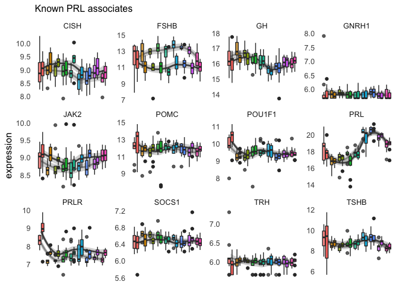
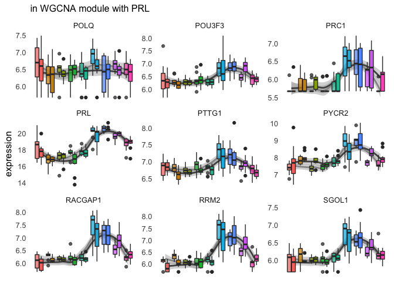
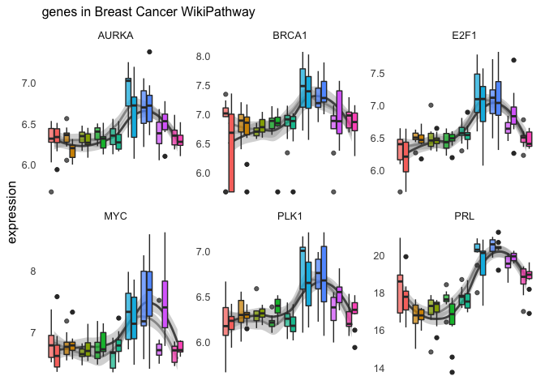

    library(tidyverse)

    ## ── Attaching packages ───────────────────────────────────────────── tidyverse 1.2.1 ──

    ## ✔ ggplot2 3.2.1     ✔ purrr   0.3.2
    ## ✔ tibble  2.1.3     ✔ dplyr   0.8.1
    ## ✔ tidyr   0.8.3     ✔ stringr 1.4.0
    ## ✔ readr   1.3.1     ✔ forcats 0.4.0

    ## ── Conflicts ──────────────────────────────────────────────── tidyverse_conflicts() ──
    ## ✖ dplyr::filter() masks stats::filter()
    ## ✖ dplyr::lag()    masks stats::lag()

    library(corrplot)

    ## corrplot 0.84 loaded

    library(corrr)

    source("../R/themes.R")

    vsd.pituitary.df <- read.csv("../results/04_vsd_pit.csv", row.names = 1)
    head(vsd.pituitary.df)

    ##                L.Blu13_male_pituitary_control.NYNO
    ## NP_001001127.1                            7.561237
    ## NP_001001129.1                            7.579159
    ## NP_001001189.1                            9.046065
    ## NP_001001195.1                            5.669043
    ## NP_001001201.1                            7.231540
    ## NP_001001203.1                            5.967928
    ##                L.G107_male_pituitary_control
    ## NP_001001127.1                      7.948976
    ## NP_001001129.1                      7.222576
    ## NP_001001189.1                      9.180759
    ## NP_001001195.1                      5.669043
    ## NP_001001201.1                      7.037849
    ## NP_001001203.1                      6.315496
    ##                L.G118_female_pituitary_control.NYNO
    ## NP_001001127.1                             7.336024
    ## NP_001001129.1                             6.633381
    ## NP_001001189.1                             9.227915
    ## NP_001001195.1                             5.931237
    ## NP_001001201.1                             7.212825
    ## NP_001001203.1                             6.252157
    ##                L.R3_male_pituitary_control.NYNO
    ## NP_001001127.1                         8.164057
    ## NP_001001129.1                         7.201298
    ## NP_001001189.1                         9.024405
    ## NP_001001195.1                         5.669043
    ## NP_001001201.1                         6.970172
    ## NP_001001203.1                         6.531432
    ##                L.R8_male_pituitary_control L.W33_male_pituitary_control
    ## NP_001001127.1                    7.952326                     8.129136
    ## NP_001001129.1                    7.589193                     7.437505
    ## NP_001001189.1                    8.973884                     8.966768
    ## NP_001001195.1                    5.939799                     5.924718
    ## NP_001001201.1                    7.367818                     6.978325
    ## NP_001001203.1                    6.729615                     6.237808
    ##                L.W3_male_pituitary_control L.W4_male_pituitary_control
    ## NP_001001127.1                    7.702712                    7.732809
    ## NP_001001129.1                    7.112248                    6.381837
    ## NP_001001189.1                    9.233440                    9.083278
    ## NP_001001195.1                    5.930522                    5.669043
    ## NP_001001201.1                    7.396787                    7.283164
    ## NP_001001203.1                    6.694657                    6.273186
    ##                R.G106_female_pituitary_control
    ## NP_001001127.1                        8.239021
    ## NP_001001129.1                        6.255634
    ## NP_001001189.1                        8.881125
    ## NP_001001195.1                        5.669043
    ## NP_001001201.1                        7.445616
    ## NP_001001203.1                        6.255634
    ##                R.R20_female_pituitary_control
    ## NP_001001127.1                       7.330500
    ## NP_001001129.1                       6.455499
    ## NP_001001189.1                       9.223517
    ## NP_001001195.1                       6.093117
    ## NP_001001201.1                       7.029623
    ## NP_001001203.1                       5.669043
    ##                R.R9_female_pituitary_control.NYNO
    ## NP_001001127.1                           8.085832
    ## NP_001001129.1                           6.017982
    ## NP_001001189.1                           8.940473
    ## NP_001001195.1                           5.916080
    ## NP_001001201.1                           6.668726
    ## NP_001001203.1                           6.095888
    ##                R.W44_female_pituitary_control.NYNO
    ## NP_001001127.1                            7.929720
    ## NP_001001129.1                            7.595009
    ## NP_001001189.1                            9.091503
    ## NP_001001195.1                            6.028834
    ## NP_001001201.1                            7.172448
    ## NP_001001203.1                            6.383178
    ##                R.Y108.W29_male_pituitary_control
    ## NP_001001127.1                          7.853202
    ## NP_001001129.1                          6.321583
    ## NP_001001189.1                          8.917735
    ## NP_001001195.1                          5.669043
    ## NP_001001201.1                          7.318875
    ## NP_001001203.1                          6.584333
    ##                blk.s061.pu.y_female_pituitary_inc.d9
    ## NP_001001127.1                              7.682593
    ## NP_001001129.1                              7.409230
    ## NP_001001189.1                              8.463465
    ## NP_001001195.1                              5.669043
    ## NP_001001201.1                              7.330153
    ## NP_001001203.1                              5.669043
    ##                blk11.x_female_pituitary_bldg blk12.x_male_pituitary_n5
    ## NP_001001127.1                      7.646865                  7.723431
    ## NP_001001129.1                      7.319747                  6.895260
    ## NP_001001189.1                      8.894810                  8.833972
    ## NP_001001195.1                      5.926515                  5.808515
    ## NP_001001201.1                      7.314291                  7.719978
    ## NP_001001203.1                      5.926515                  6.129837
    ##                blk17.x_male_pituitary_inc.d17
    ## NP_001001127.1                       7.940823
    ## NP_001001129.1                       6.761243
    ## NP_001001189.1                       8.866903
    ## NP_001001195.1                       5.815842
    ## NP_001001201.1                       7.432251
    ## NP_001001203.1                       6.107935
    ##                blk21.x_female_pituitary_hatch blk4.x_female_pituitary_n9
    ## NP_001001127.1                       7.803923                   7.436480
    ## NP_001001129.1                       6.620261                   6.329768
    ## NP_001001189.1                       8.737329                   8.972106
    ## NP_001001195.1                       5.669043                   5.946571
    ## NP_001001201.1                       7.569004                   7.531664
    ## NP_001001203.1                       5.910895                   6.060926
    ##                blu.o.x.ATLAS_female_pituitary_control
    ## NP_001001127.1                               7.668824
    ## NP_001001129.1                               6.705398
    ## NP_001001189.1                               8.841784
    ## NP_001001195.1                               5.850503
    ## NP_001001201.1                               6.992990
    ## NP_001001203.1                               6.470736
    ##                blu103.x_female_pituitary_hatch.NYNO
    ## NP_001001127.1                             8.052487
    ## NP_001001129.1                             6.783098
    ## NP_001001189.1                             8.824579
    ## NP_001001195.1                             5.669043
    ## NP_001001201.1                             7.688936
    ## NP_001001203.1                             6.094069
    ##                blu104.w120.x_male_pituitary_hatch.NYNO
    ## NP_001001127.1                                7.879519
    ## NP_001001129.1                                6.727585
    ## NP_001001189.1                                9.532294
    ## NP_001001195.1                                5.669043
    ## NP_001001201.1                                7.757765
    ## NP_001001203.1                                5.669043
    ##                blu108.w40.o158_male_pituitary_inc.d9
    ## NP_001001127.1                              7.784085
    ## NP_001001129.1                              6.329973
    ## NP_001001189.1                              8.406135
    ## NP_001001195.1                              5.891066
    ## NP_001001201.1                              7.452188
    ## NP_001001203.1                              6.111787
    ##                blu111.w113.x_male_pituitary_inc.d3
    ## NP_001001127.1                            7.394498
    ## NP_001001129.1                            6.848151
    ## NP_001001189.1                            9.146726
    ## NP_001001195.1                            5.962538
    ## NP_001001201.1                            7.364205
    ## NP_001001203.1                            5.876754
    ##                blu113.w124.x_male_pituitary_inc.d17.NYNO
    ## NP_001001127.1                                  7.814777
    ## NP_001001129.1                                  6.405548
    ## NP_001001189.1                                  8.732011
    ## NP_001001195.1                                  5.985874
    ## NP_001001201.1                                  7.434895
    ## NP_001001203.1                                  6.237679
    ##                blu114.r38.w198_male_pituitary_bldg
    ## NP_001001127.1                            7.537423
    ## NP_001001129.1                            7.519989
    ## NP_001001189.1                            8.587814
    ## NP_001001195.1                            5.669043
    ## NP_001001201.1                            7.653095
    ## NP_001001203.1                            6.126351
    ##                blu121.w91.x_male_pituitary_inc.d17
    ## NP_001001127.1                            7.943806
    ## NP_001001129.1                            6.318037
    ## NP_001001189.1                            9.172061
    ## NP_001001195.1                            5.669043
    ## NP_001001201.1                            7.505879
    ## NP_001001203.1                            6.622355
    ##                blu124.w180.x_female_pituitary_hatch
    ## NP_001001127.1                             7.752112
    ## NP_001001129.1                             6.384329
    ## NP_001001189.1                             8.629825
    ## NP_001001195.1                             5.669043
    ## NP_001001201.1                             7.815170
    ## NP_001001203.1                             5.669043
    ##                blu33.y88.x_male_pituitary_bldg
    ## NP_001001127.1                        8.266341
    ## NP_001001129.1                        6.452810
    ## NP_001001189.1                        8.379295
    ## NP_001001195.1                        5.861338
    ## NP_001001201.1                        7.159332
    ## NP_001001203.1                        6.118529
    ##                blu36.w16_female_pituitary_n9 blu37.r65.x_male_pituitary_n5
    ## NP_001001127.1                      7.817101                      7.818376
    ## NP_001001129.1                      6.864531                      6.704018
    ## NP_001001189.1                      8.978849                      8.885105
    ## NP_001001195.1                      6.036129                      6.053976
    ## NP_001001201.1                      7.511902                      7.648157
    ## NP_001001203.1                      5.969036                      6.113090
    ##                blu38.g135.x_female_pituitary_bldg
    ## NP_001001127.1                           7.343521
    ## NP_001001129.1                           6.758039
    ## NP_001001189.1                           8.590994
    ## NP_001001195.1                           6.054158
    ## NP_001001201.1                           7.611056
    ## NP_001001203.1                           5.669043
    ##                blu39.o26.x_female_pituitary_inc.d3.NYNO
    ## NP_001001127.1                                 7.539067
    ## NP_001001129.1                                 6.546422
    ## NP_001001189.1                                 8.846624
    ## NP_001001195.1                                 5.843669
    ## NP_001001201.1                                 7.694819
    ## NP_001001203.1                                 6.294147
    ##                blu41.y100.x_male_pituitary_n5
    ## NP_001001127.1                       7.863398
    ## NP_001001129.1                       6.489242
    ## NP_001001189.1                       8.711768
    ## NP_001001195.1                       5.880003
    ## NP_001001201.1                       7.685086
    ## NP_001001203.1                       6.139102
    ##                blu47.y96.x_female_pituitary_inc.d9
    ## NP_001001127.1                            7.859512
    ## NP_001001129.1                            7.186231
    ## NP_001001189.1                            8.716050
    ## NP_001001195.1                            6.037263
    ## NP_001001201.1                            7.608328
    ## NP_001001203.1                            6.248919
    ##                blu55.g51_female_pituitary_n5 blu81.r88_male_pituitary_n9
    ## NP_001001127.1                      7.890135                    7.600962
    ## NP_001001129.1                      6.679012                    6.700649
    ## NP_001001189.1                      9.007372                    9.037292
    ## NP_001001195.1                      6.106861                    5.669043
    ## NP_001001201.1                      7.567052                    7.231173
    ## NP_001001203.1                      6.204244                    6.257106
    ##                d.s008.y.blk_male_pituitary_n5
    ## NP_001001127.1                       8.057568
    ## NP_001001129.1                       6.151724
    ## NP_001001189.1                       8.738803
    ## NP_001001195.1                       6.151724
    ## NP_001001201.1                       7.182479
    ## NP_001001203.1                       6.063759
    ##                d.s047.blk.o_male_pituitary_n5
    ## NP_001001127.1                       7.747208
    ## NP_001001129.1                       7.171589
    ## NP_001001189.1                       8.616774
    ## NP_001001195.1                       5.669043
    ## NP_001001201.1                       7.492990
    ## NP_001001203.1                       5.669043
    ##                g.blk.s004.pk_female_pituitary_lay
    ## NP_001001127.1                           7.531330
    ## NP_001001129.1                           6.134493
    ## NP_001001189.1                           8.543601
    ## NP_001001195.1                           5.816806
    ## NP_001001201.1                           7.907012
    ## NP_001001203.1                           6.157002
    ##                g.s.blk.d_male_pituitary_n9 g.s.blk.y_male_pituitary_lay
    ## NP_001001127.1                    7.875542                     7.806784
    ## NP_001001129.1                    6.552477                     7.020719
    ## NP_001001189.1                    8.413209                     8.506624
    ## NP_001001195.1                    5.838520                     5.669043
    ## NP_001001201.1                    7.350715                     7.535249
    ## NP_001001203.1                    6.146489                     6.162200
    ##                g.s043.pu.blk_male_pituitary_lay
    ## NP_001001127.1                         7.779326
    ## NP_001001129.1                         7.195253
    ## NP_001001189.1                         8.866257
    ## NP_001001195.1                         5.877839
    ## NP_001001201.1                         7.441963
    ## NP_001001203.1                         5.669043
    ##                g.s078.blk.o_female_pituitary_lay
    ## NP_001001127.1                          7.976256
    ## NP_001001129.1                          6.568091
    ## NP_001001189.1                          8.650730
    ## NP_001001195.1                          5.950560
    ## NP_001001201.1                          7.414878
    ## NP_001001203.1                          6.134604
    ##                g104.w82.x_male_pituitary_bldg
    ## NP_001001127.1                       7.661848
    ## NP_001001129.1                       6.609274
    ## NP_001001189.1                       8.902447
    ## NP_001001195.1                       5.669043
    ## NP_001001201.1                       7.391399
    ## NP_001001203.1                       6.156461
    ##                g114.w83.x_male_pituitary_hatch.NYNO
    ## NP_001001127.1                             7.967987
    ## NP_001001129.1                             6.556549
    ## NP_001001189.1                             8.770844
    ## NP_001001195.1                             5.669043
    ## NP_001001201.1                             7.363968
    ## NP_001001203.1                             5.669043
    ##                g130.y81.x_male_pituitary_inc.d17
    ## NP_001001127.1                          7.867149
    ## NP_001001129.1                          6.487865
    ## NP_001001189.1                          8.871418
    ## NP_001001195.1                          5.823070
    ## NP_001001201.1                          7.711318
    ## NP_001001203.1                          6.075410
    ##                g141.blu27.x_female_pituitary_bldg
    ## NP_001001127.1                           7.475439
    ## NP_001001129.1                           6.522440
    ## NP_001001189.1                           8.835600
    ## NP_001001195.1                           5.804223
    ## NP_001001201.1                           7.570356
    ## NP_001001203.1                           6.025917
    ##                g142.r40.x_female_pituitary_inc.d17
    ## NP_001001127.1                            7.625763
    ## NP_001001129.1                            6.358180
    ## NP_001001189.1                            8.654518
    ## NP_001001195.1                            5.669043
    ## NP_001001201.1                            7.529603
    ## NP_001001203.1                            5.669043
    ##                g143.blu32.x_male_pituitary_inc.d17
    ## NP_001001127.1                            8.031482
    ## NP_001001129.1                            6.548124
    ## NP_001001189.1                            8.916722
    ## NP_001001195.1                            5.907368
    ## NP_001001201.1                            6.934889
    ## NP_001001203.1                            6.080903
    ##                g146.blu51_male_pituitary_inc.d3
    ## NP_001001127.1                         7.963816
    ## NP_001001129.1                         6.880643
    ## NP_001001189.1                         9.096678
    ## NP_001001195.1                         5.669043
    ## NP_001001201.1                         7.480361
    ## NP_001001203.1                         6.165597
    ##                g20.w106.x_male_pituitary_inc.d3
    ## NP_001001127.1                         7.920455
    ## NP_001001129.1                         6.100353
    ## NP_001001189.1                         8.896634
    ## NP_001001195.1                         5.669043
    ## NP_001001201.1                         7.213988
    ## NP_001001203.1                         6.042914
    ##                g52.blu58_male_pituitary_bldg g53.y84_male_pituitary_hatch
    ## NP_001001127.1                      7.642354                     7.691397
    ## NP_001001129.1                      6.984752                     6.815924
    ## NP_001001189.1                      8.724981                     8.961904
    ## NP_001001195.1                      5.978160                     5.669043
    ## NP_001001201.1                      7.495247                     7.604582
    ## NP_001001203.1                      6.140037                     5.669043
    ##                g6.w197.x_female_pituitary_inc.d3
    ## NP_001001127.1                          7.767060
    ## NP_001001129.1                          6.991308
    ## NP_001001189.1                          9.035709
    ## NP_001001195.1                          5.930544
    ## NP_001001201.1                          7.559265
    ## NP_001001203.1                          6.250632
    ##                g75.x_female_pituitary_inc.d9
    ## NP_001001127.1                      7.783044
    ## NP_001001129.1                      6.676102
    ## NP_001001189.1                      8.746758
    ## NP_001001195.1                      5.823890
    ## NP_001001201.1                      7.368996
    ## NP_001001203.1                      5.823890
    ##                l.s120.y.blk_female_pituitary_bldg
    ## NP_001001127.1                           7.986942
    ## NP_001001129.1                           6.508368
    ## NP_001001189.1                           8.579236
    ## NP_001001195.1                           5.941245
    ## NP_001001201.1                           7.742216
    ## NP_001001203.1                           6.288883
    ##                o.s.w.r_male_pituitary_lay o152.o120.w42_male_pituitary_n5
    ## NP_001001127.1                   8.093039                        7.728847
    ## NP_001001129.1                   6.917384                        6.901830
    ## NP_001001189.1                   8.417174                        8.568207
    ## NP_001001195.1                   5.851024                        5.669043
    ## NP_001001201.1                   7.298914                        7.608320
    ## NP_001001203.1                   6.281959                        6.061836
    ##                o156.w80.x_female_pituitary_inc.d3
    ## NP_001001127.1                           7.976353
    ## NP_001001129.1                           7.492672
    ## NP_001001189.1                           8.574711
    ## NP_001001195.1                           5.823415
    ## NP_001001201.1                           7.608879
    ## NP_001001203.1                           6.076314
    ##                o165.w122.x_female_pituitary_inc.d3.NYNO
    ## NP_001001127.1                                 8.235551
    ## NP_001001129.1                                 7.251606
    ## NP_001001189.1                                 8.828093
    ## NP_001001195.1                                 5.890084
    ## NP_001001201.1                                 7.301521
    ## NP_001001203.1                                 6.136354
    ##                o172.w115.x_female_pituitary_hatch.NYNO
    ## NP_001001127.1                                8.073845
    ## NP_001001129.1                                6.620796
    ## NP_001001189.1                                9.047824
    ## NP_001001195.1                                5.669043
    ## NP_001001201.1                                7.764214
    ## NP_001001203.1                                6.177176
    ##                o173.w179.x_female_pituitary_inc.d3
    ## NP_001001127.1                            7.927198
    ## NP_001001129.1                            6.737824
    ## NP_001001189.1                            8.591563
    ## NP_001001195.1                            5.919569
    ## NP_001001201.1                            7.316018
    ## NP_001001203.1                            6.101887
    ##                o35.r51.x_female_pituitary_inc.d17
    ## NP_001001127.1                           7.848088
    ## NP_001001129.1                           6.887489
    ## NP_001001189.1                           8.855555
    ## NP_001001195.1                           5.897930
    ## NP_001001201.1                           7.657319
    ## NP_001001203.1                           5.669043
    ##                o38.blu29.x_female_pituitary_bldg
    ## NP_001001127.1                          8.197361
    ## NP_001001129.1                          6.691644
    ## NP_001001189.1                          8.861424
    ## NP_001001195.1                          6.082527
    ## NP_001001201.1                          7.704457
    ## NP_001001203.1                          5.669043
    ##                o39.y77.x_male_pituitary_hatch
    ## NP_001001127.1                       7.917779
    ## NP_001001129.1                       7.545265
    ## NP_001001189.1                       8.853415
    ## NP_001001195.1                       5.669043
    ## NP_001001201.1                       7.907621
    ## NP_001001203.1                       6.032266
    ##                o44.blu26.x_male_pituitary_hatch
    ## NP_001001127.1                         8.115916
    ## NP_001001129.1                         6.439784
    ## NP_001001189.1                         8.418848
    ## NP_001001195.1                         5.669043
    ## NP_001001201.1                         7.568625
    ## NP_001001203.1                         6.108542
    ##                o48.r197.x_male_pituitary_inc.d3
    ## NP_001001127.1                         7.504118
    ## NP_001001129.1                         7.738268
    ## NP_001001189.1                         8.900755
    ## NP_001001195.1                         5.870637
    ## NP_001001201.1                         7.447026
    ## NP_001001203.1                         6.071255
    ##                o49.x_male_pituitary_inc.d9
    ## NP_001001127.1                    7.759611
    ## NP_001001129.1                    7.327566
    ## NP_001001189.1                    8.678752
    ## NP_001001195.1                    6.011709
    ## NP_001001201.1                    7.501457
    ## NP_001001203.1                    5.669043
    ##                o52.blu53_female_pituitary_inc.d17
    ## NP_001001127.1                           8.096787
    ## NP_001001129.1                           6.377397
    ## NP_001001189.1                           8.868774
    ## NP_001001195.1                           6.025878
    ## NP_001001201.1                           7.307614
    ## NP_001001203.1                           6.025878
    ##                o57.g59_male_pituitary_inc.d9 o73.x_female_pituitary_inc.d9
    ## NP_001001127.1                      7.888990                      8.222139
    ## NP_001001129.1                      6.900263                      6.577069
    ## NP_001001189.1                      8.846219                      8.372480
    ## NP_001001195.1                      5.908572                      5.669043
    ## NP_001001201.1                      7.541229                      7.211084
    ## NP_001001203.1                      6.252458                      6.080465
    ##                pk.s238.blk.w_male_pituitary_lay
    ## NP_001001127.1                         7.882501
    ## NP_001001129.1                         6.682936
    ## NP_001001189.1                         8.457160
    ## NP_001001195.1                         5.808533
    ## NP_001001201.1                         7.183464
    ## NP_001001203.1                         6.288338
    ##                pk.w.s141.o_male_pituitary_lay
    ## NP_001001127.1                       7.987961
    ## NP_001001129.1                       7.044620
    ## NP_001001189.1                       8.768071
    ## NP_001001195.1                       5.946071
    ## NP_001001201.1                       7.674939
    ## NP_001001203.1                       6.166757
    ##                r.r.x.ATLAS.R2XR_female_pituitary_control
    ## NP_001001127.1                                  7.613906
    ## NP_001001129.1                                  6.493595
    ## NP_001001189.1                                  8.542806
    ## NP_001001195.1                                  5.892203
    ## NP_001001201.1                                  7.150702
    ## NP_001001203.1                                  6.368568
    ##                r.r.x.ATLAS_female_pituitary_control
    ## NP_001001127.1                             7.436948
    ## NP_001001129.1                             6.532921
    ## NP_001001189.1                             8.497814
    ## NP_001001195.1                             5.669043
    ## NP_001001201.1                             6.981692
    ## NP_001001203.1                             6.815079
    ##                r.s005.pk.blk_male_pituitary_lay
    ## NP_001001127.1                         7.248228
    ## NP_001001129.1                         6.142596
    ## NP_001001189.1                         8.600871
    ## NP_001001195.1                         5.906615
    ## NP_001001201.1                         7.238333
    ## NP_001001203.1                         5.669043
    ##                r.s056.g.o_female_pituitary_bldg
    ## NP_001001127.1                         7.713272
    ## NP_001001129.1                         6.270380
    ## NP_001001189.1                         9.215568
    ## NP_001001195.1                         5.669043
    ## NP_001001201.1                         7.281591
    ## NP_001001203.1                         5.669043
    ##                r.s059.d.o_male_pituitary_bldg
    ## NP_001001127.1                       8.245341
    ## NP_001001129.1                       6.349687
    ## NP_001001189.1                       8.677704
    ## NP_001001195.1                       5.669043
    ## NP_001001201.1                       7.477757
    ## NP_001001203.1                       6.125124
    ##                r.s116.blk.pu_male_pituitary_lay
    ## NP_001001127.1                         8.059966
    ## NP_001001129.1                         6.520285
    ## NP_001001189.1                         8.660139
    ## NP_001001195.1                         5.889384
    ## NP_001001201.1                         7.388623
    ## NP_001001203.1                         5.849009
    ##                r.s171.l.w_female_pituitary_n9
    ## NP_001001127.1                       7.842472
    ## NP_001001129.1                       6.819251
    ## NP_001001189.1                       8.738946
    ## NP_001001195.1                       5.834314
    ## NP_001001201.1                       7.584052
    ## NP_001001203.1                       5.954988
    ##                r.y.s007.blk_male_pituitary_n9
    ## NP_001001127.1                       8.023527
    ## NP_001001129.1                       6.570845
    ## NP_001001189.1                       8.620748
    ## NP_001001195.1                       5.669043
    ## NP_001001201.1                       7.733447
    ## NP_001001203.1                       6.290357
    ##                r176.blu54_male_pituitary_inc.d17
    ## NP_001001127.1                          7.996493
    ## NP_001001129.1                          6.435351
    ## NP_001001189.1                          8.816408
    ## NP_001001195.1                          5.669043
    ## NP_001001201.1                          7.628232
    ## NP_001001203.1                          6.130434
    ##                r183.o22_female_pituitary_hatch
    ## NP_001001127.1                        7.603032
    ## NP_001001129.1                        6.415927
    ## NP_001001189.1                        9.020366
    ## NP_001001195.1                        5.669043
    ## NP_001001201.1                        7.534545
    ## NP_001001203.1                        5.669043
    ##                r190.o43.x_male_pituitary_lay r195.x_male_pituitary_n9
    ## NP_001001127.1                      7.633088                 7.992874
    ## NP_001001129.1                      6.953580                 6.995571
    ## NP_001001189.1                      9.084596                 8.692655
    ## NP_001001195.1                      5.931543                 5.999084
    ## NP_001001201.1                      7.147466                 7.471128
    ## NP_001001203.1                      6.039766                 6.104939
    ##                r27.w111.blu125_female_pituitary_inc.d3
    ## NP_001001127.1                                7.350503
    ## NP_001001129.1                                6.534727
    ## NP_001001189.1                                9.719304
    ## NP_001001195.1                                5.669043
    ## NP_001001201.1                                7.639045
    ## NP_001001203.1                                6.051432
    ##                r30.w112.r46_female_pituitary_inc.d9
    ## NP_001001127.1                             8.177363
    ## NP_001001129.1                             6.155792
    ## NP_001001189.1                             8.715531
    ## NP_001001195.1                             6.058000
    ## NP_001001201.1                             7.771810
    ## NP_001001203.1                             6.084677
    ##                r36.w184.x_female_pituitary_inc.d9
    ## NP_001001127.1                           7.889882
    ## NP_001001129.1                           6.521622
    ## NP_001001189.1                           8.738954
    ## NP_001001195.1                           5.669043
    ## NP_001001201.1                           7.237620
    ## NP_001001203.1                           5.669043
    ##                r37.w100.x_male_pituitary_n9 r41.w99.x_male_pituitary_hatch
    ## NP_001001127.1                     7.635383                       8.014034
    ## NP_001001129.1                     7.540295                       6.922951
    ## NP_001001189.1                     8.787556                       8.890554
    ## NP_001001195.1                     5.952168                       5.669043
    ## NP_001001201.1                     7.695016                       7.935568
    ## NP_001001203.1                     5.669043                       6.102708
    ##                r45.X_male_pituitary_inc.d9
    ## NP_001001127.1                    8.090051
    ## NP_001001129.1                    6.838271
    ## NP_001001189.1                    9.033629
    ## NP_001001195.1                    5.895870
    ## NP_001001201.1                    7.358684
    ## NP_001001203.1                    6.061116
    ##                r49.w189.x_female_pituitary_inc.d17
    ## NP_001001127.1                            7.682426
    ## NP_001001129.1                            6.272601
    ## NP_001001189.1                            8.606164
    ## NP_001001195.1                            6.019194
    ## NP_001001201.1                            7.950185
    ## NP_001001203.1                            6.111307
    ##                r6.x_female_pituitary_control
    ## NP_001001127.1                      7.619082
    ## NP_001001129.1                      6.593167
    ## NP_001001189.1                      8.608567
    ## NP_001001195.1                      6.208604
    ## NP_001001201.1                      7.561136
    ## NP_001001203.1                      6.593167
    ##                r72.y83.x_male_pituitary_hatch
    ## NP_001001127.1                       7.340524
    ## NP_001001129.1                       6.513046
    ## NP_001001189.1                       8.910755
    ## NP_001001195.1                       5.886285
    ## NP_001001201.1                       7.417857
    ## NP_001001203.1                       5.934983
    ##                r73.g127.x_female_pituitary_inc.d3
    ## NP_001001127.1                           7.839462
    ## NP_001001129.1                           7.317722
    ## NP_001001189.1                           8.641522
    ## NP_001001195.1                           5.903389
    ## NP_001001201.1                           7.678299
    ## NP_001001203.1                           6.000096
    ##                r83.g45_female_pituitary_bldg r95.blu99_female_pituitary_n9
    ## NP_001001127.1                      7.950867                      7.824678
    ## NP_001001129.1                      6.616994                      6.420175
    ## NP_001001189.1                      8.510315                      8.702072
    ## NP_001001195.1                      5.966352                      5.978572
    ## NP_001001201.1                      7.276044                      7.294420
    ## NP_001001203.1                      5.926633                      5.669043
    ##                s.o.pk_female_pituitary_lay
    ## NP_001001127.1                    7.788159
    ## NP_001001129.1                    6.548696
    ## NP_001001189.1                    8.572245
    ## NP_001001195.1                    5.944317
    ## NP_001001201.1                    7.263598
    ## NP_001001203.1                    6.057753
    ##                s.pu148.blk.r_male_pituitary_bldg
    ## NP_001001127.1                          7.643631
    ## NP_001001129.1                          7.324061
    ## NP_001001189.1                          8.970154
    ## NP_001001195.1                          5.923579
    ## NP_001001201.1                          7.370824
    ## NP_001001203.1                          5.669043
    ##                s.x.ATLAS_female_pituitary_control
    ## NP_001001127.1                           7.246295
    ## NP_001001129.1                           5.669043
    ## NP_001001189.1                           9.203516
    ## NP_001001195.1                           6.095322
    ## NP_001001201.1                           7.146231
    ## NP_001001203.1                           6.608990
    ##                s063.d.blk.l_female_pituitary_bldg
    ## NP_001001127.1                           7.567320
    ## NP_001001129.1                           6.688709
    ## NP_001001189.1                           8.956760
    ## NP_001001195.1                           5.669043
    ## NP_001001201.1                           7.704352
    ## NP_001001203.1                           6.015219
    ##                s065.l.d.o_male_pituitary_bldg
    ## NP_001001127.1                       7.801429
    ## NP_001001129.1                       6.397624
    ## NP_001001189.1                       8.852904
    ## NP_001001195.1                       6.041405
    ## NP_001001201.1                       7.249411
    ## NP_001001203.1                       5.793470
    ##                s066.l.d.r_male_pituitary_bldg
    ## NP_001001127.1                       7.649582
    ## NP_001001129.1                       6.399505
    ## NP_001001189.1                       8.766849
    ## NP_001001195.1                       5.669043
    ## NP_001001201.1                       7.413839
    ## NP_001001203.1                       5.902257
    ##                s092.blk.r.o_female_pituitary_bldg
    ## NP_001001127.1                           8.049071
    ## NP_001001129.1                           6.402242
    ## NP_001001189.1                           8.851873
    ## NP_001001195.1                           5.669043
    ## NP_001001201.1                           7.587672
    ## NP_001001203.1                           5.669043
    ##                s095.g.blk.o_female_pituitary_lay
    ## NP_001001127.1                          7.605949
    ## NP_001001129.1                          6.643868
    ## NP_001001189.1                          8.671480
    ## NP_001001195.1                          5.902951
    ## NP_001001201.1                          7.245263
    ## NP_001001203.1                          6.154206
    ##                s136.d.w.o_female_pituitary_lay
    ## NP_001001127.1                        7.870568
    ## NP_001001129.1                        6.209274
    ## NP_001001189.1                        8.492254
    ## NP_001001195.1                        5.959011
    ## NP_001001201.1                        7.688234
    ## NP_001001203.1                        6.078435
    ##                s142.o.pk.pu_female_pituitary_lay
    ## NP_001001127.1                          7.950243
    ## NP_001001129.1                          6.485963
    ## NP_001001189.1                          8.244026
    ## NP_001001195.1                          5.875835
    ## NP_001001201.1                          7.436343
    ## NP_001001203.1                          6.026609
    ##                s150.w.g.blk_male_pituitary_lay
    ## NP_001001127.1                        8.051197
    ## NP_001001129.1                        7.023032
    ## NP_001001189.1                        8.682757
    ## NP_001001195.1                        5.669043
    ## NP_001001201.1                        7.369189
    ## NP_001001203.1                        6.150827
    ##                s176.blk.pu.r_female_pituitary_lay
    ## NP_001001127.1                           7.867742
    ## NP_001001129.1                           6.482662
    ## NP_001001189.1                           8.635398
    ## NP_001001195.1                           5.791907
    ## NP_001001201.1                           7.449840
    ## NP_001001203.1                           6.446550
    ##                s187.l.o.r_male_pituitary_n9
    ## NP_001001127.1                     7.891121
    ## NP_001001129.1                     6.757796
    ## NP_001001189.1                     8.563998
    ## NP_001001195.1                     5.825067
    ## NP_001001201.1                     7.098894
    ## NP_001001203.1                     6.050297
    ##                s243.blk.pk.r_male_pituitary_lay
    ## NP_001001127.1                         7.746235
    ## NP_001001129.1                         6.761536
    ## NP_001001189.1                         8.967833
    ## NP_001001195.1                         5.669043
    ## NP_001001201.1                         7.542122
    ## NP_001001203.1                         5.944887
    ##                w191.r1_female_pituitary_control
    ## NP_001001127.1                         8.293988
    ## NP_001001129.1                         6.934009
    ## NP_001001189.1                         8.453089
    ## NP_001001195.1                         6.160243
    ## NP_001001201.1                         7.408535
    ## NP_001001203.1                         6.637886
    ##                w34.x_male_pituitary_inc.d9
    ## NP_001001127.1                    7.313457
    ## NP_001001129.1                    6.988614
    ## NP_001001189.1                    8.786973
    ## NP_001001195.1                    5.914099
    ## NP_001001201.1                    7.385556
    ## NP_001001203.1                    6.507127
    ##                x.blk.blk.ATLAS_male_pituitary_control
    ## NP_001001127.1                               7.853564
    ## NP_001001129.1                               7.689947
    ## NP_001001189.1                               8.441344
    ## NP_001001195.1                               6.105424
    ## NP_001001201.1                               6.718725
    ## NP_001001203.1                               6.630644
    ##                x.blk16_male_pituitary_n9
    ## NP_001001127.1                  7.534693
    ## NP_001001129.1                  6.801301
    ## NP_001001189.1                  8.685296
    ## NP_001001195.1                  5.936905
    ## NP_001001201.1                  7.534693
    ## NP_001001203.1                  6.112136
    ##                x.blu.o.ATLAS_male_pituitary_control
    ## NP_001001127.1                             7.704239
    ## NP_001001129.1                             6.850319
    ## NP_001001189.1                             8.590721
    ## NP_001001195.1                             5.954848
    ## NP_001001201.1                             6.786026
    ## NP_001001203.1                             6.967509
    ##                x.blu101.w43_female_pituitary_inc.d9
    ## NP_001001127.1                             7.850204
    ## NP_001001129.1                             6.376566
    ## NP_001001189.1                             8.811883
    ## NP_001001195.1                             5.669043
    ## NP_001001201.1                             7.359923
    ## NP_001001203.1                             6.243108
    ##                x.blu102.w105_female_pituitary_inc.d3
    ## NP_001001127.1                              7.504919
    ## NP_001001129.1                              6.341461
    ## NP_001001189.1                              9.112192
    ## NP_001001195.1                              5.991841
    ## NP_001001201.1                              7.394234
    ## NP_001001203.1                              5.919290
    ##                x.blu106.o153_male_pituitary_inc.d9.NYNO
    ## NP_001001127.1                                 8.308799
    ## NP_001001129.1                                 6.380085
    ## NP_001001189.1                                 8.916345
    ## NP_001001195.1                                 5.669043
    ## NP_001001201.1                                 7.240314
    ## NP_001001203.1                                 6.227048
    ##                x.blu109.w121_female_pituitary_n5
    ## NP_001001127.1                          7.903492
    ## NP_001001129.1                          6.803954
    ## NP_001001189.1                          8.644650
    ## NP_001001195.1                          5.901671
    ## NP_001001201.1                          7.446418
    ## NP_001001203.1                          5.669043
    ##                x.blu116.w107_female_pituitary_inc.d17.NYNO
    ## NP_001001127.1                                    7.719986
    ## NP_001001129.1                                    6.730745
    ## NP_001001189.1                                    8.862868
    ## NP_001001195.1                                    5.669043
    ## NP_001001201.1                                    7.574174
    ## NP_001001203.1                                    6.222655
    ##                x.blu117.w89_male_pituitary_inc.d17
    ## NP_001001127.1                            8.060423
    ## NP_001001129.1                            6.643760
    ## NP_001001189.1                            8.901723
    ## NP_001001195.1                            5.669043
    ## NP_001001201.1                            7.591470
    ## NP_001001203.1                            6.073258
    ##                x.blu122.r66_female_pituitary_inc.d9
    ## NP_001001127.1                             8.168487
    ## NP_001001129.1                             6.216070
    ## NP_001001189.1                             8.761125
    ## NP_001001195.1                             5.669043
    ## NP_001001201.1                             7.501848
    ## NP_001001203.1                             5.669043
    ##                x.blu23.w14_male_pituitary_n9 x.blu30_male_pituitary_n5
    ## NP_001001127.1                      7.732378                  7.584028
    ## NP_001001129.1                      6.859760                  6.713172
    ## NP_001001189.1                      8.917789                  8.723469
    ## NP_001001195.1                      5.944808                  5.976496
    ## NP_001001201.1                      7.696088                  8.211274
    ## NP_001001203.1                      6.024695                  6.065467
    ##                x.blu42.o28_male_pituitary_inc.d3
    ## NP_001001127.1                          7.827038
    ## NP_001001129.1                          6.658745
    ## NP_001001189.1                          9.000817
    ## NP_001001195.1                          5.805076
    ## NP_001001201.1                          7.617047
    ## NP_001001203.1                          5.669043
    ##                x.blu43.g132_female_pituitary_n9
    ## NP_001001127.1                         7.630130
    ## NP_001001129.1                         7.081009
    ## NP_001001189.1                         8.734286
    ## NP_001001195.1                         6.230903
    ## NP_001001201.1                         7.630130
    ## NP_001001203.1                         5.669043
    ##                x.blu6.y80_female_pituitary_lay
    ## NP_001001127.1                        7.586366
    ## NP_001001129.1                        6.605072
    ## NP_001001189.1                        8.879555
    ## NP_001001195.1                        5.669043
    ## NP_001001201.1                        6.955262
    ## NP_001001203.1                        5.977498
    ##                x.g.ATLAS_male_pituitary_control
    ## NP_001001127.1                         8.119297
    ## NP_001001129.1                         6.417625
    ## NP_001001189.1                         8.789964
    ## NP_001001195.1                         5.669043
    ## NP_001001201.1                         6.673618
    ## NP_001001203.1                         7.063663
    ##                x.g.g.ATLAS_male_pituitary_control
    ## NP_001001127.1                           6.632818
    ## NP_001001129.1                           7.596295
    ## NP_001001189.1                           9.055063
    ## NP_001001195.1                           5.669043
    ## NP_001001201.1                           6.880938
    ## NP_001001203.1                           6.430363
    ##                x.g.g.g.ATLAS_male_pituitary_control
    ## NP_001001127.1                             7.963262
    ## NP_001001129.1                             7.226437
    ## NP_001001189.1                             8.504947
    ## NP_001001195.1                             5.669043
    ## NP_001001201.1                             6.505195
    ## NP_001001203.1                             6.533708
    ##                x.g13.w109_male_pituitary_inc.d9
    ## NP_001001127.1                         8.203422
    ## NP_001001129.1                         6.408306
    ## NP_001001189.1                         9.097085
    ## NP_001001195.1                         5.917861
    ## NP_001001201.1                         7.530266
    ## NP_001001203.1                         5.917861
    ##                x.g14.w199_male_pituitary_inc.d17
    ## NP_001001127.1                          7.951500
    ## NP_001001129.1                          6.672872
    ## NP_001001189.1                          8.802260
    ## NP_001001195.1                          5.980095
    ## NP_001001201.1                          7.351505
    ## NP_001001203.1                          6.085722
    ##                x.g147.blu28_male_pituitary_inc.d3
    ## NP_001001127.1                           7.823741
    ## NP_001001129.1                           6.484825
    ## NP_001001189.1                           8.638643
    ## NP_001001195.1                           5.898086
    ## NP_001001201.1                           7.270438
    ## NP_001001203.1                           5.669043
    ##                x.g37_female_pituitary_n5 x.g4.w50_female_pituitary_n9
    ## NP_001001127.1                  7.888593                     7.880606
    ## NP_001001129.1                  7.251327                     6.451607
    ## NP_001001189.1                  8.987767                     8.741841
    ## NP_001001195.1                  5.669043                     6.041452
    ## NP_001001201.1                  7.645766                     7.310626
    ## NP_001001203.1                  5.669043                     6.041452
    ##                x.g43_female_pituitary_n5 x.g49_female_pituitary_n5.NYNO
    ## NP_001001127.1                  7.740362                       7.423018
    ## NP_001001129.1                  6.355745                       6.282630
    ## NP_001001189.1                  8.658680                       8.740844
    ## NP_001001195.1                  6.190217                       5.932288
    ## NP_001001201.1                  7.627519                       7.637947
    ## NP_001001203.1                  5.669043                       5.669043
    ##                x.g70_male_pituitary_hatch
    ## NP_001001127.1                   7.878386
    ## NP_001001129.1                   6.409340
    ## NP_001001189.1                   8.691745
    ## NP_001001195.1                   5.669043
    ## NP_001001201.1                   7.666269
    ## NP_001001203.1                   6.099559
    ##                x.g9.o166_female_pituitary_inc.d9.NYNO
    ## NP_001001127.1                               7.995578
    ## NP_001001129.1                               6.196925
    ## NP_001001189.1                               8.892312
    ## NP_001001195.1                               5.856588
    ## NP_001001201.1                               7.401848
    ## NP_001001203.1                               5.993426
    ##                x.o159.w90_female_pituitary_inc.d17
    ## NP_001001127.1                            7.738535
    ## NP_001001129.1                            6.514722
    ## NP_001001189.1                            8.864141
    ## NP_001001195.1                            5.669043
    ## NP_001001201.1                            7.752771
    ## NP_001001203.1                            6.467588
    ##                x.o160.w102_male_pituitary_hatch
    ## NP_001001127.1                         8.129781
    ## NP_001001129.1                         6.786201
    ## NP_001001189.1                         8.631693
    ## NP_001001195.1                         5.669043
    ## NP_001001201.1                         7.562795
    ## NP_001001203.1                         6.340522
    ##                x.o163.w101_male_pituitary_inc.d3.NYNO
    ## NP_001001127.1                               7.980905
    ## NP_001001129.1                               6.234749
    ## NP_001001189.1                               8.822154
    ## NP_001001195.1                               5.833308
    ## NP_001001201.1                               7.472925
    ## NP_001001203.1                               5.669043
    ##                x.o164.w123_male_pituitary_n5.NYNO
    ## NP_001001127.1                           7.908454
    ## NP_001001129.1                           6.603738
    ## NP_001001189.1                           8.854569
    ## NP_001001195.1                           5.943197
    ## NP_001001201.1                           7.463291
    ## NP_001001203.1                           6.142480
    ##                x.o175.g21_female_pituitary_n5 x.o2_male_pituitary_n9
    ## NP_001001127.1                       7.650083               7.860993
    ## NP_001001129.1                       6.374332               6.631889
    ## NP_001001189.1                       8.802421               8.787334
    ## NP_001001195.1                       5.877412               5.669043
    ## NP_001001201.1                       7.666299               7.568127
    ## NP_001001203.1                       6.067122               6.061735
    ##                x.o30.g134_male_pituitary_bldg
    ## NP_001001127.1                       7.891274
    ## NP_001001129.1                       7.151536
    ## NP_001001189.1                       8.660951
    ## NP_001001195.1                       5.669043
    ## NP_001001201.1                       7.342979
    ## NP_001001203.1                       6.345686
    ##                x.o37.blu50_female_pituitary_hatch
    ## NP_001001127.1                           7.748723
    ## NP_001001129.1                           6.324020
    ## NP_001001189.1                           9.024759
    ## NP_001001195.1                           5.669043
    ## NP_001001201.1                           7.660479
    ## NP_001001203.1                           5.669043
    ##                x.o47.y82_male_pituitary_inc.d9 x.o68_male_pituitary_n5
    ## NP_001001127.1                        7.827835                7.889446
    ## NP_001001129.1                        6.621675                6.500816
    ## NP_001001189.1                        8.851242                8.685911
    ## NP_001001195.1                        5.669043                5.884213
    ## NP_001001201.1                        7.512053                7.717031
    ## NP_001001203.1                        5.979105                5.946656
    ##                x.o70_female_pituitary_n5 x.r178_male_pituitary_hatch
    ## NP_001001127.1                  7.506171                    7.885431
    ## NP_001001129.1                  6.200509                    6.566284
    ## NP_001001189.1                  9.000600                    8.757531
    ## NP_001001195.1                  5.977038                    5.669043
    ## NP_001001201.1                  7.704953                    7.874551
    ## NP_001001203.1                  6.075907                    6.123053
    ##                x.r181_male_pituitary_n5 x.r29.w96_male_pituitary_inc.d17
    ## NP_001001127.1                 7.742273                         7.989996
    ## NP_001001129.1                 6.171028                         6.718159
    ## NP_001001189.1                 8.747100                         8.792191
    ## NP_001001195.1                 5.669043                         5.669043
    ## NP_001001201.1                 7.727376                         7.320715
    ## NP_001001203.1                 5.669043                         5.955181
    ##                x.r33.w183_female_pituitary_inc.d3
    ## NP_001001127.1                           7.764976
    ## NP_001001129.1                           6.553743
    ## NP_001001189.1                           8.864232
    ## NP_001001195.1                           5.996472
    ## NP_001001201.1                           7.464279
    ## NP_001001203.1                           5.669043
    ##                x.r39.g10_female_pituitary_bldg
    ## NP_001001127.1                        7.724999
    ## NP_001001129.1                        6.969390
    ## NP_001001189.1                        8.887654
    ## NP_001001195.1                        5.894522
    ## NP_001001201.1                        7.724999
    ## NP_001001203.1                        6.025016
    ##                x.r44.w95_female_pituitary_hatch
    ## NP_001001127.1                         7.315315
    ## NP_001001129.1                         6.252295
    ## NP_001001189.1                         9.448501
    ## NP_001001195.1                         5.669043
    ## NP_001001201.1                         7.856695
    ## NP_001001203.1                         5.962155
    ##                x.r48.y139_female_pituitary_inc.d17.NYNO
    ## NP_001001127.1                                 7.668688
    ## NP_001001129.1                                 6.678186
    ## NP_001001189.1                                 9.703105
    ## NP_001001195.1                                 5.669043
    ## NP_001001201.1                                 7.908623
    ## NP_001001203.1                                 5.999552
    ##                x.r50.w97_female_pituitary_n5
    ## NP_001001127.1                      8.013724
    ## NP_001001129.1                      6.715046
    ## NP_001001189.1                      8.862512
    ## NP_001001195.1                      5.669043
    ## NP_001001201.1                      7.425563
    ## NP_001001203.1                      5.807006
    ##                x.r64.g140_male_pituitary_inc.d3
    ## NP_001001127.1                         7.655169
    ## NP_001001129.1                         7.232199
    ## NP_001001189.1                         8.966839
    ## NP_001001195.1                         6.038015
    ## NP_001001201.1                         7.784796
    ## NP_001001203.1                         5.669043
    ##                x.r67.blu35_male_pituitary_bldg.NYNO
    ## NP_001001127.1                             7.612297
    ## NP_001001129.1                             6.655415
    ## NP_001001189.1                             8.450606
    ## NP_001001195.1                             5.968347
    ## NP_001001201.1                             7.389187
    ## NP_001001203.1                             6.300059
    ##                x.w178_female_pituitary_n9
    ## NP_001001127.1                   7.873793
    ## NP_001001129.1                   6.954662
    ## NP_001001189.1                   8.942631
    ## NP_001001195.1                   5.669043
    ## NP_001001201.1                   7.694951
    ## NP_001001203.1                   6.011278
    ##                x.w192.o157_male_pituitary_inc.d9
    ## NP_001001127.1                          7.528608
    ## NP_001001129.1                          7.384734
    ## NP_001001189.1                          8.690548
    ## NP_001001195.1                          5.822125
    ## NP_001001201.1                          7.778457
    ## NP_001001203.1                          6.072928
    ##                x.w51_female_pituitary_lay x.w6_female_pituitary_n9
    ## NP_001001127.1                   7.151317                 7.572516
    ## NP_001001129.1                   6.271954                 6.621478
    ## NP_001001189.1                   8.621492                 8.641302
    ## NP_001001195.1                   5.820800                 5.897395
    ## NP_001001201.1                   7.774671                 7.567292
    ## NP_001001203.1                   5.931652                 6.177550
    ##                x.y.s.ATLAS_male_pituitary_control
    ## NP_001001127.1                           7.521796
    ## NP_001001129.1                           8.172678
    ## NP_001001189.1                           9.209770
    ## NP_001001195.1                           5.669043
    ## NP_001001201.1                           6.843029
    ## NP_001001203.1                           6.324304
    ##                x.y109_female_pituitary_inc.d9
    ## NP_001001127.1                       7.892920
    ## NP_001001129.1                       6.589951
    ## NP_001001189.1                       8.821327
    ## NP_001001195.1                       5.669043
    ## NP_001001201.1                       7.141173
    ## NP_001001203.1                       5.669043
    ##                x.y132.w76_male_pituitary_inc.d17
    ## NP_001001127.1                          7.701622
    ## NP_001001129.1                          7.336585
    ## NP_001001189.1                          9.135755
    ## NP_001001195.1                          5.669043
    ## NP_001001201.1                          7.732899
    ## NP_001001203.1                          6.150841
    ##                x.y138.w176_female_pituitary_n9
    ## NP_001001127.1                        7.475718
    ## NP_001001129.1                        6.872353
    ## NP_001001189.1                        9.044582
    ## NP_001001195.1                        6.016192
    ## NP_001001201.1                        7.267030
    ## NP_001001203.1                        5.869791
    ##                x.y141.w116_male_pituitary_inc.d9
    ## NP_001001127.1                          8.102101
    ## NP_001001129.1                          6.852185
    ## NP_001001189.1                          8.834063
    ## NP_001001195.1                          5.813364
    ## NP_001001201.1                          7.419834
    ## NP_001001203.1                          6.049932
    ##                x.y90_female_pituitary_hatch
    ## NP_001001127.1                     7.377711
    ## NP_001001129.1                     6.188816
    ## NP_001001189.1                     8.887198
    ## NP_001001195.1                     5.819833
    ## NP_001001201.1                     7.820537
    ## NP_001001203.1                     5.970212
    ##                x.y93.g126_female_pituitary_inc.d9 x.y9_female_pituitary_n9
    ## NP_001001127.1                           7.861652                 8.059588
    ## NP_001001129.1                           6.770423                 6.447941
    ## NP_001001189.1                           8.775432                 8.392319
    ## NP_001001195.1                           5.880208                 5.977687
    ## NP_001001201.1                           7.710983                 7.529514
    ## NP_001001203.1                           5.967411                 5.887495
    ##                y.s156.o.r_female_pituitary_lay
    ## NP_001001127.1                        8.061045
    ## NP_001001129.1                        6.376991
    ## NP_001001189.1                        8.704656
    ## NP_001001195.1                        5.799552
    ## NP_001001201.1                        7.412011
    ## NP_001001203.1                        6.037304
    ##                y126.w92.x_female_pituitary_inc.d17
    ## NP_001001127.1                            7.839755
    ## NP_001001129.1                            6.152863
    ## NP_001001189.1                            8.744208
    ## NP_001001195.1                            5.669043
    ## NP_001001201.1                            7.774370
    ## NP_001001203.1                            5.669043
    ##                y128.g23.x_female_pituitary_inc.d9 y129.x_male_pituitary_n9
    ## NP_001001127.1                           7.475720                 7.856753
    ## NP_001001129.1                           6.725609                 7.620635
    ## NP_001001189.1                           8.648804                 8.478774
    ## NP_001001195.1                           5.994089                 5.669043
    ## NP_001001201.1                           8.166320                 7.499731
    ## NP_001001203.1                           5.669043                 6.055236
    ##                y13.x_female_pituitary_inc.d3
    ## NP_001001127.1                      7.844824
    ## NP_001001129.1                      6.963203
    ## NP_001001189.1                      8.989724
    ## NP_001001195.1                      5.669043
    ## NP_001001201.1                      7.256504
    ## NP_001001203.1                      5.669043
    ##                y130.o170.x_female_pituitary_inc.d17
    ## NP_001001127.1                             7.937010
    ## NP_001001129.1                             6.667572
    ## NP_001001189.1                             8.795213
    ## NP_001001195.1                             5.931676
    ## NP_001001201.1                             7.734982
    ## NP_001001203.1                             5.669043
    ##                y131.w185.x_male_pituitary_n9
    ## NP_001001127.1                      7.706797
    ## NP_001001129.1                      7.613093
    ## NP_001001189.1                      8.919949
    ## NP_001001195.1                      5.669043
    ## NP_001001201.1                      7.460572
    ## NP_001001203.1                      5.936833
    ##                y133.w77.r58_male_pituitary_inc.d17
    ## NP_001001127.1                            8.050223
    ## NP_001001129.1                            6.843656
    ## NP_001001189.1                            8.799257
    ## NP_001001195.1                            5.932138
    ## NP_001001201.1                            7.762195
    ## NP_001001203.1                            5.669043
    ##                y135.blu107.x_female_pituitary_inc.d17.NYNO
    ## NP_001001127.1                                    7.983875
    ## NP_001001129.1                                    6.199621
    ## NP_001001189.1                                    8.778774
    ## NP_001001195.1                                    5.669043
    ## NP_001001201.1                                    7.753640
    ## NP_001001203.1                                    6.328762
    ##                y136.x_female_pituitary_inc.d17
    ## NP_001001127.1                        8.009601
    ## NP_001001129.1                        6.332812
    ## NP_001001189.1                        9.025622
    ## NP_001001195.1                        5.669043
    ## NP_001001201.1                        7.265246
    ## NP_001001203.1                        6.377769
    ##                y140.w119.x_female_pituitary_inc.d9
    ## NP_001001127.1                            7.772433
    ## NP_001001129.1                            7.031148
    ## NP_001001189.1                            9.042771
    ## NP_001001195.1                            5.669043
    ## NP_001001201.1                            7.287318
    ## NP_001001203.1                            6.200201
    ##                y149.r52.x_male_pituitary_inc.d3
    ## NP_001001127.1                         8.191811
    ## NP_001001129.1                         6.474004
    ## NP_001001189.1                         8.726932
    ## NP_001001195.1                         6.093363
    ## NP_001001201.1                         7.388787
    ## NP_001001203.1                         6.015913
    ##                y15.x_female_pituitary_hatch y6.o54_female_pituitary_n5
    ## NP_001001127.1                     7.888791                   7.837173
    ## NP_001001129.1                     6.789625                   6.555483
    ## NP_001001189.1                     8.968473                   8.642818
    ## NP_001001195.1                     6.149481                   5.872785
    ## NP_001001201.1                     7.664629                   7.959485
    ## NP_001001203.1                     6.222964                   6.186146
    ##                y7.g58_female_pituitary_hatch
    ## NP_001001127.1                      7.640480
    ## NP_001001129.1                      6.562279
    ## NP_001001189.1                      8.636192
    ## NP_001001195.1                      5.938241
    ## NP_001001201.1                      7.347431
    ## NP_001001203.1                      6.079462
    ##                y94.g133.x_female_pituitary_n5
    ## NP_001001127.1                       8.022106
    ## NP_001001129.1                       6.654206
    ## NP_001001189.1                       8.777714
    ## NP_001001195.1                       5.882989
    ## NP_001001201.1                       7.372707
    ## NP_001001203.1                       6.402915
    ##                y95.g131.x_male_pituitary_inc.d9 y97.x_female_pituitary_n9
    ## NP_001001127.1                         8.000098                  7.535750
    ## NP_001001129.1                         6.380974                  6.897948
    ## NP_001001189.1                         8.477364                  8.550916
    ## NP_001001195.1                         5.669043                  5.921998
    ## NP_001001201.1                         7.336317                  7.249659
    ## NP_001001203.1                         6.137790                  5.669043
    ##                y98.o50.x_male_pituitary_inc.d3
    ## NP_001001127.1                        8.024198
    ## NP_001001129.1                        6.424126
    ## NP_001001189.1                        8.585285
    ## NP_001001195.1                        5.994011
    ## NP_001001201.1                        7.452230
    ## NP_001001203.1                        6.127657

    geneinfo <- read.csv("../metadata/00_geneinfo.csv", row.names = 1)
    head(geneinfo)

    ##                row.names     Name geneid       entrezid
    ## NP_001001127.1    408082    EDNRB 408082 NP_001001127.1
    ## NP_001001129.1    408183  CYP26A1 408183 NP_001001129.1
    ## NP_001001189.1    374073    CFDP1 374073 NP_001001189.1
    ## NP_001001194.1    407777    AvBD7 407777 NP_001001194.1
    ## NP_001001195.1    407779     KRT5 407779 NP_001001195.1
    ## NP_001001201.1    408034 HSD11B1L 408034 NP_001001201.1

    vsd.pituitary.df$entrezid <- row.names(vsd.pituitary.df)
    vsd.pituitary.df <- left_join(geneinfo, vsd.pituitary.df)

    ## Joining, by = "entrezid"

    ## Warning: Column `entrezid` joining factor and character vector, coercing
    ## into character vector

    vsd.pituitary.df <- vsd.pituitary.df %>% dplyr::distinct(Name, .keep_all = TRUE) %>%
        dplyr::select(-row.names, -geneid, -entrezid) 
    vsd.pituitary.df <- as.data.frame(vsd.pituitary.df)
    row.names(vsd.pituitary.df) <- vsd.pituitary.df$Name
    vsd.pituitary.df$Name <- NULL
    head(vsd.pituitary.df)

    ##          L.Blu13_male_pituitary_control.NYNO L.G107_male_pituitary_control
    ## EDNRB                               7.561237                      7.948976
    ## CYP26A1                             7.579159                      7.222576
    ## CFDP1                               9.046065                      9.180759
    ## AvBD7                                     NA                            NA
    ## KRT5                                5.669043                      5.669043
    ## HSD11B1L                            7.231540                      7.037849
    ##          L.G118_female_pituitary_control.NYNO
    ## EDNRB                                7.336024
    ## CYP26A1                              6.633381
    ## CFDP1                                9.227915
    ## AvBD7                                      NA
    ## KRT5                                 5.931237
    ## HSD11B1L                             7.212825
    ##          L.R3_male_pituitary_control.NYNO L.R8_male_pituitary_control
    ## EDNRB                            8.164057                    7.952326
    ## CYP26A1                          7.201298                    7.589193
    ## CFDP1                            9.024405                    8.973884
    ## AvBD7                                  NA                          NA
    ## KRT5                             5.669043                    5.939799
    ## HSD11B1L                         6.970172                    7.367818
    ##          L.W33_male_pituitary_control L.W3_male_pituitary_control
    ## EDNRB                        8.129136                    7.702712
    ## CYP26A1                      7.437505                    7.112248
    ## CFDP1                        8.966768                    9.233440
    ## AvBD7                              NA                          NA
    ## KRT5                         5.924718                    5.930522
    ## HSD11B1L                     6.978325                    7.396787
    ##          L.W4_male_pituitary_control R.G106_female_pituitary_control
    ## EDNRB                       7.732809                        8.239021
    ## CYP26A1                     6.381837                        6.255634
    ## CFDP1                       9.083278                        8.881125
    ## AvBD7                             NA                              NA
    ## KRT5                        5.669043                        5.669043
    ## HSD11B1L                    7.283164                        7.445616
    ##          R.R20_female_pituitary_control R.R9_female_pituitary_control.NYNO
    ## EDNRB                          7.330500                           8.085832
    ## CYP26A1                        6.455499                           6.017982
    ## CFDP1                          9.223517                           8.940473
    ## AvBD7                                NA                                 NA
    ## KRT5                           6.093117                           5.916080
    ## HSD11B1L                       7.029623                           6.668726
    ##          R.W44_female_pituitary_control.NYNO
    ## EDNRB                               7.929720
    ## CYP26A1                             7.595009
    ## CFDP1                               9.091503
    ## AvBD7                                     NA
    ## KRT5                                6.028834
    ## HSD11B1L                            7.172448
    ##          R.Y108.W29_male_pituitary_control
    ## EDNRB                             7.853202
    ## CYP26A1                           6.321583
    ## CFDP1                             8.917735
    ## AvBD7                                   NA
    ## KRT5                              5.669043
    ## HSD11B1L                          7.318875
    ##          blk.s061.pu.y_female_pituitary_inc.d9
    ## EDNRB                                 7.682593
    ## CYP26A1                               7.409230
    ## CFDP1                                 8.463465
    ## AvBD7                                       NA
    ## KRT5                                  5.669043
    ## HSD11B1L                              7.330153
    ##          blk11.x_female_pituitary_bldg blk12.x_male_pituitary_n5
    ## EDNRB                         7.646865                  7.723431
    ## CYP26A1                       7.319747                  6.895260
    ## CFDP1                         8.894810                  8.833972
    ## AvBD7                               NA                        NA
    ## KRT5                          5.926515                  5.808515
    ## HSD11B1L                      7.314291                  7.719978
    ##          blk17.x_male_pituitary_inc.d17 blk21.x_female_pituitary_hatch
    ## EDNRB                          7.940823                       7.803923
    ## CYP26A1                        6.761243                       6.620261
    ## CFDP1                          8.866903                       8.737329
    ## AvBD7                                NA                             NA
    ## KRT5                           5.815842                       5.669043
    ## HSD11B1L                       7.432251                       7.569004
    ##          blk4.x_female_pituitary_n9 blu.o.x.ATLAS_female_pituitary_control
    ## EDNRB                      7.436480                               7.668824
    ## CYP26A1                    6.329768                               6.705398
    ## CFDP1                      8.972106                               8.841784
    ## AvBD7                            NA                                     NA
    ## KRT5                       5.946571                               5.850503
    ## HSD11B1L                   7.531664                               6.992990
    ##          blu103.x_female_pituitary_hatch.NYNO
    ## EDNRB                                8.052487
    ## CYP26A1                              6.783098
    ## CFDP1                                8.824579
    ## AvBD7                                      NA
    ## KRT5                                 5.669043
    ## HSD11B1L                             7.688936
    ##          blu104.w120.x_male_pituitary_hatch.NYNO
    ## EDNRB                                   7.879519
    ## CYP26A1                                 6.727585
    ## CFDP1                                   9.532294
    ## AvBD7                                         NA
    ## KRT5                                    5.669043
    ## HSD11B1L                                7.757765
    ##          blu108.w40.o158_male_pituitary_inc.d9
    ## EDNRB                                 7.784085
    ## CYP26A1                               6.329973
    ## CFDP1                                 8.406135
    ## AvBD7                                       NA
    ## KRT5                                  5.891066
    ## HSD11B1L                              7.452188
    ##          blu111.w113.x_male_pituitary_inc.d3
    ## EDNRB                               7.394498
    ## CYP26A1                             6.848151
    ## CFDP1                               9.146726
    ## AvBD7                                     NA
    ## KRT5                                5.962538
    ## HSD11B1L                            7.364205
    ##          blu113.w124.x_male_pituitary_inc.d17.NYNO
    ## EDNRB                                     7.814777
    ## CYP26A1                                   6.405548
    ## CFDP1                                     8.732011
    ## AvBD7                                           NA
    ## KRT5                                      5.985874
    ## HSD11B1L                                  7.434895
    ##          blu114.r38.w198_male_pituitary_bldg
    ## EDNRB                               7.537423
    ## CYP26A1                             7.519989
    ## CFDP1                               8.587814
    ## AvBD7                                     NA
    ## KRT5                                5.669043
    ## HSD11B1L                            7.653095
    ##          blu121.w91.x_male_pituitary_inc.d17
    ## EDNRB                               7.943806
    ## CYP26A1                             6.318037
    ## CFDP1                               9.172061
    ## AvBD7                                     NA
    ## KRT5                                5.669043
    ## HSD11B1L                            7.505879
    ##          blu124.w180.x_female_pituitary_hatch
    ## EDNRB                                7.752112
    ## CYP26A1                              6.384329
    ## CFDP1                                8.629825
    ## AvBD7                                      NA
    ## KRT5                                 5.669043
    ## HSD11B1L                             7.815170
    ##          blu33.y88.x_male_pituitary_bldg blu36.w16_female_pituitary_n9
    ## EDNRB                           8.266341                      7.817101
    ## CYP26A1                         6.452810                      6.864531
    ## CFDP1                           8.379295                      8.978849
    ## AvBD7                                 NA                            NA
    ## KRT5                            5.861338                      6.036129
    ## HSD11B1L                        7.159332                      7.511902
    ##          blu37.r65.x_male_pituitary_n5 blu38.g135.x_female_pituitary_bldg
    ## EDNRB                         7.818376                           7.343521
    ## CYP26A1                       6.704018                           6.758039
    ## CFDP1                         8.885105                           8.590994
    ## AvBD7                               NA                                 NA
    ## KRT5                          6.053976                           6.054158
    ## HSD11B1L                      7.648157                           7.611056
    ##          blu39.o26.x_female_pituitary_inc.d3.NYNO
    ## EDNRB                                    7.539067
    ## CYP26A1                                  6.546422
    ## CFDP1                                    8.846624
    ## AvBD7                                          NA
    ## KRT5                                     5.843669
    ## HSD11B1L                                 7.694819
    ##          blu41.y100.x_male_pituitary_n5
    ## EDNRB                          7.863398
    ## CYP26A1                        6.489242
    ## CFDP1                          8.711768
    ## AvBD7                                NA
    ## KRT5                           5.880003
    ## HSD11B1L                       7.685086
    ##          blu47.y96.x_female_pituitary_inc.d9 blu55.g51_female_pituitary_n5
    ## EDNRB                               7.859512                      7.890135
    ## CYP26A1                             7.186231                      6.679012
    ## CFDP1                               8.716050                      9.007372
    ## AvBD7                                     NA                            NA
    ## KRT5                                6.037263                      6.106861
    ## HSD11B1L                            7.608328                      7.567052
    ##          blu81.r88_male_pituitary_n9 d.s008.y.blk_male_pituitary_n5
    ## EDNRB                       7.600962                       8.057568
    ## CYP26A1                     6.700649                       6.151724
    ## CFDP1                       9.037292                       8.738803
    ## AvBD7                             NA                             NA
    ## KRT5                        5.669043                       6.151724
    ## HSD11B1L                    7.231173                       7.182479
    ##          d.s047.blk.o_male_pituitary_n5 g.blk.s004.pk_female_pituitary_lay
    ## EDNRB                          7.747208                           7.531330
    ## CYP26A1                        7.171589                           6.134493
    ## CFDP1                          8.616774                           8.543601
    ## AvBD7                                NA                                 NA
    ## KRT5                           5.669043                           5.816806
    ## HSD11B1L                       7.492990                           7.907012
    ##          g.s.blk.d_male_pituitary_n9 g.s.blk.y_male_pituitary_lay
    ## EDNRB                       7.875542                     7.806784
    ## CYP26A1                     6.552477                     7.020719
    ## CFDP1                       8.413209                     8.506624
    ## AvBD7                             NA                           NA
    ## KRT5                        5.838520                     5.669043
    ## HSD11B1L                    7.350715                     7.535249
    ##          g.s043.pu.blk_male_pituitary_lay
    ## EDNRB                            7.779326
    ## CYP26A1                          7.195253
    ## CFDP1                            8.866257
    ## AvBD7                                  NA
    ## KRT5                             5.877839
    ## HSD11B1L                         7.441963
    ##          g.s078.blk.o_female_pituitary_lay g104.w82.x_male_pituitary_bldg
    ## EDNRB                             7.976256                       7.661848
    ## CYP26A1                           6.568091                       6.609274
    ## CFDP1                             8.650730                       8.902447
    ## AvBD7                                   NA                             NA
    ## KRT5                              5.950560                       5.669043
    ## HSD11B1L                          7.414878                       7.391399
    ##          g114.w83.x_male_pituitary_hatch.NYNO
    ## EDNRB                                7.967987
    ## CYP26A1                              6.556549
    ## CFDP1                                8.770844
    ## AvBD7                                      NA
    ## KRT5                                 5.669043
    ## HSD11B1L                             7.363968
    ##          g130.y81.x_male_pituitary_inc.d17
    ## EDNRB                             7.867149
    ## CYP26A1                           6.487865
    ## CFDP1                             8.871418
    ## AvBD7                                   NA
    ## KRT5                              5.823070
    ## HSD11B1L                          7.711318
    ##          g141.blu27.x_female_pituitary_bldg
    ## EDNRB                              7.475439
    ## CYP26A1                            6.522440
    ## CFDP1                              8.835600
    ## AvBD7                                    NA
    ## KRT5                               5.804223
    ## HSD11B1L                           7.570356
    ##          g142.r40.x_female_pituitary_inc.d17
    ## EDNRB                               7.625763
    ## CYP26A1                             6.358180
    ## CFDP1                               8.654518
    ## AvBD7                                     NA
    ## KRT5                                5.669043
    ## HSD11B1L                            7.529603
    ##          g143.blu32.x_male_pituitary_inc.d17
    ## EDNRB                               8.031482
    ## CYP26A1                             6.548124
    ## CFDP1                               8.916722
    ## AvBD7                                     NA
    ## KRT5                                5.907368
    ## HSD11B1L                            6.934889
    ##          g146.blu51_male_pituitary_inc.d3 g20.w106.x_male_pituitary_inc.d3
    ## EDNRB                            7.963816                         7.920455
    ## CYP26A1                          6.880643                         6.100353
    ## CFDP1                            9.096678                         8.896634
    ## AvBD7                                  NA                               NA
    ## KRT5                             5.669043                         5.669043
    ## HSD11B1L                         7.480361                         7.213988
    ##          g52.blu58_male_pituitary_bldg g53.y84_male_pituitary_hatch
    ## EDNRB                         7.642354                     7.691397
    ## CYP26A1                       6.984752                     6.815924
    ## CFDP1                         8.724981                     8.961904
    ## AvBD7                               NA                           NA
    ## KRT5                          5.978160                     5.669043
    ## HSD11B1L                      7.495247                     7.604582
    ##          g6.w197.x_female_pituitary_inc.d3 g75.x_female_pituitary_inc.d9
    ## EDNRB                             7.767060                      7.783044
    ## CYP26A1                           6.991308                      6.676102
    ## CFDP1                             9.035709                      8.746758
    ## AvBD7                                   NA                            NA
    ## KRT5                              5.930544                      5.823890
    ## HSD11B1L                          7.559265                      7.368996
    ##          l.s120.y.blk_female_pituitary_bldg o.s.w.r_male_pituitary_lay
    ## EDNRB                              7.986942                   8.093039
    ## CYP26A1                            6.508368                   6.917384
    ## CFDP1                              8.579236                   8.417174
    ## AvBD7                                    NA                         NA
    ## KRT5                               5.941245                   5.851024
    ## HSD11B1L                           7.742216                   7.298914
    ##          o152.o120.w42_male_pituitary_n5
    ## EDNRB                           7.728847
    ## CYP26A1                         6.901830
    ## CFDP1                           8.568207
    ## AvBD7                                 NA
    ## KRT5                            5.669043
    ## HSD11B1L                        7.608320
    ##          o156.w80.x_female_pituitary_inc.d3
    ## EDNRB                              7.976353
    ## CYP26A1                            7.492672
    ## CFDP1                              8.574711
    ## AvBD7                                    NA
    ## KRT5                               5.823415
    ## HSD11B1L                           7.608879
    ##          o165.w122.x_female_pituitary_inc.d3.NYNO
    ## EDNRB                                    8.235551
    ## CYP26A1                                  7.251606
    ## CFDP1                                    8.828093
    ## AvBD7                                          NA
    ## KRT5                                     5.890084
    ## HSD11B1L                                 7.301521
    ##          o172.w115.x_female_pituitary_hatch.NYNO
    ## EDNRB                                   8.073845
    ## CYP26A1                                 6.620796
    ## CFDP1                                   9.047824
    ## AvBD7                                         NA
    ## KRT5                                    5.669043
    ## HSD11B1L                                7.764214
    ##          o173.w179.x_female_pituitary_inc.d3
    ## EDNRB                               7.927198
    ## CYP26A1                             6.737824
    ## CFDP1                               8.591563
    ## AvBD7                                     NA
    ## KRT5                                5.919569
    ## HSD11B1L                            7.316018
    ##          o35.r51.x_female_pituitary_inc.d17
    ## EDNRB                              7.848088
    ## CYP26A1                            6.887489
    ## CFDP1                              8.855555
    ## AvBD7                                    NA
    ## KRT5                               5.897930
    ## HSD11B1L                           7.657319
    ##          o38.blu29.x_female_pituitary_bldg o39.y77.x_male_pituitary_hatch
    ## EDNRB                             8.197361                       7.917779
    ## CYP26A1                           6.691644                       7.545265
    ## CFDP1                             8.861424                       8.853415
    ## AvBD7                                   NA                             NA
    ## KRT5                              6.082527                       5.669043
    ## HSD11B1L                          7.704457                       7.907621
    ##          o44.blu26.x_male_pituitary_hatch o48.r197.x_male_pituitary_inc.d3
    ## EDNRB                            8.115916                         7.504118
    ## CYP26A1                          6.439784                         7.738268
    ## CFDP1                            8.418848                         8.900755
    ## AvBD7                                  NA                               NA
    ## KRT5                             5.669043                         5.870637
    ## HSD11B1L                         7.568625                         7.447026
    ##          o49.x_male_pituitary_inc.d9 o52.blu53_female_pituitary_inc.d17
    ## EDNRB                       7.759611                           8.096787
    ## CYP26A1                     7.327566                           6.377397
    ## CFDP1                       8.678752                           8.868774
    ## AvBD7                             NA                                 NA
    ## KRT5                        6.011709                           6.025878
    ## HSD11B1L                    7.501457                           7.307614
    ##          o57.g59_male_pituitary_inc.d9 o73.x_female_pituitary_inc.d9
    ## EDNRB                         7.888990                      8.222139
    ## CYP26A1                       6.900263                      6.577069
    ## CFDP1                         8.846219                      8.372480
    ## AvBD7                               NA                            NA
    ## KRT5                          5.908572                      5.669043
    ## HSD11B1L                      7.541229                      7.211084
    ##          pk.s238.blk.w_male_pituitary_lay pk.w.s141.o_male_pituitary_lay
    ## EDNRB                            7.882501                       7.987961
    ## CYP26A1                          6.682936                       7.044620
    ## CFDP1                            8.457160                       8.768071
    ## AvBD7                                  NA                             NA
    ## KRT5                             5.808533                       5.946071
    ## HSD11B1L                         7.183464                       7.674939
    ##          r.r.x.ATLAS.R2XR_female_pituitary_control
    ## EDNRB                                     7.613906
    ## CYP26A1                                   6.493595
    ## CFDP1                                     8.542806
    ## AvBD7                                           NA
    ## KRT5                                      5.892203
    ## HSD11B1L                                  7.150702
    ##          r.r.x.ATLAS_female_pituitary_control
    ## EDNRB                                7.436948
    ## CYP26A1                              6.532921
    ## CFDP1                                8.497814
    ## AvBD7                                      NA
    ## KRT5                                 5.669043
    ## HSD11B1L                             6.981692
    ##          r.s005.pk.blk_male_pituitary_lay r.s056.g.o_female_pituitary_bldg
    ## EDNRB                            7.248228                         7.713272
    ## CYP26A1                          6.142596                         6.270380
    ## CFDP1                            8.600871                         9.215568
    ## AvBD7                                  NA                               NA
    ## KRT5                             5.906615                         5.669043
    ## HSD11B1L                         7.238333                         7.281591
    ##          r.s059.d.o_male_pituitary_bldg r.s116.blk.pu_male_pituitary_lay
    ## EDNRB                          8.245341                         8.059966
    ## CYP26A1                        6.349687                         6.520285
    ## CFDP1                          8.677704                         8.660139
    ## AvBD7                                NA                               NA
    ## KRT5                           5.669043                         5.889384
    ## HSD11B1L                       7.477757                         7.388623
    ##          r.s171.l.w_female_pituitary_n9 r.y.s007.blk_male_pituitary_n9
    ## EDNRB                          7.842472                       8.023527
    ## CYP26A1                        6.819251                       6.570845
    ## CFDP1                          8.738946                       8.620748
    ## AvBD7                                NA                             NA
    ## KRT5                           5.834314                       5.669043
    ## HSD11B1L                       7.584052                       7.733447
    ##          r176.blu54_male_pituitary_inc.d17 r183.o22_female_pituitary_hatch
    ## EDNRB                             7.996493                        7.603032
    ## CYP26A1                           6.435351                        6.415927
    ## CFDP1                             8.816408                        9.020366
    ## AvBD7                                   NA                              NA
    ## KRT5                              5.669043                        5.669043
    ## HSD11B1L                          7.628232                        7.534545
    ##          r190.o43.x_male_pituitary_lay r195.x_male_pituitary_n9
    ## EDNRB                         7.633088                 7.992874
    ## CYP26A1                       6.953580                 6.995571
    ## CFDP1                         9.084596                 8.692655
    ## AvBD7                               NA                       NA
    ## KRT5                          5.931543                 5.999084
    ## HSD11B1L                      7.147466                 7.471128
    ##          r27.w111.blu125_female_pituitary_inc.d3
    ## EDNRB                                   7.350503
    ## CYP26A1                                 6.534727
    ## CFDP1                                   9.719304
    ## AvBD7                                         NA
    ## KRT5                                    5.669043
    ## HSD11B1L                                7.639045
    ##          r30.w112.r46_female_pituitary_inc.d9
    ## EDNRB                                8.177363
    ## CYP26A1                              6.155792
    ## CFDP1                                8.715531
    ## AvBD7                                      NA
    ## KRT5                                 6.058000
    ## HSD11B1L                             7.771810
    ##          r36.w184.x_female_pituitary_inc.d9 r37.w100.x_male_pituitary_n9
    ## EDNRB                              7.889882                     7.635383
    ## CYP26A1                            6.521622                     7.540295
    ## CFDP1                              8.738954                     8.787556
    ## AvBD7                                    NA                           NA
    ## KRT5                               5.669043                     5.952168
    ## HSD11B1L                           7.237620                     7.695016
    ##          r41.w99.x_male_pituitary_hatch r45.X_male_pituitary_inc.d9
    ## EDNRB                          8.014034                    8.090051
    ## CYP26A1                        6.922951                    6.838271
    ## CFDP1                          8.890554                    9.033629
    ## AvBD7                                NA                          NA
    ## KRT5                           5.669043                    5.895870
    ## HSD11B1L                       7.935568                    7.358684
    ##          r49.w189.x_female_pituitary_inc.d17 r6.x_female_pituitary_control
    ## EDNRB                               7.682426                      7.619082
    ## CYP26A1                             6.272601                      6.593167
    ## CFDP1                               8.606164                      8.608567
    ## AvBD7                                     NA                            NA
    ## KRT5                                6.019194                      6.208604
    ## HSD11B1L                            7.950185                      7.561136
    ##          r72.y83.x_male_pituitary_hatch r73.g127.x_female_pituitary_inc.d3
    ## EDNRB                          7.340524                           7.839462
    ## CYP26A1                        6.513046                           7.317722
    ## CFDP1                          8.910755                           8.641522
    ## AvBD7                                NA                                 NA
    ## KRT5                           5.886285                           5.903389
    ## HSD11B1L                       7.417857                           7.678299
    ##          r83.g45_female_pituitary_bldg r95.blu99_female_pituitary_n9
    ## EDNRB                         7.950867                      7.824678
    ## CYP26A1                       6.616994                      6.420175
    ## CFDP1                         8.510315                      8.702072
    ## AvBD7                               NA                            NA
    ## KRT5                          5.966352                      5.978572
    ## HSD11B1L                      7.276044                      7.294420
    ##          s.o.pk_female_pituitary_lay s.pu148.blk.r_male_pituitary_bldg
    ## EDNRB                       7.788159                          7.643631
    ## CYP26A1                     6.548696                          7.324061
    ## CFDP1                       8.572245                          8.970154
    ## AvBD7                             NA                                NA
    ## KRT5                        5.944317                          5.923579
    ## HSD11B1L                    7.263598                          7.370824
    ##          s.x.ATLAS_female_pituitary_control
    ## EDNRB                              7.246295
    ## CYP26A1                            5.669043
    ## CFDP1                              9.203516
    ## AvBD7                                    NA
    ## KRT5                               6.095322
    ## HSD11B1L                           7.146231
    ##          s063.d.blk.l_female_pituitary_bldg s065.l.d.o_male_pituitary_bldg
    ## EDNRB                              7.567320                       7.801429
    ## CYP26A1                            6.688709                       6.397624
    ## CFDP1                              8.956760                       8.852904
    ## AvBD7                                    NA                             NA
    ## KRT5                               5.669043                       6.041405
    ## HSD11B1L                           7.704352                       7.249411
    ##          s066.l.d.r_male_pituitary_bldg s092.blk.r.o_female_pituitary_bldg
    ## EDNRB                          7.649582                           8.049071
    ## CYP26A1                        6.399505                           6.402242
    ## CFDP1                          8.766849                           8.851873
    ## AvBD7                                NA                                 NA
    ## KRT5                           5.669043                           5.669043
    ## HSD11B1L                       7.413839                           7.587672
    ##          s095.g.blk.o_female_pituitary_lay s136.d.w.o_female_pituitary_lay
    ## EDNRB                             7.605949                        7.870568
    ## CYP26A1                           6.643868                        6.209274
    ## CFDP1                             8.671480                        8.492254
    ## AvBD7                                   NA                              NA
    ## KRT5                              5.902951                        5.959011
    ## HSD11B1L                          7.245263                        7.688234
    ##          s142.o.pk.pu_female_pituitary_lay s150.w.g.blk_male_pituitary_lay
    ## EDNRB                             7.950243                        8.051197
    ## CYP26A1                           6.485963                        7.023032
    ## CFDP1                             8.244026                        8.682757
    ## AvBD7                                   NA                              NA
    ## KRT5                              5.875835                        5.669043
    ## HSD11B1L                          7.436343                        7.369189
    ##          s176.blk.pu.r_female_pituitary_lay s187.l.o.r_male_pituitary_n9
    ## EDNRB                              7.867742                     7.891121
    ## CYP26A1                            6.482662                     6.757796
    ## CFDP1                              8.635398                     8.563998
    ## AvBD7                                    NA                           NA
    ## KRT5                               5.791907                     5.825067
    ## HSD11B1L                           7.449840                     7.098894
    ##          s243.blk.pk.r_male_pituitary_lay w191.r1_female_pituitary_control
    ## EDNRB                            7.746235                         8.293988
    ## CYP26A1                          6.761536                         6.934009
    ## CFDP1                            8.967833                         8.453089
    ## AvBD7                                  NA                               NA
    ## KRT5                             5.669043                         6.160243
    ## HSD11B1L                         7.542122                         7.408535
    ##          w34.x_male_pituitary_inc.d9
    ## EDNRB                       7.313457
    ## CYP26A1                     6.988614
    ## CFDP1                       8.786973
    ## AvBD7                             NA
    ## KRT5                        5.914099
    ## HSD11B1L                    7.385556
    ##          x.blk.blk.ATLAS_male_pituitary_control x.blk16_male_pituitary_n9
    ## EDNRB                                  7.853564                  7.534693
    ## CYP26A1                                7.689947                  6.801301
    ## CFDP1                                  8.441344                  8.685296
    ## AvBD7                                        NA                        NA
    ## KRT5                                   6.105424                  5.936905
    ## HSD11B1L                               6.718725                  7.534693
    ##          x.blu.o.ATLAS_male_pituitary_control
    ## EDNRB                                7.704239
    ## CYP26A1                              6.850319
    ## CFDP1                                8.590721
    ## AvBD7                                      NA
    ## KRT5                                 5.954848
    ## HSD11B1L                             6.786026
    ##          x.blu101.w43_female_pituitary_inc.d9
    ## EDNRB                                7.850204
    ## CYP26A1                              6.376566
    ## CFDP1                                8.811883
    ## AvBD7                                      NA
    ## KRT5                                 5.669043
    ## HSD11B1L                             7.359923
    ##          x.blu102.w105_female_pituitary_inc.d3
    ## EDNRB                                 7.504919
    ## CYP26A1                               6.341461
    ## CFDP1                                 9.112192
    ## AvBD7                                       NA
    ## KRT5                                  5.991841
    ## HSD11B1L                              7.394234
    ##          x.blu106.o153_male_pituitary_inc.d9.NYNO
    ## EDNRB                                    8.308799
    ## CYP26A1                                  6.380085
    ## CFDP1                                    8.916345
    ## AvBD7                                          NA
    ## KRT5                                     5.669043
    ## HSD11B1L                                 7.240314
    ##          x.blu109.w121_female_pituitary_n5
    ## EDNRB                             7.903492
    ## CYP26A1                           6.803954
    ## CFDP1                             8.644650
    ## AvBD7                                   NA
    ## KRT5                              5.901671
    ## HSD11B1L                          7.446418
    ##          x.blu116.w107_female_pituitary_inc.d17.NYNO
    ## EDNRB                                       7.719986
    ## CYP26A1                                     6.730745
    ## CFDP1                                       8.862868
    ## AvBD7                                             NA
    ## KRT5                                        5.669043
    ## HSD11B1L                                    7.574174
    ##          x.blu117.w89_male_pituitary_inc.d17
    ## EDNRB                               8.060423
    ## CYP26A1                             6.643760
    ## CFDP1                               8.901723
    ## AvBD7                                     NA
    ## KRT5                                5.669043
    ## HSD11B1L                            7.591470
    ##          x.blu122.r66_female_pituitary_inc.d9
    ## EDNRB                                8.168487
    ## CYP26A1                              6.216070
    ## CFDP1                                8.761125
    ## AvBD7                                      NA
    ## KRT5                                 5.669043
    ## HSD11B1L                             7.501848
    ##          x.blu23.w14_male_pituitary_n9 x.blu30_male_pituitary_n5
    ## EDNRB                         7.732378                  7.584028
    ## CYP26A1                       6.859760                  6.713172
    ## CFDP1                         8.917789                  8.723469
    ## AvBD7                               NA                        NA
    ## KRT5                          5.944808                  5.976496
    ## HSD11B1L                      7.696088                  8.211274
    ##          x.blu42.o28_male_pituitary_inc.d3
    ## EDNRB                             7.827038
    ## CYP26A1                           6.658745
    ## CFDP1                             9.000817
    ## AvBD7                                   NA
    ## KRT5                              5.805076
    ## HSD11B1L                          7.617047
    ##          x.blu43.g132_female_pituitary_n9 x.blu6.y80_female_pituitary_lay
    ## EDNRB                            7.630130                        7.586366
    ## CYP26A1                          7.081009                        6.605072
    ## CFDP1                            8.734286                        8.879555
    ## AvBD7                                  NA                              NA
    ## KRT5                             6.230903                        5.669043
    ## HSD11B1L                         7.630130                        6.955262
    ##          x.g.ATLAS_male_pituitary_control
    ## EDNRB                            8.119297
    ## CYP26A1                          6.417625
    ## CFDP1                            8.789964
    ## AvBD7                                  NA
    ## KRT5                             5.669043
    ## HSD11B1L                         6.673618
    ##          x.g.g.ATLAS_male_pituitary_control
    ## EDNRB                              6.632818
    ## CYP26A1                            7.596295
    ## CFDP1                              9.055063
    ## AvBD7                                    NA
    ## KRT5                               5.669043
    ## HSD11B1L                           6.880938
    ##          x.g.g.g.ATLAS_male_pituitary_control
    ## EDNRB                                7.963262
    ## CYP26A1                              7.226437
    ## CFDP1                                8.504947
    ## AvBD7                                      NA
    ## KRT5                                 5.669043
    ## HSD11B1L                             6.505195
    ##          x.g13.w109_male_pituitary_inc.d9
    ## EDNRB                            8.203422
    ## CYP26A1                          6.408306
    ## CFDP1                            9.097085
    ## AvBD7                                  NA
    ## KRT5                             5.917861
    ## HSD11B1L                         7.530266
    ##          x.g14.w199_male_pituitary_inc.d17
    ## EDNRB                             7.951500
    ## CYP26A1                           6.672872
    ## CFDP1                             8.802260
    ## AvBD7                                   NA
    ## KRT5                              5.980095
    ## HSD11B1L                          7.351505
    ##          x.g147.blu28_male_pituitary_inc.d3 x.g37_female_pituitary_n5
    ## EDNRB                              7.823741                  7.888593
    ## CYP26A1                            6.484825                  7.251327
    ## CFDP1                              8.638643                  8.987767
    ## AvBD7                                    NA                        NA
    ## KRT5                               5.898086                  5.669043
    ## HSD11B1L                           7.270438                  7.645766
    ##          x.g4.w50_female_pituitary_n9 x.g43_female_pituitary_n5
    ## EDNRB                        7.880606                  7.740362
    ## CYP26A1                      6.451607                  6.355745
    ## CFDP1                        8.741841                  8.658680
    ## AvBD7                              NA                        NA
    ## KRT5                         6.041452                  6.190217
    ## HSD11B1L                     7.310626                  7.627519
    ##          x.g49_female_pituitary_n5.NYNO x.g70_male_pituitary_hatch
    ## EDNRB                          7.423018                   7.878386
    ## CYP26A1                        6.282630                   6.409340
    ## CFDP1                          8.740844                   8.691745
    ## AvBD7                                NA                         NA
    ## KRT5                           5.932288                   5.669043
    ## HSD11B1L                       7.637947                   7.666269
    ##          x.g9.o166_female_pituitary_inc.d9.NYNO
    ## EDNRB                                  7.995578
    ## CYP26A1                                6.196925
    ## CFDP1                                  8.892312
    ## AvBD7                                        NA
    ## KRT5                                   5.856588
    ## HSD11B1L                               7.401848
    ##          x.o159.w90_female_pituitary_inc.d17
    ## EDNRB                               7.738535
    ## CYP26A1                             6.514722
    ## CFDP1                               8.864141
    ## AvBD7                                     NA
    ## KRT5                                5.669043
    ## HSD11B1L                            7.752771
    ##          x.o160.w102_male_pituitary_hatch
    ## EDNRB                            8.129781
    ## CYP26A1                          6.786201
    ## CFDP1                            8.631693
    ## AvBD7                                  NA
    ## KRT5                             5.669043
    ## HSD11B1L                         7.562795
    ##          x.o163.w101_male_pituitary_inc.d3.NYNO
    ## EDNRB                                  7.980905
    ## CYP26A1                                6.234749
    ## CFDP1                                  8.822154
    ## AvBD7                                        NA
    ## KRT5                                   5.833308
    ## HSD11B1L                               7.472925
    ##          x.o164.w123_male_pituitary_n5.NYNO x.o175.g21_female_pituitary_n5
    ## EDNRB                              7.908454                       7.650083
    ## CYP26A1                            6.603738                       6.374332
    ## CFDP1                              8.854569                       8.802421
    ## AvBD7                                    NA                             NA
    ## KRT5                               5.943197                       5.877412
    ## HSD11B1L                           7.463291                       7.666299
    ##          x.o2_male_pituitary_n9 x.o30.g134_male_pituitary_bldg
    ## EDNRB                  7.860993                       7.891274
    ## CYP26A1                6.631889                       7.151536
    ## CFDP1                  8.787334                       8.660951
    ## AvBD7                        NA                             NA
    ## KRT5                   5.669043                       5.669043
    ## HSD11B1L               7.568127                       7.342979
    ##          x.o37.blu50_female_pituitary_hatch
    ## EDNRB                              7.748723
    ## CYP26A1                            6.324020
    ## CFDP1                              9.024759
    ## AvBD7                                    NA
    ## KRT5                               5.669043
    ## HSD11B1L                           7.660479
    ##          x.o47.y82_male_pituitary_inc.d9 x.o68_male_pituitary_n5
    ## EDNRB                           7.827835                7.889446
    ## CYP26A1                         6.621675                6.500816
    ## CFDP1                           8.851242                8.685911
    ## AvBD7                                 NA                      NA
    ## KRT5                            5.669043                5.884213
    ## HSD11B1L                        7.512053                7.717031
    ##          x.o70_female_pituitary_n5 x.r178_male_pituitary_hatch
    ## EDNRB                     7.506171                    7.885431
    ## CYP26A1                   6.200509                    6.566284
    ## CFDP1                     9.000600                    8.757531
    ## AvBD7                           NA                          NA
    ## KRT5                      5.977038                    5.669043
    ## HSD11B1L                  7.704953                    7.874551
    ##          x.r181_male_pituitary_n5 x.r29.w96_male_pituitary_inc.d17
    ## EDNRB                    7.742273                         7.989996
    ## CYP26A1                  6.171028                         6.718159
    ## CFDP1                    8.747100                         8.792191
    ## AvBD7                          NA                               NA
    ## KRT5                     5.669043                         5.669043
    ## HSD11B1L                 7.727376                         7.320715
    ##          x.r33.w183_female_pituitary_inc.d3
    ## EDNRB                              7.764976
    ## CYP26A1                            6.553743
    ## CFDP1                              8.864232
    ## AvBD7                                    NA
    ## KRT5                               5.996472
    ## HSD11B1L                           7.464279
    ##          x.r39.g10_female_pituitary_bldg x.r44.w95_female_pituitary_hatch
    ## EDNRB                           7.724999                         7.315315
    ## CYP26A1                         6.969390                         6.252295
    ## CFDP1                           8.887654                         9.448501
    ## AvBD7                                 NA                               NA
    ## KRT5                            5.894522                         5.669043
    ## HSD11B1L                        7.724999                         7.856695
    ##          x.r48.y139_female_pituitary_inc.d17.NYNO
    ## EDNRB                                    7.668688
    ## CYP26A1                                  6.678186
    ## CFDP1                                    9.703105
    ## AvBD7                                          NA
    ## KRT5                                     5.669043
    ## HSD11B1L                                 7.908623
    ##          x.r50.w97_female_pituitary_n5 x.r64.g140_male_pituitary_inc.d3
    ## EDNRB                         8.013724                         7.655169
    ## CYP26A1                       6.715046                         7.232199
    ## CFDP1                         8.862512                         8.966839
    ## AvBD7                               NA                               NA
    ## KRT5                          5.669043                         6.038015
    ## HSD11B1L                      7.425563                         7.784796
    ##          x.r67.blu35_male_pituitary_bldg.NYNO x.w178_female_pituitary_n9
    ## EDNRB                                7.612297                   7.873793
    ## CYP26A1                              6.655415                   6.954662
    ## CFDP1                                8.450606                   8.942631
    ## AvBD7                                      NA                         NA
    ## KRT5                                 5.968347                   5.669043
    ## HSD11B1L                             7.389187                   7.694951
    ##          x.w192.o157_male_pituitary_inc.d9 x.w51_female_pituitary_lay
    ## EDNRB                             7.528608                   7.151317
    ## CYP26A1                           7.384734                   6.271954
    ## CFDP1                             8.690548                   8.621492
    ## AvBD7                                   NA                         NA
    ## KRT5                              5.822125                   5.820800
    ## HSD11B1L                          7.778457                   7.774671
    ##          x.w6_female_pituitary_n9 x.y.s.ATLAS_male_pituitary_control
    ## EDNRB                    7.572516                           7.521796
    ## CYP26A1                  6.621478                           8.172678
    ## CFDP1                    8.641302                           9.209770
    ## AvBD7                          NA                                 NA
    ## KRT5                     5.897395                           5.669043
    ## HSD11B1L                 7.567292                           6.843029
    ##          x.y109_female_pituitary_inc.d9 x.y132.w76_male_pituitary_inc.d17
    ## EDNRB                          7.892920                          7.701622
    ## CYP26A1                        6.589951                          7.336585
    ## CFDP1                          8.821327                          9.135755
    ## AvBD7                                NA                                NA
    ## KRT5                           5.669043                          5.669043
    ## HSD11B1L                       7.141173                          7.732899
    ##          x.y138.w176_female_pituitary_n9 x.y141.w116_male_pituitary_inc.d9
    ## EDNRB                           7.475718                          8.102101
    ## CYP26A1                         6.872353                          6.852185
    ## CFDP1                           9.044582                          8.834063
    ## AvBD7                                 NA                                NA
    ## KRT5                            6.016192                          5.813364
    ## HSD11B1L                        7.267030                          7.419834
    ##          x.y90_female_pituitary_hatch x.y93.g126_female_pituitary_inc.d9
    ## EDNRB                        7.377711                           7.861652
    ## CYP26A1                      6.188816                           6.770423
    ## CFDP1                        8.887198                           8.775432
    ## AvBD7                              NA                                 NA
    ## KRT5                         5.819833                           5.880208
    ## HSD11B1L                     7.820537                           7.710983
    ##          x.y9_female_pituitary_n9 y.s156.o.r_female_pituitary_lay
    ## EDNRB                    8.059588                        8.061045
    ## CYP26A1                  6.447941                        6.376991
    ## CFDP1                    8.392319                        8.704656
    ## AvBD7                          NA                              NA
    ## KRT5                     5.977687                        5.799552
    ## HSD11B1L                 7.529514                        7.412011
    ##          y126.w92.x_female_pituitary_inc.d17
    ## EDNRB                               7.839755
    ## CYP26A1                             6.152863
    ## CFDP1                               8.744208
    ## AvBD7                                     NA
    ## KRT5                                5.669043
    ## HSD11B1L                            7.774370
    ##          y128.g23.x_female_pituitary_inc.d9 y129.x_male_pituitary_n9
    ## EDNRB                              7.475720                 7.856753
    ## CYP26A1                            6.725609                 7.620635
    ## CFDP1                              8.648804                 8.478774
    ## AvBD7                                    NA                       NA
    ## KRT5                               5.994089                 5.669043
    ## HSD11B1L                           8.166320                 7.499731
    ##          y13.x_female_pituitary_inc.d3
    ## EDNRB                         7.844824
    ## CYP26A1                       6.963203
    ## CFDP1                         8.989724
    ## AvBD7                               NA
    ## KRT5                          5.669043
    ## HSD11B1L                      7.256504
    ##          y130.o170.x_female_pituitary_inc.d17
    ## EDNRB                                7.937010
    ## CYP26A1                              6.667572
    ## CFDP1                                8.795213
    ## AvBD7                                      NA
    ## KRT5                                 5.931676
    ## HSD11B1L                             7.734982
    ##          y131.w185.x_male_pituitary_n9 y133.w77.r58_male_pituitary_inc.d17
    ## EDNRB                         7.706797                            8.050223
    ## CYP26A1                       7.613093                            6.843656
    ## CFDP1                         8.919949                            8.799257
    ## AvBD7                               NA                                  NA
    ## KRT5                          5.669043                            5.932138
    ## HSD11B1L                      7.460572                            7.762195
    ##          y135.blu107.x_female_pituitary_inc.d17.NYNO
    ## EDNRB                                       7.983875
    ## CYP26A1                                     6.199621
    ## CFDP1                                       8.778774
    ## AvBD7                                             NA
    ## KRT5                                        5.669043
    ## HSD11B1L                                    7.753640
    ##          y136.x_female_pituitary_inc.d17
    ## EDNRB                           8.009601
    ## CYP26A1                         6.332812
    ## CFDP1                           9.025622
    ## AvBD7                                 NA
    ## KRT5                            5.669043
    ## HSD11B1L                        7.265246
    ##          y140.w119.x_female_pituitary_inc.d9
    ## EDNRB                               7.772433
    ## CYP26A1                             7.031148
    ## CFDP1                               9.042771
    ## AvBD7                                     NA
    ## KRT5                                5.669043
    ## HSD11B1L                            7.287318
    ##          y149.r52.x_male_pituitary_inc.d3 y15.x_female_pituitary_hatch
    ## EDNRB                            8.191811                     7.888791
    ## CYP26A1                          6.474004                     6.789625
    ## CFDP1                            8.726932                     8.968473
    ## AvBD7                                  NA                           NA
    ## KRT5                             6.093363                     6.149481
    ## HSD11B1L                         7.388787                     7.664629
    ##          y6.o54_female_pituitary_n5 y7.g58_female_pituitary_hatch
    ## EDNRB                      7.837173                      7.640480
    ## CYP26A1                    6.555483                      6.562279
    ## CFDP1                      8.642818                      8.636192
    ## AvBD7                            NA                            NA
    ## KRT5                       5.872785                      5.938241
    ## HSD11B1L                   7.959485                      7.347431
    ##          y94.g133.x_female_pituitary_n5 y95.g131.x_male_pituitary_inc.d9
    ## EDNRB                          8.022106                         8.000098
    ## CYP26A1                        6.654206                         6.380974
    ## CFDP1                          8.777714                         8.477364
    ## AvBD7                                NA                               NA
    ## KRT5                           5.882989                         5.669043
    ## HSD11B1L                       7.372707                         7.336317
    ##          y97.x_female_pituitary_n9 y98.o50.x_male_pituitary_inc.d3
    ## EDNRB                     7.535750                        8.024198
    ## CYP26A1                   6.897948                        6.424126
    ## CFDP1                     8.550916                        8.585285
    ## AvBD7                           NA                              NA
    ## KRT5                      5.921998                        5.994011
    ## HSD11B1L                  7.249659                        7.452230

    colData <- read.csv("../metadata/00_samples.csv", header = T, row.names = 1)
    colData$treatment <- factor(colData$treatment, levels = charlevels)
    colData <- colData %>% filter(tissue == "pituitary")
    row.names(colData) <- colData$V1

    widecountdata <- as.data.frame(t(vsd.pituitary.df))
    widecountdata$V1 <- row.names(widecountdata)
    widecountdata <- left_join(colData, widecountdata)

    ## Joining, by = "V1"

    ## Warning: Column `V1` joining factor and character vector, coercing into
    ## character vector

    head(widecountdata)

    ##                                     V1    bird    sex    tissue treatment
    ## 1  L.Blu13_male_pituitary_control.NYNO L.Blu13   male pituitary   control
    ## 2        L.G107_male_pituitary_control  L.G107   male pituitary   control
    ## 3 L.G118_female_pituitary_control.NYNO  L.G118 female pituitary   control
    ## 4     L.R3_male_pituitary_control.NYNO    L.R3   male pituitary   control
    ## 5          L.R8_male_pituitary_control    L.R8   male pituitary   control
    ## 6         L.W33_male_pituitary_control   L.W33   male pituitary   control
    ##                      group           study    EDNRB  CYP26A1    CFDP1
    ## 1   male.pituitary.control charcterization 7.561237 7.579159 9.046065
    ## 2   male.pituitary.control charcterization 7.948976 7.222576 9.180759
    ## 3 female.pituitary.control charcterization 7.336024 6.633381 9.227915
    ## 4   male.pituitary.control charcterization 8.164057 7.201298 9.024405
    ## 5   male.pituitary.control charcterization 7.952326 7.589193 8.973884
    ## 6   male.pituitary.control charcterization 8.129136 7.437505 8.966768
    ##   AvBD7     KRT5 HSD11B1L     EREG  ADCYAP1      EGF   IGFBP1     IFI6
    ## 1    NA 5.669043 7.231540 5.967928 5.967928 6.685133 6.263665 6.799545
    ## 2    NA 5.669043 7.037849 6.315496 5.669043 6.629046 6.230042 6.230042
    ## 3    NA 5.931237 7.212825 6.252157 6.121940 6.403698 6.488264 7.401029
    ## 4    NA 5.669043 6.970172 6.531432 5.932585 6.310195 6.492377 7.691509
    ## 5    NA 5.939799 7.367818 6.729615 5.669043 6.663785 6.270986 6.954476
    ## 6    NA 5.924718 6.978325 6.237808 5.924718 6.610168 6.340310 7.494518
    ##        PAH     BVES   TOP1MT     TPH2     POLH    SRSF2 LOC408038    KRT14
    ## 1 6.834752 6.643478 10.74991 6.090981 6.901550 11.29308        NA 7.906917
    ## 2 6.519045 5.669043 10.72468 5.994291 6.771130 11.35527        NA 7.780275
    ## 3 6.564135 6.121940 10.75359 6.813018 7.074632 11.25747        NA 8.197094
    ## 4 7.038265 5.932585 10.89181 5.669043 6.670905 10.96250        NA 8.257993
    ## 5 6.954476 6.270986 10.67994 6.270986 6.979313 11.25742        NA 8.704886
    ## 6 7.021227 6.178413 10.88543 6.110738 6.542486 11.24024        NA 7.494518
    ##   RP11-196G11.1    TEAD4    PPARG     MSTN     SDC2    ARNTL     RTN1
    ## 1      8.435969 7.366027 6.599673 7.893050 8.714093 8.721714 11.65071
    ## 2      8.500254 6.519045 6.315496 8.413126 8.390457 8.678349 11.70202
    ## 3      8.542534 6.940290 6.488264 8.872397 9.049753 8.872397 11.37751
    ## 4      8.492565 7.122793 6.492377 9.473814 8.520124 9.244525 11.92026
    ## 5      8.646931 7.027280 6.327501 8.047236 8.245660 9.014965 11.53686
    ## 6      8.793123 6.702369 6.237808 8.671867 8.227904 8.860142 11.43237
    ##       TOB1    IFRD1     LYG2   PTPRVP   NFKBIA   LEPRE1  LEPREL1      FUS
    ## 1 11.27532 8.463683 5.669043 9.145154 8.675357 8.859155 7.157918 11.60778
    ## 2 11.97484 8.860984 5.669043 8.741905 8.478981 8.768285 8.055437 11.69751
    ## 3 11.72439 8.796918 6.039335 9.108701 8.813437 8.651133 7.695093 11.72511
    ## 4 11.05897 8.606093 5.932585 9.062001 8.722916 8.705106 7.922564 11.66126
    ## 5 11.13587 8.672986 6.051392 8.802345 8.363498 8.472029 7.483496 11.67415
    ## 6 11.68639 9.112992 5.924718 9.078905 8.420146 8.700361 7.330765 11.86560
    ##    ST8SIA6   ST8SIA2 AvBD12    AvBD5 AvBD10 AvBD9   EIF1AD      CD74
    ## 1 6.994091  9.750603     NA 5.669043     NA    NA 8.202624  9.663279
    ## 2 7.521695  9.794958     NA 5.669043     NA    NA 7.933047  9.238139
    ## 3 7.074632  9.460966     NA 5.669043     NA    NA 8.350421 10.369857
    ## 4 7.716560  9.406267     NA 5.669043     NA    NA 8.181626 10.537149
    ## 5 7.117196 10.038780     NA 5.669043     NA    NA 7.930283  8.819889
    ## 6 7.213393  9.976762     NA 5.669043     NA    NA 8.370978  9.294543
    ##       TGFA   CACNB4      CCK    CCKBR     IRX4    VSIG1  ST8SIA3    CYB5A
    ## 1 6.799545 7.407657 5.967928 5.669043 5.669043 5.669043 10.57837 9.591018
    ## 2 6.390326 7.499414 6.230042 5.669043 5.669043 5.994291 10.52279 9.738865
    ## 3 6.633381 7.155686 5.931237 5.669043 5.669043 5.669043 10.40080 9.748946
    ## 4 6.732898 7.102268 5.669043 5.669043 5.669043 5.669043 10.23433 9.580817
    ## 5 6.628900 7.544991 5.939799 5.669043 5.939799 6.051392 10.39382 9.488332
    ## 6 6.468355 7.437505 5.669043 5.924718 6.030152 6.030152 10.35827 9.186820
    ##     CYP3A7 CYP2C45 CYP7A1    THBS2  CYP11A1   CYP2C8     CDH6    CDHR1
    ## 1 5.669043      NA     NA 6.332699 7.300715 9.631613 7.648394 5.669043
    ## 2 5.669043      NA     NA 6.390326 7.667428 9.174238 7.193837 5.669043
    ## 3 5.669043      NA     NA 6.191297 6.191297 9.231993 7.231250 5.669043
    ## 4 6.041233      NA     NA 6.310195 8.330313 9.160527 7.857442 6.041233
    ## 5 5.669043      NA     NA 6.379255 7.645807 9.208621 7.673191 5.669043
    ## 6 5.669043      NA     NA 6.291302 7.734539 9.465432 7.626511 5.924718
    ##    CYP19A1   SLC5A7   PDLIM3     UBA5   RNF114  SLC24A2 SLC24A1      GSTA
    ## 1 7.231540 5.669043 7.821431 9.205770 9.574452 6.553392      NA 10.812838
    ## 2 7.222576 5.669043 6.894242 9.127733 9.328910 6.128050      NA 11.254552
    ## 3 6.727674 6.121940 7.302134 9.429409 9.748946 6.357157      NA 11.726543
    ## 4 7.016053 5.669043 7.500717 9.107636 9.590450 6.310195      NA 10.905973
    ## 5 7.451556 5.669043 7.200314 9.221806 9.429063 6.790966      NA  9.970467
    ## 6 7.062458 5.924718 7.437505 9.551527 9.370302 6.030152      NA 11.214193
    ##      GSTA3    CMTM3 AvBD11    RPS13     THPO    XYLT2    STMN1   CYP4V2
    ## 1 6.090981 7.447897     NA 10.70322 5.967928 5.669043 9.122454 7.300715
    ## 2 6.315496 6.968539     NA 10.54556 5.994291 5.669043 9.760700 7.193837
    ## 3 6.633381 7.155686     NA 11.57935 5.669043 6.191297 9.236060 7.756044
    ## 4 6.604126 7.292366     NA 10.97598 5.669043 5.669043 9.477282 7.974481
    ## 5 6.628900 7.418755     NA 10.67994 6.136646 5.669043 9.020017 7.117196
    ## 6 6.110738 7.330765     NA 11.12795 5.669043 5.924718 9.104547 7.663548
    ##    CYP17A1  CSNK2A1    GATA2    CCNB2     RHCG     GCSH    PNAT3 HBZ
    ## 1 5.669043 10.35002 9.189493 9.832909 5.967928 7.665126 6.090981  NA
    ## 2 5.994291 10.28489 9.015336 9.725602 5.669043 7.627484 5.994291  NA
    ## 3 6.039335 10.28262 8.687530 8.562324 5.669043 7.695093 5.931237  NA
    ## 4 6.041233 10.36133 9.043328 9.112120 5.669043 7.393034 6.041233  NA
    ## 5 5.669043 10.19325 8.742231 9.436608 5.669043 7.467630 5.939799  NA
    ## 6 5.924718 10.33337 8.722746 9.087504 5.669043 7.549004 6.110738  NA
    ##       HBAD     HBAA    PAM16   GNB2L1    RPL7A   CAPZA2 EPYC     IGF1
    ## 1 5.669043 13.64383 8.339350 11.80274 12.01092 9.717064   NA 6.263665
    ## 2 5.669043 13.66574 8.390457 11.35098 11.66672 9.712216   NA 5.994291
    ## 3 6.039335 12.25676 8.162493 12.02670 12.28285 9.889287   NA 5.931237
    ## 4 5.669043 13.79886 8.485589 11.63909 12.23455 9.571119   NA 6.041233
    ## 5 5.669043 13.03738 8.347271 11.41961 12.00150 9.652676   NA 5.939799
    ## 6 5.669043 15.17681 8.440693 11.79513 12.29623 9.579110   NA 6.237808
    ##      EPHB6     CCT8     CDH4  COL20A1    STMN3    CNTN2  RNF113A    SF3A2
    ## 1 7.132265 10.33293 11.23521 6.090981 10.79870 6.332699 8.308989 8.490853
    ## 2 6.771130 10.35820 11.02557 6.457572 10.46026 6.813947 8.258622 8.446445
    ## 3 7.401029 10.57687 11.06085 7.284814 10.71792 7.115905 8.311708 8.358034
    ## 4 7.868522 10.61447 11.51277 6.255123 10.77742 6.360639 8.172870 8.128219
    ## 5 7.138563 10.58849 11.01194 6.208207 10.65601 6.514362 8.297408 8.271779
    ## 6 7.452010 10.85827 10.78281 6.731059 10.50883 6.610168 8.447475 8.312547
    ##       LY86   TUBB2B     PPAT     WDR1     SLBP    CAPN3     CFL2     GYPC
    ## 1 8.062905 12.76602 7.596828 10.24693 6.184901 6.332699 8.445269 7.648394
    ## 2 8.271145 12.87472 7.980271 10.28790 6.315496 6.519045 8.659647 7.476722
    ## 3 9.303468 13.22590 8.197094 10.28067 6.121940 6.527135 8.734632 7.549742
    ## 4 9.138728 12.80821 7.529821 10.70416 6.255123 6.604126 8.625201 7.292366
    ## 5 7.896512 12.88185 7.861853 10.26467 6.051392 6.427227 8.403246 7.941351
    ## 6 8.094544 13.26979 7.926775 10.42714 6.110738 6.428281 8.440693 7.213393
    ##       VTG1    TRPC1   PIK3CA      MME    NCSTN     IL10     SIRT1
    ## 1 5.669043 10.37169 9.527879 8.893198 9.739511 6.184901 10.057768
    ## 2 5.669043 10.29687 9.769342 8.621475 9.844858 5.669043 10.095456
    ## 3 6.252157 10.22478 9.491840 7.954458 9.919811 6.191297  9.702846
    ## 4 6.041233 10.53051 9.612677 8.547146 9.907758 6.193960  9.779065
    ## 5 5.669043 10.42627 9.623266 8.371540 9.944317 6.136646 10.127411
    ## 6 5.924718 10.28964 9.800814 8.890030 9.990495 6.110738  9.861893
    ##        MCAM   PDLIM7     TSKU      EVC    MEOX2    FKBP5 CYP8B1     PLOD1
    ## 1  9.216518 7.761162 7.157918 8.235414 7.561237 12.79255     NA 10.024683
    ## 2  9.743258 7.725090 6.854921 8.343969 7.164348 12.05980     NA  8.621475
    ## 3 10.300112 7.591075 7.284814 8.205608 7.009603 12.24828     NA  8.893240
    ## 4 10.148038 7.911931 7.857442 8.172870 7.238595 11.72507     NA  9.640757
    ## 5  9.256379 7.777220 6.929024 8.182695 7.180105 12.33439     NA  9.524163
    ## 6  9.272136 7.734539 7.021227 8.154511 7.177531 11.62623     NA  9.856901
    ##       AVEN     SSRP1    SNTB1 CTD-2116N17.1   SEC11A     TMOD3    BTBD1
    ## 1 7.387022  9.914035 9.993930      8.329304 7.893050 10.244325 9.284471
    ## 2 6.629046  9.962502 9.556056      8.562184 7.833206 10.320545 9.463096
    ## 3 7.707517  9.834254 9.460966      8.197094 8.153703  9.810006 9.571050
    ## 4 7.201298  9.773444 9.985128      8.413823 7.857442 10.457183 9.409903
    ## 5 6.729615 10.058413 9.917682      8.457037 7.984720 10.188803 9.339306
    ## 6 6.702369 10.039755 9.661673      8.259293 8.085755 10.209774 9.425436
    ##     MRPS11   SNRPA1     VWA9   RAB11A    MAP2K1   CFAP20   CIAPIN1
    ## 1 5.967928 7.631438 8.744329 10.47985 10.048820 9.728331  9.698087
    ## 2 6.128050 7.405999 8.993231 10.72468 10.194895 9.790720  9.857066
    ## 3 6.306960 7.707517 8.913779 10.93604 10.755002 9.871176 10.260955
    ## 4 6.124256 7.665957 9.177729 10.79966  9.871400 9.844855 10.051598
    ## 5 6.051392 7.764667 8.854333 10.79542 10.072963 9.898739 10.166370
    ## 6 6.030152 7.722977 8.971428 10.46366  9.750543 9.910877 10.114798
    ##       E2F4     BRD7    ITFG1   DNAJA2    VPS35  UQCRFS1     HES4      GPI
    ## 1 8.517500 9.299702 11.41276 10.38359 10.49309 9.128163 7.806624 10.69942
    ## 2 8.768285 9.520620 11.33075 10.49187 10.39210 9.299292 8.308041 10.91147
    ## 3 8.467457 9.352944 11.62395 10.56245 10.50499 9.436482 8.090519 10.74227
    ## 4 8.734664 9.169154 11.72652 10.43070 10.25058 9.473814 8.282527 10.79136
    ## 5 8.898987 9.159203 11.56539 10.44129 10.47816 9.343328 8.047236 10.72663
    ## 6 8.793123 9.394686 11.49940 10.37928 10.39139 9.455538 8.507060 10.83313
    ##      USP10    DHODH      USP4    WDR82    ACAD9 C12H3ORF37   RUVBL1
    ## 1 9.416022 7.207527  9.611459 10.67446 9.015552   9.070011 9.401991
    ## 2 9.499969 6.771130  9.643339 10.32932 9.311213   9.065610 9.484283
    ## 3 9.447027 6.916106 10.160255 10.64533 9.815430   9.121964 9.621519
    ## 4 9.449298 7.529821  9.643843 10.71004 9.112120   8.971023 9.346796
    ## 5 9.481056 7.180105  9.805902 10.67677 9.103256   9.009894 9.444113
    ## 6 9.405010 7.575376  9.609147 10.69203 9.218439   8.834742 9.359723
    ##    CCDC174   SUCLG2   PPP4R2    EDEM1     HARS       IK     SLU7    HSPA9
    ## 1 8.157637 9.623586 9.075935 9.227186 10.09301 11.19259 10.53636 11.06698
    ## 2 8.112674 9.924349 9.154493 9.120963 10.01789 11.19824 10.50999 11.10090
    ## 3 8.062505 9.587014 9.219724 9.165297 10.09715 11.29764 10.46938 11.36742
    ## 4 8.198971 9.501325 8.956108 9.276783 10.01161 11.16338 10.37065 11.29047
    ## 5 8.116665 9.740492 9.040047 9.277568 10.05353 11.08064 10.49265 11.39766
    ## 6 8.171167 9.554618 9.003628 9.485018 10.33157 11.25071 10.62475 11.48091
    ##       BRD8    TIMD4    G3BP1    RBM22   PPP2CA CTD-2410N18.5 C13H5ORF15
    ## 1 10.62321 5.669043 10.03378 9.501822 10.87650      12.23737   9.194939
    ## 2 10.52534 6.128050 10.22343 9.794958 11.17086      12.28822   9.457750
    ## 3 10.57208 5.669043 10.32500 9.682201 11.10901      12.44948   9.186478
    ## 4 10.59553 5.669043 10.16743 9.622098 10.98934      12.26731   9.292641
    ## 5 10.77483 5.939799 10.12741 9.626564 11.01570      12.30497   9.243512
    ## 6 10.73610 5.924718 10.26162 9.455538 11.04282      12.30494   8.994502
    ##     GNPDA1     CCZ1    NUDT1   CARD11     WIPI2    COPS3     PEMT     TBL3
    ## 1 9.040015 10.78979 7.079097 8.012912  9.853625 8.378815 9.378294 8.560806
    ## 2 8.715019 10.84983 7.037849 7.586235  9.958732 8.621475 9.752006 8.759547
    ## 3 9.143796 10.71358 7.249382 7.302134 10.112641 8.327325 9.615307 8.888058
    ## 4 9.116589 10.66684 7.274718 7.933111  9.977820 8.338117 9.649995 8.693106
    ## 5 9.221806 10.56983 7.296324 7.919122 10.084976 8.479465 9.451578 8.848651
    ## 6 9.121388 10.66521 7.177531 7.121496  9.965217 8.787833 9.182818 9.150386
    ##      LCMT1     NDE1    FOPNL RP11-1035H13.3   METTL9     RMI2     TRAP1
    ## 1 8.025586 6.394792 8.349323       10.63122 7.821431 8.958913  9.975157
    ## 2 8.343969 6.678998 8.167580       10.67048 7.815801 8.768285  9.786470
    ## 3 8.171227 6.813018 8.263761       10.97765 8.303833 9.248190  9.858098
    ## 4 8.471530 6.670905 8.345878       10.75341 7.857442 9.147488  9.656122
    ## 5 8.154790 6.663785 8.418830       10.73732 7.984720 8.973884 10.330697
    ## 6 7.994548 7.082495 8.378111       10.75229 8.085755 8.601014  9.545325
    ##      CORO7    APMAP   SEC23B AL158801.1    TOP3B   SEPT2L   RANBP1
    ## 1 7.791646 9.189493 10.20729   9.434519 9.064062 10.36930 8.952478
    ## 2 7.780275 9.414244 10.33805   9.463096 9.114161 10.27281 9.051427
    ## 3 8.740410 9.512058 10.38996   9.831579 9.081799 10.50834 9.148122
    ## 4 7.704095 9.308325 10.25663   9.358137 9.129914 10.81065 8.506413
    ## 5 8.297408 9.642940 10.38802   9.239197 9.093713 10.38802 8.942271
    ## 6 7.466344 9.316603 10.82295   9.501137 9.249371 10.20390 8.755666
    ##       AACS    DDX55     SSPO   ANAPC5 RP11-87C12.2   PPP1CC   TRAFD1
    ## 1 9.397283 8.111103 10.06370 8.795723     9.173028 6.451604 7.697944
    ## 2 9.397581 8.245983 10.47878 9.161105     9.250581 6.230042 7.304718
    ## 3 9.518734 7.964651 10.64533 9.049753     9.280040 6.191297 7.302134
    ## 4 9.264772 8.091404 10.09726 9.014848     9.203147 6.310195 7.016053
    ## 5 9.319022 7.838227 10.22181 9.247814     8.842945 6.051392 7.027280
    ## 6 9.647274 8.022569 11.17372 9.356179     8.962092 5.924718 6.956192
    ##        XBP1    ACADS     THOC5    PMPCA     WDR5    FUBP3     CDK9
    ## 1  9.387820 9.619555  9.639595 9.015552 8.569308 8.683190 8.781230
    ## 2  9.712216 9.489531  9.840765 9.238139 8.126611 8.893235 8.741905
    ## 3  9.850194 9.655212  9.596507 9.349199 8.588280 8.835164 8.402850
    ## 4  9.631458 9.721835  9.662222 9.264772 8.442978 8.693106 8.520124
    ## 5  9.851664 9.569440  9.687821 9.088918 8.379535 8.723683 8.523260
    ## 6 10.777549 9.471991 10.030923 9.316603 8.576573 8.755666 8.793123
    ##      NELFB      EDF1    SRP68     ACOX1     GPS1     UTP6    RHOT1
    ## 1 8.683190  9.972004 10.09591 10.147104 10.43252 7.776494 8.845304
    ## 2 8.715019 10.021512 10.18525 10.085123 10.64025 8.258622 9.100458
    ## 3 8.740410 10.206342 10.29042 10.208402 10.62389 7.802813 8.968768
    ## 4 8.705106 10.103986 10.17170  9.985128 10.65316 7.974481 8.985783
    ## 5 8.586468  9.876778 10.18434 10.143581 10.53000 8.126298 8.796448
    ## 6 8.755666 10.244548 10.30985 10.087380 10.63788 8.040928 8.894951
    ##      NOL11     SBDS  WBSCR16  PRKRIP1     LIG3    CCT6A    YWHAE     RPA1
    ## 1 8.349323 9.643570 8.146153 7.505869 9.674976 11.10339 11.89282 10.78441
    ## 2 8.552052 9.494760 8.220348 7.250610 9.807597 11.09062 11.99701 11.03096
    ## 3 8.515701 9.318875 8.453358 7.859004 9.467884 11.16198 12.06806 10.96432
    ## 4 8.499506 9.970475 8.553821 6.871753 9.456346 11.27469 12.10336 10.95880
    ## 5 8.579585 9.499176 8.403246 6.760801 9.675140 11.11145 12.07065 11.03190
    ## 6 8.427029 9.298243 8.460939 7.346610 9.545325 11.25356 11.87486 11.12381
    ##     TRIM37    PSMC2    PHTF2   MAPK11     TFEC    THAP5    RPAP3    POC1B
    ## 1 9.643570 10.19113 8.122888 8.000115 5.669043 8.417179 9.093559 7.665126
    ## 2 9.962502 10.17555 8.180965 7.798159 5.669043 8.750753 8.860984 7.521695
    ## 3 9.768658 10.56245 8.108875 8.144856 5.669043 9.190677 9.207348 7.707517
    ## 4 9.656122 10.49176 8.190326 8.004685 5.669043 8.757870 9.057356 7.376837
    ## 5 9.898739 10.16411 8.037017 8.494218 5.669043 8.692213 8.887956 7.402015
    ## 6 9.644377 10.52306 8.111951 8.137648 5.669043 9.158564 8.782522 7.407964
    ##     METAP2    LTA4H     TMPO  L3MBTL2 RPS19BP1     TAB1     RPL3    DNAL4
    ## 1 9.339540 9.631613 9.743218 9.150773 7.387022 9.139513 12.19888 8.319185
    ## 2 9.311213 9.419755 9.765027 9.180759 7.565091 9.161105 12.16879 8.435428
    ## 3 9.404374 9.793609 9.779801 9.139456 7.267234 8.774587 12.76662 8.663371
    ## 4 9.151848 9.244525 9.538308 9.284734 7.360418 9.358137 12.64675 8.593208
    ## 5 9.379027 9.559118 9.719038 9.221806 7.239684 9.150031 12.25172 8.523260
    ## 6 9.435541 9.452225 9.658804 9.182818 7.248159 9.695649 12.68577 8.327390
    ##       MCM5    WASH1 ATP6V1E1     STRAP     DERA    FKBP4     ING4
    ## 1 8.543645 8.560806 10.06666  9.724586 7.806624 11.38701 8.751788
    ## 2 8.640691 9.051427 10.29985  9.824277 8.055437 11.47597 8.592145
    ## 3 8.197094 8.601079 10.47794 10.049665 7.847957 11.35169 8.669450
    ## 4 8.274397 8.971023 10.50366  9.920522 7.777131 11.34817 8.668793
    ## 5 8.219031 9.014965 10.37244  9.776540 7.896512 11.55938 8.729893
    ## 6 8.022569 8.683334 10.38275  9.997313 8.003954 11.59816 8.363809
    ##       TAF13     PCNP    HJURP   SAMSN1 C1H21ORF59     PDK3   EIF2S3L
    ## 1  9.599230 10.22857 6.263665 7.505869   9.248285 9.506198 10.000134
    ## 2  9.773643 10.42249 6.457572 7.543582   9.305265 9.520620  9.703221
    ## 3  9.831579 10.39539 6.191297 7.880822   9.058983 9.691085 10.090465
    ## 4 10.002036 10.11513 6.193960 7.572235   9.268787 9.683370  9.917979
    ## 5  9.586479 10.26467 6.051392 7.050471   8.958166 9.890543  9.700389
    ## 6  9.884143 10.16610 5.924718 6.910439   9.475259 9.532838  9.999578
    ##    TRAPPC2    CDC16    PCID2   ARGLU1    UBAC2  GPALPP1   SUCLA2   SPRYD7
    ## 1 9.344442 8.339350 8.706431 11.55305 8.426606 8.000115 9.674976 8.627411
    ## 2 9.585746 8.631116 9.029883 11.51492 8.640691 8.258622 9.633899 8.592145
    ## 3 9.633863 8.675502 9.012219 11.48917 8.746164 8.117961 9.971715 8.968768
    ## 4 9.219843 8.353595 8.752104 11.39819 8.586720 7.765242 9.756446 8.464447
    ## 5 9.045011 8.736075 8.802345 11.52459 8.679424 7.919122 9.633137 8.613664
    ## 6 9.087504 8.480894 8.885093 11.67442 8.636890 7.823490 9.615079 8.671867
    ##      CKAP2     RFC3   N6AMT2     MMP7  TMEM123    MED17 RP11-234B24.6
    ## 1 5.967928 8.075118 9.064062 5.669043 8.751788 9.087708      8.667479
    ## 2 6.230042 8.308041 8.705941 5.669043 8.955604 9.238139      8.705941
    ## 3 6.252157 8.043499 8.711279 5.669043 9.072717 8.928990      9.077265
    ## 4 6.407405 8.181626 9.323838 5.669043 8.586720 8.961097      8.819775
    ## 5 5.939799 8.016344 8.952887 5.939799 8.814065 8.994573      8.808217
    ## 6 6.178413 8.227904 8.819279 5.669043 9.174779 9.166694      8.829606
    ##      POLD3     UQCC    CHMP4B    YWHAB      ADA  SERINC3    DDX27   NELFCD
    ## 1 8.926438 9.093559 10.006311 11.14729 7.447897 10.64314 9.015552 5.967928
    ## 2 8.750753 8.724038  9.730037 11.30134 6.968539 10.43609 9.231876 5.994291
    ## 3 9.077265 8.934024 10.119227 11.41630 7.563672 10.95822 9.156736 6.252157
    ## 4 8.791974 8.966069  9.997225 11.36317 7.500717 10.91364 8.990669 6.041233
    ## 5 8.772609 8.784579  9.914991 11.37343 6.820193 10.71896 9.112735 6.208207
    ## 6 8.924117 8.855099 10.028707 11.21419 7.230908 10.72247 9.194791 6.178413
    ##       VAPB    RTFDC1     ICMT   WRAP73     RER1     MIB2      SDF4
    ## 1 10.42333  9.884148 8.050581 7.366027 9.284471 10.64512 10.000134
    ## 2 10.41426 10.287897 8.271145 7.381474 9.180759 10.77477 10.272808
    ## 3 10.43110 10.498273 8.638787 7.368969 9.287892 10.88934 10.358774
    ## 4 10.28056  9.855532 8.181626 7.572235 9.511507 10.71736  9.892289
    ## 5 10.32666 10.053530 8.379535 7.713196 9.154624 10.87496 10.003765
    ## 6 10.24455 10.180139 8.487482 7.314704 9.566917 10.74287 10.192066
    ##         PGD    PQLC2      NFU1    CHMP7   ZNF593  SNRNP40      LPO
    ## 1  9.946529 7.300715  9.949738 9.397283 7.278112 8.157637 6.643478
    ## 2 10.178792 7.277979  9.510332 9.535915 7.607028 8.367410 6.230042
    ## 3 10.160255 7.368969 10.121416 9.649145 7.447574 8.395481 6.121940
    ## 4 10.366933 7.122793 10.021119 9.380553 7.558257 8.207561 5.669043
    ## 5 10.459840 7.603586  9.965275 9.477405 7.073172 8.501535 6.327501
    ## 6 10.309847 7.575376  9.497927 9.632730 7.213393 8.413229 5.669043
    ##       NUDC  ADPRHL2  TMEM39B     EI24    APLP2     RBM7  TRAPPC4    EIF2D
    ## 1 10.11889 8.667479 8.191517 9.378294 12.21293 7.182995 8.134570 8.224571
    ## 2 10.21714 8.601990 8.098592 9.629156 12.05099 7.277979 8.258622 8.271145
    ## 3 10.23290 8.271870 8.099728 9.454013 12.11486 7.175056 8.271870 7.617892
    ## 4 10.19708 8.644050 8.128219 9.501325 12.23302 7.238595 8.257993 8.376490
    ## 5 10.17314 8.464554 8.037017 9.481056 12.06219 7.239684 8.236841 7.801967
    ## 6 10.29518 8.305065 7.994548 9.704018 12.13597 7.230908 8.227904 8.297542
    ##    SLC16A1    SIKE1    MED20    CD79B  METTL2A    LIMD2    BECN1  NKIRAS2
    ## 1 7.864870 7.524601 8.122888 6.504220 7.543054 7.791646 8.952478 8.224571
    ## 2 7.743749 7.304718 7.815801 6.315496 7.277979 7.762141 8.985786 8.401838
    ## 3 7.506989 7.432257 8.327325 6.403698 7.284814 7.462700 9.045115 8.568859
    ## 4 7.800587 7.292366 8.520124 6.193960 7.470909 8.119109 9.066632 8.540440
    ## 5 7.617817 7.159527 7.385039 5.669043 7.314608 7.350346 8.999699 8.516056
    ## 6 8.162865 7.422825 7.946495 5.924718 7.508366 7.466344 9.241701 8.356602
    ##     NT5C3B   SMARCE1     LSM7   RNF126     COPE   PEX11G    CHERP
    ## 1 8.308989 10.051809 8.146153 8.388506 10.16653 6.834752 9.027836
    ## 2 8.271145  9.893079 8.084360 8.446445 10.33805 6.968539 8.776969
    ## 3 8.081245  9.929843 8.388073 8.626330 10.20634 7.009603 8.802446
    ## 4 8.224580  9.836794 8.233010 8.547146 10.31187 6.568606 8.728802
    ## 5 8.271779  9.712849 8.297408 8.418830 10.25407 6.327501 8.909933
    ## 6 8.129136  9.879229 8.154511 8.474274 11.00505 6.672719 8.782522
    ##   C28H19ORF10     RPL7    FABP5   OTUD6B   MTERF3    EIF3E    DERL1
    ## 1    9.724586 11.42086 6.504220 8.635517 7.486848 10.54698 10.25214
    ## 2    9.885154 11.24686 6.629046 8.733000 7.933047 10.46558 10.20765
    ## 3   10.051963 11.87312 6.488264 8.446255 7.732009 10.72943 10.33635
    ## 4    9.427945 11.81100 7.142943 8.207561 7.678797 10.68188 10.23841
    ## 5    9.734395 11.70322 6.270986 8.173457 7.617817 10.49445 10.23911
    ## 6   10.374055 11.78861 8.195773 8.660305 7.906757 10.76564 10.52148
    ##       ARF1    GTPBP4    RAB18  APBB1IP      BZW2  IGF2BP3    TRA2A
    ## 1 11.83859  9.857048 9.790557 6.685133  9.570280 7.344654 11.30688
    ## 2 11.96268  9.662032 9.685061 6.519045  9.916595 7.134063 11.08027
    ## 3 12.25526 10.170860 9.757427 6.403698 10.676887 7.135974 10.86476
    ## 4 11.92658  9.910320 9.668296 6.702443  9.798567 7.292366 11.02280
    ## 5 11.95587  9.800077 9.626564 6.592501 10.075373 7.138563 11.20123
    ## 6 12.22269  9.927634 9.623932 6.577039  9.766609 6.933573 11.28263
    ##      DFNA5   HIBADH    RAB5A   CNOT10    MRPL3   ACAD11     TGM4 KIAA1143
    ## 1 7.486848 8.202624 9.133849 8.435969 9.263906 9.339540 5.967928 8.569308
    ## 2 7.430034 8.069977 9.436162 8.413126 9.629156 9.346391 6.230042 8.947957
    ## 3 7.912885 8.222478 9.299590 8.460426 9.593350 9.382559 6.039335 9.016966
    ## 4 6.970172 8.207561 8.930893 8.322463 9.431526 9.548231 6.492377 8.506413
    ## 5 7.239684 8.182695 9.190849 8.411060 9.382939 9.413854 5.939799 8.418830
    ## 6 7.042041 8.013294 9.320246 8.342074 9.475259 9.478519 6.178413 8.305065
    ##    SLC12A7    DTNBP1  BLOC1S5    EXOC2 SERPINB6    VPS4B   GALNT1       FH
    ## 1 10.85103  9.709503 8.838327 9.595130 9.735794 9.553470 9.359048 8.627411
    ## 2 10.99283  9.954952 8.955604 9.463096 9.530835 9.575918 9.430714 8.724038
    ## 3 11.01927  9.256219 8.867138 9.587014 9.349199 9.691085 9.268179 8.796918
    ## 4 10.78302  9.143115 8.734664 9.593646 9.584035 9.491070 9.424355 8.980880
    ## 5 11.03562  9.901460 8.947589 9.758629 9.737447 9.390730 9.466393 8.593317
    ## 6 10.94765 10.026487 8.582724 9.465432 9.507534 9.320246 9.408435 8.570395
    ##      CNDP2    TCEA1   MRPL15     TGS1   YTHDF3   PLK1S1    WDR43    IARS2
    ## 1 8.946013 8.569308 8.852246 8.339350 9.667189 6.451604 9.161944 9.527879
    ## 2 9.231876 9.051427 8.963210 8.154061 9.861112 7.193837 9.193711 9.643339
    ## 3 9.231993 9.086318 8.983400 7.994768 9.639995 6.865916 9.337903 9.740415
    ## 4 8.966069 8.830744 8.825270 8.100702 9.584035 7.238595 9.312220 9.671323
    ## 5 8.999699 8.736075 8.711179 8.200985 9.703514 6.697313 9.290131 9.675140
    ## 6 9.061550 8.625033 8.947971 8.211933 9.715102 8.454224 9.418660 9.692848
    ##       EPRS    INTS7    MCFD2  RASGRP3  SLC30A6    TSNAX    EXOC8      TCP1
    ## 1 10.75175 8.213642 11.06698 6.599673 8.552252 8.267432 8.651589  9.804814
    ## 2 10.71578 8.457376 11.23758 6.390326 8.776969 8.592145 8.367410  9.861112
    ## 3 10.89062 8.460426 11.51599 6.891328 8.626330 8.319539 8.632572 10.130138
    ## 4 10.92885 8.506413 11.31865 6.732898 8.593208 8.435746 8.674911  9.999633
    ## 5 10.82433 8.501535 11.48532 6.876109 8.931574 8.347271 8.760537  9.993601
    ## 6 11.19657 8.312547 11.94044 6.577039 9.309287 8.349357 8.705991 10.274767
    ##       EIF3M    CDC40     SNX3     ATG5     PREP    HMGN3   LMBRD1    FBXO9
    ## 1  9.867271 8.213642 9.248285 8.569308 8.939518 10.38596 8.667479 10.20729
    ## 2  9.747639 8.582230 9.275145 8.631116 9.086622 10.54305 8.696804 10.62608
    ## 3 10.264919 8.467457 9.460966 8.460426 9.178044 10.38996 8.607435 10.58798
    ## 4 10.184449 8.298641 9.521616 8.540440 9.211519 10.40371 8.599665 10.52885
    ## 5  9.931061 8.330851 9.488332 8.426556 9.074433 10.30834 8.893482 10.30424
    ## 6 10.178141 8.227904 9.455538 8.564190 9.065909 10.21563 8.630974 10.45048
    ##      YWHAQ    KLF11 LOC421975     MCM3    ENPP4 SLC9A3R1       HN1
    ## 1 12.41173 7.344654  7.714043 9.081834 7.486848 7.486848  9.655428
    ## 2 12.57898 7.586235  8.010847 9.570978 7.565091 7.250610  9.786470
    ## 3 12.90111 7.779639  8.657265 9.031110 7.682547 8.903547  9.788102
    ## 4 12.74378 7.626639  7.788912 9.514884 7.558257 7.292366 10.203358
    ## 5 12.63923 7.483496  7.873508 9.243512 7.258873 7.617817  9.761630
    ## 6 12.67768 7.159164  8.111951 8.880138 7.588356 7.230908  9.766609
    ##       NUP85   CHMP1B LOC422214    APOOL    MAGT1     NXT2     NKAP
    ## 1  9.887500 9.843304  8.831316 8.899909 9.439106 8.978046 9.607394
    ## 2  9.924349 9.832545  8.844578 9.022629 9.386363 9.225586 9.747639
    ## 3 10.061115 9.873777  8.675502 8.958928 9.720308 9.077265 9.630787
    ## 4  9.980260 9.945716  8.975960 9.033898 9.659175 8.961097 9.514884
    ## 5 10.068129 9.904177  8.942271 8.837216 9.355327 8.973884 9.491956
    ## 6 10.063765 9.774575  8.771842 8.771842 9.717859 8.994502 9.391228
    ##      MSMO1     ABCE1   PGRMC2      OSTC       AGA    FBXO8     COPS4
    ## 1 8.788496  9.990818 8.965320  9.200365 10.000134 7.776494  9.574452
    ## 2 8.985786 10.178792 8.924764  9.403157 10.152647 8.055437  9.716692
    ## 3 9.182267 10.300112 9.063576  9.474770  9.959526 8.162493 10.038123
    ## 4 8.995538 10.056230 8.836196  9.116589 10.025850 8.146256  9.860841
    ## 5 8.723683 10.026373 8.893482  9.285956 10.008819 7.826252  9.603318
    ## 6 9.061550 10.552631 9.104547 10.127278 10.145797 8.085755  9.790376
    ##      POLR2B     SRP72     ERI1      DCK   RPL7L1    ASAH1    CNOT7
    ## 1  9.930374  9.904142 8.099215 7.920639 9.443678 9.040015 9.040015
    ## 2  9.943552  9.962502 8.220348 7.948976 9.605202 8.715019 9.086622
    ## 3 10.305895 10.051963 7.847957 8.171227 9.670269 8.626330 8.791369
    ## 4  9.917979  9.943216 7.238595 8.137268 9.491070 8.082041 8.900029
    ## 5 10.101628  9.874010 7.367818 7.544991 9.802992 8.322566 8.989429
    ## 6 10.291491 10.244548 7.812699 7.946495 9.612116 8.460939 9.035111
    ##     GRPEL1     GRK4    LETM1     IMMT  TMEM258  NADSYN1    RRAS2    COPB1
    ## 1 7.182995 6.394792 10.26764 6.394792 8.298718 8.635517 8.706431 10.06666
    ## 2 7.667428 6.230042 10.36675 6.519045 8.435428 9.079652 8.715019 10.02151
    ## 3 7.669877 6.306960 10.56567 6.447240 8.802446 8.877637 8.768948 10.22884
    ## 4 7.409015 6.531432 10.18445 6.492377 8.207561 8.797579 8.905220 10.16314
    ## 5 7.117196 6.136646 10.42060 6.427227 8.613664 8.742231 8.717445 10.30424
    ## 6 7.549004 6.642020 10.38794 6.610168 9.078905 8.971428 8.447475 10.56185
    ##      TSSC4    CD151     RNH1     API5      ERH   SRSF5A   EIF2S1    SRP14
    ## 1 7.761162 11.12621 6.901550 10.07843 10.07256 11.22070 9.363884 9.586894
    ## 2 7.250610 11.12795 5.669043 10.05720 10.29687 11.20301 9.015336 9.551047
    ## 3 7.401029 11.26639 7.447574 10.32500 10.50834 11.36374 9.515400 9.871176
    ## 4 7.728904 11.68160 6.531432 10.07917 10.50027 11.16659 9.420756 9.445762
    ## 5 7.296324 11.00816 7.861853 10.07296 10.23048 11.20673 9.213030 9.794229
    ## 6 7.082495 11.12381 7.298421 10.08738 10.49125 11.23545 9.644377 9.620987
    ##     EIF2B2   TMED10   SPTLC2    TTC7B     VRK1    SETD3     EIF5    XRCC3
    ## 1 9.457308 11.27532 9.603318 8.481855 7.906917 9.304743 11.30187 6.868719
    ## 2 9.760700 11.50076 9.525737 8.500254 7.948976 9.212922 11.30579 7.250610
    ## 3 9.914769 11.73013 9.295701 8.699455 7.779639 9.207348 11.49339 6.727674
    ## 4 9.831395 11.28851 9.733465 8.889589 8.172870 8.791974 11.18254 6.702443
    ## 5 9.534740 11.59168 9.459005 8.593317 7.885060 9.159203 11.33076 7.095406
    ## 6 9.653051 11.93986 9.554618 8.363809 7.946495 9.290833 11.61227 6.910439
    ##     NUDT14    PSMA3   ACTR10    POLE2    PSMC6  TUBGCP2  SUPV3L1  TSPAN15
    ## 1 8.675357 9.309767 9.743218 8.481855 9.368704 8.946013 8.586158 6.933338
    ## 2 8.500254 9.614832 9.790720 8.194220 9.580840 9.386363 8.552052 7.037849
    ## 3 8.699455 9.587014 9.934833 7.880822 9.624615 9.095314 8.973662 7.352611
    ## 4 8.656476 9.335363 9.776257 7.943575 9.524970 9.116589 8.803161 7.558257
    ## 5 8.523260 9.451578 9.603318 8.047236 9.425276 9.298446 8.640341 6.697313
    ## 6 8.370978 9.670242 9.886594 7.865784 9.576072 9.275895 8.844957 6.978325
    ##     POLR3A      ADK RP11-411B6.6     BUB3   ZC3H15     ACADL    UBE2F
    ## 1 8.845304 8.965320     8.831316 9.087708 9.643570  9.815414 8.308989
    ## 2 9.000638 9.391983     9.107326 9.174238 9.689623  9.981204 8.424322
    ## 3 8.973662 9.272144     9.152436 9.422301 9.558149 10.413353 8.090519
    ## 4 8.956108 9.198942     9.186252 9.409903 9.365649 10.067745 8.274397
    ## 5 8.947589 9.088918     9.186371 9.122151 9.417671 10.111057 8.173457
    ## 6 8.999072 9.214525     9.485018 9.501137 9.458844  9.910877 8.305065
    ##        LSS   GTF3C3      BZW1     ORC2   NDUFS1  DYNC1I2    BCS1L    RQCD1
    ## 1 8.038142 9.304743  9.933619 8.146153 10.04583 7.681640 7.745647 8.932993
    ## 2 7.980271 9.334761  9.924349 8.010847 10.42795 7.948976 8.055437 8.836302
    ## 3 7.974766 9.264204 10.343863 8.171227 10.51001 8.081245 8.062505 8.802446
    ## 4 8.322463 9.186252 10.126181 7.943575 10.40008 7.879509 7.846267 8.656476
    ## 5 8.126298 9.239197 10.016369 7.739188 10.42815 7.984720 8.057377 8.742231
    ## 6 8.137648 9.125567 10.308022 8.137648 10.64512 8.003954 8.103276 8.683334
    ##       PECR    ERCC3     EAF2   SEC22A     MCM6     PKP4     STX6  RALGPS2
    ## 1 8.202624 8.339350 8.213642 8.369054 8.802914 8.025586 8.766586 9.064062
    ## 2 7.743749 7.762141 8.220348 8.478981 8.621475 7.381474 8.785600 9.219268
    ## 3 8.247398 7.825580 8.043499 8.417471 9.356680 8.062505 8.687530 9.077265
    ## 4 8.024447 8.024447 8.146256 8.190326 8.941033 7.376837 8.593208 8.728802
    ## 5 7.963212 7.726258 7.850093 8.227965 8.837216 7.402015 8.620381 9.140798
    ## 6 8.022569 8.179419 7.926775 8.342074 8.454224 7.298421 8.630974 9.061550
    ##      ZNF326  SH3GLB1    CDC20     IPO13     DPH2     RNF11   TMEM59
    ## 1  9.978303 8.690980 6.090981  9.615513 7.231540  9.735794 10.87986
    ## 2 10.017894 8.687607 5.669043  9.988618 7.277979  9.958732 10.91536
    ## 3  9.954621 8.723004 6.252157  9.643052 7.447574  9.894419 11.16198
    ## 4  9.736358 8.920680 6.604126  9.881883 7.393034  9.839486 11.02634
    ## 5  9.920368 8.620381 6.208207 10.175385 7.138563  9.843194 11.02445
    ## 6 10.063765 8.755666 6.110738 10.024264 7.437505 10.052901 11.01514
    ##      HOOK1    FARSB C9H21ORF2   TBCCD1   CCDC61     BDH1     LSG1    MCCC1
    ## 1 9.205770 9.205770  8.224571 8.388506 6.868719 9.211154 8.267432 9.378294
    ## 2 9.397581 9.575918  8.640691 9.154493 7.003766 9.174238 8.631116 9.323036
    ## 3 9.211485 9.522060  9.148122 9.268179 6.757006 9.382559 9.049753 9.227915
    ## 4 8.656476 9.427945  8.717004 9.029160 6.732898 9.358137 8.650277 9.354367
    ## 5 9.413854 9.459005  8.314231 9.030067 6.790966 9.195313 8.494218 9.290131
    ## 6 9.728837 9.846865  8.487482 8.850037 6.812094 9.384287 8.919298 9.210600
    ##      TTC14   NDUFB5   PDCD10     SELT     GYG1  LAMTOR3      SSR2    ABCF2
    ## 1 8.025586 9.289566 8.965320 10.34028 10.14710 9.519246  9.850193 9.457308
    ## 2 7.916924 9.452383 9.134471 10.54305 10.10572 9.721154  9.832545 9.721154
    ## 3 7.756044 9.508708 9.307335 10.93231 10.06794 9.655212 10.092698 9.873777
    ## 4 7.691509 9.181997 8.956108 10.54045 10.24654 9.915430 10.070037 9.823258
    ## 5 7.402015 9.323102 8.837216 10.56812 10.05108 9.690973  9.939030 9.684661
    ## 6 7.535605 9.384287 8.985318 10.77359 10.27850 9.455538 11.583171 9.906054
    ##     ANP32E   ANKRA2     QDPR LOC101749001 RP11-529K1.3    CENPL   GOLGA7
    ## 1 10.55121 9.900829 10.09301    10.155462     10.01553 6.599673 8.517500
    ## 2 10.63555 9.441590 10.21398    10.207648     10.01063 6.519045 8.562184
    ## 3 10.56406 8.424723 10.35877    11.033263     10.11264 6.633381 8.746164
    ## 4 10.30605 9.920522 10.40553    10.728997     10.07917 6.946448 9.010045
    ## 5 10.44688 9.277568 10.14358    11.142770     10.18434 6.472097 8.449480
    ## 6 10.57556 9.162635 10.61740     9.925252     10.01981 6.577039 8.636890
    ##       ACAA2    GLYR1 LOC427001  FAM172A     PHAX  DEPDC1B    OXCT1
    ## 1  9.304743 10.91306  8.611055 8.602805 9.475280 5.669043 11.13045
    ## 2  9.595507 10.99651  8.611767 8.424322 9.484283 5.669043 10.98915
    ## 3 10.108233 11.02161  8.555758 8.043499 8.882857 5.669043 10.46076
    ## 4  9.662222 10.92633  8.471530 8.274397 9.395304 6.193960 11.03925
    ## 5  9.629854 10.90504  8.200985 8.164156 9.204199 6.136646 11.09494
    ## 6  9.554618 11.00167  8.111951 8.551696 9.210600 5.669043 11.25356
    ##      RASSF2     TMC1    RIOK2  TMEM175   MRPL50     DHFR    AP3S1 BMP15
    ## 1 10.107445 5.967928 9.133849 7.714043 7.579159 9.363884 8.339350    NA
    ## 2  9.947362 6.230042 9.269043 7.706157 7.430034 9.786470 8.332097    NA
    ## 3  9.334118 6.191297 8.410180 7.267234 7.432257 8.774587 8.319539    NA
    ## 4 10.139335 6.451157 9.312220 7.777131 7.868522 9.514884 8.128219    NA
    ## 5  9.848847 6.472097 9.484699 7.645807 7.764667 9.390730 8.087348    NA
    ## 6 10.114798 6.178413 9.792993 7.687652 7.745998 9.600202 8.187621    NA
    ##     WNT10A    HSPA2    BMPER    ESRRG     CAV2      BLM     DAD1     RPL4
    ## 1 5.669043 13.60299 6.394792 7.300715 8.349323 7.596828 8.893198 12.40708
    ## 2 5.994291 13.65271 6.315496 7.193837 8.489658 7.586235 8.860984 12.20019
    ## 3 5.669043 13.59628 6.403698 7.031723 8.502087 7.791278 8.785797 12.54655
    ## 4 5.669043 13.65793 6.310195 7.220099 8.198971 7.741131 8.975960 12.27922
    ## 5 5.669043 13.91659 6.472097 7.418755 7.885060 7.239684 9.112735 12.12275
    ## 6 5.669043 14.18641 6.385755 7.159164 8.013294 7.330765 9.154481 12.47294
    ##      TLR1A    AIFM1     WNT6    PRRX1    BIRC2     RPSA  BLOC1S6  ABHD17C
    ## 1 5.669043 9.416022 5.967928 5.967928 9.768902 11.87187 8.435969 8.308989
    ## 2 5.669043 9.540977 5.994291 5.994291 9.881175 11.69864 8.885241 8.650201
    ## 3 5.931237 9.508708 5.931237 5.931237 9.720308 12.19224 8.474452 8.395481
    ## 4 5.932585 9.668296 5.669043 5.669043 9.715984 12.00458 8.190326 8.137268
    ## 5 5.669043 9.725201 5.669043 5.669043 9.752609 11.95064 8.494218 8.411060
    ## 6 5.669043 9.731568 5.924718 6.030152 9.790376 12.42288 8.385206 8.227904
    ##   KIAA1024    HACD3   SNAPC5 SLC25A46    PAIP2    NUBP2   SYNGR3    TANGO2
    ## 1 6.643478 10.44393 7.387022 9.003160 11.20471 7.579159 9.211154 10.443934
    ## 2 7.070877 10.71578 8.098592 9.058537 11.28791 7.706157 9.275145 10.098884
    ## 3 6.963914 10.67093 8.033894 8.669450 11.27819 7.836817 9.169559 10.121416
    ## 4 6.762362 10.31574 7.812158 9.038621 11.06701 7.716560 8.935972  9.806845
    ## 5 6.760801 10.50163 7.559900 8.831464 11.31455 7.673191 8.947589 10.372436
    ## 6 6.933573 10.45873 7.377681 9.057177 11.21808 7.916804 9.061550  9.846865
    ##      VPS29   SNRPD3    YWHAH C15H12ORF49     URM1   WDR45B  PRKAR1A
    ## 1 9.116722 9.839847 10.74808    11.08603 8.111103 9.081834 11.54883
    ## 2 9.022629 9.794958 11.10260    11.17735 8.025876 8.869116 11.77441
    ## 3 9.382559 9.927342 11.11669    11.41719 8.395481 9.276097 12.29500
    ## 4 9.129914 9.698286 11.16873    10.79690 7.994693 9.256708 11.75665
    ## 5 9.323102 9.623266 10.88871    10.87081 7.930283 9.126836 11.68601
    ## 6 9.206664 9.731568 11.37868    10.62035 8.203877 9.206664 11.72993
    ##        CRK    YPEL2  TSPAN12     YAF2 AC113404.1    DDX47  ADIPOR2
    ## 1 9.457308 9.776157 8.594506 9.133849   9.808356 8.359224 8.996924
    ## 2 9.515485 9.479016 8.836302 9.015336  10.043030 8.592145 8.819604
    ## 3 9.541858 9.404374 8.613762 8.888058  10.090465 8.746164 9.156736
    ## 4 9.272790 9.680368 8.674911 8.786347   9.871400 8.687068 9.057356
    ## 5 9.371171 9.371171 8.679424 8.994573   9.800077 8.387484 8.796448
    ## 6 9.557703 9.626870 8.671867 9.210600  10.044150 8.513525 9.043979
    ##   FGFR1OP2    GABPA     SDC4     GID8   SPATA2     SSU72  TMEM230   GUCA1B
    ## 1 9.406683 10.21531 8.560806 9.659359 8.569308  9.923861 9.003160 5.669043
    ## 2 9.575918 10.18525 8.283555 9.861112 8.733000  9.734458 8.916948 5.669043
    ## 3 9.450524 10.30397 8.993072 9.728960 8.728830 10.185576 9.117557 5.669043
    ## 4 9.121045 10.16743 8.457328 9.459857 8.290608  9.801332 8.930893 5.669043
    ## 5 9.506360 10.23911 8.077431 9.572864 8.729893  9.843194 8.963425 5.669043
    ## 6 9.485018 10.13554 8.129136 9.766609 8.570395  9.983645 8.761079 5.669043
    ##     CCDC43    AP1M1    TCEB1     CDK6    CMTM7    YPEL5     PSMB1    KCTD2
    ## 1 8.169025 9.635610 8.751788 8.012912 7.132265 11.12196  9.839847 10.83553
    ## 2 8.355739 9.551047 8.963210 7.543582 7.543582 11.30283  9.877185 10.77690
    ## 3 8.502087 9.751779 9.223825 8.090519 7.944187 10.92231 10.323105 10.80754
    ## 4 8.190326 9.612677 8.830744 8.216097 7.558257 11.06357 10.090503 10.75341
    ## 5 8.210038 9.687821 8.748359 7.826252 7.350346 11.21876  9.967873 10.84282
    ## 6 8.227904 9.615079 8.654488 8.349357 7.213393 11.12485 10.072397 10.73475
    ##       MPP1    FABP2    RNF141     CHP1  SLC39A9   BRMS1L    LIN52   KIF1BP
    ## 1 8.472799 5.669043 10.015526 9.452779 9.867271 8.594506 9.461822 10.39304
    ## 2 8.860984 5.669043 10.217140 9.515485 9.530835 8.631116 9.463096 10.14272
    ## 3 9.440006 5.931237 10.045060 9.432950 9.696978 8.588280 9.272144 10.19392
    ## 4 8.391545 5.669043  9.668296 9.551523 9.881883 8.780698 9.043328 10.09276
    ## 5 8.742231 5.669043  9.843194 9.306712 9.834674 8.653490 9.093713 10.46536
    ## 6 8.420146 5.669043  9.787755 9.551527 9.695649 8.588847 9.391228 10.43552
    ##      SGPL1   ACTR1A     GCLM    TMED5  SLC25A36    KPNA4     ENSA    RPL30
    ## 1 9.434519 11.41855 8.971697 9.591018  9.956135 10.52136 8.872871 11.40928
    ## 2 9.551047 11.37234 8.844578 9.275145  9.881175 10.53042 8.985786 11.28040
    ## 3 9.299590 11.54883 9.495229 9.658236  9.981392 10.64685 8.763287 11.62241
    ## 4 9.889694 11.55340 9.300505 9.538308 10.219960 10.45718 8.650277 11.43237
    ## 5 9.626564 11.47260 9.126836 9.273355 10.159571 10.44502 8.411060 11.60006
    ## 6 9.418660 11.64368 9.542213 9.455538 10.087380 10.47508 8.274721 11.87055
    ##     ARL2BP   FAM46C      NANS    ALDOB      SMU1     SKP2     HMX3
    ## 1 7.960972 7.051507  9.923861 6.964162  9.776157 8.075118 5.669043
    ## 2 8.025876 7.453602 10.105715 6.726242 10.006985 8.332097 5.669043
    ## 3 8.255604 6.916106  9.326517 6.839829  9.356680 7.416744 5.669043
    ## 4 8.119109 7.424787  9.997225 6.845552  9.834097 7.974481 5.669043
    ## 5 8.077431 6.876109  9.914991 6.697313  9.811702 7.963212 5.669043
    ## 6 8.162865 7.062458 10.118970 7.140489  9.976762 7.926775 5.669043
    ##       LCP1 SLC25A15    ACTR5    OSBPL2     LZIC   TRAPPC3    CCND3
    ## 1 8.388506 9.194939 8.235414  9.914035 8.169025  9.943312 6.451604
    ## 2 7.647613 9.633899 8.283555 10.050132 8.687607  9.900961 6.128050
    ## 3 8.395481 9.303468 8.205608 10.014757 8.824342  9.988607 6.252157
    ## 4 8.485589 9.296579 8.146256  9.836794 8.606093 10.037611 6.407405
    ## 5 7.514626 9.277568 8.037017  9.737447 8.314231  9.912295 6.136646
    ## 6 7.768615 9.264588 8.094544  9.750543 8.642780  9.766609 6.428281
    ##       PEX2 ATP6V0D2   LGALSL      BRE    BTBD9    DESI2    PAQR8   GPR174
    ## 1 8.788496 5.669043 7.947664 9.574452 8.978046 9.324731 9.232490 5.669043
    ## 2 8.877202 5.669043 7.964716 9.840765 9.100458 9.317137 9.369369 5.669043
    ## 3 8.802446 5.669043 8.062505 9.612191 9.522060 9.260217 8.740410 6.121940
    ## 4 8.506413 5.669043 8.034219 9.402622 9.129914 8.941033 9.256708 6.041233
    ## 5 8.736075 5.669043 7.885060 9.749589 9.243512 9.290131 9.163768 5.669043
    ## 6 8.728286 6.110738 7.711310 9.629803 9.323880 9.279644 8.919298 5.924718
    ##     COMMD5   RAB33B  ANAPC10 TMEM184C  TMEM41B     CD82 SLC39A13    GLRX5
    ## 1 8.000115 8.952478 7.207527 8.744329 7.079097 9.211154 8.675357 9.674976
    ## 2 8.180965 8.860984 7.686939 8.836302 6.894242 9.065610 8.893235 9.769342
    ## 3 8.153703 8.835164 7.115905 8.872397 7.462700 9.643052 8.638787 9.942286
    ## 4 8.128219 8.808721 7.360418 8.852428 7.038265 9.736358 9.019635 9.612677
    ## 5 8.145359 8.915375 7.180105 8.854333 6.902916 9.221806 8.887956 9.764624
    ## 6 8.103276 8.870176 7.588356 8.850037 7.042041 9.226236 9.214525 9.485018
    ##      GSKIP    PPIL3 ARHGAP15   MMADHC      DR1     SUB1     GCM2   DYX1C1
    ## 1 8.191517 8.751788 6.394792 9.227186 9.497432 9.373507 5.669043 7.745647
    ## 2 8.332097 8.640691 5.994291 9.535915 9.605202 9.525737 5.669043 7.453602
    ## 3 8.319539 8.877637 6.488264 9.711604 9.728960 9.799096 5.669043 7.492403
    ## 4 7.994693 8.681003 6.360639 9.431526 9.308325 9.369389 5.669043 7.515355
    ## 5 8.182695 8.819889 6.051392 9.502772 9.390730 9.425276 5.669043 7.617817
    ## 6 8.282371 8.808875 5.924718 9.462142 9.673088 9.405010 5.669043 7.392918
    ##     MRPL51   IFNGR2    RAB9A    P2RY8      RP2   ABHD13   ADAM17  DCLRE1A
    ## 1 9.133849 8.191517 8.481855 6.332699 8.838327 7.776494 9.324731 8.490853
    ## 2 8.869116 8.446445 8.621475 6.315496 8.819604 7.900601 8.947957 8.552052
    ## 3 9.031110 8.214069 8.460426 6.306960 8.953982 7.707517 9.227915 8.417471
    ## 4 9.080432 8.656476 8.330313 6.670905 8.925796 7.558257 9.541623 8.492565
    ## 5 9.004806 8.472029 8.627066 6.136646 8.999699 7.499160 9.154624 8.387484
    ## 6 9.202718 7.956246 8.467623 5.669043 8.677612 7.699536 9.074586 8.507060
    ##      AZIN1     GNAL      GBE  SLC30A7     CYGB     NOCT    HSP25   LGALS8
    ## 1 10.55331 8.359224 6.090981 9.363884 6.799545 7.974148 5.967928 8.329304
    ## 2 10.49447 8.332097 5.669043 9.391983 6.771130 8.025876 5.994291 9.127733
    ## 3 10.52825 7.732009 5.931237 9.694035 7.009603 8.373135 6.488264 8.908672
    ## 4 10.35571 7.879509 5.932585 9.606361 7.800587 8.216097 6.041233 8.803161
    ## 5 10.41490 8.245660 5.669043 9.552195 6.954476 8.154790 6.051392 8.627066
    ## 6 10.73475 8.282371 6.030152 9.866867 6.978325 8.440693 6.030152 8.694708
    ##       TLR7  CBFA2T2      CL2     TLR3     APOD RP1-27O5.3    PNRC1
    ## 1 5.967928 8.087220 6.994091 8.508674 6.394792   6.599673 8.729293
    ## 2 6.128050 7.850382 6.894242 8.126611 6.813947   6.519045 9.570978
    ## 3 6.357157 7.944187 7.031723 8.247398 6.039335   6.564135 9.763054
    ## 4 6.041233 7.823627 6.897275 8.216097 6.124256   6.492377 8.819775
    ## 5 5.939799 7.952326 6.697313 7.930283 6.136646   6.327501 8.958166
    ## 6 5.924718 7.896633 6.886759 7.768615 6.110738   6.577039 9.186820
    ##       CLP1 HOXD4  POMGNT2    BIRC5     MBD2      EPGN  EDARADD    ABCC1
    ## 1 7.231540    NA 8.619257 6.263665 7.631438  9.897508 7.947664 8.899909
    ## 2 7.277979    NA 8.916948 6.575928 7.833206 10.071228 7.543582 8.640691
    ## 3 7.155686    NA 8.888058 6.403698 7.719821  9.823527 7.591075 8.651133
    ## 4 7.256797    NA 8.985783 6.360639 7.753243  9.640757 7.409015 8.662648
    ## 5 7.418755    NA 8.704886 6.208207 7.603586  9.734395 7.873508 8.653490
    ## 6 7.314704    NA 8.694708 6.577039 7.946495  9.632730 7.734539 8.933707
    ##       CLK3     FGF7    NUP93     SPG7     TRAF7    PDPK1     NEK6
    ## 1 9.150773 6.553392 8.050581 9.378294 10.066660 8.667479 8.683190
    ## 2 9.340588 5.994291 8.401838 9.535915  9.962502 8.640691 8.572243
    ## 3 9.260217 6.306960 8.319539 9.655212  9.952163 8.711279 8.818900
    ## 4 9.260745 6.255123 8.306628 9.288693  9.884491 8.306628 8.593208
    ## 5 9.239197 5.939799 8.418830 9.371171  9.960064 8.620381 8.600132
    ## 6 9.465432 5.924718 8.227904 9.398136  9.941843 8.494038 8.613075
    ##        CCT2     TOB2    EIF3L    FBXO7   TTLL12    NUP50  POGLUT1    PSMG1
    ## 1  9.936858 9.284471 10.96463 9.501822 9.750603 9.607394 8.946013 8.349323
    ## 2 10.245243 9.323036 10.88990 9.633899 9.916595 9.725602 8.802705 8.457376
    ## 3 10.496589 9.173808 11.18828 9.386218 9.799096 9.378891 9.035794 8.431938
    ## 4 10.254615 9.019635 11.16979 9.567871 9.674345 9.484193 8.873782 8.464447
    ## 5 10.330697 8.819889 11.14162 9.455297 9.609998 9.447850 9.088918 8.411060
    ## 6 10.575559 8.962092 11.23353 9.272136 9.731568 9.428812 8.824452 8.406276
    ##     PLEKHB1     NRAS    PSME3   RAB11B  GATAD2A     MAL2   DNAJB6 TMEM106B
    ## 1  9.682721 8.990659 9.139513 11.30187 7.505869 7.974148 10.72208 10.09591
    ## 2 10.126017 8.687607 9.323036 11.44135 7.381474 8.180965 10.86800 10.49966
    ## 3  9.771452 8.845903 9.467884 11.39388 7.432257 8.043499 10.86997 10.83043
    ## 4  9.953189 9.038621 9.276783 11.48046 7.122793 7.984625 10.55197 10.18445
    ## 5  9.868456 9.103256 9.204199 11.30843 7.200314 8.191871 10.82290 10.34474
    ## 6 10.445512 8.957400 9.380803 11.38992 7.195604 7.975535 10.86944 10.02649
    ##        DEK     MYLIP     ANKH     CCT5    EPCAM    DEGS1     YIPF3
    ## 1 9.173028  9.829427 9.540732 10.35969 9.416022 8.534985  9.804814
    ## 2 9.340588 10.122653 9.698703 10.52024 9.193711 8.541846  9.844858
    ## 3 9.081799  9.501984 9.143796 10.60839 9.842246 8.774587 10.164506
    ## 4 8.717004 10.009222 9.567871 10.52718 9.692338 8.478578 10.006831
    ## 5 8.994573 10.070548 9.562567 10.50163 9.603318 8.831464  9.980795
    ## 6 8.894951  9.739731 9.539095 10.78412 9.435541 8.793123  9.891484
    ##      TTC27    CSTF3      AMD1    ITM2A    RAP2C    MBNL3  SH3BGRL
    ## 1 7.681640 9.087708  9.815414 13.06616 8.690980 8.398130 11.79653
    ## 2 7.250610 9.044282  9.721154 13.15454 8.733000 8.521206 11.49298
    ## 3 7.563672 9.012219 10.214565 13.22310 8.581836 8.508911 11.32445
    ## 4 7.691509 8.857797  9.881883 13.21884 8.499506 8.687068 11.31383
    ## 5 7.751990 9.040047  9.715947 13.14292 8.501535 8.523260 11.45792
    ## 6 7.575376 8.999072 10.166097 13.17249 8.526365 8.739303 11.38474
    ##       TMLHE   HSPA4L     TBCK    ACSL1    GPM6A     UGDH    RELL1   ZC3H14
    ## 1  9.501822 6.868719 8.012912 6.964162 9.099385 8.866030 9.519246 8.978046
    ## 2  9.638627 6.726242 8.180965 6.894242 8.916948 8.893235 9.760700 9.161105
    ## 3  9.481622 6.564135 8.388073 7.577449 9.012219 9.104253 9.655212 9.364122
    ## 4  9.531655 6.124256 8.034219 6.946448 9.194725 8.946076 9.668296 9.244525
    ## 5  9.820360 6.379255 8.322566 7.645807 8.754461 8.660019 9.470073 9.208621
    ## 6 10.017573 6.837626 8.440693 7.177531 8.564190 8.850037 9.331121 9.108776
    ##    RPS6KA5     ITPK1    EXOC5   KLHDC2   GORASP2    SCYL3    ABCD3
    ## 1 9.484182  9.248285 10.50838 10.37646  9.956135 9.643570 10.67446
    ## 2 9.317137  9.556056 10.45760 10.48141 10.119281 9.515485 10.56054
    ## 3 9.400761 10.242980 10.41335 10.69168 10.443386 9.696978 10.58481
    ## 4 9.316103  9.138728 10.40190 10.41277  9.920522 9.445762 10.59870
    ## 5 9.343328  9.524163 10.63820 10.57664 10.077780 9.331227 10.53175
    ## 6 9.309287  9.523401 10.65520 10.45873 10.349425 9.673088 10.44717
    ##     RNF220    PSMD1    SEC62    GINS1  ARL6IP5    UTP15    F2RL1     GNRHR
    ## 1 9.829427 10.61314 10.52352 6.901550 10.68411 8.038142 7.467527  7.681640
    ## 2 9.721154 10.46026 10.58027 7.003766 10.92310 8.140406 7.134063  8.355739
    ## 3 9.737560 10.65592 10.67986 6.727674 10.80210 7.847957 7.707517 10.360627
    ## 4 9.739245 10.73189 10.57311 6.762362 10.89440 8.306628 7.728904  8.091404
    ## 5 9.743531 10.63820 10.60525 6.929024 10.90504 8.219031 7.467630  8.979085
    ## 6 9.644377 10.80496 10.54491 6.785858 10.88176 8.297542 7.651322  7.675657
    ##       EDAR    FOXL2   GABPB1    SURF1    TIPIN  CSNK2A2   TMEM18    MTMR8
    ## 1 5.967928 8.075118 8.339350 7.322889 7.974148 9.099385 7.543054 8.802914
    ## 2 5.669043 7.780275 8.424322 7.586235 7.586235 8.924764 7.667428 8.909087
    ## 3 5.669043 8.033894 8.529182 7.732009 7.984804 9.236060 7.802813 9.002678
    ## 4 5.669043 7.558257 8.485589 7.911931 7.515355 9.143115 7.515355 8.593208
    ## 5 5.939799 8.254422 8.666517 7.574632 7.826252 9.117451 7.850093 8.704886
    ## 6 5.669043 8.031780 8.642780 7.801817 5.669043 9.129734 7.687652 8.782522
    ##    EXOSC10     FGF8   SPPL2A     ASB7  CTDSPL2    FHOD1    WDR59      BBS2
    ## 1 9.232490 5.967928 10.53423 7.761162 8.706431 7.051507 9.167497 10.124576
    ## 2 9.174238 5.994291 10.79601 7.933047 8.932537 7.134063 9.287269 10.126017
    ## 3 9.223825 5.931237 10.60370 7.695093 8.669450 8.287945 9.058983 10.467657
    ## 4 9.173448 5.669043 10.59712 7.741131 8.428477 7.470909 9.280764 10.248560
    ## 5 9.351339 5.669043 10.63494 7.700000 8.646931 7.220168 9.159203  9.117451
    ## 6 9.275895 6.030152 10.65950 7.823490 8.660305 7.121496 9.290833 10.151917
    ##     LSM14A  DENND6A     QARS   KIF20A    MFAP3   FBXL18   MAP2K3     HAGH
    ## 1 10.19113 9.978303 8.751788 7.427944 9.099385 9.110967 8.246170 8.926438
    ## 2 10.18848 9.657382 8.785600 7.762141 9.293293 9.380721 8.194220 8.985786
    ## 3 10.22274 9.667270 8.908672 7.319201 9.090823 9.143796 8.162493 8.963856
    ## 4 10.09951 9.634564 8.847038 7.393034 9.075847 8.905220 8.091404 8.915545
    ## 5 10.04125 9.874010 8.679424 7.296324 9.343328 8.989429 8.016344 8.736075
    ## 6 10.12728 9.734294 9.418660 7.768615 9.327506 9.298243 8.860142 8.865168
    ##      IFT140    RAB14    PSMD5   EXOSC2   GTF2H4 C19H17ORF85    VPS53
    ## 1  9.815414 10.44620 8.984367 7.920639 10.82858    9.105188 9.783375
    ## 2  9.877185 10.76618 9.452383 8.040738 10.69557    9.484283 9.885154
    ## 3  9.330322 10.75218 9.173808 8.410180 10.63159    9.349199 9.664265
    ## 4  9.809594 10.80928 9.107636 8.137268 10.58756    9.477282 9.773444
    ## 5 10.018876 10.68467 9.195313 8.314231 10.84564    9.281768 9.901460
    ## 6  9.910877 10.68923 9.245541 8.137648 10.54955    9.279644 9.818899
    ##     TADA2A    CNOT2  TBC1D15     UBE2N KIAA1467  POLDIP3    CYTH4     PEX5
    ## 1 7.776494 9.216518 9.205770  9.860464 9.595130 10.23384 6.394792 9.401991
    ## 2 8.084360 9.100458 9.386363  9.966262 9.293293 10.39210 6.128050 9.452383
    ## 3 8.081245 9.104253 9.326517 10.040439 9.655212 10.39358 7.031723 9.518734
    ## 4 7.943575 9.181997 8.951101  9.866130 9.704210 10.43070 6.255123 9.504727
    ## 5 7.941351 9.126836 9.195313  9.823234 9.746563 10.35470 6.051392 9.382939
    ## 6 8.076909 8.943232 9.206664  9.879229 9.681590 10.30802 6.110738 9.312950
    ##    ZDHHC23   CLDND1    ZFP92   MGAT4A    PDS5B  N4BP2L2     UBL3     STAU1
    ## 1 7.467527 8.378815 7.761162 7.207527 5.967928 7.776494 9.570280 10.113178
    ## 2 5.669043 8.367410 7.995647 7.330861 6.128050 7.850382 9.725602 10.204471
    ## 3 7.756044 8.699455 7.644151 7.053392 6.306960 7.719821 9.593350 10.151714
    ## 4 7.485904 8.631512 7.868522 7.081352 5.669043 8.109937 9.518254  9.815075
    ## 5 7.050471 8.479465 7.631889 7.050471 6.472097 8.057377 9.481056  9.828966
    ## 6 7.886430 8.349357 7.549004 7.213393 5.669043 8.013294 9.309287  9.958244
    ##     YTHDF1    KIF3B     GNB1   CPSF3L   NECAP2      EMC1    KCTD9    BSDC1
    ## 1 9.128163 7.486848 12.45461 9.836382 8.683190  9.843304 8.560806 8.984367
    ## 2 9.317137 6.894242 12.43754 9.721154 8.802705 10.235936 8.750753 9.167687
    ## 3 9.130737 6.916106 12.44469 9.998171 9.515400  9.922326 8.796918 9.318875
    ## 4 9.005226 7.256797 12.46882 9.790242 8.625201  9.584035 8.606093 9.112120
    ## 5 9.140798 6.929024 12.48176 9.646193 8.842945  9.904177 8.640341 9.199763
    ## 6 9.218439 7.377681 12.65420 9.517075 8.480894  9.997313 8.625033 9.415260
    ##      MOV10      ELL   TMEM70   GLCCI1    KLHL7    ITGA9    PSMA2     RBFA
    ## 1 6.451604 8.759206 7.322889 8.886455 10.63321 7.207527 9.027836 6.504220
    ## 2 6.315496 8.768285 7.356437 8.802705 10.57044 7.003766 8.985786 5.669043
    ## 3 6.697357 8.522458 7.462700 9.389868 10.86737 6.940290 9.299590 5.669043
    ## 4 6.124256 8.306628 7.326883 8.207561 10.47111 7.038265 9.125486 6.702443
    ## 5 5.939799 8.472029 7.514626 9.088918 10.74338 7.385039 9.145422 6.790966
    ## 6 6.178413 8.619067 7.535605 8.793123 10.59813 7.082495 9.138031 5.669043
    ##     JARID2   CLPTM1L   KLHL14    ARL8A     BUB1   ABHD12  PPP1R21    BPNT1
    ## 1 12.05023  9.720830 8.926438 10.88154 5.669043 9.510561 9.514910 9.299702
    ## 2 11.86761  9.947362 9.238139 11.00017 5.669043 9.648035 9.721154 9.352170
    ## 3 11.84761 10.270845 8.968768 11.05629 6.121940 9.063576 9.612191 9.291802
    ## 4 11.85477  9.470337 9.463359 11.14288 5.932585 9.300505 9.449298 9.463359
    ## 5 11.80096  9.874010 9.145422 11.11847 5.939799 9.466393 9.623266 9.351339
    ## 6 11.77680  9.990495 9.065909 11.12795 6.110738 9.133888 9.585168 9.218439
    ##      SCCPDH    NCOA7  TMEM30A    PRIM2    WDR44  TMEM164     NKRF   GTF2E2
    ## 1  9.786970 10.42563 11.72172 7.836072 10.16928 7.920639 8.627411 8.802914
    ## 2 10.095456 10.53801 11.47466 7.850382 10.23282 8.154061 8.750753 9.436162
    ## 3 10.688730 10.21046 11.50432 7.933835 10.14097 7.994768 8.882857 8.705379
    ## 4 10.126181 10.27263 11.43947 7.911931 10.15453 7.515355 8.612491 8.879071
    ## 5  9.970467 10.51766 11.46803 7.873508 10.09214 7.850093 8.537557 8.999699
    ## 6  9.953578 10.37056 11.29740 7.588356 10.25785 7.886430 8.814086 9.035111
    ##        RNF4    CTBP1   SUCLG1     MAVS    SMYD5     SBF2     LRP5    CPT1A
    ## 1  9.993930 10.64907 9.314772 6.868719 8.267432 8.635517 8.926438 9.651486
    ## 2 10.159228 10.71578 9.436162 6.771130 8.413126 8.947957 8.869116 9.580840
    ## 3 10.021807 10.35134 9.525379 6.633381 8.179904 8.581836 9.007456 9.855468
    ## 4  9.992399 10.32344 9.480741 6.638174 8.540440 8.786347 9.169154 9.764970
    ## 5  9.993601 10.61024 9.390730 6.697313 8.305845 8.958166 9.088918 9.785412
    ## 6 10.097988 10.88298 9.338326 6.468355 8.259293 9.170742 9.260799 9.690042
    ##       G2E3   ARID4A   ANXA11     CHUK   MARCH5     RRP12 ARHGAP19    MCMBP
    ## 1 7.893050 5.669043 9.794134 9.705708 9.457308  9.279358 6.263665 8.667479
    ## 2 7.933047 5.669043 9.730037 9.734458 9.457750 10.025121 6.894242 8.877202
    ## 3 7.814246 5.669043 9.495229 9.646102 9.244158  9.501984 6.757006 9.068154
    ## 4 7.777131 5.669043 9.431526 9.603193 9.487635  9.339184 6.492377 9.094099
    ## 5 7.952326 5.669043 9.802992 9.734395 9.429063  9.331227 6.592501 8.909933
    ## 6 8.274721 5.669043 9.983645 9.849381 9.415260  9.723359 6.610168 9.129734
    ##     SLC40A1    HSPD1    WIPF1    DNPEP    PTPLB    GTDC1    STAM2 RABGAP1L
    ## 1 10.000134 10.60504 6.184901 9.304743 9.128163 7.524601 9.093559 8.146153
    ## 2  9.561048 10.57044 6.128050 9.414244 9.380721 7.743749 9.120963 7.948976
    ## 3 10.063395 10.75782 6.191297 9.330322 9.016966 7.432257 8.043499 7.944187
    ## 4  9.902620 10.67287 6.360639 9.618965 9.181997 7.470909 9.089558 8.063116
    ## 5  9.791296 10.68625 6.327501 9.671953 9.181879 7.483496 8.685833 7.686666
    ## 6  9.829132 10.90968 5.669043 9.542213 8.966768 7.298421 8.771842 8.154511
    ##       SEP15    RASA2    RPRD2    DAPP1    PSMD2   RNF166     ASB8  ANKRD52
    ## 1  9.949738 9.815414 8.298718 8.913236 10.81986 8.651589 7.987195 10.13870
    ## 2  9.861112 9.760700 8.084360 8.909087 11.02017 8.844578 7.964716 10.47615
    ## 3 10.266897 9.599658 8.004657 8.824342 10.89319 8.928990 7.974766 10.26887
    ## 4  9.894878 9.528316 7.922564 8.990669 10.89181 9.043328 7.943575 10.56825
    ## 5  9.914991 9.831823 8.191871 6.136646 10.86942 8.859993 8.067441 10.53875
    ## 6 10.127278 9.573027 8.111951 6.428281 11.18171 8.671867 8.022569 10.43552
    ##      NAT10   APCDD1     XPO7     STX7  SKIV2L2   DNAJA1     XPO4   VCPIP1
    ## 1 7.681640 7.596828 8.224571 9.145154 5.967928 11.43920 8.191517 9.274226
    ## 2 7.815801 7.102926 7.453602 8.940268 6.230042 11.42645 8.069977 9.238139
    ## 3 8.043499 6.757006 8.417471 8.934024 5.669043 10.78151 7.814246 8.893240
    ## 4 7.984625 7.274718 8.146256 9.121045 6.255123 11.50180 8.014602 9.066632
    ## 5 7.861853 7.544991 8.692213 8.808217 6.379255 11.66380 8.097191 9.234869
    ## 6 8.203877 7.042041 8.259293 9.061550 6.237808 11.91792 8.356602 9.264588
    ##   SLC25A13     CHN1     PAN2   KDELR3      CEL    PPM1M     ASS1 MYH1A
    ## 1 9.178537 9.843304 8.594506 7.614252 5.669043 8.426606 9.150773    NA
    ## 2 9.154493 9.685061 8.295853 7.762141 6.128050 8.678349 8.860984    NA
    ## 3 9.386218 9.865959 8.388073 7.964651 6.121940 8.474452 9.231993    NA
    ## 4 9.223987 9.912877 8.520124 7.704095 6.193960 8.656476 9.923062    NA
    ## 5 9.310827 9.652676 8.620381 7.838227 6.136646 8.551708 9.586479    NA
    ## 6 9.294543 9.462142 8.705991 8.694708 6.237808 8.274721 9.370302    NA
    ##      CLDN1    VIPR2     CD1C     PTX3    ALAS1      NSF     RBP3  TNFSF15
    ## 1 8.349323 7.821431 5.669043 5.669043 8.893198 11.00676 6.090981 5.669043
    ## 2 8.258622 7.850382 5.669043 5.669043 9.065610 10.94228 5.669043 5.994291
    ## 3 8.335067 7.836817 5.669043 5.669043 8.872397 11.37660 5.669043 6.121940
    ## 4 8.674911 7.102268 5.669043 5.669043 8.836196 10.98450 5.669043 6.041233
    ## 5 8.047236 7.314608 5.669043 5.669043 8.931574 11.01696 5.669043 5.939799
    ## 6 7.936672 7.213393 5.669043 5.924718 8.839859 11.06241 5.669043 6.110738
    ##        VIT    SSTR3   HCRTR2     TLR5    PYGO1    RLBP1     VIMP    SMAD9
    ## 1 5.967928 6.090981 5.967928 7.543054 7.051507 5.669043 9.406683 5.669043
    ## 2 6.230042 5.994291 6.230042 7.405999 7.164348 5.994291 9.540977 5.994291
    ## 3 5.931237 6.633381 6.252157 7.267234 7.175056 5.669043 9.679227 5.931237
    ## 4 5.669043 5.932585 6.041233 7.292366 7.326883 5.669043 9.327690 6.193960
    ## 5 6.136646 6.327501 6.270986 7.220168 7.258873 5.939799 9.623266 5.939799
    ## 6 5.924718 6.110738 6.237808 7.407964 7.177531 5.669043 9.974460 5.669043
    ##      FOXP1   DNMT3B    TIRAP CATH2   TRDMT1   DNMT3A      SCT    SSTR5
    ## 1 9.659359 6.332699 7.023188    NA 9.237775 9.299702 6.599673 7.207527
    ## 2 9.828417 6.390326 6.968539    NA 9.414244 9.000638 6.315496 7.277979
    ## 3 9.512058 5.931237 6.403698    NA 9.525379 9.240115 6.121940 7.521404
    ## 4 9.704210 6.255123 6.845552    NA 9.369389 9.288693 6.124256 7.440356
    ## 5 9.678321 6.270986 6.697313    NA 9.444113 9.273355 6.208207 7.050471
    ## 6 9.458844 6.110738 6.956192    NA 9.398136 9.352626 6.291302 7.042041
    ##   IL21   BCL2L1    POLE3 HOXB5   CHMP1A     SELK   MAD2L2  DNAJC18
    ## 1   NA 9.549237 9.167497    NA 9.194939 8.534985 8.499792 9.434519
    ## 2   NA 9.680485 9.100458    NA 9.760700 9.114161 8.413126 9.457750
    ## 3   NA 9.223825 9.143796    NA 9.256219 9.058983 8.829763 9.646102
    ## 4   NA 9.558085 9.138728    NA 9.323838 8.900029 8.722916 9.398968
    ## 5   NA 9.606662 9.064693    NA 9.596606 8.984267 8.572668 9.499176
    ## 6   NA 9.785128 8.980703    NA 9.210600 9.349064 8.582724 9.488256
    ##     STK32A    AP1S3     LHX3 IRX2     FZD1     CD81   PPP3CB     FLNB
    ## 1 6.994091 7.974148 12.76010   NA 9.040015 12.17241 8.499792 11.42777
    ## 2 6.575928 7.476722 12.77187   NA 8.733000 12.10217 8.802705 11.68959
    ## 3 6.916106 7.902284 12.64587   NA 9.291802 12.46848 8.877637 11.61545
    ## 4 6.702443 7.455728 12.64100   NA 8.868474 12.13593 8.791974 11.56885
    ## 5 6.427227 7.258873 12.75142   NA 8.717445 12.06824 8.692213 11.59168
    ## 6 6.506331 7.613921 12.91376   NA 8.413229 12.11788 8.694708 11.61816
    ##     CHST10    SSTR2    HOXA4    CRTAM     TBX6      HGF    MATN1    KCNA3
    ## 1 8.643576 8.111103 5.967928 5.669043 6.724895 5.669043 6.599673 6.451604
    ## 2 8.696804 8.320122 5.994291 5.994291 6.771130 5.669043 6.678998 6.894242
    ## 3 8.928990 7.175056 6.121940 5.669043 7.009603 5.931237 6.865916 6.527135
    ## 4 8.290608 8.338117 5.669043 6.193960 6.790914 5.669043 6.818623 6.255123
    ## 5 8.280375 7.686666 5.939799 5.669043 6.848553 5.669043 6.929024 6.628900
    ## 6 7.946495 7.855338 6.291302 5.924718 6.956192 5.669043 6.110738 6.672719
    ##       ZPBP      TRH    ARIH1 RP11-106M3.2    COR7A     ACO1     TBX4
    ## 1 5.967928 5.669043 10.19923     11.79386 6.599673 10.28297 5.967928
    ## 2 5.669043 5.669043 10.08512     11.58735 6.457572 10.09202 5.994291
    ## 3 6.039335 6.039335 10.07021     11.68947 6.527135 10.32880 5.669043
    ## 4 5.669043 6.041233 10.08144     11.59291 6.638174 10.32344 5.669043
    ## 5 5.939799 6.051392 10.21308     11.42339 7.095406 10.24768 5.669043
    ## 6 5.669043 5.924718 10.34409     11.45972 6.999995 10.24073 5.669043
    ##       JAK2   CRABP1   FBXO22    LACTB     PRTG    MAPK6 ITGB1BP3   MESDC2
    ## 1 9.033939 5.669043 9.173028 9.167497 6.090981 9.739511 11.33286 8.714093
    ## 2 9.015336 5.994291 8.852805 9.505160 5.669043 9.782207 11.43595 9.100458
    ## 3 8.581836 6.039335 8.723004 9.443520 5.931237 9.705771 12.00911 9.049753
    ## 4 8.547146 5.669043 8.644050 9.260745 5.669043 9.910320 11.44300 8.884340
    ## 5 9.014965 5.939799 8.754461 9.347339 5.939799 9.596606 11.48442 8.947589
    ## 6 9.190811 6.030152 8.766471 9.687230 6.030152 9.927634 12.21541 8.999072
    ##      FEM1B   FAM96A    GALK2   KATNB1     PLLP     NUTF2    SETD6    VAC14
    ## 1 9.075935 6.504220 8.111103 8.866030 6.901550  9.682721 7.106003 8.508674
    ## 2 9.147850 6.457572 7.867336 9.141176 7.134063  9.629156 7.330861 8.659647
    ## 3 9.026411 6.527135 8.327325 9.199037 6.839829 10.166627 6.940290 8.693505
    ## 4 9.019635 6.255123 8.330313 9.223987 6.568606  9.456346 7.201298 8.282527
    ## 5 8.825688 6.379255 8.191871 9.131505 6.592501  9.440365 7.418755 8.606915
    ## 6 9.039551 6.385755 8.129136 9.323880 6.577039  9.731568 7.452010 8.625033
    ##   C11H16ORF70   LPCAT2   HEATR3    N4BP1   PDCD2L DYNC1LI2     WWOX
    ## 1    8.651589 7.427944 7.920639 8.075118 7.023188 9.698087 9.211154
    ## 2    8.836302 7.499414 8.126611 7.995647 7.037849 9.897025 9.141176
    ## 3    8.968768 8.867138 7.984804 8.342765 7.115905 9.661254 9.072717
    ## 4    8.857797 7.652986 8.004685 8.198971 7.038265 9.698286 9.169154
    ## 5    8.915375 7.617817 8.077431 8.026720 7.050471 9.794229 9.243512
    ## 6    8.744778 7.159164 8.399289 7.865784 7.121496 9.603190 9.257000
    ##      TLDC1 HNF4beta   COX4I1   KLHDC4    SLC7A5    CYB5B    DHX38
    ## 1 7.714043       NA 10.09011 9.033939  9.603318 9.253511 9.910745
    ## 2 8.040738       NA 10.08858 9.212922  9.566021 9.357926 9.815961
    ## 3 7.964651       NA 10.54952 9.545131  9.618417 9.318875 9.760243
    ## 4 7.857442       NA 10.60345 9.413530  9.871400 9.413530 9.790242
    ## 5 7.751990       NA 10.34674 9.190849  9.462704 9.436608 9.840360
    ## 6 7.768615       NA 10.49446 9.301934 11.377807 9.323880 9.834221
    ##        KARS     APEH    TRAIP     RBM6     TWF2     BAP1     ATG7    VGLL4
    ## 1  9.591018 8.308989 6.263665 9.064062 8.602805 9.857048 8.288369 8.690980
    ## 2  9.666668 8.025876 6.726242 9.072649 8.531564 9.689623 7.980271 8.320122
    ## 3 10.028822 8.717154 5.931237 9.099790 8.663371 9.790858 8.090519 8.669450
    ## 4  9.514884 8.172870 6.255123 9.256708 8.699119 9.825976 8.072612 8.164057
    ## 5  9.619961 8.371540 6.208207 9.208621 8.347271 9.802992 8.173457 8.395388
    ## 6 10.121051 8.154511 6.702369 9.166694 8.392266 9.849381 8.171167 8.203877
    ##      IP6K2    COPG1    ABTB1    CEND1   SLC6A6   IMPDH2    RAD18      RHO
    ## 1 9.832909 11.08603 9.582759 9.586894 10.35486 9.582759 7.791646 6.451604
    ## 2 9.932061 11.14626 9.614832 9.566021 10.45760 9.457750 7.995647 6.813947
    ## 3 9.670269 11.27132 9.649145 9.865959 10.95209 9.777023 8.395481 6.306960
    ## 4 9.858189 11.33776 9.584035 9.649995 10.45368 9.564617 8.146256 6.041233
    ## 5 9.687821 11.21002 9.737447 9.593238 10.26256 9.606662 8.288918 6.270986
    ## 6 9.861893 11.33190 9.573027 9.603190 10.33337 9.844345 8.342074 5.669043
    ##       RARS     CLTB    THOC3   SPINK5   UBLCP1    CLINT1    THG1L    CNOT8
    ## 1 9.527879 10.61919 9.052090 5.967928 8.667479  9.946529 7.231540 8.714093
    ## 2 9.357926 10.63790 8.678349 6.128050 8.531564  9.756359 7.607028 8.687607
    ## 3 9.751779 10.62235 8.818900 5.931237 9.173808 10.012399 7.617892 8.734632
    ## 4 9.606361 10.73622 8.819775 5.669043 8.803161  9.634564 7.599732 8.612491
    ## 5 9.425276 10.70503 8.936932 5.939799 8.679424  9.652676 7.631889 8.660019
    ## 6 9.937123 10.34765 8.885093 5.669043 8.711598  9.709571 7.651322 8.526365
    ##      RPS14     CANX    RNF14 LOC416354    HAUS1    PIAS2   FAM86A   ARPC1B
    ## 1 11.15424 11.93138 7.776494  6.184901 7.467527 9.933619 7.879036 6.451604
    ## 2 10.64729 12.06680 7.815801  6.519045 7.453602 9.869171 7.356437 6.519045
    ## 3 11.45059 12.16284 7.535654  6.121940 8.090519 9.658236 7.644151 7.135974
    ## 4 11.37986 11.92721 7.716560  6.193960 7.256797 9.963092 7.652986 6.568606
    ## 5 11.24143 12.18200 7.659573  6.208207 8.297408 9.936378 7.483496 6.554400
    ## 6 11.40620 12.60644 7.466344  6.340310 8.154511 9.903636 7.601204 6.291302
    ##   C14H17ORF103     FLII    TOP3A    HAGHL      PGP     PLK1    IL21R
    ## 1     7.665126 9.319760 8.012912 7.023188 8.635517 6.090981 6.933338
    ## 2     7.521695 9.546021 7.964716 7.222576 8.776969 6.128050 6.678998
    ## 3     7.954458 9.349199 7.994768 7.194098 8.460426 6.039335 6.727674
    ## 4     7.846267 8.975960 7.691509 6.993364 8.593208 6.124256 6.638174
    ## 5     7.435266 9.140798 7.764667 6.663785 8.441881 5.939799 7.003570
    ## 6     7.522061 9.210600 7.757356 7.330765 8.630974 6.178413 6.702369
    ##       TMC7     CDR2    DAGLB    CLCN7   NMRAL1     NRF1    UBE2H   EIF4A3
    ## 1 7.079097 7.631438 8.866030 8.795723 7.761162 9.116722 9.595130 10.24171
    ## 2 7.686939 7.356437 8.909087 8.794179 8.401838 8.836302 9.436162 10.32932
    ## 3 8.126986 8.108875 8.693505 8.913779 7.974766 8.594695 9.652182 10.50666
    ## 4 7.326883 7.393034 8.910392 8.961097 8.322463 9.480741 9.449298 10.43426
    ## 5 7.296324 7.435266 8.784579 8.936932 8.037017 9.199763 9.306712 10.33070
    ## 6 7.298421 7.779777 8.728286 8.914462 8.040928 8.636890 9.458844 10.43552
    ##     SNAP29    PPIL2    SEPT5    NOC4L    ORAI1   SETD1B    NAA25   TFIP11
    ## 1 8.729293 8.627411 8.202624 9.329684 7.106003 8.845304 8.824269 8.721714
    ## 2 9.000638 8.601990 8.220348 9.334761 7.250610 8.489658 8.705941 8.852805
    ## 3 8.923938 8.757603 8.024219 9.276097 6.865916 8.663371 8.774587 8.877637
    ## 4 8.925796 8.567074 8.266220 9.308325 7.038265 8.687068 8.699119 8.746315
    ## 5 8.814065 8.449480 8.280375 9.049957 7.239684 8.586468 8.579585 8.748359
    ## 6 8.919298 8.467623 8.487482 9.146279 7.281907 8.957400 8.771842 8.976073
    ##        DDT    HNF1A    RAB35   GARNL3     PBX3    STRBP    NACC2    SURF6
    ## 1 8.602805 6.394792 8.667479 10.51055 8.499792 6.685133 9.128163 9.156369
    ## 2 9.256762 6.230042 8.750753 10.30876 8.592145 6.678998 8.489658 9.281220
    ## 3 9.143796 5.931237 8.768948 10.01711 8.535874 6.447240 8.751895 9.219724
    ## 4 9.244525 6.360639 8.857797 10.52552 8.413823 6.531432 8.808721 8.775025
    ## 5 8.784579 6.472097 8.904471 10.48361 8.530427 6.790966 8.819889 8.736075
    ## 6 9.117196 6.030152 9.026187 10.48803 8.557957 6.812094 8.474274 9.245541
    ##      GBGT1   GTF3C5    GPR107    TOR1A     ASB6   DOLPP1 RP11-101E3.5
    ## 1 6.263665 8.235414  9.990818 8.886455 7.806624 7.960972     9.619555
    ## 2 6.128050 6.629046  9.657382 8.794179 7.647613 8.055437     9.861112
    ## 3 6.252157 7.009603  9.909708 8.934024 7.779639 7.836817     9.676247
    ## 4 6.451157 6.702443  9.615824 8.905220 7.728904 8.128219     9.692338
    ## 5 6.136646 8.087348  9.459005 9.020017 7.941351 8.097191     9.973056
    ## 6 6.340310 8.076909 10.022037 8.952693 7.722977 8.274721     9.898787
    ##        SET     TLR4    FBXW5   PIK3R5     STX8  FAM18B1    COX10  RASL10A
    ## 1 11.02357 5.967928 8.810069 5.967928 8.191517 9.145154 8.111103 6.451604
    ## 2 10.86398 5.994291 8.724038 6.128050 8.355739 9.044282 8.126611 6.230042
    ## 3 10.90719 6.191297 8.802446 6.121940 8.335067 9.264204 8.446255 6.940290
    ## 4 10.75341 6.041233 8.711068 6.193960 8.216097 9.252659 8.428477 6.407405
    ## 5 10.71278 5.939799 8.848651 6.051392 8.254422 9.455297 8.387484 5.669043
    ## 6 10.68361 5.924718 8.755666 5.669043 8.068004 9.462142 8.179419 6.110738
    ##      JMJD6       MMD   PSMD12     COG1     NCF1     RFFL      GBAS
    ## 1 9.216518  9.829427 9.284471 8.651589 5.669043 8.277941 10.163771
    ## 2 9.134471  9.790720 9.287269 9.065610 5.669043 8.332097  9.966262
    ## 3 9.016966 10.623895 9.429409 8.872397 5.931237 8.410180 10.388141
    ## 4 9.211519  9.637664 9.248598 8.847038 5.669043 8.464447 10.175964
    ## 5 9.440365 10.472687 9.277568 8.790526 5.669043 8.685833 10.175385
    ## 6 9.871825  8.870176 9.182818 9.108776 5.669043 8.297542 10.059429
    ##       DPH1  RPS6KB1    INTS2   APPBP2     AATF    DDX52  TNFAIP1       DLD
    ## 1 6.762974 8.886455 10.57215 9.284471 8.729293 8.359224 8.586158  9.920593
    ## 2 6.813947 8.932537 10.38370 9.397581 8.562184 8.678349 8.869116 10.006985
    ## 3 6.940290 8.918868 10.51001 9.315039 8.488339 8.549162 8.542534 10.391770
    ## 4 7.162734 8.830744 10.27858 9.316103 8.406437 8.190326 8.406437  9.985128
    ## 5 7.314608 8.859993 10.44502 9.477405 8.537557 8.606915 8.808217 10.080183
    ## 6 6.812094 8.999072 10.41702 9.458844 8.467623 8.334751 8.557957  9.960572
    ##      NAMPT     ORC5  NAPEPLD     CD36     ING3 C1H7ORF60   DNAJB9   GXYLT1
    ## 1 9.373507 7.761162 9.003160 6.724895 8.277941  7.387022 8.781230 7.697944
    ## 2 9.408711 7.686939 9.287269 6.813947 8.320122  7.762141 8.970776 7.833206
    ## 3 9.548397 7.695093 9.330322 6.403698 8.424723  7.549742 9.148122 7.336024
    ## 4 9.125486 7.500717 9.143115 6.702443 8.699119  7.788912 8.769330 7.558257
    ## 5 9.131505 7.645807 9.112735 7.117196 8.572668  7.777220 8.802345 7.826252
    ## 6 9.253191 7.549004 9.096051 6.731059 8.334751  7.562260 9.834221 7.452010
    ##      NELL2  ZDHHC17 MYF6       DCN    CRADD     ELK3    WDR91     H2AFJ
    ## 1 13.38031 9.139513   NA  9.488613 7.106003 7.486848 9.378294  9.904142
    ## 2 13.65271 9.141176   NA  9.161105 7.164348 7.250610 9.473729 10.275839
    ## 3 14.10456 9.240115   NA  8.728830 7.432257 7.644151 9.917292 10.130138
    ## 4 13.47242 9.147488   NA 10.278584 7.455728 7.753243 9.707162  9.925597
    ## 5 14.34704 9.264892   NA  8.660019 7.200314 7.467630 9.589863  9.988492
    ## 6 12.33254 9.290833   NA  8.777192 7.298421 7.466344 9.557703  9.712339
    ##      HEBP1    LUC7L2   NFE2L1     ST13   TXNRD1   PARPBP    CHRM2    CECR1
    ## 1 7.947664  9.808356 10.38122 10.64709 8.319185 5.669043 6.332699 6.394792
    ## 2 7.453602  9.973753 10.53801 10.47878 8.435428 5.994291 6.128050 6.390326
    ## 3 7.732009  9.969285 10.14742 10.49995 8.395481 5.669043 6.447240 6.891328
    ## 4 8.034219  9.852870 10.19918 10.29630 8.399011 6.041233 6.407405 7.102268
    ## 5 7.995345  9.828966 10.20650 10.78663 8.067441 5.669043 6.136646 6.760801
    ## 6 7.626511 10.127278 10.21757 10.48803 8.274721 5.669043 6.030152 6.291302
    ##      C3AR1    CDPF1    MKLN1    KPNA1   COPS7A      C1S TNFRSF1A    RABL3
    ## 1 5.669043 7.387022 8.831316 8.952478 9.674976 6.724895 8.111103 8.906588
    ## 2 6.128050 7.815801 8.640691 8.932537 9.624398 6.726242 8.367410 9.357926
    ## 3 6.191297 7.135974 8.657265 8.867138 9.760243 7.031723 8.279931 8.963856
    ## 4 6.041233 7.455728 8.506413 8.797579 9.665262 7.038265 8.746315 9.107636
    ## 5 5.669043 7.941351 8.579585 8.865630 9.586479 6.876109 8.660019 9.045011
    ## 6 5.924718 7.230908 8.824452 8.914462 9.731568 6.506331 8.259293 9.194791
    ##   KIAA1524    CD200    RCSD1   GPR89B   CHMP2B   HSPA13    CRYAA
    ## 1 7.023188 7.182995 6.762974 8.817187 13.72406 7.207527 5.669043
    ## 2 7.134063 6.932070 6.457572 8.869116 13.68123 7.627484 5.669043
    ## 3 7.432257 7.155686 6.527135 8.675502 13.05473 7.416744 5.669043
    ## 4 7.238595 7.777131 6.790914 8.905220 13.46397 7.846267 5.669043
    ## 5 7.451556 7.027280 6.270986 8.859993 13.49255 7.483496 5.939799
    ## 6 7.407964 6.956192 6.385755 8.677612 13.50031 8.219942 5.924718
    ##   C1H21ORF33     MAOA  ATP6AP2      SMS    EIF1AY  SH3KBP1     PIGA
    ## 1   9.448236 7.344654 10.81811 9.523569 10.042824 8.329304 8.866030
    ## 2   9.369369 7.193837 10.93464 9.716692 10.095456 8.167580 8.776969
    ## 3   9.505350 7.447574 10.86997 9.717412 10.397196 8.263761 8.607435
    ## 4   9.695315 8.435746 10.84179 9.593646  9.945716 8.306628 8.478578
    ## 5   9.359305 6.848553 10.98146 9.626564 10.053530 8.037017 8.766586
    ## 6   9.597208 7.886430 11.03402 9.576072 10.125205 8.171167 8.750233
    ##      NIPA2     REV1    PDCL3 C1H2ORF49     NCK2  ANKRD10     LIG4    ABCC4
    ## 1 8.872871 8.899909 8.788496  8.180317 9.150773 9.783375 7.806624 8.038142
    ## 2 8.785600 8.970776 8.715019  8.167580 9.287269 9.769342 7.933047 7.850382
    ## 3 9.026411 8.845903 8.953982  8.350421 8.791369 9.315039 8.033894 8.255604
    ## 4 8.863145 8.905220 8.717004  8.063116 9.177729 9.554808 8.072612 8.072612
    ## 5 8.646931 8.936932 8.620381  8.288918 9.208621 9.743531 7.885060 7.896512
    ## 6 8.814086 8.890030 8.588847  8.103276 9.226236 9.594207 7.377681 8.031780
    ##     NDFIP2     IRG1    TDRD3    SUGT1     WBP4   NUFIP1     UFM1  SLC46A3
    ## 1 9.452779 5.669043 9.735794 8.560806 9.553470 7.427944 9.189493 8.122888
    ## 2 9.489531 5.669043 9.790720 8.827978 9.275145 7.780275 9.287269 8.457376
    ## 3 9.440006 5.669043 9.551655 8.717154 9.443520 7.591075 9.356680 7.707517
    ## 4 9.342995 5.669043 9.680368 8.797579 9.413530 7.409015 8.971023 7.455728
    ## 5 9.363271 5.669043 9.767612 8.627066 9.294295 7.574632 9.054886 8.057377
    ## 6 9.548429 5.669043 9.821464 8.761079 9.981354 7.844808 9.913283 7.936672
    ##       CRYL1    PSPC1  CHORDC1    RPS11    PAAF1     RPS3     RRM1    STIM1
    ## 1  9.334621 8.202624 9.732068 11.19394 8.038142 11.75046 8.445269 8.958913
    ## 2  9.958732 8.531564 9.551047 10.82937 8.167580 11.44405 8.468220 8.893235
    ## 3 10.012399 8.669450 9.694035 11.44798 7.902284 12.31994 8.446255 9.673261
    ## 4  9.798567 8.644050 9.319976 11.25371 8.164057 11.93225 7.922564 8.830744
    ## 5  9.837520 8.586468 9.706633 11.19903 8.305845 11.85796 8.263128 9.074433
    ## 6  9.763944 8.819279 9.903636 11.43237 7.745998 11.98390 8.564190 8.844957
    ##      UVRAG     TAF3 LOC419112    SRSF6     AAR2   SAMHD1 RP1-309K20.6
    ## 1 8.277941 8.990659  6.504220 11.24957 8.075118 8.939518     9.133849
    ## 2 8.332097 9.022629  6.771130 11.16923 7.798159 8.844578     9.765027
    ## 3 8.388073 8.851242  7.477641 11.23040 8.222478 9.086318     9.760243
    ## 4 8.119109 8.803161  7.309751 11.07614 8.314568 8.780698    10.441350
    ## 5 8.227965 8.887956  6.929024 11.20123 7.544991 9.122151    10.362607
    ## 6 8.467623 8.814086  7.102169 11.54886 7.896633 8.957400    10.379278
    ##       EIF6   NECAB3 PPP1R16B     MAFB      STK4    HNF4A  ARFGAP1  TPD52L2
    ## 1 8.879679 6.090981 8.543645 7.051507 10.060738 6.643478 9.253511 7.681640
    ## 2 9.244373 6.230042 7.980271 6.854921 10.105715 6.230042 9.225586 8.413126
    ## 3 9.240115 5.931237 8.687530 7.009603 10.112641 6.488264 8.867138 8.205608
    ## 4 9.264772 6.041233 7.678797 7.038265  9.975376 6.762362 9.048020 8.257993
    ## 5 9.064693 6.051392 8.516056 7.073172 10.087367 6.663785 9.252103 8.330851
    ## 6 9.146279 6.110738 8.111951 6.812094 10.065928 6.030152 9.545325 7.834192
    ##     NSFL1C    OCX36   RPRD1B   SLC35C2    SLMO2    RAB22A    ZFP64
    ## 1 9.258718 5.967928 9.857048 10.124576 8.213642  9.884148 7.579159
    ## 2 9.107326 5.669043 9.799184  9.943552 8.562184 10.010631 7.916924
    ## 3 9.337903 5.669043 9.949700 10.049665 8.542534  9.922326 7.617892
    ## 4 9.094099 5.669043 9.884491 10.213757 8.330313  9.739245 7.586059
    ## 5 9.243512 5.669043 9.779503 10.279375 8.339085  9.887801 7.603586
    ## 6 9.241701 5.669043 9.829132 10.213680 8.625033  9.690042 7.549004
    ##   AURKAIP1 TNFRSF18    NOC2L   TARDBP    SZRD1 ARHGAP25   BNIP3L  PPP2R2A
    ## 1 8.246170 6.090981 8.643576 9.493029 8.087220 6.184901 11.12763 5.967928
    ## 2 8.258622 5.669043 8.819604 9.363659 8.233225 5.669043 11.12292 6.128050
    ## 3 8.410180 5.931237 8.818900 9.161023 8.535874 6.564135 11.18515 5.669043
    ## 4 8.330313 6.124256 8.836196 9.384255 7.879509 6.360639 10.93639 5.669043
    ## 5 8.387484 5.669043 8.633719 9.538248 8.154790 5.939799 10.90909 6.051392
    ## 6 8.654488 5.669043 9.026187 9.394686 8.187621 6.110738 11.20736 5.669043
    ##      FABP3  SERINC2   PPP1R8     RPA2   TMEM57    RRAGC    MEAF6     AGO3
    ## 1 8.180317 7.447897 10.42333 8.932993 9.173028 9.133849  9.99393 7.157918
    ## 2 8.180965 7.521695 10.25756 9.238139 9.256762 9.107326 10.09202 7.037849
    ## 3 7.944187 7.732009 10.22681 9.341678 9.156736 8.958928 10.07021 7.009603
    ## 4 8.506413 7.586059 10.12177 9.075847 9.107636 8.971023  9.91032 6.310195
    ## 5 7.603586 7.258873 10.46903 9.009894 9.103256 8.711179 10.11341 6.820193
    ## 6 7.699536 7.330765 10.33874 8.787833 9.327506 8.855099 10.05726 6.862501
    ##       NCDN    SMAP2     PPT1 RP11-49K24.9    SRSF10     RCAN3     FLI1
    ## 1 7.524601 9.133849 8.339350     8.339350  9.874045 10.012461 7.879036
    ## 2 7.430034 9.457750 8.180965     8.271145  9.725602  9.794958 7.647613
    ## 3 7.385106 9.334118 8.751895     8.395481  9.937322  9.966852 7.944187
    ## 4 7.376837 9.228118 8.567074     8.119109  9.866130 10.013992 7.890405
    ## 5 7.332612 9.335272 8.766586     8.271779  9.991049  9.954834 7.631889
    ## 6 7.588356 9.233989 8.607058     8.378111 10.061599  9.747848 7.314704
    ##     ATP12A PAFAH1B2   AHCYL1    RBBP5   PM20D1    WDR77    AP4B1
    ## 1 6.994091 10.55752 10.52995 9.279358 7.776494 8.111103 8.729293
    ## 2 8.154061 10.63082 10.76402 9.468422 7.964716 8.355739 8.715019
    ## 3 6.039335 10.29624 10.74369 9.063576 7.825580 8.474452 8.681529
    ## 4 6.041233 10.30216 10.73189 8.985783 8.198971 8.399011 8.956108
    ## 5 9.740492 10.25407 10.61190 9.243512 8.097191 8.280375 8.754461
    ## 6 7.916804 10.41871 10.58764 9.233989 7.508366 8.413229 9.129734
    ##   C26H6ORF106     BAK1    OARD1     TFEB    DDX42   KIF18B    RPL19
    ## 1    9.790557 7.681640 9.064062 7.821431 10.55752 6.263665 10.97253
    ## 2    9.815961 7.686939 9.463096 7.667428 10.33805 6.128050 11.09062
    ## 3    9.831579 7.631090 9.148122 7.462700 10.17086 6.039335 11.74862
    ## 4    9.707162 7.753243 8.868474 7.626639 10.37436 5.932585 11.13415
    ## 5    9.761630 7.850093 9.014965 7.544991 10.41870 5.939799 11.06619
    ## 6   10.024264 7.745998 9.150386 7.768615 10.50406 6.030152 11.36647
    ##        MLX   HNRNPM   SPPL2B    WDR18     USE1     SGK3     E2F5    RIPK2
    ## 1 7.947664 6.451604 8.134570 7.207527 6.394792 8.417179 9.211154 7.947664
    ## 2 7.948976 6.678998 8.435428 6.932070 6.457572 8.768285 8.985786 7.884074
    ## 3 8.271870 6.916106 8.126986 6.987009 7.095464 8.495230 9.002678 8.179904
    ## 4 7.974481 6.310195 8.224580 6.897275 6.670905 8.330313 8.740502 8.053553
    ## 5 8.016344 6.790966 8.182695 6.902916 5.669043 8.339085 9.045011 8.347271
    ## 6 8.282371 6.758866 8.570395 7.082495 6.642020 8.129136 8.980703 7.834192
    ##     RBM12B   DCAF13    EBAG9    RAD21    EIF3H      MYC   FBXO32
    ## 1 9.294643 9.383065 8.517500 10.90153 10.61919 6.901550 8.267432
    ## 2 9.391983 9.657382 8.562184 10.97804 10.45225 6.575928 8.696804
    ## 3 9.283971 9.779801 8.746164 10.98126 10.79937 6.963914 8.746164
    ## 4 9.350586 9.637664 8.553821 10.63317 10.65469 6.762362 8.863145
    ## 5 9.359305 9.626564 8.426556 11.15761 10.60025 6.592501 7.789652
    ## 6 9.405010 9.520242 8.722746 10.74017 10.54491 7.575376 7.865784
    ##   RP4-613B23.5    IBA57    MYD88  GORASP1    WDR48   INSIG1    UBE3C
    ## 1     9.033939 7.596828 7.806624 7.714043 9.591018 7.561237 9.392559
    ## 2     9.079652 6.894242 7.607028 7.250610 9.380721 7.798159 9.657382
    ## 3     9.194863 7.284814 8.062505 7.477641 9.360406 7.880822 9.658236
    ## 4     8.900029 7.455728 7.834996 7.558257 9.304421 7.741131 9.339184
    ## 5     8.837216 7.073172 7.514626 7.435266 9.499176 7.559900 9.436608
    ## 6     8.722746 7.281907 7.626511 7.494518 9.478519 8.085755 9.422052
    ##       KLF6  PIP4K2A    KRIT1    RBM48  FAM133B    ANKMY2   CDCA7L    NUPL2
    ## 1 7.947664 9.349327 9.406683 8.075118 8.919852  9.532177 6.994091 6.933338
    ## 2 7.850382 9.441590 9.624398 7.725090 8.844578  9.561048 7.134063 7.037849
    ## 3 7.859004 9.244158 9.386218 7.779639 8.774587 10.272814 7.432257 7.432257
    ## 4 7.812158 9.373120 9.649995 7.626639 8.693106  9.514884 7.409015 6.871753
    ## 5 8.210038 9.562567 9.417671 7.930283 8.717445  9.382939 7.073172 7.220168
    ## 6 8.154511 9.275895 9.214525 8.013294 8.761079  9.226236 7.330765 7.021227
    ##      SNX10 HOXA6    NGLY1    SH3BP5  PDCD6IP   STK17A     GMPR  PAK1IP1
    ## 1 8.906588    NA 8.319185 10.201925 10.58044 8.627411 7.906917 8.277941
    ## 2 9.206547    NA 8.343969 10.046585 10.85793 8.355739 7.964716 8.295853
    ## 3 8.723004    NA 8.460426  9.807286 10.74511 8.439115 8.342765 8.327325
    ## 4 8.900029    NA 8.109937 10.130579 10.63007 9.085002 8.442978 8.137268
    ## 5 8.968664    NA 7.713196 10.152740 10.65117 8.766586 7.826252 8.227965
    ## 6 8.660305    NA 8.447475  9.988215 10.72384 8.683334 8.129136 8.319989
    ##      OVALY       DAP    NSUN2     TERT    SLMO1  FAM210A     MC5R  B4GALT6
    ## 1 5.669043 10.030756 8.788496 6.762974 9.378294 7.681640 5.967928 8.714093
    ## 2 7.330861 10.242148 9.000638 7.037849 9.127733 7.667428 5.994291 8.308041
    ## 3 6.447240 10.617713 9.049753 6.940290 9.318875 7.869958 5.931237 7.994768
    ## 4 5.669043 10.350069 9.052696 6.670905 8.971023 7.409015 6.310195 8.266220
    ## 5 5.669043  9.931061 9.093713 6.848553 8.947589 7.451556 6.208207 8.363498
    ## 6 6.577039  9.864382 9.323880 6.837626 9.008168 7.896633 6.110738 8.494038
    ##     PCMTD1   TMEM68  SDR16C5   UBXN2B     SDCBP MYBPH   BCL11A    CHAC2
    ## 1 10.67640 8.134570 8.267432 7.934221  9.880788    NA 7.157918 7.543054
    ## 2 10.55805 8.552052 8.025876 7.867336 10.386503    NA 7.453602 7.686939
    ## 3 10.64381 8.693505 7.447574 8.081245 10.661944    NA 6.633381 8.043499
    ## 4 10.37251 8.034219 8.100702 7.678797 10.355712    NA 7.220099 7.599732
    ## 5 10.41680 8.387484 8.116665 7.686666 10.262557    NA 7.483496 7.631889
    ## 6 10.38102 8.356602 8.013294 7.522061 10.433846    NA 7.452010 7.508366
    ##       XRN2     PYGB      C1D       LBH     EHD3    TRMT6    ACBD3   DUSP10
    ## 1 9.746915 7.278112 7.106003  8.499792 10.08136 8.838327 9.627605 8.235414
    ## 2 9.904885 7.543582 7.706157  9.100458 10.33514 9.029883 9.590635 8.126611
    ## 3 9.602801 7.175056 7.591075  8.997883 10.34761 8.845903 9.630787 8.287945
    ## 4 9.398968 7.102268 7.440356  8.478578 10.49176 8.797579 9.574359 7.901212
    ## 5 9.671953 7.385039 7.200314  8.904471 10.73275 8.814065 9.520620 7.631889
    ## 6 9.701234 7.588356 7.159164 10.988071 10.27102 8.957400 9.684413 9.091784
    ##    GPATCH2      DTL    LPGAT1     NEK2    PPM1B    CRIPT    TTC7A    AARS2
    ## 1 8.169025 6.394792  9.984574 5.669043 9.887500 9.075935 7.366027 8.611055
    ## 2 8.233225 6.519045 10.057199 6.575928 9.954952 9.065610 7.222576 8.715019
    ## 3 8.350421 6.488264  9.886713 5.669043 9.723198 9.276097 6.963914 8.675502
    ## 4 8.024447 6.732898  9.884491 6.124256 9.855532 9.103138 7.081352 9.252659
    ## 5 8.297408 6.472097  9.826103 6.472097 9.952212 9.030067 7.258873 8.842945
    ## 6 8.171167 6.702369 10.097988 6.340310 9.918083 9.026187 7.265156 8.814086
    ##      YIPF4     NANP     CEBPZ    PDCD2  ARL14EP    EPM2A   GPR126  SERINC1
    ## 1 8.831316 8.038142 10.191127 7.407657 8.751788 7.278112 8.859155 12.15725
    ## 2 9.008006 8.055437  9.773643 7.780275 8.970776 7.164348 8.768285 12.16717
    ## 3 9.135103 7.923401 10.175080 7.707517 8.968768 7.368969 9.063576 12.29500
    ## 4 8.728802 7.953958  9.834097 7.933111 8.791974 7.558257 8.513285 12.39959
    ## 5 8.778607 8.057377 10.412997 7.826252 8.523260 7.659573 8.572668 12.42016
    ## 6 8.766471 7.734539 10.201931 7.651322 8.648646 7.562260 8.576573 12.23999
    ##      RWDD1    OSTM1    USP45     CLN8     ADI1   MBOAT2     MYCN  LAPTM4A
    ## 1 8.795723 9.429917 8.349323 9.373507 8.965320 8.246170 7.255061 10.40943
    ## 2 8.819604 9.716692 8.283555 9.141176 8.885241 7.995647 7.164348 10.70908
    ## 3 9.016966 9.454013 8.365606 9.440006 8.944038 7.891596 6.940290 10.96066
    ## 4 8.625201 9.350586 8.322463 8.971023 8.612491 7.800587 7.182181 10.65621
    ## 5 8.544650 9.343328 8.297408 9.213030 8.808217 8.106963 6.876109 10.54918
    ## 6 8.705991 9.104547 8.588847 9.043979 8.755666 7.865784 6.886759 10.54181
    ##   C3H2ORF43    ASXL2    RAB10     POMC    CENPO    INTS9   SUPT3H
    ## 1  9.284471 6.643478 9.221862 13.85722 6.263665 8.499792 8.984367
    ## 2  9.193711 6.390326 9.375056 13.43757 6.128050 8.500254 8.924764
    ## 3  9.356680 6.039335 9.382559 12.74872 6.121940 8.723004 8.818900
    ## 4  9.417147 6.193960 9.198942 14.81338 6.041233 8.567074 8.728802
    ## 5  9.150031 6.379255 9.208621 13.88077 6.427227 8.723683 9.009894
    ## 6  9.226236 6.237808 9.548429 14.30261 6.178413 8.474274 8.625033
    ##    TNFRSF21     GGA3    MRPS7    SASH3    CLIC2     DKC1   KLHL13     MST4
    ## 1  9.880788 8.965320 8.499792 5.669043 7.596828 8.817187 9.070011 10.45300
    ## 2  9.832545 9.154493 8.510769 5.669043 7.304718 8.924764 9.231876 10.64025
    ## 3 10.429331 9.422301 8.867138 6.039335 7.719821 9.108701 9.256219 10.49827
    ## 4 10.211683 9.138728 8.687068 5.932585 7.529821 8.920680 8.722916 10.18867
    ## 5 10.041249 9.014965 8.579585 5.669043 7.402015 8.887956 8.999699 10.28563
    ## 6 10.413625 9.070254 8.532741 5.669043 7.844808 9.061550 9.030656 10.62328
    ##    FAM122A      CHM      HDX    VAMP7    CHIC1     UPRT      NRK    VMA21
    ## 1 10.19113 9.349327 9.743218 9.825936 8.246170 8.038142 7.934221 9.527879
    ## 2 10.17879 9.441590 9.803396 9.811785 7.964716 8.126611 7.815801 9.747639
    ## 3 10.19392 9.411572 9.491840 9.947233 8.481413 8.687530 8.295912 9.655212
    ## 4 10.10399 9.376842 9.391630 9.997225 8.014602 8.406437 8.241389 9.902620
    ## 5 10.06328 9.285956 9.576280 9.715947 8.145359 8.288918 7.838227 9.851664
    ## 6 10.32437 9.287113 9.591201 9.769270 8.356602 8.532741 7.965925 9.972155
    ##      NPY2R      CTSO   SGK196   SEC24B  PRIMPOL      PKD2  HNRNPDL
    ## 1 6.643478 10.006311 7.879036 8.012912 7.561237 10.423331 12.66788
    ## 2 6.315496 10.545559 8.271145 7.565091 7.543582  9.828417 12.60688
    ## 3 6.403698 10.496589 7.974766 8.279931 7.506989  9.927342 12.76278
    ## 4 6.451157 10.119558 7.834996 7.800587 6.702443 10.472843 12.66313
    ## 5 6.327501 10.021379 7.789652 8.330851 7.402015 10.127411 12.67338
    ## 6 6.385755  9.753233 7.638977 8.630974 6.758866 10.125205 12.63870
    ##    FAM175A   AGPAT9    YTHDC1   METTL14 RAP1GDS1   METAP1      ADH5
    ## 1 8.824269 9.116722 10.613144 10.078432 9.728331 8.939518  9.765261
    ## 2 8.901183 9.100458 10.185255 10.165779 9.575918 9.225586  9.861112
    ## 3 8.829763 9.272144  9.917292 10.047364 9.676247 8.888058 10.002930
    ## 4 8.650277 9.398968 10.336814  9.715984 9.881883 9.164847  9.958149
    ## 5 8.736075 9.406187 10.465360  9.633137 9.749589 9.088918  9.782460
    ## 6 9.104547 9.226236 10.360032 10.044150 9.507534 9.087504  9.774575
    ##     PI4K2B  SEPSECS    DHX15    TAPT1     NELFA  TMEM129   RNF103     RPIA
    ## 1 9.659359 8.852246 10.80755 8.866030 10.066660 7.051507 9.052090 8.810069
    ## 2 9.648035 8.819604 10.80652 9.008006 10.223433 7.430034 9.187250 8.970776
    ## 3 9.457494 8.431938 10.74369 8.751895 10.185576 7.416744 9.244158 9.148122
    ## 4 9.456346 8.780698 10.70563 8.775025  9.917979 7.393034 9.014848 9.129914
    ## 5 9.579688 8.579585 10.82433 8.742231 10.164107 7.159527 9.319022 9.049957
    ## 6 9.692848 8.349357 11.01738 8.683334  9.972155 7.195604 9.275895 8.694708
    ##      VPS51    BET1L    RIC8A  IGHMBP2   TALDO1      FAR1   SWAP70     WEE1
    ## 1 8.526270 8.952478 8.984367 7.776494 10.76454  9.659359 8.388506 7.505869
    ## 2 8.572243 9.093557 8.860984 7.667428 10.83143  9.928210 8.696804 7.706157
    ## 3 8.535874 9.207348 8.898403 7.744082 10.82239  9.886713 8.923938 7.591075
    ## 4 8.172870 9.387948 8.775025 7.500717 10.80928  9.989979 8.814259 8.072612
    ## 5 8.271779 9.136159 8.572668 7.617817 10.68782 10.028863 8.077431 7.402015
    ## 6 8.392266 9.146279 8.636890 7.687652 11.01514 10.259737 8.399289 7.768615
    ##      PDE3B   ORAOV1     PDHX     RAG1     PSMC3     DGKZ   NUSAP1    VPS39
    ## 1 8.759206 8.180317 9.383065 5.669043  9.877421 9.387820 6.724895 9.497432
    ## 2 9.100458 8.233225 9.305265 5.669043 10.014267 9.441590 5.669043 9.530835
    ## 3 8.562324 8.188526 9.256219 6.039335 10.349473 9.720308 6.599489 9.633863
    ## 4 8.847038 7.953958 9.181997 5.669043 10.209606 9.524970 6.360639 9.398968
    ## 5 8.537557 7.789652 9.049957 5.939799  9.952212 9.502772 6.327501 9.488332
    ## 6 9.260799 7.768615 9.138031 6.178413 10.267272 9.260799 6.237808 9.612116
    ##   RP5-1021I20.4 C5H14ORF169  FAM177A1     NPC2    TTLL5   GTF2A1     CCNK
    ## 1      9.635610    7.278112 10.193834 12.02995 9.615513 9.607394 8.729293
    ## 2      9.468422    7.164348 10.311714 11.43595 9.100458 9.832545 9.093557
    ## 3      9.364122    7.416744 10.633119 13.84570 9.086318 9.823527 8.861859
    ## 4      9.544931    7.256797  9.881883 11.78129 9.215687 9.622098 8.668793
    ## 5      9.586479    6.954476 10.342746 12.22867 9.593238 9.619961 8.819889
    ## 6      8.904740    7.248159  9.985932 11.98333 9.323880 9.766609 8.980703
    ##        YY1     BAG5     GMFB       CAT RGR    GHITM  TSPAN14    CCDC6
    ## 1 9.643570 9.411360 9.815414 10.364502  NA 11.62290 8.099215 9.936858
    ## 2 9.551047 9.561048 9.643339 10.299855  NA 11.72877 7.725090 9.889122
    ## 3 9.746108 9.207348 9.621519 10.238955  NA 11.89882 7.836817 9.658236
    ## 4 9.308325 9.248598 9.497915 10.139335  NA 11.73303 7.922564 9.698286
    ## 5 9.256379 9.177373 9.731337 10.342746  NA 11.68128 8.173457 9.837520
    ## 6 9.448903 9.316603 9.408435  9.927634  NA 11.64078 7.790844 9.790376
    ##    SLC16A9   ERLIN1   DNAJB12    UNC5B     PPIF    KIF11    TRIM8     TAF5
    ## 1 8.788496 8.191517  9.972004 6.599673 7.300715 7.407657 8.736831 8.417179
    ## 2 8.552052 8.084360 10.057199 7.798159 7.222576 7.430034 9.225586 8.446445
    ## 3 8.699455 8.410180  9.818134 6.757006 7.631090 7.336024 8.522458 8.395481
    ## 4 9.288693 8.155186  9.567871 7.586059 7.292366 7.424787 8.650277 8.368901
    ## 5 8.760537 8.236841  9.914991 7.117196 7.138563 7.574632 8.915375 8.472029
    ## 6 8.154511 8.399289  9.981354 7.916804 7.651322 7.711310 8.924117 8.532741
    ##       ACSL5   CACUL1   FAM45A   ACADSB    NEMP2    HIBCH   LANCL1    BARD1
    ## 1  9.772534 6.762974 8.388506 9.110967 8.577758 9.894180 10.70512 6.724895
    ## 2  9.995993 5.669043 8.869116 9.072649 8.852805 9.721154 10.53549 6.575928
    ## 3 10.153854 6.633381 8.620060 9.256219 8.620060 9.971715 11.81626 6.839829
    ## 4  9.907758 5.669043 8.560463 8.693106 8.699119 9.753594 10.57794 6.922161
    ## 5  9.936378 6.848553 8.280375 8.989429 8.666517 9.978220 10.62840 6.929024
    ## 6  9.766609 7.377681 8.694708 9.210600 8.642780 9.717859 10.42882 6.999995
    ##     NDUFA10    CWC22  PLEKHA3    RBM45     OLA1     DPP4   PSMD14   PRKAG3
    ## 1  9.884148 8.932993 9.003160 8.706431 8.759206 5.669043 8.087220 7.132265
    ## 2  9.970012 9.100458 9.065610 9.008006 8.869116 5.669043 7.964716 6.813947
    ## 3 10.341988 9.045115 8.963856 8.872397 9.068154 5.669043 8.813437 7.053392
    ## 4 10.128381 8.884340 8.966069 8.586720 8.775025 5.669043 8.043921 7.515355
    ## 5 10.138980 9.131505 8.973884 8.593317 8.766586 5.939799 8.537557 7.027280
    ## 6 10.254060 9.048392 9.035111 8.551696 9.078905 5.669043 8.733805 7.159164
    ##       UMPS   CCDC93     NEK7    CDC73   SEC22B     RGL1    SASS6     VTG2
    ## 1 7.579159 8.246170 10.25214 8.714093 9.003160 6.834752 7.920639 6.724895
    ## 2 7.686939 8.562184 10.21714 8.785600 9.051427 6.968539 7.725090 6.854921
    ## 3 7.880822 8.319539 10.30589 8.626330 8.923938 6.987009 7.521404 6.527135
    ## 4 7.544120 8.198971 10.24451 8.631512 8.905220 7.016053 7.586059 6.702443
    ## 5 7.686666 8.322566 10.39960 8.848651 9.140798 7.003570 7.073172 6.592501
    ## 6 7.844808 8.385206 10.03755 8.677612 9.112992 7.021227 7.638977 6.428281
    ##     SAMD13      PIGK   MMACHC    EPS15     NRD1     CPT2   DHCR24      JUN
    ## 1 5.669043  9.678854 7.631438 9.046065 10.54274 8.952478 11.08748 8.859155
    ## 2 5.669043 10.057199 7.798159 8.827978 10.60457 9.147850 11.23135 9.134471
    ## 3 5.931237 10.311655 8.024219 9.211485 10.67242 9.077265 11.04367 9.757427
    ## 4 6.041233  9.905191 7.974481 9.125486 10.69232 9.094099 11.16552 9.272790
    ## 5 5.939799  9.991049 7.974010 8.666517 10.74338 8.790526 11.50420 8.958166
    ## 6 6.030152 10.048532 7.844808 9.048392 10.84952 8.971428 10.58914 8.994502
    ##       USP1    MIER1   SERBP1      WLS   LRRC40   SRSF11   ZRANB2  CCDC101
    ## 1 9.015552 9.027836 11.33041 11.37872 8.111103 11.12480 10.52995 8.369054
    ## 2 9.044282 9.044282 11.45877 11.19024 8.084360 10.75103 10.66818 8.167580
    ## 3 8.918868 8.723004 11.54069 11.31111 7.933835 11.01575 10.45731 8.319539
    ## 4 8.863145 8.863145 11.28162 11.75878 8.128219 10.88143 10.40553 8.492565
    ## 5 8.915375 8.979085 11.49614 11.25848 8.236841 10.78516 10.54224 8.219031
    ## 6 8.855099 8.919298 11.41977 11.19459 8.705991 10.92165 10.75095 8.334751
    ##    SLC35G2   SAP130  PLEKHB2    KLHL6   SLC9A9      GK5     RNF7    WDFY1
    ## 1 6.643478 8.952478 10.94551 6.394792 7.106003 8.817187 8.879679 10.18841
    ## 2 7.070877 8.940268 11.08545 6.315496 7.134063 8.724038 8.877202 10.36390
    ## 3 6.599489 9.002678 11.14059 6.599489 6.865916 8.515701 8.903547 10.23492
    ## 4 6.492377 8.857797 11.18887 6.407405 7.440356 8.274397 8.946076 10.29630
    ## 5 7.159527 9.014965 11.06498 6.472097 7.332612 8.871245 8.848651 10.33673
    ## 6 6.758866 9.158564 11.23928 6.237808 7.195604 8.899854 8.689033 10.36531
    ##       ING5   PPP1R2  ATP13A4   CCDC50  DCUN1D1    EIF2A    SARNP     RIT1
    ## 1 6.090981 6.184901 8.213642 9.461822 8.586158 8.872871 9.690424 9.574452
    ## 2 5.669043 6.128050 8.295853 9.769342 8.424322 8.819604 9.671288 9.397581
    ## 3 5.669043 6.039335 8.508911 9.375213 8.575363 9.068154 9.643052 9.558149
    ## 4 6.255123 6.041233 9.236345 9.268787 8.399011 8.740502 9.665262 9.551523
    ## 5 5.669043 6.327501 8.501535 9.122151 8.704886 8.837216 9.755622 9.190849
    ## 6 6.385755 6.110738 8.420146 9.030656 8.378111 9.154481 9.695649 9.763944
    ##     KLHL20    GTSE1      AK6    RRP1B    MORN4     LAP3     STK3     MYST2
    ## 1 8.852246 6.394792 8.308989 8.852246 7.934221 8.534985 8.978046  9.907447
    ## 2 8.869116 5.669043 8.320122 8.893235 7.948976 8.631116 9.120963  9.973753
    ## 3 8.774587 5.669043 7.682547 8.988244 7.506989 8.861859 8.963856  9.961972
    ## 4 8.674911 6.492377 8.257993 8.819775 8.164057 8.580202 8.693106 10.063150
    ## 5 8.606915 5.669043 8.236841 8.723683 7.963212 8.464554 8.926195  9.939030
    ## 6 8.819279 5.669043 8.305065 9.091784 7.768615 8.814086 9.117196 10.065928
    ##       YWHAZ  C10ORF2    CIRBP   VPS33B     TRMU     PDK1     NCLN   MVB12A
    ## 1 10.006311 7.821431 13.54677 8.690980 8.817187 10.55331 9.099385 6.553392
    ## 2 10.046585 8.084360 13.81489 8.705941 8.802705 10.62371 9.147850 5.669043
    ## 3 10.424025 8.402850 13.72125 8.872397 8.802446 11.00276 9.315039 6.697357
    ## 4 10.321515 7.994693 13.50533 8.740502 8.586720 10.71297 9.260745 6.531432
    ## 5  9.970467 7.801967 13.26859 8.766586 8.472029 10.76293 9.359305 6.628900
    ## 6 10.231125 8.251513 13.60846 8.909609 9.626870 10.59214 9.494711 5.669043
    ##      CCNE1   MRPL28   MTHFD2    GSDMA    PSMD3  CAPRIN1  SUV39H2    PPP2R4
    ## 1 7.561237 8.866030 8.224571 5.967928 9.643570 11.25605 8.838327  9.314772
    ## 2 7.850382 8.963210 8.084360 5.994291 9.873184 11.34954 8.893235  9.605202
    ## 3 7.682547 9.460966 8.402850 6.357157 9.810006 11.30631 8.835164 10.065670
    ## 4 7.922564 8.980880 8.198971 6.124256 9.521616 11.25371 8.644050  9.413530
    ## 5 7.544991 9.195313 8.530427 6.051392 9.712849 11.39574 8.887956  9.722123
    ## 6 7.613921 9.096051 9.268367 5.669043 9.948895 11.38388 8.798393  9.432181
    ##     TAPBPL   UBQLN4  DNAJB14      EED   FAM76A LOC426385   MANSC1     OGDH
    ## 1 7.023188 9.671088 9.627605 9.133849 8.180317  6.090981 7.207527 8.463683
    ## 2 6.894242 9.712216 9.703221 9.029883 7.850382  5.669043 6.813947 8.678349
    ## 3 6.599489 9.842246 9.728960 9.063576 8.144856  5.931237 7.115905 9.397139
    ## 4 7.440356 9.477282 9.264772 8.966069 7.901212  6.041233 7.142943 9.062001
    ## 5 7.095406 9.743531 9.752609 9.093713 8.077431  5.939799 6.954476 9.122151
    ## 6 6.385755 9.629803 9.712339 9.133888 8.068004  6.428281 6.933573 8.962092
    ##       PGM2    SUPT5H     CIR1    IDH3B    NOP56   RFXANK    PRPF3    ATP5B
    ## 1 8.729293  9.962504 8.971697 9.962504 9.046065 7.614252 9.674976 11.45844
    ## 2 9.100458  9.794958 8.947957 9.947362 9.037101 7.706157 9.725602 11.52767
    ## 3 8.918868 10.000553 8.968768 9.826216 9.095314 7.302134 9.593350 11.71284
    ## 4 8.711068 10.336814 9.043328 9.831395 8.935972 7.691509 9.391630 11.38446
    ## 5 8.854333 10.676768 8.692213 9.805902 8.898987 7.559900 9.569440 11.49793
    ## 6 8.850037  9.965217 8.630974 9.918083 9.331121 7.588356 9.787755 11.71350
    ##       SARS   KNSTRN    ALG10    ASH2L    ADAM9       DYM     LMAN1
    ## 1 10.12458 6.184901 7.879036 9.368704 8.965320  9.786970  9.724586
    ## 2 10.15265 6.128050 8.010847 9.352170 9.037101  9.505160  9.769342
    ## 3 10.22274 6.564135 8.090519 9.318875 9.113136 10.841085 10.499955
    ## 4 10.15884 6.492377 7.777131 9.029160 8.836196  9.902620 10.002036
    ## 5 10.06328 6.379255 7.952326 8.854333 8.973884  9.406187  9.931061
    ## 6 10.52148 6.178413 7.722977 9.305615 9.035111  9.766609 11.217110
    ##        NARS   SLC48A1     COPA    STUB1    PSMA5     DDA1    UBE2R2
    ## 1  9.635610 10.030756 12.22487 10.13307 9.015552 9.599230 10.107445
    ## 2  9.794958 10.046585 12.07898 10.39489 9.134471 9.540977  9.935902
    ## 3  9.731832  9.782573 12.23926 10.24298 9.161023 9.624615 10.576867
    ## 4  9.787456  9.917979 12.24471 10.30605 9.147488 9.600018 10.203358
    ## 5  9.703514  9.820360 12.26337 10.31855 9.126836 9.616648 10.106350
    ## 6 10.068088  9.920477 12.62266 10.16206 9.154481 9.728837 10.221459
    ##   C1H11ORF73     DOHH   LYSMD3     ARSK    PRRC1     SGTB  SLC30A5
    ## 1   8.586158 6.451604 8.611055 8.075118 7.714043 8.781230 9.145154
    ## 2   8.640691 6.771130 8.885241 8.478981 8.025876 9.167687 8.978301
    ## 3   8.824342 7.352611 8.522458 8.179904 8.263761 8.785797 8.197094
    ## 4   8.681003 6.762362 8.693106 7.599732 7.728904 8.553821 9.000390
    ## 5   8.825688 6.820193 8.593317 7.314608 7.896512 9.045011 9.239197
    ## 6   8.814086 7.195604 9.043979 8.305065 7.613921 9.008168 9.150386
    ##      HAUS6  ABHD17B    OSTF1     GNAQ    DAZAP1      SYK       GNE
    ## 1 8.267432 8.025586 9.216518 8.946013  9.682721 6.090981 10.525666
    ## 2 8.140406 8.112674 9.425245 9.044282  9.904885 5.994291 10.204471
    ## 3 7.447574 7.492403 8.856560 8.613762  9.691085 6.121940  9.676247
    ## 4 7.922564 7.974481 9.164847 8.797579  9.587246 5.669043 10.234331
    ## 5 8.297408 8.305845 9.260642 8.825688  9.752609 5.939799 10.717415
    ## 6 8.111951 8.137648 9.405010 8.933707 10.123130 5.669043 10.300698
    ##       IDUA    PTGR1 BX255923.2  ZDHHC21    NCBP1  TNFAIP8    DTWD2
    ## 1 9.378294 6.901550   7.366027 7.836072 9.582759 6.599673 7.987195
    ## 2 9.256762 6.678998   7.867336 7.521695 9.638627 6.629046 8.343969
    ## 3 8.117961 6.488264   6.891328 6.963914 9.404374 6.403698 7.368969
    ## 4 9.365649 7.274718   7.665957 7.455728 9.659175 6.670905 8.637795
    ## 5 8.989429 7.027280   7.617817 7.659573 9.681495 6.628900 8.418830
    ## 6 9.186820 6.910439   7.812699 7.675657 9.548429 6.542486 8.146106
    ##       DCTN3      TARS    AMACR    BRIX1      FYB    NAA35    IREB2
    ## 1 10.024683  9.910745 8.349323 7.821431 6.263665 9.857048 8.122888
    ## 2 10.358197 10.165779 8.207347 7.833206 6.230042 9.769342 8.970776
    ## 3  9.367829  9.748946 7.416744 7.669877 6.039335 8.791369 8.818900
    ## 4 10.334911 10.238411 8.266220 7.691509 6.193960 9.781867 8.775025
    ## 5 10.127411 10.103991 8.210038 7.673191 6.136646 9.722123 9.004806
    ## 6 10.180139 10.244548 8.399289 7.926775 6.237808 9.849381 8.782522
    ##       AGRP   NUDT19    CEBPA MAP1LC3B    MST1R    BRPF1    ZMAT2   TMEM11
    ## 1 5.669043 7.934221 6.504220 11.03417 5.669043 9.659359 9.607394 8.038142
    ## 2 5.994291 7.964716 6.629046 11.22979 5.669043 9.840765 9.561048 8.308041
    ## 3 5.931237 8.081245 8.117961 11.34890 5.931237 9.652182 9.734699 8.144856
    ## 4 5.669043 7.455728 6.568606 11.28851 5.669043 9.346796 9.600018 7.984625
    ## 5 5.669043 7.907865 6.270986 11.34977 5.939799 9.552195 9.697257 8.106963
    ## 6 6.468355 7.508366 6.542486 11.07426 5.924718 9.520242 9.792993 7.926775
    ##      EARS2     PMM2     SUDS3    SF3A1    UBAC1   ARRDC1    AVPR2    H3F3C
    ## 1 7.631438 9.046065 10.081360 9.843304 8.893198 8.329304 7.681640 12.72457
    ## 2 7.193837 9.147850 10.275839 9.844858 9.093557 8.468220 7.222576 13.05371
    ## 3 7.802813 9.095314  9.924836 9.630787 9.165297 9.364122 6.940290 12.95263
    ## 4 7.309751 8.803161  9.892289 9.484193 8.889589 8.506413 7.728904 12.97980
    ## 5 7.713196 8.808217  9.909594 9.785412 9.230528 8.347271 7.764667 12.90368
    ## 6 7.638977 9.070254  9.915685 9.684413 9.121388 8.677612 7.549004 12.84033
    ##    SLC41A2    PTPN6     WDR3    MRPS6     FUT4 TBC1D22A   PMEPA1     MTF1
    ## 1 9.232490 8.990659 8.569308 8.714093 7.648394 8.256843 7.879036 8.050581
    ## 2 9.446997 8.750753 8.705941 8.510769 7.933047 8.233225 7.405999 8.055437
    ## 3 9.495229 8.675502 8.882857 8.568859 7.902284 8.126986 7.053392 7.923401
    ## 4 9.380553 9.107636 8.863145 8.361269 7.728904 7.846267 7.292366 7.834996
    ## 5 9.447850 8.760537 8.819889 8.322566 7.499160 8.135862 7.418755 7.963212
    ## 6 9.356179 8.919298 9.026187 8.460939 7.675657 8.059039 7.508366 7.994548
    ##     AVPR1B     YOD1  DCLRE1B   EFTUD2   DNAJC7  PLEKHJ1    RAB8A   PTDSS1
    ## 1 9.263906 7.893050 6.263665 10.18841 9.383065 9.015552 8.369054 10.24693
    ## 2 8.271145 8.245983 6.128050 10.27281 9.386363 9.079652 8.669029 10.15594
    ## 3 9.077265 8.295912 5.931237 10.31930 9.491840 9.199037 8.495230 10.23492
    ## 4 9.160527 7.933111 6.407405 10.24451 9.264772 9.223987 8.282527 10.32344
    ## 5 8.871245 7.941351 6.472097 10.10399 9.534740 9.199763 8.355408 10.41109
    ## 6 9.138031 8.171167 6.291302 10.13965 9.359723 9.150386 8.312547 10.14170
    ##   SLC25A32     MELK   YME1L1    STT3B     MC4R      MOS     ASB3    SSTR4
    ## 1 8.795723 7.079097 10.96305 11.43464 5.669043 6.090981 7.427944 6.332699
    ## 2 8.650201 6.813947 11.07333 11.69412 5.669043 5.994291 7.725090 6.230042
    ## 3 8.774587 6.121940 11.20692 12.57353 5.931237 5.931237 7.549742 6.191297
    ## 4 8.995538 6.732898 10.94265 11.67935 6.041233 5.669043 7.626639 6.041233
    ## 5 8.660019 7.027280 11.03190 11.92486 6.136646 5.939799 7.050471 5.939799
    ## 6 8.850037 6.785858 11.04172 13.24714 5.924718 6.030152 7.437505 6.428281
    ##       ADSS     PIGM    NTPCR     MPC1    OLIG2     EPT1    CHMP6  ANKRD40
    ## 1 9.392559 8.298718 8.490853 8.499792 6.263665 8.012912 7.821431 8.169025
    ## 2 9.643339 8.194220 8.478981 8.413126 6.457572 7.948976 7.933047 7.964716
    ## 3 9.661254 8.562324 8.395481 8.581836 6.039335 7.880822 7.891596 8.108875
    ## 4 9.528316 8.586720 8.847038 8.637795 5.932585 7.665957 7.857442 7.857442
    ## 5 9.455297 8.523260 8.245660 8.037017 5.939799 8.077431 7.963212 7.850093
    ## 6 9.661673 8.420146 8.342074 8.243689 5.924718 7.865784 7.801817 7.906757
    ##      SNX12    NPY1R TRAPPC11     AREG    ANXA5   ELOVL6    UBE2K     CCT7
    ## 1 10.00013 6.263665 9.216518 7.407657 12.24911 8.349323 10.01246 10.58663
    ## 2 10.09888 6.128050 9.167687 7.667428 11.00565 8.167580 10.08512 10.61417
    ## 3 10.29431 6.039335 9.307335 8.090519 12.46203 8.135950 10.19184 10.74369
    ## 4 10.12398 6.451157 9.228118 7.639881 12.04409 7.994693 10.00204 10.80104
    ## 5 10.10871 6.136646 9.230528 7.726258 12.27284 8.135862 10.00882 10.84282
    ## 6 10.01310 6.291302 9.338326 7.265156 12.13134 8.297542 10.05726 10.67373
    ##   COR4     APIP     ACP2     GPHN       NGB   ALKBH1 CH17-360D5.1    PGAM1
    ## 1   NA 9.599230 9.156369 9.574452 10.262489 8.134570           NA 10.82510
    ## 2   NA 9.643339 9.244373 9.698703 10.489259 7.933047           NA 11.11110
    ## 3   NA 9.554906 9.252210 9.501984  9.457494 8.062505           NA 11.43925
    ## 4   NA 9.622098 9.164847 9.787456 10.809283 8.155186           NA 11.00138
    ## 5   NA 9.616648 9.298446 9.662347  9.912295 7.907865           NA 10.91851
    ## 6   NA 9.889041 8.928920 9.720612 10.076694 7.823490           NA 11.25356
    ##        MOB4     ARPC5    HIAT1    CYR61    CMPK1     DBR1      LPP
    ## 1  9.615513 10.383590 8.859155 7.182995 9.052090 8.965320 6.553392
    ## 2 10.014267  9.947362 8.582230 6.575928 9.079652 9.174238 6.678998
    ## 3 10.166627 10.246994 9.040462 7.859004 9.031110 8.958928 6.697357
    ## 4  9.997225 10.321515 8.728802 7.515355 8.650277 8.975960 6.702443
    ## 5 10.063279 10.236956 8.814065 6.697313 8.748359 8.909933 6.760801
    ## 6  9.962896  9.808592 8.808875 6.978325 9.065909 8.976073 6.428281
    ##      ARMC1   PCASP2   MICAL1    PLAG1   GALNT6     HPS1    PSMF1   NDUFV1
    ## 1 9.570280 5.967928 6.090981 6.933338 8.359224 7.776494 9.397283 9.003160
    ## 2 9.575918 5.994291 5.669043 7.381474 8.258622 8.194220 9.250581 8.909087
    ## 3 9.726082 6.191297 5.669043 7.194098 8.135950 8.335067 9.349199 9.371526
    ## 4 9.420756 6.041233 5.669043 7.393034 7.901212 8.024447 9.240441 8.863145
    ## 5 9.596606 6.051392 5.669043 7.483496 8.472029 8.200985 9.140798 9.136159
    ## 6 9.501137 5.669043 6.030152 7.687652 8.259293 8.251513 9.087504 9.345494
    ##   POU3F1    ZC3H3 CDK5RAP3     IRF5     PGLS     GCC1     PELO    VPS45
    ## 1     NA 7.920639 7.207527 5.967928 7.960972 8.683190 8.235414 7.023188
    ## 2     NA 8.167580 7.499414 5.994291 7.743749 8.893235 8.084360 5.669043
    ## 3     NA 8.197094 7.825580 6.191297 7.859004 8.319539 7.591075 7.385106
    ## 4     NA 7.994693 6.568606 6.041233 7.879509 8.464447 8.207561 6.702443
    ## 5     NA 8.254422 6.979313 5.669043 7.919122 8.859993 8.271779 5.669043
    ## 6     NA 8.076909 7.298421 5.669043 7.886430 8.666098 8.146106 5.669043
    ##    DCLRE1C    IKZF5   PABPC1     IDH2    MEF2D  METTL16 RP11-145E5.5
    ## 1 8.445269 8.759206 11.97288 8.517500 11.01289 9.052090     9.965678
    ## 2 8.916948 8.741905 11.68619 8.401838 11.03989 9.044282     9.924349
    ## 3 8.555758 8.555758 12.16549 9.207348 10.71358 9.334118     9.464429
    ## 4 8.612491 8.428477 11.72361 8.775025 10.88663 9.134328    10.081443
    ## 5 8.717445 8.679424 11.57051 8.558729 11.07944 9.269130     9.978220
    ## 6 8.844957 8.683334 11.91672 8.454224 11.19952 9.264588    10.160037
    ##        RFK   MBLAC2    SEPP1     PSIP1     RGP1     RMI1     DRG1   CELA2A
    ## 1 6.868719 7.864870 11.01901 10.791572 9.150773 7.960972 8.729293 6.090981
    ## 2 6.813947 7.647613 11.39479 10.921171 9.058537 8.140406 8.678349 5.994291
    ## 3 6.916106 7.923401 11.17045  9.961972 8.263761 7.432257 9.049753 5.669043
    ## 4 6.845552 7.741131 11.02752 10.392779 9.169154 7.812158 8.757870 6.310195
    ## 5 6.628900 7.896512 11.07584 10.549185 9.208621 7.739188 8.766586 5.669043
    ## 6 6.862501 7.956246 11.28911 10.508831 9.061550 7.855338 9.003628 6.340310
    ##       CNIH1    BRIP1 TNFRSF11B LOC419851     CR1L    EPHX2    VDAC1
    ## 1  9.949738 7.714043  7.745647  5.669043 8.560806 8.025586 8.736831
    ## 2 10.159228 7.565091  7.833206  5.669043 8.180965 8.069977 8.885241
    ## 3  9.799096 7.231250  7.984804  6.039335 8.594695 7.591075 8.549162
    ## 4  9.790242 7.515355  7.558257  6.310195 8.618860 7.716560 8.819775
    ## 5  9.860085 7.673191  7.739188  5.669043 8.672986 7.332612 8.898987
    ## 6 10.352969 7.562260  8.013294  5.669043 8.370978 7.508366 9.190811
    ##    ARFGAP2    FANCL    CAMK4     CETP DNASE1L3   LIN28B    PROCR       XK
    ## 1 8.667479 8.490853 6.901550 6.394792 6.964162 6.451604 6.184901 5.669043
    ## 2 8.696804 8.733000 6.726242 6.230042 6.726242 6.678998 6.128050 5.669043
    ## 3 8.963856 8.481413 6.252157 6.039335 9.049753 6.488264 6.403698 5.931237
    ## 4 9.014848 8.072612 7.292366 6.407405 7.343769 6.310195 5.932585 6.041233
    ## 5 8.898987 8.191871 7.332612 6.697313 6.628900 6.554400 5.939799 6.051392
    ## 6 8.899854 8.793123 7.082495 6.237808 6.731059 6.837626 6.030152 5.669043
    ##       XKR9   NPFFR2   PRKAG1   EXOSC9  MORF4L1    WNT7B   TRIM71    NPY7R
    ## 1 5.669043 6.332699 8.099215 9.818930 7.255061 6.090981 6.263665 5.669043
    ## 2 5.669043 6.390326 8.320122 9.782207 7.405999 5.669043 6.230042 5.669043
    ## 3 5.669043 5.669043 8.439115 9.804561 7.135974 6.252157 6.039335 5.669043
    ## 4 5.669043 6.568606 8.190326 9.889694 7.326883 5.669043 6.124256 5.669043
    ## 5 5.669043 6.554400 8.254422 9.828966 7.296324 5.669043 6.270986 5.939799
    ## 6 5.669043 6.428281 8.094544 9.906054 7.213393 5.924718 6.340310 6.030152
    ##      EFHC2  ZNF512B    TREM2    GHRHR    TLR15  TNFAIP6     CD86 HIST2H4B
    ## 1 8.087220 8.319185 6.184901 14.30213 6.263665 6.451604 5.669043 8.990659
    ## 2 8.343969 8.295853 6.457572 14.05195 6.390326 6.519045 6.128050 8.025876
    ## 3 8.205608 8.439115 6.599489 14.53326 6.039335 6.306960 6.121940 9.679227
    ## 4 8.266220 8.109937 6.790914 14.23937 6.193960 6.310195 6.255123 8.353595
    ## 5 8.210038 8.271779 5.669043 13.36317 6.554400 6.379255 6.136646 8.047236
    ## 6 8.022569 8.454224 6.178413 12.94868 6.237808 6.506331 5.924718 8.494038
    ##      EIF5B  SLC24A5      PGM1  SLCO1C1      ZP2    ITGB1  SMARCB1   EFTUD1
    ## 1 10.60300 7.278112  9.959323 6.868719 5.967928 10.37646 9.643570 8.417179
    ## 2 10.59004 7.900601  9.970012 6.128050 5.669043 10.44957 9.671288 8.669029
    ## 3 10.69462 8.263761  9.942286 5.669043 5.931237 10.55600 9.664265 8.424723
    ## 4 10.66835 7.933111 10.079169 5.669043 6.041233 10.63935 9.727662 8.567074
    ## 5 10.45430 7.896512 10.046174 6.208207 5.669043 10.45800 9.642940 8.692213
    ## 6 10.79588 8.179419  9.881688 6.340310 5.669043 10.40512 9.712339 8.654488
    ##       CDH1   FANCD2   RSL1D1  CDK2AP1    RBM19    KCTD7     ALG12     NCF4
    ## 1 8.038142 6.553392 8.288369 8.683190 8.146153 8.472799  9.040015 6.184901
    ## 2 7.850382 6.894242 8.478981 8.877202 8.271145 8.572243  9.231876 6.629046
    ## 3 8.669450 7.802813 8.474452 8.693505 8.350421 8.555758  9.436482 6.447240
    ## 4 8.353595 6.762362 8.137268 9.033898 7.890405 8.513285  9.194725 6.407405
    ## 5 7.974010 7.027280 8.280375 8.685833 8.314231 8.620381  9.459005 5.939799
    ## 6 7.823490 6.542486 8.243689 9.121388 8.203877 8.564190 10.097988 6.030152
    ##      PLCZ1   SLC9A8     SRPR    GRB10    MPPE1    FOXN2    ACAT2     VNN1
    ## 1 5.967928 8.932993 11.77413 8.744329 8.481855 8.594506 8.146153 11.01289
    ## 2 5.669043 9.231876 11.86058 8.947957 8.378982 8.194220 8.140406 10.49187
    ## 3 6.306960 9.077265 12.12796 9.505350 8.365606 8.117961 8.099728 12.41783
    ## 4 5.669043 9.215687 11.83136 8.868474 7.846267 8.464447 8.384038 12.29837
    ## 5 5.669043 8.904471 11.71175 8.717445 8.516056 8.379535 7.907865 11.31659
    ## 6 5.669043 9.008168 12.82480 9.359723 8.433878 8.297542 8.297542 10.89153
    ##       SNX14     ACP1     ELP3    FDFT1   CD300A LOC422249   CAMK2D
    ## 1  9.818930 9.349327 8.714093 8.698727 5.669043  11.09907 5.669043
    ## 2 10.129373 9.262916 8.733000 9.107326 5.669043  11.24994 5.669043
    ## 3 10.035804 9.554906 8.717154 8.555758 5.931237  11.28405 5.931237
    ## 4  9.940713 9.164847 8.941033 9.406267 6.255123  10.95880 5.669043
    ## 5 10.087367 9.339306 8.717445 8.825688 6.208207  11.05526 5.939799
    ## 6 10.028707 9.373811 9.039551 8.819279 6.237808  11.23545 5.669043
    ##     GEMIN2 C7H2ORF69   CNPPD1    COPS5     CLTA    FNIP1     GUSB  TRPC4AP
    ## 1 8.038142  6.504220 8.277941 8.594506 9.448236 9.863871 8.817187 9.527879
    ## 2 8.367410  6.629046 8.489658 8.802705 9.414244 9.873184 8.659647 9.510332
    ## 3 8.295912  6.121940 8.488339 8.997883 8.247398 9.807286 8.829763 9.495229
    ## 4 8.257993  6.310195 8.290608 8.599665 9.756446 9.707162 8.905220 9.449298
    ## 5 8.126298  6.427227 8.418830 8.646931 9.652676 9.690973 8.772609 9.646193
    ## 6 8.076909  6.702369 8.700361 8.850037 9.758599 9.787755 8.722746 9.641474
    ##      BUD13    SIRT6 LOC428335 TMC2    SOX17    PRDX6   PRPF19  WBSCR22
    ## 1 8.463683 7.596828  10.74254   NA 5.967928 10.50403 9.776157 8.490853
    ## 2 8.733000 7.850382  10.53801   NA 5.669043 10.56302 9.877185 8.640691
    ## 3 8.687530 7.923401  10.38632   NA 6.191297 11.21411 9.583835 8.757603
    ## 4 8.338117 7.639881  10.90084   NA 5.669043 10.78441 9.561354 8.637795
    ## 5 8.790526 7.617817  10.47998   NA 5.939799 10.81428 9.737447 8.516056
    ## 6 8.467623 7.549004  10.49767   NA 5.669043 10.49286 9.709571 8.671867
    ##       SMC5 RP5-877J2.1    VAMP1    VAMP3 RP11-514O12.4      CRP LOC395100
    ## 1 9.420669    7.079097 7.505869 8.246170      9.363884 5.669043  7.387022
    ## 2 9.803396    7.003766 8.084360 8.084360      9.299292 5.669043  7.521695
    ## 3 9.016966    7.249382 7.756044 8.247398      9.367829 5.669043  7.368969
    ## 4 9.125486    6.451157 7.424787 8.384038      9.514884 5.669043  7.393034
    ## 5 9.226174    6.729615 7.764667 8.145359      9.074433 5.669043  7.350346
    ## 6 9.507534    6.642020 7.494518 7.876148      9.230118 5.669043  6.886759
    ##     IL10RA  COLEC10  COLEC12   ZDHHC5     AOX2  SLC27A1    PRKAA1     NOG2
    ## 1 6.263665 8.157637 6.451604 8.611055 8.499792 7.614252 10.039816 6.090981
    ## 2 6.315496 7.521695 6.390326 8.390457 7.743749 7.521695 10.122653 6.230042
    ## 3 6.252157 7.744082 6.447240 8.388073 8.126986 7.155686  9.954621 5.931237
    ## 4 6.041233 8.681003 6.451157 8.399011 8.593208 7.424787 10.115126 6.193960
    ## 5 6.554400 7.659573 6.208207 8.449480 7.617817 7.402015 10.111057 6.208207
    ## 6 6.291302 7.675657 6.610168 8.385206 7.588356 7.265156 10.176141 6.030152
    ##     PRKAA2  B4GALT7   PRKAB1   MRPS26   OLFML3       AR    CTLA4    BRI3BP
    ## 1 7.681640 7.278112 10.15824 8.050581 6.901550 8.122888 5.669043 10.030756
    ## 2 7.330861 7.476722 10.19489 8.055437 6.128050 8.827978 5.669043  9.629156
    ## 3 7.302134 7.352611 10.14312 8.197094 6.403698 9.673261 5.669043 10.047364
    ## 4 7.800587 7.440356 10.22408 7.879509 6.993364 8.711068 5.669043 10.023486
    ## 5 7.589193 7.514626 10.20650 8.087348 6.663785 8.994573 5.669043  9.862881
    ## 6 7.230908 7.663548 10.13141 8.259293 6.428281 7.734539 5.669043  9.747848
    ##      INTS8    PTRH2 OLFM4     GHRH   DICER1     LHX8    ACCN2   PTGER3
    ## 1 9.514910 6.685133    NA 6.184901 9.776157 5.669043 7.023188 9.116722
    ## 2 9.505160 7.134063    NA 6.230042 9.619623 5.669043 7.356437 9.093557
    ## 3 9.708690 6.916106    NA 6.306960 9.593350 5.669043 7.477641 8.898403
    ## 4 9.518254 6.638174    NA 6.124256 9.491070 5.669043 7.256797 8.693106
    ## 5 9.477405 6.514362    NA 6.136646 9.764624 5.669043 7.200314 8.633719
    ## 6 9.684413 7.021227    NA 6.577039 9.728837 6.178413 7.082495 8.460939
    ##   HIST1H101     GJA3 KIAA0586    WDR36    CENPP    RASD1  SPECC1L    CENPM
    ## 1  8.886455 5.669043 8.602805 9.253511 6.263665 11.49506 10.28551 7.157918
    ## 2  8.413126 6.629046 8.401838 9.425245 6.315496 11.68049 10.29090 7.499414
    ## 3  9.260217 6.252157 8.279931 8.460426 5.669043 11.88474 10.12360 7.756044
    ## 4  9.164847 6.360639 8.338117 9.190495 5.669043 11.94601 10.26064 7.933111
    ## 5  8.784579 6.270986 8.516056 9.277568 6.208207 12.21891 10.36851 8.395388
    ## 6  8.919298 6.385755 8.433878 9.387762 5.669043 11.50816 10.10431 7.757356
    ##      IMPG2   PARD6B   ZBTB48   SLC9A1     PIGR     NSL1    CENPQ   ATP1B4
    ## 1 5.967928 7.278112 8.134570 8.866030 6.090981 8.958913 7.427944 6.184901
    ## 2 5.994291 7.102926 8.390457 9.120963 5.669043 8.963210 7.222576 5.994291
    ## 3 6.121940 6.916106 8.502087 9.143796 6.252157 8.791369 7.194098 5.931237
    ## 4 5.669043 7.081352 8.172870 8.995538 6.193960 8.681003 7.201298 5.932585
    ## 5 6.051392 6.876109 8.457037 9.190849 5.669043 8.790526 7.332612 5.939799
    ## 6 5.669043 6.702369 8.334751 8.844957 5.924718 8.594944 7.140489 5.924718
    ##       OPN4   PCDH15   SSX2IP  ITGB3BP   MYBPC2     DSN1    ERBB2      VCP
    ## 1 5.669043 7.023188 8.635517 7.761162 6.451604 7.207527 5.967928 11.21805
    ## 2 5.994291 6.519045 8.877202 7.884074 6.726242 6.230042 5.669043 11.37939
    ## 3 5.669043 6.665961 8.644973 7.682547 6.488264 5.669043 6.039335 11.61079
    ## 4 5.932585 6.762362 8.526929 7.599732 6.451157 7.102268 6.041233 11.50434
    ## 5 5.669043 6.208207 8.434240 7.367818 6.820193 7.418755 6.051392 11.49254
    ## 6 5.669043 6.468355 8.349357 7.377681 6.702369 7.314704 5.669043 11.98276
    ##    GADD45B    ISLR2    CENPN      MAF    CAPN1     H1F0    IL6RA     NNF1
    ## 1 8.586158 6.504220 6.504220 7.821431 8.256843 7.836072 6.263665 7.665126
    ## 2 8.582230 6.230042 6.315496 8.154061 8.245983 7.867336 6.813947 7.356437
    ## 3 9.443520 6.039335 6.564135 7.416744 8.287945 7.267234 7.319201 7.249382
    ## 4 9.346796 5.669043 6.604126 7.292366 8.780698 7.343769 6.946448 7.485904
    ## 5 9.150031 6.136646 6.554400 8.154790 8.387484 7.027280 6.848553 7.631889
    ## 6 9.373811 6.110738 6.672719 8.068004 8.545406 8.557957 6.812094 7.121496
    ##      MIS12  GADD45A LOC693258      BF1     SIX1    NPY6R LOC693265
    ## 1 6.994091 7.879036  5.669043 12.17992 8.893198 5.967928  8.481855
    ## 2 7.686939 8.098592  5.669043 11.76260 9.311213 5.669043  8.715019
    ## 3 7.319201 7.669877  5.669043 12.82408 9.108701 5.669043  8.734632
    ## 4 7.440356 7.953958  5.669043 12.03593 9.211519 5.669043  8.763612
    ## 5 7.220168 7.826252  5.669043 10.83432 9.035066 5.669043  8.679424
    ## 6 7.140489 7.975535  5.924718 10.87561 9.370302 5.669043  8.761079
    ##     CASP18    ASF1A    DACT1     XKR8     SIX2    PCDH1  SLC22A5    SURF2
    ## 1 6.933338 6.263665 8.087220 7.407657 11.38110 8.378815 9.479738 7.864870
    ## 2 6.629046 6.932070 8.390457 7.164348 11.42917 7.916924 9.386363 8.126611
    ## 3 7.336024 6.987009 8.807952 7.115905 12.33319 7.767895 9.450524 8.197094
    ## 4 7.142943 7.292366 8.905220 7.292366 11.50856 7.834996 9.244525 8.190326
    ## 5 6.592501 6.592501 8.544650 7.239684 11.68286 7.941351 9.331227 8.106963
    ## 6 7.195604 6.837626 8.613075 7.062458 11.54576 7.801817 9.121388 8.267029
    ##       CCL5    STK11    FOSL2    FYCO1     DLX1      VIM  IL13RA2  FAM118B
    ## 1 5.669043 8.062905 6.263665 9.015552 6.263665 9.984574 6.090981 7.974148
    ## 2 5.994291 8.378982 6.519045 8.521206 6.457572 9.269043 5.669043 7.867336
    ## 3 6.121940 8.230836 6.447240 8.651133 6.564135 9.219724 5.669043 8.014474
    ## 4 6.124256 8.034219 6.255123 8.553821 6.360639 9.508121 6.124256 7.857442
    ## 5 5.669043 8.077431 6.472097 8.704886 6.628900 9.014965 6.208207 8.026720
    ## 6 5.669043 8.137648 7.330765 8.094544 6.385755 9.720612 6.291302 8.022569
    ##     CX3CL1  TSC22D3     CHD7 HIST1H2A4      NMB  SLC26A5 RP11-292K15.2
    ## 1 6.643478 9.368704 7.447897  7.806624 6.184901 8.481855      9.009370
    ## 2 6.629046 9.357926 7.521695  7.762141 6.315496 8.258622      9.293293
    ## 3 6.987009 9.280040 7.135974  7.719821 6.252157 8.620060      9.765859
    ## 4 7.102268 9.112120 6.531432  7.485904 6.124256 8.485589      9.151848
    ## 5 6.663785 9.020017 7.385039  7.117196 6.327501 8.236841      9.126836
    ## 6 6.542486 8.654488 7.494518  7.699536 6.030152 8.519960      9.535970
    ##    CD200R1    HMGN2     FGL2    CBLN4     MAFG     PNO1     FEN1   FAM26E
    ## 1 7.524601 10.79336 8.099215 7.791646 7.278112 6.933338 8.852246 7.614252
    ## 2 6.457572 10.67048 7.706157 7.277979 7.250610 6.315496 9.086622 7.686939
    ## 3 6.447240 10.46594 8.417471 8.350421 7.212825 6.447240 8.807952 7.319201
    ## 4 6.762362 10.61917 8.290608 8.625201 7.162734 6.702443 8.399011 8.190326
    ## 5 6.472097 10.57153 7.402015 8.037017 7.385039 6.554400 8.672986 8.126298
    ## 6 6.785858 10.47508 7.494518 7.626511 7.298421 7.082495 8.671867 7.926775
    ##     RPL37A    AP2M1    ARPC1A   ZNF384    SUMO3    ARCN1    DGUOK     LLPH
    ## 1 6.332699 12.17035  9.544991 8.398130 11.39643 10.31564 6.394792 7.776494
    ## 2 5.994291 12.22545  9.666668 8.468220 11.57142 10.32932 6.315496 7.916924
    ## 3 6.121940 12.32658 10.063395 8.620060 11.38390 10.39900 6.403698 8.474452
    ## 4 6.124256 11.89338  9.806845 8.368901 11.33776 10.37065 6.871753 7.800587
    ## 5 6.051392 12.21237  9.606662 8.848651 11.48532 10.19989 6.472097 8.037017
    ## 6 6.291302 12.36402  9.779862 8.894951 11.52787 10.56796 6.468355 7.823490
    ##       FUT9   YEATS4    DCAF7    NTHL1    COL1A2      PEPD     UBN1
    ## 1 6.263665 8.050581 9.501822 6.901550  9.178537  9.757951 8.751788
    ## 2 6.315496 8.040738 9.685061 5.669043  9.794958 10.105715 8.696804
    ## 3 6.191297 8.153703 9.564614 6.987009  8.763287  9.850194 8.575363
    ## 4 6.193960 7.788912 9.487635 6.970172 10.186562 10.035266 8.717004
    ## 5 6.136646 7.963212 9.623266 6.729615  9.552195 10.262557 8.825688
    ## 6 6.110738 8.031780 9.734294 6.428281  8.739303 10.017573 8.630974
    ##      CRLF3 HIST1H2B7    DNM1L     MINA SHOX    DDX10 LOC420419     ADD1
    ## 1 8.569308  7.596828 9.832909 7.934221   NA 8.224571  7.182995 11.16117
    ## 2 8.705941  7.381474 9.807597 7.980271   NA 8.592145  6.629046 11.09919
    ## 3 8.913779  8.620060 9.865959 8.171227   NA 9.899534  7.175056 11.10459
    ## 4 8.873782  8.249716 9.892289 8.119109   NA 8.216097  6.993364 11.05551
    ## 5 8.790526  7.764667 9.896012 7.941351   NA 9.217425  7.239684 11.08661
    ## 6 8.739303  7.965925 9.698444 8.022569   NA 8.385206  7.042041 11.03732
    ##      ADCK1 RP11-371E8.4   STXBP3    SPRY4 C20H20ORF24 KIAA1671     CD80
    ## 1 7.836072     7.836072 8.426606 6.090981    8.463683 6.599673 5.669043
    ## 2 7.780275     7.884074 8.521206 6.315496    8.715019 6.726242 5.994291
    ## 3 7.923401     7.944187 8.699455 6.306960    8.675502 6.916106 5.931237
    ## 4 7.812158     7.678797 8.830744 6.193960    8.361269 6.670905 5.669043
    ## 5 7.631889     7.838227 8.808217 6.208207    8.516056 6.697313 5.939799
    ## 6 7.663548     7.926775 8.654488 6.178413    8.467623 6.291302 5.924718
    ##   LOC769174   STARD4     AAMP     EVC2   CHAF1A     PRC1   LRRC45     SNX6
    ## 1  5.967928 8.824269 8.996924 9.294643 8.788496 5.669043 8.845304 9.319760
    ## 2  5.994291 8.836302 9.250581 9.305265 8.768285 5.669043 8.621475 9.340588
    ## 3  6.039335 8.099728 8.918868 9.117557 8.417471 5.669043 8.669450 9.457494
    ## 4  6.310195 9.143115 9.134328 9.085002 8.413823 5.669043 8.717004 9.121045
    ## 5  5.669043 9.108004 9.108004 9.088918 8.472029 5.669043 8.952887 9.323102
    ## 6  6.178413 9.316603 9.146279 8.971428 8.551696 6.340310 8.819279 9.121388
    ##     TMEM38A     PFN2     BRAP LOC772071    PPP6C   SRGAP1  ATP6V0A4
    ## 1  9.981442 10.84071 5.669043  9.523569 8.594506 7.300715  9.178537
    ## 2  9.904885 10.89974 5.669043  9.916595 8.669029 7.521695 10.043030
    ## 3  9.896979 11.02745 5.669043 10.114840 8.644973 6.121940  9.847549
    ## 4 10.236372 10.79413 5.669043  9.541623 8.650277 7.220099 10.298257
    ## 5 10.340745 10.66243 6.327501  9.840360 8.486861 7.514626 10.175385
    ## 6 10.318938 10.87438 6.030152  9.813755 8.694708 7.377681  9.620987
    ##   TNFRSF19 GIP    GPR39     IL7R    CHEK2     UCHL1 MARCKSL1 TAS2R7
    ## 1 7.467527  NA 7.051507 6.184901 9.443678 10.328014 8.169025     NA
    ## 2 7.304718  NA 6.629046 6.128050 9.256762 10.172300 8.478981     NA
    ## 3 7.212825  NA 7.416744 5.931237 9.099790  9.932341 8.024219     NA
    ## 4 7.753243  NA 7.846267 6.041233 9.190495 10.428914 8.361269     NA
    ## 5 7.435266  NA 7.314608 6.051392 8.854333 10.316510 8.523260     NA
    ## 6 7.140489  NA 6.978325 5.669043 9.366784 10.329772 8.171167     NA
    ##     TUBB4B    EIF4H    DMTF1 RP11-156P1.2       SRI    RHOT2     VAPA
    ## 1 6.090981 9.033939 9.003160     8.810069  9.829427 8.958913 10.18297
    ## 2 6.575928 9.200144 9.058537     8.759547  9.815961 9.000638 10.24215
    ## 3 6.599489 9.272144 9.040462     8.928990  9.828900 8.913779 10.47794
    ## 4 6.492377 9.280764 9.186252     8.763612 10.030566 8.925796 10.30021
    ## 5 6.554400 9.545238 9.256379     8.968664  9.639680 9.074433 10.20430
    ## 6 7.377681 9.675927 9.391228     9.338326  9.836759 8.938478 10.24455
    ##    TREM-B2    SALL4 ENS-1    GNRH1    SNUPN    FXYD6   UBE2G1     TESC
    ## 1 6.451604 8.169025    NA 5.669043 8.213642 9.334621 9.479738 5.967928
    ## 2 6.315496 8.295853    NA 5.669043 8.258622 8.860984 9.703221 5.669043
    ## 3 6.727674 8.417471    NA 5.669043 8.410180 9.248190 9.630787 6.447240
    ## 4 6.568606 8.164057    NA 5.669043 8.298641 9.327690 9.609523 6.193960
    ## 5 6.379255 8.411060    NA 5.669043 8.227965 8.692213 9.459005 6.136646
    ## 6 6.110738 8.406276    NA 5.924718 8.327390 8.860142 9.394686 6.110738
    ##       PHB2      ENG    RCHY1    SYTL1   RABEPK     BIN2     ARL1    CCKAR
    ## 1 10.66670 7.322889 9.484182 5.669043 8.298718 6.184901 10.17751 5.967928
    ## 2 10.80652 6.771130 9.633899 5.669043 8.631116 5.994291 10.33805 5.669043
    ## 3 10.72225 7.401029 9.397139 6.306960 8.657265 6.039335 10.42402 5.669043
    ## 4 10.68487 7.393034 9.252659 6.124256 8.728802 6.041233 10.49857 5.669043
    ## 5 10.71278 7.200314 9.154624 6.136646 8.551708 5.939799 10.44874 5.669043
    ## 6 10.91088 7.281907 9.507534 6.340310 8.576573 5.924718 10.65663 5.669043
    ##   LOC101747901   MRPL37   TICAM1     WNT3   CALML3    GPR37    MBNL2
    ## 1     6.599673 10.18297 6.263665 5.967928 7.051507 6.090981 7.614252
    ## 2     6.678998 10.19169 6.457572 5.669043 6.932070 5.669043 7.833206
    ## 3     6.447240 10.20840 6.527135 5.669043 7.695093 5.669043 7.521404
    ## 4     6.492377 10.21790 6.193960 5.669043 7.016053 5.932585 8.172870
    ## 5     6.514362 10.32058 6.327501 5.669043 6.902916 5.669043 7.850093
    ## 6     6.340310 10.21173 6.506331 6.030152 7.281907 6.030152 7.699536
    ##      SPERT     ARF6     CDK3   ARPP19   GTF2A2    TLR1B    RPS3A     PRLH
    ## 1 7.934221 9.040015 5.669043 10.48869 8.643576 6.724895 12.87358 5.669043
    ## 2 7.647613 9.120963 6.315496 10.59732 8.750753 6.726242 12.51128 5.669043
    ## 3 7.577449 8.949019 6.665961 10.55600 8.785797 6.665961 13.17974 7.506989
    ## 4 7.440356 9.143115 6.310195 10.62541 8.894819 6.732898 12.88459 5.669043
    ## 5 7.713196 9.064693 5.669043 10.64308 9.045011 6.514362 12.78744 5.939799
    ## 6 7.522061 9.230118 6.340310 10.48157 8.814086 6.385755 12.95685 5.669043
    ##      FOXN4    EDA2R     DOK3  SLC45A2   PTGER2    DUSP1    SHFM1    VIPR1
    ## 1 5.669043 5.967928 5.669043 5.967928 5.669043 7.934221 8.359224 8.560806
    ## 2 5.994291 5.669043 5.669043 6.128050 5.994291 8.355739 8.435428 9.238139
    ## 3 5.669043 5.931237 5.669043 5.669043 5.669043 9.599658 8.669450 8.287945
    ## 4 6.041233 5.669043 5.669043 5.669043 6.041233 8.024447 8.612491 7.857442
    ## 5 5.669043 5.669043 5.669043 6.051392 6.051392 8.464554 8.523260 8.551708
    ## 6 5.669043 5.924718 5.669043 6.110738 5.669043 8.195773 8.636890 8.808875
    ##      SPRY1    MYL10     GNG2    ZNF706 ATP6V0E1     ARR3     ATP5I
    ## 1 8.087220 5.967928 9.448236  9.717064 10.23121 9.128163 10.182975
    ## 2 8.180965 6.128050 9.510332  9.794958 10.33224 9.238139 10.861966
    ## 3 8.335067 5.669043 8.973662 10.061115 10.56245 8.958928  9.917292
    ## 4 7.890405 5.932585 9.615824  9.698286 10.55033 9.024405 10.684872
    ## 5 8.026720 5.939799 9.455297  9.684661 10.41300 9.168317 10.821468
    ## 6 8.251513 5.669043 9.415260  9.769270 10.59214 8.985318 10.648009
    ##     GTF2H5     SRP9 TNFRSF13B     LRRN1     DAG1     DIO1   NDUFA5
    ## 1 9.701902 10.47763        NA  9.167497 9.015552 5.669043 9.354196
    ## 2 9.585746 10.58516        NA  9.962502 9.231876 5.669043 9.484283
    ## 3 9.796355 10.62389        NA  8.693505 9.143796 5.669043 9.590185
    ## 4 9.750735 10.45192        NA 10.230240 9.085002 5.669043 9.354367
    ## 5 9.527697 10.54745        NA  9.531223 9.025051 5.669043 9.506360
    ## 6 9.800814 10.49607        NA  9.158564 8.705991 5.669043 9.774575
    ##     BCAP29    FAM3C    THOC7  CTTNBP2   PCDH19    PCDH8  FAAP100   FCER1G
    ## 1 9.611459 9.237775 8.407688 9.349327 7.023188 5.669043 8.802914 6.184901
    ## 2 9.317137 9.079652 8.401838 9.457750 6.726242 5.669043 8.500254 6.128050
    ## 3 9.609068 9.498611 8.467457 9.485036 6.665961 5.669043 8.522458 6.447240
    ## 4 9.668296 9.198942 8.137268 9.417147 7.038265 5.669043 8.717004 6.255123
    ## 5 9.633137 9.049957 8.164156 9.455297 6.592501 5.669043 8.679424 6.136646
    ## 6 9.532838 9.202718 8.327390 8.890030 7.230908 5.924718 8.683334 6.506331
    ##     PIWIL1 IL4I1  TRIM7.1      DMA  TRIM7.2   EIF4G2     CYBB    CDH19
    ## 1 6.553392    NA 6.332699 6.090981 8.627411 13.08739 6.901550 6.332699
    ## 2 6.230042    NA 6.390326 6.457572 8.759547 13.39020 6.315496 6.315496
    ## 3 6.564135    NA 6.527135 6.527135 8.495230 13.28968 7.432257 6.039335
    ## 4 6.568606    NA 6.897275 6.790914 8.190326 13.21109 7.122793 6.124256
    ## 5 6.592501    NA 6.270986 6.427227 8.620381 13.30927 6.554400 6.051392
    ## 6 6.672719    NA 6.468355 6.577039 8.803644 13.27819 6.702369 6.468355
    ##       ICOS   COL9A1   IGFBP3     GCGR    SNX24     NEFM     NOX1    DMRT1
    ## 1 5.669043 6.394792 7.681640 5.669043 7.836072 6.394792 6.090981 5.669043
    ## 2 5.669043 5.669043 7.743749 5.669043 8.112674 6.390326 5.994291 5.669043
    ## 3 5.669043 5.931237 7.707517 5.669043 7.447574 6.039335 6.252157 5.669043
    ## 4 5.932585 6.310195 7.572235 5.932585 7.558257 5.932585 6.124256 5.669043
    ## 5 5.669043 5.939799 8.026720 5.939799 7.483496 6.979313 5.669043 5.669043
    ## 6 5.669043 5.669043 7.687652 5.669043 7.865784 6.237808 6.385755 5.669043
    ##        UFL1    CELA1 LOC771308    NDNL2    KITLG OPNVA    MCPH1    RAMP2
    ## 1  9.411360 5.669043  5.669043 8.766586 6.263665    NA 6.332699 7.079097
    ## 2  9.546021 5.669043  5.669043 8.521206 6.230042    NA 5.669043 6.932070
    ## 3  9.609068 5.669043  6.121940 8.693505 6.252157    NA 6.357157 7.267234
    ## 4  9.445762 5.932585  5.669043 8.257993 6.407405    NA 6.124256 7.016053
    ## 5  9.633137 5.669043  5.669043 8.494218 6.514362    NA 6.472097 7.117196
    ## 6 10.102209 5.669043  5.669043 8.625033 6.642020    NA 6.030152 6.956192
    ##       CAV1      ST7    MCTS1    AQP12     BAG1    SNX13     NTF3  RPS6KA1
    ## 1 7.182995 7.051507 8.481855 6.263665 7.776494 9.651486 5.967928 6.643478
    ## 2 7.193837 6.894242 8.705941 5.994291 7.686939 9.652716 5.669043 6.854921
    ## 3 6.813018 6.839829 8.944038 5.931237 7.802813 9.760243 6.039335 6.403698
    ## 4 7.238595 6.845552 8.599665 5.669043 7.652986 9.637664 6.310195 6.568606
    ## 5 7.385039 7.073172 8.666517 5.939799 7.138563 9.616648 6.472097 6.514362
    ## 6 7.549004 6.862501 8.834742 6.178413 7.508366 9.623932 5.924718 6.178413
    ##       MTTP HSP90AA1 YRK    CDK10    THADA      SOBP    CALM1    AVPR1A
    ## 1 7.681640 14.93697  NA 8.751788 8.906588  9.946529 13.98381  9.189493
    ## 2 7.543582 14.95205  NA 8.860984 8.794179  9.988618 14.23368  9.180759
    ## 3 7.212825 14.78875  NA 8.687530 8.607435  9.676247 14.20015  9.393508
    ## 4 7.038265 15.03017  NA 8.728802 8.674911 10.154531 14.19553 10.260645
    ## 5 7.117196 15.16312  NA 8.760537 8.322566  9.715947 14.11858  9.636412
    ## 6 7.422825 15.17193  NA 8.601014 9.787755  9.594207 14.04205  9.194791
    ##     ADARB1  PCDHA11  PCDHA12  CCNRC01  PCDHAC2   PCDHA3     NPPC      LCT
    ## 1 11.04918 6.394792 6.451604 6.184901 8.075118 7.906917 5.669043 6.332699
    ## 2 11.11618 6.128050 6.519045 6.230042 8.112674 8.010847 5.994291 6.230042
    ## 3 11.46872 6.121940 6.252157 5.931237 7.617892 7.732009 6.039335 6.599489
    ## 4 11.15370 6.124256 6.407405 6.041233 7.728904 8.164057 5.669043 6.702443
    ## 5 11.19461 5.939799 6.697313 6.427227 8.322566 8.245660 5.939799 6.472097
    ## 6 12.13495 6.110738 7.362247 5.924718 8.179419 8.870176 5.924718 6.237808
    ##     SPINK7    CKS1B    HSBP1    SSTR1     RLN1   PNPLA2      BMF  TMEM167A
    ## 1 5.669043 6.394792 10.62321 7.447897 5.669043 7.182995 5.967928  9.488613
    ## 2 5.669043 6.390326 10.46558 7.222576 5.669043 7.565091 6.128050  9.590635
    ## 3 5.931237 6.599489 10.60995 7.231250 6.039335 7.617892 6.191297  9.467884
    ## 4 5.669043 6.310195 10.35007 7.162734 5.669043 7.360418 5.932585  9.920522
    ## 5 5.669043 6.554400 10.55954 7.367818 6.051392 7.645807 5.939799  9.273355
    ## 6 5.924718 6.468355 10.46366 6.978325 5.924718 7.601204 6.110738 10.311670
    ##      GTF3A    CALCA    MYH1C    LPAR3    SRSF1     YKT6   CHCHD4   B3GNT5
    ## 1 7.648394 5.669043 6.685133 5.669043 12.20358 7.631438 7.665126 6.901550
    ## 2 8.010847 5.669043 6.726242 6.230042 12.28297 7.815801 7.499414 6.771130
    ## 3 8.188526 5.669043 6.813018 6.039335 11.94457 7.847957 7.859004 7.135974
    ## 4 7.879509 5.669043 6.922161 6.124256 12.00219 7.626639 7.376837 7.201298
    ## 5 7.673191 5.669043 7.220168 5.939799 12.01972 7.713196 7.645807 6.929024
    ## 6 7.916804 5.669043 7.062458 5.924718 12.05842 7.745998 7.651322 7.121496
    ##   CCR6    COX15     FIG4    MRPL38   FN3KRP    JMJD7    FANCI     SCOC
    ## 1   NA 6.994091 8.845304  9.857048 8.062905 9.232490 7.182995 8.698727
    ## 2   NA 6.678998 8.827978  9.904885 8.207347 9.494760 7.453602 8.844578
    ## 3   NA 6.665961 9.311192  9.609068 8.004657 9.326517 7.447574 8.474452
    ## 4   NA 6.670905 8.956108  9.850203 8.450171 9.424355 7.586059 8.282527
    ## 5   NA 6.663785 8.742231 10.213081 8.355408 8.920795 7.544991 7.050471
    ## 6   NA 6.610168 8.808875 10.097988 8.267029 9.373811 7.480512 8.370978
    ##      SEPN1     SELO     ASIP    LPAR2    LPAR1     DIO3   TXNRD2    RPL37
    ## 1 9.527879 7.344654 5.669043 7.665126 7.987195 6.184901 7.934221 12.23278
    ## 2 9.869171 7.330861 5.994291 7.850382 7.933047 6.390326 7.995647 12.08244
    ## 3 9.528690 7.302134 5.931237 7.549742 9.587014 6.191297 7.902284 11.91402
    ## 4 9.459857 7.424787 5.932585 7.994693 8.128219 6.670905 8.053553 12.73875
    ## 5 9.776540 7.435266 5.669043 7.659573 8.565716 6.051392 8.106963 12.37791
    ## 6 9.844345 7.613921 5.669043 7.699536 7.480512 5.924718 7.699536 12.57686
    ##      TXNRD3      CRH    QRFPR    SOCS6    SOCS5 PLIN1 LOC415713    GALR1
    ## 1  9.578611 5.669043 7.157918 7.947664 8.946013    NA  5.669043 6.332699
    ## 2  9.730037 5.669043 7.250610 7.543582 9.051427    NA  5.669043 6.519045
    ## 3  9.673261 5.669043 6.987009 7.284814 8.851242    NA  5.669043 6.306960
    ## 4  9.511507 5.932585 7.122793 7.455728 8.819775    NA  5.669043 6.451157
    ## 5 10.583425 5.669043 6.729615 7.499160 9.084106    NA  5.939799 6.327501
    ## 6  9.494711 5.669043 6.812094 7.663548 8.914462    NA  5.669043 6.610168
    ##   GALR2  SLC11A2   PLCXD1     NCAM1   IFNGR1   PPAP2B    GALR3   PNPLA8
    ## 1    NA 8.611055 6.263665 10.039816 8.594506 7.182995 5.967928 9.643570
    ## 2    NA 8.601990 6.575928 10.046585 8.367410 6.854921 5.669043 9.652716
    ## 3    NA 8.813437 6.447240  9.375213 8.522458 7.447574 5.931237 9.602801
    ## 4    NA 8.674911 6.531432 10.165287 8.540440 7.515355 6.407405 9.296579
    ## 5    NA 8.893482 6.554400 10.011340 8.339085 7.239684 5.669043 9.509938
    ## 6    NA 8.938478 6.030152 10.110614 8.798393 7.102169 5.669043 9.545325
    ##      PLA2G6    CECR2    ITIH2      RS1  ANGPTL3     ASZ1     DMB2    MGST1
    ## 1  9.523569 6.599673 6.184901 6.263665 6.090981 5.669043 5.669043 8.308989
    ## 2 10.046585 6.457572 7.070877 5.669043 5.669043 5.669043 5.669043 8.413126
    ## 3  9.630787 6.488264 6.306960 5.931237 6.121940 5.669043 6.039335 8.350421
    ## 4  9.653062 6.568606 6.255123 6.310195 6.041233 5.669043 5.932585 8.547146
    ## 5  9.583087 6.592501 6.270986 6.208207 6.051392 5.669043 6.051392 8.116665
    ## 6  9.709571 6.542486 6.237808 6.110738 6.110738 5.669043 6.030152 8.094544
    ##      GLP1R    MSRB1 C1H12ORF73     GSPT1  SLC47A2   TFAP2D     CDK5
    ## 1 7.821431 8.146153   7.344654  9.923861 5.967928 5.669043 8.958913
    ## 2 7.330861 8.446445   7.330861 10.175550 5.994291 5.669043 8.940268
    ## 3 6.916106 8.153703   7.385106 10.026488 6.252157 5.669043 9.086318
    ## 4 8.082041 8.399011   7.016053  9.852870 5.669043 5.669043 9.181997
    ## 5 8.613664 8.280375   7.435266 10.157298 5.669043 5.669043 8.915375
    ## 6 7.508366 8.154511   7.195604 10.338738 6.030152 5.669043 9.017206
    ##    HSBP1L1    SOCS1     CAST    LSM12     DLK1     CNN2    PSMD4  PIP5K1A
    ## 1 7.631438 6.184901 9.797703 8.751788 6.868719 7.467527 9.434519 9.145154
    ## 2 8.180965 6.457572 9.079652 8.696804 6.894242 7.330861 9.520620 9.134471
    ## 3 8.365606 6.633381 8.222478 8.923938 6.447240 7.352611 9.551655 9.203198
    ## 4 8.198971 6.702443 9.075847 8.728802 7.823627 7.678797 9.319976 8.803161
    ## 5 6.592501 6.554400 8.613664 8.565716 6.270986 7.220168 9.302585 8.848651
    ## 6 7.522061 6.385755 9.138031 8.728286 6.731059 7.230908 9.684413 8.771842
    ##       SNTN   DRAXIN     DRD4     OAZ2 RP11-894J14.5   KLHL15    TPCN3
    ## 1 7.023188 7.023188 8.445269 9.368704      6.643478 9.586894 8.025586
    ## 2 7.330861 6.457572 7.706157 9.397581      7.565091 9.414244 7.607028
    ## 3 7.031723 6.916106 7.401029 9.723198      6.633381 9.386218 9.334118
    ## 4 6.568606 6.407405 7.572235 9.319976      7.788912 9.256708 8.249716
    ## 5 6.729615 7.027280 7.941351 9.394610      6.929024 9.520620 8.227965
    ## 6 6.731059 6.758866 8.050014 8.890030      7.768615 9.448903 7.834192
    ##      ARL5B     DRD1       C6    RAMP3 C5H11ORF96 C18ORF42 C12ORF75
    ## 1 8.246170 7.714043 6.090981 7.579159   7.665126 7.934221 6.451604
    ## 2 8.669029 7.565091 5.669043 7.499414   7.833206 7.304718 6.519045
    ## 3 8.071908 7.368969 6.306960 7.506989   8.171227 7.591075 6.252157
    ## 4 8.266220 7.393034 6.255123 6.818623   7.765242 7.292366 7.038265
    ## 5 8.403246 7.367818 5.939799 7.003570   7.873508 7.673191 6.820193
    ## 6 8.211933 7.508366 6.110738 7.140489   7.362247 7.466344 6.542486
    ##     IL18R1    IGSF1   SLC23A2   PROKR2      GAL   SMIM20  PLA2G1B   PRIMA1
    ## 1 6.263665 5.669043  9.527879 5.669043 6.090981 7.960972 5.967928 6.933338
    ## 2 5.994291 6.390326  9.734458 5.669043 6.575928 7.780275 5.669043 6.726242
    ## 3 6.757006 6.252157  9.842246 5.669043 5.669043 7.732009 5.931237 6.447240
    ## 4 6.604126 6.310195  9.724751 5.669043 6.604126 7.678797 5.669043 6.732898
    ## 5 6.136646 6.208207  9.826103 6.051392 7.138563 7.686666 5.939799 6.327501
    ## 6 6.030152 5.669043 10.649450 5.924718 6.030152 7.936672 5.669043 6.237808
    ##       POP4     NGFR    NANOG   NDUFS3    PVALB  LRRC16A     HYDIN     MED6
    ## 1 7.776494 5.967928 5.669043 8.714093 5.967928 9.627605  9.965678 9.003160
    ## 2 7.916924 6.128050 5.669043 8.724038 6.230042 9.323036 10.169043 9.093557
    ## 3 7.869958 5.931237 5.931237 9.012219 6.121940 9.655212  8.963856 9.031110
    ## 4 7.665957 5.932585 5.669043 9.014848 5.669043 9.459857  9.953189 9.143115
    ## 5 7.559900 6.051392 5.669043 9.045011 5.939799 9.020017  9.985931 8.808217
    ## 6 7.613921 6.030152 5.669043 9.206664 5.669043 9.445574 10.093754 8.885093
    ##    PACSIN2    HSPH1    BICC1    TBL1X   CPPED1     UCK2    FADS2   AHCTF1
    ## 1 10.73699 11.92570 10.19923 9.578611 9.099385 8.235414 11.07873 9.269075
    ## 2 10.89384 11.92463 10.09546 9.610025 8.963210 8.207347 12.19620 9.375056
    ## 3 10.33635 11.84232 10.46766 9.404374 9.633863 8.877637 12.66547 9.538577
    ## 4 10.32536 11.89144 10.43781 9.683370 8.873782 8.435746 11.99257 9.248598
    ## 5 10.38414 12.06582 10.25407 9.731337 9.030067 8.355408 12.37450 9.466393
    ## 6 10.55725 12.19584 10.87192 9.720612 8.744778 8.793123 11.76622 9.468715
    ##       PAK1    LYRM1   LYPLA2   COL4A2     USPL1    GPER1     PLTP OPN5L2
    ## 1 9.116722 7.579159 8.349323 8.817187  9.420669 6.643478 7.561237     NA
    ## 2 8.893235 7.867336 8.424322 8.233225  9.773643 6.575928 8.140406     NA
    ## 3 9.108701 7.719821 8.446255 8.117961  9.121964 6.039335 7.617892     NA
    ## 4 9.292641 7.652986 8.063116 9.103138  9.494497 6.845552 7.964259     NA
    ## 5 8.672986 7.713196 8.280375 8.479465 10.213081 6.379255 7.700000     NA
    ## 6 8.870176 7.588356 8.334751 8.539088  9.548429 6.610168 7.896633     NA
    ##       ULK3    SMIM5     GPX3     GPX7    GLP2R    MBNL1   CALCRL    PAQR7
    ## 1 7.207527 8.213642 11.35597 6.553392 6.394792 9.488613 7.864870 8.256843
    ## 2 7.586235 8.140406 10.55307 6.678998 5.994291 9.403157 7.607028 8.098592
    ## 3 7.631090 7.933835 10.97765 6.891328 6.039335 9.334118 7.779639 8.024219
    ## 4 7.292366 8.384038 11.84545 6.762362 6.124256 9.354367 7.974481 8.100702
    ## 5 7.544991 8.057377 10.54050 6.327501 5.939799 9.177373 7.826252 8.263128
    ## 6 7.494518 7.790844 10.82678 6.758866 6.110738 9.563852 7.466344 7.812699
    ##    RAB3GAP2   SEPHS1    SMCO4     MZT1    EIF3I     EBF2 LOC417800
    ## 1  9.972004 9.070011 6.994091 8.879679 11.07727 6.643478  5.669043
    ## 2 10.235936 8.932537 6.629046 9.029883 10.63555 6.390326  5.994291
    ## 3 10.380855 8.978539 6.865916 8.763287 11.44449 6.564135  6.039335
    ## 4 10.106221 9.151848 6.922161 8.599665 11.01807 6.255123  5.669043
    ## 5 10.127411 8.685833 6.820193 8.808217 10.89826 6.554400  5.669043
    ## 6 10.422085 8.985318 7.121496 8.782522 11.06350 6.291302  6.030152
    ##   LOC422926     COTL1     PPIA     SEPW1 FGB    GABRQ    PTGS2      REL
    ## 1  6.553392  9.946529 12.32256  9.914035  NA 5.669043 6.994091 8.319185
    ## 2  6.726242 10.095456 12.31788  9.848939  NA 6.128050 7.102926 8.069977
    ## 3  8.581836 10.143123 12.55425  9.624615  NA 6.121940 7.302134 8.395481
    ## 4  6.638174  9.852870 12.44787 10.106221  NA 5.932585 7.201298 7.943575
    ## 5  8.778607 10.161841 12.48809 10.008819  NA 5.939799 7.117196 8.106963
    ## 6  7.042041  9.787755 12.52603  9.851892  NA 6.030152 7.248159 8.120571
    ##       NAGA     TBCA      TST      ACE      EIF1 DYNC1LI1 MB    RAD52
    ## 1 9.728331 9.429917 9.237775 5.967928  9.178537 9.709503 NA 7.524601
    ## 2 9.505160 9.403157 8.955604 5.669043 10.275839 9.824277 NA 7.607028
    ## 3 9.633863 8.856560 8.993072 6.121940  9.541858 9.865959 NA 7.249382
    ## 4 9.637664 9.236345 9.288693 5.932585  9.504727 9.606361 NA 7.691509
    ## 5 9.417671 9.355327 8.936932 5.669043  9.217425 9.678321 NA 7.686666
    ## 6 9.545325 9.695649 8.919298 6.030152  9.591201 9.859399 NA 7.422825
    ##       VMO1    ACYP2     HSF2     CCNC      ODC1    EPB41    ACYP1    DUPD1
    ## 1 5.967928 7.543054 10.49966 9.009370  9.510561 9.514910 7.157918 5.967928
    ## 2 5.669043 7.607028 10.53549 9.008006  9.403157 9.231876 7.277979 5.669043
    ## 3 6.357157 7.631090 10.36248 9.148122  9.404374 8.963856 7.477641 6.039335
    ## 4 5.669043 7.741131 10.24045 8.889589  9.801332 9.186252 6.871753 6.041233
    ## 5 5.939799 7.826252 10.56469 9.049957  9.386840 9.098493 7.073172 5.939799
    ## 6 5.669043 7.663548 10.34942 8.971428 10.010851 9.717859 6.956192 5.924718
    ##       DDOST    CTSL2    RAB27A     OSR1    CRYGS    HTR1A    PARP4
    ## 1 10.303164 11.02053  9.768902 6.263665 5.669043 5.967928 5.669043
    ## 2 10.392099 11.25455 10.105715 6.315496 6.230042 5.669043 6.230042
    ## 3 10.699014 11.55934 10.083745 6.039335 6.121940 5.931237 5.669043
    ## 4  9.997225 11.17936  9.753594 5.669043 6.041233 5.669043 5.669043
    ## 5 10.320578 11.21221  9.779503 5.939799 5.669043 5.669043 5.669043
    ## 6 11.622568 11.52630  9.958244 5.669043 6.110738 5.669043 5.669043
    ##       SCTR    SPCS1     RPL29     CPNE1    CBLN2 LOC422942  LAMTOR5
    ## 1 6.553392 8.417179  9.701902  9.843304 6.994091  5.669043 8.602805
    ## 2 5.669043 8.180965  7.948976 10.006985 7.476722  5.669043 8.582230
    ## 3 7.053392 8.594695 10.472805 10.072475 6.527135  5.669043 8.410180
    ## 4 6.124256 8.190326  9.514884 10.016372 7.081352  5.669043 7.901212
    ## 5 6.136646 8.486861  8.434240 10.384142 7.003570  5.669043 7.963212
    ## 6 6.862501 8.766471  9.380803 10.093754 6.999995  5.669043 7.779777
    ##       HSF4   CARNS1   RAB40C    HTR1B     HTR6    SCRT2    CAPZB     BANP
    ## 1 5.967928 5.967928 8.000115 8.062905 5.967928 6.090981 10.50185 9.623586
    ## 2 6.128050 5.994291 7.964716 8.390457 5.669043 6.128050 10.50225 9.120963
    ## 3 6.039335 6.039335 7.836817 8.004657 5.669043 6.121940 10.54952 9.143796
    ## 4 6.041233 5.932585 7.665957 8.053553 5.932585 6.041233 10.50366 9.398968
    ## 5 5.939799 5.669043 7.885060 7.739188 5.669043 5.939799 10.53701 9.562567
    ## 6 6.178413 5.924718 7.865784 8.342074 5.669043 6.030152 10.49125 9.670242
    ##        VIP CACNA2D1   DNAJC6   MOSPD2    PTH1R       PHB   CDC14A   RNF170
    ## 1 6.090981 11.24567 6.263665 8.729293 6.263665  9.514910 9.081834 8.952478
    ## 2 5.994291 11.40173 5.994291 8.985786 5.669043  9.712216 8.827978 8.869116
    ## 3 6.121940 11.01927 5.669043 8.751895 6.121940 10.063395 8.877637 8.162493
    ## 4 5.669043 11.09087 5.669043 8.644050 6.041233  9.707162 9.033898 8.814259
    ## 5 5.669043 11.45792 5.939799 8.825688 5.669043  9.737447 8.963425 8.825688
    ## 6 5.669043 11.32019 5.924718 8.607058 5.669043  9.769270 8.722746 8.487482
    ##      FSCN2    ATOH8    FSCN1 LBX1     PID1    TFDP2  PLA2G10  NDUFA12
    ## 1 5.967928 5.967928 9.671088   NA 6.933338 7.207527 6.964162 9.033939
    ## 2 5.669043 5.669043 9.765027   NA 6.894242 6.932070 7.250610 9.086622
    ## 3 5.931237 6.403698 9.731832   NA 6.987009 6.599489 7.682547 9.593350
    ## 4 6.041233 6.041233 9.413530   NA 7.343769 6.732898 6.638174 9.770625
    ## 5 5.669043 5.669043 9.273355   NA 6.697313 6.790966 6.954476 9.181879
    ## 6 6.030152 6.237808 9.529700   NA 7.121496 6.542486 6.956192 9.112992
    ##        FTO GCG    LPHN2 AC005943.2     G0S2  FAM213A   MRPL45     TSHR
    ## 1 7.132265  NA 7.231540   9.334621 6.184901 8.845304 9.359048 6.090981
    ## 2 6.575928  NA 6.629046   9.610025 5.669043 8.678349 9.352170 5.994291
    ## 3 7.155686  NA 6.488264   9.740415 6.039335 8.968768 9.173808 5.931237
    ## 4 6.762362  NA 6.492377   9.606361 6.310195 8.662648 9.080432 6.124256
    ## 5 7.050471  NA 6.628900   9.402339 6.136646 8.802345 9.402339 5.669043
    ## 6 6.812094  NA 6.468355   9.539095 5.924718 8.829606 9.260799 6.110738
    ##    AKIRIN2    IFIH1      FAP     SQLE    PTGES TRAPPC13   ADAM19    CIDEA
    ## 1 9.021708 8.157637 6.868719 8.569308 9.122454 9.087708 5.967928 7.407657
    ## 2 9.206547 8.112674 6.726242 8.877202 9.262916 9.127733 6.128050 7.070877
    ## 3 9.522060 8.162493 6.916106 8.780203 9.139456 8.358034 6.252157 7.368969
    ## 4 9.151848 8.266220 6.818623 8.791974 9.445762 9.413530 5.932585 7.485904
    ## 5 9.025051 8.227965 6.820193 8.692213 9.064693 9.429063 6.051392 6.929024
    ## 6 8.999072 7.985076 6.642020 8.844957 8.928920 9.186820 5.924718 7.177531
    ##    SDR42E2 TMEM178B    BAMBI    MEMO1    UBE2E3 LOC427470   ZNF277
    ## 1 5.967928 7.366027 7.648394 8.611055  9.811889  5.967928 7.051507
    ## 2 5.669043 7.304718 7.499414 8.741905  9.832545  5.669043 6.932070
    ## 3 5.931237 7.031723 7.669877 8.807952 10.136645  5.669043 7.212825
    ## 4 5.669043 7.142943 7.753243 8.780698  9.683370  5.669043 7.038265
    ## 5 5.669043 7.529902 7.789652 8.565716  9.939030  5.669043 7.200314
    ## 6 5.669043 7.248159 7.346610 8.819279  9.411851  5.669043 7.177531
    ##   RP5-1028K7.3  AKAP17A     SUGP1    SRSF3   CYP2D6  PRORSD1   PTCHD4
    ## 1     7.231540 9.205770 10.081360 11.65464 6.394792 5.669043 5.669043
    ## 2     6.678998 9.008006  9.865147 11.46938 6.315496 6.390326 5.669043
    ## 3     7.115905 9.072717  9.561385 11.35448 6.564135 6.940290 5.669043
    ## 4     7.102268 9.062001 10.095011 11.38446 8.338117 5.669043 5.669043
    ## 5     6.327501 8.842945  9.843194 11.61336 7.838227 5.939799 5.669043
    ## 6     6.468355 8.875166  9.816329 11.46546 6.506331 5.669043 5.669043
    ##    TCEANC2 C22H2ORF42   ZSWIM8     FOCAD ARHGEF39 LOC100502566     PMCH
    ## 1 7.729942   7.920639 8.062905  9.724586 7.920639     8.025586 5.669043
    ## 2 7.647613   6.932070 8.500254  9.734458 8.947957     8.180965 5.669043
    ## 3 7.591075   7.053392 8.271870  8.851242 7.604555     9.291802 5.931237
    ## 4 7.753243   6.732898 7.994693  9.963092 8.298641     8.553821 5.669043
    ## 5 7.801967   7.027280 8.579585 10.177630 9.306712     9.444113 5.939799
    ## 6 7.699536   6.731059 7.855338 10.083115 8.683334     8.966768 5.924718
    ##         POR C17H9ORF16    TADA1     PPDPF   SMIM19    COX16   ZSWIM7
    ## 1  9.373507   8.087220 10.33048  9.099385 8.157637 8.062905 7.776494
    ## 2  9.765027   8.401838 10.45760  9.369369 8.112674 7.964716 7.964716
    ## 3 10.742274   7.974766 10.13665 10.134479 8.197094 8.153703 7.891596
    ## 4  9.784664   8.146256 10.47111  9.156194 8.216097 8.082041 7.834996
    ## 5  9.671953   8.145359 10.51233  8.958166 8.271779 8.305845 8.057377
    ## 6  9.566917   8.187621 10.07884  9.428812 8.162865 8.243689 8.031780
    ##       CCM2  ANGPTL5     EAPP    ACAA1   ELOVL2   ELOVL4   ELOVL7   ATP6V1H
    ## 1 8.191517 6.090981 8.499792 9.150773 7.631438 8.781230 7.561237  9.709503
    ## 2 8.154061 5.669043 8.768285 9.397581 7.521695 8.802705 7.647613  9.857066
    ## 3 7.933835 5.931237 9.031110 9.685169 7.657079 8.796918 7.549742 10.083745
    ## 4 8.128219 6.124256 8.612491 9.504727 7.455728 8.841627 7.716560  9.912877
    ## 5 8.005886 6.327501 8.627066 9.429063 7.659573 8.819889 7.838227 10.058413
    ## 6 8.274721 5.669043 8.755666 9.283384 7.422825 9.166694 7.362247  9.861893
    ##      TENM3  GPATCH3   LRRC17   PAPOLA    PSMA4    SPG21     COQ9   GLT8D1
    ## 1 12.38538 7.132265 7.132265 6.504220 10.03076 8.472799 7.648394 8.426606
    ## 2 12.46365 7.070877 7.193837 6.315496 10.08166 8.687607 8.355739 8.245983
    ## 3 12.23018 7.009603 6.599489 6.357157 10.27281 8.861859 8.350421 8.626330
    ## 4 12.30080 6.762362 6.732898 6.492377 10.29826 8.376490 8.345878 8.553821
    ## 5 12.60009 7.050471 6.327501 6.697313 10.12741 8.441881 7.952326 8.314231
    ## 6 12.55858 7.082495 6.542486 6.428281 10.38102 8.342074 7.956246 8.494038
    ##       EMC3     PDHB    YIPF5    DCTN5    NUBP1    PEBP1     SDSL   RAD51D
    ## 1 9.368704 9.488613 10.11604 9.452779 9.093559 12.57299 5.669043 8.075118
    ## 2 9.610025 9.716692 10.05013 9.403157 9.505160 12.71281 5.994291 7.667428
    ## 3 9.919811 9.957076 10.61306 9.341678 9.299590 13.04499 5.931237 7.836817
    ## 4 9.759293 9.945716 10.39826 9.473814 9.300505 12.95031 6.360639 7.868522
    ## 5 9.562567 9.629854 10.24125 9.466393 9.432841 12.88151 6.051392 7.574632
    ## 6 9.886594 9.545325 10.63788 9.504339 9.471991 12.64773 6.291302 7.626511
    ##     MRPS17     CSTB    GSTK1   MRPS33     CD99   ECHDC3    PEX10    COX6C
    ## 1 9.145154 9.122454 8.407688 8.472799 8.012912 8.560806 8.407688 9.475280
    ## 2 9.029883 9.299292 8.040738 8.869116 7.933047 8.678349 8.552052 9.463096
    ## 3 9.515400 9.633863 8.117961 8.395481 7.825580 9.068154 8.263761 9.858098
    ## 4 9.121045 9.323838 8.137268 8.533701 8.146256 8.711068 8.471530 9.470337
    ## 5 9.177373 9.298446 8.116665 8.627066 7.617817 8.963425 8.263128 9.402339
    ## 6 9.275895 9.391228 8.003954 8.440693 7.626511 8.494038 8.582724 9.750543
    ##       ENPP2     FDX1     EMC2     P4HB      FN1    HMGCL     NRN1    P4HA1
    ## 1 10.557522 9.651486 8.984367 11.21805 13.95284 8.543645 8.454506 10.30567
    ## 2  9.881175 9.716692 8.869116 11.35813 14.02231 8.669029 8.098592 10.26062
    ## 3 10.547895 9.551655 9.495229 11.90834 12.33508 9.207348 7.923401 10.26492
    ## 4  9.809594 9.739245 9.129914 11.58093 13.38488 8.705106 7.741131 10.28845
    ## 5  9.973056 9.665556 8.936932 11.39766 13.05364 8.666517 7.483496 10.26044
    ## 6 10.133477 9.811176 9.061550 12.36489 14.06920 8.739303 8.500564 10.22146
    ##       CCR7   COX7A2     ROMO1     OST4    LYRM4    DPY30      BSG
    ## 1 6.090981 6.504220  9.570280 9.717064 7.614252 8.180317 7.714043
    ## 2 5.669043 6.390326  9.638627 9.093557 7.565091 8.233225 7.900601
    ## 3 5.931237 6.306960  9.760243 9.378891 7.477641 8.508911 7.847957
    ## 4 6.255123 6.255123  9.910320 9.600018 7.515355 8.233010 8.004685
    ## 5 6.379255 6.554400 10.084976 9.117451 7.559900 8.077431 8.097191
    ## 6 6.178413 6.910439 10.033136 9.939485 7.422825 8.557957 7.946495
    ##       NFAT5   SLC7A2    SOCS4    SATB2   SLC7A9     DPM2  FAM102A   NDUFV3
    ## 1 10.188415 6.263665 7.231540 5.967928 6.090981 7.934221 9.221862 7.729942
    ## 2  9.999666 5.994291 7.070877 6.128050 5.669043 8.140406 9.212922 8.112674
    ## 3  9.788102 6.039335 7.194098 5.931237 5.669043 8.342765 9.682201 8.117961
    ## 4 10.049276 6.041233 7.201298 5.932585 5.932585 8.181626 9.288693 7.440356
    ## 5 10.322607 5.669043 6.929024 5.939799 5.669043 8.057377 9.281768 7.159527
    ## 6 10.039755 5.669043 7.042041 5.924718 5.669043 8.413229 9.129734 7.768615
    ##      LONP2    ARIH2  NDUFAF2   SMIM15     RBX1     ETV6   MBOAT4    ASB13
    ## 1 10.19383 9.309767 8.417179 8.886455 8.932993 7.486848 6.263665 8.134570
    ## 2 10.05013 9.293293 8.640691 8.827978 8.985786 7.607028 5.994291 8.378982
    ## 3 10.13665 9.283971 7.836817 8.515701 9.173808 7.836817 5.669043 8.453358
    ## 4 10.12398 9.331532 8.457328 8.693106 8.966069 7.704095 6.041233 8.100702
    ## 5 10.07296 9.473744 8.441881 8.865630 9.302585 7.789652 5.939799 8.339085
    ## 6 10.23112 9.411851 8.582724 8.625033 8.803644 7.956246 5.669043 7.994548
    ##    ANKRD16     EXOC4   DNAJC2    KCTD4     MDM2   MRPL23    GINM1    PTPN2
    ## 1 6.394792  9.786970 9.116722 7.322889 10.44847 7.879036 9.466322 8.560806
    ## 2 6.457572  9.885154 9.134471 6.519045 10.46292 7.565091 9.499969 8.705941
    ## 3 6.357157 10.130138 9.264204 6.785431 10.55923 8.053036 9.605938 8.687530
    ## 4 6.310195 10.004435 9.038621 6.790914 10.48834 8.586720 9.625225 8.457328
    ## 5 5.669043 10.043714 9.163768 6.663785 10.55437 7.367818 9.541747 8.322566
    ## 6 5.669043 10.442189 9.233989 6.542486 10.55263 7.330765 9.422052 8.850037
    ##      MRPS5      MAL       TTL    CEP41     CST7     ABCD2   POLR3F
    ## 1 8.759206 6.184901  9.917318 7.596828 6.451604  9.754282 7.631438
    ## 2 8.678349 6.315496  9.943552 7.521695 6.457572  9.935902 7.884074
    ## 3 8.740410 5.931237 10.017111 7.732009 6.252157 10.058833 7.825580
    ## 4 8.808721 6.193960  9.994814 7.586059 6.255123 10.025850 7.901212
    ## 5 8.666517 6.270986 10.038780 7.529902 6.327501  9.785412 7.451556
    ## 6 8.782522 6.291302 10.155983 7.452010 6.506331  9.930012 8.003954
    ##       DTD1   TRIM55    TEAD1   DEPDC7  TCP11L1     TMX4     MKKS   SLX4IP
    ## 1 9.284471 5.669043 10.91797 6.184901 8.984367 9.145154 8.586158 6.933338
    ## 2 9.419755 5.994291 11.14626 5.994291 9.212922 9.107326 9.058537 6.771130
    ## 3 9.371526 6.252157 10.82239 5.931237 9.104253 8.829763 8.928990 7.009603
    ## 4 9.323838 5.669043 10.81475 5.932585 9.156194 8.894819 8.746315 6.970172
    ## 5 9.371171 5.669043 10.98018 6.051392 9.347339 9.020017 8.479465 6.729615
    ## 6 9.507534 5.669043 11.08495 6.110738 8.875166 9.026187 8.601014 6.837626
    ##      ADCK3    PRRG4     USP34    AHSA2 KIAA1841   MPPED2    PEX13   CFAP36
    ## 1 8.788496 7.079097  9.574452 9.274226 7.467527 8.298718 9.156369 8.202624
    ## 2 8.827978 6.932070  9.734458 8.940268 7.430034 8.592145 9.328910 8.283555
    ## 3 8.780203 6.839829  9.045115 9.072717 7.563672 8.222478 9.090823 8.594695
    ## 4 8.728802 6.897275  9.628345 9.005226 7.326883 8.406437 9.211519 8.198971
    ## 5 8.904471 7.003570 10.206500 9.462704 7.402015 8.371540 9.204199 8.097191
    ## 6 8.761079 7.102169  9.664535 9.526554 7.855338 8.334751 9.061550 8.539088
    ##      MTIF2   SPTBN1   KIF18A    NPHP1     NAPB    PLCB4   ZC3HC1 SLC22A7
    ## 1 8.939518 12.94549 6.553392 9.075935 9.475280 6.090981 7.182995      NA
    ## 2 9.051427 12.86722 6.575928 9.441590 9.479016 6.230042 7.250610      NA
    ## 3 8.893240 12.50783 6.564135 8.711279 9.311192 6.039335 7.368969      NA
    ## 4 8.894819 12.98253 6.732898 8.879071 9.284734 6.124256 7.360418      NA
    ## 5 9.069571 12.93315 6.554400 9.064693 9.462704 6.327501 7.220168      NA
    ## 6 8.894951 12.88777 6.702369 9.287113 9.334728 5.669043 7.601204      NA
    ##       TTBK1  CSRP2BP     HAO1  SLC26A3     COG5   ANGPT1    ROCK1    PUS10
    ## 1 10.305669 9.368704 6.332699 5.669043 8.560806 6.451604 10.71457 8.946013
    ## 2  9.966262 9.281220 6.629046 5.669043 8.478981 6.128050 10.70459 8.819604
    ## 3 10.076994 9.276097 6.564135 6.039335 8.424723 6.306960 10.79115 8.872397
    ## 4 10.331096 9.600018 6.568606 5.669043 8.553821 6.041233 10.60187 8.734664
    ## 5 10.487231 9.172852 6.760801 5.669043 8.516056 6.270986 10.71896 8.893482
    ## 6 10.521482 9.370302 6.385755 5.669043 8.700361 6.030152 10.68221 9.008168
    ##      ZC3H6     CD93     RGS6    THBS1    SYPL1    CPNE8     GAS2    PRMT3
    ## 1 8.122888 5.669043 6.834752 8.087220 5.669043 7.761162 5.967928 8.180317
    ## 2 8.194220 6.128050 6.575928 7.164348 5.669043 7.706157 5.994291 8.112674
    ## 3 8.024219 6.191297 6.757006 8.626330 5.669043 7.657079 5.669043 8.319539
    ## 4 7.753243 6.041233 6.732898 8.457328 5.932585 7.691509 5.932585 8.368901
    ## 5 7.963212 6.051392 6.427227 8.087348 6.051392 7.617817 6.208207 8.387484
    ## 6 7.687652 6.237808 6.506331 7.588356 5.669043 7.549004 6.030152 8.460939
    ##      PMPCB   MRPL53   CHMP4C     PMP2   TMEM60 RP11-463D19.2    CSRP3
    ## 1 8.690980 8.157637 9.105188 5.669043 7.182995      8.978046 5.967928
    ## 2 8.640691 8.084360 9.206547 5.994291 7.499414      9.154493 5.994291
    ## 3 8.791369 8.417471 9.045115 5.669043 7.462700      9.236060 6.121940
    ## 4 8.746315 8.119109 8.889589 5.669043 7.162734      8.868474 6.124256
    ## 5 8.848651 7.930283 9.302585 5.669043 7.296324      9.020017 5.939799
    ## 6 8.722746 8.003954 9.218439 5.924718 7.265156      8.844957 6.030152
    ##        FAS    SNX16    DHCR7    SIRT3    CRELD2   IFITM5     WASL   ANXA13
    ## 1 7.207527 8.157637 8.958913 7.648394  9.836382 5.669043 9.470808 5.967928
    ## 2 7.037849 7.725090 9.725602 7.850382  9.803396 5.669043 9.794958 5.669043
    ## 3 7.791278 8.062505 9.815430 8.090519 10.230871 5.931237 9.227915 5.669043
    ## 4 7.626639 8.082041 9.491070 7.911931 10.046950 5.669043 9.361898 5.669043
    ## 5 7.367818 8.057377 9.834674 8.145359 10.219632 5.669043 9.264892 5.939799
    ## 6 7.159164 8.022569 9.432181 8.040928 11.495399 5.669043 9.471991 5.669043
    ##     DEPDC6   PTDSS2   PHYHIPL    CCSER2    SYT12   EXOSC3   MRPL21
    ## 1 8.824269 9.284471 10.814596 10.039816 8.359224 5.669043 8.560806
    ## 2 9.380721 9.328910  9.966262 10.213983 8.562184 5.669043 8.167580
    ## 3 8.856560 9.447027 10.125784  9.538577 9.295701 5.669043 8.939040
    ## 4 8.506413 9.615824 10.455432  9.756446 8.406437 5.669043 8.656476
    ## 5 8.947589 9.351339 10.249814 10.103991 8.551708 6.136646 8.586468
    ## 6 9.021703 9.398136 10.166097 10.013096 8.689033 5.669043 8.677612
    ##      MAT1A    GCHFR      ECD   DNAJC9     CISD1  DNAJC12 C5H15ORF57
    ## 1 7.447897 5.669043 6.868719 7.079097 10.084281 8.417179   7.761162
    ## 2 7.102926 6.230042 7.627484 7.277979 10.232821 8.916948   7.381474
    ## 3 7.352611 6.039335 7.791278 7.212825 10.418699 8.657265   8.402850
    ## 4 7.343769 6.041233 7.765242 6.922161 10.495167 8.345878   7.016053
    ## 5 7.239684 6.136646 7.296324 7.003570 10.145876 9.069571   7.314608
    ## 6 6.999995 6.030152 7.480512 7.298421  9.951238 8.803644   7.377681
    ##      REEP3    NRBF2   CTNNA3   PIK3CG     PUS7    MAGI2    ZBED4    BAHD1
    ## 1 9.897508 8.267432 7.407657 9.354196 7.879036 8.651589 8.075118 7.697944
    ## 2 9.666668 8.308041 7.647613 9.305265 7.900601 8.611767 8.084360 7.780275
    ## 3 9.760243 8.099728 7.009603 9.515400 8.014474 8.395481 8.117961 7.732009
    ## 4 9.380553 7.984625 7.201298 9.211519 7.933111 8.216097 8.024447 7.626639
    ## 5 9.603318 7.764667 7.896512 9.473744 7.700000 8.516056 7.919122 7.467630
    ## 6 9.422052 7.956246 7.437505 9.166694 7.711310 8.370978 8.137648 7.626511
    ##     LRRTM3   NKX6-2  SLC38A4    AMIGO2 XRCC6BP1    LRIG3    TMEM5      GNS
    ## 1 6.451604 7.182995 6.090981  9.815414 8.378815 5.967928 8.744329 10.79870
    ## 2 6.457572 7.543582 6.390326 10.260623 8.696804 5.669043 8.827978 10.94989
    ## 3 6.916106 6.665961 5.669043  8.681529 8.774587 5.669043 8.882857 11.00868
    ## 4 6.451157 6.790914 5.932585  8.814259 8.282527 5.669043 8.946076 10.56339
    ## 5 6.270986 6.790966 5.669043  9.616648 8.449480 5.669043 8.814065 10.89554
    ## 6 7.062458 6.506331 5.669043  9.615079 8.385206 5.669043 9.043979 10.72930
    ##        IVD   CDC25A CYB561A3    HHATL    MSRB3     GJC2  GALNT18  PRTFDC1
    ## 1 9.289566 5.669043 6.504220 6.090981 8.339350 6.994091 9.156369 8.308989
    ## 2 9.127733 6.230042 6.629046 5.994291 7.948976 7.037849 9.305265 8.295853
    ## 3 9.117557 5.669043 7.336024 6.447240 8.287945 6.865916 9.063576 8.813437
    ## 4 9.029160 5.932585 7.122793 6.531432 7.984625 7.220099 8.863145 8.391545
    ## 5 9.084106 5.669043 6.954476 6.270986 7.645807 6.954476 9.310827 8.464554
    ## 6 9.091784 5.669043 6.837626 6.178413 7.745998 7.314704 8.880138 8.433878
    ##      SPAG6    LYVE1    RPP38     RSU1   GTF2H1   SPTY2D1   PHLDA2    BRSK2
    ## 1 8.852246 6.332699 7.182995 9.145154 9.549237  9.139513 7.366027 8.369054
    ## 2 8.601990 6.575928 7.521695 9.086622 9.633899  9.187250 7.706157 8.424322
    ## 3 8.888058 6.039335 6.963914 8.867138 9.467884 10.125784 8.549162 8.053036
    ## 4 8.533701 6.124256 7.102268 9.203147 9.181997  8.920680 7.665957 8.257993
    ## 5 9.079277 6.592501 7.332612 8.904471 9.375104  9.234869 8.047236 8.441881
    ## 6 8.342074 6.291302 7.102169 8.824452 9.398136  9.008168 7.508366 8.154511
    ##     TMEM26  SLC38A1  SLC16A7     XPOT     WIF1   RHOBTB1  TSPAN13
    ## 1 6.643478 6.834752 6.762974 10.44166 9.227186  9.549237 10.80047
    ## 2 7.070877 7.277979 6.771130 10.46292 8.916948  9.881175 10.81487
    ## 3 6.357157 7.115905 6.940290 10.52825 7.695093  9.868570 11.33766
    ## 4 6.568606 6.845552 6.604126 10.41096 9.373120  9.975376 10.73045
    ## 5 6.760801 7.050471 6.820193 10.47816 8.672986  9.931061 10.92919
    ## 6 6.731059 7.062458 6.506331 10.36355 8.059039 10.083115 10.49927
    ##        AGR3 IL22  TWISTNB  SLC35E3    TOMM7    JAZF1      BTD      CPM
    ## 1  9.631613   NA 7.596828 8.202624 8.435969 7.836072 8.378815 6.964162
    ## 2  8.180965   NA 7.193837 8.715019 8.621475 8.194220 8.390457 6.894242
    ## 3 11.105698   NA 7.447574 8.675502 8.746164 7.923401 8.594695 7.302134
    ## 4  9.881883   NA 6.993364 8.637795 8.910392 7.890405 8.879071 7.038265
    ## 5  9.712849   NA 7.138563 8.395388 8.698564 7.873508 8.371540 6.554400
    ## 6  8.829606   NA 7.575376 8.689033 8.803644 7.936672 8.195773 6.642020
    ##       FRS2    HACL1 KCNMB4    CHID1  RAB3IL1    SYT13    CKAP5   PHF21A
    ## 1 8.965320 7.879036     NA 8.134570 9.099385 8.675357 10.47985 5.669043
    ## 2 8.985786 7.762141     NA 8.367410 9.072649 8.650201 10.55057 5.994291
    ## 3 8.923938 7.284814     NA 8.699455 9.090823 8.446255 10.53154 5.931237
    ## 4 8.915545 8.450171     NA 8.109937 8.915545 8.593208 10.46068 5.932585
    ## 5 8.979085 8.254422     NA 8.087348 8.968664 8.613664 10.59186 5.669043
    ## 6 8.782522 7.886430     NA 8.312547 8.989917 9.112992 10.70872 5.669043
    ##      SGOL1   TSPAN8  SLC35C1  ZFYVE19    VPS18    INO80     OIP5     GANC
    ## 1 6.332699 5.967928 8.267432 8.202624 8.893198 9.279358 7.344654 11.53077
    ## 2 6.128050 5.669043 8.283555 7.833206 8.852805 9.051427 7.499414 11.71546
    ## 3 6.488264 6.039335 8.402850 7.577449 8.993072 8.997883 7.802813 11.15560
    ## 4 6.041233 5.932585 8.376490 7.753243 8.868474 8.975960 7.376837 11.34060
    ## 5 5.669043 5.669043 8.210038 7.713196 8.887956 9.069571 7.544991 11.37636
    ## 6 5.669043 5.669043 8.154511 7.407964 8.761079 9.279644 7.330765 11.73604
    ##     SNAP23    HAUS2   LRRC57    BEST3     BET1    DNAL1    RBM25   ZFYVE1
    ## 1 8.426606 8.099215 8.025586 5.967928 8.202624 6.332699 13.00939 8.180317
    ## 2 8.401838 8.098592 8.140406 5.994291 8.640691 6.519045 12.93242 8.378982
    ## 3 8.388073 8.197094 8.117961 5.669043 8.365606 6.252157 13.32352 8.263761
    ## 4 8.399011 7.788912 8.082041 5.669043 7.964259 6.638174 13.05273 8.513285
    ## 5 8.305845 7.764667 8.057377 6.136646 8.200985 6.427227 13.10605 8.449480
    ## 6 8.356602 7.855338 8.146106 6.030152 8.957400 6.506331 13.22534 8.385206
    ##    SIPA1L1     EXD2     PIGH     SNRK    CMTM8     ARG2     MPP5   SPRED1
    ## 1 10.77902 8.075118 7.579159 9.439106 6.964162 9.383065 9.452779 7.300715
    ## 2 10.91342 7.948976 7.304718 9.489531 6.519045 9.238139 9.363659 7.453602
    ## 3 10.52495 8.033894 7.535654 9.231993 6.357157 9.260217 9.371526 8.162493
    ## 4 10.72319 7.933111 7.599732 9.232238 6.124256 9.804091 9.308325 7.409015
    ## 5 11.05037 8.077431 7.418755 9.243512 6.554400 9.524163 9.294295 7.514626
    ## 6 10.45544 8.154511 7.452010 9.504339 6.340310 9.520242 9.230118 7.734539
    ##      NOVA1    SCFD1    LMOD2     UBL7   SEMA7A     LAMA1    ALG11    RAB5B
    ## 1 8.122888 9.479738 5.669043 7.906917 8.499792 10.280426 8.319185 9.116722
    ## 2 8.010847 9.499969 5.669043 7.916924 9.022629  9.815961 8.207347 9.037101
    ## 3 7.964651 9.667270 5.931237 8.108875 8.807952  9.828900 8.373135 8.953982
    ## 4 7.716560 9.296579 5.932585 7.753243 8.644050 10.904691 7.922564 9.075847
    ## 5 7.974010 9.576280 5.669043 8.057377 8.854333  9.652676 8.236841 8.778607
    ## 6 7.651322 9.884143 5.924718 8.211933 8.808875  9.706797 8.392266 8.924117
    ##       CDK2     PDK4     PDP1     BST1      OC3 AHRR     CD38    AvBD2
    ## 1 7.106003 6.901550 8.122888 7.864870 6.964162   NA 6.643478 5.669043
    ## 2 6.894242 6.678998 7.916924 8.295853 6.315496   NA 6.575928 5.669043
    ## 3 7.009603 8.205608 7.825580 8.179904 6.727674   NA 6.727674 6.039335
    ## 4 7.081352 6.762362 8.164057 8.674911 6.762362   NA 6.193960 5.669043
    ## 5 6.954476 7.003570 8.026720 8.339085 6.136646   NA 6.790966 5.939799
    ## 6 6.785858 6.468355 7.985076 8.613075 6.237808   NA 6.385755 5.669043
    ##       SRRD    GTPBP1    SMAD1     PON2    BCL10  ARHGAP8     NME1     FPGT
    ## 1 7.255061 10.135884 9.514910 7.614252 7.906917 7.821431 11.12904 7.255061
    ## 2 7.277979 10.071228 9.510332 7.815801 7.627484 8.098592 11.08890 7.134063
    ## 3 7.284814 10.021807 9.748946 7.521404 7.902284 7.682547 11.78903 7.416744
    ## 4 7.201298  9.989979 9.715984 7.558257 7.652986 7.704095 11.38538 7.162734
    ## 5 7.483496 10.111057 9.375104 7.350346 7.499160 7.686666 11.38802 7.435266
    ## 6 7.265156 10.186115 9.542213 7.535605 7.613921 7.790844 11.34707 7.466344
    ##     TNNI3K    STON1  GTF2A1L   APITD1    GNG10  SLC46A1  TMEM189    ALDOC
    ## 1 7.132265 8.759206 6.394792 7.681640 10.23384 8.298718 9.087708 13.07168
    ## 2 7.565091 8.750753 5.669043 7.798159 10.70684 8.140406 9.187250 12.82498
    ## 3 7.175056 8.214069 5.669043 7.825580 10.18348 8.856560 9.021696 13.13747
    ## 4 7.182181 8.553821 6.310195 7.678797 10.30021 8.100702 9.043328 12.70236
    ## 5 7.451556 8.330851 5.669043 7.499160 10.47269 8.387484 9.150031 12.75592
    ## 6 7.508366 8.447475 6.577039 7.562260 10.31167 8.327390 9.057177 12.93015
    ##   AICDA      RAX     SCIN    TAF11  HLA-DRA DMRTB1    NTSR1     PLD5
    ## 1    NA 6.184901 9.501822 7.182995 7.255061     NA 6.599673 6.504220
    ## 2    NA 5.994291 9.820125 6.771130 6.726242     NA 5.994291 6.519045
    ## 3    NA 6.252157 9.904630 7.319201 8.549162     NA 6.039335 6.121940
    ## 4    NA 5.932585 9.665262 7.162734 8.266220     NA 6.255123 6.407405
    ## 5    NA 5.939799 9.436608 6.760801 7.073172     NA 6.208207 6.051392
    ## 6    NA 5.669043 9.494711 7.213393 6.702369     NA 6.237808 6.291302
    ##    CYP46A1    USMG5 RP11-724O16.1   NOTCH2    NUDT7 SLC25A22    REEP5
    ## 1 9.540732 9.058089      8.690980 7.714043 8.329304 8.788496 11.65366
    ## 2 9.685061 8.970776      8.705941 7.381474 8.794179 8.631116 11.58124
    ## 3 9.389868 9.058983      8.728830 8.043499 8.460426 8.529182 11.32065
    ## 4 9.671323 9.284734      8.014602 7.901212 8.506413 8.780698 11.34533
    ## 5 8.593317 9.004806      8.254422 7.402015 8.606915 8.723683 11.64367
    ## 6 9.428812 9.309287      8.305065 7.377681 8.642780 8.798393 11.60486
    ##   C15H12ORF65    UGGT2  ALDH4A1     RND2 BEST4     RPS8    NIM1K     NBEA
    ## 1    6.868719 7.561237 9.392559 7.947664    NA 12.24976 6.451604 11.06698
    ## 2    6.771130 6.932070 9.425245 7.543582    NA 12.08933 6.230042 11.10601
    ## 3    6.940290 6.987009 9.418733 9.054376    NA 12.77844 6.357157 10.89446
    ## 4    6.407405 7.292366 9.376842 8.224580    NA 12.63251 6.451157 10.93639
    ## 5    5.669043 7.332612 9.351339 7.673191    NA 12.32532 6.514362 11.15647
    ## 6    7.082495 7.422825 9.138031 7.522061    NA 12.49072 6.178413 11.12899
    ##        SRF     NHP2   EXOSC7    STX18 TRAPPC6B    CDKN3    ARMC8     THRB
    ## 1 8.417179 7.322889 7.906917 10.80047 8.407688 6.933338 9.052090 10.62522
    ## 2 8.785600 7.647613 7.948976 11.12627 8.572243 7.381474 9.134471 10.48141
    ## 3 8.601079 8.239142 8.081245 10.43462 8.780203 6.940290 8.988244 10.38268
    ## 4 8.814259 7.994693 7.933111 11.04624 8.109937 7.060024 9.010045 10.74341
    ## 5 8.802345 8.016344 7.919122 10.28355 8.057377 7.073172 9.025051 10.42249
    ## 6 8.850037 8.094544 8.195773 10.38448 8.171167 7.812699 9.052791 11.36909
    ##      RPL32     CPA5  SMPDL3B     MPZL3    IFT81  MRPS18C    FNDC3B
    ## 1 12.25559 6.090981 7.322889  9.145154 10.58663 8.435969  9.378294
    ## 2 11.81866 5.994291 7.250610  9.380721 10.47615 8.592145  9.457750
    ## 3 12.53184 6.252157 7.385106 10.024149 10.43286 8.439115 10.143123
    ## 4 12.29690 6.407405 7.142943  9.779065 10.40008 8.442978  9.228118
    ## 5 12.28172 6.379255 7.117196  9.817480 10.21963 8.606915  9.459005
    ## 6 12.47983 6.542486 7.121496  9.785128 10.50087 8.947971  9.327506
    ##        NEMF    HERC2   ARFIP1      AUH  ATP6AP1    GPR83    ATRIP    IL5RA
    ## 1 10.149895 11.90441 8.781230 8.012912 9.452779 5.669043 7.974148 5.669043
    ## 2 10.078192 11.88654 7.586235 8.271145 9.580840 5.669043 8.194220 5.669043
    ## 3  9.804561 11.54151 8.099728 8.263761 9.937322 5.669043 7.891596 5.669043
    ## 4  9.920522 11.82189 8.274397 8.198971 9.593646 5.669043 7.857442 5.669043
    ## 5 10.033830 12.02844 8.116665 7.861853 9.429063 5.669043 8.164156 6.051392
    ## 6 10.123130 12.23952 8.777192 7.896633 9.283384 5.669043 8.085755 5.669043
    ##     ARID3B LOC420860  MEF2BNB    ELMO3    COX19    MFAP1  TMEM208
    ## 1 7.505869  9.743218 7.427944 8.134570 9.184026 9.470808 7.920639
    ## 2 7.586235 10.098884 7.586235 8.167580 9.167687 9.585746 8.194220
    ## 3 7.492403 10.170860 7.577449 8.279931 9.231993 9.515400 8.230836
    ## 4 7.777131 10.039951 7.777131 8.361269 9.211519 9.534985 8.216097
    ## 5 7.713196  9.962672 7.559900 8.280375 8.968664 9.447850 8.077431
    ## 6 7.377681  9.937123 7.675657 8.454224 9.112992 9.411851 8.227904
    ##      ATP5J2     TIA1    DCLK1    PEAK1   PLXNB1   QRICH1    RUFY1    TRPC3
    ## 1  9.506198 8.611055 9.655428 9.832909 9.194939 9.591018 10.18841 8.134570
    ## 2  9.689623 8.715019 9.799184 9.489531 9.614832 9.484283 10.18848 7.193837
    ## 3 10.005303 8.840543 9.501984 9.541858 8.939040 9.515400 10.60370 7.053392
    ## 4  9.806845 8.450171 9.994814 9.584035 8.915545 9.596836 10.52218 8.119109
    ## 5  9.725201 8.395388 9.752609 9.606662 9.616648 9.619961 10.38802 7.686666
    ## 6  9.901213 8.582724 9.731568 9.603190 9.452225 9.609147 10.62182 7.638977
    ##       MCL1    ARPC4  SUPT4H1 SERPINF1  TIMMDC1     SYF2    BCAS2  DENND2C
    ## 1 5.669043 9.349327 9.786970 10.83032 8.879679 9.253511 9.639595 7.427944
    ## 2 6.315496 9.397581 9.811785 10.32932 9.100458 9.414244 9.657382 7.586235
    ## 3 6.252157 9.474770 9.790858 10.85560 9.148122 9.467884 9.627705 7.644151
    ## 4 6.604126 9.724751 9.940713 11.44565 9.071247 9.211519 9.339184 7.639881
    ## 5 6.270986 9.616648 9.636412 10.80995 9.084106 9.269130 9.425276 7.764667
    ## 6 6.178413 9.491487 9.750543 10.92998 8.870176 9.526554 9.370302 7.651322
    ##      RPS10    NUDT3   GPR158     MND1    USP40    RGS18     RPL9    SCRN3
    ## 1 11.34629 9.497432 9.033939 6.724895 8.611055 7.157918 11.90771 8.838327
    ## 2 11.26677 9.334761 8.724038 6.629046 8.631116 6.575928 11.82383 9.120963
    ## 3 11.47044 9.345444 9.912241 6.306960 8.535874 7.231250 12.32421 9.219724
    ## 4 11.53364 9.319976 8.956108 6.451157 8.506413 7.081352 12.13374 9.080432
    ## 5 11.42245 9.343328 9.314931 6.592501 8.698564 6.472097 11.96887 9.159203
    ## 6 11.74010 9.468715 8.761079 6.758866 8.513525 6.577039 12.04481 9.087504
    ##    TP53I11     NME5      MARS RP11-108K14.8    LMX1A    SLIT2      JUP
    ## 1 8.256843 7.729942  8.329304      7.821431 5.669043 11.54460 12.56414
    ## 2 7.995647 8.180965  9.219268      8.098592 5.669043 11.26525 12.52151
    ## 3 8.053036 8.439115 10.212513      7.767895 6.403698 11.49424 12.51906
    ## 4 8.413823 8.836196  9.733465      8.266220 5.932585 11.37986 12.71520
    ## 5 8.479465 8.236841  8.837216      8.077431 5.669043 11.34977 12.49575
    ## 6 8.146106 7.916804 10.211728      7.906757 5.669043 11.52001 12.31677
    ##     TBC1D1  DNAJC17    GNAT3    GNG13    IL1RN  SIGMAR1    UCKL1    RAB1A
    ## 1 6.090981 7.806624 5.967928 6.504220 5.669043 8.602805 8.675357 11.74587
    ## 2 6.678998 8.140406 5.994291 6.629046 5.669043 9.212922 8.446445 11.85249
    ## 3 5.669043 8.014474 5.669043 6.039335 5.669043 8.373135 9.072717 11.92407
    ## 4 6.407405 7.953958 5.669043 6.124256 5.669043 9.014848 8.612491 11.76867
    ## 5 6.472097 7.814166 5.669043 6.514362 5.669043 9.159203 8.640341 11.81398
    ## 6 6.610168 8.103276 5.669043 6.385755 5.669043 8.947971 8.487482 12.08314
    ##      ATAD5     GJB2     TBX3    TOM1L2    FBXL21     CCR5    NAT8B
    ## 1 7.729942 6.451604 7.051507  9.933619  9.914035 6.451604 7.322889
    ## 2 7.780275 6.128050 7.250610 10.006985 10.178792 6.315496 6.968539
    ## 3 7.732009 5.931237 6.813018  9.842246  9.899534 6.839829 6.916106
    ## 4 7.652986 6.407405 6.670905  9.866130  9.531655 6.993364 7.360418
    ## 5 7.751990 6.136646 7.003570  9.967873  9.791296 6.136646 6.979313
    ## 6 7.480512 5.924718 6.610168  9.782497  9.800814 6.291302 6.999995
    ##      VPS16    TIMM9    FARSA  TRAPPC5    AAGAB C26H6ORF125    TERF2
    ## 1 8.736831 7.207527 7.524601 8.298718 9.698087    8.472799 7.920639
    ## 2 8.592145 7.381474 7.356437 8.194220 9.794958    8.531564 7.964716
    ## 3 8.740410 7.336024 7.923401 8.287945 9.886713    8.802446 8.153703
    ## 4 8.573653 7.256797 7.470909 8.547146 9.881883    8.593208 7.823627
    ## 5 8.305845 6.902916 7.258873 8.126298 9.603318    8.449480 8.077431
    ## 6 8.829606 7.195604 7.768615 8.454224 9.841821    8.824452 8.146106
    ##       GLI2 FGA     ITPA     FZD6    PRDX1     ISCA1   PGRMC1     FZD3
    ## 1 6.724895  NA 7.366027 9.527879 12.21093 10.075498 10.24171 8.417179
    ## 2 6.390326  NA 7.762141 9.473729 12.21129 10.460261 10.30876 8.852805
    ## 3 6.599489  NA 7.933835 9.618417 12.92444  9.768658 10.46594 8.230836
    ## 4 6.407405  NA 7.558257 9.544931 12.33258  9.958149 10.15884 8.137268
    ## 5 6.592501  NA 7.574632 9.552195 12.27807  9.917682 10.59354 8.984267
    ## 6 6.340310  NA 7.687652 9.401577 12.00599 10.521482  9.72610 8.803644
    ##     ZCCHC6   ATP2A2   CYB5R2    ATG4A   COL9A2   SMIM12      CFI     FZD9
    ## 1 9.064062 6.504220 7.947664 8.893198 5.967928 8.134570 6.394792 6.394792
    ## 2 9.212922 5.994291 8.401838 8.901183 5.994291 7.933047 6.457572 6.854921
    ## 3 8.358034 6.191297 8.481413 8.851242 6.447240 8.335067 7.194098 6.813018
    ## 4 9.071247 6.670905 8.155186 8.879071 5.669043 8.485589 6.638174 6.993364
    ## 5 9.243512 5.939799 8.135862 9.054886 5.669043 8.126298 6.628900 6.663785
    ## 6 9.039551 6.385755 8.094544 8.717183 5.669043 8.187621 6.542486 6.506331
    ##     ZBTB17     NACA   PTGES3    CENPT    ERP29    CDCA9     DBX2       LUM
    ## 1 8.369054 11.13186 9.194939 9.167497 10.18297 6.090981 6.394792  9.978303
    ## 2 8.446445 10.92696 9.206547 9.079652 10.04303 6.128050 6.575928  9.154493
    ## 3 8.460426 11.34516 9.299590 8.824342 10.38268 6.447240 6.665961  9.086318
    ## 4 8.290608 10.93388 9.256708 8.879071 10.31187 6.124256 6.762362 11.006172
    ## 5 8.508815 10.81860 9.417671 9.168317 10.13898 6.051392 6.554400  8.516056
    ## 6 8.297542 11.11550 9.563852 8.962092 10.84198 5.669043 6.642020  9.017206
    ##        PTN   FUNDC1    SIRT5     TDP2    OVALX   TMEM17    PMP22
    ## 1 11.09618 8.388506 7.079097 8.560806 5.669043 6.868719 6.994091
    ## 2 10.10230 8.650201 7.476722 8.687607 5.669043 7.250610 6.932070
    ## 3 11.41452 8.913779 7.644151 8.973662 5.669043 7.095464 7.115905
    ## 4 11.20665 8.625201 7.393034 8.722916 5.669043 6.732898 7.586059
    ## 5 10.21745 8.486861 7.277750 8.942271 5.669043 7.367818 6.929024
    ## 6 10.99602 8.433878 7.522061 8.613075 5.669043 6.731059 7.248159
    ##   RP11-849F2.7 FAM103A1    MFGE8   MRPL46 LOC415664    DHRS4    CNOT1
    ## 1     12.34157 8.038142 8.788496 8.191517  8.267432 7.505869 11.33654
    ## 2     12.17853 8.295853 8.687607 8.098592  8.025876 8.098592 11.32345
    ## 3     12.53758 8.358034 9.072717 8.488339  8.319539 8.222478 11.26935
    ## 4     12.45707 8.128219 9.098626 8.435746  8.164057 8.164057 11.36410
    ## 5     12.16403 8.145359 8.802345 8.097191  7.777220 7.930283 11.52986
    ## 6     12.38275 8.154511 9.438893 8.356602  8.031780 7.722977 11.46709
    ##       TOX3 MPHOSPH6   HDAC11    PFDN1     WWC1  FAM173A     RPS2     TSR3
    ## 1 7.255061 8.308989 9.058089 8.690980 9.354196 8.180317 11.53930 7.322889
    ## 2 7.277979 8.320122 9.441590 8.424322 9.463096 7.916924 11.59585 7.565091
    ## 3 7.267234 7.902284 9.315039 9.104253 9.334118 8.014474 11.95011 7.506989
    ## 4 7.256797 8.361269 9.000390 8.868474 9.718912 8.586720 11.61344 7.455728
    ## 5 7.220168 7.751990 9.168317 8.565716 9.690973 8.297408 11.62409 7.027280
    ## 6 7.281907 8.085755 8.989917 8.919298 9.462142 7.834192 12.29163 7.535605
    ##       COQ7     CPN1 RASGEF1C    MED27  PYROXD1 C1H11ORF54 HOXC9   KLHL10
    ## 1 7.761162 6.504220 6.901550 8.407688 8.202624   7.300715    NA 6.090981
    ## 2 7.667428 6.575928 6.813947 8.572243 8.424322   7.037849    NA 6.315496
    ## 3 7.859004 6.252157 6.665961 8.117961 8.898403   7.031723    NA 6.191297
    ## 4 7.360418 6.407405 6.702443 8.803161 8.485589   7.309751    NA 5.669043
    ## 5 7.686666 6.270986 6.929024 8.640341 8.660019   6.902916    NA 6.136646
    ## 6 7.876148 6.468355 6.758866 8.392266 8.195773   7.159164    NA 6.178413
    ##      SLIT1     PBLD   H2AFY2    RPS24    ANXA7    CUEDC2  BLOC1S2    CH25H
    ## 1 6.184901 8.169025 8.817187 11.46628 10.23909  9.599230 8.517500 6.394792
    ## 2 6.457572 7.543582 8.776969 11.24840 10.31171  9.703221 8.776969 6.230042
    ## 3 6.191297 7.604555 9.432950 11.82500 10.71647  9.609068 8.555758 6.865916
    ## 4 5.932585 7.220099 8.985783 11.69129 10.82969  9.779065 8.506413 6.702443
    ## 5 5.939799 7.050471 8.958166 11.46344 10.38025  9.788357 8.288918 6.663785
    ## 6 6.110738 7.549004 8.564190 11.76755 10.41871 10.102209 8.203877 6.340310
    ##       LSM8   IMMP2L    ZCRB1      NTS    SNRPF   GAS2L3  ARHGDIB     DPCD
    ## 1 7.255061 6.868719 8.472799 7.023188 8.831316 5.669043 10.66280 9.263906
    ## 2 7.330861 7.453602 8.500254 7.102926 8.678349 5.669043 10.29389 9.328910
    ## 3 7.319201 7.368969 8.575363 7.135974 8.861859 5.669043 10.01711 9.295701
    ## 4 7.393034 7.182181 8.547146 6.871753 8.814259 5.932585 10.52718 9.456346
    ## 5 7.277750 7.385039 8.347271 6.820193 8.784579 5.669043 10.31447 9.470073
    ## 6 7.159164 7.330765 8.494038 7.042041 9.008168 6.110738 10.01310 9.432181
    ##     BORCS7     EMP1    RRP7A   SERHL2   POLR3H    GSTO1    PHF5A    HABP2
    ## 1 8.965320 6.263665 7.631438 7.207527 8.246170 9.145154 9.087708 5.967928
    ## 2 8.993231 5.669043 7.543582 7.815801 8.069977 9.000638 8.978301 5.994291
    ## 3 9.095314 6.191297 7.707517 7.933835 8.099728 9.400761 9.248190 5.669043
    ## 4 9.098626 6.041233 7.741131 7.922564 8.024447 9.376842 9.134328 5.932585
    ## 5 9.168317 6.051392 7.686666 7.529902 8.135862 9.213030 8.882408 5.669043
    ## 6 9.003628 6.030152 7.876148 7.422825 8.111951 9.121388 9.133888 5.669043
    ##      IFT27    PNLIP   GLT8D2    GLRX3   LRRC20 ATP6V0E2    NUP37   AKR1D1
    ## 1 6.964162 5.669043 6.901550 9.040015 5.967928 9.595130 7.776494 6.184901
    ## 2 6.894242 5.669043 6.575928 9.250581 5.994291 9.760700 8.112674 6.315496
    ## 3 6.727674 5.669043 6.564135 9.291802 6.252157 9.679227 7.944187 6.306960
    ## 4 6.732898 5.669043 6.922161 9.160527 6.124256 9.955671 8.024447 6.193960
    ## 5 6.820193 5.939799 6.663785 9.177373 6.136646 9.569440 7.984720 6.208207
    ## 6 6.837626 6.110738 6.702369 9.517075 5.924718 9.428812 8.103276 6.237808
    ##      ECHS1     SDHA    CHMP5    VTI1A   PCMT1L  ANKRD22   LACTB2    FETUB
    ## 1 7.864870 10.45751 10.22857 8.298718 9.110967 6.724895 8.099215 6.394792
    ## 2 7.762141 10.37242 10.09546 8.489658 9.219268 6.315496 8.112674 6.457572
    ## 3 8.033894 10.83843 10.24298 8.279931 9.467884 6.039335 8.179904 6.963914
    ## 4 7.857442 10.48834 10.12618 8.306628 9.424355 6.604126 7.964259 6.255123
    ## 5 7.529902 10.55610 10.24125 8.330851 9.093713 6.820193 8.126298 6.514362
    ## 6 7.801817 10.45708 10.23881 8.171167 9.186820 6.758866 8.003954 6.178413
    ##     POLR2D LOC420209      CA3    RMDN1   NECAB1   MRPL44   TSG101     RBP1
    ## 1 8.025586  6.263665 6.504220 8.012912 5.967928 7.681640 9.334621 6.553392
    ## 2 8.112674  5.994291 6.457572 7.948976 6.457572 7.667428 9.499969 6.678998
    ## 3 7.984804  7.031723 6.564135 7.933835 6.121940 7.814246 9.615307 6.039335
    ## 4 8.014602  5.932585 5.669043 7.704095 5.932585 7.558257 9.628345 6.255123
    ## 5 8.005886  6.051392 6.270986 7.726258 5.669043 7.700000 9.432841 6.270986
    ## 6 8.179419  6.291302 6.291302 8.013294 6.030152 7.626511 9.551527 6.428281
    ##       RBP2    ITM2C   UBE2G2  TMEM55A    UEVLD DPYS   PPP1R7  GAL3ST2
    ## 1 5.669043 11.46068 9.743218 8.146153 7.596828   NA 9.406683 6.332699
    ## 2 5.669043 11.23135 9.510332 8.098592 8.025876   NA 9.546021 6.315496
    ## 3 5.669043 12.43110 9.847549 7.847957 8.693505   NA 9.535289 6.252157
    ## 4 5.669043 11.93099 9.844855 7.800587 7.846267   NA 9.593646 6.407405
    ## 5 5.669043 11.47077 9.851664 8.097191 8.600132   NA 9.440365 6.208207
    ## 6 5.669043 11.42482 9.717859 8.094544 7.687652   NA 9.497927 6.291302
    ##       ENY2  TM4SF19    MED30    PLEK2  ATP6V1D    PSMA6     CPB1    TSTA3
    ## 1 8.038142 5.669043 8.534985 6.451604 10.25473 8.996924 5.967928 8.906588
    ## 2 8.084360 5.669043 8.220348 6.678998 10.22029 9.269043 6.315496 8.759547
    ## 3 8.757603 5.669043 8.588280 6.813018 10.51833 9.203198 6.252157 8.705379
    ## 4 8.464447 5.932585 8.533701 6.531432 10.48147 9.062001 5.932585 8.857797
    ## 5 8.322566 5.669043 8.606915 6.554400 10.31039 9.088918 6.051392 8.778607
    ## 6 8.526365 5.924718 8.480894 6.642020 10.25406 9.301934 6.110738 8.755666
    ##      NCBP2   RPL35A     BBS4     HYKK   RPS27L    GSTZ1   NSMCE2   POLR2H
    ## 1 8.946013 10.37646 8.913236 6.724895 11.61788 8.012912 7.387022 7.543054
    ## 2 8.489658 10.27584 9.120963 6.854921 11.51747 7.476722 7.565091 7.686939
    ## 3 9.104253 10.83710 8.835164 6.599489 11.88345 7.902284 7.984804 7.814246
    ## 4 8.894819 10.25461 8.925796 7.393034 11.89725 7.529821 7.716560 7.765242
    ## 5 8.772609 10.36655 8.831464 6.790966 11.69151 7.574632 7.544991 7.777220
    ## 6 9.078905 10.31531 8.855099 6.956192 11.97818 7.377681 7.613921 7.896633
    ##     MRPL13   GPR160      FAH    FBLN5      SSR3  RARRES2   TM4SF1   ZNF639
    ## 1 8.308989 6.599673 5.967928 6.553392  9.574452 11.42777 6.090981 9.161944
    ## 2 8.220348 6.678998 5.994291 6.230042  9.840765 11.35813 5.669043 9.323036
    ## 3 8.575363 7.031723 6.121940 6.488264 10.074736 11.42428 5.669043 9.182267
    ## 4 8.249716 6.568606 6.041233 6.407405  9.764970 11.39636 5.669043 9.010045
    ## 5 8.047236 6.760801 6.270986 6.379255  9.946954 11.37245 5.669043 8.979085
    ## 6 8.146106 6.978325 5.669043 6.340310 10.985791 11.15761 5.669043 9.026187
    ##    ANAPC13     HIC2     ARPC3      LXN     NIP7     ELP6      HPD SERPINA4
    ## 1 8.472799 7.344654  9.940089 8.180317 7.447897 8.398130 5.669043 6.394792
    ## 2 8.271145 7.381474  9.932061 7.798159 7.743749 8.055437 5.669043 6.629046
    ## 3 8.620060 7.115905 10.185576 7.869958 7.791278 7.836817 5.931237 6.039335
    ## 4 8.520124 7.572235 10.079169 7.868522 7.901212 8.091404 5.932585 6.041233
    ## 5 8.297408 7.483496  9.860085 8.026720 7.402015 8.600132 5.669043 6.427227
    ## 6 8.179419 7.437505  9.893923 7.588356 7.876148 7.886430 5.669043 6.237808
    ##   ST6GALNAC5      NUB1   ALKBH2   GATAD1     CINP   VPS29L  HSD17B7
    ## 1   7.974148  9.829427 7.344654 7.447897 7.344654 5.669043 6.834752
    ## 2   7.667428  9.999666 7.193837 7.798159 7.193837 5.669043 7.164348
    ## 3   8.014474  9.818134 7.368969 8.081245 7.385106 5.669043 7.521404
    ## 4   8.004685  9.665262 7.060024 7.943575 7.360418 5.932585 6.922161
    ## 5   8.037017  9.960064 7.239684 7.789652 7.385039 5.939799 7.073172
    ## 6   7.906757 10.022037 7.362247 7.812699 7.663548 5.669043 7.021227
    ##     TRIAP1   COX6A1    BBIP1    ZMAT5 NIPSNAP1 AMN     GLTP    MGME1
    ## 1 7.157918 9.479738 7.486848 7.344654 8.025586  NA 7.182995 9.981442
    ## 2 7.607028 9.694170 6.894242 7.356437 8.355739  NA 7.102926 9.334761
    ## 3 7.744082 9.823527 7.657079 7.319201 8.188526  NA 7.416744 9.375213
    ## 4 7.765242 9.773444 7.201298 7.326883 8.249716  NA 7.515355 9.618965
    ## 5 7.385039 9.752609 6.902916 7.220168 7.838227  NA 7.138563 9.797156
    ## 6 7.722977 9.824024 7.042041 7.281907 7.886430  NA 7.082495 9.626870
    ##     GTF2H3  ZFYVE21   ZFAND6     REG4 BAIAP2L1   CNRIP1    MGST3    SIVA1
    ## 1 8.224571 8.611055 9.139513 5.669043 6.994091 8.886455 7.776494 6.901550
    ## 2 8.258622 8.811180 9.305265 6.390326 7.381474 8.909087 7.850382 6.575928
    ## 3 8.467457 8.877637 9.378891 6.757006 7.385106 8.807952 7.933835 6.252157
    ## 4 8.119109 8.763612 8.847038 5.669043 7.060024 9.075847 7.823627 6.531432
    ## 5 8.077431 8.586468 9.145422 6.136646 6.876109 8.814065 7.885060 6.379255
    ## 6 8.179419 8.557957 8.844957 6.030152 7.121496 9.052791 7.745998 6.428281
    ##      PSMG3     AIDA  FAM192A    RGS16    FTSJ2    ACBD6   MRPS14    GNAO1
    ## 1 8.463683 9.667189 9.448236 7.579159 6.599673 7.407657 8.490853 8.952478
    ## 2 8.378982 9.624398 9.468422 8.332097 6.726242 7.304718 8.332097 8.759547
    ## 3 8.711279 9.731832 9.554906 9.211485 6.891328 7.267234 8.740410 9.896979
    ## 4 8.717004 9.724751 9.300505 8.910392 6.604126 7.162734 8.338117 8.910392
    ## 5 8.558729 9.599966 9.327170 8.593317 6.554400 7.332612 8.330851 8.837216
    ## 6 8.545406 9.655931 9.448903 7.936672 6.758866 7.265156 8.349357 8.440693
    ##      CPSF4    JKAMP    NARFL    RWDD3      MIA3 C8H1ORF52    TAF1A
    ## 1 8.445269 8.810069 8.651589 7.745647  9.619555  7.761162 7.665126
    ## 2 8.500254 9.058537 8.750753 7.706157  9.595507  7.916924 7.884074
    ## 3 8.279931 8.949019 8.872397 7.767895  9.748946  7.719821 7.644151
    ## 4 8.198971 8.915545 8.971023 7.777131  9.361898  7.376837 7.572235
    ## 5 8.403246 8.876837 8.660019 7.529902  9.509938  7.467630 7.751990
    ## 6 8.582724 8.943232 8.613075 7.613921 10.050718  7.377681 7.508366
    ##      ATP5S  FAM183A     COG7    GNPTG  LYPLAL1     MED8    ERO1L      HYI
    ## 1 7.579159 5.669043 9.443678 9.728331 7.579159 8.378815 8.445269 7.278112
    ## 2 5.669043 6.315496 9.446997 9.747639 7.743749 8.378982 8.669029 7.762141
    ## 3 5.669043 6.191297 9.400761 9.995786 7.912885 8.446255 8.829763 7.432257
    ## 4 7.238595 6.310195 9.409903 9.858189 7.470909 8.533701 8.249716 7.409015
    ## 5 6.820193 5.939799 9.417671 9.636412 7.589193 8.322566 8.057377 6.979313
    ## 6 5.669043 6.110738 9.411851 9.889041 7.865784 8.363809 9.100306 7.265156
    ##      SMYD2  ATP6V0B C11H16ORF87 C16ORF45   MRPS10   TMEM53   GPBP1L1 EHF
    ## 1 8.838327 8.169025    7.729942 10.73514 7.821431 7.761162  9.993930  NA
    ## 2 8.733000 8.489658    7.565091 10.82317 7.948976 7.686939  9.999666  NA
    ## 3 8.717154 8.751895    7.847957 10.90338 8.024219 7.954458 10.002930  NA
    ## 4 9.038621 8.580202    7.626639 10.52050 8.053553 8.063116 10.074610  NA
    ## 5 8.544650 8.486861    7.686666 10.75244 7.838227 8.191871 10.068129  NA
    ## 6 8.630974 8.370978    7.562260 10.51991 8.203877 7.687652 10.143751  NA
    ##       ECI1    PDCD5  COX7A2L   CAMKMT   TSPAN1   CLUAP1    NSUN4    FIBIN
    ## 1 8.122888 8.817187 8.319185 7.714043 6.184901 8.899909 6.685133 7.023188
    ## 2 8.457376 8.733000 8.678349 8.040738 6.230042 9.086622 7.405999 8.112674
    ## 3 8.529182 9.165297 8.796918 8.222478 6.357157 8.988244 5.669043 8.829763
    ## 4 8.421169 8.857797 8.625201 8.014602 7.038265 8.966069 7.613257 8.863145
    ## 5 8.067441 8.814065 8.698564 7.941351 7.073172 8.926195 7.659573 7.739188
    ## 6 8.289977 8.933707 8.660305 7.834192 6.110738 9.218439 7.298421 8.076909
    ##   C11H19ORF40  CCDC167   MRPS34    IGSF6    TSPAN6    RSPH9     NTN3
    ## 1    6.184901 8.339350 8.000115 6.553392  9.776157 7.387022 6.643478
    ## 2    5.669043 8.295853 8.220348 6.519045  9.671288 7.277979 6.128050
    ## 3    7.432257 8.882857 8.271870 6.813018  9.836923 7.267234 6.447240
    ## 4    5.669043 8.687068 8.181626 6.638174 10.081443 7.470909 6.732898
    ## 5    5.669043 8.494218 8.164156 6.379255  9.800077 7.003570 6.379255
    ## 6    5.669043 8.855099 8.094544 6.468355  9.774575 7.102169 6.237808
    ##       RRAD    YIPF1   HSPB11     DEXI  DYNLRB2    PARS2     GAS8   CLEC3A
    ## 1 6.685133 9.373507 8.038142 6.451604 8.398130 7.157918 9.253511 5.967928
    ## 2 6.457572 9.193711 8.521206 6.519045 8.457376 7.304718 9.167687 5.669043
    ## 3 6.564135 9.633863 8.279931 6.527135 8.402850 7.368969 8.968768 5.931237
    ## 4 6.568606 9.674345 7.933111 6.492377 8.406437 7.256797 9.409903 6.124256
    ## 5 6.379255 9.517068 8.097191 6.592501 8.263128 7.277750 8.999699 6.051392
    ## 6 6.642020 9.623932 7.975535 6.468355 8.251513 7.663548 9.083211 6.291302
    ##    MRPS18A     CLN6   CALML4   POLR1C   COMMD4 C3H6ORF154     TYW3
    ## 1 8.627411 8.611055 7.157918 7.879036 8.224571   9.324731 6.799545
    ## 2 8.827978 8.413126 7.277979 7.833206 8.167580   9.540977 7.134063
    ## 3 9.077265 8.179904 7.284814 8.402850 8.474452   9.488442 7.231250
    ## 4 8.841627 8.650277 7.470909 8.109937 8.435746   9.917979 6.970172
    ## 5 8.748359 8.565716 7.138563 8.263128 8.449480   9.247814 7.589193
    ## 6 8.689033 8.297542 7.042041 8.259293 8.513525   9.294543 7.121496
    ##   LOC431235     MED9    CHTF8   ZBTB26    ZBTB6     COA7     APRT     CIB1
    ## 1        NA 8.534985 7.447897 8.407688 8.267432 8.913236 8.157637 9.363884
    ## 2        NA 8.367410 7.330861 8.592145 8.489658 9.022629 8.295853 9.505160
    ## 3        NA 9.026411 7.302134 8.508911 8.271870 8.903547 8.255604 9.978979
    ## 4        NA 8.353595 6.970172 8.406437 8.024447 9.089558 8.662648 9.391630
    ## 5        NA 8.494218 7.117196 8.579585 8.297408 9.177373 7.159527 9.629854
    ## 6        NA 8.545406 6.812094 8.480894 8.349357 9.043979 8.551696 9.766609
    ##    B3GNTL2 C1ORF146     HYPK   NDUFA8   CACFD1      IDS GPATCH11    RPL27A
    ## 1 5.967928 5.669043 9.582759 8.744329 8.859155 7.681640 9.457308 11.223348
    ## 2 5.669043 6.230042 9.614832 9.100458 8.940268 7.586235 9.386363 10.346716
    ## 3 6.039335 5.669043 9.863344 9.240115 8.973662 7.577449 9.291802 12.036573
    ## 4 5.669043 6.041233 9.718912 9.134328 8.841627 7.652986 9.504727 11.869945
    ## 5 5.939799 6.136646 9.524163 8.968664 8.814065 7.814166 9.371171 11.541221
    ## 6 6.030152 5.669043 9.930012 9.096051 9.190811 7.177531 9.458844  7.466344
    ##      COX20  ANGPTL1   PRPF38A C11H19ORF12    RAB32     UQCRH   NUDT21
    ## 1 8.852246 6.643478  9.867271    7.631438 7.182995  9.836382 8.886455
    ## 2 9.225586 5.994291  9.973753    6.629046 7.164348  9.869171 8.985786
    ## 3 9.252210 5.931237  9.991004    7.155686 7.492403 10.452102 8.913779
    ## 4 9.354367 6.041233  9.902620    7.238595 7.485904 10.203358 8.841627
    ## 5 9.136159 5.939799 10.053530    6.790966 7.159527 10.099261 9.159203
    ## 6 9.070254 6.178413  9.958244    6.999995 7.140489  9.861893 8.808875
    ##   C17H9ORF114 ATP6V1G1    CIDEC    RPL12    PSKH1 RP11-5A19.5  TMEM41A
    ## 1    7.745647 10.35486 5.669043 10.63122 7.776494    6.184901 7.631438
    ## 2    7.521695 10.41426 5.994291 10.72246 8.010847    5.669043 7.884074
    ## 3    7.644151 10.66794 6.191297 11.37934 7.462700    6.665961 7.847957
    ## 4    7.953958 10.50705 6.310195 10.16314 7.613257    7.182181 7.953958
    ## 5    7.645807 10.47086 5.669043 10.88322 7.529902    5.669043 7.861853
    ## 6    7.711310 10.23497 5.924718 10.84701 7.757356    6.291302 7.535605
    ##      NTMT1    PHPT1  TMEM207    GINS3 SLC51A AMBP  ANGPTL2    PERP1
    ## 1 7.467527 7.207527 5.669043 8.619257     NA   NA 8.490853 5.669043
    ## 2 7.627484 7.222576 5.669043 8.985786     NA   NA 8.258622 5.669043
    ## 3 7.604555 7.432257 6.039335 8.431938     NA   NA 8.845903 5.669043
    ## 4 8.100702 7.393034 5.669043 8.780698     NA   NA 8.734664 5.669043
    ## 5 7.907865 7.258873 5.939799 8.968664     NA   NA 8.330851 5.669043
    ## 6 8.103276 7.330765 5.669043 8.671867     NA   NA 8.406276 5.669043
    ##      PERP2   MYEOV2 LOC100858447 C17H9ORF9     PEX7    TCF21     ATOX1
    ## 1 6.263665 8.919852           NA  5.669043 9.484182 6.090981 10.130241
    ## 2 6.678998 8.631116           NA  6.315496 9.857066 5.669043  9.973753
    ## 3 6.633381 9.429409           NA  5.669043 9.618417 6.191297  9.912241
    ## 4 6.193960 8.752104           NA  5.669043 9.236345 6.124256  9.953189
    ## 5 6.270986 8.723683           NA  6.208207 9.499176 5.669043  9.805902
    ## 6 6.178413 8.467623           NA  5.669043 9.309287 5.924718 10.336950
    ##      RAB24     IMP4   RPL22L1   NKX2-2     ORC6 MEP1A   GEMIN6     FHL5
    ## 1 7.505869 7.079097 10.149895 8.202624 6.504220    NA 8.157637 6.964162
    ## 2 7.405999 7.102926  9.893079 8.167580 6.854921    NA 8.521206 6.629046
    ## 3 8.081245 7.302134 11.032102 8.279931 6.757006    NA 8.549162 6.665961
    ## 4 7.639881 7.201298 10.215827 8.376490 6.638174    NA 8.399011 6.604126
    ## 5 7.686666 6.929024  9.848847 7.603586 6.697313    NA 8.339085 6.472097
    ## 6 7.601204 7.082495 10.112707 7.768615 6.672719    NA 8.085755 6.642020
    ##      PSMB5   MRPL33     RPL8     IAH1    CENPW   DYNLT3     CD24    SYAP1
    ## 1 5.669043 8.526270 12.36514 7.467527 7.729942 8.651589 12.95189 8.627411
    ## 2 7.003766 8.401838 11.79143 7.762141 8.010847 8.283555 13.36663 8.776969
    ## 3 5.669043 8.568859 12.15700 7.657079 7.964651 8.791369 11.77869 8.934024
    ## 4 5.669043 8.814259 12.03534 7.678797 7.515355 9.005226 11.41718 8.625201
    ## 5 5.669043 8.723683 11.90335 7.963212 7.617817 8.426556 12.31467 8.600132
    ## 6 5.669043 8.880138 12.42498 7.588356 7.588356 8.460939 13.25355 8.625033
    ##      EGFL6   GPR143    PTTG1    SFXN1   FAM13B   MAD2L1     UBN2    FAHD1
    ## 1 6.184901 6.090981 6.762974 9.274226 10.63520 6.394792 9.184026 7.505869
    ## 2 6.230042 5.994291 6.575928 9.262916 10.64962 5.994291 8.901183 7.586235
    ## 3 5.931237 6.039335 6.564135 9.264204 10.23895 6.121940 8.751895 7.506989
    ## 4 5.932585 6.041233 6.922161 9.373120 10.56013 5.932585 9.000390 7.665957
    ## 5 6.208207 6.051392 6.979313 9.413854 10.60692 6.327501 9.136159 7.451556
    ## 6 6.237808 5.924718 6.812094 9.790376 10.61888 6.110738 9.488256 6.978325
    ##      UNC50    LIPT1    RPL31    MRPS9    TEX30    CERS1     SZT2   CLDN10
    ## 1 7.505869 8.038142 11.16255 8.766586 6.994091 8.824269 11.64183 6.184901
    ## 2 7.627484 8.194220 11.08200 8.955604 7.356437 8.811180 11.67706 5.669043
    ## 3 8.090519 6.963914 12.17341 8.818900 7.401029 8.402850 11.63775 5.931237
    ## 4 7.933111 7.879509 11.69648 8.681003 7.201298 8.499506 11.61501 5.932585
    ## 5 7.713196 7.296324 11.32975 8.633719 7.402015 8.600132 11.75517 6.136646
    ## 6 7.687652 7.886430 11.58769 8.683334 7.140489 8.666098 11.79448 6.178413
    ##    EFCAB14   ATP8B1  DNAJC15     ACAT1     HPGD   NDUFB1  SYNJ2BP
    ## 1 6.964162 10.20193 7.806624  9.804814 7.987195 8.594506 7.920639
    ## 2 9.219268 10.06773 7.884074  9.908799 7.850382 8.827978 7.686939
    ## 3 7.719821 10.44339 7.756044  9.847549 8.033894 9.135103 8.327325
    ## 4 8.471530 10.25461 7.879509 10.046950 8.091404 9.033898 8.146256
    ## 5 9.310827 10.11106 7.919122  9.871235 8.449480 8.742231 7.907865
    ## 6 9.316603 10.10852 7.757356 10.037552 7.801817 8.619067 7.936672
    ##   LOC100857840      ESD     TET2     TAF9  FAM179A    MTIF3     FHIT
    ## 1     6.090981 8.407688 9.216518 8.635517 7.231540 8.169025 6.834752
    ## 2     6.128050 8.916948 9.037101 8.869116 7.222576 8.140406 6.519045
    ## 3     6.306960 8.717154 8.802446 8.824342 6.940290 8.197094 6.813018
    ## 4     6.041233 8.413823 9.129914 8.560463 5.669043 8.172870 7.016053
    ## 5     6.051392 8.191871 9.302585 8.736075 7.645807 8.016344 6.902916
    ## 6     5.924718 8.356602 9.112992 8.619067 6.785858 8.013294 6.731059
    ##   SELENBP1    PDGFD C1H11ORF70     FGL1     KLHL2   COMMD8 YIPF7    CWC15
    ## 1 8.134570 8.180317   7.427944 6.643478  9.857048 7.729942    NA 9.732068
    ## 2 7.867336 7.884074   6.128050 6.390326  9.928210 7.867336    NA 9.561048
    ## 3 8.287945 9.460966   7.155686 6.447240  9.839587 7.944187    NA 9.884135
    ## 4 8.338117 7.728904   7.182181 6.604126 10.013992 7.529821    NA 9.646922
    ## 5 7.801967 7.659573   7.435266 6.379255  9.831823 7.751990    NA 9.817480
    ## 6 7.965925 7.466344   7.265156 6.385755  9.992771 7.844808    NA 9.737015
    ##    KIAA2018    SGMS2    MYOZ2   ZNF330    DCTN6 TM4SF1a   NKAIN2   VPS13A
    ## 1  9.874045 7.960972 5.967928 9.284471 9.339540      NA 6.553392 11.09039
    ## 2  9.977483 7.916924 6.128050 9.546021 9.551047      NA 6.315496 11.20936
    ## 3  9.541858 8.162493 6.252157 9.599658 9.612191      NA 6.357157 10.71647
    ## 4  9.825976 7.788912 5.669043 9.662222 9.618965      NA 6.310195 11.10321
    ## 5  9.980795 7.963212 5.669043 9.609998 9.579688      NA 6.136646 11.03190
    ## 6 10.174138 8.251513 5.924718 9.706797 9.715102      NA 6.030152 11.02295
    ##     KCTD14   MRPS25     SEC13 METTL21A GPX1     GPX2    ATP5G3    SPC25
    ## 1 7.614252 9.339540  9.843304 6.643478   NA 5.669043  9.627605 6.762974
    ## 2 7.916924 9.174238  9.912703 6.894242   NA 6.315496  9.657382 7.070877
    ## 3 7.944187 9.072717 10.119227 6.940290   NA 6.039335 10.108233 6.865916
    ## 4 7.558257 9.395304 10.234331 6.818623   NA 6.193960  9.935692 6.970172
    ## 5 7.801967 9.168317  9.931061 6.848553   NA 6.270986  9.773570 7.050471
    ## 6 8.474274 9.249371 10.620347 6.999995   NA 6.030152  9.995044 7.102169
    ##       SELM     LSM3 C11ORF31   MRPL41   CORO1C     TANK C7H2ORF76     HNMT
    ## 1 9.009370 7.596828 6.263665 8.349323 8.319185 9.027836  7.407657 9.523569
    ## 2 9.328910 7.815801 6.629046 8.271145 7.948976 8.947957  7.304718 8.295853
    ## 3 9.481622 7.732009 6.039335 8.705379 8.327325 8.958928  7.994768 8.417471
    ## 4 9.491070 7.599732 6.193960 8.533701 8.413823 8.910392  7.933111 9.089558
    ## 5 9.355327 7.789652 6.208207 8.711179 8.339085 9.009894  7.838227 8.227965
    ## 6 9.298243 7.844808 6.178413 8.671867 8.782522 9.065909  7.745998 8.454224
    ##      NINJ1   IMMP1L     DYL1    RPS29   PTPMT1    PUSL1     TAF7     JDP2
    ## 1 7.182995 7.776494 11.07434 10.72021 7.300715 7.934221 9.623586 6.504220
    ## 2 6.629046 8.040738 10.89187 10.82524 7.037849 7.743749 9.535915 6.932070
    ## 3 7.732009 7.814246 11.60378 11.17677 7.194098 8.062505 9.810006 6.940290
    ## 4 6.790914 7.846267 11.30608 11.28260 7.162734 7.846267 9.940713 6.732898
    ## 5 5.669043 7.826252 11.60006 10.79688 7.095406 7.850093 9.980795 6.760801
    ## 6 6.910439 7.965925 11.28726 11.30199 6.933573 7.663548 9.808592 6.862501
    ##   RP11-286N22.8  TMEM138   NDUFB2     HADH   AKR1B1      GRP  TMEM179
    ## 1      7.132265 7.893050 8.329304 9.150773 11.54036 6.332699 6.685133
    ## 2      6.932070 7.916924 8.601990 9.281220 11.08890 5.994291 6.726242
    ## 3      7.155686 7.869958 8.402850 9.450524 13.18393 6.121940 6.357157
    ## 4      7.256797 7.911931 8.717004 9.284734 11.13525 5.669043 6.568606
    ## 5      6.848553 7.726258 8.530427 9.131505 11.94802 6.136646 6.427227
    ## 6      6.862501 8.050014 8.526365 9.142161 11.14337 6.506331 6.999995
    ##      RAB43   MINOS1   PSMD10   ALYREF    DHRS3     PPIH  SLC18B1 PLA2G2A
    ## 1 7.596828 8.872871 8.872871 8.202624 11.16117 9.027836 8.134570      NA
    ## 2 7.762141 8.715019 8.993231 8.126611 11.31759 8.893235 8.295853      NA
    ## 3 7.604555 9.135103 9.113136 8.460426 10.57208 8.785797 8.188526      NA
    ## 4 7.485904 8.971023 8.884340 8.164057 11.75665 9.198942 8.119109      NA
    ## 5 7.645807 9.074433 8.968664 8.097191 11.00942 8.958166 7.984720      NA
    ## 6 7.651322 8.962092 9.138031 8.392266 10.79458 8.839859 8.297542      NA
    ##     ELMOD2 LOC101748375    HDDC2    CETN1      NMU    RAB28 LOC100858504
    ## 1 8.146153     8.463683 8.859155 10.58044 5.967928 8.213642           NA
    ## 2 8.355739     8.355739 8.924764 10.73131 5.669043 7.980271           NA
    ## 3 8.365606     9.049753 9.411572 10.95944 6.121940 8.239142           NA
    ## 4 7.890405     8.625201 9.203147 10.78719 5.669043 7.691509           NA
    ## 5 7.907865     8.698564 8.994573 10.73884 6.327501 7.941351           NA
    ## 6 8.111951     8.947971 8.904740 10.86201 5.669043 6.886759           NA
    ##   LOC431323   MRPS21 KRT20 LOC100858439   SCAMP1     APOH   DHRS7C
    ## 1        NA 7.231540    NA     5.669043 8.698727 6.184901 7.132265
    ## 2        NA 7.102926    NA     6.390326 9.127733 6.932070 6.813947
    ## 3        NA 7.462700    NA     5.669043 8.663371 5.931237 6.665961
    ## 4        NA 7.360418    NA     6.255123 8.734664 5.669043 7.102268
    ## 5        NA 6.820193    NA     6.514362 9.126836 5.939799 6.954476
    ## 6        NA 7.466344    NA     6.110738 8.700361 6.178413 6.999995
    ##       IL16   SNRPD1      PBK    ARMC7    RAB19 LOC421740     SYS1 CACNG1
    ## 1 7.681640 9.221862 6.090981 8.267432 7.714043  5.967928 7.806624     NA
    ## 2 7.277979 9.022629 5.669043 8.233225 7.607028  5.669043 7.815801     NA
    ## 3 6.963914 9.495229 6.039335 8.644973 7.682547  6.252157 7.779639     NA
    ## 4 7.652986 9.603193 6.193960 8.705106 7.485904  6.124256 7.800587     NA
    ## 5 6.427227 9.269130 5.939799 8.280375 7.603586  6.270986 7.789652     NA
    ## 6 6.886759 9.373811 5.924718 8.406276 7.865784  5.669043 7.779777     NA
    ##      SSBP1   DNAJC5 C3H6ORF203    CPNE2    RPL38   COMMD7    PFDN4
    ## 1 8.202624 10.81284   9.227186 7.106003 10.98038 8.919852 8.277941
    ## 2 8.098592 10.95556   9.446997 6.854921 10.86197 8.811180 8.040738
    ## 3 8.453358 11.10459   9.186478 6.727674 11.52014 9.007456 8.632572
    ## 4 8.391545 10.74771   9.043328 7.162734 11.36410 8.995538 7.933111
    ## 5 8.537557 10.91044   9.243512 7.027280 11.22527 8.742231 7.713196
    ## 6 8.433878 10.89153   9.237850 7.213393 11.64078 8.933707 8.076909
    ##      LYRM2 SET domain containing 5      WBP2    RARS2    SMIM8      CGA
    ## 1 8.012912                9.401991 10.101689 7.387022 6.994091 15.41981
    ## 2 8.154061                9.463096 10.057199 7.521695 6.932070 15.50276
    ## 3 7.802813                9.295701  9.863344 7.212825 7.336024 15.93763
    ## 4 8.082041                9.584035 10.357588 6.993364 7.220099 15.80621
    ## 5 7.974010                9.616648 10.366547 7.314608 7.117196 16.29756
    ## 6 8.085755                9.635651  9.992771 6.956192 7.407964 15.26169
    ##   IRAK1BP1 C18H17ORF67  ATP6V0C TINAG   MRPS16   ERICH1   SAMM50   CCDC58
    ## 1 7.300715    5.669043 10.90318    NA 7.579159 7.106003 8.990659 6.834752
    ## 2 7.222576    5.669043 10.94989    NA 7.815801 7.330861 9.086622 7.003766
    ## 3 7.352611    5.931237 11.23343    NA 7.891596 6.865916 9.400761 7.175056
    ## 4 7.122793    5.669043 10.88143    NA 7.500717 6.790914 9.005226 7.122793
    ## 5 7.095406    5.669043 10.93848    NA 7.574632 7.200314 9.054886 6.954476
    ## 6 7.407964    5.924718 10.90124    NA 7.722977 7.452010 9.202718 7.177531
    ##   ITGB1BP1     SDHB     RBP5   MRPL20    BMP10     FBP1    LPAR4   RAB40B
    ## 1 8.552252 9.619555 8.781230 8.122888 5.669043 9.237775 7.745647 7.278112
    ## 2 8.802705 9.685061 8.659647 8.468220 5.669043 9.256762 7.607028 7.164348
    ## 3 8.453358 9.810006 8.968768 8.495230 6.488264 8.867138 7.880822 7.319201
    ## 4 8.606093 9.736358 9.186252 8.560463 5.669043 9.727662 8.128219 7.016053
    ## 5 8.711179 9.462704 8.790526 8.558729 5.669043 9.552195 7.418755 6.876109
    ## 6 8.460939 9.811176 9.245541 8.385206 5.669043 9.795604 7.392918 6.999995
    ##       TSPO      BIK   CHTF18 LOC107054707 RP3-461F17.3     ATG3   TXNL4B
    ## 1 7.543054 7.051507 8.369054     8.721714     7.631438 9.344442 7.893050
    ## 2 7.948976 7.543582 8.390457     8.978301     7.815801 9.570978 7.933047
    ## 3 7.944187 7.194098 8.024219     8.824342     7.791278 9.658236 8.144856
    ## 4 7.943575 7.102268 8.128219     8.868474     7.639881 9.713049 7.943575
    ## 5 7.385039 7.073172 8.236841     8.865630     7.559900 9.462704 7.995345
    ## 6 7.437505 6.999995 8.433878     8.671867     8.003954 9.573027 7.588356
    ##     SH2D1B     ACP6    RCAN1  NDUFAF5     PDXK      NDP AASDHPPT    MMP10
    ## 1 5.967928 7.791646 5.669043 7.947664 9.452779 6.263665 8.191517 5.669043
    ## 2 5.669043 8.258622 5.669043 7.964716 9.262916 5.669043 8.126611 5.669043
    ## 3 6.039335 8.594695 5.669043 7.954458 9.360406 6.121940 8.153703 6.252157
    ## 4 5.669043 8.485589 5.932585 7.691509 9.463359 5.932585 8.207561 5.669043
    ## 5 5.669043 8.057377 5.669043 7.826252 9.347339 5.939799 8.210038 5.669043
    ## 6 5.669043 8.532741 6.110738 8.120571 9.600202 6.030152 7.790844 5.924718
    ##     MRPS35     TWF1   ATP5C1    AAMDC    ADPRH    NUDT5   NDUFA6   CREBL2
    ## 1 8.879679 9.493029 10.16377 8.879679 6.451604 7.821431 9.133849 9.373507
    ## 2 8.916948 9.900961 10.27281 8.852805 6.726242 7.686939 9.317137 9.441590
    ## 3 8.675502 9.858098 10.47964 8.575363 7.095464 7.994768 9.474770 9.558149
    ## 4 8.900029 9.764970 10.23433 8.786347 6.845552 7.879509 9.795798 9.762135
    ## 5 8.796448 9.609998 10.26467 8.653490 7.200314 7.603586 9.566007 9.425276
    ## 6 8.694708 9.761274 10.30985 8.370978 6.862501 7.687652 9.535970 9.202718
    ##     RABL2B    RINT1   CAPZA3    REXO2     BTG4     MPC2    SYCE3     CREM
    ## 1 7.207527 8.445269 5.669043 8.886455 5.669043 8.267432 5.669043 7.322889
    ## 2 7.330861 8.295853 5.669043 8.932537 5.669043 8.424322 6.315496 7.543582
    ## 3 7.302134 8.588280 5.669043 9.190677 5.669043 8.818900 5.669043 6.665961
    ## 4 7.238595 8.492565 5.669043 9.080432 5.669043 8.492565 5.669043 7.741131
    ## 5 7.385039 8.411060 5.939799 9.226174 5.669043 8.426556 5.669043 7.451556
    ## 6 7.314704 8.733805 5.669043 9.214525 6.237808 8.689033 6.030152 8.467623
    ##      CDCA3   ZNF767  ALOX5AP    ABHD5 C12ORF57      GLB1      PCP4
    ## 1 5.669043 6.504220 6.451604 9.258718 9.349327  9.825936  8.659557
    ## 2 5.669043 6.771130 6.230042 9.187250 8.154061  9.908799  9.657382
    ## 3 5.669043 6.891328 6.306960 9.508708 8.723004 10.321203  8.535874
    ## 4 5.932585 6.568606 6.568606 9.169154 9.544931 10.115126  9.272790
    ## 5 5.669043 6.902916 6.270986 9.140798 7.180105  9.890543  8.403246
    ## 6 5.669043 6.731059 6.340310 9.233989 9.520242 10.302533 10.135538
    ##       CBY1     SS18  SLCO4A1     RHOF     HN1L  METTL22    HACE1 TMEM183A
    ## 1 7.322889 9.786970 7.051507 6.184901 7.776494 8.824269 8.788496 7.729942
    ## 2 7.586235 9.769342 7.003766 5.669043 7.815801 8.687607 9.008006 7.499414
    ## 3 7.577449 9.602801 7.249382 6.527135 7.549742 8.824342 9.007456 7.549742
    ## 4 7.470909 9.773444 6.922161 6.492377 7.753243 9.033898 9.125486 7.599732
    ## 5 7.499160 9.659131 7.350346 5.669043 7.514626 8.778607 9.509938 7.451556
    ## 6 7.452010 9.520242 7.195604 5.669043 7.675657 8.808875 8.952693 7.699536
    ##      DTYMK     CHD2   UBAP1L   RHBDL1    JMJD8    SMIM7 LOC420160    RPL34
    ## 1 6.964162 7.920639 6.184901 7.182995 8.075118 8.235414  5.967928 11.08603
    ## 2 7.304718 7.850382 5.994291 7.607028 8.245983 8.413126  5.994291 10.91924
    ## 3 7.368969 7.416744 6.121940 6.940290 8.214069 8.358034  6.039335 11.62857
    ## 4 7.142943 8.190326 6.193960 7.343769 8.004685 8.345878  6.310195 11.40364
    ## 5 7.003570 7.974010 5.939799 7.350346 8.403246 8.494218  5.939799 11.29507
    ## 6 7.248159 7.734539 6.030152 7.102169 8.356602 8.494038  6.178413 11.52080
    ##      PCGF2    PAIP1   GATSL2     RGS3     DDX6   TMEM254   NUP107   CEP112
    ## 1 6.762974 9.457308 7.850550 7.322889 11.76780 10.015526 9.205770 8.736831
    ## 2 6.854921 9.408711 7.815801 7.222576 11.89049  9.782207 9.127733 8.869116
    ## 3 7.053392 8.802446 7.577449 7.231250 11.74650  9.964414 9.211485 8.549162
    ## 4 6.993364 9.029160 7.440356 7.309751 11.70607 10.103986 9.354367 8.567074
    ## 5 6.848553 9.208621 7.896512 7.003570 11.81182 10.150456 9.217425 8.766586
    ## 6 7.042041 9.206664 8.211933 7.159164 11.82730 10.125205 9.290833 8.564190
    ##       CLN5 LOC418811     NME4     NME3    BEND7     MUM1    RPL17      WRN
    ## 1 8.698727  8.939518 7.051507 9.794134 7.947664 8.619257 11.42891 9.574452
    ## 2 8.582230  8.970776 6.894242 9.752006 8.233225 8.562184 11.27889 9.943552
    ## 3 8.607435  9.113136 7.267234 9.823527 7.869958 8.872397 11.98772 9.538577
    ## 4 8.668793  8.830744 7.102268 9.637664 8.233010 8.734664 11.72507 9.554808
    ## 5 8.679424  8.947589 6.929024 9.709744 8.087348 8.395388 11.47533 9.909594
    ## 6 8.601014  9.070254 7.021227 9.706797 7.651322 8.474274 11.64151 9.922867
    ##     INPP5K  TXNDC12    KTI12  C9ORF69 C10H15ORF61  CCDC28B     IQCC
    ## 1 8.552252 9.527879 7.879036 7.906917    7.987195 6.090981 7.207527
    ## 2 8.811180 9.463096 8.112674 8.084360    8.320122 5.994291 7.627484
    ## 3 8.613762 9.528690 8.014474 8.033894    8.099728 6.306960 7.549742
    ## 4 8.298641 9.511507 7.599732 8.282527    8.072612 6.193960 7.515355
    ## 5 8.952887 9.298446 7.873508 8.355408    7.984720 6.327501 7.529902
    ## 6 8.694708 9.150386 7.865784 8.111951    8.076909 6.340310 7.480512
    ##      GLOD4   MAP2K5   ALKBH3    MARC2   TTC30A   CMKLR1    CXCR1    CHST6
    ## 1 10.76636 8.751788 9.324731 11.30937 8.990659 6.762974 5.669043 8.831316
    ## 2 10.76833 9.051427 9.244373 11.45343 8.916948 6.854921 5.669043 8.901183
    ## 3 10.55438 9.219724 9.026411 11.71502 9.244158 6.865916 5.669043 9.040462
    ## 4 10.93890 8.728802 9.048020 11.43326 9.327690 6.531432 5.932585 8.900029
    ## 5 10.76592 8.979085 9.359305 11.55422 8.989429 6.472097 5.669043 8.999699
    ## 6 10.73746 8.619067 9.030656 11.66234 8.943232 6.340310 5.669043 8.980703
    ##   LOC417414     ERN1    TICRR   FAXDC2    CMSS1   SLC9A2    CLCN6   TIMM44
    ## 1  9.853625 6.090981 7.596828 5.967928 8.643576 8.378815 9.411360 8.038142
    ## 2  9.484283 6.315496 7.725090 5.994291 8.640691 7.867336 8.733000 7.916924
    ## 3 10.278708 6.252157 7.791278 6.039335 8.502087 9.227915 8.740410 8.117961
    ## 4  9.727662 6.407405 7.626639 6.041233 8.567074 8.985783 8.961097 8.014602
    ## 5  9.770594 6.270986 7.789652 6.051392 8.403246 8.254422 8.898987 7.952326
    ## 6  9.728837 6.385755 8.022569 5.924718 8.733805 8.267029 8.860142 8.370978
    ##       MYO9B   MARCH1    TCAIM   MARCH8     APLF    PHF13   RPS27A
    ## 1 10.163771 7.791646 8.817187 8.038142 7.366027 6.901550 6.643478
    ## 2  9.877185 7.995647 8.500254 8.233225 7.102926 7.070877 5.669043
    ## 3  9.976562 7.695093 8.746164 8.632572 7.267234 7.053392 7.267234
    ## 4 10.067745 8.128219 8.526929 8.274397 7.016053 6.790914 7.309751
    ## 5 10.115749 8.077431 8.586468 8.047236 7.220168 6.954476 7.027280
    ## 6 10.078838 7.314704 8.711598 8.289977 7.362247 7.082495 7.230908
    ##        PER3     RORA   CSNK1D     XPO1   C2CD2L    HTR2B     ALAD    PROM1
    ## 1 10.093012 7.631438 8.996924 10.90153 9.411360 6.553392 7.776494 8.517500
    ## 2 10.152647 7.430034 9.250581 10.78967 9.386363 6.128050 7.850382 8.220348
    ## 3  9.670269 7.175056 8.953982 10.58481 9.173808 6.191297 8.062505 8.303833
    ## 4  9.668296 7.544120 9.057356 10.83508 9.541623 6.407405 7.922564 8.910392
    ## 5 10.033830 7.659573 9.256379 10.86107 9.447850 6.270986 7.814166 7.995345
    ## 6  9.979060 7.575376 9.635651 10.94414 9.712339 6.577039 7.549004 8.363809
    ##      AP3S2  ST3GAL3     SCG5     RASA4    PCYT2    SIRT7  TMEM88B    PSMC5
    ## 1 8.872871 9.466322 11.46068  7.231540 9.349327 8.038142 6.184901 10.20461
    ## 2 8.802705 9.397581 11.81658  6.894242 9.044282 8.140406 6.230042 10.05013
    ## 3 9.418733 9.165297 11.39116 11.667962 9.135103 7.994768 5.669043 10.35320
    ## 4 9.236345 9.554808 11.37617  7.182181 9.151848 8.053553 5.932585 10.05392
    ## 5 9.079277 9.569440 11.35967  7.451556 9.343328 7.873508 6.208207  9.97564
    ## 6 8.855099 9.551527 11.17072  7.213393 9.316603 7.946495 5.669043 10.36355
    ##      PYCR2     AQP2  RSL24D1      LEO1     APTX    MMP13     FLT4     LCAT
    ## 1 7.648394 6.504220 9.354196 10.180247 7.079097 5.669043 7.231540 7.467527
    ## 2 7.499414 6.128050 9.403157  9.977483 6.390326 5.669043 6.678998 7.164348
    ## 3 7.462700 6.191297 9.443520 10.187666 6.527135 5.669043 7.462700 8.342765
    ## 4 7.741131 6.124256 9.203147 10.150205 6.732898 5.669043 7.343769 7.586059
    ## 5 7.726258 6.327501 9.243512 10.164107 7.332612 5.669043 7.095406 7.073172
    ## 6 9.742442 6.030152 9.349064 10.313490 7.734539 5.669043 7.021227 7.362247
    ##       ETV5    PRRX2      ELN      NGF   COL8A1    SNRPC     MCM8  C4ORF48
    ## 1 7.132265 6.553392 6.332699 5.967928 7.157918 8.683190 7.079097 11.11627
    ## 2 7.565091 5.669043 6.519045 6.128050 6.575928 8.819604 6.894242 11.36951
    ## 3 8.327325 6.527135 6.357157 6.191297 6.564135 8.802446 7.284814 11.14597
    ## 4 7.586059 6.531432 6.568606 6.193960 6.451157 8.631512 6.993364 10.41996
    ## 5 7.751990 6.270986 6.628900 5.669043 6.208207 8.748359 6.979313 10.81860
    ## 6 7.936672 6.110738 6.468355 6.030152 6.758866 8.980703 7.330765 10.55571
    ##   SFN    SIN3A    PTPN9  ANKDD1A    STRA6     SORD   STOML1 C10H15ORF59
    ## 1  NA 6.504220 8.569308 8.499792 8.627411 7.051507 8.594506    8.256843
    ## 2  NA 5.669043 8.741905 8.055437 8.367410 7.453602 8.696804    8.098592
    ## 3  NA 6.865916 8.851242 8.467457 8.607435 7.744082 8.588280    8.287945
    ## 4  NA 6.604126 8.775025 8.034219 9.075847 7.440356 8.791974    8.306628
    ## 5  NA 6.790966 8.790526 8.379535 8.572668 7.258873 8.633719    7.686666
    ## 6  NA 5.669043 8.890030 7.613921 8.399289 7.522061 8.532741    7.562260
    ##       NPTN    ADPGK    SENP8     MCEE    ZNF609   TARSL2    TM2D3     RCN2
    ## 1 6.685133 8.490853 7.387022 7.987195 10.816352 8.872871 8.463683 10.68219
    ## 2 6.519045 8.355739 7.521695 7.980271 11.363832 8.343969 8.478981 10.83554
    ## 3 6.357157 8.388073 7.462700 8.295912  5.931237 8.508911 8.699455 10.91098
    ## 4 6.604126 8.345878 7.343769 8.024447 10.284514 7.953958 8.457328 10.88143
    ## 5 6.208207 8.501535 7.686666 8.077431 10.641454 7.995345 8.551708 10.82719
    ## 6 6.506331 8.513525 7.422825 7.994548 12.103245 8.195773 8.850037 10.90003
    ##       AQP9 ATP6V1B2     GNB5   LYSMD2     SCG3  SLC30A4      HDC     CRCP
    ## 1 9.167497 11.13468 10.90977 9.046065 12.85064 8.859155 6.451604 8.526270
    ## 2 8.916948 11.19983 10.81695 9.015336 13.70667 9.147850 5.994291 8.457376
    ## 3 8.791369 11.50766 10.92607 8.802446 13.32518 9.002678 6.599489 8.417471
    ## 4 8.391545 11.30025 10.79136 8.980880 12.88003 8.752104 6.492377 8.330313
    ## 5 8.984267 11.37928 11.08900 8.968664 13.32122 8.819889 6.327501 8.173457
    ## 6 8.474274 11.27238 10.90486 9.249371 13.61510 9.030656 6.237808 8.251513
    ##      TMED3 SLC7A6OS    POLR2C    KIF5C    CCL17 LOC408180 ATP6V0D1
    ## 1 10.40243 9.607394  9.743218 11.05663 5.967928  7.344654 10.53209
    ## 2 10.46292 9.595507  9.836661 11.15615 5.669043  7.607028 10.69557
    ## 3 10.46421 9.378891 10.024149 11.23948 6.121940  7.836817 10.90084
    ## 4 10.58916 9.327690 10.072325 11.07956 6.638174  7.652986 10.86042
    ## 5 10.24768 9.379027  9.909594 11.06498 6.136646  7.559900 10.67359
    ## 6 10.81655 9.501137 10.019807 11.00505 5.669043  7.480512 10.79588
    ##     RNF123    GMPPB   TEX264    SNX20     IPPK     SRA1     OTX5    SNRPG
    ## 1 8.714093 6.868719 8.454506 5.967928 9.122454 8.667479 5.669043 8.277941
    ## 2 8.893235 6.726242 8.489658 6.230042 9.180759 8.650201 5.669043 8.621475
    ## 3 8.785797 7.401029 8.581836 6.191297 9.291802 8.893240 5.669043 8.562324
    ## 4 9.043328 7.440356 8.573653 6.041233 9.098626 8.873782 5.669043 8.520124
    ## 5 8.893482 7.117196 8.395388 6.208207 9.154624 8.704886 5.939799 8.441881
    ## 6 9.104547 8.022569 8.526365 6.110738 8.919298 8.766471 5.669043 8.660305
    ##    FAM136A SH3BGRL3     DPH3   NDUFA4    GNGT2   TIMM8A   SPTSSB    MEIG1
    ## 1 6.263665 8.445269 8.906588 8.958913 6.090981 7.344654 6.933338 6.504220
    ## 2 6.678998 8.355739 8.909087 8.909087 5.994291 7.102926 6.813947 5.669043
    ## 3 6.564135 8.515701 8.888058 8.993072 5.669043 7.155686 7.836817 5.669043
    ## 4 6.407405 8.266220 8.567074 9.005226 5.669043 7.162734 7.572235 6.041233
    ## 5 6.628900 8.245660 8.882408 8.909933 5.669043 6.954476 6.379255 6.051392
    ## 6 6.291302 8.211933 9.087504 8.803644 5.924718 7.213393 6.910439 5.669043
    ##     NDUFA1  CDC42SE2     CKS2     LSM6  C7ORF73    TOMM6     GNG5  C14ORF2
    ## 1 8.893198 10.012461 7.366027 7.806624 8.773927 7.106003 7.543054 8.472799
    ## 2 8.836302 10.039466 7.134063 7.780275 8.621475 7.193837 7.586235 8.572243
    ## 3 9.012219  9.436482 6.813018 8.081245 8.861859 7.432257 7.779639 9.330322
    ## 4 9.198942 10.025850 7.081352 7.812158 8.662648 6.871753 8.072612 8.674911
    ## 5 9.136159  9.944317 7.402015 7.726258 8.772609 7.073172 7.739188 8.717445
    ## 6 9.170742  9.918083 7.330765 7.834192 8.480894 6.702369 7.906757 8.875166
    ##     NDUFA2    LYRM9    S100B   C2ORF88 LOC771947    UQCR10     PKIB
    ## 1 8.744329 8.224571 6.504220  9.514910  9.279358 10.127411 9.189493
    ## 2 8.844578 8.010847 6.575928  9.419755  9.734458  9.703221 9.334761
    ## 3 9.117557 8.247398 6.252157  9.630787  9.054376  9.873777 9.471331
    ## 4 9.000390 8.257993 6.407405 10.006831  9.975376  9.982696 9.855532
    ## 5 9.004806 8.057377 6.663785  9.049957  8.666517  9.854477 9.302585
    ## 6 8.557957 7.926775 6.468355  9.854399 10.143751 10.162060 9.290833
    ##       NRGN    COX14 CTNNBIP1   SEC61B    SMIM14  IER3IP1   NDUFB3    COX17
    ## 1 8.308989 6.553392 8.802914 8.714093  9.768902 8.062905 8.667479 8.926438
    ## 2 7.833206 6.932070 8.932537 9.058537  9.916595 8.308041 8.424322 8.819604
    ## 3 7.563672 6.357157 8.740410 9.016966 10.005303 8.043499 9.522060 8.620060
    ## 4 8.306628 6.604126 8.930893 8.956108  9.985128 8.172870 8.857797 8.775025
    ## 5 8.347271 6.592501 9.131505 8.952887  9.712849 8.363498 8.825688 8.754461
    ## 6 7.812699 6.542486 9.230118 9.452225  9.597208 8.588847 8.782522 8.619067
    ##        LSM5   POLR2L    S100A1   SPTSSA    SMIM4   ABRACL    RPS28
    ## 1 10.430231 8.213642 10.950313 9.536461 7.278112 7.505869 10.83206
    ## 2 10.248332 8.283555 10.178792 9.499969 7.304718 7.543582 10.81487
    ## 3 10.092698 8.446255 11.571382 9.934833 7.462700 7.791278 11.33860
    ## 4  9.637664 8.249716 11.214948 9.342995 7.292366 7.652986 11.32345
    ## 5  9.970467 8.314231  9.204199 9.386840 7.258873 7.789652 10.64956
    ## 6 10.653765 8.297542  9.560781 9.488256 7.494518 7.626511 11.27705
    ##      SCRG1      SNN    LYRM5 C17ORF89    FXYD2     COA5   MRPL34      SLN
    ## 1 5.967928 8.543645 7.947664 5.669043 7.806624 8.946013 7.387022 5.669043
    ## 2 5.669043 8.245983 7.453602 6.128050 7.586235 9.187250 7.405999 5.669043
    ## 3 5.669043 8.774587 7.802813 5.669043 7.944187 9.077265 7.462700 6.121940
    ## 4 5.669043 8.775025 7.586059 5.669043 7.613257 9.024405 7.424787 5.669043
    ## 5 5.669043 8.572668 7.367818 5.669043 7.003570 8.942271 7.402015 5.669043
    ## 6 5.669043 8.392266 7.562260 5.669043 8.319989 9.202718 7.362247 5.669043
    ##     SEC61G     SMPX     ENHO     SVIP   TIMM13     PIGY   STRA13  C8ORF22
    ## 1 7.761162 5.669043 7.344654 10.38359 7.322889 8.256843 6.834752 7.427944
    ## 2 7.850382 5.669043 7.222576 10.28188 6.968539 8.435428 7.037849 6.932070
    ## 3 8.014474 5.669043 7.974766 10.35692 7.462700 8.681529 6.665961 7.617892
    ## 4 8.082041 5.932585 7.515355 10.69083 7.678797 8.282527 6.897275 7.292366
    ## 5 8.097191 5.669043 7.258873 10.12276 7.402015 8.523260 6.790966 7.258873
    ## 6 8.919298 5.669043 7.062458 10.14988 7.549004 8.427029 6.837626 6.978325
    ##      ADIRF    CDC26   LGALS3     LSP1    IL2RG     ZW10   RNF152     HSF3
    ## 1 5.669043 7.207527 6.994091 7.079097 6.762974 8.736831 6.184901 8.675357
    ## 2 5.669043 7.193837 6.315496 6.813947 6.457572 8.877202 6.315496 8.572243
    ## 3 6.306960 7.175056 7.669877 7.336024 7.095464 8.983400 6.191297 8.601079
    ## 4 5.932585 6.922161 7.081352 7.812158 6.946448 8.819775 6.193960 8.606093
    ## 5 5.939799 7.095406 6.848553 6.848553 6.379255 9.004806 6.663785 8.600132
    ## 6 5.669043 6.862501 6.812094 6.956192 6.785858 8.761079 6.030152 8.666098
    ##      GAP43   TRIP13     RAG2     GPC1     CREG1    TLCD1  FAM195B     ASTL
    ## 1 7.947664 7.407657 5.967928 7.079097  9.877421 8.111103 8.978046 5.669043
    ## 2 7.780275 7.304718 5.669043 7.381474 10.064231 7.980271 8.877202 5.669043
    ## 3 7.212825 7.231250 6.039335 7.521404 10.244988 8.071908 9.152436 5.669043
    ## 4 8.100702 7.309751 5.669043 7.292366  9.825976 8.241389 8.935972 5.669043
    ## 5 7.603586 7.589193 5.669043 7.200314  9.805902 8.037017 8.784579 5.669043
    ## 6 7.575376 7.346610 5.924718 7.535605  9.990495 8.154511 8.694708 5.669043
    ##         MIF  WDR83OS    RBM38   HENMT1     SFR1    USP13    TDRD7  AGTPBP1
    ## 1  9.510561 8.454506 8.075118 6.394792 5.967928 6.834752 8.619257 9.363884
    ## 2 10.149345 8.640691 8.084360 6.457572 6.519045 6.575928 8.696804 8.924764
    ## 3 10.511674 8.549162 7.944187 6.039335 6.039335 6.488264 8.239142 8.601079
    ## 4 10.067745 8.406437 8.024447 5.669043 6.041233 6.451157 8.946076 9.207339
    ## 5 10.036307 8.387484 7.514626 6.051392 6.051392 6.697313 8.854333 9.040047
    ## 6 10.017573 8.363809 8.129136 6.178413 6.110738 6.672719 8.648646 8.962092
    ##   KCNH6     ARL6     RELN      MLN     TYW5    USP37   RAD54L CACNA1S
    ## 1    NA 8.602805 8.213642 5.669043 6.762974 8.802914 8.122888      NA
    ## 2    NA 8.592145 7.405999 6.390326 6.813947 9.093557 8.167580      NA
    ## 3    NA 8.705379 8.071908 6.039335 6.891328 9.199037 8.053036      NA
    ## 4    NA 8.868474 7.812158 5.669043 6.993364 8.894819 8.216097      NA
    ## 5    NA 8.685833 7.850093 6.136646 6.876109 9.009894 8.501535      NA
    ## 6    NA 8.564190 8.305065 6.999995 6.862501 9.294543 8.094544      NA
    ##   RP11-77K12.7    GDPD5   S100A9  TMEM173     LTN1     TAF2    RPL15
    ## 1     8.978046 6.724895 5.669043 5.669043 9.724586 9.801263 11.41044
    ## 2     9.703221 6.771130 5.669043 6.457572 9.881175 9.734458 11.16597
    ## 3     9.525379 7.644151 6.727674 6.121940 9.850194 9.714511 11.75144
    ## 4     9.160527 7.500717 6.041233 6.041233 9.625225 9.839486 11.80139
    ## 5     9.302585 7.050471 6.051392 6.270986 9.828966 9.904177 11.46160
    ## 6     9.394686 7.508366 6.291302 5.669043 9.859399 9.798211 11.69966
    ##      LOXL2    ADH1C    RPL11   STRADA     SCP2  COL17A1    STK10    ASCC3
    ## 1 8.675357 7.761162 11.11627 9.110967 10.73142 8.766586 6.964162 10.83032
    ## 2 8.768285 7.543582 11.00383 9.154493 10.95556 8.084360 6.968539 10.97618
    ## 3 8.717154 7.779639 11.47044 8.997883 10.94840 8.417471 7.604555 10.81025
    ## 4 8.681003 7.220099 11.12097 9.194725 10.48491 8.734664 7.162734 10.78580
    ## 5 8.742231 7.467630 11.04915 9.190849 10.72049 8.263128 6.902916 10.89826
    ## 6 8.557957 7.699536 11.20834 8.999072 10.67939 8.334751 7.062458 10.96164
    ##      CXCR5     GLI1 LOC420362   PPHLN1 RP11-834C11.12   TUBA1C  SLC20A2
    ## 1 6.090981 6.184901  8.417179 7.906917       5.669043 13.10185 8.577758
    ## 2 5.669043 6.230042  8.500254 6.128050       5.669043 13.15331 8.180965
    ## 3 5.669043 6.121940  8.365606 8.358034       5.931237 13.26470 8.388073
    ## 4 5.669043 6.193960  8.345878 7.691509       5.669043 13.26972 8.290608
    ## 5 5.669043 6.472097  8.537557 7.239684       5.669043 12.85305 8.441881
    ## 6 5.669043 6.030152  8.487482 8.050014       5.669043 13.32512 8.211933
    ##     RMND5A     EXT2  SLC38A2 LOC418424   ENTPD1   INSIG2      ETFA NOX5
    ## 1 9.133849 10.30817 11.06551        NA 6.762974 9.443678  9.599230   NA
    ## 2 9.100458 10.39767 11.33220        NA 6.813947 9.219268  9.799184   NA
    ## 3 9.432950 10.44862 11.52179        NA 7.009603 9.334118 10.499955   NA
    ## 4 9.228118 10.67137 11.02752        NA 6.946448 9.296579 10.186562   NA
    ## 5 9.177373 10.47998 11.25636        NA 6.379255 9.306712 10.127411   NA
    ## 6 9.166694 10.85827 11.98219        NA 6.468355 9.272136 10.196020   NA
    ##       RBL2 MPHOSPH8    UCHL5    UBE3B   STXBP1  HNRNPLL  SLC31A1   THRAP3
    ## 1 8.899909 9.603318 8.169025 8.978046 7.207527 9.544991 9.397283 11.86171
    ## 2 8.885241 9.575918 8.194220 9.058537 7.330861 9.756359 9.141176 11.88951
    ## 3 8.613762 9.624615 8.723004 9.031110 7.212825 9.836923 9.457494 12.01910
    ## 4 8.637795 9.442216 8.146256 8.995538 7.182181 9.715984 9.203147 11.83809
    ## 5 8.666517 9.390730 8.200985 9.339306 7.367818 9.797156 9.484699 11.76936
    ## 6 8.824452 9.661673 8.648646 9.104547 7.121496 9.974460 9.494711 11.74886
    ##    TMEM141    CNTRL    EGFL7 C25H1ORF43   TMED11   MAGOH2   Pou5f3
    ## 1 6.834752 9.698087 7.850550   7.821431 5.669043 9.561900 5.669043
    ## 2 7.250610 9.436162 7.521695   8.112674 5.669043 9.473729 5.669043
    ## 3 6.599489 9.148122 8.153703   8.108875 5.669043 9.590185 5.931237
    ## 4 7.060024 9.427945 8.082041   7.800587 5.669043 9.649995 5.669043
    ## 5 7.003570 9.646193 7.861853   7.686666 5.669043 9.398480 5.669043
    ## 6 7.213393 9.422052 7.638977   7.916804 5.669043 9.675927 5.669043
    ##      TCTN3 LOC418667   SULT1B TRIM39.1     MDH1    PLIN4     AGO1   OvoDA1
    ## 1 5.669043  6.451604 7.467527 6.332699 11.06107 8.490853 10.88823 5.669043
    ## 2 7.743749  6.629046 7.134063 6.390326 11.29986 8.367410 11.08200 5.994291
    ## 3 7.974766  6.891328 7.756044 6.633381 11.41005 7.779639 10.98367 6.527135
    ## 4 5.669043  6.124256 8.063116 6.638174 11.43504 8.100702 10.79690 5.669043
    ## 5 5.669043  6.208207 7.200314 6.554400 11.29507 8.280375 11.19571 5.669043
    ## 6 5.669043  5.669043 7.562260 6.610168 11.36032 8.282371 11.03842 5.669043
    ##    POLDIP2   GPR171   P2RY14 TMEM136-1     AQP4      ND1     COX1     COX2
    ## 1 9.557691 5.669043 5.669043  5.967928 6.994091 11.50923 18.07168 13.69646
    ## 2 9.666668 5.669043 5.669043  5.669043 7.193837 11.89640 18.19948 13.48409
    ## 3 9.667270 6.039335 5.931237  6.039335 6.599489 11.28014 18.21550 14.22588
    ## 4 9.649995 5.669043 5.669043  6.041233 6.568606 10.49857 18.21933 13.26723
    ## 5 9.761630 5.939799 5.939799  5.669043 6.136646 10.27519 17.94595 13.76744
    ## 6 9.726100 5.924718 5.669043  5.669043 6.731059 10.74017 18.37471 13.44852
    ##       ATP6     COX3      ND3     CYTB       ND6    FZD10     FZD4     TFAM
    ## 1 9.189493 15.94620 6.685133 15.38195  6.901550 6.451604 8.246170 9.671088
    ## 2 9.570978 16.00410 6.519045 15.46183  6.894242 6.678998 8.271145 9.015336
    ## 3 9.826216 16.14428 6.916106 15.48365  7.719821 6.891328 8.358034 9.367829
    ## 4 9.580817 16.16014 6.310195 15.40536  6.790914 6.993364 8.573653 9.138728
    ## 5 9.208621 15.88220 6.051392 15.26495 11.054037 6.929024 8.077431 9.444113
    ## 6 9.445574 16.11844 6.837626 15.49666  7.213393 6.758866 8.076909 9.100306
    ##        HK1   RECQL5     SDK1    TBX22     UCP3     MUSK    PALD1    PDIA3
    ## 1 7.322889 8.552252 8.246170 5.669043 6.643478 5.669043 8.277941 12.43590
    ## 2 6.854921 8.785600 8.245983 5.669043 7.330861 5.669043 7.916924 12.57837
    ## 3 7.631090 8.918868 7.912885 6.121940 6.987009 5.931237 8.410180 13.67905
    ## 4 6.407405 8.763612 8.109937 5.932585 6.762362 5.669043 8.499506 12.49757
    ## 5 7.095406 8.620381 8.736075 6.051392 6.790966 5.939799 7.896512 13.24127
    ## 6 6.610168 8.755666 8.447475 6.030152 6.812094 5.669043 8.187621 13.13726
    ##       UGP2     LMO4 NR1H4      DIO2 TNFRSF10B     BASP1      AHR    EDNRA
    ## 1 9.713289 11.60271    NA 10.124576  6.184901 10.466485 9.211154 7.182995
    ## 2 9.916595 11.79565    NA  9.352170  6.230042 10.628455 9.086622 7.070877
    ## 3 9.878966 11.42340    NA  8.934024  5.931237  9.790858 9.072717 7.031723
    ## 4 9.842173 12.00159    NA  9.477282  6.193960 10.346294 9.219843 7.038265
    ## 5 9.764624 11.25742    NA  9.323102  5.669043 10.188803 9.190849 7.095406
    ## 6 9.620987 11.13002    NA  9.886594  6.340310 10.327972 8.865168 6.933573
    ##     EDNRB2    PTPRO      NOG    NR2C1    QSOX1   SREBF1    RUNX2     MID1
    ## 1 8.919852 8.499792 6.762974 9.110967 8.256843 6.263665 6.090981 6.451604
    ## 2 5.994291 7.070877 7.037849 8.955604 8.194220 6.771130 5.994291 6.315496
    ## 3 9.026411 6.891328 7.031723 9.227915 8.474452 6.306960 6.039335 6.191297
    ## 4 9.089558 8.330313 6.922161 9.715984 8.384038 6.360639 6.124256 6.360639
    ## 5 5.669043 7.050471 6.472097 9.093713 8.501535 6.327501 6.270986 6.051392
    ## 6 6.030152 7.480512 6.862501 9.117196 8.076909 6.428281 6.178413 6.672719
    ##     ZNF622    LIMK1   CACNG4   ARNTL2    CDH20     SUMO1      EGR1
    ## 1 8.472799 8.378815 5.967928 9.635610 6.263665  9.993930  9.093559
    ## 2 8.446445 8.367410 5.669043 9.760700 6.315496 10.003330 11.314649
    ## 3 8.568859 8.311708 6.039335 9.478200 5.669043 10.138808 11.578556
    ## 4 8.780698 8.249716 6.041233 9.080432 6.193960  9.834097 11.298299
    ## 5 8.653490 8.426556 6.136646 9.040047 6.208207  9.879542 10.340745
    ## 6 8.722746 8.259293 5.924718 9.052791 6.110738  9.876765 10.351198
    ##      RPL36    RPL22     VAV2    TBX20    ABCA1    ITGA3    MATR3 S100A6
    ## 1 10.45074 10.30066 6.504220 6.685133 10.97881 9.253511 12.06801     NA
    ## 2 10.13272 10.15594 6.575928 7.164348 11.14129 9.386363 12.05980     NA
    ## 3 10.79664 10.68726 7.336024 6.813018 10.10381 8.978539 11.90263     NA
    ## 4 10.46242 10.40008 6.568606 7.060024 11.43326 9.098626 11.84945     NA
    ## 5 10.42815 10.24768 6.628900 6.876109 11.09257 9.390730 12.16967     NA
    ## 6 10.61446 10.55725 7.021227 6.291302 10.67939 8.943232 12.00205     NA
    ##       NBL1     MAPK1   ADORA3     RPL6    SMYD1    HDAC1   EEF1A1    CALD1
    ## 1 8.075118 10.177514 5.967928 11.57083 5.669043 10.74254 15.68541 8.359224
    ## 2 7.586235 10.050132 6.128050 11.52130 5.994291 10.89581 15.38459 7.780275
    ## 3 7.779639 10.076994 6.039335 12.31231 6.039335 10.94347 16.12856 7.492403
    ## 4 7.868522 10.169568 6.193960 11.65518 5.669043 10.90212 15.91683 8.072612
    ## 5 7.673191  9.985931 5.669043 11.83897 5.939799 10.71278 15.74432 8.057377
    ## 6 7.159164 10.087380 6.030152 11.90833 5.669043 10.90848 15.88850 7.699536
    ##       DLX5    PSEN1   COL18A1    FBLN1    LAMB2     HPSE    BRCA1     PCNA
    ## 1 5.669043 6.090981  9.655428 8.744329 9.623586 7.579159 5.669043 9.470808
    ## 2 5.669043 5.994291  9.425245 9.287269 9.869171 7.381474 6.894242 9.624398
    ## 3 6.039335 6.039335  9.593350 7.984804 9.699915 7.175056 6.963914 9.774240
    ## 4 5.669043 6.124256 10.053915 8.705106 9.587246 7.753243 7.038265 9.742126
    ## 5 5.669043 5.669043  9.646193 8.210038 9.700389 7.826252 7.117196 9.466393
    ## 6 6.030152 6.030152  9.609147 8.146106 9.507534 7.522061 5.669043 9.913283
    ##     CHRDL1    LMBR1     TBX5  POU2AF1     KERA     LDHB    CRYBA2   CRYBB1
    ## 1 9.058089 9.368704 6.090981 5.669043 5.669043 7.051507  9.949738 5.967928
    ## 2 9.058537 9.530835 6.230042 5.994291 5.669043 7.304718 10.194895 5.669043
    ## 3 8.768948 9.276097 6.039335 6.039335 6.121940 6.963914 10.134479 6.121940
    ## 4 8.746315 9.395304 6.041233 6.041233 6.124256 6.946448  9.701251 6.407405
    ## 5 8.742231 9.331227 5.669043 5.669043 5.669043 7.095406  9.681495 6.270986
    ## 6 8.259293 9.405010 5.924718 6.030152 6.030152 7.021227  9.494711 5.924718
    ##     CHRNA7   CKMT1A MYOG     HCRT     SAT1     CDH7     ACO2 FABP1
    ## 1 9.739511 7.631438   NA 6.394792 11.54672 9.387820 10.55962    NA
    ## 2 9.799184 8.025876   NA 6.519045 11.32929 9.072649 10.70459    NA
    ## 3 8.988244 9.397139   NA 6.121940 12.07990 9.045115 10.80482    NA
    ## 4 9.358137 8.241389   NA 6.124256 11.97132 9.292641 10.67137    NA
    ## 5 9.534740 8.952887   NA 6.208207 11.21112 8.926195 10.75695    NA
    ## 6 9.452225 8.103276   NA 6.385755 11.42061 8.875166 10.71561    NA
    ##        ILK     FECH    TWSG1      SMN    CLDN5    CLDN3    PCBD2     UGT8
    ## 1 8.445269 8.766586 9.243040 8.619257 6.451604 8.667479 7.596828 6.994091
    ## 2 8.659647 8.468220 9.187250 8.468220 6.390326 8.687607 7.453602 7.330861
    ## 3 8.620060 8.271870 9.422301 7.707517 6.564135 8.768948 7.869958 7.009603
    ## 4 8.786347 8.399011 9.534985 8.109937 6.568606 8.925796 7.162734 6.732898
    ## 5 8.434240 8.593317 9.310827 8.227965 6.427227 8.898987 6.697313 7.751990
    ## 6 8.630974 9.249371 9.334728 8.267029 6.385755 8.551696 6.837626 7.711310
    ##       AFAP1     HAT1      CBL       OGN     SOD2      HK2    CCND2
    ## 1 10.199233 8.256843 9.329684  9.354196 10.72956 11.80804 6.643478
    ## 2 10.446885 8.233225 9.244373  9.107326 10.60697 11.96456 6.771130
    ## 3 10.067942 8.431938 9.360406 10.576867 10.73230 12.09887 6.527135
    ## 4 10.158843 8.376490 9.236345  9.793022 10.97476 11.85278 6.871753
    ## 5 10.312431 8.363498 9.230528  8.434240 10.50163 11.80313 6.628900
    ## 6  9.795604 8.607058 9.435541  8.839859 10.50565 11.90411 7.422825
    ##      MYOD1     DDB1    RPS17     DAZL    TRAF5     FZD7     PFKM     DCXR
    ## 1 6.184901 10.38596 11.42547 5.669043 8.729293 6.553392 5.967928 8.050581
    ## 2 6.315496 10.62371 11.40588 5.669043 8.582230 6.315496 5.669043 8.367410
    ## 3 5.931237 10.32880 11.87700 5.669043 8.303833 6.403698 5.931237 8.581836
    ## 4 6.255123 10.28845 11.68608 5.669043 8.464447 6.255123 5.932585 8.471530
    ## 5 6.051392 10.40727 11.61832 5.669043 8.501535 6.379255 5.669043 8.565716
    ## 6 6.291302 10.33157 11.80744 5.669043 8.582724 6.340310 6.237808 8.243689
    ##     PKNOX2    RGS19  KHDRBS1     HIRA    GNA11     OPTN    ERAL1 IMPG1
    ## 1 6.504220 6.933338 9.510561 8.952478 10.82510 9.839847 8.319185    NA
    ## 2 6.230042 7.037849 9.820125 8.836302 10.63790 9.725602 8.295853    NA
    ## 3 6.564135 7.267234 9.655212 8.774587 11.22227 9.942286 7.974766    NA
    ## 4 6.845552 7.016053 9.524970 8.674911 10.56176 9.982696 8.499506    NA
    ## 5 6.554400 6.876109 9.703514 9.059798 10.65117 9.681495 8.523260    NA
    ## 6 6.610168 7.082495 9.777221 8.924117 11.10294 9.566917 8.487482    NA
    ##     SEMA3E     CRY2      CRY1   TGFBR1    SMAD6   KCNIP2     BIVM     FLT1
    ## 1 6.090981 10.26764 10.285510 10.11031 6.834752 6.090981 9.651486 8.025586
    ## 2 6.128050 10.04303 10.115902 10.21714 6.894242 6.128050 9.877185 8.069977
    ## 3 6.191297 10.15171  9.907171 10.12142 7.336024 6.121940 9.839587 8.768948
    ## 4 6.310195 10.34061 10.042288 10.00204 7.162734 6.255123 9.420756 8.485589
    ## 5 6.270986 10.32868 10.051082 10.19989 7.239684 6.136646 9.731337 8.426556
    ## 6 6.110738 10.27850 10.104315 10.07240 7.062458 6.291302 9.739731 7.985076
    ##        SCX     ZIC1   CDKN1B      FSHB   SEMA3F    PTGDS    CELF2   ADAM10
    ## 1 5.967928 5.669043 8.939518  9.890843 7.836072 9.243040 8.038142 9.319760
    ## 2 5.994291 5.669043 9.107326 13.077314 7.565091 9.595507 7.762141 9.436162
    ## 3 7.095464 5.669043 9.711604 11.480686 7.954458 8.840543 8.126986 9.219724
    ## 4 6.255123 5.669043 8.819775 11.838761 8.137268 9.129914 7.879509 9.373120
    ## 5 6.136646 5.669043 8.909933 13.091267 7.739188 7.467630 8.037017 9.367226
    ## 6 6.110738 5.669043 8.855099 12.201737 7.626511 7.346610 8.003954 9.210600
    ##        IGJ     SUFU     UBE2I      MIP    LITAF     NAB1     PAX3    PDGFB
    ## 1 6.394792 10.16101  9.936858 6.263665 7.561237 9.768902 5.967928 5.967928
    ## 2 7.102926 10.14934  9.995993 6.128050 7.780275 9.430714 5.669043 5.994291
    ## 3 7.604555 10.03812  9.986206 6.191297 8.014474 9.624615 5.931237 6.191297
    ## 4 6.531432 10.12838  9.955671 5.669043 7.994693 9.186252 5.669043 6.193960
    ## 5 6.327501 10.10399  9.865671 6.208207 7.467630 9.390730 5.669043 5.939799
    ## 6 6.862501 10.11061 10.055080 6.178413 7.916804 9.182818 5.669043 5.669043
    ##      RPL39    RPL35     CTGF   IL1RL1    BRCA2 LOC107049215    TLR2A
    ## 1 11.20471 10.40477 8.852246 7.278112 7.947664     8.526270 5.967928
    ## 2 10.98545 10.38089 7.964716 5.994291 7.933047     8.478981 5.994291
    ## 3 11.03558 10.78840 7.767895 6.665961 7.492403     8.594695 6.252157
    ## 4 11.15370 10.24451 7.102268 7.142943 7.586059     8.485589 6.193960
    ## 5 11.05769 10.47816 7.713196 6.136646 7.814166     8.288918 5.939799
    ## 6 11.45561 10.54646 7.790844 6.542486 7.638977     8.179419 6.110738
    ##       SOX9      ID4  ST8SIA4     NRP2     DFFB  HSP90B1    FABP4    P2RX4
    ## 1 7.596828 6.868719 6.685133 5.967928 8.388506 13.09861 5.669043 9.093559
    ## 2 7.667428 6.519045 6.629046 5.669043 8.367410 13.11074 5.669043 9.037101
    ## 3 7.009603 7.535654 6.357157 6.121940 8.481413 13.27504 5.669043 9.040462
    ## 4 7.162734 7.122793 6.451157 6.041233 8.464447 13.28875 6.041233 9.256708
    ## 5 7.589193 6.628900 6.270986 5.669043 8.314231 13.37200 5.939799 8.989429
    ## 6 7.407964 6.785858 6.428281 5.669043 8.297542 14.35407 5.669043 9.125567
    ##      WNT7A     GIT1     HIF1A    TIMP2      ENAH     UFD1L    PSEN2
    ## 1 5.669043 10.18297 10.228571 10.55752  9.484182 10.063702 8.308989
    ## 2 5.669043 10.15923 10.119281 10.73791  9.167687  9.900961 8.601990
    ## 3 5.669043 10.42580  9.952163 10.92106 10.189753 10.000553 9.026411
    ## 4 6.041233 10.11956  9.907758 10.46764  8.780698  9.912877 9.094099
    ## 5 5.939799 10.29806 10.125086 10.57153  9.394610  9.817480 9.117451
    ## 6 5.669043 10.12935 10.213680 10.70318  9.425436  9.934756 9.017206
    ##      GAPDH    PDGFA    ACTR3    SOX18    SAP18 RP11-290H9.2   ADORA1
    ## 1 13.68691 7.836072 10.18841 7.106003 10.97095    10.006311 5.669043
    ## 2 13.82370 7.743749 10.18848 6.726242 10.99651     9.570978 5.669043
    ## 3 14.33672 7.506989 10.39539 7.577449 11.30054     8.529182 5.931237
    ## 4 14.25503 7.626639 10.44488 6.970172 11.45880     9.574359 5.669043
    ## 5 14.07868 7.544991 10.36851 7.003570 11.14735    10.234802 5.669043
    ## 6 14.02621 7.298421 10.35827 6.886759 11.22776     9.091784 5.669043
    ##     ACVR2B   GABRA1   POU1F1   GUCA1A    CRHR1     LEPR PAFAH1B1 TNFSF13B
    ## 1 6.184901 7.850550 10.39774 5.967928 10.82684 9.184026 11.15702 6.332699
    ## 2 6.315496 8.126611 10.15265 6.128050 10.51768 9.436162 11.26220 6.315496
    ## 3 5.931237 7.802813  9.68813 5.931237 10.38996 8.239142 11.28600 6.865916
    ## 4 5.669043 8.024447 10.09276 5.669043 11.48132 9.075847 11.10544 7.016053
    ## 5 6.270986 8.005886 11.14392 5.669043 11.14964 9.502772 11.27323 6.472097
    ## 6 6.237808 7.699536 10.18612 5.924718 11.22872 9.626870 11.29832 6.428281
    ##      FOXO1   FKBP1A     DPF2     CBX1     PI15      NBN   TGFBR3     TNKS
    ## 1 8.611055 10.89821 8.038142 9.258718 6.394792 8.134570 9.501822 7.231540
    ## 2 9.037101 10.88792 8.140406 9.134471 6.678998 8.167580 9.585746 6.932070
    ## 3 8.402850 11.17677 7.756044 8.734632 6.121940 8.663371 9.311192 6.727674
    ## 4 8.674911 10.94639 7.846267 8.990669 6.531432 8.282527 9.603193 6.492377
    ## 5 8.760537 11.02196 8.200985 8.994573 6.472097 8.472029 9.706633 6.208207
    ## 6 8.227904 10.96858 7.876148 9.121388 6.385755 8.474274 9.363258 7.549004
    ##      TNKS2    CHEK1       PC     LIX1     MBL2   IGFBP4    DUSP6     SURF4
    ## 1 11.31807 6.643478 7.596828 8.256843 6.332699 8.319185 7.132265  9.768902
    ## 2 11.35956 6.315496 7.543582 8.283555 5.994291 8.401838 6.813947 10.003330
    ## 3 11.28989 6.697357 7.302134 7.933835 6.039335 8.358034 7.506989 10.134479
    ## 4 11.37802 6.492377 7.162734 7.678797 5.669043 8.841627 7.376837  9.982696
    ## 5 11.27218 6.472097 7.220168 7.789652 6.208207 8.363498 6.902916 10.036307
    ## 6 11.58392 6.837626 7.281907 7.562260 5.669043 7.936672 6.978325 10.470196
    ##      ATXN3       GH    EPHA1      KIT   NPFFR1     NPVF  SLC15A1   TRMT11
    ## 1 9.274226 16.28952 8.369054 8.744329 6.901550 5.669043 6.451604 8.586158
    ## 2 9.328910 16.30153 8.207347 8.741905 6.457572 6.315496 6.315496 8.932537
    ## 3 9.169559 17.76079 8.903547 8.481413 6.527135 6.039335 6.039335 8.780203
    ## 4 9.089558 16.83921 8.775025 8.457328 6.871753 5.932585 7.360418 8.612491
    ## 5 9.339306 15.39329 8.219031 8.210038 6.427227 5.669043 6.136646 8.441881
    ## 6 9.162635 15.21972 8.370978 8.327390 6.837626 6.237808 6.237808 9.100306
    ##      HMGA1 CAV3     GJB1  SOSTDC1    STK25   SLC2A8      HZGJ   CSNK1E
    ## 1 7.300715   NA 5.669043 6.553392 8.886455 9.040015 10.042824 9.536461
    ## 2 6.968539   NA 5.669043 7.134063 8.947957 9.363659 10.239045 9.786470
    ## 3 7.095464   NA 5.669043 6.403698 8.944038 8.939040  9.873777 9.633863
    ## 4 6.946448   NA 5.669043 6.310195 8.803161 9.435098  9.815075 9.612677
    ## 5 7.239684   NA 5.669043 6.760801 8.876837 9.386840 10.036307 9.659131
    ## 6 7.102169   NA 5.669043 6.610168 9.008168 9.249371  9.934756 9.720612
    ##    TNFSF10     THY1     DDAH1      FTL     RGS4 LOC378902      ZP3
    ## 1 8.398130 8.062905 10.021637 8.586158 7.387022  5.669043 6.184901
    ## 2 7.867336 7.607028  8.985786 8.715019 7.499414  6.230042 6.315496
    ## 3 8.785797 8.350421 10.448622 8.632572 8.230836  5.669043 6.252157
    ## 4 8.450171 8.330313  9.554808 8.338117 8.043921  6.124256 6.041233
    ## 5 8.516056 7.645807  9.758629 8.666517 8.330851  6.208207 5.669043
    ## 6 8.259293 7.021227  9.790376 8.976073 7.522061  6.542486 6.385755
    ##      SGMS1     PYGL    RECQL     GHSR      RGS2   CDKN1A    PSMB7   LHFPL5
    ## 1 8.329304 10.91797 8.329304 6.504220  9.566096 6.799545 10.54698 9.033939
    ## 2 8.390457 10.93081 8.705941 5.669043  9.881175 7.037849 10.44688 8.592145
    ## 3 8.601079 10.78289 8.651133 6.564135 10.959438 7.401029 10.57527 8.903547
    ## 4 8.435746 11.18571 9.103138 6.360639 11.100973 6.451157 10.77882 8.553821
    ## 5 8.314231 11.03190 8.666517 6.472097 10.092136 6.876109 10.65440 8.790526
    ## 6 8.648646 10.64078 8.782522 6.237808  9.620987 7.779777 10.98351 8.576573
    ##       FGF9     TRAM1    TRIB2    BUB1B      HAL   ANKRD1     BRS3     GRPR
    ## 1 8.256843 10.101689 9.189493 8.490853 5.967928 6.451604 5.967928 6.332699
    ## 2 8.295853 10.155941 9.403157 8.621475 6.128050 5.994291 5.994291 6.128050
    ## 3 7.944187 10.364326 9.952163 7.944187 5.931237 6.252157 5.669043 6.039335
    ## 4 8.376490  9.972928 9.459857 8.043921 6.193960 6.124256 5.669043 6.255123
    ## 5 8.271779 10.113405 9.491956 8.371540 6.136646 6.051392 5.669043 6.051392
    ## 6 8.399289 11.093441 9.557703 8.588847 6.178413 6.178413 5.669043 6.237808
    ##      PDE6H   TNFSF8    SPARC    ASCL1    NFKB2     YBX1   CHRNA5    CHRNA3
    ## 1 6.964162 5.669043 12.08776 6.834752 9.383065 12.41115 6.685133  8.349323
    ## 2 6.128050 5.669043 11.85452 6.894242 9.072649 12.30979 7.003766 10.489259
    ## 3 6.697357 5.669043 12.03077 6.785431 9.054376 12.60548 6.599489  8.705379
    ## 4 6.255123 5.669043 12.89430 7.182181 9.296579 12.37713 6.993364  8.353595
    ## 5 6.136646 5.669043 11.75442 6.848553 9.122151 12.23299 6.554400  9.681495
    ## 6 6.178413 5.669043 12.03382 6.837626 9.279644 12.93370 7.042041  9.739731
    ##      PTPRC    ATP4B      RB1      MMP2    NR2F2      OCM     FMN1     PAX5
    ## 1 8.111103 7.106003 8.635517  9.189493 8.831316 6.184901 14.03500 5.669043
    ## 2 7.884074 7.250610 8.970776  8.283555 9.044282 5.669043 14.14568 5.669043
    ## 3 8.373135 6.403698 8.888058  8.255604 9.211485 6.121940 14.10346 5.669043
    ## 4 8.034219 6.255123 8.884340 10.294344 9.169154 5.932585 14.18158 5.669043
    ## 5 8.087348 6.790966 8.778607  8.711179 8.379535 6.051392 14.19620 5.669043
    ## 6 8.111951 7.062458 8.885093  8.305065 8.870176 6.110738 14.19753 5.669043
    ##      CRIM1   COL2A1   POFUT1    FUT11 FUT10   CCDC80     ALG6    CCL20
    ## 1 9.527879 5.669043 8.817187 7.344654    NA 8.087220 7.596828 5.669043
    ## 2 9.317137 5.669043 9.044282 7.762141    NA 7.706157 7.743749 5.669043
    ## 3 9.522060 5.669043 9.236060 7.974766    NA 7.682547 7.744082 5.931237
    ## 4 9.491070 5.932585 8.980880 7.515355    NA 7.974481 7.309751 5.669043
    ## 5 9.459005 5.669043 8.994573 7.332612    NA 7.277750 7.617817 5.669043
    ## 6 9.249371 5.924718 8.957400 7.452010    NA 7.377681 7.508366 5.669043
    ##    ZMYND19  TNFRSF8  PHACTR1   BRINP1    CREB1    TBX18    CRHR2      SS2
    ## 1 7.278112 7.879036 9.686578 9.221862 9.705708 6.451604 8.508674 5.967928
    ## 2 7.222576 7.780275 9.479016 8.955604 9.773643 6.128050 7.850382 6.230042
    ## 3 7.095464 7.549742 8.872397 9.252210 9.627705 6.039335 7.577449 6.191297
    ## 4 7.122793 7.613257 9.116589 9.449298 9.567871 6.670905 8.063116 5.669043
    ## 5 7.296324 8.005886 9.273355 8.936932 9.652676 5.939799 8.087348 6.270986
    ## 6 7.392918 7.663548 9.391228 8.928920 9.874297 6.237808 7.886430 5.669043
    ##     FGFRL1    RFTN1 IL17A   KCNA10    KCNA2     RHAG     ARVCF    STK40
    ## 1 7.132265 8.339350    NA 6.184901 7.524601 6.090981 10.288045 9.643570
    ## 2 7.102926 8.592145    NA 6.230042 7.798159 6.575928 10.003330 9.605202
    ## 3 7.031723 8.319539    NA 5.931237 7.115905 6.121940 10.189753 9.658236
    ## 4 6.970172 8.450171    NA 5.669043 7.424787 6.531432  9.950702 9.742126
    ## 5 7.314608 8.494218    NA 6.208207 7.529902 6.327501 10.223982 9.671953
    ## 6 6.862501 8.259293    NA 5.669043 7.575376 6.785858 10.178141 9.594207
    ##       RHCE  TERF2IP      AIP    CCNL2     USP7  SLC34A2     SGK1    NDC80
    ## 1 6.994091 7.729942 9.359048 11.39408 10.47095 5.669043 7.934221 6.724895
    ## 2 6.629046 8.355739 9.219268 11.35098 10.51256 6.128050 7.933047 6.575928
    ## 3 6.940290 8.303833 9.360406 11.63470 10.45557 5.931237 8.303833 6.633381
    ## 4 6.871753 8.014602 9.228118 11.32249 10.32919 5.932585 8.207561 6.492377
    ## 5 6.514362 7.952326 9.555661 11.09850 10.42815 6.136646 7.952326 6.697313
    ## 6 6.978325 8.040928 9.279644 11.23737 10.50087 5.669043 7.613921 6.468355
    ##       NUF2   HS2ST1   HS6ST1    ITGB5     SOX4      NEBL     MRAS   HS6ST2
    ## 1 5.669043 6.332699 8.586158 8.594506 6.504220  9.783375 8.714093 8.913236
    ## 2 5.669043 6.457572 8.069977 8.112674 6.575928 10.502250 8.924764 9.079652
    ## 3 6.039335 6.839829 8.126986 8.693505 6.191297  9.528690 9.058983 8.882857
    ## 4 6.124256 6.922161 8.428477 8.586720 6.604126  9.319976 8.857797 8.825270
    ## 5 5.939799 6.628900 8.280375 8.097191 6.514362 10.023878 8.544650 8.784579
    ## 6 6.030152 6.340310 7.956246 8.085755 7.062458 10.085249 8.711598 9.309287
    ##      AXIN2   DPYSL3   DPYSL2  HNRNPH1      NF2 LOC395159      OAF   SHISA2
    ## 1 8.122888 6.504220 5.967928 12.13493 8.913236  6.834752 8.831316 7.300715
    ## 2 7.948976 6.771130 5.994291 12.37684 8.993231  7.330861 8.582230 7.430034
    ## 3 7.695093 6.527135 5.669043 12.41561 8.877637  7.732009 9.393508 7.401029
    ## 4 7.753243 6.255123 6.124256 12.29593 9.033898  7.102268 9.203147 7.238595
    ## 5 8.116665 6.820193 5.669043 12.48538 9.208621  7.435266 8.825688 7.673191
    ## 6 7.734539 6.731059 5.924718 12.64485 9.021703  7.230908 8.289977 7.177531
    ##    BHLHE23   RGS9BP    DSTYK   DHRS11     ROR1      BSX   SLC35A1
    ## 1 5.669043 7.836072 8.426606 5.967928 8.308989 5.669043  9.987700
    ## 2 5.669043 7.521695 8.435428 6.128050 8.390457 5.669043  9.973753
    ## 3 5.669043 7.912885 8.043499 6.039335 7.984804 5.669043  9.937322
    ## 4 5.669043 7.901212 8.164057 5.669043 8.471530 5.669043 10.182332
    ## 5 5.669043 7.764667 8.464554 6.327501 8.116665 5.669043  9.967873
    ## 6 5.669043 7.346610 8.154511 6.237808 8.251513 5.669043  9.834221
    ##     SLC35B1     SMC3     SMC4    P2RX1     OTX2     NR13     IL1B    RAB5C
    ## 1  8.643576 11.15007 8.246170 5.669043 5.669043 9.243040 5.669043 9.739511
    ## 2  9.147850 10.83554 7.725090 5.994291 6.128050 9.250581 5.669043 9.765027
    ## 3  9.307335 10.78565 7.891596 5.669043 5.669043 9.630787 5.931237 9.599658
    ## 4  9.029160 10.94764 8.567074 6.041233 6.041233 9.514884 5.669043 9.759293
    ## 5  9.386840 10.88047 7.963212 5.669043 5.939799 9.406187 5.669043 9.885053
    ## 6 10.236893 10.90848 8.154511 5.669043 5.924718 9.237850 5.669043 9.675927
    ##      CASQ2   SH3GL3    SH3GL1   SH3GL2    CENPI  RARRES1     SPP1     RGMA
    ## 1 6.553392 9.105188  8.978046 7.850550 5.669043 9.850193 6.504220 7.579159
    ## 2 5.994291 9.072649  8.963210 7.725090 6.230042 9.375056 6.315496 7.405999
    ## 3 6.306960 9.169559 10.117035 9.169559 6.039335 9.630787 5.669043 7.563672
    ## 4 6.310195 9.331532  8.956108 7.274718 6.124256 9.953189 6.255123 7.485904
    ## 5 7.220168 9.343328  8.904471 8.395388 5.669043 9.814594 6.136646 7.713196
    ## 6 6.291302 9.230118  8.771842 7.722977 6.030152 9.121388 6.758866 7.834192
    ##       SDK2  TMEM121    SOCS2     ORM1     NR1H3    MTFR1      RDM1
    ## 1 6.394792 7.300715 8.586158 6.090981  9.920593 8.759206 10.738845
    ## 2 6.575928 7.499414 8.167580 5.994291  9.908799 8.860984 10.616560
    ## 3 6.564135 7.744082 7.825580 5.931237 10.328796 8.840543 10.564063
    ## 4 6.897275 7.376837 8.043921 5.669043 10.074610 8.330313 11.061269
    ## 5 6.472097 7.314608 8.154790 5.669043 10.101628 8.464554 10.080183
    ## 6 6.385755 7.466344 7.855338 5.924718  9.859399 8.648646  9.497927
    ##       TCF7 HOXA3   EIF4A2   DYRK1A    SFRP1    WFDC1   KCNIP4     HOPX
    ## 1 6.090981    NA 13.82882 12.80233 7.079097 7.447897 8.472799 6.685133
    ## 2 5.994291    NA 13.85210 12.73056 6.315496 7.037849 8.308041 6.894242
    ## 3 6.121940    NA 14.01342 13.12718 6.839829 7.212825 7.847957 6.564135
    ## 4 6.124256    NA 13.66173 13.12077 6.946448 7.309751 8.368901 6.762362
    ## 5 5.669043    NA 13.73681 12.73211 6.514362 7.095406 7.974010 6.514362
    ## 6 6.030152    NA 13.90562 12.36182 6.577039 7.021227 8.022569 6.785858
    ##        EMB     IRF9     MSX2    SMAD2     DDX1   FKBP1B     FIGF     CBFB
    ## 1 7.561237 6.090981 5.967928 10.46425 10.58869 7.322889 7.879036 8.087220
    ## 2 7.430034 6.390326 5.994291 10.23594 10.65428 7.453602 7.250610 7.995647
    ## 3 7.053392 6.488264 6.039335 10.32690 10.70631 9.341678 8.033894 8.071908
    ## 4 7.470909 6.638174 5.669043 10.37991 10.65469 7.626639 7.994693 8.014602
    ## 5 7.258873 6.327501 5.939799 10.17987 10.76443 7.739188 7.467630 8.097191
    ## 6 7.140489 5.924718 6.030152 10.19996 10.65233 6.862501 7.346610 7.965925
    ##       IL15    TRPV1     LIFR      DBI      CPZ     RPL5     GJD2     GJA1
    ## 1 6.090981 6.901550 8.926438 10.77902 7.366027 12.50117 7.665126 8.490853
    ## 2 5.669043 6.813947 8.582230 10.89384 6.932070 12.16390 7.003766 8.715019
    ## 3 5.669043 6.785431 8.431938 10.78565 6.488264 12.81061 8.071908 8.687530
    ## 4 6.041233 6.845552 8.951101 11.12758 7.800587 12.70310 6.922161 8.513285
    ## 5 5.939799 6.954476 8.973884 10.87496 8.005886 12.61670 7.603586 8.411060
    ## 6 5.669043 6.468355 8.594944 11.07855 6.978325 12.64881 7.082495 8.342074
    ##        XIAP      ID3      ID1 TRAIL-LIKE    NR0B1    IL2RA    EIF2S2
    ## 1 10.639178 7.806624 6.263665   7.714043 7.157918 5.669043  9.631613
    ## 2  9.561048 7.706157 6.315496   7.627484 7.521695 5.669043  9.786470
    ## 3  9.868570 9.178044 6.357157   7.732009 6.839829 5.669043  9.779801
    ## 4  9.912877 8.137268 6.193960   7.974481 7.741131 6.041233  9.622098
    ## 5 10.424379 7.826252 5.939799   7.559900 7.220168 5.669043  9.694119
    ## 6  9.958244 7.651322 6.178413   7.855338 7.082495 6.110738 10.068088
    ##      SNRPB  SULT1C3   KCNMB1      SP3      SP1       F2   SFTPA1    IKZF2
    ## 1 8.824269 6.553392 6.553392 9.173028 8.627411 5.669043 7.132265 7.648394
    ## 2 9.022629 6.390326 6.519045 9.323036 8.510769 5.994291 6.128050 7.647613
    ## 3 9.135103 6.527135 5.669043 8.973662 8.474452 5.669043 6.940290 7.521404
    ## 4 8.830744 7.911931 6.124256 8.966069 8.734664 5.932585 6.922161 7.823627
    ## 5 8.766586 6.136646 6.136646 9.088918 8.742231 5.669043 7.296324 7.764667
    ## 6 8.928920 6.428281 6.291302 9.146279 8.526365 5.669043 7.102169 7.588356
    ##        MX1    PSMA7 CDX4    CXCR4    NFIL3 HOXA11 HOXD11    PTPRJ     ST7L
    ## 1 8.099215 9.705708   NA 7.467527 8.706431     NA     NA 9.294643 9.314772
    ## 2 7.627484 9.685061   NA 7.627484 8.650201     NA     NA 9.897025 9.225586
    ## 3 9.751779 9.748946   NA 8.024219 8.380624     NA     NA 9.068154 9.518734
    ## 4 8.533701 9.634564   NA 7.901212 8.553821     NA     NA 9.300505 9.228118
    ## 5 9.088918 9.687821   NA 8.145359 8.227965     NA     NA 9.559118 9.285956
    ## 6 8.203877 9.913283   NA 7.675657 8.570395     NA     NA 9.548429 9.237850
    ##        TES    MOXD1 OPN4-1     CISH    TYRO3 IL6    ADCY9    ADCY5
    ## 1 8.038142 6.599673     NA 8.990659 9.194939  NA 9.397283 10.23647
    ## 2 7.521695 6.315496     NA 9.340588 8.715019  NA 9.029883 10.17230
    ## 3 7.707517 6.527135     NA 9.571050 9.207348  NA 9.035794 10.45384
    ## 4 7.879509 5.669043     NA 9.698286 9.544931  NA 9.103138 10.23637
    ## 5 7.919122 6.427227     NA 9.359305 9.126836  NA 9.351339 10.48904
    ## 6 8.312547 6.672719     NA 8.203877 8.980703  NA 9.551527 10.16206
    ##      ENS-3 LBFABP    BCMO1    MXRA8    ACTR6    FSTL1     DPF1    FKBP3
    ## 1 5.967928     NA 7.543054 8.602805 9.359048 10.42333 6.964162 9.750603
    ## 2 5.669043     NA 7.405999 8.055437 9.614832 10.06423 6.390326 9.643339
    ## 3 6.191297     NA 7.549742 8.358034 9.386218 10.42756 6.191297 9.746108
    ## 4 5.932585     NA 7.777131 8.836196 9.762135 10.95509 6.638174 9.000390
    ## 5 5.669043     NA 7.589193 8.494218 9.623266 10.28979 6.592501 9.234869
    ## 6 5.669043     NA 7.362247 8.420146 9.670242 10.42377 6.385755 9.717859
    ##       CBX4   MINPP1    SALL3  EIF2AK1    ADRM1  CGNRH-R    U2AF1      DBT
    ## 1 7.681640 8.978046 9.205770 8.329304 9.623586 5.669043 10.20729 9.099385
    ## 2 7.725090 9.414244 9.680485 8.271145 9.643339 5.669043 10.51768 9.037101
    ## 3 7.779639 9.418733 9.186478 8.481413 9.957076 6.039335 10.56245 8.856560
    ## 4 7.857442 9.335363 8.941033 8.406437 9.855532 5.669043 10.42355 8.717004
    ## 5 7.617817 9.093713 9.642940 8.288918 9.700389 5.669043 10.40727 8.819889
    ## 6 7.906757 9.202718 9.475259 8.513525 9.844345 5.669043 10.49607 8.722746
    ##     BCKDHB    PRKDC   CACNG3 LOC395381   GPR149  SLC16A3     C4BPA
    ## 1 9.227186 9.344442 6.685133  5.967928 5.967928 6.901550  9.674976
    ## 2 9.414244 9.340588 6.932070  6.230042 5.994291 7.070877  9.629156
    ## 3 9.702846 9.007456 7.031723  6.252157 6.252157 6.940290 10.007672
    ## 4 9.268787 9.129914 6.897275  6.310195 6.407405 7.376837 10.248560
    ## 5 9.339306 9.541747 6.902916  6.136646 6.270986 7.003570 10.409183
    ## 6 9.667392 8.976073 6.910439  5.669043 6.178413 7.230908 10.184126
    ##       CD40    CLEC3B     MMP9    ATOH7 LOC101749492     SNCB     SNCG
    ## 1 6.685133 10.015526 8.445269 5.967928     6.964162 8.369054 7.596828
    ## 2 6.726242  8.885241 8.295853 5.669043     7.003766 8.552052 6.726242
    ## 3 6.987009  9.393508 8.446255 6.121940     7.644151 8.144856 7.669877
    ## 4 6.993364  9.312220 8.266220 5.669043     7.220099 8.478578 8.338117
    ## 5 6.820193  9.306712 8.379535 5.669043     7.258873 8.280375 6.790966
    ## 6 6.837626  8.803644 8.319989 6.030152     6.886759 8.171167 7.159164
    ##       SNCA FGF19    BAZ2B    TRA2B   TWIST2   ZBTB7A   MGAT4C      SIK1
    ## 1 6.724895    NA 9.671088 10.97253 6.451604 8.202624 5.967928  9.173028
    ## 2 6.230042    NA 8.860984 10.88197 6.128050 8.140406 5.994291 10.057199
    ## 3 6.599489    NA 8.651133 10.93479 6.403698 7.791278 6.191297  9.223825
    ## 4 6.762362    NA 9.033898 10.67137 6.492377 8.034219 6.041233 10.013992
    ## 5 6.554400    NA 9.195313 10.80270 6.136646 8.227965 6.136646  9.098493
    ## 6 6.385755    NA 9.373811 11.04172 6.237808 8.120571 5.669043 10.931163
    ##      F13A1     STAR    OPCML     HINT1    TRPV4     MBD4    CDC37    FGF10
    ## 1 6.451604 7.079097 8.388506 10.185697 6.724895 8.202624 11.05959 8.191517
    ## 2 6.315496 6.519045 7.815801 10.386503 6.678998 8.768285 10.92117 8.413126
    ## 3 6.564135 7.385106 7.447574  9.318875 6.727674 8.522458 11.09906 7.302134
    ## 4 6.670905 6.871753 8.631512 10.392779 6.818623 8.282527 10.91109 8.128219
    ## 5 6.427227 6.760801 7.713196 10.115749 6.663785 7.919122 10.96468 8.057377
    ## 6 7.281907 7.102169 8.654488 10.059429 6.731059 8.195773 11.00842 8.171167
    ##     POPDC3  PLEKHA2 CFC1B     LCP2     RHOA    HABP4      BOK     DDX4
    ## 1 5.669043 7.648394    NA 6.994091 12.07682 8.721714 7.427944 6.724895
    ## 2 5.669043 7.867336    NA 6.813947 12.08157 8.510769 7.543582 7.070877
    ## 3 5.669043 7.767895    NA 7.212825 12.50908 8.424723 7.644151 6.252157
    ## 4 5.669043 7.393034    NA 7.182181 11.98411 8.740502 7.922564 6.670905
    ## 5 5.939799 7.574632    NA 6.514362 11.91817 8.653490 7.589193 6.379255
    ## 6 5.669043 7.638977    NA 6.812094 11.92804 8.625033 7.392918 6.812094
    ##     CHURC1   RAD54B   CXCL14     RDH5    FGF18    FURIN   SLC6A2    CITED4
    ## 1 8.490853 7.157918 7.157918 5.669043 7.648394 9.133849 5.967928  6.994091
    ## 2 8.468220 6.932070 6.968539 5.669043 7.900601 9.147850 6.128050  7.193837
    ## 3 8.439115 7.352611 7.175056 5.669043 7.644151 9.436482 7.462700 11.520966
    ## 4 8.353595 7.102268 7.060024 6.041233 7.922564 9.138728 6.193960  7.376837
    ## 5 8.457037 6.902916 6.270986 5.669043 7.559900 9.064693 6.790966  7.726258
    ## 6 8.440693 7.314704 6.837626 5.669043 7.230908 9.178804 6.385755  7.140489
    ##      CSPG5     CCL4    PDGFC   TCIRG1    CASP3    CASP6     SOX8     OTOR
    ## 1 6.090981 6.184901 8.454506 8.134570 8.224571 6.799545 6.504220 6.184901
    ## 2 5.994291 5.669043 7.884074 8.220348 8.696804 6.854921 6.575928 6.315496
    ## 3 6.039335 6.039335 8.481413 7.923401 8.601079 6.865916 6.121940 6.121940
    ## 4 6.124256 6.041233 8.836196 8.345878 8.471530 6.993364 6.604126 6.310195
    ## 5 6.051392 5.669043 7.751990 8.271779 8.544650 6.697313 6.270986 5.669043
    ## 6 5.924718 5.669043 7.562260 7.896633 8.399289 7.177531 6.428281 6.178413
    ##     CD40LG   POLR2F     MYO6    MARCO C1H21ORF91  TAX1BP1 TWIST1     NCAN
    ## 1 5.669043 8.643576 11.28803 7.467527   7.648394 11.47853     NA 6.090981
    ## 2 5.669043 8.827978 10.80442 7.102926   7.815801 11.68049     NA 5.669043
    ## 3 6.039335 9.077265 10.96432 8.230836   8.071908 11.59122     NA 5.669043
    ## 4 6.255123 8.873782 11.51613 7.964259   7.678797 11.63446     NA 5.669043
    ## 5 6.051392 8.842945 10.89554 7.073172   7.751990 11.63310     NA 5.939799
    ## 6 6.110738 9.030656 10.76962 7.042041   8.031780 11.68077     NA 5.924718
    ##      VDAC2 HOXB3     GATM     PBX1    HDAC3    P2RX5   PDGFRA      TDG
    ## 1 10.78979    NA 5.967928 9.900829 8.751788 6.553392 7.729942 8.611055
    ## 2 10.98175    NA 5.669043 9.966262 8.741905 6.575928 7.193837 8.489658
    ## 3 11.06540    NA 6.306960 9.810006 8.740410 6.865916 6.891328 8.395481
    ## 4 10.85910    NA 5.932585 9.721835 8.775025 6.732898 8.249716 8.681003
    ## 5 10.92253    NA 6.051392 9.675140 8.909933 6.554400 7.095406 8.494218
    ## 6 10.99262    NA 5.669043 9.787755 8.750233 6.642020 6.999995 8.677612
    ##         RDX    TBPL1     MAFK     MAFF POU4F3   CHRNA9    SOX14      CD9
    ## 1  9.917318 8.526270 8.256843 7.486848     NA 6.394792 6.090981 7.776494
    ## 2  9.716692 8.531564 8.126611 7.304718     NA 6.128050 5.669043 7.356437
    ## 3 10.070210 8.568859 8.446255 7.644151     NA 6.121940 5.669043 8.861859
    ## 4 10.092759 8.471530 8.198971 7.500717     NA 6.124256 5.669043 7.857442
    ## 5  9.901460 8.551708 8.322566 7.239684     NA 6.208207 5.669043 7.514626
    ## 6  9.720612 8.474274 8.480894 7.812699     NA 6.030152 5.669043 7.522061
    ##     UBE2J1 LEFTY2 MEOX1    MYH15    OLFM1     VSX1 FOXA2      FRZB
    ## 1 8.690980     NA    NA 6.762974 10.91961 5.669043    NA  9.815414
    ## 2 8.696804     NA    NA 6.629046 11.53273 5.994291    NA  9.510332
    ## 3 9.099790     NA    NA 6.757006 11.85156 6.039335    NA 10.090465
    ## 4 8.650277     NA    NA 6.871753 10.94390 5.669043    NA  9.308325
    ## 5 8.227965     NA    NA 6.902916 11.12778 5.669043    NA  9.652676
    ## 6 8.642780     NA    NA 6.542486 12.32219 5.924718    NA  9.517075
    ##      SFRP2    TMOD4      LY6E NUDT16L1     WNT4    WNT11      AMT     SOUL
    ## 1 7.974148 6.451604 10.072558 9.232490 6.090981 6.090981 7.486848 11.84117
    ## 2 8.446445 6.390326  9.865147 9.174238 5.669043 5.669043 8.098592 12.32374
    ## 3 8.247398 6.191297 10.481345 9.330322 6.357157 5.931237 7.944187 10.56245
    ## 4 8.687068 6.360639 10.329185 9.346796 6.492377 5.932585 7.529821 11.57530
    ## 5 7.919122 6.514362 10.070548 8.984267 6.136646 6.051392 7.995345 12.42489
    ## 6 7.834192 6.610168  9.999578 9.287113 6.340310 6.030152 8.305065 11.83618
    ##     COL5A1    TOP2A    SOX10     ESR2    DACH2  NEUROG2    KCNN2     VAX1
    ## 1 6.263665 10.87313 6.332699 7.322889 8.879679 5.669043 8.062905 5.669043
    ## 2 6.519045 10.86599 6.128050 7.037849 9.065610 5.669043 7.916924 5.669043
    ## 3 6.252157 10.70922 6.121940 7.756044 8.410180 5.669043 7.591075 5.669043
    ## 4 6.451157 10.55687 5.669043 8.137268 8.492565 5.669043 7.984625 5.669043
    ## 5 6.208207 10.72203 5.669043 7.559900 8.754461 5.669043 8.057377 5.669043
    ## 6 5.924718 10.73610 5.669043 6.933573 8.899854 5.669043 7.896633 5.669043
    ##      SPRY2  TSPAN18    DCTN2       TH     HAS2    EPAS1    MTCH2     SYNM
    ## 1 7.486848 7.447897 9.894180 6.504220 6.184901 11.72640 9.070011 7.344654
    ## 2 7.565091 7.102926 9.916595 6.519045 6.230042 11.60430 9.206547 7.405999
    ## 3 7.644151 7.492403 9.896979 5.931237 6.252157 11.98891 9.211485 7.368969
    ## 4 7.470909 7.665957 9.781867 6.193960 6.193960 11.67935 9.207339 7.238595
    ## 5 7.367818 7.451556 9.952212 8.263128 6.379255 11.43749 9.239197 7.180105
    ## 6 7.195604 7.422825 9.841821 6.542486 6.291302 11.47442 9.309287 7.812699
    ##      LECT1     PSAP   CHRNB2   CHRNA4   CHRNA1    GSTA4   CHRNB4      SHH
    ## 1 6.090981 13.23538 8.388506 7.960972 8.577758 8.134570 6.868719 6.553392
    ## 2 6.230042 13.60027 8.705941 8.552052 7.850382 7.586235 8.220348 6.629046
    ## 3 6.039335 14.12757 8.460426 8.081245 8.271870 7.591075 7.031723 6.599489
    ## 4 5.669043 13.56268 8.322463 8.024447 8.181626 8.499506 6.604126 6.568606
    ## 5 5.939799 13.52106 8.586468 8.802345 8.330851 8.633719 7.574632 6.929024
    ## 6 5.669043 13.03522 8.648646 7.508366 7.575376 8.219942 8.782522 6.340310
    ##       ADMP     CER1    EFNB2    UCHL3  MAPKAP1     LDB2   ELAVL1  CHUNK-1
    ## 1 6.451604 6.933338 8.445269 8.157637 8.025586 8.463683 10.17751 5.669043
    ## 2 5.669043 7.222576 8.500254 8.283555 8.390457 8.040738 10.08858 5.669043
    ## 3 6.191297 6.757006 8.939040 8.410180 8.135950 8.279931 10.23290 5.669043
    ## 4 6.492377 7.326883 8.956108 8.298641 7.974481 8.322463 10.09951 5.669043
    ## 5 5.669043 7.073172 8.537557 8.363498 8.047236 8.565716 10.07778 5.669043
    ## 6 6.110738 6.956192 8.342074 8.195773 8.103276 8.305065 10.08098 5.924718
    ##    HSD17B1    DUSP4   PDLIM4    RGS17    RGS20 LOC395647   GPRIN2
    ## 1 5.669043 6.184901 9.411360 6.964162 6.090981  7.729942 7.920639
    ## 2 5.669043 6.390326 8.733000 7.193837 5.994291  7.815801 8.010847
    ## 3 5.669043 6.727674 9.099790 6.697357 6.916106  7.644151 8.402850
    ## 4 5.669043 6.360639 9.646922 7.142943 6.531432  7.911931 8.506413
    ## 5 5.669043 6.514362 9.226174 7.003570 6.270986  8.087348 8.280375
    ## 6 5.669043 6.385755 9.174779 7.021227 6.237808  7.994548 8.467623
    ##       FKBP9    HPRT1    HBEGF    SPON1    RBBP4      XPA    NEGR1   IFNAR2
    ## 1 10.409430 9.015552 6.394792 6.834752 10.38596 9.850193 11.08312 8.893198
    ## 2  9.556056 8.819604 6.128050 6.678998 10.59247 9.897025 10.85591 9.100458
    ## 3 10.136645 8.968768 6.403698 7.617892 10.67689 9.311192 10.88163 9.252210
    ## 4 10.006831 8.951101 6.310195 7.572235 10.54704 9.844855 10.87751 9.312220
    ## 5  9.904177 8.808217 5.669043 6.729615 10.52296 9.678321 10.78222 9.172852
    ## 6  9.985932 8.855099 5.924718 7.330765 10.64945 9.582142 10.29334 9.087504
    ##     IFNAR1     CD44    ANPEP     PLEK    UBE2A   BCL2A1    TMCO3    TACR1
    ## 1 7.207527 6.394792 7.300715 8.611055 10.42563 5.967928 8.224571 5.967928
    ## 2 5.669043 5.669043 7.453602 9.520620 10.58272 5.669043 8.245983 5.669043
    ## 3 6.564135 6.940290 7.825580 7.869958 10.58323 6.039335 8.135950 6.121940
    ## 4 7.102268 6.897275 7.868522 9.094099 10.40915 6.193960 8.119109 5.669043
    ## 5 7.220168 5.669043 7.645807 9.310827 10.48361 5.939799 8.355408 5.669043
    ## 6 5.669043 7.265156 7.407964 9.206664 10.60854 5.669043 8.474274 5.924718
    ##     RBPMS2    IL6ST     WSB1     LSAMP     ENO2      ZP4     ATF4    ITPKA
    ## 1 6.643478 10.66084 6.994091 10.036802 8.552252 5.669043 11.37396 7.132265
    ## 2 6.315496 10.77048 7.037849 10.152647 8.852805 5.994291 11.41277 7.102926
    ## 3 6.191297 10.19807 7.155686 10.103812 8.638787 6.121940 11.56176 7.249382
    ## 4 6.360639 10.92253 7.256797 10.628521 9.173448 5.669043 11.45618 7.081352
    ## 5 5.939799 10.70347 6.954476 10.314472 8.837216 5.669043 11.25424 7.138563
    ## 6 6.237808 10.59064 7.177531  9.728837 9.345494 5.924718 11.76024 7.562260
    ##         GC    RPE65      EZR     MTPN    WNT5A     LHX2       SCD   ATP2A3
    ## 1 6.184901 5.669043 11.59455 11.09907 8.235414 6.263665 10.084281 11.56144
    ## 2 6.968539 6.128050 11.48254 11.11787 8.233225 5.994291 10.433382 11.30875
    ## 3 6.357157 6.039335 11.57378 11.08345 8.271870 5.931237 10.151714 11.25250
    ## 4 6.897275 5.669043 11.57289 10.93011 8.072612 6.124256 10.070037 11.65060
    ## 5 6.902916 5.939799 11.54557 11.05648 8.339085 5.939799  9.970467 11.31353
    ## 6 6.178413 5.669043 11.40193 11.00730 8.327390 6.030152 10.121051 11.58242
    ##   HOXC8   TFAP2B    BARX2 SERPINB10      TK1    KCNA4    HMGB1     FTCD
    ## 1    NA 6.090981 7.879036  6.332699 6.553392 6.643478 11.21937 5.669043
    ## 2    NA 5.669043 7.304718  6.575928 6.629046 6.968539 11.40864 5.669043
    ## 3    NA 5.931237 7.591075  6.447240 6.865916 6.697357 11.32160 6.039335
    ## 4    NA 5.669043 7.933111  6.255123 7.162734 7.142943 10.99778 5.669043
    ## 5    NA 5.669043 7.764667  6.208207 6.760801 7.713196 11.09968 5.669043
    ## 6    NA 5.924718 7.965925  6.237808 6.642020 6.910439 11.06566 5.669043
    ##       ATF2     PCBD1   KCNAB1     BLNK     RHOB      OTC HOXB8     PAX9
    ## 1 10.16101  9.448236 7.300715 7.579159 8.651589 6.762974    NA 5.967928
    ## 2 10.15265  9.352170 7.070877 7.499414 9.167687 6.230042    NA 5.994291
    ## 3 10.16025  9.636933 6.891328 8.247398 8.867138 6.252157    NA 5.669043
    ## 4 10.21790 10.184449 7.326883 7.440356 8.920680 6.193960    NA 5.932585
    ## 5 10.08258  9.221806 7.003570 8.371540 9.343328 7.239684    NA 5.669043
    ## 6 10.20390  9.170742 7.422825 7.965925 9.455538 6.030152    NA 5.669043
    ##       GAD1 C1ORF158     OAZ1     ETV1     MAP6  NEUROD1    XRCC6     MNX1
    ## 1 7.255061 5.669043 12.42329 11.13186 7.906917 10.80755 8.349323 6.394792
    ## 2 7.070877 5.669043 12.36836 11.29390 8.283555 11.01655 8.489658 5.994291
    ## 3 7.053392 5.931237 12.92507 11.06199 7.492403 10.76482 8.549162 6.252157
    ## 4 6.970172 5.669043 12.80307 10.89827 7.485904 10.36693 8.241389 5.932585
    ## 5 7.385039 5.939799 12.52684 11.08661 7.930283 10.63657 8.219031 6.208207
    ## 6 7.314704 6.030152 13.17299 10.87068 7.588356 10.79978 8.532741 6.178413
    ##       TRHR     GJB6     KRT7      GSN      DCT    LHCGR        T     CHD1
    ## 1 9.917318 9.768902 7.665126 11.70002 5.967928 5.669043 6.090981 11.10482
    ## 2 9.441590 8.640691 7.405999 11.21252 5.669043 5.669043 5.994291 11.01836
    ## 3 9.834254 9.411572 7.912885 11.35448 6.191297 5.669043 6.357157 10.94223
    ## 4 9.707162 9.793022 7.741131 11.82596 6.568606 5.932585 6.193960 11.00258
    ## 5 9.371171 8.989429 7.777220 11.22093 6.051392 5.669043 5.939799 11.13241
    ## 6 8.808875 8.500564 7.346610 11.27331 6.237808 5.669043 6.110738 11.24977
    ##    HSD17B4    TCF15     RFNG     LFNG    TBX19 FOXD3   ENTPD2     PSMC1
    ## 1 10.51055 5.669043 9.698087 7.906917 8.577758    NA 6.263665  9.735794
    ## 2 10.62846 5.669043 9.832545 7.798159 8.650201    NA 6.230042 10.021512
    ## 3 10.22478 5.931237 9.826216 7.902284 8.358034    NA 6.599489 10.117035
    ## 4 10.71151 5.669043 9.884491 7.994693 9.194725    NA 6.492377  9.945716
    ## 5 10.64308 5.939799 9.998692 7.739188 9.145422    NA 6.379255  9.923049
    ## 6 10.46529 5.924718 9.922867 7.699536 8.777192    NA 6.577039 10.196020
    ##      MYOM1    PTCH1     NOS2    CAMLG   SLC4A2    HAND2     FMOD   PTPN11
    ## 1 5.967928 8.256843 7.182995 8.781230 7.920639 6.451604 6.394792 9.894180
    ## 2 5.669043 8.343969 7.304718 8.947957 7.916924 5.669043 5.669043 9.760700
    ## 3 5.931237 7.707517 7.231250 8.983400 7.994768 6.039335 6.039335 9.609068
    ## 4 6.124256 8.478578 7.016053 8.662648 8.063116 6.041233 5.669043 9.730566
    ## 5 6.051392 8.457037 7.159527 8.754461 7.814166 6.051392 6.051392 9.758629
    ## 6 5.924718 8.399289 6.999995 8.782522 8.103276 6.030152 6.030152 9.903636
    ##      IGF2R     CTSK  PRELID1     DLL1    VDHAP   SEMA3A    GREM1     CHRD
    ## 1 10.30817 7.596828 10.36210 6.994091 6.685133 7.934221 6.263665 6.090981
    ## 2 10.36105 7.356437 10.44419 7.003766 6.315496 7.815801 5.994291 5.669043
    ## 3 10.39900 7.549742 10.73658 7.319201 6.447240 9.068154 5.931237 6.039335
    ## 4 10.36133 7.800587 10.51883 7.220099 6.604126 7.834996 5.932585 5.669043
    ## 5 10.58512 7.350346 10.49445 6.820193 6.514362 8.106963 6.136646 5.669043
    ## 6 10.50406 7.140489 10.82423 7.021227 6.237808 7.588356 6.110738 5.669043
    ##      WNT9A      PXN     PGK1    PDE6C    RPLP0    MERTK      FGG     GFRA4
    ## 1 5.669043 8.445269 10.95031 5.669043 12.36154 6.964162 5.669043 10.549095
    ## 2 5.994291 8.562184 11.28191 5.669043 12.32666 6.678998 5.669043 11.039888
    ## 3 5.669043 8.549162 11.57138 5.669043 12.72808 7.053392 5.669043 10.200144
    ## 4 6.604126 8.428477 11.56236 5.669043 12.58971 6.732898 5.669043 10.555239
    ## 5 6.208207 8.464554 11.48894 6.051392 12.63516 6.663785 5.669043  9.715947
    ## 6 6.030152 8.494038 11.44072 5.924718 12.56546 6.702369 5.669043  9.893923
    ##       SIX6   ALDH1A2     JAK3     GJA8 RP13-512J5.1    RPL13    MMP27
    ## 1 7.486848  9.452779 5.967928 5.669043     8.906588 11.06846 5.669043
    ## 2 7.725090  9.916595 5.669043 5.669043     9.051427 10.98175 5.669043
    ## 3 7.756044 10.675400 5.931237 5.931237     8.958928 11.31111 6.357157
    ## 4 7.834996  9.304421 5.669043 5.669043     8.746315 11.02988 5.669043
    ## 5 7.418755 10.033830 5.669043 5.669043     8.973884 10.94508 5.669043
    ## 6 7.522061  9.331121 5.924718 5.669043     8.798393 11.19657 5.669043
    ##      HMGA2      ID2    HSPA8     GDI2     CALM    FOXC1    H2AFY  ST8SIA1
    ## 1 5.669043 8.643576 7.561237 11.10769 6.762974 9.116722 10.77541 6.685133
    ## 2 5.669043 8.010847 8.367410 11.34954 7.102926 9.311213 10.35820 6.894242
    ## 3 6.039335 9.596507 8.024219 11.36650 7.302134 8.255604 10.18767 6.403698
    ## 4 5.669043 8.757870 7.846267 11.34439 6.845552 8.699119 10.62697 6.970172
    ## 5 5.939799 8.403246 7.544991 11.39188 6.929024 9.552195 10.63820 6.820193
    ## 6 6.178413 8.187621 7.699536 11.64729 6.933573 9.491487 10.83693 6.577039
    ##      KRT19     PITX2    HPGDS    HESX1     TLX1     RAC3    IL8L1     K123
    ## 1 7.697944 10.042824 6.394792 6.263665 5.669043 11.23652 5.669043 5.669043
    ## 2 7.995647 10.191689 5.994291 6.128050 5.669043 11.21568 5.669043 5.669043
    ## 3 8.829763  9.726082 5.669043 6.357157 5.669043 11.43223 5.669043 5.931237
    ## 4 8.722916 10.419965 5.932585 6.638174 5.669043 11.31383 5.669043 6.124256
    ## 5 7.974010  9.865671 5.669043 6.136646 5.669043 11.38511 5.669043 5.669043
    ## 6 7.562260  9.826580 6.030152 6.506331 5.669043 11.35150 6.030152 5.669043
    ##      PSMA1      F10     MAFA    TMOD1      AMH    IGF1R      NES    EFNB1
    ## 1 9.368704 6.332699 7.524601 7.864870 7.344654 9.635610 5.967928 8.517500
    ## 2 9.473729 6.128050 7.916924 7.543582 7.667428 9.141176 5.994291 8.435428
    ## 3 9.587014 6.039335 8.108875 7.155686 6.839829 9.190677 6.191297 8.588280
    ## 4 9.900044 6.670905 7.599732 7.360418 6.922161 9.296579 6.124256 8.314568
    ## 5 9.623266 6.136646 8.210038 7.559900 7.239684 9.481056 6.051392 8.613664
    ## 6 9.836759 6.385755 8.305065 7.535605 7.195604 9.272136 6.110738 8.594944
    ##      TGFBI    PRPH2    KCNG2    DGCR6     OASL    VEGFA    PADI3      MGP
    ## 1 8.667479 5.669043 6.504220 9.724586 7.447897 8.454506 6.332699 8.879679
    ## 2 8.332097 5.669043 6.575928 9.951162 7.222576 8.390457 6.230042 7.900601
    ## 3 9.937322 5.669043 6.727674 9.389868 8.410180 9.215610 6.727674 8.247398
    ## 4 9.327690 5.669043 6.762362 9.790242 7.922564 8.956108 6.492377 9.902620
    ## 5 8.766586 5.669043 6.427227 9.764624 7.814166 8.486861 6.208207 8.271779
    ## 6 8.677612 5.669043 6.340310 9.629803 7.956246 8.289977 6.428281 7.452010
    ##      TYRP1     XCL1     NME2    CDC42      CNP    CENPC LOC395926     AKT1
    ## 1 6.263665 5.967928 6.994091 11.00059 8.111103 8.906588        NA 10.31813
    ## 2 5.994291 5.669043 6.678998 10.95745 8.531564 8.940268        NA 10.50225
    ## 3 5.669043 6.252157 6.940290 10.93106 8.117961 8.699455        NA 10.26690
    ## 4 5.932585 6.193960 6.702443 11.01926 7.890405 8.599665        NA 10.23433
    ## 5 5.939799 5.939799 7.200314 10.94639 7.739188 8.600132        NA 10.33472
    ## 6 5.924718 5.669043 6.731059 11.20736 7.745998 8.957400        NA 10.34409
    ##      HADHA   RABEP1  SMARCA4 LOC395933      VTN    LRPAP1      TSHB
    ## 1 9.743218 9.717064 7.714043  6.184901 7.806624  9.975157  9.804814
    ## 2 9.897025 9.570978 6.575928  6.390326 6.968539 10.017894  9.134471
    ## 3 9.914769 9.858098 6.963914  5.931237 8.380624 10.177185 10.572079
    ## 4 9.793022 9.580817 7.440356  6.193960 6.871753 10.063150 10.937648
    ## 5 9.636412 9.746563 7.529902  6.136646 9.619961  9.887801  9.534740
    ## 6 9.844345 9.655931 7.801817  6.030152 8.855099  9.976762 10.041954
    ##       SOD1     GBX2    ITGA1     LDB1 IGF2BP1    MATN3      TSN     FSHR
    ## 1 10.91306 5.669043 7.300715 8.838327      NA 7.543054 9.216518 6.184901
    ## 2 11.08890 5.669043 6.771130 8.985786      NA 8.084360 9.525737 6.128050
    ## 3 11.31206 5.931237 7.135974 8.675502      NA 7.779639 9.694035 6.252157
    ## 4 11.26972 5.669043 6.922161 8.442978      NA 8.034219 9.511507 6.124256
    ## 5 11.28263 5.669043 7.003570 8.968664      NA 8.530427 9.562567 5.939799
    ## 6 10.95699 5.669043 6.910439 9.112992      NA 7.985076 9.465432 6.237808
    ##       CAPN2    EPHA7   ICOSLG    ITM2B     FTH1  ADORA2B    GSTM2     RORB
    ## 1 10.116036 6.685133 6.090981 11.97994 13.53083 6.184901 9.561900 5.669043
    ## 2  9.799184 6.629046 5.669043 12.05804 13.58998 6.128050 9.580840 5.669043
    ## 3  9.902084 6.599489 6.306960 12.04062 13.83725 6.121940 9.404374 5.669043
    ## 4  9.933175 6.790914 6.407405 12.10168 13.85977 6.041233 9.975376 5.669043
    ## 5  9.776540 6.729615 6.327501 11.93615 13.66496 5.669043 9.394610 6.051392
    ## 6 10.059429 6.428281 6.178413 11.89017 13.71938 6.110738 8.467623 5.669043
    ##     TFAP2A    MAPK9    HDLBP    RAPSN      VDR    GFRA2     GFRA1     BLMH
    ## 1 6.263665 9.900829 11.82470 5.967928 7.729942 6.090981 10.538493 8.926438
    ## 2 6.315496 9.932061 11.89837 5.994291 7.356437 6.128050  8.985786 8.836302
    ## 3 6.121940 9.705771 12.02028 5.669043 7.432257 6.252157 10.377198 8.768948
    ## 4 6.193960 9.671323 11.84879 5.669043 7.343769 5.932585 10.306052 9.043328
    ## 5 5.669043 9.675140 11.98432 5.939799 7.138563 6.136646  9.552195 8.729893
    ## 6 5.669043 9.731568 13.28954 5.924718 6.999995 6.237808 10.853280 8.957400
    ##       HMGN1   COL6A1    RPS4X     TOP1     PMEL    LIMK2   MYBPC3   PPP1CB
    ## 1 10.054791 7.879036 11.88531 8.932993 5.669043 9.801263 6.799545 11.86001
    ## 2 10.146035 7.304718 11.83823 9.022629 5.669043 9.924349 6.128050 11.99884
    ## 3  9.807286 7.267234 12.28187 8.807952 5.669043 9.763054 6.727674 11.90390
    ## 4  9.704210 8.650277 12.41945 8.391545 5.669043 9.603193 6.702443 11.85610
    ## 5  9.715947 7.296324 11.89316 8.958166 5.669043 9.914991 6.208207 11.90268
    ## 6  9.753233 7.508366 12.19781 8.500564 5.924718 9.849381 6.610168 12.04645
    ##   PPP1R12A    ACTN4      XDH     OCLN  FOXRED1    TNNC1    FOXC2  SLC16A8
    ## 1 9.857048 10.99905 8.619257 7.486848 7.561237 6.090981 5.967928 5.669043
    ## 2 9.698703 10.79601 7.381474 7.381474 7.134063 6.390326 5.669043 5.669043
    ## 3 9.577457 11.21308 7.756044 7.477641 7.385106 6.121940 5.931237 6.039335
    ## 4 9.715984 10.95013 7.586059 7.613257 7.309751 5.669043 5.669043 5.669043
    ## 5 9.985931 10.89008 8.426556 7.713196 7.220168 6.051392 5.669043 5.669043
    ## 6 9.569975 10.68783 8.179419 7.102169 7.466344 6.030152 5.924718 5.669043
    ##       TOM1     BMP5 IFNG    BFSP1    L1CAM PTPRA     FASN    AGTR1 AANAT
    ## 1 9.501822 7.255061   NA 5.669043 9.457308    NA 11.65071 6.901550    NA
    ## 2 9.468422 6.813947   NA 5.669043 9.397581    NA 11.86761 6.968539    NA
    ## 3 9.295701 7.644151   NA 5.931237 9.360406    NA 11.60065 7.053392    NA
    ## 4 9.640757 7.016053   NA 5.669043 9.244525    NA 12.01055 7.256797    NA
    ## 5 9.495570 7.180105   NA 5.669043 9.531223    NA 11.99261 6.954476    NA
    ## 6 9.704018 7.159164   NA 5.669043 8.947971    NA 11.99073 6.978325    NA
    ##     ZBTB14     IBSP    MYO1A NKX2-5  S100A11     SPP2     NTRK3    NR2E1
    ## 1 8.213642 5.669043 6.332699     NA 8.560806 5.669043  9.586894 5.967928
    ## 2 7.933047 5.669043 5.669043     NA 8.167580 5.669043  9.904885 6.128050
    ## 3 8.153703 5.669043 6.191297     NA 8.824342 5.931237  9.952163 5.931237
    ## 4 8.119109 6.041233 6.124256     NA 8.863145 5.669043 10.065449 6.124256
    ## 5 8.037017 5.669043 6.051392     NA 8.305845 5.669043 10.631671 6.514362
    ## 6 8.162865 5.669043 5.669043     NA 8.413229 5.924718  9.712339 6.110738
    ##       SYT1    RAD51     SKIL   SHANK3 RP11-295K3.1     ATIC    ALCAM
    ## 1 8.736831 8.349323 7.648394 6.332699     10.99750 7.893050 9.429917
    ## 2 8.367410 8.640691 7.780275 6.575928     11.14626 7.405999 9.256762
    ## 3 8.687530 9.016966 7.535654 6.191297     11.22634 8.453358 9.194863
    ## 4 8.580202 8.941033 7.500717 5.669043     11.32728 8.155186 8.900029
    ## 5 8.537557 8.848651 7.402015 5.939799     11.08900 7.631889 9.059798
    ## 6 8.526365 8.928920 7.265156 6.030152     11.21127 7.734539 9.174779
    ##       FGF1     STMN2 LOC396098    EFNA5      AVP     LRP8    SOX11
    ## 1 6.184901 10.275324  5.967928 8.643576 6.090981 9.105188 6.834752
    ## 2 6.230042 10.352468  5.669043 8.687607 5.669043 9.585746 7.037849
    ## 3 6.403698  9.957076  6.599489 8.205608 5.931237 8.824342 6.599489
    ## 4 6.255123 10.167429  6.041233 8.413823 6.041233 9.887095 6.732898
    ## 5 6.051392 10.476337  5.669043 8.613664 5.939799 9.402339 6.848553
    ## 6 6.385755 10.601110  5.924718 8.312547 5.924718 9.334728 6.468355
    ##       SOX2       RET   CRYBB3    FOXD1    FOXG1 ARHGAP26    P2RY6     IRF2
    ## 1 8.919852  9.678854 5.669043 5.669043 7.079097 8.122888 6.332699 7.614252
    ## 2 8.640691 10.050132 5.669043 5.669043 7.543582 7.762141 5.994291 7.250610
    ## 3 8.824342  9.934833 5.669043 5.669043 6.697357 7.902284 6.306960 7.791278
    ## 4 8.910392  9.477282 5.669043 5.669043 7.060024 7.777131 6.041233 7.393034
    ## 5 8.586468 10.129732 5.669043 5.669043 7.574632 7.751990 5.669043 7.673191
    ## 6 8.654488 10.611500 5.669043 5.669043 7.330765 7.711310 6.178413 7.330765
    ##      MMP16    LPAR6      FST   CHRNA8  B4GALT1  B4GALT2     MFI2   SLC2A1
    ## 1 6.724895 7.579159 6.332699 5.669043 7.079097 8.552252 7.132265 8.256843
    ## 2 7.070877 7.356437 6.575928 5.669043 7.070877 8.424322 7.250610 7.995647
    ## 3 6.599489 7.923401 6.039335 5.931237 6.963914 8.687530 7.249382 7.695093
    ## 4 6.818623 7.777131 6.897275 5.932585 6.818623 8.599665 7.665957 7.691509
    ## 5 7.239684 7.659573 5.939799 5.669043 7.027280 8.742231 7.220168 7.739188
    ## 6 7.062458 7.494518 5.924718 6.030152 7.230908 8.519960 7.346610 7.663548
    ##       MST1    GRIA4    GRIA3  ST3GAL1    BFSP2    CNGA3     GCH1    ACTR2
    ## 1 5.669043 8.526270 10.75358 8.952478 6.090981 6.504220 10.62522 10.61718
    ## 2 5.994291 7.780275 10.64260 8.468220 6.230042 6.629046 11.16434 10.87998
    ## 3 5.669043 7.695093 10.44339 8.835164 5.931237 5.931237 10.82374 10.88420
    ## 4 5.932585 7.485904 10.90084 8.847038 6.310195 6.732898 10.24856 10.72755
    ## 5 5.939799 7.861853 10.70969 8.339085 6.270986 6.379255 10.98146 10.76741
    ## 6 5.669043 7.834192 10.62035 8.750233 6.030152 6.428281 11.59443 11.25356
    ##       RPS6     OVST    RAB2A    VLDLR ST6GALNAC2   HPCAL1     CD8A
    ## 1 13.69265 6.090981 11.23521 5.967928   5.967928 10.39068 6.090981
    ## 2 13.33977 5.669043 11.21568 5.994291   5.994291 10.65661 5.669043
    ## 3 13.22767 5.669043 11.17782 5.669043   5.669043 10.68578 6.191297
    ## 4 13.97210 6.124256 10.97232 5.932585   6.041233 10.95509 6.041233
    ## 5 13.82754 5.939799 11.16215 5.939799   5.669043 10.60192 6.208207
    ## 6 13.79044 6.385755 11.22679 6.178413   6.110738 10.81912 6.110738
    ##       HIC1     BMP4    RBP4A ST6GALNAC1     LRP1     YAP1    CCNA2
    ## 1 6.090981 6.762974 5.669043   6.964162 11.10339 8.706431 7.231540
    ## 2 6.128050 6.390326 5.669043   7.627484 10.89384 8.552052 7.134063
    ## 3 6.488264 6.865916 5.669043   7.009603 10.84638 8.693505 6.963914
    ## 4 6.531432 6.922161 5.932585   6.732898 10.80379 8.971023 7.292366
    ## 5 6.270986 6.514362 5.939799   7.159527 11.22744 8.646931 7.467630
    ## 6 6.030152 6.812094 5.924718   7.392918 10.70456 8.588847 7.195604
    ##      GABRE     CD8B    CSRP1 HOXD12    SNRPE    ITGB2     HHEX    CEBPB
    ## 1 7.467527 5.669043 8.971697     NA 9.110967 6.451604 6.724895 6.451604
    ## 2 7.964716 5.669043 8.715019     NA 8.970776 6.315496 6.575928 6.629046
    ## 3 8.205608 5.669043 9.531994     NA 9.077265 6.987009 6.447240 6.447240
    ## 4 8.391545 5.669043 8.164057     NA 9.094099 6.670905 6.638174 6.124256
    ## 5 8.403246 5.939799 9.122151     NA 9.049957 5.669043 6.472097 6.208207
    ## 6 9.035111 5.669043 8.460939     NA 9.380803 6.237808 6.291302 6.672719
    ##       ROS1      RAN      ALB       PGR    PARP1      NCL     NPM1      NOV
    ## 1 5.669043 10.67833 7.051507  8.499792 10.05777 12.01169 11.96894 7.447897
    ## 2 5.669043 10.91342 6.678998  9.044282 10.27886 11.93328 11.86259 6.519045
    ## 3 6.039335 11.12434 6.987009 11.061993 10.40978 12.11431 12.39138 6.785431
    ## 4 5.669043 11.08296 7.081352  8.797579 10.07233 11.90432 12.09440 6.531432
    ## 5 5.669043 10.84282 7.003570  9.436608 10.21527 11.83472 11.89043 6.327501
    ## 6 5.669043 10.96743 7.159164  8.243689 10.15598 12.11267 12.04699 6.577039
    ##       NFYB     NFIX     NFIC     NFIA    MYH11       MT4      PLP1 CSF3
    ## 1 8.602805 7.427944 8.398130 8.675357 8.594506  8.499792 10.371690   NA
    ## 2 8.413126 7.134063 8.180965 7.884074 8.154061  8.245983 10.558054   NA
    ## 3 8.601079 7.302134 8.033894 8.508911 6.191297 10.106024  9.577457   NA
    ## 4 8.368901 7.220099 8.361269 8.485589 6.407405  9.080432 10.186562   NA
    ## 5 8.516056 7.435266 8.449480 8.449480 6.270986  8.501535 11.294038   NA
    ## 6 8.814086 7.195604 8.413229 8.545406 7.230908  9.043979 10.389669   NA
    ##       LAMP1     LDHA    LMNB2    LMNB1 LOC396224    ITGA8    ITGA6
    ## 1  9.663279 9.574452 9.595130 7.255061  8.490853 11.49506 7.207527
    ## 2 10.845758 9.187250 9.760700 7.405999  8.308041 11.35241 6.894242
    ## 3 10.409778 9.558149 9.751779 7.053392  8.751895 11.48578 7.135974
    ## 4 10.092759 9.745002 9.587246 7.122793  8.233010 11.43947 6.946448
    ## 5 10.188803 9.285956 9.865671 7.003570  8.355408 11.41392 6.592501
    ## 6 10.184126 9.728837 9.901213 7.362247  8.865168 11.29740 7.362247
    ##      HSPB1  SERPINH1    HOXB4    HMGB3     SPCS3      DMD    MYO5A
    ## 1 6.394792  9.324731 5.669043 9.705708  9.105188 12.26140 11.23783
    ## 2 6.230042  8.785600 5.669043 9.546021  9.250581 11.72987 11.16923
    ## 3 6.447240  9.054376 5.669043 9.863344  9.815430 11.32729 10.96432
    ## 4 6.451157 10.039951 5.669043 9.879269  9.211519 11.36130 11.31768
    ## 5 5.939799  9.355327 5.939799 9.642940  9.473744 11.92553 11.26903
    ## 6 6.577039  9.618036 5.669043 9.488256 10.261624 11.31385 11.37520
    ##       YES1     BRAF   CAPN11       TF   COL9A3      MYB    FABP7       CKB
    ## 1 9.724586 5.967928 7.665126 9.501822 6.834752 5.967928 6.599673  9.363884
    ## 2 9.803396 5.994291 8.446445 8.827978 7.762141 5.994291 7.381474  9.167687
    ## 3 9.508708 5.669043 8.402850 9.868570 7.462700 6.191297 6.865916 11.463565
    ## 4 9.477282 5.669043 8.567074 9.508121 7.440356 6.041233 6.568606  9.897464
    ## 5 9.752609 5.669043 8.106963 8.330851 7.418755 6.208207 6.790966  9.440365
    ## 6 9.517075 5.924718 8.243689 8.399289 7.230908 6.178413 6.812094  9.257000
    ##       CD28     ETS2     CALB2       CA2    MYBL2      AVD     GOT1
    ## 1 5.669043 8.958913 10.651036  9.156369 8.169025 6.263665 9.425301
    ## 2 5.669043 8.768285  9.633899  9.114161 8.295853 6.390326 9.419755
    ## 3 6.039335 9.045115  9.630787  8.417471 8.024219 6.121940 9.602801
    ## 4 6.041233 8.900029 10.560134  9.129914 8.043921 6.702443 9.528316
    ## 5 5.669043 9.030067  9.954834  8.825688 8.164156 5.939799 9.466393
    ## 6 5.924718 8.824452 10.489643 10.046343 8.162865 6.237808 9.717859
    ##      RPLP1    ACTN2 FGF3      SRL      GSC    P2RY1      TTR    RPL27
    ## 1 12.45517 6.762974   NA 7.231540 5.669043 6.868719 7.255061 11.79920
    ## 2 12.23014 6.629046   NA 7.102926 5.669043 6.726242 7.499414 11.71322
    ## 3 12.57830 7.074632   NA 7.267234 5.669043 6.839829 6.633381 12.17077
    ## 4 12.18265 6.845552   NA 6.993364 5.932585 7.162734 6.407405 12.01412
    ## 5 11.23822 7.003570   NA 6.790966 5.669043 6.929024 6.379255 11.83614
    ## 6 12.64953 6.702369   NA 6.577039 5.669043 7.082495 6.385755 11.95449
    ##       BCL2   PNAT10     ASMT    HMOX1   GABRB3      PLS1     BTG1    ANXA2
    ## 1 9.167497 6.643478 5.669043 6.933338 9.161944 10.141505 11.49506 11.24045
    ## 2 9.225586 6.315496 5.669043 7.627484 8.885241 10.204471 11.45610 10.99283
    ## 3 9.397139 6.306960 5.669043 7.535654 8.555758 10.179288 11.64613 11.73727
    ## 4 9.116589 6.568606 5.932585 7.343769 8.637795  9.987556 11.33776 11.80070
    ## 5 9.150031 6.379255 6.051392 7.138563 8.698564 10.498042 11.28886 11.37831
    ## 6 9.283384 6.642020 5.669043 7.535605 8.694708 10.682207 11.25545 11.55271
    ##       TAL1      KBP GNOT1    RNF13    LMX1B   IGFBP2     ALPL    GPR50
    ## 1 6.994091 6.599673    NA 10.58251 5.967928 6.994091 7.106003 5.669043
    ## 2 6.813947 6.519045    NA 10.46558 5.669043 6.771130 6.771130 5.669043
    ## 3 6.527135 6.599489    NA 10.59271 6.039335 6.697357 6.839829 5.669043
    ## 4 6.871753 6.670905    NA 10.44841 5.932585 6.041233 6.946448 5.932585
    ## 5 6.820193 6.760801    NA 10.49084 5.669043 6.379255 6.760801 5.939799
    ## 6 7.121496 6.910439    NA 10.37056 5.669043 6.702369 6.702369 5.924718
    ##   RP11-215A19.2 TECTB   CHRNA6    GSTT1   ACVR2A     EEF2 C5H14ORF166
    ## 1      5.669043    NA 6.834752 6.685133 9.194939 13.81463    8.744329
    ## 2      5.669043    NA 6.519045 6.968539 9.167687 13.67150    8.877202
    ## 3      5.931237    NA 6.564135 7.385106 8.780203 14.03182    8.997883
    ## 4      6.124256    NA 6.604126 6.970172 8.995538 13.81429    8.905220
    ## 5      5.939799    NA 6.876109 6.663785 9.172852 13.77375    8.772609
    ## 6      5.669043    NA 6.468355 6.758866 9.074586 13.98446    9.264588
    ##      KCNJ2     CTSB     IRF7   SEMA3D     PKIA     NCS1 NTRK1    TGIF1
    ## 1 8.831316 10.34759 8.025586 7.447897 8.407688 7.665126    NA 6.504220
    ## 2 9.174238 10.99467 7.780275 6.854921 8.489658 8.010847    NA 6.629046
    ## 3 8.644973 11.25050 8.247398 7.302134 8.669450 8.681529    NA 6.633381
    ## 4 9.085002 11.32057 8.257993 6.702443 8.580202 7.716560    NA 6.790914
    ## 5 9.035066 10.14588 7.919122 7.027280 8.047236 8.572668    NA 6.514362
    ## 6 8.733805 10.39655 7.926775 7.140489 8.129136 8.195773    NA 6.812094
    ##      COL3A1    CCND1      TEF   SOHO-1   MAP2K2     NREP    MYLK2     IAPP
    ## 1 10.484275 8.978046 9.052090 6.184901 7.934221 7.681640 5.669043 5.669043
    ## 2 10.425220 8.869116 8.687607 6.678998 8.112674 7.647613 5.994291 5.669043
    ## 3  9.939806 9.035794 9.090823 6.599489 8.099728 5.669043 5.669043 5.931237
    ## 4 10.651633 9.384255 8.560463 6.531432 7.943575 7.901212 5.669043 5.932585
    ## 5 10.179871 8.620381 8.848651 6.729615 7.838227 7.861853 5.669043 5.939799
    ## 6 10.059429 8.777192 8.671867 6.862501 8.050014 7.663548 5.669043 5.669043
    ##       TPT1    CHRM3    KCNJ3       C3      YBX3    PTPRS OPNP LOC396380
    ## 1 12.34522 6.263665 8.472799 5.669043  9.822438 9.732068   NA  8.810069
    ## 2 12.06243 5.994291 8.332097 6.128050 10.194895 8.909087   NA  7.980271
    ## 3 12.87804 6.191297 8.410180 6.488264 10.117035 9.367829   NA  8.481413
    ## 4 12.30032 6.124256 8.560463 7.016053 10.049276 9.256708   NA  8.717004
    ## 5 12.28795 6.051392 8.067441 5.669043  9.871235 9.306712   NA  8.403246
    ## 6 12.66243 5.924718 7.865784 6.030152 10.164080 9.104547   NA  7.687652
    ##       LHX1     ISL1     IRF8    TNNI2     NTN1    GATA6 GATA5  PLA2G4A
    ## 1 6.599673 8.122888 7.278112 5.967928 8.180317 7.447897    NA 8.038142
    ## 2 6.390326 7.667428 7.356437 5.669043 8.154061 7.277979    NA 7.850382
    ## 3 6.306960 8.205608 7.719821 6.039335 7.267234 7.267234    NA 8.117961
    ## 4 6.255123 8.172870 7.890405 5.932585 7.716560 7.038265    NA 7.890405
    ## 5 6.427227 8.210038 7.367818 5.669043 8.698564 7.095406    NA 7.963212
    ## 6 6.110738 7.936672 7.362247 5.669043 8.467623 7.195604    NA 8.227904
    ##       ANOS1   TGFBR2     GDF2     FGF2     PTK2    ITGAV   OPN1LW      VCL
    ## 1  9.582759 7.761162 5.967928 6.090981 10.98194 6.263665 6.332699 9.314772
    ## 2  9.799184 7.453602 5.669043 5.994291 11.03989 6.230042 5.669043 9.408711
    ## 3 10.781510 8.004657 5.931237 7.135974 10.76901 6.039335 6.665961 9.287892
    ## 4  9.508121 8.216097 5.669043 6.124256 10.87227 5.932585 6.702443 9.156194
    ## 5 10.598572 7.467630 5.669043 6.270986 11.37049 6.051392 5.939799 9.386840
    ## 6  9.661673 7.651322 5.669043 6.642020 11.08814 6.110738 6.340310 9.214525
    ##       VIL1     PLAU     TPM2     TGM2    TNNC2     TPI1 PTH       TXN
    ## 1 6.263665 7.231540 8.308989 9.081834 5.967928 10.64709  NA  9.829427
    ## 2 5.994291 6.678998 8.308041 9.262916 5.994291 10.94799  NA 10.039466
    ## 3 5.931237 6.891328 7.880822 9.156736 6.039335 11.19660  NA 10.143123
    ## 4 6.193960 7.376837 8.198971 9.677359 5.669043 11.05781  NA 10.042288
    ## 5 6.327501 6.820193 8.449480 8.449480 5.669043 11.00690  NA  9.823234
    ## 6 6.030152 6.642020 8.203877 9.039551 5.669043 10.90245  NA 10.135538
    ##      TGFB3     TNS1      TNC   SNAP25     PPIB    RPS15      RBP     PRNP
    ## 1 8.971697 9.216518 7.106003 10.65497 12.06506 9.406683 6.184901 9.619555
    ## 2 8.478981 8.978301 6.629046 10.81487 11.84028 9.100458 6.230042 9.479016
    ## 3 9.699915 9.219724 7.009603 10.58323 12.31183 9.927342 6.039335 9.382559
    ## 4 9.048020 9.033898 6.970172 10.48319 12.01590 9.376842 6.255123 9.480741
    ## 5 8.339085 9.234869 7.073172 10.67359 12.00023 9.335272 6.136646 9.484699
    ## 6 8.305065 9.214525 7.195604 10.54025 12.72625 9.452225 6.542486 9.366784
    ##        PRL    RBP4B     PCK1      NPY   ATP1A3    LECT2   HAPLN1    APOV1
    ## 1 16.75792 5.967928 5.967928 5.669043 12.42444 5.967928 6.504220 6.394792
    ## 2 17.87347 5.669043 5.669043 6.128050 12.86320 5.669043 6.315496 6.390326
    ## 3 17.91121 5.669043 5.669043 6.039335 13.08555 5.931237 5.931237 6.488264
    ## 4 16.51080 5.932585 5.669043 6.193960 12.99703 5.669043 6.041233 6.310195
    ## 5 17.30663 6.136646 6.208207 6.663785 12.81469 5.669043 6.208207 6.327501
    ## 6 19.93211 5.924718 5.924718 6.178413 12.45040 5.669043 5.924718 6.291302
    ##     FBXL12    HMGB2    TIMP3     MSX1     HBG2  OPN1MSW    HSPA5     CNTF
    ## 1 7.051507 8.246170 8.508674 5.669043 12.66204 6.643478 12.25430 6.184901
    ## 2 6.813947 8.207347 8.112674 5.669043 12.57038 7.037849 12.32593 6.230042
    ## 3 6.727674 8.255604 8.807952 5.931237 11.69021 6.121940 12.78878 6.447240
    ## 4 6.845552 8.091404 8.873782 6.193960 12.54889 6.407405 12.34113 6.193960
    ## 5 7.095406 7.838227 8.418830 5.669043 11.94012 6.663785 12.65982 6.327501
    ## 6 7.062458 7.965925 8.420146 5.669043 14.20673 6.030152 13.60772 6.030152
    ##       GLUL    TAGLN   LGALS1     GLG1     EGFR     DBN1     CST3   CRYBA1
    ## 1 9.309767 7.278112 6.332699 10.36210 5.967928 7.631438 12.23081 5.669043
    ## 2 8.794179 7.476722 6.128050 10.35534 6.390326 7.667428 11.21568 5.669043
    ## 3 9.528690 6.121940 8.342765 10.49659 6.306960 7.194098 12.37591 5.669043
    ## 4 8.722916 6.407405 5.932585 10.49346 6.360639 7.558257 11.65213 5.669043
    ## 5 8.796448 6.379255 6.472097 10.58849 6.208207 7.631889 11.74614 5.669043
    ## 6 8.808875 6.506331 6.237808 10.77887 6.237808 7.663548 11.67936 5.669043
    ##       GJC1  S100A10      CKM       FOS    FGFR3    SLC2A3     CD3D
    ## 1 7.023188 7.106003 5.669043  9.797703 6.263665  9.574452 7.157918
    ## 2 6.894242 7.003766 5.669043 11.097480 5.994291 10.254491 6.968539
    ## 3 7.095464 7.401029 5.931237 11.782837 6.306960 10.358774 6.599489
    ## 4 7.038265 7.599732 5.669043 11.562364 6.255123 10.307994 6.970172
    ## 5 6.902916 7.027280 5.939799 10.557822 6.136646 10.092136 7.050471
    ## 6 6.731059 7.362247 5.924718 10.586135 6.110738 10.135538 8.195773
    ##      CALB1 LOC396520   CAPZA1     CNN1   OPN2SW   ATP2A1   ATP1B1   ATP1A1
    ## 1 8.038142  6.685133 9.713289 6.394792 6.263665 6.451604 10.40710 9.040015
    ## 2 9.044282  6.678998 9.397581 6.771130 6.390326 6.315496 10.32054 8.909087
    ## 3 9.322701  6.665961 9.609068 6.039335 6.447240 6.447240 11.22736 9.400761
    ## 4 9.327690  6.492377 9.521616 5.932585 6.193960 6.638174 10.70121 9.484193
    ## 5 9.802992  6.554400 9.481056 5.939799 6.379255 6.379255 10.08018 9.079277
    ## 6 8.671867  6.862501 9.650166 6.291302 6.340310 6.340310 10.03535 9.268367
    ##       GOT2    APOA1      NAT     DSTN     ADSL     RFC2    WNT8A   EIF5A2
    ## 1 10.51705 9.064062 6.263665 11.79653 8.426606 8.586158 5.669043 11.08603
    ## 2 10.58027 8.040738 6.128050 11.97948 8.562184 8.413126 5.994291 11.04344
    ## 3 11.11779 8.785797 6.191297 12.10551 8.851242 8.651133 5.931237 11.30535
    ## 4 10.59553 8.884340 6.193960 11.95532 8.705106 8.699119 5.932585 11.07387
    ## 5 10.68152 7.451556 6.270986 11.88770 8.784579 8.593317 5.939799 10.77779
    ## 6 10.78018 7.601204 6.030152 12.00036 8.938478 8.636890 5.669043 11.13620
    ##     COL6A3   ATP1B3   CITED2    CEBPG     VAV3   POPDC2     RYR3     CCT4
    ## 1 7.821431 11.66344 7.278112 8.952478 9.553470 6.504220 7.387022 10.42102
    ## 2 7.995647 11.71099 7.003766 8.963210 9.575918 6.678998 7.521695 10.50741
    ## 3 8.024219 11.90263 7.577449 9.002678 9.785340 6.357157 7.767895 10.77041
    ## 4 7.409015 11.95841 7.274718 8.879071 9.548231 6.407405 7.572235 10.75768
    ## 5 7.995345 11.94078 7.050471 8.842945 9.684661 6.379255 7.332612 10.75394
    ## 6 6.785858 11.78075 7.062458 9.162635 9.667392 6.506331 7.575376 10.97664
    ##      CD247     CD3E    CG-16    DNMT1   ADAM20  ZCCHC17    GRIN1     GCM1
    ## 1 6.799545 6.090981 6.933338 8.990659 5.967928 8.526270 5.967928 5.967928
    ## 2 5.994291 6.230042 7.453602 9.000638 5.669043 8.705941 5.994291 5.994291
    ## 3 6.252157 6.757006 7.053392 8.728830 6.121940 8.279931 6.191297 5.669043
    ## 4 6.407405 6.818623 7.788912 8.961097 5.669043 8.606093 5.932585 5.932585
    ## 5 6.051392 6.208207 7.073172 8.915375 6.051392 8.434240 6.379255 5.669043
    ## 6 6.178413 6.506331 7.265156 8.885093 6.291302 8.914462 6.030152 6.030152
    ##      NAPRT  SLC18A3   PLA2R1     GJA4    RBM12    ZPBP2     GDF9     UTS2
    ## 1 7.947664 5.669043 8.359224 6.090981 8.781230 5.669043 5.669043 6.394792
    ## 2 7.933047 6.230042 7.381474 6.128050 9.141176 5.669043 5.669043 6.230042
    ## 3 8.033894 5.669043 9.491840 6.252157 9.081799 6.039335 5.931237 6.121940
    ## 4 8.547146 6.360639 7.984625 6.124256 8.728802 5.669043 5.932585 6.124256
    ## 5 7.850093 5.669043 7.941351 6.379255 8.979085 5.669043 5.669043 6.379255
    ## 6 8.162865 5.669043 7.588356 5.669043 9.035111 5.669043 5.669043 6.237808
    ##     ADIPOQ     DMP1   SLC2A2    AKAP9    USP15  DNAJC27    IL12B    ATG4B
    ## 1 5.669043 7.023188 5.967928 10.59689 9.671088 8.339350 5.967928 9.248285
    ## 2 6.230042 7.070877 5.669043 10.64962 9.566021 8.413126 5.994291 9.403157
    ## 3 6.306960 6.039335 5.669043 10.23492 9.558149 8.271870 5.931237 9.425860
    ## 4 5.669043 6.970172 6.041233 10.47111 9.501325 8.631512 6.041233 9.561354
    ## 5 5.669043 7.451556 5.669043 10.88460 9.566007 8.593317 5.939799 9.425276
    ## 6 5.924718 6.468355 5.669043 10.78936 9.438893 8.454224 5.669043 9.398136
    ##     NDUFC2  MID1IP1     UMOD THRSP      GEM RP5-966M1.6   NUCKS1    BLEC1
    ## 1 8.781230 9.392559 6.762974    NA 7.614252    6.090981 9.368704 7.231540
    ## 2 8.852805 9.857066 6.230042    NA 7.565091    5.994291 9.535915 6.629046
    ## 3 9.072717 9.850194 6.599489    NA 7.175056    6.121940 9.227915 8.171227
    ## 4 9.075847 9.615824 6.946448    NA 7.626639    5.669043 9.085002 7.788912
    ## 5 8.963425 9.122151 7.826252    NA 7.467630    5.669043 9.108004 8.047236
    ## 6 9.174779 9.418660 6.785858    NA 7.613921    5.669043 9.363258 7.834192
    ##      RAD9A    RAD17     KK34    MASP1    IL12A   PCDH10    CDH10  PCDHGC3
    ## 1 6.504220 8.349323 5.669043 5.967928 6.090981 7.821431 6.332699 10.83899
    ## 2 6.726242 8.040738 5.669043 5.669043 5.669043 7.867336 6.390326 11.00200
    ## 3 6.488264 7.933835 5.669043 5.669043 5.931237 7.549742 5.931237 10.62081
    ## 4 6.604126 8.082041 6.407405 5.669043 6.193960 7.586059 6.124256 10.89311
    ## 5 6.729615 8.097191 5.669043 6.051392 6.379255 8.026720 6.136646 10.69097
    ## 6 6.428281 8.487482 5.669043 5.924718 6.110738 7.946495 6.110738 10.63497
    ##    CD72AGL   PLSCR1    F2RL2   KHDRBS3    LAS1L   NUDT12 HMX2    CLUL1
    ## 1 6.090981 8.134570 6.263665  9.599230 9.021708 9.189493   NA 5.669043
    ## 2 6.128050 8.055437 6.390326  9.703221 8.901183 9.250581   NA 5.669043
    ## 3 5.669043 8.535874 6.447240 10.058833 9.178044 8.626330   NA 5.931237
    ## 4 5.669043 8.492565 6.451157  9.662222 8.930893 9.323838   NA 5.669043
    ## 5 6.051392 8.600132 6.427227  9.285956 9.163768 9.327170   NA 5.939799
    ## 6 5.669043 8.031780 6.340310  9.003628 8.947971 9.345494   NA 5.924718
    ##        HK3      PPIC   SLC7A6 CTD-2561J22.3 LOC768589    ASB10    ATP5E
    ## 1 6.599673  9.822438 10.97881      6.834752        NA 6.184901 10.63520
    ## 2 5.994291  9.893079 10.51768      6.457572        NA 5.994291 10.51512
    ## 3 6.599489  9.049753 10.42756      6.813018        NA 6.306960 10.52660
    ## 4 6.041233  9.825976 10.56013      6.732898        NA 6.041233 10.88273
    ## 5 6.427227 10.120425 10.79980      6.729615        NA 5.939799 10.56812
    ## 6 6.237808  9.836759 10.49446      6.672719        NA 5.924718 10.78674
    ##   C5H11ORF91    MOCS2 MYH1F LOC420374      DSP  FAM155A    PANX3 CZH9ORF64
    ## 1         NA 9.368704    NA  6.762974 11.58737 7.543054 5.669043  9.768902
    ## 2         NA 9.436162    NA  6.575928 11.42236 7.916924 5.669043  9.811785
    ## 3         NA 8.763287    NA  6.987009 11.12543 7.447574 6.121940  9.156736
    ## 4         NA 8.941033    NA  6.993364 11.05320 7.529821 6.193960  9.852870
    ## 5         NA 9.343328    NA  6.663785 11.34877 7.713196 6.208207  9.273355
    ## 6         NA 9.260799    NA  7.042041 11.29003 7.407964 5.924718  9.091784
    ##    PLA2G15   SPTLC3     CDH9    HYLS1     RRM2    HSPB3   CREBRF    LYRM7
    ## 1 7.427944 7.879036 5.669043 6.451604 5.967928 6.332699 9.064062 7.344654
    ## 2 7.430034 8.084360 5.669043 6.575928 5.669043 6.457572 8.802705 7.330861
    ## 3 7.669877 8.669450 5.669043 6.447240 6.039335 6.252157 8.746164 7.231250
    ## 4 7.142943 8.553821 5.669043 6.255123 6.041233 6.451157 8.450171 7.102268
    ## 5 7.574632 8.633719 5.669043 6.427227 5.939799 6.270986 8.778607 7.314608
    ## 6 7.159164 7.734539 5.669043 6.428281 5.669043 6.178413 8.870176 7.330765
    ##   LOC768580 C1H12ORF4  COL11A1 TMEM167B   FAM53B    ATP5J    SNX22
    ## 1  6.263665  7.776494 6.834752 7.467527 7.631438 8.499792 5.967928
    ## 2  6.457572  8.055437 7.250610 7.453602 7.607028 8.916948 6.128050
    ## 3  6.403698  8.188526 7.432257 7.368969 7.284814 9.086318 6.252157
    ## 4  6.255123  7.943575 6.897275 7.470909 7.823627 8.533701 5.669043
    ## 5  6.379255  7.838227 6.902916 7.332612 7.645807 8.778607 6.051392
    ## 6  6.178413  7.956246 7.082495 7.613921 7.975535 8.582724 6.110738
    ##     PRPF38B    NDRG4     TTC9   SNAPC3      DPT    USP49 LOC107049015
    ## 1 10.241711 5.669043 7.934221 9.227186 6.599673 9.027836     7.344654
    ## 2  9.984916 5.994291 8.069977 9.100458 6.230042 9.605202     7.521695
    ## 3 10.019461 6.306960 8.062505 8.601079 6.357157 9.156736     6.839829
    ## 4  9.960623 5.669043 8.413823 9.190495 6.922161 9.089558     7.393034
    ## 5 10.068129 5.669043 7.814166 9.343328 6.327501 9.112735     7.332612
    ## 6 10.121051 5.669043 7.734539 9.249371 6.237808 9.170742     7.021227
    ##     IKBKAP     UCN3 LOC416212    CPLX4    TCTE3    SMOC1    LYPD2   COMMD1
    ## 1 9.429917 5.669043  10.74623 6.332699 6.643478 9.087708 6.184901 7.987195
    ## 2 9.505160 5.669043  11.04699 6.128050 6.894242 8.669029 5.994291 8.040738
    ## 3 8.949019 5.931237  11.16516 6.306960 8.108875 8.978539 5.931237 8.197094
    ## 4 9.491070 5.932585  10.73045 6.124256 6.732898 9.358137 5.669043 7.834996
    ## 5 9.509938 5.669043  10.78369 5.669043 7.467630 8.600132 6.136646 7.896512
    ## 6 9.747848 5.669043  10.79588 6.178413 6.999995 8.305065 6.110738 8.068004
    ##     ANAPC4  FAM219A      PCCB    RGS11 SPINK4    ANKS3     ECI2 C10ORF122
    ## 1 8.407688 9.145154  9.466322 7.322889     NA 8.845304 7.681640  5.967928
    ## 2 8.869116 9.200144  9.840765 6.771130     NA 8.869116 7.706157  5.669043
    ## 3 8.973662 9.072717  9.902084 7.115905     NA 9.058983 7.577449  5.931237
    ## 4 8.775025 9.094099 10.018747 6.818623     NA 9.147488 7.182181  5.669043
    ## 5 8.586468 9.343328  9.725201 6.929024     NA 9.126836 7.314608  5.939799
    ## 6 8.999072 9.194791  9.798211 6.812094     NA 8.962092 7.121496  5.669043
    ##     SEMA6D   SS18L2    GPR17 GABARAPL1   ORMDL1  B3GALT2       F5  DPY19L3
    ## 1 10.59893 8.235414 5.669043  8.481855 6.394792 7.543054 8.146153 8.619257
    ## 2 10.97804 8.500254 5.669043  9.008006 6.315496 8.308041 7.850382 8.768285
    ## 3 10.14097 8.410180 5.669043  8.928990 6.564135 7.802813 8.230836 8.515701
    ## 4 10.54704 8.775025 5.932585  8.808721 6.732898 7.485904 8.306628 8.631512
    ## 5 10.63820 8.227965 6.051392  8.859993 6.427227 7.814166 8.047236 8.371540
    ## 6 10.78281 8.487482 5.924718  8.814086 6.340310 7.936672 7.535605 8.545406
    ##    C1QTNF1    DUS4L LOC769726    HARS2   RPUSD4    GCNT7  GALNT16   GSTT1L
    ## 1 7.407657 8.349323  6.553392 6.263665 6.933338 7.447897 9.269075 6.263665
    ## 2 7.222576 8.413126  7.134063 6.629046 7.164348 7.453602 9.141176 6.128050
    ## 3 7.135974 8.388073  6.599489 6.599489 7.053392 8.835164 8.851242 6.121940
    ## 4 7.424787 8.128219  6.124256 6.762362 6.946448 7.626639 8.951101 6.492377
    ## 5 7.159527 7.777220  6.136646 6.729615 6.820193 7.700000 9.025051 6.663785
    ## 6 7.082495 8.162865  6.428281 6.731059 6.999995 7.466344 9.057177 6.030152
    ##   C10ORF54     GUK1    STX12   LRRC70   DNAH17 LOC768881     CHAD    DDX50
    ## 1 5.967928 7.106003 10.21797 6.901550 9.890843        NA 6.451604 7.023188
    ## 2 6.128050 7.102926 10.31761 6.932070 9.419755        NA 5.669043 6.813947
    ## 3 6.447240 7.194098 10.35692 6.727674 9.615307        NA 6.121940 6.306960
    ## 4 6.360639 6.732898 10.30411 6.897275 9.463359        NA 6.041233 6.732898
    ## 5 6.208207 7.050471 10.41109 6.790966 9.811702        NA 5.669043 6.697313
    ## 6 6.110738 6.542486 10.42714 6.956192 9.294543        NA 6.110738 6.999995
    ##      TIMP4     FGF6    SPO11  FAM102B     MATK     LONP1    EXOC1   MRPL17
    ## 1 7.300715 6.394792 5.967928 7.561237 6.090981  9.501822 6.332699 8.087220
    ## 2 6.854921 6.575928 5.669043 7.850382 5.994291  9.499969 6.128050 8.098592
    ## 3 7.031723 6.403698 5.669043 7.385106 6.191297 10.019461 5.931237 7.604555
    ## 4 6.970172 6.946448 5.669043 7.343769 6.255123  9.477282 5.669043 8.361269
    ## 5 6.820193 6.051392 5.669043 7.631889 5.669043  9.840360 6.554400 8.314231
    ## 6 6.837626 8.370978 5.669043 7.834192 6.110738  9.846865 5.924718 8.203877
    ##     MARCH3   MRPL27   SFT2D1   RRNAD1     ADAR    ARL16    TACR3   GRIN3A
    ## 1 6.263665 7.893050 8.213642 6.263665 8.339350 7.231540 7.681640 8.971697
    ## 2 6.315496 8.207347 8.378982 6.726242 8.194220 7.134063 7.543582 9.386363
    ## 3 6.252157 7.994768 8.388073 6.599489 8.239142 7.231250 7.644151 7.385106
    ## 4 6.041233 7.890405 8.146256 6.492377 7.704095 7.220099 7.292366 8.586720
    ## 5 6.051392 7.974010 7.873508 6.270986 8.016344 7.027280 8.087348 8.814065
    ## 6 6.340310 7.985076 8.179419 6.542486 7.834192 7.102169 8.539088 9.554618
    ##      IKBIP    SMPD4   PABPN1   MRPL12  KRT75L4 C14H8ORF33   FAM78B
    ## 1 7.836072 8.122888 5.669043 7.934221 5.669043   7.864870 6.504220
    ## 2 8.025876 7.995647 5.669043 8.010847 5.669043   8.283555 6.629046
    ## 3 7.847957 8.179904 5.669043 8.099728 5.669043   8.247398 6.757006
    ## 4 7.984625 8.034219 5.669043 7.901212 5.932585   8.266220 6.360639
    ## 5 7.483496 8.087348 5.669043 8.037017 5.669043   8.154790 6.729615
    ## 6 7.613921 8.103276 5.669043 8.154511 5.669043   8.094544 6.468355
    ##     CHCHD5  LACTBL1  ANGPTL4     HRH4  C1QTNF7    APLNR    SF3B3 LOC770617
    ## 1 7.051507 6.332699 6.799545 6.090981 6.643478 6.184901 10.47763  6.643478
    ## 2 7.134063 6.457572 6.771130 5.994291 6.678998 5.669043 10.48926  6.315496
    ## 3 7.031723 6.665961 7.923401 6.191297 6.599489 6.252157 10.50163  6.599489
    ## 4 7.016053 6.492377 7.220099 6.193960 6.871753 6.124256 10.73189  6.818623
    ## 5 7.003570 6.327501 7.003570 5.939799 6.729615 5.939799 10.63494  6.270986
    ## 6 7.102169 5.924718 6.758866 6.030152 6.340310 6.030152 10.64801  6.428281
    ##     CYSTM1 METTL21EP  FAM161A    ERAP1    LMTK2   PIK3R6     GNAZ
    ## 1 8.744329  8.157637 6.834752 7.776494 9.392559 5.967928 8.831316
    ## 2 8.852805  8.669029 6.629046 8.010847 9.540977 5.669043 8.970776
    ## 3 9.272144  8.424723 7.231250 7.880822 9.432950 6.039335 8.373135
    ## 4 8.847038  8.687068 7.038265 7.823627 9.427945 6.193960 8.935972
    ## 5 8.871245  8.784579 6.929024 7.995345 9.429063 5.669043 8.882408
    ## 6 8.860142  8.251513 6.933573 7.936672 9.455538 6.030152 8.834742
    ##   LOC769676  C1QTNF5     GUF1  EFCAB10 LOC769242 C5H15ORF62 C23H1ORF172
    ## 1  7.821431 6.933338 7.934221 5.669043        NA   7.524601    7.278112
    ## 2  8.084360 6.575928 7.916924 5.669043        NA   7.686939    7.330861
    ## 3  8.117961 6.891328 8.162493 5.669043        NA   7.267234    8.410180
    ## 4  7.922564 6.732898 8.034219 5.669043        NA   7.529821    7.586059
    ## 5  7.838227 6.427227 8.347271 5.669043        NA   7.239684    8.016344
    ## 6  7.626511 6.542486 8.327390 6.178413        NA   7.407964    7.975535
    ##      MCRS1    SMPD2   ZNF512      OGT    SENP7    STOX2    GFOD1    PRR16
    ## 1 9.324731 8.543645 9.075935 13.67849 8.990659 6.090981 7.791646 7.278112
    ## 2 9.380721 8.611767 8.924764 13.66372 9.193711 5.994291 7.356437 7.381474
    ## 3 9.432950 8.342765 9.081799 13.62042 8.903547 6.306960 7.506989 6.633381
    ## 4 9.173448 8.513285 8.941033 13.72386 8.868474 6.407405 7.544120 6.762362
    ## 5 9.339306 8.653490 9.108004 13.84368 9.252103 6.327501 7.764667 7.332612
    ## 6 9.218439 8.625033 9.380803 13.82621 9.052791 5.669043 7.535605 7.062458
    ##      LRRN3   TXNDC9    ATP5H   STARD5  EXOC3L1   TYSND1    TTC33    MOCS3
    ## 1 7.278112 8.714093 9.274226 7.681640 6.090981 8.075118 7.836072 7.776494
    ## 2 7.193837 8.776969 9.269043 6.629046 6.128050 8.794179 8.010847 7.900601
    ## 3 6.963914 9.337903 9.737560 5.931237 6.121940 7.284814 7.719821 8.062505
    ## 4 7.016053 8.868474 9.438662 6.670905 6.360639 8.137268 8.353595 7.901212
    ## 5 7.117196 8.808217 9.566007 6.514362 5.669043 7.838227 8.047236 7.673191
    ## 6 7.159164 9.026187 9.422052 6.978325 6.340310 9.373811 8.251513 7.936672
    ##      UBXN6 GABARAPL2 LOC107048987   CCDC13      PPA1     DEF8    FCHO2
    ## 1 8.534985  9.761611     8.246170 7.920639  9.671088 8.246170 9.757951
    ## 2 8.308041  9.853008     7.815801 8.308041  9.698703 8.040738 9.769342
    ## 3 8.388073 10.138808     8.263761 7.859004 10.010038 8.033894 9.382559
    ## 4 8.298641  9.902620     8.485589 7.994693  9.897464 8.146256 9.312220
    ## 5 8.077431  9.988492     8.263128 8.355408  9.668758 8.271779 9.593238
    ## 6 8.399289  9.953578     8.297542 8.129136 10.147840 8.203877 9.597208
    ##      TTC18   FAM83C   ANKZF1 SERPIND1   NDUFS8 LOC769512    DUS1L  C1ORF35
    ## 1 6.394792 5.967928 7.893050 6.868719 8.714093  6.090981 10.40243 7.407657
    ## 2 7.102926 6.519045 7.798159 7.356437 8.696804  5.669043 10.29687 7.330861
    ## 3 6.891328 5.931237 7.631090 6.488264 8.757603  6.252157 10.10381 7.194098
    ## 4 7.201298 6.041233 8.146256 6.638174 8.513285  6.041233 10.36507 7.102268
    ## 5 6.848553 6.270986 8.191871 6.270986 8.692213  6.051392 10.45430 6.902916
    ## 6 6.999995 6.340310 8.507060 6.030152 8.904740  6.110738 10.63497 7.213393
    ##      SH2D5   PDIK1L LOC770392 PRR22    SDF2L1    WDR53    HINT3    MTTPL
    ## 1 6.263665 9.457308  8.463683    NA  9.890843 6.799545 8.277941 5.967928
    ## 2 6.519045 9.685061  8.500254    NA  9.935902 5.669043 8.768285 5.994291
    ## 3 6.564135 9.143796  8.311708    NA 10.110439 7.447574 8.717154 6.121940
    ## 4 6.124256 9.203147  8.734664    NA 10.053915 7.393034 8.757870 6.255123
    ## 5 6.051392 9.603318  8.387484    NA 10.115749 6.729615 8.646931 5.939799
    ## 6 6.178413 9.641474  8.312547    NA 11.380412 7.140489 8.570395 6.030152
    ##   RP5-864K19.6   SEC31B     WTIP    DUSP8   SLC1A4   CIRH1A  TMEM50A
    ## 1     7.561237 6.332699 7.132265 7.729942 7.182995 7.947664 10.21797
    ## 2     7.900601 6.968539 6.726242 8.010847 7.499414 8.010847 10.32932
    ## 3     7.682547 6.306960 7.074632 7.462700 7.155686 8.162493 10.20428
    ## 4     7.529821 5.669043 7.016053 7.765242 7.182181 7.974481 10.08144
    ## 5     7.529902 6.472097 7.050471 7.873508 7.239684 8.067441 10.27728
    ## 6     7.844808 5.669043 6.956192 7.876148 8.766471 7.896633 10.36179
    ##     SH2D4B    SF3A3  SLC2A13    SNTB2 TMEM184A   C8ORF4 LOC770718    MFSD7
    ## 1 5.669043 9.804814 9.349327 7.278112 7.079097 7.561237  6.332699 7.947664
    ## 2 5.669043 9.954952 9.275145 7.250610 6.390326 7.102926  6.230042 7.900601
    ## 3 5.669043 9.844900 9.016966 7.617892 6.785431 7.814246  6.813018 7.319201
    ## 4 5.669043 9.915430 9.524970 7.376837 6.946448 7.500717  6.670905 8.421169
    ## 5 5.669043 9.857284 9.541747 7.385039 6.270986 7.814166  6.136646 8.245660
    ## 6 6.030152 9.937123 9.100306 7.248159 6.702369 7.745998  6.672719 7.936672
    ##    SLC37A4    XRRA1   DNAJB8     COMT   HTATSF1   OSBPL6   ZDHHC1
    ## 1 8.075118 6.643478 5.967928 9.099385 10.215310 8.766586 8.952478
    ## 2 8.154061 6.629046 5.669043 8.785600 10.414264 8.827978 9.093557
    ## 3 8.033894 6.488264 5.669043 8.993072 10.208402 8.835164 8.872397
    ## 4 8.043921 6.732898 5.669043 9.029160  9.982696 8.852428 9.000390
    ## 5 8.164156 6.663785 5.939799 9.014965 10.122758 9.009894 9.074433
    ## 6 7.985076 6.506331 5.924718 8.850037 10.271025 8.914462 9.030656
    ##   LOC769755     MPP4   MAPK12  PHACTR3    MMEL1    AIPL1    BUD31    TEX12
    ## 1  7.467527 6.599673 7.157918 8.369054 6.685133 5.669043 8.893198 6.263665
    ## 2  7.565091 6.771130 6.854921 8.167580 7.453602 5.994291 8.970776 6.519045
    ## 3  7.944187 6.987009 6.865916 8.126986 6.599489 5.669043 9.040462 6.252157
    ## 4  7.788912 6.638174 6.670905 7.665957 6.970172 5.669043 8.841627 6.360639
    ## 5  7.764667 6.848553 6.820193 8.305845 6.472097 5.669043 8.778607 6.208207
    ## 6  7.508366 6.385755 6.731059 8.259293 7.298421 5.924718 8.914462 6.178413
    ##    FAM167A    RAP2A   TMEM8B     FSBP   PGM2L1 C4H4ORF45     MSMP    MAPK8
    ## 1 7.579159 8.635517 8.075118 7.207527 9.940089  6.090981 5.967928 6.599673
    ## 2 7.586235 8.750753 8.112674 7.277979 9.666668  5.669043 5.669043 6.315496
    ## 3 7.657079 8.424723 7.284814 7.477641 9.881553  5.669043 5.669043 6.916106
    ## 4 8.100702 8.717004 8.004685 7.016053 9.656122  6.041233 5.669043 6.732898
    ## 5 7.314608 8.646931 8.005886 7.258873 9.823234  5.669043 5.669043 6.514362
    ## 6 7.734539 8.683334 7.906757 7.407964 9.726100  5.669043 6.110738 6.577039
    ##     RNF145    BRAT1 TNFRSF11A    GNA12  SLC27A6     CMC4     ISLR   AMBRA1
    ## 1 9.757951 7.543054  5.967928 9.846753 7.681640 6.933338 7.987195 9.128163
    ## 2 9.760700 7.453602  6.230042 9.716692 7.430034 6.575928 7.277979 9.161105
    ## 3 9.807286 8.071908  6.403698 9.705771 7.249382 6.697357 7.212825 9.095314
    ## 4 9.781867 7.953958  6.193960 9.677359 6.451157 6.638174 7.704095 9.531655
    ## 5 9.837520 7.885060  6.270986 9.914991 7.814166 6.427227 7.332612 9.444113
    ## 6 9.742442 7.876148  6.291302 9.795604 6.956192 6.542486 7.140489 9.166694
    ##       MYNN  TMPRSS7    APH1A      RGS5      CA9   LAPTM4B   PIK3R2
    ## 1 8.683190 6.184901 8.157637 10.021637 6.184901 10.101689 11.47298
    ## 2 8.785600 5.994291 8.040738 10.053669 6.519045 10.299855 11.49687
    ## 3 8.620060 6.121940 8.135950  9.902084 6.252157  9.978979 10.95944
    ## 4 8.631512 6.310195 8.198971 10.139335 6.638174  9.917979 11.36503
    ## 5 8.748359 6.427227 8.154790 10.358657 6.472097 10.273091 11.25530
    ## 6 8.870176 6.542486 7.994548  9.798211 6.291302 10.843242 11.53334
    ##   LOC770026 C10ORF65   ARRDC2    CDHR5 CTC-487M23.8    RPL21    DHX33
    ## 1  5.669043       NA 7.023188 7.255061     9.923861 12.86640 8.349323
    ## 2  5.669043       NA 7.037849 7.164348     9.877185 12.64599 8.705941
    ## 3  5.669043       NA 7.009603 6.785431     9.130737 13.07854 8.562324
    ## 4  5.669043       NA 6.993364 6.897275    10.240446 12.97126 8.450171
    ## 5  5.669043       NA 6.979313 7.385039    10.094515 12.90773 8.501535
    ## 6  5.669043       NA 7.230908 7.265156    10.453787 13.12955 8.803644
    ##       INSR    TMA16    SCFD2    WDR75 CTC-554D6.1   GABRG3    TSSK3
    ## 1 9.574452 8.802914 8.659557 8.169025    9.959323 9.972004 5.669043
    ## 2 9.269043 8.836302 8.468220 8.055437    9.765027 9.828417 5.669043
    ## 3 9.260217 9.252210 8.607435 8.522458    8.882857 9.661254 5.931237
    ## 4 9.260745 9.129914 8.233010 8.241389    9.695315 9.733465 5.932585
    ## 5 9.394610 8.586468 8.355408 8.379535    9.939030 9.983365 5.669043
    ## 6 9.363258 8.666098 8.694708 8.440693    9.937123 8.427029 5.669043
    ##     SAP30L   ALKBH5  TBC1D13  ZBTB8OS   RNF168  SLC13A1    WDR86    KCMF1
    ## 1 8.926438 9.643570 8.913236 7.665126 6.643478 5.669043 6.933338 9.184026
    ## 2 9.058537 9.446997 9.397581 7.647613 8.220348 6.128050 6.894242 9.369369
    ## 3 8.699455 9.287892 9.215610 7.974766 7.352611 5.669043 6.727674 9.227915
    ## 4 8.763612 9.456346 9.494497 7.572235 7.953958 5.669043 7.122793 9.252659
    ## 5 8.920795 9.217425 9.195313 7.514626 7.673191 5.669043 7.332612 9.269130
    ## 6 8.947971 9.831679 9.341914 7.422825 7.946495 5.669043 7.140489 9.411851
    ##   LOC771069   NDUFS5     KLF4 LOC770260   MRPS15  SLC10A4   ATP5G1
    ## 1  6.504220 9.145154 6.685133  6.901550 8.852246 7.579159 7.821431
    ## 2  6.813947 9.206547 6.230042  6.932070 8.978301 7.706157 8.010847
    ## 3  6.757006 9.404374 6.403698  6.527135 9.130737 6.891328 8.197094
    ## 4  6.310195 9.075847 6.702443  6.732898 9.062001 8.024447 7.994693
    ## 5  6.554400 8.848651 6.379255  6.790966 9.145422 7.385039 7.801967
    ## 6  6.385755 9.206664 6.468355  6.702369 9.052791 7.651322 8.227904
    ##    SLC35F1 CDC42EP4 C15ORF27     GFM1    RAB21   LYPLA1   MRPS28  MTHFD2L
    ## 1 7.322889 7.447897 6.994091 9.324731 8.978046 8.971697 7.051507 7.322889
    ## 2 7.102926 7.686939 7.627484 9.408711 8.785600 9.022629 7.356437 7.003766
    ## 3 7.352611 7.644151 7.053392 9.411572 9.139456 8.824342 7.447574 7.249382
    ## 4 7.544120 7.879509 7.440356 9.445762 8.819775 9.057356 7.515355 7.274718
    ## 5 7.673191 7.631889 7.435266 9.444113 8.704886 8.931574 7.314608 7.418755
    ## 6 7.613921 7.452010 7.452010 9.312950 8.711598 9.108776 7.535605 7.213393
    ##     WBP2NL  RASL10B   UBE2J2    WNT16     SHC2   METTL5  C2ORF54    SMIM3
    ## 1 9.488613 5.967928 8.886455 7.157918 9.021708 8.543645 6.504220 7.893050
    ## 2 9.590635 5.994291 9.219268 7.070877 8.401838 8.531564 6.315496 7.627484
    ## 3 9.964414 6.039335 9.236060 7.923401 9.104253 8.271870 6.665961 7.535654
    ## 4 9.747871 6.193960 8.910392 7.142943 8.656476 8.612491 6.451157 7.890405
    ## 5 9.967873 5.939799 9.074433 6.592501 8.904471 8.784579 6.472097 7.617817
    ## 6 9.618036 5.669043 9.087504 6.862501 8.711598 8.671867 6.291302 7.638977
    ##       BAZ1B  FAM124A C1ORF216  PSTPIP2    FSTL3  IL22RA2 LOC770429
    ## 1 10.174776 5.669043 6.994091 5.967928 5.967928 5.669043  5.669043
    ## 2  9.995993 6.128050 6.968539 5.994291 5.994291 5.994291  5.669043
    ## 3  9.583835 6.252157 6.306960 5.931237 6.121940 5.669043  6.564135
    ## 4  9.692338 6.193960 7.162734 5.932585 5.932585 6.041233  5.669043
    ## 5  9.965275 6.208207 7.220168 5.669043 5.669043 5.669043  5.939799
    ## 6 10.176141 6.030152 7.121496 5.924718 5.924718 5.669043  5.669043
    ##       NPM3 SIGLEC15   DHRS12   NCKIPSD    RNF32    DESI1 LOC770450
    ## 1 6.184901       NA 7.947664  9.959323 6.090981 9.574452  5.967928
    ## 2 6.678998       NA 7.686939  9.786470 5.669043 9.614832  5.669043
    ## 3 6.963914       NA 7.682547 10.274782 5.669043 9.590185  5.669043
    ## 4 6.360639       NA 7.678797  9.945716 6.193960 9.674345  5.669043
    ## 5 6.472097       NA 7.258873 10.013857 6.136646 9.642940  5.669043
    ## 6 7.466344       NA 7.195604  9.891484 6.178413 9.551527  5.669043
    ##    TMPRSS4    FBXW4   MRPS12    CERS6  C9ORF85     EML4 LOC770492    VAMP4
    ## 1 5.967928 9.184026 7.387022 8.445269 8.180317 9.344442  6.394792 8.651589
    ## 2 5.669043 9.114161 7.250610 8.367410 8.424322 9.180759  6.457572 8.541846
    ## 3 5.669043 9.303468 7.074632 8.740410 8.126986 9.099790  7.617892 8.620060
    ## 4 5.669043 9.288693 6.946448 8.241389 8.207561 9.236345  5.932585 8.681003
    ## 5 5.669043 9.213030 7.239684 8.347271 8.077431 9.477405  6.136646 8.523260
    ## 6 5.669043 9.026187 7.281907 8.259293 8.588847 9.057177  6.178413 8.588847
    ##     SETBP1   FAM78A   CYB5R4      GIF RP11-166N6.3   R3HDM4  SLC5A10
    ## 1 9.378294 5.967928 8.267432 5.669043     5.967928 7.366027 5.669043
    ## 2 9.250581 6.390326 8.457376 5.669043     5.669043 7.453602 5.669043
    ## 3 9.199037 6.252157 8.549162 6.447240     6.403698 7.352611 6.306960
    ## 4 9.228118 6.193960 8.282527 5.669043     5.669043 7.393034 6.407405
    ## 5 9.375104 6.051392 8.418830 5.669043     5.939799 7.200314 6.051392
    ## 6 9.218439 6.237808 8.327390 5.669043     5.924718 7.466344 6.702369
    ##       COA6    KCTD8 LOC770612    GORAB  GUCY1A2    LTC4S  FAM91A1
    ## 1 7.407657 6.685133  8.508674 8.111103 6.643478 5.669043 10.30817
    ## 2 7.134063 6.128050  7.743749 8.167580 6.230042 5.669043 10.36959
    ## 3 7.095464 6.665961  8.373135 8.135950 6.121940 5.669043 10.29818
    ## 4 7.182181 6.531432  8.224580 8.190326 6.407405 5.932585 10.22408
    ## 5 6.820193 6.427227  7.885060 8.077431 6.136646 5.669043 10.43192
    ## 6 6.862501 6.178413  7.916804 8.068004 6.178413 5.669043 10.37405
    ##   LOC772080    COX11    CREG2     POLE     RIT2    PRDX4   ZSWIM6   TATDN1
    ## 1  5.669043 8.339350 10.38832 7.761162 7.051507 8.619257 9.081834 9.694261
    ## 2  5.669043 8.435428 10.69783 8.010847 7.134063 8.901183 9.079652 9.782207
    ## 3  5.669043 8.508911 10.14312 7.682547 6.306960 9.113136 9.215610 9.661254
    ## 4  5.669043 8.082041 10.54540 7.943575 7.016053 8.693106 9.280764 9.982696
    ## 5  5.939799 8.379535 10.65440 7.700000 7.180105 8.640341 9.310827 9.865671
    ## 6  6.110738 8.460939 10.50406 7.936672 6.999995 9.198760 9.065909 9.901213
    ##     TM4SF4   PODXL2     DMBX1  WBSCR27   FIGNL1    GABRD    PCGF6    RPS25
    ## 1 5.669043 11.08166 10.147104 7.387022 6.762974 9.735794 9.746915 12.89657
    ## 2 5.669043 11.45477 10.105715 7.521695 6.894242 9.820125 9.865147 12.72725
    ## 3 5.669043 10.83043  9.478200 7.549742 7.053392 9.711604 9.796355 12.74093
    ## 4 5.669043 11.27964 10.152370 7.274718 6.946448 9.815075 9.710109 12.82727
    ## 5 5.939799 11.19903 10.239107 7.514626 6.929024 9.854477 9.687821 12.61711
    ## 6 5.669043 11.53879  9.874297 7.230908 6.978325 9.501137 9.790376 13.00769
    ##    TM4SF18   FAM83F PPAPDC1B   FAM19A1    GRAP2   LRRC52     TTI1  CTNNBL1
    ## 1 6.599673 6.504220 6.263665  9.167497 6.868719 5.669043 8.339350 8.971697
    ## 2 6.457572 6.315496 6.230042  9.756359 6.894242 5.669043 8.084360 9.079652
    ## 3 6.357157 6.757006 6.357157  8.319539 6.564135 5.669043 8.014474 9.382559
    ## 4 6.818623 6.531432 6.360639  8.442978 6.604126 5.932585 8.190326 9.198942
    ## 5 6.663785 6.514362 6.270986  8.859993 6.876109 5.669043 8.449480 8.958166
    ## 6 6.291302 6.785858 6.110738 10.091633 6.340310 5.669043 8.305065 9.012694
    ##    FAM167B     FHL1  FAM134C     DTD2     NELL1   RGS7BP   GAREML   CCDC56
    ## 1 6.090981 6.504220 8.627411 7.447897 10.538493 7.255061 5.669043 6.724895
    ## 2 5.669043 6.519045 8.687607 8.055437 10.733513 7.667428 5.994291 7.164348
    ## 3 6.599489 6.191297 8.424723 8.062505  9.983801 6.785431 6.191297 7.115905
    ## 4 6.451157 6.310195 8.361269 7.777131 10.493462 7.409015 5.669043 6.451157
    ## 5 6.136646 6.327501 8.653490 7.617817 10.545715 7.350346 5.669043 6.729615
    ## 6 5.924718 6.291302 8.519960 7.562260 10.881756 7.121496 5.924718 6.731059
    ##        DGKE    MGST2 RPGRIP1L C11ORF52    KCNK2   TMEM37    SSBP2   LHFPL4
    ## 1  9.846753 7.920639 9.304743 8.788496 6.762974 6.184901 11.58840 8.508674
    ## 2 10.217140 7.277979 9.317137 8.715019 7.102926 6.230042 11.61867 8.446445
    ## 3  9.844900 7.462700 9.077265 8.746164 6.252157 7.231250 10.46594 8.380624
    ## 4  9.558085 8.014602 9.228118 9.112120 6.762362 7.102268 11.13743 8.338117
    ## 5  9.887801 7.814166 9.429063 9.159203 6.876109 7.117196 11.60173 8.355408
    ## 6  9.834221 7.480512 9.352626 8.904740 6.385755 6.542486 11.35504 8.259293
    ##     TMEM64   TMSB10      EN1 LOC771758 C1H2ORF40    GTSF1   SCARA5
    ## 1 8.751788 12.43989 5.669043  9.732068  6.901550 7.714043 6.834752
    ## 2 8.893235 11.87661 5.669043 11.129625  6.968539 7.193837 6.230042
    ## 3 9.178044 12.69473 5.669043  9.295701  6.813018 7.231250 6.527135
    ## 4 8.985783 12.64445 5.669043 11.018072  6.762362 6.993364 6.360639
    ## 5 9.059798 12.18923 5.669043 10.354696  6.592501 7.499160 6.327501
    ## 6 8.717183 12.02830 5.669043 10.744218  6.862501 7.994548 6.672719
    ##       TTPA     ARL9 LOC772269     YDJC LOC771089     HEYL C27H17ORF104
    ## 1 7.631438 7.665126  6.451604 7.648394  6.090981 7.182995     6.090981
    ## 2 7.499414 7.277979  7.037849 8.010847  6.575928 7.193837     5.669043
    ## 3 7.869958 7.744082  6.916106 7.095464  6.403698 7.385106     6.039335
    ## 4 7.309751 7.716560  6.702443 7.788912  6.604126 7.500717     6.124256
    ## 5 7.529902 7.544991  6.554400 7.941351  6.051392 7.239684     5.669043
    ## 6 7.535605 7.298421  6.933573 8.289977  6.610168 6.886759     5.669043
    ##     SCARA3    PRR33    REEP2   MAPK13   PRSS23   TRIM35 LOC771190     PDCL
    ## 1 7.157918 5.669043 9.093559 6.685133 9.087708 7.079097  6.332699 9.139513
    ## 2 6.678998 5.669043 9.022629 6.894242 8.401838 7.250610  6.629046 9.000638
    ## 3 7.212825 5.669043 8.796918 6.916106 8.835164 7.135974  6.403698 8.958928
    ## 4 7.424787 5.669043 8.650277 7.038265 8.879071 7.060024  6.531432 9.048020
    ## 5 6.876109 5.669043 8.947589 7.258873 8.627066 6.760801  6.270986 8.808217
    ## 6 7.330765 5.669043 9.121388 6.910439 8.588847 8.068004  6.506331 8.994502
    ##      FOXO3 HOXD9     LHX5   FBXO16     HHAT   MRPS36     CDK7   CSF2RB
    ## 1 7.561237    NA 5.669043 6.868719 8.627411 5.669043 8.180317 6.553392
    ## 2 7.430034    NA 5.669043 6.813947 8.154061 5.669043 8.112674 6.128050
    ## 3 7.549742    NA 5.931237 6.121940 8.230836 7.053392 7.695093 6.727674
    ## 4 7.309751    NA 5.669043 6.407405 8.216097 5.669043 8.014602 6.732898
    ## 5 7.332612    NA 5.669043 6.427227 7.941351 5.669043 8.288918 6.270986
    ## 6 7.663548    NA 5.924718 6.385755 8.085755 5.669043 8.392266 6.178413
    ##      MARK3     SOX7 CCDC172     EIF3D  FOXRED2   FAM8A1     LAMC1   NMNAT2
    ## 1 9.110967 5.669043      NA  9.900829 8.879679 8.050581  9.690424 10.27788
    ## 2 9.269043 6.230042      NA 10.014267 8.844578 8.180965  9.716692 10.30580
    ## 3 9.130737 6.252157      NA 10.101596 8.939040 8.522458  9.746108 10.04967
    ## 4 8.930893 6.124256      NA 10.106221 9.000390 8.306628 10.508735 10.30216
    ## 5 9.088918 6.327501      NA  9.967873 8.963425 8.026720  9.599966 10.55437
    ## 6 9.260799 6.030152      NA 10.338738 9.035111 8.399289  9.771925 10.08098
    ##       EMC6   HRSP12    PEX14    GNG12     RPS7  TMEM196     ASPG    TCFL5
    ## 1 7.761162 8.683190 9.046065 9.917318 11.23914 6.868719 7.714043 6.685133
    ## 2 7.867336 8.500254 9.044282 9.820125 11.08027 7.003766 7.667428 6.854921
    ## 3 7.994768 8.588280 9.190677 9.688130 11.50516 7.249382 7.577449 6.665961
    ## 4 7.812158 8.650277 9.033898 9.776257 11.42792 7.081352 7.274718 6.360639
    ## 5 7.673191 8.565716 9.030067 9.629854 11.20563 6.729615 7.764667 6.270986
    ## 6 8.059039 8.211933 9.290833 9.635651 11.35856 7.392918 7.865784 6.731059
    ##   LOC771456    ADTRP LOC771494  FAM19A4    HAUS3 C1QTNF9    EPHA2   SUB1L1
    ## 1  5.669043 5.669043  6.332699 7.344654 7.051507      NA 6.332699 6.263665
    ## 2  5.669043 5.669043  5.994291 7.277979 6.894242      NA 6.390326 5.994291
    ## 3  5.669043 5.931237  5.669043 6.121940 7.492403      NA 6.785431 5.669043
    ## 4  5.669043 5.669043  6.041233 6.041233 7.220099      NA 6.492377 6.407405
    ## 5  5.669043 5.669043  6.136646 6.379255 7.402015      NA 6.592501 6.051392
    ## 6  5.924718 5.669043  6.178413 6.428281 7.330765      NA 6.428281 6.178413
    ##   LOC771552 LOC771560    DRCC1 LOC771574  TMEM154    SFXN4 LOC771612
    ## 1        NA        NA 6.263665        NA 6.090981 7.543054  7.322889
    ## 2        NA        NA 6.315496        NA 5.994291 7.330861  7.164348
    ## 3        NA        NA 6.252157        NA 6.191297 7.267234  7.053392
    ## 4        NA        NA 6.124256        NA 6.124256 7.292366  7.343769
    ## 5        NA        NA 6.427227        NA 6.270986 7.435266  7.367818
    ## 6        NA        NA 6.237808        NA 6.110738 7.480512  7.265156
    ##        SRR    DRAM1   LRPPRC    LYPD6   UNC119    STK35    CDK18    PELI2
    ## 1 5.669043 6.394792 9.557691 6.685133 8.817187 7.524601 8.308989 8.659557
    ## 2 6.629046 6.519045 9.881175 6.771130 8.696804 7.277979 8.478981 8.776969
    ## 3 6.488264 6.785431 9.919811 6.252157 8.453358 7.847957 8.179904 9.248190
    ## 4 6.310195 5.669043 9.628345 6.845552 8.338117 7.470909 8.421169 8.740502
    ## 5 6.379255 6.472097 9.694119 6.472097 8.666517 7.332612 8.931574 8.486861
    ## 6 6.428281 6.610168 9.737015 6.468355 8.722746 7.452010 8.619067 8.085755
    ##    FAM19A2 LOC423347      THL   ANGPT4     PSTK    RAB7B  FAM101A    PIPOX
    ## 1 8.038142  6.090981 5.669043 6.394792 5.669043 6.643478 6.643478 5.669043
    ## 2 7.867336  5.994291 5.669043 6.629046 7.586235 6.457572 6.519045 6.315496
    ## 3 6.697357  5.669043 5.669043 6.403698 7.535654 6.757006 6.527135 5.931237
    ## 4 7.081352  6.255123 5.669043 6.193960 7.765242 6.568606 6.451157 6.041233
    ## 5 7.713196  6.208207 5.669043 5.669043 7.617817 6.729615 6.979313 6.051392
    ## 6 7.102169  5.669043 5.669043 5.924718 7.522061 6.506331 6.340310 6.506331
    ##       ERMN   CGRRF1     NEK9 QRFP   TMBIM4    GJA10  TMEM114     UCK1
    ## 1 6.643478 8.913236 10.57007   NA 10.08428 6.184901 6.332699 9.623586
    ## 2 6.230042 8.836302 10.72468   NA 10.43880 6.390326 6.390326 9.694170
    ## 3 5.931237 8.845903 10.52330   NA 10.29624 6.403698 6.191297 9.691085
    ## 4 6.124256 8.852428 10.72028   NA 10.08598 6.310195 6.732898 9.600018
    ## 5 5.669043 8.968664 10.74943   NA 10.04125 6.136646 6.592501 9.534740
    ## 6 5.669043 8.894951 10.59962   NA 10.27664 6.178413 6.610168 9.734294
    ##   HSD11B1a  C1ORF74    TRPV3     CUBN HOXC13    MKNK1  CYP4B1L KRT10
    ## 1 6.504220 6.504220 6.090981 5.967928     NA 9.003160 7.714043    NA
    ## 2 6.457572 6.315496 5.669043 5.994291     NA 9.100458 7.543582    NA
    ## 3 7.009603 6.252157 6.191297 6.191297     NA 9.367829 8.144856    NA
    ## 4 6.670905 7.038265 6.041233 6.041233     NA 9.066632 7.665957    NA
    ## 5 6.514362 6.929024 5.939799 5.669043     NA 9.163768 7.686666    NA
    ## 6 6.837626 7.213393 6.030152 6.340310     NA 9.237850 7.588356    NA
    ##      PTPRR RP11-463C8.4  FAM180A   METTL6 LOC772017   KCNK16  NOXRED1
    ## 1 8.407688     9.880788 6.090981 7.079097  6.451604 7.366027 6.090981
    ## 2 9.161105    10.064231 5.669043 7.381474  6.315496 7.250610 6.390326
    ## 3 8.319539     9.826216 6.191297 7.604555  6.488264 7.477641 6.447240
    ## 4 8.567074     9.842173 5.932585 7.256797  6.568606 7.309751 6.451157
    ## 5 8.613664     9.912295 5.939799 7.258873  6.270986 7.713196 6.554400
    ## 6 8.162865     9.806004 5.924718 7.613921  6.291302 7.159164 6.428281
    ##     PTPN22  KIAA0513   PIK3R4    SLIRP   STEAP4 CTD-2510F5.6    AGBL4
    ## 1 5.669043  9.122454 9.536461 8.926438 6.090981     6.451604 7.278112
    ## 2 5.669043  9.734458 9.525737 9.093557 5.669043     6.575928 7.565091
    ## 3 5.669043 10.145275 9.624615 9.478200 6.306960     6.357157 7.115905
    ## 4 5.669043  8.266220 9.649995 9.156194 6.041233     6.790914 7.102268
    ## 5 5.669043  9.491956 9.477405 9.221806 5.669043     5.669043 7.559900
    ## 6 5.924718  9.647274 9.620987 9.279644 6.110738     6.468355 7.213393
    ##      DHX40     TPBG   AGPAT2  TMEM158  SDCCAG3  C4ORF17 C17ORF64 HEPACAM2
    ## 1 8.586158 6.933338 6.553392 8.111103 7.447897 6.332699 5.967928 5.967928
    ## 2 8.631116 7.381474 6.629046 7.815801 7.222576 5.994291 5.994291 5.669043
    ## 3 8.663371 6.527135 6.727674 8.993072 7.212825 6.488264 5.669043 5.669043
    ## 4 8.580202 6.845552 6.568606 8.687068 6.790914 6.255123 5.669043 5.669043
    ## 5 8.859993 6.902916 6.697313 8.347271 6.820193 6.427227 5.669043 5.669043
    ## 6 8.433878 6.999995 6.385755 8.211933 7.021227 6.468355 5.669043 5.669043
    ##     KCNK13   SELPLG LOC772218   CC2D1B    MORN5  HDGFRP2    NR6A1  ANKRD42
    ## 1 6.332699 5.967928  5.967928 9.663279 6.263665 9.933619 7.344654 6.762974
    ## 2 5.669043 5.669043  5.994291 9.643339 7.003766 9.973753 7.134063 6.894242
    ## 3 6.191297 5.669043  6.191297 9.922326 5.669043 9.907171 6.865916 6.357157
    ## 4 6.124256 5.669043  5.932585 9.938204 6.451157 9.828688 7.016053 6.531432
    ## 5 5.939799 5.669043  5.939799 9.802992 5.669043 9.749589 7.332612 6.051392
    ## 6 6.030152 5.669043  6.030152 9.667392 6.237808 9.948895 7.062458 6.862501
    ##       AGMO     FGGY     TM2D1   ADSSL1     JAG2  PPP1R36 C5H14ORF38
    ## 1 6.332699 7.745647  9.959323 7.648394 9.694261 6.263665   6.394792
    ## 2 6.128050 7.798159  9.947362 7.667428 9.463096 6.519045   6.575928
    ## 3 6.121940 8.014474  9.633863 7.302134 9.685169 5.669043   6.306960
    ## 4 6.041233 7.953958 10.095011 8.063116 9.889694 6.360639   6.638174
    ## 5 6.327501 7.777220 10.260441 6.790966 9.481056 6.327501   6.270986
    ## 6 6.291302 7.699536  9.889041 7.452010 9.366784 6.506331   6.030152
    ##    SMPDL3A     ACPP LOC776504 OR1F2P LOC776607   LRRC46     HDGF    OTUB1
    ## 1 7.157918 6.599673        NA     NA        NA 5.669043 8.781230 8.050581
    ## 2 7.250610 5.994291        NA     NA        NA 5.669043 8.811180 7.884074
    ## 3 7.336024 6.191297        NA     NA        NA 5.931237 8.997883 7.994768
    ## 4 7.038265 6.762362        NA     NA        NA 6.041233 8.506413 8.266220
    ## 5 7.631889 5.939799        NA     NA        NA 5.939799 8.486861 7.826252
    ## 6 7.314704 6.468355        NA     NA        NA 5.669043 8.766471 8.003954
    ##    TMEM216    ARL4C      ACR     SCO2   CAMK1D    CCDC3     LRRK2    KMT2E
    ## 1 6.263665 6.868719 6.451604 6.090981 7.467527 8.611055 10.196536 11.09762
    ## 2 6.726242 6.771130 5.669043 6.678998 7.430034 8.785600  9.904885 10.76187
    ## 3 6.940290 6.697357 6.447240 6.527135 7.695093 9.436482 10.294306 10.72225
    ## 4 6.922161 6.897275 6.041233 6.310195 7.716560 9.085002 10.088243 10.72610
    ## 5 6.954476 6.514362 5.939799 6.208207 7.726258 8.952887 10.188803 11.00059
    ## 6 6.862501 6.577039 6.702369 6.110738 7.722977 8.576573  9.908468 11.19361
    ##       PIM3    PPM1H    GPR85 C1H12ORF63  C7ORF49    CSDC2   SHISA8
    ## 1 7.681640 8.926438 8.349323   7.761162 6.799545 8.899909 5.967928
    ## 2 8.233225 8.852805 8.271145   8.785600 6.315496 8.893235 5.994291
    ## 3 9.774240 8.757603 8.287945   8.014474 7.477641 8.983400 5.931237
    ## 4 8.567074 8.966069 8.399011   8.625201 7.440356 8.980880 6.041233
    ## 5 8.077431 9.004806 8.572668   8.742231 5.669043 8.723683 5.939799
    ## 6 8.989917 8.865168 8.454224   8.076909 7.062458 9.233989 5.924718
    ##       PDXP    IL2RB     SYN3  SLC6A13    APPL2 LOC100857902    NECAP1
    ## 1 8.025586 5.967928 7.278112 6.933338 9.470808     6.724895  9.746915
    ## 2 8.055437 5.994291 7.381474 7.003766 9.311213     6.771130  9.935902
    ## 3 8.287945 6.306960 7.385106 7.095464 9.349199     6.865916  9.971715
    ## 4 8.233010 6.041233 7.440356 7.741131 9.327690     6.993364  9.863488
    ## 5 8.173457 6.051392 7.117196 7.239684 9.382939     6.697313  9.949585
    ## 6 7.865784 6.030152 7.675657 7.265156 9.394686     6.785858 10.143751
    ##        USP5 LOC418356  C3ORF17 FAM172BP  FILIP1L   CRYBG3     URB1
    ## 1 10.063702  5.967928 6.451604 6.332699 9.443678 8.224571 10.49309
    ## 2 10.217140  5.669043 6.678998 6.575928 8.860984 8.040738 10.46823
    ## 3 10.002930  5.669043 7.175056 6.488264 8.453358 8.522458 10.53811
    ## 4 10.072325  5.669043 6.638174 6.124256 8.863145 8.553821 10.59075
    ## 5 10.376348  5.669043 6.427227 6.136646 8.754461 8.457037 10.49445
    ## 6  9.934756  5.924718 6.978325 6.178413 8.654488 8.022569 10.41702
    ##      SYTL5  MAP3K15    PPEF1     PIGP TRAPPC10       GK  CXORF23    GLRA2
    ## 1 7.697944 7.447897 8.651589 8.407688 9.189493 8.906588 8.659557 5.967928
    ## 2 7.850382 6.894242 8.308041 8.010847 9.340588 8.963210 8.478981 6.128050
    ## 3 7.802813 6.963914 9.035794 8.033894 9.375213 8.968768 8.424723 5.669043
    ## 4 7.529821 7.455728 8.681003 7.665957 9.248598 9.198942 8.353595 5.932585
    ## 5 7.314608 7.686666 8.464554 8.037017 9.347339 8.685833 8.704886 6.051392
    ## 6 7.346610 7.177531 7.522061 7.834192 9.494711 8.976073 8.683334 5.669043
    ##    TUBGCP5    CUL4A KIAA1211L    GPR18  SLITRK6    KLF12    VSTM5   EXOSC8
    ## 1 9.040015 10.57007  7.579159 5.669043 8.838327 6.553392 6.964162 8.012912
    ## 2 8.978301 10.61177  7.725090 5.669043 9.540977 6.519045 6.854921 8.069977
    ## 3 8.949019 10.67837  7.669877 6.039335 7.506989 6.447240 6.963914 8.380624
    ## 4 8.857797 10.30605  7.485904 6.193960 8.625201 6.451157 6.993364 8.322463
    ## 5 8.963425 10.48361  7.645807 5.669043 8.653490 6.514362 6.954476 8.254422
    ## 6 8.880138 10.51359  7.522061 5.924718 7.437505 6.542486 6.812094 8.203877
    ##      MRP63  ANKRD49  TMEM135 FAM160A2    ARMC4 LOC100859524     CROT
    ## 1 8.594506 9.623586 9.093559 8.157637 8.256843     6.332699 9.122454
    ## 2 8.521206 9.920477 8.802705 8.552052 8.343969     6.128050 9.127733
    ## 3 8.768948 9.998171 8.923938 8.004657 8.090519     6.403698 9.649145
    ## 4 8.506413 9.905191 9.005226 8.146256 8.674911     6.255123 9.409903
    ## 5 8.593317 9.659131 8.760537 8.116665 8.371540     6.208207 9.466393
    ## 6 8.744778 9.849381 8.356602 7.896633 7.975535     6.291302 8.966768
    ##      DLEC1 LOC100859557  CCDC126    HOXA1    HOXA5  C7ORF10    ACKR4
    ## 1 6.553392     6.901550 8.398130 5.669043 5.669043 6.901550 6.868719
    ## 2 6.390326     6.678998 8.993231 5.669043 5.994291 6.629046 6.519045
    ## 3 6.665961     6.633381 8.588280 5.669043 5.669043 6.564135 6.527135
    ## 4 6.492377     6.732898 8.599665 5.669043 5.932585 6.638174 6.670905
    ## 5 6.427227     6.628900 8.579585 5.939799 5.669043 6.820193 6.554400
    ## 6 6.110738     6.812094 8.570395 5.669043 5.669043 6.731059 6.812094
    ##        UBP1 STARD3NL KIAA0895    ASTE1    NEK11    ATP9B    DCDC2    ATXN1
    ## 1 10.110314 9.319760 7.366027 7.387022 7.407657 7.106003 7.761162 8.659557
    ## 2  9.999666 9.505160 7.037849 7.499414 7.405999 6.968539 7.565091 8.741905
    ## 3  9.740415 8.867138 7.212825 7.053392 7.416744 6.916106 8.188526 8.796918
    ## 4  9.825976 9.085002 7.162734 7.182181 7.343769 7.081352 7.274718 8.728802
    ## 5 10.036307 9.247814 7.239684 7.277750 7.367818 6.697313 7.713196 9.004806
    ## 6  9.854399 9.272136 7.392918 6.731059 7.377681 7.062458 6.862501 9.026187
    ##    CTNNAL1 LOC100859798  C5ORF49  C7ORF72  SLC6A18     ALG2    SEH1L
    ## 1 10.30066     8.675357 7.821431 5.669043 5.967928 8.038142 6.685133
    ## 2 10.12265     8.631116 7.647613 5.669043 6.315496 8.098592 6.726242
    ## 3 10.02415     8.657265 7.964651 6.039335 6.191297 8.153703 6.306960
    ## 4 10.19288     8.644050 8.146256 5.669043 6.041233 8.181626 6.492377
    ## 5 10.04371     8.464554 7.350346 5.669043 5.669043 8.135862 6.514362
    ## 6 10.02649     8.334751 7.159164 5.669043 5.924718 8.576573 6.758866
    ##      RAB12 LOC421054   ZBTB10     CA13     POP1    KCNB2  ANKRD46   NUDCD1
    ## 1 8.577758  9.930374 8.802914 6.451604 6.994091 6.834752 8.817187 9.582759
    ## 2 8.552052 10.198094 8.963210 6.230042 7.250610 7.134063 9.000638 9.595507
    ## 3 8.555758  9.596507 8.903547 6.121940 6.916106 6.916106 8.934024 9.737560
    ## 4 8.413823  9.473814 8.757870 6.360639 7.102268 6.702443 8.625201 9.587246
    ## 5 8.472029 10.077780 8.778607 6.427227 6.929024 6.628900 8.854333 9.572864
    ## 6 8.636890  9.615079 8.711598 6.758866 7.392918 7.298421 8.613075 9.606171
    ##   LOC100858205 LOC100859545   FER1L6   CHRAC1    FBLN7    ZNF568
    ## 1     8.534985     6.901550 5.967928 7.850550 5.669043 10.033782
    ## 2     8.510769     6.894242 5.669043 7.948976 5.669043  9.844858
    ## 3     8.535874     6.599489 6.403698 7.836817 5.669043  9.763054
    ## 4     8.526929     7.360418 5.669043 7.868522 5.669043  9.912877
    ## 5     8.411060     6.760801 6.051392 7.896512 5.669043  9.876778
    ## 6     8.447475     7.082495 5.924718 7.638977 5.669043  9.981354
    ##   LOC100858699    GPR75   KCNK12 LOC421285     ATL2     SOS1     GALM
    ## 1     8.683190 7.524601 5.669043  5.967928 9.561900 9.566096 7.648394
    ## 2     8.592145 7.304718 6.128050  5.994291 9.540977 9.595507 7.356437
    ## 3     8.757603 7.053392 6.488264  6.121940 9.899534 9.590185 7.563672
    ## 4     8.637795 7.256797 5.669043  5.932585 9.701251 9.634564 7.409015
    ## 5     8.837216 7.220168 6.051392  5.669043 9.586479 9.678321 7.314608
    ## 6     8.648646 7.195604 6.110738  6.030152 9.798211 9.667392 7.195604
    ##       KIF6 LOC100858777    DISC1    WDR27    OPRM1    SYTL3  PHACTR2
    ## 1 7.344654     6.184901 6.724895 7.255061 7.681640 6.504220 8.417179
    ## 2 7.164348     5.994291 6.315496 7.164348 7.743749 6.230042 8.308041
    ## 3 7.031723     5.931237 7.074632 7.336024 6.891328 6.488264 8.657265
    ## 4 7.182181     5.669043 7.060024 7.572235 7.162734 7.122793 8.172870
    ## 5 7.117196     5.669043 7.258873 7.258873 7.239684 6.270986 8.057377
    ## 6 6.999995     6.110738 6.837626 7.248159 7.407964 6.178413 8.267029
    ##      KCNG3     PIGF LOC421419   ARID4B   STXBP5  COL10A1  NDUFAF4    GPR63
    ## 1 5.967928 7.934221  7.729942 11.17491 9.070011 5.669043 7.864870 8.552252
    ## 2 5.669043 8.245983  8.659647 11.24377 9.044282 6.230042 8.055437 8.367410
    ## 3 5.669043 8.144856  8.319539 12.12469 9.130737 5.669043 8.303833 8.388073
    ## 4 5.932585 8.224580  7.943575 11.15154 8.306628 5.669043 7.846267 8.580202
    ## 5 6.270986 8.191871  7.896512 11.42811 9.131505 6.051392 7.930283 8.322566
    ## 6 5.924718 8.162865  8.711598 11.26582 8.700361 5.924718 7.946495 8.356602
    ##      SMAP1    SAMD3   CEP85L  FAM162B     AKD1    ENPP3   FBXO25    PPM1G
    ## 1 8.627411 6.868719 8.534985 6.263665 8.996924 5.669043 9.927121 9.479738
    ## 2 8.611767 7.193837 8.401838 6.390326 9.346391 5.669043 9.958732 9.352170
    ## 3 8.768948 6.891328 8.287945 6.121940 9.077265 5.931237 9.605938 9.429409
    ## 4 8.863145 6.818623 8.298641 6.845552 8.520124 5.669043 9.710109 9.138728
    ## 5 8.426556 7.027280 8.464554 5.939799 9.020017 5.939799 9.589863 9.252103
    ## 6 8.519960 6.910439 8.195773 6.385755 8.683334 5.669043 9.774575 9.398136
    ##      MPV17    KCNK9    WDR35    SYTL4     IRS4  FAM199X   MAMLD1   RPL36A
    ## 1 6.799545 6.263665 9.501822 7.864870 12.57351 8.490853 8.517500 12.23081
    ## 2 7.405999 6.771130 9.869171 7.964716 13.03106 8.112674 8.552052 12.18014
    ## 3 7.385106 6.987009 9.609068 7.933835 12.24328 8.004657 8.311708 12.55263
    ## 4 7.238595 6.193960 9.413530 7.953958 12.86200 8.241389 8.399011 12.08933
    ## 5 7.117196 6.379255 9.659131 7.713196 12.75705 8.145359 8.339085 12.02782
    ## 6 7.121496 6.862501 9.597208 7.801817 12.92302 8.480894 8.274721 12.52485
    ##      BRCC3   SH2D1A LOC100859173  SLC6A14   RNF150    LIN54   SMIM18
    ## 1 9.299702 5.669043           NA 5.669043 7.486848 8.872871 8.134570
    ## 2 9.093557 5.669043           NA 5.994291 7.277979 8.819604 8.025876
    ## 3 9.531994 5.669043           NA 5.669043 7.267234 8.796918 8.171227
    ## 4 9.342995 5.932585           NA 6.041233 7.142943 8.717004 8.290608
    ## 5 9.343328 6.051392           NA 6.051392 7.314608 8.848651 8.097191
    ## 6 9.345494 6.110738           NA 6.110738 7.480512 8.855099 8.219942
    ##       BBS7    NUDT6    NFXL1   SHISA3      KLB    MED28    CLRN2   PRADC1
    ## 1 8.802914 8.706431 8.926438 6.090981 5.669043 9.269075 6.504220 8.246170
    ## 2 8.932537 8.901183 9.281220 5.994291 5.669043 9.167687 6.128050 8.295853
    ## 3 9.063576 8.535874 9.223825 6.039335 5.669043 9.287892 6.403698 8.279931
    ## 4 8.662648 8.757870 8.966069 5.669043 5.932585 8.951101 6.193960 8.241389
    ## 5 8.947589 8.796448 9.163768 5.939799 5.939799 9.035066 6.270986 8.314231
    ## 6 8.957400 9.150386 9.214525 5.669043 5.669043 9.359723 6.385755 8.319989
    ##      ALPK1  UNC93B1    CPSF7 LOC428812    CABP4   CCDC34   CHST14    FLRT2
    ## 1 6.762974 7.934221 7.079097  5.669043 5.669043 6.643478 8.990659 7.745647
    ## 2 7.037849 7.900601 7.222576  6.230042 5.994291 6.390326 9.231876 7.948976
    ## 3 7.707517 7.974766 7.631090  6.252157 5.931237 7.249382 8.728830 7.644151
    ## 4 7.102268 8.082041 6.946448  6.124256 5.669043 6.604126 8.825270 7.626639
    ## 5 7.952326 7.930283 6.929024  6.051392 5.669043 6.929024 8.854333 7.789652
    ## 6 7.121496 7.886430 7.265156  6.110738 5.924718 7.281907 8.870176 7.626511
    ##        UBR7    TRPM5    SAAL1   UBE2L6   ZNF770 RP11-407N17.3    MPEG1
    ## 1  9.965678 5.669043 8.329304 7.697944 8.111103      9.890843 6.184901
    ## 2 10.092020 6.230042 8.592145 7.476722 8.098592      9.951162 6.315496
    ## 3 10.264919 5.669043 8.626330 8.205608 8.004657      9.639995 6.813018
    ## 4  9.905191 5.669043 8.428477 7.879509 8.004685      9.463359 6.568606
    ## 5  9.962672 6.136646 8.537557 8.016344 8.087348      9.758629 6.136646
    ## 6  9.918083 5.669043 8.378111 8.022569 8.003954      9.951238 6.030152
    ##   SERPING1  SLC43A3   LRRC55    PRR5L    ACOT4     IPO7   BCL11B  GNPNAT1
    ## 1 8.213642 7.427944 8.781230 7.447897 7.255061 11.05216 6.184901 8.706431
    ## 2 8.010847 7.499414 9.058537 7.222576 7.250610 11.09405 5.994291 8.802705
    ## 3 8.953982 7.319201 9.207348 7.319201 7.401029 11.38572 6.121940 8.829763
    ## 4 8.674911 7.274718 9.000390 7.964259 7.256797 11.06127 6.193960 8.830744
    ## 5 8.347271 7.499160 9.163768 7.700000 7.277750 11.11613 6.208207 8.653490
    ## 6 8.630974 8.040928 9.065909 7.779777 7.159164 11.15559 6.237808 9.035111
    ##     PRPF39     SIX4  ABHD12B RASGEF1A NEUROG3 TMEM72    FFAR4    DHX32
    ## 1 10.17478 9.122454 8.075118 8.329304      NA     NA 6.332699 8.698727
    ## 2 10.03589 9.299292 7.964716 7.964716      NA     NA 6.315496 7.476722
    ## 3 10.18767 9.121964 8.004657 7.432257      NA     NA 6.191297 7.175056
    ## 4 10.15884 9.335363 7.911931 7.652986      NA     NA 5.932585 8.257993
    ## 5 10.21745 9.247814 8.236841 7.896512      NA     NA 6.136646 8.876837
    ## 6 10.11061 9.222343 8.146106 7.422825      NA     NA 6.812094 8.474274
    ##      ALOX5 LOC100858647 STAMBPL1     CCNJ  ZDHHC16     NRAP LOC100857573
    ## 1 6.685133     6.090981 8.893198 8.369054 7.697944 5.669043     5.967928
    ## 2 6.315496     5.669043 8.909087 8.271145 7.916924 5.669043     6.128050
    ## 3 7.563672     5.669043 8.851242 7.964651 7.756044 6.987009     6.039335
    ## 4 7.081352     6.310195 8.593208 7.911931 7.800587 6.531432     5.669043
    ## 5 6.790966     5.669043 8.660019 7.907865 7.963212 7.418755     6.514362
    ## 6 6.785858     5.669043 8.924117 7.994548 7.711310 6.672719     6.291302
    ##      PCBP3 LOC100859347  HNRNPA3    DNAH7     CLK1     LYPD1   ZRANB3
    ## 1 6.994091     8.012912 12.44840 5.669043 8.398130  9.797703 8.378815
    ## 2 7.222576     7.543582 12.39365 6.128050 8.836302  9.441590 8.154061
    ## 3 6.527135     7.802813 12.43022 6.488264 8.791369  9.447027 8.071908
    ## 4 7.409015     8.146256 12.41990 5.932585 7.274718  9.524970 8.399011
    ## 5 6.663785     7.418755 12.58286 6.136646 7.138563 10.033830 7.984720
    ## 6 7.021227     7.346610 12.58139 6.110738 5.669043  8.798393 8.203877
    ##      SCN3A     RALB   CLASP1  SLC12A8    OBSL1    GLB1L      FEV   CDK5R2
    ## 1 6.451604 8.349323 11.57602 6.553392 5.967928 7.729942 12.32872 8.050581
    ## 2 6.457572 8.140406 11.32491 6.230042 5.669043 7.867336 12.63778 8.562184
    ## 3 6.191297 8.728830 11.42693 6.916106 6.191297 7.902284 11.86662 8.657265
    ## 4 6.041233 8.717004 11.42256 6.732898 5.669043 8.274397 11.35381 8.322463
    ## 5 6.472097 8.210038 11.56282 6.697313 6.136646 8.087348 12.20690 8.297408
    ## 6 6.340310 8.363809 11.40535 6.577039 5.669043 8.513525 11.62183 8.259293
    ##      G6PC2  METTL13 KIAA0040     CRB1 LOC100857724  DNTTIP2   SEPP1L
    ## 1 7.505869 8.075118 7.407657 6.933338     7.745647 9.211154 6.184901
    ## 2 7.565091 8.401838 7.430034 6.457572     7.134063 9.499969 6.629046
    ## 3 7.563672 8.279931 7.707517 6.403698     7.155686 9.341678 6.252157
    ## 4 7.765242 8.053553 7.376837 6.407405     7.515355 8.971023 5.669043
    ## 5 7.483496 8.245660 7.603586 7.073172     7.258873 9.306712 6.208207
    ## 6 7.422825 8.013294 7.298421 6.468355     6.978325 9.290833 6.291302
    ##      TESK2   SPATA6 LOC100859636    OLFM3   OSBPL9   EFCAB7 CLDN18 AGXT
    ## 1 9.324731 7.714043     6.504220 9.033939 9.009370 8.508674     NA   NA
    ## 2 9.510332 7.725090     6.575928 9.154493 9.147850 8.194220     NA   NA
    ## 3 9.367829 7.933835     6.633381 8.562324 9.012219 8.675502     NA   NA
    ## 4 9.653062 7.691509     6.531432 9.316103 9.071247 8.442978     NA   NA
    ## 5 9.626564 7.826252     6.270986 9.298446 9.310827 8.210038     NA   NA
    ## 6 9.452225 7.779777     6.178413 8.798393 9.043979 8.370978     NA   NA
    ##      CAB39 LOC100858713    CHST2     ALPP   EIF4E2     DLG1    MUL1L
    ## 1 9.544991     6.394792 8.235414 5.669043 8.852246 8.246170 7.974148
    ## 2 9.463096     6.457572 8.283555 5.669043 8.885241 8.295853 8.040738
    ## 3 9.389868     6.813018 8.062505 5.669043 8.898403 8.319539 7.756044
    ## 4 9.211519     7.220099 8.164057 5.932585 8.728802 8.391545 8.014602
    ## 5 9.230528     6.514362 7.896512 5.669043 8.915375 8.411060 7.952326
    ## 6 9.398136     6.542486 7.906757 5.669043 9.194791 8.654488 7.876148
    ##   LOC770345     GNB4    VEPH1    WWTR1  SLC12A9  FAM131A    COX5A    MCTP2
    ## 1  7.132265 6.964162 8.122888 6.994091 8.246170 7.893050 8.845304 6.599673
    ## 2  7.430034 6.771130 7.798159 6.932070 8.126611 8.010847 9.141176 6.128050
    ## 3  7.231250 6.599489 7.009603 7.155686 8.197094 7.791278 9.474770 6.121940
    ## 4  7.572235 7.081352 8.014602 7.016053 7.984625 8.034219 9.308325 6.193960
    ## 5  7.277750 6.979313 8.164156 6.876109 8.097191 7.974010 9.140798 6.327501
    ## 6  7.021227 6.933573 9.418660 6.672719 8.129136 7.801817 9.290833 6.340310
    ##      LRRK1  PLEKHO2    DIS3L  ADAMTS7    SPG11 MESP2   ZNF710 LOC100859848
    ## 1 7.947664 8.627411 9.221862 6.332699 9.363884    NA 8.157637     8.038142
    ## 2 7.900601 8.055437 9.352170 6.128050 9.225586    NA 8.154061     8.220348
    ## 3 7.923401 8.840543 9.054376 6.403698 9.194863    NA 8.358034     7.767895
    ## 4 8.014602 8.780698 9.456346 6.604126 9.288693    NA 8.368901     7.558257
    ## 5 8.106963 8.717445 9.382939 6.592501 9.310827    NA 7.907865     8.182695
    ## 6 8.094544 8.267029 9.345494 6.468355 9.245541    NA 8.076909     7.926775
    ##       GLCE  RASGRF1     TLN2   FAM63B CCDC102A LOC426456 HSD11B2L     IL34
    ## 1 8.050581 11.19933 11.90524 9.205770 6.553392  6.263665 6.643478 6.332699
    ## 2 8.069977 10.94799 11.66095 9.328910 6.575928  5.669043 6.390326 6.315496
    ## 3 7.859004 11.23545 11.25150 9.194863 6.865916  6.488264 7.053392 6.564135
    ## 4 7.639881 11.23140 11.85477 9.312220 6.492377  6.255123 6.451157 6.638174
    ## 5 7.984720 11.16892 11.87187 9.495570 6.051392  5.939799 6.379255 6.327501
    ## 6 7.956246 11.10083 11.90049 9.405010 6.506331  6.030152 6.610168 6.468355
    ##     MBTPS1   SLC9A5      PNP LOC100857843     CKLF LOC769866 LOC776594
    ## 1 10.61516 6.964162 9.003160     5.669043 6.994091  5.669043  7.255061
    ## 2 10.52279 6.390326 8.924764     5.669043 6.771130  5.669043  7.250610
    ## 3 11.01457 7.074632 8.549162     6.665961 6.757006  5.931237  7.135974
    ## 4 10.47630 6.790914 9.177729     5.669043 6.492377  5.669043  6.897275
    ## 5 10.73122 6.760801 8.915375     5.669043 6.327501  5.669043  6.876109
    ## 6 10.63206 6.837626 8.660305     5.669043 6.340310  5.669043  6.978325
    ##     SHCBP1   DBNDD1     CDH3  TMEM115    RAB7A     SYN2 LOC100859224
    ## 1 5.669043 6.933338 8.339350 8.831316 10.59893 10.34028     5.669043
    ## 2 5.669043 6.519045 7.980271 8.932537 10.67278 10.57290     6.128050
    ## 3 5.931237 7.031723 8.699455 9.054376 10.86476 10.41870     5.669043
    ## 4 5.932585 6.762362 8.266220 8.985783 10.69083 10.19078     5.669043
    ## 5 5.669043 6.729615 8.116665 8.859993 10.63820 10.38996     5.669043
    ## 6 5.924718 6.862501 7.975535 9.154481 10.72247 10.34409     5.669043
    ##      HYAL3  PRKAR2A    NTN4L    SUMF1   EIF4E3    GPR27    CADPS     PURA
    ## 1 8.111103 8.698727 8.817187 8.319185 6.868719 7.322889 10.74808 8.087220
    ## 2 7.743749 8.785600 8.283555 8.582230 6.854921 7.607028 10.99283 7.916924
    ## 3 7.682547 9.386218 8.358034 8.388073 7.009603 8.319539 10.14957 8.062505
    ## 4 8.181626 8.841627 8.224580 8.376490 6.762362 7.470909 10.78719 8.014602
    ## 5 7.451556 8.898987 8.288918 8.254422 6.663785 8.016344 10.27099 7.941351
    ## 6 7.651322 9.283384 8.420146 8.120571 6.385755 7.213393 10.53558 7.865784
    ##       LMAN2     MED7     GM2A    TNIP1   SQSTM1 MZB1 ARL2    RNF44
    ## 1 10.110314 8.543645 11.28929 9.674976 10.97410   NA   NA 8.319185
    ## 2 10.245243 8.332097 12.04746 9.590635 10.93656   NA   NA 8.271145
    ## 3 10.049665 8.388073 11.86597 9.774240 11.06085   NA   NA 8.439115
    ## 4  9.989979 8.567074 11.46664 9.618965 10.96126   NA   NA 8.082041
    ## 5  9.917682 8.472029 11.26059 9.572864 11.12662   NA   NA 8.486861
    ## 6 10.267272 8.636890 11.48253 9.655931 11.06241   NA   NA 8.259293
    ##     KCNIP1  COL23A1    CDC23    AP5Z1   RPUSD1   RPS15A ITPRIPL2    CCP110
    ## 1 7.231540 6.332699 11.35477 7.745647 8.721714 11.90359 7.791646  9.591018
    ## 2 6.390326 6.128050 10.42249 7.833206 8.468220 11.65979 7.980271  9.489531
    ## 3 6.785431 6.527135 10.32310 8.033894 8.460426 12.10496 7.836817  9.418733
    ## 4 7.834996 6.310195 11.15046 7.823627 8.428477 12.20987 7.974481 10.002036
    ## 5 6.554400 6.208207 10.48179 8.005886 8.640341 12.11283 7.838227  9.335272
    ## 6 6.237808 5.924718 10.28594 7.855338 8.507060 12.08047 7.790844  9.401577
    ##    RSPH10B     EIF3B    MSS51 LOC100857467 LOC100857632 LOC100858336
    ## 1 9.536461  9.972004 5.669043     6.090981           NA     8.398130
    ## 2 9.293293 10.035893 5.994291     5.994291           NA     7.933047
    ## 3 9.283971 10.413353 5.931237     6.039335           NA     8.153703
    ## 4 9.354367  9.955671 5.669043     6.124256           NA     8.819775
    ## 5 9.623266  9.901460 5.939799     5.939799           NA     8.711179
    ## 6 9.471991 10.242638 5.669043     5.669043           NA     8.654488
    ##      DECR2 LOC427652  ARHGDIG    MORN3     ISCU    TCTN2   EIF2B1    SH2B3
    ## 1 8.517500  8.339350 7.697944 6.184901 9.776157 8.586158 9.009370 5.967928
    ## 2 7.980271  8.180965 8.126611 6.390326 9.977483 8.601990 8.932537 5.669043
    ## 3 7.719821  8.144856 7.974766 6.633381 9.839587 8.818900 9.345444 6.121940
    ## 4 8.282527  8.290608 8.391545 6.670905 9.776257 8.322463 9.080432 6.041233
    ## 5 8.729893  8.047236 8.097191 6.327501 9.636412 8.802345 9.040047 5.939799
    ## 6 8.022569  7.734539 7.801817 6.110738 9.667392 7.480512 9.253191 5.669043
    ##        MN1     HSCB  CCDC117    DGCR2    AIFM3  CHCHD10    DDX54 LOC417293
    ## 1 7.023188 7.157918 7.893050 10.16928 6.599673 7.776494 7.729942  6.090981
    ## 2 7.164348 7.356437 8.367410 10.09888 6.629046 7.833206 7.476722  5.669043
    ## 3 7.009603 7.521404 7.631090 10.18558 6.527135 8.638787 7.836817  6.633381
    ## 4 6.922161 7.162734 7.984625 10.09726 6.531432 7.901212 7.665957  6.360639
    ## 5 7.159527 7.277750 7.930283 10.67518 6.592501 8.191871 7.673191  5.939799
    ## 6 6.910439 6.758866 8.771842 10.09799 6.610168 7.601204 7.876148  6.030152
    ##   LOC417253    ASTN2   CERCAM   LRRC8A LOC100858326     RXRA ADAMTSL2
    ## 1  7.850550 8.919852 6.868719 8.256843     6.504220 7.836072 5.669043
    ## 2  7.627484 8.985786 6.575928 8.489658     7.037849 7.867336 5.994291
    ## 3  9.708690 8.607435 7.401029 8.699455     7.212825 7.249382 5.669043
    ## 4  7.455728 8.990669 6.993364 8.314568     6.310195 7.515355 5.669043
    ## 5  7.402015 9.035066 6.208207 8.802345     6.136646 7.659573 5.669043
    ## 6  7.855338 8.834742 6.610168 8.356602     6.468355 7.886430 5.924718
    ##      UTP18 LOC769421 LOC427799   TRIM47     HEXDC   MFSD11 RP11-318A15.7
    ## 1 8.490853  7.836072  6.599673 8.012912  9.900829 9.161944      6.553392
    ## 2 8.877202  7.884074  7.037849 8.510769 11.027369 9.180759      6.230042
    ## 3 8.934024  8.632572  6.527135 7.859004 10.808895 9.360406      6.599489
    ## 4 8.868474  7.777131  6.604126 8.146256 10.961264 8.910392      6.818623
    ## 5 8.600132  7.801967  6.902916 8.288918 10.962084 9.025051      6.820193
    ## 6 8.766471  7.699536  6.468355 8.076909 10.947653 9.320246      6.702369
    ##     MAP2K6     EME1 LOC100859318 OTOP2 LOC100859449   VPS37D  DNAJC30
    ## 1 6.451604 6.553392     8.445269    NA     5.669043 6.332699 7.427944
    ## 2 6.726242 6.457572     8.541846    NA     5.669043 5.669043 7.565091
    ## 3 6.447240 6.564135     7.432257    NA     5.669043 6.633381 7.506989
    ## 4 6.407405 6.193960     8.024447    NA     5.669043 5.669043 7.753243
    ## 5 6.554400 6.472097     8.263128    NA     5.669043 5.669043 7.483496
    ## 6 6.542486 6.542486     8.085755    NA     5.669043 5.669043 7.437505
    ##      RNF43     HSF5    CASP1    TPST1 GTF2IRD1    HNF1B   MRPS23       NF1
    ## 1 6.090981 6.332699 6.994091 10.21264 8.577758 6.090981 8.586158 10.371690
    ## 2 6.230042 6.519045 6.854921 10.48926 8.669029 5.994291 8.650201  9.966262
    ## 3 5.931237 6.252157 6.727674 10.26887 8.711279 5.931237 8.693505  9.823527
    ## 4 6.310195 5.669043 6.871753 10.66684 8.586720 6.041233 8.471530  9.928127
    ## 5 5.669043 5.669043 6.427227 10.38996 8.784579 6.136646 8.579585 10.334725
    ## 6 6.291302 6.178413 6.642020 10.51042 8.440693 5.669043 8.399289 10.207817
    ##     FBXO39     NUP88     SDF2   DHRS13     SLA2   ERGIC3  FAM110A    CCM2L
    ## 1 5.669043 10.196536 7.864870 6.868719 5.669043 9.443678 5.669043 6.394792
    ## 2 6.575928  9.958732 8.435428 6.575928 5.669043 9.256762 5.994291 6.128050
    ## 3 6.252157 10.012399 8.230836 6.727674 6.039335 9.583835 6.121940 6.306960
    ## 4 6.255123 10.359462 8.290608 6.451157 5.669043 9.671323 5.669043 5.669043
    ## 5 6.427227 10.221809 8.106963 6.270986 5.669043 9.957452 5.939799 5.669043
    ## 6 6.468355 10.106417 8.526365 6.340310 6.030152 9.452225 5.924718 6.030152
    ##   LOC100859272    BLCAP R3HDML  SLC13A3    NPBWR2     HM13 LOC100859766
    ## 1     8.359224 8.602805     NA 6.504220 10.555420 10.03680     7.906917
    ## 2     8.413126 8.601990     NA 7.647613 10.338045 10.32932     7.980271
    ## 3     8.882857 8.968768     NA 6.191297  9.863344 10.41157     7.814246
    ## 4     8.164057 8.625201     NA 5.932585 11.261737 10.34251     7.529821
    ## 5     8.245660 8.227965     NA 6.208207 11.262707 10.42060     7.861853
    ## 6     7.865784 8.728286     NA 6.340310 10.881756 11.41723     7.823490
    ##      EDEM2    UBE4B    NPHP4    TTC34  PLEKHN1    IFFO2   CAMK2N1  AADACL4
    ## 1 8.329304 9.797703 7.579159 5.967928 6.332699 7.255061 10.024683 7.157918
    ## 2 7.995647 9.782207 7.586235 5.669043 6.575928 7.003766  9.861112 8.069977
    ## 3 8.188526 9.836923 7.401029 5.669043 6.191297 6.839829  9.548397 7.682547
    ## 4 8.322463 9.219843 7.409015 5.669043 6.845552 7.081352  8.681003 7.586059
    ## 5 8.379535 9.586479 7.919122 6.051392 6.628900 7.220168  9.098493 7.645807
    ## 6 8.334751 9.432181 7.422825 5.924718 6.642020 6.933573  8.289977 7.844808
    ##       PPCS    MZT2B     DOK2 LOC100857794  SLC30A2  ZMYM6NB     CAP1
    ## 1 5.669043 5.669043 5.967928     6.184901 5.669043 6.451604 10.35002
    ## 2 5.669043 5.994291 5.669043     5.669043 5.669043 6.629046 10.20765
    ## 3 6.839829 6.121940 6.121940     5.669043 6.191297 6.665961 10.45904
    ## 4 5.669043 5.669043 5.932585     5.669043 5.669043 6.451157 10.29238
    ## 5 5.669043 5.669043 5.669043     5.669043 6.051392 6.663785 10.18434
    ## 6 5.669043 5.669043 5.924718     5.669043 5.669043 6.758866 10.41023
    ##   LOC419755     ZPR1     SNX19     MFRP LOC100857165  KIRREL3  DSCAML1
    ## 1  8.751788 8.996924 10.666697 5.967928     6.332699 8.766586 7.207527
    ## 2  8.631116 8.955604 10.092020 5.994291     6.230042 8.424322 7.330861
    ## 3  8.581836 9.165297  9.169559 5.669043     6.191297 7.302134 6.564135
    ## 4  8.769330 8.722916  9.980260 5.669043     6.193960 7.922564 6.492377
    ## 5  8.565716 8.963425 10.215268 5.669043     6.327501 8.796448 6.697313
    ## 6  8.576573 8.947971 10.518330 5.669043     6.030152 8.454224 6.237808
    ##   ANKK1   SNAPIN  S100A16     ECM1   DUSP23  CERS2L2   SCNM1L   PI4KBL
    ## 1    NA 8.087220 6.504220 6.394792 7.300715 8.766586 7.974148 9.040015
    ## 2    NA 7.900601 5.669043 6.315496 6.726242 8.860984 8.112674 9.072649
    ## 3    NA 8.171227 6.488264 6.488264 7.779639 8.835164 7.756044 8.888058
    ## 4    NA 7.994693 6.255123 6.124256 6.897275 8.740502 7.728904 8.699119
    ## 5    NA 7.974010 6.379255 6.270986 7.258873 8.871245 8.154790 9.059798
    ## 6    NA 8.031780 6.291302 6.340310 7.062458 8.928920 7.886430 8.999072
    ##      PRUNE CDC42SE1   MLLT11 LOC100857442 LOC100859849     RFX5    CELF3
    ## 1 7.300715 7.681640 5.669043     8.714093     8.810069 5.669043 9.253511
    ## 2 7.586235 7.815801 5.669043     8.194220     8.940268 7.250610 9.811785
    ## 3 7.267234 7.869958 5.669043     8.171227     8.365606 6.916106 9.728960
    ## 4 7.343769 7.753243 5.669043     8.345878     8.625201 7.500717 9.296579
    ## 5 7.159527 7.801967 5.669043     8.164156     8.825688 6.902916 9.593238
    ## 6 7.213393 7.687652 5.669043     8.962092     8.630974 7.437505 9.638565
    ##       NIT1     PIM1     SYT2    UBE2T    KCNC4    AMPD1     LGR6 PHLDA3
    ## 1 7.051507 6.332699 5.669043 6.834752 6.599673 6.332699 5.669043     NA
    ## 2 7.277979 6.230042 5.669043 6.813947 7.134063 6.230042 5.669043     NA
    ## 3 7.031723 6.665961 5.669043 6.865916 7.053392 6.039335 6.039335     NA
    ## 4 7.326883 6.531432 5.932585 6.568606 6.993364 6.041233 5.669043     NA
    ## 5 7.050471 6.136646 5.939799 6.592501 7.003570 6.270986 5.669043     NA
    ## 6 7.042041 6.542486 5.669043 6.428281 7.346610 6.237808 5.669043     NA
    ##   PPP1R15B     MDFI LOC100859351   CYB561 SLC25A39   HEXIM1   ZNF652
    ## 1 9.216518 6.451604     5.967928 7.079097 8.075118 8.802914 9.373507
    ## 2 9.281220 6.230042     5.994291 7.037849 8.233225 8.715019 9.419755
    ## 3 9.418733 6.599489     6.191297 7.682547 8.205608 8.813437 9.491840
    ## 4 9.062001 6.922161     6.193960 7.544120 8.330313 8.526929 9.391630
    ## 5 8.882408 6.554400     6.327501 7.435266 8.106963 8.653490 9.386840
    ## 6 9.121388 6.428281     6.110738 7.722977 8.378111 8.985318 9.452225
    ##      HOXB2    CISD3   ORMDL3    PGAP3    VPS25 LOC771995     HAP1
    ## 1 5.669043 7.207527 10.31066 7.745647 8.099215  5.967928 6.184901
    ## 2 5.994291 7.476722 10.35247 8.025876 7.706157  5.669043 5.669043
    ## 3 5.669043 7.933835 10.08823 8.043499 7.891596  5.931237 5.669043
    ## 4 5.669043 7.393034 10.05854 8.100702 7.857442  5.932585 5.932585
    ## 5 5.669043 7.467630 10.16411 8.097191 7.838227  5.939799 6.051392
    ## 6 5.669043 7.466344 10.24455 7.801817 7.926775  5.924718 5.924718
    ##      KLHL11    TTC25   FKBP10    DHX58 LOC772158   MRPL54    GIPC3
    ## 1  9.917318 8.288369 6.643478 7.079097  5.669043 7.051507 6.332699
    ## 2 10.305797 8.126611 6.390326 7.003766  5.994291 7.134063 6.390326
    ## 3 10.101596 8.535874 6.447240 7.401029  5.669043 7.302134 6.306960
    ## 4 10.051598 8.172870 6.732898 6.993364  5.669043 6.970172 6.255123
    ## 5 10.228320 8.544650 6.379255 7.180105  5.669043 6.848553 6.379255
    ## 6  9.906054 8.211933 6.468355 6.978325  5.669043 6.999995 6.030152
    ##   C19ORF70 LOC100859850  ONECUT1    TPGS1      CFD     LRG1    LPPR3
    ## 1 7.322889           NA 5.669043 7.106003 9.506198 5.669043 6.090981
    ## 2 7.521695           NA 5.669043 6.894242 9.051427 6.457572 6.315496
    ## 3 7.644151           NA 5.669043 6.891328 9.587014 6.306960 6.191297
    ## 4 7.376837           NA 5.669043 7.393034 9.968018 5.932585 6.360639
    ## 5 7.826252           NA 5.669043 7.220168 9.195313 5.939799 6.327501
    ## 6 7.535605           NA 5.669043 6.886759 9.150386 6.030152 6.237808
    ##   ADAMTSL5 TMEM161A  MPV17L2 LOC425795    CRLF1 CTD-2207O23.12  ONECUT2
    ## 1 6.394792 6.643478 7.486848  5.669043 6.263665       5.669043 6.184901
    ## 2 6.315496 6.457572 7.686939  5.669043 6.457572       5.669043 6.315496
    ## 3 6.447240 6.252157 7.682547  5.669043 6.488264       5.931237 6.191297
    ## 4 6.568606 6.310195 7.376837  5.932585 6.604126       5.669043 5.669043
    ## 5 6.327501 6.136646 7.451556  5.669043 6.270986       5.669043 5.669043
    ## 6 6.178413 6.237808 7.779777  5.669043 6.428281       5.669043 5.669043
    ##     PCASP1      JMY     ARSB   TROJAN LOC100859284    SPAG8     NPR2
    ## 1 8.706431 9.200365 8.802914 5.967928     6.868719 6.184901 6.868719
    ## 2 8.308041 9.380721 9.079652 5.994291     6.894242 5.994291 6.629046
    ## 3 8.410180 8.818900 8.255604 6.039335     6.564135 5.669043 7.031723
    ## 4 8.847038 9.264772 8.825270 6.124256     6.638174 5.669043 7.016053
    ## 5 8.210038 9.093713 8.920795 5.939799     6.729615 5.669043 7.200314
    ## 6 8.454224 9.146279 8.793123 5.669043     6.577039 5.669043 7.140489
    ##       GBA2   PLCXD3    RAB3C    DMGDH    AP3B1      OTP    WDR41    CRHBP
    ## 1 8.602805 7.344654 7.906917 7.231540 10.98663 5.669043 8.481855 5.669043
    ## 2 8.401838 7.565091 8.367410 6.726242 11.08890 5.669043 8.258622 5.669043
    ## 3 8.062505 6.865916 8.090519 6.306960 10.59743 5.669043 7.791278 5.669043
    ## 4 8.752104 7.424787 8.100702 6.762362 11.05088 5.669043 8.457328 5.669043
    ## 5 8.766586 7.826252 8.016344 6.954476 11.00942 5.669043 8.322566 5.669043
    ## 6 8.717183 7.549004 8.171167 7.082495 11.04062 5.669043 8.683334 5.669043
    ##      MED18    GCNT4    DNAI1    RUSC2 CLEC5A     NPR3   RICTOR
    ## 1 8.213642 6.685133 7.106003 9.344442     NA 6.332699 9.686578
    ## 2 8.126611 6.390326 6.575928 8.909087     NA 6.128050 9.721154
    ## 3 7.249382 6.191297 6.488264 8.453358     NA 6.252157 9.002678
    ## 4 8.091404 6.732898 6.871753 9.169154     NA 6.568606 9.637664
    ## 5 8.271779 6.270986 6.697313 8.994573     NA 6.051392 9.740492
    ## 6 7.946495 6.385755 6.837626 9.117196     NA 6.110738 9.750543
    ##   LOC100857191    ITGA2    FREM3     CCNO    DMRT2 LOC100858941    KDM4C
    ## 1     6.901550 9.401991 9.128163 5.669043 5.669043     6.263665 10.99595
    ## 2     6.315496 8.715019 9.219268 5.669043 5.669043     6.230042 11.03989
    ## 3     6.665961 9.495229 8.380624 5.669043 5.669043     6.121940 10.77319
    ## 4     6.762362 9.567871 9.244525 6.124256 5.932585     6.310195 10.87227
    ## 5     6.514362 9.488332 9.112735 5.669043 5.939799     5.669043 11.00690
    ## 6     6.542486 9.264588 9.129734 5.669043 5.669043     6.110738 10.99489
    ##    CCDC171     RIC1    UHRF2   HNRNPK   ZNF367    AAED1    NXNL2   MAMDC2
    ## 1 8.288369 9.232490 9.420669 11.43578 8.277941 8.388506 7.231540 7.505869
    ## 2 8.040738 9.154493 9.624398 11.87561 8.572243 8.390457 7.250610 8.220348
    ## 3 7.744082 8.588280 9.219724 11.60690 8.327325 8.934024 6.599489 8.358034
    ## 4 8.119109 9.272790 9.308325 11.72652 8.492565 8.819775 6.670905 6.946448
    ## 5 7.777220 9.343328 9.477405 11.51132 8.613664 8.814065 7.095406 7.589193
    ## 6 8.013294 9.513902 9.384287 11.56344 8.370978 9.142161 6.956192 7.248159
    ##       KLF9    GCNT1    RASEF     KIF27  CARNMT1    FRMD3    HOOK3  SLC44A1
    ## 1 9.046065 7.023188 6.724895 10.540619 9.058089 8.978046 9.009370 8.000115
    ## 2 9.141176 6.726242 6.575928 10.497068 8.955604 9.244373 8.869116 7.995647
    ## 3 8.335067 6.891328 6.527135  9.823527 8.453358 8.502087 7.974766 7.368969
    ## 4 8.520124 6.970172 6.360639 10.268645 8.746315 8.763612 8.722916 7.911931
    ## 5 8.698564 7.050471 6.628900 10.150456 9.040047 8.968664 9.064693 8.191871
    ## 6 7.745998 6.837626 6.886759 10.087380 9.061550 8.814086 9.206664 7.865784
    ##    SLCO4C1    MAN2A1  C5ORF30      PAM  FAM174A  SLC12A2    PCSK1    IFT74
    ## 1 7.366027  9.927121 8.038142 12.14474 7.561237 8.913236 8.879679 7.850550
    ## 2 7.250610 10.028721 8.320122 12.29197 7.850382 8.860984 9.008006 7.686939
    ## 3 7.031723  9.723198 7.644151 11.71718 7.657079 8.944038 8.675502 7.212825
    ## 4 7.393034  9.567871 7.890405 12.10280 7.500717 8.971023 8.797579 7.901212
    ## 5 7.483496  9.814594 8.288918 12.39871 7.574632 8.887956 8.772609 7.873508
    ## 6 6.956192  9.839292 8.031780 12.51225 7.466344 8.076909 9.425436 7.834192
    ##      TMED7   GTF2H2     MSH3 LOC100859442  DNAJC25    HSDL2 CTD-2287O16.3
    ## 1 9.309767 8.435969 8.499792     6.599673 7.906917 8.339350      6.090981
    ## 2 9.425245 8.631116 8.401838     6.894242 8.167580 8.112674      5.669043
    ## 3 9.609068 7.682547 7.814246     6.488264 7.732009 7.319201      6.039335
    ## 4 9.005226 8.506413 8.207561     6.702443 7.974481 8.216097      5.932585
    ## 5 9.117451 8.544650 8.191871     6.514362 7.814166 8.026720      6.136646
    ## 6 9.380803 8.860142 7.926775     7.281907 7.801817 8.111951      6.030152
    ##     CARTPT  RALGAPB   FRMPD1    SCN8A LOC100857781    KCNA6   TRMT1L
    ## 1 6.504220 8.965320 6.263665 6.685133     6.184901 6.332699 8.308989
    ## 2 6.230042 8.932537 5.669043 6.726242     6.575928 6.519045 8.478981
    ## 3 6.039335 8.303833 5.931237 6.403698     7.563672 6.403698 8.555758
    ## 4 6.407405 8.553821 6.041233 6.702443     6.124256 6.568606 8.540440
    ## 5 6.379255 8.565716 6.136646 6.554400     6.208207 6.472097 8.472029
    ## 6 6.110738 8.938478 6.110738 6.862501     6.385755 6.542486 8.433878
    ##   LOC100859013     SNPH   SPATS2   TMEM35 LOC100858909 SYCE2    ABHD8
    ## 1     8.087220 7.920639 8.202624 9.397283     8.651589    NA 8.499792
    ## 2     8.112674 7.798159 7.884074 9.520620     8.343969    NA 8.271145
    ## 3     8.197094 7.836817 7.869958 9.583835     8.453358    NA 8.090519
    ## 4     8.298641 7.639881 7.857442 9.933175     8.457328    NA 8.345878
    ## 5     7.930283 7.713196 7.801967 9.874010     8.173457    NA 8.116665
    ## 6     8.219942 7.522061 7.886430 9.818899     8.319989    NA 8.195773
    ##   LOC100859203    PFDN5    CNNM4   ANAPC15     WIBG    HOXC6    USP39
    ## 1           NA 9.544991 7.543054  9.927121 8.308989 6.090981 7.729942
    ## 2           NA 9.605202 7.867336  9.790720 8.489658 5.669043 8.167580
    ## 3           NA 9.378891 7.802813  9.868570 8.373135 5.931237 7.802813
    ## 4           NA 9.656122 7.515355 10.025850 8.224580 5.669043 7.728904
    ## 5           NA 9.697257 7.574632  9.846023 8.227965 5.669043 7.963212
    ## 6           NA 9.675927 7.588356 10.039755 8.203877 5.924718 8.040928
    ##      PLVAP    S1PR2    NXPH4   DNAJB1     LAT2    OR4S2     FNTB  TMEM101
    ## 1 8.499792 6.868719 6.685133 7.697944 6.599673 5.967928 7.524601 7.079097
    ## 2 8.098592 7.164348 6.771130 7.499414 6.315496 5.669043 7.476722 7.134063
    ## 3 8.934024 6.940290 6.785431 7.336024 6.987009 5.931237 7.521404 6.987009
    ## 4 8.513285 6.946448 6.702443 7.360418 6.818623 5.669043 7.500717 7.016053
    ## 5 8.339085 6.954476 7.050471 7.451556 6.427227 5.669043 7.499160 6.902916
    ## 6 7.779777 7.021227 6.785858 7.346610 6.542486 5.924718 7.298421 6.978325
    ##       SDHC     ATF7 LOC101747763 LOC100857424 GSC2 LOC101751878    DDX51
    ## 1 9.701902 6.868719     6.643478     6.184901   NA     5.669043 8.866030
    ## 2 9.889122 6.854921     7.277979     6.457572   NA     5.994291 8.869116
    ## 3 9.919811 6.757006     6.665961     6.252157   NA     5.669043 8.968768
    ## 4 9.905191 6.762362     7.409015     6.531432   NA     5.669043 8.884340
    ## 5 9.988492 6.902916     7.200314     6.136646   NA     5.669043 9.150031
    ## 6 9.979060 6.999995     6.642020     5.924718   NA     5.669043 9.091784
    ##     CABIN1     GGT1  ADORA2A     RAB36     SFI1 EIF4ENIF1    PATZ1
    ## 1 10.68219 6.332699 6.184901  9.927121 8.349323  9.133849 7.879036
    ## 2 10.19809 6.230042 5.994291 10.213983 8.098592  9.100458 8.112674
    ## 3 10.41514 6.252157 6.121940  8.888058 8.053036  9.252210 7.814246
    ## 4 10.66229 6.492377 6.124256 10.103986 8.282527  9.276783 8.043921
    ## 5 10.30629 6.472097 6.136646 10.136673 8.633719  9.331227 7.789652
    ## 6 10.30619 6.178413 6.178413  9.517075 8.739303  9.316603 7.855338
    ##      CABP1 AL021546.6      CIT    HSPB8    OSBP2  HORMAD2    AP1B1
    ## 1 6.799545   6.263665 8.050581 7.987195 9.682721 6.090981 8.062905
    ## 2 6.854921   6.575928 5.669043 8.283555 9.756359 6.128050 7.916924
    ## 3 6.891328   6.121940 7.744082 8.791369 9.528690 6.306960 8.287945
    ## 4 6.451157   6.255123 8.249716 8.100702 9.606361 6.360639 7.765242
    ## 5 6.592501   5.939799 7.995345 7.885060 9.569440 6.208207 7.631889
    ## 6 6.862501   6.178413 9.121388 8.227904 9.695649 6.178413 8.334751
    ##      FBXW8    TPCN1 LOC101751203  DNAJC28  TMEM50B      SON   CRYZL1
    ## 1 6.799545 9.570280     6.263665 7.023188 8.369054 11.77594 7.447897
    ## 2 7.499414 9.738865     6.230042 7.070877 8.611767 11.84436 7.798159
    ## 3 6.940290 9.574257     6.039335 7.267234 8.856560 11.73227 7.944187
    ## 4 6.871753 9.558085     6.310195 7.182181 8.391545 11.74094 7.678797
    ## 5 7.483496 9.770594     5.669043 7.296324 8.449480 11.89725 7.751990
    ## 6 6.506331 9.481772     6.110738 7.298421 8.460939 11.99583 7.535605
    ##      KCNE2 LOC101748326     SIM2    DSCR6    KCNJ6   KCNJ15  B3GALT5
    ## 1 6.184901     5.669043 6.090981 6.553392 7.023188 6.090981 6.263665
    ## 2 6.457572     5.994291 5.669043 5.669043 6.771130 5.994291 6.771130
    ## 3 6.252157     6.039335 5.931237 6.039335 6.121940 6.564135 6.727674
    ## 4 6.568606     6.124256 5.669043 5.932585 6.193960 6.124256 6.531432
    ## 5 6.514362     6.051392 5.939799 5.669043 6.208207 6.051392 6.628900
    ## 6 6.385755     6.110738 5.924718 6.291302 6.506331 6.030152 6.702369
    ##      IGSF5    RIPK4    C2CD2   ZBTB21  UBASH3A  SLC37A1   AGPAT3    GPR82
    ## 1 7.729942 8.099215 7.987195 7.505869 6.332699 9.046065 8.349323 5.967928
    ## 2 7.900601 7.815801 8.126611 7.867336 5.994291 8.955604 8.233225 5.669043
    ## 3 8.255604 8.467457 8.108875 7.447574 6.191297 8.973662 8.446255 5.669043
    ## 4 7.424787 8.290608 8.072612 7.440356 6.360639 9.268787 8.224580 5.669043
    ## 5 7.659573 8.558729 8.200985 7.277750 6.379255 9.243512 8.660019 5.669043
    ## 6 7.985076 7.965925 8.120571 7.801817 6.237808 8.694708 8.601014 6.030152
    ##     KLHL34    SCML2    ASB11    PCDH9     GSAP  SLC26A4   KIF21A   CELSR1
    ## 1 6.184901 7.079097 6.184901 8.526270 9.363884 8.893198 6.868719 6.332699
    ## 2 5.669043 7.356437 6.457572 8.355739 9.525737 7.884074 5.669043 6.315496
    ## 3 5.669043 6.987009 6.039335 7.732009 9.054376 8.508911 6.306960 6.252157
    ## 4 5.669043 7.142943 6.732898 7.943575 9.514884 8.345878 6.407405 5.669043
    ## 5 5.669043 7.435266 6.208207 8.627066 9.331227 8.263128 6.427227 6.554400
    ## 6 5.669043 7.422825 6.428281 8.427029 9.264588 7.936672 6.030152 5.669043
    ##   HIST1H2B5L   KIF21B    TNNI1 LOC428541    LMOD1  SLC16A4     ETV7
    ## 1   7.079097 6.643478 6.090981  6.451604 7.697944 6.994091 5.669043
    ## 2   7.277979 6.678998 6.315496  6.230042 7.304718 6.894242 6.230042
    ## 3   7.212825 6.633381 5.931237  6.633381 7.447574 7.074632 6.252157
    ## 4   7.016053 6.670905 6.124256  6.702443 7.081352 7.142943 6.310195
    ## 5   7.117196 6.760801 5.939799  6.379255 7.239684 7.402015 6.051392
    ## 6   7.082495 6.428281 6.030152  6.340310 7.265156 7.392918 6.110738
    ##       MDM4   TMEM81  KLHDC8A  SLC45A3 LOC101748581   PFKFB2     CD34
    ## 1 9.093559 6.394792 9.021708 6.451604           NA 6.964162 7.387022
    ## 2 8.521206 6.678998 9.127733 6.457572           NA 6.968539 7.193837
    ## 3 9.108701 6.306960 8.807952 6.191297           NA 6.891328 8.535874
    ## 4 8.920680 6.124256 8.836196 6.124256           NA 6.970172 7.879509
    ## 5 8.717445 6.472097 9.213030 6.136646           NA 6.902916 7.200314
    ## 6 8.744778 6.610168 8.962092 6.237808           NA 6.910439 7.298421
    ##     CAMK1G C26H6ORF132   TSPAN2 LOC419888 LOC100858581   SCUBE3   ANKS1A
    ## 1 5.669043    6.184901 7.648394  11.25346     6.599673 5.669043 9.294643
    ## 2 5.994291    5.994291 7.780275  11.25148     6.771130 5.669043 8.885241
    ## 3 5.669043    6.191297 7.984804  11.71502     6.785431 5.931237 8.796918
    ## 4 5.669043    6.124256 7.890405  12.43595     6.732898 6.124256 9.232238
    ## 5 6.136646    6.270986 8.087348  11.09019     6.697313 5.939799 9.294295
    ## 6 6.110738    6.237808 7.663548  11.42146     6.758866 5.669043 9.316603
    ##   KIAA0947      NFX1   SLC9A3  COL15A1 LOC420807    PQLC1 ANKRD33B
    ## 1 9.527879 10.075498 6.599673 8.122888  7.486848 8.766586 6.724895
    ## 2 9.580840  9.873184 6.457572 7.499414  7.476722 9.065610 6.726242
    ## 3 9.303468  9.624615 7.095464 7.352611  7.563672 9.077265 6.488264
    ## 4 9.497915  9.528316 7.122793 8.533701  7.393034 8.814259 6.702443
    ## 5 9.589863 10.164107 6.379255 7.332612  7.574632 8.245660 6.663785
    ## 6 9.597208  9.886594 6.178413 7.265156  7.362247 9.190811 6.702369
    ##     ROPN1L     CMBL LOC428499  FAM173B  FASTKD3     MTRR   SRD5A1     UPP1
    ## 1 6.599673 7.447897  5.669043 7.776494 8.932993 8.594506 6.994091 7.467527
    ## 2 6.771130 7.476722  5.669043 7.430034 8.924764 8.650201 7.070877 7.405999
    ## 3 6.785431 7.385106  5.669043 7.719821 9.535289 8.675502 7.604555 7.617892
    ## 4 6.568606 6.702443  5.669043 7.704095 9.409903 8.681003 7.220099 7.812158
    ## 5 6.592501 7.467630  5.669043 7.789652 9.054886 8.640341 7.332612 7.645807
    ## 6 6.758866 7.575376  5.669043 7.834192 8.919298 8.787833 7.082495 7.823490
    ##        DDC     COBL    PCBP2   LPCAT1     ELP2    PDCD6 LOC420992   GLIPR2
    ## 1 7.987195 9.850193 6.184901 7.906917 8.359224 9.058089  6.090981 7.714043
    ## 2 7.686939 9.912703 6.457572 7.884074 8.640691 9.250581  5.669043 7.706157
    ## 3 7.657079 9.947233 6.121940 7.707517 8.410180 9.227915  5.669043 7.744082
    ## 4 7.470909 9.739245 6.407405 7.599732 8.580202 9.181997  5.669043 7.788912
    ## 5 7.941351 9.846023 5.939799 7.873508 8.633719 9.243512  5.669043 7.589193
    ## 6 6.542486 9.334728 6.291302 7.812699 8.363809 9.418660  5.669043 7.480512
    ##     ZNF236   FBXO15     TMX3     DSEL    BTBD3 LOC101748254   ANKEF1
    ## 1 9.248285 6.868719 9.401991 7.579159 12.56048     6.643478 7.366027
    ## 2 9.425245 7.070877 9.566021 7.134063 12.44630     6.771130 8.040738
    ## 3 8.953982 6.940290 9.596507 7.302134 13.12037     7.074632 7.631090
    ## 4 9.147488 6.407405 9.424355 7.613257 12.32063     6.670905 7.716560
    ## 5 9.331227 6.979313 9.363271 7.159527 12.27021     7.138563 7.645807
    ## 6 9.214525 6.731059 9.471991 6.610168 12.04152     6.999995 7.687652
    ##     FERMT1  TMEM63A    DISP1     BROX     PFN3    MARK1    KCTD3  RPS6KC1
    ## 1 8.643576 10.51489 5.669043 8.407688 5.967928 10.30066 10.05777 8.714093
    ## 2 8.687607 10.50483 5.669043 8.489658 5.994291 10.20765 10.04659 9.008006
    ## 3 8.763287 10.47452 5.669043 8.108875 5.931237 10.34199 10.12578 8.888058
    ## 4 8.428477 10.68188 5.669043 8.413823 5.932585 10.32727 10.09050 9.143115
    ## 5 8.191871 10.58849 5.669043 8.606915 5.669043 10.23911 10.16863 8.814065
    ## 6 8.487482 10.36531 5.669043 8.085755 5.669043 10.23112 10.09799 8.947971
    ##     TATDN3    BATF3      RD3    SYT14 GLTSCR1L  PLEKHH2   SLC3A1    LRFN2
    ## 1 7.893050 5.967928 7.729942 8.134570 9.304743 7.300715 6.090981 5.669043
    ## 2 8.040738 5.994291 8.401838 8.025876 9.561048 7.222576 6.230042 5.669043
    ## 3 8.402850 6.306960 7.933835 7.825580 9.393508 7.031723 6.191297 5.669043
    ## 4 7.846267 6.360639 8.172870 8.091404 9.402622 7.162734 6.451157 5.932585
    ## 5 8.087348 6.051392 8.893482 8.330851 9.382939 7.220168 6.051392 5.669043
    ## 6 8.068004 6.110738 8.625033 7.926775 9.363258 7.159164 6.468355 5.669043
    ##      MOCS1    TCTE1  SLC29A1     DLK2     CNST  SDCCAG8 LOC421502   HEATR1
    ## 1 5.669043 5.669043 8.675357 6.184901 9.532177 7.631438  5.669043 8.635517
    ## 2 5.669043 5.669043 8.541846 6.390326 9.610025 7.607028  5.669043 8.932537
    ## 3 7.135974 5.669043 8.663371 6.665961 9.599658 7.336024  5.669043 9.169559
    ## 4 6.670905 5.669043 9.223987 6.255123 9.463359 7.500717  5.669043 8.705106
    ## 5 7.617817 5.669043 8.263128 6.051392 9.513508 7.631889  5.669043 8.766586
    ## 6 5.669043 5.669043 8.636890 6.178413 9.588188 7.522061  5.669043 8.971428
    ##   B3GALNT2     GNG4     TBCE      AGT    TTC13    KIF25    TTLL2    PDE10A
    ## 1 10.41640 7.182995 7.974148 5.967928 8.157637 7.157918 6.724895  8.795723
    ## 2 10.58272 7.037849 8.827978 6.575928 7.948976 7.037849 5.994291  9.446997
    ## 3 10.57527 7.477641 7.302134 6.306960 8.144856 7.194098 6.191297  9.485036
    ## 4 10.56339 6.970172 6.124256 6.193960 8.063116 7.102268 6.638174  8.935972
    ## 5 10.41870 7.003570 8.371540 5.939799 8.126298 6.514362 6.592501  8.819889
    ## 6 10.51675 6.956192 8.334751 6.110738 8.392266 6.731059 6.542486 10.544907
    ##     PNLDC1     WTAP     SHPRH    LATS1  PLEKHG1  MTHFD1L    AKAP12
    ## 1 6.090981 10.11889 10.172033 9.887500 9.319760 6.263665 10.075498
    ## 2 5.669043 10.30580 10.343832 9.889122 9.494760 6.457572  9.885154
    ## 3 5.931237 10.33823 10.210459 9.823527 9.283971 6.252157  9.501984
    ## 4 6.124256 10.13496  9.997225 9.894878 9.000390 6.568606  9.894878
    ## 5 6.427227 10.30218 10.075373 9.970467 9.367226 6.628900  9.882300
    ## 6 6.178413 10.26915 10.515170 9.869348 9.594207 7.042041  9.739731
    ##    CCDC170    SYNE1   CLDN20    TFB1M     NOX3  ZDHHC14    TAGAP
    ## 1 8.454506 11.50815 6.553392 8.062905 5.669043 8.329304 5.669043
    ## 2 7.499414 11.34378 6.315496 7.762141 5.994291 8.733000 5.669043
    ## 3 8.279931 11.18306 6.252157 7.563672 5.669043 8.417471 6.121940
    ## 4 8.190326 10.99538 6.124256 7.974481 6.124256 8.399011 5.669043
    ## 5 8.116665 11.24571 6.514362 6.979313 6.051392 8.200985 5.939799
    ## 6 7.768615 11.16166 6.542486 7.651322 5.924718 8.251513 5.669043
    ##   RP3-468K18.7   HIVEP2     NHSL1   BCLAF1     AHI1 ATP6V1C2  C2ORF50
    ## 1     8.706431 8.619257 10.288045 5.669043 6.933338 5.669043 5.669043
    ## 2     8.750753 8.785600 10.563021 6.128050 7.134063 6.519045 5.994291
    ## 3     8.588280 8.632572  9.878966 6.039335 7.095464 8.446255 5.931237
    ## 4     9.244525 8.520124 10.173835 6.124256 6.871753 6.360639 5.669043
    ## 5     8.263128 8.979085 10.472687 6.270986 7.200314 6.051392 6.051392
    ## 6     8.551696 9.218439 10.370562 6.030152 6.672719 6.731059 5.669043
    ##       GREB1    TTC32   MFSD2B   TP53I3     OTOF    STMN4    EFR3B    EXTL3
    ## 1 10.196536 8.824269 6.184901 7.561237 5.967928 7.231540 11.16530 8.859155
    ## 2 10.119281 8.819604 6.128050 7.037849 5.669043 6.894242 11.07854 9.114161
    ## 3 13.136657 8.757603 6.306960 7.302134 5.931237 7.336024 11.09462 8.502087
    ## 4  9.975376 9.048020 6.041233 7.360418 5.932585 7.753243 10.99297 8.803161
    ## 5 10.898258 8.742231 6.208207 7.514626 5.669043 6.729615 11.08183 8.865630
    ## 6 10.087380 8.526365 6.642020 7.248159 6.110738 7.177531 11.13722 8.798393
    ##        BLK    GATA4     XKR5 CRISP2      MUT    RCAN2  CYP39A1   ADGRF5
    ## 1 6.090981 5.967928 8.721714     NA 8.729293 6.263665 6.263665 7.157918
    ## 2 5.669043 5.669043 9.473729     NA 8.611767 5.669043 6.390326 7.037849
    ## 3 5.669043 5.931237 8.575363     NA 9.117557 5.931237 5.931237 7.212825
    ## 4 5.932585 5.932585 9.524970     NA 9.033898 6.255123 6.310195 7.309751
    ## 5 5.939799 5.669043 8.472029     NA 9.269130 5.669043 6.136646 7.258873
    ## 6 5.669043 5.669043 8.111951     NA 9.065909 6.385755 6.030152 7.298421
    ##      AP1AR     GAR1 C4H4ORF47    MTUS1   PDGFRL   VPS37A     DLC1 KIAA1456
    ## 1 7.524601 8.062905  6.263665 6.184901 6.964162 8.369054 9.284471 7.524601
    ## 2 7.686939 8.167580  6.128050 6.457572 7.250610 8.390457 9.281220 7.627484
    ## 3 7.368969 8.279931  5.669043 6.039335 7.175056 8.263761 9.694035 7.368969
    ## 4 7.142943 7.933111  6.041233 5.669043 6.702443 8.376490 9.689355 7.728904
    ## 5 6.379255 8.057377  6.136646 6.327501 7.095406 8.288918 9.462704 7.180105
    ## 6 7.422825 7.975535  5.669043 6.030152 7.330765 8.305065 9.316603 7.140489
    ##       LNX1  SPATA18   LRRC66  DCUN1D4    CWH43   SLAIN2      TXK   GNPDA2
    ## 1 6.994091 6.724895 6.263665 8.831316 5.967928 8.627411 6.090981 8.602805
    ## 2 7.193837 7.277979 6.390326 8.916948 5.669043 8.601990 5.669043 9.000638
    ## 3 6.785431 6.633381 6.121940 9.054376 5.669043 8.373135 6.252157 8.856560
    ## 4 6.492377 6.360639 6.360639 8.734664 5.669043 8.306628 6.041233 8.786347
    ## 5 6.902916 6.876109 6.379255 8.772609 5.669043 8.305845 5.669043 8.666517
    ## 6 6.577039 6.542486 6.340310 8.705991 5.924718 8.392266 5.924718 8.728286
    ##     LIMCH1    APBB2    RBM47     RHOH  TMEM156    STIM2  CCDC149  FAM184B
    ## 1 9.591018 6.263665 8.481855 5.669043 6.263665 8.435969 9.269075 6.504220
    ## 2 9.352170 6.390326 8.320122 5.669043 5.994291 8.489658 9.127733 6.629046
    ## 3 8.913779 6.447240 8.342765 5.669043 6.121940 8.439115 9.139456 6.963914
    ## 4 9.668296 6.360639 8.631512 5.932585 6.041233 8.573653 8.930893 6.451157
    ## 5 9.569440 6.514362 8.182695 5.669043 5.939799 8.441881 9.064693 6.954476
    ## 6 9.370302 6.468355 8.040928 5.669043 6.030152 8.539088 9.035111 6.999995
    ##    ZNF518B     LYAR   ZBTB49  JAKMIP1  PPP2R2C     DOK7  MSANTD1      HTT
    ## 1 8.398130 7.407657 8.481855 11.15702 10.26507 6.685133 5.669043 10.27788
    ## 2 8.687607 7.627484 8.678349 11.22354 10.28790 7.164348 6.315496 10.19489
    ## 3 8.529182 7.231250 8.502087 10.75922 10.38268 7.053392 6.633381 10.05883
    ## 4 8.471530 6.946448 8.612491 10.98934 10.19288 7.409015 5.669043 10.16957
    ## 5 8.766586 7.200314 8.097191 10.94508 10.24981 7.180105 5.669043 10.56126
    ## 6 8.564190 6.506331 8.259293 11.09556 10.13760 6.812094 5.669043 10.34231
    ##     CFAP99    SPON2    REEP1 LOC101748113 LOC422928 LOC422929   ADRA1D
    ## 1 8.398130 6.643478 10.51489           NA        NA        NA 6.901550
    ## 2 7.948976 6.726242 10.63319           NA        NA        NA 6.771130
    ## 3 7.954458 6.306960 10.95332           NA        NA        NA 6.839829
    ## 4 8.091404 6.407405 10.57794           NA        NA        NA 7.016053
    ## 5 8.339085 5.939799 10.46352           NA        NA        NA 6.929024
    ## 6 8.003954 6.030152 10.72794           NA        NA        NA 6.933573
    ##      RNF24      OXT    LZTS3   ADRA2C LOC100859381     WARS LOC423462
    ## 1 6.933338 6.394792 7.614252 7.079097     5.669043 8.965320  5.669043
    ## 2 6.771130 5.669043 7.277979 6.813947     5.669043 8.963210  5.669043
    ## 3 6.785431 6.039335 7.432257 6.916106     5.931237 9.035794  5.669043
    ## 4 6.818623 5.669043 7.470909 7.016053     5.669043 9.116589  5.669043
    ## 5 6.790966 5.939799 7.514626 6.663785     5.669043 9.030067  5.669043
    ## 6 6.506331 5.669043 7.946495 6.812094     5.669043 8.890030  5.669043
    ##      WDR20    TRAF3  TRMT61A RD3L    TDRD9 C14ORF180     INF2 C5H14ORF79
    ## 1 7.714043 7.182995 7.447897   NA 5.669043  6.451604 8.417179   7.106003
    ## 2 7.980271 7.102926 7.798159   NA 5.669043  6.230042 7.815801   6.813947
    ## 3 7.802813 6.757006 7.563672   NA 5.931237  6.527135 8.657265   7.175056
    ## 4 7.846267 6.845552 7.704095   NA 5.669043  6.845552 8.450171   6.970172
    ## 5 8.097191 7.239684 7.673191   NA 5.669043  6.427227 8.047236   6.729615
    ## 6 8.187621 7.230908 7.734539   NA 5.924718  6.237808 8.040928   6.933573
    ##      BTBD6   ZBTB25   SNAPC1    MNAT1    TRMT5 C14ORF39    KCNK4
    ## 1 8.838327 7.947664 7.427944 8.099215 8.157637 5.669043 5.967928
    ## 2 9.072649 7.833206 7.762141 8.084360 8.126611 5.994291 5.669043
    ## 3 9.219724 8.053036 6.813018 8.188526 8.230836 6.039335 5.669043
    ## 4 9.005226 7.765242 7.343769 8.413823 7.922564 6.124256 5.669043
    ## 5 8.968664 7.873508 7.739188 8.210038 7.919122 6.051392 5.669043
    ## 6 9.078905 7.823490 7.745998 8.195773 7.812699 6.030152 5.669043
    ##   C5H14ORF37  SLC35F4   VCPKMT    FRMD6  TXNDC16 MIS18BP1   GPR135
    ## 1   8.277941 6.090981 6.394792 5.967928 8.481855 8.517500 6.933338
    ## 2   8.521206 6.128050 6.390326 5.669043 8.621475 8.572243 7.102926
    ## 3   8.271870 6.191297 6.252157 5.669043 8.295912 8.626330 6.757006
    ## 4   7.691509 6.124256 6.670905 5.932585 8.560463 8.207561 6.845552
    ## 5   8.418830 5.939799 6.592501 5.939799 8.457037 7.838227 6.848553
    ## 6   8.689033 6.340310 6.291302 5.924718 8.671867 8.342074 7.213393
    ##      EXTL2    S1PR1   LRRC39    FRRS1  SLC44A3    BCAR3     GLMN     CDC7
    ## 1 7.300715 8.319185 6.553392 6.553392 7.836072 7.467527 8.191517 6.868719
    ## 2 7.725090 8.098592 6.128050 6.457572 7.476722 7.193837 8.378982 7.134063
    ## 3 7.521404 8.279931 6.039335 6.839829 7.825580 7.249382 8.651133 6.916106
    ## 4 7.470909 8.506413 6.360639 6.531432 7.424787 7.081352 8.164057 6.790914
    ## 5 7.296324 7.873508 6.427227 6.554400 7.673191 7.117196 8.403246 7.050471
    ## 6 7.790844 8.013294 6.340310 6.610168 7.377681 7.265156 8.440693 6.812094
    ##      CCBL2   LRRC8B   SPATA1    TTLL7   DNAJB4    USP33  TMEM125    DMAP1
    ## 1 8.087220 8.339350 5.669043 8.965320 9.709503 6.901550 6.451604 8.111103
    ## 2 8.390457 8.659647 5.994291 8.869116 9.680485 7.543582 5.994291 8.283555
    ## 3 8.327325 8.197094 5.669043 9.007456 9.658236 8.188526 6.488264 8.365606
    ## 4 7.800587 8.072612 5.669043 8.935972 9.406267 7.162734 6.310195 8.128219
    ## 5 8.067441 7.529902 5.939799 8.979085 9.659131 7.777220 6.270986 8.164156
    ## 6 8.120571 8.219942 5.669043 9.017206 9.816329 8.413229 6.237808 8.267029
    ##   C8H1orf228    MUTYH  POMGNT1 LOC429098   CDKN2C   TTC39A    RAB3B
    ## 1   7.366027 6.184901 8.939518  5.669043 5.967928 8.298718 11.37634
    ## 2   6.629046 6.519045 9.072649  5.994291 5.994291 8.140406 11.30134
    ## 3   6.564135 6.564135 8.840543  5.931237 5.669043 8.239142 10.95822
    ## 4   6.702443 6.670905 9.094099  5.669043 5.669043 8.034219 11.67033
    ## 5   7.027280 6.327501 9.168317  5.669043 5.939799 8.210038 11.50776
    ## 6   7.102169 6.340310 9.226236  6.030152 5.924718 8.154511 11.47280
    ##    ZCCHC11     PODN    CDCP2   ACOT11   TMEM61    INADL    ATG4C
    ## 1 10.33784 8.388506 5.669043 7.864870 6.090981 11.58428 9.339540
    ## 2 10.46823 7.948976 5.994291 7.980271 6.128050 11.40588 9.212922
    ## 3 10.12142 7.944187 5.669043 7.617892 6.121940 10.63465 9.165297
    ## 4 10.46242 8.599665 5.669043 7.901212 5.669043 11.02399 9.103138
    ## 5 10.44502 8.116665 5.669043 7.544991 6.136646 11.30638 9.195313
    ## 6 10.56490 8.219942 5.669043 8.120571 6.030152 11.51686 9.218439
    ##   LOC101750281    IL23R     LRRC7      MSH4    GPR88 LOC101748543  PPP2R3A
    ## 1     6.263665 5.669043  9.387820 10.039816 6.184901     5.669043 8.879679
    ## 2     6.230042 5.669043  9.340588  9.721154 6.726242     5.669043 8.963210
    ## 3     6.357157 5.669043  8.796918  9.881553 6.564135     5.931237 8.740410
    ## 4     6.310195 5.669043  9.160527  9.787456 6.871753     5.669043 9.048020
    ## 5     6.270986 5.669043  9.126836  9.596606 6.697313     5.669043 9.040047
    ## 6     6.178413 5.924718 10.158012 10.059429 6.385755     5.924718 8.865168
    ##    ATG16L1 LOC424748    UGGT1   ARHGEF4    AMER3     SRPRB     PAK2
    ## 1 8.824269  6.451604 11.00983  9.746915 9.046065  9.387820 8.810069
    ## 2 9.008006  6.519045 10.83348  9.430714 9.065610  9.535915 8.819604
    ## 3 9.058983  7.095464 10.98487 10.000553 9.826216  9.731832 8.780203
    ## 4 8.966069  6.492377 10.96003  9.874028 9.420756  9.584035 8.693106
    ## 5 8.968664  6.848553 10.98146 10.249814 9.639680  9.662347 8.784579
    ## 6 9.091784  6.862501 11.30016  9.334728 8.885093 10.238810 8.728286
    ##      NRROS     FARP2   TSPEAR    GPR35   NMNAT3    KCNE4  GUCY1B4    NYAP2
    ## 1 5.967928 10.107445 5.669043 5.669043 7.729942 6.184901 6.762974 8.651589
    ## 2 5.669043 10.606973 5.669043 5.669043 8.271145 6.128050 7.037849 8.669029
    ## 3 5.931237  9.907171 5.669043 5.669043 7.521404 6.039335 6.813018 8.287945
    ## 4 5.932585 10.028210 5.669043 5.932585 8.100702 6.604126 6.946448 8.740502
    ## 5 6.051392 10.603586 5.939799 5.669043 7.350346 5.669043 6.697313 8.802345
    ## 6 6.030152 10.756306 5.924718 5.669043 7.855338 6.237808 7.177531 8.808875
    ##        MFF   TRIP12   ZBTB38 SLC16A14   U2SURP    CELF4 FP325317.1
    ## 1 6.901550 10.90318 10.43710 6.504220 10.88489 9.205770   5.669043
    ## 2 7.102926 10.91536 10.55057 6.726242 10.93847 8.955604   5.669043
    ## 3 6.940290 10.71503 10.35692 7.194098 10.80210 9.505350   5.931237
    ## 4 7.309751 10.72610 10.39461 6.670905 10.67739 9.521616   5.932585
    ## 5 6.979313 10.92653 10.34075 6.760801 10.71278 9.150031   5.939799
    ## 6 7.213393 10.93707 10.47995 6.506331 10.85453 9.194791   5.924718
    ##       NOL6 LOC427400  C9ORF24 LOC100858799 LOC431656 LOC101750393    PDZD2
    ## 1 7.322889  7.106003 5.669043     9.027836  8.050581     6.599673 8.643576
    ## 2 7.381474  6.315496 5.669043     8.794179  7.586235     6.629046 8.069977
    ## 3 7.644151  6.306960 5.669043     7.954458  7.954458     6.191297 8.188526
    ## 4 7.652986  6.193960 5.932585     9.456346  8.164057     6.732898 8.644050
    ## 5 7.418755  6.729615 5.669043     9.074433  7.686666     6.628900 8.434240
    ## 6 7.745998  6.610168 5.924718     9.112992  7.452010     6.672719 8.297542
    ##   C1QTNF3    RAI14     RAD1    NADK2 LOC427439   NUP155     GDNF   EGFLAM
    ## 1      NA 8.866030 7.879036 9.216518  10.60097 8.866030 6.332699 7.231540
    ## 2      NA 8.993231 7.916924 8.985786  10.60457 9.044282 6.230042 6.854921
    ## 3      NA 7.859004 7.401029 8.728830  10.34761 8.380624 5.931237 6.891328
    ## 4      NA 8.808721 7.691509 9.323838  10.38728 8.975960 6.451157 7.360418
    ## 5      NA 8.200985 7.930283 9.088918  10.62511 8.958166 6.427227 6.729615
    ## 6      NA 8.782522 7.865784 9.279644  10.44551 8.989917 6.385755 6.758866
    ##   CZH5ORF28      NNT    PPAP2A  SLC38A9   IL31RA    SETD9    MIER3
    ## 1  8.180317 9.232490  9.735794 7.960972 6.394792 7.300715 8.560806
    ## 2  8.055437 9.479016  9.769342 7.933047 5.669043 7.543582 8.844578
    ## 3  7.644151 9.156736  8.968768 7.577449 5.669043 6.813018 9.077265
    ## 4  8.053553 9.236345  9.889694 7.823627 6.041233 7.309751 8.428477
    ## 5  8.057377 9.455297 10.021379 8.026720 6.208207 7.350346 8.692213
    ## 6  8.327390 9.380803  9.896357 8.103276 5.924718 7.452010 8.844957
    ##     RNF180     SREK1   PIK3R1    PAPD4     PDE8B    AGGF1      F2R
    ## 1 6.964162 10.759073 6.964162 8.349323  8.339350 8.157637 6.724895
    ## 2 7.405999 10.872004 7.037849 8.413126  9.008006 8.424322 7.003766
    ## 3 6.865916  9.850194 6.447240 7.869958  7.231250 7.984804 6.839829
    ## 4 7.081352 10.678886 6.790914 8.421169  8.043921 8.100702 7.309751
    ## 5 7.138563 10.728165 6.876109 8.219031  8.660019 8.263128 6.760801
    ## 6 7.213393 11.036223 6.731059 7.946495 10.063765 8.467623 6.758866
    ##    ANKDD1B COL4A3BP  TMEM171     MAP1B    RBM17 RP11-295P9.13     MLC1
    ## 1 7.106003 9.786970 7.182995 10.093012 9.243040      9.452779 6.394792
    ## 2 6.519045 9.633899 7.003766  9.995993 9.328910      9.430714 6.315496
    ## 3 7.095464 9.567836 6.039335  9.307335 9.341678      9.495229 6.121940
    ## 4 5.932585 9.431526 7.162734 10.152370 9.010045      9.504727 6.604126
    ## 5 6.902916 9.862881 7.200314  9.633137 9.213030      9.298446 6.729615
    ## 6 6.030152 9.226236 7.102169  9.798211 9.468715      9.510721 6.237808
    ##      PANX2    SPAM1    ASB15     IQUB    CPED1  PPP1R3A    DOCK4    PUS7L
    ## 1 7.278112 5.967928 5.669043 7.893050 6.553392 6.090981 7.079097 8.075118
    ## 2 7.250610 6.519045 5.994291 8.500254 6.230042 6.230042 7.499414 8.112674
    ## 3 7.115905 5.669043 5.931237 8.222478 6.121940 5.931237 7.074632 7.891596
    ## 4 6.970172 5.669043 5.932585 8.004685 6.670905 5.932585 6.818623 8.063116
    ## 5 7.050471 5.669043 5.939799 7.789652 6.208207 6.051392 6.902916 7.435266
    ## 6 7.159164 6.030152 5.924718 7.745998 6.110738 6.428281 6.862501 7.876148
    ##        ANO6 LRRC10   GLIPR1   OSBPL8    LIN7A  SLC6A15   RASSF9    TMTC3
    ## 1 10.656929     NA 5.669043 5.669043 8.359224 10.71645 7.648394 9.659359
    ## 2  9.988618     NA 5.669043 5.994291 8.283555 11.28191 7.250610 9.540977
    ## 3 10.206342     NA 5.669043 6.039335 8.439115 11.04137 7.779639 9.481622
    ## 4 10.004435     NA 5.669043 5.932585 8.406437 11.06127 7.901212 9.473814
    ## 5 10.055973     NA 5.669043 5.669043 7.941351 11.00564 7.499160 9.398480
    ## 6 10.217575     NA 5.924718 6.030152 8.031780 11.74415 7.452010 9.560781
    ##      CEP290 LOC101750488 RP11-455G16.1    APAF1    UTP20 LOC417937
    ## 1 10.135884     5.967928      8.298718 6.184901 8.526270  6.090981
    ## 2  9.824277     5.669043      8.355739 5.994291 8.860984  5.994291
    ## 3  9.571050     5.669043      8.410180 6.357157 8.949019  6.121940
    ## 4  9.656122     5.669043      7.846267 6.193960 8.625201  6.193960
    ## 5  9.890543     5.669043      8.057377 6.051392 8.876837  6.051392
    ## 6 10.083115     5.669043      7.768615 6.340310 8.904740  6.030152
    ##   C1H12ORF69    WBP11   APOLD1   GPRC5A    TTC26     TCF20   ZC3H7B
    ## 1   5.669043 9.863871 5.967928 5.967928 9.479738 10.290576 10.79157
    ## 2   6.128050 9.600363 5.669043 6.128050 9.590635 10.305797 10.63790
    ## 3   5.931237 9.522060 5.931237 5.931237 9.215610  9.855468 10.63618
    ## 4   6.193960 9.435098 5.669043 5.932585 9.548231 10.065449 10.63935
    ## 5   6.051392 9.665556 6.208207 5.939799 9.548721 10.228320 10.72510
    ## 6   6.340310 9.494711 5.669043 5.924718 9.452225 10.259737 10.50565
    ##      EP300  XPNPEP3     MKL1   TNRC6B     DMC1     CBX7 LOC101747255
    ## 1 11.05067 8.534985 9.221862 7.427944 6.090981 10.45976     5.967928
    ## 2 10.88594 8.860984 9.029883 6.968539 5.994291 10.36390     5.669043
    ## 3 10.69462 8.791369 9.397139 6.916106 6.191297 10.23694     5.669043
    ## 4 10.69973 8.650277 9.075847 6.993364 6.193960 10.27462     5.669043
    ## 5 11.04547 8.871245 9.734395 6.760801 5.939799 10.60359     5.669043
    ## 6 10.97779 8.728286 9.635651 7.042041 6.237808 10.06376     5.669043
    ##      ELFN2  C1QTNF6   KCTD17    TEX33      ISX   BPIFCB    ASCL4   MTERF2
    ## 1 6.090981 6.724895 7.729942 6.090981 5.669043 5.669043 5.669043 7.300715
    ## 2 6.575928 6.390326 7.743749 6.128050 5.994291 5.994291 5.669043 7.164348
    ## 3 6.403698 6.727674 7.744082 5.931237 6.039335 6.252157 5.669043 7.267234
    ## 4 6.255123 7.360418 7.626639 5.932585 6.041233 5.669043 5.669043 7.220099
    ## 5 6.051392 6.554400 7.589193 5.669043 6.327501 5.939799 5.669043 7.385039
    ## 6 6.237808 6.610168 7.801817 5.669043 6.237808 5.669043 5.669043 7.140489
    ##       RFX4 KIAA1033    HCFC2    SYCP3   GNPTAB     SPIC   TBXAS1    SVOPL
    ## 1 5.669043 9.173028 10.64709 7.960972 11.57809 5.669043 7.614252 5.967928
    ## 2 6.128050 9.167687 10.49187 7.743749 11.62936 5.669043 7.453602 5.669043
    ## 3 5.669043 9.612191 10.49827 7.869958 11.49339 5.931237 7.847957 5.931237
    ## 4 5.932585 9.284734 10.80654 7.753243 11.28753 5.669043 7.038265 6.041233
    ## 5 5.939799 9.451578 10.77187 7.826252 11.46160 5.669043 7.700000 5.669043
    ## 6 5.669043 9.230118 10.70040 7.522061 11.30107 5.669043 7.575376 5.924718
    ##   LOC418109 LOC100858131      AGK LOC101750909    BICD1  METTL20
    ## 1  6.090981     8.543645 8.788496     6.184901 10.69942 7.791646
    ## 2  6.726242     8.040738 8.687607     5.669043 11.01836 7.933047
    ## 3  6.039335     8.099728 8.983400     5.931237 10.63618 8.014474
    ## 4  6.041233     8.164057 8.728802     5.932585 10.88273 8.091404
    ## 5  5.939799     8.516056 8.672986     5.939799 10.69097 8.067441
    ## 6  5.924718     8.137648 8.739303     6.030152 10.83313 7.823490
    ##   LOC101748011   IQSEC3    KDM5A     ERC1    LRTM2    DCP1B    CECR5
    ## 1     5.669043 7.366027 11.06993 5.669043 6.451604 5.669043 8.359224
    ## 2     5.994291 7.780275 10.84372 5.669043 7.003766 5.669043 8.435428
    ## 3     5.931237 7.319201 10.83310 6.121940 6.697357 5.669043 9.068154
    ## 4     5.669043 7.868522 10.80517 6.041233 6.762362 5.669043 8.637795
    ## 5     5.669043 8.387484 11.17679 6.051392 5.939799 5.669043 8.825688
    ## 6     5.669043 8.094544 11.06025 6.110738 6.385755 5.669043 8.677612
    ##      USP18     RERG     EPS8    C2CD5    KCNJ8     GYS2    CASC1
    ## 1 8.224571 9.070011 9.674976 6.762974 6.504220 8.169025 7.207527
    ## 2 7.250610 8.659647 9.334761 6.932070 6.771130 8.401838 6.315496
    ## 3 8.474452 8.734632 9.203198 6.599489 6.564135 8.090519 6.839829
    ## 4 7.753243 8.941033 9.252659 6.670905 6.897275 8.053553 5.932585
    ## 5 8.403246 9.009894 9.715947 6.820193 6.379255 8.182695 5.669043
    ## 6 8.195773 8.660305 9.504339 6.978325 6.237808 7.975535 6.862501
    ##   LOC101750972 KIAA1644 BCL2L14   DUSP16   MANSC4     FAR2    KCNA1
    ## 1     7.745647 9.553470      NA 8.169025 8.134570 8.560806 5.669043
    ## 2     7.762141 9.463096      NA 8.308041 7.850382 8.413126 5.669043
    ## 3     7.231250 9.643052      NA 8.090519 8.358034 8.508911 6.039335
    ## 4     7.599732 9.420756      NA 8.224580 8.282527 8.580202 5.669043
    ## 5     7.418755 9.629854      NA 8.077431 7.873508 8.666517 5.669043
    ## 6     7.377681 9.290833      NA 7.916804 7.823490 8.406276 6.542486
    ##      PRMT8    ITFG2    A2ML2    ACRBP    PIANP      ATN1  TMEM139    TRPV6
    ## 1 10.93262 10.97095 5.669043 6.553392 7.697944  9.794134 5.967928 5.669043
    ## 2 11.09234 10.80861 5.669043 6.629046 7.900601 10.162507 5.994291 6.457572
    ## 3 10.62698 10.63924 5.669043 6.306960 7.535654  9.961972 6.039335 7.053392
    ## 4 11.00856 10.95385 6.407405 6.732898 7.800587  9.806845 6.124256 6.041233
    ## 5 10.87357 10.89554 5.669043 6.628900 7.826252 10.578341 5.669043 6.697313
    ## 6 11.00955 10.78018 6.030152 6.340310 7.494518  9.920477 5.924718 5.669043
    ##      GDAP2    SIDT1   MAATS1  MAB21L3  B4GALT4     DRD3    GPR15   CFAP44
    ## 1 8.802914 6.090981 8.635517 5.669043 7.864870 6.685133 5.669043 7.879036
    ## 2 9.072649 6.519045 8.283555 5.994291 7.933047 6.128050 5.994291 8.424322
    ## 3 9.139456 6.121940 7.836817 5.669043 8.197094 6.306960 6.039335 8.205608
    ## 4 9.223987 6.193960 8.128219 6.041233 8.207561 6.193960 5.932585 8.421169
    ## 5 8.968664 6.208207 7.713196 6.051392 7.896512 6.472097 5.939799 8.322566
    ## 6 8.985318 5.669043 7.437505 6.178413 7.711310 6.178413 6.110738 7.975535
    ##      BLZF1   GPR161     LNP1    NXPE3    ZPLD1     CBLB   CGGBP1 C1H3ORF38
    ## 1 8.932993 8.965320 5.669043 8.926438 5.669043 8.445269 9.178537  5.669043
    ## 2 8.909087 9.051427 5.669043 8.985786 5.669043 8.510769 9.244373  7.686939
    ## 3 8.802446 9.223825 5.669043 8.983400 6.039335 8.099728 8.861859  7.577449
    ## 4 8.980880 9.625225 5.669043 8.971023 6.638174 8.282527 8.966069  5.669043
    ## 5 8.760537 9.281768 5.669043 8.958166 6.136646 8.457037 9.199763  7.220168
    ## 6 9.065909 9.468715 5.924718 8.914462 5.924718 8.319989 9.138031  7.298421
    ##     ARL13B   DUSP27     BCL9    HTR1F     LIPI     CXADR   RWDD2B MAP3K7CL
    ## 1 7.596828 6.184901 9.116722 8.744329 5.967928  9.978303 6.901550       NA
    ## 2 7.430034 6.128050 9.044282 8.970776 5.669043 10.050132 7.102926       NA
    ## 3 7.644151 6.306960 8.515701 8.319539 5.931237  9.909708 7.053392       NA
    ## 4 7.201298 6.124256 8.814259 8.769330 6.124256 10.085980 6.818623       NA
    ## 5 7.529902 6.327501 9.030067 9.112735 5.939799 10.179871 7.117196       NA
    ## 6 7.494518 6.731059 8.880138 8.274721 6.291302 10.242638 6.999995       NA
    ##      BACH1    TIAM1 C1H21ORF62     MSL3    CLCN4  SHROOM2 LOC101750509
    ## 1 8.359224 8.586158   6.394792 8.886455 5.967928 10.40243     5.967928
    ## 2 8.167580 8.489658   6.457572 8.924764 6.128050 10.63082     5.669043
    ## 3 8.014474 8.439115   6.306960 8.705379 6.039335 10.44164     5.669043
    ## 4 8.004685 8.082041   6.310195 8.763612 6.310195 10.66381     5.932585
    ## 5 8.047236 8.077431   6.427227 8.646931 6.208207 10.67994     5.669043
    ## 6 8.413229 8.013294   6.110738 8.700361 6.385755 10.30253     5.669043
    ##        STS ARSD     ARSE    ZBED1    ASMTL LOC101747500  PPP2R3B     RGNL
    ## 1 7.960972   NA 6.090981 7.697944 8.146153     5.669043 7.806624 5.669043
    ## 2 8.401838   NA 5.669043 7.900601 8.233225     5.669043 8.025876 5.669043
    ## 3 8.071908   NA 6.252157 7.657079 8.230836     6.121940 7.984804 6.121940
    ## 4 7.890405   NA 5.932585 7.586059 8.100702     5.932585 7.728904 5.669043
    ## 5 8.523260   NA 6.051392 7.764667 7.713196     5.669043 7.499160 5.669043
    ## 6 7.975535   NA 5.669043 7.745998 8.146106     5.924718 7.823490 5.669043
    ##   LOC101748456     OCA2   GABRA5    VWA3B   INPP4A   TBC1D8     FHL2
    ## 1     6.184901 6.799545 5.967928 6.184901 10.78979 10.18570 7.934221
    ## 2     5.994291 6.128050 6.230042 6.457572 10.92117 10.28188 7.815801
    ## 3     5.669043 6.121940 6.488264 6.665961 10.94717 10.13665 7.902284
    ## 4     5.932585 6.492377 6.193960 6.492377 10.75056 10.19288 7.292366
    ## 5     5.939799 6.327501 6.208207 6.514362 10.71741 10.10163 8.106963
    ## 6     5.924718 6.178413 6.030152 6.610168 10.75764 10.13965 7.994548
    ##   LOC771085      GCC2    MYO16  ARHGEF7     TPP2    DOCK9     RBM26
    ## 1  9.968844 10.121735 6.090981 9.863871 9.279358 6.090981 10.054791
    ## 2  9.803396  9.992310 6.230042 9.928210 9.408711 6.315496  9.820125
    ## 3  9.740415 10.189753 6.039335 9.777023 9.311192 6.191297  9.927342
    ## 4  9.855532 10.381759 6.360639 9.747871 9.075847 6.492377  9.801332
    ## 5  9.583087  9.896012 5.939799 9.896012 9.413854 6.208207  9.946954
    ## 6  9.100306 10.118970 5.924718 9.811176 9.294543 6.385755 10.110614
    ##       LMO7    PIBF1   PCDH20    MTRF1     DGKH   AKAP11   ZC3H13    LRCH1
    ## 1 6.834752 8.038142 9.401991 8.180317 7.322889 10.46200 10.99285 7.447897
    ## 2 6.678998 7.867336 9.530835 8.069977 7.304718 10.43609 10.92888 6.932070
    ## 3 6.665961 7.859004 8.968768 8.255604 7.031723 10.26492 10.69755 5.669043
    ## 4 6.790914 8.024447 9.038621 8.198971 7.256797 10.26265 10.68637 7.360418
    ## 5 6.760801 8.077431 8.958166 7.919122 7.200314 10.45800 10.80416 7.314608
    ## 6 6.812094 7.936672 8.844957 7.946495 7.494518 10.08738 11.05917 7.330765
    ##      HTR2A     MED4   RCBTB2  CYSLTR2    PHF11    ARL11   TRIM13    TPTE2
    ## 1 5.967928 8.012912 9.429917 5.967928 7.906917 7.023188 8.879679 8.267432
    ## 2 5.994291 8.098592 9.452383 5.669043 7.833206 6.813947 9.015336 8.489658
    ## 3 6.403698 7.836817 9.182267 5.931237 7.791278 6.839829 8.675502 8.774587
    ## 4 5.669043 7.943575 9.406267 5.669043 7.691509 7.613257 8.910392 8.384038
    ## 5 5.669043 7.984720 9.314931 5.669043 7.559900 7.027280 8.802345 8.363498
    ## 6 5.924718 7.812699 9.125567 5.924718 7.452010 6.999995 8.985318 8.356602
    ##     MRPS31 LOC418892  PROSER1    RFXAP    CCNA1    SPG20  CCDC169   B3GLCT
    ## 1 8.298718  7.791646 9.694261 8.099215 6.263665 9.150773 6.643478 8.534985
    ## 2 8.401838  7.330861 9.570978 8.308041 8.207347 9.238139 7.070877 8.794179
    ## 3 8.529182  8.424723 9.322701 7.779639 7.964651 9.334118 6.839829 8.568859
    ## 4 8.435746  7.256797 9.431526 7.800587 8.920680 9.292641 6.790914 8.873782
    ## 5 8.363498  7.764667 9.509938 7.659573 8.164156 9.190849 7.350346 8.814065
    ## 6 8.420146  7.675657 9.415260 7.936672 7.062458 9.283384 6.642020 8.378111
    ##    KATNAL1    GPR12    WASF3     RNF6   ATP8A2  FAM123A     SACS     SGCG
    ## 1 8.075118 7.079097 7.182995 8.744329 5.669043 7.486848 9.070011 7.387022
    ## 2 8.098592 6.629046 7.003766 8.785600 5.669043 7.686939 9.141176 6.457572
    ## 3 7.923401 8.081245 6.564135 8.882857 6.403698 6.785431 8.983400 7.984804
    ## 4 8.190326 6.897275 6.255123 8.687068 5.669043 7.376837 8.971023 7.665957
    ## 5 8.182695 7.200314 6.514362 8.893482 6.051392 7.332612 9.234869 6.876109
    ## 6 8.076909 6.672719 7.195604 8.980703 5.669043 7.102169 9.226236 7.711310
    ##      ZMYM2  ZC3H12C    EXPH5   MSANTD4   CEP126    TRPC6   AMOTL1   CCDC67
    ## 1 8.577758 7.665126 6.762974  9.811889 6.263665 7.524601 8.062905 5.669043
    ## 2 9.022629 7.686939 7.743749  9.803396 6.726242 7.867336 8.069977 5.669043
    ## 3 8.033894 7.477641 8.179904 10.266897 6.633381 8.071908 7.964651 5.669043
    ## 4 8.492565 7.741131 7.440356 10.222022 6.255123 7.529821 8.207561 5.669043
    ## 5 8.660019 7.686666 7.700000 10.188803 6.628900 7.529902 8.825688 5.669043
    ## 6 8.814086 7.638977 7.159164 10.192066 6.178413 7.330765 8.440693 5.669043
    ##   C1H11ORF82    PCF11   CREBZF     GAB2   KCTD21    MYO7A      OMP
    ## 1   9.221862 10.79870 8.926438 8.369054 8.235414 9.857048 5.669043
    ## 2   9.430714 10.86599 9.334761 9.675894 8.401838 8.140406 5.669043
    ## 3   9.045115 10.69168 9.035794 8.651133 7.994768 8.319539 5.669043
    ## 4   9.075847 10.43958 8.930893 8.413823 8.249716 8.780698 5.669043
    ## 5   9.025051 10.55954 8.814065 8.819889 7.907865 8.355408 6.051392
    ## 6   9.349064 10.75898 8.648646 9.618036 8.834742 8.890030 6.030152
    ##     LRRC32 DLEU7 LOC428111 LOC101748683   MOGAT2   ADAM15   LRRC61
    ## 1 6.394792    NA        NA     5.669043 5.669043 5.669043 7.300715
    ## 2 5.994291    NA        NA     5.669043 5.669043 5.669043 7.356437
    ## 3 6.039335    NA        NA     6.121940 6.403698 5.931237 7.462700
    ## 4 6.604126    NA        NA     5.669043 6.041233 5.669043 7.256797
    ## 5 6.379255    NA        NA     5.939799 6.208207 5.669043 7.159527
    ## 6 5.924718    NA        NA     5.924718 6.030152 5.669043 7.407964
    ##     SEC22C     NKTR   ZBTB47 LOC769510   MRPL55   SNAP47   ALS2CL
    ## 1 8.499792 12.18740 7.729942  7.157918 6.090981 8.586158 8.552252
    ## 2 8.552052 11.99242 7.330861  7.102926 6.968539 8.909087 8.572243
    ## 3 8.613762 11.74011 7.432257  8.144856 7.031723 8.542534 8.108875
    ## 4 8.241389 11.91899 7.911931  7.256797 7.665957 8.746315 8.573653
    ## 5 8.457037 11.97468 7.451556  7.239684 6.848553 8.766586 8.672986
    ## 6 8.219942 11.99130 7.601204  7.452010 7.768615 8.480894 8.420146
    ##   LOC101748352    PLCD1   CSRNP1 LOC101750288      DPP6    RBM33  ZMYND11
    ## 1     6.553392 8.759206 8.050581     6.964162  9.635610 9.397283 11.60778
    ## 2     6.230042 8.424322 8.245983     7.304718  9.675894 9.408711 11.25455
    ## 3     6.252157 8.255604 8.043499     7.009603  9.488442 9.422301 11.20383
    ## 4     6.124256 8.485589 7.868522     7.081352 10.115126 9.194725 11.42077
    ## 5     6.136646 8.486861 8.005886     6.820193  9.834674 9.429063 11.63064
    ## 6     6.178413 8.460939 8.085755     7.377681  9.065909 9.620987 11.17872
    ##       EPC1     SVIL KIAA1217    ARMC3    NSUN6 LOC420516     PTER     DBF4
    ## 1 9.173028 9.643570 7.850550 6.964162 8.932993  6.834752 8.417179 7.079097
    ## 2 9.141176 9.397581 7.686939 6.771130 9.357926  7.070877 8.154061 7.356437
    ## 3 8.949019 9.280040 7.847957 5.669043 8.669450  7.319201 8.335067 7.031723
    ## 4 9.038621 9.504727 8.128219 6.818623 8.338117  7.220099 8.053553 7.038265
    ## 5 9.199763 9.098493 7.838227 5.669043 8.219031  6.929024 8.347271 7.050471
    ## 6 9.182818 9.008168 7.926775 5.669043 9.012694  6.785858 8.162865 7.062458
    ##     STEAP2 C2H7ORF63   CLDN12   EFCAB1   SAMD9L     ASB4     TAC1
    ## 1 10.18025  9.021708 9.709503 7.524601 5.967928 5.669043 5.967928
    ## 2 10.98730  9.334761 9.970012 7.543582 5.994291 6.128050 5.669043
    ## 3 10.39358  8.402850 9.873777 7.825580 6.357157 5.669043 6.039335
    ## 4 10.91746  8.780698 9.874028 7.691509 5.932585 5.669043 5.669043
    ## 5 10.31243  8.898987 9.985931 7.574632 6.136646 5.669043 5.939799
    ## 6 10.83313  9.133888 9.771925 7.177531 6.030152 5.924718 5.669043
    ##      THSD7A     ISPD     SKAP2    PRR15    SCRN1    WIPF3  ANKRD28
    ## 1  9.956135 7.761162 10.450736 8.683190 10.20461 8.111103 6.451604
    ## 2 10.152647 8.478981 10.397672 8.650201 10.02872 8.154061 6.771130
    ## 3  9.863344 8.144856  9.831579 8.542534 10.14097 8.549162 6.697357
    ## 4  9.955671 7.741131 10.194985 8.612491 10.18867 8.053553 6.568606
    ## 5 10.080183 7.963212 10.094515 8.692213 10.28355 8.200985 6.592501
    ## 6 10.229197 8.111951 10.252163 8.187621 10.10642 7.946495 6.506331
    ##    NKIRAS1    EOMES    GADL1  OSBPL10    ANO10   ENTPD3   DNAJC13  TMEM108
    ## 1 7.745647 5.669043 7.505869 10.36210 8.659557 5.669043  9.484182 8.308989
    ## 2 7.499414 6.230042 7.586235 10.43609 8.768285 5.994291  9.675894 8.457376
    ## 3 7.767895 6.121940 8.453358 10.10381 8.882857 5.669043  9.602801 8.004657
    ## 4 7.765242 5.932585 7.360418 10.78580 8.656476 5.669043  9.745002 8.586720
    ## 5 7.885060 6.208207 7.514626 10.60525 8.586468 5.669043 10.077780 8.586468
    ## 6 7.480512 5.924718 8.195773 10.34942 8.594944 5.669043  9.769270 8.319989
    ##      LARS2    TRAK1    TRANK1   GPR141     AOAH  HERPUD2     RALA
    ## 1 8.517500 9.808356  9.870662 5.669043 7.850550 9.497432 9.701902
    ## 2 8.970776 9.610025  9.738865 5.669043 7.743749 9.510332 9.954952
    ## 3 9.054376 9.447027 10.067942 5.669043 8.813437 9.782573 9.801831
    ## 4 8.786347 9.577591  9.975376 5.669043 8.506413 9.631458 9.923062
    ## 5 8.876837 9.662347 10.134363 5.669043 8.263128 9.455297 9.960064
    ## 6 8.985318 9.566917  9.910877 5.669043 6.933573 9.377311 9.839292
    ##   C2H7ORF25    VOPP1   CDKAL1  RNF144B     NOL7   RNF182     CAP2   STMND1
    ## 1  8.122888 10.13024 8.075118 7.864870 7.729942 6.994091 9.553470 5.669043
    ## 2  7.916924 10.26673 8.308041 8.446445 7.667428 7.193837 9.328910 5.669043
    ## 3  8.135950 10.98126 8.508911 7.859004 7.944187 6.940290 9.341678 5.669043
    ## 4  8.091404 10.24248 8.457328 8.137268 8.014602 6.762362 9.548231 5.669043
    ## 5  8.057377 10.62017 8.551708 7.885060 7.385039 6.979313 9.524163 5.669043
    ## 6  8.154511 10.31349 8.356602 7.779777 7.965925 6.956192 9.345494 5.669043
    ##     HIVEP1 LOC428479 SERPINB10 CPOX     PIGN     NAPG    RBBP8    LAMA3
    ## 1 8.169025  7.051507       5.669043 8.508674 6.184901 8.378815 9.635610
    ## 2 8.343969  7.250610       5.669043 8.601990 6.315496 7.933047 8.696804
    ## 3 8.535874  7.175056       5.669043 8.431938 6.564135 8.162493 9.121964
    ## 4 8.330313  7.016053       5.669043 8.769330 6.492377 7.812158 9.534985
    ## 5 8.227965  7.117196       5.669043 8.449480 6.270986 7.974010 9.131505
    ## 6 8.356602  8.427029       5.669043 8.717183 6.237808 7.734539 9.178804
    ##     IMPACT   ZNF521    CHST9     DSC2  TRAPPC8    SNTG1  FAM110B      CA8
    ## 1 8.075118 9.243040 6.994091 9.279358 9.387820 7.697944 8.899909 7.255061
    ## 2 8.025876 9.154493 6.894242 9.614832 9.510332 7.900601 8.802705 7.070877
    ## 3 8.081245 9.161023 7.155686 9.130737 9.367829 7.074632 8.214069 8.014474
    ## 4 7.964259 9.284734 7.879509 9.232238 9.156194 7.639881 8.198971 7.142943
    ## 5 7.451556 9.379027 7.559900 8.717445 9.375104 7.995345 8.322566 7.095406
    ## 6 7.779777 9.233989 6.956192 9.198760 9.513902 7.651322 8.111951 7.102169
    ##   C2H8ORF46     EYA1    ZFHX4     PAG1    IMPA1  SLC7A13   RNF151    ESRP1
    ## 1  6.263665 10.60707 10.87650 7.729942 9.627605 5.669043 10.80755 8.012912
    ## 2  6.315496 10.71355 10.63555 7.586235 9.820125 5.669043 10.26673 8.245983
    ## 3  6.121940 10.51999 10.41157 7.535654 9.831579 5.931237 10.68430 8.365606
    ## 4  6.193960 10.56339 10.49857 7.376837 9.567871 5.669043 10.35571 8.513285
    ## 5  6.427227 10.57324 11.01068 7.789652 9.613327 5.669043 10.39960 8.494218
    ## 6  6.291302 10.34942 10.62475 7.601204 9.698444 5.669043 10.95932 8.406276
    ##     ERICH5    KCNS2   FBXO43    GRHL2    BAALC   TMEM74    DSCC1   FAM84B
    ## 1 8.838327 5.967928 5.669043 9.582759 6.964162 7.023188 7.278112 7.836072
    ## 2 8.220348 5.994291 5.669043 9.452383 7.070877 7.607028 7.037849 7.586235
    ## 3 8.613762 5.669043 5.669043 9.425860 6.940290 7.031723 6.697357 7.984804
    ## 4 8.241389 5.932585 5.669043 9.724751 6.922161 7.122793 6.818623 7.846267
    ## 5 8.544650 5.669043 5.669043 9.703514 7.095406 7.003570 7.117196 7.838227
    ## 6 7.876148 5.669043 5.669043 9.535970 6.731059 6.758866 6.542486 7.601204
    ##     FAM49B     ZFAT  FAM135B   TRAPPC9   PTP4A3    TIGD5   MAPK15  CCDC88A
    ## 1 8.706431 8.417179 7.407657  9.786970 7.322889 8.569308 6.834752 10.38832
    ## 2 8.531564 8.283555 7.543582  9.939732 7.499414 8.659647 7.003766 10.32932
    ## 3 8.888058 8.335067 7.231250  9.924836 8.108875 8.417471 7.031723  9.78534
    ## 4 8.450171 8.290608 7.455728  9.960623 7.599732 8.656476 7.182181 10.19918
    ## 5 8.537557 8.347271 7.995345 10.023878 7.645807 8.464554 7.117196 10.24554
    ## 6 8.385206 8.146106 7.466344  9.925252 8.050014 8.694708 7.140489 10.22146
    ##       VRK2     EML6     THBD RALGAPA2      KLC4     RIN2   CAPN13
    ## 1 8.111103 9.429917 6.553392 11.13608 10.432524 9.253511 6.599673
    ## 2 7.667428 9.346391 6.519045 11.19983 10.293888 9.141176 6.390326
    ## 3 7.631090 9.661254 6.839829 10.89446  9.801831 9.382559 6.039335
    ## 4 7.857442 9.085002 6.638174 11.07728  9.907758 9.398968 6.360639
    ## 5 7.907865 9.122151 6.472097 11.26692  9.534740 9.455297 6.270986
    ## 6 8.059039 8.865168 6.577039 11.14133  9.563852 9.233989 6.237808
    ##   LOC421298    SPDYA  TRMT61B     AFTPH    ETAA1    PCSK2    ENPP1
    ## 1  5.669043 6.394792 6.964162  9.965678 8.906588 9.329684 7.879036
    ## 2  5.669043 6.128050 6.771130 10.194895 8.963210 8.768285 7.586235
    ## 3  6.039335 6.121940 6.839829  9.818134 8.882857 9.104253 7.249382
    ## 4  5.669043 5.932585 7.016053  9.977820 8.740502 9.038621 7.586059
    ## 5  5.669043 6.379255 6.760801  9.912295 8.704886 9.098493 7.952326
    ## 6  5.669043 6.030152 7.042041 10.017573 8.919298 9.301934 7.699536
    ##      AKAP7 TMEM200A KIAA0408  TBC1D32   FAM184A   HS3ST5 SLC22A16  METTL24
    ## 1 5.669043 8.817187 6.553392 9.566096  9.818930 7.648394 5.967928 7.278112
    ## 2 6.629046 9.015336 6.575928 9.743258 10.188475 7.627484 5.669043 6.678998
    ## 3 6.447240 8.467457 6.564135 9.349199  9.624615 9.248190 6.121940 7.492403
    ## 4 6.360639 9.071247 6.407405 9.312220  9.839486 6.993364 5.932585 7.933111
    ## 5 5.669043 9.030067 6.876109 9.375104 10.008819 7.686666 5.669043 6.954476
    ## 6 6.340310 8.500564 6.758866 9.445574  9.944198 7.812699 5.669043 7.082495
    ##      WASF1     GPR6   ZBTB24  CEP57L1    SESN1    ARMC2    PRDM1     SIM1
    ## 1 6.994091 6.184901 7.614252 6.933338 9.557691 8.388506 7.579159 5.967928
    ## 2 6.854921 5.994291 8.010847 6.519045 9.397581 8.478981 6.932070 5.669043
    ## 3 6.916106 6.039335 7.891596 7.231250 9.580650 8.214069 7.155686 6.191297
    ## 4 7.016053 6.407405 7.753243 6.568606 9.477282 8.314568 7.515355 5.669043
    ## 5 7.159527 5.669043 8.087348 6.472097 9.386840 8.339085 7.277750 5.669043
    ## 6 6.910439 6.110738 7.844808 6.428281 9.158564 8.267029 7.140489 6.110738
    ##      FBXL4 LOC101749651     NT5E   CEP162      IBTK     LCA5   ASRGL1
    ## 1 7.366027     7.023188 5.669043 8.795723  9.836382 8.683190 8.952478
    ## 2 7.499414     7.037849 5.994291 9.231876  9.873184 8.993231 8.811180
    ## 3 7.577449     7.284814 5.669043 9.337903  9.615307 8.644973 8.968768
    ## 4 7.500717     7.162734 5.669043 9.107636  9.521616 8.471530 9.029160
    ## 5 7.673191     7.073172 5.669043 9.306712  9.800077 8.672986 9.025051
    ## 6 7.562260     6.862501 5.669043 9.030656 10.112707 8.850037 8.899854
    ##    COL19A1      BAI3    BEND6      DST  COL21A1       ICK     MYT1L
    ## 1 6.090981 10.352442 7.387022 12.69484 6.263665  9.968844 10.166530
    ## 2 5.669043 10.014267 7.543582 12.45300 6.230042 10.119281 10.220290
    ## 3 5.669043  9.655212 6.865916 12.44076 5.931237  9.646102  9.912241
    ## 4 6.041233 10.171703 7.220099 12.58652 6.041233  9.793022  9.770625
    ## 5 6.051392 10.193247 7.180105 12.86527 5.939799 10.118089  9.928395
    ## 6 6.030152  9.948895 7.422825 12.69835 6.178413  9.874297 10.300698
    ##   TRAPPC12     HEPH    VSIG4 LOC428693 LOC422151      OCRL    NHSL2
    ## 1 9.133849 8.388506 6.553392        NA  9.363884  9.890843 6.451604
    ## 2 9.100458 8.112674 6.678998        NA  9.127733  9.999666 5.669043
    ## 3 9.244158 9.086318 7.385106        NA  9.714511 10.002930 6.191297
    ## 4 9.000390 8.540440 7.081352        NA  9.435098  9.938204 6.407405
    ## 5 9.204199 8.210038 6.427227        NA  9.791296 10.033830 5.669043
    ## 6 9.170742 8.235819 6.506331        NA 10.114798  9.951238 6.110738
    ##       MID2    HTR2C    AGTR2     PHF6   MOSPD1   GPR112    VGLL1   ATP11C
    ## 1 8.729293 6.553392 5.669043 9.779770 8.308989 6.184901 6.090981 6.599673
    ## 2 8.785600 6.678998 5.669043 9.752006 8.521206 5.669043 5.994291 6.678998
    ## 3 8.588280 6.757006 5.931237 9.726082 8.663371 6.191297 6.039335 6.697357
    ## 4 9.134328 7.220099 5.669043 9.683370 8.384038 5.932585 5.932585 6.360639
    ## 5 8.646931 7.159527 5.939799 9.820360 8.371540 6.327501 6.051392 5.669043
    ## 6 8.385206 6.672719 5.669043 9.876765 8.319989 5.924718 6.110738 5.669043
    ##       XKRX   TRMT12 LOC101750621    CLCN5  SLITRK4   GABRA3    PRRG3
    ## 1 7.407657 7.182995     6.724895 6.685133 6.090981 5.967928 7.631438
    ## 2 7.430034 7.134063     7.102926 6.315496 6.128050 5.669043 7.381474
    ## 3 7.492403 7.385106     7.385106 6.599489 5.669043 6.121940 7.284814
    ## 4 7.409015 7.544120     7.558257 6.407405 6.193960 5.932585 7.544120
    ## 5 7.239684 7.159527     6.760801 6.514362 5.669043 5.669043 7.499160
    ## 6 7.265156 7.407964     7.466344 6.577039 5.669043 5.669043 7.159164
    ##   LOC422308   KCTD12     KLF8    AMER1     AMOT    ACSL4 LOC422353
    ## 1  5.967928 7.864870 7.864870 7.157918 9.221862 10.96146  7.893050
    ## 2  5.669043 7.725090 8.025876 7.453602 9.000638 11.02737  8.084360
    ## 3  6.039335 8.071908 7.912885 7.284814 9.307335 10.95209  7.902284
    ## 4  5.669043 7.788912 7.922564 7.515355 9.190495 10.97720  8.198971
    ## 5  5.939799 7.314608 7.777220 7.277750 9.252103 10.82290  8.245660
    ## 6  5.924718 7.437505 8.059039 7.392918 8.994502 10.69203  8.648646
    ##       GAB3    STAG2  SLC25A5 KIAA1210   LONRF3   RNF128    MTMR1     MTM1
    ## 1 7.648394 11.57706 8.134570 8.191517 8.246170 7.920639 9.678854 8.952478
    ## 2 7.867336 11.41963 8.541846 7.565091 7.815801 8.154061 9.848939 8.844578
    ## 3 8.090519 11.10790 9.143796 8.171227 7.944187 8.053036 9.947233 8.840543
    ## 4 7.716560 11.41808 8.306628 7.911931 7.162734 7.994693 9.801332 8.873782
    ## 5 8.067441 11.54990 8.057377 8.097191 7.367818 7.838227 9.773570 8.984267
    ## 6 7.956246 11.43070 8.203877 7.926775 7.626511 7.855338 9.908468 8.947971
    ##     FMR1NB     FMR1 KIAA0922 LOC100857197    RBM46  TMEM144  RAPGEF2
    ## 1 6.184901 10.20997 9.150773     8.329304 5.967928 7.776494 7.561237
    ## 2 6.230042 10.34383 9.473729     8.220348 6.128050 7.762141 7.003766
    ## 3 6.039335 10.20634 9.161023     8.179904 6.357157 7.669877 7.284814
    ## 4 5.932585 10.06545 9.339184     8.656476 5.669043 7.964259 7.626639
    ## 5 6.051392 10.11341 9.208621     8.723683 6.208207 7.673191 7.603586
    ## 6 5.669043 10.05726 9.701234     8.211933 6.178413 7.213393 7.248159
    ##      DDX60    AADAT     CBR4   PCDH18     ELF2     CLGN   TBC1D9   ZNF827
    ## 1 6.451604 8.919852 8.062905 7.893050 9.591018 9.549237 11.20471 9.566096
    ## 2 5.994291 9.180759 7.995647 8.572243 9.703221 9.619623 11.11618 9.590635
    ## 3 6.252157 8.644973 8.071908 7.847957 9.425860 9.596507 11.23141 9.295701
    ## 4 6.360639 8.687068 8.298641 7.376837 9.603193 9.260745 11.31768 9.518254
    ## 5 6.136646 8.729893 7.930283 8.126298 9.694119 9.264892 11.31353 9.678321
    ## 6 5.669043 9.594207 7.956246 8.370978 9.647274 9.448903 11.38992 9.384287
    ##   LOC101749269   POU4F2    TTC29  C4ORF33 CSGALNACT1     PURG    MMRN1
    ## 1     5.669043 6.724895 6.090981 6.090981   8.213642 7.182995 7.960972
    ## 2     5.669043 6.575928 6.854921 6.128050   8.478981 7.102926 8.207347
    ## 3     5.669043 6.447240 6.488264 6.191297   8.763287 6.599489 7.521404
    ## 4     5.669043 6.670905 6.732898 5.669043   8.492565 6.732898 6.845552
    ## 5     5.939799 6.663785 6.820193 6.327501   8.848651 7.050471 7.645807
    ## 6     6.291302 6.672719 6.340310 6.237808   8.487482 6.837626 7.102169
    ##     CCSER1    GIMD1 CDKN2AIP    CEP44    BMP2K RASGEF1B    PRKG2      AFF1
    ## 1 6.685133 5.967928 8.369054 8.025586 9.027836 8.012912 7.157918 10.024683
    ## 2 6.315496 5.994291 8.631116 8.084360 9.275145 7.453602 7.381474  9.889122
    ## 3 6.916106 6.191297 8.388073 7.802813 9.007456 7.319201 7.212825  9.699915
    ## 4 7.081352 6.041233 8.306628 8.043921 9.062001 7.343769 7.343769  9.656122
    ## 5 6.628900 6.270986 8.501535 7.861853 9.247814 7.645807 7.296324  9.973056
    ## 6 6.642020 6.178413 8.363809 8.022569 8.880138 7.494518 7.298421  9.922867
    ##     MAPK10   PLACL2 ATOH1 LOC430303   CLDN23   SEPT11    RUFY3   ANKRD17
    ## 1 10.64314 8.062905    NA  7.524601 6.184901 8.246170 9.984574 10.000134
    ## 2 10.52788 7.521695    NA  7.277979 6.519045 8.446445 9.463096 10.152647
    ## 3 10.34011 8.460426    NA  8.062505 6.252157 8.402850 9.227915  9.894419
    ## 4 10.67889 9.000390    NA  7.741131 6.407405 8.478578 9.538308 10.385441
    ## 5 10.53701 8.297408    NA  8.802345 6.270986 8.227965 9.491956 10.247679
    ## 6 10.37056 8.059039    NA  7.844808 6.428281 8.700361 9.504339 10.252163
    ##     RASSF6 TMPRSS11F   UGT2A1   SPATA5 KIAA1109    PRDM5   SYNPO2   SEC24D
    ## 1 7.761162  5.669043 6.090981 7.920639 11.15424 8.157637 7.344654 11.62391
    ## 2 8.055437  6.315496 6.128050 7.900601 11.12292 9.231876 7.164348 11.74742
    ## 3 7.352611  6.039335 6.306960 7.836817 10.78427 8.214069 7.135974 11.81491
    ## 4 7.529821  5.669043 6.360639 8.034219 11.02044 8.322463 6.922161 11.75452
    ## 5 8.164156  6.270986 6.270986 7.789652 11.28575 8.363498 6.514362 11.75141
    ## 6 8.076909  6.110738 5.924718 7.876148 11.15153 8.642780 6.731059 12.07834
    ##      NDST3  LRRC10B BAAT     PAK6 C5H15ORF52    CASC5     NAV2    FANCF
    ## 1 10.55542 6.263665   NA 8.407688   7.947664 6.394792 6.994091 5.967928
    ## 2 10.89187 6.519045   NA 8.978301   7.900601 6.575928 6.854921 6.128050
    ## 3 10.38814 6.191297   NA 8.303833   8.923938 6.039335 7.135974 6.121940
    ## 4 10.81748 6.193960   NA 8.599665   8.164057 6.407405 6.818623 5.669043
    ## 5 10.77779 6.327501   NA 8.760537   8.116665 6.729615 6.876109 6.327501
    ## 6 11.14746 6.340310   NA 9.112992   7.508366 6.110738 6.291302 6.178413
    ##    PPFIBP2      ST5   TRIM66   CYP2R1      OTOG   SERGEF    KCNC1  TSPAN32
    ## 1 7.023188 9.099385 5.967928 6.332699  8.952478 5.669043 9.801263 5.669043
    ## 2 6.813947 8.916948 5.669043 5.994291  9.546021 6.854921 9.703221 5.669043
    ## 3 7.095464 9.691085 6.039335 6.357157  9.386218 5.669043 9.236060 5.931237
    ## 4 7.122793 9.094099 5.932585 6.041233 10.597117 5.669043 9.855532 5.669043
    ## 5 6.136646 9.004806 5.939799 6.379255  9.719038 6.270986 9.909594 5.669043
    ## 6 6.428281 9.108776 5.669043 6.030152  8.924117 5.669043 9.896357 6.030152
    ##    IFITM10     MOB2    PIDD1   LRRC56 LOC101750423 C11ORF24 BEST1     LPXN
    ## 1 6.553392 8.169025 7.447897 7.906917     5.967928 7.157918    NA 6.184901
    ## 2 6.813947 8.320122 7.222576 7.867336     5.994291 7.430034    NA 6.390326
    ## 3 6.757006 8.222478 7.302134 8.395481     5.669043 7.521404    NA 6.306960
    ## 4 6.568606 8.376490 7.393034 8.034219     5.932585 7.360418    NA 6.124256
    ## 5 6.270986 8.236841 7.483496 7.826252     5.939799 7.617817    NA 6.208207
    ## 6 6.428281 8.356602 7.362247 7.801817     5.669043 6.812094    NA 6.110738
    ##    INCENPL    TPCN2 LOC101750183    TRAF6   LRRC4C LOC101747869   PRDM11
    ## 1 5.669043 7.467527     6.451604 9.639595 8.569308     9.269075 8.463683
    ## 2 6.771130 6.932070     6.230042 9.408711 8.802705     9.231876 8.283555
    ## 3 7.814246 7.267234     6.191297 9.450524 8.090519     8.949019 8.230836
    ## 4 6.531432 7.292366     6.041233 9.312220 9.094099     9.232238 8.137268
    ## 5 7.659573 7.451556     6.379255 9.576280 8.704886     9.204199 8.508815
    ## 6 7.508366 7.377681     6.178413 9.494711 8.259293     9.418660 8.356602
    ##     C1QTNF4  FAM180B     LRP4  ARHGAP1 LOC101750623  CREB3L1 LOC776275
    ## 1  9.133849 6.724895 5.669043 10.16928     7.836072 8.729293 10.078432
    ## 2  9.441590 6.315496 5.669043 10.41426     7.706157 8.572243 10.021512
    ## 3  9.371526 6.813018 5.669043 10.49153     7.880822 8.657265 10.160255
    ## 4 10.002036 6.732898 5.932585 10.44488     7.777131 8.769330  9.953189
    ## 5  9.586479 6.592501 5.939799 10.28146     7.974010 8.979085 10.152740
    ## 6  9.154481 6.340310 6.030152 10.21173     7.790844 9.816329 10.044150
    ##     SPINT1     DLL4  NDUFAF1 LOC101747844    RPAP1  TMEM87A   ZNF106
    ## 1 9.544991 7.255061 7.157918     5.669043 8.802914 11.23521 9.003160
    ## 2 9.363659 7.250610 7.647613     5.669043 9.037101 11.29837 8.909087
    ## 3 9.691085 6.940290 7.577449     5.931237 9.148122 11.47044 8.529182
    ## 4 9.773444 7.220099 7.890405     5.932585 9.207339 11.39728 8.825270
    ## 5 9.444113 7.402015 7.659573     5.669043 9.186371 11.28159 9.217425
    ## 6 9.384287 7.121496 7.522061     5.669043 9.249371 11.24215 9.017206
    ##      CDAN1   STARD9  ELMSAN1    TTBK2 LOC423247    DCAF4    SUSD6   RAD51B
    ## 1 8.965320 8.087220 7.864870 9.200365  8.038142 8.526270 11.19124 6.964162
    ## 2 8.715019 7.686939 7.884074 9.187250  8.378982 8.413126 10.48141 6.771130
    ## 3 8.681529 7.767895 7.447574 9.108701  8.014474 8.488339 10.57846 7.031723
    ## 4 8.763612 7.933111 7.639881 9.029160  7.753243 8.435746 10.83777 6.871753
    ## 5 8.819889 7.700000 7.764667 9.221806  8.037017 8.653490 10.84987 6.876109
    ## 6 8.894951 7.865784 7.876148 9.249371  8.085755 8.705991 10.81527 6.758866
    ##    PLEKHH1  ZFYVE26  EIF2AK4   GPR176  RASGRP1  HEATR5A   HECTD1   MIPOL1
    ## 1 9.493029 9.009370 10.48428 8.012912 8.859155 8.050581 10.80755 7.745647
    ## 2 8.836302 9.093557 10.28188 8.194220 8.947957 8.552052 10.85389 7.405999
    ## 3 9.561385 9.068154 10.56084 8.495230 8.488339 8.607435 10.83043 7.267234
    ## 4 9.463359 9.066632 10.49005 8.043921 8.637795 8.618860 10.74054 7.038265
    ## 5 9.159203 9.093713 10.53526 8.236841 9.009894 8.537557 10.89417 7.180105
    ## 6 9.083211 8.971428 10.59214 8.111951 9.003628 7.651322 10.77227 7.588356
    ##    ALDH6A1  FAM161B    ISCA2     BATF    POMT2   CEP128    GPR65   KCNK10
    ## 1 10.56590 8.146153 8.122888 5.669043 9.416022 7.300715 5.967928 7.344654
    ## 2 10.79390 8.245983 8.055437 5.669043 9.015336 7.134063 5.669043 7.667428
    ## 3 10.92857 7.267234 8.424723 5.669043 9.152436 7.053392 6.039335 7.506989
    ## 4 10.77181 7.424787 8.406437 5.669043 9.380553 7.162734 5.669043 7.974481
    ## 5 10.93185 8.077431 8.355408 5.669043 9.264892 7.239684 5.939799 7.367818
    ## 6 11.30016 7.801817 8.267029 5.669043 9.112992 7.021227 5.669043 7.638977
    ##   C5H14ORF159  CCDC88C     TC2N  SLC24A4     RIN3     LGMN     UNC79
    ## 1    7.447897 8.899909 7.300715 7.182995 6.451604 11.63090  9.943312
    ## 2    6.894242 8.446445 7.499414 7.356437 6.128050 11.62699  9.992310
    ## 3    7.432257 8.488339 7.506989 6.916106 6.527135 11.26935  9.429409
    ## 4    7.586059 9.304421 7.393034 7.038265 6.638174 11.54273  9.945716
    ## 5    7.838227 9.074433 7.350346 6.902916 6.136646 11.64853  9.988492
    ## 6    7.195604 9.039551 7.422825 6.933573 6.110738 11.83681 10.080978
    ##      SYNE3 LOC101749230     FJX1    FOXA1    SYT15     PARG  CWF19L1
    ## 1 9.253511    10.404766 6.868719 5.967928 6.090981 9.401991 8.087220
    ## 2 9.161105    10.577821 7.037849 5.994291 6.128050 9.551047 8.069977
    ## 3 8.934024     9.495229 7.194098 5.931237 6.191297 9.337903 7.964651
    ## 4 9.215687     9.987556 7.060024 5.669043 5.932585 9.151848 7.953958
    ## 5 9.045011    10.384142 7.003570 5.669043 5.669043 9.459005 7.974010
    ## 6 8.989917    10.180139 7.042041 5.924718 6.030152 9.158564 8.219942
    ##      ATAD1    CCAR1    RUFY2     MYPN   NUDT13    MICU1    ASCC1     IPMK
    ## 1 9.243040 10.78262 6.332699 6.090981 6.451604 10.67833 8.134570 9.033939
    ## 2 9.244373 10.70009 6.894242 6.390326 6.390326 10.61656 7.900601 9.147850
    ## 3 9.443520 10.94470 6.357157 5.931237 6.447240 10.30589 8.162493 9.407977
    ## 4 9.668296 10.60187 6.124256 6.360639 6.492377 10.48834 8.384038 9.203147
    ## 5 9.319022 10.75394 6.514362 6.208207 6.554400 10.57153 7.873508 9.093713
    ## 6 9.394686 10.82040 6.178413 6.110738 6.237808 10.55725 8.120571 9.030656
    ##   RP11-574K11.31    MYOZ1     USP54    ABCG2   ZNF488 ARHGAP22   LRRC18
    ## 1       7.791646 6.090981  9.910745 7.505869 6.553392 5.967928 5.669043
    ## 2       8.390457 5.669043 10.028721 7.330861 6.390326 6.230042 5.669043
    ## 3       7.521404 6.039335  9.667270 8.446255 5.931237 6.564135 5.669043
    ## 4       7.953958 6.041233  9.915430 7.440356 6.255123 6.124256 5.932585
    ## 5       7.930283 6.051392  9.998692 7.332612 6.208207 5.669043 5.669043
    ## 6       8.914462 5.669043  9.937123 7.021227 5.924718 6.385755 5.669043
    ##   C6H10ORF71    ERCC6   HECTD2    NOC3L  SLC35G1      IDE  ZNF518A
    ## 1   5.967928 9.033939 8.025586 8.490853 9.173028 6.599673 8.577758
    ## 2   5.669043 9.072649 8.258622 8.552052 8.860984 6.230042 8.582230
    ## 3   6.191297 9.104253 8.090519 8.728830 9.907171 6.191297 8.279931
    ## 4   6.041233 9.071247 7.753243 8.693106 9.384255 5.932585 8.181626
    ## 5   5.669043 9.040047 7.919122 8.479465 9.049957 6.514362 8.472029
    ## 6   6.291302 9.210600 7.876148 8.474274 8.700361 6.340310 8.171167
    ##   LOC101750658 C6H10ORF76    WBP1L      SLK   ITPRIP   ADRA2A C6H10ORF118
    ## 1     5.669043   9.484182 8.012912 10.51921 6.868719 9.116722    10.14710
    ## 2     5.669043   9.397581 8.295853 10.37242 6.771130 8.659647    10.05720
    ## 3     5.669043   9.090823 8.495230 10.38814 7.212825 8.439115    10.03812
    ## 4     5.669043   9.487635 8.266220 10.38176 6.845552 9.424355    10.15884
    ## 5     5.669043   9.524163 8.280375 10.36261 7.003570 8.200985    10.11341
    ## 6     5.924718   9.539095 8.235819 10.46529 7.298421 8.050014    10.04195
    ##    FAM204A  SEC23IP C6H10ORF88    ADAM5   CHST15    CTBP2 C6H10ORF137
    ## 1 8.736831 9.647534   7.231540 7.447897 8.050581 8.683190    8.714093
    ## 2 8.802705 9.954952   7.647613 7.356437 8.010847 8.696804    8.836302
    ## 3 8.675502 9.667270   7.352611 7.563672 8.214069 8.446255    8.638787
    ## 4 8.164057 9.665262   7.274718 7.393034 7.834996 8.699119    9.033898
    ## 5 8.057377 9.697257   7.138563 7.435266 8.339085 8.523260    9.009894
    ## 6 8.227904 9.915685   7.265156 7.121496 7.248159 8.406276    8.793123
    ##    FAM196A CLRN3     PTPRE    MKI67 LOC423967 MARVELD1    MFSD6  OSGEPL1
    ## 1 6.685133    NA 10.135884 5.967928  8.180317 7.505869 11.19259 7.278112
    ## 2 6.390326    NA 10.146035 5.669043  8.531564 8.271145 11.14129 7.430034
    ## 3 5.669043    NA 10.088229 6.306960  8.271870 8.126986 10.90465 7.631090
    ## 4 6.604126    NA 10.101747 6.255123  7.974481 8.100702 11.19727 8.413823
    ## 5 6.554400    NA  9.973056 5.939799  8.387484 8.191871 11.18573 7.984720
    ## 6 6.468355    NA 10.274767 5.924718  8.705991 8.085755 11.16065 8.059039
    ##      GULP1    VWC2L  LRRFIP1   SH3BP4  TRAF3IP1     ASB1      KMO
    ## 1 7.697944 8.906588 8.224571 8.388506  9.874045 8.643576 5.967928
    ## 2 7.405999 8.084360 7.222576 7.867336 10.025121 8.592145 5.994291
    ## 3 7.506989 7.521404 7.984804 8.135950  9.909708 9.165297 5.669043
    ## 4 7.409015 9.331532 8.361269 7.994693  9.713049 8.868474 5.669043
    ## 5 7.529902 8.958166 8.418830 7.907865  9.623266 8.766586 5.669043
    ## 6 7.812699 9.468715 8.013294 8.013294  9.731568 9.030656 5.669043
    ##       MYO1B LOC101748426    SGOL2   NIF3L1   CASP10  TMEM237     ALS2
    ## 1  9.627605     5.967928 6.685133 7.543054 6.868719 8.050581 8.984367
    ## 2 10.098884     5.994291 5.669043 7.780275 7.222576 7.900601 9.161105
    ## 3  9.341678     5.931237 6.839829 8.197094 7.095464 8.024219 8.877637
    ## 4  9.842173     5.669043 6.638174 7.974481 6.732898 7.879509 9.014848
    ## 5  9.675140     5.669043 6.327501 8.126298 7.559900 7.984720 9.204199
    ## 6  9.488256     5.669043 5.669043 8.146106 7.140489 7.906757 8.875166
    ##       KLF7     DYTN     GPR1     ZDBF2     ABI2  PIKFYVE    PDE1A  ZNF385B
    ## 1 6.834752 8.879679 7.300715  9.832909 8.788496 10.08136 6.184901 8.075118
    ## 2 6.457572 9.044282 7.356437 10.361052 8.869116 10.34672 6.128050 8.140406
    ## 3 6.865916 8.446255 7.535654  9.839587 8.644973 10.31930 6.121940 7.944187
    ## 4 6.762362 9.062001 7.613257  9.704210 8.526929 10.26665 6.310195 7.691509
    ## 5 6.663785 9.363271 6.979313  9.802992 8.711179 10.42815 6.136646 8.087348
    ## 6 6.506331 8.671867 7.248159  9.579110 8.440693 10.12105 5.669043 7.230908
    ##    CCDC141 KIAA1715   GPR155  RAPGEF4   METTL8 LOC101749600 PHOSPHO2
    ## 1 8.000115 8.180317 9.794134 7.614252 7.051507     6.451604 7.596828
    ## 2 8.424322 8.355739 9.794958 7.850382 7.037849     6.813947 7.686939
    ## 3 7.477641 8.171227 9.682201 7.319201 7.336024     6.403698 7.302134
    ## 4 7.974481 8.091404 9.683370 7.529821 7.485904     6.604126 7.376837
    ## 5 9.020017 8.254422 9.788357 7.589193 7.277750     6.514362 7.529902
    ## 6 8.195773 7.745998 9.808592 7.377681 7.140489     6.610168 7.437505
    ##     ABCB11     LRP2  B3GALT1   CSRNP3 SLC38A11     FIGN    ITGB6 LOC424214
    ## 1 7.023188 8.012912 7.665126 10.63122 6.799545 6.263665 7.836072  6.394792
    ## 2 6.678998 8.098592 8.355739 10.59974 6.315496 5.994291 7.134063  6.457572
    ## 3 6.916106 8.481413 7.836817 10.51334 6.813018 6.191297 7.695093  6.916106
    ## 4 6.970172 8.471530 8.137268 10.27263 6.193960 6.310195 7.529821  6.451157
    ## 5 6.876109 8.236841 8.288918 10.36851 6.592501 6.136646 7.850093  6.628900
    ## 6 6.672719 8.447475 7.779777 10.38794 6.291302 6.178413 7.535605  6.110738
    ##       PNKD  ARHGEF1   CCDC14   CFAP221   STEAP3     DPP10   SLC35F5
    ## 1 7.132265 8.781230 8.435969 10.376462 7.157918 10.285510 10.045825
    ## 2 6.968539 8.993231 8.207347 10.314664 7.565091 10.332235 10.185255
    ## 3 7.212825 9.551655 8.542534  9.952163 7.477641  9.771452 10.155991
    ## 4 6.946448 9.010045 8.526929 10.465904 7.038265  9.795798  9.863488
    ## 5 7.402015 8.915375 8.434240 10.446877 7.589193  9.920368  9.882300
    ## 6 7.121496 8.630974 8.162865 10.274767 6.999995 10.190085 10.196020
    ##    MAP3K19     CCNT2    NXPH2 LOC424300    LRP1B     KYNU     MBD5
    ## 1 6.263665 10.018585 6.332699  6.332699 8.490853 5.669043 9.466322
    ## 2 5.669043 10.275839 5.669043  5.994291 8.457376 5.994291 9.193711
    ## 3 6.191297  9.952163 5.669043  6.527135 8.014474 6.121940 9.095314
    ## 4 6.255123  9.955671 6.193960  6.670905 7.943575 6.041233 9.156194
    ## 5 6.208207 10.058413 5.939799  6.820193 8.672986 6.136646 9.417671
    ## 6 6.291302 10.374055 6.110738  6.506331 7.886430 6.110738 9.218439
    ##     LYPD6B    RBM43  GALNT13    TANC1    GPSM2    FNDC7    DDX59    WDR47
    ## 1 6.553392 7.776494 7.505869 9.156369 9.289566 8.277941 8.134570 8.984367
    ## 2 6.575928 7.706157 7.277979 9.037101 9.100458 7.667428 8.069977 9.281220
    ## 3 6.488264 7.657079 7.009603 9.186478 8.785797 7.477641 7.974766 9.021696
    ## 4 6.492377 7.716560 7.409015 9.459857 9.223987 8.224580 8.146256 9.160527
    ## 5 6.208207 7.751990 7.418755 9.285956 9.386840 8.016344 7.941351 8.984267
    ## 6 5.924718 7.886430 7.638977 9.425436 9.445574 8.120571 8.003954 9.226236
    ##     ZBTB41   TROVE2 LOC101751271 RP11-565P22.6 C8H1ORF111 C14ORF80
    ## 1 9.304743 10.28805     5.669043      7.505869   5.669043 7.023188
    ## 2 9.369369 10.37525     5.669043      7.405999   5.669043 5.669043
    ## 3 9.231993 10.21866     5.669043      7.267234   5.669043 7.009603
    ## 4 9.280764 10.13496     5.669043      7.613257   5.669043 6.790914
    ## 5 9.432841 10.21308     5.669043      7.350346   5.669043 6.902916
    ## 6 9.294543 10.16811     5.669043      7.722977   6.468355 6.999995
    ##    PDE4DIP     DNM3 TOR1AIP2    TDRD5   AXDND1    SOAT1    ASTN1    GPR52
    ## 1 10.39539 5.669043 7.207527 6.090981 5.669043 7.864870 9.772534 5.669043
    ## 2 10.49966 5.994291 7.222576 5.669043 5.669043 7.762141 9.638627 5.669043
    ## 3 10.77180 6.191297 6.839829 5.669043 5.669043 7.994768 9.215610 5.669043
    ## 4 10.48491 6.124256 7.326883 5.669043 5.669043 8.034219 9.790242 6.041233
    ## 5 10.48723 6.208207 7.631889 5.669043 5.669043 8.145359 9.681495 6.051392
    ## 6 10.38621 6.178413 7.626511 5.669043 5.924718 7.965925 9.626870 5.669043
    ##      LAMC2     NCF2   BRINP3      PDC     PLOD2  ATP13A3      GP5   LRRC15
    ## 1 5.967928 6.184901 6.263665 5.669043  9.443678 7.761162 6.090981 6.090981
    ## 2 5.994291 6.128050 6.128050 5.669043  9.820125 7.933047 6.128050 5.994291
    ## 3 6.039335 6.527135 6.357157 5.931237 10.162382 7.933835 6.191297 6.403698
    ## 4 5.932585 6.407405 6.124256 5.932585  9.831395 8.004685 6.255123 6.124256
    ## 5 5.669043 6.051392 5.939799 6.051392  9.675140 7.885060 5.939799 6.427227
    ## 6 5.669043 6.340310 6.178413 5.924718  9.268367 8.251513 5.924718 5.669043
    ##     HRASLS LOC101751236   COPS7B    ABCC5     ALG3   MCF2L2    PEX5L
    ## 1 9.200365           NA 8.339350 11.77594 7.714043 6.504220 6.834752
    ## 2 9.323036           NA 8.140406 11.45076 7.916924 6.771130 7.037849
    ## 3 9.474770           NA 9.422301 11.56015 8.153703 6.121940 6.564135
    ## 4 9.484193           NA 8.306628 11.83069 7.728904 6.041233 6.818623
    ## 5 9.004806           NA 8.379535 11.74991 7.850093 6.136646 6.592501
    ## 6 8.594944           NA 8.454224 11.78075 7.865784 6.340310 6.672719
    ##   RP11-385J1.3 NAALADL2     ECT2     PHC3 LOC425011   SCHIP1   TMEM40
    ## 1     7.561237 7.278112 7.051507 10.76636  6.599673 9.289566 7.278112
    ## 2     7.780275 7.521695 7.003766 10.79390  6.575928 9.340588 7.405999
    ## 3     8.014474 7.194098 6.940290 10.14957  6.564135 8.944038 7.368969
    ## 4     7.544120 7.102268 7.122793 10.38911  6.407405 9.276783 7.376837
    ## 5     7.838227 7.514626 7.277750 10.54398  6.051392 9.213030 7.483496
    ## 6     6.785858 7.855338 7.177531 10.32075  6.702369 9.043979 7.392918
    ##       MLF1 C9H3ORF55 RP11-166N6.1   P2RY13   COMMD2     HPS3 C9H2ORF72
    ## 1 11.05216  8.180317     5.669043 5.669043 8.146153 8.499792  5.669043
    ## 2 11.09748  7.980271     5.669043 5.669043 8.308041 8.678349  5.669043
    ## 3 10.62235  7.267234     5.669043 5.931237 8.247398 8.613762  6.191297
    ## 4 11.00856  7.639881     5.669043 6.041233 7.788912 8.728802  6.041233
    ## 5 10.97632  8.219031     5.669043 5.669043 8.057377 8.627066  5.669043
    ## 6 11.14644  8.545406     5.669043 5.669043 8.289977 8.312547  5.924718
    ##      ALPK3 RP11-152F13.10 C10H15ORF60 C10H15orf39   CCDC33    CSPG4
    ## 1 8.038142       9.173028    5.669043    6.090981 5.967928 6.184901
    ## 2 8.271145       9.154493    5.669043    5.669043 5.994291 6.128050
    ## 3 7.869958       8.728830    6.191297    5.931237 5.669043 6.252157
    ## 4 8.464447       8.752104    5.669043    5.669043 5.669043 6.360639
    ## 5 8.077431       8.742231    5.669043    5.669043 5.669043 6.136646
    ## 6 8.334751       8.771842    5.669043    6.030152 5.669043 6.030152
    ##   KIAA0101   ACSBG1    DAPK2    RAB8B   VPS13C   LRRC49  ZNF280D    WDR72
    ## 1 6.553392 6.834752 5.669043 10.18841 5.669043 8.025586 9.595130 5.669043
    ## 2 6.575928 7.164348 5.669043 10.34959 5.669043 8.055437 9.633899 5.669043
    ## 3 6.403698 6.757006 5.669043 10.26690 6.121940 8.303833 9.667270 5.931237
    ## 4 6.790914 6.818623 6.310195 10.11956 5.669043 8.043921 9.449298 5.669043
    ## 5 7.073172 6.979313 6.136646 10.38220 6.327501 7.930283 9.379027 5.669043
    ## 6 6.812094 6.468355 6.030152 10.31894 6.030152 8.146106 9.435541 5.924718
    ##    SLC12A1    CTXN2 RP11-96O20.4     PDE8A     FSD2     BNC1 ADAMTSL3
    ## 1 6.724895 6.599673     7.051507  9.493029 5.669043 5.669043 8.213642
    ## 2 6.726242 7.003766     7.850382  9.970012 5.669043 5.669043 8.025876
    ## 3 6.727674 6.757006     7.631090  8.898403 5.669043 5.669043 9.135103
    ## 4 6.790914 7.016053     7.529821  9.010045 5.669043 5.669043 8.082041
    ## 5 6.902916 6.472097     7.332612  9.436608 5.669043 5.669043 8.077431
    ## 6 6.812094 6.758866     7.834192 10.607056 5.669043 5.669043 8.319989
    ##      CEMIP    ABHD2      AEN     DET1    AGBL1      SV2B   LYSMD4    CERS3
    ## 1 8.751788 10.60910 7.543054 8.062905 6.184901  9.416022 7.864870 8.134570
    ## 2 7.453602 10.75320 7.453602 7.850382 6.726242  9.680485 7.884074 8.194220
    ## 3 7.401029 11.83102 8.287945 8.062505 6.447240  8.968768 7.891596 7.944187
    ## 4 8.637795 10.98086 7.704095 8.034219 6.407405  9.459857 7.812158 8.224580
    ## 5 7.385039 10.95948 7.239684 8.057377 6.136646  9.868456 7.686666 8.516056
    ## 6 7.213393 11.34884 9.012694 7.916804 6.178413 10.558781 8.103276 8.162865
    ##     RASL12  KBTBD13   IGDCC4      DPP8   MEGF11    IQCHL   ANP32A    FRMD5
    ## 1 6.184901 5.967928 10.91634  9.822438 8.795723 7.051507 10.21531 6.332699
    ## 2 5.669043 5.994291 11.04699 10.050132 8.457376 7.037849 10.06423 6.315496
    ## 3 5.931237 5.669043 10.93852  9.694035 8.053036 7.031723 10.18139 6.488264
    ## 4 6.041233 5.669043 10.76476  9.256708 8.384038 6.970172 10.06775 6.451157
    ## 5 6.051392 5.669043 11.27741  9.814594 8.565716 6.979313 10.14588 6.270986
    ## 6 5.924718 5.924718 11.03402  9.939485 8.179419 6.785858 10.21368 6.385755
    ##     SEMA4B C10H15ORF58   TP53BP1  TUBGCP4   ZNF319  CCDC135   PARD6A
    ## 1 6.643478    7.106003 10.135884 8.560806 9.549237 7.278112 6.762974
    ## 2 6.813947    7.798159 10.162507 8.869116 9.535915 8.040738 7.102926
    ## 3 6.891328    7.506989  9.944761 8.717154 9.454013 7.964651 6.891328
    ## 4 6.970172    7.326883  9.960623 8.775025 9.402622 7.424787 6.670905
    ## 5 6.729615    6.979313 10.099261 8.854333 9.524163 7.814166 6.628900
    ## 6 6.837626    7.062458 10.168112 8.829606 9.345494 7.663548 6.862501
    ##      ENKD1    NLRC5   RSPRY1  RANBP10 TSNAXIP1   FAM65A LOC101748539
    ## 1 8.146153 5.669043 8.111103 9.058089 7.467527 9.510561           NA
    ## 2 7.884074 5.669043 8.112674 8.932537 7.499414 9.369369           NA
    ## 3 8.197094 6.191297 8.205608 8.638787 7.155686 9.491840           NA
    ## 4 8.625201 6.041233 8.306628 8.769330 7.440356 9.384255           NA
    ## 5 8.297408 5.669043 8.219031 8.831464 7.645807 9.331227           NA
    ## 6 8.076909 5.924718 8.433878 9.108776 7.494518 9.301934           NA
    ##    CLEC18A  PLEKHG4    CMTR2    TRADD   OSGIN1    RIPK3   CAPNS2      CYLD
    ## 1 5.967928 8.169025 8.659557 7.106003 7.761162 7.132265 6.643478 10.231209
    ## 2 5.669043 8.435428 9.037101 7.102926 7.430034 7.102926 6.678998 10.021512
    ## 3 5.669043 8.882857 8.818900 7.135974 8.818900 7.944187 7.657079 10.056546
    ## 4 5.932585 9.121045 8.757870 7.409015 8.915545 7.586059 7.201298 10.092759
    ## 5 5.669043 8.457037 8.837216 7.314608 7.930283 7.814166 7.200314 10.129732
    ## 6 6.110738 8.259293 8.733805 7.140489 8.564190 7.985076 6.542486  9.844345
    ##      NETO2  PLEKHF1   ZNF507  GPATCH1   KCTD15 LOC101749275 ADAMTS18
    ## 1 7.614252 7.714043 6.090981 9.258718 6.762974     8.038142 7.987195
    ## 2 7.193837 7.405999 6.128050 9.305265 7.003766     8.025876 7.706157
    ## 3 9.031110 7.212825 6.039335 9.152436 6.813018     8.081245 7.535654
    ## 4 7.716560 7.626639 6.255123 9.116589 6.762362     7.765242 8.282527
    ## 5 7.896512 7.499160 6.208207 9.390730 6.848553     7.686666 8.037017
    ## 6 7.298421 7.265156 6.110738 9.706797 6.542486     7.768615 7.480512
    ##      PLCG2  SDR42E1   ATP2C2   ZNF469   ZC3H18    ACSF3     URAH
    ## 1 6.263665 7.207527 10.76636 7.079097 8.817187 8.246170 5.967928
    ## 2 5.669043 6.575928 10.78755 7.900601 8.741905 8.320122 6.315496
    ## 3 6.306960 7.031723 10.85166 6.785431 8.908672 8.358034 6.357157
    ## 4 5.669043 7.182181 10.71297 6.922161 8.757870 8.216097 6.255123
    ## 5 5.669043 7.239684 10.61687 7.367818 8.717445 8.288918 6.136646
    ## 6 5.669043 7.042041 10.58914 6.956192 8.739303 8.251513 5.924718
    ##   LOC101750188 LOC100857777    VPRBP    IP6K1  RAD54L2 LOC101751348
    ## 1     5.669043     6.504220 9.804814 10.09591 9.965678     5.669043
    ## 2     5.669043     5.669043 9.698703 10.01427 9.807597     5.669043
    ## 3     7.563672     6.306960 9.618417 10.02415 9.679227     6.039335
    ## 4     5.669043     5.669043 9.920522 10.00204 9.463359     5.669043
    ## 5     5.669043     5.669043 9.860085 10.10163 9.800077     5.669043
    ## 6     5.669043     5.669043 9.927634 10.05726 9.893923     5.669043
    ##     GLYCTK      OMD     NOL8     HRH1 LOC100857401   IQSEC1   PTPDC1
    ## 1 6.599673 6.184901 8.398130 8.958913     6.685133 9.857048 8.824269
    ## 2 7.037849 5.669043 8.611767 9.161105     6.519045 9.815961 9.244373
    ## 3 6.987009 6.039335 8.453358 8.993072     6.527135 9.485036 8.958928
    ## 4 7.102268 5.932585 8.257993 9.024405     6.041233 9.445762 9.387948
    ## 5 6.820193 5.669043 8.210038 8.778607     6.514362 9.589863 8.679424
    ## 6 6.785858 5.924718 8.342074 8.717183     6.291302 9.839292 8.904740
    ##   C12H9ORF89    BICD2 LOC100859425    DCP1A    APPL1    ABHD6 KBTBD12
    ## 1  10.118888 6.553392     5.669043 8.349323 11.22599 8.619257      NA
    ## 2   9.970012 7.304718     5.669043 8.295853 11.01111 9.238139      NA
    ## 3   9.765859 6.940290     5.931237 8.402850 10.90592 9.485036      NA
    ## 4  10.101747 6.732898     6.124256 8.560463 11.02162 8.819775      NA
    ## 5   9.879542 7.073172     5.939799 8.314231 11.19350 8.952887      NA
    ## 6   9.678761 6.837626     5.924718 8.267029 11.13208 8.957400      NA
    ##     CHST13  SLC41A3   CCDC51   CCDC36 C12H3ORF67    ACOX2  ADAMTS9
    ## 1 6.964162 7.791646 7.745647 6.643478   9.110967 7.974148 9.093559
    ## 2 6.771130 7.867336 7.725090 6.128050   9.174238 7.780275 8.343969
    ## 3 6.306960 8.388073 7.869958 6.599489   8.780203 7.284814 8.453358
    ## 4 6.670905 7.857442 8.091404 6.310195   8.606093 7.665957 9.431526
    ## 5 6.729615 7.631889 7.673191 6.379255   8.958166 7.603586 8.742231
    ## 6 6.758866 8.297542 7.613921 6.110738   8.545406 7.494518 8.728286
    ##     KBTBD8     SHQ1      CHL1     CNTN6    H1FOO    TMCC1    NR2C2
    ## 1 7.987195 8.157637 10.337835 10.337835 5.669043 8.721714 10.40477
    ## 2 7.900601 8.154061 10.550570 10.299855 5.994291 8.669029 10.42522
    ## 3 7.756044 8.081245 10.166627  9.865959 5.669043 8.903547 10.20840
    ## 4 7.716560 7.984625 10.680385 10.296302 5.669043 8.780698 10.37807
    ## 5 7.850093 8.245660  9.871235 10.177630 5.939799 8.600132 10.54918
    ## 6 8.094544 7.768615  9.785128 10.162060 5.669043 8.803644 10.49607
    ##       RBSN     FGD5     PSD2    RELL2 LOC416197    ECSCR   LRRTM2     SIL1
    ## 1 9.314772 9.110967 7.864870 7.023188  6.090981 6.263665 7.255061 8.426606
    ## 2 9.494760 8.827978 7.164348 6.813947  5.669043 5.994291 7.164348 8.521206
    ## 3 9.826216 8.657265 7.944187 6.727674  6.121940 6.252157 7.779639 9.035794
    ## 4 9.521616 9.194725 7.879509 6.790914  6.124256 6.310195 7.704095 8.573653
    ## 5 9.725201 8.748359 7.801967 6.979313  5.669043 6.208207 7.499160 8.685833
    ## 6 9.976762 8.885093 7.281907 6.785858  5.669043 5.924718 7.298421 8.392266
    ##      GABRP  FAM196B    SPDL1   ATP10B     TTC1  SLC26A2   ABLIM3    CPEB4
    ## 1 6.643478 5.967928 7.182995 5.967928 7.987195 7.157918 7.300715 10.71833
    ## 2 7.037849 6.230042 7.499414 5.669043 8.025876 6.575928 7.304718 10.70908
    ## 3 6.306960 5.931237 7.115905 5.931237 8.644973 7.194098 8.342765 10.73230
    ## 4 6.732898 6.041233 7.500717 5.932585 8.266220 6.946448 7.953958 10.40190
    ## 5 6.427227 5.939799 7.574632 5.669043 8.191871 6.760801 8.347271 10.75244
    ## 6 6.610168 6.030152 7.392918 5.924718 8.219942 7.298421 7.613921 10.52463
    ##       GRK6  FAM193B    UIMC1 LOC101749628   NIPAL4  GALNT10  SLC36A1
    ## 1 6.762974 7.836072 8.472799           NA 6.504220 7.745647 7.836072
    ## 2 7.037849 7.798159 8.631116           NA 6.678998 7.884074 7.833206
    ## 3 6.785431 7.695093 8.303833           NA 6.403698 7.825580 7.791278
    ## 4 6.638174 7.777131 8.526929           NA 6.451157 7.890405 7.800587
    ## 5 6.592501 7.451556 8.494218           NA 6.208207 8.037017 8.280375
    ## 6 6.910439 7.588356 8.744778           NA 6.385755 8.162865 8.022569
    ##       ARSI  AGXT2L2 LOC416309    DDX46     AFF4   SH3RF2  JAKMIP2    KDM3B
    ## 1 5.669043 8.569308        NA 10.59074 9.930374 5.967928 7.051507 11.37753
    ## 2 5.669043 8.811180        NA 10.41701 9.786470 5.994291 6.932070 11.22823
    ## 3 6.121940 9.012219        NA 10.45384 9.844900 5.931237 6.306960 11.19140
    ## 4 6.407405 8.687068        NA 10.32536 9.564617 6.041233 7.309751 11.23446
    ## 5 6.051392 8.646931        NA 10.43192 9.898739 6.051392 6.760801 11.24785
    ## 6 6.030152 8.683334        NA 10.47671 9.864382 5.669043 7.626511 11.28541
    ##        MKL2    SNX29     BFAR   ZC3H7A   TECPR1   PRKAR1B  MICALL2
    ## 1 10.468721 7.505869 9.339540 8.472799 10.40243 10.039816 7.231540
    ## 2 10.220290 7.521695 9.657382 8.435428 10.25756 10.229698 7.164348
    ## 3 10.140967 7.604555 9.615307 8.529182 10.12142  9.850194 7.194098
    ## 4 10.065449 7.343769 9.296579 8.338117 10.43426 10.154531 6.492377
    ## 5  9.996149 7.574632 9.613327 8.067441 10.45245  9.871235 6.929024
    ## 6  9.962896 7.757356 9.785128 8.467623 10.17012  9.995044 6.978325
    ##     MAD1L1    RADIL  SLC29A4   TNRC18   KCNJ12   DHRS7B LOC427665    SMCR8
    ## 1 7.681640 6.643478 9.299702 11.39055 5.669043 7.561237  6.599673 8.012912
    ## 2 7.815801 6.128050 9.305265 11.42781 5.669043 7.706157  6.128050 7.884074
    ## 3 7.249382 6.252157 9.063576 10.97523 5.669043 8.135950  6.252157 7.994768
    ## 4 7.500717 6.638174 9.181997 11.23140 5.932585 7.558257  6.407405 7.704095
    ## 5 7.529902 6.327501 9.421479 11.54209 5.669043 7.873508  6.051392 7.617817
    ## 6 7.213393 6.237808 9.494711 11.57713 5.669043 7.876148  6.702369 8.251513
    ##     FAM83G LOC416530     MSLN    MLST8 ARHGAP17  NDUFAB1    PALB2
    ## 1 6.184901  7.648394 6.724895 8.308989 8.025586 8.810069 8.267432
    ## 2 5.669043  7.780275 7.134063 8.367410 7.586235 8.552052 8.401838
    ## 3 6.306960  7.669877 6.839829 8.358034 7.944187 8.949019 8.431938
    ## 4 6.255123  7.558257 7.393034 8.450171 7.741131 8.693106 8.338117
    ## 5 6.327501  7.483496 6.697313 8.516056 7.826252 8.565716 8.371540
    ## 6 6.758866  7.549004 7.330765 8.305065 7.734539 8.803644 8.235819
    ##         PM5     TMC5    EEF2K     OTOA LOC100859904 LOC416633     ABAT
    ## 1  9.920593 7.106003 8.398130 7.157918     8.683190  6.685133 10.11889
    ## 2 10.375247 7.102926 8.055437 7.102926     8.696804  6.315496 10.17555
    ## 3 10.422252 7.212825 8.453358 7.115905     8.813437  6.785431 10.25897
    ## 4 10.268645 7.016053 8.681003 7.376837     8.775025  6.790914 10.08598
    ## 5 10.275189 6.902916 8.145359 7.003570     8.926195  6.327501 10.20650
    ## 6 10.575559 7.213393 7.936672 7.177531     8.943232  6.340310 10.00184
    ##     RBFOX1    GSG1L    GTF3C1 AC004754.3     LUC7L     SLX4  ZKSCAN7
    ## 1 8.859155 9.553470  9.863871   10.58251  9.822438 9.359048 7.322889
    ## 2 8.885241 9.566021  9.807597   10.56054  9.951162 9.595507 7.277979
    ## 3 8.888058 9.178044  9.694035   10.44513  9.847549 8.973662 7.231250
    ## 4 8.457328 9.795798  9.894878   10.71736  9.950702 9.112120 7.424787
    ## 5 8.915375 9.314931 10.089754   10.66082  9.928395 9.596606 7.258873
    ## 6 8.203877 9.532838  9.761274   10.66236 10.085249 9.070254 7.230908
    ##       SBK1 IGFALS   CCDC78   SEPT12 LOC100857269  SEC14L5     ABCA3
    ## 1 7.051507     NA 7.906917 6.451604     6.504220 10.44847  9.956135
    ## 2 6.390326     NA 7.743749 6.230042     8.401838 10.19169 10.028721
    ## 3 6.403698     NA 7.604555 6.403698     8.263761 10.39177  9.904630
    ## 4 6.993364     NA 7.678797 6.638174     7.704095 10.30605 10.294344
    ## 5 6.848553     NA 7.673191 6.136646     7.861853 10.36063 10.145876
    ## 6 6.886759     NA 7.522061 6.428281     7.562260 10.27664 10.001840
    ##   LA16c-431H6.6     RNPS1   GPRC5B    DNAH3   CLTCL1    PI4KA    CDC45
    ## 1      9.549237  9.897508 7.893050 6.868719 6.263665 10.47318 6.090981
    ## 2      9.657382 10.085123 8.112674 6.854921 5.669043 10.64962 5.669043
    ## 3      9.754606  9.929843 7.974766 6.727674 6.191297 10.65290 5.669043
    ## 4      9.724751  9.907758 7.812158 6.702443 6.193960 10.54869 6.124256
    ## 5      9.860085  9.826103 7.726258 6.820193 5.939799 10.86247 5.669043
    ## 6      9.884143  9.866867 8.022569 6.785858 5.924718 10.65520 5.924718
    ##     ANKLE2     CHFR     PUS1   SFSWAP MPHOSPH9   OGFOD2  PITPNM2   CAMKK2
    ## 1 9.309767 8.939518 8.038142 10.88154 8.659557 7.079097 7.106003 10.17751
    ## 2 9.346391 8.877202 8.601990 10.76187 8.457376 6.894242 6.968539 10.17555
    ## 3 9.215610 8.705379 8.453358 10.66644 8.380624 7.115905 6.633381 10.29042
    ## 4 9.071247 8.900029 8.567074 10.57472 8.241389 6.732898 6.670905 10.50705
    ## 5 9.327170 9.074433 8.426556 10.89008 8.245660 7.027280 6.848553 10.37830
    ## 6 9.218439 9.138031 8.766471 10.93825 8.507060 7.213393 7.213393 10.06160
    ##     B3GNT4    TCTN1     CUX2  FAM109A    RPH3A    SART3      FICD   KCTD10
    ## 1 5.669043 9.493029 8.659557 6.090981 7.579159 9.671088  9.686578 9.574452
    ## 2 6.128050 9.815961 8.621475 6.315496 6.575928 9.725602  9.885154 9.730037
    ## 3 5.931237 9.356680 8.239142 6.039335 7.031723 9.711604 10.151714 9.652182
    ## 4 5.932585 9.501325 8.757870 5.932585 7.081352 9.574359  9.868768 9.747871
    ## 5 5.939799 9.800077 8.613664 6.136646 7.239684 9.731337  9.865671 9.737447
    ## 6 6.178413 9.206664 8.683334 6.237808 6.672719 9.704018 10.873149 9.647274
    ##       HPS4 LOC416916     EXD3    CALII     FCN2   ANKMY1    NOXA1    WDR31
    ## 1 8.339350  9.304743 8.398130 7.596828 7.182995 6.685133 7.300715 6.090981
    ## 2 8.180965  8.802705 9.000638 6.894242 6.726242 7.476722 7.037849 5.994291
    ## 3 8.071908  9.378891 8.613762 7.669877 7.074632 7.231250 7.682547 6.447240
    ## 4 7.343769  9.075847 9.071247 6.360639 7.102268 7.060024 7.360418 5.932585
    ## 5 7.907865  9.239197 8.314231 5.669043 6.697313 7.159527 7.603586 6.136646
    ## 6 7.522061  8.349357 8.187621 6.642020 6.999995 7.102169 7.823490 6.178413
    ##       NSMF    TOR4A  ENTPD2L C17H9ORF91 CDK5RAP2   SH2D3C     DNM1
    ## 1 8.675357 7.182995 6.599673   5.669043 9.667189 7.023188 11.50271
    ## 2 7.900601 6.932070 6.457572   5.669043 9.262916 6.726242 11.53020
    ## 3 8.728830 7.319201 6.839829   5.669043 9.165297 7.352611 11.29377
    ## 4 8.338117 7.586059 6.790914   6.041233 9.151848 7.256797 11.12428
    ## 5 8.968664 7.159527 6.592501   5.669043 9.513508 6.902916 11.64205
    ## 6 8.013294 7.377681 6.385755   5.924718 9.560781 6.862501 11.10923
    ##       PKN3    ENDOG    CCBL1 LOC100858951     CRAT C17H9ORF96 ADAMTS13
    ## 1 6.834752 7.366027 7.906917     7.051507 9.093559   5.669043 7.182995
    ## 2 6.813947 7.430034 8.040738     6.968539 9.212922   6.457572 6.726242
    ## 3 7.319201 7.669877 7.657079     7.506989 9.291802   6.357157 7.432257
    ## 4 6.871753 7.455728 8.004685     7.220099 9.190495   6.041233 7.360418
    ## 5 6.697313 7.159527 7.873508     6.663785 9.020017   6.663785 6.790966
    ## 6 7.062458 7.812699 8.111951     6.933573 9.021703   6.385755 7.140489
    ##       BRD3 LOC101750711  PPP1R26    QSOX2    RC3H2     CRB2   ADGRD2
    ## 1 9.880788     6.184901 8.926438 10.32060 10.33048 8.087220 5.967928
    ## 2 9.836661     5.994291 8.932537 10.34959 10.24833 7.884074 5.669043
    ## 3 9.541858     6.191297 8.845903 10.34199 10.07925 8.135950 6.191297
    ## 4 9.524970     6.193960 8.791974 10.21168 10.23229 8.024447 5.669043
    ## 5 9.898739     6.663785 8.808217 10.42627 10.28563 7.826252 6.136646
    ## 6 9.898787     6.291302 8.803644 10.33157 10.32437 7.745998 5.669043
    ##    TMEM220    TEKT3   ZNF750  B3GNTL1     NARF UTS2R  SEC14L1   RHBDF2
    ## 1 6.263665 6.553392 7.231540 7.023188 9.309767    NA 6.504220 7.132265
    ## 2 6.771130 6.230042 7.762141 7.430034 9.147850    NA 6.968539 7.277979
    ## 3 6.447240 6.527135 7.744082 7.492403 9.295701    NA 6.306960 7.284814
    ## 4 7.182181 6.702443 6.871753 6.897275 8.757870    NA 6.360639 7.122793
    ## 5 6.876109 6.427227 7.631889 7.138563 9.339306    NA 6.876109 7.095406
    ## 6 7.314704 6.110738 7.042041 7.422825 9.245541    NA 6.506331 7.362247
    ##     UNC13D   MYO15L  SAP30BP   CCDC57   TOM1L1   ANKFN1 RAB11FIP4    COPRS
    ## 1 5.967928 5.967928 8.852246 6.724895 6.263665 8.146153  8.736831 5.669043
    ## 2 5.669043 6.230042 8.993231 6.575928 5.994291 7.833206  8.733000 5.669043
    ## 3 6.191297 5.669043 9.026411 7.031723 6.121940 8.350421  8.365606 5.931237
    ## 4 5.669043 5.932585 8.884340 6.871753 6.360639 8.435746  8.625201 5.669043
    ## 5 5.669043 5.939799 9.074433 7.117196 6.051392 8.227965  8.486861 5.669043
    ## 6 5.924718 5.924718 8.966768 6.956192 6.178413 8.235819  8.777192 5.669043
    ##      SUZ12   ZNF207    MILR1   PECAM1     HELZ    PRKCA   KCNJ16   GPRC5C
    ## 1 7.987195 11.33286 6.263665 8.339350 9.595130 6.090981 8.298718 5.669043
    ## 2 8.295853 11.58369 6.128050 7.798159 9.730037 5.669043 8.245983 6.457572
    ## 3 8.303833 11.42605 5.931237 8.644973 9.121964 6.121940 8.342765 6.306960
    ## 4 8.146256 11.45268 5.932585 8.618860 9.268787 5.669043 8.593208 6.255123
    ## 5 8.106963 11.42528 6.051392 7.963212 9.697257 5.939799 8.219031 6.208207
    ## 6 8.243689 11.41723 6.340310 8.120571 9.742442 6.237808 8.154511 6.178413
    ##   SLC38A10   RNF213    ENDOV     SGSH  TBC1D16 LOC100857589    AFMID
    ## 1 9.603318 8.235414 6.504220 6.724895 8.146153     8.111103 6.724895
    ## 2 9.299292 7.586235 6.678998 6.771130 8.343969     8.167580 7.003766
    ## 3 9.318875 8.751895 5.669043 6.727674 8.090519     7.847957 7.175056
    ## 4 9.173448 8.435746 6.670905 6.871753 8.249716     8.137268 7.409015
    ## 5 9.531223 8.426556 6.554400 6.902916 8.486861     8.200985 6.848553
    ## 6 9.951238 8.551696 5.669043 6.999995 8.211933     7.757356 7.102169
    ##       NAT9 SLC25A19    NAA38    SEPT4    CALN1   CAMKK1  COL26A1   STYXL1
    ## 1 8.224571 8.788496 6.964162 7.366027 6.451604 8.407688 6.762974 8.586158
    ## 2 8.180965 9.281220 7.037849 7.476722 7.003766 8.640691 6.629046 8.572243
    ## 3 8.365606 8.607435 6.940290 7.352611 7.135974 8.983400 6.785431 8.153703
    ## 4 8.298641 8.920680 6.492377 7.220099 6.531432 8.567074 6.492377 8.368901
    ## 5 8.379535 8.742231 6.663785 7.296324 6.663785 8.395388 6.379255 8.330851
    ## 6 8.334751 8.962092 6.577039 7.452010 8.305065 8.267029 6.178413 8.642780
    ##   GAS2L2   UNC45B     NF2L  TMEM248 LOC101750600    KIF12 LOC100858814
    ## 1     NA 6.504220 6.762974 10.31066     8.651589 5.967928     5.669043
    ## 2     NA 6.230042 6.230042 10.61177     8.631116 5.994291     5.669043
    ## 3     NA 6.488264 7.847957 10.55923     8.774587 6.447240     5.669043
    ## 4     NA 6.531432 7.360418 10.47803     8.526929 6.255123     5.669043
    ## 5     NA 7.350346 6.848553 10.38802     8.865630 6.327501     5.669043
    ## 6     NA 6.237808 6.758866 10.43050     8.844957 6.178413     5.669043
    ##     EFCAB5    TTC19    NCOR1 LOC101747587     ASPA    TRPV2 LOC101749175
    ## 1 7.879036 8.087220 12.07316     13.33575 6.184901 7.776494     8.111103
    ## 2 7.222576 8.295853 11.81138     13.08768 5.669043 8.112674     7.964716
    ## 3 7.095464 8.522458 11.97207     14.08175 6.403698 7.859004     8.746164
    ## 4 7.500717 8.428477 11.84211     13.27295 6.193960 8.109937     7.922564
    ## 5 7.559900 8.145359 12.02409     13.40561 6.136646 7.984720     7.930283
    ## 6 6.910439 8.636890 11.94456     13.74974 6.468355 7.812699     7.965925
    ##    SPATA22     ULK2   RPH3AL     VMP1    RNFT1    MED13    BCAS3     PIGW
    ## 1 7.051507 6.504220 7.879036 8.643576 7.467527 9.804814 9.221862 7.132265
    ## 2 6.726242 6.128050 8.852805 8.650201 7.762141 9.614832 9.200144 7.250610
    ## 3 6.727674 6.564135 8.295912 8.626330 7.644151 9.624615 9.194863 7.135974
    ## 4 6.492377 6.255123 8.889589 8.819775 7.529821 9.910320 9.085002 6.993364
    ## 5 6.379255 5.939799 9.084106 8.363498 7.529902 9.746563 9.136159 7.027280
    ## 6 6.577039 6.542486 8.454224 8.722746 7.757356 9.854399 8.899854 7.213393
    ##        OMG     SGSM2     XAF1    TEKT1   DLGAP4 ARHGAP39   CEP250     RALY
    ## 1 6.504220  9.783375 6.762974 8.946013 8.050581 9.383065 8.619257 9.470808
    ## 2 6.457572 10.088575 6.629046 9.375056 7.798159 9.299292 8.367410 9.323036
    ## 3 6.306960  9.790858 6.527135 8.807952 7.984804 9.311192 8.402850 9.587014
    ## 4 6.451157  9.812337 6.922161 9.656122 7.812158 9.387948 8.361269 9.590450
    ## 5 6.136646  9.936378 6.427227 9.626564 7.751990 9.347339 8.516056 9.502772
    ## 6 6.291302 10.046343 6.542486 9.166694 7.916804 9.241701 8.413229 9.370302
    ##      MYH1D      PIGT   P2RY11    SULF2     NCOA3   ZMYND8  PPP1R3D
    ## 1 11.86765  9.818930 5.669043 10.33784 10.104570 10.47985 7.447897
    ## 2 12.06593  9.794958 5.994291 10.48141 10.021512 10.44688 7.356437
    ## 3 11.43925 10.083745 5.931237 10.58481  9.679227 10.18348 7.644151
    ## 4 11.88106  9.715984 5.669043 10.67889 10.099505 10.41996 7.470909
    ## 5 12.04939  9.752609 5.939799 10.74943 10.055973 10.44129 7.603586
    ## 6 11.18270  9.753233 5.669043 10.59962 10.039755 10.18612 7.377681
    ##    FAM217B     HRH3 LOC101747728    KCNQ2    PCMTD2 RP4-583P15.15   ARFRP1
    ## 1 8.445269 7.596828     5.669043 7.486848 10.350018      9.156369 9.466322
    ## 2 6.575928 7.499414     5.669043 6.854921 10.427946      8.733000 9.238139
    ## 3 7.984804 7.591075     6.121940 7.249382 10.649878      8.877637 9.322701
    ## 4 7.857442 7.728904     5.932585 7.599732 10.292383      8.717004 9.524970
    ## 5 7.777220 7.529902     5.939799 7.673191 10.033830      8.871245 9.252103
    ## 6 7.021227 7.480512     5.924718 6.999995  9.851892      8.839859 9.712339
    ##       PDYN RSPO4      HCK LOC101750367 KIAA1755   ZSWIM1    CDH22   ZNF831
    ## 1 6.504220    NA 5.967928     6.263665 6.394792 6.394792 6.090981 7.427944
    ## 2 6.771130    NA 5.669043     5.669043 5.994291 6.519045 6.315496 7.780275
    ## 3 9.649145    NA 5.931237     6.357157 5.931237 6.357157 6.357157 7.880822
    ## 4 6.568606    NA 6.041233     6.193960 6.407405 6.946448 6.492377 7.788912
    ## 5 8.077431    NA 5.939799     6.051392 6.208207 6.051392 6.136646 7.617817
    ## 6 6.506331    NA 5.669043     6.178413 6.178413 6.178413 6.642020 7.675657
    ##   MC3R   NFATC2    KCNG1    HELZ2 ARHGEF10L    CEP104   CCDC27     TP73
    ## 1   NA 6.964162 11.87777 8.202624  8.000115  9.987700 6.685133 6.451604
    ## 2   NA 6.932070 11.55906 8.069977  8.010847  9.832545 5.994291 6.128050
    ## 3   NA 6.665961 11.64916 8.287945  7.779639  9.949700 6.564135 6.039335
    ## 4   NA 6.946448 11.73591 8.282527  7.613257 10.063150 6.124256 6.407405
    ## 5   NA 6.663785 12.11751 8.026720  7.861853  9.912295 6.136646 6.051392
    ## 6   NA 6.672719 12.06383 8.705991  7.613921  9.967533 6.506331 5.669043
    ##   ARHGEF16    MEGF6   PRDM16 C21H1ORF222 SLC35E2B   MMP23B LOC419409
    ## 1 5.967928 6.394792 6.332699    7.231540 8.526270 6.451604        NA
    ## 2 6.128050 6.315496 6.230042    6.519045 8.010847 6.230042        NA
    ## 3 6.039335 6.191297 5.669043    6.785431 8.327325 6.121940        NA
    ## 4 6.193960 5.669043 6.360639    6.360639 8.298641 6.407405        NA
    ## 5 5.939799 6.136646 6.136646    6.554400 8.600132 6.472097        NA
    ## 6 5.669043 6.237808 6.110738    6.837626 8.564190 6.178413        NA
    ##     SCNN1D  FAM132A   KLHL17    SPSB1   NMNAT1    CASZ1  ANGPTL7   RNF186
    ## 1 5.967928 6.799545 6.451604 8.277941 8.087220 9.221862 7.366027 6.090981
    ## 2 6.457572 6.678998 6.678998 8.500254 8.154061 9.072649 6.678998 5.669043
    ## 3 6.813018 6.757006 6.306960 8.126986 8.205608 8.481413 7.563672 6.121940
    ## 4 6.041233 6.922161 6.638174 8.560463 7.868522 8.540440 6.451157 5.669043
    ## 5 6.379255 6.514362 6.514362 8.347271 8.057377 8.600132 7.385039 5.939799
    ## 6 6.178413 6.731059 6.702369 8.289977 7.994548 8.588847 7.062458 5.924718
    ##      OTUD3   FAM43B     KAZN     PDPN   LRRC38 LOC100859440     C1QB
    ## 1 6.451604 6.685133 7.079097 6.451604 8.169025     7.697944 6.868719
    ## 2 6.457572 6.726242 7.304718 6.457572 8.194220     7.850382 6.678998
    ## 3 6.488264 6.599489 7.506989 6.916106 8.214069     7.352611 7.249382
    ## 4 6.922161 6.451157 7.122793 6.124256 8.233010     7.704095 7.409015
    ## 5 6.270986 6.628900 6.820193 6.379255 8.288918     8.057377 6.472097
    ## 6 5.669043 6.642020 7.021227 6.428281 8.059039     7.601204 6.702369
    ##     ZBTB40   ZNF362     CDS2    CDCA2     STC1   NKX3-1   ENTPD4 LOC770277
    ## 1 7.714043 9.003160 11.14030 6.799545 7.906917 5.669043 8.952478  5.669043
    ## 2 7.948976 9.008006 10.94038 5.669043 9.079652 5.669043 9.037101  5.994291
    ## 3 7.657079 8.845903 10.97282 6.564135 8.214069 5.931237 8.973662  5.669043
    ## 4 7.376837 8.819775 11.09873 6.732898 7.800587 5.669043 8.847038  5.669043
    ## 5 7.941351 8.784579 11.11613 6.327501 8.464554 5.669043 8.920795  6.051392
    ## 6 7.494518 8.576573 10.90486 6.672719 9.922867 5.669043 9.210600  5.924718
    ##       TTI2    UNC5D   GPR124    ZMAT4    AP3M2     PLAT   LRRTM4    ANXA4
    ## 1 7.486848 9.501822 7.106003 7.864870 6.868719 10.48869 7.407657 10.61516
    ## 2 7.916924 9.200144 6.968539 7.948976 6.968539 10.45493 7.815801 10.30876
    ## 3 7.577449 8.813437 6.865916 7.974766 6.865916 10.63312 7.319201 10.81431
    ## 4 7.599732 9.223987 7.485904 7.777131 6.702443 10.62229 7.834996 10.69232
    ## 5 7.574632 8.958166 6.954476 7.418755 6.979313 10.54050 8.280375 10.41300
    ## 6 7.522061 8.630974 6.702369 7.675657 6.812094 10.65520 7.613921 10.25785
    ##     HIVEP3     EYA3    PTAFR     GPN2  TMEM222 TRNAU1AP LOC776271    SRSF4
    ## 1 8.012912 8.369054 6.451604 8.359224 8.417179 8.417179  6.332699 8.169025
    ## 2 7.815801 8.457376 6.575928 8.283555 8.794179 8.500254  6.128050 7.933047
    ## 3 7.756044 8.460426 6.785431 8.410180 8.522458 8.402850  6.403698 8.126986
    ## 4 8.282527 8.338117 7.081352 8.345878 8.499506 8.471530  6.360639 7.911931
    ## 5 8.087348 8.271779 6.327501 8.254422 8.572668 8.426556  6.327501 7.907865
    ## 6 8.267029 8.519960 6.428281 8.356602 8.467623 8.601014  6.428281 7.876148
    ##       GJA9    RSPO1    LSM10 KIAA0319L   DLGAP3     GJB5     NFYC    TXLNA
    ## 1 6.184901 6.090981 8.157637  9.956135 6.451604 6.553392 9.052090 7.729942
    ## 2 6.315496 5.994291 8.194220  9.916595 6.519045 6.128050 8.985786 7.381474
    ## 3 6.039335 6.121940 8.135950  9.655212 6.916106 6.121940 8.918868 7.631090
    ## 4 6.041233 6.041233 8.241389  9.606361 6.871753 6.193960 8.836196 7.599732
    ## 5 6.472097 5.939799 8.116665  9.800077 6.327501 6.270986 8.831464 6.979313
    ## 6 6.340310 5.669043 8.154511  9.841821 6.506331 6.385755 8.924117 7.466344
    ##   FAM229A KIAA1522    AZIN2      AK2   HPCAL4 LOC419677    TRIT1     CNR2
    ## 1      NA 6.553392 6.394792 8.886455 9.488613  6.451604 8.191517 5.669043
    ## 2      NA 6.813947 7.250610 8.909087 9.510332  6.128050 8.154061 5.669043
    ## 3      NA 7.319201 6.121940 8.872397 9.804561  6.039335 8.488339 7.368969
    ## 4      NA 6.818623 6.568606 8.814259 9.219843  6.255123 8.573653 6.255123
    ## 5      NA 6.697313 6.051392 8.842945 9.572864  5.939799 8.633719 6.051392
    ## 6      NA 6.610168 7.140489 9.230118 9.214525  6.340310 8.460939 6.030152
    ##     NIPAL3   IFNLR1     VPS11     HMBS   CCDC15  HEPACAM     PUS3
    ## 1 9.772534 6.553392  9.959323 8.543645 6.643478 6.184901 6.451604
    ## 2 9.629156 6.575928  9.885154 8.220348 6.575928 6.230042 6.813947
    ## 3 9.624615 6.633381 10.076994 8.327325 6.785431 5.931237 6.916106
    ## 4 9.587246 6.732898 10.106221 8.128219 6.604126 5.669043 6.702443
    ## 5 9.576280 6.592501 10.087367 8.026720 6.472097 5.939799 6.760801
    ## 6 9.709571 6.506331  9.976762 8.146106 6.577039 6.030152 6.758866
    ##    ARHGAP32    KCNJ5 LOC419726      JAM3   NCAPD3 LOC419741 TMEM136-2
    ## 1 10.039816 7.850550  5.669043 10.130241 7.879036  5.669043  7.850550
    ## 2  9.912703 7.980271  5.669043 10.115902 7.867336  5.994291  7.964716
    ## 3  9.831579 6.785431  6.039335  9.810006 7.994768  5.669043  8.255604
    ## 4  9.915430 7.081352  5.669043 10.028210 7.943575  5.669043  8.224580
    ## 5 10.221809 7.220168  5.939799 10.428154 8.403246  5.669043  8.219031
    ## 6  9.915685 7.140489  5.924718 10.375798 8.243689  5.669043  8.059039
    ##      RNF26 LOC101751781   KCNJ14    HTR3A   RNF214 C11ORF88 LOC101749220
    ## 1 6.263665     5.669043 6.263665 5.669043 8.359224 5.669043     6.332699
    ## 2 6.771130     5.994291 6.128050 5.669043 8.468220 5.669043     6.128050
    ## 3 6.527135     5.669043 5.669043 5.669043 8.460426 5.669043     6.039335
    ## 4 6.407405     5.669043 5.932585 5.669043 8.198971 5.669043     5.669043
    ## 5 6.379255     5.669043 5.669043 6.051392 8.403246 5.669043     6.136646
    ## 6 6.468355     5.669043 6.030152 5.924718 8.289977 5.924718     6.385755
    ##   C24H11ORF57   S100A4 LOC101747386 LOC431313 LOC100857468 LOC101751614
    ## 1    8.952478 5.669043     5.967928        NA           NA           NA
    ## 2    9.114161 5.669043     6.230042        NA           NA           NA
    ## 3    9.135103 6.039335     5.669043        NA           NA           NA
    ## 4    8.894819 5.669043     6.492377        NA           NA           NA
    ## 5    8.994573 5.669043     5.669043        NA           NA           NA
    ## 6    9.150386 5.669043     5.924718        NA           NA           NA
    ##   LOC100857714     SHC1     SYT11  GOLPH3L LOC770126     POGZ    PFDN2
    ## 1     5.669043 8.643576 10.101689 6.834752  6.504220 9.058089 8.050581
    ## 2     6.230042 8.457376 10.021512 6.932070  6.230042 9.022629 8.308041
    ## 3     6.403698 8.734632  9.723198 5.669043  6.865916 8.988244 8.335067
    ## 4     6.193960 8.406437  9.640757 7.440356  6.492377 9.052696 8.406437
    ## 5     6.051392 8.926195  9.936378 6.472097  6.270986 9.150031 8.145359
    ## 6     5.669043 8.363809  9.960572 6.886759  6.340310 8.971428 8.349357
    ##       FRS3 LOC101749017    DBF4B  CCDC103 LOC101747521    DCAKD LOC428278
    ## 1 8.577758     6.933338 7.106003 6.599673     6.090981 6.394792  6.332699
    ## 2 8.500254     7.003766 6.968539 6.678998     6.315496 6.128050  6.390326
    ## 3 8.575363     6.916106 7.074632 6.940290     5.669043 7.009603  5.931237
    ## 4 8.547146     6.922161 6.762362 6.451157     6.124256 7.162734  6.310195
    ## 5 8.530427     6.663785 6.790966 6.136646     5.939799 6.902916  6.327501
    ## 6 8.607058     6.758866 6.812094 6.340310     6.030152 6.672719  5.924718
    ##     AGPAT1   CCDC47    NXPH3     SOST    SNX11   FBXO47    CDK12     GRB7
    ## 1 9.052090 9.194939 5.967928 5.669043 7.467527 5.669043 9.671088 5.669043
    ## 2 9.008006 9.311213 5.994291 5.669043 7.647613 5.669043 9.463096 5.669043
    ## 3 9.045115 9.522060 5.669043 5.669043 7.604555 5.669043 9.393508 5.931237
    ## 4 9.107636 9.156194 5.932585 5.669043 7.440356 5.669043 9.304421 5.669043
    ## 5 8.920795 9.398480 6.051392 5.939799 7.514626 5.669043 9.363271 5.669043
    ## 6 8.839859 9.370302 6.030152 5.669043 7.362247 5.669043 9.455538 5.669043
    ##   LOC420030  ZNF385C     AOC3    CERS4  TMPRSS9   SLC1A6 LOC101750992
    ## 1  6.868719 6.868719 6.451604 9.874045 7.366027 5.669043     5.669043
    ## 2  6.726242 6.457572 5.994291 9.375056 7.521695 6.128050     5.669043
    ## 3  6.697357 7.352611 6.252157 9.902084 7.880822 6.039335     5.669043
    ## 4  6.451157 6.845552 6.451157 9.817808 7.376837 6.193960     5.669043
    ## 5  6.876109 6.760801 5.669043 9.527697 7.850093 6.136646     5.669043
    ## 6  6.506331 6.956192 6.291302 9.455538 7.588356 5.669043     5.669043
    ##    ANKRD47    PRAM1   MFSD12 LOC426514   SMIM24 MYO5B    SAFB2
    ## 1 7.631438 5.669043 6.868719  6.724895 5.669043    NA 10.64512
    ## 2 7.304718 5.669043 6.894242  6.894242 5.669043    NA 10.31171
    ## 3 7.984804 5.931237 6.785431  7.009603 6.039335    NA 10.44513
    ## 4 7.704095 5.932585 7.326883  6.702443 5.669043    NA 10.28056
    ## 5 7.574632 5.669043 6.902916  6.554400 5.669043    NA 10.39189
    ## 6 7.466344 5.669043 7.466344  6.385755 5.669043    NA 10.56031
    ##   LOC101752135    ACER1 LOC101748229    AP3D1   SCAMP4 LOC101750583
    ## 1     5.669043 5.669043           NA 10.33293 8.824269     6.184901
    ## 2     5.994291 5.669043           NA 10.47087 9.167687     6.230042
    ## 3     5.931237 5.669043           NA 10.53319 8.978539     6.121940
    ## 4     5.669043 5.669043           NA 10.33300 8.808721     6.604126
    ## 5     5.669043 5.669043           NA 10.52824 8.999699     6.379255
    ## 6     5.669043 5.669043           NA 10.69761 9.043979     5.669043
    ##    TMEM259 C19ORF44    ZNRF4   NEDD4L   ZBTB7C CZH18ORF25     EPG5
    ## 1 9.128163 7.665126 5.967928 7.486848 7.300715   8.298718 9.156369
    ## 2 9.212922 7.381474 5.669043 7.070877 6.932070   8.401838 9.141176
    ## 3 8.949019 7.302134 6.121940 6.785431 6.527135   7.657079 8.402850
    ## 4 9.048020 7.409015 6.041233 6.818623 6.871753   8.376490 9.304421
    ## 5 8.936932 7.402015 5.669043 7.367818 6.848553   8.227965 9.217425
    ## 6 9.035111 7.407964 5.669043 7.230908 6.886759   8.111951 9.178804
    ##     PIK3C3    KANK1 PDCD1LG2    FREM1   TTC39B  DENND4C LOC101750245
    ## 1 9.003160 12.11511 5.669043 7.132265 9.227186 11.56875           NA
    ## 2 9.352170 12.17123 5.669043 7.164348 9.174238 11.59947           NA
    ## 3 8.807952 12.32658 5.669043 6.447240 8.481413 11.16834           NA
    ## 4 9.323838 11.85543 5.669043 7.220099 8.980880 11.28556           NA
    ## 5 9.117451 12.90942 5.939799 6.697313 8.920795 11.57392           NA
    ## 6 9.370302 11.33459 5.669043 6.933573 8.962092 11.42734           NA
    ##      SAXO1    APBA1    PTAR1    TMEM2 CZH9ORF40    NMRK1    UBQLN1
    ## 1 7.157918 10.71645 7.906917 9.243040  7.697944 8.939518 10.152681
    ## 2 7.134063 10.59247 7.900601 8.993231  7.627484 8.877202  9.836661
    ## 3 6.987009 10.14957 7.385106 8.681529  7.563672 8.179904  9.393508
    ## 4 6.946448 10.87490 7.704095 9.342995  7.201298 8.699119  9.844855
    ## 5 7.159527 10.75394 7.739188 9.168317  7.385039 8.819889  9.846023
    ## 6 6.642020 10.66663 7.985076 9.021703  7.575376 8.829606 10.063765
    ##      GOLM1     GAS1    CDC14B    S1PR3     SHC3   DIRAS2   SPTLC1
    ## 1 6.834752 8.169025 10.212643 6.332699 6.685133 6.394792 8.398130
    ## 2 6.932070 8.194220  9.671288 5.669043 6.390326 6.457572 8.367410
    ## 3 6.488264 7.521404  9.236060 5.669043 6.527135 6.599489 7.974766
    ## 4 6.762362 8.198971 10.137151 6.124256 6.638174 6.407405 8.216097
    ## 5 6.954476 7.952326  9.893280 6.136646 6.954476 6.270986 8.087348
    ## 6 6.758866 7.896633 10.278501 5.924718 7.522061 6.672719 8.289977
    ##   KIAA1024L   YTHDC2     DCP2      MCC     PJA2 LOC100857299     GIN1
    ## 1        NA 9.839847 8.996924 8.526270 9.678854     7.836072 7.300715
    ## 2        NA 9.904885 8.140406 7.980271 9.734458     7.867336 7.499414
    ## 3        NA 8.867138 8.350421 7.869958 8.829763     7.319201 7.115905
    ## 4        NA 9.831395 8.656476 8.618860 9.798567     7.652986 7.544120
    ## 5        NA 9.893280 9.136159 8.434240 9.817480     7.483496 7.435266
    ## 6        NA 9.774575 8.274721 8.378111 9.673088     7.626511 7.265156
    ##   LOC101748283 LOC101748788 LOC101748962    THAP1     FKTN  TMEM38B
    ## 1     6.090981     5.669043           NA 7.387022 9.314772 8.454506
    ## 2     5.994291     6.315496           NA 7.330861 9.441590 8.478981
    ## 3     5.669043     6.121940           NA 7.521404 8.239142 7.695093
    ## 4     6.310195     6.193960           NA 7.440356 9.358137 8.471530
    ## 5     6.051392     5.939799           NA 7.514626 9.098493 8.145359
    ## 6     5.924718     6.110738           NA 7.575376 9.485018 8.235819
    ##    RHOBTB3     TTC37    MCTP1  ANKRD32  RASGRF2  ZFYVE16 LOC101750451
    ## 1 8.359224 10.158237 7.300715 8.050581 6.394792 9.470808           NA
    ## 2 8.283555  9.807597 7.356437 8.010847 6.457572 9.479016           NA
    ## 3 7.577449  9.121964 6.891328 7.506989 6.357157 8.840543           NA
    ## 4 8.457328  9.982696 7.500717 8.146256 6.451157 9.431526           NA
    ## 5 8.523260 10.232644 7.885060 8.297408 6.729615 9.421479           NA
    ## 6 9.363258 10.617404 6.956192 7.994548 6.702369 9.452225           NA
    ##     TMEM246  SLC46A2    SUSD1 TMEM215   TOPORS   ELAVL2    TUSC1   LRRC19
    ## 1  9.309767 5.967928 6.504220      NA 8.534985 7.745647 8.025586 5.967928
    ## 2  9.281220 5.994291 5.669043      NA 8.696804 7.647613 7.607028 6.128050
    ## 3  8.908672 6.039335 6.121940      NA 7.744082 7.744082 7.416744 5.931237
    ## 4 10.065449 5.932585 6.124256      NA 8.492565 7.424787 7.360418 6.310195
    ## 5  9.371171 5.939799 5.669043      NA 8.434240 8.057377 7.673191 6.327501
    ## 6  9.087504 5.924718 6.178413      NA 8.570395 7.480512 7.734539 6.237808
    ##        TEK   C9ORF72   CORO2A   SEMA6A    BDP1L    FEM1C   GRAMD3
    ## 1 7.714043  9.754282 8.235414 9.173028 9.479738 8.810069 7.079097
    ## 2 7.430034  9.893079 7.499414 9.037101 9.595507 8.468220 6.854921
    ## 3 7.506989  9.121964 7.416744 7.779639 8.632572 8.439115 6.697357
    ## 4 7.800587 10.063150 7.868522 9.497915 9.292641 8.361269 7.122793
    ## 5 7.467630  9.752609 7.574632 9.466393 9.499176 8.210038 6.697313
    ## 6 7.330765 10.061599 8.003954 8.999072 9.638565 8.356602 6.862501
    ##      ZNF608   SNCAIP    ZBTB5   ZCCHC7     ATF1     DIP2B  RACGAP1
    ## 1 10.430231 7.407657 7.850550 7.761162 6.553392 10.345157 6.090981
    ## 2 10.438798 7.164348 8.010847 7.780275 6.230042 10.232821 5.994291
    ## 3  9.886713 7.031723 7.779639 7.352611 6.039335  9.993397 6.121940
    ## 4 10.207526 7.485904 8.100702 7.652986 5.932585 10.256628 6.255123
    ## 5 10.389959 7.451556 7.801967 7.686666 6.051392 10.082582 5.669043
    ## 6 10.160037 7.281907 7.834192 7.613921 6.291302  9.995044 6.178413
    ##   LOC426821 LOC100857525 LOC419080 LOC101751597     M1AP     TLX2
    ## 1  7.447897     8.919852        NA     7.524601 5.967928 5.967928
    ## 2  7.356437     9.100458        NA     7.627484 5.994291 5.669043
    ## 3  7.767895     9.143796        NA     7.521404 6.121940 5.931237
    ## 4  7.704095     8.857797        NA     7.529821 5.669043 6.124256
    ## 5  7.514626     9.049957        NA     7.885060 6.051392 5.669043
    ## 6  7.801817     9.316603        NA     7.480512 5.924718 6.237808
    ##   LOC101749287    BCL7B LOC101749950   GPR182  CCDC124 LOC107049137
    ## 1     7.631438 7.850550     6.184901 5.669043 9.194939     6.994091
    ## 2     7.743749 7.850382     6.390326 6.230042 9.037101     6.771130
    ## 3     6.757006 8.099728     6.191297 6.121940 9.095314     6.697357
    ## 4     7.515355 7.933111     5.669043 6.255123 8.879071     6.818623
    ## 5     7.529902 7.838227     5.939799 6.136646 9.064693     6.663785
    ## 6     7.575376 8.059039     6.110738 5.924718 9.008168     7.230908
    ##   LOC101749026 LOC101750469 LOC101750306 LOC101748630 LOC101751263
    ## 1     9.150773     8.698727     8.213642     6.090981     6.332699
    ## 2     8.827978     8.541846     8.112674     5.994291     6.230042
    ## 3     8.845903     8.934024     8.467457     6.039335     6.665961
    ## 4     9.169154     8.533701     8.216097     6.124256     6.407405
    ## 5     9.351339     8.666517     8.145359     6.208207     6.697313
    ## 6     9.312950     8.539088     8.494038     6.110738     6.340310
    ##   LOC101748190 LOC101751171 LOC101748084 LOC101748741     GMIP
    ## 1     8.445269     5.967928     5.669043     8.698727 6.090981
    ## 2     8.562184     5.994291     5.994291     8.955604 6.230042
    ## 3     8.522458     6.121940     5.931237     8.898403 6.191297
    ## 4     8.631512     6.041233     5.669043     8.775025 6.310195
    ## 5     8.426556     6.051392     5.669043     8.837216 6.208207
    ## 6     8.539088     6.291302     5.924718     8.834742 5.924718
    ##   LOC101750333  ADRA2L1    PPIL1 LOC101752327  SLC35D2   SLC8A2
    ## 1     7.745647 7.231540 8.169025     6.504220 6.553392 7.157918
    ## 2     8.207347 7.607028 8.258622     6.128050 6.519045 6.932070
    ## 3     8.474452 7.492403 8.214069     5.931237 6.403698 6.357157
    ## 4     7.823627 7.485904 8.384038     6.360639 6.310195 7.102268
    ## 5     8.047236 7.314608 8.210038     6.327501 6.472097 6.954476
    ## 6     8.137648 7.535605 8.312547     6.291302 6.428281 7.159164
    ##   LOC101752191 LOC101752009   ZNF541 LOC100858304 HNRNPUL1   CCDC97
    ## 1     6.394792     7.761162 6.685133     9.373507 7.681640 6.332699
    ## 2     6.457572     7.627484 6.726242     9.446997 7.933047 6.457572
    ## 3     6.357157     8.081245 6.039335     9.318875 7.719821 6.357157
    ## 4     6.568606     7.901212 5.932585     9.494497 7.529821 6.255123
    ## 5     6.514362     7.686666 6.051392     9.281768 7.974010 6.472097
    ## 6     6.110738     7.675657 6.506331     9.290833 7.734539 6.178413
    ##      TGFB1 LOC107049205   BCKDHA      ZFX   EXOSC5   SNRPD2    YIF1B
    ## 1 7.023188     9.434519 8.594506 9.461822 6.090981 9.087708 8.349323
    ## 2 6.629046     9.580840 8.592145 9.820125 6.575928 9.180759 8.750753
    ## 3 6.891328     9.723198 8.575363 9.782573 6.665961 9.440006 8.417471
    ## 4 7.102268     9.335363 8.464447 9.820536 6.041233 9.342995 7.102268
    ## 5 6.790966     9.583087 8.219031 9.893280 6.729615 9.084106 8.640341
    ## 6 6.837626     9.692848 8.427029 9.999578 6.385755 9.341914 8.564190
    ##   LOC101750874 AC104534.3 LOC100859664 LOC100857475    GDF11   R3HDM2
    ## 1    10.155462   8.298718           NA     5.669043 7.023188 8.698727
    ## 2    10.162507   8.308041           NA     5.669043 7.193837 8.611767
    ## 3     9.924836   7.657079           NA     5.669043 6.697357 8.774587
    ## 4    10.011609   8.249716           NA     5.669043 7.256797 8.533701
    ## 5    10.136673   8.005886           NA     5.669043 7.050471 8.723683
    ## 6    10.194045   8.513525           NA     5.669043 7.021227 9.178804
    ##   INHBE RP11-762I7.5    INPP1     CD63  BLOC1S1 LOC100857884 LOC107049255
    ## 1    NA     7.906917 7.906917 11.22335 8.773927     6.332699     5.967928
    ## 2    NA     8.295853 7.780275 11.14626 8.893235     6.519045     5.669043
    ## 3    NA     8.162493 8.004657 11.31493 9.194863     6.527135     5.669043
    ## 4    NA     8.353595 7.788912 11.25069 8.935972     6.762362     6.568606
    ## 5    NA     8.236841 7.777220 11.30228 9.030067     6.729615     5.669043
    ## 6    NA     8.111951 7.834192 11.49780 8.885093     6.340310     5.669043
    ##      ITGA7    EIF4B LOC101748212     AAAS C12ORF10 TMEM106C LOC107049263
    ## 1 9.070011 9.647534     6.451604 7.665126 7.447897 6.724895     6.263665
    ## 2 8.733000 9.441590     6.519045 7.647613 7.330861 6.575928     6.678998
    ## 3 9.231993 9.457494     6.564135 7.492403 7.302134 6.940290     7.591075
    ## 4 8.586720 9.438662     6.492377 7.360418 7.485904 7.326883     5.669043
    ## 5 9.186371 9.513508     6.208207 7.589193 7.514626 7.296324     6.327501
    ## 6 9.012694 9.275895     5.924718 7.588356 7.613921 6.577039     7.588356
    ##   LOC101749333     KRT8 LOC107049266   TWIST3 LOC107049268    CLCF1
    ## 1     7.864870 8.388506     7.023188 8.744329     5.669043 5.669043
    ## 2     7.476722 8.154061     7.277979 8.631116     5.669043 5.669043
    ## 3     7.175056 8.271870     6.757006 9.793609     5.669043 5.669043
    ## 4     7.823627 8.376490     7.639881 8.520124     5.669043 5.669043
    ## 5     7.367818 8.613664     6.790966 8.717445     5.669043 5.669043
    ## 6     7.407964 8.243689     7.213393 8.705991     5.669043 5.669043
    ##   ANKRD13D LOC107049275 LOC107049276  RPS6KA3 LOC107049297 LOC107049005
    ## 1 7.960972     5.669043           NA 8.062905           NA     5.669043
    ## 2 7.780275     5.994291           NA 6.932070           NA     6.230042
    ## 3 8.135950     6.252157           NA 7.521404           NA     5.931237
    ## 4 7.823627     5.669043           NA 7.292366           NA     5.669043
    ## 5 7.850093     5.669043           NA 6.902916           NA     6.136646
    ## 6 7.855338     5.669043           NA 6.886759           NA     5.669043
    ##   LOC107049309 LOC107049315   ZNF131    CCL28 LOC107049317   MAP7D2
    ## 1     9.647534     9.750603 7.561237 6.090981     10.20729 9.557691
    ## 2     9.999666     9.962502 7.330861 5.669043     10.63082 9.357926
    ## 3     9.624615     8.651133 7.974766 6.039335     10.16451 9.295701
    ## 4    10.108452     9.798567 7.529821 5.932585     10.44665 9.121045
    ## 5     9.862881     9.260642 7.659573 5.939799     10.69723 9.103256
    ## 6    10.015336     9.623932 7.926775 6.237808     10.49286 9.294543
    ##       PIGO LOC107049322 LOC107049324 LOC107049327 LOC107049328
    ## 1 8.202624     9.128163     7.132265     5.669043     9.237775
    ## 2 8.025876     9.058537     7.499414     5.669043     9.127733
    ## 3 7.194098     8.431938     6.813018     5.669043     8.807952
    ## 4 8.119109     9.164847     7.102268     5.669043     9.223987
    ## 5 8.322566     9.069571     7.050471     5.669043     9.256379
    ## 6 8.068004     9.190811     7.177531     5.669043     8.924117
    ##   LOC107049338 LOC107049346    GPR64 LOC107049379 LOC100857336 LOC430475
    ## 1           NA     8.454506 6.799545           NA           NA  5.669043
    ## 2           NA     8.724038 6.629046           NA           NA  5.994291
    ## 3           NA     7.859004 6.727674           NA           NA  5.669043
    ## 4           NA     8.573653 7.016053           NA           NA  6.041233
    ## 5           NA     8.395388 6.136646           NA           NA  5.669043
    ## 6           NA     8.642780 6.468355           NA           NA  5.669043
    ##   LOC100859056 LOC107049412    CDKL5   TGOLN2 LOC101751513    GPAT2
    ## 1     10.66280     5.669043 9.497432 10.35002     6.184901 6.184901
    ## 2     10.60215     5.669043 9.397581 10.83554     5.994291 5.994291
    ## 3     10.69020     6.252157 8.856560 10.86607     5.931237 5.669043
    ## 4     10.55197     5.932585 9.014848 10.73478     5.932585 5.669043
    ## 5     10.54572     6.051392 9.589863 10.45984     6.136646 5.939799
    ## 6     10.81270     5.669043 9.432181 10.24455     5.669043 5.669043
    ##       RAI2      NHS    NAA40    RBM14 LOC100859276    BEND2    RBM4B
    ## 1 7.776494 8.062905 7.791646 8.267432     7.079097 7.697944 8.990659
    ## 2 7.667428 8.025876 7.381474 8.084360     7.134063 7.916924 8.940268
    ## 3 8.247398 7.732009 7.368969 8.099728     7.031723 7.984804 8.813437
    ## 4 7.376837 7.964259 8.063116 7.943575     7.081352 7.879509 8.819775
    ## 5 7.700000 7.451556 7.941351 8.077431     7.220168 8.057377 8.963425
    ## 6 7.549004 7.855338 7.452010 8.203877     7.281907 7.926775 8.733805
    ##   LOC100858882 MGAM LOC101748079     KAT5  TMEM223    TAF6L    WDR74
    ## 1     7.157918   NA     9.936858 9.479738 7.561237 7.231540 6.724895
    ## 2     7.330861   NA    10.060719 9.299292 7.453602 6.968539 6.854921
    ## 3     7.462700   NA     9.929843 9.624615 7.617892 5.669043 6.891328
    ## 4     7.182181   NA     9.994814 9.395304 7.424787 6.568606 6.670905
    ## 5     7.159527   NA     9.831823 9.375104 7.277750 7.239684 6.790966
    ## 6     7.248159   NA     9.915685 9.206664 7.407964 7.042041 6.812094
    ##       STX5     TUT1 LOC101747888 LOC101750514 LOC107049457   ZNF853
    ## 1 7.776494 6.394792     9.150773     5.669043     7.051507 8.824269
    ## 2 7.356437 6.128050     8.794179     5.669043     7.607028 7.102926
    ## 3 7.923401 6.191297     8.908672     5.669043     7.336024 7.249382
    ## 4 7.613257 5.932585     8.580202     5.669043     6.993364 6.970172
    ## 5 7.418755 5.939799     8.968664     5.669043     7.095406 7.073172
    ## 6 7.936672 6.110738     8.739303     5.669043     7.121496 8.334751
    ##      ESPL1 LOC101752140    C5AR1 LOC101750090 LOC101748292 LOC101748192
    ## 1 6.332699     7.255061 8.398130     8.213642     7.231540     6.504220
    ## 2 5.994291     6.968539 8.126611     8.378982     7.164348     6.519045
    ## 3 6.357157     6.963914 7.912885     8.460426     7.095464     5.931237
    ## 4 6.255123     6.871753 7.572235     8.207561     6.922161     6.407405
    ## 5 6.472097     7.050471 7.617817     8.135862     7.435266     6.270986
    ## 6 6.178413     6.702369 7.392918     8.427029     7.121496     6.178413
    ##      UBE2M LOC107049466     TFCP2   CSRNP2   POU6F1 LOC107049480
    ## 1 8.906588     9.161944  9.990818 7.344654 6.553392     5.669043
    ## 2 8.852805     9.610025 10.098884 7.381474 6.726242     5.669043
    ## 3 9.012219     9.386218  9.779801 7.009603 6.697357     5.669043
    ## 4 8.780698     8.946076 10.049276 6.922161 6.818623     5.669043
    ## 5 8.926195     9.562567  9.814594 6.592501 6.628900     5.939799
    ## 6 9.065909     9.582142  9.983645 6.910439 6.506331     5.669043
    ##   LOC101749352   PNPLA6    REPS2   MCOLN1  CYP4F22 LOC100859273   PFKFB4
    ## 1     8.213642 10.22063 7.427944 9.040015 5.967928     9.161944 6.263665
    ## 2     8.521206 10.21082 7.003766 9.044282 5.669043     9.037101 5.994291
    ## 3     8.460426 10.23492 6.865916 8.796918 5.669043     9.227915 6.121940
    ## 4     8.345878 10.14152 7.016053 8.847038 6.041233     9.335363 5.932585
    ## 5     8.537557 10.22181 6.979313 9.014965 5.669043     9.264892 5.669043
    ## 6     8.454224 10.37754 7.082495 8.924117 5.669043     9.468715 6.237808
    ##   LOC107049485 HSD17B10 LOC107049486    CTPS2     MOGS  CCDC142    TTC31
    ## 1     7.278112 8.349323     7.761162 8.169025 7.278112 6.394792 7.079097
    ## 2     7.521695 7.995647     7.762141 8.390457 7.037849 6.457572 7.003766
    ## 3     7.577449 8.495230     8.024219 8.669450 7.115905 6.252157 7.284814
    ## 4     7.102268 8.043921     8.053553 7.868522 7.122793 6.255123 7.038265
    ## 5     7.258873 7.995345     7.995345 8.942271 7.117196 6.327501 7.277750
    ## 6     7.466344 8.085755     8.171167 8.211933 7.082495 6.468355 7.102169
    ##   LOC101749299   INO80B     WBP1    PCGF1  GATAD2B    DCAF8 LOC107049500
    ## 1     7.427944 8.202624 7.543054 8.202624 8.435969 9.378294     8.349323
    ## 2     7.304718 8.531564 7.667428 8.207347 8.446445 9.244373     8.592145
    ## 3     7.155686 8.247398 5.669043 8.342765 8.222478 9.440006     8.529182
    ## 4     7.016053 8.435746 6.041233 8.063116 8.082041 9.272790     8.450171
    ## 5     7.050471 8.016344 7.963212 8.087348 8.479465 9.444113     8.395388
    ## 6     7.362247 8.312547 7.926775 8.076909 8.327390 9.415260     8.406276
    ##       RPS5     MDC1    FLOT1   ADPRHL    DDIT3     DDX23   FKBP11   CILD27
    ## 1 11.21672 6.762974 8.378815 6.799545 7.132265 10.087197 6.834752 7.023188
    ## 2 10.69331 6.854921 8.446445 6.230042 6.932070  9.861112 7.164348 6.854921
    ## 3 11.24450 6.727674 8.431938 6.697357 7.549742  9.902084 7.644151 6.839829
    ## 4 10.74628 7.060024 8.282527 6.762362 6.790914  9.662222 6.946448 6.702443
    ## 5 10.90504 6.876109 8.426556 6.876109 6.979313  9.817480 7.499160 7.180105
    ## 6 11.30199 6.837626 8.349357 6.758866 7.466344 10.004098 8.943232 6.610168
    ##   LOC101751843    WNT-1 AC025048.1     EGR3 LOC101749531 LOC101747902
    ## 1     7.665126 5.669043   10.70132 6.184901     5.669043     6.504220
    ## 2     7.356437 5.669043   10.58027 6.315496     5.669043     7.037849
    ## 3     7.744082 5.931237   10.71647 6.916106     5.669043     6.963914
    ## 4     7.360418 5.669043   10.83508 6.041233     5.669043     6.845552
    ## 5     7.332612 5.669043   10.58004 6.136646     5.669043     8.016344
    ## 6     7.522061 5.669043   10.82550 6.110738     5.669043     6.978325
    ##     STARD7    CIAO1  TMEM127     UBTF  ATXN7L3 LOC100858166     ASB9
    ## 1 7.893050 9.099385 7.714043 9.289566 9.027836     7.524601 7.665126
    ## 2 8.112674 9.100458 7.833206 9.262916 8.659647     7.780275 7.453602
    ## 3 7.859004 9.190677 7.719821 9.252210 8.913779     7.744082 7.631090
    ## 4 7.984625 9.038621 7.102268 9.029160 8.935972     7.728904 7.376837
    ## 5 8.016344 8.984267 6.979313 9.088918 8.882408     7.514626 7.930283
    ## 6 7.745998 9.210600 7.745998 9.133888 8.782522     7.722977 7.994548
    ##   LOC101747947 LOC101751935     TFE3 LOC100857599      TAZ   BCAP31
    ## 1     7.631438     8.526270 7.157918     7.864870 7.561237 8.560806
    ## 2     7.850382     8.741905 6.932070     8.194220 7.586235 8.489658
    ## 3     7.617892     8.626330 7.175056     7.933835 7.836817 8.562324
    ## 4     7.376837     8.637795 7.220099     7.857442 7.704095 8.586720
    ## 5     7.801967     8.633719 7.180105     7.919122 7.952326 8.135862
    ## 6     7.601204     8.385206 6.999995     7.896633 7.926775 8.211933
    ##     COL1A1 LOC425825 LOC101752046    SYVN1 LOC101750114     DBNL     CAPG
    ## 1 9.232490        NA     5.669043 8.146153           NA 7.906917 5.967928
    ## 2 8.678349        NA     5.669043 7.867336           NA 7.995647 5.994291
    ## 3 7.604555        NA     5.931237 8.099728           NA 8.179904 6.403698
    ## 4 9.380553        NA     5.932585 7.994693           NA 8.014602 6.531432
    ## 5 8.191871        NA     5.669043 7.952326           NA 7.838227 6.663785
    ## 6 8.480894        NA     6.030152 8.625033           NA 7.522061 6.672719
    ##   LOC101748459    FANCB LOC107049543    H2AFV LOC107049545  SLC27A2
    ## 1     7.864870 6.901550     7.132265 6.394792     8.526270 6.724895
    ## 2     7.995647 6.771130     6.894242 6.230042     9.147850 7.037849
    ## 3     8.071908 6.865916     6.963914 6.757006     8.835164 6.963914
    ## 4     7.716560 6.897275     6.818623 6.702443     8.863145 6.604126
    ## 5     7.777220 6.902916     7.239684 6.592501     8.501535 6.327501
    ## 6     7.687652 6.812094     6.956192 6.577039     8.722746 6.468355
    ##      THAP7    G6PC3 LOC107049579 LOC107049580 LOC101748017    HIF3A
    ## 1 6.901550 6.685133     5.967928     6.263665     7.561237 6.090981
    ## 2 7.250610 6.968539     5.669043     6.128050     7.250610 6.128050
    ## 3 6.813018 7.194098     5.931237     6.785431     7.825580 6.039335
    ## 4 6.407405 6.762362     5.669043     6.041233     7.857442 6.255123
    ## 5 6.979313 6.876109     5.669043     6.427227     7.713196 6.208207
    ## 6 6.812094 6.577039     5.669043     6.340310     8.085755 6.110738
    ##   LOC107049603 LOC107049607 LOC101749673    REEP4     LGI3  MOV10L1
    ## 1     5.669043     7.791646     6.090981 7.821431 6.263665 7.596828
    ## 2     5.994291     7.647613     5.994291 7.815801 6.315496 7.743749
    ## 3     6.191297     7.836817     5.669043 7.744082 6.039335 7.719821
    ## 4     6.255123     7.890405     6.041233 7.788912 5.669043 5.669043
    ## 5     6.051392     7.673191     5.669043 7.896512 6.051392 5.939799
    ## 6     6.178413     7.855338     5.669043 8.085755 6.291302 5.669043
    ##      SFTPC    MARK2     RTN3 LOC107049632 LOC101748015 LOC101748081
    ## 1 5.669043 7.791646 8.426606     6.090981     7.974148     6.451604
    ## 2 5.669043 7.647613 8.112674     5.669043     7.686939     6.230042
    ## 3 5.669043 7.779639 8.388073     6.039335     7.756044     6.121940
    ## 4 5.669043 7.741131 8.024447     5.669043     7.765242     6.407405
    ## 5 5.939799 7.603586 7.574632     5.939799     7.974010     6.472097
    ## 6 5.669043 7.926775 8.480894     5.669043     8.022569     6.340310
    ##     HSPBP1    ZRSR2 LOC101751749 LOC101751890 LOC107049660 LOC107049666
    ## 1 6.868719 10.30567     5.669043     6.504220     6.451604     5.669043
    ## 2 7.102926 10.00333     6.128050     5.669043     6.390326     5.669043
    ## 3 6.697357 10.43286     6.891328     6.357157     6.527135     6.039335
    ## 4 6.702443 10.04462     6.193960     6.041233     6.732898     5.932585
    ## 5 6.760801 10.21745     6.051392     6.760801     6.790966     5.669043
    ## 6 6.577039 10.16408     6.506331     6.385755     5.669043     6.291302
    ##       CSAD   ZNF740    TXLNG LOC107049672 LOC107049683 LOC107049697
    ## 1 6.599673 7.806624 8.454506     6.553392     7.051507           NA
    ## 2 5.669043 7.499414 8.489658     6.519045     7.037849           NA
    ## 3 6.785431 7.836817 8.071908     5.931237     7.074632           NA
    ## 4 6.531432 7.544120 8.190326     6.531432     7.081352           NA
    ## 5 6.554400 7.764667 8.173457     6.729615     7.027280           NA
    ## 6 6.237808 7.626511 8.251513     6.178413     6.672719           NA
    ##   LOC101750635    GPM6B LOC107049717 LOC100859845 LOC100857380 SLC25A11
    ## 1     8.000115 6.394792     6.184901     8.191517     6.724895 7.893050
    ## 2     7.453602 6.932070     6.230042     8.378982     7.743749 8.055437
    ## 3     7.836817 6.039335     6.252157     8.239142     9.012219 7.954458
    ## 4     7.943575 5.669043     5.932585     8.257993     7.376837 7.933111
    ## 5     7.885060 6.051392     6.514362     8.263128     7.861853 7.850093
    ## 6     7.377681 5.669043     6.291302     8.187621     8.068004 8.059039
    ##   LOC107049719 LOC107049720 LOC107049744 LOC429798   GEMIN8 LOC100859084
    ## 1     9.189493     7.132265     6.933338  5.669043 5.669043     6.901550
    ## 2     9.212922     7.164348     6.854921  5.669043 5.669043     6.968539
    ## 3     9.577457     7.194098     6.488264  5.669043 6.785431     7.031723
    ## 4     9.198942     7.470909     7.081352  5.932585 6.193960     7.201298
    ## 5     8.893482     6.902916     6.820193  5.669043 6.327501     7.350346
    ## 6     9.615079     6.837626     6.812094  5.924718 6.291302     6.837626
    ##   LOC107049785 LOC101750015 LOC107049790   TCEANC LOC107049800
    ## 1           NA     8.000115     7.729942 8.454506     6.263665
    ## 2           NA     8.098592     7.037849 8.611767     6.390326
    ## 3           NA     7.891596     6.916106 8.239142     5.669043
    ## 4           NA     8.207561     7.846267 8.216097     5.932585
    ## 5           NA     8.387484     7.529902 8.330851     5.669043
    ## 6           NA     8.059039     7.330765 8.385206     6.672719
    ##   LOC107049805 LOC101751023      SSR4 LOC107049826     MRI1  CCDC130
    ## 1     6.090981    10.039816  9.860464     6.762974 7.132265 8.134570
    ## 2     6.457572     9.869171 10.014267     6.771130 7.381474 8.098592
    ## 3     7.115905     9.914769 10.625436     6.564135 7.577449 8.388073
    ## 4     7.102268    10.044621  9.950702     6.255123 7.201298 8.119109
    ## 5     6.628900     9.860085  9.909594     6.592501 6.979313 8.087348
    ## 6     6.910439    10.116885 10.901239     6.577039 7.062458 8.120571
    ##      TRPT1    SCYL1 LOC100859037     SGCA   SPRYD3    MFSD5 LOC107049862
    ## 1 8.122888 6.868719     9.392559 6.263665 10.83726 7.648394     8.191517
    ## 2 7.647613 6.813947     9.250581 6.390326 10.54556 7.725090     8.308041
    ## 3 7.535654 7.031723     9.148122 6.527135 10.90338 7.319201     8.179904
    ## 4 7.652986 6.946448     9.236345 6.255123 10.75768 7.440356     8.053553
    ## 5 7.801967 7.050471     9.014965 6.628900 10.71896 7.483496     8.154790
    ## 6 7.535605 7.230908     9.133888 6.385755 10.39484 7.213393     7.906757
    ##   LOC107049863    PRPS2 LOC107049877    CCNT1 C20ORF27 LOC107049885
    ## 1     5.669043 11.05959           NA 9.021708 6.504220     6.553392
    ## 2     6.390326 11.27889           NA 8.885241 6.457572     6.390326
    ## 3     5.931237 11.30343           NA 8.898403 6.252157     6.488264
    ## 4     5.669043 11.45531           NA 8.625201 6.531432     6.762362
    ## 5     5.939799 11.24892           NA 8.802345 6.663785     6.208207
    ## 6     6.731059 11.48253           NA 9.087504 6.291302     6.542486
    ##   SLC39A14 LOC100859097 LOC107049895  IL17REL LOC107049904     SKA1
    ## 1 6.834752     6.090981     6.553392 7.665126     6.762974 6.451604
    ## 2 6.813947     5.994291     6.629046 7.381474     6.315496 5.669043
    ## 3 6.757006     6.039335     6.727674 7.302134     6.357157 5.669043
    ## 4 6.604126     5.932585     6.638174 7.964259     6.604126 5.669043
    ## 5 6.729615     6.136646     6.592501 8.347271     6.729615 5.939799
    ## 6 6.862501     6.340310     6.731059 7.768615     6.577039 6.178413
    ##   LOC101749532 LOC107049913 LOC107049926   CLDN34    TINF2 LOC101747652
    ## 1           NA     7.407657     9.519246 6.090981 6.599673     9.304743
    ## 2           NA     7.356437     9.629156 5.994291 6.457572     9.425245
    ## 3           NA     7.521404     9.655212 6.191297 6.697357     9.389868
    ## 4           NA     7.470909     9.910320 6.193960 6.451157     9.260745
    ## 5           NA     7.574632     9.817480 5.939799 6.270986     9.290131
    ## 6           NA     7.906757     9.635651 5.924718 6.110738     9.494711
    ##       WWC3    PDE1B LOC107049956 LOC101751286 LOC101748706 LOC107049100
    ## 1 9.754282 6.090981     6.184901     7.157918     7.079097     5.669043
    ## 2 9.473729 6.457572     5.669043     7.134063     6.894242     5.994291
    ## 3 9.352944 6.527135     6.564135     6.727674     6.488264     6.252157
    ## 4 9.747871 6.531432     6.041233     6.818623     6.871753     6.041233
    ## 5 9.208621 6.208207     5.669043     6.820193     6.848553     5.669043
    ## 6 9.331121 6.237808     6.428281     7.159164     6.672719     6.030152
    ##   LOC100858655     PLD3 LOC429167 LOC107049991   GLTSCR2   POLR3D  ARHGAP6
    ## 1     9.717064 9.532177  6.799545     6.994091  9.663279 8.025586 6.504220
    ## 2     9.397581 9.357926  7.686939     6.457572  9.452383 8.207347 5.994291
    ## 3     9.367829 9.525379  6.963914     6.447240 10.278708 7.974766 6.785431
    ## 4     9.244525 9.198942  8.606093     6.993364  9.323838 8.014602 6.845552
    ## 5     9.488332 9.499176  7.603586     6.592501  9.599966 8.047236 6.554400
    ## 6     9.488256 9.999578  7.021227     6.610168  9.428812 8.433878 6.758866
    ##   LOC107050012 LOC107050018 LOC101749444 LOC107050022 LOC107050049
    ## 1     6.394792     6.504220     7.051507     7.182995     10.93746
    ## 2     6.457572     6.629046     6.726242     7.164348     11.00383
    ## 3     6.252157     6.527135     6.191297     7.031723     11.35355
    ## 4     6.360639     6.451157     7.393034     6.638174     10.89827
    ## 5     6.379255     6.427227     6.954476     6.929024     11.06255
    ## 6     6.385755     6.468355     6.886759     6.577039     11.85565
    ##       CLPB LOC107050074 LOC107050083 LOC101749247    DCST1 LOC107050086
    ## 1 8.773927     7.157918     6.868719     6.394792 6.090981     7.106003
    ## 2 8.541846     6.854921     7.164348     6.390326 6.315496     7.304718
    ## 3 8.717154     6.963914     7.155686     6.564135 6.121940     7.194098
    ## 4 8.625201     6.970172     6.871753     6.310195 6.193960     7.256797
    ## 5 8.565716     7.027280     7.095406     6.427227 6.327501     7.200314
    ## 6 9.260799     7.121496     7.042041     6.577039 5.924718     7.314704
    ##   LOC107050103 MRPL49 LOC101749142 LOC107050106   TMSB4X LOC101749246
    ## 1     6.332699     NA     7.051507     6.263665 6.868719     5.669043
    ## 2     6.230042     NA     7.193837     6.726242 7.003766     5.669043
    ## 3     5.669043     NA     7.984804     6.633381 7.974766     5.931237
    ## 4     6.531432     NA     7.142943     6.845552 7.292366     5.669043
    ## 5     6.208207     NA     7.159527     6.427227 6.554400     5.939799
    ## 6     6.291302     NA     7.248159     6.862501 6.731059     5.669043
    ##     MYO7L2     DMTN LOC101748353 LOC107050147   SAMD14 LOC430067
    ## 1 6.332699 8.146153     7.255061     8.706431 8.602805  8.845304
    ## 2 6.315496 7.995647     7.798159     8.811180 8.478981  9.029883
    ## 3 6.357157 7.814246     7.319201     8.651133 7.669877  8.774587
    ## 4 6.193960 7.626639     7.326883     8.567074 7.741131  8.368901
    ## 5 6.592501 7.726258     7.332612     8.760537 8.679424  8.848651
    ## 6 6.385755 7.975535     7.575376     8.447475 7.745998  8.666098
    ##   LOC107050151 LOC107050152    UBL4A LOC100858855    RENBP   PNPLA4
    ## 1           NA     7.023188 6.724895     6.184901 5.967928 8.224571
    ## 2           NA     6.854921 7.070877     6.128050 6.230042 7.543582
    ## 3           NA     6.697357 7.135974     6.121940 6.357157 7.891596
    ## 4           NA     6.818623 6.531432     6.193960 6.041233 8.155186
    ## 5           NA     6.979313 6.760801     6.327501 5.939799 7.930283
    ## 6           NA     6.758866 6.785858     6.178413 5.924718 8.363809
    ##   LOC768671 LOC107050209 LOC100858752    SPC24 LOC107050220 LOC101748756
    ## 1  6.553392     7.132265     8.667479 6.799545     6.553392     6.090981
    ## 2  7.164348     5.669043     8.631116 6.315496     6.390326     5.994291
    ## 3  6.633381     5.669043     8.620060 6.697357     6.916106     5.669043
    ## 4  6.531432     5.669043     8.506413 6.638174     6.732898     5.669043
    ## 5  6.729615     5.669043     8.544650 6.270986     6.592501     5.669043
    ## 6  6.702369     7.121496     9.008168 6.577039     6.702369     5.669043
    ##      NLGN4X LOC107050229 LOC107050242    RAB4B LOC107050286 LOC107050292
    ## 1 10.127411     9.205770     8.388506 7.893050     9.470808     6.451604
    ## 2 10.229698     9.463096     8.592145 8.180965     9.100458     5.994291
    ## 3  9.959526     9.341678     8.549162 8.108875     8.851242     6.039335
    ## 4 10.145867     8.740502     8.345878 7.933111     9.085002     6.124256
    ## 5 10.295998     9.059798     8.544650 8.116665     9.117451     6.270986
    ## 6 10.289642     9.158564     8.297542 8.162865     9.401577     5.924718
    ##   LOC101750817 LOC107050305     MAF1 LOC107050309   ATP5SL     TAF6
    ## 1           NA     7.524601 9.161944     5.669043 7.278112 8.062905
    ## 2           NA     7.565091 9.161105     5.669043 6.968539 7.900601
    ## 3           NA     7.095464 9.227915     5.669043 7.695093 7.944187
    ## 4           NA     7.274718 8.966069     5.932585 7.201298 7.890405
    ## 5           NA     7.239684 9.213030     5.669043 7.296324 8.191871
    ## 6           NA     7.298421 9.249371     5.669043 7.281907 8.129136
    ##    LAMTOR4 LOC107050335 LOC107050337    EPPK1 LOC107050350 LOC107050373
    ## 1 8.246170     6.599673     5.669043 5.669043     6.901550     7.157918
    ## 2 8.295853     6.629046     5.669043 5.669043     7.250610     6.519045
    ## 3 8.230836     6.665961     6.121940 5.669043     6.813018     6.599489
    ## 4 8.198971     7.309751     6.041233 5.669043     7.256797     6.670905
    ## 5 8.047236     7.200314     6.051392 5.669043     7.258873     6.427227
    ## 6 8.094544     7.159164     5.924718 5.669043     7.195604     6.291302
    ##       AKT2 LOC107050381 LOC107049136   RNF115 LOC107049002 LOC107050398
    ## 1 9.514910     8.277941     6.504220 6.643478     8.952478     8.831316
    ## 2 9.525737     8.378982     6.457572 6.390326     8.916948     9.107326
    ## 3 9.525379     8.568859     6.599489 6.813018     8.928990     9.026411
    ## 4 9.304421     8.266220     6.638174 6.845552     8.763612     9.138728
    ## 5 9.520620     8.173457     6.697313 6.554400     8.633719     9.009894
    ## 6 9.425436     8.327390     6.731059 6.385755     8.744778     9.129734
    ##      GMCL1 LOC107050412 LOC101747244 LOC101752155 LOC107050424  KRTCAP2
    ## 1 8.899909           NA           NA     5.669043     6.451604 8.407688
    ## 2 9.037101           NA           NA     5.994291     6.519045 8.343969
    ## 3 9.148122           NA           NA     5.931237     6.306960 8.581836
    ## 4 8.951101           NA           NA     5.932585     6.255123 8.547146
    ## 5 9.213030           NA           NA     6.051392     6.554400 8.565716
    ## 6 9.065909           NA           NA     5.669043     6.340310 9.170742
    ##   LOC107050437    MRPL4 LOC107050461 LOC107050474 LOC107050475
    ## 1     5.669043 8.359224     6.184901     7.920639     7.745647
    ## 2     5.669043 8.424322     6.230042     8.180965     7.900601
    ## 3     5.669043 8.446255     6.039335     8.197094     8.153703
    ## 4     5.669043 8.637795     6.604126     8.137268     7.846267
    ## 5     5.669043 8.523260     6.472097     7.941351     7.930283
    ## 6     5.924718 8.671867     6.110738     7.626511     8.120571
    ##   LOC107050482 LOC107050490 LOC107050492 LOC107050494 LOC101749825
    ## 1     6.504220     8.534985     11.10482           NA     8.256843
    ## 2     5.994291     8.669029     10.91147           NA     8.541846
    ## 3     6.191297     8.824342     10.90592           NA     8.467457
    ## 4     6.124256     8.995538     11.06815           NA     8.249716
    ## 5     5.939799     8.958166     11.10086           NA     8.572668
    ## 6     6.340310     8.787833     11.19064           NA     8.162865
    ##   LOC107050496   NUDT18 LOC107050513 LOC101748102    BANF1 LOC107050516
    ## 1     6.184901 7.681640           NA     7.300715 6.901550     6.685133
    ## 2     6.629046 7.627484           NA     6.771130 6.894242     6.519045
    ## 3     7.644151 7.267234           NA     7.175056 6.865916     6.916106
    ## 4     6.255123 7.470909           NA     6.407405 6.790914     6.702443
    ## 5     6.379255 7.603586           NA     6.628900 6.902916     6.954476
    ## 6     6.110738 7.601204           NA     6.956192 6.862501     6.672719
    ##   LOC107050524    FGF14 LOC107050548 LOC107050549 LOC107050551  TMEM107
    ## 1     7.579159 6.933338     6.184901     6.504220    10.497475 7.681640
    ## 2     7.430034 7.193837     6.854921     6.457572     9.857066 7.647613
    ## 3     7.352611 6.916106     6.121940     6.403698     9.676247 7.944187
    ## 4     7.678797 6.871753     6.041233     6.638174     9.745002 7.626639
    ## 5     7.529902 6.954476     6.136646     6.427227     9.831823 7.559900
    ## 6     7.994548 6.837626     6.110738     6.542486    10.050718 7.865784
    ##   LOC100859302 LOC107050556   KANSL2 LOC107050559 LOC107050564
    ## 1     6.643478     6.332699 7.157918     6.834752     6.834752
    ## 2     7.521695     7.037849 6.968539     5.669043     7.134063
    ## 3     6.665961     6.403698 7.231250     7.336024     7.095464
    ## 4     7.741131     6.310195 6.993364     7.038265     6.790914
    ## 5     5.669043     6.327501 7.332612     6.472097     6.820193
    ## 6     7.975535     6.610168 7.362247     5.669043     6.610168
    ##   LOC107050569 LOC107050571 LOC101749022 LOC107050572 LOC107050577
    ## 1     6.263665     6.504220           NA     7.106003     9.145154
    ## 2     6.390326     6.315496           NA     7.134063     9.311213
    ## 3     6.633381     6.488264           NA     7.249382     9.219724
    ## 4     6.407405     6.451157           NA     7.016053     8.951101
    ## 5     6.427227     6.427227           NA     7.050471     9.136159
    ## 6     6.577039     6.385755           NA     6.910439     9.065909
    ##   LOC107050579 LOC107050585    STK24 LOC107050592   CLAPS2     FKRP
    ## 1     8.472799     8.569308 8.308989     6.553392 10.75725 7.407657
    ## 2     8.572243     8.295853 8.582230     6.726242 10.63319 7.607028
    ## 3     8.644973     7.891596 8.675502     6.963914 10.95699 7.604555
    ## 4     8.233010     7.911931 8.457328     6.670905 10.93890 7.424787
    ## 5     8.371540     8.154790 8.280375     6.592501 10.77779 7.418755
    ## 6     8.480894     8.076909 8.660305     6.577039 10.89396 7.663548
    ##      BHMG1 LOC107050599    QTRT1     FARP1 LOC107050608 LOC107050614
    ## 1 6.090981     10.73699 7.051507 10.252138     6.332699     7.920639
    ## 2 5.669043     10.97245 7.102926 10.028721     6.230042     7.850382
    ## 3 6.727674     10.90845 6.963914 10.294306     6.488264     8.555758
    ## 4 6.845552     10.96864 6.993364 10.401898     6.360639     8.216097
    ## 5 6.554400     10.87496 7.095406 10.170884     6.327501     7.850093
    ## 6 6.758866     11.14949 7.213393  9.972155     5.924718     7.159164
    ##    CTDNEP1    PCOLCE LOC107050628 LOC107050637 LOC107050638 LOC107050646
    ## 1 7.850550  9.484182     7.427944     6.394792     6.451604     5.967928
    ## 2 8.010847  9.414244     7.250610     5.994291     6.128050     6.128050
    ## 3 8.153703 10.147425     7.719821     6.039335     6.357157     6.039335
    ## 4 8.063116  9.071247     8.146256     5.932585     6.604126     6.041233
    ## 5 8.116665  8.876837     7.963212     5.669043     6.270986     6.136646
    ## 6 8.227904  8.924117     7.956246     6.110738     6.468355     6.030152
    ##   LOC107050650 LOC107050660 LOC107050672 LOC107050675 LOC107050676
    ## 1     9.087708     5.967928     6.263665     6.332699     7.051507
    ## 2     9.037101     6.230042     6.519045     6.726242     6.813947
    ## 3     9.349199     6.039335     6.564135     6.306960     6.813018
    ## 4     9.116589     5.669043     6.041233     5.669043     6.670905
    ## 5     9.298446     6.136646     6.327501     6.270986     6.379255
    ## 6     8.894951     6.110738     6.468355     5.669043     6.758866
    ##     MBOAT7 LOC107050679 LOC107050681 LOC107050687    GPAA1 LOC107050697
    ## 1 7.079097     6.933338     9.205770     6.724895 8.288369     7.761162
    ## 2 6.894242     7.037849     9.180759     6.813947 7.850382     7.405999
    ## 3 7.095464     6.785431     9.812720     6.665961 7.695093     7.521404
    ## 4 6.790914     6.670905     9.487635     6.922161 7.911931     7.652986
    ## 5 7.050471     6.760801     9.186371     6.514362 8.904471     7.814166
    ## 6 6.956192     6.577039     9.808592     6.291302 8.625033     7.626511
    ##      NOSIP LOC101748085     HGH1 LOC107050717 LOC107050718    RPS19
    ## 1 7.879036     7.648394 7.486848     10.48206     7.447897 10.19113
    ## 2 8.378982     7.543582 8.055437     10.30283     7.476722 10.29687
    ## 3 8.126986     7.682547 7.744082     10.37353     7.352611 11.13195
    ## 4 7.393034     7.393034 7.964259     10.60976     7.393034 10.10175
    ## 5 7.826252     7.814166 7.861853     10.39768     7.467630 10.28979
    ## 6 7.886430     7.801817 7.535605     10.73339     7.734539 10.59962
    ##   LOC107049099 LOC107050724 LOC107050727 LOC101747712 LOC100858717
    ## 1     6.090981     5.967928           NA     8.277941     7.344654
    ## 2     5.994291     5.669043           NA     8.320122     7.725090
    ## 3     6.121940     5.669043           NA     8.295912     7.869958
    ## 4     6.492377     5.932585           NA     8.290608     7.424787
    ## 5     6.208207     5.669043           NA     8.254422     7.483496
    ## 6     6.385755     5.669043           NA     8.274721     7.651322
    ##      WDR73      SND1 LOC107050736    GPKOW      URP    DNAJC3     TFPT
    ## 1 7.543054  9.667189     8.235414 6.184901 9.070011 10.262489 6.263665
    ## 2 7.586235  9.832545     8.069977 6.315496 9.212922 10.050132 6.575928
    ## 3 7.549742  9.961972     8.188526 6.306960 9.113136  9.658236 6.357157
    ## 4 7.544120  9.764970     7.678797 6.193960 9.240441  9.930653 6.407405
    ## 5 7.180105 10.082582     8.087348 6.208207 9.163768 10.028863 6.729615
    ## 6 7.377681 10.741518     8.120571 6.237808 9.425436 10.627678 6.758866
    ##     PRPF31 LOC101747546   MYO5BL   KCNJ10 LOC101750376 LOC107050773
    ## 1 8.277941     6.994091 5.669043 5.669043           NA           NA
    ## 2 7.667428     6.932070 5.669043 6.390326           NA           NA
    ## 3 7.869958     6.357157 5.669043 6.252157           NA           NA
    ## 4 7.890405     6.845552 5.669043 6.041233           NA           NA
    ## 5 8.579585     6.979313 5.669043 6.051392           NA           NA
    ## 6 7.946495     6.837626 5.669043 6.110738           NA           NA
    ##   LOC107050776 LOC101751319 LOC107050779 LOC107050785    MEPCE    PORCN
    ## 1     6.332699     6.599673     7.960972     10.63122 8.445269 8.398130
    ## 2     6.390326     7.037849     7.833206     10.59732 8.541846 8.572243
    ## 3     6.357157     6.963914     7.535654     10.21251 8.508911 8.350421
    ## 4     6.451157     6.407405     7.812158     10.51379 8.128219 8.266220
    ## 5     6.472097     6.208207     7.631889     10.55782 8.322566 8.355408
    ## 6     6.428281     6.385755     7.711310     10.26162 8.243689 8.532741
    ##   LOC107050795    ERCC5 LOC107050801 LOC107050802 LOC107050804
    ## 1           NA 9.429917     6.553392     6.090981     7.023188
    ## 2           NA 9.375056     6.575928     5.994291     6.771130
    ## 3           NA 9.349199     6.357157     6.121940     6.940290
    ## 4           NA 9.094099     6.531432     5.932585     6.790914
    ## 5           NA 9.239197     6.760801     6.208207     6.628900
    ## 6           NA 9.290833     6.577039     6.030152     6.837626
    ##   LOC107050819 LOC107050822     GPS2 LOC100859759 LOC107050828    TRABD
    ## 1           NA     5.669043 7.278112     6.184901     6.263665 8.946013
    ## 2           NA     5.669043 7.405999     6.230042     6.230042 9.079652
    ## 3           NA     5.669043 7.031723     6.403698     6.191297 9.311192
    ## 4           NA     5.669043 7.292366     6.193960     5.932585 9.603193
    ## 5           NA     5.939799 7.180105     6.208207     5.939799 8.876837
    ## 6           NA     5.924718 7.195604     6.237808     6.110738 9.003628
    ##      UBE2S LOC107050835 LOC101749727 LOC101748916 LOC107050843    SYDE1
    ## 1 7.791646     8.378815     5.967928     8.349323     8.298718 7.864870
    ## 2 7.884074     8.355739     5.994291     8.541846     8.180965 7.686939
    ## 3 8.090519     8.373135     6.357157     8.549162     8.135950 8.230836
    ## 4 7.515355     8.198971     6.310195     8.573653     7.911931 7.765242
    ## 5 7.764667     8.449480     5.939799     8.210038     7.838227 7.777220
    ## 6 7.626511     8.406276     5.669043     8.689033     8.094544 7.549004
    ##   LOC107050849 LOC107050850 LOC107050859 LOC107050860 LOC107050863
    ## 1     5.669043     6.504220     6.263665     7.182995     6.724895
    ## 2     6.315496     6.813947     5.669043     7.037849     7.250610
    ## 3     5.931237     7.319201     5.669043     7.115905     6.757006
    ## 4     5.669043     6.845552     5.669043     7.470909     7.182181
    ## 5     5.669043     6.592501     6.628900     7.138563     7.258873
    ## 6     5.669043     6.385755     5.669043     7.195604     7.248159
    ##   LOC107050869 LOC107050872 LOC107050873 LOC107050880 LOC100857622
    ## 1     5.669043     6.332699           NA     5.967928     7.407657
    ## 2     5.994291     6.128050           NA     5.994291     7.686939
    ## 3     6.191297     5.669043           NA     5.931237     7.682547
    ## 4     6.451157     5.932585           NA     5.932585     7.238595
    ## 5     6.327501     6.051392           NA     5.669043     7.467630
    ## 6     6.291302     5.924718           NA     5.669043     7.768615
    ##   LOC107050884 LOC107050889    PDDC1   NDUFB7  SLITRK1    SYMPK
    ## 1     7.366027     6.553392 7.893050 7.947664 7.231540 7.579159
    ## 2     5.669043     6.390326 7.780275 7.798159 7.607028 7.521695
    ## 3     6.891328     6.599489 7.657079 8.162493 6.987009 7.549742
    ## 4     7.238595     6.946448 7.678797 8.034219 7.201298 7.440356
    ## 5     7.180105     7.138563 7.603586 7.896512 7.277750 7.801967
    ## 6     6.672719     6.731059 7.711310 8.146106 7.346610 7.466344
    ##   LOC107050904 LOC107050905 LOC107050916   TMBIM6 LOC107050926
    ## 1     6.090981     5.669043     8.267432 10.57423           NA
    ## 2     6.128050     5.669043     8.055437 10.69104           NA
    ## 3     6.191297     6.039335     8.053036 10.81566           NA
    ## 4     5.932585     5.669043     8.155186 10.51715           NA
    ## 5     6.136646     5.669043     8.077431 10.76592           NA
    ## 6     6.291302     5.669043     8.050014 10.96164           NA
    ##   LOC107050935  SLITRK5 LOC100858279 LOC107050939 LOC107050945
    ## 1     7.467527 6.394792     8.729293           NA     9.099385
    ## 2     7.667428 6.457572     8.901183           NA     9.058537
    ## 3     7.707517 6.191297     8.944038           NA     8.785797
    ## 4     7.360418 6.568606     8.995538           NA     8.889589
    ## 5     7.350346 6.427227     8.958166           NA     8.854333
    ## 6     7.213393 6.178413     8.839859           NA     8.999072
    ##   LOC107050947 LOC107050948 LOC107050950 LOC107050951 LOC107050953
    ## 1     8.913236     6.332699     6.724895     7.974148     6.724895
    ## 2     8.715019     6.390326     6.726242     8.367410     6.315496
    ## 3     8.669450     6.665961     6.447240     7.657079     6.121940
    ## 4     8.674911     6.568606     6.702443     7.868522     6.568606
    ## 5     9.009894     6.554400     6.979313     7.861853     6.876109
    ## 6     9.100306     6.291302     6.702369     8.274721     7.437505
    ##   LOC107050961 LOC107050965    RBM8A     GPC5 LOC101750873   EXOSC4
    ## 1     6.332699     5.967928 9.354196 6.332699     6.901550 6.834752
    ## 2     6.315496     5.669043 9.457750 6.457572     7.164348 6.854921
    ## 3     6.357157     6.252157 9.207348 6.403698     6.839829 6.940290
    ## 4     6.310195     5.669043 9.612677 5.669043     7.122793 7.060024
    ## 5     6.554400     5.669043 9.269130 6.902916     7.180105 6.820193
    ## 6     6.178413     6.340310 9.138031 6.291302     7.021227 6.862501
    ##   LOC101748705 LOC101750739 LOC107050982 LOC107050986 LOC107050994
    ## 1     5.967928     5.669043     6.799545     9.907447     6.643478
    ## 2     6.315496     5.669043     6.457572     9.999666     6.390326
    ## 3     6.252157     5.669043     6.488264     9.860723     6.785431
    ## 4     6.310195     5.669043     6.531432     9.945716     6.492377
    ## 5     5.669043     5.669043     6.790966     9.767612     6.270986
    ## 6     5.669043     5.669043     6.812094    10.322559     6.468355
    ##   LOC107050995 LOC100857850     CLPP     GPC6 LOC107051005   GPR180
    ## 1     7.207527     6.868719 7.505869 6.685133     6.964162 7.631438
    ## 2     7.134063     6.678998 7.780275 6.932070     7.134063 7.933047
    ## 3     6.727674     6.757006 7.859004 6.697357     6.916106 7.891596
    ## 4     7.038265     6.993364 7.485904 6.041233     7.376837 7.753243
    ## 5     7.138563     6.760801 7.631889 6.876109     7.003570 7.751990
    ## 6     7.042041     6.886759 7.663548 6.978325     7.195604 7.936672
    ##   LOC107051014  TUBGCP6 LOC107051018     SMG9 LOC100858386     TXNIP
    ## 1     7.387022 8.926438     7.255061 7.864870     9.344442 10.262489
    ## 2     7.430034 8.827978     7.356437 8.258622     9.484283 10.139393
    ## 3     7.302134 8.978539     7.053392 8.090519     9.485036 11.074455
    ## 4     7.238595 8.775025     7.220099 7.868522     9.491070  9.855532
    ## 5     7.402015 9.069571     7.095406 7.850093     9.217425 10.283549
    ## 6     7.159164 8.957400     7.102169 7.699536     9.415260 10.470196
    ##   LOC101750092    SOX21   RPL10L    STAT6 LOC107051048 LOC100858474
    ## 1     6.868719 6.184901 12.18672 8.180317     7.561237     5.967928
    ## 2     7.070877 5.669043 11.85553 8.245983     7.430034     6.575928
    ## 3     6.987009 6.121940 12.51699 8.365606     7.644151     6.306960
    ## 4     6.897275 5.669043 12.43329 8.306628     7.558257     5.932585
    ## 5     7.138563 5.669043 12.06097 8.191871     7.930283     6.592501
    ## 6     7.062458 5.924718 11.73197 8.195773     7.562260     5.669043
    ##   LOC107051058 LOC107051063 LOC107051069 LOC107051070    PAGR1    CYHR1
    ## 1     8.766586     8.339350     5.967928     8.824269 6.901550 9.401991
    ## 2     8.877202     8.055437     6.128050     9.044282 6.813947 9.311213
    ## 3     9.303468     7.825580     5.669043     9.021696 6.987009 9.602801
    ## 4     8.910392     8.100702     6.041233     8.722916 6.762362 8.941033
    ## 5     8.754461     7.574632     6.051392     8.593317 6.663785 9.079277
    ## 6     8.914462     8.003954     6.030152     8.962092 6.785858 9.190811
    ##   LOC100857358    DZIP1   HS6ST3 LOC107051100   HDAC10 LOC107051105
    ## 1     7.665126 8.534985 7.051507     8.256843 8.872871     9.514910
    ## 2     7.933047 8.819604 7.250610     8.500254 9.231876     9.662032
    ## 3     7.836817 8.446255 7.031723     8.342765 8.681529     9.828900
    ## 4     7.652986 8.668793 7.102268     8.119109 8.656476     9.323838
    ## 5     7.907865 8.572668 7.499160     7.963212 8.848651     9.499176
    ## 6     7.768615 8.700361 7.437505     8.179419 8.406276     9.706797
    ##   LOC107051128     BBS1 LOC107051142 LOC107049088 LOC107049166
    ## 1     7.893050 8.062905     7.524601     10.58663     5.967928
    ## 2     8.378982 8.112674     7.405999     10.48403     5.669043
    ## 3    11.406474 8.090519     7.031723     10.64533     6.121940
    ## 4     7.544120 7.890405     7.081352     10.48491     5.669043
    ## 5     9.659131 7.559900     7.451556     10.79542     5.669043
    ## 6     7.330765 7.936672     7.298421     11.29372     5.669043
    ##   LOC107051157 LOC101747825 LOC107051159 LOC107051161    FTSJ1
    ## 1     6.332699     9.470808     7.157918     6.090981 6.724895
    ## 2     6.315496     9.619623     7.003766     6.315496 7.304718
    ## 3     5.669043     9.571050     7.074632     6.121940 7.135974
    ## 4     6.255123     9.387948     7.326883     5.669043 6.790914
    ## 5     6.472097     9.619961     7.239684     5.669043 7.027280
    ## 6     6.428281     9.641474     6.999995     5.669043 6.978325
    ##   LOC107051165 LOC107051173 LOC107051177 LOC107051178 SLC25A44
    ## 1     8.099215     5.669043     8.946013     7.023188 8.122888
    ## 2     7.762141     5.669043     9.193711     7.453602 8.140406
    ## 3     7.880822     5.931237     9.211485     7.115905 7.923401
    ## 4     7.728904     5.932585     8.863145     6.970172 8.181626
    ## 5     8.288918     5.939799     8.859993     6.954476 8.227965
    ## 6     8.103276     6.030152     9.117196     6.956192 8.103276
    ##   LOC107051182 LOC107051192 LOC107051197 LOC101751101     COPS6 LOC431250
    ## 1     6.263665     6.762974     8.169025     6.090981 10.101689  5.669043
    ## 2     6.230042     7.003766     8.233225     6.128050 10.465577  5.669043
    ## 3     6.757006     6.727674     8.295912     6.121940 10.307817  5.669043
    ## 4     6.360639     6.897275     8.091404     6.451157  9.917979  5.669043
    ## 5     6.427227     6.820193     8.271779     5.939799  9.967873  5.669043
    ## 6     6.030152     6.837626     8.146106     6.291302 10.172132  5.924718
    ##   LOC107051220   SLC3A2     FIBP LOC100859454 LOC107051237    INTS5
    ## 1     8.099215 8.180317 7.344654     7.543054           NA 7.106003
    ## 2     8.112674 8.233225 7.222576     7.521695           NA 7.193837
    ## 3     8.271870 8.188526 7.880822     7.231250           NA 6.757006
    ## 4     7.857442 8.722916 7.326883     7.857442           NA 6.604126
    ## 5     7.645807 8.347271 7.385039     7.617817           NA 6.820193
    ## 6     7.801817 8.433878 7.265156     7.422825           NA 6.610168
    ##   LOC101751307  ABHD16A LOC107051272     ETFB LOC107051277 LOC107051281
    ## 1     6.504220 8.866030     8.038142 8.643576     9.457308     7.300715
    ## 2     6.575928 8.970776     8.167580 8.909087     9.250581     6.932070
    ## 3     7.302134 8.861859     7.791278 8.410180     9.865959     7.095464
    ## 4     6.993364 8.797579     7.901212 7.890405     9.232238     7.182181
    ## 5     6.379255 8.920795     8.026720 8.501535     9.140798     7.631889
    ## 6     6.610168 9.359723     8.179419 8.689033     9.969846     7.508366
    ##       ZIC2 LOC107051288 LOC107051290 LOC107051291     MEN1 LOC107051305
    ## 1 5.967928     7.920639     9.671088     8.298718 9.099385     7.447897
    ## 2 6.128050     8.167580     9.716692     8.611767 9.086622     7.356437
    ## 3 6.039335     7.549742     9.063576     8.562324 8.562324     8.388073
    ## 4 5.669043     7.376837     9.484193     8.450171 8.841627     7.800587
    ## 5 5.669043     7.277750     9.524163     8.355408 9.049957     6.663785
    ## 6 5.669043     8.660305     9.363258     8.406276 9.078905     7.876148
    ##       PCCA LOC107051317 LOC107051321 LOC107051325 LOC107051332    TMTC4
    ## 1 5.669043           NA     8.256843     7.079097     6.332699 9.965678
    ## 2 6.230042           NA     8.572243     6.771130     6.575928 9.666668
    ## 3 5.669043           NA     8.230836     6.665961     6.488264 9.367829
    ## 4 5.669043           NA     8.266220     6.310195     6.041233 9.618965
    ## 5 5.669043           NA     8.339085     6.270986     6.136646 9.684661
    ## 6 6.030152           NA     8.564190     6.340310     6.428281 9.465432
    ##   LOC107051351 LOC107051352 LOC107051359    FRMD8    NALCN LOC107051380
    ## 1     8.463683     6.263665     7.023188 7.023188 10.44847     7.665126
    ## 2     8.489658     6.230042     6.678998 7.102926 10.53801     7.607028
    ## 3     8.785797     6.697357     7.031723 7.194098 10.43813     7.506989
    ## 4     8.857797     6.531432     6.568606 6.638174 10.48834     7.691509
    ## 5     8.819889     6.208207     6.790966 6.592501 10.71124     7.686666
    ## 6     8.648646     6.110738     6.862501 6.785858 10.59962     7.790844
    ##   LOC107051381 LOC107051396 LOC101751669 LOC107051408 LOC107051411
    ## 1     7.543054     6.643478           NA     8.690980     7.207527
    ## 2     7.499414     6.678998           NA     8.963210     6.854921
    ## 3     7.631090     6.697357           NA     8.179904     7.009603
    ## 4     7.529821     6.451157           NA     9.164847     6.897275
    ## 5     7.726258     6.270986           NA     8.723683     6.427227
    ## 6     7.675657     6.340310           NA     8.460939     6.758866
    ##   METTL21C LOC107051413 LOC107051419    ATAT1 LOC107051429 LOC107051435
    ## 1 5.669043     7.255061     7.665126 7.543054     7.023188     5.967928
    ## 2 5.669043     7.164348     7.815801 8.055437     6.390326     5.994291
    ## 3 6.039335     7.135974     7.617892 7.682547     6.488264     5.669043
    ## 4 5.669043     6.946448     7.868522 7.309751     6.604126     5.932585
    ## 5 5.939799     6.876109     7.514626 7.645807     6.136646     5.669043
    ## 6 5.924718     6.910439     7.377681 7.522061     6.785858     5.669043
    ##   LOC107051440 LOC107051449 LOC101747278 LOC107051453 LOC107051454
    ## 1     9.009370     6.643478     6.332699     5.669043     6.685133
    ## 2     9.044282     6.390326     5.669043     5.669043     7.037849
    ## 3     9.186478     6.564135     6.191297     6.121940     6.987009
    ## 4     8.868474     6.568606     5.669043     6.041233     7.182181
    ## 5     8.926195     6.663785     5.939799     5.669043     7.138563
    ## 6     8.660305     6.978325     6.030152     5.924718     6.999995
    ##   LOC107051455 LOC107051473 LOC101748987   RNASEK LOC107051489
    ## 1     6.685133     7.864870     6.184901 9.368704     5.967928
    ## 2     6.315496     7.607028     5.669043 8.932537     5.669043
    ## 3     6.357157     7.719821     6.306960 9.478200     6.039335
    ## 4     6.124256     7.911931     6.255123 9.071247     5.669043
    ## 5     6.628900     7.952326     6.514362 9.030067     5.669043
    ## 6     6.506331     7.757356     6.291302 9.174779     5.924718
    ##   LOC107051491 LOC107051499 LOC107051501 LOC107051504 LOC107051507
    ## 1     7.278112     8.099215     6.724895     7.505869     7.974148
    ## 2     6.457572     7.900601     5.669043     7.499414     8.207347
    ## 3     7.074632     7.974766     6.121940     7.267234     8.188526
    ## 4     7.016053     7.911931     6.041233     7.613257     8.146256
    ## 5     6.902916     8.005886     6.051392     7.220168     8.200985
    ## 6     7.314704     8.094544     6.178413     7.248159     8.259293
    ##   LOC107051508 LOC107051524 LOC107051533 LOC107051544   DAZAP2
    ## 1     8.099215     6.553392     7.681640     7.791646 7.681640
    ## 2     7.964716     6.230042     7.725090     8.572243 7.647613
    ## 3     8.004657     6.447240     7.535654     8.395481 7.604555
    ## 4     7.544120     6.193960     7.639881     8.442978 7.515355
    ## 5     8.182695     6.427227     7.659573     7.873508 7.529902
    ## 6     8.120571     6.385755     7.745998     8.705991 7.314704
    ##   LOC107051561     ACHE LOC107051565 LOC107051567 SIGLEC1 MAPKAPK5
    ## 1     5.967928 7.051507     7.486848     7.207527      NA 8.146153
    ## 2     5.669043 6.678998     7.304718     6.813947      NA 8.367410
    ## 3     5.669043 6.865916     7.604555     7.009603      NA 8.279931
    ## 4     5.932585 5.669043     7.691509     7.122793      NA 8.216097
    ## 5     5.669043 6.820193     7.617817     7.073172      NA 8.280375
    ## 6     5.924718 6.237808     7.588356     7.062458      NA 8.433878
    ##     CRYBA4   RIMBP2   PLXNB2     STX2 ATP6V0A2   SLC5A1    TAOK3     CLIP1
    ## 1 7.079097 11.89448 11.16806 9.701902 5.669043 6.394792 10.37408 10.217972
    ## 2 6.678998 12.18176 10.98360 9.473729 5.669043 6.771130 10.37242  9.992310
    ## 3 6.403698 12.45468 11.47642 9.491840 5.669043 6.599489 10.27084 10.026488
    ## 4 7.162734 11.84745 11.16016 9.323838 5.669043 6.310195 10.46764 10.025850
    ## 5 6.663785 12.63271 11.36558 9.499176 6.697313 6.554400 10.35271  9.914991
    ## 6 6.237808 12.35257 11.11446 9.435541 5.669043 6.731059 10.60111 10.022037
    ##     CRYBB2    DACH1    GNB1L   ZDHHC8   GLT1D1  SNRNP35    HIP1R    RNF34
    ## 1 7.729942 8.329304 7.366027 8.952478 7.745647 7.596828 7.729942 8.845304
    ## 2 6.457572 8.258622 7.586235 8.715019 8.084360 7.304718 7.405999 8.947957
    ## 3 6.357157 7.814246 7.604555 9.040462 7.891596 7.644151 7.284814 8.923938
    ## 4 5.669043 8.063116 7.800587 8.852428 7.678797 7.678797 6.638174 8.935972
    ## 5 6.051392 8.558729 7.952326 8.859993 7.559900 7.277750 6.820193 9.030067
    ## 6 6.178413 8.068004 7.466344 8.928920 7.779777 7.407964 5.669043 9.108776
    ##   TMEM120B   ZCCHC8    RSRC2    HVCN1  TSC22D1    TPST2   PITPNB    IGLL1
    ## 1 6.643478 7.596828 10.94551 8.643576 10.74439 7.524601 10.15824 6.643478
    ## 2 6.457572 8.025876 11.16434 7.586235 10.96872 7.499414 10.21398 6.771130
    ## 3 6.987009 7.964651 11.03674 7.462700 10.74653 7.767895 10.14312 8.424723
    ## 4 6.531432 7.922564 10.67889 7.857442 10.95013 7.800587 10.22819 6.124256
    ## 5 6.514362 7.589193 10.84423 7.686666 10.62182 7.739188 10.21089 6.270986
    ## 6 6.672719 7.855338 10.98921 7.975535 10.64368 7.613921 10.41871 6.978325
    ##     RNF185     COQ5    SBNO1     DENR C11ORF85    SIRT4 AP000350.10
    ## 1 8.886455 8.729293 11.37158 8.508674 5.669043 7.893050    7.806624
    ## 2 9.134471 8.885241 11.17086 8.378982 5.994291 7.565091    7.586235
    ## 3 8.963856 8.601079 10.84506 8.751895 5.931237 7.521404    6.963914
    ## 4 8.966069 8.606093 11.12428 8.376490 5.932585 7.868522    7.911931
    ## 5 9.221806 8.403246 11.25530 8.254422 5.669043 7.350346    7.645807
    ## 6 9.233989 8.694708 11.24882 8.356602 5.924718 7.535605    7.562260
    ##     DNAH10    GP1BB   SCARF2    PRODH    P2RX6     SMTN    MORC2   VSIG10
    ## 1 9.150773 6.263665 7.300715 6.504220 6.933338 6.834752 9.884148 7.561237
    ## 2 9.380721 6.390326 6.629046 6.771130 6.629046 6.629046 9.391983 7.743749
    ## 3 8.888058 6.527135 7.231250 7.577449 6.633381 5.931237 9.580650 8.188526
    ## 4 9.125486 6.638174 7.256797 7.122793 6.897275 6.531432 9.718912 8.024447
    ## 5 9.136159 6.327501 7.451556 6.954476 7.239684 6.663785 9.770594 8.106963
    ## 6 9.065909 6.237808 7.281907 7.021227 7.082495 6.237808 9.563852 7.801817
    ##    CCDC42B    GPR25  TMEM233   CCDC64     GCN1     MSI1      MLEC     ELF1
    ## 1 6.090981 5.967928 7.366027 9.739511 10.35969 9.582759 10.027723 9.334621
    ## 2 5.669043 5.669043 7.798159 9.786470 10.24833 9.380721  9.694170 9.167687
    ## 3 5.669043 5.931237 7.231250 9.367829 10.31357 9.460966 10.017111 9.345444
    ## 4 5.932585 5.669043 7.122793 9.704210 10.43781 9.427945  9.884491 9.292641
    ## 5 5.669043 6.136646 7.995345 9.851664 10.62017 9.481056  9.896012 9.410026
    ## 6 5.924718 5.924718 7.265156 9.712339 10.59364 9.418660 10.061599 9.194791
    ##     PRR14L   DEPDC5      PISD  LRRC75B     MED15 LOC416924    ZNRF3
    ## 1 9.064062 9.690424  9.686578 8.517500  9.728331  7.182995 8.913236
    ## 2 9.187250 9.962502  9.920477 7.900601 10.060719  7.193837 8.724038
    ## 3 8.893240 9.699915 10.254988 8.663371  9.688130  6.891328 8.774587
    ## 4 8.786347 9.718912  9.881883 8.769330  9.839486  7.102268 8.905220
    ## 5 8.814065 9.811702  9.871235 8.729893  9.589863  7.200314 8.931574
    ## 6 8.989917 9.792993  9.889041 8.312547  9.785128  6.999995 8.850037
    ##      SUSD2   KREMEN1    TTC28   ASPHD2    SEZ6L   ADRBK2   MYO18B    SGSM1
    ## 1 5.967928 10.196536 10.39068 6.451604 7.366027 10.87986 6.090981 10.77541
    ## 2 6.390326  9.803396 10.32640 6.575928 7.102926 10.72246 5.669043 10.74667
    ## 3 5.669043  9.934833 10.73373 6.527135 7.802813 10.60683 5.669043 11.83169
    ## 4 6.041233  9.844855 10.56339 6.818623 7.326883 10.79413 6.193960 10.65621
    ## 5 6.051392  9.854477 10.56983 6.663785 7.027280 10.61687 5.669043 11.22202
    ## 6 5.924718  9.635651 10.45214 6.910439 6.542486 10.56490 5.924718 10.85328
    ##     FAM222A    MYO1H      MVK     SVOP    USP30     SSH1    WSCD2   HECTD4
    ## 1 10.006311 6.332699 8.426606 9.694261 9.040015 8.359224 10.52136 10.84416
    ## 2  9.734458 6.629046 8.640691 9.530835 9.219268 8.207347 10.76618 10.40875
    ## 3 10.685779 6.357157 8.395481 9.378891 9.322701 8.542534 10.99801 10.31357
    ## 4  8.656476 6.360639 8.442978 9.272790 9.098626 8.282527 10.30411 10.21996
    ## 5  8.989429 6.270986 8.620381 9.477405 9.059798 8.164156 10.30218 10.52648
    ## 6  9.761274 6.642020 9.008168 9.301934 9.218439 8.392266 10.15192 10.59962
    ##    TMEM116    ATXN2   ACAD10   CCDC63    KNTC1    MLXIP    RAD9B
    ## 1 6.834752 10.27020 7.879036 5.669043 6.685133 9.003160 6.184901
    ## 2 6.230042 10.34383 7.948976 5.669043 6.457572 8.877202 6.128050
    ## 3 6.527135 10.22070 7.923401 5.669043 6.697357 8.818900 5.669043
    ## 4 6.790914 10.13277 7.393034 5.669043 6.310195 8.825270 5.669043
    ## 5 6.760801 10.34075 7.974010 5.669043 6.514362 8.920795 5.669043
    ## 6 6.785858 10.36881 7.834192 5.669043 6.610168 9.170742 5.669043
    ##   LOC107051599     KDM2B    ABCB9  ARL6IP4   FNDC3A   RILPL1    SETD8
    ## 1     5.669043  9.797703 7.231540 7.486848 11.20738 9.378294 6.599673
    ## 2     5.669043  9.756359 6.813947 7.647613 11.22040 9.051427 6.575928
    ## 3     6.039335 10.014757 6.785431 7.368969 11.26737 8.872397 6.839829
    ## 4     6.568606  9.554808 6.970172 7.343769 11.08748 9.057356 6.360639
    ## 5     5.939799  9.603318 7.296324 7.589193 11.23176 9.252103 6.136646
    ## 6     5.924718  9.655931 6.978325 7.562260 11.58468 9.008168 7.021227
    ##     CAB39L  TMEM132B TMEM132D    MMP17 RP11-2C24.9      ULK1   FBRSL1
    ## 1 8.659557 10.185697 7.987195 7.447897    10.47763  9.949738 8.893198
    ## 2 8.112674 10.152647 7.995647 6.726242    10.54053  9.716692 8.678349
    ## 3 8.222478  9.679227 7.135974 6.488264    10.14097 10.210459 8.903547
    ## 4 8.249716 10.126181 8.506413 7.182181    10.22819  9.674345 8.478578
    ## 5 8.254422  9.728272 8.245660 6.427227    10.56126  9.823234 8.530427
    ## 6 8.619067 10.110614 8.059039 7.346610    10.40682  9.612116 8.739303
    ##     GOLGA3    PGAM5     TBX1   MRPL40   ZNF800 RNASEH2B    LAMB4    CBLL1
    ## 1 10.78800 8.893198 6.504220 9.003160 8.398130 8.339350 6.643478 8.560806
    ## 2 10.75320 8.916948 5.994291 8.860984 8.541846 8.167580 6.315496 8.592145
    ## 3 10.64533 9.058983 6.599489 8.997883 7.944187 8.295912 6.488264 8.581836
    ## 4 10.76335 8.857797 6.531432 8.935972 8.190326 8.053553 7.292366 8.567074
    ## 5 10.81428 9.045011 6.427227 8.772609 8.173457 7.673191 6.554400 8.355408
    ## 6 11.11966 9.112992 6.237808 8.834742 8.103276 8.154511 6.237808 8.420146
    ##       HBP1     CERK LOC417691   RSBN1L  CCDC146  FAM185A LOC100858127
    ## 1 9.284471 8.886455  5.967928 9.373507 7.729942 7.561237     8.122888
    ## 2 9.244373 9.293293  5.669043 9.721154 7.833206 7.476722     8.069977
    ## 3 9.367829 8.768948  5.931237 9.740415 7.385106 7.416744     7.836817
    ## 4 9.413530 8.612491  5.669043 9.625225 7.728904 7.984625     8.345878
    ## 5 9.234869 8.837216  5.939799 9.871235 7.574632 7.332612     8.322566
    ## 6 9.384287 8.994502  5.669043 9.808592 7.346610 8.274721     8.022569
    ##      SRPK2  TNFSF11  ATXN7L1    CDHR3  CCDC71L  PRKAR2B    GPR22
    ## 1 9.914035 5.669043 9.510561 5.669043 6.643478 9.021708 6.394792
    ## 2 9.904885 5.669043 9.494760 6.315496 6.457572 9.147850 6.230042
    ## 3 9.966852 6.121940 9.287892 5.669043 6.564135 9.371526 6.357157
    ## 4 9.593646 6.041233 9.346796 6.041233 6.568606 9.066632 6.568606
    ## 5 9.788357 5.939799 9.277568 6.051392 6.663785 8.968664 6.427227
    ## 6 9.612116 5.669043 9.309287 5.669043 6.672719 9.039551 6.030152
    ##   LOC107049112 C1H12ORF40     BORA   GRAMD4  FAM19A5    RIPK1    WDFY2
    ## 1     5.669043   5.669043 7.505869 7.407657 6.724895 7.879036 8.012912
    ## 2     5.669043   5.669043 7.453602 7.250610 7.070877 7.607028 7.815801
    ## 3     6.488264   5.669043 7.604555 6.839829 6.697357 8.033894 8.043499
    ## 4     5.669043   6.124256 7.376837 6.970172 6.922161 8.345878 7.974481
    ## 5     5.669043   6.136646 7.726258 7.435266 7.239684 8.210038 8.037017
    ## 6     5.669043   5.669043 7.675657 7.195604 6.862501 8.103276 8.282371
    ##      RREB1    PDIA4 SERPINE3   MBOAT1 LOC420849   TXNDC5     SSR1     TPK1
    ## 1 8.773927 7.255061 5.669043 5.967928  9.378294 8.893198 10.20461 7.023188
    ## 2 8.885241 6.629046 5.669043 6.128050  9.689623 9.037101 10.41151 6.315496
    ## 3 8.958928 7.944187 5.669043 6.039335  9.518734 9.058983 10.72225 6.633381
    ## 4 8.980880 7.409015 5.669043 6.407405  9.312220 9.198942 10.32152 6.790914
    ## 5 9.566007 7.930283 6.051392 6.136646  9.390730 8.999699 10.52648 7.050471
    ## 6 8.824452 8.327390 5.669043 6.030152  9.737015 9.091784 11.33906 6.577039
    ##       CUL1      EZH2     HUS1     BRD9     RECK LOC107051647 LOC101750842
    ## 1 9.694261  9.997035 8.191517 8.417179 9.070011     6.643478     5.967928
    ## 2 9.840765 10.129373 8.069977 8.687607 9.022629     6.390326     5.669043
    ## 3 9.673261  9.633863 9.099790 8.644973 9.143796     7.155686     5.669043
    ## 4 9.634564  9.815075 9.358137 8.224580 9.346796     6.193960     5.669043
    ## 5 9.629854 10.038780 8.135862 8.544650 8.819889     6.554400     5.669043
    ## 6 9.771925  9.927634 9.138031 8.654488 8.985318     6.542486     5.669043
    ##     NFATC1 KIAA0319     E2F3    KDM1B   KIF13A   NUP153     CFTR  TMEM14C
    ## 1 7.079097 7.079097 7.255061 8.984367 10.60910 9.294643 6.553392 8.913236
    ## 2 7.070877 6.894242 7.134063 9.100458 10.44150 9.391983 6.128050 9.174238
    ## 3 7.074632 6.564135 7.336024 9.227915 10.44164 9.330322 7.368969 8.997883
    ## 4 6.762362 6.732898 7.256797 9.264772 10.40190 9.327690 6.604126 8.915545
    ## 5 7.258873 6.760801 6.902916 9.230528 10.60025 9.506360 6.472097 8.909933
    ## 6 7.177531 6.812094 7.121496 8.803644 10.60111 9.471991 6.642020 8.728286
    ##     TBC1D7    THSD1 LOC100858306      MAK    OFCC1  CNTNAP2 LOC100857341
    ## 1 7.524601 6.834752     5.669043 8.810069 6.394792 10.37884     5.669043
    ## 2 7.933047 6.854921     5.669043 8.776969 6.390326 10.46558     6.128050
    ## 3 7.825580 6.488264     5.931237 8.807952 6.940290 10.52990     5.931237
    ## 4 7.691509 6.762362     5.932585 8.668793 6.124256 10.22819     5.669043
    ## 5 7.826252 6.820193     5.669043 9.079277 6.628900 10.55610     5.669043
    ## 6 7.575376 6.577039     5.669043 8.474274 6.785858 10.22727     5.669043
    ##     SYCP2L  SLC35B3     BMP6    FARS2   PRPF4B     BPHL     NEK3     NEK5
    ## 1 5.669043 8.932993 7.300715 8.619257 10.46425 7.322889 8.499792 6.762974
    ## 2 5.994291 8.955604 7.867336 8.500254 10.52788 7.815801 8.457376 7.798159
    ## 3 6.121940 8.877637 7.869958 8.230836 10.37720 6.916106 7.923401 7.212825
    ## 4 5.669043 8.980880 7.741131 8.586720 10.34251 6.790914 8.580202 7.292366
    ## 5 5.939799 8.958166 7.930283 8.379535 10.44502 7.385039 8.698564 7.277750
    ## 6 5.924718 9.100306 7.062458 8.689033 10.44385 7.265156 8.576573 6.886759
    ##      TAF1B     E2F6     ATP7B   FAM49A KIDINS220     ASAP2    CPSF3
    ## 1 7.665126 8.990659  9.566096 10.74439  10.92124 10.045825 9.611459
    ## 2 7.647613 9.000638  9.932061 10.76402  10.96121 10.102304 9.590635
    ## 3 8.126986 8.928990 10.108233 10.91729  10.88549 10.042751 9.748946
    ## 4 7.716560 8.526929  9.756446 11.00975  10.90597  9.653062 9.674345
    ## 5 7.907865 8.371540  9.904177 10.90097  11.03685  9.980795 9.548721
    ## 6 7.745998 8.370978  9.706797 10.46693  10.93353  9.750543 9.785128
    ##      GRHL1    ROCK2    LPIN1   FAM84A     NBAS LOC421935     NR3C2
    ## 1 6.553392 6.553392 7.776494 9.619555 9.122454  7.300715 10.030756
    ## 2 6.390326 7.381474 6.894242 9.231876 9.452383  7.164348  9.703221
    ## 3 7.053392 6.403698 7.115905 7.416744 9.460966  7.477641  9.574257
    ## 4 6.492377 6.670905 7.485904 7.984625 9.280764  7.360418  9.634564
    ## 5 6.327501 7.220168 7.777220 9.226174 9.379027  7.073172  9.820360
    ## 6 6.178413 7.121496 7.452010 8.460939 9.475259  6.999995  9.667392
    ##      INTS6    UNC5C     LEF1    EPHA5   BMPR1B  SLC10A7   INTS10 C4H4ORF29
    ## 1 9.457308 8.534985 5.669043 7.447897 7.960972 7.447897 9.743218  8.246170
    ## 2 9.414244 8.669029 5.994291 6.932070 8.055437 7.193837 9.861112  8.295853
    ## 3 9.345444 8.162493 6.039335 6.697357 8.214069 7.336024 9.661254  8.535874
    ## 4 9.431526 8.533701 5.932585 7.081352 8.413823 7.238595 9.701251  8.257993
    ## 5 9.199763 8.814065 5.669043 6.954476 7.861853 7.350346 9.712849  8.210038
    ## 6 9.290833 9.341914 5.924718 7.082495 7.508366 7.314704 9.715102  8.267029
    ##      HERC3    UFSP2      USO1     BMP3 LOC770248   SEC31A   HNRNPD
    ## 1 8.852246 7.893050  9.746915 6.451604  6.553392 6.090981 10.81986
    ## 2 8.844578 7.686939  9.840765 6.390326  6.813947 6.390326 10.98915
    ## 3 8.535874 7.319201 10.284577 6.757006  6.191297 6.306960 10.92857
    ## 4 9.625225 7.238595 10.076891 6.360639  6.492377 6.492377 10.51547
    ## 5 9.221806 7.027280 10.168629 6.514362  5.669043 6.379255 10.66882
    ## 6 9.497927 7.549004 10.486420 6.237808  6.506331 6.340310 10.71148
    ##     PDLIM5       BTC  PLAC8L1 CCDC109B     TIFA C4H4ORF21     ANK2
    ## 1 9.510561  6.553392 6.090981 6.090981 5.669043  7.079097 11.30813
    ## 2 9.671288  6.629046 5.669043 5.669043 6.457572  6.894242 11.28791
    ## 3 9.161023 10.266897 6.403698 5.669043 6.039335  6.813018 11.12761
    ## 4 9.342995  6.407405 6.732898 5.669043 6.193960  7.016053 11.22422
    ## 5 9.030067  7.314608 6.472097 5.669043 6.136646  6.954476 11.21221
    ## 6 9.121388  6.385755 6.542486 5.669043 5.924718  6.933573 11.06025
    ##      NDST4   PRSS12    USP53     NDNF    TNIP3    BBS12  ANKRD50     FAT4
    ## 1 6.994091 8.651589 8.899909 6.643478 5.967928 6.901550 9.818930 8.062905
    ## 2 7.850382 8.233225 8.478981 6.457572 5.994291 6.932070 9.992310 7.667428
    ## 3 6.599489 8.004657 8.607435 6.488264 6.039335 6.757006 9.326517 7.617892
    ## 4 6.993364 8.513285 8.376490 6.702443 6.041233 7.162734 9.612677 8.368901
    ## 5 6.848553 8.116665 8.363498 6.472097 5.669043 6.790966 9.954834 7.418755
    ## 6 8.040928 8.289977 8.297542 6.428281 6.178413 7.407964 9.591201 7.844808
    ##   TMPRSS11D     UBA6      AFP    COX18   ADAMTS3   SLC4A4     MOB1B
    ## 1  5.967928 10.73142 6.994091 7.791646  9.786970 11.19933 10.215310
    ## 2  5.669043 10.75754 7.277979 7.667428  9.520620 11.09919 10.060719
    ## 3  6.039335 10.90592 7.249382 7.802813 10.166627 10.73658  9.793609
    ## 4  5.669043 10.78997 7.081352 7.728904 10.009222 11.06586  9.992399
    ## 5  5.669043 10.78516 7.277750 7.941351  9.797156 11.11613 10.094515
    ## 6  5.669043 10.82805 7.466344 8.076909  9.485018 10.90968  9.948895
    ##      GRSF1     UTP3    PPEF2    NUP54     NAAA    STBD1     CCNI   SGK223
    ## 1 9.194939 8.611055 7.543054 6.263665 7.987195 6.599673 11.08894 7.207527
    ## 2 9.187250 8.521206 7.647613 6.230042 7.980271 6.519045 11.22979 6.726242
    ## 3 9.407977 8.717154 7.631090 6.564135 8.626330 6.599489 11.06540 6.916106
    ## 4 9.304421 8.599665 7.613257 6.193960 8.290608 7.060024 11.30705 7.440356
    ## 5 8.989429 8.457037 7.777220 6.136646 8.005886 6.514362 11.23176 6.628900
    ## 6 9.478519 8.636890 7.768615 6.178413 7.834192 6.610168 11.32019 7.062458
    ##   LOC101750338      REST   IGFBP7     LPHN3    PPM1K    WDFY3     SCD5
    ## 1     9.647534 10.015526 11.25346 10.039816 10.30316 9.574452 12.24391
    ## 2     9.051427  9.947362 11.29241  9.824277 10.03589 9.425245 12.55053
    ## 3     9.418733 10.121416 12.01029  9.407977 10.61150 9.194863 13.12663
    ## 4     9.577591  9.925597 11.75096  9.953189 10.29826 9.420756 12.92336
    ## 5     9.462704  9.923049 12.00276 10.328679 10.52472 9.725201 13.09897
    ## 6     9.438893 10.304365 11.21905  9.918083 10.19207 9.638565 12.07780
    ##   TMEM150C ARHGAP24   PTPN13  SPARCL1     KLHL8     FGF5 LOC777386
    ## 1 7.974148 8.122888 10.79157 6.451604  9.488613 6.643478  6.451604
    ## 2 7.884074 7.725090 10.29687 5.994291  9.680485 6.629046  5.669043
    ## 3 7.984804 8.845903 10.36986 5.931237  9.457494 6.727674  5.669043
    ## 4 8.513285 8.216097 10.66077 6.193960 10.030566 6.531432  5.669043
    ## 5 8.097191 7.713196 10.75093 5.669043  9.646193 6.697313  6.051392
    ## 6 8.003954 7.362247 10.49927 6.178413  9.653051 6.577039  6.110738
    ##      ANTXR2    PAQR3 LOC100859478     ASB5    WDR17    GLRA3   GALNT7
    ## 1  9.443678 7.665126     6.394792 8.062905 8.939518 6.394792 9.484182
    ## 2  9.799184 7.627484     6.854921 8.154061 8.705941 6.315496 9.530835
    ## 3 10.110439 7.779639     7.053392 8.153703 8.380624 6.039335 9.422301
    ## 4  9.445762 7.800587     7.016053 8.353595 8.650277 6.310195 9.470337
    ## 5  9.826103 7.631889     6.876109 8.355408 8.831464 6.379255 9.513508
    ## 6  9.750543 7.790844     7.021227 8.274721 8.777192 5.669043 9.405010
    ##      SAP30     WWC2    RWDD4 HELT    SNX25   LRP2BP    GSTCD     NPNT
    ## 1 7.467527 8.463683 8.919852   NA 9.643570 6.834752 7.879036 6.332699
    ## 2 7.565091 8.860984 9.141176   NA 9.561048 6.932070 7.706157 6.519045
    ## 3 8.188526 8.993072 9.156736   NA 9.810006 7.031723 7.591075 5.669043
    ## 4 7.777131 8.971023 8.786347   NA 9.494497 6.970172 7.639881 6.124256
    ## 5 7.789652 9.386840 8.979085   NA 9.703514 6.848553 7.617817 6.136646
    ## 6 7.768615 9.260799 9.087504   NA 9.478519 6.610168 7.946495 5.924718
    ##     ETNPPL  COL25A1 SMARCAD1   GPRIN3 LOC422513   FAM13A   CNOT6L
    ## 1 5.967928 6.553392 8.298718 8.586158  7.278112 9.527879 6.090981
    ## 2 5.994291 5.994291 8.885241 8.963210  7.304718 9.666668 6.457572
    ## 3 7.492403 6.252157 8.681529 8.898403  8.071908 9.215610 6.039335
    ## 4 5.669043 6.124256 8.734664 8.734664  7.256797 9.668296 6.041233
    ## 5 5.939799 5.669043 7.896512 8.854333  7.850093 9.823234 6.270986
    ## 6 5.669043 5.669043 8.962092 8.855099  7.466344 9.363258 6.178413
    ##   LOC422511    RBPMS    JADE1    KCND2      GSR    LACC1   LARP1B     PLK4
    ## 1        NA 8.122888 9.216518 7.132265 8.675357 7.106003 7.864870 6.553392
    ## 2        NA 7.798159 9.086622 7.304718 8.659647 6.968539 8.040738 6.629046
    ## 3        NA 8.239142 9.156736 6.252157 8.555758 7.095464 7.779639 6.697357
    ## 4        NA 8.109937 9.094099 6.946448 9.024405 6.818623 7.691509 7.016053
    ## 5        NA 8.263128 9.217425 6.697313 8.704886 6.876109 7.814166 6.514362
    ## 6        NA 8.076909 9.359723 6.956192 8.447475 6.785858 8.146106 6.577039
    ##    CCDC122     INTU    SCLT1    CDKL2    ENOX1    FHDC1   SH3D19     LRBA
    ## 1 5.669043 8.398130 7.934221 8.191517 8.202624 8.913236 9.248285 5.669043
    ## 2 5.669043 8.552052 7.565091 8.401838 8.154061 9.051427 9.200144 5.669043
    ## 3 5.669043 8.601079 7.604555 8.474452 7.617892 8.388073 9.054376 5.669043
    ## 4 5.669043 8.625201 7.529821 8.457328 8.034219 8.478578 9.312220 5.669043
    ## 5 5.669043 8.434240 7.544991 8.544650 8.106963 8.784579 9.230528 5.669043
    ## 6 5.669043 8.480894 7.757356 8.259293 7.687652 8.750233 9.133888 5.669043
    ##    MAB21L2     PRMT9    MAML3    MGARP    LRIT3 C4H4orf32 LOC107051797
    ## 1 5.669043  9.818930 8.288369 7.157918 5.669043  6.799545     6.553392
    ## 2 6.128050 10.085123 8.025876 7.330861 5.669043  7.193837     7.193837
    ## 3 5.669043  9.983801 7.695093 8.053036 6.121940  6.891328     7.319201
    ## 4 5.932585 10.143693 8.091404 7.016053 5.669043  6.604126     6.946448
    ## 5 6.208207 10.026373 7.930283 6.820193 6.051392  7.095406     6.663785
    ## 6 5.924718  9.715102 7.834192 7.195604 5.669043  6.610168     7.042041
    ##       SBF1    OTUD4     HHIP  SMARCA5    MGAT2     SOS2       NIN   MAP4K5
    ## 1 6.090981 8.407688 6.643478 10.97095 7.486848 7.106003 10.081360 10.25473
    ## 2 5.669043 8.552052 6.315496 11.11955 7.521695 7.037849 10.572905 10.09888
    ## 3 5.931237 8.446255 5.931237 11.00868 7.756044 6.599489  9.868570 10.14742
    ## 4 5.932585 8.376490 6.604126 10.89569 7.613257 6.255123  9.710109 10.00683
    ## 5 5.939799 8.472029 6.554400 11.02320 7.544991 6.554400 10.120425 10.23696
    ## 6 5.924718 8.427029 6.340310 10.90607 7.757356 6.468355  9.866867 10.25595
    ##       ATL1     SAV1    TRIM9     TMX1     NID2 LOC107051813  GPR137C
    ## 1 8.635517 8.586158 7.561237 6.762974 6.599673     5.669043 7.920639
    ## 2 8.705941 8.592145 7.627484 6.629046 6.771130     5.669043 7.725090
    ## 3 8.535874 8.562324 7.155686 6.306960 6.599489     5.669043 8.043499
    ## 4 8.533701 8.345878 7.470909 6.670905 6.818623     5.932585 8.181626
    ## 5 8.646931 8.516056 7.850093 6.628900 6.472097     5.669043 7.941351
    ## 6 8.677612 8.467623 8.154511 6.542486 6.672719     5.669043 7.994548
    ##       STYX  PLEKHC1    DDHD1    FANCM   KLHL28     PER2     PROC   PCDH17
    ## 1 8.111103 8.845304 8.134570 8.012912 9.329684 11.94428 6.724895 8.766586
    ## 2 7.980271 8.776969 8.271145 7.725090 9.147850 11.89837 6.519045 8.669029
    ## 3 7.994768 8.939040 8.239142 7.175056 9.156736 11.22634 6.839829 8.693505
    ## 4 8.014602 9.431526 8.128219 7.238595 9.327690 11.04042 6.638174 9.203147
    ## 5 7.941351 9.715947 8.164156 7.645807 9.417671 11.91884 6.592501 9.014965
    ## 6 7.936672 9.057177 8.406276 7.494518 9.230118 11.74886 6.506331 8.564190
    ##      EPHA4   DIAPH3   GIGYF2     NGEF   SPHKAP SERPINE2    CEP19  SLCO2A1
    ## 1 8.893198 6.332699 10.92287 7.761162 9.189493 9.232490 7.681640 6.394792
    ## 2 8.611767 6.128050 10.80652 7.037849 9.499969 9.161105 7.867336 6.390326
    ## 3 8.043499 6.121940 10.76622 7.617892 8.774587 9.117557 7.535654 6.252157
    ## 4 8.492565 6.407405 10.85247 7.455728 9.019635 9.831395 7.788912 6.407405
    ## 5 8.736075 6.379255 10.93052 7.544991 9.319022 8.876837 7.885060 6.208207
    ## 6 8.356602 6.030152 11.11028 7.346610 9.777221 8.985318 7.768615 6.178413
    ##      CEP63   DUSP28 C9H2ORF82     GPC2   INPP5D      ATR  PCOLCE2    AGFG1
    ## 1 8.000115 6.724895  6.263665 7.079097 8.552252 8.454506 7.079097 9.133849
    ## 2 8.741905 6.390326  6.457572 6.726242 7.706157 8.245983 7.867336 9.489531
    ## 3 7.869958 6.757006  6.447240 7.385106 8.711279 7.954458 8.410180 9.422301
    ## 4 8.034219 6.790914  6.124256 7.122793 8.769330 8.406437 7.424787 9.260745
    ## 5 8.236841 6.427227  5.939799 6.592501 8.387484 8.126298 7.200314 9.371171
    ## 6 7.722977 6.340310  6.642020 7.248159 8.187621 8.211933 7.062458 9.320246
    ##     COL4A4   COL4A3   ATP2B1   RHBDD1     IRS1   DOCK10 LOC101750767
    ## 1 8.517500 7.079097 9.349327 7.255061 6.451604 5.669043     12.34583
    ## 2 8.947957 6.629046 9.391983 6.854921 6.315496 5.669043     12.67779
    ## 3 8.453358 6.488264 9.352944 6.727674 6.527135 5.669043     13.01122
    ## 4 8.980880 6.531432 9.292641 7.122793 6.360639 6.702443     12.34350
    ## 5 8.859993 6.270986 9.440365 6.427227 6.427227 6.208207     12.48403
    ## 6 8.413229 6.110738 9.121388 7.042041 6.468355 5.669043     13.29737
    ##      ACSL3   MOGAT1    ACPL2   TBC1D4    SPSB4   CLSTN2   MRPS22    VAMP2
    ## 1 6.724895 7.231540 8.256843 10.46649 7.023188 12.58487 8.111103 8.288369
    ## 2 6.726242 7.304718 8.332097 10.20765 7.304718 12.72338 7.995647 7.995647
    ## 3 6.916106 7.416744 8.522458 10.32880 7.284814 12.64169 8.205608 7.657079
    ## 4 6.638174 7.424787 8.746315 10.34061 7.409015 12.72213 7.964259 8.249716
    ## 5 6.472097 7.296324 8.508815 10.28146 6.790966 13.12649 8.126298 8.347271
    ## 6 6.862501 7.159164 8.700361 10.40341 6.999995 12.57837 8.413229 8.003954
    ##   LOC107051857   COMMD6     HES6 LOC101748451 LOC100857983    TRPM2
    ## 1     8.651589 7.344654 5.669043     6.263665     5.967928 6.799545
    ## 2     8.582230 7.003766 5.669043     6.457572     5.994291 5.994291
    ## 3     8.669450 6.891328 5.669043     6.727674     5.669043 8.402850
    ## 4     9.103138 6.531432 5.932585     6.568606     6.124256 6.922161
    ## 5     8.692213 6.472097 5.669043     6.270986     6.051392 6.697313
    ## 6     8.480894 7.711310 5.669043     6.030152     5.669043 6.862501
    ##    PTTG1IP     DGKG     PASK     SNED1   MTERF4    KIF1A    THAP4   KLHL30
    ## 1 8.426606 8.795723 7.079097 10.352442 7.614252 9.075935 8.802914 6.964162
    ## 2 9.107326 8.885241 7.037849  9.786470 7.453602 8.631116 8.678349 7.102926
    ## 3 9.515400 8.888058 6.633381  9.922326 7.719821 9.211485 9.045115 7.009603
    ## 4 8.889589 9.138728 7.038265 10.092759 7.665957 7.599732 8.681003 7.544120
    ## 5 8.848651 8.876837 7.117196 10.266780 7.435266 8.968664 8.882408 7.073172
    ## 6 8.885093 8.885093 7.177531 10.227266 7.177531 8.962092 8.689033 7.362247
    ##     D2HGDH     NEU4   FBXO45     PIGX  IGF2BP2    EPHB1  MAP3K13     LIPH
    ## 1 7.407657 5.669043 8.651589 7.106003 8.526270 7.207527 8.978046 6.868719
    ## 2 7.780275 5.669043 8.724038 6.932070 8.510769 7.304718 9.058537 7.330861
    ## 3 7.385106 5.669043 8.669450 6.891328 8.230836 7.477641 8.939040 6.447240
    ## 4 7.529821 6.124256 8.485589 6.946448 8.786347 7.360418 8.930893 7.326883
    ## 5 7.499160 5.669043 8.754461 6.790966 8.271779 7.700000 8.952887 7.003570
    ## 6 7.801817 5.924718 8.660305 6.910439 8.378111 7.298421 9.012694 6.910439
    ##       VPS8  C3ORF70     PARL   MAP6D1    YEATS2 AMMECR1L    MYO7B
    ## 1 9.243040 8.824269 9.566096 6.451604 10.118888 5.669043 6.685133
    ## 2 9.346391 8.924764 9.844858 5.669043  9.984916 5.669043 6.629046
    ## 3 9.457494 8.535874 9.860723 6.785431 10.198072 5.931237 6.447240
    ## 4 9.580817 9.103138 9.897464 6.360639 10.252599 6.124256 6.845552
    ## 5 9.517068 8.613664 9.805902 6.760801 10.113405 6.208207 6.729615
    ## 6 9.695649 8.334751 9.979060 5.669043 10.121051 6.291302 7.021227
    ##       WDR33     DGKD     IWS1      SAG   KCNJ13     POLK    HMGCR     PRLR
    ## 1 10.141505 8.517500 6.834752 5.669043 5.669043 9.549237 9.145154 8.946013
    ## 2 10.207648 8.468220 6.678998 5.669043 5.994291 9.585746 9.468422 8.802705
    ## 3 10.012399 8.651133 6.813018 5.669043 6.039335 8.824342 9.280040 8.626330
    ## 4  9.938204 8.681003 6.897275 5.932585 6.193960 9.024405 9.587246 8.863145
    ## 5 10.164107 8.736075 6.902916 6.051392 6.051392 9.277568 9.455297 9.239197
    ## 6 10.050718 8.711598 6.910439 6.030152 6.178413 9.087504 9.497927 8.356602
    ##      CNTFR CD72   MYCBP2 LOC407092     SCEL KIAA1328    KIF2A    CENPK
    ## 1 7.106003   NA 10.52995  12.90978 5.669043 8.463683 9.532177 6.184901
    ## 2 6.894242   NA 10.54556  13.67837 6.230042 8.552052 9.703221 5.669043
    ## 3 8.978539   NA 10.11923  12.98507 5.669043 7.933835 9.002678 6.039335
    ## 4 6.970172   NA 10.60661  13.04199 6.041233 8.435746 9.121045 5.932585
    ## 5 6.848553   NA 10.53351  12.71640 6.592501 8.245660 9.466393 5.939799
    ## 6 7.855338   NA 10.36531  13.48809 5.669043 8.870176 9.692848 6.110738
    ##       MTX3   IQGAP2   POU4F1   DCAF12    WDR70   RNF219   LMBRD2
    ## 1 8.965320 7.255061 14.64651 7.681640 8.543645 8.180317 8.445269
    ## 2 8.827978 6.854921 14.63646 7.476722 8.424322 8.112674 8.413126
    ## 3 8.575363 6.757006 14.75942 7.385106 7.756044 8.033894 7.912885
    ## 4 8.900029 6.732898 14.70305 7.613257 8.241389 7.716560 8.368901
    ## 5 8.808217 7.332612 14.67516 7.435266 8.426556 7.885060 8.395388
    ## 6 8.890030 7.314704 14.69289 7.508366 8.420146 7.865784 8.564190
    ##   RP11-195F19.29   CDC20B     TCF4     WDR7 C18ORF32     CTIF  ST8SIA5
    ## 1       6.504220 5.669043 8.845304 9.289566 7.864870 8.490853 7.344654
    ## 2       6.519045 5.669043 8.631116 9.638627 8.283555 8.457376 7.222576
    ## 3       7.447574 5.669043 8.319539 9.986206 8.446255 8.053036 6.916106
    ## 4       7.016053 5.669043 8.637795 9.075847 8.091404 8.249716 7.142943
    ## 5       6.663785 5.669043 8.411060 9.572864 7.739188 8.305845 7.027280
    ## 6       6.672719 5.924718 8.717183 9.960572 8.076909 8.356602 7.265156
    ##     LOXHD1   ATP5A1  SLC14A2 LOC107051909    NUDT2 LOC100858693   DNAJB5
    ## 1 6.263665 11.90028 6.762974           NA 7.791646     5.669043 7.300715
    ## 2 6.128050 12.11996 6.813947           NA 7.964716     5.669043 7.250610
    ## 3 6.121940 11.99667 6.121940           NA 7.577449     5.931237 6.940290
    ## 4 6.041233 12.20624 6.871753           NA 7.868522     5.669043 7.122793
    ## 5 6.136646 12.32026 6.790966           NA 7.574632     5.669043 7.673191
    ## 6 6.110738 12.39095 6.291302           NA 7.638977     5.669043 7.508366
    ##   LOC100858919    HINT2    CCBE1    SPEF2    CAPSL  SMARCC1 CZH5ORF42
    ## 1     6.553392 6.868719 6.762974 8.180317 7.300715 5.669043  9.739511
    ## 2     6.128050 7.543582 6.230042 8.271145 7.430034 6.128050  9.525737
    ## 3     6.757006 6.757006 6.121940 7.462700 6.633381 6.191297  8.522458
    ## 4     7.060024 6.970172 6.604126 8.043921 7.292366 5.669043  9.501325
    ## 5     6.514362 6.902916 5.939799 8.116665 7.239684 6.514362  9.697257
    ## 6     6.837626 7.082495 6.610168 7.956246 6.812094 6.178413  9.644377
    ##       OSMR     DAB2 CZH5ORF34   NDUFS4    ARL15     DHX29  ANKRD55
    ## 1 6.184901 7.427944  8.202624 8.984367 9.009370 10.207294 5.967928
    ## 2 5.669043 6.629046  7.964716 9.114161 9.141176 10.284892 5.669043
    ## 3 6.121940 7.175056  7.368969 8.388073 8.877637  9.126357 5.669043
    ## 4 6.041233 7.639881  8.082041 9.029160 8.868474 10.258637 5.669043
    ## 5 5.939799 7.385039  7.974010 9.103256 9.035066 10.330697 6.051392
    ## 6 5.669043 7.159164  7.844808 9.198760 8.924117  9.990495 5.924718
    ##        ATM   MAP3K1    GPBP1     PDE4D    POSTN   ERBB2IP    MAST4
    ## 1 8.879679 9.189493 9.470808  9.334621 6.643478 10.090107 9.363884
    ## 2 8.750753 8.916948 9.287269  9.633899 6.726242  9.703221 9.386363
    ## 3 9.081799 8.535874 9.349199  9.393508 6.121940  9.624615 8.657265
    ## 4 8.757870 9.244525 9.308325  9.445762 6.732898 10.067745 9.587246
    ## 5 9.004806 9.204199 9.398480  9.502772 6.628900  9.936378 9.331227
    ## 6 9.078905 8.648646 9.510721 10.285938 6.812094  9.979060 9.356179
    ##       POC5  ANKRD31     ENC1 LOC427201     ARSH    NPAS2      RGN    IL1R1
    ## 1 6.504220 7.157918 9.033939  8.256843 5.669043 6.901550 8.308989 7.255061
    ## 2 7.037849 6.390326 9.340588  8.112674 5.994291 6.315496 8.401838 6.932070
    ## 3 5.669043 5.669043 9.121964  8.515701 5.931237 7.053392 8.424723 7.194098
    ## 4 6.492377 6.670905 9.169154  8.687068 5.932585 7.060024 8.435746 7.485904
    ## 5 5.669043 6.729615 9.154624  8.173457 6.051392 6.876109 8.057377 6.902916
    ## 6 6.237808 6.385755 8.829606  8.022569 6.110738 6.862501 8.120571 6.785858
    ##      STAG3  TMEM131   SLC9A4      NMS     PRKX     GYG2 XG    DHRSX
    ## 1 8.388506 9.686578 6.332699 5.967928 6.901550 5.967928 NA 8.445269
    ## 2 8.424322 9.525737 5.669043 5.669043 7.164348 6.575928 NA 8.320122
    ## 3 8.424723 9.386218 6.564135 6.121940 6.813018 6.564135 NA 8.495230
    ## 4 8.814259 9.365649 6.451157 5.932585 7.102268 6.360639 NA 8.368901
    ## 5 9.014965 9.459005 6.208207 5.669043 7.027280 6.327501 NA 8.778607
    ## 6 8.413229 9.535970 6.291302 5.669043 6.758866 5.924718 NA 8.440693
    ##   LOC418668    JADE3   SLC9A7    CHST7    NIPA1    UBE3A   TSGA10     AFF3
    ## 1  5.669043 8.729293 6.451604 5.967928 8.971697 9.237775 6.090981 6.685133
    ## 2  5.669043 8.785600 5.994291 5.994291 8.940268 9.000638 5.669043 6.726242
    ## 3  5.669043 8.474452 6.306960 5.931237 8.829763 9.207348 6.306960 6.564135
    ## 4  5.669043 8.681003 6.360639 5.669043 8.852428 8.990669 6.702443 6.946448
    ## 5  5.669043 8.808217 6.136646 6.051392 8.692213 9.112735 5.939799 6.514362
    ## 6  5.669043 8.793123 6.385755 5.669043 8.660305 9.194791 6.642020 6.340310
    ##    SUPT20H   RNF149     RFX8   MAP4K4  IL18RAP  ST6GAL2    LIMS1    MCF2L
    ## 1 9.586894 9.850193 6.504220 8.810069 5.669043 7.776494 10.45074 6.263665
    ## 2 9.685061 9.638627 6.519045 8.167580 5.994291 7.453602 10.52788 6.390326
    ## 3 9.481622 9.577457 6.403698 8.681529 5.669043 7.095464 10.55276 5.931237
    ## 4 9.600018 9.999633 6.193960 8.282527 6.041233 7.326883 10.41817 6.310195
    ## 5 9.626564 9.862881 6.270986 7.861853 5.669043 7.277750 10.42815 6.270986
    ## 6 9.653051 9.790376 6.237808 7.946495 5.669043 6.758866 10.37231 6.030152
    ##     SH3RF3  CCDC138    CARKD     ING1 LOC101749060  DCUN1D2    TFDP1
    ## 1 5.967928 6.184901 9.936858 8.388506     6.090981 7.920639 8.577758
    ## 2 5.669043 5.669043 9.803396 7.980271     6.519045 7.667428 9.200144
    ## 3 5.669043 6.191297 9.876374 8.071908     6.357157 7.617892 8.785797
    ## 4 6.124256 5.669043 9.790242 8.034219     5.932585 7.599732 8.499506
    ## 5 5.939799 5.669043 9.944317 8.210038     6.327501 7.499160 8.876837
    ## 6 5.669043 5.669043 9.684413 7.916804     6.110738 8.003954 8.962092
    ##   TMEM255B     GAS6   CHAMP1   SOWAHC   SEPT10   RANBP2   POU3F3   SLC7A1
    ## 1 8.490853 8.169025 7.864870 6.394792 5.669043 10.59279 5.669043 8.339350
    ## 2 9.022629 7.850382 8.084360 6.575928 6.457572 10.59247 6.128050 8.531564
    ## 3 8.913779 7.814246 7.744082 6.488264 6.039335 10.47452 6.252157 8.796918
    ## 4 8.435746 7.964259 7.691509 6.407405 6.451157 10.49687 5.669043 8.100702
    ## 5 9.269130 7.367818 7.631889 6.472097 6.379255 10.66882 6.270986 8.347271
    ## 6 8.588847 7.508366 7.865784 6.385755 6.030152 10.79978 6.731059 8.839859
    ##      LPIN2 LOC107051991  EMILIN2   SMCHD1     TYMS   GREB1L    THOC1
    ## 1 9.443678     11.48296 9.709503 9.790557 6.799545 6.901550 9.619555
    ## 2 9.515485     11.52512 9.281220 9.619623 6.968539 6.854921 9.535915
    ## 3 9.467884     11.52510 9.881553 9.624615 7.352611 6.865916 9.545131
    ## 4 9.284734     11.66505 9.985128 9.634564 7.256797 6.407405 9.459857
    ## 5 9.973056     11.53599 9.394610 9.609998 6.876109 7.239684 9.491956
    ## 6 9.927634     11.54267 9.245541 9.576072 7.140489 6.731059 9.690042
    ##      ABHD3   TTC39C    TAF4B    KCTD1  CABLES1    NUP58 LOC421081    NRXN1
    ## 1 8.802914 7.447897 6.184901 8.122888 8.134570 8.675357        NA 7.231540
    ## 2 8.970776 7.304718 6.230042 7.980271 8.140406 8.572243        NA 7.222576
    ## 3 9.086318 7.267234 6.121940 7.825580 8.373135 8.581836        NA 7.416744
    ## 4 8.808721 7.162734 6.193960 8.137268 7.922564 8.353595        NA 7.599732
    ## 5 8.920795 7.296324 6.270986 8.116665 8.330851 8.679424        NA 7.451556
    ## 6 8.894951 7.298421 6.178413 7.562260 8.076909 8.507060        NA 7.213393
    ##      MEIS1  SERTAD2    PELI1   LCLAT1    WDR92   SPRED2    CEP68    EHBP1
    ## 1 8.256843 7.106003 8.359224 9.058089 8.111103 8.235414 7.614252 9.425301
    ## 2 7.867336 7.222576 8.343969 8.993231 8.343969 8.245983 7.277979 9.317137
    ## 3 7.617892 6.785431 8.669450 9.049753 8.588280 8.575363 7.368969 9.364122
    ## 4 7.846267 7.016053 8.384038 8.930893 8.586720 8.752104 7.360418 9.312220
    ## 5 7.367818 7.003570 8.395388 9.306712 8.802345 8.620381 7.200314 9.394610
    ## 6 7.812699 6.758866 8.356602 9.573027 8.513525 8.625033 7.407964 9.298243
    ##       OTX1     MSH6   FBXO11     MSH2    CLIP4 LOC101748127   CAPN14
    ## 1 6.394792 8.706431 10.72582 9.221862 8.824269     5.669043 5.669043
    ## 2 5.669043 8.678349 10.54556 9.530835 9.200144     5.669043 5.669043
    ## 3 6.039335 8.740410 10.61461 9.389868 9.121964     5.931237 6.039335
    ## 4 5.669043 8.717004 10.45718 9.190495 9.071247     5.669043 6.041233
    ## 5 6.051392 8.942271 10.69097 9.281768 9.004806     5.669043 6.208207
    ## 6 6.030152 8.766471 10.71148 9.272136 8.683334     5.669043 5.669043
    ##   C3H2orf71      ALK   DIAPH1      BTK      DCX       F9     RLIM    TENM1
    ## 1  8.398130 6.263665 8.349323 6.643478 7.987195 5.669043 10.08720 6.394792
    ## 2  8.258622 5.669043 8.295853 6.230042 8.521206 5.669043 10.24524 6.726242
    ## 3  8.043499 6.252157 8.453358 6.527135 7.695093 5.669043 10.24900 6.252157
    ## 4  7.038265 6.124256 8.421169 6.568606 7.901212 5.932585 10.14804 6.604126
    ## 5  8.387484 6.628900 8.347271 6.379255 7.838227 5.669043 10.26044 6.472097
    ## 6  7.946495 5.924718 8.576573 6.577039 9.206664 5.669043 10.23881 6.291302
    ##      KIF4A    CCNB3    LAMP2    FGF13 SLC25A14   PDZD11     PLS3     LNX2
    ## 1 6.451604 5.967928 11.22335 8.971697 8.690980 9.387820 8.157637 8.543645
    ## 2 6.519045 5.994291 11.28791 8.715019 8.401838 9.037101 8.308041 8.531564
    ## 3 6.488264 6.039335 11.44187 9.307335 8.453358 9.291802 7.631090 8.607435
    ## 4 6.762362 5.669043 11.17724 9.057356 8.464447 9.431526 7.691509 8.492565
    ## 5 6.848553 5.939799 11.33076 8.530427 8.600132 9.256379 8.236841 8.288918
    ## 6 6.542486 5.924718 11.48817 8.526365 8.500564 9.162635 9.112992 8.500564
    ##    ARHGEF6     RBMX    CSTF2 LOC428086 USP12-like C1GALT1C1   ZBTB33
    ## 1 9.058089 11.74494 8.594506        NA   9.105188  7.893050 9.324731
    ## 2 8.827978 11.72545 8.776969        NA   9.000638  8.207347 9.334761
    ## 3 8.923938 11.49592 8.626330        NA   9.199037  8.053036 9.207348
    ## 4 8.836196 11.67485 8.612491        NA   9.112120  7.741131 9.215687
    ## 5 8.754461 11.72407 8.464554        NA   9.103256  8.097191 9.379027
    ## 6 8.844957 11.69827 8.750233        NA   9.178804  7.916804 9.129734
    ##       SEPT6     NONO    SPRY3    OPHN1 LOC101748689 LOC107052033  FAM155B
    ## 1  9.804814 10.79514 6.332699 9.401991     5.669043     6.451604 8.111103
    ## 2  9.703221 10.87998 6.315496 9.657382     5.669043     6.519045 8.424322
    ## 3 10.051963 10.80073 6.813018 8.958928     5.669043     6.403698 8.162493
    ## 4  9.730566 10.79966 6.993364 9.276783     5.669043     6.670905 8.190326
    ## 5  9.914991 10.84282 6.208207 9.103256     6.051392     6.790966 8.537557
    ## 6  9.692848 10.79458 6.672719 9.174779     5.669043     6.506331 8.427029
    ##        EDA   INPPL1 LOC422154 LOC101751235   FRMPD3   BCORL1     DGKK
    ## 1 7.182995 8.919852        NA     10.91142 9.373507 7.648394 8.490853
    ## 2 6.726242 8.901183        NA     11.00383 8.733000 7.815801 8.343969
    ## 3 6.839829 8.699455        NA     11.15667 8.542534 7.432257 8.205608
    ## 4 6.970172 8.847038        NA     11.08861 8.797579 7.360418 8.306628
    ## 5 6.729615 8.854333        NA     11.06740 8.640341 7.514626 8.613664
    ## 6 6.702369 8.636890        NA     11.35680 9.100306 7.522061 8.420146
    ##    SHROOM4    FAAH2    MARS2   RAB33A    GLRA4     DRP2   SERTM1   MTCP1NB
    ## 1 6.332699 8.157637 7.182995 7.023188 7.631438 8.906588 7.920639 10.193834
    ## 2 6.128050 8.378982 7.250610 6.854921 7.134063 8.552052 8.112674 10.242148
    ## 3 6.306960 8.928990 7.401029 6.891328 6.665961 8.575363 9.443520 10.476227
    ## 4 6.193960 8.625201 7.274718 6.993364 7.440356 8.471530 8.961097 10.250581
    ## 5 6.472097 8.586468 7.095406 7.117196 7.467630 8.802345 8.106963  9.967873
    ## 6 6.340310 8.305065 7.140489 6.886759 7.159164 8.059039 8.076909  9.965217
    ##       TAF1    ZMYM3    MED12      DLG3   SLC7A3    GDPD2 LOC422224
    ## 1 10.82161 9.735794 9.232490 10.024683 7.960972 6.643478  8.481855
    ## 2 10.70009 9.357926 9.200144  9.881175 7.743749 6.230042  8.885241
    ## 3 10.44513 9.558149 9.322701 10.506663 8.126986 6.039335  7.954458
    ## 4 10.68786 9.653062 9.272790 10.327271 7.974481 6.845552  8.216097
    ## 5 10.76741 9.662347 9.616648 10.243399 8.087348 6.051392  8.523260
    ## 6 10.79328 9.523401 9.121388  9.856901 8.513525 6.237808  9.992771
    ##     DOCK11 FRMD7     GPC4   MAP7D3   SLC9A6     ZIC3     MCF2 SRPX2
    ## 1 10.83899    NA 7.486848 10.45976 10.45300 5.669043 9.933619    NA
    ## 2 10.80442    NA 7.304718 10.17555 10.35247 5.669043 9.889122    NA
    ## 3 10.53154    NA 7.477641 10.47794 10.61461 5.669043 9.525379    NA
    ## 4 10.66229    NA 7.376837 10.39826 10.73478 5.669043 9.958149    NA
    ## 5 10.83147    NA 7.239684 10.13667 10.48723 5.669043 9.725201    NA
    ## 6 10.76298    NA 7.230908 10.42040 10.57404 5.669043 9.701234    NA
    ##   LOC422264   ZNF711    POF1B LOC101749809  RPS6KA6 LOC100858845  STARD13
    ## 1  5.669043 10.51272 8.552252     9.743218 9.724586           NA 8.202624
    ## 2  5.669043 10.39210 8.069977     9.657382 9.551047           NA 8.025876
    ## 3  5.669043 10.21046 8.162493     9.330322 9.528690           NA 8.295912
    ## 4  5.669043 10.27858 7.953958     9.038621 9.413530           NA 8.478578
    ## 5  5.669043 10.37635 8.288918     9.506360 9.335272           NA 8.173457
    ## 6  5.669043 10.37405 8.179419     9.647274 9.962896           NA 7.663548
    ##      HMGN5    BRWD3 ARHGAP36    CNGA2 LOC771657 LOC422301 LOC100859468
    ## 1 10.52567 9.178537 6.090981 5.669043  6.724895  8.169025     7.821431
    ## 2 10.82110 8.955604 5.669043 5.669043  7.134063  8.040738     7.521695
    ## 3 10.78703 9.152436 5.669043 5.669043  7.031723  8.126986     7.447574
    ## 4 10.48662 8.836196 6.124256 5.669043  6.762362  8.650277     7.393034
    ## 5 10.56469 8.973884 6.136646 5.669043  6.902916  8.790526     7.544991
    ## 6 10.83059 9.008168 6.030152 5.669043  6.110738  7.346610     7.281907
    ##      NSDHL LOC428714    RRAGB  C8ORF48  ARHGEF9 LOC422316 LOC422320
    ## 1 6.799545  5.967928 8.824269 8.099215 9.720830 10.185697  8.122888
    ## 2 7.102926  6.128050 8.733000 7.833206 9.657382  9.973753  8.126611
    ## 3 6.940290  5.669043 8.968768 8.388073 9.276097 10.675400  8.126986
    ## 4 7.256797  6.041233 8.631512 7.812158 9.473814 10.573106  8.368901
    ## 5 7.159527  5.939799 8.692213 8.191871 9.495570 10.260441  8.426556
    ## 6 7.102169  6.030152 8.689033 7.823490 9.635651 10.074547  7.946495
    ##   LOC422323      FRY KIAA2022    CAPN6     PAK3  AMMECR1   COL4A6   COL4A5
    ## 1  5.669043 10.81108 8.075118 10.29562 10.16653 8.706431 10.62922 12.14962
    ## 2  5.669043 11.01111 7.995647 10.16578 10.35247 8.631116 10.52534 11.77868
    ## 3  5.931237 10.60370 7.657079 11.08457 10.09938 8.522458 10.74085 12.74837
    ## 4  5.669043 10.67137 7.765242 10.97354 10.28451 8.526929 10.45017 12.20051
    ## 5  5.669043 10.83858 7.963212 10.62017 10.28771 8.449480 10.73275 11.90809
    ## 6  5.669043 10.87315 7.896633  9.76927 10.52306 8.630974 10.57100 11.75154
    ##      ZAR1L TMEM255A  CXORF56 LOC422372 C4HXORF57 IL1RAPL2  TBC1D8B
    ## 1 6.184901 8.534985 10.81108  8.050581  8.893198 7.648394 8.919852
    ## 2 6.315496 8.592145 10.88990  7.933047  9.134471 7.647613 9.357926
    ## 3 6.403698 8.581836 10.63924  7.549742  9.058983 7.432257 9.072717
    ## 4 6.407405 8.606093 10.53383  7.834996  9.000390 7.728904 8.884340
    ## 5 6.270986 8.633719 10.49265  7.764667  8.825688 7.435266 8.909933
    ## 6 6.237808 8.460939 10.69203  8.076909  8.880138 7.082495 8.989917
    ##      PASD1   CD99L2     AFF2 LOC107052104     F8A3     FOXO4    TEX11
    ## 1 6.599673 11.72453 9.110967     5.669043 6.451604  9.904142 7.344654
    ## 2 6.519045 11.55034 9.134471     5.669043 6.519045  9.962502 7.277979
    ## 3 6.357157 11.70776 8.632572     5.669043 6.564135  9.947233 7.368969
    ## 4 6.310195 11.65746 8.668793     5.669043 5.932585 10.037611 7.515355
    ## 5 6.472097 11.80313 9.103256     5.669043 6.270986 10.143581 7.952326
    ## 6 6.758866 11.88284 9.363258     5.669043 6.291302 10.089508 7.021227
    ##       GPC3   ARL13A LOC422319 LOC100858332    ALG13     RNLS  HNRNPH3
    ## 1 7.631438 5.669043  9.189493     6.451604 7.714043 8.012912 11.64381
    ## 2 8.069977 5.669043  9.200144     6.629046 7.815801 7.543582 11.81450
    ## 3 6.633381 5.669043  9.173808     6.665961 7.902284 7.302134 11.73584
    ## 4 8.224580 5.932585  9.094099     6.531432 7.879509 7.544120 11.60952
    ## 5 7.559900 5.669043  9.310827     6.379255 8.116665 7.603586 11.73477
    ## 6 7.965925 5.924718  9.384287     6.837626 7.675657 7.651322 12.00486
    ##       DNA2    MTUS2     PAOX LOC770870 LOC770883     PTEN   PAPSS2
    ## 1 7.761162 6.799545 7.182995        NA        NA 10.11604 7.681640
    ## 2 7.607028 6.315496 7.647613        NA        NA 10.21082 7.647613
    ## 3 7.447574 6.306960 7.368969        NA        NA 10.08150 7.964651
    ## 4 7.704095 7.122793 7.544120        NA        NA 10.18445 7.868522
    ## 5 7.451556 6.327501 7.617817        NA        NA 10.17314 7.801967
    ## 6 7.855338 6.785858 7.407964        NA        NA 10.07455 7.575376
    ##      ASAH2    PRKG1     DKK1    HERC4 LOC423693    TACR2  COL13A1     PAN3
    ## 1 5.669043 8.952478 5.669043 10.04882  10.30066 6.090981 6.868719 10.43710
    ## 2 5.994291 9.546021 5.669043 10.17879  10.17230 5.994291 6.894242 10.48926
    ## 3 5.669043 9.148122 5.669043 10.37903  10.37170 6.191297 7.302134 10.52495
    ## 4 6.124256 9.373120 5.669043 10.09050  10.23433 6.670905 6.732898 10.28845
    ## 5 6.208207 9.145422 5.669043 10.39960  10.24125 5.669043 6.848553 10.49625
    ## 6 6.030152 9.074586 5.669043 10.25406  10.60111 6.237808 6.468355 10.43719
    ##       TET1   RNF111    TCF12     TPM1      CSK      PKM     EDC3   MAN2C1
    ## 1 9.768902 9.387820 10.43938 8.817187 8.627411 12.29073 7.920639 9.015552
    ## 2 9.769342 9.535915 10.30580 8.678349 9.058537 12.36553 7.815801 9.430714
    ## 3 9.190677 9.367829 10.21661 8.529182 8.978539 12.32800 8.099728 9.400761
    ## 4 9.656122 9.256708 10.27462 8.711068 8.681003 11.99318 8.072612 9.335363
    ## 5 9.703514 9.375104 10.35668 8.297408 8.819889 12.22921 7.896512 9.239197
    ## 6 9.787755 9.373811 10.55571 8.370978 8.755666 12.32940 8.312547 9.405010
    ##      CD276 LOC415324   LINGO1   HMG20A   TSPAN3     NRG4    WDR61
    ## 1 7.157918  6.090981 8.398130 9.093559 12.16691 7.300715 8.721714
    ## 2 7.304718  6.128050 8.435428 9.256762 12.20734 7.916924 8.715019
    ## 3 7.462700  5.669043 8.043499 9.156736 12.23926 7.492403 8.791369
    ## 4 7.470909  5.932585 8.330313 9.203147 12.35480 7.455728 8.586720
    ## 5 7.277750  5.669043 7.974010 8.999699 12.21346 7.418755 8.640341
    ## 6 7.281907  5.669043 8.363809 9.194791 12.08580 7.407964 8.787833
    ##       IDH3A     ADAL    CPLX3    NEIL1    CGNL1     SLTM    THSD4    GCOM1
    ## 1  9.603318 8.651589 6.263665 7.344654 9.105188 10.42102 9.105188 8.611055
    ## 2  9.897025 8.785600 6.315496 7.102926 9.022629 10.48926 9.473729 8.355739
    ## 3 10.353201 8.728830 5.931237 7.707517 8.796918 10.45731 8.515701 8.342765
    ## 4  9.850203 9.033898 6.638174 7.201298 8.499506 10.49005 8.740502 8.290608
    ## 5  9.681495 8.893482 7.027280 7.402015 8.672986 10.32463 9.473744 8.087348
    ## 6 10.118970 8.750233 6.785858 7.140489 8.319989 10.43886 8.875166 8.305065
    ##      USP12   FAM81A LOC107052128  TBC1D2B LOC107052135  FAM219B
    ## 1 9.075935 6.451604     5.967928 7.920639           NA 7.023188
    ## 2 9.127733 6.629046     5.669043 7.980271           NA 6.968539
    ## 3 9.240115 6.357157     5.669043 8.108875           NA 7.212825
    ## 4 8.884340 6.310195     5.669043 8.072612           NA 7.102268
    ## 5 8.979085 6.379255     5.669043 7.907865           NA 6.954476
    ## 6 8.717183 6.030152     5.669043 7.865784           NA 6.978325
    ##   LOC100857343    ZP3L2    LARP6     TJP1    TRPM1   MTMR10    APBA2
    ## 1           NA 5.669043 8.122888 10.52567 6.394792 8.224571 8.378815
    ## 2           NA 5.669043 8.167580 10.50483 5.994291 8.271145 8.126611
    ## 3           NA 5.669043 8.358034 10.35877 6.527135 8.126986 8.108875
    ## 4           NA 5.669043 8.091404 10.38176 6.568606 7.933111 8.573653
    ## 5           NA 5.669043 8.200985 10.32868 6.472097 8.600132 7.941351
    ## 6           NA 5.669043 8.342074 10.33516 6.785858 8.385206 7.946495
    ##   FAM189A1 MPHOSPH10   OTUD7A    BNIP2     ICE2   UBE2Q2   SCAPER     ISL2
    ## 1 8.893198  8.675357 8.906588 10.25214 9.561900 9.884148 8.939518 6.724895
    ## 2 8.367410  8.621475 8.860984 10.15265 9.546021 9.916595 8.909087 6.813947
    ## 3 8.239142  8.877637 8.594695 10.11044 8.888058 9.959526 9.099790 6.891328
    ## 4 8.450171  8.593208 8.644050 10.06085 9.024405 9.920522 8.681003 6.702443
    ## 5 8.523260  8.784579 8.968664  9.97822 8.947589 9.791296 9.069571 6.790966
    ## 6 8.370978  8.880138 8.919298 10.07024 9.210600 9.704018 8.865168 6.610168
    ##    PSTPIP1      PML    SNX33      MPI   SCAMP2    RPP25     MUC1      NEO1
    ## 1 5.669043 7.614252 7.920639 7.344654 9.406683 6.643478 6.090981 10.295625
    ## 2 5.669043 7.453602 7.743749 7.193837 9.340588 6.575928 5.669043 10.204471
    ## 3 5.669043 7.719821 7.954458 7.416744 9.615307 6.252157 5.931237  9.720308
    ## 4 5.669043 7.455728 8.155186 7.142943 9.518254 6.407405 5.669043 10.203358
    ## 5 5.669043 7.483496 7.984720 7.314608 9.499176 6.327501 5.939799 10.199889
    ## 6 5.669043 7.575376 7.916804 7.362247 9.384287 6.468355 6.237808 10.219518
    ##      PARP6    MYO9A      B2M    AP3B2 C15ORF43    PATL2    TRIP4    DUOX2
    ## 1 9.324731 7.987195 12.20893 6.834752 6.090981 5.967928 8.886455 5.967928
    ## 2 9.844858 7.607028 12.31788 7.304718 5.669043 5.669043 8.611767 6.230042
    ## 3 9.661254 7.682547 12.62485 7.009603 6.306960 5.669043 9.194863 5.931237
    ## 4 9.156194 8.043921 12.84674 6.897275 5.669043 5.932585 8.687068 6.310195
    ## 5 9.444113 8.037017 12.33137 6.729615 5.669043 5.939799 8.893482 6.628900
    ## 6 9.766609 8.059039 12.14212 7.042041 5.924718 6.030152 8.814086 6.237808
    ##      CSRP2   DUOXA1 LOC415336  SLC28A2      SHF  SPATA13  ST3GAL2     CTCF
    ## 1 5.669043 5.669043  6.799545 5.669043 7.182995 7.974148 7.255061 10.30817
    ## 2 5.669043 5.669043  6.771130 5.994291 7.586235 7.667428 7.222576 10.34094
    ## 3 5.669043 5.931237  6.727674 6.039335 7.756044 7.385106 7.095464 10.33446
    ## 4 5.669043 5.669043  6.702443 5.669043 7.529821 7.777131 7.586059 10.32344
    ## 5 5.669043 5.669043  7.050471 5.939799 7.367818 7.726258 7.402015 10.31651
    ## 6 5.669043 5.669043  7.082495 5.669043 7.613921 7.812699 7.298421 10.28408
    ##        AARS     COG4    HSDL1 TMEM170A  SLC38A8   THAP11    NRN1L
    ## 1  9.639595 9.184026 8.267432 7.505869 7.278112 7.231540 6.090981
    ## 2  9.773643 8.947957 8.489658 6.390326 7.164348 7.134063 6.315496
    ## 3  9.966852 9.095314 9.026411 7.695093 7.135974 6.865916 6.121940
    ## 4  9.950702 9.508121 8.306628 7.911931 6.407405 7.220099 6.255123
    ## 5  9.834674 9.247814 8.464554 6.592501 7.180105 6.902916 6.270986
    ## 6 10.227266 9.253191 8.447475 7.392918 6.978325 7.021227 6.291302
    ##   KIAA0895L    RLTPR      ACD LOC427533    TPPP3   EXOSC6   KCTD19
    ## 1  6.451604 5.967928 8.526270  5.967928 7.987195 7.207527 5.669043
    ## 2  6.629046 5.669043 8.295853  5.669043 7.330861 7.405999 5.669043
    ## 3  6.357157 6.039335 8.279931  5.669043 7.492403 7.462700 5.669043
    ## 4  6.255123 6.041233 8.492565  5.669043 7.964259 7.292366 5.932585
    ## 5  6.514362 5.669043 8.660019  5.939799 7.631889 7.138563 6.051392
    ## 6  6.340310 5.924718 8.399289  5.669043 6.978325 7.346610 6.030152
    ##   LOC100859696  SLC38A7   MTSS1L      MET      FUK LOC101751691     PDPR
    ## 1     7.776494 8.952478 7.278112 9.627605 7.987195           NA 9.811889
    ## 2     7.948976 9.408711 6.854921 8.924764 8.258622           NA 9.614832
    ## 3     7.933835 8.949019 7.249382 9.130737 8.179904           NA 9.551655
    ## 4     7.558257 8.946076 6.993364 9.331532 8.091404           NA 9.459857
    ## 5     7.814166 9.269130 7.180105 9.009894 8.472029           NA 9.860085
    ## 6     7.757356 8.894951 7.159164 8.914462 8.460939           NA 9.623932
    ##      BCAR1    RFWD3     FA2H     LDHD     MLKL    ZNRF1     SKA3  SLC12A3
    ## 1 7.543054 8.407688 6.184901 7.278112 5.669043 8.050581 6.332699 6.090981
    ## 2 7.565091 7.916924 5.994291 7.381474 5.669043 8.112674 6.128050 5.994291
    ## 3 8.043499 7.802813 6.191297 7.631090 6.039335 7.912885 6.121940 6.121940
    ## 4 8.100702 7.953958 6.492377 7.529821 6.041233 7.943575 6.041233 5.669043
    ## 5 7.995345 8.087348 5.939799 6.902916 5.669043 7.739188 5.939799 6.663785
    ## 6 8.068004 7.975535 5.924718 6.956192 5.669043 8.013294 5.924718 6.237808
    ##     OGFOD1  ZDHHC20  CACNA1B   SPTAN1 ST6GALNAC4    IFT88    KCNT1
    ## 1 8.426606 8.824269 7.614252 12.93503   7.596828 8.602805 6.643478
    ## 2 8.424322 8.794179 8.025876 12.95005   7.815801 8.776969 6.390326
    ## 3 8.515701 8.728830 7.506989 12.64435   7.869958 8.657265 6.403698
    ## 4 8.266220 8.830744 7.857442 13.00721   7.678797 8.306628 6.702443
    ## 5 8.411060 8.994573 7.726258 13.01437   7.631889 8.403246 6.979313
    ## 6 8.551696 8.880138 7.886430 13.03714   7.936672 8.454224 7.021227
    ##       NR5A1      AK1    FBXW2   ZBTB34   MVB12B    GAPVD1    RNF17
    ## 1  9.815414 8.398130 8.445269 7.344654 10.16377 10.298142 5.967928
    ## 2 10.349595 8.489658 8.844578 7.476722 10.28188 10.081662 5.994291
    ## 3 11.184106 8.522458 8.908672 7.053392 10.24499  9.924836 6.191297
    ## 4 10.637810 8.353595 8.746315 7.309751 10.30021 10.053915 6.041233
    ## 5 10.881849 8.097191 8.808217 7.332612 10.23264 10.193247 5.669043
    ## 6 10.478331 8.356602 8.601014 7.314704 10.43552 10.215628 5.669043
    ##      MED22    POMT1     DOLK     ODF2    EHMT1   KDELC2     NPAT  SLC31A2
    ## 1 10.31066 9.406683 6.964162 8.978046 10.35002 7.681640 8.751788 6.685133
    ## 2 10.54556 9.161105 7.277979 9.065610 10.24524 7.948976 9.086622 6.771130
    ## 3 10.39358 9.207348 7.231250 8.923938 10.13448 7.284814 8.893240 7.416744
    ## 4 10.40190 9.240441 7.102268 9.103138 11.20561 7.704095 8.910392 6.871753
    ## 5 10.47086 8.989429 7.499160 9.386840 11.18684 7.603586 8.772609 7.003570
    ## 6 10.51833 9.170742 7.330765 9.309287 10.05943 7.801817 9.052791 6.933573
    ##       CUL5 LOC101748614   GOLGA2  SLC27A4     CIZ1    TRUB2  RABGAP1
    ## 1 9.582759     8.990659 10.43023 9.184026 10.39774 7.505869 11.35718
    ## 2 9.652716     9.015336 10.48403 9.244373 10.50483 7.565091 11.06285
    ## 3 9.467884     8.824342 10.49322 9.203198 10.20428 7.923401 11.16092
    ## 4 9.514884     8.920680 10.51379 9.029160 10.30021 7.741131 11.15586
    ## 5 9.531223     8.859993 10.51588 9.277568 10.52119 8.026720 11.19128
    ## 6 9.678761     9.194791 10.87192 9.182818 10.61298 7.687652 11.02406
    ##      PTGS1 LOC107052169  DENND1A    GPR21    NPDC1 LOC100858115   PRRC2B
    ## 1 6.090981     8.298718 8.369054 5.967928 8.180317     9.698087 11.62090
    ## 2 6.128050     8.098592 8.320122 5.669043 8.258622     9.765027 11.64348
    ## 3 6.357157     7.880822 8.090519 6.252157 8.271870     9.330322 11.35169
    ## 4 6.310195     8.207561 8.216097 5.669043 7.974481     9.518254 11.38997
    ## 5 5.939799     8.322566 8.087348 5.669043 8.865630     9.770594 11.61502
    ## 6 5.669043     8.399289 8.022569 6.110738 7.711310    10.540252 11.70936
    ##      ELMOD1   MAN1B1   SAPCD2     ABCA2  CWF19L2 C17H9orf142     FUT7
    ## 1  8.965320 10.46425 5.967928 10.104570 8.202624    7.051507 5.669043
    ## 2  9.193711 10.41151 5.669043  9.885154 8.084360    7.430034 5.669043
    ## 3 10.488140 10.36248 5.669043  9.696978 8.319539    6.697357 5.931237
    ## 4  9.534985 10.21996 5.932585  9.935692 8.442978    6.993364 5.669043
    ## 5  8.958166 10.35271 5.669043 10.006294 8.154790    7.367818 5.669043
    ## 6  8.803644 10.25406 5.669043  9.903636 8.129136    6.956192 5.669043
    ##     MAMDC4    RABL6    TRAF2      C8G LOC427778   RNF208    ZNF618
    ## 1 5.669043 8.817187 7.974148 6.090981  6.263665 6.901550  9.923861
    ## 2 5.669043 9.250581 7.762141 5.669043  6.457572 6.629046 10.006985
    ## 3 5.669043 9.068154 8.043499 6.357157  5.931237 7.053392  9.467884
    ## 4 5.669043 8.857797 7.599732 6.360639  6.255123 6.871753  9.739245
    ## 5 5.669043 9.204199 7.645807 6.051392  6.136646 6.729615  9.917682
    ## 6 5.669043 9.182818 7.812699 6.237808  6.291302 6.837626 10.072397
    ##     LRSAM1     DPH7     TPRN LOC101748065  FAM129B     AKNA   TRIM32
    ## 1 8.965320 9.003160 7.850550     7.505869 9.359048 6.599673 9.557691
    ## 2 8.776969 8.860984 7.850382     7.134063 9.037101 6.519045 9.262916
    ## 3 8.944038 8.785797 7.732009     6.987009 9.450524 6.252157 8.928990
    ## 4 9.066632 8.540440 7.704095     7.572235 9.514884 5.932585 9.125486
    ## 5 8.859993 8.842945 7.963212     7.467630 8.994573 6.427227 9.447850
    ## 6 8.928920 9.012694 7.906757     6.910439 9.083211 6.110738 9.309287
    ##    COL27A1 SLC25A25 ST6GALNAC6     FPGS    TOR2A    IER5L    USP20
    ## 1 10.97253 8.611055   8.202624 7.505869 7.920639 7.322889 11.06698
    ## 2 11.07159 8.741905   8.283555 7.543582 8.112674 7.884074 10.96309
    ## 3 10.89062 8.780203   8.303833 7.416744 7.825580 7.492403 10.90845
    ## 4 10.96250 8.681003   8.306628 7.409015 8.091404 7.812158 10.90725
    ## 5 10.57664 8.411060   8.182695 7.451556 7.896512 7.603586 10.94771
    ## 6 10.98465 8.919298   8.392266 7.480512 7.975535 7.855338 10.91568
    ##      FNBP1     ABL1   NUP214    LAMC3  RAPGEF1      SETX     TTF1    NTNG2
    ## 1 9.304743 7.467527 7.079097 6.504220 6.394792  9.923861 7.761162 7.207527
    ## 2 9.187250 7.037849 6.726242 6.315496 6.315496 10.155941 8.069977 7.453602
    ## 3 9.799096 7.095464 6.916106 6.121940 6.121940  9.751779 7.825580 6.633381
    ## 4 9.264772 6.638174 6.970172 6.604126 6.255123  9.900044 7.515355 7.544120
    ## 5 9.195313 7.332612 6.729615 6.472097 6.208207 10.053530 7.941351 7.138563
    ## 6 9.497927 7.362247 6.910439 6.385755 6.340310 10.137596 8.059039 7.042041
    ##       TSC1    DDX31 BARHL1   RALGDS  CCDC180    SARDH    MRPS2     GRM5
    ## 1 10.26507 7.974148     NA 9.058089 6.901550 6.090981 8.810069 7.879036
    ## 2 10.23594 8.055437     NA 8.955604 6.813947 5.669043 8.985786 7.250610
    ## 3 10.28458 8.099728     NA 8.763287 7.095464 6.121940 8.944038 7.074632
    ## 4 10.25864 7.974481     NA 8.852428 6.702443 6.360639 8.797579 7.529821
    ## 5 10.41109 7.873508     NA 9.049957 6.979313 6.136646 9.074433 7.645807
    ## 6 10.45544 7.946495     NA 8.865168 6.468355 5.924718 9.012694 6.886759
    ##     SNAPC4   INPP5E     DNLZ LOC417131    PHF19    TRAF1   DAB2IP     FAT3
    ## 1 9.466322 9.021708 7.467527  6.685133 8.000115 8.683190 8.594506 7.681640
    ## 2 9.250581 8.659647 7.725090  5.669043 8.084360 8.802705 8.705941 7.499414
    ## 3 9.341678 8.711279 7.231250  7.031723 8.791369 8.928990 7.923401 6.697357
    ## 4 9.342995 8.889589 7.485904  6.407405 8.024447 8.746315 8.980880 7.256797
    ## 5 9.552195 9.035066 7.826252  6.697313 8.016344 8.742231 8.772609 7.418755
    ## 6 9.178804 8.865168 7.745998  6.999995 8.203877 8.722746 8.782522 7.626511
    ##     TTLL11 LOC417113     LHX6      SCAI  OLFML2A   ARPC5L  RALGPS1
    ## 1 10.87986  7.745647 6.504220 10.225929 7.806624 7.486848 9.639595
    ## 2 10.95745  7.948976 5.669043 10.025121 7.627484 7.743749 9.595507
    ## 3 10.51500  7.902284 6.252157  9.969285 8.350421 7.802813 9.360406
    ## 4 10.76335  8.091404 6.492377 10.167429 8.137268 7.691509 9.551523
    ## 5 11.02942  7.726258 6.208207 10.208697 7.861853 7.686666 9.752609
    ## 6 10.79067  8.103276 6.291302 10.151917 7.757356 7.757356 9.771925
    ##      NRCAM    CNTN5     DDX5   SCPEP1    KPNA2   MRE11A  FAM104A     TEX2
    ## 1 8.087220 11.56667 14.63475 8.611055 6.090981 9.595130 7.524601 9.877421
    ## 2 7.884074 11.57879 14.53216 8.659647 5.994291 9.707725 7.499414 9.853008
    ## 3 7.814246 11.20177 14.77893 9.007456 6.039335 9.682201 7.964651 9.924836
    ## 4 7.974481 11.09312 14.80328 9.228118 6.360639 9.501325 7.558257 9.894878
    ## 5 8.126298 11.47625 14.52465 8.579585 5.939799 9.531223 7.617817 9.761630
    ## 6 8.031780 11.63571 14.72824 8.507060 6.110738 9.442238 7.675657 9.979060
    ##     RHBDL3 SLC39A11   BAHCC1    TTYH2   FAM20A  SLC16A6    WIPI1   CACNG5
    ## 1 8.378815 8.388506 8.990659 6.933338 6.184901 7.079097 8.683190 6.184901
    ## 2 8.233225 8.167580 9.269043 7.037849 5.994291 7.304718 8.759547 6.128050
    ## 3 7.891596 8.657265 8.529182 7.095464 6.039335 6.665961 8.711279 5.931237
    ## 4 8.662648 7.846267 8.769330 6.702443 6.310195 6.604126 8.656476 5.669043
    ## 5 8.191871 7.764667 9.020017 6.929024 5.939799 6.663785 8.742231 5.669043
    ## 6 8.146106 7.437505 8.870176 6.812094 6.030152 6.886759 9.438893 5.669043
    ##       BPTF C17ORF58   STXBP4     CA10     ARNT     CTSS    SNX27     RORC
    ## 1 8.845304 6.964162 8.788496 8.246170 9.378294 7.596828 8.146153 5.669043
    ## 2 8.424322 7.102926 8.869116 8.521206 9.127733 6.813947 8.025876 5.994291
    ## 3 7.994768 7.155686 8.717154 8.632572 9.280040 8.295912 8.024219 5.931237
    ## 4 8.345878 7.409015 8.852428 8.637795 9.094099 8.164057 7.974481 5.932585
    ## 5 8.931574 7.027280 8.936932 8.363498 8.947589 7.483496 8.254422 5.669043
    ## 6 8.834742 6.577039 8.771842 8.227904 9.083211 7.801817 8.050014 6.110738
    ##       DEDD    THEM4    TDRKH LOC101749610     NOX4   SETDB1   NDUFS2
    ## 1 8.169025 7.182995 6.643478     7.023188 7.132265 8.958913 8.872871
    ## 2 8.010847 7.003766 6.968539     6.894242 6.894242 8.877202 9.193711
    ## 3 8.117961 7.095464 6.916106     6.891328 6.916106 8.968768 9.072717
    ## 4 7.964259 7.060024 6.946448     7.102268 6.702443 9.080432 9.043328
    ## 5 8.047236 6.790966 6.760801     6.876109 6.514362 8.717445 8.936932
    ## 6 8.111951 7.230908 6.672719     6.837626 6.862501 8.904740 9.401577
    ##    B4GALT3      GLDC  SMARCA2     NFIB     PLIN2 KIAA0020     MPDZ
    ## 1 8.946013 10.201925 11.81683 6.263665 10.172033 8.445269 6.762974
    ## 2 9.127733 10.194895 11.77868 6.230042 10.248332 8.715019 6.771130
    ## 3 9.099790  9.108701 11.41807 6.403698  9.558149 8.350421 6.564135
    ## 4 9.138728 10.081443 11.71706 6.255123 10.101747 8.668793 6.451157
    ## 5 8.871245  9.933722 11.78634 6.427227 10.312431 8.363498 6.592501
    ## 6 9.035111  9.563852 11.96089 6.178413 10.102209 8.642780 6.642020
    ##      CD274     DLG2     DOCK8    PTPRD KIAA2026  CDC37L1      AK3     BNC2
    ## 1 6.263665 9.105188 10.003225 8.417179 9.378294 7.806624 7.821431 6.685133
    ## 2 5.994291 8.811180  9.127733 7.037849 9.065610 7.586235 7.948976 6.678998
    ## 3 6.039335 9.211485  8.983400 8.417471 8.033894 7.212825 7.095464 6.252157
    ## 4 6.670905 9.143115  9.387948 8.681003 8.910392 7.424787 7.691509 6.638174
    ## 5 6.270986 9.823234  9.281768 8.347271 9.390730 7.589193 7.826252 6.929024
    ## 6 6.178413 8.750233  9.398136 8.040928 8.966768 7.675657 8.103276 6.758866
    ##        RFX3 ADAMTSL1    CNTLN  CCDC90B    RAB30  ALDH1A1     TJP2    NTRK2
    ## 1 10.161007 6.994091 8.472799 6.964162 7.157918 10.95829 10.80578 6.553392
    ## 2 10.217140 6.678998 9.022629 7.453602 6.813947 10.43338 10.55556 6.771130
    ## 3  9.723198 6.447240 7.744082 6.665961 7.535654 12.02670 10.17719 6.447240
    ## 4  9.900044 7.081352 8.181626 6.492377 6.922161 10.94390 10.76617 6.970172
    ## 5 10.101628 6.790966 8.379535 6.472097 7.239684 10.62347 10.80416 7.200314
    ## 6  9.687230 7.466344 8.855099 7.298421 7.177531 11.02960 10.46693 6.886759
    ##      SEMA4D    ANXA1  PIP5K1B  FAM181B   ZFAND5    FANCC    DAPK1
    ## 1  9.757951 6.643478 8.288369 6.868719 9.401991 6.090981 9.401991
    ## 2  9.463096 6.457572 8.126611 6.519045 9.652716 5.669043 9.357926
    ## 3  9.554906 6.252157 7.401029 6.403698 9.779801 6.121940 8.562324
    ## 4 10.112905 6.818623 8.119109 6.041233 9.622098 6.193960 9.431526
    ## 5  9.973056 6.554400 8.236841 6.327501 9.583087 5.669043 9.555661
    ## 6  9.316603 6.291302 8.282371 6.291302 9.726100 6.110738 9.481772
    ##   LOC100859353     TRPM3 LOC101750148    TRPM6   PRUNE2    CEP78     TLE1
    ## 1     5.669043  9.033939           NA 6.724895 8.893198 8.586158 7.579159
    ## 2     5.994291 10.266728           NA 6.519045 8.510769 8.308041 6.932070
    ## 3     5.669043  7.744082           NA 6.252157 8.555758 7.719821 7.074632
    ## 4     5.669043  9.361898           NA 6.638174 8.053553 8.573653 7.360418
    ## 5     6.051392 10.141282           NA 6.848553 8.814065 8.347271 7.159527
    ## 6     5.669043  8.607058           NA 6.702369 8.433878 8.607058 7.042041
    ##    SLC28A3 CZH9ORF3 LOC107052324  ERCC6L2 CHRNB3      LPL  KIAA1731
    ## 1 6.599673 9.070011     7.427944 5.967928     NA 6.834752 10.127411
    ## 2 6.128050 8.963210     7.164348 5.669043     NA 6.575928  9.680485
    ## 3 6.039335 8.342765     7.095464 5.931237     NA 6.916106  9.731832
    ## 4 6.041233 9.043328     7.485904 5.932585     NA 7.038265  9.228118
    ## 5 6.208207 8.859993     7.050471 5.669043     NA 7.435266 10.287710
    ## 6 5.669043 8.613075     7.281907 5.669043     NA 7.298421  9.889041
    ##      TAF1D   FBXL17    RNF38    PCGF3 LOC100857745    PDE6B HEPHL1
    ## 1 9.040015 5.669043 9.461822 9.253511     7.182995 5.669043     NA
    ## 2 8.802705 5.669043 9.881175 9.079652     7.250610 5.669043     NA
    ## 3 8.687530 6.633381 8.949019 8.188526     6.727674 6.121940     NA
    ## 4 8.520124 5.669043 9.756446 9.062001     7.081352 5.669043     NA
    ## 5 7.974010 6.379255 9.743531 9.260642     7.332612 5.669043     NA
    ## 6 8.782522 5.669043 9.854399 8.938478     7.248159 5.669043     NA
    ##   RP11-598P20.5     PSD3    PANX1 CZH5ORF63 C11ORF97 KIAA0825    ADGRV1
    ## 1      9.761611 11.50598 8.463683  7.300715 5.967928 7.665126 10.529954
    ## 2      9.807597 11.56773 8.531564  6.854921 6.315496 7.607028 10.853885
    ## 3      9.108701 10.50331 8.144856  7.267234 6.252157 7.053392  8.373135
    ## 4      9.850203 11.32249 8.547146  7.292366 5.932585 7.652986  9.484193
    ## 5      9.957452 12.09694 8.245660  7.385039 6.270986 7.751990 10.844232
    ## 6      9.974460 11.44155 8.349357  6.999995 5.669043 7.535605 10.382750
    ##      MEF2C    AKAP2     VCAN   FAM76B     SMC2    RNF20     INIP    MAML2
    ## 1 8.463683 8.667479 6.263665 8.729293 8.781230 11.53184 9.289566 7.106003
    ## 2 8.308041 8.521206 6.390326 8.592145 8.819604 11.53400 9.141176 7.134063
    ## 3 8.913779 8.239142 6.785431 8.644973 7.984804 10.53974 8.197094 7.135974
    ## 4 8.224580 8.553821 7.201298 8.442978 8.711068 11.64907 9.029160 7.292366
    ## 5 8.565716 8.314231 6.051392 8.434240 8.871245 11.65578 9.269130 7.239684
    ## 6 8.440693 8.460939 6.385755 8.551696 8.694708 11.57713 9.017206 7.121496
    ##    COMMD10 CZH9ORF84     NPR1 ANKRD34B    DMXL1    XRCC4     MCCC2
    ## 1 7.631438  6.834752 5.967928 6.263665 8.454506 7.486848  9.761611
    ## 2 7.995647  7.134063 5.669043 5.669043 8.611767 7.102926 10.003330
    ## 3 7.249382  6.488264 5.669043 5.669043 7.779639 6.963914  8.958928
    ## 4 7.834996  6.670905 5.669043 5.669043 8.520124 7.440356 10.092759
    ## 5 7.751990  6.729615 6.379255 6.427227 8.790526 7.514626  9.814594
    ## 6 7.823490  6.785858 5.669043 6.030152 8.766471 7.265156  9.826580
    ##   LOC107052389    SVEP1 LOC107052405 Metazoa_SRP    SYTL2    MOB3B
    ## 1     8.996924 5.967928     6.994091    7.806624 8.099215 9.161944
    ## 2     8.844578 5.994291     6.519045    7.850382 8.390457 9.180759
    ## 3     8.410180 5.931237     6.564135    7.212825 7.974766 9.367829
    ## 4     9.160527 6.310195     6.531432    7.879509 7.777131 9.019635
    ## 5     8.942271 5.939799     6.208207    7.963212 8.387484 9.030067
    ## 6     9.074586 5.924718     6.340310    7.865784 7.876148 9.186820
    ##      PPP6R2   PICALM      SNX2 TMEM126A SLC25A51  TRMT10B LOC768709
    ## 1  9.754282 10.25214 10.280426 6.504220 8.781230 7.132265  7.427944
    ## 2  9.605202 10.17879 10.281880 7.222576 8.860984 7.222576  7.250610
    ## 3  9.679227 10.31739  9.602801 7.135974 8.626330 7.074632  7.031723
    ## 4  9.860841 10.14804 10.260645 7.544120 8.857797 7.360418  7.201298
    ## 5 10.082582 10.25832 10.145876 7.941351 8.772609 7.180105  7.451556
    ## 6  9.871825 10.34765 10.166097 7.281907 8.980703 7.377681  7.407964
    ##   LOC107052432   CEP120   TRIM36    PRDM6    NUMA1   GUCY2F LOC101748831
    ## 1     5.669043 9.027836 7.300715 5.669043 8.619257 5.669043     7.182995
    ## 2     6.390326 8.869116 7.405999 5.669043 8.811180 5.669043     6.932070
    ## 3     5.669043 7.744082 6.191297 5.669043 8.601079 5.669043     7.249382
    ## 4     6.451157 8.699119 6.762362 5.669043 8.513285 5.669043     7.704095
    ## 5     6.327501 9.025051 7.258873 5.669043 8.530427 5.669043     7.258873
    ## 6     6.385755 8.613075 8.187621 5.669043 8.594944 5.669043     7.082495
    ##     PTPRZ1    USP35    INTS4    AQP11 C11ORF30 LOC100857925     POT1
    ## 1 11.56875 6.451604 9.139513 6.332699 9.075935     5.967928 8.526270
    ## 2 11.17248 6.390326 9.174238 6.771130 9.161105     5.669043 8.401838
    ## 3 11.32634 6.891328 9.307335 5.669043 8.973662     5.931237 8.535874
    ## 4 11.63601 6.531432 9.125486 5.669043 8.847038     5.932585 8.164057
    ## 5 11.29404 6.554400 9.281768 6.051392 9.108004     6.208207 8.305845
    ## 6 10.85453 8.203877 9.182818 6.291302 9.035111     6.110738 8.267029
    ##   LOC107052453  LAMTOR1    FOLR1 LOC107052456    LCMT2 LOC419074     TPP1
    ## 1     6.643478 9.145154 7.132265     5.669043 8.319185  9.897508 10.68604
    ## 2     6.230042 9.200144 7.304718     5.994291 8.715019 10.109119 10.80652
    ## 3     5.669043 9.161023 6.599489     5.669043 8.488339 10.160255 10.94963
    ## 4     6.492377 8.966069 6.568606     6.041233 8.233010  9.975376 10.56663
    ## 5     5.669043 9.059798 7.483496     5.939799 8.449480  9.998692 10.87219
    ## 6     6.340310 8.933707 6.506331     5.669043 9.154481 10.041954 11.01849
    ##      TAF10   ARFIP2  TIMM10B    APBB1    SMPD1 LOC107049060 LOC107049066
    ## 1 8.490853 8.838327 6.184901 8.831316 7.776494     5.669043           NA
    ## 2 8.687607 8.901183 6.315496 9.093557 7.850382     5.669043           NA
    ## 3 8.594695 9.045115 5.669043 9.031110 7.657079     6.039335           NA
    ## 4 8.560463 9.029160 5.669043 8.894819 7.753243     5.669043           NA
    ## 5 8.653490 8.692213 5.669043 8.723683 7.544991     5.669043           NA
    ## 6 8.844957 8.909609 6.237808 8.808875 7.626511     5.669043           NA
    ##   OR52L1 LOC100859599    NUP98    PGAP2   MRPL48    RAB6A LOC101750794
    ## 1     NA     6.643478 9.373507 7.850550 8.169025 6.451604           NA
    ## 2     NA     6.230042 9.452383 7.453602 7.833206 5.669043           NA
    ## 3     NA     7.009603 9.223825 7.744082 8.090519 5.669043           NA
    ## 4     NA     6.193960 9.284734 7.572235 8.266220 5.669043           NA
    ## 5     NA     6.208207 9.425276 7.402015 8.005886 5.939799           NA
    ## 6     NA     6.506331 9.545325 7.535605 8.319989 6.291302           NA
    ##   LOC101747275   FCHSD2 ARHGEF17     RELT  FAM168A LOC101747545     NEU3
    ## 1     5.669043 8.490853 8.298718 5.669043 8.872871     7.505869 6.599673
    ## 2     5.994291 8.424322 8.167580 5.669043 8.724038     6.968539 6.315496
    ## 3     5.669043 8.327325 8.179904 6.039335 8.785797     7.249382 6.403698
    ## 4     5.669043 8.072612 8.306628 5.932585 8.625201     7.424787 6.638174
    ## 5     5.669043 8.403246 8.126298 6.051392 8.672986     7.350346 6.514362
    ## 6     5.669043 8.219942 8.085755 6.030152 8.694708     7.314704 6.468355
    ##     RNF169    LIPT2  SLCO2B1    FASTK    TMUB1    AGAP3  SMARCD3
    ## 1 8.965320 6.933338 7.106003 8.012912 8.319185 8.872871 10.40943
    ## 2 8.852805 6.932070 6.968539 7.667428 8.650201 8.724038 10.20129
    ## 3 8.913779 7.336024 7.477641 7.880822 8.495230 8.669450 10.49153
    ## 4 8.693106 7.122793 7.326883 7.879509 8.266220 8.580202 10.41996
    ## 5 8.692213 7.499160 7.314608 8.191871 7.984720 8.593317 10.02138
    ## 6 8.933707 7.042041 7.466344 7.916804 8.251513 8.755666 10.27477
    ##   LOC107048989   ANKRD26 MYL3   CTDSPL    DHX30 ADCYAP1R1    JMJD4
    ## 1     5.669043 10.033782   NA 10.68026 9.940089  6.724895 7.157918
    ## 2     5.669043  9.703221   NA 10.69104 9.995993  6.629046 7.102926
    ## 3     6.039335  9.561385   NA 10.76062 9.831579  6.564135 7.352611
    ## 4     5.669043  9.707162   NA 10.49176 9.815075  6.451157 7.238595
    ## 5     5.669043  9.860085   NA 10.57664 9.965275  6.954476 7.180105
    ## 6     5.669043  9.871825   NA 10.35120 9.881688  6.758866 6.999995
    ##     KLHL18      GARS   PTPN23 LOC101747780 LOC101748312 LOC101749138
    ## 1 7.987195  9.757951 7.791646     7.776494     6.451604     7.960972
    ## 2 8.025876  9.738865 7.980271     7.964716     6.519045     8.040738
    ## 3 7.944187  9.679227 7.912885     7.669877     6.564135     8.062505
    ## 4 8.082041  9.745002 8.034219     7.393034     6.255123     7.922564
    ## 5 8.077431  9.758629 8.297408     7.673191     6.790966     8.227965
    ## 6 8.162865 10.915680 8.179419     7.768615     6.758866     8.129136
    ##      OBSCN    NACAD   NBEAL2    SETD2     TMIE    ACKR2    KCNH2     AOC1
    ## 1 6.762974 7.681640 7.407657 9.907447 6.090981 6.394792 7.447897 5.669043
    ## 2 6.390326 7.916924 7.164348 9.943552 6.128050 6.128050 7.686939 5.669043
    ## 3 6.306960 8.071908 7.401029 9.571050 5.669043 6.891328 7.814246 5.931237
    ## 4 6.790914 8.024447 7.326883 9.622098 6.041233 6.407405 7.691509 5.669043
    ## 5 6.208207 7.713196 7.589193 9.828966 6.136646 6.697313 8.077431 6.136646
    ## 6 6.672719 7.936672 7.675657 9.979060 5.924718 6.340310 7.422825 5.924718
    ##       NOS3     MAP4 LOC101751844 LOC426355   ZNF212 LOC107052490
    ## 1 6.451604 5.669043           NA  6.685133 6.553392     7.579159
    ## 2 6.230042 6.457572           NA  6.390326 5.994291     7.430034
    ## 3 6.306960 6.252157           NA  6.447240 6.527135     7.401029
    ## 4 6.670905 6.310195           NA  6.492377 6.531432     7.485904
    ## 5 6.327501 6.270986           NA  6.592501 6.628900     7.467630
    ## 6 6.237808 6.178413           NA  6.577039 6.506331     7.522061
    ##   LOC100858196     SCAP XIRP1   PRKAG2    CRYGN LOC395944 LOC428404
    ## 1     8.490853 8.958913    NA 8.099215 6.090981        NA  5.669043
    ## 2     8.659647 8.860984    NA 8.084360 5.669043        NA  5.994291
    ## 3     8.651133 9.199037    NA 7.847957 5.931237        NA  5.931237
    ## 4     8.728802 8.894819    NA 8.249716 5.669043        NA  5.669043
    ## 5     8.600132 9.098493    NA 8.106963 5.939799        NA  5.669043
    ## 6     8.576573 8.909609    NA 7.801817 6.030152        NA  6.030152
    ##     PAXIP1     MLL3  GALNT11    IRAK4    SCN5A    NT5C3A   SCAF11     CBX3
    ## 1 8.000115 11.41740 8.893198 8.751788 7.157918  9.619555 9.836382 8.773927
    ## 2 8.167580 11.15779 9.008006 7.586235 7.607028  9.712216 9.773643 8.860984
    ## 3 7.954458 10.66644 8.835164 7.779639 7.506989 10.081498 9.865959 8.802446
    ## 4 7.812158 10.87359 9.085002 7.765242 6.670905  9.631458 9.707162 8.775025
    ## 5 8.077431 11.20013 9.131505 8.825688 6.902916  9.785412 9.808805 8.766586
    ## 6 7.801817 11.25451 8.865168 8.297542 7.102169 10.063765 9.958244 9.008168
    ##        NRP1  ABCB1LB   CTNNB1    TOP2B    CRTAP     ZEB1     NR1D2
    ## 1 10.158237 9.488613 6.994091 6.263665 9.216518 8.426606 10.421023
    ## 2  9.730037 9.580840 7.222576 5.994291 9.250581 8.531564 10.213983
    ## 3  9.551655 9.828900 7.009603 6.357157 9.063576 8.153703  9.834254
    ## 4  9.801332 9.308325 7.081352 6.193960 9.272790 8.485589 10.065449
    ## 5  9.506360 9.436608 7.350346 5.669043 9.375104 8.666517 10.424379
    ## 6  9.526554 9.150386 7.248159 6.340310 9.222343 8.557957 10.486420
    ##       RARB    INHBA     CUL2    PARD3    ACBD5     ABI1 ARHGAP21  RUNDC3B
    ## 1 8.490853 8.714093 8.643576 9.510561 9.194939 9.631613 9.735794 9.081834
    ## 2 8.631116 8.390457 8.932537 9.244373 9.147850 9.853008 9.698703 9.154493
    ## 3 8.535874 8.877637 8.845903 9.161023 9.152436 9.691085 9.711604 9.315039
    ## 4 8.971023 9.010045 8.889589 9.066632 8.985783 9.817808 9.680368 9.248598
    ## 5 8.516056 8.486861 8.915375 9.150031 9.045011 9.697257 9.944317 9.243512
    ## 6 8.413229 8.739303 8.829606 9.138031 8.875166 9.944198 9.834221 9.142161
    ##    CYP51A1    VPS50  C1GALT1     PHF14    HDAC9  FAM126A HNRNPA2B1
    ## 1 8.202624 8.958913 8.939518  9.962504 9.040015 7.207527  13.19650
    ## 2 8.424322 9.127733 9.147850 10.021512 8.877202 7.304718  13.22040
    ## 3 8.108875 9.236060 9.307335  9.561385 9.130737 7.549742  13.20699
    ## 4 8.266220 9.156194 9.215687  9.677359 8.852428 7.162734  13.18680
    ## 5 8.164156 9.447850 9.150031  9.909594 8.952887 7.073172  13.19998
    ## 6 8.227904 9.186820 9.233989  9.824024 8.919298 7.392918  13.33096
    ##     OXNAD1     MON2    SATB1     CDV3 LOC420716   CLASP2    SEPT7     TBK1
    ## 1 8.169025 9.105188 8.122888 9.173028  5.669043 7.366027 10.88656 9.815414
    ## 2 7.995647 9.141176 8.112674 7.964716  5.669043 7.193837 10.75103 9.738865
    ## 3 8.162493 9.450524 8.043499 9.130737  5.931237 7.074632 10.78703 9.842246
    ## 4 7.812158 9.228118 8.257993 8.722916  5.669043 7.485904 10.82156 9.659175
    ## 5 7.885060 9.221806 8.106963 8.968664  5.669043 7.574632 10.69410 9.687821
    ## 6 7.936672 9.279644 8.111951 8.829606  5.669043 6.978325 10.65520 9.658804
    ##        AMPH    VPS41     GLI3     PFKP     BMI1    GNG11   RASSF3     DLX6
    ## 1  9.968844 10.59279 8.339350 11.63985 8.690980 11.00059 9.243040 5.669043
    ## 2  9.988618 10.50741 8.478981 11.58369 8.601990 11.72545 9.600363 5.669043
    ## 3 10.117035 10.55600 7.891596 11.67542 8.807952 10.74085 9.207348 5.669043
    ## 4 10.154531 10.45017 8.499506 11.74739 8.464447 11.45618 9.244525 5.932585
    ## 5 10.481794 10.59522 8.551708 11.74915 8.449480 11.56966 9.538248 5.939799
    ## 6  9.981354 10.44052 8.334751 11.64006 8.392266 11.10504 9.600202 5.924718
    ##   LOC428451     VWDE  ZNF804B   SKIDA1   PTPRN2    BLVRA    HECW1   MPLKIP
    ## 1  5.669043 5.669043 7.157918 7.665126 10.72208 8.499792 6.394792 7.648394
    ## 2  5.669043 5.669043 7.381474 7.430034 10.86197 8.687607 6.457572 7.867336
    ## 3  6.039335 5.669043 6.599489 7.319201 10.08823 8.062505 6.039335 7.506989
    ## 4  5.669043 5.932585 6.407405 7.558257 10.53880 8.681003 6.531432 7.665957
    ## 5  5.669043 5.669043 6.979313 7.435266 10.64956 8.154790 6.514362 7.589193
    ## 6  5.924718 5.669043 6.758866 7.195604 10.55725 7.768615 6.610168 7.876148
    ##   C2H7ORF36     TARP  LRRFIP2   GOLGA4    PDE1C LOC420748   KBTBD2
    ## 1  8.062905 5.669043 6.868719 10.46200 8.714093  5.669043 8.586158
    ## 2  8.413126 5.994291 7.070877 10.10572 8.343969  5.669043 8.705941
    ## 3  8.335067 5.931237 6.757006 10.09047 8.757603  5.931237 8.958928
    ## 4  8.053553 6.193960 6.638174 10.08371 9.116589  5.669043 8.662648
    ## 5  7.930283 5.669043 6.902916 10.19103 8.887956  6.136646 8.729893
    ## 6  8.031780 5.924718 7.021227 10.45544 9.117196  5.924718 8.924117
    ##        RP9     BBS9 NPSR1     MDM1    SFRP4    DCLK3     MIOX   ARPP21
    ## 1 8.329304 8.012912    NA 8.075118 7.505869 8.050581 5.669043 9.216518
    ## 2 8.320122 8.084360    NA 8.194220 7.277979 7.453602 5.669043 9.238139
    ## 3 8.024219 8.090519    NA 7.859004 8.327325 7.974766 5.931237 8.835164
    ## 4 8.384038 8.137268    NA 7.964259 7.182181 8.207561 5.669043 9.181997
    ## 5 8.288918 8.047236    NA 7.907865 7.713196 7.751990 6.051392 9.159203
    ## 6 8.146106 8.227904    NA 8.003954 7.768615 7.855338 5.669043 8.865168
    ##   LOC107052520    FBXL2     CCR4     MYRIP    CPSF6    KIF15   TMEM42
    ## 1     6.599673 10.49309 5.669043  9.682721 10.92287 7.300715 8.499792
    ## 2     6.128050 10.73131 5.669043  9.120963 10.90757 7.222576 8.572243
    ## 3     6.785431 10.16238 5.669043 10.554384 10.76062 6.757006 8.488339
    ## 4     6.255123 10.35946 5.669043  8.644050 10.56501 6.922161 8.567074
    ## 5     6.208207 10.51766 5.939799  9.150031 10.88871 7.095406 8.692213
    ## 6     6.506331 10.22533 5.669043  9.545325 10.88298 6.291302 8.722746
    ##     ZDHHC3   SACM1L    TOPBP1   ATP2C1   COL6A6     NOD1    ZNRF2   TOPAZ1
    ## 1 8.298718 9.493029 10.280426 7.524601 6.685133 7.207527 6.553392 6.263665
    ## 2 8.435428 9.463096 10.132721 7.222576 6.894242 7.193837 5.669043 6.128050
    ## 3 8.460426 9.618417  9.932341 7.284814 6.785431 7.231250 7.031723 6.599489
    ## 4 8.560463 9.637664  9.994814 7.142943 6.568606 7.728904 6.970172 6.531432
    ## 5 8.544650 9.606662 10.330697 7.027280 6.472097 7.559900 6.327501 6.051392
    ## 6 8.711598 9.695649 10.085249 7.159164 6.862501 7.575376 6.340310 5.924718
    ##       AZI2   SLC4A7    NEK10   LRRC3B   UBE2E1  ZNF385D    KAT2B  C3ORF48
    ## 1 9.184026 6.964162 7.051507 7.322889 8.906588 7.467527 10.95829 7.697944
    ## 2 9.305265 6.629046 7.405999 7.193837 8.885241 7.193837 11.11110 8.154061
    ## 3 9.156736 6.403698 8.024219 6.599489 9.002678 7.535654 10.81566 6.987009
    ## 4 8.836196 6.670905 7.343769 7.599732 8.925796 7.256797 10.59870 7.652986
    ## 5 9.098493 6.876109 7.645807 6.760801 8.865630 6.929024 10.70969 7.200314
    ## 6 9.198760 6.542486 7.994548 6.999995 8.870176 7.042041 10.68923 6.910439
    ##     TBC1D5    PLCL2     KRR1    CREB5 C2H7ORF31   OSBPL3     MPP6    STK31
    ## 1 8.191517 9.804814 9.052090 6.090981  5.669043 5.669043 6.332699 5.967928
    ## 2 8.390457 9.857066 9.174238 5.669043  5.669043 5.669043 6.519045 5.669043
    ## 3 8.529182 9.561385 9.429409 6.039335  6.252157 5.669043 6.697357 5.931237
    ## 4 8.298641 9.501325 9.098626 5.932585  5.669043 6.255123 6.604126 5.669043
    ## 5 8.551708 9.779503 9.088918 5.669043  5.669043 6.051392 6.472097 5.669043
    ## 6 8.085755 9.334728 9.129734 5.669043  5.669043 5.669043 6.428281 5.669043
    ##     RAPGEF5    ABCB5    ITGB8    MACC1   LRRC72     NAV3     DGKB    ARL4A
    ## 1 10.018585 5.669043 8.886455 6.332699 5.669043 6.263665 6.090981 7.879036
    ## 2  9.546021 5.669043 8.852805 6.390326 5.669043 6.457572 7.607028 7.607028
    ## 3 10.264919 5.931237 8.568859 6.306960 6.039335 6.121940 6.697357 7.984804
    ## 4  9.603193 5.669043 8.808721 6.124256 5.669043 6.193960 5.932585 8.128219
    ## 5  9.811702 5.669043 8.704886 6.270986 6.208207 6.327501 6.208207 7.801967
    ## 6  9.579110 5.669043 8.744778 6.237808 5.669043 6.178413 7.362247 7.876148
    ##      NXPH1     ICA1     MIOS    UMAD1  COL28A1  DYNC1I1  PPP1R9A    CASD1
    ## 1 8.552252 9.205770 9.087708 8.463683 6.599673 10.73885 7.467527 8.534985
    ## 2 9.051427 9.187250 9.174238 8.541846 6.390326 10.53801 7.706157 8.794179
    ## 3 7.825580 9.303468 8.751895 8.508911 6.121940 10.72081 7.767895 8.939040
    ## 4 8.330313 8.857797 8.757870 8.457328 6.407405 10.71297 7.558257 8.769330
    ## 5 9.347339 9.117451 9.168317 8.766586 6.514362 10.53875 7.574632 8.613664
    ## 6 8.370978 9.065909 9.237850 8.480894 6.385755 10.68923 7.494518 8.413229
    ##       SGCE    TFPI2   ANKIB1     CDK14    STEAP1   ADAM22    DYRK2
    ## 1 9.623586 11.09907 9.836382  9.990818  8.893198 5.967928 8.407688
    ## 2 9.262916 11.35384 9.698703  9.815961 10.473515 6.128050 8.258622
    ## 3 9.450524 10.28458 9.828900  9.685169  8.768948 6.191297 8.373135
    ## 4 9.548231 11.06815 9.646922  9.603193  8.567074 5.932585 8.399011
    ## 5 9.302585 10.32058 9.659131 10.258322  8.685833 6.051392 8.305845
    ## 6 9.507534 11.88651 9.690042  9.698444  9.579110 6.237808 8.187621
    ##   SLC25A40  ABCB1LA     OLAH    PTPLA     STAM SLC39A12   CACNB2 C10ORF112
    ## 1 5.669043 5.967928 5.967928 8.298718 9.339540 5.669043 10.59074  5.669043
    ## 2 5.669043 5.669043 5.994291 8.390457 9.174238 5.669043 10.54807  6.128050
    ## 3 6.252157 5.931237 6.306960 8.230836 9.169559 5.669043 10.08375  5.669043
    ## 4 5.669043 5.932585 5.932585 8.464447 9.107636 5.669043 10.38544  6.041233
    ## 5 5.669043 6.051392 5.669043 8.339085 9.150031 5.669043 10.41109  5.939799
    ## 6 6.291302 6.110738 5.669043 8.327390 9.087504 5.669043 10.25216  5.669043
    ##     MLLT10   DNAJC1 LOC100859434    MYO3A     GAD2    PDSS1 LOC101750112
    ## 1 8.277941 8.445269     8.802914 6.332699 8.788496 6.599673     6.332699
    ## 2 8.167580 8.776969     8.343969 6.457572 8.180965 6.771130     6.519045
    ## 3 7.974766 8.522458     8.802446 6.121940 6.403698 6.665961     6.252157
    ## 4 8.172870 8.172870     8.711068 6.124256 7.901212 6.604126     6.407405
    ## 5 8.411060 8.606915     8.537557 6.208207 8.989429 6.729615     6.270986
    ## 6 8.187621 8.711598     8.433878 6.178413 8.243689 6.642020     6.385755
    ##        MKX LOC107052588      WAC   LRRIQ1    SSNA1   MAP3K8 KIAA1462
    ## 1 5.669043     5.967928 9.607394 7.614252 7.023188 7.344654 8.157637
    ## 2 5.669043     5.994291 9.662032 7.762141 7.565091 7.250610 8.258622
    ## 3 5.669043     5.669043 9.501984 7.506989 7.577449 7.267234 8.319539
    ## 4 6.193960     5.669043 9.524970 7.485904 7.220099 7.393034 7.834996
    ## 5 5.939799     6.136646 9.619961 7.514626 7.574632 7.003570 7.826252
    ## 6 5.669043     5.924718 9.425436 7.494518 7.314704 7.779777 8.519960
    ##   ARHGAP12 GJD4    WDR37   LARP4B    WDR60   NCAPG2 PTF1A   CADPS2
    ## 1 9.344442   NA 9.194939 9.058089 8.611055 11.08312    NA 7.132265
    ## 2 9.134471   NA 9.206547 9.256762 8.541846 11.11787    NA 7.222576
    ## 3 9.223825   NA 9.090823 9.121964 8.638787 10.80482    NA 7.009603
    ## 4 9.203147   NA 9.038621 8.863145 8.435746 10.90597    NA 7.060024
    ## 5 9.277568   NA 9.306712 9.054886 8.472029 11.15647    NA 6.876109
    ## 6 9.158564   NA 9.210600 8.962092 8.648646 10.98693    NA 7.021227
    ##       KDSR   DROSHA    FOXF2     GMDS    MYLK4 SERPINB1 SERPINB12   PHLPP1
    ## 1 8.838327 8.454506 6.643478 8.879679 5.669043 6.762974        NA 9.655428
    ## 2 9.008006 8.413126 6.457572 9.037101 5.669043 6.315496        NA 9.561048
    ## 3 8.888058 8.549162 6.665961 8.903547 5.669043 6.357157        NA 9.991004
    ## 4 8.819775 8.478578 6.670905 9.129914 6.041233 6.638174        NA 9.369389
    ## 5 8.876837 8.434240 6.327501 8.963425 5.669043 6.729615        NA 9.603318
    ## 6 8.875166 8.289977 6.862501 9.233989 5.669043 6.468355        NA 9.673088
    ##     ZCCHC2 KIAA1468   DUSP22    CDH12    CDH18  FAM105A     TRIO  FAM105B
    ## 1 8.958913 9.099385 9.087708 9.258718 7.278112 7.524601 10.78441 8.872871
    ## 2 9.107326 9.072649 8.877202 9.225586 7.102926 7.277979 10.82317 9.147850
    ## 3 8.877637 8.607435 8.983400 8.335067 7.617892 7.535654 10.55438 9.161023
    ## 4 9.112120 8.905220 9.000390 9.248598 7.515355 7.599732 10.95137 8.391545
    ## 5 9.035066 9.252103 9.079277 9.025051 7.617817 7.277750 11.11262 8.653490
    ## 6 9.133888 8.914462 9.331121 8.819279 7.675657 7.042041 10.91568 8.694708
    ##    MARCH11 LOC101749223 LOC107052636    DNAH5     AASS   CTNND2   SEMA5A
    ## 1 6.394792     10.30567     6.332699 7.344654 10.64314 8.643576 6.263665
    ## 2 6.678998     10.59490     6.315496 6.932070 10.81695 8.985786 6.230042
    ## 3 6.963914     10.09938     6.306960 7.053392 10.11923 9.099790 6.121940
    ## 4 6.638174     10.74198     6.255123 7.182181 10.93388 8.946076 6.041233
    ## 5 6.514362     10.74641     6.379255 7.095406 10.93451 8.742231 6.379255
    ## 6 6.506331     10.41532     5.924718 6.758866 10.74691 9.100306 6.178413
    ##      IKZF1    PAPD7     VWC2 LOC107052644   ABCA13   RPRD1A    FOXP2
    ## 1 6.451604 6.504220 6.184901     5.669043 5.669043 11.12338 9.387820
    ## 2 5.669043 5.669043 6.128050     6.128050 5.994291 11.14460 9.479016
    ## 3 6.633381 6.987009 5.669043     5.669043 6.121940 11.33201 9.682201
    ## 4 6.451157 6.732898 6.124256     6.124256 6.041233 11.02988 9.508121
    ## 5 5.669043 6.663785 5.669043     5.939799 6.327501 10.93451 9.131505
    ## 6 6.178413 6.428281 6.237808     5.924718 5.924718 11.08068 8.904740
    ##    CCDC127 EPB41L4B   FRRS1L  TMEM245    FHOD3  TMEM168     IRX1      MBP
    ## 1 9.058089 6.184901 7.987195 8.267432 7.524601 7.934221 5.669043 10.93908
    ## 2 8.659647 5.669043 8.167580 8.390457 7.980271 8.220348 5.994291 11.47202
    ## 3 8.877637 5.669043 8.287945 8.380624 7.506989 7.791278 5.669043 10.82508
    ## 4 8.540440 5.669043 8.216097 8.224580 7.586059 7.964259 5.669043 10.78580
    ## 5 8.729893 6.051392 8.173457 8.486861 7.919122 7.861853 5.669043 10.79688
    ## 6 9.142161 5.669043 8.433878 8.399289 7.926775 7.926775 5.669043 11.19459
    ##    FAM206A    EXOC3    TEX10    STX17     GMNN     RTTN  GALNT12   GABBR2
    ## 1 8.729293 9.867271 9.284471 8.802914 8.288369 7.505869 8.202624 7.051507
    ## 2 8.650201 9.782207 9.299292 8.258622 8.220348 7.070877 8.154061 6.894242
    ## 3 7.767895 9.902084 9.199037 8.562324 8.495230 5.669043 8.263761 6.865916
    ## 4 8.249716 9.756446 9.323838 8.586720 7.765242 5.669043 8.499506 6.871753
    ## 5 7.777220 9.811702 9.213030 8.339085 8.288918 5.669043 8.516056 8.087348
    ## 6 8.195773 9.620987 9.507534 8.312547 8.129136 6.812094 8.480894 7.082495
    ##    SLC39A6   TMEFF1 LOC428510     NR4A3   PARD6G   ACOT13   ZNF516
    ## 1 9.189493 9.378294  7.947664  8.736831 6.964162 7.776494 8.213642
    ## 2 9.079652 9.489531  7.706157  8.776969 7.003766 7.586235 8.055437
    ## 3 9.621519 8.681529  7.825580  7.744082 7.194098 7.974766 8.033894
    ## 4 9.236345 9.048020  7.639881  8.910392 7.081352 7.678797 8.207561
    ## 5 9.004806 9.243512  7.529902  8.411060 7.296324 7.402015 8.116665
    ## 6 8.928920 8.943232  7.549004 10.790668 7.102169 7.522061 8.179419
    ##      TSHZ1    ZADH2   ZNF407 PRICKLE1 C2H18ORF63    NETO1 LOC101749664
    ## 1 8.038142 7.665126 8.111103 7.407657   5.669043 7.836072     6.090981
    ## 2 8.207347 7.607028 8.446445 7.193837   6.230042 8.167580     5.994291
    ## 3 7.859004 7.231250 7.779639 7.115905   6.121940 7.767895     6.039335
    ## 4 7.823627 7.485904 8.224580 7.485904   5.669043 8.368901     6.124256
    ## 5 8.106963 7.713196 8.254422 6.760801   6.051392 7.850093     6.270986
    ## 6 8.187621 7.330765 8.370978 6.758866   6.428281 8.744778     6.237808
    ##   LOC101748694 CCDC102B  LDLRAD4   CEP192 LOC107052690   SPIRE1
    ## 1     7.207527 6.184901 8.602805 8.000115     5.967928 8.879679
    ## 2     7.381474 6.128050 8.852805 8.069977     5.669043 8.582230
    ## 3     7.267234 6.121940 8.230836 7.767895     6.447240 8.861859
    ## 4     6.922161 6.041233 8.593208 7.777131     5.669043 8.836196
    ## 5     7.027280 5.669043 8.660019 7.963212     5.669043 9.117451
    ## 6     6.862501 5.669043 8.904740 7.722977     5.669043 9.121388
    ##   LOC107052691    RALBP1   ANKRD12  TMEM117   PPP4R1    RAB31   FAM38B
    ## 1     5.967928  9.914035  9.815414 8.000115 8.965320 6.599673 8.602805
    ## 2     5.994291  9.954952  9.662032 8.378982 8.978301 6.519045 7.900601
    ## 3     5.669043  9.988607  9.535289 8.495230 8.818900 6.527135 8.780203
    ## 4     5.932585  9.742126  9.435098 8.091404 8.752104 6.762362 8.699119
    ## 5     5.669043  9.626564  9.728272 8.339085 9.074433 6.760801 8.516056
    ## 6     5.924718 10.055080 10.033136 8.085755 8.875166 6.428281 8.297542
    ##      PTPRM     SOGA2  EPB41L3   AKAP7L   MAPRE2     DSG4   RNF138    GAREM
    ## 1 5.669043 10.021637 7.821431 5.669043 11.53291 5.967928 9.269075 7.561237
    ## 2 5.669043  9.977483 7.780275 6.315496 11.35527 5.669043 9.473729 7.627484
    ## 3 6.121940  9.571050 7.549742 5.931237 11.71935 5.669043 9.126357 7.732009
    ## 4 6.041233  9.380553 7.728904 5.669043 11.53861 5.669043 9.000390 7.901212
    ## 5 6.136646 10.068129 6.929024 6.051392 11.50509 5.669043 8.999699 7.544991
    ## 6 5.669043 10.083115 7.768615 5.924718 11.65232 5.669043 9.121388 7.823490
    ##   LOC421099    ASXL3  CCDC178     NOL4     DTNA LOC100857837 LOC421106
    ## 1  5.669043 9.105188 5.669043 10.45525 6.263665     7.182995  7.579159
    ## 2  6.230042 9.441590 6.519045 10.31171 6.230042     7.003766  7.330861
    ## 3  5.669043 8.807952 5.669043 10.29237 6.191297     7.009603  7.744082
    ## 4  6.124256 9.000390 6.360639 11.10878 6.255123     6.845552  7.409015
    ## 5  5.669043 9.150031 5.669043 10.97761 6.136646     6.979313  7.777220
    ## 6  6.030152 9.108776 6.030152 10.37754 6.178413     6.758866  7.651322
    ##      CEBPD     ST18   RB1CC1 LOC107052717 LOC107052718      LYN      TOX
    ## 1 8.369054 9.836382 9.880788     5.669043     7.366027 8.087220 9.009370
    ## 2 7.607028 9.652716 9.824277     5.669043     8.531564 8.367410 9.250581
    ## 3 9.726082 9.450524 9.590185     6.599489     7.933835 8.607435 8.663371
    ## 4 7.599732 9.260745 9.518254     6.845552     8.567074 8.442978 8.506413
    ## 5 8.097191 9.335272 9.593238     5.669043     8.395388 8.200985 9.045011
    ## 6 7.790844 9.755918 9.658804     6.731059     8.771842 8.385206 8.513525
    ##      NSMAF   CHCHD7  KIF20AL     XKR4 LOC107052722 LOC107052725 RP1
    ## 1 9.732068 7.836072 5.669043 6.184901           NA     5.669043  NA
    ## 2 9.853008 7.453602 5.669043 6.230042           NA     5.669043  NA
    ## 3 9.871176 7.707517 5.669043 6.191297           NA     6.039335  NA
    ## 4 9.603193 7.599732 5.932585 6.255123           NA     5.669043  NA
    ## 5 9.636412 7.277750 5.669043 6.379255           NA     6.051392  NA
    ## 6 9.661673 7.812699 5.669043 5.924718           NA     5.669043  NA
    ##   LOC107052726 LOC107052729 LOC107052731   NKAIN3     ASPH   TBC1D30
    ## 1           NA     5.669043           NA 7.231540 9.058089  9.779770
    ## 2           NA     5.669043           NA 7.948976 9.058537  9.947362
    ## 3           NA     5.669043           NA 7.009603 8.949019  9.612191
    ## 4           NA     5.669043           NA 6.790914 9.151848 10.145867
    ## 5           NA     5.669043           NA 7.544991 9.163768  9.983365
    ## 6           NA     5.669043           NA 8.137648 9.523401 10.711478
    ##     CYP7B1    PDE7A   RPL18A    MYBL1      CPA6     RRS1   ADHFE1   MCMDC2
    ## 1 6.834752 6.184901 10.72395 7.023188 10.107445 7.157918 8.859155 6.553392
    ## 2 6.894242 6.726242 10.67278 7.193837 10.105715 7.277979 9.293293 6.315496
    ## 3 7.155686 6.564135 11.29571 6.697357  9.341678 7.695093 9.248190 6.121940
    ## 4 6.946448 6.732898 10.97842 6.818623 10.219960 7.038265 9.438662 6.124256
    ## 5 6.760801 6.663785 10.61024 7.050471 10.576642 6.876109 8.854333 6.379255
    ## 6 6.542486 6.642020 11.11132 6.812094  8.894951 7.298421 8.588847 6.030152
    ##      TCF24    LEMD3    CSPP1  C8ORF34 C2H8orf34 DNAJC5B CRISPLD1  RUNX1T1
    ## 1 6.451604 8.038142 8.766586 5.669043  6.599673      NA 6.724895 9.425301
    ## 2 6.932070 8.055437 8.885241 6.457572  5.669043      NA 6.575928 9.436162
    ## 3 6.839829 8.295912 8.467457 5.669043  6.357157      NA 6.633381 8.872397
    ## 4 7.424787 8.014602 8.711068 5.669043  5.669043      NA 6.970172 9.080432
    ## 5 7.258873 8.254422 8.760537 6.136646  6.270986      NA 6.327501 9.633137
    ## 6 6.933573 8.195773 8.677612 5.669043  6.178413      NA 6.506331 9.363258
    ##      RDH10    STAU2      IL7     GRIP1    RALYL     WWP1 RP11-26J3.4
    ## 1 9.801263 10.34272 5.967928 10.000134 7.387022 6.184901    8.721714
    ## 2 9.275145 10.59974 5.669043 10.779040 7.102926 5.669043    9.363659
    ## 3 9.624615 10.25100 5.669043  9.330322 6.940290 6.121940    9.894419
    ## 4 9.871400 10.43603 5.669043  9.346796 7.639881 6.124256   10.099505
    ## 5 9.636412 10.26256 5.939799  9.912295 7.180105 6.379255    9.719038
    ## 6 9.241701 10.28408 5.669043 11.106087 7.298421 6.110738    9.655931
    ##    SLC26A7  C8ORF88   OSGIN2   SLC7A7    CAND1    CNGB3   LRRCC1   ZNF704
    ## 1 5.669043 5.669043 8.481855 6.184901 10.29058 5.669043 8.191517 9.510561
    ## 2 5.669043 5.669043 8.271145 6.230042 10.36390 5.669043 8.283555 9.238139
    ## 3 5.931237 5.931237 8.126986 6.447240 10.46076 5.669043 7.984804 8.918868
    ## 4 5.932585 5.932585 8.345878 6.041233 10.45192 5.669043 7.728904 8.464447
    ## 5 5.939799 5.669043 8.472029 6.208207 10.43567 5.669043 8.005886 9.455297
    ## 6 5.669043 5.924718 8.129136 6.110738 10.78281 5.669043 8.203877 9.341914
    ##   LOC101751416     HEY1 LOC107052752     JPH1 LOC417848    TRPA1    NCOA2
    ## 1           NA 8.319185           NA 8.191517  5.967928 7.614252 9.549237
    ## 2           NA 7.948976           NA 8.401838  5.669043 8.233225 9.662032
    ## 3           NA 8.607435           NA 7.933835  5.931237 7.385106 9.223825
    ## 4           NA 8.533701           NA 7.777131  5.669043 7.777131 9.497915
    ## 5           NA 8.486861           NA 8.097191  6.051392 7.907865 9.687821
    ## 6           NA 8.103276           NA 8.334751  6.030152 7.392918 9.485018
    ##      SULF1  SLCO5A1   ZC2HC1A AC025263.3 LOC414835 MYRFL    CCNE2 TP53INP1
    ## 1 6.799545 11.81508  9.825936   9.105188  9.713289    NA 6.090981 10.47541
    ## 2 6.771130 11.83823 10.188475   8.909087  9.334761    NA 5.669043 10.29389
    ## 3 7.492403 12.06011  9.728960   9.135103  8.651133    NA 6.039335 10.90845
    ## 4 6.871753 11.89209  9.871400   9.198942  8.631512    NA 6.041233 10.40190
    ## 5 6.697313 11.70478 10.028863   9.226174  9.755622    NA 6.051392 10.25832
    ## 6 6.672719 11.86125  9.836759   8.933707  9.824024    NA 5.924718 10.28964
    ##    PLEKHF2      CPQ  NDUFAF6  DPY19L4    PTPRB    MATN2 LOC101751823
    ## 1 8.050581 7.596828 9.880788 8.958913 9.387820 10.80224     9.709503
    ## 2 7.850382 7.743749 9.419755 9.008006 9.287269 10.16904     9.799184
    ## 3 8.214069 7.319201 9.639995 8.908672 9.095314 10.69168     9.743264
    ## 4 7.901212 7.964259 9.473814 9.080432 9.268787 10.40371     9.756446
    ## 5 7.850093 7.418755 9.782460 9.009894 9.629854 10.54572     9.599966
    ## 6 7.985076 6.978325 9.488256 8.798393 9.370302 10.67232    10.024264
    ##   LOC107052767     OSR2 LOC107052770 LOC107052772    SPAG1    RNF19A
    ## 1     6.599673 6.184901     6.724895           NA 9.194939 10.452997
    ## 2     6.854921 5.994291     6.726242           NA 9.107326  9.624398
    ## 3     6.916106 5.931237     7.074632           NA 8.867138  9.788102
    ## 4     6.492377 5.932585     6.670905           NA 8.879071  9.615824
    ## 5     6.790966 6.051392     6.663785           NA 8.979085  9.993601
    ## 6     6.610168 5.924718     6.610168           NA 8.850037  9.202718
    ##     VPS13B    RGS22 LOC107052775     RIMS2 ATP6V1C1    KLF10     ODF1
    ## 1 9.811889 7.023188     5.669043  9.923861 10.23384 7.776494 5.967928
    ## 2 9.861112 7.003766     6.230042  9.707725 10.34959 8.271145 5.669043
    ## 3 9.649145 6.665961     5.931237 10.162382 10.38814 8.090519 6.039335
    ## 4 9.815075 6.845552     6.124256  9.940713 10.23841 7.665957 5.669043
    ## 5 9.975640 7.258873     6.270986 10.127411 10.24340 7.838227 5.939799
    ## 6 9.901213 6.702369     6.340310  9.866867 10.31167 8.154511 5.924718
    ##       UBR5    TRHDE      OXR1    KCNC2     SYBU    RSPO2    CSMD3    TRPS1
    ## 1 10.62722 6.090981 10.204612 6.599673 7.648394 5.669043 7.322889 7.745647
    ## 2 10.63790 5.994291  9.977483 6.457572 7.815801 5.669043 7.304718 8.140406
    ## 3 10.63312 5.669043 10.191837 6.357157 7.604555 5.669043 7.779639 7.644151
    ## 4 10.70857 5.669043  9.858189 6.407405 7.122793 5.669043 6.897275 7.360418
    ## 5 10.86386 6.208207  9.901460 6.514362 8.005886 5.669043 7.559900 7.984720
    ## 6 10.84827 5.924718  9.944198 6.468355 7.213393 6.030152 7.663548 8.040928
    ##    SLC30A8   SAMD12  COL14A1     MTBP      SLA    WISP1  PHF20L1     MTSS1
    ## 1 5.669043 9.003160 6.332699 5.669043 5.669043 6.933338 11.28549 10.385958
    ## 2 6.230042 9.479016 6.932070 5.994291 5.994291 6.771130 10.95178  9.824277
    ## 3 5.931237 8.953982 6.727674 5.931237 6.121940 6.633381 10.89702  9.919811
    ## 4 6.041233 9.129914 6.492377 6.310195 6.124256 6.993364 11.11212 10.256628
    ## 5 7.603586 9.273355 6.628900 6.136646 5.939799 6.820193 11.23176 10.048630
    ## 6 6.178413 9.158564 6.862501 6.178413 5.669043 6.610168 11.17672  9.831679
    ##     TMEM65       TG   TMEM71    KCNQ3    HHLA1    EFR3A RP11-240B13.2
    ## 1 8.050581 5.669043 5.967928 5.669043 8.569308 9.591018      8.099215
    ## 2 8.025876 6.128050 5.994291 5.994291 8.811180 9.575918      7.667428
    ## 3 8.188526 6.252157 5.669043 6.121940 8.197094 9.276097      7.657079
    ## 4 7.901212 6.041233 6.124256 6.041233 8.650277 9.897464      7.586059
    ## 5 8.653490 5.939799 5.939799 6.427227 9.394610 9.862881      9.020017
    ## 6 8.406276 6.110738 6.030152 6.610168 9.922867 9.988215      8.711598
    ##      ASAP1   NAP1L1 KIAA0196    TRIB1     CPA2     ZHX1   PHLDA1   FAM83A
    ## 1 7.079097 11.96657 9.211154 7.447897 6.394792 9.093559 8.267432 5.669043
    ## 2 6.968539 11.80511 9.193711 7.647613 6.128050 9.022629 7.995647 5.669043
    ## 3 6.813018 12.68996 9.026411 7.944187 6.191297 8.669450 7.802813 6.403698
    ## 4 7.376837 12.09271 9.121045 7.834996 6.124256 8.852428 7.868522 6.492377
    ## 5 6.902916 11.87602 9.145422 7.258873 6.327501 9.168317 7.467630 5.939799
    ## 6 7.213393 11.78338 9.202718 8.162865 6.237808 9.030656 7.549004 6.178413
    ##   C2H8ORF76      ZHX2 LOC768579    HCLS1    BBS10 LOC776273     BAI1
    ## 1  8.359224  9.900829  8.472799 7.427944 7.850550  8.202624 8.359224
    ## 2  7.356437 10.032311  8.424322 7.453602 8.055437  8.468220 8.069977
    ## 3  7.604555  9.708690  8.644973 7.368969 7.902284  8.311708 7.631090
    ## 4  6.670905  9.609523  8.752104 7.470909 8.034219  8.361269 8.406437
    ## 5  7.801967  9.755622  8.729893 6.902916 8.173457  8.297408 7.826252
    ## 6  7.265156  9.889041  9.039551 6.731059 7.985076  8.259293 8.094544
    ##    TSNARE1  SLC45A4    EEF1D    PUF60 LOC101750205     PAWR    SCRIB
    ## 1 8.256843 8.795723 7.182995 9.743218     6.724895 7.300715 9.263906
    ## 2 8.552052 9.147850 7.543582 9.685061     7.521695 6.678998 9.323036
    ## 3 7.933835 8.734632 6.357157 9.788102     7.401029 6.940290 9.587014
    ## 4 8.593208 8.711068 7.613257 9.692338     7.529821 7.376837 9.181997
    ## 5 8.297408 8.909933 5.939799 9.684661     7.350346 7.314608 9.375104
    ## 6 8.356602 8.994502 7.601204 9.761274     7.377681 7.588356 9.233989
    ##      NRBP2 LOC107052832     OTOGL LOC107052834  CCDC85A    PTPRQ   PAPOLG
    ## 1 8.543645     9.880788 11.296854     6.090981 7.207527 7.714043 6.834752
    ## 2 8.435428     9.648035 11.550336     5.994291 6.894242 7.850382 6.575928
    ## 3 8.728830     9.574257  7.912885     5.669043 6.916106 6.306960 6.599489
    ## 4 8.599665     9.892289 10.857777     5.932585 7.238595 7.626639 6.531432
    ## 5 8.173457     9.975640 12.397753     6.051392 6.929024 8.572668 6.554400
    ## 6 8.305065    10.114798  9.320246     5.669043 6.999995 6.642020 6.506331
    ##       RTN4    PSME4     PTK7   PPFIA2     ESF1    ERLEC1 LOC101751874
    ## 1 12.13141 9.952940 10.66280 9.959323 8.445269  9.978303     5.967928
    ## 2 12.03233 9.958732 10.75320 9.970012 8.741905 10.006985     6.128050
    ## 3 12.11376 9.731832 10.58005 9.404374 8.581836 10.092698     6.191297
    ## 4 12.02241 9.612677 10.84847 9.798567 8.457328 10.246536     6.193960
    ## 5 11.91146 9.788357 10.83574 9.706633 8.280375 10.155021     6.270986
    ## 6 12.20664 9.859399 10.85203 9.658804 8.433878 10.836932     5.924718
    ##   C3H20ORF26    INSM1  SLC24A3    NPAS4   KLHDC3  PPP2R5D   CCDC59
    ## 1   9.965678 13.11937 8.736831 5.967928 8.378815 10.40009 7.761162
    ## 2   9.219268 12.72504 8.733000 6.315496 8.631116 10.56054 7.964716
    ## 3   8.888058 11.80747 8.669450 6.121940 8.663371 10.49153 7.631090
    ## 4   9.689355 12.27872 8.540440 6.193960 8.599665 10.76617 7.470909
    ## 5   9.860085 12.92417 8.742231 5.669043 8.479465 10.47451 7.739188
    ## 6   9.623932 12.88257 8.844957 6.030152 8.607058 10.37580 7.926775
    ##   LOC421255    PACS1    TMTC2 LOC107052850     CUL9    FLRT3  MACROD2
    ## 1  10.49089 9.615513 8.577758     9.339540 7.427944 8.906588 6.901550
    ## 2  10.48665 9.675894 8.678349     9.100458 7.070877 9.141176 8.367410
    ## 3  10.35320 9.454013 8.126986     9.040462 7.368969 8.851242 8.607435
    ## 4  10.53880 9.809594 8.082041     9.143115 7.440356 8.971023 7.529821
    ## 5  10.58173 9.761630 8.537557     9.014965 7.514626 8.887956 7.559900
    ## 6  10.47833 9.889041 8.557957     9.230118 7.346610 9.222343 8.120571
    ##       BMP2   SLC8A1 TSPAN19    RRBP1     ALX1   ENTPD6     SNX5   DZANK1
    ## 1 6.553392 7.920639      NA 10.46200 6.184901 9.874045 8.169025 8.099215
    ## 2 6.726242 7.499414      NA 10.33805 5.669043 9.924349 8.413126 9.269043
    ## 3 6.697357 7.135974      NA 10.95577 5.669043 9.765859 8.594695 8.271870
    ## 4 6.531432 8.053553      NA 10.43070 6.041233 9.930653 8.314568 8.442978
    ## 5 6.663785 7.544991      NA 10.10399 5.939799 9.904177 8.314231 8.363498
    ## 6 6.577039 7.613921      NA 10.38621 5.669043 9.854399 8.094544 7.865784
    ##       PAK7    TASP1 CDC42BPA    SRSF7     ISM1    LAMP5 LOC107052863
    ## 1 7.714043 7.344654 6.933338 11.52220 7.714043 6.263665     6.332699
    ## 2 8.040738 7.667428 6.968539 11.43460 7.453602 6.390326     6.390326
    ## 3 7.401029 7.617892 5.669043 11.62087 7.135974 6.727674     6.121940
    ## 4 7.500717 7.343769 7.060024 11.49926 7.309751 6.604126     5.669043
    ## 5 7.603586 7.589193 7.003570 11.58071 7.117196 6.592501     6.208207
    ## 6 7.638977 7.508366 7.121496 11.41554 7.265156 6.672719     5.924718
    ##    SYNDIG1    ACSS1   POLR1B     GNMT     CNPY3     PEX6     NINL ARHGEF33
    ## 1 5.967928 8.329304 9.232490 7.665126 10.069612 9.116722 7.182995 7.207527
    ## 2 6.230042 7.900601 9.520620 7.453602  9.904885 9.551047 7.381474 6.854921
    ## 3 5.931237 8.126986 9.498611 7.535654 10.147425 9.231993 6.987009 6.940290
    ## 4 5.669043 8.399011 9.335363 7.626639  9.985128 9.487635 6.871753 6.871753
    ## 5 6.051392 7.952326 9.327170 7.350346 10.101628 9.444113 7.700000 7.050471
    ## 6 6.340310 7.886430 9.591201 7.588356 10.015336 9.268367 6.812094 7.177531
    ##     MAP4K3    PLCB1   FBXO18 C12ORF29  EIF2AK2    CENPF    PROX1 HSP90AB1
    ## 1 7.344654 6.724895 8.534985 8.586158 7.836072 7.344654 9.189493 6.994091
    ## 2 7.102926 6.629046 8.592145 8.659647 7.850382 7.250610 8.963210 6.519045
    ## 3 7.194098 7.212825 8.502087 8.568859 7.767895 7.231250 8.872397 6.865916
    ## 4 7.102268 6.531432 8.830744 8.216097 7.613257 6.790914 8.868474 7.060024
    ## 5 7.138563 6.760801 8.729893 8.551708 7.930283 7.777220 8.865630 6.790966
    ## 6 7.140489 6.933573 8.728286 8.494038 7.494518 7.042041 8.808875 7.195604
    ##        LBR  C1ORF95     LIN9      NVL   ANGEL2    RCOR3    DIEXF    PREPL
    ## 1 9.145154 9.058089 7.561237 8.288369 7.207527 9.557691 8.202624 8.267432
    ## 2 9.334761 8.025876 7.543582 8.592145 8.010847 9.499969 8.154061 8.180965
    ## 3 9.173808 8.675502 7.577449 8.588280 8.043499 9.330322 8.417471 8.460426
    ## 4 9.260745 7.470909 7.455728 8.637795 7.558257 9.365649 8.910392 8.216097
    ## 5 9.181879 9.172852 7.559900 8.322566 7.645807 9.243512 8.297408 8.395388
    ## 6 9.065909 7.687652 7.575376 8.619067 7.745998 9.391228 8.551696 8.267029
    ##      MDGA1     XPO5    FAM98A    LTBP1    SPAST    PRKD3  SULT6B1  HEATR5B
    ## 1 6.933338 10.34272  9.663279 7.934221 8.736831 9.786970 7.300715 10.54910
    ## 2 6.813947 10.41426  9.747639 7.381474 8.785600 9.824277 6.230042 10.23282
    ## 3 6.488264 10.51667  9.891855 7.336024 8.818900 9.860723 6.039335 10.28848
    ## 4 6.732898 10.68935  9.858189 8.164057 8.687068 9.989979 6.604126 10.61290
    ## 5 6.628900 10.71278  9.779503 7.220168 8.613664 9.998692 7.073172 10.51766
    ## 6 6.672719 10.87561 10.055080 7.392918 8.787833 9.920477 6.385755 10.57100
    ##     CYP1B1    RMDN2 CDC42EP3   ABCC10    TJAP1 LOC421441  SLC35B2     RNF8
    ## 1 7.579159 6.901550 7.729942 9.033939 8.838327  6.901550 8.534985 6.263665
    ## 2 7.933047 7.304718 8.390457 9.114161 8.909087  6.813947 8.531564 6.315496
    ## 3 7.984804 7.319201 8.108875 9.280040 8.949019  6.916106 8.638787 6.403698
    ## 4 8.428477 7.220099 7.994693 9.387948 9.296579  7.274718 8.586720 6.360639
    ## 5 7.919122 6.979313 8.016344 9.177373 9.040047  6.848553 8.742231 6.554400
    ## 6 7.230908 6.933573 7.975535 9.485018 8.994502  7.121496 8.601014 6.237808
    ##      CMTR1   ZFAND3   SAYSD1    DAAM2    NEDD1 SLC4A1AP   SUPT7L    SRBD1
    ## 1 8.958913 9.075935 8.744329 7.543054 8.122888 7.906917 8.277941 9.040015
    ## 2 8.978301 9.037101 8.611767 7.499414 8.562184 7.867336 8.733000 9.141176
    ## 3 8.681529 9.215610 8.923938 7.535654 8.239142 7.779639 8.214069 9.077265
    ## 4 9.194725 9.387948 8.681003 7.393034 8.241389 7.834996 8.492565 8.873782
    ## 5 9.302585 9.195313 8.379535 7.603586 7.952326 7.631889 8.600132 9.020017
    ## 6 8.819279 9.091784 8.399289 7.834192 7.675657 7.823490 8.551696 9.096051
    ##       SIX3    ABCG8  ZFP36L2     MTA3  PLEKHG7     TBCC   TRERF1  SERTAD4
    ## 1 11.21805 6.090981 10.69561 7.974148 5.967928 7.776494 9.156369 6.263665
    ## 2 11.79143 5.669043 10.64025 8.010847 5.669043 7.884074 9.127733 6.315496
    ## 3 11.06880 5.931237 10.70048 8.230836 5.931237 7.847957 8.939040 5.931237
    ## 4 10.65621 6.193960 10.05160 8.109937 6.041233 7.558257 9.029160 5.669043
    ## 5 11.59671 6.136646 10.29600 8.403246 5.669043 7.700000 9.150031 5.939799
    ## 6 11.94924 5.924718 10.28594 8.327390 5.924718 7.687652 9.257000 6.178413
    ##      KCNH1  TMEM206     ATF3    CDK17    VASH2    USH2A SLC30A10      HLX
    ## 1 6.263665 7.366027 6.090981 7.821431 6.868719 6.901550 6.451604 5.669043
    ## 2 6.315496 7.565091 6.457572 8.069977 7.134063 7.356437 6.457572 5.669043
    ## 3 6.191297 7.416744 6.665961 7.944187 7.009603 6.987009 6.306960 6.039335
    ## 4 6.255123 6.451157 6.451157 8.004685 7.081352 7.201298 6.638174 6.124256
    ## 5 6.427227 7.418755 6.208207 7.617817 7.200314 7.332612 6.051392 5.939799
    ## 6 6.178413 7.177531 6.030152 7.823490 6.862501 7.062458 6.428281 6.030152
    ##      WDR26   FBXO28     NTN4    EPHX1     SDE2    GPCPD1    CRLS1    USP44
    ## 1 9.651486 6.964162 6.933338 8.690980 9.269075 10.063702 8.714093 7.157918
    ## 2 9.386363 7.003766 6.629046 9.380721 9.134471  9.853008 9.093557 6.678998
    ## 3 9.545131 7.115905 7.053392 9.397139 9.341678  9.810006 9.095314 6.940290
    ## 4 9.466852 7.038265 6.531432 9.207339 9.094099  9.889694 8.990669 7.485904
    ## 5 9.455297 6.790966 6.472097 9.339306 9.145422  9.933722 9.154624 7.673191
    ## 6 9.323880 7.082495 6.886759 9.458844 9.146279  9.806004 9.048392 7.437505
    ##   C20ORF196   MRPL14 C6ORF137    DNAH8   PKDCCa    SUSD4     RGS7    GREM2
    ## 1  7.447897 8.569308 7.505869 8.202624 9.027836 7.614252 10.60707 5.669043
    ## 2  7.304718 8.696804 7.850382 8.308041 8.993231 7.743749 10.88990 5.994291
    ## 3  7.462700 8.949019 7.591075 8.033894 9.007456 7.859004 11.01339 5.669043
    ## 4  7.393034 8.857797 7.639881 7.777131 8.975960 7.800587 11.17193 5.932585
    ## 5  7.559900 8.831464 7.631889 8.026720 8.449480 7.801967 11.08303 5.939799
    ## 6  7.248159 8.834742 7.522061 8.274721 8.819279 7.121496 11.03842 6.030152
    ##   LOC421506   CEP170     AKT3   ZBTB18     FGD6   HNRNPU   EFCAB2   KIF26B
    ## 1  7.631438 9.694261 7.920639 8.899909 7.023188 11.85661 7.714043 6.090981
    ## 2  6.519045 9.712216 7.867336 9.212922 6.813947 11.89935 7.277979 6.128050
    ## 3  7.074632 9.457494 7.591075 8.644973 7.115905 11.91779 7.549742 5.669043
    ## 4  6.407405 9.494497 7.529821 8.951101 6.993364 11.66656 7.376837 5.932585
    ## 5  5.669043 9.589863 8.005886 9.040047 7.095406 11.68837 7.574632 5.939799
    ## 6  6.610168 9.723359 7.946495 9.117196 6.999995 11.80227 7.102169 5.669043
    ##       FMN2    SMYD3      QKI     EYA4      TBP     ESR1  GPR137B   KATNA1
    ## 1 8.075118 7.344654 8.543645 9.161944 8.619257 10.99130 8.224571 7.761162
    ## 2 8.084360 7.743749 8.390457 8.802705 8.572243 11.01655 7.780275 7.743749
    ## 3 7.744082 7.869958 8.717154 8.740410 8.535874 10.36063 8.335067 7.836817
    ## 4 8.198971 7.984625 8.257993 8.894819 8.573653 10.94140 8.119109 8.063116
    ## 5 8.227965 7.314608 8.363498 8.748359 8.579585 11.15761 8.067441 7.777220
    ## 6 7.994548 7.722977 8.235819 8.363809 8.625033 10.34942 7.855338 7.936672
    ##      ZBTB2   PLXNC1    TIAM2    CEP83    REPS1     MAP7    RPS12      MTR
    ## 1 8.025586 8.690980 9.682721 8.675357 9.519246 10.36690 11.70572 9.194939
    ## 2 8.295853 8.572243 9.391983 8.844578 9.716692 10.18525 11.56649 9.206547
    ## 3 8.431938 8.638787 9.422301 8.802446 9.649145 10.09938 12.21900 9.113136
    ## 4 8.224580 9.062001 9.514884 8.485589 9.640757 10.11513 12.25178 9.342995
    ## 5 8.097191 8.679424 9.417671 8.620381 9.743531 10.20870 11.85656 9.112735
    ## 6 8.406276 8.171167 9.264588 8.594944 9.678761 10.25216 12.10114 9.305615
    ##       PCMT1 ARHGAP18    NUDT4   EPB41L2 LOC107052987    TAAR1    HBS1L
    ## 1 10.015526 8.256843 7.447897  9.686578     6.184901 5.967928 9.720830
    ## 2  9.981204 8.055437 7.330861  9.397581     6.128050 5.669043 9.505160
    ## 3  9.947233 8.214069 7.836817  9.371526     6.191297 5.669043 9.609068
    ## 4  9.985128 8.043921 7.599732 10.011609     6.041233 6.124256 9.603193
    ## 5  9.970467 8.173457 7.777220  9.538248     6.136646 5.669043 9.719038
    ## 6  9.920477 7.965925 7.626511  9.418660     6.291302 5.669043 9.734294
    ##      PDE7B    MAP3K5  TNFAIP3     HECA    TULP4    SYNJ2     SNX9   ARID1B
    ## 1 9.248285  9.870662 6.451604 9.603318 9.258718 7.776494 8.893198 11.13749
    ## 2 9.093557  9.832545 6.315496 9.790720 9.380721 7.565091 9.029883 11.17896
    ## 3 9.457494  9.670269 6.564135 9.618417 9.299590 7.847957 9.016966 10.92231
    ## 4 9.312220 10.095011 6.732898 9.534985 9.431526 6.193960 8.930893 11.00975
    ## 5 9.126836  9.978220 5.669043 9.725201 9.319022 7.603586 8.994573 11.13125
    ## 6 9.186820  9.918083 6.428281 9.925252 9.356179 7.195604 8.952693 11.04282
    ##      SCAF8   IPCEF1    FBXO5    RMND1 C6ORF211 PPP1R14C    LRP11     TAB2
    ## 1 9.470808 6.451604 5.669043 9.392559 8.729293 7.920639 9.099385 9.686578
    ## 2 9.494760 6.390326 5.669043 9.369369 8.678349 8.220348 9.510332 9.836661
    ## 3 9.371526 6.357157 5.931237 9.501984 8.877637 7.462700 9.602801 9.763054
    ## 4 9.491070 6.531432 5.669043 9.683370 8.631512 7.626639 9.244525 9.662222
    ## 5 9.281768 6.327501 5.669043 9.633137 8.704886 7.995345 9.429063 9.764624
    ## 6 9.517075 6.030152 5.669043 9.458844 8.739303 7.865784 9.582142 9.653051
    ##        UST     NET1 UTRN    FNDC1   MAP3K4    PACRG    TCP10    MLLT4
    ## 1 9.392559 8.012912   NA 7.879036 9.607394 7.231540 5.669043 10.54910
    ## 2 8.844578 7.798159   NA 7.884074 9.828417 7.222576 5.669043 10.26062
    ## 3 8.939040 8.043499   NA 6.697357 9.788102 6.916106 5.669043 10.54952
    ## 4 9.075847 7.599732   NA 8.728802 9.933175 7.122793 5.932585 10.35571
    ## 5 8.704886 7.239684   NA 7.631889 9.925725 6.954476 5.669043 10.48904
    ## 6 8.705991 7.651322   NA 7.522061 9.701234 7.121496 5.669043 10.32437
    ##      DACT2 LOC107053040    SMOC2     PHF10  FAM120B    TRIM67     GNPAT
    ## 1 7.467527     6.184901 6.901550 10.045825 8.000115 10.347589  9.877421
    ## 2 7.453602     5.669043 6.629046 10.155941 8.025876  9.643339  9.865147
    ## 3 7.302134     6.039335 7.267234 10.491526 8.162493  9.454013  9.976562
    ## 4 7.613257     5.669043 6.818623  9.917979 7.890405  9.844855 10.327271
    ## 5 8.097191     6.270986 7.514626 10.258322 7.941351 10.033830  9.885053
    ## 6 7.663548     6.340310 6.702369  9.881688 7.896633  9.856901  9.831679
    ##   C1ORF131   FAM89A C1ORF198    PGBD5   GALNT2    TAF5L   ABCB10    CCSAP
    ## 1 7.207527 8.773927 8.939518 8.594506 8.971697 8.407688 8.659557 8.952478
    ## 2 7.193837 8.909087 9.134471 8.715019 8.901183 8.295853 8.733000 8.985786
    ## 3 7.053392 8.675502 8.835164 9.016966 8.651133 8.342765 8.958928 8.949019
    ## 4 7.409015 8.533701 8.573653 8.966069 8.920680 8.119109 8.593208 8.687068
    ## 5 7.073172 8.210038 8.593317 8.660019 9.098493 8.314231 8.742231 8.796448
    ## 6 6.837626 8.582724 8.187621 8.933707 8.938478 8.267029 8.539088 9.021703
    ##       RHOU LOC768374    MAP10   PCNXL2 LOC428586  SLC35F3  IRF2BP2
    ## 1 8.788496  8.766586 7.561237 10.79870  7.051507 7.561237 9.383065
    ## 2 8.659647  8.552052 7.250610 10.85389  7.250610 7.356437 8.836302
    ## 3 8.515701  8.247398 7.249382 10.66194  7.267234 6.916106 9.095314
    ## 4 9.181997  8.533701 7.038265 10.82834  7.182181 6.922161 9.138728
    ## 5 8.613664  8.692213 7.499160 11.02071  7.073172 7.073172 8.736075
    ## 6 8.733805  8.433878 7.042041 10.91807  7.140489 6.862501 8.711598
    ##      GGPS1      BID      LYST     RYR2 LOC107053055 LOC107053056
    ## 1 8.157637 7.761162 10.095910 9.363884     7.947664     5.669043
    ## 2 8.180965 7.476722 10.220290 9.238139     7.667428     5.669043
    ## 3 8.214069 7.669877  9.804561 9.457494     7.492403     5.931237
    ## 4 8.181626 8.241389 10.101747 9.244525     7.716560     5.669043
    ## 5 8.227965 8.347271 10.262557 9.145422     8.057377     5.669043
    ## 6 8.378111 7.613921 10.093754 9.230118     7.790844     5.669043
    ##   LOC100857259    OLIG3 MAS1  TPD52L1    MKRN1   ECHDC1   RNF217     HEY2
    ## 1     5.669043 5.669043   NA 8.256843 9.553470 7.486848 7.182995 7.524601
    ## 2     5.669043 5.994291   NA 7.743749 9.441590 7.070877 6.771130 7.725090
    ## 3     5.669043 5.669043   NA 8.835164 9.436482 7.791278 7.115905 7.644151
    ## 4     5.669043 5.669043   NA 8.873782 9.244525 7.360418 7.102268 7.812158
    ## 5     5.669043 5.669043   NA 8.297408 9.367226 7.499160 7.277750 7.239684
    ## 6     5.669043 5.669043   NA 7.651322 9.481772 7.121496 7.140489 7.745998
    ##      RNF146   THEMIS    PTPRK    SOGA3     MCM9     TRDN   DCBLD1     GOPC
    ## 1  9.686578 5.967928 5.669043 11.97445 6.643478 5.669043 7.561237 9.248285
    ## 2  9.836661 5.669043 5.669043 12.26861 6.678998 5.669043 7.743749 9.147850
    ## 3  9.954621 6.121940 5.669043 11.78491 6.757006 6.121940 7.591075 8.934024
    ## 4  9.817808 5.669043 5.669043 11.95965 6.818623 5.669043 7.741131 9.342995
    ## 5  9.761630 5.939799 5.669043 12.32279 6.327501 5.669043 7.861853 9.477405
    ## 6 10.100100 5.924718 5.669043 12.37755 6.506331 5.669043 7.508366 9.478519
    ##      HDAC2       FYN   MARCKS   GTF3C6    GRIK2    BEND3    SCML4    LACE1
    ## 1 5.967928  9.850193 8.267432 6.553392 8.087220 7.467527 6.090981 7.579159
    ## 2 6.128050  9.935902 7.964716 6.894242 8.140406 7.565091 5.669043 7.762141
    ## 3 6.357157  9.649145 8.311708 7.053392 7.802813 7.535654 5.931237 8.071908
    ## 4 6.124256 10.016372 7.879509 5.669043 7.812158 7.360418 5.932585 7.665957
    ## 5 6.208207  9.896012 7.544991 6.954476 8.530427 7.451556 6.136646 7.941351
    ## 6 6.110738  9.678761 7.946495 7.330765 8.607058 7.480512 5.924718 7.757356
    ##       CD164      DDO    CDK19     REV3L      DSE    ZUFSP      RFX6 PRDM13
    ## 1  9.975157 5.669043 9.087708 10.087197 8.919852 8.308989  9.923861     NA
    ## 2  9.848939 5.994291 8.963210 10.043030 9.107326 8.207347  9.951162     NA
    ## 3  9.993397 5.669043 8.768948  9.782573 8.734632 8.350421  9.871176     NA
    ## 4  9.955671 7.081352 8.863145  9.900044 9.452826 8.361269  9.671323     NA
    ## 5  9.882300 6.270986 9.030067 10.120425 9.177373 8.586468 10.103991     NA
    ## 6 10.114798 6.178413 8.666098  9.939485 9.316603 8.406276  9.532838     NA
    ##   MCHR2 LOC101748060      ME1 LOC421792    PNISR     ORC3  SYNCRIP
    ## 1    NA     5.669043 10.14990  7.791646 12.06063 8.111103 10.92450
    ## 2    NA     5.669043 10.29985  7.667428 11.93328 8.040738 11.16434
    ## 3    NA     5.669043 10.39720  7.657079 11.68505 8.410180 11.18411
    ## 4    NA     5.669043 10.50705  7.753243 11.81782 8.345878 10.90853
    ## 5    NA     5.669043 10.44688  7.814166 11.99325 8.087348 10.90097
    ## 6    NA     5.669043 10.62328  7.452010 12.02497 8.094544 10.93943
    ##     FAM46A      CNR1   SNAP91   POU3F2    KLHL32  SLC25A3   MAP3K7
    ## 1 10.62522 10.305669 9.258718 8.224571  8.802914 11.61183 5.967928
    ## 2 10.99283  9.807597 9.244373 8.715019  8.631116 11.73867 6.128050
    ## 3 11.42782 10.042751 9.295701 8.395481  8.840543 11.84497 6.564135
    ## 4 10.66835 10.753414 9.369389 8.580202  9.000390 11.81782 6.360639
    ## 5 10.83716 10.266780 8.784579 8.016344 10.046174 11.78634 6.270986
    ## 6 11.66591 10.078838 9.316603 9.178804  8.844957 11.72379 6.340310
    ##      BACH2   ANKRD6    RRAGD    HTR1E TRIB3   ANKS1B    MRAP2    DOPEY1
    ## 1 6.599673 9.299702 8.534985 11.37515    NA 9.319760 6.599673 10.193834
    ## 2 7.037849 8.947957 8.478981 11.83208    NA 8.901183 6.128050  9.973753
    ## 3 6.987009 9.240115 8.365606  9.78534    NA 8.882857 6.357157  9.699915
    ## 4 6.492377 9.528316 8.274397 11.80620    NA 9.248598 6.492377 10.132773
    ## 5 6.820193 9.186371 8.627066 12.09279    NA 9.112735 5.669043 10.234802
    ## 6 6.702369 9.104547 8.356602 10.90848    NA 8.474274 6.291302 10.284082
    ##        TTK     PHIP LOC421856     MEI4     SCYL2   COL12A1  SLC17A5
    ## 1 7.106003 9.671088  8.526270 6.090981  9.940089  9.599230 8.224571
    ## 2 7.222576 9.436162  8.893235 5.669043 10.021512 10.105715 8.332097
    ## 3 7.009603 9.457494  8.638787 5.931237  9.884135  9.382559 8.840543
    ## 4 7.292366 9.346796  9.692338 5.669043  9.858189  8.905220 8.553821
    ## 5 7.003570 9.466393  8.808217 5.669043  9.865671  9.619961 8.530427
    ## 6 6.862501 9.641474  8.625033 6.030152 10.231125  9.908468 8.803644
    ##       MTO1    SENP6   FILIP1     KCNQ5    RIMS1   OGFRL1    CNOT4  FAM135A
    ## 1 8.075118 10.54486 7.255061 10.048820 5.669043 7.697944 8.445269 9.631613
    ## 2 8.271145 10.53549 7.164348 10.092020 5.669043 7.647613 8.040738 9.391983
    ## 3 8.263761 10.17719 6.039335 10.446879 5.669043 7.535654 8.062505 9.268179
    ## 4 8.216097 10.22408 7.060024 10.260645 5.669043 7.691509 8.072612 9.587246
    ## 5 8.210038 10.49084 7.180105 10.312431 6.554400 7.686666 8.236841 9.613327
    ## 6 8.146106 10.38102 6.812094  9.481772 5.669043 7.823490 8.334751 9.272136
    ##     ANGPT2    MYOM2    RAB23    TSSC1    ELOVL5  COLEC11 LOC100858320
    ## 1 7.906917 5.967928 9.009370 8.817187  9.993930 6.184901     10.56172
    ## 2 7.250610 6.230042 8.724038 8.552052 10.071228 6.390326     10.22343
    ## 3 7.352611 6.039335 8.791369 8.699455 10.123602 6.121940     10.12142
    ## 4 7.470909 6.041233 8.728802 9.194725  9.945716 6.124256     10.33110
    ## 5 7.277750 6.554400 8.784579 9.264892  9.802992 5.939799     10.32666
    ## 6 6.999995 6.428281 8.728286 8.588847 10.433846 6.030152     10.20586
    ##        PHF3   ZNF451    GFRAL  HMGCLL1   FAM83B     MLIP    LRRC1
    ## 1 10.081360 9.479738 11.30313 8.838327 6.332699 5.669043 8.012912
    ## 2 10.198094 9.391983 11.41002 8.069977 6.813947 5.669043 8.098592
    ## 3  9.937322 9.443520 11.38208 8.888058 6.564135 6.564135 8.053036
    ## 4  9.892289 9.215687 11.42703 8.533701 6.193960 5.669043 8.119109
    ## 5 10.023878 9.541747 11.13241 8.494218 6.554400 5.669043 7.974010
    ## 6  9.999578 9.087504 11.07319 8.162865 6.428281 5.669043 7.745998
    ##   LOC421892  TMEM14A    CSMD1  ARHGEF10   DLGAP2     TDRP  FAM110C
    ## 1  6.994091 7.278112 7.278112 10.282970 7.543054 9.846753 6.394792
    ## 2  6.813947 6.968539 7.164348  9.590635 7.453602 9.037101 6.390326
    ## 3  7.074632 7.212825 7.194098 10.097154 7.115905 9.538577 6.697357
    ## 4  6.818623 7.558257 7.812158  9.879269 7.220099 9.718912 6.638174
    ## 5  6.929024 7.277750 7.350346  9.576280 7.277750 9.339306 6.136646
    ## 6  6.428281 7.082495 7.195604  9.915685 7.248159 9.170742 6.110738
    ##    FAM150B    SNTG2      TPO    CMPK2  RNF144A   ATF7IP     ZPAX     PUM2
    ## 1 6.994091 5.669043 5.967928 6.994091 6.834752 6.451604 5.669043 10.22063
    ## 2 6.854921 6.128050 5.994291 6.894242 7.102926 6.390326 6.128050 10.26368
    ## 3 6.306960 5.669043 5.669043 7.175056 6.963914 6.252157 6.121940 10.24699
    ## 4 6.451157 6.041233 5.932585 7.081352 7.142943 6.041233 5.669043 10.03761
    ## 5 6.554400 6.136646 5.669043 6.979313 7.296324 6.327501 5.669043 10.27099
    ## 6 6.610168 6.110738 6.110738 6.702369 6.886759 6.385755 5.669043 10.29518
    ##     UBXN2A    NRBP1 LOC100857732   GTF3C2  DNAJC5G      CAD   SLC5A6
    ## 1 6.994091 8.845304     8.939518 7.934221 6.964162 8.277941 7.579159
    ## 2 7.193837 8.258622     9.147850 8.010847 7.070877 8.245983 7.933047
    ## 3 7.779639 8.439115     8.872397 7.604555 7.477641 8.581836 8.043499
    ## 4 7.343769 8.413823     9.080432 7.974481 6.922161 8.241389 7.626639
    ## 5 7.296324 8.685833     8.854333 7.984720 7.117196 8.371540 7.631889
    ## 6 7.159164 8.630974     8.733805 7.812699 6.956192 8.022569 7.855338
    ##     ATRAID   IFT172    AGBL5 LOC100858014    SNX17   ZNF513     PREB
    ## 1 7.079097 10.95670 7.850550     6.553392 8.899909 7.596828 6.762974
    ## 2 6.932070 10.91342 7.867336     6.457572 8.901183 7.499414 6.932070
    ## 3 7.135974 10.35134 7.604555     6.357157 8.872397 7.385106 6.987009
    ## 4 6.638174 10.72028 7.599732     6.360639 9.323838 7.238595 6.970172
    ## 5 7.027280 10.97761 7.850093     6.379255 8.871245 7.138563 7.180105
    ## 6 6.785858 10.95699 7.757356     6.340310 8.919298 7.377681 7.082495
    ##        KHK   FAM228     PFN4   ATAD2B   KLHL29   TDRD15    RDH14
    ## 1 6.090981 6.724895 6.685133 9.631613 8.122888 5.669043 7.906917
    ## 2 5.669043 6.894242 6.678998 9.747639 8.154061 5.669043 7.980271
    ## 3 6.357157 7.053392 6.839829 9.828900 8.033894 5.931237 8.099728
    ## 4 6.193960 7.572235 6.762362 9.759293 7.994693 5.669043 7.691509
    ## 5 6.327501 7.200314 6.876109 9.865671 8.322566 5.669043 8.126298
    ## 6 6.110738 6.999995 6.542486 9.920477 7.865784 5.924718 7.936672
    ##   LOC101752063 LOC776992     GDF7       CLU   PLA2G7    NCOA1     PNOC
    ## 1     5.669043  8.224571 6.090981 10.411756 9.087708 8.729293 5.669043
    ## 2     6.128050  8.140406 6.128050  9.652716 8.860984 8.446445 5.669043
    ## 3     5.669043  8.144856 5.669043  9.949700 9.095314 8.581836 5.669043
    ## 4     5.669043  8.520124 5.932585 10.284514 9.066632 8.650277 5.669043
    ## 5     6.051392  8.457037 5.939799  9.879542 8.814065 8.790526 5.669043
    ## 6     5.669043  8.289977 5.669043 10.617404 8.808875 8.739303 6.030152
    ##     HMBOX1  RANGAP1    MTMR9 NEIL2    EVA1A   ADGRF4     CD2AP
    ## 1 8.235414 9.064062 8.611055    NA 7.132265 5.669043  9.378294
    ## 2 8.194220 9.317137 8.621475    NA 7.193837 5.669043  9.525737
    ## 3 7.779639 9.330322 8.488339    NA 6.813018 5.669043 10.028822
    ## 4 7.741131 9.497915 8.457328    NA 7.777131 5.669043  9.449298
    ## 5 8.330851 9.444113 8.784579    NA 7.385039 5.669043  9.767612
    ## 6 8.227904 9.723359 8.601014    NA 7.651322 5.669043  9.896357
    ##   LOC101750448     IMP3    TRAM2      TDH     XKR6     MGAT3   ZNF395
    ## 1     6.184901 8.134570 7.132265 7.631438 6.263665 10.270204 6.451604
    ## 2     6.519045 8.040738 6.932070 7.430034 6.457572 10.136061 6.230042
    ## 3     6.191297 8.319539 7.009603 7.859004 6.121940 10.114840 6.357157
    ## 4     5.932585 8.282527 7.256797 7.716560 6.407405 10.355712 6.255123
    ## 5     5.939799 7.873508 7.239684 7.220168 6.472097 10.206500 6.270986
    ## 6     6.110738 8.146106 7.195604 7.346610 6.178413  9.913283 6.178413
    ##      ADCY3 C3H2ORF70 LOC107053186    ESCO2 LOC770996   SYNGR1    PTK2B
    ## 1 8.378815        NA     6.685133 5.967928        NA 9.248285 6.263665
    ## 2 8.055437        NA     6.315496 5.669043        NA 9.334761 6.629046
    ## 3 8.144856        NA     6.599489 5.669043        NA 9.095314 6.447240
    ## 4 8.014602        NA     6.492377 5.932585        NA 9.369389 6.124256
    ## 5 8.494218        NA     6.554400 5.669043        NA 9.394610 6.592501
    ## 6 8.519960        NA     6.542486 5.669043        NA 9.230118 6.506331
    ##      GVIN1     DTNB C3H2ORF3    TDRD6    PKHD1 LOC107053189 RP1L1
    ## 1 7.207527 6.394792 7.836072 6.332699 5.669043     5.669043    NA
    ## 2 6.128050 5.669043 8.140406 5.669043 5.669043     5.669043    NA
    ## 3 7.401029 6.306960 7.836817 6.121940 5.669043     5.669043    NA
    ## 4 6.732898 5.932585 7.823627 5.932585 5.669043     5.669043    NA
    ## 5 6.427227 5.669043 7.499160 5.939799 5.669043     5.669043    NA
    ## 6 7.121496 5.669043 7.699536 6.237808 5.669043     5.669043    NA
    ##   LOC107053190 LOC422171  ZC3H12B LOC107053196 LOC101749816 TMEM184B
    ## 1     7.648394  6.834752 8.517500     5.669043     5.669043 10.18570
    ## 2     7.667428  6.854921 8.696804     5.669043     5.994291 10.31761
    ## 3     7.231250  7.521404 8.774587     6.121940     5.931237 10.59429
    ## 4     7.544120  6.946448 8.769330     6.041233     5.932585 10.38728
    ## 5     7.467630  7.402015 8.698564     7.003570     5.939799 10.32261
    ## 6     7.140489  6.910439 8.648646     6.030152     5.669043 10.28594
    ##       TLL1    NPY5R    ETFDH  MICALL1    APELA  TMEM192 LOC769176     NAF1
    ## 1 6.504220 7.879036 8.879679 8.893198 5.967928 8.426606  8.099215 7.486848
    ## 2 6.315496 7.134063 8.985786 9.107326 5.994291 8.705941  7.933047 7.521695
    ## 3 6.121940 7.631090 9.081799 8.657265 6.039335 8.651133  8.601079 7.319201
    ## 4 6.360639 7.777131 8.980880 9.138728 5.932585 8.478578  7.777131 7.440356
    ## 5 6.379255 7.277750 9.140798 8.958166 5.939799 8.411060  7.995345 7.258873
    ## 6 6.110738 7.549004 9.039551 8.919298 5.924718 8.625033  7.936672 7.722977
    ##   C4H4orf46  FAM198B     MPST     GLRB    ASIC5  GUCY1B3     MAP9
    ## 1  7.543054 5.967928 8.824269 9.009370 6.090981 10.95191 9.557691
    ## 2  7.304718 5.669043 9.079652 9.147850 6.457572 11.14129 8.478981
    ## 3  7.535654 5.669043 9.113136 9.045115 6.039335 10.95822 9.283971
    ## 4  7.823627 6.041233 9.066632 9.010045 6.193960 11.47184 8.644050
    ## 5  7.559900 5.669043 9.112735 9.230528 6.051392 11.06619 8.704886
    ## 6  6.837626 5.924718 9.043979 8.976073 6.110738 10.89518 8.588847
    ##   LOC107053211 LOC769052 LOC422426   SH3RF1     NEK1    CLCN3   MFAP3L
    ## 1     8.766586  6.901550  8.277941 8.659557 9.627605 11.25216 7.255061
    ## 2     8.794179  7.003766  7.948976 8.355739 9.610025 11.38080 7.134063
    ## 3     8.644973  6.963914  7.994768 8.053036 9.501984 11.26243 7.194098
    ## 4     8.384038  6.531432  8.216097 8.298641 9.561354 11.37894 7.343769
    ## 5     8.808217  6.979313  7.984720 8.418830 9.534740 11.46068 7.258873
    ## 6     8.467623  6.812094  8.251513 8.195773 9.739731 11.31203 7.452010
    ##     ANXA10     CLOCK      PCM1     LARGE     NFKB1      TEC     PAICS
    ## 1 5.669043  9.927121 10.078432 10.030756  9.263906 6.901550 10.138697
    ## 2 5.994291  9.881175 10.050132  9.981204  9.299292 6.519045  9.939732
    ## 3 5.669043 10.149571  9.934833 10.106024 10.172971 6.564135 10.076994
    ## 4 5.669043  9.730566  9.900044 10.099505  9.361898 7.238595  9.790242
    ## 5 5.669043 10.003765  9.931061  9.980795  9.406187 6.954476  9.794229
    ## 6 5.669043  9.787755 10.068088 10.112707  9.257000 6.506331  9.836759
    ##   C1H12ORF23     SGCB    PDS5A    N4BP2    NSUN7   SLC30A9    BEND4
    ## 1   8.602805 9.857048 10.72021 9.732068 6.504220 10.033782 8.675357
    ## 2   8.741905 9.520620 10.50225 9.734458 6.771130  9.773643 8.413126
    ## 3   8.529182 9.688130 10.47623 9.450524 6.727674  9.932341 8.239142
    ## 4   8.857797 9.531655 10.48147 9.677359 7.788912  9.730566 8.775025
    ## 5   8.692213 9.527697 10.59018 9.703514 7.117196  9.737447 8.077431
    ## 6   8.994502 9.373811 10.47508 9.603190 6.886759  9.734294 8.494038
    ##     ATP8A1   GRXCR1   GABRA2    CHPT1   ATP10D    CORIN   NIPAL1     FRYL
    ## 1 11.04769 6.090981 6.090981 9.058089 8.824269 8.388506 5.669043 7.697944
    ## 2 10.68877 5.669043 6.457572 9.346391 7.833206 7.780275 6.128050 7.867336
    ## 3 10.38086 5.669043 6.306960 9.464429 7.859004 7.336024 6.191297 7.267234
    ## 4 10.47803 6.124256 6.193960 9.387948 8.274397 7.933111 6.360639 7.728904
    ## 5 10.71896 6.208207 6.379255 9.351339 8.288918 8.057377 5.939799 7.801967
    ## 6 10.89882 6.030152 6.340310 9.323880 7.956246 7.626511 6.110738 7.745998
    ##    SLC37A3   FIP1L1  TMEM165 LOC107053246   CEP135     SGCZ LOC428778
    ## 1 9.470808 9.514910 8.706431     6.553392 7.665126 6.090981  5.967928
    ## 2 9.380721 9.707725 8.785600     6.457572 7.453602 6.575928  6.128050
    ## 3 9.512058 9.538577 9.130737     6.865916 7.447574 6.306960  5.669043
    ## 4 9.564617 9.339184 8.819775     6.255123 7.424787 6.310195  6.360639
    ## 5 9.633137 9.609998 8.523260     6.327501 7.451556 6.270986  6.379255
    ## 6 9.629803 9.603190 8.607058     6.428281 7.638977 6.468355  6.340310
    ##     SORBS2 LOC107049033    CENPE    MANBA   NHEDC2    BANK1    PPP3CA
    ## 1 5.967928     6.090981 7.255061 10.28043 9.046065 6.090981 10.182975
    ## 2 5.669043     5.669043 7.277979 10.43338 8.705941 5.994291 10.043030
    ## 3 5.931237     6.891328 7.009603 11.90136 9.049753 6.403698  9.873777
    ## 4 5.932585     6.255123 7.142943 10.23024 8.825270 6.360639 10.163143
    ## 5 5.939799     6.427227 7.050471 10.63983 9.030067 6.136646 10.036307
    ## 6 5.924718     5.669043 7.021227 10.41193 9.214525 6.178413 10.219518
    ##       EMCN  TRMT10A LOC100857280    EIF4E   TSPAN5    MICU3 GSX2     RFC1
    ## 1 8.180317 7.791646     7.524601 10.00013 9.258718 10.83206   NA 9.757951
    ## 2 8.154061 7.850382     6.771130 10.07819 9.180759 10.38089   NA 9.803396
    ## 3 9.007456 7.492403     7.336024 10.23492 8.867138 10.59900   NA 9.531994
    ## 4 8.625201 7.652986     7.343769 10.26064 9.103138 10.67438   NA 9.809594
    ## 5 8.245660 7.645807     6.790966 10.16863 9.074433 10.62182   NA 9.828966
    ## 6 7.906757 7.823490     6.978325 10.13965 8.909609 10.60854   NA 9.844345
    ##   FAM114A1    WDR19    KLHL5      KLF3     NWD2    ARAP2    DTHD1    PCDH7
    ## 1 8.329304 9.253511 5.669043  9.877421 6.599673 7.579159 5.669043 6.762974
    ## 2 7.980271 9.468422 5.669043  9.773643 6.854921 8.245983 5.669043 6.678998
    ## 3 8.535874 9.429409 5.669043 10.302042 6.447240 7.506989 5.669043 6.488264
    ## 4 8.172870 9.514884 6.041233  9.817808 6.604126 8.399011 5.669043 6.568606
    ## 5 8.135862 9.491956 6.136646  9.797156 7.559900 8.210038 6.051392 6.592501
    ## 6 8.385206 9.448903 5.669043  9.739731 6.577039 8.636890 6.110738 6.910439
    ##       LGI2 PPARGC1A     SOD3   SEL1L3     RBPJ  TBC1D19   FAM60A    LCORL
    ## 1 8.191517 7.524601 8.099215 8.984367 8.526270 9.497432 7.366027 7.806624
    ## 2 8.705941 7.586235 7.277979 8.916948 8.582230 9.738865 7.304718 7.725090
    ## 3 9.099790 7.791278 7.352611 8.768948 8.607435 9.467884 7.549742 7.707517
    ## 4 8.533701 7.360418 7.343769 8.819775 8.513285 9.551523 7.201298 7.515355
    ## 5 8.942271 7.603586 6.760801 8.898987 8.449480 9.359305 7.435266 7.941351
    ## 6 8.179419 7.082495 7.508366 9.008168 8.480894 9.377311 7.790844 7.601204
    ##      NCAPG   FGFBP2    CRMP1  TMEM128   TBC1D14   SH3BP2    TNIP2    WNT5B
    ## 1 6.553392 5.669043 11.73848 8.517500 10.687956 6.834752 7.614252 7.231540
    ## 2 6.519045 5.994291 11.86561 8.836302 10.266728 6.519045 7.430034 7.134063
    ## 3 6.039335 6.039335 11.12216 8.851242 10.175080 7.477641 8.090519 7.031723
    ## 4 6.360639 5.669043 11.48818 8.274397  9.863488 6.897275 7.572235 7.060024
    ## 5 6.208207 5.939799 11.79804 8.586468 10.082582 6.697313 7.296324 7.277750
    ## 6 6.428281 5.669043 11.86063 8.440693  9.946549 6.999995 7.452010 6.999995
    ##      CPEB2    BOD1L1   HS3ST1 LOC101748527     DRD5 C4H4ORF50     WFS1
    ## 1 7.486848  9.877421 8.191517     6.332699 5.669043  8.169025 9.093559
    ## 2 7.405999  9.935902 8.750753     6.813947 5.669043  8.435428 9.352170
    ## 3 7.385106  9.793609 8.108875     5.931237 5.669043  7.825580 9.356680
    ## 4 7.292366  9.923062 8.072612     5.932585 5.932585  8.241389 9.567871
    ## 5 7.117196  9.791296 8.145359     6.136646 5.669043  8.037017 9.339306
    ## 6 7.588356 10.010851 7.314704     6.385755 5.924718  8.146106 9.638565
    ##   KIAA0232   CCDC96   ABLIM2   SH3TC1    HTRA3    ACOX3    RGS12  FAM193A
    ## 1 10.70891 6.332699 6.184901 7.132265 6.553392 9.105188 7.366027 7.447897
    ## 2 10.78543 6.230042 6.128050 6.813947 6.575928 8.592145 7.499414 7.980271
    ## 3 10.53483 6.447240 6.191297 6.839829 6.403698 9.035794 7.284814 7.631090
    ## 4 10.69529 5.669043 6.041233 6.922161 6.492377 8.471530 7.292366 7.060024
    ## 5 10.81428 6.136646 6.270986 7.003570 6.379255 8.692213 7.239684 7.180105
    ## 6 10.65089 6.468355 6.178413 6.731059 6.702369 8.319989 7.522061 7.480512
    ##      OTOP1   FAM53A     BPGM   CTNNA2  ST3GAL5     MXD4    TACC3    KDM3A
    ## 1 5.967928 8.619257 7.681640 6.451604 8.831316 8.893198 8.038142 7.879036
    ## 2 6.128050 8.794179 7.667428 5.669043 8.844578 8.802705 7.686939 8.010847
    ## 3 6.191297 8.424723 8.230836 6.191297 8.949019 8.417471 8.126986 8.214069
    ## 4 6.360639 8.668793 8.053553 5.669043 9.438662 8.599665 7.857442 8.053553
    ## 5 6.327501 8.544650 7.919122 6.327501 9.025051 8.565716 7.713196 7.713196
    ## 6 5.924718 8.420146 7.626511 6.030152 9.003628 8.474274 8.111951 7.936672
    ##    TCP11L2     MAEA   LRRTM1   THNSL2     TXN2   POLR1A   MRPL35 LOC422901
    ## 1 9.930374 9.519246 6.332699 7.631438 8.906588 8.906588 8.667479  7.023188
    ## 2 9.525737 9.652716 5.669043 7.647613 8.993231 8.768285 8.715019  6.575928
    ## 3 9.699915 9.696978 6.785431 8.099728 8.913779 9.156736 8.529182  6.564135
    ## 4 9.445762 9.511507 6.638174 7.974481 9.071247 8.814259 8.625201  6.451157
    ## 5 9.524163 9.576280 6.136646 7.801967 9.049957 8.994573 8.579585  6.902916
    ## 6 9.471991 9.745147 6.702369 7.779777 9.030656 8.924117 8.814086  6.862501
    ##      WHSC1    NAT8L     POLN   RNF212   DDRGK1    UBOX5   ADAM33 LOC416696
    ## 1 12.13141 7.893050 6.685133 5.669043  9.98770 7.648394 6.090981  5.669043
    ## 2 12.12333 7.833206 5.669043 5.669043 10.31171 7.916924 6.128050  5.994291
    ## 3 11.92719 7.657079 6.121940 5.669043  9.84490 7.744082 6.252157  8.171227
    ## 4 11.95780 7.879509 6.360639 5.669043 10.11068 7.834996 6.360639  5.669043
    ## 5 12.22326 7.777220 6.208207 5.669043 10.25620 7.673191 6.208207  5.669043
    ## 6 12.10797 7.734539 6.291302 5.669043 10.75497 7.965925 6.110738  6.030152
    ##   C4H20ORF194     ATRN    ALMS1   EXOC6B  CYP26B1      DYSF  SLC4A11
    ## 1    11.55830 6.553392 8.990659 7.631438 7.447897  9.923861 8.213642
    ## 2    11.52893 6.315496 9.219268 7.647613 7.102926  9.375056 7.543582
    ## 3    11.71139 6.306960 8.791369 7.631090 6.727674 10.562454 7.707517
    ## 4    11.73663 6.790914 9.048020 7.572235 7.933111  9.902620 7.765242
    ## 5    11.94012 6.208207 9.004806 7.826252 7.514626  9.626564 7.764667
    ## 6    11.86250 6.642020 9.030656 7.535605 7.195604  9.647274 8.297542
    ##     VPS37C      MAX     COR8    DAGLA     SYT7      DAK      CD6 TMEM132A
    ## 1 6.394792 8.339350 5.669043 7.729942 5.967928 6.685133 5.669043 6.332699
    ## 2 6.457572 8.332097 5.669043 7.743749 5.669043 6.932070 5.669043 6.390326
    ## 3 6.665961 8.311708 5.669043 7.756044 6.865916 7.231250 5.669043 6.527135
    ## 4 6.604126 7.857442 5.669043 7.558257 6.310195 6.897275 6.041233 6.407405
    ## 5 6.472097 8.077431 5.669043 7.896512 6.208207 7.073172 5.939799 6.208207
    ## 6 6.385755 8.259293 5.669043 7.613921 6.030152 6.862501 5.669043 6.030152
    ##    TMEM109 C5H11ORF9      WT1 CACNA2D4     PAX6  CAPRIN2     BDNF    QSER1
    ## 1 8.472799  5.669043 5.967928 5.967928 10.42102 8.398130 5.669043 9.299702
    ## 2 8.759547  6.128050 5.669043 5.669043 10.56797 8.552052 5.669043 9.386363
    ## 3 8.939040  5.669043 5.931237 5.669043 10.27084 8.626330 5.669043 9.322701
    ## 4 8.662648  5.932585 5.669043 5.932585 10.43426 8.478578 5.669043 9.129914
    ## 5 8.579585  5.669043 5.669043 5.669043 10.46903 8.464554 5.939799 9.294295
    ## 6 8.648646  5.669043 5.924718 5.669043 10.59214 8.040928 5.669043 9.442238
    ##       DGKI  DNAJC24  METTL15    LIN7B     ANO3    STAB2  SLC17A6   CHST11
    ## 1 7.614252 8.435969 7.300715 9.549237 8.224571 5.967928 7.543054 6.451604
    ## 2 7.070877 8.343969 7.356437 9.510332 9.585746 5.669043 7.250610 6.629046
    ## 3 7.175056 8.303833 7.319201 9.673261 8.903547 5.669043 6.813018 6.191297
    ## 4 7.788912 8.146256 6.871753 9.643843 9.094099 5.932585 7.256797 6.360639
    ## 5 7.332612 8.494218 7.117196 9.402339 9.302585 5.669043 7.418755 6.327501
    ## 6 7.508366 8.513525 6.978325 9.566917 9.535970 5.924718 7.946495 6.837626
    ##       ANO5  ZDHHC13   SIGIRR      CBX6    LUZP2     PMM1    DEAF1    SNU13
    ## 1 5.669043 8.744329 6.332699  8.766586 8.369054 8.802914 7.920639 10.06961
    ## 2 6.128050 8.885241 6.315496  8.724038 8.154061 9.044282 7.356437 10.13939
    ## 3 6.191297 8.888058 6.252157 10.288477 6.785431 9.929843 7.416744 10.21661
    ## 4 6.124256 8.941033 6.193960  8.769330 7.626639 9.033898 7.613257 10.20753
    ## 5 6.663785 9.054886 6.051392  8.825688 8.339085 8.936932 7.713196 10.22181
    ## 6 6.506331 8.976073 6.178413  8.539088 8.312547 9.226236 7.876148 10.12313
    ##      CABP2   CCDC73 LOC418170   SLC6A5     E2F8 B4GALNT4     PKP3     ANO9
    ## 1 6.184901 6.332699  6.553392 5.669043 7.427944 7.182995 6.263665 6.332699
    ## 2 6.390326 5.669043  6.230042 5.994291 7.565091 7.250610 6.457572 6.315496
    ## 3 6.252157 5.931237  7.009603 5.931237 7.135974 7.707517 6.488264 6.697357
    ## 4 6.407405 6.531432  5.669043 5.669043 8.172870 7.529821 6.604126 6.492377
    ## 5 5.669043 6.514362  6.760801 5.669043 7.751990 7.435266 6.208207 6.427227
    ## 6 6.178413 6.178413  5.669043 5.669043 7.823490 7.330765 6.178413 6.237808
    ##      ATHL1   PSMD13 LOC107053353   INAFM2    PLCB2    NLRP3   EPS8L2
    ## 1 6.901550 9.561900     6.834752 7.207527 9.253511 5.669043 9.811889
    ## 2 6.629046 9.614832     6.457572 7.356437 9.281220 5.669043 9.765027
    ## 3 6.839829 9.624615     7.053392 7.319201 9.467884 5.931237 9.587014
    ## 4 6.670905 9.686366     7.256797 6.670905 8.668793 5.669043 9.692338
    ## 5 6.902916 9.545238     6.472097 7.277750 9.506360 5.669043 9.675140
    ## 6 6.758866 9.769270     6.340310 7.062458 8.850037 5.669043 9.623932
    ##     TMEM80     SPTB   NUP160  PLEKHG3     FNBP4    AGBL2  CDK2AP2    NUDT8
    ## 1 7.387022 8.569308 8.111103 6.933338 10.116036 6.451604 7.079097 6.901550
    ## 2 7.798159 8.468220 8.180965 6.813947  9.675894 6.575928 7.430034 6.726242
    ## 3 7.336024 8.431938 8.188526 6.785431  9.884135 6.599489 7.194098 6.940290
    ## 4 7.274718 8.775025 8.155186 6.897275  9.747871 6.451157 7.238595 7.038265
    ## 5 7.200314 8.640341 8.486861 7.027280  9.846023 6.472097 7.277750 7.050471
    ## 6 7.407964 8.850037 8.642780 6.999995  9.930012 6.237808 7.213393 6.862501
    ##   LOC101752121 LOC429955   MICAL3 LOC101748341    HIPK3 KIAA1549L     DKK3
    ## 1     6.394792  7.697944 6.090981           NA 10.64116  8.308989 11.45506
    ## 2     6.230042  7.686939 5.994291           NA 10.58760  8.194220 11.67018
    ## 3     6.357157  7.535654 5.931237           NA 10.40978  7.231250 11.96843
    ## 4     6.193960  7.652986 6.310195           NA 10.44135  8.361269 11.87322
    ## 5     6.379255  7.645807 6.051392           NA 10.59690  8.347271 12.12740
    ## 6     6.385755  7.508366 6.110738           NA 10.65233  8.137648 11.81131
    ##     BTBD10    USP47   BCL2L13    AMPD3    OVCH2     SYT9   OLFML1   IL17RA
    ## 1 8.378815 9.368704  9.651486 8.543645 7.051507 5.669043 6.263665 8.824269
    ## 2 8.552052 9.357926  9.928210 8.435428 6.678998 6.315496 6.390326 8.844578
    ## 3 8.522458 9.352944  9.993397 8.613762 6.757006 6.121940 6.121940 8.529182
    ## 4 8.457328 9.365649  9.863488 8.705106 6.732898 6.255123 6.310195 8.791974
    ## 5 8.760537 9.208621  9.914991 8.426556 6.790966 6.760801 6.136646 8.876837
    ## 6 8.601014 9.408435 10.048532 8.519960 7.140489 6.468355 6.030152 8.447475
    ##     MICAL2    PARVA  CACNA1C    MRVI1      ADM   ZNF143  DENND5A   SCUBE2
    ## 1 6.451604 10.26764 8.594506 8.050581 6.451604 8.766586 11.21937 5.967928
    ## 2 6.315496 10.39767 8.283555 8.592145 6.315496 9.008006 11.12962 5.669043
    ## 3 6.447240 10.37720 7.880822 7.401029 6.252157 8.893240 10.95454 5.931237
    ## 4 6.407405 10.30993 8.547146 7.529821 6.407405 9.198942 10.89311 6.124256
    ## 5 6.327501 10.43004 8.796448 8.126298 6.427227 9.074433 11.07102 5.669043
    ## 6 6.340310 10.45544 8.297542 7.522061 6.178413 8.985318 11.06241 5.669043
    ##   C11ORF16     LMO1      TUB     INSC     SOX6  FAM208B     IGF2
    ## 1 7.157918 6.451604 8.690980 6.451604 7.344654 8.445269 6.599673
    ## 2 6.854921 6.457572 8.836302 6.128050 7.499414 8.531564 6.390326
    ## 3 7.031723 6.252157 8.728830 6.599489 7.249382 8.446255 6.839829
    ## 4 6.124256 6.124256 8.198971 6.124256 7.122793 8.421169 6.897275
    ## 5 6.514362 6.427227 8.909933 5.669043 7.451556 8.565716 6.270986
    ## 6 6.428281 6.237808 8.636890 5.924718 7.549004 8.500564 6.837626
    ##   C5H11ORF58     TPH1      INS    NUCB2     CARS   NAP1L4   TOLLIP
    ## 1   10.43710 6.090981 5.669043 12.08048 8.667479 9.184026 10.64512
    ## 2   10.48403 5.669043 5.669043 12.26633 8.715019 9.468422 10.67737
    ## 3   10.62698 6.039335 5.931237 12.47618 8.840543 9.731832 10.55762
    ## 4   10.33681 6.041233 5.932585 12.08764 8.687068 9.304421 10.39095
    ## 5   10.41680 6.051392 5.939799 12.34589 8.748359 9.310827 10.32463
    ## 6   10.33874 5.669043 5.924718 12.84033 9.341914 9.327506 10.37231
    ##      AP2A2 LOC107053388   PIK3C2A  PLEKHA7     USH1C     HPS5    PTPN5
    ## 1 10.76817     6.332699 10.021637 9.274226 10.174776 7.407657 8.552252
    ## 2 10.69104     5.669043 10.032311 8.877202  9.939732 7.102926 9.000638
    ## 3 10.84638     6.039335  9.876374 8.693505  9.842246 7.891596 8.968768
    ## 4 10.81339     6.193960  9.994814 8.879071  9.968018 8.951101 9.531655
    ## 5 10.71587     6.379255 10.382197 9.108004  9.962672 7.200314 9.040047
    ## 6 10.62768     6.577039 10.141702 9.035111 10.061599 7.638977 9.701234
    ##   LOC101751827    KCNQ1   FBXL14     SYT8 LOC100859916 LOC107053409
    ## 1     7.836072 7.132265 8.050581 5.669043     6.090981     5.669043
    ## 2     7.850382 6.813947 8.025876 5.669043     5.994291     5.994291
    ## 3     7.135974 6.757006 8.014474 5.669043     6.121940     5.669043
    ## 4     6.762362 6.897275 7.922564 5.669043     6.193960     5.669043
    ## 5     7.435266 7.239684 8.016344 5.669043     6.136646     5.669043
    ## 6     6.933573 7.392918 8.076909 5.924718     6.291302     5.669043
    ##       WNK1   TSPAN4  EFCAB4B    PHRF1   RASSF7 LOC107053414      MUC
    ## 1 5.669043 8.146153 8.319185 10.52352 6.799545     5.669043 5.669043
    ## 2 5.669043 8.154061 8.343969 10.62133 6.854921     5.669043 5.669043
    ## 3 5.669043 8.099728 8.197094 10.50331 6.785431     5.669043 5.931237
    ## 4 6.041233 8.863145 8.674911 10.51379 6.946448     5.932585 5.669043
    ## 5 5.939799 8.486861 8.395388 10.60025 6.379255     5.939799 5.939799
    ## 6 5.924718 8.171167 8.933707 10.57100 7.062458     5.669043 5.669043
    ##   LOC107053416     MUC2     MUC6     LMO2   INCENP     CTTN   PPP6R3
    ## 1     6.332699 6.263665 5.669043 8.213642 6.685133 10.81635 8.958913
    ## 2     6.230042 6.230042 5.669043 7.250610 6.390326 10.67508 8.940268
    ## 3     6.191297 6.357157 5.669043 7.791278 6.940290 10.57368 9.002678
    ## 4     6.193960 6.451157 5.669043 5.669043 6.871753 10.57311 8.780698
    ## 5     6.327501 6.592501 5.669043 7.402015 6.427227 10.89690 8.859993
    ## 6     6.178413 6.385755 5.669043 6.978325 6.237808 10.88176 8.666098
    ##   LOC423110 SUV420H1      CHKA LOC423119     DTX4    ZFP91    NINJ2
    ## 1  8.180317 9.452779  9.956135        NA 7.836072 9.304743 6.184901
    ## 2  8.112674 9.489531 10.074715        NA 7.725090 9.473729 6.390326
    ## 3  8.188526 9.378891  9.934833        NA 8.153703 9.318875 6.306960
    ## 4  8.241389 9.236345 10.030566        NA 8.034219 9.256708 6.124256
    ## 5  8.297408 9.473744 10.063279        NA 7.838227 9.367226 6.051392
    ## 6  8.171167 9.345494 10.352969        NA 7.936672 9.405010 6.178413
    ##     SMTNL1  RTN4RL2 TNKS1BP1   PPFIA1   SHANK2   CCDC77 LOC415641
    ## 1 6.868719 6.332699 8.099215 9.258718 8.675357 6.332699 10.280426
    ## 2 7.164348 6.726242 8.180965 9.494760 8.233225 5.669043 10.172300
    ## 3 6.757006 6.665961 8.751895 9.515400 8.644973 6.916106  9.929843
    ## 4 6.845552 6.702443 7.943575 9.215687 8.650277 7.060024 10.067745
    ## 5 7.073172 6.760801 8.363498 9.273355 8.627066 7.220168 10.170884
    ## 6 7.480512 6.862501 8.267029 9.218439 8.413229 7.102169 10.127278
    ##   LOC423134    CELF1     ARSA  SLC6A12     DPF3     NUMB     SPI1     ROM1
    ## 1  6.394792 6.799545 6.901550 5.967928 7.023188 9.797703 6.724895 6.724895
    ## 2  6.519045 6.854921 7.405999 6.230042 6.813947 9.807597 6.315496 6.678998
    ## 3  6.757006 6.564135 7.175056 5.669043 6.599489 9.728960 7.416744 6.527135
    ## 4  6.531432 7.102268 7.220099 6.193960 6.993364 9.793022 7.182181 6.993364
    ## 5  6.327501 7.050471 6.592501 6.051392 6.954476 9.868456 6.472097 6.592501
    ## 6  6.428281 6.999995 7.177531 5.924718 6.862501 9.798211 6.702369 6.506331
    ##      COPG2   SLC1A2 C5H11ORF74     FUT8   KBTBD4      DDB2     TMTC1
    ## 1 9.309767 6.504220   7.157918 8.766586 8.481855  9.933619  9.880788
    ## 2 8.963210 6.315496   6.771130 8.794179 8.759547  9.844858  9.323036
    ## 3 8.785797 6.527135   7.462700 9.203198 8.669450  9.754606 10.611504
    ## 4 8.900029 6.818623   6.702443 8.985783 8.830744  9.900044  9.923062
    ## 5 9.140798 6.051392   7.296324 8.723683 8.464554 10.148168  9.868456
    ## 6 9.462142 6.933573   7.062458 8.750233 8.519960  9.844345  9.566917
    ##    PACSIN3    CHRM4      MDK      UBR1 LOC423240  PLA2G4F LOC423229
    ## 1 8.463683 7.387022 11.84203 10.110314  6.834752 6.263665  5.967928
    ## 2 8.582230 7.948976 11.64348  9.970012  6.726242 5.994291  5.669043
    ## 3 8.607435 7.401029 11.53168 10.010038  6.665961 6.039335  5.669043
    ## 4 9.029160 7.626639 12.29739  9.960623  6.670905 6.604126  5.932585
    ## 5 8.479465 7.726258 11.69229 10.013857  6.929024 6.270986  5.669043
    ## 6 8.722746 7.876148 11.61963  9.976762  6.731059 6.385755  5.669043
    ##    PLA2G4E LOC423226 LOC100859860  MAPKBP1  PLA2G4B      MGA LOC771422
    ## 1 6.332699  5.669043     9.081834 9.429917 6.394792 9.021708  7.023188
    ## 2 6.390326  5.669043     8.924764 9.293293 6.128050 9.072649  6.854921
    ## 3 6.039335  5.669043     9.203198 9.322701 6.252157 8.424723  6.727674
    ## 4 6.124256  5.669043     9.107636 9.634564 6.360639 8.681003  7.016053
    ## 5 6.208207  5.669043     9.059798 9.687821 6.051392 8.831464  6.979313
    ## 6 6.030152  5.669043     9.083211 9.210600 6.178413 9.257000  6.886759
    ##       EXD1 PPP1R14D KIAA1551    CHST1 LOC428867 LOC107053447     MADD
    ## 1 7.729942 5.967928 9.501822 7.106003  6.685133     7.051507 11.70287
    ## 2 7.304718 6.230042 9.479016 7.250610  6.315496     6.390326 11.77334
    ## 3 7.732009 5.669043 9.425860 7.477641  6.488264     6.785431 11.28014
    ## 4 7.800587 5.932585 9.373120 7.256797  6.790914     6.946448 11.88301
    ## 5 7.713196 6.051392 9.302585 7.200314  6.270986     6.327501 11.90471
    ## 6 7.745998 5.669043 9.222343 7.392918  6.030152     6.340310 11.72993
    ##       MEST C11ORF49     ACCS  HSD17B12    TTC17  LDLRAD3    PAMR1 MAPK8IP1
    ## 1 7.850550 9.046065 8.038142  9.739511 9.452779 5.669043 7.079097 9.470808
    ## 2 7.780275 8.478981 8.180965  9.769342 9.391983 6.457572 7.304718 9.287269
    ## 3 7.847957 8.918868 8.108875 10.446879 9.580650 5.669043 7.416744 9.425860
    ## 4 8.190326 9.232238 8.224580  9.747871 9.369389 6.451157 7.665957 9.473814
    ## 5 8.037017 8.711179 8.154790  9.996149 9.371171 6.208207 7.514626 9.302585
    ## 6 7.936672 8.750233 7.985076  9.896357 9.594207 6.385755 7.711310 9.327506
    ##      ATG13    PEX16   HARBI1      FGD4    ACTN1    YARS2   NKX2-1    MEIS2
    ## 1 5.967928 8.146153 7.231540 10.066660 5.669043 8.602805 6.090981 8.996924
    ## 2 5.994291 8.258622 7.304718  9.666668 6.230042 8.827978 5.669043 9.008006
    ## 3 5.931237 8.460426 7.549742  9.400761 5.669043 8.740410 5.669043 9.375213
    ## 4 6.360639 8.322463 7.599732  9.596836 6.041233 8.915545 5.669043 8.836196
    ## 5 6.327501 8.097191 7.402015  9.633137 5.669043 8.842945 5.669043 8.640341
    ## 6 5.924718 8.235819 7.407964 10.063765 5.669043 8.274721 5.669043 8.427029
    ##     SLC8A3     COCH     KTN1    SRSF5     WEE2  KATNBL1 ARHGAP11A
    ## 1 7.505869 8.388506 10.74439 12.89283 5.967928 8.651589  7.051507
    ## 2 7.405999 7.798159 10.39489 12.94625 5.669043 8.827978  7.102926
    ## 3 7.401029 7.964651 10.75782 12.95048 5.931237 8.723004  7.009603
    ## 4 7.691509 6.732898 10.70416 12.99372 6.041233 8.593208  6.970172
    ## 5 7.451556 7.941351 10.58343 12.87324 5.669043 8.748359  7.418755
    ## 6 7.422825 7.407964 10.57100 13.08342 6.030152 8.850037  7.248159
    ##   C5H15ORF41     DPH6   STXBP6    PRKD1 KIAA1147 RALGAPA1 LOC100859230
    ## 1   8.683190 8.000115 7.407657 7.207527 9.607394 7.255061     6.332699
    ## 2   8.893235 7.725090 6.932070 7.356437 9.262916 7.743749     6.128050
    ## 3   8.728830 7.644151 7.135974 6.916106 9.615307 7.368969     6.121940
    ## 4   8.593208 7.823627 7.102268 7.182181 9.551523 7.424787     6.255123
    ## 5   8.926195 7.838227 7.617817 7.117196 9.310827 7.789652     6.327501
    ## 6   8.798393 8.120571 7.140489 7.466344 9.384287 7.522061     6.468355
    ##     ZNF410      DLST    ANGEL1    TMED8  DENND2A    NRXN3 LOC418114
    ## 1 8.398130  9.839847  9.406683 9.757951 9.846753 8.899909  6.263665
    ## 2 8.687607  9.947362 10.046585 9.738865 9.311213 8.687607  6.128050
    ## 3 8.687530 10.058833  9.831579 9.252210 9.726082 8.239142  6.039335
    ## 4 8.920680 10.013992  9.698286 9.504727 9.677359 8.580202  6.041233
    ## 5 8.754461  9.996149  9.655907 9.562567 9.548721 8.942271  5.669043
    ## 6 8.750233  9.932386  9.618036 9.497927 9.391228 8.319989  6.178413
    ##      CPSF2    KDM7A      EVL  PPP2R5C    CDCA4   MTHFD1    WDR89     RHOJ
    ## 1 9.506198 7.561237 8.594506 6.184901 8.111103 9.033939 7.879036 6.994091
    ## 2 9.652716 7.980271 8.715019 6.128050 8.413126 9.029883 8.010847 6.315496
    ## 3 9.531994 7.719821 8.835164 5.931237 8.295912 9.545131 8.043499 6.527135
    ## 4 9.402622 7.753243 8.699119 6.193960 8.413823 9.312220 8.172870 6.670905
    ## 5 9.534740 7.713196 8.347271 6.136646 8.135862 9.524163 7.861853 6.790966
    ## 6 9.623932 7.675657 8.022569 6.291302 8.370978 8.839859 8.370978 6.758866
    ##      DAAM1   FBXO34   TRIM24    TBPL2     PCNX LOC425792  CCDC177 KIAA1549
    ## 1 8.213642 8.417179 9.211154 5.669043 7.960972  9.128163 8.463683 9.184026
    ## 2 8.194220 8.295853 9.657382 5.669043 8.332097  9.328910 8.435428 9.238139
    ## 3 7.791278 8.581836 9.287892 5.669043 8.162493  9.244158 8.188526 9.012219
    ## 4 7.788912 8.471530 9.438662 5.669043 8.306628  8.951101 8.520124 9.181997
    ## 5 7.850093 8.558729 9.306712 5.939799 8.288918  9.343328 7.963212 9.264892
    ## 6 7.601204 8.454224 9.138031 5.924718 8.334751  9.442238 8.120571 9.057177
    ##    PLEKHD1    DCAF5  ZFP36L1 LOC423277 FAM40B LOC107053497      AQR
    ## 1 6.263665 8.586158 8.134570  6.263665     NA     6.394792 10.21264
    ## 2 6.315496 9.015336 8.233225  5.994291     NA     6.457572 10.15594
    ## 3 6.039335 8.851242 8.303833  6.252157     NA     6.306960 10.15599
    ## 4 6.041233 8.900029 8.241389  6.124256     NA     6.255123 10.12838
    ## 5 6.051392 8.882408 8.254422  6.270986     NA     6.208207 10.39575
    ## 6 6.468355 9.129734 8.031780  6.428281     NA     6.340310 10.35474
    ##       STRN3    AP4S1    AKAP6    NPAS3    BAZ1A SLC25A21     TTC6   MYBPC1
    ## 1  9.946529 7.631438 9.532177 7.387022 7.665126 5.967928 7.864870 6.332699
    ## 2  9.935902 7.667428 9.580840 6.771130 7.193837 6.230042 7.686939 5.669043
    ## 3 10.108233 7.859004 9.498611 6.963914 7.767895 6.252157 7.732009 6.121940
    ## 4 10.049276 7.409015 9.707162 7.102268 7.868522 6.255123 7.613257 6.310195
    ## 5 10.003765 7.574632 9.767612 6.929024 7.574632 6.208207 7.873508 6.136646
    ## 6 10.004098 7.195604 9.684413 6.933573 7.906757 6.291302 7.779777 6.758866
    ##     ENTPD5  CCDC176    ABCD4     VRTN SYNDIG1L     LTBP2     MLH3    AREL1
    ## 1 9.284471 6.504220 8.714093 5.669043 7.524601  9.484182 8.627411 9.553470
    ## 2 9.363659 6.519045 8.955604 5.669043 6.968539  9.369369 8.245983 9.685061
    ## 3 9.478200 6.403698 8.877637 5.931237 7.031723 12.273550 8.197094 9.865959
    ## 4 9.354367 6.451157 9.107636 5.932585 7.470909  9.272790 8.330313 9.828688
    ## 5 9.436608 6.929024 9.040047 5.669043 7.603586 10.141282 8.210038 9.978220
    ## 6 9.678761 6.340310 8.648646 5.669043 7.437505  9.352626 8.154511 9.967533
    ##    RPS6KL1      PGF    YLPM1    IFT43 C5H14ORF166B    ESRRB    VASH1
    ## 1 7.543054 7.344654 10.35244 7.864870     5.967928 5.669043 7.974148
    ## 2 7.607028 6.575928 10.11251 7.134063     5.669043 5.669043 7.867336
    ## 3 7.657079 6.447240 10.12142 7.880822     5.931237 5.931237 7.847957
    ## 4 7.753243 6.531432 10.27064 7.879509     5.669043 5.669043 8.109937
    ## 5 7.764667 6.628900 10.25195 8.245660     5.669043 5.669043 7.984720
    ## 6 7.675657 6.610168 10.42040 7.946495     5.669043 5.669043 8.385206
    ##    C14ORF4  TMEM63C  VIPAS39     ISM2    FOXN3    GOLGA5     ASB2  FAM181A
    ## 1 8.946013 10.98974 9.087708 6.504220 7.806624 10.030756 6.184901 6.332699
    ## 2 9.180759 11.11955 9.200144 6.629046 7.780275 10.217140 6.457572 5.994291
    ## 3 9.315039 10.65592 9.152436 6.564135 7.707517  9.899534 6.488264 6.121940
    ## 4 8.863145 10.79275 9.361898 6.818623 7.572235  9.665262 6.922161 6.568606
    ## 5 8.831464 11.02445 9.394610 6.554400 7.838227 10.179871 5.669043 5.939799
    ## 6 8.819279 10.88298 9.074586 6.110738 7.768615  9.859399 6.506331 6.110738
    ##      DDX24 LOC107049127     CLMN     ATG2B  CCDC85C    WDR25   BEGAIN
    ## 1 8.111103     5.669043 10.42563 10.107445 6.643478 6.901550 7.106003
    ## 2 8.390457     5.669043 10.16904 10.155941 6.390326 7.003766 7.037849
    ## 3 8.388073     5.931237 10.37903  9.978979 6.599489 7.074632 6.940290
    ## 4 8.384038     5.669043 10.60661 10.028210 6.670905 7.201298 6.970172
    ## 5 8.245660     5.669043 10.36458 10.065706 6.663785 7.050471 6.820193
    ## 6 8.636890     5.669043 10.28964 10.327972 6.291302 7.281907 6.731059
    ##    DYNC1H1   TECPR2   ZNF839    RCOR1 CDC42BPB LOC423478 PPP1R13B
    ## 1 6.394792 9.354196 9.189493 8.759206 11.46628  5.967928 10.06961
    ## 2 6.457572 9.624398 8.631116 8.582230 11.46010  5.669043 10.11251
    ## 3 6.447240 9.652182 8.542534 9.152436 11.42693  5.669043 10.10160
    ## 4 6.790914 9.514884 8.786347 8.662648 11.37617  6.041233 10.02112
    ## 5 6.208207 9.694119 8.831464 8.486861 11.55249  5.939799 10.26889
    ## 6 6.468355 9.445574 9.190811 8.630974 11.35239  5.669043 10.08738
    ##   RP11-73M18.2   APOPT1   ZBTB42  CEP170B    ZBTB1    AKAP5    SYNE2
    ## 1     7.231540 7.821431 6.090981 10.66280 9.128163 5.669043 7.106003
    ## 2     7.134063 7.948976 6.128050 10.77262 9.100458 5.669043 5.669043
    ## 3     7.053392 7.944187 6.121940 10.45210 9.169559 5.931237 5.669043
    ## 4     7.060024 7.485904 6.193960 10.63781 9.048020 5.932585 6.531432
    ## 5     7.258873 7.873508 6.327501 10.73579 9.040047 5.669043 7.514626
    ## 6     6.862501 7.916804 6.291302 10.81784 9.268367 5.669043 7.562260
    ##      SGPP1  PPP2R5E    GPHB5   BTBD11    SYT16   PCNXL4    PPM1A    WDHD1
    ## 1 8.012912 9.284471 6.394792 8.062905 7.821431 9.383065 9.897508 7.322889
    ## 2 7.900601 9.238139 6.575928 8.332097 7.743749 9.403157 9.981204 7.607028
    ## 3 8.522458 9.322701 5.931237 8.239142 7.631090 9.352944 9.810006 7.155686
    ## 4 7.800587 9.138728 6.124256 7.716560 7.704095 9.300505 9.860841 7.256797
    ## 5 8.067441 8.915375 6.379255 7.751990 7.919122 9.339306 9.840360 7.332612
    ## 6 8.050014 9.166694 6.178413 8.154511 7.699536 9.305615 9.906054 7.021227
    ##     SAMD4A LOC101748344    FSIP1     EML1  TNFAIP2 LOC107049162   AHNAK2
    ## 1 9.540732     6.332699 7.079097 9.713289 6.332699     5.669043 9.040015
    ## 2 9.689623     6.315496 6.629046 9.662032 6.519045     5.669043 8.640691
    ## 3 9.077265     6.527135 6.599489 9.871176 6.564135     5.669043 8.568859
    ## 4 8.941033     6.451157 6.897275 9.793022 6.762362     5.932585 8.650277
    ## 5 9.606662     6.379255 6.790966 9.843194 6.379255     5.939799 8.742231
    ## 6 9.510721     6.933573 6.837626 9.723359 6.291302     5.924718 8.297542
    ##   LOC101751389   HMGXB4    MDGA2     CHAT   BMPR1A     WAPAL     LDB3
    ## 1     5.669043 6.553392 7.614252 5.669043 8.602805 10.033782 5.967928
    ## 2     5.669043 8.069977 7.164348 5.669043 8.521206  9.897025 5.994291
    ## 3     6.039335 7.175056 7.707517 6.039335 8.717154  9.740415 5.669043
    ## 4     5.669043 7.639881 7.142943 5.932585 8.699119  9.701251 5.669043
    ## 5     5.939799 7.907865 6.820193 5.939799 8.723683 10.046174 5.669043
    ## 6     5.669043 7.896633 7.281907 5.669043 8.420146  9.834221 5.924718
    ##      NCOA4    OGDHL   RBFOX2     BMS1    PLAC9   FAM13C   FAM35A     GLUD1
    ## 1 10.90977 11.10626 7.761162 9.717064 7.023188 6.933338 9.205770  9.930374
    ## 2 11.23913 11.29091 7.499414 9.629156 6.678998 6.968539 9.340588  9.947362
    ## 3 11.19140 11.23343 6.891328 9.688130 6.940290 6.916106 9.165297 10.204279
    ## 4 10.74341 10.93011 7.846267 9.912877 6.255123 6.946448 9.177729 10.248560
    ## 5 10.92786 11.29404 7.514626 9.887801 6.514362 6.592501 9.281768  9.831823
    ## 6 11.14541 11.08708 7.549004 9.653051 6.642020 6.837626 9.260799  9.988215
    ##   LRIT1     NRG3 CSGALNACT2     SRRL     CDK1     ANK3   JMJD1C    RTKN2
    ## 1    NA 6.332699   9.603318 6.263665 6.090981 11.74954 10.38122 6.599673
    ## 2    NA 6.128050   9.328910 5.669043 6.230042 11.43324 10.48141 6.813947
    ## 3    NA 6.527135   9.485036 6.839829 6.357157 11.15880 10.40978 6.813018
    ## 4    NA 6.762362   9.750735 6.568606 6.255123 11.50180 10.42534 6.531432
    ## 5    NA 6.379255   9.559118 6.208207 6.136646 11.79221 10.49084 6.876109
    ## 6    NA 6.237808   9.623932 6.340310 5.924718 11.42146 10.35651 6.862501
    ##     ARID5B      ADO LOC100857497 LOC423653   KCNMA1      SMO    CHST3
    ## 1 7.543054 6.263665     6.263665  7.524601 8.038142 6.868719 6.332699
    ## 2 7.453602 6.519045     5.669043  7.686939 7.725090 6.519045 6.457572
    ## 3 7.847957 6.785431     6.121940  7.669877 8.043499 6.891328 9.360406
    ## 4 7.343769 6.310195     6.124256  7.586059 8.314568 7.038265 6.531432
    ## 5 7.296324 6.514362     6.554400  7.544991 8.314231 6.729615 7.367818
    ## 6 7.687652 6.291302     6.237808  7.675657 8.003954 6.702369 6.340310
    ##      AP3M1  ANAPC16    DDIT4 LOC100858414 EIF4EBP2    TNPO3     ZMIZ1
    ## 1 9.639595 5.967928 7.543054     9.927121 8.000115 8.751788  9.887500
    ## 2 9.782207 5.669043 7.850382    10.213983 7.995647 8.750753 10.006985
    ## 3 9.886713 6.191297 8.522458     9.801831 7.825580 9.058983  9.694035
    ## 4 9.724751 6.041233 7.922564     9.889694 7.868522 8.746315  9.580817
    ## 5 9.882300 5.669043 7.789652    10.082582 7.751990 8.837216  9.865671
    ## 6 9.818899 5.924718 7.651322    10.516751 7.722977 8.914462  9.854399
    ##       DLG5 C10ORF11   ZNF503   COMTD1    SAMD8 DUSP13    KAT6B   CAMK2G
    ## 1 6.263665 6.332699 7.947664 7.893050 9.373507     NA 10.85103 6.724895
    ## 2 6.813947 6.128050 7.798159 7.916924 9.535915     NA 10.93081 6.629046
    ## 3 6.447240 5.669043 7.869958 7.933835 9.422301     NA 10.89957 6.488264
    ## 4 6.255123 6.124256 7.558257 8.282527 9.445762     NA 10.81612 6.762362
    ## 5 6.790966 6.379255 7.529902 7.861853 9.606662     NA 11.14735 6.628900
    ## 6 6.577039 6.030152 7.522061 8.235819 9.563852     NA 11.04172 6.577039
    ##    PIK3AP1   CXCL12     PAX2   CARD10   FAM21A    ACTA2     HTR7    PCGF5
    ## 1 6.901550 8.627411 5.669043 7.106003 10.72208 14.25002 6.599673 7.447897
    ## 2 6.678998 7.706157 5.669043 6.894242 10.61895 14.26561 7.070877 7.356437
    ## 3 8.687530 7.891596 5.669043 9.793609 10.56567 14.41593 7.115905 7.447574
    ## 4 6.897275 9.094099 5.669043 7.901212 10.66229 14.43692 6.638174 7.409015
    ## 5 6.954476 8.297408 5.669043 7.659573 10.74641 14.08570 6.379255 7.726258
    ## 6 6.385755 7.437505 5.924718 7.494518 10.58463 14.19396 6.468355 7.562260
    ##   LOC423793    PANK1   LGALS2 LOC423786 DRGX    WDFY4   FRMPD2   ANTXRL
    ## 1  6.263665 7.681640 5.669043        NA   NA 6.868719 5.669043 8.169025
    ## 2  5.669043 7.884074 5.669043        NA   NA 6.457572 5.669043 7.667428
    ## 3  6.191297 7.756044 5.669043        NA   NA 7.336024 5.669043 7.284814
    ## 4  6.193960 7.652986 5.669043        NA   NA 7.201298 5.669043 7.704095
    ## 5  5.939799 7.686666 5.669043        NA   NA 6.427227 5.939799 7.941351
    ## 6  6.110738 7.687652 5.669043        NA   NA 6.542486 5.669043 7.377681
    ##      ANXA8   ZFAND4   TRIOBP     GBF1   TM9SF3 LOC100858460   SORBS1
    ## 1 6.184901 9.392559 8.050581 10.79514 11.17080     7.791646 7.079097
    ## 2 5.669043 9.397581 7.933047 10.99651 11.20301     8.194220 6.854921
    ## 3 5.931237 9.322701 8.319539 10.65139 11.37018     8.410180 6.940290
    ## 4 6.041233 9.350586 8.499506 10.93514 11.02517     8.485589 7.274718
    ## 5 5.939799 9.394610 8.067441 11.11613 11.18795     7.930283 6.954476
    ## 6 5.669043 9.542213 8.187621 11.27518 11.24119     7.886430 6.886759
    ##       TLL2 LOC423752 WNT8B      ADD3    PDCD4   TCF7L2    KCNJ4    FGFR2
    ## 1 9.713289  7.850550    NA 10.340280 10.48869 5.669043 5.669043 11.26379
    ## 2 9.671288  7.607028    NA 10.191689 10.59974 5.669043 5.669043 11.02377
    ## 3 9.734699  9.248190    NA 10.427565 10.47281 6.252157 5.669043 10.97885
    ## 4 9.955671  8.216097    NA 10.338715 10.51715 5.669043 5.669043 11.00018
    ## 5 9.642940  7.726258    NA 10.243399 10.33070 5.669043 5.669043 11.32672
    ## 6 9.808592  7.588356    NA  9.841821 10.44052 6.110738 5.669043 10.97664
    ##       DNTT     LGI1    EXOC6     SUN2     CUTC  ZFYVE27    MGEA5  TMEM180
    ## 1 6.451604 7.960972 9.070011 9.735794 8.611055 8.602805 9.754282 8.736831
    ## 2 6.968539 8.126611 9.100458 9.738865 8.401838 8.924764 9.624398 8.978301
    ## 3 6.963914 8.162493 9.012219 9.655212 8.699455 8.939040 9.561385 8.861859
    ## 4 6.762362 7.834996 8.847038 9.590450 8.752104 8.847038 9.574359 8.925796
    ## 5 7.117196 7.559900 8.984267 9.719038 8.729893 8.729893 9.687821 8.926195
    ## 6 6.956192 7.779777 9.074586 9.758599 8.839859 8.855099 9.635651 8.928920
    ##     TOMM22     NT5C2    NEURL1     MXI1    SHOC2   NHLRC2   ABLIM1
    ## 1 8.481855  9.959323  9.475280 8.534985 9.105188 7.987195 9.040015
    ## 2 8.794179 10.281880 10.132721 9.206547 9.244373 7.867336 8.669029
    ## 3 8.594695  9.649145  9.850194 9.252210 9.203198 7.695093 8.818900
    ## 4 8.606093 10.018747  9.504727 8.852428 9.029160 7.788912 8.935972
    ## 5 8.516056 10.182109  9.596606 8.984267 9.112735 7.984720 9.145422
    ## 6 8.594944 10.403407 10.265392 9.341914 9.104547 7.834192 8.875166
    ##       ATE1    PRLHR   CFAP43    OBFC1 SH3PXD2A  CACNA1I   PDCD11      INA
    ## 1 9.607394 6.901550 8.000115 7.278112 9.294643 8.157637 9.416022 9.070011
    ## 2 9.703221 7.565091 8.750753 7.102926 8.794179 7.453602 9.734458 9.051427
    ## 3 9.630787 7.284814 8.162493 6.665961 8.515701 7.577449 9.932341 8.669450
    ## 4 9.640757 7.016053 8.082041 6.871753 8.900029 8.181626 9.541623 9.098626
    ## 5 9.706633 7.050471 8.565716 6.729615 8.994573 7.751990 9.642940 8.915375
    ## 6 9.609147 6.428281 8.433878 6.999995 8.607058 7.362247 9.849381 8.808875
    ##   CALHM1 LOC107053690    PDZD7   SEMA4G    LZTS2     SFXN3   MRPL43
    ## 1     NA     6.090981 8.213642 6.332699 6.451604 10.075498 7.776494
    ## 2     NA     5.994291 8.055437 6.390326 6.854921  9.951162 7.948976
    ## 3     NA     5.669043 7.944187 6.727674 6.633381  9.894419 7.944187
    ## 4     NA     6.255123 8.053553 6.670905 6.670905  9.868768 7.716560
    ## 5     NA     5.939799 8.210038 6.514362 6.760801 10.058413 7.467630
    ## 6     NA     6.110738 7.834192 6.468355 6.812094  9.854399 7.844808
    ##       BTRC     POLL    PPRC1     HPS6 C10ORF12     LCOR    MMS19    UBTD1
    ## 1 10.57007 8.369054 7.182995 7.864870 7.079097 6.868719 8.659557 7.427944
    ## 2 10.54305 8.167580 7.277979 7.948976 7.476722 6.968539 8.435428 7.405999
    ## 3 10.51667 8.255604 7.506989 8.135950 6.940290 7.074632 8.740410 7.535654
    ## 4 10.45718 8.266220 7.292366 8.014602 6.897275 6.993364 8.763612 7.515355
    ## 5 10.56469 8.297408 7.180105 7.995345 7.180105 7.117196 8.984267 7.435266
    ## 6 10.45379 8.111951 7.687652 8.171167 7.159164 7.121496 8.994502 7.437505
    ##     EXOSC1 LOC101747531    CNNM1    LOXL4  PYROXD2    HPSE2   NKX2-3
    ## 1 8.224571     5.967928 7.344654 6.090981 6.184901 6.090981 5.669043
    ## 2 8.308041     5.994291 7.499414 5.669043 6.128050 6.128050 5.669043
    ## 3 8.197094     6.121940 7.802813 6.039335 6.306960 6.121940 5.669043
    ## 4 8.338117     5.669043 7.470909 5.932585 5.669043 6.193960 5.669043
    ## 5 8.280375     5.939799 7.814166 5.939799 6.270986 6.270986 5.669043
    ## 6 8.154511     6.110738 7.936672 5.924718 6.110738 6.110738 5.669043
    ##      ABCC2    DNMBP     BTAF1   DUSP11    CPEB3     MYOF FRA10AC1    PLCE1
    ## 1 5.669043 8.766586 10.158237 9.184026 6.599673 7.648394 9.015552 8.766586
    ## 2 5.669043 8.893235  9.861112 8.687607 6.390326 7.453602 9.107326 8.715019
    ## 3 6.039335 9.291802  9.868570 8.791369 6.697357 6.963914 9.049753 9.002678
    ## 4 5.932585 8.990669  9.955671 9.057356 6.732898 7.292366 8.674911 8.368901
    ## 5 5.669043 8.958166  9.970467 8.947589 6.592501 7.220168 8.698564 8.717445
    ## 6 5.669043 8.739303  9.976762 8.689033 6.812094 7.042041 9.142161 8.129136
    ##    TBC1D12 KCNK18  PLEKHS1   FGFBP3 LOC101750892    SGSM3 LOC107053714
    ## 1 9.248285     NA 5.669043 6.090981           NA 8.946013           NA
    ## 2 9.044282     NA 6.128050 5.669043           NA 9.065610           NA
    ## 3 9.077265     NA 6.252157 5.669043           NA 9.152436           NA
    ## 4 8.873782     NA 6.041233 5.669043           NA 8.905220           NA
    ## 5 8.931574     NA 5.669043 5.669043           NA 9.145422           NA
    ## 6 8.777192     NA 5.924718 5.669043           NA 9.560781           NA
    ##      HTRA1  PLEKHA1    TACC2   INPP5F     BAG3    RGS10   NANOS1  HSPA12A
    ## 1 9.488613 8.906588 9.227186 6.901550 9.058089 7.850550 6.643478 8.180317
    ## 2 8.970776 9.180759 8.916948 6.629046 9.015336 7.850382 6.230042 8.295853
    ## 3 9.086318 8.882857 8.287945 7.319201 8.699455 8.179904 6.403698 8.014474
    ## 4 9.339184 8.711068 8.956108 7.060024 8.786347 7.911931 6.492377 8.172870
    ## 5 8.871245 8.854333 9.159203 6.820193 8.808217 7.314608 6.136646 8.363498
    ## 6 8.689033 8.952693 8.894951 6.672719 9.162635 7.790844 6.110738 8.219942
    ##   LOC423919 PNLIPRP3 LOC771362  AFAP1L2     VWA2    TDRD1   ZDHHC6
    ## 1  9.221862 5.669043        NA 7.344654 6.994091 6.263665 9.815414
    ## 2  9.346391 5.669043        NA 7.070877 6.629046 5.669043 9.844858
    ## 3  9.260217 5.669043        NA 7.416744 7.194098 6.191297 9.942286
    ## 4  9.438662 5.669043        NA 7.572235 7.343769 5.669043 9.884491
    ## 5  9.491956 6.270986        NA 6.876109 7.138563 6.051392 9.802992
    ## 6  9.290833 5.669043        NA 7.265156 6.933573 6.110738 9.606171
    ##       GPAM    RBM20   XPNPEP1   SORCS1   DPYSL4  FAM175B   ADAM12 ALDH18A1
    ## 1 9.557691 6.994091  9.870662 9.993930 5.967928 8.781230 6.394792 10.47318
    ## 2 9.494760 6.968539  9.904885 9.657382 5.669043 8.521206 5.994291 10.49447
    ## 3 9.240115 6.403698 10.202213 9.728960 6.039335 8.431938 6.447240 10.45210
    ## 4 9.354367 6.604126  9.933175 9.373120 5.932585 8.442978 6.124256 10.43603
    ## 5 9.583087 6.379255  9.978220 9.874010 5.669043 8.464554 6.514362 10.45615
    ## 6 9.478519 6.428281 10.160037 9.026187 5.669043 8.705991 6.291302 11.61374
    ##     INPP5A   PWWP2B RP11-1085N6.3   STK32C     MGMT   SREBF2 LOC100858023
    ## 1 9.611459 7.543054      10.03680 8.025586 6.451604 8.766586     5.669043
    ## 2 9.473729 7.521695      10.54807 7.867336 5.669043 8.768285     5.669043
    ## 3 9.820833 7.401029      10.46076 7.744082 6.403698 8.734632     5.931237
    ## 4 9.316103 7.515355      10.11734 7.857442 6.255123 8.905220     5.669043
    ## 5 9.285956 7.514626      10.57664 7.984720 6.876109 8.814065     5.669043
    ## 6 9.507534 7.812699      10.38102 7.699536 6.642020 8.989917     5.924718
    ##    CCDC134    ZRANB1   NKX1-2    SEPT3    HDAC4    ERBB4 LOC100859314
    ## 1 7.447897 10.057768 5.669043 8.490853 8.038142 8.534985     6.451604
    ## 2 7.356437 10.043030 5.669043 8.776969 8.040738 8.308041     6.575928
    ## 3 7.836817  9.839587 5.669043 8.439115 8.657265 8.214069     6.357157
    ## 4 7.529821  9.793022 5.669043 8.100702 8.306628 8.290608     6.193960
    ## 5 7.574632  9.868456 5.669043 8.411060 8.145359 8.457037     6.208207
    ## 6 7.734539  9.953578 5.669043 8.513525 8.094544 8.460939     6.237808
    ##     COL6A2     PMS1   ASNSD1     MLPH    COPS8  SLC19A1     CPS1    CXCR7
    ## 1 7.665126 8.000115 8.099215 5.669043 9.116722 7.407657 6.451604 8.235414
    ## 2 7.193837 8.010847 8.167580 6.726242 9.269043 7.521695 6.315496 7.686939
    ## 3 7.231250 7.669877 8.004657 7.869958 9.173808 7.477641 6.785431 9.002678
    ## 4 8.353595 7.728904 7.953958 6.360639 9.129914 7.485904 5.669043 8.879071
    ## 5 6.979313 7.751990 8.145359 5.669043 9.054886 7.138563 5.669043 7.919122
    ## 6 7.102169 7.757356 8.013294 5.669043 9.202718 7.248159 6.291302 8.440693
    ##   CD163L1  FAM207A      PCNT    DIP2A C7H21ORF58     YBEY LOC424033
    ## 1      NA 9.075935 10.254733 7.322889   5.967928 6.868719  6.451604
    ## 2      NA 9.100458 10.245243 7.356437   5.669043 6.726242  5.669043
    ## 3      NA 8.958928  9.796355 7.194098   5.931237 6.813018  6.039335
    ## 4      NA 8.920680 10.079169 7.704095   5.669043 6.568606  5.669043
    ## 5      NA 8.796448 10.370475 7.367818   5.669043 6.554400  5.669043
    ## 6      NA 8.694708 10.143751 7.480512   5.669043 6.506331  5.669043
    ##   LOC424028    IQCA1    RBM44    RAMP1   ABCA12 C1H7orf55  C2ORF21
    ## 1        NA 7.322889 5.669043 8.319185 5.967928  6.834752 12.10939
    ## 2        NA 7.164348 6.128050 8.489658 5.669043  7.070877 11.96456
    ## 3        NA 7.155686 6.403698 8.053036 5.931237  6.916106 11.68505
    ## 4        NA 7.613257 5.932585 8.560463 6.124256  6.702443 11.92152
    ## 5        NA 7.073172 5.669043 8.005886 6.051392  6.697313 12.09160
    ## 6        NA 7.082495 6.030152 8.203877 5.924718  6.785858 11.69827
    ##    KANSL1L      RPE     MAP2   NCKAP1   GRIN2B     GSG1 LOC417962
    ## 1 8.788496 7.447897 8.202624 10.88154 7.157918 5.967928  5.669043
    ## 2 9.127733 7.627484 7.815801 11.04522 6.519045 5.669043  5.669043
    ## 3 9.130737 7.657079 7.825580 10.90211 6.599489 5.669043  5.669043
    ## 4 9.080432 7.626639 7.879509 10.86438 7.016053 5.932585  5.669043
    ## 5 9.020017 7.739188 8.254422 10.91851 6.628900 5.669043  5.669043
    ## 6 8.989917 7.985076 7.675657 11.00280 7.082495 5.669043  5.669043
    ##       BMPR2    CASP8   NFE2L2    HOXD8      GLS    STAT1  ANKRD44    RFTN2
    ## 1 10.033782 7.714043 10.25991 5.669043 11.20738 10.79336 8.012912 7.761162
    ## 2  9.743258 5.669043 10.52024 5.669043 11.12460 10.57290 7.900601 7.521695
    ## 3  9.836923 7.462700 10.01004 5.669043 11.29377 11.42782 8.135950 7.631090
    ## 4  9.894878 7.102268 10.17596 5.669043 11.33681 11.17405 8.353595 7.728904
    ## 5  9.967873 5.669043 10.18211 5.669043 11.17005 10.87496 8.016344 7.402015
    ## 6  9.787755 7.626511 10.33337 5.669043 11.19558 10.90848 7.855338 7.437505
    ##    SPATS2L     AOX1    CFLAR   ADAM23    STAT4    TRAK2  FAM126B   STRADB
    ## 1 8.180317 7.106003 8.359224 6.263665 8.339350 9.263906 9.243040 7.729942
    ## 2 8.055437 6.771130 8.025876 6.390326 8.435428 9.219268 9.352170 6.968539
    ## 3 8.214069 6.403698 8.474452 6.527135 7.756044 9.099790 9.411572 8.327325
    ## 4 8.190326 6.492377 7.626639 6.531432 7.728904 9.116589 9.424355 7.868522
    ## 5 8.026720 6.427227 7.838227 6.327501 8.087348 9.122151 9.545238 8.347271
    ## 6 8.068004 6.468355 7.466344 6.428281 8.474274 9.194791 9.806004 6.610168
    ##      TMEFF2    HECW2    PGAP1 LOC107053803     BOLL   KCTD18     CARF
    ## 1  9.582759 9.304743 7.714043           NA 6.332699 5.967928 8.472799
    ## 2  9.689623 9.585746 7.565091           NA 5.994291 5.994291 8.154061
    ## 3  9.126357 9.264204 7.492403           NA 5.931237 6.191297 8.024219
    ## 4  9.900044 9.312220 7.455728           NA 6.124256 5.932585 8.274397
    ## 5 10.164107 9.314931 7.659573           NA 5.669043 6.136646 8.322566
    ## 6  9.739731 9.542213 7.936672           NA 5.924718 6.030152 8.305065
    ##   LOC107056260 LOC101748748   CCNYL1    PODXL   EEF1B2   INO80D   PARD3B
    ## 1     9.009370     9.401991 8.866030 7.836072 11.00676 9.797703 7.960972
    ## 2     9.008006     9.380721 8.932537 7.304718 10.60697 9.832545 8.844578
    ## 3     9.256219     9.211485 8.968768 8.263761 11.78766 9.501984 8.380624
    ## 4     9.268787     9.596836 8.734664 5.669043 11.17724 9.574359 8.961097
    ## 5     9.195313     9.488332 8.947589 7.861853 10.96598 9.767612 8.395388
    ## 6     9.008168     9.352626 8.924117 6.672719 10.94765 9.706797 8.607058
    ##      RAPH1    ERP27    AGBL3     SSFA2    CERKL   SESTD1    STRA8   PDE11A
    ## 1 9.046065 6.090981 8.075118 10.078432 9.557691 10.14710 6.451604 5.967928
    ## 2 8.741905 5.994291 7.762141  9.624398 9.436162 10.23282 6.315496 6.128050
    ## 3 8.601079 6.039335 7.631090 10.051963 8.845903 10.04967 6.488264 5.669043
    ## 4 8.868474 6.255123 8.004685 10.296302 9.038621 10.24248 6.255123 5.669043
    ## 5 8.748359 6.208207 8.254422 10.028863 8.887956 10.08018 6.379255 6.051392
    ## 6 8.865168 5.669043 7.757356  9.650166 9.026187 10.13760 6.385755 6.468355
    ##   HOXD3 SP9       ZAK      SSB   PPP1R9B     ANO4    RBMS1    SCN2A
    ## 1    NA  NA  9.720830 9.248285 10.063702 6.504220 9.339540 13.10687
    ## 2    NA  NA  9.734458 9.174238  9.970012 6.315496 9.200144 12.85057
    ## 3    NA  NA 10.000553 9.231993  9.886713 6.121940 9.095314 12.23119
    ## 4    NA  NA  9.653062 8.814259  9.860841 5.932585 8.857797 12.67820
    ## 5    NA  NA  9.854477 8.926195  9.906888 6.136646 8.973884 12.93348
    ## 6    NA  NA  9.673088 9.241701  9.889041 5.924718 9.039551 12.47862
    ##      SCN9A     LY75  STK11IP LOC424167 LOC107053826     UBR3    MYO3B
    ## 1 8.759206 7.934221 9.194939  6.834752     8.490853 7.543054 7.893050
    ## 2 8.724038 7.762141 9.044282  7.102926     8.332097 8.489658 7.356437
    ## 3 8.644973 8.395481 9.322701  6.757006     8.327325 8.502087 7.492403
    ## 4 8.711068 8.137268 9.387948  6.845552     8.241389 8.306628 7.572235
    ## 5 8.865630 7.402015 9.181879  6.820193     8.135862 8.494218 7.777220
    ## 6 8.406276 7.855338 9.401577  6.999995     8.154511 8.289977 7.663548
    ##        PPIG  FASTKD1    STK39   KLHL23 LOC772005 LOC107053832   SLC4A3
    ## 1 10.015526 8.369054 8.913236 6.504220  5.669043     5.669043 8.087220
    ## 2  9.962502 8.194220 9.051427 6.315496  5.669043     5.669043 8.220348
    ## 3  9.801831 8.090519 9.248190 6.306960  5.669043     6.357157 8.117961
    ## 4  9.713049 8.063116 8.975960 6.255123  5.669043     5.669043 8.413823
    ## 5  9.823234 8.154790 9.181879 6.514362  5.939799     5.669043 8.434240
    ## 6  9.969846 8.243689 8.976073 6.291302  5.669043     5.669043 8.613075
    ##   LOC107049146   MYO10L     TBR1    KCNH7    GRB14    SCN1A   GALNT3
    ## 1     5.967928 5.669043 5.669043 7.447897 6.090981 6.643478 7.157918
    ## 2     5.994291 5.994291 5.994291 7.586235 5.994291 6.519045 7.743749
    ## 3     6.039335 5.931237 5.669043 7.631090 6.039335 7.249382 7.521404
    ## 4     5.932585 6.124256 5.669043 7.455728 6.310195 7.081352 7.309751
    ## 5     6.270986 5.669043 5.939799 8.005886 6.208207 6.592501 7.350346
    ## 6     6.110738 5.669043 5.669043 7.392918 6.110738 6.610168 7.508366
    ##   LOC772075 LOC424155   DCAF17 SLC25A12  METAP1D     DLX2  SLC11A1
    ## 1  5.967928  6.394792 9.497432 8.729293 7.697944 5.967928 5.967928
    ## 2  5.669043  6.128050 9.643339 8.611767 7.627484 5.994291 5.669043
    ## 3  6.252157  6.306960 9.737560 8.780203 7.631090 5.669043 6.039335
    ## 4  6.193960  5.932585 9.024405 8.699119 7.599732 5.669043 5.932585
    ## 5  6.379255  6.136646 9.213030 8.729893 7.826252 5.939799 6.051392
    ## 6  5.669043  5.924718 9.154481 8.454224 7.834192 6.178413 6.110738
    ##      INHBB      MYLK    RNF25     BIN1  CNTNAP5    ATG9A      NMI   MARCH4
    ## 1 6.394792 10.259908 7.893050 9.811889 10.92613 9.619555 8.202624 6.599673
    ## 2 5.994291  9.293293 8.084360 9.747639 10.68650 9.920477 8.112674 6.629046
    ## 3 6.403698  8.071908 8.197094 9.554906 10.28067 9.561385 8.327325 6.633381
    ## 4 6.360639  9.463359 8.146256 9.798567 10.57955 9.646922 8.014602 6.762362
    ## 5 6.136646 11.096127 8.403246 9.920368 10.75093 9.843194 7.974010 6.628900
    ## 6 6.110738  9.021703 7.926775 9.432181 10.74152 9.969846 8.349357 7.021227
    ##    CCDC108 LOC107053848      NEB     RIF1     ZEB2   THSD7B   R3HDM1
    ## 1 7.920639     9.150773 7.322889 8.627411 8.398130 8.235414 10.42102
    ## 2 8.167580     9.369369 7.193837 8.510769 8.295853 8.126611 10.19489
    ## 3 7.836817     9.318875 7.053392 7.604555 8.311708 7.802813 10.20428
    ## 4 7.834996     9.427945 7.122793 8.368901 8.618860 8.900029 10.38360
    ## 5 8.116665     9.425276 7.751990 8.530427 8.047236 8.441881 10.35668
    ## 6 7.663548     9.535970 7.230908 8.545406 8.227904 7.601204 10.44883
    ##       MGAT5   NCKAP5    PPARA LOC101747378   PARP14    PARP9  OSBPL11
    ## 1 10.177514 7.524601 8.499792     9.443678 7.486848 7.761162 8.810069
    ## 2 10.095456 7.222576 8.283555     9.436162 6.678998 8.457376 9.127733
    ## 3  9.621519 7.506989 8.751895     9.842246 7.155686 8.613762 8.877637
    ## 4  9.784664 7.393034 8.586720     9.544931 8.119109 8.053553 8.606093
    ## 5 10.038780 7.138563 8.572668     9.310827 6.979313 8.387484 9.009894
    ## 6 10.083115 7.346610 8.480894     9.690042 7.522061 7.975535 9.078905
    ##      AMHR2   GPD1L2     FAIM     HEG1   ZNF148    MUC13     KALRN   SEMA5B
    ## 1 6.724895 8.859155 9.058089 9.631613 7.648394 6.762974  9.713289 7.524601
    ## 2 6.457572 9.561048 9.114161 8.963210 7.725090 6.678998  9.499969 7.798159
    ## 3 6.252157 7.891596 9.031110 9.593350 7.617892 6.916106  9.621519 7.074632
    ## 4 6.451157 8.091404 9.169154 9.409903 8.043921 7.238595  9.268787 7.455728
    ## 5 6.379255 9.054886 8.859993 9.599966 7.850093 6.697313  8.887956 7.402015
    ## 6 6.030152 9.309287 9.104547 9.253191 7.946495 6.610168 10.188102 7.082495
    ##    HSPBAP1    DIRC2    PTPN4  EPB41L5 LOC100859020  TMEM177   MAP3K2
    ## 1 8.256843 9.070011 8.454506 10.71457     6.994091 7.106003 8.866030
    ## 2 8.025876 9.093557 8.233225 10.49447     7.381474 7.476722 8.963210
    ## 3 7.669877 9.283971 7.933835 10.52990     7.319201 7.401029 8.723004
    ## 4 8.137268 9.424355 8.082041 10.77181     7.038265 7.558257 8.879071
    ## 5 7.751990 8.973884 8.371540 11.03438     7.258873 7.258873 8.887956
    ## 6 8.059039 9.387762 8.085755 10.60706     6.956192 7.042041 8.844957
    ##    TMEM169 SMARCAL1    RUFY4   TMBIM1   CTDSP1  SLC23A3    NHEJ1    ABCB6
    ## 1 7.987195 10.68987 6.090981 9.003160 8.435969 5.669043 6.263665 8.246170
    ## 2 7.706157 10.46823 5.669043 9.120963 8.552052 5.994291 6.230042 8.343969
    ## 3 7.506989 11.49761 5.931237 9.596507 8.681529 5.669043 5.931237 8.446255
    ## 4 7.424787 11.50095 6.041233 9.331532 8.506413 5.669043 6.041233 8.314568
    ## 5 7.861853 10.91717 5.669043 9.154624 8.685833 5.669043 6.208207 8.565716
    ## 6 7.699536 11.00505 5.669043 9.352626 8.500564 5.924718 6.110738 8.454224
    ##   LOC100858626 LOC424201      DES   DNAJB2     SPEG LOC429032    GMPPA
    ## 1     8.050581  12.02389 7.806624 9.243040 8.611055  5.967928 9.746915
    ## 2     7.833206  12.14830 7.980271 9.369369 8.367410  5.994291 9.747639
    ## 3     8.350421  11.99786 6.963914 9.505350 8.888058  6.447240 9.899534
    ## 4     8.014602  12.06029 6.970172 9.402622 8.803161  6.124256 9.989979
    ## 5     8.154790  12.13549 6.760801 9.371171 8.537557  6.327501 9.826103
    ## 6     7.936672  12.46028 6.956192 9.620987 9.359723  6.030152 9.922867
    ##      ASIC4     CHPF  TMEM198    ACVR1   WDSUB1 LOC107053893     RPRM
    ## 1 6.643478 9.319760 9.339540 9.167497 8.426606     8.062905 6.451604
    ## 2 6.230042 9.441590 9.269043 8.993231 8.207347     7.070877 5.669043
    ## 3 7.031723 9.564614 9.165297 9.058983 8.247398     7.869958 5.669043
    ## 4 6.310195 9.656122 9.173448 9.203147 7.994693     8.004685 5.669043
    ## 5 6.902916 9.417671 9.084106 9.221806 8.593317     7.559900 6.208207
    ## 6 5.669043 9.831679 9.442238 9.401577 7.734539     7.823490 5.669043
    ##      MARCH7  CCDC148    CYTIP     GPD2     SOX5    NR4A2    FMNL2  PRPF40A
    ## 1 10.155462 7.836072 6.184901 9.557691 8.134570 7.806624 8.369054 9.582759
    ## 2 10.175550 8.167580 5.669043 9.738865 8.562184 8.457376 7.900601 9.605202
    ## 3  9.995786 7.880822 5.669043 9.618417 7.923401 8.431938 8.263761 9.518734
    ## 4 10.194985 7.765242 5.669043 9.643843 8.128219 9.319976 8.091404 9.256708
    ## 5 10.215268 8.210038 5.669043 9.606662 8.379535 8.145359 7.277750 9.314931
    ## 6 10.458730 7.790844 5.924718 9.737015 8.129136 8.392266 7.876148 9.603190
    ##      NR5A2      TNR     RXRG     LHX9     KRAS   RNASEL    FAM20B   SEC16B
    ## 1 8.714093 9.227186 7.231540 5.669043 6.685133 6.933338  9.635610 5.669043
    ## 2 8.510769 9.212922 7.884074 5.994291 6.457572 7.565091  9.786470 5.669043
    ## 3 8.728830 9.995786 7.053392 5.669043 6.403698 6.865916  9.649145 5.669043
    ## 4 9.014848 9.129914 7.309751 5.669043 6.360639 6.993364  9.707162 5.932585
    ## 5 7.801967 8.942271 7.483496 5.669043 6.472097 7.385039  9.722123 6.051392
    ## 6 7.588356 9.237850 6.785858 5.924718 6.506331 7.248159 10.026487 6.030152
    ##     STK38L  FAM129A   PRKAB2     MTA1    FASLG      NPL   PAPPA2  APOBEC4
    ## 1 8.978046 6.599673 8.534985 9.354196 5.669043 6.799545 8.627411 5.967928
    ## 2 9.305265 6.813947 8.750753 9.380721 5.669043 6.457572 8.112674 5.669043
    ## 3 9.086318 6.665961 8.474452 9.139456 5.669043 6.488264 7.756044 5.669043
    ## 4 9.024405 6.871753 8.391545 9.571119 5.669043 6.407405 8.384038 5.669043
    ## 5 9.473744 6.729615 8.182695 9.351339 5.939799 6.729615 8.395388 5.939799
    ## 6 9.287113 6.672719 8.349357 9.366784 5.669043 6.291302 8.162865 5.669043
    ##      NTNG1   PPFIBP1  CAMSAP2   AKNAD1 SLC25A24   ZNF281  DENND1B    KCNT2
    ## 1 6.090981 10.003225 9.052090 6.332699 8.369054 7.182995 8.435969 8.675357
    ## 2 6.390326  9.916595 9.022629 6.457572 8.468220 7.070877 8.413126 8.940268
    ## 3 6.306960  9.538577 9.090823 6.564135 8.439115 7.053392 8.255604 9.026411
    ## 4 6.407405 10.266649 8.905220 7.102268 8.492565 6.922161 8.241389 8.668793
    ## 5 6.136646  9.761630 9.159203 6.514362 8.236841 7.220168 8.606915 8.958166
    ## 6 6.385755  9.737015 9.138031 6.758866 8.327390 7.195604 8.440693 8.943232
    ##    HTATIP2     DDR2     UAP1    UHMK1 AL928654.7    PACS2     FMO5
    ## 1 6.762974 6.394792 8.246170 10.20461   9.425301 8.698727 5.669043
    ## 2 6.390326 6.390326 8.401838 10.26368   9.311213 8.424322 5.994291
    ## 3 6.599489 6.599489 8.581836 10.43813   9.505350 8.562324 5.931237
    ## 4 6.897275 6.897275 8.322463 10.42534   9.033898 8.618860 5.669043
    ## 5 6.760801 6.270986 7.930283 10.46168   9.649438 8.778607 5.669043
    ## 6 6.672719 6.542486 8.654488 10.35297   8.683334 8.619067 5.669043
    ##       PIGC   PRRC2C     MYOC C8H1ORF112   KIFAP3 METTL11B LOC424401
    ## 1 7.427944 11.12480 7.543054   7.207527 10.33048 5.967928  7.614252
    ## 2 7.405999 11.04344 6.968539   6.932070 10.54556 6.629046  7.850382
    ## 3 7.549742 10.93852 7.964651   6.039335 10.61926 6.447240  7.869958
    ## 4 7.558257 10.99055 8.128219   6.946448 10.66532 6.451157  7.558257
    ## 5 7.418755 11.06740 7.073172   7.277750 10.53875 6.820193  7.603586
    ## 6 7.522061 10.99602 7.362247   6.468355 10.34231 6.385755  7.687652
    ##     A4GALT     SELE     RGS8 LOC100858077   GOLGB1    SFMBT2   ARFGAP3
    ## 1 7.407657 5.669043 5.669043     5.967928 10.80932  9.907447  9.619555
    ## 2 7.453602 6.128050 5.994291     5.669043 10.42249 10.028721  9.773643
    ## 3 7.231250 6.039335 5.931237     6.121940 10.36063  9.765859  9.799096
    ## 4 7.376837 6.124256 5.669043     6.193960 10.49176 10.049276  9.640757
    ## 5 7.659573 6.136646 5.939799     5.669043 10.56469 10.208697  9.755622
    ## 6 7.177531 6.030152 5.924718     5.924718 10.86821  9.859399 10.452136
    ##    CACNA1E KIAA1614     IER5   CEP350 ADAMTSL2L     ABL2   RASAL2     PRR5
    ## 1 6.868719 5.669043 6.184901 10.27532        NA 10.01859 11.10626 8.454506
    ## 2 6.968539 6.315496 6.519045 10.17555        NA 10.15594 10.81279 8.768285
    ## 3 6.527135 6.191297 6.357157 10.00293        NA 10.13231 10.42402 8.460426
    ## 4 6.762362 5.932585 6.310195 10.14587        NA 10.13933 10.75341 8.181626
    ## 5 6.729615 5.939799 6.379255 10.20430        NA 10.19325 10.83290 8.565716
    ## 6 6.956192 6.178413 6.237808 10.36355        NA 10.22340 10.55878 8.545406
    ##      RFWD2      TNN    RC3H1     SMG7     RNF2 C8H1ORF27     SWT1   BORCS5
    ## 1 8.965320 5.669043 6.685133 9.279358 8.577758  8.319185 8.349323 8.736831
    ## 2 9.065610 5.994291 6.457572 9.299292 8.724038  8.582230 8.355739 9.147850
    ## 3 9.425860 5.931237 6.488264 9.207348 8.319539  8.675502 8.230836 9.130737
    ## 4 9.264772 5.669043 6.568606 9.098626 8.662648  7.984625 8.181626 9.010045
    ## 5 9.025051 5.669043 6.729615 9.398480 8.778607  8.449480 8.245660 8.989429
    ## 6 9.174779 5.924718 6.785858 9.210600 8.507060  8.625033 8.251513 9.048392
    ##   IVNS1ABP    HMCN1 LOC100859371     MTF2    AMY1A   ZC3HAV1  SLC35A3
    ## 1 10.70512 8.552252     6.599673 8.635517 9.574452  9.631613 5.669043
    ## 2 10.83143 8.750753     6.575928 8.696804 9.510332  9.671288 6.315496
    ## 3 10.74227 7.779639     6.306960 8.380624 9.942286  9.995786 5.669043
    ## 4 10.68038 8.306628     6.531432 8.728802 9.656122  9.787456 6.407405
    ## 5 10.82147 8.593317     6.427227 8.411060 9.814594 10.143581 5.669043
    ## 6 10.86697 9.560781     6.956192 8.267029 9.582142  9.821464 6.506331
    ##       HCCS   TMEM56 ARHGAP29   CCDC18     HFM1     BRDT     RDH8     PKN2
    ## 1 9.591018 7.486848 8.958913 7.960972 6.599673 5.669043 6.685133 9.968844
    ## 2 9.340588 7.193837 8.885241 7.867336 6.390326 5.669043 7.250610 9.811785
    ## 3 9.590185 7.284814 8.535874 7.604555 6.813018 6.121940 6.916106 9.743264
    ## 4 9.442216 7.238595 8.769330 7.639881 6.041233 5.669043 6.732898 9.823258
    ## 5 9.481056 7.483496 8.994573 7.826252 6.051392 5.669043 6.820193 9.703514
    ## 6 9.363258 7.346610 8.607058 7.452010 6.178413 5.669043 6.837626 9.728837
    ##     LRRC8D   LRRC8C   BARHL2   ZNF644 KIAA1107    RPAP2     GFI1   FAM69A
    ## 1 8.594506 9.506198 5.669043 9.506198 10.33784 6.724895 6.553392 7.596828
    ## 2 8.378982 9.494760 5.669043 9.520620 10.78543 6.932070 6.575928 7.964716
    ## 3 8.607435 9.639995 5.669043 9.649145 10.55276 7.492403 6.357157 7.891596
    ## 4 8.421169 9.745002 5.669043 9.484193 10.19708 7.256797 6.407405 7.857442
    ## 5 8.464554 9.432841 5.669043 9.499176 10.73427 6.472097 6.427227 7.686666
    ## 6 8.392266 9.777221 5.669043 9.569975 10.86821 6.506331 6.785858 7.588356
    ##      ABCA4   FNBP1L     TECR    ALG14     PTBP2    LPPR5      AGL   PKDREJ
    ## 1 6.599673 11.04019 8.213642 6.901550 10.166530 7.821431 9.671088 6.090981
    ## 2 6.457572 11.05230 8.355739 7.003766  9.988618 8.378982 9.643339 6.230042
    ## 3 6.191297 10.72369 8.395481 7.053392 10.117035 7.756044 9.717412 6.403698
    ## 4 6.124256 10.84847 8.266220 6.762362  9.972928 7.943575 9.327690 6.732898
    ## 5 7.435266 10.90233 7.941351 6.954476  9.767612 7.764667 9.417671 6.729615
    ## 6 6.340310 10.80237 8.677612 7.195604  9.901213 8.630974 9.264588 6.385755
    ##   LOC424473    RNPC3  DNASE2B    PTGFR    FUBP1 ST6GALNAC3  COL24A1
    ## 1  6.090981 9.392559 7.407657 6.504220 11.72546   6.868719 6.504220
    ## 2  6.315496 9.357926 7.565091 5.994291 11.67706   6.932070 6.230042
    ## 3  5.669043 9.126357 7.923401 6.039335 11.47557   7.175056 6.306960
    ## 4  6.041233 9.029160 7.800587 6.193960 11.53033   6.871753 6.492377
    ## 5  6.136646 9.168317 7.367818 6.554400 11.71639   7.073172 6.136646
    ## 6  5.924718 9.425436 7.711310 6.506331 11.60040   6.837626 6.237808
    ##     PFKFB3    ODF2L    SYDE2    WDR63   MCOLN3     VTG3 LOC101747367
    ## 1 8.560806 7.182995 7.745647 6.834752 9.003160 5.669043     5.669043
    ## 2 8.343969 6.813947 7.405999 6.726242 8.424322 5.669043     5.669043
    ## 3 8.162493 6.916106 7.682547 6.665961 8.983400 5.669043     5.669043
    ## 4 9.107636 7.613257 7.753243 6.762362 8.889589 5.669043     5.669043
    ## 5 9.186371 6.876109 7.095406 6.876109 8.516056 5.669043     5.939799
    ## 6 8.694708 5.669043 7.314704 6.642020 7.975535 5.669043     5.669043
    ##     PRKACB   ADGRL4     ZZZ3     NEXN   FAM73A     LRP6     DAB1    SSBP3
    ## 1 5.967928 7.836072 9.591018 5.669043 9.052090 5.967928 7.543054 10.57215
    ## 2 5.994291 7.430034 9.685061 5.669043 9.093557 5.669043 7.607028 10.62608
    ## 3 5.669043 7.521404 9.768658 5.931237 9.165297 5.669043 7.074632 10.17297
    ## 4 6.193960 7.652986 9.646922 5.669043 9.029160 5.932585 7.485904 10.04462
    ## 5 5.669043 7.713196 9.619961 5.669043 9.059798 5.669043 7.603586 10.41490
    ## 6 6.030152 7.480512 9.542213 5.669043 9.272136 5.669043 7.779777 10.45379
    ##     ELAVL4     JAK1      MPL    ELOVL1   SLC6A9   EIF2B3    AKR1A1
    ## 1 8.913236 10.61919 5.669043  9.497432 6.994091 8.838327 10.003225
    ## 2 8.687607 10.49447 5.994291  9.638627 6.968539 8.932537 10.081662
    ## 3 8.663371 10.53647 5.669043 10.000553 6.891328 9.035794 10.268872
    ## 4 7.922564 10.58596 6.041233 10.002036 7.038265 9.203147 10.307994
    ## 5 8.305845 10.40536 5.669043  9.785412 7.095406 8.666517  9.960064
    ## 6 8.588847 10.45873 6.030152  9.523401 7.422825 9.078905  9.969846
    ##     BTF3L4     ORC1    MYSM1    LEPROT  IL12RB2   PHF21B   DEPDC1
    ## 1 10.19113 6.553392 8.872871 10.110314 6.685133 9.087708 5.669043
    ## 2 10.29090 6.230042 8.802705 10.340941 6.854921 9.154493 5.669043
    ## 3 10.56567 6.403698 8.734632 10.508335 6.865916 8.861859 5.669043
    ## 4 10.26465 6.451157 8.644050 10.282540 7.586059 8.435746 5.669043
    ## 5 10.15957 6.379255 8.904471 10.243399 6.820193 8.968664 5.669043
    ## 6 10.49767 6.291302 8.671867  9.846865 6.672719 8.711598 5.924718
    ##   LOC107054001     CRYZ    PCSK9    PTCH2 C8H1ORF173    SGIP1   RAVER2
    ## 1     5.669043 6.762974 6.090981 6.964162   8.866030 5.669043 8.000115
    ## 2     5.669043 7.330861 6.315496 6.629046   8.582230 5.669043 8.055437
    ## 3     5.931237 6.697357 6.191297 6.963914   8.542534 5.669043 7.836817
    ## 4     6.193960 7.728904 6.124256 7.440356   9.057356 5.669043 7.974481
    ## 5     5.669043 7.220168 6.136646 6.760801   8.544650 5.669043 8.116665
    ## 6     5.669043 6.542486 6.178413 6.999995   8.342074 5.669043 7.768615
    ##      CACHD1    DOCK7    KANK4    PARVG LOC101747588   PNPLA3     OMA1
    ## 1  9.993930 6.332699 9.015552 5.967928     5.669043 10.94551 8.122888
    ## 2 10.057199 6.230042 8.993231 5.994291     5.669043 10.94609 8.378982
    ## 3  9.440006 6.121940 8.255604 6.403698     5.669043 10.47964 8.287945
    ## 4  9.940713 6.193960 8.656476 6.041233     5.932585 10.58276 7.964259
    ## 5 10.028863 6.270986 8.904471 6.051392     5.669043 10.98146 8.191871
    ## 6 10.139650 6.340310 8.766471 5.924718     5.669043 10.35297 7.757356
    ##        C8A C8H1ORF168    USP24     NDC1  LDLRAD1  SULT4A1    GLIS1
    ## 1 5.669043   6.504220 10.21797 8.407688 5.669043 8.721714 7.023188
    ## 2 6.128050   6.128050 10.36105 8.401838 5.669043 8.621475 6.894242
    ## 3 6.039335   5.669043 10.17086 8.575363 5.669043 8.581836 6.813018
    ## 4 5.669043   6.531432 10.16099 8.520124 5.669043 8.249716 6.818623
    ## 5 6.051392   6.136646 10.24981 8.672986 5.669043 8.472029 6.663785
    ## 6 6.178413   6.110738 10.26727 8.545406 5.924718 8.235819 6.758866
    ##   LOC772243 C8H1ORF123   ZFYVE9     FAF1   DMRTA2   SLC5A9   MPPED1
    ## 1  6.504220   8.552252 9.570280 9.510561 7.729942 6.762974 6.090981
    ## 2  6.230042   8.601990 9.703221 9.323036 7.833206 6.726242 6.390326
    ## 3  6.447240   8.829763 9.590185 9.260217 7.631090 6.599489 6.785431
    ## 4  6.041233   8.573653 9.603193 9.260745 8.290608 6.670905 6.360639
    ## 5  6.136646   8.544650 9.700389 9.281768 7.984720 6.472097 6.136646
    ## 6  6.385755   8.613075 9.471991 9.327506 8.040928 6.340310 6.702369
    ##    MOBKL2C LOC107054051 LOC771917   SCUBE1     NASP   CCDC17 LOC771811
    ## 1 6.599673     9.832909  6.834752 7.182995 8.099215 5.669043  9.981442
    ## 2 6.575928     9.619623  6.968539 6.575928 8.271145 5.994291 10.486647
    ## 3 6.488264     9.720308  6.191297 7.135974 8.373135 6.039335 10.420476
    ## 4 6.638174    10.152370  7.060024 7.182181 8.353595 5.932585  9.863488
    ## 5 6.729615    10.418700  6.472097 6.954476 8.305845 6.051392 10.866642
    ## 6 6.999995    10.572523  6.610168 7.230908 8.392266 5.924718 10.240725
    ##       HPDL   ZSWIM5     UROD   BTBD19    KIF2C     MCAT     ERI3     ARTN
    ## 1 6.394792 5.669043 7.596828 6.553392 7.157918 7.278112 8.435969 5.669043
    ## 2 6.519045 6.457572 7.706157 6.315496 7.304718 8.098592 8.271145 5.669043
    ## 3 6.488264 7.155686 7.923401 6.306960 7.155686 7.074632 8.295912 5.669043
    ## 4 6.492377 5.669043 7.741131 6.193960 7.857442 7.238595 8.506413 5.669043
    ## 5 6.628900 6.327501 7.617817 6.270986 7.514626 6.954476 8.441881 5.669043
    ## 6 6.291302 5.669043 7.711310 6.291302 7.422825 7.508366 8.203877 5.669043
    ##      PTPRF     TIE1     PIF1     SCLY LOC424740    STAG1     TP63    FGF12
    ## 1 8.134570 6.685133 9.258718 7.987195 10.303164 8.939518 6.090981 8.288369
    ## 2 8.207347 6.854921 9.262916 7.798159 10.352468 9.141176 5.994291 8.531564
    ## 3 7.869958 7.352611 7.933835 8.197094 10.195996 8.388073 6.039335 8.993072
    ## 4 8.499506 6.993364 9.316103 8.063116  9.953189 8.650277 6.255123 8.330313
    ## 5 7.885060 7.027280 9.306712 7.952326 10.134363 8.909933 5.939799 8.760537
    ## 6 7.801817 6.978325 9.096051 8.195773 10.254060 8.744778 5.669043 8.625033
    ##       TFRC    ACAP2     OPA1     OSTN   TM7SF3     BCL6   FYTTD1     RFC4
    ## 1 8.984367 8.744329 9.052090 6.184901 8.683190 8.062905 9.110967 7.665126
    ## 2 8.631116 8.478981 9.187250 5.994291 8.940268 8.154061 9.193711 7.833206
    ## 3 8.835164 9.425860 9.404374 6.306960 8.734632 8.214069 9.077265 8.144856
    ## 4 9.215687 8.847038 8.975960 6.041233 9.103138 7.974481 8.975960 7.890405
    ## 5 9.074433 9.970467 9.234869 6.270986 8.968664 8.426556 9.035066 7.814166
    ## 6 9.305615 9.030656 9.108776 6.178413 8.636890 8.480894 8.928920 7.422825
    ##      LAMP3     FXR1     MFN1    ITPR2     MUC4 LOC424917     TNK2
    ## 1 6.263665 10.49747 11.40928 11.51140 6.332699  6.184901 8.534985
    ## 2 6.128050 10.58516 11.35384 11.31759 6.128050  5.669043 8.696804
    ## 3 6.527135 10.47964 11.55854 11.48239 6.564135  5.931237 8.410180
    ## 4 6.604126 10.55850 11.42614 11.67109 6.407405  6.193960 8.711068
    ## 5 6.379255 10.49804 11.51753 11.49703 5.939799  6.051392 8.660019
    ## 6 6.385755 10.61298 11.34707 11.46872 6.577039  6.542486 8.494038
    ##      DIS3L2 KIAA0226     ARMC9    LRCH3  BHLHE41   PRSS56     ALPI
    ## 1 10.144307 9.003160 10.135884 8.398130 7.947664 5.669043 6.184901
    ## 2 10.152647 8.932537 10.098884 8.521206 7.884074 5.669043 5.994291
    ## 3  9.788102 8.898403  9.743264 8.768948 7.385106 5.669043 5.669043
    ## 4 10.046950 9.057356 10.143693 8.384038 7.626639 5.669043 6.041233
    ## 5 10.084976 9.112735 10.249814 8.016344 7.777220 5.669043 5.669043
    ## 6 10.097988 9.074586 10.015336 8.111951 7.711310 5.924718 6.178413
    ##     RASSF8 LOC107054074    PDE6D     PTMA LOC107054077     GMNC    FCGBP
    ## 1 8.454506     5.669043 9.289566 11.91837     5.669043 5.669043 6.834752
    ## 2 8.592145     5.669043 9.293293 11.99150     6.128050 5.669043 7.405999
    ## 3 8.893240     5.669043 9.907171 11.90390     5.669043 5.931237 7.964651
    ## 4 8.573653     5.669043 9.686366 11.57852     5.669043 5.669043 7.515355
    ## 5 8.434240     5.669043 9.410026 11.68601     5.669043 5.669043 6.697313
    ## 6 8.500564     5.669043 9.345494 12.18644     5.669043 5.924718 6.837626
    ##     EIF4G1    CLCN2     ECE2  CAMK2N2   VWA5B2 LOC101747338     ABCC9
    ## 1 5.669043 6.184901 8.038142 6.834752 6.504220     8.157637  9.189493
    ## 2 5.669043 6.519045 7.964716 7.134063 6.932070     8.194220  9.346391
    ## 3 5.669043 6.252157 8.171227 6.891328 7.756044     8.279931  8.555758
    ## 4 5.669043 6.790914 8.146256 7.016053 7.201298     8.435746  8.930893
    ## 5 6.270986 6.379255 7.941351 7.027280 7.258873     8.245660  9.347339
    ## 6 6.385755 6.468355 8.334751 6.506331 6.702369     8.297542 10.265392
    ##       DVL3   CAPN10 CYP2J6L2 CYP2J2L5 CYP2J2L6   IL1RAP LOC769039   XXYLT1
    ## 1 8.308989 9.110967       NA 5.669043 5.669043 6.090981  7.850550 8.000115
    ## 2 8.207347 8.776969       NA 6.230042 6.390326 6.128050  8.055437 7.884074
    ## 3 7.933835 8.644973       NA 5.931237 6.488264 6.252157  8.014474 7.779639
    ## 4 8.330313 8.705106       NA 6.310195 7.038265 5.932585  8.330313 7.890405
    ## 5 8.271779 8.968664       NA 6.427227 6.628900 5.669043  8.005886 7.885060
    ## 6 8.440693 8.349357       NA 6.385755 6.506331 5.669043  7.956246 7.985076
    ##   LOC424892     ZIC4   PLSCR5      BCHE    NLGN1    PRKCI  SERPINI1
    ## 1  6.868719 5.669043 6.184901 10.940687 7.366027 8.288369  9.667189
    ## 2  7.070877 5.669043 6.128050 10.081662 6.932070 8.955604  9.935902
    ## 3  6.527135 6.191297 5.669043 10.510005 5.669043 8.681529  9.850194
    ## 4  7.016053 5.669043 6.124256 10.430697 5.669043 8.290608 10.205444
    ## 5  6.663785 5.669043 5.669043 10.450593 5.669043 7.850093  9.675140
    ## 6  6.999995 5.669043 6.030152  9.901213 5.669043 8.334751  9.664535
    ##     TRIM59    MFSD1      GMPS   GOLIM4    RSRC1 SPATA16    NCEH1     PLD1
    ## 1 7.231540  9.99393  9.416022 5.967928 7.821431      NA 9.667189 9.279358
    ## 2 7.222576 10.46558  9.769342 5.669043 7.833206      NA 9.369369 9.000638
    ## 3 7.155686 10.34947  9.868570 6.916106 7.847957      NA 9.541858 9.081799
    ## 4 7.238595 10.26665  9.680368 7.360418 7.834996      NA 9.244525 9.473814
    ## 5 7.296324 10.29393  9.820360 6.663785 7.764667      NA 9.488332 9.239197
    ## 6 7.452010 10.29886 10.024264 7.140489 7.965925      NA 9.294543 9.039551
    ##       TNIK   LRRC31    ETNK1   LRRC34 SAMD7 LOC424998    MECOM
    ## 1 10.76272 6.332699 12.65519 6.184901    NA  12.55313 6.643478
    ## 2 10.87000 6.678998 12.31274 6.813947    NA  12.61407 6.457572
    ## 3 10.84241 6.039335 12.34586 6.252157    NA  11.97750 6.252157
    ## 4 10.84045 5.669043 12.51740 6.310195    NA  11.99318 6.255123
    ## 5 10.69097 6.628900 12.74425 6.848553    NA  11.98175 6.379255
    ## 6 10.75764 6.110738 12.58629 6.385755    NA  12.36796 6.030152
    ##   LOC107049011 LOC425001     ZBBX  SLITRK3       SI    OTOL1  SPTSSBL
    ## 1    10.045825  6.263665 7.524601 7.714043 5.669043 6.599673 5.669043
    ## 2    10.257560  6.315496 8.295853 7.453602 5.669043 6.457572 5.669043
    ## 3     9.886713  6.403698 7.506989 7.336024 5.931237 6.447240 5.669043
    ## 4    10.392779  6.604126 8.128219 7.846267 5.669043 7.834996 5.669043
    ## 5     9.998692  5.669043 7.713196 7.838227 5.669043 6.208207 5.669043
    ## 6    10.145797  6.237808 8.068004 7.734539 6.030152 6.642020 5.669043
    ##      IFT80 LOC101749876   GOLT1B     SHOX2  SLCO1A2   TIPARP     CCNL1
    ## 1 9.058089     5.669043 8.602805  9.732068 5.669043 8.359224 10.177514
    ## 2 9.127733     5.669043 8.715019 10.296875 5.669043 8.055437  9.962502
    ## 3 8.934024     5.669043 8.601079  8.997883 5.669043 8.818900  9.954621
    ## 4 9.198942     5.669043 8.644050  8.797579 5.669043 8.257993 10.197083
    ## 5 9.234869     5.939799 8.772609  9.593238 5.669043 8.005886  9.840360
    ## 6 9.078905     5.924718 9.061550 10.368812 5.669043 8.120571  9.908468
    ##    C3ORF33    PLCH1     DHX36  PLXNA4B  FAM194A GPR87 LOC101749756
    ## 1 7.407657 7.920639  9.757951 7.366027 6.263665    NA     6.762974
    ## 2 7.356437 7.995647  9.756359 7.430034 6.575928    NA     6.230042
    ## 3 7.669877 7.669877  9.952163 6.891328 6.191297    NA     7.284814
    ## 4 7.182181 8.322463  9.767800 7.485904 6.492377    NA     6.922161
    ## 5 7.574632 7.838227  9.725201 7.239684 6.208207    NA     6.379255
    ## 6 7.195604 8.031780 10.006353 7.230908 6.237808    NA     6.291302
    ##   LOC101750121    PDE3A    SERP1  TSC22D2       CP LOC107054158     RFX7
    ## 1     5.669043 7.561237 10.31564 8.706431 7.366027           NA 8.714093
    ## 2     5.994291 7.499414 10.43880 8.592145 7.134063           NA 8.852805
    ## 3     5.931237 7.175056 10.56406 8.594695 7.984804           NA 8.594695
    ## 4     5.932585 7.515355 10.21996 8.606093 7.544120           NA 8.873782
    ## 5     5.669043 7.159527 10.43567 8.620381 7.027280           NA 8.551708
    ## 6     6.110738 7.407964 11.00393 8.798393 7.422825           NA 8.885093
    ##       MNS1    NEDD4 LOC107054175     PIGB   FAM214A  PLEKHA5    MYEF2
    ## 1 6.090981 9.884148     7.665126 11.60575 10.212643 8.552252 10.56799
    ## 2 7.222576 9.954952     7.037849 11.70987 10.284892 8.860984 10.61656
    ## 3 6.252157 9.621519     7.814246 11.85551  9.754606 8.669450 10.38814
    ## 4 6.531432 9.759293     7.424787 11.57369 10.076891 8.442978 10.39461
    ## 5 6.628900 9.662347     7.617817 11.57222  9.912295 8.472029 10.58173
    ## 6 6.237808 9.704018     8.022569 11.96898 10.076694 8.327390 10.75898
    ##        DUT    AP4E1     FBN1    DMXL2     GLDN    TMOD2     ACAN    TM6SF1
    ## 1 8.526270 9.540732 10.88489 11.56040 6.263665 10.77902 5.967928 10.006311
    ## 2 8.631116 9.570978 10.01063 11.58369 6.230042 11.08890 5.994291 10.217140
    ## 3 8.474452 9.295701 10.66345 11.20177 6.121940 10.57687 6.191297 10.079248
    ## 4 8.506413 9.534985 11.15262 11.43858 6.255123 10.81202 5.932585 10.432478
    ## 5 8.920795 9.462704 10.54745 11.76415 6.628900 10.62347 5.669043  9.700389
    ## 6 8.576573 9.618036 10.69482 11.52552 6.542486 10.53246 6.178413  9.655931
    ##       TMC3    MTHFS    TRPM7    COPS2   CEP152 LOC770318 SPATA5L1     USP8
    ## 1 7.278112 8.463683 9.406683 9.274226 7.934221  8.635517 6.901550 9.900829
    ## 2 7.277979 8.916948 9.652716 9.328910 7.543582  8.631116 6.854921 9.752006
    ## 3 7.336024 8.791369 9.375213 9.425860 7.336024  8.705379 7.009603 9.765859
    ## 4 7.424787 8.553821 9.477282 9.089558 7.292366  8.322463 7.038265 9.603193
    ## 5 7.258873 8.339085 9.555661 9.190849 7.451556  8.501535 7.138563 9.524163
    ## 6 6.785858 8.274721 9.706797 9.331121 7.675657  8.219942 6.999995 9.734294
    ##      HOMER2  HDGFRP3 C10H15ORF40     LMNA  FAM154B   MESDC1     ARNT2
    ## 1  8.795723 10.74254    8.000115 8.866030 5.669043 7.278112 10.325548
    ## 2  9.079652 11.01655    8.355739 9.086622 5.669043 7.102926  9.865147
    ## 3  8.410180 10.63924    8.071908 8.734632 6.191297 7.336024  9.411572
    ## 4  8.650277 10.59235    7.777131 8.884340 5.932585 7.238595 10.016372
    ## 5  8.837216 10.62182    7.467630 8.915375 6.208207 7.159527 10.028863
    ## 6 10.158012 10.59214    7.896633 8.683334 6.110738 6.886759  9.560781
    ##       KIF7     POLG    AKAP13    MEF2A   LRRC28      CLPX    KIF23
    ## 1 7.231540 9.324731 10.414078 5.669043 8.845304  9.853625 8.169025
    ## 2 7.003766 9.499969 10.139393 5.669043 8.940268 10.071228 8.355739
    ## 3 7.053392 9.415157  9.993397 5.669043 8.968768 10.191837 8.675502
    ## 4 7.376837 9.323838 10.207526 5.669043 8.734664 10.256628 7.994693
    ## 5 7.559900 9.230528 10.354696 5.669043 8.882408  9.928395 8.501535
    ## 6 7.377681 9.305615 10.410227 5.669043 8.717183  9.889041 8.227904
    ##      EIF3J    CASC4    PIAS1 LOC769607    PCSK6    MAP1A      FES  SERINC4
    ## 1 9.694261 9.470808 9.099385  5.967928 6.685133 11.24175 5.967928 6.184901
    ## 2 9.600363 9.408711 8.940268  5.669043 6.315496 11.23135 6.128050 6.230042
    ## 3 9.884135 9.389868 8.928990  5.931237 6.403698 10.78978 6.191297 6.599489
    ## 4 9.518254 9.649995 9.019635  5.669043 6.492377 11.04624 5.669043 6.451157
    ## 5 9.466393 9.802992 8.837216  5.669043 6.472097 10.92386 6.136646 6.327501
    ## 6 9.790376 9.294543 8.989917  5.669043 6.340310 11.08175 5.924718 6.178413
    ##   LOC107054221    SERF2    PTHLH   UNC45A    RCCD1 LOC107054223     CTSH
    ## 1     5.967928 11.25476 6.184901 8.866030 7.182995     6.553392 9.514910
    ## 2     5.994291 10.79390 6.128050 8.955604 7.222576     6.519045 8.877202
    ## 3     6.039335 11.28503 6.727674 9.045115 7.462700     6.665961 9.723198
    ## 4     5.932585 11.02870 6.310195 8.841627 7.376837     6.531432 9.615824
    ## 5     6.136646 11.39478 6.876109 8.952887 7.050471     6.379255 9.459005
    ## 6     6.291302 11.32380 6.542486 9.117196 7.213393     6.506331 8.971428
    ##      WDR76     UACA     TLE3    PAQR5   ITGA11   CORO2B    SKOR1     CILP
    ## 1 8.075118 11.64480 8.012912 6.184901 6.332699 9.363884 5.669043 6.901550
    ## 2 7.762141 11.17248 8.478981 6.230042 5.994291 9.694170 5.994291 6.726242
    ## 3 8.373135 10.74511 7.974766 5.931237 6.191297 9.190677 6.039335 6.488264
    ## 4 8.014602 11.83001 7.964259 6.124256 6.360639 9.033898 5.669043 6.845552
    ## 5 7.974010 11.92486 8.288918 6.136646 5.939799 9.425276 5.669043 6.929024
    ## 6 8.031780 11.58317 8.507060 6.237808 6.237808 9.600202 5.924718 6.978325
    ##     PARP16   SLC51B    PDCD7    CHSY1 LOC107054248 ADAMTS17  FAM169B
    ## 1 8.490853 5.669043 7.960972 7.614252     6.184901 6.263665 6.799545
    ## 2 8.659647 6.230042 8.069977 7.743749     6.315496 6.230042 6.390326
    ## 3 8.529182 6.039335 7.944187 7.644151     6.306960 6.564135 6.839829
    ## 4 8.421169 6.124256 7.572235 7.558257     5.932585 6.360639 6.604126
    ## 5 8.464554 5.669043 7.941351 7.777220     6.208207 6.514362 6.136646
    ## 6 8.342074 6.030152 7.844808 7.876148     6.110738 6.385755 6.468355
    ##   LOC100859846   ARRDC4 ARHGEF19    NOBOX    PRMT7    GFOD2 LOC415616
    ## 1     5.669043 8.508674 9.586894 5.669043 9.178537 8.050581  5.669043
    ## 2     5.669043 8.601990 9.546021 5.669043 9.346391 8.295853  5.669043
    ## 3     6.191297 8.214069 9.863344 6.039335 9.367829 7.954458  6.306960
    ## 4     6.041233 8.249716 9.615824 5.669043 9.342995 8.216097  6.041233
    ## 5     5.669043 8.479465 9.700389 5.669043 9.302585 8.191871  5.669043
    ## 6     6.110738 8.467623 9.753233 5.669043 9.222343 7.916804  6.030152
    ##      SMPD3  CCDC113    CNGB1    MMP15     USB1    GPR56   GPR114   ADGRG3
    ## 1 10.63918 5.669043 8.099215 9.052090 8.398130 8.543645 6.090981 5.967928
    ## 2 10.82730 5.994291 7.995647 9.029883 8.468220 8.098592 5.994291 5.669043
    ## 3 10.11484 5.669043 7.432257 8.944038 7.880822 8.663371 5.669043 5.931237
    ## 4 10.06545 5.932585 8.034219 9.406267 8.757870 8.644050 5.932585 5.932585
    ## 5 10.49804 6.051392 8.508815 9.040047 8.067441 7.907865 5.939799 5.669043
    ## 6 10.54800 5.669043 7.651322 8.899854 8.129136 8.003954 6.030152 5.669043
    ##       DOK4     ESRP2    AKTIP   NFATC3    DDX28  SLC12A4 LOC107054267 IRX5
    ## 1 8.659557  9.779770 8.659557 10.51055 7.665126 8.388506     7.447897   NA
    ## 2 8.678349 10.014267 8.768285 10.36959 7.867336 8.055437     7.725090   NA
    ## 3 8.711279  9.860723 9.012219 10.21251 7.744082 8.162493     7.175056   NA
    ## 4 8.757870  9.902620 8.586720 10.35946 7.741131 8.533701     7.220099   NA
    ## 5 8.516056 10.043714 8.620381 10.64470 7.617817 7.751990     7.544991   NA
    ## 6 8.660305  9.766609 8.803644 10.45048 7.663548 8.494038     7.588356   NA
    ##       IRX3     CHD9  CNEP1R1   ZNF423    ADCY7    PAPD5    SIAH1 RAD51AP1
    ## 1 6.090981 11.60067 8.445269 6.332699 9.378294 8.359224 8.417179 8.288369
    ## 2 5.669043 11.78082 8.378982 6.315496 9.357926 8.233225 8.562184 8.478981
    ## 3 5.669043 11.41630 8.271870 6.403698 9.404374 8.153703 8.460426 8.350421
    ## 4 6.310195 11.31286 8.435746 6.451157 9.727662 8.024447 8.526929 8.298641
    ## 5 6.427227 11.79367 8.387484 6.270986 9.681495 8.210038 8.457037 8.106963
    ## 6 6.030152 11.68850 8.274721 6.468355 9.497927 8.420146 8.582724 8.454224
    ##      MYLK3     GPT2 LOC101751621 LOC415758     URI1  ANKRD27   CCDC91
    ## 1 7.729942 9.314772     6.263665  7.255061 9.401991 8.690980 8.202624
    ## 2 7.381474 9.167687     5.994291  7.037849 9.375056 8.541846 8.531564
    ## 3 7.194098 8.829763     6.191297  7.212825 9.498611 8.417471 8.431938
    ## 4 7.639881 9.151848     6.124256  7.122793 9.554808 8.625201 8.421169
    ## 5 7.529902 9.136159     6.270986  7.239684 9.502772 8.600132 8.219031
    ## 6 7.926775 9.170742     6.340310  6.999995 9.275895 8.855099 8.312547
    ##       UBA2    WDR88    CHCHD3 LOC769704 KIAA0355    CHST8   TDRD12
    ## 1 9.523569 6.332699  9.167497  6.263665 8.627411 7.366027 7.934221
    ## 2 9.595507 5.994291  9.638627  6.230042 8.552052 7.850382 7.815801
    ## 3 9.587014 6.191297  9.801831  5.931237 8.607435 7.194098 7.814246
    ## 4 9.511507 6.041233  8.249716  6.310195 8.625201 7.162734 7.440356
    ## 5 9.562567 5.939799  8.339085  6.554400 8.486861 7.559900 7.789652
    ## 6 9.478519 5.669043 10.093754  5.669043 8.545406 7.248159 7.886430
    ##   LOC427547    TSHZ3 LOC107054305     PDP2      CA7     CDH5    BEAN1
    ## 1  9.269075 8.824269     8.932993 7.614252 5.669043 7.836072 6.394792
    ## 2  8.621475 8.940268     8.963210 7.980271 5.669043 7.003766 6.678998
    ## 3  8.983400 8.746164     9.186478 7.682547 5.931237 7.669877 6.727674
    ## 4  9.276783 8.863145     8.915545 7.765242 5.669043 7.834996 6.818623
    ## 5  8.379535 8.572668     8.984267 7.589193 5.939799 7.451556 6.760801
    ## 6  8.875166 8.648646     8.860142 7.823490 5.669043 7.687652 6.758866
    ##     CCDC79     CDH8    CDH13     CMC2    CDYL2    ZFHX3    FANCA     WWP2
    ## 1 7.300715 6.451604 6.901550 7.486848 7.879036 8.319185 7.300715 10.90483
    ## 2 7.453602 6.519045 6.932070 7.476722 7.980271 7.725090 7.193837 10.74011
    ## 3 6.865916 6.633381 6.727674 7.577449 7.756044 7.657079 7.249382 10.68578
    ## 4 6.946448 6.407405 6.310195 7.515355 7.994693 7.984625 7.393034 10.77181
    ## 5 6.663785 6.136646 6.379255 7.544991 7.952326 8.245660 7.726258 10.60525
    ## 6 7.508366 6.542486 6.542486 7.711310 8.022569 8.211933 7.480512 10.73610
    ##      AP1G1     PHC1    ADAT1 LOC107054321 RP11-343C2.9 RP11-505K9.4
    ## 1 10.87650 9.416022 7.543054     6.332699     7.157918     7.806624
    ## 2 10.92888 9.403157 5.669043     6.128050     7.405999     7.916924
    ## 3 10.85297 9.330322 5.669043     6.039335     6.987009     7.954458
    ## 4 10.92759 9.272790 5.669043     6.124256     7.201298     7.376837
    ## 5 11.06377 9.531223 5.669043     6.051392     7.138563     7.659573
    ## 6 11.05156 9.401577 7.140489     5.924718     7.121496     7.745998
    ##     ZDHHC7 LOC768665     GSE1  ZCCHC14 LOC100857445     JPH3    FOXM1
    ## 1 9.294643  5.669043 8.721714 8.675357     7.697944 5.669043 5.669043
    ## 2 9.391983  5.669043 8.909087 8.893235     7.586235 5.669043 5.669043
    ## 3 9.117557  5.669043 8.263761 8.626330     7.802813 5.669043 5.669043
    ## 4 9.339184  5.932585 8.560463 8.553821     7.704095 5.669043 5.669043
    ## 5 9.221806  5.669043 8.717445 8.613664     7.801967 5.669043 5.669043
    ## 6 9.202718  5.924718 8.513525 8.619067     7.834192 5.669043 5.669043
    ##   LOC100859840   FAM38A     CDT1 CDH15 SLC22A31  ANKRD11    TMCO7
    ## 1     9.284471 6.901550 6.184901    NA 6.685133 10.47985 8.224571
    ## 2     9.200144 6.575928 6.315496    NA 6.854921 10.59490 8.126611
    ## 3     9.850194 7.302134 6.564135    NA 6.727674 10.14742 8.287945
    ## 4     9.268787 7.102268 6.193960    NA 6.604126 10.02821 8.567074
    ## 5     9.098493 6.979313 6.379255    NA 6.592501 10.36655 8.263128
    ## 6     9.087504 7.140489 6.610168    NA 6.542486 10.59813 8.342074
    ##   LOC107054332   SPIRE2 RP11-343C2.11   VPS9D1  SPATA2L     PSMD7   PHLPP2
    ## 1     7.614252 8.298718      9.033939 7.255061 7.447897  9.425301 8.202624
    ## 2     7.780275 8.378982      9.141176 7.521695 7.833206  9.499969 7.948976
    ## 3     7.416744 8.342765      9.345444 7.302134 7.462700  9.974140 7.563672
    ## 4     7.544120 8.391545      9.232238 7.122793 7.599732  9.727662 8.951101
    ## 5     7.739188 8.173457      9.243512 7.277750 7.559900  9.619961 8.660019
    ## 6     7.790844 8.227904      9.301934 7.159164 7.466344 10.360032 8.031780
    ##     ATXN1L   ZNF821    CHST4     IST1  MRVLDC3    PBRM1     RRP9    POC1A
    ## 1 7.631438 6.504220 6.184901 9.694261 7.182995 9.686578 6.933338 7.407657
    ## 2 7.647613 6.519045 6.128050 9.844858 7.356437 9.881175 7.070877 7.586235
    ## 3 7.756044 5.669043 5.931237 9.899534 7.385106 9.624615 7.284814 7.416744
    ## 4 7.485904 5.669043 5.932585 9.855532 7.376837 9.665262 7.081352 7.741131
    ## 5 7.700000 6.208207 5.669043 9.846023 7.220168 9.646193 6.929024 7.777220
    ## 6 7.613921 5.669043 6.110738 9.834221 7.062458 9.706797 7.362247 7.549004
    ##      A2ML1    DUSP7    STAB1    NISCH     GNL3    PRKCD    NPRL2 MAPKAPK3
    ## 1 7.836072 7.681640 8.926438 11.17765 9.021708 8.965320 8.788496 8.111103
    ## 2 7.277979 8.098592 8.167580 11.22040 9.369369 9.861112 8.592145 7.833206
    ## 3 7.135974 7.944187 9.272144 10.86084 9.512058 9.227915 8.657265 7.933835
    ## 4 7.922564 8.082041 9.346796 10.74771 9.186252 9.887095 8.900029 7.911931
    ## 5 7.258873 7.726258 8.790526 11.19128 9.163768 9.432841 8.698564 7.764667
    ## 6 7.956246 7.562260 8.532741 11.39164 9.411851 9.104547 8.803644 7.745998
    ##   C12H3ORF18   RIMKLB    DOCK3 CACNA2D2   RASSF1    HYAL1 CYB561D2
    ## 1   8.906588 7.467527 7.579159 8.838327 7.322889 7.486848 7.486848
    ## 2   8.055437 7.430034 8.320122 8.869116 7.193837 7.647613 7.499414
    ## 3   8.581836 6.940290 7.933835 8.928990 7.302134 7.577449 7.462700
    ## 4   7.639881 7.691509 7.901212 8.847038 7.360418 7.360418 7.256797
    ## 5   7.814166 7.332612 7.952326 8.942271 7.435266 7.385039 7.385039
    ## 6   7.790844 7.330765 7.699536 9.178804 8.349357 7.452010 7.494518
    ##      TUSC2 LOC101752068 LOC100859653    MON1A     RBM5    CAMKV  FAM212A
    ## 1 8.845304     6.090981     10.30567 8.012912 13.99238 5.967928 5.669043
    ## 2 9.065610     6.519045     10.80022 8.207347 13.66228 5.994291 5.994291
    ## 3 8.851242     6.306960     10.19184 8.588280 13.68848 6.252157 5.669043
    ## 4 8.841627     5.669043     10.33300 8.137268 13.86653 5.932585 5.669043
    ## 5 8.796448     5.939799     10.52824 8.191871 13.89360 5.939799 6.051392
    ## 6 8.683334     5.924718     10.45379 8.392266 13.80117 6.030152 5.924718
    ##      DNAH1   SEMA3G     ACY1 RP11-155D18.12  ABHD14A LOC107054363
    ## 1 5.669043 6.184901 7.850550       7.079097 6.799545     7.665126
    ## 2 5.669043 6.315496 7.686939       6.519045 6.629046     7.627484
    ## 3 5.669043 6.727674 7.994768       7.194098 6.785431     7.617892
    ## 4 5.669043 6.638174 7.704095       7.060024 6.897275     8.024447
    ## 5 5.669043 6.628900 7.789652       7.050471 6.790966     7.700000
    ## 6 5.669043 6.237808 7.575376       6.812094 6.542486     7.675657
    ##       FOXJ2 LOC415939     GRM2 LOC101751993 LOC101752276      BRK1
    ## 1 10.093012  6.090981 7.106003           NA           NA  9.846753
    ## 2 10.003330  5.669043 7.070877           NA           NA  9.703221
    ## 3  9.981392  5.669043 6.916106           NA           NA  9.993397
    ## 4  9.844855  6.193960 7.558257           NA           NA  9.907758
    ## 5 10.191027  5.669043 6.592501           NA           NA  9.898739
    ## 6  9.999578  5.669043 7.230908           NA           NA 10.022037
    ##        BSN    CDHR4      UBA7 LOC770794 LOC101751202     TCTA   RBM15B
    ## 1 10.68604 5.669043  9.797703  6.090981     6.724895 6.184901 8.062905
    ## 2 10.22029 5.669043  9.992310  5.669043     6.968539 5.994291 8.025876
    ## 3 10.69315 5.931237  9.986206  6.121940     7.175056 6.252157 7.802813
    ## 4 10.23637 5.932585  9.798567  5.932585     6.845552 6.041233 7.678797
    ## 5 10.66563 5.669043  9.854477  5.939799     6.663785 5.939799 7.814166
    ## 6 10.43050 5.669043 10.205858  5.669043     7.042041 6.030152 8.059039
    ##        MANF    MKRN2    PTPRG    ITPR1     CNBP     MITF   CACNA1D
    ## 1  9.420669 9.173028 6.332699 6.724895 11.51573 9.033939  9.933619
    ## 2  9.414244 9.015336 5.669043 7.003766 11.65631 8.860984  9.984916
    ## 3 10.045060 8.717154 5.669043 6.940290 11.70121 8.882857 10.138808
    ## 4  9.514884 8.644050 5.669043 7.376837 11.53199 9.057356 11.409973
    ## 5  9.722123 8.947589 5.669043 6.954476 11.48984 9.040047  9.788357
    ## 6 10.483190 9.065909 5.669043 6.978325 11.38733 8.933707  9.585168
    ##   LOC395991   TSPAN9     RAF1     SYNPR    SLMAP     GHRL    SHISA5
    ## 1  6.933338 9.578611 11.10051  9.857048 10.30316 6.868719  9.987700
    ## 2  6.629046 9.484283 10.83759 10.182027 10.08166 6.457572  9.920477
    ## 3  7.031723 9.583835 10.74369  9.522060 10.29237 6.527135 10.007672
    ## 4  6.845552 9.847531 11.08296  9.323838 10.15453 7.182181 10.117344
    ## 5  7.332612 9.599966 10.79542  9.965275 10.42249 6.554400 10.108706
    ## 6  7.281907 9.485018 10.88421 10.254060 10.21757 6.610168  9.960572
    ##      TSEN2  ARHGEF3 SLC26A6     MGLL     MCM2    A2ML3   MTMR14 SLC25A26
    ## 1 8.751788 8.463683      NA 9.324731 7.960972 8.099215 8.062905 6.504220
    ## 2 8.985786 8.154061      NA 8.916948 7.900601 7.102926 7.867336 6.968539
    ## 3 8.626330 8.197094      NA 9.488442 7.964651 8.099728 8.024219 6.785431
    ## 4 8.728802 8.241389      NA 9.395304 8.109937 8.063116 8.128219 6.604126
    ## 5 8.778607 8.627066      NA 9.014965 7.603586 7.789652 7.896512 6.760801
    ## 6 8.722746 8.582724      NA 8.985318 7.906757 7.757356 7.965925 6.812094
    ##     SRGAP3    IRAK2     EOGT     OGG1     WDR6    CPNE9 LOC770936
    ## 1 10.25214 9.344442 8.267432 7.387022 6.724895 5.967928  6.263665
    ## 2 10.34094 9.525737 7.964716 7.102926 6.575928 5.669043  6.128050
    ## 3 10.17719 9.236060 8.295912 7.095464 6.665961 5.931237  6.121940
    ## 4 10.26665 9.219843 8.966069 7.122793 6.818623 5.669043  6.193960
    ## 5 10.26044 9.213030 8.904471 7.239684 6.327501 5.669043  6.051392
    ## 6 10.26915 9.241701 8.297542 7.346610 6.542486 6.542486  5.924718
    ##       GRIP2    CELSR3      CD4   IFT122     GRM7   SETMAR    CNTN4
    ## 1  9.790557 10.113178 6.263665 10.93262 6.090981 7.467527 7.505869
    ## 2  9.824277  9.836661 6.390326 10.91536 6.315496 7.627484 7.003766
    ## 3  9.535289  9.404374 6.191297 10.51334 5.669043 7.549742 7.095464
    ## 4  9.692338  9.742126 6.845552 10.87620 5.669043 7.529821 7.060024
    ## 5  9.797156 10.356678 6.051392 10.93318 6.379255 7.777220 6.902916
    ## 6 10.143751 10.026487 6.506331 10.67232 5.669043 7.466344 7.377681
    ##   LOC416106    TRNT1    CASP2    CNTN3   GXYLT2     RYBP    PROK2
    ## 1  8.872871 8.329304 9.150773 6.933338 8.643576 7.596828 5.669043
    ## 2  8.985786 8.552052 9.107326 6.457572 9.317137 7.476722 5.669043
    ## 3  8.746164 8.395481 9.104253 6.697357 8.877637 7.447574 5.669043
    ## 4  9.071247 8.091404 8.847038 6.531432 8.573653 7.652986 5.669043
    ## 5  8.947589 8.210038 9.122151 7.027280 9.040047 7.645807 5.939799
    ## 6  8.943232 8.068004 9.178804 6.542486 9.471991 7.392918 5.924718
    ##      SCNN1A LOC416090 LOC427595     UBA3 LOC416086    MAGI1 PRICKLE2
    ## 1  9.510561  6.090981        NA 9.448236  5.669043 8.906588 8.508674
    ## 2  9.363659  5.669043        NA 9.346391  6.230042 8.785600 8.468220
    ## 3 10.338232  5.669043        NA 9.580650  5.669043 8.033894 8.071908
    ## 4  9.850203  5.932585        NA 9.369389  5.932585 8.216097 9.010045
    ## 5  9.740492  5.669043        NA 9.367226  5.669043 8.876837 8.449480
    ## 6  9.260799  5.924718        NA 9.513902  5.669043 8.865168 8.378111
    ##      ATXN7      PXK    FAM3D    P4HTM   DALRD3  NDUFAF3 LOC101748153
    ## 1 8.594506 8.378815 5.967928 8.659557 8.499792 7.579159     8.996924
    ## 2 8.367410 8.245983 5.669043 8.970776 8.696804 7.667428     9.287269
    ## 3 8.768948 8.495230 5.669043 9.049753 8.796918 7.847957     9.957076
    ## 4 8.146256 8.526929 6.124256 8.857797 8.728802 7.765242     9.346796
    ## 5 8.200985 8.501535 6.051392 9.108004 8.627066 7.751990     9.281768
    ## 6 8.487482 8.564190 6.237808 8.909609 8.551696 7.638977     8.413229
    ##      USP19   SLC6A8 LOC107054425   CCDC71  KLHDC8B    PRRT3    TTLL3
    ## 1 9.728331 9.081834     6.901550 8.191517 8.202624 6.090981 5.669043
    ## 2 9.595507 9.134471     6.315496 8.194220 7.798159 5.669043 5.669043
    ## 3 9.688130 9.515400     6.121940 8.179904 8.230836 6.039335 5.669043
    ## 4 9.452826 9.107636     6.451157 8.119109 8.391545 5.932585 6.124256
    ## 5 9.671953 9.281768     5.939799 8.067441 8.182695 6.136646 5.939799
    ## 6 9.777221 8.924117     6.506331 8.003954 7.722977 6.030152 6.030152
    ##   LOC101750586 LOC101752289   NCAPD2    CAMK1   RPUSD3   CRELD1    JAGN1
    ## 1     7.714043     6.599673 6.184901 8.417179 6.834752 8.759206 8.407688
    ## 2     7.706157     6.629046 6.230042 8.500254 6.813947 8.678349 8.611767
    ## 3     7.814246     6.527135 6.357157 8.365606 6.891328 8.681529 8.488339
    ## 4     7.613257     6.818623 6.531432 8.450171 6.451157 8.791974 8.368901
    ## 5     7.751990     6.628900 5.939799 8.640341 6.554400 8.426556 8.660019
    ## 6     7.801817     6.610168 6.178413 8.454224 6.542486 8.728286 8.545406
    ##      UROC1     MLF2   EEFSEC   COL7A1     RPN1 LOC107054440   DNAH12
    ## 1 7.157918 10.60097 8.552252 9.354196 11.31683     8.751788 9.713289
    ## 2 7.476722 10.86398 8.909087 8.741905 11.35098     8.659647 9.889122
    ## 3 7.682547 10.98487 8.802446 8.958928 11.56256     8.431938 9.474770
    ## 4 7.691509 10.58436 8.553821 8.830744 11.50519     8.478578 9.828688
    ## 5 7.117196 10.90097 8.685833 8.958166 11.39188     8.586468 9.743531
    ## 6 7.549004 10.71286 8.761079 8.777192 11.68990     8.363809 9.658804
    ##      PDE12     ARF4  FAM208A     ERC2    CCDC66     FGD3     WNK2      ZYX
    ## 1 7.543054 10.40243 11.28423 6.834752  9.829427 9.294643 9.015552 8.319185
    ## 2 7.430034 10.48403 11.07159 6.629046 10.457596 9.340588 9.605202 8.055437
    ## 3 7.869958 10.91477 10.45036 6.940290  9.512058 8.663371 8.388073 8.460426
    ## 4 7.292366 10.51547 11.00856 6.897275 10.030566 9.019635 8.879071 8.207561
    ## 5 7.435266 10.70658 11.16441 6.876109 10.603586 9.084106 8.772609 8.314231
    ## 6 7.522061 10.95932 10.94882 6.672719 10.213680 8.999072 9.214525 8.059039
    ##      FBLN2    SLC6A1   ATP2B2     ECM2     BTG3   SEMA3B  SLC38A3
    ## 1 6.332699 10.163771 8.157637 7.776494 7.387022 7.023188 7.207527
    ## 2 6.315496 10.201286 8.112674 7.686939 7.330861 6.315496 7.453602
    ## 3 6.306960  9.983801 8.071908 7.492403 7.462700 6.599489 7.462700
    ## 4 6.124256 10.659255 8.644050 7.857442 7.485904 6.407405 7.343769
    ## 5 6.136646 10.089754 8.831464 7.402015 7.659573 6.514362 7.200314
    ## 6 6.110738 10.170123 8.447475 6.956192 7.346610 6.468355 7.230908
    ##   LOC107054460   ANKHD1    WDR55    TMCO6  SLC35A4     NRG2    CXXC5
    ## 1     6.263665 11.55200 7.023188 7.231540 8.417179 5.669043 8.075118
    ## 2     6.230042 11.47202 7.277979 7.405999 8.320122 5.994291 7.647613
    ## 3     6.191297 11.43662 7.074632 7.368969 8.555758 5.669043 8.162493
    ## 4     6.492377 11.35850 6.946448 7.558257 8.580202 5.932585 7.812158
    ## 5     6.327501 11.71716 7.138563 7.296324 8.479465 6.270986 7.589193
    ## 6     6.385755 11.68429 7.522061 7.265156 8.513525 5.669043 7.855338
    ##     UBE2D2    APBB3    TENM2     SLIT3   RANBP17   FBXO40 LOC101747429
    ## 1 10.90977 9.329684 9.064062  8.472799  9.615513 8.766586           NA
    ## 2 11.00383 9.505160 8.696804  8.844578 10.229698 8.827978           NA
    ## 3 11.37751 9.512058 8.327325  9.367829  9.818134 8.705379           NA
    ## 4 11.03574 9.750735 8.830744 10.076891 10.067745 8.674911           NA
    ## 5 11.02942 9.586479 9.323102  9.049957  9.791296 8.593317           NA
    ## 6 11.17572 9.641474 9.334728  9.121388  9.955913 8.761079           NA
    ##       DELE    ARAP3   FCHSD1   GABRG2    FABP6  C1QTNF2 LOC100859549
    ## 1 9.116722 6.553392 6.504220 8.659557 6.762974 6.799545     5.669043
    ## 2 9.022629 6.230042 6.230042 8.401838 6.726242 6.457572     5.669043
    ## 3 8.993072 6.727674 6.488264 8.327325 6.865916 5.931237     6.039335
    ## 4 8.841627 6.762362 6.451157 8.674911 7.182181 6.451157     5.669043
    ## 5 8.876837 6.554400 6.697313 8.116665 6.876109 6.136646     6.270986
    ## 6 8.733805 6.642020 6.506331 7.965925 6.956192 6.110738     5.669043
    ##       HTR4 LOC426699     CHD4   PWWP2A    CCNJL     HMMR    MAT2B     NOP2
    ## 1 6.184901  9.457308 12.39773 7.631438 6.332699 6.834752 9.479738 7.697944
    ## 2 6.128050  9.219268 12.26937 7.667428 6.128050 6.457572 9.595507 8.055437
    ## 3 6.039335  9.436482 12.27649 7.767895 6.121940 6.727674 9.655212 7.836817
    ## 4 6.124256  9.211519 12.34491 7.424787 5.932585 6.568606 9.686366 7.788912
    ## 5 6.051392  9.234869 12.45707 7.332612 6.270986 6.514362 9.363271 7.514626
    ## 6 6.030152  9.520242 12.44377 7.535605 6.291302 6.542486 9.609147 8.040928
    ##    CSNK1A1   SH3TC2    ADRB2  AFAP1L1    IL17B ARHGEF37 PPARGC1B   CAMK2A
    ## 1 11.19394 5.669043 8.267432 6.643478 5.967928 7.665126 6.599673 9.156369
    ## 2 11.24223 6.128050 8.040738 6.519045 5.669043 7.499414 6.519045 9.323036
    ## 3 11.34516 6.447240 8.365606 7.115905 5.669043 7.521404 6.599489 9.135103
    ## 4 11.21288 6.193960 8.687068 6.702443 5.669043 7.162734 6.310195 9.480741
    ## 5 11.27323 5.669043 8.825688 6.760801 5.669043 7.673191 6.554400 9.758629
    ## 6 11.30930 5.669043 8.607058 6.577039 5.669043 8.211933 6.577039 9.612116
    ##      IFFO1    ANXA6     EBF1  HNRNPAB    LPAR5    GRIA1  KIAA1191    TCOF1
    ## 1 7.561237 11.52220 7.850550 10.88322 6.090981 5.669043 10.006311 8.899909
    ## 2 7.430034 11.52893 8.010847 10.89187 6.230042 5.669043  9.912703 9.127733
    ## 3 7.563672 11.45406 7.604555 10.91351 6.252157 5.669043 10.177185 9.072717
    ## 4 7.868522 11.48647 7.890405 10.75626 6.255123 5.669043 10.128381 8.884340
    ## 5 7.838227 11.70478 7.751990 10.63331 5.939799 6.051392 10.186575 8.842945
    ## 6 7.575376 11.51291 8.068004 10.93943 6.178413 6.110738 10.004098 8.966768
    ##      N4BP3     PTMS     PRR7     NSD1   GPRIN1      P3H3   ERGIC1     STC2
    ## 1 7.486848 10.90153 6.451604 6.504220 6.263665  9.724586 9.578611 5.669043
    ## 2 7.330861 10.92117 6.854921 6.230042 6.230042  9.530835 9.807597 5.994291
    ## 3 7.031723 10.59271 6.191297 6.191297 6.488264 10.175080 9.748946 6.039335
    ## 4 7.393034 10.85645 6.670905 6.531432 6.193960  9.643843 9.736358 6.041233
    ## 5 7.003570 10.69880 6.427227 6.876109 6.051392  9.871235 9.719038 5.669043
    ## 6 7.377681 10.89031 6.237808 6.785858 6.110738  9.856901 9.896357 6.030152
    ##    SLC34A1    RGS14 ADRA2B   GPR162     MXD3    FGFR4    UNC5A EIF4E1B
    ## 1 5.669043 8.407688     NA 9.269075 5.669043 5.967928 6.553392      NA
    ## 2 5.669043 8.601990     NA 9.328910 6.128050 5.669043 6.629046      NA
    ## 3 5.669043 8.335067     NA 9.130737 5.669043 6.121940 6.916106      NA
    ## 4 5.932585 8.526929     NA 9.480741 6.124256 5.669043 6.871753      NA
    ## 5 5.939799 8.494218     NA 9.145422 5.939799 5.669043 6.760801      NA
    ## 6 5.669043 8.427029     NA 9.301934 5.669043 5.924718 6.542486      NA
    ##      CDHR2    SIMC1     HRH2    CPLX2 LOC101749151 LOC101749216    FNDC9
    ## 1 5.669043 7.505869 5.967928 8.675357     5.967928     5.669043 6.184901
    ## 2 5.669043 7.304718 5.669043 9.610025     6.128050     6.128050 5.669043
    ## 3 5.669043 7.447574 6.191297 8.205608     6.121940     5.669043 6.121940
    ## 4 5.669043 7.274718 5.932585 8.900029     5.932585     6.041233 6.193960
    ## 5 5.939799 7.367818 5.939799 9.069571     6.270986     6.628900 6.208207
    ## 6 5.669043 7.248159 5.669043 9.091784     5.924718     6.237808 6.110738
    ##       SGCD   GEMIN5    LARP1 FAM114A2    GLRA1   CLSTN3    SYNPO   HMGXB3
    ## 1 7.714043 8.845304 9.566096 5.669043 5.669043 8.831316 6.504220 8.886455
    ## 2 8.552052 8.650201 9.743258 8.424322 5.669043 8.733000 6.390326 9.086622
    ## 3 8.179904 8.588280 9.894419 7.954458 5.931237 8.247398 6.447240 9.012219
    ## 4 7.691509 8.567074 9.631458 8.946076 5.669043 8.599665 6.818623 8.980880
    ## 5 8.145359 8.742231 9.649438 7.544991 5.939799 9.159203 6.208207 9.045011
    ## 6 7.985076 8.755666 9.898787 8.227904 5.669043 9.411851 6.428281 9.125567
    ##     PDGFRB LOC418298    MGAT4B   RNF130    CNOT6   SPOCK1    KLHL3
    ## 1 8.349323  8.872871 10.313156 7.821431 10.35728 11.73477 7.864870
    ## 2 8.069977  8.572243 10.217140 7.586235 10.57536 11.62699 7.607028
    ## 3 7.836817  8.835164  9.904630 7.944187 10.34199 12.21441 7.249382
    ## 4 8.656476  8.995538  9.773444 7.572235 10.18656 11.98593 8.004685
    ## 5 7.814166  8.898987  9.865671 7.631889 10.61687 11.84110 7.919122
    ## 6 7.906757  8.722746  9.886594 7.494518 10.41023 11.64440 7.362247
    ##       MYOT LOC107054537 SLC25A48    TRPC7 LOC101749540    PITX1    FSTL4
    ## 1 6.799545     5.669043 5.669043 6.394792     6.933338 10.23121 11.16806
    ## 2 7.430034     6.128050 5.994291 6.726242     7.134063 10.42795 10.85186
    ## 3 5.931237     5.669043 5.931237 6.039335     7.135974 11.03790 10.84770
    ## 4 6.993364     6.041233 5.669043 6.360639     7.274718  9.97782 10.62852
    ## 5 6.848553     5.669043 5.669043 6.270986     6.697313 10.33070 10.80416
    ## 6 6.577039     5.924718 6.030152 6.178413     7.121496 10.33874 10.56490
    ##    FAM131B     IRF1    SAR1B    P4HA2    KIF3A    CLCN1    SEPT8    NR3C1
    ## 1 7.864870 8.099215 5.967928 8.721714 10.82510 5.967928 10.72021 9.949738
    ## 2 7.667428 7.627484 5.669043 8.521206 10.58516 5.669043 10.81279 9.773643
    ## 3 7.825580 8.601079 5.931237 8.562324 11.42163 5.669043 11.11231 9.847549
    ## 4 7.834996 8.282527 6.255123 8.650277 10.79275 6.255123 10.60187 9.718912
    ## 5 7.984720 7.673191 5.669043 8.395388 10.33673 6.051392 10.85688 9.788357
    ## 6 7.651322 7.965925 5.924718 8.582724 10.34942 5.924718 10.83693 9.739731
    ##      GFRA3   TCERG1  PPP2R2B    CD163 RP11-449H3.3   GRXCR2   KCTD16
    ## 1 7.836072 11.22335 9.258718 6.553392     8.838327 5.967928 6.332699
    ## 2 7.647613 11.09748 9.305265 6.854921     8.924764 5.994291 6.457572
    ## 3 7.462700 10.98006 9.260217 7.053392     8.687530 5.669043 6.564135
    ## 4 7.599732 11.00378 9.029160 6.762362     8.717004 6.041233 6.407405
    ## 5 8.087348 11.23822 9.112735 7.027280     8.802345 5.669043 6.427227
    ## 6 7.906757 11.12692 9.218439 7.177531     8.636890 5.924718 5.669043
    ##      HSPA4  SHROOM1   SOWAHA    ACSL6  RAPGEF6 LOC771537    JADE2    UBE2B
    ## 1 7.157918 7.132265 7.157918 9.009370 8.773927  7.745647 8.802914 7.106003
    ## 2 7.381474 6.457572 7.304718 9.029883 8.827978  7.543582 9.008006 6.968539
    ## 3 7.368969 7.074632 7.267234 8.439115 8.230836  7.401029 8.230836 6.891328
    ## 4 7.238595 7.274718 6.946448 8.384038 8.808721  7.016053 8.216097 7.016053
    ## 5 7.180105 6.628900 7.050471 8.508815 8.837216  6.697313 8.931574 7.073172
    ## 6 7.265156 6.506331 6.956192 9.125567 8.711598  7.362247 8.870176 7.062458
    ##   C13H5ORF24      KEL     AXIN1     RRN3     PARN     GET4   GPR146
    ## 1   10.27277 5.669043  8.919852 8.781230 8.277941 9.647534 7.079097
    ## 2   10.38089 5.994291  8.785600 9.015336 8.367410 9.535915 7.405999
    ## 3   10.36617 5.669043  9.190677 8.867138 8.247398 9.757427 7.175056
    ## 4   10.27858 5.932585 10.601871 8.266220 8.137268 9.528316 6.970172
    ## 5   10.20870 6.663785 10.312431 8.254422 8.280375 9.649438 7.220168
    ## 6   10.11689 5.669043  8.761079 8.947971 8.349357 9.582142 6.956192
    ##   LOC107048991  PRPSAP2      EPN2    ABCC6    CDIP1    USP42     PMS2
    ## 1     5.669043 9.488613  9.818930 6.090981 9.397283 8.586158 9.133849
    ## 2     5.994291 9.540977  9.811785 5.994291 9.225586 8.562184 8.970776
    ## 3     5.669043 9.440006  9.952163 6.039335 9.518734 8.263761 9.268179
    ## 4     5.669043 9.634564  9.514884 6.041233 9.427945 8.421169 9.062001
    ## 5     6.136646 9.548721  9.649438 6.051392 9.277568 8.271779 9.195313
    ## 6     5.669043 9.579110 10.010851 6.237808 8.999072 8.564190 9.150386
    ##      AIMP2  BHLHA15 LOC427654  CYP2AC7 C14H7ORF62   PDXDC1    NTAN1
    ## 1 9.046065 8.099215  5.669043 5.669043   6.332699 7.387022 10.94230
    ## 2 9.051427 8.510769  5.669043 6.390326   5.994291 7.499414 10.26368
    ## 3 8.988244 8.327325  5.669043 6.252157   6.039335 6.865916 10.39358
    ## 4 9.181997 8.435746  6.041233 6.193960   6.124256 7.081352 10.54704
    ## 5 9.103256 8.347271  5.669043 6.270986   5.669043 7.451556 10.12276
    ## 6 9.327506 7.994548  5.669043 6.178413   5.669043 7.601204 10.47995
    ##     SHISA9    TRRAP    ITIH5   FAM20C     SUN1   CYP2W1     UNCX     INTS1
    ## 1 7.791646 10.77361 9.122454 8.824269 10.71645 6.090981 5.669043  9.757951
    ## 2 7.725090 10.46292 9.238139 8.741905 10.62133 6.457572 5.994291 10.064231
    ## 3 8.888058 10.35506 8.813437 9.090823 10.44164 6.039335 6.306960  9.630787
    ## 4 7.470909 10.50705 9.656122 8.956108 10.51211 6.041233 6.041233  9.900044
    ## 5 7.764667 10.71587 9.040047 8.685833 10.48723 5.939799 6.051392  9.823234
    ## 6 7.508366 10.75363 9.218439 8.711598 10.30070 5.924718 5.669043 10.108517
    ##        GAA   CHST12 LOC101749834    TTYH3   HSD3B2    FOXK1   RNF216
    ## 1 7.300715 7.300715     5.669043 9.808356 5.669043 6.933338 8.025586
    ## 2 7.222576 7.222576     5.669043 9.865147 5.669043 6.854921 7.948976
    ## 3 7.009603 7.401029     6.191297 9.104253 5.931237 7.115905 8.117961
    ## 4 6.922161 7.440356     5.669043 9.801332 5.669043 7.102268 7.890405
    ## 5 6.876109 6.979313     5.669043 9.527697 5.669043 6.954476 8.263128
    ## 6 7.082495 7.281907     6.237808 9.545325 5.669043 7.230908 8.031780
    ##      SMURF1 HAO2    USP22 LOC416500    MPRIP     PLD6     RAI1   MYO15A
    ## 1 10.042824   NA 8.736831  7.776494 7.505869 6.394792 7.182995 8.122888
    ## 2  9.977483   NA 8.640691  7.476722 6.629046 6.390326 7.330861 7.521695
    ## 3 10.056546   NA 8.460426  7.432257 7.506989 6.665961 7.319201 7.368969
    ## 4 10.156689   NA 8.580202  7.857442 7.360418 6.568606 7.081352 7.485904
    ## 5  9.848847   NA 8.620381  7.686666 6.848553 6.379255 7.239684 7.974010
    ## 6 10.155983   NA 8.607058  7.588356 7.926775 6.758866 7.021227 6.862501
    ##      LLGL1    MIEF2  CACNA1H     LMF1    MEIOB    TEX2L     PKD1     TSC2
    ## 1 5.669043 7.974148 8.180317 7.906917 5.669043 7.182995 8.810069 10.81108
    ## 2 6.128050 8.055437 7.780275 8.194220 5.994291 7.521695 8.750753 10.67966
    ## 3 5.669043 7.984804 8.303833 8.117961 5.931237 7.462700 8.613762 10.47452
    ## 4 5.669043 7.994693 8.216097 8.004685 5.932585 7.572235 8.841627 10.55850
    ## 5 5.669043 7.984720 8.097191 7.919122 5.669043 7.418755 8.994573 10.93318
    ## 6 6.237808 8.068004 7.663548 8.274721 6.110738 7.663548 9.039551 10.99262
    ##      RAB26  CASKIN1  ATP6V1A  GRID2IP     E4F1  SLC5A11    PRKCB    RBBP6
    ## 1 11.09473 8.359224 11.25216 6.643478 9.425301 7.561237 9.779770 10.71457
    ## 2 11.41414 8.233225 11.27889 6.230042 9.566021 7.565091 9.250581 10.61895
    ## 3 11.61079 7.744082 11.47728 6.447240 9.295701 7.756044 9.337903 10.43638
    ## 4 11.02634 8.207561 11.38814 6.568606 9.473814 7.424787 9.836794 10.46068
    ## 5 11.03438 8.106963 11.36362 6.327501 9.569440 8.016344 9.425276 10.55265
    ## 6 11.47767 8.392266 11.43572 6.110738 9.591201 7.834192 9.026187 10.75631
    ##     TNRC6A LOC101750925    UBFD1   SCNN1B   SCNN1G    USP31     IL4R
    ## 1 10.50185     6.599673 8.157637 6.504220 7.665126 7.524601 6.685133
    ## 2 10.22029     6.771130 8.140406 6.230042 7.833206 7.277979 6.128050
    ## 3 10.17929     6.891328 7.923401 6.447240 7.563672 7.385106 7.115905
    ## 4 10.12398     6.124256 7.846267 6.568606 7.274718 7.376837 7.102268
    ## 5 10.52472     6.051392 8.210038 6.208207 7.686666 7.402015 6.820193
    ## 6 10.47995     6.237808 8.103276 6.237808 7.213393 7.422825 6.610168
    ##       IL9R     UNKL  KIAA0430    NAA50     XYLT1    SYT17     GDE1
    ## 1 5.669043 6.643478  9.808356 6.868719  9.659359 10.74991 8.463683
    ## 2 5.669043 6.315496 10.035893 7.134063  9.832545 11.39896 8.233225
    ## 3 5.669043 6.357157  9.810006 7.095464 10.369857 10.69020 8.535874
    ## 4 5.669043 6.193960  9.671323 7.182181  9.871400 11.05435 8.644050
    ## 5 5.669043 6.697313  9.715947 7.180105 10.420595 10.98914 8.379535
    ## 6 5.924718 6.110738  9.763944 7.121496  9.560781 11.31294 8.349357
    ##      VWA3A C14H16ORF52 LOC771638   POLR3E  CLEC16A   TVP23A     EMP2
    ## 1 6.868719    6.834752  6.090981 8.721714 6.263665 8.810069 9.319760
    ## 2 7.304718    5.669043  5.669043 8.802705 6.519045 8.401838 8.993231
    ## 3 7.175056    6.488264  5.931237 8.757603 6.121940 8.867138 9.567836
    ## 4 6.451157    6.310195  6.360639 8.586720 6.451157 8.567074 9.181997
    ## 5 6.592501    6.554400  6.136646 8.600132 6.208207 8.848651 9.306712
    ## 6 7.466344    6.340310  6.291302 8.798393 6.385755 8.717183 9.218439
    ##     GRIN2A C16ORF72  TMEM186 LOC107054635   IL20RB  KIAA0556   RHBDF1
    ## 1 6.090981 9.200365 8.329304     6.090981 6.332699 10.423331 7.157918
    ## 2 5.994291 9.100458 8.521206     5.669043 6.128050 10.425220 7.003766
    ## 3 5.669043 9.454013 8.303833     6.039335 6.039335  9.934833 7.447574
    ## 4 5.669043 9.236345 8.399011     5.669043 6.041233 10.207526 7.360418
    ## 5 5.939799 9.131505 8.210038     5.669043 6.427227 10.758445 7.003570
    ## 6 5.669043 9.096051 8.349357     5.669043 6.110738 10.443851 7.062458
    ##    SNRNP25   TMEM8A    SPAG17   CREBBP    MGRN1    HMOX2    NAA60   UBALD1
    ## 1 8.481855 8.277941  9.434519 6.184901 8.971697 9.846753 8.939518 8.369054
    ## 2 8.343969 8.343969  9.803396 6.128050 8.819604 9.595507 8.869116 8.154061
    ## 3 8.488339 9.927342  9.440006 6.191297 9.207348 9.740415 9.026411 8.529182
    ## 4 8.656476 8.233010  9.713049 6.255123 8.836196 9.860841 9.038621 8.063116
    ## 5 8.280375 8.486861 10.003765 6.270986 9.140798 9.840360 9.199763 8.322566
    ## 6 8.259293 8.022569  9.638565 6.291302 9.048392 9.422052 9.121388 8.227904
    ##      TFAP4   FBXL16    WDR24  C3ORF30 LOC772096    NLRC3     VASN    GLIS2
    ## 1 7.207527 8.706431 9.221862 6.394792  8.508674 5.669043 7.255061 8.435969
    ## 2 7.586235 8.836302 9.446997 5.669043  8.457376 5.669043 7.381474 8.687607
    ## 3 7.302134 8.255604 9.207348 5.669043  8.835164 5.931237 7.791278 8.335067
    ## 4 7.081352 8.644050 9.402622 5.669043  7.788912 5.669043 7.360418 8.399011
    ## 5 7.117196 8.457037 9.190849 5.669043  7.529902 5.669043 7.402015 8.126298
    ## 6 7.102169 8.526365 9.210600 5.669043  7.994548 5.669043 7.452010 8.289977
    ##     DNAJA3    UPK1B     WDR90    CHD1L    SPSB3   CAPN15  TMEM39A    NAGPA
    ## 1 9.334621 6.090981  9.081834 9.009370 8.965320 8.169025 8.369054 8.706431
    ## 2 9.446997 6.390326  9.924349 8.885241 9.120963 8.098592 8.140406 8.696804
    ## 3 9.831579 6.527135  8.813437 9.108701 8.774587 8.271870 8.687530 8.535874
    ## 4 9.431526 6.310195  9.634564 9.038621 8.920680 8.257993 8.471530 8.941033
    ## 5 9.668758 6.427227 10.362607 9.398480 9.025051 8.411060 8.464554 8.640341
    ## 6 9.455538 6.291302  9.305615 8.914462 9.061550 8.356602 8.919298 8.545406
    ##       PIGQ NHLRC4 RP11-20I23.1     VRK3 LOC416755 C14H16ORF62    ACSM5
    ## 1 8.984367     NA     9.087708 8.256843  5.967928    9.304743 7.106003
    ## 2 8.955604     NA     8.811180 8.180965  6.230042    9.468422 7.980271
    ## 3 9.049753     NA     9.280040 8.791369  6.252157    9.574257 7.336024
    ## 4 9.098626     NA     9.160527 8.485589  6.041233    9.236345 7.256797
    ## 5 9.195313     NA     9.074433 8.164156  6.208207    9.252103 7.529902
    ## 6 9.170742     NA     9.190811 8.297542  6.110738    9.331121 7.346610
    ##      ACSM4 C14H16ORF88     IQCK    ACSM3   VANGL1  DCUN1D3   TMEM159
    ## 1 7.836072    6.762974 6.901550 6.332699 8.075118 8.339350  9.914035
    ## 2 8.295853    7.134063 7.003766 6.629046 8.140406 8.098592 10.329321
    ## 3 8.179904    7.115905 6.891328 5.931237 8.126986 8.014474 10.193918
    ## 4 7.753243    6.897275 6.492377 6.568606 8.198971 7.911931 10.219960
    ## 5 7.467630    6.592501 6.902916 6.208207 8.479465 8.087348 10.072963
    ## 6 7.699536    7.042041 6.610168 6.110738 8.120571 8.211933  9.910877
    ##   SLC22A15 LOC107054665    MTMR3    EWSR1   SLC8B1     PLBD2    RITA1
    ## 1 7.407657           NA 7.806624 10.93585 7.322889  9.794134 7.614252
    ## 2 7.250610           NA 7.706157 10.83963 7.330861  9.662032 7.499414
    ## 3 7.031723           NA 7.477641 10.94963 7.756044 10.226812 7.869958
    ## 4 6.871753           NA 7.274718 10.72900 7.788912 10.154531 7.953958
    ## 5 7.159527           NA 7.559900 10.76592 7.589193  9.967873 7.974010
    ## 6 7.330765           NA 7.588356 10.81784 7.362247  9.638565 7.422825
    ##     MED13L PLA1A   FBXO21 LOC100858301   RASAL1     DTX1     RFC5    EMID1
    ## 1 9.133849    NA 9.354196     7.776494 5.669043 6.184901 7.806624 5.669043
    ## 2 8.955604    NA 9.225586     7.762141 5.669043 6.813947 8.010847 6.726242
    ## 3 9.099790    NA 9.386218     8.117961 6.813018 7.506989 7.604555 6.447240
    ## 4 8.791974    NA 9.223987     7.753243 6.041233 6.871753 7.777131 5.669043
    ## 5 9.217425    NA 9.195313     8.135862 5.939799 7.003570 7.952326 6.729615
    ## 6 8.985318    NA 9.309287     7.926775 5.669043 6.506331 7.823490 5.924718
    ##   LOC100859584    ASCC2 CABP7 LOC417013      LIF  CCDC157 RP4-539M6.19
    ## 1     6.643478 9.309767    NA  7.821431 5.967928 7.467527     7.366027
    ## 2     6.519045 9.193711    NA  7.815801 5.669043 7.762141     7.304718
    ## 3     6.447240 9.567836    NA  7.880822 5.669043 7.563672     7.416744
    ## 4     6.604126 9.354367    NA  7.765242 5.669043 7.544120     7.500717
    ## 5     6.663785 9.421479    NA  8.236841 5.669043 7.673191     7.138563
    ## 6     6.785858 9.253191    NA  8.319989 5.669043 7.638977     7.298421
    ##   RP1-130H16.18   GATSL3 LOC101751481    MTFP1     PES1     TCN2     IQCD
    ## 1      9.178537 6.332699           NA 6.394792 9.046065 6.553392 7.106003
    ## 2      9.206547 6.390326           NA 6.128050 9.305265 6.932070 7.499414
    ## 3      9.283971 6.039335           NA 6.306960 9.248190 7.194098 6.813018
    ## 4      9.256708 6.531432           NA 6.310195 9.160527 6.922161 7.182181
    ## 5      9.425276 6.270986           NA 6.136646 9.030067 7.095406 7.050471
    ## 6      9.471991 6.385755           NA 6.291302 9.264588 7.362247 6.999995
    ##    SLC35E4    GSK3B    CENPA    BLEC3   LRRC58    BZFP3     BLB1       TN
    ## 1 7.079097 9.194939 6.090981 7.648394 7.505869 7.447897 7.051507 5.967928
    ## 2 7.102926 9.114161 5.669043 7.381474 7.405999 7.070877 6.813947 5.669043
    ## 3 7.009603 9.252210 5.669043 8.024219 8.117961 7.401029 8.230836 5.931237
    ## 4 7.060024 9.268787 5.932585 7.626639 7.678797 7.016053 8.435746 6.124256
    ## 5 6.876109 9.163768 5.669043 9.004806 7.483496 7.499160 6.628900 6.136646
    ## 6 6.910439 9.017206 5.669043 8.474274 7.575376 6.978325 6.910439 5.669043
    ##     NDUFB4     BTN1   GTF2E1 LOC101748559  STXBP5L C18H17ORF106     CTC1
    ## 1 8.866030 6.799545 8.619257     5.967928 11.48074     7.079097  9.81893
    ## 2 9.008006 6.519045 8.733000     5.669043 10.89974     7.453602 10.12602
    ## 3 9.639995 6.813018 8.705379     6.039335 10.65894     7.212825 10.11704
    ## 4 9.215687 6.041233 8.662648     5.669043 11.21391     7.393034 10.28845
    ## 5 9.103256 7.277750 8.778607     5.669043 11.45700     7.574632 10.14128
    ## 6 9.408435 7.042041 8.642780     5.669043 11.12278     7.466344 10.12313
    ##      MYH10     TBCD     SEPT9    EXOC7   TRIM45 RP11-552F3.12    MYH13
    ## 1 12.35913 9.536461  9.406683 11.08020 6.553392      8.398130 5.669043
    ## 2 12.16309 9.680485 10.223433 10.88990 6.315496      8.562184 5.669043
    ## 3 12.10109 9.382559  9.194863 10.85822 7.115905      8.481413 5.669043
    ## 4 12.32351 9.831395  9.548231 10.94764 7.360418      8.464447 5.669043
    ## 5 12.17976 9.655907  9.743531 10.98018 6.979313      8.339085 5.669043
    ## 6 12.05408 9.579110  9.709571 11.08175 6.978325      8.305065 5.669043
    ##       SCO1 LOC101752024    USP43   GSG1L2     GAS7 MYH1G    ADPRM   MAP2K4
    ## 1 8.435969     6.184901 6.184901 6.332699 9.853625    NA 7.132265 8.706431
    ## 2 8.308041     5.669043 5.669043 5.994291 9.828417    NA 8.245983 8.669029
    ## 3 8.474452     6.039335 6.633381 5.669043 9.831579    NA 7.902284 8.657265
    ## 4 8.520124     5.932585 6.193960 6.451157 9.668296    NA 7.599732 8.803161
    ## 5 8.479465     6.136646 5.669043 5.939799 9.566007    NA 7.739188 8.544650
    ## 6 8.519960     6.110738 6.030152 6.030152 9.485018    NA 7.392918 8.625033
    ##     SHISA6 LOC107054731 ARHGAP44 HS3ST3A1   METRNL    FOXK2   OGFOD3
    ## 1 6.724895     9.484182 7.806624 6.834752 8.472799 9.397283 8.398130
    ## 2 6.390326     9.535915 7.356437 6.726242 8.180965 9.425245 8.332097
    ## 3 6.865916     9.508708 7.231250 7.756044 8.893240 9.287892 8.255604
    ## 4 7.038265     9.759293 7.753243 6.897275 8.164057 9.292641 8.376490
    ## 5 6.427227     9.462704 7.277750 6.472097 8.305845 9.335272 8.339085
    ## 6 6.110738     9.497927 7.042041 6.785858 8.076909 9.448903 8.474274
    ##   C18H17ORF62   TNRC6C    MGAT5B   QTRTD1    MXRA7    SPHK1  PRPSAP1
    ## 1   10.345157 11.04320 10.185697 7.960972 8.099215 6.834752 9.009370
    ## 2    9.093557 10.96872 10.198094 5.669043 8.207347 6.575928 9.147850
    ## 3    8.953982 10.58640  8.867138 5.669043 8.495230 7.155686 9.334118
    ## 4    8.560463 11.06242  9.000390 6.993364 7.834996 6.531432 9.173448
    ## 5    9.629854 11.21767 10.048630 5.669043 8.371540 7.095406 9.136159
    ## 6    9.057177 11.22389  9.930012 7.042041 8.059039 6.642020 9.352626
    ##     UBALD2   RNF157    FOXJ1    ITGB4      UNK LOC417372  ASPSCR1    NOTUM
    ## 1 7.344654 8.872871 6.901550 7.486848 9.659359  7.278112 8.577758 6.394792
    ## 2 7.164348 9.058537 7.193837 7.304718 9.633899  7.706157 8.510769 6.128050
    ## 3 7.521404 8.746164 6.757006 7.719821 9.334118  7.009603 8.620060 6.191297
    ## 4 7.038265 8.857797 6.845552 7.765242 9.590450  7.309751 8.421169 6.193960
    ## 5 7.027280 8.819889 7.073172 7.402015 9.662347  7.631889 8.692213 6.554400
    ## 6 7.082495 9.190811 7.021227 7.314704 9.798211  7.601204 8.433878 6.385755
    ##       MBTD1 KIAA1407     GRB2    CYTH1  GRAMD1C   LRRC59  TMEM104   LUC7L3
    ## 1 10.249538 9.570280 10.71457 9.860464 9.578611 9.075935 8.817187 11.78313
    ## 2 10.296875 9.457750 10.83759 9.840765 9.556056 8.893235 8.852805 11.67362
    ## 3 10.028822 9.148122 10.61461 9.796355 9.364122 8.845903 8.824342 11.47728
    ## 4  9.902620 9.643843 10.57311 9.541623 9.541623 9.010045 8.612491 11.56966
    ## 5 10.103991 9.589863 10.60525 9.767612 9.579688 8.984267 8.778607 11.50687
    ## 6  9.985932 9.294543 10.77094 9.720612 9.341914 9.008168 8.677612 11.54422
    ##      CANT1    V10786 LOC418355    SUMO2    LLGL2  CASKIN2    MCHR1
    ## 1 8.569308 10.003225  6.394792 6.184901 9.443678 7.079097 5.967928
    ## 2 8.112674 10.142718  6.678998 5.669043 9.698703 6.932070 5.669043
    ## 3 8.488339 10.056546  6.252157 5.669043 9.194863 7.923401 6.121940
    ## 4 8.338117  9.965557  6.407405 6.124256 9.445762 7.182181 5.932585
    ## 5 8.339085 10.021379  6.136646 5.669043 9.281768 7.050471 5.669043
    ## 6 8.406276 10.118970  6.178413 6.030152 9.422052 7.042041 6.110738
    ##     MIF4GD     ICT1 OTOP3   GRIN2C     FDXR  CACNA1G  MYCBPAP LOC100859265
    ## 1 8.329304 8.134570    NA 6.451604 7.106003 8.062905 6.643478     7.467527
    ## 2 8.295853 8.167580    NA 6.457572 7.381474 7.453602 6.457572     7.193837
    ## 3 8.388073 8.214069    NA 7.368969 8.090519 7.644151 7.031723     7.175056
    ## 4 8.233010 7.994693    NA 6.702443 7.586059 8.082041 5.669043     7.455728
    ## 5 8.486861 7.952326    NA 6.592501 7.589193 7.873508 7.003570     7.726258
    ## 6 8.187621 8.363809    NA 6.291302 7.522061 7.734539 6.702369     7.140489
    ##    SPATA20    ACSF2     EPN3    ABCC3 LOC769329    SPAG9      NPB
    ## 1 8.996924 7.344654 7.681640 7.934221  7.836072 6.332699 6.504220
    ## 2 8.940268 7.037849 7.586235 7.381474  7.164348 6.230042 6.854921
    ## 3 8.934024 7.336024 7.155686 8.255604  7.462700 6.039335 6.813018
    ## 4 8.879071 7.515355 7.515355 7.639881  7.485904 6.255123 6.946448
    ## 5 8.915375 7.095406 7.574632 7.645807  7.402015 6.208207 6.929024
    ## 6 8.994502 6.837626 7.437505 8.137648  7.021227 6.178413 7.042041
    ##   RP13-1032I1.10     TMC6      HGS LOC101747660   SYNGR2     CBX8
    ## 1       8.526270 5.669043 8.766586     7.231540 8.169025 7.182995
    ## 2       7.565091 5.669043 8.733000     7.277979 8.378982 6.932070
    ## 3       9.045115 5.931237 8.705379     6.891328 8.373135 6.839829
    ## 4       8.072612 5.932585 8.553821     7.081352 8.492565 7.016053
    ## 5       9.351339 5.669043 8.523260     6.790966 8.182695 6.729615
    ## 6       8.312547 6.110738 8.700361     7.140489 8.413229 7.177531
    ##   LOC422082   CCDC40 SLC26A11    RPTOR     AATK   CEP131   BAIAP2
    ## 1  8.267432 8.213642 6.762974 8.378815 7.906917 9.595130 5.669043
    ## 2  8.233225 8.332097 6.575928 8.283555 7.964716 9.468422 5.669043
    ## 3  8.424723 8.388073 6.813018 8.373135 7.604555 9.382559 6.039335
    ## 4  7.800587 8.233010 6.762362 8.586720 7.424787 9.470337 5.669043
    ## 5  8.116665 8.395388 6.663785 8.646931 7.499160 9.398480 5.669043
    ## 6  8.392266 8.305065 6.812094 8.588847 7.946495 9.320246 5.924718
    ##        CUX1   MLXIPL   TMIGD1     MYH7  ST3GAL6     CCL1    ACACA   SLC6A4
    ## 1  9.930374 5.669043 5.669043 6.643478 8.445269 5.669043 10.09880 6.332699
    ## 2 10.165779 5.669043 5.669043 6.575928 7.916924 5.669043 10.07819 5.669043
    ## 3  9.904630 5.669043 5.669043 7.074632 8.214069 5.669043 10.19807 6.191297
    ## 4  9.917979 5.669043 5.669043 6.604126 8.072612 5.669043 10.03995 6.124256
    ## 5 10.115749 5.669043 5.939799 7.801967 8.227965 5.939799 10.06085 5.939799
    ## 6 10.196020 6.030152 5.924718 7.042041 7.985076 5.669043 10.06160 6.110738
    ##      ORAI2     PSPH    PHKG1   CHCHD2     ASL2     MYO1C    SMYD4  FAM222B
    ## 1 9.243040 7.761162 8.426606 10.68026 7.132265  9.750603 7.486848 8.543645
    ## 2 9.231876 7.743749 8.819604 10.63555 7.627484  9.836661 7.780275 8.541846
    ## 3 9.525379 7.577449 8.373135 10.98607 7.695093  9.855468 7.767895 8.271870
    ## 4 9.308325 7.922564 8.625201 10.87751 7.652986  9.955671 7.868522 8.216097
    ## 5 9.277568 8.037017 8.441881 10.78369 7.467630 10.077780 7.838227 8.347271
    ## 6 9.206664 9.233989 8.427029 10.87438 7.437505  9.879229 7.985076 8.474274
    ##      FLOT2    GOSR1  ALDH3A2  SLC47A1   GGNBP2   GEMIN4 RAP1GAP2   SPECC1
    ## 1 8.866030 9.221862 7.505869 6.184901 9.611459 7.806624 11.15563 9.205770
    ## 2 8.802705 9.180759 8.220348 5.994291 9.675894 7.543582 10.96684 9.212922
    ## 3 8.717154 9.086318 8.350421 6.447240 9.593350 7.814246 11.07107 9.063576
    ## 4 8.808721 9.103138 7.879509 6.360639 9.587246 7.470909 10.85910 9.361898
    ## 5 8.814065 9.025051 8.087348 6.136646 9.776540 7.483496 11.12546 9.243512
    ## 6 8.839859 9.104547 7.549004 5.924718 9.734294 7.779777 10.69343 9.065909
    ##        ABR   AKAP10     NLE1     PIGL    EPHA3     KSR1    AKAP1      NLK
    ## 1 10.14710 9.368704 6.553392 7.561237 10.72021 7.447897 7.821431 9.635610
    ## 2 10.32640 9.403157 7.134063 7.833206 10.66818 6.968539 8.245983 9.782207
    ## 3 10.15812 9.099790 7.368969 7.802813 10.18975 6.891328 8.255604 9.599658
    ## 4 10.17596 9.029160 6.531432 7.911931 10.62385 6.922161 8.376490 9.431526
    ## 5 10.37830 9.108004 6.592501 7.673191 10.91851 7.138563 7.930283 9.619961
    ## 6 10.24646 9.218439 6.999995 7.906757 10.74017 7.265156 8.557957 9.695649
    ##     POU2F1      MNT LOC101751240    C1QBP SRCRB4D LOC101747625    NUFIP2
    ## 1 7.182995 7.761162     6.834752 9.211154      NA     5.669043 10.335386
    ## 2 6.932070 7.798159     7.003766 9.154493      NA     5.669043 10.861966
    ## 3 7.031723 7.994768     6.839829 9.545131      NA     5.669043  9.182267
    ## 4 7.142943 7.728904     6.670905 9.134328      NA     5.669043 10.361333
    ## 5 7.003570 7.838227     6.979313 9.335272      NA     5.669043  9.917682
    ## 6 7.346610 7.906757     6.542486 9.384287      NA     5.669043 10.535583
    ##   LOC107054765 LOC107049138 LOC427816 LOC430700 LOC107054772 LOC100857565
    ## 1     5.967928     5.669043        NA  6.090981     5.669043     9.284471
    ## 2     5.669043     5.669043        NA  5.669043     5.669043     9.250581
    ## 3     5.669043     5.669043        NA  5.669043     5.669043    10.402602
    ## 4     6.041233     5.669043        NA  5.932585     5.669043     9.335363
    ## 5     5.939799     5.669043        NA  5.669043     5.669043     9.447850
    ## 6     5.924718     5.669043        NA  5.669043     5.669043     9.471991
    ##       TBL2   TRIM50 FKBP6   POM121     HIP1   BZRAP1      MPO     TYW1
    ## 1 8.426606 5.669043    NA 8.788496 9.167497 8.180317 5.967928 7.934221
    ## 2 8.283555 5.669043    NA 8.860984 9.446997 8.167580 5.669043 7.884074
    ## 3 8.395481 5.669043    NA 8.818900 9.031110 8.271870 5.669043 8.062505
    ## 4 8.533701 5.669043    NA 8.687068 9.376842 8.274397 5.669043 7.678797
    ## 5 8.711179 5.669043    NA 8.973884 9.484699 7.974010 5.939799 7.777220
    ## 6 8.803644 5.669043    NA 8.952693 9.644377 8.297542 5.669043 7.834192
    ##    CCDC183    AUTS2     GTF2I    CLIP2  MYBBP1A   USP6NL    DERL2
    ## 1 5.669043 9.599230  9.965678 9.768902 8.560806 9.243040 8.795723
    ## 2 5.994291 9.580840 10.112514 9.575918 8.207347 9.174238 8.811180
    ## 3 6.191297 9.429409 10.162382 9.345444 8.973662 9.139456 9.130737
    ## 4 6.407405 9.373120 10.009222 9.544931 8.662648 9.292641 8.956108
    ## 5 5.669043 9.868456  9.887801 9.655907 8.472029 9.159203 9.030067
    ## 6 5.669043 9.349064 10.313490 9.777221 8.919298 9.108776 9.941843
    ##   LOC417507    LRWD1    SH2B2   POLR2J     DTX2 SSC4D    SRRM3    AP2B1
    ## 1  6.090981 8.481855 7.745647 9.070011 6.184901    NA 7.561237 10.92450
    ## 2  6.128050 8.705941 7.686939 9.072649 6.230042    NA 7.884074 10.94228
    ## 3  6.121940 8.410180 7.477641 9.086318 6.191297    NA 7.115905 11.13412
    ## 4  5.932585 8.567074 7.309751 8.941033 6.124256    NA 7.470909 10.69083
    ## 5  5.669043 8.825688 7.514626 8.989429 6.270986    NA 7.726258 10.82862
    ## 6  6.030152 8.327390 7.663548 9.112992 6.237808    NA 7.626511 11.08388
    ##   TMEM132E  LRRC75A   PITPNA   DCBLD2   SCARF1 SERPINF2 LOC427826  RTN4RL1
    ## 1 7.182995 8.025586 10.75175 10.31564 6.504220 8.349323  5.967928 6.643478
    ## 2 6.854921 8.154061 11.02017 10.36390 6.390326 8.401838  5.669043 7.003766
    ## 3 7.194098 7.492403 11.11669 10.02415 6.527135 8.939040  6.357157 7.319201
    ## 4 7.182181 8.146256 10.83777 10.30993 6.638174 8.808721  6.124256 6.670905
    ## 5 7.367818 7.963212 10.84564 10.32868 6.136646 8.173457  6.051392 6.790966
    ## 6 6.978325 7.844808 11.08601 10.45544 6.506331 7.916804  6.030152 6.910439
    ##   LOC107054798     TSR1    FOXN1     PIGS   MYO18A   SUPT6H    SPAG5
    ## 1     6.394792 8.586158 5.669043 8.534985 9.081834 10.81986 7.255061
    ## 2     5.994291 8.955604 5.669043 8.696804 8.140406 10.90757 6.519045
    ## 3     6.121940 8.903547 5.669043 8.644973 8.135950 10.77180 7.368969
    ## 4     6.041233 8.808721 5.669043 8.711068 8.769330 10.61761 7.440356
    ## 5     6.051392 8.999699 6.051392 8.565716 9.035066 10.86664 6.472097
    ## 6     6.785858 9.039551 5.924718 8.356602 8.700361 10.68080 6.506331
    ##      PHF12    TAOK1  TBC1D23     SEZ6    TRAF4   PROCA1 LOC100858849
    ## 1 9.765261 7.987195 9.211154 9.099385 6.332699 6.090981     6.643478
    ## 2 9.815961 7.933047 9.107326 9.269043 6.315496 5.994291     6.629046
    ## 3 9.844900 7.756044 8.835164 8.963856 6.191297 6.121940     6.527135
    ## 4 9.915430 7.812158 8.935972 9.024405 6.531432 6.124256     6.732898
    ## 5 9.885053 7.777220 9.172852 8.936932 6.208207 5.669043     6.327501
    ## 6 9.898787 8.022569 9.129734 8.570395 6.030152 6.030152     6.642020
    ##      CORO6 ANKRD13B     SSH2    TUSC5    TEX14      NXN   FAM57A    TUBD1
    ## 1 8.062905 7.486848 7.427944 5.669043 6.834752 8.122888 6.504220 6.994091
    ## 2 7.948976 7.453602 7.070877 5.669043 6.457572 7.995647 6.230042 7.070877
    ## 3 8.255604 7.267234 7.506989 6.306960 6.891328 8.197094 6.252157 7.591075
    ## 4 8.298641 7.823627 7.716560 6.255123 6.492377 8.290608 6.193960 7.162734
    ## 5 7.850093 7.514626 7.589193 6.327501 6.208207 7.700000 6.051392 7.073172
    ## 6 7.965925 7.994548 7.699536 5.669043 6.340310 8.031780 6.428281 7.177531
    ##      MYO19     MRM1   ZNHIT3   NFKBIZ    SYNRG     MSI2   CUEDC1 KIAA0753
    ## 1 8.134570 6.964162 7.505869 7.182995 7.157918 9.344442 8.698727 8.319185
    ## 2 8.154061 6.771130 7.964716 7.070877 6.894242 9.375056 8.468220 8.167580
    ## 3 8.460426 6.987009 7.859004 7.944187 6.599489 8.535874 8.613762 8.043499
    ## 4 7.788912 6.638174 7.741131 7.812158 6.568606 8.717004 8.399011 8.164057
    ## 5 7.873508 6.760801 7.659573 7.544991 6.760801 9.004806 8.501535 8.297408
    ## 6 8.031780 6.978325 7.638977 7.575376 6.702369 9.017206 8.798393 8.259293
    ##    PITPNM3      CD47   SMTNL2  EPB41L1     LMF2     CHD6   FER1L4
    ## 1 6.504220  9.717064 9.694261 7.207527 8.235414 8.157637 6.184901
    ## 2 6.230042  9.947362 9.619623 6.678998 8.258622 8.010847 6.390326
    ## 3 6.564135 10.083745 9.364122 6.785431 8.594695 8.502087 6.488264
    ## 4 6.790914  9.674345 9.767800 7.016053 8.181626 8.233010 6.124256
    ## 5 6.697313  9.749589 9.887801 7.050471 8.288918 8.271779 6.051392
    ## 6 7.082495  9.739731 9.903636 6.812094 8.305065 7.994548 6.030152
    ##   LOC100858260    PHF20 TLDC2    NCOA6 TP53INP2 LOC419144 LOC107054816
    ## 1     6.090981 10.40009    NA 10.49309 6.599673  5.669043     9.946529
    ## 2     5.669043 10.39210    NA 10.17879 6.230042  5.669043     9.877185
    ## 3     5.669043 10.30974    NA 10.04275 6.813018  5.669043     9.991004
    ## 4     6.124256 10.46764    NA 10.24856 6.407405  5.669043    10.123977
    ## 5     6.051392 10.54398    NA 10.61687 6.954476  6.554400     9.860085
    ## 6     5.669043 10.48319    NA 10.50724 6.385755  5.669043     9.745147
    ##      UBE2V1     TPX2    PTPN1  CYP24A1   BPIFB2   ZNF335     E2F1    TUBB1
    ## 1 10.169284 8.369054 8.445269 5.669043 6.090981 10.49309 6.263665 7.051507
    ## 2 10.112514 8.435428 8.378982 5.669043 6.230042 10.54807 6.457572 7.070877
    ## 3 10.450363 8.162493 8.171227 5.669043 5.669043 10.37537 6.488264 7.095464
    ## 4  9.985128 8.471530 8.241389 5.669043 5.669043 10.53549 6.360639 7.343769
    ## 5 10.028863 8.355408 8.339085 5.669043 5.939799 10.49084 6.472097 7.050471
    ## 6  9.965217 8.243689 8.251513 5.669043 6.237808 10.67656 6.642020 7.330765
    ##        SRC   ZNF341    IFT52 ARHGAP40     RPN2    TTPAL    OSER1  SLC17A9
    ## 1 5.967928 12.26269 8.619257 6.599673 10.31813 9.368704 7.543054 8.569308
    ## 2 5.994291 12.62360 8.733000 6.678998 10.38370 9.238139 7.725090 8.531564
    ## 3 5.669043 13.19978 8.675502 7.009603 10.70486 9.551655 7.669877 8.657265
    ## 4 6.041233 12.39412 8.863145 6.604126 10.54045 9.369389 7.309751 8.681003
    ## 5 5.939799 12.48538 8.790526 7.200314 10.53526 9.331227 7.529902 8.288918
    ## 6 5.669043 12.43628 8.440693 6.910439 11.14235 9.323880 7.801817 9.370302
    ##      MAPRE1    STX16     RAE1     CTSA  FAM210B RAD21L1 LOC771734
    ## 1  9.930374 9.081834 9.156369 8.817187 9.269075      NA  8.773927
    ## 2  9.984916 9.311213 9.323036 8.715019 9.556056      NA  8.940268
    ## 3 10.021807 9.169559 9.491840 9.518734 9.156736      NA  9.182267
    ## 4 10.126181 9.138728 9.452826 8.873782 9.312220      NA  8.868474
    ## 5  9.933722 9.190849 9.491956 8.819889 9.375104      NA  8.909933
    ## 6  9.967533 9.026187 9.573027 8.467623 9.241701      NA  8.648646
    ##   LOC419276  SLC52A3  TBC1D20    SOX12 LOC771545    SRXN1    PDRG1
    ## 1        NA 7.631438 8.577758 6.332699  6.685133 6.451604 8.038142
    ## 2        NA 8.084360 8.601990 6.128050  6.457572 6.519045 8.355739
    ## 3        NA 8.144856 8.851242 6.039335  6.727674 7.031723 8.380624
    ## 4        NA 7.943575 8.593208 6.310195  6.604126 6.871753 8.428477
    ## 5        NA 8.047236 8.704886 6.379255  6.472097 6.592501 8.395388
    ## 6        NA 8.211933 8.761079 6.291302  6.428281 6.610168 8.103276
    ##     BPIFB4 LOC100858363  B4GALT5     ADNP   FAM65C    TRAT1    ATP9A
    ## 1 5.669043     6.332699 7.543054 11.71233 8.157637 5.669043 11.11342
    ## 2 5.669043     6.457572 7.586235 11.54533 8.154061 6.128050 10.87799
    ## 3 6.357157     6.633381 7.631090 11.49761 7.825580 5.669043 11.00158
    ## 4 5.669043     6.531432 7.716560 11.66505 7.943575 6.492377 11.05551
    ## 5 5.669043     6.327501 7.239684 11.80603 7.919122 5.939799 11.18238
    ## 6 5.669043     6.340310 7.562260 11.84877 8.860142 5.924718 11.09978
    ##       DOK5    AURKA  APCDD1L      BOC     GNAS     EDN3    ELMO2    PCIF1
    ## 1 9.070011 6.332699 6.090981 7.231540 6.090981 8.267432 10.11031 9.728331
    ## 2 9.716692 6.390326 6.315496 7.543582 6.128050 8.040738 10.30876 9.657382
    ## 3 8.928990 6.306960 6.488264 8.279931 5.931237 8.099728 10.34386 9.691085
    ## 4 8.526929 6.492377 6.360639 7.753243 5.669043 8.266220 10.29434 9.637664
    ## 5 9.208621 6.327501 6.592501 7.350346 6.136646 7.907865 10.17763 9.734395
    ## 6 9.712339 6.340310 6.178413 7.508366 6.110738 7.916804 10.36003 9.864382
    ##      ILDR1    SNX21  DNTTIP1 LOC101751906  SPIRE1L    UBE2C    WFDC8
    ## 1 9.015552 7.543054 8.971697     6.263665 5.967928 6.090981 5.669043
    ## 2 9.369369 7.686939 9.051427     5.994291 6.230042 6.128050 5.669043
    ## 3 9.422301 7.535654 9.207348     6.488264 5.669043 6.191297 6.191297
    ## 4 9.384255 7.599732 8.961097     6.360639 5.669043 6.041233 5.669043
    ## 5 9.382939 7.332612 8.952887     6.051392 5.669043 6.051392 5.669043
    ## 6 9.566917 7.613921 8.999072     6.030152 6.030152 6.030152 5.669043
    ##      WFDC2    ASXL1 C20H20ORF112    GMEB2   GTPBP8 LOC425299   ZBTB46
    ## 1 6.090981 8.319185     8.526270 7.579159 7.427944  5.669043 7.681640
    ## 2 6.457572 8.258622     8.715019 7.743749 7.277979  5.669043 7.686939
    ## 3 6.306960 8.319539     8.474452 7.719821 7.695093  5.669043 8.062505
    ## 4 6.124256 8.034219     8.547146 7.485904 7.704095  5.669043 7.500717
    ## 5 6.136646 8.280375     8.859993 7.574632 7.239684  5.669043 7.645807
    ## 6 5.924718 8.454224     8.406276 7.711310 7.562260  5.669043 7.790844
    ##   LOC107054855    OPRL1     MYT1    PXDNL    BIRC7   NKAIN4     OGFR
    ## 1     6.332699 7.681640 7.745647 6.184901 6.184901 7.505869 7.344654
    ## 2     5.994291 7.193837 7.948976 5.669043 5.669043 7.743749 7.521695
    ## 3     7.791278 6.306960 7.744082 5.669043 5.669043 7.974766 7.767895
    ## 4     5.669043 7.678797 7.812158 6.255123 5.669043 7.812158 7.800587
    ## 5     6.051392 7.159527 8.145359 5.939799 5.669043 7.963212 7.617817
    ## 6     6.291302 6.610168 7.549004 6.030152 5.669043 7.588356 7.926775
    ##    SLC35A5  CABLES2     LAMA5   LSM14B  CCDC181    SYCP2     ZNFX1
    ## 1 7.278112 7.879036  9.836382 10.33784 8.795723 6.553392  9.615513
    ## 2 7.980271 7.948976  9.680485 10.52788 8.611767 5.994291  9.494760
    ## 3 7.231250 8.529182 11.266388 10.25100 8.601079 6.403698 10.191837
    ## 4 7.485904 7.572235 10.304107 10.29238 8.330313 5.669043  9.373120
    ## 5 7.726258 7.974010  9.998692 10.50699 8.426556 6.136646  9.684661
    ## 6 7.876148 7.876148 10.068088 10.59663 8.526365 6.340310  9.557703
    ##    CCNDBP1    KCNB1    TGM6L     TGM3  SLC19A2    CSE1L    PREX1
    ## 1 7.051507 7.987195 5.967928 6.332699 6.994091 9.678854 8.235414
    ## 2 7.164348 7.798159 5.994291 6.230042 7.193837 9.747639 8.390457
    ## 3 6.564135 8.043499 6.039335 6.039335 8.279931 9.643052 8.780203
    ## 4 7.081352 8.004685 5.932585 6.255123 7.409015 9.609523 8.763612
    ## 5 7.095406 7.907865 5.939799 6.327501 7.499160 9.655907 8.558729
    ## 6 7.102169 8.076909 6.178413 6.178413 7.494518 9.706797 8.607058
    ##   LOC107054875  SLC2A10     NME7 OCSTAMP     JPH2    FITM2  PABPC1L
    ## 1     9.258718 6.643478 8.426606      NA 5.967928 8.050581 5.669043
    ## 2     9.044282 6.315496 8.332097      NA 5.669043 7.833206 5.669043
    ## 3     9.515400 6.757006 8.601079      NA 5.669043 8.004657 5.931237
    ## 4     9.391630 6.670905 8.763612      NA 5.669043 8.034219 5.669043
    ## 5     9.103256 6.514362 8.494218      NA 5.939799 8.037017 6.136646
    ## 6     9.341914 6.110738 8.519960      NA 5.669043 8.187621 6.030152
    ##     DBNDD2    PLCG1     ZHX3   FAM83D  SLC32A1     SGK2 LOC101749307
    ## 1 7.447897 10.63520 8.146153 6.553392 5.669043 6.901550     5.669043
    ## 2 7.193837 10.16578 8.040738 6.813947 6.230042 7.193837     6.230042
    ## 3 7.549742 10.23694 7.984804 7.249382 6.191297 8.350421     6.252157
    ## 4 7.256797 10.38544 8.014602 6.946448 5.669043 6.531432     6.492377
    ## 5 7.220168 10.39189 8.106963 6.848553 5.939799 8.271779     6.270986
    ## 6 7.021227 10.59962 7.801817 6.933573 5.669043 6.758866     6.506331
    ##      SOGA1    ACSS2    MYH7B    SNTA1    PLIN3    PANK4 TNFRSF1B    PARK7
    ## 1 7.278112 8.913236 5.669043 7.776494 5.967928 9.237775 7.648394 10.24954
    ## 2 7.250610 8.916948 5.669043 7.330861 6.128050 9.457750 7.277979 10.53801
    ## 3 6.916106 9.058983 6.039335 7.707517 5.669043 9.349199 7.284814 10.71936
    ## 4 7.081352 8.915545 6.041233 7.834996 5.669043 9.438662 7.765242 10.63472
    ## 5 7.220168 8.790526 6.136646 7.296324 5.669043 9.481056 7.296324 10.49084
    ## 6 7.452010 9.312950 6.030152 6.933573 5.924718 9.401577 7.392918 10.53402
    ##     CLSTN1     PAX7     ENO1    EPHB2     AGRN    MASP2  TMEM30C     NADK
    ## 1 12.66350 6.090981 12.68142 7.614252 8.499792 5.669043 6.184901 9.216518
    ## 2 12.32155 6.457572 12.69314 7.647613 8.055437 5.669043 5.994291 9.161105
    ## 3 12.24828 6.039335 13.17423 7.521404 8.043499 5.931237 5.931237 9.148122
    ## 4 12.33591 6.124256 12.85803 7.846267 8.384038 5.669043 5.932585 9.169154
    ## 5 12.57098 6.136646 12.97337 7.559900 8.772609 5.669043 6.051392 9.355327
    ## 6 12.88104 6.812094 12.92955 7.480512 8.251513 5.924718 6.291302 9.210600
    ##     CDC2L1 LOC419429   SAMD11   UBIAD1  ATP13A2 GPR128   PTCHD2   ABI3BP
    ## 1 9.099385  8.499792 8.893198 8.407688 6.762974     NA 7.614252 6.643478
    ## 2 9.065610  8.531564 8.893235 8.424322 6.629046     NA 7.304718 6.678998
    ## 3 8.958928  8.728830 8.791369 8.535874 6.916106     NA 7.212825 7.319201
    ## 4 8.868474  8.353595 8.941033 8.471530 6.871753     NA 7.901212 6.670905
    ## 5 9.040047  8.887956 9.306712 8.593317 6.790966     NA 7.559900 6.472097
    ## 6 9.249371  8.433878 9.121388 8.564190 6.812094     NA 7.140489 6.291302
    ##        SKI  DNAJC16   PLA2G5   UBXN10      CDA    CAMTA1     ESPN  PLEKHG5
    ## 1 7.231540 8.729293 5.669043 5.669043 7.524601 10.101689 8.256843 6.799545
    ## 2 7.222576 8.733000 5.669043 6.519045 6.854921 10.081662 8.355739 6.726242
    ## 3 7.231250 8.632572 5.669043 6.447240 7.352611 10.177185 8.335067 6.891328
    ## 4 6.993364 8.606093 5.669043 6.568606 6.897275  9.958149 8.421169 6.818623
    ## 5 7.350346 8.640341 5.669043 6.848553 6.697313 10.168629 8.191871 6.929024
    ## 6 6.731059 8.467623 5.669043 6.385755 7.265156 10.308022 8.068004 6.672719
    ##     SLC45A1   KLHL21 PADI2     RCC2   ERRFI1  TNFRSF9   TAS1R1      SPEN
    ## 1 10.185697 7.322889    NA 9.232490 8.075118 7.579159 7.132265 10.054791
    ## 2  9.988618 7.193837    NA 9.141176 8.055437 7.916924 6.854921  9.707725
    ## 3 10.343863 6.865916    NA 9.139456 8.014474 8.840543 6.940290  9.478200
    ## 4 10.365069 7.162734    NA 8.825270 7.964259 7.753243 6.993364  9.637664
    ## 5 10.132050 7.117196    NA 8.859993 7.974010 7.631889 6.729615 10.013857
    ## 6 10.231125 7.314704    NA 8.771842 7.711310 7.663548 7.213393  9.854399
    ##      CROCC   VWA5B1   FBXO42   CLCNKB    TMCO4     RSG1    MFAP2      NOL9
    ## 1 6.685133 6.599673 7.486848 5.669043 7.023188 7.132265 7.366027 10.027723
    ## 2 6.390326 6.315496 7.565091 5.669043 6.726242 6.968539 7.964716 10.275839
    ## 3 6.306960 6.039335 7.744082 5.669043 6.916106 6.757006 7.814246 10.038123
    ## 4 6.568606 5.669043 7.691509 5.669043 6.818623 7.142943 7.639881 10.002036
    ## 5 6.760801 6.790966 7.751990 5.669043 7.073172 6.979313 7.350346 10.148168
    ## 6 6.577039 6.291302 7.535605 5.669043 6.886759 7.021227 7.140489  9.889041
    ##     AGTRAP LOC769267    ACOT7     CHD5 GPR153   KCNAB2    AJAP1    PLCH2
    ## 1 8.288369        NA 10.40009 5.669043     NA 8.319185 6.868719 6.263665
    ## 2 8.478981        NA 10.61656 7.037849     NA 8.355739 6.519045 6.128050
    ## 3 8.669450        NA 10.40799 7.267234     NA 8.350421 6.633381 6.252157
    ## 4 8.656476        NA 10.53383 7.102268     NA 8.485589 6.818623 6.531432
    ## 5 8.418830        NA 10.56126 5.669043     NA 8.314231 6.514362 6.051392
    ## 6 8.507060        NA 10.39312 7.121496     NA 8.267029 6.642020 6.291302
    ##     LRRC47   TPRG1L LOC107049018     PRKCZ C21H1orf233     DVL1   ATAD3A
    ## 1 8.721714 9.959323     7.132265 10.066660    8.463683 9.205770 9.021708
    ## 2 8.343969 9.981204     7.627484  9.633899    8.180965 8.836302 8.955604
    ## 3 8.601079 9.740415     7.521404  9.782573    9.182267 9.203198 9.095314
    ## 4 8.618860 9.776257     7.220099  9.836794    8.072612 8.941033 8.961097
    ## 5 8.322566 9.868456     7.296324  9.970467    8.530427 8.989429 8.748359
    ## 6 8.378111 9.893923     6.978325  9.709571    8.980703 8.824452 9.331121
    ##    B3GALT6 C21H1ORF159   RNF223     RERE     H6PD      CA6  TMEM201
    ## 1 7.879036    7.761162 5.669043 10.87481 8.435969 6.184901 8.659557
    ## 2 7.356437    8.572243 5.994291 10.50999 8.413126 6.230042 8.759547
    ## 3 7.814246    7.194098 6.121940 10.41514 8.081245 6.039335 8.562324
    ## 4 7.652986    7.182181 5.932585 10.41817 8.224580 6.041233 8.687068
    ## 5 7.686666    8.057377 5.669043 10.77187 8.297408 6.136646 8.565716
    ## 6 7.790844    7.687652 5.669043 10.50406 8.187621 6.110738 8.870176
    ##      KIF1B SLC25A34      SRM   FBLIM1 LOC771735   TMEM51  TRMT10C
    ## 1 7.344654 6.263665 8.729293 6.184901  6.394792 6.451604 6.685133
    ## 2 7.003766 5.669043 8.750753 5.669043  6.390326 6.813947 7.102926
    ## 3 7.155686 6.039335 8.934024 6.403698  6.665961 6.488264 7.115905
    ## 4 7.102268 6.360639 8.780698 6.255123  6.568606 6.670905 5.669043
    ## 5 7.314608 5.939799 9.069571 6.208207  6.514362 6.729615 6.760801
    ## 6 7.437505 6.110738 8.819279 6.340310  6.610168 6.542486 6.812094
    ##      VPS13D     PRDM2 LOC429936     MIIP     MFN2 KIAA2013    FBXO2 EPHA8
    ## 1  9.936858 10.009389        NA 8.191517 6.184901 9.122454 7.761162    NA
    ## 2  9.832545  9.881175        NA 7.995647 5.669043 9.275145 8.233225    NA
    ## 3  9.826216  9.571050        NA 8.126986 5.669043 9.311192 7.974766    NA
    ## 4  9.977820  9.528316        NA 8.119109 6.124256 9.339184 8.128219    NA
    ## 5 10.068129  9.706633        NA 8.087348 6.208207 9.371171 7.984720    NA
    ## 6 10.311670  9.739731        NA 7.855338 6.030152 9.298243 7.916804    NA
    ##     CCDC30     PHC2   TRIM62 LOC100857116 LOC100859906 LOC101749360
    ## 1 6.504220 5.967928 7.207527     5.669043     5.669043     7.051507
    ## 2 6.128050 5.669043 7.356437     7.405999     6.457572     7.356437
    ## 3 6.564135 5.669043 7.563672     5.669043     6.039335     7.368969
    ## 4 6.451157 5.669043 7.326883     6.041233     6.124256     7.162734
    ## 5 6.379255 5.939799 7.367818     5.669043     6.208207     6.954476
    ## 6 6.506331 5.924718 7.248159     5.669043     6.178413     7.042041
    ##        ECE1    HP1BP3     USP48    HSPG2  RAP1GAP   EIF4G3     DDI2
    ## 1 10.180247 10.188415  9.797703 6.901550 8.339350 8.932993 9.557691
    ## 2  9.885154 10.375247  9.782207 6.519045 8.390457 8.901183 9.786470
    ## 3 10.438132 10.303970  9.551655 6.839829 8.024219 8.453358 9.522060
    ## 4 10.150205 10.030566  9.463359 7.016053 7.691509 8.930893 9.580817
    ## 5 10.101628 10.206500  9.586479 6.848553 8.154790 8.831464 9.593238
    ## 6 10.356505  9.869348 10.188102 6.886759 7.687652 8.914462 9.813755
    ##      GFPT1    PROM2     AAK1      BBX  PPP1R3E    FGFR1 LOC100859804
    ## 1 6.394792 6.184901 8.659557 9.907447 7.947664 7.681640     7.447897
    ## 2 5.669043 5.669043 8.687607 9.844858 8.167580 7.833206     7.476722
    ## 3 6.191297 5.669043 8.711279 9.371526 7.964651 7.744082     7.604555
    ## 4 6.193960 5.932585 8.740502 9.571119 8.137268 7.586059     7.586059
    ## 5 6.051392 5.939799 8.848651 9.652676 8.097191 7.589193     7.220168
    ## 6 6.428281 5.924718 8.761079 9.811176 7.985076 7.626511     7.588356
    ##      TACC1    IKBKB     ANK1   AGPAT6 LOC107054961   WHSC1L1    DDHD2
    ## 1 8.667479 8.965320 7.614252 8.759206     6.184901 10.275324 7.745647
    ## 2 8.320122 9.008006 7.164348 9.127733     5.669043  9.889122 7.900601
    ## 3 8.872397 9.148122 6.697357 9.307335     6.039335 10.028822 8.144856
    ## 4 8.368901 9.116589 7.599732 9.160527     5.932585  9.910320 7.626639
    ## 5 7.789652 9.552195 7.138563 9.186371     5.669043 10.202096 8.067441
    ## 6 8.111951 9.174779 8.378111 9.425436     6.110738  9.866867 7.876148
    ##       BAG4 NODAL RAB11FIP1   ZNF703   DUSP26   RNF122    PBDC1
    ## 1 6.643478    NA  8.417179 6.263665 8.012912 5.967928 7.596828
    ## 2 6.932070    NA  8.457376 6.315496 7.686939 5.994291 7.667428
    ## 3 6.191297    NA  8.993072 6.191297 7.814246 6.039335 7.657079
    ## 4 6.310195    NA  8.190326 6.124256 7.777131 6.041233 7.639881
    ## 5 6.820193    NA  8.182695 5.939799 7.402015 5.939799 7.559900
    ## 6 6.837626    NA  8.137648 6.110738 7.601204 5.669043 7.663548
    ##   LOC107054972   KANSL3 LOC771090 LOC419511    NCAPH RP11-287D1.3  TSPAN33
    ## 1           NA 8.000115  8.651589  6.724895 7.106003     6.184901 6.553392
    ## 2           NA 7.607028  8.631116  6.230042 6.968539     6.128050 6.519045
    ## 3           NA 7.617892  8.335067  6.599489 6.891328     5.669043 6.527135
    ## 4           NA 8.034219  8.825270  6.531432 7.182181     5.932585 6.492377
    ## 5           NA 7.826252  8.760537  6.760801 7.138563     5.939799 6.427227
    ## 6           NA 7.801817  8.399289  6.812094 7.213393     6.030152 6.542486
    ##      BOLA3     TET3     MXD1 FIGLA     ADD2    HHLA2   ADRA1A LOC101751469
    ## 1 6.933338 6.834752 6.599673    NA 7.836072 8.435969 6.964162     5.967928
    ## 2 7.193837 6.726242 6.813947    NA 7.164348 7.193837 7.037849     5.669043
    ## 3 7.385106 6.191297 6.785431    NA 7.336024 8.594695 6.191297     5.931237
    ## 4 7.220099 6.451157 6.871753    NA 7.572235 8.384038 6.732898     5.669043
    ## 5 7.073172 6.592501 6.902916    NA 7.559900 8.135862 6.876109     5.669043
    ## 6 7.407964 6.672719 6.862501    NA 7.549004 7.494518 6.428281     5.669043
    ##    SLC20A1   CKAP2L LOC100858617   NUDCD3    AEBP1    POLD2     SDC3
    ## 1 7.596828 6.599673     6.451604 9.058089 7.106003 8.766586 7.255061
    ## 2 7.607028 7.003766     6.390326 8.759547 7.037849 8.696804 7.003766
    ## 3 7.669877 6.839829     5.669043 8.882857 7.492403 8.728830 7.267234
    ## 4 7.665957 6.790914     5.932585 8.711068 6.970172 8.625201 7.060024
    ## 5 7.726258 6.979313     6.051392 8.717445 7.402015 8.898987 6.929024
    ## 6 7.956246 6.886759     6.385755 8.766471 6.837626 8.728286 6.886759
    ##       PUM1   HNRNPR   GUCA1C   MAP3K6   ARID1A   CNKSR1      UPF2   UBXN11
    ## 1 6.263665 9.211154 5.669043 8.319185 7.427944 7.157918 10.098802 6.090981
    ## 2 6.230042 9.446997 5.669043 7.798159 7.565091 7.102926 10.149345 5.669043
    ## 3 6.564135 9.364122 5.669043 7.368969 7.212825 7.175056  9.929843 5.931237
    ## 4 6.193960 9.121045 5.669043 7.626639 7.102268 7.238595 10.053915 5.669043
    ## 5 6.514362 9.256379 5.669043 7.952326 7.385039 6.760801  9.876778 5.669043
    ## 6 6.506331 9.535970 5.669043 7.790844 7.230908 7.834192 10.123130 5.669043
    ##     NKAIN1    SCMH1    CTPS1    DNAJC8 LOC100857945 HTR1D    LUZP1
    ## 1 7.427944 8.134570 8.817187  9.920593     8.706431    NA 8.277941
    ## 2 7.381474 8.245983 8.827978 10.223433     8.893235    NA 8.207347
    ## 3 7.095464 8.247398 9.287892 10.210459     9.104253    NA 8.004657
    ## 4 7.182181 8.338117 8.966069 10.076891     8.889589    NA 8.004685
    ## 5 7.451556 8.097191 8.748359 10.001230     8.593317    NA 7.930283
    ## 6 7.281907 8.342074 9.316603 10.131414     8.694708    NA 8.282371
    ##    CD164L2    WASF2    AHDC1  IFI27L2   PHLDB2    TAF12    CSF3R    KPNA6
    ## 1 6.394792 9.754282 8.802914 8.445269 6.332699 8.586158 7.879036 9.506198
    ## 2 6.230042 9.721154 8.978301 8.621475 6.128050 8.446445 7.430034 9.807597
    ## 3 6.488264 9.771452 8.424723 8.467457 6.403698 8.522458 7.707517 9.525379
    ## 4 5.932585 9.930653 8.847038 8.345878 6.310195 8.547146 7.572235 9.524970
    ## 5 6.379255 9.675140 9.059798 8.494218 6.427227 8.387484 7.589193 9.524163
    ## 6 6.110738 9.720612 8.834742 8.312547 6.110738 8.513525 7.601204 9.523401
    ##       YARS    PNRC2   TAGLN3    SRRM1    CLSPN LOC429809 LOC426093
    ## 1 8.445269 10.81811 8.445269 12.01092 7.714043  6.964162  6.090981
    ## 2 8.343969 10.80652 8.621475 11.95798 7.706157  7.134063  5.994291
    ## 3 8.746164 11.44885 8.117961 11.76688 7.492403  7.074632  6.306960
    ## 4 8.612491 10.51883 8.338117 11.60716 7.485904  6.970172  6.360639
    ## 5 8.586468 10.66082 8.620381 11.76415 7.739188  6.954476  6.270986
    ## 6 9.008168 10.93235 8.440693 11.87978 7.601204  6.642020  6.468355
    ##   LOC100858796  PHACTR4     RCC1    OPRD1 LOC107055016 LOC419584   YTHDF2
    ## 1     6.553392 9.314772 7.596828 5.967928     5.669043  7.561237 8.667479
    ## 2     6.519045 9.363659 7.850382 5.669043     5.669043  7.405999 8.836302
    ## 3     6.488264 9.280040 7.695093 5.931237     5.669043  6.963914 8.796918
    ## 4     6.360639 9.198942 7.704095 5.669043     5.669043  7.182181 8.580202
    ## 5     6.270986 9.589863 7.777220 6.136646     5.669043  7.332612 8.915375
    ## 6     7.362247 9.720612 7.757356 5.669043     5.669043  7.102169 8.834742
    ##      GMEB1  LDLRAP1    RUNX3     CLIC4    NCMAP  L3MBTL4   TRIM63  FAM110D
    ## 1 8.824269 7.745647 5.669043 10.345157 6.451604 6.451604 5.669043 6.263665
    ## 2 8.836302 7.647613 5.669043 10.335143 6.457572 5.669043 6.128050 6.390326
    ## 3 8.410180 7.521404 5.669043  9.969285 6.488264 6.039335 5.669043 6.357157
    ## 4 8.705106 7.326883 6.041233 10.148038 6.762362 6.255123 6.124256 6.124256
    ## 5 8.537557 7.514626 5.669043 10.120425 6.136646 6.427227 5.669043 6.208207
    ## 6 8.588847 7.407964 5.669043 10.645122 6.610168 6.110738 5.669043 6.110738
    ##   LOC107055022   INPP5B LOC107055024     GNL2    SNIP1    EVA1B   MAP7D1
    ## 1     6.090981 8.308989     7.486848 9.294643 8.744329 6.451604 8.050581
    ## 2     5.669043 8.320122     7.330861 9.494760 8.860984 6.230042 6.629046
    ## 3     6.357157 8.108875     6.839829 9.143796 8.845903 6.306960 7.944187
    ## 4     5.669043 8.082041     7.652986 9.331532 8.971023 6.670905 7.716560
    ## 5     6.136646 8.245660     7.559900 9.239197 8.679424 6.051392 7.814166
    ## 6     6.110738 8.289977     7.626511 9.535970 8.966768 6.610168 7.588356
    ##   LOC426743    TEKT2     SFPQ    CSMD2  COL16A1    RIMS3   PTP4A2  MTMR9LP
    ## 1  7.524601 6.724895 12.64387 9.156369 6.799545 6.332699 11.42891 6.263665
    ## 2  7.430034 6.315496 12.59724 8.794179 6.128050 6.315496 11.41963 6.128050
    ## 3  7.521404 6.252157 12.74199 8.632572 6.697357 6.191297 11.27426 6.121940
    ## 4  7.586059 6.407405 12.72829 9.420756 6.360639 6.041233 11.26773 5.669043
    ## 5  7.258873 6.208207 12.73743 9.112735 6.051392 6.472097 11.36165 6.051392
    ## 6  7.452010 6.291302 12.99755 9.320246 6.610168 6.030152 11.39250 6.030152
    ##       SYNC      LCK LOC419662    FNDC5   RNF19B  SEC61A2    MACF1   PABPC4
    ## 1 7.631438 5.669043  6.964162 6.599673 8.619257 10.91470 9.128163 6.868719
    ## 2 7.780275 5.669043  6.968539 6.771130 8.916948 11.05053 8.940268 7.193837
    ## 3 8.460426 5.931237  7.336024 9.717412 8.791369 11.17256 8.535874 6.785431
    ## 4 8.043921 6.041233  7.060024 7.016053 8.775025 11.18887 8.910392 6.897275
    ## 5 7.673191 5.939799  7.258873 7.296324 8.842945 11.22635 9.093713 6.929024
    ## 6 7.965925 5.924718  7.734539 7.494518 9.070254 12.03492 9.226236 7.121496
    ##      MYOM3   B3GAT1    STX19    THYN1     IL18      NTM    PCSK7     SORL1
    ## 1 6.685133 7.850550 7.023188 9.156369 6.724895 7.596828 8.349323 10.098802
    ## 2 6.390326 7.867336 6.726242 9.127733 5.994291 7.521695 8.112674  9.671288
    ## 3 6.488264 6.963914 6.891328 8.877637 6.813018 7.492403 8.529182 10.340111
    ## 4 6.993364 7.652986 6.845552 8.857797 6.897275 7.572235 8.668793  9.958149
    ## 5 6.514362 7.673191 6.729615 9.252103 6.663785 7.367818 8.387484  9.776540
    ## 6 6.237808 7.265156 6.812094 8.839859 6.237808 7.494518 8.460939  9.658804
    ##       ETS1 HSPB2    NFRKB    EPHA6    MPZL2    USP28    HYOU1   GABRR3
    ## 1 8.050581    NA 9.746915 6.263665 7.745647 7.524601 11.23914 6.263665
    ## 2 8.010847    NA 9.652716 5.669043 7.586235 7.453602 11.40311 5.669043
    ## 3 8.117961    NA 9.587014 5.669043 7.791278 7.549742 11.74082 5.669043
    ## 4 8.368901    NA 9.587246 5.669043 7.994693 7.572235 11.33966 5.669043
    ## 5 8.236841    NA 9.993601 5.669043 7.589193 7.314608 11.29816 6.136646
    ## 6 7.906757    NA 9.846865 5.669043 7.466344 7.422825 12.82862 5.669043
    ##    MSANTD2    DCAF6 LOC100857875    KMT2A LOC107055038     SIK2     FEZ1
    ## 1 7.255061 7.427944     6.394792 10.81284     5.669043 10.93100 6.762974
    ## 2 7.250610 7.222576     6.128050 10.80861     5.669043 11.12292 5.669043
    ## 3 7.155686 7.155686     6.357157 10.37170     5.669043 10.99205 6.357157
    ## 4 6.762362 7.238595     6.310195 10.64551     5.669043 11.27171 6.193960
    ## 5 6.790966 7.314608     5.669043 10.87219     5.669043 11.11262 6.663785
    ## 6 7.021227 6.910439     6.291302 10.74826     5.669043 11.61227 6.428281
    ##      ROBO4  SLC37A2     CDON   ST3GAL4  TMEM45B   PRDM10     ST14
    ## 1 6.724895 6.901550 8.277941 10.149895 7.344654 9.839847 8.349323
    ## 2 6.315496 6.390326 8.040738 10.067734 7.277979 9.836661 8.413126
    ## 3 6.665961 6.891328 8.081245  9.643052 7.477641 9.801831 8.705379
    ## 4 6.531432 6.732898 8.082041  9.815075 7.586059 9.677359 8.421169
    ## 5 6.514362 6.514362 8.245660 10.164107 7.751990 9.862881 8.593317
    ## 6 6.610168 6.385755 8.162865 10.070244 7.588356 9.831679 8.378111
    ##   LOC101751641  ADAMTS8   GLB1L2 LOC101748867  GRAMD1B     SCN3B     CLMP
    ## 1     9.253511 6.184901 9.139513     6.901550 10.19654 10.193834 7.106003
    ## 2     9.100458 6.390326 8.955604     6.854921 10.16578  9.999666 6.390326
    ## 3     9.063576 5.931237 9.016966     6.447240 10.18558  9.664265 6.727674
    ## 4     8.693106 6.041233 9.019635     6.492377 10.11068 10.165287 7.122793
    ## 5     9.064693 6.379255 9.150031     7.258873 10.23264 10.228320 6.514362
    ## 6     8.989917 6.506331 8.962092     6.385755 10.25974 10.095872 6.837626
    ##   C24H11ORF63  UBASH3B     SC5D    GRIK4    TBCEL ARHGEF12 POU2F3   TRIM29
    ## 1    6.964162 8.872871 7.132265 9.743218 8.169025 10.22063     NA 5.669043
    ## 2    7.780275 8.916948 7.250610 9.977483 7.815801 10.19169     NA 5.669043
    ## 3    7.212825 8.913779 7.506989 9.679227 8.014474 10.01711     NA 6.039335
    ## 4    7.102268 9.232238 7.326883 9.704210 7.868522 10.00204     NA 5.669043
    ## 5    6.876109 9.059798 7.385039 9.791296 7.826252 10.21308     NA 5.669043
    ## 6    7.102169 8.755666 7.575376 9.813755 7.844808 10.21173     NA 5.669043
    ##       USP2      CD2    ABCG4    ATP5L   ZBTB16    CADM1    IGSF3     SIK3
    ## 1 7.761162 6.504220 7.505869 9.040015 8.651589 10.64709 8.087220 9.443678
    ## 2 8.112674 6.315496 7.706157 9.065610 7.222576 10.82317 7.995647 9.323036
    ## 3 8.474452 6.813018 7.155686 9.307335 7.175056 10.89574 8.410180 9.148122
    ## 4 7.678797 6.492377 7.470909 9.173448 7.162734 10.50027 8.553821 9.186252
    ## 5 7.435266 6.051392 7.483496 9.131505 7.544991 10.60192 7.995345 9.421479
    ## 6 7.281907 6.178413 7.346610 9.345494 7.314704 10.44052 7.906757 9.418660
    ##      SIDT2    BACE1   CEP164 TMPRSS13    SCN4B LOC101749539    BCL9L
    ## 1 9.452779 9.732068 8.202624 7.850550 6.184901     5.669043 8.329304
    ## 2 9.334761 9.311213 7.762141 8.069977 5.994291     5.669043 8.446445
    ## 3 9.636933 9.612191 8.024219 7.802813 6.039335     5.669043 8.144856
    ## 4 9.459857 9.413530 8.004685 7.953958 5.932585     5.669043 8.306628
    ## 5 9.473744 9.548721 7.838227 8.116665 5.669043     5.669043 8.508815
    ## 6 9.494711 9.481772 7.926775 9.226236 6.030152     5.669043 8.420146
    ##     PHLDB1   CCDC84    TTC12 RP11-108O10.8    VWA5A    MCM10     CCT3
    ## 1 8.157637 6.933338 8.659557      8.984367 8.157637 6.090981 10.75358
    ## 2 7.933047 7.070877 7.647613      9.200144 7.565091 6.230042 10.78967
    ## 3 7.756044 7.074632 6.987009      9.219724 7.644151 5.931237 10.71792
    ## 4 8.109937 6.818623 7.613257      9.038621 7.678797 5.932585 10.80104
    ## 5 7.826252 7.296324 7.402015      9.159203 9.562567 5.669043 10.66882
    ## 6 7.779777 7.213393 8.013294      9.182818 9.121388 5.924718 10.96396
    ##       SMG5   TMEM79  PLEKHO1  GPATCH4  APOA1BP    MEX3A LOC107055086
    ## 1 8.619257 6.332699 6.994091 7.051507 8.180317 5.669043     5.669043
    ## 2 8.271145 6.575928 7.222576 7.102926 8.768285 6.128050     5.994291
    ## 3 8.439115 6.488264 6.813018 7.194098 8.632572 5.669043     6.039335
    ## 4 8.586720 6.451157 6.993364 6.970172 8.763612 5.669043     6.638174
    ## 5 8.558729 6.270986 6.979313 6.820193 8.837216 5.939799     6.327501
    ## 6 8.594944 6.542486 6.886759 7.140489 8.570395 5.669043     5.924718
    ##      RAB25  LAMTOR2     SV2A   OTUD7B LOC100857251    NHLH1 LOC425362
    ## 1 6.834752 9.544991 7.255061 7.631438     6.332699 6.504220        NA
    ## 2 7.037849 9.299292 6.894242 7.667428     6.315496 6.678998        NA
    ## 3 6.813018 9.360406 7.492403 7.477641     6.599489 6.447240        NA
    ## 4 6.762362 9.767800 7.326883 7.256797     6.568606 6.845552        NA
    ## 5 6.472097 9.136159 7.659573 7.514626     6.514362 6.954476        NA
    ## 6 6.758866 9.373811 8.040928 7.362247     6.428281 6.672719        NA
    ##     VANGL2 LOC107055094 LOC101751279    CADM2 LOC107049024 LOC100857297
    ## 1 7.023188     5.669043           NA 7.614252           NA     5.967928
    ## 2 7.476722     5.994291           NA 8.040738           NA     5.669043
    ## 3 7.284814     5.931237           NA 6.916106           NA     5.931237
    ## 4 7.162734     5.669043           NA 7.424787           NA     6.041233
    ## 5 7.239684     5.669043           NA 7.896512           NA     5.669043
    ## 6 7.159164     5.669043           NA 7.248159           NA     5.669043
    ##       RHBG     BCAN   HAPLN2 LOC425431     GBE1   MRPL24   CRABP2
    ## 1 6.090981 6.090981 5.669043  8.329304 8.866030 8.025586 7.322889
    ## 2 5.669043 5.669043 6.230042  7.980271 9.029883 8.759547 7.356437
    ## 3 5.669043 6.403698 5.931237  8.062505 8.535874 8.460426 7.923401
    ## 4 6.041233 5.932585 6.041233  8.190326 8.930893 8.330313 7.440356
    ## 5 6.270986 5.939799 5.669043  8.227965 8.653490 8.116665 7.296324
    ## 6 5.669043 6.030152 5.669043  8.385206 8.440693 8.545406 7.248159
    ##   LOC100857811    PEAR1   LRRC71     ETV3 LOC101750908 LOC107055115
    ## 1     5.669043 6.451604 5.669043 8.359224     7.106003     7.300715
    ## 2     5.669043 6.575928 5.669043 8.378982     7.277979     7.134063
    ## 3     5.669043 6.633381 5.669043 8.431938     7.302134     8.522458
    ## 4     5.669043 6.818623 5.669043 8.298641     7.038265     7.220099
    ## 5     5.669043 6.270986 5.669043 8.387484     7.117196     7.589193
    ## 6     5.669043 6.385755 5.669043 8.427029     7.177531     6.837626
    ##      INTS3 LOC107055116     ILF2 LOC101750588   ZBTB7B   PBXIP1    FLAD1
    ## 1 8.635517     5.669043 9.116722     5.967928 6.685133 7.631438 8.050581
    ## 2 8.582230     5.994291 9.414244     5.669043 6.519045 7.565091 8.084360
    ## 3 8.535874     6.252157 8.988244     5.669043 6.527135 7.954458 8.214069
    ## 4 8.492565     5.669043 9.029160     5.669043 6.845552 7.274718 8.442978
    ## 5 8.379535     5.939799 9.069571     5.669043 6.472097 7.751990 8.236841
    ## 6 8.349357     5.669043 9.226236     5.669043 6.468355 7.480512 8.162865
    ##      PYGO2     PMVK LOC100858107   UBE2Q1      SHE    ROBO1    ROBO2
    ## 1 6.901550 7.665126     6.599673 9.105188 6.263665 6.451604 8.378815
    ## 2 7.330861 7.627484     6.128050 8.963210 6.230042 5.669043 8.390457
    ## 3 7.053392 7.492403     6.488264 8.928990 6.403698 6.447240 7.902284
    ## 4 6.845552 7.256797     6.568606 8.769330 6.255123 6.845552 7.868522
    ## 5 7.180105 7.200314     6.051392 8.984267 6.327501 5.669043 8.322566
    ## 6 6.978325 7.392918     6.385755 9.190811 6.291302 6.340310 8.076909
    ##   LOC107055128 LOC107055134    CHTOP  S100A14     SMAD4     TPM3   ATP8B2
    ## 1           NA     5.967928 11.41508 6.090981 10.174776 10.89987 7.366027
    ## 2           NA     6.315496 11.38501 6.230042 10.172300 10.80232 7.330861
    ## 3           NA     6.121940 11.36834 5.931237 10.000553 10.89702 7.462700
    ## 4           NA     6.193960 11.20769 6.193960  9.801332 10.90469 7.834996
    ## 5           NA     6.327501 11.25954 5.669043  9.785412 10.83716 7.385039
    ## 6           NA     6.610168 11.40535 5.669043  9.869348 10.78281 7.281907
    ##      UBAP2L     HAX1  SLC39A1 KIAA0907    RUSC1    CIART  FAM189B     FDPS
    ## 1  9.448236 8.602805 6.451604 9.040015 8.534985 6.263665 5.967928 7.893050
    ## 2  9.154493 8.601990 6.230042 8.924764 8.741905 6.390326 6.128050 8.025876
    ## 3  9.587014 8.601079 6.447240 9.148122 8.824342 6.191297 6.121940 7.880822
    ## 4  9.972928 8.586720 6.407405 9.000390 8.471530 5.932585 6.124256 7.974481
    ## 5 10.437546 8.441881 6.514362 9.264892 8.516056 6.208207 6.327501 7.751990
    ## 6 10.989209 8.671867 6.542486 9.283384 8.594944 6.237808 6.030152 8.259293
    ##     SCAMP3    ASH1L     GON4L     DAP3    TARS2    CADM3    IGSF9   CFAP45
    ## 1 7.920639 10.53636  9.993930 8.517500 8.062905 8.913236 9.087708 8.996924
    ## 2 8.194220 10.55556  9.928210 8.489658 7.607028 9.323036 9.281220 8.836302
    ## 3 8.024219 10.38086  9.995786 8.311708 7.836817 9.386218 9.165297 8.774587
    ## 4 7.933111 10.15669  9.747871 8.330313 7.879509 8.951101 9.121045 8.791974
    ## 5 7.984720 10.50877  9.876778 8.227965 8.077431 9.817480 9.226174 8.403246
    ## 6 8.297542 10.44219 10.078838 8.480894 8.179419 9.026187 9.100306 9.501137
    ##    CFAP126    TULP1 LOC101749375  TIMM17A  ADIPOR1    CEPT1  ZC3H11A
    ## 1 6.451604 6.504220     8.435969 8.706431 8.087220 9.289566 10.49966
    ## 2 6.629046 5.669043     8.640691 8.759547 8.510769 9.212922 10.22343
    ## 3 6.447240 6.121940     9.040462 9.063576 8.446255 9.367829 10.30974
    ## 4 6.360639 5.669043     8.573653 8.435746 8.119109 9.186252 10.19078
    ## 5 6.051392 6.270986     8.685833 8.633719 8.501535 9.398480 10.30629
    ## 6 6.385755 6.110738     8.227904 8.576573 8.526365 9.241701 10.43217
    ##       IPO9    BRPF3  SLC26A8   KLHL12 TBC1D22B LOC425540    TEAD3    PTPN7
    ## 1 8.965320 8.810069 8.667479 9.532177 6.504220  5.669043 5.669043 5.669043
    ## 2 9.100458 8.794179 8.413126 9.375056 6.726242  5.669043 5.669043 5.669043
    ## 3 9.186478 8.734632 8.978539 9.404374 6.252157  5.669043 5.669043 6.039335
    ## 4 9.129914 8.803161 8.711068 9.276783 6.407405  5.669043 5.669043 5.932585
    ## 5 9.186371 8.904471 8.748359 9.122151 6.208207  5.939799 5.669043 5.669043
    ## 6 9.174779 8.648646 8.728286 9.349064 6.178413  5.669043 5.669043 5.669043
    ##      NELFE    LZTR1    GPR61    SYPL2    SORT1 LOC101748755 LOC101749227
    ## 1 7.714043 9.319760 6.504220 6.685133 9.497432     8.388506     6.332699
    ## 2 7.833206 9.287269 6.230042 6.519045 9.566021     7.980271     5.994291
    ## 3 8.135950 9.280040 6.633381 6.488264 9.295701     7.767895     6.191297
    ## 4 8.091404 9.477282 6.702443 6.604126 9.406267     8.043921     6.407405
    ## 5 7.467630 9.126836 6.514362 6.379255 9.593238     7.850093     6.472097
    ## 6 7.823490 9.387762 6.291302 6.110738 9.359723     7.956246     6.110738
    ##     CELSR2    PSRC1 KIAA1324 LOC107055157   SHISA4   PPFIA4    USP25
    ## 1 8.388506 6.394792 6.553392     8.050581 6.834752 6.451604 8.729293
    ## 2 8.207347 6.519045 6.575928     8.055437 6.813947 6.128050 9.029883
    ## 3 8.279931 6.252157 6.633381     8.287945 6.891328 6.039335 9.031110
    ## 4 8.207561 6.492377 6.531432     7.922564 6.993364 6.407405 8.769330
    ## 5 8.613664 6.208207 6.327501     7.645807 6.848553 6.051392 9.054886
    ## 6 8.327390 6.506331 6.642020     7.886430 7.140489 6.340310 8.899854
    ##      DRAM2    IGFN1     LAD1      NAV1 LOC107055160     CSF1    KCND3
    ## 1 7.850550 8.586158 5.669043  9.797703     6.394792 6.451604 11.45055
    ## 2 7.867336 8.154061 5.669043  9.897025     6.457572 6.315496 11.52258
    ## 3 7.933835 9.676247 5.669043  9.596507     6.488264 6.785431 10.16238
    ## 4 8.082041 8.198971 5.669043  9.646922     6.492377 6.670905 10.77322
    ## 5 7.861853 7.984720 5.939799 10.099261     6.697313 6.514362 11.52106
    ## 6 7.906757 8.677612 5.669043  9.629803     7.330765 6.468355 11.41215
    ##      PPARD C26H6ORF89 TMPRSS15    NFASC   RASSF5    MAGI3    CSDE1
    ## 1 8.359224   8.810069 6.263665 6.599673 5.669043 9.354196 11.91837
    ## 2 8.271145   8.687607 5.669043 5.669043 6.230042 9.311213 11.93997
    ## 3 8.311708   8.535874 6.727674 5.669043 5.669043 9.307335 11.96600
    ## 4 8.072612   8.699119 5.932585 5.669043 6.041233 9.089558 11.96396
    ## 5 8.047236   8.449480 6.051392 6.592501 5.939799 9.502772 12.01095
    ## 6 8.259293   8.282371 6.110738 6.468355 6.428281 9.448903 12.25710
    ##   LOC419035     NFYA     TAF8   ATP2B4   FOXP4L    ITPR3     GRM4  PACSIN1
    ## 1  9.116722 10.68411 8.202624 15.35588 8.611055 7.505869 8.213642 9.686578
    ## 2  9.015336 10.36959 8.069977 13.98282 8.521206 7.565091 8.355739 9.685061
    ## 3  8.824342 10.15599 8.179904 14.75609 8.108875 8.303833 8.380624 9.508708
    ## 4  9.339184 10.60345 8.181626 14.98627 8.100702 7.741131 8.399011 9.256708
    ## 5  9.226174 10.53526 8.106963 15.37064 8.135862 7.659573 8.305845 9.159203
    ## 6  9.272136 10.50246 8.013294 15.07133 8.259293 7.757356 8.085755 9.597208
    ##      SPDEF UHRF1BP1     DEF6    ZNF76 LOC107049139   TRIM33    HIPK1
    ## 1 5.669043 7.697944 8.050581 8.012912     9.075935 8.202624 9.510561
    ## 2 5.669043 7.647613 7.884074 7.607028     9.794958 8.245983 9.397581
    ## 3 5.669043 7.385106 7.506989 6.727674     7.577449 7.944187 9.447027
    ## 4 5.669043 7.665957 7.857442 7.922564     9.296579 8.520124 9.335363
    ## 5 5.939799 7.764667 7.995345 7.777220     8.219031 8.371540 9.402339
    ## 6 5.669043 7.965925 7.985076 7.422825     7.638977 8.642780 9.468715
    ##      RSBN1    LRIG2 TRAF3IP3   PLXNA2    LAMB3 C1ORF116     CD55    DYRK3
    ## 1 8.062905 7.132265 6.504220 6.762974 5.967928 5.967928 5.669043 7.447897
    ## 2 8.167580 7.647613 6.678998 6.315496 6.128050 5.669043 5.669043 7.867336
    ## 3 7.847957 7.791278 6.564135 6.121940 6.191297 5.931237 5.669043 7.756044
    ## 4 7.984625 5.669043 6.604126 6.732898 6.124256 5.932585 5.669043 7.626639
    ## 5 7.402015 7.451556 6.554400 6.663785 6.051392 5.669043 5.669043 7.777220
    ## 6 7.601204 7.734539 6.886759 6.428281 5.924718 5.924718 5.669043 7.522061
    ##   MAPKAPK2   SRGAP2    IKBKE CTSE SLC26A9      APP  PIK3C2B  PLEKHA6
    ## 1 8.552252 6.504220 6.184901   NA      NA 13.69599 7.157918 8.134570
    ## 2 8.258622 5.669043 5.994291   NA      NA 13.66689 7.102926 7.586235
    ## 3 8.813437 6.039335 6.191297   NA      NA 13.98416 6.963914 7.175056
    ## 4 8.361269 6.041233 6.407405   NA      NA 13.97225 7.060024 7.943575
    ## 5 8.472029 6.136646 6.051392   NA      NA 13.88745 7.159527 7.418755
    ## 6 8.467623 5.669043 6.178413   NA      NA 14.27057 7.062458 7.102169
    ##       JAM2 REN LOC100859805     PI16    STK38   KCTD20    RBM15  SLC6A17
    ## 1 8.012912  NA     5.669043 6.263665 9.586894 9.501822 9.033939 9.304743
    ## 2 8.154061  NA     5.669043 5.994291 9.408711 9.546021 8.819604 9.375056
    ## 3 8.263761  NA     6.039335 6.039335 9.505350 9.512058 8.467457 9.341678
    ## 4 8.257993  NA     5.669043 5.932585 9.296579 9.622098 8.687068 9.548231
    ## 5 8.355408  NA     5.939799 6.051392 9.655907 9.639680 8.931574 9.534740
    ## 6 8.282371  NA     5.924718 5.924718 9.513902 9.535970 8.966768 9.241701
    ##      STRIP1    CYYR1 LOC107055215  ADAMTS1 LOC101750937 LOC107055256
    ## 1  9.510561 7.579159     6.394792 7.344654     6.090981           NA
    ## 2  9.790720 7.330861     5.669043 7.430034     5.669043           NA
    ## 3 10.121416 8.908672     6.039335 9.322701     6.039335           NA
    ## 4  9.384255 7.812158     6.407405 7.800587     6.124256           NA
    ## 5  9.831823 7.726258     6.051392 8.387484     5.939799           NA
    ## 6  9.513902 7.906757     6.385755 7.062458     6.030152           NA
    ##       GART  MAP3K14  FAM107B LOC107055266 AP000295.9   ADAM11    PLCD3
    ## 1 8.298718 8.288369 8.971697           NA   8.134570 6.090981 5.967928
    ## 2 8.245983 8.678349 8.955604           NA   8.194220 5.994291 5.669043
    ## 3 8.303833 8.319539 8.968768           NA   7.707517 6.039335 5.669043
    ## 4 8.361269 8.249716 8.980880           NA   8.290608 6.360639 5.669043
    ## 5 8.347271 8.254422 8.760537           NA   8.210038 5.939799 5.939799
    ## 6 8.259293 8.467623 8.834742           NA   8.129136 6.178413 5.669043
    ##     PSMD11  DENND6B    ACBD4   CDK5R1    RUNX1  GPATCH8 MYL4  PLEKHM1
    ## 1 9.506198 8.795723 7.407657 6.964162 6.332699 10.50621   NA 8.899909
    ## 2 9.463096 9.037101 7.686939 7.164348 6.315496 10.26977   NA 8.245983
    ## 3 9.508708 8.669450 7.521404 6.940290 6.306960  9.86857   NA 8.062505
    ## 4 9.438662 9.181997 7.142943 7.201298 6.124256 10.08144   NA 8.560463
    ## 5 9.382939 8.958166 7.467630 6.760801 6.051392 10.31651   NA 8.426556
    ## 6 9.548429 9.070254 7.535605 6.910439 6.110738 10.19009   NA 8.137648
    ##      FTSJ3    CDC27     MAPT    SCAF4 ARHGAP27 LOC101747823  RUNDC3A
    ## 1 9.334621 10.52995 12.27996 9.116722 6.332699     7.543054 7.947664
    ## 2 9.206547 10.47615 12.10982 9.051427 6.315496     7.607028 8.112674
    ## 3 9.371526 10.79115 11.89818 9.007456 6.121940     7.779639 7.767895
    ## 4 9.358137 10.34818 12.19108 8.935972 6.407405     7.558257 7.800587
    ## 5 9.014965 10.39189 12.07487 8.989429 6.270986     7.277750 7.907865
    ## 6 9.839292 10.30070 12.12359 9.138031 6.178413     7.298421 7.779777
    ##     KANSL1   MAP3K3    TANC2     MRC2    A2ML4  SMARCD2    SETD4    SCN4A
    ## 1 9.248285 9.167497 9.557691 8.191517 7.344654 8.552252 8.298718 6.332699
    ## 2 9.305265 9.262916 9.346391 7.762141 6.230042 8.390457 7.933047 5.669043
    ## 3 9.161023 9.318875 9.256219 8.474452 6.039335 9.130737 8.247398 6.252157
    ## 4 9.219843 9.427945 9.160527 8.361269 6.255123 8.471530 8.155186 5.932585
    ## 5 9.331227 9.040047 9.429063 7.885060 6.379255 8.508815 8.191871 5.669043
    ## 6 9.312950 9.551527 9.305615 8.013294 6.610168 8.532741 7.734539 5.924718
    ##   LOC101748951 LOC101747287 PHOSPHO1      CBR1 HOXB6    HOXB7    MORC3
    ## 1     8.062905     7.322889 6.184901  9.857048    NA 5.967928 8.683190
    ## 2     7.521695     6.894242 5.994291 10.017894    NA 5.994291 8.631116
    ## 3     6.813018     7.432257 6.357157  9.826216    NA 5.669043 8.723004
    ## 4     7.544120     6.993364 5.932585  9.935692    NA 5.669043 8.413823
    ## 5     7.003570     7.095406 5.939799 10.166370    NA 5.939799 8.464554
    ## 6     7.213393     7.159164 6.178413  9.670242    NA 5.924718 8.251513
    ##      HOXB9 CALCOCO2     MPP3    DUSP3     SPOP DLX4   CHAF1B   GPR179
    ## 1 5.669043 7.648394 8.329304 8.517500 9.591018   NA 7.579159 6.263665
    ## 2 5.669043 7.706157 8.401838 8.541846 9.441590   NA 7.798159 6.457572
    ## 3 5.669043 6.813018 8.460426 8.594695 9.411572   NA 7.401029 6.403698
    ## 4 5.669043 7.626639 8.338117 8.693106 9.373120   NA 7.652986 6.451157
    ## 5 5.669043 7.559900 8.679424 8.909933 9.447850   NA 7.995345 6.628900
    ## 6 5.924718 7.298421 8.420146 8.728286 9.442238   NA 7.896633 6.542486
    ##     TBKBP1     KPNB1   NPEPPS     PNPO LOC100858002   OSBPL7    SCRN2
    ## 1 6.394792  9.757951 9.794134 7.579159     6.184901 6.762974 8.359224
    ## 2 6.390326  9.769342 9.725602 7.627484     5.994291 6.813947 8.220348
    ## 3 6.527135  9.919811 9.812720 7.964651     5.931237 6.813018 8.581836
    ## 4 6.531432  9.855532 9.637664 7.652986     5.669043 6.922161 8.330313
    ## 5 6.427227  9.785412 9.868456 7.559900     5.939799 7.117196 8.182695
    ## 6 6.428281 10.168112 9.841821 7.082495     6.030152 7.298421 8.305065
    ##        SP2   PRR15L LOC101752206 LOC101750894   SRCIN1 LOC107055293
    ## 1 8.577758 5.669043     7.255061     7.879036 8.965320     6.184901
    ## 2 8.446445 5.994291     7.607028     7.381474 9.147850     5.669043
    ## 3 8.488339 6.039335     7.477641     7.891596 8.877637     6.306960
    ## 4 8.034219 5.932585     7.558257     7.704095 9.248598     6.193960
    ## 5 8.411060 5.939799     6.929024     7.850093 9.509938     6.208207
    ## 6 8.689033 5.669043     7.248159     7.330765 8.728286     6.110738
    ##      MLLT6    IKZF3   SMIM11   TMEM243  PIP4K2B    PSMB3    LASP1   CACNB1
    ## 1 7.486848 6.090981 7.447897 10.135884 8.651589 8.838327 9.128163 7.407657
    ## 2 7.356437 5.994291 7.833206  9.824277 8.611767 9.093557 9.293293 7.430034
    ## 3 7.074632 6.039335 7.880822  9.743264 8.247398 9.367829 9.315039 7.284814
    ## 4 7.424787 6.041233 7.704095 10.042288 8.306628 9.420756 8.763612 7.393034
    ## 5 7.402015 5.669043 7.777220 10.150456 8.544650 9.117451 9.327170 7.673191
    ## 6 7.195604 5.669043 7.699536  9.777221 8.666098 9.906054 9.065909 7.663548
    ##       USP16   FBXL20   STARD3  PPP1R1B    MIEN1   LRRC3C RAPGEFL1    CASC3
    ## 1  9.591018 8.388506 7.893050 6.553392 7.850550 5.669043 6.553392 8.932993
    ## 2  9.689623 8.098592 7.815801 6.230042 8.069977 6.128050 6.968539 8.985786
    ## 3  9.679227 8.287945 8.033894 5.931237 7.825580 6.306960 6.488264 8.898403
    ## 4  9.762135 8.391545 7.823627 6.946448 7.834996 5.669043 6.670905 8.687068
    ## 5  9.652676 8.330851 7.941351 6.697313 7.739188 6.136646 6.592501 9.122151
    ## 6 10.048532 8.427029 7.946495 6.542486 7.663548 5.924718 6.542486 8.957400
    ##      NR1D1     CDC6     MSL1    WIPF2     ACLY ATP6V0A1   STAT5B     STAT3
    ## 1 6.504220 5.669043 8.191517 7.960972 5.669043 11.09329 8.586158  9.972004
    ## 2 6.771130 5.669043 8.245983 8.126611 5.994291 10.57536 8.500254 10.060719
    ## 3 6.785431 5.669043 8.171227 7.791278 5.669043 11.62549 8.555758 10.613058
    ## 4 6.451157 5.669043 8.053553 7.665957 5.669043 10.85513 8.406437 10.095011
    ## 5 6.876109 5.939799 8.126298 7.873508 5.669043 10.56812 8.411060 10.115749
    ## 6 6.758866 5.669043 7.985076 7.613921 5.669043 11.11758 8.334751 10.315309
    ##   LOC107055304 WNK4     GHDC     MPP2 LOC107049007     GRIK1    CNTD1
    ## 1     8.256843   NA 6.933338 7.132265     7.864870 10.416397 5.669043
    ## 2     8.098592   NA 6.854921 7.003766     7.980271  8.877202 5.994291
    ## 3     8.263761   NA 6.891328 6.963914     7.954458  8.669450 5.669043
    ## 4     7.470909   NA 6.790914 6.970172     8.290608  8.946076 5.669043
    ## 5     7.764667   NA 6.729615 6.327501     7.974010  8.963425 6.136646
    ## 6     8.305065   NA 6.702369 6.468355     8.282371  8.938478 5.669043
    ##     AARSD1  CNTNAP1    NAGLU    TUBG1  PSMC3IP  PLEKHH3    PLCD4 TNS4
    ## 1 7.278112 6.599673 7.079097 9.527879 8.454506 6.994091 6.724895   NA
    ## 2 7.430034 7.134063 6.932070 9.703221 8.098592 6.726242 6.128050   NA
    ## 3 7.155686 6.403698 7.135974 9.699915 8.522458 6.865916 6.527135   NA
    ## 4 7.424787 6.732898 7.102268 9.376842 8.290608 6.492377 6.255123   NA
    ## 5 6.954476 7.385039 6.929024 9.413854 8.164156 7.027280 6.628900   NA
    ## 6 7.575376 6.542486 6.999995 9.712339 8.319989 6.812094 6.506331   NA
    ##      KRT12 LOC101747522     FZR1 MVP     HUNK    CD320 LOC100858505
    ## 1 5.669043     5.967928 9.779770  NA 8.062905 7.447897     8.308989
    ## 2 5.669043     5.669043 9.721154  NA 8.715019 7.381474     7.725090
    ## 3 5.931237     5.931237 9.717412  NA 7.604555 7.631090     7.492403
    ## 4 5.669043     5.669043 9.653062  NA 7.572235 7.753243     7.613257
    ## 5 5.669043     5.669043 9.609998  NA 8.449480 7.659573     7.801967
    ## 6 5.669043     5.924718 9.925252  NA 8.031780 7.638977     7.248159
    ##     TRIM54     SAFB     MPND    CELF5 LOC100858579       AES LOC100857637
    ## 1 8.191517 11.67606 7.665126 7.934221     5.669043  9.523569     6.964162
    ## 2 8.435428 11.30875 7.607028 7.780275     5.669043  9.857066     6.629046
    ## 3 8.153703 11.39026 7.912885 7.492403     5.669043 10.099377     6.665961
    ## 4 8.290608 11.32153 7.515355 8.063116     5.932585  9.721835     6.670905
    ## 5 8.441881 11.48803 7.850093 7.838227     5.669043  9.854477     6.628900
    ## 6 8.274721 11.49780 7.346610 7.549004     5.669043  9.821464     6.956192
    ##     PPAP2C     TJP3   TBXA2R   HMG20B C19ORF71 LOC428322    POLE4
    ## 1 8.526270 8.075118 5.967928 8.919852 5.669043  6.451604 7.366027
    ## 2 8.611767 8.167580 6.315496 8.970776 5.669043  6.390326 7.193837
    ## 3 8.693505 8.099728 6.252157 8.785797 5.669043  6.252157 7.825580
    ## 4 8.746315 8.368901 6.193960 8.797579 5.669043  6.407405 7.142943
    ## 5 8.479465 8.379535 6.697313 8.808217 5.669043  6.208207 7.117196
    ## 6 8.733805 8.195773 6.428281 8.739303 5.669043  6.291302 7.452010
    ##   LOC428319    SYNJ1   ANP32B   ACSBG2     NRTN      SHD    PIAS4    DAPK3
    ## 1  5.669043 9.635610 9.221862 7.665126 5.669043 5.669043 8.329304 8.319185
    ## 2  5.669043 9.662032 9.346391 7.916924 6.128050 5.669043 8.457376 7.900601
    ## 3  5.931237 9.422301 9.436482 7.719821 6.121940 5.931237 7.791278 8.481413
    ## 4  5.932585 9.653062 9.577591 8.198971 6.407405 5.669043 8.428477 8.155186
    ## 5  5.939799 9.499176 9.432841 8.016344 6.051392 5.669043 8.434240 7.826252
    ## 6  5.924718 9.594207 9.485018 8.289977 6.110738 5.669043 8.660305 7.946495
    ##      ATCAY LOC100858798 CTB-54O9.9     RFX2    MLLT1 RP11-330H6.5    DOT1L
    ## 1 8.146153     6.184901   7.366027 9.309767 8.965320     6.394792 8.690980
    ## 2 7.900601     5.669043   8.010847 9.624398 8.650201     5.669043 8.572243
    ## 3 8.099728     6.121940   7.249382 9.049753 8.717154     6.403698 8.453358
    ## 4 8.711068     5.932585   7.500717 9.384255 8.681003     6.310195 8.668793
    ## 5 8.280375     5.939799   7.764667 9.455297 8.736075     5.939799 8.772609
    ## 6 8.305065     6.110738   7.562260 9.349064 8.909609     6.030152 8.914462
    ##    CSNK1G2     BTBD2    MKNK2   ATP8B3  ABHD17A LOC426626   PAXBP1
    ## 1 9.150773 10.078432 9.304743 7.427944 8.087220  9.627605 10.77180
    ## 2 9.037101 10.060719 9.446997 6.629046 8.367410  9.610025 10.65661
    ## 3 9.139456  9.981392 9.223825 7.617892 8.043499  9.411572 10.61150
    ## 4 8.990669 10.254615 9.038621 7.901212 8.053553  9.692338 10.38544
    ## 5 9.103256 10.092136 9.064693 7.559900 8.005886  9.703514 10.66082
    ## 6 9.166694 10.118970 9.312950 7.177531 8.103276  9.795604 10.57859
    ##       PALM     TCF3    PTBP1    HMHA1     SGTA     APC2      MBD3    PCSK4
    ## 1 9.064062 6.799545 11.43006 6.332699 9.457308 7.776494  9.754282 5.669043
    ## 2 9.058537 5.669043 11.60910 6.128050 9.680485 7.725090 10.210819 5.669043
    ## 3 8.997883 6.564135 11.44187 6.403698 9.386218 7.682547  9.983801 5.931237
    ## 4 8.995538 6.407405 11.12208 6.407405 9.312220 7.857442 10.076891 5.932585
    ## 5 9.025051 6.697313 11.36066 6.051392 9.466393 7.963212 10.033830 5.669043
    ## 6 8.928920 6.542486 11.32109 5.924718 9.445574 7.926775  9.779862 5.669043
    ##      ATP5D    FCHO1    MAP1S LOC100859853     GNG7 AC006538.4   DIRAS1
    ## 1 9.150773 6.504220 8.635517     6.834752 7.761162   8.099215 6.868719
    ## 2 9.262916 6.575928 8.785600     7.222576 7.884074   7.933047 6.726242
    ## 3 9.491840 5.931237 8.588280     7.617892 7.859004   8.117961 6.633381
    ## 4 9.316103 6.492377 8.492565     7.142943 7.691509   8.705106 6.568606
    ## 5 9.040047 6.663785 8.558729     6.663785 7.974010   8.486861 7.003570
    ## 6 9.523401 6.862501 8.440693     6.956192 7.985076   7.936672 7.062458
    ##     CAMK4L     GAMT   NDUFS7    REEP6 C19ORF24     MIDN    SBNO2
    ## 1 6.090981 6.762974 8.472799 7.366027 8.369054 7.300715 8.852246
    ## 2 6.230042 6.390326 8.245983 7.565091 8.552052 7.706157 8.650201
    ## 3 5.931237 6.447240 9.021696 8.402850 8.681529 8.179904 8.638787
    ## 4 5.669043 6.762362 8.705106 7.800587 8.485589 7.256797 8.722916
    ## 5 6.136646 7.095406 8.692213 7.826252 8.544650 7.467630 8.814065
    ## 6 5.669043 6.610168 8.648646 7.452010 8.689033 8.235819 8.642780
    ##   LOC100858130      GPX4   ARID3A     MISP   PRSSL1   C2CD4C  ANKRD24
    ## 1     7.524601  9.910745 6.933338 7.132265 5.669043 7.106003 7.106003
    ## 2     7.850382  9.561048 6.854921 6.519045 5.669043 6.771130 7.356437
    ## 3     7.577449  9.993397 6.599489 6.727674 5.669043 6.447240 7.814246
    ## 4     7.393034  9.806845 6.670905 6.871753 5.669043 6.638174 6.993364
    ## 5     7.631889 10.065706 6.760801 6.592501 5.669043 6.628900 7.314608
    ## 6     8.259293 10.699006 6.910439 7.082495 5.669043 6.506331 7.082495
    ##     SEMA6B    ITSN1    MIER2    MEX3D    SUGP2    DDX49    FKBP8 TNFAIP8L1
    ## 1 7.486848 9.027836 7.761162 7.697944 10.32308 8.388506 6.834752  7.579159
    ## 2 7.565091 8.733000 8.098592 7.499414 10.39210 8.852805 6.629046  7.725090
    ## 3 7.194098 8.877637 8.108875 7.521404 10.14957 8.746164 6.633381  7.682547
    ## 4 8.146256 8.980880 8.082041 7.440356 10.13277 8.841627 6.451157  7.800587
    ## 5 7.686666 9.004806 8.087348 7.645807 10.17987 8.717445 6.379255  7.941351
    ## 6 7.626511 8.938478 8.120571 7.195604 10.25595 8.689033 6.468355  7.722977
    ##     ANKLE1 LOC107055358   SLC5A5 LOC429723 LOC427977   NR2F1B   BABAM1
    ## 1 5.669043     5.669043 5.669043  6.685133        NA 7.427944 8.472799
    ## 2 5.669043     5.669043 5.669043  6.813947        NA 7.543582 8.435428
    ## 3 5.931237     5.669043 6.121940  6.757006        NA 7.707517 8.774587
    ## 4 5.669043     5.669043 5.669043  6.702443        NA 7.470909 8.618860
    ## 5 5.669043     5.669043 5.669043  6.848553        NA 7.713196 8.449480
    ## 6 5.669043     6.030152 5.669043  6.428281        NA 7.575376 8.399289
    ##       ANO8   GTPBP3     PCLO    CILP2   YJEFN3 CTC-260F20.3   HAPLN4
    ## 1 8.062905 6.553392 9.392559 5.669043 5.669043     9.040015 5.669043
    ## 2 8.112674 6.894242 9.494760 5.994291 5.669043     9.037101 6.128050
    ## 3 7.891596 6.488264 8.882857 5.669043 5.669043     9.203198 5.931237
    ## 4 8.190326 6.124256 9.024405 5.669043 5.669043     8.920680 5.669043
    ## 5 8.145359 6.208207 9.339306 5.939799 5.669043     9.112735 5.669043
    ## 6 8.154511 6.237808 9.523401 5.669043 5.669043     9.100306 5.669043
    ##    NR2C2AP CTD-2521M24.10 SLC25A42     UPF1   HOMER3    CRTC1     KXD1
    ## 1 7.806624       6.184901 8.831316 10.44620 6.263665 9.968844 7.960972
    ## 2 7.948976       5.669043 8.750753 10.36959 6.629046 9.680485 8.040738
    ## 3 7.902284       6.447240 8.829763 10.55114 6.527135 9.664265 8.081245
    ## 4 7.765242       6.041233 8.637795 10.22819 6.255123 9.910320 7.788912
    ## 5 7.896512       6.379255 8.679424 10.37048 6.554400 9.743531 7.850093
    ## 6 7.801817       6.291302 8.793123 10.42377 6.731059 9.874297 8.356602
    ##   C19ORF60   ISYNA1     JUND   PGPEP1    MAST3    RAB3A LOC101748386
    ## 1 7.231540 8.224571 7.934221 7.447897 10.49747 9.570280     5.967928
    ## 2 7.250610 7.725090 7.833206 7.102926 10.41701 9.551047     5.669043
    ## 3 7.053392 8.594695 8.460426 7.095464 10.36802 9.708690     5.669043
    ## 4 7.182181 8.873782 7.857442 7.102268 10.58596 9.590450     6.041233
    ## 5 7.159527 8.057377 7.559900 7.138563 10.44688 9.447850     5.669043
    ## 6 7.265156 9.312950 7.975535 7.140489 10.62768 9.497927     5.669043
    ##   ARHGEF18   CPAMD8  EPS15L1    SIN3B CTD-3222D19.2    KDM4B    UHRF1
    ## 1 9.304743 8.169025 8.751788 10.47763      7.960972 6.184901 6.394792
    ## 2 9.334761 7.193837 8.901183 10.57782      8.084360 6.230042 6.315496
    ## 3 9.240115 7.912885 8.651133 10.38996      8.033894 5.931237 6.191297
    ## 4 9.190495 7.728904 8.728802 10.43248      8.004685 6.124256 5.669043
    ## 5 9.402339 7.483496 8.842945 10.55437      7.896512 6.270986 6.208207
    ## 6 9.422052 7.549004 8.914462 10.31712      8.187621 6.178413 6.291302
    ##       TPM4     CIB3     GCDH LOC100859104   RAD23A LOC107055388     PAK4
    ## 1 8.339350 5.967928 8.256843     12.22817 7.407657           NA 7.366027
    ## 2 8.332097 6.230042 8.332097     11.95892 7.430034           NA 7.134063
    ## 3 8.607435 6.306960 8.751895     12.57472 7.352611           NA 7.135974
    ## 4 8.540440 6.193960 8.249716     12.20259 7.326883           NA 7.182181
    ## 5 8.236841 6.208207 7.952326     12.24212 7.751990           NA 7.200314
    ## 6 8.349357 6.110738 8.251513     13.16873 7.298421           NA 7.314704
    ##   LOC101750533     PAF1 CTC-360G5.8   TIMM50    MED29     SYCN
    ## 1     6.394792 9.671088    7.427944 7.596828 7.300715 5.669043
    ## 2     6.894242 9.546021    7.706157 7.833206 7.900601 5.669043
    ## 3     6.865916 9.352944    7.631090 7.707517 7.791278 5.669043
    ## 4     6.732898 9.603193    7.599732 7.678797 7.162734 5.669043
    ## 5     6.729615 9.371171    7.385039 7.559900 7.003570 5.939799
    ## 6     6.812094 9.664535    7.522061 7.812699 7.159164 5.669043
    ##   LOC101750437    SIRT2 LOC101749377   NFKBIB     LARP4    HDAC7  RAPGEF3
    ## 1     6.090981 6.599673     7.791646 6.964162 10.006311 5.967928 7.893050
    ## 2     6.315496 6.575928     7.304718 7.003766  9.984916 5.669043 8.098592
    ## 3     5.931237 8.279931     7.319201 7.231250 10.000553 5.669043 7.521404
    ## 4     6.310195 8.266220     8.024447 6.568606  9.881883 6.124256 7.558257
    ## 5     6.051392 8.280375     7.838227 6.554400 10.036307 5.939799 7.544991
    ## 6     6.110738 8.460939     7.801817 7.021227 10.166097 5.669043 7.601204
    ##      LIMA1      ERG   FIGNL2   ACVR1B   ACVRL1    GRASP    ERBB3    CNPY2
    ## 1 8.378815 7.255061 5.669043 8.810069 6.394792 6.451604 6.799545 8.913236
    ## 2 8.378982 7.405999 5.994291 8.592145 6.230042 6.629046 6.629046 8.741905
    ## 3 8.197094 7.447574 5.669043 8.867138 6.564135 7.506989 7.802813 8.893240
    ## 4 8.399011 7.220099 5.669043 8.533701 6.732898 6.702443 6.946448 8.956108
    ## 5 8.305845 7.073172 5.939799 8.330851 6.554400 7.003570 7.332612 8.848651
    ## 6 8.111951 7.177531 5.669043 8.666098 6.642020 6.642020 6.886759 9.104547
    ##      ESYT1 LOC101751192    STAT2       CS    RBMS2   COQ10A    RNF41
    ## 1 9.058089     7.182995 6.994091 8.378815 7.665126 7.614252 8.971697
    ## 2 8.811180     7.356437 7.070877 8.631116 7.453602 7.686939 8.836302
    ## 3 9.086318     7.053392 7.267234 8.651133 7.249382 7.707517 9.104253
    ## 4 8.910392     6.970172 7.238595 8.526929 7.515355 7.652986 8.935972
    ## 5 8.952887     7.385039 6.820193 8.558729 7.435266 7.801967 9.014965
    ## 6 8.966768     7.177531 7.177531 9.017206 7.466344 7.734539 8.976073
    ##      NABP2     MYL6    IKZF4   ZC3H10    PA2G4    RPS26     SUOX
    ## 1 7.543054 10.55121 6.184901 7.278112 9.363884 10.74070 7.300715
    ## 2 7.277979 10.42249 5.994291 7.356437 9.231876 10.52024 7.453602
    ## 3 7.477641 10.89062 6.191297 7.053392 9.054376 11.25349 7.416744
    ## 4 7.309751 10.73622 6.451157 6.845552 8.803161 10.93137 7.162734
    ## 5 7.435266 10.57324 6.136646 6.954476 8.989429 10.82003 7.138563
    ## 6 7.466344 10.76697 6.110738 7.082495 9.112992 10.81527 7.265156
    ##   LOC107055405 LOC101748037   LMBR1L     MLL2     NPFF    HOXC4 LOC426023
    ## 1     6.964162     9.466322 6.762974 8.111103 6.263665 5.669043  10.09591
    ## 2     6.629046     9.973753 6.771130 8.069977 6.230042 5.669043  10.17555
    ## 3     6.785431     9.211485 7.779639 7.954458 6.252157 5.669043  10.30589
    ## 4     6.762362     9.701251 6.871753 7.857442 6.407405 5.669043  10.00683
    ## 5     6.790966     9.826103 7.220168 8.210038 6.051392 5.669043  10.26044
    ## 6     6.577039     9.623932 6.956192 8.392266 6.237808 5.669043  10.37754
    ##   LOC101750513   TARBP2   ATP5G2    SMUG1  HNRNPA1     CBX5     COPZ1
    ## 1     7.182995 7.596828 8.463683 7.836072 11.09473 8.417179  9.804814
    ## 2     7.134063 7.798159 8.320122 8.378982 10.84779 8.521206  9.619623
    ## 3     7.095464 7.891596 8.717154 8.287945 10.89957 8.287945  9.904630
    ## 4     7.060024 7.343769 8.421169 8.109937 10.62541 8.413823 10.085980
    ## 5     7.467630 7.713196 8.297408 7.974010 10.78074 8.355408  9.840360
    ## 6     7.330765 7.494518 8.551696 8.120571 10.80755 8.413229 10.194045
    ##   LOC101749643 KRT75L1 LOC768978    FAIM2 LOC101747779    PRIM1    RDH16
    ## 1     6.799545      NA  5.967928 9.501822     8.087220 7.791646 6.643478
    ## 2     7.037849      NA  5.669043 9.174238     8.084360 7.607028 6.457572
    ## 3     6.727674      NA  5.669043 9.194863     8.380624 7.657079 6.527135
    ## 4     6.604126      NA  5.669043 9.177729     7.704095 7.665957 6.407405
    ## 5     6.472097      NA  5.939799 9.593238     8.164156 7.673191 6.327501
    ## 6     6.577039      NA  5.924718 9.021703     8.507060 7.549004 6.468355
    ##     ZBTB39     NAB2 LOC100859602 LOC425347 LOC107055431    HNRPK
    ## 1 6.394792 6.394792     6.332699  6.834752     6.263665 6.090981
    ## 2 6.854921 6.629046     6.128050  6.894242     6.230042 6.315496
    ## 3 6.488264 6.697357     6.191297  6.963914     5.931237 6.252157
    ## 4 6.360639 6.531432     5.669043  7.455728     6.255123 6.407405
    ## 5 6.514362 6.270986     6.136646  7.603586     6.136646 6.427227
    ## 6 6.385755 6.758866     6.237808  7.330765     6.178413 6.291302
    ##   LOC100857682 LOC107055436 LOC107055438 LOC769000 LOC427010      WRB
    ## 1     6.090981     8.831316     6.868719  8.277941  5.967928 8.560806
    ## 2     5.669043     8.040738     7.070877  8.687607  5.994291 8.552052
    ## 3     5.931237     8.319539     7.416744  8.632572  6.306960 8.717154
    ## 4     6.041233     7.777131     7.424787  8.687068  6.193960 8.464447
    ## 5     5.939799     7.200314     6.663785  8.848651  6.051392 8.434240
    ## 6     6.110738     7.626511     7.042041  8.654488  6.178413 8.570395
    ##      DMBT1   ZNF628     LIG1 LOC100859777    KDM6A LOC107055538
    ## 1 6.184901 7.278112 5.669043     6.184901 11.10339     7.920639
    ## 2 5.994291 7.405999 5.669043     6.128050 11.24068     8.457376
    ## 3 6.039335 7.319201 5.931237     5.931237 10.95332     7.549742
    ## 4 6.124256 7.639881 5.669043     6.193960 11.09985     8.257993
    ## 5 6.208207 7.726258 5.669043     6.136646 11.19239     8.472029
    ## 6 5.669043 7.508366 5.669043     6.178413 11.01626     8.162865
    ##   LOC107055539 LOC101750690 LOC107055569 LOC107055618   SEMA3C     PWP2
    ## 1           NA     7.132265     5.669043     5.669043 7.132265 8.213642
    ## 2           NA     7.476722     5.669043     5.994291 7.405999 8.332097
    ## 3           NA     7.492403     5.669043     5.669043 8.327325 8.515701
    ## 4           NA     7.424787     5.669043     5.669043 7.256797 8.091404
    ## 5           NA     7.296324     5.669043     5.669043 8.026720 8.464554
    ## 6           NA     6.978325     5.669043     5.669043 7.314704 8.689033
    ##   LOC107055637 LOC107055646 LOC107055647 LOC107055650 LOC107055658
    ## 1     9.105188     5.669043     9.549237     7.648394     15.91291
    ## 2     9.079652     6.575928     9.430714     9.200144     14.24357
    ## 3     9.561385     6.252157     9.501984     8.802446     15.38835
    ## 4     9.272790     5.669043     8.361269     8.128219     15.92163
    ## 5     9.462704     6.514362     8.486861     8.859993     16.07084
    ## 6     9.190811     6.731059     8.420146     8.305065     15.68960
    ##     HSF2BP LOC107055704 LOC107055714 LOC107055715 LOC107055731
    ## 1 6.724895     7.278112     6.599673     6.504220     7.987195
    ## 2 6.678998     7.164348     6.315496     6.390326     7.743749
    ## 3 7.175056     7.249382     6.757006     6.447240     8.230836
    ## 4 7.220099     6.604126     6.310195     6.946448     7.911931
    ## 5 6.760801     7.073172     6.327501     6.514362     7.514626
    ## 6 6.910439     7.021227     6.672719     5.669043     7.549004
    ##   LOC107055761 LOC107055769 LOC107055786 LOC418544   PKNOX1    ABCB8
    ## 1     6.184901    10.180247     7.697944  5.967928 9.962504 7.278112
    ## 2     6.128050    10.178792     7.667428  5.994291 9.924349 7.250610
    ## 3     6.252157     9.909708     7.869958  5.669043 9.777023 7.416744
    ## 4     6.041233    10.260645     7.911931  5.669043 9.963092 7.309751
    ## 5     5.939799    10.159571     7.801967  5.669043 9.851664 7.095406
    ## 6     6.178413    10.411927     8.195773  5.669043 9.879229 7.422825
    ##   LOC107055918  TMPRSS3 LOC101748568 LOC107055930 LOC107055941   UMODL1
    ## 1     5.669043 6.964162     6.451604     5.967928     6.184901 7.023188
    ## 2     5.669043 7.164348     6.519045     5.669043     6.128050 7.743749
    ## 3     6.447240 6.357157     6.785431     5.669043     6.121940 7.031723
    ## 4     5.669043 7.182181     7.016053     5.932585     6.193960 7.424787
    ## 5     6.379255 6.954476     6.790966     5.669043     6.270986 7.385039
    ## 6     5.669043 6.731059     6.999995     5.669043     6.030152 7.812699
    ##     PRDM15 LOC107055991 LOC107056011    GNAI1 LOC107056030 LOC107056065
    ## 1 8.359224     6.994091     6.504220 11.95308           NA     5.669043
    ## 2 8.390457     7.193837     6.230042 11.87661           NA     5.669043
    ## 3 8.311708     7.095464     6.665961 12.04638           NA     5.669043
    ## 4 8.547146     7.238595     6.670905 11.97009           NA     5.669043
    ## 5 8.660019     7.073172     6.902916 11.74236           NA     5.939799
    ## 6 8.744778     7.082495     6.731059 11.66163           NA     5.669043
    ##   LOC107056071 LOC107056083 LOC107056094 LOC107056124 LOC107056134
    ## 1     5.669043           NA     6.504220     7.960972     5.669043
    ## 2     5.669043           NA     5.669043     8.478981     5.669043
    ## 3     5.669043           NA     6.357157     8.613762     6.039335
    ## 4     5.932585           NA     6.193960     8.560463     5.669043
    ## 5     5.669043           NA     6.472097     8.660019     5.669043
    ## 6     5.924718           NA     6.886759     9.186820     5.924718
    ##      WISP3 LOC107056144 LOC107056149  TMPRSS2 LOC107056154 LOC107056159
    ## 1 6.724895     7.714043     5.669043 8.773927     10.66084     5.967928
    ## 2 6.230042     7.607028     5.669043 8.478981     10.73351     5.994291
    ## 3 6.697357     7.549742     5.669043 8.626330     10.43462     5.669043
    ## 4 6.360639     7.238595     6.360639 8.681003     10.53880     5.669043
    ## 5 6.208207     7.659573     5.669043 8.819889     11.05648     6.051392
    ## 6 6.291302     7.494518     6.385755 8.363809     10.76031     5.924718
    ##      BACE2    DSCAM LOC107056226 LOC107056232 LOC107056239    LCA5L
    ## 1 6.933338 9.263906           NA     7.864870     6.994091 6.451604
    ## 2 6.894242 9.629156           NA     7.964716     6.629046 6.390326
    ## 3 6.564135 9.307335           NA     7.267234     6.727674 6.488264
    ## 4 6.670905 9.173448           NA     7.182181     6.897275 6.451157
    ## 5 7.050471 9.709744           NA     7.529902     6.760801 6.427227
    ## 6 6.731059 9.401577           NA     7.466344     6.862501 6.542486
    ##   LOC107056269     DQX1 LOC429518    LOXL3     AUP1 LOC107056270     DOK1
    ## 1     6.394792 8.012912  6.090981 6.685133 8.062905     6.504220 6.394792
    ## 2     6.813947 7.980271  6.128050 5.669043 8.194220     6.726242 6.629046
    ## 3     6.403698 8.024219  6.357157 6.447240 7.859004     6.527135 6.940290
    ## 4     6.360639 8.053553  6.670905 6.568606 8.063116     6.790914 6.604126
    ## 5     6.472097 8.322566  6.327501 6.327501 7.952326     7.117196 6.592501
    ## 6     6.506331 8.103276  6.610168 6.385755 7.906757     6.785858 6.642020
    ##      DCTN1 LOC107056274 LOC107056275 LOC100858707 LOC107056278    BRWD1
    ## 1 10.43252     6.504220     7.157918     6.504220     6.799545 10.36210
    ## 2 10.39210     6.128050     7.430034     5.669043     6.629046 10.49187
    ## 3 10.20634     6.357157     7.368969     6.564135     6.865916 10.10381
    ## 4 10.18233     6.310195     7.220099     6.492377     6.638174 10.22408
    ## 5 10.31243     6.790966     7.385039     6.327501     6.592501 10.29393
    ## 6 10.31349     6.610168     7.140489     6.610168     6.577039 10.40341
    ##   LOC107056305 LOC107056310 LOC107056348 LOC107056375 LOC107056376
    ## 1     10.81811     6.599673     7.596828     6.332699     8.788496
    ## 2     10.58516     6.629046     7.102926     6.854921     8.827978
    ## 3     10.46249     6.599489     6.727674     6.916106     8.607435
    ## 4     10.69677     6.360639     7.182181     6.531432     8.421169
    ## 5     10.72510     6.697313     7.258873     6.820193     8.882408
    ## 6     10.64223     6.237808     7.195604     5.669043     8.894951
    ##       TTC3 LOC107056386 LOC107056388 LOC107056389 LOC107056399 ZP1
    ## 1 8.499792     10.47318     5.967928     8.202624     5.967928  NA
    ## 2 8.592145     10.21714     5.994291     7.833206     5.669043  NA
    ## 3 8.410180     10.41335     6.039335     7.368969     5.669043  NA
    ## 4 8.155186     10.61133     5.669043     7.500717     5.932585  NA
    ## 5 8.154790     10.24554     6.327501     7.700000     6.051392  NA
    ## 6 8.733805     10.21952     6.178413     7.675657     5.924718  NA
    ##       STX3 LOC107056412   CCDC86    PATL1 LOC107056413  RPS6KB2
    ## 1 5.669043     6.394792 7.344654 8.157637     6.643478 7.947664
    ## 2 5.669043     6.230042 7.405999 7.900601     6.230042 8.040738
    ## 3 5.931237     6.039335 7.535654 8.117961     6.403698 8.090519
    ## 4 5.669043     5.669043 7.455728 7.922564     6.451157 7.823627
    ## 5 5.669043     6.136646 7.159527 8.236841     6.270986 7.974010
    ## 6 5.669043     6.340310 7.177531 8.267029     6.785858 8.392266
    ##   LOC107056420 LOC107056430 LOC107056441 LOC107056450 LOC107056462
    ## 1     7.182995     9.611459     8.246170     8.202624           NA
    ## 2     7.222576     9.662032     8.112674     8.308041           NA
    ## 3     6.940290    10.051963     8.197094     8.467457           NA
    ## 4     7.038265     9.801332     8.164057     8.711068           NA
    ## 5     7.159527     9.671953     8.057377     8.530427           NA
    ## 6     7.177531     9.445574     8.068004     8.519960           NA
    ##   LOC107056482 LOC107056486    DDX3X    GPR34 LOC107056552 LOC107056579
    ## 1     8.766586     7.906917 13.52601 6.184901     8.560806     7.697944
    ## 2     9.287269     7.607028 13.03910 6.457572     8.724038     7.277979
    ## 3     9.378891     7.447574 13.19874 6.665961     8.467457     7.432257
    ## 4     9.244525     8.345878 13.14971 6.310195     8.857797     7.777131
    ## 5     9.069571     7.814166 13.17187 5.939799     8.968664     7.483496
    ## 6     9.091784     6.468355 13.35366 6.030152     9.035111     7.663548
    ##        CASK LOC107056584 LOC107056587 LOC107056589 LOC101748402    ARL5A
    ## 1 10.027723     8.508674     5.669043     6.263665     6.553392 8.277941
    ## 2 10.003330     8.332097     5.669043     5.669043     6.230042 8.562184
    ## 3 10.106024     8.508911     6.039335     6.121940     6.191297 8.549162
    ## 4 10.121769     8.330313     5.669043     6.790914     6.310195 8.631512
    ## 5  9.876778     8.457037     5.669043     6.327501     6.848553 8.660019
    ## 6  9.999578     8.487482     5.669043     5.924718     6.385755 8.601014
    ##   LOC107056595 LOC107056620 LOC107056634 LOC107056661 LOC107056696
    ## 1     8.990659     9.015552     6.332699     7.157918     6.599673
    ## 2     8.621475     8.631116     6.457572     7.356437     6.678998
    ## 3     8.644973     8.588280     6.039335     7.869958     6.252157
    ## 4     8.450171     8.506413     6.407405     7.599732     6.492377
    ## 5     8.633719     8.620381     6.379255     7.544991     6.729615
    ## 6     8.327390     8.850037     6.291302     7.377681     6.812094
    ##      USP9X OR12D2 LOC107056797 LOC107056811 LOC107056848 LOC107056855
    ## 1 11.24045     NA     7.631438     6.263665     5.669043     5.669043
    ## 2 11.28641     NA     7.743749     5.669043     6.128050     6.128050
    ## 3 11.22634     NA     7.791278     5.669043     6.403698     5.669043
    ## 4 11.15586     NA     7.409015     6.124256     5.669043     5.932585
    ## 5 11.24785     NA     7.603586     5.669043     5.669043     5.939799
    ## 6 11.32109     NA     7.508366     5.669043     5.669043     5.924718
    ##      PRRG1 LOC107056859 LOC107056903 LOC100858139 LOC107056940
    ## 1 7.665126     5.669043     5.669043     7.447897     6.263665
    ## 2 7.798159     5.669043     5.669043     7.453602     6.230042
    ## 3 8.162493     6.039335     5.931237     7.549742     6.121940
    ## 4 8.241389     6.041233     6.041233     7.440356     6.451157
    ## 5 7.789652     6.051392     6.051392     7.239684     6.592501
    ## 6 8.085755     5.924718     5.924718     7.407964     6.642020
    ##   LOC107056966 LOC107056972 MAPK8IP3  THUMPD1     RPGR   TSPAN7
    ## 1     9.269075     6.184901 12.57454 6.643478 8.594506 12.74682
    ## 2     9.174238     6.230042 12.63130 6.390326 8.759547 12.48864
    ## 3     9.240115     5.931237 12.10109 6.403698 8.861859 12.67850
    ## 4     9.316103     6.310195 12.62941 6.568606 8.763612 12.92967
    ## 5     9.447850     6.136646 12.64005 6.876109 8.808217 12.79549
    ## 6     9.507534     6.178413 12.67874 6.577039 8.844957 12.74084
    ##   LOC107057034   ZNF638 LOC100858678 LOC107057057 LOC107057085     BCOR
    ## 1     7.947664 9.425301           NA     8.099215     8.224571 8.952478
    ## 2     7.164348 8.811180           NA     8.040738     8.112674 9.206547
    ## 3     7.631090 9.190677           NA     8.342765     8.239142 8.638787
    ## 4     7.639881 9.071247           NA     8.345878     7.964259 8.990669
    ## 5     7.631889 9.084106           NA     8.126298     8.219031 9.181879
    ## 6     7.638977 8.928920           NA     8.003954     8.588847 9.108776
    ##   LOC107057135 LOC107057139 LOC107057149 LOC107057152 LOC107057156
    ## 1     5.669043     5.669043     6.504220     7.505869     6.643478
    ## 2     5.669043     5.994291     6.315496     6.854921     6.771130
    ## 3     5.669043     6.039335     6.633381     6.891328     7.249382
    ## 4     5.669043     6.124256     6.531432     7.911931     6.193960
    ## 5     5.669043     5.939799     6.663785     7.559900     6.954476
    ## 6     5.669043     5.924718     6.542486     7.407964     6.702369
    ##   LOC107057162 LOC107057165 LOC107057175     BRD1    DDX25 LOC107057238
    ## 1     6.599673     6.332699     6.263665 6.090981 5.669043     6.090981
    ## 2     6.726242     6.230042     6.390326 5.994291 5.669043     6.230042
    ## 3     6.727674     5.669043     6.121940 6.357157 5.669043     6.357157
    ## 4     6.531432     5.669043     6.041233 6.041233 5.669043     6.531432
    ## 5     6.697313     6.327501     6.136646 5.669043 5.669043     6.270986
    ## 6     6.385755     5.669043     5.924718 6.030152 5.669043     5.669043
    ##   LOC107057241 LOC107048990     PHEX LOC107057324 LOC107057340
    ## 1     5.967928     9.221862 5.967928     5.967928     6.901550
    ## 2     6.230042     9.086622 5.669043     5.669043     7.070877
    ## 3     6.039335     8.939040 5.669043     5.669043     6.665961
    ## 4     6.041233     8.637795 6.124256     6.193960     7.360418
    ## 5     5.669043     9.088918 6.051392     6.327501     7.529902
    ## 6     5.669043     8.576573 5.669043     6.385755     7.437505
    ##   LOC107057361   TMEM52   SEMA4C LOC101747886 LOC100858473  ANKRD39
    ## 1     5.967928 6.184901 7.505869           NA     8.526270 6.964162
    ## 2     5.669043 7.070877 7.250610           NA     8.750753 7.134063
    ## 3     5.669043 6.633381 7.352611           NA     8.728830 7.319201
    ## 4     5.669043 6.702443 7.409015           NA     8.533701 7.122793
    ## 5     5.669043 6.760801 7.435266           NA     8.679424 6.790966
    ## 6     5.669043 6.385755 7.522061           NA     8.793123 7.021227
    ##      VDAC3 LOC107049068      GCK    ACOT9 LOC101748851    TCEA3
    ## 1 9.253511     8.472799 8.517500 8.932993     8.845304 6.451604
    ## 2 9.484283     8.678349 8.295853 8.940268     9.065610 6.230042
    ## 3 9.429409     8.410180 7.880822 9.156736     8.958928 6.987009
    ## 4 9.518254     8.384038 8.043921 8.873782     8.763612 6.531432
    ## 5 9.513508     8.426556 8.472029 8.831464     8.984267 6.427227
    ## 6 9.373811     8.427029 8.312547 8.966768     8.952693 6.506331
    ##   LOC107049097  TOMM40L   PCP4L1    USP21     UFC1 LOC100859605     PDHA1
    ## 1     8.463683 7.561237 5.967928 7.665126 8.417179     6.090981  9.836382
    ## 2     8.126611 7.586235 5.994291 7.833206 8.885241     6.128050 10.010631
    ## 3     8.279931 7.535654 5.669043 7.707517 9.058983     5.931237 10.123602
    ## 4     8.233010 8.053553 5.669043 7.704095 8.625201     6.124256 10.197083
    ## 5     8.067441 7.751990 5.669043 7.751990 8.698564     6.270986 10.068129
    ## 6     7.946495 7.886430 5.669043 7.687652 9.655931     6.110738 10.176141
    ##   LOC107057480 LOC107057502 LOC107057512 LOC107057516 LOC101749907
    ## 1     5.669043     5.669043     9.099385     6.724895     5.669043
    ## 2     5.669043     6.230042     9.037101     6.128050     5.669043
    ## 3     5.669043     6.191297     8.728830     6.447240     5.931237
    ## 4     5.669043     5.932585     9.395304     6.818623     6.124256
    ## 5     5.669043     5.939799     9.064693     6.790966     5.669043
    ## 6     5.924718     6.030152     8.507060     6.758866     5.669043
    ##   LOC107057564 LOC107057566 LOC107057567 LOC107057574 LOC107057578
    ## 1     6.964162     9.046065     9.663279     8.866030     6.090981
    ## 2     6.932070     8.659647     9.721154     8.733000     6.128050
    ## 3     7.194098     8.515701     9.627705     9.303468     6.121940
    ## 4     6.946448     8.457328     9.511507     8.941033     6.762362
    ## 5     6.729615     9.390730     9.737447     8.979085     6.327501
    ## 6     7.082495     8.677612     9.535970     8.532741     6.506331
    ##   LOC107057584 LOC107057586      ARX    POLA1 LOC107057609 LOC107057613
    ## 1     5.669043     5.669043 5.669043 8.454506     8.919852     6.090981
    ## 2     5.669043     5.669043 5.669043 8.715019     8.572243     5.669043
    ## 3     5.669043     5.931237 5.669043 8.446255     8.877637     6.191297
    ## 4     5.669043     5.669043 5.669043 8.384038     8.711068     5.932585
    ## 5     5.669043     5.669043 5.669043 8.766586     8.593317     6.136646
    ## 6     5.669043     5.669043 5.669043 8.594944     8.782522     6.110738
    ##     AKAP8L   RASAL3   ZNF653    ECSIT   PCYT1B     ACP5    ELOF1    OLFM2
    ## 1 10.23384 8.552252 7.322889 6.504220 8.675357 6.090981 8.417179 7.561237
    ## 2 10.25141 8.424322 7.521695 6.629046 8.582230 5.669043 8.572243 7.815801
    ## 3 10.19392 8.350421 7.385106 6.633381 8.271870 6.121940 8.542534 7.549742
    ## 4 10.13715 8.233010 7.038265 6.604126 8.406437 6.041233 8.644050 7.716560
    ## 5 10.20870 8.305845 7.296324 6.208207 8.523260 5.669043 8.363498 7.777220
    ## 6 10.33516 8.519960 7.422825 6.731059 8.733805 5.924718 8.728286 8.179419
    ##      FBL12     PIN1     UBL5    ASNA1 C30H19orf43 LOC107057625 MAN2B1
    ## 1 6.933338 8.810069 8.978046 8.899909    6.901550     7.745647     NA
    ## 2 6.854921 8.696804 9.022629 9.250581    6.894242     8.932537     NA
    ## 3 6.488264 8.829763 9.726082 9.077265    7.135974     8.657265     NA
    ## 4 6.993364 8.567074 9.252659 9.010045    6.310195     8.306628     NA
    ## 5 6.790966 8.742231 9.252103 9.079277    6.760801     7.801967     NA
    ## 6 6.978325 8.844957 9.535970 8.880138    6.542486     8.526365     NA
    ##       DHPS    WDR83    FBXW9 LOC107057630   FBXO46     OPA3     VASP
    ## 1 7.850550 6.451604 7.596828     5.967928 6.724895 6.090981 6.184901
    ## 2 7.916924 6.629046 7.780275     5.669043 7.164348 6.230042 5.994291
    ## 3 8.071908 6.697357 7.791278     6.488264 6.865916 6.252157 6.121940
    ## 4 7.922564 6.255123 7.741131     5.669043 6.922161 6.407405 6.193960
    ## 5 8.077431 6.663785 7.385039     6.270986 6.729615 6.270986 6.208207
    ## 6 7.779777 6.506331 7.522061     5.924718 6.910439 6.385755 6.110738
    ##      ZP3L1   ZNF592   DNAJA4     CIB2    HERC1     USP3      CA12     FAN1
    ## 1 5.669043 8.398130 10.45751 9.194939 11.20605 9.850193  9.553470 8.817187
    ## 2 6.315496 8.541846 10.09546 9.605202 11.17410 9.877185  9.828417 8.932537
    ## 3 6.306960 8.380624 10.05883 9.826216 10.97039 9.726082  7.923401 8.997883
    ## 4 6.124256 8.384038 10.57311 9.715984 11.05320 9.756446 10.006831 8.925796
    ## 5 6.051392 8.544650 10.23264 9.432841 11.15988 9.703514 10.740354 9.079277
    ## 6 6.178413 8.700361 10.47671 9.455538 11.37520 9.728837  9.096051 8.994502
    ##      MYO1E   UNC13C SECISBP2L    WHDC1 C10H15ORF26   PEX11A   HAPLN3
    ## 1 8.619257 11.83079  9.627605 8.169025    6.394792 6.834752 6.643478
    ## 2 9.363659 11.58613  9.730037 8.283555    6.390326 7.647613 6.932070
    ## 3 8.867138 11.41807  9.447027 8.255604    6.252157 7.416744 7.302134
    ## 4 8.791974 11.68906  9.186252 8.137268    6.193960 7.122793 7.122793
    ## 5 8.565716 11.51043  9.576280 8.200985    6.270986 7.027280 6.790966
    ## 6 8.494038 12.16546  9.432181 8.440693    6.030152 7.082495 6.956192
    ##    SLCO3A1  FAM174B    MTFMT   IGDCC3   ZWILCH   IQGAP1 ADAMTS19    ISOC1
    ## 1 6.964162 11.14729 7.322889 6.184901 6.834752 11.33041 6.184901 9.015552
    ## 2 7.134063 11.23447 7.381474 6.230042 6.932070 11.35098 5.669043 9.100458
    ## 3 6.940290 11.30823 7.155686 6.121940 7.009603 11.07671 5.669043 8.958928
    ## 4 7.201298 11.42614 6.922161 6.193960 6.604126 11.35756 6.255123 9.038621
    ## 5 7.003570 11.33378 7.180105 6.628900 7.050471 11.32065 5.939799 9.030067
    ## 6 6.910439 11.25451 7.281907 6.468355 6.999995 11.36120 5.669043 9.017206
    ##   EPB41L4A      FER    KIFC3  HERPUD1     EDC4      AMFR   NECAB2     DUS2
    ## 1 7.850550 9.457308 8.398130 8.202624 9.514910  9.943312 8.971697 8.543645
    ## 2 7.330861 9.540977 8.055437 8.678349 9.494760  9.853008 9.044282 8.500254
    ## 3 6.940290 8.928990 8.973662 8.575363 9.478200 10.067942 8.488339 8.522458
    ## 4 7.558257 9.369389 8.586720 8.464447 9.456346  9.842173 7.823627 8.717004
    ## 5 7.451556 9.394610 8.067441 8.742231 9.655907  9.802992 8.126298 8.742231
    ## 6 7.140489 9.573027 8.211933 9.806004 9.566917  9.849381 8.059039 8.777192
    ##       NKD1    RHPN2     LRP3  SLC7A10 LOC415780 LOC415787   FAM96B
    ## 1 6.643478 7.322889 9.021708 7.776494  7.278112  6.834752 8.996924
    ## 2 6.678998 7.476722 9.244373 7.453602  7.134063  6.390326 9.100458
    ## 3 6.865916 6.987009 9.165297 7.756044  6.757006  6.839829 9.182267
    ## 4 6.762362 7.142943 9.103138 7.529821  7.102268  6.407405 9.350586
    ## 5 6.628900 7.296324 9.154624 7.314608  7.159527  6.270986 9.436608
    ## 6 6.731059 6.933573 9.117196 7.082495  6.999995  6.672719 9.091784
    ##       CMTM4  HSD17B2   KLHL36 CRISPLD2   MTHFSD    GINS2     EMC8     CA5B
    ## 1 10.063702 5.967928 8.594506 6.868719 7.596828 7.387022 8.759206 9.116722
    ## 2  9.848939 5.669043 8.572243 6.390326 7.627484 7.762141 8.869116 9.397581
    ## 3 10.033480 5.931237 8.358034 5.931237 7.617892 7.336024 9.068154 9.113136
    ## 4 10.023486 5.669043 8.442978 6.193960 7.741131 7.678797 8.857797 9.284734
    ## 5  9.957452 6.051392 8.472029 6.208207 7.617817 7.277750 8.882408 9.088918
    ## 6  9.664535 6.030152 8.588847 6.030152 7.687652 7.663548 8.899854 9.352626
    ##      ZFPM1 TRAPPC2L    GALNS     CTU2    CPNE7 LOC415852   ZNF276     NOB1
    ## 1 7.387022 7.864870 8.611055 8.267432 6.090981  7.231540 8.810069 8.050581
    ## 2 7.476722 7.995647 8.893235 8.446445 6.315496  6.894242 8.869116 7.833206
    ## 3 7.779639 8.053036 8.651133 8.495230 6.039335  7.095464 8.845903 8.108875
    ## 4 7.424787 7.728904 8.442978 8.274397 5.932585  7.102268 8.830744 7.943575
    ## 5 7.559900 7.952326 8.819889 8.530427 6.327501  7.258873 8.958166 7.700000
    ## 6 7.281907 8.013294 8.739303 8.519960 6.237808  7.230908 8.636890 7.975535
    ##        TAT   NT5DC2     NEK4    ITIH3    HYAL2    HEMK1  SEMA3DL     ASPN
    ## 1 6.451604 10.04282 8.690980 6.332699 7.157918 7.344654 5.669043 6.599673
    ## 2 6.230042 10.34672 9.079652 6.128050 7.102926 7.277979 5.669043 6.315496
    ## 3 6.403698 10.01240 9.068154 6.357157 7.009603 7.267234 6.403698 6.252157
    ## 4 6.360639 10.54375 9.038621 6.255123 7.081352 7.360418 5.669043 5.932585
    ## 5 6.514362 10.56469 8.613664 6.051392 7.003570 7.277750 5.669043 6.051392
    ## 6 6.506331 10.91568 8.777192 6.110738 6.956192 7.466344 5.669043 5.924718
    ##        IARS  SLC6A11  MKRN2OS     ISY1   CECR5L    EFCC1   NUP210     PHF2
    ## 1  9.544991 5.669043 6.762974 9.248285 7.300715 8.256843 9.439106 9.411360
    ## 2  9.510332 6.315496 6.932070 9.624398 7.037849 7.980271 9.605202 9.231876
    ## 3  9.711604 5.931237 6.633381 9.655212 7.492403 7.944187 9.334118 9.135103
    ## 4  9.593646 6.193960 6.670905 9.342995 7.455728 7.741131 9.173448 9.327690
    ## 5  9.808805 6.051392 7.073172 9.351339 7.332612 7.838227 9.626564 9.425276
    ## 6 10.324365 6.030152 6.862501 9.003628 7.466344 8.146106 9.597208 9.166694
    ##    FAM120A    SUSD3     CHDH    ACTR8 CACNA2D3    ASB14    UQCRC1   CHCHD6
    ## 1 11.35114 6.599673 7.467527 9.304743 6.724895 10.60910  9.863871 6.724895
    ## 2 11.32345 6.629046 7.134063 9.093557 6.771130 10.59732  9.904885 6.854921
    ## 3 11.43310 6.357157 7.352611 9.090823 6.987009 10.60839 10.230871 6.697357
    ## 4 11.13525 6.568606 7.142943 9.358137 6.360639 10.58276 10.051598 6.702443
    ## 5 11.25636 6.208207 7.239684 9.234869 6.848553 10.43380  9.862881 7.138563
    ## 6 11.22389 6.340310 6.933573 9.129734 6.672719 10.90727 10.076694 6.506331
    ##     PLXNA1     ZXDC RP11-434D12.1      XPC    TADA3 SLC25A20    RPP14
    ## 1 8.246170 8.517500      9.319760 9.087708 8.859155 8.490853 6.994091
    ## 2 8.126611 8.860984      9.029883 8.802705 8.860984 8.489658 7.430034
    ## 3 7.669877 8.380624      9.135103 8.888058 8.968768 9.156736 6.891328
    ## 4 8.249716 8.442978      9.501325 9.066632 8.775025 8.644050 7.201298
    ## 5 8.245660 8.395388      9.462704 9.045011 8.572668 8.711179 7.003570
    ## 6 8.094544 8.526365      9.401577 8.890030 9.048392 8.860142 7.082495
    ##      KCTD6 C12H3ORF14    FEZF2    PSMD6   PDZRN3    LMCD1   THUMPD3
    ## 1 9.145154   8.472799 5.967928 8.773927 8.319185 5.967928 10.015526
    ## 2 9.238139   8.355739 6.128050 9.051427 8.098592 5.994291 10.207648
    ## 3 9.283971   8.453358 5.931237 9.219724 8.529182 6.191297 10.393581
    ## 4 9.029160   7.984625 5.669043 9.038621 8.580202 5.932585 10.434257
    ## 5 9.252103   8.067441 5.939799 8.958166 8.116665 5.669043  9.931061
    ## 6 9.287113   8.305065 5.669043 9.074586 8.050014 5.669043 10.309847
    ##        VHL    CAND2   PLXND1   ZNF346 LOC416146 LOC416147   ADRA1B
    ## 1 8.759206 6.090981 9.940089 9.694261  7.387022  5.669043 6.090981
    ## 2 8.768285 6.678998 9.947362 9.633899  7.356437  5.669043 6.128050
    ## 3 8.768948 6.357157 9.646102 9.765859  7.767895  6.252157 5.931237
    ## 4 8.852428 6.041233 9.928127 9.756446  7.716560  6.845552 6.604126
    ## 5 8.876837 6.327501 9.928395 9.920368  7.659573  5.669043 5.939799
    ## 6 8.782522 6.385755 9.922867 9.618036  7.102169  7.230908 6.237808
    ##      CCNG1   NUDCD2    PANK3     ETF1   CTNNA1   PCDH12  PCYOX1L    BNIP1
    ## 1 9.439106 7.791646 10.42102 9.466322 11.64480 5.669043 8.508674 8.594506
    ## 2 9.275145 7.780275 10.67508 9.340588 11.46806 5.669043 8.759547 8.332097
    ## 3 9.397139 7.506989 10.49827 9.685169 11.40199 5.669043 8.780203 8.373135
    ## 4 9.480741 7.777131 10.42534 9.524970 11.59609 5.669043 8.345878 8.478578
    ## 5 9.371171 7.764667 10.48723 9.599966 11.38317 5.939799 8.600132 8.565716
    ## 6 9.373811 7.936672 10.68361 9.884143 11.49620 5.669043 8.601014 8.454224
    ##       BOD1     FAF2   HIGD2A    NOP16    SOX30   CYFIP2   MRPL22 LOC416263
    ## 1 7.821431 9.578611 7.427944 8.659557 5.967928 11.04918 7.681640  7.051507
    ## 2 7.948976 9.510332 7.647613 8.877202 5.669043 10.95367 7.565091  7.222576
    ## 3 7.802813 9.535289 8.004657 8.893240 5.669043 11.01927 7.923401  6.891328
    ## 4 7.812158 9.574359 7.728904 8.930893 5.669043 11.13961 7.823627  6.970172
    ## 5 7.814166 9.531223 7.700000 8.887956 5.669043 11.20344 7.631889  6.663785
    ## 6 7.865784 9.779862 7.916804 8.976073 5.669043 11.06566 7.638977  6.785858
    ##       FAT2   CCDC69    DCTN4 MYOZ3   SLC6A7 C13H5ORF45    MAML1  ADAMTS2
    ## 1 8.602805 6.332699 10.70891    NA 5.669043   7.543054 8.087220 5.669043
    ## 2 8.562184 6.230042 10.77262    NA 5.669043   7.381474 8.220348 6.457572
    ## 3 8.555758 6.252157 10.69755    NA 5.669043   8.108875 7.923401 6.839829
    ## 4 8.763612 6.193960 10.93263    NA 5.669043   8.181626 8.043921 6.670905
    ## 5 8.005886 6.208207 10.73884    NA 5.669043   7.529902 8.116665 5.939799
    ## 6 7.362247 6.237808 10.81270    NA 6.178413   7.437505 8.013294 6.030152
    ##       CLK4   PKD2L2  HNRNPA0  TXNDC15    SEC24A    RAD50     UQCRQ
    ## 1 11.19529 5.669043 8.586158 8.683190 10.072558 8.958913  9.671088
    ## 2 11.11787 5.669043 8.500254 8.733000 10.112514 9.107326  9.633899
    ## 3 11.10790 5.669043 8.502087 8.983400  9.852833 8.796918 10.140967
    ## 4 10.90469 6.310195 8.216097 8.499506  9.907758 8.868474  9.960623
    ## 5 11.05526 6.514362 8.200985 8.672986  9.887801 8.865630  9.965275
    ## 6 11.02295 5.669043 8.219942 8.933707  9.864382 8.744778 10.255955
    ##    ZCCHC10   NDFIP1     LARS   LHFPL2     BHMT   RNF165  KATNAL2    HDHD2
    ## 1 8.256843 10.25991 9.783375 8.984367 8.552252 6.451604 8.146153 8.472799
    ## 2 8.687607 10.43880 9.419755 9.029883 8.836302 6.315496 7.706157 8.572243
    ## 3 8.090519 10.54464 9.971715 8.319539 7.847957 6.357157 7.707517 7.912885
    ## 4 8.553821 10.44312 9.745002 8.763612 8.985783 6.407405 8.298641 8.593208
    ## 5 8.271779 10.43004 9.436608 9.491956 9.035066 6.554400 8.057377 8.516056
    ## 6 8.447475 10.42546 9.408435 8.677612 9.275895 6.340310 7.844808 8.267029
    ##       ALG1      PPL     XPO6  TXNDC11    NPTX2  TMEM130   DNAAF5    ADAP1
    ## 1 7.631438 7.761162 9.493029 8.517500 6.868719 6.799545 8.426606 7.947664
    ## 2 7.647613 7.867336 9.760700 8.500254 6.315496 6.678998 8.659647 8.283555
    ## 3 7.802813 7.802813 9.696978 8.626330 6.121940 7.009603 8.908672 8.502087
    ## 4 7.544120 7.857442 9.863488 8.109937 6.670905 6.922161 8.769330 7.922564
    ## 5 7.777220 7.574632 9.609998 8.106963 6.729615 6.979313 8.672986 8.263128
    ## 6 7.779777 7.675657 9.712339 9.026187 6.340310 6.506331 8.705991 7.346610
    ##    C7ORF50     SNX8     IQCE     AMZ1   CYP3A4     MMD2    KPNA7    PDAP1
    ## 1 6.933338 7.505869 8.075118 6.184901 5.967928 6.263665 6.394792 9.566096
    ## 2 6.678998 7.762141 8.724038 5.994291 5.669043 6.771130 6.128050 9.323036
    ## 3 6.727674 7.880822 8.279931 5.669043 6.306960 6.488264 6.403698 9.646102
    ## 4 6.732898 7.586059 8.553821 6.310195 6.310195 6.568606 6.407405 9.587246
    ## 5 6.790966 7.713196 8.876837 6.136646 5.669043 6.472097 5.939799 9.531223
    ## 6 7.248159 7.790844 8.594944 6.237808 6.110738 6.542486 5.669043 9.647274
    ##   RP11-45M22.4     NT5M   LRRC48   ATPAF2     GID4    SHMT1     B9D1
    ## 1     8.329304 7.648394 6.263665 7.920639 6.394792 8.965320 8.435969
    ## 2     8.413126 7.850382 6.315496 8.180965 6.390326 9.065610 8.687607
    ## 3     8.693505 7.631090 6.252157 8.255604 6.121940 9.139456 8.607435
    ## 4     8.492565 7.728904 6.193960 7.964259 6.492377 8.946076 8.442978
    ## 5     8.613664 7.963212 6.472097 8.145359 5.669043 8.854333 8.600132
    ## 6     8.654488 7.768615 5.924718 7.965925 6.702369 9.198760 8.557957
    ##      TEKT4   NDUFB10    NOXO1     GFER   ZNF598 SLC9A3R2 AQP8     GGA2
    ## 1 7.561237  9.930374 6.184901 7.776494 9.189493 9.434519   NA 6.643478
    ## 2 7.686939 10.057199 6.390326 8.194220 9.174238 9.180759   NA 6.813947
    ## 3 7.535654 10.317391 6.121940 8.179904 9.256219 9.871176   NA 6.599489
    ## 4 7.500717 10.081443 6.193960 7.812158 9.080432 9.477282   NA 6.818623
    ## 5 7.350346 10.026373 6.472097 8.016344 9.375104 9.190849   NA 6.554400
    ## 6 7.281907 10.524627 6.110738 8.022569 9.316603 9.341914   NA 6.702369
    ##       KDM8   NSMCE1    KCTD5 RP11-345J4.5    TEKT5  CARHSP1      MPG
    ## 1 8.099215 6.685133 8.984367    10.416397 6.090981 7.447897 7.278112
    ## 2 8.541846 7.003766 8.869116    10.165779 5.994291 7.070877 7.356437
    ## 3 8.502087 6.839829 8.934024    10.125784 5.931237 7.135974 7.707517
    ## 4 8.353595 7.060024 8.830744     9.989979 5.932585 7.515355 7.409015
    ## 5 8.395388 7.003570 8.920795    10.765917 6.051392 7.239684 7.514626
    ## 6 8.137648 6.999995 8.755666    10.518330 5.669043 7.494518 7.281907
    ##      NPRL3 LOC416655  C7ORF26  TMEM209  SLC35B4    LRGUK    OVOL2     CCNF
    ## 1 8.586158  6.868719 8.000115 7.893050 9.354196 9.133849 6.263665 6.834752
    ## 2 9.015336  6.457572 7.933047 7.815801 9.328910 8.940268 5.994291 7.164348
    ## 3 9.007456  6.916106 8.081245 8.358034 9.768658 8.791369 6.633381 7.212825
    ## 4 9.033898  6.732898 7.652986 7.994693 9.538308 8.464447 6.193960 7.343769
    ## 5 8.952887  6.820193 7.777220 7.952326 9.831823 8.679424 6.208207 7.220168
    ## 6 8.630974  7.159164 7.975535 7.613921 9.557703 8.613075 6.428281 7.021227
    ##      TELO2  TMEM204  SLC25A1    PPM1F   TRMT2A   GALNT9   ADGRD1  SLC15A4
    ## 1 9.615513 7.850550 8.560806 9.527879 7.524601 7.665126 7.157918 8.714093
    ## 2 9.675894 7.164348 8.601990 9.489531 7.627484 7.356437 6.771130 8.733000
    ## 3 9.349199 7.954458 8.928990 9.495229 7.869958 7.284814 6.633381 8.802446
    ## 4 9.442216 7.857442 8.946076 9.640757 7.890405 7.599732 6.762362 8.852428
    ## 5 9.776540 7.617817 8.819889 9.655907 7.726258 7.258873 6.379255 8.842945
    ## 6 9.591201 7.508366 8.576573 9.363258 7.549004 7.508366 6.642020 8.619067
    ##   TMEM132C    DHX37   SCARB1   VPS37B RP11-478C19.2    WDR66    BCL7A
    ## 1 7.322889 8.122888 9.027836 8.744329      8.543645 8.736831 8.602805
    ## 2 7.164348 8.308041 8.696804 8.759547      8.552052 8.844578 8.457376
    ## 3 6.987009 8.263761 8.588280 8.728830      8.395481 8.247398 8.303833
    ## 4 6.702443 8.043921 9.094099 8.547146      8.306628 8.322463 8.146256
    ## 5 7.027280 8.116665 8.778607 8.551708      8.371540 7.861853 8.434240
    ## 6 7.213393 8.195773 8.808875 8.744778      8.519960 7.362247 8.243689
    ##     DIABLO RP11-512M8.5    PPTC7 RP11-162P23.2  TMEM119 ANKRD13A   DGCR14
    ## 1 8.235414     9.501822 8.831316      10.04282 5.967928 9.479738 8.359224
    ## 2 8.126611     9.600363 8.572243      10.02872 5.994291 9.212922 8.401838
    ## 3 8.342765     9.705771 8.993072      10.24900 6.121940 9.485036 8.335067
    ## 4 8.274397     9.466852 8.819775      10.50027 5.932585 9.398968 8.190326
    ## 5 8.116665     9.678321 8.692213      10.29806 5.669043 9.363271 8.403246
    ## 6 8.282371     9.529700 8.717183      10.22920 5.669043 9.398136 8.532741
    ##   LOC416927     CRKL   KLHL22     GGT5    GUCD1     UPB1      BCR   RSPH14
    ## 1  5.669043 8.517500 8.984367 7.947664 8.463683 6.090981 10.28551 5.669043
    ## 2  5.669043 8.687607 9.250581 7.430034 8.271145 6.230042 10.39210 5.669043
    ## 3  5.931237 8.693505 9.086318 7.617892 8.365606 6.191297 10.11044 5.669043
    ## 4  5.669043 8.376490 9.480741 8.014602 8.361269 6.193960 10.20336 5.669043
    ## 5  5.669043 8.586468 9.256379 7.499160 8.288918 6.136646 10.38608 5.669043
    ## 6  5.669043 8.642780 9.312950 7.994548 8.378111 5.924718 10.21563 5.669043
    ##   LOC416959  PIK3IP1    SPPL3   UNC119B     POP5    RNF10   CCDC60
    ## 1  8.075118 9.161944 8.817187  9.978303 7.761162 11.00522 6.799545
    ## 2  7.476722 8.705941 8.750753 10.119281 7.762141 10.86398 6.968539
    ## 3  7.944187 9.283971 8.669450  9.878966 7.974766 10.87127 6.839829
    ## 4  7.901212 8.786347 8.752104  9.945716 8.082041 11.04856 6.818623
    ## 5  7.930283 8.819889 8.802345  9.996149 8.057377 11.04792 7.777220
    ## 6  7.906757 8.267029 8.660305 10.155983 8.203877 11.10188 7.230908
    ##      SRRM4   INPP5J    CARD8    RTN4R   RNF215     NEFH     WSB2   ZBTB43
    ## 1 8.802914 9.406683 7.344654 6.724895 7.322889 6.994091 9.110967 8.256843
    ## 2 9.180759 9.566021 6.932070 6.932070 7.543582 7.850382 9.180759 8.424322
    ## 3 6.987009 9.580650 7.954458 7.401029 7.732009 7.591075 9.447027 8.179904
    ## 4 8.146256 9.721835 7.162734 7.292366 7.376837 7.292366 9.487635 8.338117
    ## 5 8.047236 9.684661 8.263128 6.790966 7.451556 7.220168 9.243512 8.355408
    ## 6 7.936672 9.779862 7.876148 6.812094 7.362247 7.522061 9.551527 8.427029
    ##     GOLGA1    RBM18     STOM       C5     CUTA  CAMSAP1    GPSM1   SEC16A
    ## 1 9.064062 8.736831 9.178537 6.901550 7.486848 9.765261 8.978046 10.46649
    ## 2 9.022629 8.669029 8.207347 6.854921 8.010847 9.535915 9.499969 10.50225
    ## 3 9.007456 8.594695 9.108701 6.665961 7.644151 9.694035 9.691085 10.49153
    ## 4 8.889589 8.606093 9.080432 6.818623 7.704095 9.561354 8.808721 10.13933
    ## 5 8.999699 8.772609 8.915375 6.760801 7.483496 9.773570 9.502772 10.62017
    ## 6 8.962092 8.551696 8.406276 6.428281 7.790844 9.934756 8.870176 10.63206
    ##     FAM69B      DBH    REXO4   GTF3C4 C17H9ORF171  PPAPDC3   C9ORF58
    ## 1 8.308989 5.967928 8.407688 8.288369    7.157918 6.599673 10.376462
    ## 2 8.500254 6.128050 8.355739 8.245983    7.193837 6.230042 10.139393
    ## 3 8.358034 6.039335 8.529182 8.205608    6.987009 6.727674  9.777023
    ## 4 8.322463 5.932585 8.091404 8.198971    7.122793 6.604126 10.311870
    ## 5 8.135862 5.939799 8.077431 8.330851    7.003570 6.051392 10.127411
    ## 6 8.137648 5.924718 8.312547 8.312547    7.230908 6.468355  9.366784
    ##     PRDM12 C17H9ORF78    TOR1B     ZER1  ZDHHC12    WDR34     GLE1
    ## 1 5.669043   8.978046 9.850193 9.040015 8.398130 8.426606 8.463683
    ## 2 5.994291   9.231876 9.900961 9.281220 8.552052 8.552052 8.531564
    ## 3 5.669043   9.440006 9.746108 9.315039 8.410180 8.205608 8.033894
    ## 4 5.932585   9.075847 9.710109 9.169154 8.567074 8.457328 8.353595
    ## 5 5.669043   9.045011 9.678321 9.131505 8.387484 8.379535 8.145359
    ## 6 5.924718   9.133888 9.785128 9.283384 8.154511 8.334751 8.274721
    ##     PTGES2     COQ4     PAPPA   ANAPC2 LOC417263   FKBP15    PRPF4
    ## 1 8.893198 7.934221 10.124576 9.105188  6.799545 9.401991 8.499792
    ## 2 8.885241 7.521695  9.939732 8.924764  6.575928 9.311213 8.500254
    ## 3 9.244158 8.255604  9.002678 9.072717  5.669043 9.045115 8.502087
    ## 4 8.803161 7.974481 10.053915 9.147488  5.669043 9.331532 8.249716
    ## 5 8.963425 7.974010  9.678321 9.040047  6.051392 8.994573 8.280375
    ## 6 8.914462 8.022569  9.750543 9.150386  7.102169 9.283384 8.356602
    ##      BSPRY    NDOR1  ENTPD8L   UAP1L1      DPP7    ELAC2    DNAH9   CCDC42
    ## 1 7.023188 7.879036 7.761162 8.490853  9.470808 9.221862 7.614252 6.394792
    ## 2 6.771130 8.924764 7.304718 8.510769  9.585746 9.386363 6.854921 6.854921
    ## 3 7.462700 8.861859 7.954458 8.651133 10.097154 9.315039 7.302134 6.564135
    ## 4 7.142943 8.457328 7.901212 8.618860  9.327690 9.484193 7.812158 6.970172
    ## 5 6.820193 8.154790 7.367818 8.371540  9.837520 9.260642 7.220168 7.027280
    ## 6 6.999995 8.539088 7.535605 8.259293  9.125567 9.298243 7.177531 6.862501
    ##      WDR16 FBXW10     FN3K     UBE2O   TRIM65    GALK1      HLF  TMEM100
    ## 1 6.553392     NA 8.932993 10.328014 6.799545 7.524601 8.759206 7.278112
    ## 2 6.854921     NA 9.317137 10.340941 7.134063 7.647613 8.500254 7.222576
    ## 3 7.368969     NA 8.681529 10.185576 7.009603 7.756044 8.939040 7.385106
    ## 4 7.716560     NA 9.228118 10.137151 7.060024 7.529821 8.506413 7.558257
    ## 5 7.073172     NA 8.898987  9.988492 7.514626 7.314608 9.004806 7.467630
    ## 6 7.177531     NA 8.705991 10.174138 7.265156 7.663548 8.689033 6.862501
    ##       PCTP   TRIM25     COIL    ADAP2 C18H17ORF75    POLG2    CEP95
    ## 1 7.407657 7.467527 8.359224 6.394792    6.332699 8.407688 8.235414
    ## 2 7.586235 7.405999 8.378982 6.128050    7.405999 8.435428 8.446445
    ## 3 7.631090 7.416744 8.632572 6.940290    6.599489 7.719821 7.695093
    ## 4 7.343769 7.343769 8.043921 7.016053    6.638174 8.435746 7.572235
    ## 5 7.296324 7.713196 8.322566 6.208207    6.954476 8.711179 8.016344
    ## 6 7.248159 7.549004 8.103276 6.237808    6.785858 8.378111 7.876148
    ##   LOC100859655    GNA13    ABCA5 C17ORF80    DNAI2  CCDC137 TSPAN10
    ## 1    10.098802 8.795723 9.978303 7.255061 6.901550 7.023188      NA
    ## 2    10.436093 8.978301 9.869171 6.932070 7.003766 7.277979      NA
    ## 3     9.478200 8.774587 9.541858 7.319201 6.727674 7.135974      NA
    ## 4     9.580817 8.637795 9.615824 7.016053 6.897275 6.845552      NA
    ## 5    10.389959 8.679424 9.773570 7.589193 6.820193 6.954476      NA
    ## 6    10.108517 9.117196 9.488256 7.314704 6.642020 7.314704      NA
    ##     NPLOC4     MKS1 LOC417459    NSUN5   ABHD11  WBSCR17    SPNS3   ANKFY1
    ## 1 9.139513 7.879036        NA 7.614252 7.407657 8.751788 6.451604 11.14729
    ## 2 9.269043 6.726242        NA 7.780275 7.430034 8.468220 6.128050 11.20460
    ## 3 9.194863 8.893240        NA 7.669877 7.492403 9.016966 6.306960 11.02511
    ## 4 8.951101 7.626639        NA 7.485904 7.470909 8.699119 6.670905 11.34722
    ## 5 9.112735 8.280375        NA 7.673191 7.258873 8.802345 6.427227 11.36558
    ## 6 9.100306 8.235819        NA 7.768615 7.195604 8.305065 6.030152 11.12795
    ##     CYB5D2    RPAIN    IFT22   HSD3B7   ALKBH4 RP11-514P8.6     MDH2
    ## 1 6.901550 6.090981 8.751788 7.486848 8.349323     5.967928 10.55962
    ## 2 6.315496 6.315496 8.885241 7.499414 8.069977     5.669043 10.87799
    ## 3 5.669043 6.813018 8.988244 7.115905 8.171227     6.665961 10.87516
    ## 4 7.376837 6.407405 8.797579 7.626639 7.572235     5.669043 10.69677
    ## 5 7.451556 5.669043 8.802345 7.631889 7.814166     5.669043 10.76293
    ## 6 7.281907 6.110738 8.705991 7.330765 7.965925     5.669043 10.95116
    ##   TMEM120A   RHBDD2    TAF15    PEX12    SUMF2  SLC43A2     RILP    PRPF8
    ## 1 8.369054 7.467527 10.78262 7.960972 8.087220 9.105188 6.762974 11.73755
    ## 2 8.446445 7.037849 10.96684 7.686939 8.245983 9.193711 6.854921 11.82899
    ## 3 8.522458 7.416744 11.03326 7.767895 8.263761 9.694035 6.633381 11.60378
    ## 4 8.662648 6.922161 10.74198 7.678797 8.024447 9.402622 6.845552 11.70239
    ## 5 8.387484 6.820193 10.79980 7.589193 8.200985 8.942271 6.628900 11.88359
    ## 6 8.519960 7.248159 10.93353 7.663548 8.319989 9.035111 6.642020 11.79383
    ##       WDR81  TMEM199    SEBOX    SARM1 KIAA0100   RPL23A     NEK8    NSRP1
    ## 1  9.574452 8.213642 6.184901 7.079097 9.189493 12.25236 8.267432 9.139513
    ## 2  9.614832 8.521206 5.669043 6.457572 9.134471 12.16472 8.295853 9.225586
    ## 3  9.909708 8.763287 6.697357 8.126986 8.908672 12.60821 8.071908 9.231993
    ## 4  9.528316 8.625201 6.041233 6.702443 9.014848 12.48047 8.471530 9.268787
    ## 5  9.639680 8.837216 6.472097 7.686666 9.285956 12.22975 8.271779 9.074433
    ## 6 10.254060 8.363809 6.291302 6.731059 9.370302 12.71598 8.259293 9.320246
    ##        CPD   TIMM22    CENPV  TAX1BP3     CTNS   RNMTL1  FAM101B    DOC2B
    ## 1 10.09880 8.235414 7.486848 10.07550 8.267432 6.933338 7.486848 7.231540
    ## 2 10.11928 8.258622 7.850382 10.11928 8.220348 6.894242 7.405999 7.037849
    ## 3 10.33823 8.126986 7.563672 10.04275 7.974766 7.031723 7.492403 7.284814
    ## 4 10.20336 8.471530 7.652986 10.09726 8.506413 6.451157 7.238595 7.201298
    ## 5 10.30629 8.395388 7.617817 10.16411 8.182695 7.435266 7.402015 7.367818
    ## 6 10.19996 7.855338 7.613921 10.16811 7.965925 6.468355 7.663548 7.651322
    ##      RAD51C    PPM1E     SKA2     SMG8    GDPD1    PPM1D     USP32
    ## 1  9.993930 8.866030 9.667189 9.128163 9.647534 7.776494  9.927121
    ## 2  9.904885 8.836302 9.662032 9.357926 9.515485 7.980271  9.857066
    ## 3  9.971715 9.378891 9.788102 9.283971 9.248190 7.933835  9.865959
    ## 4 10.130579 9.089558 9.504727 9.024405 9.567871 7.812158  9.900044
    ## 5  9.906888 9.045011 9.646193 9.054886 9.566007 7.919122 10.082582
    ## 6  9.908468 9.647274 9.377311 9.529700 9.761274 7.711310  9.861893
    ##        CA4   DUSP14   TMEM97    IFT20      CLUH  SLC13A5    MED31  TXNDC17
    ## 1 8.111103 9.591018 6.933338 7.776494  9.651486 6.762974 8.906588 9.314772
    ## 2 8.295853 9.570978 7.037849 7.667428  9.662032 6.726242 9.044282 9.419755
    ## 3 9.440006 9.360406 7.053392 7.869958 10.056546 6.665961 8.988244 9.785340
    ## 4 8.499506 9.427945 6.871753 7.343769  9.781867 7.665957 8.915545 9.477282
    ## 5 8.508815 9.626564 7.095406 7.467630  9.831823 6.790966 8.778607 9.545238
    ## 6 8.137648 9.497927 6.731059 7.535605  9.723359 6.862501 8.894951 9.481772
    ##     FAM64A    LAMB1   ARMC10   FBXL13   PTPN12 LOC417741     WNT2    MDFIC
    ## 1 6.090981 9.678854 7.132265 8.417179 9.470808        NA 5.669043 9.501822
    ## 2 5.669043 9.468422 7.277979 8.541846 9.479016        NA 5.669043 9.479016
    ## 3 6.121940 9.609068 6.940290 8.099728 9.330322        NA 5.931237 9.283971
    ## 4 5.669043 9.925597 6.732898 8.282527 8.985783        NA 5.669043 9.121045
    ## 5 5.669043 9.213030 7.159527 8.322566 9.343328        NA 5.939799 9.466393
    ## 6 6.506331 9.226236 6.178413 7.936672 9.411851        NA 5.669043 9.594207
    ##     LSMEM1   PDZRN4    ARID2 C1H12ORF66     HELB   ZFC3H1   TMEM19
    ## 1 5.669043 9.368704 9.161944   8.349323 8.499792 11.36440 6.184901
    ## 2 5.994291 9.386363 9.058537   8.601990 8.446445 11.34090 8.741905
    ## 3 6.039335 8.474452 9.077265   8.179904 8.099728 11.21820 7.302134
    ## 4 5.669043 9.424355 9.252659   8.249716 8.257993 11.20040 7.220099
    ## 5 5.939799 9.177373 9.359305   8.145359 8.191871 11.25742 8.711179
    ## 6 5.669043 8.711598 8.989917   8.259293 8.433878 11.28263 6.812094
    ##      CAPS2     E2F7    RPS16    ACSS3  METTL25 C12ORF50     EEA1    TMCC3
    ## 1 9.274226 6.184901 10.41176 6.901550 7.207527       NA 9.110967 9.003160
    ## 2 9.174238 5.994291 10.18848 7.164348 7.543582       NA 8.947957 8.970776
    ## 3 9.161023 6.121940 10.76622 7.175056 7.267234       NA 9.031110 9.432950
    ## 4 8.975960 6.041233 10.90981 7.122793 7.256797       NA 8.873782 8.526929
    ## 5 9.074433 5.939799 10.46720 6.848553 7.296324       NA 8.882408 9.009894
    ## 6 8.989917 5.669043 10.63788 6.933573 7.230908       NA 8.700361 8.356602
    ##       VEZT AMDHD1 UHRF1BP1L   SLC5A8   NUP205  TMEM140    PLBD1 GUCY2C
    ## 1 8.000115     NA  8.952478 5.967928 9.479738 6.901550 6.994091     NA
    ## 2 8.084360     NA  8.811180 6.128050 9.369369 7.304718 7.003766     NA
    ## 3 7.974766     NA  8.780203 6.039335 9.315039 7.009603 7.506989     NA
    ## 4 7.974481     NA  8.593208 6.193960 9.600018 7.122793 6.970172     NA
    ## 5 8.016344     NA  8.915375 6.136646 9.548721 7.138563 6.628900     NA
    ## 6 8.076909     NA  8.875166 5.924718 9.401577 6.910439 6.758866     NA
    ##      NFAM1 SLC25A17    MIEF1    JOSD1    DDX17 BAIAP2L2     PICK1
    ## 1 6.451604 8.180317 7.697944 8.339350 12.80763 6.090981  9.968844
    ## 2 6.128050 8.167580 7.565091 8.631116 12.64306 6.315496 10.242148
    ## 3 6.403698 8.588280 7.416744 8.197094 12.47062 6.916106 10.330688
    ## 4 6.360639 8.442978 7.409015 8.406437 12.64790 6.531432 10.190780
    ## 5 5.939799 8.530427 7.814166 8.646931 12.73020 6.472097 10.143581
    ## 6 6.178413 8.235819 7.651322 8.460939 12.75127 6.030152 10.512004
    ##   C1H22ORF23  ANKRD54 RP1-37E16.12    RASD2     RTCB    PRDM4    RIC8B
    ## 1   7.366027 8.359224     7.278112 5.669043 10.24693 9.631613 8.050581
    ## 2   7.916924 8.112674     7.277979 6.230042 10.30876 9.790720 8.320122
    ## 3   7.319201 8.162493     8.153703 5.931237 10.45904 9.714511 8.467457
    ## 4   7.470909 8.513285     7.984625 6.255123 10.54211 9.491070 8.109937
    ## 5   7.919122 8.288918     7.963212 6.270986 10.40727 9.495570 8.355408
    ## 6   7.768615 8.494038     8.267029 6.030152 10.54646 9.763944 8.146106
    ##     POLR3B    CKAP4    NUAK1  ALDH1L2    CCDC53   PARP12    HIPK2  TMEM213
    ## 1 8.472799 9.434519 9.392559 8.594506  9.659359 8.611055 9.003160 6.263665
    ## 2 8.885241 9.446997 9.363659 8.245983 10.078192 7.565091 8.768285 5.994291
    ## 3 8.502087 9.498611 9.194863 8.699455 10.076994 8.669450 8.740410 5.669043
    ## 4 8.825270 9.600018 9.417147 8.946076  9.767800 8.119109 8.728802 6.255123
    ## 5 8.516056 9.159203 9.302585 8.371540  9.773570 9.264892 9.004806 5.939799
    ## 6 8.642780 9.513902 9.615079 9.554618  9.864382 8.162865 9.012694 5.669043
    ##   ZC3HAV1L    ADCK2  CREB3L2  SLC13A4     PKP2     AMN1    DDX11 B4GALNT3
    ## 1 6.184901 7.366027 11.55200 5.669043 9.368704 8.426606 8.319185 7.023188
    ## 2 6.575928 7.627484 11.30727 5.669043 9.134471 8.424322 8.167580 6.575928
    ## 3 5.669043 7.385106 11.44187 5.669043 9.418733 8.373135 7.984804 6.963914
    ## 4 6.041233 7.716560 11.51613 5.669043 9.577591 8.513285 8.091404 6.946448
    ## 5 6.270986 7.726258 11.39959 5.669043 9.323102 8.516056 8.434240 6.663785
    ## 6 7.102169 7.711310 11.95566 5.669043 8.914462 7.916804 8.494038 6.542486
    ##      PEX26 SLC15A5     LMO3    RERGL  PIK3C2G    AEBP2  SLCO1B1 LOC418189
    ## 1 9.263906      NA 8.946013 8.000115 6.451604 8.038142 5.967928  8.426606
    ## 2 9.408711      NA 8.860984 7.686939 6.519045 8.343969 5.994291  8.098592
    ## 3 9.464429      NA 8.774587 7.779639 6.697357 8.335067 5.669043  8.818900
    ## 4 9.223987      NA 9.033898 7.857442 6.604126 8.024447 5.669043  8.553821
    ## 5 9.382939      NA 8.796448 7.574632 6.790966 7.544991 5.669043  8.347271
    ## 6 9.471991      NA 8.689033 7.549004 6.291302 7.757356 6.110738  8.363809
    ##      BCAT1     CMAS     SSPN     ASUN    MED21   CYB5R3    TTLL1    PARVB
    ## 1 10.25214 8.378815 6.451604 9.586894 9.397283 11.07873 9.299702 7.051507
    ## 2 10.54807 8.424322 5.669043 9.799184 8.955604 11.06110 9.430714 7.222576
    ## 3 11.03094 8.877637 6.447240 9.551655 9.063576 11.06767 9.207348 7.644151
    ## 4 10.38176 8.330313 6.193960 9.521616 9.129914 10.97720 9.194725 7.572235
    ## 5 10.59690 8.672986 6.514362 9.569440 9.154624 10.99042 9.335272 7.631889
    ## 6 10.90607 8.933707 6.110738 9.742442 9.174779 10.90366 9.129734 7.768615
    ##   KIAA0930     SMC1B    RIBC2   ATXN10     M6PR   PARP11   MAN1A2     CASR
    ## 1 8.517500  9.993930 6.263665 7.596828 9.466322 8.472799 8.729293 7.132265
    ## 2 8.582230 10.060719 6.128050 7.884074 9.352170 8.562184 9.147850 7.381474
    ## 3 8.613762  9.685169 6.121940 7.814246 9.545131 8.601079 8.295912 6.916106
    ## 4 8.857797  9.695315 6.193960 7.639881 9.264772 8.368901 8.298641 7.586059
    ## 5 8.666517  9.993601 5.669043 7.885060 8.871245 8.579585 8.613664 6.592501
    ## 6 8.433878  9.946549 6.030152 7.651322 9.312950 8.274721 9.100306 7.248159
    ##       CSTA  FAM162A     LAG3   LRRC23   LPCAT3      C1R    TBX15   SPICE1
    ## 1 5.967928 7.745647 5.669043 7.776494 9.075935 9.139513 5.669043 9.378294
    ## 2 6.128050 8.220348 5.994291 7.900601 9.386363 8.601990 5.669043 9.256762
    ## 3 6.306960 8.568859 5.669043 7.756044 9.501984 9.244158 5.669043 9.260217
    ## 4 6.255123 8.233010 5.669043 7.665957 9.380553 9.228118 5.669043 9.395304
    ## 5 6.208207 8.173457 5.669043 7.645807 9.314931 8.848651 5.669043 9.093713
    ## 6 6.178413 8.274721 6.030152 7.651322 9.117196 8.824452 5.669043 9.260799
    ##       POLQ      HGD LOC418339   IGSF11   SFT2D2    TIPRL     TTF2     CPOX
    ## 1 6.799545 5.669043  9.027836 8.683190 9.466322 9.145154 8.781230 8.499792
    ## 2 6.128050 5.669043  9.029883 8.521206 9.811785 9.244373 8.489658 8.413126
    ## 3 7.175056 5.931237  9.371526 9.021696 9.777023 9.367829 8.791369 8.644973
    ## 4 5.669043 5.669043  9.219843 8.825270 9.631458 9.494497 8.894819 8.746315
    ## 5 5.669043 5.669043  8.173457 8.227965 9.788357 9.390730 8.947589 8.173457
    ## 6 6.237808 6.030152  8.480894 8.031780 9.723359 9.294543 8.755666 8.312547
    ##       NIT2  TOMM70A      TFG   ZBTB11     RPL24    CEP97    IFT57
    ## 1 8.508674 9.720830 9.133849 8.952478 10.063702 8.481855 9.299702
    ## 2 8.733000 9.853008 9.100458 8.724038 10.006985 8.220348 9.575918
    ## 3 8.669450 9.726082 9.464429 8.785797 10.238955 8.043499 9.757427
    ## 4 8.836196 9.745002 9.160527 8.606093  9.894878 8.233010 9.646922
    ## 5 8.516056 9.788357 9.221806 8.887956 10.164107 8.426556 9.642940
    ## 6 8.539088 9.545325 9.391228 8.855099  9.937123 8.146106 9.301934
    ##   LOC418414    PVRL3   PLCXD2   ABHD10 LOC418421 RP11-159G9.5    PROS1
    ## 1  6.263665 9.339540 8.445269 8.256843  5.967928     8.879679 10.82684
    ## 2  5.994291 9.441590 8.489658 8.378982  5.669043     8.940268 10.91730
    ## 3  5.931237 9.077265 8.099728 8.446255  6.357157     8.751895 10.94594
    ## 4  5.669043 9.574359 8.266220 8.338117  6.041233     8.618860 10.72610
    ## 5  6.051392 9.425276 8.297408 8.551708  6.979313     8.989429 10.82147
    ## 6  6.030152 9.117196 8.274721 8.513525  6.933573     8.875166 10.91807
    ##      NSUN3    MPZL1 GPA33     MAEL    ILDR2   PTGFRN    PDZK1     VGLL3
    ## 1 7.366027 8.256843    NA 5.967928 8.810069 8.965320 6.184901  9.304743
    ## 2 7.815801 7.900601    NA 5.994291 8.802705 9.161105 5.994291  9.815961
    ## 3 7.744082 8.126986    NA 6.039335 8.711279 8.983400 6.121940  8.651133
    ## 4 7.440356 8.190326    NA 6.041233 8.553821 8.687068 6.041233 10.165287
    ## 5 7.529902 8.173457    NA 6.208207 9.252103 9.064693 5.669043  9.363271
    ## 6 7.535605 8.378111    NA 5.669043 8.700361 8.855099 6.030152  9.377311
    ##      RBM11   ABCC13    CHODL   MRPL39   MIS18A    EVA1C   DONSON
    ## 1 9.009370 10.22328 7.157918 7.836072 6.394792 7.132265 5.669043
    ## 2 8.621475 10.29687 6.854921 7.933047 6.629046 7.003766 5.669043
    ## 3 8.829763 10.09715 8.144856 7.847957 6.447240 7.447574 6.039335
    ## 4 8.656476 10.20544 6.124256 7.953958 6.451157 7.016053 5.932585
    ## 5 8.544650 10.55782 6.848553 7.963212 6.876109 7.277750 6.051392
    ## 6 8.513525 10.08525 6.672719 7.801817 6.542486 6.702369 5.669043
    ##   AP000304.12     HLCS    DSCR3   SH3BGR    FAM3B    ABCG1 TFF2    RSPH1
    ## 1    9.786970 8.729293 9.479738 5.669043 7.207527 10.82858   NA 7.079097
    ## 2    9.840765 8.659647 9.100458 5.669043 7.330861 11.03454   NA 8.140406
    ## 3   10.175080 8.380624 9.602801 5.669043 6.963914 10.47109   NA 7.756044
    ## 4   10.165287 8.406437 9.346796 5.669043 7.162734 10.96373   NA 7.901212
    ## 5   10.106350 8.558729 9.103256 5.669043 7.435266 11.03932   NA 7.673191
    ## 6   10.308022 8.467623 9.218439 5.669043 6.978325 10.56643   NA 7.936672
    ##      PDE9A     WDR4      CBS LOC418554 C1HXORF36     MAOB    MED14
    ## 1 7.344654 6.090981 7.836072  7.023188  6.834752 8.298718 9.470808
    ## 2 7.627484 8.390457 7.762141  6.771130  6.390326 9.357926 9.479016
    ## 3 7.521404 8.417471 7.617892  7.416744  6.727674 8.162493 9.411572
    ## 4 7.182181 8.368901 7.558257  7.741131  6.762362 9.160527 9.424355
    ## 5 7.514626 8.704886 7.850093  7.159527  6.628900 9.168317 9.636412
    ## 6 7.377681 6.577039 8.766471  6.758866  6.702369 8.137648 9.582142
    ##       SRPX C1HXORF59   TMEM47     TAB3     APOO    PHKA2   TMEM27     ACE2
    ## 1 7.207527  6.553392 8.866030 9.349327 8.859155 10.66475 6.332699 6.184901
    ## 2 7.037849  6.519045 8.631116 9.391983 8.978301 10.67737 6.315496 6.390326
    ## 3 6.891328  6.191297 9.436482 9.173808 8.845903 10.75500 6.940290 5.931237
    ## 4 7.292366  6.492377 9.125486 9.276783 8.814259 10.68338 6.360639 6.946448
    ## 5 7.138563  6.327501 8.859993 9.247814 8.842945 10.58512 6.514362 5.939799
    ## 6 7.213393  6.428281 8.744778 9.237850 8.787833 10.77359 6.610168 6.237808
    ##       OFD1   FRMPD4 KIAA1324L    HDHD1    MXRA5   GTPBP6    ATP10A
    ## 1 8.706431 6.834752  11.50271 7.231540 8.134570 8.246170  8.759206
    ## 2 8.401838 6.932070  11.89148 7.222576 7.134063 8.308041  9.323036
    ## 3 7.994768 7.135974  11.61700 7.432257 8.439115 8.311708  9.949700
    ## 4 8.181626 7.220099  11.55422 7.360418 8.464447 7.964259  9.438662
    ## 5 8.572668 6.379255  11.30843 6.902916 7.159527 7.919122 10.230484
    ## 6 8.203877 6.506331  11.73672 7.042041 7.466344 7.711310  9.287113
    ##      MITD1 LOC418700   CNOT11    IL1R2    MFSD9  TMEM182 TGFBRAP1     UXS1
    ## 1 10.13024  7.665126 8.169025 5.669043 8.435969 5.669043 8.445269 9.470808
    ## 2 10.18848  7.725090 8.283555 5.669043 8.245983 5.669043 8.283555 9.652716
    ## 3 10.41514  7.631090 8.295912 5.669043 8.271870 5.931237 8.350421 9.886713
    ## 4 10.18867  8.464447 8.172870 5.669043 8.146256 5.669043 8.435746 9.812337
    ## 5 10.30629  7.814166 8.236841 5.669043 7.974010 5.939799 8.330851 9.882300
    ## 6 10.45048  8.551696 8.694708 5.924718 8.050014 5.669043 8.399289 9.913283
    ##      UPF3A  ADPRHL1    GRTP1 PROZ   ATP11A  TUBGCP3    RAB20    CARS2
    ## 1 7.821431 5.967928 7.157918   NA 11.79831 8.971697 8.099215 8.369054
    ## 2 7.356437 5.669043 7.521695   NA 11.60430 9.206547 7.627484 8.025876
    ## 3 7.859004 6.039335 7.231250   NA 11.63240 8.983400 8.117961 7.912885
    ## 4 7.544120 5.669043 7.122793   NA 11.44477 8.780698 8.072612 8.198971
    ## 5 7.483496 5.669043 7.367818   NA 11.70478 9.040047 8.154790 8.191871
    ## 6 7.790844 5.924718 7.330765   NA 11.50816 8.819279 7.757356 7.886430
    ##     KDELC1   ITGBL1    GGACT    CLYBL   TM9SF2      IPO5     TGDS    KLHL1
    ## 1 8.990659 7.132265 7.486848 6.799545 6.799545  9.746915 7.681640 6.451604
    ## 2 9.193711 6.629046 7.607028 7.521695 6.519045  9.652716 7.743749 6.390326
    ## 3 9.068154 7.074632 7.368969 7.744082 6.665961 10.218659 7.477641 6.447240
    ## 4 9.125486 7.470909 7.529821 7.238595 6.492377 10.039951 7.678797 6.531432
    ## 5 9.140798 7.117196 7.483496 7.385039 6.663785  9.960064 7.499160 6.790966
    ## 6 8.933707 7.407964 7.466344 7.102169 6.506331 10.141702 7.699536 6.506331
    ##     HSPA14   SLAIN1     DIS3    NAA16     RGCC LOC418836   EPSTI1   GTF2F2
    ## 1 8.635517 7.561237 8.946013 9.595130 7.864870        NA 6.332699 8.517500
    ## 2 8.827978 7.667428 9.141176 9.716692 7.476722        NA 6.315496 8.802705
    ## 3 8.768948 7.631090 9.104253 9.820833 8.108875        NA 6.916106 8.723004
    ## 4 8.693106 7.665957 9.080432 9.470337 7.060024        NA 6.670905 8.391545
    ## 5 8.371540 7.713196 9.009894 9.455297 7.314608        NA 6.327501 8.551708
    ## 6 9.117196 7.480512 9.150386 9.606171 7.965925        NA 6.385755 8.576573
    ##    SLC25A30     COG3  ERICH6B    SIAH3 CPB2 KIAA0226L   NUDT15   CDADC1
    ## 1  7.745647 9.122454 5.669043 6.504220   NA  7.278112 8.698727 8.773927
    ## 2  8.140406 9.225586 5.669043 6.575928   NA  7.304718 8.457376 8.724038
    ## 3 11.116694 9.104253 5.669043 6.191297   NA  7.416744 8.439115 9.021696
    ## 4  8.353595 8.985783 5.669043 6.638174   NA  7.964259 8.172870 8.625201
    ## 5  8.254422 9.154624 5.669043 6.379255   NA  6.848553 8.479465 8.931574
    ## 6  7.936672 9.603190 5.669043 6.428281   NA  7.102169 8.440693 8.850037
    ##     SETDB2     VPS36      COG6     LHFP   NHLRC3    FREM2    TRPC4
    ## 1 8.426606 10.000134  9.843304 7.231540 9.655428 6.090981 5.669043
    ## 2 8.552052  9.505160 10.046585 7.381474 9.958732 5.669043 6.128050
    ## 3 8.620060  9.541858  9.957076 7.563672 9.954621 5.931237 5.669043
    ## 4 8.656476  9.331532  9.795798 7.102268 9.659175 5.669043 6.041233
    ## 5 8.154790  9.970467  9.946954 6.697313 9.725201 5.939799 5.939799
    ## 6 8.467623  9.969846  9.953578 6.933573 9.133888 5.924718 6.030152
    ##       ALG5       KL  N4BP2L1     POMP LOC418927  RASL11A    MTMR6    MIPEP
    ## 1 7.631438 6.901550 7.745647 9.232490  8.157637 6.394792 9.544991 8.169025
    ## 2 7.995647 5.994291 7.430034 9.167687  8.140406 6.315496 9.832545 8.355739
    ## 3 8.365606 7.115905 7.964651 9.599658  8.144856 6.839829 9.627705 8.402850
    ## 4 8.100702 6.604126 7.765242 9.071247  8.091404 6.193960 9.745002 8.520124
    ## 5 7.984720 6.427227 7.617817 9.159203  7.963212 6.208207 9.697257 8.116665
    ## 6 8.334751 6.642020 7.281907 9.309287  7.985076 6.110738 9.545325 8.427029
    ##      MICU2    CENPJ ARHGAP20  SLC35F2   ALKBH8   KBTBD3   DYNC2H1  DCUN1D5
    ## 1 8.490853 8.062905 6.263665 6.394792 7.023188 8.146153  9.599230 7.745647
    ## 2 8.733000 8.207347 6.457572 7.070877 7.134063 7.850382 10.021512 7.964716
    ## 3 8.424723 7.964651 6.727674 7.053392 7.267234 7.880822  9.545131 7.669877
    ## 4 8.384038 8.024447 7.081352 6.531432 6.922161 7.812158  9.736358 7.943575
    ## 5 8.464554 7.952326 6.270986 6.848553 7.117196 7.963212  9.808805 7.435266
    ## 6 8.576573 8.094544 6.506331 7.021227 7.248159 8.013294  9.670242 7.768615
    ##   MMP1 ARHGAP42    CEP57  SLC36A4  NAALAD2    FOLH1     CTSC    NARS2
    ## 1   NA 8.169025 8.388506 8.099215 8.038142 9.728331 8.946013 7.631438
    ## 2   NA 8.521206 8.468220 8.541846 8.126611 9.561048 9.231876 7.586235
    ## 3   NA 8.024219 8.327325 8.004657 9.315039 9.541858 8.939040 7.492403
    ## 4   NA 8.146256 8.207561 8.198971 8.181626 9.727662 9.156194 7.455728
    ## 5   NA 8.314231 8.339085 8.106963 7.180105 9.531223 8.859993 7.499160
    ## 6   NA 8.103276 8.146106 8.413229 7.687652 9.260799 8.890030 7.298421
    ##         VWF C1H12ORF5   KLHL42    SPCS2    P4HA3    C2CD3  DNAJB13
    ## 1  9.194939  7.665126 7.447897 8.659557 5.967928 8.426606 9.110967
    ## 2  8.650201  8.025876 7.476722 8.750753 6.457572 7.964716 8.669029
    ## 3  9.152436  8.062505 7.802813 9.260217 5.931237 8.090519 8.840543
    ## 4 10.130579  7.691509 7.292366 8.905220 6.193960 8.091404 8.930893
    ## 5  8.893482  7.814166 7.350346 8.808217 6.554400 8.057377 8.796448
    ## 6  8.370978  8.146106 7.213393 9.626870 6.030152 8.433878 8.654488
    ##      DCHS1    GDPD4    CAPN5    ACER3   RNF121  PROSER2      KIN  L3MBTL1
    ## 1 10.60504 6.451604 8.560806 9.663279 8.277941 7.579159 8.417179 8.675357
    ## 2 10.50225 6.315496 8.601990 9.127733 8.233225 7.647613 8.457376 8.687607
    ## 3 10.42048 6.813018 8.239142 9.035794 8.255604 7.836817 8.495230 8.515701
    ## 4 10.62385 6.360639 7.994693 8.961097 8.190326 7.292366 8.266220 8.656476
    ## 5 10.41870 5.669043 8.808217 9.335272 8.314231 7.603586 8.457037 8.606915
    ## 6 10.54646 6.237808 9.003628 9.594207 8.460939 7.437505 8.440693 8.654488
    ##       GGT7     PIGU     RBL1    MMP24 MAP1LC3A     ITCH      AHCY    PXMP4
    ## 1 9.761611 8.012912 8.298718 8.526270 10.02468 6.901550  9.497432 8.990659
    ## 2 9.643339 8.435428 8.531564 8.468220 10.17230 6.932070  9.657382 9.107326
    ## 3 9.793609 8.410180 8.239142 8.388073 10.69315 6.963914 10.019461 8.993072
    ## 4 9.151848 8.413823 8.406437 8.644050 10.16529 6.845552  9.622098 8.915545
    ## 5 9.447850 8.379535 8.434240 8.322566 10.20650 7.095406  9.725201 9.122151
    ## 6 9.790376 8.195773 8.613075 8.356602  9.97446 7.213393  9.678761 8.808875
    ##       TOX2    DHX35    RBPJL   TOMM34   KCNK15    WISP2     PKIG  GDAP1L1
    ## 1 8.845304 8.619257 6.724895 7.934221 6.394792 6.184901 5.669043 8.454506
    ## 2 8.572243 8.572243 7.070877 7.686939 6.854921 5.669043 5.669043 8.562184
    ## 3 8.740410 8.562324 6.757006 7.756044 7.880822 6.191297 5.669043 8.588280
    ## 4 8.687068 8.506413 6.897275 7.846267 6.871753 5.669043 5.669043 8.586720
    ## 5 8.784579 8.887956 6.628900 7.559900 6.954476 6.208207 5.669043 8.182695
    ## 6 9.170742 8.625033 7.082495 7.916804 6.178413 5.924718 6.110738 8.211933
    ##    ARFGEF2    EPB42     TAF4   SS18L1     MTG2     RPS21    MRGBP
    ## 1 11.28296 6.868719 8.899909 8.224571 8.180317  9.557691 9.354196
    ## 2 11.02197 6.894242 8.940268 8.194220 8.531564  9.546021 9.380721
    ## 3 10.78565 6.403698 8.746164 7.825580 7.994768 10.076994 9.139456
    ## 4 11.08635 6.670905 8.930893 8.004685 8.063116  9.992399 9.029160
    ## 5 11.11262 6.628900 8.926195 7.984720 8.106963  9.811702 8.984267
    ## 6 11.06997 7.407964 8.985318 7.956246 8.103276 10.110614 9.087504
    ##      DEPTOR     SRMS    TCEA2    PRPF6    RTEL1 C20H20ORF195 C20ORF96
    ## 1  8.926438 6.332699 8.852246 10.16653 7.631438           NA 6.685133
    ## 2  8.909087 6.230042 8.827978 10.32054 7.916924           NA 6.315496
    ## 3 11.157731 6.865916 8.717154 10.27675 7.249382           NA 7.267234
    ## 4  8.857797 6.604126 8.884340 10.18867 7.500717           NA 6.360639
    ## 5  9.347339 6.327501 8.666517 10.33472 7.814166           NA 7.574632
    ## 6  8.870176 6.428281 8.636890 10.30070 7.675657           NA 6.812094
    ##     DUSP15   TM9SF4 CDK5RAP1    ACOT8    NCOA5      CTSZ   NPEPL1
    ## 1 6.799545 9.309767 8.426606 8.407688 8.586158  9.832909 8.526270
    ## 2 6.932070 9.299292 8.562184 8.401838 8.531564  9.973753 8.601990
    ## 3 6.891328 9.341678 8.780203 8.785797 8.373135 10.040439 8.446255
    ## 4 7.102268 9.304421 8.533701 8.618860 8.428477  9.787456 8.599665
    ## 5 7.529902 9.277568 8.486861 8.660019 8.586468  9.811702 8.742231
    ## 6 7.177531 9.609147 8.447475 8.722746 8.755666  9.551527 8.689033
    ##   C20H20ORF85     BMP7   TFAP2C    CSTF1 LOC419333    BCAS1     DPM1
    ## 1    6.724895 7.561237 6.090981 9.623586  5.967928 6.964162 8.277941
    ## 2    6.519045 7.686939 5.669043 9.703221  5.669043 7.037849 8.521206
    ## 3    6.757006 7.707517 6.121940 9.823527  6.121940 7.135974 8.562324
    ## 4    6.845552 7.741131 5.669043 9.698286  6.255123 5.669043 8.216097
    ## 5    6.848553 7.314608 6.136646 9.586479  5.669043 6.472097 8.245660
    ## 6    6.428281 7.494518 5.924718 9.475259  5.924718 5.669043 8.722746
    ##     IGSF21   RNF207 C21H1ORF174 LOC419404     VWA1   GLTPD1    ACAP3
    ## 1 7.821431 6.599673    8.435969  9.173028 7.255061 6.599673 10.64709
    ## 2 8.126611 6.519045    8.521206  9.212922 6.629046 6.726242 10.81903
    ## 3 7.549742 7.836817    8.460426  9.231993 7.492403 7.095464 10.33069
    ## 4 7.529821 6.451157    8.428477  9.339184 7.038265 6.845552 10.65773
    ## 5 7.296324 6.051392    8.418830  9.444113 6.902916 6.979313 10.26467
    ## 6 6.999995 6.110738    8.129136  9.338326 6.933573 6.468355 11.17472
    ##     TTLL10   SLC2A5   GPR157     RBP7     DFFA     MTOR  PLEKHM2   AKR7A2
    ## 1 6.184901 6.868719 6.599673 5.967928 5.669043 10.93746 8.517500 9.294643
    ## 2 6.519045 6.678998 6.771130 5.994291 8.098592 10.70234 8.510769 9.212922
    ## 3 6.252157 7.284814 7.115905 6.191297 5.669043 10.72943 8.388073 9.040462
    ## 4 6.531432 7.220099 6.762362 5.932585 7.393034 10.90725 8.457328 9.365649
    ## 5 6.514362 6.663785 6.628900 6.270986 5.669043 11.03685 8.494218 9.126836
    ## 6 6.237808 6.428281 6.672719 6.237808 5.669043 10.83059 8.666098 9.726100
    ##      MTHFR     C1QC     C1QA  C1ORF50     GKN2    DOCK5     NEFL SLC25A37
    ## 1 8.919852 6.643478 6.643478 7.806624 5.669043 6.553392 9.397283 7.561237
    ## 2 8.901183 6.726242 6.519045 7.725090 6.128050 6.390326 9.981204 7.565091
    ## 3 9.113136 7.644151 7.631090 7.767895 6.039335 6.665961 9.203198 7.135974
    ## 4 8.971023 7.102268 7.142943 7.974481 5.932585 6.360639 9.531655 7.238595
    ## 5 8.999699 6.514362 6.427227 7.984720 5.669043 6.663785 9.609998 7.200314
    ## 6 8.808875 6.468355 6.642020 7.823490 7.265156 6.468355 9.523401 7.711310
    ##      CEP85   LAPTM5    KDM1A      RLF    WDTC1   MTFR1L   MAN1C1
    ## 1 7.023188 7.761162 9.003160 8.939518 9.523569 8.435969 9.211154
    ## 2 7.070877 7.521695 9.212922 8.785600 9.575918 8.733000 9.832545
    ## 3 6.757006 8.601079 8.949019 8.824342 9.711604 8.802446 9.049753
    ## 4 6.845552 8.553821 8.985783 8.631512 9.622098 8.631512 9.801332
    ## 5 6.697313 7.673191 9.186371 8.819889 9.761630 8.859993 9.712849
    ## 6 6.610168 7.407964 9.316603 8.654488 9.737015 8.771842 9.841821
    ##   C23H1ORF63     MECR   UTP11L     YRDC C1ORF109  ZC3H12A    GRIK3
    ## 1   8.369054 7.182995 7.920639 7.920639 7.596828 7.543054 6.964162
    ## 2   9.206547 7.102926 7.995647 7.980271 7.948976 7.933047 6.315496
    ## 3   8.395481 7.912885 8.162493 8.431938 7.891596 8.014474 6.727674
    ## 4   8.216097 7.292366 7.879509 7.868522 7.753243 7.879509 6.790914
    ## 5   7.645807 7.159527 7.896512 7.751990 7.529902 7.617817 6.848553
    ## 6   8.129136 7.230908 8.179419 8.195773 7.757356 7.936672 6.731059
    ##      PSMB2 RP11-244H3.4  C1ORF94     PEF1  TMEM234   NT5C1A   MFSD2A
    ## 1 8.795723     9.917318 5.669043 8.721714 7.182995 6.553392 6.184901
    ## 2 8.901183     9.794958 5.669043 8.955604 6.678998 6.629046 6.230042
    ## 3 9.135103     9.515400 6.039335 8.751895 7.074632 6.633381 6.633381
    ## 4 9.029160     9.558085 5.669043 9.005226 7.691509 6.670905 6.041233
    ## 5 8.915375     9.843194 5.669043 8.717445 7.814166 6.729615 5.939799
    ## 6 9.048392     9.869348 5.669043 8.938478 7.422825 6.542486 7.346610
    ##     PITHD1     GALE    FUCA1  IL22RA1    GRHL3   DPAGT1     ESAM ADAMTS15
    ## 1 7.596828 8.308989 9.145154 7.207527 7.231540 8.736831 6.599673 7.387022
    ## 2 7.725090 8.140406 9.065610 7.277979 7.222576 8.687607 6.519045 7.499414
    ## 3 7.954458 9.551655 9.464429 7.617892 7.719821 8.867138 6.865916 7.506989
    ## 4 7.753243 8.063116 9.248598 7.238595 7.274718 8.946076 6.568606 7.081352
    ## 5 7.499160 8.227965 9.221806 7.777220 7.467630 8.646931 6.628900 7.603586
    ## 6 7.613921 8.722746 9.359723 7.480512 7.407964 8.793123 6.862501 7.855338
    ##      VPS26B    HINFP    SCN2B     IFT46      PTS      BCO2   PIH1D2
    ## 1  9.776157 8.267432 7.714043  9.401991 8.339350 10.199233 6.799545
    ## 2 10.006985 8.621475 8.084360 10.109119 8.040738 10.338045 7.003766
    ## 3 10.010038 8.373135 7.682547  9.685169 8.188526 10.328796 6.727674
    ## 4  9.874028 8.580202 7.639881  9.852870 8.717004 10.555239 7.038265
    ## 5 10.018876 8.766586 7.814166  9.343328 8.395388  9.862881 6.327501
    ## 6  9.927634 8.507060 7.437505  9.253191 8.103276 10.356505 6.672719
    ##       DLAT   DIXDC1 C24H11ORF1  FDXACB1    TMCC2    NUAK2    MFSD4
    ## 1 9.093559 10.27020   5.669043 7.079097 8.651589 6.799545 6.685133
    ## 2 9.414244 10.30580   5.669043 7.250610 8.827978 7.193837 7.003766
    ## 3 9.512058 10.00530   5.669043 7.194098 8.835164 6.488264 6.599489
    ## 4 9.373120 10.36879   5.669043 7.424787 8.769330 6.451157 6.732898
    ## 5 9.351339 10.58004   6.136646 7.220168 8.909933 6.954476 6.628900
    ## 6 9.268367 10.48964   5.669043 7.638977 8.413229 6.385755 7.687652
    ##       ELK4 HSD11B1b     IRF6   ATP5F1    RAP1A  FAM212B    DDX20 CTTNBP2NL
    ## 1 7.207527       NA 8.845304 10.95988 11.09473 6.394792 8.099215  8.913236
    ## 2 7.453602       NA 8.836302 10.96309 11.64816 6.629046 8.084360  8.640691
    ## 3 7.175056       NA 8.829763 11.21820 11.33954 6.121940 8.153703  8.734632
    ## 4 6.993364       NA 8.662648 11.11545 11.22525 6.124256 7.901212  8.775025
    ## 5 7.296324       NA 8.754461 10.82290 11.33076 6.554400 8.379535  8.558729
    ## 6 7.437505       NA 8.798393 10.83059 12.07459 6.291302 8.203877  8.677612
    ##      PPM1J     PHTF1   RPL10A     LEMD2  APOBEC2     BYSL     PIFO
    ## 1 7.157918  9.949738 11.44829  9.984574 7.579159 7.255061 5.669043
    ## 2 6.968539 10.006985 11.17573 10.032311 7.277979 7.430034 5.669043
    ## 3 6.940290  9.863344 11.80407  9.986206 8.502087 7.267234 5.669043
    ## 4 7.122793  9.747871 11.62282 10.032918 7.704095 7.326883 6.193960
    ## 5 7.050471 10.113405 11.30843 10.028863 7.073172 7.159527 6.136646
    ## 6 7.281907  9.811176 11.67795 10.265392 7.082495 7.362247 5.669043
    ##       BTG2    PRELP    MYO1D     NMT1     GFAP     DHX8     SNF8    UBE2Z
    ## 1 7.255061 7.836072 8.038142 8.721714 6.599673 9.732068 8.191517 8.675357
    ## 2 8.446445 7.222576 7.586235 8.768285 7.037849 9.457750 8.320122 8.611767
    ## 3 8.888058 7.401029 7.779639 8.780203 6.447240 9.467884 8.255604 8.388073
    ## 4 8.808721 7.470909 8.072612 8.722916 5.669043 9.640757 8.053553 8.499506
    ## 5 6.729615 7.117196 8.116665 8.704886 6.051392 9.749589 7.838227 8.640341
    ## 6 7.330765 7.466344 7.549004 8.924117 5.669043 9.635651 8.319989 8.594944
    ##      CWC25    RPL23      MED1     NBR1     VAT1    IFI35 LOC420039
    ## 1 8.180317 11.12480  9.867271 10.40477 10.52567 7.300715  7.157918
    ## 2 8.126611 11.00565  9.689623 10.36390 10.43609 7.405999  6.813947
    ## 3 8.179904 11.50264  9.850194 10.49995 11.11450 7.974766  6.633381
    ## 4 7.857442 11.16445  9.615824 10.08144 10.59075 7.274718  8.155186
    ## 5 7.861853 11.16215  9.846023 10.30012 10.25832 7.159527  8.859993
    ## 6 7.916804 11.28818 10.100100 10.35120 10.09163 7.407964  8.899854
    ##       FBN3   RANBP3   MARCH2    APBA3   POLRMT    ZAP70   LARP6L    MED16
    ## 1 6.090981 9.221862 7.132265 8.157637 8.552252 5.669043 5.967928 8.560806
    ## 2 5.994291 9.468422 7.037849 8.069977 8.631116 5.669043 5.669043 8.659647
    ## 3 5.931237 9.590185 7.115905 7.756044 8.918868 5.931237 5.931237 8.687530
    ## 4 5.932585 9.358137 6.993364 8.128219 8.485589 5.669043 5.932585 8.625201
    ## 5 5.669043 9.623266 7.332612 8.305845 8.704886 5.669043 5.669043 8.537557
    ## 6 6.110738 9.462142 7.177531 8.013294 8.636890 5.669043 5.924718 8.689033
    ##     POLR2E    ARMC6     LSM4     IFI30    HAUS8    F2RL3  SLC35E1   FAM32A
    ## 1 8.932993 8.635517 8.965320  7.505869 7.051507 5.967928 8.913236 9.651486
    ## 2 8.750753 9.058537 8.785600  6.968539 6.726242 5.669043 9.134471 9.605202
    ## 3 9.190677 9.190677 8.796918 11.023947 7.115905 5.669043 8.988244 9.815430
    ## 4 8.884340 9.169154 8.740502  7.182181 7.038265 5.669043 8.884340 9.459857
    ## 5 8.859993 8.784579 8.766586  7.050471 7.673191 5.669043 8.915375 9.782460
    ## 6 8.933707 9.150386 8.755666  7.745998 6.956192 5.924718 8.966768 9.734294
    ##      FEM1A     DPP9  PPP1R42  ARFGEF1    PREX2     LY96    GDAP1   ZFAND1
    ## 1 10.88154 6.451604 7.681640 9.334621 7.051507 5.967928 9.519246 7.596828
    ## 2 10.92696 6.813947 8.233225 9.877185 6.813947 6.128050 9.380721 7.430034
    ## 3 10.82642 6.963914 7.549742 9.567836 7.155686 6.191297 9.318875 7.669877
    ## 4 10.67588 6.818623 7.704095 9.781867 6.970172 6.041233 9.584035 7.274718
    ## 5 10.96208 6.876109 7.739188 9.854477 6.902916 6.208207 9.566007 7.617817
    ## 6 10.94882 6.812094 7.494518 9.908468 6.672719 5.924718 9.237850 7.362247
    ##      CPNE3    DECR1   TMEM67 KIAA1429    RRM2B   CTHRC1  DCSTAMP     LRP12
    ## 1 9.743218 8.398130 9.027836 9.359048 9.052090 5.967928 5.967928 10.054791
    ## 2 9.520620 8.478981 8.963210 9.652716 8.724038 6.128050 5.669043 10.010631
    ## 3 9.624615 9.040462 9.021696 9.322701 9.287892 6.599489 5.669043  9.981392
    ## 4 9.683370 8.631512 9.005226 9.459857 8.900029 6.255123 6.041233  9.933175
    ## 5 9.527697 8.672986 9.035066 9.491956 8.778607 6.208207 5.669043  9.920368
    ## 6 9.523401 8.570395 9.030656 9.739731 8.744778 6.030152 5.669043 10.135538
    ##      ZFPM2    KCNV1    UTP23    PYCRL LOC420294    RHPN1 LOC420300
    ## 1 6.685133 6.090981 7.467527 7.278112  8.038142 9.087708  6.090981
    ## 2 6.854921 5.669043 7.565091 7.277979  7.933047 9.334761  6.230042
    ## 3 6.447240 6.488264 7.577449 6.891328  7.880822 9.113136  6.488264
    ## 4 6.638174 5.932585 7.652986 6.871753  7.901212 9.260745  6.193960
    ## 5 7.200314 6.051392 7.499160 7.117196  7.995345 9.093713  6.051392
    ## 6 6.862501 5.669043 7.801817 6.999995  7.790844 9.338326  6.030152
    ##       PSCA   DENND3    NDRG1    ADCY8   NDUFB9   WDYHV1  TBC1D31   ZNF746
    ## 1 5.669043 7.850550 12.01016 7.596828 9.294643 6.933338 8.543645 7.207527
    ## 2 5.669043 7.780275 11.72434 7.798159 9.546021 6.726242 8.659647 7.134063
    ## 3 5.669043 7.669877 12.16284 8.222478 9.564614 7.175056 8.785797 6.839829
    ## 4 5.669043 7.558257 11.94850 7.678797 9.300505 7.238595 8.693106 6.970172
    ## 5 5.669043 7.739188 12.11576 7.220168 9.256379 7.385039 8.565716 7.385039
    ## 6 5.669043 7.812699 11.76290 7.265156 9.462142 7.407964 8.829606 7.377681
    ##    FAM188B   KLHL40 TNFRSF14     KIF9    TBRG4      VILL    OXSR1     EXOG
    ## 1 8.824269 5.967928 5.669043 7.806624 8.122888 10.127411 8.996924 8.062905
    ## 2 8.794179 5.994291 5.669043 7.565091 8.446445 10.623709 8.885241 7.647613
    ## 3 8.638787 5.669043 5.669043 7.319201 8.358034 10.332578 9.040462 7.657079
    ## 4 8.920680 5.669043 6.041233 7.393034 8.128219 10.751989 9.413530 7.716560
    ## 5 8.457037 5.669043 5.669043 7.514626 8.173457 10.418700 9.126836 8.016344
    ## 6 8.683334 5.924718 5.669043 7.522061 8.171167  9.927634 8.924117 7.896633
    ##       XYLB    XRCC2     NOM1     IDI1   ADARB2   PITRM1     FZD8   ZNF438
    ## 1 7.132265 6.724895 6.933338 8.134570 9.161944 9.139513 7.791646 8.157637
    ## 2 7.543582 6.519045 7.102926 8.245983 9.127733 9.275145 7.686939 8.343969
    ## 3 7.492403 6.633381 7.416744 8.230836 8.949019 9.315039 8.197094 8.090519
    ## 4 7.424787 6.451157 6.897275 7.953958 8.435746 9.173448 7.544120 7.943575
    ## 5 7.544991 6.554400 7.159527 8.005886 9.752609 8.973884 8.280375 7.974010
    ## 6 7.377681 6.542486 7.195604 7.975535 9.520242 9.190811 7.734539 8.129136
    ##      MTPAP     MPP7    MASTL LOC420491    ENKUR    OTUD1   PLXDC2  FAM188A
    ## 1 8.038142 8.560806 6.394792  7.278112 7.893050 8.050581 9.595130 9.221862
    ## 2 8.154061 8.572243 6.813947  7.193837 7.916924 8.283555 9.363659 9.311213
    ## 3 8.188526 8.279931 6.599489  7.194098 7.847957 8.108875 9.774240 9.283971
    ## 4 7.984625 8.072612 6.818623  6.845552 7.626639 8.034219 9.836794 9.010045
    ## 5 8.135862 8.395388 6.820193  6.554400 7.861853 8.164156 9.513508 9.159203
    ## 6 8.243689 7.876148 6.385755  7.159164 7.508366 8.327390 9.471991 9.129734
    ##   FAM171A1     NMT2  GTPBP10     PEX1     ACN9     RPA3      AGR2      SP4
    ## 1 9.724586 9.178537 8.369054 8.490853 6.762974 9.167497  7.467527 8.560806
    ## 2 9.657382 9.086622 8.308041 8.355739 7.102926 9.275145  7.453602 8.552052
    ## 3 9.785340 9.207348 8.474452 8.380624 7.194098 9.113136  8.467457 8.388073
    ## 4 9.985128 9.080432 8.674911 8.368901 6.790914 8.935972  8.368901 8.428477
    ## 5 9.909594 9.226174 8.426556 8.704886 6.628900 9.079277  8.135862 8.271779
    ## 6 9.510721 9.323880 8.494038 8.957400 6.862501 8.966768 11.479292 8.406276
    ##     MALSU1  FAM221A   FKBP14  PLEKHA8  GALNT15    KCNH8     OXSM     CMC1
    ## 1 7.579159 5.669043 8.552252 9.643570 7.447897 7.486848 7.278112 7.864870
    ## 2 7.586235 6.128050 8.592145 9.786470 8.750753 7.430034 6.968539 7.850382
    ## 3 8.014474 6.357157 8.373135 9.382559 7.249382 7.368969 7.031723 8.043499
    ## 4 7.846267 6.041233 8.464447 9.391630 8.155186 7.613257 7.060024 7.879509
    ## 5 7.777220 5.939799 8.551708 9.719038 8.355408 7.673191 7.117196 7.896512
    ## 6 7.663548 5.924718 8.607058 9.777221 8.385206 7.265156 7.082495 7.844808
    ##      RBMS3    GPD1L    CMTM6    RPL14     GGCT    CAPN7    CPNE4     NPHP3
    ## 1 7.543054 9.678854 7.791646 11.75504 9.349327 9.519246 6.394792 10.374078
    ## 2 7.356437 9.752006 7.543582 11.59342 9.225586 9.551047 6.128050 10.119281
    ## 3 7.549742 9.896979 8.043499 12.04120 9.443520 9.564614 6.121940 10.296244
    ## 4 7.515355 9.844855 7.879509 11.61187 9.071247 9.480741 6.360639 10.192884
    ## 5 7.314608 9.579688 7.673191 11.61667 9.402339 9.761630 6.554400 10.179871
    ## 6 7.392918 9.363258 7.535605 11.72242 9.394686 9.600202 6.468355  9.889041
    ##     LZTFL1  SLC6A20    LIMD1     CDCP1     ULK4 SLC25A38   CX3CR1
    ## 1 9.470808 8.134570 5.669043  9.959323 7.505869 8.886455 6.184901
    ## 2 9.752006 8.715019 5.669043 10.025121 7.304718 9.256762 5.669043
    ## 3 9.378891 8.365606 5.931237  9.865959 7.302134 8.928990 6.403698
    ## 4 9.316103 8.376490 5.932585 10.173835 7.599732 9.186252 6.041233
    ## 5 9.355327 8.387484 5.669043 10.041249 7.559900 9.069571 5.669043
    ## 6 9.309287 8.031780 5.924718 10.209774 7.082495 9.166694 5.924718
    ##   LOC420721     MLH1     EPDR1     ANLN    EEPD1  DPY19L1     AVL9
    ## 1  6.332699 8.611055 10.024683 6.332699 7.300715 7.960972 9.523569
    ## 2  6.230042 8.424322  9.836661 5.669043 6.894242 8.140406 9.540977
    ## 3  6.252157 8.380624 10.586396 6.403698 7.231250 8.162493 9.621519
    ## 4  5.932585 8.540440 10.042288 6.041233 7.572235 8.435746 9.435098
    ## 5  6.051392 8.537557 10.360633 5.939799 7.050471 7.984720 9.520620
    ## 6  6.178413 8.777192  9.974460 5.924718 7.452010 8.040928 9.684413
    ##    PPP1R17 NEUROD6   POU6F2     CDK13   MRPL32    LANCL2    ADCY1     TPPP
    ## 1 7.387022      NA 6.184901 10.149895 7.524601 10.066660 6.685133 8.543645
    ## 2 6.854921      NA 6.128050 10.185255 7.743749 10.028721 6.315496 8.413126
    ## 3 8.495230      NA 6.039335  9.974140 7.744082  9.952163 6.447240 8.568859
    ## 4 7.016053      NA 6.255123  9.935692 7.613257 10.190780 6.407405 8.457328
    ## 5 7.332612      NA 6.327501 10.016369 7.499160 10.108706 6.472097 8.449480
    ## 6 7.480512      NA 6.110738 10.093754 7.768615 10.074547 6.506331 8.111951
    ##      ADNP2   TXNL4A    CTDP1  ALDH5A1    GPLD1     MRS2    NRSN1     TPMT
    ## 1 9.309767 8.534985 8.213642 9.349327 7.387022 8.025586 10.86297 7.023188
    ## 2 9.380721 8.696804 7.916924 9.225586 7.304718 8.055437 10.81070 7.725090
    ## 3 9.260217 8.594695 8.214069 9.058983 6.813018 8.380624 11.69168 8.319539
    ## 4 9.276783 8.644050 8.190326 9.223987 7.060024 8.216097 10.62385 8.072612
    ## 5 9.524163 8.627066 8.191871 9.429063 7.314608 8.057377 10.72817 7.826252
    ## 6 9.462142 8.860142 8.187621 9.226236 7.042041 8.392266 10.65950 7.865784
    ##     RANBP9    MCUR1     EDN1 TMEM170B    NEDD9   EEF1E1    RIOK1    RPP40
    ## 1 8.952478 7.791646 6.451604 6.868719 8.075118 7.893050 8.683190 7.761162
    ## 2 9.120963 7.884074 6.230042 7.430034 7.884074 8.271145 8.478981 7.743749
    ## 3 9.068154 8.481413 6.357157 7.267234 8.651133 8.263761 8.780203 7.836817
    ## 4 9.365649 8.172870 6.568606 6.845552 8.368901 8.406437 8.900029 7.558257
    ## 5 9.054886 7.941351 6.472097 6.790966 8.106963 8.411060 8.600132 7.751990
    ## 6 9.021703 8.050014 6.506331 6.886759 8.103276 8.195773 8.890030 7.779777
    ##       CDYL    PXDC1 SLC22A23    PSMG4     NQO2   WRNIP1 SERPINB2 SERPINB5
    ## 1 8.146153 7.366027 7.665126 7.776494 6.901550 8.050581       NA 5.669043
    ## 2 8.233225 6.813947 7.647613 8.069977 6.968539 7.933047       NA 5.994291
    ## 3 8.062505 7.302134 7.631090 8.043499 6.865916 7.802813       NA 5.931237
    ## 4 8.004685 7.485904 7.943575 8.034219 6.407405 8.330313       NA 6.041233
    ## 5 7.952326 7.138563 7.941351 7.919122 6.427227 7.984720       NA 6.379255
    ## 6 8.040928 6.978325 7.651322 7.812699 6.702369 8.137648       NA 5.669043
    ##   MARVELD3  C5ORF22  SNRNP48   MARCH6 SBK2    MED10  C7ORF57   VSTM2A
    ## 1 6.599673 8.435969 7.879036 11.19394   NA 8.277941 6.799545 7.906917
    ## 2 6.390326 8.562184 7.686939 11.09919   NA 8.140406 6.315496 7.798159
    ## 3 7.031723 8.365606 8.053036 11.12761   NA 8.807952 5.669043 7.974766
    ## 4 6.702443 8.345878 7.678797 11.00737   NA 8.063116 6.568606 8.540440
    ## 5 6.697313 8.508815 7.603586 11.30741   NA 8.037017 6.554400 8.182695
    ## 6 7.159164 8.154511 7.522061 11.18569   NA 7.801817 6.030152 7.522061
    ##   C18ORF21   INO80C    PTPN3    MOCOS   ZNF830  SLC6A19   NDUFS6    ANKS6
    ## 1 8.359224 8.298718 6.553392 7.920639 9.110967 5.669043 8.445269 9.368704
    ## 2 8.320122 8.367410 5.669043 7.867336 9.000638 5.669043 8.768285 9.187250
    ## 3 8.295912 8.311708 6.916106 7.577449 9.068154 5.669043 8.555758 8.939040
    ## 4 8.266220 8.233010 5.669043 7.846267 9.071247 5.669043 8.345878 9.391630
    ## 5 8.363498 8.026720 7.073172 7.673191 8.717445 5.669043 8.551708 9.221806
    ## 6 8.625033 8.085755 6.506331 7.675657 8.914462 5.924718 8.349357 9.629803
    ##       MURC C2H9ORF30    ERP44  BLOC1S4     SCGN C2H6ORF62   FAM69C
    ## 1 7.106003  7.427944 9.122454 7.681640 6.553392  9.368704 6.901550
    ## 2 7.037849  7.627484 9.473729 7.867336 6.519045  9.499969 7.164348
    ## 3 6.665961  7.212825 9.495229 7.814246 6.891328  9.621519 6.757006
    ## 4 6.970172  7.515355 9.194725 7.922564 6.790914  9.459857 6.732898
    ## 5 7.467630  7.402015 9.473744 7.907865 6.790966  9.314931 6.820193
    ## 6 6.886759  7.588356 9.766609 7.535605 6.428281  9.811176 6.702369
    ##     TIMM21     DOK6    IMPA2   AFG3L2    CEP76    PSMG2     RNMT  ARHGAP28
    ## 1 6.685133 7.486848 8.635517 9.808356 7.893050 7.934221 9.927121  9.927121
    ## 2 7.330861 7.330861 8.687607 9.853008 7.706157 8.084360 9.853008 10.109119
    ## 3 7.462700 7.401029 8.365606 9.899534 7.591075 7.695093 9.823527  9.045115
    ## 4 7.201298 7.515355 8.836196 9.649995 7.788912 7.823627 9.905191  9.606361
    ## 5 7.483496 7.645807 8.814065 9.779503 7.963212 7.726258 9.931061 10.654396
    ## 6 7.195604 7.549004 8.855099 9.864382 7.549004 7.522061 9.717859  9.432181
    ##     METTL4    USP14    ESCO1     MIB1  TMEM241    RIOK3  C18ORF8     NPC1
    ## 1 7.366027 8.893198 8.683190 10.14710 8.235414 9.884148 8.388506 9.397283
    ## 2 7.453602 8.869116 8.768285 10.18848 8.424322 9.820125 8.724038 9.610025
    ## 3 7.302134 9.026411 8.774587 10.36248 8.495230 9.667270 8.594695 9.554906
    ## 4 7.182181 8.780698 8.520124 10.23229 8.241389 9.698286 8.345878 9.603193
    ## 5 7.385039 8.887956 8.772609 10.34275 8.486861 9.700389 8.387484 9.788357
    ## 6 7.298421 8.943232 8.733805 10.40341 8.378111 9.488256 8.267029 9.283384
    ##    OSBPL1A    MEP1B    SNAI2   NPBWR1 LOC421125     PENK   IMPAD1    CLVS1
    ## 1 9.299702 5.967928 6.685133 5.669043        NA 8.298718 7.864870 7.023188
    ## 2 9.346391 5.669043 6.128050 5.669043        NA 8.069977 8.025876 7.330861
    ## 3 8.988244 6.039335 6.727674 6.039335        NA 8.439115 7.791278 6.916106
    ## 4 8.889589 6.041233 7.016053 5.669043        NA 8.841627 7.890405 6.762362
    ## 5 9.470073 5.669043 6.514362 5.669043        NA 8.586468 7.801967 7.499160
    ## 6 9.471991 5.669043 6.506331 5.924718        NA 8.334751 8.013294 7.281907
    ##        GGH    LRIF1  DENND2D    TMEM9    RNPEP    RABIF  GPR37L1     ELF3
    ## 1 9.461822 8.000115 7.467527 8.552252 8.490853 8.111103 6.553392 6.901550
    ## 2 9.638627 8.084360 7.330861 8.885241 8.759547 8.283555 6.315496 6.457572
    ## 3 9.618417 8.014474 7.923401 9.054376 8.669450 8.723004 6.191297 7.814246
    ## 4 9.248598 7.678797 7.879509 8.814259 8.757870 8.797579 5.669043 7.890405
    ## 5 9.502772 7.919122 7.418755 8.640341 8.679424 8.441881 5.939799 7.418755
    ## 6 9.405010 7.823490 7.213393 8.454224 8.689033 8.454224 6.178413 6.933573
    ##     MAPK14     SRPK1 LOC421195    PNPT1   ANAPC1   CRNKL1 TMEM121L
    ## 1 10.49309 10.169284  6.901550 8.759206 9.659359 9.373507 7.322889
    ## 2 10.54305  9.995993  6.678998 8.819604 9.675894 9.629156 7.381474
    ## 3 10.63159 10.155991  6.403698 8.675502 9.429409 9.531994 7.352611
    ## 4 10.37436  9.858189  6.531432 8.873782 9.395304 9.445762 7.485904
    ## 5 10.47998 10.223982  6.628900 8.717445 9.652676 9.436608 7.239684
    ## 6 10.47995 10.135538  6.385755 8.850037 9.554618 9.635651 7.314704
    ##      MRPL2   KIF16B   SNRPB2   FBXO48    VPS54  GALNT14    DGAT2  THUMPD2
    ## 1 8.435969 8.635517 8.180317 7.631438 9.194939 7.561237 7.579159 7.729942
    ## 2 8.401838 8.601990 8.611767 7.627484 9.281220 7.381474 7.833206 7.330861
    ## 3 9.016966 8.481413 8.699455 7.767895 9.148122 7.115905 7.549742 7.249382
    ## 4 8.567074 8.612491 8.306628 7.678797 9.361898 7.455728 7.704095 7.691509
    ## 5 8.754461 8.679424 8.363498 7.826252 9.327170 7.138563 7.700000 6.790966
    ## 6 8.844957 8.427029 8.203877 7.965925 9.448903 6.506331 7.494518 7.508366
    ##       CHGB   DNAH14    CNIH3    CNIH4    RRP15  SPATA17   PTPN14    FLVCR1
    ## 1 13.35609 6.834752 6.184901 7.729942 7.051507 6.553392 11.15978  9.968844
    ## 2 12.94673 6.629046 5.994291 7.627484 7.134063 6.726242 10.49707 10.182027
    ## 3 14.24403 6.813018 5.931237 7.669877 7.416744 6.488264 10.56084 10.234919
    ## 4 13.79627 7.081352 6.255123 7.846267 7.182181 6.451157 11.10321  9.704210
    ## 5 13.42295 6.729615 6.136646 7.777220 7.200314 6.208207 10.33874  9.904177
    ## 6 13.66329 6.577039 6.110738 8.120571 7.422825 6.237808 10.13965  9.803411
    ##       NENF  PPP2R5A     UBR2     HAAO DYNC2LI1    ABCG5    PRKCE     RBKS
    ## 1 9.717064 9.647534 9.194939 6.184901 8.602805 5.669043 8.946013 8.508674
    ## 2 9.546021 9.730037 9.605202 6.128050 8.963210 6.230042 8.768285 8.802705
    ## 3 9.501984 9.538577 9.165297 6.252157 9.007456 5.669043 8.928990 8.699455
    ## 4 9.417147 9.380553 9.384255 6.407405 8.780698 5.932585 8.746315 8.662648
    ## 5 9.327170 9.579688 9.117451 6.427227 8.808217 6.208207 8.698564 9.004806
    ## 6 9.206664 9.305615 9.478519 6.178413 8.814086 5.924718 8.557957 8.642780
    ##     KCNK17    KCNK5    NFKBIE   EPHX1L MAD2L1BP   GTPBP2    ZNF318
    ## 1 7.278112 7.579159  9.470808 8.298718 6.762974 8.978046 10.063702
    ## 2 7.134063 7.647613  9.820125 7.667428 6.932070 9.008006  9.844858
    ## 3 7.563672 7.535654 10.952089 8.335067 6.665961 8.802446  9.415157
    ## 4 7.529821 7.879509  9.567871 8.082041 6.897275 8.971023  9.721835
    ## 5 7.050471 7.963212  9.746563 8.679424 6.760801 8.963425  9.794229
    ## 6 7.298421 7.407964  9.851892 8.267029 6.785858 9.026187  9.774575
    ##      BIRC6     STRN  NDUFAF7     QPCT    TFB2M C1ORF100 MAP1LC3C     EXO1
    ## 1 10.68796 9.475280 8.526270 9.075935 8.277941 5.669043 6.685133 6.553392
    ## 2 10.83143 9.357926 8.446445 8.785600 8.308041 5.669043 7.003766 5.669043
    ## 3 10.72081 8.568859 8.024219 9.450524 8.319539 5.669043 6.306960 6.191297
    ## 4 10.72174 8.586720 8.137268 8.740502 8.128219 5.932585 7.162734 5.932585
    ## 5 10.84705 9.327170 8.449480 9.025051 8.363498 5.669043 6.327501 5.939799
    ## 6 10.88176 9.174779 8.319989 9.323880 8.146106 5.669043 6.610168 5.669043
    ##     ERO1LB     NID1   TARBP1    KCNK1  SIPA1L2    SPRTN    RAB4A   NUP133
    ## 1 9.383065 8.050581 9.052090 7.278112 7.697944 8.773927 9.574452 8.517500
    ## 2 9.546021 7.647613 9.114161 7.647613 7.884074 8.582230 9.585746 8.355739
    ## 3 9.429409 7.447574 8.993072 7.401029 7.869958 8.402850 9.779801 8.626330
    ## 4 9.138728 8.631512 8.966069 7.544120 7.613257 8.241389 9.747871 8.599665
    ## 5 9.335272 7.159527 8.979085 7.574632 7.402015 8.210038 9.659131 8.760537
    ## 6 9.972155 7.494518 9.174779 7.906757 7.613921 8.526365 9.387762 8.728286
    ##       URB2     COG2    CAPN9     ARV1   ERMARD    FRMD1  FGFR1OP    PARK2
    ## 1 8.759206 9.064062 5.967928 8.329304 5.669043 6.643478 8.802914 7.079097
    ## 2 8.687607 8.909087 5.669043 8.355739 7.381474 5.669043 8.741905 6.894242
    ## 3 8.711279 9.135103 5.931237 8.417471 7.825580 6.757006 8.632572 6.987009
    ## 4 8.941033 9.143115 5.932585 8.399011 6.762362 6.871753 8.406437 7.201298
    ## 5 9.122151 8.748359 5.669043 8.297408 6.790966 6.790966 8.530427 7.258873
    ## 6 9.048392 9.557703 5.669043 8.601014 6.506331 6.237808 8.427029 7.021227
    ##     AGPAT4 PLG  SLC22A3 LOC421584   MRPL18     ADGB    SASH1    PPIL4
    ## 1 8.802914  NA 6.553392  6.090981 9.110967 7.023188 9.927121 8.852246
    ## 2 8.750753  NA 6.771130  6.629046 9.540977 7.037849 9.832545 8.457376
    ## 3 8.845903  NA 6.306960  5.931237 9.505350 7.009603 9.443520 8.734632
    ## 4 8.746315  NA 6.451157  5.669043 9.147488 7.424787 9.943216 8.681003
    ## 5 9.014965  NA 6.327501  5.669043 9.290131 7.003570 9.868456 8.371540
    ## 6 8.819279  NA 6.178413  6.178413 9.478519 7.082495 9.539095 8.860142
    ##      NUP43      IYD    MYCT1   MTRF1L   CNKSR3  TMEM242   SERAC1   TMEM181
    ## 1 8.235414 5.669043 7.505869 8.517500 7.543054 8.659557 8.050581  9.897508
    ## 2 8.601990 6.128050 7.037849 8.640691 7.499414 8.776969 8.435428 10.251415
    ## 3 8.395481 6.039335 7.617892 8.774587 7.477641 8.807952 8.555758 10.067942
    ## 4 8.146256 5.669043 7.586059 8.298641 7.626639 8.282527 8.413823  9.868768
    ## 5 8.126298 6.270986 7.200314 8.698564 7.367818 8.666517 8.280375 10.256199
    ## 6 8.433878 6.237808 6.910439 8.564190 7.140489 8.363809 8.031780 10.261624
    ##     DYNLT1    RSPH3    FUCA2      PEX3    ADAT2     AIG1     VTA1  CCDC28A
    ## 1 8.499792 7.427944 8.180317 10.233842 8.802914 9.237775 9.452779 7.729942
    ## 2 8.541846 7.884074 8.098592 10.178792 9.037101 9.093557 9.619623 7.667428
    ## 3 8.380624 7.352611 8.327325  9.947233 8.575363 9.113136 9.541858 7.869958
    ## 4 8.941033 7.292366 8.181626  9.965557 8.740502 8.966069 9.825976 7.704095
    ## 5 8.486861 7.220168 8.717445 10.072963 8.593317 9.009894 9.671953 7.435266
    ## 6 8.771842 7.281907 8.494038  9.871825 8.814086 8.500564 9.769270 7.437505
    ##    ARFGEF3   IL20RA LOC421690    MTFR2  ALDH8A1  SLC2A12  L3MBTL3 C6ORF58
    ## 1 11.16117 6.724895  9.070011 7.344654 5.967928 8.526270 9.205770      NA
    ## 2 10.84372 6.894242  8.457376 6.629046 5.669043 8.180965 9.093557      NA
    ## 3 10.83444 7.231250  8.851242 6.916106 5.669043 8.768948 8.867138      NA
    ## 4 11.08182 7.142943  9.138728 7.586059 5.932585 8.314568 8.852428      NA
    ## 5 11.17117 7.003570  9.103256 7.314608 6.051392 8.355408 9.030067      NA
    ## 6 11.57334 6.506331  8.798393 7.121496 6.110738 7.865784 9.052791      NA
    ##      RSPO3   MAN1A1     NUS1   FAM26D    BET3L   FAM26F   NT5DC1 FRK
    ## 1 6.184901 9.258718 8.690980 6.643478 7.023188 6.643478 9.122454  NA
    ## 2 6.128050 9.231876 8.819604 6.315496 6.854921 6.315496 9.015336  NA
    ## 3 6.121940 8.663371 9.002678 6.599489 6.865916 7.617892 8.835164  NA
    ## 4 6.255123 9.194725 8.847038 6.531432 6.790914 7.038265 8.593208  NA
    ## 5 6.051392 9.379027 8.876837 6.327501 6.628900 6.472097 8.653490  NA
    ## 6 5.924718 8.803644 9.174779 6.468355 6.837626 6.468355 8.750233  NA
    ##      LAMA4    TUBE1 TRAF3IP2  SLC16A10    PPIL6    SEC63    PDSS2    QRSL1
    ## 1 8.824269 7.631438 9.253511  9.843304 5.669043 10.45751 8.886455 8.246170
    ## 2 8.659647 7.476722 8.827978  9.174238 6.230042 10.60215 9.114161 8.562184
    ## 3 8.997883 7.416744 8.717154  8.923938 5.669043 11.08569 8.802446 8.751895
    ## 4 9.923062 7.393034 9.292641 10.021119 5.669043 10.41817 9.169154 8.322463
    ## 5 8.865630 7.402015 8.904471  9.495570 6.051392 10.58512 9.014965 8.627066
    ## 6 8.440693 7.102169 8.924117  9.287113 6.237808 10.86821 8.957400 9.100306
    ##    RTN4IP1     AIM1     COQ3   MMS22L    MANEA CASP8AP2      MDN1   PM20D2
    ## 1 8.388506 8.213642 7.079097 8.038142 8.146153 8.111103  9.836382 8.744329
    ## 2 8.413126 8.233225 8.154061 7.980271 8.084360 8.220348  9.689623 9.244373
    ## 3 8.502087 7.767895 7.974766 8.162493 8.230836 8.153703  9.844900 9.016966
    ## 4 8.053553 8.306628 7.857442 7.691509 8.190326 7.933111  9.631458 8.825270
    ## 5 8.516056 8.016344 7.385039 7.885060 8.395388 8.154790  9.854477 8.314231
    ## 6 8.363809 8.013294 8.305065 7.906757 8.111951 8.251513 10.158012 8.689033
    ##      RNGTT   SPACA1 C6ORF163   ZNF292  RIPPLY2   RWDD2A     PGM3    UBE3D
    ## 1 8.651589 5.669043 5.669043 10.13307 6.834752 8.339350 9.009370 7.791646
    ## 2 8.582230 5.669043 5.669043 10.62846 5.994291 8.343969 9.134471 7.948976
    ## 3 8.388073 5.669043 5.669043 10.42225 6.665961 8.395481 9.378891 7.902284
    ## 4 8.457328 5.669043 5.669043 10.36693 6.124256 8.361269 9.125486 7.599732
    ## 5 8.653490 5.669043 5.669043 10.44315 6.051392 8.314231 9.054886 7.801967
    ## 6 8.507060 5.669043 5.669043 10.24073 6.110738 8.728286 9.866867 7.812699
    ##   SH3BGRL2    CD109   MB21D1  C6ORF57     BAG2      GCLC   AGPAT5   SH3YL1
    ## 1 9.075935 8.417179 6.762974 8.594506 7.729942 10.087197 9.553470 8.939518
    ## 2 9.167687 8.055437 6.854921 8.320122 7.647613 10.057199 9.397581 8.733000
    ## 3 8.581836 8.663371 6.916106 8.271870 8.071908 10.409778 9.567836 8.699455
    ## 4 9.038621 8.791974 6.970172 8.376490 7.911931  9.713049 9.387948 8.763612
    ## 5 8.672986 8.182695 6.929024 8.227965 7.603586 10.127411 9.390730 8.403246
    ## 6 9.061550 8.040928 6.340310 8.440693 7.801817 10.145797 9.418660 8.642780
    ##       PXDN    NOL10    PDIA6    PQLC3     SMC6     GEN1   NT5C1B LINC00954
    ## 1 6.868719 7.987195 11.09473 7.960972 8.619257 8.577758 9.081834  5.669043
    ## 2 6.390326 7.964716 11.15286 7.964716 8.245983 8.207347 9.311213  5.669043
    ## 3 7.074632 8.024219 11.52427 8.263761 8.033894 8.303833 9.227915  5.669043
    ## 4 7.309751 8.043921 11.39271 8.207561 8.155186 8.207561 9.264772  5.932585
    ## 5 6.729615 8.037017 11.36558 8.016344 8.457037 8.227965 9.159203  5.669043
    ## 6 6.837626 8.076909 12.42750 7.711310 8.259293 8.050014 9.142161  5.669043
    ##   LOC421965   HS1BP3    SF3B6    ITSN2     GPN1    FNDC4  KRTCAP3   CCDC25
    ## 1        NA 7.934221 9.334621 10.60504 9.279358 6.762974 7.106003 9.713289
    ## 2        NA 7.686939 9.662032 10.12602 9.369369 7.102926 7.193837 9.716692
    ## 3        NA 7.577449 9.535289 10.45384 9.571050 7.249382 6.916106 9.676247
    ## 4        NA 7.741131 9.452826 10.21583 9.491070 7.102268 6.871753 9.683370
    ## 5        NA 7.467630 9.531223 10.38220 9.413854 7.220168 6.592501 9.579688
    ## 6        NA 7.562260 9.334728 10.26351 9.745147 6.702369 6.542486 9.641474
    ##       DRC1   PTRHD1     MSRA    PINX1    EFHC1  CYP2K1L LOC422051
    ## 1 7.106003 5.967928 8.534985 6.184901 7.714043 5.967928  8.744329
    ## 2 7.070877 6.390326 7.780275 5.669043 7.867336 5.994291  8.724038
    ## 3 7.053392 6.121940 8.740410 5.669043 7.506989 5.669043  8.711279
    ## 4 6.568606 6.124256 8.868474 5.669043 7.741131 5.669043  8.884340
    ## 5 7.095406 6.208207 8.339085 7.435266 7.896512 5.669043  8.778607
    ## 6 6.837626 6.340310 8.219942 7.626511 7.734539 5.669043  8.860142
    ##       CDC5L   MRPL19   ENTHD2    NPTX1  PPP1R27  WFIKKN2     HID1  SLC16A5
    ## 1  9.965678 8.714093 7.850550 6.451604 6.090981 6.090981 11.24045 5.669043
    ## 2  9.853008 8.802705 8.098592 6.315496 5.669043 5.994291 11.41963 6.894242
    ## 3  9.976562 8.978539 8.099728 6.357157 5.669043 5.669043 11.45059 6.916106
    ## 4 10.046950 8.803161 7.953958 5.932585 6.041233 5.932585 11.45268 7.182181
    ## 5 10.043714 9.126836 7.974010 6.270986 5.939799 5.669043 11.77232 6.592501
    ## 6  9.856901 8.865168 8.003954 6.110738 6.030152 5.924718 11.73400 6.978325
    ##   KIAA0195   TSEN54     PIN4   ERCC6L  XPNPEP2    ZDHHC9   UTP14A
    ## 1 9.387820 8.349323 7.821431 6.901550 6.553392  9.920593 8.454506
    ## 2 9.293293 7.356437 8.126611 6.519045 5.669043  9.920477 8.180965
    ## 3 9.545131 8.099728 8.214069 6.697357 6.403698  9.959526 8.851242
    ## 4 9.804091 7.964259 7.984625 7.081352 6.531432 10.152370 8.797579
    ## 5 9.367226 7.861853 7.873508 6.820193 6.208207  9.944317 8.859993
    ## 6 9.442238 7.281907 8.274721 6.642020 5.924718  9.972155 8.494038
    ##   LOC422147 LOC422150    YIPF6    FDX1L    ZC4H2 LOC422179    HDAC8
    ## 1  6.332699  5.669043 9.466322 7.467527 8.984367  13.35005 8.157637
    ## 2  6.128050  5.669043 9.652716 7.222576 9.141176  13.55710 7.995647
    ## 3  5.669043  5.931237 9.658236 8.953982 9.007456  13.87334 8.303833
    ## 4  6.255123  5.669043 9.406267 7.274718 8.780698  13.86752 8.249716
    ## 5  6.270986  5.669043 9.555661 7.451556 8.660019  13.64283 8.005886
    ## 6  6.385755  5.924718 9.535970 6.812094 8.750233  13.97013 8.219942
    ##      NUP62   PIH1D3    PRPS1    RAB9B      GLA       F8    FUNDC2     ACRC
    ## 1 9.003160 6.868719 6.332699 8.490853 8.773927 7.947664 10.110314 7.561237
    ## 2 9.193711 7.430034 6.457572 8.631116 8.947957 7.706157  9.811785 7.667428
    ## 3 9.272144 6.839829 6.527135 8.651133 9.182267 8.197094  9.884135 7.657079
    ## 4 9.103138 7.292366 6.407405 8.625201 8.681003 8.024447 10.009222 7.515355
    ## 5 9.234869 7.003570 6.472097 8.666517 9.045011 7.589193 10.001230 7.826252
    ## 6 9.096051 6.731059 6.642020 8.803644 8.894951 7.663548  9.831679 7.562260
    ##   ITGB1BP2    SESN2    LRCH2  FYTTD1L  IL13RA1  FAM122B    MMGT1    KLHL4
    ## 1       NA 8.157637 9.411360 7.231540 7.879036 9.694261 8.744329 8.246170
    ## 2       NA 8.180965 9.008006 6.726242 7.586235 9.633899 8.802705 8.413126
    ## 3       NA 8.613762 9.367829 7.074632 8.126986 9.558149 9.077265 8.380624
    ## 4       NA 8.034219 9.048020 7.500717 7.586059 9.514884 8.693106 8.857797
    ## 5       NA 8.164156 9.181879 6.876109 8.347271 9.758629 8.736075 8.126298
    ## 6       NA 7.936672 9.061550 6.837626 7.601204 9.728837 8.793123 7.812699
    ##     FAM46D    RGCCL LOC422293 LOC422304 LOC422305 LOC422317 LOC422321
    ## 1 7.879036 6.685133  7.505869  5.669043  6.553392        NA  5.967928
    ## 2 8.245983 6.771130  7.003766  5.669043  6.771130        NA  5.669043
    ## 3 7.869958 7.284814  6.963914  6.191297  6.357157        NA  6.252157
    ## 4 7.879509 6.970172  7.515355  5.669043  6.531432        NA  6.193960
    ## 5 7.907865 6.514362  6.327501  5.669043  6.270986        NA  5.669043
    ## 6 8.532741 6.542486  7.437505  6.237808  6.385755        NA  6.110738
    ##      ABCB7  ZDHHC15     ATRX    TRPC5   RAB39B    THOC2  SLC25A43 TMEM185A
    ## 1 9.200365 7.579159 11.68089 7.648394 10.71645 10.98663  9.211154 9.429917
    ## 2 9.051427 6.894242 11.68505 8.126611 10.64495 11.05582  9.244373 9.231876
    ## 3 9.104253 7.031723 11.45233 8.638787 10.71647 10.71936 10.083745 9.522060
    ## 4 9.043328 6.922161 11.35287 7.626639 10.43070 10.78719  9.296579 9.346796
    ## 5 9.247814 7.402015 11.61915 8.666517 10.95557 11.04178  9.499176 9.527697
    ## 6 9.387762 7.248159 11.77944 7.844808 10.93471 11.02072  9.249371 9.715102
    ##   LOC100857927     PLRG1     LRAT  GUCY1A3     TDO2    RXFP1      CPE
    ## 1     6.263665  9.709503 6.263665 8.879679 6.762974 7.387022 12.84679
    ## 2     6.457572 10.006985 6.128050 9.107326 7.686939 7.070877 13.03151
    ## 3     6.306960  9.788102 6.039335 8.903547 7.682547 6.447240 13.02733
    ## 4     6.255123  9.847531 6.993364 9.134328 7.455728 7.016053 12.98040
    ## 5     6.427227  9.837520 5.939799 8.729893 7.095406 7.277750 12.87669
    ## 6     6.237808  9.591201 6.178413 8.392266 6.862501 6.542486 12.83021
    ##     SPOCK3 C4H4ORF27    SETD7 LOC422448   INPP4B    USP38     GAB1
    ## 1 8.288369  8.499792 7.579159  6.332699 9.064062 8.169025 8.831316
    ## 2 9.369369  8.457376 7.356437  5.994291 8.687607 8.468220 9.161105
    ## 3 8.402850  8.728830 7.416744  5.669043 8.581836 8.358034 9.077265
    ## 4 8.681003  8.586720 7.292366  5.669043 8.705106 8.181626 8.746315
    ## 5 7.239684  8.544650 7.435266  5.939799 8.784579 8.173457 8.772609
    ## 6 8.342074  8.342074 7.392918  5.924718 8.420146 8.467623 9.352626
    ##       MMAA ARHGAP10     GATB   SH2D4A   HGSNAT    MFSD8     FRAS1    MRPL1
    ## 1 7.561237 8.407688 8.349323 7.051507 8.586158 8.213642 10.209971 8.552252
    ## 2 7.833206 8.468220 8.194220 7.381474 8.909087 8.413126  9.624398 8.741905
    ## 3 7.604555 8.380624 8.263761 8.162493 8.973662 8.495230 10.108233 8.431938
    ## 4 7.599732 8.322463 8.345878 6.790914 8.935972 8.464447 10.595528 8.128219
    ## 5 7.574632 8.271779 8.164156 6.902916 8.704886 8.387484 10.217451 8.254422
    ## 6 7.601204 8.440693 8.406276 7.213393 8.761079 8.274721 10.234973 8.356602
    ##      CCNG2    GRID2 LOC422528    PAPSS1     DKK2    AIMP1   INTS12
    ## 1 9.540732 8.146153  8.984367  9.952940 6.799545 8.736831 7.836072
    ## 2 9.328910 8.308041  8.836302  9.984916 6.390326 8.552052 8.126611
    ## 3 9.418733 7.802813  8.763287 10.168745 6.633381 9.248190 7.984804
    ## 4 9.470337 7.599732  8.980880 10.035266 5.669043 8.884340 7.665957
    ## 5 9.230528 8.005886  8.784579 10.122758 6.514362 8.698564 7.603586
    ## 6 9.210600 8.187621  9.253191 10.095872 6.428281 8.894951 7.855338
    ##       PPA2 KIAA1430    ENPP6    VEGFC    G3BP2    NUDT9    THAP9   ENOPH1
    ## 1 9.046065 8.298718 6.553392 8.619257 10.73885 8.611055 8.675357 10.15268
    ## 2 9.044282 7.833206 6.390326 8.705941 10.86800 8.510769 8.640691 10.21082
    ## 3 8.949019 8.108875 6.252157 8.488339 10.78565 8.439115 8.495230 10.28458
    ## 4 9.169154 7.800587 6.193960 8.841627 10.76900 8.384038 8.769330 10.45543
    ## 5 9.054886 7.801967 6.136646 8.441881 10.89826 8.464554 8.742231 10.26467
    ## 6 8.980703 7.722977 6.506331 8.243689 10.84198 8.677612 8.705991 10.07024
    ##       COQ2     HELQ LOC422609     CDS1    TECRL     NOA1 LEPROTL1  PPP1R3B
    ## 1 9.354196 8.845304  6.332699 8.675357 5.669043 7.850550 8.817187 7.366027
    ## 2 9.566021 8.901183  6.575928 8.650201 5.669043 7.798159 8.993231 7.543582
    ## 3 9.658236 8.327325  6.121940 8.638787 6.121940 8.135950 9.558149 7.657079
    ## 4 9.544931 8.951101  6.193960 8.586720 5.669043 8.207561 9.010045 7.984625
    ## 5 9.782460 8.904471  6.136646 8.464554 5.669043 7.645807 9.327170 7.726258
    ## 6 9.452225 8.607058  6.110738 8.666098 5.669043 8.129136 9.316603 7.675657
    ##      SCARB2    SDAD1 LOC422654  SULT1E1    ADAD1    PDE5A LOC101751638
    ## 1 10.081360 9.299702  6.263665 5.669043 5.669043 8.952478     7.322889
    ## 2  9.897025 9.244373  5.994291 6.390326 5.669043 9.161105     7.037849
    ## 3 10.272814 9.440006  6.191297 6.633381 5.931237 8.549162     7.053392
    ## 4 10.192884 9.409903  6.310195 5.669043 5.669043 9.014848     7.274718
    ## 5  9.851664 9.230528  6.051392 5.669043 5.669043 8.968664     7.332612
    ## 6  9.859399 9.425436  6.340310 6.577039 6.178413 8.385206     7.377681
    ##      LARP7     CISD2  FAM149A     FAT1     FRG1    MTMR7   ZDHHC2
    ## 1 8.627411  9.401991 8.157637 9.651486 8.766586 9.434519 10.30066
    ## 2 8.827978  9.629156 8.733000 9.008006 8.750753 9.580840 10.12602
    ## 3 8.522458 10.187666 8.295912 9.330322 8.780203 9.478200 10.17508
    ## 4 8.216097  9.812337 8.586720 9.316103 8.499506 9.590450 10.16099
    ## 5 8.339085  9.805902 7.963212 9.767612 8.486861 9.440365 10.00123
    ## 6 8.195773  9.494711 8.129136 9.594207 8.654488 9.298243 10.05943
    ##       TUSC3   LONRF1    PDCL2   SRD5A3    CHIC2  RASL11B    USP46   OCIAD1
    ## 1  9.853625 8.099215 6.332699 8.134570 7.960972 8.398130 6.451604 8.721714
    ## 2 10.326402 8.010847 6.230042 8.478981 7.884074 7.884074 6.575928 8.909087
    ## 3  9.868570 7.836817 6.039335 8.108875 8.179904 8.373135 6.488264 8.840543
    ## 4  9.945716 7.765242 6.193960 8.119109 7.823627 8.224580 6.255123 8.674911
    ## 5 10.193247 7.919122 6.208207 7.838227 7.873508 8.154790 6.790966 8.516056
    ## 6 10.033136 8.076909 6.178413 7.965925 7.734539 8.154511 6.237808 8.750233
    ##     GABRA4   GABRG1   TMEM33   GPR125   PACRGL FGFBP1    FBXL5
    ## 1 6.799545 7.132265 9.635610 8.407688 8.417179     NA 11.47298
    ## 2 6.315496 7.102926 9.675894 8.562184 8.154061     NA 11.27285
    ## 3 6.306960 7.115905 9.696978 8.335067 8.424723     NA 11.43662
    ## 4 6.407405 7.081352 9.494497 8.786347 8.520124     NA 11.35850
    ## 5 6.208207 7.050471 9.462704 8.772609 8.479465     NA 11.32773
    ## 6 6.506331 6.837626 9.579110 8.460939 8.378111     NA 11.41045
    ##   RP11-690P14.4   SLC2A9    CYTL1   STK32B   MAN2B2   TRMT44    HGFAC
    ## 1      9.904142 6.394792 6.504220 9.122454 10.66475 7.821431 5.669043
    ## 2      9.675894 6.968539 5.994291 9.044282 10.98545 7.277979 5.669043
    ## 3      9.708690 6.633381 5.931237 8.179904 10.98727 7.902284 6.121940
    ## 4     10.119558 6.531432 5.669043 9.103138 11.00737 7.238595 5.669043
    ## 5      9.264892 6.379255 5.669043 9.108004 11.01068 7.050471 5.669043
    ## 6      8.994502 5.669043 5.924718 8.938478 10.69901 7.265156 5.669043
    ##      NOP14   MFSD10  ZFYVE28 LOC422895    UVSSA    PTCD3    CHMP3  EIF2AK3
    ## 1 8.643576 8.038142 7.631438  11.03869 7.761162 8.526270 9.659359 8.534985
    ## 2 8.705941 7.565091 7.798159  11.01474 8.010847 8.308041 9.752006 8.562184
    ## 3 8.588280 7.891596 7.802813  11.12978 7.707517 8.717154 9.793609 8.522458
    ## 4 8.687068 7.834996 7.765242  11.06701 7.728904 8.298641 9.665262 8.786347
    ## 5 8.627066 7.631889 7.631889  10.85408 7.700000 8.347271 9.613327 8.660019
    ## 6 8.865168 7.812699 7.651322  10.66806 7.834192 8.385206 9.687230 8.777192
    ##       SMOX    PANK2  FASTKD5 RAB11FIP5    SFXN5     SYT4 LOC422993
    ## 1 8.319185 9.461822 7.182995  8.329304 7.132265 11.41508  6.724895
    ## 2 8.659647 9.652716 7.250610  8.401838 7.037849 11.44000  6.771130
    ## 3 8.774587 9.643052 7.249382  7.869958 6.564135 11.36742  6.785431
    ## 4 8.526929 9.548231 7.440356  8.249716 6.818623 11.14613  6.790914
    ## 5 8.819889 9.513508 7.402015  8.154790 7.003570 11.17454  6.592501
    ## 6 8.297542 9.194791 7.711310  8.447475 7.230908 11.30382  6.785858
    ##      RMDN3     CTR9    NRIP3   TMEM9B    AKIP1     RIC3    ABCC8 SLC22A18
    ## 1 8.751788 10.15546 9.877421 9.663279 7.106003 8.534985 7.278112 5.669043
    ## 2 9.167687 10.23282 9.520620 9.580840 6.678998 8.582230 7.453602 5.669043
    ## 3 8.983400 10.34011 9.765859 9.952163 7.267234 8.071908 7.155686 5.669043
    ## 4 8.868474 10.07461 9.779065 9.190495 7.256797 8.384038 7.238595 6.041233
    ## 5 9.252103 10.15274 9.917682 9.355327 6.954476 8.600132 7.200314 5.669043
    ## 6 9.290833 10.15192 9.174779 9.462142 6.812094 8.363809 8.297542 5.669043
    ##       ANO1     FADD     CD59   COMMD9     RTF1   SPTBN5    VTI1B    RDH12
    ## 1 6.994091 6.394792 7.579159 6.553392 9.818930 6.724895 7.850550 7.697944
    ## 2 6.678998 6.575928 7.070877 7.003766 9.794958 6.678998 7.884074 7.543582
    ## 3 7.506989 5.669043 8.090519 6.757006 9.796355 6.447240 7.994768 7.447574
    ## 4 7.122793 6.492377 7.424787 7.292366 9.528316 6.568606 7.665957 7.879509
    ## 5 6.697313 5.669043 6.760801 7.073172 9.665556 6.729615 7.631889 7.435266
    ## 6 6.340310 6.178413 6.862501 6.910439 9.638565 6.642020 7.480512 7.711310
    ##    FAM71BL      EMC7   FAM98B    NUBPL    EGLN3    SRP54  PPP2R3C
    ## 1 5.669043  9.466322 9.368704 8.288369 7.182995 9.493029 8.499792
    ## 2 5.669043  9.932061 9.419755 8.098592 6.968539 9.881175 8.446445
    ## 3 6.039335 10.040439 9.696978 7.964651 6.727674 9.844900 8.481413
    ## 4 5.932585  9.907758 9.151848 8.314568 6.732898 9.637664 8.520124
    ## 5 5.669043  9.776540 9.335272 8.145359 6.663785 9.662347 8.516056
    ## 6 5.924718  9.874297 9.260799 8.267029 7.062458 9.831679 8.440693
    ##   RP11-561B11.2     MBIP      PNN     COQ6     FCF1   FLVCR2 GPATCH2L
    ## 1      7.987195 8.698727 11.08894 8.235414 8.277941 6.184901 7.947664
    ## 2      7.627484 8.541846 11.08027 8.413126 8.521206 6.128050 8.167580
    ## 3      8.053036 8.319539 10.97644 8.395481 8.601079 6.916106 7.707517
    ## 4      7.678797 8.513285 11.10209 8.361269 8.560463 6.041233 8.091404
    ## 5      7.726258 8.464554 11.05282 8.692213 8.679424 6.270986 8.037017
    ## 6      7.876148 8.385206 11.03512 8.487482 8.480894 6.030152 8.013294
    ##     SAMD15    AHSA1     SNW1    STON2     SEL1L      GALC   SPATA7
    ## 1 6.933338 10.12458 10.12458 9.173028  9.639595  9.466322 7.278112
    ## 2 7.102926 10.24215 10.32054 9.015336  9.844858  9.079652 7.277979
    ## 3 6.357157 10.10160 10.41335 9.178044  9.831579 11.131949 7.416744
    ## 4 6.762362 10.35383 10.12838 9.024405  9.484193  9.417147 7.500717
    ## 5 7.073172 10.21527 10.26678 8.704886  9.840360  9.876778 7.296324
    ## 6 6.642020 10.27102 10.30070 8.601014 10.309847  9.178804 7.248159
    ##        EML5      TTC8     TDP1    NRDE2    TRIP11     CHGA    BTBD7
    ## 1 10.376462 10.060738 8.417179 8.246170 10.078432 18.75733 9.200365
    ## 2 10.383698  9.943552 8.552052 8.424322 10.006985 18.84226 9.114161
    ## 3  9.942286 10.391770 8.562324 8.214069 10.038123 19.04450 9.012219
    ## 4 10.097260 10.103986 8.573653 8.384038  9.928127 18.73056 9.173448
    ## 5 10.651171  9.944317 8.464554 8.245660 10.021379 18.26808 9.181879
    ## 6 10.240725  9.790376 8.399289 8.040928 10.329772 17.97152 8.985318
    ##     PPP4R4   HHIPL1   PKDCCb  SLC25A29 SLC25A47   ANKRD9  EXOC3L4   KIF26A
    ## 1 8.958913 6.332699 6.643478  9.804814 7.079097 7.157918 5.669043 8.256843
    ## 2 9.093557 6.726242 6.390326  9.844858 7.070877 7.193837 5.669043 8.220348
    ## 3 9.691085 6.813018 6.252157 10.114840 7.401029 8.279931 5.669043 8.135950
    ## 4 8.961097 6.762362 6.360639  9.574359 6.568606 7.326883 5.669043 7.823627
    ## 5 9.314931 6.729615 6.592501  9.712849 6.954476 6.760801 5.669043 8.236841
    ## 6 8.744778 6.610168 6.506331  9.298243 6.291302 6.886759 5.669043 7.812699
    ##       PLD4 LOC423499     BRF1    KCNH5 RP11-47I22.4  SLC38A6    DHRS7
    ## 1 6.263665  8.359224 8.407688 6.332699     8.075118 9.523569 9.514910
    ## 2 6.128050  8.659647 8.611767 6.128050     8.194220 9.446997 9.414244
    ## 3 6.940290  8.508911 8.555758 6.039335     8.687530 9.203198 9.959526
    ## 4 6.568606  8.421169 8.282527 6.492377     8.384038 9.659175 9.844855
    ## 5 6.379255  8.379535 8.558729 5.939799     8.449480 9.636412 9.665556
    ## 6 5.924718  8.267029 8.413229 6.291302     8.076909 9.566917 9.529700
    ##    L3HYPDH C5H14ORF105    NAA30    AP5M1  TMEM260   DLGAP5     LRR1
    ## 1 7.079097    5.669043 8.169025 6.332699 7.821431 6.263665 8.134570
    ## 2 7.193837    5.669043 8.283555 6.315496 8.295853 5.994291 8.112674
    ## 3 7.009603    5.669043 7.847957 6.403698 8.197094 6.121940 8.099728
    ## 4 7.102268    5.932585 7.753243 6.360639 8.119109 6.124256 7.879509
    ## 5 7.200314    5.669043 8.145359 6.136646 7.896512 5.939799 7.873508
    ## 6 7.265156    5.669043 8.378111 6.642020 8.187621 5.669043 7.916804
    ##     DNAAF2   KLHDC1   L2HGDH    CDKL1  FAM179B    LRFN5 LOC423605    MMRN2
    ## 1 6.643478 10.43710 9.216518 6.394792 9.927121 6.394792  6.332699 7.821431
    ## 2 6.678998 10.23594 9.397581 6.230042 9.721154 6.854921  5.669043 7.453602
    ## 3 6.727674 10.18767 9.291802 6.564135 9.454013 6.839829  5.931237 8.179904
    ## 4 6.407405 10.32152 9.236345 6.670905 9.463359 6.946448  6.124256 8.478578
    ## 5 6.729615 10.56983 9.327170 6.051392 9.552195 6.848553  5.939799 7.726258
    ## 6 6.672719 10.28036 9.341914 6.237808 9.896357 6.886759  5.924718 7.575376
    ##     TIMM23 RAP1GDS1L LOC423629 FAM149B1 C6H10ORF107 SLC25A16     SRGN
    ## 1 8.288369        NA  5.669043 8.721714    5.669043 8.906588 7.079097
    ## 2 8.582230        NA  5.994291 8.611767    5.669043 8.750753 6.854921
    ## 3 8.588280        NA  6.039335 8.522458    6.039335 8.791369 7.814246
    ## 4 8.873782        NA  5.669043 8.547146    5.669043 8.769330 7.309751
    ## 5 8.600132        NA  5.939799 8.633719    6.208207 8.620381 7.073172
    ## 6 8.694708        NA  5.924718 8.413229    5.669043 8.839859 6.862501
    ##     VPS26A    HKDC1 PLA2G12B     OIT3    SAR1A    AIFM2  ZCCHC24   CHCHD1
    ## 1 8.906588 8.224571 8.463683 7.182995 11.60169 7.920639 6.685133 8.169025
    ## 2 8.836302 6.771130 8.541846 7.250610 11.86460 7.647613 6.813947 8.025876
    ## 3 8.898403 8.205608 8.693505 6.940290 11.72798 9.615307 6.252157 8.350421
    ## 4 8.920680 8.540440 8.082041 7.424787 11.77289 7.953958 6.762362 8.241389
    ## 5 9.040047 7.529902 8.297408 7.296324 11.83259 8.097191 6.472097 7.984720
    ## 6 8.924117 7.248159 7.768615 7.330765 12.26322 7.314704 6.785858 7.985076
    ##     SEC24C  SYNPO2L     EIF3F    HELLS    NOLC1     PITX3 TMEM150A
    ## 1 6.685133 5.669043  9.907447 7.051507 9.694261 10.452997 6.184901
    ## 2 6.678998 5.669043  9.962502 7.521695 9.638627 10.545559 6.128050
    ## 3 6.121940 5.669043 10.323105 7.869958 9.823527  8.723004 5.669043
    ## 4 6.732898 5.932585  9.989979 7.182181 9.508121 10.764763 6.041233
    ## 5 6.327501 5.669043  9.851664 7.200314 9.665556 10.445016 5.939799
    ## 6 6.862501 5.669043 10.207817 7.281907 9.816329 10.669477 6.110738
    ##        PSD    GDF10    VSTM4     LIPA    IFIT5    RPP30    CEP55  CYP26C1
    ## 1 8.235414 7.207527 6.504220 8.577758 6.724895 8.180317 6.090981 5.967928
    ## 2 8.167580 7.667428 6.315496 8.827978 6.678998 8.478981 5.994291 6.390326
    ## 3 8.179904 6.865916 6.252157 9.407977 7.462700 8.431938 5.669043 5.669043
    ## 4 8.172870 7.393034 6.818623 8.757870 6.970172 8.119109 6.124256 6.310195
    ## 5 8.441881 6.929024 6.379255 8.692213 6.514362 8.135862 5.669043 6.208207
    ## 6 8.179419 7.480512 6.237808 8.787833 7.021227 8.219942 5.669043 6.428281
    ##      KNDC1   GPR123  SLC25A28    SFRP5   ANKRD2   KAZALD1  FAM178A
    ## 1 9.887500 7.934221  9.779770 6.933338 6.394792 10.033782 8.714093
    ## 2 9.832545 7.667428  9.881175 6.854921 6.315496  9.889122 9.403157
    ## 3 9.199037 7.135974  9.902084 6.697357 6.121940 10.191837 8.467457
    ## 4 9.480741 7.846267  9.972928 6.845552 5.932585 10.306052 9.010045
    ## 5 9.671953 7.801967 10.011340 7.003570 6.136646  9.569440 8.898987
    ## 6 9.517075 8.050014  9.898787 6.886759 6.110738  9.824024 9.003628
    ##       ARL3    SFXN2    AS3MT  CCDC147   SORCS3    SMNDC1    DUSP5    CASP7
    ## 1 10.82335 6.834752 6.643478 6.724895 6.724895  9.532177 7.231540 7.906917
    ## 2 10.97618 6.575928 6.678998 6.854921 6.678998 10.003330 7.706157 7.356437
    ## 3 10.86607 6.785431 6.488264 6.599489 6.839829 10.506663 7.933835 8.099728
    ## 4 10.66835 6.790914 7.220099 6.702443 6.871753  9.501325 7.933111 8.072612
    ## 5 10.81572 7.138563 7.003570 6.729615 6.697313  9.687821 7.529902 7.789652
    ## 6 10.89518 6.910439 6.702369 6.428281 6.428281 10.794581 7.734539 7.675657
    ##   FAM160B1    TRUB1   ATRNL1     ENO4  SLC18A2     EMX2 RAB11FIP2    EIF3A
    ## 1 9.705708 8.463683 10.93262 7.182995 6.451604 6.451604  9.269075 11.18174
    ## 2 9.590635 8.207347 11.03811 6.894242 6.519045 6.315496  9.352170 11.02557
    ## 3 9.633863 8.632572 11.01222 7.095464 6.191297 6.039335  8.918868 11.23040
    ## 4 9.707162 8.435746 10.87751 7.182181 6.638174 6.255123  8.935972 11.03574
    ## 5 9.502772 8.523260 11.07102 6.954476 6.270986 6.379255  9.145422 11.09968
    ## 6 9.620987 8.319989 10.86201 6.978325 6.291302 6.428281  9.190811 11.13928
    ##       GRK5    WDR11  NSMCE4A GPR26    CPXM2   METTL10 C6H10ORF90    DOCK1
    ## 1 8.359224 9.339540 7.879036    NA 8.256843  9.984574   6.263665 8.586158
    ## 2 8.258622 9.452383 7.948976    NA 7.686939 10.092020   6.457572 8.601990
    ## 3 8.188526 9.360406 8.004657    NA 7.401029  9.863344   6.191297 8.230836
    ## 4 8.207561 9.143115 7.753243    NA 8.775025  9.868768   5.932585 8.580202
    ## 5 8.411060 9.509938 7.739188    NA 7.919122  9.800077   6.628900 8.501535
    ## 6 8.370978 9.214525 7.812699    NA 7.812699  9.886594   5.924718 8.880138
    ##    TCERG1L    BNIP3  FAM171B  ZNF804A    NUP35   DUSP19   SPAG16     MREG
    ## 1 6.599673 9.383065 8.659557 7.850550 7.776494 8.602805 6.643478 7.505869
    ## 2 6.230042 9.494760 8.794179 8.320122 7.453602 8.768285 7.250610 7.102926
    ## 3 6.403698 9.564614 8.515701 7.194098 7.617892 8.908672 7.194098 7.302134
    ## 4 6.193960 9.463359 8.384038 7.544120 7.572235 8.693106 5.669043 7.292366
    ## 5 6.327501 9.314931 9.103256 7.850093 7.885060 8.685833 6.554400 7.220168
    ## 6 6.999995 9.380803 8.526365 8.085755 7.812699 8.947971 7.330765 7.480512
    ##     MCM3AP   POFUT2    NABP1     SDPR C7H2ORF66    SF3B1   COQ10B  C2ORF47
    ## 1 9.514910 9.161944 8.802914  9.89418  6.394792 12.90978 7.079097 7.486848
    ## 2 9.782207 9.357926 8.705941 10.32348  5.994291 12.87272 7.250610 7.565091
    ## 3 9.538577 9.415157 9.211485  9.94970  6.306960 12.83776 7.135974 8.153703
    ## 4 9.812337 9.207339 9.024405 10.01161  6.531432 12.84540 7.274718 7.890405
    ## 5 9.728272 9.314931 9.131505 10.28355  6.208207 12.95520 7.073172 7.941351
    ## 6 9.806004 9.377311 9.597208 10.13141  6.291302 12.86750 6.785858 8.094544
    ##      NOP58  FAM117B      CPO  FASTKD2 LOC424109    NBEAL1      IDH1
    ## 1 8.893198 6.933338 5.669043 7.864870  8.435969 10.328014  9.811889
    ## 2 8.811180 6.519045 5.669043 7.780275  8.207347 10.220290  9.932061
    ## 3 9.040462 6.940290 5.931237 8.004657  8.693505  9.909708 10.065670
    ## 4 8.935972 6.818623 5.669043 7.485904  8.567074  9.831395 10.046950
    ## 5 9.020017 7.027280 5.669043 7.673191  8.227965 10.170884  9.901460
    ## 6 9.359723 6.956192 5.669043 7.855338  8.274721 10.127278  9.650166
    ##    DNAJC10  PPP1R1C    ITGA4    FKBP7     AGPS     MTX2   CYBRD1  KBTBD10
    ## 1 10.11318 6.685133 7.278112 7.486848 9.150773 10.21531 9.993930 8.099215
    ## 2  9.92821 6.771130 6.771130 7.164348 9.357926 10.31761 9.680485 8.659647
    ## 3 10.32690 6.987009 7.009603 7.549742 9.425860 10.26690 9.714511 8.033894
    ## 4 10.02112 6.946448 6.670905 7.529821 9.232238 10.42176 9.260745 8.224580
    ## 5 10.23264 6.472097 6.592501 7.589193 9.247814 10.46168 9.545238 8.486861
    ## 6 10.16811 6.468355 7.042041 7.638977 9.222343 10.44219 8.904740 7.896633
    ##      TTC21B   COBLL1  FAM134A  CYP27A1    TTLL4    STK36   ZNF142   IGFBP5
    ## 1  9.701902 8.643576 7.106003 7.934221 8.157637 8.952478 7.850550 7.023188
    ## 2  9.369369 8.413126 7.070877 7.725090 7.948976 9.206547 7.995647 7.134063
    ## 3  9.624615 8.728830 7.135974 7.732009 8.090519 8.644973 7.604555 6.813018
    ## 4  9.373120 8.586720 7.424787 7.652986 8.155186 9.033898 7.716560 6.922161
    ## 5  9.599966 8.200985 7.296324 8.016344 8.210038 9.390730 7.885060 7.050471
    ## 6 10.004098 8.003954 7.314704 7.535605 8.059039 9.026187 8.022569 7.042041
    ##      XRCC5  TFCP2L1     NIFK    IQCB1  SLC15A2    PDIA5     LMLN    DTX3L
    ## 1 8.202624 6.090981 8.729293 7.300715 6.834752 8.157637 8.169025 7.366027
    ## 2 8.283555 6.230042 8.940268 7.521695 6.678998 7.798159 8.611767 7.850382
    ## 3 8.410180 6.697357 8.934024 7.053392 6.403698 7.617892 8.380624 8.188526
    ## 4 8.266220 6.310195 8.644050 7.182181 6.818623 8.338117 8.413823 7.691509
    ## 5 8.472029 6.554400 8.679424 7.435266 6.628900 7.801967 8.742231 7.941351
    ## 6 8.378111 6.577039 8.557957 7.437505 6.237808 7.985076 8.467623 7.248159
    ##      DDX18  TMEM163    ACMSD  RAB3GAP1    UBXN4    SPOPL     ORC4     EPC2
    ## 1 8.359224 7.427944 7.182995  9.853625 10.10457 9.506198 7.366027 9.105188
    ## 2 8.836302 7.667428 7.381474  9.951162 10.13939 9.633899 7.499414 9.058537
    ## 3 8.774587 7.267234 7.074632  9.636933 10.35134 9.498611 7.401029 9.054376
    ## 4 8.478578 7.741131 7.292366 10.158843 10.20127 9.466852 7.424787 8.980880
    ## 5 8.600132 7.631889 7.159527  9.904177 10.13898 9.545238 7.467630 9.108004
    ## 6 9.112992 7.480512 7.159164  9.667392 10.07884 9.635651 7.613921 9.138031
    ##       RND3   GALNT5    NAA20    CLCC1 ATP6V1G3     ASPM     F13B    GLRX2
    ## 1 7.132265 6.901550 8.256843 7.947664 7.543054 6.263665 5.669043 7.681640
    ## 2 7.277979 7.070877 8.343969 8.446445 7.543582 5.669043 5.669043 7.964716
    ## 3 6.839829 7.432257 8.751895 8.542534 7.535654 6.633381 5.669043 7.847957
    ## 4 7.409015 7.470909 8.421169 7.933111 7.716560 6.732898 5.669043 7.455728
    ## 5 7.159527 6.979313 8.434240 8.379535 7.777220 6.379255 5.669043 7.739188
    ## 6 7.121496 6.886759 8.385206 8.327390 7.437505 6.506331 5.669043 8.031780
    ##       RGS1     ATF6  OLFML2B   HMGCS2    PHGDH      SUCO  METTL18  ALDH9A1
    ## 1 7.579159 8.508674 8.721714 5.967928 6.090981  9.965678 6.504220 9.349327
    ## 2 7.607028 8.468220 9.174238 5.669043 6.315496 10.043030 7.277979 9.489531
    ## 3 7.447574 8.644973 8.757603 5.669043 6.191297 10.021807 7.031723 9.407977
    ## 4 8.155186 8.606093 8.471530 5.669043 5.669043 10.072325 7.060024 9.558085
    ## 5 7.451556 8.395388 9.163768 5.669043 6.136646 10.092136 7.200314 9.470073
    ## 6 7.779777 8.994502 8.467623 5.924718 7.452010 10.349425 6.837626 9.513902
    ##      DARS2     XPR1 TOR1AIP1 NPHS2    TOR3A   BRINP2   CACYBP SERPINC1
    ## 1 8.025586 8.157637 8.690980    NA 7.079097 6.964162 9.611459 6.090981
    ## 2 7.798159 8.167580 8.768285    NA 7.330861 7.250610 9.747639 6.128050
    ## 3 8.388073 7.944187 8.522458    NA 7.506989 7.319201 9.720308 5.931237
    ## 4 8.072612 8.004685 8.457328    NA 7.376837 7.326883 9.346796 6.124256
    ## 5 8.263128 8.227965 8.660019    NA 6.790966 6.592501 9.770594 5.939799
    ## 6 7.896633 8.427029 8.642780    NA 7.298421 7.042041 9.798211 6.340310
    ##      HEBP2 COLGALT2   TSEN15 C8H1ORF21     EDEM3      TPR     DPH5
    ## 1 8.454506 9.776157 7.524601  8.157637  9.794134 11.09473 7.387022
    ## 2 7.995647 9.473729 7.405999  8.098592 10.081662 11.24532 7.706157
    ## 3 7.923401 9.478200 7.944187  7.859004 10.005303 10.97885 7.695093
    ## 4 8.091404 9.409903 7.613257  7.544120  9.874028 10.76052 7.665957
    ## 5 8.347271 9.204199 7.483496  8.067441  9.933722 11.28054 7.483496
    ## 6 8.274721 9.309287 7.823490  8.243689 10.394836 11.14541 7.768615
    ##      VCAM1     RTCA   TRMT13    LPPR4     SNX7      EVI5    EPHX4    GTF2B
    ## 1 5.669043 8.534985 8.635517 8.122888 8.543645 10.147104 8.472799 9.383065
    ## 2 5.669043 8.785600 8.521206 8.468220 8.802705  9.885154 8.985786 9.134471
    ## 3 5.669043 8.807952 9.007456 8.162493 8.699455  9.818134 9.287892 9.740415
    ## 4 5.669043 8.492565 8.650277 8.681003 8.836196 10.108452 8.338117 9.459857
    ## 5 6.208207 8.572668 8.814065 7.885060 8.790526  9.996149 8.742231 9.025051
    ## 6 5.669043 8.660305 8.834742 8.392266 8.427029 10.074547 8.782522 9.052791
    ##     ZNHIT6   MCOLN2     CTBS     RPF1    GIPC2       AK5 EBNA1BP2   CFAP57
    ## 1 7.714043 6.332699 8.926438 8.169025 8.256843 10.039816 8.852246 7.987195
    ## 2 8.233225 6.230042 8.940268 8.446445 8.084360 10.078192 8.715019 7.900601
    ## 3 7.984804 6.527135 8.993072 8.693505 8.768948 10.369857 9.099790 7.902284
    ## 4 7.834996 6.451157 8.780698 8.216097 8.034219 10.321515 9.038621 7.765242
    ## 5 8.219031 6.208207 8.579585 8.263128 7.974010  9.239197 8.766586 7.673191
    ## 6 8.363809 6.237808 8.722746 8.545406 7.926775  8.999072 9.057177 7.844808
    ##       PLK3 LOC424588   HECTD3     TOE1   TMEM69      IPP   LURAP1   LRRC41
    ## 1 6.332699  5.967928 8.759206 8.025586 7.505869 9.248285 8.463683 7.947664
    ## 2 6.629046  6.230042 9.037101 7.900601 7.743749 9.463096 8.308041 8.025876
    ## 3 7.095464  6.039335 8.993072 7.964651 7.814246 9.367829 8.263761 7.880822
    ## 4 6.492377  5.932585 9.098626 7.823627 7.953958 9.674345 8.593208 7.728904
    ## 5 6.472097  5.669043 8.837216 7.789652 7.764667 9.451578 8.606915 8.005886
    ## 6 7.437505  6.178413 9.061550 8.031780 7.757356 9.497927 8.576573 7.626511
    ##       FAAH   ATPAF1     STIL  TRABD2B  FAM159A   ZYG11B   ECHDC2   LRRC42
    ## 1 8.012912 8.939518 7.447897 6.263665 6.868719 9.615513 8.627411 7.614252
    ## 2 8.378982 8.468220 7.430034 5.994291 5.669043 9.712216 8.478981 7.725090
    ## 3 8.335067 9.130737 7.194098 6.306960 5.931237 9.685169 8.711279 7.767895
    ## 4 8.368901 9.014848 7.343769 6.041233 6.638174 9.798567 8.618860 7.485904
    ## 5 8.271779 8.516056 7.073172 6.051392 6.379255 9.826103 8.472029 7.529902
    ## 6 8.342074 8.636890 7.159164 6.178413 6.110738 9.731568 8.576573 7.722977
    ##   C8H1ORF177      C8B CYP2J2L3      AK4 TCTEX1D1  SLC35D1      CTH
    ## 1         NA 6.332699 7.821431 9.003160 8.122888 8.000115 7.207527
    ## 2         NA 6.519045 7.833206 9.107326 8.112674 7.964716 7.134063
    ## 3         NA 6.121940 7.964651 9.117557 6.963914 8.108875 7.031723
    ## 4         NA 6.407405 8.100702 9.125486 8.266220 7.868522 7.326883
    ## 5         NA 6.208207 8.037017 9.084106 7.941351 7.984720 7.367818
    ## 6         NA 6.110738 7.757356 9.327506 7.562260 7.844808 7.330765
    ##    RABGGTB CYP2J2L1   FAM168B   CLDN15  C3ORF58     XRN1     DNER     DAW1
    ## 1 8.744329 6.263665 10.075498 5.669043 8.256843 9.825936 10.76817 8.602805
    ## 2 9.072649 6.457572  9.924349 5.669043 8.478981 9.747639 11.01111 8.687607
    ## 3 8.829763 6.121940  9.924836 5.669043 7.682547 9.646102 11.36466 8.179904
    ## 4 8.873782 6.041233  9.925597 5.932585 8.181626 9.544931 10.99898 8.560463
    ## 5 8.842945 6.136646  9.893280 5.669043 8.236841 9.619961 11.11847 8.685833
    ## 6 8.850037 6.178413  9.876765 6.110738 8.103276 9.695649 10.86821 8.305065
    ##    SLC19A3     CUL3    SGPP2   TRIM42    COPB2    SEPT2    ILKAP    UBXN7
    ## 1 7.182995 9.690424 7.079097 5.669043 10.91470 10.27532 9.237775 8.984367
    ## 2 6.575928 9.881175 6.854921 5.669043 10.88197 10.38650 9.436162 9.037101
    ## 3 7.095464 9.768658 6.633381 5.931237 11.11011 10.20014 9.272144 8.993072
    ## 4 6.845552 9.497915 6.897275 5.669043 11.14722 10.25260 9.417147 8.711068
    ## 5 6.663785 9.862881 6.979313 5.669043 11.13702 10.25407 9.310827 8.931574
    ## 6 6.731059 9.898787 6.542486 5.669043 11.56878 10.20586 9.411851 8.819279
    ##        RYK    SENP2   DNAJB11   EHHADH   MB21D2 PDCD1 RP11-447L10.1
    ## 1 9.040015 7.681640  9.611459 7.850550 8.146153    NA      8.246170
    ## 2 9.008006 7.867336  9.489531 7.780275 8.245983    NA      8.446445
    ## 3 9.063576 7.880822  9.904630 8.014474 8.529182    NA      8.358034
    ## 4 9.121045 7.485904  9.459857 8.330313 8.257993    NA      8.499506
    ## 5 9.226174 7.777220  9.520620 7.777220 8.164156    NA      8.135862
    ## 6 9.078905 7.575376 10.643676 7.494518 8.494038    NA      8.040928
    ##     PCYT1A LOC424919     IQCG   B3GNT7    ECEL1  RNPEPL1   EIF2B5    ABCF3
    ## 1 8.683190  7.366027 5.669043 7.344654 6.394792 8.398130 9.099385 8.751788
    ## 2 8.715019  6.968539 5.669043 7.250610 6.968539 8.207347 9.180759 8.901183
    ## 3 8.939040  6.891328 5.669043 8.117961 6.121940 8.279931 9.182267 8.953982
    ## 4 9.019635  6.818623 5.669043 7.879509 6.604126 8.155186 9.211519 9.098626
    ## 5 8.859993  6.848553 6.327501 7.367818 6.554400 8.297408 9.335272 8.854333
    ## 6 8.957400  6.933573 6.468355 7.362247 6.291302 8.219942 9.253191 8.966768
    ##       AHSG KNG1  DNAJC19   CCDC39   ACTL6A   MRPL47   SLC7A14   CLDN11
    ## 1 5.669043   NA 9.081834 7.407657 6.184901 7.023188  9.690424 6.685133
    ## 2 6.230042   NA 9.206547 7.164348 6.128050 7.037849  9.685061 6.854921
    ## 3 5.931237   NA 9.337903 7.416744 6.039335 6.447240 10.669435 7.869958
    ## 4 6.193960   NA 9.103138 7.409015 6.255123 5.669043  9.292641 6.193960
    ## 5 6.136646   NA 8.958166 7.467630 6.427227 6.472097  9.722123 6.270986
    ## 6 5.924718   NA 9.021703 6.862501 6.178413 6.340310  9.737015 6.237808
    ##       NMD3    LEKR1  SLC33A1   IGSF10    MSTO1    TRIM3  FAM195A     TCHP
    ## 1 8.990659 8.038142 8.744329 5.669043 7.447897 10.73514 6.901550 7.255061
    ## 2 8.932537 7.586235 8.978301 5.669043 7.277979 10.84576 7.277979 7.798159
    ## 3 9.143796 7.756044 9.095314 6.039335 7.368969 10.59114 7.591075 5.669043
    ## 4 9.038621 7.765242 8.990669 5.932585 7.409015 10.84313 7.142943 7.360418
    ## 5 8.979085 7.838227 9.260642 5.669043 7.277750 10.73884 7.258873 7.603586
    ## 6 8.999072 7.549004 9.983645 5.669043 7.082495 10.73610 7.298421 7.876148
    ##       RRP8   CCDC83     DND1   SLAMF1   KIRREL  PPP1R3C     TEX9      MVD
    ## 1 6.332699 7.505869 6.332699 5.669043 8.180317 7.427944 7.729942 8.202624
    ## 2 6.726242 6.813947 5.994291 5.994291 7.453602 7.499414 7.850382 8.696804
    ## 3 6.891328 6.891328 6.191297 6.039335 7.591075 6.963914 8.108875 8.446255
    ## 4 7.102268 6.670905 6.041233 6.531432 8.216097 7.122793 7.788912 8.306628
    ## 5 6.208207 7.003570 6.208207 5.939799 7.686666 7.751990 7.814166 8.097191
    ## 6 6.577039 7.230908 6.340310 5.669043 7.768615 7.407964 7.613921 8.474274
    ##      PINK1     ZMAT3    TCF25 LOC425462     LIAS    MTCH1   CLNS1A
    ## 1 10.68604  9.720830 9.387820  6.184901 9.319760 8.683190 9.420669
    ## 2 10.61895  9.848939 9.328910  6.457572 9.457750 8.811180 9.174238
    ## 3 10.67540 10.024149 9.436482  6.121940 9.577457 8.813437 9.518734
    ## 4 10.55360  9.756446 9.391630  6.124256 9.346796 8.873782 9.501325
    ## 5 10.63003 10.055973 9.306712  6.136646 9.108004 8.633719 9.509938
    ## 6 10.19799  9.771925 9.494711  6.291302 9.305615 8.576573 9.468715
    ##   LOC425531 TNFRSF25    LRFN3    CDCA7    VPS72    ABTB2    OVSTL     CMIP
    ## 1  7.207527 5.967928 8.224571 6.901550 8.134570 7.278112 6.834752 9.178537
    ## 2  6.678998 5.994291 8.592145 7.037849 8.283555 7.725090 6.678998 8.993231
    ## 3  7.074632 5.669043 7.591075 6.813018 7.756044 6.564135 6.633381 8.845903
    ## 4  6.970172 5.932585 8.100702 6.531432 7.823627 7.911931 7.060024 8.925796
    ## 5  7.003570 5.669043 8.387484 6.929024 7.826252 7.239684 6.902916 9.269130
    ## 6  6.886759 5.924718 7.956246 6.506331 8.059039 7.265156 7.248159 9.012694
    ##     EIF2B4   ZNF414    TPRKB   SLC2A6     PRCC     BOP1    HTRA2   MRGPRH
    ## 1 8.224571 7.023188 7.344654 5.669043 8.879679 7.836072 7.850550 5.669043
    ## 2 8.390457 6.771130 7.330861 5.669043 8.852805 7.867336 8.010847 5.669043
    ## 3 8.431938 6.813018 7.707517 6.357157 8.963856 8.144856 8.014474 5.931237
    ## 4 8.338117 6.790914 7.292366 5.669043 8.752104 7.823627 7.890405 6.041233
    ## 5 8.322566 7.258873 7.003570 5.669043 8.926195 7.686666 7.861853 5.669043
    ## 6 8.440693 6.886759 7.638977 5.669043 8.761079 7.916804 8.111951 5.669043
    ##      NXNL1    SF3B4   FRMD4B     TMF1   DHTKD1    TULP3     PBX4  ATP13A1
    ## 1 5.967928 8.075118 8.463683 10.30567 7.776494 9.227186 7.579159 8.838327
    ## 2 5.669043 7.884074 8.457376 10.40045 8.040738 9.180759 7.667428 8.852805
    ## 3 6.121940 7.923401 8.081245 10.37170 7.506989 8.913779 7.506989 8.882857
    ## 4 6.041233 7.691509 8.513285 10.16957 7.741131 9.057356 7.326883 8.814259
    ## 5 5.669043 8.016344 8.449480 10.51055 7.603586 9.172852 7.514626 8.887956
    ## 6 5.669043 8.076909 8.243689 10.44385 7.823490 8.834742 7.522061 8.976073
    ##   LOC426106    ATMIN     BTF3    AKAP8     GPX8    SENP1 LRRC2 LOC426220
    ## 1  5.967928 9.009370 8.781230 8.235414 7.427944 7.579159    NA        NA
    ## 2  5.669043 9.250581 8.802705 8.424322 6.968539 7.430034    NA        NA
    ## 3  6.039335 8.997883 8.693505 8.090519 6.785431 7.385106    NA        NA
    ## 4  5.932585 8.946076 8.662648 7.788912 7.343769 7.558257    NA        NA
    ## 5  6.051392 8.942271 8.814065 8.016344 7.220168 7.726258    NA        NA
    ## 6  5.669043 8.933707 8.850037 7.844808 6.837626 7.549004    NA        NA
    ##       UROS    BCCIP   NCAPH2   POLR2I  CCDC121   PCYOX1   TOMM20    RBM34
    ## 1 6.994091 8.463683 6.762974 8.202624 5.669043 8.378815 8.698727 7.631438
    ## 2 6.932070 8.180965 6.678998 8.562184 5.669043 8.378982 8.827978 7.521695
    ## 3 7.053392 8.522458 6.488264 8.271870 5.669043 8.287945 8.856560 8.099728
    ## 4 7.529821 8.526929 6.762362 8.146256 5.669043 7.800587 8.485589 7.704095
    ## 5 7.617817 8.516056 6.790966 8.026720 5.669043 8.182695 8.530427 7.544991
    ## 6 7.362247 8.447475 6.758866 8.440693 5.669043 8.171167 8.980703 7.916804
    ##     CDC123   CCDC89    THOP1    LOXL1     LHPP  TMEM52B     SHC4     RSF1
    ## 1 9.145154 6.090981 8.359224 7.648394 8.169025 6.724895 5.669043 9.211154
    ## 2 9.352170 6.629046 8.320122 7.667428 7.948976 6.629046 5.669043 9.127733
    ## 3 9.227915 6.039335 8.568859 8.090519 8.033894 6.447240 5.669043 8.840543
    ## 4 9.304421 5.932585 8.330313 8.274397 8.146256 6.531432 5.669043 8.956108
    ## 5 9.382939 5.939799 8.516056 7.559900 8.236841 6.472097 5.939799 9.163768
    ## 6 9.158564 5.924718 8.519960 7.699536 8.171167 6.862501 5.669043 9.039551
    ##     NDUFV2    RPLP2   MRPL10   RETSAT    DHX57   TTC38L     PHYH    ERMP1
    ## 1 8.906588 12.07682 8.445269 8.611055 10.65693 9.406683 8.569308 7.960972
    ## 2 9.100458 11.86460 7.798159 8.367410 10.88594 8.916948 8.390457 8.154061
    ## 3 9.260217 12.36027 8.239142 8.693505 10.07699 8.365606 8.535874 7.825580
    ## 4 8.808721 12.34633 8.207561 8.740502 10.88012 9.232238 8.637795 8.004685
    ## 5 8.898987 12.19367 8.116665 8.464554 10.78810 8.926195 8.426556 8.173457
    ## 6 9.309287 12.55436 8.179419 8.427029 10.53714 9.117196 8.474274 8.085755
    ##      SMEK2   FAHD2A    ETNK2   ERLIN2    PROSC     BRF2 EIF4EBP1     LSM1
    ## 1 10.56172 7.344654 6.184901 10.33784 8.773927 6.834752 8.831316 7.681640
    ## 2 10.60697 7.193837 6.128050 10.23594 9.120963 6.678998 9.072649 7.780275
    ## 3 10.47964 7.492403 6.191297 10.93231 9.227915 6.839829 8.802446 7.732009
    ## 4 10.33872 7.201298 6.041233 10.31959 9.236345 6.531432 8.925796 7.716560
    ## 5 10.36655 7.159527 6.051392 10.31651 9.217425 6.929024 8.802345 7.789652
    ## 6 10.48481 7.102169 6.110738 10.50724 9.074586 6.506331 8.683334 8.243689
    ##      LETM2    TM2D2   INDOL1     KAT6A     POLB   SRFBP1   DCAF10   POLR1E
    ## 1 8.050581 7.745647 6.685133 10.313156 9.344442 8.122888 8.517500 9.040015
    ## 2 8.521206 7.964716 6.519045  9.629156 9.457750 8.040738 9.037101 8.916948
    ## 3 8.230836 8.255604 6.727674  7.825580 9.564614 7.695093 7.814246 8.446255
    ## 4 7.933111 8.128219 6.604126  9.686366 9.395304 7.994693 8.599665 8.930893
    ## 5 7.838227 7.751990 6.790966  8.808217 9.375104 7.941351 8.586468 8.958166
    ## 6 7.675657 8.085755 6.291302  8.803644 9.491487 7.916804 8.943232 8.985318
    ##      GRHPR   ALDH7A1 SECISBP2      LIPG    SEC11C    ALPK2     TXNL1
    ## 1 6.762974 10.298142 8.224571  7.920639  9.253511 6.799545  9.392559
    ## 2 6.678998 10.165779 8.220348  9.958732  9.328910 6.390326  9.610025
    ## 3 6.447240  9.630787 8.024219 11.763383  9.393508 6.697357  9.812720
    ## 4 7.102268 10.400079 7.868522  8.499506  9.346796 6.702443  9.491070
    ## 5 6.876109 10.479977 7.930283  9.985931  9.131505 6.663785  9.517068
    ## 6 7.082495 10.558781 8.420146  8.111951 10.039755 6.291302 10.037552
    ##    METTL7A TMPRSS12    CERS5  SMARCD1    TPGS2   PINLYP     AQP3 TMEM161B
    ## 1 7.467527 6.184901 8.651589 9.319760 8.235414 6.685133 7.447897 7.387022
    ## 2 6.894242 5.669043 8.582230 9.510332 8.295853 6.771130 7.304718 7.430034
    ## 3 7.631090 6.039335 8.502087 9.322701 7.682547 7.432257 7.521404 6.963914
    ## 4 7.162734 5.669043 8.668793 9.435098 7.943575 7.343769 7.440356 7.376837
    ## 5 7.050471 5.669043 8.692213 9.314931 8.200985 6.514362 7.200314 7.296324
    ## 6 7.140489 5.669043 8.607058 9.166694 8.094544 6.702369 8.179419 7.508366
    ##      MAK16    BBOX1    GFPT2     MUL1    CASP9    ROGDI     ERI2 ANKS4B
    ## 1 9.139513 6.184901 5.967928 7.447897 6.994091 9.200365 6.263665     NA
    ## 2 9.022629 6.128050 5.669043 7.453602 7.134063 9.212922 5.994291     NA
    ## 3 9.295701 6.891328 5.669043 7.385106 6.963914 9.382559 6.039335     NA
    ## 4 9.151848 6.762362 6.310195 7.256797 6.762362 9.487635 6.124256     NA
    ## 5 9.098493 6.051392 6.051392 7.350346 6.954476 9.545238 6.136646     NA
    ## 6 9.226236 6.428281 5.669043 7.314704 7.177531 9.245541 5.669043     NA
    ##       CRYM   UQCRC2    TMCO1    CETN3   POLR3G    ARRDC3    RFESD     FBN2
    ## 1 8.050581 10.00631 8.586158 8.781230 8.075118  9.081834 7.051507 6.394792
    ## 2 8.154061 10.03231 8.435428 8.993231 8.180965  8.844578 7.193837 6.457572
    ## 3 7.644151 10.55276 8.669450 7.912885 7.432257 10.017111 6.813018 6.633381
    ## 4 7.933111 10.17809 8.499506 8.520124 8.399011  9.094099 6.993364 6.790914
    ## 5 7.451556 10.10635 8.579585 8.646931 8.164156  9.172852 6.929024 6.514362
    ## 6 8.513525 10.16408 8.787833 8.378111 8.050014  9.576072 7.601204 6.468355
    ##     MEGF10     PLK2    ERCC8    DIMT1 SREK1IP1    CWC27  ADAMTS6    PPWD1
    ## 1 5.967928 8.766586 8.659557 8.025586 7.836072 9.493029 7.920639 9.243040
    ## 2 5.994291 8.468220 8.650201 7.900601 7.725090 9.605202 8.295853 9.219268
    ## 3 5.931237 7.791278 8.162493 7.336024 7.549742 8.575363 7.385106 8.845903
    ## 4 5.932585 8.413823 8.711068 7.834996 7.753243 9.491070 8.506413 9.071247
    ## 5 5.939799 8.766586 8.704886 7.826252 7.700000 9.538248 8.077431 9.589863
    ## 6 5.924718 8.625033 8.728286 7.926775 7.896633 9.398136 8.227904 9.331121
    ##     TRIM23      NLN RP11-296A16.1    THBS4    CMYA5   HOMER1       C7
    ## 1 8.426606 9.099385      9.735794 9.599230 6.332699 8.872871 6.762974
    ## 2 8.478981 9.299292      9.908799 9.756359 5.669043 8.468220 6.457572
    ## 3 7.869958 9.058983      9.190677 8.958928 5.669043 8.774587 6.403698
    ## 4 8.290608 9.236345      9.742126 9.438662 6.193960 8.637795 7.964259
    ## 5 8.627066 9.256379      9.831823 9.548721 5.939799 8.646931 6.554400
    ## 6 8.385206 9.334728     10.151917 9.635651 6.110738 8.564190 6.577039
    ##   CZH5ORF51    PARP8     HEXB     GFM2     PGM5   MRPS27    PTCD2    TNPO1
    ## 1  7.791646 8.831316 9.221862 9.139513 7.745647 9.243040 7.665126 10.24954
    ## 2  7.995647 9.022629 9.167687 8.985786 6.678998 9.305265 8.055437 10.42249
    ## 3  7.249382 8.439115 9.860723 8.271870 7.053392 8.620060 7.549742 10.32880
    ## 4  6.604126 8.852428 9.391630 9.215687 7.455728 9.438662 7.424787 10.26265
    ## 5  8.067441 9.054886 9.703514 9.195313 7.277750 9.413854 7.645807 10.44315
    ## 6  7.466344 9.481772 9.121388 9.298243 6.642020 9.475259 7.663548 10.38275
    ##       RCL1  PTPLAD2    MLLT3    ACER2      FXN FAM189A2      GDA    PCSK5
    ## 1 7.579159 6.263665 7.934221 8.202624 9.167497 6.553392 6.263665 9.339540
    ## 2 7.916924 6.230042 7.815801 8.424322 8.970776 6.230042 6.315496 9.357926
    ## 3 7.604555 6.191297 7.432257 7.744082 8.488339 6.039335 6.252157 8.644973
    ## 4 7.868522 6.970172 7.665957 8.091404 8.910392 6.310195 6.041233 9.147488
    ## 5 7.713196 6.554400 7.686666 8.263128 9.035066 6.327501 6.379255 9.239197
    ## 6 7.675657 6.237808 8.003954 8.013294 9.272136 5.669043 6.237808 8.985318
    ##      PSAT1    TPPP2     RGMB    LNPEP      SHB    CPLX1     PIGG      GAK
    ## 1 8.481855 6.263665 7.278112 9.046065 8.050581 7.543054 9.309767 9.709503
    ## 2 8.985786 6.128050 7.277979 9.281220 8.355739 7.476722 9.689623 9.566021
    ## 3 9.599658 6.564135 7.009603 8.555758 7.719821 7.231250 8.807952 9.113136
    ## 4 8.995538 6.310195 7.529821 8.819775 8.155186 7.343769 9.384255 9.793022
    ## 5 8.685833 6.270986 7.673191 9.181879 8.037017 7.659573 9.509938 9.823234
    ## 6 9.305615 6.468355 7.601204 9.363258 8.171167 7.248159 9.359723 9.792993
    ##   NIPSNAP3A    FSD1L    LPPR1  CCDC125   ZCCHC9    RPS23     EDIL3
    ## 1  8.569308 8.952478 8.319185 7.906917 7.665126 12.30892  9.794134
    ## 2  8.916948 9.100458 8.759547 7.762141 7.833206 12.20258  9.712216
    ## 3  7.933835 8.365606 7.836817 7.385106 7.791278 11.81018 10.088229
    ## 4  8.775025 8.910392 8.198971 7.728904 7.868522 12.55176 10.037611
    ## 5  8.530427 8.653490 8.077431 7.826252 8.037017 12.49395 10.270991
    ## 6  8.460939 8.957400 7.896633 7.745998 7.994548 12.63143  9.600202
    ##       RASA1     CCNH    SNX30     UGCG   SLC1A1    CAAP1     PLAA    TSTD2
    ## 1  9.643570 8.866030 7.648394 8.435969 8.810069 8.859155 8.965320 9.728331
    ## 2  9.995993 8.802705 7.815801 8.424322 8.860984 8.750753 9.065610 9.580840
    ## 3  8.888058 8.358034 7.669877 8.162493 8.918868 8.205608 8.555758 8.845903
    ## 4  9.733465 9.033898 8.043921 8.442978 9.071247 8.803161 9.052696 9.905191
    ## 5 10.089754 9.045011 7.801967 8.593317 8.984267 8.754461 9.208621 9.887801
    ## 6 10.013096 9.052791 8.022569 8.385206 8.803644 8.717183 9.117196 9.606171
    ##       DGKQ    ATG12      CDO1 MARVELD2    KIF24 KIAA1161     CREB3
    ## 1 9.406683 9.607394 10.101689 7.714043 7.079097 7.836072  9.578611
    ## 2 9.408711 9.675894  9.008006 7.607028 7.070877 7.627484  9.657382
    ## 3 9.016966 8.939040 10.541377 7.682547 6.963914 7.954458  9.240115
    ## 4 9.484193 9.574359  9.680368 7.868522 6.732898 7.846267 10.009222
    ## 5 9.484699 9.495570  9.668758 7.673191 6.472097 7.589193 10.082582
    ## 6 9.377311 9.501137  9.074586 7.722977 6.672719 7.734539  9.626870
    ##     MYO3AL   GOLPH3   MTMR12       ZFR  DNAJC21   SLC1A3     IDNK FBP2
    ## 1 8.463683 9.801263 8.635517  9.709503 8.845304 9.139513 9.093559   NA
    ## 2 7.916924 9.811785 8.621475 10.039466 8.909087 8.650201 9.120963   NA
    ## 3 7.477641 9.842246 8.081245 10.024149 8.474452 8.350421 7.912885   NA
    ## 4 7.994693 9.770625 8.757870  9.897464 8.868474 9.484193 8.814259   NA
    ## 5 8.106963 9.871235 8.704886  9.970467 8.819889 9.112735 8.672986   NA
    ## 6 7.675657 9.908468 8.454224  9.792993 8.989917 8.588847 8.576573   NA
    ##    HSD17B3    PPCDC     HCN4 RP11-106M3.5     SNX1 LOC427491    GCNT3
    ## 1 5.669043 8.659557 8.388506     9.052090 8.795723  7.255061 5.669043
    ## 2 5.669043 8.010847 8.343969     9.219268 8.940268  5.669043 5.994291
    ## 3 5.669043 8.395481 7.912885     8.711279 9.012219  7.175056 5.931237
    ## 4 5.669043 8.306628 8.190326     8.593208 8.769330  7.220099 5.669043
    ## 5 6.051392 8.395388 8.314231     8.819889 8.711179  6.379255 5.939799
    ## 6 5.669043 8.327390 8.305065     8.803644 8.683334  5.669043 5.924718
    ##      KLF13 TNFAIP8L3    KCNG4   TAMM41    KLF15   CCDC37  FAM107A    LRIG1
    ## 1 6.504220  5.967928 6.332699 7.960972 6.762974 6.868719 8.417179 10.47763
    ## 2 6.771130  5.994291 6.457572 7.833206 6.771130 6.390326 8.154061 10.32932
    ## 3 6.665961  6.121940 6.697357 7.836817 6.599489 5.669043 8.439115 10.52164
    ## 4 6.451157  5.669043 6.360639 7.846267 6.732898 6.124256 8.492565 10.48491
    ## 5 6.472097  5.669043 6.327501 7.984720 6.136646 6.051392 7.861853 10.58849
    ## 6 6.886759  6.030152 6.178413 7.790844 6.468355 5.924718 8.211933 10.56185
    ##      DOCK2    FOXI1  STARD10 SH3PXD2B  NEURL1B     NMUR2   TRIM69    METRN
    ## 1 6.451604 7.467527 8.038142 7.543054 9.003160 10.066660 7.697944 8.481855
    ## 2 6.128050 6.968539 7.948976 6.771130 8.827978  9.590635 8.126611 8.562184
    ## 3 6.633381 6.564135 8.488339 7.535654 9.194863  9.633863 7.779639 8.081245
    ## 4 6.310195 6.762362 8.014602 7.728904 8.863145  9.953189 7.812158 8.637795
    ## 5 6.051392 6.820193 7.995345 7.467630 8.379535 10.092136 7.777220 8.236841
    ## 6 6.237808 7.021227 8.195773 7.213393 8.899854  9.800814 7.801817 8.003954
    ##   LOC427656  KLHDC10    LRRN4     GPN3    RNFT2   FIBCD1 LOC427775
    ## 1        NA 8.508674 6.451604 8.534985 9.299702 5.967928  5.669043
    ## 2        NA 8.390457 5.994291 8.696804 8.819604 5.994291  5.669043
    ## 3        NA 8.388073 6.191297 8.681529 9.382559 5.669043  6.191297
    ## 4        NA 8.274397 6.360639 8.618860 9.256708 6.255123  5.669043
    ## 5        NA 8.271779 6.136646 8.516056 9.665556 5.669043  5.669043
    ## 6        NA 8.474274 6.178413 8.642780 9.268367 5.669043  5.669043
    ##       EVPL   SMURF2   BTBD17    PDE6G    TLCD2  SLC13A2     GSG2    WSCD1
    ## 1 6.685133 6.090981 6.643478 7.207527 6.263665 7.079097 6.090981 7.791646
    ## 2 6.230042 6.678998 6.771130 7.070877 6.230042 6.519045 6.128050 7.815801
    ## 3 6.252157 5.669043 7.135974 6.865916 6.403698 6.252157 5.669043 7.631090
    ## 4 6.568606 6.124256 7.016053 7.016053 6.310195 6.360639 6.193960 7.678797
    ## 5 6.136646 5.669043 6.729615 6.929024 6.729615 6.554400 6.051392 7.617817
    ## 6 6.340310 6.291302 6.862501 7.062458 6.385755 6.672719 5.669043 8.433878
    ##       GRM8     LGR5  SLC17A8  FAM109B   CACNG2   NT5DC3 LOC427933    NCAM2
    ## 1 6.901550 7.648394 7.665126 7.761162 5.669043 9.248285  5.669043 8.224571
    ## 2 5.994291 7.405999 7.164348 7.277979 6.128050 8.860984  5.669043 8.741905
    ## 3 6.599489 8.669450 7.368969 7.563672 6.252157 9.211485  5.931237 7.767895
    ## 4 7.038265 8.345878 7.572235 7.409015 5.669043 9.280764  5.669043 8.091404
    ## 5 6.697313 8.135862 7.095406 7.350346 5.939799 9.049957  5.669043 8.848651
    ## 6 6.577039 7.745998 7.946495 7.452010 5.924718 8.630974  5.669043 8.259293
    ##    ADAMTS5    CLIC6   LANCL3 IL1RAPL1   PTCHD1   MBTPS2   CNKSR2 OXGR1
    ## 1 6.834752 7.207527 7.579159 7.182995 6.964162 9.627605 9.479738    NA
    ## 2 6.932070 7.037849 7.725090 7.037849 7.003766 9.556056 9.551047    NA
    ## 3 6.987009 7.644151 8.549162 7.175056 6.940290 9.364122 9.054376    NA
    ## 4 6.732898 7.544120 7.376837 7.162734 7.292366 9.384255 9.160527    NA
    ## 5 7.277750 7.483496 7.801967 7.200314 6.760801 9.576280 9.447850    NA
    ## 6 7.213393 7.452010 7.823490 7.407964 6.758866 9.222343 9.206664    NA
    ##      FBXL3     VWA8 LOC428073     CDK8   ENDOD1     PRCP     ALG8    KCNE3
    ## 1 9.344442 9.339540        NA 8.788496 5.967928 9.319760 8.319185 6.332699
    ## 2 9.180759 9.305265        NA 9.212922 5.669043 9.193711 8.245983 6.230042
    ## 3 9.248190 9.558149        NA 9.418733 6.191297 9.679227 7.825580 6.357157
    ## 4 9.181997 9.312220        NA 8.975960 6.255123 9.659175 7.901212 6.702443
    ## 5 9.256379 9.579688        NA 9.343328 6.136646 9.808805 8.219031 6.848553
    ## 6 9.052791 9.301934        NA 9.750543 5.669043 9.264588 8.705991 6.468355
    ##     PRKRIR    RBM39      GSS  EMILIN3    MATN4    RIMS4   TP53RK FOXS1
    ## 1 7.543054 11.28423 8.706431 6.184901 8.675357 11.23652 6.799545    NA
    ## 2 7.476722 11.20619 8.194220 6.128050 8.844578 10.85995 7.222576    NA
    ## 3 7.549742 11.33860 8.542534 5.669043 8.446255 11.52839 6.940290    NA
    ## 4 7.393034 11.18254 8.763612 6.193960 8.072612 10.75056 6.845552    NA
    ## 5 7.514626 11.33076 8.219031 6.208207 7.700000 11.15306 6.929024    NA
    ## 6 7.601204 11.34707 8.739303 6.110738 8.146106 11.14541 6.933573    NA
    ##      PADI1  DNAJC11 LOC428186   ANTXR1   EPHA10    OSCP1   COL8A2     MYCL
    ## 1 6.090981 9.829427        NA 7.631438 6.724895 7.864870 6.394792 5.669043
    ## 2 5.994291 9.861112        NA 7.102926 6.771130 8.040738 6.128050 5.994291
    ## 3 6.252157 9.679227        NA 7.577449 6.697357 8.024219 5.931237 7.336024
    ## 4 5.669043 9.935692        NA 7.455728 6.670905 7.984625 5.932585 6.193960
    ## 5 5.669043 9.687821        NA 7.332612 6.902916 7.930283 6.327501 6.379255
    ## 6 5.669043 9.981354        NA 7.195604 6.933573 8.076909 6.030152 6.385755
    ##     IGSF9B LOC428250    LRRN2     IL19     SYT6 LOC428272 LOC428277
    ## 1 7.893050  6.090981 8.329304 5.669043 6.901550  6.090981  5.669043
    ## 2 7.850382  6.230042 8.126611 5.994291 6.932070  6.128050  5.994291
    ## 3 7.707517  6.252157 7.462700 5.931237 7.009603  5.669043  5.931237
    ## 4 7.455728  6.041233 8.034219 6.041233 7.182181  6.041233  5.669043
    ## 5 8.254422  6.051392 7.907865 5.669043 7.027280  5.669043  5.669043
    ## 6 8.171167  6.030152 7.437505 5.669043 6.862501  5.924718  6.030152
    ##       MAU2    HNF4G  FAM92A1    GPR20   KLHL38  GHRH-LR    HTR5A     CCNY
    ## 1 9.705708 6.504220 8.659557 5.967928 5.669043 5.669043 6.090981 9.081834
    ## 2 9.662032 6.315496 8.678349 6.128050 6.128050 6.315496 5.669043 9.147850
    ## 3 9.652182 6.564135 8.620060 6.039335 5.669043 6.785431 5.669043 8.791369
    ## 4 9.606361 5.932585 8.625201 6.041233 5.932585 6.360639 5.669043 8.711068
    ## 5 9.619961 6.514362 8.586468 5.939799 5.669043 6.327501 5.669043 9.239197
    ## 6 9.563852 6.542486 8.739303 5.669043 5.669043 5.924718 5.669043 8.971428
    ##     PTCHD3    CALCR    GPNMB     TRIL     CHN2     EFHB     STAC     NME8
    ## 1 6.799545 6.090981 6.599673 6.643478 7.543054 7.106003 8.736831 6.394792
    ## 2 6.678998 6.128050 6.519045 6.771130 7.867336 6.894242 9.323036 5.669043
    ## 3 6.488264 6.039335 6.447240 6.785431 7.352611 7.175056 9.393508 5.669043
    ## 4 6.790914 6.310195 6.762362 6.818623 7.292366 6.871753 8.485589 5.669043
    ## 5 6.729615 5.939799 6.663785 6.729615 7.589193 6.760801 9.126836 5.669043
    ## 6 6.886759 5.924718 6.542486 6.577039 7.768615 6.837626 9.582142 5.669043
    ##   LRRC14B   NHLRC1    FBXL7   DLGAP1  ANKRD29     DSG2    OPRK1    EFEMP1
    ## 1      NA 7.344654 7.486848 7.893050 8.267432 9.591018 5.669043 10.766359
    ## 2      NA 7.499414 7.102926 8.040738 8.010847 9.580840 5.994291  9.999666
    ## 3      NA 7.336024 7.416744 7.591075 8.043499 9.040462 5.669043 10.829098
    ## 4      NA 7.162734 7.558257 7.741131 8.198971 9.339184 5.932585 10.763349
    ## 5      NA 7.277750 7.367818 7.861853 7.930283 9.462704 5.939799 11.069814
    ## 6      NA 7.437505 7.362247 7.699536 7.711310 9.401577 5.669043 10.605572
    ##      WDPCP CAPN8     OPN3 LOC428593     RCN1     ELP4     LGR4     NMBR
    ## 1 8.180317    NA 7.906917        NA 8.445269 7.648394 9.397283 6.504220
    ## 2 8.468220    NA 7.193837        NA 8.367410 7.499414 8.669029 6.390326
    ## 3 7.933835    NA 7.836817        NA 8.099728 7.352611 9.411572 6.039335
    ## 4 8.241389    NA 7.800587        NA 8.172870 7.741131 9.331532 6.360639
    ## 5 8.363498    NA 7.726258        NA 8.254422 7.751990 8.790526 6.427227
    ## 6 8.312547    NA 7.062458        NA 8.378111 7.562260 8.814086 6.542486
    ##      CLVS2    FLRT1   GPRC6A KIAA1919     RPF2     FAXC   GABRR1    DDX43
    ## 1 7.447897 5.669043 6.394792 9.015552 8.012912 8.721714 5.669043 6.090981
    ## 2 7.780275 5.669043 6.315496 8.245983 7.933047 8.733000 6.128050 6.128050
    ## 3 8.014474 5.669043 6.665961 8.774587 8.358034 8.620060 6.191297 6.447240
    ## 4 7.201298 5.669043 6.360639 8.873782 8.155186 8.873782 5.669043 6.310195
    ## 5 7.861853 5.669043 6.554400 8.403246 7.963212 8.898987 5.939799 6.472097
    ## 6 8.162865 5.669043 6.237808 8.211933 8.076909 9.425436 5.669043 6.030152
    ##    KHDRBS2  KBTBD11    RSAD2    KCNF1  TMEM214   PRSS55 IL17F    FADS6
    ## 1 8.543645 8.157637 6.332699 7.207527 8.012912 6.184901    NA 6.724895
    ## 2 8.785600 8.010847 5.994291 6.771130 7.867336 5.669043    NA 6.726242
    ## 3 7.631090 7.825580 6.757006 7.477641 8.222478 6.039335    NA 6.963914
    ## 4 8.024447 8.164057 6.360639 7.182181 7.901212 6.124256    NA 7.122793
    ## 5 8.494218 8.411060 6.136646 6.954476 7.850093 6.136646    NA 6.663785
    ## 6 8.013294 8.013294 6.291302 7.588356 8.378111 6.110738    NA 6.577039
    ##      USH1G    CDR2L  CYSLTR1  GPR83-L    RBM41   POLR1D  SLC16A2     PPID
    ## 1 6.643478 8.802914 6.394792 5.669043 7.681640 8.667479 10.85274 9.253511
    ## 2 6.390326 8.970776 6.230042 5.669043 7.798159 7.933047 10.80442 9.311213
    ## 3 6.039335 8.687530 6.488264 5.669043 7.847957 8.968768 10.82374 9.299590
    ## 4 6.845552 8.797579 6.670905 5.669043 7.728904 8.814259 10.72465 8.814259
    ## 5 6.379255 8.802345 5.669043 5.939799 7.514626 8.501535 11.00564 8.854333
    ## 6 6.542486 8.782522 6.237808 5.669043 7.535605 8.526365 10.72521 9.048392
    ##    SLC7A11 ARHGEF38    NEIL3 LOC428754    ENPEP   TADA2B LOC428824
    ## 1 5.669043 5.669043 6.799545  8.759206 5.669043 7.960972        NA
    ## 2 5.669043 5.994291 6.230042  8.827978 5.669043 7.948976        NA
    ## 3 5.931237 5.931237 6.839829  8.824342 5.931237 7.869958        NA
    ## 4 5.932585 5.932585 6.255123  9.480741 5.669043 7.890405        NA
    ## 5 5.669043 5.939799 6.379255  9.004806 5.939799 7.941351        NA
    ## 6 6.178413 5.669043 6.577039  8.671867 5.669043 7.965925        NA
    ##     RPUSD2    DISP2   MRPL16   KCNJ11  TMEM86A    MED19     RHOV LOC428870
    ## 1 7.524601 9.694261 8.111103 6.868719 6.724895 7.467527 7.300715        NA
    ## 2 7.499414 9.828417 8.098592 6.771130 6.854921 7.543582 7.222576        NA
    ## 3 7.401029 9.630787 8.014474 6.891328 6.839829 7.933835 7.302134        NA
    ## 4 7.409015 9.584035 8.330313 6.670905 6.897275 7.256797 7.485904        NA
    ## 5 7.385039 9.668758 8.047236 6.729615 6.820193 7.402015 7.050471        NA
    ## 6 7.535605 9.886594 8.378111 6.468355 6.956192 7.494518 7.213393        NA
    ##      PAPLN  ARHGAP5   FBXO33  ZC2HC1C  ZDHHC22  EFCAB11      AK7    GRID1
    ## 1 6.643478 10.71080 8.899909 7.132265 7.387022 5.669043 7.182995 8.886455
    ## 2 6.678998 10.68422 9.022629 7.304718 7.453602 5.669043 6.932070 8.621475
    ## 3 6.191297 10.53974 8.908672 7.447574 7.135974 5.669043 6.940290 8.004657
    ## 4 6.762362 10.56176 8.873782 7.102268 6.946448 5.669043 6.897275 8.520124
    ## 5 6.514362 10.67041 9.084106 7.385039 7.277750 5.939799 6.697313 8.523260
    ## 6 6.910439 10.40170 9.078905 7.535605 6.862501 5.669043 6.758866 8.519960
    ##        MCU   PDLIM1    UGT8L   HIF1AN   PKD2L1 LOC428967 LOC428971
    ## 1 7.864870 7.300715 7.182995 9.319760 5.669043  6.332699  6.553392
    ## 2 8.343969 7.102926 7.134063 9.281220 5.669043  6.519045  6.457572
    ## 3 7.912885 8.205608 7.135974 9.488442 5.931237  6.564135  6.403698
    ## 4 8.100702 7.424787 7.678797 9.518254 5.669043  6.193960  6.310195
    ## 5 8.297408 7.277750 7.350346 9.495570 5.939799  6.136646  6.327501
    ## 6 8.187621 7.392918 7.281907 9.471991 5.669043  6.291302  5.924718
    ##      CNNM2 CALHM3    PDZD8    PRDX3 PPAPDC1A  JAKMIP3 SLC39A10  CYP20A1
    ## 1 8.751788     NA 9.128163 9.304743 8.025586 8.000115 9.070011 8.517500
    ## 2 8.631116     NA 9.161105 9.352170 7.499414 7.476722 9.044282 8.271145
    ## 3 8.439115     NA 8.973662 9.567836 6.665961 8.626330 8.740410 8.851242
    ## 4 8.644050     NA 8.980880 9.300505 7.409015 8.109937 8.941033 8.935972
    ## 5 8.909933     NA 9.126836 9.247814 7.003570 8.106963 9.117451 8.558729
    ## 6 8.636890     NA 8.933707 9.091784 7.601204 8.761079 9.100306 8.539088
    ##     DFNB59    STK16    ARPC2    CEP70     CFHR2   ZBTB37     DPYD       F3
    ## 1 6.834752 8.651589 10.08720 7.631438 10.169284 6.394792 8.965320 7.322889
    ## 2 6.932070 9.008006 10.10912 7.833206  9.786470 6.230042 8.932537 7.250610
    ## 3 7.115905 9.173808 10.37903 7.477641 10.688730 6.252157 8.988244 7.521404
    ## 4 6.845552 9.248598 10.30411 7.360418 11.063567 6.310195 9.228118 7.220099
    ## 5 6.729615 9.088918 10.18880 7.138563  9.642940 6.270986 8.660019 7.050471
    ## 6 6.785858 9.210600 10.32437 7.422825  9.349064 6.385755 8.406276 7.281907
    ##      PIK3R3   SLC1A7     TTC4    WDR78  SLC44A5     MSL2     GRK7  GAL3ST4
    ## 1  9.373507 5.967928 8.169025 7.543054 9.501822 8.906588 8.339350 5.669043
    ## 2  9.848939 5.994291 8.220348 7.686939 9.629156 9.058537 8.552052 5.669043
    ## 3  9.986206 5.931237 8.311708 7.462700 9.558149 8.983400 8.263761 5.931237
    ## 4 10.060847 6.124256 7.868522 7.678797 9.435098 8.775025 8.063116 5.932585
    ## 5  9.583087 5.939799 7.995345 7.499160 9.386840 8.831464 8.494218 5.939799
    ## 6 10.017573 6.030152 7.994548 7.494518 9.341914 8.803644 8.447475 5.669043
    ##   A4GNT     PIGZ   FAM43A   CLDN16    PPM1L ARHGEF26    SIAH2  WFIKKN1
    ## 1    NA 5.669043 7.344654 5.669043 8.099215 7.806624 7.051507 6.643478
    ## 2    NA 5.669043 7.037849 5.669043 8.040738 7.405999 6.726242 6.390326
    ## 3    NA 5.669043 7.095464 5.669043 7.912885 7.707517 7.249382 6.665961
    ## 4    NA 5.932585 7.060024 5.669043 8.043921 7.716560 6.970172 6.604126
    ## 5    NA 5.669043 6.876109 5.669043 8.297408 7.673191 7.050471 6.592501
    ## 6    NA 6.030152 6.837626 5.924718 8.146106 7.346610 6.956192 6.506331
    ##       KIF3C   DFNB31     FBXO3    MOB1A    SMAD7    KCNJ9   ZNF687
    ## 1  9.884148 8.329304  9.663279 8.298718 7.106003 7.467527 9.052090
    ## 2 10.159228 8.970776  9.675894 8.040738 7.499414 7.405999 9.281220
    ## 3  9.974140 8.481413  9.873777 8.239142 6.987009 7.194098 8.934024
    ## 4  9.905191 8.376490  9.606361 8.353595 7.292366 7.309751 8.803161
    ## 5 10.058413 9.054886  9.599966 8.173457 7.095406 7.239684 9.088918
    ## 6  9.930012 9.121388 10.160037 8.259293 7.195604 7.062458 8.938478
    ##      TESK1     PSMB4   FAM46B  LEPREL4   ENGASE    HSPB7   ENTPD7
    ## 1 8.277941  9.532177 8.025586 6.994091 7.231540 6.332699 8.329304
    ## 2 8.332097  9.638627 7.725090 6.726242 7.222576 6.457572 8.531564
    ## 3 8.004657  9.740415 7.902284 6.963914 7.477641 5.931237 8.687530
    ## 4 8.322463  9.445762 7.933111 6.762362 7.879509 5.669043 8.520124
    ## 5 8.330851  9.593238 7.713196 6.729615 7.603586 6.051392 8.516056
    ## 6 7.926775 10.008604 7.812699 6.956192 7.535605 5.924718 9.233989
    ##       VAT1L  SLC39A8 LOC430422 LOC430443      AK8  CNTNAP4      GAN
    ## 1  9.867271 6.868719  5.967928  6.332699 7.505869 7.524601 7.051507
    ## 2 10.366747 6.390326  6.128050  5.669043 7.686939 6.771130 6.968539
    ## 3 10.005303 6.599489  6.306960  6.121940 7.506989 5.669043 6.757006
    ## 4 10.079169 6.451157  6.124256  6.041233 7.728904 7.326883 6.818623
    ## 5 10.298062 6.628900  6.327501  5.939799 7.451556 7.659573 7.003570
    ## 6 10.443851 5.924718  6.237808  6.110738 7.314704 7.177531 7.177531
    ##    S100A13  TINAGL1    EFHD2     ESM1 LOC430853   SH3BP1     ABRA    RPS20
    ## 1 6.762974 7.278112 7.407657 6.394792        NA 5.669043 6.090981 10.62722
    ## 2 6.575928 6.932070 7.102926 5.669043        NA 6.629046 5.994291 10.67966
    ## 3 6.940290 7.631090 7.506989 6.121940        NA 5.931237 5.931237 11.28600
    ## 4 6.638174 7.162734 7.704095 6.124256        NA 6.041233 6.124256 11.03925
    ## 5 6.592501 7.138563 7.367818 5.939799        NA 5.669043 5.939799 10.75545
    ## 6 6.672719 7.248159 6.956192 5.924718        NA 5.924718 5.924718 10.96858
    ##      C1QL1  SLC35F6 LOC431092 LOC431243   NKX6-3  KRT75L2    KRT80
    ## 1 8.246170 6.834752  6.394792  8.224571 6.090981 5.669043 6.263665
    ## 2 8.040738 6.519045  6.519045  8.258622 5.994291 5.994291 6.315496
    ## 3 8.279931 7.155686  6.865916  7.791278 5.669043 5.669043 6.121940
    ## 4 8.257993 7.256797  6.492377  7.678797 5.932585 5.669043 6.360639
    ## 5 8.106963 7.180105  6.208207  7.873508 5.669043 5.669043 6.427227
    ## 6 8.427029 7.082495  6.610168  8.120571 5.669043 5.669043 6.385755
    ##    BCDIN3D SLC5A12    NRARP   GPR139     GALT    FBXO4     HCN1  FAM169A
    ## 1 6.964162      NA 7.761162 8.277941 7.447897 7.729942 7.344654 8.224571
    ## 2 6.813947      NA 7.815801 9.380721 7.250610 7.762141 7.453602 8.541846
    ## 3 6.564135      NA 7.669877 8.581836 6.963914 7.319201 6.987009 7.791278
    ## 4 6.568606      NA 7.678797 8.464447 7.440356 7.765242 7.343769 8.442978
    ## 5 6.760801      NA 7.801967 8.355408 7.180105 7.514626 7.673191 8.280375
    ## 6 6.933573      NA 7.844808 8.557957 7.248159 7.422825 7.522061 8.819279
    ##     ZNF366    GNA14    RAD23B   ACOT12    COX7C    DMRT3     LVRN     AVDL
    ## 1 6.834752 5.669043 10.215310 6.332699 9.200365 5.967928 5.669043 6.799545
    ## 2 6.575928 5.669043 10.372420 6.575928 9.489531 5.994291 5.669043 6.932070
    ## 3 6.727674 5.931237  9.685169 6.357157 9.450524 5.669043 5.669043 5.669043
    ## 4 6.970172 5.669043 10.319591 6.492377 9.438662 5.932585 5.932585 6.568606
    ## 5 6.729615 5.669043 10.016369 6.514362 9.252103 6.051392 5.669043 5.669043
    ## 6 6.542486 5.669043 10.313490 6.506331 9.548429 5.924718 5.669043 5.669043
    ##      AGXT2    UBTD2 C10ORF10 LOC417345 C17ORF78  CCDC107 CDC42EP1
    ## 1 6.834752 8.134570 9.081834  6.394792 5.967928 7.322889 7.079097
    ## 2 7.037849 8.140406 9.231876  6.519045 5.669043 7.250610 6.575928
    ## 3 6.527135 7.902284 9.627705  6.785431 6.039335 7.432257 7.802813
    ## 4 6.790914 8.249716 9.019635  6.568606 6.124256 7.639881 7.485904
    ## 5 7.050471 8.280375 9.009894  6.427227 6.136646 7.258873 7.200314
    ## 6 6.862501 8.203877 8.312547  6.110738 5.924718 7.392918 7.159164
    ##   LOC418423 LOC418465 LOC419250  TMEM240 LOC419602 C11ORF34 AC024592.12
    ## 1  5.669043  5.967928  6.964162 5.669043        NA 6.090981    8.965320
    ## 2  5.669043  5.994291  6.575928 5.669043        NA 5.994291    8.909087
    ## 3  5.931237  6.191297  6.357157 6.039335        NA 5.669043    9.007456
    ## 4  5.932585  5.932585  7.081352 5.669043        NA 6.193960    9.052696
    ## 5  5.669043  5.669043  7.073172 5.669043        NA 6.208207    8.952887
    ## 6  5.924718  5.924718  7.195604 5.669043        NA 5.669043    9.190811
    ##      ACBD7 LOC420770 LOC420789 C3H1ORF115 LOC422106 LOC422442    PARM1
    ## 1 8.075118        NA  6.090981   7.157918  5.669043  6.762974 7.864870
    ## 2 8.669029        NA  5.669043   7.070877  5.669043  6.230042 8.154061
    ## 3 7.707517        NA  5.669043   7.352611  5.931237  6.488264 9.382559
    ## 4 8.172870        NA  6.041233   7.409015  5.932585  6.946448 7.788912
    ## 5 8.355408        NA  5.669043   7.027280  6.051392  6.628900 8.210038
    ## 6 7.834192        NA  5.669043   7.102169  5.924718  6.468355 7.638977
    ##     TMEM62 MAPK1IP1L C10ORF128  R3HCC1L ANKRD13C LOC425470    TOMM5
    ## 1 8.359224  9.570280  6.263665 6.724895 8.952478        NA 8.971697
    ## 2 8.194220  9.575918  6.230042 6.813947 8.940268        NA 8.932537
    ## 3 8.350421  9.688130  6.488264 6.865916 8.824342        NA 8.327325
    ## 4 8.775025  9.504727  6.451157 6.762362 9.024405        NA 9.276783
    ## 5 8.379535  9.459005  6.208207 7.050471 8.814065        NA 9.145422
    ## 6 8.660305  9.494711  6.110738 6.956192 9.026187        NA 9.442238
    ##      HEMGN
    ## 1 6.724895
    ## 2 6.894242
    ## 3 6.039335
    ## 4 6.638174
    ## 5 6.514362
    ## 6 7.021227

    # genes from website shown to be associate with oxt and prl
    OXTgenes <- c("OXT",  "AVPR1A", "AVPR1B", "TRH", 
                  "HCRT", "GNRH1", "CRH", "POMC", "MC4R", "AVPR2")
    PRLgenes <- c("PRL", "GNRH1", "TRH", "POU1F1", "POMC", "TSHB",
                  "FSHB", "GH", "PRLR", "JAK2")
    OXTPRLgenes <- c(OXTgenes, PRLgenes)
    head(OXTPRLgenes)

    ## [1] "OXT"    "AVPR1A" "AVPR1B" "TRH"    "HCRT"   "GNRH1"

    # genes from wgcna pitutiry
    PRL_associated <- read_csv("../results/08_PRL_associated.csv") %>%
      dplyr::pull(Name)

    ## Parsed with column specification:
    ## cols(
    ##   `net$unmergedColors` = col_character(),
    ##   entrezid = col_character(),
    ##   row.names = col_double(),
    ##   Name = col_character(),
    ##   geneid = col_double()
    ## )

    PRL_associated

    ##   [1] "ACOT12"       "ANKLE1"       "ARHGAP19"     "ASPM"        
    ##   [5] "AURKA"        "BIRC5"        "BRCA1"        "BUB1"        
    ##   [9] "CASC5"        "CBLN2"        "CCNA2"        "CCNB3"       
    ##  [13] "CDC20"        "CDC45"        "CDC6"         "CDCA3"       
    ##  [17] "CDCA7"        "CDK1"         "CDT1"         "CENPA"       
    ##  [21] "CENPF"        "CENPI"        "CENPK"        "CENPN"       
    ##  [25] "CEP55"        "CKAP2"        "CKS1B"        "CKS2"        
    ##  [29] "COL20A1"      "DEPDC1"       "DEPDC1B"      "DGUOK"       
    ##  [33] "DIAPH3"       "DLGAP5"       "E2F1"         "E2F7"        
    ##  [37] "ERI2"         "ESCO2"        "EXO1"         "F13A1"       
    ##  [41] "FAM83D"       "FANCC"        "FBXO5"        "FGF6"        
    ##  [45] "FKBP11"       "FOSL2"        "FOXM1"        "FOXM1"       
    ##  [49] "GAS2L3"       "GRXCR1"       "GTSE1"        "HJURP"       
    ##  [53] "HMMR"         "INCENP"       "KIF4A"        "KNSTRN"      
    ##  [57] "KNTC1"        "KPNA2"        "LBH"          "LOC100858581"
    ##  [61] "LOC101748559" "LOC101749531" "LOC101749834" "LOC107051182"
    ##  [65] "LOC107057175" "LOC423793"    "LOC426385"    "LOC428479"   
    ##  [69] "LOC769174"    "MAD2L1"       "MCM10"        "MCM2"        
    ##  [73] "MFSD2A"       "MKI67"        "MLN"          "MXD3"        
    ##  [77] "MYC"          "NCAPG"        "NDC80"        "NEK2"        
    ##  [81] "NUF2"         "PAX7"         "PBK"          "PLK1"        
    ##  [85] "POLQ"         "POU3F3"       "PRC1"         "PRL"         
    ##  [89] "PTTG1"        "PYCR2"        "RACGAP1"      "RRM2"        
    ##  [93] "SGOL1"        "SHCBP1"       "SKA1"         "SKA3"        
    ##  [97] "SLBP"         "STC1"         "SUB1L1"       "TFAP2B"      
    ## [101] "TK1"          "UBE2C"

    longdata <- widecountdata %>% 
                select(V1:study, OXTPRLgenes, PRL_associated) %>%
                gather(gene, expression, OXT:UBE2C)
    head(longdata)

    ##                                     V1    bird    sex    tissue treatment
    ## 1  L.Blu13_male_pituitary_control.NYNO L.Blu13   male pituitary   control
    ## 2        L.G107_male_pituitary_control  L.G107   male pituitary   control
    ## 3 L.G118_female_pituitary_control.NYNO  L.G118 female pituitary   control
    ## 4     L.R3_male_pituitary_control.NYNO    L.R3   male pituitary   control
    ## 5          L.R8_male_pituitary_control    L.R8   male pituitary   control
    ## 6         L.W33_male_pituitary_control   L.W33   male pituitary   control
    ##                      group           study gene expression
    ## 1   male.pituitary.control charcterization  OXT   6.394792
    ## 2   male.pituitary.control charcterization  OXT   5.669043
    ## 3 female.pituitary.control charcterization  OXT   6.039335
    ## 4   male.pituitary.control charcterization  OXT   5.669043
    ## 5   male.pituitary.control charcterization  OXT   5.939799
    ## 6   male.pituitary.control charcterization  OXT   5.669043

    plotnetworkgenes <- function(whichgenes){
      longdata %>%
      filter(gene %in% whichgenes) %>%
      ggplot(aes(x = treatment, y = expression)) +
            geom_smooth(aes(colour = sex)) +
        geom_boxplot(aes(outlier.color = treatment, 
                         fill = treatment, alpha = sex)) +
        mytheme() +
        theme(legend.position = "none",
              axis.text.x = element_blank()) +
        scale_fill_manual(values = colorschar) +
        scale_color_manual(values = sexcolors) +
        labs(x = NULL) +
        scale_alpha_manual(values = c(0.75,1)) +
      facet_wrap(~gene, scales = "free_y")
    }

    plotnetworkgenes(OXTgenes)

    ## Warning: Ignoring unknown aesthetics: outlier.colour

    ## `geom_smooth()` using method = 'loess' and formula 'y ~ x'

    ## Warning: Removed 1370 rows containing non-finite values (stat_smooth).

    ## Warning: Removed 1370 rows containing non-finite values (stat_boxplot).

    plotnetworkgenes(PRLgenes)

    ## Warning: Ignoring unknown aesthetics: outlier.colour

    ## `geom_smooth()` using method = 'loess' and formula 'y ~ x'

    ## Warning: Removed 1370 rows containing non-finite values (stat_smooth).

    ## Warning: Removed 1370 rows containing non-finite values (stat_boxplot).

    plotnetworkgenes(PRL_associated[85:93])

    ## Warning: Ignoring unknown aesthetics: outlier.colour

    ## `geom_smooth()` using method = 'loess' and formula 'y ~ x'

    ## Warning: Removed 1233 rows containing non-finite values (stat_smooth).

    ## Warning: Removed 1233 rows containing non-finite values (stat_boxplot).

    forcorrdata <- widecountdata %>% 
                select(V1, OXTPRLgenes)  %>% 
                as.data.frame()
    row.names(forcorrdata) <- forcorrdata$V1   
    forcorrdata$V1 <- NULL
    head(forcorrdata)

    ##                                           OXT    AVPR1A   AVPR1B      TRH
    ## L.Blu13_male_pituitary_control.NYNO  6.394792  9.189493 9.263906 5.669043
    ## L.G107_male_pituitary_control        5.669043  9.180759 8.271145 5.669043
    ## L.G118_female_pituitary_control.NYNO 6.039335  9.393508 9.077265 6.039335
    ## L.R3_male_pituitary_control.NYNO     5.669043 10.260645 9.160527 6.041233
    ## L.R8_male_pituitary_control          5.939799  9.636412 8.871245 6.051392
    ## L.W33_male_pituitary_control         5.669043  9.194791 9.138031 5.924718
    ##                                          HCRT    GNRH1      CRH     POMC
    ## L.Blu13_male_pituitary_control.NYNO  6.394792 5.669043 5.669043 13.85722
    ## L.G107_male_pituitary_control        6.519045 5.669043 5.669043 13.43757
    ## L.G118_female_pituitary_control.NYNO 6.121940 5.669043 5.669043 12.74872
    ## L.R3_male_pituitary_control.NYNO     6.124256 5.669043 5.932585 14.81338
    ## L.R8_male_pituitary_control          6.208207 5.669043 5.669043 13.88077
    ## L.W33_male_pituitary_control         6.385755 5.924718 5.669043 14.30261
    ##                                          MC4R    AVPR2      PRL   POU1F1
    ## L.Blu13_male_pituitary_control.NYNO  5.669043 7.681640 16.75792 10.39774
    ## L.G107_male_pituitary_control        5.669043 7.222576 17.87347 10.15265
    ## L.G118_female_pituitary_control.NYNO 5.931237 6.940290 17.91121  9.68813
    ## L.R3_male_pituitary_control.NYNO     6.041233 7.728904 16.51080 10.09276
    ## L.R8_male_pituitary_control          6.136646 7.764667 17.30663 11.14392
    ## L.W33_male_pituitary_control         5.924718 7.549004 19.93211 10.18612
    ##                                           TSHB      FSHB       GH     PRLR
    ## L.Blu13_male_pituitary_control.NYNO   9.804814  9.890843 16.28952 8.946013
    ## L.G107_male_pituitary_control         9.134471 13.077314 16.30153 8.802705
    ## L.G118_female_pituitary_control.NYNO 10.572079 11.480686 17.76079 8.626330
    ## L.R3_male_pituitary_control.NYNO     10.937648 11.838761 16.83921 8.863145
    ## L.R8_male_pituitary_control           9.534740 13.091267 15.39329 9.239197
    ## L.W33_male_pituitary_control         10.041954 12.201737 15.21972 8.356602
    ##                                          JAK2
    ## L.Blu13_male_pituitary_control.NYNO  9.033939
    ## L.G107_male_pituitary_control        9.015336
    ## L.G118_female_pituitary_control.NYNO 8.581836
    ## L.R3_male_pituitary_control.NYNO     8.547146
    ## L.R8_male_pituitary_control          9.014965
    ## L.W33_male_pituitary_control         9.190811

    cormat <- cor(forcorrdata, method = c("spearman"), use = "complete.obs") 
    head(cormat)

    ##                 OXT       AVPR1A      AVPR1B          TRH        HCRT
    ## OXT     1.000000000 -0.042421275 -0.10772552 -0.002088616  0.13307641
    ## AVPR1A -0.042421275  1.000000000  0.38390711 -0.006057602 -0.10547357
    ## AVPR1B -0.107725524  0.383907110  1.00000000  0.075535369  0.16088367
    ## TRH    -0.002088616 -0.006057602  0.07553537  1.000000000 -0.00260854
    ## HCRT    0.133076413 -0.105473572  0.16088367 -0.002608540  1.00000000
    ## GNRH1   0.051059922 -0.035546416 -0.12028760  0.018009764 -0.08470979
    ##              GNRH1         CRH         POMC        MC4R        AVPR2
    ## OXT     0.05105992  0.08691471 -0.050149508  0.13232965  0.009007985
    ## AVPR1A -0.03554642 -0.02604101  0.412775092 -0.05414287  0.140766051
    ## AVPR1B -0.12028760  0.09150264  0.265527349  0.02941143 -0.114612267
    ## TRH     0.01800976  0.03706255 -0.009078883  0.03610317  0.037720895
    ## HCRT   -0.08470979  0.06325180  0.062805735  0.13189595 -0.141905071
    ## GNRH1   1.00000000  0.15932569 -0.159445472  0.14200256 -0.042292966
    ##                PRL      POU1F1        TSHB        FSHB          GH
    ## OXT    -0.13939362 -0.03566336 -0.03513448 -0.05279902  0.09830095
    ## AVPR1A -0.10331479 -0.08805286  0.14507772 -0.27780634 -0.10275560
    ## AVPR1B -0.19305025 -0.17609736 -0.02973766 -0.40460412  0.08269791
    ## TRH    -0.04120172  0.02006445 -0.10575654 -0.06713160 -0.07350837
    ## HCRT   -0.15965093 -0.11750056  0.02691090  0.02559970  0.23343702
    ## GNRH1   0.01737625 -0.18861054 -0.08501112  0.02408046 -0.01702869
    ##               PRLR        JAK2
    ## OXT     0.01222065  0.01686051
    ## AVPR1A  0.09843224  0.06244158
    ## AVPR1B -0.03298268 -0.04120540
    ## TRH     0.06838489 -0.01337853
    ## HCRT   -0.21662512 -0.14669500
    ## GNRH1  -0.05146538  0.02879457

    forcorrdata %>% 
      correlate() %>% 
      network_plot( colors = c("#67a9cf", "#ef8a62"))

    ## 
    ## Correlation method: 'pearson'
    ## Missing treated using: 'pairwise.complete.obs'

    forcorrdata %>% 
      correlate() %>% 
      rplot(shape = 15, colors = c("#67a9cf", "#ef8a62") ) + 
        theme(axis.text.x = element_text(angle = 45, hjust = 1)) 

    ## 
    ## Correlation method: 'pearson'
    ## Missing treated using: 'pairwise.complete.obs'

    ## Don't know how to automatically pick scale for object of type noquote. Defaulting to continuous.

    x <- widecountdata %>% 
                select(PRL_associated,OXTPRLgenes) %>%
           correlate()     # Create correlation data frame (cor_df)

    ## 
    ## Correlation method: 'pearson'
    ## Missing treated using: 'pairwise.complete.obs'

    x %>% rearrange() %>%  # rearrange by correlations
           focus(POLQ:SGOL1, mirror = TRUE) %>%
         shave() %>% # Shave off the upper triangle for a clean result
           fashion()

    ## Registered S3 method overwritten by 'seriation':
    ##   method         from 
    ##   reorder.hclust gclus

    ##         rowname POLQ ACOT12 TFAP2B TSHB SUB1L1 ERI2 LOC769174 GTSE1 GRXCR1
    ## 1         SGOL1  .23                                                      
    ## 2         CENPK  .22    .29                                               
    ## 3         CENPN  .30    .27    .30                                        
    ## 4          MCM2  .18    .26    .24  .47                                   
    ## 5  LOC107051182  .16    .23    .29  .30    .35                            
    ## 6          SKA1  .22    .18    .24  .32    .39  .45                       
    ## 7         CKS1B  .15    .26    .31  .40    .39  .43       .41             
    ## 8         CASC5  .22    .29    .18  .27    .32  .44       .43   .41       
    ## 9         FOXM1  .24    .23    .28  .25    .41  .42       .42   .50    .41
    ## 10        CDCA3  .23    .22    .22  .25    .36  .39       .45   .41    .44
    ## 11        NDC80  .37    .33    .35  .24    .40  .43       .42   .43    .41
    ## 12     ARHGAP19  .26    .37    .25  .25    .30  .38       .44   .42    .39
    ## 13        MCM10  .19    .20    .25  .23    .34  .44       .38   .45    .42
    ## 14         MXD3  .08    .27    .24  .32    .38  .45       .41   .41    .45
    ## 15         PLK1  .23    .24    .27  .29    .39  .39       .39   .41    .47
    ## 16         E2F1  .19    .23    .20  .36    .26  .38       .42   .36    .43
    ## 17       DEPDC1  .22    .16    .21  .27    .37  .41       .45   .47    .43
    ## 18        AURKA  .21    .22    .31  .25    .35  .40       .44   .47    .41
    ## 19        CDCA7  .25    .27    .32  .33    .33  .39       .42   .46    .43
    ## 20         CDT1  .13    .24    .25  .33    .28  .35       .41   .36    .46
    ## 21       INCENP  .29    .17    .25  .28    .36  .41       .38   .42    .35
    ## 22        CENPF  .21    .19    .25  .26    .34  .46       .44   .46    .42
    ## 23         STC1  .15    .28    .33  .29    .31  .36       .43   .35    .59
    ## 24        NCAPG  .20    .14    .15  .24    .26  .47       .43   .45    .36
    ## 25          LBH  .12    .29    .26  .45    .31  .34       .50   .34    .49
    ## 26         SKA3  .30    .20    .28  .26    .36  .44       .40   .42    .38
    ## 27        KIF4A  .26    .18    .26  .42    .32  .41       .39   .45    .50
    ## 28    LOC428479  .09    .31    .32  .31    .29  .35       .44   .33    .56
    ## 29        CCNA2  .26    .30    .27  .30    .41  .33       .35   .43    .40
    ## 30         FGF6  .11    .30    .29  .32    .33  .36       .45   .39    .48
    ## 31        CENPA  .32    .17    .38  .33    .36  .38       .40   .36    .45
    ## 32       DIAPH3  .12    .22    .21  .32    .31  .38       .34   .43    .35
    ## 33        FBXO5  .29    .23    .32  .11    .34  .34       .30   .44    .45
    ## 34      DEPDC1B  .18    .27    .29  .20    .41  .39       .37   .41    .42
    ## 35         ASPM  .25    .18    .23  .23    .38  .39       .44   .47    .42
    ## 36          MLN  .20    .23    .31  .32    .25  .36       .35   .35    .54
    ## 37 LOC101749834  .20    .34    .28  .19    .31  .34       .44   .35    .49
    ## 38 LOC101749531  .15    .20    .26  .14    .32  .28       .33   .41    .34
    ## 39       FKBP11  .04    .18    .23  .41    .21  .34       .42   .31    .51
    ## 40        PTTG1  .23    .28    .29  .41    .43  .38       .31   .40    .45
    ## 41 LOC107057175  .33    .16    .14  .28    .33  .40       .30   .33    .32
    ## 42          PRL  .17    .22    .32  .27    .33  .32       .41   .29    .57
    ## 43         PRC1  .18    .27    .20  .20    .30  .30       .33   .36    .38
    ## 44         CDC6  .10    .26    .16  .26    .34  .36       .31   .33    .46
    ## 45        BIRC5  .22    .18    .23  .33    .39  .46       .34   .47    .31
    ## 46        PYCR2  .01    .24    .18  .50    .26  .32       .46   .27    .44
    ## 47       GAS2L3  .22    .21    .23  .20    .30  .36       .35   .44    .30
    ## 48        CEP55  .09    .18    .18  .22    .31  .37       .38   .48    .44
    ## 49       MFSD2A  .11    .33    .27  .39    .19  .17       .35   .22    .37
    ## 50       ANKLE1  .19    .19    .16  .22    .25  .30       .33   .34    .23
    ## 51          MYC  .04    .26    .27  .39    .24  .34       .41   .30    .34
    ## 52        FANCC  .13    .28    .19  .27    .35  .28       .35   .47    .28
    ## 53      COL20A1  .16    .20    .29  .16    .27  .33       .32   .20    .46
    ## 54        F13A1  .09    .29    .27  .35    .26  .36       .47   .31    .32
    ## 55        BRCA1  .18    .19    .11  .10    .25  .30       .35   .38    .27
    ## 56         NEK2  .16    .23    .24  .28    .35  .25       .32   .36    .33
    ## 57       POU3F3  .12    .34    .30  .10    .19  .23       .30   .20    .44
    ## 58        CBLN2  .10    .23    .19  .28    .19  .28       .34   .20    .32
    ## 59    LOC426385  .17    .11    .26  .14    .30  .23       .24   .35    .39
    ## 60         CKS2  .10    .35    .29  .44    .48  .31       .29   .31    .41
    ## 61        FOSL2  .08    .23    .23  .22    .19  .23       .30   .21    .34
    ## 62         E2F7  .27    .04    .10  .21    .09  .32       .32   .32    .29
    ## 63         EXO1  .24    .15    .07  .22    .19  .44       .31   .34    .22
    ## 64        HJURP  .16    .03    .10  .18    .09  .33       .29   .25    .22
    ## 65 LOC101748559  .13    .17    .26  .21    .28  .25       .19   .29    .36
    ## 66         PAX7  .08    .32    .26  .12    .15  .24       .35   .20    .42
    ## 67       GRXCR1  .07    .20    .32  .24    .37  .27       .16   .28       
    ## 68        GTSE1  .21    .21    .11  .20    .32  .19       .34          .28
    ## 69    LOC769174  .10    .19    .03  .25    .20  .19             .34    .16
    ## 70         ERI2  .09    .13    .12  .23    .16            .19   .19    .27
    ## 71       SUB1L1  .06    .20    .34  .26         .16       .20   .32    .37
    ## 72         TSHB  .02    .19    .03         .26  .23       .25   .20    .24
    ## 73       TFAP2B  .12    .12         .03    .34  .12       .03   .11    .32
    ## 74       ACOT12  .11           .12  .19    .20  .13       .19   .21    .20
    ## 75         POLQ         .11    .12  .02    .06  .09       .10   .21    .07
    ##    PAX7 LOC101748559 HJURP EXO1 E2F7 FOSL2 CKS2 LOC426385 CBLN2 POU3F3
    ## 1                                                                     
    ## 2                                                                     
    ## 3                                                                     
    ## 4                                                                     
    ## 5                                                                     
    ## 6                                                                     
    ## 7                                                                     
    ## 8                                                                     
    ## 9                                                                     
    ## 10  .49                                                               
    ## 11  .53          .48                                                  
    ## 12  .47          .49   .51                                            
    ## 13  .41          .45   .53  .53                                       
    ## 14  .49          .56   .51  .44  .45                                  
    ## 15  .49          .59   .40  .52  .45   .50                            
    ## 16  .51          .58   .50  .45  .54   .59  .45                       
    ## 17  .40          .50   .53  .53  .53   .41  .48       .52             
    ## 18  .39          .42   .52  .45  .46   .39  .51       .54   .56       
    ## 19  .38          .45   .55  .49  .44   .42  .55       .51   .56    .52
    ## 20  .62          .51   .46  .44  .56   .67  .45       .50   .58    .60
    ## 21  .40          .51   .55  .49  .51   .41  .43       .47   .55    .46
    ## 22  .32          .40   .49  .56  .41   .37  .48       .47   .48    .40
    ## 23  .67          .51   .39  .41  .50   .72  .46       .44   .53    .72
    ## 24  .35          .37   .60  .54  .52   .38  .41       .48   .46    .42
    ## 25  .61          .47   .39  .41  .45   .70  .51       .44   .56    .65
    ## 26  .38          .39   .53  .58  .49   .38  .59       .49   .43    .46
    ## 27  .40          .41   .49  .51  .51   .39  .45       .47   .54    .45
    ## 28  .73          .52   .40  .38  .48   .70  .49       .45   .53    .69
    ## 29  .39          .37   .42  .52  .47   .42  .55       .53   .41    .50
    ## 30  .68          .47   .34  .41  .42   .78  .48       .49   .44    .71
    ## 31  .47          .55   .46  .50  .49   .45  .45       .53   .44    .43
    ## 32  .44          .49   .48  .52  .49   .43  .43       .48   .43    .37
    ## 33  .39          .48   .41  .51  .48   .40  .44       .47   .39    .50
    ## 34  .37          .48   .40  .45  .43   .43  .56       .45   .43    .45
    ## 35  .34          .44   .45  .53  .45   .38  .47       .56   .42    .31
    ## 36  .56          .48   .40  .34  .50   .60  .44       .45   .57    .60
    ## 37  .66          .43   .38  .40  .41   .59  .40       .41   .47    .74
    ## 38  .55          .48   .39  .45  .48   .51  .35       .46   .41    .52
    ## 39  .58          .49   .47  .36  .40   .66  .39       .44   .61    .58
    ## 40  .27          .36   .48  .42  .34   .27  .53       .47   .50    .40
    ## 41  .36          .50   .47  .48  .53   .44  .40       .44   .44    .43
    ## 42  .60          .39   .40  .32  .51   .55  .40       .41   .49    .63
    ## 43  .49          .47   .38  .44  .49   .46  .45       .48   .42    .43
    ## 44  .50          .52   .46  .36  .43   .53  .41       .39   .48    .51
    ## 45  .20          .39   .49  .43  .35   .28  .59       .49   .49    .33
    ## 46  .53          .47   .36  .36  .37   .63  .55       .47   .52    .50
    ## 47  .40          .37   .38  .44  .48   .47  .39       .39   .39    .46
    ## 48  .31          .40   .36  .47  .37   .28  .44       .53   .39    .37
    ## 49  .61          .38   .39  .28  .37   .68  .34       .38   .64    .63
    ## 50  .35          .36   .37  .49  .45   .29  .37       .40   .36    .37
    ## 51  .57          .42   .32  .39  .31   .72  .43       .40   .43    .60
    ## 52  .33          .49   .24  .43  .37   .38  .53       .43   .27    .40
    ## 53  .53          .38   .36  .28  .41   .52  .26       .44   .42    .57
    ## 54  .56          .33   .37  .39  .32   .47  .39       .36   .53    .52
    ## 55  .27          .31   .40  .36  .38   .31  .34       .37   .46    .38
    ## 56  .30          .28   .32  .26  .31   .26  .46       .28   .31    .43
    ## 57  .72          .31   .30  .19  .31   .59  .31       .29   .43       
    ## 58  .35          .24   .53  .31  .30   .40  .25       .30          .43
    ## 59  .38          .34   .31  .34  .34   .35  .40             .30    .29
    ## 60  .28          .41   .15  .34  .34   .35            .40   .25    .31
    ## 61  .62          .43   .21  .27  .34        .35       .35   .40    .59
    ## 62  .36          .33   .39  .36        .34  .34       .34   .30    .31
    ## 63  .22          .28   .33       .36   .27  .34       .34   .31    .19
    ## 64  .17          .15        .33  .39   .21  .15       .31   .53    .30
    ## 65  .40                .15  .28  .33   .43  .41       .34   .24    .31
    ## 66               .40   .17  .22  .36   .62  .28       .38   .35    .72
    ## 67  .42          .36   .22  .22  .29   .34  .41       .39   .32    .44
    ## 68  .20          .29   .25  .34  .32   .21  .31       .35   .20    .20
    ## 69  .35          .19   .29  .31  .32   .30  .29       .24   .34    .30
    ## 70  .24          .25   .33  .44  .32   .23  .31       .23   .28    .23
    ## 71  .15          .28   .09  .19  .09   .19  .48       .30   .19    .19
    ## 72  .12          .21   .18  .22  .21   .22  .44       .14   .28    .10
    ## 73  .26          .26   .10  .07  .10   .23  .29       .26   .19    .30
    ## 74  .32          .17   .03  .15  .04   .23  .35       .11   .23    .34
    ## 75  .08          .13   .16  .24  .27   .08  .10       .17   .10    .12
    ##    NEK2 BRCA1 F13A1 COL20A1 FANCC  MYC ANKLE1 MFSD2A CEP55 GAS2L3 PYCR2
    ## 1                                                                      
    ## 2                                                                      
    ## 3                                                                      
    ## 4                                                                      
    ## 5                                                                      
    ## 6                                                                      
    ## 7                                                                      
    ## 8                                                                      
    ## 9                                                                      
    ## 10                                                                     
    ## 11                                                                     
    ## 12                                                                     
    ## 13                                                                     
    ## 14                                                                     
    ## 15                                                                     
    ## 16                                                                     
    ## 17                                                                     
    ## 18                                                                     
    ## 19                                                                     
    ## 20  .45                                                                
    ## 21  .46   .55                                                          
    ## 22  .56   .52   .48                                                    
    ## 23  .50   .47   .58     .73                                            
    ## 24  .57   .51   .47     .51   .62                                      
    ## 25  .50   .45   .63     .65   .49  .74                                 
    ## 26  .50   .44   .50     .52   .56  .51    .52                          
    ## 27  .57   .46   .49     .52   .47  .48    .53    .52                   
    ## 28  .49   .49   .64     .69   .50  .69    .52    .72   .48             
    ## 29  .60   .47   .48     .56   .55  .50    .54    .48   .59    .53      
    ## 30  .48   .46   .60     .65   .53  .83    .51    .68   .52    .60   .68
    ## 31  .44   .44   .46     .55   .49  .54    .58    .52   .56    .58   .56
    ## 32  .41   .44   .48     .45   .54  .53    .54    .52   .56    .62   .52
    ## 33  .51   .46   .40     .51   .58  .43    .57    .46   .57    .56   .44
    ## 34  .48   .59   .50     .48   .61  .50    .47    .43   .61    .55   .49
    ## 35  .42   .44   .45     .44   .59  .40    .49    .40   .64    .58   .51
    ## 36  .50   .50   .58     .69   .40  .60    .52    .69   .51    .52   .71
    ## 37  .46   .42   .57     .70   .54  .65    .52    .64   .50    .58   .57
    ## 38  .45   .42   .51     .59   .48  .51    .57    .52   .54    .54   .51
    ## 39  .34   .47   .60     .54   .41  .70    .48    .72   .48    .48   .87
    ## 40  .55   .49   .50     .46   .53  .43    .54    .50   .53    .54   .47
    ## 41  .55   .49   .42     .54   .53  .44    .51    .48   .44    .58   .50
    ## 42  .51   .43   .51     .76   .39  .52    .49    .63   .45    .54   .57
    ## 43  .40   .46   .42     .54   .51  .47    .50    .50   .53    .53   .57
    ## 44  .44   .50   .41     .54   .47  .52    .48    .56   .42    .56   .58
    ## 45  .49   .51   .45     .35   .55  .44    .51    .38   .57    .53   .51
    ## 46  .37   .41   .60     .46   .44  .69    .47    .70   .46    .42      
    ## 47  .42   .47   .42     .51   .59  .54    .52    .49   .43          .42
    ## 48  .42   .48   .41     .39   .50  .44    .49    .37          .43   .46
    ## 49  .34   .40   .57     .55   .40  .67    .46          .37    .49   .70
    ## 50  .38   .45   .44     .40   .44  .43           .46   .49    .52   .47
    ## 51  .34   .33   .60     .51   .45         .43    .67   .44    .54   .69
    ## 52  .40   .42   .40     .38        .45    .44    .40   .50    .59   .44
    ## 53  .38   .37   .47           .38  .51    .40    .55   .39    .51   .46
    ## 54  .35   .37           .47   .40  .60    .44    .57   .41    .42   .60
    ## 55  .34         .37     .37   .42  .33    .45    .40   .48    .47   .41
    ## 56        .34   .35     .38   .40  .34    .38    .34   .42    .42   .37
    ## 57  .43   .38   .52     .57   .40  .60    .37    .63   .37    .46   .50
    ## 58  .31   .46   .53     .42   .27  .43    .36    .64   .39    .39   .52
    ## 59  .28   .37   .36     .44   .43  .40    .40    .38   .53    .39   .47
    ## 60  .46   .34   .39     .26   .53  .43    .37    .34   .44    .39   .55
    ## 61  .26   .31   .47     .52   .38  .72    .29    .68   .28    .47   .63
    ## 62  .31   .38   .32     .41   .37  .31    .45    .37   .37    .48   .37
    ## 63  .26   .36   .39     .28   .43  .39    .49    .28   .47    .44   .36
    ## 64  .32   .40   .37     .36   .24  .32    .37    .39   .36    .38   .36
    ## 65  .28   .31   .33     .38   .49  .42    .36    .38   .40    .37   .47
    ## 66  .30   .27   .56     .53   .33  .57    .35    .61   .31    .40   .53
    ## 67  .33   .27   .32     .46   .28  .34    .23    .37   .44    .30   .44
    ## 68  .36   .38   .31     .20   .47  .30    .34    .22   .48    .44   .27
    ## 69  .32   .35   .47     .32   .35  .41    .33    .35   .38    .35   .46
    ## 70  .25   .30   .36     .33   .28  .34    .30    .17   .37    .36   .32
    ## 71  .35   .25   .26     .27   .35  .24    .25    .19   .31    .30   .26
    ## 72  .28   .10   .35     .16   .27  .39    .22    .39   .22    .20   .50
    ## 73  .24   .11   .27     .29   .19  .27    .16    .27   .18    .23   .18
    ## 74  .23   .19   .29     .20   .28  .26    .19    .33   .18    .21   .24
    ## 75  .16   .18   .09     .16   .13  .04    .19    .11   .09    .22   .01
    ##    BIRC5 CDC6 PRC1  PRL LOC107057175 PTTG1 FKBP11 LOC101749531
    ## 1                                                             
    ## 2                                                             
    ## 3                                                             
    ## 4                                                             
    ## 5                                                             
    ## 6                                                             
    ## 7                                                             
    ## 8                                                             
    ## 9                                                             
    ## 10                                                            
    ## 11                                                            
    ## 12                                                            
    ## 13                                                            
    ## 14                                                            
    ## 15                                                            
    ## 16                                                            
    ## 17                                                            
    ## 18                                                            
    ## 19                                                            
    ## 20                                                            
    ## 21                                                            
    ## 22                                                            
    ## 23                                                            
    ## 24                                                            
    ## 25                                                            
    ## 26                                                            
    ## 27                                                            
    ## 28                                                            
    ## 29                                                            
    ## 30                                                            
    ## 31   .57                                                      
    ## 32   .57  .60                                                 
    ## 33   .59  .57  .57                                            
    ## 34   .62  .55  .56  .50                                       
    ## 35   .64  .51  .61  .45          .54                          
    ## 36   .48  .61  .59  .81          .59   .58                    
    ## 37   .48  .62  .61  .78          .57   .51    .64             
    ## 38   .45  .61  .65  .58          .54   .52    .56             
    ## 39   .50  .64  .59  .66          .53   .50                 .56
    ## 40   .62  .50  .47  .52          .56          .50          .52
    ## 41   .55  .58  .54  .59                .56    .53          .54
    ## 42   .41  .58  .58               .59   .52    .66          .58
    ## 43   .54  .60       .58          .54   .47    .59          .65
    ## 44   .51       .60  .58          .58   .50    .64          .61
    ## 45        .51  .54  .41          .55   .62    .50          .45
    ## 46   .51  .58  .57  .57          .50   .47    .87          .51
    ## 47   .53  .56  .53  .54          .58   .54    .48          .54
    ## 48   .57  .42  .53  .45          .44   .53    .48          .54
    ## 49   .38  .56  .50  .63          .48   .50    .72          .52
    ## 50   .51  .48  .50  .49          .51   .54    .48          .57
    ## 51   .44  .52  .47  .52          .44   .43    .70          .51
    ## 52   .55  .47  .51  .39          .53   .53    .41          .48
    ## 53   .35  .54  .54  .76          .54   .46    .54          .59
    ## 54   .45  .41  .42  .51          .42   .50    .60          .51
    ## 55   .51  .50  .46  .43          .49   .49    .47          .42
    ## 56   .49  .44  .40  .51          .55   .55    .34          .45
    ## 57   .33  .51  .43  .63          .43   .40    .58          .52
    ## 58   .49  .48  .42  .49          .44   .50    .61          .41
    ## 59   .49  .39  .48  .41          .44   .47    .44          .46
    ## 60   .59  .41  .45  .40          .40   .53    .39          .35
    ## 61   .28  .53  .46  .55          .44   .27    .66          .51
    ## 62   .35  .43  .49  .51          .53   .34    .40          .48
    ## 63   .43  .36  .44  .32          .48   .42    .36          .45
    ## 64   .49  .46  .38  .40          .47   .48    .47          .39
    ## 65   .39  .52  .47  .39          .50   .36    .49          .48
    ## 66   .20  .50  .49  .60          .36   .27    .58          .55
    ## 67   .31  .46  .38  .57          .32   .45    .51          .34
    ## 68   .47  .33  .36  .29          .33   .40    .31          .41
    ## 69   .34  .31  .33  .41          .30   .31    .42          .33
    ## 70   .46  .36  .30  .32          .40   .38    .34          .28
    ## 71   .39  .34  .30  .33          .33   .43    .21          .32
    ## 72   .33  .26  .20  .27          .28   .41    .41          .14
    ## 73   .23  .16  .20  .32          .14   .29    .23          .26
    ## 74   .18  .26  .27  .22          .16   .28    .18          .20
    ## 75   .22  .10  .18  .17          .33   .23    .04          .15
    ##    LOC101749834  MLN ASPM DEPDC1B FBXO5 DIAPH3 CENPA FGF6 CCNA2 LOC428479
    ## 1                                                                        
    ## 2                                                                        
    ## 3                                                                        
    ## 4                                                                        
    ## 5                                                                        
    ## 6                                                                        
    ## 7                                                                        
    ## 8                                                                        
    ## 9                                                                        
    ## 10                                                                       
    ## 11                                                                       
    ## 12                                                                       
    ## 13                                                                       
    ## 14                                                                       
    ## 15                                                                       
    ## 16                                                                       
    ## 17                                                                       
    ## 18                                                                       
    ## 19                                                                       
    ## 20                                                                       
    ## 21                                                                       
    ## 22                                                                       
    ## 23                                                                       
    ## 24                                                                       
    ## 25                                                                       
    ## 26                                                                       
    ## 27                                                                       
    ## 28                                                                       
    ## 29                                                                       
    ## 30                                                                       
    ## 31                                                                       
    ## 32                                                                       
    ## 33                                                                       
    ## 34                                                                       
    ## 35                                                                       
    ## 36                                                                       
    ## 37                                                                       
    ## 38                                                                       
    ## 39          .64                                                          
    ## 40          .51  .58                                                     
    ## 41          .57  .59  .54                                                
    ## 42          .78  .81  .45     .50                                        
    ## 43          .61  .59  .61     .56   .57                                  
    ## 44          .62  .61  .51     .55   .57    .60                           
    ## 45          .48  .48  .64     .62   .59    .57   .57                     
    ## 46          .57  .71  .51     .49   .44    .52   .56  .68                
    ## 47          .58  .52  .58     .55   .56    .62   .58  .60   .53          
    ## 48          .50  .51  .64     .61   .57    .56   .56  .52   .59       .48
    ## 49          .64  .69  .40     .43   .46    .52   .52  .68   .48       .72
    ## 50          .52  .52  .49     .47   .57    .54   .58  .51   .54       .52
    ## 51          .65  .60  .40     .50   .43    .53   .54  .83   .50       .69
    ## 52          .54  .40  .59     .61   .58    .54   .49  .53   .55       .50
    ## 53          .70  .69  .44     .48   .51    .45   .55  .65   .56       .69
    ## 54          .57  .58  .45     .50   .40    .48   .46  .60   .48       .64
    ## 55          .42  .50  .44     .59   .46    .44   .44  .46   .47       .49
    ## 56          .46  .50  .42     .48   .51    .41   .44  .48   .60       .49
    ## 57          .74  .60  .31     .45   .50    .37   .43  .71   .50       .69
    ## 58          .47  .57  .42     .43   .39    .43   .44  .44   .41       .53
    ## 59          .41  .45  .56     .45   .47    .48   .53  .49   .53       .45
    ## 60          .40  .44  .47     .56   .44    .43   .45  .48   .55       .49
    ## 61          .59  .60  .38     .43   .40    .43   .45  .78   .42       .70
    ## 62          .41  .50  .45     .43   .48    .49   .49  .42   .47       .48
    ## 63          .40  .34  .53     .45   .51    .52   .50  .41   .52       .38
    ## 64          .38  .40  .45     .40   .41    .48   .46  .34   .42       .40
    ## 65          .43  .48  .44     .48   .48    .49   .55  .47   .37       .52
    ## 66          .66  .56  .34     .37   .39    .44   .47  .68   .39       .73
    ## 67          .49  .54  .42     .42   .45    .35   .45  .48   .40       .56
    ## 68          .35  .35  .47     .41   .44    .43   .36  .39   .43       .33
    ## 69          .44  .35  .44     .37   .30    .34   .40  .45   .35       .44
    ## 70          .34  .36  .39     .39   .34    .38   .38  .36   .33       .35
    ## 71          .31  .25  .38     .41   .34    .31   .36  .33   .41       .29
    ## 72          .19  .32  .23     .20   .11    .32   .33  .32   .30       .31
    ## 73          .28  .31  .23     .29   .32    .21   .38  .29   .27       .32
    ## 74          .34  .23  .18     .27   .23    .22   .17  .30   .30       .31
    ## 75          .20  .20  .25     .18   .29    .12   .32  .11   .26       .09
    ##    KIF4A SKA3  LBH NCAPG STC1 CENPF INCENP CDT1 CDCA7 AURKA DEPDC1 E2F1
    ## 1                                                                      
    ## 2                                                                      
    ## 3                                                                      
    ## 4                                                                      
    ## 5                                                                      
    ## 6                                                                      
    ## 7                                                                      
    ## 8                                                                      
    ## 9                                                                      
    ## 10                                                                     
    ## 11                                                                     
    ## 12                                                                     
    ## 13                                                                     
    ## 14                                                                     
    ## 15                                                                     
    ## 16                                                                     
    ## 17                                                                     
    ## 18                                                                     
    ## 19                                                                     
    ## 20                                                                     
    ## 21                                                                     
    ## 22                                                                     
    ## 23                                                                     
    ## 24                                                                     
    ## 25                                                                     
    ## 26                                                                     
    ## 27                                                                     
    ## 28                                                                     
    ## 29                                                                     
    ## 30                                                                     
    ## 31                                                                     
    ## 32                                                                     
    ## 33                                                                     
    ## 34                                                                     
    ## 35                                                                     
    ## 36                                                                     
    ## 37                                                                     
    ## 38                                                                     
    ## 39                                                                     
    ## 40                                                                     
    ## 41                                                                     
    ## 42                                                                     
    ## 43                                                                     
    ## 44                                                                     
    ## 45                                                                     
    ## 46                                                                     
    ## 47                                                                     
    ## 48                                                                     
    ## 49   .52                                                               
    ## 50   .53  .52                                                          
    ## 51   .48  .51  .74                                                     
    ## 52   .47  .56  .49   .62                                               
    ## 53   .52  .52  .65   .51  .73                                          
    ## 54   .49  .50  .63   .47  .58   .48                                    
    ## 55   .46  .44  .45   .51  .47   .52    .55                             
    ## 56   .57  .50  .50   .57  .50   .56    .46  .45                        
    ## 57   .45  .46  .65   .42  .72   .40    .46  .60   .52                  
    ## 58   .54  .43  .56   .46  .53   .48    .55  .58   .56   .56            
    ## 59   .47  .49  .44   .48  .44   .47    .47  .50   .51   .54    .52     
    ## 60   .45  .59  .51   .41  .46   .48    .43  .45   .55   .51    .48  .45
    ## 61   .39  .38  .70   .38  .72   .37    .41  .67   .42   .39    .41  .59
    ## 62   .51  .49  .45   .52  .50   .41    .51  .56   .44   .46    .53  .54
    ## 63   .51  .58  .41   .54  .41   .56    .49  .44   .49   .45    .53  .45
    ## 64   .49  .53  .39   .60  .39   .49    .55  .46   .55   .52    .53  .50
    ## 65   .41  .39  .47   .37  .51   .40    .51  .51   .45   .42    .50  .58
    ## 66   .40  .38  .61   .35  .67   .32    .40  .62   .38   .39    .40  .51
    ## 67   .50  .38  .49   .36  .59   .42    .35  .46   .43   .41    .43  .43
    ## 68   .45  .42  .34   .45  .35   .46    .42  .36   .46   .47    .47  .36
    ## 69   .39  .40  .50   .43  .43   .44    .38  .41   .42   .44    .45  .42
    ## 70   .41  .44  .34   .47  .36   .46    .41  .35   .39   .40    .41  .38
    ## 71   .32  .36  .31   .26  .31   .34    .36  .28   .33   .35    .37  .26
    ## 72   .42  .26  .45   .24  .29   .26    .28  .33   .33   .25    .27  .36
    ## 73   .26  .28  .26   .15  .33   .25    .25  .25   .32   .31    .21  .20
    ## 74   .18  .20  .29   .14  .28   .19    .17  .24   .27   .22    .16  .23
    ## 75   .26  .30  .12   .20  .15   .21    .29  .13   .25   .21    .22  .19
    ##    PLK1 MXD3 MCM10 ARHGAP19 NDC80 CDCA3 FOXM1 CASC5 CKS1B SKA1
    ## 1                                                             
    ## 2                                                             
    ## 3                                                             
    ## 4                                                             
    ## 5                                                             
    ## 6                                                             
    ## 7                                                             
    ## 8                                                             
    ## 9                                                             
    ## 10                                                            
    ## 11                                                            
    ## 12                                                            
    ## 13                                                            
    ## 14                                                            
    ## 15                                                            
    ## 16                                                            
    ## 17                                                            
    ## 18                                                            
    ## 19                                                            
    ## 20                                                            
    ## 21                                                            
    ## 22                                                            
    ## 23                                                            
    ## 24                                                            
    ## 25                                                            
    ## 26                                                            
    ## 27                                                            
    ## 28                                                            
    ## 29                                                            
    ## 30                                                            
    ## 31                                                            
    ## 32                                                            
    ## 33                                                            
    ## 34                                                            
    ## 35                                                            
    ## 36                                                            
    ## 37                                                            
    ## 38                                                            
    ## 39                                                            
    ## 40                                                            
    ## 41                                                            
    ## 42                                                            
    ## 43                                                            
    ## 44                                                            
    ## 45                                                            
    ## 46                                                            
    ## 47                                                            
    ## 48                                                            
    ## 49                                                            
    ## 50                                                            
    ## 51                                                            
    ## 52                                                            
    ## 53                                                            
    ## 54                                                            
    ## 55                                                            
    ## 56                                                            
    ## 57                                                            
    ## 58                                                            
    ## 59                                                            
    ## 60                                                            
    ## 61  .50                                                       
    ## 62  .45  .45                                                  
    ## 63  .52  .44   .53                                            
    ## 64  .40  .51   .53      .51                                   
    ## 65  .59  .56   .45      .49   .48                             
    ## 66  .49  .49   .41      .47   .53   .49                       
    ## 67  .47  .45   .42      .39   .41   .44   .41                 
    ## 68  .41  .41   .45      .42   .43   .41   .50   .41           
    ## 69  .39  .41   .38      .44   .42   .45   .42   .43   .41     
    ## 70  .39  .45   .44      .38   .43   .39   .42   .44   .43  .45
    ## 71  .39  .38   .34      .30   .40   .36   .41   .32   .39  .39
    ## 72  .29  .32   .23      .25   .24   .25   .25   .27   .40  .32
    ## 73  .27  .24   .25      .25   .35   .22   .28   .18   .31  .24
    ## 74  .24  .27   .20      .37   .33   .22   .23   .29   .26  .18
    ## 75  .23  .08   .19      .26   .37   .23   .24   .22   .15  .22
    ##    LOC107051182 MCM2 CENPN CENPK SGOL1
    ## 1                                     
    ## 2                                     
    ## 3                                     
    ## 4                                     
    ## 5                                     
    ## 6                                     
    ## 7                                     
    ## 8                                     
    ## 9                                     
    ## 10                                    
    ## 11                                    
    ## 12                                    
    ## 13                                    
    ## 14                                    
    ## 15                                    
    ## 16                                    
    ## 17                                    
    ## 18                                    
    ## 19                                    
    ## 20                                    
    ## 21                                    
    ## 22                                    
    ## 23                                    
    ## 24                                    
    ## 25                                    
    ## 26                                    
    ## 27                                    
    ## 28                                    
    ## 29                                    
    ## 30                                    
    ## 31                                    
    ## 32                                    
    ## 33                                    
    ## 34                                    
    ## 35                                    
    ## 36                                    
    ## 37                                    
    ## 38                                    
    ## 39                                    
    ## 40                                    
    ## 41                                    
    ## 42                                    
    ## 43                                    
    ## 44                                    
    ## 45                                    
    ## 46                                    
    ## 47                                    
    ## 48                                    
    ## 49                                    
    ## 50                                    
    ## 51                                    
    ## 52                                    
    ## 53                                    
    ## 54                                    
    ## 55                                    
    ## 56                                    
    ## 57                                    
    ## 58                                    
    ## 59                                    
    ## 60                                    
    ## 61                                    
    ## 62                                    
    ## 63                                    
    ## 64                                    
    ## 65                                    
    ## 66                                    
    ## 67                                    
    ## 68                                    
    ## 69                                    
    ## 70                                    
    ## 71          .35                       
    ## 72          .30  .47                  
    ## 73          .29  .24   .30            
    ## 74          .23  .26   .27   .29      
    ## 75          .16  .18   .30   .22   .23

    x %>%  focus(POLQ:SGOL1, mirror = TRUE) %>%
      network_plot( colors = c("#67a9cf", "#ef8a62"))

    x %>%
      focus(POLQ:SGOL1, mirror = TRUE) %>%
      shave(upper = FALSE) %>%
      rplot(shape = 15, colors = c("#67a9cf", "#ef8a62") ) + 
        theme(axis.text.x = element_text(angle = 45, hjust = 1)) 

    ## Don't know how to automatically pick scale for object of type noquote. Defaulting to continuous.

