    library(tidyverse)

    ## ── Attaching packages ────────────────────────────────────────────────────────────────────── tidyverse 1.3.0 ──

    ## ✔ ggplot2 3.2.1     ✔ purrr   0.3.3
    ## ✔ tibble  2.1.3     ✔ dplyr   0.8.3
    ## ✔ tidyr   1.0.0     ✔ stringr 1.4.0
    ## ✔ readr   1.3.1     ✔ forcats 0.4.0

    ## ── Conflicts ───────────────────────────────────────────────────────────────────────── tidyverse_conflicts() ──
    ## ✖ dplyr::filter() masks stats::filter()
    ## ✖ dplyr::lag()    masks stats::lag()

    library(cowplot)

    ## 
    ## Attaching package: 'cowplot'

    ## The following object is masked from 'package:ggplot2':
    ## 
    ##     ggsave

    library(magick)

    ## Linking to ImageMagick 6.9.9.39
    ## Enabled features: cairo, fontconfig, freetype, lcms, pango, rsvg, webp
    ## Disabled features: fftw, ghostscript, x11

    library(png)
    library(grid)
    library("ggimage")

    ## 
    ## Attaching package: 'ggimage'

    ## The following object is masked from 'package:cowplot':
    ## 
    ##     theme_nothing

    source("../R/themes.R") 
    source("../R/functions.R")
    source("../R/icons.R")

    ## Warning: Column `icons` joining factor and character vector, coercing into
    ## character vector

    knitr::opts_chunk$set(fig.path = '../figures/PRL/',message=F, warning=FALSE)

    hormones <- read_csv("../results/hormones.csv")
    hormones$treatment <- factor(hormones$treatment, levels = alllevels)

    p1 <- hormones %>% 
        filter(study == "characterization", hormone %in% c("prolactin"))  %>% 
        droplevels() %>% 
      ggplot(aes(x = treatment, y = plasma_conc, fill = treatment)) +
        geom_boxplot() +
      ylim(c(-10,120)) + 
        mytheme() +
      #theme(axis.text.x = element_blank()) + 
      theme(legend.position = "none") + 
      labs(x = "parental care stages", y = "prolactin conc. (ng/mL)") +
      annotation_custom(control, ymin = -20, ymax = 0, xmin = -7.5) +
      annotation_custom(bldg, ymin = -20, ymax = 0, xmin = -5.5) +
      annotation_custom(lay, ymin = -20, ymax = 0, xmin = -3.5) +
      annotation_custom(inc, ymin = -20, ymax = 0, xmin = -1.5) +
      annotation_custom(inc, ymin = -20, ymax = 0, xmin = 0.5) +
      annotation_custom(inc, ymin = -20, ymax = 0, xmin = 2.5) +
      annotation_custom(hatch, ymin = -20, ymax = 0, xmin = 4.5) +
      annotation_custom(nestling, ymin = -20, ymax = 0, xmin = 6.5) +
      annotation_custom(nestling, ymin = -20, ymax = 0, xmin = 8.5) 
    p1

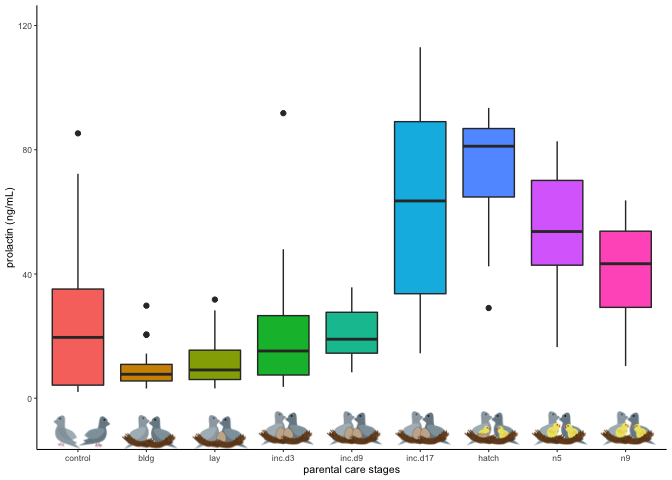

    meanPRL <- hormones %>% 
        filter(study == "characterization", hormone %in% c("prolactin"))  %>% 
        droplevels() %>% 
      dplyr::group_by(treatment) %>%
      dplyr::summarise(m = mean(plasma_conc), 
                       se = sd(plasma_conc)/sqrt(length(plasma_conc))) %>%
      dplyr::mutate(m = round(m,0)) 
    meanPRL <- left_join(meanPRL, birds)
    meanPRL$treatment <- factor(meanPRL$treatment, levels = alllevels)
    meanPRL

    ## # A tibble: 9 x 6
    ##   treatment     m    se icons    music                  iconpath           
    ##   <fct>     <dbl> <dbl> <chr>    <chr>                  <chr>              
    ## 1 control      24  4.75 control… https://encrypted-tbn… ../figures/images/…
    ## 2 bldg         10  1.54 bldg.png https://encrypted-tbn… ../figures/images/…
    ## 3 lay          12  1.96 lay.png  https://encrypted-tbn… ../figures/images/…
    ## 4 inc.d3       21  4.49 incubat… https://encrypted-tbn… ../figures/images/…
    ## 5 inc.d9       21  1.73 incubat… https://encrypted-tbn… ../figures/images/…
    ## 6 inc.d17      61  7.08 incubat… https://encrypted-tbn… ../figures/images/…
    ## 7 hatch        75  3.94 hatch.p… https://encrypted-tbn… ../figures/images/…
    ## 8 n5           55  4.01 chickli… https://encrypted-tbn… ../figures/images/…
    ## 9 n9           41  3.47 chickli… https://encrypted-tbn… ../figures/images/…

    ggplot(meanPRL, aes(treatment, m)) +
      geom_errorbar(aes(ymin=m-se, ymax=m+se), width=.1) +
       geom_image(aes(image=iconpath), size=.12)  +
      labs(x = "parental care stages", y = "Prolactin (ng/mL)")

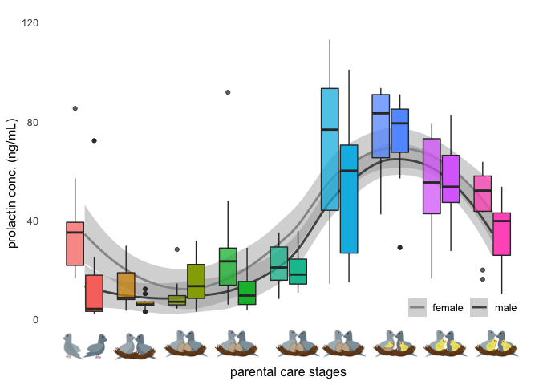

    ggplot(meanPRL, aes(treatment, m)) +
       geom_image(aes(image=music), size=.12)  +
      labs(x = "parental care stages", y = "Prolactin (ng/mL)")  +
      mytheme() +
      ylim(c(-15,80)) +
      annotation_custom(control, ymin = -20, ymax = 0, xmin = -7.5) +
      annotation_custom(bldg, ymin = -20, ymax = 0, xmin = -5.5) +
      annotation_custom(lay, ymin = -20, ymax = 0, xmin = -3.5) +
      annotation_custom(inc, ymin = -20, ymax = 0, xmin = -1.5) +
      annotation_custom(inc, ymin = -20, ymax = 0, xmin = 0.5) +
      annotation_custom(inc, ymin = -20, ymax = 0, xmin = 2.5) +
      annotation_custom(hatch, ymin = -20, ymax = 0, xmin = 4.5) +
      annotation_custom(nestling, ymin = -20, ymax = 0, xmin = 6.5) +
      annotation_custom(nestling, ymin = -20, ymax = 0, xmin = 8.5) 

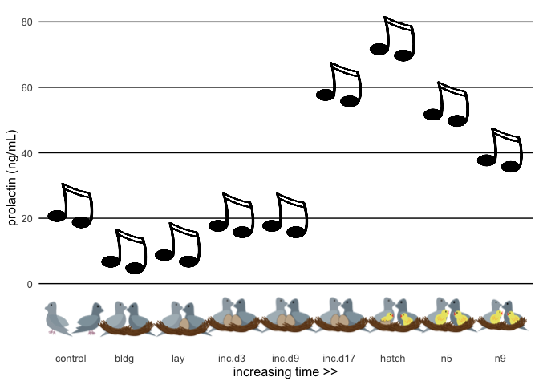

    p2 <- hormones %>% 
        filter(study == "characterization", hormone %in% c("prolactin"))  %>% 
        droplevels() %>% 
      ggplot(aes(x = as.numeric(treatment), y = plasma_conc)) +
            geom_smooth(aes(colour = sex)) +
        geom_boxplot(aes(fill = treatment, alpha = sex)) +
        mytheme() +
        theme(axis.text.x = element_blank()) +
        scale_fill_manual(values = colorscharmaip) +
        scale_color_manual(values = sexcolors) +
        labs(y = "prolactin conc. (ng/mL)", x = NULL) +
        guides(fill = FALSE, alpha = FALSE,
             color = guide_legend(order=1)) +
        scale_alpha_manual(values = c(0.75,1)) +
        theme(legend.position = c(0.85,0.15), legend.direction = "horizontal") + 
      labs(x = "parental care stages", y = "prolactin conc. (ng/mL)") +
      annotation_custom(control, ymin = -20, ymax = 0, xmin = -7.8) +
      annotation_custom(bldg, ymin = -20, ymax = 0, xmin = -5.8) +
      annotation_custom(lay, ymin = -20, ymax = 0, xmin = -3.8) +
      annotation_custom(inc, ymin = -20, ymax = 0, xmin = -1.8) +
      annotation_custom(inc, ymin = -20, ymax = 0, xmin = 0.6) +
      annotation_custom(inc, ymin = -20, ymax = 0, xmin = 2.4) +
      annotation_custom(hatch, ymin = -20, ymax = 0, xmin = 4.4) +
      annotation_custom(nestling, ymin = -20, ymax = 0, xmin = 6.4) +
      annotation_custom(nestling, ymin = -20, ymax = 0, xmin = 8.4) + 
      ylim(c(-10,120)) 
    p2

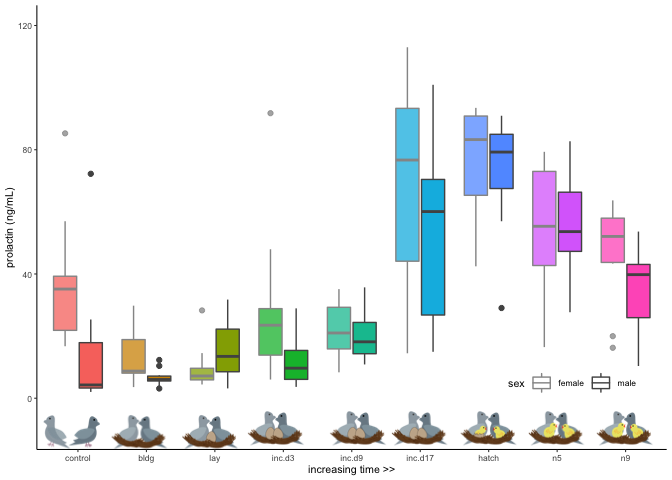

    vsd.pit <- readvsd("../results/04_vsd_pit.csv")
    colData.pit <- readcolData("../results/04_colData_pit.csv")

    geneinfo <- read_csv("../metadata/00_geneinfo.csv") %>%  dplyr::select(Name, geneid, entrezid) %>% arrange(Name)
    candidategenes <- c("PRL")
    candidates.pit <- selectcandidatevsds(candidategenes, vsd.pit, colData.pit)

    ## [1] "PRL"
    ## [1] "NP_990797.2"

    p3 <- ggplot(candidates.pit, aes(x = as.numeric(treatment), y = PRL)) + 
            geom_smooth(aes(colour = sex)) +
        geom_boxplot(aes(fill = treatment, alpha = sex)) + 
        scale_alpha_manual(values = c(0.75,1)) +
        mytheme() +
      theme(legend.position = c(0.85,0.2), legend.direction = "horizontal") + 
      scale_color_manual(values = c("female" = "#969696", "male" = "#525252")) +
        labs(y = "PRL expression in the pituitary", x = "parental care stage") +
        scale_x_continuous(breaks = c(1, 2, 3, 4, 5, 6, 7, 8, 9),
                           labels = charlevels) +
      annotation_custom(control, ymin = 12, ymax = 14, xmin = -7.8) +
      annotation_custom(bldg, ymin = 12, ymax = 14, xmin = -5.8) +
      annotation_custom(lay, ymin = 12, ymax = 14, xmin = -3.8) +
      annotation_custom(inc, ymin = 12, ymax = 14, xmin = -1.8) +
      annotation_custom(inc, ymin = 12, ymax = 14, xmin = 0.6) +
      annotation_custom(inc, ymin = 12, ymax = 14, xmin = 2.4) +
      annotation_custom(hatch, ymin = 12, ymax = 14, xmin = 4.4) +
      annotation_custom(nestling, ymin = 12, ymax = 14, xmin = 6.4) +
      annotation_custom(nestling, ymin = 12, ymax = 14, xmin = 8.4)  + 
      ylim(c(13,24)) +
      guides(fill = FALSE, alpha = FALSE, color = guide_legend(order=1)) 
    p3

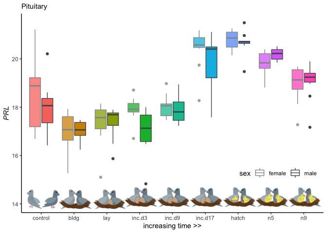

    candidates.pit

    ##        sex treatment        sextissue     hypothesis
    ## 1     male   control   male_pituitary   anticipation
    ## 2     male   control   male_pituitary   anticipation
    ## 3   female   control female_pituitary   anticipation
    ## 4     male   control   male_pituitary   anticipation
    ## 5     male   control   male_pituitary   anticipation
    ## 6     male   control   male_pituitary   anticipation
    ## 7     male   control   male_pituitary   anticipation
    ## 8     male   control   male_pituitary   anticipation
    ## 9   female   control female_pituitary   anticipation
    ## 10  female   control female_pituitary   anticipation
    ## 11  female   control female_pituitary   anticipation
    ## 12  female   control female_pituitary   anticipation
    ## 13    male   control   male_pituitary   anticipation
    ## 14  female    inc.d9 female_pituitary     incubation
    ## 15  female      bldg female_pituitary   anticipation
    ## 16    male        n5   male_pituitary hatchling.care
    ## 17    male   inc.d17   male_pituitary     incubation
    ## 18  female     hatch female_pituitary hatchling.care
    ## 19  female        n9 female_pituitary hatchling.care
    ## 20  female   control female_pituitary   anticipation
    ## 21  female     hatch female_pituitary hatchling.care
    ## 22    male     hatch   male_pituitary hatchling.care
    ## 23    male    inc.d9   male_pituitary     incubation
    ## 24    male    inc.d3   male_pituitary     incubation
    ## 25    male   inc.d17   male_pituitary     incubation
    ## 26    male      bldg   male_pituitary   anticipation
    ## 27    male   inc.d17   male_pituitary     incubation
    ## 28  female     hatch female_pituitary hatchling.care
    ## 29    male      bldg   male_pituitary   anticipation
    ## 30  female        n9 female_pituitary hatchling.care
    ## 31    male        n5   male_pituitary hatchling.care
    ## 32  female      bldg female_pituitary   anticipation
    ## 33  female    inc.d3 female_pituitary     incubation
    ## 34    male        n5   male_pituitary hatchling.care
    ## 35  female    inc.d9 female_pituitary     incubation
    ## 36  female        n5 female_pituitary hatchling.care
    ## 37    male        n9   male_pituitary hatchling.care
    ## 38    male        n5   male_pituitary hatchling.care
    ## 39    male        n5   male_pituitary hatchling.care
    ## 40  female       lay female_pituitary     incubation
    ## 41    male        n9   male_pituitary hatchling.care
    ## 42    male       lay   male_pituitary     incubation
    ## 43    male       lay   male_pituitary     incubation
    ## 44  female       lay female_pituitary     incubation
    ## 45    male      bldg   male_pituitary   anticipation
    ## 46    male     hatch   male_pituitary hatchling.care
    ## 47    male   inc.d17   male_pituitary     incubation
    ## 48  female      bldg female_pituitary   anticipation
    ## 49  female   inc.d17 female_pituitary     incubation
    ## 50    male   inc.d17   male_pituitary     incubation
    ## 51    male    inc.d3   male_pituitary     incubation
    ## 52    male    inc.d3   male_pituitary     incubation
    ## 53    male      bldg   male_pituitary   anticipation
    ## 54    male     hatch   male_pituitary hatchling.care
    ## 55  female    inc.d3 female_pituitary     incubation
    ## 56  female    inc.d9 female_pituitary     incubation
    ## 57  female      bldg female_pituitary   anticipation
    ## 58    male       lay   male_pituitary     incubation
    ## 59    male        n5   male_pituitary hatchling.care
    ## 60  female    inc.d3 female_pituitary     incubation
    ## 61  female    inc.d3 female_pituitary     incubation
    ## 62  female     hatch female_pituitary hatchling.care
    ## 63  female    inc.d3 female_pituitary     incubation
    ## 64  female   inc.d17 female_pituitary     incubation
    ## 65  female      bldg female_pituitary   anticipation
    ## 66    male     hatch   male_pituitary hatchling.care
    ## 67    male     hatch   male_pituitary hatchling.care
    ## 68    male    inc.d3   male_pituitary     incubation
    ## 69    male    inc.d9   male_pituitary     incubation
    ## 70  female   inc.d17 female_pituitary     incubation
    ## 71    male    inc.d9   male_pituitary     incubation
    ## 72  female    inc.d9 female_pituitary     incubation
    ## 73    male       lay   male_pituitary     incubation
    ## 74    male       lay   male_pituitary     incubation
    ## 75  female   control female_pituitary   anticipation
    ## 76  female   control female_pituitary   anticipation
    ## 77    male       lay   male_pituitary     incubation
    ## 78  female      bldg female_pituitary   anticipation
    ## 79    male      bldg   male_pituitary   anticipation
    ## 80    male       lay   male_pituitary     incubation
    ## 81  female        n9 female_pituitary hatchling.care
    ## 82    male        n9   male_pituitary hatchling.care
    ## 83    male   inc.d17   male_pituitary     incubation
    ## 84  female     hatch female_pituitary hatchling.care
    ## 85    male       lay   male_pituitary     incubation
    ## 86    male        n9   male_pituitary hatchling.care
    ## 87  female    inc.d3 female_pituitary     incubation
    ## 88  female    inc.d9 female_pituitary     incubation
    ## 89  female    inc.d9 female_pituitary     incubation
    ## 90    male        n9   male_pituitary hatchling.care
    ## 91    male     hatch   male_pituitary hatchling.care
    ## 92    male    inc.d9   male_pituitary     incubation
    ## 93  female   inc.d17 female_pituitary     incubation
    ## 94  female   control female_pituitary   anticipation
    ## 95    male     hatch   male_pituitary hatchling.care
    ## 96  female    inc.d3 female_pituitary     incubation
    ## 97  female      bldg female_pituitary   anticipation
    ## 98  female        n9 female_pituitary hatchling.care
    ## 99  female       lay female_pituitary     incubation
    ## 100   male      bldg   male_pituitary   anticipation
    ## 101 female   control female_pituitary   anticipation
    ## 102 female      bldg female_pituitary   anticipation
    ## 103   male      bldg   male_pituitary   anticipation
    ## 104   male      bldg   male_pituitary   anticipation
    ## 105 female      bldg female_pituitary   anticipation
    ## 106 female       lay female_pituitary     incubation
    ## 107 female       lay female_pituitary     incubation
    ## 108 female       lay female_pituitary     incubation
    ## 109   male       lay   male_pituitary     incubation
    ## 110 female       lay female_pituitary     incubation
    ## 111   male        n9   male_pituitary hatchling.care
    ## 112   male       lay   male_pituitary     incubation
    ## 113 female   control female_pituitary   anticipation
    ## 114   male    inc.d9   male_pituitary     incubation
    ## 115   male   control   male_pituitary   anticipation
    ## 116   male        n9   male_pituitary hatchling.care
    ## 117   male   control   male_pituitary   anticipation
    ## 118 female    inc.d9 female_pituitary     incubation
    ## 119 female    inc.d3 female_pituitary     incubation
    ## 120   male    inc.d9   male_pituitary     incubation
    ## 121 female        n5 female_pituitary hatchling.care
    ## 122 female   inc.d17 female_pituitary     incubation
    ## 123   male   inc.d17   male_pituitary     incubation
    ## 124 female    inc.d9 female_pituitary     incubation
    ## 125   male        n9   male_pituitary hatchling.care
    ## 126   male        n5   male_pituitary hatchling.care
    ## 127   male    inc.d3   male_pituitary     incubation
    ## 128 female        n9 female_pituitary hatchling.care
    ## 129 female       lay female_pituitary     incubation
    ## 130   male   control   male_pituitary   anticipation
    ## 131   male   control   male_pituitary   anticipation
    ## 132   male   control   male_pituitary   anticipation
    ## 133   male    inc.d9   male_pituitary     incubation
    ## 134   male   inc.d17   male_pituitary     incubation
    ## 135   male    inc.d3   male_pituitary     incubation
    ## 136 female        n5 female_pituitary hatchling.care
    ## 137 female        n9 female_pituitary hatchling.care
    ## 138 female        n5 female_pituitary hatchling.care
    ## 139 female        n5 female_pituitary hatchling.care
    ## 140   male     hatch   male_pituitary hatchling.care
    ## 141 female    inc.d9 female_pituitary     incubation
    ## 142 female   inc.d17 female_pituitary     incubation
    ## 143   male     hatch   male_pituitary hatchling.care
    ## 144   male    inc.d3   male_pituitary     incubation
    ## 145   male        n5   male_pituitary hatchling.care
    ## 146 female        n5 female_pituitary hatchling.care
    ## 147   male        n9   male_pituitary hatchling.care
    ## 148   male      bldg   male_pituitary   anticipation
    ## 149 female     hatch female_pituitary hatchling.care
    ## 150   male    inc.d9   male_pituitary     incubation
    ## 151   male        n5   male_pituitary hatchling.care
    ## 152 female        n5 female_pituitary hatchling.care
    ## 153   male     hatch   male_pituitary hatchling.care
    ## 154   male        n5   male_pituitary hatchling.care
    ## 155   male   inc.d17   male_pituitary     incubation
    ## 156 female    inc.d3 female_pituitary     incubation
    ## 157 female      bldg female_pituitary   anticipation
    ## 158 female     hatch female_pituitary hatchling.care
    ## 159 female   inc.d17 female_pituitary     incubation
    ## 160 female        n5 female_pituitary hatchling.care
    ## 161   male    inc.d3   male_pituitary     incubation
    ## 162   male      bldg   male_pituitary   anticipation
    ## 163 female        n9 female_pituitary hatchling.care
    ## 164   male    inc.d9   male_pituitary     incubation
    ## 165 female       lay female_pituitary     incubation
    ## 166 female        n9 female_pituitary hatchling.care
    ## 167   male   control   male_pituitary   anticipation
    ## 168 female    inc.d9 female_pituitary     incubation
    ## 169   male   inc.d17   male_pituitary     incubation
    ## 170 female        n9 female_pituitary hatchling.care
    ## 171   male    inc.d9   male_pituitary     incubation
    ## 172 female     hatch female_pituitary hatchling.care
    ## 173 female    inc.d9 female_pituitary     incubation
    ## 174 female        n9 female_pituitary hatchling.care
    ## 175 female       lay female_pituitary     incubation
    ## 176 female   inc.d17 female_pituitary     incubation
    ## 177 female    inc.d9 female_pituitary     incubation
    ## 178   male        n9   male_pituitary hatchling.care
    ## 179 female    inc.d3 female_pituitary     incubation
    ## 180 female   inc.d17 female_pituitary     incubation
    ## 181   male        n9   male_pituitary hatchling.care
    ## 182   male   inc.d17   male_pituitary     incubation
    ## 183 female   inc.d17 female_pituitary     incubation
    ## 184 female   inc.d17 female_pituitary     incubation
    ## 185 female    inc.d9 female_pituitary     incubation
    ## 186   male    inc.d3   male_pituitary     incubation
    ## 187 female     hatch female_pituitary hatchling.care
    ## 188 female        n5 female_pituitary hatchling.care
    ## 189 female     hatch female_pituitary hatchling.care
    ## 190 female        n5 female_pituitary hatchling.care
    ## 191   male    inc.d9   male_pituitary     incubation
    ## 192 female        n9 female_pituitary hatchling.care
    ## 193   male    inc.d3   male_pituitary     incubation
    ##                                          sample      PRL
    ## 1           L.Blu13_male_pituitary_control.NYNO 16.75792
    ## 2                 L.G107_male_pituitary_control 17.87347
    ## 3          L.G118_female_pituitary_control.NYNO 17.91121
    ## 4              L.R3_male_pituitary_control.NYNO 16.51080
    ## 5                   L.R8_male_pituitary_control 17.30663
    ## 6                  L.W33_male_pituitary_control 19.93211
    ## 7                   L.W3_male_pituitary_control 17.65250
    ## 8                   L.W4_male_pituitary_control 17.00837
    ## 9               R.G106_female_pituitary_control 16.99877
    ## 10               R.R20_female_pituitary_control 18.60748
    ## 11           R.R9_female_pituitary_control.NYNO 16.84254
    ## 12          R.W44_female_pituitary_control.NYNO 18.66621
    ## 13            R.Y108.W29_male_pituitary_control 17.79753
    ## 14        blk.s061.pu.y_female_pituitary_inc.d9 17.58465
    ## 15                blk11.x_female_pituitary_bldg 17.65180
    ## 16                    blk12.x_male_pituitary_n5 20.21280
    ## 17               blk17.x_male_pituitary_inc.d17 20.13990
    ## 18               blk21.x_female_pituitary_hatch 20.46940
    ## 19                   blk4.x_female_pituitary_n9 19.26784
    ## 20       blu.o.x.ATLAS_female_pituitary_control 20.94366
    ## 21         blu103.x_female_pituitary_hatch.NYNO 20.00837
    ## 22      blu104.w120.x_male_pituitary_hatch.NYNO 21.23703
    ## 23        blu108.w40.o158_male_pituitary_inc.d9 17.08513
    ## 24          blu111.w113.x_male_pituitary_inc.d3 14.55878
    ## 25    blu113.w124.x_male_pituitary_inc.d17.NYNO 20.23809
    ## 26          blu114.r38.w198_male_pituitary_bldg 16.50007
    ## 27          blu121.w91.x_male_pituitary_inc.d17 20.52719
    ## 28         blu124.w180.x_female_pituitary_hatch 20.74589
    ## 29              blu33.y88.x_male_pituitary_bldg 17.19097
    ## 30                blu36.w16_female_pituitary_n9 18.76422
    ## 31                blu37.r65.x_male_pituitary_n5 20.04984
    ## 32           blu38.g135.x_female_pituitary_bldg 16.98422
    ## 33     blu39.o26.x_female_pituitary_inc.d3.NYNO 17.57499
    ## 34               blu41.y100.x_male_pituitary_n5 20.13223
    ## 35          blu47.y96.x_female_pituitary_inc.d9 17.78692
    ## 36                blu55.g51_female_pituitary_n5 20.04067
    ## 37                  blu81.r88_male_pituitary_n9 19.62888
    ## 38               d.s008.y.blk_male_pituitary_n5 20.00838
    ## 39               d.s047.blk.o_male_pituitary_n5 19.71105
    ## 40           g.blk.s004.pk_female_pituitary_lay 17.26051
    ## 41                  g.s.blk.d_male_pituitary_n9 19.01159
    ## 42                 g.s.blk.y_male_pituitary_lay 17.58955
    ## 43             g.s043.pu.blk_male_pituitary_lay 17.38960
    ## 44            g.s078.blk.o_female_pituitary_lay 16.55330
    ## 45               g104.w82.x_male_pituitary_bldg 16.43039
    ## 46         g114.w83.x_male_pituitary_hatch.NYNO 19.20837
    ## 47            g130.y81.x_male_pituitary_inc.d17 20.13236
    ## 48           g141.blu27.x_female_pituitary_bldg 16.40299
    ## 49          g142.r40.x_female_pituitary_inc.d17 20.15317
    ## 50          g143.blu32.x_male_pituitary_inc.d17 17.30809
    ## 51             g146.blu51_male_pituitary_inc.d3 16.69746
    ## 52             g20.w106.x_male_pituitary_inc.d3 17.72712
    ## 53                g52.blu58_male_pituitary_bldg 16.92499
    ## 54                 g53.y84_male_pituitary_hatch 20.44091
    ## 55            g6.w197.x_female_pituitary_inc.d3 18.07724
    ## 56                g75.x_female_pituitary_inc.d9 17.32320
    ## 57           l.s120.y.blk_female_pituitary_bldg 15.98884
    ## 58                   o.s.w.r_male_pituitary_lay 17.61428
    ## 59              o152.o120.w42_male_pituitary_n5 19.57274
    ## 60           o156.w80.x_female_pituitary_inc.d3 17.71767
    ## 61     o165.w122.x_female_pituitary_inc.d3.NYNO 17.51911
    ## 62      o172.w115.x_female_pituitary_hatch.NYNO 20.99312
    ## 63          o173.w179.x_female_pituitary_inc.d3 17.93625
    ## 64           o35.r51.x_female_pituitary_inc.d17 19.46891
    ## 65            o38.blu29.x_female_pituitary_bldg 17.29802
    ## 66               o39.y77.x_male_pituitary_hatch 20.40922
    ## 67             o44.blu26.x_male_pituitary_hatch 20.28171
    ## 68             o48.r197.x_male_pituitary_inc.d3 17.48836
    ## 69                  o49.x_male_pituitary_inc.d9 18.20245
    ## 70           o52.blu53_female_pituitary_inc.d17 20.24380
    ## 71                o57.g59_male_pituitary_inc.d9 17.97919
    ## 72                o73.x_female_pituitary_inc.d9 17.90427
    ## 73             pk.s238.blk.w_male_pituitary_lay 17.43087
    ## 74               pk.w.s141.o_male_pituitary_lay 17.50123
    ## 75    r.r.x.ATLAS.R2XR_female_pituitary_control 18.84256
    ## 76         r.r.x.ATLAS_female_pituitary_control 19.05529
    ## 77             r.s005.pk.blk_male_pituitary_lay 15.59714
    ## 78             r.s056.g.o_female_pituitary_bldg 17.35389
    ## 79               r.s059.d.o_male_pituitary_bldg 16.79284
    ## 80             r.s116.blk.pu_male_pituitary_lay 16.20895
    ## 81               r.s171.l.w_female_pituitary_n9 19.28654
    ## 82               r.y.s007.blk_male_pituitary_n9 19.10903
    ## 83            r176.blu54_male_pituitary_inc.d17 19.63630
    ## 84              r183.o22_female_pituitary_hatch 19.87945
    ## 85                r190.o43.x_male_pituitary_lay 17.26051
    ## 86                     r195.x_male_pituitary_n9 18.83775
    ## 87      r27.w111.blu125_female_pituitary_inc.d3 17.58444
    ## 88         r30.w112.r46_female_pituitary_inc.d9 17.51028
    ## 89           r36.w184.x_female_pituitary_inc.d9 18.31074
    ## 90                 r37.w100.x_male_pituitary_n9 16.89434
    ## 91               r41.w99.x_male_pituitary_hatch 20.69390
    ## 92                  r45.X_male_pituitary_inc.d9 17.48182
    ## 93          r49.w189.x_female_pituitary_inc.d17 20.30213
    ## 94                r6.x_female_pituitary_control 16.41207
    ## 95               r72.y83.x_male_pituitary_hatch 20.35290
    ## 96           r73.g127.x_female_pituitary_inc.d3 17.38277
    ## 97                r83.g45_female_pituitary_bldg 17.36476
    ## 98                r95.blu99_female_pituitary_n9 19.32222
    ## 99                  s.o.pk_female_pituitary_lay 17.64098
    ## 100           s.pu148.blk.r_male_pituitary_bldg 16.78887
    ## 101          s.x.ATLAS_female_pituitary_control 19.28422
    ## 102          s063.d.blk.l_female_pituitary_bldg 15.00080
    ## 103              s065.l.d.o_male_pituitary_bldg 17.15911
    ## 104              s066.l.d.r_male_pituitary_bldg 17.15510
    ## 105          s092.blk.r.o_female_pituitary_bldg 16.34660
    ## 106           s095.g.blk.o_female_pituitary_lay 16.79827
    ## 107             s136.d.w.o_female_pituitary_lay 17.87841
    ## 108           s142.o.pk.pu_female_pituitary_lay 17.53155
    ## 109             s150.w.g.blk_male_pituitary_lay 16.87596
    ## 110          s176.blk.pu.r_female_pituitary_lay 16.93466
    ## 111                s187.l.o.r_male_pituitary_n9 18.68421
    ## 112            s243.blk.pk.r_male_pituitary_lay 17.46797
    ## 113            w191.r1_female_pituitary_control 16.49586
    ## 114                 w34.x_male_pituitary_inc.d9 17.90818
    ## 115      x.blk.blk.ATLAS_male_pituitary_control 17.77426
    ## 116                   x.blk16_male_pituitary_n9 19.15529
    ## 117        x.blu.o.ATLAS_male_pituitary_control 18.27205
    ## 118        x.blu101.w43_female_pituitary_inc.d9 17.86562
    ## 119       x.blu102.w105_female_pituitary_inc.d3 18.43352
    ## 120    x.blu106.o153_male_pituitary_inc.d9.NYNO 18.67468
    ## 121           x.blu109.w121_female_pituitary_n5 19.33066
    ## 122 x.blu116.w107_female_pituitary_inc.d17.NYNO 20.68096
    ## 123         x.blu117.w89_male_pituitary_inc.d17 20.84499
    ## 124        x.blu122.r66_female_pituitary_inc.d9 17.26594
    ## 125               x.blu23.w14_male_pituitary_n9 18.97017
    ## 126                   x.blu30_male_pituitary_n5 19.73468
    ## 127           x.blu42.o28_male_pituitary_inc.d3 17.01607
    ## 128            x.blu43.g132_female_pituitary_n9 17.00160
    ## 129             x.blu6.y80_female_pituitary_lay 14.83222
    ## 130            x.g.ATLAS_male_pituitary_control 17.82184
    ## 131          x.g.g.ATLAS_male_pituitary_control 16.14909
    ## 132        x.g.g.g.ATLAS_male_pituitary_control 18.34235
    ## 133            x.g13.w109_male_pituitary_inc.d9 17.28240
    ## 134           x.g14.w199_male_pituitary_inc.d17 18.24986
    ## 135          x.g147.blu28_male_pituitary_inc.d3 17.13623
    ## 136                   x.g37_female_pituitary_n5 19.65025
    ## 137                x.g4.w50_female_pituitary_n9 17.87065
    ## 138                   x.g43_female_pituitary_n5 20.11968
    ## 139              x.g49_female_pituitary_n5.NYNO 19.34944
    ## 140                  x.g70_male_pituitary_hatch 20.43456
    ## 141      x.g9.o166_female_pituitary_inc.d9.NYNO 18.70952
    ## 142         x.o159.w90_female_pituitary_inc.d17 20.33060
    ## 143            x.o160.w102_male_pituitary_hatch 20.46032
    ## 144      x.o163.w101_male_pituitary_inc.d3.NYNO 13.74568
    ## 145          x.o164.w123_male_pituitary_n5.NYNO 19.89475
    ## 146              x.o175.g21_female_pituitary_n5 18.53955
    ## 147                      x.o2_male_pituitary_n9 18.18658
    ## 148              x.o30.g134_male_pituitary_bldg 16.74282
    ## 149          x.o37.blu50_female_pituitary_hatch 20.86458
    ## 150             x.o47.y82_male_pituitary_inc.d9 17.84317
    ## 151                     x.o68_male_pituitary_n5 19.58573
    ## 152                   x.o70_female_pituitary_n5 19.49270
    ## 153                 x.r178_male_pituitary_hatch 20.43881
    ## 154                    x.r181_male_pituitary_n5 20.24865
    ## 155            x.r29.w96_male_pituitary_inc.d17 17.81074
    ## 156          x.r33.w183_female_pituitary_inc.d3 17.70581
    ## 157             x.r39.g10_female_pituitary_bldg 16.60873
    ## 158            x.r44.w95_female_pituitary_hatch 20.89557
    ## 159    x.r48.y139_female_pituitary_inc.d17.NYNO 20.87706
    ## 160               x.r50.w97_female_pituitary_n5 18.77136
    ## 161            x.r64.g140_male_pituitary_inc.d3 16.61313
    ## 162        x.r67.blu35_male_pituitary_bldg.NYNO 15.97191
    ## 163                  x.w178_female_pituitary_n9 19.40970
    ## 164           x.w192.o157_male_pituitary_inc.d9 16.95581
    ## 165                  x.w51_female_pituitary_lay 17.83216
    ## 166                    x.w6_female_pituitary_n9 18.17423
    ## 167          x.y.s.ATLAS_male_pituitary_control 18.15678
    ## 168              x.y109_female_pituitary_inc.d9 17.86035
    ## 169           x.y132.w76_male_pituitary_inc.d17 19.79408
    ## 170             x.y138.w176_female_pituitary_n9 19.27098
    ## 171           x.y141.w116_male_pituitary_inc.d9 17.53187
    ## 172                x.y90_female_pituitary_hatch 20.56747
    ## 173          x.y93.g126_female_pituitary_inc.d9 17.37354
    ## 174                    x.y9_female_pituitary_n9 18.85543
    ## 175             y.s156.o.r_female_pituitary_lay 17.33068
    ## 176         y126.w92.x_female_pituitary_inc.d17 20.54266
    ## 177          y128.g23.x_female_pituitary_inc.d9 17.19266
    ## 178                    y129.x_male_pituitary_n9 18.84517
    ## 179               y13.x_female_pituitary_inc.d3 16.43157
    ## 180        y130.o170.x_female_pituitary_inc.d17 20.29509
    ## 181               y131.w185.x_male_pituitary_n9 19.44677
    ## 182         y133.w77.r58_male_pituitary_inc.d17 20.21613
    ## 183 y135.blu107.x_female_pituitary_inc.d17.NYNO 20.91226
    ## 184             y136.x_female_pituitary_inc.d17 18.00424
    ## 185         y140.w119.x_female_pituitary_inc.d9 17.80190
    ## 186            y149.r52.x_male_pituitary_inc.d3 16.20095
    ## 187                y15.x_female_pituitary_hatch 20.12933
    ## 188                  y6.o54_female_pituitary_n5 19.62658
    ## 189               y7.g58_female_pituitary_hatch 20.61969
    ## 190              y94.g133.x_female_pituitary_n5 20.05808
    ## 191            y95.g131.x_male_pituitary_inc.d9 17.00910
    ## 192                   y97.x_female_pituitary_n9 18.79567
    ## 193             y98.o50.x_male_pituitary_inc.d3 17.63551

    meanPRL <- candidates.pit %>% 
        droplevels() %>% 
      dplyr::group_by(treatment) %>%
      dplyr::summarise(m = mean(PRL), 
                       se = sd(PRL)/sqrt(length(PRL))) %>%
      dplyr::mutate(m = round(m,0)) 
    meanPRL <- left_join(meanPRL, birds)
    meanPRL$treatment <- factor(meanPRL$treatment, levels = alllevels)
    meanPRL

    ## # A tibble: 9 x 6
    ##   treatment     m     se icons    music                 iconpath           
    ##   <fct>     <dbl>  <dbl> <chr>    <chr>                 <chr>              
    ## 1 control      18 0.233  control… https://encrypted-tb… ../figures/images/…
    ## 2 bldg         17 0.137  bldg.png https://encrypted-tb… ../figures/images/…
    ## 3 lay          17 0.173  lay.png  https://encrypted-tb… ../figures/images/…
    ## 4 inc.d3       17 0.257  incubat… https://encrypted-tb… ../figures/images/…
    ## 5 inc.d9       18 0.0975 incubat… https://encrypted-tb… ../figures/images/…
    ## 6 inc.d17      20 0.223  incubat… https://encrypted-tb… ../figures/images/…
    ## 7 hatch        20 0.0984 hatch.p… https://encrypted-tb… ../figures/images/…
    ## 8 n5           20 0.102  chickli… https://encrypted-tb… ../figures/images/…
    ## 9 n9           19 0.156  chickli… https://encrypted-tb… ../figures/images/…

    ggplot(meanPRL, aes(treatment, m)) +
      geom_errorbar(aes(ymin=m-se, ymax=m+se), width=.1) +
       geom_image(aes(image=iconpath), size=.12)  +
      labs(x = "parental care stages", y = "Pituitary PRL expression")

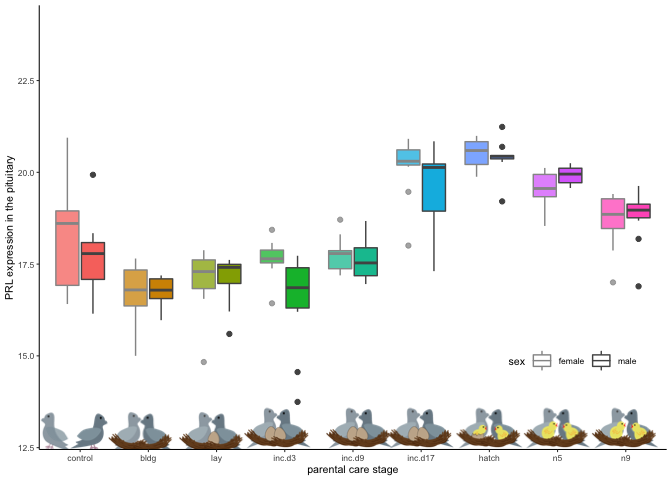

    ggplot(meanPRL, aes(treatment, m)) +
       geom_image(aes(image=music), size=.12)  +
      labs(x = "parental care stages", y = "Pituitary PRL expression") +
      mytheme() +
      ylim(c(15,22)) +
      annotation_custom(control, ymin = 15, ymax = 16.5, xmin = -7.5) +
      annotation_custom(bldg, ymin = 15, ymax = 16.5, xmin = -5.5) +
      annotation_custom(lay, ymin = 15, ymax = 16.5, xmin = -3.5) +
      annotation_custom(inc, ymin = 15, ymax = 16.5, xmin = -1.5) +
      annotation_custom(inc, ymin = 15, ymax = 16.5, xmin = 0.5) +
      annotation_custom(inc, ymin = 15, ymax = 16.5, xmin = 2.5) +
      annotation_custom(hatch, ymin = 15, ymax = 16.5, xmin = 4.5) +
      annotation_custom(nestling, ymin = 15, ymax = 16.5, xmin = 6.5) +
      annotation_custom(nestling, ymin = 15, ymax = 16.5, xmin = 8.5) 

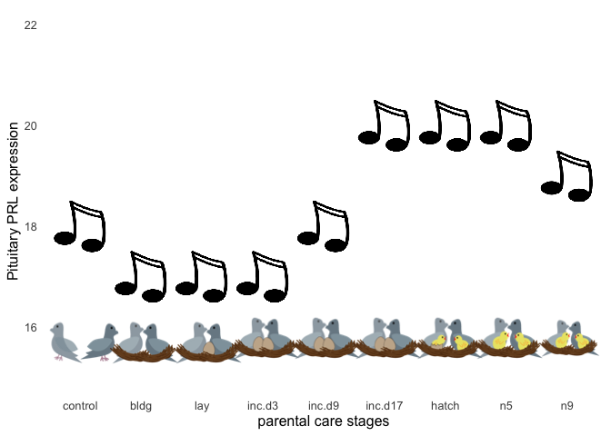

prolactin manip
---------------

    vsd.pit <- readvsd("../results/06_pitallvsd.csv")
    vsd.pit$entrezid <- row.names(vsd.pit)

    colData.pit <- read_csv("../metadata/00_samples.csv") %>% 
      filter(tissue == "pituitary") %>% 
      mutate(sample = V1)

    geneinfo <- read_csv("../metadata/00_geneinfo.csv") %>%  
      dplyr::select(Name, geneid, entrezid) %>% arrange(Name)

    candidategenes <- c("PRL")

    candidates.pit <- selectcandidatevsds(candidategenes, vsd.pit, colData.pit)

    ## [1] "PRL"
    ## [1] "NP_990797.2"

    candidates.pit$treatment <- factor(candidates.pit$treatment, levels = alllevels)

    p3 <- ggplot(candidates.pit, aes(x = treatment, y = PRL)) + 
           geom_smooth(aes(colour = sex)) +
        geom_boxplot(aes(fill = treatment)) +
        scale_alpha_manual(values = c(0.75,1)) +
        mytheme() +
       theme(legend.position = "none", legend.direction = "horizontal") + 
       scale_color_manual(values = c("female" = "#969696", "male" = "#525252")) +
        labs(y = "Pituitary PRL", x = NULL) +
        scale_x_discrete(breaks = c(1,2,3,4,5,6,7,8,9,10,11,12,13,14,15,16)) +
      scale_fill_manual(values = colorscharmaip2) +
      ylim(c(16,22))
    p3

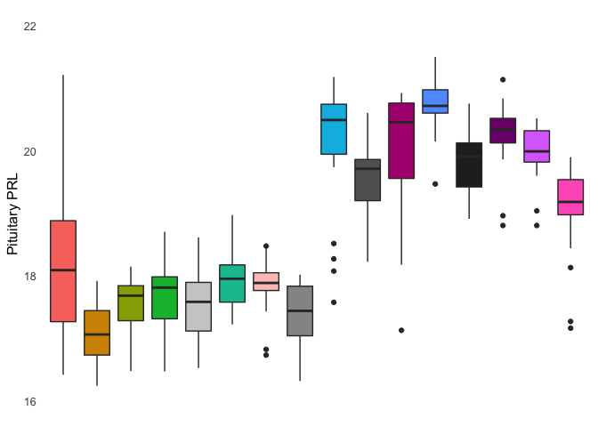

    meanPRL <- candidates.pit %>% 
        droplevels() %>% 
      dplyr::group_by(treatment) %>%
      dplyr::summarise(m = median(PRL), 
                       se = sd(PRL)/sqrt(length(PRL))) %>%
      dplyr::mutate(m = round(m,1)) 
    meanPRL <- left_join(meanPRL, birds)
    meanPRL$treatment <- factor(meanPRL$treatment, levels = alllevels)
    meanPRL

    ## # A tibble: 16 x 6
    ##    treatment     m     se icons    music                iconpath           
    ##    <fct>     <dbl>  <dbl> <chr>    <chr>                <chr>              
    ##  1 control    18.1 0.233  control… https://encrypted-t… ../figures/images/…
    ##  2 bldg       17.1 0.137  bldg.png https://encrypted-t… ../figures/images/…
    ##  3 lay        17.6 0.173  lay.png  https://encrypted-t… ../figures/images/…
    ##  4 inc.d3     17.8 0.257  incubat… https://encrypted-t… ../figures/images/…
    ##  5 m.inc.d3   17.5 0.158  bldg.png https://encrypted-t… ../figures/images/…
    ##  6 inc.d9     18   0.0973 incubat… https://encrypted-t… ../figures/images/…
    ##  7 m.inc.d8   17.9 0.390  hatch.p… https://encrypted-t… ../figures/images/…
    ##  8 m.inc.d9   17.4 0.126  bldg.png https://encrypted-t… ../figures/images/…
    ##  9 inc.d17    20.5 0.223  incubat… https://encrypted-t… ../figures/images/…
    ## 10 m.inc.d17  19.7 0.115  bldg.png https://encrypted-t… ../figures/images/…
    ## 11 prolong    20.5 0.232  incubat… https://encrypted-t… ../figures/images/…
    ## 12 hatch      20.7 0.0986 hatch.p… https://encrypted-t… ../figures/images/…
    ## 13 m.n2       19.9 0.112  bldg.png https://encrypted-t… ../figures/images/…
    ## 14 extend     20.3 0.123  hatch.p… https://encrypted-t… ../figures/images/…
    ## 15 n5         20   0.102  chickli… https://encrypted-t… ../figures/images/…
    ## 16 n9         19.2 0.156  chickli… https://encrypted-t… ../figures/images/…

    p4 <- ggplot(meanPRL, aes(treatment, m)) +
       geom_errorbar(aes(ymin=m-se, ymax=m+se, color = treatment), width=.1) +
       geom_image(aes(image = iconpath), size = 0.06)  +
       geom_image(aes(image = music , y = m + 0.5), size = 0.04) +
       labs(x = "parental care stages", y = "Pituitary PRL") +
       mytheme() +
       ylim(c(16,22)) +
       theme(axis.text.x = element_text(angle = 45)) +
      theme(legend.position = "none") +
      scale_color_manual(values = colorscharmaip2) +
      geom_hline(yintercept=16.8) +
      geom_hline(yintercept=17.8) +
      geom_hline(yintercept=18.8) +
      geom_hline(yintercept=19.8) +
      geom_hline(yintercept=20.8) 
    p4

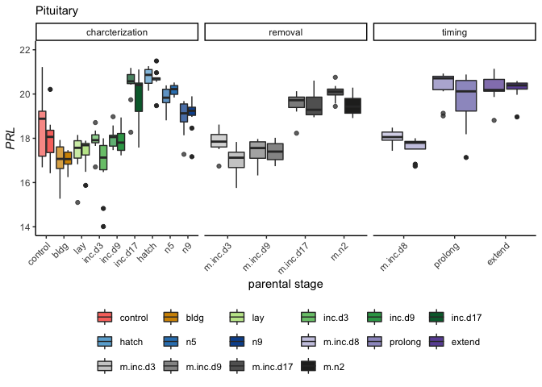

    candidates.pit$bird_id <- candidates.pit$bird

    geneshormones <- left_join(candidates.pit, hormones) %>%
      select(-X1, -V1, -okay, - icons, -music, -iconpath) %>%
      drop_na()
    head(geneshormones)

    ## # A tibble: 6 x 11
    ##   bird  sex   tissue treatment group study sample   PRL bird_id hormone
    ##   <chr> <chr> <chr>  <fct>     <chr> <chr> <chr>  <dbl> <chr>   <chr>  
    ## 1 blk0… fema… pitui… m.n2      fema… mani… blk0.…  20.1 blk0.x  prolac…
    ## 2 blk0… fema… pitui… m.n2      fema… mani… blk0.…  20.1 blk0.x  cort   
    ## 3 blk0… fema… pitui… m.n2      fema… mani… blk0.…  20.1 blk0.x  estrad…
    ## 4 blk1… fema… pitui… extend    fema… mani… blk19…  21.1 blk19.x prolac…
    ## 5 blk1… fema… pitui… extend    fema… mani… blk19…  21.1 blk19.x cort   
    ## 6 blk1… fema… pitui… extend    fema… mani… blk19…  21.1 blk19.x estrad…
    ## # … with 1 more variable: plasma_conc <dbl>

    ggplot(geneshormones, aes(x = plasma_conc, y = PRL)) +
      geom_point(aes(color = treatment)) +
      facet_wrap(~hormone, scales = "free_x") +
        geom_smooth(method = "lm", color = "grey") 

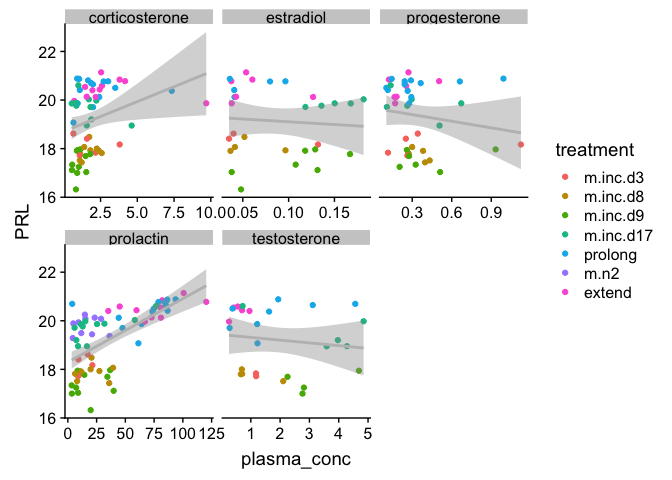

    prolactin2 <- read_csv("../results/07_prolactin2.csv")
    head(prolactin2)

    ## # A tibble: 6 x 6
    ##   study            treatment sex    bird_id       hormone   plasma_conc
    ##   <chr>            <chr>     <chr>  <chr>         <chr>           <dbl>
    ## 1 manipulation     prolong   male   blk.s030.o.g  prolactin        35.3
    ## 2 manipulation     prolong   female blk.s031.pu.d prolactin        43.8
    ## 3 manipulation     m.n2      female blk.s032.g.w  prolactin        90.8
    ## 4 manipulation     m.inc.d3  female blk.s049.y.g  prolactin        27.0
    ## 5 manipulation     m.inc.d3  female blk.s060.pu.w prolactin        19.4
    ## 6 characterization inc.d9    female blk.s061.pu.y prolactin        11.9

    geneshormones2 <- left_join(candidates.pit, prolactin2) %>%
      drop_na()
    head(geneshormones)

    ## # A tibble: 6 x 11
    ##   bird  sex   tissue treatment group study sample   PRL bird_id hormone
    ##   <chr> <chr> <chr>  <fct>     <chr> <chr> <chr>  <dbl> <chr>   <chr>  
    ## 1 blk0… fema… pitui… m.n2      fema… mani… blk0.…  20.1 blk0.x  prolac…
    ## 2 blk0… fema… pitui… m.n2      fema… mani… blk0.…  20.1 blk0.x  cort   
    ## 3 blk0… fema… pitui… m.n2      fema… mani… blk0.…  20.1 blk0.x  estrad…
    ## 4 blk1… fema… pitui… extend    fema… mani… blk19…  21.1 blk19.x prolac…
    ## 5 blk1… fema… pitui… extend    fema… mani… blk19…  21.1 blk19.x cort   
    ## 6 blk1… fema… pitui… extend    fema… mani… blk19…  21.1 blk19.x estrad…
    ## # … with 1 more variable: plasma_conc <dbl>

    ggplot(geneshormones2, aes(x = plasma_conc, y = PRL)) +
      geom_point(aes( color = treatment)) +
      geom_smooth(method = "lm", color = "grey") +
      facet_wrap(~hormone, scales = "free") 

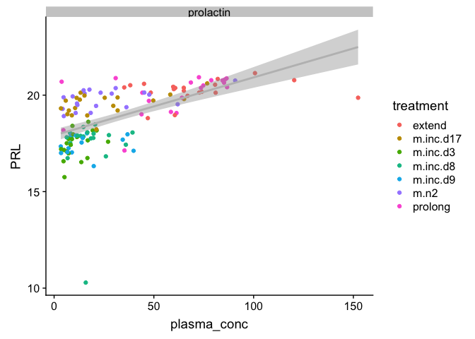

    write.csv(candidates.pit, "../results/16_pitPRL.csv")
