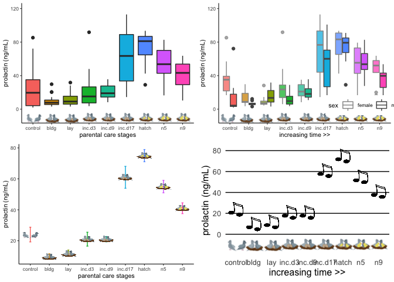
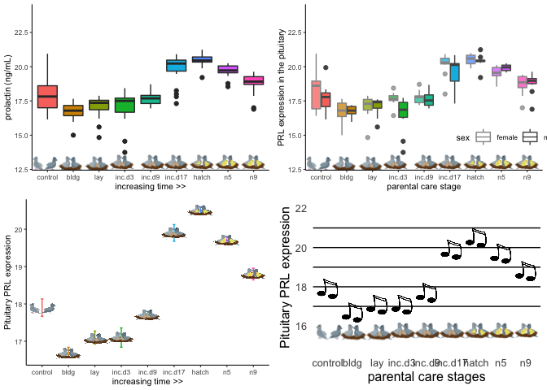
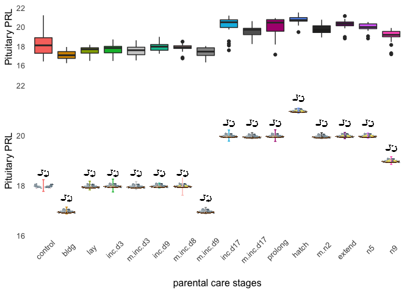
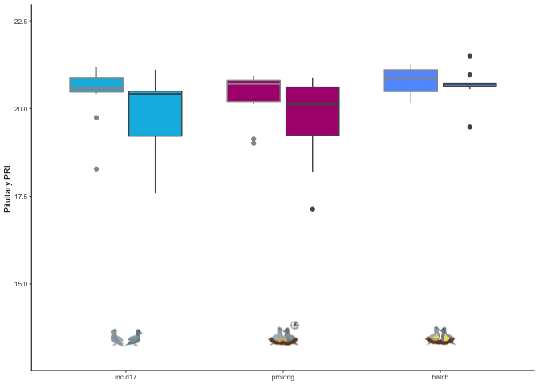
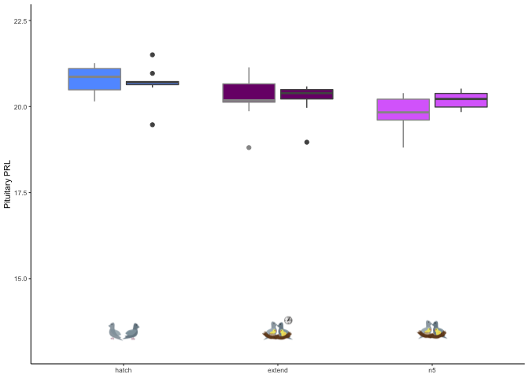
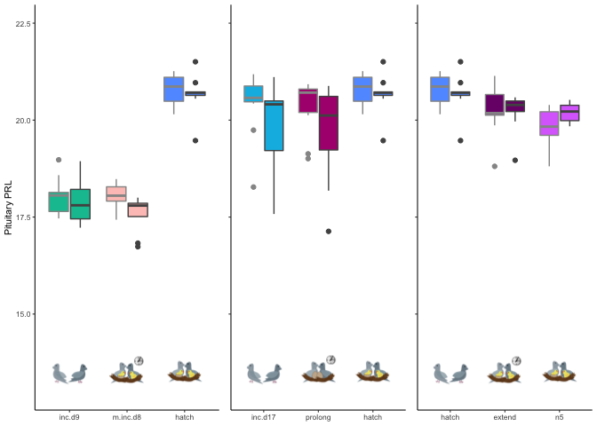

    library(tidyverse)

    ## ── Attaching packages ───────────────────────────────────────────────────────────────────────────── tidyverse 1.3.0 ──

    ## ✔ ggplot2 3.2.1     ✔ purrr   0.3.3
    ## ✔ tibble  2.1.3     ✔ dplyr   0.8.3
    ## ✔ tidyr   1.0.0     ✔ stringr 1.4.0
    ## ✔ readr   1.3.1     ✔ forcats 0.4.0

    ## ── Conflicts ──────────────────────────────────────────────────────────────────────────────── tidyverse_conflicts() ──
    ## ✖ dplyr::filter() masks stats::filter()
    ## ✖ dplyr::lag()    masks stats::lag()

    library(cowplot)

    ## 
    ## Attaching package: 'cowplot'

    ## The following object is masked from 'package:ggplot2':
    ## 
    ##     ggsave

    library(magick)

    ## Linking to ImageMagick 6.9.9.39
    ## Enabled features: cairo, fontconfig, freetype, lcms, pango, rsvg, webp
    ## Disabled features: fftw, ghostscript, x11

    library(png)
    library(grid)
    library("ggimage")

    ## 
    ## Attaching package: 'ggimage'

    ## The following object is masked from 'package:cowplot':
    ## 
    ##     theme_nothing

    source("../R/themes.R") 
    source("../R/functions.R")
    source("../R/icons.R")

    ## Warning: Column `icons` joining factor and character vector, coercing into
    ## character vector

    knitr::opts_chunk$set(fig.path = '../figures/PRL/',message=F, warning=FALSE)

    hormones <- read_csv("../results/hormones.csv")
    hormones$treatment <- factor(hormones$treatment, levels = alllevels)

    meanprolactin <- hormones %>% 
        filter(study == "characterization", hormone %in% c("prolactin"))  %>% 
        droplevels() %>% 
      dplyr::group_by(treatment) %>%
      dplyr::summarise(m = mean(plasma_conc), 
                       se = sd(plasma_conc)/sqrt(length(plasma_conc))) %>%
      dplyr::mutate(m = round(m,0)) 
    meanprolactin <- left_join(meanprolactin, birds)
    meanprolactin$treatment <- factor(meanprolactin$treatment, levels = alllevels)
    meanprolactin

    ## # A tibble: 9 x 6
    ##   treatment     m    se icons    music                  iconpath           
    ##   <fct>     <dbl> <dbl> <chr>    <chr>                  <chr>              
    ## 1 control      24  4.75 control… https://encrypted-tbn… ../figures/images/…
    ## 2 bldg         10  1.54 bldg.png https://encrypted-tbn… ../figures/images/…
    ## 3 lay          12  1.96 lay.png  https://encrypted-tbn… ../figures/images/…
    ## 4 inc.d3       21  4.49 incubat… https://encrypted-tbn… ../figures/images/…
    ## 5 inc.d9       21  1.73 incubat… https://encrypted-tbn… ../figures/images/…
    ## 6 inc.d17      61  7.08 incubat… https://encrypted-tbn… ../figures/images/…
    ## 7 hatch        75  3.94 hatch.p… https://encrypted-tbn… ../figures/images/…
    ## 8 n5           55  4.01 chickli… https://encrypted-tbn… ../figures/images/…
    ## 9 n9           41  3.47 chickli… https://encrypted-tbn… ../figures/images/…

    p1 <- hormones %>% 
        filter(study == "characterization", hormone %in% c("prolactin"))  %>% 
        droplevels() %>% 
      ggplot(aes(x = treatment, y = plasma_conc, fill = treatment)) +
        geom_boxplot() +
      ylim(c(-10,120)) + 
        theme_B3() +
      #theme(axis.text.x = element_blank()) + 
      theme(legend.position = "none") + 
      labs(x = "parental care stages", y = "prolactin (ng/mL)") +
      annotation_custom(control, ymin = -20, ymax = 0, xmin = -7.5) +
      annotation_custom(bldg, ymin = -20, ymax = 0, xmin = -5.5) +
      annotation_custom(lay, ymin = -20, ymax = 0, xmin = -3.5) +
      annotation_custom(inc, ymin = -20, ymax = 0, xmin = -1.5) +
      annotation_custom(inc, ymin = -20, ymax = 0, xmin = 0.5) +
      annotation_custom(inc, ymin = -20, ymax = 0, xmin = 2.5) +
      annotation_custom(hatch, ymin = -20, ymax = 0, xmin = 4.5) +
      annotation_custom(nestling, ymin = -20, ymax = 0, xmin = 6.5) +
      annotation_custom(nestling, ymin = -20, ymax = 0, xmin = 8.5) 
    p1

    p2 <-  ggplot(meanprolactin, aes(treatment, m)) +
      geom_errorbar(aes(ymin=m-se, ymax=m+se, color = treatment), width=.1) +
       geom_image(aes(image=iconpath), size=.1)  +
      labs(x = "parental care stages", y = "prolactin (ng/mL)") +
      theme_B3() +
      theme(legend.position = "none")
      
    p2

    p3 <- ggplot(meanprolactin, aes(treatment, m)) +
       geom_image(aes(image=music), size=.12)  +
      labs(x = "increasing time >>", y = "prolactin (ng/mL)")  +
      mytheme() +
      ylim(c(-15,80)) +
      annotation_custom(control, ymin = -20, ymax = 0, xmin = -7.5) +
      annotation_custom(bldg, ymin = -20, ymax = 0, xmin = -5.5) +
      annotation_custom(lay, ymin = -20, ymax = 0, xmin = -3.5) +
      annotation_custom(inc, ymin = -20, ymax = 0, xmin = -1.5) +
      annotation_custom(inc, ymin = -20, ymax = 0, xmin = 0.5) +
      annotation_custom(inc, ymin = -20, ymax = 0, xmin = 2.5) +
      annotation_custom(hatch, ymin = -20, ymax = 0, xmin = 4.5) +
      annotation_custom(nestling, ymin = -20, ymax = 0, xmin = 6.5) +
      annotation_custom(nestling, ymin = -20, ymax = 0, xmin = 8.5) +
      geom_hline(yintercept=0) +
      geom_hline(yintercept=20) +
      geom_hline(yintercept=40) +
      geom_hline(yintercept=60) +
      geom_hline(yintercept=80) 
    p3

    p4 <- hormones %>% 
        filter(study == "characterization", hormone %in% c("prolactin"))  %>% 
        droplevels() %>% 
      ggplot(aes(x = treatment, y = plasma_conc)) +
        geom_boxplot(aes(fill = treatment, alpha = sex, color = sex)) +
        theme_B3() +
        scale_fill_manual(values = colorscharmaip) +
        scale_color_manual(values = sexcolors) +
        labs(y = "prolactin (ng/mL)", x = NULL) +
        guides(fill = FALSE, alpha = FALSE,
             color = guide_legend(order=1)) +
        scale_alpha_manual(values = c(0.75,1)) +
        theme(legend.position = c(0.85,0.15), legend.direction = "horizontal") + 
      labs(x = "increasing time >>", y = "prolactin (ng/mL)") +
      annotation_custom(control, ymin = -20, ymax = 0, xmin = -7.8) +
      annotation_custom(bldg, ymin = -20, ymax = 0, xmin = -5.8) +
      annotation_custom(lay, ymin = -20, ymax = 0, xmin = -3.8) +
      annotation_custom(inc, ymin = -20, ymax = 0, xmin = -1.8) +
      annotation_custom(inc, ymin = -20, ymax = 0, xmin = 0.6) +
      annotation_custom(inc, ymin = -20, ymax = 0, xmin = 2.4) +
      annotation_custom(hatch, ymin = -20, ymax = 0, xmin = 4.4) +
      annotation_custom(nestling, ymin = -20, ymax = 0, xmin = 6.4) +
      annotation_custom(nestling, ymin = -20, ymax = 0, xmin = 8.4) + 
      ylim(c(-10,120)) 
    p4

    plot_grid(p1,p4,p2,p3)

    vsd.pit <- readvsd("../results/04_vsd_pit.csv")
    colData.pit <- readcolData("../results/04_colData_pit.csv")

    geneinfo <- read_csv("../metadata/00_geneinfo.csv") %>%  dplyr::select(Name, geneid, entrezid) %>% arrange(Name)
    candidategenes <- c("PRL")
    candidates.pit <- selectcandidatevsds(candidategenes, vsd.pit, colData.pit)

    ## [1] "PRL"
    ## [1] "NP_990797.2"

    meanPRL <- candidates.pit %>% 
        droplevels() %>% 
      dplyr::group_by(treatment) %>%
      dplyr::summarise(m = mean(PRL), 
                       se = sd(PRL)/sqrt(length(PRL))) %>%
      dplyr::mutate(m = round(m,1)) 
    meanPRL <- left_join(meanPRL, birds)
    meanPRL$treatment <- factor(meanPRL$treatment, levels = alllevels)
    meanPRL

    ## # A tibble: 9 x 6
    ##   treatment     m     se icons    music                 iconpath           
    ##   <fct>     <dbl>  <dbl> <chr>    <chr>                 <chr>              
    ## 1 control    17.9 0.233  control… https://encrypted-tb… ../figures/images/…
    ## 2 bldg       16.7 0.137  bldg.png https://encrypted-tb… ../figures/images/…
    ## 3 lay        17.1 0.173  lay.png  https://encrypted-tb… ../figures/images/…
    ## 4 inc.d3     17.1 0.257  incubat… https://encrypted-tb… ../figures/images/…
    ## 5 inc.d9     17.7 0.0975 incubat… https://encrypted-tb… ../figures/images/…
    ## 6 inc.d17    19.9 0.223  incubat… https://encrypted-tb… ../figures/images/…
    ## 7 hatch      20.5 0.0984 hatch.p… https://encrypted-tb… ../figures/images/…
    ## 8 n5         19.7 0.102  chickli… https://encrypted-tb… ../figures/images/…
    ## 9 n9         18.8 0.156  chickli… https://encrypted-tb… ../figures/images/…

    p5 <- candidates.pit %>% 
      ggplot(aes(x = treatment, y = PRL, fill = treatment)) +
        geom_boxplot() +
        theme_B3() +
      theme(legend.position = "none") + 
      labs(x = "increasing time >>", y = "prolactin (ng/mL)") +
      annotation_custom(control, ymin = 12, ymax = 14, xmin = -7.8) +
      annotation_custom(bldg, ymin = 12, ymax = 14, xmin = -5.8) +
      annotation_custom(lay, ymin = 12, ymax = 14, xmin = -3.8) +
      annotation_custom(inc, ymin = 12, ymax = 14, xmin = -1.8) +
      annotation_custom(inc, ymin = 12, ymax = 14, xmin = 0.6) +
      annotation_custom(inc, ymin = 12, ymax = 14, xmin = 2.4) +
      annotation_custom(hatch, ymin = 12, ymax = 14, xmin = 4.4) +
      annotation_custom(nestling, ymin = 12, ymax = 14, xmin = 6.4) +
      annotation_custom(nestling, ymin = 12, ymax = 14, xmin = 8.4)  +
      ylim(c(13,24)) 
    p5

    p6 <- ggplot(candidates.pit, aes(x = treatment, y = PRL)) + 
        geom_boxplot(aes(fill = treatment, alpha = sex, color = sex)) + 
        scale_alpha_manual(values = c(0.75,1)) +
        theme_B3() +
      theme(legend.position = c(0.85,0.2), legend.direction = "horizontal") + 
      scale_color_manual(values = c("female" = "#969696", "male" = "#525252")) +
        labs(y = "PRL expression in the pituitary", x = "parental care stage") +
      annotation_custom(control, ymin = 12, ymax = 14, xmin = -7.8) +
      annotation_custom(bldg, ymin = 12, ymax = 14, xmin = -5.8) +
      annotation_custom(lay, ymin = 12, ymax = 14, xmin = -3.8) +
      annotation_custom(inc, ymin = 12, ymax = 14, xmin = -1.8) +
      annotation_custom(inc, ymin = 12, ymax = 14, xmin = 0.6) +
      annotation_custom(inc, ymin = 12, ymax = 14, xmin = 2.4) +
      annotation_custom(hatch, ymin = 12, ymax = 14, xmin = 4.4) +
      annotation_custom(nestling, ymin = 12, ymax = 14, xmin = 6.4) +
      annotation_custom(nestling, ymin = 12, ymax = 14, xmin = 8.4)  + 
      ylim(c(13,24)) +
      guides(fill = FALSE, alpha = FALSE, color = guide_legend(order=1)) 
    p6

    p7 <- ggplot(meanPRL, aes(treatment, m)) +
      geom_errorbar(aes(ymin=m-se, ymax=m+se, color = treatment), width=.1) +
       geom_image(aes(image=iconpath), size=.12)  +
      labs(x = "increasing time >>", y = "Pituitary PRL expression") +
      theme_B3()  +
      theme(legend.position = "none")
    p7

    p8 <- ggplot(meanPRL, aes(treatment, m)) +
       geom_image(aes(image=music), size=.12)  +
      labs(x = "parental care stages", y = "Pituitary PRL expression") +
      mytheme() +
      ylim(c(15,22)) +
      annotation_custom(control, ymin = 15, ymax = 16.5, xmin = -7.5) +
      annotation_custom(bldg, ymin = 15, ymax = 16.5, xmin = -5.5) +
      annotation_custom(lay, ymin = 15, ymax = 16.5, xmin = -3.5) +
      annotation_custom(inc, ymin = 15, ymax = 16.5, xmin = -1.5) +
      annotation_custom(inc, ymin = 15, ymax = 16.5, xmin = 0.5) +
      annotation_custom(inc, ymin = 15, ymax = 16.5, xmin = 2.5) +
      annotation_custom(hatch, ymin = 15, ymax = 16.5, xmin = 4.5) +
      annotation_custom(nestling, ymin = 15, ymax = 16.5, xmin = 6.5) +
      annotation_custom(nestling, ymin = 15, ymax = 16.5, xmin = 8.5)   +
      geom_hline(yintercept=17) +
      geom_hline(yintercept=18) +
      geom_hline(yintercept=19) +
      geom_hline(yintercept=20) +
      geom_hline(yintercept=21) 

    p8

    plot_grid(p5,p6,p7,p8)

prolactin manip
---------------

    vsd.pit <- readvsd("../results/06_pitallvsd.csv")
    vsd.pit$entrezid <- row.names(vsd.pit)

    colData.pit <- read_csv("../metadata/00_samples.csv") %>% 
      filter(tissue == "pituitary") %>% 
      mutate(sample = V1)

    geneinfo <- read_csv("../metadata/00_geneinfo.csv") %>%  
      dplyr::select(Name, geneid, entrezid) %>% arrange(Name)

    candidategenes <- c("PRL")
    candidates.pit <- selectcandidatevsds(candidategenes, vsd.pit, colData.pit)

    ## [1] "PRL"
    ## [1] "NP_990797.2"

    candidates.pit$treatment <- factor(candidates.pit$treatment, levels = alllevels)

    meanPRL <- candidates.pit %>% 
        droplevels() %>% 
      dplyr::group_by(treatment) %>%
      dplyr::summarise(m = median(PRL), 
                       se = sd(PRL)/sqrt(length(PRL))) %>%
      dplyr::mutate(m = round(m,1)) 
    meanPRL <- left_join(meanPRL, birds)
    meanPRL$treatment <- factor(meanPRL$treatment, levels = alllevels)
    meanPRL

    ## # A tibble: 16 x 6
    ##    treatment     m     se icons    music                iconpath           
    ##    <fct>     <dbl>  <dbl> <chr>    <chr>                <chr>              
    ##  1 control    18.1 0.233  control… https://encrypted-t… ../figures/images/…
    ##  2 bldg       17.1 0.137  bldg.png https://encrypted-t… ../figures/images/…
    ##  3 lay        17.6 0.173  lay.png  https://encrypted-t… ../figures/images/…
    ##  4 inc.d3     17.8 0.257  incubat… https://encrypted-t… ../figures/images/…
    ##  5 m.inc.d3   17.5 0.158  removal… https://encrypted-t… ../figures/images/…
    ##  6 inc.d9     18   0.0973 incubat… https://encrypted-t… ../figures/images/…
    ##  7 m.inc.d8   17.9 0.390  manip-h… https://encrypted-t… ../figures/images/…
    ##  8 m.inc.d9   17.4 0.126  removal… https://encrypted-t… ../figures/images/…
    ##  9 inc.d17    20.5 0.223  incubat… https://encrypted-t… ../figures/images/…
    ## 10 m.inc.d17  19.7 0.115  removal… https://encrypted-t… ../figures/images/…
    ## 11 prolong    20.5 0.232  manip-i… https://encrypted-t… ../figures/images/…
    ## 12 hatch      20.7 0.0986 hatch.p… https://encrypted-t… ../figures/images/…
    ## 13 m.n2       19.9 0.112  removal… https://encrypted-t… ../figures/images/…
    ## 14 extend     20.3 0.123  manip-h… https://encrypted-t… ../figures/images/…
    ## 15 n5         20   0.102  chickli… https://encrypted-t… ../figures/images/…
    ## 16 n9         19.2 0.156  chickli… https://encrypted-t… ../figures/images/…

    p10 <- ggplot(meanPRL, aes(treatment, m)) +
       geom_errorbar(aes(ymin=m-se, ymax=m+se, color = treatment), width=.1) +
       geom_image(aes(image = iconpath), size = 0.06)  +
       geom_image(aes(image = music , y = m + 0.5), size = 0.04) +
       labs(x = "parental care stages", y = "Pituitary PRL") +
       mytheme() +
       ylim(c(16,22)) +
       theme(axis.text.x = element_text(angle = 45)) +
      theme(legend.position = "none") +
      scale_color_manual(values = colorscharmaip2) +
      geom_hline(yintercept=16.8) +
      geom_hline(yintercept=17.8) +
      geom_hline(yintercept=18.8) +
      geom_hline(yintercept=19.8) +
      geom_hline(yintercept=20.8)  
    p10

    p11 <- ggplot(candidates.pit, aes(x = treatment, y = PRL)) + 
           geom_smooth(aes(colour = sex)) +
        geom_boxplot(aes(fill = treatment)) +
        scale_alpha_manual(values = c(0.75,1)) +
        theme_B3() +
       theme(legend.position = "none", legend.direction = "horizontal") + 
       scale_color_manual(values = c("female" = "#969696", "male" = "#525252")) +
        labs(y = "Pituitary PRL", x = NULL) +
      scale_fill_manual(values = colorscharmaip2) +
      ylim(c(13,22.5)) +
      theme(axis.text.x = element_text(angle = 45, hjust = 1)) +
      annotation_custom(control, ymin = 13, ymax = 14, xmin = -14.8) +
      annotation_custom(bldg, ymin = 13, ymax = 14, xmin = -12.8) +
      annotation_custom(lay, ymin = 13, ymax = 14, xmin = -10.8) +
      annotation_custom(inc, ymin = 13, ymax = 14, xmin = -8.8) +
      annotation_custom(removeegg, ymin = 13, ymax = 14, xmin = -6.8) +
      annotation_custom(inc, ymin = 13, ymax = 14, xmin = -4.8) +
      annotation_custom(maniphatch, ymin = 13, ymax = 14, xmin = -2.8) +
      annotation_custom(removeegg, ymin = 13, ymax = 14, xmin = -0.8) +
      annotation_custom(inc, ymin = 13, ymax = 14, xmin = 1.4) +
      annotation_custom(removeegg, ymin = 13, ymax = 14, xmin = 3.4)  +
      annotation_custom(manipinc, ymin = 13, ymax = 14, xmin = 5.4) +
      annotation_custom(hatch, ymin = 13, ymax = 14, xmin = 7.4) +
      annotation_custom(removechick, ymin = 13, ymax = 14, xmin = 9.4) +
      annotation_custom(maniphatch, ymin = 13, ymax = 14, xmin = 11.4) +
      annotation_custom(nestling, ymin = 13, ymax = 14, xmin = 13.4) +
      annotation_custom(nestling, ymin = 13, ymax = 14, xmin = 15.4) 
    p11

    p12 <- candidates.pit %>%
      filter(treatment %in% c("inc.d9", "m.inc.d8", "hatch")) %>%
        ggplot(aes(x = treatment, y = PRL)) + 
        geom_boxplot(aes(fill = treatment, color = sex)) + 
        scale_alpha_manual(values = c(0.75,1)) +
        theme_B3() +
       theme(legend.position = "none", legend.direction = "horizontal") + 
       scale_color_manual(values = c("female" = "#969696", "male" = "#525252")) +
        labs(y = "Pituitary PRL", x = NULL) +
      ylim(c(13,22.5)) +
      scale_fill_manual(values = colorscharmaip2)   +
      annotation_custom(control, ymin = 13, ymax = 14, xmin = -1.6) +
      annotation_custom(maniphatch, ymin = 13, ymax = 14, xmin = 0.4) +
      annotation_custom(hatch, ymin = 13, ymax = 14, xmin = 2.4)
    p12

    p13 <- candidates.pit %>%
      filter(treatment %in% c("inc.d17", "prolong", "hatch")) %>%
        ggplot(aes(x = treatment, y = PRL)) + 
        geom_boxplot(aes(fill = treatment, color = sex)) + 
        scale_alpha_manual(values = c(0.75,1)) +
        theme_B3() +
       theme(legend.position = "none", legend.direction = "horizontal") + 
       scale_color_manual(values = c("female" = "#969696", "male" = "#525252")) +
        labs(y = "Pituitary PRL", x = NULL) +
      ylim(c(13,22.5)) +
      scale_fill_manual(values = colorscharmaip2)   +
      annotation_custom(control, ymin = 13, ymax = 14, xmin = -1.6) +
      annotation_custom(manipinc, ymin = 13, ymax = 14, xmin = 0.4) +
      annotation_custom(hatch, ymin = 13, ymax = 14, xmin = 2.4)
    p13

    p14 <- candidates.pit %>%
      filter(treatment %in% c("hatch", "extend", "n5")) %>%
        ggplot(aes(x = treatment, y = PRL)) + 
        geom_boxplot(aes(fill = treatment, color = sex)) + 
        scale_alpha_manual(values = c(0.75,1)) +
        theme_B3() +
       theme(legend.position = "none", legend.direction = "horizontal") + 
       scale_color_manual(values = c("female" = "#969696", "male" = "#525252")) +
        labs(y = "Pituitary PRL", x = NULL) +
      ylim(c(13,22.5)) +
      scale_fill_manual(values = colorscharmaip2)   +
      annotation_custom(control, ymin = 13, ymax = 14, xmin = -1.6) +
      annotation_custom(maniphatch, ymin = 13, ymax = 14, xmin = 0.4) +
      annotation_custom(hatch, ymin = 13, ymax = 14, xmin = 2.4)
    p14

    plot_grid(p12,p13 + theme(axis.text.y = element_blank(), axis.title.y = element_blank()),
              p14 + theme(axis.text.y = element_blank(), axis.title.y = element_blank()), 
              nrow = 1, rel_widths = c(1.2,1,1))

    candidates.pit$bird_id <- candidates.pit$bird

    geneshormones <- left_join(candidates.pit, hormones) %>%
      select(-X1, -V1, -okay, - icons, -music, -iconpath) %>%
      drop_na()
    head(geneshormones)

    ## # A tibble: 6 x 11
    ##   bird  sex   tissue treatment group study sample   PRL bird_id hormone
    ##   <chr> <chr> <chr>  <fct>     <chr> <chr> <chr>  <dbl> <chr>   <chr>  
    ## 1 blk0… fema… pitui… m.n2      fema… mani… blk0.…  20.1 blk0.x  prolac…
    ## 2 blk0… fema… pitui… m.n2      fema… mani… blk0.…  20.1 blk0.x  cort   
    ## 3 blk0… fema… pitui… m.n2      fema… mani… blk0.…  20.1 blk0.x  estrad…
    ## 4 blk1… fema… pitui… extend    fema… mani… blk19…  21.1 blk19.x prolac…
    ## 5 blk1… fema… pitui… extend    fema… mani… blk19…  21.1 blk19.x cort   
    ## 6 blk1… fema… pitui… extend    fema… mani… blk19…  21.1 blk19.x estrad…
    ## # … with 1 more variable: plasma_conc <dbl>

    ggplot(geneshormones, aes(x = plasma_conc, y = PRL)) +
      geom_point(aes(color = treatment)) +
      facet_wrap(~hormone, scales = "free_x") +
        geom_smooth(method = "lm", color = "grey") 

    prolactin2 <- read_csv("../results/07_prolactin2.csv")
    head(prolactin2)

    ## # A tibble: 6 x 6
    ##   study            treatment sex    bird_id       hormone   plasma_conc
    ##   <chr>            <chr>     <chr>  <chr>         <chr>           <dbl>
    ## 1 manipulation     prolong   male   blk.s030.o.g  prolactin        35.3
    ## 2 manipulation     prolong   female blk.s031.pu.d prolactin        43.8
    ## 3 manipulation     m.n2      female blk.s032.g.w  prolactin        90.8
    ## 4 manipulation     m.inc.d3  female blk.s049.y.g  prolactin        27.0
    ## 5 manipulation     m.inc.d3  female blk.s060.pu.w prolactin        19.4
    ## 6 characterization inc.d9    female blk.s061.pu.y prolactin        11.9

    geneshormones2 <- left_join(candidates.pit, prolactin2) %>%
      drop_na()
    head(geneshormones)

    ## # A tibble: 6 x 11
    ##   bird  sex   tissue treatment group study sample   PRL bird_id hormone
    ##   <chr> <chr> <chr>  <fct>     <chr> <chr> <chr>  <dbl> <chr>   <chr>  
    ## 1 blk0… fema… pitui… m.n2      fema… mani… blk0.…  20.1 blk0.x  prolac…
    ## 2 blk0… fema… pitui… m.n2      fema… mani… blk0.…  20.1 blk0.x  cort   
    ## 3 blk0… fema… pitui… m.n2      fema… mani… blk0.…  20.1 blk0.x  estrad…
    ## 4 blk1… fema… pitui… extend    fema… mani… blk19…  21.1 blk19.x prolac…
    ## 5 blk1… fema… pitui… extend    fema… mani… blk19…  21.1 blk19.x cort   
    ## 6 blk1… fema… pitui… extend    fema… mani… blk19…  21.1 blk19.x estrad…
    ## # … with 1 more variable: plasma_conc <dbl>

    ggplot(geneshormones2, aes(x = plasma_conc, y = PRL)) +
      geom_point(aes( color = treatment)) +
      geom_smooth(method = "lm", color = "grey") +
      facet_wrap(~hormone, scales = "free") 

    write.csv(candidates.pit, "../results/16_pitPRL.csv")
