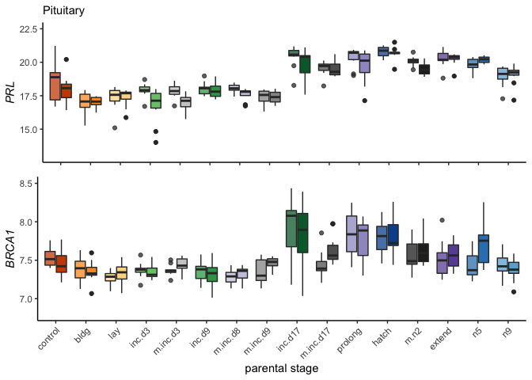
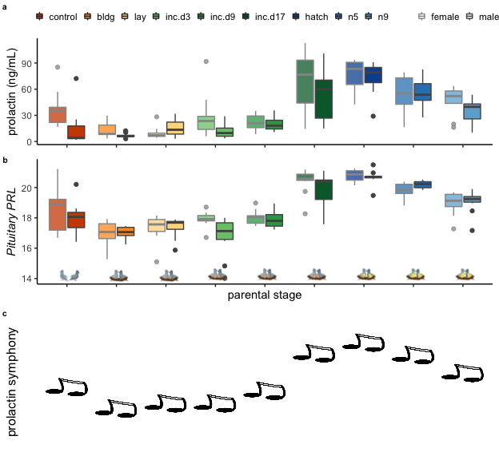

    library(tidyverse)

    ## ── Attaching packages ────────────────────────────────────────────────────────────────────────────────────────────────────────────────────────── tidyverse 1.3.0 ──

    ## ✔ ggplot2 3.2.1     ✔ purrr   0.3.3
    ## ✔ tibble  2.1.3     ✔ dplyr   0.8.3
    ## ✔ tidyr   1.0.0     ✔ stringr 1.4.0
    ## ✔ readr   1.3.1     ✔ forcats 0.4.0

    ## ── Conflicts ───────────────────────────────────────────────────────────────────────────────────────────────────────────────────────────── tidyverse_conflicts() ──
    ## ✖ dplyr::filter() masks stats::filter()
    ## ✖ dplyr::lag()    masks stats::lag()

    library(cowplot)

    ## 
    ## Attaching package: 'cowplot'

    ## The following object is masked from 'package:ggplot2':
    ## 
    ##     ggsave

    library(magick)

    ## Linking to ImageMagick 6.9.9.39
    ## Enabled features: cairo, fontconfig, freetype, lcms, pango, rsvg, webp
    ## Disabled features: fftw, ghostscript, x11

    library(png)
    library(grid)
    library(ggimage)

    ## 
    ## Attaching package: 'ggimage'

    ## The following object is masked from 'package:cowplot':
    ## 
    ##     theme_nothing

    library(apaTables)

    source("../R/themes.R") 
    source("../R/functions.R")
    source("../R/icons.R")

    ## Warning: Column `icons` joining factor and character vector, coercing into
    ## character vector

    knitr::opts_chunk$set(fig.path = '../figures/PRL/',message=F, warning=FALSE)

    hormones <- read_csv("../results/hormones.csv")
    hormones$treatment <- factor(hormones$treatment, levels = alllevels)

    meanprolactin <- hormones %>% 
        filter(study == "characterization", hormone %in% c("prolactin"))  %>% 
        droplevels() %>% 
      dplyr::group_by(treatment) %>%
      dplyr::summarise(m = mean(plasma_conc), 
                       se = sd(plasma_conc)/sqrt(length(plasma_conc))) %>%
      dplyr::mutate(m = round(m,0)) 
    meanprolactin <- left_join(meanprolactin, birds)
    meanprolactin$treatment <- factor(meanprolactin$treatment, levels = alllevels)
    meanprolactin

    ## # A tibble: 9 x 6
    ##   treatment     m    se icons    music                  iconpath           
    ##   <fct>     <dbl> <dbl> <chr>    <chr>                  <chr>              
    ## 1 control      24  4.75 control… https://encrypted-tbn… ../figures/images/…
    ## 2 bldg         10  1.54 bldg.png https://encrypted-tbn… ../figures/images/…
    ## 3 lay          12  1.96 lay.png  https://encrypted-tbn… ../figures/images/…
    ## 4 inc.d3       21  4.49 incubat… https://encrypted-tbn… ../figures/images/…
    ## 5 inc.d9       21  1.73 incubat… https://encrypted-tbn… ../figures/images/…
    ## 6 inc.d17      61  7.08 incubat… https://encrypted-tbn… ../figures/images/…
    ## 7 hatch        75  3.94 hatch.p… https://encrypted-tbn… ../figures/images/…
    ## 8 n5           55  4.01 chickli… https://encrypted-tbn… ../figures/images/…
    ## 9 n9           41  3.47 chickli… https://encrypted-tbn… ../figures/images/…

    p1 <- hormones %>% 
        filter(study == "characterization", hormone %in% c("prolactin"))  %>% 
        droplevels() %>% 
      ggplot(aes(x = treatment, y = plasma_conc)) +
        geom_boxplot(aes(fill = treatment, alpha = sex, color = sex)) +
        theme_B3() +
        scale_fill_manual(values = colorscharmaip) +
        scale_color_manual(values = sexcolors) +
        labs(y = "prolactin (ng/mL)", x = NULL) +
        guides(fill = FALSE, alpha = FALSE,
             color = guide_legend(order=1)) +
        scale_alpha_manual(values = c(0.75,1)) +
        theme(legend.position = c(0.85,0.15), legend.direction = "horizontal") + 
      labs(x = "increasing time >>", y = "prolactin (ng/mL)") +
      annotation_custom(control, ymin = -20, ymax = 0, xmin = -7.8) +
      annotation_custom(bldg, ymin = -20, ymax = 0, xmin = -5.8) +
      annotation_custom(lay, ymin = -20, ymax = 0, xmin = -3.8) +
      annotation_custom(inc, ymin = -20, ymax = 0, xmin = -1.8) +
      annotation_custom(inc, ymin = -20, ymax = 0, xmin = 0.6) +
      annotation_custom(inc, ymin = -20, ymax = 0, xmin = 2.4) +
      annotation_custom(hatch, ymin = -20, ymax = 0, xmin = 4.4) +
      annotation_custom(nestling, ymin = -20, ymax = 0, xmin = 6.4) +
      annotation_custom(nestling, ymin = -20, ymax = 0, xmin = 8.4) + 
      ylim(c(-10,120)) 
    p1

    colData.pit <-  read.csv("../metadata/00_samples.csv", header = T, row.names = 1)
    colData.pit <- colData.pit %>% filter(tissue == "pituitary")

    vsd.pit <- read.csv("../results/06_pitallvsd.csv", header = T, row.names = 1)

    savecols <- as.character(colData.pit$V1) 
    savecols <- as.vector(savecols) 
    vsd.pit <- vsd.pit %>% dplyr::select(one_of(savecols)) 
    vsd.pit$genes <- row.names(vsd.pit)

    candidategenes <- c("PRL", "BRCA1")
    candidates.pit <- vsd.pit %>% dplyr::filter(genes %in% candidategenes)
    candidates.pit <- as.data.frame(candidates.pit)
    row.names(candidates.pit) <- candidates.pit$genes
    candidates.pit$genes <- NULL
    candidates.pit <- as.data.frame(t(candidates.pit))
    candidates.pit$V1 <- row.names(candidates.pit) 
    candidates.pit <- left_join(colData.pit, candidates.pit)
    candidates.pit$treatment <- factor(candidates.pit$treatment, levels = alllevels)
    tail(candidates.pit)

    ##                                       V1       bird    sex    tissue
    ## 325 y85.r71.x_female_pituitary_m.inc.d17  y85.r71.x female pituitary
    ## 326       y94.g133.x_female_pituitary_n5 y94.g133.x female pituitary
    ## 327     y95.g131.x_male_pituitary_inc.d9 y95.g131.x   male pituitary
    ## 328            y97.x_female_pituitary_n9      y97.x female pituitary
    ## 329     y98.g54_female_pituitary_m.hatch    y98.g54 female pituitary
    ## 330      y98.o50.x_male_pituitary_inc.d3  y98.o50.x   male pituitary
    ##     treatment                      group           study    BRCA1      PRL
    ## 325 m.inc.d17 female.pituitary.m.inc.d17    manipulation 7.321769 19.71414
    ## 326        n5        female.pituitary.n5 charcterization 7.404085 20.32831
    ## 327    inc.d9      male.pituitary.inc.d9 charcterization 7.193690 17.28303
    ## 328        n9        female.pituitary.n9 charcterization 7.420520 19.06794
    ## 329      m.n2      female.pituitary.m.n2    manipulation 7.446570 20.25300
    ## 330    inc.d3      male.pituitary.inc.d3 charcterization 7.286573 17.90847

    meanPRL <- candidates.pit %>% 
        droplevels() %>% 
      dplyr::group_by(treatment, sex) %>%
      dplyr::summarise(m = mean(PRL), 
                       se = sd(PRL)/sqrt(length(PRL))) %>%
      dplyr::mutate(m = round(m,1))  %>%
      dplyr::filter(treatment %in% charlevels)
    meanPRL <- left_join(meanPRL, birds)
    meanPRL$treatment <- factor(meanPRL$treatment, levels = charlevels)
    meanPRL

    ## # A tibble: 18 x 7
    ## # Groups:   treatment [9]
    ##    treatment sex        m     se icons   music             iconpath        
    ##    <fct>     <fct>  <dbl>  <dbl> <chr>   <chr>             <chr>           
    ##  1 control   female  18.5 0.424  contro… https://encrypte… ../figures/imag…
    ##  2 control   male    17.9 0.250  contro… https://encrypte… ../figures/imag…
    ##  3 bldg      female  17   0.255  bldg.p… https://encrypte… ../figures/imag…
    ##  4 bldg      male    17   0.121  bldg.p… https://encrypte… ../figures/imag…
    ##  5 lay       female  17.3 0.284  lay.png https://encrypte… ../figures/imag…
    ##  6 lay       male    17.4 0.214  lay.png https://encrypte… ../figures/imag…
    ##  7 inc.d3    female  17.9 0.166  incuba… https://encrypte… ../figures/imag…
    ##  8 inc.d3    male    16.8 0.421  incuba… https://encrypte… ../figures/imag…
    ##  9 inc.d9    female  18   0.119  incuba… https://encrypte… ../figures/imag…
    ## 10 inc.d9    male    17.9 0.164  incuba… https://encrypte… ../figures/imag…
    ## 11 inc.d17   female  20.4 0.246  incuba… https://encrypte… ../figures/imag…
    ## 12 inc.d17   male    19.8 0.357  incuba… https://encrypte… ../figures/imag…
    ## 13 hatch     female  20.8 0.124  hatch.… https://encrypte… ../figures/imag…
    ## 14 hatch     male    20.7 0.157  hatch.… https://encrypte… ../figures/imag…
    ## 15 n5        female  19.8 0.168  chickl… https://encrypte… ../figures/imag…
    ## 16 n5        male    20.2 0.0800 chickl… https://encrypte… ../figures/imag…
    ## 17 n9        female  19   0.229  chickl… https://encrypte… ../figures/imag…
    ## 18 n9        male    19.1 0.222  chickl… https://encrypte… ../figures/imag…

    p2 <- candidates.pit %>%
      dplyr::filter(treatment %in% charlevels) %>%
      ggplot(aes(x = treatment, y = PRL)) + 
        geom_boxplot(aes(fill = treatment, alpha = sex, color = sex)) + 
        scale_alpha_manual(values = c(0.75,1)) +
        theme_B3() +
      theme(legend.position = c(0.85,0.2), legend.direction = "horizontal") + 
      scale_color_manual(values = c("female" = "#969696", "male" = "#525252")) +
      labs(y = "PRL", x = "increasing time >>", subtitle = "Pituitary" ) +
      guides(fill = FALSE, alpha = FALSE, color = guide_legend(order=1)) +
      theme(axis.title.y  = element_text(face = "italic"))  +
      annotation_custom(control, ymin = 13.5, ymax = 15, xmin = -7.5) +
      annotation_custom(bldg, ymin = 13.5, ymax = 15, xmin = -5.5) +
      annotation_custom(lay, ymin = 13.5, ymax = 15, xmin = -3.5) +
      annotation_custom(inc, ymin = 13.5, ymax = 15, xmin = -1.5) +
      annotation_custom(inc, ymin = 13.5, ymax = 15, xmin = 0.5) +
      annotation_custom(inc, ymin = 13.5, ymax = 15, xmin = 2.5) +
      annotation_custom(hatch, ymin = 13.5, ymax = 15, xmin = 4.5) +
      annotation_custom(nestling, ymin = 13.5, ymax = 15, xmin = 6.5) +
      annotation_custom(nestling, ymin = 13.5, ymax = 15, xmin = 8.5)   
    p2

    meanBRCA <- candidates.pit %>% 
        droplevels() %>% 
      dplyr::group_by(treatment, sex) %>%
      dplyr::summarise(m = mean(BRCA1), 
                       se = sd(BRCA1)/sqrt(length(BRCA1))) %>%
      dplyr::mutate(m = round(m,1)) %>%
      dplyr::filter(treatment %in% charlevels)
    meanBRCA <- left_join(meanBRCA, birds)
    meanBRCA$treatment <- factor(meanBRCA$treatment, levels = alllevels)
    meanBRCA

    ## # A tibble: 18 x 7
    ## # Groups:   treatment [9]
    ##    treatment sex        m     se icons   music             iconpath        
    ##    <fct>     <fct>  <dbl>  <dbl> <chr>   <chr>             <chr>           
    ##  1 control   female   7.5 0.0359 contro… https://encrypte… ../figures/imag…
    ##  2 control   male     7.5 0.0418 contro… https://encrypte… ../figures/imag…
    ##  3 bldg      female   7.4 0.0513 bldg.p… https://encrypte… ../figures/imag…
    ##  4 bldg      male     7.4 0.0448 bldg.p… https://encrypte… ../figures/imag…
    ##  5 lay       female   7.3 0.0286 lay.png https://encrypte… ../figures/imag…
    ##  6 lay       male     7.3 0.0438 lay.png https://encrypte… ../figures/imag…
    ##  7 inc.d3    female   7.4 0.0321 incuba… https://encrypte… ../figures/imag…
    ##  8 inc.d3    male     7.4 0.0346 incuba… https://encrypte… ../figures/imag…
    ##  9 inc.d9    female   7.4 0.0332 incuba… https://encrypte… ../figures/imag…
    ## 10 inc.d9    male     7.3 0.0472 incuba… https://encrypte… ../figures/imag…
    ## 11 inc.d17   female   8   0.125  incuba… https://encrypte… ../figures/imag…
    ## 12 inc.d17   male     7.8 0.131  incuba… https://encrypte… ../figures/imag…
    ## 13 hatch     female   7.8 0.0685 hatch.… https://encrypte… ../figures/imag…
    ## 14 hatch     male     7.8 0.0774 hatch.… https://encrypte… ../figures/imag…
    ## 15 n5        female   7.4 0.0545 chickl… https://encrypte… ../figures/imag…
    ## 16 n5        male     7.7 0.0859 chickl… https://encrypte… ../figures/imag…
    ## 17 n9        female   7.4 0.0458 chickl… https://encrypte… ../figures/imag…
    ## 18 n9        male     7.4 0.0422 chickl… https://encrypte… ../figures/imag…

    p3 <- candidates.pit %>% 
      dplyr::filter(treatment %in% charlevels) %>%
      ggplot(aes(x = treatment, y = BRCA1, fill = treatment, color = sex, alpha = sex)) +
        geom_boxplot() +
        theme_B3() +
          scale_alpha_manual(values = c(0.75,1)) +
      scale_color_manual(values = c("female" = "#969696", "male" = "#525252")) +
      theme(legend.position = "none") + 
      labs(x = "increasing time >>", y = "BRCA1", subtitle = "Pituitary") +
      annotation_custom(control, ymin = 6.65, ymax = 7, xmin = -7.8) +
      annotation_custom(bldg, ymin = 6.65, ymax = 7, xmin = -5.8) +
      annotation_custom(lay, ymin = 6.65, ymax = 7, xmin = -3.8) +
      annotation_custom(inc, ymin = 6.65, ymax = 7, xmin = -1.8) +
      annotation_custom(inc, ymin = 6.65, ymax = 7, xmin = 0.6) +
      annotation_custom(inc, ymin = 6.65, ymax = 7, xmin = 2.4) +
      annotation_custom(hatch, ymin = 6.65, ymax = 7, xmin = 4.4) +
      annotation_custom(nestling, ymin = 6.65, ymax = 7, xmin = 6.4) +
      annotation_custom(nestling, ymin = 6.65, ymax = 7, xmin = 8.4) +
      ylim(6.8,8.5) +
      guides(fill = FALSE, alpha = FALSE, color = guide_legend(order=1)) +
      theme(legend.position = c(0.85,0.2), legend.direction = "horizontal") + 
      theme(axis.title.y  = element_text(face = "italic"))
    p3

prolactin manip
---------------

    p4 <- ggplot(candidates.pit, aes(x = treatment, y = PRL)) + 
        geom_boxplot(aes(fill = treatment, alpha = sex)) +
        scale_alpha_manual(values = c(0.75,1)) +
        theme_B3() +
       theme(legend.position = "none", legend.direction = "horizontal") + 
       scale_color_manual(values = c("female" = "#969696", "male" = "#525252")) +
      labs(x = "increasing time >>", y = "PRL", subtitle = "Pituitary") +
      scale_fill_manual(values = colorscharmaip2) +
      ylim(c(13,22.5)) +
      theme(axis.text.x = element_text(angle = 45, hjust = 1)) +
      annotation_custom(control, ymin = 13, ymax = 14, xmin = -14.8) +
      annotation_custom(bldg, ymin = 13, ymax = 14, xmin = -12.8) +
      annotation_custom(lay, ymin = 13, ymax = 14, xmin = -10.8) +
      annotation_custom(inc, ymin = 13, ymax = 14, xmin = -8.8) +
      annotation_custom(removeegg, ymin = 13, ymax = 14, xmin = -6.8) +
      annotation_custom(inc, ymin = 13, ymax = 14, xmin = -4.8) +
      annotation_custom(maniphatch, ymin = 13, ymax = 14, xmin = -2.8) +
      annotation_custom(removeegg, ymin = 13, ymax = 14, xmin = -0.8) +
      annotation_custom(inc, ymin = 13, ymax = 14, xmin = 1.4) +
      annotation_custom(removeegg, ymin = 13, ymax = 14, xmin = 3.4)  +
      annotation_custom(manipinc, ymin = 13, ymax = 14, xmin = 5.4) +
      annotation_custom(hatch, ymin = 13, ymax = 14, xmin = 7.4) +
      annotation_custom(removechick, ymin = 13, ymax = 14, xmin = 9.4) +
      annotation_custom(maniphatch, ymin = 13, ymax = 14, xmin = 11.4) +
      annotation_custom(nestling, ymin = 13, ymax = 14, xmin = 13.4) +
      annotation_custom(nestling, ymin = 13, ymax = 14, xmin = 15.4) +
        theme(axis.title.y  = element_text(face = "italic"))
    p4

    p5 <- ggplot(candidates.pit, aes(x = treatment, y = BRCA1)) + 
        geom_boxplot(aes(fill = treatment, alpha = sex)) +
        scale_alpha_manual(values = c(0.75,1)) +
        theme_B3() +
       theme(legend.position = "none", legend.direction = "horizontal") + 
       scale_color_manual(values = c("female" = "#969696", "male" = "#525252")) +
      labs(x = "increasing time >>", y = "BRCA1", subtitle = "Pituitary") +
      scale_fill_manual(values = colorscharmaip2) +
      ylim(6.8,8.5) +
      theme(axis.text.x = element_text(angle = 45, hjust = 1)) +
      annotation_custom(control, ymin = 13, ymax = 14, xmin = -14.8) +
      annotation_custom(bldg, ymin = 13, ymax = 14, xmin = -12.8) +
      annotation_custom(lay, ymin = 13, ymax = 14, xmin = -10.8) +
      annotation_custom(inc, ymin = 13, ymax = 14, xmin = -8.8) +
      annotation_custom(removeegg, ymin = 13, ymax = 14, xmin = -6.8) +
      annotation_custom(inc, ymin = 13, ymax = 14, xmin = -4.8) +
      annotation_custom(maniphatch, ymin = 13, ymax = 14, xmin = -2.8) +
      annotation_custom(removeegg, ymin = 13, ymax = 14, xmin = -0.8) +
      annotation_custom(inc, ymin = 13, ymax = 14, xmin = 1.4) +
      annotation_custom(removeegg, ymin = 13, ymax = 14, xmin = 3.4)  +
      annotation_custom(manipinc, ymin = 13, ymax = 14, xmin = 5.4) +
      annotation_custom(hatch, ymin = 13, ymax = 14, xmin = 7.4) +
      annotation_custom(removechick, ymin = 13, ymax = 14, xmin = 9.4) +
      annotation_custom(maniphatch, ymin = 13, ymax = 14, xmin = 11.4) +
      annotation_custom(nestling, ymin = 13, ymax = 14, xmin = 13.4) +
      annotation_custom(nestling, ymin = 13, ymax = 14, xmin = 15.4) +
        theme(axis.title.y  = element_text(face = "italic"))
    p5

    ggplot(candidates.pit, aes(x = PRL, y = BRCA1)) +
      geom_point(aes(alpha = sex,  color =  treatment)) +
      geom_smooth(method = "loess", se=T, color = "darkgrey") +
      scale_color_manual(values = colorscharmaip2)  +
      scale_alpha_manual(values = c(0.5,1)) +
      labs(subtitle = "Pituitary") +
      theme(axis.title  = element_text(face = "italic"),
            legend.title =  element_blank())

    candidates.pit %>%
      filter(treatment %in% charlevels) %>%
    ggplot( aes(x = PRL, y = BRCA1)) +
      geom_point(aes(alpha = sex,  color =  treatment)) +
      geom_smooth(method = "loess", se=T, color = "darkgrey") +
      scale_color_manual(values = colorscharmaip2)  +
      scale_alpha_manual(values = c(0.5,1)) +
      labs(subtitle = "Pituitary") +
      theme(axis.title  = element_text(face = "italic"),
            legend.title =  element_blank())

    candidates.pit$bird_id <- candidates.pit$bird
    candidates.pit$X1 <- candidates.pit$V1
    geneshormones <- left_join(candidates.pit, hormones) %>%
      select(-X1, -V1, -okay, - icons, -music, -iconpath) %>%
      drop_na()

    (geneshormones$bird_id)

    ##   [1] "blk0.x"        "blk0.x"        "blk0.x"        "blk19.x"      
    ##   [5] "blk19.x"       "blk19.x"       "blk19.x"       "blk5.x"       
    ##   [9] "blk5.x"        "blk5.x"        "blk5.x"        "blu115.y150.x"
    ##  [13] "blu115.y150.x" "blu115.y150.x" "blu44.y102"    "blu44.y102"   
    ##  [17] "blu44.y102"    "blu44.y102"    "blu56.o53"     "blu56.o53"    
    ##  [21] "blu56.o53"     "blu56.o53"     "blu63.g62"     "blu63.g62"    
    ##  [25] "blu63.g62"     "blu80.r97"     "blu80.r97"     "blu80.r97"    
    ##  [29] "blu80.r97"     "blu80.r97"     "blu84.x"       "blu84.x"      
    ##  [33] "g.y.o.s"       "g.y.o.s"       "g.y.o.s"       "g137.r24.w5"  
    ##  [37] "g137.r24.w5"   "g137.r24.w5"   "g137.r24.w5"   "g144.r54.x"   
    ##  [41] "g144.r54.x"    "g144.r54.x"    "g144.r54.x"    "g17.w108.x"   
    ##  [45] "g17.w108.x"    "g17.w108.x"    "g22.blu118"    "g22.blu118"   
    ##  [49] "g22.blu118"    "g22.blu118"    "g3.g119.w20"   "g3.g119.w20"  
    ##  [53] "g3.g119.w20"   "g3.g119.w20"   "g32.blu79"     "g32.blu79"    
    ##  [57] "g34.x"         "g34.x"         "g34.x"         "g34.x"        
    ##  [61] "g34.x"         "g38.x"         "g38.x"         "g38.x"        
    ##  [65] "g63.blu65"     "g63.blu65"     "g63.blu65"     "g63.blu65"    
    ##  [69] "g63.blu65"     "g73.x"         "g73.x"         "g73.x"        
    ##  [73] "g73.x"         "g8.y197"       "g8.y197"       "g8.y197"      
    ##  [77] "l.s.o.blk"     "l.s.o.blk"     "l.s.o.blk"     "l.s.o.blk"    
    ##  [81] "l.s.w.d"       "l.s.w.d"       "l.s.w.d"       "l.s.w.d"      
    ##  [85] "o114.blu9"     "o114.blu9"     "o114.blu9"     "o169.r28.x"   
    ##  [89] "o169.r28.x"    "o169.r28.x"    "o169.r28.x"    "o3.x"         
    ##  [93] "o3.x"          "o3.x"          "o3.x"          "o3.x"         
    ##  [97] "o36.r62.x"     "o36.r62.x"     "o36.r62.x"     "o36.r62.x"    
    ## [101] "o36.r62.x"     "o45.g128.x"    "o45.g128.x"    "o45.g128.x"   
    ## [105] "o59.blu64"     "o59.blu64"     "o59.blu64"     "o59.blu64"    
    ## [109] "o59.blu64"     "pk.s.d.g"      "r194.x"        "r194.x"       
    ## [113] "r194.x"        "r194.x"        "r196.x"        "r196.x"       
    ## [117] "r196.x"        "r4.x"          "r4.x"          "r81.x"        
    ## [121] "r81.x"         "r81.x"         "r81.x"         "r81.x"        
    ## [125] "r85.g39"       "r85.g39"       "r85.g39"       "r90.x"        
    ## [129] "r90.x"         "r90.x"         "s.pu.pk"       "s.pu.pk"      
    ## [133] "s.pu.pk"       "s.pu.pk"       "s002.x"        "x.blk20"      
    ## [137] "x.blk20"       "x.blk20"       "x.blk20"       "x.blk23"      
    ## [141] "x.blk23"       "x.blk23"       "x.blk23"       "x.blu25"      
    ## [145] "x.blu25"       "x.blu25"       "x.blu25"       "x.blu25"      
    ## [149] "x.blu57"       "x.blu57"       "x.blu57"       "x.blu69"      
    ## [153] "x.blu69"       "x.blu69"       "x.blu69"       "x.blu73"      
    ## [157] "x.blu73"       "x.blu73"       "x.blu73"       "x.blu73"      
    ## [161] "x.blu76"       "x.blu76"       "x.blu76"       "x.blu76"      
    ## [165] "x.blu76"       "x.blu94"       "x.blu94"       "x.blu94"      
    ## [169] "x.blu94"       "x.blu96"       "x.blu96"       "x.blu96"      
    ## [173] "x.blu96"       "x.g26"         "x.g26"         "x.g26"        
    ## [177] "x.g26"         "x.g5.w79"      "x.g5.w79"      "x.g5.w79"     
    ## [181] "x.g50"         "x.g50"         "x.g50"         "x.g50"        
    ## [185] "x.o117"        "x.o171.w45"    "x.o171.w45"    "x.o171.w45"   
    ## [189] "x.o171.w45"    "x.o40.r70"     "x.o40.r70"     "x.o40.r70"    
    ## [193] "x.o40.r70"     "x.o4"          "x.o4"          "x.o61"        
    ## [197] "x.o61"         "x.o61"         "x.o61"         "x.r10.w18"    
    ## [201] "x.r10.w18"     "x.r10.w18"     "x.r10.w18"     "x.r10.w18"    
    ## [205] "x.r180"        "x.r180"        "x.r180"        "x.r180"       
    ## [209] "x.r185"        "x.r74.o29"     "x.r74.o29"     "x.r74.o29"    
    ## [213] "x.r74.o29"     "x.r76"         "x.r76"         "x.r76"        
    ## [217] "x.r76"         "x.r76"         "x.s188"        "x.s188"       
    ## [221] "x.s188"        "x.y119.w11"    "x.y119.w11"    "x.y119.w11"   
    ## [225] "x.y145.r55"    "x.y145.r55"    "x.y145.r55"    "x.y145.r55"   
    ## [229] "x.y51"         "x.y51"         "x.y51"         "x.y5"         
    ## [233] "x.y5"          "x.y5"          "x.y64"         "x.y64"        
    ## [237] "x.y64"         "x.y64"         "x.y79"         "x.y79"        
    ## [241] "x.y79"         "x.y79"         "y.w.blk"       "y.w.blk"      
    ## [245] "y.w.blk"       "y.w.blk"       "y.w.blk"       "y12.x"        
    ## [249] "y12.x"         "y12.x"         "y12.x"         "y12.x"        
    ## [253] "y146.r32.x"    "y146.r32.x"    "y146.r32.x"    "y148.w81.g145"
    ## [257] "y148.w81.g145" "y18.x"         "y18.x"         "y4.x"         
    ## [261] "y4.x"          "y4.x"          "y4.x"          "y55.x"        
    ## [265] "y55.x"         "y55.x"         "y55.x"         "y55.x"        
    ## [269] "y63.x"         "y63.x"         "y85.r71.x"     "y85.r71.x"    
    ## [273] "y85.r71.x"     "y98.g54"       "y98.g54"       "y98.g54"      
    ## [277] "y98.g54"

    (hormones$bird_id)

    ##    [1] "x.g"                      "x.g.g"                   
    ##    [3] "x.blk.blk"                "x.g.g.g"                 
    ##    [5] "x.g.g.f"                  "x.blu.o"                 
    ##    [7] "blu.o.x"                  "r.r.x"                   
    ##    [9] "s.x"                      "r.r.x"                   
    ##   [11] "x.r9"                     "x.g106"                  
    ##   [13] "g107.x"                   "g108.x"                  
    ##   [15] "x.y108.w29"               "w3.x"                    
    ##   [17] "x.w44"                    "w33.x"                   
    ##   [19] "blu13.x"                  "r8.x"                    
    ##   [21] "x.r20"                    "r3.x"                    
    ##   [23] "w4.x"                     "g114.w83.x"              
    ##   [25] "blu103.x"                 "x.blu106.o153"           
    ##   [27] "x.g9.o166"                "blu113.w124.x"           
    ##   [29] "x.o163.w101"              "o165.w122.x"             
    ##   [31] "blu104.w120.x"            "o172.w115.x"             
    ##   [33] "o162.w35.x"               "x.blu117.w89"            
    ##   [35] "y126.w92.x"               "blu121.w91.x"            
    ##   [37] "x.o159.w90"               "x.r29.w96"               
    ##   [39] "y135.blu107.x"            "R36.w184.x"              
    ##   [41] "x.y127.w93"               "x.r48.y139"              
    ##   [43] "x.y132.w76"               "g20.w106.x"              
    ##   [45] "r27.w111.blu125"          "x.r64.g140"              
    ##   [47] "r73.g127.x"               "x.g147.blu28"            
    ##   [49] "x.r33.w183"               "x.o30.g134"              
    ##   [51] "o38.blu29.x"              "o35.r51.x"               
    ##   [53] "x.g14.w199"               "blu122.r66.x"            
    ##   [55] "x.y141.w116"              "x.w192.o157"             
    ##   [57] "g75.x"                    "y140.w119.x"             
    ##   [59] "x.o47.y82"                "x.y138.w176"             
    ##   [61] "y131.w185.x"              "g130.y81.x"              
    ##   [63] "r49.w189.x"               "x.g13.w109"              
    ##   [65] "r30.w112.r46"             "x.r44.w95"               
    ##   [67] "r41.w99.x"                "y149.r52.x"              
    ##   [69] "o156.w80.x"               "y136.x"                  
    ##   [71] "g143.blu32.x"             "y130.o170.x"             
    ##   [73] "y133.w77.r58"             "blk11.x"                 
    ##   [75] "blu33.y88.x"              "g141.blu27.x"            
    ##   [77] "g52.blu58"                "blu38.g135.x"            
    ##   [79] "blu114.r38.w78"           "r190.o43.x"              
    ##   [81] "x.blu6.y80"               "r176.blu54"              
    ##   [83] "o52.blu53"                "x.r67.blu35"             
    ##   [85] "x.r39.g10"                "x.Y90"                   
    ##   [87] "x.Y93.G126"               "R45.X"                   
    ##   [89] "R72.Y83.x"                "w178.x"                  
    ##   [91] "r.y.s.blk"                "x.blu109.w121"           
    ##   [93] "blu37.r65.x"              "y128.g23.x"              
    ##   [95] "blu108.w40.o158"          "blu124.w180.x"           
    ##   [97] "o39.y77.x"                "blu47.y96.x"             
    ##   [99] "x.y109"                   "w34.x"                   
    ##  [101] "o173.w179.x"              "y98.o50.x"               
    ##  [103] "g142.r40.x"               "blk17.x"                 
    ##  [105] "blk.s.pu.y"               "o49.x"                   
    ##  [107] "o57.g59"                  "o73.x"                   
    ##  [109] "y95.g131.x"               "o36.r62.x"               
    ##  [111] "r196.x"                   "x.g4.w50"                
    ##  [113] "y129.x"                   "x.blu43.g132"            
    ##  [115] "r37.w100.x"               "blu36.w16"               
    ##  [117] "x.blu23.w14"              "o48.r197.x"              
    ##  [119] "g6.w197.x"                "g19.w36.x"               
    ##  [121] "x.blu101.w43"             "x.o70"                   
    ##  [123] "blu41.y100.x"             "blu63.g62"               
    ##  [125] "x.o117"                   "x.blu25"                 
    ##  [127] "x.g43"                    "D.S.Y.Blk"               
    ##  [129] "y13.x"                    "g146.blu51"              
    ##  [131] "blu111.w113.x"            "x.blu102.w105"           
    ##  [133] "x.y94.g133"               "blk12.x"                 
    ##  [135] "y7.g58"                   "o44.blu26.x"             
    ##  [137] "x.blu42.o28"              "blu39.o26.x"             
    ##  [139] "y85.r71.x"                "y4.x"                    
    ##  [141] "y12.x"                    "x.y63"                   
    ##  [143] "blk4.x"                   "x.blk16"                 
    ##  [145] "o45.g128.x"               "r85.g39"                 
    ##  [147] "x.g104.w82"               "r83.g45"                 
    ##  [149] "y146.r32.x"               "o114.blu9"               
    ##  [151] "x.y145.r55"               "r90.x"                   
    ##  [153] "x.r181"                   "x.r76"                   
    ##  [155] "y.w.blk"                  "x.g50"                   
    ##  [157] "g38.x"                    "y15.x"                   
    ##  [159] "g53.y84"                  "s.d.blk.l"               
    ##  [161] "s.l.d.r"                  "blk0.x"                  
    ##  [163] "x.blk23"                  "r.s.g.o"                 
    ##  [165] "s.pu.blk.r"               "x.o160.w102"             
    ##  [167] "x.o37.blu50"              "x.g70"                   
    ##  [169] "r183.o72"                 "o.d.s"                   
    ##  [171] "g73.x"                    "blu115.x"                
    ##  [173] "r81.x"                    "s.blk.r.o"               
    ##  [175] "r.s.d.o"                  "x.g37"                   
    ##  [177] "d.s.blk.o"                "o152.o120.w42"           
    ##  [179] "x.r50.w97"                "l.s.y.blk"               
    ##  [181] "s.l.d.o"                  "x.g49"                   
    ##  [183] "x.o164.w123"              "r185.x"                  
    ##  [185] "blk.s.pu.w"               "o3.x"                    
    ##  [187] "x.blu96"                  "s.o.l.y"                 
    ##  [189] "x.y5"                     "s.pk.pu.g"               
    ##  [191] "g.blk.s.r"                "y6.o54"                  
    ##  [193] "x.blu30"                  "blu56.o53"               
    ##  [195] "x.g5.w79"                 "y97.x"                   
    ##  [197] "x.o2"                     "blk21.x"                 
    ##  [199] "x.r178"                   "r95.blu99"               
    ##  [201] "blu81.r88"                "x.o175.g21"              
    ##  [203] "x.o68"                    "x.w6"                    
    ##  [205] "blk.d.g.s"                "x.y9"                    
    ##  [207] "R195.X"                   "x.r180"                  
    ##  [209] "y18.X"                    "s.blk.y.d"               
    ##  [211] "s.pu.g.pk"                "g.s.blk.y"               
    ##  [213] "G.S.Blk.O"                "x.blu57"                 
    ##  [215] "r194.x"                   "s002.x"                  
    ##  [217] "r4.x"                     "blu84.x"                 
    ##  [219] "x.o61"                    "l.s.pk.r"                
    ##  [221] "x.y79"                    "o.s.w.blk"               
    ##  [223] "g32.blu79"                "d.s.g.blk"               
    ##  [225] "d.s.blk.r"                "x.blu94"                 
    ##  [227] "o.s.r.blk"                "r.s.y.blk"               
    ##  [229] "blk.y.l.s"                "r.s.d.l"                 
    ##  [231] "s.blk.d.r"                "blu110.w26.x"            
    ##  [233] "pu.blk.s.y"               "blu80.r97"               
    ##  [235] "blu119.w84.x"             "pk.s.blk.w"              
    ##  [237] "g.blk.s.pk"               "x.blk20"                 
    ##  [239] "pk.s.d.g"                 "s.pu.pk"                 
    ##  [241] "g.y.o.s"                  "l.s.w.d"                 
    ##  [243] "s.o.r"                    "g63.blu65"               
    ##  [245] "o59.blu64"                "x.blu76"                 
    ##  [247] "s.y.blk.pk"               "blk19.x"                 
    ##  [249] "r.s.l.blk"                "s.g.blk.y"               
    ##  [251] "x.blu69"                  "y98.g54"                 
    ##  [253] "x.o4"                     "l.s.o.w"                 
    ##  [255] "l.s.blk.r"                "x.s188"                  
    ##  [257] "y55.x"                    "blk.s.pu.d"              
    ##  [259] "blk.s.o.g"                "g.y.blk.s"               
    ##  [261] "pk.w.s.o"                 "s.o.pk.pu"               
    ##  [263] "l.s.y.g"                  "pk.s.o.y"                
    ##  [265] "s.l.pk.blk"               "s.g.blk.pk"              
    ##  [267] "x.y64"                    "x.blu73"                 
    ##  [269] "x.g26"                    "x.y51"                   
    ##  [271] "blk5.x"                   "g144.r54.x"              
    ##  [273] "s.g.d.blk"                "s.g.blk.pu"              
    ##  [275] "d.s.blk.w"                "x.o40.r70"               
    ##  [277] "o169.r28.x"               "y148.w81.g145"           
    ##  [279] "s.blk.pu.pk"              "blk.s.y.g"               
    ##  [281] "pk.s.d.l"                 "g.s.r.blk"               
    ##  [283] "x.y119.w11"               "x.r10.w18"               
    ##  [285] "s.y.pk.blk"               "s.l.blk.w"               
    ##  [287] "blk.s.g.w"                "s.blk.pk.w"              
    ##  [289] "s.blk.r.g"                "g.s.o.pk"                
    ##  [291] "s.blk.pk.pu"              "r.s.g.pk"                
    ##  [293] "r.s.o.d"                  "l.s.o.blk"               
    ##  [295] "s.blk.pu.r"               "r.s.blk.pu"              
    ##  [297] "g34.x"                    "s.o.pk"                  
    ##  [299] "o.s.w.r"                  "x.w51"                   
    ##  [301] "s.blk.pk.r"               "r.s.pk.blk"              
    ##  [303] "s.g.blk.o"                "g137.r24.w5"             
    ##  [305] "g.s.pk.r"                 "g.s.pk.pu"               
    ##  [307] "s.d.w.o"                  "g.s.pu.blk"              
    ##  [309] "x.r74.o29"                "s.d.blk.g"               
    ##  [311] "s.l.o.pk"                 "r.s.l.y"                 
    ##  [313] "s.w.g.blk"                "y.s.o.r"                 
    ##  [315] "g.s.pk.w"                 "g22.blu118"              
    ##  [317] "g8.w32.y147"              "g17.w108.x"              
    ##  [319] "g3.g119.w20"              "d.r.blk.s"               
    ##  [321] "l.s.g.blk"                "r.s.l.w"                 
    ##  [323] "s.l.o.r"                  "s.x"                     
    ##  [325] "s.x"                      "r9.x .RODO14."           
    ##  [327] "g107.x"                   "g107.x"                  
    ##  [329] "blu13.x"                  "blu13.x"                 
    ##  [331] "r8.x"                     "r8.x"                    
    ##  [333] "r3.x"                     "g114.w83.x"              
    ##  [335] "g114.w83.x"               "g114.w83.x"              
    ##  [337] "g114.w83.x"               "g114.w83.x"              
    ##  [339] "blu103.x"                 "blu103.x"                
    ##  [341] "x.blu106.o153"            "x.blu106.o153"           
    ##  [343] "x.blu106.o153"            "x.blu106.o153"           
    ##  [345] "x.blu106.o153"            "x.g9.o166"               
    ##  [347] "x.g9.o166"                "x.g9.o166"               
    ##  [349] "x.g9.o166"                "x.blu116"                
    ##  [351] "blu113.w124.x"            "x.o163.w101"             
    ##  [353] "o165.w122.x"              "o165.w122.x"             
    ##  [355] "o165.w122.x"              "o165.w122.x"             
    ##  [357] "o165.w122.x"              "blu104.w120.x"           
    ##  [359] "blu104.w120.x"            "blu104.w120.x"           
    ##  [361] "blu104.w120.x"            "blu104.w120.x"           
    ##  [363] "blu104.w120.x"            "o172.w115.x"             
    ##  [365] "o172.w115.x"              "o172.w115.x"             
    ##  [367] "o172.w115.x"              "o162.w25.x"              
    ##  [369] "o162.w35.x"               "o162.w35.x"              
    ##  [371] "o162.w35.x"               "o162.w35.x"              
    ##  [373] "blu117.w89.x"             "blu117.w89.x"            
    ##  [375] "x.blu117.w89"             "y126.w92.x"              
    ##  [377] "y126.w92.x"               "y126.w92.x"              
    ##  [379] "blu121.w91.x"             "blu122.r66.x"            
    ##  [381] "x.o159.w90"               "x.o159.w90"              
    ##  [383] "x.o159.w90"               "x.r29.w196"              
    ##  [385] "x.r29.w96"                "x.r29.w96"               
    ##  [387] "x.r29.w96"                "x.r29.w96"               
    ##  [389] "x.r29.w96"                "x.r29.w96"               
    ##  [391] "y135.blu107.x"            "y135.blu107.x"           
    ##  [393] "y135.blu107.x"            "r36.w184.x"              
    ##  [395] "r36.w184.x"               "r36.w184.x"              
    ##  [397] "r36.w184.x"               "x.y127.w93"              
    ##  [399] "x.y127.w93"               "x.r48.y139"              
    ##  [401] "x.r48.y139"               "x.r48.y139"              
    ##  [403] "x.r48.y139"               "x.132.w76"               
    ##  [405] "x.y132.w75"               "x.y132.w76"              
    ##  [407] "y132.blu103.x"            "y132.blu103.x"           
    ##  [409] "g20.w106.x"               "g20.w106.x"              
    ##  [411] "r27.w111.blu125"          "r27.w111.blu125"         
    ##  [413] "r27.w111.x"               "r27.w111.x"              
    ##  [415] "r64.g140.x"               "r64.g140.x"              
    ##  [417] "x.r64.g140"               "r73.g127.x"              
    ##  [419] "r73.g127.x"               "r73.g127.x"              
    ##  [421] "x.147.blu28"              "x.g147.blu28"            
    ##  [423] "x.g147.blu28"             "x.g147.blu28"            
    ##  [425] "x.r33.w183"               "x.r33.w183"              
    ##  [427] "x.o30.g134"               "x.o30.g134"              
    ##  [429] "o38.blu29.x"              "o38.blu29.x"             
    ##  [431] "o38.blu29.x"              "o35.r51.x"               
    ##  [433] "o35.r51.x"                "o35.r51.x"               
    ##  [435] "o35.r51.x"                "x.g14.w199"              
    ##  [437] "x.blu122.r66"             "x.blu122.r66"            
    ##  [439] "x.y141.w116"              "x.y141.w116"             
    ##  [441] "x.y141.w116"              "x.w192.o157"             
    ##  [443] "x.w192.o157"              "x.w192.o157"             
    ##  [445] "x.w192.o157"              "x.w192.o157"             
    ##  [447] "g75.x"                    "g75.x"                   
    ##  [449] "g75.x"                    "g75.x"                   
    ##  [451] "y140.w119.x"              "y140.w119.x"             
    ##  [453] "y140.w119.x"              "y140.w119.x"             
    ##  [455] "x.o47.w82"                "x.o47.y82"               
    ##  [457] "x.o47.y82"                "x.y138.w176"             
    ##  [459] "x.y138.w176"              "x.y138.w176"             
    ##  [461] "y131.w185.x"              "y131.w185.x"             
    ##  [463] "y131.w185.x"              "y131.w185.x"             
    ##  [465] "g130.y81.x"               "g130.y81.x"              
    ##  [467] "r49.w183.x"               "r49.w189.x"              
    ##  [469] "r49.w189.x"               "x.g13.w109"              
    ##  [471] "x.g13.w109"               "x.g13.w109"              
    ##  [473] "r30.w112.r46"             "r30.w112.r46"            
    ##  [475] "r30.w112.r46"             "x.44.w95"                
    ##  [477] "x.r44.w95"                "x.r44.w95"               
    ##  [479] "x.r44.w95"                "r41.w99.x"               
    ##  [481] "y149.r52.x"               "o156.w80.x"              
    ##  [483] "o156.w80.x"               "o156.w80.x"              
    ##  [485] "y136.x"                   "y136.x"                  
    ##  [487] "y136.r32.x"               "g143.blu32.x"            
    ##  [489] "g143.blu32.x"             "y130.o130.x"             
    ##  [491] "y130.o170.x"              "y130.o170.x"             
    ##  [493] "y133.w77.r58"             "y133.w77.x"              
    ##  [495] "blk11.x"                  "blk11.x"                 
    ##  [497] "blk11.x"                  "blu33.y88.x"             
    ##  [499] "blu33.y88.x"              "g141.blu27.x"            
    ##  [501] "g141.blu27.x"             "g141.blu27.x"            
    ##  [503] "g52.blu58"                "g52.blu58"               
    ##  [505] "g52.blu58"                "g52.blu58"               
    ##  [507] "blu38.g135.x"             "blu38.g135.x"            
    ##  [509] "blu38.g135.x"             "blu38.g135.x"            
    ##  [511] "x.blu38.g132"             "blu114.r38.w198"         
    ##  [513] "blu114.r38.w78"           "blu114.r38.w78"          
    ##  [515] "r190.o43.x"               "x.blu6.y80"              
    ##  [517] "x.blu6.y80"               "x.blu6.y80 .lay."        
    ##  [519] "r176.blu54"               "r176.blu54"              
    ##  [521] "r176.blu54"               "r176.blu54"              
    ##  [523] "o52.blu53"                "o52.blu53"               
    ##  [525] "o52.blu53"                "o52.blu53"               
    ##  [527] "x.r67.blu35"              "x.r67.blu35"             
    ##  [529] "x.r67.blu35"              "x.r39.g10"               
    ##  [531] "x.r39.g10"                "x.r39.g10"               
    ##  [533] "x.y90"                    "x.y90"                   
    ##  [535] "x.y90"                    "x.y90"                   
    ##  [537] "x.y90"                    "x.y93.g126"              
    ##  [539] "x.y93.g126"               "x.y93.g126"              
    ##  [541] "r45.x"                    "r45.x"                   
    ##  [543] "r45.x"                    "r45.x"                   
    ##  [545] "r72.y83.x"                "r72.y83.x"               
    ##  [547] "r72y83.x"                 "w178.x"                  
    ##  [549] "w178.x"                   "x.w178"                  
    ##  [551] "x.w178"                   "r.y.s.007..blk"          
    ##  [553] "r.y.s.007..blk"           "r.y.s.blk"               
    ##  [555] "r.y.s.blk"                "x.blu109.w121"           
    ##  [557] "x.blu109.w121"            "x.blu109.w121"           
    ##  [559] "x.blu109.w121"            "blu37.r65.x"             
    ##  [561] "blu37.r65.x"              "blu37.r65.x"             
    ##  [563] "y128.g23.x"               "y128.g23.x"              
    ##  [565] "y128.g23.x"               "blu108.w40.o158"         
    ##  [567] "blu108.w40.o158"          "blu124.w180.x"           
    ##  [569] "blu124.w180.x"            "blu124.w180.x"           
    ##  [571] "o39.y77.x"                "o39.y77.x"               
    ##  [573] "o39.y77.x"                "blu47.y96.x"             
    ##  [575] "blu47.y96.x"              "blu47.y96.x"             
    ##  [577] "blu47.y96.x"              "x.y109"                  
    ##  [579] "x.y109"                   "x.y109"                  
    ##  [581] "x.y109"                   "x.y109"                  
    ##  [583] "w34.x"                    "w34.x"                   
    ##  [585] "x.w34"                    "o173.w179.x"             
    ##  [587] "o173.w179.x"              "o173.w179.x"             
    ##  [589] "y98.o50.x"                "y98.o50.x"               
    ##  [591] "y98.o50.x"                "g142.r40.x"              
    ##  [593] "g142.r40.x"               "g142.r40.x"              
    ##  [595] "blk17.x"                  "blk17.x"                 
    ##  [597] "blk17.x"                  "blk17.x"                 
    ##  [599] "blk.s.pu.y"               "blk.s.pu.y"              
    ##  [601] "blk.s.pu.y .061."         "blk.s.pu.y .061."        
    ##  [603] "o49.x"                    "o49.x"                   
    ##  [605] "o49.x"                    "x.o49.w82"               
    ##  [607] "x.o49.w82"                "o57.g59"                 
    ##  [609] "o57.g59"                  "o73.x"                   
    ##  [611] "o73.x"                    "o73.x"                   
    ##  [613] "o73.x"                    "y95.g131.x"              
    ##  [615] "y95.g131.x"               "y95.g131.x"              
    ##  [617] "o36.r62.x"                "o36.r62.x"               
    ##  [619] "o36.r62.x"                "o36.r62.x"               
    ##  [621] "r196.x"                   "r196.x"                  
    ##  [623] "x.g4.w50"                 "x.g4.w50"                
    ##  [625] "x.g4.w50"                 "y129.x"                  
    ##  [627] "y129.x"                   "y129.x"                  
    ##  [629] "y129.x"                   "x.blu43.g132"            
    ##  [631] "x.blu43.g132"             "x.blu43.g132"            
    ##  [633] "r37.w100.x"               "r37.w100.x"              
    ##  [635] "r37.w100.x"               "r37.w100.x"              
    ##  [637] "blu36.w16"                "blu36.w16"               
    ##  [639] "blu36.w16"                "x.blu23.w14"             
    ##  [641] "x.blu23.w14"              "x.blu23.w14"             
    ##  [643] "x.blu23.w14"              "o48.r197.x"              
    ##  [645] "o48.r197.x"               "g6.w197.x"               
    ##  [647] "g6.w197.x"                "g19.w136.x"              
    ##  [649] "w36.g19.x"                "w36.g19.x"               
    ##  [651] "w36.g19.x"                "x.blu101.w43"            
    ##  [653] "x.blu101.w43"             "x.blu101.w43"            
    ##  [655] "x.blu101.w43"             "x.blu101.w43"            
    ##  [657] "x.o70"                    "x.o70"                   
    ##  [659] "x.o70"                    "x.o70"                   
    ##  [661] "blu41.y100.x"             "blu41.y100.x"            
    ##  [663] "blu63.g62"                "blu63.g62"               
    ##  [665] "blu63.g65"                "x.blu25"                 
    ##  [667] "x.blu25"                  "x.blu25"                 
    ##  [669] "x.blu25"                  "x.g43"                   
    ##  [671] "x.g43"                    "d.s.y.blk"               
    ##  [673] "y13.x"                    "y13.x"                   
    ##  [675] "g146.blu51"               "g146.blu51"              
    ##  [677] "blu111.w113.x"            "blu111.w113.x"           
    ##  [679] "x.blu102.w105"            "x.blu102.w105"           
    ##  [681] "x.blu102.w105"            "x.y94.g133"              
    ##  [683] "blk12.x"                  "blk12.x"                 
    ##  [685] "o44.blu26.x"              "x.blu42.o28"             
    ##  [687] "x.o28"                    "x.o28"                   
    ##  [689] "x.o28"                    "blu39.o26.x"             
    ##  [691] "blu39.o26.x"              "blu39.o26.x"             
    ##  [693] "y85.r71.x"                "y85.r71.x"               
    ##  [695] "y4.x"                     "y4.x"                    
    ##  [697] "y4.x"                     "y12.x"                   
    ##  [699] "y12.x"                    "y12.x"                   
    ##  [701] "y12.x"                    "x.y63"                   
    ##  [703] "y63.x"                    "y63.x"                   
    ##  [705] "w196.r35.x"               "w196.r35.x or w196.r53.x"
    ##  [707] "w196.r53.x"               "blk4.x"                  
    ##  [709] "blk4.x"                   "blk4.x"                  
    ##  [711] "x.blk16"                  "x.blk16"                 
    ##  [713] "o45.g128.x"               "o45.g128.x"              
    ##  [715] "o45.g28.x"                "r85.g39"                 
    ##  [717] "r85.g39"                  "x.g104.w82"              
    ##  [719] "x.g104.w82"               "x.g104.w82"              
    ##  [721] "r83.g45"                  "r83.g45"                 
    ##  [723] "r83.g45"                  "y146.r32.x"              
    ##  [725] "y146.r32.x"               "y146.r52.x"              
    ##  [727] "o114.blu9"                "o114.blu9"               
    ##  [729] "x.blu9"                   "x.y145.r55"              
    ##  [731] "x.y145.r55"               "x.y145.r55"              
    ##  [733] "r90.x"                    "r90.x"                   
    ##  [735] "x.r181"                   "x.r181"                  
    ##  [737] "blu55.g51"                "blu55.g51"               
    ##  [739] "x.r76"                    "x.r76"                   
    ##  [741] "x.r76"                    "x.r76"                   
    ##  [743] "y.w.blk"                  "y.w.blk"                 
    ##  [745] "y.w.blk"                  "y.w.blk"                 
    ##  [747] "x.g50"                    "x.g50"                   
    ##  [749] "x.g50"                    "g38.x"                   
    ##  [751] "g38.x"                    "y15.x"                   
    ##  [753] "y15.x"                    "y15.x"                   
    ##  [755] "g53.y84"                  "g53.y84"                 
    ##  [757] "g53.y84"                  "g53.y84"                 
    ##  [759] "63"                       "63"                      
    ##  [761] "s.063..d.blk.l"           "66"                      
    ##  [763] "66"                       "66"                      
    ##  [765] "blk0.x"                   "blk0.x"                  
    ##  [767] "x.blk0"                   "x.blk23"                 
    ##  [769] "x.blk23"                  "x.blk23"                 
    ##  [771] "56"                       "56"                      
    ##  [773] "r.s.056..g.o"             "x.o160.w102"             
    ##  [775] "x.o160.w102"              "x.o37.blu50"             
    ##  [777] "x.g70"                    "x.g70"                   
    ##  [779] "x.g70"                    "x.g70"                   
    ##  [781] "r183.o72"                 "r183.o72"                
    ##  [783] "r183.o72 or r183.o22"     "o.d.s"                   
    ##  [785] "o.d.s"                    "o.d.s .009."             
    ##  [787] "g73.x"                    "g73.x"                   
    ##  [789] "g73.x"                    "blu115.y150.x"           
    ##  [791] "blu115.y150.x"            "blu115.y150.x"           
    ##  [793] "r81.x"                    "r81.x"                   
    ##  [795] "r81.x"                    "r81.x"                   
    ##  [797] "92"                       "92"                      
    ##  [799] "92"                       "s.092..blk.r.o"          
    ##  [801] "r.s.d.o"                  "x.g37"                   
    ##  [803] "x.g37"                    "x.g37"                   
    ##  [805] "x.g37"                    "47"                      
    ##  [807] "d.s.blk.o"                "d.s.047..blk.o"          
    ##  [809] "o152.o120.w42"            "o152.o120.w42"           
    ##  [811] "x.r50.w97"                "x.r50.w97"               
    ##  [813] "x.r50.w97"                "x.r50.w97"               
    ##  [815] "120"                      "120"                     
    ##  [817] "l.s.120..y.blk"           "65"                      
    ##  [819] "65"                       "x.g49"                   
    ##  [821] "x.g49"                    "x.g49"                   
    ##  [823] "x.o164.w123"              "x.o164.w123"             
    ##  [825] "x.o164.w123"              "r185.x"                  
    ##  [827] "x.r185"                   "60"                      
    ##  [829] "blk.s.pu.w .060."         "blk.s.060..pu.w"         
    ##  [831] "o3.x"                     "o3.x"                    
    ##  [833] "o3.x"                     "o3.x"                    
    ##  [835] "x.blu96"                  "x.blu96"                 
    ##  [837] "x.blu96"                  "67"                      
    ##  [839] "s.067..o.l.y"             "s.o.l.y .067."           
    ##  [841] "x.y5"                     "x.y5"                    
    ##  [843] "69"                       "s.069..pk.pu.g"          
    ##  [845] "s.pk.pu.g .069."          "41"                      
    ##  [847] "g.blk.s.r .041."          "y6.o54"                  
    ##  [849] "y6.o54"                   "y6.o54"                  
    ##  [851] "y6.o54"                   "x.blu30"                 
    ##  [853] "blu56.o53"                "blu56.o53"               
    ##  [855] "blu56.o53"                "x.g5.w79"                
    ##  [857] "x.g5.w79"                 "y97.x"                   
    ##  [859] "y97.x"                    "y97.x"                   
    ##  [861] "x.o2"                     "blk21.x"                 
    ##  [863] "blk21.x"                  "blk21.x"                 
    ##  [865] "x.r178"                   "x.r178"                  
    ##  [867] "x.r178"                   "r95.blu99"               
    ##  [869] "r95.blu99"                "r95.blu99"               
    ##  [871] "r95.blu99"                "blu81.r88"               
    ##  [873] "blu81.r88"                "blu81.r88"               
    ##  [875] "blu81.r88"                "x.o175.g21"              
    ##  [877] "x.o175.g21"               "x.o175.g21"              
    ##  [879] "x.o68"                    "x.o68"                   
    ##  [881] "x.w16"                    "blk.d.g.s"               
    ##  [883] "x.y9"                     "x.y9"                    
    ##  [885] "x.y9"                     "x.y9"                    
    ##  [887] "x.r180"                   "x.r180"                  
    ##  [889] "x.r180"                   "y18.x"                   
    ##  [891] "y18.x"                    "s.093..blk.y.d"          
    ##  [893] "s.blk.y.d"                "s.pu.g.pk .071."         
    ##  [895] "g.s.blk.y"                "lay2"                    
    ##  [897] "g.s.blk.o .078."          "g.s.078..blk.o"          
    ##  [899] "lay1"                     "x.blu57"                 
    ##  [901] "x.blu57"                  "r194.x"                  
    ##  [903] "r194.x"                   "r194.x"                  
    ##  [905] "2"                        "2"                       
    ##  [907] "s.x .002."                "s.002..x"                
    ##  [909] "r4.x"                     "blu84.x"                 
    ##  [911] "x.o61"                    "x.o61"                   
    ##  [913] "x.o61"                    "l.s.pk.r .052."          
    ##  [915] "l.s.052..pk.r"            "x.y79"                   
    ##  [917] "x.y79"                    "x.y79"                   
    ##  [919] "84"                       "o.s.w.blk .084."         
    ##  [921] "o.s.084..w.blk"           "g32.blu79"               
    ##  [923] "d.s.g.blk .110."          "177"                     
    ##  [925] "d.s.blk.r .177."          "d.s.177..blk.r"          
    ##  [927] "g.o.y.s"                  "x.blu94"                 
    ##  [929] "x.blu94"                  "x.blu94"                 
    ##  [931] "o.s.r.blk .010."          "o.s.r.blk .010."         
    ##  [933] "r.s.y.blk"                "r.s.y.blk .035."         
    ##  [935] "r.s.y.blk.035."           "109"                     
    ##  [937] "blk.y.l.s .109."          "blk.y.l.s.109."          
    ##  [939] "r.s.d.l .058."            "s.blk.d.r .044."         
    ##  [941] "s.blk.d.r .044."          "x.o171.w45"              
    ##  [943] "x.o171.w45"               "x.o171.w45"              
    ##  [945] "x.o171.w45"               "blu110.w26.x"            
    ##  [947] "blu110.w26.x"             "102"                     
    ##  [949] "102"                      "pu.blk.s.102..y"         
    ##  [951] "pu.blk.s.y .102."         "blu80.r97"               
    ##  [953] "blu80.r97"                "blu80.r97"               
    ##  [955] "blu80.r97"                "blu119.w84.x"            
    ##  [957] "blu119.w84.x"             "blu119.w84.x"            
    ##  [959] "blu119.x84.x"             "238"                     
    ##  [961] "lay7"                     "lay7"                    
    ##  [963] "lay7"                     "g.blk.s.004..pk"         
    ##  [965] "g.blk.s.004..pk"          "g.blk.s.pk"              
    ##  [967] "lay8"                     "x.blk20"                 
    ##  [969] "x.blk20"                  "x.blk20"                 
    ##  [971] "s.pu.pk"                  "s.pu.pk"                 
    ##  [973] "s.pu.pk"                  "g.y.o.s"                 
    ##  [975] "g.y.o.s"                  "l.s.w.d"                 
    ##  [977] "l.s.w.d"                  "l.s.w.d"                 
    ##  [979] "s.o.r"                    "g63.blu65"               
    ##  [981] "g63.blu65"                "g63.blu65"               
    ##  [983] "g63.blu65"                "o59.blu64"               
    ##  [985] "o59.blu64"                "o59.blu64"               
    ##  [987] "o59.blu64"                "x.blu76"                 
    ##  [989] "x.blu76"                  "x.blu76"                 
    ##  [991] "x.blu76"                  "s.333..y.blk.pk"         
    ##  [993] "s.y.blk.pk .333."         "blk19.x"                 
    ##  [995] "blk19.x"                  "blk19.x"                 
    ##  [997] "r.s.l.blk .086."          "137"                     
    ##  [999] "s.137..blk.y"             "s.g.blk.y .137."         
    ## [1001] "x.blu69"                  "x.blu69"                 
    ## [1003] "x.blu69"                  "y98.g54"                 
    ## [1005] "y98.g54"                  "y98.g54"                 
    ## [1007] "x.o4"                     "166"                     
    ## [1009] "166"                      "l.s.o.w .166."           
    ## [1011] "l.s.166..o.w"             "x.s .188."               
    ## [1013] "x.s.188."                 "x.s188"                  
    ## [1015] "x.s188"                   "y55.x"                   
    ## [1017] "y55.x"                    "y55.x"                   
    ## [1019] "y55.x"                    "31"                      
    ## [1021] "31"                       "blk.s.pu.d .031."        
    ## [1023] "blk.s.031..pu.d"          "blk.s.o.g .030."         
    ## [1025] "blk.s.030..o.g"           "blk.s.030..o.g"          
    ## [1027] "6"                        "g.y.blk.s .006."         
    ## [1029] "g.y.blk.s.006."           "pk.w.s.o"                
    ## [1031] "pk.w.s.o .141."           "lay6"                    
    ## [1033] "s.o.pk.pu"                "s.o.pk.pu .142."         
    ## [1035] "24"                       "24"                      
    ## [1037] "l.s.y.g .024."            "pk.s.o.y .011."          
    ## [1039] "pk.s.o.y .011."           "pk.s.011..o.y"           
    ## [1041] "pk.s.011..o.y"            "s.100..l.pk.blk"         
    ## [1043] "s.100..l.pk.blk"          "s.l.pk.blk .100."        
    ## [1045] "96"                       "96"                      
    ## [1047] "s.096..g.blk.pk"          "s.g.blk.pk .096."        
    ## [1049] "x.y64"                    "x.y64"                   
    ## [1051] "x.y64"                    "x.blu73"                 
    ## [1053] "x.blu73"                  "x.blu73"                 
    ## [1055] "x.blu73"                  "x.g26"                   
    ## [1057] "x.g26"                    "x.g26"                   
    ## [1059] "x.y51"                    "x.y51"                   
    ## [1061] "blk5.x"                   "blk5.x"                  
    ## [1063] "blk5.x"                   "g144.r54.x"              
    ## [1065] "g144.r54.x"               "g144.r54.x"              
    ## [1067] "138"                      "138"                     
    ## [1069] "s.138..g.d.blk"           "s.g.d.blk"               
    ## [1071] "64"                       "s.g.blk.pu .064."        
    ## [1073] "d.s.blk.w"                "x.o40.r70"               
    ## [1075] "x.o40.r70"                "x.o40.r70"               
    ## [1077] "o169.r28.x"               "o169.r28.x"              
    ## [1079] "o169.r28.x"               "y148.w81.g145"           
    ## [1081] "49"                       "blk.s.y.g .049."         
    ## [1083] "blk.s.049..y.g"           "pk.s.d.l .055."          
    ## [1085] "pk.s.d.l .055."           "pk.s.055..d.l"           
    ## [1087] "111"                      "g.s.r.blk .111."         
    ## [1089] "x.y119.w11"               "x.y119.w11"              
    ## [1091] "x.r10.w18"                "x.r10.w18"               
    ## [1093] "x.r10.w18"                "x.r10.w18"               
    ## [1095] "s.103..y.pk.blk"          "s.y.pk.blk .103."        
    ## [1097] "s.l.blk.w .139."          "blk.s.g.w .039."         
    ## [1099] "blk.s.039..g.w"           "s.blk.pk.w"              
    ## [1101] "91"                       "s.091..blk.r.g"          
    ## [1103] "s.blk.r.g .091."          "g.s.o.pk .179."          
    ## [1105] "89"                       "s.089..blk.pk.pu"        
    ## [1107] "s.blk.pk.pu .089."        "57"                      
    ## [1109] "r.s.g.pk .057."           "131"                     
    ## [1111] "131"                      "r.s.o.d .131."           
    ## [1113] "r.s.131..o.d"             "176"                     
    ## [1115] "lay15"                    "s.176..blk.pu.r"         
    ## [1117] "s.blk.pu.pk .175."        "116"                     
    ## [1119] "54"                       "pk.s.054..d.g"           
    ## [1121] "pk.s.054..d.g"            "g34.x"                   
    ## [1123] "g34.x"                    "g34.x"                   
    ## [1125] "g34.x"                    "173"                     
    ## [1127] "lay13"                    "s.173..o.pk"             
    ## [1129] "lay14"                    "o.s.w.r .170."           
    ## [1131] "lay9"                     "x.w51"                   
    ## [1133] "x.w51"                    "243"                     
    ## [1135] "s.blk.pk.r .lay 10."      "lay11"                   
    ## [1137] "r.s.pk.blk"               "95"                      
    ## [1139] "s.095..g.blk.o"           "g137.r24.w5"             
    ## [1141] "g137.r24.w5"              "g137.r24.w5"             
    ## [1143] "76"                       "76"                      
    ## [1145] "g.s.pk.r .076."           "g.s.076..pk.r"           
    ## [1147] "75"                       "g.s.pk.pu .075."         
    ## [1149] "136"                      "lay18"                   
    ## [1151] "s.136..d.w.o"             "g.s.pu.blk"              
    ## [1153] "lay17"                    "x.r74.o29"               
    ## [1155] "x.r74.o29"                "x.r74.o29"               
    ## [1157] "62"                       "s.062..d.blk.g"          
    ## [1159] "s.d.blk.g"                "186"                     
    ## [1161] "s.186..l.o.pk"            "s.l.o.pk .186."          
    ## [1163] "172"                      "172"                     
    ## [1165] "r.s.l.y .172."            "lay19"                   
    ## [1167] "s.w.g.blk .150."          "y.s.o.r .156."           
    ## [1169] "y.s.156..o.r"             "blu44.y102"              
    ## [1171] "blu44.y102"               "blu44.y102"              
    ## [1173] "blu44.y102"               "351"                     
    ## [1175] "g.s.pk.w .351."           "g.s.351..pk.w"           
    ## [1177] "g22.blu118"               "g22.blu118"              
    ## [1179] "g22.blu118"               "g8.y197"                 
    ## [1181] "g8.y197"                  "g8.y197"                 
    ## [1183] "g8.w32.y14"               "g17.w108.x"              
    ## [1185] "g17.w108.x"               "g3.g119.w2."             
    ## [1187] "g3.g119.w20"              "g3.g119.w20"             
    ## [1189] "g3.g119.w20"              "159"                     
    ## [1191] "d.r.blk.s .159."          "d.r.blk.s.159."          
    ## [1193] "l.s.g.blk .280."          "171"                     
    ## [1195] "171"                      "r.s.171..l.w"            
    ## [1197] "187"                      "187"                     
    ## [1199] "l.s.o.blk"                "l.s.o.blk"               
    ## [1201] "l.s.o.blk"

    ggplot(geneshormones, aes(x = plasma_conc, y = PRL)) +
      geom_point(aes(color = treatment)) +
      facet_wrap(~hormone, scales = "free_x") +
        geom_smooth(method = "lm", color = "grey") 

    prolactin2 <- read_csv("../results/07_prolactin2.csv")
    head(prolactin2)

    ## # A tibble: 6 x 6
    ##   study            treatment sex    bird_id       hormone   plasma_conc
    ##   <chr>            <chr>     <chr>  <chr>         <chr>           <dbl>
    ## 1 manipulation     prolong   male   blk.s030.o.g  prolactin        35.3
    ## 2 manipulation     prolong   female blk.s031.pu.d prolactin        43.8
    ## 3 manipulation     m.n2      female blk.s032.g.w  prolactin        90.8
    ## 4 manipulation     m.inc.d3  female blk.s049.y.g  prolactin        27.0
    ## 5 manipulation     m.inc.d3  female blk.s060.pu.w prolactin        19.4
    ## 6 characterization inc.d9    female blk.s061.pu.y prolactin        11.9

    geneshormones2 <- left_join(candidates.pit, prolactin2) %>%
      drop_na()
    head(geneshormones)

    ##       bird    sex    tissue treatment                   group        study
    ## 21  blk0.x female pituitary      m.n2   female.pituitary.m.n2 manipulation
    ## 22  blk0.x female pituitary      m.n2   female.pituitary.m.n2 manipulation
    ## 23  blk0.x female pituitary      m.n2   female.pituitary.m.n2 manipulation
    ## 27 blk19.x female pituitary    extend female.pituitary.extend manipulation
    ## 28 blk19.x female pituitary    extend female.pituitary.extend manipulation
    ## 29 blk19.x female pituitary    extend female.pituitary.extend manipulation
    ##       BRCA1      PRL bird_id   hormone  plasma_conc
    ## 21 7.731041 20.08465  blk0.x prolactin  15.25856000
    ## 22 7.731041 20.08465  blk0.x      cort   4.60254912
    ## 23 7.731041 20.08465  blk0.x estradiol   0.17274629
    ## 27 8.020828 21.14005 blk19.x prolactin 100.68067200
    ## 28 8.020828 21.14005 blk19.x      cort   2.53935784
    ## 29 8.020828 21.14005 blk19.x estradiol   0.05364098

    ggplot(geneshormones2, aes(x = plasma_conc, y = PRL)) +
      geom_point(aes( color = treatment)) +
      geom_smooth(method = "lm", color = "grey") +
      facet_wrap(~hormone, scales = "free") 

    aov_all = data.frame()
    for(i in alllevels3){
      
      df <- candidates.pit %>% filter(treatment == i) %>% droplevels()
      aovtable <- apa.aov.table(aov(PRL ~ sex , data=df))
      aovtable <- as.data.frame(aovtable$table_body)
      totaldf <- aovtable[3, 3]
      aovtable$df <- paste(aovtable$df, ", " , totaldf, sep = "")
      aovtable$ANOVA <- "PRL ~ sex"
      aovtable$stages <- paste(i)
      aovtable$p <- as.numeric(as.character(aovtable$p))
      aov_all <- rbind(aov_all,aovtable)
    }

    aov_all <- aov_all %>%
      filter(Predictor == "sex")  %>%
      select(stages, ANOVA, df, "F", p) %>%
      mutate(sig = ifelse(p < 0.05, "*", " "))
    aov_all

    ##       stages     ANOVA    df     F     p sig
    ## 1    control PRL ~ sex 1, 23  1.22 0.281    
    ## 2       bldg PRL ~ sex 1, 18  0.06 0.817    
    ## 3        lay PRL ~ sex 1, 18  0.01 0.921    
    ## 4     inc.d3 PRL ~ sex 1, 18  6.49 0.020   *
    ## 5     inc.d9 PRL ~ sex 1, 22  0.24 0.629    
    ## 6    inc.d17 PRL ~ sex 1, 20  2.10 0.163    
    ## 7      hatch PRL ~ sex 1, 18  0.38 0.547    
    ## 8         n5 PRL ~ sex 1, 18  5.01 0.038   *
    ## 9         n9 PRL ~ sex 1, 20  0.05 0.829    
    ## 10  m.inc.d3 PRL ~ sex 1, 18 10.32 0.005   *
    ## 11  m.inc.d9 PRL ~ sex 1, 14  0.00 0.985    
    ## 12 m.inc.d17 PRL ~ sex 1, 19  0.11 0.748    
    ## 13      m.n2 PRL ~ sex 1, 18  9.25 0.007   *
    ## 14  m.inc.d8 PRL ~ sex 1, 18  2.58 0.126    
    ## 15   prolong PRL ~ sex 1, 18  2.02 0.172    
    ## 16    extend PRL ~ sex 1, 18  0.00 0.991

    one <- c("m.inc.d3", "inc.d3")
    two <- c("m.inc.d9", "inc.d9")
    three <- c("m.inc.d17", "inc.d17")
    four <- c("m.n2", "hatch")
    five <- c("m.inc.d8", "inc.d9")
    six <- c("m.inc.d8", "hatch")
    seven <- c("prolong", "inc.d17")
    eight <- c("prolong", "hatch")
    nine <- c("extend", "hatch")
    ten <- c("extend", "n5")

    manipcomparisons <- list(one, two, three, four, five, six, seven, eight, nine, ten)

    aov_manip = data.frame()
    for(i in manipcomparisons){
      
      df <- candidates.pit %>% filter(treatment %in% i) %>% droplevels()
      aovtable <- apa.aov.table(aov(PRL ~ sex * treatment , data=df))
      aovtable <- as.data.frame(aovtable$table_body)
      totaldf <- aovtable[5, 3]
      aovtable$df <- paste(aovtable$df, ", " , totaldf, sep = "")
      aovtable$ANOVA <- "PRL ~ sex"
      aovtable$stages <- paste(i, collapse = " vs ")
      aovtable$p <- as.numeric(as.character(aovtable$p))
      aov_manip <- rbind(aov_manip,aovtable)
    }

    aov_manip  <- aov_manip %>%
      filter(Predictor %in% c( "treatment"))  %>%
      select(stages, ANOVA, Predictor, df, "F", p) %>%
      mutate(sig = ifelse(p < 0.05, "*", " "))
    aov_manip

    ##                  stages     ANOVA Predictor    df     F     p sig
    ## 1    m.inc.d3 vs inc.d3 PRL ~ sex treatment 1, 36  0.02 0.890    
    ## 2    m.inc.d9 vs inc.d9 PRL ~ sex treatment 1, 36  6.91 0.013   *
    ## 3  m.inc.d17 vs inc.d17 PRL ~ sex treatment 1, 39  6.07 0.018   *
    ## 4         m.n2 vs hatch PRL ~ sex treatment 1, 36 13.77 0.001   *
    ## 5    m.inc.d8 vs inc.d9 PRL ~ sex treatment 1, 40  0.01 0.918    
    ## 6     m.inc.d8 vs hatch PRL ~ sex treatment 1, 36 25.00 0.000   *
    ## 7    prolong vs inc.d17 PRL ~ sex treatment 1, 38  0.04 0.847    
    ## 8      prolong vs hatch PRL ~ sex treatment 1, 36  1.59 0.216    
    ## 9       extend vs hatch PRL ~ sex treatment 1, 36  5.82 0.021   *
    ## 10         extend vs n5 PRL ~ sex treatment 1, 36  4.42 0.043   *

    p8 <- ggplot(meanPRL, aes(treatment, m)) +
       geom_image(aes(image=music), size=.12)  +
      labs(x = "parental care stages", y = "PRL", subtitle = "Pituitary") +
      mytheme() +
      ylim(c(15,22)) +
      annotation_custom(control, ymin = 15, ymax = 16.5, xmin = -7.5) +
      annotation_custom(bldg, ymin = 15, ymax = 16.5, xmin = -5.5) +
      annotation_custom(lay, ymin = 15, ymax = 16.5, xmin = -3.5) +
      annotation_custom(inc, ymin = 15, ymax = 16.5, xmin = -1.5) +
      annotation_custom(inc, ymin = 15, ymax = 16.5, xmin = 0.5) +
      annotation_custom(inc, ymin = 15, ymax = 16.5, xmin = 2.5) +
      annotation_custom(hatch, ymin = 15, ymax = 16.5, xmin = 4.5) +
      annotation_custom(nestling, ymin = 15, ymax = 16.5, xmin = 6.5) +
      annotation_custom(nestling, ymin = 15, ymax = 16.5, xmin = 8.5)   +
      geom_hline(yintercept=17) +
      geom_hline(yintercept=18) +
      geom_hline(yintercept=19) +
      geom_hline(yintercept=20) +
      geom_hline(yintercept=21) 

    p8

    write.csv(candidates.pit, "../results/16_pitPRL.csv")
    write.csv(aov_all, "../results/16_aov_PRLsex.csv")
    write.csv(aov_manip, "../results/16_aov_PRLsextreatment.csv")
