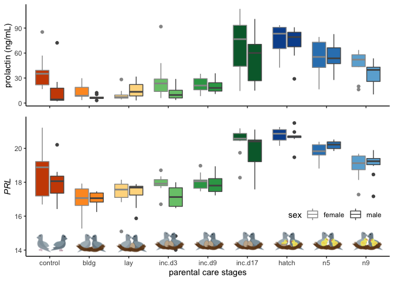
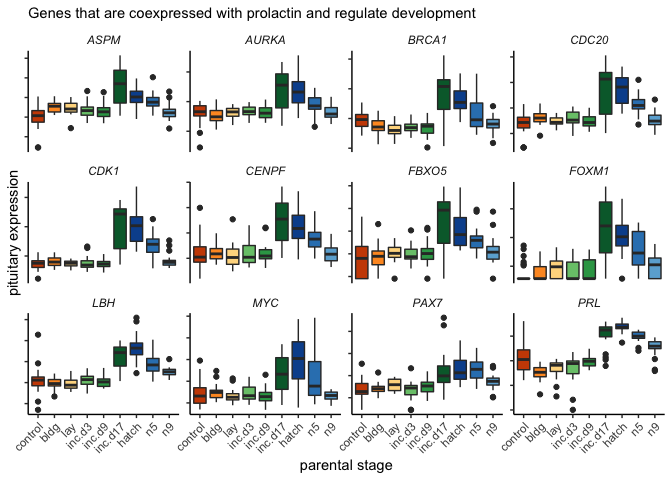

Plots with Prolactin
====================

    library(tidyverse)

    ## ── Attaching packages ─────────────────────────────────────────────────────────────────────────────────────────── tidyverse 1.3.0 ──

    ## ✔ ggplot2 3.2.1     ✔ purrr   0.3.3
    ## ✔ tibble  2.1.3     ✔ dplyr   0.8.3
    ## ✔ tidyr   1.0.0     ✔ stringr 1.4.0
    ## ✔ readr   1.3.1     ✔ forcats 0.4.0

    ## ── Conflicts ────────────────────────────────────────────────────────────────────────────────────────────── tidyverse_conflicts() ──
    ## ✖ dplyr::filter() masks stats::filter()
    ## ✖ dplyr::lag()    masks stats::lag()

    library(cowplot)

    ## 
    ## Attaching package: 'cowplot'

    ## The following object is masked from 'package:ggplot2':
    ## 
    ##     ggsave

    library(magick)

    ## Linking to ImageMagick 6.9.9.39
    ## Enabled features: cairo, fontconfig, freetype, lcms, pango, rsvg, webp
    ## Disabled features: fftw, ghostscript, x11

    library(png)
    library(grid)
    library(ggimage)

    ## 
    ## Attaching package: 'ggimage'

    ## The following object is masked from 'package:cowplot':
    ## 
    ##     theme_nothing

    library(apaTables)

    source("../R/themes.R") 
    source("../R/functions.R")
    source("../R/icons.R")

    ## Warning: Column `icons` joining factor and character vector, coercing into
    ## character vector

    knitr::opts_chunk$set(fig.path = '../figures/PRL/',message=F, warning=FALSE)

Circulating levels of prolactin
-------------------------------

    hormones <- read_csv("../results/hormones.csv")
    hormones$treatment <- factor(hormones$treatment, levels = alllevels)

    meanprolactin <- hormones %>% 
        filter(study == "characterization", hormone %in% c("prolactin"))  %>% 
        droplevels() %>% 
      dplyr::group_by(treatment) %>%
      dplyr::summarise(m = mean(plasma_conc), 
                       se = sd(plasma_conc)/sqrt(length(plasma_conc))) %>%
      dplyr::mutate(m = round(m,0)) 
    meanprolactin <- left_join(meanprolactin, birds)
    meanprolactin$treatment <- factor(meanprolactin$treatment, levels = alllevels)
    meanprolactin

    ## # A tibble: 9 x 6
    ##   treatment     m    se icons    music                  iconpath           
    ##   <fct>     <dbl> <dbl> <chr>    <chr>                  <chr>              
    ## 1 control      24  4.75 control… https://encrypted-tbn… ../figures/images/…
    ## 2 bldg         10  1.54 bldg.png https://encrypted-tbn… ../figures/images/…
    ## 3 lay          12  1.96 lay.png  https://encrypted-tbn… ../figures/images/…
    ## 4 inc.d3       21  4.49 incubat… https://encrypted-tbn… ../figures/images/…
    ## 5 inc.d9       21  1.73 incubat… https://encrypted-tbn… ../figures/images/…
    ## 6 inc.d17      61  7.08 incubat… https://encrypted-tbn… ../figures/images/…
    ## 7 hatch        75  3.94 hatch.p… https://encrypted-tbn… ../figures/images/…
    ## 8 n5           55  4.01 chickli… https://encrypted-tbn… ../figures/images/…
    ## 9 n9           41  3.47 chickli… https://encrypted-tbn… ../figures/images/…

    p1 <- hormones %>% 
        filter(study == "characterization", hormone %in% c("prolactin"))  %>% 
        droplevels() %>% 
      ggplot(aes(x = treatment, y = plasma_conc)) +
        geom_boxplot(aes(fill = treatment, alpha = sex, color = sex)) +
        theme_B3() +
        scale_fill_manual(values = colorscharmaip) +
        scale_color_manual(values = sexcolors) +
        labs(y = "prolactin (ng/mL)", x = NULL) +
        guides(fill = FALSE, alpha = FALSE,
             color = guide_legend(order=1)) +
        scale_alpha_manual(values = c(0.75,1)) +
        theme(legend.position = c(0.85,0.15), legend.direction = "horizontal") + 
      labs(x = "increasing time >>", y = "prolactin (ng/mL)")
    p1

    p1 +
      annotation_custom(control, ymin = -20, ymax = 0, xmin = -7.8) +
      annotation_custom(bldg, ymin = -20, ymax = 0, xmin = -5.8) +
      annotation_custom(lay, ymin = -20, ymax = 0, xmin = -3.8) +
      annotation_custom(inc, ymin = -20, ymax = 0, xmin = -1.8) +
      annotation_custom(inc, ymin = -20, ymax = 0, xmin = 0.6) +
      annotation_custom(inc, ymin = -20, ymax = 0, xmin = 2.4) +
      annotation_custom(hatch, ymin = -20, ymax = 0, xmin = 4.4) +
      annotation_custom(nestling, ymin = -20, ymax = 0, xmin = 6.4) +
      annotation_custom(nestling, ymin = -20, ymax = 0, xmin = 8.4) + 
      ylim(c(-10,120)) 

Prolactin (*PRL*) and *BRCA1* expression in the pituitary
---------------------------------------------------------

    colData.pit <-  read.csv("../metadata/00_samples.csv", header = T, row.names = 1)
    colData.pit <- colData.pit %>% filter(tissue == "pituitary")

    vsd.pit <- read.csv("../results/06_pitallvsd.csv", header = T, row.names = 1)

    savecols <- as.character(colData.pit$V1) 
    savecols <- as.vector(savecols) 
    vsd.pit <- vsd.pit %>% dplyr::select(one_of(savecols)) 
    vsd.pit$genes <- row.names(vsd.pit)

    candidategenes <- c("PRL", "BRCA1")
    candidates.pit <- vsd.pit %>% dplyr::filter(genes %in% candidategenes)
    candidates.pit <- as.data.frame(candidates.pit)
    row.names(candidates.pit) <- candidates.pit$genes
    candidates.pit$genes <- NULL
    candidates.pit <- as.data.frame(t(candidates.pit))
    candidates.pit$V1 <- row.names(candidates.pit) 
    candidates.pit <- left_join(colData.pit, candidates.pit)
    candidates.pit$treatment <- factor(candidates.pit$treatment, levels = alllevels)
    tail(candidates.pit)

    ##                                       V1       bird    sex    tissue
    ## 325 y85.r71.x_female_pituitary_m.inc.d17  y85.r71.x female pituitary
    ## 326       y94.g133.x_female_pituitary_n5 y94.g133.x female pituitary
    ## 327     y95.g131.x_male_pituitary_inc.d9 y95.g131.x   male pituitary
    ## 328            y97.x_female_pituitary_n9      y97.x female pituitary
    ## 329     y98.g54_female_pituitary_m.hatch    y98.g54 female pituitary
    ## 330      y98.o50.x_male_pituitary_inc.d3  y98.o50.x   male pituitary
    ##     treatment                      group           study    BRCA1      PRL
    ## 325 m.inc.d17 female.pituitary.m.inc.d17    manipulation 7.321769 19.71414
    ## 326        n5        female.pituitary.n5 charcterization 7.404085 20.32831
    ## 327    inc.d9      male.pituitary.inc.d9 charcterization 7.193690 17.28303
    ## 328        n9        female.pituitary.n9 charcterization 7.420520 19.06794
    ## 329      m.n2      female.pituitary.m.n2    manipulation 7.446570 20.25300
    ## 330    inc.d3      male.pituitary.inc.d3 charcterization 7.286573 17.90847

    meanPRL <- candidates.pit %>% 
        droplevels() %>% 
      dplyr::group_by(treatment, sex) %>%
      dplyr::summarise(m = mean(PRL), 
                       se = sd(PRL)/sqrt(length(PRL))) %>%
      dplyr::mutate(m = round(m,1))  %>%
      dplyr::filter(treatment %in% charlevels)
    meanPRL <- left_join(meanPRL, birds)
    meanPRL$treatment <- factor(meanPRL$treatment, levels = charlevels)
    meanPRL

    ## # A tibble: 18 x 7
    ## # Groups:   treatment [9]
    ##    treatment sex        m     se icons   music             iconpath        
    ##    <fct>     <fct>  <dbl>  <dbl> <chr>   <chr>             <chr>           
    ##  1 control   female  18.5 0.424  contro… https://encrypte… ../figures/imag…
    ##  2 control   male    17.9 0.250  contro… https://encrypte… ../figures/imag…
    ##  3 bldg      female  17   0.255  bldg.p… https://encrypte… ../figures/imag…
    ##  4 bldg      male    17   0.121  bldg.p… https://encrypte… ../figures/imag…
    ##  5 lay       female  17.3 0.284  lay.png https://encrypte… ../figures/imag…
    ##  6 lay       male    17.4 0.214  lay.png https://encrypte… ../figures/imag…
    ##  7 inc.d3    female  17.9 0.166  incuba… https://encrypte… ../figures/imag…
    ##  8 inc.d3    male    16.8 0.421  incuba… https://encrypte… ../figures/imag…
    ##  9 inc.d9    female  18   0.119  incuba… https://encrypte… ../figures/imag…
    ## 10 inc.d9    male    17.9 0.164  incuba… https://encrypte… ../figures/imag…
    ## 11 inc.d17   female  20.4 0.246  incuba… https://encrypte… ../figures/imag…
    ## 12 inc.d17   male    19.8 0.357  incuba… https://encrypte… ../figures/imag…
    ## 13 hatch     female  20.8 0.124  hatch.… https://encrypte… ../figures/imag…
    ## 14 hatch     male    20.7 0.157  hatch.… https://encrypte… ../figures/imag…
    ## 15 n5        female  19.8 0.168  chickl… https://encrypte… ../figures/imag…
    ## 16 n5        male    20.2 0.0800 chickl… https://encrypte… ../figures/imag…
    ## 17 n9        female  19   0.229  chickl… https://encrypte… ../figures/imag…
    ## 18 n9        male    19.1 0.222  chickl… https://encrypte… ../figures/imag…

    p2 <- candidates.pit %>%
      dplyr::filter(treatment %in% charlevels) %>%
      ggplot(aes(x = treatment, y = PRL)) + 
        geom_boxplot(aes(fill = treatment, alpha = sex, color = sex)) + 
        scale_alpha_manual(values = c(0.75,1)) +
        theme_B3() +
      theme(legend.position = c(0.85,0.2), legend.direction = "horizontal") + 
      scale_color_manual(values = c("female" = "#969696", "male" = "#525252")) +
      labs(y = "PRL", x = "increasing time >>", subtitle = "Pituitary" ) +
      guides(fill = FALSE, alpha = FALSE, color = guide_legend(order=1)) +
      theme(axis.title.y  = element_text(face = "italic"))  +
      annotation_custom(control, ymin = 13.5, ymax = 15, xmin = -7.5) +
      annotation_custom(bldg, ymin = 13.5, ymax = 15, xmin = -5.5) +
      annotation_custom(lay, ymin = 13.5, ymax = 15, xmin = -3.5) +
      annotation_custom(inc, ymin = 13.5, ymax = 15, xmin = -1.5) +
      annotation_custom(inc, ymin = 13.5, ymax = 15, xmin = 0.5) +
      annotation_custom(inc, ymin = 13.5, ymax = 15, xmin = 2.5) +
      annotation_custom(hatch, ymin = 13.5, ymax = 15, xmin = 4.5) +
      annotation_custom(nestling, ymin = 13.5, ymax = 15, xmin = 6.5) +
      annotation_custom(nestling, ymin = 13.5, ymax = 15, xmin = 8.5)   
    p2

    plot_grid(p1 + theme(legend.position ="none",
                         axis.title.x = element_blank(),
                         axis.text.x = element_blank()),
              p2 + theme(legend.position = c(0.85,0.3)) +
                labs(subtitle = NULL) +
      annotation_custom(control, ymin = 13.5, ymax = 15.5, xmin = -7.5) +
      annotation_custom(bldg, ymin = 13.5, ymax = 15.5, xmin = -5.5) +
      annotation_custom(lay, ymin = 13.5, ymax = 15.5, xmin = -3.5) +
      annotation_custom(inc, ymin = 13.5, ymax = 15.5, xmin = -1.5) +
      annotation_custom(inc, ymin = 13.5, ymax = 15.5, xmin = 0.5) +
      annotation_custom(inc, ymin = 13.5, ymax = 15.5, xmin = 2.5) +
      annotation_custom(hatch, ymin = 13.5, ymax = 15.5, xmin = 4.5) +
      annotation_custom(nestling, ymin = 13.5, ymax = 15.5, xmin = 6.5) +
      annotation_custom(nestling, ymin = 13.5, ymax = 15.5, xmin = 8.5), 
              nrow = 2,rel_heights = c(0.4,0.6)) 

    meanBRCA <- candidates.pit %>% 
        droplevels() %>% 
      dplyr::group_by(treatment, sex) %>%
      dplyr::summarise(m = mean(BRCA1), 
                       se = sd(BRCA1)/sqrt(length(BRCA1))) %>%
      dplyr::mutate(m = round(m,1)) %>%
      dplyr::filter(treatment %in% charlevels)
    meanBRCA <- left_join(meanBRCA, birds)
    meanBRCA$treatment <- factor(meanBRCA$treatment, levels = alllevels)
    meanBRCA

    ## # A tibble: 18 x 7
    ## # Groups:   treatment [9]
    ##    treatment sex        m     se icons   music             iconpath        
    ##    <fct>     <fct>  <dbl>  <dbl> <chr>   <chr>             <chr>           
    ##  1 control   female   7.5 0.0359 contro… https://encrypte… ../figures/imag…
    ##  2 control   male     7.5 0.0418 contro… https://encrypte… ../figures/imag…
    ##  3 bldg      female   7.4 0.0513 bldg.p… https://encrypte… ../figures/imag…
    ##  4 bldg      male     7.4 0.0448 bldg.p… https://encrypte… ../figures/imag…
    ##  5 lay       female   7.3 0.0286 lay.png https://encrypte… ../figures/imag…
    ##  6 lay       male     7.3 0.0438 lay.png https://encrypte… ../figures/imag…
    ##  7 inc.d3    female   7.4 0.0321 incuba… https://encrypte… ../figures/imag…
    ##  8 inc.d3    male     7.4 0.0346 incuba… https://encrypte… ../figures/imag…
    ##  9 inc.d9    female   7.4 0.0332 incuba… https://encrypte… ../figures/imag…
    ## 10 inc.d9    male     7.3 0.0472 incuba… https://encrypte… ../figures/imag…
    ## 11 inc.d17   female   8   0.125  incuba… https://encrypte… ../figures/imag…
    ## 12 inc.d17   male     7.8 0.131  incuba… https://encrypte… ../figures/imag…
    ## 13 hatch     female   7.8 0.0685 hatch.… https://encrypte… ../figures/imag…
    ## 14 hatch     male     7.8 0.0774 hatch.… https://encrypte… ../figures/imag…
    ## 15 n5        female   7.4 0.0545 chickl… https://encrypte… ../figures/imag…
    ## 16 n5        male     7.7 0.0859 chickl… https://encrypte… ../figures/imag…
    ## 17 n9        female   7.4 0.0458 chickl… https://encrypte… ../figures/imag…
    ## 18 n9        male     7.4 0.0422 chickl… https://encrypte… ../figures/imag…

    p3 <- candidates.pit %>% 
      dplyr::filter(treatment %in% charlevels) %>%
      ggplot(aes(x = treatment, y = BRCA1, fill = treatment, color = sex, alpha = sex)) +
        geom_boxplot() +
        theme_B3() +
          scale_alpha_manual(values = c(0.75,1)) +
      scale_color_manual(values = c("female" = "#969696", "male" = "#525252")) +
      theme(legend.position = "none") + 
      labs(x = "increasing time >>", y = "BRCA1", subtitle = "Pituitary") +
      annotation_custom(control, ymin = 6.65, ymax = 7, xmin = -7.8) +
      annotation_custom(bldg, ymin = 6.65, ymax = 7, xmin = -5.8) +
      annotation_custom(lay, ymin = 6.65, ymax = 7, xmin = -3.8) +
      annotation_custom(inc, ymin = 6.65, ymax = 7, xmin = -1.8) +
      annotation_custom(inc, ymin = 6.65, ymax = 7, xmin = 0.6) +
      annotation_custom(inc, ymin = 6.65, ymax = 7, xmin = 2.4) +
      annotation_custom(hatch, ymin = 6.65, ymax = 7, xmin = 4.4) +
      annotation_custom(nestling, ymin = 6.65, ymax = 7, xmin = 6.4) +
      annotation_custom(nestling, ymin = 6.65, ymax = 7, xmin = 8.4) +
      ylim(6.8,8.5) +
      guides(fill = FALSE, alpha = FALSE, color = guide_legend(order=1)) +
      theme(legend.position = c(0.85,0.2), legend.direction = "horizontal") + 
      theme(axis.title.y  = element_text(face = "italic"))
    p3

Manipulation of parental care and *PRL* and *BRCA1* expression
--------------------------------------------------------------

    p4 <- ggplot(candidates.pit, aes(x = treatment, y = PRL)) + 
        geom_boxplot(aes(fill = treatment, alpha = sex)) +
        scale_alpha_manual(values = c(0.75,1)) +
        theme_B3() +
       theme(legend.position = "none", legend.direction = "horizontal") + 
       scale_color_manual(values = c("female" = "#969696", "male" = "#525252")) +
      labs(x = "increasing time >>", y = "PRL", subtitle = "Pituitary") +
      scale_fill_manual(values = colorscharmaip2) +
      ylim(c(13,22.5)) +
      theme(axis.text.x = element_text(angle = 45, hjust = 1)) +
      annotation_custom(control, ymin = 13, ymax = 14, xmin = -14.8) +
      annotation_custom(bldg, ymin = 13, ymax = 14, xmin = -12.8) +
      annotation_custom(lay, ymin = 13, ymax = 14, xmin = -10.8) +
      annotation_custom(inc, ymin = 13, ymax = 14, xmin = -8.8) +
      annotation_custom(removeegg, ymin = 13, ymax = 14, xmin = -6.8) +
      annotation_custom(inc, ymin = 13, ymax = 14, xmin = -4.8) +
      annotation_custom(maniphatch, ymin = 13, ymax = 14, xmin = -2.8) +
      annotation_custom(removeegg, ymin = 13, ymax = 14, xmin = -0.8) +
      annotation_custom(inc, ymin = 13, ymax = 14, xmin = 1.4) +
      annotation_custom(removeegg, ymin = 13, ymax = 14, xmin = 3.4)  +
      annotation_custom(manipinc, ymin = 13, ymax = 14, xmin = 5.4) +
      annotation_custom(hatch, ymin = 13, ymax = 14, xmin = 7.4) +
      annotation_custom(removechick, ymin = 13, ymax = 14, xmin = 9.4) +
      annotation_custom(maniphatch, ymin = 13, ymax = 14, xmin = 11.4) +
      annotation_custom(nestling, ymin = 13, ymax = 14, xmin = 13.4) +
      annotation_custom(nestling, ymin = 13, ymax = 14, xmin = 15.4) +
        theme(axis.title.y  = element_text(face = "italic"))
    p4

    p5 <- ggplot(candidates.pit, aes(x = treatment, y = BRCA1)) + 
        geom_boxplot(aes(fill = treatment, alpha = sex)) +
        scale_alpha_manual(values = c(0.75,1)) +
        theme_B3() +
       theme(legend.position = "none", legend.direction = "horizontal") + 
       scale_color_manual(values = c("female" = "#969696", "male" = "#525252")) +
      labs(x = "increasing time >>", y = "BRCA1", subtitle = "Pituitary") +
      scale_fill_manual(values = colorscharmaip2) +
      ylim(6.8,8.5) +
      theme(axis.text.x = element_text(angle = 45, hjust = 1)) +
      annotation_custom(control, ymin = 13, ymax = 14, xmin = -14.8) +
      annotation_custom(bldg, ymin = 13, ymax = 14, xmin = -12.8) +
      annotation_custom(lay, ymin = 13, ymax = 14, xmin = -10.8) +
      annotation_custom(inc, ymin = 13, ymax = 14, xmin = -8.8) +
      annotation_custom(removeegg, ymin = 13, ymax = 14, xmin = -6.8) +
      annotation_custom(inc, ymin = 13, ymax = 14, xmin = -4.8) +
      annotation_custom(maniphatch, ymin = 13, ymax = 14, xmin = -2.8) +
      annotation_custom(removeegg, ymin = 13, ymax = 14, xmin = -0.8) +
      annotation_custom(inc, ymin = 13, ymax = 14, xmin = 1.4) +
      annotation_custom(removeegg, ymin = 13, ymax = 14, xmin = 3.4)  +
      annotation_custom(manipinc, ymin = 13, ymax = 14, xmin = 5.4) +
      annotation_custom(hatch, ymin = 13, ymax = 14, xmin = 7.4) +
      annotation_custom(removechick, ymin = 13, ymax = 14, xmin = 9.4) +
      annotation_custom(maniphatch, ymin = 13, ymax = 14, xmin = 11.4) +
      annotation_custom(nestling, ymin = 13, ymax = 14, xmin = 13.4) +
      annotation_custom(nestling, ymin = 13, ymax = 14, xmin = 15.4) +
        theme(axis.title.y  = element_text(face = "italic"))
    p5

    ggplot(candidates.pit, aes(x = PRL, y = BRCA1)) +
      geom_point(aes(alpha = sex,  color =  treatment)) +
      geom_smooth(method = "loess", se=T, color = "darkgrey") +
      scale_color_manual(values = colorscharmaip2)  +
      scale_alpha_manual(values = c(0.5,1)) +
      labs(subtitle = "Pituitary") +
      theme(axis.title  = element_text(face = "italic"),
            legend.title =  element_blank())

    candidates.pit %>%
      filter(treatment %in% charlevels) %>%
    ggplot( aes(x = PRL, y = BRCA1)) +
      geom_point(aes(alpha = sex,  color =  treatment)) +
      geom_smooth(method = "loess", se=T, color = "darkgrey") +
      scale_color_manual(values = colorscharmaip2)  +
      scale_alpha_manual(values = c(0.5,1)) +
      labs(subtitle = "Pituitary") +
      theme(axis.title  = element_text(face = "italic"),
            legend.title =  element_blank())

Genes an hormones (in progress, don’t have all the bird ids lining up.)
-----------------------------------------------------------------------

    candidates.pit$bird_id <- candidates.pit$bird
    candidates.pit$X1 <- candidates.pit$V1

    geneshormones <- left_join(candidates.pit, hormones) %>%
      select(-X1, -V1, -okay, - icons, -music, -iconpath) %>%
      drop_na()

    head(geneshormones$bird_id)

    ## [1] "blk0.x"  "blk0.x"  "blk0.x"  "blk19.x" "blk19.x" "blk19.x"

    head(hormones$bird_id)

    ## [1] "x.g"       "x.g.g"     "x.blk.blk" "x.g.g.g"   "x.g.g.f"   "x.blu.o"

    ggplot(geneshormones, aes(x = plasma_conc, y = PRL)) +
      geom_point(aes(color = treatment)) +
      facet_wrap(~hormone, scales = "free_x") +
        geom_smooth(method = "lm", color = "grey") 

    prolactin2 <- read_csv("../results/07_prolactin2.csv")
    head(prolactin2)

    ## # A tibble: 6 x 6
    ##   study            treatment sex    bird_id       hormone   plasma_conc
    ##   <chr>            <chr>     <chr>  <chr>         <chr>           <dbl>
    ## 1 manipulation     prolong   male   blk.s030.o.g  prolactin        35.3
    ## 2 manipulation     prolong   female blk.s031.pu.d prolactin        43.8
    ## 3 manipulation     m.n2      female blk.s032.g.w  prolactin        90.8
    ## 4 manipulation     m.inc.d3  female blk.s049.y.g  prolactin        27.0
    ## 5 manipulation     m.inc.d3  female blk.s060.pu.w prolactin        19.4
    ## 6 characterization inc.d9    female blk.s061.pu.y prolactin        11.9

    geneshormones2 <- left_join(candidates.pit, prolactin2) %>%
      drop_na()
    head(geneshormones)

    ##       bird    sex    tissue treatment                   group        study
    ## 21  blk0.x female pituitary      m.n2   female.pituitary.m.n2 manipulation
    ## 22  blk0.x female pituitary      m.n2   female.pituitary.m.n2 manipulation
    ## 23  blk0.x female pituitary      m.n2   female.pituitary.m.n2 manipulation
    ## 27 blk19.x female pituitary    extend female.pituitary.extend manipulation
    ## 28 blk19.x female pituitary    extend female.pituitary.extend manipulation
    ## 29 blk19.x female pituitary    extend female.pituitary.extend manipulation
    ##       BRCA1      PRL bird_id   hormone  plasma_conc
    ## 21 7.731041 20.08465  blk0.x prolactin  15.25856000
    ## 22 7.731041 20.08465  blk0.x      cort   4.60254912
    ## 23 7.731041 20.08465  blk0.x estradiol   0.17274629
    ## 27 8.020828 21.14005 blk19.x prolactin 100.68067200
    ## 28 8.020828 21.14005 blk19.x      cort   2.53935784
    ## 29 8.020828 21.14005 blk19.x estradiol   0.05364098

    ggplot(geneshormones2, aes(x = plasma_conc, y = PRL)) +
      geom_point(aes( color = treatment)) +
      geom_smooth(method = "lm", color = "grey") +
      facet_wrap(~hormone, scales = "free") 

Prolactin hormone statistics
----------------------------

    aov_all = data.frame()
    for(i in alllevels3){
      
      df <- candidates.pit %>% filter(treatment == i) %>% droplevels()
      aovtable <- apa.aov.table(aov(PRL ~ sex , data=df))
      aovtable <- as.data.frame(aovtable$table_body)
      totaldf <- aovtable[3, 3]
      aovtable$df <- paste(aovtable$df, ", " , totaldf, sep = "")
      aovtable$ANOVA <- "PRL ~ sex"
      aovtable$stages <- paste(i)
      aovtable$p <- as.numeric(as.character(aovtable$p))
      aov_all <- rbind(aov_all,aovtable)
    }

    aov_all <- aov_all %>%
      filter(Predictor == "sex")  %>%
      select(stages, ANOVA, df, "F", p) %>%
      mutate(sig = ifelse(p < 0.05, "*", " "))
    aov_all

    ##       stages     ANOVA    df     F     p sig
    ## 1    control PRL ~ sex 1, 23  1.22 0.281    
    ## 2       bldg PRL ~ sex 1, 18  0.06 0.817    
    ## 3        lay PRL ~ sex 1, 18  0.01 0.921    
    ## 4     inc.d3 PRL ~ sex 1, 18  6.49 0.020   *
    ## 5     inc.d9 PRL ~ sex 1, 22  0.24 0.629    
    ## 6    inc.d17 PRL ~ sex 1, 20  2.10 0.163    
    ## 7      hatch PRL ~ sex 1, 18  0.38 0.547    
    ## 8         n5 PRL ~ sex 1, 18  5.01 0.038   *
    ## 9         n9 PRL ~ sex 1, 20  0.05 0.829    
    ## 10  m.inc.d3 PRL ~ sex 1, 18 10.32 0.005   *
    ## 11  m.inc.d9 PRL ~ sex 1, 14  0.00 0.985    
    ## 12 m.inc.d17 PRL ~ sex 1, 19  0.11 0.748    
    ## 13      m.n2 PRL ~ sex 1, 18  9.25 0.007   *
    ## 14  m.inc.d8 PRL ~ sex 1, 18  2.58 0.126    
    ## 15   prolong PRL ~ sex 1, 18  2.02 0.172    
    ## 16    extend PRL ~ sex 1, 18  0.00 0.991

    one <- c("m.inc.d3", "inc.d3")
    two <- c("m.inc.d9", "inc.d9")
    three <- c("m.inc.d17", "inc.d17")
    four <- c("m.n2", "hatch")
    five <- c("m.inc.d8", "inc.d9")
    six <- c("m.inc.d8", "hatch")
    seven <- c("prolong", "inc.d17")
    eight <- c("prolong", "hatch")
    nine <- c("extend", "hatch")
    ten <- c("extend", "n5")

    manipcomparisons <- list(one, two, three, four, five, six, seven, eight, nine, ten)

    aov_manip = data.frame()
    for(i in manipcomparisons){
      
      df <- candidates.pit %>% filter(treatment %in% i) %>% droplevels()
      aovtable <- apa.aov.table(aov(PRL ~ sex * treatment , data=df))
      aovtable <- as.data.frame(aovtable$table_body)
      totaldf <- aovtable[5, 3]
      aovtable$df <- paste(aovtable$df, ", " , totaldf, sep = "")
      aovtable$ANOVA <- "PRL ~ sex"
      aovtable$stages <- paste(i, collapse = " vs ")
      aovtable$p <- as.numeric(as.character(aovtable$p))
      aov_manip <- rbind(aov_manip,aovtable)
    }

    aov_manip  <- aov_manip %>%
      filter(Predictor %in% c( "treatment"))  %>%
      select(stages, ANOVA, Predictor, df, "F", p) %>%
      mutate(sig = ifelse(p < 0.05, "*", " "))
    aov_manip

    ##                  stages     ANOVA Predictor    df     F     p sig
    ## 1    m.inc.d3 vs inc.d3 PRL ~ sex treatment 1, 36  0.02 0.890    
    ## 2    m.inc.d9 vs inc.d9 PRL ~ sex treatment 1, 36  6.91 0.013   *
    ## 3  m.inc.d17 vs inc.d17 PRL ~ sex treatment 1, 39  6.07 0.018   *
    ## 4         m.n2 vs hatch PRL ~ sex treatment 1, 36 13.77 0.001   *
    ## 5    m.inc.d8 vs inc.d9 PRL ~ sex treatment 1, 40  0.01 0.918    
    ## 6     m.inc.d8 vs hatch PRL ~ sex treatment 1, 36 25.00 0.000   *
    ## 7    prolong vs inc.d17 PRL ~ sex treatment 1, 38  0.04 0.847    
    ## 8      prolong vs hatch PRL ~ sex treatment 1, 36  1.59 0.216    
    ## 9       extend vs hatch PRL ~ sex treatment 1, 36  5.82 0.021   *
    ## 10         extend vs n5 PRL ~ sex treatment 1, 36  4.42 0.043   *

    meanPRL <- candidates.pit %>% 
        droplevels() %>% 
      dplyr::group_by(treatment) %>%
      dplyr::summarise(m = mean(PRL), 
                       se = sd(PRL)/sqrt(length(PRL))) %>%
      dplyr::mutate(m = round(m,1))  %>%
      dplyr::filter(treatment %in% charlevels)
    meanPRL <- left_join(meanPRL, birds)
    meanPRL$treatment <- factor(meanPRL$treatment, levels = charlevels)

    p8 <- ggplot(meanPRL, aes(treatment, m)) +
       geom_image(aes(image=music), size=.12)  +
      labs(x = "parental care stages", y = "PRL", subtitle = "Pituitary") +
      mytheme() +
      ylim(c(15,22)) +
      annotation_custom(control, ymin = 15, ymax = 16.5, xmin = -7.5) +
      annotation_custom(bldg, ymin = 15, ymax = 16.5, xmin = -5.5) +
      annotation_custom(lay, ymin = 15, ymax = 16.5, xmin = -3.5) +
      annotation_custom(inc, ymin = 15, ymax = 16.5, xmin = -1.5) +
      annotation_custom(inc, ymin = 15, ymax = 16.5, xmin = 0.5) +
      annotation_custom(inc, ymin = 15, ymax = 16.5, xmin = 2.5) +
      annotation_custom(hatch, ymin = 15, ymax = 16.5, xmin = 4.5) +
      annotation_custom(nestling, ymin = 15, ymax = 16.5, xmin = 6.5) +
      annotation_custom(nestling, ymin = 15, ymax = 16.5, xmin = 8.5)   +
      geom_hline(yintercept=17) +
      geom_hline(yintercept=18) +
      geom_hline(yintercept=19) +
      geom_hline(yintercept=20) +
      geom_hline(yintercept=21) +
      theme(axis.title.y  = element_text(face = "italic"))

    p8

WGCNA candidates
----------------

    #WGCNAgenes <- read_csv("../results/08_PRL_associated.csv") %>% pull(x)
    #WGCNAgenes <- c("FBXO5", "NUF2", "PTTG1", "BUB1", "PRL", "ASPM", "AURKA", "CDC20", "NEK2", "CKS2", 
    #                  "MYC", "CCNB3", "FANCC", "STC1", "RACGAP1", "E2F7", "PLK1", "EXO1", "CENPI", "CDK1")
    WGCNAgenes <- c("PRL", "PAX7", "ASPM", "AURKA",  "CDC20", "CENPF", "MYC",  "CDK1", "LBH", "BRCA1", "FOXM1", "FBXO5")

    WGCNAgenes.pit <- vsd.pit %>% dplyr::filter(genes %in% WGCNAgenes)
    WGCNAgenes.pit <- as.data.frame(WGCNAgenes.pit)
    row.names(WGCNAgenes.pit) <- WGCNAgenes.pit$genes
    WGCNAgenes.pit <- pivot_longer(WGCNAgenes.pit, -genes, names_to = "V1", values_to = "expression")
    head(WGCNAgenes.pit)

    ## # A tibble: 6 x 3
    ##   genes V1                                   expression
    ##   <chr> <chr>                                     <dbl>
    ## 1 ASPM  L.Blu13_male_pituitary_control.NYNO        6.77
    ## 2 ASPM  L.G107_male_pituitary_control              6.23
    ## 3 ASPM  L.G118_female_pituitary_control.NYNO       7.10
    ## 4 ASPM  L.R3_male_pituitary_control.NYNO           7.19
    ## 5 ASPM  L.R8_male_pituitary_control                6.87
    ## 6 ASPM  L.W33_male_pituitary_control               6.99

    WGCNAgenes.pit <- left_join(colData.pit, WGCNAgenes.pit) %>%
      filter(study == "charcterization")
    WGCNAgenes.pit$treatment <- factor(WGCNAgenes.pit$treatment, levels = alllevels)

    WGCNAgenes.pit$genes <- factor(WGCNAgenes.pit$genes)
    WGCNAgenes.pit$genesnum <- round(as.numeric(WGCNAgenes.pit$genes), digits = -1)

    p1 <- ggplot(WGCNAgenes.pit, aes(x = treatment, y = expression)) +
      geom_boxplot(aes(fill = treatment)) +
      facet_wrap(~genes, scales = "free_y") +
      theme_B3() +
      theme(legend.position = "none") +
      #scale_color_manual(values = sexcolors) +
      theme(axis.text.y = element_blank(),
            axis.text.x = element_text(angle = 45, hjust = 1),
            strip.background = element_blank(),
            strip.text = element_text(face = "italic")) +
      labs( x = "parental stage", y = "pituitary expression",
            subtitle = "Genes that are coexpressed with prolactin and regulate development")
    p1

    write.csv(candidates.pit, "../results/16_pitPRL.csv")
    write.csv(aov_all, "../results/16_aov_PRLsex.csv")
    write.csv(aov_manip, "../results/16_aov_PRLsextreatment.csv")
