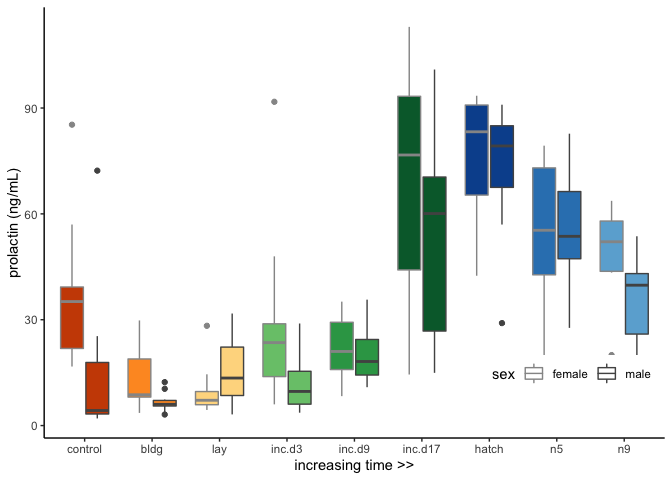

    library(tidyverse)

    ## ── Attaching packages ─────────────────────────────────────────────────────────────────────────────── tidyverse 1.3.0 ──

    ## ✔ ggplot2 3.2.1     ✔ purrr   0.3.3
    ## ✔ tibble  2.1.3     ✔ dplyr   0.8.3
    ## ✔ tidyr   1.0.0     ✔ stringr 1.4.0
    ## ✔ readr   1.3.1     ✔ forcats 0.4.0

    ## ── Conflicts ────────────────────────────────────────────────────────────────────────────────── tidyverse_conflicts() ──
    ## ✖ dplyr::filter() masks stats::filter()
    ## ✖ dplyr::lag()    masks stats::lag()

    library(cowplot)

    ## 
    ## Attaching package: 'cowplot'

    ## The following object is masked from 'package:ggplot2':
    ## 
    ##     ggsave

    library(magick)

    ## Linking to ImageMagick 6.9.9.39
    ## Enabled features: cairo, fontconfig, freetype, lcms, pango, rsvg, webp
    ## Disabled features: fftw, ghostscript, x11

    library(png)
    library(grid)

    source("../R/themes.R") 
    source("../R/functions.R")

    knitr::opts_chunk$set(fig.path = '../figures/PRL/',message=F, warning=FALSE)

    hormones <- read_csv("../results/hormones.csv")
    hormones$treatment <- factor(hormones$treatment, levels = alllevels)

    characterization <- png::readPNG("../figures/images/DoveParentsRNAseq_charicons.png")
    characterization <- ggdraw() +  draw_image(characterization, scale = 1)

    birds <- data.frame(iconpath=list.files("../figures/images/icons", full.names = T), stringsAsFactors = F)
    birds$icons <- sapply(strsplit(as.character(birds$iconpath),'../figures/images/icons/birds_'), "[", 2)

    control <- png::readPNG(birds$iconpath[3])
    control <-  grid::rasterGrob(control, interpolate=TRUE)

    bldg <- png::readPNG(birds$iconpath[1])
    bldg <-  grid::rasterGrob(bldg, interpolate=TRUE)

    lay <- png::readPNG(birds$iconpath[6])
    lay <-  grid::rasterGrob(lay, interpolate=TRUE)

    inc <- png::readPNG(birds$iconpath[5])
    inc <-  grid::rasterGrob(inc, interpolate=TRUE)

    hatch <- png::readPNG(birds$iconpath[4])
    hatch <-  grid::rasterGrob(hatch, interpolate=TRUE)

    nestling <- png::readPNG(birds$iconpath[2])
    nestling <-  grid::rasterGrob(nestling, interpolate=TRUE)

    p1 <- hormones %>% 
        filter(study == "characterization", hormone %in% c("prolactin"))  %>% 
        droplevels() %>% 
      ggplot(aes(x = treatment, y = plasma_conc, fill = treatment)) +
        geom_boxplot() +
      ylim(c(-10,120)) + 
        mytheme() +
      #theme(axis.text.x = element_blank()) + 
      theme(legend.position = "none") + 
      labs(x = "parental care stages", y = "prolactin conc. (ng/mL)") +
      annotation_custom(control, ymin = -20, ymax = 0, xmin = -7.5) +
      annotation_custom(bldg, ymin = -20, ymax = 0, xmin = -5.5) +
      annotation_custom(lay, ymin = -20, ymax = 0, xmin = -3.5) +
      annotation_custom(inc, ymin = -20, ymax = 0, xmin = -1.5) +
      annotation_custom(inc, ymin = -20, ymax = 0, xmin = 0.5) +
      annotation_custom(inc, ymin = -20, ymax = 0, xmin = 2.5) +
      annotation_custom(hatch, ymin = -20, ymax = 0, xmin = 4.5) +
      annotation_custom(nestling, ymin = -20, ymax = 0, xmin = 6.5) +
      annotation_custom(nestling, ymin = -20, ymax = 0, xmin = 8.5)
    p1

    p2 <- hormones %>% 
        filter(study == "characterization", hormone %in% c("prolactin"))  %>% 
        droplevels() %>% 
      ggplot(aes(x = as.numeric(treatment), y = plasma_conc)) +
            geom_smooth(aes(colour = sex)) +
        geom_boxplot(aes(fill = treatment, alpha = sex)) +
        mytheme() +
        theme(axis.text.x = element_blank()) +
        scale_fill_manual(values = colorscharmaip) +
        scale_color_manual(values = sexcolors) +
        labs(y = "prolactin conc. (ng/mL)", x = NULL) +
        guides(fill = FALSE, alpha = FALSE,
             color = guide_legend(order=1)) +
        scale_alpha_manual(values = c(0.75,1)) +
        theme(legend.position = c(0.85,0.15), legend.direction = "horizontal") + 
      labs(x = "parental care stages", y = "prolactin conc. (ng/mL)") +
      annotation_custom(control, ymin = -20, ymax = 0, xmin = -7.8) +
      annotation_custom(bldg, ymin = -20, ymax = 0, xmin = -5.8) +
      annotation_custom(lay, ymin = -20, ymax = 0, xmin = -3.8) +
      annotation_custom(inc, ymin = -20, ymax = 0, xmin = -1.8) +
      annotation_custom(inc, ymin = -20, ymax = 0, xmin = 0.6) +
      annotation_custom(inc, ymin = -20, ymax = 0, xmin = 2.4) +
      annotation_custom(hatch, ymin = -20, ymax = 0, xmin = 4.4) +
      annotation_custom(nestling, ymin = -20, ymax = 0, xmin = 6.4) +
      annotation_custom(nestling, ymin = -20, ymax = 0, xmin = 8.4) + 
      ylim(c(-10,120)) 
    p2

    vsd.pit <- readvsd("../results/04_vsd_pit.csv")
    colData.pit <- readcolData("../results/04_colData_pit.csv")
    geneinfo <- read_csv("../metadata/00_geneinfo.csv") %>%  dplyr::select(Name, geneid, entrezid) %>% arrange(Name)
    candidategenes <- c("PRL")
    candidates.pit <- selectcandidatevsds(candidategenes, vsd.pit, colData.pit)

    ## [1] "PRL"
    ## [1] "NP_990797.2"

    p3 <- ggplot(candidates.pit, aes(x = as.numeric(treatment), y = PRL)) + 
            geom_smooth(aes(colour = sex)) +
        geom_boxplot(aes(fill = treatment, alpha = sex)) + 
        scale_alpha_manual(values = c(0.75,1)) +
        mytheme() +
      theme(legend.position = c(0.85,0.2), legend.direction = "horizontal") + 
      scale_color_manual(values = c("female" = "#969696", "male" = "#525252")) +
        labs(y = "PRL expression in the pituitary", x = "parental care stage") +
        scale_x_continuous(breaks = c(1, 2, 3, 4, 5, 6, 7, 8, 9),
                           labels = charlevels) +
      annotation_custom(control, ymin = 12, ymax = 14, xmin = -7.8) +
      annotation_custom(bldg, ymin = 12, ymax = 14, xmin = -5.8) +
      annotation_custom(lay, ymin = 12, ymax = 14, xmin = -3.8) +
      annotation_custom(inc, ymin = 12, ymax = 14, xmin = -1.8) +
      annotation_custom(inc, ymin = 12, ymax = 14, xmin = 0.6) +
      annotation_custom(inc, ymin = 12, ymax = 14, xmin = 2.4) +
      annotation_custom(hatch, ymin = 12, ymax = 14, xmin = 4.4) +
      annotation_custom(nestling, ymin = 12, ymax = 14, xmin = 6.4) +
      annotation_custom(nestling, ymin = 12, ymax = 14, xmin = 8.4)  + 
      ylim(c(13,24)) +
      guides(fill = FALSE, alpha = FALSE, color = guide_legend(order=1)) 
    p3

