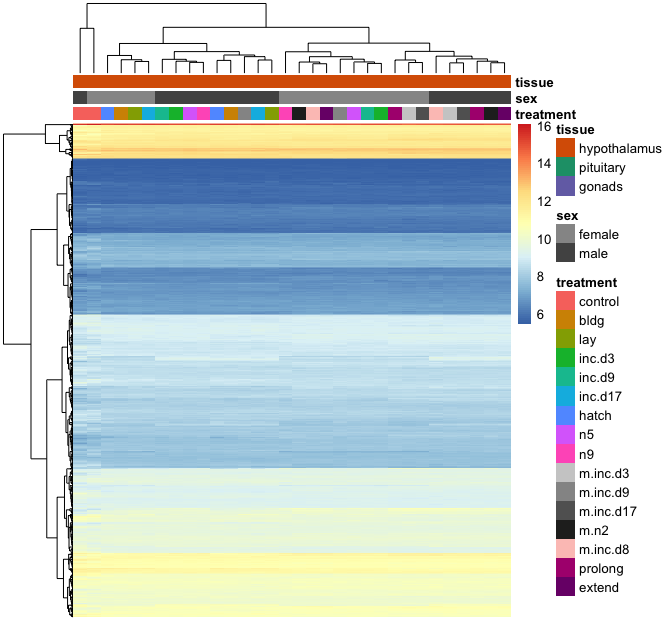
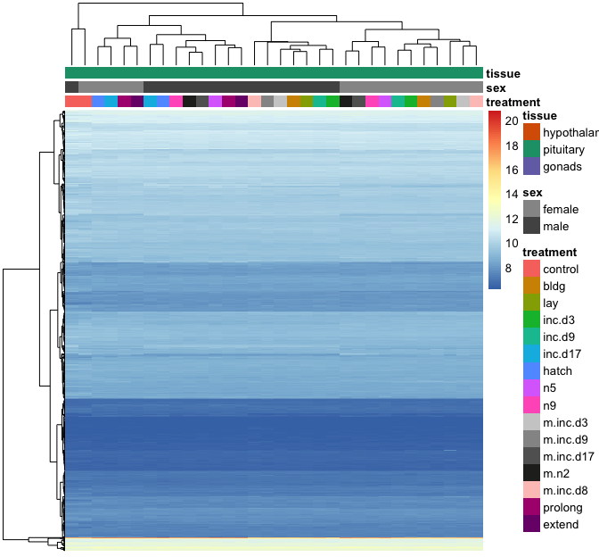
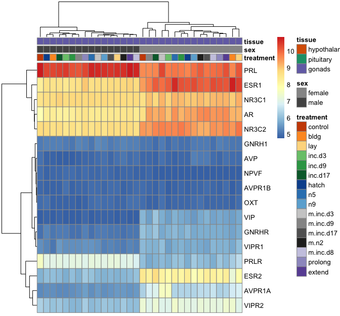

    prepvsds <- function(pathtofile){
      
      df <- read.csv(pathtofile, row.names = 1)
      
      df <- tail(df, 5000)
      df <- head(df, 1000)
      
      df <- as.data.frame(t(df))
      df$V1 <- row.names(df)

      df$sex <- sapply(strsplit(as.character(df$V1),'\\_'), "[", 2)
      df$tissue <- sapply(strsplit(as.character(df$V1),'\\_'), "[", 3)
      df$treatment <- sapply(strsplit(as.character(df$V1),'\\_'), "[", 4)
      df$treatment <- sapply(strsplit(as.character(df$treatment), ".NYNO"), "[", 1)
      
      df$treatment <- ifelse(grepl("extend.hatch", df$treatment), "extend",
                       ifelse(grepl("inc.prolong", df$treatment), "prolong",
                       ifelse(grepl("m.hatch", df$treatment), "m.n2",
                                       df$treatment)))
      
      df$tissue <- ifelse(grepl("gonad", df$tissue), "gonads", df$tissue)
      
      df$sextissuetreatment <- paste(df$sex, df$tissue, df$treatment, sep = "_")
      
      newcolnames <- df$sextissuetreatment
      
      df$V1 <- NULL
      df$sex <- NULL
      df$tissue <- NULL
      df$treatment <- NULL 
      df$sextissuetreatment <- NULL
      
      df <- as.data.frame(t(df))
      
      colnames(df) <- newcolnames
      
      df <- sapply(unique(colnames(df)), function(i)
        rowMeans(df[,colnames(df) == i]))
      
      return(df)
    }

    vsd.hyp <- prepvsds("../results/06_hypallvsd.csv")
    vsd.pit <- prepvsds("../results/06_pitallvsd.csv")
    vsd.gon <- prepvsds("../results/06_gonallvsd.csv")

    makelabels <- function(df){
      
      mylabels <- as.data.frame(colnames(df))
      mylabels$treatment <- sapply(strsplit(as.character(mylabels$`colnames(df)`),'\\_'), "[", 3)
      mylabels$sex <- sapply(strsplit(as.character(mylabels$`colnames(df)`),'\\_'), "[", 1)
      mylabels$tissue <- sapply(strsplit(as.character(mylabels$`colnames(df)`),'\\_'), "[", 2)
      row.names(mylabels) <- mylabels$`colnames(df)`
      mylabels$`colnames(df)` <- NULL
      return(mylabels)
    }

    hyplabels <- makelabels(vsd.hyp)
    pitlabels <- makelabels(vsd.pit)
    gonlabels <- makelabels(vsd.gon)

    pheatmap(vsd.hyp, show_colnames = F, annotation_col = hyplabels, 
             annotation_colors = myannotationcolors, show_rownames = F)

    pheatmap(vsd.pit, show_colnames = F, annotation_col = pitlabels, 
             annotation_colors = myannotationcolors, show_rownames = F)

    pheatmap(vsd.gon, show_colnames = F, annotation_col = gonlabels, 
             annotation_colors = myannotationcolors, show_rownames = F)

