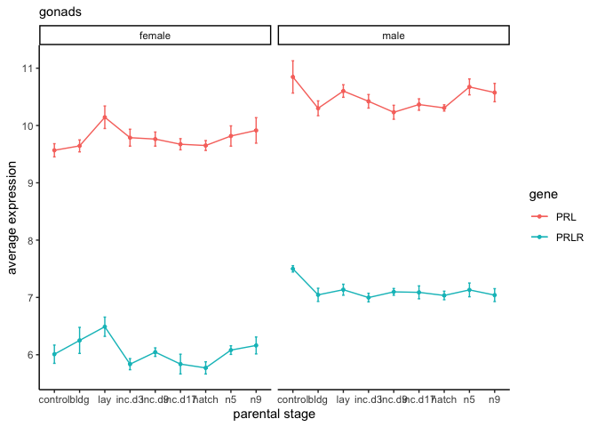
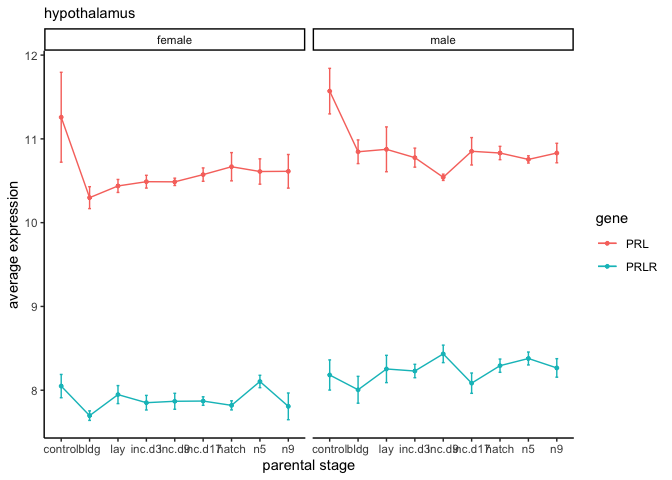
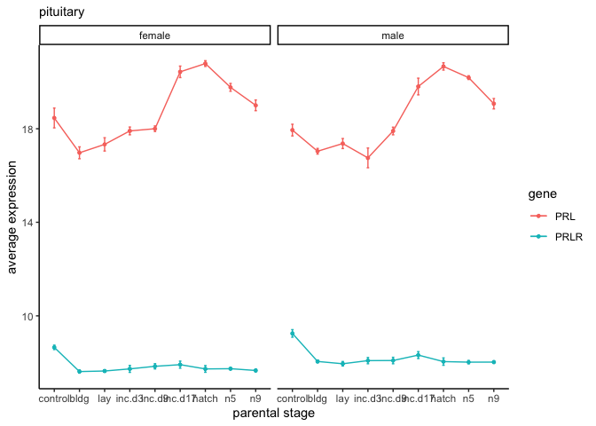
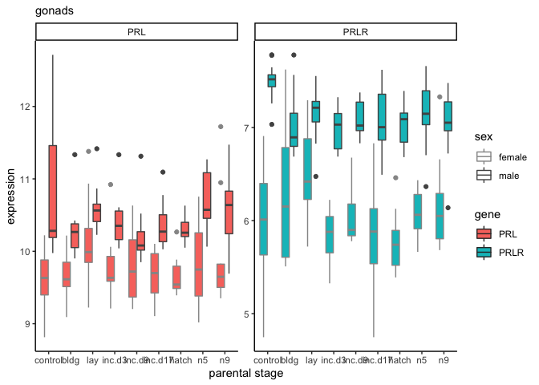

    candidategenes <- c( "NR3C1", "NR3C2", "PRLR", "PRL")
    timepoints <- c("lay" , "inc.d9", "hatch", "n9")
    hormones <- c("PRL", "CORT")

    datapath <- "../results/"   # path to the data
    datafiles <- dir(datapath, pattern = "*allvsd.csv") # get file names
    datapathfile <- paste0(datapath, datafiles)

    df <- datapathfile %>%
      setNames(nm = .) %>%
      map_df(~read_csv(.x, col_types = cols(), col_names = T), .id = "filename") %>% 
      mutate(tissue = sapply(strsplit(as.character(filename),'../results/06_'), "[", 2)) %>% 
      mutate(tissue = sapply(strsplit(as.character(tissue),'allvsd.csv'), "[", 1))  %>% 
      select(tissue, X1, everything()) 

    ## Warning: Missing column names filled in: 'X1' [1]

    ## Warning: Missing column names filled in: 'X1' [1]

    ## Warning: Missing column names filled in: 'X1' [1]

    head(df)

    ## # A tibble: 6 x 990
    ##   tissue X1    filename L.Blu13_male_go… L.G107_male_gon… L.G118_female_g…
    ##   <chr>  <chr> <chr>               <dbl>            <dbl>            <dbl>
    ## 1 gon    NP_0… ../resu…             5.75             5.58             6.02
    ## 2 gon    NP_0… ../resu…             5.00             5.07             6.91
    ## 3 gon    NP_0… ../resu…            10.4             10.5              9.38
    ## 4 gon    NP_0… ../resu…             5.00             4.90             6.93
    ## 5 gon    NP_0… ../resu…             4.47             5.07             4.87
    ## 6 gon    NP_0… ../resu…             7.93             8.38             6.38
    ## # … with 984 more variables: L.R3_male_gonad_control.NYNO <dbl>,
    ## #   L.R8_male_gonad_control <dbl>, L.W33_male_gonad_control <dbl>,
    ## #   L.W3_male_gonad_control.NYNO <dbl>,
    ## #   L.W4_male_gonad_control.NYNO <dbl>, R.G106_female_gonad_control <dbl>,
    ## #   R.R20_female_gonad_control <dbl>, R.R9_female_gonad_control <dbl>,
    ## #   R.W44_female_gonad_control <dbl>, R.Y108.W29_male_gonad_control <dbl>,
    ## #   blk.s030.o.g_male_gonad_prolong <dbl>,
    ## #   blk.s031.pu.d_female_gonad_prolong <dbl>,
    ## #   blk.s032.g.w_female_gonad_m.hatch <dbl>,
    ## #   blk.s049.y.g_female_gonad_m.inc.d3 <dbl>,
    ## #   blk.s060.pu.w_female_gonad_m.inc.d3 <dbl>,
    ## #   blk.s061.pu.y_female_gonad_inc.d9 <dbl>,
    ## #   blk.y.l.s109_female_gonad_m.inc.d8 <dbl>,
    ## #   blk0.x_female_gonad_m.n2 <dbl>, blk11.x_female_gonad_bldg <dbl>,
    ## #   blk12.x_male_gonad_n5 <dbl>, blk17.x_male_gonad_inc.d17 <dbl>,
    ## #   blk19.x_female_gonad_extend <dbl>, blk21.x_female_gonad_hatch <dbl>,
    ## #   blk4.x_female_gonad_n9 <dbl>, blk5.x_male_gonad_m.inc.d3 <dbl>,
    ## #   blu.o.x.ATLAS_female_gonad_control <dbl>,
    ## #   blu10.w26.x_male_gonad_m.hatch <dbl>,
    ## #   blu103.x_female_gonad_hatch.NYNO <dbl>,
    ## #   blu104.w120.x_male_gonad_hatch <dbl>,
    ## #   blu108.w40.o158_male_gonad_inc.d9 <dbl>,
    ## #   blu111.w113.x_male_gonad_inc.d3 <dbl>,
    ## #   blu113.w124.x_male_gonad_inc.d17 <dbl>,
    ## #   blu114.r38.w198_male_gonad_bldg <dbl>,
    ## #   blu115.y150.x_female_gonad_inc.prolong <dbl>,
    ## #   blu119.w84.x_female_gonad_m.inc.d8 <dbl>,
    ## #   blu121.w91.x_male_gonad_inc.d17 <dbl>,
    ## #   blu124.w180.x_female_gonad_hatch <dbl>,
    ## #   blu33.y88.x_male_gonad_bldg <dbl>, blu36.w16_female_gonad_n9 <dbl>,
    ## #   blu37.r65.x_male_gonad_n5 <dbl>, blu38.g135.x_female_gonad_bldg <dbl>,
    ## #   blu39.o26.x_female_gonad_inc.d3 <dbl>,
    ## #   blu41.y100.x_male_gonad_n5 <dbl>,
    ## #   blu44.y102_female_gonad_extend <dbl>,
    ## #   blu47.y96.x_female_gonad_inc.d9 <dbl>,
    ## #   blu55.g51_female_gonad_n5 <dbl>,
    ## #   blu56.o53_female_gonad_m.inc.d3 <dbl>,
    ## #   blu63.g62_female_gonad_m.inc.d9 <dbl>,
    ## #   blu80.r97_female_gonad_m.inc.d8 <dbl>, blu81.r88_male_gonad_n9 <dbl>,
    ## #   blu84.x_male_gonad_extend.hatch <dbl>,
    ## #   d.r.blk.s159_female_gonad_m.inc.d9 <dbl>,
    ## #   d.s008.y.blk_male_gonad_n5 <dbl>, d.s047.blk.o_male_gonad_n5 <dbl>,
    ## #   d.s110.g.blk_male_gonad_m.inc.d3 <dbl>,
    ## #   d.s112.blk.w_female_gonad_m.inc.d17 <dbl>,
    ## #   d.s177.blk.r_female_gonad_m.inc.d3 <dbl>,
    ## #   g.blk.s004.pk_female_gonad_lay <dbl>,
    ## #   g.blk.s041.r_male_gonad_m.inc.d3 <dbl>,
    ## #   g.o.y.s037_male_gonad_m.inc.d17 <dbl>, g.s.blk.d_male_gonad_n9 <dbl>,
    ## #   g.s.blk.y_male_gonad_lay <dbl>, g.s043.pu.blk_male_gonad_lay <dbl>,
    ## #   g.s075.pk.pu_male_gonad_m.hatch <dbl>,
    ## #   g.s076.pk.r_female_gonad_m.hatch <dbl>,
    ## #   g.s078.blk.o_female_gonad_lay <dbl>,
    ## #   g.s111.r.blk_male_gonad_m.inc.d8 <dbl>,
    ## #   g.s179.o.pk_male_gonad_m.inc.d8 <dbl>,
    ## #   g.s351.pk.w_male_gonad_extend <dbl>,
    ## #   g.x.ATLAS_female_gonad_control <dbl>,
    ## #   g.y.blk.s006_female_gonad_m.inc.d17 <dbl>,
    ## #   g.y.o.s_male_gonad_prolong <dbl>, g104.w82.x_male_gonad_bldg <dbl>,
    ## #   g114.w83.x_male_gonad_hatch.NYNO <dbl>,
    ## #   g130.y81.x_male_gonad_inc.d17 <dbl>,
    ## #   g137.r24.w5_male_gonad_m.inc.d8 <dbl>,
    ## #   g141.blu27.x_female_gonad_bldg <dbl>,
    ## #   g142.r40.x_female_gonad_inc.d17 <dbl>,
    ## #   g143.blu32.x_male_gonad_inc.d17 <dbl>,
    ## #   g144.r54.x_female_gonad_m.inc.d3 <dbl>,
    ## #   g146.blu51_male_gonad_inc.d3 <dbl>,
    ## #   g17.w108.x_female_gonad_extend <dbl>,
    ## #   g20.w106.x_male_gonad_inc.d3 <dbl>,
    ## #   g22.blu118_female_gonad_extend <dbl>,
    ## #   g3.g119.w20_male_gonad_extend <dbl>,
    ## #   g32.blu79_male_gonad_m.inc.d17 <dbl>,
    ## #   g34.x_male_gonad_m.hatch.NYNO <dbl>,
    ## #   g38.x_male_gonad_inc.prolong <dbl>, g52.blu58_male_gonad_bldg <dbl>,
    ## #   g53.y84_male_gonad_hatch <dbl>, g6.w197.x_female_gonad_inc.d3 <dbl>,
    ## #   g63.blu65_female_gonad_m.inc.d17 <dbl>,
    ## #   g73.x_female_gonad_m.inc.d9 <dbl>, g75.x_female_gonad_inc.d9 <dbl>,
    ## #   g8.y197_male_gonad_extend <dbl>, l.s.o.blk_male_gonad_extend <dbl>,
    ## #   l.s.w.d_female_gonad_m.hatch <dbl>,
    ## #   l.s024.y.g_male_gonad_m.inc.d17 <dbl>,
    ## #   l.s052.pk.r_female_gonad_prolong <dbl>,
    ## #   l.s080.blk.r_male_gonad_prolong <dbl>, …

    df <- df %>% filter(tissue != "gon")
    head(df)

    ## # A tibble: 6 x 990
    ##   tissue X1    filename L.Blu13_male_go… L.G107_male_gon… L.G118_female_g…
    ##   <chr>  <chr> <chr>               <dbl>            <dbl>            <dbl>
    ## 1 hyp    A2ML1 ../resu…               NA               NA               NA
    ## 2 hyp    A2ML2 ../resu…               NA               NA               NA
    ## 3 hyp    A2ML3 ../resu…               NA               NA               NA
    ## 4 hyp    A2ML4 ../resu…               NA               NA               NA
    ## 5 hyp    A4GA… ../resu…               NA               NA               NA
    ## 6 hyp    A4GNT ../resu…               NA               NA               NA
    ## # … with 984 more variables: L.R3_male_gonad_control.NYNO <dbl>,
    ## #   L.R8_male_gonad_control <dbl>, L.W33_male_gonad_control <dbl>,
    ## #   L.W3_male_gonad_control.NYNO <dbl>,
    ## #   L.W4_male_gonad_control.NYNO <dbl>, R.G106_female_gonad_control <dbl>,
    ## #   R.R20_female_gonad_control <dbl>, R.R9_female_gonad_control <dbl>,
    ## #   R.W44_female_gonad_control <dbl>, R.Y108.W29_male_gonad_control <dbl>,
    ## #   blk.s030.o.g_male_gonad_prolong <dbl>,
    ## #   blk.s031.pu.d_female_gonad_prolong <dbl>,
    ## #   blk.s032.g.w_female_gonad_m.hatch <dbl>,
    ## #   blk.s049.y.g_female_gonad_m.inc.d3 <dbl>,
    ## #   blk.s060.pu.w_female_gonad_m.inc.d3 <dbl>,
    ## #   blk.s061.pu.y_female_gonad_inc.d9 <dbl>,
    ## #   blk.y.l.s109_female_gonad_m.inc.d8 <dbl>,
    ## #   blk0.x_female_gonad_m.n2 <dbl>, blk11.x_female_gonad_bldg <dbl>,
    ## #   blk12.x_male_gonad_n5 <dbl>, blk17.x_male_gonad_inc.d17 <dbl>,
    ## #   blk19.x_female_gonad_extend <dbl>, blk21.x_female_gonad_hatch <dbl>,
    ## #   blk4.x_female_gonad_n9 <dbl>, blk5.x_male_gonad_m.inc.d3 <dbl>,
    ## #   blu.o.x.ATLAS_female_gonad_control <dbl>,
    ## #   blu10.w26.x_male_gonad_m.hatch <dbl>,
    ## #   blu103.x_female_gonad_hatch.NYNO <dbl>,
    ## #   blu104.w120.x_male_gonad_hatch <dbl>,
    ## #   blu108.w40.o158_male_gonad_inc.d9 <dbl>,
    ## #   blu111.w113.x_male_gonad_inc.d3 <dbl>,
    ## #   blu113.w124.x_male_gonad_inc.d17 <dbl>,
    ## #   blu114.r38.w198_male_gonad_bldg <dbl>,
    ## #   blu115.y150.x_female_gonad_inc.prolong <dbl>,
    ## #   blu119.w84.x_female_gonad_m.inc.d8 <dbl>,
    ## #   blu121.w91.x_male_gonad_inc.d17 <dbl>,
    ## #   blu124.w180.x_female_gonad_hatch <dbl>,
    ## #   blu33.y88.x_male_gonad_bldg <dbl>, blu36.w16_female_gonad_n9 <dbl>,
    ## #   blu37.r65.x_male_gonad_n5 <dbl>, blu38.g135.x_female_gonad_bldg <dbl>,
    ## #   blu39.o26.x_female_gonad_inc.d3 <dbl>,
    ## #   blu41.y100.x_male_gonad_n5 <dbl>,
    ## #   blu44.y102_female_gonad_extend <dbl>,
    ## #   blu47.y96.x_female_gonad_inc.d9 <dbl>,
    ## #   blu55.g51_female_gonad_n5 <dbl>,
    ## #   blu56.o53_female_gonad_m.inc.d3 <dbl>,
    ## #   blu63.g62_female_gonad_m.inc.d9 <dbl>,
    ## #   blu80.r97_female_gonad_m.inc.d8 <dbl>, blu81.r88_male_gonad_n9 <dbl>,
    ## #   blu84.x_male_gonad_extend.hatch <dbl>,
    ## #   d.r.blk.s159_female_gonad_m.inc.d9 <dbl>,
    ## #   d.s008.y.blk_male_gonad_n5 <dbl>, d.s047.blk.o_male_gonad_n5 <dbl>,
    ## #   d.s110.g.blk_male_gonad_m.inc.d3 <dbl>,
    ## #   d.s112.blk.w_female_gonad_m.inc.d17 <dbl>,
    ## #   d.s177.blk.r_female_gonad_m.inc.d3 <dbl>,
    ## #   g.blk.s004.pk_female_gonad_lay <dbl>,
    ## #   g.blk.s041.r_male_gonad_m.inc.d3 <dbl>,
    ## #   g.o.y.s037_male_gonad_m.inc.d17 <dbl>, g.s.blk.d_male_gonad_n9 <dbl>,
    ## #   g.s.blk.y_male_gonad_lay <dbl>, g.s043.pu.blk_male_gonad_lay <dbl>,
    ## #   g.s075.pk.pu_male_gonad_m.hatch <dbl>,
    ## #   g.s076.pk.r_female_gonad_m.hatch <dbl>,
    ## #   g.s078.blk.o_female_gonad_lay <dbl>,
    ## #   g.s111.r.blk_male_gonad_m.inc.d8 <dbl>,
    ## #   g.s179.o.pk_male_gonad_m.inc.d8 <dbl>,
    ## #   g.s351.pk.w_male_gonad_extend <dbl>,
    ## #   g.x.ATLAS_female_gonad_control <dbl>,
    ## #   g.y.blk.s006_female_gonad_m.inc.d17 <dbl>,
    ## #   g.y.o.s_male_gonad_prolong <dbl>, g104.w82.x_male_gonad_bldg <dbl>,
    ## #   g114.w83.x_male_gonad_hatch.NYNO <dbl>,
    ## #   g130.y81.x_male_gonad_inc.d17 <dbl>,
    ## #   g137.r24.w5_male_gonad_m.inc.d8 <dbl>,
    ## #   g141.blu27.x_female_gonad_bldg <dbl>,
    ## #   g142.r40.x_female_gonad_inc.d17 <dbl>,
    ## #   g143.blu32.x_male_gonad_inc.d17 <dbl>,
    ## #   g144.r54.x_female_gonad_m.inc.d3 <dbl>,
    ## #   g146.blu51_male_gonad_inc.d3 <dbl>,
    ## #   g17.w108.x_female_gonad_extend <dbl>,
    ## #   g20.w106.x_male_gonad_inc.d3 <dbl>,
    ## #   g22.blu118_female_gonad_extend <dbl>,
    ## #   g3.g119.w20_male_gonad_extend <dbl>,
    ## #   g32.blu79_male_gonad_m.inc.d17 <dbl>,
    ## #   g34.x_male_gonad_m.hatch.NYNO <dbl>,
    ## #   g38.x_male_gonad_inc.prolong <dbl>, g52.blu58_male_gonad_bldg <dbl>,
    ## #   g53.y84_male_gonad_hatch <dbl>, g6.w197.x_female_gonad_inc.d3 <dbl>,
    ## #   g63.blu65_female_gonad_m.inc.d17 <dbl>,
    ## #   g73.x_female_gonad_m.inc.d9 <dbl>, g75.x_female_gonad_inc.d9 <dbl>,
    ## #   g8.y197_male_gonad_extend <dbl>, l.s.o.blk_male_gonad_extend <dbl>,
    ## #   l.s.w.d_female_gonad_m.hatch <dbl>,
    ## #   l.s024.y.g_male_gonad_m.inc.d17 <dbl>,
    ## #   l.s052.pk.r_female_gonad_prolong <dbl>,
    ## #   l.s080.blk.r_male_gonad_prolong <dbl>, …

    df2 <-  df  %>%
      filter(X1 %in% candidategenes) %>%
      pivot_longer(cols = L.Blu13_male_gonad_control.NYNO:y98.o50.x_male_pituitary_inc.d3, 
                   names_to = "sample", values_to = "vsd") %>%
       mutate(sex = sapply(strsplit(as.character(sample),'_'), "[", 2)) %>%
       mutate(treatment = sapply(strsplit(as.character(sample),'_'), "[", 4))  %>%
       mutate(treatment = sapply(strsplit(as.character(treatment),'.NYNO'), "[", 1)) %>%
      mutate(bird = sapply(strsplit(as.character(sample),'_'), "[", 1)) %>%
      filter(treatment %in% timepoints) %>%
      select(bird, sex, treatment, tissue, X1, vsd) %>%
      rename(gene = X1) %>%
      drop_na()
    head(df2)

    ## # A tibble: 6 x 6
    ##   bird            sex    treatment tissue gene    vsd
    ##   <chr>           <chr>  <chr>     <chr>  <chr> <dbl>
    ## 1 blk.s061.pu.y   female inc.d9    hyp    NR3C1  8.99
    ## 2 blk21.x         female hatch     hyp    NR3C1  9.22
    ## 3 blk4.x          female n9        hyp    NR3C1  7.44
    ## 4 blu103.x        female hatch     hyp    NR3C1  8.68
    ## 5 blu104.w120.x   male   hatch     hyp    NR3C1  9.24
    ## 6 blu108.w40.o158 male   inc.d9    hyp    NR3C1  9.23

    df3 <- df2 %>% 
      mutate(tissue = fct_relevel(tissue,  "hyp", "pit", "gon")) %>% 
      mutate(treatment = fct_relevel(treatment, timepoints)) %>% 
      group_by(sex, treatment, tissue, gene)  %>% 
      summarize(m = mean(vsd, na.rm = T), se = sd(vsd,  na.rm = T)/sqrt(length(vsd))) %>%
      mutate(image = "../figures/images/DoveParentsRNAseq_note.png")

    ## Warning: Unknown levels in `f`: gon

    head(df3)  

    ## # A tibble: 6 x 7
    ## # Groups:   sex, treatment, tissue [2]
    ##   sex    treatment tissue gene      m     se image                         
    ##   <chr>  <fct>     <fct>  <chr> <dbl>  <dbl> <chr>                         
    ## 1 female lay       hyp    NR3C1  9.13 0.0676 ../figures/images/DoveParents…
    ## 2 female lay       hyp    NR3C2 10.3  0.0492 ../figures/images/DoveParents…
    ## 3 female lay       hyp    PRL   10.4  0.0775 ../figures/images/DoveParents…
    ## 4 female lay       hyp    PRLR   7.95 0.108  ../figures/images/DoveParents…
    ## 5 female lay       pit    NR3C1 10.7  0.0523 ../figures/images/DoveParents…
    ## 6 female lay       pit    NR3C2 10.4  0.0453 ../figures/images/DoveParents…

    for (i in levels(df3$tissue)) {
      
    p <-  df3 %>%
      filter(tissue == i) %>%
      ggplot(aes(x = treatment, y = m)) +
      geom_image(aes(image=image, color = gene), size=0.1)  +

      scale_alpha_manual(values = c(0.5, 1)) +
      labs(subtitle = i, y = "average expression", x = "parental stage")

    pimage <- axis_canvas(p, axis = 'x') + 
      draw_image("../figures/images/icons/DoveParentsRNAseq_lay.png", x = 0.5, scale = 1 ) +
      draw_image("../figures/images/icons/DoveParentsRNAseq_incubation.png", x = 1.5, scale = 1) +
      draw_image("../figures/images/icons/DoveParentsRNAseq_hatch.png", x = 2.5, scale = 1) +
      draw_image("../figures/images/icons/DoveParentsRNAseq_chicklings.png", x = 3.5, scale = 1)
      
    p2 <- ggdraw(insert_xaxis_grob(p, pimage, position = "bottom"))
    plot(p2)
      
    }

    for (i in levels(df3$tissue)) {
      
      p <-  df3 %>%
        filter(tissue == i) %>%
        ggplot(aes(x = treatment, y = m)) +
        geom_errorbar(aes(ymin=m-se, ymax=m+se, color=gene), width=.1) +
        geom_point(size = 1, aes(color = gene)) +
        geom_line(aes(x = as.numeric(treatment), y = m, color = gene)) +
        scale_alpha_manual(values = c(0.5, 1)) +
        labs(subtitle = i, y = "average expression", x = "parental stage") +
        facet_wrap(~sex, nrow = 1) +
        theme_B3()
      plot(p)
      
    }

