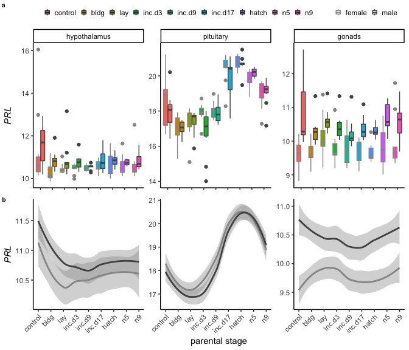
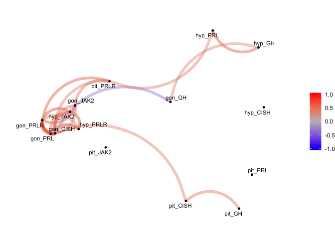
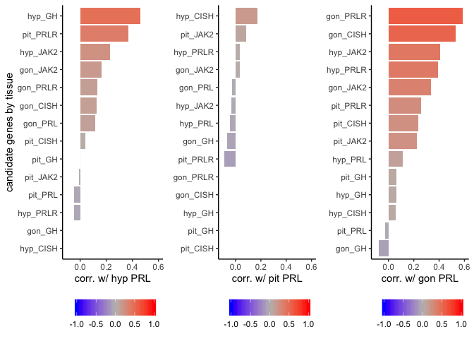
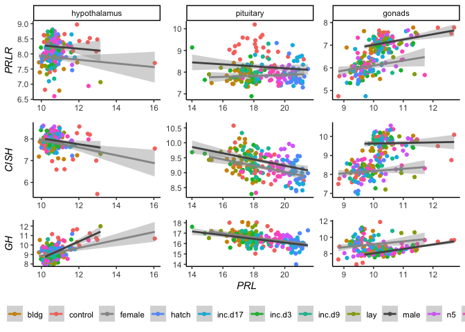

    candidategenes <- c("PRLR", "PRL", "CISH", "JAK2", "SOCS3", "GH" )
    timepoints <- charlevels

    datapath <- "../results/"   # path to the data
    datafiles <- dir(datapath, pattern = "*allvsd.csv") # get file names
    datapathfile <- paste0(datapath, datafiles)

    df <- datapathfile %>%
      setNames(nm = .) %>%
      map_df(~read_csv(.x, col_types = cols(), col_names = T), .id = "filename") %>% 
      mutate(tissue = sapply(strsplit(as.character(filename),'../results/06_'), "[", 2)) %>% 
      mutate(tissue = sapply(strsplit(as.character(tissue),'allvsd.csv'), "[", 1))  %>% 
      select(tissue, X1, everything()) 

    ## Warning: Missing column names filled in: 'X1' [1]

    ## Warning: Missing column names filled in: 'X1' [1]

    ## Warning: Missing column names filled in: 'X1' [1]

    # check which genese appear in multiple tissue
    tissuespecificity <- df %>%
      group_by(X1) %>%
      summarize(tissues = str_c(tissue, collapse = ", ")) %>%
      filter(tissues != "gon, hyp, pit") %>%
      group_by(tissues) %>%
      summarize(genes = str_c(X1, collapse = ", ")) %>% 
      mutate(n = str_count(genes, ",") + 1) %>% 
      arrange(desc(n))
    tissuespecificity

    ## # A tibble: 5 x 3
    ##   tissues  genes                                                          n
    ##   <chr>    <chr>                                                      <dbl>
    ## 1 gon      ATOH1, AvBD10, AvBD9, BAAT, BEST4, C10ORF65, CALHM1, CALH…   136
    ## 2 gon, hyp A4GNT, AMBP, AMDHD1, ANKK1, ANKS4B, ARSD, AvBD11, BARHL1,…   112
    ## 3 gon, pit ACER1, ADRA2B, AvBD7, BEST3, CATH2, CELA1, CLRN3, CPO, CT…    80
    ## 4 hyp      LOC101751279, LOC107049066, MYOG                               3
    ## 5 hyp, pit LHX5, PRDM13                                                   2

    write.csv(tissuespecificity, "../results/tissuespecificity.csv")

    genes <- as.data.frame(df$X1)
      
    df2 <-  df  %>%
      filter(X1 %in% candidategenes) %>%
      pivot_longer(cols = L.Blu13_male_gonad_control.NYNO:y98.o50.x_male_pituitary_inc.d3, 
                   names_to = "sample", values_to = "vsd") %>%
       mutate(sex = sapply(strsplit(as.character(sample),'_'), "[", 2)) %>%
       mutate(treatment = sapply(strsplit(as.character(sample),'_'), "[", 4))  %>%
       mutate(treatment = sapply(strsplit(as.character(treatment),'.NYNO'), "[", 1)) %>%
      mutate(bird = sapply(strsplit(as.character(sample),'_'), "[", 1)) %>%
      filter(treatment %in% timepoints) %>%
      select(bird, sex, treatment, tissue, X1, vsd) %>%
      mutate(tissue = fct_recode(tissue, "hypothalamus" = "hyp",
                        "pituitary" = "pit",
                        "gonads" = "gon"
                        )) %>%
      rename(gene = X1) %>%
      drop_na() %>%
      droplevels()
    head(df2)

    ## # A tibble: 6 x 6
    ##   bird    sex    treatment tissue gene    vsd
    ##   <chr>   <chr>  <chr>     <fct>  <chr> <dbl>
    ## 1 L.Blu13 male   control   gonads CISH   8.75
    ## 2 L.G107  male   control   gonads CISH   9.69
    ## 3 L.G118  female control   gonads CISH   7.75
    ## 4 L.R3    male   control   gonads CISH  10.1 
    ## 5 L.R8    male   control   gonads CISH   9.98
    ## 6 L.W33   male   control   gonads CISH   9.58

    df2$treatment <- factor(df2$treatment, levels = alllevels)
    df2$tissue <- factor(df2$tissue, levels = tissuelevels)

    df3 <- df2 %>% 
      mutate(treatment = fct_relevel(treatment, timepoints)) %>% 
      group_by(sex, treatment, tissue, gene)  %>% 
      summarize(m = mean(vsd, na.rm = T), se = sd(vsd,  na.rm = T)/sqrt(length(vsd))) %>%
      mutate(image = "../figures/images/DoveParentsRNAseq_note.png")
    head(df3)  

    ## # A tibble: 6 x 7
    ## # Groups:   sex, treatment, tissue [2]
    ##   sex    treatment tissue    gene      m     se image                      
    ##   <chr>  <fct>     <fct>     <chr> <dbl>  <dbl> <chr>                      
    ## 1 female control   hypothal… CISH   7.42 0.228  ../figures/images/DovePare…
    ## 2 female control   hypothal… GH     9.33 0.330  ../figures/images/DovePare…
    ## 3 female control   hypothal… JAK2   8.53 0.0774 ../figures/images/DovePare…
    ## 4 female control   hypothal… PRL   11.3  0.536  ../figures/images/DovePare…
    ## 5 female control   hypothal… PRLR   8.05 0.139  ../figures/images/DovePare…
    ## 6 female control   pituitary CISH   9.31 0.173  ../figures/images/DovePare…

    for (i in levels(df3$tissue)) {
      
      p <-  df3 %>%
        filter(tissue == i) %>%
        ggplot(aes(x = treatment, y = m)) +
        geom_errorbar(aes(ymin=m-se, ymax=m+se, color=gene), width=.1) +
        geom_point(size = 1, aes(color = gene)) +
        geom_line(aes(x = as.numeric(treatment), y = m, color = gene)) +
        scale_alpha_manual(values = c(0.5, 1)) +
        labs(subtitle = i, y = "average expression", x = "parental stage") +
        facet_wrap(~sex, nrow = 1) +
        theme_B3()
     print(p)
    }

    df3 %>%
        ggplot(aes(x = treatment, y = m)) +
        geom_errorbar(aes(ymin=m-se, ymax=m+se, color=gene), width=.1) +
        geom_point(size = 1, aes(color = gene)) +
        geom_line(aes(x = as.numeric(treatment), y = m, color = gene)) +
        scale_alpha_manual(values = c(0.5, 1)) +
        labs( y = "average expression", x = "parental stage") +
        facet_grid(sex ~ tissue, scales = "free_y") +
        theme_B3() +
        theme(axis.text.x = element_text(angle = 45, hjust = 1))

    df2$gene <- factor(df2$gene)

    for (i in levels(df2$gene)) {
      p <-  df2 %>%
        filter(gene %in% i) %>%
        ggplot(aes(x = treatment, y = vsd, color = sex, fill = treatment)) +
        geom_boxplot() +
        scale_alpha_manual(values = c(0.5, 1)) +
        labs(y = "expression", x = "parental stage", subtitle = i) +
        facet_wrap(~ tissue , scales = "free_y", nrow = 3) +
        theme_B3() +
        scale_color_manual(values = sexcolors) +
        scale_fill_manual(values = colorscharmaip)
     print(p)
    }

    dft <- df %>% filter(X1 %in% candidategenes) %>%
      unite("tissuegene", tissue:X1, remove = FALSE) %>%
      select(-tissue, -`X1`, -filename)  %>%
      pivot_longer(-tissuegene, names_to = "samples", values_to = "vsd") %>%
      drop_na() %>%
      mutate("bird" = sapply(strsplit(as.character(samples),'\\_'), "[", 1)) %>%
      select(bird,tissuegene,vsd) %>%
      filter(bird != "x.g.g.ATLAS") %>%
      pivot_wider(id_cols = bird, names_from = tissuegene, values_from = vsd)
    dft <- as.data.frame(dft)
    row.names(dft) <- dft$bird
    dft$bird <- NULL
    head(dft)

    ##          gon_CISH   gon_GH gon_JAK2   gon_PRL gon_PRLR hyp_CISH   hyp_GH
    ## L.Blu13  8.752463 9.630519 9.870018 12.620157 7.519119 8.195291 11.23222
    ## L.G107   9.685718 7.999319 9.625719  9.975896 7.033196 8.531852 10.47964
    ## L.G118   7.746627 9.312189 8.303121  9.585174 5.584985 5.463812 10.54857
    ## L.R3    10.091290 9.661806 9.184809 12.713160 7.780442 8.213306  9.89367
    ## L.R8     9.982216 7.837528 9.220338 10.190503 7.517327 8.263373 11.66288
    ## L.W33    9.575585 8.104064 8.904483 10.282352 7.497994 8.234172 10.65886
    ##         hyp_JAK2  hyp_PRL hyp_PRLR  pit_CISH   pit_GH pit_JAK2  pit_PRL
    ## L.Blu13 9.055230 12.58395 8.522239  9.321163 16.56528 9.362994 17.03357
    ## L.G107  9.165604 10.94625 8.452225  9.657710 16.57417 9.342533 18.14585
    ## L.G118  8.887380 12.98360 8.481032  9.879818 18.03054 8.923568 18.18094
    ## L.R3    8.367134 10.71558 7.454105 10.008407 17.11419 8.894092 16.78585
    ## L.R8    8.877838 11.90012 8.974098  9.678544 15.66945 9.344693 17.58225
    ## L.W33   9.069194 12.47638 8.388383  8.568670 15.49809 9.516664 20.20969
    ##         pit_PRLR
    ## L.Blu13 9.278048
    ## L.G107  9.137519
    ## L.G118  8.966179
    ## L.R3    9.197612
    ## L.R8    9.561870
    ## L.W33   8.714056

    ePRL <- df2 %>% dplyr::rename(value = vsd, measurement = gene) %>% filter(measurement == "PRL") %>% droplevels()
    ePRLR <- df2 %>% dplyr::rename(value = vsd, measurement = gene) %>% filter(measurement == "PRLR") %>% droplevels()

    df4 <- df2 %>% dplyr::rename(value = vsd, measurement = gene) %>% filter(measurement %in% candidategenes)  %>%
      pivot_wider(names_from = measurement, values_from = value)  %>%
      drop_na() %>% droplevels()

    a <- ggplot(ePRL, aes(x = treatment, y = value)) +
      geom_boxplot(aes(fill = treatment, color = sex)) +
      facet_wrap(~tissue, scales = "free") +
      theme_B3() +
      theme(axis.text.x = element_blank(),
            axis.title.x = element_blank(),
            legend.position = "top",
            plot.subtitle = element_text(face = "italic"),
            axis.title.y = element_text(face = "italic"),
            legend.title = element_blank(),
            legend.key.size =  unit(0.25, "cm")) +
      labs(x = "parental stage", y = "PRL") +
      scale_color_manual(values =  sexcolors ) +
      scale_fill_manual(values= colorschar) +
      guides(fill = guide_legend(nrow = 1)) 

    b <- ggplot(ePRL, aes(x = treatment, y = value, color = sex)) +
      geom_smooth(aes(x = as.numeric(treatment), y = value), se = T, na.rm  = TRUE) +
      facet_wrap(~tissue, scales = "free")  +
      theme_B3() +
      scale_x_continuous(breaks = c(1,2,3,4,5,6,7,8,9),
                         labels = charlevels) + 
      theme(axis.text.x = element_text(angle = 45, hjust = 1),
            strip.text = element_blank(),
            legend.position = "none",
            legend.title = element_blank(),
            axis.title.y = element_text(face = "italic")) +
      labs(x = "parental stage", y = "PRL") +
      scale_color_manual(values = sexcolors)

    plot_grid(a,b, nrow = 2, align = "v", labels = c("a", "b"), label_size = 8,
              rel_heights = c(1.25,1))

    ## `geom_smooth()` using method = 'loess' and formula 'y ~ x'

    x <- correlate(dft)

    ## 
    ## Correlation method: 'pearson'
    ## Missing treated using: 'pairwise.complete.obs'

    x %>% network_plot.cor_df() + 
      scale_color_gradient2(low = "blue", mid = "grey", high = "red", midpoint = 0, limits = c(-1,1)) 

    ## Scale for 'colour' is already present. Adding another scale for
    ## 'colour', which will replace the existing scale.

    c <- x %>%
      focus(hyp_PRL) %>%
      mutate(rowname = reorder(rowname, hyp_PRL)) %>%
      ggplot(aes(rowname, hyp_PRL, fill = hyp_PRL)) +
        geom_col() + coord_flip() +
      labs(y = "corr. w/ hyp PRL", x = "candidate genes by tissue") +
      theme_B3() + 
      theme(legend.position = "bottom", legend.title = element_blank()) +
      scale_fill_gradient2(low = "blue", mid = "grey", high = "red", midpoint = 0, limits = c(-1,1)) +
      ylim(c(-0.1,0.6))

    d <- x %>%
      focus(pit_PRL) %>%
      mutate(rowname = reorder(rowname, pit_PRL)) %>%
      ggplot(aes(rowname, pit_PRL, fill = pit_PRL)) +
        geom_col() + coord_flip() +
      labs(y = "corr. w/ pit PRL", x = NULL) +
      theme_B3() + 
      theme(legend.position = "bottom", legend.title = element_blank()) +
      scale_fill_gradient2(low = "blue", mid = "grey", high = "red", midpoint = 0, limits = c(-1,1))  +
      ylim(c(-0.1,0.6))

    e <- x %>%
      focus(gon_PRL) %>%
      mutate(rowname = reorder(rowname, gon_PRL)) %>%
      ggplot(aes(rowname, gon_PRL, fill = gon_PRL)) +
        geom_col() + coord_flip() +
      labs(y = "corr. w/ gon PRL", x = NULL) +
      theme_B3() + 
      theme(legend.position = "bottom", legend.title = element_blank()) +
      scale_fill_gradient2(low = "blue", mid = "grey", high = "red", midpoint = 0, limits = c(-1,1))  +
      ylim(c(-0.1,0.6))

    cde <- plot_grid(c,d, e, nrow = 1, rel_widths = c(1.1,1,1))

    ## Warning: Removed 2 rows containing missing values (position_stack).

    ## Warning: Removed 5 rows containing missing values (position_stack).

    cde

    f <- ggplot(df4, aes(x = PRL, y = PRLR)) +
      geom_point(aes(color = treatment)) +
      geom_smooth(method = "lm",  na.rm = T, aes(color = sex)) +
      facet_wrap(~tissue, scales = "free") +
      theme_B3() +
      theme(legend.position = "none",
            axis.title = element_text(face = "italic"),
            #strip.text = element_blank(),
            legend.title = element_blank()) +
      guides(color = guide_legend(nrow = 1)) +
       scale_color_manual(values = colorsvolcano)

    g <- ggplot(df4, aes(x = PRL, y = CISH)) +
      geom_point(aes(color = treatment)) +
      geom_smooth(method = "lm",  na.rm = T, aes(color = sex)) +
      facet_wrap(~tissue, scales = "free") +
      theme_B3() +
      theme(legend.position = "none",
            axis.title = element_text(face = "italic"),
            strip.text = element_blank(),
            legend.title = element_blank()) +
      guides(color = guide_legend(nrow = 1)) +
       scale_color_manual(values = colorsvolcano)

    h <- ggplot(df4, aes(x = PRL, y = GH)) +
      geom_point(aes(color = treatment)) +
      geom_smooth(method = "lm",  na.rm = T, aes(color = sex)) +
      facet_wrap(~tissue, scales = "free") +
      theme_B3() +
      theme(legend.position = "bottom",
            axis.title = element_text(face = "italic"),
            strip.text = element_blank(),
            legend.title = element_blank()) +
      guides(color = guide_legend(nrow = 1)) +
       scale_color_manual(values = colorsvolcano)

    plot_grid(f + theme(axis.title.x = element_blank()), 
              g + theme(axis.title.x = element_blank()), h, 
              nrow = 3, rel_heights = c(1.2,1,1.2), align = "v")

    aov_all = data.frame()
    for(i in charlevels){
      for(j in tissuelevels){
      
      df <- df4 %>% 
        filter(treatment == i) %>% 
         filter(tissue == j) %>% 
        droplevels()
      aovtable <- apa.aov.table(aov(PRL ~ sex , data=df))
      aovtable <- as.data.frame(aovtable$table_body)
      totaldf <- aovtable[3, 3]
      aovtable$df <- paste(aovtable$df, ", " , totaldf, sep = "")
      aovtable$ANOVA <- "PRL ~ sex"
      aovtable$stages <- paste(i)
      aovtable$tissue <- paste(j)
      aovtable$p <- as.numeric(as.character(aovtable$p))
      aov_all <- rbind(aov_all,aovtable)
      
      }
    }

    aov_all$tissue <- factor(aov_all$tissue, levels = tissuelevels)

    aov_stats <- aov_all %>%
      filter(Predictor == "sex")  %>%
      select(stages, tissue, ANOVA, df, "F", p) %>%
      mutate(sig = ifelse(p < 0.05, "*", " ")) %>%
      arrange(tissue)

    aov_stats

    ##     stages       tissue     ANOVA    df     F     p sig
    ## 1  control hypothalamus PRL ~ sex 1, 20  0.27 0.610    
    ## 2     bldg hypothalamus PRL ~ sex 1, 18  8.09 0.011   *
    ## 3      lay hypothalamus PRL ~ sex 1, 18  2.46 0.134    
    ## 4   inc.d3 hypothalamus PRL ~ sex 1, 18  4.40 0.050    
    ## 5   inc.d9 hypothalamus PRL ~ sex 1, 21  0.87 0.362    
    ## 6  inc.d17 hypothalamus PRL ~ sex 1, 20  2.34 0.142    
    ## 7    hatch hypothalamus PRL ~ sex 1, 18  0.77 0.391    
    ## 8       n5 hypothalamus PRL ~ sex 1, 18  0.84 0.371    
    ## 9       n9 hypothalamus PRL ~ sex 1, 20  0.88 0.358    
    ## 10 control    pituitary PRL ~ sex 1, 23  1.22 0.281    
    ## 11    bldg    pituitary PRL ~ sex 1, 18  0.06 0.817    
    ## 12     lay    pituitary PRL ~ sex 1, 18  0.01 0.921    
    ## 13  inc.d3    pituitary PRL ~ sex 1, 18  6.49 0.020   *
    ## 14  inc.d9    pituitary PRL ~ sex 1, 22  0.24 0.629    
    ## 15 inc.d17    pituitary PRL ~ sex 1, 20  2.10 0.163    
    ## 16   hatch    pituitary PRL ~ sex 1, 18  0.38 0.547    
    ## 17      n5    pituitary PRL ~ sex 1, 18  5.01 0.038   *
    ## 18      n9    pituitary PRL ~ sex 1, 20  0.05 0.829    
    ## 19 control       gonads PRL ~ sex 1, 24 17.71 0.000   *
    ## 20    bldg       gonads PRL ~ sex 1, 18 15.59 0.001   *
    ## 21     lay       gonads PRL ~ sex 1, 18  4.14 0.057    
    ## 22  inc.d3       gonads PRL ~ sex 1, 18 11.27 0.004   *
    ## 23  inc.d9       gonads PRL ~ sex 1, 22  7.18 0.014   *
    ## 24 inc.d17       gonads PRL ~ sex 1, 20 24.74 0.000   *
    ## 25   hatch       gonads PRL ~ sex 1, 18 41.21 0.000   *
    ## 26      n5       gonads PRL ~ sex 1, 18 14.53 0.001   *
    ## 27      n9       gonads PRL ~ sex 1, 20  5.81 0.026   *

    write_csv(aov_stats, "../results/20_ePRL_fig1.csv")

    aovall2 = data.frame()
      for(j in tissuelevels){
      
      df <- df4 %>% 
         filter(tissue == "hypothalamus") %>% 
        droplevels()
      
      aovtable <- apa.aov.table(aov(PRL ~ treatment , data=df))
      aovtable <- as.data.frame(aovtable$table_body)
      totaldf <- aovtable[3, 3]
      aovtable$df <- paste(aovtable$df, ", " , totaldf, sep = "")
      aovtable$ANOVA <- "PRL ~ treatment"
      aovtable$tissue <- paste(j)
      aovtable$p <- as.numeric(as.character(aovtable$p))
      aovall2 <- rbind(aovall2,aovtable)
     }

    aovall2

    ##     Predictor      SS       df      MS       F  p partial_eta2
    ## 1 (Intercept) 2866.17   1, 180 2866.17 7218.78  0             
    ## 2   treatment   12.20   8, 180    1.52    3.84  0          .15
    ## 3       Error   71.47 180, 180    0.40         NA             
    ## 4 (Intercept) 2866.17   1, 180 2866.17 7218.78  0             
    ## 5   treatment   12.20   8, 180    1.52    3.84  0          .15
    ## 6       Error   71.47 180, 180    0.40         NA             
    ## 7 (Intercept) 2866.17   1, 180 2866.17 7218.78  0             
    ## 8   treatment   12.20   8, 180    1.52    3.84  0          .15
    ## 9       Error   71.47 180, 180    0.40         NA             
    ##   CI_90_partial_eta2           ANOVA       tissue
    ## 1                    PRL ~ treatment hypothalamus
    ## 2         [.04, .19] PRL ~ treatment hypothalamus
    ## 3                    PRL ~ treatment hypothalamus
    ## 4                    PRL ~ treatment    pituitary
    ## 5         [.04, .19] PRL ~ treatment    pituitary
    ## 6                    PRL ~ treatment    pituitary
    ## 7                    PRL ~ treatment       gonads
    ## 8         [.04, .19] PRL ~ treatment       gonads
    ## 9                    PRL ~ treatment       gonads

    aov_stats2 <- aovall2 %>%
      filter(Predictor == "treatment")  %>%
       rename(stages = Predictor) %>%
      select(stages, tissue, ANOVA, df, "F", p) %>%
      mutate(sig = ifelse(p < 0.05, "*", " ")) %>%
      arrange(tissue)

    aov_stats2

    ##      stages       tissue           ANOVA     df    F p sig
    ## 1 treatment       gonads PRL ~ treatment 8, 180 3.84 0   *
    ## 2 treatment hypothalamus PRL ~ treatment 8, 180 3.84 0   *
    ## 3 treatment    pituitary PRL ~ treatment 8, 180 3.84 0   *

    aov1 <- aov(data = df4, PRL ~  sex * treatment * tissue )
    summary(aov1)

    ##                       Df Sum Sq Mean Sq   F value   Pr(>F)    
    ## sex                    1     14      14    31.575 3.13e-08 ***
    ## treatment              8    109      14    31.857  < 2e-16 ***
    ## tissue                 2   8651    4325 10102.090  < 2e-16 ***
    ## sex:treatment          8      4       0     1.036    0.408    
    ## sex:tissue             2     22      11    25.205 3.55e-11 ***
    ## treatment:tissue      16    218      14    31.795  < 2e-16 ***
    ## sex:treatment:tissue  16      9       1     1.372    0.150    
    ## Residuals            522    224       0                       
    ## ---
    ## Signif. codes:  0 '***' 0.001 '**' 0.01 '*' 0.05 '.' 0.1 ' ' 1

    hyp <- df4 %>% filter(tissue == "hypothalamus")
    aov4 <- aov(data = hyp, PRL ~  treatment)
    thsdhyp <- TukeyHSD(aov4, which = "treatment")
    thsdhyp <- as.data.frame(thsdhyp$treatment)
    thsdhyp$comparission <- row.names(thsdhyp) 
    thsdhyp <- thsdhyp %>% 
      dplyr::filter(`p adj` < 0.05) %>%
      dplyr::mutate(tissue = "hypothalamus") %>%
      select(tissue, comparission, `p adj`, diff, lwr, upr)
    thsdhyp

    ##         tissue    comparission        p adj       diff       lwr
    ## 1 hypothalamus    bldg-control 0.0008359901 -0.8417855 -1.453062
    ## 2 hypothalamus     lay-control 0.0043722077 -0.7573284 -1.368605
    ## 3 hypothalamus  inc.d3-control 0.0027684362 -0.7815160 -1.392793
    ## 4 hypothalamus  inc.d9-control 0.0001169228 -0.9009043 -1.490930
    ## 5 hypothalamus inc.d17-control 0.0088051026 -0.7013807 -1.297926
    ## 6 hypothalamus   hatch-control 0.0219728255 -0.6646462 -1.275923
    ## 7 hypothalamus      n5-control 0.0070158822 -0.7314638 -1.342741
    ## 8 hypothalamus      n9-control 0.0103949064 -0.6921308 -1.288676
    ##           upr
    ## 1 -0.23050864
    ## 2 -0.14605158
    ## 3 -0.17023918
    ## 4 -0.31087894
    ## 5 -0.10483554
    ## 6 -0.05336929
    ## 7 -0.12018698
    ## 8 -0.09558571

    pit <- df4 %>% filter(tissue == "pituitary")
    aov5 <- aov(data = pit, PRL ~  treatment)
    thsdpit <- TukeyHSD(aov5, which = "treatment")
    thsdpit <- as.data.frame(thsdpit$treatment)
    thsdpit$comparission <- row.names(thsdpit) 
    thsdpit <- thsdpit %>% 
      dplyr::filter(`p adj` < 0.05) %>%
      dplyr::mutate(tissue = "pituitary") %>%
      select(tissue, comparission, `p adj`, diff, lwr, upr)
    thsdpit

    ##       tissue    comparission        p adj       diff        lwr
    ## 1  pituitary    bldg-control 1.418120e-04 -1.1659328 -1.9369878
    ## 2  pituitary     lay-control 2.727867e-02 -0.8212701 -1.5923251
    ## 3  pituitary  inc.d3-control 2.147069e-02 -0.8401201 -1.6111751
    ## 4  pituitary inc.d17-control 2.151168e-12  1.9488726  1.1975410
    ## 5  pituitary   hatch-control 8.859580e-14  2.5550315  1.7839765
    ## 6  pituitary      n5-control 2.158751e-10  1.8072738  1.0362188
    ## 7  pituitary      n9-control 1.140406e-02  0.8650477  0.1137161
    ## 8  pituitary     inc.d9-bldg 5.231315e-03  0.9515745  0.1734129
    ## 9  pituitary    inc.d17-bldg 1.199041e-14  3.1148055  2.3207289
    ## 10 pituitary      hatch-bldg 9.214851e-15  3.7209643  2.9082010
    ## 11 pituitary         n5-bldg 3.375078e-14  2.9732066  2.1604433
    ## 12 pituitary         n9-bldg 4.180434e-12  2.0309806  1.2369040
    ## 13 pituitary     inc.d17-lay 6.217249e-14  2.7701428  1.9760662
    ## 14 pituitary       hatch-lay 9.436896e-15  3.3763016  2.5635383
    ## 15 pituitary          n5-lay 8.926193e-14  2.6285439  1.8157806
    ## 16 pituitary          n9-lay 1.062681e-08  1.6863179  0.8922413
    ## 17 pituitary  inc.d17-inc.d3 5.639933e-14  2.7889928  1.9949162
    ## 18 pituitary    hatch-inc.d3 9.436896e-15  3.3951516  2.5823883
    ## 19 pituitary       n5-inc.d3 9.137135e-14  2.6473939  1.8346306
    ## 20 pituitary       n9-inc.d3 7.055295e-09  1.7051679  0.9110913
    ## 21 pituitary  inc.d17-inc.d9 1.079137e-13  2.1632310  1.4046079
    ## 22 pituitary    hatch-inc.d9 4.940492e-14  2.7693898  1.9912282
    ## 23 pituitary       n5-inc.d9 1.997180e-12  2.0216322  1.2434705
    ## 24 pituitary       n9-inc.d9 4.640101e-04  1.0794061  0.3207830
    ## 25 pituitary      n9-inc.d17 6.335980e-04 -1.0838249 -1.8587643
    ## 26 pituitary        n9-hatch 9.815165e-09 -1.6899837 -2.4840603
    ## 27 pituitary           n9-n5 7.816561e-03 -0.9422261 -1.7363027
    ##            upr
    ## 1  -0.39487787
    ## 2  -0.05021515
    ## 3  -0.06906516
    ## 4   2.70020428
    ## 5   3.32608644
    ## 6   2.57832878
    ## 7   1.61637937
    ## 8   1.72973610
    ## 9   3.90888209
    ## 10  4.53372761
    ## 11  3.78596996
    ## 12  2.82505718
    ## 13  3.56421937
    ## 14  4.18906489
    ## 15  3.44130724
    ## 16  2.48039446
    ## 17  3.58306938
    ## 18  4.20791490
    ## 19  3.46015725
    ## 20  2.49924447
    ## 21  2.92185408
    ## 22  3.54755144
    ## 23  2.79979379
    ## 24  1.83802917
    ## 25 -0.30888550
    ## 26 -0.89590712
    ## 27 -0.14814947

    fgonads <- df4 %>% filter(tissue == "gonads", sex == "female")
    aov2 <- aov(data = fgonads, PRL ~  treatment)
    thsdfgon <- TukeyHSD(aov2, which = "treatment")
    thsdfgon <- as.data.frame(thsdfgon$treatment)
    thsdfgon$comparission <- row.names(thsdfgon) 
    thsdfgon <- thsdfgon %>% 
      dplyr::filter(`p adj` < 0.05) %>%
      dplyr::mutate(tissue = "male gonads") %>%
      select(tissue, comparission, `p adj`, diff, lwr, upr)
    thsdfgon

    ## [1] tissue       comparission p adj        diff         lwr         
    ## [6] upr         
    ## <0 rows> (or 0-length row.names)

    mgonads <- df4 %>% filter(tissue == "gonads", sex == "male")
    aov3 <- aov(data = mgonads, PRL ~  treatment)
    thsdmgon <- TukeyHSD(aov3, which = "treatment")
    thsdmgon <- as.data.frame(thsdmgon$treatment)
    thsdmgon$comparission <- row.names(thsdmgon) 
    thsdmgon <- thsdmgon %>% 
      dplyr::filter(`p adj` < 0.05) %>%
      dplyr::mutate(tissue = "male gonads") %>%
      select(tissue, comparission, `p adj`, diff, lwr, upr) 
    thsdmgon

    ## [1] tissue       comparission p adj        diff         lwr         
    ## [6] upr         
    ## <0 rows> (or 0-length row.names)

    addtreatment <- rbind(thsdhyp, thsdpit, thsdfgon, thsdmgon) %>%
      dplyr::mutate(diff = round(diff,2),
                    `p adj` = round(`p adj`,4),
                    lwr = round(lwr, 2),
                    upr = round(upr, 2))
    addtreatment

    ##          tissue    comparission  p adj  diff   lwr   upr
    ## 1  hypothalamus    bldg-control 0.0008 -0.84 -1.45 -0.23
    ## 2  hypothalamus     lay-control 0.0044 -0.76 -1.37 -0.15
    ## 3  hypothalamus  inc.d3-control 0.0028 -0.78 -1.39 -0.17
    ## 4  hypothalamus  inc.d9-control 0.0001 -0.90 -1.49 -0.31
    ## 5  hypothalamus inc.d17-control 0.0088 -0.70 -1.30 -0.10
    ## 6  hypothalamus   hatch-control 0.0220 -0.66 -1.28 -0.05
    ## 7  hypothalamus      n5-control 0.0070 -0.73 -1.34 -0.12
    ## 8  hypothalamus      n9-control 0.0104 -0.69 -1.29 -0.10
    ## 9     pituitary    bldg-control 0.0001 -1.17 -1.94 -0.39
    ## 10    pituitary     lay-control 0.0273 -0.82 -1.59 -0.05
    ## 11    pituitary  inc.d3-control 0.0215 -0.84 -1.61 -0.07
    ## 12    pituitary inc.d17-control 0.0000  1.95  1.20  2.70
    ## 13    pituitary   hatch-control 0.0000  2.56  1.78  3.33
    ## 14    pituitary      n5-control 0.0000  1.81  1.04  2.58
    ## 15    pituitary      n9-control 0.0114  0.87  0.11  1.62
    ## 16    pituitary     inc.d9-bldg 0.0052  0.95  0.17  1.73
    ## 17    pituitary    inc.d17-bldg 0.0000  3.11  2.32  3.91
    ## 18    pituitary      hatch-bldg 0.0000  3.72  2.91  4.53
    ## 19    pituitary         n5-bldg 0.0000  2.97  2.16  3.79
    ## 20    pituitary         n9-bldg 0.0000  2.03  1.24  2.83
    ## 21    pituitary     inc.d17-lay 0.0000  2.77  1.98  3.56
    ## 22    pituitary       hatch-lay 0.0000  3.38  2.56  4.19
    ## 23    pituitary          n5-lay 0.0000  2.63  1.82  3.44
    ## 24    pituitary          n9-lay 0.0000  1.69  0.89  2.48
    ## 25    pituitary  inc.d17-inc.d3 0.0000  2.79  1.99  3.58
    ## 26    pituitary    hatch-inc.d3 0.0000  3.40  2.58  4.21
    ## 27    pituitary       n5-inc.d3 0.0000  2.65  1.83  3.46
    ## 28    pituitary       n9-inc.d3 0.0000  1.71  0.91  2.50
    ## 29    pituitary  inc.d17-inc.d9 0.0000  2.16  1.40  2.92
    ## 30    pituitary    hatch-inc.d9 0.0000  2.77  1.99  3.55
    ## 31    pituitary       n5-inc.d9 0.0000  2.02  1.24  2.80
    ## 32    pituitary       n9-inc.d9 0.0005  1.08  0.32  1.84
    ## 33    pituitary      n9-inc.d17 0.0006 -1.08 -1.86 -0.31
    ## 34    pituitary        n9-hatch 0.0000 -1.69 -2.48 -0.90
    ## 35    pituitary           n9-n5 0.0078 -0.94 -1.74 -0.15

    write_csv(addtreatment, "../results/20_ePRL_stats.csv")
