    candidategenes <- c("PRLR", "PRL", "CISH", "JAK2", "SOCS3", "GH" )
    timepoints <- charlevels

    datapath <- "../results/"   # path to the data
    datafiles <- dir(datapath, pattern = "*allvsd.csv") # get file names
    datapathfile <- paste0(datapath, datafiles)

    df <- datapathfile %>%
      setNames(nm = .) %>%
      map_df(~read_csv(.x, col_types = cols(), col_names = T), .id = "filename") %>% 
      mutate(tissue = sapply(strsplit(as.character(filename),'../results/06_'), "[", 2)) %>% 
      mutate(tissue = sapply(strsplit(as.character(tissue),'allvsd.csv'), "[", 1))  %>% 
      select(tissue, X1, everything()) 

    ## Warning: Missing column names filled in: 'X1' [1]

    ## Warning: Missing column names filled in: 'X1' [1]

    ## Warning: Missing column names filled in: 'X1' [1]

    # check which genese appear in multiple tissue
    tissuespecificity <- df %>%
      group_by(X1) %>%
      summarize(tissues = str_c(tissue, collapse = ", ")) %>%
      filter(tissues != "gon, hyp, pit") %>%
      group_by(tissues) %>%
      summarize(genes = str_c(X1, collapse = ", ")) %>% 
      mutate(n = str_count(genes, ",") + 1) %>% 
      arrange(desc(n))
    tissuespecificity

    ## # A tibble: 5 x 3
    ##   tissues  genes                                                          n
    ##   <chr>    <chr>                                                      <dbl>
    ## 1 gon      ATOH1, AvBD10, AvBD9, BAAT, BEST4, C10ORF65, CALHM1, CALH…   136
    ## 2 gon, hyp A4GNT, AMBP, AMDHD1, ANKK1, ANKS4B, ARSD, AvBD11, BARHL1,…   112
    ## 3 gon, pit ACER1, ADRA2B, AvBD7, BEST3, CATH2, CELA1, CLRN3, CPO, CT…    80
    ## 4 hyp      LOC101751279, LOC107049066, MYOG                               3
    ## 5 hyp, pit LHX5, PRDM13                                                   2

    write.csv(tissuespecificity, "../results/tissuespecificity.csv")

    genes <- as.data.frame(df$X1)
      
    df2 <-  df  %>%
      filter(X1 %in% candidategenes) %>%
      pivot_longer(cols = L.Blu13_male_gonad_control.NYNO:y98.o50.x_male_pituitary_inc.d3, 
                   names_to = "sample", values_to = "vsd") %>%
       mutate(sex = sapply(strsplit(as.character(sample),'_'), "[", 2)) %>%
       mutate(treatment = sapply(strsplit(as.character(sample),'_'), "[", 4))  %>%
       mutate(treatment = sapply(strsplit(as.character(treatment),'.NYNO'), "[", 1)) %>%
      mutate(bird = sapply(strsplit(as.character(sample),'_'), "[", 1)) %>%
      filter(treatment %in% timepoints) %>%
      select(bird, sex, treatment, tissue, X1, vsd) %>%
      mutate(tissue = fct_recode(tissue, "hypothalamus" = "hyp",
                        "pituitary" = "pit",
                        "gonads" = "gon"
                        )) %>%
      rename(gene = X1) %>%
      drop_na() %>%
      droplevels()
    head(df2)

    ## # A tibble: 6 x 6
    ##   bird    sex    treatment tissue gene    vsd
    ##   <chr>   <chr>  <chr>     <fct>  <chr> <dbl>
    ## 1 L.Blu13 male   control   gonads CISH   8.75
    ## 2 L.G107  male   control   gonads CISH   9.69
    ## 3 L.G118  female control   gonads CISH   7.75
    ## 4 L.R3    male   control   gonads CISH  10.1 
    ## 5 L.R8    male   control   gonads CISH   9.98
    ## 6 L.W33   male   control   gonads CISH   9.58

    df2$treatment <- factor(df2$treatment, levels = alllevels)
    df2$tissue <- factor(df2$tissue, levels = tissuelevels)

    df3 <- df2 %>% 
      mutate(treatment = fct_relevel(treatment, timepoints)) %>% 
      group_by(sex, treatment, tissue, gene)  %>% 
      summarize(m = mean(vsd, na.rm = T), se = sd(vsd,  na.rm = T)/sqrt(length(vsd))) %>%
      mutate(image = "../figures/images/DoveParentsRNAseq_note.png")
    head(df3)  

    ## # A tibble: 6 x 7
    ## # Groups:   sex, treatment, tissue [2]
    ##   sex    treatment tissue    gene      m     se image                      
    ##   <chr>  <fct>     <fct>     <chr> <dbl>  <dbl> <chr>                      
    ## 1 female control   hypothal… CISH   7.42 0.228  ../figures/images/DovePare…
    ## 2 female control   hypothal… GH     9.33 0.330  ../figures/images/DovePare…
    ## 3 female control   hypothal… JAK2   8.53 0.0774 ../figures/images/DovePare…
    ## 4 female control   hypothal… PRL   11.3  0.536  ../figures/images/DovePare…
    ## 5 female control   hypothal… PRLR   8.05 0.139  ../figures/images/DovePare…
    ## 6 female control   pituitary CISH   9.31 0.173  ../figures/images/DovePare…

    for (i in levels(df3$tissue)) {
      
      p <-  df3 %>%
        filter(tissue == i) %>%
        ggplot(aes(x = treatment, y = m)) +
        geom_errorbar(aes(ymin=m-se, ymax=m+se, color=gene), width=.1) +
        geom_point(size = 1, aes(color = gene)) +
        geom_line(aes(x = as.numeric(treatment), y = m, color = gene)) +
        scale_alpha_manual(values = c(0.5, 1)) +
        labs(subtitle = i, y = "average expression", x = "parental stage") +
        facet_wrap(~sex, nrow = 1) +
        theme_B3()
     print(p)
    }

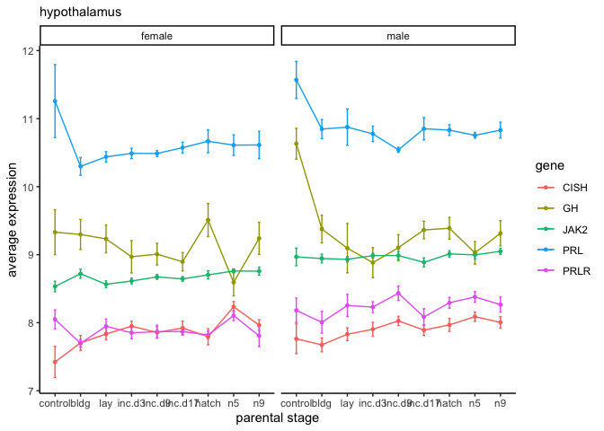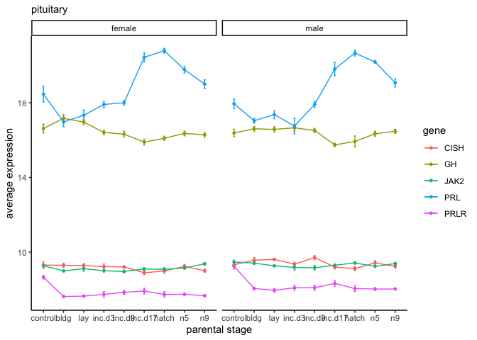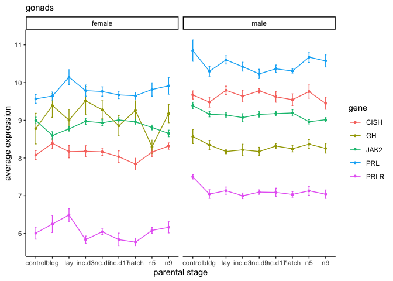

    df3 %>%
        ggplot(aes(x = treatment, y = m)) +
        geom_errorbar(aes(ymin=m-se, ymax=m+se, color=gene), width=.1) +
        geom_point(size = 1, aes(color = gene)) +
        geom_line(aes(x = as.numeric(treatment), y = m, color = gene)) +
        scale_alpha_manual(values = c(0.5, 1)) +
        labs( y = "average expression", x = "parental stage") +
        facet_grid(sex ~ tissue, scales = "free_y") +
        theme_B3() +
        theme(axis.text.x = element_text(angle = 45, hjust = 1))

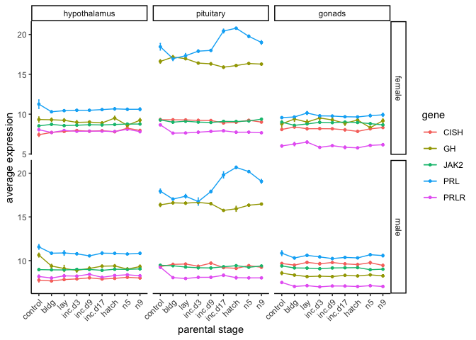

    df2$gene <- factor(df2$gene)

    for (i in levels(df2$gene)) {
      p <-  df2 %>%
        filter(gene %in% i) %>%
        ggplot(aes(x = treatment, y = vsd, color = sex, fill = treatment)) +
        geom_boxplot() +
        scale_alpha_manual(values = c(0.5, 1)) +
        labs(y = "expression", x = "parental stage", subtitle = i) +
        facet_wrap(~ tissue , scales = "free_y", nrow = 3) +
        theme_B3() +
        scale_color_manual(values = sexcolors) +
        scale_fill_manual(values = colorscharmaip)
     print(p)
    }

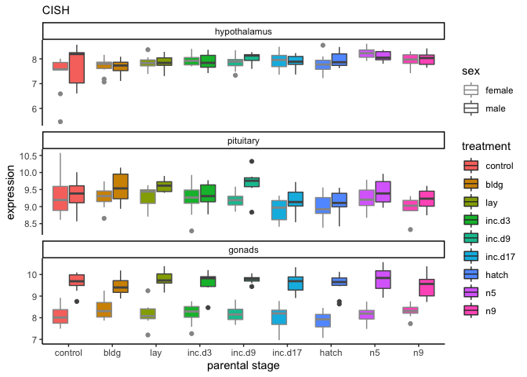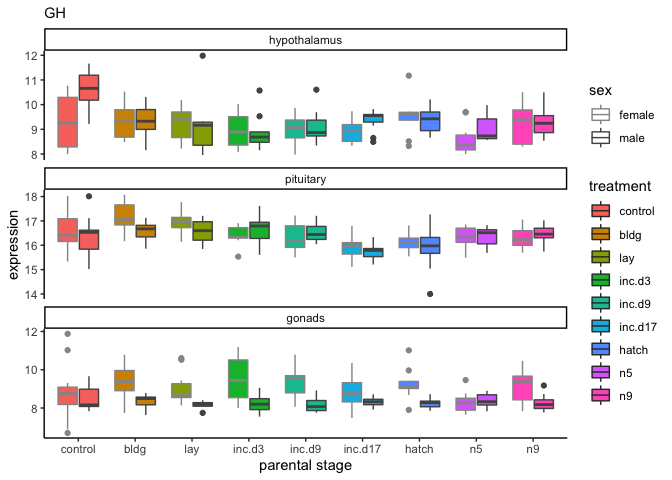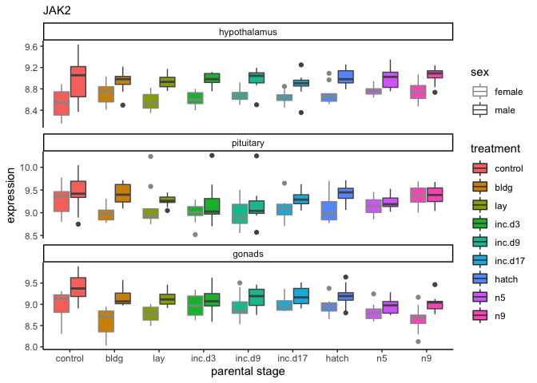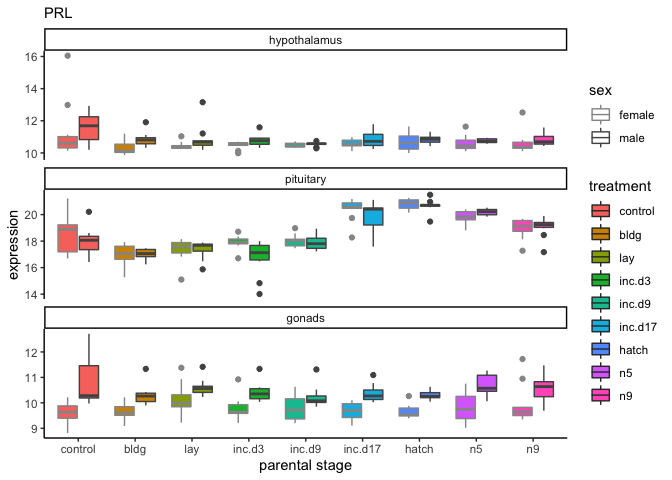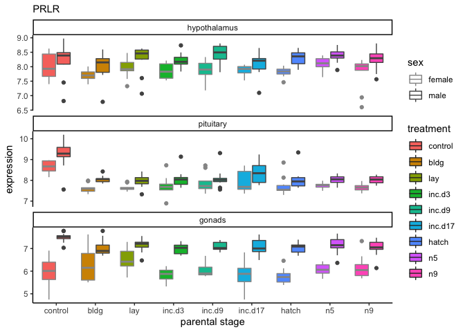

    dft <- df %>% filter(X1 %in% candidategenes) %>%
      unite("tissuegene", tissue:X1, remove = FALSE) %>%
      select(-tissue, -`X1`, -filename)  %>%
      pivot_longer(-tissuegene, names_to = "samples", values_to = "vsd") %>%
      drop_na() %>%
      mutate("bird" = sapply(strsplit(as.character(samples),'\\_'), "[", 1)) %>%
      select(bird,tissuegene,vsd) %>%
      filter(bird != "x.g.g.ATLAS") %>%
      pivot_wider(id_cols = bird, names_from = tissuegene, values_from = vsd)
    dft <- as.data.frame(dft)
    row.names(dft) <- dft$bird
    dft$bird <- NULL
    head(dft)

    ##          gon_CISH   gon_GH gon_JAK2   gon_PRL gon_PRLR hyp_CISH   hyp_GH
    ## L.Blu13  8.752463 9.630519 9.870018 12.620157 7.519119 8.195291 11.23222
    ## L.G107   9.685718 7.999319 9.625719  9.975896 7.033196 8.531852 10.47964
    ## L.G118   7.746627 9.312189 8.303121  9.585174 5.584985 5.463812 10.54857
    ## L.R3    10.091290 9.661806 9.184809 12.713160 7.780442 8.213306  9.89367
    ## L.R8     9.982216 7.837528 9.220338 10.190503 7.517327 8.263373 11.66288
    ## L.W33    9.575585 8.104064 8.904483 10.282352 7.497994 8.234172 10.65886
    ##         hyp_JAK2  hyp_PRL hyp_PRLR  pit_CISH   pit_GH pit_JAK2  pit_PRL
    ## L.Blu13 9.055230 12.58395 8.522239  9.321163 16.56528 9.362994 17.03357
    ## L.G107  9.165604 10.94625 8.452225  9.657710 16.57417 9.342533 18.14585
    ## L.G118  8.887380 12.98360 8.481032  9.879818 18.03054 8.923568 18.18094
    ## L.R3    8.367134 10.71558 7.454105 10.008407 17.11419 8.894092 16.78585
    ## L.R8    8.877838 11.90012 8.974098  9.678544 15.66945 9.344693 17.58225
    ## L.W33   9.069194 12.47638 8.388383  8.568670 15.49809 9.516664 20.20969
    ##         pit_PRLR
    ## L.Blu13 9.278048
    ## L.G107  9.137519
    ## L.G118  8.966179
    ## L.R3    9.197612
    ## L.R8    9.561870
    ## L.W33   8.714056

    x <- correlate(dft)

    ## 
    ## Correlation method: 'pearson'
    ## Missing treated using: 'pairwise.complete.obs'

    x %>% network_plot.cor_df() + 
      scale_color_gradient2(low = "blue", mid = "grey", high = "red", midpoint = 0, limits = c(-1,1)) 

    ## Scale for 'colour' is already present. Adding another scale for
    ## 'colour', which will replace the existing scale.

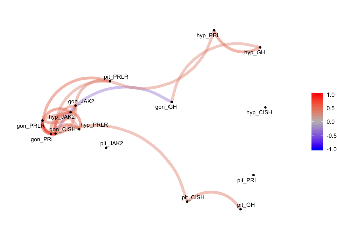

    a <- x %>%
      focus(hyp_PRL) %>%
      mutate(rowname = reorder(rowname, hyp_PRL)) %>%
      ggplot(aes(rowname, hyp_PRL, fill = hyp_PRL)) +
        geom_col() + coord_flip() +
      labs(y = "corr. w/ hyp PRL", x = "candidate genes by tissue") +
      theme_B3() + 
      theme(legend.position = "bottom", legend.title = element_blank()) +
      scale_fill_gradient2(low = "blue", mid = "grey", high = "red", midpoint = 0, limits = c(-1,1)) +
      ylim(c(-0.1,0.6))

    b <- x %>%
      focus(pit_PRL) %>%
      mutate(rowname = reorder(rowname, pit_PRL)) %>%
      ggplot(aes(rowname, pit_PRL, fill = pit_PRL)) +
        geom_col() + coord_flip() +
      labs(y = "corr. w/ pit PRL", x = NULL) +
      theme_B3() + 
      theme(legend.position = "bottom", legend.title = element_blank()) +
      scale_fill_gradient2(low = "blue", mid = "grey", high = "red", midpoint = 0, limits = c(-1,1))  +
      ylim(c(-0.1,0.6))

    c <- x %>%
      focus(gon_PRL) %>%
      mutate(rowname = reorder(rowname, gon_PRL)) %>%
      ggplot(aes(rowname, gon_PRL, fill = gon_PRL)) +
        geom_col() + coord_flip() +
      labs(y = "corr. w/ gon PRL", x = NULL) +
      theme_B3() + 
      theme(legend.position = "bottom", legend.title = element_blank()) +
      scale_fill_gradient2(low = "blue", mid = "grey", high = "red", midpoint = 0, limits = c(-1,1))  +
      ylim(c(-0.1,0.6))

    plot_grid(a,b, c, nrow = 1, rel_widths = c(1.1,1,1))

    ## Warning: Removed 2 rows containing missing values (position_stack).

    ## Warning: Removed 5 rows containing missing values (position_stack).

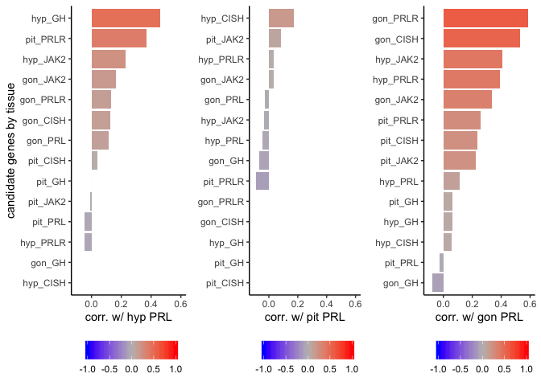
