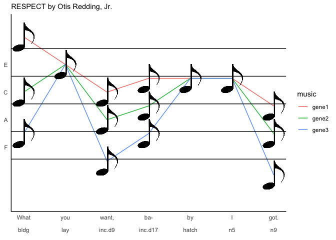
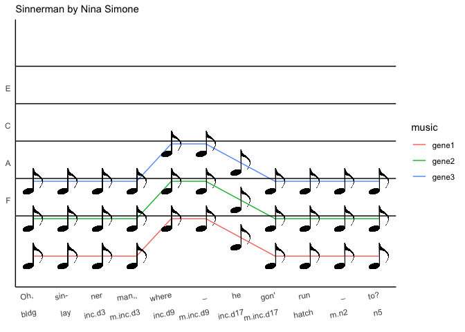

R Markdown
----------

    song <- c("What", "you", "want,", "ba-", "by", "I", "got.")
    stage <- c( "bldg", "lay", "inc.d9", "inc.d17", "hatch", "n5", "n9")
    time <- c(1,2,3,4,5,6,7)
    position <- c(1,2,3,4,5,6,7)
    gene1 <- c(11,9,7,8,8,8,6)
    gene2 <- c(7, 9,5,6,8,8,4)
    gene3 <- c(4, 9,2,4,8,8,1)

    respect <- as.data.frame(t(rbind(position, gene1,gene2,gene3)))
    respect$song <- song
    respect$stage <- stage
    respect$image <- sample(c("https://cdn.pixabay.com/photo/2016/03/23/20/49/music-note-1275650_960_720.png"), 
                            size=7, replace = TRUE)
    respect <- respect %>%
      pivot_longer(gene1:gene3, names_to = "music", values_to = "genes")  %>% 
      mutate(songstage = paste(song,stage, sep = "\n\n"))

    songstageslim <- unique(respect$songstage)

    respectsong <- ggplot(respect, aes(x = position, y = genes)) +
      geom_line(aes(color = music)) +
      geom_image(aes(image=image), size = 0.15) +
      scale_x_continuous(breaks = position,
                         labels = songstageslim,
                         name = element_blank()) +
      scale_y_continuous(breaks = c(3, 5, 7, 9),
                         labels = c( "F",   "A",   "C",  "E"),
                         limits = c(-1,12)) +
      geom_hline(yintercept=c(2.15,4.15,6.15,8.15,10.15))   +
      theme_B3() +
      theme(axis.ticks = element_blank()) +
      labs(subtitle = "RESPECT by Otis Redding, Jr.", y = NULL)
    respectsong

    song <- c("Birds", "fly-", "ing", "high,", "you", "know", "how", "I", "feel.")
    stage <- charlevels
    position <- c(1,2,3,4,5,6,7,8,9)
    gene1 <- c(-2,0,1,2,2,1,1,-2,0)
    gene2 <- gene1 - 1
    gene1 <- gene2
    gene3 <- gene2

    feelinggood <- as.data.frame(t(rbind(position, gene1,gene2,gene3)))
    feelinggood$song <- song
    feelinggood$stage <- stage
    feelinggood$image <- sample(c("https://cdn.pixabay.com/photo/2016/03/23/20/49/music-note-1275650_960_720.png"), 
                            size=9, replace = TRUE)
    feelinggood <- feelinggood %>%
      pivot_longer(gene1:gene3, names_to = "music", values_to = "genes")   %>%
      mutate(songstage = paste(song,stage, sep = "\n\n"))
    feelinggood

    ## # A tibble: 27 x 7
    ##    position song  stage  image                      music genes songstage  
    ##       <dbl> <chr> <chr>  <chr>                      <chr> <dbl> <chr>      
    ##  1        1 Birds contr… https://cdn.pixabay.com/p… gene1    -3 "Birds\n\n…
    ##  2        1 Birds contr… https://cdn.pixabay.com/p… gene2    -3 "Birds\n\n…
    ##  3        1 Birds contr… https://cdn.pixabay.com/p… gene3    -3 "Birds\n\n…
    ##  4        2 fly-  bldg   https://cdn.pixabay.com/p… gene1    -1 "fly-\n\nb…
    ##  5        2 fly-  bldg   https://cdn.pixabay.com/p… gene2    -1 "fly-\n\nb…
    ##  6        2 fly-  bldg   https://cdn.pixabay.com/p… gene3    -1 "fly-\n\nb…
    ##  7        3 ing   lay    https://cdn.pixabay.com/p… gene1     0 "ing\n\nla…
    ##  8        3 ing   lay    https://cdn.pixabay.com/p… gene2     0 "ing\n\nla…
    ##  9        3 ing   lay    https://cdn.pixabay.com/p… gene3     0 "ing\n\nla…
    ## 10        4 high, inc.d3 https://cdn.pixabay.com/p… gene1     1 "high,\n\n…
    ## # … with 17 more rows

    songstageslim <- unique(feelinggood$songstage)

    feelinggoodsong <- ggplot(feelinggood, aes(x = position, y = genes)) +
      geom_line(aes(color = music)) +
      geom_image(aes(image=image), size = 0.15) +
      scale_x_continuous(breaks = position,
                        labels = songstageslim,
                         name = element_blank()) +
      scale_y_continuous(breaks = c(3, 5, 7, 9),
                         labels = c( "F",   "A",   "C",  "E"),
                         limits = c(-6,12)) +
      geom_hline(yintercept=c(2.15,4.15,6.15,8.15,10.15))   +
      theme_B3() +
      theme(axis.ticks = element_blank()) +
      labs(subtitle = "Feeling Good by L. Bricusse & A. Newley", y = NULL)
    feelinggoodsong

    song <- c("Oh,", "sin-", "ner", "man,,", "where", "_", "he", "gon'", "run", "_", "to?")
    stage <- c( "bldg", "lay", "inc.d3", "m.inc.d3" ,
                "inc.d9", "m.inc.d9"  , 
                "inc.d17", "m.inc.d17" ,
                "hatch", "m.n2" ,
                "n5")
    position <- c(1,2,3,4,5,6,7,8,9,10,11)
    gene1 <- c(0,0,0,0,2,2,1,0,0,0,0)
    gene2 <- gene1 + 2
    gene3 <- gene2 + 2

    sinnerman <- as.data.frame(t(rbind(position, gene1,gene2,gene3)))
    sinnerman$song <- song
    sinnerman$stage <- stage
    sinnerman$image <- sample(c("https://cdn.pixabay.com/photo/2016/03/23/20/49/music-note-1275650_960_720.png"), 
                            size=11, replace = TRUE)
    sinnerman <- sinnerman %>%
      pivot_longer(gene1:gene3, names_to = "music", values_to = "genes")   %>%
      mutate(songstage = paste(song,stage, sep = "\n\n"))
    sinnerman

    ## # A tibble: 33 x 7
    ##    position song  stage  image                     music genes songstage   
    ##       <dbl> <chr> <chr>  <chr>                     <chr> <dbl> <chr>       
    ##  1        1 Oh,   bldg   https://cdn.pixabay.com/… gene1     0 "Oh,\n\nbld…
    ##  2        1 Oh,   bldg   https://cdn.pixabay.com/… gene2     2 "Oh,\n\nbld…
    ##  3        1 Oh,   bldg   https://cdn.pixabay.com/… gene3     4 "Oh,\n\nbld…
    ##  4        2 sin-  lay    https://cdn.pixabay.com/… gene1     0 "sin-\n\nla…
    ##  5        2 sin-  lay    https://cdn.pixabay.com/… gene2     2 "sin-\n\nla…
    ##  6        2 sin-  lay    https://cdn.pixabay.com/… gene3     4 "sin-\n\nla…
    ##  7        3 ner   inc.d3 https://cdn.pixabay.com/… gene1     0 "ner\n\ninc…
    ##  8        3 ner   inc.d3 https://cdn.pixabay.com/… gene2     2 "ner\n\ninc…
    ##  9        3 ner   inc.d3 https://cdn.pixabay.com/… gene3     4 "ner\n\ninc…
    ## 10        4 man,, m.inc… https://cdn.pixabay.com/… gene1     0 "man,,\n\nm…
    ## # … with 23 more rows

    songstageslim <- unique(sinnerman$songstage)

    sinnermansong <- ggplot(sinnerman, aes(x = position, y = genes)) +
      geom_line(aes(color = music)) +
      geom_image(aes(image=image), size = 0.1) +
      scale_x_continuous(breaks = position,
                        labels = songstageslim,
                         name = element_blank()) +
      scale_y_continuous(breaks = c(3, 5, 7, 9),
                         labels = c( "F",   "A",   "C",  "E"),
                         limits = c(-1,12)) +
      geom_hline(yintercept=c(2.15,4.15,6.15,8.15,10.15))   +
      theme_B3() +
      theme(axis.ticks = element_blank(),
            axis.text.x = element_text(angle = 10, hjust = 1)) +
      labs(subtitle = "Sinnerman by Nina Simone", y = NULL)
    sinnermansong

    p3 <- plot_grid(respectsong + theme(legend.position = "bottom"), 
                    sinnermansong + theme(legend.position = "bottom"), 
                    nrow = 1, rel_widths = c(0.45, 0.55))
    p3

    modules <- read_csv("../results/08_genes_modules.csv") %>%
      rename(modulecolor = `net$colors`)  

    ## Parsed with column specification:
    ## cols(
    ##   `net$colors` = col_character(),
    ##   gene = col_character()
    ## )

    candidategenes <- c("PRL", "PRLR", 
                     #"VIP", "VIPR1", "VIPR2", 
                     "OXT", "AVP",  "AVPR1B", # "AVPR1A",
                    # "GNRH1","GNRHR", "NPVF",
                    # "NR3C1", "NR3C2",
                    # "ESR1", "ESR2",
                    "AR",
                    # "DIO2","LEPR", "DIO3", "DIO1","CYP19A1",
                    # "HSPA14", "HSPA12A",
                    # "PTGES3", "HSD11B2",
                     "DRD5", "DRD1", "DRD2",
                     #"PGE1", "PGF",
                     "BRCA1", "MYC", "PRKCZ" ,"FOSL2")

    modulescandidates <- modules %>% filter(gene %in% candidategenes)  %>%
      group_by(modulecolor)  %>%
      summarize(gene = str_c(gene, collapse = ", "))

    modulescandidates

    ## # A tibble: 5 x 2
    ##   modulecolor gene                   
    ##   <chr>       <chr>                  
    ## 1 black       DRD5                   
    ## 2 greenyellow AVP, OXT               
    ## 3 magenta     PRLR                   
    ## 4 red         BRCA1, FOSL2, MYC, PRL 
    ## 5 turquoise   AR, AVPR1B, DRD1, PRKCZ

    datapath <- "../results/"   # path to the data
    datafiles <- dir(datapath, pattern = "*allvsd.csv") # get file names
    datapathfile <- paste0(datapath, datafiles)

    df <- datapathfile %>%
      setNames(nm = .) %>%
      map_df(~read_csv(.x, col_types = cols(), col_names = T), .id = "filename") %>% 
      mutate(tissue = sapply(strsplit(as.character(filename),'../results/06_'), "[", 2)) %>% 
      mutate(tissue = sapply(strsplit(as.character(tissue),'allvsd.csv'), "[", 1))  %>% 
      select(tissue, X1, everything()) 

    ## Warning: Missing column names filled in: 'X1' [1]

    ## Warning: Missing column names filled in: 'X1' [1]

    ## Warning: Missing column names filled in: 'X1' [1]

    df2 <-  df  %>%
      filter(X1 %in% c(candidategenes)) %>%
      pivot_longer(cols = L.Blu13_male_gonad_control.NYNO:y98.o50.x_male_pituitary_inc.d3, 
                   names_to = "sample", values_to = "vsd") %>%
       mutate(sex = sapply(strsplit(as.character(sample),'_'), "[", 2)) %>%
       mutate(treatment = sapply(strsplit(as.character(sample),'_'), "[", 4))  %>%
       mutate(treatment = sapply(strsplit(as.character(treatment),'.NYNO'), "[", 1)) %>%
      mutate(bird = sapply(strsplit(as.character(sample),'_'), "[", 1)) %>%
      filter(treatment %in% charlevels) %>%
      select(bird, sex, treatment, tissue, X1, vsd) %>%
      mutate(tissue = fct_recode(tissue, "hypothalamus" = "hyp",
                        "pituitary" = "pit",
                        "gonads" = "gon"
                        )) %>%
      rename(gene = X1) %>%
      drop_na() %>%
      droplevels()
    head(df2)

    ## # A tibble: 6 x 6
    ##   bird    sex    treatment tissue gene    vsd
    ##   <chr>   <chr>  <chr>     <fct>  <chr> <dbl>
    ## 1 L.Blu13 male   control   gonads AR     7.64
    ## 2 L.G107  male   control   gonads AR     7.61
    ## 3 L.G118  female control   gonads AR     8.93
    ## 4 L.R3    male   control   gonads AR     7.85
    ## 5 L.R8    male   control   gonads AR     7.35
    ## 6 L.W33   male   control   gonads AR     7.57

    df2$treatment <- factor(df2$treatment, levels = alllevels)
    df2$tissue <- factor(df2$tissue, levels = tissuelevels)
    df2$gene <- factor(df2$gene)

    df3 <- df2 %>% 
      mutate(treatment = fct_relevel(treatment, charlevels)) %>% 
      group_by(treatment, tissue, gene)  %>% 
      summarize(m = mean(vsd, na.rm = T), se = sd(vsd,  na.rm = T)/sqrt(length(vsd))) %>%
      mutate(image = "../figures/images/DoveParentsRNAseq_note.png") 
    head(df3)  

    ## # A tibble: 6 x 6
    ## # Groups:   treatment, tissue [1]
    ##   treatment tissue      gene      m     se image                           
    ##   <fct>     <fct>       <fct> <dbl>  <dbl> <chr>                           
    ## 1 control   hypothalam… AR     7.15 0.0800 ../figures/images/DoveParentsRN…
    ## 2 control   hypothalam… AVP   10.0  0.313  ../figures/images/DoveParentsRN…
    ## 3 control   hypothalam… AVPR…  5.59 0.0462 ../figures/images/DoveParentsRN…
    ## 4 control   hypothalam… BRCA1  7.19 0.109  ../figures/images/DoveParentsRN…
    ## 5 control   hypothalam… DRD1   7.88 0.162  ../figures/images/DoveParentsRN…
    ## 6 control   hypothalam… DRD5   6.46 0.0930 ../figures/images/DoveParentsRN…

    d4 <- left_join(df3, modules, by = "gene")

    ## Warning: Column `gene` joining factor and character vector, coercing into
    ## character vector

    for (i in levels(d4$tissue)) {
      p <-  d4 %>%
        filter(tissue == i) %>%
        ggplot(aes(x = treatment, y = m)) +
        geom_errorbar(aes(ymin=m-se, ymax=m+se, color=gene), width=.1) +
        geom_point(size = 1, aes(color = gene)) +
        geom_line(aes(x = as.numeric(treatment), y = m, color = gene)) +
        scale_alpha_manual(values = c(0.5, 1)) +
        labs(subtitle = i, y = "average expression", x = "parental stage") +
        facet_wrap(~modulecolor, nrow = 2) +
        theme_B3() +
        theme(legend.position = "bottom")
     print(p)
    }

    d4 %>%
      filter(modulecolor != "turquoise",
             tissue == "pituitary") %>%
      droplevels() %>% 
        ggplot(aes(x = treatment, y = m)) +
        geom_errorbar(aes(ymin=m-se, ymax=m+se, color=gene), width=.1) +
        geom_point(size = 1, aes(color = gene)) +
        geom_line(aes(x = as.numeric(treatment), y = m, color = gene)) +
        scale_alpha_manual(values = c(0.5, 1)) +
        labs(subtitle = "WGCNA + canddiate genes in the pituitary", y = "average expression", x = "parental stage") +
        facet_wrap(~modulecolor, scales = "free_y", nrow = 2) +
        theme_B3() +
        theme(legend.position = "bottom", axis.text.x = element_text(angle = 45, hjust = 1)) +
        guides(color = guide_legend(nrow = 2, byrow = T)) 

    turquoisegenes <- d4 %>%
      filter( modulecolor == "turquoise",
              tissue == "pituitary") %>%
      droplevels() %>% 
        ggplot(aes(x = treatment, y = m)) +
      geom_image(aes(image=image), size = 0.15) +
      geom_smooth(aes(x = as.numeric(treatment)), se = F, color = "turquoise") +
      facet_wrap(~modulecolor, scales = "free_y", nrow = 2) +
      labs(subtitle = "WGCNA turquoise module", 
           y = "gene expression  in the pitutiary", x = "parental stage") +
        facet_wrap(~gene, scales = "free_y", nrow = ) +
        theme_B3() +
        theme(legend.position = "none", axis.text.x = element_text(angle = 45, hjust = 1),
              strip.text = element_text(face = "italic")) 

    redgenes <- d4 %>%
      filter( modulecolor == "red",
              tissue == "pituitary") %>%
      droplevels() %>% 
        ggplot(aes(x = treatment, y = m)) +
      geom_image(aes(image=image), size = 0.15) +
      geom_smooth(aes(x = as.numeric(treatment)), se = F, color = "red") +
      facet_wrap(~modulecolor, scales = "free_y", nrow = 2) +
      labs(subtitle = "WGCNA red module", 
           y = "gene expression  in the pitutiary", x = "parental stage") +
        facet_wrap(~gene, scales = "free_y", nrow = ) +
        theme_B3() +
        theme(legend.position = "none", 
              axis.text.x = element_text(angle = 45, hjust = 1),
              strip.text = element_text(face = "italic")) 

    turquoisegenes

    ## `geom_smooth()` using method = 'loess' and formula 'y ~ x'

    redgenes

    ## `geom_smooth()` using method = 'loess' and formula 'y ~ x'

    plot_grid(turquoisegenes, redgenes)

    ## `geom_smooth()` using method = 'loess' and formula 'y ~ x'

    ## `geom_smooth()` using method = 'loess' and formula 'y ~ x'

    d4 %>% 
      filter(gene %in% c("PRL", "PRLR", "ESR2")) %>%
    ggplot( aes(x = treatment, y = m, color = gene)) +
        geom_smooth(aes(x = as.numeric(treatment)), se = F) +
        facet_grid(gene~tissue, scales = "free")

    ## `geom_smooth()` using method = 'loess' and formula 'y ~ x'

    head(df)

    ## # A tibble: 6 x 990
    ##   tissue X1    filename L.Blu13_male_go… L.G107_male_gon… L.G118_female_g…
    ##   <chr>  <chr> <chr>               <dbl>            <dbl>            <dbl>
    ## 1 gon    A2ML1 ../resu…             6.42             6.44            14.5 
    ## 2 gon    A2ML2 ../resu…             5.43             5.14             4.75
    ## 3 gon    A2ML3 ../resu…             8.05             7.98             9.70
    ## 4 gon    A2ML4 ../resu…             5.43             5.61             5.46
    ## 5 gon    A4GA… ../resu…             5.71             5.89             6.22
    ## 6 gon    A4GNT ../resu…             4.75             4.75             6.31
    ## # … with 984 more variables: L.R3_male_gonad_control.NYNO <dbl>,
    ## #   L.R8_male_gonad_control <dbl>, L.W33_male_gonad_control <dbl>,
    ## #   L.W3_male_gonad_control.NYNO <dbl>,
    ## #   L.W4_male_gonad_control.NYNO <dbl>, R.G106_female_gonad_control <dbl>,
    ## #   R.R20_female_gonad_control <dbl>, R.R9_female_gonad_control <dbl>,
    ## #   R.W44_female_gonad_control <dbl>, R.Y108.W29_male_gonad_control <dbl>,
    ## #   blk.s030.o.g_male_gonad_prolong <dbl>,
    ## #   blk.s031.pu.d_female_gonad_prolong <dbl>,
    ## #   blk.s032.g.w_female_gonad_m.hatch <dbl>,
    ## #   blk.s049.y.g_female_gonad_m.inc.d3 <dbl>,
    ## #   blk.s060.pu.w_female_gonad_m.inc.d3 <dbl>,
    ## #   blk.s061.pu.y_female_gonad_inc.d9 <dbl>,
    ## #   blk.y.l.s109_female_gonad_m.inc.d8 <dbl>,
    ## #   blk0.x_female_gonad_m.n2 <dbl>, blk11.x_female_gonad_bldg <dbl>,
    ## #   blk12.x_male_gonad_n5 <dbl>, blk17.x_male_gonad_inc.d17 <dbl>,
    ## #   blk19.x_female_gonad_extend <dbl>, blk21.x_female_gonad_hatch <dbl>,
    ## #   blk4.x_female_gonad_n9 <dbl>, blk5.x_male_gonad_m.inc.d3 <dbl>,
    ## #   blu.o.x.ATLAS_female_gonad_control <dbl>,
    ## #   blu10.w26.x_male_gonad_m.hatch <dbl>,
    ## #   blu103.x_female_gonad_hatch.NYNO <dbl>,
    ## #   blu104.w120.x_male_gonad_hatch <dbl>,
    ## #   blu108.w40.o158_male_gonad_inc.d9 <dbl>,
    ## #   blu111.w113.x_male_gonad_inc.d3 <dbl>,
    ## #   blu113.w124.x_male_gonad_inc.d17 <dbl>,
    ## #   blu114.r38.w198_male_gonad_bldg <dbl>,
    ## #   blu115.y150.x_female_gonad_inc.prolong <dbl>,
    ## #   blu119.w84.x_female_gonad_m.inc.d8 <dbl>,
    ## #   blu121.w91.x_male_gonad_inc.d17 <dbl>,
    ## #   blu124.w180.x_female_gonad_hatch <dbl>,
    ## #   blu33.y88.x_male_gonad_bldg <dbl>, blu36.w16_female_gonad_n9 <dbl>,
    ## #   blu37.r65.x_male_gonad_n5 <dbl>, blu38.g135.x_female_gonad_bldg <dbl>,
    ## #   blu39.o26.x_female_gonad_inc.d3 <dbl>,
    ## #   blu41.y100.x_male_gonad_n5 <dbl>,
    ## #   blu44.y102_female_gonad_extend <dbl>,
    ## #   blu47.y96.x_female_gonad_inc.d9 <dbl>,
    ## #   blu55.g51_female_gonad_n5 <dbl>,
    ## #   blu56.o53_female_gonad_m.inc.d3 <dbl>,
    ## #   blu63.g62_female_gonad_m.inc.d9 <dbl>,
    ## #   blu80.r97_female_gonad_m.inc.d8 <dbl>, blu81.r88_male_gonad_n9 <dbl>,
    ## #   blu84.x_male_gonad_extend.hatch <dbl>,
    ## #   d.r.blk.s159_female_gonad_m.inc.d9 <dbl>,
    ## #   d.s008.y.blk_male_gonad_n5 <dbl>, d.s047.blk.o_male_gonad_n5 <dbl>,
    ## #   d.s110.g.blk_male_gonad_m.inc.d3 <dbl>,
    ## #   d.s112.blk.w_female_gonad_m.inc.d17 <dbl>,
    ## #   d.s177.blk.r_female_gonad_m.inc.d3 <dbl>,
    ## #   g.blk.s004.pk_female_gonad_lay <dbl>,
    ## #   g.blk.s041.r_male_gonad_m.inc.d3 <dbl>,
    ## #   g.o.y.s037_male_gonad_m.inc.d17 <dbl>, g.s.blk.d_male_gonad_n9 <dbl>,
    ## #   g.s.blk.y_male_gonad_lay <dbl>, g.s043.pu.blk_male_gonad_lay <dbl>,
    ## #   g.s075.pk.pu_male_gonad_m.hatch <dbl>,
    ## #   g.s076.pk.r_female_gonad_m.hatch <dbl>,
    ## #   g.s078.blk.o_female_gonad_lay <dbl>,
    ## #   g.s111.r.blk_male_gonad_m.inc.d8 <dbl>,
    ## #   g.s179.o.pk_male_gonad_m.inc.d8 <dbl>,
    ## #   g.s351.pk.w_male_gonad_extend <dbl>,
    ## #   g.x.ATLAS_female_gonad_control <dbl>,
    ## #   g.y.blk.s006_female_gonad_m.inc.d17 <dbl>,
    ## #   g.y.o.s_male_gonad_prolong <dbl>, g104.w82.x_male_gonad_bldg <dbl>,
    ## #   g114.w83.x_male_gonad_hatch.NYNO <dbl>,
    ## #   g130.y81.x_male_gonad_inc.d17 <dbl>,
    ## #   g137.r24.w5_male_gonad_m.inc.d8 <dbl>,
    ## #   g141.blu27.x_female_gonad_bldg <dbl>,
    ## #   g142.r40.x_female_gonad_inc.d17 <dbl>,
    ## #   g143.blu32.x_male_gonad_inc.d17 <dbl>,
    ## #   g144.r54.x_female_gonad_m.inc.d3 <dbl>,
    ## #   g146.blu51_male_gonad_inc.d3 <dbl>,
    ## #   g17.w108.x_female_gonad_extend <dbl>,
    ## #   g20.w106.x_male_gonad_inc.d3 <dbl>,
    ## #   g22.blu118_female_gonad_extend <dbl>,
    ## #   g3.g119.w20_male_gonad_extend <dbl>,
    ## #   g32.blu79_male_gonad_m.inc.d17 <dbl>,
    ## #   g34.x_male_gonad_m.hatch.NYNO <dbl>,
    ## #   g38.x_male_gonad_inc.prolong <dbl>, g52.blu58_male_gonad_bldg <dbl>,
    ## #   g53.y84_male_gonad_hatch <dbl>, g6.w197.x_female_gonad_inc.d3 <dbl>,
    ## #   g63.blu65_female_gonad_m.inc.d17 <dbl>,
    ## #   g73.x_female_gonad_m.inc.d9 <dbl>, g75.x_female_gonad_inc.d9 <dbl>,
    ## #   g8.y197_male_gonad_extend <dbl>, l.s.o.blk_male_gonad_extend <dbl>,
    ## #   l.s.w.d_female_gonad_m.hatch <dbl>,
    ## #   l.s024.y.g_male_gonad_m.inc.d17 <dbl>,
    ## #   l.s052.pk.r_female_gonad_prolong <dbl>,
    ## #   l.s080.blk.r_male_gonad_prolong <dbl>, …

    head(df2)

    ## # A tibble: 6 x 6
    ##   bird    sex    treatment tissue gene    vsd
    ##   <chr>   <chr>  <fct>     <fct>  <fct> <dbl>
    ## 1 L.Blu13 male   control   gonads AR     7.64
    ## 2 L.G107  male   control   gonads AR     7.61
    ## 3 L.G118  female control   gonads AR     8.93
    ## 4 L.R3    male   control   gonads AR     7.85
    ## 5 L.R8    male   control   gonads AR     7.35
    ## 6 L.W33   male   control   gonads AR     7.57

outline
-------

-   data-driven
-   hypothesis-drive
-   sonically-driven
-   visually-driven
-   statistcally-driven

Data and hypothesis driven research for the visually, sonically, and
statistcially inclined biologists
