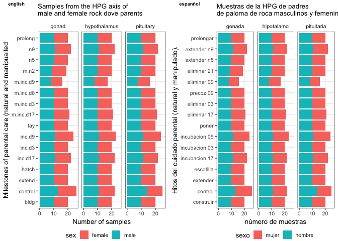

Tranlsating the sample information for downstreatm analysis and data viz
------------------------------------------------------------------------

    library(tidyverse)

    ## ── Attaching packages ─────────────────────────────────────────────────────────────────────────────── tidyverse 1.2.1 ──

    ## ✔ ggplot2 3.1.0       ✔ purrr   0.3.1  
    ## ✔ tibble  2.0.1       ✔ dplyr   0.8.0.1
    ## ✔ tidyr   0.8.3       ✔ stringr 1.4.0  
    ## ✔ readr   1.3.1       ✔ forcats 0.4.0

    ## ── Conflicts ────────────────────────────────────────────────────────────────────────────────── tidyverse_conflicts() ──
    ## ✖ dplyr::filter() masks stats::filter()
    ## ✖ dplyr::lag()    masks stats::lag()

    library(cowplot)

    ## 
    ## Attaching package: 'cowplot'

    ## The following object is masked from 'package:ggplot2':
    ## 
    ##     ggsave

    samples <- read.csv("../metadata/samples.csv" , row.names = 1) 
    str(samples)

    ## 'data.frame':    987 obs. of  7 variables:
    ##  $ V1       : Factor w/ 987 levels "blk.s030.o.g_male_gonad_prolong",..: 254 255 256 257 258 259 260 261 262 263 ...
    ##  $ bird     : Factor w/ 332 levels "blk.s030.o.g",..: 86 86 86 87 87 87 88 88 88 89 ...
    ##  $ sex      : Factor w/ 2 levels "female","male": 2 2 2 2 2 2 1 1 1 2 ...
    ##  $ tissue   : Factor w/ 3 levels "gonad","hypothalamus",..: 1 2 3 1 2 3 1 2 3 1 ...
    ##  $ treatment: Factor w/ 16 levels "bldg","control",..: 2 2 2 2 2 2 2 2 2 2 ...
    ##  $ group    : Factor w/ 96 levels "female.gonad.bldg",..: 50 66 82 50 66 82 2 18 34 50 ...
    ##  $ study    : Factor w/ 2 levels "charcterization",..: 1 1 1 1 1 1 1 1 1 1 ...

    muestras <- samples
    names(muestras) <- c("nombrearchivo", "pajaro", "sexo", "tejido", "tratamiento", "grupo", "estudio")
    str(muestras)

    ## 'data.frame':    987 obs. of  7 variables:
    ##  $ nombrearchivo: Factor w/ 987 levels "blk.s030.o.g_male_gonad_prolong",..: 254 255 256 257 258 259 260 261 262 263 ...
    ##  $ pajaro       : Factor w/ 332 levels "blk.s030.o.g",..: 86 86 86 87 87 87 88 88 88 89 ...
    ##  $ sexo         : Factor w/ 2 levels "female","male": 2 2 2 2 2 2 1 1 1 2 ...
    ##  $ tejido       : Factor w/ 3 levels "gonad","hypothalamus",..: 1 2 3 1 2 3 1 2 3 1 ...
    ##  $ tratamiento  : Factor w/ 16 levels "bldg","control",..: 2 2 2 2 2 2 2 2 2 2 ...
    ##  $ grupo        : Factor w/ 96 levels "female.gonad.bldg",..: 50 66 82 50 66 82 2 18 34 50 ...
    ##  $ estudio      : Factor w/ 2 levels "charcterization",..: 1 1 1 1 1 1 1 1 1 1 ...

    levels(muestras$sexo) 

    ## [1] "female" "male"

    levels(muestras$tejido)

    ## [1] "gonad"        "hypothalamus" "pituitary"

    levels(muestras$tratamiento)

    ##  [1] "bldg"      "control"   "extend"    "hatch"     "inc.d17"  
    ##  [6] "inc.d3"    "inc.d9"    "lay"       "m.inc.d17" "m.inc.d3" 
    ## [11] "m.inc.d8"  "m.inc.d9"  "m.n2"      "n5"        "n9"       
    ## [16] "prolong"

    levels(muestras$estudio)

    ## [1] "charcterization" "manipulation"

    levels(muestras$sexo) <- c("mujer", "hombre")
    levels(muestras$tejido) <- c("gonada", "hipotalamo", "pituitaria")
    levels(muestras$tratamiento) <- c("construir", "control", "extender", "escotilla", "incubación 17", "incubacion 03", "incubacion 09", "poner", "eliminar 17", "eliminar 03"," precoz 09"," eliminar 09"," eliminar 21"," extender n5"," extender n9"," prolongar")
    levels(muestras$estudio) <- c("caracterizacion", "manipulacion")

    theme_rmh <- function(){ 
        theme_bw(base_size=10) +
            theme(
                panel.grid.minor.x  = element_blank(),
               panel.grid.minor.y  = element_blank(),
                strip.background = element_rect(colour="white", fill="white"),
                  legend.position = "bottom",           
               legend.margin=margin(t=-0.1, r=0, b=-0.1, l=-0.1, unit="cm"),
               legend.key.size = unit(0.5, "cm"))
    }

    a <- muestras %>%
      #filter(estudio == "caracterizacion")  %>%
    ggplot(aes(x = tratamiento, fill = sexo)) +  
      geom_bar() + 
      facet_wrap(~ tejido) +
      theme_rmh() +
      labs(x = "Hitos del cuidado parental (natural y manipulado).",
           y = "número de muestras",
           subtitle = "Muestras de la HPG de padres \nde paloma de roca masculinos y femeninos") + 
      coord_flip() 

    b <- samples %>%
    ggplot(aes(x = treatment, fill = sex)) +  
      geom_bar() + 
      facet_wrap(~ tissue) +
      theme_rmh() +
      labs(x = "Milestones of parental care (natural and manipualted",
           y = "Number of samples",
           subtitle = "Samples from the HPG axis of \nmale and female rock dove parents") + 
      coord_flip()

    plot_grid(b,a, labels = c("english", "espanñol"), label_size=7)

