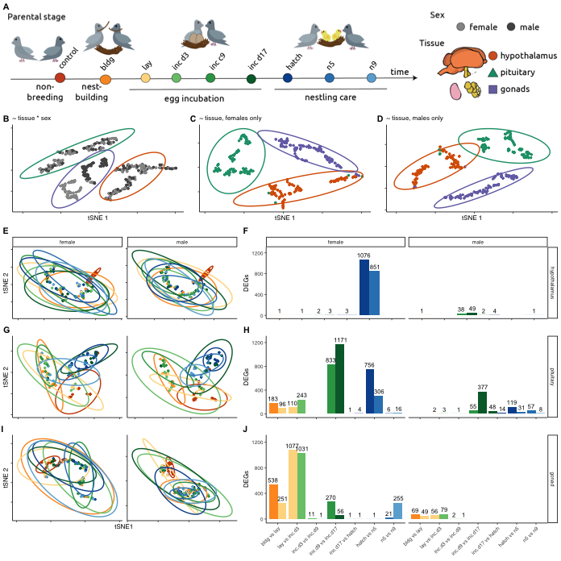

    library(tidyverse)

    ## ── Attaching packages ───────────── tidyverse 1.3.0 ──

    ## ✓ ggplot2 3.3.0.9000     ✓ purrr   0.3.3     
    ## ✓ tibble  2.1.3          ✓ dplyr   0.8.3     
    ## ✓ tidyr   1.0.0          ✓ stringr 1.4.0     
    ## ✓ readr   1.3.1          ✓ forcats 0.4.0

    ## ── Conflicts ──────────────── tidyverse_conflicts() ──
    ## x dplyr::filter() masks stats::filter()
    ## x dplyr::lag()    masks stats::lag()

    library(cowplot)

    ## 
    ## ********************************************************

    ## Note: As of version 1.0.0, cowplot does not change the

    ##   default ggplot2 theme anymore. To recover the previous

    ##   behavior, execute:
    ##   theme_set(theme_cowplot())

    ## ********************************************************

    library(Rtsne)
    library(factoextra)

    ## Welcome! Related Books: `Practical Guide To Cluster Analysis in R` at https://goo.gl/13EFCZ

    library(ggsignif)

    source("../R/themes.R")
    source("../R/functions.R")

    knitr::opts_chunk$set(echo = TRUE, fig.path = '../figures/')

Experimental design, tSNE analysis, and bar chars
=================================================

import limma counts and sample info
-----------------------------------

    countData <- read_csv("../results/01_limma.csv") %>%
      column_to_rownames(var = "X1")

    ## Warning: Missing column names filled in: 'X1' [1]

    ## Parsed with column specification:
    ## cols(
    ##   .default = col_double(),
    ##   X1 = col_character()
    ## )

    ## See spec(...) for full column specifications.

    countData <- as.data.frame(t(countData))
    head(countData[1:3])

    ##                                            A2ML1     A2ML2      A2ML3
    ## L.Blu13_male_gonad_control.NYNO         42.65677 4.4397552  211.96191
    ## L.Blu13_male_hypothalamus_control.NYNO 201.26331 4.8633048 6919.87335
    ## L.Blu13_male_pituitary_control.NYNO    161.22614 0.3158851  212.10845
    ## L.G107_male_gonad_control               43.22441 2.0404458  203.74048
    ## L.G107_male_hypothalamus_control       382.33084 4.9190817 9531.52550
    ## L.G107_male_pituitary_control           85.34910 0.3577761   69.02124

    colData <- read_csv("../metadata/00_colData.csv") %>%
      mutate(treatment = factor(treatment, levels = alllevels),
             tissue = factor(tissue, levels = tissuelevels)) %>% 
      column_to_rownames(var = "X1") 

    ## Warning: Missing column names filled in: 'X1' [1]

    ## Parsed with column specification:
    ## cols(
    ##   X1 = col_character(),
    ##   V1 = col_character(),
    ##   bird = col_character(),
    ##   sex = col_character(),
    ##   tissue = col_character(),
    ##   treatment = col_character(),
    ##   group = col_character(),
    ##   study = col_character()
    ## )

    head(colData)

    ##                                                                            V1
    ## L.Blu13_male_gonad_control.NYNO               L.Blu13_male_gonad_control.NYNO
    ## L.Blu13_male_hypothalamus_control.NYNO L.Blu13_male_hypothalamus_control.NYNO
    ## L.Blu13_male_pituitary_control.NYNO       L.Blu13_male_pituitary_control.NYNO
    ## L.G107_male_gonad_control                           L.G107_male_gonad_control
    ## L.G107_male_hypothalamus_control             L.G107_male_hypothalamus_control
    ## L.G107_male_pituitary_control                   L.G107_male_pituitary_control
    ##                                           bird  sex       tissue treatment
    ## L.Blu13_male_gonad_control.NYNO        L.Blu13 male       gonads   control
    ## L.Blu13_male_hypothalamus_control.NYNO L.Blu13 male hypothalamus   control
    ## L.Blu13_male_pituitary_control.NYNO    L.Blu13 male    pituitary   control
    ## L.G107_male_gonad_control               L.G107 male       gonads   control
    ## L.G107_male_hypothalamus_control        L.G107 male hypothalamus   control
    ## L.G107_male_pituitary_control           L.G107 male    pituitary   control
    ##                                                            group
    ## L.Blu13_male_gonad_control.NYNO              male.gonads.control
    ## L.Blu13_male_hypothalamus_control.NYNO male.hypothalamus.control
    ## L.Blu13_male_pituitary_control.NYNO       male.pituitary.control
    ## L.G107_male_gonad_control                    male.gonads.control
    ## L.G107_male_hypothalamus_control       male.hypothalamus.control
    ## L.G107_male_pituitary_control             male.pituitary.control
    ##                                                  study
    ## L.Blu13_male_gonad_control.NYNO        charcterization
    ## L.Blu13_male_hypothalamus_control.NYNO charcterization
    ## L.Blu13_male_pituitary_control.NYNO    charcterization
    ## L.G107_male_gonad_control              charcterization
    ## L.G107_male_hypothalamus_control       charcterization
    ## L.G107_male_pituitary_control          charcterization

    # check ready for analysis
    # row.names(countData) == row.names(colData)
    head(row.names(countData) == row.names(colData))

    ## [1] TRUE TRUE TRUE TRUE TRUE TRUE

tsne
----

    # prep for tsne useing count data from limma and the custom `subsetmaketsne` function
    hyptsne <- subsetmaketsne("hypothalamus", alllevels, sexlevels)
    pittsne <- subsetmaketsne("pituitary", alllevels, sexlevels)
    gontsne <- subsetmaketsne("gonads", alllevels, sexlevels)

Figure 1
--------

    a <- png::readPNG("../figures/images/fig_fig1a.png")
    a <- ggdraw() +  draw_image(a, scale = 1)

    e1 <- plottsneelipsev3(hyptsne, hyptsne$treatment, allcolors) + 
      labs(subtitle = "hypothalamus") 
    e2 <- plottsneelipsev3(pittsne, pittsne$treatment, allcolors ) + 
      labs(subtitle = "pituitary") 
      theme(strip.text = element_blank())

    ## List of 1
    ##  $ strip.text: list()
    ##   ..- attr(*, "class")= chr [1:2] "element_blank" "element"
    ##  - attr(*, "class")= chr [1:2] "theme" "gg"
    ##  - attr(*, "complete")= logi FALSE
    ##  - attr(*, "validate")= logi TRUE

    e3 <- plottsneelipsev3(gontsne, gontsne$treatment, allcolors ) + 
      labs(subtitle = "gonads") 

    e <- plot_grid(e1,e2,e3, ncol = 3, labels = c("D"), label_size = 8)

    fig1 <- plot_grid(a, e, nrow = 2, rel_heights = c(2.4,1.6))
    fig1

Supplemental PCA data
---------------------

    # pca relies on count data from limma
    pca_h1 <- subsetmakepca("hypothalamus", alllevels, sexlevels)   

    ## Joining, by = "V1"

    pca_h2 <- makefvizdf("hypothalamus", alllevels, sexlevels)  

    pca_p1 <- subsetmakepca("pituitary", alllevels, sexlevels)  

    ## Joining, by = "V1"

    pca_p2 <- makefvizdf("pituitary", alllevels, sexlevels)

    pca_g1 <- subsetmakepca("gonads", alllevels, sexlevels) 

    ## Joining, by = "V1"

    pca_g2 <- makefvizdf("gonads", alllevels, sexlevels)    

Supplemental Data-driven genes vsds for box plots
-------------------------------------------------

    # genes lists in "./analysis/03_datawrangling.Rmd" and old lists in "./R/genelists.R"

    candidatevsd <- read_csv("../results/03_candidatevsd.csv") %>% 
      select(-X1) %>%
      filter(treatment %in% alllevels) %>%
      mutate(treatment = factor(treatment, levels = charlevels)) %>%
      drop_na() 

    ## Warning: Missing column names filled in: 'X1' [1]

    ## Parsed with column specification:
    ## cols(
    ##   X1 = col_double(),
    ##   sex = col_character(),
    ##   tissue = col_character(),
    ##   treatment = col_character(),
    ##   gene = col_character(),
    ##   samples = col_character(),
    ##   counts = col_double()
    ## )

    head(candidatevsd)

    ## # A tibble: 6 x 6
    ##   sex    tissue       treatment gene  samples                             counts
    ##   <chr>  <chr>        <fct>     <chr> <chr>                                <dbl>
    ## 1 female hypothalamus control   ADRA… L.G118_female_hypothalamus_control…   8.95
    ## 2 female hypothalamus control   ADRA… R.G106_female_hypothalamus_control    8.81
    ## 3 female hypothalamus control   ADRA… R.R20_female_hypothalamus_control.…   9.18
    ## 4 female hypothalamus control   ADRA… R.R9_female_hypothalamus_control      8.72
    ## 5 female hypothalamus control   ADRA… R.W44_female_hypothalamus_control     9.23
    ## 6 female hypothalamus inc.d9    ADRA… blk.s061.pu.y_female_hypothalamus_…   9.11

Fig 3
-----

    a <- plotpc12(pca_h1, pca_h2, pca_h1$treatment, allcolors, "Hypothalamus", NULL) 
    c <- plotpc12(pca_p1, pca_p2, pca_p1$treatment, allcolors, "Pituitary", NULL) 
    e <- plotpc12(pca_g1, pca_g2, pca_g1$treatment, allcolors, "Gonads", NULL) 

    b1 <- fviz_screeplot(pca_h2, addlabels = F, barfill = "grey", barcolor = "grey") +
      theme_B3() + labs(title = " ")
    d1 <- fviz_screeplot(pca_p2, addlabels = F, barfill = "grey", barcolor = "grey") +
      theme_B3() + labs(title = " ")
    f1 <- fviz_screeplot(pca_g2, addlabels = F, barfill = "grey", barcolor = "grey") +
      theme_B3() + labs(title = " ")

    b2 <- candidateboxplot("hypothalamus", c("COX1"), sexlevels)
    d2 <- candidateboxplot("pituitary", c("PRL"), sexlevels)
    f2 <- candidateboxplot("gonad", c("OVALY"), sexlevels)

    supplfig <- plot_grid(a,b1,b2, c,d1,d2,e,f1,f2, nrow = 3, rel_widths = c(2,1,2))

    ## Warning in wilcox.test.default(c(7.70773230496344, 8.29738337512517,
    ## 5.7826472490749, : cannot compute exact p-value with ties

    ## Warning in wilcox.test.default(c(4.69054216536479, 10.8366350428297,
    ## 5.25176806575956, : cannot compute exact p-value with ties

    ## Warning in wilcox.test.default(c(6.64794083977516, 5.73641510620878,
    ## 10.473837690094, : cannot compute exact p-value with ties

    ## Warning in wilcox.test.default(c(5.02370119242784, 6.49023959100204,
    ## 14.54193240487, : cannot compute exact p-value with ties

    ## Warning in wilcox.test.default(c(5.05272358504361, 5.60738914242739,
    ## 5.57627376474667, : cannot compute exact p-value with ties

    ## Warning in wilcox.test.default(c(5.05272358504361, 5.33472522684061,
    ## 5.05272358504361, : cannot compute exact p-value with ties

    ## Warning in wilcox.test.default(c(6.55140352513461, 5.05272358504361,
    ## 5.05272358504361, : cannot compute exact p-value with ties

    ## Warning in wilcox.test.default(c(5.70538722712951, 5.9324164928896,
    ## 5.05272358504361, : cannot compute exact p-value with ties

    ## Warning in wilcox.test.default(c(5.05272358504361, 5.48088403427544,
    ## 5.35224731121465, : cannot compute exact p-value with ties

    ## Warning in wilcox.test.default(c(5.05272358504361, 5.41750605522556,
    ## 5.05272358504361, : cannot compute exact p-value with ties

    ## Warning in wilcox.test.default(c(5.05272358504361, 5.05272358504361,
    ## 5.7200611415429, : cannot compute exact p-value with ties

    ## Warning in wilcox.test.default(c(5.73158750259501, 5.05272358504361,
    ## 5.05272358504361, : cannot compute exact p-value with ties

Save files
----------

    pdf(file="../figures/fig1-1.pdf", width=7, height=4.5)
    plot(fig1)
    dev.off()

    ## quartz_off_screen 
    ##                 2

    png("../figures/fig1-1.png", width = 7, height = 4.5, 
        units = 'in', res = 300)
    plot(fig1) 
    dev.off()

    ## quartz_off_screen 
    ##                 2

    pdf(file="../figures/supplfig-1.pdf", width=7.5, height=7.5)
    plot(supplfig)
    dev.off()

    ## quartz_off_screen 
    ##                 2

    png("../figures/supplfig-1.png", width = 7.5, height = 7.5, 
        units = 'in', res = 300)
    plot(supplfig)  
    dev.off()

    ## quartz_off_screen 
    ##                 2

    sessionInfo()

    ## R version 3.6.0 (2019-04-26)
    ## Platform: x86_64-apple-darwin15.6.0 (64-bit)
    ## Running under: macOS  10.15.4
    ## 
    ## Matrix products: default
    ## BLAS:   /Library/Frameworks/R.framework/Versions/3.6/Resources/lib/libRblas.0.dylib
    ## LAPACK: /Library/Frameworks/R.framework/Versions/3.6/Resources/lib/libRlapack.dylib
    ## 
    ## locale:
    ## [1] en_US.UTF-8/en_US.UTF-8/en_US.UTF-8/C/en_US.UTF-8/en_US.UTF-8
    ## 
    ## attached base packages:
    ## [1] stats     graphics  grDevices utils     datasets  methods   base     
    ## 
    ## other attached packages:
    ##  [1] ggsignif_0.5.0     factoextra_1.0.5   Rtsne_0.15         cowplot_1.0.0.9000
    ##  [5] forcats_0.4.0      stringr_1.4.0      dplyr_0.8.3        purrr_0.3.3       
    ##  [9] readr_1.3.1        tidyr_1.0.0        tibble_2.1.3       ggplot2_3.3.0.9000
    ## [13] tidyverse_1.3.0   
    ## 
    ## loaded via a namespace (and not attached):
    ##  [1] ggrepel_0.8.1    Rcpp_1.0.3       lubridate_1.7.4  lattice_0.20-38 
    ##  [5] png_0.1-7        assertthat_0.2.1 digest_0.6.24    utf8_1.1.4      
    ##  [9] R6_2.4.1         cellranger_1.1.0 backports_1.1.5  reprex_0.3.0    
    ## [13] evaluate_0.14    httr_1.4.1       pillar_1.4.3     rlang_0.4.4     
    ## [17] readxl_1.3.1     rstudioapi_0.11  magick_2.0       rmarkdown_1.15  
    ## [21] labeling_0.3     munsell_0.5.0    broom_0.5.2      compiler_3.6.0  
    ## [25] modelr_0.1.5     xfun_0.15        pkgconfig_2.0.3  htmltools_0.3.6 
    ## [29] tidyselect_0.2.5 fansi_0.4.1      crayon_1.3.4     dbplyr_1.4.2    
    ## [33] withr_2.1.2      ggpubr_0.2.3     grid_3.6.0       nlme_3.1-140    
    ## [37] jsonlite_1.6.1   gtable_0.3.0     lifecycle_0.1.0  DBI_1.1.0       
    ## [41] magrittr_1.5     scales_1.1.0     cli_2.0.1        stringi_1.4.6   
    ## [45] farver_2.0.3     fs_1.3.1         xml2_1.2.2       ellipsis_0.3.0  
    ## [49] generics_0.0.2   vctrs_0.2.2      tools_3.6.0      glue_1.3.1      
    ## [53] hms_0.5.3        yaml_2.2.1       colorspace_1.4-1 rvest_0.3.5     
    ## [57] knitr_1.29       haven_2.2.0
