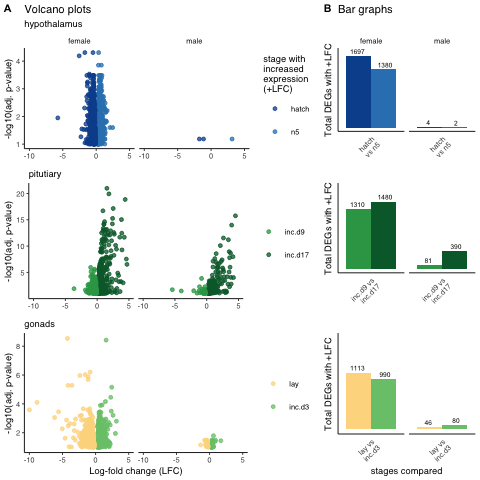

Experimental design, tSNE analysis, and bar chars
=================================================

import limma counts and sample info
-----------------------------------

    countData <- read_csv("../results/01_limma.csv") %>%
      column_to_rownames(var = "X1")

    ## Warning: Missing column names filled in: 'X1' [1]

    ## Parsed with column specification:
    ## cols(
    ##   .default = col_double(),
    ##   X1 = col_character()
    ## )

    ## See spec(...) for full column specifications.

    countData <- as.data.frame(t(countData))
    head(countData[1:3])

    ##                                            A2ML1     A2ML2      A2ML3
    ## L.Blu13_male_gonad_control.NYNO         42.65677 4.4397552  211.96191
    ## L.Blu13_male_hypothalamus_control.NYNO 201.26331 4.8633048 6919.87335
    ## L.Blu13_male_pituitary_control.NYNO    161.22614 0.3158851  212.10845
    ## L.G107_male_gonad_control               43.22441 2.0404458  203.74048
    ## L.G107_male_hypothalamus_control       382.33084 4.9190817 9531.52550
    ## L.G107_male_pituitary_control           85.34910 0.3577761   69.02124

    colData <- read_csv("../metadata/00_colData.csv") %>%
      mutate(treatment = factor(treatment, levels = alllevels),
             tissue = factor(tissue, levels = tissuelevels)) %>% 
      column_to_rownames(var = "X1") 

    ## Warning: Missing column names filled in: 'X1' [1]

    ## Parsed with column specification:
    ## cols(
    ##   X1 = col_character(),
    ##   V1 = col_character(),
    ##   bird = col_character(),
    ##   sex = col_character(),
    ##   tissue = col_character(),
    ##   treatment = col_character(),
    ##   group = col_character(),
    ##   study = col_character()
    ## )

    head(colData)

    ##                                                                            V1
    ## L.Blu13_male_gonad_control.NYNO               L.Blu13_male_gonad_control.NYNO
    ## L.Blu13_male_hypothalamus_control.NYNO L.Blu13_male_hypothalamus_control.NYNO
    ## L.Blu13_male_pituitary_control.NYNO       L.Blu13_male_pituitary_control.NYNO
    ## L.G107_male_gonad_control                           L.G107_male_gonad_control
    ## L.G107_male_hypothalamus_control             L.G107_male_hypothalamus_control
    ## L.G107_male_pituitary_control                   L.G107_male_pituitary_control
    ##                                           bird  sex       tissue treatment
    ## L.Blu13_male_gonad_control.NYNO        L.Blu13 male       gonads   control
    ## L.Blu13_male_hypothalamus_control.NYNO L.Blu13 male hypothalamus   control
    ## L.Blu13_male_pituitary_control.NYNO    L.Blu13 male    pituitary   control
    ## L.G107_male_gonad_control               L.G107 male       gonads   control
    ## L.G107_male_hypothalamus_control        L.G107 male hypothalamus   control
    ## L.G107_male_pituitary_control           L.G107 male    pituitary   control
    ##                                                            group
    ## L.Blu13_male_gonad_control.NYNO              male.gonads.control
    ## L.Blu13_male_hypothalamus_control.NYNO male.hypothalamus.control
    ## L.Blu13_male_pituitary_control.NYNO       male.pituitary.control
    ## L.G107_male_gonad_control                    male.gonads.control
    ## L.G107_male_hypothalamus_control       male.hypothalamus.control
    ## L.G107_male_pituitary_control             male.pituitary.control
    ##                                                  study
    ## L.Blu13_male_gonad_control.NYNO        charcterization
    ## L.Blu13_male_hypothalamus_control.NYNO charcterization
    ## L.Blu13_male_pituitary_control.NYNO    charcterization
    ## L.G107_male_gonad_control              charcterization
    ## L.G107_male_hypothalamus_control       charcterization
    ## L.G107_male_pituitary_control          charcterization

    # check ready for analysis
    # row.names(countData) == row.names(colData)
    head(row.names(countData) == row.names(colData))

    ## [1] TRUE TRUE TRUE TRUE TRUE TRUE

tsne
----

    # uses count data from limma

    # prep for tsne
    chartsne <- subsetmaketsne(tissuelevels, charlevels, sexlevels)
    hyptsne <- subsetmaketsne("hypothalamus", charlevels, sexlevels)
    pittsne <- subsetmaketsne("pituitary", charlevels, sexlevels)
    gontsne <- subsetmaketsne("gonads", charlevels, sexlevels)

    ftsne <-  subsetmaketsne(tissuelevels, charlevels, "female")
    mtsne <-  subsetmaketsne(tissuelevels, charlevels, "male")

Treatment specific DEGs
-----------------------

    allDEG <- read_csv("../results/03_allDEG.csv") %>%
      mutate(tissue = factor(tissue, levels = tissuelevel),
             direction = factor(direction, levels = alllevels))

    ## Parsed with column specification:
    ## cols(
    ##   sex = col_character(),
    ##   tissue = col_character(),
    ##   comparison = col_character(),
    ##   direction = col_character(),
    ##   gene = col_character(),
    ##   lfc = col_double(),
    ##   padj = col_double(),
    ##   logpadj = col_double()
    ## )

    # for fig 1
    DEGchar <- allDEG %>% 
      filter(comparison %in% comparisonlevelschar) %>%
      mutate(comparison = factor(comparison, levels = comparisonlevelschar))

    # for supple fig 1
    DEGcontrol <- allDEG %>% 
      filter(grepl("control", comparison),
             !grepl("m.|early|extend|prolong", comparison))  %>%
      mutate(comparison = factor(comparison, levels = comparisonlevelscontrol))

    DEGbldg <- allDEG %>% 
      filter(grepl("bldg", comparison),
             !grepl("m.|early|extend|prolong", comparison))  %>%
      mutate(comparison = factor(comparison, levels = comparisonlevelsbldg))  %>%
      drop_na()

Sex and Tissue -related DEGs
----------------------------

    ## other DEG stuff
    hypsex <- read_csv("../results/DEseq2/sex/hypothalamus_female_male_DEGs.csv")
    pitsex <- read_csv("../results/DEseq2/sex/pituitary_female_male_DEGs.csv")
    gonsex <- read_csv("../results/DEseq2/sex/gonad_female_male_DEGs.csv")

    hyppit <- read_csv("../results/DEseq2/tissue/hypothalamus_pituitary_DEGs.csv") 
    hypgon <- read_csv("../results/DEseq2/tissue/hypothalamus_gonad_DEGs.csv")
    pitgon <- read_csv("../results/DEseq2/tissue/pituitary_gonad_DEGs.csv")

    hyppit$direction <- factor(hyppit$direction, levels = c("hypothalamus", "pituitary"))
    hypgon$direction <- factor(hypgon$direction, levels = c("hypothalamus",  "gonad"))
    pitgon$direction <- factor(pitgon$direction, levels = c( "pituitary", "gonad"))

Figure 1
--------

    a <- png::readPNG("../figures/images/fig_fig1a.png")
    a <- ggdraw() +  draw_image(a, scale = 1)

    b1 <- plottsneelipse(chartsne, chartsne$tissue, allcolors)  + labs(y = "tSNE 2 ", subtitle = " ")  
    b2 <- sexbarplots(hyppit, 0, 8100) + labs(subtitle = " ", y = "DEGs w/ + LFC") +
      theme(axis.text.y = element_blank(), axis.ticks = element_blank()) +
      scale_x_discrete(labels=c("hypothalamus" = "hyp", "pituitary" = "pit" ))

    ## [1] 12419

    b3 <- sexbarplots(hypgon, 0, 8100) + labs(subtitle = " " ) +
      theme(axis.text.y = element_blank(), axis.line.y = element_blank(), 
            axis.ticks = element_blank(), axis.title.y = element_blank()) +
        scale_x_discrete(labels=c("hypothalamus" = "hyp",  "gonad" = "gon"))

    ## [1] 13122

    b4 <- sexbarplots(pitgon, 0, 8100) + labs(subtitle = " " ) +
      theme(axis.text.y = element_blank(), axis.line.y = element_blank(),  
            axis.ticks = element_blank(), axis.title.y = element_blank()) +
        scale_x_discrete(labels=c(  "pituitary" = "pit", "gonad" = "gon"))

    ## [1] 12999

    c1 <- plottsneelipse(chartsne, chartsne$sex, allcolors)   + labs(y = "tSNE 2 ", subtitle = " ")    
    c2 <- sexbarplots(hypsex, 0, 8100) + labs(y = "DEGs w/ + LFC", subtitle = "hypothalamus" ) +
      theme(axis.text.y = element_blank(), axis.ticks = element_blank())

    ## [1] 2206

    c3 <- sexbarplots(pitsex, 0, 8100) + labs(subtitle = "pituitary" ) + 
      theme(axis.text.y = element_blank(), axis.line.y = element_blank(),  
            axis.ticks = element_blank(), axis.title.y = element_blank())

    ## [1] 3649

    c4 <- sexbarplots(gonsex, 0, 8100) + labs(subtitle = "gonads" ) +
      theme(axis.text.y = element_blank(), axis.line.y = element_blank(),  
            axis.ticks = element_blank(), axis.title.y = element_blank())

    ## [1] 12972

    bc <- plot_grid(b1,b2,b3,b4, c1,c2,c3,c4, nrow = 1, rel_widths = c(1.5,1.1,0.9,0.9,1.5,1.1,0.9,0.9),
                    labels = c("A", "", "", "", "B"), label_size = 8)

    d1 <- plottsneelipsev2(hyptsne, hyptsne$treatment, allcolors) + 
      labs(x = NULL, subtitle = "hypothalamus")  + 
      facet_wrap(~sex, scales = "free")
    d3 <- plottsneelipsev2(pittsne, pittsne$treatment, allcolors ) + 
      labs(x = NULL, subtitle = "pituitary") + 
      facet_wrap(~sex, scales = "free") +
      theme(strip.text = element_blank())
    d5 <- plottsneelipsev2(gontsne, gontsne$treatment, allcolors ) + 
       facet_wrap(~sex, scales = "free") +
      theme(strip.text = element_blank()) +
      labs(x = "tSNE1 \n \n DEGs = differentially expressed genes \n + LFC = positive log fold change", 
           subtitle = "gonads")
    d2 <- makebargraph(DEGchar, "hypothalamus","DEGs w/ + LFC", 0, 1800) + 
      theme(axis.text.x = element_blank(),
            axis.title.x = element_blank())  
    d4 <- makebargraph(DEGchar, "pituitary","DEGs w/ + LFC", 0, 1800)  +  
      theme(axis.text.x = element_blank(), 
            axis.title.x = element_blank(), 
            strip.text.x = element_blank())   
    d6 <- makebargraph(DEGchar, "gonad","DEGs w/ + LFC", 0, 1800) +  
      theme(strip.text.x = element_blank()) +
      scale_x_discrete(labels = comparisonlabelschar) +
      labs(x = "Sequential comparisons of differential gene expression")

    d <- plot_grid(d1,d2,d3,d4,d5,d6, ncol = 2, rel_heights = c(1,0.9,1.4), rel_widths = c(1,2),
                      labels = c("C"), label_size = 8)

    fig1 <- plot_grid(bc, a, d, nrow = 3, rel_heights = c(0.7,0.7,2))
    fig1

    pdf(file="../figures/fig1-1.pdf", width=7.25, height=7.25)
    plot(fig1)
    dev.off()

    ## quartz_off_screen 
    ##                 2

suppl fig 1 controls versus bldg
--------------------------------

    s1a <- makebargraphsuppl(DEGcontrol, "hypothalamus","DEGs w/ + LFC", 0, 5000) + 
      theme(axis.text.x = element_blank(),
            axis.title.x = element_blank()) + 
      labs(subtitle = "hypothalamus") 
    s1c <- makebargraphsuppl(DEGcontrol, "pituitary","DEGs w/ + LFC", 0, 5000)  +  
      theme(axis.text.x = element_blank(), 
            axis.title.x = element_blank(), 
            strip.text.x = element_blank())    + 
      labs(subtitle = "pituitary") 
    s1e <- makebargraphsuppl(DEGcontrol, "gonad","DEGs w/ + LFC", 0, 5000) +  
      theme(strip.text.x = element_blank()) +
      scale_x_discrete(labels = comparisonlabelscontrol) +
      labs(subtitle = "gonads") 
      

    s1b <- makebargraphsuppl(DEGbldg, "hypothalamus", NULL, 0, 1000) + 
      theme(axis.text.x = element_blank(),
            axis.title.x = element_blank())  
    s1d <- makebargraphsuppl(DEGbldg, "pituitary",NULL, 0, 1000)  +  
      theme(axis.text.x = element_blank(), 
            axis.title.x = element_blank(), 
            strip.text.x = element_blank())   
    s1f <- makebargraphsuppl(DEGbldg, "gonad",NULL, 0, 1000) +  
      theme(strip.text.x = element_blank()) +
      scale_x_discrete(labels = comparisonlabelsbldg) 

    s1 <- plot_grid(s1a, s1b, 
              s1c, s1d, 
              s1e, s1f, nrow = 3,
              rel_heights = c(1,0.9,1.3),
              labels = c("A", "B"), label_size = 8, rel_widths = c(1.1,1))

    ## Warning: Removed 5 rows containing missing values (geom_bar).

    ## Warning: Removed 5 rows containing missing values (geom_bar).

    sa <- png::readPNG("../figures/images/fig_supplfig-1.png")
    sa <- ggdraw() +  draw_image(sa, scale = 1)

    supplfig1 <- plot_grid(s1, sa, ncol = 1, rel_heights = c(2,0.7))
    supplfig1

    # for volcano plots
    hyphatch <- DEGchar %>% filter(tissue == "hypothalamus", comparison == "hatch_n5") 
    pitinc <- DEGchar %>% filter(tissue == "pituitary", comparison == "inc.d9_inc.d17") 
    goninc <- DEGchar %>% filter(tissue == "gonad", comparison == "lay_inc.d3") 

    s2a <- plot.volcano("hypothalamus", sexlevels,  "hatch_n5") + facet_wrap(~sex) + 
      labs(subtitle = "hypothalamus", title = "Volcano plots") 
    s2c <- plot.volcano("pituitary", sexlevels,  "inc.d9_inc.d17") + 
      facet_wrap(~sex) + 
      labs(subtitle = "pitutiary") + 
      theme(legend.title = element_blank(), strip.text = element_blank())
    s2e <- plot.volcano("gonad", sexlevels,  "lay_inc.d3") + facet_wrap(~sex) + 
      labs( x = "Log-fold change (LFC)", subtitle = "gonads") + 
      theme(legend.title = element_blank(), strip.text = element_blank())

    s2b <- makebargraph(hyphatch, "hypothalamus","Total DEGs with +LFC", 0, 1800)  + 
      labs(subtitle = " ", title = "Bar graphs") + scale_x_discrete(labels = "hatch\nvs n5")
    s2d <- makebargraph(pitinc, "pituitary","Total DEGs with +LFC", 0, 1800) + 
      labs(subtitle = " ") + scale_x_discrete(labels = "inc.d9 vs\ninc.d17") + 
      theme(strip.text = element_blank())
    s2f <- makebargraph(goninc, "gonad","Total DEGs with +LFC", 0, 1800) + 
      labs(subtitle = " ", x = "stages compared") + scale_x_discrete(labels = "lay vs\ninc.d3") + 
      theme(strip.text = element_blank())
    supplfig2 <- plot_grid(s2a, s2b, s2c, s2d, s2e, s2f,
              rel_widths = c(2,1), rel_heights = c(1.1,1,1.1), ncol = 2,
              labels = c("A", "B"), label_size = 8)
    supplfig2

Save files
----------

    # save file for musical genes https://raynamharris.shinyapps.io/musicalgenes/
    #write.csv(allDEG, "../../musicalgenes/data/allDEG.csv")

    # tsne files too big to save
    #write.csv(chartsne, "../../musicalgenes/data/tsne.csv")

    suppltable1 <- DEGchar %>%
      arrange( tissue, sex, direction, gene)
    head(suppltable1)

    ## # A tibble: 6 x 8
    ##   sex    tissue       comparison direction gene     lfc     padj logpadj
    ##   <chr>  <fct>        <fct>      <fct>     <chr>  <dbl>    <dbl>   <dbl>
    ## 1 female hypothalamus bldg_lay   bldg      HBG2  -0.846 0.0829      1.08
    ## 2 female hypothalamus bldg_lay   bldg      HEMGN -1.38  0.000464    3.33
    ## 3 female hypothalamus lay_inc.d3 lay       BLB1  -1.70  0.0987      1.01
    ## 4 female hypothalamus lay_inc.d3 lay       C1QA  -1.02  0.0987      1.01
    ## 5 female hypothalamus lay_inc.d3 lay       CFD   -0.785 0.0537      1.27
    ## 6 female hypothalamus lay_inc.d3 lay       CLIC2 -0.527 0.0903      1.04

    write_csv(suppltable1, "../results/suppltable1.csv")

    suppltable2 <- rbind(DEGcontrol, DEGbldg)  %>%
      arrange( tissue, sex, direction, gene)
    head(suppltable2)

    ## # A tibble: 6 x 8
    ##   sex    tissue      comparison     direction gene     lfc     padj logpadj
    ##   <chr>  <fct>       <fct>          <fct>     <chr>  <dbl>    <dbl>   <dbl>
    ## 1 female hypothalam… control_bldg   control   A2ML1 -0.612  2.93e-2    1.53
    ## 2 female hypothalam… control_hatch  control   A2ML1 -1.15   1.21e-5    4.92
    ## 3 female hypothalam… control_inc.d… control   A2ML1 -0.780  2.81e-3    2.55
    ## 4 female hypothalam… control_inc.d9 control   A2ML1 -0.510  5.42e-2    1.27
    ## 5 female hypothalam… control_lay    control   A2ML1 -0.674  1.39e-2    1.86
    ## 6 female hypothalam… control_n5     control   A2ML1 -0.583  3.35e-2    1.47

    write_csv(suppltable2, "../results/suppltable2.csv")

    pdf(file="../figures/supplfig-1-1.pdf", width=5, height=5)
    plot(supplfig1)
    dev.off()

    ## quartz_off_screen 
    ##                 2

    pdf(file="../figures/supplfig-1-2.pdf", height=5, width=5)
    plot(supplfig2)
    dev.off()

    ## quartz_off_screen 
    ##                 2
