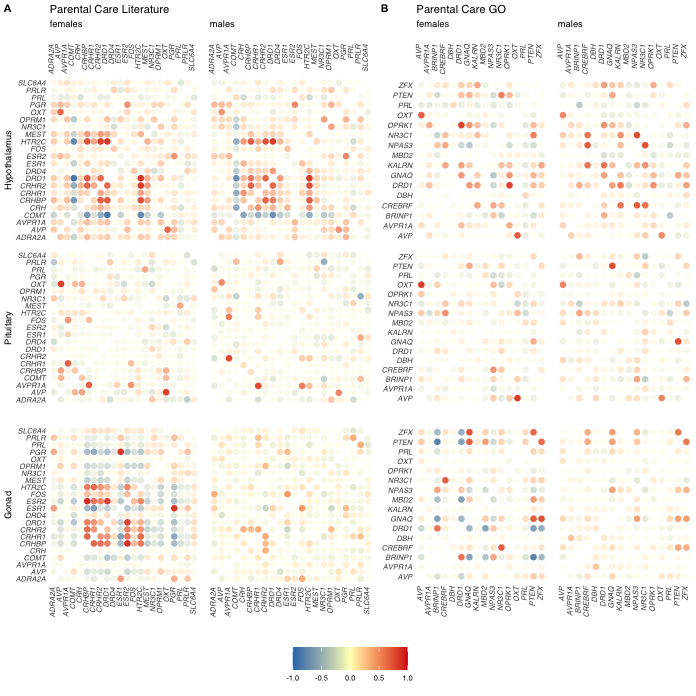

Candidate gene analysis
=======================

    library(tidyverse)
    library(ggtext)
    library(cowplot)
    library(ggpubr)
    library(knitr)
    library(kableExtra)
    library(corrr)
    library(ggsignif)
    library(magick)
    library(scales)
    library(ggimage)

    source("../R/themes.R")
    source("../R/functions.R")

    knitr::opts_chunk$set(echo = TRUE, message = F, fig.path = "../figures/")

Candidate genes
---------------

    parentalcaregenes <- read_csv("../metadata/03_parentalcaregenes.csv") %>% select(-X1)

    ## Warning: Missing column names filled in: 'X1' [1]

    head(parentalcaregenes)

    ## # A tibble: 6 x 5
    ##   geneid NCBI           literature GO     gene  
    ##    <dbl> <chr>          <chr>      <chr>  <chr> 
    ## 1 428980 XP_004942333.2 ADRA2A     <NA>   ADRA2A
    ## 2 396101 NP_990516.1    AVP        AVP    AVP   
    ## 3 771773 NP_001103908.1 AVPR1A     AVPR1A AVPR1A
    ## 4 395098 NP_989780.1    <NA>       BRINP1 BRINP1
    ## 5 416783 XP_001233014.1 COMT       <NA>   COMT  
    ## 6 416206 XP_001231574.1 <NA>       CREBRF CREBRF

    curleychampagnegenes <- parentalcaregenes %>% distinct(literature) %>% drop_na() %>% pull(literature)
    GOgenes <- parentalcaregenes %>% distinct(GO)  %>% drop_na() %>% pull(GO)
    candidategenes <- parentalcaregenes %>% pull(gene) 
    candidategenes

    ##  [1] "ADRA2A" "AVP"    "AVPR1A" "BRINP1" "COMT"   "CREBRF" "CRH"   
    ##  [8] "CRHBP"  "CRHR1"  "CRHR2"  "DBH"    "DRD1"   "DRD4"   "ESR1"  
    ## [15] "ESR2"   "FOS"    "GNAQ"   "HTR2C"  "KALRN"  "MBD2"   "MEST"  
    ## [22] "NPAS3"  "NPAS3"  "NR3C1"  "OPRK1"  "OPRM1"  "OXT"    "PGR"   
    ## [29] "PRL"    "PRLR"   "PTEN"   "SLC6A4" "ZFX"

Candidate DEGs
--------------

    # summary DEG results from DESeq2
    candidateDEGS <- read_csv("../results/suppltable1.csv") %>%
      filter(gene %in% candidategenes) %>%
      mutate(posneg = ifelse(lfc >= 0, "+", "-"),
             sex = recode(sex, "female" = "F", "male" = "M" ),
             tissue = recode(tissue, 
                             "hypothalamus" = "H",
                             "pituitary" = "P", "gonad" = "G")) %>%
      mutate(res = paste(sex, tissue, posneg, sep = "")) %>%
      select(gene, res, comparison)  %>%
      group_by(gene,  comparison) %>%
      summarize(res = str_c(res, collapse = " ")) %>%
      pivot_wider(names_from = comparison, values_from = res) %>%
      select(gene, bldg_lay, lay_inc.d3, inc.d3_inc.d9, inc.d9_inc.d17, hatch_n5, n5_n9)
    candidateDEGS

    ## # A tibble: 23 x 7
    ## # Groups:   gene [23]
    ##    gene   bldg_lay lay_inc.d3 inc.d3_inc.d9 inc.d9_inc.d17 hatch_n5 n5_n9
    ##    <chr>  <chr>    <chr>      <chr>         <chr>          <chr>    <chr>
    ##  1 ADRA2A <NA>     <NA>       <NA>          MH+            <NA>     <NA> 
    ##  2 AVP    <NA>     <NA>       <NA>          MH+            <NA>     FG+  
    ##  3 AVPR1A <NA>     FG+        FG-           <NA>           <NA>     <NA> 
    ##  4 BRINP1 <NA>     <NA>       <NA>          FG+            <NA>     <NA> 
    ##  5 COMT   <NA>     <NA>       <NA>          <NA>           FH-      <NA> 
    ##  6 CREBRF FG+      FG-        <NA>          <NA>           FP+      <NA> 
    ##  7 CRHBP  <NA>     <NA>       <NA>          <NA>           FH+      <NA> 
    ##  8 CRHR2  <NA>     <NA>       <NA>          <NA>           FH+      <NA> 
    ##  9 DRD1   <NA>     <NA>       <NA>          <NA>           FH+      <NA> 
    ## 10 DRD4   <NA>     FP-        <NA>          <NA>           FH+      <NA> 
    ## # … with 13 more rows

    ## table 1 summary candidate genes
    table1 <- left_join(candidateDEGS, parentalcaregenes) %>%
      select(gene, bldg_lay:n5_n9, literature, GO, NCBI) %>%
      mutate(literature = if_else(is.na(literature), " ", "X"),
             GO = if_else(is.na(GO), " ", "X"))
    head(table1)

    ## # A tibble: 6 x 10
    ## # Groups:   gene [6]
    ##   gene  bldg_lay lay_inc.d3 inc.d3_inc.d9 inc.d9_inc.d17 hatch_n5 n5_n9
    ##   <chr> <chr>    <chr>      <chr>         <chr>          <chr>    <chr>
    ## 1 ADRA… <NA>     <NA>       <NA>          MH+            <NA>     <NA> 
    ## 2 AVP   <NA>     <NA>       <NA>          MH+            <NA>     FG+  
    ## 3 AVPR… <NA>     FG+        FG-           <NA>           <NA>     <NA> 
    ## 4 BRIN… <NA>     <NA>       <NA>          FG+            <NA>     <NA> 
    ## 5 COMT  <NA>     <NA>       <NA>          <NA>           FH-      <NA> 
    ## 6 CREB… FG+      FG-        <NA>          <NA>           FP+      <NA> 
    ## # … with 3 more variables: literature <chr>, GO <chr>, NCBI <chr>

Candidate VSDs
--------------

    # load `candidatevsd` with `source("../R/wrangledata.R")`
    candidatevsd <- read_csv("../results/03_candidatevsd.csv") %>% 
      select(-X1) %>%
      filter(treatment %in% charlevelsnocontrol) %>%
      drop_na()

    ## Warning: Missing column names filled in: 'X1' [1]

    tail(candidatevsd)

    ## # A tibble: 6 x 6
    ##   sex   tissue treatment gene  samples                         counts
    ##   <chr> <chr>  <chr>     <chr> <chr>                            <dbl>
    ## 1 male  gonad  n9        ZFX   y129.x_male_gonad_n9              10.3
    ## 2 male  gonad  n9        ZFX   y131.w185.x_male_gonad_n9         10.4
    ## 3 male  gonad  inc.d17   ZFX   y133.w77.r58_male_gonad_inc.d17   10.3
    ## 4 male  gonad  inc.d3    ZFX   y149.r52.x_male_gonad_inc.d3      10.5
    ## 5 male  gonad  inc.d9    ZFX   y95.g131.x_male_gonad_inc.d9      10.5
    ## 6 male  gonad  inc.d3    ZFX   y98.o50.x_male_gonad_inc.d3       10.2

    candidatevsdwide <- candidatevsd  %>%
        pivot_wider(names_from = gene, values_from = counts) 
    FH <- subsetcandidatevsdwide("female", "hypothalamus")
    FP <- subsetcandidatevsdwide("female", "pituitary")
    FG <- subsetcandidatevsdwide("female", "gonad")
    MH <- subsetcandidatevsdwide("male", "hypothalamus")
    MP <- subsetcandidatevsdwide("male", "pituitary")
    MG <- subsetcandidatevsdwide("male", "gonad") 

Candidate Correlations - SUppl fig 1
------------------------------------

    hyp1 <- makecorrdf("female", "hypothalamus", curleychampagnegenes)  
    pit1 <- makecorrdf("female", "pituitary", curleychampagnegenes)  
    gon1 <- makecorrdf("female", "gonad", curleychampagnegenes)  

    hyp2 <- makecorrdf("male", "hypothalamus", curleychampagnegenes)  
    pit2 <- makecorrdf("male", "pituitary", curleychampagnegenes)  
    gon2 <- makecorrdf("male", "gonad", curleychampagnegenes) 

    hyp3 <- makecorrdf("female", "hypothalamus", GOgenes)  
    pit3 <- makecorrdf("female", "pituitary", GOgenes)  
    gon3 <- makecorrdf("female", "gonad", GOgenes)  

    hyp4 <- makecorrdf("male", "hypothalamus", GOgenes)  
    pit4 <- makecorrdf("male", "pituitary", GOgenes)  
    gon4 <- makecorrdf("male", "gonad", GOgenes)  

    b1 <- plotcorrplot(hyp1, "females") + labs(y = "Hypothalamus", title = "Parental Care Literature")  + 
      scale_x_discrete(position = "top")   + theme(axis.text.x = element_text(vjust = -0.25))
    b2 <- plotcorrplot(pit1, NULL)  + labs(y = "Pituitary") + 
      theme(axis.text.x = element_blank())
    b3 <- plotcorrplot(gon1, NULL)  + labs(y = "Gonad") + theme(axis.text.x = element_text(vjust = 0.25))
     
    b4 <- plotcorrplot(hyp2, "males") + labs( title =  " ") + theme( axis.text.y = element_blank(), axis.text.x = element_text(vjust = -0.25)) +
      scale_x_discrete(position = "top") 
    b5 <- plotcorrplot(pit2, NULL)    + 
      theme(axis.text.x = element_blank(), axis.text.y = element_blank())
    b6 <- plotcorrplot(gon2, NULL)  + theme( axis.text.y = element_blank(), axis.text.x = element_text(vjust = 0.25))

    b7 <- plotcorrplot(hyp3, "females") + labs( title = "Parental Care GO") + 
       scale_x_discrete(position = "top") + theme(axis.text.x = element_text(vjust = -0.25))
    b8 <- plotcorrplot(pit3, NULL)   + 
      theme(axis.text.x = element_blank())
    b9 <- plotcorrplot(gon3, NULL)  + theme(axis.text.x = element_text(vjust = 0.25))

    b10 <- plotcorrplot(hyp4, "males") + labs( title =  " ") + 
      theme(axis.text.y = element_blank(),
            axis.text.x = element_text(vjust = -0.25)) + scale_x_discrete(position = "top") 
    b11 <- plotcorrplot(pit4, NULL)    + 
      theme(axis.text.x = element_blank() , axis.text.y = element_blank())
    b12 <- plotcorrplot(gon4, NULL)   + theme( axis.text.y = element_blank(), axis.text.x = element_text(vjust = 0.25))

    forlegend <- plotcorrplot(gon4, NULL) + theme(legend.position = "bottom") + labs(color = "Correlation")
    mylegend <- get_legend(forlegend)

    allcorplots <- plot_grid(b1,b4,b7,b10,
              b2,b5,b8,b11,
              b3,b6,b9,b12, rel_heights = c(1.4,1,1.2),
              labels = c("A", " ", "B"), label_size = 8, rel_widths = c(1.4,1.2,1.2,1))

    supplfig2 <- plot_grid(allcorplots, mylegend, ncol = 1, rel_heights = c(1,0.1))
    supplfig2

    pdf(file="../figures/supplfig-2.pdf", width=7.25, height=7.25)
    plot(supplfig2)
    dev.off()

    ## quartz_off_screen 
    ##                 2

Figure
------

    candidateboxplot <- function(whichtissue, whichgenes, whichsex){
      
      p <- candidatevsd %>%
        filter(tissue %in% whichtissue,
               gene %in% whichgenes,
               sex %in% whichsex) %>%
        mutate(treatment = factor(treatment, levels = charlevels)) %>%
        ggplot(aes(x = treatment, y = counts)) +
        geom_boxplot(aes(fill = treatment, color = sex), outlier.shape = NA) +
        geom_jitter(size = 0.25, aes(color = sex)) +
        #facet_wrap(~sex,  nrow = 1) +
        scale_fill_manual(values = allcolors) +
        scale_color_manual(values = allcolors) +
        theme_B3() + 
        theme(legend.position = "none",
              axis.title.y = element_text(face = "italic"),
              axis.text.x = element_blank(),
              axis.ticks = element_blank(),
              axis.line.x = element_blank()) +
        labs(y = whichgenes,
             x = NULL) +
        geom_signif(comparisons = list( c( "bldg", "lay"),
                                       c( "lay", "inc.d3"),
                                       c("inc.d3", "inc.d9"),
                                       c( "inc.d9", "inc.d17"),
                                       c( "inc.d17", "hatch"),
                                       c("hatch", "n5"),
                                       c( "n5", "n9")),  
                    map_signif_level=TRUE,
                    textsize = 1.5, family = 'Helvetica',
                    vjust = 1.5, size = 0.2) 
      
      return(p)
    }

    c1 <- scattercorrelations(FH, FH$CRHR2, "CRHR2", FH$HTR2C, "HTR2C", "#969696" ) +  labs(title = " ", subtitle = " " )  
    c3 <- scattercorrelations(FP, FP$AVPR1A, "AVPR1A", FP$CRHR1,  "CRHR1", "#969696")  + labs(title = " ", subtitle = " ") 
    c5 <- scattercorrelations(FG, FG$CRHBP, "CRHBP",  FG$ESR2,  "ESR2", "#969696")   + labs(title = " ", subtitle = " ") 

    c2 <- scattercorrelations(MH, MH$DRD1, "DRD1", MH$HTR2C, "HTR2C", "#525252")  + labs(title = " ", subtitle = " " )  
    c4 <- scattercorrelations(MP, MP$AVPR1A,  "AVPR1A",  MP$CRHR1, "CRHR1", "#525252")  + labs(title = " ", subtitle = " " ) 
    c6 <- scattercorrelations(MG, MG$PGR, "PGR", MG$PRLR, "PRLR", "#525252")   + labs(title = " ", subtitle = " " ) 

    d1 <- candidateboxplot("hypothalamus", c("CRHR2"), "female") + labs(x = NULL, title =  "Hypothlamic expression", subtitle = "females" )  
    d2 <- candidateboxplot("hypothalamus", c("HTR2C"), "female") + labs(x = NULL )  + theme(axis.text.x = element_text(angle = 45, vjust = 1))
    d3 <- candidateboxplot("pituitary", c("AVPR1A"), "female") + labs(x = NULL , title = "Pituitary expression", subtitle = "females") 
    d4 <- candidateboxplot("pituitary", c("CRHR1"), "female") + labs(x = NULL  )  + theme(axis.text.x = element_text(angle = 45, vjust = 1))
    d5 <- candidateboxplot("gonad", c("CRHBP"), "female") + labs(x = NULL, title = "Gonadal expression", subtitle = "females")
    d6 <- candidateboxplot("gonad", c("ESR2"), "female") + labs(x = NULL ) + theme(axis.text.x = element_text(angle = 45, vjust = 1))

    e1 <- candidateboxplot("hypothalamus", c("DRD1"), "male") + labs(x = NULL, title = " " , subtitle = "males" )  
    e2 <- candidateboxplot("hypothalamus", c("HTR2C"), "male") + labs(x = NULL )  + theme(axis.text.x = element_text(angle = 45, vjust = 1))
    e3 <- candidateboxplot("pituitary", c("AVPR1A"), "male") + labs(x = NULL , subtitle = "males" ) 
    e4 <- candidateboxplot("pituitary", c("CRHR1"), "male") + labs(x = NULL  )  + theme(axis.text.x = element_text(angle = 45, vjust = 1))
    e5 <- candidateboxplot("gonad", c("PGR"), "male") + labs(x = NULL, subtitle = "males" ) 
    e6 <- candidateboxplot("gonad", c("PRLR"), "male") + labs(x = NULL )   + theme(axis.text.x = element_text(angle = 45, vjust = 1)) 

    #b <- plot_grid(b1,b2,b3, ncol = 1, rel_heights = c(1.1,1,1))
    c123 <- plot_grid(c1,c3,c5, ncol = 1, rel_heights = c(1.1,1,1))
    c456 <- plot_grid(c2,c4,c6, ncol = 1, rel_heights = c(1.1,1,1))
    d <- plot_grid(d1,d2,d3,d4,d5,d6, ncol = 1, rel_heights = c(1.2,1, 1,1, 1,1), labels = c("A", " ",  "B", " ", "C"), label_size = 8)

    ## Warning in wilcox.test.default(c(6.67595664589207, 4.69054216536479,
    ## 6.20887219471942, : cannot compute exact p-value with ties

    e <- plot_grid(e1,e2,e3,e4,e5,e6, ncol = 1, rel_heights = c(1.2,1, 1,1, 1,1))

    fig2 <- plot_grid(d, c123,e,c456,nrow  = 1)
    fig2

    pdf(file="../figures/fig2-1.pdf", width=7.25, height=7.25)
    plot(fig2)
    dev.off()

    ## quartz_off_screen 
    ##                 2

    #write.csv(candidatevsd, "../../musicalgenes/data/candidatecounts.csv")
    #write.csv(candidatevsd, "../results/candidatecounts.csv")
    write.csv(table1, "../results/table1.csv")
