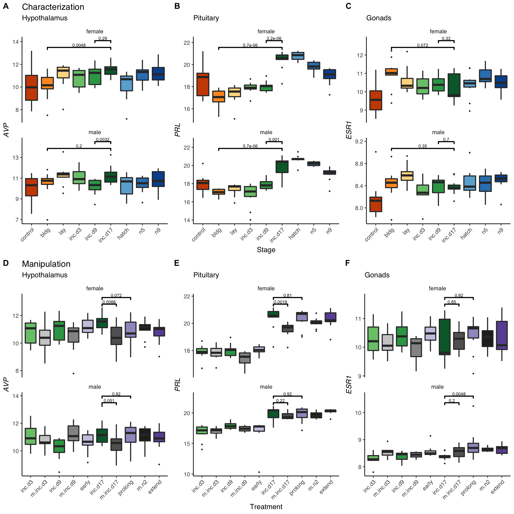

DEGs
----

    DEG_path <- "../results/DEseq2/"   # path to the data
    DEG_files <- dir(DEG_path, pattern = "*DEGs") # get file names
    DEG_pathfiles <- paste0(DEG_path, DEG_files)
    #DEG_files

    allDEG <- DEG_pathfiles %>%
      setNames(nm = .) %>% 
      map_df(~read_csv(.x), .id = "file_name") %>% 
      mutate(DEG = sapply(strsplit(as.character(file_name),'./results/DEseq2/'), "[", 2))  %>% 
      mutate(DEG = sapply(strsplit(as.character(DEG),'_diffexp.csv'), "[", 1))  %>% 
      mutate(tissue = sapply(strsplit(as.character(DEG),'\\.'), "[", 1)) %>%
      mutate(down = sapply(strsplit(as.character(DEG),'\\_'), "[", 3)) %>%
      mutate(up = sapply(strsplit(as.character(DEG),'\\_'), "[", 4)) %>%
      mutate(comparison = paste(down,up, sep = "_")) %>%
      mutate(sex = sapply(strsplit(as.character(sextissue),'\\_'), "[", 1)) %>%
      mutate(tissue = sapply(strsplit(as.character(sextissue),'\\_'), "[", 2)) %>%
    dplyr::select(sex,tissue,comparison, direction, gene, lfc, padj, logpadj) 
    head(allDEG)

    ## # A tibble: 6 x 8
    ##   sex    tissue comparison direction gene           lfc     padj logpadj
    ##   <chr>  <chr>  <chr>      <chr>     <chr>        <dbl>    <dbl>   <dbl>
    ## 1 female gonad  bldg_lay   lay       LOC107053414  9.72 4.76e- 4    3.32
    ## 2 female gonad  bldg_lay   lay       MUC           5.82 2.72e- 3    2.57
    ## 3 female gonad  bldg_lay   lay       OVSTL         5.45 9.58e-10    9.02
    ## 4 female gonad  bldg_lay   lay       AOC1          4.41 2.75e- 3    2.56
    ## 5 female gonad  bldg_lay   lay       ETNPPL        4.25 4.76e- 5    4.32
    ## 6 female gonad  bldg_lay   lay       GKN2          3.99 1.63e- 2    1.79

    allDEG$tissue <- factor(allDEG$tissue , levels = tissuelevel)
    allDEG$comparison <- factor(allDEG$comparison , levels = comparisonlevels)
    allDEG$direction <- factor(allDEG$direction, levels = charlevels)

    makebargraph <- function(whichtissue, myylab, lowlim, higherlim){
      p <- allDEG %>%
        filter(tissue == whichtissue,
               comparison != "control_bldg") %>%
      ggplot(aes(x = comparison,  fill = direction)) +
        geom_bar(position = "dodge") +
        facet_grid(tissue~sex) +
        theme_B3() +
        theme(axis.text.x = element_text(angle = 45, hjust = 1),
              legend.position = "none")  +
        guides(fill = guide_legend(nrow = 1)) +
        labs(x = "Sequential parental care stage comparisons", 
             y = myylab,
             subtitle = " ") +
      scale_fill_manual(values = allcolors,
                           name = " ",
                           drop = FALSE) +
      scale_color_manual(values = allcolors) +
      geom_text(stat='count', aes(label=..count..), vjust =-0.5, 
                position = position_dodge(width = 1),
                size = 2, color = "black")  +
      ylim(lowlim, higherlim)
      return(p)
    }

Internal versus external
------------------------

    DEG_path <- "../results/DEseq2/hypothesis/"   # path to the data
    DEG_files <- dir(DEG_path, pattern = "*DEGs") # get file names
    DEG_pathfiles <- paste0(DEG_path, DEG_files)
    #DEG_files

    allDEG2 <- DEG_pathfiles %>%
      setNames(nm = .) %>% 
      map_df(~read_csv(.x), .id = "file_name") %>% 
      mutate(DEG = sapply(strsplit(as.character(file_name),'./results/DEseq2/hypothesis/'), "[", 2))  %>% 
      mutate(DEG = sapply(strsplit(as.character(DEG),'_diffexp.csv'), "[", 1))  %>% 
      mutate(tissue = sapply(strsplit(as.character(DEG),'\\.'), "[", 1)) %>%
      mutate(down = sapply(strsplit(as.character(DEG),'\\_'), "[", 3)) %>%
      mutate(up = sapply(strsplit(as.character(DEG),'\\_'), "[", 4)) %>%
      mutate(comparison = paste(down,up, sep = "_")) %>%
      mutate(sex = sapply(strsplit(as.character(sextissue),'\\_'), "[", 1)) %>%
      mutate(tissue = sapply(strsplit(as.character(sextissue),'\\_'), "[", 2)) %>%
    dplyr::select(sex,tissue,comparison, direction, gene, lfc, padj, logpadj) 
    head(allDEG)

    ## # A tibble: 6 x 8
    ##   sex    tissue comparison direction gene           lfc     padj logpadj
    ##   <chr>  <fct>  <fct>      <fct>     <chr>        <dbl>    <dbl>   <dbl>
    ## 1 female gonad  bldg_lay   lay       LOC107053414  9.72 4.76e- 4    3.32
    ## 2 female gonad  bldg_lay   lay       MUC           5.82 2.72e- 3    2.57
    ## 3 female gonad  bldg_lay   lay       OVSTL         5.45 9.58e-10    9.02
    ## 4 female gonad  bldg_lay   lay       AOC1          4.41 2.75e- 3    2.56
    ## 5 female gonad  bldg_lay   lay       ETNPPL        4.25 4.76e- 5    4.32
    ## 6 female gonad  bldg_lay   lay       GKN2          3.99 1.63e- 2    1.79

    allDEG2$tissue <- factor(allDEG2$tissue, levels = tissuelevel)

    allDEG2$comparison <- factor(allDEG2$comparison, levels = c("eggs_chicks", "lo_hi"))
    allDEG2 <- allDEG2 %>% mutate(comparison = fct_recode(comparison, "lo vs. hi PRL   " = "lo_hi",
                                                          "eggs vs. chicks" = "eggs_chicks"))
    allDEG2$direction <- factor(allDEG2$direction, levels = c("eggs", "chicks", "lo", "hi"))

DEGS
----

    # hyp
    p1 <- makebargraph("hypothalamus","DEGs", 0, 1250) + theme(axis.text.x = element_blank(), 
                                                                   axis.title.x = element_blank())

    # pit
    p2 <- makebargraph("pituitary","DEGs", 0, 1250)  +  theme(axis.text.x = element_blank(), axis.title.x = element_blank(), 
                                                                  strip.text.x = element_blank())

    # gon
    p3 <- makebargraph("gonad","DEGs", 0, 1250) +  theme(strip.text.x = element_blank())

    bcd <- plot_grid(p1,p2,p3, nrow = 3, rel_heights = c(1.2,1,1.5), labels = c("b", "c", "d"), label_size = 8)

    expdesign <- png::readPNG("../figures/images/DoveParentsRNAseq_DEGS.png")
    expdesign <- ggdraw() +  draw_image(expdesign, scale = 1)

    plot_grid(expdesign, bcd, labels = c("a", " "), label_size = 8, nrow = 2, rel_heights = c(0.2,1))

    makenewbargraph <- function(whichtissue, whichsex,  whichcomparison, lowlim, higherlim){
      p <- allDEG2 %>%
        filter(tissue == whichtissue,
               comparison == whichcomparison,
               sex == whichsex) %>%
        ggplot(aes(x = comparison,  fill = direction)) +
        geom_bar(position = "dodge", drop = FALSE) +
        theme_B3() +
        theme(legend.position = "none")  +
        guides(fill = guide_legend(nrow = 1)) +
        labs( y = whichtissue) +
      geom_text(stat='count', aes(label=..count..), vjust =-0.5, 
               position = position_dodge(width = 1),
               size = 2, color = "black")  + 
          ylim(lowlim, higherlim) +
      scale_fill_manual(values = allcolors, name = "higher in")   + 
        theme(axis.text.x = element_blank()) 
      return(p)
    }

    b11 <- makenewbargraph("hypothalamus", "female","eggs vs. chicks", 0, 2500) +  labs(subtitle = "females", x = NULL, y = "Hyp. DEGS")

    ## Warning: Ignoring unknown parameters: drop

    b21 <- makenewbargraph("pituitary", "female","eggs vs. chicks", 0, 2500)  + labs(x = NULL, y = "Pit. DEGS")

    ## Warning: Ignoring unknown parameters: drop

    b31 <- makenewbargraph("gonad", "female", "eggs vs. chicks", 0, 2500) + labs(x = "eggs vs. chicks", y = "Gon. DEGS")   

    ## Warning: Ignoring unknown parameters: drop

    b112131 <- plot_grid(b11,b21,b31, nrow = 3, rel_heights = c(1.1,1,1.1))

    b12 <- makenewbargraph("hypothalamus", "male",  "eggs vs. chicks", 0, 2500) + labs(subtitle = "males", x = NULL)+ 
      theme(axis.title.y = element_blank(), axis.text.y = element_blank())

    ## Warning: Ignoring unknown parameters: drop

    b22 <- makenewbargraph("pituitary", "male", "eggs vs. chicks", 0, 2500) + labs(x = NULL)+ 
      theme(axis.title.y = element_blank(), axis.text.y = element_blank())

    ## Warning: Ignoring unknown parameters: drop

    b32 <- makenewbargraph("gonad", "male", "eggs vs. chicks", 0, 2500) + labs(x = "eggs vs. chicks")   + 
      theme(axis.title.y = element_blank(), axis.text.y = element_blank())

    ## Warning: Ignoring unknown parameters: drop

    b122232 <- plot_grid(b12, b22,b32, nrow = 3, rel_heights = c(1.1,1,1.1)) 

    c11 <- makenewbargraph("hypothalamus", "female", "lo vs. hi PRL   ", 0, 2500) +  labs(subtitle = "females", x = NULL) + 
      theme(axis.title.y = element_blank())

    ## Warning: Ignoring unknown parameters: drop

    c21 <- makenewbargraph("pituitary", "female", "lo vs. hi PRL   ", 0, 2500)  + labs(x = NULL)+ 
      theme(axis.title.y = element_blank())

    ## Warning: Ignoring unknown parameters: drop

    c31 <- makenewbargraph("gonad", "female", "lo vs. hi PRL   ", 0, 2500) + labs(x = "lo vs. hi PRL")  + 
      theme(axis.title.y = element_blank()) 

    ## Warning: Ignoring unknown parameters: drop

    c112131 <- plot_grid(c11,c21,c31, nrow = 3, rel_heights = c(1.1,1,1.1))

    c12 <- makenewbargraph("hypothalamus", "male",  "lo vs. hi PRL   ", 0, 2500) + labs(subtitle = "males", x = NULL)+ 
      theme(axis.title.y = element_blank(), axis.text.y = element_blank())

    ## Warning: Ignoring unknown parameters: drop

    c22 <- makenewbargraph("pituitary", "male", "lo vs. hi PRL   ", 0, 2500) + labs(x = NULL)+ 
      theme(axis.title.y = element_blank(), axis.text.y = element_blank())

    ## Warning: Ignoring unknown parameters: drop

    c32 <- makenewbargraph("gonad", "male", "lo vs. hi PRL   ", 0, 2500) + labs(x = "lo vs. hi PRL")   + 
      theme(axis.title.y = element_blank(), axis.text.y = element_blank())

    ## Warning: Ignoring unknown parameters: drop

    c122232 <- plot_grid(c12, c22,c32, nrow = 3, rel_heights = c(1.1,1,1.1)) 

    hypothesisbars <-  plot_grid(b112131, b122232, c112131, c122232, nrow = 1, rel_widths = c(1.3, 1, 1.1, 1),
              labels = c("b", " ", "c", " "), label_size = 8)

    expdesign2 <- png::readPNG("../figures/images/DoveParentsRNAseq_hypothesis.png")
    expdesign2 <- ggdraw() +  draw_image(expdesign2, scale = 1)

    plot_grid(expdesign2, hypothesisbars, rel_heights = c(0.5,1), nrow = 2, labels = c("a", " "), label_size = 8)

total degs
----------

    allDEG %>%
      group_by(sex, tissue, comparison) %>%
      summarize(totalDEGs = n()) %>%
      arrange(tissue, comparison)

    ## # A tibble: 37 x 4
    ## # Groups:   sex, tissue [6]
    ##    sex    tissue       comparison     totalDEGs
    ##    <chr>  <fct>        <fct>              <int>
    ##  1 female hypothalamus control_bldg        5683
    ##  2 male   hypothalamus control_bldg        6683
    ##  3 female hypothalamus bldg_lay               1
    ##  4 male   hypothalamus bldg_lay               1
    ##  5 female hypothalamus inc.d3_inc.d9          1
    ##  6 female hypothalamus inc.d9_inc.d17         5
    ##  7 male   hypothalamus inc.d9_inc.d17        87
    ##  8 female hypothalamus inc.d17_hatch          3
    ##  9 male   hypothalamus inc.d17_hatch          6
    ## 10 female hypothalamus hatch_n5            1927
    ## # … with 27 more rows

candidate genes
---------------

    geneids <- read_csv("../metadata/00_geneinfo.csv")

    ## Warning: Missing column names filled in: 'X1' [1]

    candidategenes <- c("OXT", "AVP", "GNRH1", "GNRHR", "CGNRH-R",
                        "AR", "POMC", "AGRP", 
                           "CRH", "AVPR1A", "AVPR1B", "AVPR2","VIP",
                           "CYP19A1", "DRD1", "DRD2", "PRL", "PRLR", "SOX9", 
                        "ESR1","ESR2", "LBH", "CDK1", "BRCA1",
                        "PTEN", "CREBBP", "FOS", "JUN", "EGR1",
                         "BDNF", "GRM2","GRIA1",
                        "KCNJ5", "CISH", "PTGER3", "CEBPD", "ZBTB16", 
                        "DIO3", "DIO2", "DIO1") 

    table1 <- allDEG %>%
      filter(gene %in% candidategenes,
             comparison != "control_bldg") %>%
        arrange(gene) %>%
      group_by(sex, tissue, comparison) %>%
      summarize(genes = str_c(gene, collapse = " ")) %>%
      pivot_wider(names_from = comparison, values_from = genes ) %>%
      select(sex, tissue, bldg_lay, lay_inc.d3, inc.d3_inc.d9,
            inc.d9_inc.d17,inc.d17_hatch, hatch_n5, n5_n9)  %>%
      arrange( tissue, sex)
    table1

    ## # A tibble: 6 x 9
    ## # Groups:   sex, tissue [6]
    ##   sex   tissue bldg_lay lay_inc.d3 inc.d3_inc.d9 inc.d9_inc.d17
    ##   <chr> <fct>  <chr>    <chr>      <chr>         <chr>         
    ## 1 fema… hypot… <NA>     <NA>       <NA>          <NA>          
    ## 2 male  hypot… <NA>     <NA>       <NA>          AR            
    ## 3 fema… pitui… DIO3 ES… ESR1 GNRH… <NA>          BRCA1 CDK1 DI…
    ## 4 male  pitui… <NA>     <NA>       <NA>          BRCA1 CDK1 CI…
    ## 5 fema… gonad  <NA>     AGRP AVPR… AVPR1A        SOX9          
    ## 6 male  gonad  <NA>     SOX9       <NA>          <NA>          
    ## # … with 3 more variables: inc.d17_hatch <chr>, hatch_n5 <chr>,
    ## #   n5_n9 <chr>

    table2 <- allDEG2 %>%
      filter(gene %in% candidategenes) %>%
      arrange(gene) %>%
      group_by(sex, tissue, comparison) %>%
      summarize(genes = str_c(gene, collapse = " ")) %>%
      pivot_wider(names_from = comparison, values_from = genes ) %>%
      arrange( tissue, sex)
    table2

    ## # A tibble: 4 x 4
    ## # Groups:   sex, tissue [6]
    ##   sex    tissue   `eggs vs. chicks`          `lo vs. hi PRL   `            
    ##   <chr>  <fct>    <chr>                      <chr>                         
    ## 1 male   hypotha… <NA>                       AR LBH                        
    ## 2 female pituita… AGRP AVPR1A BRCA1 CDK1 CE… AGRP AR BRCA1 CDK1 DIO2 ESR1 …
    ## 3 male   pituita… CEBPD GRM2 ZBTB16          BRCA1 CDK1 KCNJ5 LBH PRL PRLR…
    ## 4 female gonad    AGRP AVPR1A VIP            VIP

    write_csv(table1, "../results/table1.csv")
    write_csv(table2, "../results/table2.csv")

supplemental tables, all DEGS
-----------------------------

    suppletable1 <- allDEG %>%
      filter(comparison != "control_bldg") %>%
      group_by(sex, tissue, comparison) %>%
      arrange( tissue, sex, direction, gene)
    head(suppletable1)

    ## # A tibble: 6 x 8
    ## # Groups:   sex, tissue, comparison [3]
    ##   sex    tissue    comparison   direction gene         lfc     padj logpadj
    ##   <chr>  <fct>     <fct>        <fct>     <chr>      <dbl>    <dbl>   <dbl>
    ## 1 female hypothal… bldg_lay     bldg      HEMGN     -1.37  1.93e- 2    1.72
    ## 2 female hypothal… inc.d3_inc.… inc.d3    LOC1070… -17.2   9.56e-16   15.0 
    ## 3 female hypothal… inc.d9_inc.… inc.d9    CFAP44    -0.708 4.54e- 2    1.34
    ## 4 female hypothal… inc.d9_inc.… inc.d9    GMNN      -0.512 4.54e- 2    1.34
    ## 5 female hypothal… inc.d9_inc.… inc.d17   IGLL1      4.20  2.45e- 2    1.61
    ## 6 female hypothal… inc.d9_inc.… inc.d17   LOC1070…  17.8   9.74e-19   18.0

    suppletable1 %>%
      group_by(tissue) %>%
      summarize(totalDEGs = n())

    ## # A tibble: 3 x 2
    ##   tissue       totalDEGs
    ##   <fct>            <int>
    ## 1 hypothalamus      2032
    ## 2 pituitary         4440
    ## 3 gonad             3770

    suppletable2 <- allDEG2 %>%
      filter(comparison != "control_bldg") %>%
      group_by(sex, tissue, comparison) %>%
      arrange( tissue, sex, direction, gene)
    head(suppletable2)

    ## # A tibble: 6 x 8
    ## # Groups:   sex, tissue, comparison [2]
    ##   sex    tissue      comparison     direction gene      lfc    padj logpadj
    ##   <chr>  <fct>       <fct>          <fct>     <chr>   <dbl>   <dbl>   <dbl>
    ## 1 female hypothalam… eggs vs. chic… chicks    ALS2CL  0.456 0.00594    2.23
    ## 2 female hypothalam… eggs vs. chic… chicks    FKBP5   0.521 0.00668    2.18
    ## 3 male   hypothalam… eggs vs. chic… eggs      ABHD1… -0.292 0.0968     1.01
    ## 4 male   hypothalam… eggs vs. chic… eggs      ACAA2  -0.197 0.0768     1.11
    ## 5 male   hypothalam… eggs vs. chic… eggs      ACY1   -0.318 0.0852     1.07
    ## 6 male   hypothalam… eggs vs. chic… eggs      AES    -0.201 0.0961     1.02

    write_csv(suppletable1, "../results/suppletable1.csv")

    write_csv(suppletable2, "../results/suppletable2.csv")

    head(allDEG) 

    ## # A tibble: 6 x 8
    ##   sex    tissue comparison direction gene           lfc     padj logpadj
    ##   <chr>  <fct>  <fct>      <fct>     <chr>        <dbl>    <dbl>   <dbl>
    ## 1 female gonad  bldg_lay   lay       LOC107053414  9.72 4.76e- 4    3.32
    ## 2 female gonad  bldg_lay   lay       MUC           5.82 2.72e- 3    2.57
    ## 3 female gonad  bldg_lay   lay       OVSTL         5.45 9.58e-10    9.02
    ## 4 female gonad  bldg_lay   lay       AOC1          4.41 2.75e- 3    2.56
    ## 5 female gonad  bldg_lay   lay       ETNPPL        4.25 4.76e- 5    4.32
    ## 6 female gonad  bldg_lay   lay       GKN2          3.99 1.63e- 2    1.79

female pit, parental/repro only, not PRL
----------------------------------------

    allDEGslim <- allDEG %>% filter(comparison != "control_bldg")

    femalepitPRL <- allDEG2 %>% filter(sex == "female", tissue == "pituitary") %>%
      filter(comparison != "eggs vs. chicks") %>% arrange(gene) %>% pull(gene)

    femalepitparental <- allDEGslim %>% 
      filter(!gene %in% femalepitPRL,
             sex == "female", tissue == "pituitary") %>%
      arrange(gene, sex, tissue, comparison, direction) %>%
      distinct(gene) %>% pull(gene)
    femalepitparental

    ##   [1] "AADACL4"       "ABCA4"         "ABCB10"        "ABCC6"        
    ##   [5] "ABCF2"         "ABCF3"         "ABHD6"         "ACAA2"        
    ##   [9] "ACER2"         "ACP6"          "ACTN2"         "ACTR3"        
    ##  [13] "ACYP2"         "ADA"           "ADCK1"         "ADH5"         
    ##  [17] "ADHFE1"        "ADMP"          "ADNP2"         "AEBP1"        
    ##  [21] "AGPAT6"        "AGT"           "AGTRAP"        "AK1"          
    ##  [25] "AKR1B1"        "ALDH1A2"       "ALDOB"         "ALG1"         
    ##  [29] "ALKBH4"        "ALMS1"         "ANGPTL4"       "ANKDD1A"      
    ##  [33] "ANKHD1"        "ANKRD13C"      "ANKRD50"       "ANLN"         
    ##  [37] "APCDD1L"       "APH1A"         "AQP2"          "AREG"         
    ##  [41] "ARF6"          "ARHGAP40"      "ARL11"         "ARPC1A"       
    ##  [45] "ARRDC4"        "ASIC4"         "ATAD1"         "ATAD3A"       
    ##  [49] "ATAD5"         "ATCAY"         "ATF4"          "ATF7"         
    ##  [53] "ATP5D"         "ATP5H"         "ATP6V1G3"      "ATXN2"        
    ##  [57] "AURKAIP1"      "AVEN"          "AVPR2"         "AZI2"         
    ##  [61] "B4GALT7"       "BAIAP2L1"      "BBS1"          "BCAP29"       
    ##  [65] "BCAS1"         "BCCIP"         "BCL7B"         "BIN1"         
    ##  [69] "BIRC2"         "BMP3"          "BMP6"          "BMS1"         
    ##  [73] "BRINP2"        "BSG"           "BTC"           "BTF3"         
    ##  [77] "C10ORF10"      "C15ORF27"      "C18ORF42"      "C19ORF60"     
    ##  [81] "C1H12ORF63"    "C1H12ORF66"    "C1QTNF4"       "C20ORF196"    
    ##  [85] "C22H2ORF42"    "C26H6ORF125"   "C26H6ORF132"   "C2CD3"        
    ##  [89] "C4ORF48"       "C5H11ORF9"     "C5H14ORF37"    "C5H15ORF62"   
    ##  [93] "C8G"           "C9ORF85"       "CACNA1D"       "CACNA1I"      
    ##  [97] "CADPS"         "CALB2"         "CAPG"          "CAPRIN1"      
    ## [101] "CAPRIN2"       "CAPSL"         "CARD10"        "CCDC108"      
    ## [105] "CCDC13"        "CCDC28A"       "CCDC47"        "CCDC61"       
    ## [109] "CCDC80"        "CCDC86"        "CCK"           "CCL28"        
    ## [113] "CD109"         "CD34"          "CD44"          "CD81"         
    ## [117] "CDH19"         "CDHR3"         "CDK2"          "CDKN1A"       
    ## [121] "CEBPA"         "CFAP20"        "CFAP57"        "CGA"          
    ## [125] "CHD9"          "CHDH"          "CHGA"          "CHGB"         
    ## [129] "CHMP4B"        "CHMP6"         "CHPF"          "CHST15"       
    ## [133] "CHST9"         "CHTF8"         "CISD3"         "CITED4"       
    ## [137] "CKB"           "CLCN2"         "CLDND1"        "CLEC3B"       
    ## [141] "CLUAP1"        "CLUL1"         "CNN2"          "CNPY2"        
    ## [145] "CNR2"          "CNTF"          "CNTN4"         "CNTN5"        
    ## [149] "COL11A1"       "COL1A1"        "COL28A1"       "COL5A1"       
    ## [153] "COL6A3"        "COL8A2"        "COL9A2"        "COMMD4"       
    ## [157] "COMMD5"        "COMTD1"        "COPS7A"        "COQ9"         
    ## [161] "CORO7"         "COTL1"         "COX17"         "COX18"        
    ## [165] "COX5A"         "COX6A1"        "CPPED1"        "CRIM1"        
    ## [169] "CRIPT"         "CRY2"          "CRYBB2"        "CSMD3"        
    ## [173] "CSPG4"         "CSRP1"         "CSRP2BP"       "CSTA"         
    ## [177] "CTDSP1"        "CTNNBL1"       "CXCL12"        "CYB5B"        
    ## [181] "CYP3A4"        "CYR61"         "CYTH4"         "DAP"          
    ## [185] "DCP2"          "DCUN1D2"       "DDIT3"         "DDX10"        
    ## [189] "DDX18"         "DDX49"         "DENR"          "DHCR24"       
    ## [193] "DHODH"         "DHRS13"        "DHRS3"         "DHRS7"        
    ## [197] "DHX57"         "DIEXF"         "DIO3"          "DKC1"         
    ## [201] "DLD"           "DLG5"          "DMD"           "DNTTIP1"      
    ## [205] "DONSON"        "DOT1L"         "DPM2"          "DSG2"         
    ## [209] "DTNA"          "DTYMK"         "DUSP15"        "DUSP19"       
    ## [213] "DUSP27"        "DUSP28"        "DUSP6"         "DYL1"         
    ## [217] "EARS2"         "ECHS1"         "ECM1"          "ECM2"         
    ## [221] "EDEM2"         "EGR3"          "EHHADH"        "EIF3J"        
    ## [225] "EIF4E2"        "EIF4G1"        "EMC8"          "EMID1"        
    ## [229] "EML1"          "EMP1"          "ENDOD1"        "EPAS1"        
    ## [233] "EPCAM"         "EPHA2"         "EPHA3"         "EPHA7"        
    ## [237] "EPHX1"         "EPN2"          "EPS8L2"        "ERMN"         
    ## [241] "ESPL1"         "EXD3"          "EXOC8"         "FAAH2"        
    ## [245] "FADS6"         "FAM107A"       "FAM167A"       "FAM174B"      
    ## [249] "FAM189A1"      "FAM210B"       "FAM26D"        "FAM65C"       
    ## [253] "FAP"           "FARP1"         "FARP2"         "FARSA"        
    ## [257] "FBN1"          "FBXO2"         "FBXO33"        "FBXO39"       
    ## [261] "FDFT1"         "FDX1L"         "FEV"           "FGF13"        
    ## [265] "FHL2"          "FIBIN"         "FKBP3"         "FKBP5"        
    ## [269] "FMR1NB"        "FNDC5"         "FOLR1"         "FOXP1"        
    ## [273] "GABPA"         "GABRG3"        "GAL"           "GALNS"        
    ## [277] "GALNT11"       "GALNT13"       "GALNT15"       "GALNT18"      
    ## [281] "GART"          "GAS8"          "GATAD1"        "GATB"         
    ## [285] "GFRA1"         "GHRH-LR"       "GLI3"          "GLOD4"        
    ## [289] "GMCL1"         "GNA13"         "GNPNAT1"       "GNRHR"        
    ## [293] "GOLGB1"        "GPATCH11"      "GPC1"          "GPC3"         
    ## [297] "GPD1L2"        "GPN3"          "GPR137B"       "GPR139"       
    ## [301] "GPR89B"        "GPRC6A"        "GPSM1"         "GREB1"        
    ## [305] "GRIA1"         "GSG1L"         "GSTT1"         "GYG2"         
    ## [309] "H2AFV"         "HARBI1"        "HAUS2"         "HAUS8"        
    ## [313] "HEBP2"         "HECTD4"        "HIF3A"         "HIGD2A"       
    ## [317] "HMBS"          "HMOX1"         "HMOX2"         "HN1"          
    ## [321] "HNRNPM"        "HPSE"          "HRSP12"        "HS6ST2"       
    ## [325] "HSD17B10"      "HSDL1"         "HSPB8"         "HTR1F"        
    ## [329] "HTRA3"         "HUNK"          "HYDIN"         "ID1"          
    ## [333] "ID3"           "IFI30"         "IGDCC4"        "IL22RA1"      
    ## [337] "IL2RB"         "IMP3"          "INA"           "ING4"         
    ## [341] "INO80D"        "INSIG1"        "ITIH2"         "ITPA"         
    ## [345] "ITPR1"         "ITPR2"         "IVNS1ABP"      "JMJD1C"       
    ## [349] "JMJD8"         "KANK1"         "KCNIP1"        "KCNQ5"        
    ## [353] "KIAA0101"      "KIAA0430"      "KIAA1024"      "KIAA1147"     
    ## [357] "KIF13A"        "KIF21B"        "KIF6"          "KIFC3"        
    ## [361] "KLHL18"        "KREMEN1"       "KRT14"         "LAMA4"        
    ## [365] "LAMA5"         "LAMTOR5"       "LARP4B"        "LAT2"         
    ## [369] "LETM2"         "LGALS1"        "LGALS8"        "LGR5"         
    ## [373] "LHPP"          "LHX6"          "LLPH"          "LMBR1L"       
    ## [377] "LMNB2"         "LOC100502566"  "LOC100857165"  "LOC100857380" 
    ## [381] "LOC100857467"  "LOC100857622"  "LOC100858131"  "LOC100859104" 
    ## [385] "LOC100859276"  "LOC100859347"  "LOC100859605"  "LOC100859848" 
    ## [389] "LOC101747652"  "LOC101747844"  "LOC101748065"  "LOC101748568" 
    ## [393] "LOC101748788"  "LOC101749223"  "LOC101749299"  "LOC101749444" 
    ## [397] "LOC101750367"  "LOC107049007"  "LOC107050516"  "LOC107050592" 
    ## [401] "LOC107050681"  "LOC107050724"  "LOC107051063"  "LOC107051220" 
    ## [405] "LOC107051332"  "LOC107052690"  "LOC107054221"  "LOC107054425" 
    ## [409] "LOC107055160"  "LOC107055436"  "LOC107055637"  "LOC107055704" 
    ## [413] "LOC107055769"  "LOC107055786"  "LOC107057057"  "LOC107057609" 
    ## [417] "LOC107057630"  "LOC395159"     "LOC395991"     "LOC416916"    
    ## [421] "LOC417253"     "LOC417372"     "LOC418927"     "LOC421584"    
    ## [425] "LOC421975"     "LOC422293"     "LOC424892"     "LOC425531"    
    ## [429] "LOC427547"     "LOC428754"     "LOC429032"     "LOC431092"    
    ## [433] "LOC770492"     "LOC771090"     "LONP1"         "LPAR1"        
    ## [437] "LPL"           "LRAT"          "LRCH1"         "LRG1"         
    ## [441] "LRRC8D"        "LSP1"          "LSS"           "LURAP1"       
    ## [445] "MADD"          "MAFF"          "MAGOH2"        "MAML3"        
    ## [449] "MAP1LC3A"      "MAP7D3"        "MAPKAP1"       "MBNL1"        
    ## [453] "MC5R"          "MCHR1"         "MCTS1"         "MDK"          
    ## [457] "MED18"         "Metazoa_SRP"   "MGAT2"         "MGP"          
    ## [461] "MICAL3"        "MICU1"         "MIER2"         "MMP13"        
    ## [465] "MPP3"          "MPPED1"        "MRPL1"         "MRPL16"       
    ## [469] "MRPL20"        "MRPL21"        "MRPL22"        "MRPL27"       
    ## [473] "MRPL28"        "MRPL37"        "MRPL39"        "MRPL40"       
    ## [477] "MRPL46"        "MRPL54"        "MRPS21"        "MRPS25"       
    ## [481] "MRPS26"        "MRPS27"        "MRPS31"        "MRPS33"       
    ## [485] "MTBP"          "MTCH2"         "MTCP1NB"       "MTUS1"        
    ## [489] "MTUS2"         "MVK"           "MXRA5"         "MXRA7"        
    ## [493] "MYCL"          "MYH11"         "MYH1D"         "MYLK3"        
    ## [497] "MYO1B"         "NAA20"         "NADK"          "NARFL"        
    ## [501] "NARS2"         "NDE1"          "NDUFA6"        "NDUFA8"       
    ## [505] "NDUFB2"        "NDUFB7"        "NDUFS3"        "NECAP2"       
    ## [509] "NEIL1"         "NEIL3"         "NEK7"          "NELL1"        
    ## [513] "NETO2"         "NEXN"          "NF1"           "NFAT5"        
    ## [517] "NKIRAS1"       "NME2"          "NMNAT2"        "NOCT"         
    ## [521] "NOG"           "NOP2"          "NPC2"          "NPTX1"        
    ## [525] "NRP1"          "NTN3"          "NTNG1"         "NUDT5"        
    ## [529] "NUDT7"         "NXPE3"         "OAZ2"          "ORC4"         
    ## [533] "OSBPL11"       "OSBPL7"        "OTOF"          "P2RY11"       
    ## [537] "P4HA1"         "PACRG"         "PAPD5"         "PARM1"        
    ## [541] "PAXIP1"        "PBDC1"         "PCDH17"        "PDCD10"       
    ## [545] "PDCL3"         "PDE9A"         "PDS5A"         "PDXP"         
    ## [549] "PEX11G"        "PFKFB2"        "PGD"           "PGP"          
    ## [553] "PHB"           "PHEX"          "PHF19"         "PHF21A"       
    ## [557] "PHLDA2"        "PHTF1"         "PIGY"          "PIK3R3"       
    ## [561] "PIP4K2A"       "PKIA"          "PLD1"          "PLD4"         
    ## [565] "PLIN2"         "PLK3"          "PLK4"          "PLVAP"        
    ## [569] "PLXNA1"        "PLXNA4B"       "PM20D1"        "PNLIP"        
    ## [573] "POC1B"         "POLR1A"        "POLR3D"        "POLR3G"       
    ## [577] "POR"           "PPAP2C"        "PPIL1"         "PPM1H"        
    ## [581] "PPP4R4"        "PRDM2"         "PRKAA2"        "PROC"         
    ## [585] "PROCR"         "PRPF31"        "PRPH2"         "PSD3"         
    ## [589] "PSMA7"         "PTCH1"         "PTGDS"         "PTGFR"        
    ## [593] "PTP4A3"        "PWP2"          "PYROXD2"       "QSER1"        
    ## [597] "QTRTD1"        "R3HDM1"        "RAB3B"         "RAB3GAP1"     
    ## [601] "RAC3"          "RAD1"          "RALBP1"        "RANBP10"      
    ## [605] "RASA4"         "RASL10A"       "RASL11B"       "RBBP4"        
    ## [609] "RBM8A"         "RBP5"          "REEP6"         "RET"          
    ## [613] "RFX2"          "RGS16"         "RGS6"          "RHBDL3"       
    ## [617] "RHPN2"         "RIT2"          "RITA1"         "RND2"         
    ## [621] "RNF166"        "RNF19A"        "ROGDI"         "ROM1"         
    ## [625] "RP1-130H16.18" "RP11-345J4.5"  "RP11-512M8.5"  "RP11-561B11.2"
    ## [629] "RP11-565P22.6" "RP11-724O16.1" "RP3-461F17.3"  "RPGRIP1L"     
    ## [633] "RPL10A"        "RPL18A"        "RPL24"         "RPL34"        
    ## [637] "RPL35A"        "RPL38"         "RPS14"         "RPS16"        
    ## [641] "RPS17"         "RPS20"         "RPS25"         "RPS29"        
    ## [645] "RSBN1"         "RTF1"          "RTKN2"         "RTN1"         
    ## [649] "RTN4RL2"       "RXRG"          "S100A11"       "SARM1"        
    ## [653] "SAT1"          "SCAF4"         "SCAPER"        "SCCPDH"       
    ## [657] "SCEL"          "SCN5A"         "SCN8A"         "SCT"          
    ## [661] "SDCBP"         "SDHB"          "SDK1"          "SEBOX"        
    ## [665] "SELM"          "SEMA4D"        "SEMA6A"        "SEPT5"        
    ## [669] "SERF2"         "SERPINA4"      "SERPINB1"      "SERPINB5"     
    ## [673] "SERPINH1"      "SFRP4"         "SGK2"          "SGK223"       
    ## [677] "SGSM1"         "SH3RF2"        "SHANK2"        "SIL1"         
    ## [681] "SIPA1L1"       "SLC13A3"       "SLC16A14"      "SLC19A2"      
    ## [685] "SLC24A3"       "SLC25A43"      "SLC2A9"        "SLC30A2"      
    ## [689] "SLC30A4"       "SLC35A4"       "SLC35E1"       "SLC35F3"      
    ## [693] "SLC38A4"       "SLC6A14"       "SLC6A2"        "SLCO2B1"      
    ## [697] "SLCO5A1"       "SLITRK3"       "SMC3"          "SMEK2"        
    ## [701] "SMIM8"         "SMTNL2"        "SNAPC5"        "SNRNP35"      
    ## [705] "SNUPN"         "SNX24"         "SNX3"          "SNX7"         
    ## [709] "SOCS2"         "SOHO-1"        "SORBS1"        "SORL1"        
    ## [713] "SOWAHA"        "SP3"           "SPIRE1"        "SPTSSB"       
    ## [717] "SPTY2D1"       "SRRL"          "SSBP1"         "SSTR3"        
    ## [721] "ST14"          "ST3GAL2"       "STK32B"        "STRIP1"       
    ## [725] "STX12"         "SULT1C3"       "SUPT3H"        "SUPT4H1"      
    ## [729] "SUPV3L1"       "SYT9"          "TBL2"          "TBP"          
    ## [733] "TDH"           "TDP2"          "TELO2"         "TET2"         
    ## [737] "TFB2M"         "TH"            "TIAM2"         "TIGD5"        
    ## [741] "TLX2"          "TMEM108"       "TMEM123"       "TMEM138"      
    ## [745] "TMEM140"       "TMEM158"       "TMEM168"       "TMEM170B"     
    ## [749] "TMEM180"       "TMEM185A"      "TMEM200A"      "TMEM201"      
    ## [753] "TMEM214"       "TMEM254"       "TMEM30A"       "TMEM52B"      
    ## [757] "TMEM63A"       "TMEM8A"        "TMPRSS3"       "TMSB4X"       
    ## [761] "TNFRSF21"      "TOMM22"        "TOR1AIP1"      "TP53INP1"     
    ## [765] "TPCN3"         "TRAF5"         "TRAM2"         "TRAPPC11"     
    ## [769] "TRAPPC4"       "TRIB1"         "TRIM59"        "TRIM65"       
    ## [773] "TRIM66"        "TRPC4AP"       "TSNAX"         "TSPAN1"       
    ## [777] "TSR1"          "TTC19"         "TTC28"         "TTR"          
    ## [781] "TXNDC15"       "TXNL4B"        "TXNRD3"        "UACA"         
    ## [785] "UAP1"          "UBE2G2"        "UBXN2A"        "UMOD"         
    ## [789] "UMPS"          "UNK"           "UPF3A"         "USP49"        
    ## [793] "USP5"          "UXS1"          "VAMP4"         "VASH2"        
    ## [797] "VCPIP1"        "VIL1"          "VPS13C"        "VPS35"        
    ## [801] "VPS37A"        "VTN"           "WDR36"         "WDR66"        
    ## [805] "WDR70"         "WEE1"          "WEE2"          "WNK2"         
    ## [809] "WRN"           "WRNIP1"        "WSCD2"         "WWC1"         
    ## [813] "XPNPEP2"       "YRDC"          "ZBTB16"        "ZBTB33"       
    ## [817] "ZBTB37"        "ZBTB40"        "ZFYVE28"       "ZMAT2"        
    ## [821] "ZMAT4"         "ZMYND19"       "ZNF618"        "ZNF622"       
    ## [825] "ZNF628"        "ZNF706"        "ZNF750"        "ZNRF3"

    malepitPRL <- allDEG2 %>% filter(sex == "male", tissue == "pituitary") %>%
      filter(comparison != "eggs vs. chicks") %>% arrange(gene) %>% pull(gene)

    malepitparental <- allDEGslim %>% 
      filter(!gene %in% malepitPRL,
             sex == "male", tissue == "pituitary") %>%
      arrange(gene, sex, tissue, comparison, direction) %>%
      distinct(gene) %>% pull(gene)
    malepitparental

    ##   [1] "ABCA4"        "ACCS"         "ADAMTS1"      "AHSG"        
    ##   [5] "ANKRD10"      "APOD"         "APOH"         "AQP4"        
    ##   [9] "ARF4"         "ARHGAP40"     "ARID4B"       "BCAS1"       
    ##  [13] "BCAS2"        "BORCS7"       "BRIX1"        "BTBD17"      
    ##  [17] "BTC"          "C11H19ORF40"  "C1QTNF4"      "C6H10ORF90"  
    ##  [21] "CA2"          "CBX3"         "CCDC108"      "CCDC167"     
    ##  [25] "CD38"         "CDC6"         "CDH4"         "CDO1"        
    ##  [29] "CEBPD"        "CEP78"        "CETN1"        "CISH"        
    ##  [33] "CLDN11"       "CNGB1"        "CNP"          "CNTN2"       
    ##  [37] "COL6A6"       "CTSL2"        "CYP4B1L"      "DAAM2"       
    ##  [41] "DCUN1D2"      "DDX50"        "DEPDC5"       "DPP10"       
    ##  [45] "DUSP5"        "DYNC1I1"      "EFHC1"        "EIF2S2"      
    ##  [49] "EIF3A"        "ENPP6"        "EPHB2"        "ERMN"        
    ##  [53] "ESRP1"        "F3"           "FA2H"         "FAM126A"     
    ##  [57] "FAM181B"      "FAM213A"      "FAR2"         "FARSB"       
    ##  [61] "FETUB"        "FIBIN"        "FLRT2"        "FMNL2"       
    ##  [65] "FN3KRP"       "GALNT7"       "GFAP"         "GJC2"        
    ##  [69] "GK5"          "GLDN"         "GNE"          "GOLGA3"      
    ##  [73] "GORAB"        "GPC2"         "GPN3"         "GRM2"        
    ##  [77] "GRP"          "H1F0"         "HAPLN2"       "HBAA"        
    ##  [81] "HBG2"         "HEMGN"        "HEPACAM"      "IER3IP1"     
    ##  [85] "IFIT5"        "INO80C"       "ITSN1"        "KARS"        
    ##  [89] "KBP"          "KEL"          "KIAA1324L"    "KLF13"       
    ##  [93] "KRT14"        "LANCL1"       "LGI3"         "LOC100859224"
    ##  [97] "LOC100859265" "LOC100859906" "LOC101748788" "LOC101749531"
    ## [101] "LOC101752009" "LOC107049660" "LOC107050516" "LOC107050953"
    ## [105] "LOC107051991" "LOC107055436" "LOC107056450" "LOC418298"   
    ## [109] "LOC418892"    "LOC428812"    "LOC771456"    "LRIT3"       
    ## [113] "LRRC59"       "LRRC8A"       "MATN1"        "MBP"         
    ## [117] "MEGF11"       "MPP2"         "MRPL14"       "MRPL40"      
    ## [121] "MX1"          "NABP1"        "NDUFS4"       "NECAP2"      
    ## [125] "NETO2"        "NFE2L2"       "NINJ2"        "NPY6R"       
    ## [129] "OASL"         "OGFOD3"       "OIP5"         "OLFML1"      
    ## [133] "OLIG2"        "OMG"          "OSER1"        "OSMR"        
    ## [137] "OTOF"         "PADI3"        "PCDH15"       "PDHX"        
    ## [141] "PEX11A"       "PHLDA2"       "PIAS4"        "PIK3R1"      
    ## [145] "PJA2"         "PMP2"         "POSTN"        "PPP1R3C"     
    ## [149] "PRDX3"        "PYGO2"        "QKI"          "RAB32"       
    ## [153] "RDM1"         "REEP2"        "RFESD"        "RGS1"        
    ## [157] "RNPS1"        "RP3-461F17.3" "RPL22L1"      "RSPH9"       
    ## [161] "S100B"        "SCRG1"        "SELT"         "SEMA6A"      
    ## [165] "SEPP1"        "SEPP1L"       "SEPT5"        "SFI1"        
    ## [169] "SFPQ"         "SHANK3"       "SHH"          "SLC13A3"     
    ## [173] "SLC25A17"     "SLC4A4"       "SMNDC1"       "SNX3"        
    ## [177] "SOX10"        "SOX8"         "SPTSSB"       "SWAP70"      
    ## [181] "TAF8"         "TAF9"         "TCP1"         "THSD7A"      
    ## [185] "TMC7"         "TMEM106B"     "TMEM164"      "TMEM52"      
    ## [189] "TMEM8B"       "TMTC4"        "TNFRSF1B"     "TOP2A"       
    ## [193] "TPPP"         "TRIM66"       "TSPAN2"       "TTC7B"       
    ## [197] "TUBE1"        "TXNL4A"       "UHRF2"        "USMG5"       
    ## [201] "UTP23"        "VDAC2"        "VIP"          "VPS50"       
    ## [205] "WDR77"        "XPNPEP3"      "ZBTB16"       "ZFYVE16"     
    ## [209] "ZNF513"       "ZNF609"
