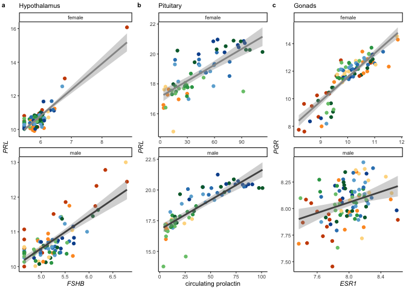

all things box plots
====================

candidate genes
---------------

    library(tidyverse)

    ## ── Attaching packages ─────────────────────────── tidyverse 1.3.0 ──

    ## ✓ ggplot2 3.3.0.9000     ✓ purrr   0.3.3     
    ## ✓ tibble  2.1.3          ✓ dplyr   0.8.3     
    ## ✓ tidyr   1.0.0          ✓ stringr 1.4.0     
    ## ✓ readr   1.3.1          ✓ forcats 0.4.0

    ## ── Conflicts ────────────────────────────── tidyverse_conflicts() ──
    ## x dplyr::filter() masks stats::filter()
    ## x dplyr::lag()    masks stats::lag()

    library(ggtext)
    library(cowplot)

    ## 
    ## Attaching package: 'cowplot'

    ## The following object is masked from 'package:ggplot2':
    ## 
    ##     ggsave

    library(ggpubr)

    ## Loading required package: magrittr

    ## 
    ## Attaching package: 'magrittr'

    ## The following object is masked from 'package:purrr':
    ## 
    ##     set_names

    ## The following object is masked from 'package:tidyr':
    ## 
    ##     extract

    ## 
    ## Attaching package: 'ggpubr'

    ## The following object is masked from 'package:cowplot':
    ## 
    ##     get_legend

    source("../R/themes.R")

    knitr::opts_chunk$set(echo = TRUE, message = F, fig.path = "../figures/")

    candidategenes <- c("OXT", "AVP", "GNRH1", "GNRHR", "CGNRH-R",
                        "AR", "POMC", "AGRP", 
                           "CRH", "AVPR1A", "AVPR1B", "AVPR2","VIP",
                           "CYP19A1", "DRD1", "DRD2", "PRL", "PRLR", "SOX9", 
                        "ESR1","ESR2", "LBH", "CDK1", "BRCA1",
                        "PTEN", "CREBBP", "FOS", "JUN", "EGR1",
                         "BDNF", "GRM2","GRIA1",
                        "KCNJ5", "CISH", "PTGER3", "CEBPD", "ZBTB16", 
                        "DIO3", "DIO2", "DIO1",
                        
                         "VIPR1", "VIPR2", "NPY", "LH", "FSH", "FSHB",
                        "JAK2", "HCRT", "TRH", "TSHB",
                        "MC3R", "MC4R", "MC5R",  "NR3C1", "NR3C2",
                        "STAT5B","NPVF") 

    candidategenesslim <- c("OXT", "AVP", "GNRH1", "GNRHR", 
                        "AR",  "CYP19A1", 
                        "AVPR1A", "AVPR1B", "AVPR2","VIP",
                        "DRD1", "DRD2", 
                        "PRL", "PRLR",  
                        "ESR1","ESR2", "LBH",  
                        "FOS", "JUN", "EGR1", "BDNF") 

    # candidategenesslim: AR, AVP, AVPR1A, AVPR1B, AVPR2, BDNF, CYP19A1, DRD1, EGR1, ESR1, ESR2, FOS, GNRH1, GNRHR, JUN, LBH, OXT, PRL, PRLR, VIP
    # DEG candidategenesslim: AR, AVPR1A, AVPR1B, AVPR2, BDNF, CYP19A1, DRD1, ESR1, FOS, GNRHR, LBH, PRL, PRLR, 
    # non-DEG candidategenesslim: AVP, AVPR1B, ESR2,  GNRH1, JUN, OXT, VIP

    hormonepapergenes <- c("GNRH1", "CGNRH-R", "GNRHR",  
                           "FSHB", "FSHR", "LHCGR", # no LSH
                           "VIP", "VIPR1",
                           "ESR1", "AR", "CYP19A1", "HSD17B1", # receptors synthesis
                           "PGR" , "HSD3B2", 
                           "PRL", "PRLR")

variance stabilized gene expression (vsd)
-----------------------------------------

    geneids <- read_csv("../metadata/00_geneinfo.csv") %>% select(-X1)

    ## Warning: Missing column names filled in: 'X1' [1]

    vsd_path <- "../results/DEseq2/"   # path to the data
    vsd_files <- dir(vsd_path, pattern = "*vsd.csv") # get file names
    vsd_pathfiles <- paste0(vsd_path, vsd_files)
    vsd_files

    ## [1] "female_gonad_vsd.csv"        "female_hypothalamus_vsd.csv"
    ## [3] "female_pituitary_vsd.csv"    "male_gonad_vsd.csv"         
    ## [5] "male_hypothalamus_vsd.csv"   "male_pituitary_vsd.csv"

    allvsd <- vsd_pathfiles %>%
      setNames(nm = .) %>% 
      map_df(~read_csv(.x), .id = "file_name")  %>% 
      dplyr::rename("gene" = "X1") %>% 
      pivot_longer(cols = L.G118_female_gonad_control:y98.o50.x_male_pituitary_inc.d3, 
                   names_to = "samples", values_to = "counts") 

    ## Warning: Missing column names filled in: 'X1' [1]

    ## Warning: Missing column names filled in: 'X1' [1]

    ## Warning: Missing column names filled in: 'X1' [1]

    ## Warning: Missing column names filled in: 'X1' [1]

    ## Warning: Missing column names filled in: 'X1' [1]

    ## Warning: Missing column names filled in: 'X1' [1]

    getcandidatevsd <- function(whichgenes, whichtissue, whichsex){
      candidates  <- allvsd %>%
        filter(gene %in% whichgenes) %>%
        dplyr::mutate(sextissue = sapply(strsplit(file_name, '_vsd.csv'), "[", 1)) %>%
        dplyr::mutate(sextissue = sapply(strsplit(sextissue, '../results/DEseq2/'), "[", 2)) %>%
        dplyr::mutate(sex = sapply(strsplit(sextissue, '\\_'), "[", 1),
                    tissue = sapply(strsplit(sextissue, '\\_'), "[", 2),
                    treatment = sapply(strsplit(samples, '\\_'), "[", 4)) %>%
        dplyr::mutate(treatment = sapply(strsplit(treatment, '.NYNO'), "[", 1)) %>%
        dplyr::select(sex, tissue, treatment, gene, samples, counts) %>%
        filter(tissue == whichtissue, sex %in% whichsex)  %>%
        drop_na()
      candidates$treatment <- factor(candidates$treatment, levels = alllevels)
      return(candidates)
    }

    hypvsd <- getcandidatevsd(hormonepapergenes, "hypothalamus", sexlevels)
    pitvsd <- getcandidatevsd(hormonepapergenes, "pituitary", sexlevels)
    gonvsd <- getcandidatevsd(hormonepapergenes, "gonad", sexlevels)
    head(hypvsd)

    ## # A tibble: 6 x 6
    ##   sex    tissue      treatment gene  samples                         counts
    ##   <chr>  <chr>       <fct>     <chr> <chr>                            <dbl>
    ## 1 female hypothalam… control   AR    L.G118_female_hypothalamus_con…   7.28
    ## 2 female hypothalam… control   AR    R.G106_female_hypothalamus_con…   7.32
    ## 3 female hypothalam… control   AR    R.R20_female_hypothalamus_cont…   7.74
    ## 4 female hypothalam… control   AR    R.R9_female_hypothalamus_contr…   7.31
    ## 5 female hypothalam… control   AR    R.W44_female_hypothalamus_cont…   7.02
    ## 6 female hypothalam… inc.d9    AR    blk.s061.pu.y_female_hypothala…   7.46

    tail(gonvsd)

    ## # A tibble: 6 x 6
    ##   sex   tissue treatment gene  samples                         counts
    ##   <chr> <chr>  <fct>     <chr> <chr>                            <dbl>
    ## 1 male  gonad  n9        VIPR1 y129.x_male_gonad_n9              5.25
    ## 2 male  gonad  n9        VIPR1 y131.w185.x_male_gonad_n9         4.95
    ## 3 male  gonad  inc.d17   VIPR1 y133.w77.r58_male_gonad_inc.d17   6.05
    ## 4 male  gonad  inc.d3    VIPR1 y149.r52.x_male_gonad_inc.d3      5.41
    ## 5 male  gonad  inc.d9    VIPR1 y95.g131.x_male_gonad_inc.d9      5.19
    ## 6 male  gonad  inc.d3    VIPR1 y98.o50.x_male_gonad_inc.d3       4.91

    candidatevsd <- rbind(hypvsd, pitvsd)
    candidatevsd <- rbind(candidatevsd, gonvsd)

    unique(candidatevsd$gene)

    ##  [1] "AR"      "CGNRH-R" "CYP19A1" "ESR1"    "FSHB"    "FSHR"    "GNRH1"  
    ##  [8] "GNRHR"   "HSD17B1" "HSD3B2"  "LHCGR"   "PGR"     "PRL"     "PRLR"   
    ## [15] "VIP"     "VIPR1"

Figs
----

    # summary DEG results from DESeq2
    candidateDEGS <- read_csv("../../musicalgenes/data/allDEG.csv") %>%
      select(-X1) %>%
      filter(gene %in% hormonepapergenes)

    ## Warning: Missing column names filled in: 'X1' [1]

    head(candidateDEGS)

    ## # A tibble: 6 x 8
    ##   sex    tissue comparison   direction gene       lfc      padj logpadj
    ##   <chr>  <chr>  <chr>        <chr>     <chr>    <dbl>     <dbl>   <dbl>
    ## 1 female gonad  bldg_lay     bldg      HSD3B2  -2.27  0.0200       1.70
    ## 2 female gonad  control_bldg bldg      HSD3B2   1.62  0.0161       1.79
    ## 3 female gonad  control_bldg bldg      PGR      1.61  0.00357      2.45
    ## 4 female gonad  control_bldg bldg      ESR1     1.39  0.0000108    4.97
    ## 5 female gonad  control_bldg bldg      AR       0.677 0.00504      2.30
    ## 6 female gonad  control_bldg control   CYP19A1 -1.11  0.0241       1.62

    # get genes to plot
    candidateDEGS %>% filter(tissue == "hypothalamus", sex == "female", comparison != "control_bldg") 

    ## # A tibble: 3 x 8
    ##   sex    tissue       comparison direction gene       lfc   padj logpadj
    ##   <chr>  <chr>        <chr>      <chr>     <chr>    <dbl>  <dbl>   <dbl>
    ## 1 female hypothalamus hatch_n5   n5        PGR      0.656 0.0428    1.37
    ## 2 female hypothalamus hatch_n5   n5        CYP19A1  0.633 0.0768    1.11
    ## 3 female hypothalamus hatch_n5   hatch     LHCGR   -0.800 0.0959    1.02

    candidateDEGS %>% filter(tissue == "hypothalamus", sex == "male", comparison != "control_bldg") 

    ## # A tibble: 1 x 8
    ##   sex   tissue       comparison     direction gene    lfc   padj logpadj
    ##   <chr> <chr>        <chr>          <chr>     <chr> <dbl>  <dbl>   <dbl>
    ## 1 male  hypothalamus inc.d9_inc.d17 inc.d17   AR    0.470 0.0980    1.01

    candidateDEGS %>% filter(tissue == "pituitary", sex == "male", comparison != "control_bldg") 

    ## # A tibble: 2 x 8
    ##   sex   tissue    comparison     direction gene    lfc         padj logpadj
    ##   <chr> <chr>     <chr>          <chr>     <chr> <dbl>        <dbl>   <dbl>
    ## 1 male  pituitary inc.d9_inc.d17 inc.d17   VIP    2.77      6.10e-2    1.21
    ## 2 male  pituitary inc.d9_inc.d17 inc.d17   PRL    2.15      2.50e-9    8.60

    candidateDEGS %>% filter(tissue == "pituitary", sex == "female", comparison != "control_bldg") 

    ## # A tibble: 6 x 8
    ##   sex    tissue    comparison     direction gene     lfc     padj logpadj
    ##   <chr>  <chr>     <chr>          <chr>     <chr>  <dbl>    <dbl>   <dbl>
    ## 1 female pituitary bldg_lay       lay       ESR1   0.888 1.01e- 8    8.00
    ## 2 female pituitary bldg_lay       bldg      GNRHR -1.53  3.80e- 6    5.42
    ## 3 female pituitary hatch_n5       hatch     PRL   -0.980 6.38e- 2    1.19
    ## 4 female pituitary inc.d9_inc.d17 inc.d17   PRL    2.52  1.70e-13   12.8 
    ## 5 female pituitary lay_inc.d3     inc.d3    GNRHR  0.979 2.33e- 2    1.63
    ## 6 female pituitary lay_inc.d3     lay       ESR1  -0.481 1.95e- 2    1.71

    candidateDEGS %>% filter(tissue == "gonad", sex == "female", comparison != "control_bldg") 

    ## # A tibble: 3 x 8
    ##   sex    tissue comparison direction gene     lfc   padj logpadj
    ##   <chr>  <chr>  <chr>      <chr>     <chr>  <dbl>  <dbl>   <dbl>
    ## 1 female gonad  bldg_lay   bldg      HSD3B2 -2.27 0.0200    1.70
    ## 2 female gonad  lay_inc.d3 lay       VIPR1  -1.25 0.0253    1.60
    ## 3 female gonad  lay_inc.d3 lay       PRLR   -1.54 0.0131    1.88

    # summarize all differences
    candidateDEGtable <- candidateDEGS %>%
      mutate(posneg = ifelse(lfc >= 0, "+", "-")) %>%
      mutate(geneposneg = paste(gene, posneg, sep = "")) %>%
      select(sex, tissue, comparison, geneposneg) %>%
      group_by(sex, tissue, comparison) %>%
       arrange(geneposneg) %>%
      summarize(genes = str_c(geneposneg, collapse = " ")) %>% 
      pivot_wider(names_from = comparison, values_from = genes)  %>% 
      ungroup(tissue) %>%
      mutate(tissue = factor(tissue, levels =  tissuelevel))  %>% 
      arrange(sex, tissue)  %>% 
      select(sex, tissue, bldg_lay, lay_inc.d3, inc.d9_inc.d17, hatch_n5, control_bldg)
    candidateDEGtable

    ## # A tibble: 6 x 7
    ##   sex    tissue  bldg_lay lay_inc.d3 inc.d9_inc.d17 hatch_n5 control_bldg  
    ##   <chr>  <fct>   <chr>    <chr>      <chr>          <chr>    <chr>         
    ## 1 female hypoth… <NA>     <NA>       <NA>           CYP19A1… AR+ CGNRH-R- …
    ## 2 female pituit… ESR1+ G… ESR1- GNR… PRL+           PRL-     AR+ CYP19A1- …
    ## 3 female gonad   HSD3B2-  PRLR- VIP… <NA>           <NA>     AR+ CYP19A1- …
    ## 4 male   hypoth… <NA>     <NA>       AR+            <NA>     AR+ CYP19A1- …
    ## 5 male   pituit… <NA>     <NA>       PRL+ VIP+      <NA>     AR+ CGNRH-R- …
    ## 6 male   gonad   <NA>     <NA>       <NA>           <NA>     AR+ ESR1+ HSD…

    newboxplot <- function(df, mygenes, whichsex, whichstage){
      
      p <- df %>%
        filter(gene %in% mygenes, 
               sex %in% whichsex,
               treatment %in% whichstage) %>%
        droplevels() %>%
        mutate(tissue = factor(tissue, levels = tissuelevel)) %>%
        ggplot(aes(x = treatment, y = counts, fill = treatment, color = sex)) +
        geom_boxplot() +
        geom_jitter(size = 0.5, width = 0.1) +
        facet_grid(tissue~gene, scales = "free_y") +
        theme_B3() +
        scale_color_manual(values = allcolors) +
        scale_fill_manual(values = allcolors) +
        theme(legend.position = "none",
              axis.text.x = element_text(angle = 45, hjust = 1),
              strip.text.x = element_text(face = "italic"),
              axis.title.x = element_blank())  +
        labs(x = "Parental stage",
             y = "variance stabilized expression")
      return(p)
    }

    a1 <- newboxplot(hypvsd, c("PGR",  "CYP19A1", "LHCGR" ), "female", c( "hatch", "n5")) + 
      theme(strip.text.y = element_blank()) + labs(subtitle = "Females")
    a2 <- newboxplot(hypvsd, c("AR"), "male", c( "hatch", "n5")) + 
      theme(axis.title.y = element_blank()) + labs(subtitle = "Males")

    b1 <- newboxplot(gonvsd, c("HSD3B2"), "female", c( "bldg", "lay"))  +
      theme(strip.text.y = element_blank(),
            axis.title.y = element_blank()) + labs(subtitle = "Females")
    b2 <- newboxplot(gonvsd, c("VIPR1",  "PRLR" ), "female", c( "lay", "inc.d3"))  + 
      theme(axis.title.y = element_blank()) + labs(subtitle = " ")

    ab <- plot_grid(a1,a2,b1,b2, rel_widths = c(6,2.5,2,4), labels = c("a", " ", "b", " "), label_size = 8, nrow = 1)

    c1 <- newboxplot(pitvsd, c( "ESR1", "GNRHR"), "female", c("bldg", "lay",  "inc.d3")) 
    c2 <- newboxplot(pitvsd, c( "PRL"), "female", c("inc.d9", "inc.d17", "hatch", "n5")) 
    c3 <- newboxplot(pitvsd, c("VIPR1",  "PRL" ), "male", c( "inc.d9", "inc.d17")) 

    c <- plot_grid(c1 + theme(strip.text.y = element_blank()) + labs(subtitle = "Females"),
              c2 + theme(strip.text.y = element_blank(),
                        axis.title.y = element_blank()) + labs(subtitle = " ") ,
              c3 + theme(axis.title.y = element_blank()) + labs(subtitle = "Males"), 
              nrow = 1, rel_widths = c(6,4,4),
              labels = c("c"), label_size = 8)

    plot_grid(ab,c, nrow = 2)

    # correlations
    library(corrr)

    hormones <- read_csv("../results/07_hormoneswide.csv") %>%
      select(-study, -treatment, -sex)
    head(hormones)

    ## # A tibble: 6 x 7
    ##   bird_id prolactin corticosterone testosterone moltbin estradiol
    ##   <chr>       <dbl>          <dbl>        <dbl>   <dbl>     <dbl>
    ## 1 x.g          3.83          0.590        0.187      NA    NA    
    ## 2 x.g.g        3.28          0.817        0.661      NA    NA    
    ## 3 x.blk.…      4.15          0.850        1.00       NA    NA    
    ## 4 x.g.g.g     25.3           1.03         1.74       NA    NA    
    ## 5 x.g.g.f     21.5           1.15        NA          NA     0.235
    ## 6 x.blu.o     14.9           1.44         3.05       NA    NA    
    ## # … with 1 more variable: progesterone <dbl>

    head(candidatevsd)

    ## # A tibble: 6 x 6
    ##   sex    tissue      treatment gene  samples                         counts
    ##   <chr>  <chr>       <fct>     <chr> <chr>                            <dbl>
    ## 1 female hypothalam… control   AR    L.G118_female_hypothalamus_con…   7.28
    ## 2 female hypothalam… control   AR    R.G106_female_hypothalamus_con…   7.32
    ## 3 female hypothalam… control   AR    R.R20_female_hypothalamus_cont…   7.74
    ## 4 female hypothalam… control   AR    R.R9_female_hypothalamus_contr…   7.31
    ## 5 female hypothalam… control   AR    R.W44_female_hypothalamus_cont…   7.02
    ## 6 female hypothalam… inc.d9    AR    blk.s061.pu.y_female_hypothala…   7.46

    vsdhormones <- candidatevsd %>%
      pivot_wider(names_from = gene, values_from = counts) %>%
      mutate(bird_id = sapply(strsplit(samples,"\\_"), "[", 1)) %>%
      left_join(.,hormones, by =  "bird_id")
    vsdhormones

    ## # A tibble: 576 x 27
    ##    sex   tissue treatment samples    AR `CGNRH-R` CYP19A1  ESR1  FSHB  FSHR
    ##    <chr> <chr>  <fct>     <chr>   <dbl>     <dbl>   <dbl> <dbl> <dbl> <dbl>
    ##  1 fema… hypot… control   L.G118…  7.28      5.46    9.31  9.91  6.78  5.46
    ##  2 fema… hypot… control   R.G106…  7.32      5.77    7.83  9.77  5.84  5.84
    ##  3 fema… hypot… control   R.R20_…  7.74      5.46   10.1   9.24  6.04  5.46
    ##  4 fema… hypot… control   R.R9_f…  7.31      5.68    9.15  9.68  5.95  5.68
    ##  5 fema… hypot… control   R.W44_…  7.02      5.66    9.44  9.80  5.46  5.87
    ##  6 fema… hypot… inc.d9    blk.s0…  7.46      5.76    8.14 10.2   5.63  6.05
    ##  7 fema… hypot… bldg      blk11.…  7.78      5.73    8.68 10.4   5.65  5.93
    ##  8 fema… hypot… hatch     blk21.…  8.13      6.12    7.36 10.1   6.09  5.46
    ##  9 fema… hypot… n9        blk4.x…  6.51      5.46    8.32 11.3   6.70  5.46
    ## 10 fema… hypot… control   blu.o.…  7.02      5.46    8.34  9.58  5.46  5.46
    ## # … with 566 more rows, and 17 more variables: GNRH1 <dbl>, GNRHR <dbl>,
    ## #   HSD17B1 <dbl>, HSD3B2 <dbl>, LHCGR <dbl>, PGR <dbl>, PRL <dbl>,
    ## #   PRLR <dbl>, VIP <dbl>, VIPR1 <dbl>, bird_id <chr>, prolactin <dbl>,
    ## #   corticosterone <dbl>, testosterone <dbl>, moltbin <dbl>,
    ## #   estradiol <dbl>, progesterone <dbl>

    vsdhormoneshyp <- vsdhormones %>% filter(tissue == "hypothalamus" )
    vsdhormonespit <- vsdhormones %>% filter(tissue == "pituitary" )
    vsdhormonesgon <- vsdhormones %>% filter(tissue == "gonad" )

    plotcorrs <- function(whichtissue, whichsex){
      
      x <- vsdhormones  %>%
        filter(tissue == whichtissue, 
               sex == whichsex) %>%
        select(-sex, - tissue, - treatment, -samples, -bird_id, -moltbin) %>%
        correlate()
      print(fashion(x))
      
      p <-rplot(x, colors = c("#0571b0", "#92c5de", "#f7f7f7","#f7f7f7","#f7f7f7", "#f4a582", "#ca0020")) +
        theme_B3() +
        theme(legend.position = "bottom",
              axis.text.x = element_text(angle = 45, hjust = 1),
              axis.text = element_text(face = "italic")) +
        labs(subtitle = whichtissue)
      return(p)
    }

    a <- plotcorrs("hypothalamus", "female") + theme(legend.position = "none")

    ##           rowname   AR CGNRH.R CYP19A1 ESR1 FSHB FSHR GNRH1 GNRHR HSD17B1
    ## 1              AR         -.01    -.04 -.06 -.01  .17  -.04  -.11    -.06
    ## 2         CGNRH-R -.01             .05 -.12 -.18 -.16   .00   .29    -.15
    ## 3         CYP19A1 -.04     .05         -.34 -.01 -.24   .31   .11     .23
    ## 4            ESR1 -.06    -.12    -.34       .11  .17  -.01  -.09    -.12
    ## 5            FSHB -.01    -.18    -.01  .11      -.23  -.33  -.14    -.06
    ## 6            FSHR  .17    -.16    -.24  .17 -.23       -.16   .14    -.10
    ## 7           GNRH1 -.04     .00     .31 -.01 -.33 -.16         .09     .10
    ## 8           GNRHR -.11     .29     .11 -.09 -.14  .14   .09          -.05
    ## 9         HSD17B1 -.06    -.15     .23 -.12 -.06 -.10   .10  -.05        
    ## 10         HSD3B2  .03    -.19     .09 -.16  .33 -.01  -.07  -.11     .10
    ## 11          LHCGR  .19    -.04    -.25  .01  .12  .14  -.36  -.13    -.19
    ## 12            PGR  .48     .02     .54  .01 -.08  .04   .38  -.01    -.01
    ## 13            PRL -.15    -.19     .03  .08  .87 -.27  -.23  -.13    -.02
    ## 14           PRLR  .26     .25     .18 -.30 -.18  .08   .15   .09     .15
    ## 15            VIP -.30     .31     .27  .06 -.12 -.33   .23   .19    -.05
    ## 16          VIPR1  .20     .30    -.07 -.07 -.34  .20   .02   .02     .08
    ## 17      prolactin  .06    -.00    -.10  .09  .24  .01  -.14   .02     .02
    ## 18 corticosterone  .15     .20    -.03  .02 -.01  .28  -.07   .12     .08
    ## 19   testosterone                                                        
    ## 20      estradiol  .00    -.20     .06  .17  .02 -.00  -.09   .26    -.07
    ## 21   progesterone -.04     .03    -.18  .03  .22  .36  -.26   .10    -.31
    ##    HSD3B2 LHCGR  PGR  PRL PRLR  VIP VIPR1 prolactin corticosterone
    ## 1     .03   .19  .48 -.15  .26 -.30   .20       .06            .15
    ## 2    -.19  -.04  .02 -.19  .25  .31   .30      -.00            .20
    ## 3     .09  -.25  .54  .03  .18  .27  -.07      -.10           -.03
    ## 4    -.16   .01  .01  .08 -.30  .06  -.07       .09            .02
    ## 5     .33   .12 -.08  .87 -.18 -.12  -.34       .24           -.01
    ## 6    -.01   .14  .04 -.27  .08 -.33   .20       .01            .28
    ## 7    -.07  -.36  .38 -.23  .15  .23   .02      -.14           -.07
    ## 8    -.11  -.13 -.01 -.13  .09  .19   .02       .02            .12
    ## 9     .10  -.19 -.01 -.02  .15 -.05   .08       .02            .08
    ## 10          .37  .01  .36  .05 -.20  -.33      -.12           -.01
    ## 11    .37       -.16  .02 -.10 -.24  -.22       .03           -.07
    ## 12    .01  -.16      -.12  .32  .16   .15      -.16           -.05
    ## 13    .36   .02 -.12      -.13 -.10  -.34       .34            .01
    ## 14    .05  -.10  .32 -.13       .01   .21      -.05            .14
    ## 15   -.20  -.24  .16 -.10  .01       -.04      -.03           -.16
    ## 16   -.33  -.22  .15 -.34  .21 -.04            -.05            .25
    ## 17   -.12   .03 -.16  .34 -.05 -.03  -.05                      .42
    ## 18   -.01  -.07 -.05  .01  .14 -.16   .25       .42               
    ## 19                                                                
    ## 20   -.10  -.22  .09 -.08 -.17  .04  -.08       .06           -.10
    ## 21    .21   .06 -.25  .24  .17 -.12  -.02       .08            .33
    ##    testosterone estradiol progesterone
    ## 1                     .00         -.04
    ## 2                    -.20          .03
    ## 3                     .06         -.18
    ## 4                     .17          .03
    ## 5                     .02          .22
    ## 6                    -.00          .36
    ## 7                    -.09         -.26
    ## 8                     .26          .10
    ## 9                    -.07         -.31
    ## 10                   -.10          .21
    ## 11                   -.22          .06
    ## 12                    .09         -.25
    ## 13                   -.08          .24
    ## 14                   -.17          .17
    ## 15                    .04         -.12
    ## 16                   -.08         -.02
    ## 17                    .06          .08
    ## 18                   -.10          .33
    ## 19                                    
    ## 20                                 .02
    ## 21                    .02

    b <- plotcorrs("pituitary", "female") + theme(axis.text.y = element_blank()) + theme(legend.position = "none")

    ##           rowname   AR CGNRH.R CYP19A1 ESR1 FSHB FSHR GNRH1 GNRHR HSD17B1
    ## 1              AR                 -.17 -.11 -.12  .15   .05   .26     .29
    ## 2         CGNRH-R                                                        
    ## 3         CYP19A1 -.17                  .01 -.14  .07   .42   .05    -.20
    ## 4            ESR1 -.11             .01       .44  .14  -.13  -.61     .03
    ## 5            FSHB -.12            -.14  .44       .14  -.06  -.40    -.10
    ## 6            FSHR  .15             .07  .14  .14        .09   .03     .07
    ## 7           GNRH1  .05             .42 -.13 -.06  .09         .09    -.10
    ## 8           GNRHR  .26             .05 -.61 -.40  .03   .09           .04
    ## 9         HSD17B1  .29            -.20  .03 -.10  .07  -.10   .04        
    ## 10         HSD3B2  .03             .03 -.01 -.37 -.02   .02   .15     .09
    ## 11          LHCGR  .10             .30 -.10 -.25  .19   .26   .18     .00
    ## 12            PGR  .42            -.10 -.29 -.36  .06  -.02   .46     .06
    ## 13            PRL -.35            -.21 -.09  .12 -.19  -.17  -.27    -.04
    ## 14           PRLR -.39             .22 -.06 -.16 -.05   .08   .21    -.29
    ## 15            VIP  .14             .42 -.08 -.10  .05   .41   .08     .05
    ## 16          VIPR1 -.10            -.04 -.09 -.16 -.16  -.10  -.19     .02
    ## 17      prolactin -.26            -.05  .01  .18 -.01  -.14  -.23    -.11
    ## 18 corticosterone -.09             .00  .18  .23  .11  -.15  -.15    -.07
    ## 19   testosterone                                                        
    ## 20      estradiol  .37             .03 -.35 -.44 -.17   .15   .25     .06
    ## 21   progesterone  .10             .19  .36  .01  .13   .05  -.16     .00
    ##    HSD3B2 LHCGR  PGR  PRL PRLR  VIP VIPR1 prolactin corticosterone
    ## 1     .03   .10  .42 -.35 -.39  .14  -.10      -.26           -.09
    ## 2                                                                 
    ## 3     .03   .30 -.10 -.21  .22  .42  -.04      -.05            .00
    ## 4    -.01  -.10 -.29 -.09 -.06 -.08  -.09       .01            .18
    ## 5    -.37  -.25 -.36  .12 -.16 -.10  -.16       .18            .23
    ## 6    -.02   .19  .06 -.19 -.05  .05  -.16      -.01            .11
    ## 7     .02   .26 -.02 -.17  .08  .41  -.10      -.14           -.15
    ## 8     .15   .18  .46 -.27  .21  .08  -.19      -.23           -.15
    ## 9     .09   .00  .06 -.04 -.29  .05   .02      -.11           -.07
    ## 10          .30  .26  .03  .31  .04   .20       .10           -.15
    ## 11    .30        .15 -.14  .17  .23   .16      -.20           -.09
    ## 12    .26   .15      -.07  .14  .18   .22      -.16           -.06
    ## 13    .03  -.14 -.07       .07 -.13   .63       .74            .25
    ## 14    .31   .17  .14  .07       .04   .29       .13           -.05
    ## 15    .04   .23  .18 -.13  .04        .03      -.02           -.09
    ## 16    .20   .16  .22  .63  .29  .03             .39           -.02
    ## 17    .10  -.20 -.16  .74  .13 -.02   .39                      .42
    ## 18   -.15  -.09 -.06  .25 -.05 -.09  -.02       .42               
    ## 19                                                                
    ## 20    .13   .06  .32 -.01 -.19  .04   .15       .07           -.08
    ## 21   -.10  -.11  .02  .04  .18  .09   .02       .09            .34
    ##    testosterone estradiol progesterone
    ## 1                     .37          .10
    ## 2                                     
    ## 3                     .03          .19
    ## 4                    -.35          .36
    ## 5                    -.44          .01
    ## 6                    -.17          .13
    ## 7                     .15          .05
    ## 8                     .25         -.16
    ## 9                     .06          .00
    ## 10                    .13         -.10
    ## 11                    .06         -.11
    ## 12                    .32          .02
    ## 13                   -.01          .04
    ## 14                   -.19          .18
    ## 15                    .04          .09
    ## 16                    .15          .02
    ## 17                    .07          .09
    ## 18                   -.08          .34
    ## 19                                    
    ## 20                                 .04
    ## 21                    .04

    c <- plotcorrs("gonad", "female") + theme(axis.text.y = element_blank()) + theme(legend.position = "none")

    ##           rowname   AR CGNRH.R CYP19A1 ESR1 FSHB FSHR GNRH1 GNRHR HSD17B1
    ## 1              AR                  .16  .12  .03  .01  -.10   .04     .35
    ## 2         CGNRH-R                                                        
    ## 3         CYP19A1  .16                 -.28  .13  .46  -.15   .21     .79
    ## 4            ESR1  .12            -.28      -.47 -.49   .22  -.53    -.06
    ## 5            FSHB  .03             .13 -.47       .40  -.04   .61    -.06
    ## 6            FSHR  .01             .46 -.49  .40       -.12   .50     .13
    ## 7           GNRH1 -.10            -.15  .22 -.04 -.12        -.19    -.22
    ## 8           GNRHR  .04             .21 -.53  .61  .50  -.19           .01
    ## 9         HSD17B1  .35             .79 -.06 -.06  .13  -.22   .01        
    ## 10         HSD3B2  .25             .60 -.08  .05  .22  -.21   .23     .55
    ## 11          LHCGR  .26             .81 -.34  .12  .45  -.27   .26     .68
    ## 12            PGR  .06            -.27  .87 -.52 -.44   .20  -.59    -.05
    ## 13            PRL  .19            -.02  .19  .01 -.11   .10  -.27     .07
    ## 14           PRLR  .08            -.32  .43 -.15 -.06   .20  -.30    -.38
    ## 15            VIP -.18             .11 -.32  .53  .20  -.04   .47    -.07
    ## 16          VIPR1  .05            -.17 -.17  .07  .20   .07   .01    -.24
    ## 17      prolactin  .02             .18 -.15  .21  .31  -.22   .40     .14
    ## 18 corticosterone  .12             .15 -.05  .26  .15   .01   .24     .05
    ## 19   testosterone                                                        
    ## 20      estradiol  .01            -.15 -.09 -.14 -.07  -.21  -.12    -.07
    ## 21   progesterone -.12            -.21  .07  .14 -.03   .14   .04    -.22
    ##    HSD3B2 LHCGR  PGR  PRL PRLR  VIP VIPR1 prolactin corticosterone
    ## 1     .25   .26  .06  .19  .08 -.18   .05       .02            .12
    ## 2                                                                 
    ## 3     .60   .81 -.27 -.02 -.32  .11  -.17       .18            .15
    ## 4    -.08  -.34  .87  .19  .43 -.32  -.17      -.15           -.05
    ## 5     .05   .12 -.52  .01 -.15  .53   .07       .21            .26
    ## 6     .22   .45 -.44 -.11 -.06  .20   .20       .31            .15
    ## 7    -.21  -.27  .20  .10  .20 -.04   .07      -.22            .01
    ## 8     .23   .26 -.59 -.27 -.30  .47   .01       .40            .24
    ## 9     .55   .68 -.05  .07 -.38 -.07  -.24       .14            .05
    ## 10          .65 -.24 -.03 -.38  .21  -.28       .11            .12
    ## 11    .65       -.38 -.10 -.40  .20  -.10       .20            .02
    ## 12   -.24  -.38       .22  .46 -.41  -.02      -.17           -.06
    ## 13   -.03  -.10  .22       .21 -.08   .11      -.01            .07
    ## 14   -.38  -.40  .46  .21      -.11   .29      -.33           -.07
    ## 15    .21   .20 -.41 -.08 -.11        .12       .30            .21
    ## 16   -.28  -.10 -.02  .11  .29  .12            -.00           -.09
    ## 17    .11   .20 -.17 -.01 -.33  .30  -.00                      .42
    ## 18    .12   .02 -.06  .07 -.07  .21  -.09       .42               
    ## 19                                                                
    ## 20   -.16  -.08 -.06  .09  .16 -.09  -.03       .07           -.08
    ## 21   -.21  -.23  .09  .06 -.08  .22   .04       .09            .34
    ##    testosterone estradiol progesterone
    ## 1                     .01         -.12
    ## 2                                     
    ## 3                    -.15         -.21
    ## 4                    -.09          .07
    ## 5                    -.14          .14
    ## 6                    -.07         -.03
    ## 7                    -.21          .14
    ## 8                    -.12          .04
    ## 9                    -.07         -.22
    ## 10                   -.16         -.21
    ## 11                   -.08         -.23
    ## 12                   -.06          .09
    ## 13                    .09          .06
    ## 14                    .16         -.08
    ## 15                   -.09          .22
    ## 16                   -.03          .04
    ## 17                    .07          .09
    ## 18                   -.08          .34
    ## 19                                    
    ## 20                                 .04
    ## 21                    .04

    d <- plotcorrs("hypothalamus", "male") 

    ##           rowname   AR CGNRH.R CYP19A1 ESR1 FSHB FSHR GNRH1 GNRHR HSD17B1
    ## 1              AR          .18    -.12  .26 -.02  .06  -.32   .07     .07
    ## 2         CGNRH-R  .18            -.35 -.08 -.24  .32  -.34  -.27     .29
    ## 3         CYP19A1 -.12    -.35         -.08  .10 -.44   .56   .18    -.07
    ## 4            ESR1  .26    -.08    -.08       .16 -.04  -.08   .22    -.03
    ## 5            FSHB -.02    -.24     .10  .16      -.11   .19   .19     .21
    ## 6            FSHR  .06     .32    -.44 -.04 -.11       -.36  -.29    -.04
    ## 7           GNRH1 -.32    -.34     .56 -.08  .19 -.36         .10    -.13
    ## 8           GNRHR  .07    -.27     .18  .22  .19 -.29   .10          -.04
    ## 9         HSD17B1  .07     .29    -.07 -.03  .21 -.04  -.13  -.04        
    ## 10         HSD3B2  .10     .12    -.21 -.07  .29  .01  -.01  -.16     .56
    ## 11          LHCGR  .25     .05    -.28 -.18  .07  .30  -.31  -.03     .07
    ## 12            PGR  .30    -.06     .61  .16  .04 -.18   .33   .06    -.06
    ## 13            PRL -.28    -.27     .22  .01  .76 -.28   .39   .13     .34
    ## 14           PRLR -.03     .06     .07 -.17 -.12  .11  -.06  -.18    -.01
    ## 15            VIP -.16    -.11     .52  .09 -.02 -.28   .33   .31    -.05
    ## 16          VIPR1  .08     .17    -.28  .18 -.27  .35  -.11  -.20    -.18
    ## 17      prolactin  .10     .05    -.07 -.11  .18  .00  -.36   .12     .16
    ## 18 corticosterone  .07     .08    -.03  .08 -.07 -.15   .03  -.05     .19
    ## 19   testosterone  .12    -.07    -.05 -.05  .05  .06  -.22  -.15     .04
    ## 20      estradiol                                                        
    ## 21   progesterone -.07    -.07    -.18 -.11 -.13  .06  -.00  -.03    -.10
    ##    HSD3B2 LHCGR  PGR  PRL PRLR  VIP VIPR1 prolactin corticosterone
    ## 1     .10   .25  .30 -.28 -.03 -.16   .08       .10            .07
    ## 2     .12   .05 -.06 -.27  .06 -.11   .17       .05            .08
    ## 3    -.21  -.28  .61  .22  .07  .52  -.28      -.07           -.03
    ## 4    -.07  -.18  .16  .01 -.17  .09   .18      -.11            .08
    ## 5     .29   .07  .04  .76 -.12 -.02  -.27       .18           -.07
    ## 6     .01   .30 -.18 -.28  .11 -.28   .35       .00           -.15
    ## 7    -.01  -.31  .33  .39 -.06  .33  -.11      -.36            .03
    ## 8    -.16  -.03  .06  .13 -.18  .31  -.20       .12           -.05
    ## 9     .56   .07 -.06  .34 -.01 -.05  -.18       .16            .19
    ## 10          .29 -.18  .27 -.25 -.23  -.18      -.17           -.13
    ## 11    .29       -.22 -.06 -.11 -.20  -.29       .11           -.10
    ## 12   -.18  -.22       .02  .25  .33   .14      -.13           -.01
    ## 13    .27  -.06  .02      -.08  .05  -.34       .04            .04
    ## 14   -.25  -.11  .25 -.08      -.03   .26       .02            .09
    ## 15   -.23  -.20  .33  .05 -.03       -.28      -.13            .01
    ## 16   -.18  -.29  .14 -.34  .26 -.28            -.06            .03
    ## 17   -.17   .11 -.13  .04  .02 -.13  -.06                      .14
    ## 18   -.13  -.10 -.01  .04  .09  .01   .03       .14               
    ## 19   -.02   .03 -.06  .06  .06 -.13   .06      -.03           -.05
    ## 20                                                                
    ## 21   -.12  -.11 -.20 -.11  .13 -.00   .28      -.11            .07
    ##    testosterone estradiol progesterone
    ## 1           .12                   -.07
    ## 2          -.07                   -.07
    ## 3          -.05                   -.18
    ## 4          -.05                   -.11
    ## 5           .05                   -.13
    ## 6           .06                    .06
    ## 7          -.22                   -.00
    ## 8          -.15                   -.03
    ## 9           .04                   -.10
    ## 10         -.02                   -.12
    ## 11          .03                   -.11
    ## 12         -.06                   -.20
    ## 13          .06                   -.11
    ## 14          .06                    .13
    ## 15         -.13                   -.00
    ## 16          .06                    .28
    ## 17         -.03                   -.11
    ## 18         -.05                    .07
    ## 19                                 .09
    ## 20                                    
    ## 21          .09

    e <- plotcorrs("pituitary", "male") + theme(axis.text.y = element_blank())

    ##           rowname   AR CGNRH.R CYP19A1 ESR1 FSHB FSHR GNRH1 GNRHR HSD17B1
    ## 1              AR         -.30    -.25  .21 -.07  .11  -.30   .53     .35
    ## 2         CGNRH-R -.30             .34 -.25  .17 -.13   .27  -.07    -.17
    ## 3         CYP19A1 -.25     .34          .00  .02 -.06  -.01  -.10    -.25
    ## 4            ESR1  .21    -.25     .00      -.01 -.09  -.16   .02     .06
    ## 5            FSHB -.07     .17     .02 -.01      -.15  -.02   .13     .10
    ## 6            FSHR  .11    -.13    -.06 -.09 -.15       -.11   .09     .06
    ## 7           GNRH1 -.30     .27    -.01 -.16 -.02 -.11        -.29    -.01
    ## 8           GNRHR  .53    -.07    -.10  .02  .13  .09  -.29           .09
    ## 9         HSD17B1  .35    -.17    -.25  .06  .10  .06  -.01   .09        
    ## 10         HSD3B2  .22     .02     .21  .05 -.19  .14  -.15   .19     .03
    ## 11          LHCGR  .21    -.16    -.02  .06 -.20 -.00  -.09   .07     .17
    ## 12            PGR  .56    -.06     .09 -.02  .15  .17  -.19   .55     .06
    ## 13            PRL -.21     .00    -.27 -.16  .06 -.01   .11  -.24    -.01
    ## 14           PRLR -.41     .24     .47  .15  .15  .11   .08  -.06    -.28
    ## 15            VIP  .05    -.10     .04 -.02 -.11 -.09   .02   .01    -.13
    ## 16          VIPR1 -.13    -.00     .05  .04  .09  .01  -.01  -.13     .00
    ## 17      prolactin -.22     .05    -.21 -.19  .12 -.22   .21  -.32    -.15
    ## 18 corticosterone -.03    -.21    -.24 -.08  .03 -.01  -.01   .02     .07
    ## 19   testosterone  .28    -.02     .10 -.36 -.03  .07  -.06   .50    -.10
    ## 20      estradiol                                                        
    ## 21   progesterone  .23    -.24     .02 -.05  .22  .06  -.27   .30     .11
    ##    HSD3B2 LHCGR  PGR  PRL PRLR  VIP VIPR1 prolactin corticosterone
    ## 1     .22   .21  .56 -.21 -.41  .05  -.13      -.22           -.03
    ## 2     .02  -.16 -.06  .00  .24 -.10  -.00       .05           -.21
    ## 3     .21  -.02  .09 -.27  .47  .04   .05      -.21           -.24
    ## 4     .05   .06 -.02 -.16  .15 -.02   .04      -.19           -.08
    ## 5    -.19  -.20  .15  .06  .15 -.11   .09       .12            .03
    ## 6     .14  -.00  .17 -.01  .11 -.09   .01      -.22           -.01
    ## 7    -.15  -.09 -.19  .11  .08  .02  -.01       .21           -.01
    ## 8     .19   .07  .55 -.24 -.06  .01  -.13      -.32            .02
    ## 9     .03   .17  .06 -.01 -.28 -.13   .00      -.15            .07
    ## 10          .19  .29 -.03  .08  .14   .11      -.05            .01
    ## 11    .19        .02  .05 -.22 -.22   .12      -.02           -.04
    ## 12    .29   .02      -.17  .03  .19   .03      -.18            .03
    ## 13   -.03   .05 -.17      -.12 -.03   .62       .82            .06
    ## 14    .08  -.22  .03 -.12       .01   .27      -.09            .23
    ## 15    .14  -.22  .19 -.03  .01       -.03      -.15            .14
    ## 16    .11   .12  .03  .62  .27 -.03             .43            .01
    ## 17   -.05  -.02 -.18  .82 -.09 -.15   .43                      .14
    ## 18    .01  -.04  .03  .06  .23  .14   .01       .14               
    ## 19    .36   .17  .49  .02 -.07  .12   .25      -.03           -.05
    ## 20                                                                
    ## 21    .11   .30  .01 -.07 -.15  .05  -.03      -.11            .07
    ##    testosterone estradiol progesterone
    ## 1           .28                    .23
    ## 2          -.02                   -.24
    ## 3           .10                    .02
    ## 4          -.36                   -.05
    ## 5          -.03                    .22
    ## 6           .07                    .06
    ## 7          -.06                   -.27
    ## 8           .50                    .30
    ## 9          -.10                    .11
    ## 10          .36                    .11
    ## 11          .17                    .30
    ## 12          .49                    .01
    ## 13          .02                   -.07
    ## 14         -.07                   -.15
    ## 15          .12                    .05
    ## 16          .25                   -.03
    ## 17         -.03                   -.11
    ## 18         -.05                    .07
    ## 19                                 .09
    ## 20                                    
    ## 21          .09

    f <- plotcorrs("gonad", "male") + theme(axis.text.y = element_blank())

    ##           rowname   AR CGNRH.R CYP19A1 ESR1 FSHB FSHR GNRH1 GNRHR HSD17B1
    ## 1              AR          .07    -.18  .53 -.06  .12   .18   .22     .23
    ## 2         CGNRH-R  .07             .02  .01 -.11 -.07   .06   .39     .04
    ## 3         CYP19A1 -.18     .02         -.02  .33  .22  -.13  -.14    -.03
    ## 4            ESR1  .53     .01    -.02      -.03  .19   .17   .10     .10
    ## 5            FSHB -.06    -.11     .33 -.03       .19   .01   .00     .32
    ## 6            FSHR  .12    -.07     .22  .19  .19        .01  -.06     .03
    ## 7           GNRH1  .18     .06    -.13  .17  .01  .01         .08     .21
    ## 8           GNRHR  .22     .39    -.14  .10  .00 -.06   .08           .21
    ## 9         HSD17B1  .23     .04    -.03  .10  .32  .03   .21   .21        
    ## 10         HSD3B2 -.03     .03     .21  .26  .03  .27  -.21   .05    -.12
    ## 11          LHCGR  .44     .15     .05  .48  .00  .07  -.01   .09     .09
    ## 12            PGR  .47    -.14    -.00  .33  .09  .31   .16  -.17     .16
    ## 13            PRL -.15    -.15     .28 -.16  .75  .20  -.02  -.12     .18
    ## 14           PRLR -.19     .04     .28 -.17  .34  .42   .00  -.20     .01
    ## 15            VIP                                                        
    ## 16          VIPR1  .03     .08     .07 -.08  .01  .08   .07   .19    -.07
    ## 17      prolactin  .15    -.01    -.03  .11 -.16  .18   .05   .04     .11
    ## 18 corticosterone -.09    -.21     .12 -.19 -.04  .04  -.27  -.04    -.18
    ## 19   testosterone  .15     .05    -.07 -.05 -.02 -.01   .12   .06     .01
    ## 20      estradiol                                                        
    ## 21   progesterone -.32    -.00     .44 -.10  .18 -.06   .06  -.12     .22
    ##    HSD3B2 LHCGR  PGR  PRL PRLR VIP VIPR1 prolactin corticosterone
    ## 1    -.03   .44  .47 -.15 -.19       .03       .15           -.09
    ## 2     .03   .15 -.14 -.15  .04       .08      -.01           -.21
    ## 3     .21   .05 -.00  .28  .28       .07      -.03            .12
    ## 4     .26   .48  .33 -.16 -.17      -.08       .11           -.19
    ## 5     .03   .00  .09  .75  .34       .01      -.16           -.04
    ## 6     .27   .07  .31  .20  .42       .08       .18            .04
    ## 7    -.21  -.01  .16 -.02  .00       .07       .05           -.27
    ## 8     .05   .09 -.17 -.12 -.20       .19       .04           -.04
    ## 9    -.12   .09  .16  .18  .01      -.07       .11           -.18
    ## 10          .45 -.24  .03  .09       .03      -.09            .01
    ## 11    .45        .10 -.17 -.06       .00      -.08           -.27
    ## 12   -.24   .10       .03  .22      -.04       .12            .25
    ## 13    .03  -.17  .03       .38      -.04       .15            .08
    ## 14    .09  -.06  .22  .38           -.01       .07           -.04
    ## 15                                                               
    ## 16    .03   .00 -.04 -.04 -.01                 .16            .10
    ## 17   -.09  -.08  .12  .15  .07       .16                      .14
    ## 18    .01  -.27  .25  .08 -.04       .10       .14               
    ## 19   -.25   .08  .26 -.13  .09      -.01      -.03           -.05
    ## 20                                                               
    ## 21   -.08  -.05  .19  .35  .13      -.00      -.11            .07
    ##    testosterone estradiol progesterone
    ## 1           .15                   -.32
    ## 2           .05                   -.00
    ## 3          -.07                    .44
    ## 4          -.05                   -.10
    ## 5          -.02                    .18
    ## 6          -.01                   -.06
    ## 7           .12                    .06
    ## 8           .06                   -.12
    ## 9           .01                    .22
    ## 10         -.25                   -.08
    ## 11          .08                   -.05
    ## 12          .26                    .19
    ## 13         -.13                    .35
    ## 14          .09                    .13
    ## 15                                    
    ## 16         -.01                   -.00
    ## 17         -.03                   -.11
    ## 18         -.05                    .07
    ## 19                                 .09
    ## 20                                    
    ## 21          .09

    plot_grid(a,b,c, d,e,f, nrow = 2, rel_widths = c(1.2,1,1), rel_heights = c(1,1.2),
              labels = c("females", " ", " ",
                         "males", " ", ""),
              label_size = 8)

    plotspecificcorrs <- function(df, myx, myy, myxlab, myylab){
      p <- df %>%
        mutate(tissue = factor(tissue, levels = tissuelevel)) %>%
        ggplot(aes(x = myx, y = myy)) +
        geom_point(aes(color = treatment)) +
        geom_smooth(method = "lm", aes(color = sex)) +
        facet_wrap(~sex, scales = "free", nrow = 2) +
        scale_color_manual(values = allcolors) +
        labs(x = myxlab, y = myylab) +
        theme_B3() +
        theme(legend.position = "none",
              axis.title = element_text(face = "italic"))
      return(p)
    }

    a <- plotspecificcorrs(vsdhormoneshyp, vsdhormoneshyp$FSHB, vsdhormoneshyp$PRL, "FSHB", "PRL") + labs(subtitle = "Hypothalamus")
    b <- plotspecificcorrs(vsdhormonespit, vsdhormonespit$prolactin, vsdhormonespit$PRL, "circulating prolactin", "PRL") +
      theme(axis.title.x = element_text(face = "plain")) + labs(subtitle = "Pituitary")
    c <- plotspecificcorrs(vsdhormonesgon, vsdhormonesgon$ESR1, vsdhormonesgon$PGR, "ESR1", "PGR")  + labs(subtitle = "Gonads")

    plot_grid(a,b,c,nrow = 1, labels = "auto", label_size = 8)

    ## Warning: Removed 68 rows containing non-finite values (stat_smooth).

    ## Warning: Removed 68 rows containing missing values (geom_point).

    #write.csv(candidatevsd, "../../musicalgenes/data/candidatecounts.csv")
    #write.csv(candidatevsd, "../results/candidatecounts.csv")
    write.csv(candidateDEGtable, "../results/candidateDEGtable.csv")
