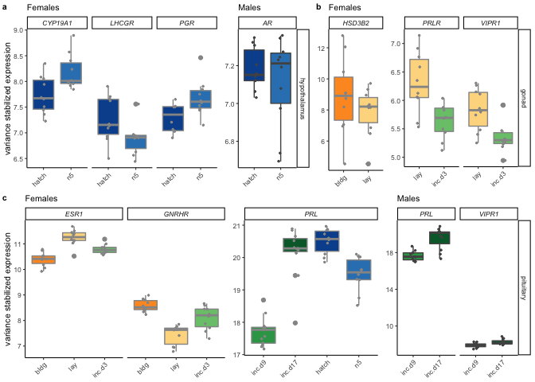

all things box plots
====================

candidate genes
---------------

    library(tidyverse)

    ## ── Attaching packages ─────────────────────────────────────────────────── tidyverse 1.3.0 ──

    ## ✓ ggplot2 3.3.0.9000     ✓ purrr   0.3.3     
    ## ✓ tibble  2.1.3          ✓ dplyr   0.8.3     
    ## ✓ tidyr   1.0.0          ✓ stringr 1.4.0     
    ## ✓ readr   1.3.1          ✓ forcats 0.4.0

    ## ── Conflicts ────────────────────────────────────────────────────── tidyverse_conflicts() ──
    ## x dplyr::filter() masks stats::filter()
    ## x dplyr::lag()    masks stats::lag()

    library(ggtext)
    library(cowplot)

    ## 
    ## Attaching package: 'cowplot'

    ## The following object is masked from 'package:ggplot2':
    ## 
    ##     ggsave

    library(ggpubr)

    ## Loading required package: magrittr

    ## 
    ## Attaching package: 'magrittr'

    ## The following object is masked from 'package:purrr':
    ## 
    ##     set_names

    ## The following object is masked from 'package:tidyr':
    ## 
    ##     extract

    ## 
    ## Attaching package: 'ggpubr'

    ## The following object is masked from 'package:cowplot':
    ## 
    ##     get_legend

    source("../R/themes.R")

    knitr::opts_chunk$set(echo = TRUE, message = F, fig.path = "../figures/")

    candidategenes <- c("OXT", "AVP", "GNRH1", "GNRHR", "CGNRH-R",
                        "AR", "POMC", "AGRP", 
                           "CRH", "AVPR1A", "AVPR1B", "AVPR2","VIP",
                           "CYP19A1", "DRD1", "DRD2", "PRL", "PRLR", "SOX9", 
                        "ESR1","ESR2", "LBH", "CDK1", "BRCA1",
                        "PTEN", "CREBBP", "FOS", "JUN", "EGR1",
                         "BDNF", "GRM2","GRIA1",
                        "KCNJ5", "CISH", "PTGER3", "CEBPD", "ZBTB16", 
                        "DIO3", "DIO2", "DIO1",
                        
                         "VIPR1", "VIPR2", "NPY", "LH", "FSH", "FSHB",
                        "JAK2", "HCRT", "TRH", "TSHB",
                        "MC3R", "MC4R", "MC5R",  "NR3C1", "NR3C2",
                        "STAT5B","NPVF") 

    candidategenesslim <- c("OXT", "AVP", "GNRH1", "GNRHR", 
                        "AR",  "CYP19A1", 
                        "AVPR1A", "AVPR1B", "AVPR2","VIP",
                        "DRD1", "DRD2", 
                        "PRL", "PRLR",  
                        "ESR1","ESR2", "LBH",  
                        "FOS", "JUN", "EGR1", "BDNF") 

    # candidategenesslim: AR, AVP, AVPR1A, AVPR1B, AVPR2, BDNF, CYP19A1, DRD1, EGR1, ESR1, ESR2, FOS, GNRH1, GNRHR, JUN, LBH, OXT, PRL, PRLR, VIP
    # DEG candidategenesslim: AR, AVPR1A, AVPR1B, AVPR2, BDNF, CYP19A1, DRD1, ESR1, FOS, GNRHR, LBH, PRL, PRLR, 
    # non-DEG candidategenesslim: AVP, AVPR1B, ESR2,  GNRH1, JUN, OXT, VIP

    hormonepapergenes <- c("GNRH1", "CGNRH-R", "GNRHR",  
                           "FSHB", "FSHR", "LHCGR", # no LSH
                           "VIP", "VIPR1",
                           "ESR1", "AR", "CYP19A1", "HSD17B1", # receptors synthesis
                           "PGR" , "HSD3B2", 
                           "PRL", "PRLR")

variance stabilized gene expression (vsd)
-----------------------------------------

    geneids <- read_csv("../metadata/00_geneinfo.csv") %>% select(-X1)

    ## Warning: Missing column names filled in: 'X1' [1]

    vsd_path <- "../results/DEseq2/"   # path to the data
    vsd_files <- dir(vsd_path, pattern = "*vsd.csv") # get file names
    vsd_pathfiles <- paste0(vsd_path, vsd_files)
    vsd_files

    ## [1] "female_gonad_vsd.csv"        "female_hypothalamus_vsd.csv"
    ## [3] "female_pituitary_vsd.csv"    "male_gonad_vsd.csv"         
    ## [5] "male_hypothalamus_vsd.csv"   "male_pituitary_vsd.csv"

    allvsd <- vsd_pathfiles %>%
      setNames(nm = .) %>% 
      map_df(~read_csv(.x), .id = "file_name")  %>% 
      dplyr::rename("gene" = "X1") %>% 
      pivot_longer(cols = L.G118_female_gonad_control:y98.o50.x_male_pituitary_inc.d3, 
                   names_to = "samples", values_to = "counts") 

    ## Warning: Missing column names filled in: 'X1' [1]

    ## Warning: Missing column names filled in: 'X1' [1]

    ## Warning: Missing column names filled in: 'X1' [1]

    ## Warning: Missing column names filled in: 'X1' [1]

    ## Warning: Missing column names filled in: 'X1' [1]

    ## Warning: Missing column names filled in: 'X1' [1]

    getcandidatevsd <- function(whichgenes, whichtissue, whichsex){
      candidates  <- allvsd %>%
        filter(gene %in% whichgenes) %>%
        dplyr::mutate(sextissue = sapply(strsplit(file_name, '_vsd.csv'), "[", 1)) %>%
        dplyr::mutate(sextissue = sapply(strsplit(sextissue, '../results/DEseq2/'), "[", 2)) %>%
        dplyr::mutate(sex = sapply(strsplit(sextissue, '\\_'), "[", 1),
                    tissue = sapply(strsplit(sextissue, '\\_'), "[", 2),
                    treatment = sapply(strsplit(samples, '\\_'), "[", 4)) %>%
        dplyr::mutate(treatment = sapply(strsplit(treatment, '.NYNO'), "[", 1)) %>%
        dplyr::select(sex, tissue, treatment, gene, samples, counts) %>%
        filter(tissue == whichtissue, sex %in% whichsex)  %>%
        drop_na()
      candidates$treatment <- factor(candidates$treatment, levels = alllevels)
      return(candidates)
    }

    hypvsd <- getcandidatevsd(hormonepapergenes, "hypothalamus", sexlevels)
    pitvsd <- getcandidatevsd(hormonepapergenes, "pituitary", sexlevels)
    gonvsd <- getcandidatevsd(hormonepapergenes, "gonad", sexlevels)
    head(hypvsd)

    ## # A tibble: 6 x 6
    ##   sex    tissue      treatment gene  samples                         counts
    ##   <chr>  <chr>       <fct>     <chr> <chr>                            <dbl>
    ## 1 female hypothalam… control   AR    L.G118_female_hypothalamus_con…   7.28
    ## 2 female hypothalam… control   AR    R.G106_female_hypothalamus_con…   7.32
    ## 3 female hypothalam… control   AR    R.R20_female_hypothalamus_cont…   7.74
    ## 4 female hypothalam… control   AR    R.R9_female_hypothalamus_contr…   7.31
    ## 5 female hypothalam… control   AR    R.W44_female_hypothalamus_cont…   7.02
    ## 6 female hypothalam… inc.d9    AR    blk.s061.pu.y_female_hypothala…   7.46

    tail(gonvsd)

    ## # A tibble: 6 x 6
    ##   sex   tissue treatment gene  samples                         counts
    ##   <chr> <chr>  <fct>     <chr> <chr>                            <dbl>
    ## 1 male  gonad  n9        VIPR1 y129.x_male_gonad_n9              5.25
    ## 2 male  gonad  n9        VIPR1 y131.w185.x_male_gonad_n9         4.95
    ## 3 male  gonad  inc.d17   VIPR1 y133.w77.r58_male_gonad_inc.d17   6.05
    ## 4 male  gonad  inc.d3    VIPR1 y149.r52.x_male_gonad_inc.d3      5.41
    ## 5 male  gonad  inc.d9    VIPR1 y95.g131.x_male_gonad_inc.d9      5.19
    ## 6 male  gonad  inc.d3    VIPR1 y98.o50.x_male_gonad_inc.d3       4.91

    candidatevsd <- rbind(hypvsd, pitvsd)
    candidatevsd <- rbind(candidatevsd, gonvsd)

    unique(candidatevsd$gene)

    ##  [1] "AR"      "CGNRH-R" "CYP19A1" "ESR1"    "FSHB"    "FSHR"    "GNRH1"  
    ##  [8] "GNRHR"   "HSD17B1" "HSD3B2"  "LHCGR"   "PGR"     "PRL"     "PRLR"   
    ## [15] "VIP"     "VIPR1"

Figs
----

    # summary DEG results from DESeq2
    candidateDEGS <- read_csv("../../musicalgenes/data/allDEG.csv") %>%
      select(-X1) %>%
      filter(gene %in% hormonepapergenes)

    ## Warning: Missing column names filled in: 'X1' [1]

    head(candidateDEGS)

    ## # A tibble: 6 x 8
    ##   sex    tissue comparison   direction gene       lfc      padj logpadj
    ##   <chr>  <chr>  <chr>        <chr>     <chr>    <dbl>     <dbl>   <dbl>
    ## 1 female gonad  bldg_lay     bldg      HSD3B2  -2.27  0.0200       1.70
    ## 2 female gonad  control_bldg bldg      HSD3B2   1.62  0.0161       1.79
    ## 3 female gonad  control_bldg bldg      PGR      1.61  0.00357      2.45
    ## 4 female gonad  control_bldg bldg      ESR1     1.39  0.0000108    4.97
    ## 5 female gonad  control_bldg bldg      AR       0.677 0.00504      2.30
    ## 6 female gonad  control_bldg control   CYP19A1 -1.11  0.0241       1.62

    # get genes to plot
    candidateDEGS %>% filter(tissue == "hypothalamus", sex == "female", comparison != "control_bldg") 

    ## # A tibble: 3 x 8
    ##   sex    tissue       comparison direction gene       lfc   padj logpadj
    ##   <chr>  <chr>        <chr>      <chr>     <chr>    <dbl>  <dbl>   <dbl>
    ## 1 female hypothalamus hatch_n5   n5        PGR      0.656 0.0428    1.37
    ## 2 female hypothalamus hatch_n5   n5        CYP19A1  0.633 0.0768    1.11
    ## 3 female hypothalamus hatch_n5   hatch     LHCGR   -0.800 0.0959    1.02

    candidateDEGS %>% filter(tissue == "hypothalamus", sex == "male", comparison != "control_bldg") 

    ## # A tibble: 1 x 8
    ##   sex   tissue       comparison     direction gene    lfc   padj logpadj
    ##   <chr> <chr>        <chr>          <chr>     <chr> <dbl>  <dbl>   <dbl>
    ## 1 male  hypothalamus inc.d9_inc.d17 inc.d17   AR    0.470 0.0980    1.01

    candidateDEGS %>% filter(tissue == "pituitary", sex == "male", comparison != "control_bldg") 

    ## # A tibble: 2 x 8
    ##   sex   tissue    comparison     direction gene    lfc         padj logpadj
    ##   <chr> <chr>     <chr>          <chr>     <chr> <dbl>        <dbl>   <dbl>
    ## 1 male  pituitary inc.d9_inc.d17 inc.d17   VIP    2.77      6.10e-2    1.21
    ## 2 male  pituitary inc.d9_inc.d17 inc.d17   PRL    2.15      2.50e-9    8.60

    candidateDEGS %>% filter(tissue == "pituitary", sex == "female", comparison != "control_bldg") 

    ## # A tibble: 6 x 8
    ##   sex    tissue    comparison     direction gene     lfc     padj logpadj
    ##   <chr>  <chr>     <chr>          <chr>     <chr>  <dbl>    <dbl>   <dbl>
    ## 1 female pituitary bldg_lay       lay       ESR1   0.888 1.01e- 8    8.00
    ## 2 female pituitary bldg_lay       bldg      GNRHR -1.53  3.80e- 6    5.42
    ## 3 female pituitary hatch_n5       hatch     PRL   -0.980 6.38e- 2    1.19
    ## 4 female pituitary inc.d9_inc.d17 inc.d17   PRL    2.52  1.70e-13   12.8 
    ## 5 female pituitary lay_inc.d3     inc.d3    GNRHR  0.979 2.33e- 2    1.63
    ## 6 female pituitary lay_inc.d3     lay       ESR1  -0.481 1.95e- 2    1.71

    candidateDEGS %>% filter(tissue == "gonad", sex == "female", comparison != "control_bldg") 

    ## # A tibble: 3 x 8
    ##   sex    tissue comparison direction gene     lfc   padj logpadj
    ##   <chr>  <chr>  <chr>      <chr>     <chr>  <dbl>  <dbl>   <dbl>
    ## 1 female gonad  bldg_lay   bldg      HSD3B2 -2.27 0.0200    1.70
    ## 2 female gonad  lay_inc.d3 lay       VIPR1  -1.25 0.0253    1.60
    ## 3 female gonad  lay_inc.d3 lay       PRLR   -1.54 0.0131    1.88

    # summarize all differences
    candidateDEGtable <- candidateDEGS %>%
      mutate(posneg = ifelse(lfc >= 0, "+", "-")) %>%
      mutate(geneposneg = paste(gene, posneg, sep = "")) %>%
      select(sex, tissue, comparison, geneposneg) %>%
      group_by(sex, tissue, comparison) %>%
       arrange(geneposneg) %>%
      summarize(genes = str_c(geneposneg, collapse = " ")) %>% 
      pivot_wider(names_from = comparison, values_from = genes)  %>% 
      ungroup(tissue) %>%
      mutate(tissue = factor(tissue, levels =  tissuelevel))  %>% 
      arrange(sex, tissue)  %>% 
      select(sex, tissue, bldg_lay, lay_inc.d3, inc.d9_inc.d17, hatch_n5, control_bldg)
    candidateDEGtable

    ## # A tibble: 6 x 7
    ##   sex    tissue  bldg_lay lay_inc.d3 inc.d9_inc.d17 hatch_n5 control_bldg  
    ##   <chr>  <fct>   <chr>    <chr>      <chr>          <chr>    <chr>         
    ## 1 female hypoth… <NA>     <NA>       <NA>           CYP19A1… AR+ CGNRH-R- …
    ## 2 female pituit… ESR1+ G… ESR1- GNR… PRL+           PRL-     AR+ CYP19A1- …
    ## 3 female gonad   HSD3B2-  PRLR- VIP… <NA>           <NA>     AR+ CYP19A1- …
    ## 4 male   hypoth… <NA>     <NA>       AR+            <NA>     AR+ CYP19A1- …
    ## 5 male   pituit… <NA>     <NA>       PRL+ VIP+      <NA>     AR+ CGNRH-R- …
    ## 6 male   gonad   <NA>     <NA>       <NA>           <NA>     AR+ ESR1+ HSD…

    newboxplot <- function(df, mygenes, whichsex, whichstage){
      
      p <- df %>%
        filter(gene %in% mygenes, 
               sex %in% whichsex,
               treatment %in% whichstage) %>%
        droplevels() %>%
        mutate(tissue = factor(tissue, levels = tissuelevel)) %>%
        ggplot(aes(x = treatment, y = counts, fill = treatment, color = sex)) +
        geom_boxplot() +
        geom_jitter(size = 0.5, width = 0.1) +
        facet_grid(tissue~gene, scales = "free_y") +
        theme_B3() +
        scale_color_manual(values = allcolors) +
        scale_fill_manual(values = allcolors) +
        theme(legend.position = "none",
              axis.text.x = element_text(angle = 45, hjust = 1),
              strip.text.x = element_text(face = "italic"),
              axis.title.x = element_blank())  +
        labs(x = "Parental stage",
             y = "variance stabilized expression")
      return(p)
    }

    a1 <- newboxplot(hypvsd, c("PGR",  "CYP19A1", "LHCGR" ), "female", c( "hatch", "n5")) + 
      theme(strip.text.y = element_blank()) + labs(subtitle = "Females")
    a2 <- newboxplot(hypvsd, c("AR"), "male", c( "hatch", "n5")) + 
      theme(axis.title.y = element_blank()) + labs(subtitle = "Males")

    b1 <- newboxplot(gonvsd, c("HSD3B2"), "female", c( "bldg", "lay"))  +
      theme(strip.text.y = element_blank(),
            axis.title.y = element_blank()) + labs(subtitle = "Females")
    b2 <- newboxplot(gonvsd, c("VIPR1",  "PRLR" ), "female", c( "lay", "inc.d3"))  + 
      theme(axis.title.y = element_blank()) + labs(subtitle = " ")

    ab <- plot_grid(a1,a2,b1,b2, rel_widths = c(6,2.5,2,4), labels = c("a", " ", "b", " "), label_size = 8, nrow = 1)

    c1 <- newboxplot(pitvsd, c( "ESR1", "GNRHR"), "female", c("bldg", "lay",  "inc.d3")) 
    c2 <- newboxplot(pitvsd, c( "PRL"), "female", c("inc.d9", "inc.d17", "hatch", "n5")) 
    c3 <- newboxplot(pitvsd, c("VIPR1",  "PRL" ), "male", c( "inc.d9", "inc.d17")) 

    c <- plot_grid(c1 + theme(strip.text.y = element_blank()) + labs(subtitle = "Females"),
              c2 + theme(strip.text.y = element_blank(),
                        axis.title.y = element_blank()) + labs(subtitle = " ") ,
              c3 + theme(axis.title.y = element_blank()) + labs(subtitle = "Males"), 
              nrow = 1, rel_widths = c(6,4,4),
              labels = c("c"), label_size = 8)

    plot_grid(ab,c, nrow = 2)

    #write.csv(candidatevsd, "../../musicalgenes/data/candidatecounts.csv")
    #write.csv(candidatevsd, "../results/candidatecounts.csv")
    write.csv(candidateDEGtable, "../results/candidateDEGtable.csv")
