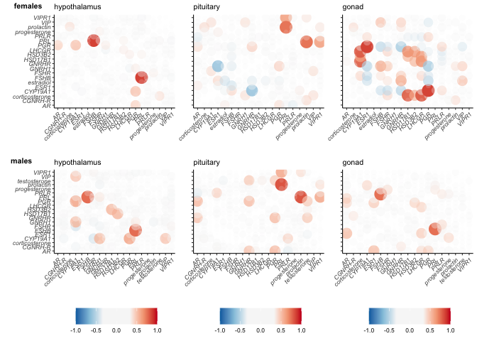

all things box plots
====================

candidate genes
---------------

    library(tidyverse)

    ## ── Attaching packages ────────────────────────────────────────────────────────────────────────────── tidyverse 1.3.0 ──

    ## ✓ ggplot2 3.3.0.9000     ✓ purrr   0.3.3     
    ## ✓ tibble  2.1.3          ✓ dplyr   0.8.3     
    ## ✓ tidyr   1.0.0          ✓ stringr 1.4.0     
    ## ✓ readr   1.3.1          ✓ forcats 0.4.0

    ## ── Conflicts ───────────────────────────────────────────────────────────────────────────────── tidyverse_conflicts() ──
    ## x dplyr::filter() masks stats::filter()
    ## x dplyr::lag()    masks stats::lag()

    library(ggtext)
    library(cowplot)

    ## 
    ## Attaching package: 'cowplot'

    ## The following object is masked from 'package:ggplot2':
    ## 
    ##     ggsave

    library(ggpubr)

    ## Loading required package: magrittr

    ## 
    ## Attaching package: 'magrittr'

    ## The following object is masked from 'package:purrr':
    ## 
    ##     set_names

    ## The following object is masked from 'package:tidyr':
    ## 
    ##     extract

    ## 
    ## Attaching package: 'ggpubr'

    ## The following object is masked from 'package:cowplot':
    ## 
    ##     get_legend

    source("../R/themes.R")

    knitr::opts_chunk$set(echo = TRUE, message = F, fig.path = "../figures/")

    candidategenes <- c("OXT", "AVP", "GNRH1", "GNRHR", "CGNRH-R",
                        "AR", "POMC", "AGRP", 
                           "CRH", "AVPR1A", "AVPR1B", "AVPR2","VIP",
                           "CYP19A1", "DRD1", "DRD2", "PRL", "PRLR", "SOX9", 
                        "ESR1","ESR2", "LBH", "CDK1", "BRCA1",
                        "PTEN", "CREBBP", "FOS", "JUN", "EGR1",
                         "BDNF", "GRM2","GRIA1",
                        "KCNJ5", "CISH", "PTGER3", "CEBPD", "ZBTB16", 
                        "DIO3", "DIO2", "DIO1",
                        
                         "VIPR1", "VIPR2", "NPY", "LH", "FSH", "FSHB",
                        "JAK2", "HCRT", "TRH", "TSHB",
                        "MC3R", "MC4R", "MC5R",  "NR3C1", "NR3C2",
                        "STAT5B","NPVF") 

    candidategenesslim <- c("OXT", "AVP", "GNRH1", "GNRHR", 
                        "AR",  "CYP19A1", 
                        "AVPR1A", "AVPR1B", "AVPR2","VIP",
                        "DRD1", "DRD2", 
                        "PRL", "PRLR",  
                        "ESR1","ESR2", "LBH",  
                        "FOS", "JUN", "EGR1", "BDNF") 

    # candidategenesslim: AR, AVP, AVPR1A, AVPR1B, AVPR2, BDNF, CYP19A1, DRD1, EGR1, ESR1, ESR2, FOS, GNRH1, GNRHR, JUN, LBH, OXT, PRL, PRLR, VIP
    # DEG candidategenesslim: AR, AVPR1A, AVPR1B, AVPR2, BDNF, CYP19A1, DRD1, ESR1, FOS, GNRHR, LBH, PRL, PRLR, 
    # non-DEG candidategenesslim: AVP, AVPR1B, ESR2,  GNRH1, JUN, OXT, VIP

    hormonepapergenes <- c("GNRH1", "CGNRH-R", "GNRHR",  
                           "FSHB", "FSHR", "LHCGR", # no LSH
                           "VIP", "VIPR1",
                           "ESR1", "AR", "CYP19A1", "HSD17B1", # receptors synthesis
                           "PGR" , "HSD3B2", 
                           "PRL", "PRLR")

variance stabilized gene expression (vsd)
-----------------------------------------

    geneids <- read_csv("../metadata/00_geneinfo.csv") %>% select(-X1)

    ## Warning: Missing column names filled in: 'X1' [1]

    vsd_path <- "../results/DEseq2/"   # path to the data
    vsd_files <- dir(vsd_path, pattern = "*vsd.csv") # get file names
    vsd_pathfiles <- paste0(vsd_path, vsd_files)
    vsd_files

    ## [1] "female_gonad_vsd.csv"        "female_hypothalamus_vsd.csv"
    ## [3] "female_pituitary_vsd.csv"    "male_gonad_vsd.csv"         
    ## [5] "male_hypothalamus_vsd.csv"   "male_pituitary_vsd.csv"

    allvsd <- vsd_pathfiles %>%
      setNames(nm = .) %>% 
      map_df(~read_csv(.x), .id = "file_name")  %>% 
      dplyr::rename("gene" = "X1") %>% 
      pivot_longer(cols = L.G118_female_gonad_control:y98.o50.x_male_pituitary_inc.d3, 
                   names_to = "samples", values_to = "counts") 

    ## Warning: Missing column names filled in: 'X1' [1]

    ## Warning: Missing column names filled in: 'X1' [1]

    ## Warning: Missing column names filled in: 'X1' [1]

    ## Warning: Missing column names filled in: 'X1' [1]

    ## Warning: Missing column names filled in: 'X1' [1]

    ## Warning: Missing column names filled in: 'X1' [1]

    getcandidatevsd <- function(whichgenes, whichtissue, whichsex){
      candidates  <- allvsd %>%
        filter(gene %in% whichgenes) %>%
        dplyr::mutate(sextissue = sapply(strsplit(file_name, '_vsd.csv'), "[", 1)) %>%
        dplyr::mutate(sextissue = sapply(strsplit(sextissue, '../results/DEseq2/'), "[", 2)) %>%
        dplyr::mutate(sex = sapply(strsplit(sextissue, '\\_'), "[", 1),
                    tissue = sapply(strsplit(sextissue, '\\_'), "[", 2),
                    treatment = sapply(strsplit(samples, '\\_'), "[", 4)) %>%
        dplyr::mutate(treatment = sapply(strsplit(treatment, '.NYNO'), "[", 1)) %>%
        dplyr::select(sex, tissue, treatment, gene, samples, counts) %>%
        filter(tissue == whichtissue, sex %in% whichsex)  %>%
        drop_na()
      candidates$treatment <- factor(candidates$treatment, levels = alllevels)
      return(candidates)
    }

    hypvsd <- getcandidatevsd(hormonepapergenes, "hypothalamus", sexlevels)
    pitvsd <- getcandidatevsd(hormonepapergenes, "pituitary", sexlevels)
    gonvsd <- getcandidatevsd(hormonepapergenes, "gonad", sexlevels)
    head(hypvsd)

    ## # A tibble: 6 x 6
    ##   sex    tissue      treatment gene  samples                         counts
    ##   <chr>  <chr>       <fct>     <chr> <chr>                            <dbl>
    ## 1 female hypothalam… control   AR    L.G118_female_hypothalamus_con…   7.28
    ## 2 female hypothalam… control   AR    R.G106_female_hypothalamus_con…   7.32
    ## 3 female hypothalam… control   AR    R.R20_female_hypothalamus_cont…   7.74
    ## 4 female hypothalam… control   AR    R.R9_female_hypothalamus_contr…   7.31
    ## 5 female hypothalam… control   AR    R.W44_female_hypothalamus_cont…   7.02
    ## 6 female hypothalam… inc.d9    AR    blk.s061.pu.y_female_hypothala…   7.46

    tail(gonvsd)

    ## # A tibble: 6 x 6
    ##   sex   tissue treatment gene  samples                         counts
    ##   <chr> <chr>  <fct>     <chr> <chr>                            <dbl>
    ## 1 male  gonad  n9        VIPR1 y129.x_male_gonad_n9              5.25
    ## 2 male  gonad  n9        VIPR1 y131.w185.x_male_gonad_n9         4.95
    ## 3 male  gonad  inc.d17   VIPR1 y133.w77.r58_male_gonad_inc.d17   6.05
    ## 4 male  gonad  inc.d3    VIPR1 y149.r52.x_male_gonad_inc.d3      5.41
    ## 5 male  gonad  inc.d9    VIPR1 y95.g131.x_male_gonad_inc.d9      5.19
    ## 6 male  gonad  inc.d3    VIPR1 y98.o50.x_male_gonad_inc.d3       4.91

    candidatevsd <- rbind(hypvsd, pitvsd)
    candidatevsd <- rbind(candidatevsd, gonvsd)

    unique(candidatevsd$gene)

    ##  [1] "AR"      "CGNRH-R" "CYP19A1" "ESR1"    "FSHB"    "FSHR"    "GNRH1"  
    ##  [8] "GNRHR"   "HSD17B1" "HSD3B2"  "LHCGR"   "PGR"     "PRL"     "PRLR"   
    ## [15] "VIP"     "VIPR1"

Figs
----

    # summary DEG results from DESeq2
    candidateDEGS <- read_csv("../../musicalgenes/data/allDEG.csv") %>%
      select(-X1) %>%
      filter(gene %in% hormonepapergenes)

    ## Warning: Missing column names filled in: 'X1' [1]

    head(candidateDEGS)

    ## # A tibble: 6 x 8
    ##   sex    tissue comparison   direction gene       lfc      padj logpadj
    ##   <chr>  <chr>  <chr>        <chr>     <chr>    <dbl>     <dbl>   <dbl>
    ## 1 female gonad  bldg_lay     bldg      HSD3B2  -2.27  0.0200       1.70
    ## 2 female gonad  control_bldg bldg      HSD3B2   1.62  0.0161       1.79
    ## 3 female gonad  control_bldg bldg      PGR      1.61  0.00357      2.45
    ## 4 female gonad  control_bldg bldg      ESR1     1.39  0.0000108    4.97
    ## 5 female gonad  control_bldg bldg      AR       0.677 0.00504      2.30
    ## 6 female gonad  control_bldg control   CYP19A1 -1.11  0.0241       1.62

    # get genes to plot
    candidateDEGS %>% filter(tissue == "hypothalamus", sex == "female", comparison != "control_bldg") 

    ## # A tibble: 3 x 8
    ##   sex    tissue       comparison direction gene       lfc   padj logpadj
    ##   <chr>  <chr>        <chr>      <chr>     <chr>    <dbl>  <dbl>   <dbl>
    ## 1 female hypothalamus hatch_n5   n5        PGR      0.656 0.0428    1.37
    ## 2 female hypothalamus hatch_n5   n5        CYP19A1  0.633 0.0768    1.11
    ## 3 female hypothalamus hatch_n5   hatch     LHCGR   -0.800 0.0959    1.02

    candidateDEGS %>% filter(tissue == "hypothalamus", sex == "male", comparison != "control_bldg") 

    ## # A tibble: 1 x 8
    ##   sex   tissue       comparison     direction gene    lfc   padj logpadj
    ##   <chr> <chr>        <chr>          <chr>     <chr> <dbl>  <dbl>   <dbl>
    ## 1 male  hypothalamus inc.d9_inc.d17 inc.d17   AR    0.470 0.0980    1.01

    candidateDEGS %>% filter(tissue == "pituitary", sex == "male", comparison != "control_bldg") 

    ## # A tibble: 2 x 8
    ##   sex   tissue    comparison     direction gene    lfc         padj logpadj
    ##   <chr> <chr>     <chr>          <chr>     <chr> <dbl>        <dbl>   <dbl>
    ## 1 male  pituitary inc.d9_inc.d17 inc.d17   VIP    2.77      6.10e-2    1.21
    ## 2 male  pituitary inc.d9_inc.d17 inc.d17   PRL    2.15      2.50e-9    8.60

    candidateDEGS %>% filter(tissue == "pituitary", sex == "female", comparison != "control_bldg") 

    ## # A tibble: 6 x 8
    ##   sex    tissue    comparison     direction gene     lfc     padj logpadj
    ##   <chr>  <chr>     <chr>          <chr>     <chr>  <dbl>    <dbl>   <dbl>
    ## 1 female pituitary bldg_lay       lay       ESR1   0.888 1.01e- 8    8.00
    ## 2 female pituitary bldg_lay       bldg      GNRHR -1.53  3.80e- 6    5.42
    ## 3 female pituitary hatch_n5       hatch     PRL   -0.980 6.38e- 2    1.19
    ## 4 female pituitary inc.d9_inc.d17 inc.d17   PRL    2.52  1.70e-13   12.8 
    ## 5 female pituitary lay_inc.d3     inc.d3    GNRHR  0.979 2.33e- 2    1.63
    ## 6 female pituitary lay_inc.d3     lay       ESR1  -0.481 1.95e- 2    1.71

    candidateDEGS %>% filter(tissue == "gonad", sex == "female", comparison != "control_bldg") 

    ## # A tibble: 3 x 8
    ##   sex    tissue comparison direction gene     lfc   padj logpadj
    ##   <chr>  <chr>  <chr>      <chr>     <chr>  <dbl>  <dbl>   <dbl>
    ## 1 female gonad  bldg_lay   bldg      HSD3B2 -2.27 0.0200    1.70
    ## 2 female gonad  lay_inc.d3 lay       VIPR1  -1.25 0.0253    1.60
    ## 3 female gonad  lay_inc.d3 lay       PRLR   -1.54 0.0131    1.88

    # summarize all differences
    candidateDEGtable <- candidateDEGS %>%
      mutate(posneg = ifelse(lfc >= 0, "+", "-")) %>%
      mutate(geneposneg = paste(gene, posneg, sep = "")) %>%
      select(sex, tissue, comparison, geneposneg) %>%
      group_by(sex, tissue, comparison) %>%
       arrange(geneposneg) %>%
      summarize(genes = str_c(geneposneg, collapse = " ")) %>% 
      pivot_wider(names_from = comparison, values_from = genes)  %>% 
      ungroup(tissue) %>%
      mutate(tissue = factor(tissue, levels =  tissuelevel))  %>% 
      arrange(sex, tissue)  %>% 
      select(sex, tissue, bldg_lay, lay_inc.d3, inc.d9_inc.d17, hatch_n5, control_bldg)
    candidateDEGtable

    ## # A tibble: 6 x 7
    ##   sex    tissue  bldg_lay lay_inc.d3 inc.d9_inc.d17 hatch_n5 control_bldg  
    ##   <chr>  <fct>   <chr>    <chr>      <chr>          <chr>    <chr>         
    ## 1 female hypoth… <NA>     <NA>       <NA>           CYP19A1… AR+ CGNRH-R- …
    ## 2 female pituit… ESR1+ G… ESR1- GNR… PRL+           PRL-     AR+ CYP19A1- …
    ## 3 female gonad   HSD3B2-  PRLR- VIP… <NA>           <NA>     AR+ CYP19A1- …
    ## 4 male   hypoth… <NA>     <NA>       AR+            <NA>     AR+ CYP19A1- …
    ## 5 male   pituit… <NA>     <NA>       PRL+ VIP+      <NA>     AR+ CGNRH-R- …
    ## 6 male   gonad   <NA>     <NA>       <NA>           <NA>     AR+ ESR1+ HSD…

    newboxplot <- function(df, mygenes, whichsex, whichstage){
      
      p <- df %>%
        filter(gene %in% mygenes, 
               sex %in% whichsex,
               treatment %in% whichstage) %>%
        droplevels() %>%
        mutate(tissue = factor(tissue, levels = tissuelevel)) %>%
        ggplot(aes(x = treatment, y = counts, fill = treatment, color = sex)) +
        geom_boxplot() +
        geom_jitter(size = 0.5, width = 0.1) +
        facet_grid(tissue~gene, scales = "free_y") +
        theme_B3() +
        scale_color_manual(values = allcolors) +
        scale_fill_manual(values = allcolors) +
        theme(legend.position = "none",
              axis.text.x = element_text(angle = 45, hjust = 1),
              strip.text.x = element_text(face = "italic"),
              axis.title.x = element_blank())  +
        labs(x = "Parental stage",
             y = "variance stabilized expression")
      return(p)
    }

    a1 <- newboxplot(hypvsd, c("PGR",  "CYP19A1", "LHCGR" ), "female", c( "hatch", "n5")) + 
      theme(strip.text.y = element_blank()) + labs(subtitle = "Females")
    a2 <- newboxplot(hypvsd, c("AR"), "male", c( "hatch", "n5")) + 
      theme(axis.title.y = element_blank()) + labs(subtitle = "Males")

    b1 <- newboxplot(gonvsd, c("HSD3B2"), "female", c( "bldg", "lay"))  +
      theme(strip.text.y = element_blank(),
            axis.title.y = element_blank()) + labs(subtitle = "Females")
    b2 <- newboxplot(gonvsd, c("VIPR1",  "PRLR" ), "female", c( "lay", "inc.d3"))  + 
      theme(axis.title.y = element_blank()) + labs(subtitle = " ")

    ab <- plot_grid(a1,a2,b1,b2, rel_widths = c(6,2.5,2,4), labels = c("a", " ", "b", " "), label_size = 8, nrow = 1)

    c1 <- newboxplot(pitvsd, c( "ESR1", "GNRHR"), "female", c("bldg", "lay",  "inc.d3")) 
    c2 <- newboxplot(pitvsd, c( "PRL"), "female", c("inc.d9", "inc.d17", "hatch", "n5")) 
    c3 <- newboxplot(pitvsd, c("VIPR1",  "PRL" ), "male", c( "inc.d9", "inc.d17")) 

    c <- plot_grid(c1 + theme(strip.text.y = element_blank()) + labs(subtitle = "Females"),
              c2 + theme(strip.text.y = element_blank(),
                        axis.title.y = element_blank()) + labs(subtitle = " ") ,
              c3 + theme(axis.title.y = element_blank()) + labs(subtitle = "Males"), 
              nrow = 1, rel_widths = c(6,4,4),
              labels = c("c"), label_size = 8)

    plot_grid(ab,c, nrow = 2)

    # correlations
    library(corrr)

    hormones <- read_csv("../results/07_hormoneswide.csv") %>%
      select(-study, -treatment, -sex)
    head(hormones)

    ## # A tibble: 6 x 7
    ##   bird_id prolactin corticosterone testosterone moltbin estradiol
    ##   <chr>       <dbl>          <dbl>        <dbl>   <dbl>     <dbl>
    ## 1 x.g          3.83          0.590        0.187      NA    NA    
    ## 2 x.g.g        3.28          0.817        0.661      NA    NA    
    ## 3 x.blk.…      4.15          0.850        1.00       NA    NA    
    ## 4 x.g.g.g     25.3           1.03         1.74       NA    NA    
    ## 5 x.g.g.f     21.5           1.15        NA          NA     0.235
    ## 6 x.blu.o     14.9           1.44         3.05       NA    NA    
    ## # … with 1 more variable: progesterone <dbl>

    head(candidatevsd)

    ## # A tibble: 6 x 6
    ##   sex    tissue      treatment gene  samples                         counts
    ##   <chr>  <chr>       <fct>     <chr> <chr>                            <dbl>
    ## 1 female hypothalam… control   AR    L.G118_female_hypothalamus_con…   7.28
    ## 2 female hypothalam… control   AR    R.G106_female_hypothalamus_con…   7.32
    ## 3 female hypothalam… control   AR    R.R20_female_hypothalamus_cont…   7.74
    ## 4 female hypothalam… control   AR    R.R9_female_hypothalamus_contr…   7.31
    ## 5 female hypothalam… control   AR    R.W44_female_hypothalamus_cont…   7.02
    ## 6 female hypothalam… inc.d9    AR    blk.s061.pu.y_female_hypothala…   7.46

    vsdhormones <- candidatevsd %>%
      pivot_wider(names_from = gene, values_from = counts) %>%
      mutate(bird_id = sapply(strsplit(samples,"\\_"), "[", 1)) %>%
      left_join(.,hormones, by =  "bird_id")
    vsdhormones

    ## # A tibble: 576 x 27
    ##    sex   tissue treatment samples    AR `CGNRH-R` CYP19A1  ESR1  FSHB  FSHR
    ##    <chr> <chr>  <fct>     <chr>   <dbl>     <dbl>   <dbl> <dbl> <dbl> <dbl>
    ##  1 fema… hypot… control   L.G118…  7.28      5.46    9.31  9.91  6.78  5.46
    ##  2 fema… hypot… control   R.G106…  7.32      5.77    7.83  9.77  5.84  5.84
    ##  3 fema… hypot… control   R.R20_…  7.74      5.46   10.1   9.24  6.04  5.46
    ##  4 fema… hypot… control   R.R9_f…  7.31      5.68    9.15  9.68  5.95  5.68
    ##  5 fema… hypot… control   R.W44_…  7.02      5.66    9.44  9.80  5.46  5.87
    ##  6 fema… hypot… inc.d9    blk.s0…  7.46      5.76    8.14 10.2   5.63  6.05
    ##  7 fema… hypot… bldg      blk11.…  7.78      5.73    8.68 10.4   5.65  5.93
    ##  8 fema… hypot… hatch     blk21.…  8.13      6.12    7.36 10.1   6.09  5.46
    ##  9 fema… hypot… n9        blk4.x…  6.51      5.46    8.32 11.3   6.70  5.46
    ## 10 fema… hypot… control   blu.o.…  7.02      5.46    8.34  9.58  5.46  5.46
    ## # … with 566 more rows, and 17 more variables: GNRH1 <dbl>, GNRHR <dbl>,
    ## #   HSD17B1 <dbl>, HSD3B2 <dbl>, LHCGR <dbl>, PGR <dbl>, PRL <dbl>,
    ## #   PRLR <dbl>, VIP <dbl>, VIPR1 <dbl>, bird_id <chr>, prolactin <dbl>,
    ## #   corticosterone <dbl>, testosterone <dbl>, moltbin <dbl>,
    ## #   estradiol <dbl>, progesterone <dbl>

    plotcorrs <- function(whichtissue){
      
      x <- vsdhormones  %>%
        filter(tissue == whichtissue) %>%
        select(-sex, - tissue, - treatment, -samples, -bird_id, -moltbin) %>%
        correlate()
      print(fashion(x))
      
      p <- rplot(x, colors = c("#0571b0", "#92c5de", "#f7f7f7","#f7f7f7","#f7f7f7", "#f4a582", "#ca0020")) +
        theme_B3() +
        theme(legend.position = "bottom",
              axis.text.x = element_text(angle = 45, hjust = 1),
              axis.text = element_text(face = "italic")) +
        labs(subtitle = whichtissue)
      return(p)
    }

    a <- plotcorrs("hypothalamus") 

    ##           rowname   AR CGNRH.R CYP19A1 ESR1 FSHB FSHR GNRH1 GNRHR HSD17B1
    ## 1              AR          .59    -.21  .34  .38  .52   .06   .55     .57
    ## 2         CGNRH-R  .59            -.28  .31  .46  .69   .22   .75     .81
    ## 3         CYP19A1 -.21    -.28         -.25 -.10 -.41   .35  -.12    -.19
    ## 4            ESR1  .34     .31    -.25       .35  .33   .10   .39     .33
    ## 5            FSHB  .38     .46    -.10  .35       .38   .18   .56     .59
    ## 6            FSHR  .52     .69    -.41  .33  .38        .08   .60     .65
    ## 7           GNRH1  .06     .22     .35  .10  .18  .08         .34     .29
    ## 8           GNRHR  .55     .75    -.12  .39  .56  .60   .34           .76
    ## 9         HSD17B1  .57     .81    -.19  .33  .59  .65   .29   .76        
    ## 10         HSD3B2  .56     .74    -.25  .29  .65  .63   .27   .69     .85
    ## 11          LHCGR  .42     .36    -.33  .08  .31  .45  -.14   .32     .35
    ## 12            PGR  .36     .10     .54  .14  .07  .03   .37   .13     .10
    ## 13            PRL -.19    -.15     .14  .02  .60 -.21   .04  -.04     .02
    ## 14           PRLR  .03     .04     .11 -.21 -.13  .04   .01  -.07    -.01
    ## 15            VIP  .08     .35     .31  .21  .18  .09   .38   .44     .31
    ## 16          VIPR1  .47     .64    -.29  .30  .21  .62   .17   .50     .54
    ## 17      prolactin  .13     .11    -.10  .06  .21  .08  -.18   .13     .13
    ## 18 corticosterone  .06     .03    -.02  .03 -.05 -.01  -.03  -.01     .02
    ## 19   testosterone  .12    -.07    -.05 -.05  .05  .06  -.22  -.15     .04
    ## 20      estradiol  .00    -.20     .06  .17  .02 -.00  -.09   .26    -.07
    ## 21   progesterone -.13    -.13    -.15 -.10 -.07 -.01  -.12  -.10    -.17
    ##    HSD3B2 LHCGR  PGR  PRL PRLR  VIP VIPR1 prolactin corticosterone
    ## 1     .56   .42  .36 -.19  .03  .08   .47       .13            .06
    ## 2     .74   .36  .10 -.15  .04  .35   .64       .11            .03
    ## 3    -.25  -.33  .54  .14  .11  .31  -.29      -.10           -.02
    ## 4     .29   .08  .14  .02 -.21  .21   .30       .06            .03
    ## 5     .65   .31  .07  .60 -.13  .18   .21       .21           -.05
    ## 6     .63   .45  .03 -.21  .04  .09   .62       .08           -.01
    ## 7     .27  -.14  .37  .04  .01  .38   .17      -.18           -.03
    ## 8     .69   .32  .13 -.04 -.07  .44   .50       .13           -.01
    ## 9     .85   .35  .10  .02 -.01  .31   .54       .13            .02
    ## 10          .50  .04  .12 -.10  .20   .43       .03           -.06
    ## 11    .50       -.13 -.04 -.11 -.04   .06       .11           -.09
    ## 12    .04  -.13      -.05  .27  .29   .19      -.12           -.03
    ## 13    .12  -.04 -.05      -.10 -.04  -.29       .18            .02
    ## 14   -.10  -.11  .27 -.10      -.03   .17      -.02            .11
    ## 15    .20  -.04  .29 -.04 -.03        .10      -.03           -.07
    ## 16    .43   .06  .19 -.29  .17  .10             .02            .07
    ## 17    .03   .11 -.12  .18 -.02 -.03   .02                      .26
    ## 18   -.06  -.09 -.03  .02  .11 -.07   .07       .26               
    ## 19   -.02   .03 -.06  .06  .06 -.13   .06      -.03           -.05
    ## 20   -.10  -.22  .09 -.08 -.17  .04  -.08       .06           -.10
    ## 21   -.12  -.11 -.23  .05  .14 -.08   .05      -.05            .15
    ##    testosterone estradiol progesterone
    ## 1           .12       .00         -.13
    ## 2          -.07      -.20         -.13
    ## 3          -.05       .06         -.15
    ## 4          -.05       .17         -.10
    ## 5           .05       .02         -.07
    ## 6           .06      -.00         -.01
    ## 7          -.22      -.09         -.12
    ## 8          -.15       .26         -.10
    ## 9           .04      -.07         -.17
    ## 10         -.02      -.10         -.12
    ## 11          .03      -.22         -.11
    ## 12         -.06       .09         -.23
    ## 13          .06      -.08          .05
    ## 14          .06      -.17          .14
    ## 15         -.13       .04         -.08
    ## 16          .06      -.08          .05
    ## 17         -.03       .06         -.05
    ## 18         -.05      -.10          .15
    ## 19                                 .09
    ## 20                                 .02
    ## 21          .09       .02

    b <- plotcorrs("pituitary") + theme(axis.text.y = element_blank())

    ##           rowname   AR CGNRH.R CYP19A1 ESR1 FSHB FSHR GNRH1 GNRHR HSD17B1
    ## 1              AR         -.30    -.41 -.07  .16 -.25  -.34   .31    -.19
    ## 2         CGNRH-R -.30             .34 -.25  .17 -.13   .27  -.07    -.17
    ## 3         CYP19A1 -.41     .34          .16 -.47  .60   .70   .07     .55
    ## 4            ESR1 -.07    -.25     .16       .09  .21   .09  -.36     .20
    ## 5            FSHB  .16     .17    -.47  .09      -.48  -.50  -.20    -.53
    ## 6            FSHR -.25    -.13     .60  .21 -.48        .66   .12     .72
    ## 7           GNRH1 -.34     .27     .70  .09 -.50  .66         .07     .67
    ## 8           GNRHR  .31    -.07     .07 -.36 -.20  .12   .07           .13
    ## 9         HSD17B1 -.19    -.17     .55  .20 -.53  .72   .67   .13        
    ## 10         HSD3B2 -.32     .02     .70  .20 -.64  .77   .74   .16     .82
    ## 11          LHCGR -.28    -.16     .70  .16 -.62  .75   .75   .16     .78
    ## 12            PGR  .58    -.06    -.59 -.27  .43 -.62  -.67   .20    -.68
    ## 13            PRL -.23     .00    -.21 -.12  .11 -.11  -.09  -.26    -.06
    ## 14           PRLR -.52     .24     .60  .14 -.33  .46   .48   .13     .36
    ## 15            VIP -.14    -.10     .57  .06 -.40  .46   .61   .11     .48
    ## 16          VIPR1 -.20    -.00     .18  .01 -.19  .16   .16  -.13     .22
    ## 17      prolactin -.18     .05    -.15 -.08  .18 -.14  -.09  -.28    -.15
    ## 18 corticosterone -.07    -.21    -.04  .08  .06  .05  -.01  -.06     .03
    ## 19   testosterone  .28    -.02     .10 -.36 -.03  .07  -.06   .50    -.10
    ## 20      estradiol  .37             .03 -.35 -.44 -.17   .15   .25     .06
    ## 21   progesterone  .09    -.24     .15  .16  .01  .15   .07   .12     .14
    ##    HSD3B2 LHCGR  PGR  PRL PRLR  VIP VIPR1 prolactin corticosterone
    ## 1    -.32  -.28  .58 -.23 -.52 -.14  -.20      -.18           -.07
    ## 2     .02  -.16 -.06  .00  .24 -.10  -.00       .05           -.21
    ## 3     .70   .70 -.59 -.21  .60  .57   .18      -.15           -.04
    ## 4     .20   .16 -.27 -.12  .14  .06   .01      -.08            .08
    ## 5    -.64  -.62  .43  .11 -.33 -.40  -.19       .18            .06
    ## 6     .77   .75 -.62 -.11  .46  .46   .16      -.14            .05
    ## 7     .74   .75 -.67 -.09  .48  .61   .16      -.09           -.01
    ## 8     .16   .16  .20 -.26  .13  .11  -.13      -.28           -.06
    ## 9     .82   .78 -.68 -.06  .36  .48   .22      -.15            .03
    ## 10          .87 -.70 -.05  .58  .55   .29      -.09            .01
    ## 11    .87       -.69 -.08  .49  .53   .29      -.14            .00
    ## 12   -.70  -.69      -.02 -.41 -.37  -.13      -.01           -.03
    ## 13   -.05  -.08 -.02      -.06 -.11   .59       .78            .14
    ## 14    .58   .49 -.41 -.06       .33   .36      -.05            .10
    ## 15    .55   .53 -.37 -.11  .33        .14      -.11            .02
    ## 16    .29   .29 -.13  .59  .36  .14             .37            .01
    ## 17   -.09  -.14 -.01  .78 -.05 -.11   .37                      .26
    ## 18    .01   .00 -.03  .14  .10  .02   .01       .26               
    ## 19    .36   .17  .49  .02 -.07  .12   .25      -.03           -.05
    ## 20    .13   .06  .32 -.01 -.19  .04   .15       .07           -.08
    ## 21    .13   .17 -.10 -.03  .06  .13   .03      -.04            .16
    ##    testosterone estradiol progesterone
    ## 1           .28       .37          .09
    ## 2          -.02                   -.24
    ## 3           .10       .03          .15
    ## 4          -.36      -.35          .16
    ## 5          -.03      -.44          .01
    ## 6           .07      -.17          .15
    ## 7          -.06       .15          .07
    ## 8           .50       .25          .12
    ## 9          -.10       .06          .14
    ## 10          .36       .13          .13
    ## 11          .17       .06          .17
    ## 12          .49       .32         -.10
    ## 13          .02      -.01         -.03
    ## 14         -.07      -.19          .06
    ## 15          .12       .04          .13
    ## 16          .25       .15          .03
    ## 17         -.03       .07         -.04
    ## 18         -.05      -.08          .16
    ## 19                                 .09
    ## 20                                 .04
    ## 21          .09       .04

    c <- plotcorrs("gonad") + theme(axis.text.y = element_blank())

    ##           rowname   AR CGNRH.R CYP19A1 ESR1 FSHB FSHR GNRH1 GNRHR HSD17B1
    ## 1              AR          .07     .81  .78  .55 -.48  -.16   .67     .82
    ## 2         CGNRH-R  .07             .02  .01 -.11 -.07   .06   .39     .04
    ## 3         CYP19A1  .81     .02          .79  .66 -.45  -.22   .76     .95
    ## 4            ESR1  .78     .01     .79       .46 -.67  -.09   .54     .77
    ## 5            FSHB  .55    -.11     .66  .46      -.19  -.14   .72     .58
    ## 6            FSHR -.48    -.07    -.45 -.67 -.19        .06  -.26    -.48
    ## 7           GNRH1 -.16     .06    -.22 -.09 -.14  .06        -.21    -.23
    ## 8           GNRHR  .67     .39     .76  .54  .72 -.26  -.21           .69
    ## 9         HSD17B1  .82     .04     .95  .77  .58 -.48  -.23   .69        
    ## 10         HSD3B2  .13     .03     .21  .01  .05  .17  -.20   .15     .26
    ## 11          LHCGR  .81     .15     .93  .72  .60 -.38  -.25   .74     .90
    ## 12            PGR  .74    -.14     .77  .96  .42 -.66  -.09   .49     .75
    ## 13            PRL -.17    -.15    -.22 -.18  .10  .14   .08  -.31    -.18
    ## 14           PRLR -.57     .04    -.71 -.50 -.45  .44   .23  -.66    -.72
    ## 15            VIP -.18             .11 -.32  .53  .20  -.04   .47    -.07
    ## 16          VIPR1  .55     .08     .57  .51  .44 -.28  -.07   .51     .49
    ## 17      prolactin  .12    -.01     .13  .06  .12  .11  -.11   .27     .14
    ## 18 corticosterone -.01    -.21     .00 -.06  .08  .09  -.13   .07    -.03
    ## 19   testosterone  .15     .05    -.07 -.05 -.02 -.01   .12   .06     .01
    ## 20      estradiol  .01            -.15 -.09 -.14 -.07  -.21  -.12    -.07
    ## 21   progesterone -.20    -.00    -.13 -.11  .02  .06   .11  -.10    -.14
    ##    HSD3B2 LHCGR  PGR  PRL PRLR  VIP VIPR1 prolactin corticosterone
    ## 1     .13   .81  .74 -.17 -.57 -.18   .55       .12           -.01
    ## 2     .03   .15 -.14 -.15  .04        .08      -.01           -.21
    ## 3     .21   .93  .77 -.22 -.71  .11   .57       .13            .00
    ## 4     .01   .72  .96 -.18 -.50 -.32   .51       .06           -.06
    ## 5     .05   .60  .42  .10 -.45  .53   .44       .12            .08
    ## 6     .17  -.38 -.66  .14  .44  .20  -.28       .11            .09
    ## 7    -.20  -.25 -.09  .08  .23 -.04  -.07      -.11           -.13
    ## 8     .15   .74  .49 -.31 -.66  .47   .51       .27            .07
    ## 9     .26   .90  .75 -.18 -.72 -.07   .49       .14           -.03
    ## 10          .32 -.09 -.02 -.23  .21  -.13       .06            .07
    ## 11    .32        .67 -.27 -.71  .20   .52       .13           -.07
    ## 12   -.09   .67      -.13 -.45 -.41   .54       .04           -.04
    ## 13   -.02  -.27 -.13       .35 -.08  -.12       .04            .08
    ## 14   -.23  -.71 -.45  .35      -.11  -.33      -.21           -.02
    ## 15    .21   .20 -.41 -.08 -.11        .12       .30            .21
    ## 16   -.13   .52  .54 -.12 -.33  .12             .12           -.01
    ## 17    .06   .13  .04  .04 -.21  .30   .12                      .26
    ## 18    .07  -.07 -.04  .08 -.02  .21  -.01       .26               
    ## 19   -.25   .08  .26 -.13  .09       -.01      -.03           -.05
    ## 20   -.16  -.08 -.06  .09  .16 -.09  -.03       .07           -.08
    ## 21   -.13  -.17 -.09  .23  .09  .22  -.06      -.04            .16
    ##    testosterone estradiol progesterone
    ## 1           .15       .01         -.20
    ## 2           .05                   -.00
    ## 3          -.07      -.15         -.13
    ## 4          -.05      -.09         -.11
    ## 5          -.02      -.14          .02
    ## 6          -.01      -.07          .06
    ## 7           .12      -.21          .11
    ## 8           .06      -.12         -.10
    ## 9           .01      -.07         -.14
    ## 10         -.25      -.16         -.13
    ## 11          .08      -.08         -.17
    ## 12          .26      -.06         -.09
    ## 13         -.13       .09          .23
    ## 14          .09       .16          .09
    ## 15                   -.09          .22
    ## 16         -.01      -.03         -.06
    ## 17         -.03       .07         -.04
    ## 18         -.05      -.08          .16
    ## 19                                 .09
    ## 20                                 .04
    ## 21          .09       .04

    plot_grid(a,b,c, nrow = 1, rel_widths = c(1.2,1,1))

    #write.csv(candidatevsd, "../../musicalgenes/data/candidatecounts.csv")
    #write.csv(candidatevsd, "../results/candidatecounts.csv")
    write.csv(candidateDEGtable, "../results/candidateDEGtable.csv")
