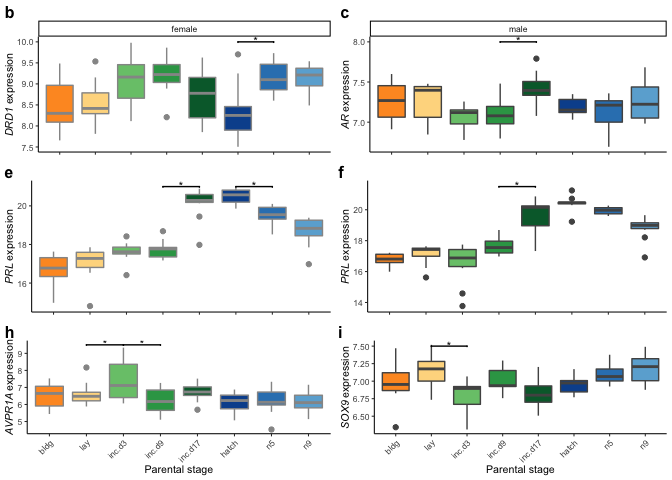
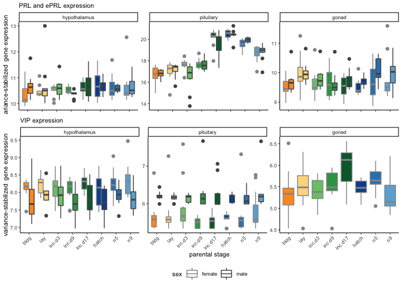
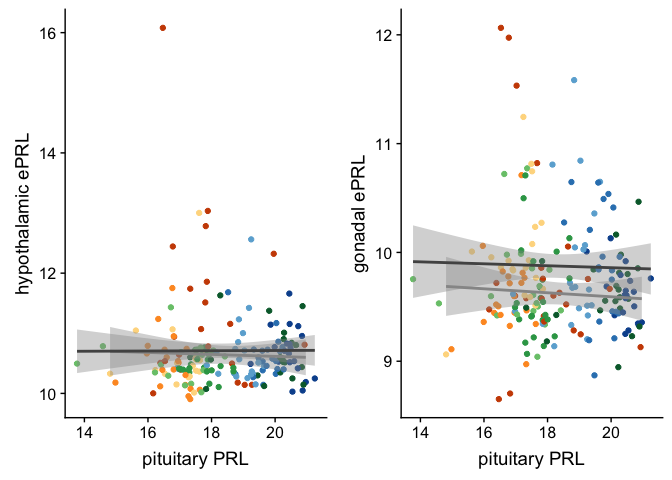

all things box plots
====================

candidate genes
---------------

    library(tidyverse)

    ## ── Attaching packages ───────────────────────────────────────────────────────────────────────────────── tidyverse 1.3.0 ──

    ## ✓ ggplot2 3.3.0.9000     ✓ purrr   0.3.3     
    ## ✓ tibble  2.1.3          ✓ dplyr   0.8.3     
    ## ✓ tidyr   1.0.0          ✓ stringr 1.4.0     
    ## ✓ readr   1.3.1          ✓ forcats 0.4.0

    ## ── Conflicts ──────────────────────────────────────────────────────────────────────────────────── tidyverse_conflicts() ──
    ## x dplyr::filter() masks stats::filter()
    ## x dplyr::lag()    masks stats::lag()

    library(ggtext)
    library(cowplot)

    ## 
    ## Attaching package: 'cowplot'

    ## The following object is masked from 'package:ggplot2':
    ## 
    ##     ggsave

    library(ggpubr)

    ## Loading required package: magrittr

    ## 
    ## Attaching package: 'magrittr'

    ## The following object is masked from 'package:purrr':
    ## 
    ##     set_names

    ## The following object is masked from 'package:tidyr':
    ## 
    ##     extract

    ## 
    ## Attaching package: 'ggpubr'

    ## The following object is masked from 'package:cowplot':
    ## 
    ##     get_legend

    source("../R/themes.R")

    knitr::opts_chunk$set(echo = TRUE, message = F, fig.path = "../figures/")

    candidategenes <- c("OXT", "AVP", "GNRH1", "GNRHR", "CGNRH-R",
                        "AR", "POMC", "AGRP", 
                           "CRH", "AVPR1A", "AVPR1B", "AVPR2","VIP",
                           "CYP19A1", "DRD1", "DRD2", "PRL", "PRLR", "SOX9", 
                        "ESR1","ESR2", "LBH", "CDK1", "BRCA1",
                        "PTEN", "CREBBP", "FOS", "JUN", "EGR1",
                         "BDNF", "GRM2","GRIA1",
                        "KCNJ5", "CISH", "PTGER3", "CEBPD", "ZBTB16", 
                        "DIO3", "DIO2", "DIO1") 

variance stabilized gene expression (vsd)
-----------------------------------------

    geneids <- read_csv("../metadata/00_geneinfo.csv")

    ## Warning: Missing column names filled in: 'X1' [1]

    vsd_path <- "../results/DEseq2/"   # path to the data
    vsd_files <- dir(vsd_path, pattern = "*vsd.csv") # get file names
    vsd_pathfiles <- paste0(vsd_path, vsd_files)
    vsd_files

    ## [1] "female_gonad_vsd.csv"        "female_hypothalamus_vsd.csv"
    ## [3] "female_pituitary_vsd.csv"    "male_gonad_vsd.csv"         
    ## [5] "male_hypothalamus_vsd.csv"   "male_pituitary_vsd.csv"

    allvsd <- vsd_pathfiles %>%
      setNames(nm = .) %>% 
      map_df(~read_csv(.x), .id = "file_name")  %>% 
      dplyr::rename("gene" = "X1") %>% 
      pivot_longer(cols = L.G118_female_gonad_control:y98.o50.x_male_pituitary_inc.d3, 
                   names_to = "samples", values_to = "counts") 

    ## Warning: Missing column names filled in: 'X1' [1]

    ## Warning: Missing column names filled in: 'X1' [1]

    ## Warning: Missing column names filled in: 'X1' [1]

    ## Warning: Missing column names filled in: 'X1' [1]

    ## Warning: Missing column names filled in: 'X1' [1]

    ## Warning: Missing column names filled in: 'X1' [1]

    getcandidatevsd <- function(whichgenes, whichtissue, whichsex){
      candidates  <- allvsd %>%
        filter(gene %in% whichgenes) %>%
        dplyr::mutate(sextissue = sapply(strsplit(file_name, '_vsd.csv'), "[", 1)) %>%
        dplyr::mutate(sextissue = sapply(strsplit(sextissue, '../results/DEseq2/'), "[", 2)) %>%
        dplyr::mutate(sex = sapply(strsplit(sextissue, '\\_'), "[", 1),
                    tissue = sapply(strsplit(sextissue, '\\_'), "[", 2),
                    treatment = sapply(strsplit(samples, '\\_'), "[", 4)) %>%
        dplyr::mutate(treatment = sapply(strsplit(treatment, '.NYNO'), "[", 1)) %>%
        dplyr::select(sex, tissue, treatment, gene, samples, counts) %>%
        filter(tissue == whichtissue, sex %in% whichsex)  %>%
        drop_na()
      candidates$treatment <- factor(candidates$treatment, levels = alllevels)
      return(candidates)
    }

    hypvsd <- getcandidatevsd(candidategenes, "hypothalamus", sexlevels)
    pitvsd <- getcandidatevsd(candidategenes, "pituitary", sexlevels)
    gonvsd <- getcandidatevsd(candidategenes, "gonad", sexlevels)
    head(hypvsd)

    ## # A tibble: 6 x 6
    ##   sex    tissue      treatment gene  samples                         counts
    ##   <chr>  <chr>       <fct>     <chr> <chr>                            <dbl>
    ## 1 female hypothalam… control   AGRP  L.G118_female_hypothalamus_con…   6.02
    ## 2 female hypothalam… control   AGRP  R.G106_female_hypothalamus_con…   5.77
    ## 3 female hypothalam… control   AGRP  R.R20_female_hypothalamus_cont…   5.46
    ## 4 female hypothalam… control   AGRP  R.R9_female_hypothalamus_contr…   5.68
    ## 5 female hypothalam… control   AGRP  R.W44_female_hypothalamus_cont…   5.81
    ## 6 female hypothalam… inc.d9    AGRP  blk.s061.pu.y_female_hypothala…   5.46

    head(pitvsd)

    ## # A tibble: 6 x 6
    ##   sex    tissue    treatment gene  samples                           counts
    ##   <chr>  <chr>     <fct>     <chr> <chr>                              <dbl>
    ## 1 female pituitary control   AGRP  L.G118_female_pituitary_control.…   5.63
    ## 2 female pituitary control   AGRP  R.G106_female_pituitary_control     5.34
    ## 3 female pituitary control   AGRP  R.R20_female_pituitary_control      5.34
    ## 4 female pituitary control   AGRP  R.R9_female_pituitary_control.NY…   5.73
    ## 5 female pituitary control   AGRP  R.W44_female_pituitary_control.N…   5.34
    ## 6 female pituitary inc.d9    AGRP  blk.s061.pu.y_female_pituitary_i…   5.34

    head(gonvsd)

    ## # A tibble: 6 x 6
    ##   sex    tissue treatment gene  samples                           counts
    ##   <chr>  <chr>  <fct>     <chr> <chr>                              <dbl>
    ## 1 female gonad  control   AGRP  L.G118_female_gonad_control        13.2 
    ## 2 female gonad  control   AGRP  R.G106_female_gonad_control         8.60
    ## 3 female gonad  control   AGRP  R.R20_female_gonad_control         13.6 
    ## 4 female gonad  control   AGRP  R.R9_female_gonad_control           9.82
    ## 5 female gonad  control   AGRP  R.W44_female_gonad_control         13.2 
    ## 6 female gonad  inc.d9    AGRP  blk.s061.pu.y_female_gonad_inc.d9   5.85

    candidatevsd <- rbind(hypvsd, pitvsd)
    candidatevsd <- rbind(candidatevsd, gonvsd)

Figs
----

    makeboxplots <- function(df, whichgene, myylab, whichsex){
      p <- df %>%
        filter(treatment %in% charlevels,
               gene %in% whichgene,
               sex %in% whichsex) %>%
        filter(treatment != "control") %>%
        ggplot(aes(x = treatment, y = counts, fill = treatment, color = sex)) +
        geom_boxplot() + 
        #geom_point() +
        facet_wrap(~sex) +
        theme_B3() +
        scale_fill_manual(values = allcolors) +
        scale_color_manual(values = allcolors) +
        theme(axis.text.x = element_text(angle = 45, hjust = 1),
              legend.position = "none") +
        labs(y = myylab , x = "Parental stage", subtitle = "") +
        theme(axis.title.y = element_markdown())
      return(p)
    }

    ## hyp 
    p2 <- makeboxplots(hypvsd, "AR","*AR* expression", "male") +
                  geom_signif(comparisons=list(c("inc.d9", "inc.d17")), annotations= "*", 
                  y_position = 8, tip_length = 0.005, vjust = 0.5, color= "black" , textsize = 3 ) +
                  theme(axis.text.x = element_blank(), axis.title.x = element_blank())

    p3 <- makeboxplots(hypvsd, "DRD1","*DRD1* expression", "female") +
                  geom_signif(comparisons=list(c("hatch", "n5")), annotations= "*", 
                  y_position = 10, tip_length = 0.005, vjust = 0.5, color= "black" , textsize = 3 ) +
                  #geom_signif(comparisons=list(c("control", "bldg")), annotations= "*", 
                  #y_position = 10, tip_length = 0.005, vjust = 0.5, color= "black" , textsize = 3 ) + 
                  theme(axis.text.x = element_blank(), axis.title.x = element_blank())

    p23 <- plot_grid(p3,p2, labels = c("b", "c"), label_size = 12)

    ## pit 

    p5 <- makeboxplots(pitvsd, "PRL","*PRL* expression", "male") +  theme(axis.text.x = element_blank(), axis.title.x = element_blank(), strip.text = element_blank())+
                  #geom_signif(comparisons=list(c("control", "bldg")), annotations= "*", 
                  #y_position = 21.5, tip_length = 0.005, vjust = 0.5, color= "black" , textsize = 3 ) +
                  geom_signif(comparisons=list(c("inc.d9", "inc.d17")), annotations= "*", 
                  y_position = 21.5, tip_length = 0.005, vjust = 0.5, color= "black" , textsize = 3 ) 
    p6 <- makeboxplots(pitvsd, "PRL","*PRL* expression", "female")  +  theme(axis.text.x = element_blank(), axis.title.x = element_blank(), strip.text = element_blank()) +
                  geom_signif(comparisons=list(c("inc.d9", "inc.d17")), annotations= "*", 
                  y_position = 21, tip_length = 0.005, vjust = 0.5, color= "black" , textsize = 3 ) +
                  #geom_signif(comparisons=list(c("control", "bldg")), annotations= "*", 
                  #y_position = 21, tip_length = 0.005, vjust = 0.5, color= "black" , textsize = 3 ) +
                  geom_signif(comparisons=list(c("hatch", "n5")), annotations= "*", 
                  y_position = 21, tip_length = 0.005, vjust = 0.5, color= "black" , textsize = 3 )

    p56 <- plot_grid(p6,p5, labels = c("e", "f"), label_size = 12)

    ## gon

    p8 <- makeboxplots(gonvsd, "SOX9","*SOX9* expression", "male")  +  theme(strip.text = element_blank()) +
                  geom_signif(comparisons=list(c("lay", "inc.d3")), annotations= "*", 
                  y_position = 7.5, tip_length = 0.005, vjust = 0.5, color= "black" , textsize = 3 )
    p9 <- makeboxplots(gonvsd, "AVPR1A","*AVPR1A* expression", "female") +  theme(strip.text = element_blank()) +
                  #geom_signif(comparisons=list(c("control", "bldg")), annotations= "*", 
                  #y_position = 9.5, tip_length = 0.005, vjust = 0.5, color= "black" , textsize = 3 ) +
                  geom_signif(comparisons=list(c("lay", "inc.d3")), annotations= "*", 
                  y_position = 9.5, tip_length = 0.005, vjust = 0.5, color= "black" , textsize = 3 ) +
                  geom_signif(comparisons=list(c("inc.d3", "inc.d9")), annotations= "*", 
                  y_position = 9.5, tip_length = 0.005, vjust = 0.5, color= "black" , textsize = 3 )

    p89 <- plot_grid(p9,p8, labels = c("h", "i"), label_size = 12)

    plot_grid(p23, p56, p89, nrow = 3)

    candidatevsd$tissue = factor(candidatevsd$tissue, levels = tissuelevel)

    plotcandidategene <- function(whichgene, mysubtitle){
      p <- candidatevsd %>%
        filter(treatment %in% charlevels,
               gene %in% whichgene,
               sex %in% sexlevels) %>%
        filter(treatment != "control") %>%
        ggplot(aes(x = treatment, y = counts, fill = treatment, color = sex)) +
        geom_boxplot() + 
        #geom_point() +
        facet_wrap(~tissue, scales = "free_y") +
        theme_B3() +
        scale_fill_manual(values = allcolors) +
        scale_color_manual(values = allcolors) +
        theme(axis.text.x = element_text(angle = 45, hjust = 1),
              legend.position = "none") +
        theme(axis.title.y = element_markdown()) +
      labs(y = "variance-stabilized gene expression", x = "parental stage", 
           subtitle = mysubtitle)
      return(p)
      
    }

    a <- plotcandidategene("PRL", "PRL and ePRL expression") + 
      theme(axis.title.x = element_blank(), axis.text.x = element_blank())
    b <- plotcandidategene("VIP", "VIP expression") + theme(legend.position = "bottom") +
      guides(fill = FALSE)

    plot_grid(a,b, nrow = 2, rel_heights = c(0.4,0.6))

    ePRL <- candidatevsd  %>%
      filter(gene == "PRL") %>%
      mutate(bird = sapply(strsplit(samples, '\\_'), "[", 1)) %>%
      select(bird, sex, tissue, treatment, counts)  %>%
      pivot_wider(names_from = tissue, values_from = counts) 
    ePRL

    ## # A tibble: 196 x 6
    ##    bird          sex    treatment hypothalamus pituitary gonad
    ##    <chr>         <chr>  <fct>            <dbl>     <dbl> <dbl>
    ##  1 L.G118        female control           13.0      17.9  9.41
    ##  2 R.G106        female control           10.6      17.0  9.60
    ##  3 R.R20         female control           11.2      18.6  9.52
    ##  4 R.R9          female control           10.9      16.8  8.70
    ##  5 R.W44         female control           10.5      18.6 10.1 
    ##  6 blk.s061.pu.y female inc.d9            10.6      17.6  9.22
    ##  7 blk11.x       female bldg              10.1      17.6  9.34
    ##  8 blk21.x       female hatch             11.7      20.4  9.25
    ##  9 blk4.x        female n9                12.6      19.2  9.20
    ## 10 blu.o.x.ATLAS female control           10.8      20.9  9.13
    ## # … with 186 more rows

    a <- ggplot(ePRL, aes( y = hypothalamus, x = pituitary)) +
      geom_point(aes(color = treatment)) +
      scale_color_manual(values = allcolors) +
      theme(legend.position = "none") +
      geom_smooth(method = "lm", aes(color = sex)) +
      labs(x = "pituitary PRL", y = "hypothalamic ePRL" )

    b <- ggplot(ePRL, aes( y = gonad, x = pituitary)) +
      geom_point(aes(color = treatment)) +
      scale_color_manual(values = allcolors) +
      theme(legend.position = "none") +
      geom_smooth(method = "lm", aes(color = sex))  +
      labs(x = "pituitary PRL", y = "gonadal ePRL" )

    plot_grid(a,b)

    ## Warning: Removed 8 rows containing non-finite values (stat_smooth).

    ## Warning: Removed 8 rows containing missing values (geom_point).

    ## Warning: Removed 4 rows containing non-finite values (stat_smooth).

    ## Warning: Removed 4 rows containing missing values (geom_point).

    write.csv(candidatevsd, "../../musicalgenes/data/candidatecounts.csv")
