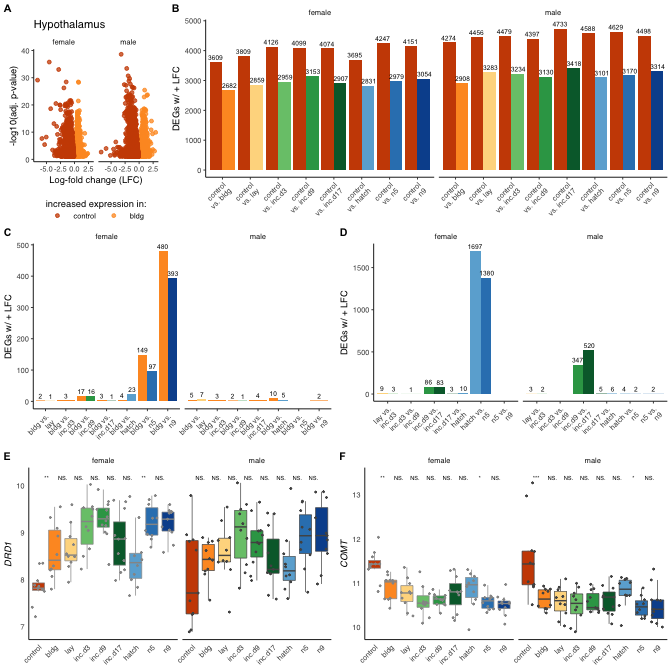

Hypothalamus
============

    library(tidyverse)

    ## ── Attaching packages ────────────────────────────────────────────────────────── tidyverse 1.3.0 ──

    ## ✓ ggplot2 3.3.0.9000     ✓ purrr   0.3.3     
    ## ✓ tibble  2.1.3          ✓ dplyr   0.8.3     
    ## ✓ tidyr   1.0.0          ✓ stringr 1.4.0     
    ## ✓ readr   1.3.1          ✓ forcats 0.4.0

    ## ── Conflicts ───────────────────────────────────────────────────────────── tidyverse_conflicts() ──
    ## x dplyr::filter() masks stats::filter()
    ## x dplyr::lag()    masks stats::lag()

    library(cowplot)

    ## 
    ## ********************************************************

    ## Note: As of version 1.0.0, cowplot does not change the

    ##   default ggplot2 theme anymore. To recover the previous

    ##   behavior, execute:
    ##   theme_set(theme_cowplot())

    ## ********************************************************

    library(ggsignif)

    source("../R/themes.R")
    source("../R/functions.R")

    knitr::opts_chunk$set(echo = TRUE, fig.path = '../figures/')

Treatment specific DEGs in the Hypothalamsu
-------------------------------------------

    allDEG <- read_csv("../results/03_allDEG.csv") %>%
      mutate(tissue = factor(tissue, levels = tissuelevel),
             direction = factor(direction, levels = alllevels),
             label = gsub("_","\nvs. ", comparison)) %>%
      filter(tissue == "hypothalamus")

    ## Parsed with column specification:
    ## cols(
    ##   sex = col_character(),
    ##   tissue = col_character(),
    ##   comparison = col_character(),
    ##   direction = col_character(),
    ##   gene = col_character(),
    ##   lfc = col_double(),
    ##   padj = col_double(),
    ##   logpadj = col_double()
    ## )

    allDEG

    ## # A tibble: 317,962 x 9
    ##    sex    tissue    comparison direction gene      lfc    padj logpadj label    
    ##    <chr>  <fct>     <chr>      <fct>     <chr>   <dbl>   <dbl>   <dbl> <chr>    
    ##  1 female hypothal… bldg_exte… extend    C1ORF1…  3.19 9.84e-2    1.01 "bldg\nv…
    ##  2 female hypothal… bldg_exte… extend    LOC107…  2.32 4.40e-2    1.36 "bldg\nv…
    ##  3 female hypothal… bldg_exte… extend    LOC107…  2.26 1.19e-2    1.92 "bldg\nv…
    ##  4 female hypothal… bldg_exte… extend    TGM4     2.14 5.79e-2    1.24 "bldg\nv…
    ##  5 female hypothal… bldg_exte… extend    PNO1     2.10 5.46e-4    3.26 "bldg\nv…
    ##  6 female hypothal… bldg_exte… extend    LOC769…  2.09 8.25e-4    3.08 "bldg\nv…
    ##  7 female hypothal… bldg_exte… extend    LAMB4    2.07 3.10e-2    1.51 "bldg\nv…
    ##  8 female hypothal… bldg_exte… extend    SLC6A14  1.98 4.41e-2    1.36 "bldg\nv…
    ##  9 female hypothal… bldg_exte… extend    TMED11   1.93 1.82e-2    1.74 "bldg\nv…
    ## 10 female hypothal… bldg_exte… extend    PPP2R5C  1.84 6.86e-3    2.16 "bldg\nv…
    ## # … with 317,952 more rows

    # for suppl figures
    DEGcontrol <- allDEG %>% 
      filter(grepl("control", comparison),
             !grepl("m.|early|extend|prolong", comparison))  %>%
      mutate(comparison = factor(comparison, levels = comparisonlevelscontrol))

    DEGbldg <- allDEG %>% 
      filter(grepl("bldg", comparison),
             !grepl("m.|early|extend|prolong", comparison))  %>%
      mutate(comparison = factor(comparison, levels = comparisonlevelsbldg))  %>%
      drop_na()

    DEGchar <- allDEG %>% 
      filter(comparison %in% comparisonlevelschar,
             !grepl("control|bldg", comparison)) %>%
      mutate(comparison = factor(comparison, levels = comparisonlevelschar))

    candidatevsd <- read_csv("../results/03_candidatevsd.csv") %>% 
      select(-X1) %>%
      filter(treatment %in% charlevels) %>%
      mutate(treatment = factor(treatment, levels = charlevels)) %>%
      drop_na() %>%
        mutate(external = fct_collapse(treatment, 
                                       "none" = c("control", "bldg"),
                                       "eggs" = c("lay" , "inc.d3", 
                                                  "inc.d9", "inc.d17"),
                                       "chicks" = c("hatch", "n5", "n9")))

    ## Warning: Missing column names filled in: 'X1' [1]

    ## Parsed with column specification:
    ## cols(
    ##   X1 = col_double(),
    ##   sex = col_character(),
    ##   tissue = col_character(),
    ##   treatment = col_character(),
    ##   gene = col_character(),
    ##   samples = col_character(),
    ##   counts = col_double()
    ## )

    head(candidatevsd)

    ## # A tibble: 6 x 7
    ##   sex    tissue     treatment gene   samples                     counts external
    ##   <chr>  <chr>      <fct>     <chr>  <chr>                        <dbl> <fct>   
    ## 1 female hypothala… control   ADRA2A L.G118_female_hypothalamus…   8.95 none    
    ## 2 female hypothala… control   ADRA2A R.G106_female_hypothalamus…   8.81 none    
    ## 3 female hypothala… control   ADRA2A R.R20_female_hypothalamus_…   9.18 none    
    ## 4 female hypothala… control   ADRA2A R.R9_female_hypothalamus_c…   8.72 none    
    ## 5 female hypothala… control   ADRA2A R.W44_female_hypothalamus_…   9.23 none    
    ## 6 female hypothala… inc.d9    ADRA2A blk.s061.pu.y_female_hypot…   9.11 eggs

    a <- plot.volcano("hypothalamus", sexlevels,  "control_bldg") + 
      facet_wrap(~sex) +  labs(title = "Hypothalamus") 
    b <- makebargraph(DEGcontrol, "hypothalamus","DEGs w/ + LFC", 0, 4800, comparisonlabelscontrol) 
      labs(title = " ") 

    ## $title
    ## [1] " "
    ## 
    ## attr(,"class")
    ## [1] "labels"

    c <- makebargraph(DEGbldg, "hypothalamus", "DEGs w/ + LFC", 0, 480, comparisonlabelsbldg) 
    d <- makebargraph(DEGchar, "hypothalamus","DEGs w/ + LFC", 0, 1700, comparisonlabelscharnobldg) 

    e <- candidateboxplot("hypothalamus",  c("DRD1"), sexlevels)
    f <- candidateboxplot("hypothalamus",  c("COMT"), sexlevels)

    ab <- plot_grid(a,b,rel_widths = c(1,3), labels = c("A", "B"), label_size = 8)
    cd <- plot_grid(c,d,rel_widths = c(1,1), labels = c("C", "D"), label_size = 8)
    ef <- plot_grid(e,f,rel_widths = c(1,1), labels = c("E", "F"), label_size = 8)

    hypcharfig <- plot_grid(ab,cd,ef, ncol = 1)
    hypcharfig

Save files
----------

    pdf(file="../figures/hypcharfig.pdf", width=7, height=7)
    plot(hypcharfig)
    dev.off()

    ## quartz_off_screen 
    ##                 2

    png("../figures/hypcharfig.png", width = 7, height = 7, 
        units = 'in', res = 300)
    plot(hypcharfig) # Make plot
    dev.off()

    ## quartz_off_screen 
    ##                 2

    sessionInfo()

    ## R version 3.6.0 (2019-04-26)
    ## Platform: x86_64-apple-darwin15.6.0 (64-bit)
    ## Running under: macOS  10.15.4
    ## 
    ## Matrix products: default
    ## BLAS:   /Library/Frameworks/R.framework/Versions/3.6/Resources/lib/libRblas.0.dylib
    ## LAPACK: /Library/Frameworks/R.framework/Versions/3.6/Resources/lib/libRlapack.dylib
    ## 
    ## locale:
    ## [1] en_US.UTF-8/en_US.UTF-8/en_US.UTF-8/C/en_US.UTF-8/en_US.UTF-8
    ## 
    ## attached base packages:
    ## [1] stats     graphics  grDevices utils     datasets  methods   base     
    ## 
    ## other attached packages:
    ##  [1] ggsignif_0.5.0     cowplot_1.0.0.9000 forcats_0.4.0      stringr_1.4.0     
    ##  [5] dplyr_0.8.3        purrr_0.3.3        readr_1.3.1        tidyr_1.0.0       
    ##  [9] tibble_2.1.3       ggplot2_3.3.0.9000 tidyverse_1.3.0   
    ## 
    ## loaded via a namespace (and not attached):
    ##  [1] tidyselect_0.2.5 xfun_0.15        haven_2.2.0      lattice_0.20-38 
    ##  [5] colorspace_1.4-1 vctrs_0.2.2      generics_0.0.2   htmltools_0.3.6 
    ##  [9] yaml_2.2.1       utf8_1.1.4       rlang_0.4.4      pillar_1.4.3    
    ## [13] glue_1.3.1       withr_2.1.2      DBI_1.1.0        dbplyr_1.4.2    
    ## [17] modelr_0.1.5     readxl_1.3.1     lifecycle_0.1.0  munsell_0.5.0   
    ## [21] gtable_0.3.0     cellranger_1.1.0 rvest_0.3.5      evaluate_0.14   
    ## [25] labeling_0.3     knitr_1.29       fansi_0.4.1      broom_0.5.2     
    ## [29] Rcpp_1.0.3       scales_1.1.0     backports_1.1.5  jsonlite_1.6.1  
    ## [33] farver_2.0.3     fs_1.3.1         hms_0.5.3        digest_0.6.24   
    ## [37] stringi_1.4.6    grid_3.6.0       cli_2.0.1        tools_3.6.0     
    ## [41] magrittr_1.5     crayon_1.3.4     pkgconfig_2.0.3  ellipsis_0.3.0  
    ## [45] xml2_1.2.2       reprex_0.3.0     lubridate_1.7.4  assertthat_0.2.1
    ## [49] rmarkdown_1.15   httr_1.4.1       rstudioapi_0.11  R6_2.4.1        
    ## [53] nlme_3.1-140     compiler_3.6.0
