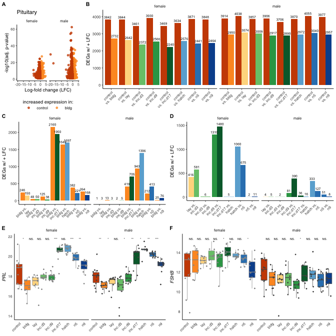

Pituitary
=========

    library(tidyverse)

    ## ── Attaching packages ──────────────────────────────────────────────────── tidyverse 1.3.0 ──

    ## ✓ ggplot2 3.3.0.9000     ✓ purrr   0.3.3     
    ## ✓ tibble  2.1.3          ✓ dplyr   0.8.3     
    ## ✓ tidyr   1.0.0          ✓ stringr 1.4.0     
    ## ✓ readr   1.3.1          ✓ forcats 0.4.0

    ## ── Conflicts ─────────────────────────────────────────────────────── tidyverse_conflicts() ──
    ## x dplyr::filter() masks stats::filter()
    ## x dplyr::lag()    masks stats::lag()

    library(cowplot)

    ## 
    ## ********************************************************

    ## Note: As of version 1.0.0, cowplot does not change the

    ##   default ggplot2 theme anymore. To recover the previous

    ##   behavior, execute:
    ##   theme_set(theme_cowplot())

    ## ********************************************************

    library(ggsignif)

    source("../R/themes.R")
    source("../R/functions.R")

    knitr::opts_chunk$set(echo = TRUE, fig.path = '../figures/')

Treatment specific DEGs in the Hypothalamsu
-------------------------------------------

    allDEG <- read_csv("../results/03_allDEG.csv") %>%
      mutate(tissue = factor(tissue, levels = tissuelevel),
             direction = factor(direction, levels = alllevels),
             label = gsub("_","\nvs. ", comparison)) %>%
      filter(tissue == "pituitary")

    ## Parsed with column specification:
    ## cols(
    ##   sex = col_character(),
    ##   tissue = col_character(),
    ##   comparison = col_character(),
    ##   direction = col_character(),
    ##   gene = col_character(),
    ##   lfc = col_double(),
    ##   padj = col_double(),
    ##   logpadj = col_double()
    ## )

    allDEG

    ## # A tibble: 276,508 x 9
    ##    sex    tissue   comparison direction gene      lfc     padj logpadj label    
    ##    <chr>  <fct>    <chr>      <fct>     <chr>   <dbl>    <dbl>   <dbl> <chr>    
    ##  1 female pituita… bldg_exte… extend    MLN      4.61 2.90e-15   14.5  "bldg\nv…
    ##  2 female pituita… bldg_exte… extend    LOC101…  4.08 8.86e- 7    6.05 "bldg\nv…
    ##  3 female pituita… bldg_exte… extend    FGF6     3.57 9.40e- 7    6.03 "bldg\nv…
    ##  4 female pituita… bldg_exte… extend    PRPH2    3.40 4.63e- 2    1.33 "bldg\nv…
    ##  5 female pituita… bldg_exte… extend    TMEM240  3.31 3.58e- 4    3.45 "bldg\nv…
    ##  6 female pituita… bldg_exte… extend    PRL      3.21 5.47e-24   23.3  "bldg\nv…
    ##  7 female pituita… bldg_exte… extend    LOC101…  3.00 6.00e- 2    1.22 "bldg\nv…
    ##  8 female pituita… bldg_exte… extend    LOC107…  2.79 1.40e- 7    6.85 "bldg\nv…
    ##  9 female pituita… bldg_exte… extend    PDE11A   2.63 3.58e- 4    3.45 "bldg\nv…
    ## 10 female pituita… bldg_exte… extend    STC1     2.63 7.07e-15   14.2  "bldg\nv…
    ## # … with 276,498 more rows

    # for suppl figures
    DEGcontrol <- allDEG %>% 
      filter(grepl("control", comparison),
             !grepl("m.|early|extend|prolong", comparison))  %>%
      mutate(comparison = factor(comparison, levels = comparisonlevelscontrol))

    DEGbldg <- allDEG %>% 
      filter(grepl("bldg", comparison),
             !grepl("m.|early|extend|prolong", comparison))  %>%
      mutate(comparison = factor(comparison, levels = comparisonlevelsbldg))  %>%
      drop_na()

    DEGchar <- allDEG %>% 
      filter(comparison %in% comparisonlevelschar,
             !grepl("control|bldg", comparison)) %>%
      mutate(comparison = factor(comparison, levels = comparisonlevelschar))

    candidatevsd <- read_csv("../results/03_candidatevsd.csv") %>% 
      select(-X1) %>%
      filter(treatment %in% charlevels) %>%
      mutate(treatment = factor(treatment, levels = charlevels)) %>%
      drop_na() %>%
        mutate(external = fct_collapse(treatment, 
                                       "none" = c("control", "bldg"),
                                       "eggs" = c("lay" , "inc.d3", 
                                                  "inc.d9", "inc.d17"),
                                       "chicks" = c("hatch", "n5", "n9")))

    ## Warning: Missing column names filled in: 'X1' [1]

    ## Parsed with column specification:
    ## cols(
    ##   X1 = col_double(),
    ##   sex = col_character(),
    ##   tissue = col_character(),
    ##   treatment = col_character(),
    ##   gene = col_character(),
    ##   samples = col_character(),
    ##   counts = col_double()
    ## )

    a <- plot.volcano("pituitary", sexlevels,  "control_bldg") + 
      facet_wrap(~sex) +  labs(title = "Pituitary") 
    b <- makebargraph(DEGcontrol, "pituitary","DEGs w/ + LFC", 0, 4200, comparisonlabelscontrol) 
      labs(title = " ") 

    ## $title
    ## [1] " "
    ## 
    ## attr(,"class")
    ## [1] "labels"

    c <- makebargraph(DEGbldg, "pituitary", "DEGs w/ + LFC", 0, 2200, comparisonlabelsbldg) 
    d <- makebargraph(DEGchar, "pituitary","DEGs w/ + LFC", 0, 1500, comparisonlabelscharnobldg) 

    e <- candidateboxplot("pituitary",  c("PRL"), sexlevels)
    f <- candidateboxplot("pituitary",  c("FSHB"), sexlevels)

    ab <- plot_grid(a,b,rel_widths = c(1,3), labels = c("A", "B"), label_size = 8)
    cd <- plot_grid(c,d,rel_widths = c(1,1), labels = c("C", "D"), label_size = 8)
    ef <- plot_grid(e,f,rel_widths = c(1,1), labels = c("E", "F"), label_size = 8)

    pitcharfig <- plot_grid(ab,cd,ef, ncol = 1)
    pitcharfig

Save files
----------

    pdf(file="../figures/pitcharfig.pdf", width=7, height=7)
    plot(pitcharfig)
    dev.off()

    ## quartz_off_screen 
    ##                 2

    png("../figures/pitcharfig.png", width = 7, height = 7, 
        units = 'in', res = 300)
    plot(pitcharfig) # Make plot
    dev.off()

    ## quartz_off_screen 
    ##                 2

    sessionInfo()

    ## R version 3.6.0 (2019-04-26)
    ## Platform: x86_64-apple-darwin15.6.0 (64-bit)
    ## Running under: macOS  10.15.4
    ## 
    ## Matrix products: default
    ## BLAS:   /Library/Frameworks/R.framework/Versions/3.6/Resources/lib/libRblas.0.dylib
    ## LAPACK: /Library/Frameworks/R.framework/Versions/3.6/Resources/lib/libRlapack.dylib
    ## 
    ## locale:
    ## [1] en_US.UTF-8/en_US.UTF-8/en_US.UTF-8/C/en_US.UTF-8/en_US.UTF-8
    ## 
    ## attached base packages:
    ## [1] stats     graphics  grDevices utils     datasets  methods   base     
    ## 
    ## other attached packages:
    ##  [1] ggsignif_0.5.0     cowplot_1.0.0.9000 forcats_0.4.0      stringr_1.4.0     
    ##  [5] dplyr_0.8.3        purrr_0.3.3        readr_1.3.1        tidyr_1.0.0       
    ##  [9] tibble_2.1.3       ggplot2_3.3.0.9000 tidyverse_1.3.0   
    ## 
    ## loaded via a namespace (and not attached):
    ##  [1] tidyselect_0.2.5 xfun_0.15        haven_2.2.0      lattice_0.20-38 
    ##  [5] colorspace_1.4-1 vctrs_0.2.2      generics_0.0.2   htmltools_0.3.6 
    ##  [9] yaml_2.2.1       utf8_1.1.4       rlang_0.4.4      pillar_1.4.3    
    ## [13] glue_1.3.1       withr_2.1.2      DBI_1.1.0        dbplyr_1.4.2    
    ## [17] modelr_0.1.5     readxl_1.3.1     lifecycle_0.1.0  munsell_0.5.0   
    ## [21] gtable_0.3.0     cellranger_1.1.0 rvest_0.3.5      evaluate_0.14   
    ## [25] labeling_0.3     knitr_1.29       fansi_0.4.1      broom_0.5.2     
    ## [29] Rcpp_1.0.3       scales_1.1.0     backports_1.1.5  jsonlite_1.6.1  
    ## [33] farver_2.0.3     fs_1.3.1         hms_0.5.3        digest_0.6.24   
    ## [37] stringi_1.4.6    grid_3.6.0       cli_2.0.1        tools_3.6.0     
    ## [41] magrittr_1.5     crayon_1.3.4     pkgconfig_2.0.3  ellipsis_0.3.0  
    ## [45] xml2_1.2.2       reprex_0.3.0     lubridate_1.7.4  assertthat_0.2.1
    ## [49] rmarkdown_1.15   httr_1.4.1       rstudioapi_0.11  R6_2.4.1        
    ## [53] nlme_3.1-140     compiler_3.6.0
