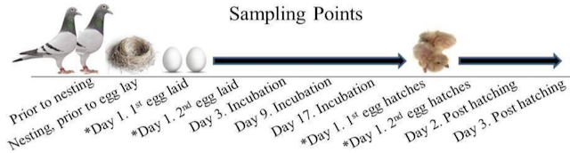

```{r setup, include=FALSE}
knitr::opts_chunk$set(echo = FALSE,  message = F, results = F)
library(cowplot)
```

##  

Parental care of offspring is essential to maximize fitness in many species throughout the animal kingdom. As a result, new parents undergo major changes in physiology and behavior to promote offspring survival in predictable and unpredictable conditions. While much is known about neuroendocrine mechanisms modulating these changes, we know less about genomic mechanisms driving these changes in male and female parents. 

```{r, fig.width = 5,}
p  <- ggdraw() + draw_image("../figures/images/PigeonHPGaxis.png") 
p
```


## 

To fill this gap, our team characterized gene expression states of the hypothalamus, pituitary, and gonads of mothers and fathers of the socially monogamous, bi-parental rock dove (Columba livia) at multiple stages of parenting including nest building, egg laying, egg incubation, chick hatch, and nestling stages. 



## 

Next, we manipulated the timeline of the offspring development to distinguish genomic signatures that are driven by cues from the offspring from those that are driven by internal cues from within the parent. 

```{r, fig.width = 8}
q  <- ggdraw() + draw_image("../figures/sbnposter/DoveParentsRNAseq_approach-3.png") 
q
```


##

We developed an R workflow for rapid and reproducible hypothesis testing related to specific tissues, sexes, and timepoints from our dataset of 1000 samples. All data and analyses are available at https://github.com/macmanes-lab/DoveParentsRNAseq. 

```{r, fig.width = 8}
q  <- ggdraw() + draw_image("../figures/sexes/DoveParentsRNAseq_model2.png") 
q
```


## 

Preliminary findings suggest that the gene expression of one hundred genes in the male and female pituitary mirrors that of circulating prolactin levels in the blood. 

```{r, fig.width = 8}
r  <- ggdraw() + draw_image("../figures/sexes/wgcna-2.png") 
s <- ggdraw() + draw_image("../figures/sexes/wgcna-3.png") 
plot_grid(r,s, nrow = 1)
```


##

Removal of offspring around the time of hatch time causes prolactin to plummet and gene expression patterns shift to a non-parental state, suggesting an external stimulus-driven response; however prolonging incubation or delaying hatch have a much more subtle effect on gene expression. 


```{r, fig.width = 8}
t  <- ggdraw() + draw_image("../figures/manipulation/pca-2.png") 
t
```

##

By characterizing and manipulating parental care and measuring the effects on hormones and gene expression in both male and female parents over time, we provide a deeper understanding of how the hypothalamic-pituitary-gonadal axis responds to predictable and unpredictable changes during offspring development.

~[](./)

