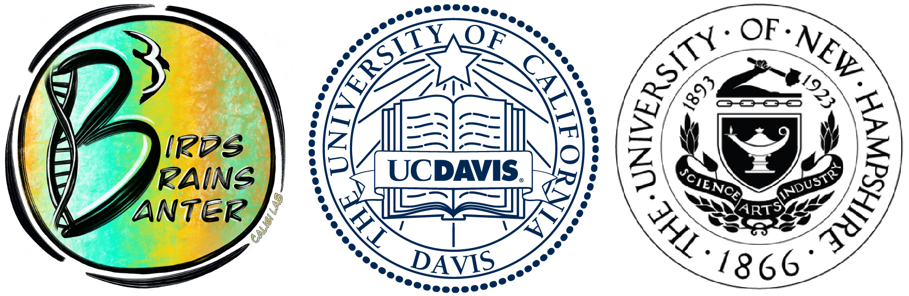

# Improving RNA-seq workflows for behavioral transcriptomics

Rayna M. Harris [@raynamharris](https://twitter.com/raynamharris), Suzanne H. Austin, Andrew Lang, Matthew MacManes, Rebecca M. Calisi [@BeccaCalisi](https://twitter.com/BeccaCalisi)

1. University of California, Davis
2. Oregon State University
3. University of New Hampshire

## The problem

Many differential genes expression profiling tools are designed to analyze experiments with a single manipulation. However, integrative experimental designs in behavioral neuroendocrinology require numerous comparisons to hone in on the causes and consequences of animal behavior.

## *Case study:* How and why do biological systems change over the course of parental care?

For more information visit <http://calisilab.ucdavis.edu/>.

## Working towards a solution

All the data and analyses are available on GitHub at <https://github.com/macmanes-lab/DoveParentsRNAseq>. This poster can be read online at <https://macmanes-lab.github.io/DoveParentsRNAseq/>.

## Creating open access, user-friendly, multivariate, behaioral and -omics analyses to accelerate discoveries and advance science.

### Increasing the reproducbility of RNA-seq

{width="0.7linewidth"}

Our approach automatically compares all levels of a given variable to minimize errors and save time.

-    subsetcolData <- function(colData, eachgroup){} 

-    returnpadj <- function(group1, group2){} 

-    numDEGs <- function(dds, group1, group2){} 

-    plottotalDEGs <- function(myDEGS, mysubtitle){} 

### Quickly explore variation explained by the top differentially expressed genes

### Calculate and visualize the total number of differentially expressed genes for each two-way comparison

### Use clustering analyses to identify patterns of correlation 

## Preliminary interpretations

## Next steps

-   **Examine** the full model of sex * tissue * treatment.

-   **Test** specific hypotheses for each manipulation.

-   **Incorporate** code-review and peer-review .

-   **Create** an open source R package.

-   **Share** tutorials for how to use the function.

## Acknowledgements

We are grateful to members of laboratories supervised by RMC, MM, C. Titus Brown, John Wingfield, Tom Hahn, and Marilyn Ramenofsky for comments and discussion. We thank Victoria Farrar, April Booth, Rechelle Viernes, Jonathan Perez, Jesse Krause, and over 20 undergraduate researchers who helped care for our bird colony. This work is funded by the National Science Foundation, IOS #1455957, to RMC and MM.

*Made with LaTeXfor the 2019 meeting of the Society for Behavioral Neuroendocrinology.*
