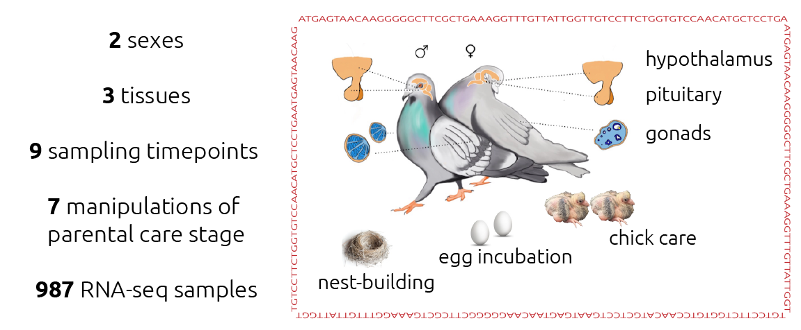
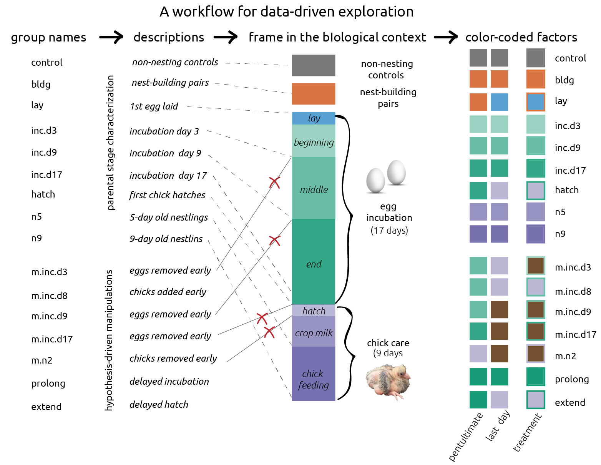
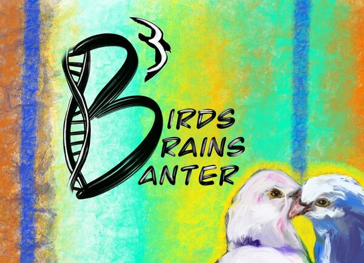
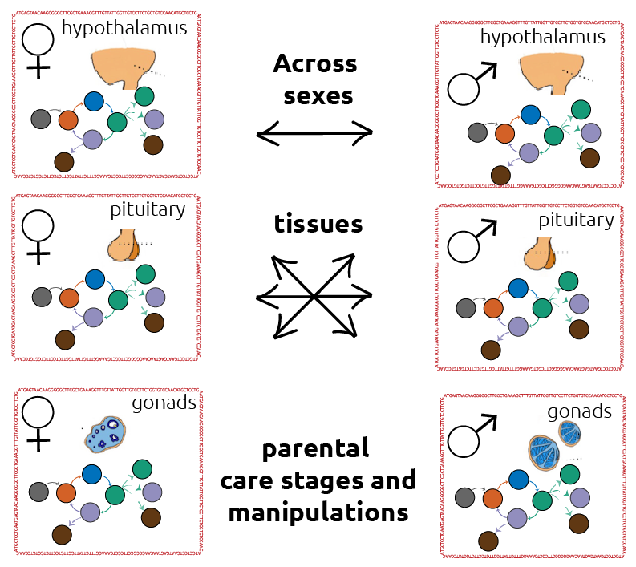
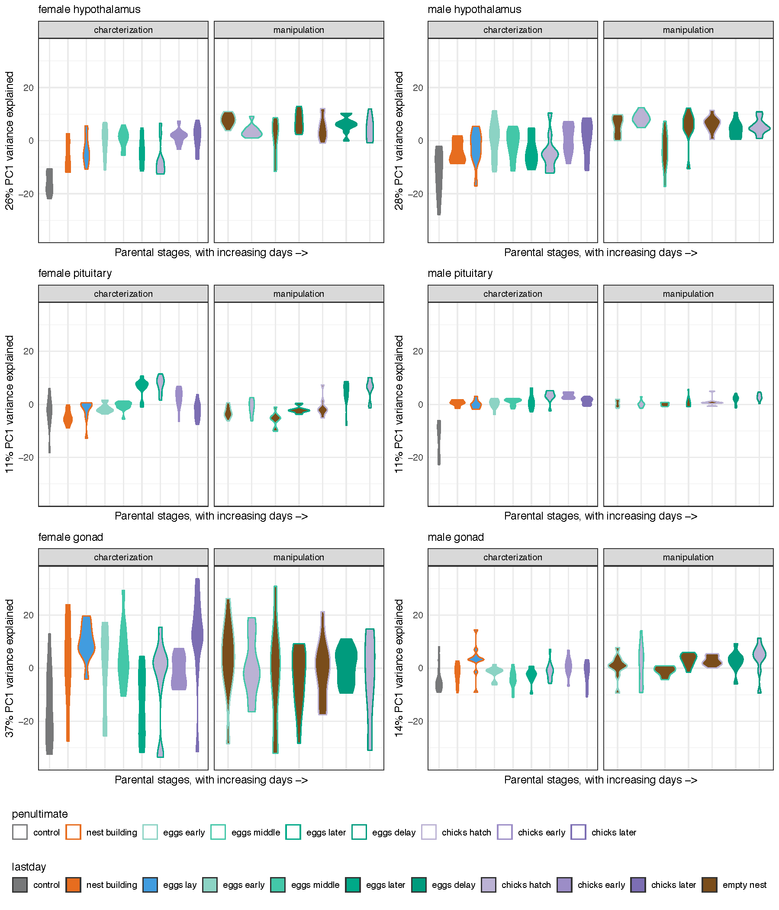
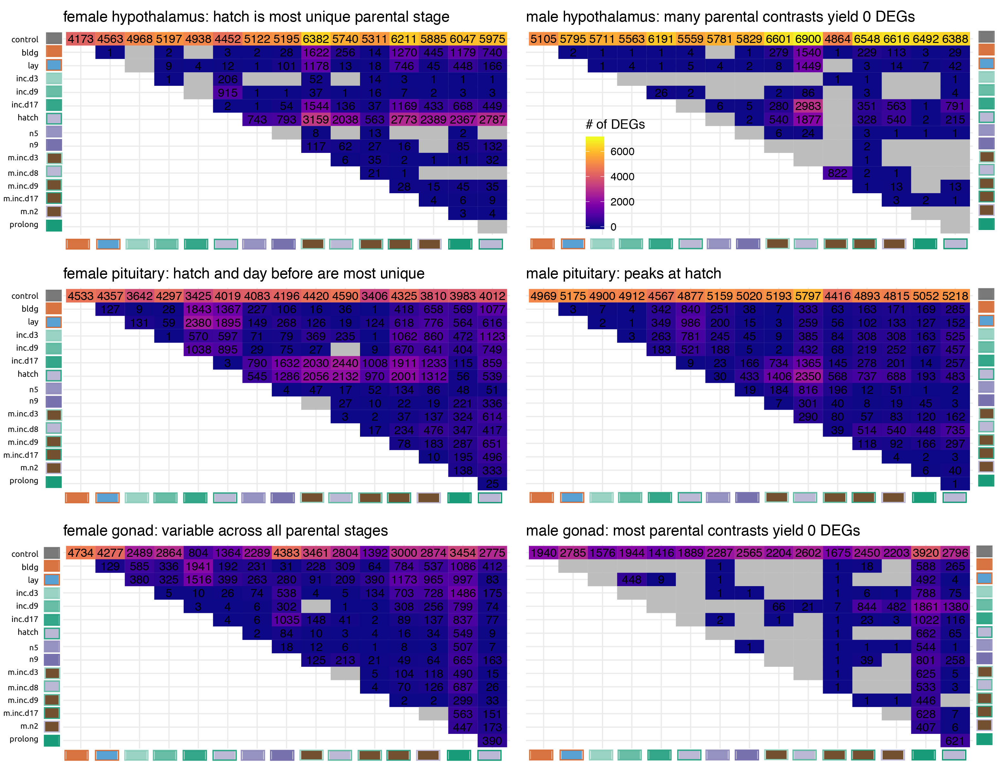
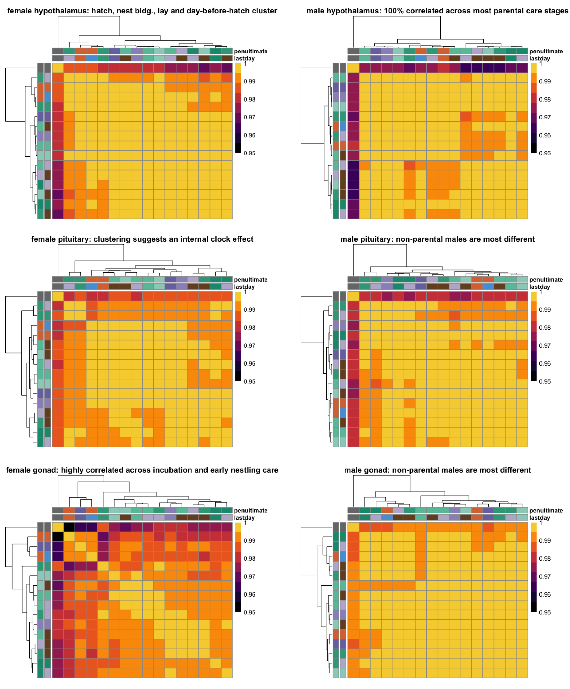
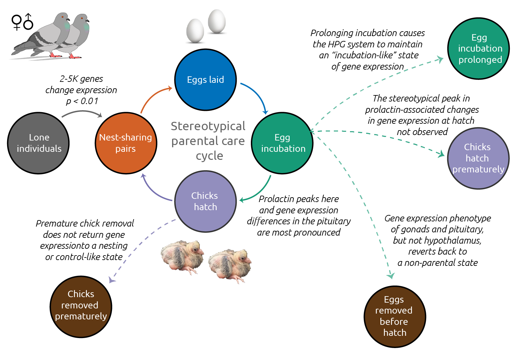

# New strategies for multi-factoral and temporal behavioral analyses

Rayna M. Harris, 
Suzanne H. Austin, 
Andrew Lang, 
Matthew MacManes and
Rebecca M. Calisi.

University of California, Davis,; Oregon State University; University of New Hampshire 

## The problem 

Many differential genes expression profiling tools are designed to analyze simplistic experimental designs comparing treatment and control. However, experimental designs in behavioral neuroendocrinology often require many treatment groups to hone in on the causes and consequences of animal behavior.

## *Case study:* How and why do biological systems change over the course of parental care? 

Data and analyses are available at <https://github.com/macmanes-lab/DoveParentsRNAseq>. For more information visit <http://calisilab.ucdavis.edu/>.

## Goal: Minimize hand-typing comparison, maximize reproducibility. 

### New R functions to automate DESeq2  

-    subsetcolData <- function(colData, eachgroup){} 

-    returntotalDEGs <- function(dds){} 

-    returnpadj <- function(group1, group2){} 

-    numDEGs <- function(dds, group1, group2){} 

-    plottotalDEGs <- function(myDEGS, mysubtitle){} 

These functions utilize exciting R functions and for loops to compare gene expression across levels.

### Quickly explore variation using the top 500 differentially expressed genes  

### Calculate and visualize the total number of differentially expressed genes for each two-way comparison  

### Determine the extent of correlation in gene expression variation  

 

## Preliminary interpretations 

## Next steps 

-   **Zoom out:** examine the full model of sex * tissue * treatment.

-   **Zoom in:** examine effects of specific manipulations in greater detail.

-   **Test** specific hypotheses.

-   **Incorporate** code-review and peer-review.

-   **Create** and open source R package.

-   **Share** tutorials for how to use the function.

## Acknowledgements 

We are grateful to members of laboratories supervised by RMC, MM, C. Titus Brown, John Wingfield, Tom Hahn, and Marilyn Ramenofsky for comments and discussion. We thank Victoria Farrar, April Booth, Rechelle Viernes, Jonathan Perez, Jesse Krause, and over 20 undergraduate researchers who helped care for our bird colony. This work is funded by the National Science Foundation, IOS #1455957, to RMC and MM.

*2019-06-15*
