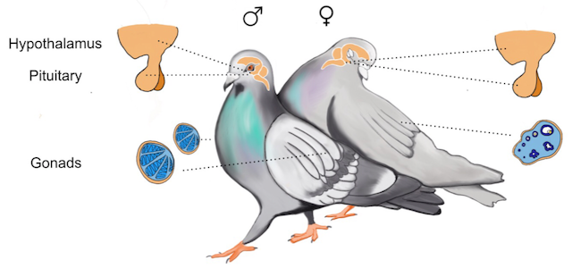

```{r, include=F}
## got error LaTeX Error: File `changepage.sty' not found 
## googled LaTeX Error: File `changepage.sty' not found Rmarkdown
## found this https://stackoverflow.com/questions/34252903/knit-pdf-file-from-rstudio
## ran the following

# install.packages(c('tinytex', 'rmarkdown'))
# tinytex::install_tinytex()

```

<!--
_Text based on plos sample manuscript, see [http://journals.plos.org/ploscompbiol/s/latex](http://journals.plos.org/ploscompbiol/s/latex)_
-->


# Introduction


Understanding the mechanisms underlying parental care are critical to circumventing issues with parent-newborn bonding as well, where ultimate explanations are obvious, but specific mechanisms remain elusive. The rock dove (_Columba livia_) is an ideal system to characterize changes in genetic expression during parental care transitions because: 1) ample genomic resources are available (Gillespie et al. 2013), including a complete annotated genome assembly @Shapiro1063 and methodology concerning reproductive physiology and behavior (Dong et al. 2012); and 2) rock doves are prolific, year-round breeders that thrive in captivity, making observation, manipulation, and sampling highly feasible year-round. 

```{r, out.width = "360px", echo = F}

```

Rock doves are socially monogamous and offer bi-parental care, making inter- and intra-sexual comparisons possible. Birds offer two important behavioral transition points into parental care: the incubation of eggs and the caring for chicks. This produces two unique opportunities to study how the brain transitions into two different suites of parental care behaviors. Additionally, rock doves exhibit a parental care strategy analogous to mammals in that they, too, ‘lactate’ to feed their young (Gillespie et al. 2011, 2012). This lactation, unlike simple regurgitation of food, consists of the production and sloughing off of skin cells inside the crop sac of females and males, creating a protein-rich milk-like substance on which they rear their chicks. Many functional similarities between rock dove and mammalian lactation exist concerning the mediation of this event by the hormone prolactin (Dumont 1965). Additionally, like mammalian milk, rock dove milk delivers essential immunoglobulins and nutritional benefits to young, aiding in their immune function and development of microbiota @Gillespie2012. Thus, because rock doves incubate eggs and exhibit mammalian-like mediation and function of lactation for young, they have the potential to serve as a powerful theoretical bridge to understand the neurobiology of both avian and mammalian transitions into parental care.

# Materials and Methods and Results

```{r, out.width = "360px", echo = F}
knitr::include_graphics("../figures/images/samplingtimepoints.png")
```

## Characterize changes in neural-gene expression during parental care transitions

Our working hypothesis is that distinct changes in transcription occur in the brain at the anticipation of, during, and in response to two different types of parental care: incubation behavior and hatchling care 

## Elucidate cause of transcription & protein changes during parental care transitions

Using egg and chick removal and replacement experiments we will determine if neural transcription and translation during parental care transitions are based on external sensory information (the presence/absence of eggs or chicks) or on an internal clock-timing mechanism (natural biological rhythms unaffected by changes in external sensory information). As rock doves are known to cross-foster eggs and chicks, our working hypothesis is that the transition to parental care behaviors is based on external sensory input, and specific predictions are explained in conjunction with each manipulation below.

### Give birds eggs
We will place eggs in nests of birds lacking them and sample brains the following day. Prediction: birds will transition into incubation behavior, and neural transcription and translation will mirror that of birds sampled on the day their first egg was laid. This would support our working hypothesis that sensory perception of the environment drives these changes. If we do not observe changes in behavior, transcription, and translation, or they only occur in males, one of many interpretations is that males respond to environmental cues while females are cued by an internal clock-timing mechanism regulating transitions into parental care.

### Prolong incubation
We will prolong incubation by removing eggs from actively incubated nests on the day before hatching (Day 17) and immediately replace them with infertile, ‘dummy’ eggs. We will then sample brains 3 days after normal hatch time (Day 21). Collaborator Silver and colleagues have shown sex differences in the endocrine profiles of male and female doves in response to prolonged incubation, in that prolactin levels are maintained in incubating females but not males (Ramsey et al. 1985). Because of this, we predict that if changes in behavior, neural transcription, and translation occur in females because of sensory information related to chicks hatching (supporting our working hypothesis), then females that experience this prolonged incubation will mirror the changes of incubating birds sampled on Day 17 of incubation. However, if changes in behavior, transcription and translation are brought on by internal clock mechanisms rather than external sensory information, as predicted at this stage in males, bird behavior and biology will resemble that of birds collected on Day 3 post-hatching.

### Extend time of hatching
We will prolong incubation by removing eggs from nests undergoing active incubation on Day 17 (the end of incubation) and immediately replacing eggs with ‘dummy’ eggs. On Day 21 (3 days post-natural hatch time) we will offer hatchlings. Doves are known to care for nestlings placed in their nest that are not their own (Klinghammer and Hess 1964, Hasen 1971). Brains will be sampled the following day. Prediction: Behavior, transcription and translation will be similar to birds naturally caring for chick(s) one day post-hatch of the first chick, supporting our working hypothesis. Alternatively, if behavior, transcription and translation are similar to birds caring for hatchlings on Day 3 post-hatching, which would have been the normal time course for parental care if chicks had hatched naturally, this would support regulation by an internal clock mechanism.

### Remove eggs
We will remove eggs during incubation on Day 1 (beginning), Day 9 (middle), or Day 17 (end) and sample brains on the following day. Note: This is not a repeated measures sampling, and three groups of male-female pairs will be independently sampled at each time point. Prediction: Birds will revert to a behavioral, transcriptional and translational pattern characteristic of the “Nesting, prior to lay” sampling point, lending support to our working hypothesis. If birds maintain a profile characteristic of birds collected at similar time points whose eggs have not been removed, this lends support to an internal clock mechanism.

### Reduce time to hatching
We will remove eggs on Day 8 (middle) of incubation and immediately replace them with newly hatched chicks. We will sample brains on the following day (Day 9). Prediction: Changes in behavior, transcription and translation are externally sensory driven, and these will be similar to birds sampled on ‘Day 1: 1st egg
hatches, supporting our working hypothesis. Alternatively, if profiles remain similar to birds sampled on Day 9 that are actively incubating eggs, this would support the presence of an internal clock mechanism.

### Remove chicks
We will remove newly, naturally hatched chick(s) on Day 2: second chick hatches and sample brains from parents the following day (Day 2 post (second) egg hatching). Prediction: Behavior, transcription and translation are sensory driven and will revert to a pattern characteristic of the ‘Nesting, prior to lay’ point, supporting our working hypothesis. Alternatively, if an internal clock mechanism is at play, we would expect to see a pattern similar to birds caring for chicks on Day 2 post (second) egg hatching.


Lorem ipsum dolor sit amet, consectetur adipiscing elit. Curabitur eget porta erat. Morbi consectetur est vel gravida pretium. Suspendisse ut dui eu ante cursus gravida non sed sem. Phasellus mauris velit, dapibus finibus elementum vel, pulvinar non tellus. Nunc pellentesque pretium diam, quis maximus dolor faucibus id. Nunc convallis sodales ante, ut ullamcorper est egestas vitae. Nam sit amet enim ultrices, ultrices elit pulvinar, volutpat risus.


# Figures


```{r wgcna, message=FALSE, warning=FALSE, cache=TRUE, echo = F, fig.width= 5}
source("../analysis/08_WGCNA_1.R")
subsetWGCNA(whichgroups = c("female.gonad", "female.hypothalamus", "female.pituitary",
                           "male.gonad", "male.hypothalamus", "male.pituitary"),
            mytitle = "Characterization dendrogram with trait heatmap")
```

**Fig 1. Characterization dendrogram with trait heatmap.**.
Most hypothalamus and pituitary samples separte form the gonad samples, but some are clusters contain samples from all tissues.The top panel is a dendrogram showing Euclidean distance of sample. Females (white), males (red), gonad (white), hypothalamus (pink), pituitary (red).  


```{r wgcna-female, message=FALSE, warning=FALSE, cache=TRUE, echo = F, fig.width= 5}
subsetWGCNA(whichgroups = c("female.gonad", "female.hypothalamus", "female.pituitary"),
            mytitle = "Female sample dendrogram with trait heatmap")
```


**Fig 2. Female characterization dendrogram with trait heatmap.**. 
Most pituitary samples form a single cluster. More hypothalamus samples cluster with gonads than with pituitary. The top panel is a dendrogram showing Euclidean distance of sample. Females (white), males (red), gonad (white), hypothalamus (pink), pituitary (red).  

```{r wgcna-male, message=FALSE, warning=FALSE, cache=TRUE, echo = F, fig.width= 5}
subsetWGCNA(c("male.gonad", "male.hypothalamus", "male.pituitary"),
            mytitle = "Male sample dendrogram with trait heatmap")
```

**Fig 3. Male characterization dendrogram with trait heatmap.**. 
 As with females, most pituitary samples form a single cluster, while more hypothalamus samples cluster with gonads than with pituitary. 


# Acknowledgments

This project is a synergistic collaboration between the PI, Rebecca Calisi-Rodríguez (expertise in avian behavior, parental care and neurobiology), co-PI, Matthew MacManes (expertise in next-generation sequencing, transcriptome assembly, and gene expression analyses), and Collaborator, Rae Silver (expertise in neurobiology, dove behavior, and decades of successful breeding and maintenance of dove colonies at Barnard College).

<!--

# Funding Statment

```{r, include=F}
## Disclosure of Funding Sources
## All PLOS authors are required to declare what support they received to carry out their research. Declaring funding sources acknowledges funders’ contributions, fulfills funding requirements, and promotes greater transparency in the research process.
## Each author must individually declare all sources of funding received for the research submitted to the journal. This information includes the name of granting agencies, grant numbers, and a description of each funder’s role. If the funder has played no role in the research, this must be stated as well. Authors are not required to provide the complete list of every single grant that supports them if the grant is not related to the research published.
## A Funding Statement is included in the metadata of each published article. The Funding Statement includes the funding information declared by the authors. Inaccurate information about funding discovered after publication may require a correction. 
## from https://journals.plos.org/plosone/s/disclosure-of-funding-sources

## See https://www.nsf.gov/awardsearch/showAward?AWpD_ID=1455957&HistoricalAwards=false
```

1. Collaborative Research: RUI: The Neural Basis of Becoming a Parent: From Genotype to Phenotype. NSF-IOS:1455957. 

-->


```{r include=F}
## About the authors

#Roles, Affiliations, Orcids, competing interests
```

# References {#references .unnumbered}

