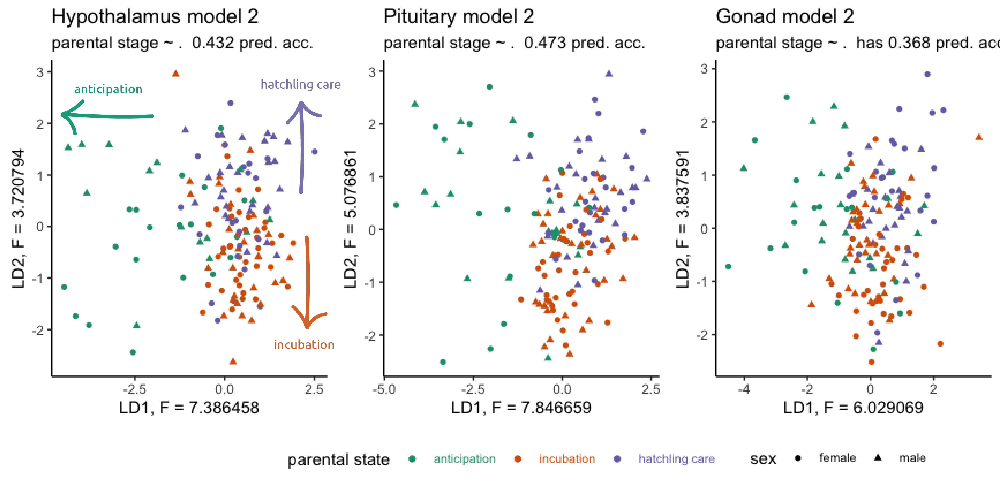
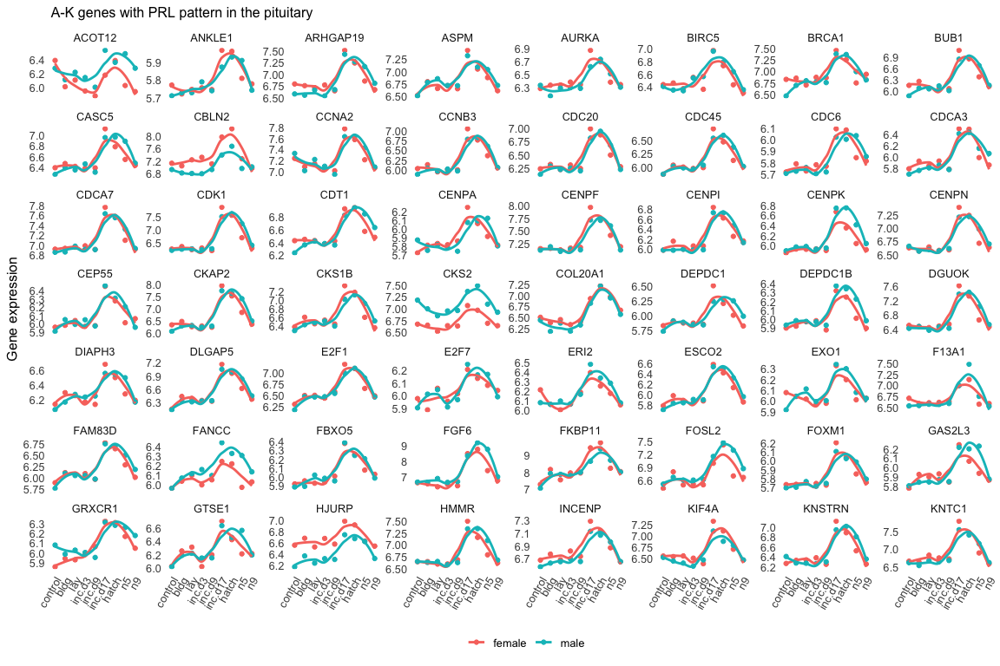

```{r setup, include=FALSE}
knitr::opts_chunk$set(echo = TRUE)
```

## Introduction

- What genes differ in expression between timepoints?
- What stages are most different, stressful, responsive?
- How do genes in the HPG affect genes in other regions?
- How do male and females differ?
- How do tissues differ?
- What is the relationship between genes and hormones across timepoints?


## Methods

### Fig 1: graphical abstract of methods


## Results

## Fig 2: circulating prolactin peaks at hatch in M and F


### Fig 2 supplement. CORT but not E,T, or P respond significantly to treatment 


## Figure 3: general rnaseq pattern, tissue > sex > stage

_Needs to be replaced with a better PCA plot_


## Figure 4: model showing ability to predict non-parental, egg care, and nestingling care




## Figure 5: PRL in prolatin mirrors PRL in bloo


## Figure 6: many genes mirror the PRL expression pattern




## Discussion 

## Conclusion

## Acknowledgements

## Data availabilty