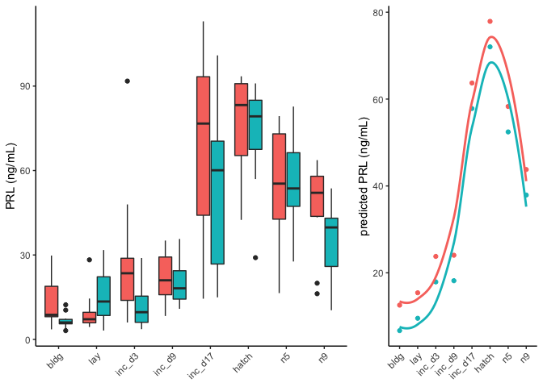
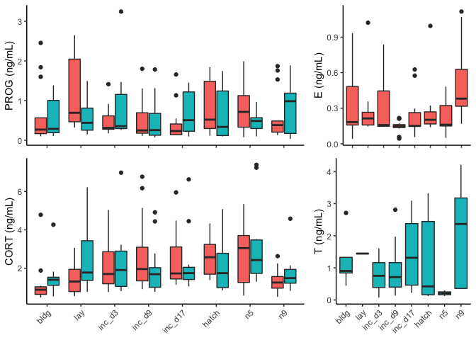

```{r setup, include=FALSE}
knitr::opts_chunk$set(echo = TRUE)
```

## Introduction

- What genes differ in expression between timepoints?
- What stages are most different, stressful, responsive?
- How do genes in the HPG affect genes in other regions?
- How do male and females differ?
- How do tissues differ?
- What is the relationship between genes and hormones across timepoints?


## Methods

### Fig 1: graphical abstract of methods


## Results

### Fig 2. Ciculating prolactin levels



### Fig 2 supplement. Ciculating sex steroid levels levels



## Discussion 

## Conclusion

## Acknowledgements

## Data availabilty