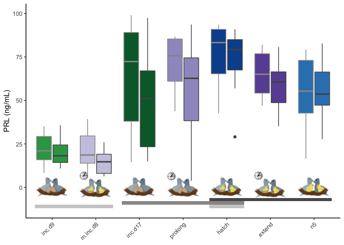

```{r setup, include=FALSE}
knitr::opts_chunk$set(echo = TRUE)
```

## Introduction

## Methods


## Results

### Fig x: Prolactin levels are low when offspring hatch early


### Fig 2. Estradiol drops when incubation prolnged or hatch extended




## Discussion 

## Conclusion

## Acknowledgements

## Data availabilty