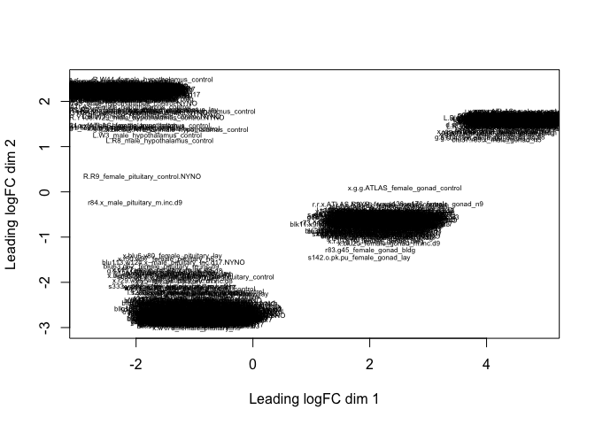
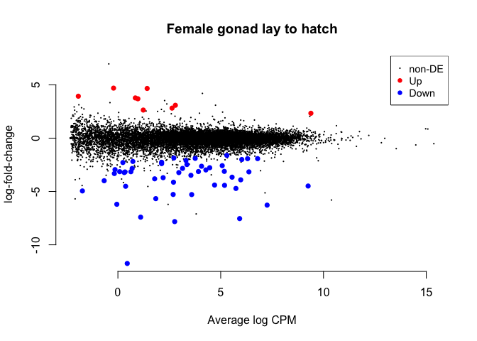
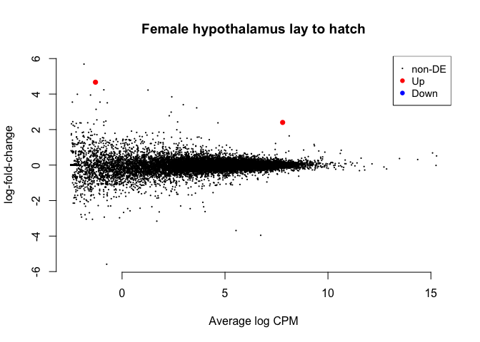
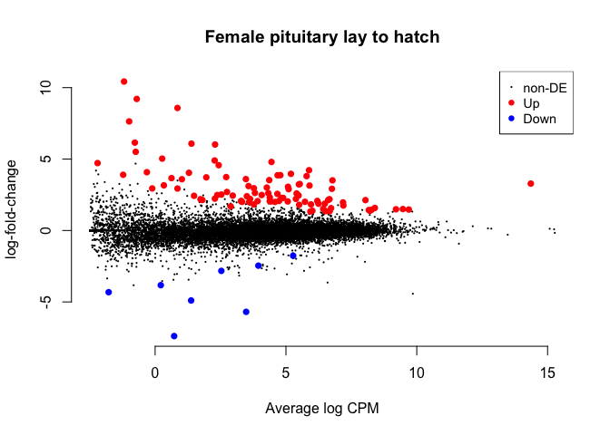
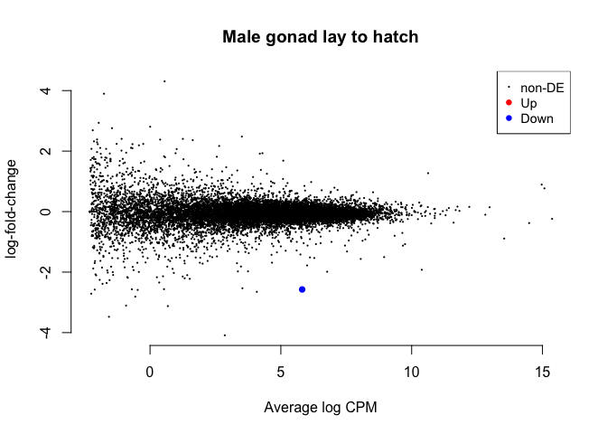
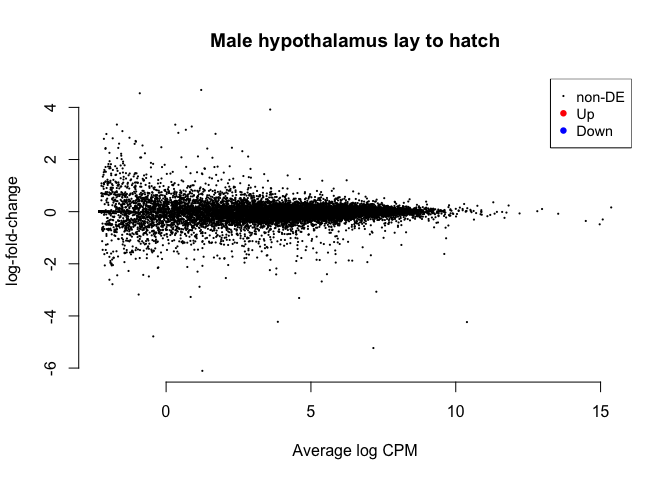
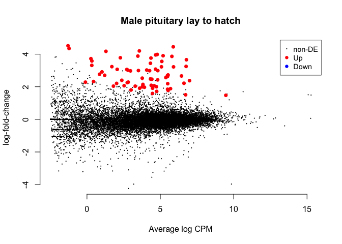
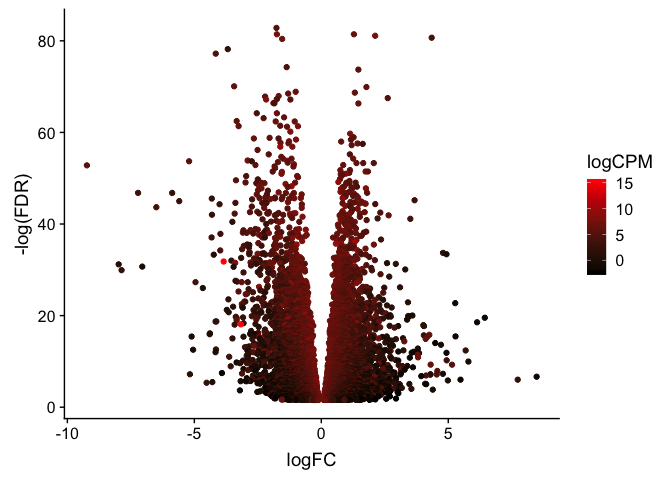

DESeq2 is *not* recommended for experiments with more than 100 samples
([see Mike Love’s
post](https://mikelove.wordpress.com/2016/09/28/deseq2-or-edger/)), so I
decided to try the limma package. I followed [this
tutorial](https://www.bioconductor.org/packages/devel/workflows/vignettes/RNAseq123/inst/doc/limmaWorkflow.html).

    library(limma)
    library(Glimma)
    library(edgeR)
    library(kableExtra)
    library(cowplot)

    ## Loading required package: ggplot2

    ## 
    ## Attaching package: 'cowplot'

    ## The following object is masked from 'package:ggplot2':
    ## 
    ##     ggsave

    library(ggplot2)

    knitr::opts_chunk$set(fig.path = '../figures/',cache=TRUE)

First, I read in the data I processed in 00\_datawrangling.Rmd.

    colData <- read.csv("../results/00_colData_characterization.csv", header = T, row.names = 1)
    countData <- read.csv("../results/00_countData_characterization.csv", header = T, row.names = 1)
    head(colData)

    ##                                                                            V1
    ## L.Blu13_male_gonad_control.NYNO               L.Blu13_male_gonad_control.NYNO
    ## L.Blu13_male_hypothalamus_control.NYNO L.Blu13_male_hypothalamus_control.NYNO
    ## L.Blu13_male_pituitary_control.NYNO       L.Blu13_male_pituitary_control.NYNO
    ## L.G107_male_gonad_control                           L.G107_male_gonad_control
    ## L.G107_male_hypothalamus_control             L.G107_male_hypothalamus_control
    ## L.G107_male_pituitary_control                   L.G107_male_pituitary_control
    ##                                           bird  sex       tissue NYNO
    ## L.Blu13_male_gonad_control.NYNO        L.Blu13 male        gonad NYNO
    ## L.Blu13_male_hypothalamus_control.NYNO L.Blu13 male hypothalamus NYNO
    ## L.Blu13_male_pituitary_control.NYNO    L.Blu13 male    pituitary NYNO
    ## L.G107_male_gonad_control               L.G107 male        gonad <NA>
    ## L.G107_male_hypothalamus_control        L.G107 male hypothalamus <NA>
    ## L.G107_male_pituitary_control           L.G107 male    pituitary <NA>
    ##                                        treatment                     group
    ## L.Blu13_male_gonad_control.NYNO          control        male.gonad.control
    ## L.Blu13_male_hypothalamus_control.NYNO   control male.hypothalamus.control
    ## L.Blu13_male_pituitary_control.NYNO      control    male.pituitary.control
    ## L.G107_male_gonad_control                control        male.gonad.control
    ## L.G107_male_hypothalamus_control         control male.hypothalamus.control
    ## L.G107_male_pituitary_control            control    male.pituitary.control

    geneinfo <- read.csv("../results/00_geneinfo.csv", row.names = 1)

Then, I followed the steps from
<a href="https://github.com/macmanes-lab/RockDove/blob/master/parental_care/parental_analysis.Rmd" class="uri">https://github.com/macmanes-lab/RockDove/blob/master/parental_care/parental_analysis.Rmd</a>.

    # create a large DGEList with 3 elements
    parentalobject <- DGEList(counts=countData, genes=geneinfo, group=colData$group)

    # transform raw counts to countspermillion
    cpms <- cpm(parentalobject)

    # calculate number of lowly lowly expressed genes and remove them
    table(rowSums(parentalobject$counts==0)==10)

    ## 
    ## FALSE  TRUE 
    ## 14867    70

    keep_genes <- rowSums(cpms >= 1) >= 10
    dge <- parentalobject[keep_genes, ]

    # magic
    parentaldesign <- model.matrix(~ colData$group )
    colnames(parentaldesign) <- levels(colData$group)
    parentalobject <- calcNormFactors(parentalobject)
    parentalobject <- estimateCommonDisp(parentalobject)
    parentalobject <- estimateTagwiseDisp(parentalobject)
    parentalobject <- estimateDisp(parentalobject, parentaldesign)
    parentalobject <- estimateGLMCommonDisp(parentalobject, parentaldesign, verbose=TRUE)

    ## Disp = 0.09128 , BCV = 0.3021

    parentalobject <- estimateGLMTrendedDisp(parentalobject, parentaldesign)
    parentalobject <- estimateGLMTagwiseDisp(parentalobject, parentaldesign)
    fit <- glmFit( parentalobject, parentaldesign, robust=T)
    treatres <- glmTreat(fit, lfc = 1)

plotMDS (multidimential scaling)
================================

    plotMDS(parentalobject, cex = 0.5)

specify contrasts and make MA plots (currently only a subset)
=============================================================

    levels(colData$group)

    ##  [1] "female.gonad.bldg"             "female.gonad.control"         
    ##  [3] "female.gonad.hatch"            "female.gonad.inc.d17"         
    ##  [5] "female.gonad.inc.d3"           "female.gonad.inc.d9"          
    ##  [7] "female.gonad.lay"              "female.gonad.m.hatch"         
    ##  [9] "female.gonad.m.inc.d17"        "female.gonad.m.inc.d3"        
    ## [11] "female.gonad.m.inc.d8"         "female.gonad.m.inc.d9"        
    ## [13] "female.gonad.m.n2"             "female.gonad.n5"              
    ## [15] "female.gonad.n9"               "female.hypothalamus.bldg"     
    ## [17] "female.hypothalamus.control"   "female.hypothalamus.hatch"    
    ## [19] "female.hypothalamus.inc.d17"   "female.hypothalamus.inc.d3"   
    ## [21] "female.hypothalamus.inc.d9"    "female.hypothalamus.lay"      
    ## [23] "female.hypothalamus.m.hatch"   "female.hypothalamus.m.inc.d17"
    ## [25] "female.hypothalamus.m.inc.d3"  "female.hypothalamus.m.inc.d8" 
    ## [27] "female.hypothalamus.m.inc.d9"  "female.hypothalamus.m.n2"     
    ## [29] "female.hypothalamus.n5"        "female.hypothalamus.n9"       
    ## [31] "female.pituitary.bldg"         "female.pituitary.control"     
    ## [33] "female.pituitary.hatch"        "female.pituitary.inc.d17"     
    ## [35] "female.pituitary.inc.d3"       "female.pituitary.inc.d9"      
    ## [37] "female.pituitary.lay"          "female.pituitary.m.hatch"     
    ## [39] "female.pituitary.m.inc.d17"    "female.pituitary.m.inc.d3"    
    ## [41] "female.pituitary.m.inc.d8"     "female.pituitary.m.inc.d9"    
    ## [43] "female.pituitary.m.n2"         "female.pituitary.n5"          
    ## [45] "female.pituitary.n9"           "male.gonad.bldg"              
    ## [47] "male.gonad.control"            "male.gonad.hatch"             
    ## [49] "male.gonad.inc.d17"            "male.gonad.inc.d3"            
    ## [51] "male.gonad.inc.d9"             "male.gonad.lay"               
    ## [53] "male.gonad.m.hatch"            "male.gonad.m.inc.d17"         
    ## [55] "male.gonad.m.inc.d3"           "male.gonad.m.inc.d8"          
    ## [57] "male.gonad.m.inc.d9"           "male.gonad.m.n2"              
    ## [59] "male.gonad.n5"                 "male.gonad.n9"                
    ## [61] "male.hypothalamus.bldg"        "male.hypothalamus.control"    
    ## [63] "male.hypothalamus.hatch"       "male.hypothalamus.inc.d17"    
    ## [65] "male.hypothalamus.inc.d3"      "male.hypothalamus.inc.d9"     
    ## [67] "male.hypothalamus.lay"         "male.hypothalamus.m.hatch"    
    ## [69] "male.hypothalamus.m.inc.d17"   "male.hypothalamus.m.inc.d3"   
    ## [71] "male.hypothalamus.m.inc.d8"    "male.hypothalamus.m.inc.d9"   
    ## [73] "male.hypothalamus.m.n2"        "male.hypothalamus.n5"         
    ## [75] "male.hypothalamus.n9"          "male.pituitary.bldg"          
    ## [77] "male.pituitary.control"        "male.pituitary.hatch"         
    ## [79] "male.pituitary.inc.d17"        "male.pituitary.inc.d3"        
    ## [81] "male.pituitary.inc.d9"         "male.pituitary.lay"           
    ## [83] "male.pituitary.m.hatch"        "male.pituitary.m.inc.d17"     
    ## [85] "male.pituitary.m.inc.d3"       "male.pituitary.m.inc.d8"      
    ## [87] "male.pituitary.m.inc.d9"       "male.pituitary.m.n2"          
    ## [89] "male.pituitary.n5"             "male.pituitary.n9"

    my.contrasts <- makeContrasts(
                 FG_HL = female.gonad.hatch - female.gonad.lay,
                 FH_HL = female.hypothalamus.hatch - female.hypothalamus.lay,
                 FP_HL = female.pituitary.hatch - female.pituitary.lay,
                 MP_HL = male.pituitary.hatch - male.pituitary.lay,
                 MH_HL = male.hypothalamus.hatch - male.hypothalamus.lay,
                 MG_HL = male.gonad.hatch - male.gonad.lay,          
    levels=parentaldesign)

    cont <- "FG_HL"
    summary(decideTestsDGE(
        glmTreat(fit, contrast=my.contrasts[,cont], lfc = 1), 
        adjust.method="fdr", p.value=0.01))

    ##        1*female.gonad.hatch -1*female.gonad.lay
    ## Down                                         40
    ## NotSig                                    14895
    ## Up                                            2

    #kable(topTags(glmTreat(fit, contrast=my.contrasts[,cont]), n=5), digits=2, lfc = 1)
    c <- plotMD(glmTreat(fit, contrast=my.contrasts[,cont], lfc=1), main='Female gonad lay to hatch', frame.plot=F)

    cont <- "FH_HL"
    summary(decideTestsDGE(
        glmTreat(fit, contrast=my.contrasts[,cont], lfc = 1), 
        adjust.method="fdr", p.value=0.01))

    ##        1*female.hypothalamus.hatch -1*female.hypothalamus.lay
    ## Down                                                        0
    ## NotSig                                                  14935
    ## Up                                                          2

    #kable(topTags(glmTreat(fit, contrast=my.contrasts[,cont]), n=5), digits=2, lfc = 1)
    a <- plotMD(glmTreat(fit, contrast=my.contrasts[,cont], lfc=1), main='Female hypothalamus lay to hatch', frame.plot=F)

    cont <- "FP_HL"
    summary(decideTestsDGE(
        glmTreat(fit, contrast=my.contrasts[,cont], lfc = 1), 
        adjust.method="fdr", p.value=0.01))

    ##        1*female.pituitary.hatch -1*female.pituitary.lay
    ## Down                                                  4
    ## NotSig                                            14852
    ## Up                                                   81

    #kable(topTags(glmTreat(fit, contrast=my.contrasts[,cont]), n=5), digits=2, lfc = 1)
    b <- plotMD(glmTreat(fit, contrast=my.contrasts[,cont], lfc=1), main='Female pituitary lay to hatch', frame.plot=F)

    cont <- "MG_HL"
    summary(decideTestsDGE(
        glmTreat(fit, contrast=my.contrasts[,cont], lfc = 1), 
        adjust.method="fdr", p.value=0.01))

    ##        1*male.gonad.hatch -1*male.gonad.lay
    ## Down                                      1
    ## NotSig                                14936
    ## Up                                        0

    #kable(topTags(glmTreat(fit, contrast=my.contrasts[,cont]), n=5), digits=2, lfc = 1)
    f <- plotMD(glmTreat(fit, contrast=my.contrasts[,cont], lfc=1), main='Male gonad lay to hatch', frame.plot=F)

    cont <- "MH_HL"
    summary(decideTestsDGE(
        glmTreat(fit, contrast=my.contrasts[,cont], lfc = 1), 
        adjust.method="fdr", p.value=0.01))

    ##        1*male.hypothalamus.hatch -1*male.hypothalamus.lay
    ## Down                                                    0
    ## NotSig                                              14937
    ## Up                                                      0

    #kable(topTags(glmTreat(fit, contrast=my.contrasts[,cont]), n=5), digits=2, lfc = 1)
    d <- plotMD(glmTreat(fit, contrast=my.contrasts[,cont], lfc=1), main='Male hypothalamus lay to hatch', frame.plot=F)

    cont <- "MP_HL"
    summary(decideTestsDGE(
        glmTreat(fit, contrast=my.contrasts[,cont], lfc = 1), 
        adjust.method="fdr", p.value=0.01))

    ##        1*male.pituitary.hatch -1*male.pituitary.lay
    ## Down                                              0
    ## NotSig                                        14882
    ## Up                                               55

    #kable(topTags(glmTreat(fit, contrast=my.contrasts[,cont]), n=5), digits=2, lfc = 1)
    e <- plotMD(glmTreat(fit, contrast=my.contrasts[,cont], lfc=1), main='Male pituitary lay to hatch', frame.plot=F)

    plot_grid(a,b,c,d,e,f, nrow = 2)

volcano plots
=============

    # from http://www.compbio.dundee.ac.uk/user/pschofield/Projects/teaching_pg/workshops/biocDGE.html#maplots

    lrt <- glmLRT(fit,coef=2)
    topTags(lrt)

    ## Coefficient:  female.gonad.control 
    ##                row.names   Name geneid       entrezid     logFC   logCPM
    ## NP_001034689.1    423130 ZDHHC5 423130 NP_001034689.1 -1.765980 5.108494
    ## XP_015144701.1    424039   PCNT 424039 XP_015144701.1 -1.749180 7.721697
    ## XP_414493.1       416161  CCNG1 416161    XP_414493.1  1.284982 6.319566
    ## XP_004940508.2    421875   BAI3 421875 XP_004940508.2  2.122044 7.319320
    ## XP_015150276.1    426991  ACSM4 426991 XP_015150276.1  4.346866 4.062362
    ## XP_015145487.1    424246  DIRC2 424246 XP_015145487.1 -1.541659 6.727815
    ## XP_015148335.1    415945 SEMA3G 415945 XP_015148335.1 -3.682352 2.321141
    ## XP_004939926.1    421139    CA8 421139 XP_004939926.1 -4.156934 4.602398
    ## NP_990011.1       395411 ZBTB7A 395411    NP_990011.1 -1.364403 4.598160
    ## NP_001186400.1    422975  PRMT3 422975 NP_001186400.1  1.459907 5.523044
    ##                      LR       PValue          FDR
    ## NP_001034689.1 179.2203 7.172207e-41 1.071313e-36
    ## XP_015144701.1 174.5304 7.581380e-40 4.318126e-36
    ## XP_414493.1    174.2630 8.672677e-40 4.318126e-36
    ## XP_004940508.2 173.0488 1.597019e-39 5.963667e-36
    ## XP_015150276.1 171.7558 3.059738e-39 9.140660e-36
    ## XP_015145487.1 170.8755 4.763826e-39 1.185954e-35
    ## XP_015148335.1 166.1335 5.172465e-38 1.103730e-34
    ## XP_004939926.1 163.9095 1.583216e-37 2.956062e-34
    ## NP_990011.1    157.8089 3.407224e-36 5.654856e-33
    ## NP_001186400.1 156.5373 6.460306e-36 9.649759e-33

    tt <- topTags(lrt,n=10000)$table

    ggplot(data=tt) + geom_point(aes(x=logFC,y=-log(FDR),color=logCPM)) +
      scale_colour_gradientn(colours=c("#000000" ,"#FF0000" ))

