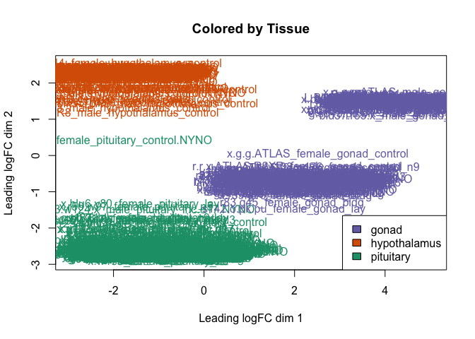
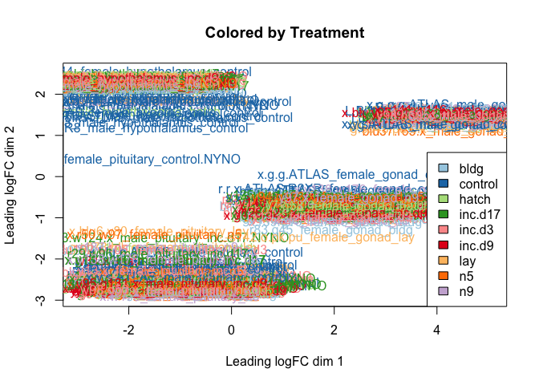

DESeq2 is *not* recommended for experiments with more than 100 samples
([see Mike Love’s
post](https://mikelove.wordpress.com/2016/09/28/deseq2-or-edger/)), so I
decided to try the limma package. I followed [this
tutorial](https://www.bioconductor.org/packages/devel/workflows/vignettes/RNAseq123/inst/doc/limmaWorkflow.html).

    library(limma)
    library(Glimma)
    library(edgeR)
    library(kableExtra)
    library(cowplot)

    ## Loading required package: ggplot2

    ## 
    ## Attaching package: 'cowplot'

    ## The following object is masked from 'package:ggplot2':
    ## 
    ##     ggsave

    library(ggplot2)

    knitr::opts_chunk$set(fig.path = '../figures/',cache=TRUE)

First, I read in the data I processed in 00\_datawrangling.Rmd.

    # import "colData" which contains sample information and "countData" which contains read counts
    colData <- read.csv("../results/00_colData_characterization.csv", header = T, row.names = 1)
    countData <- read.csv("../results/00_countData_characterization.csv", header = T, row.names = 1)
    head(colData)

    ##                                                                            V1
    ## L.Blu13_male_gonad_control.NYNO               L.Blu13_male_gonad_control.NYNO
    ## L.Blu13_male_hypothalamus_control.NYNO L.Blu13_male_hypothalamus_control.NYNO
    ## L.Blu13_male_pituitary_control.NYNO       L.Blu13_male_pituitary_control.NYNO
    ## L.G107_male_gonad_control                           L.G107_male_gonad_control
    ## L.G107_male_hypothalamus_control             L.G107_male_hypothalamus_control
    ## L.G107_male_pituitary_control                   L.G107_male_pituitary_control
    ##                                           bird  sex       tissue NYNO
    ## L.Blu13_male_gonad_control.NYNO        L.Blu13 male        gonad NYNO
    ## L.Blu13_male_hypothalamus_control.NYNO L.Blu13 male hypothalamus NYNO
    ## L.Blu13_male_pituitary_control.NYNO    L.Blu13 male    pituitary NYNO
    ## L.G107_male_gonad_control               L.G107 male        gonad <NA>
    ## L.G107_male_hypothalamus_control        L.G107 male hypothalamus <NA>
    ## L.G107_male_pituitary_control           L.G107 male    pituitary <NA>
    ##                                        treatment                     group
    ## L.Blu13_male_gonad_control.NYNO          control        male.gonad.control
    ## L.Blu13_male_hypothalamus_control.NYNO   control male.hypothalamus.control
    ## L.Blu13_male_pituitary_control.NYNO      control    male.pituitary.control
    ## L.G107_male_gonad_control                control        male.gonad.control
    ## L.G107_male_hypothalamus_control         control male.hypothalamus.control
    ## L.G107_male_pituitary_control            control    male.pituitary.control

    geneinfo <- read.csv("../results/00_geneinfo.csv", row.names = 1)

Then, I followed the steps from
<a href="https://github.com/macmanes-lab/RockDove/blob/master/parental_care/parental_analysis.Rmd" class="uri">https://github.com/macmanes-lab/RockDove/blob/master/parental_care/parental_analysis.Rmd</a>.

    # create a large DGEList with 3 elements
    parentalobject <- DGEList(counts=countData, genes=geneinfo, group=colData$group)

    # transform raw counts to countspermillion
    cpms <- cpm(parentalobject)

    # calculate number of lowly lowly expressed genes and remove them
    table(rowSums(parentalobject$counts==0)==10)

    ## 
    ## FALSE  TRUE 
    ## 14859    78

    keep_genes <- rowSums(cpms >= 1) >= 10
    dge <- parentalobject[keep_genes, ]

    # specific the design
    parentaldesign <- model.matrix(~ colData$group )
    colnames(parentaldesign) <- levels(colData$group)

    # The TMM normalization
    parentalobject <- calcNormFactors(parentalobject)
    parentalobject <- estimateCommonDisp(parentalobject)
    parentalobject <- estimateTagwiseDisp(parentalobject)
    parentalobject <- estimateDisp(parentalobject, parentaldesign)
    parentalobject <- estimateGLMCommonDisp(parentalobject, parentaldesign, verbose=TRUE)

    ## Disp = 0.09703 , BCV = 0.3115

    parentalobject <- estimateGLMTrendedDisp(parentalobject, parentaldesign)
    parentalobject <- estimateGLMTagwiseDisp(parentalobject, parentaldesign)

    #  perform likelihood ratio test and thresholded testing
    fit <- glmFit( parentalobject, parentaldesign, robust=T)
    tr <- glmTreat(fit, lfc = 1)
    topTags(tr)

    ## Coefficient:  male.pituitary.n9 
    ##                row.names      Name geneid       entrezid     logFC
    ## XP_015140384.1    421887     GFRAL 421887 XP_015140384.1 11.132003
    ## XP_015145574.1    424201 LOC424201 424201 XP_015145574.1  5.531309
    ## XP_015140826.1    422411      GLRB 422411 XP_015140826.1  6.844887
    ## NP_001001746.1    414796   ST8SIA3 414796 NP_001001746.1  7.256344
    ## XP_004941161.1    422592    MAPK10 422592 XP_004941161.1  6.033716
    ## NP_001264950.1    421829       CGA 421829 NP_001264950.1  7.100488
    ## XP_004937135.1    426889     CELF4 426889 XP_004937135.1  7.529798
    ## XP_003640402.1    417775     GPR85 417775 XP_003640402.1  5.631320
    ## XP_015139313.1    378786      SIX3 378786 XP_015139313.1 10.975733
    ## XP_004940563.2    421915     MYT1L 421915 XP_004940563.2  5.732502
    ##                unshrunk.logFC    logCPM        PValue           FDR
    ## XP_015140384.1      11.248145  6.909062  0.000000e+00  0.000000e+00
    ## XP_015145574.1       5.532457  9.074983 1.461272e-271 1.091351e-267
    ## XP_015140826.1       6.881400  6.174467 6.996707e-251 3.483661e-247
    ## NP_001001746.1       7.268885  7.382926 6.208129e-218 2.318271e-214
    ## XP_004941161.1       6.039651  7.697728 3.980571e-207 1.189156e-203
    ## NP_001264950.1       7.100877 11.092435 9.223536e-201 2.296199e-197
    ## XP_004937135.1       7.584323  5.450445 6.218019e-197 1.326836e-193
    ## XP_003640402.1       5.650628  5.530233 9.525202e-197 1.778474e-193
    ## XP_015139313.1      11.076432  6.769563 2.590629e-181 4.299580e-178
    ## XP_004940563.2       5.740125  6.762354 8.457366e-166 1.263277e-162

plotMDS (multidimential scaling)
================================

    plotMDS(parentalobject, cex = 0.5)

    levels(colData$tissue)

    ## [1] "gonad"        "hypothalamus" "pituitary"

    col.tissue <- c("#7570b3","#d95f02", "#1b9e77")[colData$tissue]
    plotMDS(parentalobject,col=col.tissue)
    legend("bottomright",fill=c("#7570b3","#d95f02", "#1b9e77"),legend=levels(colData$tissue))
    title("Colored by Tissue")

    levels(colData$treatment)

    ## [1] "bldg"    "control" "hatch"   "inc.d17" "inc.d3"  "inc.d9"  "lay"    
    ## [8] "n5"      "n9"

    col.treatment <- c("#a6cee3", "#1f78b4", "#b2df8a", "#33a02c", "#fb9a99", "#e31a1c", "#fdbf6f", "#ff7f00", "#cab2d6")[colData$treatment]
    plotMDS(parentalobject,col=col.treatment)
    legend("bottomright",fill=c("#a6cee3", "#1f78b4", "#b2df8a", "#33a02c", "#fb9a99", "#e31a1c", "#fdbf6f", "#ff7f00", "#cab2d6"),legend=levels(colData$treatment))
    title("Colored by Treatment")

    levels(colData$sex)

    ## [1] "female" "male"

    col.sex <- c("#5ab4ac","#d8b365")[colData$sex]
    plotMDS(parentalobject,col=col.sex)
    legend("bottomright",fill=c("#5ab4ac","#d8b365"),legend=levels(colData$sex))
    title("Colored by Sex")

specify contrasts and make MA plots (currently only a subset)
=============================================================

    # view all levels
    levels(colData$group)

    ##  [1] "female.gonad.bldg"           "female.gonad.control"       
    ##  [3] "female.gonad.hatch"          "female.gonad.inc.d17"       
    ##  [5] "female.gonad.inc.d3"         "female.gonad.inc.d9"        
    ##  [7] "female.gonad.lay"            "female.gonad.n5"            
    ##  [9] "female.gonad.n9"             "female.hypothalamus.bldg"   
    ## [11] "female.hypothalamus.control" "female.hypothalamus.hatch"  
    ## [13] "female.hypothalamus.inc.d17" "female.hypothalamus.inc.d3" 
    ## [15] "female.hypothalamus.inc.d9"  "female.hypothalamus.lay"    
    ## [17] "female.hypothalamus.n5"      "female.hypothalamus.n9"     
    ## [19] "female.pituitary.bldg"       "female.pituitary.control"   
    ## [21] "female.pituitary.hatch"      "female.pituitary.inc.d17"   
    ## [23] "female.pituitary.inc.d3"     "female.pituitary.inc.d9"    
    ## [25] "female.pituitary.lay"        "female.pituitary.n5"        
    ## [27] "female.pituitary.n9"         "male.gonad.bldg"            
    ## [29] "male.gonad.control"          "male.gonad.hatch"           
    ## [31] "male.gonad.inc.d17"          "male.gonad.inc.d3"          
    ## [33] "male.gonad.inc.d9"           "male.gonad.lay"             
    ## [35] "male.gonad.n5"               "male.gonad.n9"              
    ## [37] "male.hypothalamus.bldg"      "male.hypothalamus.control"  
    ## [39] "male.hypothalamus.hatch"     "male.hypothalamus.inc.d17"  
    ## [41] "male.hypothalamus.inc.d3"    "male.hypothalamus.inc.d9"   
    ## [43] "male.hypothalamus.lay"       "male.hypothalamus.n5"       
    ## [45] "male.hypothalamus.n9"        "male.pituitary.bldg"        
    ## [47] "male.pituitary.control"      "male.pituitary.hatch"       
    ## [49] "male.pituitary.inc.d17"      "male.pituitary.inc.d3"      
    ## [51] "male.pituitary.inc.d9"       "male.pituitary.lay"         
    ## [53] "male.pituitary.n5"           "male.pituitary.n9"

    # subset of conrasts - sex specific comparing hatch to lay
    my.contrasts <- makeContrasts(
                 FG_HL = female.gonad.hatch - female.gonad.lay,
                 FH_HL = female.hypothalamus.hatch - female.hypothalamus.lay,
                 FP_HL = female.pituitary.hatch - female.pituitary.lay,
                 MP_HL = male.pituitary.hatch - male.pituitary.lay,
                 MH_HL = male.hypothalamus.hatch - male.hypothalamus.lay,
                 MG_HL = male.gonad.hatch - male.gonad.lay,          
    levels=parentaldesign)

    cont <- "FG_HL"
    summary(decideTestsDGE(
        glmTreat(fit, contrast=my.contrasts[,cont], lfc = 1), 
        adjust.method="fdr", p.value=0.01))

    ##        1*female.gonad.hatch -1*female.gonad.lay
    ## Down                                         35
    ## NotSig                                    14899
    ## Up                                            3

    kable(topTags(glmTreat(fit, contrast=my.contrasts[,cont]), n=5), digits=2, lfc = 1)

<table class="kable_wrapper">
<tbody>
<tr>
<td>
<table>
<thead>
<tr>
<th style="text-align:left;">
</th>
<th style="text-align:right;">
row.names
</th>
<th style="text-align:left;">
Name
</th>
<th style="text-align:right;">
geneid
</th>
<th style="text-align:left;">
entrezid
</th>
<th style="text-align:right;">
logFC
</th>
<th style="text-align:right;">
unshrunk.logFC
</th>
<th style="text-align:right;">
logCPM
</th>
<th style="text-align:right;">
PValue
</th>
<th style="text-align:right;">
FDR
</th>
</tr>
</thead>
<tbody>
<tr>
<td style="text-align:left;">
NP\_001292097.1
</td>
<td style="text-align:right;">
419533
</td>
<td style="text-align:left;">
LOXL2
</td>
<td style="text-align:right;">
419533
</td>
<td style="text-align:left;">
NP\_001292097.1
</td>
<td style="text-align:right;">
-3.16
</td>
<td style="text-align:right;">
-3.16
</td>
<td style="text-align:right;">
6.37
</td>
<td style="text-align:right;">
0
</td>
<td style="text-align:right;">
0
</td>
</tr>
<tr>
<td style="text-align:left;">
XP\_423478.5
</td>
<td style="text-align:right;">
425757
</td>
<td style="text-align:left;">
OVSTL
</td>
<td style="text-align:right;">
425757
</td>
<td style="text-align:left;">
XP\_423478.5
</td>
<td style="text-align:right;">
-5.67
</td>
<td style="text-align:right;">
-5.70
</td>
<td style="text-align:right;">
1.84
</td>
<td style="text-align:right;">
0
</td>
<td style="text-align:right;">
0
</td>
</tr>
<tr>
<td style="text-align:left;">
NP\_990519.2
</td>
<td style="text-align:right;">
396105
</td>
<td style="text-align:left;">
SOX2
</td>
<td style="text-align:right;">
396105
</td>
<td style="text-align:left;">
NP\_990519.2
</td>
<td style="text-align:right;">
-2.58
</td>
<td style="text-align:right;">
-2.60
</td>
<td style="text-align:right;">
5.07
</td>
<td style="text-align:right;">
0
</td>
<td style="text-align:right;">
0
</td>
</tr>
<tr>
<td style="text-align:left;">
NP\_990844.1
</td>
<td style="text-align:right;">
396519
</td>
<td style="text-align:left;">
CALB1
</td>
<td style="text-align:right;">
396519
</td>
<td style="text-align:left;">
NP\_990844.1
</td>
<td style="text-align:right;">
-3.91
</td>
<td style="text-align:right;">
-3.91
</td>
<td style="text-align:right;">
5.97
</td>
<td style="text-align:right;">
0
</td>
<td style="text-align:right;">
0
</td>
</tr>
<tr>
<td style="text-align:left;">
XP\_004940583.1
</td>
<td style="text-align:right;">
422168
</td>
<td style="text-align:left;">
HEPH
</td>
<td style="text-align:right;">
422168
</td>
<td style="text-align:left;">
XP\_004940583.1
</td>
<td style="text-align:right;">
-1.61
</td>
<td style="text-align:right;">
-1.61
</td>
<td style="text-align:right;">
5.30
</td>
<td style="text-align:right;">
0
</td>
<td style="text-align:right;">
0
</td>
</tr>
</tbody>
</table>
</td>
<td>
<table>
<thead>
<tr>
<th style="text-align:left;">
x
</th>
</tr>
</thead>
<tbody>
<tr>
<td style="text-align:left;">
BH
</td>
</tr>
</tbody>
</table>
</td>
<td>
<table>
<thead>
<tr>
<th style="text-align:left;">
x
</th>
</tr>
</thead>
<tbody>
<tr>
<td style="text-align:left;">
1*female.gonad.hatch -1*female.gonad.lay
</td>
</tr>
</tbody>
</table>
</td>
<td>
<table>
<thead>
<tr>
<th style="text-align:left;">
x
</th>
</tr>
</thead>
<tbody>
<tr>
<td style="text-align:left;">
glm
</td>
</tr>
</tbody>
</table>
</td>
</tr>
</tbody>
</table>

    plotMD(glmTreat(fit, contrast=my.contrasts[,cont], lfc=1), main='Female gonad lay to hatch', frame.plot=F)

    cont <- "FH_HL"
    summary(decideTestsDGE(
        glmTreat(fit, contrast=my.contrasts[,cont], lfc = 1), 
        adjust.method="fdr", p.value=0.01))

    ##        1*female.hypothalamus.hatch -1*female.hypothalamus.lay
    ## Down                                                        0
    ## NotSig                                                  14935
    ## Up                                                          2

    kable(topTags(glmTreat(fit, contrast=my.contrasts[,cont]), n=5), digits=2, lfc = 1)

<table class="kable_wrapper">
<tbody>
<tr>
<td>
<table>
<thead>
<tr>
<th style="text-align:left;">
</th>
<th style="text-align:right;">
row.names
</th>
<th style="text-align:left;">
Name
</th>
<th style="text-align:right;">
geneid
</th>
<th style="text-align:left;">
entrezid
</th>
<th style="text-align:right;">
logFC
</th>
<th style="text-align:right;">
unshrunk.logFC
</th>
<th style="text-align:right;">
logCPM
</th>
<th style="text-align:right;">
PValue
</th>
<th style="text-align:right;">
FDR
</th>
</tr>
</thead>
<tbody>
<tr>
<td style="text-align:left;">
NP\_990411.1
</td>
<td style="text-align:right;">
395963
</td>
<td style="text-align:left;">
CAPN2
</td>
<td style="text-align:right;">
395963
</td>
<td style="text-align:left;">
NP\_990411.1
</td>
<td style="text-align:right;">
2.42
</td>
<td style="text-align:right;">
2.42
</td>
<td style="text-align:right;">
7.89
</td>
<td style="text-align:right;">
0
</td>
<td style="text-align:right;">
0.00
</td>
</tr>
<tr>
<td style="text-align:left;">
XP\_015137344.1
</td>
<td style="text-align:right;">
420606
</td>
<td style="text-align:left;">
ABCB5
</td>
<td style="text-align:right;">
420606
</td>
<td style="text-align:left;">
XP\_015137344.1
</td>
<td style="text-align:right;">
4.67
</td>
<td style="text-align:right;">
4.87
</td>
<td style="text-align:right;">
-1.09
</td>
<td style="text-align:right;">
0
</td>
<td style="text-align:right;">
0.00
</td>
</tr>
<tr>
<td style="text-align:left;">
XP\_015153516.1
</td>
<td style="text-align:right;">
430981
</td>
<td style="text-align:left;">
GABRR3
</td>
<td style="text-align:right;">
430981
</td>
<td style="text-align:left;">
XP\_015153516.1
</td>
<td style="text-align:right;">
1.57
</td>
<td style="text-align:right;">
1.62
</td>
<td style="text-align:right;">
3.63
</td>
<td style="text-align:right;">
0
</td>
<td style="text-align:right;">
0.00
</td>
</tr>
<tr>
<td style="text-align:left;">
NP\_989594.1
</td>
<td style="text-align:right;">
374117
</td>
<td style="text-align:left;">
IGJ
</td>
<td style="text-align:right;">
374117
</td>
<td style="text-align:left;">
NP\_989594.1
</td>
<td style="text-align:right;">
-3.68
</td>
<td style="text-align:right;">
-3.70
</td>
<td style="text-align:right;">
5.82
</td>
<td style="text-align:right;">
0
</td>
<td style="text-align:right;">
0.01
</td>
</tr>
<tr>
<td style="text-align:left;">
NP\_990378.1
</td>
<td style="text-align:right;">
395916
</td>
<td style="text-align:left;">
NME2
</td>
<td style="text-align:right;">
395916
</td>
<td style="text-align:left;">
NP\_990378.1
</td>
<td style="text-align:right;">
1.84
</td>
<td style="text-align:right;">
1.85
</td>
<td style="text-align:right;">
1.26
</td>
<td style="text-align:right;">
0
</td>
<td style="text-align:right;">
0.02
</td>
</tr>
</tbody>
</table>
</td>
<td>
<table>
<thead>
<tr>
<th style="text-align:left;">
x
</th>
</tr>
</thead>
<tbody>
<tr>
<td style="text-align:left;">
BH
</td>
</tr>
</tbody>
</table>
</td>
<td>
<table>
<thead>
<tr>
<th style="text-align:left;">
x
</th>
</tr>
</thead>
<tbody>
<tr>
<td style="text-align:left;">
1*female.hypothalamus.hatch -1*female.hypothalamus.lay
</td>
</tr>
</tbody>
</table>
</td>
<td>
<table>
<thead>
<tr>
<th style="text-align:left;">
x
</th>
</tr>
</thead>
<tbody>
<tr>
<td style="text-align:left;">
glm
</td>
</tr>
</tbody>
</table>
</td>
</tr>
</tbody>
</table>

    plotMD(glmTreat(fit, contrast=my.contrasts[,cont], lfc=1), main='Female hypothalamus lay to hatch', frame.plot=F)

    cont <- "FP_HL"
    summary(decideTestsDGE(
        glmTreat(fit, contrast=my.contrasts[,cont], lfc = 1), 
        adjust.method="fdr", p.value=0.01))

    ##        1*female.pituitary.hatch -1*female.pituitary.lay
    ## Down                                                  4
    ## NotSig                                            14857
    ## Up                                                   76

    kable(topTags(glmTreat(fit, contrast=my.contrasts[,cont]), n=5), digits=2, lfc = 1)

<table class="kable_wrapper">
<tbody>
<tr>
<td>
<table>
<thead>
<tr>
<th style="text-align:left;">
</th>
<th style="text-align:right;">
row.names
</th>
<th style="text-align:left;">
Name
</th>
<th style="text-align:right;">
geneid
</th>
<th style="text-align:left;">
entrezid
</th>
<th style="text-align:right;">
logFC
</th>
<th style="text-align:right;">
unshrunk.logFC
</th>
<th style="text-align:right;">
logCPM
</th>
<th style="text-align:right;">
PValue
</th>
<th style="text-align:right;">
FDR
</th>
</tr>
</thead>
<tbody>
<tr>
<td style="text-align:left;">
NP\_001026684.1
</td>
<td style="text-align:right;">
428444
</td>
<td style="text-align:left;">
STT3B
</td>
<td style="text-align:right;">
428444
</td>
<td style="text-align:left;">
NP\_001026684.1
</td>
<td style="text-align:right;">
1.57
</td>
<td style="text-align:right;">
1.57
</td>
<td style="text-align:right;">
8.44
</td>
<td style="text-align:right;">
0
</td>
<td style="text-align:right;">
0
</td>
</tr>
<tr>
<td style="text-align:left;">
XP\_004947617.1
</td>
<td style="text-align:right;">
428201
</td>
<td style="text-align:left;">
STC1
</td>
<td style="text-align:right;">
428201
</td>
<td style="text-align:left;">
XP\_004947617.1
</td>
<td style="text-align:right;">
3.25
</td>
<td style="text-align:right;">
3.25
</td>
<td style="text-align:right;">
5.62
</td>
<td style="text-align:right;">
0
</td>
<td style="text-align:right;">
0
</td>
</tr>
<tr>
<td style="text-align:left;">
XP\_001232858.1
</td>
<td style="text-align:right;">
416770
</td>
<td style="text-align:left;">
SDF2L1
</td>
<td style="text-align:right;">
416770
</td>
<td style="text-align:left;">
XP\_001232858.1
</td>
<td style="text-align:right;">
1.82
</td>
<td style="text-align:right;">
1.82
</td>
<td style="text-align:right;">
6.03
</td>
<td style="text-align:right;">
0
</td>
<td style="text-align:right;">
0
</td>
</tr>
<tr>
<td style="text-align:left;">
NP\_001186426.2
</td>
<td style="text-align:right;">
417735
</td>
<td style="text-align:left;">
CRELD2
</td>
<td style="text-align:right;">
417735
</td>
<td style="text-align:left;">
NP\_001186426.2
</td>
<td style="text-align:right;">
2.18
</td>
<td style="text-align:right;">
2.18
</td>
<td style="text-align:right;">
6.69
</td>
<td style="text-align:right;">
0
</td>
<td style="text-align:right;">
0
</td>
</tr>
<tr>
<td style="text-align:left;">
NP\_001104544.1
</td>
<td style="text-align:right;">
374087
</td>
<td style="text-align:left;">
ADARB1
</td>
<td style="text-align:right;">
374087
</td>
<td style="text-align:left;">
NP\_001104544.1
</td>
<td style="text-align:right;">
1.42
</td>
<td style="text-align:right;">
1.42
</td>
<td style="text-align:right;">
8.18
</td>
<td style="text-align:right;">
0
</td>
<td style="text-align:right;">
0
</td>
</tr>
</tbody>
</table>
</td>
<td>
<table>
<thead>
<tr>
<th style="text-align:left;">
x
</th>
</tr>
</thead>
<tbody>
<tr>
<td style="text-align:left;">
BH
</td>
</tr>
</tbody>
</table>
</td>
<td>
<table>
<thead>
<tr>
<th style="text-align:left;">
x
</th>
</tr>
</thead>
<tbody>
<tr>
<td style="text-align:left;">
1*female.pituitary.hatch -1*female.pituitary.lay
</td>
</tr>
</tbody>
</table>
</td>
<td>
<table>
<thead>
<tr>
<th style="text-align:left;">
x
</th>
</tr>
</thead>
<tbody>
<tr>
<td style="text-align:left;">
glm
</td>
</tr>
</tbody>
</table>
</td>
</tr>
</tbody>
</table>

    plotMD(glmTreat(fit, contrast=my.contrasts[,cont], lfc=1), main='Female pituitary lay to hatch', frame.plot=F)

    cont <- "MG_HL"
    summary(decideTestsDGE(
        glmTreat(fit, contrast=my.contrasts[,cont], lfc = 1), 
        adjust.method="fdr", p.value=0.01))

    ##        1*male.gonad.hatch -1*male.gonad.lay
    ## Down                                      1
    ## NotSig                                14936
    ## Up                                        0

    #kable(topTags(glmTreat(fit, contrast=my.contrasts[,cont]), n=5), digits=2, lfc = 1)
    plotMD(glmTreat(fit, contrast=my.contrasts[,cont], lfc=1), main='Male gonad lay to hatch', frame.plot=F)

    cont <- "MH_HL"
    summary(decideTestsDGE(
        glmTreat(fit, contrast=my.contrasts[,cont], lfc = 1), 
        adjust.method="fdr", p.value=0.01))

    ##        1*male.hypothalamus.hatch -1*male.hypothalamus.lay
    ## Down                                                    0
    ## NotSig                                              14937
    ## Up                                                      0

    kable(topTags(glmTreat(fit, contrast=my.contrasts[,cont]), n=5), digits=2, lfc = 1)

<table class="kable_wrapper">
<tbody>
<tr>
<td>
<table>
<thead>
<tr>
<th style="text-align:left;">
</th>
<th style="text-align:right;">
row.names
</th>
<th style="text-align:left;">
Name
</th>
<th style="text-align:right;">
geneid
</th>
<th style="text-align:left;">
entrezid
</th>
<th style="text-align:right;">
logFC
</th>
<th style="text-align:right;">
unshrunk.logFC
</th>
<th style="text-align:right;">
logCPM
</th>
<th style="text-align:right;">
PValue
</th>
<th style="text-align:right;">
FDR
</th>
</tr>
</thead>
<tbody>
<tr>
<td style="text-align:left;">
XP\_015154090.1
</td>
<td style="text-align:right;">
107055138
</td>
<td style="text-align:left;">
HAX1
</td>
<td style="text-align:right;">
107055138
</td>
<td style="text-align:left;">
XP\_015154090.1
</td>
<td style="text-align:right;">
-1.43
</td>
<td style="text-align:right;">
-1.43
</td>
<td style="text-align:right;">
4.54
</td>
<td style="text-align:right;">
0
</td>
<td style="text-align:right;">
0.01
</td>
</tr>
<tr>
<td style="text-align:left;">
NP\_990781.1
</td>
<td style="text-align:right;">
396434
</td>
<td style="text-align:left;">
TNNC2
</td>
<td style="text-align:right;">
396434
</td>
<td style="text-align:left;">
NP\_990781.1
</td>
<td style="text-align:right;">
4.67
</td>
<td style="text-align:right;">
4.83
</td>
<td style="text-align:right;">
1.21
</td>
<td style="text-align:right;">
0
</td>
<td style="text-align:right;">
0.01
</td>
</tr>
<tr>
<td style="text-align:left;">
XP\_015143153.1
</td>
<td style="text-align:right;">
418099
</td>
<td style="text-align:left;">
MYBPC1
</td>
<td style="text-align:right;">
418099
</td>
<td style="text-align:left;">
XP\_015143153.1
</td>
<td style="text-align:right;">
3.34
</td>
<td style="text-align:right;">
3.43
</td>
<td style="text-align:right;">
0.32
</td>
<td style="text-align:right;">
0
</td>
<td style="text-align:right;">
0.01
</td>
</tr>
<tr>
<td style="text-align:left;">
XP\_415592.5
</td>
<td style="text-align:right;">
417323
</td>
<td style="text-align:left;">
FBXW10
</td>
<td style="text-align:right;">
417323
</td>
<td style="text-align:left;">
XP\_415592.5
</td>
<td style="text-align:right;">
-4.22
</td>
<td style="text-align:right;">
-144269481.99
</td>
<td style="text-align:right;">
3.86
</td>
<td style="text-align:right;">
0
</td>
<td style="text-align:right;">
0.02
</td>
</tr>
<tr>
<td style="text-align:left;">
NP\_990748.1
</td>
<td style="text-align:right;">
396386
</td>
<td style="text-align:left;">
TNNI2
</td>
<td style="text-align:right;">
396386
</td>
<td style="text-align:left;">
NP\_990748.1
</td>
<td style="text-align:right;">
3.27
</td>
<td style="text-align:right;">
3.31
</td>
<td style="text-align:right;">
0.89
</td>
<td style="text-align:right;">
0
</td>
<td style="text-align:right;">
0.04
</td>
</tr>
</tbody>
</table>
</td>
<td>
<table>
<thead>
<tr>
<th style="text-align:left;">
x
</th>
</tr>
</thead>
<tbody>
<tr>
<td style="text-align:left;">
BH
</td>
</tr>
</tbody>
</table>
</td>
<td>
<table>
<thead>
<tr>
<th style="text-align:left;">
x
</th>
</tr>
</thead>
<tbody>
<tr>
<td style="text-align:left;">
1*male.hypothalamus.hatch -1*male.hypothalamus.lay
</td>
</tr>
</tbody>
</table>
</td>
<td>
<table>
<thead>
<tr>
<th style="text-align:left;">
x
</th>
</tr>
</thead>
<tbody>
<tr>
<td style="text-align:left;">
glm
</td>
</tr>
</tbody>
</table>
</td>
</tr>
</tbody>
</table>

    plotMD(glmTreat(fit, contrast=my.contrasts[,cont], lfc=1), main='Male hypothalamus lay to hatch', frame.plot=F)

    cont <- "MP_HL"
    summary(decideTestsDGE(
        glmTreat(fit, contrast=my.contrasts[,cont], lfc = 1), 
        adjust.method="fdr", p.value=0.01))

    ##        1*male.pituitary.hatch -1*male.pituitary.lay
    ## Down                                              0
    ## NotSig                                        14885
    ## Up                                               52

    kable(topTags(glmTreat(fit, contrast=my.contrasts[,cont]), n=5), digits=2, lfc = 1)

<table class="kable_wrapper">
<tbody>
<tr>
<td>
<table>
<thead>
<tr>
<th style="text-align:left;">
</th>
<th style="text-align:right;">
row.names
</th>
<th style="text-align:left;">
Name
</th>
<th style="text-align:right;">
geneid
</th>
<th style="text-align:left;">
entrezid
</th>
<th style="text-align:right;">
logFC
</th>
<th style="text-align:right;">
unshrunk.logFC
</th>
<th style="text-align:right;">
logCPM
</th>
<th style="text-align:right;">
PValue
</th>
<th style="text-align:right;">
FDR
</th>
</tr>
</thead>
<tbody>
<tr>
<td style="text-align:left;">
NP\_001072968.1
</td>
<td style="text-align:right;">
770922
</td>
<td style="text-align:left;">
DGUOK
</td>
<td style="text-align:right;">
770922
</td>
<td style="text-align:left;">
NP\_001072968.1
</td>
<td style="text-align:right;">
2.99
</td>
<td style="text-align:right;">
3.00
</td>
<td style="text-align:right;">
3.45
</td>
<td style="text-align:right;">
0
</td>
<td style="text-align:right;">
0
</td>
</tr>
<tr>
<td style="text-align:left;">
XP\_015135377.1
</td>
<td style="text-align:right;">
417420
</td>
<td style="text-align:left;">
KPNA2
</td>
<td style="text-align:right;">
417420
</td>
<td style="text-align:left;">
XP\_015135377.1
</td>
<td style="text-align:right;">
4.44
</td>
<td style="text-align:right;">
4.47
</td>
<td style="text-align:right;">
5.89
</td>
<td style="text-align:right;">
0
</td>
<td style="text-align:right;">
0
</td>
</tr>
<tr>
<td style="text-align:left;">
XP\_015143549.1
</td>
<td style="text-align:right;">
396252
</td>
<td style="text-align:left;">
CDK1
</td>
<td style="text-align:right;">
396252
</td>
<td style="text-align:left;">
XP\_015143549.1
</td>
<td style="text-align:right;">
3.86
</td>
<td style="text-align:right;">
3.87
</td>
<td style="text-align:right;">
5.80
</td>
<td style="text-align:right;">
0
</td>
<td style="text-align:right;">
0
</td>
</tr>
<tr>
<td style="text-align:left;">
XP\_015133686.1
</td>
<td style="text-align:right;">
396167
</td>
<td style="text-align:left;">
CCNB3
</td>
<td style="text-align:right;">
396167
</td>
<td style="text-align:left;">
XP\_015133686.1
</td>
<td style="text-align:right;">
3.94
</td>
<td style="text-align:right;">
4.00
</td>
<td style="text-align:right;">
4.70
</td>
<td style="text-align:right;">
0
</td>
<td style="text-align:right;">
0
</td>
</tr>
<tr>
<td style="text-align:left;">
XP\_003641983.1
</td>
<td style="text-align:right;">
415751
</td>
<td style="text-align:left;">
SHCBP1
</td>
<td style="text-align:right;">
415751
</td>
<td style="text-align:left;">
XP\_003641983.1
</td>
<td style="text-align:right;">
3.97
</td>
<td style="text-align:right;">
4.03
</td>
<td style="text-align:right;">
4.77
</td>
<td style="text-align:right;">
0
</td>
<td style="text-align:right;">
0
</td>
</tr>
</tbody>
</table>
</td>
<td>
<table>
<thead>
<tr>
<th style="text-align:left;">
x
</th>
</tr>
</thead>
<tbody>
<tr>
<td style="text-align:left;">
BH
</td>
</tr>
</tbody>
</table>
</td>
<td>
<table>
<thead>
<tr>
<th style="text-align:left;">
x
</th>
</tr>
</thead>
<tbody>
<tr>
<td style="text-align:left;">
1*male.pituitary.hatch -1*male.pituitary.lay
</td>
</tr>
</tbody>
</table>
</td>
<td>
<table>
<thead>
<tr>
<th style="text-align:left;">
x
</th>
</tr>
</thead>
<tbody>
<tr>
<td style="text-align:left;">
glm
</td>
</tr>
</tbody>
</table>
</td>
</tr>
</tbody>
</table>

    plotMD(glmTreat(fit, contrast=my.contrasts[,cont], lfc=1), main='Male pituitary lay to hatch', frame.plot=F)

volcano plots
=============

    # from http://www.compbio.dundee.ac.uk/user/pschofield/Projects/teaching_pg/workshops/biocDGE.html#maplots

    lrt <- glmLRT(fit,coef=2)
    topTags(lrt)

    ## Coefficient:  female.gonad.control 
    ##                row.names       Name geneid       entrezid     logFC
    ## XP_015145487.1    424246      DIRC2 424246 XP_015145487.1 -1.530821
    ## XP_004940508.2    421875       BAI3 421875 XP_004940508.2  2.122439
    ## XP_414493.1       416161      CCNG1 416161    XP_414493.1  1.286827
    ## XP_015148335.1    415945     SEMA3G 415945 XP_015148335.1 -3.673395
    ## XP_015144701.1    424039       PCNT 424039 XP_015144701.1 -1.740139
    ## XP_004939926.1    421139        CA8 421139 XP_004939926.1 -4.142949
    ## NP_001034689.1    423130     ZDHHC5 423130 NP_001034689.1 -1.760403
    ## NP_990011.1       395411     ZBTB7A 395411    NP_990011.1 -1.361113
    ## XP_015138395.1    417850 AC025263.3 417850 XP_015138395.1  1.775744
    ## XP_015150276.1    426991      ACSM4 426991 XP_015150276.1  4.345305
    ##                  logCPM       LR       PValue          FDR
    ## XP_015145487.1 6.693804 162.9000 2.630674e-37 1.623877e-33
    ## XP_004940508.2 7.296139 162.7905 2.779676e-37 1.623877e-33
    ## XP_414493.1    6.341290 162.4727 3.261451e-37 1.623877e-33
    ## XP_015148335.1 2.335216 160.3188 9.638286e-37 3.599177e-33
    ## XP_015144701.1 7.669421 158.8466 2.021473e-36 6.038948e-33
    ## XP_004939926.1 4.702370 147.5056 6.084212e-34 1.514665e-30
    ## NP_001034689.1 5.057150 145.6073 1.581950e-33 3.375654e-30
    ## NP_990011.1    4.557265 142.5640 7.321026e-33 1.366927e-29
    ## XP_015138395.1 6.150151 141.9092 1.017981e-32 1.689508e-29
    ## XP_015150276.1 4.062565 141.3726 1.333752e-32 1.992225e-29

    tt <- topTags(lrt,n=10000)$table

    ggplot(data=tt) + geom_point(aes(x=logFC,y=-log(FDR),color=logCPM)) +
      scale_colour_gradientn(colours=c("#000000" ,"#FF0000" ))

