DESeq2 is *not* recommended for experiments with more than 100 samples
([see Mike Love’s
post](https://mikelove.wordpress.com/2016/09/28/deseq2-or-edger/)), so I
decided to try the limma package. I followed [this
tutorial](https://www.bioconductor.org/packages/devel/workflows/vignettes/RNAseq123/inst/doc/limmaWorkflow.html).

    library(tidyverse)

    ## ── Attaching packages ─────────────────────────────────────────────── tidyverse 1.2.1 ──

    ## ✔ ggplot2 3.1.0       ✔ purrr   0.3.1  
    ## ✔ tibble  2.0.1       ✔ dplyr   0.8.0.1
    ## ✔ tidyr   0.8.3       ✔ stringr 1.4.0  
    ## ✔ readr   1.3.1       ✔ forcats 0.4.0

    ## ── Conflicts ────────────────────────────────────────────────── tidyverse_conflicts() ──
    ## ✖ dplyr::filter() masks stats::filter()
    ## ✖ dplyr::lag()    masks stats::lag()

    library(limma)
    library(Glimma)
    library(edgeR)
    library(kableExtra)

    ## 
    ## Attaching package: 'kableExtra'

    ## The following object is masked from 'package:dplyr':
    ## 
    ##     group_rows

    library(cowplot)

    ## 
    ## Attaching package: 'cowplot'

    ## The following object is masked from 'package:ggplot2':
    ## 
    ##     ggsave

    library(ggplot2)

    knitr::opts_chunk$set(fig.path = '../figures/pit/',cache=TRUE)

First, I read in the data I processed in 00\_datawrangling.Rmd.

    # import "colData" which contains sample information and "countData" which contains read counts
    colData <- read.csv("../results/00_colData_characterization.csv", header = T, row.names = 1)
    countData <- read.csv("../results/00_countData_characterization.csv", header = T, row.names = 1)
    geneinfo <- read.csv("../results/00_geneinfo.csv", row.names = 1)

    colData <- colData %>%
      dplyr::filter(grepl('pituitary', tissue)) %>%
      droplevels()
    row.names(colData) <- colData$V1

    # print sample sizes
    colData %>% select(sex,treatment, tissue)  %>%  summary()

    ##      sex       treatment        tissue   
    ##  female:96   control:25   pituitary:193  
    ##  male  :97   inc.d9 :24                  
    ##              inc.d17:22                  
    ##              n9     :22                  
    ##              bldg   :20                  
    ##              hatch  :20                  
    ##              (Other):60

    savecols <- as.character(colData$V1) 
    savecols <- as.vector(savecols) 
    countData <- countData %>% dplyr::select(one_of(savecols)) 

    # check that row and col lenghts are equal
    ncol(countData) == nrow(colData)

    ## [1] TRUE

Then, I followed the steps from
<a href="https://github.com/macmanes-lab/RockDove/blob/master/parental_care/parental_analysis.Rmd" class="uri">https://github.com/macmanes-lab/RockDove/blob/master/parental_care/parental_analysis.Rmd</a>.

    # create a large DGEList with 3 elements
    parentalobject <- DGEList(counts=countData, genes=geneinfo, group=colData$group)

    # transform raw counts to countspermillion
    cpms <- cpm(parentalobject)

    # calculate number of lowly lowly expressed genes and remove them
    table(rowSums(parentalobject$counts==0)==10)

    ## 
    ## FALSE  TRUE 
    ## 14877    60

    keep_genes <- rowSums(cpms >= 1) >= 10
    dge <- parentalobject[keep_genes, ]

    # specific the design
    parentaldesign <- model.matrix(~ colData$group )
    colnames(parentaldesign) <- levels(colData$group)

    # The TMM normalization
    parentalobject <- calcNormFactors(parentalobject)
    parentalobject <- estimateCommonDisp(parentalobject)
    parentalobject <- estimateTagwiseDisp(parentalobject)
    parentalobject <- estimateDisp(parentalobject, parentaldesign)
    parentalobject <- estimateGLMCommonDisp(parentalobject, parentaldesign, verbose=TRUE)

    ## Disp = 0.08405 , BCV = 0.2899

    parentalobject <- estimateGLMTrendedDisp(parentalobject, parentaldesign)
    parentalobject <- estimateGLMTagwiseDisp(parentalobject, parentaldesign)

    #  perform likelihood ratio test and thresholded testing
    fit <- glmFit( parentalobject, parentaldesign, robust=T)
    tr <- glmTreat(fit, lfc = 1)
    topTags(tr)

    ## Coefficient:  male.pituitary.n9 
    ##                row.names         Name    geneid       entrezid     logFC
    ## XP_015135776.1    427254       ZFAND5    427254 XP_015135776.1 -6.197065
    ## XP_001234565.2    771273       MRPS36    771273 XP_001234565.2 -7.670507
    ## XP_004944394.1 101750188 LOC101750188 101750188 XP_004944394.1 -7.828419
    ## NP_001264524.1    415770  C11H19ORF40    415770 NP_001264524.1 -8.090663
    ## XP_015135862.1    427458       HNRNPK    427458 XP_015135862.1 -6.744749
    ## XP_015132890.1    770140         CTIF    770140 XP_015132890.1 -5.270510
    ## XP_015131806.1    448833          BTC    448833 XP_015131806.1 -3.611849
    ## NP_990826.1       396491       LGALS1    396491    NP_990826.1 -5.398852
    ## XP_004937386.1    427645        PDE8B    427645 XP_004937386.1  2.521983
    ## NP_001278710.1    417513        RASA4    417513 NP_001278710.1 -3.107554
    ##                unshrunk.logFC     logCPM       PValue          FDR
    ## XP_015135776.1      -6.232282  4.3516310 1.060502e-30 1.584072e-26
    ## XP_001234565.2      -8.453837  1.8913376 2.841630e-30 2.122271e-26
    ## XP_004944394.1      -8.194004  2.7337818 1.031776e-29 5.137213e-26
    ## NP_001264524.1      -8.535391  2.8561678 1.460167e-26 5.452628e-23
    ## XP_015135862.1      -7.525839  1.0696834 1.383062e-22 4.131760e-19
    ## XP_015132890.1      -6.540394 -0.8009548 1.455972e-12 3.624643e-09
    ## XP_015131806.1      -3.621634  3.0316585 2.754836e-11 5.878427e-08
    ## NP_990826.1         -5.428065  2.9709474 6.272613e-11 1.171175e-07
    ## XP_004937386.1       2.524241  4.7704921 4.020179e-09 6.672157e-06
    ## NP_001278710.1      -3.109632  4.3810017 1.642355e-08 2.453186e-05

plotMDS (multidimential scaling)
================================

    plotMDS(parentalobject, cex = 0.5)

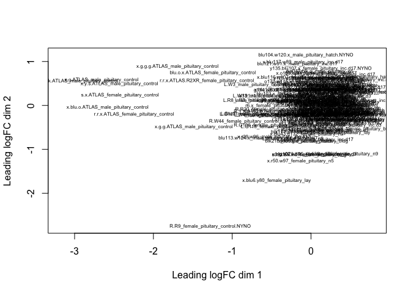

For color coding, I used this tutorial for guidance
<a href="https://combine-australia.github.io/RNAseq-R/06-rnaseq-day1.html" class="uri">https://combine-australia.github.io/RNAseq-R/06-rnaseq-day1.html</a>.

    levels(colData$treatment)

    ## [1] "bldg"    "control" "hatch"   "inc.d17" "inc.d3"  "inc.d9"  "lay"    
    ## [8] "n5"      "n9"

    col.treatment <- c("#a6cee3", "#1f78b4", "#b2df8a", "#33a02c", "#fb9a99", "#e31a1c", "#fdbf6f", "#ff7f00", "#cab2d6")[colData$treatment]

    plotMDS(parentalobject,col=col.treatment, labels = colData$sex)
    legend("bottomleft",fill=c("#a6cee3", "#1f78b4", "#b2df8a", "#33a02c", "#fb9a99", "#e31a1c", "#fdbf6f", "#ff7f00", "#cab2d6"),legend=levels(colData$treatment))
    title("Pituitary Colored by Treatment")

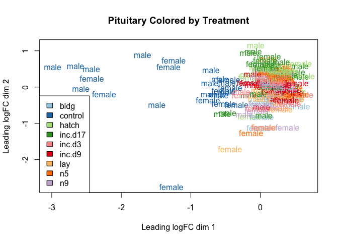

    plotMDS(parentalobject,dim=c(3,4), col=col.treatment, labels = colData$sex)
    legend("bottomright",fill=c("#a6cee3", "#1f78b4", "#b2df8a", "#33a02c", "#fb9a99", "#e31a1c", "#fdbf6f", "#ff7f00", "#cab2d6"),legend=levels(colData$treatment))
    title("Pituitary Colored by Treatment")

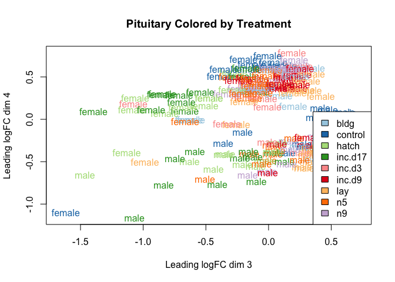

specify contrasts and make MA plots
===================================

    # view all levels
    levels(colData$group)

    ##  [1] "female.pituitary.bldg"    "female.pituitary.control"
    ##  [3] "female.pituitary.hatch"   "female.pituitary.inc.d17"
    ##  [5] "female.pituitary.inc.d3"  "female.pituitary.inc.d9" 
    ##  [7] "female.pituitary.lay"     "female.pituitary.n5"     
    ##  [9] "female.pituitary.n9"      "male.pituitary.bldg"     
    ## [11] "male.pituitary.control"   "male.pituitary.hatch"    
    ## [13] "male.pituitary.inc.d17"   "male.pituitary.inc.d3"   
    ## [15] "male.pituitary.inc.d9"    "male.pituitary.lay"      
    ## [17] "male.pituitary.n5"        "male.pituitary.n9"

    # subset of conrasts - sex specific comparing hatch to lay
    my.contrasts <- makeContrasts(
                 FP_CB = female.pituitary.control - female.pituitary.bldg,
                 FP_BL = female.pituitary.bldg - female.pituitary.lay,
                 FP_Li3 = female.pituitary.lay - female.pituitary.inc.d3,
                 FP_i39 = female.pituitary.inc.d3 - female.pituitary.inc.d9,
                 FP_i917 = female.pituitary.inc.d9 - female.pituitary.inc.d17,
                 FP_i17H = female.pituitary.inc.d17 - female.pituitary.hatch,
                 FP_H5 = female.pituitary.hatch -  female.pituitary.n5,
                 FP_n59 = female.pituitary.n5 - female.pituitary.n9,
                 FP_n9C = female.pituitary.n9 - female.pituitary.control,
                 
                 MP_CB = male.pituitary.control - male.pituitary.bldg,
                 MP_BL = male.pituitary.bldg - male.pituitary.lay,
                 MP_Li3 = male.pituitary.lay - male.pituitary.inc.d3,
                 MP_i39 = male.pituitary.inc.d3 - male.pituitary.inc.d9,
                 MP_i917 = male.pituitary.inc.d9 - male.pituitary.inc.d17,
                 MP_i17H = male.pituitary.inc.d17 - male.pituitary.hatch,
                 MP_H5 = male.pituitary.hatch -  male.pituitary.n5,
                 MP_n59 = male.pituitary.n5 - male.pituitary.n9,
                 MP_n9C = male.pituitary.n9 - male.pituitary.control,
                 
                 FP_n9B = female.pituitary.n9 - female.pituitary.bldg,
                 MP_n9B = male.pituitary.n9 - male.pituitary.bldg,
    levels=parentaldesign)

    mycontrasts <- c("FP_CB", "FP_BL", "FP_Li3", "FP_i39", "FP_i917", "FP_i17H", "FP_H5", "FP_n59", "FP_n9C",
                     "MP_CB", "MP_BL", "MP_Li3", "MP_i39", "MP_i917", "MP_i17H", "MP_H5", "MP_n59", "MP_n9C",
                     "FP_n9B", "MP_n9B")

    printplotcontrasts <- function(whichcontrast){
      cont <- whichcontrast
      print(summary(decideTestsDGE(
        glmTreat(fit, contrast=my.contrasts[,cont], lfc = 1), 
        adjust.method="fdr", p.value=0.01)))
      print(topTags(glmTreat(fit, contrast=my.contrasts[,cont]), n=5), digits=2, lfc = 1)
      print(plotMD(glmTreat(fit, contrast=my.contrasts[,cont], lfc=1), main=whichcontrast, frame.plot=F))
    }

    for(i in mycontrasts){
      printplotcontrasts(i)
    }

    ##        -1*female.pituitary.bldg 1*female.pituitary.control
    ## Down                                                     0
    ## NotSig                                                 344
    ## Up                                                   14593
    ## $table
    ##                row.names    Name    geneid       entrezid    logFC
    ## XP_004951164.1 101751744 SLC35D2 101751744 XP_004951164.1 20.38647
    ## XP_004942079.1    423703  NUDT13    423703 XP_004942079.1 19.68915
    ## NP_001186323.1    416716    CST7    416716 NP_001186323.1 19.52963
    ## XP_001233261.2 107049048    CMC4 107049048 XP_001233261.2 19.47638
    ## XP_015131033.1    416881 TMEM116    416881 XP_015131033.1 19.35427
    ##                unshrunk.logFC    logCPM PValue FDR
    ## XP_004951164.1       20.40774 1.1532629      0   0
    ## XP_004942079.1       19.70307 1.2322142      0   0
    ## NP_001186323.1       19.54308 0.7243353      0   0
    ## XP_001233261.2       19.48886 1.1271221      0   0
    ## XP_015131033.1       19.36580 1.3282733      0   0
    ## 
    ## $adjust.method
    ## [1] "BH"
    ## 
    ## $comparison
    ## [1] "-1*female.pituitary.bldg 1*female.pituitary.control"
    ## 
    ## $test
    ## [1] "glm"
    ## 
    ## attr(,"class")
    ## [1] "TopTags"
    ## attr(,"class")attr(,"package")
    ## [1] "edgeR"

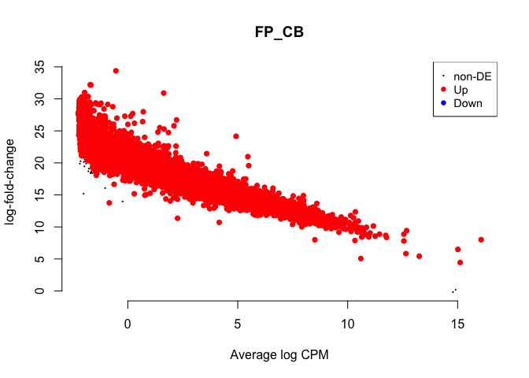

    ## NULL
    ##        1*female.pituitary.bldg -1*female.pituitary.lay
    ## Down                                             14678
    ## NotSig                                             259
    ## Up                                                   0
    ## $table
    ##                row.names      Name    geneid       entrezid     logFC
    ## NP_001001755.1    414837     THBS2    414837 NP_001001755.1 -20.51581
    ## XP_001233219.1    769909 TNFRSF11A    769909 XP_001233219.1 -20.14716
    ## XP_004951164.1 101751744   SLC35D2 101751744 XP_004951164.1 -19.98007
    ## XP_015155022.1    771869    FBXL20    771869 XP_015155022.1 -19.82568
    ## NP_001025839.2    416967     HNF1A    416967 NP_001025839.2 -19.79306
    ##                unshrunk.logFC      logCPM PValue FDR
    ## NP_001001755.1      -20.54318 -0.04786414      0   0
    ## XP_001233219.1      -20.16919 -0.00510549      0   0
    ## XP_004951164.1      -19.99805  1.15326286      0   0
    ## XP_015155022.1      -19.84325  0.36030103      0   0
    ## NP_001025839.2      -19.80925  0.12347727      0   0
    ## 
    ## $adjust.method
    ## [1] "BH"
    ## 
    ## $comparison
    ## [1] "1*female.pituitary.bldg -1*female.pituitary.lay"
    ## 
    ## $test
    ## [1] "glm"
    ## 
    ## attr(,"class")
    ## [1] "TopTags"
    ## attr(,"class")attr(,"package")
    ## [1] "edgeR"

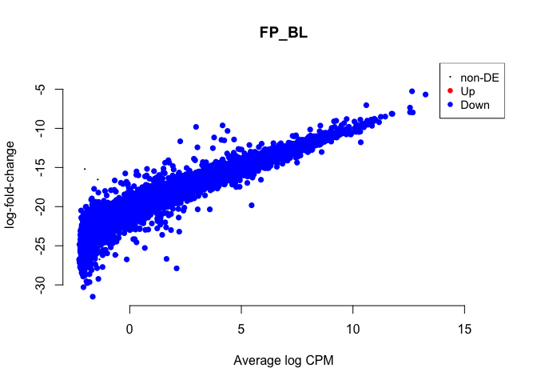

    ## NULL
    ##        -1*female.pituitary.inc.d3 1*female.pituitary.lay
    ## Down                                                   0
    ## NotSig                                             14937
    ## Up                                                     0
    ## $table
    ##                row.names    Name geneid       entrezid     logFC
    ## XP_015131806.1    448833     BTC 448833 XP_015131806.1 -2.340671
    ## XP_015133687.1    396214    PLP1 396214 XP_015133687.1  7.056911
    ## XP_015152637.1    419443 TMEM201 419443 XP_015152637.1  1.045076
    ## XP_015153698.1    419759  ZBTB16 419759 XP_015153698.1  1.566471
    ## NP_001025732.1    415650    PLLP 415650 NP_001025732.1  3.446145
    ##                unshrunk.logFC   logCPM       PValue         FDR
    ## XP_015131806.1      -2.346613 3.031658 1.357103e-07 0.002027105
    ## XP_015133687.1       7.072464 5.460797 3.592867e-07 0.002155514
    ## XP_015152637.1       1.045253 5.774449 4.329211e-07 0.002155514
    ## XP_015153698.1       1.568081 3.721949 2.743463e-06 0.010244777
    ## NP_001025732.1       3.455681 2.409002 3.489672e-06 0.010425047
    ## 
    ## $adjust.method
    ## [1] "BH"
    ## 
    ## $comparison
    ## [1] "-1*female.pituitary.inc.d3 1*female.pituitary.lay"
    ## 
    ## $test
    ## [1] "glm"
    ## 
    ## attr(,"class")
    ## [1] "TopTags"
    ## attr(,"class")attr(,"package")
    ## [1] "edgeR"

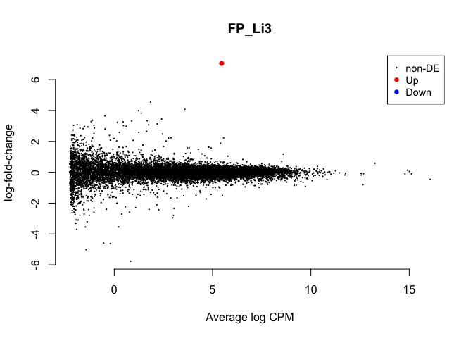

    ## NULL
    ##        1*female.pituitary.inc.d3 -1*female.pituitary.inc.d9
    ## Down                                                      0
    ## NotSig                                                14937
    ## Up                                                        0
    ## $table
    ##                row.names         Name    geneid       entrezid     logFC
    ## XP_015152100.1 107054855 LOC107054855 107054855 XP_015152100.1  3.143212
    ## XP_015128155.1 107049005 LOC107049005 107049005 XP_015128155.1  7.241629
    ## XP_015151573.1 100858782       PROCA1 100858782 XP_015151573.1  3.727540
    ## XP_015141674.1    422973         ANO5    422973 XP_015141674.1 -5.122926
    ## NP_001264456.1    424379         REG4    424379 NP_001264456.1  3.567047
    ##                unshrunk.logFC    logCPM       PValue        FDR
    ## XP_015152100.1   3.189247e+00  1.244928 7.980749e-07 0.01192084
    ## XP_015128155.1   7.361920e+00  0.831000 1.681371e-06 0.01255732
    ## XP_015151573.1   3.774171e+00  1.648912 4.004757e-06 0.01993968
    ## XP_015141674.1  -1.442695e+08 -1.033364 2.800246e-05 0.10456818
    ## NP_001264456.1   3.577787e+00  2.100521 4.166596e-05 0.12447289
    ## 
    ## $adjust.method
    ## [1] "BH"
    ## 
    ## $comparison
    ## [1] "1*female.pituitary.inc.d3 -1*female.pituitary.inc.d9"
    ## 
    ## $test
    ## [1] "glm"
    ## 
    ## attr(,"class")
    ## [1] "TopTags"
    ## attr(,"class")attr(,"package")
    ## [1] "edgeR"

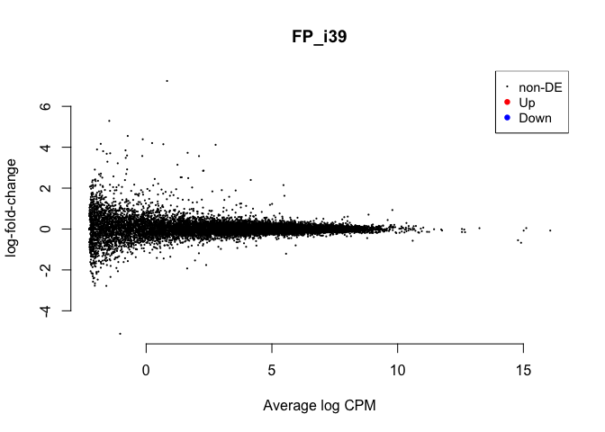

    ## NULL
    ##        -1*female.pituitary.inc.d17 1*female.pituitary.inc.d9
    ## Down                                                      57
    ## NotSig                                                 14880
    ## Up                                                         0
    ## $table
    ##                row.names    Name geneid       entrezid     logFC
    ## XP_015143549.1    396252    CDK1 396252 XP_015143549.1 -4.474351
    ## NP_001012888.1    421226    BUB1 421226 NP_001012888.1 -3.787707
    ## XP_015135377.1    417420   KPNA2 417420 XP_015135377.1 -4.861797
    ## NP_001006274.1    418882   CKAP2 418882 NP_001006274.1 -4.391455
    ## XP_004949789.2    426884 RACGAP1 426884 XP_004949789.2 -3.692119
    ##                unshrunk.logFC   logCPM       PValue          FDR
    ## XP_015143549.1      -4.492606 2.406439 1.071385e-23 1.600328e-19
    ## NP_001012888.1      -3.820390 1.054389 1.531461e-21 1.143772e-17
    ## XP_015135377.1      -4.882982 2.517170 2.629237e-21 1.309097e-17
    ## NP_001006274.1      -4.406671 2.601853 4.259832e-21 1.590728e-17
    ## XP_004949789.2      -3.710400 1.672310 3.459209e-20 1.033404e-16
    ## 
    ## $adjust.method
    ## [1] "BH"
    ## 
    ## $comparison
    ## [1] "-1*female.pituitary.inc.d17 1*female.pituitary.inc.d9"
    ## 
    ## $test
    ## [1] "glm"
    ## 
    ## attr(,"class")
    ## [1] "TopTags"
    ## attr(,"class")attr(,"package")
    ## [1] "edgeR"

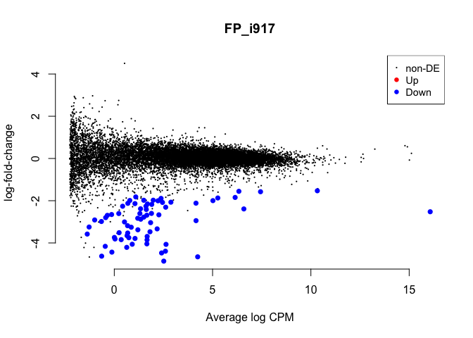

    ## NULL
    ##        -1*female.pituitary.hatch 1*female.pituitary.inc.d17
    ## Down                                                      3
    ## NotSig                                                14934
    ## Up                                                        0
    ## $table
    ##                row.names      Name geneid       entrezid     logFC
    ## XP_015135755.1    404271     ANXA1 404271 XP_015135755.1 -5.193606
    ## NP_001006368.1    420706      TGM4 420706 NP_001006368.1 -5.697173
    ## XP_015133687.1    396214      PLP1 396214 XP_015133687.1 -8.396937
    ## NP_990228.1       395715 SERPINB10 395715    NP_990228.1 -2.893356
    ## XP_001231917.1    769726 LOC769726 769726 XP_001231917.1 -4.854899
    ##                unshrunk.logFC   logCPM       PValue          FDR
    ## XP_015135755.1      -5.209786 1.868275 4.000656e-16 5.975779e-12
    ## NP_001006368.1      -5.734000 0.564067 1.869438e-13 1.396190e-09
    ## XP_015133687.1      -8.466731 5.460797 2.732748e-09 1.360635e-05
    ## NP_990228.1         -2.901176 1.731637 2.299761e-08 8.587884e-05
    ## XP_001231917.1      -4.875690 3.587391 1.254814e-06 3.748631e-03
    ## 
    ## $adjust.method
    ## [1] "BH"
    ## 
    ## $comparison
    ## [1] "-1*female.pituitary.hatch 1*female.pituitary.inc.d17"
    ## 
    ## $test
    ## [1] "glm"
    ## 
    ## attr(,"class")
    ## [1] "TopTags"
    ## attr(,"class")attr(,"package")
    ## [1] "edgeR"

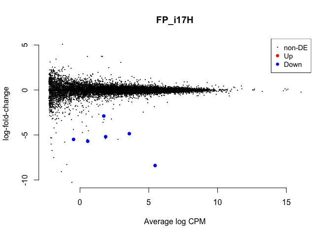

    ## NULL
    ##        1*female.pituitary.hatch -1*female.pituitary.n5
    ## Down                                                 0
    ## NotSig                                           14934
    ## Up                                                   3
    ## $table
    ##                row.names    Name    geneid       entrezid    logFC
    ## XP_015135755.1    404271   ANXA1    404271 XP_015135755.1 5.885871
    ## NP_001006368.1    420706    TGM4    420706 NP_001006368.1 6.845390
    ## NP_001239091.1    423562   CDKN3    423562 NP_001239091.1 1.637333
    ## XP_004941667.2 100859610 CREB3L1 100859610 XP_004941667.2 1.344382
    ## NP_001264404.1    425027    SSR3    425027 NP_001264404.1 1.082836
    ##                unshrunk.logFC   logCPM       PValue          FDR
    ## XP_015135755.1       5.911427 1.868275 6.783899e-18 1.013311e-13
    ## NP_001006368.1       6.928736 0.564067 9.537711e-16 7.123239e-12
    ## NP_001239091.1       1.640138 2.691839 1.781176e-11 8.868476e-08
    ## XP_004941667.2       1.344530 6.337717 5.878926e-11 2.011826e-07
    ## NP_001264404.1       1.082938 6.854743 6.734372e-11 2.011826e-07
    ## 
    ## $adjust.method
    ## [1] "BH"
    ## 
    ## $comparison
    ## [1] "1*female.pituitary.hatch -1*female.pituitary.n5"
    ## 
    ## $test
    ## [1] "glm"
    ## 
    ## attr(,"class")
    ## [1] "TopTags"
    ## attr(,"class")attr(,"package")
    ## [1] "edgeR"

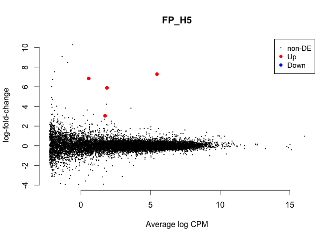

    ## NULL
    ##        1*female.pituitary.n5 -1*female.pituitary.n9
    ## Down                                              0
    ## NotSig                                        14937
    ## Up                                                0
    ## $table
    ##                row.names         Name    geneid       entrezid     logFC
    ## NP_990049.1       395465       CITED4    395465    NP_990049.1 -1.978703
    ## NP_001278710.1    417513        RASA4    417513 NP_001278710.1 -2.241705
    ## XP_004947241.2 101750367 LOC101750367 101750367 XP_004947241.2  2.684024
    ## NP_990392.1       395935          VTN    395935    NP_990392.1 -2.335681
    ## XP_415813.4       417567        SEBOX    417567    XP_415813.4 -2.864467
    ##                unshrunk.logFC     logCPM       PValue         FDR
    ## NP_990049.1         -1.979812  4.2353991 1.384040e-07 0.002067340
    ## NP_001278710.1      -2.242565  4.3810017 3.060538e-07 0.002285763
    ## XP_004947241.2       2.742079 -0.4117678 2.700489e-06 0.013445736
    ## NP_990392.1         -2.336648  4.1076245 8.047498e-06 0.030051370
    ## XP_415813.4         -2.885911  0.3030637 1.084797e-05 0.030358586
    ## 
    ## $adjust.method
    ## [1] "BH"
    ## 
    ## $comparison
    ## [1] "1*female.pituitary.n5 -1*female.pituitary.n9"
    ## 
    ## $test
    ## [1] "glm"
    ## 
    ## attr(,"class")
    ## [1] "TopTags"
    ## attr(,"class")attr(,"package")
    ## [1] "edgeR"

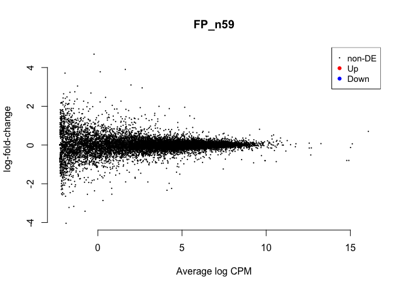

    ## NULL
    ##        -1*female.pituitary.control 1*female.pituitary.n9
    ## Down                                                  34
    ## NotSig                                             14893
    ## Up                                                    10
    ## $table
    ##                row.names         Name    geneid       entrezid     logFC
    ## XP_015128865.1 101748081 LOC101748081 101748081 XP_015128865.1  2.605418
    ## XP_003642711.2 100858704         ECM1 100858704 XP_003642711.2  2.726561
    ## NP_989881.1       395233       DYRK1A    395233    NP_989881.1 -1.608779
    ## XP_003642170.2    427675       RPS15A    427675 XP_003642170.2 -2.081950
    ## XP_015158171.1    426166       RASAL3    426166 XP_015158171.1  1.395006
    ##                unshrunk.logFC   logCPM       PValue          FDR
    ## XP_015128865.1       2.618404 2.797257 3.727067e-19 5.567120e-15
    ## XP_003642711.2       2.736463 3.634435 5.119866e-18 3.596070e-14
    ## NP_989881.1         -1.608846 7.880155 7.222475e-18 3.596070e-14
    ## XP_003642170.2      -2.082042 7.984828 1.286602e-16 4.804494e-13
    ## XP_015158171.1       1.395397 6.077579 2.309464e-16 6.899291e-13
    ## 
    ## $adjust.method
    ## [1] "BH"
    ## 
    ## $comparison
    ## [1] "-1*female.pituitary.control 1*female.pituitary.n9"
    ## 
    ## $test
    ## [1] "glm"
    ## 
    ## attr(,"class")
    ## [1] "TopTags"
    ## attr(,"class")attr(,"package")
    ## [1] "edgeR"

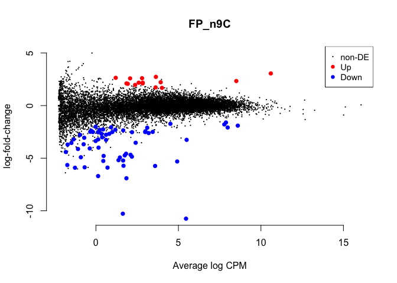

    ## NULL
    ##        -1*male.pituitary.bldg 1*male.pituitary.control
    ## Down                                                46
    ## NotSig                                           14793
    ## Up                                                  98
    ## $table
    ##                row.names    Name    geneid       entrezid     logFC
    ## XP_015139992.1    396473  MARCKS    396473 XP_015139992.1 -1.974951
    ## XP_003643482.1 100857405 ANAPC15 100857405 XP_003643482.1  2.030600
    ## XP_015134142.1    776915    F8A3    776915 XP_015134142.1 -3.063522
    ## XP_003642170.2    427675  RPS15A    427675 XP_003642170.2  2.790139
    ## XP_003642240.1 100857736  EIF2B1 100857736 XP_003642240.1  1.163228
    ##                unshrunk.logFC   logCPM       PValue          FDR
    ## XP_015139992.1      -1.975782 5.971584 1.354223e-43 2.022803e-39
    ## XP_003643482.1       2.031127 5.232653 5.503549e-29 4.110325e-25
    ## XP_015134142.1      -3.081405 2.834761 1.024344e-28 5.100208e-25
    ## XP_003642170.2       2.790253 7.984828 1.158374e-27 4.325660e-24
    ## XP_003642240.1       1.163601 5.085260 3.042385e-27 9.088822e-24
    ## 
    ## $adjust.method
    ## [1] "BH"
    ## 
    ## $comparison
    ## [1] "-1*male.pituitary.bldg 1*male.pituitary.control"
    ## 
    ## $test
    ## [1] "glm"
    ## 
    ## attr(,"class")
    ## [1] "TopTags"
    ## attr(,"class")attr(,"package")
    ## [1] "edgeR"

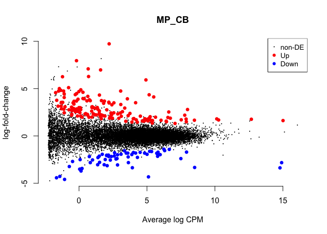

    ## NULL
    ##        1*male.pituitary.bldg -1*male.pituitary.lay
    ## Down                                             0
    ## NotSig                                       14937
    ## Up                                               0
    ## $table
    ##                row.names   Name geneid       entrezid    logFC
    ## XP_015132190.1    422696  LRIT3 422696 XP_015132190.1 3.804833
    ## XP_015137344.1    420606  ABCB5 420606 XP_015137344.1 4.100188
    ## NP_001004370.1    415490   RHCG 415490 NP_001004370.1 3.776914
    ## NP_001095200.1    396206   NEFM 396206 NP_001095200.1 2.955489
    ## NP_001007882.1    419864 GUCA1B 419864 NP_001007882.1 3.107209
    ##                unshrunk.logFC    logCPM       PValue        FDR
    ## XP_015132190.1   1.442695e+08 -1.537327 3.004563e-06 0.04487916
    ## XP_015137344.1   1.442695e+08 -1.695206 1.768709e-05 0.13209601
    ## NP_001004370.1   1.442695e+08 -1.466501 4.968007e-05 0.24735708
    ## NP_001095200.1   2.969063e+00  1.513863 7.092888e-05 0.26486616
    ## NP_001007882.1   1.442695e+08 -1.848775 1.207214e-04 0.36064304
    ## 
    ## $adjust.method
    ## [1] "BH"
    ## 
    ## $comparison
    ## [1] "1*male.pituitary.bldg -1*male.pituitary.lay"
    ## 
    ## $test
    ## [1] "glm"
    ## 
    ## attr(,"class")
    ## [1] "TopTags"
    ## attr(,"class")attr(,"package")
    ## [1] "edgeR"

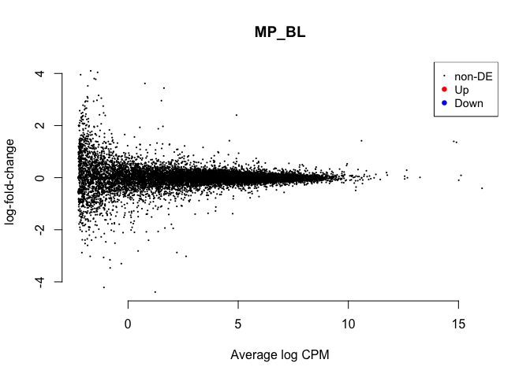

    ## NULL
    ##        -1*male.pituitary.inc.d3 1*male.pituitary.lay
    ## Down                                               0
    ## NotSig                                         14937
    ## Up                                                 0
    ## $table
    ##                row.names         Name    geneid       entrezid     logFC
    ## XP_015132190.1    422696        LRIT3    422696 XP_015132190.1 -4.022245
    ## NP_001004370.1    415490         RHCG    415490 NP_001004370.1 -4.383669
    ## XP_015157097.1 107056587 LOC107056587 107056587 XP_015157097.1 -3.679544
    ## NP_990331.1       395850        MMP27    395850    NP_990331.1 -3.562790
    ## XP_004948276.1 101747315       S100A4 101747315 XP_004948276.1 -3.444143
    ##                unshrunk.logFC    logCPM       PValue        FDR
    ## XP_015132190.1  -1.442695e+08 -1.537327 7.340773e-07 0.01096491
    ## NP_001004370.1  -1.442695e+08 -1.466501 5.382541e-06 0.04019951
    ## XP_015157097.1  -1.442695e+08 -1.835618 4.992321e-05 0.24856767
    ## NP_990331.1     -5.134566e+00 -1.561843 1.391426e-04 0.51959312
    ## XP_004948276.1  -1.442695e+08 -1.885052 3.117495e-04 0.71382363
    ## 
    ## $adjust.method
    ## [1] "BH"
    ## 
    ## $comparison
    ## [1] "-1*male.pituitary.inc.d3 1*male.pituitary.lay"
    ## 
    ## $test
    ## [1] "glm"
    ## 
    ## attr(,"class")
    ## [1] "TopTags"
    ## attr(,"class")attr(,"package")
    ## [1] "edgeR"

    ## NULL
    ##        1*male.pituitary.inc.d3 -1*male.pituitary.inc.d9
    ## Down                                                  3
    ## NotSig                                            14934
    ## Up                                                    0
    ## $table
    ##                row.names         Name    geneid       entrezid     logFC
    ## NP_001264524.1    415770  C11H19ORF40    415770 NP_001264524.1 -6.896886
    ## XP_004944394.1 101750188 LOC101750188 101750188 XP_004944394.1 -5.195742
    ## XP_001234565.2    771273       MRPS36    771273 XP_001234565.2 -4.516752
    ## XP_015135776.1    427254       ZFAND5    427254 XP_015135776.1 -2.761454
    ## XP_004941449.1    423056       TRIM66    423056 XP_004941449.1 -2.474773
    ##                unshrunk.logFC    logCPM       PValue          FDR
    ## NP_001264524.1  -1.442695e+08 2.8561678 4.013408e-16 5.994828e-12
    ## XP_004944394.1  -5.697351e+00 2.7337818 2.269665e-14 1.695099e-10
    ## XP_001234565.2  -5.207915e+00 1.8913376 2.038438e-11 1.014938e-07
    ## XP_015135776.1  -2.790255e+00 4.3516310 2.000108e-09 7.468901e-06
    ## XP_004941449.1  -2.549185e+00 0.2948943 4.396316e-04 1.000000e+00
    ## 
    ## $adjust.method
    ## [1] "BH"
    ## 
    ## $comparison
    ## [1] "1*male.pituitary.inc.d3 -1*male.pituitary.inc.d9"
    ## 
    ## $test
    ## [1] "glm"
    ## 
    ## attr(,"class")
    ## [1] "TopTags"
    ## attr(,"class")attr(,"package")
    ## [1] "edgeR"

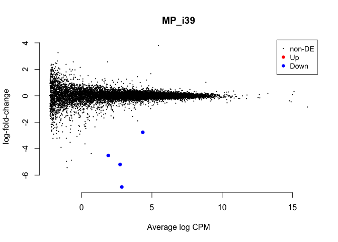

    ## NULL
    ##        -1*male.pituitary.inc.d17 1*male.pituitary.inc.d9
    ## Down                                                  34
    ## NotSig                                             14900
    ## Up                                                     3
    ## $table
    ##                row.names      Name geneid       entrezid     logFC
    ## XP_015135377.1    417420     KPNA2 417420 XP_015135377.1 -4.485452
    ## NP_001006274.1    418882     CKAP2 418882 NP_001006274.1 -3.921876
    ## XP_015143888.1    423793 LOC423793 423793 XP_015143888.1 -3.889304
    ## NP_001012888.1    421226      BUB1 421226 NP_001012888.1 -3.379100
    ## XP_004949789.2    426884   RACGAP1 426884 XP_004949789.2 -3.372047
    ##                unshrunk.logFC   logCPM       PValue          FDR
    ## XP_015135377.1      -4.507693 2.517170 1.556054e-16 2.324278e-12
    ## NP_001006274.1      -3.934774 2.601853 1.060503e-15 5.895938e-12
    ## XP_015143888.1      -3.915573 1.657930 1.184161e-15 5.895938e-12
    ## NP_001012888.1      -3.412676 1.054389 1.623468e-15 6.062435e-12
    ## XP_004949789.2      -3.391972 1.672310 3.120416e-15 8.381565e-12
    ## 
    ## $adjust.method
    ## [1] "BH"
    ## 
    ## $comparison
    ## [1] "-1*male.pituitary.inc.d17 1*male.pituitary.inc.d9"
    ## 
    ## $test
    ## [1] "glm"
    ## 
    ## attr(,"class")
    ## [1] "TopTags"
    ## attr(,"class")attr(,"package")
    ## [1] "edgeR"

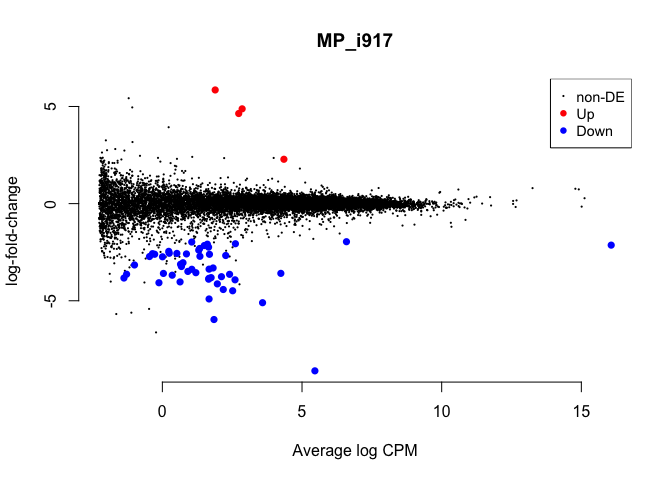

    ## NULL
    ##        -1*male.pituitary.hatch 1*male.pituitary.inc.d17
    ## Down                                                  0
    ## NotSig                                            14936
    ## Up                                                    1
    ## $table
    ##                row.names      Name geneid       entrezid    logFC
    ## XP_015133687.1    396214      PLP1 396214 XP_015133687.1 7.936035
    ## XP_001231917.1    769726 LOC769726 769726 XP_001231917.1 4.814247
    ## NP_990381.1       395921       CNP 395921    NP_990381.1 1.811392
    ## XP_015142329.1    418151     NINJ2 418151 XP_015142329.1 2.969064
    ## XP_015137249.1    428448    COL6A6 428448 XP_015137249.1 1.133860
    ##                unshrunk.logFC   logCPM       PValue          FDR
    ## XP_015133687.1       7.968755 5.460797 3.512362e-08 0.0005246416
    ## XP_001231917.1       4.826479 3.587391 3.021559e-06 0.0225665114
    ## NP_990381.1          1.811943 5.404518 7.385390e-05 0.2274568803
    ## XP_015142329.1       2.982552 1.745674 7.726601e-05 0.2274568803
    ## XP_015137249.1       1.139006 1.750363 8.620357e-05 0.2274568803
    ## 
    ## $adjust.method
    ## [1] "BH"
    ## 
    ## $comparison
    ## [1] "-1*male.pituitary.hatch 1*male.pituitary.inc.d17"
    ## 
    ## $test
    ## [1] "glm"
    ## 
    ## attr(,"class")
    ## [1] "TopTags"
    ## attr(,"class")attr(,"package")
    ## [1] "edgeR"

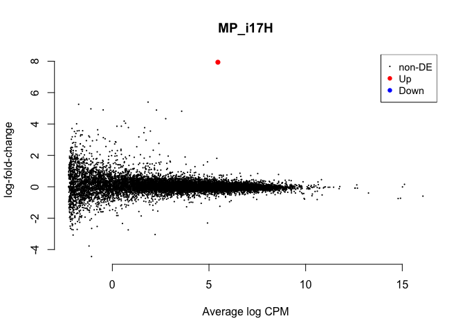

    ## NULL
    ##        1*male.pituitary.hatch -1*male.pituitary.n5
    ## Down                                             0
    ## NotSig                                       14937
    ## Up                                               0
    ## $table
    ##                row.names    Name geneid       entrezid      logFC
    ## NP_990016.1       395420   F13A1 395420    NP_990016.1  1.7129833
    ## NP_990247.1       395746    OAZ1 395746    NP_990247.1  0.8000376
    ## XP_015133687.1    396214    PLP1 396214 XP_015133687.1 -4.8964838
    ## NP_001264404.1    425027    SSR3 425027 NP_001264404.1  0.6978088
    ## XP_015154663.1    418479 ADAMTS1 418479 XP_015154663.1 -1.4101944
    ##                unshrunk.logFC   logCPM       PValue       FDR
    ## NP_990016.1         1.7161319 2.095060 5.718163e-06 0.0854122
    ## NP_990247.1         0.8000463 9.838183 2.719462e-05 0.2031030
    ## XP_015133687.1     -4.9282524 5.460797 1.065321e-04 0.3534003
    ## NP_001264404.1      0.6978792 6.854743 1.105866e-04 0.3534003
    ## XP_015154663.1     -1.4111082 4.083870 1.222642e-04 0.3534003
    ## 
    ## $adjust.method
    ## [1] "BH"
    ## 
    ## $comparison
    ## [1] "1*male.pituitary.hatch -1*male.pituitary.n5"
    ## 
    ## $test
    ## [1] "glm"
    ## 
    ## attr(,"class")
    ## [1] "TopTags"
    ## attr(,"class")attr(,"package")
    ## [1] "edgeR"

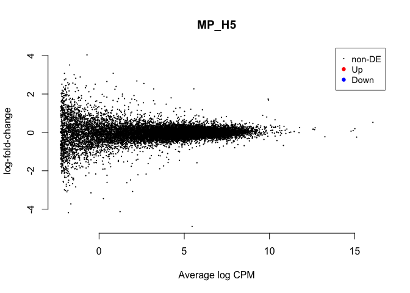

    ## NULL
    ##        1*male.pituitary.n5 -1*male.pituitary.n9
    ## Down                                          0
    ## NotSig                                    14937
    ## Up                                            0
    ## $table
    ##                row.names  Name geneid       entrezid     logFC
    ## XP_015146188.1    424490 ABCA4 424490 XP_015146188.1 -3.279289
    ## NP_001026123.1    420332   MYC 420332 NP_001026123.1  1.874092
    ## XP_001232071.1    768907  FGF6 768907 XP_001232071.1  3.281280
    ## XP_015143549.1    396252  CDK1 396252 XP_015143549.1  2.227789
    ## NP_001012888.1    421226  BUB1 421226 NP_001012888.1  2.006939
    ##                unshrunk.logFC   logCPM       PValue          FDR
    ## XP_015146188.1      -3.293802 1.730953 1.601578e-08 0.0001965015
    ## NP_001026123.1       1.877673 2.620031 2.631071e-08 0.0001965015
    ## XP_001232071.1       3.284078 4.242049 3.264982e-07 0.0016256345
    ## XP_015143549.1       2.235459 2.406439 5.642961e-07 0.0018057694
    ## NP_001012888.1       2.022145 1.054389 6.044619e-07 0.0018057694
    ## 
    ## $adjust.method
    ## [1] "BH"
    ## 
    ## $comparison
    ## [1] "1*male.pituitary.n5 -1*male.pituitary.n9"
    ## 
    ## $test
    ## [1] "glm"
    ## 
    ## attr(,"class")
    ## [1] "TopTags"
    ## attr(,"class")attr(,"package")
    ## [1] "edgeR"

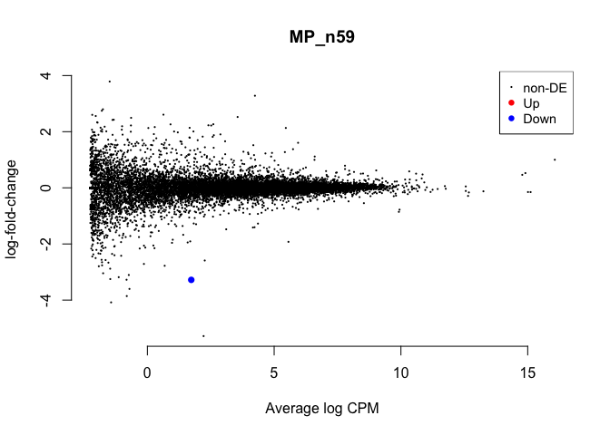

    ## NULL
    ##        -1*male.pituitary.control 1*male.pituitary.n9
    ## Down                                             104
    ## NotSig                                         14790
    ## Up                                                43
    ## $table
    ##                row.names    Name    geneid       entrezid     logFC
    ## XP_015139992.1    396473  MARCKS    396473 XP_015139992.1  1.945511
    ## XP_003643482.1 100857405 ANAPC15 100857405 XP_003643482.1 -2.087587
    ## XP_003642170.2    427675  RPS15A    427675 XP_003642170.2 -2.837991
    ## XP_015134142.1    776915    F8A3    776915 XP_015134142.1  2.900552
    ## XP_015133287.1    418714  MAP4K4    418714 XP_015133287.1  1.803478
    ##                unshrunk.logFC   logCPM       PValue          FDR
    ## XP_015139992.1       1.946335 5.971584 1.405120e-43 2.098827e-39
    ## XP_003643482.1      -2.088142 5.232653 1.591266e-32 1.188437e-28
    ## XP_003642170.2      -2.838110 7.984828 1.656409e-30 8.247261e-27
    ## XP_015134142.1       2.918182 2.834761 2.704126e-26 1.009788e-22
    ## XP_015133287.1       1.804107 5.814897 3.857224e-26 1.152307e-22
    ## 
    ## $adjust.method
    ## [1] "BH"
    ## 
    ## $comparison
    ## [1] "-1*male.pituitary.control 1*male.pituitary.n9"
    ## 
    ## $test
    ## [1] "glm"
    ## 
    ## attr(,"class")
    ## [1] "TopTags"
    ## attr(,"class")attr(,"package")
    ## [1] "edgeR"

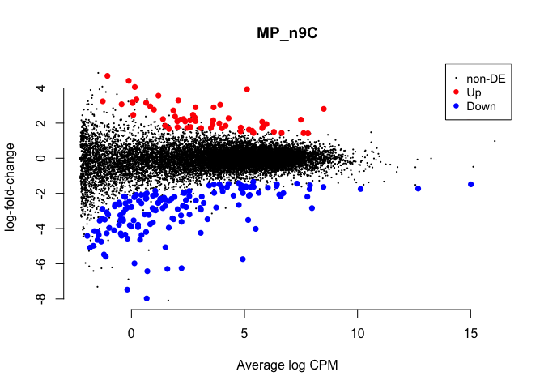

    ## NULL
    ##        -1*female.pituitary.bldg 1*female.pituitary.n9
    ## Down                                                0
    ## NotSig                                            266
    ## Up                                              14671
    ## $table
    ##                row.names      Name    geneid       entrezid    logFC
    ## NP_001001755.1    414837     THBS2    414837 NP_001001755.1 20.41975
    ## NP_001025839.2    416967     HNF1A    416967 NP_001025839.2 20.14922
    ## XP_425379.3       427808 RAB11FIP4    427808    XP_425379.3 20.05777
    ## XP_015155022.1    771869    FBXL20    771869 XP_015155022.1 20.03989
    ## XP_004951164.1 101751744   SLC35D2 101751744 XP_004951164.1 19.76751
    ##                unshrunk.logFC      logCPM PValue FDR
    ## NP_001001755.1       20.44575 -0.04786414      0   0
    ## NP_001025839.2       20.17103  0.12347727      0   0
    ## XP_425379.3          20.07757  0.59431624      0   0
    ## XP_015155022.1       20.05967  0.36030103      0   0
    ## XP_004951164.1       19.78347  1.15326286      0   0
    ## 
    ## $adjust.method
    ## [1] "BH"
    ## 
    ## $comparison
    ## [1] "-1*female.pituitary.bldg 1*female.pituitary.n9"
    ## 
    ## $test
    ## [1] "glm"
    ## 
    ## attr(,"class")
    ## [1] "TopTags"
    ## attr(,"class")attr(,"package")
    ## [1] "edgeR"

    ## NULL
    ##        -1*male.pituitary.bldg 1*male.pituitary.n9
    ## Down                                            0
    ## NotSig                                      14937
    ## Up                                              0
    ## $table
    ##                row.names  Name    geneid       entrezid    logFC
    ## NP_990797.2       396453   PRL    396453    NP_990797.2 2.125436
    ## XP_015150936.1 100859572 MCHR1 100859572 XP_015150936.1 3.609419
    ## NP_001264664.1 100859742  CD24 100859742 NP_001264664.1 1.578723
    ## XP_004946485.1    417479 CALN1    417479 XP_004946485.1 1.915787
    ## XP_004939481.1 100857134 GADL1 100857134 XP_004939481.1 1.255008
    ##                unshrunk.logFC     logCPM       PValue          FDR
    ## NP_990797.2          2.125437 16.0689339 1.867218e-09 2.789063e-05
    ## XP_015150936.1       4.126150 -0.4001383 7.559580e-08 4.817413e-04
    ## NP_001264664.1       1.578743 10.3495372 9.675463e-08 4.817413e-04
    ## XP_004946485.1       1.922303  2.8232669 1.040540e-06 3.203222e-03
    ## XP_004939481.1       1.256149  4.2164438 1.072244e-06 3.203222e-03
    ## 
    ## $adjust.method
    ## [1] "BH"
    ## 
    ## $comparison
    ## [1] "-1*male.pituitary.bldg 1*male.pituitary.n9"
    ## 
    ## $test
    ## [1] "glm"
    ## 
    ## attr(,"class")
    ## [1] "TopTags"
    ## attr(,"class")attr(,"package")
    ## [1] "edgeR"

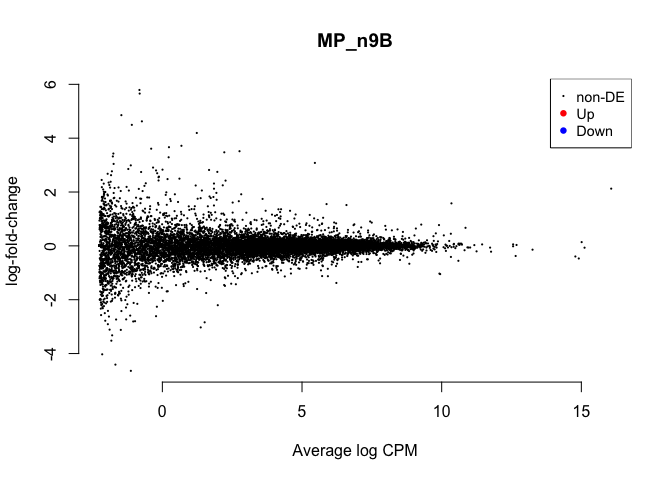

    ## NULL

volcano plots
=============

    # from http://www.compbio.dundee.ac.uk/user/pschofield/Projects/teaching_pg/workshops/biocDGE.html#maplots

    lrt <- glmLRT(fit,coef=2)
    topTags(lrt)

    ## Coefficient:  female.pituitary.control 
    ##                row.names         Name    geneid       entrezid      logFC
    ## XP_003642240.1 100857736       EIF2B1 100857736 XP_003642240.1  1.0104389
    ## NP_989881.1       395233       DYRK1A    395233    NP_989881.1  1.7904529
    ## NP_001025818.1    416678        UBE2H    416678 NP_001025818.1 -0.6072189
    ## XP_015158171.1    426166       RASAL3    426166 XP_015158171.1 -1.4583484
    ## XP_015139992.1    396473       MARCKS    396473 XP_015139992.1 -1.3127748
    ## NP_001263232.1    396544         NACA    396544 NP_001263232.1  1.1069333
    ## XP_015143203.1    429422      C14ORF4    429422 XP_015143203.1 -1.2529836
    ## XP_003642711.2 100858704         ECM1 100858704 XP_003642711.2 -2.8349924
    ## XP_015128865.1 101748081 LOC101748081 101748081 XP_015128865.1 -2.5727037
    ## NP_990604.1       396210         NFIA    396210    NP_990604.1 -1.4058106
    ##                  logCPM        LR       PValue          FDR
    ## XP_003642240.1 5.085260 120.91241 3.993812e-28 5.965557e-24
    ## NP_989881.1    7.880155 109.54561 1.232359e-25 9.203874e-22
    ## NP_001025818.1 6.843615  98.07686 4.024535e-23 2.003816e-19
    ## XP_015158171.1 6.077579  97.14707 6.436450e-23 2.403531e-19
    ## XP_015139992.1 5.971584  96.38034 9.480395e-23 2.832173e-19
    ## NP_001263232.1 7.066068  94.66701 2.252626e-22 5.607912e-19
    ## XP_015143203.1 6.642067  91.34341 1.207818e-21 2.577312e-18
    ## XP_003642711.2 3.634435  88.64130 4.733043e-21 8.837183e-18
    ## XP_015128865.1 2.797257  87.15428 1.003777e-20 1.665935e-17
    ## NP_990604.1    6.243470  85.91467 1.878697e-20 2.806209e-17

    tt <- topTags(lrt,n=10000)$table

    ggplot(data=tt) + geom_point(aes(x=logFC,y=-log(FDR),color=logCPM)) +
      scale_colour_gradientn(colours=c("#000000" ,"#FF0000" ))

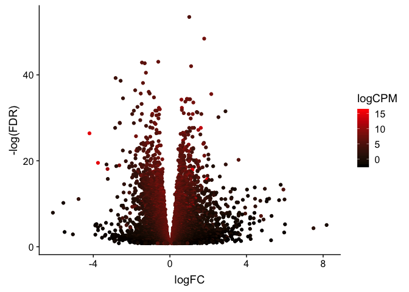
