DESeq2 is *not* recommended for experiments with more than 100 samples
([see Mike Love’s
post](https://mikelove.wordpress.com/2016/09/28/deseq2-or-edger/)), so I
decided to try the limma package. I followed [this
tutorial](https://www.bioconductor.org/packages/devel/workflows/vignettes/RNAseq123/inst/doc/limmaWorkflow.html).

    library(tidyverse)

    ## ── Attaching packages ─────────────────────────────────────────────────────────────── tidyverse 1.2.1 ──

    ## ✔ ggplot2 3.1.0       ✔ purrr   0.3.1  
    ## ✔ tibble  2.0.1       ✔ dplyr   0.8.0.1
    ## ✔ tidyr   0.8.3       ✔ stringr 1.4.0  
    ## ✔ readr   1.3.1       ✔ forcats 0.4.0

    ## ── Conflicts ────────────────────────────────────────────────────────────────── tidyverse_conflicts() ──
    ## ✖ dplyr::filter() masks stats::filter()
    ## ✖ dplyr::lag()    masks stats::lag()

    library(limma)
    library(Glimma)
    library(edgeR)
    library(kableExtra)

    ## 
    ## Attaching package: 'kableExtra'

    ## The following object is masked from 'package:dplyr':
    ## 
    ##     group_rows

    library(cowplot)

    ## 
    ## Attaching package: 'cowplot'

    ## The following object is masked from 'package:ggplot2':
    ## 
    ##     ggsave

    library(ggplot2)

    knitr::opts_chunk$set(fig.path = '../figures/gon/',cache=TRUE)

First, I read in the data I processed in 00\_datawrangling.Rmd.

    # import "colData" which contains sample information and "countData" which contains read counts
    colData <- read.csv("../results/00_colData_characterization.csv", header = T, row.names = 1)
    countData <- read.csv("../results/00_countData_characterization.csv", header = T, row.names = 1)
    geneinfo <- read.csv("../results/00_geneinfo.csv", row.names = 1)

    colData <- colData %>%
      dplyr::filter(grepl('gonad', tissue)) %>%
      droplevels()
    row.names(colData) <- colData$V1

    # print sample sizes
    colData %>% select(sex,treatment, tissue)  %>%  summary()

    ##      sex       treatment    tissue   
    ##  female:98   control:26   gonad:194  
    ##  male  :96   inc.d9 :24              
    ##              inc.d17:22              
    ##              n9     :22              
    ##              bldg   :20              
    ##              hatch  :20              
    ##              (Other):60

    savecols <- as.character(colData$V1) 
    savecols <- as.vector(savecols) 
    countData <- countData %>% dplyr::select(one_of(savecols)) 

    # check that row and col lenghts are equal
    ncol(countData) == nrow(colData)

    ## [1] TRUE

Then, I followed the steps from
<a href="https://github.com/macmanes-lab/RockDove/blob/master/parental_care/parental_analysis.Rmd" class="uri">https://github.com/macmanes-lab/RockDove/blob/master/parental_care/parental_analysis.Rmd</a>.

    # create a large DGEList with 3 elements
    parentalobject <- DGEList(counts=countData, genes=geneinfo, group=colData$group)

    # transform raw counts to countspermillion
    cpms <- cpm(parentalobject)

    # calculate number of lowly lowly expressed genes and remove them
    table(rowSums(parentalobject$counts==0)==10)

    ## 
    ## FALSE  TRUE 
    ## 14850    87

    keep_genes <- rowSums(cpms >= 1) >= 10
    dge <- parentalobject[keep_genes, ]

    # specific the design
    parentaldesign <- model.matrix(~ colData$group )
    colnames(parentaldesign) <- levels(colData$group)

    # The TMM normalization
    parentalobject <- calcNormFactors(parentalobject)
    parentalobject <- estimateCommonDisp(parentalobject)
    parentalobject <- estimateTagwiseDisp(parentalobject)
    parentalobject <- estimateDisp(parentalobject, parentaldesign)
    parentalobject <- estimateGLMCommonDisp(parentalobject, parentaldesign, verbose=TRUE)

    ## Disp = 0.12647 , BCV = 0.3556

    parentalobject <- estimateGLMTrendedDisp(parentalobject, parentaldesign)
    parentalobject <- estimateGLMTagwiseDisp(parentalobject, parentaldesign)

    #  perform likelihood ratio test and thresholded testing
    fit <- glmFit( parentalobject, parentaldesign, robust=T)
    tr <- glmTreat(fit, lfc = 1)
    topTags(tr)

    ## Coefficient:  male.gonad.n9 
    ##                row.names    Name geneid       entrezid     logFC
    ## XP_015155616.1    420115  HOMER3 420115 XP_015155616.1  8.623084
    ## NP_001292033.1    430492   TDRD7 430492 NP_001292033.1  4.694331
    ## NP_001182086.1    416618 SDR42E2 416618 NP_001182086.1  9.680914
    ## XP_015153516.1    430981  GABRR3 430981 XP_015153516.1  7.932241
    ## XP_015138237.1    428360  MCMDC2 428360 XP_015138237.1  7.040080
    ## XP_015131063.1    416873  CCDC63 416873 XP_015131063.1  9.587216
    ## NP_996860.1       404294  ADAM20 404294    NP_996860.1  7.447278
    ## XP_001232076.2    768915   SPO11 768915 XP_001232076.2  9.288527
    ## NP_001264672.1    416221   SFXN1 416221 NP_001264672.1  5.604999
    ## NP_001265047.1    427929  CAPZA3 427929 NP_001265047.1 10.862463
    ##                unshrunk.logFC   logCPM        PValue           FDR
    ## XP_015155616.1       8.673851 6.516512 1.004838e-300 1.500927e-296
    ## NP_001292033.1       4.695179 8.462059 4.671222e-281 3.488702e-277
    ## NP_001182086.1      10.025540 5.076620 3.062122e-221 1.524630e-217
    ## XP_015153516.1       8.016047 5.282876 1.771942e-218 6.616873e-215
    ## XP_015138237.1       7.056463 6.679624 9.252925e-195 2.764219e-191
    ## XP_015131063.1       9.869121 5.270564 1.783306e-182 4.439539e-179
    ## NP_996860.1          7.513078 4.885801 6.678313e-182 1.425057e-178
    ## XP_001232076.2       9.570354 4.867914 2.046519e-168 3.821107e-165
    ## NP_001264672.1       5.606069 9.046818 1.011322e-167 1.678457e-164
    ## NP_001265047.1      11.207911 6.209541 1.988346e-167 2.969993e-164

plotMDS (multidimential scaling)
================================

    plotMDS(parentalobject, cex = 0.5)

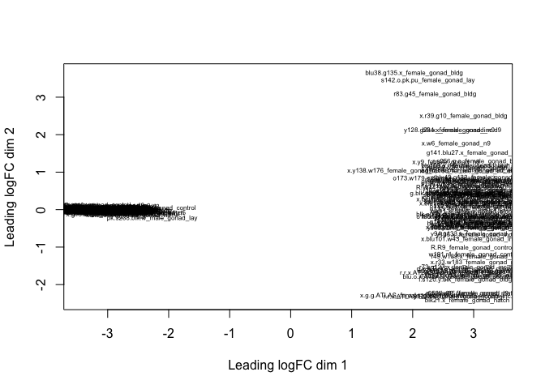

For color coding, I used this tutorial for guidance
<a href="https://combine-australia.github.io/RNAseq-R/06-rnaseq-day1.html" class="uri">https://combine-australia.github.io/RNAseq-R/06-rnaseq-day1.html</a>.

    levels(colData$treatment)

    ## [1] "bldg"    "control" "hatch"   "inc.d17" "inc.d3"  "inc.d9"  "lay"    
    ## [8] "n5"      "n9"

    col.treatment <- c("#a6cee3", "#1f78b4", "#b2df8a", "#33a02c", "#fb9a99", "#e31a1c", "#fdbf6f", "#ff7f00", "#cab2d6")[colData$treatment]

    plotMDS(parentalobject,col=col.treatment, labels = colData$sex)
    legend("bottom",fill=c("#a6cee3", "#1f78b4", "#b2df8a", "#33a02c", "#fb9a99", "#e31a1c", "#fdbf6f", "#ff7f00", "#cab2d6"),legend=levels(colData$treatment))
    title("Gonad Colored by Treatment")

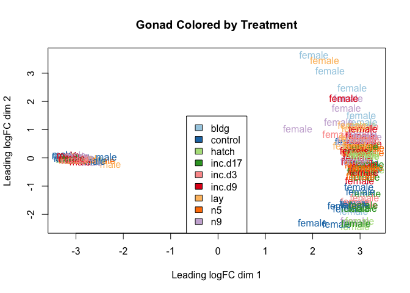

    plotMDS(parentalobject,dim=c(3,4), col=col.treatment, labels = colData$sex)
    legend("topright",fill=c("#a6cee3", "#1f78b4", "#b2df8a", "#33a02c", "#fb9a99", "#e31a1c", "#fdbf6f", "#ff7f00", "#cab2d6"),legend=levels(colData$treatment))
    title("Gonad Colored by Treatment")

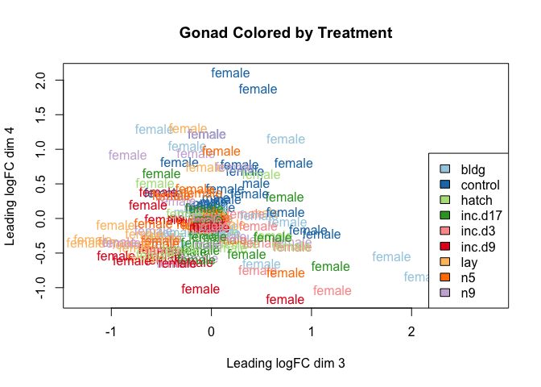

specify contrasts and make MA plots
===================================

    # view all levels
    levels(colData$group)

    ##  [1] "female.gonad.bldg"    "female.gonad.control" "female.gonad.hatch"  
    ##  [4] "female.gonad.inc.d17" "female.gonad.inc.d3"  "female.gonad.inc.d9" 
    ##  [7] "female.gonad.lay"     "female.gonad.n5"      "female.gonad.n9"     
    ## [10] "male.gonad.bldg"      "male.gonad.control"   "male.gonad.hatch"    
    ## [13] "male.gonad.inc.d17"   "male.gonad.inc.d3"    "male.gonad.inc.d9"   
    ## [16] "male.gonad.lay"       "male.gonad.n5"        "male.gonad.n9"

    # subset of conrasts - sex specific comparing hatch to lay
    my.contrasts <- makeContrasts(
                 FG_CB = female.gonad.control - female.gonad.bldg,
                 FG_BL = female.gonad.bldg - female.gonad.lay,
                 FG_Li3 = female.gonad.lay - female.gonad.inc.d3,
                 FG_i39 = female.gonad.inc.d3 - female.gonad.inc.d9,
                 FG_i917 = female.gonad.inc.d9 - female.gonad.inc.d17,
                 FG_i17H = female.gonad.inc.d17 - female.gonad.hatch,
                 FG_H5 = female.gonad.hatch -  female.gonad.n5,
                 FG_n59 = female.gonad.n5 - female.gonad.n9,
                 FG_n9C = female.gonad.n9 - female.gonad.control,
                 
                 MG_CB = male.gonad.control - male.gonad.bldg,
                 MG_BL = male.gonad.bldg - male.gonad.lay,
                 MG_Li3 = male.gonad.lay - male.gonad.inc.d3,
                 MG_i39 = male.gonad.inc.d3 - male.gonad.inc.d9,
                 MG_i917 = male.gonad.inc.d9 - male.gonad.inc.d17,
                 MG_i17H = male.gonad.inc.d17 - male.gonad.hatch,
                 MG_H5 = male.gonad.hatch -  male.gonad.n5,
                 MG_n59 = male.gonad.n5 - male.gonad.n9,
                 MG_n9C = male.gonad.n9 - male.gonad.control,
    levels=parentaldesign)

    # female comparisons
    cont <- "FG_CB"
    summary(decideTestsDGE(
        glmTreat(fit, contrast=my.contrasts[,cont], lfc = 1), 
        adjust.method="fdr", p.value=0.01))

    ##        -1*female.gonad.bldg 1*female.gonad.control
    ## Down                                             0
    ## NotSig                                          78
    ## Up                                           14859

    kable(topTags(glmTreat(fit, contrast=my.contrasts[,cont]), n=5), digits=2, lfc = 1)

<table class="kable_wrapper">
<tbody>
<tr>
<td>
<table>
<thead>
<tr>
<th style="text-align:left;">
</th>
<th style="text-align:right;">
row.names
</th>
<th style="text-align:left;">
Name
</th>
<th style="text-align:right;">
geneid
</th>
<th style="text-align:left;">
entrezid
</th>
<th style="text-align:right;">
logFC
</th>
<th style="text-align:right;">
unshrunk.logFC
</th>
<th style="text-align:right;">
logCPM
</th>
<th style="text-align:right;">
PValue
</th>
<th style="text-align:right;">
FDR
</th>
</tr>
</thead>
<tbody>
<tr>
<td style="text-align:left;">
NP\_996860.1
</td>
<td style="text-align:right;">
404294
</td>
<td style="text-align:left;">
ADAM20
</td>
<td style="text-align:right;">
404294
</td>
<td style="text-align:left;">
NP\_996860.1
</td>
<td style="text-align:right;">
22.72
</td>
<td style="text-align:right;">
22.83
</td>
<td style="text-align:right;">
4.89
</td>
<td style="text-align:right;">
0
</td>
<td style="text-align:right;">
0
</td>
</tr>
<tr>
<td style="text-align:left;">
NP\_001232910.1
</td>
<td style="text-align:right;">
429107
</td>
<td style="text-align:left;">
DMRTB1
</td>
<td style="text-align:right;">
429107
</td>
<td style="text-align:left;">
NP\_001232910.1
</td>
<td style="text-align:right;">
22.02
</td>
<td style="text-align:right;">
22.08
</td>
<td style="text-align:right;">
4.98
</td>
<td style="text-align:right;">
0
</td>
<td style="text-align:right;">
0
</td>
</tr>
<tr>
<td style="text-align:left;">
XP\_015155616.1
</td>
<td style="text-align:right;">
420115
</td>
<td style="text-align:left;">
HOMER3
</td>
<td style="text-align:right;">
420115
</td>
<td style="text-align:left;">
XP\_015155616.1
</td>
<td style="text-align:right;">
21.79
</td>
<td style="text-align:right;">
21.86
</td>
<td style="text-align:right;">
6.52
</td>
<td style="text-align:right;">
0
</td>
<td style="text-align:right;">
0
</td>
</tr>
<tr>
<td style="text-align:left;">
XP\_004945255.1
</td>
<td style="text-align:right;">
427665
</td>
<td style="text-align:left;">
LOC427665
</td>
<td style="text-align:right;">
427665
</td>
<td style="text-align:left;">
XP\_004945255.1
</td>
<td style="text-align:right;">
20.93
</td>
<td style="text-align:right;">
20.97
</td>
<td style="text-align:right;">
2.74
</td>
<td style="text-align:right;">
0
</td>
<td style="text-align:right;">
0
</td>
</tr>
<tr>
<td style="text-align:left;">
XP\_001235323.2
</td>
<td style="text-align:right;">
772145
</td>
<td style="text-align:left;">
C4ORF17
</td>
<td style="text-align:right;">
772145
</td>
<td style="text-align:left;">
XP\_001235323.2
</td>
<td style="text-align:right;">
20.65
</td>
<td style="text-align:right;">
20.68
</td>
<td style="text-align:right;">
3.76
</td>
<td style="text-align:right;">
0
</td>
<td style="text-align:right;">
0
</td>
</tr>
</tbody>
</table>
</td>
<td>
<table>
<thead>
<tr>
<th style="text-align:left;">
x
</th>
</tr>
</thead>
<tbody>
<tr>
<td style="text-align:left;">
BH
</td>
</tr>
</tbody>
</table>
</td>
<td>
<table>
<thead>
<tr>
<th style="text-align:left;">
x
</th>
</tr>
</thead>
<tbody>
<tr>
<td style="text-align:left;">
-1*female.gonad.bldg 1*female.gonad.control
</td>
</tr>
</tbody>
</table>
</td>
<td>
<table>
<thead>
<tr>
<th style="text-align:left;">
x
</th>
</tr>
</thead>
<tbody>
<tr>
<td style="text-align:left;">
glm
</td>
</tr>
</tbody>
</table>
</td>
</tr>
</tbody>
</table>

    plotMD(glmTreat(fit, contrast=my.contrasts[,cont], lfc=1), main='FG_CB', frame.plot=F)

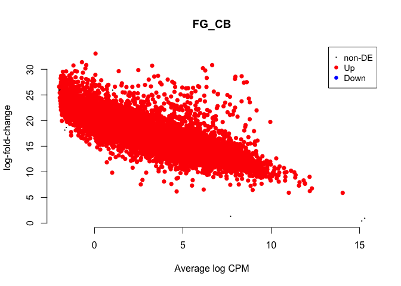

    cont <- "FG_BL"
    summary(decideTestsDGE(
        glmTreat(fit, contrast=my.contrasts[,cont], lfc = 1), 
        adjust.method="fdr", p.value=0.01))

    ##        1*female.gonad.bldg -1*female.gonad.lay
    ## Down                                     14836
    ## NotSig                                     101
    ## Up                                           0

    kable(topTags(glmTreat(fit, contrast=my.contrasts[,cont]), n=5), digits=2, lfc = 1)

<table class="kable_wrapper">
<tbody>
<tr>
<td>
<table>
<thead>
<tr>
<th style="text-align:left;">
</th>
<th style="text-align:right;">
row.names
</th>
<th style="text-align:left;">
Name
</th>
<th style="text-align:right;">
geneid
</th>
<th style="text-align:left;">
entrezid
</th>
<th style="text-align:right;">
logFC
</th>
<th style="text-align:right;">
unshrunk.logFC
</th>
<th style="text-align:right;">
logCPM
</th>
<th style="text-align:right;">
PValue
</th>
<th style="text-align:right;">
FDR
</th>
</tr>
</thead>
<tbody>
<tr>
<td style="text-align:left;">
XP\_015137727.1
</td>
<td style="text-align:right;">
420914
</td>
<td style="text-align:left;">
MARCH11
</td>
<td style="text-align:right;">
420914
</td>
<td style="text-align:left;">
XP\_015137727.1
</td>
<td style="text-align:right;">
-23.04
</td>
<td style="text-align:right;">
-23.19
</td>
<td style="text-align:right;">
4.34
</td>
<td style="text-align:right;">
0
</td>
<td style="text-align:right;">
0
</td>
</tr>
<tr>
<td style="text-align:left;">
NP\_996860.1
</td>
<td style="text-align:right;">
404294
</td>
<td style="text-align:left;">
ADAM20
</td>
<td style="text-align:right;">
404294
</td>
<td style="text-align:left;">
NP\_996860.1
</td>
<td style="text-align:right;">
-21.97
</td>
<td style="text-align:right;">
-22.05
</td>
<td style="text-align:right;">
4.89
</td>
<td style="text-align:right;">
0
</td>
<td style="text-align:right;">
0
</td>
</tr>
<tr>
<td style="text-align:left;">
XP\_015131909.1
</td>
<td style="text-align:right;">
422639
</td>
<td style="text-align:left;">
NUP54
</td>
<td style="text-align:right;">
422639
</td>
<td style="text-align:left;">
XP\_015131909.1
</td>
<td style="text-align:right;">
-21.18
</td>
<td style="text-align:right;">
-21.22
</td>
<td style="text-align:right;">
0.93
</td>
<td style="text-align:right;">
0
</td>
<td style="text-align:right;">
0
</td>
</tr>
<tr>
<td style="text-align:left;">
XP\_004947618.1
</td>
<td style="text-align:right;">
101747314
</td>
<td style="text-align:left;">
NKX3-1
</td>
<td style="text-align:right;">
101747314
</td>
<td style="text-align:left;">
XP\_004947618.1
</td>
<td style="text-align:right;">
-20.94
</td>
<td style="text-align:right;">
-20.99
</td>
<td style="text-align:right;">
4.89
</td>
<td style="text-align:right;">
0
</td>
<td style="text-align:right;">
0
</td>
</tr>
<tr>
<td style="text-align:left;">
XP\_004945255.1
</td>
<td style="text-align:right;">
427665
</td>
<td style="text-align:left;">
LOC427665
</td>
<td style="text-align:right;">
427665
</td>
<td style="text-align:left;">
XP\_004945255.1
</td>
<td style="text-align:right;">
-20.78
</td>
<td style="text-align:right;">
-20.82
</td>
<td style="text-align:right;">
2.74
</td>
<td style="text-align:right;">
0
</td>
<td style="text-align:right;">
0
</td>
</tr>
</tbody>
</table>
</td>
<td>
<table>
<thead>
<tr>
<th style="text-align:left;">
x
</th>
</tr>
</thead>
<tbody>
<tr>
<td style="text-align:left;">
BH
</td>
</tr>
</tbody>
</table>
</td>
<td>
<table>
<thead>
<tr>
<th style="text-align:left;">
x
</th>
</tr>
</thead>
<tbody>
<tr>
<td style="text-align:left;">
1*female.gonad.bldg -1*female.gonad.lay
</td>
</tr>
</tbody>
</table>
</td>
<td>
<table>
<thead>
<tr>
<th style="text-align:left;">
x
</th>
</tr>
</thead>
<tbody>
<tr>
<td style="text-align:left;">
glm
</td>
</tr>
</tbody>
</table>
</td>
</tr>
</tbody>
</table>

    plotMD(glmTreat(fit, contrast=my.contrasts[,cont], lfc=1), main='FG_BL', frame.plot=F)

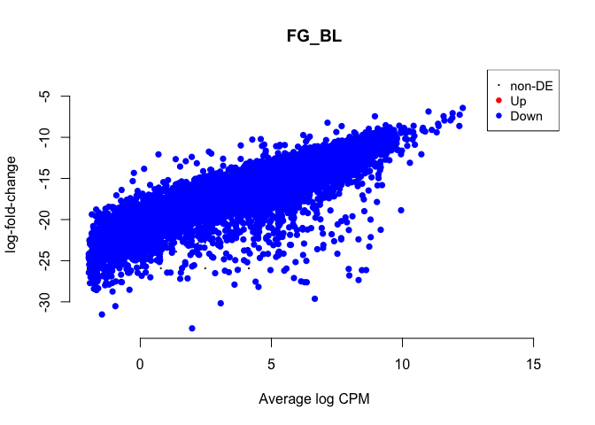

    cont <- "FG_Li3"
    summary(decideTestsDGE(
        glmTreat(fit, contrast=my.contrasts[,cont], lfc = 1), 
        adjust.method="fdr", p.value=0.01))

    ##        -1*female.gonad.inc.d3 1*female.gonad.lay
    ## Down                                           1
    ## NotSig                                     14918
    ## Up                                            18

    kable(topTags(glmTreat(fit, contrast=my.contrasts[,cont]), n=5), digits=2, lfc = 1)

<table class="kable_wrapper">
<tbody>
<tr>
<td>
<table>
<thead>
<tr>
<th style="text-align:left;">
</th>
<th style="text-align:right;">
row.names
</th>
<th style="text-align:left;">
Name
</th>
<th style="text-align:right;">
geneid
</th>
<th style="text-align:left;">
entrezid
</th>
<th style="text-align:right;">
logFC
</th>
<th style="text-align:right;">
unshrunk.logFC
</th>
<th style="text-align:right;">
logCPM
</th>
<th style="text-align:right;">
PValue
</th>
<th style="text-align:right;">
FDR
</th>
</tr>
</thead>
<tbody>
<tr>
<td style="text-align:left;">
XP\_423478.5
</td>
<td style="text-align:right;">
425757
</td>
<td style="text-align:left;">
OVSTL
</td>
<td style="text-align:right;">
425757
</td>
<td style="text-align:left;">
XP\_423478.5
</td>
<td style="text-align:right;">
5.73
</td>
<td style="text-align:right;">
5.76
</td>
<td style="text-align:right;">
1.71
</td>
<td style="text-align:right;">
0
</td>
<td style="text-align:right;">
0
</td>
</tr>
<tr>
<td style="text-align:left;">
NP\_001292097.1
</td>
<td style="text-align:right;">
419533
</td>
<td style="text-align:left;">
LOXL2
</td>
<td style="text-align:right;">
419533
</td>
<td style="text-align:left;">
NP\_001292097.1
</td>
<td style="text-align:right;">
3.06
</td>
<td style="text-align:right;">
3.06
</td>
<td style="text-align:right;">
7.24
</td>
<td style="text-align:right;">
0
</td>
<td style="text-align:right;">
0
</td>
</tr>
<tr>
<td style="text-align:left;">
NP\_990844.1
</td>
<td style="text-align:right;">
396519
</td>
<td style="text-align:left;">
CALB1
</td>
<td style="text-align:right;">
396519
</td>
<td style="text-align:left;">
NP\_990844.1
</td>
<td style="text-align:right;">
4.22
</td>
<td style="text-align:right;">
4.22
</td>
<td style="text-align:right;">
5.96
</td>
<td style="text-align:right;">
0
</td>
<td style="text-align:right;">
0
</td>
</tr>
<tr>
<td style="text-align:left;">
XP\_004940583.1
</td>
<td style="text-align:right;">
422168
</td>
<td style="text-align:left;">
HEPH
</td>
<td style="text-align:right;">
422168
</td>
<td style="text-align:left;">
XP\_004940583.1
</td>
<td style="text-align:right;">
1.58
</td>
<td style="text-align:right;">
1.58
</td>
<td style="text-align:right;">
6.20
</td>
<td style="text-align:right;">
0
</td>
<td style="text-align:right;">
0
</td>
</tr>
<tr>
<td style="text-align:left;">
NP\_990592.2
</td>
<td style="text-align:right;">
396197
</td>
<td style="text-align:left;">
ALB
</td>
<td style="text-align:right;">
396197
</td>
<td style="text-align:left;">
NP\_990592.2
</td>
<td style="text-align:right;">
1.60
</td>
<td style="text-align:right;">
1.61
</td>
<td style="text-align:right;">
4.38
</td>
<td style="text-align:right;">
0
</td>
<td style="text-align:right;">
0
</td>
</tr>
</tbody>
</table>
</td>
<td>
<table>
<thead>
<tr>
<th style="text-align:left;">
x
</th>
</tr>
</thead>
<tbody>
<tr>
<td style="text-align:left;">
BH
</td>
</tr>
</tbody>
</table>
</td>
<td>
<table>
<thead>
<tr>
<th style="text-align:left;">
x
</th>
</tr>
</thead>
<tbody>
<tr>
<td style="text-align:left;">
-1*female.gonad.inc.d3 1*female.gonad.lay
</td>
</tr>
</tbody>
</table>
</td>
<td>
<table>
<thead>
<tr>
<th style="text-align:left;">
x
</th>
</tr>
</thead>
<tbody>
<tr>
<td style="text-align:left;">
glm
</td>
</tr>
</tbody>
</table>
</td>
</tr>
</tbody>
</table>

    plotMD(glmTreat(fit, contrast=my.contrasts[,cont], lfc=1), main='FG_Li3', frame.plot=F)

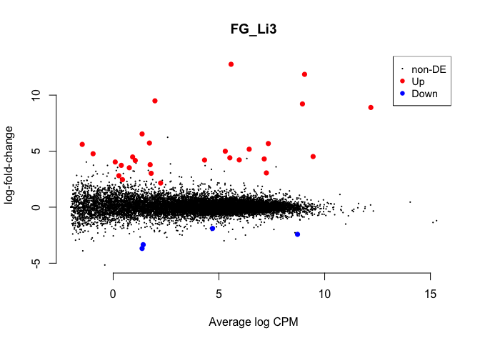

    cont <- "FG_i39"
    summary(decideTestsDGE(
        glmTreat(fit, contrast=my.contrasts[,cont], lfc = 1), 
        adjust.method="fdr", p.value=0.01))

    ##        1*female.gonad.inc.d3 -1*female.gonad.inc.d9
    ## Down                                              0
    ## NotSig                                        14935
    ## Up                                                2

    kable(topTags(glmTreat(fit, contrast=my.contrasts[,cont]), n=5), digits=2, lfc = 1)

<table class="kable_wrapper">
<tbody>
<tr>
<td>
<table>
<thead>
<tr>
<th style="text-align:left;">
</th>
<th style="text-align:right;">
row.names
</th>
<th style="text-align:left;">
Name
</th>
<th style="text-align:right;">
geneid
</th>
<th style="text-align:left;">
entrezid
</th>
<th style="text-align:right;">
logFC
</th>
<th style="text-align:right;">
unshrunk.logFC
</th>
<th style="text-align:right;">
logCPM
</th>
<th style="text-align:right;">
PValue
</th>
<th style="text-align:right;">
FDR
</th>
</tr>
</thead>
<tbody>
<tr>
<td style="text-align:left;">
XP\_003641055.1
</td>
<td style="text-align:right;">
100858979
</td>
<td style="text-align:left;">
COL10A1
</td>
<td style="text-align:right;">
100858979
</td>
<td style="text-align:left;">
XP\_003641055.1
</td>
<td style="text-align:right;">
8.05
</td>
<td style="text-align:right;">
8.08
</td>
<td style="text-align:right;">
7.70
</td>
<td style="text-align:right;">
0
</td>
<td style="text-align:right;">
0
</td>
</tr>
<tr>
<td style="text-align:left;">
XP\_428970.3
</td>
<td style="text-align:right;">
431418
</td>
<td style="text-align:left;">
GPR139
</td>
<td style="text-align:right;">
431418
</td>
<td style="text-align:left;">
XP\_428970.3
</td>
<td style="text-align:right;">
2.24
</td>
<td style="text-align:right;">
2.25
</td>
<td style="text-align:right;">
0.98
</td>
<td style="text-align:right;">
0
</td>
<td style="text-align:right;">
0
</td>
</tr>
<tr>
<td style="text-align:left;">
XP\_015129190.1
</td>
<td style="text-align:right;">
107049904
</td>
<td style="text-align:left;">
LOC107049904
</td>
<td style="text-align:right;">
107049904
</td>
<td style="text-align:left;">
XP\_015129190.1
</td>
<td style="text-align:right;">
6.90
</td>
<td style="text-align:right;">
7.06
</td>
<td style="text-align:right;">
4.35
</td>
<td style="text-align:right;">
0
</td>
<td style="text-align:right;">
0
</td>
</tr>
<tr>
<td style="text-align:left;">
XP\_015131848.1
</td>
<td style="text-align:right;">
422685
</td>
<td style="text-align:left;">
PRSS12
</td>
<td style="text-align:right;">
422685
</td>
<td style="text-align:left;">
XP\_015131848.1
</td>
<td style="text-align:right;">
1.42
</td>
<td style="text-align:right;">
1.42
</td>
<td style="text-align:right;">
4.70
</td>
<td style="text-align:right;">
0
</td>
<td style="text-align:right;">
0
</td>
</tr>
<tr>
<td style="text-align:left;">
XP\_417373.1
</td>
<td style="text-align:right;">
419195
</td>
<td style="text-align:left;">
PKIG
</td>
<td style="text-align:right;">
419195
</td>
<td style="text-align:left;">
XP\_417373.1
</td>
<td style="text-align:right;">
4.36
</td>
<td style="text-align:right;">
144269482.44
</td>
<td style="text-align:right;">
3.41
</td>
<td style="text-align:right;">
0
</td>
<td style="text-align:right;">
0
</td>
</tr>
</tbody>
</table>
</td>
<td>
<table>
<thead>
<tr>
<th style="text-align:left;">
x
</th>
</tr>
</thead>
<tbody>
<tr>
<td style="text-align:left;">
BH
</td>
</tr>
</tbody>
</table>
</td>
<td>
<table>
<thead>
<tr>
<th style="text-align:left;">
x
</th>
</tr>
</thead>
<tbody>
<tr>
<td style="text-align:left;">
1*female.gonad.inc.d3 -1*female.gonad.inc.d9
</td>
</tr>
</tbody>
</table>
</td>
<td>
<table>
<thead>
<tr>
<th style="text-align:left;">
x
</th>
</tr>
</thead>
<tbody>
<tr>
<td style="text-align:left;">
glm
</td>
</tr>
</tbody>
</table>
</td>
</tr>
</tbody>
</table>

    plotMD(glmTreat(fit, contrast=my.contrasts[,cont], lfc=1), main='FG_i39', frame.plot=F)

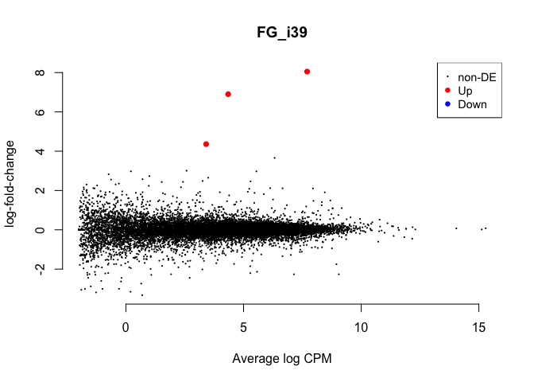

    cont <- "FG_i917"
    summary(decideTestsDGE(
        glmTreat(fit, contrast=my.contrasts[,cont], lfc = 1), 
        adjust.method="fdr", p.value=0.01))

    ##        -1*female.gonad.inc.d17 1*female.gonad.inc.d9
    ## Down                                               6
    ## NotSig                                         14928
    ## Up                                                 3

    kable(topTags(glmTreat(fit, contrast=my.contrasts[,cont]), n=5), digits=2, lfc = 1)

<table class="kable_wrapper">
<tbody>
<tr>
<td>
<table>
<thead>
<tr>
<th style="text-align:left;">
</th>
<th style="text-align:right;">
row.names
</th>
<th style="text-align:left;">
Name
</th>
<th style="text-align:right;">
geneid
</th>
<th style="text-align:left;">
entrezid
</th>
<th style="text-align:right;">
logFC
</th>
<th style="text-align:right;">
unshrunk.logFC
</th>
<th style="text-align:right;">
logCPM
</th>
<th style="text-align:right;">
PValue
</th>
<th style="text-align:right;">
FDR
</th>
</tr>
</thead>
<tbody>
<tr>
<td style="text-align:left;">
XP\_001235419.4
</td>
<td style="text-align:right;">
772256
</td>
<td style="text-align:left;">
MORN5
</td>
<td style="text-align:right;">
772256
</td>
<td style="text-align:left;">
XP\_001235419.4
</td>
<td style="text-align:right;">
4.58
</td>
<td style="text-align:right;">
4.81
</td>
<td style="text-align:right;">
2.14
</td>
<td style="text-align:right;">
0
</td>
<td style="text-align:right;">
0
</td>
</tr>
<tr>
<td style="text-align:left;">
XP\_015156956.1
</td>
<td style="text-align:right;">
107056420
</td>
<td style="text-align:left;">
LOC107056420
</td>
<td style="text-align:right;">
107056420
</td>
<td style="text-align:left;">
XP\_015156956.1
</td>
<td style="text-align:right;">
-4.85
</td>
<td style="text-align:right;">
-4.85
</td>
<td style="text-align:right;">
5.54
</td>
<td style="text-align:right;">
0
</td>
<td style="text-align:right;">
0
</td>
</tr>
<tr>
<td style="text-align:left;">
XP\_015153926.1
</td>
<td style="text-align:right;">
100857743
</td>
<td style="text-align:left;">
LRRC71
</td>
<td style="text-align:right;">
100857743
</td>
<td style="text-align:left;">
XP\_015153926.1
</td>
<td style="text-align:right;">
4.27
</td>
<td style="text-align:right;">
4.37
</td>
<td style="text-align:right;">
4.82
</td>
<td style="text-align:right;">
0
</td>
<td style="text-align:right;">
0
</td>
</tr>
<tr>
<td style="text-align:left;">
XP\_003642417.2
</td>
<td style="text-align:right;">
100859449
</td>
<td style="text-align:left;">
LOC100859449
</td>
<td style="text-align:right;">
100859449
</td>
<td style="text-align:left;">
XP\_003642417.2
</td>
<td style="text-align:right;">
-5.15
</td>
<td style="text-align:right;">
-5.58
</td>
<td style="text-align:right;">
0.05
</td>
<td style="text-align:right;">
0
</td>
<td style="text-align:right;">
0
</td>
</tr>
<tr>
<td style="text-align:left;">
XP\_015153680.1
</td>
<td style="text-align:right;">
395766
</td>
<td style="text-align:left;">
USP2
</td>
<td style="text-align:right;">
395766
</td>
<td style="text-align:left;">
XP\_015153680.1
</td>
<td style="text-align:right;">
2.84
</td>
<td style="text-align:right;">
2.87
</td>
<td style="text-align:right;">
5.59
</td>
<td style="text-align:right;">
0
</td>
<td style="text-align:right;">
0
</td>
</tr>
</tbody>
</table>
</td>
<td>
<table>
<thead>
<tr>
<th style="text-align:left;">
x
</th>
</tr>
</thead>
<tbody>
<tr>
<td style="text-align:left;">
BH
</td>
</tr>
</tbody>
</table>
</td>
<td>
<table>
<thead>
<tr>
<th style="text-align:left;">
x
</th>
</tr>
</thead>
<tbody>
<tr>
<td style="text-align:left;">
-1*female.gonad.inc.d17 1*female.gonad.inc.d9
</td>
</tr>
</tbody>
</table>
</td>
<td>
<table>
<thead>
<tr>
<th style="text-align:left;">
x
</th>
</tr>
</thead>
<tbody>
<tr>
<td style="text-align:left;">
glm
</td>
</tr>
</tbody>
</table>
</td>
</tr>
</tbody>
</table>

    plotMD(glmTreat(fit, contrast=my.contrasts[,cont], lfc=1), main='FG_i917', frame.plot=F)

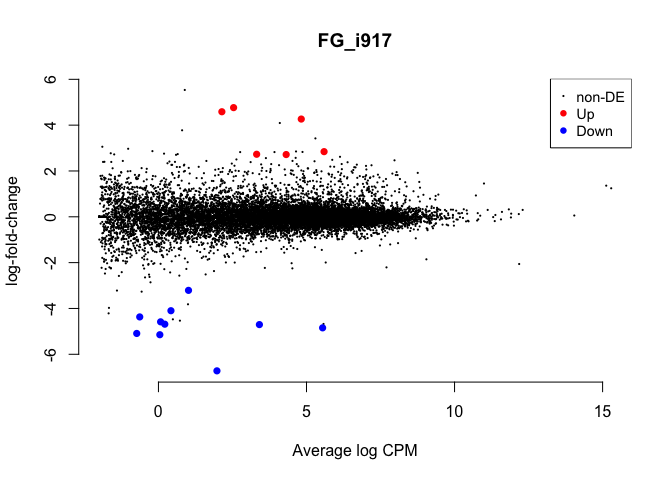

    cont <- "FG_i17H"
    summary(decideTestsDGE(
        glmTreat(fit, contrast=my.contrasts[,cont], lfc = 1), 
        adjust.method="fdr", p.value=0.01))

    ##        -1*female.gonad.hatch 1*female.gonad.inc.d17
    ## Down                                              1
    ## NotSig                                        14934
    ## Up                                                2

    kable(topTags(glmTreat(fit, contrast=my.contrasts[,cont]), n=5), digits=2, lfc = 1)

<table class="kable_wrapper">
<tbody>
<tr>
<td>
<table>
<thead>
<tr>
<th style="text-align:left;">
</th>
<th style="text-align:right;">
row.names
</th>
<th style="text-align:left;">
Name
</th>
<th style="text-align:right;">
geneid
</th>
<th style="text-align:left;">
entrezid
</th>
<th style="text-align:right;">
logFC
</th>
<th style="text-align:right;">
unshrunk.logFC
</th>
<th style="text-align:right;">
logCPM
</th>
<th style="text-align:right;">
PValue
</th>
<th style="text-align:right;">
FDR
</th>
</tr>
</thead>
<tbody>
<tr>
<td style="text-align:left;">
XP\_003642417.2
</td>
<td style="text-align:right;">
100859449
</td>
<td style="text-align:left;">
LOC100859449
</td>
<td style="text-align:right;">
100859449
</td>
<td style="text-align:left;">
XP\_003642417.2
</td>
<td style="text-align:right;">
6.03
</td>
<td style="text-align:right;">
7.01
</td>
<td style="text-align:right;">
0.05
</td>
<td style="text-align:right;">
0
</td>
<td style="text-align:right;">
0.00
</td>
</tr>
<tr>
<td style="text-align:left;">
XP\_015149381.1
</td>
<td style="text-align:right;">
101749216
</td>
<td style="text-align:left;">
LOC101749216
</td>
<td style="text-align:right;">
101749216
</td>
<td style="text-align:left;">
XP\_015149381.1
</td>
<td style="text-align:right;">
-5.72
</td>
<td style="text-align:right;">
-5.78
</td>
<td style="text-align:right;">
2.62
</td>
<td style="text-align:right;">
0
</td>
<td style="text-align:right;">
0.00
</td>
</tr>
<tr>
<td style="text-align:left;">
XP\_015142231.1
</td>
<td style="text-align:right;">
107053414
</td>
<td style="text-align:left;">
LOC107053414
</td>
<td style="text-align:right;">
107053414
</td>
<td style="text-align:left;">
XP\_015142231.1
</td>
<td style="text-align:right;">
8.94
</td>
<td style="text-align:right;">
144269487.10
</td>
<td style="text-align:right;">
1.98
</td>
<td style="text-align:right;">
0
</td>
<td style="text-align:right;">
0.00
</td>
</tr>
<tr>
<td style="text-align:left;">
XP\_417373.1
</td>
<td style="text-align:right;">
419195
</td>
<td style="text-align:left;">
PKIG
</td>
<td style="text-align:right;">
419195
</td>
<td style="text-align:left;">
XP\_417373.1
</td>
<td style="text-align:right;">
4.70
</td>
<td style="text-align:right;">
144269482.80
</td>
<td style="text-align:right;">
3.41
</td>
<td style="text-align:right;">
0
</td>
<td style="text-align:right;">
0.01
</td>
</tr>
<tr>
<td style="text-align:left;">
XP\_001234555.2
</td>
<td style="text-align:right;">
771262
</td>
<td style="text-align:left;">
FBXO16
</td>
<td style="text-align:right;">
771262
</td>
<td style="text-align:left;">
XP\_001234555.2
</td>
<td style="text-align:right;">
-2.47
</td>
<td style="text-align:right;">
-2.51
</td>
<td style="text-align:right;">
5.27
</td>
<td style="text-align:right;">
0
</td>
<td style="text-align:right;">
0.01
</td>
</tr>
</tbody>
</table>
</td>
<td>
<table>
<thead>
<tr>
<th style="text-align:left;">
x
</th>
</tr>
</thead>
<tbody>
<tr>
<td style="text-align:left;">
BH
</td>
</tr>
</tbody>
</table>
</td>
<td>
<table>
<thead>
<tr>
<th style="text-align:left;">
x
</th>
</tr>
</thead>
<tbody>
<tr>
<td style="text-align:left;">
-1*female.gonad.hatch 1*female.gonad.inc.d17
</td>
</tr>
</tbody>
</table>
</td>
<td>
<table>
<thead>
<tr>
<th style="text-align:left;">
x
</th>
</tr>
</thead>
<tbody>
<tr>
<td style="text-align:left;">
glm
</td>
</tr>
</tbody>
</table>
</td>
</tr>
</tbody>
</table>

    plotMD(glmTreat(fit, contrast=my.contrasts[,cont], lfc=1), main='FG_i17H', frame.plot=F)

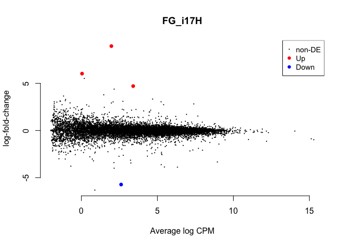

    cont <- "FG_H5"
    summary(decideTestsDGE(
        glmTreat(fit, contrast=my.contrasts[,cont], lfc = 1), 
        adjust.method="fdr", p.value=0.01))

    ##        1*female.gonad.hatch -1*female.gonad.n5
    ## Down                                         0
    ## NotSig                                   14937
    ## Up                                           0

    kable(topTags(glmTreat(fit, contrast=my.contrasts[,cont]), n=5), digits=2, lfc = 1)

<table class="kable_wrapper">
<tbody>
<tr>
<td>
<table>
<thead>
<tr>
<th style="text-align:left;">
</th>
<th style="text-align:right;">
row.names
</th>
<th style="text-align:left;">
Name
</th>
<th style="text-align:right;">
geneid
</th>
<th style="text-align:left;">
entrezid
</th>
<th style="text-align:right;">
logFC
</th>
<th style="text-align:right;">
unshrunk.logFC
</th>
<th style="text-align:right;">
logCPM
</th>
<th style="text-align:right;">
PValue
</th>
<th style="text-align:right;">
FDR
</th>
</tr>
</thead>
<tbody>
<tr>
<td style="text-align:left;">
XP\_004937899.1
</td>
<td style="text-align:right;">
427915
</td>
<td style="text-align:left;">
SPIC
</td>
<td style="text-align:right;">
427915
</td>
<td style="text-align:left;">
XP\_004937899.1
</td>
<td style="text-align:right;">
4.65
</td>
<td style="text-align:right;">
5.98
</td>
<td style="text-align:right;">
-1.47
</td>
<td style="text-align:right;">
0
</td>
<td style="text-align:right;">
0.00
</td>
</tr>
<tr>
<td style="text-align:left;">
XP\_004938850.1
</td>
<td style="text-align:right;">
418936
</td>
<td style="text-align:left;">
ATP8A2
</td>
<td style="text-align:right;">
418936
</td>
<td style="text-align:left;">
XP\_004938850.1
</td>
<td style="text-align:right;">
4.56
</td>
<td style="text-align:right;">
144269482.65
</td>
<td style="text-align:right;">
1.37
</td>
<td style="text-align:right;">
0
</td>
<td style="text-align:right;">
0.01
</td>
</tr>
<tr>
<td style="text-align:left;">
XP\_415893.1
</td>
<td style="text-align:right;">
417647
</td>
<td style="text-align:left;">
CA4
</td>
<td style="text-align:right;">
417647
</td>
<td style="text-align:left;">
XP\_415893.1
</td>
<td style="text-align:right;">
-2.76
</td>
<td style="text-align:right;">
-2.76
</td>
<td style="text-align:right;">
3.70
</td>
<td style="text-align:right;">
0
</td>
<td style="text-align:right;">
0.01
</td>
</tr>
<tr>
<td style="text-align:left;">
XP\_015142231.1
</td>
<td style="text-align:right;">
107053414
</td>
<td style="text-align:left;">
LOC107053414
</td>
<td style="text-align:right;">
107053414
</td>
<td style="text-align:left;">
XP\_015142231.1
</td>
<td style="text-align:right;">
-7.67
</td>
<td style="text-align:right;">
-144269485.81
</td>
<td style="text-align:right;">
1.98
</td>
<td style="text-align:right;">
0
</td>
<td style="text-align:right;">
0.01
</td>
</tr>
<tr>
<td style="text-align:left;">
XP\_015152430.1
</td>
<td style="text-align:right;">
771655
</td>
<td style="text-align:left;">
PLA2G5
</td>
<td style="text-align:right;">
771655
</td>
<td style="text-align:left;">
XP\_015152430.1
</td>
<td style="text-align:right;">
3.67
</td>
<td style="text-align:right;">
4.97
</td>
<td style="text-align:right;">
-1.25
</td>
<td style="text-align:right;">
0
</td>
<td style="text-align:right;">
0.01
</td>
</tr>
</tbody>
</table>
</td>
<td>
<table>
<thead>
<tr>
<th style="text-align:left;">
x
</th>
</tr>
</thead>
<tbody>
<tr>
<td style="text-align:left;">
BH
</td>
</tr>
</tbody>
</table>
</td>
<td>
<table>
<thead>
<tr>
<th style="text-align:left;">
x
</th>
</tr>
</thead>
<tbody>
<tr>
<td style="text-align:left;">
1*female.gonad.hatch -1*female.gonad.n5
</td>
</tr>
</tbody>
</table>
</td>
<td>
<table>
<thead>
<tr>
<th style="text-align:left;">
x
</th>
</tr>
</thead>
<tbody>
<tr>
<td style="text-align:left;">
glm
</td>
</tr>
</tbody>
</table>
</td>
</tr>
</tbody>
</table>

    plotMD(glmTreat(fit, contrast=my.contrasts[,cont], lfc=1), main='FG_H5', frame.plot=F)

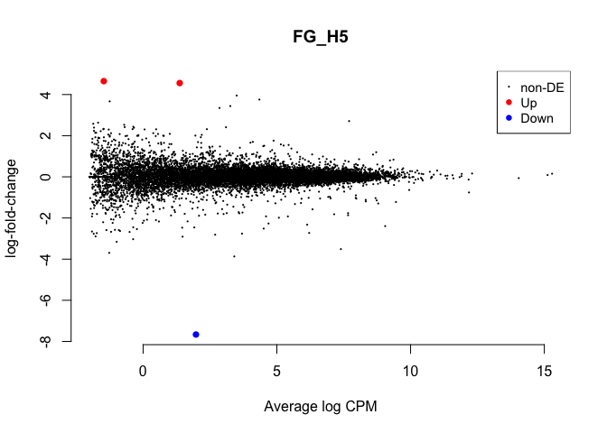

    cont <- "FG_n59"
    summary(decideTestsDGE(
        glmTreat(fit, contrast=my.contrasts[,cont], lfc = 1), 
        adjust.method="fdr", p.value=0.01))

    ##        1*female.gonad.n5 -1*female.gonad.n9
    ## Down                                     24
    ## NotSig                                14913
    ## Up                                        0

    kable(topTags(glmTreat(fit, contrast=my.contrasts[,cont]), n=5), digits=2, lfc = 1)

<table class="kable_wrapper">
<tbody>
<tr>
<td>
<table>
<thead>
<tr>
<th style="text-align:left;">
</th>
<th style="text-align:right;">
row.names
</th>
<th style="text-align:left;">
Name
</th>
<th style="text-align:right;">
geneid
</th>
<th style="text-align:left;">
entrezid
</th>
<th style="text-align:right;">
logFC
</th>
<th style="text-align:right;">
unshrunk.logFC
</th>
<th style="text-align:right;">
logCPM
</th>
<th style="text-align:right;">
PValue
</th>
<th style="text-align:right;">
FDR
</th>
</tr>
</thead>
<tbody>
<tr>
<td style="text-align:left;">
XP\_003641055.1
</td>
<td style="text-align:right;">
100858979
</td>
<td style="text-align:left;">
COL10A1
</td>
<td style="text-align:right;">
100858979
</td>
<td style="text-align:left;">
XP\_003641055.1
</td>
<td style="text-align:right;">
-8.31
</td>
<td style="text-align:right;">
-8.32
</td>
<td style="text-align:right;">
7.70
</td>
<td style="text-align:right;">
0
</td>
<td style="text-align:right;">
0
</td>
</tr>
<tr>
<td style="text-align:left;">
NP\_990794.1
</td>
<td style="text-align:right;">
396449
</td>
<td style="text-align:left;">
RBP
</td>
<td style="text-align:right;">
396449
</td>
<td style="text-align:left;">
NP\_990794.1
</td>
<td style="text-align:right;">
-6.64
</td>
<td style="text-align:right;">
-6.66
</td>
<td style="text-align:right;">
5.30
</td>
<td style="text-align:right;">
0
</td>
<td style="text-align:right;">
0
</td>
</tr>
<tr>
<td style="text-align:left;">
XP\_004939031.1
</td>
<td style="text-align:right;">
101748683
</td>
<td style="text-align:left;">
LOC101748683
</td>
<td style="text-align:right;">
101748683
</td>
<td style="text-align:left;">
XP\_004939031.1
</td>
<td style="text-align:right;">
-4.05
</td>
<td style="text-align:right;">
-4.17
</td>
<td style="text-align:right;">
8.61
</td>
<td style="text-align:right;">
0
</td>
<td style="text-align:right;">
0
</td>
</tr>
<tr>
<td style="text-align:left;">
XP\_015135864.1
</td>
<td style="text-align:right;">
427459
</td>
<td style="text-align:left;">
SLC28A3
</td>
<td style="text-align:right;">
427459
</td>
<td style="text-align:left;">
XP\_015135864.1
</td>
<td style="text-align:right;">
-2.82
</td>
<td style="text-align:right;">
-2.87
</td>
<td style="text-align:right;">
8.73
</td>
<td style="text-align:right;">
0
</td>
<td style="text-align:right;">
0
</td>
</tr>
<tr>
<td style="text-align:left;">
XP\_015129190.1
</td>
<td style="text-align:right;">
107049904
</td>
<td style="text-align:left;">
LOC107049904
</td>
<td style="text-align:right;">
107049904
</td>
<td style="text-align:left;">
XP\_015129190.1
</td>
<td style="text-align:right;">
-10.30
</td>
<td style="text-align:right;">
-10.62
</td>
<td style="text-align:right;">
4.35
</td>
<td style="text-align:right;">
0
</td>
<td style="text-align:right;">
0
</td>
</tr>
</tbody>
</table>
</td>
<td>
<table>
<thead>
<tr>
<th style="text-align:left;">
x
</th>
</tr>
</thead>
<tbody>
<tr>
<td style="text-align:left;">
BH
</td>
</tr>
</tbody>
</table>
</td>
<td>
<table>
<thead>
<tr>
<th style="text-align:left;">
x
</th>
</tr>
</thead>
<tbody>
<tr>
<td style="text-align:left;">
1*female.gonad.n5 -1*female.gonad.n9
</td>
</tr>
</tbody>
</table>
</td>
<td>
<table>
<thead>
<tr>
<th style="text-align:left;">
x
</th>
</tr>
</thead>
<tbody>
<tr>
<td style="text-align:left;">
glm
</td>
</tr>
</tbody>
</table>
</td>
</tr>
</tbody>
</table>

    plotMD(glmTreat(fit, contrast=my.contrasts[,cont], lfc=1), main='FG_n59', frame.plot=F)

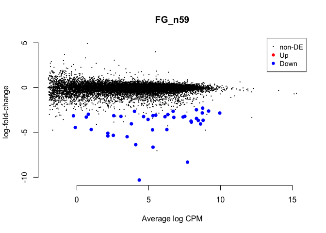

    cont <- "FG_n9C"
    summary(decideTestsDGE(
        glmTreat(fit, contrast=my.contrasts[,cont], lfc = 1), 
        adjust.method="fdr", p.value=0.01))

    ##        -1*female.gonad.control 1*female.gonad.n9
    ## Down                                          87
    ## NotSig                                     14627
    ## Up                                           223

    kable(topTags(glmTreat(fit, contrast=my.contrasts[,cont]), n=5), digits=2, lfc = 1)

<table class="kable_wrapper">
<tbody>
<tr>
<td>
<table>
<thead>
<tr>
<th style="text-align:left;">
</th>
<th style="text-align:right;">
row.names
</th>
<th style="text-align:left;">
Name
</th>
<th style="text-align:right;">
geneid
</th>
<th style="text-align:left;">
entrezid
</th>
<th style="text-align:right;">
logFC
</th>
<th style="text-align:right;">
unshrunk.logFC
</th>
<th style="text-align:right;">
logCPM
</th>
<th style="text-align:right;">
PValue
</th>
<th style="text-align:right;">
FDR
</th>
</tr>
</thead>
<tbody>
<tr>
<td style="text-align:left;">
NP\_001026009.1
</td>
<td style="text-align:right;">
419082
</td>
<td style="text-align:left;">
STIM1
</td>
<td style="text-align:right;">
419082
</td>
<td style="text-align:left;">
NP\_001026009.1
</td>
<td style="text-align:right;">
1.77
</td>
<td style="text-align:right;">
1.77
</td>
<td style="text-align:right;">
5.36
</td>
<td style="text-align:right;">
0
</td>
<td style="text-align:right;">
0
</td>
</tr>
<tr>
<td style="text-align:left;">
XP\_015150276.1
</td>
<td style="text-align:right;">
426991
</td>
<td style="text-align:left;">
ACSM4
</td>
<td style="text-align:right;">
426991
</td>
<td style="text-align:left;">
XP\_015150276.1
</td>
<td style="text-align:right;">
-4.40
</td>
<td style="text-align:right;">
-4.41
</td>
<td style="text-align:right;">
4.62
</td>
<td style="text-align:right;">
0
</td>
<td style="text-align:right;">
0
</td>
</tr>
<tr>
<td style="text-align:left;">
XP\_015130003.1
</td>
<td style="text-align:right;">
107050804
</td>
<td style="text-align:left;">
LOC107050804
</td>
<td style="text-align:right;">
107050804
</td>
<td style="text-align:left;">
XP\_015130003.1
</td>
<td style="text-align:right;">
2.47
</td>
<td style="text-align:right;">
2.48
</td>
<td style="text-align:right;">
4.01
</td>
<td style="text-align:right;">
0
</td>
<td style="text-align:right;">
0
</td>
</tr>
<tr>
<td style="text-align:left;">
XP\_015150987.1
</td>
<td style="text-align:right;">
100859265
</td>
<td style="text-align:left;">
LOC100859265
</td>
<td style="text-align:right;">
100859265
</td>
<td style="text-align:left;">
XP\_015150987.1
</td>
<td style="text-align:right;">
2.04
</td>
<td style="text-align:right;">
2.05
</td>
<td style="text-align:right;">
5.48
</td>
<td style="text-align:right;">
0
</td>
<td style="text-align:right;">
0
</td>
</tr>
<tr>
<td style="text-align:left;">
NP\_001186594.1
</td>
<td style="text-align:right;">
423232
</td>
<td style="text-align:left;">
GANC
</td>
<td style="text-align:right;">
423232
</td>
<td style="text-align:left;">
NP\_001186594.1
</td>
<td style="text-align:right;">
1.39
</td>
<td style="text-align:right;">
1.39
</td>
<td style="text-align:right;">
7.06
</td>
<td style="text-align:right;">
0
</td>
<td style="text-align:right;">
0
</td>
</tr>
</tbody>
</table>
</td>
<td>
<table>
<thead>
<tr>
<th style="text-align:left;">
x
</th>
</tr>
</thead>
<tbody>
<tr>
<td style="text-align:left;">
BH
</td>
</tr>
</tbody>
</table>
</td>
<td>
<table>
<thead>
<tr>
<th style="text-align:left;">
x
</th>
</tr>
</thead>
<tbody>
<tr>
<td style="text-align:left;">
-1*female.gonad.control 1*female.gonad.n9
</td>
</tr>
</tbody>
</table>
</td>
<td>
<table>
<thead>
<tr>
<th style="text-align:left;">
x
</th>
</tr>
</thead>
<tbody>
<tr>
<td style="text-align:left;">
glm
</td>
</tr>
</tbody>
</table>
</td>
</tr>
</tbody>
</table>

    plotMD(glmTreat(fit, contrast=my.contrasts[,cont], lfc=1), main='FG_n9C', frame.plot=F)

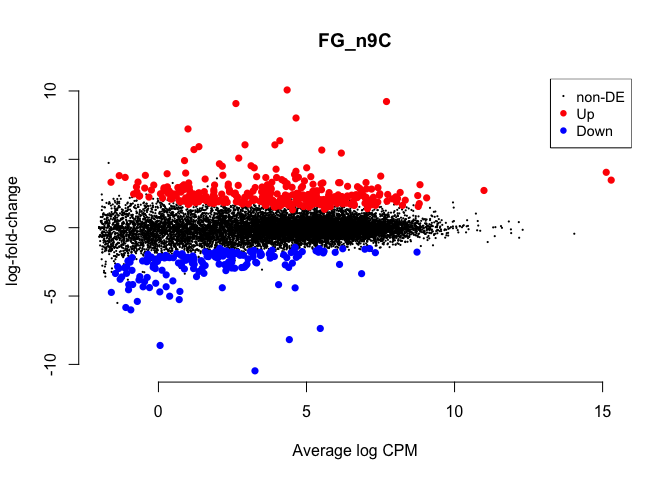

    ## male comparisons

    cont <- "MG_CB"
    summary(decideTestsDGE(
        glmTreat(fit, contrast=my.contrasts[,cont], lfc = 1), 
        adjust.method="fdr", p.value=0.01))

    ##        -1*male.gonad.bldg 1*male.gonad.control
    ## Down                                         1
    ## NotSig                                   14933
    ## Up                                           3

    kable(topTags(glmTreat(fit, contrast=my.contrasts[,cont]), n=5), digits=2, lfc = 1)

<table class="kable_wrapper">
<tbody>
<tr>
<td>
<table>
<thead>
<tr>
<th style="text-align:left;">
</th>
<th style="text-align:right;">
row.names
</th>
<th style="text-align:left;">
Name
</th>
<th style="text-align:right;">
geneid
</th>
<th style="text-align:left;">
entrezid
</th>
<th style="text-align:right;">
logFC
</th>
<th style="text-align:right;">
unshrunk.logFC
</th>
<th style="text-align:right;">
logCPM
</th>
<th style="text-align:right;">
PValue
</th>
<th style="text-align:right;">
FDR
</th>
</tr>
</thead>
<tbody>
<tr>
<td style="text-align:left;">
XP\_420616.3
</td>
<td style="text-align:right;">
422662
</td>
<td style="text-align:left;">
SULT1E1
</td>
<td style="text-align:right;">
422662
</td>
<td style="text-align:left;">
XP\_420616.3
</td>
<td style="text-align:right;">
4.18
</td>
<td style="text-align:right;">
4.19
</td>
<td style="text-align:right;">
2.60
</td>
<td style="text-align:right;">
0
</td>
<td style="text-align:right;">
0
</td>
</tr>
<tr>
<td style="text-align:left;">
NP\_001035557.1
</td>
<td style="text-align:right;">
426883
</td>
<td style="text-align:left;">
ACCN2
</td>
<td style="text-align:right;">
426883
</td>
<td style="text-align:left;">
NP\_001035557.1
</td>
<td style="text-align:right;">
3.50
</td>
<td style="text-align:right;">
3.50
</td>
<td style="text-align:right;">
3.66
</td>
<td style="text-align:right;">
0
</td>
<td style="text-align:right;">
0
</td>
</tr>
<tr>
<td style="text-align:left;">
NP\_001026484.1
</td>
<td style="text-align:right;">
424894
</td>
<td style="text-align:left;">
PPP1R2
</td>
<td style="text-align:right;">
424894
</td>
<td style="text-align:left;">
NP\_001026484.1
</td>
<td style="text-align:right;">
5.98
</td>
<td style="text-align:right;">
6.00
</td>
<td style="text-align:right;">
2.45
</td>
<td style="text-align:right;">
0
</td>
<td style="text-align:right;">
0
</td>
</tr>
<tr>
<td style="text-align:left;">
XP\_416831.2
</td>
<td style="text-align:right;">
418633
</td>
<td style="text-align:left;">
OFD1
</td>
<td style="text-align:right;">
418633
</td>
<td style="text-align:left;">
XP\_416831.2
</td>
<td style="text-align:right;">
1.25
</td>
<td style="text-align:right;">
1.25
</td>
<td style="text-align:right;">
6.01
</td>
<td style="text-align:right;">
0
</td>
<td style="text-align:right;">
0
</td>
</tr>
<tr>
<td style="text-align:left;">
XP\_015130003.1
</td>
<td style="text-align:right;">
107050804
</td>
<td style="text-align:left;">
LOC107050804
</td>
<td style="text-align:right;">
107050804
</td>
<td style="text-align:left;">
XP\_015130003.1
</td>
<td style="text-align:right;">
-1.73
</td>
<td style="text-align:right;">
-1.74
</td>
<td style="text-align:right;">
4.01
</td>
<td style="text-align:right;">
0
</td>
<td style="text-align:right;">
0
</td>
</tr>
</tbody>
</table>
</td>
<td>
<table>
<thead>
<tr>
<th style="text-align:left;">
x
</th>
</tr>
</thead>
<tbody>
<tr>
<td style="text-align:left;">
BH
</td>
</tr>
</tbody>
</table>
</td>
<td>
<table>
<thead>
<tr>
<th style="text-align:left;">
x
</th>
</tr>
</thead>
<tbody>
<tr>
<td style="text-align:left;">
-1*male.gonad.bldg 1*male.gonad.control
</td>
</tr>
</tbody>
</table>
</td>
<td>
<table>
<thead>
<tr>
<th style="text-align:left;">
x
</th>
</tr>
</thead>
<tbody>
<tr>
<td style="text-align:left;">
glm
</td>
</tr>
</tbody>
</table>
</td>
</tr>
</tbody>
</table>

    plotMD(glmTreat(fit, contrast=my.contrasts[,cont], lfc=1), main='MG_CB', frame.plot=F)

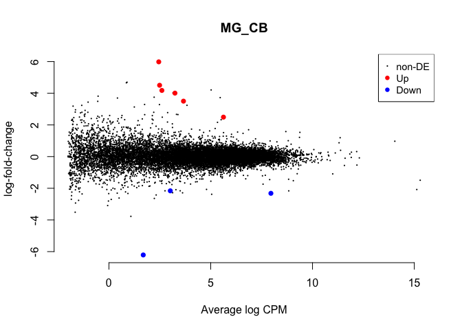

    cont <- "MG_BL"
    summary(decideTestsDGE(
        glmTreat(fit, contrast=my.contrasts[,cont], lfc = 1), 
        adjust.method="fdr", p.value=0.01))

    ##        1*male.gonad.bldg -1*male.gonad.lay
    ## Down                                     0
    ## NotSig                               14937
    ## Up                                       0

    kable(topTags(glmTreat(fit, contrast=my.contrasts[,cont]), n=5), digits=2, lfc = 1)

<table class="kable_wrapper">
<tbody>
<tr>
<td>
<table>
<thead>
<tr>
<th style="text-align:left;">
</th>
<th style="text-align:right;">
row.names
</th>
<th style="text-align:left;">
Name
</th>
<th style="text-align:right;">
geneid
</th>
<th style="text-align:left;">
entrezid
</th>
<th style="text-align:right;">
logFC
</th>
<th style="text-align:right;">
unshrunk.logFC
</th>
<th style="text-align:right;">
logCPM
</th>
<th style="text-align:right;">
PValue
</th>
<th style="text-align:right;">
FDR
</th>
</tr>
</thead>
<tbody>
<tr>
<td style="text-align:left;">
XP\_015133351.1
</td>
<td style="text-align:right;">
107051972
</td>
<td style="text-align:left;">
CCDC138
</td>
<td style="text-align:right;">
107051972
</td>
<td style="text-align:left;">
XP\_015133351.1
</td>
<td style="text-align:right;">
5.52
</td>
<td style="text-align:right;">
6.98
</td>
<td style="text-align:right;">
1.69
</td>
<td style="text-align:right;">
0
</td>
<td style="text-align:right;">
0.08
</td>
</tr>
<tr>
<td style="text-align:left;">
XP\_015150964.1
</td>
<td style="text-align:right;">
769385
</td>
<td style="text-align:left;">
CACNA1G
</td>
<td style="text-align:right;">
769385
</td>
<td style="text-align:left;">
XP\_015150964.1
</td>
<td style="text-align:right;">
3.09
</td>
<td style="text-align:right;">
3.59
</td>
<td style="text-align:right;">
1.05
</td>
<td style="text-align:right;">
0
</td>
<td style="text-align:right;">
0.08
</td>
</tr>
<tr>
<td style="text-align:left;">
NP\_990370.1
</td>
<td style="text-align:right;">
395902
</td>
<td style="text-align:left;">
KCNG2
</td>
<td style="text-align:right;">
395902
</td>
<td style="text-align:left;">
NP\_990370.1
</td>
<td style="text-align:right;">
-3.75
</td>
<td style="text-align:right;">
-144269481.80
</td>
<td style="text-align:right;">
0.42
</td>
<td style="text-align:right;">
0
</td>
<td style="text-align:right;">
0.20
</td>
</tr>
<tr>
<td style="text-align:left;">
NP\_001010842.2
</td>
<td style="text-align:right;">
428310
</td>
<td style="text-align:left;">
HSP25
</td>
<td style="text-align:right;">
428310
</td>
<td style="text-align:left;">
NP\_001010842.2
</td>
<td style="text-align:right;">
1.98
</td>
<td style="text-align:right;">
2.00
</td>
<td style="text-align:right;">
4.01
</td>
<td style="text-align:right;">
0
</td>
<td style="text-align:right;">
0.24
</td>
</tr>
<tr>
<td style="text-align:left;">
XP\_003641003.3
</td>
<td style="text-align:right;">
100859633
</td>
<td style="text-align:left;">
DISC1
</td>
<td style="text-align:right;">
100859633
</td>
<td style="text-align:left;">
XP\_003641003.3
</td>
<td style="text-align:right;">
3.21
</td>
<td style="text-align:right;">
3.25
</td>
<td style="text-align:right;">
1.56
</td>
<td style="text-align:right;">
0
</td>
<td style="text-align:right;">
0.58
</td>
</tr>
</tbody>
</table>
</td>
<td>
<table>
<thead>
<tr>
<th style="text-align:left;">
x
</th>
</tr>
</thead>
<tbody>
<tr>
<td style="text-align:left;">
BH
</td>
</tr>
</tbody>
</table>
</td>
<td>
<table>
<thead>
<tr>
<th style="text-align:left;">
x
</th>
</tr>
</thead>
<tbody>
<tr>
<td style="text-align:left;">
1*male.gonad.bldg -1*male.gonad.lay
</td>
</tr>
</tbody>
</table>
</td>
<td>
<table>
<thead>
<tr>
<th style="text-align:left;">
x
</th>
</tr>
</thead>
<tbody>
<tr>
<td style="text-align:left;">
glm
</td>
</tr>
</tbody>
</table>
</td>
</tr>
</tbody>
</table>

    plotMD(glmTreat(fit, contrast=my.contrasts[,cont], lfc=1), main='MG_BL', frame.plot=F)

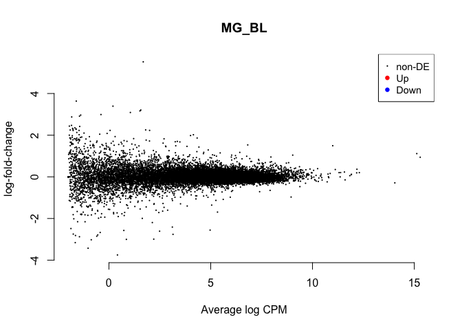

    cont <- "MG_Li3"
    summary(decideTestsDGE(
        glmTreat(fit, contrast=my.contrasts[,cont], lfc = 1), 
        adjust.method="fdr", p.value=0.01))

    ##        -1*male.gonad.inc.d3 1*male.gonad.lay
    ## Down                                       0
    ## NotSig                                 14937
    ## Up                                         0

    kable(topTags(glmTreat(fit, contrast=my.contrasts[,cont]), n=5), digits=2, lfc = 1)

<table class="kable_wrapper">
<tbody>
<tr>
<td>
<table>
<thead>
<tr>
<th style="text-align:left;">
</th>
<th style="text-align:right;">
row.names
</th>
<th style="text-align:left;">
Name
</th>
<th style="text-align:right;">
geneid
</th>
<th style="text-align:left;">
entrezid
</th>
<th style="text-align:right;">
logFC
</th>
<th style="text-align:right;">
unshrunk.logFC
</th>
<th style="text-align:right;">
logCPM
</th>
<th style="text-align:right;">
PValue
</th>
<th style="text-align:right;">
FDR
</th>
</tr>
</thead>
<tbody>
<tr>
<td style="text-align:left;">
XP\_015138547.1
</td>
<td style="text-align:right;">
396276
</td>
<td style="text-align:left;">
COL14A1
</td>
<td style="text-align:right;">
396276
</td>
<td style="text-align:left;">
XP\_015138547.1
</td>
<td style="text-align:right;">
3.49
</td>
<td style="text-align:right;">
3.54
</td>
<td style="text-align:right;">
3.85
</td>
<td style="text-align:right;">
0
</td>
<td style="text-align:right;">
0.01
</td>
</tr>
<tr>
<td style="text-align:left;">
NP\_001188328.1
</td>
<td style="text-align:right;">
395840
</td>
<td style="text-align:left;">
AvBD2
</td>
<td style="text-align:right;">
395840
</td>
<td style="text-align:left;">
NP\_001188328.1
</td>
<td style="text-align:right;">
-4.02
</td>
<td style="text-align:right;">
-4.24
</td>
<td style="text-align:right;">
2.91
</td>
<td style="text-align:right;">
0
</td>
<td style="text-align:right;">
0.04
</td>
</tr>
<tr>
<td style="text-align:left;">
NP\_001010842.2
</td>
<td style="text-align:right;">
428310
</td>
<td style="text-align:left;">
HSP25
</td>
<td style="text-align:right;">
428310
</td>
<td style="text-align:left;">
NP\_001010842.2
</td>
<td style="text-align:right;">
-2.21
</td>
<td style="text-align:right;">
-2.23
</td>
<td style="text-align:right;">
4.01
</td>
<td style="text-align:right;">
0
</td>
<td style="text-align:right;">
0.04
</td>
</tr>
<tr>
<td style="text-align:left;">
XP\_428503.3
</td>
<td style="text-align:right;">
430953
</td>
<td style="text-align:left;">
ABRA
</td>
<td style="text-align:right;">
430953
</td>
<td style="text-align:left;">
XP\_428503.3
</td>
<td style="text-align:right;">
-2.39
</td>
<td style="text-align:right;">
-2.44
</td>
<td style="text-align:right;">
-0.02
</td>
<td style="text-align:right;">
0
</td>
<td style="text-align:right;">
0.28
</td>
</tr>
<tr>
<td style="text-align:left;">
NP\_990809.2
</td>
<td style="text-align:right;">
396471
</td>
<td style="text-align:left;">
LECT2
</td>
<td style="text-align:right;">
396471
</td>
<td style="text-align:left;">
NP\_990809.2
</td>
<td style="text-align:right;">
-3.35
</td>
<td style="text-align:right;">
-3.40
</td>
<td style="text-align:right;">
4.06
</td>
<td style="text-align:right;">
0
</td>
<td style="text-align:right;">
0.28
</td>
</tr>
</tbody>
</table>
</td>
<td>
<table>
<thead>
<tr>
<th style="text-align:left;">
x
</th>
</tr>
</thead>
<tbody>
<tr>
<td style="text-align:left;">
BH
</td>
</tr>
</tbody>
</table>
</td>
<td>
<table>
<thead>
<tr>
<th style="text-align:left;">
x
</th>
</tr>
</thead>
<tbody>
<tr>
<td style="text-align:left;">
-1*male.gonad.inc.d3 1*male.gonad.lay
</td>
</tr>
</tbody>
</table>
</td>
<td>
<table>
<thead>
<tr>
<th style="text-align:left;">
x
</th>
</tr>
</thead>
<tbody>
<tr>
<td style="text-align:left;">
glm
</td>
</tr>
</tbody>
</table>
</td>
</tr>
</tbody>
</table>

    plotMD(glmTreat(fit, contrast=my.contrasts[,cont], lfc=1), main='MG_Li3', frame.plot=F)

    cont <- "MG_i39"
    summary(decideTestsDGE(
        glmTreat(fit, contrast=my.contrasts[,cont], lfc = 1), 
        adjust.method="fdr", p.value=0.01))

    ##        1*male.gonad.inc.d3 -1*male.gonad.inc.d9
    ## Down                                          0
    ## NotSig                                    14937
    ## Up                                            0

    kable(topTags(glmTreat(fit, contrast=my.contrasts[,cont]), n=5), digits=2, lfc = 1)

<table class="kable_wrapper">
<tbody>
<tr>
<td>
<table>
<thead>
<tr>
<th style="text-align:left;">
</th>
<th style="text-align:right;">
row.names
</th>
<th style="text-align:left;">
Name
</th>
<th style="text-align:right;">
geneid
</th>
<th style="text-align:left;">
entrezid
</th>
<th style="text-align:right;">
logFC
</th>
<th style="text-align:right;">
unshrunk.logFC
</th>
<th style="text-align:right;">
logCPM
</th>
<th style="text-align:right;">
PValue
</th>
<th style="text-align:right;">
FDR
</th>
</tr>
</thead>
<tbody>
<tr>
<td style="text-align:left;">
XP\_003642597.3
</td>
<td style="text-align:right;">
100857332
</td>
<td style="text-align:left;">
DOK2
</td>
<td style="text-align:right;">
100857332
</td>
<td style="text-align:left;">
XP\_003642597.3
</td>
<td style="text-align:right;">
1.86
</td>
<td style="text-align:right;">
1.89
</td>
<td style="text-align:right;">
0.54
</td>
<td style="text-align:right;">
0
</td>
<td style="text-align:right;">
0.68
</td>
</tr>
<tr>
<td style="text-align:left;">
XP\_015138052.1
</td>
<td style="text-align:right;">
421055
</td>
<td style="text-align:left;">
EPB41L3
</td>
<td style="text-align:right;">
421055
</td>
<td style="text-align:left;">
XP\_015138052.1
</td>
<td style="text-align:right;">
4.19
</td>
<td style="text-align:right;">
144269482.27
</td>
<td style="text-align:right;">
1.43
</td>
<td style="text-align:right;">
0
</td>
<td style="text-align:right;">
0.68
</td>
</tr>
<tr>
<td style="text-align:left;">
XP\_418091.2
</td>
<td style="text-align:right;">
419969
</td>
<td style="text-align:left;">
GFAP
</td>
<td style="text-align:right;">
419969
</td>
<td style="text-align:left;">
XP\_418091.2
</td>
<td style="text-align:right;">
-4.57
</td>
<td style="text-align:right;">
-144269482.67
</td>
<td style="text-align:right;">
-0.81
</td>
<td style="text-align:right;">
0
</td>
<td style="text-align:right;">
0.68
</td>
</tr>
<tr>
<td style="text-align:left;">
XP\_015134383.1
</td>
<td style="text-align:right;">
769798
</td>
<td style="text-align:left;">
CPLX3
</td>
<td style="text-align:right;">
769798
</td>
<td style="text-align:left;">
XP\_015134383.1
</td>
<td style="text-align:right;">
-2.15
</td>
<td style="text-align:right;">
-2.19
</td>
<td style="text-align:right;">
-0.28
</td>
<td style="text-align:right;">
0
</td>
<td style="text-align:right;">
1.00
</td>
</tr>
<tr>
<td style="text-align:left;">
XP\_004938467.2
</td>
<td style="text-align:right;">
418651
</td>
<td style="text-align:left;">
SHROOM2
</td>
<td style="text-align:right;">
418651
</td>
<td style="text-align:left;">
XP\_004938467.2
</td>
<td style="text-align:right;">
-1.22
</td>
<td style="text-align:right;">
-1.22
</td>
<td style="text-align:right;">
6.65
</td>
<td style="text-align:right;">
0
</td>
<td style="text-align:right;">
1.00
</td>
</tr>
</tbody>
</table>
</td>
<td>
<table>
<thead>
<tr>
<th style="text-align:left;">
x
</th>
</tr>
</thead>
<tbody>
<tr>
<td style="text-align:left;">
BH
</td>
</tr>
</tbody>
</table>
</td>
<td>
<table>
<thead>
<tr>
<th style="text-align:left;">
x
</th>
</tr>
</thead>
<tbody>
<tr>
<td style="text-align:left;">
1*male.gonad.inc.d3 -1*male.gonad.inc.d9
</td>
</tr>
</tbody>
</table>
</td>
<td>
<table>
<thead>
<tr>
<th style="text-align:left;">
x
</th>
</tr>
</thead>
<tbody>
<tr>
<td style="text-align:left;">
glm
</td>
</tr>
</tbody>
</table>
</td>
</tr>
</tbody>
</table>

    plotMD(glmTreat(fit, contrast=my.contrasts[,cont], lfc=1), main='MG_i39', frame.plot=F)

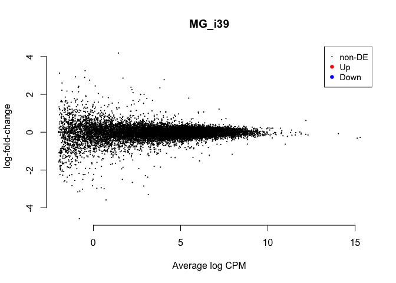

    cont <- "MG_i917"
    summary(decideTestsDGE(
        glmTreat(fit, contrast=my.contrasts[,cont], lfc = 1), 
        adjust.method="fdr", p.value=0.01))

    ##        -1*male.gonad.inc.d17 1*male.gonad.inc.d9
    ## Down                                           0
    ## NotSig                                     14937
    ## Up                                             0

    kable(topTags(glmTreat(fit, contrast=my.contrasts[,cont]), n=5), digits=2, lfc = 1)

<table class="kable_wrapper">
<tbody>
<tr>
<td>
<table>
<thead>
<tr>
<th style="text-align:left;">
</th>
<th style="text-align:right;">
row.names
</th>
<th style="text-align:left;">
Name
</th>
<th style="text-align:right;">
geneid
</th>
<th style="text-align:left;">
entrezid
</th>
<th style="text-align:right;">
logFC
</th>
<th style="text-align:right;">
unshrunk.logFC
</th>
<th style="text-align:right;">
logCPM
</th>
<th style="text-align:right;">
PValue
</th>
<th style="text-align:right;">
FDR
</th>
</tr>
</thead>
<tbody>
<tr>
<td style="text-align:left;">
XP\_015133351.1
</td>
<td style="text-align:right;">
107051972
</td>
<td style="text-align:left;">
CCDC138
</td>
<td style="text-align:right;">
107051972
</td>
<td style="text-align:left;">
XP\_015133351.1
</td>
<td style="text-align:right;">
-5.75
</td>
<td style="text-align:right;">
-144269483.88
</td>
<td style="text-align:right;">
1.69
</td>
<td style="text-align:right;">
0
</td>
<td style="text-align:right;">
0.12
</td>
</tr>
<tr>
<td style="text-align:left;">
NP\_001026055.1
</td>
<td style="text-align:right;">
419521
</td>
<td style="text-align:left;">
RASSF2
</td>
<td style="text-align:right;">
419521
</td>
<td style="text-align:left;">
NP\_001026055.1
</td>
<td style="text-align:right;">
1.64
</td>
<td style="text-align:right;">
1.65
</td>
<td style="text-align:right;">
3.13
</td>
<td style="text-align:right;">
0
</td>
<td style="text-align:right;">
0.20
</td>
</tr>
<tr>
<td style="text-align:left;">
NP\_990411.1
</td>
<td style="text-align:right;">
395963
</td>
<td style="text-align:left;">
CAPN2
</td>
<td style="text-align:right;">
395963
</td>
<td style="text-align:left;">
NP\_990411.1
</td>
<td style="text-align:right;">
1.34
</td>
<td style="text-align:right;">
1.34
</td>
<td style="text-align:right;">
7.96
</td>
<td style="text-align:right;">
0
</td>
<td style="text-align:right;">
0.62
</td>
</tr>
<tr>
<td style="text-align:left;">
XP\_015132556.1
</td>
<td style="text-align:right;">
100857983
</td>
<td style="text-align:left;">
LOC100857983
</td>
<td style="text-align:right;">
100857983
</td>
<td style="text-align:left;">
XP\_015132556.1
</td>
<td style="text-align:right;">
4.54
</td>
<td style="text-align:right;">
4.66
</td>
<td style="text-align:right;">
1.55
</td>
<td style="text-align:right;">
0
</td>
<td style="text-align:right;">
0.62
</td>
</tr>
<tr>
<td style="text-align:left;">
XP\_015138052.1
</td>
<td style="text-align:right;">
421055
</td>
<td style="text-align:left;">
EPB41L3
</td>
<td style="text-align:right;">
421055
</td>
<td style="text-align:left;">
XP\_015138052.1
</td>
<td style="text-align:right;">
-3.95
</td>
<td style="text-align:right;">
-144269482.02
</td>
<td style="text-align:right;">
1.43
</td>
<td style="text-align:right;">
0
</td>
<td style="text-align:right;">
0.91
</td>
</tr>
</tbody>
</table>
</td>
<td>
<table>
<thead>
<tr>
<th style="text-align:left;">
x
</th>
</tr>
</thead>
<tbody>
<tr>
<td style="text-align:left;">
BH
</td>
</tr>
</tbody>
</table>
</td>
<td>
<table>
<thead>
<tr>
<th style="text-align:left;">
x
</th>
</tr>
</thead>
<tbody>
<tr>
<td style="text-align:left;">
-1*male.gonad.inc.d17 1*male.gonad.inc.d9
</td>
</tr>
</tbody>
</table>
</td>
<td>
<table>
<thead>
<tr>
<th style="text-align:left;">
x
</th>
</tr>
</thead>
<tbody>
<tr>
<td style="text-align:left;">
glm
</td>
</tr>
</tbody>
</table>
</td>
</tr>
</tbody>
</table>

    plotMD(glmTreat(fit, contrast=my.contrasts[,cont], lfc=1), main='MG_i917', frame.plot=F)

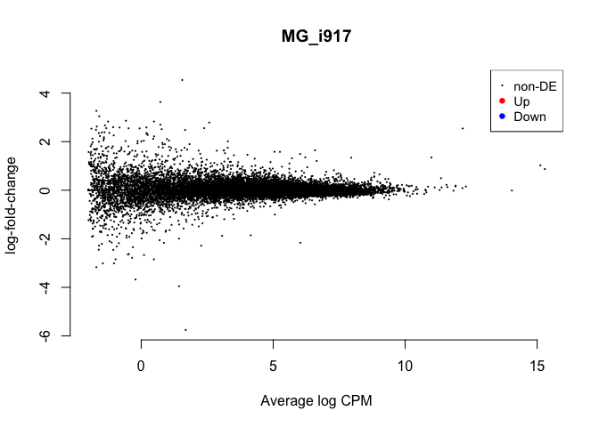

    cont <- "MG_i17H"
    summary(decideTestsDGE(
        glmTreat(fit, contrast=my.contrasts[,cont], lfc = 1), 
        adjust.method="fdr", p.value=0.01))

    ##        -1*male.gonad.hatch 1*male.gonad.inc.d17
    ## Down                                          0
    ## NotSig                                    14937
    ## Up                                            0

    kable(topTags(glmTreat(fit, contrast=my.contrasts[,cont]), n=5), digits=2, lfc = 1)

<table class="kable_wrapper">
<tbody>
<tr>
<td>
<table>
<thead>
<tr>
<th style="text-align:left;">
</th>
<th style="text-align:right;">
row.names
</th>
<th style="text-align:left;">
Name
</th>
<th style="text-align:right;">
geneid
</th>
<th style="text-align:left;">
entrezid
</th>
<th style="text-align:right;">
logFC
</th>
<th style="text-align:right;">
unshrunk.logFC
</th>
<th style="text-align:right;">
logCPM
</th>
<th style="text-align:right;">
PValue
</th>
<th style="text-align:right;">
FDR
</th>
</tr>
</thead>
<tbody>
<tr>
<td style="text-align:left;">
NP\_989646.1
</td>
<td style="text-align:right;">
374209
</td>
<td style="text-align:left;">
RP11-290H9.2
</td>
<td style="text-align:right;">
374209
</td>
<td style="text-align:left;">
NP\_989646.1
</td>
<td style="text-align:right;">
2.73
</td>
<td style="text-align:right;">
2.75
</td>
<td style="text-align:right;">
3.52
</td>
<td style="text-align:right;">
0
</td>
<td style="text-align:right;">
0.17
</td>
</tr>
<tr>
<td style="text-align:left;">
XP\_015155728.1
</td>
<td style="text-align:right;">
426885
</td>
<td style="text-align:left;">
HDAC7
</td>
<td style="text-align:right;">
426885
</td>
<td style="text-align:left;">
XP\_015155728.1
</td>
<td style="text-align:right;">
3.07
</td>
<td style="text-align:right;">
3.43
</td>
<td style="text-align:right;">
-0.26
</td>
<td style="text-align:right;">
0
</td>
<td style="text-align:right;">
1.00
</td>
</tr>
<tr>
<td style="text-align:left;">
NP\_001138665.1
</td>
<td style="text-align:right;">
769357
</td>
<td style="text-align:left;">
C18ORF42
</td>
<td style="text-align:right;">
769357
</td>
<td style="text-align:left;">
NP\_001138665.1
</td>
<td style="text-align:right;">
2.50
</td>
<td style="text-align:right;">
2.69
</td>
<td style="text-align:right;">
-0.82
</td>
<td style="text-align:right;">
0
</td>
<td style="text-align:right;">
1.00
</td>
</tr>
<tr>
<td style="text-align:left;">
XP\_015154284.1
</td>
<td style="text-align:right;">
100859291
</td>
<td style="text-align:left;">
SHISA4
</td>
<td style="text-align:right;">
100859291
</td>
<td style="text-align:left;">
XP\_015154284.1
</td>
<td style="text-align:right;">
-1.53
</td>
<td style="text-align:right;">
-1.55
</td>
<td style="text-align:right;">
1.16
</td>
<td style="text-align:right;">
0
</td>
<td style="text-align:right;">
1.00
</td>
</tr>
<tr>
<td style="text-align:left;">
XP\_001234272.1
</td>
<td style="text-align:right;">
770956
</td>
<td style="text-align:left;">
TMEM37
</td>
<td style="text-align:right;">
770956
</td>
<td style="text-align:left;">
XP\_001234272.1
</td>
<td style="text-align:right;">
1.37
</td>
<td style="text-align:right;">
1.37
</td>
<td style="text-align:right;">
3.58
</td>
<td style="text-align:right;">
0
</td>
<td style="text-align:right;">
1.00
</td>
</tr>
</tbody>
</table>
</td>
<td>
<table>
<thead>
<tr>
<th style="text-align:left;">
x
</th>
</tr>
</thead>
<tbody>
<tr>
<td style="text-align:left;">
BH
</td>
</tr>
</tbody>
</table>
</td>
<td>
<table>
<thead>
<tr>
<th style="text-align:left;">
x
</th>
</tr>
</thead>
<tbody>
<tr>
<td style="text-align:left;">
-1*male.gonad.hatch 1*male.gonad.inc.d17
</td>
</tr>
</tbody>
</table>
</td>
<td>
<table>
<thead>
<tr>
<th style="text-align:left;">
x
</th>
</tr>
</thead>
<tbody>
<tr>
<td style="text-align:left;">
glm
</td>
</tr>
</tbody>
</table>
</td>
</tr>
</tbody>
</table>

    plotMD(glmTreat(fit, contrast=my.contrasts[,cont], lfc=1), main='MG_i17H', frame.plot=F)

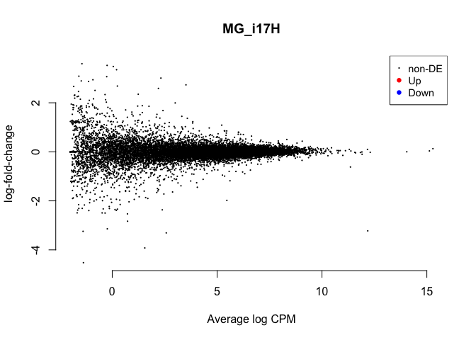

    cont <- "MG_H5"
    summary(decideTestsDGE(
        glmTreat(fit, contrast=my.contrasts[,cont], lfc = 1), 
        adjust.method="fdr", p.value=0.01))

    ##        1*male.gonad.hatch -1*male.gonad.n5
    ## Down                                     0
    ## NotSig                               14937
    ## Up                                       0

    kable(topTags(glmTreat(fit, contrast=my.contrasts[,cont]), n=5), digits=2, lfc = 1)

<table class="kable_wrapper">
<tbody>
<tr>
<td>
<table>
<thead>
<tr>
<th style="text-align:left;">
</th>
<th style="text-align:right;">
row.names
</th>
<th style="text-align:left;">
Name
</th>
<th style="text-align:right;">
geneid
</th>
<th style="text-align:left;">
entrezid
</th>
<th style="text-align:right;">
logFC
</th>
<th style="text-align:right;">
unshrunk.logFC
</th>
<th style="text-align:right;">
logCPM
</th>
<th style="text-align:right;">
PValue
</th>
<th style="text-align:right;">
FDR
</th>
</tr>
</thead>
<tbody>
<tr>
<td style="text-align:left;">
XP\_004949683.1
</td>
<td style="text-align:right;">
427387
</td>
<td style="text-align:left;">
SEMA6A
</td>
<td style="text-align:right;">
427387
</td>
<td style="text-align:left;">
XP\_004949683.1
</td>
<td style="text-align:right;">
-2.14
</td>
<td style="text-align:right;">
-2.14
</td>
<td style="text-align:right;">
5.05
</td>
<td style="text-align:right;">
0
</td>
<td style="text-align:right;">
0.93
</td>
</tr>
<tr>
<td style="text-align:left;">
NP\_990097.1
</td>
<td style="text-align:right;">
395534
</td>
<td style="text-align:left;">
MYH15
</td>
<td style="text-align:right;">
395534
</td>
<td style="text-align:left;">
NP\_990097.1
</td>
<td style="text-align:right;">
-1.55
</td>
<td style="text-align:right;">
-1.56
</td>
<td style="text-align:right;">
1.87
</td>
<td style="text-align:right;">
0
</td>
<td style="text-align:right;">
1.00
</td>
</tr>
<tr>
<td style="text-align:left;">
XP\_422282.3
</td>
<td style="text-align:right;">
424440
</td>
<td style="text-align:left;">
SERPINC1
</td>
<td style="text-align:right;">
424440
</td>
<td style="text-align:left;">
XP\_422282.3
</td>
<td style="text-align:right;">
1.62
</td>
<td style="text-align:right;">
1.63
</td>
<td style="text-align:right;">
0.79
</td>
<td style="text-align:right;">
0
</td>
<td style="text-align:right;">
1.00
</td>
</tr>
<tr>
<td style="text-align:left;">
XP\_015128073.1
</td>
<td style="text-align:right;">
107049255
</td>
<td style="text-align:left;">
LOC107049255
</td>
<td style="text-align:right;">
107049255
</td>
<td style="text-align:left;">
XP\_015128073.1
</td>
<td style="text-align:right;">
4.19
</td>
<td style="text-align:right;">
4.51
</td>
<td style="text-align:right;">
0.45
</td>
<td style="text-align:right;">
0
</td>
<td style="text-align:right;">
1.00
</td>
</tr>
<tr>
<td style="text-align:left;">
XP\_015140443.1
</td>
<td style="text-align:right;">
421952
</td>
<td style="text-align:left;">
ZPAX
</td>
<td style="text-align:right;">
421952
</td>
<td style="text-align:left;">
XP\_015140443.1
</td>
<td style="text-align:right;">
2.24
</td>
<td style="text-align:right;">
2.32
</td>
<td style="text-align:right;">
6.03
</td>
<td style="text-align:right;">
0
</td>
<td style="text-align:right;">
1.00
</td>
</tr>
</tbody>
</table>
</td>
<td>
<table>
<thead>
<tr>
<th style="text-align:left;">
x
</th>
</tr>
</thead>
<tbody>
<tr>
<td style="text-align:left;">
BH
</td>
</tr>
</tbody>
</table>
</td>
<td>
<table>
<thead>
<tr>
<th style="text-align:left;">
x
</th>
</tr>
</thead>
<tbody>
<tr>
<td style="text-align:left;">
1*male.gonad.hatch -1*male.gonad.n5
</td>
</tr>
</tbody>
</table>
</td>
<td>
<table>
<thead>
<tr>
<th style="text-align:left;">
x
</th>
</tr>
</thead>
<tbody>
<tr>
<td style="text-align:left;">
glm
</td>
</tr>
</tbody>
</table>
</td>
</tr>
</tbody>
</table>

    plotMD(glmTreat(fit, contrast=my.contrasts[,cont], lfc=1), main='MG_H5', frame.plot=F)

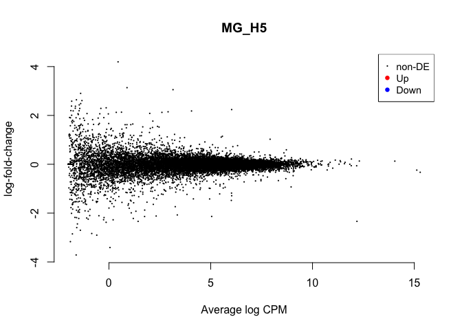

    cont <- "MG_n59"
    summary(decideTestsDGE(
        glmTreat(fit, contrast=my.contrasts[,cont], lfc = 1), 
        adjust.method="fdr", p.value=0.01))

    ##        1*male.gonad.n5 -1*male.gonad.n9
    ## Down                                  0
    ## NotSig                            14937
    ## Up                                    0

    kable(topTags(glmTreat(fit, contrast=my.contrasts[,cont]), n=5), digits=2, lfc = 1)

<table class="kable_wrapper">
<tbody>
<tr>
<td>
<table>
<thead>
<tr>
<th style="text-align:left;">
</th>
<th style="text-align:right;">
row.names
</th>
<th style="text-align:left;">
Name
</th>
<th style="text-align:right;">
geneid
</th>
<th style="text-align:left;">
entrezid
</th>
<th style="text-align:right;">
logFC
</th>
<th style="text-align:right;">
unshrunk.logFC
</th>
<th style="text-align:right;">
logCPM
</th>
<th style="text-align:right;">
PValue
</th>
<th style="text-align:right;">
FDR
</th>
</tr>
</thead>
<tbody>
<tr>
<td style="text-align:left;">
NP\_990097.1
</td>
<td style="text-align:right;">
395534
</td>
<td style="text-align:left;">
MYH15
</td>
<td style="text-align:right;">
395534
</td>
<td style="text-align:left;">
NP\_990097.1
</td>
<td style="text-align:right;">
1.88
</td>
<td style="text-align:right;">
1.89
</td>
<td style="text-align:right;">
1.87
</td>
<td style="text-align:right;">
0
</td>
<td style="text-align:right;">
0.05
</td>
</tr>
<tr>
<td style="text-align:left;">
NP\_989646.1
</td>
<td style="text-align:right;">
374209
</td>
<td style="text-align:left;">
RP11-290H9.2
</td>
<td style="text-align:right;">
374209
</td>
<td style="text-align:left;">
NP\_989646.1
</td>
<td style="text-align:right;">
-2.27
</td>
<td style="text-align:right;">
-2.28
</td>
<td style="text-align:right;">
3.52
</td>
<td style="text-align:right;">
0
</td>
<td style="text-align:right;">
0.76
</td>
</tr>
<tr>
<td style="text-align:left;">
XP\_004937988.1
</td>
<td style="text-align:right;">
418153
</td>
<td style="text-align:left;">
ERC1
</td>
<td style="text-align:right;">
418153
</td>
<td style="text-align:left;">
XP\_004937988.1
</td>
<td style="text-align:right;">
-3.38
</td>
<td style="text-align:right;">
-3.46
</td>
<td style="text-align:right;">
-0.14
</td>
<td style="text-align:right;">
0
</td>
<td style="text-align:right;">
0.76
</td>
</tr>
<tr>
<td style="text-align:left;">
XP\_015156656.1
</td>
<td style="text-align:right;">
107056134
</td>
<td style="text-align:left;">
LOC107056134
</td>
<td style="text-align:right;">
107056134
</td>
<td style="text-align:left;">
XP\_015156656.1
</td>
<td style="text-align:right;">
4.94
</td>
<td style="text-align:right;">
144269483.05
</td>
<td style="text-align:right;">
-1.21
</td>
<td style="text-align:right;">
0
</td>
<td style="text-align:right;">
1.00
</td>
</tr>
<tr>
<td style="text-align:left;">
XP\_015140245.1
</td>
<td style="text-align:right;">
421860
</td>
<td style="text-align:left;">
FILIP1
</td>
<td style="text-align:right;">
421860
</td>
<td style="text-align:left;">
XP\_015140245.1
</td>
<td style="text-align:right;">
0.83
</td>
<td style="text-align:right;">
0.83
</td>
<td style="text-align:right;">
5.71
</td>
<td style="text-align:right;">
0
</td>
<td style="text-align:right;">
1.00
</td>
</tr>
</tbody>
</table>
</td>
<td>
<table>
<thead>
<tr>
<th style="text-align:left;">
x
</th>
</tr>
</thead>
<tbody>
<tr>
<td style="text-align:left;">
BH
</td>
</tr>
</tbody>
</table>
</td>
<td>
<table>
<thead>
<tr>
<th style="text-align:left;">
x
</th>
</tr>
</thead>
<tbody>
<tr>
<td style="text-align:left;">
1*male.gonad.n5 -1*male.gonad.n9
</td>
</tr>
</tbody>
</table>
</td>
<td>
<table>
<thead>
<tr>
<th style="text-align:left;">
x
</th>
</tr>
</thead>
<tbody>
<tr>
<td style="text-align:left;">
glm
</td>
</tr>
</tbody>
</table>
</td>
</tr>
</tbody>
</table>

    plotMD(glmTreat(fit, contrast=my.contrasts[,cont], lfc=1), main='MG_n59', frame.plot=F)

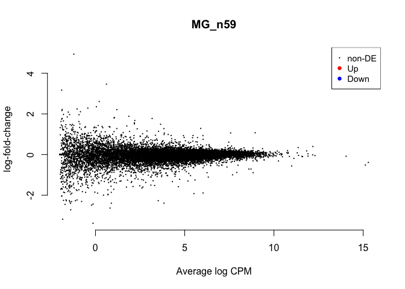

    cont <- "MG_n9C"
    summary(decideTestsDGE(
        glmTreat(fit, contrast=my.contrasts[,cont], lfc = 1), 
        adjust.method="fdr", p.value=0.01))

    ##        -1*male.gonad.control 1*male.gonad.n9
    ## Down                                       7
    ## NotSig                                 14923
    ## Up                                         7

    kable(topTags(glmTreat(fit, contrast=my.contrasts[,cont]), n=5), digits=2, lfc = 1)

<table class="kable_wrapper">
<tbody>
<tr>
<td>
<table>
<thead>
<tr>
<th style="text-align:left;">
</th>
<th style="text-align:right;">
row.names
</th>
<th style="text-align:left;">
Name
</th>
<th style="text-align:right;">
geneid
</th>
<th style="text-align:left;">
entrezid
</th>
<th style="text-align:right;">
logFC
</th>
<th style="text-align:right;">
unshrunk.logFC
</th>
<th style="text-align:right;">
logCPM
</th>
<th style="text-align:right;">
PValue
</th>
<th style="text-align:right;">
FDR
</th>
</tr>
</thead>
<tbody>
<tr>
<td style="text-align:left;">
XP\_420616.3
</td>
<td style="text-align:right;">
422662
</td>
<td style="text-align:left;">
SULT1E1
</td>
<td style="text-align:right;">
422662
</td>
<td style="text-align:left;">
XP\_420616.3
</td>
<td style="text-align:right;">
-4.14
</td>
<td style="text-align:right;">
-4.15
</td>
<td style="text-align:right;">
2.60
</td>
<td style="text-align:right;">
0
</td>
<td style="text-align:right;">
0
</td>
</tr>
<tr>
<td style="text-align:left;">
NP\_001035557.1
</td>
<td style="text-align:right;">
426883
</td>
<td style="text-align:left;">
ACCN2
</td>
<td style="text-align:right;">
426883
</td>
<td style="text-align:left;">
NP\_001035557.1
</td>
<td style="text-align:right;">
-3.79
</td>
<td style="text-align:right;">
-3.79
</td>
<td style="text-align:right;">
3.66
</td>
<td style="text-align:right;">
0
</td>
<td style="text-align:right;">
0
</td>
</tr>
<tr>
<td style="text-align:left;">
NP\_001026484.1
</td>
<td style="text-align:right;">
424894
</td>
<td style="text-align:left;">
PPP1R2
</td>
<td style="text-align:right;">
424894
</td>
<td style="text-align:left;">
NP\_001026484.1
</td>
<td style="text-align:right;">
-6.03
</td>
<td style="text-align:right;">
-6.05
</td>
<td style="text-align:right;">
2.45
</td>
<td style="text-align:right;">
0
</td>
<td style="text-align:right;">
0
</td>
</tr>
<tr>
<td style="text-align:left;">
XP\_015130003.1
</td>
<td style="text-align:right;">
107050804
</td>
<td style="text-align:left;">
LOC107050804
</td>
<td style="text-align:right;">
107050804
</td>
<td style="text-align:left;">
XP\_015130003.1
</td>
<td style="text-align:right;">
1.96
</td>
<td style="text-align:right;">
1.96
</td>
<td style="text-align:right;">
4.01
</td>
<td style="text-align:right;">
0
</td>
<td style="text-align:right;">
0
</td>
</tr>
<tr>
<td style="text-align:left;">
XP\_015158171.1
</td>
<td style="text-align:right;">
426166
</td>
<td style="text-align:left;">
RASAL3
</td>
<td style="text-align:right;">
426166
</td>
<td style="text-align:left;">
XP\_015158171.1
</td>
<td style="text-align:right;">
1.27
</td>
<td style="text-align:right;">
1.27
</td>
<td style="text-align:right;">
6.20
</td>
<td style="text-align:right;">
0
</td>
<td style="text-align:right;">
0
</td>
</tr>
</tbody>
</table>
</td>
<td>
<table>
<thead>
<tr>
<th style="text-align:left;">
x
</th>
</tr>
</thead>
<tbody>
<tr>
<td style="text-align:left;">
BH
</td>
</tr>
</tbody>
</table>
</td>
<td>
<table>
<thead>
<tr>
<th style="text-align:left;">
x
</th>
</tr>
</thead>
<tbody>
<tr>
<td style="text-align:left;">
-1*male.gonad.control 1*male.gonad.n9
</td>
</tr>
</tbody>
</table>
</td>
<td>
<table>
<thead>
<tr>
<th style="text-align:left;">
x
</th>
</tr>
</thead>
<tbody>
<tr>
<td style="text-align:left;">
glm
</td>
</tr>
</tbody>
</table>
</td>
</tr>
</tbody>
</table>

    plotMD(glmTreat(fit, contrast=my.contrasts[,cont], lfc=1), main='MG_n9C', frame.plot=F)

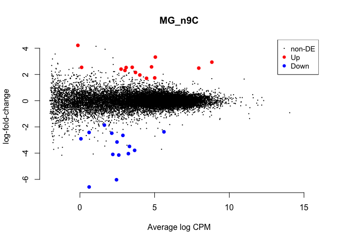

volcano plots
=============

    # from http://www.compbio.dundee.ac.uk/user/pschofield/Projects/teaching_pg/workshops/biocDGE.html#maplots

    lrt <- glmLRT(fit,coef=2)
    topTags(lrt)

    ## Coefficient:  female.gonad.control 
    ##                row.names         Name    geneid       entrezid      logFC
    ## XP_015150987.1 100859265 LOC100859265 100859265 XP_015150987.1 -2.3088631
    ## NP_990011.1       395411       ZBTB7A    395411    NP_990011.1 -1.3990791
    ## NP_001034689.1    423130       ZDHHC5    423130 NP_001034689.1 -1.8088949
    ## NP_001026009.1    419082        STIM1    419082 NP_001026009.1 -1.6522329
    ## XP_414493.1       416161        CCNG1    416161    XP_414493.1  1.2575793
    ## NP_989565.1       374077        GNA11    374077    NP_989565.1 -0.9506675
    ## XP_015153726.1    419769       CEP164    419769 XP_015153726.1 -1.7935601
    ## NP_001186594.1    423232         GANC    423232 NP_001186594.1 -1.3007833
    ## XP_015150276.1    426991        ACSM4    426991 XP_015150276.1  4.3185086
    ## XP_015143203.1    429422      C14ORF4    429422 XP_015143203.1 -1.3328832
    ##                  logCPM        LR       PValue          FDR
    ## XP_015150987.1 5.476429 134.35340 4.572677e-31 6.830207e-27
    ## NP_990011.1    4.531048 130.62164 2.995991e-30 2.237556e-26
    ## NP_001034689.1 5.088982 126.29368 2.651873e-29 1.320368e-25
    ## NP_001026009.1 5.364435 113.40728 1.757084e-26 6.561392e-23
    ## XP_414493.1    7.013785 107.36172 3.709010e-25 1.108030e-21
    ## NP_989565.1    6.774031 106.67136 5.254666e-25 1.308149e-21
    ## XP_015153726.1 5.263372 100.77290 1.031582e-23 2.201248e-20
    ## NP_001186594.1 7.061162  99.83049 1.660151e-23 3.099710e-20
    ## XP_015150276.1 4.615838  97.59626 5.130070e-23 8.514207e-20
    ## XP_015143203.1 5.607600  95.92565 1.192800e-22 1.730451e-19

    tt <- topTags(lrt,n=10000)$table

    ggplot(data=tt) + geom_point(aes(x=logFC,y=-log(FDR),color=logCPM)) +
      scale_colour_gradientn(colours=c("#000000" ,"#FF0000" ))

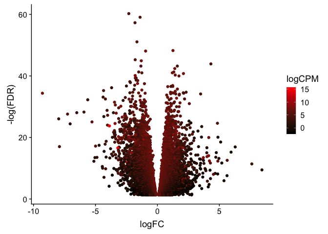
