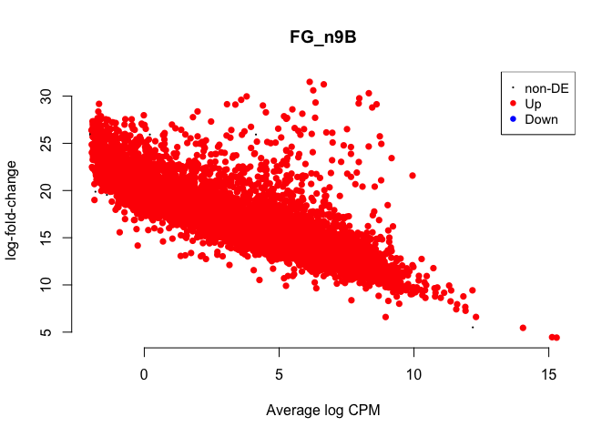
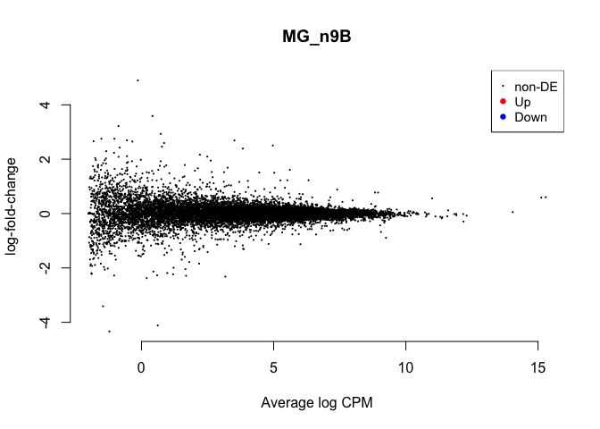

DESeq2 is *not* recommended for experiments with more than 100 samples
([see Mike Love’s
post](https://mikelove.wordpress.com/2016/09/28/deseq2-or-edger/)), so I
decided to try the limma package. I followed [this
tutorial](https://www.bioconductor.org/packages/devel/workflows/vignettes/RNAseq123/inst/doc/limmaWorkflow.html).

    library(tidyverse)

    ## ── Attaching packages ─────────────────────────────────────────────── tidyverse 1.2.1 ──

    ## ✔ ggplot2 3.1.0       ✔ purrr   0.3.1  
    ## ✔ tibble  2.0.1       ✔ dplyr   0.8.0.1
    ## ✔ tidyr   0.8.3       ✔ stringr 1.4.0  
    ## ✔ readr   1.3.1       ✔ forcats 0.4.0

    ## ── Conflicts ────────────────────────────────────────────────── tidyverse_conflicts() ──
    ## ✖ dplyr::filter() masks stats::filter()
    ## ✖ dplyr::lag()    masks stats::lag()

    library(limma)
    library(Glimma)
    library(edgeR)
    library(kableExtra)

    ## 
    ## Attaching package: 'kableExtra'

    ## The following object is masked from 'package:dplyr':
    ## 
    ##     group_rows

    library(cowplot)

    ## 
    ## Attaching package: 'cowplot'

    ## The following object is masked from 'package:ggplot2':
    ## 
    ##     ggsave

    library(ggplot2)

    knitr::opts_chunk$set(fig.path = '../figures/gon/',cache=TRUE)

First, I read in the data I processed in 00\_datawrangling.Rmd.

    # import "colData" which contains sample information and "countData" which contains read counts
    colData <- read.csv("../results/00_colData_characterization.csv", header = T, row.names = 1)
    countData <- read.csv("../results/00_countData_characterization.csv", header = T, row.names = 1)
    geneinfo <- read.csv("../results/00_geneinfo.csv", row.names = 1)

    colData <- colData %>%
      dplyr::filter(grepl('gonad', tissue)) %>%
      droplevels()
    row.names(colData) <- colData$V1

    # print sample sizes
    colData %>% select(sex,treatment, tissue)  %>%  summary()

    ##      sex       treatment    tissue   
    ##  female:98   control:26   gonad:194  
    ##  male  :96   inc.d9 :24              
    ##              inc.d17:22              
    ##              n9     :22              
    ##              bldg   :20              
    ##              hatch  :20              
    ##              (Other):60

    savecols <- as.character(colData$V1) 
    savecols <- as.vector(savecols) 
    countData <- countData %>% dplyr::select(one_of(savecols)) 

    # check that row and col lenghts are equal
    ncol(countData) == nrow(colData)

    ## [1] TRUE

Then, I followed the steps from
<a href="https://github.com/macmanes-lab/RockDove/blob/master/parental_care/parental_analysis.Rmd" class="uri">https://github.com/macmanes-lab/RockDove/blob/master/parental_care/parental_analysis.Rmd</a>.

    # create a large DGEList with 3 elements
    parentalobject <- DGEList(counts=countData, genes=geneinfo, group=colData$group)

    # transform raw counts to countspermillion
    cpms <- cpm(parentalobject)

    # calculate number of lowly lowly expressed genes and remove them
    table(rowSums(parentalobject$counts==0)==10)

    ## 
    ## FALSE  TRUE 
    ## 14850    87

    keep_genes <- rowSums(cpms >= 1) >= 10
    dge <- parentalobject[keep_genes, ]

    # specific the design
    parentaldesign <- model.matrix(~ colData$group )
    colnames(parentaldesign) <- levels(colData$group)

    # The TMM normalization
    parentalobject <- calcNormFactors(parentalobject)
    parentalobject <- estimateCommonDisp(parentalobject)
    parentalobject <- estimateTagwiseDisp(parentalobject)
    parentalobject <- estimateDisp(parentalobject, parentaldesign)
    parentalobject <- estimateGLMCommonDisp(parentalobject, parentaldesign, verbose=TRUE)

    ## Disp = 0.12647 , BCV = 0.3556

    parentalobject <- estimateGLMTrendedDisp(parentalobject, parentaldesign)
    parentalobject <- estimateGLMTagwiseDisp(parentalobject, parentaldesign)

    #  perform likelihood ratio test and thresholded testing
    fit <- glmFit( parentalobject, parentaldesign, robust=T)
    tr <- glmTreat(fit, lfc = 1)
    topTags(tr)

    ## Coefficient:  male.gonad.n9 
    ##                row.names    Name geneid       entrezid     logFC
    ## XP_015155616.1    420115  HOMER3 420115 XP_015155616.1  8.623084
    ## NP_001292033.1    430492   TDRD7 430492 NP_001292033.1  4.694331
    ## NP_001182086.1    416618 SDR42E2 416618 NP_001182086.1  9.680914
    ## XP_015153516.1    430981  GABRR3 430981 XP_015153516.1  7.932241
    ## XP_015138237.1    428360  MCMDC2 428360 XP_015138237.1  7.040080
    ## XP_015131063.1    416873  CCDC63 416873 XP_015131063.1  9.587216
    ## NP_996860.1       404294  ADAM20 404294    NP_996860.1  7.447278
    ## XP_001232076.2    768915   SPO11 768915 XP_001232076.2  9.288527
    ## NP_001264672.1    416221   SFXN1 416221 NP_001264672.1  5.604999
    ## NP_001265047.1    427929  CAPZA3 427929 NP_001265047.1 10.862463
    ##                unshrunk.logFC   logCPM        PValue           FDR
    ## XP_015155616.1       8.673851 6.516512 1.004838e-300 1.500927e-296
    ## NP_001292033.1       4.695179 8.462059 4.671222e-281 3.488702e-277
    ## NP_001182086.1      10.025540 5.076620 3.062122e-221 1.524630e-217
    ## XP_015153516.1       8.016047 5.282876 1.771942e-218 6.616873e-215
    ## XP_015138237.1       7.056463 6.679624 9.252925e-195 2.764219e-191
    ## XP_015131063.1       9.869121 5.270564 1.783306e-182 4.439539e-179
    ## NP_996860.1          7.513078 4.885801 6.678313e-182 1.425057e-178
    ## XP_001232076.2       9.570354 4.867914 2.046519e-168 3.821107e-165
    ## NP_001264672.1       5.606069 9.046818 1.011322e-167 1.678457e-164
    ## NP_001265047.1      11.207911 6.209541 1.988346e-167 2.969993e-164

plotMDS (multidimential scaling)
================================

    plotMDS(parentalobject, cex = 0.5)

For color coding, I used this tutorial for guidance
<a href="https://combine-australia.github.io/RNAseq-R/06-rnaseq-day1.html" class="uri">https://combine-australia.github.io/RNAseq-R/06-rnaseq-day1.html</a>.

    levels(colData$treatment)

    ## [1] "bldg"    "control" "hatch"   "inc.d17" "inc.d3"  "inc.d9"  "lay"    
    ## [8] "n5"      "n9"

    col.treatment <- c("#a6cee3", "#1f78b4", "#b2df8a", "#33a02c", "#fb9a99", "#e31a1c", "#fdbf6f", "#ff7f00", "#cab2d6")[colData$treatment]

    plotMDS(parentalobject,col=col.treatment, labels = colData$sex)
    legend("bottom",fill=c("#a6cee3", "#1f78b4", "#b2df8a", "#33a02c", "#fb9a99", "#e31a1c", "#fdbf6f", "#ff7f00", "#cab2d6"),legend=levels(colData$treatment))
    title("Gonad Colored by Treatment")

    plotMDS(parentalobject,dim=c(3,4), col=col.treatment, labels = colData$sex)
    legend("topright",fill=c("#a6cee3", "#1f78b4", "#b2df8a", "#33a02c", "#fb9a99", "#e31a1c", "#fdbf6f", "#ff7f00", "#cab2d6"),legend=levels(colData$treatment))
    title("Gonad Colored by Treatment")

specify contrasts and make MA plots
===================================

    # view all levels
    levels(colData$group)

    ##  [1] "female.gonad.bldg"    "female.gonad.control" "female.gonad.hatch"  
    ##  [4] "female.gonad.inc.d17" "female.gonad.inc.d3"  "female.gonad.inc.d9" 
    ##  [7] "female.gonad.lay"     "female.gonad.n5"      "female.gonad.n9"     
    ## [10] "male.gonad.bldg"      "male.gonad.control"   "male.gonad.hatch"    
    ## [13] "male.gonad.inc.d17"   "male.gonad.inc.d3"    "male.gonad.inc.d9"   
    ## [16] "male.gonad.lay"       "male.gonad.n5"        "male.gonad.n9"

    # subset of conrasts - sex specific comparing hatch to lay
    my.contrasts <- makeContrasts(
                 FG_CB = female.gonad.control - female.gonad.bldg,
                 FG_BL = female.gonad.bldg - female.gonad.lay,
                 FG_Li3 = female.gonad.lay - female.gonad.inc.d3,
                 FG_i39 = female.gonad.inc.d3 - female.gonad.inc.d9,
                 FG_i917 = female.gonad.inc.d9 - female.gonad.inc.d17,
                 FG_i17H = female.gonad.inc.d17 - female.gonad.hatch,
                 FG_H5 = female.gonad.hatch -  female.gonad.n5,
                 FG_n59 = female.gonad.n5 - female.gonad.n9,
                 FG_n9C = female.gonad.n9 - female.gonad.control,
                 
                 MG_CB = male.gonad.control - male.gonad.bldg,
                 MG_BL = male.gonad.bldg - male.gonad.lay,
                 MG_Li3 = male.gonad.lay - male.gonad.inc.d3,
                 MG_i39 = male.gonad.inc.d3 - male.gonad.inc.d9,
                 MG_i917 = male.gonad.inc.d9 - male.gonad.inc.d17,
                 MG_i17H = male.gonad.inc.d17 - male.gonad.hatch,
                 MG_H5 = male.gonad.hatch -  male.gonad.n5,
                 MG_n59 = male.gonad.n5 - male.gonad.n9,
                 MG_n9C = male.gonad.n9 - male.gonad.control,

                 FG_n9B = female.gonad.n9 - female.gonad.bldg,
                 MG_n9B = male.gonad.n9 - male.gonad.bldg,
    levels=parentaldesign)

    mycontrasts <- c("FG_CB", "FG_BL", "FG_Li3", "FG_i39", "FG_i917", "FG_i17H", "FG_H5", "FG_n59", "FG_n9C",
                     "MG_CB", "MG_BL", "MG_Li3", "MG_i39", "MG_i917", "MG_i17H", "MG_H5", "MG_n59", "MG_n9C",
                     "FG_n9B", "MG_n9B")

    printplotcontrasts <- function(whichcontrast){
      cont <- whichcontrast
      print(summary(decideTestsDGE(
        glmTreat(fit, contrast=my.contrasts[,cont], lfc = 1), 
        adjust.method="fdr", p.value=0.01)))
      print(topTags(glmTreat(fit, contrast=my.contrasts[,cont]), n=5), digits=2, lfc = 1)
      print(plotMD(glmTreat(fit, contrast=my.contrasts[,cont], lfc=1), main=whichcontrast, frame.plot=F))
    }

    for(i in mycontrasts){
      printplotcontrasts(i)
    }

    ##        -1*female.gonad.bldg 1*female.gonad.control
    ## Down                                             0
    ## NotSig                                          78
    ## Up                                           14859
    ## $table
    ##                row.names      Name geneid       entrezid    logFC
    ## NP_996860.1       404294    ADAM20 404294    NP_996860.1 22.72058
    ## NP_001232910.1    429107    DMRTB1 429107 NP_001232910.1 22.02261
    ## XP_015155616.1    420115    HOMER3 420115 XP_015155616.1 21.79210
    ## XP_004945255.1    427665 LOC427665 427665 XP_004945255.1 20.93333
    ## XP_001235323.2    772145   C4ORF17 772145 XP_001235323.2 20.64567
    ##                unshrunk.logFC   logCPM PValue FDR
    ## NP_996860.1          22.82613 4.885801      0   0
    ## NP_001232910.1       22.07687 4.984973      0   0
    ## XP_015155616.1       21.86458 6.516512      0   0
    ## XP_004945255.1       20.96671 2.743157      0   0
    ## XP_001235323.2       20.67824 3.764538      0   0
    ## 
    ## $adjust.method
    ## [1] "BH"
    ## 
    ## $comparison
    ## [1] "-1*female.gonad.bldg 1*female.gonad.control"
    ## 
    ## $test
    ## [1] "glm"
    ## 
    ## attr(,"class")
    ## [1] "TopTags"
    ## attr(,"class")attr(,"package")
    ## [1] "edgeR"

    ## NULL
    ##        1*female.gonad.bldg -1*female.gonad.lay
    ## Down                                     14836
    ## NotSig                                     101
    ## Up                                           0
    ## $table
    ##                row.names      Name    geneid       entrezid     logFC
    ## XP_015137727.1    420914   MARCH11    420914 XP_015137727.1 -23.04056
    ## NP_996860.1       404294    ADAM20    404294    NP_996860.1 -21.96736
    ## XP_015131909.1    422639     NUP54    422639 XP_015131909.1 -21.17613
    ## XP_004947618.1 101747314    NKX3-1 101747314 XP_004947618.1 -20.94309
    ## XP_004945255.1    427665 LOC427665    427665 XP_004945255.1 -20.78451
    ##                unshrunk.logFC    logCPM PValue FDR
    ## XP_015137727.1      -23.18651 4.3388949      0   0
    ## NP_996860.1         -22.05390 4.8858006      0   0
    ## XP_015131909.1      -21.22483 0.9258861      0   0
    ## XP_004947618.1      -20.98708 4.8910046      0   0
    ## XP_004945255.1      -20.81673 2.7431566      0   0
    ## 
    ## $adjust.method
    ## [1] "BH"
    ## 
    ## $comparison
    ## [1] "1*female.gonad.bldg -1*female.gonad.lay"
    ## 
    ## $test
    ## [1] "glm"
    ## 
    ## attr(,"class")
    ## [1] "TopTags"
    ## attr(,"class")attr(,"package")
    ## [1] "edgeR"

    ## NULL
    ##        -1*female.gonad.inc.d3 1*female.gonad.lay
    ## Down                                           1
    ## NotSig                                     14918
    ## Up                                            18
    ## $table
    ##                row.names  Name geneid       entrezid    logFC
    ## XP_423478.5       425757 OVSTL 425757    XP_423478.5 5.726650
    ## NP_001292097.1    419533 LOXL2 419533 NP_001292097.1 3.058444
    ## NP_990844.1       396519 CALB1 396519    NP_990844.1 4.217225
    ## XP_004940583.1    422168  HEPH 422168 XP_004940583.1 1.584529
    ## NP_990592.2       396197   ALB 396197    NP_990592.2 1.596260
    ##                unshrunk.logFC   logCPM       PValue          FDR
    ## XP_423478.5          5.756833 1.714888 7.402858e-16 1.105765e-11
    ## NP_001292097.1       3.058656 7.243006 2.690883e-14 2.009686e-10
    ## NP_990844.1          4.217879 5.961366 2.692049e-12 1.116473e-08
    ## XP_004940583.1       1.584702 6.202290 2.989818e-12 1.116473e-08
    ## NP_990592.2          1.605829 4.379985 3.230622e-11 9.004132e-08
    ## 
    ## $adjust.method
    ## [1] "BH"
    ## 
    ## $comparison
    ## [1] "-1*female.gonad.inc.d3 1*female.gonad.lay"
    ## 
    ## $test
    ## [1] "glm"
    ## 
    ## attr(,"class")
    ## [1] "TopTags"
    ## attr(,"class")attr(,"package")
    ## [1] "edgeR"

    ## NULL
    ##        1*female.gonad.inc.d3 -1*female.gonad.inc.d9
    ## Down                                              0
    ## NotSig                                        14935
    ## Up                                                2
    ## $table
    ##                row.names         Name    geneid       entrezid    logFC
    ## XP_003641055.1 100858979      COL10A1 100858979 XP_003641055.1 8.050083
    ## XP_428970.3       431418       GPR139    431418    XP_428970.3 2.238584
    ## XP_015129190.1 107049904 LOC107049904 107049904 XP_015129190.1 6.900335
    ## XP_015131848.1    422685       PRSS12    422685 XP_015131848.1 1.416931
    ## XP_417373.1       419195         PKIG    419195    XP_417373.1 4.359372
    ##                unshrunk.logFC    logCPM       PValue          FDR
    ## XP_003641055.1   8.080770e+00 7.7015203 4.334464e-15 6.474389e-11
    ## XP_428970.3      2.254317e+00 0.9762223 6.078563e-08 3.370690e-04
    ## XP_015129190.1   7.062763e+00 4.3463879 6.769814e-08 3.370690e-04
    ## XP_015131848.1   1.417738e+00 4.6975805 2.436823e-07 9.099704e-04
    ## XP_417373.1      1.442695e+08 3.4095054 9.803119e-07 2.928584e-03
    ## 
    ## $adjust.method
    ## [1] "BH"
    ## 
    ## $comparison
    ## [1] "1*female.gonad.inc.d3 -1*female.gonad.inc.d9"
    ## 
    ## $test
    ## [1] "glm"
    ## 
    ## attr(,"class")
    ## [1] "TopTags"
    ## attr(,"class")attr(,"package")
    ## [1] "edgeR"

    ## NULL
    ##        -1*female.gonad.inc.d17 1*female.gonad.inc.d9
    ## Down                                               6
    ## NotSig                                         14928
    ## Up                                                 3
    ## $table
    ##                row.names         Name    geneid       entrezid     logFC
    ## XP_001235419.4    772256        MORN5    772256 XP_001235419.4  4.584580
    ## XP_015156956.1 107056420 LOC107056420 107056420 XP_015156956.1 -4.846292
    ## XP_015153926.1 100857743       LRRC71 100857743 XP_015153926.1  4.265871
    ## XP_003642417.2 100859449 LOC100859449 100859449 XP_003642417.2 -5.146398
    ## XP_015153680.1    395766         USP2    395766 XP_015153680.1  2.843685
    ##                unshrunk.logFC     logCPM       PValue          FDR
    ## XP_001235419.4       4.805796 2.14214300 1.278716e-10 1.171821e-06
    ## XP_015156956.1      -4.848632 5.54431310 1.569018e-10 1.171821e-06
    ## XP_015153926.1       4.373892 4.82323855 1.146604e-09 5.708940e-06
    ## XP_003642417.2      -5.575491 0.04701605 2.697517e-09 1.007320e-05
    ## XP_015153680.1       2.872387 5.59340559 1.086194e-08 2.841991e-05
    ## 
    ## $adjust.method
    ## [1] "BH"
    ## 
    ## $comparison
    ## [1] "-1*female.gonad.inc.d17 1*female.gonad.inc.d9"
    ## 
    ## $test
    ## [1] "glm"
    ## 
    ## attr(,"class")
    ## [1] "TopTags"
    ## attr(,"class")attr(,"package")
    ## [1] "edgeR"

    ## NULL
    ##        -1*female.gonad.hatch 1*female.gonad.inc.d17
    ## Down                                              1
    ## NotSig                                        14934
    ## Up                                                2
    ## $table
    ##                row.names         Name    geneid       entrezid     logFC
    ## XP_003642417.2 100859449 LOC100859449 100859449 XP_003642417.2  6.025480
    ## XP_015149381.1 101749216 LOC101749216 101749216 XP_015149381.1 -5.723589
    ## XP_015142231.1 107053414 LOC107053414 107053414 XP_015142231.1  8.942128
    ## XP_417373.1       419195         PKIG    419195    XP_417373.1  4.704508
    ## XP_001234555.2    771262       FBXO16    771262 XP_001234555.2 -2.467254
    ##                unshrunk.logFC     logCPM       PValue          FDR
    ## XP_003642417.2   7.012506e+00 0.04701605 9.714154e-09 0.0001451003
    ## XP_015149381.1  -5.782586e+00 2.61618022 3.161085e-08 0.0002360856
    ## XP_015142231.1   1.442695e+08 1.97557971 8.700163e-08 0.0004331811
    ## XP_417373.1      1.442695e+08 3.40950537 2.157906e-06 0.0080581599
    ## XP_001234555.2  -2.511579e+00 5.27095514 3.108243e-06 0.0087160897
    ## 
    ## $adjust.method
    ## [1] "BH"
    ## 
    ## $comparison
    ## [1] "-1*female.gonad.hatch 1*female.gonad.inc.d17"
    ## 
    ## $test
    ## [1] "glm"
    ## 
    ## attr(,"class")
    ## [1] "TopTags"
    ## attr(,"class")attr(,"package")
    ## [1] "edgeR"

    ## NULL
    ##        1*female.gonad.hatch -1*female.gonad.n5
    ## Down                                         0
    ## NotSig                                   14937
    ## Up                                           0
    ## $table
    ##                row.names         Name    geneid       entrezid     logFC
    ## XP_004937899.1    427915         SPIC    427915 XP_004937899.1  4.651359
    ## XP_004938850.1    418936       ATP8A2    418936 XP_004938850.1  4.559042
    ## XP_415893.1       417647          CA4    417647    XP_415893.1 -2.760461
    ## XP_015142231.1 107053414 LOC107053414 107053414 XP_015142231.1 -7.665004
    ## XP_015152430.1    771655       PLA2G5    771655 XP_015152430.1  3.667466
    ##                unshrunk.logFC    logCPM       PValue         FDR
    ## XP_004937899.1   5.983017e+00 -1.470356 1.990649e-07 0.002973433
    ## XP_004938850.1   1.442695e+08  1.367790 8.286483e-07 0.005655387
    ## XP_415893.1     -2.763379e+00  3.698502 1.448504e-06 0.005655387
    ## XP_015142231.1  -1.442695e+08  1.975580 1.514464e-06 0.005655387
    ## XP_015152430.1   4.970936e+00 -1.249873 4.610821e-06 0.013774367
    ## 
    ## $adjust.method
    ## [1] "BH"
    ## 
    ## $comparison
    ## [1] "1*female.gonad.hatch -1*female.gonad.n5"
    ## 
    ## $test
    ## [1] "glm"
    ## 
    ## attr(,"class")
    ## [1] "TopTags"
    ## attr(,"class")attr(,"package")
    ## [1] "edgeR"

    ## NULL
    ##        1*female.gonad.n5 -1*female.gonad.n9
    ## Down                                     24
    ## NotSig                                14913
    ## Up                                        0
    ## $table
    ##                row.names         Name    geneid       entrezid      logFC
    ## XP_003641055.1 100858979      COL10A1 100858979 XP_003641055.1  -8.307683
    ## NP_990794.1       396449          RBP    396449    NP_990794.1  -6.639715
    ## XP_004939031.1 101748683 LOC101748683 101748683 XP_004939031.1  -4.049164
    ## XP_015135864.1    427459      SLC28A3    427459 XP_015135864.1  -2.824472
    ## XP_015129190.1 107049904 LOC107049904 107049904 XP_015129190.1 -10.302793
    ##                unshrunk.logFC   logCPM       PValue          FDR
    ## XP_003641055.1      -8.319334 7.701520 8.470325e-13 1.265212e-08
    ## NP_990794.1         -6.658674 5.300413 6.492745e-12 4.849107e-08
    ## XP_004939031.1      -4.172316 8.613463 1.153142e-10 5.741496e-07
    ## XP_015135864.1      -2.868875 8.733837 2.028421e-10 7.574632e-07
    ## XP_015129190.1     -10.620345 4.346388 2.888788e-10 7.672951e-07
    ## 
    ## $adjust.method
    ## [1] "BH"
    ## 
    ## $comparison
    ## [1] "1*female.gonad.n5 -1*female.gonad.n9"
    ## 
    ## $test
    ## [1] "glm"
    ## 
    ## attr(,"class")
    ## [1] "TopTags"
    ## attr(,"class")attr(,"package")
    ## [1] "edgeR"

    ## NULL
    ##        -1*female.gonad.control 1*female.gonad.n9
    ## Down                                          87
    ## NotSig                                     14627
    ## Up                                           223
    ## $table
    ##                row.names         Name    geneid       entrezid     logFC
    ## NP_001026009.1    419082        STIM1    419082 NP_001026009.1  1.765663
    ## XP_015150276.1    426991        ACSM4    426991 XP_015150276.1 -4.402320
    ## XP_015130003.1 107050804 LOC107050804 107050804 XP_015130003.1  2.468978
    ## XP_015150987.1 100859265 LOC100859265 100859265 XP_015150987.1  2.044257
    ## NP_001186594.1    423232         GANC    423232 NP_001186594.1  1.391548
    ##                unshrunk.logFC   logCPM       PValue          FDR
    ## NP_001026009.1       1.766369 5.364435 9.252971e-25 8.872370e-21
    ## XP_015150276.1      -4.410120 4.615838 1.187972e-24 8.872370e-21
    ## XP_015130003.1       2.479053 4.010137 2.085950e-22 1.038595e-18
    ## XP_015150987.1       2.048828 5.476429 1.167141e-21 4.358395e-18
    ## NP_001186594.1       1.391757 7.061162 2.444172e-20 7.301719e-17
    ## 
    ## $adjust.method
    ## [1] "BH"
    ## 
    ## $comparison
    ## [1] "-1*female.gonad.control 1*female.gonad.n9"
    ## 
    ## $test
    ## [1] "glm"
    ## 
    ## attr(,"class")
    ## [1] "TopTags"
    ## attr(,"class")attr(,"package")
    ## [1] "edgeR"

    ## NULL
    ##        -1*male.gonad.bldg 1*male.gonad.control
    ## Down                                         1
    ## NotSig                                   14933
    ## Up                                           3
    ## $table
    ##                row.names         Name    geneid       entrezid     logFC
    ## XP_420616.3       422662      SULT1E1    422662    XP_420616.3  4.178088
    ## NP_001035557.1    426883        ACCN2    426883 NP_001035557.1  3.501517
    ## NP_001026484.1    424894       PPP1R2    424894 NP_001026484.1  5.983456
    ## XP_416831.2       418633         OFD1    418633    XP_416831.2  1.253834
    ## XP_015130003.1 107050804 LOC107050804 107050804 XP_015130003.1 -1.734926
    ##                unshrunk.logFC   logCPM       PValue          FDR
    ## XP_420616.3          4.185306 2.601414 2.179656e-22 3.255752e-18
    ## NP_001035557.1       3.503468 3.662313 1.641003e-18 1.225583e-14
    ## NP_001026484.1       6.001072 2.448007 4.122701e-18 2.052693e-14
    ## XP_416831.2          1.254008 6.006316 3.336202e-13 1.245821e-09
    ## XP_015130003.1      -1.736707 4.010137 2.338958e-12 6.987404e-09
    ## 
    ## $adjust.method
    ## [1] "BH"
    ## 
    ## $comparison
    ## [1] "-1*male.gonad.bldg 1*male.gonad.control"
    ## 
    ## $test
    ## [1] "glm"
    ## 
    ## attr(,"class")
    ## [1] "TopTags"
    ## attr(,"class")attr(,"package")
    ## [1] "edgeR"

    ## NULL
    ##        1*male.gonad.bldg -1*male.gonad.lay
    ## Down                                     0
    ## NotSig                               14937
    ## Up                                       0
    ## $table
    ##                row.names    Name    geneid       entrezid     logFC
    ## XP_015133351.1 107051972 CCDC138 107051972 XP_015133351.1  5.520296
    ## XP_015150964.1    769385 CACNA1G    769385 XP_015150964.1  3.089185
    ## NP_990370.1       395902   KCNG2    395902    NP_990370.1 -3.750163
    ## NP_001010842.2    428310   HSP25    428310 NP_001010842.2  1.981835
    ## XP_003641003.3 100859633   DISC1 100859633 XP_003641003.3  3.206374
    ##                unshrunk.logFC    logCPM       PValue        FDR
    ## XP_015133351.1   6.979375e+00 1.6857833 8.354494e-06 0.08064528
    ## XP_015150964.1   3.585652e+00 1.0535706 1.079806e-05 0.08064528
    ## NP_990370.1     -1.442695e+08 0.4189953 4.094739e-05 0.20387704
    ## NP_001010842.2   2.003391e+00 4.0086263 6.556793e-05 0.24484706
    ## XP_003641003.3   3.249957e+00 1.5643688 1.936040e-04 0.57837251
    ## 
    ## $adjust.method
    ## [1] "BH"
    ## 
    ## $comparison
    ## [1] "1*male.gonad.bldg -1*male.gonad.lay"
    ## 
    ## $test
    ## [1] "glm"
    ## 
    ## attr(,"class")
    ## [1] "TopTags"
    ## attr(,"class")attr(,"package")
    ## [1] "edgeR"

    ## NULL
    ##        -1*male.gonad.inc.d3 1*male.gonad.lay
    ## Down                                       0
    ## NotSig                                 14937
    ## Up                                         0
    ## $table
    ##                row.names    Name geneid       entrezid     logFC
    ## XP_015138547.1    396276 COL14A1 396276 XP_015138547.1  3.490998
    ## NP_001188328.1    395840   AvBD2 395840 NP_001188328.1 -4.022746
    ## NP_001010842.2    428310   HSP25 428310 NP_001010842.2 -2.210291
    ## XP_428503.3       430953    ABRA 430953    XP_428503.3 -2.393933
    ## NP_990809.2       396471   LECT2 396471    NP_990809.2 -3.351599
    ##                unshrunk.logFC      logCPM       PValue        FDR
    ## XP_015138547.1       3.539764  3.84588182 3.459597e-07 0.00516760
    ## NP_001188328.1      -4.241896  2.90548084 4.896956e-06 0.03657291
    ## NP_001010842.2      -2.233170  4.00862626 7.481074e-06 0.03724827
    ## XP_428503.3         -2.440485 -0.01749409 8.466344e-05 0.28111583
    ## NP_990809.2         -3.396269  4.05747826 9.410050e-05 0.28111583
    ## 
    ## $adjust.method
    ## [1] "BH"
    ## 
    ## $comparison
    ## [1] "-1*male.gonad.inc.d3 1*male.gonad.lay"
    ## 
    ## $test
    ## [1] "glm"
    ## 
    ## attr(,"class")
    ## [1] "TopTags"
    ## attr(,"class")attr(,"package")
    ## [1] "edgeR"

    ## NULL
    ##        1*male.gonad.inc.d3 -1*male.gonad.inc.d9
    ## Down                                          0
    ## NotSig                                    14937
    ## Up                                            0
    ## $table
    ##                row.names    Name    geneid       entrezid     logFC
    ## XP_003642597.3 100857332    DOK2 100857332 XP_003642597.3  1.860946
    ## XP_015138052.1    421055 EPB41L3    421055 XP_015138052.1  4.185036
    ## XP_418091.2       419969    GFAP    419969    XP_418091.2 -4.572374
    ## XP_015134383.1    769798   CPLX3    769798 XP_015134383.1 -2.154386
    ## XP_004938467.2    418651 SHROOM2    418651 XP_004938467.2 -1.219315
    ##                unshrunk.logFC     logCPM       PValue       FDR
    ## XP_003642597.3   1.890622e+00  0.5367704 0.0001207744 0.6794365
    ## XP_015138052.1   1.442695e+08  1.4335377 0.0001232724 0.6794365
    ## XP_418091.2     -1.442695e+08 -0.8052557 0.0001364604 0.6794365
    ## XP_015134383.1  -2.185649e+00 -0.2815649 0.0002765490 1.0000000
    ## XP_004938467.2  -1.219486e+00  6.6480270 0.0005174497 1.0000000
    ## 
    ## $adjust.method
    ## [1] "BH"
    ## 
    ## $comparison
    ## [1] "1*male.gonad.inc.d3 -1*male.gonad.inc.d9"
    ## 
    ## $test
    ## [1] "glm"
    ## 
    ## attr(,"class")
    ## [1] "TopTags"
    ## attr(,"class")attr(,"package")
    ## [1] "edgeR"

    ## NULL
    ##        -1*male.gonad.inc.d17 1*male.gonad.inc.d9
    ## Down                                           0
    ## NotSig                                     14937
    ## Up                                             0
    ## $table
    ##                row.names         Name    geneid       entrezid     logFC
    ## XP_015133351.1 107051972      CCDC138 107051972 XP_015133351.1 -5.751363
    ## NP_001026055.1    419521       RASSF2    419521 NP_001026055.1  1.636404
    ## NP_990411.1       395963        CAPN2    395963    NP_990411.1  1.339313
    ## XP_015132556.1 100857983 LOC100857983 100857983 XP_015132556.1  4.537339
    ## XP_015138052.1    421055      EPB41L3    421055 XP_015138052.1 -3.952284
    ##                unshrunk.logFC   logCPM       PValue       FDR
    ## XP_015133351.1  -1.442695e+08 1.685783 7.845962e-06 0.1171951
    ## NP_001026055.1   1.650344e+00 3.131228 2.707784e-05 0.2022309
    ## NP_990411.1      1.339394e+00 7.956490 1.477494e-04 0.6186760
    ## XP_015132556.1   4.663922e+00 1.552894 1.656761e-04 0.6186760
    ## XP_015138052.1  -1.442695e+08 1.433538 3.502024e-04 0.9136540
    ## 
    ## $adjust.method
    ## [1] "BH"
    ## 
    ## $comparison
    ## [1] "-1*male.gonad.inc.d17 1*male.gonad.inc.d9"
    ## 
    ## $test
    ## [1] "glm"
    ## 
    ## attr(,"class")
    ## [1] "TopTags"
    ## attr(,"class")attr(,"package")
    ## [1] "edgeR"

    ## NULL
    ##        -1*male.gonad.hatch 1*male.gonad.inc.d17
    ## Down                                          0
    ## NotSig                                    14937
    ## Up                                            0
    ## $table
    ##                row.names         Name    geneid       entrezid     logFC
    ## NP_989646.1       374209 RP11-290H9.2    374209    NP_989646.1  2.731206
    ## XP_015155728.1    426885        HDAC7    426885 XP_015155728.1  3.065124
    ## NP_001138665.1    769357     C18ORF42    769357 NP_001138665.1  2.504950
    ## XP_015154284.1 100859291       SHISA4 100859291 XP_015154284.1 -1.533801
    ## XP_001234272.1    770956       TMEM37    770956 XP_001234272.1  1.365513
    ##                unshrunk.logFC     logCPM       PValue       FDR
    ## NP_989646.1          2.751251  3.5162051 1.129674e-05 0.1687395
    ## XP_015155728.1       3.429753 -0.2621522 2.535700e-04 1.0000000
    ## NP_001138665.1       2.689041 -0.8202800 3.830343e-04 1.0000000
    ## XP_015154284.1      -1.550995  1.1566350 4.547305e-04 1.0000000
    ## XP_001234272.1       1.371502  3.5814039 5.527486e-04 1.0000000
    ## 
    ## $adjust.method
    ## [1] "BH"
    ## 
    ## $comparison
    ## [1] "-1*male.gonad.hatch 1*male.gonad.inc.d17"
    ## 
    ## $test
    ## [1] "glm"
    ## 
    ## attr(,"class")
    ## [1] "TopTags"
    ## attr(,"class")attr(,"package")
    ## [1] "edgeR"

    ## NULL
    ##        1*male.gonad.hatch -1*male.gonad.n5
    ## Down                                     0
    ## NotSig                               14937
    ## Up                                       0
    ## $table
    ##                row.names         Name    geneid       entrezid     logFC
    ## XP_004949683.1    427387       SEMA6A    427387 XP_004949683.1 -2.135898
    ## NP_990097.1       395534        MYH15    395534    NP_990097.1 -1.553341
    ## XP_422282.3       424440     SERPINC1    424440    XP_422282.3  1.620133
    ## XP_015128073.1 107049255 LOC107049255 107049255 XP_015128073.1  4.193996
    ## XP_015140443.1    421952         ZPAX    421952 XP_015140443.1  2.239133
    ##                unshrunk.logFC    logCPM       PValue       FDR
    ## XP_004949683.1      -2.137691 5.0479914 6.238358e-05 0.9318235
    ## NP_990097.1         -1.557774 1.8692918 2.104741e-04 1.0000000
    ## XP_422282.3          1.630922 0.7949679 4.443856e-04 1.0000000
    ## XP_015128073.1       4.508604 0.4494092 1.502877e-03 1.0000000
    ## XP_015140443.1       2.316493 6.0286623 1.900210e-03 1.0000000
    ## 
    ## $adjust.method
    ## [1] "BH"
    ## 
    ## $comparison
    ## [1] "1*male.gonad.hatch -1*male.gonad.n5"
    ## 
    ## $test
    ## [1] "glm"
    ## 
    ## attr(,"class")
    ## [1] "TopTags"
    ## attr(,"class")attr(,"package")
    ## [1] "edgeR"

    ## NULL
    ##        1*male.gonad.n5 -1*male.gonad.n9
    ## Down                                  0
    ## NotSig                            14937
    ## Up                                    0
    ## $table
    ##                row.names         Name    geneid       entrezid     logFC
    ## NP_990097.1       395534        MYH15    395534    NP_990097.1  1.881648
    ## NP_989646.1       374209 RP11-290H9.2    374209    NP_989646.1 -2.270422
    ## XP_004937988.1    418153         ERC1    418153 XP_004937988.1 -3.381407
    ## XP_015156656.1 107056134 LOC107056134 107056134 XP_015156656.1  4.937758
    ## XP_015140245.1    421860       FILIP1    421860 XP_015140245.1  0.833460
    ##                unshrunk.logFC     logCPM       PValue        FDR
    ## NP_990097.1      1.887685e+00  1.8692918 3.388372e-06 0.05061211
    ## NP_989646.1     -2.281426e+00  3.5162051 1.410063e-04 0.75600951
    ## XP_004937988.1  -3.457786e+00 -0.1370427 1.518396e-04 0.75600951
    ## XP_015156656.1   1.442695e+08 -1.2131694 5.756262e-04 1.00000000
    ## XP_015140245.1   8.343691e-01  5.7148562 8.369896e-04 1.00000000
    ## 
    ## $adjust.method
    ## [1] "BH"
    ## 
    ## $comparison
    ## [1] "1*male.gonad.n5 -1*male.gonad.n9"
    ## 
    ## $test
    ## [1] "glm"
    ## 
    ## attr(,"class")
    ## [1] "TopTags"
    ## attr(,"class")attr(,"package")
    ## [1] "edgeR"

    ## NULL
    ##        -1*male.gonad.control 1*male.gonad.n9
    ## Down                                       7
    ## NotSig                                 14923
    ## Up                                         7
    ## $table
    ##                row.names         Name    geneid       entrezid     logFC
    ## XP_420616.3       422662      SULT1E1    422662    XP_420616.3 -4.144604
    ## NP_001035557.1    426883        ACCN2    426883 NP_001035557.1 -3.785454
    ## NP_001026484.1    424894       PPP1R2    424894 NP_001026484.1 -6.027354
    ## XP_015130003.1 107050804 LOC107050804 107050804 XP_015130003.1  1.959826
    ## XP_015158171.1    426166       RASAL3    426166 XP_015158171.1  1.270965
    ##                unshrunk.logFC   logCPM       PValue          FDR
    ## XP_420616.3         -4.151520 2.601414 2.876516e-24 4.296652e-20
    ## NP_001035557.1      -3.787855 3.662313 1.359261e-22 1.015164e-18
    ## NP_001026484.1      -6.045244 2.448007 5.112903e-20 2.545715e-16
    ## XP_015130003.1       1.961719 4.010137 3.992166e-16 1.490775e-12
    ## XP_015158171.1       1.271297 6.198418 6.819337e-16 2.037209e-12
    ## 
    ## $adjust.method
    ## [1] "BH"
    ## 
    ## $comparison
    ## [1] "-1*male.gonad.control 1*male.gonad.n9"
    ## 
    ## $test
    ## [1] "glm"
    ## 
    ## attr(,"class")
    ## [1] "TopTags"
    ## attr(,"class")attr(,"package")
    ## [1] "edgeR"

    ## NULL
    ##        -1*female.gonad.bldg 1*female.gonad.n9
    ## Down                                        0
    ## NotSig                                     93
    ## Up                                      14844
    ## $table
    ##                row.names      Name    geneid       entrezid    logFC
    ## XP_015147190.1    429157   SPATA16    429157 XP_015147190.1 23.12079
    ## XP_004947618.1 101747314    NKX3-1 101747314 XP_004947618.1 21.30564
    ## NP_001138961.1    416980   PLA2G1B    416980 NP_001138961.1 20.57985
    ## XP_004945255.1    427665 LOC427665    427665 XP_004945255.1 20.40861
    ## NP_990501.1       396082     NR2E1    396082    NP_990501.1 20.30981
    ##                unshrunk.logFC    logCPM PValue FDR
    ## XP_015147190.1       23.25566 5.1635571      0   0
    ## XP_004947618.1       21.35742 4.8910046      0   0
    ## NP_001138961.1       20.61476 4.1269351      0   0
    ## XP_004945255.1       20.43765 2.7431566      0   0
    ## NP_990501.1          20.33701 0.7083739      0   0
    ## 
    ## $adjust.method
    ## [1] "BH"
    ## 
    ## $comparison
    ## [1] "-1*female.gonad.bldg 1*female.gonad.n9"
    ## 
    ## $test
    ## [1] "glm"
    ## 
    ## attr(,"class")
    ## [1] "TopTags"
    ## attr(,"class")attr(,"package")
    ## [1] "edgeR"

    ## NULL
    ##        -1*male.gonad.bldg 1*male.gonad.n9
    ## Down                                    0
    ## NotSig                              14937
    ## Up                                      0
    ## $table
    ##                row.names         Name geneid       entrezid     logFC
    ## XP_004937988.1    418153         ERC1 418153 XP_004937988.1  4.898181
    ## NP_989646.1       374209 RP11-290H9.2 374209    NP_989646.1  2.687932
    ## NP_990370.1       395902        KCNG2 395902    NP_990370.1  3.587554
    ## XP_015136700.1    395944    LOC395944 395944 XP_015136700.1 -4.118874
    ## NP_001001311.2    408039        KRT14 408039 NP_001001311.2  1.510876
    ##                unshrunk.logFC     logCPM       PValue        FDR
    ## XP_004937988.1   5.123355e+00 -0.1370427 9.704662e-07 0.01449585
    ## NP_989646.1      2.703756e+00  3.5162051 1.166309e-05 0.08710577
    ## NP_990370.1      1.442695e+08  0.4189953 1.206362e-04 0.55801121
    ## XP_015136700.1  -5.399308e+00  0.6167421 1.494306e-04 0.55801121
    ## NP_001001311.2   1.520887e+00  4.4558050 1.384911e-03 1.00000000
    ## 
    ## $adjust.method
    ## [1] "BH"
    ## 
    ## $comparison
    ## [1] "-1*male.gonad.bldg 1*male.gonad.n9"
    ## 
    ## $test
    ## [1] "glm"
    ## 
    ## attr(,"class")
    ## [1] "TopTags"
    ## attr(,"class")attr(,"package")
    ## [1] "edgeR"

    ## NULL

volcano plots
=============

    # from http://www.compbio.dundee.ac.uk/user/pschofield/Projects/teaching_pg/workshops/biocDGE.html#maplots

    lrt <- glmLRT(fit,coef=2)
    topTags(lrt)

    ## Coefficient:  female.gonad.control 
    ##                row.names         Name    geneid       entrezid      logFC
    ## XP_015150987.1 100859265 LOC100859265 100859265 XP_015150987.1 -2.3088631
    ## NP_990011.1       395411       ZBTB7A    395411    NP_990011.1 -1.3990791
    ## NP_001034689.1    423130       ZDHHC5    423130 NP_001034689.1 -1.8088949
    ## NP_001026009.1    419082        STIM1    419082 NP_001026009.1 -1.6522329
    ## XP_414493.1       416161        CCNG1    416161    XP_414493.1  1.2575793
    ## NP_989565.1       374077        GNA11    374077    NP_989565.1 -0.9506675
    ## XP_015153726.1    419769       CEP164    419769 XP_015153726.1 -1.7935601
    ## NP_001186594.1    423232         GANC    423232 NP_001186594.1 -1.3007833
    ## XP_015150276.1    426991        ACSM4    426991 XP_015150276.1  4.3185086
    ## XP_015143203.1    429422      C14ORF4    429422 XP_015143203.1 -1.3328832
    ##                  logCPM        LR       PValue          FDR
    ## XP_015150987.1 5.476429 134.35340 4.572677e-31 6.830207e-27
    ## NP_990011.1    4.531048 130.62164 2.995991e-30 2.237556e-26
    ## NP_001034689.1 5.088982 126.29368 2.651873e-29 1.320368e-25
    ## NP_001026009.1 5.364435 113.40728 1.757084e-26 6.561392e-23
    ## XP_414493.1    7.013785 107.36172 3.709010e-25 1.108030e-21
    ## NP_989565.1    6.774031 106.67136 5.254666e-25 1.308149e-21
    ## XP_015153726.1 5.263372 100.77290 1.031582e-23 2.201248e-20
    ## NP_001186594.1 7.061162  99.83049 1.660151e-23 3.099710e-20
    ## XP_015150276.1 4.615838  97.59626 5.130070e-23 8.514207e-20
    ## XP_015143203.1 5.607600  95.92565 1.192800e-22 1.730451e-19

    tt <- topTags(lrt,n=10000)$table

    ggplot(data=tt) + geom_point(aes(x=logFC,y=-log(FDR),color=logCPM)) +
      scale_colour_gradientn(colours=c("#000000" ,"#FF0000" ))

